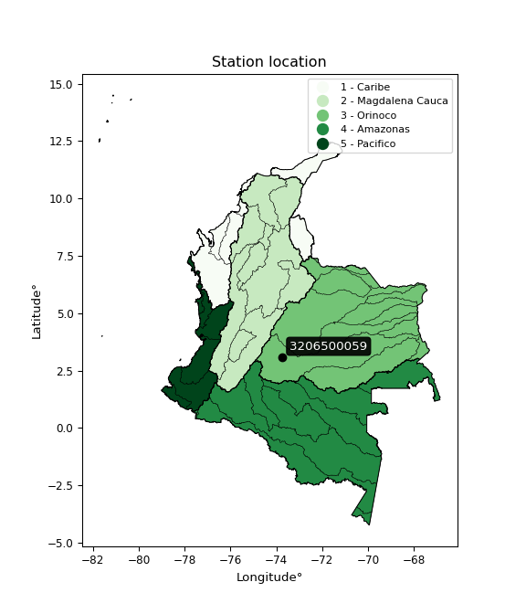

<div align="center">


</div>

# PMP Station (Rain, Pmax24h): 3206500059

Probable Maximum Precipitation (PMP) is the greatest amount of rainfall for a specific duration that is meteorologically possible for a given location, acting as a "worst-case" scenario for extreme storms, crucial for designing safety-critical infrastructure like bridges, river deviations, dams, spillways, and nuclear plants to prevent catastrophic failure. PMP is calculated by hydrologists using meteorological data to determine the upper limit of extreme rainfall, often leading to the Probable Maximum Flood (PMF) for flood control design, and is increasingly being studied for climate change impacts. Probable Maximum Precipitation (PMP) is the theoretical upper limit of rainfall, a deterministic estimate for extreme events, while probability distributions (like GEV, Gumbel) describe the likelihood and frequency of various precipitation amounts, including rare ones, showing how often events occur, with PMP representing the extreme end of these distributions, used for critical infrastructure design to ensure safety against the worst conceivable weather, unlike standard statistical forecasts which cover typical probabilities.

The most common probability distributions in hydrology, used for analyzing floods, rainfall, and streamflow, include the Normal, Log-Normal, Gumbel, Gamma (including Log-Pearson Type III), and Generalized Extreme Value (GEV) distributions, often chosen based on the data´s skewness and whether modeling extremes or general conditions, with Gumbel and GEV popular for extreme events like floods, while the Normal distribution serves as a baseline, though often requiring transformations for skewed hydrological data. These distributions help in designing water infrastructure, managing water resources, and forecasting hydrologic events.

> Hydrological data often isn´t perfectly normal (it´s skewed), so different distributions are needed for different applications, such as: **Flood Frequency Analysis**: Using Gumbel, GEV, or Log-Pearson Type III for predicting extreme flood magnitudes and their return periods, **Rainfall Analysis**: Normal for annual totals, but Log-Normal, Weibull, or GEV for intensity or extreme daily rainfall, **Streamflow Modeling**: Gamma and Log-Normal for maximum flows, GEV for minimum flows, and Kappa for daily flows.

<div align="center">

</img>

</div>


## A. General information


### 1. General running parameters

• app_version: _v20260113_. • runtime: _2026-01-17 18:24:04.630693_. • Python version: _3.14.0_. • SciPy version: _1.16.3_. • Pandas version: _2.3.3_. • NumPy version: _2.3.5_. • Stations dataset (station_dataset_file): _dataset/pmax24h_in/automatic_colombia_2003_2025.csv_. • Stations catalog (station_catalog_file): _dataset/CNE.xls_. • Minimum year to eval til year_max (date_min): _1900_. • Maximum year to eval since year_min (date_max): _2025_. • Creates, save and include plots into reports (create_plot): _False_. • Plot only fit distributions with Δo > Δ (plot_only_fit): _True_. • Plot only simple graphs avoiding multiple CDFs and multiple Extreme values plots (plot_only_simple): _True_. • Eval low extreme values, if False, evaluates high extreme values (low_extreme): _False_. • Eval every SciPy distribution as logarithmic (pdist_logarithmic_on): _True_. • Standard deviation normalized (ddof): _1.0_. • Return periods to eval in years (Tr): _[2, 2.33, 5, 10, 15, 20, 25, 50, 75, 100, 200, 250, 500, 750, 1000]_. • Minimum data sample per station, 0 means any (minimum_sample): _5_. • Z-Score maximum threshold to adjust a value, 0 means disable (zscore_max): _3.5_. • Z-Score minimum threshold to adjust a value, 0 means disable (zscore_min): _-2.5_. • Avoid zeros, e.g. rain = 0 (avoid_zeros): _True_. • Avoid null values (avoid_nans): _True_. 

:file_folder:Table: [dataset.csv](../../dataset/pmax24h_in/automatic_colombia_2003_2025.csv)

> Delta Degrees of Freedom (DDOF): is a parameter used in the formulas for calculating variance and standard deviation. When ddof=0, the divisor is $N$ (the total number of observations) and this is used when your data set is the entire population. When ddof=1, the divisor is $N-1$ and this is used when your data set is a sample drawn from a larger population. Using $N-1$ provides an unbiased estimate of the population variance (known as Bessel´s correction).


### 2. Station info and location

|   id |     CODIGO | NOMBRE                           | CATEGORIA               | TECNOLOGIA                | ESTADO           | FECHA_INSTALACION   |   FECHA_SUSPENSION |   ALTITUD |   LATITUD |   LONGITUD | DEPARTAMENTO   | MUNICIPIO    | AREA_OPERATIVA                            | ENTIDAD                                                     | AREA_HIDROGRAFICA   | ZONA_HIDROGRAFICA   | SUBZONA_HIDROGRAFICA   |   CORRIENTE | Catalogo   |   Version |
|-----:|-----------:|:---------------------------------|:------------------------|:--------------------------|:-----------------|:--------------------|-------------------:|----------:|----------:|-----------:|:---------------|:-------------|:------------------------------------------|:------------------------------------------------------------|:--------------------|:--------------------|:-----------------------|------------:|:-----------|----------:|
|    0 | 3206500059 | VISTA HERMOSA - AUT [3206500059] | Climatológica Principal | Automática con Telemetría | En Mantenimiento | 24/03/2018          |                nan |       292 |   3.09993 |   -73.7338 | Meta           | Vistahermosa | Area Operativa 03 - Meta-Guaviare-Guainía | INSTITUTO DE HIDROLOGIA METEOROLOGIA Y ESTUDIOS AMBIENTALES | Orinoco             | Guaviare            | Río Ariari             |         nan | CNE_IDEAM  |  20251226 |

<div align="center">

Dynamic map: [:earth_americas:Google](http://maps.google.com/maps?q=3.09993,-73.73376) [:earth_americas:OSM](https://www.openstreetmap.org/#map=18/3.09993/-73.73376&layers=P) [:earth_americas:Bing](https://www.bing.com/maps?cp=3.09993~-73.73376&lvl=18) [:earth_americas:Apple](https://maps.apple.com/frame?center=3.09993%2C-73.73376&span=0.003%2C0.006)

</div>


<div align="center">

```geojson
{
  "type": "Feature",
  "geometry": {
    "type": "Point", 
    "coordinates": [-73.73376, 3.09993]
  }, 
  "properties": {
    "Name": "3206500059"
  }
}
```

</div>


### 3. Discrete values table and plot

<div align="center">

|               |          0 |           1 |           2 |            3 |           4 |
|:--------------|-----------:|------------:|------------:|-------------:|------------:|
| Date          | 2019       | 2022        | 2023        | 2024         | 2025        |
| Value         |  100.2     |   14.5      |    0.7      |   30.4       |   17        |
| Value_initial |  100.2     |   14.5      |    0.7      |   30.4       |   17        |
| count         |    5       |    5        |    5        |    5         |    5        |
| mean          |   32.56    |   32.56     |   32.56     |   32.56      |   32.56     |
| std           |   39.2529  |   39.2529   |   39.2529   |   39.2529    |   39.2529   |
| zscore        |    1.72318 |   -0.460093 |   -0.811659 |   -0.0550277 |   -0.396403 |


</div>


> The initial value (value_initial) correspond to the initial obtained or null completed value, and value (value) is adjusted only when the initial value is outside the valid range (outlier) definite through the Z-Score value. If Z-Score is active, values out of range or outliers are replaced with the station mean value. A Z-Score (or standard score) measures how many standard deviations a data point is from the mean of a dataset, indicating its relative position; positive scores mean above the mean, negative mean below, and a score of zero is exactly at the mean, allowing for comparison of values from different distributions. It´s calculated using the formula $z=(x–μ)/σ$, where $x$ is the data point, $μ$ is the mean, and $σ$ is the standard deviation, helping identify outliers and understand probability.
>
> <sub>**Note**: In this study, "completing" (filling gaps in) and "extending" (forecasting or lengthening the historical record) rainfall data series are avoided for certain critical analyses because they introduce artificial bias and uncertainty, which can distort the statistics of rare events (extremes), alter day-to-day variability, and compromise the integrity and homogeneity of the original data. Some reasons against Completing/Extending rainfall data are: **Distortion of Extremes and Variability**: The primary issue is that most gap-filling or extension methods rely on averaging or regression with nearby stations, which inherently smooths the data. Rainfall is highly variable in space and time, with a large percentage of zero values and occasional large storms. Infilling methods often underestimate the highest values and overestimate the lowest (zero) values, which severely distorts analyses focused on flood frequency, drought severity, and intensity-duration-frequency (IDF) curves, **Loss of Data Homogeneity**: Infilled or extended data are synthetic estimates, not actual measurements. Combining these estimates with observed data can violate the assumption of data homogeneity, which requires that the data properties do not change over time. Inhomogeneity can lead to incorrect conclusions about long-term trends or changes in climate patterns, **Propagation of Errors**: Errors and biases from the original data (e.g., wind-induced undercatch, instrument errors, site changes) or the data used for imputation can propagate through the analysis, leading to unreliable hydrological models and inaccurate predictions, **Compromised Statistical Integrity**: For statistical analyses, especially those involving the frequency of events, using artificial data can introduce time bias or autocorrelation that doesn´t exist in reality, making it difficult to assess the true probability of events, **Difficulty in Validation**: It is difficult to accurately validate the quality of filled or extended data, especially for past periods where ground-truth measurements are unavailable. The reliability of imputation techniques heavily depends on the density of the surrounding station network and the complexity of the local topography.</sub>


### 4. Active continuous probability distributions from SciPy (80 of 104 available)

A Probability Density Function (PDF) describes the relative likelihood of a continuous random variable falling within a specific range, where the total area under its curve equals 1, and the area over any interval gives the actual probability for that range. Unlike discrete probabilities (like rolling a die), a PDF shows density, not direct probability for a single point (which is zero), with higher points indicating higher likelihood, often visualized as a bell curve for normal distributions.

A log of a probability density function (log-PDF) is simply the logarithm of the PDF´s value, denoted as $log(f(x))$, useful for converting multiplication of probabilities into addition, improving numerical stability with tiny numbers, and connecting to information theory concepts like entropy. Instead of dealing with very small probabilities (e.g., 0.000001), log-PDFs use negative numbers (e.g., $log(0.00001) ≈ -11.51$ that are easier for computers to handle, preventing underflow errors and simplifying complex calculations. In this study, each active probability distribution from SciPy is also evaluated in the $log$ form.

[scipy.stats](https://docs.scipy.org/doc/scipy/reference/stats.html) is a Python´s powerful submodule within the SciPy library for comprehensive statistical analysis, offering over 130 probability distributions (like Normal, Poisson), functions for descriptive stats (mean, variance), hypothesis testing (t-tests, chi-square), random variable generation, and statistical tests, making it essential for data science, modeling, and research. It provides tools to explore, model, and draw conclusions from data efficiently, working seamlessly with NumPy.

<div align="center">

|   id | p_dist           |   n_parameter | fit_method   | label                                                                       | active   | ref                                                                                                      |
|-----:|:-----------------|--------------:|:-------------|:----------------------------------------------------------------------------|:---------|:---------------------------------------------------------------------------------------------------------|
|    0 | alpha            |             3 | MLE          | Alpha                                                                       | True     | [:mortar_board:](https://docs.scipy.org/doc/scipy/reference/generated/scipy.stats.alpha.html)            |
|    1 | anglit           |             2 | MM           | Anglit                                                                      | True     | [:mortar_board:](https://docs.scipy.org/doc/scipy/reference/generated/scipy.stats.anglit.html)           |
|    2 | arcsine          |             2 | MM           | Arcsine                                                                     | True     | [:mortar_board:](https://docs.scipy.org/doc/scipy/reference/generated/scipy.stats.arcsine.html)          |
|    3 | argus            |             3 | MLE          | Argus                                                                       | True     | [:mortar_board:](https://docs.scipy.org/doc/scipy/reference/generated/scipy.stats.argus.html)            |
|    4 | beta             |             4 | MLE          | Beta                                                                        | True     | [:mortar_board:](https://docs.scipy.org/doc/scipy/reference/generated/scipy.stats.beta.html)             |
|    5 | betaprime        |             4 | MLE          | Beta prime                                                                  | True     | [:mortar_board:](https://docs.scipy.org/doc/scipy/reference/generated/scipy.stats.betaprime.html)        |
|    6 | bradford         |             3 | MLE          | Bradford                                                                    | True     | [:mortar_board:](https://docs.scipy.org/doc/scipy/reference/generated/scipy.stats.bradford.html)         |
|    7 | burr             |             4 | MLE          | Burr (Type III)                                                             | True     | [:mortar_board:](https://docs.scipy.org/doc/scipy/reference/generated/scipy.stats.burr.html)             |
|    8 | burr12           |             4 | MLE          | Burr (Type III) 12                                                          | True     | [:mortar_board:](https://docs.scipy.org/doc/scipy/reference/generated/scipy.stats.burr12.html)           |
|    9 | cosine           |             2 | MLE          | Cosine                                                                      | True     | [:mortar_board:](https://docs.scipy.org/doc/scipy/reference/generated/scipy.stats.cosine.html)           |
|   10 | crystalball      |             4 | MLE          | Crystalball                                                                 | True     | [:mortar_board:](https://docs.scipy.org/doc/scipy/reference/generated/scipy.stats.crystalball.html)      |
|   11 | dgamma           |             3 | MLE          | Double gamma                                                                | True     | [:mortar_board:](https://docs.scipy.org/doc/scipy/reference/generated/scipy.stats.dgamma.html)           |
|   12 | dweibull         |             3 | MLE          | Double Weibull                                                              | True     | [:mortar_board:](https://docs.scipy.org/doc/scipy/reference/generated/scipy.stats.dweibull.html)         |
|   13 | erlang           |             3 | MLE          | Erlang                                                                      | True     | [:mortar_board:](https://docs.scipy.org/doc/scipy/reference/generated/scipy.stats.erlang.html)           |
|   14 | exponnorm        |             3 | MLE          | Exponentially modified Normal                                               | True     | [:mortar_board:](https://docs.scipy.org/doc/scipy/reference/generated/scipy.stats.exponnorm.html)        |
|   15 | exponpow         |             3 | MLE          | Exponential power                                                           | True     | [:mortar_board:](https://docs.scipy.org/doc/scipy/reference/generated/scipy.stats.exponpow.html)         |
|   16 | exponweib        |             4 | MLE          | Exponentiated Weibull                                                       | True     | [:mortar_board:](https://docs.scipy.org/doc/scipy/reference/generated/scipy.stats.exponweib.html)        |
|   17 | f                |             4 | MLE          | F                                                                           | True     | [:mortar_board:](https://docs.scipy.org/doc/scipy/reference/generated/scipy.stats.f.html)                |
|   18 | fatiguelife      |             3 | MLE          | Fatigue-life (Birnbaum-Saunders)                                            | True     | [:mortar_board:](https://docs.scipy.org/doc/scipy/reference/generated/scipy.stats.fatiguelife.html)      |
|   19 | foldnorm         |             3 | MM           | Fold Normal                                                                 | True     | [:mortar_board:](https://docs.scipy.org/doc/scipy/reference/generated/scipy.stats.foldnorm.html)         |
|   20 | gamma            |             3 | MLE          | Gamma                                                                       | True     | [:mortar_board:](https://docs.scipy.org/doc/scipy/reference/generated/scipy.stats.gamma.html)            |
|   21 | gausshyper       |             6 | MLE          | Gauss hypergeometric                                                        | True     | [:mortar_board:](https://docs.scipy.org/doc/scipy/reference/generated/scipy.stats.gausshyper.html)       |
|   22 | genexpon         |             5 | MLE          | Generalized exponential                                                     | True     | [:mortar_board:](https://docs.scipy.org/doc/scipy/reference/generated/scipy.stats.genexpon.html)         |
|   23 | genextreme       |             3 | MLE          | Generalized exponential                                                     | True     | [:mortar_board:](https://docs.scipy.org/doc/scipy/reference/generated/scipy.stats.genextreme.html)       |
|   24 | gengamma         |             4 | MLE          | Generalized gamma                                                           | True     | [:mortar_board:](https://docs.scipy.org/doc/scipy/reference/generated/scipy.stats.gengamma.html)         |
|   25 | genhalflogistic  |             3 | MLE          | Generalized half-logistic                                                   | True     | [:mortar_board:](https://docs.scipy.org/doc/scipy/reference/generated/scipy.stats.genhalflogistic.html)  |
|   26 | genlogistic      |             3 | MLE          | Generalized logistic                                                        | True     | [:mortar_board:](https://docs.scipy.org/doc/scipy/reference/generated/scipy.stats.genlogistic.html)      |
|   27 | gennorm          |             3 | MLE          | Generalized Normal                                                          | True     | [:mortar_board:](https://docs.scipy.org/doc/scipy/reference/generated/scipy.stats.gennorm.html)          |
|   28 | genpareto        |             3 | MLE          | Generalized Pareto                                                          | True     | [:mortar_board:](https://docs.scipy.org/doc/scipy/reference/generated/scipy.stats.genpareto.html)        |
|   29 | gompertz         |             3 | MLE          | Gompertz (or truncated Gumbel)                                              | True     | [:mortar_board:](https://docs.scipy.org/doc/scipy/reference/generated/scipy.stats.gompertz.html)         |
|   30 | gumbel_l         |             2 | MM           | Gumbel Left Skew                                                            | True     | [:mortar_board:](https://docs.scipy.org/doc/scipy/reference/generated/scipy.stats.gumbel_l.html)         |
|   31 | gumbel_r         |             2 | MM           | Gumbel Right Skew                                                           | True     | [:mortar_board:](https://docs.scipy.org/doc/scipy/reference/generated/scipy.stats.gumbel_r.html)         |
|   32 | halfgennorm      |             3 | MLE          | Upper half of a generalized normal                                          | True     | [:mortar_board:](https://docs.scipy.org/doc/scipy/reference/generated/scipy.stats.halfgennorm.html)      |
|   33 | halflogistic     |             2 | MM           | Half-logistic                                                               | True     | [:mortar_board:](https://docs.scipy.org/doc/scipy/reference/generated/scipy.stats.halflogistic.html)     |
|   34 | halfnorm         |             2 | MM           | Half Normal                                                                 | True     | [:mortar_board:](https://docs.scipy.org/doc/scipy/reference/generated/scipy.stats.halfnorm.html)         |
|   35 | hypsecant        |             2 | MM           | hyperbolic secant                                                           | True     | [:mortar_board:](https://docs.scipy.org/doc/scipy/reference/generated/scipy.stats.hypsecant.html)        |
|   36 | invgamma         |             3 | MLE          | Inverted gamma                                                              | True     | [:mortar_board:](https://docs.scipy.org/doc/scipy/reference/generated/scipy.stats.invgamma.html)         |
|   37 | invgauss         |             3 | MLE          | Inverse Gaussian                                                            | True     | [:mortar_board:](https://docs.scipy.org/doc/scipy/reference/generated/scipy.stats.invgauss.html)         |
|   38 | invweibull       |             3 | MLE          | Inverted Weibull                                                            | True     | [:mortar_board:](https://docs.scipy.org/doc/scipy/reference/generated/scipy.stats.invweibull.html)       |
|   39 | johnsonsb        |             4 | MLE          | Johnson SB                                                                  | True     | [:mortar_board:](https://docs.scipy.org/doc/scipy/reference/generated/scipy.stats.johnsonsb.html)        |
|   40 | johnsonsu        |             4 | MLE          | Johnson Su                                                                  | True     | [:mortar_board:](https://docs.scipy.org/doc/scipy/reference/generated/scipy.stats.johnsonsu.html)        |
|   41 | kappa3           |             3 | MLE          | Kappa 3                                                                     | True     | [:mortar_board:](https://docs.scipy.org/doc/scipy/reference/generated/scipy.stats.kappa3.html)           |
|   42 | kappa4           |             4 | MLE          | Kappa 4                                                                     | True     | [:mortar_board:](https://docs.scipy.org/doc/scipy/reference/generated/scipy.stats.kappa4.html)           |
|   43 | ksone            |             3 | MLE          | Kolmogorov-Smirnov one-sided test statistic distribution                    | True     | [:mortar_board:](https://docs.scipy.org/doc/scipy/reference/generated/scipy.stats.ksone.html)            |
|   44 | kstwobign        |             2 | MLE          | Limiting distribution of scaled Kolmogorov-Smirnov two-sided test statistic | True     | [:mortar_board:](https://docs.scipy.org/doc/scipy/reference/generated/scipy.stats.kstwobign.html)        |
|   45 | laplace          |             2 | MM           | Laplace                                                                     | True     | [:mortar_board:](https://docs.scipy.org/doc/scipy/reference/generated/scipy.stats.laplace.html)          |
|   46 | levy_l           |             2 | MLE          | Left-skewed Levy                                                            | True     | [:mortar_board:](https://docs.scipy.org/doc/scipy/reference/generated/scipy.stats.levy_l.html)           |
|   47 | loggamma         |             3 | MLE          | Log gamma                                                                   | True     | [:mortar_board:](https://docs.scipy.org/doc/scipy/reference/generated/scipy.stats.loggamma.html)         |
|   48 | logistic         |             2 | MM           | Logistic (or Sech-squared)                                                  | True     | [:mortar_board:](https://docs.scipy.org/doc/scipy/reference/generated/scipy.stats.logistic.html)         |
|   49 | loglaplace       |             3 | MLE          | Log-Laplace                                                                 | True     | [:mortar_board:](https://docs.scipy.org/doc/scipy/reference/generated/scipy.stats.loglaplace.html)       |
|   50 | lomax            |             3 | MLE          | Lomax (Pareto of the second kind)                                           | True     | [:mortar_board:](https://docs.scipy.org/doc/scipy/reference/generated/scipy.stats.lomax.html)            |
|   51 | maxwell          |             2 | MM           | Maxwell                                                                     | True     | [:mortar_board:](https://docs.scipy.org/doc/scipy/reference/generated/scipy.stats.maxwell.html)          |
|   52 | mielke           |             4 | MLE          | Mielke Beta-Kappa / Dagum                                                   | True     | [:mortar_board:](https://docs.scipy.org/doc/scipy/reference/generated/scipy.stats.mielke.html)           |
|   53 | moyal            |             2 | MM           | Moyal                                                                       | True     | [:mortar_board:](https://docs.scipy.org/doc/scipy/reference/generated/scipy.stats.moyal.html)            |
|   54 | nakagami         |             3 | MLE          | Nakagami                                                                    | True     | [:mortar_board:](https://docs.scipy.org/doc/scipy/reference/generated/scipy.stats.nakagami.html)         |
|   55 | ncf              |             5 | MLE          | Non-central F distribution                                                  | True     | [:mortar_board:](https://docs.scipy.org/doc/scipy/reference/generated/scipy.stats.ncf.html)              |
|   56 | nct              |             4 | MLE          | Non-central Student’s t                                                     | True     | [:mortar_board:](https://docs.scipy.org/doc/scipy/reference/generated/scipy.stats.nct.html)              |
|   57 | norm             |             2 | MM           | Normal                                                                      | True     | [:mortar_board:](https://docs.scipy.org/doc/scipy/reference/generated/scipy.stats.norm.html)             |
|   58 | pearson3         |             3 | MM           | Pearson type III                                                            | True     | [:mortar_board:](https://docs.scipy.org/doc/scipy/reference/generated/scipy.stats.pearson3.html)         |
|   59 | powerlaw         |             3 | MLE          | Power-function                                                              | True     | [:mortar_board:](https://docs.scipy.org/doc/scipy/reference/generated/scipy.stats.powerlaw.html)         |
|   60 | rayleigh         |             2 | MM           | Rayleigh                                                                    | True     | [:mortar_board:](https://docs.scipy.org/doc/scipy/reference/generated/scipy.stats.rayleigh.html)         |
|   61 | rdist            |             3 | MLE          | R-distributed (symmetric beta)                                              | True     | [:mortar_board:](https://docs.scipy.org/doc/scipy/reference/generated/scipy.stats.rdist.html)            |
|   62 | rice             |             3 | MLE          | Rice                                                                        | True     | [:mortar_board:](https://docs.scipy.org/doc/scipy/reference/generated/scipy.stats.rice.html)             |
|   63 | semicircular     |             2 | MM           | Semicircular                                                                | True     | [:mortar_board:](https://docs.scipy.org/doc/scipy/reference/generated/scipy.stats.semicircular.html)     |
|   64 | skewnorm         |             3 | MLE          | Skew normal                                                                 | True     | [:mortar_board:](https://docs.scipy.org/doc/scipy/reference/generated/scipy.stats.skewnorm.html)         |
|   65 | t                |             3 | MLE          | Student’s t                                                                 | True     | [:mortar_board:](https://docs.scipy.org/doc/scipy/reference/generated/scipy.stats.t.html)                |
|   66 | trapezoid        |             4 | MLE          | Trapezoid                                                                   | True     | [:mortar_board:](https://docs.scipy.org/doc/scipy/reference/generated/scipy.stats.trapezoid.html)        |
|   67 | triang           |             3 | MLE          | Triangular                                                                  | True     | [:mortar_board:](https://docs.scipy.org/doc/scipy/reference/generated/scipy.stats.triang.html)           |
|   68 | truncexpon       |             3 | MLE          | Truncated exponential                                                       | True     | [:mortar_board:](https://docs.scipy.org/doc/scipy/reference/generated/scipy.stats.truncexpon.html)       |
|   69 | truncnorm        |             4 | MLE          | Truncated normal                                                            | True     | [:mortar_board:](https://docs.scipy.org/doc/scipy/reference/generated/scipy.stats.truncnorm.html)        |
|   70 | truncpareto      |             4 | MLE          | Upper truncated Pareto                                                      | True     | [:mortar_board:](https://docs.scipy.org/doc/scipy/reference/generated/scipy.stats.truncpareto.html)      |
|   71 | truncweibull_min |             5 | MLE          | Doubly truncated Weibull minimum                                            | True     | [:mortar_board:](https://docs.scipy.org/doc/scipy/reference/generated/scipy.stats.truncweibull_min.html) |
|   72 | tukeylambda      |             3 | MLE          | Tukey-Lamdba                                                                | True     | [:mortar_board:](https://docs.scipy.org/doc/scipy/reference/generated/scipy.stats.tukeylambda.html)      |
|   73 | uniform          |             2 | MLE          | Uniform                                                                     | True     | [:mortar_board:](https://docs.scipy.org/doc/scipy/reference/generated/scipy.stats.uniform.html)          |
|   74 | vonmises         |             3 | MLE          | Von Mises                                                                   | True     | [:mortar_board:](https://docs.scipy.org/doc/scipy/reference/generated/scipy.stats.vonmises.html)         |
|   75 | vonmises_line    |             3 | MLE          | Von Mises line                                                              | True     | [:mortar_board:](https://docs.scipy.org/doc/scipy/reference/generated/scipy.stats.vonmises_line.html)    |
|   76 | wald             |             2 | MM           | Wald                                                                        | True     | [:mortar_board:](https://docs.scipy.org/doc/scipy/reference/generated/scipy.stats.wald.html)             |
|   77 | weibull_max      |             3 | MLE          | Weibull maximum                                                             | True     | [:mortar_board:](https://docs.scipy.org/doc/scipy/reference/generated/scipy.stats.weibull_max.html)      |
|   78 | weibull_min      |             3 | MLE          | Weibull minimum                                                             | True     | [:mortar_board:](https://docs.scipy.org/doc/scipy/reference/generated/scipy.stats.weibull_min.html)      |
|   79 | wrapcauchy       |             3 | MLE          | Wrapped  Cauchy                                                             | True     | [:mortar_board:](https://docs.scipy.org/doc/scipy/reference/generated/scipy.stats.wrapcauchy.html)       |

</div>

> **n_parameter:** # arguments & localization & scale.
>
> **Fit methods:** (MLE) maximum likelihood, (MM) L-moments.
>
>**Inactive** (With the only purpose of prevent loops, zero divisions, infinite values, over high estimated values or horizontal trending for recurrence intervals estimations, the follow distributions were disabled.)**:** lognorm, norminvgauss, powernorm, powerlognorm, cauchy, halfcauchy, foldcauchy, skewcauchy, chi2, expon, fisk, genhyperbolic, geninvgauss, gibrat, kstwo, laplace_asymmetric, levy, levy_stable, ncx2, pareto, rel_breitwigner, recipinvgauss, studentized_range, loguniform, 


## B. Probability (PDF) vs. Empirical (EDF) distributions functions

A continuous probability distribution (CPD) describes probabilities for variables that can take any value within a range (like rain any time), unlike discrete variables with specific outcomes (like temperature). It uses a Probability Density Function (PDF), a curve where the total area under it equals 1, and the probability of the variable falling within an interval (a to b) is found by calculating the area under the curve between those points. A key feature is that the probability of hitting any single exact value is zero, so probabilities are always expressed for ranges, e.g., $P(a ≤ X ≤ b)$.

<div align="center">

Distributions parameters from station values
|     |    station | p_dist              |   n |              loc |            scale | shape                  | shape1                 | shape2                | shape3             |
|----:|-----------:|:--------------------|----:|-----------------:|-----------------:|:-----------------------|:-----------------------|:----------------------|:-------------------|
|   0 | 3206500059 | alpha               |   5 |      0.00130549  |      1.56091     | 4.645548815053826e-09  |                        |                       |                    |
|   1 | 3206500059 | anglit              |   5 |     32.56        |    102.708       |                        |                        |                       |                    |
|   2 | 3206500059 | arcsine             |   5 |    -17.0915      |     99.3029      |                        |                        |                       |                    |
|   3 | 3206500059 | argus               |   5 |    -43.7195      |    151.518       | 5.2174067368502696e-08 |                        |                       |                    |
|   4 | 3206500059 | beta                |   5 |     -9.01546     |    109.215       | 0.12886434985094275    | 0.3671911387458109     |                       |                    |
|   5 | 3206500059 | betaprime           |   5 |      0.7         |    300.252       | 0.48219688999581034    | 7.500732170441724      |                       |                    |
|   6 | 3206500059 | bradford            |   5 |      0.652965    |     99.5471      | 1.2205443934781925     |                        |                       |                    |
|   7 | 3206500059 | burr                |   5 |      0.7         |     75.5224      | 4.843391972709604      | 0.06920196078222363    |                       |                    |
|   8 | 3206500059 | burr12              |   5 |      0.7         |    450.289       | 0.9033276120172273     | 15.791291527588854     |                       |                    |
|   9 | 3206500059 | cosine              |   5 |     38.5003      |     29.9475      |                        |                        |                       |                    |
|  10 | 3206500059 | crystalball         |   5 |     32.56        |     35.1089      | 1424.031859036921      | 4005.0140351612245     |                       |                    |
|  11 | 3206500059 | dgamma              |   5 |     14.5         |     40.1886      | 0.4452062683636768     |                        |                       |                    |
|  12 | 3206500059 | dweibull            |   5 |     14.5         |     34.008       | 0.9176316744326409     |                        |                       |                    |
|  13 | 3206500059 | erlang              |   5 |      0.7         |     35.5767      | 0.31928131115047476    |                        |                       |                    |
|  14 | 3206500059 | exponnorm           |   5 |      0.679122    |      0.00601305  | 5263.00091533396       |                        |                       |                    |
|  15 | 3206500059 | exponpow            |   5 |      0.7         |     56.8385      | 0.8329084081637532     |                        |                       |                    |
|  16 | 3206500059 | exponweib           |   5 |      0.7         |      9.23806     | 1.977288253602548      | 0.14487844777865433    |                       |                    |
|  17 | 3206500059 | f                   |   5 |      0.7         |     59.1276      | 0.9846182833898083     | 50.212850695577686     |                       |                    |
|  18 | 3206500059 | fatiguelife         |   5 |      0.7         |      5.41674e-06 | 3388.7204323440856     |                        |                       |                    |
|  19 | 3206500059 | foldnorm            |   5 |    -15.2027      |     59.637       | 0.008814026161147405   |                        |                       |                    |
|  20 | 3206500059 | gamma               |   5 |      0.7         |     27.5753      | 0.2718128112744499     |                        |                       |                    |
|  21 | 3206500059 | gausshyper          |   5 |    -20.2607      |    120.461       | 1.2102553573741668     | 0.7608768270994295     | 1.2503292801891812    | 0.8967549473149334 |
|  22 | 3206500059 | genexpon            |   5 |      0.7         |     49.0807      | 1.5405156109077427     | 2.5245706962173067e-10 | 2.151891744271924     |                    |
|  23 | 3206500059 | genextreme          |   5 |     12.749       |     15.0507      | -0.5441714257462608    |                        |                       |                    |
|  24 | 3206500059 | gengamma            |   5 |      0.7         |     30.4742      | 0.8123281065129018     | 0.896202720786228      |                       |                    |
|  25 | 3206500059 | genhalflogistic     |   5 |     -9.54171     |    114.894       | 1.0469535972110455     |                        |                       |                    |
|  26 | 3206500059 | genlogistic         |   5 |   -144.065       |     21.5232      | 1845.1877744423646     |                        |                       |                    |
|  27 | 3206500059 | gennorm             |   5 |     14.5         |      0.788241    | 0.37866797748772385    |                        |                       |                    |
|  28 | 3206500059 | genpareto           |   5 |      0.7         |     25.0625      | 0.22829313951981195    |                        |                       |                    |
|  29 | 3206500059 | gompertz            |   5 |      0.699972    | 986853           | 31040.113782891596     |                        |                       |                    |
|  30 | 3206500059 | gumbel_l            |   5 |     48.3609      |     27.3743      |                        |                        |                       |                    |
|  31 | 3206500059 | gumbel_r            |   5 |     16.7591      |     27.3743      |                        |                        |                       |                    |
|  32 | 3206500059 | halfgennorm         |   5 |      0.7         |      0.268292    | 0.3029737639117498     |                        |                       |                    |
|  33 | 3206500059 | halflogistic        |   5 |     -9.0522      |     30.0169      |                        |                        |                       |                    |
|  34 | 3206500059 | halfnorm            |   5 |    -13.9104      |     58.242       |                        |                        |                       |                    |
|  35 | 3206500059 | hypsecant           |   5 |     32.56        |     22.351       |                        |                        |                       |                    |
|  36 | 3206500059 | invgamma            |   5 |     -9.98255     |     50.5035      | 2.074238474230831      |                        |                       |                    |
|  37 | 3206500059 | invgauss            |   5 |     -4.94905     |     28.0118      | 1.3390426822284591     |                        |                       |                    |
|  38 | 3206500059 | invweibull          |   5 |      0.7         |      1.23919     | 0.05264195827020385    |                        |                       |                    |
|  39 | 3206500059 | johnsonsb           |   5 |      0.7         |    197.973       | 1.3070511590366956     | 0.15904855920804553    |                       |                    |
|  40 | 3206500059 | johnsonsu           |   5 |     -0.91004     |      0.0428475   | -4.94529261772289      | 0.7409843497802966     |                       |                    |
|  41 | 3206500059 | kappa3              |   5 |      0.7         |     22.07        | 1.71411809556147       |                        |                       |                    |
|  42 | 3206500059 | kappa4              |   5 |     -8.70734     |    112.503       | 1.091358913799555      | 1.025734411069374      |                       |                    |
|  43 | 3206500059 | ksone               |   5 |     -9.25        |    119.4         | 1.0                    |                        |                       |                    |
|  44 | 3206500059 | kstwobign           |   5 |    -62.2518      |    110.048       |                        |                        |                       |                    |
|  45 | 3206500059 | laplace             |   5 |     32.56        |     24.8257      |                        |                        |                       |                    |
|  46 | 3206500059 | levy_l              |   5 |    107.108       |     26.4435      |                        |                        |                       |                    |
|  47 | 3206500059 | loggamma            |   5 | -16207.5         |   2012.69        | 3193.8135801742737     |                        |                       |                    |
|  48 | 3206500059 | logistic            |   5 |     32.56        |     19.3565      |                        |                        |                       |                    |
|  49 | 3206500059 | loglaplace          |   5 |     -0.0443843   |     17.0444      | 0.8827421404612101     |                        |                       |                    |
|  50 | 3206500059 | lomax               |   5 |      0.7         |    109.787       | 4.380491636736263      |                        |                       |                    |
|  51 | 3206500059 | maxwell             |   5 |    -50.6333      |     52.1337      |                        |                        |                       |                    |
|  52 | 3206500059 | mielke              |   5 |      0.7         |     42.8756      | 0.44732915944724305    | 2.1076734352506845     |                       |                    |
|  53 | 3206500059 | moyal               |   5 |     12.4825      |     15.8046      |                        |                        |                       |                    |
|  54 | 3206500059 | nakagami            |   5 |      0.7         |     63.0081      | 0.1597324065754857     |                        |                       |                    |
|  55 | 3206500059 | ncf                 |   5 |      0.7         |     11.8122      | 1.209557425343112      | 776.7951631256319      | 1.4211649554767136    |                    |
|  56 | 3206500059 | nct                 |   5 |     -0.351395    |      0.0427512   | 0.3930503339177899     | 54.736108517895616     |                       |                    |
|  57 | 3206500059 | norm                |   5 |     32.56        |     35.1089      |                        |                        |                       |                    |
|  58 | 3206500059 | pearson3            |   5 |     32.56        |     35.1089      | 1.2360430685822577     |                        |                       |                    |
|  59 | 3206500059 | powerlaw            |   5 |      0.7         |     99.5         | 0.10792038404056961    |                        |                       |                    |
|  60 | 3206500059 | rayleigh            |   5 |    -34.6054      |     53.5902      |                        |                        |                       |                    |
|  61 | 3206500059 | rdist               |   5 |     -9.24975     |     39.6498      | 1.187567683610701      |                        |                       |                    |
|  62 | 3206500059 | rice                |   5 |    -20.2749      |     44.8562      | 0.0003922549098194302  |                        |                       |                    |
|  63 | 3206500059 | semicircular        |   5 |     32.56        |     70.2178      |                        |                        |                       |                    |
|  64 | 3206500059 | skewnorm            |   5 |      0.699942    |     47.409       | 4139138.4689620025     |                        |                       |                    |
|  65 | 3206500059 | t                   |   5 |     15.9063      |      5.01999     | 0.646627264350319      |                        |                       |                    |
|  66 | 3206500059 | trapezoid           |   5 |     -9.7125      |    119.4         | 1.0                    | 1.0                    |                       |                    |
|  67 | 3206500059 | triang              |   5 |    -50.8371      |    151.507       | 0.9999999999994953     |                        |                       |                    |
|  68 | 3206500059 | truncexpon          |   5 |      0.699928    |     81.0774      | 1.2272248796118839     |                        |                       |                    |
|  69 | 3206500059 | truncnorm           |   5 |    -71.4559      |     67.4284      | 1.0701119805595458     | 169.37219960617546     |                       |                    |
|  70 | 3206500059 | truncpareto         |   5 |      0.305067    |      0.329765    | 0.0007384951307903304  | 302.9271917505355      |                       |                    |
|  71 | 3206500059 | truncweibull_min    |   5 |      0.7         |     72.1153      | 0.8561439435182228     | 1.2419513494357456e-18 | 1.3840402245507712    |                    |
|  72 | 3206500059 | tukeylambda         |   5 |     -8.54897     |     45.9212      | 1.1790100217344845     |                        |                       |                    |
|  73 | 3206500059 | uniform             |   5 |      0.7         |     99.5         |                        |                        |                       |                    |
|  74 | 3206500059 | vonmises            |   5 |     -0.333706    |      1           | 0.7241211178427007     |                        |                       |                    |
|  75 | 3206500059 | vonmises_line       |   5 |     22.5375      |     24.7207      | 1.2156649734432188     |                        |                       |                    |
|  76 | 3206500059 | wald                |   5 |     -2.54889     |     35.1089      |                        |                        |                       |                    |
|  77 | 3206500059 | weibull_max         |   5 |    100.2         |      1.74969     | 0.2624795405349485     |                        |                       |                    |
|  78 | 3206500059 | weibull_min         |   5 |      0.7         |     37.4587      | 0.3887118582893504     |                        |                       |                    |
|  79 | 3206500059 | wrapcauchy          |   5 |      0.699846    |     15.8359      | 0.5636107010532899     |                        |                       |                    |
|  80 | 3206500059 | logalpha            |   5 |    -47.8847      |   1485.22        | 29.449971523618302     |                        |                       |                    |
|  81 | 3206500059 | loganglit           |   5 |      2.63446     |      4.80477     |                        |                        |                       |                    |
|  82 | 3206500059 | logarcsine          |   5 |      0.311683    |      4.64554     |                        |                        |                       |                    |
|  83 | 3206500059 | logargus            |   5 |     -2.03702     |      6.85977     | 1.8431540992331357     |                        |                       |                    |
|  84 | 3206500059 | logbeta             |   5 |     -0.865297    |      5.47247     | 1.3578834576648546     | 0.6043854791469778     |                       |                    |
|  85 | 3206500059 | logbetaprime        |   5 |     -0.356675    |      1.55724     | 0.7531040587146779     | 1.0393437009979283     |                       |                    |
|  86 | 3206500059 | logbradford         |   5 |     -0.356693    |      4.96386     | 0.8993094485029347     |                        |                       |                    |
|  87 | 3206500059 | logburr             |   5 |     -0.356675    |      1.97652     | 1.2633766763952012     | 0.1389482443772102     |                       |                    |
|  88 | 3206500059 | logburr12           |   5 |     -0.356675    |      1.63645     | 0.835720508356881      | 1.0263776276049388     |                       |                    |
|  89 | 3206500059 | logcosine           |   5 |      2.44173     |      1.39269     |                        |                        |                       |                    |
|  90 | 3206500059 | logcrystalball      |   5 |      2.63446     |      1.64243     | 11.847921851693965     | 4.482491126109678      |                       |                    |
|  91 | 3206500059 | logdgamma           |   5 |      2.83321     |      1.32659     | 0.7155964363102244     |                        |                       |                    |
|  92 | 3206500059 | logdweibull         |   5 |      2.83321     |      1.28018     | 0.8040162440179587     |                        |                       |                    |
|  93 | 3206500059 | logerlang           |   5 |    -23.5376      |      0.109726    | 238.4228523502681      |                        |                       |                    |
|  94 | 3206500059 | logexponnorm        |   5 |      2.63343     |      1.64243     | 0.0006250740690737066  |                        |                       |                    |
|  95 | 3206500059 | logexponpow         |   5 |     -0.356675    |      2.1411      | 0.5654113640097287     |                        |                       |                    |
|  96 | 3206500059 | logexponweib        |   5 |     -0.356675    |      1.77213     | 1.6736284295226804     | 0.5162875096123756     |                       |                    |
|  97 | 3206500059 | logf                |   5 |     -0.356675    |      1.07893     | 1.227737752711809      | 1.2748768280961214     |                       |                    |
|  98 | 3206500059 | logfatiguelife      |   5 |   -749.603       |    752.238       | 0.0021810745498783424  |                        |                       |                    |
|  99 | 3206500059 | logfoldnorm         |   5 |     -8.52223     |      1.46282     | 7.657493052860963      |                        |                       |                    |
| 100 | 3206500059 | loggamma            |   5 |    -23.2306      |      0.110702    | 233.42847199319192     |                        |                       |                    |
| 101 | 3206500059 | loggausshyper       |   5 |     -0.932613    |      5.53978     | 1.1839954216884054     | 0.710895053809361      | 1.0787879852008526    | 0.9313580259082845 |
| 102 | 3206500059 | loggenexpon         |   5 |     -0.374377    |      0.0057528   | 0.0008047574819999553  | 0.6965952755106928     | 4.665078443678958e-06 |                    |
| 103 | 3206500059 | loggenextreme       |   5 |      2.67685     |      2.16112     | 1.1195668965493075     |                        |                       |                    |
| 104 | 3206500059 | loggengamma         |   5 |     -0.356675    |      2.34243     | 1.105104375928116      | 0.7635634668817013     |                       |                    |
| 105 | 3206500059 | loggenhalflogistic  |   5 |     -0.97389     |      5.8873      | 1.0548717547313593     |                        |                       |                    |
| 106 | 3206500059 | loggenlogistic      |   5 |      3.97118     |      0.462152    | 0.3036424844972924     |                        |                       |                    |
| 107 | 3206500059 | loggennorm          |   5 |      2.83321     |      0.0636243   | 0.41344363538399       |                        |                       |                    |
| 108 | 3206500059 | loggenpareto        |   5 |     -0.356675    |      2.02919     | -0.15626050332899744   |                        |                       |                    |
| 109 | 3206500059 | loggompertz         |   5 |     -0.356675    |      1.50793     | 0.09868128900950673    |                        |                       |                    |
| 110 | 3206500059 | loggumbel_l         |   5 |      3.37364     |      1.2806      |                        |                        |                       |                    |
| 111 | 3206500059 | loggumbel_r         |   5 |      1.89528     |      1.2806      |                        |                        |                       |                    |
| 112 | 3206500059 | loghalfgennorm      |   5 |     -0.356675    |      1.32809     | 0.657786599207698      |                        |                       |                    |
| 113 | 3206500059 | loghalflogistic     |   5 |      0.687815    |      1.40421     |                        |                        |                       |                    |
| 114 | 3206500059 | loghalfnorm         |   5 |      0.460493    |      2.72465     |                        |                        |                       |                    |
| 115 | 3206500059 | loghypsecant        |   5 |      2.63446     |      1.0456      |                        |                        |                       |                    |
| 116 | 3206500059 | loginvgamma         |   5 |    -27.4728      |   8976.69        | 299.3050921775414      |                        |                       |                    |
| 117 | 3206500059 | loginvgauss         |   5 |    -13.2832      |   1289.08        | 0.012319393404492016   |                        |                       |                    |
| 118 | 3206500059 | loginvweibull       |   5 |     -2.0159e+08  |      2.0159e+08  | 120867679.18526942     |                        |                       |                    |
| 119 | 3206500059 | logjohnsonsb        |   5 |     -0.356675    |      4.97116     | 0.31685070618105415    | 0.09301135011875955    |                       |                    |
| 120 | 3206500059 | logjohnsonsu        |   5 |      5.76789     |      0.0938924   | 7.6119752873100435     | 1.873391648039327      |                       |                    |
| 121 | 3206500059 | logkappa3           |   5 |     -0.356809    |      4.96318     | 1355.3565694553865     |                        |                       |                    |
| 122 | 3206500059 | logkappa4           |   5 |     -0.845525    |      5.64017     | 1.095057909416103      | 1.0343826384185475     |                       |                    |
| 123 | 3206500059 | logksone            |   5 |     -0.853059    |      5.95661     | 1.0                    |                        |                       |                    |
| 124 | 3206500059 | logkstwobign        |   5 |     -4.49886     |      8.13678     |                        |                        |                       |                    |
| 125 | 3206500059 | loglaplace          |   5 |      2.63446     |      1.16137     |                        |                        |                       |                    |
| 126 | 3206500059 | loglevy_l           |   5 |      4.76718     |      0.611368    |                        |                        |                       |                    |
| 127 | 3206500059 | logloggamma         |   5 |      4.25707     |      0.701877    | 0.43710018436061837    |                        |                       |                    |
| 128 | 3206500059 | loglogistic         |   5 |      2.63446     |      0.90552     |                        |                        |                       |                    |
| 129 | 3206500059 | logloglaplace       |   5 |     -0.356675    |      1.92747     | 0.5955632185435482     |                        |                       |                    |
| 130 | 3206500059 | loglomax            |   5 |     -0.356675    |      1.26464e+10 | 4095205676.103956      |                        |                       |                    |
| 131 | 3206500059 | logmaxwell          |   5 |     -1.25742     |      2.43887     |                        |                        |                       |                    |
| 132 | 3206500059 | logmielke           |   5 |     -0.356675    |      1.8604      | 0.4904729800973773     | 0.7751198122075296     |                       |                    |
| 133 | 3206500059 | logmoyal            |   5 |      1.69521     |      0.739354    |                        |                        |                       |                    |
| 134 | 3206500059 | lognakagami         |   5 |     -0.356675    |      4.02926     | 0.38319915503012114    |                        |                       |                    |
| 135 | 3206500059 | logncf              |   5 |     -0.356675    |      1.16781     | 1.2908429638658334     | 1.2028900569151797     | 0.972706819518015     |                    |
| 136 | 3206500059 | lognct              |   5 |     87.0285      |      1.59774     | 26037.927338647125     | -52.81901992395302     |                       |                    |
| 137 | 3206500059 | lognorm             |   5 |      2.63446     |      1.64243     |                        |                        |                       |                    |
| 138 | 3206500059 | logpearson3         |   5 |      2.63445     |      1.64244     | -0.8397258087477228    |                        |                       |                    |
| 139 | 3206500059 | logpowerlaw         |   5 |     -0.356675    |      4.96384     | 0.12424682466134454    |                        |                       |                    |
| 140 | 3206500059 | lograyleigh         |   5 |     -0.507609    |      2.50701     |                        |                        |                       |                    |
| 141 | 3206500059 | logrdist            |   5 |      0.153365    |      2.67985     | 1.054563302551668      |                        |                       |                    |
| 142 | 3206500059 | logrice             |   5 |     -1.52532     |      1.7864      | 2.0658110376459615     |                        |                       |                    |
| 143 | 3206500059 | logsemicircular     |   5 |      2.63446     |      3.28486     |                        |                        |                       |                    |
| 144 | 3206500059 | logskewnorm         |   5 |      4.60717     |      2.56662     | -11247332.133079223    |                        |                       |                    |
| 145 | 3206500059 | logt                |   5 |      2.63446     |      1.64243     | 21518492211.621765     |                        |                       |                    |
| 146 | 3206500059 | logtrapezoid        |   5 |     -2.11159     |      6.96825     | 1.0                    | 1.0                    |                       |                    |
| 147 | 3206500059 | logtriang           |   5 |     -1.64846     |      6.26282     | 0.9988517835706365     |                        |                       |                    |
| 148 | 3206500059 | logtruncexpon       |   5 |     -0.35669     |      6.70329     | 0.7405109655781641     |                        |                       |                    |
| 149 | 3206500059 | logtruncnorm        |   5 |      0.817218    |      4.89162     | -0.2399971428548341    | 0.7747841084690719     |                       |                    |
| 150 | 3206500059 | logtruncpareto      |   5 |     -0.380238    |      0.023563    | 0.0002467105711748235  | 216.75213105948507     |                       |                    |
| 151 | 3206500059 | logtruncweibull_min |   5 |     -0.461129    |      9.3966      | 1.1201106768012574     | 0.000527313514891892   | 0.5393757206485336    |                    |
| 152 | 3206500059 | logtukeylambda      |   5 |      0.150775    |      2.81109     | 1.0479616487414183     |                        |                       |                    |
| 153 | 3206500059 | loguniform          |   5 |     -0.356675    |      4.96384     |                        |                        |                       |                    |
| 154 | 3206500059 | logvonmises         |   5 |     -2.73162     |      1           | 0.9572078275832328     |                        |                       |                    |
| 155 | 3206500059 | logvonmises_line    |   5 |      3.00479     |      1.06999     | 1.0009078592385068     |                        |                       |                    |
| 156 | 3206500059 | logwald             |   5 |      0.992055    |      1.64242     |                        |                        |                       |                    |
| 157 | 3206500059 | logweibull_max      |   5 |      4.60717     |      1.1935      | 0.9487500506903901     |                        |                       |                    |
| 158 | 3206500059 | logweibull_min      |   5 |     -5.80154e+07 |      5.80154e+07 | 47090114.007988855     |                        |                       |                    |
| 159 | 3206500059 | logwrapcauchy       |   5 |     -0.356675    |      0.790021    | 0.1894599387034258     |                        |                       |                    |

</div>

> **loc** (Location parameter): This shifts the distribution along the x-axis. For many common distributions, like the normal (Gaussian) distribution, loc represents the mean $μ$. For others, like the uniform distribution, it might represent the minimum value, or for the beta distribution, the left end of the support interval.
>
> **scale** (Scale parameter): This determines the width or spread of the distribution. For the normal distribution, scale represents the standard deviation $σ$. For a uniform distribution, it defines the length of the interval (from $loc$ to $loc + scale$).
>
> **shape** (Shape parameters): Refers to parameters that define the specific form of a probability distribution, distinct from its location (loc) and scale (scale). These parameters are required arguments for most distribution functions. For example, a normal (Gaussian) distribution is fully defined by its location (mean) and scale (standard deviation), so it has no specific shape parameters beyond loc and scale. However, other distributions have intrinsic properties that need specification, as Gamma distribution that takes a shape parameter, often named $a$ or $alpha$.


### 0. Cumulative distribution values - CDF (160 evaluated)

Cumulative Distribution Function (CDF), denoted as $F$<sub>$X$</sub>$(x)$, is a function that gives the probability that a random variable $X$ will take a value less than or equal to a specific value, $x$ (i.e., $(P(X≥x)$. It essentially "accumulates" probabilities from a given point up to the far right (positive infinity), providing a complete picture of the distribution´s probabilities for both discrete (like rain) and continuous (like temperature) variables, helping to find probabilities over ranges or above certain values. Each station is evaluated separately ordering the $x$ values ascending, calculating the CDF and PDF values for the activated distributions and their logarithmic forms.

<div align="center">

CDF ordered by x ascending and calculating $log(f(x))$ separately
|   id |    Station |   date |     x |   count |   mean |     std |     zscore |   Value_initial |    station |   m |     alpha |   alpha_pdf |   anglit |   anglit_pdf |   arcsine |   arcsine_pdf |    argus |   argus_pdf |     beta |    beta_pdf |   betaprime |   betaprime_pdf |    bradford |   bradford_pdf |        burr |    burr_pdf |      burr12 |   burr12_pdf |   cosine |   cosine_pdf |   crystalball |   crystalball_pdf |   dgamma |   dgamma_pdf |   dweibull |   dweibull_pdf |     erlang |   erlang_pdf |   exponnorm |   exponnorm_pdf |    exponpow |   exponpow_pdf |   exponweib |   exponweib_pdf |           f |       f_pdf |   fatiguelife |   fatiguelife_pdf |   foldnorm |   foldnorm_pdf |       gamma |   gamma_pdf |   gausshyper |   gausshyper_pdf |   genexpon |   genexpon_pdf |   genextreme |   genextreme_pdf |   gengamma |   gengamma_pdf |   genhalflogistic |   genhalflogistic_pdf |   genlogistic |   genlogistic_pdf |   gennorm |   gennorm_pdf |   genpareto |   genpareto_pdf |   gompertz |   gompertz_pdf |   gumbel_l |   gumbel_l_pdf |   gumbel_r |   gumbel_r_pdf |   halfgennorm |   halfgennorm_pdf |   halflogistic |   halflogistic_pdf |   halfnorm |   halfnorm_pdf |   hypsecant |   hypsecant_pdf |   invgamma |   invgamma_pdf |   invgauss |   invgauss_pdf |   invweibull |   invweibull_pdf |   johnsonsb |   johnsonsb_pdf |   johnsonsu |   johnsonsu_pdf |     kappa3 |   kappa3_pdf |      kappa4 |   kappa4_pdf |     ksone |   ksone_pdf |   kstwobign |   kstwobign_pdf |   laplace |   laplace_pdf |   levy_l |   levy_l_pdf |   loggamma |   loggamma_pdf |   logistic |   logistic_pdf |   loglaplace |   loglaplace_pdf |       lomax |   lomax_pdf |   maxwell |   maxwell_pdf |     mielke |   mielke_pdf |    moyal |   moyal_pdf |    nakagami |   nakagami_pdf |         ncf |          ncf_pdf |       nct |     nct_pdf |     norm |   norm_pdf |   pearson3 |   pearson3_pdf |   powerlaw |   powerlaw_pdf |   rayleigh |   rayleigh_pdf |    rdist |      rdist_pdf |     rice |   rice_pdf |   semicircular |   semicircular_pdf |   skewnorm |   skewnorm_pdf |        t |       t_pdf |   trapezoid |   trapezoid_pdf |   triang |   triang_pdf |   truncexpon |   truncexpon_pdf |   truncnorm |   truncnorm_pdf |   truncpareto |   truncpareto_pdf |   truncweibull_min |   truncweibull_min_pdf |   tukeylambda |   tukeylambda_pdf |   uniform |   uniform_pdf |   vonmises |   vonmises_pdf |   vonmises_line |   vonmises_line_pdf |       wald |   wald_pdf |   weibull_max |   weibull_max_pdf |   weibull_min |   weibull_min_pdf |   wrapcauchy |   wrapcauchy_pdf |   logalpha |   logalpha_pdf |   loganglit |   loganglit_pdf |   logarcsine |   logarcsine_pdf |   logargus |   logargus_pdf |   logbeta |    logbeta_pdf |   logbetaprime |   logbetaprime_pdf |   logbradford |   logbradford_pdf |    logburr |   logburr_pdf |   logburr12 |   logburr12_pdf |   logcosine |   logcosine_pdf |   logcrystalball |   logcrystalball_pdf |   logdgamma |   logdgamma_pdf |   logdweibull |   logdweibull_pdf |   logerlang |   logerlang_pdf |   logexponnorm |   logexponnorm_pdf |   logexponpow |   logexponpow_pdf |   logexponweib |   logexponweib_pdf |        logf |       logf_pdf |   logfatiguelife |   logfatiguelife_pdf |   logfoldnorm |   logfoldnorm_pdf |   loggausshyper |   loggausshyper_pdf |   loggenexpon |   loggenexpon_pdf |   loggenextreme |   loggenextreme_pdf |   loggengamma |   loggengamma_pdf |   loggenhalflogistic |   loggenhalflogistic_pdf |   loggenlogistic |   loggenlogistic_pdf |   loggennorm |   loggennorm_pdf |   loggenpareto |   loggenpareto_pdf |   loggompertz |   loggompertz_pdf |   loggumbel_l |   loggumbel_l_pdf |   loggumbel_r |   loggumbel_r_pdf |   loghalfgennorm |   loghalfgennorm_pdf |   loghalflogistic |   loghalflogistic_pdf |   loghalfnorm |   loghalfnorm_pdf |   loghypsecant |   loghypsecant_pdf |   loginvgamma |   loginvgamma_pdf |   loginvgauss |   loginvgauss_pdf |   loginvweibull |   loginvweibull_pdf |   logjohnsonsb |   logjohnsonsb_pdf |   logjohnsonsu |   logjohnsonsu_pdf |   logkappa3 |   logkappa3_pdf |   logkappa4 |   logkappa4_pdf |   logksone |   logksone_pdf |   logkstwobign |   logkstwobign_pdf |   loglevy_l |   loglevy_l_pdf |   logloggamma |   logloggamma_pdf |   loglogistic |   loglogistic_pdf |   logloglaplace |   logloglaplace_pdf |    loglomax |   loglomax_pdf |   logmaxwell |   logmaxwell_pdf |   logmielke |   logmielke_pdf |    logmoyal |   logmoyal_pdf |   lognakagami |   lognakagami_pdf |      logncf |     logncf_pdf |    lognct |   lognct_pdf |   lognorm |   lognorm_pdf |   logpearson3 |   logpearson3_pdf |   logpowerlaw |   logpowerlaw_pdf |   lograyleigh |   lograyleigh_pdf |   logrdist |   logrdist_pdf |   logrice |   logrice_pdf |   logsemicircular |   logsemicircular_pdf |   logskewnorm |   logskewnorm_pdf |      logt |   logt_pdf |   logtrapezoid |   logtrapezoid_pdf |   logtriang |   logtriang_pdf |   logtruncexpon |   logtruncexpon_pdf |   logtruncnorm |   logtruncnorm_pdf |   logtruncpareto |   logtruncpareto_pdf |   logtruncweibull_min |   logtruncweibull_min_pdf |   logtukeylambda |   logtukeylambda_pdf |   loguniform |   loguniform_pdf |   logvonmises |   logvonmises_pdf |   logvonmises_line |   logvonmises_line_pdf |   logwald |   logwald_pdf |   logweibull_max |   logweibull_max_pdf |   logweibull_min |   logweibull_min_pdf |   logwrapcauchy |   logwrapcauchy_pdf |
|-----:|-----------:|-------:|------:|--------:|-------:|--------:|-----------:|----------------:|-----------:|----:|----------:|------------:|---------:|-------------:|----------:|--------------:|---------:|------------:|---------:|------------:|------------:|----------------:|------------:|---------------:|------------:|------------:|------------:|-------------:|---------:|-------------:|--------------:|------------------:|---------:|-------------:|-----------:|---------------:|-----------:|-------------:|------------:|----------------:|------------:|---------------:|------------:|----------------:|------------:|------------:|--------------:|------------------:|-----------:|---------------:|------------:|------------:|-------------:|-----------------:|-----------:|---------------:|-------------:|-----------------:|-----------:|---------------:|------------------:|----------------------:|--------------:|------------------:|----------:|--------------:|------------:|----------------:|-----------:|---------------:|-----------:|---------------:|-----------:|---------------:|--------------:|------------------:|---------------:|-------------------:|-----------:|---------------:|------------:|----------------:|-----------:|---------------:|-----------:|---------------:|-------------:|-----------------:|------------:|----------------:|------------:|----------------:|-----------:|-------------:|------------:|-------------:|----------:|------------:|------------:|----------------:|----------:|--------------:|---------:|-------------:|-----------:|---------------:|-----------:|---------------:|-------------:|-----------------:|------------:|------------:|----------:|--------------:|-----------:|-------------:|---------:|------------:|------------:|---------------:|------------:|-----------------:|----------:|------------:|---------:|-----------:|-----------:|---------------:|-----------:|---------------:|-----------:|---------------:|---------:|---------------:|---------:|-----------:|---------------:|-------------------:|-----------:|---------------:|---------:|------------:|------------:|----------------:|---------:|-------------:|-------------:|-----------------:|------------:|----------------:|--------------:|------------------:|-------------------:|-----------------------:|--------------:|------------------:|----------:|--------------:|-----------:|---------------:|----------------:|--------------------:|-----------:|-----------:|--------------:|------------------:|--------------:|------------------:|-------------:|-----------------:|-----------:|---------------:|------------:|----------------:|-------------:|-----------------:|-----------:|---------------:|----------:|---------------:|---------------:|-------------------:|--------------:|------------------:|-----------:|--------------:|------------:|----------------:|------------:|----------------:|-----------------:|---------------------:|------------:|----------------:|--------------:|------------------:|------------:|----------------:|---------------:|-------------------:|--------------:|------------------:|---------------:|-------------------:|------------:|---------------:|-----------------:|---------------------:|--------------:|------------------:|----------------:|--------------------:|--------------:|------------------:|----------------:|--------------------:|--------------:|------------------:|---------------------:|-------------------------:|-----------------:|---------------------:|-------------:|-----------------:|---------------:|-------------------:|--------------:|------------------:|--------------:|------------------:|--------------:|------------------:|-----------------:|---------------------:|------------------:|----------------------:|--------------:|------------------:|---------------:|-------------------:|--------------:|------------------:|--------------:|------------------:|----------------:|--------------------:|---------------:|-------------------:|---------------:|-------------------:|------------:|----------------:|------------:|----------------:|-----------:|---------------:|---------------:|-------------------:|------------:|----------------:|--------------:|------------------:|--------------:|------------------:|----------------:|--------------------:|------------:|---------------:|-------------:|-----------------:|------------:|----------------:|------------:|---------------:|--------------:|------------------:|------------:|---------------:|----------:|-------------:|----------:|--------------:|--------------:|------------------:|--------------:|------------------:|--------------:|------------------:|-----------:|---------------:|----------:|--------------:|------------------:|----------------------:|--------------:|------------------:|----------:|-----------:|---------------:|-------------------:|------------:|----------------:|----------------:|--------------------:|---------------:|-------------------:|-----------------:|---------------------:|----------------------:|--------------------------:|-----------------:|---------------------:|-------------:|-----------------:|--------------:|------------------:|-------------------:|-----------------------:|----------:|--------------:|-----------------:|---------------------:|-----------------:|---------------------:|----------------:|--------------------:|
|    0 | 3206500059 |   2023 |   0.7 |       5 |  32.56 | 39.2529 | -0.811659  |             0.7 | 3206500059 |   1 | 0.0254809 | 0.210369    | 0.209319 |   0.00792196 |  0.278241 |    0.00835863 | 0.126106 |  0.0055495  | 0.577929 | 0.00807706  | 3.79775e-09 |     1.64946e+07 | 0.000722693 |     0.0153605  | 5.96512e-06 | 1.02321e+08 | 1.04863e-15 |  1.70643     | 0.147474 |   0.00692848 |      0.182081 |        0.00752792 | 0.182874 |  0.00802698  |   0.322959 |     0.00938641 | 2.8777e-06 |  8.27577e+09 | 0.000659506 |      0.0315699  | 1.77759e-15 |    13.3358     | 1.41717e-05 |     3.65019e+10 | 1.48604e-09 | 6.58958e+06 |     0.0373771 |       4.89082e+11 |   0.21026  |     0.0129112  | 2.07251e-05 | 5.07407e+10 |     0.136316 |       0.0074194  | 2.0601e-11 |     0.0313874  |    0.0571969 |       0.0192671  | 2.1572e-13 |  1414.55       |         0.0467549 |            0.00478927 |      0.109522 |       0.0112472   |  0.173816 |   0.00847029  | 2.80001e-12 |      0.0399003  | 8.6715e-07 |      0.0314536 |   0.160821 |    0.00537489  |   0.165637 |     0.0108791  |   8.40416e-16 |        0.420539   |       0.161031 |         0.0162254  |   0.198075 |      0.0132751 |    0.150195 |      0.00647324 |  0.0558657 |     0.0200962  |   0.052443 |     0.0262883  |  0.000916511 |      3.03979e+12 | 3.78783e-08 |     3.01265e+08 |   0.0405387 |      0.0400786  | 4.2412e-12 |   0.0330873  | 2.40429e-15 |   0.192925   | 0.0833333 |  0.00837521 |    0.100998 |      0.010493   |  0.138554 |    0.00558108 | 0.381873 |   0.0016506  |  0.0355981 |      0.0502639 |   0.161656 |     0.00700144 |    0.0380574 |        0.0327693 | 7.18508e-15 |  0.0398998  |  0.191376 |    0.00913803 | 1.8517e-08 |  3.73042e+07 | 0.146577 |  0.0127753  | 1.70825e-06 |    4.91546e+09 | 2.04311e-11 | 111295           | 0.0535389 | 0.152845    | 0.182081 | 0.00752792 |   0.17037  |     0.0126227  |  0.0115496 |     1.1227e+13 |   0.195078 |     0.00989517 | 0.590603 |     0.00926862 | 0.103562 |  0.0093449 |       0.221388 |         0.00807938 |   0        |     0.0168298  | 0.150334 | 0.00612801  |  0.00760504 |      0.00146075 | 0.115711 |   0.00449041 |  1.25497e-06 |        0.017448  | 3.02203e-13 |      0.0234556  |     0.0316273 |        0.444051   |        1.51446e-16 |             5.91315    |      0.614156 |         0.0123751 |  0        |     0.0100503 |   0.765992 |       0.203027 |        0.207601 |          0.00991043 | 0.00264131 | 0.00471663 |     0.0556808 |       0.000424222 |   1.53675e-07 |       5.38048e+08 |  5.55197e-06 |       0.0360106  |  0.0359797 |      0.0519676 |   0.0262909 |       0.0666001 |     0        |         0        |  0.0426973 |      0.0526362 | 0.0223507 |      0.0606712 |    4.23454e-13 |       5744.88      |   5.19392e-06 |          0.282421 | 0.00124303 |   3.93085e+12 | 1.76762e-14 |     266.115     |   0.0361082 |       0.0657522 |        0.0342912 |            0.0462622 |   0.0253252 |       0.0208159 |     0.0622464 |         0.0326888 |   0.0352398 |       0.0497285 |      0.0342911 |          0.0462621 |   4.18737e-10 |       4.26507e+06 |    5.48571e-15 |         85.3892    | 7.03408e-11 | 777863         |        0.0338716 |            0.0460281 |     0.0189728 |         0.0316495 |       0.0716695 |            0.14295  |    0.00248868 |         0.141276  |       0.0978047 |           0.0409142 |   8.92241e-15 |       135.628     |            0.0554939 |                0.0951947 |         0.058221 |             0.038249 |    0.0331227 |        0.0166318 |    3.16435e-08 |          0.492808  |   2.77966e-09 |         0.0654416 |     0.0528667 |         0.0401718 |    0.00301604 |         0.013669  |      7.77703e-12 |            0.558353  |          0        |             0         |      0        |         0         |      0.0363942 |          0.034731  |     0.0365118 |         0.0527915 |     0.0355205 |         0.0548897 |        0.032974 |           0.067457  |    0.000460323 |        2.75824e+12 |      0.0650711 |          0.0388123 | 2.68599e-05 |        0.200414 | 2.69382e-15 |        4.31541  |  0.0833333 |       0.167881 |      0.0421539 |          0.0867167 |    0.270225 |       0.0253371 |     0.0637694 |         0.0396744 |     0.0354608 |          0.037772 |     7.04682e-11 |      756033         | 3.57864e-13 |      0.323825  |    0.0128632 |        0.0416825 | 7.84916e-09 |     6.93518e+07 | 6.19366e-05 |    0.000709757 |   1.58632e-13 |      1095.05      | 1.27359e-11 | 148079         | 0.0342463 |    0.0461119 | 0.0342911 |     0.0462621 |     0.0518563 |         0.0444454 |    0.00783137 |       1.75284e+13 |    0.00181067 |         0.0239711 |   0.436792 |     0.12538    | 0.0282165 |     0.0529042 |          0.015832 |             0.0801052 |     0.0531134 |          0.047904 | 0.0342911 |  0.0462621 |      0.0634258 |          0.0722835 |   0.0425934 |       0.0659448 |     4.26789e-06 |            0.285169 |    1.74483e-05 |           0.210972 |      1.98547e-08 |            7.89544   |             0.0158506 |                  0.175205 |         0.406665 |             0.184028 |     0        |         0.201457 |      0.958565 |         0.0642844 |        5.85245e-11 |              0.0431639 |  0        |     0         |        0.0209399 |            0.0154733 |        0.0471266 |             0.037336 |     5.87979e-09 |            0.295635 |
|    1 | 3206500059 |   2022 |  14.5 |       5 |  32.56 | 39.2529 | -0.460093  |            14.5 | 3206500059 |   2 | 0.914267  | 0.00589037  | 0.327763 |   0.00914048 |  0.381501 |    0.00688231 | 0.213075 |  0.00702382 | 0.654434 | 0.00411023  | 0.593895    |     0.0162173   | 0.19657     |     0.0131387  | 0.565678    | 0.0137354   | 0.485057    |  0.021908    | 0.258124 |   0.00901169 |      0.303486 |        0.00995484 | 0.5      |  5.04124e+06 |   0.5      |     0.279504   | 0.756312   |  0.0129665   | 0.353851    |      0.0204176  | 0.302414    |     0.0176139  | 0.431207    |     0.00503028  | 0.372643    | 0.0122854   |     0.681185  |       0.00609341  |   0.381544 |     0.011818   | 0.832404    | 0.0109658   |     0.24089  |       0.00768836 | 0.351534   |     0.0203537  |    0.409293  |       0.0228469  | 0.487199   |     0.0193902  |         0.117548  |            0.00549565 |      0.311877 |       0.0168779   |  0.5      |   0.162799    | 0.404687    |      0.0211007  | 0.352129   |      0.0203782 |   0.251935 |    0.00793217  |   0.337554 |     0.0133919  |   0.573031    |        0.0155168  |       0.373355 |         0.0143354  |   0.374308 |      0.0121628 |    0.266939 |      0.0105916  |  0.410736  |     0.0225501  |   0.433976 |     0.0208319  |  0.414434    |      0.00139253  | 0.814586    |     0.00331154  |   0.471741  |      0.0191347  | 0.398852   |   0.0229227  | 0.159003    |   0.0105775  | 0.198911  |  0.00837521 |    0.284507 |      0.0150963  |  0.241565 |    0.00973041 | 0.406908 |   0.00199567 |  0.52373   |      0.235041  |   0.282313 |     0.0104674  |    0.516798  |        0.41606   | 0.404684    |  0.0211007  |  0.331708 |    0.0109459  | 0.591126   |  0.0175521   | 0.348159 |  0.0152505  | 0.493373    |    0.0113462   | 0.448842    |      0.0189463   | 0.618081  | 0.0100665   | 0.303486 | 0.00995484 |   0.356178 |     0.0136252  |  0.807998  |     0.0063188  |   0.342831 |     0.0112366  | 0.726808 |     0.0108128  | 0.259558 |  0.0127971 |       0.338085 |         0.00876135 |   0.229014 |     0.0161317  | 0.421587 | 0.0523791   |  0.0411217  |      0.00339673 | 0.185975 |   0.0056928  |  0.221407    |        0.0147172 | 0.288786    |      0.0184517  |     0.658961  |        0.0123218  |        0.294009    |             0.0161157  |      0.786653 |         0.0126876 |  0.138693 |     0.0100503 |   2.93488  |       0.088083 |        0.378387 |          0.0145002  | 0.352185   | 0.0255711  |     0.0622171 |       0.0005292   |   0.492524    |       0.00969594  |  0.328104    |       0.0115832  |  0.52946   |      0.231164  |   0.50826   |       0.208098  |     0.50544  |         0.137059 |  0.423214  |      0.222632  | 0.374498  |      0.176421  |    0.744434    |          0.0610646 |   0.682278    |          0.182314 | 0.938197   |   0.0200062   | 0.635569    |       0.0645641 |   0.552997  |       0.22697   |        0.50964   |            0.242826  |   0.38558   |       0.479693  |     0.414729  |         0.391975  |   0.520509  |       0.234824  |      0.509639  |          0.242826  |   0.907213    |       0.0711563   |    0.594159    |          0.0815399 | 0.685963    |      0.0520466 |        0.509659  |            0.243072  |     0.498587  |         0.272719  |       0.557788  |            0.174353 |    0.586195   |         0.181604  |       0.36742   |           0.169988  |   0.663513    |         0.0976286 |            0.464136  |                0.192384  |         0.418956 |             0.259579 |    0.345738  |        0.599666  |    0.817478    |          0.117333  |   0.471521    |         0.258095  |     0.439616  |         0.253426  |    0.580233   |         0.246631  |      0.665147    |            0.0999116 |          0.608966 |             0.224026  |      0.583469 |         0.21052   |      0.51208   |          0.304207  |     0.527876  |         0.227969  |     0.539361  |         0.224492  |        0.574423 |           0.190936  |    0.639952    |        0.029416    |      0.407308  |          0.234918  | 0.607448    |        0.200414 | 0.625466    |        0.191889 |  0.59215   |       0.167881 |      0.581303  |          0.176268  |    0.41112  |       0.0890163 |     0.408199  |         0.236212  |     0.510956  |          0.275952 |     0.618145    |           0.0750352 | 0.625235    |      0.121358  |    0.542279  |        0.23185   | 0.718802    |     0.0472896   | 0.605989    |    0.243653    |   0.591267    |         0.127573  | 0.550358    |      0.0618045 | 0.509175  |    0.243204  | 0.509639  |     0.242826  |     0.453683  |         0.241741  |    0.940544   |       0.0385571   |    0.553075   |         0.226251  |   0.897714 |     0.342249   | 0.519739  |     0.235555  |          0.507692 |             0.19379   |     0.451367  |          0.234104 | 0.509639  |  0.242826  |      0.471684  |          0.19712   |   0.476926  |       0.220666  |     0.695308    |            0.181443 |    0.646214    |           0.202041 |      0.904478    |            0.0608361 |             0.643423  |                  0.198059 |         0.968693 |             0.192767 |     0.61058  |         0.201457 |      1.23854  |         0.236165  |        0.396005    |              0.304725  |  0.677568 |     0.234289  |        0.205956  |            0.159725  |        0.431678  |             0.260664 |     0.577       |            0.146367 |
|    2 | 3206500059 |   2025 |  17   |       5 |  32.56 | 39.2529 | -0.396403  |            17   | 3206500059 |   3 | 0.926837  | 0.00429195  | 0.350809 |   0.00929286 |  0.398537 |    0.00675096 | 0.230944 |  0.00726956 | 0.664354 | 0.00383511  | 0.631507    |     0.0139652   | 0.228994    |     0.0128032  | 0.598129    | 0.0122918   | 0.536447    |  0.0192779   | 0.281041 |   0.00931714 |      0.328813 |        0.0103001  | 0.660854 |  0.0274339   |   0.543558 |     0.0152704  | 0.785879   |  0.0107915   | 0.402931    |      0.0188667  | 0.345449    |     0.0168263  | 0.442832    |     0.00430757  | 0.401755    | 0.0110537   |     0.695641  |       0.00549514  |   0.410774 |     0.0115637  | 0.857067    | 0.00887185  |     0.260143 |       0.00771401 | 0.400473   |     0.0188176  |    0.463501  |       0.0205257  | 0.532747   |     0.017122   |         0.131467  |            0.00564089 |      0.354372 |       0.0170757   |  0.640034 |   0.0346336   | 0.454687    |      0.0189452  | 0.401123   |      0.0188372 |   0.272414 |    0.00845278  |   0.371116 |     0.0134383  |   0.608634    |        0.0130815  |       0.408625 |         0.013876   |   0.40439  |      0.0118998 |    0.294399 |      0.0113725  |  0.464215  |     0.020246   |   0.482942 |     0.0183979  |  0.417632    |      0.00117769  | 0.822147    |     0.00276912  |   0.516156  |      0.0164917  | 0.453287   |   0.0206448  | 0.185267    |   0.0104385  | 0.219849  |  0.00837521 |    0.322529 |      0.0152921  |  0.267158 |    0.0107613  | 0.41199  |   0.00207108 |  0.560882  |      0.231763  |   0.3092   |     0.0110348  |    0.578647  |        0.362806  | 0.454684    |  0.0189452  |  0.359281 |    0.0111032  | 0.63216    |  0.0153496   | 0.386038 |  0.0150279  | 0.520109    |    0.0101001   | 0.494032    |      0.0172507   | 0.640659  | 0.00811563  | 0.328813 | 0.0103001  |   0.39002  |     0.0134352  |  0.822648  |     0.00544665 |   0.371015 |     0.0113022  | 0.754551 |     0.0114103  | 0.29197  |  0.0131166 |       0.360091 |         0.00884096 |   0.269016 |     0.0158639  | 0.561734 | 0.0542981   |  0.0500519  |      0.00374745 | 0.20048  |   0.00591063 |  0.257638    |        0.0142703 | 0.333832    |      0.0175877  |     0.687333  |        0.0104754  |        0.333076    |             0.0151599  |      0.818505 |         0.012798  |  0.163819 |     0.0100503 |   3.15032  |       0.145856 |        0.415285 |          0.0149914  | 0.412786   | 0.0229263  |     0.063569  |       0.000552635 |   0.515025    |       0.00836937  |  0.354066    |       0.00930895 |  0.565938  |      0.227191  |   0.541319  |       0.207415  |     0.527271 |         0.137543 |  0.459656  |      0.235594  | 0.403264  |      0.185412  |    0.753796    |          0.0567249 |   0.711012    |          0.178984 | 0.941241   |   0.0182984   | 0.64552     |       0.0606184 |   0.588889  |       0.224072  |        0.548159  |            0.241125  |   0.5       |    7452.05      |     0.5       |       293.654     |   0.557643  |       0.23174   |      0.548159  |          0.241125  |   0.917936    |       0.0637876   |    0.606799    |          0.0774412 | 0.69397     |      0.0486833 |        0.548213  |            0.241314  |     0.54189   |         0.271216  |       0.585725  |            0.17698  |    0.614575   |         0.175154  |       0.395611  |           0.184717  |   0.678611    |         0.0922675 |            0.495462  |                0.201603  |         0.461855 |             0.279614 |    0.5       |        2.58225   |    0.835355    |          0.10756   |   0.513093    |         0.264248  |     0.480935  |         0.265785  |    0.618323   |         0.232122  |      0.680579    |            0.0941985 |          0.643377 |             0.208681  |      0.616155 |         0.200426  |      0.560145  |          0.299008  |     0.563846  |         0.224017  |     0.57469   |         0.219442  |        0.604134 |           0.182545  |    0.644698    |        0.0303042   |      0.446054  |          0.252209  | 0.639326    |        0.200414 | 0.655962    |        0.191569 |  0.618854  |       0.167881 |      0.60879   |          0.169288  |    0.426052 |       0.0990245 |     0.447185  |         0.253945  |     0.554654  |          0.272786 |     0.629603    |           0.0691544 | 0.64405     |      0.115265  |    0.57867   |        0.225462  | 0.726084    |     0.0443229   | 0.64322     |    0.224511    |   0.611206    |         0.123148  | 0.55991     |      0.0583508 | 0.547761  |    0.241569  | 0.548159  |     0.241125  |     0.492836  |         0.250267  |    0.946541   |       0.036868    |    0.588482   |         0.218741  |   1        |     1.6061e+06 | 0.55701   |     0.232746  |          0.538496 |             0.193449  |     0.489463  |          0.244819 | 0.548159  |  0.241125  |      0.50356   |          0.203672  |   0.512672  |       0.228786  |     0.723829    |            0.177188 |    0.678148    |           0.199457 |      0.913912    |            0.057824  |             0.67476   |                  0.195947 |         1        |             0.294089 |     0.642625 |         0.201457 |      1.27828  |         0.263332  |        0.445412    |              0.315443  |  0.7123   |     0.203319  |        0.233059  |            0.181541  |        0.474257  |             0.274367 |     0.600756    |            0.152623 |
|    3 | 3206500059 |   2024 |  30.4 |       5 |  32.56 | 39.2529 | -0.0550277 |            30.4 | 3206500059 |   4 | 0.959048  | 0.00134597  | 0.478976 |   0.00972777 |  0.486148 |    0.00641696 | 0.336528 |  0.00844761 | 0.709169 | 0.00298441  | 0.767345    |     0.00735169  | 0.389789    |     0.0112619  | 0.730841    | 0.00815891  | 0.727378    |  0.0103451   | 0.414425 |   0.0104357  |      0.475471 |        0.0113415  | 0.832912 |  0.00704253  |   0.696052 |     0.00873139 | 0.884046   |  0.00492189  | 0.609039    |      0.0123539  | 0.546298    |     0.0132665  | 0.485723    |     0.00244589  | 0.521012    | 0.00728093  |     0.755215  |       0.00365524  |   0.555515 |     0.00998726 | 0.933026    | 0.00352557  |     0.36421  |       0.00781158 | 0.606316   |     0.0123567  |    0.667835  |       0.0109351  | 0.705879   |     0.00968664 |         0.212799  |            0.00653223 |      0.573097 |       0.014821    |  0.842579 |   0.00719694  | 0.64965     |      0.0110025  | 0.607095   |      0.0123587 |   0.404801 |    0.0112816   |   0.54468  |     0.0120889  |   0.732157    |        0.00654948 |       0.576475 |         0.0111217  |   0.553222 |      0.0102569 |    0.469286 |      0.0141752  |  0.666568  |     0.0109079  |   0.666119 |     0.0100333  |  0.429125    |      0.000643478 | 0.848774    |     0.00147697  |   0.675231  |      0.00851526 | 0.66155    |   0.0113038  | 0.321624    |   0.00996891 | 0.332077  |  0.00837521 |    0.522328 |      0.0139865  |  0.458336 |    0.0184621  | 0.442887 |   0.00257009 |  0.688764  |      0.204705  |   0.472131 |     0.0128754  |    0.744556  |        0.21995   | 0.649647    |  0.0110026  |  0.50933  |    0.0110482  | 0.78291    |  0.00806978  | 0.570503 |  0.0121916  | 0.627867    |    0.00654981  | 0.679105    |      0.0109477   | 0.712925  | 0.00366577  | 0.475471 | 0.0113415  |   0.55798  |     0.0114216  |  0.877677  |     0.0031892  |   0.520827 |     0.010846   | 1        | 15559.2        | 0.471722 |  0.0133049 |       0.48042  |         0.00906207 |   0.468989 |     0.0138311  | 0.845136 | 0.00659593  |  0.112863   |      0.00562731 | 0.287505 |   0.00707817 |  0.433894    |        0.0120964 | 0.540021    |      0.0132866  |     0.790362  |        0.00580862 |        0.509742    |             0.0115235  |      1        |         0.0217127 |  0.298492 |     0.0100503 |   5.31305  |       0.245893 |        0.619072 |          0.0145396  | 0.642381   | 0.0124733  |     0.071971  |       0.000712196 |   0.598976    |       0.0047958   |  0.4357      |       0.00414157 |  0.6907    |      0.198913  |   0.659498  |       0.197253  |     0.609007 |         0.145487 |  0.61036   |      0.282261  | 0.522592  |      0.228575  |    0.782916    |          0.0442499 |   0.811718    |          0.167787 | 0.950402   |   0.0135631   | 0.677194    |       0.0490236 |   0.7135    |       0.201799  |        0.682569  |            0.216995  |   0.755253  |       0.24138   |     0.7057    |         0.21577   |   0.685707  |       0.205331  |      0.682569  |          0.216995  |   0.948377    |       0.042252    |    0.647997    |          0.064892  | 0.719269    |      0.0389553 |        0.68267   |            0.216972  |     0.692353  |         0.24037   |       0.692332  |            0.19143  |    0.708899   |         0.148856  |       0.521789  |           0.254183  |   0.727201    |         0.0756382 |            0.623942  |                0.242692  |         0.640564 |             0.323793 |    0.802157  |        0.212979  |    0.888686    |          0.0773062 |   0.668635    |         0.264405  |     0.64384   |         0.287124  |    0.736864   |         0.175701  |      0.729983    |            0.076575  |          0.749088 |             0.156268  |      0.721704 |         0.162703  |      0.718068  |          0.235738  |     0.686937  |         0.196499  |     0.694295  |         0.18954   |        0.700703 |           0.149425  |    0.66398     |        0.0372665   |      0.609334  |          0.305321  | 0.755813    |        0.200414 | 0.767143    |        0.191246 |  0.716431  |       0.167881 |      0.699389  |          0.142236  |    0.498589 |       0.158162  |     0.611844  |         0.307835  |     0.702946  |          0.2306   |     0.664746    |           0.0529458 | 0.705118    |      0.09549   |    0.70056   |        0.191664  | 0.749193    |     0.0357023   | 0.754543    |    0.160655    |   0.678228    |         0.107639  | 0.590678    |      0.0480672 | 0.682471  |    0.217547  | 0.682569  |     0.216995  |     0.643492  |         0.262413  |    0.966432   |       0.031841    |    0.705869   |         0.183545  |   1        |     0          | 0.685955  |     0.207296  |          0.649731 |             0.188261  |     0.642142  |          0.279052 | 0.682569  |  0.216995  |      0.628897  |          0.227613  |   0.654272  |       0.258457  |     0.822477    |            0.162472 |    0.791023    |           0.188588 |      0.944803    |            0.0489651 |             0.786322  |                  0.187852 |         1        |             0        |     0.759717 |         0.201457 |      1.45439  |         0.330617  |        0.627783    |              0.297185  |  0.80567  |     0.125627  |        0.368105  |            0.292629  |        0.643183  |             0.298465 |     0.699545    |            0.191775 |
|    4 | 3206500059 |   2019 | 100.2 |       5 |  32.56 | 39.2529 |  1.72318   |           100.2 | 3206500059 |   5 | 0.987571  | 0.000124034 | 0.984    |   0.00244331 |  1        |    0          | 0.969424 |  0.00588087 | 1        | 1.15464e+07 | 0.960605    |     0.000849591 | 1           |     0.00692146 | 0.98397     | 0.000690284 | 0.972552    |  0.000801278 | 0.968368 |   0.00281585 |      0.972984 |        0.00177626 | 0.983651 |  0.000487038 |   0.951608 |     0.00121004 | 0.990949   |  0.000303837 | 0.956922    |      0.00136121 | 0.980247    |     0.00129809 | 0.575357    |     0.000753922 | 0.799702    | 0.00220625  |     0.897021  |       0.0011395   |   0.947011 |     0.00205755 | 0.997253    | 0.000116299 |     1        |      36.0111     | 0.955977   |     0.00138176 |    0.929813  |       0.00108022 | 0.962256   |     0.00103192 |         1         |            0.090419   |      0.978494 |       0.000988354 |  0.977721 |   0.000444752 | 0.940758    |      0.00123995 | 0.956273   |      0.0013755 |   0.998698 |    0.000315959 |   0.953661 |     0.00165294 |   0.916464    |        0.00103882 |       0.948823 |         0.00166131 |   0.949916 |      0.0020098 |    0.96915  |      0.00137808 |  0.931733  |     0.00110077 |   0.934541 |     0.00126986 |  0.452105    |      0.000189881 | 0.904682    |     0.000544499 |   0.907089  |      0.0012185  | 0.931322   |   0.00107468 | 0.992014    |   0.0100726  | 0.916667  |  0.00837521 |    0.974399 |      0.00137363 |  0.967214 |    0.00132066 | 0.94959  |   0.0166656  |  0.879642  |      0.112788  |   0.970529 |     0.00147768 |    0.90853   |        0.0787601 | 0.940758    |  0.00123996 |  0.961058 |    0.00194949 | 0.967298   |  0.000630575 | 0.950288 |  0.00157067 | 0.882414    |    0.00200135  | 0.973686    |      0.000982112 | 0.819766  | 0.000704461 | 0.972984 | 0.00177626 |   0.950686 |     0.00173378 |  1         |     0.00108463 |   0.957737 |     0.00198382 | 1        |     0          | 0.97286  |  0.001625  |       0.995801 |         0.00243402 |   0.964162 |     0.00186034 | 0.949662 | 0.000385597 |  0.847394   |      0.0154194  | 0.993811 |   0.0131598  |  1           |        0.0051141 | 0.961681    |      0.00162784 |     1         |        0.00174839 |        0.998717    |             0.00414151 |      1        |         0         |  1        |     0.0100503 |  16.5008   |       0.289157 |        1        |          0.00135869 | 0.950191   | 0.00120379 |     0.9998    |       3.69796e+09 |   0.768206    |       0.00132381  |  1           |       0.0360106  |  0.876096  |      0.110279  |   0.865964  |       0.141814  |     0.822973 |         0.259584 |  0.963842  |      0.23729   | 1         | 280124         |    0.825487    |          0.0287873 |   1           |          0.148697 | 0.962927   |   0.0081066   | 0.72581     |       0.0339502 |   0.906598  |       0.1161    |        0.885142  |            0.118076  |   0.916978  |       0.0715174 |     0.863719  |         0.0802905 |   0.877766  |       0.113926  |      0.885142  |          0.118076  |   0.981617    |       0.01683     |    0.713988    |          0.0471675 | 0.757654    |      0.0266627 |        0.885089  |            0.117931  |     0.90623   |         0.114438  |       1         |         4674.73     |    0.852452   |         0.0926688 |       1         |          23.4008    |   0.802089    |         0.0517897 |            1         |                2.29631   |         0.93391  |             0.12372  |    0.925592  |        0.0493145 |    0.954154    |          0.0365733 |   0.922312    |         0.13672   |     0.92721   |         0.148932  |    0.886644   |         0.0832995 |      0.805251    |            0.0516574 |          0.88439  |             0.0775715 |      0.871968 |         0.0919752 |      0.904233  |          0.0902149 |     0.871221  |         0.11083   |     0.871013  |         0.106302  |        0.840322 |           0.0876519 |    0.822064    |        3.31622     |      0.94514   |          0.178597  | 0.994852    |        0.200231 | 1           |        0.295357 |  0.916667  |       0.167881 |      0.836714  |          0.0896852 |    0.949378 |       0.721383  |     0.9424    |         0.168448  |     0.898305  |          0.100884 |     0.715361    |           0.034151  | 0.799595    |      0.0648961 |    0.877301  |        0.105014  | 0.784556    |     0.0246902   | 0.889007    |    0.0745746   |   0.789069    |         0.0789394 | 0.639082    |      0.0343478 | 0.885526  |    0.118244  | 0.885142  |     0.118076  |     0.911398  |         0.157514  |    1          |       0.0250304   |    0.875219   |         0.101547  |   1        |     0          | 0.880383  |     0.115265  |          0.857899 |             0.154964  |     1         |          0.310869 | 0.885142  |  0.118076  |      0.929674  |          0.27674   |   0.998852  |       0.319345  |     1           |            0.135989 |    1           |           0.160835 |      0.995586    |            0.0372527 |             1         |                  0.170353 |         1        |             0        |     1        |         0.201457 |      1.80078  |         0.205276  |        0.880797    |              0.126361  |  0.905275 |     0.0535979 |        1         |            4.73866   |        0.933687  |             0.146048 |     0.999998    |            0.295635 |


</div>

An Empirical Distribution Function (EDF) is a step-function estimate of a true cumulative distribution function (CDF) based on observed sample data, representing the proportion of data points less than or equal to a given value. It is calculated by ordering your data and jumping up by $1/n$ (where $n$ is sample size) at each unique data point, allowing analysis without assuming an underlying population distribution, and it gets closer to the true CDF as the sample size grows. For the empirical probability calculations, the parameter $m$ correspond to the order number which means the position of the $x$ values in an ascending order list.

The Kolmogorov-Smirnov (K-S) test is a non-parametric statistical test used to determine if a sample data set comes from a specific theoretical distribution (one-sample) or if two different samples come from the same underlying distribution (two-sample), by comparing their cumulative distribution functions (CDFs). It calculates the maximum vertical difference (D statistic) between these functions, with a small p-value indicating a significant difference and rejection of the null hypothesis (that the data/samples match).


### 1. EDF California (1923)

California´s estimates the true probability distribution of water-related data (like rainfall, streamflow) using observed samples, crucial for risk assessment.

<div align="center">


$P=m/n$


</div>


**1.1. Empirical values**

<div align="center">

|                | 0              | 1                  | 2              | 3                 | 4              |
|:---------------|:---------------|:-------------------|:---------------|:------------------|:---------------|
| date           | 2023           | 2022               | 2025           | 2024              | 2019           |
| x              | 0.7            | 14.5               | 17.0           | 30.4              | 100.2          |
| m              | 1              | 2                  | 3              | 4                 | 5              |
| empirical_dist | edf_california | edf_california     | edf_california | edf_california    | edf_california |
| empirical      | 0.2            | 0.4                | 0.6            | 0.8               | 1.0            |
| empirical_tr   | 1.25           | 1.6666666666666667 | 2.5            | 5.000000000000001 | inf            |

</div>


**1.2. Kolmogorov-Smirnov fit test (sorted by Δ)**


<div align="center">

|                | 0                    | 1                   | 2                   | 3                   | 4                   | 5                   | 6                   | 7                  | 8                  | 9                   | 10                  | 11                 | 12                  | 13                  | 14                  | 15                  | 16                  | 17                  | 18                  | 19                  | 20                 | 21                 | 22                 | 23                 | 24                  | 25                  | 26                  | 27                  | 28                  | 29                  | 30                 | 31                  | 32                  | 33                  | 34                  | 35                  | 36                  | 37                  | 38                  | 39                  | 40                  | 41                 | 42                  | 43                  | 44                 | 45                  | 46                  | 47                 | 48                  | 49                 | 50                  | 51                  | 52                  | 53                  | 54                 | 55                  | 56                  | 57                  | 58                 | 59                  | 60                  | 61                  | 62                  | 63                  | 64                  | 65                 | 66                 | 67                  | 68                  | 69                  | 70                 | 71                 | 72                  | 73                 | 74                  | 75                  | 76                 | 77                  | 78                  | 79                  | 80                 | 81                 | 82                 | 83                  | 84                  | 85                  | 86                  | 87                 | 88                  | 89                  | 90                 | 91                 | 92                  | 93                  | 94                 | 95                 | 96                 | 97                 | 98                 | 99                 | 100                | 101                | 102                 | 103                | 104                 | 105                | 106                | 107                | 108                | 109                 | 110                 | 111                 | 112                 | 113                 | 114                 | 115                 | 116                | 117                | 118                | 119                | 120                | 121                | 122                | 123                 | 124                | 125                 | 126                 | 127                 | 128                 | 129                | 130                | 131                | 132                | 133                | 134                | 135                | 136                 | 137                | 138                 | 139                 | 140                | 141                | 142                | 143                 | 144                 | 145                 | 146                | 147                | 148                | 149                | 150                | 151                | 152                | 153                | 154                | 155                | 156                | 157                | 158                | 159                |
|:---------------|:---------------------|:--------------------|:--------------------|:--------------------|:--------------------|:--------------------|:--------------------|:-------------------|:-------------------|:--------------------|:--------------------|:-------------------|:--------------------|:--------------------|:--------------------|:--------------------|:--------------------|:--------------------|:--------------------|:--------------------|:-------------------|:-------------------|:-------------------|:-------------------|:--------------------|:--------------------|:--------------------|:--------------------|:--------------------|:--------------------|:-------------------|:--------------------|:--------------------|:--------------------|:--------------------|:--------------------|:--------------------|:--------------------|:--------------------|:--------------------|:--------------------|:-------------------|:--------------------|:--------------------|:-------------------|:--------------------|:--------------------|:-------------------|:--------------------|:-------------------|:--------------------|:--------------------|:--------------------|:--------------------|:-------------------|:--------------------|:--------------------|:--------------------|:-------------------|:--------------------|:--------------------|:--------------------|:--------------------|:--------------------|:--------------------|:-------------------|:-------------------|:--------------------|:--------------------|:--------------------|:-------------------|:-------------------|:--------------------|:-------------------|:--------------------|:--------------------|:-------------------|:--------------------|:--------------------|:--------------------|:-------------------|:-------------------|:-------------------|:--------------------|:--------------------|:--------------------|:--------------------|:-------------------|:--------------------|:--------------------|:-------------------|:-------------------|:--------------------|:--------------------|:-------------------|:-------------------|:-------------------|:-------------------|:-------------------|:-------------------|:-------------------|:-------------------|:--------------------|:-------------------|:--------------------|:-------------------|:-------------------|:-------------------|:-------------------|:--------------------|:--------------------|:--------------------|:--------------------|:--------------------|:--------------------|:--------------------|:-------------------|:-------------------|:-------------------|:-------------------|:-------------------|:-------------------|:-------------------|:--------------------|:-------------------|:--------------------|:--------------------|:--------------------|:--------------------|:-------------------|:-------------------|:-------------------|:-------------------|:-------------------|:-------------------|:-------------------|:--------------------|:-------------------|:--------------------|:--------------------|:-------------------|:-------------------|:-------------------|:--------------------|:--------------------|:--------------------|:-------------------|:-------------------|:-------------------|:-------------------|:-------------------|:-------------------|:-------------------|:-------------------|:-------------------|:-------------------|:-------------------|:-------------------|:-------------------|:-------------------|
| station        | 3206500059           | 3206500059          | 3206500059          | 3206500059          | 3206500059          | 3206500059          | 3206500059          | 3206500059         | 3206500059         | 3206500059          | 3206500059          | 3206500059         | 3206500059          | 3206500059          | 3206500059          | 3206500059          | 3206500059          | 3206500059          | 3206500059          | 3206500059          | 3206500059         | 3206500059         | 3206500059         | 3206500059         | 3206500059          | 3206500059          | 3206500059          | 3206500059          | 3206500059          | 3206500059          | 3206500059         | 3206500059          | 3206500059          | 3206500059          | 3206500059          | 3206500059          | 3206500059          | 3206500059          | 3206500059          | 3206500059          | 3206500059          | 3206500059         | 3206500059          | 3206500059          | 3206500059         | 3206500059          | 3206500059          | 3206500059         | 3206500059          | 3206500059         | 3206500059          | 3206500059          | 3206500059          | 3206500059          | 3206500059         | 3206500059          | 3206500059          | 3206500059          | 3206500059         | 3206500059          | 3206500059          | 3206500059          | 3206500059          | 3206500059          | 3206500059          | 3206500059         | 3206500059         | 3206500059          | 3206500059          | 3206500059          | 3206500059         | 3206500059         | 3206500059          | 3206500059         | 3206500059          | 3206500059          | 3206500059         | 3206500059          | 3206500059          | 3206500059          | 3206500059         | 3206500059         | 3206500059         | 3206500059          | 3206500059          | 3206500059          | 3206500059          | 3206500059         | 3206500059          | 3206500059          | 3206500059         | 3206500059         | 3206500059          | 3206500059          | 3206500059         | 3206500059         | 3206500059         | 3206500059         | 3206500059         | 3206500059         | 3206500059         | 3206500059         | 3206500059          | 3206500059         | 3206500059          | 3206500059         | 3206500059         | 3206500059         | 3206500059         | 3206500059          | 3206500059          | 3206500059          | 3206500059          | 3206500059          | 3206500059          | 3206500059          | 3206500059         | 3206500059         | 3206500059         | 3206500059         | 3206500059         | 3206500059         | 3206500059         | 3206500059          | 3206500059         | 3206500059          | 3206500059          | 3206500059          | 3206500059          | 3206500059         | 3206500059         | 3206500059         | 3206500059         | 3206500059         | 3206500059         | 3206500059         | 3206500059          | 3206500059         | 3206500059          | 3206500059          | 3206500059         | 3206500059         | 3206500059         | 3206500059          | 3206500059          | 3206500059          | 3206500059         | 3206500059         | 3206500059         | 3206500059         | 3206500059         | 3206500059         | 3206500059         | 3206500059         | 3206500059         | 3206500059         | 3206500059         | 3206500059         | 3206500059         | 3206500059         |
| empirical_dist | edf_california       | edf_california      | edf_california      | edf_california      | edf_california      | edf_california      | edf_california      | edf_california     | edf_california     | edf_california      | edf_california      | edf_california     | edf_california      | edf_california      | edf_california      | edf_california      | edf_california      | edf_california      | edf_california      | edf_california      | edf_california     | edf_california     | edf_california     | edf_california     | edf_california      | edf_california      | edf_california      | edf_california      | edf_california      | edf_california      | edf_california     | edf_california      | edf_california      | edf_california      | edf_california      | edf_california      | edf_california      | edf_california      | edf_california      | edf_california      | edf_california      | edf_california     | edf_california      | edf_california      | edf_california     | edf_california      | edf_california      | edf_california     | edf_california      | edf_california     | edf_california      | edf_california      | edf_california      | edf_california      | edf_california     | edf_california      | edf_california      | edf_california      | edf_california     | edf_california      | edf_california      | edf_california      | edf_california      | edf_california      | edf_california      | edf_california     | edf_california     | edf_california      | edf_california      | edf_california      | edf_california     | edf_california     | edf_california      | edf_california     | edf_california      | edf_california      | edf_california     | edf_california      | edf_california      | edf_california      | edf_california     | edf_california     | edf_california     | edf_california      | edf_california      | edf_california      | edf_california      | edf_california     | edf_california      | edf_california      | edf_california     | edf_california     | edf_california      | edf_california      | edf_california     | edf_california     | edf_california     | edf_california     | edf_california     | edf_california     | edf_california     | edf_california     | edf_california      | edf_california     | edf_california      | edf_california     | edf_california     | edf_california     | edf_california     | edf_california      | edf_california      | edf_california      | edf_california      | edf_california      | edf_california      | edf_california      | edf_california     | edf_california     | edf_california     | edf_california     | edf_california     | edf_california     | edf_california     | edf_california      | edf_california     | edf_california      | edf_california      | edf_california      | edf_california      | edf_california     | edf_california     | edf_california     | edf_california     | edf_california     | edf_california     | edf_california     | edf_california      | edf_california     | edf_california      | edf_california      | edf_california     | edf_california     | edf_california     | edf_california      | edf_california      | edf_california      | edf_california     | edf_california     | edf_california     | edf_california     | edf_california     | edf_california     | edf_california     | edf_california     | edf_california     | edf_california     | edf_california     | edf_california     | edf_california     | edf_california     |
| p_dist         | t                    | dgamma              | gennorm             | dweibull            | logdweibull         | genextreme          | invgamma            | invgauss           | loggumbel_l        | logpearson3         | logweibull_min      | logtriang          | loggausshyper       | logskewnorm         | loggenlogistic      | johnsonsu           | loglaplace          | loglaplace          | loginvgamma         | loghypsecant        | logcosine          | logalpha           | loggamma           | loggamma           | loginvgauss         | loglogistic         | logerlang           | logcrystalball      | lognorm             | logt                | logexponnorm       | lognct              | logfatiguelife      | loggennorm          | logtrapezoid        | logrice             | loganglit           | loginvweibull       | logdgamma           | loggenhalflogistic  | logfoldnorm         | logkstwobign       | logsemicircular     | vonmises_line       | logmaxwell         | logloggamma         | logargus            | logjohnsonsu       | logksone            | loggumbel_r        | wald                | loggenexpon         | lograyleigh         | exponnorm           | burr               | nakagami            | gompertz            | mielke              | logwrapcauchy      | betaprime           | loggompertz         | logvonmises_line    | genexpon            | ncf                 | kappa3              | genpareto          | gengamma           | lomax               | burr12              | halfgennorm         | logarcsine         | loghalfnorm        | logmoyal            | logkappa3          | loghalflogistic     | loguniform          | lognakagami        | nct                 | halflogistic        | loglomax            | logkappa4          | moyal              | weibull_min        | logjohnsonsb        | pearson3            | logtruncweibull_min | foldnorm            | genlogistic        | logtruncnorm        | halfnorm            | exponpow           | gumbel_r           | truncpareto         | loggengamma         | loghalfgennorm     | truncnorm          | logburr12          | logbeta            | logwald            | kstwobign          | loggenextreme      | f                  | rayleigh            | fatiguelife        | logbradford         | logloglaplace      | logf               | logexponweib       | truncweibull_min   | maxwell             | logtruncexpon       | loglevy_l           | arcsine             | logmielke           | semicircular        | anglit              | norm               | crystalball        | logistic           | rice               | hypsecant          | skewnorm           | laplace            | logbetaprime        | erlang             | levy_l              | logncf              | wrapcauchy          | truncexpon          | beta               | cosine             | rdist              | gumbel_l           | powerlaw           | bradford           | tukeylambda        | johnsonsb           | loggenpareto       | exponweib           | logweibull_max      | gamma              | gausshyper         | argus              | ksone               | kappa4              | logrdist            | uniform            | logtruncpareto     | logexponpow        | triang             | alpha              | logburr            | logpowerlaw        | invweibull         | logtukeylambda     | genhalflogistic    | trapezoid          | weibull_max        | logvonmises        | vonmises           |
| delta          | 0.050337794358296994 | 0.09999995977128656 | 0.09999999977911284 | 0.12295948089357789 | 0.13775362692709875 | 0.14280305401668553 | 0.14413426162863596 | 0.1475570456356676 | 0.156160428584746  | 0.15650769566148703 | 0.15681741199182442 | 0.1574066114663131 | 0.15778784498459197 | 0.15785839759105702 | 0.15943561143096785 | 0.15946133939397777 | 0.16194256253094338 | 0.16194256253094338 | 0.16348820869272881 | 0.16360584241134418 | 0.1638917568396226 | 0.1640202898648243 | 0.1644018817173648 | 0.1644018817173648 | 0.16447945990268742 | 0.16453917640680846 | 0.16476019309981407 | 0.16570881907007246 | 0.16570885930732498 | 0.16570891615750075 | 0.1657089275960585 | 0.16575374076589616 | 0.16612837566621647 | 0.16687731467195863 | 0.17110255104797834 | 0.17178352482567066 | 0.17370909498208853 | 0.17442306548875652 | 0.17467482636225715 | 0.17605834545689203 | 0.18102715257436114 | 0.1813026636288274 | 0.18416795004293002 | 0.18471472422852364 | 0.1871368097229211 | 0.18815586383586524 | 0.18964003248886874 | 0.1906661292382461 | 0.19215004255250745 | 0.1969839645680964 | 0.19735869427023864 | 0.19751131833050356 | 0.19818932855051183 | 0.19934049412610527 | 0.1999940348781551 | 0.19999829174986072 | 0.19999913284994247 | 0.19999998148297352 | 0.1999999941202137 | 0.19999999620225056 | 0.19999999722034173 | 0.19999999994147555 | 0.19999999997939902 | 0.19999999997956897 | 0.19999999999575882 | 0.1999999999972    | 0.1999999999997843 | 0.19999999999999282 | 0.19999999999999896 | 0.19999999999999918 | 0.2                | 0.2                | 0.20598891647018525 | 0.2074476202216794 | 0.20896643876701126 | 0.21058005106300892 | 0.2109312881062122 | 0.21808109160901346 | 0.22352476149080414 | 0.22523480987829092 | 0.2254657653525407 | 0.2294974546442019 | 0.2317944695750791 | 0.23995228057360507 | 0.24202003396196015 | 0.2434230486376281  | 0.24448465177848866 | 0.245628434256337  | 0.24621384841886618 | 0.24677776460706047 | 0.2545509548918607 | 0.2553200247869445 | 0.25896098416152735 | 0.26351328015232756 | 0.2651468145584055 | 0.2661682381475821 | 0.2741903473067646 | 0.277407880218434  | 0.2775675662549145 | 0.2776722077524202 | 0.278211057492312  | 0.2789882463975504 | 0.27917254581458395 | 0.2811848786207206 | 0.28227837254456367 | 0.2846388092550811 | 0.2859632699245853 | 0.2860124746981053 | 0.2902580683028183 | 0.29066983379453437 | 0.29530763478323896 | 0.30141110613358957 | 0.31385191227163045 | 0.31880186389607656 | 0.31958024981464667 | 0.32102439059829097 | 0.3245286006296581 | 0.3245286047767417 | 0.3278686238861867 | 0.3282783458294803 | 0.330713666519684  | 0.3310106294954436 | 0.3416644229655259 | 0.34443419126151176 | 0.3563115871951812 | 0.35711317750181193 | 0.36091756214223447 | 0.36429960254024696 | 0.36610608701196656 | 0.3779289177535842 | 0.3855746989708527 | 0.3906027880294655 | 0.3951988835732596 | 0.407998128109466  | 0.4102112013345567 | 0.4141562957277031 | 0.41458594908891877 | 0.4174779221235335 | 0.42464300299149893 | 0.43189458586693874 | 0.4324036889234183 | 0.435789850073248  | 0.4634719972771565 | 0.46792294807370194 | 0.47837649641657765 | 0.49771420227413044 | 0.5015075376884423 | 0.5044782934547393 | 0.507212929582041  | 0.5124953052451386 | 0.5142666458414796 | 0.5381971136087286 | 0.5405441785817339 | 0.5478951661979932 | 0.5686930030492462 | 0.58720122824979   | 0.6871372035884336 | 0.7280289609867692 | 0.8385402371967662 | 15.500792542350872 |
| deltao         | 0.5865427407550001   | 0.5865427407550001  | 0.5865427407550001  | 0.5865427407550001  | 0.5865427407550001  | 0.5865427407550001  | 0.5865427407550001  | 0.5865427407550001 | 0.5865427407550001 | 0.5865427407550001  | 0.5865427407550001  | 0.5865427407550001 | 0.5865427407550001  | 0.5865427407550001  | 0.5865427407550001  | 0.5865427407550001  | 0.5865427407550001  | 0.5865427407550001  | 0.5865427407550001  | 0.5865427407550001  | 0.5865427407550001 | 0.5865427407550001 | 0.5865427407550001 | 0.5865427407550001 | 0.5865427407550001  | 0.5865427407550001  | 0.5865427407550001  | 0.5865427407550001  | 0.5865427407550001  | 0.5865427407550001  | 0.5865427407550001 | 0.5865427407550001  | 0.5865427407550001  | 0.5865427407550001  | 0.5865427407550001  | 0.5865427407550001  | 0.5865427407550001  | 0.5865427407550001  | 0.5865427407550001  | 0.5865427407550001  | 0.5865427407550001  | 0.5865427407550001 | 0.5865427407550001  | 0.5865427407550001  | 0.5865427407550001 | 0.5865427407550001  | 0.5865427407550001  | 0.5865427407550001 | 0.5865427407550001  | 0.5865427407550001 | 0.5865427407550001  | 0.5865427407550001  | 0.5865427407550001  | 0.5865427407550001  | 0.5865427407550001 | 0.5865427407550001  | 0.5865427407550001  | 0.5865427407550001  | 0.5865427407550001 | 0.5865427407550001  | 0.5865427407550001  | 0.5865427407550001  | 0.5865427407550001  | 0.5865427407550001  | 0.5865427407550001  | 0.5865427407550001 | 0.5865427407550001 | 0.5865427407550001  | 0.5865427407550001  | 0.5865427407550001  | 0.5865427407550001 | 0.5865427407550001 | 0.5865427407550001  | 0.5865427407550001 | 0.5865427407550001  | 0.5865427407550001  | 0.5865427407550001 | 0.5865427407550001  | 0.5865427407550001  | 0.5865427407550001  | 0.5865427407550001 | 0.5865427407550001 | 0.5865427407550001 | 0.5865427407550001  | 0.5865427407550001  | 0.5865427407550001  | 0.5865427407550001  | 0.5865427407550001 | 0.5865427407550001  | 0.5865427407550001  | 0.5865427407550001 | 0.5865427407550001 | 0.5865427407550001  | 0.5865427407550001  | 0.5865427407550001 | 0.5865427407550001 | 0.5865427407550001 | 0.5865427407550001 | 0.5865427407550001 | 0.5865427407550001 | 0.5865427407550001 | 0.5865427407550001 | 0.5865427407550001  | 0.5865427407550001 | 0.5865427407550001  | 0.5865427407550001 | 0.5865427407550001 | 0.5865427407550001 | 0.5865427407550001 | 0.5865427407550001  | 0.5865427407550001  | 0.5865427407550001  | 0.5865427407550001  | 0.5865427407550001  | 0.5865427407550001  | 0.5865427407550001  | 0.5865427407550001 | 0.5865427407550001 | 0.5865427407550001 | 0.5865427407550001 | 0.5865427407550001 | 0.5865427407550001 | 0.5865427407550001 | 0.5865427407550001  | 0.5865427407550001 | 0.5865427407550001  | 0.5865427407550001  | 0.5865427407550001  | 0.5865427407550001  | 0.5865427407550001 | 0.5865427407550001 | 0.5865427407550001 | 0.5865427407550001 | 0.5865427407550001 | 0.5865427407550001 | 0.5865427407550001 | 0.5865427407550001  | 0.5865427407550001 | 0.5865427407550001  | 0.5865427407550001  | 0.5865427407550001 | 0.5865427407550001 | 0.5865427407550001 | 0.5865427407550001  | 0.5865427407550001  | 0.5865427407550001  | 0.5865427407550001 | 0.5865427407550001 | 0.5865427407550001 | 0.5865427407550001 | 0.5865427407550001 | 0.5865427407550001 | 0.5865427407550001 | 0.5865427407550001 | 0.5865427407550001 | 0.5865427407550001 | 0.5865427407550001 | 0.5865427407550001 | 0.5865427407550001 | 0.5865427407550001 |
| eval           | Δo > Δ               | Δo > Δ              | Δo > Δ              | Δo > Δ              | Δo > Δ              | Δo > Δ              | Δo > Δ              | Δo > Δ             | Δo > Δ             | Δo > Δ              | Δo > Δ              | Δo > Δ             | Δo > Δ              | Δo > Δ              | Δo > Δ              | Δo > Δ              | Δo > Δ              | Δo > Δ              | Δo > Δ              | Δo > Δ              | Δo > Δ             | Δo > Δ             | Δo > Δ             | Δo > Δ             | Δo > Δ              | Δo > Δ              | Δo > Δ              | Δo > Δ              | Δo > Δ              | Δo > Δ              | Δo > Δ             | Δo > Δ              | Δo > Δ              | Δo > Δ              | Δo > Δ              | Δo > Δ              | Δo > Δ              | Δo > Δ              | Δo > Δ              | Δo > Δ              | Δo > Δ              | Δo > Δ             | Δo > Δ              | Δo > Δ              | Δo > Δ             | Δo > Δ              | Δo > Δ              | Δo > Δ             | Δo > Δ              | Δo > Δ             | Δo > Δ              | Δo > Δ              | Δo > Δ              | Δo > Δ              | Δo > Δ             | Δo > Δ              | Δo > Δ              | Δo > Δ              | Δo > Δ             | Δo > Δ              | Δo > Δ              | Δo > Δ              | Δo > Δ              | Δo > Δ              | Δo > Δ              | Δo > Δ             | Δo > Δ             | Δo > Δ              | Δo > Δ              | Δo > Δ              | Δo > Δ             | Δo > Δ             | Δo > Δ              | Δo > Δ             | Δo > Δ              | Δo > Δ              | Δo > Δ             | Δo > Δ              | Δo > Δ              | Δo > Δ              | Δo > Δ             | Δo > Δ             | Δo > Δ             | Δo > Δ              | Δo > Δ              | Δo > Δ              | Δo > Δ              | Δo > Δ             | Δo > Δ              | Δo > Δ              | Δo > Δ             | Δo > Δ             | Δo > Δ              | Δo > Δ              | Δo > Δ             | Δo > Δ             | Δo > Δ             | Δo > Δ             | Δo > Δ             | Δo > Δ             | Δo > Δ             | Δo > Δ             | Δo > Δ              | Δo > Δ             | Δo > Δ              | Δo > Δ             | Δo > Δ             | Δo > Δ             | Δo > Δ             | Δo > Δ              | Δo > Δ              | Δo > Δ              | Δo > Δ              | Δo > Δ              | Δo > Δ              | Δo > Δ              | Δo > Δ             | Δo > Δ             | Δo > Δ             | Δo > Δ             | Δo > Δ             | Δo > Δ             | Δo > Δ             | Δo > Δ              | Δo > Δ             | Δo > Δ              | Δo > Δ              | Δo > Δ              | Δo > Δ              | Δo > Δ             | Δo > Δ             | Δo > Δ             | Δo > Δ             | Δo > Δ             | Δo > Δ             | Δo > Δ             | Δo > Δ              | Δo > Δ             | Δo > Δ              | Δo > Δ              | Δo > Δ             | Δo > Δ             | Δo > Δ             | Δo > Δ              | Δo > Δ              | Δo > Δ              | Δo > Δ             | Δo > Δ             | Δo > Δ             | Δo > Δ             | Δo > Δ             | Δo > Δ             | Δo > Δ             | Δo > Δ             | Δo > Δ             | Δo <= Δ            | Δo <= Δ            | Δo <= Δ            | Δo <= Δ            | Δo <= Δ            |
| fit            | 1                    | 1                   | 1                   | 1                   | 1                   | 1                   | 1                   | 1                  | 1                  | 1                   | 1                   | 1                  | 1                   | 1                   | 1                   | 1                   | 1                   | 1                   | 1                   | 1                   | 1                  | 1                  | 1                  | 1                  | 1                   | 1                   | 1                   | 1                   | 1                   | 1                   | 1                  | 1                   | 1                   | 1                   | 1                   | 1                   | 1                   | 1                   | 1                   | 1                   | 1                   | 1                  | 1                   | 1                   | 1                  | 1                   | 1                   | 1                  | 1                   | 1                  | 1                   | 1                   | 1                   | 1                   | 1                  | 1                   | 1                   | 1                   | 1                  | 1                   | 1                   | 1                   | 1                   | 1                   | 1                   | 1                  | 1                  | 1                   | 1                   | 1                   | 1                  | 1                  | 1                   | 1                  | 1                   | 1                   | 1                  | 1                   | 1                   | 1                   | 1                  | 1                  | 1                  | 1                   | 1                   | 1                   | 1                   | 1                  | 1                   | 1                   | 1                  | 1                  | 1                   | 1                   | 1                  | 1                  | 1                  | 1                  | 1                  | 1                  | 1                  | 1                  | 1                   | 1                  | 1                   | 1                  | 1                  | 1                  | 1                  | 1                   | 1                   | 1                   | 1                   | 1                   | 1                   | 1                   | 1                  | 1                  | 1                  | 1                  | 1                  | 1                  | 1                  | 1                   | 1                  | 1                   | 1                   | 1                   | 1                   | 1                  | 1                  | 1                  | 1                  | 1                  | 1                  | 1                  | 1                   | 1                  | 1                   | 1                   | 1                  | 1                  | 1                  | 1                   | 1                   | 1                   | 1                  | 1                  | 1                  | 1                  | 1                  | 1                  | 1                  | 1                  | 1                  | 0                  | 0                  | 0                  | 0                  | 0                  |
| n              | 5                    | 5                   | 5                   | 5                   | 5                   | 5                   | 5                   | 5                  | 5                  | 5                   | 5                   | 5                  | 5                   | 5                   | 5                   | 5                   | 5                   | 5                   | 5                   | 5                   | 5                  | 5                  | 5                  | 5                  | 5                   | 5                   | 5                   | 5                   | 5                   | 5                   | 5                  | 5                   | 5                   | 5                   | 5                   | 5                   | 5                   | 5                   | 5                   | 5                   | 5                   | 5                  | 5                   | 5                   | 5                  | 5                   | 5                   | 5                  | 5                   | 5                  | 5                   | 5                   | 5                   | 5                   | 5                  | 5                   | 5                   | 5                   | 5                  | 5                   | 5                   | 5                   | 5                   | 5                   | 5                   | 5                  | 5                  | 5                   | 5                   | 5                   | 5                  | 5                  | 5                   | 5                  | 5                   | 5                   | 5                  | 5                   | 5                   | 5                   | 5                  | 5                  | 5                  | 5                   | 5                   | 5                   | 5                   | 5                  | 5                   | 5                   | 5                  | 5                  | 5                   | 5                   | 5                  | 5                  | 5                  | 5                  | 5                  | 5                  | 5                  | 5                  | 5                   | 5                  | 5                   | 5                  | 5                  | 5                  | 5                  | 5                   | 5                   | 5                   | 5                   | 5                   | 5                   | 5                   | 5                  | 5                  | 5                  | 5                  | 5                  | 5                  | 5                  | 5                   | 5                  | 5                   | 5                   | 5                   | 5                   | 5                  | 5                  | 5                  | 5                  | 5                  | 5                  | 5                  | 5                   | 5                  | 5                   | 5                   | 5                  | 5                  | 5                  | 5                   | 5                   | 5                   | 5                  | 5                  | 5                  | 5                  | 5                  | 5                  | 5                  | 5                  | 5                  | 5                  | 5                  | 5                  | 5                  | 5                  |
| best_fit       | 1                    | 0                   | 0                   | 0                   | 0                   | 0                   | 0                   | 0                  | 0                  | 0                   | 0                   | 0                  | 0                   | 0                   | 0                   | 0                   | 0                   | 0                   | 0                   | 0                   | 0                  | 0                  | 0                  | 0                  | 0                   | 0                   | 0                   | 0                   | 0                   | 0                   | 0                  | 0                   | 0                   | 0                   | 0                   | 0                   | 0                   | 0                   | 0                   | 0                   | 0                   | 0                  | 0                   | 0                   | 0                  | 0                   | 0                   | 0                  | 0                   | 0                  | 0                   | 0                   | 0                   | 0                   | 0                  | 0                   | 0                   | 0                   | 0                  | 0                   | 0                   | 0                   | 0                   | 0                   | 0                   | 0                  | 0                  | 0                   | 0                   | 0                   | 0                  | 0                  | 0                   | 0                  | 0                   | 0                   | 0                  | 0                   | 0                   | 0                   | 0                  | 0                  | 0                  | 0                   | 0                   | 0                   | 0                   | 0                  | 0                   | 0                   | 0                  | 0                  | 0                   | 0                   | 0                  | 0                  | 0                  | 0                  | 0                  | 0                  | 0                  | 0                  | 0                   | 0                  | 0                   | 0                  | 0                  | 0                  | 0                  | 0                   | 0                   | 0                   | 0                   | 0                   | 0                   | 0                   | 0                  | 0                  | 0                  | 0                  | 0                  | 0                  | 0                  | 0                   | 0                  | 0                   | 0                   | 0                   | 0                   | 0                  | 0                  | 0                  | 0                  | 0                  | 0                  | 0                  | 0                   | 0                  | 0                   | 0                   | 0                  | 0                  | 0                  | 0                   | 0                   | 0                   | 0                  | 0                  | 0                  | 0                  | 0                  | 0                  | 0                  | 0                  | 0                  | 0                  | 0                  | 0                  | 0                  | 0                  |
| best_fit_sort  | 1                    | 2                   | 3                   | 4                   | 5                   | 6                   | 7                   | 8                  | 9                  | 10                  | 11                  | 12                 | 13                  | 14                  | 15                  | 16                  | 17                  | 18                  | 19                  | 20                  | 21                 | 22                 | 23                 | 24                 | 25                  | 26                  | 27                  | 28                  | 29                  | 30                  | 31                 | 32                  | 33                  | 34                  | 35                  | 36                  | 37                  | 38                  | 39                  | 40                  | 41                  | 42                 | 43                  | 44                  | 45                 | 46                  | 47                  | 48                 | 49                  | 50                 | 51                  | 52                  | 53                  | 54                  | 55                 | 56                  | 57                  | 58                  | 59                 | 60                  | 61                  | 62                  | 63                  | 64                  | 65                  | 66                 | 67                 | 68                  | 69                  | 70                  | 71                 | 72                 | 73                  | 74                 | 75                  | 76                  | 77                 | 78                  | 79                  | 80                  | 81                 | 82                 | 83                 | 84                  | 85                  | 86                  | 87                  | 88                 | 89                  | 90                  | 91                 | 92                 | 93                  | 94                  | 95                 | 96                 | 97                 | 98                 | 99                 | 100                | 101                | 102                | 103                 | 104                | 105                 | 106                | 107                | 108                | 109                | 110                 | 111                 | 112                 | 113                 | 114                 | 115                 | 116                 | 117                | 118                | 119                | 120                | 121                | 122                | 123                | 124                 | 125                | 126                 | 127                 | 128                 | 129                 | 130                | 131                | 132                | 133                | 134                | 135                | 136                | 137                 | 138                | 139                 | 140                 | 141                | 142                | 143                | 144                 | 145                 | 146                 | 147                | 148                | 149                | 150                | 151                | 152                | 153                | 154                | 155                | 156                | 157                | 158                | 159                | 160                |

</div>


**1.3. Best fit**

<div align="center">

|   id |    station | empirical_dist   | p_dist   |     delta |   deltao | eval   |   fit |   n |   best_fit |   best_fit_sort |
|-----:|-----------:|:-----------------|:---------|----------:|---------:|:-------|------:|----:|-----------:|----------------:|
|    0 | 3206500059 | edf_california   | t        | 0.0503378 | 0.586543 | Δo > Δ |     1 |   5 |          1 |               1 |

</div>


### 2. EDF Hazen (1930)

Hazen method for plotting positions is a formula used to estimate the empirical cumulative probability distribution of flood events or other hydrological data. This formula often results in biased estimations, particularly when extrapolating to extreme events (high return periods).

<div align="center">


$P=(m-0.5)/n$


</div>


**2.1. Empirical values**

<div align="center">

|                | 0                  | 1                  | 2         | 3                 | 4                  |
|:---------------|:-------------------|:-------------------|:----------|:------------------|:-------------------|
| date           | 2023               | 2022               | 2025      | 2024              | 2019               |
| x              | 0.7                | 14.5               | 17.0      | 30.4              | 100.2              |
| m              | 1                  | 2                  | 3         | 4                 | 5                  |
| empirical_dist | edf_hazen          | edf_hazen          | edf_hazen | edf_hazen         | edf_hazen          |
| empirical      | 0.1                | 0.3                | 0.5       | 0.7               | 0.9                |
| empirical_tr   | 1.1111111111111112 | 1.4285714285714286 | 2.0       | 3.333333333333333 | 10.000000000000002 |

</div>


**2.2. Kolmogorov-Smirnov fit test (sorted by Δ)**


<div align="center">

|                | 0                   | 1                   | 2                   | 3                   | 4                   | 5                   | 6                  | 7                   | 8                   | 9                   | 10                  | 11                  | 12                  | 13                  | 14                  | 15                  | 16                  | 17                  | 18                  | 19                  | 20                  | 21                 | 22                  | 23                  | 24                  | 25                  | 26                  | 27                  | 28                  | 29                  | 30                  | 31                  | 32                 | 33                  | 34                  | 35                  | 36                 | 37                  | 38                  | 39                 | 40                 | 41                  | 42                 | 43                  | 44                  | 45                  | 46                  | 47                  | 48                 | 49                  | 50                  | 51                 | 52                  | 53                  | 54                  | 55                 | 56                  | 57                 | 58                  | 59                 | 60                 | 61                  | 62                  | 63                 | 64                  | 65                  | 66                 | 67                 | 68                  | 69                  | 70                  | 71                  | 72                 | 73                  | 74                  | 75                  | 76                  | 77                  | 78                 | 79                 | 80                  | 81                 | 82                 | 83                 | 84                  | 85                  | 86                 | 87                 | 88                 | 89                 | 90                  | 91                  | 92                 | 93                 | 94                  | 95                 | 96                 | 97                  | 98                  | 99                 | 100                 | 101                | 102                 | 103                | 104                | 105                | 106                | 107                | 108                | 109                 | 110                | 111                | 112                 | 113                | 114                | 115                 | 116                 | 117                 | 118                 | 119                | 120                | 121                | 122                 | 123                | 124                | 125                | 126                | 127                 | 128                 | 129                 | 130                 | 131                 | 132                | 133                 | 134                | 135                 | 136                | 137                | 138                | 139                 | 140                | 141                 | 142                | 143                 | 144                | 145                | 146                | 147                | 148                | 149                | 150                | 151                | 152                | 153                | 154                | 155                | 156                | 157                | 158                | 159                |
|:---------------|:--------------------|:--------------------|:--------------------|:--------------------|:--------------------|:--------------------|:-------------------|:--------------------|:--------------------|:--------------------|:--------------------|:--------------------|:--------------------|:--------------------|:--------------------|:--------------------|:--------------------|:--------------------|:--------------------|:--------------------|:--------------------|:-------------------|:--------------------|:--------------------|:--------------------|:--------------------|:--------------------|:--------------------|:--------------------|:--------------------|:--------------------|:--------------------|:-------------------|:--------------------|:--------------------|:--------------------|:-------------------|:--------------------|:--------------------|:-------------------|:-------------------|:--------------------|:-------------------|:--------------------|:--------------------|:--------------------|:--------------------|:--------------------|:-------------------|:--------------------|:--------------------|:-------------------|:--------------------|:--------------------|:--------------------|:-------------------|:--------------------|:-------------------|:--------------------|:-------------------|:-------------------|:--------------------|:--------------------|:-------------------|:--------------------|:--------------------|:-------------------|:-------------------|:--------------------|:--------------------|:--------------------|:--------------------|:-------------------|:--------------------|:--------------------|:--------------------|:--------------------|:--------------------|:-------------------|:-------------------|:--------------------|:-------------------|:-------------------|:-------------------|:--------------------|:--------------------|:-------------------|:-------------------|:-------------------|:-------------------|:--------------------|:--------------------|:-------------------|:-------------------|:--------------------|:-------------------|:-------------------|:--------------------|:--------------------|:-------------------|:--------------------|:-------------------|:--------------------|:-------------------|:-------------------|:-------------------|:-------------------|:-------------------|:-------------------|:--------------------|:-------------------|:-------------------|:--------------------|:-------------------|:-------------------|:--------------------|:--------------------|:--------------------|:--------------------|:-------------------|:-------------------|:-------------------|:--------------------|:-------------------|:-------------------|:-------------------|:-------------------|:--------------------|:--------------------|:--------------------|:--------------------|:--------------------|:-------------------|:--------------------|:-------------------|:--------------------|:-------------------|:-------------------|:-------------------|:--------------------|:-------------------|:--------------------|:-------------------|:--------------------|:-------------------|:-------------------|:-------------------|:-------------------|:-------------------|:-------------------|:-------------------|:-------------------|:-------------------|:-------------------|:-------------------|:-------------------|:-------------------|:-------------------|:-------------------|:-------------------|
| station        | 3206500059          | 3206500059          | 3206500059          | 3206500059          | 3206500059          | 3206500059          | 3206500059         | 3206500059          | 3206500059          | 3206500059          | 3206500059          | 3206500059          | 3206500059          | 3206500059          | 3206500059          | 3206500059          | 3206500059          | 3206500059          | 3206500059          | 3206500059          | 3206500059          | 3206500059         | 3206500059          | 3206500059          | 3206500059          | 3206500059          | 3206500059          | 3206500059          | 3206500059          | 3206500059          | 3206500059          | 3206500059          | 3206500059         | 3206500059          | 3206500059          | 3206500059          | 3206500059         | 3206500059          | 3206500059          | 3206500059         | 3206500059         | 3206500059          | 3206500059         | 3206500059          | 3206500059          | 3206500059          | 3206500059          | 3206500059          | 3206500059         | 3206500059          | 3206500059          | 3206500059         | 3206500059          | 3206500059          | 3206500059          | 3206500059         | 3206500059          | 3206500059         | 3206500059          | 3206500059         | 3206500059         | 3206500059          | 3206500059          | 3206500059         | 3206500059          | 3206500059          | 3206500059         | 3206500059         | 3206500059          | 3206500059          | 3206500059          | 3206500059          | 3206500059         | 3206500059          | 3206500059          | 3206500059          | 3206500059          | 3206500059          | 3206500059         | 3206500059         | 3206500059          | 3206500059         | 3206500059         | 3206500059         | 3206500059          | 3206500059          | 3206500059         | 3206500059         | 3206500059         | 3206500059         | 3206500059          | 3206500059          | 3206500059         | 3206500059         | 3206500059          | 3206500059         | 3206500059         | 3206500059          | 3206500059          | 3206500059         | 3206500059          | 3206500059         | 3206500059          | 3206500059         | 3206500059         | 3206500059         | 3206500059         | 3206500059         | 3206500059         | 3206500059          | 3206500059         | 3206500059         | 3206500059          | 3206500059         | 3206500059         | 3206500059          | 3206500059          | 3206500059          | 3206500059          | 3206500059         | 3206500059         | 3206500059         | 3206500059          | 3206500059         | 3206500059         | 3206500059         | 3206500059         | 3206500059          | 3206500059          | 3206500059          | 3206500059          | 3206500059          | 3206500059         | 3206500059          | 3206500059         | 3206500059          | 3206500059         | 3206500059         | 3206500059         | 3206500059          | 3206500059         | 3206500059          | 3206500059         | 3206500059          | 3206500059         | 3206500059         | 3206500059         | 3206500059         | 3206500059         | 3206500059         | 3206500059         | 3206500059         | 3206500059         | 3206500059         | 3206500059         | 3206500059         | 3206500059         | 3206500059         | 3206500059         | 3206500059         |
| empirical_dist | edf_hazen           | edf_hazen           | edf_hazen           | edf_hazen           | edf_hazen           | edf_hazen           | edf_hazen          | edf_hazen           | edf_hazen           | edf_hazen           | edf_hazen           | edf_hazen           | edf_hazen           | edf_hazen           | edf_hazen           | edf_hazen           | edf_hazen           | edf_hazen           | edf_hazen           | edf_hazen           | edf_hazen           | edf_hazen          | edf_hazen           | edf_hazen           | edf_hazen           | edf_hazen           | edf_hazen           | edf_hazen           | edf_hazen           | edf_hazen           | edf_hazen           | edf_hazen           | edf_hazen          | edf_hazen           | edf_hazen           | edf_hazen           | edf_hazen          | edf_hazen           | edf_hazen           | edf_hazen          | edf_hazen          | edf_hazen           | edf_hazen          | edf_hazen           | edf_hazen           | edf_hazen           | edf_hazen           | edf_hazen           | edf_hazen          | edf_hazen           | edf_hazen           | edf_hazen          | edf_hazen           | edf_hazen           | edf_hazen           | edf_hazen          | edf_hazen           | edf_hazen          | edf_hazen           | edf_hazen          | edf_hazen          | edf_hazen           | edf_hazen           | edf_hazen          | edf_hazen           | edf_hazen           | edf_hazen          | edf_hazen          | edf_hazen           | edf_hazen           | edf_hazen           | edf_hazen           | edf_hazen          | edf_hazen           | edf_hazen           | edf_hazen           | edf_hazen           | edf_hazen           | edf_hazen          | edf_hazen          | edf_hazen           | edf_hazen          | edf_hazen          | edf_hazen          | edf_hazen           | edf_hazen           | edf_hazen          | edf_hazen          | edf_hazen          | edf_hazen          | edf_hazen           | edf_hazen           | edf_hazen          | edf_hazen          | edf_hazen           | edf_hazen          | edf_hazen          | edf_hazen           | edf_hazen           | edf_hazen          | edf_hazen           | edf_hazen          | edf_hazen           | edf_hazen          | edf_hazen          | edf_hazen          | edf_hazen          | edf_hazen          | edf_hazen          | edf_hazen           | edf_hazen          | edf_hazen          | edf_hazen           | edf_hazen          | edf_hazen          | edf_hazen           | edf_hazen           | edf_hazen           | edf_hazen           | edf_hazen          | edf_hazen          | edf_hazen          | edf_hazen           | edf_hazen          | edf_hazen          | edf_hazen          | edf_hazen          | edf_hazen           | edf_hazen           | edf_hazen           | edf_hazen           | edf_hazen           | edf_hazen          | edf_hazen           | edf_hazen          | edf_hazen           | edf_hazen          | edf_hazen          | edf_hazen          | edf_hazen           | edf_hazen          | edf_hazen           | edf_hazen          | edf_hazen           | edf_hazen          | edf_hazen          | edf_hazen          | edf_hazen          | edf_hazen          | edf_hazen          | edf_hazen          | edf_hazen          | edf_hazen          | edf_hazen          | edf_hazen          | edf_hazen          | edf_hazen          | edf_hazen          | edf_hazen          | edf_hazen          |
| p_dist         | logdgamma           | wald                | exponnorm           | gompertz            | logvonmises_line    | genexpon            | kappa3             | loggennorm          | lomax               | genpareto           | logjohnsonsu        | vonmises_line       | logloggamma         | genextreme          | invgamma            | logdweibull         | loggenlogistic      | logargus            | halflogistic        | moyal               | logweibull_min      | invgauss           | loggumbel_l         | pearson3            | foldnorm            | t                   | genlogistic         | halfnorm            | ncf                 | logskewnorm         | logpearson3         | exponpow            | gumbel_r           | loggenhalflogistic  | truncnorm           | loggompertz         | logtrapezoid       | johnsonsu           | logtriang           | logbeta            | kstwobign          | loggenextreme       | f                  | rayleigh            | burr12              | gengamma            | truncweibull_min    | maxwell             | weibull_min        | nakagami            | logfoldnorm         | dgamma             | gennorm             | loglevy_l           | logarcsine          | logsemicircular    | loganglit           | lognct             | logt                | logexponnorm       | lognorm            | logcrystalball      | logfatiguelife      | loglogistic        | loghypsecant        | arcsine             | loglaplace         | loglaplace         | semicircular        | logrice             | logerlang           | anglit              | dweibull           | loggamma            | loggamma            | norm                | crystalball         | logistic            | loginvgamma        | rice               | logalpha            | hypsecant          | skewnorm           | loginvgauss        | laplace             | logmaxwell          | logcosine          | lograyleigh        | loggausshyper      | logncf             | wrapcauchy          | burr                | truncexpon         | halfgennorm        | loginvweibull       | logwrapcauchy      | loggumbel_r        | logkstwobign        | levy_l              | loghalfnorm        | cosine              | loggenexpon        | mielke              | lognakagami        | logksone           | betaprime          | logexponweib       | gumbel_l           | logmoyal           | logkappa3           | loghalflogistic    | bradford           | loguniform          | nct                | logloglaplace      | exponweib           | loglomax            | logkappa4           | logweibull_max      | logburr12          | gausshyper         | logjohnsonsb       | logtruncweibull_min | logtruncnorm       | truncpareto        | argus              | loggengamma        | loghalfgennorm      | ksone               | logwald             | kappa4              | fatiguelife         | logbradford        | logf                | logtruncexpon      | uniform             | triang             | logmielke          | logbetaprime       | invweibull          | erlang             | beta                | genhalflogistic    | rdist               | powerlaw           | tukeylambda        | johnsonsb          | loggenpareto       | gamma              | trapezoid          | logrdist           | logtruncpareto     | logexponpow        | alpha              | weibull_max        | logburr            | logpowerlaw        | logtukeylambda     | logvonmises        | vonmises           |
| delta          | 0.08558038644025595 | 0.09735869427023863 | 0.09934049412610527 | 0.09999913284994247 | 0.09999999994147553 | 0.09999999997939901 | 0.0999999999957588 | 0.10215682053503938 | 0.10468406712780082 | 0.10468684103590553 | 0.10730824404101641 | 0.10760084136512724 | 0.10819891704210449 | 0.10929276004810795 | 0.11073553488256055 | 0.11472861298756637 | 0.11895646992470826 | 0.12321443863253406 | 0.12352476149080405 | 0.12949745464420181 | 0.13167832284977715 | 0.1339758415668404 | 0.13961600551029835 | 0.14202003396196006 | 0.14448465177848857 | 0.14513647541379482 | 0.14562843425633704 | 0.14677776460706038 | 0.14884163236431863 | 0.15136720064382503 | 0.15368256453066725 | 0.15455095489186071 | 0.1553200247869444 | 0.16413643554062413 | 0.16616823814758214 | 0.17152131931355713 | 0.1716837914636291 | 0.17174142409069915 | 0.17692635142539365 | 0.1774078802184339 | 0.1776722077524201 | 0.17821105749231192 | 0.1789882463975503 | 0.17917254581458386 | 0.18505690683227632 | 0.18719882398883358 | 0.19025806830281822 | 0.19066983379453428 | 0.192524271564339  | 0.19337272314114246 | 0.19858749757697436 | 0.1999999597712866 | 0.19999999977911287 | 0.20141110613358948 | 0.20544025226766888 | 0.2076917145102089 | 0.20825997456317064 | 0.209175483945036  | 0.20963910409916803 | 0.2096393985512272 | 0.2096394309501834 | 0.20963970843407337 | 0.20965893643692118 | 0.2109557807307903 | 0.21207951051362522 | 0.21385191227163036 | 0.2167984377463789 | 0.2167984377463789 | 0.21958024981464658 | 0.21973862998378363 | 0.22050939358543292 | 0.22102439059829088 | 0.2229594808935779 | 0.22373001235212236 | 0.22373001235212236 | 0.22452860062965802 | 0.22452860477674164 | 0.22786862388618662 | 0.2278755034358398 | 0.2282783458294802 | 0.22945973589088847 | 0.2307136665196839 | 0.2310106294954435 | 0.2393611684797496 | 0.24166442296552582 | 0.24227926829219698 | 0.2529969223135344 | 0.2530752360677326 | 0.257787844984592  | 0.2609175621422345 | 0.26429960254024687 | 0.26567757312685863 | 0.2661060870119665 | 0.273031405204246  | 0.27442306548875656 | 0.2769996575501739 | 0.2802331409291063 | 0.28130266362882744 | 0.28187327791490124 | 0.2834688228914148 | 0.28557469897085264 | 0.2861954839008088 | 0.29112577357089525 | 0.2912667411126559 | 0.2921500425525075 | 0.2938954630414307 | 0.2941590012222118 | 0.2951988835732595 | 0.3059889164701853 | 0.30744762022167943 | 0.3089664387670113 | 0.3102112013345566 | 0.31058005106300896 | 0.3180810916090135 | 0.3181454813199524 | 0.32464300299149895 | 0.32523480987829095 | 0.32546576535254074 | 0.33189458586693865 | 0.3355687522475668 | 0.3357898500732479 | 0.3399522805736051 | 0.3434230486376281  | 0.3462138484188662 | 0.3589609841615274 | 0.3634719972771564 | 0.3635132801523276 | 0.36514681455840553 | 0.36792294807370185 | 0.37756756625491456 | 0.37837649641657756 | 0.38118487862072065 | 0.3822783725445637 | 0.38596326992458535 | 0.395307634783239  | 0.40150753768844216 | 0.4124953052451385 | 0.4188018638960766 | 0.4444341912615118 | 0.44789516619799324 | 0.4563115871951812 | 0.47792891775358426 | 0.4872012282497899 | 0.49060278802946555 | 0.5079981281094661 | 0.5141562957277032 | 0.5145859490889189 | 0.5174779221235335 | 0.5324036889234183 | 0.5871372035884335 | 0.5977142022741304 | 0.6044782934547392 | 0.607212929582041  | 0.6142666458414796 | 0.6280289609867691 | 0.6381971136087286 | 0.6405441785817338 | 0.6686930030492462 | 0.9385402371967662 | 15.600792542350872 |
| deltao         | 0.5865427407550001  | 0.5865427407550001  | 0.5865427407550001  | 0.5865427407550001  | 0.5865427407550001  | 0.5865427407550001  | 0.5865427407550001 | 0.5865427407550001  | 0.5865427407550001  | 0.5865427407550001  | 0.5865427407550001  | 0.5865427407550001  | 0.5865427407550001  | 0.5865427407550001  | 0.5865427407550001  | 0.5865427407550001  | 0.5865427407550001  | 0.5865427407550001  | 0.5865427407550001  | 0.5865427407550001  | 0.5865427407550001  | 0.5865427407550001 | 0.5865427407550001  | 0.5865427407550001  | 0.5865427407550001  | 0.5865427407550001  | 0.5865427407550001  | 0.5865427407550001  | 0.5865427407550001  | 0.5865427407550001  | 0.5865427407550001  | 0.5865427407550001  | 0.5865427407550001 | 0.5865427407550001  | 0.5865427407550001  | 0.5865427407550001  | 0.5865427407550001 | 0.5865427407550001  | 0.5865427407550001  | 0.5865427407550001 | 0.5865427407550001 | 0.5865427407550001  | 0.5865427407550001 | 0.5865427407550001  | 0.5865427407550001  | 0.5865427407550001  | 0.5865427407550001  | 0.5865427407550001  | 0.5865427407550001 | 0.5865427407550001  | 0.5865427407550001  | 0.5865427407550001 | 0.5865427407550001  | 0.5865427407550001  | 0.5865427407550001  | 0.5865427407550001 | 0.5865427407550001  | 0.5865427407550001 | 0.5865427407550001  | 0.5865427407550001 | 0.5865427407550001 | 0.5865427407550001  | 0.5865427407550001  | 0.5865427407550001 | 0.5865427407550001  | 0.5865427407550001  | 0.5865427407550001 | 0.5865427407550001 | 0.5865427407550001  | 0.5865427407550001  | 0.5865427407550001  | 0.5865427407550001  | 0.5865427407550001 | 0.5865427407550001  | 0.5865427407550001  | 0.5865427407550001  | 0.5865427407550001  | 0.5865427407550001  | 0.5865427407550001 | 0.5865427407550001 | 0.5865427407550001  | 0.5865427407550001 | 0.5865427407550001 | 0.5865427407550001 | 0.5865427407550001  | 0.5865427407550001  | 0.5865427407550001 | 0.5865427407550001 | 0.5865427407550001 | 0.5865427407550001 | 0.5865427407550001  | 0.5865427407550001  | 0.5865427407550001 | 0.5865427407550001 | 0.5865427407550001  | 0.5865427407550001 | 0.5865427407550001 | 0.5865427407550001  | 0.5865427407550001  | 0.5865427407550001 | 0.5865427407550001  | 0.5865427407550001 | 0.5865427407550001  | 0.5865427407550001 | 0.5865427407550001 | 0.5865427407550001 | 0.5865427407550001 | 0.5865427407550001 | 0.5865427407550001 | 0.5865427407550001  | 0.5865427407550001 | 0.5865427407550001 | 0.5865427407550001  | 0.5865427407550001 | 0.5865427407550001 | 0.5865427407550001  | 0.5865427407550001  | 0.5865427407550001  | 0.5865427407550001  | 0.5865427407550001 | 0.5865427407550001 | 0.5865427407550001 | 0.5865427407550001  | 0.5865427407550001 | 0.5865427407550001 | 0.5865427407550001 | 0.5865427407550001 | 0.5865427407550001  | 0.5865427407550001  | 0.5865427407550001  | 0.5865427407550001  | 0.5865427407550001  | 0.5865427407550001 | 0.5865427407550001  | 0.5865427407550001 | 0.5865427407550001  | 0.5865427407550001 | 0.5865427407550001 | 0.5865427407550001 | 0.5865427407550001  | 0.5865427407550001 | 0.5865427407550001  | 0.5865427407550001 | 0.5865427407550001  | 0.5865427407550001 | 0.5865427407550001 | 0.5865427407550001 | 0.5865427407550001 | 0.5865427407550001 | 0.5865427407550001 | 0.5865427407550001 | 0.5865427407550001 | 0.5865427407550001 | 0.5865427407550001 | 0.5865427407550001 | 0.5865427407550001 | 0.5865427407550001 | 0.5865427407550001 | 0.5865427407550001 | 0.5865427407550001 |
| eval           | Δo > Δ              | Δo > Δ              | Δo > Δ              | Δo > Δ              | Δo > Δ              | Δo > Δ              | Δo > Δ             | Δo > Δ              | Δo > Δ              | Δo > Δ              | Δo > Δ              | Δo > Δ              | Δo > Δ              | Δo > Δ              | Δo > Δ              | Δo > Δ              | Δo > Δ              | Δo > Δ              | Δo > Δ              | Δo > Δ              | Δo > Δ              | Δo > Δ             | Δo > Δ              | Δo > Δ              | Δo > Δ              | Δo > Δ              | Δo > Δ              | Δo > Δ              | Δo > Δ              | Δo > Δ              | Δo > Δ              | Δo > Δ              | Δo > Δ             | Δo > Δ              | Δo > Δ              | Δo > Δ              | Δo > Δ             | Δo > Δ              | Δo > Δ              | Δo > Δ             | Δo > Δ             | Δo > Δ              | Δo > Δ             | Δo > Δ              | Δo > Δ              | Δo > Δ              | Δo > Δ              | Δo > Δ              | Δo > Δ             | Δo > Δ              | Δo > Δ              | Δo > Δ             | Δo > Δ              | Δo > Δ              | Δo > Δ              | Δo > Δ             | Δo > Δ              | Δo > Δ             | Δo > Δ              | Δo > Δ             | Δo > Δ             | Δo > Δ              | Δo > Δ              | Δo > Δ             | Δo > Δ              | Δo > Δ              | Δo > Δ             | Δo > Δ             | Δo > Δ              | Δo > Δ              | Δo > Δ              | Δo > Δ              | Δo > Δ             | Δo > Δ              | Δo > Δ              | Δo > Δ              | Δo > Δ              | Δo > Δ              | Δo > Δ             | Δo > Δ             | Δo > Δ              | Δo > Δ             | Δo > Δ             | Δo > Δ             | Δo > Δ              | Δo > Δ              | Δo > Δ             | Δo > Δ             | Δo > Δ             | Δo > Δ             | Δo > Δ              | Δo > Δ              | Δo > Δ             | Δo > Δ             | Δo > Δ              | Δo > Δ             | Δo > Δ             | Δo > Δ              | Δo > Δ              | Δo > Δ             | Δo > Δ              | Δo > Δ             | Δo > Δ              | Δo > Δ             | Δo > Δ             | Δo > Δ             | Δo > Δ             | Δo > Δ             | Δo > Δ             | Δo > Δ              | Δo > Δ             | Δo > Δ             | Δo > Δ              | Δo > Δ             | Δo > Δ             | Δo > Δ              | Δo > Δ              | Δo > Δ              | Δo > Δ              | Δo > Δ             | Δo > Δ             | Δo > Δ             | Δo > Δ              | Δo > Δ             | Δo > Δ             | Δo > Δ             | Δo > Δ             | Δo > Δ              | Δo > Δ              | Δo > Δ              | Δo > Δ              | Δo > Δ              | Δo > Δ             | Δo > Δ              | Δo > Δ             | Δo > Δ              | Δo > Δ             | Δo > Δ             | Δo > Δ             | Δo > Δ              | Δo > Δ             | Δo > Δ              | Δo > Δ             | Δo > Δ              | Δo > Δ             | Δo > Δ             | Δo > Δ             | Δo > Δ             | Δo > Δ             | Δo <= Δ            | Δo <= Δ            | Δo <= Δ            | Δo <= Δ            | Δo <= Δ            | Δo <= Δ            | Δo <= Δ            | Δo <= Δ            | Δo <= Δ            | Δo <= Δ            | Δo <= Δ            |
| fit            | 1                   | 1                   | 1                   | 1                   | 1                   | 1                   | 1                  | 1                   | 1                   | 1                   | 1                   | 1                   | 1                   | 1                   | 1                   | 1                   | 1                   | 1                   | 1                   | 1                   | 1                   | 1                  | 1                   | 1                   | 1                   | 1                   | 1                   | 1                   | 1                   | 1                   | 1                   | 1                   | 1                  | 1                   | 1                   | 1                   | 1                  | 1                   | 1                   | 1                  | 1                  | 1                   | 1                  | 1                   | 1                   | 1                   | 1                   | 1                   | 1                  | 1                   | 1                   | 1                  | 1                   | 1                   | 1                   | 1                  | 1                   | 1                  | 1                   | 1                  | 1                  | 1                   | 1                   | 1                  | 1                   | 1                   | 1                  | 1                  | 1                   | 1                   | 1                   | 1                   | 1                  | 1                   | 1                   | 1                   | 1                   | 1                   | 1                  | 1                  | 1                   | 1                  | 1                  | 1                  | 1                   | 1                   | 1                  | 1                  | 1                  | 1                  | 1                   | 1                   | 1                  | 1                  | 1                   | 1                  | 1                  | 1                   | 1                   | 1                  | 1                   | 1                  | 1                   | 1                  | 1                  | 1                  | 1                  | 1                  | 1                  | 1                   | 1                  | 1                  | 1                   | 1                  | 1                  | 1                   | 1                   | 1                   | 1                   | 1                  | 1                  | 1                  | 1                   | 1                  | 1                  | 1                  | 1                  | 1                   | 1                   | 1                   | 1                   | 1                   | 1                  | 1                   | 1                  | 1                   | 1                  | 1                  | 1                  | 1                   | 1                  | 1                   | 1                  | 1                   | 1                  | 1                  | 1                  | 1                  | 1                  | 0                  | 0                  | 0                  | 0                  | 0                  | 0                  | 0                  | 0                  | 0                  | 0                  | 0                  |
| n              | 5                   | 5                   | 5                   | 5                   | 5                   | 5                   | 5                  | 5                   | 5                   | 5                   | 5                   | 5                   | 5                   | 5                   | 5                   | 5                   | 5                   | 5                   | 5                   | 5                   | 5                   | 5                  | 5                   | 5                   | 5                   | 5                   | 5                   | 5                   | 5                   | 5                   | 5                   | 5                   | 5                  | 5                   | 5                   | 5                   | 5                  | 5                   | 5                   | 5                  | 5                  | 5                   | 5                  | 5                   | 5                   | 5                   | 5                   | 5                   | 5                  | 5                   | 5                   | 5                  | 5                   | 5                   | 5                   | 5                  | 5                   | 5                  | 5                   | 5                  | 5                  | 5                   | 5                   | 5                  | 5                   | 5                   | 5                  | 5                  | 5                   | 5                   | 5                   | 5                   | 5                  | 5                   | 5                   | 5                   | 5                   | 5                   | 5                  | 5                  | 5                   | 5                  | 5                  | 5                  | 5                   | 5                   | 5                  | 5                  | 5                  | 5                  | 5                   | 5                   | 5                  | 5                  | 5                   | 5                  | 5                  | 5                   | 5                   | 5                  | 5                   | 5                  | 5                   | 5                  | 5                  | 5                  | 5                  | 5                  | 5                  | 5                   | 5                  | 5                  | 5                   | 5                  | 5                  | 5                   | 5                   | 5                   | 5                   | 5                  | 5                  | 5                  | 5                   | 5                  | 5                  | 5                  | 5                  | 5                   | 5                   | 5                   | 5                   | 5                   | 5                  | 5                   | 5                  | 5                   | 5                  | 5                  | 5                  | 5                   | 5                  | 5                   | 5                  | 5                   | 5                  | 5                  | 5                  | 5                  | 5                  | 5                  | 5                  | 5                  | 5                  | 5                  | 5                  | 5                  | 5                  | 5                  | 5                  | 5                  |
| best_fit       | 1                   | 0                   | 0                   | 0                   | 0                   | 0                   | 0                  | 0                   | 0                   | 0                   | 0                   | 0                   | 0                   | 0                   | 0                   | 0                   | 0                   | 0                   | 0                   | 0                   | 0                   | 0                  | 0                   | 0                   | 0                   | 0                   | 0                   | 0                   | 0                   | 0                   | 0                   | 0                   | 0                  | 0                   | 0                   | 0                   | 0                  | 0                   | 0                   | 0                  | 0                  | 0                   | 0                  | 0                   | 0                   | 0                   | 0                   | 0                   | 0                  | 0                   | 0                   | 0                  | 0                   | 0                   | 0                   | 0                  | 0                   | 0                  | 0                   | 0                  | 0                  | 0                   | 0                   | 0                  | 0                   | 0                   | 0                  | 0                  | 0                   | 0                   | 0                   | 0                   | 0                  | 0                   | 0                   | 0                   | 0                   | 0                   | 0                  | 0                  | 0                   | 0                  | 0                  | 0                  | 0                   | 0                   | 0                  | 0                  | 0                  | 0                  | 0                   | 0                   | 0                  | 0                  | 0                   | 0                  | 0                  | 0                   | 0                   | 0                  | 0                   | 0                  | 0                   | 0                  | 0                  | 0                  | 0                  | 0                  | 0                  | 0                   | 0                  | 0                  | 0                   | 0                  | 0                  | 0                   | 0                   | 0                   | 0                   | 0                  | 0                  | 0                  | 0                   | 0                  | 0                  | 0                  | 0                  | 0                   | 0                   | 0                   | 0                   | 0                   | 0                  | 0                   | 0                  | 0                   | 0                  | 0                  | 0                  | 0                   | 0                  | 0                   | 0                  | 0                   | 0                  | 0                  | 0                  | 0                  | 0                  | 0                  | 0                  | 0                  | 0                  | 0                  | 0                  | 0                  | 0                  | 0                  | 0                  | 0                  |
| best_fit_sort  | 1                   | 2                   | 3                   | 4                   | 5                   | 6                   | 7                  | 8                   | 9                   | 10                  | 11                  | 12                  | 13                  | 14                  | 15                  | 16                  | 17                  | 18                  | 19                  | 20                  | 21                  | 22                 | 23                  | 24                  | 25                  | 26                  | 27                  | 28                  | 29                  | 30                  | 31                  | 32                  | 33                 | 34                  | 35                  | 36                  | 37                 | 38                  | 39                  | 40                 | 41                 | 42                  | 43                 | 44                  | 45                  | 46                  | 47                  | 48                  | 49                 | 50                  | 51                  | 52                 | 53                  | 54                  | 55                  | 56                 | 57                  | 58                 | 59                  | 60                 | 61                 | 62                  | 63                  | 64                 | 65                  | 66                  | 67                 | 68                 | 69                  | 70                  | 71                  | 72                  | 73                 | 74                  | 75                  | 76                  | 77                  | 78                  | 79                 | 80                 | 81                  | 82                 | 83                 | 84                 | 85                  | 86                  | 87                 | 88                 | 89                 | 90                 | 91                  | 92                  | 93                 | 94                 | 95                  | 96                 | 97                 | 98                  | 99                  | 100                | 101                 | 102                | 103                 | 104                | 105                | 106                | 107                | 108                | 109                | 110                 | 111                | 112                | 113                 | 114                | 115                | 116                 | 117                 | 118                 | 119                 | 120                | 121                | 122                | 123                 | 124                | 125                | 126                | 127                | 128                 | 129                 | 130                 | 131                 | 132                 | 133                | 134                 | 135                | 136                 | 137                | 138                | 139                | 140                 | 141                | 142                 | 143                | 144                 | 145                | 146                | 147                | 148                | 149                | 150                | 151                | 152                | 153                | 154                | 155                | 156                | 157                | 158                | 159                | 160                |

</div>


**2.3. Best fit**

<div align="center">

|   id |    station | empirical_dist   | p_dist    |     delta |   deltao | eval   |   fit |   n |   best_fit |   best_fit_sort |
|-----:|-----------:|:-----------------|:----------|----------:|---------:|:-------|------:|----:|-----------:|----------------:|
|    0 | 3206500059 | edf_hazen        | logdgamma | 0.0855804 | 0.586543 | Δo > Δ |     1 |   5 |          1 |               1 |

</div>


### 3. EDF Weibull (1939)

Weibull plotting position formula is an empirical method used to estimate the non-exceedance probability or plotting position for a set of observed data, is often recommended or widely used in practice, particularly in flood frequency analysis.

<div align="center">


$P=m/(n+1)$


</div>


**3.1. Empirical values**

<div align="center">

|                | 0                   | 1                  | 2           | 3                  | 4                  |
|:---------------|:--------------------|:-------------------|:------------|:-------------------|:-------------------|
| date           | 2023                | 2022               | 2025        | 2024               | 2019               |
| x              | 0.7                 | 14.5               | 17.0        | 30.4               | 100.2              |
| m              | 1                   | 2                  | 3           | 4                  | 5                  |
| empirical_dist | edf_weibull         | edf_weibull        | edf_weibull | edf_weibull        | edf_weibull        |
| empirical      | 0.16666666666666666 | 0.3333333333333333 | 0.5         | 0.6666666666666666 | 0.8333333333333334 |
| empirical_tr   | 1.2                 | 1.4999999999999998 | 2.0         | 2.9999999999999996 | 6.000000000000002  |

</div>


**3.2. Kolmogorov-Smirnov fit test (sorted by Δ)**


<div align="center">

|                | 0                  | 1                   | 2                   | 3                   | 4                   | 5                   | 6                   | 7                   | 8                   | 9                   | 10                  | 11                  | 12                  | 13                 | 14                  | 15                  | 16                  | 17                 | 18                  | 19                  | 20                 | 21                  | 22                  | 23                  | 24                  | 25                  | 26                  | 27                  | 28                  | 29                  | 30                  | 31                  | 32                  | 33                  | 34                  | 35                 | 36                 | 37                  | 38                 | 39                  | 40                  | 41                  | 42                  | 43                  | 44                  | 45                  | 46                  | 47                 | 48                 | 49                 | 50                  | 51                  | 52                  | 53                  | 54                 | 55                  | 56                 | 57                 | 58                  | 59                  | 60                  | 61                  | 62                  | 63                  | 64                  | 65                 | 66                  | 67                 | 68                 | 69                  | 70                 | 71                 | 72                  | 73                  | 74                  | 75                 | 76                 | 77                 | 78                  | 79                  | 80                 | 81                  | 82                  | 83                  | 84                 | 85                  | 86                  | 87                  | 88                  | 89                  | 90                  | 91                 | 92                  | 93                 | 94                  | 95                  | 96                 | 97                  | 98                  | 99                  | 100                | 101                 | 102                | 103                 | 104                | 105                 | 106                | 107                 | 108                | 109                 | 110                | 111                 | 112                 | 113                 | 114                 | 115                | 116                | 117                | 118                | 119                | 120                | 121                | 122                 | 123                | 124                 | 125                | 126                 | 127                | 128                | 129                 | 130                 | 131                | 132                | 133                | 134                 | 135                 | 136                | 137                | 138                | 139                 | 140                | 141                | 142                | 143                | 144                 | 145                | 146                | 147                | 148                | 149                | 150                | 151                | 152                | 153                | 154                | 155                | 156                | 157                | 158                | 159                |
|:---------------|:-------------------|:--------------------|:--------------------|:--------------------|:--------------------|:--------------------|:--------------------|:--------------------|:--------------------|:--------------------|:--------------------|:--------------------|:--------------------|:-------------------|:--------------------|:--------------------|:--------------------|:-------------------|:--------------------|:--------------------|:-------------------|:--------------------|:--------------------|:--------------------|:--------------------|:--------------------|:--------------------|:--------------------|:--------------------|:--------------------|:--------------------|:--------------------|:--------------------|:--------------------|:--------------------|:-------------------|:-------------------|:--------------------|:-------------------|:--------------------|:--------------------|:--------------------|:--------------------|:--------------------|:--------------------|:--------------------|:--------------------|:-------------------|:-------------------|:-------------------|:--------------------|:--------------------|:--------------------|:--------------------|:-------------------|:--------------------|:-------------------|:-------------------|:--------------------|:--------------------|:--------------------|:--------------------|:--------------------|:--------------------|:--------------------|:-------------------|:--------------------|:-------------------|:-------------------|:--------------------|:-------------------|:-------------------|:--------------------|:--------------------|:--------------------|:-------------------|:-------------------|:-------------------|:--------------------|:--------------------|:-------------------|:--------------------|:--------------------|:--------------------|:-------------------|:--------------------|:--------------------|:--------------------|:--------------------|:--------------------|:--------------------|:-------------------|:--------------------|:-------------------|:--------------------|:--------------------|:-------------------|:--------------------|:--------------------|:--------------------|:-------------------|:--------------------|:-------------------|:--------------------|:-------------------|:--------------------|:-------------------|:--------------------|:-------------------|:--------------------|:-------------------|:--------------------|:--------------------|:--------------------|:--------------------|:-------------------|:-------------------|:-------------------|:-------------------|:-------------------|:-------------------|:-------------------|:--------------------|:-------------------|:--------------------|:-------------------|:--------------------|:-------------------|:-------------------|:--------------------|:--------------------|:-------------------|:-------------------|:-------------------|:--------------------|:--------------------|:-------------------|:-------------------|:-------------------|:--------------------|:-------------------|:-------------------|:-------------------|:-------------------|:--------------------|:-------------------|:-------------------|:-------------------|:-------------------|:-------------------|:-------------------|:-------------------|:-------------------|:-------------------|:-------------------|:-------------------|:-------------------|:-------------------|:-------------------|:-------------------|
| station        | 3206500059         | 3206500059          | 3206500059          | 3206500059          | 3206500059          | 3206500059          | 3206500059          | 3206500059          | 3206500059          | 3206500059          | 3206500059          | 3206500059          | 3206500059          | 3206500059         | 3206500059          | 3206500059          | 3206500059          | 3206500059         | 3206500059          | 3206500059          | 3206500059         | 3206500059          | 3206500059          | 3206500059          | 3206500059          | 3206500059          | 3206500059          | 3206500059          | 3206500059          | 3206500059          | 3206500059          | 3206500059          | 3206500059          | 3206500059          | 3206500059          | 3206500059         | 3206500059         | 3206500059          | 3206500059         | 3206500059          | 3206500059          | 3206500059          | 3206500059          | 3206500059          | 3206500059          | 3206500059          | 3206500059          | 3206500059         | 3206500059         | 3206500059         | 3206500059          | 3206500059          | 3206500059          | 3206500059          | 3206500059         | 3206500059          | 3206500059         | 3206500059         | 3206500059          | 3206500059          | 3206500059          | 3206500059          | 3206500059          | 3206500059          | 3206500059          | 3206500059         | 3206500059          | 3206500059         | 3206500059         | 3206500059          | 3206500059         | 3206500059         | 3206500059          | 3206500059          | 3206500059          | 3206500059         | 3206500059         | 3206500059         | 3206500059          | 3206500059          | 3206500059         | 3206500059          | 3206500059          | 3206500059          | 3206500059         | 3206500059          | 3206500059          | 3206500059          | 3206500059          | 3206500059          | 3206500059          | 3206500059         | 3206500059          | 3206500059         | 3206500059          | 3206500059          | 3206500059         | 3206500059          | 3206500059          | 3206500059          | 3206500059         | 3206500059          | 3206500059         | 3206500059          | 3206500059         | 3206500059          | 3206500059         | 3206500059          | 3206500059         | 3206500059          | 3206500059         | 3206500059          | 3206500059          | 3206500059          | 3206500059          | 3206500059         | 3206500059         | 3206500059         | 3206500059         | 3206500059         | 3206500059         | 3206500059         | 3206500059          | 3206500059         | 3206500059          | 3206500059         | 3206500059          | 3206500059         | 3206500059         | 3206500059          | 3206500059          | 3206500059         | 3206500059         | 3206500059         | 3206500059          | 3206500059          | 3206500059         | 3206500059         | 3206500059         | 3206500059          | 3206500059         | 3206500059         | 3206500059         | 3206500059         | 3206500059          | 3206500059         | 3206500059         | 3206500059         | 3206500059         | 3206500059         | 3206500059         | 3206500059         | 3206500059         | 3206500059         | 3206500059         | 3206500059         | 3206500059         | 3206500059         | 3206500059         | 3206500059         |
| empirical_dist | edf_weibull        | edf_weibull         | edf_weibull         | edf_weibull         | edf_weibull         | edf_weibull         | edf_weibull         | edf_weibull         | edf_weibull         | edf_weibull         | edf_weibull         | edf_weibull         | edf_weibull         | edf_weibull        | edf_weibull         | edf_weibull         | edf_weibull         | edf_weibull        | edf_weibull         | edf_weibull         | edf_weibull        | edf_weibull         | edf_weibull         | edf_weibull         | edf_weibull         | edf_weibull         | edf_weibull         | edf_weibull         | edf_weibull         | edf_weibull         | edf_weibull         | edf_weibull         | edf_weibull         | edf_weibull         | edf_weibull         | edf_weibull        | edf_weibull        | edf_weibull         | edf_weibull        | edf_weibull         | edf_weibull         | edf_weibull         | edf_weibull         | edf_weibull         | edf_weibull         | edf_weibull         | edf_weibull         | edf_weibull        | edf_weibull        | edf_weibull        | edf_weibull         | edf_weibull         | edf_weibull         | edf_weibull         | edf_weibull        | edf_weibull         | edf_weibull        | edf_weibull        | edf_weibull         | edf_weibull         | edf_weibull         | edf_weibull         | edf_weibull         | edf_weibull         | edf_weibull         | edf_weibull        | edf_weibull         | edf_weibull        | edf_weibull        | edf_weibull         | edf_weibull        | edf_weibull        | edf_weibull         | edf_weibull         | edf_weibull         | edf_weibull        | edf_weibull        | edf_weibull        | edf_weibull         | edf_weibull         | edf_weibull        | edf_weibull         | edf_weibull         | edf_weibull         | edf_weibull        | edf_weibull         | edf_weibull         | edf_weibull         | edf_weibull         | edf_weibull         | edf_weibull         | edf_weibull        | edf_weibull         | edf_weibull        | edf_weibull         | edf_weibull         | edf_weibull        | edf_weibull         | edf_weibull         | edf_weibull         | edf_weibull        | edf_weibull         | edf_weibull        | edf_weibull         | edf_weibull        | edf_weibull         | edf_weibull        | edf_weibull         | edf_weibull        | edf_weibull         | edf_weibull        | edf_weibull         | edf_weibull         | edf_weibull         | edf_weibull         | edf_weibull        | edf_weibull        | edf_weibull        | edf_weibull        | edf_weibull        | edf_weibull        | edf_weibull        | edf_weibull         | edf_weibull        | edf_weibull         | edf_weibull        | edf_weibull         | edf_weibull        | edf_weibull        | edf_weibull         | edf_weibull         | edf_weibull        | edf_weibull        | edf_weibull        | edf_weibull         | edf_weibull         | edf_weibull        | edf_weibull        | edf_weibull        | edf_weibull         | edf_weibull        | edf_weibull        | edf_weibull        | edf_weibull        | edf_weibull         | edf_weibull        | edf_weibull        | edf_weibull        | edf_weibull        | edf_weibull        | edf_weibull        | edf_weibull        | edf_weibull        | edf_weibull        | edf_weibull        | edf_weibull        | edf_weibull        | edf_weibull        | edf_weibull        | edf_weibull        |
| p_dist         | logdweibull        | loggenlogistic      | logloggamma         | genextreme          | invgamma            | logjohnsonsu        | foldnorm            | loggumbel_l         | invgauss            | halflogistic        | halfnorm            | moyal               | pearson3            | logweibull_min     | logpearson3         | gumbel_r            | logargus            | loggennorm         | logtrapezoid        | johnsonsu           | logdgamma          | genlogistic         | rayleigh            | maxwell             | wald                | logfoldnorm         | logtriang           | exponnorm           | nakagami            | gompertz            | logskewnorm         | weibull_min         | dgamma              | loggompertz         | f                   | logbeta            | logvonmises_line   | genexpon            | ncf                | kappa3              | genpareto           | vonmises_line       | truncnorm           | gengamma            | lomax               | loggenextreme       | exponpow            | loggenhalflogistic | burr12             | dweibull           | truncweibull_min    | loglevy_l           | logarcsine          | logsemicircular     | loganglit          | lognct              | gennorm            | logt               | logexponnorm        | lognorm             | logcrystalball      | logfatiguelife      | kstwobign           | loglogistic         | t                   | loghypsecant       | arcsine             | loglaplace         | loglaplace         | semicircular        | logrice            | logerlang          | anglit              | loggamma            | loggamma            | norm               | crystalball        | logistic           | loginvgamma         | logalpha            | hypsecant          | loginvgauss         | rice                | logmaxwell          | logncf             | logcosine           | lograyleigh         | levy_l              | loggausshyper       | wrapcauchy          | skewnorm            | burr               | laplace             | halfgennorm        | loginvweibull       | truncexpon          | logwrapcauchy      | loggumbel_r         | logkstwobign        | loghalfnorm         | cosine             | loggenexpon         | mielke             | lognakagami         | exponweib          | logksone            | betaprime          | logexponweib        | gumbel_l           | logmoyal            | logkappa3          | loghalflogistic     | bradford            | loguniform          | nct                 | logloglaplace      | loglomax           | logkappa4          | logweibull_max     | logburr12          | gausshyper         | logjohnsonsb       | logtruncweibull_min | logtruncnorm       | truncpareto         | argus              | loggengamma         | loghalfgennorm     | ksone              | logwald             | kappa4              | fatiguelife        | logbradford        | logf               | logtruncexpon       | uniform             | triang             | invweibull         | logmielke          | logbetaprime        | beta               | erlang             | rdist              | tukeylambda        | genhalflogistic     | powerlaw           | johnsonsb          | loggenpareto       | gamma              | trapezoid          | logrdist           | logtruncpareto     | logexponpow        | alpha              | weibull_max        | logburr            | logpowerlaw        | logtukeylambda     | logvonmises        | vonmises           |
| delta          | 0.1044202935937654 | 0.10844565781498966 | 0.10906655751951899 | 0.10946972068335216 | 0.11080092829530261 | 0.11180686308413201 | 0.11367781610176297 | 0.11379993867997014 | 0.11422371230233425 | 0.11548988115642267 | 0.11658258880443839 | 0.11695471351003439 | 0.11735228244337093 | 0.1195400548597409 | 0.12034923119733393 | 0.12888357930526106 | 0.13050911306413326 | 0.1354901538683727 | 0.13835045813029578 | 0.13840809075736582 | 0.1413414930289238 | 0.14562843425633704 | 0.14583921248125054 | 0.15733650046120096 | 0.16402536093690528 | 0.16525416424364103 | 0.16551844993674003 | 0.16600716079277192 | 0.16666495841652737 | 0.16666579951660912 | 0.16666630256095227 | 0.16666651299170182 | 0.16666662643795327 | 0.16666666388700838 | 0.16666666518062848 | 0.166666666385069  | 0.1666666666081422 | 0.16666666664606566 | 0.1666666666462356 | 0.16666666666242547 | 0.16666666666386665 | 0.16666666666548802 | 0.16666666666636445 | 0.16666666666645094 | 0.16666666666665947 | 0.16666666666666097 | 0.16666666666666488 | 0.1666666666666652 | 0.1666666666666656 | 0.1666666666666678 | 0.16692420597111612 | 0.16807777280025615 | 0.17210691893433555 | 0.17435838117687558 | 0.1749266412298373 | 0.17584215061170266 | 0.1759124854669365 | 0.1763057707658347 | 0.17630606521789388 | 0.17630609761685007 | 0.17630637510074004 | 0.17632560310358786 | 0.17747063572883037 | 0.17762244739745697 | 0.17846980874712814 | 0.1787461771802919 | 0.18051857893829704 | 0.1834651044130456 | 0.1834651044130456 | 0.18624691648131325 | 0.1864052966504503 | 0.1871760602520996 | 0.18769105726495755 | 0.19039667901878904 | 0.19039667901878904 | 0.1911952672963247 | 0.1911952714434083 | 0.1945352905528533 | 0.19454217010250646 | 0.19612640255755515 | 0.2056006081735816 | 0.20602783514641626 | 0.20802978584931348 | 0.20894593495886365 | 0.2170242612204067 | 0.21966358898020105 | 0.21974190273439925 | 0.22377984416847851 | 0.22445451165125868 | 0.23096626920691354 | 0.23098353758453793 | 0.2323442397935253 | 0.23284228302472665 | 0.2396980718709127 | 0.24108973215542323 | 0.24236191527991569 | 0.2436663242168406 | 0.24689980759577296 | 0.24796933029549412 | 0.25013548955808146 | 0.2522413656375193 | 0.25286215056747546 | 0.2577924402375619 | 0.25793340777932255 | 0.2579763363248323 | 0.25881670921917416 | 0.2605621297080974 | 0.26082566788887845 | 0.2618655502399262 | 0.27265558313685195 | 0.2741142868883461 | 0.27563310543367797 | 0.27687786800122327 | 0.27724671772967563 | 0.28474775827568016 | 0.2848121479866191 | 0.2919014765449576 | 0.2921324320192074 | 0.2985612525336053 | 0.3022354189142335 | 0.3024565167399146 | 0.3066189472402718 | 0.3100897153042948  | 0.3128805150855329 | 0.32562765082819406 | 0.3301386639438231 | 0.33017994681899426 | 0.3318134812250722 | 0.3345896147403685 | 0.34423423292158123 | 0.34504316308324423 | 0.3478515452873873 | 0.3489450392112304 | 0.352629936591252  | 0.36197430144990567 | 0.36817420435510884 | 0.3791619719118052 | 0.3812284995313266 | 0.3854685305627433 | 0.41110085792817846 | 0.4112622510869176 | 0.4229782538618479 | 0.4239361213627989 | 0.4533196510858228 | 0.45386789491645657 | 0.4746647947761327 | 0.4812526157555855 | 0.4841445887902002 | 0.499070355590085  | 0.5538038702551001 | 0.5643808689407972 | 0.571144960121406  | 0.5738795962487078 | 0.5809333125081464 | 0.5946956276534358 | 0.6048637802753953 | 0.6072108452484006 | 0.635359669715913  | 0.9674493538447241 | 15.667459209017538 |
| deltao         | 0.5865427407550001 | 0.5865427407550001  | 0.5865427407550001  | 0.5865427407550001  | 0.5865427407550001  | 0.5865427407550001  | 0.5865427407550001  | 0.5865427407550001  | 0.5865427407550001  | 0.5865427407550001  | 0.5865427407550001  | 0.5865427407550001  | 0.5865427407550001  | 0.5865427407550001 | 0.5865427407550001  | 0.5865427407550001  | 0.5865427407550001  | 0.5865427407550001 | 0.5865427407550001  | 0.5865427407550001  | 0.5865427407550001 | 0.5865427407550001  | 0.5865427407550001  | 0.5865427407550001  | 0.5865427407550001  | 0.5865427407550001  | 0.5865427407550001  | 0.5865427407550001  | 0.5865427407550001  | 0.5865427407550001  | 0.5865427407550001  | 0.5865427407550001  | 0.5865427407550001  | 0.5865427407550001  | 0.5865427407550001  | 0.5865427407550001 | 0.5865427407550001 | 0.5865427407550001  | 0.5865427407550001 | 0.5865427407550001  | 0.5865427407550001  | 0.5865427407550001  | 0.5865427407550001  | 0.5865427407550001  | 0.5865427407550001  | 0.5865427407550001  | 0.5865427407550001  | 0.5865427407550001 | 0.5865427407550001 | 0.5865427407550001 | 0.5865427407550001  | 0.5865427407550001  | 0.5865427407550001  | 0.5865427407550001  | 0.5865427407550001 | 0.5865427407550001  | 0.5865427407550001 | 0.5865427407550001 | 0.5865427407550001  | 0.5865427407550001  | 0.5865427407550001  | 0.5865427407550001  | 0.5865427407550001  | 0.5865427407550001  | 0.5865427407550001  | 0.5865427407550001 | 0.5865427407550001  | 0.5865427407550001 | 0.5865427407550001 | 0.5865427407550001  | 0.5865427407550001 | 0.5865427407550001 | 0.5865427407550001  | 0.5865427407550001  | 0.5865427407550001  | 0.5865427407550001 | 0.5865427407550001 | 0.5865427407550001 | 0.5865427407550001  | 0.5865427407550001  | 0.5865427407550001 | 0.5865427407550001  | 0.5865427407550001  | 0.5865427407550001  | 0.5865427407550001 | 0.5865427407550001  | 0.5865427407550001  | 0.5865427407550001  | 0.5865427407550001  | 0.5865427407550001  | 0.5865427407550001  | 0.5865427407550001 | 0.5865427407550001  | 0.5865427407550001 | 0.5865427407550001  | 0.5865427407550001  | 0.5865427407550001 | 0.5865427407550001  | 0.5865427407550001  | 0.5865427407550001  | 0.5865427407550001 | 0.5865427407550001  | 0.5865427407550001 | 0.5865427407550001  | 0.5865427407550001 | 0.5865427407550001  | 0.5865427407550001 | 0.5865427407550001  | 0.5865427407550001 | 0.5865427407550001  | 0.5865427407550001 | 0.5865427407550001  | 0.5865427407550001  | 0.5865427407550001  | 0.5865427407550001  | 0.5865427407550001 | 0.5865427407550001 | 0.5865427407550001 | 0.5865427407550001 | 0.5865427407550001 | 0.5865427407550001 | 0.5865427407550001 | 0.5865427407550001  | 0.5865427407550001 | 0.5865427407550001  | 0.5865427407550001 | 0.5865427407550001  | 0.5865427407550001 | 0.5865427407550001 | 0.5865427407550001  | 0.5865427407550001  | 0.5865427407550001 | 0.5865427407550001 | 0.5865427407550001 | 0.5865427407550001  | 0.5865427407550001  | 0.5865427407550001 | 0.5865427407550001 | 0.5865427407550001 | 0.5865427407550001  | 0.5865427407550001 | 0.5865427407550001 | 0.5865427407550001 | 0.5865427407550001 | 0.5865427407550001  | 0.5865427407550001 | 0.5865427407550001 | 0.5865427407550001 | 0.5865427407550001 | 0.5865427407550001 | 0.5865427407550001 | 0.5865427407550001 | 0.5865427407550001 | 0.5865427407550001 | 0.5865427407550001 | 0.5865427407550001 | 0.5865427407550001 | 0.5865427407550001 | 0.5865427407550001 | 0.5865427407550001 |
| eval           | Δo > Δ             | Δo > Δ              | Δo > Δ              | Δo > Δ              | Δo > Δ              | Δo > Δ              | Δo > Δ              | Δo > Δ              | Δo > Δ              | Δo > Δ              | Δo > Δ              | Δo > Δ              | Δo > Δ              | Δo > Δ             | Δo > Δ              | Δo > Δ              | Δo > Δ              | Δo > Δ             | Δo > Δ              | Δo > Δ              | Δo > Δ             | Δo > Δ              | Δo > Δ              | Δo > Δ              | Δo > Δ              | Δo > Δ              | Δo > Δ              | Δo > Δ              | Δo > Δ              | Δo > Δ              | Δo > Δ              | Δo > Δ              | Δo > Δ              | Δo > Δ              | Δo > Δ              | Δo > Δ             | Δo > Δ             | Δo > Δ              | Δo > Δ             | Δo > Δ              | Δo > Δ              | Δo > Δ              | Δo > Δ              | Δo > Δ              | Δo > Δ              | Δo > Δ              | Δo > Δ              | Δo > Δ             | Δo > Δ             | Δo > Δ             | Δo > Δ              | Δo > Δ              | Δo > Δ              | Δo > Δ              | Δo > Δ             | Δo > Δ              | Δo > Δ             | Δo > Δ             | Δo > Δ              | Δo > Δ              | Δo > Δ              | Δo > Δ              | Δo > Δ              | Δo > Δ              | Δo > Δ              | Δo > Δ             | Δo > Δ              | Δo > Δ             | Δo > Δ             | Δo > Δ              | Δo > Δ             | Δo > Δ             | Δo > Δ              | Δo > Δ              | Δo > Δ              | Δo > Δ             | Δo > Δ             | Δo > Δ             | Δo > Δ              | Δo > Δ              | Δo > Δ             | Δo > Δ              | Δo > Δ              | Δo > Δ              | Δo > Δ             | Δo > Δ              | Δo > Δ              | Δo > Δ              | Δo > Δ              | Δo > Δ              | Δo > Δ              | Δo > Δ             | Δo > Δ              | Δo > Δ             | Δo > Δ              | Δo > Δ              | Δo > Δ             | Δo > Δ              | Δo > Δ              | Δo > Δ              | Δo > Δ             | Δo > Δ              | Δo > Δ             | Δo > Δ              | Δo > Δ             | Δo > Δ              | Δo > Δ             | Δo > Δ              | Δo > Δ             | Δo > Δ              | Δo > Δ             | Δo > Δ              | Δo > Δ              | Δo > Δ              | Δo > Δ              | Δo > Δ             | Δo > Δ             | Δo > Δ             | Δo > Δ             | Δo > Δ             | Δo > Δ             | Δo > Δ             | Δo > Δ              | Δo > Δ             | Δo > Δ              | Δo > Δ             | Δo > Δ              | Δo > Δ             | Δo > Δ             | Δo > Δ              | Δo > Δ              | Δo > Δ             | Δo > Δ             | Δo > Δ             | Δo > Δ              | Δo > Δ              | Δo > Δ             | Δo > Δ             | Δo > Δ             | Δo > Δ              | Δo > Δ             | Δo > Δ             | Δo > Δ             | Δo > Δ             | Δo > Δ              | Δo > Δ             | Δo > Δ             | Δo > Δ             | Δo > Δ             | Δo > Δ             | Δo > Δ             | Δo > Δ             | Δo > Δ             | Δo > Δ             | Δo <= Δ            | Δo <= Δ            | Δo <= Δ            | Δo <= Δ            | Δo <= Δ            | Δo <= Δ            |
| fit            | 1                  | 1                   | 1                   | 1                   | 1                   | 1                   | 1                   | 1                   | 1                   | 1                   | 1                   | 1                   | 1                   | 1                  | 1                   | 1                   | 1                   | 1                  | 1                   | 1                   | 1                  | 1                   | 1                   | 1                   | 1                   | 1                   | 1                   | 1                   | 1                   | 1                   | 1                   | 1                   | 1                   | 1                   | 1                   | 1                  | 1                  | 1                   | 1                  | 1                   | 1                   | 1                   | 1                   | 1                   | 1                   | 1                   | 1                   | 1                  | 1                  | 1                  | 1                   | 1                   | 1                   | 1                   | 1                  | 1                   | 1                  | 1                  | 1                   | 1                   | 1                   | 1                   | 1                   | 1                   | 1                   | 1                  | 1                   | 1                  | 1                  | 1                   | 1                  | 1                  | 1                   | 1                   | 1                   | 1                  | 1                  | 1                  | 1                   | 1                   | 1                  | 1                   | 1                   | 1                   | 1                  | 1                   | 1                   | 1                   | 1                   | 1                   | 1                   | 1                  | 1                   | 1                  | 1                   | 1                   | 1                  | 1                   | 1                   | 1                   | 1                  | 1                   | 1                  | 1                   | 1                  | 1                   | 1                  | 1                   | 1                  | 1                   | 1                  | 1                   | 1                   | 1                   | 1                   | 1                  | 1                  | 1                  | 1                  | 1                  | 1                  | 1                  | 1                   | 1                  | 1                   | 1                  | 1                   | 1                  | 1                  | 1                   | 1                   | 1                  | 1                  | 1                  | 1                   | 1                   | 1                  | 1                  | 1                  | 1                   | 1                  | 1                  | 1                  | 1                  | 1                   | 1                  | 1                  | 1                  | 1                  | 1                  | 1                  | 1                  | 1                  | 1                  | 0                  | 0                  | 0                  | 0                  | 0                  | 0                  |
| n              | 5                  | 5                   | 5                   | 5                   | 5                   | 5                   | 5                   | 5                   | 5                   | 5                   | 5                   | 5                   | 5                   | 5                  | 5                   | 5                   | 5                   | 5                  | 5                   | 5                   | 5                  | 5                   | 5                   | 5                   | 5                   | 5                   | 5                   | 5                   | 5                   | 5                   | 5                   | 5                   | 5                   | 5                   | 5                   | 5                  | 5                  | 5                   | 5                  | 5                   | 5                   | 5                   | 5                   | 5                   | 5                   | 5                   | 5                   | 5                  | 5                  | 5                  | 5                   | 5                   | 5                   | 5                   | 5                  | 5                   | 5                  | 5                  | 5                   | 5                   | 5                   | 5                   | 5                   | 5                   | 5                   | 5                  | 5                   | 5                  | 5                  | 5                   | 5                  | 5                  | 5                   | 5                   | 5                   | 5                  | 5                  | 5                  | 5                   | 5                   | 5                  | 5                   | 5                   | 5                   | 5                  | 5                   | 5                   | 5                   | 5                   | 5                   | 5                   | 5                  | 5                   | 5                  | 5                   | 5                   | 5                  | 5                   | 5                   | 5                   | 5                  | 5                   | 5                  | 5                   | 5                  | 5                   | 5                  | 5                   | 5                  | 5                   | 5                  | 5                   | 5                   | 5                   | 5                   | 5                  | 5                  | 5                  | 5                  | 5                  | 5                  | 5                  | 5                   | 5                  | 5                   | 5                  | 5                   | 5                  | 5                  | 5                   | 5                   | 5                  | 5                  | 5                  | 5                   | 5                   | 5                  | 5                  | 5                  | 5                   | 5                  | 5                  | 5                  | 5                  | 5                   | 5                  | 5                  | 5                  | 5                  | 5                  | 5                  | 5                  | 5                  | 5                  | 5                  | 5                  | 5                  | 5                  | 5                  | 5                  |
| best_fit       | 1                  | 0                   | 0                   | 0                   | 0                   | 0                   | 0                   | 0                   | 0                   | 0                   | 0                   | 0                   | 0                   | 0                  | 0                   | 0                   | 0                   | 0                  | 0                   | 0                   | 0                  | 0                   | 0                   | 0                   | 0                   | 0                   | 0                   | 0                   | 0                   | 0                   | 0                   | 0                   | 0                   | 0                   | 0                   | 0                  | 0                  | 0                   | 0                  | 0                   | 0                   | 0                   | 0                   | 0                   | 0                   | 0                   | 0                   | 0                  | 0                  | 0                  | 0                   | 0                   | 0                   | 0                   | 0                  | 0                   | 0                  | 0                  | 0                   | 0                   | 0                   | 0                   | 0                   | 0                   | 0                   | 0                  | 0                   | 0                  | 0                  | 0                   | 0                  | 0                  | 0                   | 0                   | 0                   | 0                  | 0                  | 0                  | 0                   | 0                   | 0                  | 0                   | 0                   | 0                   | 0                  | 0                   | 0                   | 0                   | 0                   | 0                   | 0                   | 0                  | 0                   | 0                  | 0                   | 0                   | 0                  | 0                   | 0                   | 0                   | 0                  | 0                   | 0                  | 0                   | 0                  | 0                   | 0                  | 0                   | 0                  | 0                   | 0                  | 0                   | 0                   | 0                   | 0                   | 0                  | 0                  | 0                  | 0                  | 0                  | 0                  | 0                  | 0                   | 0                  | 0                   | 0                  | 0                   | 0                  | 0                  | 0                   | 0                   | 0                  | 0                  | 0                  | 0                   | 0                   | 0                  | 0                  | 0                  | 0                   | 0                  | 0                  | 0                  | 0                  | 0                   | 0                  | 0                  | 0                  | 0                  | 0                  | 0                  | 0                  | 0                  | 0                  | 0                  | 0                  | 0                  | 0                  | 0                  | 0                  |
| best_fit_sort  | 1                  | 2                   | 3                   | 4                   | 5                   | 6                   | 7                   | 8                   | 9                   | 10                  | 11                  | 12                  | 13                  | 14                 | 15                  | 16                  | 17                  | 18                 | 19                  | 20                  | 21                 | 22                  | 23                  | 24                  | 25                  | 26                  | 27                  | 28                  | 29                  | 30                  | 31                  | 32                  | 33                  | 34                  | 35                  | 36                 | 37                 | 38                  | 39                 | 40                  | 41                  | 42                  | 43                  | 44                  | 45                  | 46                  | 47                  | 48                 | 49                 | 50                 | 51                  | 52                  | 53                  | 54                  | 55                 | 56                  | 57                 | 58                 | 59                  | 60                  | 61                  | 62                  | 63                  | 64                  | 65                  | 66                 | 67                  | 68                 | 69                 | 70                  | 71                 | 72                 | 73                  | 74                  | 75                  | 76                 | 77                 | 78                 | 79                  | 80                  | 81                 | 82                  | 83                  | 84                  | 85                 | 86                  | 87                  | 88                  | 89                  | 90                  | 91                  | 92                 | 93                  | 94                 | 95                  | 96                  | 97                 | 98                  | 99                  | 100                 | 101                | 102                 | 103                | 104                 | 105                | 106                 | 107                | 108                 | 109                | 110                 | 111                | 112                 | 113                 | 114                 | 115                 | 116                | 117                | 118                | 119                | 120                | 121                | 122                | 123                 | 124                | 125                 | 126                | 127                 | 128                | 129                | 130                 | 131                 | 132                | 133                | 134                | 135                 | 136                 | 137                | 138                | 139                | 140                 | 141                | 142                | 143                | 144                | 145                 | 146                | 147                | 148                | 149                | 150                | 151                | 152                | 153                | 154                | 155                | 156                | 157                | 158                | 159                | 160                |

</div>


**3.3. Best fit**

<div align="center">

|   id |    station | empirical_dist   | p_dist      |   delta |   deltao | eval   |   fit |   n |   best_fit |   best_fit_sort |
|-----:|-----------:|:-----------------|:------------|--------:|---------:|:-------|------:|----:|-----------:|----------------:|
|    0 | 3206500059 | edf_weibull      | logdweibull | 0.10442 | 0.586543 | Δo > Δ |     1 |   5 |          1 |               1 |

</div>


### 4. EDF Beard (1943)

The Beard formula (or Beard´s plotting position formula) in hydrology is used to estimate the empirical non-exceedance probability _(P)_ of a flood event (or other extreme hydrological data point) within a given dataset.

<div align="center">


$P=(m-0.31)/(n+0.38)$


</div>


**4.1. Empirical values**

<div align="center">

|                | 0                   | 1                  | 2         | 3                  | 4                  |
|:---------------|:--------------------|:-------------------|:----------|:-------------------|:-------------------|
| date           | 2023                | 2022               | 2025      | 2024               | 2019               |
| x              | 0.7                 | 14.5               | 17.0      | 30.4               | 100.2              |
| m              | 1                   | 2                  | 3         | 4                  | 5                  |
| empirical_dist | edf_beard           | edf_beard          | edf_beard | edf_beard          | edf_beard          |
| empirical      | 0.12825278810408922 | 0.3141263940520446 | 0.5       | 0.6858736059479554 | 0.8717472118959109 |
| empirical_tr   | 1.1471215351812367  | 1.4579945799457996 | 2.0       | 3.183431952662722  | 7.797101449275368  |

</div>


**4.2. Kolmogorov-Smirnov fit test (sorted by Δ)**


<div align="center">

|                | 0                   | 1                   | 2                   | 3                   | 4                   | 5                   | 6                   | 7                   | 8                   | 9                   | 10                 | 11                  | 12                  | 13                 | 14                  | 15                  | 16                  | 17                  | 18                  | 19                  | 20                  | 21                 | 22                  | 23                  | 24                  | 25                  | 26                 | 27                 | 28                  | 29                  | 30                  | 31                 | 32                  | 33                 | 34                  | 35                 | 36                  | 37                 | 38                  | 39                 | 40                  | 41                  | 42                  | 43                 | 44                  | 45                 | 46                  | 47                  | 48                  | 49                  | 50                  | 51                  | 52                  | 53                  | 54                  | 55                  | 56                 | 57                  | 58                  | 59                 | 60                  | 61                  | 62                  | 63                  | 64                  | 65                 | 66                  | 67                  | 68                  | 69                  | 70                 | 71                 | 72                  | 73                  | 74                  | 75                 | 76                  | 77                 | 78                  | 79                  | 80                  | 81                  | 82                  | 83                  | 84                  | 85                  | 86                  | 87                  | 88                  | 89                  | 90                  | 91                 | 92                  | 93                 | 94                 | 95                 | 96                 | 97                  | 98                 | 99                  | 100                | 101                 | 102                | 103                 | 104                 | 105                | 106                 | 107                | 108                 | 109                | 110                 | 111                | 112                | 113                | 114                 | 115                | 116                | 117                | 118                 | 119                | 120                | 121                 | 122                 | 123                | 124                 | 125                | 126                 | 127                | 128                 | 129                | 130                 | 131                | 132                 | 133                | 134                 | 135                 | 136                | 137                 | 138                | 139                 | 140                | 141                | 142                | 143                | 144                | 145                | 146                | 147                | 148                | 149                | 150                | 151                | 152                | 153                | 154                | 155                | 156                | 157                | 158                | 159                |
|:---------------|:--------------------|:--------------------|:--------------------|:--------------------|:--------------------|:--------------------|:--------------------|:--------------------|:--------------------|:--------------------|:-------------------|:--------------------|:--------------------|:-------------------|:--------------------|:--------------------|:--------------------|:--------------------|:--------------------|:--------------------|:--------------------|:-------------------|:--------------------|:--------------------|:--------------------|:--------------------|:-------------------|:-------------------|:--------------------|:--------------------|:--------------------|:-------------------|:--------------------|:-------------------|:--------------------|:-------------------|:--------------------|:-------------------|:--------------------|:-------------------|:--------------------|:--------------------|:--------------------|:-------------------|:--------------------|:-------------------|:--------------------|:--------------------|:--------------------|:--------------------|:--------------------|:--------------------|:--------------------|:--------------------|:--------------------|:--------------------|:-------------------|:--------------------|:--------------------|:-------------------|:--------------------|:--------------------|:--------------------|:--------------------|:--------------------|:-------------------|:--------------------|:--------------------|:--------------------|:--------------------|:-------------------|:-------------------|:--------------------|:--------------------|:--------------------|:-------------------|:--------------------|:-------------------|:--------------------|:--------------------|:--------------------|:--------------------|:--------------------|:--------------------|:--------------------|:--------------------|:--------------------|:--------------------|:--------------------|:--------------------|:--------------------|:-------------------|:--------------------|:-------------------|:-------------------|:-------------------|:-------------------|:--------------------|:-------------------|:--------------------|:-------------------|:--------------------|:-------------------|:--------------------|:--------------------|:-------------------|:--------------------|:-------------------|:--------------------|:-------------------|:--------------------|:-------------------|:-------------------|:-------------------|:--------------------|:-------------------|:-------------------|:-------------------|:--------------------|:-------------------|:-------------------|:--------------------|:--------------------|:-------------------|:--------------------|:-------------------|:--------------------|:-------------------|:--------------------|:-------------------|:--------------------|:-------------------|:--------------------|:-------------------|:--------------------|:--------------------|:-------------------|:--------------------|:-------------------|:--------------------|:-------------------|:-------------------|:-------------------|:-------------------|:-------------------|:-------------------|:-------------------|:-------------------|:-------------------|:-------------------|:-------------------|:-------------------|:-------------------|:-------------------|:-------------------|:-------------------|:-------------------|:-------------------|:-------------------|:-------------------|
| station        | 3206500059          | 3206500059          | 3206500059          | 3206500059          | 3206500059          | 3206500059          | 3206500059          | 3206500059          | 3206500059          | 3206500059          | 3206500059         | 3206500059          | 3206500059          | 3206500059         | 3206500059          | 3206500059          | 3206500059          | 3206500059          | 3206500059          | 3206500059          | 3206500059          | 3206500059         | 3206500059          | 3206500059          | 3206500059          | 3206500059          | 3206500059         | 3206500059         | 3206500059          | 3206500059          | 3206500059          | 3206500059         | 3206500059          | 3206500059         | 3206500059          | 3206500059         | 3206500059          | 3206500059         | 3206500059          | 3206500059         | 3206500059          | 3206500059          | 3206500059          | 3206500059         | 3206500059          | 3206500059         | 3206500059          | 3206500059          | 3206500059          | 3206500059          | 3206500059          | 3206500059          | 3206500059          | 3206500059          | 3206500059          | 3206500059          | 3206500059         | 3206500059          | 3206500059          | 3206500059         | 3206500059          | 3206500059          | 3206500059          | 3206500059          | 3206500059          | 3206500059         | 3206500059          | 3206500059          | 3206500059          | 3206500059          | 3206500059         | 3206500059         | 3206500059          | 3206500059          | 3206500059          | 3206500059         | 3206500059          | 3206500059         | 3206500059          | 3206500059          | 3206500059          | 3206500059          | 3206500059          | 3206500059          | 3206500059          | 3206500059          | 3206500059          | 3206500059          | 3206500059          | 3206500059          | 3206500059          | 3206500059         | 3206500059          | 3206500059         | 3206500059         | 3206500059         | 3206500059         | 3206500059          | 3206500059         | 3206500059          | 3206500059         | 3206500059          | 3206500059         | 3206500059          | 3206500059          | 3206500059         | 3206500059          | 3206500059         | 3206500059          | 3206500059         | 3206500059          | 3206500059         | 3206500059         | 3206500059         | 3206500059          | 3206500059         | 3206500059         | 3206500059         | 3206500059          | 3206500059         | 3206500059         | 3206500059          | 3206500059          | 3206500059         | 3206500059          | 3206500059         | 3206500059          | 3206500059         | 3206500059          | 3206500059         | 3206500059          | 3206500059         | 3206500059          | 3206500059         | 3206500059          | 3206500059          | 3206500059         | 3206500059          | 3206500059         | 3206500059          | 3206500059         | 3206500059         | 3206500059         | 3206500059         | 3206500059         | 3206500059         | 3206500059         | 3206500059         | 3206500059         | 3206500059         | 3206500059         | 3206500059         | 3206500059         | 3206500059         | 3206500059         | 3206500059         | 3206500059         | 3206500059         | 3206500059         | 3206500059         |
| empirical_dist | edf_beard           | edf_beard           | edf_beard           | edf_beard           | edf_beard           | edf_beard           | edf_beard           | edf_beard           | edf_beard           | edf_beard           | edf_beard          | edf_beard           | edf_beard           | edf_beard          | edf_beard           | edf_beard           | edf_beard           | edf_beard           | edf_beard           | edf_beard           | edf_beard           | edf_beard          | edf_beard           | edf_beard           | edf_beard           | edf_beard           | edf_beard          | edf_beard          | edf_beard           | edf_beard           | edf_beard           | edf_beard          | edf_beard           | edf_beard          | edf_beard           | edf_beard          | edf_beard           | edf_beard          | edf_beard           | edf_beard          | edf_beard           | edf_beard           | edf_beard           | edf_beard          | edf_beard           | edf_beard          | edf_beard           | edf_beard           | edf_beard           | edf_beard           | edf_beard           | edf_beard           | edf_beard           | edf_beard           | edf_beard           | edf_beard           | edf_beard          | edf_beard           | edf_beard           | edf_beard          | edf_beard           | edf_beard           | edf_beard           | edf_beard           | edf_beard           | edf_beard          | edf_beard           | edf_beard           | edf_beard           | edf_beard           | edf_beard          | edf_beard          | edf_beard           | edf_beard           | edf_beard           | edf_beard          | edf_beard           | edf_beard          | edf_beard           | edf_beard           | edf_beard           | edf_beard           | edf_beard           | edf_beard           | edf_beard           | edf_beard           | edf_beard           | edf_beard           | edf_beard           | edf_beard           | edf_beard           | edf_beard          | edf_beard           | edf_beard          | edf_beard          | edf_beard          | edf_beard          | edf_beard           | edf_beard          | edf_beard           | edf_beard          | edf_beard           | edf_beard          | edf_beard           | edf_beard           | edf_beard          | edf_beard           | edf_beard          | edf_beard           | edf_beard          | edf_beard           | edf_beard          | edf_beard          | edf_beard          | edf_beard           | edf_beard          | edf_beard          | edf_beard          | edf_beard           | edf_beard          | edf_beard          | edf_beard           | edf_beard           | edf_beard          | edf_beard           | edf_beard          | edf_beard           | edf_beard          | edf_beard           | edf_beard          | edf_beard           | edf_beard          | edf_beard           | edf_beard          | edf_beard           | edf_beard           | edf_beard          | edf_beard           | edf_beard          | edf_beard           | edf_beard          | edf_beard          | edf_beard          | edf_beard          | edf_beard          | edf_beard          | edf_beard          | edf_beard          | edf_beard          | edf_beard          | edf_beard          | edf_beard          | edf_beard          | edf_beard          | edf_beard          | edf_beard          | edf_beard          | edf_beard          | edf_beard          | edf_beard          |
| p_dist         | logjohnsonsu        | logloggamma         | genextreme          | invgamma            | logdweibull         | logdgamma           | loggenlogistic      | logargus            | halflogistic        | moyal               | loggennorm         | logweibull_min      | invgauss            | loggumbel_l        | wald                | exponnorm           | pearson3            | gompertz            | logvonmises_line    | genexpon            | kappa3              | genpareto          | vonmises_line       | lomax               | foldnorm            | halfnorm            | ncf                | logskewnorm        | logpearson3         | gumbel_r            | genlogistic         | loggenhalflogistic | exponpow            | loggompertz        | logtrapezoid        | johnsonsu          | t                   | logtriang          | logbeta             | loggenextreme      | f                   | rayleigh            | truncnorm           | burr12             | gengamma            | truncweibull_min   | maxwell             | kstwobign           | weibull_min         | nakagami            | logfoldnorm         | dgamma              | gennorm             | loglevy_l           | logarcsine          | logsemicircular     | loganglit          | dweibull            | lognct              | logt               | logexponnorm        | lognorm             | logcrystalball      | logfatiguelife      | loglogistic         | loghypsecant       | arcsine             | loglaplace          | loglaplace          | semicircular        | logrice            | logerlang          | anglit              | loggamma            | loggamma            | norm               | crystalball         | logistic           | loginvgamma         | rice                | logalpha            | hypsecant           | loginvgauss         | logmaxwell          | skewnorm            | laplace             | logncf              | logcosine           | lograyleigh         | loggausshyper       | wrapcauchy          | burr               | truncexpon          | levy_l             | halfgennorm        | loginvweibull      | logwrapcauchy      | loggumbel_r         | logkstwobign       | loghalfnorm         | cosine             | loggenexpon         | mielke             | lognakagami         | logksone            | betaprime          | logexponweib        | gumbel_l           | logmoyal            | logkappa3          | loghalflogistic     | bradford           | exponweib          | loguniform         | nct                 | logloglaplace      | loglomax           | logkappa4          | logweibull_max      | logburr12          | gausshyper         | logjohnsonsb        | logtruncweibull_min | logtruncnorm       | truncpareto         | argus              | loggengamma         | loghalfgennorm     | ksone               | logwald            | kappa4              | fatiguelife        | logbradford         | logf               | logtruncexpon       | uniform             | triang             | logmielke           | invweibull         | logbetaprime        | erlang             | beta               | rdist              | genhalflogistic    | tukeylambda        | powerlaw           | johnsonsb          | loggenpareto       | gamma              | trapezoid          | logrdist           | logtruncpareto     | logexponpow        | alpha              | weibull_max        | logburr            | logpowerlaw        | logtukeylambda     | logvonmises        | vonmises           |
| delta          | 0.09318184998897178 | 0.09407252299005986 | 0.09516636599606332 | 0.09660914083051592 | 0.10060221893552174 | 0.10292761446634636 | 0.10483007587266363 | 0.10908804458048943 | 0.10939836743875953 | 0.11537106059215729 | 0.1162832145870839 | 0.11755192879773252 | 0.11984944751479576 | 0.1254896114582537 | 0.12561148237432784 | 0.12759328223019448 | 0.12789363990991554 | 0.12825192095403168 | 0.12825278804556475 | 0.12825278808348822 | 0.12825278809984803 | 0.1282527881012892 | 0.12825278810291052 | 0.12825278810408203 | 0.13035825772644405 | 0.13265137055501586 | 0.134715238312274  | 0.1372408065917804 | 0.13955617047862262 | 0.14119363073489988 | 0.14562843425633704 | 0.1500100414885795 | 0.15455095489186071 | 0.1573949252615125 | 0.15755739741158448 | 0.1576150300386545 | 0.15926286946583934 | 0.162799957373349  | 0.16328148616638938 | 0.1640846634402674 | 0.16486185234550577 | 0.16504615176253934 | 0.16616823814758214 | 0.1709305127802317 | 0.17307242993678895 | 0.1761316742507737 | 0.17654343974248976 | 0.17747063572883037 | 0.17839787751229436 | 0.17924632908909782 | 0.18446110352492973 | 0.18587356571924196 | 0.18587360572706824 | 0.18728471208154496 | 0.19131385821562424 | 0.19356532045816427 | 0.194133580511126  | 0.19470669278948868 | 0.19504908989299136 | 0.1955127100471234 | 0.19551300449918257 | 0.19551303689813876 | 0.19551331438202874 | 0.19553254238487655 | 0.19682938667874567 | 0.1979531164615806 | 0.19972551821958584 | 0.20267204369433428 | 0.20267204369433428 | 0.20545385576260206 | 0.205612235931739  | 0.2063829995333883 | 0.20689799654624635 | 0.20960361830007773 | 0.20960361830007773 | 0.2104022065776135 | 0.21040221072469711 | 0.2137422298341421 | 0.21374910938379516 | 0.21415195177743568 | 0.21533334183884384 | 0.21658727246763937 | 0.22523477442770495 | 0.22815287424015235 | 0.23098353758453793 | 0.23284228302472665 | 0.23623120050169538 | 0.23887052826148975 | 0.23894884201568795 | 0.24366145093254737 | 0.25017320848820235 | 0.251551179074814  | 0.25197969295992195 | 0.253620489810812  | 0.2589050111522014 | 0.2602966714367119 | 0.2628732634981293 | 0.26610674687706165 | 0.2671762695767828 | 0.26934242883937015 | 0.2714483049188081 | 0.27206908984876416 | 0.2769993795188506 | 0.27714034706061125 | 0.27802364850046285 | 0.2797690689893861 | 0.28003260717016715 | 0.281072489521215  | 0.29186252241814065 | 0.2933212261696348 | 0.29484004471496666 | 0.2960848072825121 | 0.2963902148874098 | 0.2964536570109643 | 0.30395469755696886 | 0.3040190872679078 | 0.3111084158262463 | 0.3113393713004961 | 0.31776819181489413 | 0.3214423581955222 | 0.3216634560212034 | 0.32582588652156047 | 0.3292966545855835  | 0.3320874543668216 | 0.34483459010948275 | 0.3493456032251119 | 0.34938688610028296 | 0.3510204205063609 | 0.35379655402165733 | 0.3634411722028699 | 0.36425010236453303 | 0.367058484568676  | 0.36815197849251907 | 0.3718368758725407 | 0.38118124073119436 | 0.38738114363639764 | 0.398368911193094  | 0.40467546984403197 | 0.4196423780939041 | 0.43030779720946716 | 0.4421851931431366 | 0.449676129649495  | 0.4623499999253763 | 0.4730748341977454 | 0.4859035076236139 | 0.4938717340574214 | 0.5004595550368742 | 0.5033515280714889 | 0.5182772948713736 | 0.5730108095363889 | 0.5835878082220858 | 0.5903518994026946 | 0.5930865355299964 | 0.600140251789435  | 0.6139025669347246 | 0.6240707195566839 | 0.6264177845296892 | 0.6545666089972015 | 0.9290354752821466 | 15.62904533045496  |
| deltao         | 0.5865427407550001  | 0.5865427407550001  | 0.5865427407550001  | 0.5865427407550001  | 0.5865427407550001  | 0.5865427407550001  | 0.5865427407550001  | 0.5865427407550001  | 0.5865427407550001  | 0.5865427407550001  | 0.5865427407550001 | 0.5865427407550001  | 0.5865427407550001  | 0.5865427407550001 | 0.5865427407550001  | 0.5865427407550001  | 0.5865427407550001  | 0.5865427407550001  | 0.5865427407550001  | 0.5865427407550001  | 0.5865427407550001  | 0.5865427407550001 | 0.5865427407550001  | 0.5865427407550001  | 0.5865427407550001  | 0.5865427407550001  | 0.5865427407550001 | 0.5865427407550001 | 0.5865427407550001  | 0.5865427407550001  | 0.5865427407550001  | 0.5865427407550001 | 0.5865427407550001  | 0.5865427407550001 | 0.5865427407550001  | 0.5865427407550001 | 0.5865427407550001  | 0.5865427407550001 | 0.5865427407550001  | 0.5865427407550001 | 0.5865427407550001  | 0.5865427407550001  | 0.5865427407550001  | 0.5865427407550001 | 0.5865427407550001  | 0.5865427407550001 | 0.5865427407550001  | 0.5865427407550001  | 0.5865427407550001  | 0.5865427407550001  | 0.5865427407550001  | 0.5865427407550001  | 0.5865427407550001  | 0.5865427407550001  | 0.5865427407550001  | 0.5865427407550001  | 0.5865427407550001 | 0.5865427407550001  | 0.5865427407550001  | 0.5865427407550001 | 0.5865427407550001  | 0.5865427407550001  | 0.5865427407550001  | 0.5865427407550001  | 0.5865427407550001  | 0.5865427407550001 | 0.5865427407550001  | 0.5865427407550001  | 0.5865427407550001  | 0.5865427407550001  | 0.5865427407550001 | 0.5865427407550001 | 0.5865427407550001  | 0.5865427407550001  | 0.5865427407550001  | 0.5865427407550001 | 0.5865427407550001  | 0.5865427407550001 | 0.5865427407550001  | 0.5865427407550001  | 0.5865427407550001  | 0.5865427407550001  | 0.5865427407550001  | 0.5865427407550001  | 0.5865427407550001  | 0.5865427407550001  | 0.5865427407550001  | 0.5865427407550001  | 0.5865427407550001  | 0.5865427407550001  | 0.5865427407550001  | 0.5865427407550001 | 0.5865427407550001  | 0.5865427407550001 | 0.5865427407550001 | 0.5865427407550001 | 0.5865427407550001 | 0.5865427407550001  | 0.5865427407550001 | 0.5865427407550001  | 0.5865427407550001 | 0.5865427407550001  | 0.5865427407550001 | 0.5865427407550001  | 0.5865427407550001  | 0.5865427407550001 | 0.5865427407550001  | 0.5865427407550001 | 0.5865427407550001  | 0.5865427407550001 | 0.5865427407550001  | 0.5865427407550001 | 0.5865427407550001 | 0.5865427407550001 | 0.5865427407550001  | 0.5865427407550001 | 0.5865427407550001 | 0.5865427407550001 | 0.5865427407550001  | 0.5865427407550001 | 0.5865427407550001 | 0.5865427407550001  | 0.5865427407550001  | 0.5865427407550001 | 0.5865427407550001  | 0.5865427407550001 | 0.5865427407550001  | 0.5865427407550001 | 0.5865427407550001  | 0.5865427407550001 | 0.5865427407550001  | 0.5865427407550001 | 0.5865427407550001  | 0.5865427407550001 | 0.5865427407550001  | 0.5865427407550001  | 0.5865427407550001 | 0.5865427407550001  | 0.5865427407550001 | 0.5865427407550001  | 0.5865427407550001 | 0.5865427407550001 | 0.5865427407550001 | 0.5865427407550001 | 0.5865427407550001 | 0.5865427407550001 | 0.5865427407550001 | 0.5865427407550001 | 0.5865427407550001 | 0.5865427407550001 | 0.5865427407550001 | 0.5865427407550001 | 0.5865427407550001 | 0.5865427407550001 | 0.5865427407550001 | 0.5865427407550001 | 0.5865427407550001 | 0.5865427407550001 | 0.5865427407550001 | 0.5865427407550001 |
| eval           | Δo > Δ              | Δo > Δ              | Δo > Δ              | Δo > Δ              | Δo > Δ              | Δo > Δ              | Δo > Δ              | Δo > Δ              | Δo > Δ              | Δo > Δ              | Δo > Δ             | Δo > Δ              | Δo > Δ              | Δo > Δ             | Δo > Δ              | Δo > Δ              | Δo > Δ              | Δo > Δ              | Δo > Δ              | Δo > Δ              | Δo > Δ              | Δo > Δ             | Δo > Δ              | Δo > Δ              | Δo > Δ              | Δo > Δ              | Δo > Δ             | Δo > Δ             | Δo > Δ              | Δo > Δ              | Δo > Δ              | Δo > Δ             | Δo > Δ              | Δo > Δ             | Δo > Δ              | Δo > Δ             | Δo > Δ              | Δo > Δ             | Δo > Δ              | Δo > Δ             | Δo > Δ              | Δo > Δ              | Δo > Δ              | Δo > Δ             | Δo > Δ              | Δo > Δ             | Δo > Δ              | Δo > Δ              | Δo > Δ              | Δo > Δ              | Δo > Δ              | Δo > Δ              | Δo > Δ              | Δo > Δ              | Δo > Δ              | Δo > Δ              | Δo > Δ             | Δo > Δ              | Δo > Δ              | Δo > Δ             | Δo > Δ              | Δo > Δ              | Δo > Δ              | Δo > Δ              | Δo > Δ              | Δo > Δ             | Δo > Δ              | Δo > Δ              | Δo > Δ              | Δo > Δ              | Δo > Δ             | Δo > Δ             | Δo > Δ              | Δo > Δ              | Δo > Δ              | Δo > Δ             | Δo > Δ              | Δo > Δ             | Δo > Δ              | Δo > Δ              | Δo > Δ              | Δo > Δ              | Δo > Δ              | Δo > Δ              | Δo > Δ              | Δo > Δ              | Δo > Δ              | Δo > Δ              | Δo > Δ              | Δo > Δ              | Δo > Δ              | Δo > Δ             | Δo > Δ              | Δo > Δ             | Δo > Δ             | Δo > Δ             | Δo > Δ             | Δo > Δ              | Δo > Δ             | Δo > Δ              | Δo > Δ             | Δo > Δ              | Δo > Δ             | Δo > Δ              | Δo > Δ              | Δo > Δ             | Δo > Δ              | Δo > Δ             | Δo > Δ              | Δo > Δ             | Δo > Δ              | Δo > Δ             | Δo > Δ             | Δo > Δ             | Δo > Δ              | Δo > Δ             | Δo > Δ             | Δo > Δ             | Δo > Δ              | Δo > Δ             | Δo > Δ             | Δo > Δ              | Δo > Δ              | Δo > Δ             | Δo > Δ              | Δo > Δ             | Δo > Δ              | Δo > Δ             | Δo > Δ              | Δo > Δ             | Δo > Δ              | Δo > Δ             | Δo > Δ              | Δo > Δ             | Δo > Δ              | Δo > Δ              | Δo > Δ             | Δo > Δ              | Δo > Δ             | Δo > Δ              | Δo > Δ             | Δo > Δ             | Δo > Δ             | Δo > Δ             | Δo > Δ             | Δo > Δ             | Δo > Δ             | Δo > Δ             | Δo > Δ             | Δo > Δ             | Δo > Δ             | Δo <= Δ            | Δo <= Δ            | Δo <= Δ            | Δo <= Δ            | Δo <= Δ            | Δo <= Δ            | Δo <= Δ            | Δo <= Δ            | Δo <= Δ            |
| fit            | 1                   | 1                   | 1                   | 1                   | 1                   | 1                   | 1                   | 1                   | 1                   | 1                   | 1                  | 1                   | 1                   | 1                  | 1                   | 1                   | 1                   | 1                   | 1                   | 1                   | 1                   | 1                  | 1                   | 1                   | 1                   | 1                   | 1                  | 1                  | 1                   | 1                   | 1                   | 1                  | 1                   | 1                  | 1                   | 1                  | 1                   | 1                  | 1                   | 1                  | 1                   | 1                   | 1                   | 1                  | 1                   | 1                  | 1                   | 1                   | 1                   | 1                   | 1                   | 1                   | 1                   | 1                   | 1                   | 1                   | 1                  | 1                   | 1                   | 1                  | 1                   | 1                   | 1                   | 1                   | 1                   | 1                  | 1                   | 1                   | 1                   | 1                   | 1                  | 1                  | 1                   | 1                   | 1                   | 1                  | 1                   | 1                  | 1                   | 1                   | 1                   | 1                   | 1                   | 1                   | 1                   | 1                   | 1                   | 1                   | 1                   | 1                   | 1                   | 1                  | 1                   | 1                  | 1                  | 1                  | 1                  | 1                   | 1                  | 1                   | 1                  | 1                   | 1                  | 1                   | 1                   | 1                  | 1                   | 1                  | 1                   | 1                  | 1                   | 1                  | 1                  | 1                  | 1                   | 1                  | 1                  | 1                  | 1                   | 1                  | 1                  | 1                   | 1                   | 1                  | 1                   | 1                  | 1                   | 1                  | 1                   | 1                  | 1                   | 1                  | 1                   | 1                  | 1                   | 1                   | 1                  | 1                   | 1                  | 1                   | 1                  | 1                  | 1                  | 1                  | 1                  | 1                  | 1                  | 1                  | 1                  | 1                  | 1                  | 0                  | 0                  | 0                  | 0                  | 0                  | 0                  | 0                  | 0                  | 0                  |
| n              | 5                   | 5                   | 5                   | 5                   | 5                   | 5                   | 5                   | 5                   | 5                   | 5                   | 5                  | 5                   | 5                   | 5                  | 5                   | 5                   | 5                   | 5                   | 5                   | 5                   | 5                   | 5                  | 5                   | 5                   | 5                   | 5                   | 5                  | 5                  | 5                   | 5                   | 5                   | 5                  | 5                   | 5                  | 5                   | 5                  | 5                   | 5                  | 5                   | 5                  | 5                   | 5                   | 5                   | 5                  | 5                   | 5                  | 5                   | 5                   | 5                   | 5                   | 5                   | 5                   | 5                   | 5                   | 5                   | 5                   | 5                  | 5                   | 5                   | 5                  | 5                   | 5                   | 5                   | 5                   | 5                   | 5                  | 5                   | 5                   | 5                   | 5                   | 5                  | 5                  | 5                   | 5                   | 5                   | 5                  | 5                   | 5                  | 5                   | 5                   | 5                   | 5                   | 5                   | 5                   | 5                   | 5                   | 5                   | 5                   | 5                   | 5                   | 5                   | 5                  | 5                   | 5                  | 5                  | 5                  | 5                  | 5                   | 5                  | 5                   | 5                  | 5                   | 5                  | 5                   | 5                   | 5                  | 5                   | 5                  | 5                   | 5                  | 5                   | 5                  | 5                  | 5                  | 5                   | 5                  | 5                  | 5                  | 5                   | 5                  | 5                  | 5                   | 5                   | 5                  | 5                   | 5                  | 5                   | 5                  | 5                   | 5                  | 5                   | 5                  | 5                   | 5                  | 5                   | 5                   | 5                  | 5                   | 5                  | 5                   | 5                  | 5                  | 5                  | 5                  | 5                  | 5                  | 5                  | 5                  | 5                  | 5                  | 5                  | 5                  | 5                  | 5                  | 5                  | 5                  | 5                  | 5                  | 5                  | 5                  |
| best_fit       | 1                   | 0                   | 0                   | 0                   | 0                   | 0                   | 0                   | 0                   | 0                   | 0                   | 0                  | 0                   | 0                   | 0                  | 0                   | 0                   | 0                   | 0                   | 0                   | 0                   | 0                   | 0                  | 0                   | 0                   | 0                   | 0                   | 0                  | 0                  | 0                   | 0                   | 0                   | 0                  | 0                   | 0                  | 0                   | 0                  | 0                   | 0                  | 0                   | 0                  | 0                   | 0                   | 0                   | 0                  | 0                   | 0                  | 0                   | 0                   | 0                   | 0                   | 0                   | 0                   | 0                   | 0                   | 0                   | 0                   | 0                  | 0                   | 0                   | 0                  | 0                   | 0                   | 0                   | 0                   | 0                   | 0                  | 0                   | 0                   | 0                   | 0                   | 0                  | 0                  | 0                   | 0                   | 0                   | 0                  | 0                   | 0                  | 0                   | 0                   | 0                   | 0                   | 0                   | 0                   | 0                   | 0                   | 0                   | 0                   | 0                   | 0                   | 0                   | 0                  | 0                   | 0                  | 0                  | 0                  | 0                  | 0                   | 0                  | 0                   | 0                  | 0                   | 0                  | 0                   | 0                   | 0                  | 0                   | 0                  | 0                   | 0                  | 0                   | 0                  | 0                  | 0                  | 0                   | 0                  | 0                  | 0                  | 0                   | 0                  | 0                  | 0                   | 0                   | 0                  | 0                   | 0                  | 0                   | 0                  | 0                   | 0                  | 0                   | 0                  | 0                   | 0                  | 0                   | 0                   | 0                  | 0                   | 0                  | 0                   | 0                  | 0                  | 0                  | 0                  | 0                  | 0                  | 0                  | 0                  | 0                  | 0                  | 0                  | 0                  | 0                  | 0                  | 0                  | 0                  | 0                  | 0                  | 0                  | 0                  |
| best_fit_sort  | 1                   | 2                   | 3                   | 4                   | 5                   | 6                   | 7                   | 8                   | 9                   | 10                  | 11                 | 12                  | 13                  | 14                 | 15                  | 16                  | 17                  | 18                  | 19                  | 20                  | 21                  | 22                 | 23                  | 24                  | 25                  | 26                  | 27                 | 28                 | 29                  | 30                  | 31                  | 32                 | 33                  | 34                 | 35                  | 36                 | 37                  | 38                 | 39                  | 40                 | 41                  | 42                  | 43                  | 44                 | 45                  | 46                 | 47                  | 48                  | 49                  | 50                  | 51                  | 52                  | 53                  | 54                  | 55                  | 56                  | 57                 | 58                  | 59                  | 60                 | 61                  | 62                  | 63                  | 64                  | 65                  | 66                 | 67                  | 68                  | 69                  | 70                  | 71                 | 72                 | 73                  | 74                  | 75                  | 76                 | 77                  | 78                 | 79                  | 80                  | 81                  | 82                  | 83                  | 84                  | 85                  | 86                  | 87                  | 88                  | 89                  | 90                  | 91                  | 92                 | 93                  | 94                 | 95                 | 96                 | 97                 | 98                  | 99                 | 100                 | 101                | 102                 | 103                | 104                 | 105                 | 106                | 107                 | 108                | 109                 | 110                | 111                 | 112                | 113                | 114                | 115                 | 116                | 117                | 118                | 119                 | 120                | 121                | 122                 | 123                 | 124                | 125                 | 126                | 127                 | 128                | 129                 | 130                | 131                 | 132                | 133                 | 134                | 135                 | 136                 | 137                | 138                 | 139                | 140                 | 141                | 142                | 143                | 144                | 145                | 146                | 147                | 148                | 149                | 150                | 151                | 152                | 153                | 154                | 155                | 156                | 157                | 158                | 159                | 160                |

</div>


**4.3. Best fit**

<div align="center">

|   id |    station | empirical_dist   | p_dist       |     delta |   deltao | eval   |   fit |   n |   best_fit |   best_fit_sort |
|-----:|-----------:|:-----------------|:-------------|----------:|---------:|:-------|------:|----:|-----------:|----------------:|
|    0 | 3206500059 | edf_beard        | logjohnsonsu | 0.0931818 | 0.586543 | Δo > Δ |     1 |   5 |          1 |               1 |

</div>


### 5. EDF Chegodayev (1955)

The Chegodayev formula is an empirical plotting position formula used in hydrological frequency analysis to estimate the exceedance probability or return period of a specific event from a set of observed data. It is primarily used for plotting observed data points on probability paper to fit a theoretical distribution, particularly for analyzing extreme events like maximum flood flows or rainfall intensities. The constant _b_ value in the generalized plotting position formula is 0.3.

<div align="center">


$P=(m-b)/(n+1-2b)$


</div>


**5.1. Empirical values**

<div align="center">

|                | 0                   | 1                   | 2              | 3                  | 4                  |
|:---------------|:--------------------|:--------------------|:---------------|:-------------------|:-------------------|
| date           | 2023                | 2022                | 2025           | 2024               | 2019               |
| x              | 0.7                 | 14.5                | 17.0           | 30.4               | 100.2              |
| m              | 1                   | 2                   | 3              | 4                  | 5                  |
| empirical_dist | edf_chegodayev      | edf_chegodayev      | edf_chegodayev | edf_chegodayev     | edf_chegodayev     |
| empirical      | 0.12962962962962962 | 0.31481481481481477 | 0.5            | 0.6851851851851851 | 0.8703703703703703 |
| empirical_tr   | 1.148936170212766   | 1.4594594594594594  | 2.0            | 3.1764705882352935 | 7.714285714285713  |

</div>


**5.2. Kolmogorov-Smirnov fit test (sorted by Δ)**


<div align="center">

|                | 0                   | 1                   | 2                   | 3                   | 4                   | 5                   | 6                   | 7                   | 8                   | 9                   | 10                  | 11                  | 12                  | 13                  | 14                  | 15                  | 16                  | 17                  | 18                  | 19                  | 20                  | 21                 | 22                  | 23                  | 24                  | 25                  | 26                  | 27                  | 28                  | 29                  | 30                  | 31                  | 32                  | 33                  | 34                  | 35                  | 36                  | 37                  | 38                  | 39                  | 40                  | 41                  | 42                  | 43                  | 44                 | 45                  | 46                  | 47                  | 48                 | 49                  | 50                  | 51                  | 52                 | 53                  | 54                 | 55                  | 56                  | 57                  | 58                 | 59                  | 60                  | 61                 | 62                 | 63                 | 64                  | 65                  | 66                  | 67                  | 68                  | 69                  | 70                  | 71                  | 72                  | 73                  | 74                  | 75                  | 76                 | 77                  | 78                 | 79                  | 80                 | 81                  | 82                 | 83                 | 84                  | 85                  | 86                  | 87                 | 88                 | 89                  | 90                  | 91                  | 92                  | 93                  | 94                  | 95                 | 96                  | 97                 | 98                  | 99                 | 100                | 101                | 102                 | 103                | 104                | 105                 | 106                | 107                | 108                | 109                 | 110                | 111                | 112                 | 113                | 114                | 115                | 116                | 117                 | 118                | 119                 | 120                | 121                | 122                 | 123                 | 124                | 125                 | 126                | 127                 | 128                | 129                | 130                | 131                 | 132                | 133                 | 134                | 135                | 136                 | 137                | 138                 | 139                | 140                 | 141                | 142                | 143                 | 144                | 145                 | 146                | 147                | 148                | 149                | 150                | 151                | 152                | 153                | 154                | 155                | 156                | 157                | 158                | 159                |
|:---------------|:--------------------|:--------------------|:--------------------|:--------------------|:--------------------|:--------------------|:--------------------|:--------------------|:--------------------|:--------------------|:--------------------|:--------------------|:--------------------|:--------------------|:--------------------|:--------------------|:--------------------|:--------------------|:--------------------|:--------------------|:--------------------|:-------------------|:--------------------|:--------------------|:--------------------|:--------------------|:--------------------|:--------------------|:--------------------|:--------------------|:--------------------|:--------------------|:--------------------|:--------------------|:--------------------|:--------------------|:--------------------|:--------------------|:--------------------|:--------------------|:--------------------|:--------------------|:--------------------|:--------------------|:-------------------|:--------------------|:--------------------|:--------------------|:-------------------|:--------------------|:--------------------|:--------------------|:-------------------|:--------------------|:-------------------|:--------------------|:--------------------|:--------------------|:-------------------|:--------------------|:--------------------|:-------------------|:-------------------|:-------------------|:--------------------|:--------------------|:--------------------|:--------------------|:--------------------|:--------------------|:--------------------|:--------------------|:--------------------|:--------------------|:--------------------|:--------------------|:-------------------|:--------------------|:-------------------|:--------------------|:-------------------|:--------------------|:-------------------|:-------------------|:--------------------|:--------------------|:--------------------|:-------------------|:-------------------|:--------------------|:--------------------|:--------------------|:--------------------|:--------------------|:--------------------|:-------------------|:--------------------|:-------------------|:--------------------|:-------------------|:-------------------|:-------------------|:--------------------|:-------------------|:-------------------|:--------------------|:-------------------|:-------------------|:-------------------|:--------------------|:-------------------|:-------------------|:--------------------|:-------------------|:-------------------|:-------------------|:-------------------|:--------------------|:-------------------|:--------------------|:-------------------|:-------------------|:--------------------|:--------------------|:-------------------|:--------------------|:-------------------|:--------------------|:-------------------|:-------------------|:-------------------|:--------------------|:-------------------|:--------------------|:-------------------|:-------------------|:--------------------|:-------------------|:--------------------|:-------------------|:--------------------|:-------------------|:-------------------|:--------------------|:-------------------|:--------------------|:-------------------|:-------------------|:-------------------|:-------------------|:-------------------|:-------------------|:-------------------|:-------------------|:-------------------|:-------------------|:-------------------|:-------------------|:-------------------|:-------------------|
| station        | 3206500059          | 3206500059          | 3206500059          | 3206500059          | 3206500059          | 3206500059          | 3206500059          | 3206500059          | 3206500059          | 3206500059          | 3206500059          | 3206500059          | 3206500059          | 3206500059          | 3206500059          | 3206500059          | 3206500059          | 3206500059          | 3206500059          | 3206500059          | 3206500059          | 3206500059         | 3206500059          | 3206500059          | 3206500059          | 3206500059          | 3206500059          | 3206500059          | 3206500059          | 3206500059          | 3206500059          | 3206500059          | 3206500059          | 3206500059          | 3206500059          | 3206500059          | 3206500059          | 3206500059          | 3206500059          | 3206500059          | 3206500059          | 3206500059          | 3206500059          | 3206500059          | 3206500059         | 3206500059          | 3206500059          | 3206500059          | 3206500059         | 3206500059          | 3206500059          | 3206500059          | 3206500059         | 3206500059          | 3206500059         | 3206500059          | 3206500059          | 3206500059          | 3206500059         | 3206500059          | 3206500059          | 3206500059         | 3206500059         | 3206500059         | 3206500059          | 3206500059          | 3206500059          | 3206500059          | 3206500059          | 3206500059          | 3206500059          | 3206500059          | 3206500059          | 3206500059          | 3206500059          | 3206500059          | 3206500059         | 3206500059          | 3206500059         | 3206500059          | 3206500059         | 3206500059          | 3206500059         | 3206500059         | 3206500059          | 3206500059          | 3206500059          | 3206500059         | 3206500059         | 3206500059          | 3206500059          | 3206500059          | 3206500059          | 3206500059          | 3206500059          | 3206500059         | 3206500059          | 3206500059         | 3206500059          | 3206500059         | 3206500059         | 3206500059         | 3206500059          | 3206500059         | 3206500059         | 3206500059          | 3206500059         | 3206500059         | 3206500059         | 3206500059          | 3206500059         | 3206500059         | 3206500059          | 3206500059         | 3206500059         | 3206500059         | 3206500059         | 3206500059          | 3206500059         | 3206500059          | 3206500059         | 3206500059         | 3206500059          | 3206500059          | 3206500059         | 3206500059          | 3206500059         | 3206500059          | 3206500059         | 3206500059         | 3206500059         | 3206500059          | 3206500059         | 3206500059          | 3206500059         | 3206500059         | 3206500059          | 3206500059         | 3206500059          | 3206500059         | 3206500059          | 3206500059         | 3206500059         | 3206500059          | 3206500059         | 3206500059          | 3206500059         | 3206500059         | 3206500059         | 3206500059         | 3206500059         | 3206500059         | 3206500059         | 3206500059         | 3206500059         | 3206500059         | 3206500059         | 3206500059         | 3206500059         | 3206500059         |
| empirical_dist | edf_chegodayev      | edf_chegodayev      | edf_chegodayev      | edf_chegodayev      | edf_chegodayev      | edf_chegodayev      | edf_chegodayev      | edf_chegodayev      | edf_chegodayev      | edf_chegodayev      | edf_chegodayev      | edf_chegodayev      | edf_chegodayev      | edf_chegodayev      | edf_chegodayev      | edf_chegodayev      | edf_chegodayev      | edf_chegodayev      | edf_chegodayev      | edf_chegodayev      | edf_chegodayev      | edf_chegodayev     | edf_chegodayev      | edf_chegodayev      | edf_chegodayev      | edf_chegodayev      | edf_chegodayev      | edf_chegodayev      | edf_chegodayev      | edf_chegodayev      | edf_chegodayev      | edf_chegodayev      | edf_chegodayev      | edf_chegodayev      | edf_chegodayev      | edf_chegodayev      | edf_chegodayev      | edf_chegodayev      | edf_chegodayev      | edf_chegodayev      | edf_chegodayev      | edf_chegodayev      | edf_chegodayev      | edf_chegodayev      | edf_chegodayev     | edf_chegodayev      | edf_chegodayev      | edf_chegodayev      | edf_chegodayev     | edf_chegodayev      | edf_chegodayev      | edf_chegodayev      | edf_chegodayev     | edf_chegodayev      | edf_chegodayev     | edf_chegodayev      | edf_chegodayev      | edf_chegodayev      | edf_chegodayev     | edf_chegodayev      | edf_chegodayev      | edf_chegodayev     | edf_chegodayev     | edf_chegodayev     | edf_chegodayev      | edf_chegodayev      | edf_chegodayev      | edf_chegodayev      | edf_chegodayev      | edf_chegodayev      | edf_chegodayev      | edf_chegodayev      | edf_chegodayev      | edf_chegodayev      | edf_chegodayev      | edf_chegodayev      | edf_chegodayev     | edf_chegodayev      | edf_chegodayev     | edf_chegodayev      | edf_chegodayev     | edf_chegodayev      | edf_chegodayev     | edf_chegodayev     | edf_chegodayev      | edf_chegodayev      | edf_chegodayev      | edf_chegodayev     | edf_chegodayev     | edf_chegodayev      | edf_chegodayev      | edf_chegodayev      | edf_chegodayev      | edf_chegodayev      | edf_chegodayev      | edf_chegodayev     | edf_chegodayev      | edf_chegodayev     | edf_chegodayev      | edf_chegodayev     | edf_chegodayev     | edf_chegodayev     | edf_chegodayev      | edf_chegodayev     | edf_chegodayev     | edf_chegodayev      | edf_chegodayev     | edf_chegodayev     | edf_chegodayev     | edf_chegodayev      | edf_chegodayev     | edf_chegodayev     | edf_chegodayev      | edf_chegodayev     | edf_chegodayev     | edf_chegodayev     | edf_chegodayev     | edf_chegodayev      | edf_chegodayev     | edf_chegodayev      | edf_chegodayev     | edf_chegodayev     | edf_chegodayev      | edf_chegodayev      | edf_chegodayev     | edf_chegodayev      | edf_chegodayev     | edf_chegodayev      | edf_chegodayev     | edf_chegodayev     | edf_chegodayev     | edf_chegodayev      | edf_chegodayev     | edf_chegodayev      | edf_chegodayev     | edf_chegodayev     | edf_chegodayev      | edf_chegodayev     | edf_chegodayev      | edf_chegodayev     | edf_chegodayev      | edf_chegodayev     | edf_chegodayev     | edf_chegodayev      | edf_chegodayev     | edf_chegodayev      | edf_chegodayev     | edf_chegodayev     | edf_chegodayev     | edf_chegodayev     | edf_chegodayev     | edf_chegodayev     | edf_chegodayev     | edf_chegodayev     | edf_chegodayev     | edf_chegodayev     | edf_chegodayev     | edf_chegodayev     | edf_chegodayev     | edf_chegodayev     |
| p_dist         | logjohnsonsu        | logloggamma         | genextreme          | invgamma            | logdweibull         | loggenlogistic      | logdgamma           | logargus            | halflogistic        | moyal               | logweibull_min      | loggennorm          | invgauss            | loggumbel_l         | wald                | pearson3            | exponnorm           | gompertz            | logvonmises_line    | genexpon            | kappa3              | genpareto          | vonmises_line       | lomax               | foldnorm            | halfnorm            | ncf                 | logskewnorm         | logpearson3         | gumbel_r            | genlogistic         | loggenhalflogistic  | exponpow            | loggompertz         | logtrapezoid        | johnsonsu           | t                   | logtriang           | logbeta             | loggenextreme       | f                   | rayleigh            | truncnorm           | burr12              | gengamma           | truncweibull_min    | maxwell             | kstwobign           | weibull_min        | nakagami            | logfoldnorm         | dgamma              | gennorm            | loglevy_l           | logarcsine         | logsemicircular     | dweibull            | loganglit           | lognct             | logt                | logexponnorm        | lognorm            | logcrystalball     | logfatiguelife     | loglogistic         | loghypsecant        | arcsine             | loglaplace          | loglaplace          | semicircular        | logrice             | logerlang           | anglit              | loggamma            | loggamma            | norm                | crystalball        | logistic            | loginvgamma        | rice                | logalpha           | hypsecant           | loginvgauss        | logmaxwell         | skewnorm            | laplace             | logncf              | logcosine          | lograyleigh        | loggausshyper       | wrapcauchy          | burr                | truncexpon          | levy_l              | halfgennorm         | loginvweibull      | logwrapcauchy       | loggumbel_r        | logkstwobign        | loghalfnorm        | cosine             | loggenexpon        | mielke              | lognakagami        | logksone           | betaprime           | logexponweib       | gumbel_l           | logmoyal           | logkappa3           | loghalflogistic    | exponweib          | bradford            | loguniform         | nct                | logloglaplace      | loglomax           | logkappa4           | logweibull_max     | logburr12           | gausshyper         | logjohnsonsb       | logtruncweibull_min | logtruncnorm        | truncpareto        | argus               | loggengamma        | loghalfgennorm      | ksone              | logwald            | kappa4             | fatiguelife         | logbradford        | logf                | logtruncexpon      | uniform            | triang              | logmielke          | invweibull          | logbetaprime       | erlang              | beta               | rdist              | genhalflogistic     | tukeylambda        | powerlaw            | johnsonsb          | loggenpareto       | gamma              | trapezoid          | logrdist           | logtruncpareto     | logexponpow        | alpha              | weibull_max        | logburr            | logpowerlaw        | logtukeylambda     | logvonmises        | vonmises           |
| delta          | 0.09249342922620163 | 0.09338410222728971 | 0.09447794523329317 | 0.09592072006774577 | 0.09991379817275159 | 0.10414165510989348 | 0.10430445599188677 | 0.10839962381771928 | 0.10870994667598921 | 0.11468263982938698 | 0.11686350803496237 | 0.11697163534985422 | 0.11916102675202561 | 0.12480119069548357 | 0.12698832389986825 | 0.12720521914714522 | 0.12897012375573488 | 0.12962876247957208 | 0.12962962957110516 | 0.12962962960902863 | 0.12962962962538843 | 0.1296296296268296 | 0.12962962962845104 | 0.12962962962962243 | 0.12966983696367373 | 0.13196294979224554 | 0.13402681754950385 | 0.13655238582901025 | 0.13886774971585247 | 0.14050520997212956 | 0.14562843425633704 | 0.14932162072580935 | 0.15455095489186071 | 0.15670650449874235 | 0.15686897664881433 | 0.15692660927588437 | 0.15995129022860965 | 0.16211153661057887 | 0.16259306540361906 | 0.16339624267749708 | 0.16417343158273545 | 0.16435773099976903 | 0.16616823814758214 | 0.17024209201746154 | 0.1723840091740188 | 0.17544325348800338 | 0.17585501897971945 | 0.17747063572883037 | 0.1777094567495242 | 0.17855790832632767 | 0.18377268276215958 | 0.18518514495647181 | 0.1851851849642981 | 0.18659629131877464 | 0.1906254374528541 | 0.19287689969539412 | 0.19332985126394828 | 0.19344515974835585 | 0.1943606691302212 | 0.19482428928435325 | 0.19482458373641243 | 0.1948246161353686 | 0.1948248936192586 | 0.1948441216221064 | 0.19614096591597552 | 0.19726469569881044 | 0.19903709745681553 | 0.20198362293156413 | 0.20198362293156413 | 0.20476543499983174 | 0.20492381516896885 | 0.20569457877061814 | 0.20620957578347604 | 0.20891519753730758 | 0.20891519753730758 | 0.20971378581484318 | 0.2097137899619268 | 0.21305380907137178 | 0.213060688621025  | 0.21346353101466536 | 0.2146449210760737 | 0.21589885170486905 | 0.2245463536649348 | 0.2274644534773822 | 0.23098353758453793 | 0.23284228302472665 | 0.23554277973892523 | 0.2381821074987196 | 0.2382604212529178 | 0.24297303016977723 | 0.24948478772543203 | 0.25086275831204385 | 0.25129127219715164 | 0.25224364828527157 | 0.25821659038943123 | 0.2596082506739418 | 0.26218484273535914 | 0.2654183261142915 | 0.26648784881401266 | 0.2686540080766    | 0.2707598841560378 | 0.271380669085994  | 0.27631095875608047 | 0.2764519262978411 | 0.2773352277376927 | 0.27908064822661593 | 0.279344186407397  | 0.2803840687584447 | 0.2911741016553705 | 0.29263280540686465 | 0.2941516239521965 | 0.2950133733618693 | 0.29539638651974176 | 0.2957652362481942 | 0.3032662767941987 | 0.3033306665051376 | 0.3104199950634762 | 0.31065095053772596 | 0.3170797710521238 | 0.32075393743275205 | 0.3209750352584331 | 0.3251374657587903 | 0.32860823382281334 | 0.33139903360405143 | 0.3441461693467126 | 0.34865718246234156 | 0.3486984653375128 | 0.35033199974359075 | 0.353108133258887  | 0.3627527514400998 | 0.3635616816017627 | 0.36637006380590587 | 0.3674635577297489 | 0.37114845510977057 | 0.3804928199684242 | 0.3866927228736273 | 0.39768049043032366 | 0.4039870490812618 | 0.41826553656836357 | 0.429619376446697  | 0.44149677238036644 | 0.4482992881239546 | 0.4609731583998359 | 0.47238641343497506 | 0.4845266660980735 | 0.49318331329465126 | 0.499771134274104  | 0.5026631073087188 | 0.5175888741086035 | 0.5723223887736186 | 0.5828993874593157 | 0.5896634786399245 | 0.5923981147672263 | 0.5994518310266649 | 0.6132141461719542 | 0.6233822987939138 | 0.6257293637669191 | 0.6538781882344314 | 0.9304123168076871 | 15.630422171980502 |
| deltao         | 0.5865427407550001  | 0.5865427407550001  | 0.5865427407550001  | 0.5865427407550001  | 0.5865427407550001  | 0.5865427407550001  | 0.5865427407550001  | 0.5865427407550001  | 0.5865427407550001  | 0.5865427407550001  | 0.5865427407550001  | 0.5865427407550001  | 0.5865427407550001  | 0.5865427407550001  | 0.5865427407550001  | 0.5865427407550001  | 0.5865427407550001  | 0.5865427407550001  | 0.5865427407550001  | 0.5865427407550001  | 0.5865427407550001  | 0.5865427407550001 | 0.5865427407550001  | 0.5865427407550001  | 0.5865427407550001  | 0.5865427407550001  | 0.5865427407550001  | 0.5865427407550001  | 0.5865427407550001  | 0.5865427407550001  | 0.5865427407550001  | 0.5865427407550001  | 0.5865427407550001  | 0.5865427407550001  | 0.5865427407550001  | 0.5865427407550001  | 0.5865427407550001  | 0.5865427407550001  | 0.5865427407550001  | 0.5865427407550001  | 0.5865427407550001  | 0.5865427407550001  | 0.5865427407550001  | 0.5865427407550001  | 0.5865427407550001 | 0.5865427407550001  | 0.5865427407550001  | 0.5865427407550001  | 0.5865427407550001 | 0.5865427407550001  | 0.5865427407550001  | 0.5865427407550001  | 0.5865427407550001 | 0.5865427407550001  | 0.5865427407550001 | 0.5865427407550001  | 0.5865427407550001  | 0.5865427407550001  | 0.5865427407550001 | 0.5865427407550001  | 0.5865427407550001  | 0.5865427407550001 | 0.5865427407550001 | 0.5865427407550001 | 0.5865427407550001  | 0.5865427407550001  | 0.5865427407550001  | 0.5865427407550001  | 0.5865427407550001  | 0.5865427407550001  | 0.5865427407550001  | 0.5865427407550001  | 0.5865427407550001  | 0.5865427407550001  | 0.5865427407550001  | 0.5865427407550001  | 0.5865427407550001 | 0.5865427407550001  | 0.5865427407550001 | 0.5865427407550001  | 0.5865427407550001 | 0.5865427407550001  | 0.5865427407550001 | 0.5865427407550001 | 0.5865427407550001  | 0.5865427407550001  | 0.5865427407550001  | 0.5865427407550001 | 0.5865427407550001 | 0.5865427407550001  | 0.5865427407550001  | 0.5865427407550001  | 0.5865427407550001  | 0.5865427407550001  | 0.5865427407550001  | 0.5865427407550001 | 0.5865427407550001  | 0.5865427407550001 | 0.5865427407550001  | 0.5865427407550001 | 0.5865427407550001 | 0.5865427407550001 | 0.5865427407550001  | 0.5865427407550001 | 0.5865427407550001 | 0.5865427407550001  | 0.5865427407550001 | 0.5865427407550001 | 0.5865427407550001 | 0.5865427407550001  | 0.5865427407550001 | 0.5865427407550001 | 0.5865427407550001  | 0.5865427407550001 | 0.5865427407550001 | 0.5865427407550001 | 0.5865427407550001 | 0.5865427407550001  | 0.5865427407550001 | 0.5865427407550001  | 0.5865427407550001 | 0.5865427407550001 | 0.5865427407550001  | 0.5865427407550001  | 0.5865427407550001 | 0.5865427407550001  | 0.5865427407550001 | 0.5865427407550001  | 0.5865427407550001 | 0.5865427407550001 | 0.5865427407550001 | 0.5865427407550001  | 0.5865427407550001 | 0.5865427407550001  | 0.5865427407550001 | 0.5865427407550001 | 0.5865427407550001  | 0.5865427407550001 | 0.5865427407550001  | 0.5865427407550001 | 0.5865427407550001  | 0.5865427407550001 | 0.5865427407550001 | 0.5865427407550001  | 0.5865427407550001 | 0.5865427407550001  | 0.5865427407550001 | 0.5865427407550001 | 0.5865427407550001 | 0.5865427407550001 | 0.5865427407550001 | 0.5865427407550001 | 0.5865427407550001 | 0.5865427407550001 | 0.5865427407550001 | 0.5865427407550001 | 0.5865427407550001 | 0.5865427407550001 | 0.5865427407550001 | 0.5865427407550001 |
| eval           | Δo > Δ              | Δo > Δ              | Δo > Δ              | Δo > Δ              | Δo > Δ              | Δo > Δ              | Δo > Δ              | Δo > Δ              | Δo > Δ              | Δo > Δ              | Δo > Δ              | Δo > Δ              | Δo > Δ              | Δo > Δ              | Δo > Δ              | Δo > Δ              | Δo > Δ              | Δo > Δ              | Δo > Δ              | Δo > Δ              | Δo > Δ              | Δo > Δ             | Δo > Δ              | Δo > Δ              | Δo > Δ              | Δo > Δ              | Δo > Δ              | Δo > Δ              | Δo > Δ              | Δo > Δ              | Δo > Δ              | Δo > Δ              | Δo > Δ              | Δo > Δ              | Δo > Δ              | Δo > Δ              | Δo > Δ              | Δo > Δ              | Δo > Δ              | Δo > Δ              | Δo > Δ              | Δo > Δ              | Δo > Δ              | Δo > Δ              | Δo > Δ             | Δo > Δ              | Δo > Δ              | Δo > Δ              | Δo > Δ             | Δo > Δ              | Δo > Δ              | Δo > Δ              | Δo > Δ             | Δo > Δ              | Δo > Δ             | Δo > Δ              | Δo > Δ              | Δo > Δ              | Δo > Δ             | Δo > Δ              | Δo > Δ              | Δo > Δ             | Δo > Δ             | Δo > Δ             | Δo > Δ              | Δo > Δ              | Δo > Δ              | Δo > Δ              | Δo > Δ              | Δo > Δ              | Δo > Δ              | Δo > Δ              | Δo > Δ              | Δo > Δ              | Δo > Δ              | Δo > Δ              | Δo > Δ             | Δo > Δ              | Δo > Δ             | Δo > Δ              | Δo > Δ             | Δo > Δ              | Δo > Δ             | Δo > Δ             | Δo > Δ              | Δo > Δ              | Δo > Δ              | Δo > Δ             | Δo > Δ             | Δo > Δ              | Δo > Δ              | Δo > Δ              | Δo > Δ              | Δo > Δ              | Δo > Δ              | Δo > Δ             | Δo > Δ              | Δo > Δ             | Δo > Δ              | Δo > Δ             | Δo > Δ             | Δo > Δ             | Δo > Δ              | Δo > Δ             | Δo > Δ             | Δo > Δ              | Δo > Δ             | Δo > Δ             | Δo > Δ             | Δo > Δ              | Δo > Δ             | Δo > Δ             | Δo > Δ              | Δo > Δ             | Δo > Δ             | Δo > Δ             | Δo > Δ             | Δo > Δ              | Δo > Δ             | Δo > Δ              | Δo > Δ             | Δo > Δ             | Δo > Δ              | Δo > Δ              | Δo > Δ             | Δo > Δ              | Δo > Δ             | Δo > Δ              | Δo > Δ             | Δo > Δ             | Δo > Δ             | Δo > Δ              | Δo > Δ             | Δo > Δ              | Δo > Δ             | Δo > Δ             | Δo > Δ              | Δo > Δ             | Δo > Δ              | Δo > Δ             | Δo > Δ              | Δo > Δ             | Δo > Δ             | Δo > Δ              | Δo > Δ             | Δo > Δ              | Δo > Δ             | Δo > Δ             | Δo > Δ             | Δo > Δ             | Δo > Δ             | Δo <= Δ            | Δo <= Δ            | Δo <= Δ            | Δo <= Δ            | Δo <= Δ            | Δo <= Δ            | Δo <= Δ            | Δo <= Δ            | Δo <= Δ            |
| fit            | 1                   | 1                   | 1                   | 1                   | 1                   | 1                   | 1                   | 1                   | 1                   | 1                   | 1                   | 1                   | 1                   | 1                   | 1                   | 1                   | 1                   | 1                   | 1                   | 1                   | 1                   | 1                  | 1                   | 1                   | 1                   | 1                   | 1                   | 1                   | 1                   | 1                   | 1                   | 1                   | 1                   | 1                   | 1                   | 1                   | 1                   | 1                   | 1                   | 1                   | 1                   | 1                   | 1                   | 1                   | 1                  | 1                   | 1                   | 1                   | 1                  | 1                   | 1                   | 1                   | 1                  | 1                   | 1                  | 1                   | 1                   | 1                   | 1                  | 1                   | 1                   | 1                  | 1                  | 1                  | 1                   | 1                   | 1                   | 1                   | 1                   | 1                   | 1                   | 1                   | 1                   | 1                   | 1                   | 1                   | 1                  | 1                   | 1                  | 1                   | 1                  | 1                   | 1                  | 1                  | 1                   | 1                   | 1                   | 1                  | 1                  | 1                   | 1                   | 1                   | 1                   | 1                   | 1                   | 1                  | 1                   | 1                  | 1                   | 1                  | 1                  | 1                  | 1                   | 1                  | 1                  | 1                   | 1                  | 1                  | 1                  | 1                   | 1                  | 1                  | 1                   | 1                  | 1                  | 1                  | 1                  | 1                   | 1                  | 1                   | 1                  | 1                  | 1                   | 1                   | 1                  | 1                   | 1                  | 1                   | 1                  | 1                  | 1                  | 1                   | 1                  | 1                   | 1                  | 1                  | 1                   | 1                  | 1                   | 1                  | 1                   | 1                  | 1                  | 1                   | 1                  | 1                   | 1                  | 1                  | 1                  | 1                  | 1                  | 0                  | 0                  | 0                  | 0                  | 0                  | 0                  | 0                  | 0                  | 0                  |
| n              | 5                   | 5                   | 5                   | 5                   | 5                   | 5                   | 5                   | 5                   | 5                   | 5                   | 5                   | 5                   | 5                   | 5                   | 5                   | 5                   | 5                   | 5                   | 5                   | 5                   | 5                   | 5                  | 5                   | 5                   | 5                   | 5                   | 5                   | 5                   | 5                   | 5                   | 5                   | 5                   | 5                   | 5                   | 5                   | 5                   | 5                   | 5                   | 5                   | 5                   | 5                   | 5                   | 5                   | 5                   | 5                  | 5                   | 5                   | 5                   | 5                  | 5                   | 5                   | 5                   | 5                  | 5                   | 5                  | 5                   | 5                   | 5                   | 5                  | 5                   | 5                   | 5                  | 5                  | 5                  | 5                   | 5                   | 5                   | 5                   | 5                   | 5                   | 5                   | 5                   | 5                   | 5                   | 5                   | 5                   | 5                  | 5                   | 5                  | 5                   | 5                  | 5                   | 5                  | 5                  | 5                   | 5                   | 5                   | 5                  | 5                  | 5                   | 5                   | 5                   | 5                   | 5                   | 5                   | 5                  | 5                   | 5                  | 5                   | 5                  | 5                  | 5                  | 5                   | 5                  | 5                  | 5                   | 5                  | 5                  | 5                  | 5                   | 5                  | 5                  | 5                   | 5                  | 5                  | 5                  | 5                  | 5                   | 5                  | 5                   | 5                  | 5                  | 5                   | 5                   | 5                  | 5                   | 5                  | 5                   | 5                  | 5                  | 5                  | 5                   | 5                  | 5                   | 5                  | 5                  | 5                   | 5                  | 5                   | 5                  | 5                   | 5                  | 5                  | 5                   | 5                  | 5                   | 5                  | 5                  | 5                  | 5                  | 5                  | 5                  | 5                  | 5                  | 5                  | 5                  | 5                  | 5                  | 5                  | 5                  |
| best_fit       | 1                   | 0                   | 0                   | 0                   | 0                   | 0                   | 0                   | 0                   | 0                   | 0                   | 0                   | 0                   | 0                   | 0                   | 0                   | 0                   | 0                   | 0                   | 0                   | 0                   | 0                   | 0                  | 0                   | 0                   | 0                   | 0                   | 0                   | 0                   | 0                   | 0                   | 0                   | 0                   | 0                   | 0                   | 0                   | 0                   | 0                   | 0                   | 0                   | 0                   | 0                   | 0                   | 0                   | 0                   | 0                  | 0                   | 0                   | 0                   | 0                  | 0                   | 0                   | 0                   | 0                  | 0                   | 0                  | 0                   | 0                   | 0                   | 0                  | 0                   | 0                   | 0                  | 0                  | 0                  | 0                   | 0                   | 0                   | 0                   | 0                   | 0                   | 0                   | 0                   | 0                   | 0                   | 0                   | 0                   | 0                  | 0                   | 0                  | 0                   | 0                  | 0                   | 0                  | 0                  | 0                   | 0                   | 0                   | 0                  | 0                  | 0                   | 0                   | 0                   | 0                   | 0                   | 0                   | 0                  | 0                   | 0                  | 0                   | 0                  | 0                  | 0                  | 0                   | 0                  | 0                  | 0                   | 0                  | 0                  | 0                  | 0                   | 0                  | 0                  | 0                   | 0                  | 0                  | 0                  | 0                  | 0                   | 0                  | 0                   | 0                  | 0                  | 0                   | 0                   | 0                  | 0                   | 0                  | 0                   | 0                  | 0                  | 0                  | 0                   | 0                  | 0                   | 0                  | 0                  | 0                   | 0                  | 0                   | 0                  | 0                   | 0                  | 0                  | 0                   | 0                  | 0                   | 0                  | 0                  | 0                  | 0                  | 0                  | 0                  | 0                  | 0                  | 0                  | 0                  | 0                  | 0                  | 0                  | 0                  |
| best_fit_sort  | 1                   | 2                   | 3                   | 4                   | 5                   | 6                   | 7                   | 8                   | 9                   | 10                  | 11                  | 12                  | 13                  | 14                  | 15                  | 16                  | 17                  | 18                  | 19                  | 20                  | 21                  | 22                 | 23                  | 24                  | 25                  | 26                  | 27                  | 28                  | 29                  | 30                  | 31                  | 32                  | 33                  | 34                  | 35                  | 36                  | 37                  | 38                  | 39                  | 40                  | 41                  | 42                  | 43                  | 44                  | 45                 | 46                  | 47                  | 48                  | 49                 | 50                  | 51                  | 52                  | 53                 | 54                  | 55                 | 56                  | 57                  | 58                  | 59                 | 60                  | 61                  | 62                 | 63                 | 64                 | 65                  | 66                  | 67                  | 68                  | 69                  | 70                  | 71                  | 72                  | 73                  | 74                  | 75                  | 76                  | 77                 | 78                  | 79                 | 80                  | 81                 | 82                  | 83                 | 84                 | 85                  | 86                  | 87                  | 88                 | 89                 | 90                  | 91                  | 92                  | 93                  | 94                  | 95                  | 96                 | 97                  | 98                 | 99                  | 100                | 101                | 102                | 103                 | 104                | 105                | 106                 | 107                | 108                | 109                | 110                 | 111                | 112                | 113                 | 114                | 115                | 116                | 117                | 118                 | 119                | 120                 | 121                | 122                | 123                 | 124                 | 125                | 126                 | 127                | 128                 | 129                | 130                | 131                | 132                 | 133                | 134                 | 135                | 136                | 137                 | 138                | 139                 | 140                | 141                 | 142                | 143                | 144                 | 145                | 146                 | 147                | 148                | 149                | 150                | 151                | 152                | 153                | 154                | 155                | 156                | 157                | 158                | 159                | 160                |

</div>


**5.3. Best fit**

<div align="center">

|   id |    station | empirical_dist   | p_dist       |     delta |   deltao | eval   |   fit |   n |   best_fit |   best_fit_sort |
|-----:|-----------:|:-----------------|:-------------|----------:|---------:|:-------|------:|----:|-----------:|----------------:|
|    0 | 3206500059 | edf_chegodayev   | logjohnsonsu | 0.0924934 | 0.586543 | Δo > Δ |     1 |   5 |          1 |               1 |

</div>


### 6. EDF Blom (1958)

The Blom formula is a specific "plotting position" formula used in hydrology and statistical analysis to estimate the empirical cumulative probability (or non-exceedance probability) of a data series. It is particularly recommended for data that are approximately normally distributed. The constant _a_ is set to 0.375 (or 3/8).

<div align="center">


$P=(m-a)/(n+1-2a)$


</div>


**6.1. Empirical values**

<div align="center">

|                | 0                   | 1                   | 2        | 3                  | 4                  |
|:---------------|:--------------------|:--------------------|:---------|:-------------------|:-------------------|
| date           | 2023                | 2022                | 2025     | 2024               | 2019               |
| x              | 0.7                 | 14.5                | 17.0     | 30.4               | 100.2              |
| m              | 1                   | 2                   | 3        | 4                  | 5                  |
| empirical_dist | edf_blom            | edf_blom            | edf_blom | edf_blom           | edf_blom           |
| empirical      | 0.11904761904761904 | 0.30952380952380953 | 0.5      | 0.6904761904761905 | 0.8809523809523809 |
| empirical_tr   | 1.135135135135135   | 1.4482758620689655  | 2.0      | 3.230769230769231  | 8.399999999999999  |

</div>


**6.2. Kolmogorov-Smirnov fit test (sorted by Δ)**


<div align="center">

|                | 0                   | 1                   | 2                   | 3                  | 4                  | 5                   | 6                   | 7                   | 8                   | 9                   | 10                  | 11                 | 12                 | 13                  | 14                  | 15                  | 16                  | 17                  | 18                  | 19                  | 20                 | 21                  | 22                 | 23                  | 24                  | 25                 | 26                 | 27                  | 28                 | 29                  | 30                 | 31                  | 32                  | 33                 | 34                  | 35                  | 36                 | 37                  | 38                 | 39                 | 40                  | 41                 | 42                  | 43                  | 44                  | 45                  | 46                  | 47                 | 48                  | 49                 | 50                 | 51                  | 52                  | 53                 | 54                  | 55                  | 56                 | 57                  | 58                  | 59                  | 60                  | 61                  | 62                  | 63                  | 64                  | 65                  | 66                  | 67                  | 68                  | 69                 | 70                  | 71                  | 72                 | 73                  | 74                  | 75                  | 76                  | 77                  | 78                  | 79                 | 80                  | 81                 | 82                  | 83                  | 84                  | 85                  | 86                 | 87                  | 88                  | 89                  | 90                 | 91                 | 92                 | 93                  | 94                  | 95                 | 96                  | 97                  | 98                 | 99                  | 100                 | 101                 | 102                | 103                 | 104                 | 105                 | 106                 | 107                 | 108                 | 109                | 110                 | 111                | 112                | 113                 | 114                 | 115                 | 116                | 117                | 118                 | 119                | 120                | 121                 | 122                 | 123                 | 124                 | 125                | 126                 | 127                | 128                 | 129                | 130                 | 131                | 132                 | 133                | 134                 | 135                 | 136                | 137                 | 138                 | 139                 | 140                | 141                 | 142                 | 143                | 144                 | 145                | 146                | 147                | 148                | 149                | 150                | 151                | 152                | 153                | 154                | 155                | 156                | 157                | 158                | 159                |
|:---------------|:--------------------|:--------------------|:--------------------|:-------------------|:-------------------|:--------------------|:--------------------|:--------------------|:--------------------|:--------------------|:--------------------|:-------------------|:-------------------|:--------------------|:--------------------|:--------------------|:--------------------|:--------------------|:--------------------|:--------------------|:-------------------|:--------------------|:-------------------|:--------------------|:--------------------|:-------------------|:-------------------|:--------------------|:-------------------|:--------------------|:-------------------|:--------------------|:--------------------|:-------------------|:--------------------|:--------------------|:-------------------|:--------------------|:-------------------|:-------------------|:--------------------|:-------------------|:--------------------|:--------------------|:--------------------|:--------------------|:--------------------|:-------------------|:--------------------|:-------------------|:-------------------|:--------------------|:--------------------|:-------------------|:--------------------|:--------------------|:-------------------|:--------------------|:--------------------|:--------------------|:--------------------|:--------------------|:--------------------|:--------------------|:--------------------|:--------------------|:--------------------|:--------------------|:--------------------|:-------------------|:--------------------|:--------------------|:-------------------|:--------------------|:--------------------|:--------------------|:--------------------|:--------------------|:--------------------|:-------------------|:--------------------|:-------------------|:--------------------|:--------------------|:--------------------|:--------------------|:-------------------|:--------------------|:--------------------|:--------------------|:-------------------|:-------------------|:-------------------|:--------------------|:--------------------|:-------------------|:--------------------|:--------------------|:-------------------|:--------------------|:--------------------|:--------------------|:-------------------|:--------------------|:--------------------|:--------------------|:--------------------|:--------------------|:--------------------|:-------------------|:--------------------|:-------------------|:-------------------|:--------------------|:--------------------|:--------------------|:-------------------|:-------------------|:--------------------|:-------------------|:-------------------|:--------------------|:--------------------|:--------------------|:--------------------|:-------------------|:--------------------|:-------------------|:--------------------|:-------------------|:--------------------|:-------------------|:--------------------|:-------------------|:--------------------|:--------------------|:-------------------|:--------------------|:--------------------|:--------------------|:-------------------|:--------------------|:--------------------|:-------------------|:--------------------|:-------------------|:-------------------|:-------------------|:-------------------|:-------------------|:-------------------|:-------------------|:-------------------|:-------------------|:-------------------|:-------------------|:-------------------|:-------------------|:-------------------|:-------------------|
| station        | 3206500059          | 3206500059          | 3206500059          | 3206500059         | 3206500059         | 3206500059          | 3206500059          | 3206500059          | 3206500059          | 3206500059          | 3206500059          | 3206500059         | 3206500059         | 3206500059          | 3206500059          | 3206500059          | 3206500059          | 3206500059          | 3206500059          | 3206500059          | 3206500059         | 3206500059          | 3206500059         | 3206500059          | 3206500059          | 3206500059         | 3206500059         | 3206500059          | 3206500059         | 3206500059          | 3206500059         | 3206500059          | 3206500059          | 3206500059         | 3206500059          | 3206500059          | 3206500059         | 3206500059          | 3206500059         | 3206500059         | 3206500059          | 3206500059         | 3206500059          | 3206500059          | 3206500059          | 3206500059          | 3206500059          | 3206500059         | 3206500059          | 3206500059         | 3206500059         | 3206500059          | 3206500059          | 3206500059         | 3206500059          | 3206500059          | 3206500059         | 3206500059          | 3206500059          | 3206500059          | 3206500059          | 3206500059          | 3206500059          | 3206500059          | 3206500059          | 3206500059          | 3206500059          | 3206500059          | 3206500059          | 3206500059         | 3206500059          | 3206500059          | 3206500059         | 3206500059          | 3206500059          | 3206500059          | 3206500059          | 3206500059          | 3206500059          | 3206500059         | 3206500059          | 3206500059         | 3206500059          | 3206500059          | 3206500059          | 3206500059          | 3206500059         | 3206500059          | 3206500059          | 3206500059          | 3206500059         | 3206500059         | 3206500059         | 3206500059          | 3206500059          | 3206500059         | 3206500059          | 3206500059          | 3206500059         | 3206500059          | 3206500059          | 3206500059          | 3206500059         | 3206500059          | 3206500059          | 3206500059          | 3206500059          | 3206500059          | 3206500059          | 3206500059         | 3206500059          | 3206500059         | 3206500059         | 3206500059          | 3206500059          | 3206500059          | 3206500059         | 3206500059         | 3206500059          | 3206500059         | 3206500059         | 3206500059          | 3206500059          | 3206500059          | 3206500059          | 3206500059         | 3206500059          | 3206500059         | 3206500059          | 3206500059         | 3206500059          | 3206500059         | 3206500059          | 3206500059         | 3206500059          | 3206500059          | 3206500059         | 3206500059          | 3206500059          | 3206500059          | 3206500059         | 3206500059          | 3206500059          | 3206500059         | 3206500059          | 3206500059         | 3206500059         | 3206500059         | 3206500059         | 3206500059         | 3206500059         | 3206500059         | 3206500059         | 3206500059         | 3206500059         | 3206500059         | 3206500059         | 3206500059         | 3206500059         | 3206500059         |
| empirical_dist | edf_blom            | edf_blom            | edf_blom            | edf_blom           | edf_blom           | edf_blom            | edf_blom            | edf_blom            | edf_blom            | edf_blom            | edf_blom            | edf_blom           | edf_blom           | edf_blom            | edf_blom            | edf_blom            | edf_blom            | edf_blom            | edf_blom            | edf_blom            | edf_blom           | edf_blom            | edf_blom           | edf_blom            | edf_blom            | edf_blom           | edf_blom           | edf_blom            | edf_blom           | edf_blom            | edf_blom           | edf_blom            | edf_blom            | edf_blom           | edf_blom            | edf_blom            | edf_blom           | edf_blom            | edf_blom           | edf_blom           | edf_blom            | edf_blom           | edf_blom            | edf_blom            | edf_blom            | edf_blom            | edf_blom            | edf_blom           | edf_blom            | edf_blom           | edf_blom           | edf_blom            | edf_blom            | edf_blom           | edf_blom            | edf_blom            | edf_blom           | edf_blom            | edf_blom            | edf_blom            | edf_blom            | edf_blom            | edf_blom            | edf_blom            | edf_blom            | edf_blom            | edf_blom            | edf_blom            | edf_blom            | edf_blom           | edf_blom            | edf_blom            | edf_blom           | edf_blom            | edf_blom            | edf_blom            | edf_blom            | edf_blom            | edf_blom            | edf_blom           | edf_blom            | edf_blom           | edf_blom            | edf_blom            | edf_blom            | edf_blom            | edf_blom           | edf_blom            | edf_blom            | edf_blom            | edf_blom           | edf_blom           | edf_blom           | edf_blom            | edf_blom            | edf_blom           | edf_blom            | edf_blom            | edf_blom           | edf_blom            | edf_blom            | edf_blom            | edf_blom           | edf_blom            | edf_blom            | edf_blom            | edf_blom            | edf_blom            | edf_blom            | edf_blom           | edf_blom            | edf_blom           | edf_blom           | edf_blom            | edf_blom            | edf_blom            | edf_blom           | edf_blom           | edf_blom            | edf_blom           | edf_blom           | edf_blom            | edf_blom            | edf_blom            | edf_blom            | edf_blom           | edf_blom            | edf_blom           | edf_blom            | edf_blom           | edf_blom            | edf_blom           | edf_blom            | edf_blom           | edf_blom            | edf_blom            | edf_blom           | edf_blom            | edf_blom            | edf_blom            | edf_blom           | edf_blom            | edf_blom            | edf_blom           | edf_blom            | edf_blom           | edf_blom           | edf_blom           | edf_blom           | edf_blom           | edf_blom           | edf_blom           | edf_blom           | edf_blom           | edf_blom           | edf_blom           | edf_blom           | edf_blom           | edf_blom           | edf_blom           |
| p_dist         | logdgamma           | logjohnsonsu        | logloggamma         | genextreme         | invgamma           | logdweibull         | loggenlogistic      | loggennorm          | logargus            | halflogistic        | wald                | exponnorm          | gompertz           | logvonmises_line    | genexpon            | kappa3              | genpareto           | vonmises_line       | lomax               | moyal               | logweibull_min     | invgauss            | loggumbel_l        | pearson3            | foldnorm            | halfnorm           | ncf                | logskewnorm         | logpearson3        | genlogistic         | gumbel_r           | exponpow            | loggenhalflogistic  | t                  | loggompertz         | logtrapezoid        | johnsonsu          | truncnorm           | logtriang          | logbeta            | loggenextreme       | f                  | rayleigh            | burr12              | kstwobign           | gengamma            | truncweibull_min    | maxwell            | weibull_min         | nakagami           | logfoldnorm        | dgamma              | gennorm             | loglevy_l          | logarcsine          | logsemicircular     | loganglit          | lognct              | logt                | logexponnorm        | lognorm             | logcrystalball      | logfatiguelife      | loglogistic         | loghypsecant        | dweibull            | arcsine             | loglaplace          | loglaplace          | semicircular       | logrice             | logerlang           | anglit             | loggamma            | loggamma            | norm                | crystalball         | logistic            | loginvgamma         | rice               | logalpha            | hypsecant          | loginvgauss         | skewnorm            | logmaxwell          | laplace             | logncf             | logcosine           | lograyleigh         | loggausshyper       | wrapcauchy         | burr               | truncexpon         | levy_l              | halfgennorm         | loginvweibull      | logwrapcauchy       | loggumbel_r         | logkstwobign       | loghalfnorm         | cosine              | loggenexpon         | mielke             | lognakagami         | logksone            | betaprime           | logexponweib        | gumbel_l            | logmoyal            | logkappa3          | loghalflogistic     | bradford           | loguniform         | exponweib           | nct                 | logloglaplace       | loglomax           | logkappa4          | logweibull_max      | logburr12          | gausshyper         | logjohnsonsb        | logtruncweibull_min | logtruncnorm        | truncpareto         | argus              | loggengamma         | loghalfgennorm     | ksone               | logwald            | kappa4              | fatiguelife        | logbradford         | logf               | logtruncexpon       | uniform             | triang             | logmielke           | invweibull          | logbetaprime        | erlang             | beta                | rdist               | genhalflogistic    | tukeylambda         | powerlaw           | johnsonsb          | loggenpareto       | gamma              | trapezoid          | logrdist           | logtruncpareto     | logexponpow        | alpha              | weibull_max        | logburr            | logpowerlaw        | logtukeylambda     | logvonmises        | vonmises           |
| delta          | 0.09372244540987619 | 0.09778443451720686 | 0.09867510751829495 | 0.0997689505242984 | 0.101211725358751  | 0.10520480346375682 | 0.10943266040089872 | 0.11168063005884887 | 0.11369062910872452 | 0.11400095196699456 | 0.11640631331785767 | 0.1183881131737243 | 0.1190467518975615 | 0.11904761898909456 | 0.11904761902701805 | 0.11904761904337784 | 0.11904761904481903 | 0.11904761904644046 | 0.11904761904761185 | 0.11997364512039232 | 0.1221545133259676 | 0.12445203204303085 | 0.1300921959864888 | 0.13249622443815057 | 0.13496084225467908 | 0.1372539550832509 | 0.1393178228405091 | 0.14184339112001548 | 0.1441587550068577 | 0.14562843425633704 | 0.1457962152631349 | 0.15455095489186071 | 0.15461262601681458 | 0.1546602849376043 | 0.16199750978974758 | 0.16215998193981956 | 0.1622176145668896 | 0.16616823814758214 | 0.1674025419015841 | 0.1678840706946244 | 0.16868724796850243 | 0.1694644368737408 | 0.16964873629077437 | 0.17553309730846678 | 0.17747063572883037 | 0.17767501446502404 | 0.18073425877900873 | 0.1811460242707248 | 0.18300046204052944 | 0.1838489136173329 | 0.1890636880531648 | 0.19047615024747705 | 0.19047619025530332 | 0.19188729660978   | 0.19591644274385933 | 0.19816790498639936 | 0.1987361650393611 | 0.19965167442122644 | 0.20011529457535848 | 0.20011558902741766 | 0.20011562142637385 | 0.20011589891026382 | 0.20013512691311164 | 0.20143197120698075 | 0.20255570098981568 | 0.20391186184595886 | 0.20432810274782087 | 0.20727462822256937 | 0.20727462822256937 | 0.2100564402908371 | 0.21021482045997408 | 0.21098558406162338 | 0.2115005810744814 | 0.21420620282831282 | 0.21420620282831282 | 0.21500479110584853 | 0.21500479525293215 | 0.21834481436237713 | 0.21835169391203024 | 0.2187545363056707 | 0.21993592636707893 | 0.2211898569958744 | 0.22983735895594004 | 0.23098353758453793 | 0.23275545876838744 | 0.23284228302472665 | 0.2418699430946154 | 0.24347311278972483 | 0.24355142654392303 | 0.24826403546078246 | 0.2547757930164374 | 0.2561537636030491 | 0.256582277488157  | 0.26282565886728215 | 0.26350759568043647 | 0.264899255964947  | 0.26747584802636437 | 0.27070933140529674 | 0.2717788541050179 | 0.27394501336760524 | 0.27605088944704315 | 0.27667167437699924 | 0.2816019640470857 | 0.28174293158884633 | 0.28262623302869794 | 0.28437165351762117 | 0.28463519169840223 | 0.28567507404945003 | 0.29646510694637573 | 0.2979238106978699 | 0.29944262924320175 | 0.3006873918107471 | 0.3010562415391994 | 0.30559538394387986 | 0.30855728208520394 | 0.30862167179614286 | 0.3157110003544814 | 0.3159419558287312 | 0.32237077634312916 | 0.3260449427237573 | 0.3262660405494384 | 0.33042847104979556 | 0.3338992391138186  | 0.33669003889505666 | 0.34943717463771784 | 0.3539481877533469 | 0.35398947062851804 | 0.355623005034596  | 0.35839913854989236 | 0.368043756731105  | 0.36885268689276807 | 0.3716610690969111 | 0.37275456302075416 | 0.3764394604007758 | 0.38578382525942945 | 0.39198372816463267 | 0.402971495721329  | 0.40927805437226705 | 0.42884754715037415 | 0.43491038173770225 | 0.4467877776713717 | 0.45888129870596517 | 0.47155516898184646 | 0.4776774187259804 | 0.49510867668008407 | 0.4984743185856565 | 0.5050621395651093 | 0.507954112599724  | 0.5228798793996088 | 0.577613394064624  | 0.5881903927503209 | 0.5949544839309298 | 0.5976891200582315 | 0.6047428363176701 | 0.6185051514629596 | 0.6286733040849191 | 0.6310203690579244 | 0.6591691935254367 | 0.9290164276729567 | 15.619840161398491 |
| deltao         | 0.5865427407550001  | 0.5865427407550001  | 0.5865427407550001  | 0.5865427407550001 | 0.5865427407550001 | 0.5865427407550001  | 0.5865427407550001  | 0.5865427407550001  | 0.5865427407550001  | 0.5865427407550001  | 0.5865427407550001  | 0.5865427407550001 | 0.5865427407550001 | 0.5865427407550001  | 0.5865427407550001  | 0.5865427407550001  | 0.5865427407550001  | 0.5865427407550001  | 0.5865427407550001  | 0.5865427407550001  | 0.5865427407550001 | 0.5865427407550001  | 0.5865427407550001 | 0.5865427407550001  | 0.5865427407550001  | 0.5865427407550001 | 0.5865427407550001 | 0.5865427407550001  | 0.5865427407550001 | 0.5865427407550001  | 0.5865427407550001 | 0.5865427407550001  | 0.5865427407550001  | 0.5865427407550001 | 0.5865427407550001  | 0.5865427407550001  | 0.5865427407550001 | 0.5865427407550001  | 0.5865427407550001 | 0.5865427407550001 | 0.5865427407550001  | 0.5865427407550001 | 0.5865427407550001  | 0.5865427407550001  | 0.5865427407550001  | 0.5865427407550001  | 0.5865427407550001  | 0.5865427407550001 | 0.5865427407550001  | 0.5865427407550001 | 0.5865427407550001 | 0.5865427407550001  | 0.5865427407550001  | 0.5865427407550001 | 0.5865427407550001  | 0.5865427407550001  | 0.5865427407550001 | 0.5865427407550001  | 0.5865427407550001  | 0.5865427407550001  | 0.5865427407550001  | 0.5865427407550001  | 0.5865427407550001  | 0.5865427407550001  | 0.5865427407550001  | 0.5865427407550001  | 0.5865427407550001  | 0.5865427407550001  | 0.5865427407550001  | 0.5865427407550001 | 0.5865427407550001  | 0.5865427407550001  | 0.5865427407550001 | 0.5865427407550001  | 0.5865427407550001  | 0.5865427407550001  | 0.5865427407550001  | 0.5865427407550001  | 0.5865427407550001  | 0.5865427407550001 | 0.5865427407550001  | 0.5865427407550001 | 0.5865427407550001  | 0.5865427407550001  | 0.5865427407550001  | 0.5865427407550001  | 0.5865427407550001 | 0.5865427407550001  | 0.5865427407550001  | 0.5865427407550001  | 0.5865427407550001 | 0.5865427407550001 | 0.5865427407550001 | 0.5865427407550001  | 0.5865427407550001  | 0.5865427407550001 | 0.5865427407550001  | 0.5865427407550001  | 0.5865427407550001 | 0.5865427407550001  | 0.5865427407550001  | 0.5865427407550001  | 0.5865427407550001 | 0.5865427407550001  | 0.5865427407550001  | 0.5865427407550001  | 0.5865427407550001  | 0.5865427407550001  | 0.5865427407550001  | 0.5865427407550001 | 0.5865427407550001  | 0.5865427407550001 | 0.5865427407550001 | 0.5865427407550001  | 0.5865427407550001  | 0.5865427407550001  | 0.5865427407550001 | 0.5865427407550001 | 0.5865427407550001  | 0.5865427407550001 | 0.5865427407550001 | 0.5865427407550001  | 0.5865427407550001  | 0.5865427407550001  | 0.5865427407550001  | 0.5865427407550001 | 0.5865427407550001  | 0.5865427407550001 | 0.5865427407550001  | 0.5865427407550001 | 0.5865427407550001  | 0.5865427407550001 | 0.5865427407550001  | 0.5865427407550001 | 0.5865427407550001  | 0.5865427407550001  | 0.5865427407550001 | 0.5865427407550001  | 0.5865427407550001  | 0.5865427407550001  | 0.5865427407550001 | 0.5865427407550001  | 0.5865427407550001  | 0.5865427407550001 | 0.5865427407550001  | 0.5865427407550001 | 0.5865427407550001 | 0.5865427407550001 | 0.5865427407550001 | 0.5865427407550001 | 0.5865427407550001 | 0.5865427407550001 | 0.5865427407550001 | 0.5865427407550001 | 0.5865427407550001 | 0.5865427407550001 | 0.5865427407550001 | 0.5865427407550001 | 0.5865427407550001 | 0.5865427407550001 |
| eval           | Δo > Δ              | Δo > Δ              | Δo > Δ              | Δo > Δ             | Δo > Δ             | Δo > Δ              | Δo > Δ              | Δo > Δ              | Δo > Δ              | Δo > Δ              | Δo > Δ              | Δo > Δ             | Δo > Δ             | Δo > Δ              | Δo > Δ              | Δo > Δ              | Δo > Δ              | Δo > Δ              | Δo > Δ              | Δo > Δ              | Δo > Δ             | Δo > Δ              | Δo > Δ             | Δo > Δ              | Δo > Δ              | Δo > Δ             | Δo > Δ             | Δo > Δ              | Δo > Δ             | Δo > Δ              | Δo > Δ             | Δo > Δ              | Δo > Δ              | Δo > Δ             | Δo > Δ              | Δo > Δ              | Δo > Δ             | Δo > Δ              | Δo > Δ             | Δo > Δ             | Δo > Δ              | Δo > Δ             | Δo > Δ              | Δo > Δ              | Δo > Δ              | Δo > Δ              | Δo > Δ              | Δo > Δ             | Δo > Δ              | Δo > Δ             | Δo > Δ             | Δo > Δ              | Δo > Δ              | Δo > Δ             | Δo > Δ              | Δo > Δ              | Δo > Δ             | Δo > Δ              | Δo > Δ              | Δo > Δ              | Δo > Δ              | Δo > Δ              | Δo > Δ              | Δo > Δ              | Δo > Δ              | Δo > Δ              | Δo > Δ              | Δo > Δ              | Δo > Δ              | Δo > Δ             | Δo > Δ              | Δo > Δ              | Δo > Δ             | Δo > Δ              | Δo > Δ              | Δo > Δ              | Δo > Δ              | Δo > Δ              | Δo > Δ              | Δo > Δ             | Δo > Δ              | Δo > Δ             | Δo > Δ              | Δo > Δ              | Δo > Δ              | Δo > Δ              | Δo > Δ             | Δo > Δ              | Δo > Δ              | Δo > Δ              | Δo > Δ             | Δo > Δ             | Δo > Δ             | Δo > Δ              | Δo > Δ              | Δo > Δ             | Δo > Δ              | Δo > Δ              | Δo > Δ             | Δo > Δ              | Δo > Δ              | Δo > Δ              | Δo > Δ             | Δo > Δ              | Δo > Δ              | Δo > Δ              | Δo > Δ              | Δo > Δ              | Δo > Δ              | Δo > Δ             | Δo > Δ              | Δo > Δ             | Δo > Δ             | Δo > Δ              | Δo > Δ              | Δo > Δ              | Δo > Δ             | Δo > Δ             | Δo > Δ              | Δo > Δ             | Δo > Δ             | Δo > Δ              | Δo > Δ              | Δo > Δ              | Δo > Δ              | Δo > Δ             | Δo > Δ              | Δo > Δ             | Δo > Δ              | Δo > Δ             | Δo > Δ              | Δo > Δ             | Δo > Δ              | Δo > Δ             | Δo > Δ              | Δo > Δ              | Δo > Δ             | Δo > Δ              | Δo > Δ              | Δo > Δ              | Δo > Δ             | Δo > Δ              | Δo > Δ              | Δo > Δ             | Δo > Δ              | Δo > Δ             | Δo > Δ             | Δo > Δ             | Δo > Δ             | Δo > Δ             | Δo <= Δ            | Δo <= Δ            | Δo <= Δ            | Δo <= Δ            | Δo <= Δ            | Δo <= Δ            | Δo <= Δ            | Δo <= Δ            | Δo <= Δ            | Δo <= Δ            |
| fit            | 1                   | 1                   | 1                   | 1                  | 1                  | 1                   | 1                   | 1                   | 1                   | 1                   | 1                   | 1                  | 1                  | 1                   | 1                   | 1                   | 1                   | 1                   | 1                   | 1                   | 1                  | 1                   | 1                  | 1                   | 1                   | 1                  | 1                  | 1                   | 1                  | 1                   | 1                  | 1                   | 1                   | 1                  | 1                   | 1                   | 1                  | 1                   | 1                  | 1                  | 1                   | 1                  | 1                   | 1                   | 1                   | 1                   | 1                   | 1                  | 1                   | 1                  | 1                  | 1                   | 1                   | 1                  | 1                   | 1                   | 1                  | 1                   | 1                   | 1                   | 1                   | 1                   | 1                   | 1                   | 1                   | 1                   | 1                   | 1                   | 1                   | 1                  | 1                   | 1                   | 1                  | 1                   | 1                   | 1                   | 1                   | 1                   | 1                   | 1                  | 1                   | 1                  | 1                   | 1                   | 1                   | 1                   | 1                  | 1                   | 1                   | 1                   | 1                  | 1                  | 1                  | 1                   | 1                   | 1                  | 1                   | 1                   | 1                  | 1                   | 1                   | 1                   | 1                  | 1                   | 1                   | 1                   | 1                   | 1                   | 1                   | 1                  | 1                   | 1                  | 1                  | 1                   | 1                   | 1                   | 1                  | 1                  | 1                   | 1                  | 1                  | 1                   | 1                   | 1                   | 1                   | 1                  | 1                   | 1                  | 1                   | 1                  | 1                   | 1                  | 1                   | 1                  | 1                   | 1                   | 1                  | 1                   | 1                   | 1                   | 1                  | 1                   | 1                   | 1                  | 1                   | 1                  | 1                  | 1                  | 1                  | 1                  | 0                  | 0                  | 0                  | 0                  | 0                  | 0                  | 0                  | 0                  | 0                  | 0                  |
| n              | 5                   | 5                   | 5                   | 5                  | 5                  | 5                   | 5                   | 5                   | 5                   | 5                   | 5                   | 5                  | 5                  | 5                   | 5                   | 5                   | 5                   | 5                   | 5                   | 5                   | 5                  | 5                   | 5                  | 5                   | 5                   | 5                  | 5                  | 5                   | 5                  | 5                   | 5                  | 5                   | 5                   | 5                  | 5                   | 5                   | 5                  | 5                   | 5                  | 5                  | 5                   | 5                  | 5                   | 5                   | 5                   | 5                   | 5                   | 5                  | 5                   | 5                  | 5                  | 5                   | 5                   | 5                  | 5                   | 5                   | 5                  | 5                   | 5                   | 5                   | 5                   | 5                   | 5                   | 5                   | 5                   | 5                   | 5                   | 5                   | 5                   | 5                  | 5                   | 5                   | 5                  | 5                   | 5                   | 5                   | 5                   | 5                   | 5                   | 5                  | 5                   | 5                  | 5                   | 5                   | 5                   | 5                   | 5                  | 5                   | 5                   | 5                   | 5                  | 5                  | 5                  | 5                   | 5                   | 5                  | 5                   | 5                   | 5                  | 5                   | 5                   | 5                   | 5                  | 5                   | 5                   | 5                   | 5                   | 5                   | 5                   | 5                  | 5                   | 5                  | 5                  | 5                   | 5                   | 5                   | 5                  | 5                  | 5                   | 5                  | 5                  | 5                   | 5                   | 5                   | 5                   | 5                  | 5                   | 5                  | 5                   | 5                  | 5                   | 5                  | 5                   | 5                  | 5                   | 5                   | 5                  | 5                   | 5                   | 5                   | 5                  | 5                   | 5                   | 5                  | 5                   | 5                  | 5                  | 5                  | 5                  | 5                  | 5                  | 5                  | 5                  | 5                  | 5                  | 5                  | 5                  | 5                  | 5                  | 5                  |
| best_fit       | 1                   | 0                   | 0                   | 0                  | 0                  | 0                   | 0                   | 0                   | 0                   | 0                   | 0                   | 0                  | 0                  | 0                   | 0                   | 0                   | 0                   | 0                   | 0                   | 0                   | 0                  | 0                   | 0                  | 0                   | 0                   | 0                  | 0                  | 0                   | 0                  | 0                   | 0                  | 0                   | 0                   | 0                  | 0                   | 0                   | 0                  | 0                   | 0                  | 0                  | 0                   | 0                  | 0                   | 0                   | 0                   | 0                   | 0                   | 0                  | 0                   | 0                  | 0                  | 0                   | 0                   | 0                  | 0                   | 0                   | 0                  | 0                   | 0                   | 0                   | 0                   | 0                   | 0                   | 0                   | 0                   | 0                   | 0                   | 0                   | 0                   | 0                  | 0                   | 0                   | 0                  | 0                   | 0                   | 0                   | 0                   | 0                   | 0                   | 0                  | 0                   | 0                  | 0                   | 0                   | 0                   | 0                   | 0                  | 0                   | 0                   | 0                   | 0                  | 0                  | 0                  | 0                   | 0                   | 0                  | 0                   | 0                   | 0                  | 0                   | 0                   | 0                   | 0                  | 0                   | 0                   | 0                   | 0                   | 0                   | 0                   | 0                  | 0                   | 0                  | 0                  | 0                   | 0                   | 0                   | 0                  | 0                  | 0                   | 0                  | 0                  | 0                   | 0                   | 0                   | 0                   | 0                  | 0                   | 0                  | 0                   | 0                  | 0                   | 0                  | 0                   | 0                  | 0                   | 0                   | 0                  | 0                   | 0                   | 0                   | 0                  | 0                   | 0                   | 0                  | 0                   | 0                  | 0                  | 0                  | 0                  | 0                  | 0                  | 0                  | 0                  | 0                  | 0                  | 0                  | 0                  | 0                  | 0                  | 0                  |
| best_fit_sort  | 1                   | 2                   | 3                   | 4                  | 5                  | 6                   | 7                   | 8                   | 9                   | 10                  | 11                  | 12                 | 13                 | 14                  | 15                  | 16                  | 17                  | 18                  | 19                  | 20                  | 21                 | 22                  | 23                 | 24                  | 25                  | 26                 | 27                 | 28                  | 29                 | 30                  | 31                 | 32                  | 33                  | 34                 | 35                  | 36                  | 37                 | 38                  | 39                 | 40                 | 41                  | 42                 | 43                  | 44                  | 45                  | 46                  | 47                  | 48                 | 49                  | 50                 | 51                 | 52                  | 53                  | 54                 | 55                  | 56                  | 57                 | 58                  | 59                  | 60                  | 61                  | 62                  | 63                  | 64                  | 65                  | 66                  | 67                  | 68                  | 69                  | 70                 | 71                  | 72                  | 73                 | 74                  | 75                  | 76                  | 77                  | 78                  | 79                  | 80                 | 81                  | 82                 | 83                  | 84                  | 85                  | 86                  | 87                 | 88                  | 89                  | 90                  | 91                 | 92                 | 93                 | 94                  | 95                  | 96                 | 97                  | 98                  | 99                 | 100                 | 101                 | 102                 | 103                | 104                 | 105                 | 106                 | 107                 | 108                 | 109                 | 110                | 111                 | 112                | 113                | 114                 | 115                 | 116                 | 117                | 118                | 119                 | 120                | 121                | 122                 | 123                 | 124                 | 125                 | 126                | 127                 | 128                | 129                 | 130                | 131                 | 132                | 133                 | 134                | 135                 | 136                 | 137                | 138                 | 139                 | 140                 | 141                | 142                 | 143                 | 144                | 145                 | 146                | 147                | 148                | 149                | 150                | 151                | 152                | 153                | 154                | 155                | 156                | 157                | 158                | 159                | 160                |

</div>


**6.3. Best fit**

<div align="center">

|   id |    station | empirical_dist   | p_dist    |     delta |   deltao | eval   |   fit |   n |   best_fit |   best_fit_sort |
|-----:|-----------:|:-----------------|:----------|----------:|---------:|:-------|------:|----:|-----------:|----------------:|
|    0 | 3206500059 | edf_blom         | logdgamma | 0.0937224 | 0.586543 | Δo > Δ |     1 |   5 |          1 |               1 |

</div>


### 7. EDF Tukey (1962)

In hydrology, the Tukey formula is used as a plotting position formula to estimate the empirical probability or frequency of a flood event (or other hydrological data). The formula parameter is given as _c=0.333_ (or 1/3).

<div align="center">


$P=(m-c)/(n+1-2c)$


</div>


**7.1. Empirical values**

<div align="center">

|                | 0                  | 1                  | 2         | 3         | 4         |
|:---------------|:-------------------|:-------------------|:----------|:----------|:----------|
| date           | 2023               | 2022               | 2025      | 2024      | 2019      |
| x              | 0.7                | 14.5               | 17.0      | 30.4      | 100.2     |
| m              | 1                  | 2                  | 3         | 4         | 5         |
| empirical_dist | edf_tukey          | edf_tukey          | edf_tukey | edf_tukey | edf_tukey |
| empirical      | 0.125              | 0.3125             | 0.5       | 0.6875    | 0.875     |
| empirical_tr   | 1.1428571428571428 | 1.4545454545454546 | 2.0       | 3.2       | 8.0       |

</div>


**7.2. Kolmogorov-Smirnov fit test (sorted by Δ)**


<div align="center">

|                | 0                  | 1                   | 2                   | 3                   | 4                   | 5                   | 6                   | 7                   | 8                   | 9                   | 10                  | 11                  | 12                  | 13                  | 14                  | 15                  | 16                  | 17                 | 18                 | 19                  | 20                  | 21                  | 22                  | 23                 | 24                  | 25                  | 26                  | 27                  | 28                  | 29                  | 30                  | 31                  | 32                  | 33                  | 34                  | 35                 | 36                  | 37                  | 38                  | 39                  | 40                  | 41                  | 42                 | 43                 | 44                  | 45                  | 46                  | 47                  | 48                  | 49                  | 50                  | 51                  | 52                  | 53                  | 54                  | 55                 | 56                  | 57                  | 58                  | 59                 | 60                  | 61                  | 62                  | 63                 | 64                 | 65                 | 66                 | 67                 | 68                 | 69                  | 70                  | 71                 | 72                  | 73                  | 74                  | 75                  | 76                  | 77                  | 78                  | 79                  | 80                  | 81                  | 82                  | 83                  | 84                  | 85                  | 86                 | 87                  | 88                  | 89                 | 90                 | 91                 | 92                 | 93                 | 94                 | 95                  | 96                 | 97                 | 98                  | 99                 | 100                | 101                | 102                 | 103                 | 104                 | 105                | 106                 | 107                 | 108                 | 109                | 110                | 111                 | 112                 | 113                 | 114                | 115                | 116                 | 117                | 118                | 119                | 120                 | 121                | 122                 | 123                | 124                | 125                 | 126                | 127                | 128                | 129                 | 130                | 131                 | 132                | 133                 | 134                | 135                | 136                 | 137                | 138                | 139                | 140                | 141                 | 142                 | 143                 | 144                 | 145                 | 146                | 147                | 148                | 149                | 150                | 151                | 152                | 153                | 154                | 155                | 156                | 157                | 158                | 159                |
|:---------------|:-------------------|:--------------------|:--------------------|:--------------------|:--------------------|:--------------------|:--------------------|:--------------------|:--------------------|:--------------------|:--------------------|:--------------------|:--------------------|:--------------------|:--------------------|:--------------------|:--------------------|:-------------------|:-------------------|:--------------------|:--------------------|:--------------------|:--------------------|:-------------------|:--------------------|:--------------------|:--------------------|:--------------------|:--------------------|:--------------------|:--------------------|:--------------------|:--------------------|:--------------------|:--------------------|:-------------------|:--------------------|:--------------------|:--------------------|:--------------------|:--------------------|:--------------------|:-------------------|:-------------------|:--------------------|:--------------------|:--------------------|:--------------------|:--------------------|:--------------------|:--------------------|:--------------------|:--------------------|:--------------------|:--------------------|:-------------------|:--------------------|:--------------------|:--------------------|:-------------------|:--------------------|:--------------------|:--------------------|:-------------------|:-------------------|:-------------------|:-------------------|:-------------------|:-------------------|:--------------------|:--------------------|:-------------------|:--------------------|:--------------------|:--------------------|:--------------------|:--------------------|:--------------------|:--------------------|:--------------------|:--------------------|:--------------------|:--------------------|:--------------------|:--------------------|:--------------------|:-------------------|:--------------------|:--------------------|:-------------------|:-------------------|:-------------------|:-------------------|:-------------------|:-------------------|:--------------------|:-------------------|:-------------------|:--------------------|:-------------------|:-------------------|:-------------------|:--------------------|:--------------------|:--------------------|:-------------------|:--------------------|:--------------------|:--------------------|:-------------------|:-------------------|:--------------------|:--------------------|:--------------------|:-------------------|:-------------------|:--------------------|:-------------------|:-------------------|:-------------------|:--------------------|:-------------------|:--------------------|:-------------------|:-------------------|:--------------------|:-------------------|:-------------------|:-------------------|:--------------------|:-------------------|:--------------------|:-------------------|:--------------------|:-------------------|:-------------------|:--------------------|:-------------------|:-------------------|:-------------------|:-------------------|:--------------------|:--------------------|:--------------------|:--------------------|:--------------------|:-------------------|:-------------------|:-------------------|:-------------------|:-------------------|:-------------------|:-------------------|:-------------------|:-------------------|:-------------------|:-------------------|:-------------------|:-------------------|:-------------------|
| station        | 3206500059         | 3206500059          | 3206500059          | 3206500059          | 3206500059          | 3206500059          | 3206500059          | 3206500059          | 3206500059          | 3206500059          | 3206500059          | 3206500059          | 3206500059          | 3206500059          | 3206500059          | 3206500059          | 3206500059          | 3206500059         | 3206500059         | 3206500059          | 3206500059          | 3206500059          | 3206500059          | 3206500059         | 3206500059          | 3206500059          | 3206500059          | 3206500059          | 3206500059          | 3206500059          | 3206500059          | 3206500059          | 3206500059          | 3206500059          | 3206500059          | 3206500059         | 3206500059          | 3206500059          | 3206500059          | 3206500059          | 3206500059          | 3206500059          | 3206500059         | 3206500059         | 3206500059          | 3206500059          | 3206500059          | 3206500059          | 3206500059          | 3206500059          | 3206500059          | 3206500059          | 3206500059          | 3206500059          | 3206500059          | 3206500059         | 3206500059          | 3206500059          | 3206500059          | 3206500059         | 3206500059          | 3206500059          | 3206500059          | 3206500059         | 3206500059         | 3206500059         | 3206500059         | 3206500059         | 3206500059         | 3206500059          | 3206500059          | 3206500059         | 3206500059          | 3206500059          | 3206500059          | 3206500059          | 3206500059          | 3206500059          | 3206500059          | 3206500059          | 3206500059          | 3206500059          | 3206500059          | 3206500059          | 3206500059          | 3206500059          | 3206500059         | 3206500059          | 3206500059          | 3206500059         | 3206500059         | 3206500059         | 3206500059         | 3206500059         | 3206500059         | 3206500059          | 3206500059         | 3206500059         | 3206500059          | 3206500059         | 3206500059         | 3206500059         | 3206500059          | 3206500059          | 3206500059          | 3206500059         | 3206500059          | 3206500059          | 3206500059          | 3206500059         | 3206500059         | 3206500059          | 3206500059          | 3206500059          | 3206500059         | 3206500059         | 3206500059          | 3206500059         | 3206500059         | 3206500059         | 3206500059          | 3206500059         | 3206500059          | 3206500059         | 3206500059         | 3206500059          | 3206500059         | 3206500059         | 3206500059         | 3206500059          | 3206500059         | 3206500059          | 3206500059         | 3206500059          | 3206500059         | 3206500059         | 3206500059          | 3206500059         | 3206500059         | 3206500059         | 3206500059         | 3206500059          | 3206500059          | 3206500059          | 3206500059          | 3206500059          | 3206500059         | 3206500059         | 3206500059         | 3206500059         | 3206500059         | 3206500059         | 3206500059         | 3206500059         | 3206500059         | 3206500059         | 3206500059         | 3206500059         | 3206500059         | 3206500059         |
| empirical_dist | edf_tukey          | edf_tukey           | edf_tukey           | edf_tukey           | edf_tukey           | edf_tukey           | edf_tukey           | edf_tukey           | edf_tukey           | edf_tukey           | edf_tukey           | edf_tukey           | edf_tukey           | edf_tukey           | edf_tukey           | edf_tukey           | edf_tukey           | edf_tukey          | edf_tukey          | edf_tukey           | edf_tukey           | edf_tukey           | edf_tukey           | edf_tukey          | edf_tukey           | edf_tukey           | edf_tukey           | edf_tukey           | edf_tukey           | edf_tukey           | edf_tukey           | edf_tukey           | edf_tukey           | edf_tukey           | edf_tukey           | edf_tukey          | edf_tukey           | edf_tukey           | edf_tukey           | edf_tukey           | edf_tukey           | edf_tukey           | edf_tukey          | edf_tukey          | edf_tukey           | edf_tukey           | edf_tukey           | edf_tukey           | edf_tukey           | edf_tukey           | edf_tukey           | edf_tukey           | edf_tukey           | edf_tukey           | edf_tukey           | edf_tukey          | edf_tukey           | edf_tukey           | edf_tukey           | edf_tukey          | edf_tukey           | edf_tukey           | edf_tukey           | edf_tukey          | edf_tukey          | edf_tukey          | edf_tukey          | edf_tukey          | edf_tukey          | edf_tukey           | edf_tukey           | edf_tukey          | edf_tukey           | edf_tukey           | edf_tukey           | edf_tukey           | edf_tukey           | edf_tukey           | edf_tukey           | edf_tukey           | edf_tukey           | edf_tukey           | edf_tukey           | edf_tukey           | edf_tukey           | edf_tukey           | edf_tukey          | edf_tukey           | edf_tukey           | edf_tukey          | edf_tukey          | edf_tukey          | edf_tukey          | edf_tukey          | edf_tukey          | edf_tukey           | edf_tukey          | edf_tukey          | edf_tukey           | edf_tukey          | edf_tukey          | edf_tukey          | edf_tukey           | edf_tukey           | edf_tukey           | edf_tukey          | edf_tukey           | edf_tukey           | edf_tukey           | edf_tukey          | edf_tukey          | edf_tukey           | edf_tukey           | edf_tukey           | edf_tukey          | edf_tukey          | edf_tukey           | edf_tukey          | edf_tukey          | edf_tukey          | edf_tukey           | edf_tukey          | edf_tukey           | edf_tukey          | edf_tukey          | edf_tukey           | edf_tukey          | edf_tukey          | edf_tukey          | edf_tukey           | edf_tukey          | edf_tukey           | edf_tukey          | edf_tukey           | edf_tukey          | edf_tukey          | edf_tukey           | edf_tukey          | edf_tukey          | edf_tukey          | edf_tukey          | edf_tukey           | edf_tukey           | edf_tukey           | edf_tukey           | edf_tukey           | edf_tukey          | edf_tukey          | edf_tukey          | edf_tukey          | edf_tukey          | edf_tukey          | edf_tukey          | edf_tukey          | edf_tukey          | edf_tukey          | edf_tukey          | edf_tukey          | edf_tukey          | edf_tukey          |
| p_dist         | logjohnsonsu       | logloggamma         | genextreme          | invgamma            | logdgamma           | logdweibull         | loggenlogistic      | logargus            | halflogistic        | loggennorm          | moyal               | logweibull_min      | invgauss            | wald                | exponnorm           | gompertz            | logvonmises_line    | genexpon           | kappa3             | genpareto           | vonmises_line       | lomax               | loggumbel_l         | pearson3           | foldnorm            | halfnorm            | ncf                 | logskewnorm         | logpearson3         | gumbel_r            | genlogistic         | loggenhalflogistic  | exponpow            | t                   | loggompertz         | logtrapezoid       | johnsonsu           | logtriang           | logbeta             | loggenextreme       | truncnorm           | f                   | rayleigh           | burr12             | gengamma            | kstwobign           | truncweibull_min    | maxwell             | weibull_min         | nakagami            | logfoldnorm         | dgamma              | gennorm             | loglevy_l           | logarcsine          | logsemicircular    | loganglit           | lognct              | logt                | logexponnorm       | lognorm             | logcrystalball      | logfatiguelife      | dweibull           | loglogistic        | loghypsecant       | arcsine            | loglaplace         | loglaplace         | semicircular        | logrice             | logerlang          | anglit              | loggamma            | loggamma            | norm                | crystalball         | logistic            | loginvgamma         | rice                | logalpha            | hypsecant           | loginvgauss         | logmaxwell          | skewnorm            | laplace             | logncf             | logcosine           | lograyleigh         | loggausshyper      | wrapcauchy         | burr               | truncexpon         | levy_l             | halfgennorm        | loginvweibull       | logwrapcauchy      | loggumbel_r        | logkstwobign        | loghalfnorm        | cosine             | loggenexpon        | mielke              | lognakagami         | logksone            | betaprime          | logexponweib        | gumbel_l            | logmoyal            | logkappa3          | loghalflogistic    | bradford            | loguniform          | exponweib           | nct                | logloglaplace      | loglomax            | logkappa4          | logweibull_max     | logburr12          | gausshyper          | logjohnsonsb       | logtruncweibull_min | logtruncnorm       | truncpareto        | argus               | loggengamma        | loghalfgennorm     | ksone              | logwald             | kappa4             | fatiguelife         | logbradford        | logf                | logtruncexpon      | uniform            | triang              | logmielke          | invweibull         | logbetaprime       | erlang             | beta                | rdist               | genhalflogistic     | tukeylambda         | powerlaw            | johnsonsb          | loggenpareto       | gamma              | trapezoid          | logrdist           | logtruncpareto     | logexponpow        | alpha              | weibull_max        | logburr            | logpowerlaw        | logtukeylambda     | logvonmises        | vonmises           |
| delta          | 0.0948082440410164 | 0.09569891704210448 | 0.09679276004810794 | 0.09823553488256054 | 0.09967482636225715 | 0.10222861298756636 | 0.10645646992470825 | 0.11071443863253405 | 0.11102476149080409 | 0.11465682053503934 | 0.11699745464420186 | 0.11917832284977714 | 0.12147584156684038 | 0.12235869427023863 | 0.12434049412610526 | 0.12499913284994246 | 0.12499999994147552 | 0.124999999979399  | 0.1249999999957588 | 0.12499999999719999 | 0.12499999999882139 | 0.12499999999999281 | 0.12711600551029834 | 0.1295200339619601 | 0.13198465177848862 | 0.13427776460706042 | 0.13634163236431862 | 0.13886720064382502 | 0.14118256453066724 | 0.14282002478694444 | 0.14562843425633704 | 0.15163643554062411 | 0.15455095489186071 | 0.15763647541379477 | 0.15902131931355712 | 0.1591837914636291 | 0.15924142409069914 | 0.16442635142539364 | 0.16490788021843394 | 0.16571105749231196 | 0.16616823814758214 | 0.16648824639755033 | 0.1666725458145839 | 0.1725569068322763 | 0.17469882398883357 | 0.17747063572883037 | 0.17775806830281826 | 0.17816983379453433 | 0.18002427156433898 | 0.18087272314114244 | 0.18608749757697435 | 0.18749995977128658 | 0.18749999977911286 | 0.18891110613358952 | 0.19294025226766887 | 0.1951917145102089 | 0.19575997456317062 | 0.19667548394503598 | 0.19713910409916802 | 0.1971393985512272 | 0.19713943095018338 | 0.19713970843407336 | 0.19715893643692117 | 0.1979594808935779 | 0.1984557807307903 | 0.1995795105136252 | 0.2013519122716304 | 0.2042984377463789 | 0.2042984377463789 | 0.20708024981464662 | 0.20723862998378362 | 0.2080093935854329 | 0.20852439059829092 | 0.21123001235212235 | 0.21123001235212235 | 0.21202860062965806 | 0.21202860477674168 | 0.21536862388618666 | 0.21537550343583978 | 0.21577834582948024 | 0.21695973589088846 | 0.21821366651968394 | 0.22686116847974958 | 0.22977926829219697 | 0.23098353758453793 | 0.23284228302472665 | 0.23785759455374   | 0.24049692231353437 | 0.24057523606773257 | 0.245287844984592  | 0.2517996025402469 | 0.2531775731268586 | 0.2536060870119665 | 0.2568732779149012 | 0.260531405204246  | 0.26192306548875655 | 0.2644996575501739 | 0.2677331409291063 | 0.26880266362882743 | 0.2709688228914148 | 0.2730746989708527 | 0.2736954839008088 | 0.27862577357089524 | 0.27876674111265587 | 0.27965004255250747 | 0.2813954630414307 | 0.28165900122221177 | 0.28269888357325956 | 0.29348891647018527 | 0.2949476202216794 | 0.2964664387670113 | 0.29771120133455664 | 0.29808005106300894 | 0.29964300299149893 | 0.3055810916090135 | 0.3056454813199524 | 0.31273480987829094 | 0.3129657653525407 | 0.3193945858669387 | 0.3230687522475668 | 0.32328985007324795 | 0.3274522805736051 | 0.3309230486376281  | 0.3337138484188662 | 0.3464609841615274 | 0.35097199727715644 | 0.3510132801523276 | 0.3526468145584055 | 0.3554229480737019 | 0.36506756625491454 | 0.3658764964165776 | 0.36868487862072064 | 0.3697783725445637 | 0.37346326992458534 | 0.382807634783239  | 0.3890075376884422 | 0.39999530524513854 | 0.4063018638960766 | 0.4228951661979932 | 0.4319341912615118 | 0.4438115871951812 | 0.45292891775358424 | 0.46560278802946553 | 0.47470122824978994 | 0.48915629572770314 | 0.49549812810946603 | 0.5020859490889188 | 0.5049779221235335 | 0.5199036889234183 | 0.5746372035884335 | 0.5852142022741305 | 0.5919782934547393 | 0.594712929582041  | 0.6017666458414797 | 0.6155289609867691 | 0.6256971136087286 | 0.6280441785817339 | 0.6561930030492462 | 0.9260402371967662 | 15.625792542350872 |
| deltao         | 0.5865427407550001 | 0.5865427407550001  | 0.5865427407550001  | 0.5865427407550001  | 0.5865427407550001  | 0.5865427407550001  | 0.5865427407550001  | 0.5865427407550001  | 0.5865427407550001  | 0.5865427407550001  | 0.5865427407550001  | 0.5865427407550001  | 0.5865427407550001  | 0.5865427407550001  | 0.5865427407550001  | 0.5865427407550001  | 0.5865427407550001  | 0.5865427407550001 | 0.5865427407550001 | 0.5865427407550001  | 0.5865427407550001  | 0.5865427407550001  | 0.5865427407550001  | 0.5865427407550001 | 0.5865427407550001  | 0.5865427407550001  | 0.5865427407550001  | 0.5865427407550001  | 0.5865427407550001  | 0.5865427407550001  | 0.5865427407550001  | 0.5865427407550001  | 0.5865427407550001  | 0.5865427407550001  | 0.5865427407550001  | 0.5865427407550001 | 0.5865427407550001  | 0.5865427407550001  | 0.5865427407550001  | 0.5865427407550001  | 0.5865427407550001  | 0.5865427407550001  | 0.5865427407550001 | 0.5865427407550001 | 0.5865427407550001  | 0.5865427407550001  | 0.5865427407550001  | 0.5865427407550001  | 0.5865427407550001  | 0.5865427407550001  | 0.5865427407550001  | 0.5865427407550001  | 0.5865427407550001  | 0.5865427407550001  | 0.5865427407550001  | 0.5865427407550001 | 0.5865427407550001  | 0.5865427407550001  | 0.5865427407550001  | 0.5865427407550001 | 0.5865427407550001  | 0.5865427407550001  | 0.5865427407550001  | 0.5865427407550001 | 0.5865427407550001 | 0.5865427407550001 | 0.5865427407550001 | 0.5865427407550001 | 0.5865427407550001 | 0.5865427407550001  | 0.5865427407550001  | 0.5865427407550001 | 0.5865427407550001  | 0.5865427407550001  | 0.5865427407550001  | 0.5865427407550001  | 0.5865427407550001  | 0.5865427407550001  | 0.5865427407550001  | 0.5865427407550001  | 0.5865427407550001  | 0.5865427407550001  | 0.5865427407550001  | 0.5865427407550001  | 0.5865427407550001  | 0.5865427407550001  | 0.5865427407550001 | 0.5865427407550001  | 0.5865427407550001  | 0.5865427407550001 | 0.5865427407550001 | 0.5865427407550001 | 0.5865427407550001 | 0.5865427407550001 | 0.5865427407550001 | 0.5865427407550001  | 0.5865427407550001 | 0.5865427407550001 | 0.5865427407550001  | 0.5865427407550001 | 0.5865427407550001 | 0.5865427407550001 | 0.5865427407550001  | 0.5865427407550001  | 0.5865427407550001  | 0.5865427407550001 | 0.5865427407550001  | 0.5865427407550001  | 0.5865427407550001  | 0.5865427407550001 | 0.5865427407550001 | 0.5865427407550001  | 0.5865427407550001  | 0.5865427407550001  | 0.5865427407550001 | 0.5865427407550001 | 0.5865427407550001  | 0.5865427407550001 | 0.5865427407550001 | 0.5865427407550001 | 0.5865427407550001  | 0.5865427407550001 | 0.5865427407550001  | 0.5865427407550001 | 0.5865427407550001 | 0.5865427407550001  | 0.5865427407550001 | 0.5865427407550001 | 0.5865427407550001 | 0.5865427407550001  | 0.5865427407550001 | 0.5865427407550001  | 0.5865427407550001 | 0.5865427407550001  | 0.5865427407550001 | 0.5865427407550001 | 0.5865427407550001  | 0.5865427407550001 | 0.5865427407550001 | 0.5865427407550001 | 0.5865427407550001 | 0.5865427407550001  | 0.5865427407550001  | 0.5865427407550001  | 0.5865427407550001  | 0.5865427407550001  | 0.5865427407550001 | 0.5865427407550001 | 0.5865427407550001 | 0.5865427407550001 | 0.5865427407550001 | 0.5865427407550001 | 0.5865427407550001 | 0.5865427407550001 | 0.5865427407550001 | 0.5865427407550001 | 0.5865427407550001 | 0.5865427407550001 | 0.5865427407550001 | 0.5865427407550001 |
| eval           | Δo > Δ             | Δo > Δ              | Δo > Δ              | Δo > Δ              | Δo > Δ              | Δo > Δ              | Δo > Δ              | Δo > Δ              | Δo > Δ              | Δo > Δ              | Δo > Δ              | Δo > Δ              | Δo > Δ              | Δo > Δ              | Δo > Δ              | Δo > Δ              | Δo > Δ              | Δo > Δ             | Δo > Δ             | Δo > Δ              | Δo > Δ              | Δo > Δ              | Δo > Δ              | Δo > Δ             | Δo > Δ              | Δo > Δ              | Δo > Δ              | Δo > Δ              | Δo > Δ              | Δo > Δ              | Δo > Δ              | Δo > Δ              | Δo > Δ              | Δo > Δ              | Δo > Δ              | Δo > Δ             | Δo > Δ              | Δo > Δ              | Δo > Δ              | Δo > Δ              | Δo > Δ              | Δo > Δ              | Δo > Δ             | Δo > Δ             | Δo > Δ              | Δo > Δ              | Δo > Δ              | Δo > Δ              | Δo > Δ              | Δo > Δ              | Δo > Δ              | Δo > Δ              | Δo > Δ              | Δo > Δ              | Δo > Δ              | Δo > Δ             | Δo > Δ              | Δo > Δ              | Δo > Δ              | Δo > Δ             | Δo > Δ              | Δo > Δ              | Δo > Δ              | Δo > Δ             | Δo > Δ             | Δo > Δ             | Δo > Δ             | Δo > Δ             | Δo > Δ             | Δo > Δ              | Δo > Δ              | Δo > Δ             | Δo > Δ              | Δo > Δ              | Δo > Δ              | Δo > Δ              | Δo > Δ              | Δo > Δ              | Δo > Δ              | Δo > Δ              | Δo > Δ              | Δo > Δ              | Δo > Δ              | Δo > Δ              | Δo > Δ              | Δo > Δ              | Δo > Δ             | Δo > Δ              | Δo > Δ              | Δo > Δ             | Δo > Δ             | Δo > Δ             | Δo > Δ             | Δo > Δ             | Δo > Δ             | Δo > Δ              | Δo > Δ             | Δo > Δ             | Δo > Δ              | Δo > Δ             | Δo > Δ             | Δo > Δ             | Δo > Δ              | Δo > Δ              | Δo > Δ              | Δo > Δ             | Δo > Δ              | Δo > Δ              | Δo > Δ              | Δo > Δ             | Δo > Δ             | Δo > Δ              | Δo > Δ              | Δo > Δ              | Δo > Δ             | Δo > Δ             | Δo > Δ              | Δo > Δ             | Δo > Δ             | Δo > Δ             | Δo > Δ              | Δo > Δ             | Δo > Δ              | Δo > Δ             | Δo > Δ             | Δo > Δ              | Δo > Δ             | Δo > Δ             | Δo > Δ             | Δo > Δ              | Δo > Δ             | Δo > Δ              | Δo > Δ             | Δo > Δ              | Δo > Δ             | Δo > Δ             | Δo > Δ              | Δo > Δ             | Δo > Δ             | Δo > Δ             | Δo > Δ             | Δo > Δ              | Δo > Δ              | Δo > Δ              | Δo > Δ              | Δo > Δ              | Δo > Δ             | Δo > Δ             | Δo > Δ             | Δo > Δ             | Δo > Δ             | Δo <= Δ            | Δo <= Δ            | Δo <= Δ            | Δo <= Δ            | Δo <= Δ            | Δo <= Δ            | Δo <= Δ            | Δo <= Δ            | Δo <= Δ            |
| fit            | 1                  | 1                   | 1                   | 1                   | 1                   | 1                   | 1                   | 1                   | 1                   | 1                   | 1                   | 1                   | 1                   | 1                   | 1                   | 1                   | 1                   | 1                  | 1                  | 1                   | 1                   | 1                   | 1                   | 1                  | 1                   | 1                   | 1                   | 1                   | 1                   | 1                   | 1                   | 1                   | 1                   | 1                   | 1                   | 1                  | 1                   | 1                   | 1                   | 1                   | 1                   | 1                   | 1                  | 1                  | 1                   | 1                   | 1                   | 1                   | 1                   | 1                   | 1                   | 1                   | 1                   | 1                   | 1                   | 1                  | 1                   | 1                   | 1                   | 1                  | 1                   | 1                   | 1                   | 1                  | 1                  | 1                  | 1                  | 1                  | 1                  | 1                   | 1                   | 1                  | 1                   | 1                   | 1                   | 1                   | 1                   | 1                   | 1                   | 1                   | 1                   | 1                   | 1                   | 1                   | 1                   | 1                   | 1                  | 1                   | 1                   | 1                  | 1                  | 1                  | 1                  | 1                  | 1                  | 1                   | 1                  | 1                  | 1                   | 1                  | 1                  | 1                  | 1                   | 1                   | 1                   | 1                  | 1                   | 1                   | 1                   | 1                  | 1                  | 1                   | 1                   | 1                   | 1                  | 1                  | 1                   | 1                  | 1                  | 1                  | 1                   | 1                  | 1                   | 1                  | 1                  | 1                   | 1                  | 1                  | 1                  | 1                   | 1                  | 1                   | 1                  | 1                   | 1                  | 1                  | 1                   | 1                  | 1                  | 1                  | 1                  | 1                   | 1                   | 1                   | 1                   | 1                   | 1                  | 1                  | 1                  | 1                  | 1                  | 0                  | 0                  | 0                  | 0                  | 0                  | 0                  | 0                  | 0                  | 0                  |
| n              | 5                  | 5                   | 5                   | 5                   | 5                   | 5                   | 5                   | 5                   | 5                   | 5                   | 5                   | 5                   | 5                   | 5                   | 5                   | 5                   | 5                   | 5                  | 5                  | 5                   | 5                   | 5                   | 5                   | 5                  | 5                   | 5                   | 5                   | 5                   | 5                   | 5                   | 5                   | 5                   | 5                   | 5                   | 5                   | 5                  | 5                   | 5                   | 5                   | 5                   | 5                   | 5                   | 5                  | 5                  | 5                   | 5                   | 5                   | 5                   | 5                   | 5                   | 5                   | 5                   | 5                   | 5                   | 5                   | 5                  | 5                   | 5                   | 5                   | 5                  | 5                   | 5                   | 5                   | 5                  | 5                  | 5                  | 5                  | 5                  | 5                  | 5                   | 5                   | 5                  | 5                   | 5                   | 5                   | 5                   | 5                   | 5                   | 5                   | 5                   | 5                   | 5                   | 5                   | 5                   | 5                   | 5                   | 5                  | 5                   | 5                   | 5                  | 5                  | 5                  | 5                  | 5                  | 5                  | 5                   | 5                  | 5                  | 5                   | 5                  | 5                  | 5                  | 5                   | 5                   | 5                   | 5                  | 5                   | 5                   | 5                   | 5                  | 5                  | 5                   | 5                   | 5                   | 5                  | 5                  | 5                   | 5                  | 5                  | 5                  | 5                   | 5                  | 5                   | 5                  | 5                  | 5                   | 5                  | 5                  | 5                  | 5                   | 5                  | 5                   | 5                  | 5                   | 5                  | 5                  | 5                   | 5                  | 5                  | 5                  | 5                  | 5                   | 5                   | 5                   | 5                   | 5                   | 5                  | 5                  | 5                  | 5                  | 5                  | 5                  | 5                  | 5                  | 5                  | 5                  | 5                  | 5                  | 5                  | 5                  |
| best_fit       | 1                  | 0                   | 0                   | 0                   | 0                   | 0                   | 0                   | 0                   | 0                   | 0                   | 0                   | 0                   | 0                   | 0                   | 0                   | 0                   | 0                   | 0                  | 0                  | 0                   | 0                   | 0                   | 0                   | 0                  | 0                   | 0                   | 0                   | 0                   | 0                   | 0                   | 0                   | 0                   | 0                   | 0                   | 0                   | 0                  | 0                   | 0                   | 0                   | 0                   | 0                   | 0                   | 0                  | 0                  | 0                   | 0                   | 0                   | 0                   | 0                   | 0                   | 0                   | 0                   | 0                   | 0                   | 0                   | 0                  | 0                   | 0                   | 0                   | 0                  | 0                   | 0                   | 0                   | 0                  | 0                  | 0                  | 0                  | 0                  | 0                  | 0                   | 0                   | 0                  | 0                   | 0                   | 0                   | 0                   | 0                   | 0                   | 0                   | 0                   | 0                   | 0                   | 0                   | 0                   | 0                   | 0                   | 0                  | 0                   | 0                   | 0                  | 0                  | 0                  | 0                  | 0                  | 0                  | 0                   | 0                  | 0                  | 0                   | 0                  | 0                  | 0                  | 0                   | 0                   | 0                   | 0                  | 0                   | 0                   | 0                   | 0                  | 0                  | 0                   | 0                   | 0                   | 0                  | 0                  | 0                   | 0                  | 0                  | 0                  | 0                   | 0                  | 0                   | 0                  | 0                  | 0                   | 0                  | 0                  | 0                  | 0                   | 0                  | 0                   | 0                  | 0                   | 0                  | 0                  | 0                   | 0                  | 0                  | 0                  | 0                  | 0                   | 0                   | 0                   | 0                   | 0                   | 0                  | 0                  | 0                  | 0                  | 0                  | 0                  | 0                  | 0                  | 0                  | 0                  | 0                  | 0                  | 0                  | 0                  |
| best_fit_sort  | 1                  | 2                   | 3                   | 4                   | 5                   | 6                   | 7                   | 8                   | 9                   | 10                  | 11                  | 12                  | 13                  | 14                  | 15                  | 16                  | 17                  | 18                 | 19                 | 20                  | 21                  | 22                  | 23                  | 24                 | 25                  | 26                  | 27                  | 28                  | 29                  | 30                  | 31                  | 32                  | 33                  | 34                  | 35                  | 36                 | 37                  | 38                  | 39                  | 40                  | 41                  | 42                  | 43                 | 44                 | 45                  | 46                  | 47                  | 48                  | 49                  | 50                  | 51                  | 52                  | 53                  | 54                  | 55                  | 56                 | 57                  | 58                  | 59                  | 60                 | 61                  | 62                  | 63                  | 64                 | 65                 | 66                 | 67                 | 68                 | 69                 | 70                  | 71                  | 72                 | 73                  | 74                  | 75                  | 76                  | 77                  | 78                  | 79                  | 80                  | 81                  | 82                  | 83                  | 84                  | 85                  | 86                  | 87                 | 88                  | 89                  | 90                 | 91                 | 92                 | 93                 | 94                 | 95                 | 96                  | 97                 | 98                 | 99                  | 100                | 101                | 102                | 103                 | 104                 | 105                 | 106                | 107                 | 108                 | 109                 | 110                | 111                | 112                 | 113                 | 114                 | 115                | 116                | 117                 | 118                | 119                | 120                | 121                 | 122                | 123                 | 124                | 125                | 126                 | 127                | 128                | 129                | 130                 | 131                | 132                 | 133                | 134                 | 135                | 136                | 137                 | 138                | 139                | 140                | 141                | 142                 | 143                 | 144                 | 145                 | 146                 | 147                | 148                | 149                | 150                | 151                | 152                | 153                | 154                | 155                | 156                | 157                | 158                | 159                | 160                |

</div>


**7.3. Best fit**

<div align="center">

|   id |    station | empirical_dist   | p_dist       |     delta |   deltao | eval   |   fit |   n |   best_fit |   best_fit_sort |
|-----:|-----------:|:-----------------|:-------------|----------:|---------:|:-------|------:|----:|-----------:|----------------:|
|    0 | 3206500059 | edf_tukey        | logjohnsonsu | 0.0948082 | 0.586543 | Δo > Δ |     1 |   5 |          1 |               1 |

</div>


### 8. EDF Gringorten (1963)

Gringorten plotting position formula is essential for estimating the probability and return periods of extreme events like floods and heavy rainfall. The constant _a=0.44_.

<div align="center">


$P=(m-a)/(n+1-2a)$


</div>


**8.1. Empirical values**

<div align="center">

|                | 0                   | 1                  | 2              | 3                 | 4                  |
|:---------------|:--------------------|:-------------------|:---------------|:------------------|:-------------------|
| date           | 2023                | 2022               | 2025           | 2024              | 2019               |
| x              | 0.7                 | 14.5               | 17.0           | 30.4              | 100.2              |
| m              | 1                   | 2                  | 3              | 4                 | 5                  |
| empirical_dist | edf_gringorten      | edf_gringorten     | edf_gringorten | edf_gringorten    | edf_gringorten     |
| empirical      | 0.10937500000000001 | 0.3046875          | 0.5            | 0.6953125         | 0.8906249999999999 |
| empirical_tr   | 1.1228070175438596  | 1.4382022471910112 | 2.0            | 3.282051282051282 | 9.142857142857133  |

</div>


**8.2. Kolmogorov-Smirnov fit test (sorted by Δ)**


<div align="center">

|                | 0                   | 1                  | 2                   | 3                   | 4                   | 5                   | 6                   | 7                   | 8                   | 9                   | 10                  | 11                  | 12                 | 13                 | 14                  | 15                  | 16                  | 17                  | 18                  | 19                  | 20                  | 21                  | 22                  | 23                 | 24                  | 25                  | 26                  | 27                  | 28                  | 29                  | 30                  | 31                  | 32                  | 33                  | 34                  | 35                  | 36                 | 37                  | 38                  | 39                  | 40                  | 41                  | 42                 | 43                  | 44                 | 45                  | 46                  | 47                  | 48                  | 49                  | 50                  | 51                  | 52                  | 53                  | 54                  | 55                 | 56                  | 57                  | 58                  | 59                 | 60                  | 61                  | 62                  | 63                 | 64                 | 65                 | 66                 | 67                 | 68                 | 69                  | 70                  | 71                 | 72                  | 73                  | 74                  | 75                  | 76                  | 77                  | 78                  | 79                  | 80                  | 81                  | 82                  | 83                  | 84                  | 85                  | 86                  | 87                  | 88                  | 89                 | 90                 | 91                 | 92                 | 93                 | 94                  | 95                 | 96                 | 97                 | 98                  | 99                 | 100                | 101                | 102                 | 103                 | 104                 | 105                | 106                 | 107                 | 108                 | 109                | 110                | 111                 | 112                 | 113                | 114                | 115                | 116                 | 117                | 118                | 119                | 120                 | 121                | 122                 | 123                | 124                | 125                 | 126                | 127                | 128                | 129                 | 130                | 131                 | 132                | 133                 | 134                | 135                | 136                 | 137                | 138                | 139                | 140                | 141                 | 142                 | 143                 | 144                | 145                | 146                | 147                | 148                | 149                | 150                | 151                | 152                | 153                | 154                | 155                | 156                | 157                | 158                | 159                |
|:---------------|:--------------------|:-------------------|:--------------------|:--------------------|:--------------------|:--------------------|:--------------------|:--------------------|:--------------------|:--------------------|:--------------------|:--------------------|:-------------------|:-------------------|:--------------------|:--------------------|:--------------------|:--------------------|:--------------------|:--------------------|:--------------------|:--------------------|:--------------------|:-------------------|:--------------------|:--------------------|:--------------------|:--------------------|:--------------------|:--------------------|:--------------------|:--------------------|:--------------------|:--------------------|:--------------------|:--------------------|:-------------------|:--------------------|:--------------------|:--------------------|:--------------------|:--------------------|:-------------------|:--------------------|:-------------------|:--------------------|:--------------------|:--------------------|:--------------------|:--------------------|:--------------------|:--------------------|:--------------------|:--------------------|:--------------------|:-------------------|:--------------------|:--------------------|:--------------------|:-------------------|:--------------------|:--------------------|:--------------------|:-------------------|:-------------------|:-------------------|:-------------------|:-------------------|:-------------------|:--------------------|:--------------------|:-------------------|:--------------------|:--------------------|:--------------------|:--------------------|:--------------------|:--------------------|:--------------------|:--------------------|:--------------------|:--------------------|:--------------------|:--------------------|:--------------------|:--------------------|:--------------------|:--------------------|:--------------------|:-------------------|:-------------------|:-------------------|:-------------------|:-------------------|:--------------------|:-------------------|:-------------------|:-------------------|:--------------------|:-------------------|:-------------------|:-------------------|:--------------------|:--------------------|:--------------------|:-------------------|:--------------------|:--------------------|:--------------------|:-------------------|:-------------------|:--------------------|:--------------------|:-------------------|:-------------------|:-------------------|:--------------------|:-------------------|:-------------------|:-------------------|:--------------------|:-------------------|:--------------------|:-------------------|:-------------------|:--------------------|:-------------------|:-------------------|:-------------------|:--------------------|:-------------------|:--------------------|:-------------------|:--------------------|:-------------------|:-------------------|:--------------------|:-------------------|:-------------------|:-------------------|:-------------------|:--------------------|:--------------------|:--------------------|:-------------------|:-------------------|:-------------------|:-------------------|:-------------------|:-------------------|:-------------------|:-------------------|:-------------------|:-------------------|:-------------------|:-------------------|:-------------------|:-------------------|:-------------------|:-------------------|
| station        | 3206500059          | 3206500059         | 3206500059          | 3206500059          | 3206500059          | 3206500059          | 3206500059          | 3206500059          | 3206500059          | 3206500059          | 3206500059          | 3206500059          | 3206500059         | 3206500059         | 3206500059          | 3206500059          | 3206500059          | 3206500059          | 3206500059          | 3206500059          | 3206500059          | 3206500059          | 3206500059          | 3206500059         | 3206500059          | 3206500059          | 3206500059          | 3206500059          | 3206500059          | 3206500059          | 3206500059          | 3206500059          | 3206500059          | 3206500059          | 3206500059          | 3206500059          | 3206500059         | 3206500059          | 3206500059          | 3206500059          | 3206500059          | 3206500059          | 3206500059         | 3206500059          | 3206500059         | 3206500059          | 3206500059          | 3206500059          | 3206500059          | 3206500059          | 3206500059          | 3206500059          | 3206500059          | 3206500059          | 3206500059          | 3206500059         | 3206500059          | 3206500059          | 3206500059          | 3206500059         | 3206500059          | 3206500059          | 3206500059          | 3206500059         | 3206500059         | 3206500059         | 3206500059         | 3206500059         | 3206500059         | 3206500059          | 3206500059          | 3206500059         | 3206500059          | 3206500059          | 3206500059          | 3206500059          | 3206500059          | 3206500059          | 3206500059          | 3206500059          | 3206500059          | 3206500059          | 3206500059          | 3206500059          | 3206500059          | 3206500059          | 3206500059          | 3206500059          | 3206500059          | 3206500059         | 3206500059         | 3206500059         | 3206500059         | 3206500059         | 3206500059          | 3206500059         | 3206500059         | 3206500059         | 3206500059          | 3206500059         | 3206500059         | 3206500059         | 3206500059          | 3206500059          | 3206500059          | 3206500059         | 3206500059          | 3206500059          | 3206500059          | 3206500059         | 3206500059         | 3206500059          | 3206500059          | 3206500059         | 3206500059         | 3206500059         | 3206500059          | 3206500059         | 3206500059         | 3206500059         | 3206500059          | 3206500059         | 3206500059          | 3206500059         | 3206500059         | 3206500059          | 3206500059         | 3206500059         | 3206500059         | 3206500059          | 3206500059         | 3206500059          | 3206500059         | 3206500059          | 3206500059         | 3206500059         | 3206500059          | 3206500059         | 3206500059         | 3206500059         | 3206500059         | 3206500059          | 3206500059          | 3206500059          | 3206500059         | 3206500059         | 3206500059         | 3206500059         | 3206500059         | 3206500059         | 3206500059         | 3206500059         | 3206500059         | 3206500059         | 3206500059         | 3206500059         | 3206500059         | 3206500059         | 3206500059         | 3206500059         |
| empirical_dist | edf_gringorten      | edf_gringorten     | edf_gringorten      | edf_gringorten      | edf_gringorten      | edf_gringorten      | edf_gringorten      | edf_gringorten      | edf_gringorten      | edf_gringorten      | edf_gringorten      | edf_gringorten      | edf_gringorten     | edf_gringorten     | edf_gringorten      | edf_gringorten      | edf_gringorten      | edf_gringorten      | edf_gringorten      | edf_gringorten      | edf_gringorten      | edf_gringorten      | edf_gringorten      | edf_gringorten     | edf_gringorten      | edf_gringorten      | edf_gringorten      | edf_gringorten      | edf_gringorten      | edf_gringorten      | edf_gringorten      | edf_gringorten      | edf_gringorten      | edf_gringorten      | edf_gringorten      | edf_gringorten      | edf_gringorten     | edf_gringorten      | edf_gringorten      | edf_gringorten      | edf_gringorten      | edf_gringorten      | edf_gringorten     | edf_gringorten      | edf_gringorten     | edf_gringorten      | edf_gringorten      | edf_gringorten      | edf_gringorten      | edf_gringorten      | edf_gringorten      | edf_gringorten      | edf_gringorten      | edf_gringorten      | edf_gringorten      | edf_gringorten     | edf_gringorten      | edf_gringorten      | edf_gringorten      | edf_gringorten     | edf_gringorten      | edf_gringorten      | edf_gringorten      | edf_gringorten     | edf_gringorten     | edf_gringorten     | edf_gringorten     | edf_gringorten     | edf_gringorten     | edf_gringorten      | edf_gringorten      | edf_gringorten     | edf_gringorten      | edf_gringorten      | edf_gringorten      | edf_gringorten      | edf_gringorten      | edf_gringorten      | edf_gringorten      | edf_gringorten      | edf_gringorten      | edf_gringorten      | edf_gringorten      | edf_gringorten      | edf_gringorten      | edf_gringorten      | edf_gringorten      | edf_gringorten      | edf_gringorten      | edf_gringorten     | edf_gringorten     | edf_gringorten     | edf_gringorten     | edf_gringorten     | edf_gringorten      | edf_gringorten     | edf_gringorten     | edf_gringorten     | edf_gringorten      | edf_gringorten     | edf_gringorten     | edf_gringorten     | edf_gringorten      | edf_gringorten      | edf_gringorten      | edf_gringorten     | edf_gringorten      | edf_gringorten      | edf_gringorten      | edf_gringorten     | edf_gringorten     | edf_gringorten      | edf_gringorten      | edf_gringorten     | edf_gringorten     | edf_gringorten     | edf_gringorten      | edf_gringorten     | edf_gringorten     | edf_gringorten     | edf_gringorten      | edf_gringorten     | edf_gringorten      | edf_gringorten     | edf_gringorten     | edf_gringorten      | edf_gringorten     | edf_gringorten     | edf_gringorten     | edf_gringorten      | edf_gringorten     | edf_gringorten      | edf_gringorten     | edf_gringorten      | edf_gringorten     | edf_gringorten     | edf_gringorten      | edf_gringorten     | edf_gringorten     | edf_gringorten     | edf_gringorten     | edf_gringorten      | edf_gringorten      | edf_gringorten      | edf_gringorten     | edf_gringorten     | edf_gringorten     | edf_gringorten     | edf_gringorten     | edf_gringorten     | edf_gringorten     | edf_gringorten     | edf_gringorten     | edf_gringorten     | edf_gringorten     | edf_gringorten     | edf_gringorten     | edf_gringorten     | edf_gringorten     | edf_gringorten     |
| p_dist         | logdgamma           | logjohnsonsu       | logloggamma         | genextreme          | invgamma            | wald                | loggennorm          | exponnorm           | gompertz            | logvonmises_line    | genexpon            | kappa3              | genpareto          | vonmises_line      | lomax               | logdweibull         | loggenlogistic      | logargus            | halflogistic        | moyal               | logweibull_min      | invgauss            | loggumbel_l         | pearson3           | foldnorm            | halfnorm            | ncf                 | genlogistic         | logskewnorm         | logpearson3         | t                   | gumbel_r            | exponpow            | loggenhalflogistic  | truncnorm           | loggompertz         | logtrapezoid       | johnsonsu           | logtriang           | logbeta             | loggenextreme       | f                   | rayleigh           | kstwobign           | burr12             | gengamma            | truncweibull_min    | maxwell             | weibull_min         | nakagami            | logfoldnorm         | dgamma              | gennorm             | loglevy_l           | logarcsine          | logsemicircular    | loganglit           | lognct              | logt                | logexponnorm       | lognorm             | logcrystalball      | logfatiguelife      | loglogistic        | loghypsecant       | arcsine            | loglaplace         | loglaplace         | dweibull           | semicircular        | logrice             | logerlang          | anglit              | loggamma            | loggamma            | norm                | crystalball         | logistic            | loginvgamma         | rice                | logalpha            | hypsecant           | skewnorm            | loginvgauss         | laplace             | logmaxwell          | logcosine           | lograyleigh         | logncf              | loggausshyper      | wrapcauchy         | burr               | truncexpon         | halfgennorm        | loginvweibull       | logwrapcauchy      | levy_l             | loggumbel_r        | logkstwobign        | loghalfnorm        | cosine             | loggenexpon        | mielke              | lognakagami         | logksone            | betaprime          | logexponweib        | gumbel_l            | logmoyal            | logkappa3          | loghalflogistic    | bradford            | loguniform          | nct                | logloglaplace      | exponweib          | loglomax            | logkappa4          | logweibull_max     | logburr12          | gausshyper          | logjohnsonsb       | logtruncweibull_min | logtruncnorm       | truncpareto        | argus               | loggengamma        | loghalfgennorm     | ksone              | logwald             | kappa4             | fatiguelife         | logbradford        | logf                | logtruncexpon      | uniform            | triang              | logmielke          | invweibull         | logbetaprime       | erlang             | beta                | rdist               | genhalflogistic     | powerlaw           | tukeylambda        | johnsonsb          | loggenpareto       | gamma              | trapezoid          | logrdist           | logtruncpareto     | logexponpow        | alpha              | weibull_max        | logburr            | logpowerlaw        | logtukeylambda     | logvonmises        | vonmises           |
| delta          | 0.08404982636225716 | 0.1026207440410164 | 0.10351141704210448 | 0.10460526004810794 | 0.10604803488256054 | 0.10673369427023864 | 0.10684432053503934 | 0.10871549412610527 | 0.10937413284994248 | 0.10937499994147554 | 0.10937499997939902 | 0.10937499999575881 | 0.1093749999972    | 0.1093749999988215 | 0.10937499999999283 | 0.11004111298756636 | 0.11426896992470825 | 0.11852693863253405 | 0.11883726149080409 | 0.12480995464420186 | 0.12699082284977714 | 0.12928834156684038 | 0.13492850551029834 | 0.1373325339619601 | 0.13979715177848862 | 0.14209026460706042 | 0.14415413236431862 | 0.14562843425633704 | 0.14667970064382502 | 0.14899506453066724 | 0.14982397541379477 | 0.15063252478694444 | 0.15455095489186071 | 0.15944893554062411 | 0.16616823814758214 | 0.16683381931355712 | 0.1669962914636291 | 0.16705392409069914 | 0.17223885142539364 | 0.17272038021843394 | 0.17352355749231196 | 0.17430074639755033 | 0.1744850458145839 | 0.17747063572883037 | 0.1803694068322763 | 0.18251132398883357 | 0.18557056830281826 | 0.18598233379453433 | 0.18783677156433898 | 0.18868522314114244 | 0.19389999757697435 | 0.19531245977128658 | 0.19531249977911286 | 0.19672360613358952 | 0.20075275226766887 | 0.2030042145102089 | 0.20357247456317062 | 0.20448798394503598 | 0.20495160409916802 | 0.2049518985512272 | 0.20495193095018338 | 0.20495220843407336 | 0.20497143643692117 | 0.2062682807307903 | 0.2073920105136252 | 0.2091644122716304 | 0.2121109377463789 | 0.2121109377463789 | 0.2135844808935779 | 0.21489274981464662 | 0.21505112998378362 | 0.2158218935854329 | 0.21633689059829092 | 0.21904251235212235 | 0.21904251235212235 | 0.21984110062965806 | 0.21984110477674168 | 0.22318112388618666 | 0.22318800343583978 | 0.22359084582948024 | 0.22477223589088846 | 0.22602616651968394 | 0.23098353758453793 | 0.23467366847974958 | 0.23697692296552586 | 0.23759176829219697 | 0.24830942231353437 | 0.24838773606773257 | 0.25154256214223436 | 0.253100344984592  | 0.2596121025402469 | 0.2609900731268586 | 0.2614185870119665 | 0.268343905204246  | 0.26973556548875655 | 0.2723121575501739 | 0.2724982779149012 | 0.2755456409291063 | 0.27661516362882743 | 0.2787813228914148 | 0.2808871989708527 | 0.2815079839008088 | 0.28643827357089524 | 0.28657924111265587 | 0.28746254255250747 | 0.2892079630414307 | 0.28947150122221177 | 0.29051138357325956 | 0.30130141647018527 | 0.3027601202216794 | 0.3042789387670113 | 0.30552370133455664 | 0.30589255106300894 | 0.3133935916090135 | 0.3134579813199524 | 0.3152680029914988 | 0.32054730987829094 | 0.3207782653525407 | 0.3272070858669387 | 0.3308812522475668 | 0.33110235007324795 | 0.3352647805736051 | 0.3387355486376281  | 0.3415263484188662 | 0.3542734841615274 | 0.35878449727715644 | 0.3588257801523276 | 0.3604593145584055 | 0.3632354480737019 | 0.37288006625491454 | 0.3736889964165776 | 0.37649737862072064 | 0.3775908725445637 | 0.38127576992458534 | 0.390620134783239  | 0.3968200376884422 | 0.40780780524513854 | 0.4141143638960766 | 0.4385201661979931 | 0.4397466912615118 | 0.4516240871951812 | 0.46855391775358424 | 0.48122778802946553 | 0.48251372824978994 | 0.503310628109466  | 0.5047812957277031 | 0.5098984490889188 | 0.5127904221235335 | 0.5277161889234183 | 0.5824497035884335 | 0.5930267022741305 | 0.5997907934547393 | 0.602525429582041  | 0.6095791458414797 | 0.6233414609867691 | 0.6335096136087286 | 0.6358566785817339 | 0.6640055030492462 | 0.9338527371967662 | 15.610167542350872 |
| deltao         | 0.5865427407550001  | 0.5865427407550001 | 0.5865427407550001  | 0.5865427407550001  | 0.5865427407550001  | 0.5865427407550001  | 0.5865427407550001  | 0.5865427407550001  | 0.5865427407550001  | 0.5865427407550001  | 0.5865427407550001  | 0.5865427407550001  | 0.5865427407550001 | 0.5865427407550001 | 0.5865427407550001  | 0.5865427407550001  | 0.5865427407550001  | 0.5865427407550001  | 0.5865427407550001  | 0.5865427407550001  | 0.5865427407550001  | 0.5865427407550001  | 0.5865427407550001  | 0.5865427407550001 | 0.5865427407550001  | 0.5865427407550001  | 0.5865427407550001  | 0.5865427407550001  | 0.5865427407550001  | 0.5865427407550001  | 0.5865427407550001  | 0.5865427407550001  | 0.5865427407550001  | 0.5865427407550001  | 0.5865427407550001  | 0.5865427407550001  | 0.5865427407550001 | 0.5865427407550001  | 0.5865427407550001  | 0.5865427407550001  | 0.5865427407550001  | 0.5865427407550001  | 0.5865427407550001 | 0.5865427407550001  | 0.5865427407550001 | 0.5865427407550001  | 0.5865427407550001  | 0.5865427407550001  | 0.5865427407550001  | 0.5865427407550001  | 0.5865427407550001  | 0.5865427407550001  | 0.5865427407550001  | 0.5865427407550001  | 0.5865427407550001  | 0.5865427407550001 | 0.5865427407550001  | 0.5865427407550001  | 0.5865427407550001  | 0.5865427407550001 | 0.5865427407550001  | 0.5865427407550001  | 0.5865427407550001  | 0.5865427407550001 | 0.5865427407550001 | 0.5865427407550001 | 0.5865427407550001 | 0.5865427407550001 | 0.5865427407550001 | 0.5865427407550001  | 0.5865427407550001  | 0.5865427407550001 | 0.5865427407550001  | 0.5865427407550001  | 0.5865427407550001  | 0.5865427407550001  | 0.5865427407550001  | 0.5865427407550001  | 0.5865427407550001  | 0.5865427407550001  | 0.5865427407550001  | 0.5865427407550001  | 0.5865427407550001  | 0.5865427407550001  | 0.5865427407550001  | 0.5865427407550001  | 0.5865427407550001  | 0.5865427407550001  | 0.5865427407550001  | 0.5865427407550001 | 0.5865427407550001 | 0.5865427407550001 | 0.5865427407550001 | 0.5865427407550001 | 0.5865427407550001  | 0.5865427407550001 | 0.5865427407550001 | 0.5865427407550001 | 0.5865427407550001  | 0.5865427407550001 | 0.5865427407550001 | 0.5865427407550001 | 0.5865427407550001  | 0.5865427407550001  | 0.5865427407550001  | 0.5865427407550001 | 0.5865427407550001  | 0.5865427407550001  | 0.5865427407550001  | 0.5865427407550001 | 0.5865427407550001 | 0.5865427407550001  | 0.5865427407550001  | 0.5865427407550001 | 0.5865427407550001 | 0.5865427407550001 | 0.5865427407550001  | 0.5865427407550001 | 0.5865427407550001 | 0.5865427407550001 | 0.5865427407550001  | 0.5865427407550001 | 0.5865427407550001  | 0.5865427407550001 | 0.5865427407550001 | 0.5865427407550001  | 0.5865427407550001 | 0.5865427407550001 | 0.5865427407550001 | 0.5865427407550001  | 0.5865427407550001 | 0.5865427407550001  | 0.5865427407550001 | 0.5865427407550001  | 0.5865427407550001 | 0.5865427407550001 | 0.5865427407550001  | 0.5865427407550001 | 0.5865427407550001 | 0.5865427407550001 | 0.5865427407550001 | 0.5865427407550001  | 0.5865427407550001  | 0.5865427407550001  | 0.5865427407550001 | 0.5865427407550001 | 0.5865427407550001 | 0.5865427407550001 | 0.5865427407550001 | 0.5865427407550001 | 0.5865427407550001 | 0.5865427407550001 | 0.5865427407550001 | 0.5865427407550001 | 0.5865427407550001 | 0.5865427407550001 | 0.5865427407550001 | 0.5865427407550001 | 0.5865427407550001 | 0.5865427407550001 |
| eval           | Δo > Δ              | Δo > Δ             | Δo > Δ              | Δo > Δ              | Δo > Δ              | Δo > Δ              | Δo > Δ              | Δo > Δ              | Δo > Δ              | Δo > Δ              | Δo > Δ              | Δo > Δ              | Δo > Δ             | Δo > Δ             | Δo > Δ              | Δo > Δ              | Δo > Δ              | Δo > Δ              | Δo > Δ              | Δo > Δ              | Δo > Δ              | Δo > Δ              | Δo > Δ              | Δo > Δ             | Δo > Δ              | Δo > Δ              | Δo > Δ              | Δo > Δ              | Δo > Δ              | Δo > Δ              | Δo > Δ              | Δo > Δ              | Δo > Δ              | Δo > Δ              | Δo > Δ              | Δo > Δ              | Δo > Δ             | Δo > Δ              | Δo > Δ              | Δo > Δ              | Δo > Δ              | Δo > Δ              | Δo > Δ             | Δo > Δ              | Δo > Δ             | Δo > Δ              | Δo > Δ              | Δo > Δ              | Δo > Δ              | Δo > Δ              | Δo > Δ              | Δo > Δ              | Δo > Δ              | Δo > Δ              | Δo > Δ              | Δo > Δ             | Δo > Δ              | Δo > Δ              | Δo > Δ              | Δo > Δ             | Δo > Δ              | Δo > Δ              | Δo > Δ              | Δo > Δ             | Δo > Δ             | Δo > Δ             | Δo > Δ             | Δo > Δ             | Δo > Δ             | Δo > Δ              | Δo > Δ              | Δo > Δ             | Δo > Δ              | Δo > Δ              | Δo > Δ              | Δo > Δ              | Δo > Δ              | Δo > Δ              | Δo > Δ              | Δo > Δ              | Δo > Δ              | Δo > Δ              | Δo > Δ              | Δo > Δ              | Δo > Δ              | Δo > Δ              | Δo > Δ              | Δo > Δ              | Δo > Δ              | Δo > Δ             | Δo > Δ             | Δo > Δ             | Δo > Δ             | Δo > Δ             | Δo > Δ              | Δo > Δ             | Δo > Δ             | Δo > Δ             | Δo > Δ              | Δo > Δ             | Δo > Δ             | Δo > Δ             | Δo > Δ              | Δo > Δ              | Δo > Δ              | Δo > Δ             | Δo > Δ              | Δo > Δ              | Δo > Δ              | Δo > Δ             | Δo > Δ             | Δo > Δ              | Δo > Δ              | Δo > Δ             | Δo > Δ             | Δo > Δ             | Δo > Δ              | Δo > Δ             | Δo > Δ             | Δo > Δ             | Δo > Δ              | Δo > Δ             | Δo > Δ              | Δo > Δ             | Δo > Δ             | Δo > Δ              | Δo > Δ             | Δo > Δ             | Δo > Δ             | Δo > Δ              | Δo > Δ             | Δo > Δ              | Δo > Δ             | Δo > Δ              | Δo > Δ             | Δo > Δ             | Δo > Δ              | Δo > Δ             | Δo > Δ             | Δo > Δ             | Δo > Δ             | Δo > Δ              | Δo > Δ              | Δo > Δ              | Δo > Δ             | Δo > Δ             | Δo > Δ             | Δo > Δ             | Δo > Δ             | Δo > Δ             | Δo <= Δ            | Δo <= Δ            | Δo <= Δ            | Δo <= Δ            | Δo <= Δ            | Δo <= Δ            | Δo <= Δ            | Δo <= Δ            | Δo <= Δ            | Δo <= Δ            |
| fit            | 1                   | 1                  | 1                   | 1                   | 1                   | 1                   | 1                   | 1                   | 1                   | 1                   | 1                   | 1                   | 1                  | 1                  | 1                   | 1                   | 1                   | 1                   | 1                   | 1                   | 1                   | 1                   | 1                   | 1                  | 1                   | 1                   | 1                   | 1                   | 1                   | 1                   | 1                   | 1                   | 1                   | 1                   | 1                   | 1                   | 1                  | 1                   | 1                   | 1                   | 1                   | 1                   | 1                  | 1                   | 1                  | 1                   | 1                   | 1                   | 1                   | 1                   | 1                   | 1                   | 1                   | 1                   | 1                   | 1                  | 1                   | 1                   | 1                   | 1                  | 1                   | 1                   | 1                   | 1                  | 1                  | 1                  | 1                  | 1                  | 1                  | 1                   | 1                   | 1                  | 1                   | 1                   | 1                   | 1                   | 1                   | 1                   | 1                   | 1                   | 1                   | 1                   | 1                   | 1                   | 1                   | 1                   | 1                   | 1                   | 1                   | 1                  | 1                  | 1                  | 1                  | 1                  | 1                   | 1                  | 1                  | 1                  | 1                   | 1                  | 1                  | 1                  | 1                   | 1                   | 1                   | 1                  | 1                   | 1                   | 1                   | 1                  | 1                  | 1                   | 1                   | 1                  | 1                  | 1                  | 1                   | 1                  | 1                  | 1                  | 1                   | 1                  | 1                   | 1                  | 1                  | 1                   | 1                  | 1                  | 1                  | 1                   | 1                  | 1                   | 1                  | 1                   | 1                  | 1                  | 1                   | 1                  | 1                  | 1                  | 1                  | 1                   | 1                   | 1                   | 1                  | 1                  | 1                  | 1                  | 1                  | 1                  | 0                  | 0                  | 0                  | 0                  | 0                  | 0                  | 0                  | 0                  | 0                  | 0                  |
| n              | 5                   | 5                  | 5                   | 5                   | 5                   | 5                   | 5                   | 5                   | 5                   | 5                   | 5                   | 5                   | 5                  | 5                  | 5                   | 5                   | 5                   | 5                   | 5                   | 5                   | 5                   | 5                   | 5                   | 5                  | 5                   | 5                   | 5                   | 5                   | 5                   | 5                   | 5                   | 5                   | 5                   | 5                   | 5                   | 5                   | 5                  | 5                   | 5                   | 5                   | 5                   | 5                   | 5                  | 5                   | 5                  | 5                   | 5                   | 5                   | 5                   | 5                   | 5                   | 5                   | 5                   | 5                   | 5                   | 5                  | 5                   | 5                   | 5                   | 5                  | 5                   | 5                   | 5                   | 5                  | 5                  | 5                  | 5                  | 5                  | 5                  | 5                   | 5                   | 5                  | 5                   | 5                   | 5                   | 5                   | 5                   | 5                   | 5                   | 5                   | 5                   | 5                   | 5                   | 5                   | 5                   | 5                   | 5                   | 5                   | 5                   | 5                  | 5                  | 5                  | 5                  | 5                  | 5                   | 5                  | 5                  | 5                  | 5                   | 5                  | 5                  | 5                  | 5                   | 5                   | 5                   | 5                  | 5                   | 5                   | 5                   | 5                  | 5                  | 5                   | 5                   | 5                  | 5                  | 5                  | 5                   | 5                  | 5                  | 5                  | 5                   | 5                  | 5                   | 5                  | 5                  | 5                   | 5                  | 5                  | 5                  | 5                   | 5                  | 5                   | 5                  | 5                   | 5                  | 5                  | 5                   | 5                  | 5                  | 5                  | 5                  | 5                   | 5                   | 5                   | 5                  | 5                  | 5                  | 5                  | 5                  | 5                  | 5                  | 5                  | 5                  | 5                  | 5                  | 5                  | 5                  | 5                  | 5                  | 5                  |
| best_fit       | 1                   | 0                  | 0                   | 0                   | 0                   | 0                   | 0                   | 0                   | 0                   | 0                   | 0                   | 0                   | 0                  | 0                  | 0                   | 0                   | 0                   | 0                   | 0                   | 0                   | 0                   | 0                   | 0                   | 0                  | 0                   | 0                   | 0                   | 0                   | 0                   | 0                   | 0                   | 0                   | 0                   | 0                   | 0                   | 0                   | 0                  | 0                   | 0                   | 0                   | 0                   | 0                   | 0                  | 0                   | 0                  | 0                   | 0                   | 0                   | 0                   | 0                   | 0                   | 0                   | 0                   | 0                   | 0                   | 0                  | 0                   | 0                   | 0                   | 0                  | 0                   | 0                   | 0                   | 0                  | 0                  | 0                  | 0                  | 0                  | 0                  | 0                   | 0                   | 0                  | 0                   | 0                   | 0                   | 0                   | 0                   | 0                   | 0                   | 0                   | 0                   | 0                   | 0                   | 0                   | 0                   | 0                   | 0                   | 0                   | 0                   | 0                  | 0                  | 0                  | 0                  | 0                  | 0                   | 0                  | 0                  | 0                  | 0                   | 0                  | 0                  | 0                  | 0                   | 0                   | 0                   | 0                  | 0                   | 0                   | 0                   | 0                  | 0                  | 0                   | 0                   | 0                  | 0                  | 0                  | 0                   | 0                  | 0                  | 0                  | 0                   | 0                  | 0                   | 0                  | 0                  | 0                   | 0                  | 0                  | 0                  | 0                   | 0                  | 0                   | 0                  | 0                   | 0                  | 0                  | 0                   | 0                  | 0                  | 0                  | 0                  | 0                   | 0                   | 0                   | 0                  | 0                  | 0                  | 0                  | 0                  | 0                  | 0                  | 0                  | 0                  | 0                  | 0                  | 0                  | 0                  | 0                  | 0                  | 0                  |
| best_fit_sort  | 1                   | 2                  | 3                   | 4                   | 5                   | 6                   | 7                   | 8                   | 9                   | 10                  | 11                  | 12                  | 13                 | 14                 | 15                  | 16                  | 17                  | 18                  | 19                  | 20                  | 21                  | 22                  | 23                  | 24                 | 25                  | 26                  | 27                  | 28                  | 29                  | 30                  | 31                  | 32                  | 33                  | 34                  | 35                  | 36                  | 37                 | 38                  | 39                  | 40                  | 41                  | 42                  | 43                 | 44                  | 45                 | 46                  | 47                  | 48                  | 49                  | 50                  | 51                  | 52                  | 53                  | 54                  | 55                  | 56                 | 57                  | 58                  | 59                  | 60                 | 61                  | 62                  | 63                  | 64                 | 65                 | 66                 | 67                 | 68                 | 69                 | 70                  | 71                  | 72                 | 73                  | 74                  | 75                  | 76                  | 77                  | 78                  | 79                  | 80                  | 81                  | 82                  | 83                  | 84                  | 85                  | 86                  | 87                  | 88                  | 89                  | 90                 | 91                 | 92                 | 93                 | 94                 | 95                  | 96                 | 97                 | 98                 | 99                  | 100                | 101                | 102                | 103                 | 104                 | 105                 | 106                | 107                 | 108                 | 109                 | 110                | 111                | 112                 | 113                 | 114                | 115                | 116                | 117                 | 118                | 119                | 120                | 121                 | 122                | 123                 | 124                | 125                | 126                 | 127                | 128                | 129                | 130                 | 131                | 132                 | 133                | 134                 | 135                | 136                | 137                 | 138                | 139                | 140                | 141                | 142                 | 143                 | 144                 | 145                | 146                | 147                | 148                | 149                | 150                | 151                | 152                | 153                | 154                | 155                | 156                | 157                | 158                | 159                | 160                |

</div>


**8.3. Best fit**

<div align="center">

|   id |    station | empirical_dist   | p_dist    |     delta |   deltao | eval   |   fit |   n |   best_fit |   best_fit_sort |
|-----:|-----------:|:-----------------|:----------|----------:|---------:|:-------|------:|----:|-----------:|----------------:|
|    0 | 3206500059 | edf_gringorten   | logdgamma | 0.0840498 | 0.586543 | Δo > Δ |     1 |   5 |          1 |               1 |

</div>


### 9. EDF Filliben (1975)

The specific values of the constants (0.3175) (often denoted as $alpha$) and (0.365) are derived from a method proposed by James J. Filliben in a 1975 paper. This particular formula is the mean value of the $i$-th order statistic of the normal distribution and is considered a robust and effective plotting position formula for the normal probability plot correlation coefficient test for normality.

<div align="center">


$P=(m-0.3175)/(n+0.365)$


</div>


**9.1. Empirical values**

<div align="center">

|                | 0                   | 1                  | 2            | 3                  | 4                  |
|:---------------|:--------------------|:-------------------|:-------------|:-------------------|:-------------------|
| date           | 2023                | 2022               | 2025         | 2024               | 2019               |
| x              | 0.7                 | 14.5               | 17.0         | 30.4               | 100.2              |
| m              | 1                   | 2                  | 3            | 4                  | 5                  |
| empirical_dist | edf_filliben        | edf_filliben       | edf_filliben | edf_filliben       | edf_filliben       |
| empirical      | 0.12721342031686858 | 0.3136067101584343 | 0.5          | 0.6863932898415657 | 0.8727865796831314 |
| empirical_tr   | 1.1457554725040042  | 1.456890699253225  | 2.0          | 3.188707280832095  | 7.860805860805863  |

</div>


**9.2. Kolmogorov-Smirnov fit test (sorted by Δ)**


<div align="center">

|                | 0                   | 1                  | 2                   | 3                   | 4                   | 5                   | 6                   | 7                   | 8                   | 9                   | 10                  | 11                  | 12                 | 13                  | 14                  | 15                  | 16                  | 17                  | 18                 | 19                 | 20                  | 21                  | 22                 | 23                  | 24                  | 25                 | 26                  | 27                  | 28                  | 29                 | 30                  | 31                  | 32                  | 33                  | 34                  | 35                  | 36                 | 37                  | 38                 | 39                  | 40                 | 41                  | 42                  | 43                  | 44                 | 45                  | 46                 | 47                  | 48                 | 49                  | 50                  | 51                 | 52                  | 53                 | 54                 | 55                  | 56                  | 57                 | 58                  | 59                  | 60                  | 61                 | 62                  | 63                 | 64                 | 65                  | 66                  | 67                  | 68                  | 69                 | 70                  | 71                  | 72                 | 73                  | 74                  | 75                  | 76                  | 77                  | 78                 | 79                 | 80                  | 81                 | 82                 | 83                 | 84                  | 85                  | 86                  | 87                 | 88                 | 89                  | 90                 | 91                  | 92                 | 93                  | 94                 | 95                  | 96                  | 97                 | 98                  | 99                 | 100                 | 101                | 102                 | 103                | 104                | 105                 | 106                | 107                 | 108                | 109                 | 110                | 111                | 112                 | 113                | 114                | 115                | 116                 | 117                 | 118                 | 119                 | 120                | 121                | 122                 | 123                | 124                | 125                | 126                | 127                 | 128                 | 129                 | 130                 | 131                 | 132                | 133                 | 134                | 135                | 136                | 137                | 138                 | 139                | 140                 | 141                | 142                | 143                | 144                | 145                 | 146                | 147                | 148                | 149                | 150                | 151                | 152                | 153                | 154                | 155                | 156                | 157                | 158                | 159                |
|:---------------|:--------------------|:-------------------|:--------------------|:--------------------|:--------------------|:--------------------|:--------------------|:--------------------|:--------------------|:--------------------|:--------------------|:--------------------|:-------------------|:--------------------|:--------------------|:--------------------|:--------------------|:--------------------|:-------------------|:-------------------|:--------------------|:--------------------|:-------------------|:--------------------|:--------------------|:-------------------|:--------------------|:--------------------|:--------------------|:-------------------|:--------------------|:--------------------|:--------------------|:--------------------|:--------------------|:--------------------|:-------------------|:--------------------|:-------------------|:--------------------|:-------------------|:--------------------|:--------------------|:--------------------|:-------------------|:--------------------|:-------------------|:--------------------|:-------------------|:--------------------|:--------------------|:-------------------|:--------------------|:-------------------|:-------------------|:--------------------|:--------------------|:-------------------|:--------------------|:--------------------|:--------------------|:-------------------|:--------------------|:-------------------|:-------------------|:--------------------|:--------------------|:--------------------|:--------------------|:-------------------|:--------------------|:--------------------|:-------------------|:--------------------|:--------------------|:--------------------|:--------------------|:--------------------|:-------------------|:-------------------|:--------------------|:-------------------|:-------------------|:-------------------|:--------------------|:--------------------|:--------------------|:-------------------|:-------------------|:--------------------|:-------------------|:--------------------|:-------------------|:--------------------|:-------------------|:--------------------|:--------------------|:-------------------|:--------------------|:-------------------|:--------------------|:-------------------|:--------------------|:-------------------|:-------------------|:--------------------|:-------------------|:--------------------|:-------------------|:--------------------|:-------------------|:-------------------|:--------------------|:-------------------|:-------------------|:-------------------|:--------------------|:--------------------|:--------------------|:--------------------|:-------------------|:-------------------|:--------------------|:-------------------|:-------------------|:-------------------|:-------------------|:--------------------|:--------------------|:--------------------|:--------------------|:--------------------|:-------------------|:--------------------|:-------------------|:-------------------|:-------------------|:-------------------|:--------------------|:-------------------|:--------------------|:-------------------|:-------------------|:-------------------|:-------------------|:--------------------|:-------------------|:-------------------|:-------------------|:-------------------|:-------------------|:-------------------|:-------------------|:-------------------|:-------------------|:-------------------|:-------------------|:-------------------|:-------------------|:-------------------|
| station        | 3206500059          | 3206500059         | 3206500059          | 3206500059          | 3206500059          | 3206500059          | 3206500059          | 3206500059          | 3206500059          | 3206500059          | 3206500059          | 3206500059          | 3206500059         | 3206500059          | 3206500059          | 3206500059          | 3206500059          | 3206500059          | 3206500059         | 3206500059         | 3206500059          | 3206500059          | 3206500059         | 3206500059          | 3206500059          | 3206500059         | 3206500059          | 3206500059          | 3206500059          | 3206500059         | 3206500059          | 3206500059          | 3206500059          | 3206500059          | 3206500059          | 3206500059          | 3206500059         | 3206500059          | 3206500059         | 3206500059          | 3206500059         | 3206500059          | 3206500059          | 3206500059          | 3206500059         | 3206500059          | 3206500059         | 3206500059          | 3206500059         | 3206500059          | 3206500059          | 3206500059         | 3206500059          | 3206500059         | 3206500059         | 3206500059          | 3206500059          | 3206500059         | 3206500059          | 3206500059          | 3206500059          | 3206500059         | 3206500059          | 3206500059         | 3206500059         | 3206500059          | 3206500059          | 3206500059          | 3206500059          | 3206500059         | 3206500059          | 3206500059          | 3206500059         | 3206500059          | 3206500059          | 3206500059          | 3206500059          | 3206500059          | 3206500059         | 3206500059         | 3206500059          | 3206500059         | 3206500059         | 3206500059         | 3206500059          | 3206500059          | 3206500059          | 3206500059         | 3206500059         | 3206500059          | 3206500059         | 3206500059          | 3206500059         | 3206500059          | 3206500059         | 3206500059          | 3206500059          | 3206500059         | 3206500059          | 3206500059         | 3206500059          | 3206500059         | 3206500059          | 3206500059         | 3206500059         | 3206500059          | 3206500059         | 3206500059          | 3206500059         | 3206500059          | 3206500059         | 3206500059         | 3206500059          | 3206500059         | 3206500059         | 3206500059         | 3206500059          | 3206500059          | 3206500059          | 3206500059          | 3206500059         | 3206500059         | 3206500059          | 3206500059         | 3206500059         | 3206500059         | 3206500059         | 3206500059          | 3206500059          | 3206500059          | 3206500059          | 3206500059          | 3206500059         | 3206500059          | 3206500059         | 3206500059         | 3206500059         | 3206500059         | 3206500059          | 3206500059         | 3206500059          | 3206500059         | 3206500059         | 3206500059         | 3206500059         | 3206500059          | 3206500059         | 3206500059         | 3206500059         | 3206500059         | 3206500059         | 3206500059         | 3206500059         | 3206500059         | 3206500059         | 3206500059         | 3206500059         | 3206500059         | 3206500059         | 3206500059         |
| empirical_dist | edf_filliben        | edf_filliben       | edf_filliben        | edf_filliben        | edf_filliben        | edf_filliben        | edf_filliben        | edf_filliben        | edf_filliben        | edf_filliben        | edf_filliben        | edf_filliben        | edf_filliben       | edf_filliben        | edf_filliben        | edf_filliben        | edf_filliben        | edf_filliben        | edf_filliben       | edf_filliben       | edf_filliben        | edf_filliben        | edf_filliben       | edf_filliben        | edf_filliben        | edf_filliben       | edf_filliben        | edf_filliben        | edf_filliben        | edf_filliben       | edf_filliben        | edf_filliben        | edf_filliben        | edf_filliben        | edf_filliben        | edf_filliben        | edf_filliben       | edf_filliben        | edf_filliben       | edf_filliben        | edf_filliben       | edf_filliben        | edf_filliben        | edf_filliben        | edf_filliben       | edf_filliben        | edf_filliben       | edf_filliben        | edf_filliben       | edf_filliben        | edf_filliben        | edf_filliben       | edf_filliben        | edf_filliben       | edf_filliben       | edf_filliben        | edf_filliben        | edf_filliben       | edf_filliben        | edf_filliben        | edf_filliben        | edf_filliben       | edf_filliben        | edf_filliben       | edf_filliben       | edf_filliben        | edf_filliben        | edf_filliben        | edf_filliben        | edf_filliben       | edf_filliben        | edf_filliben        | edf_filliben       | edf_filliben        | edf_filliben        | edf_filliben        | edf_filliben        | edf_filliben        | edf_filliben       | edf_filliben       | edf_filliben        | edf_filliben       | edf_filliben       | edf_filliben       | edf_filliben        | edf_filliben        | edf_filliben        | edf_filliben       | edf_filliben       | edf_filliben        | edf_filliben       | edf_filliben        | edf_filliben       | edf_filliben        | edf_filliben       | edf_filliben        | edf_filliben        | edf_filliben       | edf_filliben        | edf_filliben       | edf_filliben        | edf_filliben       | edf_filliben        | edf_filliben       | edf_filliben       | edf_filliben        | edf_filliben       | edf_filliben        | edf_filliben       | edf_filliben        | edf_filliben       | edf_filliben       | edf_filliben        | edf_filliben       | edf_filliben       | edf_filliben       | edf_filliben        | edf_filliben        | edf_filliben        | edf_filliben        | edf_filliben       | edf_filliben       | edf_filliben        | edf_filliben       | edf_filliben       | edf_filliben       | edf_filliben       | edf_filliben        | edf_filliben        | edf_filliben        | edf_filliben        | edf_filliben        | edf_filliben       | edf_filliben        | edf_filliben       | edf_filliben       | edf_filliben       | edf_filliben       | edf_filliben        | edf_filliben       | edf_filliben        | edf_filliben       | edf_filliben       | edf_filliben       | edf_filliben       | edf_filliben        | edf_filliben       | edf_filliben       | edf_filliben       | edf_filliben       | edf_filliben       | edf_filliben       | edf_filliben       | edf_filliben       | edf_filliben       | edf_filliben       | edf_filliben       | edf_filliben       | edf_filliben       | edf_filliben       |
| p_dist         | logjohnsonsu        | logloggamma        | genextreme          | invgamma            | logdweibull         | logdgamma           | loggenlogistic      | logargus            | halflogistic        | loggennorm          | moyal               | logweibull_min      | invgauss           | wald                | loggumbel_l         | exponnorm           | gompertz            | logvonmises_line    | genexpon           | kappa3             | genpareto           | vonmises_line       | lomax              | pearson3            | foldnorm            | halfnorm           | ncf                 | logskewnorm         | logpearson3         | gumbel_r           | genlogistic         | loggenhalflogistic  | exponpow            | loggompertz         | logtrapezoid        | johnsonsu           | t                  | logtriang           | logbeta            | loggenextreme       | f                  | rayleigh            | truncnorm           | burr12              | gengamma           | truncweibull_min    | maxwell            | kstwobign           | weibull_min        | nakagami            | logfoldnorm         | dgamma             | gennorm             | loglevy_l          | logarcsine         | logsemicircular     | loganglit           | lognct             | dweibull            | logt                | logexponnorm        | lognorm            | logcrystalball      | logfatiguelife     | loglogistic        | loghypsecant        | arcsine             | loglaplace          | loglaplace          | semicircular       | logrice             | logerlang           | anglit             | loggamma            | loggamma            | norm                | crystalball         | logistic            | loginvgamma        | rice               | logalpha            | hypsecant          | loginvgauss        | logmaxwell         | skewnorm            | laplace             | logncf              | logcosine          | lograyleigh        | loggausshyper       | wrapcauchy         | burr                | truncexpon         | levy_l              | halfgennorm        | loginvweibull       | logwrapcauchy       | loggumbel_r        | logkstwobign        | loghalfnorm        | cosine              | loggenexpon        | mielke              | lognakagami        | logksone           | betaprime           | logexponweib       | gumbel_l            | logmoyal           | logkappa3           | loghalflogistic    | bradford           | loguniform          | exponweib          | nct                | logloglaplace      | loglomax            | logkappa4           | logweibull_max      | logburr12           | gausshyper         | logjohnsonsb       | logtruncweibull_min | logtruncnorm       | truncpareto        | argus              | loggengamma        | loghalfgennorm      | ksone               | logwald             | kappa4              | fatiguelife         | logbradford        | logf                | logtruncexpon      | uniform            | triang             | logmielke          | invweibull          | logbetaprime       | erlang              | beta               | rdist              | genhalflogistic    | tukeylambda        | powerlaw            | johnsonsb          | loggenpareto       | gamma              | trapezoid          | logrdist           | logtruncpareto     | logexponpow        | alpha              | weibull_max        | logburr            | logpowerlaw        | logtukeylambda     | logvonmises        | vonmises           |
| delta          | 0.09370153388258212 | 0.0945922068836702 | 0.09568604988967366 | 0.09712882472412626 | 0.10112190282913208 | 0.10188824667912573 | 0.10534975976627398 | 0.10960772847409977 | 0.10991805133236976 | 0.11576353069347367 | 0.11589074448576753 | 0.11807161269134286 | 0.1203691314084061 | 0.12457211458710721 | 0.12600929535186406 | 0.12655391444297384 | 0.12721255316681104 | 0.12721342025834412 | 0.1272134202962676 | 0.1272134203126274 | 0.12721342031406857 | 0.12721342031568994 | 0.1272134203168614 | 0.12841332380352577 | 0.13087794162005428 | 0.1331710544486261 | 0.13523492220588434 | 0.13776049048539074 | 0.14007585437223297 | 0.1417133146285101 | 0.14562843425633704 | 0.15052972538218984 | 0.15455095489186071 | 0.15791460915512284 | 0.15807708130519482 | 0.15813471393226486 | 0.1587431855722291 | 0.16331964126695936 | 0.1638011700599996 | 0.16460434733387763 | 0.165381536239116  | 0.16556583565614957 | 0.16616823814758214 | 0.17145019667384204 | 0.1735921138303993 | 0.17665135814438393 | 0.1770631236361    | 0.17747063572883037 | 0.1789175614059047 | 0.17976601298270817 | 0.18498078741854007 | 0.1863932496128523 | 0.18639328962067858 | 0.1878043959751552 | 0.1918335421092346 | 0.19408500435177461 | 0.19465326440473635 | 0.1955687737866017 | 0.19574606057670932 | 0.19603239394073374 | 0.19603268839279292 | 0.1960327207917491 | 0.19603299827563908 | 0.1960522262784869 | 0.197349070572356  | 0.19847280035519094 | 0.20024520211319607 | 0.20319172758794463 | 0.20319172758794463 | 0.2059735396562123 | 0.20613191982534934 | 0.20690268342699863 | 0.2074176804398566 | 0.21012330219368808 | 0.21012330219368808 | 0.21092189047122373 | 0.21092189461830735 | 0.21426191372775233 | 0.2142687932774055 | 0.2146716356710459 | 0.21585302573245418 | 0.2171069563612496 | 0.2257544583213153 | 0.2286725581337627 | 0.23098353758453793 | 0.23284228302472665 | 0.23675088439530573 | 0.2393902121551001 | 0.2394685259092983 | 0.24418113482615772 | 0.2506928923818126 | 0.25207086296842435 | 0.2524993768535322 | 0.25465985759803267 | 0.2594246950458117 | 0.26081635533032227 | 0.26339294739173963 | 0.266626430770672  | 0.26769595347039316 | 0.2698621127329805 | 0.27196798881241835 | 0.2725887737423745 | 0.27751906341246096 | 0.2776600309542216 | 0.2785433323940732 | 0.28028875288299643 | 0.2805522910637775 | 0.28159217341482523 | 0.292382206311751  | 0.29384091006324514 | 0.295359728608577  | 0.2966044911761223 | 0.29697334090457467 | 0.2974295826746304 | 0.3044743814505792 | 0.3045387711615181 | 0.31162809971985667 | 0.31185905519410645 | 0.31828787570850436 | 0.32196204208913254 | 0.3221831399148136 | 0.3263455704151708 | 0.32981633847919384 | 0.3326071382604319 | 0.3453542740030931 | 0.3498652871187221 | 0.3499065699938933 | 0.35154010439997124 | 0.35431623791526756 | 0.36396085609648027 | 0.36476978625814327 | 0.36757816846228636 | 0.3686716623861294 | 0.37235655976615106 | 0.3817009246248047 | 0.3879008275300079 | 0.3988885950867042 | 0.4051951537376423 | 0.42068174588112467 | 0.4308274811030775 | 0.44270487703674694 | 0.4507154974367157 | 0.463389367712597  | 0.4735945180913556 | 0.4869428754108346 | 0.49439141795103175 | 0.5009792389304846 | 0.5038712119650992 | 0.518796978764984  | 0.5735304934299992 | 0.5841074921156961 | 0.590871583296305  | 0.5936062194236067 | 0.6006599356830453 | 0.6144222508283348 | 0.6245904034502943 | 0.6269374684232996 | 0.6550862928908119 | 0.927996107494926  | 15.628005962667741 |
| deltao         | 0.5865427407550001  | 0.5865427407550001 | 0.5865427407550001  | 0.5865427407550001  | 0.5865427407550001  | 0.5865427407550001  | 0.5865427407550001  | 0.5865427407550001  | 0.5865427407550001  | 0.5865427407550001  | 0.5865427407550001  | 0.5865427407550001  | 0.5865427407550001 | 0.5865427407550001  | 0.5865427407550001  | 0.5865427407550001  | 0.5865427407550001  | 0.5865427407550001  | 0.5865427407550001 | 0.5865427407550001 | 0.5865427407550001  | 0.5865427407550001  | 0.5865427407550001 | 0.5865427407550001  | 0.5865427407550001  | 0.5865427407550001 | 0.5865427407550001  | 0.5865427407550001  | 0.5865427407550001  | 0.5865427407550001 | 0.5865427407550001  | 0.5865427407550001  | 0.5865427407550001  | 0.5865427407550001  | 0.5865427407550001  | 0.5865427407550001  | 0.5865427407550001 | 0.5865427407550001  | 0.5865427407550001 | 0.5865427407550001  | 0.5865427407550001 | 0.5865427407550001  | 0.5865427407550001  | 0.5865427407550001  | 0.5865427407550001 | 0.5865427407550001  | 0.5865427407550001 | 0.5865427407550001  | 0.5865427407550001 | 0.5865427407550001  | 0.5865427407550001  | 0.5865427407550001 | 0.5865427407550001  | 0.5865427407550001 | 0.5865427407550001 | 0.5865427407550001  | 0.5865427407550001  | 0.5865427407550001 | 0.5865427407550001  | 0.5865427407550001  | 0.5865427407550001  | 0.5865427407550001 | 0.5865427407550001  | 0.5865427407550001 | 0.5865427407550001 | 0.5865427407550001  | 0.5865427407550001  | 0.5865427407550001  | 0.5865427407550001  | 0.5865427407550001 | 0.5865427407550001  | 0.5865427407550001  | 0.5865427407550001 | 0.5865427407550001  | 0.5865427407550001  | 0.5865427407550001  | 0.5865427407550001  | 0.5865427407550001  | 0.5865427407550001 | 0.5865427407550001 | 0.5865427407550001  | 0.5865427407550001 | 0.5865427407550001 | 0.5865427407550001 | 0.5865427407550001  | 0.5865427407550001  | 0.5865427407550001  | 0.5865427407550001 | 0.5865427407550001 | 0.5865427407550001  | 0.5865427407550001 | 0.5865427407550001  | 0.5865427407550001 | 0.5865427407550001  | 0.5865427407550001 | 0.5865427407550001  | 0.5865427407550001  | 0.5865427407550001 | 0.5865427407550001  | 0.5865427407550001 | 0.5865427407550001  | 0.5865427407550001 | 0.5865427407550001  | 0.5865427407550001 | 0.5865427407550001 | 0.5865427407550001  | 0.5865427407550001 | 0.5865427407550001  | 0.5865427407550001 | 0.5865427407550001  | 0.5865427407550001 | 0.5865427407550001 | 0.5865427407550001  | 0.5865427407550001 | 0.5865427407550001 | 0.5865427407550001 | 0.5865427407550001  | 0.5865427407550001  | 0.5865427407550001  | 0.5865427407550001  | 0.5865427407550001 | 0.5865427407550001 | 0.5865427407550001  | 0.5865427407550001 | 0.5865427407550001 | 0.5865427407550001 | 0.5865427407550001 | 0.5865427407550001  | 0.5865427407550001  | 0.5865427407550001  | 0.5865427407550001  | 0.5865427407550001  | 0.5865427407550001 | 0.5865427407550001  | 0.5865427407550001 | 0.5865427407550001 | 0.5865427407550001 | 0.5865427407550001 | 0.5865427407550001  | 0.5865427407550001 | 0.5865427407550001  | 0.5865427407550001 | 0.5865427407550001 | 0.5865427407550001 | 0.5865427407550001 | 0.5865427407550001  | 0.5865427407550001 | 0.5865427407550001 | 0.5865427407550001 | 0.5865427407550001 | 0.5865427407550001 | 0.5865427407550001 | 0.5865427407550001 | 0.5865427407550001 | 0.5865427407550001 | 0.5865427407550001 | 0.5865427407550001 | 0.5865427407550001 | 0.5865427407550001 | 0.5865427407550001 |
| eval           | Δo > Δ              | Δo > Δ             | Δo > Δ              | Δo > Δ              | Δo > Δ              | Δo > Δ              | Δo > Δ              | Δo > Δ              | Δo > Δ              | Δo > Δ              | Δo > Δ              | Δo > Δ              | Δo > Δ             | Δo > Δ              | Δo > Δ              | Δo > Δ              | Δo > Δ              | Δo > Δ              | Δo > Δ             | Δo > Δ             | Δo > Δ              | Δo > Δ              | Δo > Δ             | Δo > Δ              | Δo > Δ              | Δo > Δ             | Δo > Δ              | Δo > Δ              | Δo > Δ              | Δo > Δ             | Δo > Δ              | Δo > Δ              | Δo > Δ              | Δo > Δ              | Δo > Δ              | Δo > Δ              | Δo > Δ             | Δo > Δ              | Δo > Δ             | Δo > Δ              | Δo > Δ             | Δo > Δ              | Δo > Δ              | Δo > Δ              | Δo > Δ             | Δo > Δ              | Δo > Δ             | Δo > Δ              | Δo > Δ             | Δo > Δ              | Δo > Δ              | Δo > Δ             | Δo > Δ              | Δo > Δ             | Δo > Δ             | Δo > Δ              | Δo > Δ              | Δo > Δ             | Δo > Δ              | Δo > Δ              | Δo > Δ              | Δo > Δ             | Δo > Δ              | Δo > Δ             | Δo > Δ             | Δo > Δ              | Δo > Δ              | Δo > Δ              | Δo > Δ              | Δo > Δ             | Δo > Δ              | Δo > Δ              | Δo > Δ             | Δo > Δ              | Δo > Δ              | Δo > Δ              | Δo > Δ              | Δo > Δ              | Δo > Δ             | Δo > Δ             | Δo > Δ              | Δo > Δ             | Δo > Δ             | Δo > Δ             | Δo > Δ              | Δo > Δ              | Δo > Δ              | Δo > Δ             | Δo > Δ             | Δo > Δ              | Δo > Δ             | Δo > Δ              | Δo > Δ             | Δo > Δ              | Δo > Δ             | Δo > Δ              | Δo > Δ              | Δo > Δ             | Δo > Δ              | Δo > Δ             | Δo > Δ              | Δo > Δ             | Δo > Δ              | Δo > Δ             | Δo > Δ             | Δo > Δ              | Δo > Δ             | Δo > Δ              | Δo > Δ             | Δo > Δ              | Δo > Δ             | Δo > Δ             | Δo > Δ              | Δo > Δ             | Δo > Δ             | Δo > Δ             | Δo > Δ              | Δo > Δ              | Δo > Δ              | Δo > Δ              | Δo > Δ             | Δo > Δ             | Δo > Δ              | Δo > Δ             | Δo > Δ             | Δo > Δ             | Δo > Δ             | Δo > Δ              | Δo > Δ              | Δo > Δ              | Δo > Δ              | Δo > Δ              | Δo > Δ             | Δo > Δ              | Δo > Δ             | Δo > Δ             | Δo > Δ             | Δo > Δ             | Δo > Δ              | Δo > Δ             | Δo > Δ              | Δo > Δ             | Δo > Δ             | Δo > Δ             | Δo > Δ             | Δo > Δ              | Δo > Δ             | Δo > Δ             | Δo > Δ             | Δo > Δ             | Δo > Δ             | Δo <= Δ            | Δo <= Δ            | Δo <= Δ            | Δo <= Δ            | Δo <= Δ            | Δo <= Δ            | Δo <= Δ            | Δo <= Δ            | Δo <= Δ            |
| fit            | 1                   | 1                  | 1                   | 1                   | 1                   | 1                   | 1                   | 1                   | 1                   | 1                   | 1                   | 1                   | 1                  | 1                   | 1                   | 1                   | 1                   | 1                   | 1                  | 1                  | 1                   | 1                   | 1                  | 1                   | 1                   | 1                  | 1                   | 1                   | 1                   | 1                  | 1                   | 1                   | 1                   | 1                   | 1                   | 1                   | 1                  | 1                   | 1                  | 1                   | 1                  | 1                   | 1                   | 1                   | 1                  | 1                   | 1                  | 1                   | 1                  | 1                   | 1                   | 1                  | 1                   | 1                  | 1                  | 1                   | 1                   | 1                  | 1                   | 1                   | 1                   | 1                  | 1                   | 1                  | 1                  | 1                   | 1                   | 1                   | 1                   | 1                  | 1                   | 1                   | 1                  | 1                   | 1                   | 1                   | 1                   | 1                   | 1                  | 1                  | 1                   | 1                  | 1                  | 1                  | 1                   | 1                   | 1                   | 1                  | 1                  | 1                   | 1                  | 1                   | 1                  | 1                   | 1                  | 1                   | 1                   | 1                  | 1                   | 1                  | 1                   | 1                  | 1                   | 1                  | 1                  | 1                   | 1                  | 1                   | 1                  | 1                   | 1                  | 1                  | 1                   | 1                  | 1                  | 1                  | 1                   | 1                   | 1                   | 1                   | 1                  | 1                  | 1                   | 1                  | 1                  | 1                  | 1                  | 1                   | 1                   | 1                   | 1                   | 1                   | 1                  | 1                   | 1                  | 1                  | 1                  | 1                  | 1                   | 1                  | 1                   | 1                  | 1                  | 1                  | 1                  | 1                   | 1                  | 1                  | 1                  | 1                  | 1                  | 0                  | 0                  | 0                  | 0                  | 0                  | 0                  | 0                  | 0                  | 0                  |
| n              | 5                   | 5                  | 5                   | 5                   | 5                   | 5                   | 5                   | 5                   | 5                   | 5                   | 5                   | 5                   | 5                  | 5                   | 5                   | 5                   | 5                   | 5                   | 5                  | 5                  | 5                   | 5                   | 5                  | 5                   | 5                   | 5                  | 5                   | 5                   | 5                   | 5                  | 5                   | 5                   | 5                   | 5                   | 5                   | 5                   | 5                  | 5                   | 5                  | 5                   | 5                  | 5                   | 5                   | 5                   | 5                  | 5                   | 5                  | 5                   | 5                  | 5                   | 5                   | 5                  | 5                   | 5                  | 5                  | 5                   | 5                   | 5                  | 5                   | 5                   | 5                   | 5                  | 5                   | 5                  | 5                  | 5                   | 5                   | 5                   | 5                   | 5                  | 5                   | 5                   | 5                  | 5                   | 5                   | 5                   | 5                   | 5                   | 5                  | 5                  | 5                   | 5                  | 5                  | 5                  | 5                   | 5                   | 5                   | 5                  | 5                  | 5                   | 5                  | 5                   | 5                  | 5                   | 5                  | 5                   | 5                   | 5                  | 5                   | 5                  | 5                   | 5                  | 5                   | 5                  | 5                  | 5                   | 5                  | 5                   | 5                  | 5                   | 5                  | 5                  | 5                   | 5                  | 5                  | 5                  | 5                   | 5                   | 5                   | 5                   | 5                  | 5                  | 5                   | 5                  | 5                  | 5                  | 5                  | 5                   | 5                   | 5                   | 5                   | 5                   | 5                  | 5                   | 5                  | 5                  | 5                  | 5                  | 5                   | 5                  | 5                   | 5                  | 5                  | 5                  | 5                  | 5                   | 5                  | 5                  | 5                  | 5                  | 5                  | 5                  | 5                  | 5                  | 5                  | 5                  | 5                  | 5                  | 5                  | 5                  |
| best_fit       | 1                   | 0                  | 0                   | 0                   | 0                   | 0                   | 0                   | 0                   | 0                   | 0                   | 0                   | 0                   | 0                  | 0                   | 0                   | 0                   | 0                   | 0                   | 0                  | 0                  | 0                   | 0                   | 0                  | 0                   | 0                   | 0                  | 0                   | 0                   | 0                   | 0                  | 0                   | 0                   | 0                   | 0                   | 0                   | 0                   | 0                  | 0                   | 0                  | 0                   | 0                  | 0                   | 0                   | 0                   | 0                  | 0                   | 0                  | 0                   | 0                  | 0                   | 0                   | 0                  | 0                   | 0                  | 0                  | 0                   | 0                   | 0                  | 0                   | 0                   | 0                   | 0                  | 0                   | 0                  | 0                  | 0                   | 0                   | 0                   | 0                   | 0                  | 0                   | 0                   | 0                  | 0                   | 0                   | 0                   | 0                   | 0                   | 0                  | 0                  | 0                   | 0                  | 0                  | 0                  | 0                   | 0                   | 0                   | 0                  | 0                  | 0                   | 0                  | 0                   | 0                  | 0                   | 0                  | 0                   | 0                   | 0                  | 0                   | 0                  | 0                   | 0                  | 0                   | 0                  | 0                  | 0                   | 0                  | 0                   | 0                  | 0                   | 0                  | 0                  | 0                   | 0                  | 0                  | 0                  | 0                   | 0                   | 0                   | 0                   | 0                  | 0                  | 0                   | 0                  | 0                  | 0                  | 0                  | 0                   | 0                   | 0                   | 0                   | 0                   | 0                  | 0                   | 0                  | 0                  | 0                  | 0                  | 0                   | 0                  | 0                   | 0                  | 0                  | 0                  | 0                  | 0                   | 0                  | 0                  | 0                  | 0                  | 0                  | 0                  | 0                  | 0                  | 0                  | 0                  | 0                  | 0                  | 0                  | 0                  |
| best_fit_sort  | 1                   | 2                  | 3                   | 4                   | 5                   | 6                   | 7                   | 8                   | 9                   | 10                  | 11                  | 12                  | 13                 | 14                  | 15                  | 16                  | 17                  | 18                  | 19                 | 20                 | 21                  | 22                  | 23                 | 24                  | 25                  | 26                 | 27                  | 28                  | 29                  | 30                 | 31                  | 32                  | 33                  | 34                  | 35                  | 36                  | 37                 | 38                  | 39                 | 40                  | 41                 | 42                  | 43                  | 44                  | 45                 | 46                  | 47                 | 48                  | 49                 | 50                  | 51                  | 52                 | 53                  | 54                 | 55                 | 56                  | 57                  | 58                 | 59                  | 60                  | 61                  | 62                 | 63                  | 64                 | 65                 | 66                  | 67                  | 68                  | 69                  | 70                 | 71                  | 72                  | 73                 | 74                  | 75                  | 76                  | 77                  | 78                  | 79                 | 80                 | 81                  | 82                 | 83                 | 84                 | 85                  | 86                  | 87                  | 88                 | 89                 | 90                  | 91                 | 92                  | 93                 | 94                  | 95                 | 96                  | 97                  | 98                 | 99                  | 100                | 101                 | 102                | 103                 | 104                | 105                | 106                 | 107                | 108                 | 109                | 110                 | 111                | 112                | 113                 | 114                | 115                | 116                | 117                 | 118                 | 119                 | 120                 | 121                | 122                | 123                 | 124                | 125                | 126                | 127                | 128                 | 129                 | 130                 | 131                 | 132                 | 133                | 134                 | 135                | 136                | 137                | 138                | 139                 | 140                | 141                 | 142                | 143                | 144                | 145                | 146                 | 147                | 148                | 149                | 150                | 151                | 152                | 153                | 154                | 155                | 156                | 157                | 158                | 159                | 160                |

</div>


**9.3. Best fit**

<div align="center">

|   id |    station | empirical_dist   | p_dist       |     delta |   deltao | eval   |   fit |   n |   best_fit |   best_fit_sort |
|-----:|-----------:|:-----------------|:-------------|----------:|---------:|:-------|------:|----:|-----------:|----------------:|
|    0 | 3206500059 | edf_filliben     | logjohnsonsu | 0.0937015 | 0.586543 | Δo > Δ |     1 |   5 |          1 |               1 |

</div>


### 10. EDF Jenkinson (1977)

The Jenkinson formula in hydrology is an empirical plotting position formula used to estimate the non-exceedance probability _(P)_ or return period _(T)_ of a given ordered observation within a sample. It is a widely used method in the frequency analysis of extreme events such as floods and rainfall, as it provides a distribution-free way to plot data. _a≈0.31_ and _b≈0.38_ are constants derived to approximate the median of the probability distribution for the given rank.

<div align="center">


$P=(m-a)/(n+b)$


</div>


**10.1. Empirical values**

<div align="center">

|                | 0                   | 1                  | 2             | 3                  | 4                  |
|:---------------|:--------------------|:-------------------|:--------------|:-------------------|:-------------------|
| date           | 2023                | 2022               | 2025          | 2024               | 2019               |
| x              | 0.7                 | 14.5               | 17.0          | 30.4               | 100.2              |
| m              | 1                   | 2                  | 3             | 4                  | 5                  |
| empirical_dist | edf_jenkinson       | edf_jenkinson      | edf_jenkinson | edf_jenkinson      | edf_jenkinson      |
| empirical      | 0.12825278810408922 | 0.3141263940520446 | 0.5           | 0.6858736059479554 | 0.8717472118959109 |
| empirical_tr   | 1.1471215351812367  | 1.4579945799457996 | 2.0           | 3.183431952662722  | 7.797101449275368  |

</div>


**10.2. Kolmogorov-Smirnov fit test (sorted by Δ)**


<div align="center">

|                | 0                   | 1                   | 2                   | 3                   | 4                   | 5                   | 6                   | 7                   | 8                   | 9                   | 10                 | 11                  | 12                  | 13                 | 14                  | 15                  | 16                  | 17                  | 18                  | 19                  | 20                  | 21                 | 22                  | 23                  | 24                  | 25                  | 26                 | 27                 | 28                  | 29                  | 30                  | 31                 | 32                  | 33                 | 34                  | 35                 | 36                  | 37                 | 38                  | 39                 | 40                  | 41                  | 42                  | 43                 | 44                  | 45                 | 46                  | 47                  | 48                  | 49                  | 50                  | 51                  | 52                  | 53                  | 54                  | 55                  | 56                 | 57                  | 58                  | 59                 | 60                  | 61                  | 62                  | 63                  | 64                  | 65                 | 66                  | 67                  | 68                  | 69                  | 70                 | 71                 | 72                  | 73                  | 74                  | 75                 | 76                  | 77                 | 78                  | 79                  | 80                  | 81                  | 82                  | 83                  | 84                  | 85                  | 86                  | 87                  | 88                  | 89                  | 90                  | 91                 | 92                  | 93                 | 94                 | 95                 | 96                 | 97                  | 98                 | 99                  | 100                | 101                 | 102                | 103                 | 104                 | 105                | 106                 | 107                | 108                 | 109                | 110                 | 111                | 112                | 113                | 114                 | 115                | 116                | 117                | 118                 | 119                | 120                | 121                 | 122                 | 123                | 124                 | 125                | 126                 | 127                | 128                 | 129                | 130                 | 131                | 132                 | 133                | 134                 | 135                 | 136                | 137                 | 138                | 139                 | 140                | 141                | 142                | 143                | 144                | 145                | 146                | 147                | 148                | 149                | 150                | 151                | 152                | 153                | 154                | 155                | 156                | 157                | 158                | 159                |
|:---------------|:--------------------|:--------------------|:--------------------|:--------------------|:--------------------|:--------------------|:--------------------|:--------------------|:--------------------|:--------------------|:-------------------|:--------------------|:--------------------|:-------------------|:--------------------|:--------------------|:--------------------|:--------------------|:--------------------|:--------------------|:--------------------|:-------------------|:--------------------|:--------------------|:--------------------|:--------------------|:-------------------|:-------------------|:--------------------|:--------------------|:--------------------|:-------------------|:--------------------|:-------------------|:--------------------|:-------------------|:--------------------|:-------------------|:--------------------|:-------------------|:--------------------|:--------------------|:--------------------|:-------------------|:--------------------|:-------------------|:--------------------|:--------------------|:--------------------|:--------------------|:--------------------|:--------------------|:--------------------|:--------------------|:--------------------|:--------------------|:-------------------|:--------------------|:--------------------|:-------------------|:--------------------|:--------------------|:--------------------|:--------------------|:--------------------|:-------------------|:--------------------|:--------------------|:--------------------|:--------------------|:-------------------|:-------------------|:--------------------|:--------------------|:--------------------|:-------------------|:--------------------|:-------------------|:--------------------|:--------------------|:--------------------|:--------------------|:--------------------|:--------------------|:--------------------|:--------------------|:--------------------|:--------------------|:--------------------|:--------------------|:--------------------|:-------------------|:--------------------|:-------------------|:-------------------|:-------------------|:-------------------|:--------------------|:-------------------|:--------------------|:-------------------|:--------------------|:-------------------|:--------------------|:--------------------|:-------------------|:--------------------|:-------------------|:--------------------|:-------------------|:--------------------|:-------------------|:-------------------|:-------------------|:--------------------|:-------------------|:-------------------|:-------------------|:--------------------|:-------------------|:-------------------|:--------------------|:--------------------|:-------------------|:--------------------|:-------------------|:--------------------|:-------------------|:--------------------|:-------------------|:--------------------|:-------------------|:--------------------|:-------------------|:--------------------|:--------------------|:-------------------|:--------------------|:-------------------|:--------------------|:-------------------|:-------------------|:-------------------|:-------------------|:-------------------|:-------------------|:-------------------|:-------------------|:-------------------|:-------------------|:-------------------|:-------------------|:-------------------|:-------------------|:-------------------|:-------------------|:-------------------|:-------------------|:-------------------|:-------------------|
| station        | 3206500059          | 3206500059          | 3206500059          | 3206500059          | 3206500059          | 3206500059          | 3206500059          | 3206500059          | 3206500059          | 3206500059          | 3206500059         | 3206500059          | 3206500059          | 3206500059         | 3206500059          | 3206500059          | 3206500059          | 3206500059          | 3206500059          | 3206500059          | 3206500059          | 3206500059         | 3206500059          | 3206500059          | 3206500059          | 3206500059          | 3206500059         | 3206500059         | 3206500059          | 3206500059          | 3206500059          | 3206500059         | 3206500059          | 3206500059         | 3206500059          | 3206500059         | 3206500059          | 3206500059         | 3206500059          | 3206500059         | 3206500059          | 3206500059          | 3206500059          | 3206500059         | 3206500059          | 3206500059         | 3206500059          | 3206500059          | 3206500059          | 3206500059          | 3206500059          | 3206500059          | 3206500059          | 3206500059          | 3206500059          | 3206500059          | 3206500059         | 3206500059          | 3206500059          | 3206500059         | 3206500059          | 3206500059          | 3206500059          | 3206500059          | 3206500059          | 3206500059         | 3206500059          | 3206500059          | 3206500059          | 3206500059          | 3206500059         | 3206500059         | 3206500059          | 3206500059          | 3206500059          | 3206500059         | 3206500059          | 3206500059         | 3206500059          | 3206500059          | 3206500059          | 3206500059          | 3206500059          | 3206500059          | 3206500059          | 3206500059          | 3206500059          | 3206500059          | 3206500059          | 3206500059          | 3206500059          | 3206500059         | 3206500059          | 3206500059         | 3206500059         | 3206500059         | 3206500059         | 3206500059          | 3206500059         | 3206500059          | 3206500059         | 3206500059          | 3206500059         | 3206500059          | 3206500059          | 3206500059         | 3206500059          | 3206500059         | 3206500059          | 3206500059         | 3206500059          | 3206500059         | 3206500059         | 3206500059         | 3206500059          | 3206500059         | 3206500059         | 3206500059         | 3206500059          | 3206500059         | 3206500059         | 3206500059          | 3206500059          | 3206500059         | 3206500059          | 3206500059         | 3206500059          | 3206500059         | 3206500059          | 3206500059         | 3206500059          | 3206500059         | 3206500059          | 3206500059         | 3206500059          | 3206500059          | 3206500059         | 3206500059          | 3206500059         | 3206500059          | 3206500059         | 3206500059         | 3206500059         | 3206500059         | 3206500059         | 3206500059         | 3206500059         | 3206500059         | 3206500059         | 3206500059         | 3206500059         | 3206500059         | 3206500059         | 3206500059         | 3206500059         | 3206500059         | 3206500059         | 3206500059         | 3206500059         | 3206500059         |
| empirical_dist | edf_jenkinson       | edf_jenkinson       | edf_jenkinson       | edf_jenkinson       | edf_jenkinson       | edf_jenkinson       | edf_jenkinson       | edf_jenkinson       | edf_jenkinson       | edf_jenkinson       | edf_jenkinson      | edf_jenkinson       | edf_jenkinson       | edf_jenkinson      | edf_jenkinson       | edf_jenkinson       | edf_jenkinson       | edf_jenkinson       | edf_jenkinson       | edf_jenkinson       | edf_jenkinson       | edf_jenkinson      | edf_jenkinson       | edf_jenkinson       | edf_jenkinson       | edf_jenkinson       | edf_jenkinson      | edf_jenkinson      | edf_jenkinson       | edf_jenkinson       | edf_jenkinson       | edf_jenkinson      | edf_jenkinson       | edf_jenkinson      | edf_jenkinson       | edf_jenkinson      | edf_jenkinson       | edf_jenkinson      | edf_jenkinson       | edf_jenkinson      | edf_jenkinson       | edf_jenkinson       | edf_jenkinson       | edf_jenkinson      | edf_jenkinson       | edf_jenkinson      | edf_jenkinson       | edf_jenkinson       | edf_jenkinson       | edf_jenkinson       | edf_jenkinson       | edf_jenkinson       | edf_jenkinson       | edf_jenkinson       | edf_jenkinson       | edf_jenkinson       | edf_jenkinson      | edf_jenkinson       | edf_jenkinson       | edf_jenkinson      | edf_jenkinson       | edf_jenkinson       | edf_jenkinson       | edf_jenkinson       | edf_jenkinson       | edf_jenkinson      | edf_jenkinson       | edf_jenkinson       | edf_jenkinson       | edf_jenkinson       | edf_jenkinson      | edf_jenkinson      | edf_jenkinson       | edf_jenkinson       | edf_jenkinson       | edf_jenkinson      | edf_jenkinson       | edf_jenkinson      | edf_jenkinson       | edf_jenkinson       | edf_jenkinson       | edf_jenkinson       | edf_jenkinson       | edf_jenkinson       | edf_jenkinson       | edf_jenkinson       | edf_jenkinson       | edf_jenkinson       | edf_jenkinson       | edf_jenkinson       | edf_jenkinson       | edf_jenkinson      | edf_jenkinson       | edf_jenkinson      | edf_jenkinson      | edf_jenkinson      | edf_jenkinson      | edf_jenkinson       | edf_jenkinson      | edf_jenkinson       | edf_jenkinson      | edf_jenkinson       | edf_jenkinson      | edf_jenkinson       | edf_jenkinson       | edf_jenkinson      | edf_jenkinson       | edf_jenkinson      | edf_jenkinson       | edf_jenkinson      | edf_jenkinson       | edf_jenkinson      | edf_jenkinson      | edf_jenkinson      | edf_jenkinson       | edf_jenkinson      | edf_jenkinson      | edf_jenkinson      | edf_jenkinson       | edf_jenkinson      | edf_jenkinson      | edf_jenkinson       | edf_jenkinson       | edf_jenkinson      | edf_jenkinson       | edf_jenkinson      | edf_jenkinson       | edf_jenkinson      | edf_jenkinson       | edf_jenkinson      | edf_jenkinson       | edf_jenkinson      | edf_jenkinson       | edf_jenkinson      | edf_jenkinson       | edf_jenkinson       | edf_jenkinson      | edf_jenkinson       | edf_jenkinson      | edf_jenkinson       | edf_jenkinson      | edf_jenkinson      | edf_jenkinson      | edf_jenkinson      | edf_jenkinson      | edf_jenkinson      | edf_jenkinson      | edf_jenkinson      | edf_jenkinson      | edf_jenkinson      | edf_jenkinson      | edf_jenkinson      | edf_jenkinson      | edf_jenkinson      | edf_jenkinson      | edf_jenkinson      | edf_jenkinson      | edf_jenkinson      | edf_jenkinson      | edf_jenkinson      |
| p_dist         | logjohnsonsu        | logloggamma         | genextreme          | invgamma            | logdweibull         | logdgamma           | loggenlogistic      | logargus            | halflogistic        | moyal               | loggennorm         | logweibull_min      | invgauss            | loggumbel_l        | wald                | exponnorm           | pearson3            | gompertz            | logvonmises_line    | genexpon            | kappa3              | genpareto          | vonmises_line       | lomax               | foldnorm            | halfnorm            | ncf                | logskewnorm        | logpearson3         | gumbel_r            | genlogistic         | loggenhalflogistic | exponpow            | loggompertz        | logtrapezoid        | johnsonsu          | t                   | logtriang          | logbeta             | loggenextreme      | f                   | rayleigh            | truncnorm           | burr12             | gengamma            | truncweibull_min   | maxwell             | kstwobign           | weibull_min         | nakagami            | logfoldnorm         | dgamma              | gennorm             | loglevy_l           | logarcsine          | logsemicircular     | loganglit          | dweibull            | lognct              | logt               | logexponnorm        | lognorm             | logcrystalball      | logfatiguelife      | loglogistic         | loghypsecant       | arcsine             | loglaplace          | loglaplace          | semicircular        | logrice            | logerlang          | anglit              | loggamma            | loggamma            | norm               | crystalball         | logistic           | loginvgamma         | rice                | logalpha            | hypsecant           | loginvgauss         | logmaxwell          | skewnorm            | laplace             | logncf              | logcosine           | lograyleigh         | loggausshyper       | wrapcauchy          | burr               | truncexpon          | levy_l             | halfgennorm        | loginvweibull      | logwrapcauchy      | loggumbel_r         | logkstwobign       | loghalfnorm         | cosine             | loggenexpon         | mielke             | lognakagami         | logksone            | betaprime          | logexponweib        | gumbel_l           | logmoyal            | logkappa3          | loghalflogistic     | bradford           | exponweib          | loguniform         | nct                 | logloglaplace      | loglomax           | logkappa4          | logweibull_max      | logburr12          | gausshyper         | logjohnsonsb        | logtruncweibull_min | logtruncnorm       | truncpareto         | argus              | loggengamma         | loghalfgennorm     | ksone               | logwald            | kappa4              | fatiguelife        | logbradford         | logf               | logtruncexpon       | uniform             | triang             | logmielke           | invweibull         | logbetaprime        | erlang             | beta               | rdist              | genhalflogistic    | tukeylambda        | powerlaw           | johnsonsb          | loggenpareto       | gamma              | trapezoid          | logrdist           | logtruncpareto     | logexponpow        | alpha              | weibull_max        | logburr            | logpowerlaw        | logtukeylambda     | logvonmises        | vonmises           |
| delta          | 0.09318184998897178 | 0.09407252299005986 | 0.09516636599606332 | 0.09660914083051592 | 0.10060221893552174 | 0.10292761446634636 | 0.10483007587266363 | 0.10908804458048943 | 0.10939836743875953 | 0.11537106059215729 | 0.1162832145870839 | 0.11755192879773252 | 0.11984944751479576 | 0.1254896114582537 | 0.12561148237432784 | 0.12759328223019448 | 0.12789363990991554 | 0.12825192095403168 | 0.12825278804556475 | 0.12825278808348822 | 0.12825278809984803 | 0.1282527881012892 | 0.12825278810291052 | 0.12825278810408203 | 0.13035825772644405 | 0.13265137055501586 | 0.134715238312274  | 0.1372408065917804 | 0.13955617047862262 | 0.14119363073489988 | 0.14562843425633704 | 0.1500100414885795 | 0.15455095489186071 | 0.1573949252615125 | 0.15755739741158448 | 0.1576150300386545 | 0.15926286946583934 | 0.162799957373349  | 0.16328148616638938 | 0.1640846634402674 | 0.16486185234550577 | 0.16504615176253934 | 0.16616823814758214 | 0.1709305127802317 | 0.17307242993678895 | 0.1761316742507737 | 0.17654343974248976 | 0.17747063572883037 | 0.17839787751229436 | 0.17924632908909782 | 0.18446110352492973 | 0.18587356571924196 | 0.18587360572706824 | 0.18728471208154496 | 0.19131385821562424 | 0.19356532045816427 | 0.194133580511126  | 0.19470669278948868 | 0.19504908989299136 | 0.1955127100471234 | 0.19551300449918257 | 0.19551303689813876 | 0.19551331438202874 | 0.19553254238487655 | 0.19682938667874567 | 0.1979531164615806 | 0.19972551821958584 | 0.20267204369433428 | 0.20267204369433428 | 0.20545385576260206 | 0.205612235931739  | 0.2063829995333883 | 0.20689799654624635 | 0.20960361830007773 | 0.20960361830007773 | 0.2104022065776135 | 0.21040221072469711 | 0.2137422298341421 | 0.21374910938379516 | 0.21415195177743568 | 0.21533334183884384 | 0.21658727246763937 | 0.22523477442770495 | 0.22815287424015235 | 0.23098353758453793 | 0.23284228302472665 | 0.23623120050169538 | 0.23887052826148975 | 0.23894884201568795 | 0.24366145093254737 | 0.25017320848820235 | 0.251551179074814  | 0.25197969295992195 | 0.253620489810812  | 0.2589050111522014 | 0.2602966714367119 | 0.2628732634981293 | 0.26610674687706165 | 0.2671762695767828 | 0.26934242883937015 | 0.2714483049188081 | 0.27206908984876416 | 0.2769993795188506 | 0.27714034706061125 | 0.27802364850046285 | 0.2797690689893861 | 0.28003260717016715 | 0.281072489521215  | 0.29186252241814065 | 0.2933212261696348 | 0.29484004471496666 | 0.2960848072825121 | 0.2963902148874098 | 0.2964536570109643 | 0.30395469755696886 | 0.3040190872679078 | 0.3111084158262463 | 0.3113393713004961 | 0.31776819181489413 | 0.3214423581955222 | 0.3216634560212034 | 0.32582588652156047 | 0.3292966545855835  | 0.3320874543668216 | 0.34483459010948275 | 0.3493456032251119 | 0.34938688610028296 | 0.3510204205063609 | 0.35379655402165733 | 0.3634411722028699 | 0.36425010236453303 | 0.367058484568676  | 0.36815197849251907 | 0.3718368758725407 | 0.38118124073119436 | 0.38738114363639764 | 0.398368911193094  | 0.40467546984403197 | 0.4196423780939041 | 0.43030779720946716 | 0.4421851931431366 | 0.449676129649495  | 0.4623499999253763 | 0.4730748341977454 | 0.4859035076236139 | 0.4938717340574214 | 0.5004595550368742 | 0.5033515280714889 | 0.5182772948713736 | 0.5730108095363889 | 0.5835878082220858 | 0.5903518994026946 | 0.5930865355299964 | 0.600140251789435  | 0.6139025669347246 | 0.6240707195566839 | 0.6264177845296892 | 0.6545666089972015 | 0.9290354752821466 | 15.62904533045496  |
| deltao         | 0.5865427407550001  | 0.5865427407550001  | 0.5865427407550001  | 0.5865427407550001  | 0.5865427407550001  | 0.5865427407550001  | 0.5865427407550001  | 0.5865427407550001  | 0.5865427407550001  | 0.5865427407550001  | 0.5865427407550001 | 0.5865427407550001  | 0.5865427407550001  | 0.5865427407550001 | 0.5865427407550001  | 0.5865427407550001  | 0.5865427407550001  | 0.5865427407550001  | 0.5865427407550001  | 0.5865427407550001  | 0.5865427407550001  | 0.5865427407550001 | 0.5865427407550001  | 0.5865427407550001  | 0.5865427407550001  | 0.5865427407550001  | 0.5865427407550001 | 0.5865427407550001 | 0.5865427407550001  | 0.5865427407550001  | 0.5865427407550001  | 0.5865427407550001 | 0.5865427407550001  | 0.5865427407550001 | 0.5865427407550001  | 0.5865427407550001 | 0.5865427407550001  | 0.5865427407550001 | 0.5865427407550001  | 0.5865427407550001 | 0.5865427407550001  | 0.5865427407550001  | 0.5865427407550001  | 0.5865427407550001 | 0.5865427407550001  | 0.5865427407550001 | 0.5865427407550001  | 0.5865427407550001  | 0.5865427407550001  | 0.5865427407550001  | 0.5865427407550001  | 0.5865427407550001  | 0.5865427407550001  | 0.5865427407550001  | 0.5865427407550001  | 0.5865427407550001  | 0.5865427407550001 | 0.5865427407550001  | 0.5865427407550001  | 0.5865427407550001 | 0.5865427407550001  | 0.5865427407550001  | 0.5865427407550001  | 0.5865427407550001  | 0.5865427407550001  | 0.5865427407550001 | 0.5865427407550001  | 0.5865427407550001  | 0.5865427407550001  | 0.5865427407550001  | 0.5865427407550001 | 0.5865427407550001 | 0.5865427407550001  | 0.5865427407550001  | 0.5865427407550001  | 0.5865427407550001 | 0.5865427407550001  | 0.5865427407550001 | 0.5865427407550001  | 0.5865427407550001  | 0.5865427407550001  | 0.5865427407550001  | 0.5865427407550001  | 0.5865427407550001  | 0.5865427407550001  | 0.5865427407550001  | 0.5865427407550001  | 0.5865427407550001  | 0.5865427407550001  | 0.5865427407550001  | 0.5865427407550001  | 0.5865427407550001 | 0.5865427407550001  | 0.5865427407550001 | 0.5865427407550001 | 0.5865427407550001 | 0.5865427407550001 | 0.5865427407550001  | 0.5865427407550001 | 0.5865427407550001  | 0.5865427407550001 | 0.5865427407550001  | 0.5865427407550001 | 0.5865427407550001  | 0.5865427407550001  | 0.5865427407550001 | 0.5865427407550001  | 0.5865427407550001 | 0.5865427407550001  | 0.5865427407550001 | 0.5865427407550001  | 0.5865427407550001 | 0.5865427407550001 | 0.5865427407550001 | 0.5865427407550001  | 0.5865427407550001 | 0.5865427407550001 | 0.5865427407550001 | 0.5865427407550001  | 0.5865427407550001 | 0.5865427407550001 | 0.5865427407550001  | 0.5865427407550001  | 0.5865427407550001 | 0.5865427407550001  | 0.5865427407550001 | 0.5865427407550001  | 0.5865427407550001 | 0.5865427407550001  | 0.5865427407550001 | 0.5865427407550001  | 0.5865427407550001 | 0.5865427407550001  | 0.5865427407550001 | 0.5865427407550001  | 0.5865427407550001  | 0.5865427407550001 | 0.5865427407550001  | 0.5865427407550001 | 0.5865427407550001  | 0.5865427407550001 | 0.5865427407550001 | 0.5865427407550001 | 0.5865427407550001 | 0.5865427407550001 | 0.5865427407550001 | 0.5865427407550001 | 0.5865427407550001 | 0.5865427407550001 | 0.5865427407550001 | 0.5865427407550001 | 0.5865427407550001 | 0.5865427407550001 | 0.5865427407550001 | 0.5865427407550001 | 0.5865427407550001 | 0.5865427407550001 | 0.5865427407550001 | 0.5865427407550001 | 0.5865427407550001 |
| eval           | Δo > Δ              | Δo > Δ              | Δo > Δ              | Δo > Δ              | Δo > Δ              | Δo > Δ              | Δo > Δ              | Δo > Δ              | Δo > Δ              | Δo > Δ              | Δo > Δ             | Δo > Δ              | Δo > Δ              | Δo > Δ             | Δo > Δ              | Δo > Δ              | Δo > Δ              | Δo > Δ              | Δo > Δ              | Δo > Δ              | Δo > Δ              | Δo > Δ             | Δo > Δ              | Δo > Δ              | Δo > Δ              | Δo > Δ              | Δo > Δ             | Δo > Δ             | Δo > Δ              | Δo > Δ              | Δo > Δ              | Δo > Δ             | Δo > Δ              | Δo > Δ             | Δo > Δ              | Δo > Δ             | Δo > Δ              | Δo > Δ             | Δo > Δ              | Δo > Δ             | Δo > Δ              | Δo > Δ              | Δo > Δ              | Δo > Δ             | Δo > Δ              | Δo > Δ             | Δo > Δ              | Δo > Δ              | Δo > Δ              | Δo > Δ              | Δo > Δ              | Δo > Δ              | Δo > Δ              | Δo > Δ              | Δo > Δ              | Δo > Δ              | Δo > Δ             | Δo > Δ              | Δo > Δ              | Δo > Δ             | Δo > Δ              | Δo > Δ              | Δo > Δ              | Δo > Δ              | Δo > Δ              | Δo > Δ             | Δo > Δ              | Δo > Δ              | Δo > Δ              | Δo > Δ              | Δo > Δ             | Δo > Δ             | Δo > Δ              | Δo > Δ              | Δo > Δ              | Δo > Δ             | Δo > Δ              | Δo > Δ             | Δo > Δ              | Δo > Δ              | Δo > Δ              | Δo > Δ              | Δo > Δ              | Δo > Δ              | Δo > Δ              | Δo > Δ              | Δo > Δ              | Δo > Δ              | Δo > Δ              | Δo > Δ              | Δo > Δ              | Δo > Δ             | Δo > Δ              | Δo > Δ             | Δo > Δ             | Δo > Δ             | Δo > Δ             | Δo > Δ              | Δo > Δ             | Δo > Δ              | Δo > Δ             | Δo > Δ              | Δo > Δ             | Δo > Δ              | Δo > Δ              | Δo > Δ             | Δo > Δ              | Δo > Δ             | Δo > Δ              | Δo > Δ             | Δo > Δ              | Δo > Δ             | Δo > Δ             | Δo > Δ             | Δo > Δ              | Δo > Δ             | Δo > Δ             | Δo > Δ             | Δo > Δ              | Δo > Δ             | Δo > Δ             | Δo > Δ              | Δo > Δ              | Δo > Δ             | Δo > Δ              | Δo > Δ             | Δo > Δ              | Δo > Δ             | Δo > Δ              | Δo > Δ             | Δo > Δ              | Δo > Δ             | Δo > Δ              | Δo > Δ             | Δo > Δ              | Δo > Δ              | Δo > Δ             | Δo > Δ              | Δo > Δ             | Δo > Δ              | Δo > Δ             | Δo > Δ             | Δo > Δ             | Δo > Δ             | Δo > Δ             | Δo > Δ             | Δo > Δ             | Δo > Δ             | Δo > Δ             | Δo > Δ             | Δo > Δ             | Δo <= Δ            | Δo <= Δ            | Δo <= Δ            | Δo <= Δ            | Δo <= Δ            | Δo <= Δ            | Δo <= Δ            | Δo <= Δ            | Δo <= Δ            |
| fit            | 1                   | 1                   | 1                   | 1                   | 1                   | 1                   | 1                   | 1                   | 1                   | 1                   | 1                  | 1                   | 1                   | 1                  | 1                   | 1                   | 1                   | 1                   | 1                   | 1                   | 1                   | 1                  | 1                   | 1                   | 1                   | 1                   | 1                  | 1                  | 1                   | 1                   | 1                   | 1                  | 1                   | 1                  | 1                   | 1                  | 1                   | 1                  | 1                   | 1                  | 1                   | 1                   | 1                   | 1                  | 1                   | 1                  | 1                   | 1                   | 1                   | 1                   | 1                   | 1                   | 1                   | 1                   | 1                   | 1                   | 1                  | 1                   | 1                   | 1                  | 1                   | 1                   | 1                   | 1                   | 1                   | 1                  | 1                   | 1                   | 1                   | 1                   | 1                  | 1                  | 1                   | 1                   | 1                   | 1                  | 1                   | 1                  | 1                   | 1                   | 1                   | 1                   | 1                   | 1                   | 1                   | 1                   | 1                   | 1                   | 1                   | 1                   | 1                   | 1                  | 1                   | 1                  | 1                  | 1                  | 1                  | 1                   | 1                  | 1                   | 1                  | 1                   | 1                  | 1                   | 1                   | 1                  | 1                   | 1                  | 1                   | 1                  | 1                   | 1                  | 1                  | 1                  | 1                   | 1                  | 1                  | 1                  | 1                   | 1                  | 1                  | 1                   | 1                   | 1                  | 1                   | 1                  | 1                   | 1                  | 1                   | 1                  | 1                   | 1                  | 1                   | 1                  | 1                   | 1                   | 1                  | 1                   | 1                  | 1                   | 1                  | 1                  | 1                  | 1                  | 1                  | 1                  | 1                  | 1                  | 1                  | 1                  | 1                  | 0                  | 0                  | 0                  | 0                  | 0                  | 0                  | 0                  | 0                  | 0                  |
| n              | 5                   | 5                   | 5                   | 5                   | 5                   | 5                   | 5                   | 5                   | 5                   | 5                   | 5                  | 5                   | 5                   | 5                  | 5                   | 5                   | 5                   | 5                   | 5                   | 5                   | 5                   | 5                  | 5                   | 5                   | 5                   | 5                   | 5                  | 5                  | 5                   | 5                   | 5                   | 5                  | 5                   | 5                  | 5                   | 5                  | 5                   | 5                  | 5                   | 5                  | 5                   | 5                   | 5                   | 5                  | 5                   | 5                  | 5                   | 5                   | 5                   | 5                   | 5                   | 5                   | 5                   | 5                   | 5                   | 5                   | 5                  | 5                   | 5                   | 5                  | 5                   | 5                   | 5                   | 5                   | 5                   | 5                  | 5                   | 5                   | 5                   | 5                   | 5                  | 5                  | 5                   | 5                   | 5                   | 5                  | 5                   | 5                  | 5                   | 5                   | 5                   | 5                   | 5                   | 5                   | 5                   | 5                   | 5                   | 5                   | 5                   | 5                   | 5                   | 5                  | 5                   | 5                  | 5                  | 5                  | 5                  | 5                   | 5                  | 5                   | 5                  | 5                   | 5                  | 5                   | 5                   | 5                  | 5                   | 5                  | 5                   | 5                  | 5                   | 5                  | 5                  | 5                  | 5                   | 5                  | 5                  | 5                  | 5                   | 5                  | 5                  | 5                   | 5                   | 5                  | 5                   | 5                  | 5                   | 5                  | 5                   | 5                  | 5                   | 5                  | 5                   | 5                  | 5                   | 5                   | 5                  | 5                   | 5                  | 5                   | 5                  | 5                  | 5                  | 5                  | 5                  | 5                  | 5                  | 5                  | 5                  | 5                  | 5                  | 5                  | 5                  | 5                  | 5                  | 5                  | 5                  | 5                  | 5                  | 5                  |
| best_fit       | 1                   | 0                   | 0                   | 0                   | 0                   | 0                   | 0                   | 0                   | 0                   | 0                   | 0                  | 0                   | 0                   | 0                  | 0                   | 0                   | 0                   | 0                   | 0                   | 0                   | 0                   | 0                  | 0                   | 0                   | 0                   | 0                   | 0                  | 0                  | 0                   | 0                   | 0                   | 0                  | 0                   | 0                  | 0                   | 0                  | 0                   | 0                  | 0                   | 0                  | 0                   | 0                   | 0                   | 0                  | 0                   | 0                  | 0                   | 0                   | 0                   | 0                   | 0                   | 0                   | 0                   | 0                   | 0                   | 0                   | 0                  | 0                   | 0                   | 0                  | 0                   | 0                   | 0                   | 0                   | 0                   | 0                  | 0                   | 0                   | 0                   | 0                   | 0                  | 0                  | 0                   | 0                   | 0                   | 0                  | 0                   | 0                  | 0                   | 0                   | 0                   | 0                   | 0                   | 0                   | 0                   | 0                   | 0                   | 0                   | 0                   | 0                   | 0                   | 0                  | 0                   | 0                  | 0                  | 0                  | 0                  | 0                   | 0                  | 0                   | 0                  | 0                   | 0                  | 0                   | 0                   | 0                  | 0                   | 0                  | 0                   | 0                  | 0                   | 0                  | 0                  | 0                  | 0                   | 0                  | 0                  | 0                  | 0                   | 0                  | 0                  | 0                   | 0                   | 0                  | 0                   | 0                  | 0                   | 0                  | 0                   | 0                  | 0                   | 0                  | 0                   | 0                  | 0                   | 0                   | 0                  | 0                   | 0                  | 0                   | 0                  | 0                  | 0                  | 0                  | 0                  | 0                  | 0                  | 0                  | 0                  | 0                  | 0                  | 0                  | 0                  | 0                  | 0                  | 0                  | 0                  | 0                  | 0                  | 0                  |
| best_fit_sort  | 1                   | 2                   | 3                   | 4                   | 5                   | 6                   | 7                   | 8                   | 9                   | 10                  | 11                 | 12                  | 13                  | 14                 | 15                  | 16                  | 17                  | 18                  | 19                  | 20                  | 21                  | 22                 | 23                  | 24                  | 25                  | 26                  | 27                 | 28                 | 29                  | 30                  | 31                  | 32                 | 33                  | 34                 | 35                  | 36                 | 37                  | 38                 | 39                  | 40                 | 41                  | 42                  | 43                  | 44                 | 45                  | 46                 | 47                  | 48                  | 49                  | 50                  | 51                  | 52                  | 53                  | 54                  | 55                  | 56                  | 57                 | 58                  | 59                  | 60                 | 61                  | 62                  | 63                  | 64                  | 65                  | 66                 | 67                  | 68                  | 69                  | 70                  | 71                 | 72                 | 73                  | 74                  | 75                  | 76                 | 77                  | 78                 | 79                  | 80                  | 81                  | 82                  | 83                  | 84                  | 85                  | 86                  | 87                  | 88                  | 89                  | 90                  | 91                  | 92                 | 93                  | 94                 | 95                 | 96                 | 97                 | 98                  | 99                 | 100                 | 101                | 102                 | 103                | 104                 | 105                 | 106                | 107                 | 108                | 109                 | 110                | 111                 | 112                | 113                | 114                | 115                 | 116                | 117                | 118                | 119                 | 120                | 121                | 122                 | 123                 | 124                | 125                 | 126                | 127                 | 128                | 129                 | 130                | 131                 | 132                | 133                 | 134                | 135                 | 136                 | 137                | 138                 | 139                | 140                 | 141                | 142                | 143                | 144                | 145                | 146                | 147                | 148                | 149                | 150                | 151                | 152                | 153                | 154                | 155                | 156                | 157                | 158                | 159                | 160                |

</div>


**10.3. Best fit**

<div align="center">

|   id |    station | empirical_dist   | p_dist       |     delta |   deltao | eval   |   fit |   n |   best_fit |   best_fit_sort |
|-----:|-----------:|:-----------------|:-------------|----------:|---------:|:-------|------:|----:|-----------:|----------------:|
|    0 | 3206500059 | edf_jenkinson    | logjohnsonsu | 0.0931818 | 0.586543 | Δo > Δ |     1 |   5 |          1 |               1 |

</div>


### 11. EDF Cunnane (1978)

Cunnane´s work in statistical hydrology has focused on the performance and evaluation of different probability distributions (such as GEV, Gumbel, Lognormal) for flood frequency estimation. _b_ is a constant, typically set to 0.4.

<div align="center">


$P=(m-b)/(n+1-2b)$


</div>


**11.1. Empirical values**

<div align="center">

|                | 0                   | 1                  | 2           | 3                  | 4                  |
|:---------------|:--------------------|:-------------------|:------------|:-------------------|:-------------------|
| date           | 2023                | 2022               | 2025        | 2024               | 2019               |
| x              | 0.7                 | 14.5               | 17.0        | 30.4               | 100.2              |
| m              | 1                   | 2                  | 3           | 4                  | 5                  |
| empirical_dist | edf_cunnane         | edf_cunnane        | edf_cunnane | edf_cunnane        | edf_cunnane        |
| empirical      | 0.11538461538461538 | 0.3076923076923077 | 0.5         | 0.6923076923076923 | 0.8846153846153845 |
| empirical_tr   | 1.1304347826086958  | 1.4444444444444444 | 2.0         | 3.25               | 8.666666666666655  |

</div>


**11.2. Kolmogorov-Smirnov fit test (sorted by Δ)**


<div align="center">

|                | 0                   | 1                   | 2                   | 3                   | 4                   | 5                   | 6                   | 7                   | 8                  | 9                   | 10                  | 11                 | 12                  | 13                  | 14                  | 15                  | 16                  | 17                  | 18                  | 19                  | 20                  | 21                  | 22                  | 23                 | 24                 | 25                  | 26                 | 27                 | 28                  | 29                  | 30                  | 31                  | 32                  | 33                 | 34                 | 35                 | 36                  | 37                  | 38                  | 39                  | 40                  | 41                  | 42                 | 43                 | 44                  | 45                  | 46                  | 47                  | 48                  | 49                  | 50                  | 51                  | 52                  | 53                  | 54                  | 55                  | 56                  | 57                  | 58                 | 59                 | 60                  | 61                  | 62                  | 63                  | 64                 | 65                 | 66                  | 67                 | 68                 | 69                 | 70                 | 71                 | 72                 | 73                  | 74                  | 75                  | 76                  | 77                  | 78                  | 79                  | 80                  | 81                  | 82                  | 83                  | 84                  | 85                  | 86                  | 87                  | 88                  | 89                 | 90                 | 91                 | 92                 | 93                 | 94                  | 95                  | 96                 | 97                  | 98                 | 99                  | 100                 | 101                 | 102                 | 103                 | 104                 | 105                | 106                 | 107                 | 108                 | 109                | 110                | 111                 | 112                 | 113                | 114                 | 115                | 116                 | 117                | 118                | 119                | 120                 | 121                | 122                 | 123                | 124                 | 125                 | 126                 | 127                | 128                | 129                 | 130                | 131                | 132                | 133                 | 134                 | 135                | 136                 | 137                | 138                | 139                 | 140                | 141                | 142                 | 143                 | 144                | 145                | 146                | 147                | 148                | 149                | 150                | 151                | 152                | 153                | 154                | 155                | 156                | 157                | 158                | 159                |
|:---------------|:--------------------|:--------------------|:--------------------|:--------------------|:--------------------|:--------------------|:--------------------|:--------------------|:-------------------|:--------------------|:--------------------|:-------------------|:--------------------|:--------------------|:--------------------|:--------------------|:--------------------|:--------------------|:--------------------|:--------------------|:--------------------|:--------------------|:--------------------|:-------------------|:-------------------|:--------------------|:-------------------|:-------------------|:--------------------|:--------------------|:--------------------|:--------------------|:--------------------|:-------------------|:-------------------|:-------------------|:--------------------|:--------------------|:--------------------|:--------------------|:--------------------|:--------------------|:-------------------|:-------------------|:--------------------|:--------------------|:--------------------|:--------------------|:--------------------|:--------------------|:--------------------|:--------------------|:--------------------|:--------------------|:--------------------|:--------------------|:--------------------|:--------------------|:-------------------|:-------------------|:--------------------|:--------------------|:--------------------|:--------------------|:-------------------|:-------------------|:--------------------|:-------------------|:-------------------|:-------------------|:-------------------|:-------------------|:-------------------|:--------------------|:--------------------|:--------------------|:--------------------|:--------------------|:--------------------|:--------------------|:--------------------|:--------------------|:--------------------|:--------------------|:--------------------|:--------------------|:--------------------|:--------------------|:--------------------|:-------------------|:-------------------|:-------------------|:-------------------|:-------------------|:--------------------|:--------------------|:-------------------|:--------------------|:-------------------|:--------------------|:--------------------|:--------------------|:--------------------|:--------------------|:--------------------|:-------------------|:--------------------|:--------------------|:--------------------|:-------------------|:-------------------|:--------------------|:--------------------|:-------------------|:--------------------|:-------------------|:--------------------|:-------------------|:-------------------|:-------------------|:--------------------|:-------------------|:--------------------|:-------------------|:--------------------|:--------------------|:--------------------|:-------------------|:-------------------|:--------------------|:-------------------|:-------------------|:-------------------|:--------------------|:--------------------|:-------------------|:--------------------|:-------------------|:-------------------|:--------------------|:-------------------|:-------------------|:--------------------|:--------------------|:-------------------|:-------------------|:-------------------|:-------------------|:-------------------|:-------------------|:-------------------|:-------------------|:-------------------|:-------------------|:-------------------|:-------------------|:-------------------|:-------------------|:-------------------|:-------------------|
| station        | 3206500059          | 3206500059          | 3206500059          | 3206500059          | 3206500059          | 3206500059          | 3206500059          | 3206500059          | 3206500059         | 3206500059          | 3206500059          | 3206500059         | 3206500059          | 3206500059          | 3206500059          | 3206500059          | 3206500059          | 3206500059          | 3206500059          | 3206500059          | 3206500059          | 3206500059          | 3206500059          | 3206500059         | 3206500059         | 3206500059          | 3206500059         | 3206500059         | 3206500059          | 3206500059          | 3206500059          | 3206500059          | 3206500059          | 3206500059         | 3206500059         | 3206500059         | 3206500059          | 3206500059          | 3206500059          | 3206500059          | 3206500059          | 3206500059          | 3206500059         | 3206500059         | 3206500059          | 3206500059          | 3206500059          | 3206500059          | 3206500059          | 3206500059          | 3206500059          | 3206500059          | 3206500059          | 3206500059          | 3206500059          | 3206500059          | 3206500059          | 3206500059          | 3206500059         | 3206500059         | 3206500059          | 3206500059          | 3206500059          | 3206500059          | 3206500059         | 3206500059         | 3206500059          | 3206500059         | 3206500059         | 3206500059         | 3206500059         | 3206500059         | 3206500059         | 3206500059          | 3206500059          | 3206500059          | 3206500059          | 3206500059          | 3206500059          | 3206500059          | 3206500059          | 3206500059          | 3206500059          | 3206500059          | 3206500059          | 3206500059          | 3206500059          | 3206500059          | 3206500059          | 3206500059         | 3206500059         | 3206500059         | 3206500059         | 3206500059         | 3206500059          | 3206500059          | 3206500059         | 3206500059          | 3206500059         | 3206500059          | 3206500059          | 3206500059          | 3206500059          | 3206500059          | 3206500059          | 3206500059         | 3206500059          | 3206500059          | 3206500059          | 3206500059         | 3206500059         | 3206500059          | 3206500059          | 3206500059         | 3206500059          | 3206500059         | 3206500059          | 3206500059         | 3206500059         | 3206500059         | 3206500059          | 3206500059         | 3206500059          | 3206500059         | 3206500059          | 3206500059          | 3206500059          | 3206500059         | 3206500059         | 3206500059          | 3206500059         | 3206500059         | 3206500059         | 3206500059          | 3206500059          | 3206500059         | 3206500059          | 3206500059         | 3206500059         | 3206500059          | 3206500059         | 3206500059         | 3206500059          | 3206500059          | 3206500059         | 3206500059         | 3206500059         | 3206500059         | 3206500059         | 3206500059         | 3206500059         | 3206500059         | 3206500059         | 3206500059         | 3206500059         | 3206500059         | 3206500059         | 3206500059         | 3206500059         | 3206500059         |
| empirical_dist | edf_cunnane         | edf_cunnane         | edf_cunnane         | edf_cunnane         | edf_cunnane         | edf_cunnane         | edf_cunnane         | edf_cunnane         | edf_cunnane        | edf_cunnane         | edf_cunnane         | edf_cunnane        | edf_cunnane         | edf_cunnane         | edf_cunnane         | edf_cunnane         | edf_cunnane         | edf_cunnane         | edf_cunnane         | edf_cunnane         | edf_cunnane         | edf_cunnane         | edf_cunnane         | edf_cunnane        | edf_cunnane        | edf_cunnane         | edf_cunnane        | edf_cunnane        | edf_cunnane         | edf_cunnane         | edf_cunnane         | edf_cunnane         | edf_cunnane         | edf_cunnane        | edf_cunnane        | edf_cunnane        | edf_cunnane         | edf_cunnane         | edf_cunnane         | edf_cunnane         | edf_cunnane         | edf_cunnane         | edf_cunnane        | edf_cunnane        | edf_cunnane         | edf_cunnane         | edf_cunnane         | edf_cunnane         | edf_cunnane         | edf_cunnane         | edf_cunnane         | edf_cunnane         | edf_cunnane         | edf_cunnane         | edf_cunnane         | edf_cunnane         | edf_cunnane         | edf_cunnane         | edf_cunnane        | edf_cunnane        | edf_cunnane         | edf_cunnane         | edf_cunnane         | edf_cunnane         | edf_cunnane        | edf_cunnane        | edf_cunnane         | edf_cunnane        | edf_cunnane        | edf_cunnane        | edf_cunnane        | edf_cunnane        | edf_cunnane        | edf_cunnane         | edf_cunnane         | edf_cunnane         | edf_cunnane         | edf_cunnane         | edf_cunnane         | edf_cunnane         | edf_cunnane         | edf_cunnane         | edf_cunnane         | edf_cunnane         | edf_cunnane         | edf_cunnane         | edf_cunnane         | edf_cunnane         | edf_cunnane         | edf_cunnane        | edf_cunnane        | edf_cunnane        | edf_cunnane        | edf_cunnane        | edf_cunnane         | edf_cunnane         | edf_cunnane        | edf_cunnane         | edf_cunnane        | edf_cunnane         | edf_cunnane         | edf_cunnane         | edf_cunnane         | edf_cunnane         | edf_cunnane         | edf_cunnane        | edf_cunnane         | edf_cunnane         | edf_cunnane         | edf_cunnane        | edf_cunnane        | edf_cunnane         | edf_cunnane         | edf_cunnane        | edf_cunnane         | edf_cunnane        | edf_cunnane         | edf_cunnane        | edf_cunnane        | edf_cunnane        | edf_cunnane         | edf_cunnane        | edf_cunnane         | edf_cunnane        | edf_cunnane         | edf_cunnane         | edf_cunnane         | edf_cunnane        | edf_cunnane        | edf_cunnane         | edf_cunnane        | edf_cunnane        | edf_cunnane        | edf_cunnane         | edf_cunnane         | edf_cunnane        | edf_cunnane         | edf_cunnane        | edf_cunnane        | edf_cunnane         | edf_cunnane        | edf_cunnane        | edf_cunnane         | edf_cunnane         | edf_cunnane        | edf_cunnane        | edf_cunnane        | edf_cunnane        | edf_cunnane        | edf_cunnane        | edf_cunnane        | edf_cunnane        | edf_cunnane        | edf_cunnane        | edf_cunnane        | edf_cunnane        | edf_cunnane        | edf_cunnane        | edf_cunnane        | edf_cunnane        |
| p_dist         | logdgamma           | logjohnsonsu        | logloggamma         | genextreme          | invgamma            | logdweibull         | loggennorm          | loggenlogistic      | wald               | exponnorm           | gompertz            | logvonmises_line   | genexpon            | kappa3              | genpareto           | vonmises_line       | lomax               | logargus            | halflogistic        | moyal               | logweibull_min      | invgauss            | loggumbel_l         | pearson3           | foldnorm           | halfnorm            | ncf                | logskewnorm        | genlogistic         | logpearson3         | gumbel_r            | t                   | exponpow            | loggenhalflogistic | loggompertz        | logtrapezoid       | johnsonsu           | truncnorm           | logtriang           | logbeta             | loggenextreme       | f                   | rayleigh           | burr12             | kstwobign           | gengamma            | truncweibull_min    | maxwell             | weibull_min         | nakagami            | logfoldnorm         | dgamma              | gennorm             | loglevy_l           | logarcsine          | logsemicircular     | loganglit           | lognct              | logt               | logexponnorm       | lognorm             | logcrystalball      | logfatiguelife      | loglogistic         | loghypsecant       | arcsine            | dweibull            | loglaplace         | loglaplace         | semicircular       | logrice            | logerlang          | anglit             | loggamma            | loggamma            | norm                | crystalball         | logistic            | loginvgamma         | rice                | logalpha            | hypsecant           | skewnorm            | loginvgauss         | laplace             | logmaxwell          | logcosine           | lograyleigh         | logncf              | loggausshyper      | wrapcauchy         | burr               | truncexpon         | halfgennorm        | levy_l              | loginvweibull       | logwrapcauchy      | loggumbel_r         | logkstwobign       | loghalfnorm         | cosine              | loggenexpon         | mielke              | lognakagami         | logksone            | betaprime          | logexponweib        | gumbel_l            | logmoyal            | logkappa3          | loghalflogistic    | bradford            | loguniform          | exponweib          | nct                 | logloglaplace      | loglomax            | logkappa4          | logweibull_max     | logburr12          | gausshyper          | logjohnsonsb       | logtruncweibull_min | logtruncnorm       | truncpareto         | argus               | loggengamma         | loghalfgennorm     | ksone              | logwald             | kappa4             | fatiguelife        | logbradford        | logf                | logtruncexpon       | uniform            | triang              | logmielke          | invweibull         | logbetaprime        | erlang             | beta               | rdist               | genhalflogistic     | tukeylambda        | powerlaw           | johnsonsb          | loggenpareto       | gamma              | trapezoid          | logrdist           | logtruncpareto     | logexponpow        | alpha              | weibull_max        | logburr            | logpowerlaw        | logtukeylambda     | logvonmises        | vonmises           |
| delta          | 0.09005944174687253 | 0.09961593634870869 | 0.10050660934979677 | 0.10160045235580023 | 0.10304322719025283 | 0.10703630529525865 | 0.10984912822734705 | 0.11126416223240054 | 0.112743309654854  | 0.11472510951072064 | 0.11538374823455784 | 0.1153846153260909 | 0.11538461536401438 | 0.11538461538037417 | 0.11538461538181537 | 0.11538461538343692 | 0.11538461538460819 | 0.11552213094022634 | 0.11583245379849638 | 0.12180514695189415 | 0.12398601515746943 | 0.12628353387453267 | 0.13192369781799063 | 0.1343277262696524 | 0.1367923440861809 | 0.13908545691475271 | 0.1411493246720109 | 0.1436748929515173 | 0.14562843425633704 | 0.14599025683835953 | 0.14762771709463673 | 0.15282878310610248 | 0.15455095489186071 | 0.1564441278483164 | 0.1638290116212494 | 0.1639914837713214 | 0.16404911639839143 | 0.16616823814758214 | 0.16923404373308593 | 0.16971557252612623 | 0.17051874980000425 | 0.17129593870524262 | 0.1714802381222762 | 0.1773645991399686 | 0.17747063572883037 | 0.17950651629652586 | 0.18256576061051055 | 0.18297752610222662 | 0.18483196387203127 | 0.18568041544883473 | 0.19089518988466664 | 0.19230765207897887 | 0.19230769208680515 | 0.19371879844128181 | 0.19774794457536116 | 0.19999940681790118 | 0.20056766687086292 | 0.20148317625272827 | 0.2019467964068603 | 0.2019470908589195 | 0.20194712325787567 | 0.20194740074176565 | 0.20196662874461346 | 0.20326347303848258 | 0.2043872028213175 | 0.2061596045793227 | 0.20757486550896254 | 0.2091061300540712 | 0.2091061300540712 | 0.2118879421223389 | 0.2120463222914759 | 0.2128170858931252 | 0.2133320829059832 | 0.21603770465981464 | 0.21603770465981464 | 0.21683629293735035 | 0.21683629708443397 | 0.22017631619387895 | 0.22018319574353207 | 0.22058603813717254 | 0.22176742819858075 | 0.22302135882737623 | 0.23098353758453793 | 0.23166886078744187 | 0.23397211527321815 | 0.23458696059988926 | 0.24530461462122666 | 0.24538292837542486 | 0.24553294675761894 | 0.2500955372922843 | 0.2566072948479392 | 0.2579852654345509 | 0.2584137793196588 | 0.2653390975119383 | 0.26648866253028586 | 0.26673075779644884 | 0.2693073498578662 | 0.27254083323679856 | 0.2736103559365197 | 0.27577651519910706 | 0.27788239127854497 | 0.27850317620850107 | 0.28343346587858753 | 0.28357443342034816 | 0.28445773486019976 | 0.286203155349123  | 0.28646669352990406 | 0.28750657588095185 | 0.29829660877787756 | 0.2997553125293717 | 0.3012741310747036 | 0.30251889364224893 | 0.30288774337070123 | 0.3092583876068834 | 0.31038878391670577 | 0.3104531736276447 | 0.31754250218598323 | 0.317773457660233  | 0.324202278174631  | 0.3278764445552591 | 0.32809754238094024 | 0.3322599728812974 | 0.3357307409453204  | 0.3385215407265585 | 0.35126867646921967 | 0.35577968958484874 | 0.35582097246001987 | 0.3574545068660978 | 0.3602306403813942 | 0.36987525856260683 | 0.3706841887242699 | 0.3734925709284129 | 0.374586064852256  | 0.37827096223227763 | 0.38761532709093127 | 0.3938152299961345 | 0.40480299755283083 | 0.4111095562037689 | 0.4325105508133777 | 0.43674188356920407 | 0.4486192795028735 | 0.4625443023689689 | 0.47521817264485017 | 0.47950892055748223 | 0.4987716803430878 | 0.5003058204171583 | 0.5068936413966111 | 0.5097856144312258 | 0.5247113812311106 | 0.5794448958961258 | 0.5900218945818227 | 0.5967859857624316 | 0.5995206218897333 | 0.6065743381491719 | 0.6203366532944614 | 0.6305048059164209 | 0.6328518708894262 | 0.6610006953569385 | 0.9308479295044585 | 15.616177157735487 |
| deltao         | 0.5865427407550001  | 0.5865427407550001  | 0.5865427407550001  | 0.5865427407550001  | 0.5865427407550001  | 0.5865427407550001  | 0.5865427407550001  | 0.5865427407550001  | 0.5865427407550001 | 0.5865427407550001  | 0.5865427407550001  | 0.5865427407550001 | 0.5865427407550001  | 0.5865427407550001  | 0.5865427407550001  | 0.5865427407550001  | 0.5865427407550001  | 0.5865427407550001  | 0.5865427407550001  | 0.5865427407550001  | 0.5865427407550001  | 0.5865427407550001  | 0.5865427407550001  | 0.5865427407550001 | 0.5865427407550001 | 0.5865427407550001  | 0.5865427407550001 | 0.5865427407550001 | 0.5865427407550001  | 0.5865427407550001  | 0.5865427407550001  | 0.5865427407550001  | 0.5865427407550001  | 0.5865427407550001 | 0.5865427407550001 | 0.5865427407550001 | 0.5865427407550001  | 0.5865427407550001  | 0.5865427407550001  | 0.5865427407550001  | 0.5865427407550001  | 0.5865427407550001  | 0.5865427407550001 | 0.5865427407550001 | 0.5865427407550001  | 0.5865427407550001  | 0.5865427407550001  | 0.5865427407550001  | 0.5865427407550001  | 0.5865427407550001  | 0.5865427407550001  | 0.5865427407550001  | 0.5865427407550001  | 0.5865427407550001  | 0.5865427407550001  | 0.5865427407550001  | 0.5865427407550001  | 0.5865427407550001  | 0.5865427407550001 | 0.5865427407550001 | 0.5865427407550001  | 0.5865427407550001  | 0.5865427407550001  | 0.5865427407550001  | 0.5865427407550001 | 0.5865427407550001 | 0.5865427407550001  | 0.5865427407550001 | 0.5865427407550001 | 0.5865427407550001 | 0.5865427407550001 | 0.5865427407550001 | 0.5865427407550001 | 0.5865427407550001  | 0.5865427407550001  | 0.5865427407550001  | 0.5865427407550001  | 0.5865427407550001  | 0.5865427407550001  | 0.5865427407550001  | 0.5865427407550001  | 0.5865427407550001  | 0.5865427407550001  | 0.5865427407550001  | 0.5865427407550001  | 0.5865427407550001  | 0.5865427407550001  | 0.5865427407550001  | 0.5865427407550001  | 0.5865427407550001 | 0.5865427407550001 | 0.5865427407550001 | 0.5865427407550001 | 0.5865427407550001 | 0.5865427407550001  | 0.5865427407550001  | 0.5865427407550001 | 0.5865427407550001  | 0.5865427407550001 | 0.5865427407550001  | 0.5865427407550001  | 0.5865427407550001  | 0.5865427407550001  | 0.5865427407550001  | 0.5865427407550001  | 0.5865427407550001 | 0.5865427407550001  | 0.5865427407550001  | 0.5865427407550001  | 0.5865427407550001 | 0.5865427407550001 | 0.5865427407550001  | 0.5865427407550001  | 0.5865427407550001 | 0.5865427407550001  | 0.5865427407550001 | 0.5865427407550001  | 0.5865427407550001 | 0.5865427407550001 | 0.5865427407550001 | 0.5865427407550001  | 0.5865427407550001 | 0.5865427407550001  | 0.5865427407550001 | 0.5865427407550001  | 0.5865427407550001  | 0.5865427407550001  | 0.5865427407550001 | 0.5865427407550001 | 0.5865427407550001  | 0.5865427407550001 | 0.5865427407550001 | 0.5865427407550001 | 0.5865427407550001  | 0.5865427407550001  | 0.5865427407550001 | 0.5865427407550001  | 0.5865427407550001 | 0.5865427407550001 | 0.5865427407550001  | 0.5865427407550001 | 0.5865427407550001 | 0.5865427407550001  | 0.5865427407550001  | 0.5865427407550001 | 0.5865427407550001 | 0.5865427407550001 | 0.5865427407550001 | 0.5865427407550001 | 0.5865427407550001 | 0.5865427407550001 | 0.5865427407550001 | 0.5865427407550001 | 0.5865427407550001 | 0.5865427407550001 | 0.5865427407550001 | 0.5865427407550001 | 0.5865427407550001 | 0.5865427407550001 | 0.5865427407550001 |
| eval           | Δo > Δ              | Δo > Δ              | Δo > Δ              | Δo > Δ              | Δo > Δ              | Δo > Δ              | Δo > Δ              | Δo > Δ              | Δo > Δ             | Δo > Δ              | Δo > Δ              | Δo > Δ             | Δo > Δ              | Δo > Δ              | Δo > Δ              | Δo > Δ              | Δo > Δ              | Δo > Δ              | Δo > Δ              | Δo > Δ              | Δo > Δ              | Δo > Δ              | Δo > Δ              | Δo > Δ             | Δo > Δ             | Δo > Δ              | Δo > Δ             | Δo > Δ             | Δo > Δ              | Δo > Δ              | Δo > Δ              | Δo > Δ              | Δo > Δ              | Δo > Δ             | Δo > Δ             | Δo > Δ             | Δo > Δ              | Δo > Δ              | Δo > Δ              | Δo > Δ              | Δo > Δ              | Δo > Δ              | Δo > Δ             | Δo > Δ             | Δo > Δ              | Δo > Δ              | Δo > Δ              | Δo > Δ              | Δo > Δ              | Δo > Δ              | Δo > Δ              | Δo > Δ              | Δo > Δ              | Δo > Δ              | Δo > Δ              | Δo > Δ              | Δo > Δ              | Δo > Δ              | Δo > Δ             | Δo > Δ             | Δo > Δ              | Δo > Δ              | Δo > Δ              | Δo > Δ              | Δo > Δ             | Δo > Δ             | Δo > Δ              | Δo > Δ             | Δo > Δ             | Δo > Δ             | Δo > Δ             | Δo > Δ             | Δo > Δ             | Δo > Δ              | Δo > Δ              | Δo > Δ              | Δo > Δ              | Δo > Δ              | Δo > Δ              | Δo > Δ              | Δo > Δ              | Δo > Δ              | Δo > Δ              | Δo > Δ              | Δo > Δ              | Δo > Δ              | Δo > Δ              | Δo > Δ              | Δo > Δ              | Δo > Δ             | Δo > Δ             | Δo > Δ             | Δo > Δ             | Δo > Δ             | Δo > Δ              | Δo > Δ              | Δo > Δ             | Δo > Δ              | Δo > Δ             | Δo > Δ              | Δo > Δ              | Δo > Δ              | Δo > Δ              | Δo > Δ              | Δo > Δ              | Δo > Δ             | Δo > Δ              | Δo > Δ              | Δo > Δ              | Δo > Δ             | Δo > Δ             | Δo > Δ              | Δo > Δ              | Δo > Δ             | Δo > Δ              | Δo > Δ             | Δo > Δ              | Δo > Δ             | Δo > Δ             | Δo > Δ             | Δo > Δ              | Δo > Δ             | Δo > Δ              | Δo > Δ             | Δo > Δ              | Δo > Δ              | Δo > Δ              | Δo > Δ             | Δo > Δ             | Δo > Δ              | Δo > Δ             | Δo > Δ             | Δo > Δ             | Δo > Δ              | Δo > Δ              | Δo > Δ             | Δo > Δ              | Δo > Δ             | Δo > Δ             | Δo > Δ              | Δo > Δ             | Δo > Δ             | Δo > Δ              | Δo > Δ              | Δo > Δ             | Δo > Δ             | Δo > Δ             | Δo > Δ             | Δo > Δ             | Δo > Δ             | Δo <= Δ            | Δo <= Δ            | Δo <= Δ            | Δo <= Δ            | Δo <= Δ            | Δo <= Δ            | Δo <= Δ            | Δo <= Δ            | Δo <= Δ            | Δo <= Δ            |
| fit            | 1                   | 1                   | 1                   | 1                   | 1                   | 1                   | 1                   | 1                   | 1                  | 1                   | 1                   | 1                  | 1                   | 1                   | 1                   | 1                   | 1                   | 1                   | 1                   | 1                   | 1                   | 1                   | 1                   | 1                  | 1                  | 1                   | 1                  | 1                  | 1                   | 1                   | 1                   | 1                   | 1                   | 1                  | 1                  | 1                  | 1                   | 1                   | 1                   | 1                   | 1                   | 1                   | 1                  | 1                  | 1                   | 1                   | 1                   | 1                   | 1                   | 1                   | 1                   | 1                   | 1                   | 1                   | 1                   | 1                   | 1                   | 1                   | 1                  | 1                  | 1                   | 1                   | 1                   | 1                   | 1                  | 1                  | 1                   | 1                  | 1                  | 1                  | 1                  | 1                  | 1                  | 1                   | 1                   | 1                   | 1                   | 1                   | 1                   | 1                   | 1                   | 1                   | 1                   | 1                   | 1                   | 1                   | 1                   | 1                   | 1                   | 1                  | 1                  | 1                  | 1                  | 1                  | 1                   | 1                   | 1                  | 1                   | 1                  | 1                   | 1                   | 1                   | 1                   | 1                   | 1                   | 1                  | 1                   | 1                   | 1                   | 1                  | 1                  | 1                   | 1                   | 1                  | 1                   | 1                  | 1                   | 1                  | 1                  | 1                  | 1                   | 1                  | 1                   | 1                  | 1                   | 1                   | 1                   | 1                  | 1                  | 1                   | 1                  | 1                  | 1                  | 1                   | 1                   | 1                  | 1                   | 1                  | 1                  | 1                   | 1                  | 1                  | 1                   | 1                   | 1                  | 1                  | 1                  | 1                  | 1                  | 1                  | 0                  | 0                  | 0                  | 0                  | 0                  | 0                  | 0                  | 0                  | 0                  | 0                  |
| n              | 5                   | 5                   | 5                   | 5                   | 5                   | 5                   | 5                   | 5                   | 5                  | 5                   | 5                   | 5                  | 5                   | 5                   | 5                   | 5                   | 5                   | 5                   | 5                   | 5                   | 5                   | 5                   | 5                   | 5                  | 5                  | 5                   | 5                  | 5                  | 5                   | 5                   | 5                   | 5                   | 5                   | 5                  | 5                  | 5                  | 5                   | 5                   | 5                   | 5                   | 5                   | 5                   | 5                  | 5                  | 5                   | 5                   | 5                   | 5                   | 5                   | 5                   | 5                   | 5                   | 5                   | 5                   | 5                   | 5                   | 5                   | 5                   | 5                  | 5                  | 5                   | 5                   | 5                   | 5                   | 5                  | 5                  | 5                   | 5                  | 5                  | 5                  | 5                  | 5                  | 5                  | 5                   | 5                   | 5                   | 5                   | 5                   | 5                   | 5                   | 5                   | 5                   | 5                   | 5                   | 5                   | 5                   | 5                   | 5                   | 5                   | 5                  | 5                  | 5                  | 5                  | 5                  | 5                   | 5                   | 5                  | 5                   | 5                  | 5                   | 5                   | 5                   | 5                   | 5                   | 5                   | 5                  | 5                   | 5                   | 5                   | 5                  | 5                  | 5                   | 5                   | 5                  | 5                   | 5                  | 5                   | 5                  | 5                  | 5                  | 5                   | 5                  | 5                   | 5                  | 5                   | 5                   | 5                   | 5                  | 5                  | 5                   | 5                  | 5                  | 5                  | 5                   | 5                   | 5                  | 5                   | 5                  | 5                  | 5                   | 5                  | 5                  | 5                   | 5                   | 5                  | 5                  | 5                  | 5                  | 5                  | 5                  | 5                  | 5                  | 5                  | 5                  | 5                  | 5                  | 5                  | 5                  | 5                  | 5                  |
| best_fit       | 1                   | 0                   | 0                   | 0                   | 0                   | 0                   | 0                   | 0                   | 0                  | 0                   | 0                   | 0                  | 0                   | 0                   | 0                   | 0                   | 0                   | 0                   | 0                   | 0                   | 0                   | 0                   | 0                   | 0                  | 0                  | 0                   | 0                  | 0                  | 0                   | 0                   | 0                   | 0                   | 0                   | 0                  | 0                  | 0                  | 0                   | 0                   | 0                   | 0                   | 0                   | 0                   | 0                  | 0                  | 0                   | 0                   | 0                   | 0                   | 0                   | 0                   | 0                   | 0                   | 0                   | 0                   | 0                   | 0                   | 0                   | 0                   | 0                  | 0                  | 0                   | 0                   | 0                   | 0                   | 0                  | 0                  | 0                   | 0                  | 0                  | 0                  | 0                  | 0                  | 0                  | 0                   | 0                   | 0                   | 0                   | 0                   | 0                   | 0                   | 0                   | 0                   | 0                   | 0                   | 0                   | 0                   | 0                   | 0                   | 0                   | 0                  | 0                  | 0                  | 0                  | 0                  | 0                   | 0                   | 0                  | 0                   | 0                  | 0                   | 0                   | 0                   | 0                   | 0                   | 0                   | 0                  | 0                   | 0                   | 0                   | 0                  | 0                  | 0                   | 0                   | 0                  | 0                   | 0                  | 0                   | 0                  | 0                  | 0                  | 0                   | 0                  | 0                   | 0                  | 0                   | 0                   | 0                   | 0                  | 0                  | 0                   | 0                  | 0                  | 0                  | 0                   | 0                   | 0                  | 0                   | 0                  | 0                  | 0                   | 0                  | 0                  | 0                   | 0                   | 0                  | 0                  | 0                  | 0                  | 0                  | 0                  | 0                  | 0                  | 0                  | 0                  | 0                  | 0                  | 0                  | 0                  | 0                  | 0                  |
| best_fit_sort  | 1                   | 2                   | 3                   | 4                   | 5                   | 6                   | 7                   | 8                   | 9                  | 10                  | 11                  | 12                 | 13                  | 14                  | 15                  | 16                  | 17                  | 18                  | 19                  | 20                  | 21                  | 22                  | 23                  | 24                 | 25                 | 26                  | 27                 | 28                 | 29                  | 30                  | 31                  | 32                  | 33                  | 34                 | 35                 | 36                 | 37                  | 38                  | 39                  | 40                  | 41                  | 42                  | 43                 | 44                 | 45                  | 46                  | 47                  | 48                  | 49                  | 50                  | 51                  | 52                  | 53                  | 54                  | 55                  | 56                  | 57                  | 58                  | 59                 | 60                 | 61                  | 62                  | 63                  | 64                  | 65                 | 66                 | 67                  | 68                 | 69                 | 70                 | 71                 | 72                 | 73                 | 74                  | 75                  | 76                  | 77                  | 78                  | 79                  | 80                  | 81                  | 82                  | 83                  | 84                  | 85                  | 86                  | 87                  | 88                  | 89                  | 90                 | 91                 | 92                 | 93                 | 94                 | 95                  | 96                  | 97                 | 98                  | 99                 | 100                 | 101                 | 102                 | 103                 | 104                 | 105                 | 106                | 107                 | 108                 | 109                 | 110                | 111                | 112                 | 113                 | 114                | 115                 | 116                | 117                 | 118                | 119                | 120                | 121                 | 122                | 123                 | 124                | 125                 | 126                 | 127                 | 128                | 129                | 130                 | 131                | 132                | 133                | 134                 | 135                 | 136                | 137                 | 138                | 139                | 140                 | 141                | 142                | 143                 | 144                 | 145                | 146                | 147                | 148                | 149                | 150                | 151                | 152                | 153                | 154                | 155                | 156                | 157                | 158                | 159                | 160                |

</div>


**11.3. Best fit**

<div align="center">

|   id |    station | empirical_dist   | p_dist    |     delta |   deltao | eval   |   fit |   n |   best_fit |   best_fit_sort |
|-----:|-----------:|:-----------------|:----------|----------:|---------:|:-------|------:|----:|-----------:|----------------:|
|    0 | 3206500059 | edf_cunnane      | logdgamma | 0.0900594 | 0.586543 | Δo > Δ |     1 |   5 |          1 |               1 |

</div>


### 12. EDF Adamowski (1981)

The Adamowski formula in hydrology refers to a specific plotting position formula used for estimating the non-parametric empirical distribution of hydrological events (like flood peaks) to calculate their return periods. This formula provides an alternative to traditional parametric methods (like the Gumbel or Log Pearson Type III distributions). 

<div align="center">


$P=(m-0.25)/(n+0.5)$


</div>


**12.1. Empirical values**

<div align="center">

|                | 0                   | 1                  | 2             | 3                  | 4                  |
|:---------------|:--------------------|:-------------------|:--------------|:-------------------|:-------------------|
| date           | 2023                | 2022               | 2025          | 2024               | 2019               |
| x              | 0.7                 | 14.5               | 17.0          | 30.4               | 100.2              |
| m              | 1                   | 2                  | 3             | 4                  | 5                  |
| empirical_dist | edf_adamowski       | edf_adamowski      | edf_adamowski | edf_adamowski      | edf_adamowski      |
| empirical      | 0.13636363636363635 | 0.3181818181818182 | 0.5           | 0.6818181818181818 | 0.8636363636363636 |
| empirical_tr   | 1.1578947368421053  | 1.4666666666666666 | 2.0           | 3.1428571428571423 | 7.333333333333334  |

</div>


**12.2. Kolmogorov-Smirnov fit test (sorted by Δ)**


<div align="center">

|                | 0                   | 1                  | 2                   | 3                   | 4                   | 5                   | 6                   | 7                   | 8                  | 9                   | 10                 | 11                 | 12                  | 13                  | 14                  | 15                  | 16                 | 17                  | 18                  | 19                  | 20                  | 21                 | 22                 | 23                  | 24                 | 25                  | 26                  | 27                  | 28                  | 29                 | 30                  | 31                  | 32                  | 33                  | 34                  | 35                  | 36                  | 37                 | 38                  | 39                 | 40                  | 41                 | 42                  | 43                  | 44                 | 45                  | 46                 | 47                 | 48                  | 49                  | 50                  | 51                 | 52                  | 53                 | 54                  | 55                 | 56                  | 57                  | 58                 | 59                  | 60                  | 61                 | 62                  | 63                 | 64                 | 65                  | 66                  | 67                  | 68                  | 69                 | 70                  | 71                  | 72                 | 73                  | 74                  | 75                  | 76                  | 77                  | 78                 | 79                 | 80                  | 81                 | 82                 | 83                 | 84                  | 85                  | 86                  | 87                 | 88                 | 89                  | 90                  | 91                  | 92                  | 93                 | 94                 | 95                  | 96                  | 97                 | 98                  | 99                 | 100                 | 101                | 102                 | 103                | 104                | 105                 | 106                | 107                 | 108                | 109                | 110                 | 111                | 112                | 113                 | 114                | 115                | 116                 | 117                 | 118                 | 119                 | 120                | 121                | 122                 | 123                | 124                | 125                | 126                | 127                 | 128                 | 129                 | 130                 | 131                 | 132                | 133                 | 134                | 135                | 136                | 137                | 138                 | 139                | 140                 | 141                | 142                | 143                | 144                | 145                 | 146                | 147                 | 148                | 149                | 150                | 151                | 152                | 153                | 154                | 155                | 156                | 157                | 158                | 159                |
|:---------------|:--------------------|:-------------------|:--------------------|:--------------------|:--------------------|:--------------------|:--------------------|:--------------------|:-------------------|:--------------------|:-------------------|:-------------------|:--------------------|:--------------------|:--------------------|:--------------------|:-------------------|:--------------------|:--------------------|:--------------------|:--------------------|:-------------------|:-------------------|:--------------------|:-------------------|:--------------------|:--------------------|:--------------------|:--------------------|:-------------------|:--------------------|:--------------------|:--------------------|:--------------------|:--------------------|:--------------------|:--------------------|:-------------------|:--------------------|:-------------------|:--------------------|:-------------------|:--------------------|:--------------------|:-------------------|:--------------------|:-------------------|:-------------------|:--------------------|:--------------------|:--------------------|:-------------------|:--------------------|:-------------------|:--------------------|:-------------------|:--------------------|:--------------------|:-------------------|:--------------------|:--------------------|:-------------------|:--------------------|:-------------------|:-------------------|:--------------------|:--------------------|:--------------------|:--------------------|:-------------------|:--------------------|:--------------------|:-------------------|:--------------------|:--------------------|:--------------------|:--------------------|:--------------------|:-------------------|:-------------------|:--------------------|:-------------------|:-------------------|:-------------------|:--------------------|:--------------------|:--------------------|:-------------------|:-------------------|:--------------------|:--------------------|:--------------------|:--------------------|:-------------------|:-------------------|:--------------------|:--------------------|:-------------------|:--------------------|:-------------------|:--------------------|:-------------------|:--------------------|:-------------------|:-------------------|:--------------------|:-------------------|:--------------------|:-------------------|:-------------------|:--------------------|:-------------------|:-------------------|:--------------------|:-------------------|:-------------------|:--------------------|:--------------------|:--------------------|:--------------------|:-------------------|:-------------------|:--------------------|:-------------------|:-------------------|:-------------------|:-------------------|:--------------------|:--------------------|:--------------------|:--------------------|:--------------------|:-------------------|:--------------------|:-------------------|:-------------------|:-------------------|:-------------------|:--------------------|:-------------------|:--------------------|:-------------------|:-------------------|:-------------------|:-------------------|:--------------------|:-------------------|:--------------------|:-------------------|:-------------------|:-------------------|:-------------------|:-------------------|:-------------------|:-------------------|:-------------------|:-------------------|:-------------------|:-------------------|:-------------------|
| station        | 3206500059          | 3206500059         | 3206500059          | 3206500059          | 3206500059          | 3206500059          | 3206500059          | 3206500059          | 3206500059         | 3206500059          | 3206500059         | 3206500059         | 3206500059          | 3206500059          | 3206500059          | 3206500059          | 3206500059         | 3206500059          | 3206500059          | 3206500059          | 3206500059          | 3206500059         | 3206500059         | 3206500059          | 3206500059         | 3206500059          | 3206500059          | 3206500059          | 3206500059          | 3206500059         | 3206500059          | 3206500059          | 3206500059          | 3206500059          | 3206500059          | 3206500059          | 3206500059          | 3206500059         | 3206500059          | 3206500059         | 3206500059          | 3206500059         | 3206500059          | 3206500059          | 3206500059         | 3206500059          | 3206500059         | 3206500059         | 3206500059          | 3206500059          | 3206500059          | 3206500059         | 3206500059          | 3206500059         | 3206500059          | 3206500059         | 3206500059          | 3206500059          | 3206500059         | 3206500059          | 3206500059          | 3206500059         | 3206500059          | 3206500059         | 3206500059         | 3206500059          | 3206500059          | 3206500059          | 3206500059          | 3206500059         | 3206500059          | 3206500059          | 3206500059         | 3206500059          | 3206500059          | 3206500059          | 3206500059          | 3206500059          | 3206500059         | 3206500059         | 3206500059          | 3206500059         | 3206500059         | 3206500059         | 3206500059          | 3206500059          | 3206500059          | 3206500059         | 3206500059         | 3206500059          | 3206500059          | 3206500059          | 3206500059          | 3206500059         | 3206500059         | 3206500059          | 3206500059          | 3206500059         | 3206500059          | 3206500059         | 3206500059          | 3206500059         | 3206500059          | 3206500059         | 3206500059         | 3206500059          | 3206500059         | 3206500059          | 3206500059         | 3206500059         | 3206500059          | 3206500059         | 3206500059         | 3206500059          | 3206500059         | 3206500059         | 3206500059          | 3206500059          | 3206500059          | 3206500059          | 3206500059         | 3206500059         | 3206500059          | 3206500059         | 3206500059         | 3206500059         | 3206500059         | 3206500059          | 3206500059          | 3206500059          | 3206500059          | 3206500059          | 3206500059         | 3206500059          | 3206500059         | 3206500059         | 3206500059         | 3206500059         | 3206500059          | 3206500059         | 3206500059          | 3206500059         | 3206500059         | 3206500059         | 3206500059         | 3206500059          | 3206500059         | 3206500059          | 3206500059         | 3206500059         | 3206500059         | 3206500059         | 3206500059         | 3206500059         | 3206500059         | 3206500059         | 3206500059         | 3206500059         | 3206500059         | 3206500059         |
| empirical_dist | edf_adamowski       | edf_adamowski      | edf_adamowski       | edf_adamowski       | edf_adamowski       | edf_adamowski       | edf_adamowski       | edf_adamowski       | edf_adamowski      | edf_adamowski       | edf_adamowski      | edf_adamowski      | edf_adamowski       | edf_adamowski       | edf_adamowski       | edf_adamowski       | edf_adamowski      | edf_adamowski       | edf_adamowski       | edf_adamowski       | edf_adamowski       | edf_adamowski      | edf_adamowski      | edf_adamowski       | edf_adamowski      | edf_adamowski       | edf_adamowski       | edf_adamowski       | edf_adamowski       | edf_adamowski      | edf_adamowski       | edf_adamowski       | edf_adamowski       | edf_adamowski       | edf_adamowski       | edf_adamowski       | edf_adamowski       | edf_adamowski      | edf_adamowski       | edf_adamowski      | edf_adamowski       | edf_adamowski      | edf_adamowski       | edf_adamowski       | edf_adamowski      | edf_adamowski       | edf_adamowski      | edf_adamowski      | edf_adamowski       | edf_adamowski       | edf_adamowski       | edf_adamowski      | edf_adamowski       | edf_adamowski      | edf_adamowski       | edf_adamowski      | edf_adamowski       | edf_adamowski       | edf_adamowski      | edf_adamowski       | edf_adamowski       | edf_adamowski      | edf_adamowski       | edf_adamowski      | edf_adamowski      | edf_adamowski       | edf_adamowski       | edf_adamowski       | edf_adamowski       | edf_adamowski      | edf_adamowski       | edf_adamowski       | edf_adamowski      | edf_adamowski       | edf_adamowski       | edf_adamowski       | edf_adamowski       | edf_adamowski       | edf_adamowski      | edf_adamowski      | edf_adamowski       | edf_adamowski      | edf_adamowski      | edf_adamowski      | edf_adamowski       | edf_adamowski       | edf_adamowski       | edf_adamowski      | edf_adamowski      | edf_adamowski       | edf_adamowski       | edf_adamowski       | edf_adamowski       | edf_adamowski      | edf_adamowski      | edf_adamowski       | edf_adamowski       | edf_adamowski      | edf_adamowski       | edf_adamowski      | edf_adamowski       | edf_adamowski      | edf_adamowski       | edf_adamowski      | edf_adamowski      | edf_adamowski       | edf_adamowski      | edf_adamowski       | edf_adamowski      | edf_adamowski      | edf_adamowski       | edf_adamowski      | edf_adamowski      | edf_adamowski       | edf_adamowski      | edf_adamowski      | edf_adamowski       | edf_adamowski       | edf_adamowski       | edf_adamowski       | edf_adamowski      | edf_adamowski      | edf_adamowski       | edf_adamowski      | edf_adamowski      | edf_adamowski      | edf_adamowski      | edf_adamowski       | edf_adamowski       | edf_adamowski       | edf_adamowski       | edf_adamowski       | edf_adamowski      | edf_adamowski       | edf_adamowski      | edf_adamowski      | edf_adamowski      | edf_adamowski      | edf_adamowski       | edf_adamowski      | edf_adamowski       | edf_adamowski      | edf_adamowski      | edf_adamowski      | edf_adamowski      | edf_adamowski       | edf_adamowski      | edf_adamowski       | edf_adamowski      | edf_adamowski      | edf_adamowski      | edf_adamowski      | edf_adamowski      | edf_adamowski      | edf_adamowski      | edf_adamowski      | edf_adamowski      | edf_adamowski      | edf_adamowski      | edf_adamowski      |
| p_dist         | logjohnsonsu        | logloggamma        | genextreme          | invgamma            | logdweibull         | loggenlogistic      | logargus            | halflogistic        | logdgamma          | logweibull_min      | moyal              | invgauss           | loggennorm          | loggumbel_l         | pearson3            | foldnorm            | halfnorm           | wald                | logpearson3         | exponnorm           | gompertz            | logskewnorm        | logvonmises_line   | genexpon            | ncf                | kappa3              | genpareto           | vonmises_line       | lomax               | gumbel_r           | genlogistic         | loggenhalflogistic  | loggompertz         | logtrapezoid        | johnsonsu           | exponpow            | logtriang           | logbeta            | loggenextreme       | f                  | rayleigh            | t                  | truncnorm           | burr12              | gengamma           | truncweibull_min    | maxwell            | weibull_min        | nakagami            | kstwobign           | logfoldnorm         | dgamma             | gennorm             | loglevy_l          | dweibull            | logarcsine         | logsemicircular     | loganglit           | lognct             | logt                | logexponnorm        | lognorm            | logcrystalball      | logfatiguelife     | loglogistic        | loghypsecant        | arcsine             | loglaplace          | loglaplace          | semicircular       | logrice             | logerlang           | anglit             | loggamma            | loggamma            | norm                | crystalball         | logistic            | loginvgamma        | rice               | logalpha            | hypsecant          | loginvgauss        | logmaxwell         | skewnorm            | logncf              | laplace             | logcosine          | lograyleigh        | loggausshyper       | levy_l              | wrapcauchy          | burr                | truncexpon         | halfgennorm        | loginvweibull       | logwrapcauchy       | loggumbel_r        | logkstwobign        | loghalfnorm        | cosine              | loggenexpon        | mielke              | lognakagami        | logksone           | betaprime           | logexponweib       | gumbel_l            | logmoyal           | exponweib          | logkappa3           | loghalflogistic    | bradford           | loguniform          | nct                | logloglaplace      | loglomax            | logkappa4           | logweibull_max      | logburr12           | gausshyper         | logjohnsonsb       | logtruncweibull_min | logtruncnorm       | truncpareto        | argus              | loggengamma        | loghalfgennorm      | ksone               | logwald             | kappa4              | fatiguelife         | logbradford        | logf                | logtruncexpon      | uniform            | triang             | logmielke          | invweibull          | logbetaprime       | erlang              | beta               | rdist              | genhalflogistic    | tukeylambda        | powerlaw            | johnsonsb          | loggenpareto        | gamma              | trapezoid          | logrdist           | logtruncpareto     | logexponpow        | alpha              | weibull_max        | logburr            | logpowerlaw        | logtukeylambda     | logvonmises        | vonmises           |
| delta          | 0.08912642585919822 | 0.0900170988602863 | 0.09111094186628976 | 0.09255371670074236 | 0.09654679480574818 | 0.10077465174289008 | 0.10503262045071587 | 0.10534294330898586 | 0.1110384627258935 | 0.11349650466795896 | 0.1139620501541353 | 0.1157940233850222 | 0.12033863871685757 | 0.12143418732848016 | 0.12383821578014187 | 0.12630283359667038 | 0.1285959464252422 | 0.13372233063387498 | 0.13550074634884907 | 0.13570413048974161 | 0.13636276921357882 | 0.136363272257922  | 0.1363636363051119 | 0.13636363634303536 | 0.1363636363432053 | 0.13636363635939516 | 0.13636363636083634 | 0.13636363636245774 | 0.13636363636362916 | 0.1371382066051262 | 0.14562843425633704 | 0.14595461735880594 | 0.15333950113173894 | 0.15350197328181092 | 0.15355960590888096 | 0.15455095489186071 | 0.15874453324357546 | 0.1592260620366157 | 0.16002923931049373 | 0.1608064282157321 | 0.16099072763276567 | 0.163318293595613  | 0.16616823814758214 | 0.16687508865045814 | 0.1690170058070154 | 0.17207625012100003 | 0.1724880156127161 | 0.1743424533825208 | 0.17519090495932427 | 0.17747063572883037 | 0.18040567939515617 | 0.1818181415894684 | 0.18181818159729468 | 0.1832292879517713 | 0.18659584452994155 | 0.1872584340858507 | 0.18950989632839071 | 0.19007815638135245 | 0.1909936657632178 | 0.19145728591734984 | 0.19145758036940902 | 0.1914576127683652 | 0.19145789025225518 | 0.191477118255103  | 0.1927739625489721 | 0.19389769233180704 | 0.19567009408981217 | 0.19861661956456073 | 0.19861661956456073 | 0.2013984316328284 | 0.20155681180196544 | 0.20232757540361473 | 0.2028425724164727 | 0.20554819417030418 | 0.20554819417030418 | 0.20634678244783983 | 0.20634678659492345 | 0.20968680570436843 | 0.2096936852540216 | 0.210096527647662  | 0.21127791770907028 | 0.2125318483378657 | 0.2211793502979314 | 0.2240974501103788 | 0.23098353758453793 | 0.23217577637192183 | 0.23284228302472665 | 0.2348151041317162 | 0.2348934178859144 | 0.23960602680277382 | 0.24550964155126487 | 0.24611778435842868 | 0.24749575494504045 | 0.2479242688301483 | 0.2548495870224278 | 0.25624124730693837 | 0.25881783936835573 | 0.2620513227472881 | 0.26312084544700926 | 0.2652870047095966 | 0.26739288078903445 | 0.2680136657189906 | 0.27294395538907706 | 0.2730849229308377 | 0.2739682243706893 | 0.27571364485961253 | 0.2759771830403936 | 0.27701706539144133 | 0.2878070982883671 | 0.2882793666278626 | 0.28926580203986124 | 0.2907846205851931 | 0.2920293831527384 | 0.29239823288119077 | 0.2998992734271953 | 0.2999636631381342 | 0.30705299169647277 | 0.30728394717072255 | 0.31371276768512046 | 0.31738693406574864 | 0.3176080318914297 | 0.3217704623917869 | 0.32524123045580994 | 0.328032030237048  | 0.3407791659797092 | 0.3452901790953382 | 0.3453314619705094 | 0.34696499637658734 | 0.34974112989188366 | 0.35938574807309637 | 0.36019467823475937 | 0.36300306043890246 | 0.3640965543627455 | 0.36778145174276716 | 0.3771258166014208 | 0.383325719506624  | 0.3943134870633203 | 0.4006200457142584 | 0.41153152983435687 | 0.4262523730796936 | 0.43812976901336304 | 0.4415652813899479 | 0.4542391516658292 | 0.4690194100679717 | 0.4777926593640668 | 0.48981630992764785 | 0.4964041309071006 | 0.49929610394171536 | 0.5142218707416002 | 0.5689553854066153 | 0.5795323840923123 | 0.5862964752729212 | 0.5890311114002229 | 0.5960848276596615 | 0.6098471428049509 | 0.6200152954269105 | 0.6223623603999158 | 0.6505111848674281 | 0.9371463235416938 | 15.637156178714509 |
| deltao         | 0.5865427407550001  | 0.5865427407550001 | 0.5865427407550001  | 0.5865427407550001  | 0.5865427407550001  | 0.5865427407550001  | 0.5865427407550001  | 0.5865427407550001  | 0.5865427407550001 | 0.5865427407550001  | 0.5865427407550001 | 0.5865427407550001 | 0.5865427407550001  | 0.5865427407550001  | 0.5865427407550001  | 0.5865427407550001  | 0.5865427407550001 | 0.5865427407550001  | 0.5865427407550001  | 0.5865427407550001  | 0.5865427407550001  | 0.5865427407550001 | 0.5865427407550001 | 0.5865427407550001  | 0.5865427407550001 | 0.5865427407550001  | 0.5865427407550001  | 0.5865427407550001  | 0.5865427407550001  | 0.5865427407550001 | 0.5865427407550001  | 0.5865427407550001  | 0.5865427407550001  | 0.5865427407550001  | 0.5865427407550001  | 0.5865427407550001  | 0.5865427407550001  | 0.5865427407550001 | 0.5865427407550001  | 0.5865427407550001 | 0.5865427407550001  | 0.5865427407550001 | 0.5865427407550001  | 0.5865427407550001  | 0.5865427407550001 | 0.5865427407550001  | 0.5865427407550001 | 0.5865427407550001 | 0.5865427407550001  | 0.5865427407550001  | 0.5865427407550001  | 0.5865427407550001 | 0.5865427407550001  | 0.5865427407550001 | 0.5865427407550001  | 0.5865427407550001 | 0.5865427407550001  | 0.5865427407550001  | 0.5865427407550001 | 0.5865427407550001  | 0.5865427407550001  | 0.5865427407550001 | 0.5865427407550001  | 0.5865427407550001 | 0.5865427407550001 | 0.5865427407550001  | 0.5865427407550001  | 0.5865427407550001  | 0.5865427407550001  | 0.5865427407550001 | 0.5865427407550001  | 0.5865427407550001  | 0.5865427407550001 | 0.5865427407550001  | 0.5865427407550001  | 0.5865427407550001  | 0.5865427407550001  | 0.5865427407550001  | 0.5865427407550001 | 0.5865427407550001 | 0.5865427407550001  | 0.5865427407550001 | 0.5865427407550001 | 0.5865427407550001 | 0.5865427407550001  | 0.5865427407550001  | 0.5865427407550001  | 0.5865427407550001 | 0.5865427407550001 | 0.5865427407550001  | 0.5865427407550001  | 0.5865427407550001  | 0.5865427407550001  | 0.5865427407550001 | 0.5865427407550001 | 0.5865427407550001  | 0.5865427407550001  | 0.5865427407550001 | 0.5865427407550001  | 0.5865427407550001 | 0.5865427407550001  | 0.5865427407550001 | 0.5865427407550001  | 0.5865427407550001 | 0.5865427407550001 | 0.5865427407550001  | 0.5865427407550001 | 0.5865427407550001  | 0.5865427407550001 | 0.5865427407550001 | 0.5865427407550001  | 0.5865427407550001 | 0.5865427407550001 | 0.5865427407550001  | 0.5865427407550001 | 0.5865427407550001 | 0.5865427407550001  | 0.5865427407550001  | 0.5865427407550001  | 0.5865427407550001  | 0.5865427407550001 | 0.5865427407550001 | 0.5865427407550001  | 0.5865427407550001 | 0.5865427407550001 | 0.5865427407550001 | 0.5865427407550001 | 0.5865427407550001  | 0.5865427407550001  | 0.5865427407550001  | 0.5865427407550001  | 0.5865427407550001  | 0.5865427407550001 | 0.5865427407550001  | 0.5865427407550001 | 0.5865427407550001 | 0.5865427407550001 | 0.5865427407550001 | 0.5865427407550001  | 0.5865427407550001 | 0.5865427407550001  | 0.5865427407550001 | 0.5865427407550001 | 0.5865427407550001 | 0.5865427407550001 | 0.5865427407550001  | 0.5865427407550001 | 0.5865427407550001  | 0.5865427407550001 | 0.5865427407550001 | 0.5865427407550001 | 0.5865427407550001 | 0.5865427407550001 | 0.5865427407550001 | 0.5865427407550001 | 0.5865427407550001 | 0.5865427407550001 | 0.5865427407550001 | 0.5865427407550001 | 0.5865427407550001 |
| eval           | Δo > Δ              | Δo > Δ             | Δo > Δ              | Δo > Δ              | Δo > Δ              | Δo > Δ              | Δo > Δ              | Δo > Δ              | Δo > Δ             | Δo > Δ              | Δo > Δ             | Δo > Δ             | Δo > Δ              | Δo > Δ              | Δo > Δ              | Δo > Δ              | Δo > Δ             | Δo > Δ              | Δo > Δ              | Δo > Δ              | Δo > Δ              | Δo > Δ             | Δo > Δ             | Δo > Δ              | Δo > Δ             | Δo > Δ              | Δo > Δ              | Δo > Δ              | Δo > Δ              | Δo > Δ             | Δo > Δ              | Δo > Δ              | Δo > Δ              | Δo > Δ              | Δo > Δ              | Δo > Δ              | Δo > Δ              | Δo > Δ             | Δo > Δ              | Δo > Δ             | Δo > Δ              | Δo > Δ             | Δo > Δ              | Δo > Δ              | Δo > Δ             | Δo > Δ              | Δo > Δ             | Δo > Δ             | Δo > Δ              | Δo > Δ              | Δo > Δ              | Δo > Δ             | Δo > Δ              | Δo > Δ             | Δo > Δ              | Δo > Δ             | Δo > Δ              | Δo > Δ              | Δo > Δ             | Δo > Δ              | Δo > Δ              | Δo > Δ             | Δo > Δ              | Δo > Δ             | Δo > Δ             | Δo > Δ              | Δo > Δ              | Δo > Δ              | Δo > Δ              | Δo > Δ             | Δo > Δ              | Δo > Δ              | Δo > Δ             | Δo > Δ              | Δo > Δ              | Δo > Δ              | Δo > Δ              | Δo > Δ              | Δo > Δ             | Δo > Δ             | Δo > Δ              | Δo > Δ             | Δo > Δ             | Δo > Δ             | Δo > Δ              | Δo > Δ              | Δo > Δ              | Δo > Δ             | Δo > Δ             | Δo > Δ              | Δo > Δ              | Δo > Δ              | Δo > Δ              | Δo > Δ             | Δo > Δ             | Δo > Δ              | Δo > Δ              | Δo > Δ             | Δo > Δ              | Δo > Δ             | Δo > Δ              | Δo > Δ             | Δo > Δ              | Δo > Δ             | Δo > Δ             | Δo > Δ              | Δo > Δ             | Δo > Δ              | Δo > Δ             | Δo > Δ             | Δo > Δ              | Δo > Δ             | Δo > Δ             | Δo > Δ              | Δo > Δ             | Δo > Δ             | Δo > Δ              | Δo > Δ              | Δo > Δ              | Δo > Δ              | Δo > Δ             | Δo > Δ             | Δo > Δ              | Δo > Δ             | Δo > Δ             | Δo > Δ             | Δo > Δ             | Δo > Δ              | Δo > Δ              | Δo > Δ              | Δo > Δ              | Δo > Δ              | Δo > Δ             | Δo > Δ              | Δo > Δ             | Δo > Δ             | Δo > Δ             | Δo > Δ             | Δo > Δ              | Δo > Δ             | Δo > Δ              | Δo > Δ             | Δo > Δ             | Δo > Δ             | Δo > Δ             | Δo > Δ              | Δo > Δ             | Δo > Δ              | Δo > Δ             | Δo > Δ             | Δo > Δ             | Δo > Δ             | Δo <= Δ            | Δo <= Δ            | Δo <= Δ            | Δo <= Δ            | Δo <= Δ            | Δo <= Δ            | Δo <= Δ            | Δo <= Δ            |
| fit            | 1                   | 1                  | 1                   | 1                   | 1                   | 1                   | 1                   | 1                   | 1                  | 1                   | 1                  | 1                  | 1                   | 1                   | 1                   | 1                   | 1                  | 1                   | 1                   | 1                   | 1                   | 1                  | 1                  | 1                   | 1                  | 1                   | 1                   | 1                   | 1                   | 1                  | 1                   | 1                   | 1                   | 1                   | 1                   | 1                   | 1                   | 1                  | 1                   | 1                  | 1                   | 1                  | 1                   | 1                   | 1                  | 1                   | 1                  | 1                  | 1                   | 1                   | 1                   | 1                  | 1                   | 1                  | 1                   | 1                  | 1                   | 1                   | 1                  | 1                   | 1                   | 1                  | 1                   | 1                  | 1                  | 1                   | 1                   | 1                   | 1                   | 1                  | 1                   | 1                   | 1                  | 1                   | 1                   | 1                   | 1                   | 1                   | 1                  | 1                  | 1                   | 1                  | 1                  | 1                  | 1                   | 1                   | 1                   | 1                  | 1                  | 1                   | 1                   | 1                   | 1                   | 1                  | 1                  | 1                   | 1                   | 1                  | 1                   | 1                  | 1                   | 1                  | 1                   | 1                  | 1                  | 1                   | 1                  | 1                   | 1                  | 1                  | 1                   | 1                  | 1                  | 1                   | 1                  | 1                  | 1                   | 1                   | 1                   | 1                   | 1                  | 1                  | 1                   | 1                  | 1                  | 1                  | 1                  | 1                   | 1                   | 1                   | 1                   | 1                   | 1                  | 1                   | 1                  | 1                  | 1                  | 1                  | 1                   | 1                  | 1                   | 1                  | 1                  | 1                  | 1                  | 1                   | 1                  | 1                   | 1                  | 1                  | 1                  | 1                  | 0                  | 0                  | 0                  | 0                  | 0                  | 0                  | 0                  | 0                  |
| n              | 5                   | 5                  | 5                   | 5                   | 5                   | 5                   | 5                   | 5                   | 5                  | 5                   | 5                  | 5                  | 5                   | 5                   | 5                   | 5                   | 5                  | 5                   | 5                   | 5                   | 5                   | 5                  | 5                  | 5                   | 5                  | 5                   | 5                   | 5                   | 5                   | 5                  | 5                   | 5                   | 5                   | 5                   | 5                   | 5                   | 5                   | 5                  | 5                   | 5                  | 5                   | 5                  | 5                   | 5                   | 5                  | 5                   | 5                  | 5                  | 5                   | 5                   | 5                   | 5                  | 5                   | 5                  | 5                   | 5                  | 5                   | 5                   | 5                  | 5                   | 5                   | 5                  | 5                   | 5                  | 5                  | 5                   | 5                   | 5                   | 5                   | 5                  | 5                   | 5                   | 5                  | 5                   | 5                   | 5                   | 5                   | 5                   | 5                  | 5                  | 5                   | 5                  | 5                  | 5                  | 5                   | 5                   | 5                   | 5                  | 5                  | 5                   | 5                   | 5                   | 5                   | 5                  | 5                  | 5                   | 5                   | 5                  | 5                   | 5                  | 5                   | 5                  | 5                   | 5                  | 5                  | 5                   | 5                  | 5                   | 5                  | 5                  | 5                   | 5                  | 5                  | 5                   | 5                  | 5                  | 5                   | 5                   | 5                   | 5                   | 5                  | 5                  | 5                   | 5                  | 5                  | 5                  | 5                  | 5                   | 5                   | 5                   | 5                   | 5                   | 5                  | 5                   | 5                  | 5                  | 5                  | 5                  | 5                   | 5                  | 5                   | 5                  | 5                  | 5                  | 5                  | 5                   | 5                  | 5                   | 5                  | 5                  | 5                  | 5                  | 5                  | 5                  | 5                  | 5                  | 5                  | 5                  | 5                  | 5                  |
| best_fit       | 1                   | 0                  | 0                   | 0                   | 0                   | 0                   | 0                   | 0                   | 0                  | 0                   | 0                  | 0                  | 0                   | 0                   | 0                   | 0                   | 0                  | 0                   | 0                   | 0                   | 0                   | 0                  | 0                  | 0                   | 0                  | 0                   | 0                   | 0                   | 0                   | 0                  | 0                   | 0                   | 0                   | 0                   | 0                   | 0                   | 0                   | 0                  | 0                   | 0                  | 0                   | 0                  | 0                   | 0                   | 0                  | 0                   | 0                  | 0                  | 0                   | 0                   | 0                   | 0                  | 0                   | 0                  | 0                   | 0                  | 0                   | 0                   | 0                  | 0                   | 0                   | 0                  | 0                   | 0                  | 0                  | 0                   | 0                   | 0                   | 0                   | 0                  | 0                   | 0                   | 0                  | 0                   | 0                   | 0                   | 0                   | 0                   | 0                  | 0                  | 0                   | 0                  | 0                  | 0                  | 0                   | 0                   | 0                   | 0                  | 0                  | 0                   | 0                   | 0                   | 0                   | 0                  | 0                  | 0                   | 0                   | 0                  | 0                   | 0                  | 0                   | 0                  | 0                   | 0                  | 0                  | 0                   | 0                  | 0                   | 0                  | 0                  | 0                   | 0                  | 0                  | 0                   | 0                  | 0                  | 0                   | 0                   | 0                   | 0                   | 0                  | 0                  | 0                   | 0                  | 0                  | 0                  | 0                  | 0                   | 0                   | 0                   | 0                   | 0                   | 0                  | 0                   | 0                  | 0                  | 0                  | 0                  | 0                   | 0                  | 0                   | 0                  | 0                  | 0                  | 0                  | 0                   | 0                  | 0                   | 0                  | 0                  | 0                  | 0                  | 0                  | 0                  | 0                  | 0                  | 0                  | 0                  | 0                  | 0                  |
| best_fit_sort  | 1                   | 2                  | 3                   | 4                   | 5                   | 6                   | 7                   | 8                   | 9                  | 10                  | 11                 | 12                 | 13                  | 14                  | 15                  | 16                  | 17                 | 18                  | 19                  | 20                  | 21                  | 22                 | 23                 | 24                  | 25                 | 26                  | 27                  | 28                  | 29                  | 30                 | 31                  | 32                  | 33                  | 34                  | 35                  | 36                  | 37                  | 38                 | 39                  | 40                 | 41                  | 42                 | 43                  | 44                  | 45                 | 46                  | 47                 | 48                 | 49                  | 50                  | 51                  | 52                 | 53                  | 54                 | 55                  | 56                 | 57                  | 58                  | 59                 | 60                  | 61                  | 62                 | 63                  | 64                 | 65                 | 66                  | 67                  | 68                  | 69                  | 70                 | 71                  | 72                  | 73                 | 74                  | 75                  | 76                  | 77                  | 78                  | 79                 | 80                 | 81                  | 82                 | 83                 | 84                 | 85                  | 86                  | 87                  | 88                 | 89                 | 90                  | 91                  | 92                  | 93                  | 94                 | 95                 | 96                  | 97                  | 98                 | 99                  | 100                | 101                 | 102                | 103                 | 104                | 105                | 106                 | 107                | 108                 | 109                | 110                | 111                 | 112                | 113                | 114                 | 115                | 116                | 117                 | 118                 | 119                 | 120                 | 121                | 122                | 123                 | 124                | 125                | 126                | 127                | 128                 | 129                 | 130                 | 131                 | 132                 | 133                | 134                 | 135                | 136                | 137                | 138                | 139                 | 140                | 141                 | 142                | 143                | 144                | 145                | 146                 | 147                | 148                 | 149                | 150                | 151                | 152                | 153                | 154                | 155                | 156                | 157                | 158                | 159                | 160                |

</div>


**12.3. Best fit**

<div align="center">

|   id |    station | empirical_dist   | p_dist       |     delta |   deltao | eval   |   fit |   n |   best_fit |   best_fit_sort |
|-----:|-----------:|:-----------------|:-------------|----------:|---------:|:-------|------:|----:|-----------:|----------------:|
|    0 | 3206500059 | edf_adamowski    | logjohnsonsu | 0.0891264 | 0.586543 | Δo > Δ |     1 |   5 |          1 |               1 |

</div>


## C. Best fit & Estimate extreme values for specific return periods - Tr

Best fit in probability distribution analysis means finding the theoretical distribution (like Normal, Poisson, Exponential) that most accurately mirrors your real-world data´s patterns (shape, center, spread) for better predictions, using methods like visual checks (Q-Q plots), goodness-of-fit tests (Kolmogorov-Smirnov, Chi-Squared), and information criteria (AIC) to score and select the simplest, most representative model.


### 1. Best fit (ordered by delta Δ)

:file_folder:Table: [bestfit_3206500059.csv](table/bestfit_3206500059.csv)

<div align="center">

|   id |    station | empirical_dist   | p_dist       |     delta |   deltao | eval   |   fit |   n |   best_fit |   best_fit_sort |
|-----:|-----------:|:-----------------|:-------------|----------:|---------:|:-------|------:|----:|-----------:|----------------:|
|    0 | 3206500059 | edf_california   | t            | 0.0503378 | 0.586543 | Δo > Δ |     1 |   5 |          1 |               1 |
|    1 | 3206500059 | edf_gringorten   | logdgamma    | 0.0840498 | 0.586543 | Δo > Δ |     1 |   5 |          1 |               2 |
|    2 | 3206500059 | edf_hazen        | logdgamma    | 0.0855804 | 0.586543 | Δo > Δ |     1 |   5 |          1 |               3 |
|    3 | 3206500059 | edf_adamowski    | logjohnsonsu | 0.0891264 | 0.586543 | Δo > Δ |     1 |   5 |          1 |               4 |
|    4 | 3206500059 | edf_cunnane      | logdgamma    | 0.0900594 | 0.586543 | Δo > Δ |     1 |   5 |          1 |               5 |
|    5 | 3206500059 | edf_chegodayev   | logjohnsonsu | 0.0924934 | 0.586543 | Δo > Δ |     1 |   5 |          1 |               6 |
|    6 | 3206500059 | edf_jenkinson    | logjohnsonsu | 0.0931818 | 0.586543 | Δo > Δ |     1 |   5 |          1 |               7 |
|    7 | 3206500059 | edf_beard        | logjohnsonsu | 0.0931818 | 0.586543 | Δo > Δ |     1 |   5 |          1 |               8 |
|    8 | 3206500059 | edf_filliben     | logjohnsonsu | 0.0937015 | 0.586543 | Δo > Δ |     1 |   5 |          1 |               9 |
|    9 | 3206500059 | edf_blom         | logdgamma    | 0.0937224 | 0.586543 | Δo > Δ |     1 |   5 |          1 |              10 |
|   10 | 3206500059 | edf_tukey        | logjohnsonsu | 0.0948082 | 0.586543 | Δo > Δ |     1 |   5 |          1 |              11 |
|   11 | 3206500059 | edf_weibull      | logdweibull  | 0.10442   | 0.586543 | Δo > Δ |     1 |   5 |          1 |              12 |

</div>


### 2. Extreme values and % difference analysis

In hydrology, a return period (or recurrence interval $Tr$) is the statistical average time between extreme events like floods or droughts of a specific magnitude, indicating how rare an event is, with a 100-year flood, for example, having a 1% chance of occurring in any given year, not that it happens exactly every century. It is a key tool for infrastructure design (like bridges or dams) and risk assessment, calculated from historical data to determine the probability of future events, although it is important to remember it is statistical average, and events can cluster or be missed.

The extreme value porcentage difference is evaluated as $pdiff = 1 - (ETrBf / ETr) * 100$, where _ETrBf_ correspond to the bestfit extreme value for a specific recurrence interval and _ETr_ correspond to the extreme value for one of the most used PDFsused in hydrology.

> risk_rate: assuming the return period as the project useful life.

:file_folder:Table: [extreme_3206500059.csv](table/extreme_3206500059.csv), all PDFs.  
:file_folder:Table: [extremepdiff_3206500059.csv](table/extremepdiff_3206500059.csv), % difference between bestfit and most used PDFs in Hydrology.

<div align="center">

Extreme values table for only best fit PDFs
|   id |      tr |   prob_l |     prob_g |      alpha |   anglit |   arcsine |    argus |       beta |   betaprime |   bradford |     burr |   burr12 |   cosine |   crystalball |   dgamma |   dweibull |    erlang |   exponnorm |   exponpow |        exponweib |        f |   fatiguelife |   foldnorm |     gamma |   gausshyper |   genexpon |   genextreme |   gengamma |   genhalflogistic |   genlogistic |   gennorm |   genpareto |   gompertz |   gumbel_l |   gumbel_r |   halfgennorm |   halflogistic |   halfnorm |   hypsecant |   invgamma |   invgauss |      invweibull |   johnsonsb |   johnsonsu |    kappa3 |   kappa4 |    ksone |   kstwobign |   laplace |   levy_l |   loggamma |   logistic |   loglaplace |    lomax |   maxwell |    mielke |    moyal |   nakagami |      ncf |              nct |     norm |   pearson3 |   powerlaw |   rayleigh |    rdist |     rice |   semicircular |   skewnorm |          t |   trapezoid |   triang |   truncexpon |   truncnorm |   truncpareto |   truncweibull_min |   tukeylambda |   uniform |   vonmises |   vonmises_line |     wald |   weibull_max |   weibull_min |   wrapcauchy |   logalpha |   loganglit |   logarcsine |   logargus |   logbeta |    logbetaprime |   logbradford |          logburr |       logburr12 |   logcosine |   logcrystalball |   logdgamma |      logdweibull |   logerlang |   logexponnorm |   logexponpow |     logexponweib |           logf |   logfatiguelife |   logfoldnorm |   loggausshyper |   loggenexpon |   loggenextreme |     loggengamma |   loggenhalflogistic |   loggenlogistic |       loggennorm |   loggenpareto |   loggompertz |   loggumbel_l |   loggumbel_r |   loghalfgennorm |   loghalflogistic |   loghalfnorm |   loghypsecant |   loginvgamma |   loginvgauss |   loginvweibull |   logjohnsonsb |   logjohnsonsu |   logkappa3 |   logkappa4 |   logksone |   logkstwobign |   loglevy_l |   logloggamma |   loglogistic |   logloglaplace |         loglomax |   logmaxwell |     logmielke |     logmoyal |     lognakagami |         logncf |    lognct |   lognorm |   logpearson3 |   logpowerlaw |   lograyleigh |   logrdist |   logrice |   logsemicircular |   logskewnorm |      logt |   logtrapezoid |   logtriang |   logtruncexpon |   logtruncnorm |   logtruncpareto |   logtruncweibull_min |   logtukeylambda |   loguniform |   logvonmises |   logvonmises_line |          logwald |   logweibull_max |   logweibull_min |   logwrapcauchy |    station |   n |   risk_rate |
|-----:|--------:|---------:|-----------:|-----------:|---------:|----------:|---------:|-----------:|------------:|-----------:|---------:|---------:|---------:|--------------:|---------:|-----------:|----------:|------------:|-----------:|-----------------:|---------:|--------------:|-----------:|----------:|-------------:|-----------:|-------------:|-----------:|------------------:|--------------:|----------:|------------:|-----------:|-----------:|-----------:|--------------:|---------------:|-----------:|------------:|-----------:|-----------:|----------------:|------------:|------------:|----------:|---------:|---------:|------------:|----------:|---------:|-----------:|-----------:|-------------:|---------:|----------:|----------:|---------:|-----------:|---------:|-----------------:|---------:|-----------:|-----------:|-----------:|---------:|---------:|---------------:|-----------:|-----------:|------------:|---------:|-------------:|------------:|--------------:|-------------------:|--------------:|----------:|-----------:|----------------:|---------:|--------------:|--------------:|-------------:|-----------:|------------:|-------------:|-----------:|----------:|----------------:|--------------:|-----------------:|----------------:|------------:|-----------------:|------------:|-----------------:|------------:|---------------:|--------------:|-----------------:|---------------:|-----------------:|--------------:|----------------:|--------------:|----------------:|----------------:|---------------------:|-----------------:|-----------------:|---------------:|--------------:|--------------:|--------------:|-----------------:|------------------:|--------------:|---------------:|--------------:|--------------:|----------------:|---------------:|---------------:|------------:|------------:|-----------:|---------------:|------------:|--------------:|--------------:|----------------:|-----------------:|-------------:|--------------:|-------------:|----------------:|---------------:|----------:|----------:|--------------:|--------------:|--------------:|-----------:|----------:|------------------:|--------------:|----------:|---------------:|------------:|----------------:|---------------:|-----------------:|----------------------:|-----------------:|-------------:|--------------:|-------------------:|-----------------:|-----------------:|-----------------:|----------------:|-----------:|----:|------------:|
|    0 |    2    | 0.5      | 0.5        |    2.31551 |  32.56   |   32.56   |  48.4501 |  -5.74652  |     9.62525 |    40.6293 |  10.2487 |  15.1945 |  38.5003 |       32.56   |  14.5    |    14.5    |   3.75423 |     22.6149 |    27.0171 |     36.8189      |  27.6175 |      0.700005 |    25.0234 |   2.23965 |      47.6431 |    22.7836 |      18.8539 |    15.1716 |           65.4586 |       25.681  |   14.5    |     19.5219 |    22.7368 |    38.3278 |    26.7922 |       10.4925 |        23.9247 |    25.3732 |     32.56   |    18.8419 |    17.949  |  1309.45        |    0.753393 |     16.0472 |   19.3817 |  48.6208 |  50.45   |     28.821  |   32.56   |  48.9827 |    13.1108 |    32.56   |      13.9358 |  19.5221 |   29.5573 |   9.97423 |  24.9301 |    15.0928 |  17.3481 |      7.08675     |  32.56   |    25.514  |   0.861604 |    28.4923 | -9.24975 |  32.5393 |        32.56   |    32.6769 |    15.9063 |     74.716  |  56.2943 |      36.0578 |     27.4842 |       6.0273  |            29.5611 |      -8.54897 |   50.45   | -0.333706  |         22.5375 |  21.1791 |        99.767 |       15.2902 |      50.4499 |    12.772  |     13.9358 |      13.9357 |    20.078  |   27.4828 |    1.86075      |       5.64394 |      0.727344    |    3.35643      |     11.493  |          13.9358 |     17      |     17           |     13.2896 |        13.9358 |       1.39378 |      5.50508     |   2.00609      |          13.9352 |       14.5753 |         10.3629 |       9.20716 |         27.8419 |     3.96923     |              17.3857 |          19.4125 |     17           |        2.65476 |       16.1757 |       18.2522 |       10.6401 |      4.06424     |           9.30451 |       9.95668 |        13.9358 |       12.8379 |       12.1866 |         9.99006 |       0.821069 |        20.8695 |    0.699906 |     7.56611 |    8.37496 |        9.34578 |     30.6713 |       20.7528 |       13.9358 |    4.81046      |      5.95259     |      12.1095 |   1.50501     |      9.75251 |      7.45518    |   7.1483       |   13.9632 |   13.9358 |       17.4923 |      0.713248 |       11.521  |    1.16575 |   13.3363 |           13.9358 |       17.7433 |   13.9358 |        16.7049 |     16.0784 |         5.34358 |        7.15377 |         0.966918 |               7.14038 |          1.16273 |      8.37496 |     0.0651135 |            20.182  |      8.18307     |          44.5279 |          18.65   |          8.375  | 3206500059 |   5 |    0.75     |
|    1 |    2.33 | 0.570815 | 0.429185   |    2.75495 |  39.8578 |   43.5152 |  55.7553 |  -0.148916 |    13.1382  |    47.6929 |  14.8774 |  18.8668 |  45.1906 |       38.8252 |  14.8819 |    18.8876 |   5.49283 |     27.448  |    32.2807 |     94.3539      |  37.8789 |      2.68084  |    31.9474 |   3.27996 |      56.4798 |    27.6493 |      22.984  |    19.3488 |           71.988  |       30.2463 |   15.4125 |     24.0848 |    27.5922 |    43.7786 |    32.5976 |       14.3579 |        29.8936 |    32.135  |     37.574  |    23.0243 |    22.4295 | 73532.1         |    0.863876 |     20.6647 |   23.5542 |  55.9933 |  58.9054 |     33.9624 |   36.3514 |  64.8008 |    17.7464 |    38.0801 |      16.6403 |  24.085  |   36.0664 |  13.379   |  30.4257 |    22.5903 |  21.8441 |     10.6671      |  38.8252 |    31.5345 |   1.25143  |    35.0977 | -1.44646 |  38.0681 |        40.387  |    38.181  |    17.1688 |     80.497  |  63.6298 |      42.5916 |     32.7805 |       8.88154 |            35.9691 |      -2.80689 |   57.4961 | -0.0870088 |         27.1522 |  25.2873 |       100.007 |       25.0518 |      72.023  |    17.3694 |     19.6065 |      23.2651 |    26.3535 |   37.1996 |    2.65065      |       8.03747 |      0.759974    |    6.30867      |     15.6875 |          18.6818 |     18.3898 |     19.2378      |     17.9977 |        18.6819 |       1.72326 |     11.0317      |   3.28729      |          18.6764 |       18.9228 |         15.6211 |      13.3325  |         36.496  |     6.42846     |              24.2175 |          24.4629 |     17.8948      |        3.49437 |       21.1038 |       23.5536 |       13.9603 |      6.48301     |          12.3016  |      13.6614  |        17.6198 |       17.5384 |       16.7029 |        14.2293  |       1.74915  |        26.7478 |    0.699906 |    10.9124  |   12.7696  |       13.6682  |     44.2138 |       26.5537 |       18.0419 |    8.45037      |      9.53952     |      16.4199 |   2.27214     |     12.6116  |     12.3863     |  20.6251       |   18.7096 |   18.6819 |       23.0456 |      0.73917  |       15.6924 |    2.06256 |   18.0424 |           20.0979 |       23.3892 |   18.6819 |        23.4081 |     21.7699 |         7.54521 |       10.0334  |         1.13547  |              10.0925  |          1.70887 |     11.9027  |     0.0806367 |            25.2299 |      9.917       |          52.3828 |          23.8352 |         13.8973 | 3206500059 |   5 |    0.729209 |
|    2 |    5    | 0.8      | 0.2        |    6.16244 |  65.6062 |   72.7289 |  79.188  |  64.3754   |    35.2987  |    73.4917 |  39.8363 |  38.7471 |  69.3    |       62.1084 |  26.3061 |    45.4176 |  18.3711  |     51.6125 |    54.7614 |   2398.69        | 100.335  |     44.7599   |    61.2281 |  11.8886  |      83.3489 |    51.9765 |      47.6519 |    42.4652 |           89.2017 |       50.0788 |   25.5547 |     49.4443 |    51.8672 |    61.3879 |    57.8189 |       43.656  |        56.9016 |    60.7297 |     57.6865 |    47.7644 |    49.0677 |     2.93491e+12 |   10.7703   |     51.8899 |   47.8882 |  80.1376 |  86.27   |     55.802  |   55.3076 |  91.0076 |    55.8112 |    59.3939 |      40.3914 |  49.4445 |   61.6858 |  32.6271  |  55.8816 |    68.0778 |  44.1248 |     76.8084      |  62.1084 |    58.1125 |  13.2848   |    61.542  | 20.7788  |  60.2027 |        67.0974 |    61.4571 |    25.3845 |     97.0821 |  84.6746 |      68.2857 |     56.9259 |      32.1058  |            63.0618 |      15.5502  |   80.3    |  0.87722   |         45.1534 |  48.2848 |       100.194 |      128.122  |      93.8638 |    56.3118 |     65.3918 |      91.2508 |    57.0984 |   76.3767 |   46.2009       |      28.3567  |      1.35706     | 2255.89         |     48.1371 |          55.5212 |     37.4864 |     53.5974      |     56.7001 |        55.5212 |       5.1147  |   1064.1         | 769.328        |          55.5079 |       49.9225 |         51.6093 |      60.5272  |         69.9059 |    96.262       |              57.8286 |          51.0791 |     30.0964      |       12.5645  |       51.5634 |       53.681  |       45.4267 |     90.6594      |          43.5184  |      52.0538  |        45.1461 |       58.1145 |       56.99   |        66.1539  |      99.1785   |        56.0849 |   37.8988   |    36.0952  |   50.0104  |       68.708   |     81.0394 |       55.6133 |       48.9    | 5546.62         |    100.828       |      54.4343 | 198.629       |     41.4907  |    115.403      |   3.84186e+06  |   55.4542 |   55.5212 |       56.7965 |      1.59545  |       54.0695 |    9.76967 |   56.1464 |           70.1166 |       52.2962 |   55.5213 |        61.6208 |     51.9332 |        26.5095  |       31.886   |         3.89844  |              32.7028  |          5.91356 |     37.129   |     0.186407  |            60.4926 |     29.0811      |          78.3804 |          52.651  |         48.4634 | 3206500059 |   5 |    0.67232  |
|    3 |   10    | 0.9      | 0.1        |   12.4228  |  80.1801 |   79.7814 |  90.4877 |  93.5371   |    60.3774  |    86.3135 |  58.7263 |  58.68   |  83.866  |       77.5539 |  43.6791 |    71.6224 |  33.9377  |     73.5483 |    71.0725 |  16489.7         | 167.245  |    102.86     |    82.8952 |  23.0422  |      93.2993 |    74.0601 |      79.2046 |    65.5636 |           95.1699 |       66.2311 |   41.7402 |     76.6233 |    73.903  |    71.1919 |    78.3613 |       86.3388 |        79.3306 |    81.8892 |     73.7469 |    78.5303 |    79.2352 |     4.55613e+18 |   91.7685   |     94.6946 |   78.4569 |  90.6862 |  98.21   |     72.4301 |   72.5155 |  97.3345 |   121.534  |    75.0907 |      90.3436 |  76.6234 |   79.7154 |  53.5758  |  78.045  |   109.618  |  63.7442 |    449.744       |  77.5539 |    79.6082 |  38.1826   |    80.3974 | 27.3382  |  75.985  |        80.803  |    78.6809 |    44.9126 |    103.56   |  92.8948 |      82.6826 |     76.2749 |      56.6608  |            79.4403 |      23.271   |   90.25   |  1.57864   |         58.9642 |  72.6907 |       100.2   |      320.876  |      97.3358 |   126.686  |    129.306  |     126.917  |    79.1342 |   91.9824 | 8758.88         |      52.2365  |      4.18645     |    8.89087e+08  |     94.7687 |         114.356  |     80.8401 |    171.916       |    123.592  |       114.356  |      13.1462  | 306501           |   3.86315e+09  |         114.433  |       95.0128 |         77.727  |     181.132   |         85.7785 |  1555.85        |              78.0423 |          79.6673 |     65.8232      |       35.4277  |       86.1783 |       84.9194 |      118.759  |   1437.34        |         124.267   |     140.071   |        95.7008 |      133.232  |      135.258  |       231.271   |     100.92     |        80.7901 |   62.42     |    60.7009  |   90.7303  |      234.938   |     93.8045 |       80.9287 |      101.91   |    2.14004e+12  |    857.41        |     126.525  |   1.46453e+07 |    117.014   |    626.632      |   2.94598e+22  |  113.928  |  114.357  |       93.4229 |      5.8662   |      130.627  |   14.5962  |  120.12   |          133.129  |       72.5767 |  114.357  |        89.9334 |     72.9344 |        49.8701  |       55.2976  |        13.4828   |              56.5097  |         10.1007  |     60.9945  |     0.352916  |           118.046  |     91.0864      |          89.6411 |          81.853  |         71.0149 | 3206500059 |   5 |    0.651322 |
|    4 |   15    | 0.933333 | 0.0666667  |   18.6609  |  86.4035 |   81.1265 |  94.7835 |  97.932    |    76.8786  |    90.8198 |  68.3029 |  71.1033 |  90.501  |       85.2615 |  55.3357 |    87.4702 |  44.0845  |     86.3799 |    79.3396 |  40740.2         | 209.419  |    140.859    |    94.1706 |  30.4874  |      96.1291 |    86.9782 |     103.589  |    79.7168 |           96.9692 |       75.3439 |   54.302  |     94.6338 |    86.7928 |    75.6319 |    89.9512 |      119.313  |        92.0234 |    92.9005 |     82.9124 |   101.68   |    99.2596 |     1.41745e+22 |  153.547    |    127.663  |  102.115  |  94.1752 | 102.19   |     81.2576 |   82.5815 |  99.2459 |   180.185  |    83.643  |     144.679  |  94.6338 |   88.9661 |  68.2082  |  90.9076 |   132.282  |  74.9776 |   1262.4         |  85.2615 |    91.5439 |  53.2026   |    90.1125 | 28.8456  |  84.1168 |        86.1478 |    87.6441 |    70.4409 |    105.639  |  95.5323 |      88.1119 |     86.7375 |      68.5067  |            85.8346 |      25.7581  |   93.5667 |  1.91615   |         66.7393 |  88.363  |       100.2   |      486.665  |      98.3233 |   191.689  |    173.004  |     135.161  |    88.9759 |   95.918  |    1.50711e+06  |      64.6046  |     11.5513      |    1.34915e+15  |    129.024  |         164.004  |    129.473  |    362.488       |    183.317  |       164.004  |      22.1423  |      1.62039e+07 |   3.77487e+18  |         164.23   |      130.994  |         86.75   |     319.686   |         90.961  |  8881.84        |              85.3862 |          99.7359 |    118.689       |       61.7948  |      109.037  |      104.523  |      204.237  |   8330.19        |         225.025   |     234.458   |       146.937  |      203.769  |      211.447  |       468.592   |     100.934    |        94.1033 |   73.7151   |    72.03    |  110.658   |      451.247   |     98.0426 |       95.166  |      152.045  |    3.23266e+24  |   2998.98        |     195.039  |   9.4245e+12  |    213.583   |   1519.17       |   6.52443e+44  |  163.145  |  164.004  |      116.443  |     12.0867   |      205.785  |   15.8349  |  175.847  |          170.947  |       80.8396 |  164.004  |       101.532  |     81.3307 |        62.429   |       67.0379  |        24.2224   |              68.1879  |         12.05    |     71.9697  |     0.4959    |           169.386  |    189.61        |          93.3074 |          99.9583 |         79.8299 | 3206500059 |   5 |    0.644736 |
|    5 |   20    | 0.95     | 0.05       |   24.8935  |  90.0644 |   81.6002 |  97.1415 |  99.1564   |    89.3661  |    93.1183 |  74.772  |  80.2505 |  94.5814 |       90.309  |  64.0467 |    98.8936 |  51.6225  |     95.4841 |    84.7532 |  72260.8         | 240.454  |    168.992    |   101.688  |  36.0708  |      97.4043 |    96.1437 |     124.333  |    89.9917 |           97.8308 |       81.7244 |   64.6361 |    108.462  |    95.9382 |    78.3956 |    98.0661 |      146.603  |       100.916  |   100.242  |     89.3783 |   121.009  |   114.423  |     3.95507e+24 |  177.53     |    155.193  |  122.352  |  95.9082 | 104.18   |     87.2041 |   89.7234 | 100.225  |   233.653  |    89.5542 |     202.072  | 108.462  |   95.1055 |  80.0299  | 100.017  |   147.581  |  82.8557 |   2625           |  90.309  |    99.8071 |  62.5597   |    96.5699 | 29.4406  |  89.5218 |        89.1123 |    93.62   |   101.084  |    106.664  |  96.8334 |      90.9692 |     93.841  |      75.3338  |            89.2483 |      26.9752  |   95.225  |  2.11354   |         72.0862 | 100.042  |       100.2   |      630.792  |      98.8009 |   252.305  |    205.321  |     138.189  |    94.7465 |   97.5196 |    2.43147e+08  |      71.9703  |     29.5189      |    5.04584e+21  |    155.984  |         207.684  |    181.963  |    629.85        |    237.781  |       207.684  |      31.6081  |      3.62054e+08 |   2.96713e+29  |         208.087  |      161.654  |         90.9979 |     466.795   |         93.4805 | 31973.7         |              89.1326 |         115.983  |    191.303       |       89.8103  |      126.322  |      118.95   |      298.541  |  30707.6         |         341.119   |     330.536   |       198.836  |      270.226  |      284.935  |       768.283   |     100.936    |       103.033  |   80.1074   |    78.4007  |  122.208   |      700.428   |    100.287  |      105.025  |      200.479  |    6.70104e+39  |   7291.15        |     259.929  |   2.79727e+19 |    327.071   |   2744.28       |   5.78084e+72  |  206.378  |  207.684  |      133.218  |     18.695    |      278.359  |   16.3136  |  225.808  |          196.377  |       85.3043 |  207.685  |       107.794  |     85.822  |        70.0509  |       73.9589  |        33.8544   |              74.987   |         13.1531  |     78.177   |     0.616243  |           214.08   |    327.445       |          95.1091 |         113.198  |         84.5465 | 3206500059 |   5 |    0.641514 |
|    6 |   25    | 0.96     | 0.04       |   31.1238  |  92.5453 |   81.82   |  98.6621 |  99.6301   |    99.4938  |    94.5121 |  79.7059 |  87.5343 |  97.4428 |       94.0246 |  71.0032 |   107.844  |  57.6302  |    102.546  |    88.7275 | 109157           | 265.102  |    191.345    |   107.281  |  40.5443  |      98.1123 |   103.253  |     142.755  |    98.0802 |           98.3344 |       86.639  |   73.4805 |    119.831  |   103.032  |    80.3623 |   104.317  |      170.113  |       107.768  |   105.704  |     94.3824 |   137.932  |   126.689  |     3.02652e+26 |  187.21     |    179.16   |  140.426  |  96.9425 | 105.374  |     91.6583 |   95.2631 | 100.839  |   283.193  |    94.0761 |     261.851  | 119.831  |   99.6634 |  90.1857  | 107.078  |   159.022  |  88.9194 |   4631.41        |  94.0247 |   106.119  |  68.8627   |   101.368  | 29.7405  |  93.5376 |        91.0354 |    98.0662 |   136.228  |    107.275  |  97.6085 |      92.7332 |     99.1867 |      79.7541  |            91.3728 |      27.6942  |   96.22   |  2.24153   |         76.0447 | 109.397  |       100.2   |      758.706  |      99.0838 |   309.428  |    230.589  |     139.617  |    98.6108 |   98.34   |    3.7395e+10   |      76.8296  |     71.4918      |    3.76816e+28  |    178.185  |         247.112  |    237.595  |    978.381       |    288.251  |       247.112  |      41.3362  |      4.75757e+09 |   1.11258e+42  |         247.704  |      188.721  |         93.3844 |     618.666   |         94.9558 | 88444.5         |              91.3932 |         129.949  |    286.597       |      118.67    |      140.307  |      130.413  |      399.941  |  87188.8         |         470.011   |     426.771   |       251.282  |      333.325  |      355.937  |      1124.39    |     100.936    |       109.672  |   84.2059   |    82.459   |  129.708   |      973.624   |    101.721  |      112.541  |      247.708  |    9.9623e+57   |  14523.2         |     321.703  |   2.80241e+26 |    455.088   |   4262.27       |   6.07736e+105 |  245.356  |  247.112  |      146.395  |     24.9558   |      348.401  |   16.5469  |  271.508  |          214.864  |       88.0975 |  247.113  |       111.706  |     88.615  |        75.1359  |       78.5032  |        42.0074   |              79.417   |         13.8589  |     82.1556  |     0.715922  |           252.144  |    507.214       |          96.1758 |         123.674  |         87.4872 | 3206500059 |   5 |    0.639603 |
|    7 |   50    | 0.98     | 0.02       |   62.266   |  98.6524 |   82.1135 | 102.11   | 100.113    |   133.43    |    97.3334 |  95.121  | 111.21   | 104.936  |      104.665  |  93.4717 |   136.079  |  77.0128  |    124.482  |   100.01   | 341061           | 344.567  |    263.064    |   123.539  |  55.0805  |      99.3586 |   125.337  |     216.281  |   123.785  |           99.3066 |      101.779  |  105.695  |    159.078  |   125.066  |    85.7009 |   123.572  |      257.069  |       128.879  |   121.581  |    109.897  |   203.629  |   167.328  |     1.92313e+32 |  196.88     |    270.151  |  213.519  |  98.9916 | 107.762  |    104.738  |  112.471  | 102.222  |   493.476  |   107.892  |     585.684  | 159.077  |  112.882  | 128.621   | 128.998  |   192.403  | 107.527  |  27016           | 104.665  |   125.281  |  83.2131   |   115.294  | 30.1945  | 105.195  |        95.4289 |   110.99   |   367.481  |    108.487  |  99.1469 |      96.3807 |    114.987  |      89.392   |            95.8069 |      29.0965  |   98.21   |  2.51654   |         86.3897 | 139.939  |       100.2   |     1252.58   |      99.6439 |   559.966  |    306.842  |     141.548  |   107.799  |   99.6057 |    2.02487e+21  |      87.6655  |   3725.5         |    1.07236e+66  |    252.465  |         406.507  |    550.671  |   4074.91        |    502.546  |       406.507  |      91.346   |      3.57105e+13 |   5.84703e+125 |         408.109  |      294.006  |         97.5687 |    1403.79    |         97.779  |     2.3582e+06  |              95.905  |         182.76   |   1217.8         |      265.726   |      186.782  |      167.41   |      984.463  |      2.63532e+06 |        1261.85    |     896.936   |       519.241  |      613.96   |      682.488  |      3634.3     |     100.936    |       128.772  |   93.0427   |    91.0979  |  146.119   |     2560.89    |    105.027  |      135.215  |      472.757  |    1.16408e+186 | 123501           |     597.059  |   1.51145e+67 |   1268.92    |  15335.9        | inf            |  402.596  |  406.508  |      187.718  |     47.572    |      668.387  |   16.877   |  460.682  |          263.89   |       93.956  |  406.508  |       119.896  |     94.4296 |        86.6337  |       88.5895  |        67.0784   |              89.1534  |         15.372   |     90.7303  |     1.0135    |           371.075  |   2116.98        |          98.2621 |         157.263  |         93.6419 | 3206500059 |   5 |    0.63583  |
|    8 |   75    | 0.986667 | 0.0133333  |   93.4037  | 101.34   |   82.1679 | 103.477  | 100.171    |   155.055   |    98.2839 | 104.524  | 125.799  | 108.514  |      110.374  | 107.081  |   152.859  |  88.7569  |    137.313  |   105.981  | 613269           | 392.919  |    306.257    |   132.389  |  63.9433  |      99.7059 |   138.255  |     273.888  |   139.18   |           99.6177 |      110.578  |  127.963  |    185.086  |   137.956  |    88.4005 |   134.764  |      318.372  |       141.151  |   130.223  |    118.964  |   253.486  |   192.68   |     4.5391e+35  |  198.024    |    336.67   |  271.766  |  99.6654 | 108.558  |    111.934  |  122.537  | 102.791  |   666.699  |   115.872  |     937.933  | 185.084  |  120.069  | 157.202   | 141.816  |   210.589  | 118.275  |  75794.4         | 110.374  |   136.237  |  88.563    |   122.871  | 30.2961  | 111.537  |        97.184  |   118.025  |   674.099  |    108.889  |  99.6562 |      97.6339 |    123.734  |      92.858   |            97.3434 |      29.5487  |   98.8733 |  2.61256   |         90.6785 | 158.734  |       100.2   |     1614.12   |      99.8295 |   774.009  |    347.954  |     141.909  |   111.611  |   99.8958 |    6.75688e+31  |      91.6417  | 125149           |    9.24233e+106 |    298.174  |         530.958  |    906.262  |   9738.48        |    679.12   |       530.958  |     141.481   |      1.25874e+16 |   1.12413e+238 |         533.563  |      372.961  |         98.7033 |    2194.28    |         98.6613 |     1.74255e+07 |              97.3882 |         221.923  |   3251.39        |      409.561   |      215.975  |      189.946  |     1661.81   |      2.16319e+07 |        2240.41    |    1343.86    |       793.549  |      857.32   |      976.158  |      7187.27    |     100.936    |       138.949  |   96.1898   |    94.1169  |  152.038   |     4359.86    |    106.416  |      148.048  |      686.687  |  inf            | 431973           |     835.66   |   5.5757e+114 |   2311.31    |  30791.8        | inf            |  525.074  |  530.959  |      211.824  |     60.271    |      952.716  |   16.9428  |  612.112  |          286.471  |       95.9932 |  530.96   |       122.737  |     96.4374 |        90.9066  |       92.2778  |        79.3133   |              92.6811  |         15.9055  |     93.783   |     1.15253   |           429.024  |   5099.88        |          98.9363 |         177.579  |         95.7807 | 3206500059 |   5 |    0.634587 |
|    9 |  100    | 0.99     | 0.01       |  124.54    | 102.938  |   82.187  | 104.24   | 100.187    |   171.219   |    98.761  | 111.488  | 136.485  | 110.757  |      114.235  | 116.9    |   164.869  |  97.2359  |    146.417  |   109.979  | 903546           | 428.005  |    337.335    |   138.418  |  70.3609  |      99.8613 |   147.42   |     323.139  |   150.244  |           99.7699 |      116.806  |  145.341  |    205.054  |   147.101  |    90.1663 |   142.685  |      366.854  |       149.836  |   136.111  |    125.395  |   295.238  |   211.291  |     1.10719e+38 |  198.348    |    390.687  |  322.158  |  99.9995 | 108.956  |    116.865  |  129.679  | 103.123  |   818.091  |   121.506  |    1310      | 205.052  |  124.964  | 180.918   | 150.91   |   222.966  | 125.847  | 157582           | 114.235  |   143.918  |  91.3522   |   128.033  | 30.336   | 115.857  |        98.1668 |   122.818  |  1042.91   |    109.089  |  99.9102 |      98.2679 |    129.746  |      94.6412  |            98.1232 |      29.7704  |   99.205  |  2.6611    |         92.9668 | 172.437  |       100.2   |     1905.36   |      99.9222 |   965.577  |    374.966  |     142.035  |   113.781  |  100.011  |    1.65451e+42  |      93.7035  |      3.26582e+06 |    2.061e+150   |    330.952  |         636.081  |   1293.46   |  18338.2         |    833.464  |       636.081  |     190.91    |      1.07691e+18 | inf            |         639.651  |      438.063  |         99.1987 |    2975.7     |         99.0847 |     7.44349e+07 |              98.1201 |         254.333  |   6941.3         |      547.757   |      237.538  |      206.303  |     2407.21   |      1.01005e+08 |        3363.5     |    1770       |      1072.11   |     1077.19   |     1247.78   |     11645.6     |     100.936    |       145.76   |   97.803    |    95.6457  |  155.087   |     6277.69    |    107.237  |      156.978  |      893.757  |  inf            |      1.05022e+06 |    1050.71   |   2.093e+167  |   3536.87    |  49502.6        | inf            |  628.376  |  636.082  |      228.766  |     68.1324   |     1212.93   |   16.9669  |  741.981  |          299.95   |       97.0281 |  636.083  |       124.18   |     97.4547 |        93.1336  |       94.1882  |        86.4407   |              94.5015  |         16.1772  |     95.3477  |     1.23117   |           462.367  |   9681.89        |          99.2669 |         192.268  |         96.8676 | 3206500059 |   5 |    0.633968 |
|   10 |  200    | 0.995    | 0.005      |  249.084   | 105.958  |   82.2053 | 105.567  | 100.198    |   213.082   |    99.4791 | 129.582  | 163.391  | 115.317  |      122.995  | 141.005  |   194.122  | 118.078   |    168.353  |   118.913  |      2.11854e+06 | 515.072  |    413.409    |   152.207  |  86.1871  |     100.064  |   169.504  |     478.702  |   177.337  |           99.9924 |      131.779  |  192.754  |    258.912  |   169.134  |    94.0045 |   161.728  |      501.758  |       170.718  |   149.577  |    140.889  |   423.094  |   258.017  |     6.07323e+43 |  198.605    |    547.444  |  484.289  | 100.495  | 109.553  |    128.221  |  146.887  | 103.752  |  1305.82   |   135.02   |    2930.09   | 258.908  |  136.164  | 252.817   | 172.82   |   251.209  | 143.934  | 919158           | 122.995  |   162.155  |  95.6842   |   139.844  | 30.3801  | 125.743  |        99.8803 |   133.779  |  3015.85   |    109.389  | 100.29   |      99.2282 |    143.639  |      97.3808  |            99.3077 |      30.0951  |   99.7025 |  2.73435   |         96.5363 | 206.57   |       100.2   |     2732.63   |     100.061  |  1605.29   |    431.853  |     142.157  |   117.626  |  100.14   |    9.13264e+82  |      96.8923  |      3.80222e+11 |  inf            |    409.134  |         958.225  |   3067.16   |  88219.3         |   1330.79   |       958.225  |     379.976   |      1.29592e+23 | inf            |         965.298  |      631.003  |         99.8211 |    5979.46    |         99.6866 |     2.73365e+09 |              99.1961 |         352.128  |  53414.2         |     1048.32    |      292.25   |      246.879  |     5866.95   |      4.83029e+09 |        8933.7     |    3323.21    |      2213.23   |     1821.65   |     2200.43   |     37158.7     |     100.936    |       160.887  |  100.274    |    97.9495  |  159.775   |    14536.7     |    108.809  |      177.953  |     1681.86   |  inf            |      8.93072e+06 |    1774.28   | inf           |   9857.51    | 146568          | inf            |  944.252  |  958.227  |      268.684  |     82.3432   |     2107.64   |   16.9911  | 1148.57   |          324.983  |       98.6014 |  958.228  |       126.37   |     98.9975 |        96.5926  |       97.1403  |        98.6394   |              97.3054  |         16.5893  |     97.7437  |     1.36135   |           518.346  |  47799.5         |          99.7507 |         228.521  |         98.5203 | 3206500059 |   5 |    0.633042 |
|   11 |  250    | 0.996    | 0.004      |  311.356   | 106.726  |   82.2075 | 105.877  | 100.199    |   227.473   |    99.623  | 135.878  | 172.407  | 116.567  |      125.671  | 148.879  |   203.628  | 124.893   |    175.415  |   121.603  |      2.72897e+06 | 543.839  |    438.202    |   156.449  |  91.3754  |     100.098  |   176.613  |     542.583  |   186.179  |          100.036  |      136.593  |  209.725  |    278.144  |   176.227  |    95.1337 |   167.85   |      550.911  |       177.431  |   153.72   |    145.877  |   474.199  |   273.57   |     4.25096e+45 |  198.631    |    606.87   |  551.962  | 100.593  | 109.672  |    131.736  |  152.426  | 103.916  |  1507.85   |   139.359  |    3796.91   | 278.14   |  139.611  | 281.356   | 179.874  |   259.875  | 149.715  |      1.62162e+06 | 125.671  |   167.956  |  96.5725   |   143.48   | 30.3863  | 128.786  |       100.282  |   137.151  |  4252.17   |    109.448  | 100.366  |      99.4217 |    147.95   |      97.9382  |            99.5468 |      30.1584  |   99.802  |  2.74904   |         97.2644 | 217.862  |       100.2   |     3038.51   |     100.089  |  1878.61   |    447.66   |     142.172  |   118.539  |  100.158  |    1.01823e+103 |      97.5442  |      7.81531e+13 |  inf            |    433.624  |        1086.05   |   4056.47   | 148172           |   1536.82   |      1086.05   |     469.811   |      7.50729e+24 | inf            |        1094.7    |      705.451  |         99.923  |    7413.88    |         99.8001 |     8.98556e+09 |              99.4062 |         390.77   | 109943           |     1273.33    |      310.661  |      260.272  |     7812.58   |      1.75462e+10 |       12229.8     |    4033.89    |      2794.85   |     2143.45   |     2624.6    |     53958       |     100.936    |       165.4    |  100.777    |    98.4091  |  160.73    |    18850.4     |    109.222  |      184.554  |     2060.34   |  inf            |      1.77891e+07 |    2084.8    | inf           |  13711       | 204646          | inf            | 1069.36   | 1086.05   |      281.192  |     85.5924   |     2498.39   |   16.9942  | 1312.81   |          331.152  |       98.9191 | 1086.05   |       126.812  |     99.3086 |        97.302   |       97.7435  |       101.322    |              97.877   |         16.6721  |     98.2301  |     1.3892    |           530.437  |  81066.3         |          99.8449 |         240.436  |         98.8542 | 3206500059 |   5 |    0.632858 |
|   12 |  500    | 0.998    | 0.002      |  622.712   | 108.632  |   82.2105 | 106.591  | 100.2      |   275.183   |    99.9113 | 157.179  | 201.538  | 119.894  |      133.609  | 173.62   |   233.399  | 146.337   |    197.351  |   129.465  |      5.67274e+06 | 635.418  |    515.976    |   169.097  | 107.73    |     100.159  |   198.697  |     798.46   |   213.983  |          100.121  |      151.533  |  267.912  |    344.533  |   198.26   |    98.371  |   186.852  |      722.558  |       198.267  |   166.071  |    161.369  |   672.976  |   323.265  |     2.26569e+51 |  198.663    |    823.721  |  828.006  | 100.786  | 109.911  |    142.268  |  169.634  | 104.339  |  2316.16   |   152.815  |    8492.56   | 344.526  |  149.899  | 391.705   | 201.784  |   285.642  | 167.557  |      9.45868e+06 | 133.609  |   185.792  |  98.3712   |   154.327  | 30.3957  | 137.866  |       101.208  |   147.205  | 12390.2    |    109.568  | 100.518  |      99.8099 |    160.896  |      99.0626  |           100.027  |      30.2826  |  100.001  |  2.77846   |         98.729  | 253.768  |       100.2   |     4118.72   |     100.144  |  3010.52   |    489.395  |     142.192  |   120.658  |  100.187  |    2.45871e+201 |      98.8625  |      2.08875e+24 |  inf            |    506.176  |        1574.42   |   9706.15   | 769499           |   2361.23   |      1574.42   |     884.704   |      5.56701e+30 | inf            |        1589.9    |      981.979  |        100.095  |   14089.7     |        100.016  |     3.95077e+11 |              99.8175 |         539.397  |      1.27108e+06 |     2234.8     |      370.211  |      302.83   |    19004.2    |      1.1024e+12  |       32414.5     |    7188.98    |      5769.28   |     3492.98   |     4462.85   |    171734       |     100.936    |       178.422  |  101.812    |    99.3216  |  162.656   |    41069.9     |    110.295  |      204.634  |     3866.48   |  inf            |      1.51273e+08 |    3373.44   | inf           |  38212.7     | 553363          | inf            | 1546.38   | 1574.42   |      318.75   |     92.5571   |     4150.03   |   16.9984  | 1952.01   |          345.806  |       99.5575 | 1574.43   |       127.7    |     99.933  |        98.7389  |       98.9629  |       106.954    |              99.0311  |         16.8375  |     99.2102  |     1.44674   |           555.537  | 434824           |         100.029  |         278.147  |         99.5252 | 3206500059 |   5 |    0.632489 |
|   13 |  750    | 0.998667 | 0.00133333 |  934.068   | 109.475  |   82.211  | 106.878  | 100.2      |   305.314   |   100.007  | 171.025  | 219.387  | 121.506  |      138.019  | 188.264  |   250.973  | 159.046   |    210.182  |   133.754  |      8.41648e+06 | 690.522  |    561.929    |   176.162  | 117.442   |     100.176  |   211.615  |     999.447  |   230.465  |          100.148  |      160.267  |  305.882  |    388.527  |   211.148  |   100.101  |   197.961  |      836.95   |       210.448  |   172.971  |    170.432  |   824.026  |   353.205  |     5.04694e+54 |  198.669    |    976.041  | 1049.34   | 100.85   | 109.991  |    148.185  |  179.7    | 104.54   |  2944.83   |   160.676  |   13600.2    | 388.518  |  155.652  | 475.077   | 214.6    |   299.989  | 177.923  |      2.65364e+07 | 138.019  |   196.112  |  98.9775   |   160.393  | 30.3978  | 142.943  |       101.58   |   152.822  | 23181.5    |    109.608  | 100.569  |      99.9398 |    168.184  |      99.4403  |           100.188  |      30.3229  |  100.067  |  2.78826   |         99.219  | 275.295  |       100.2   |     4845.81   |     100.163  |  3925.78   |    509.094  |     142.195  |   121.518  |  100.193  |    6.95559e+297 |      99.3062  |      4.51768e+33 |  inf            |    545.582  |        1935.13   |  16208.7    |      2.06622e+06 |   3002.49   |      1935.13   |    1259.5     |      2.85017e+34 | inf            |        1956.31   |     1180.03   |        100.141  |   20182.2     |        100.083  |     3.82902e+12 |              99.9506 |         650.994  |      6.15706e+06 |     3022.37    |      406.643  |      328.36   |    31955      |      1.36009e+13 |       57307.7     |    9927.93    |      8815.45   |     4599.36   |     6025.38   |    337904       |     100.936    |       185.398  |  102.192    |    99.6216  |  163.303   |    63608.9     |    110.808  |      216.105  |     5585.12   |  inf            |      5.29111e+08 |    4415.42   | inf           |  69597.9     | 964300          | inf            | 1897.93   | 1935.13   |      339.721  |     95.0259   |     5511.79   |   16.9993  | 2433.72   |          351.884  |       99.7713 | 1935.13   |       127.997  |    100.142  |        99.2232  |       99.3733  |       108.914    |              99.4191  |         16.8924  |     99.539   |     1.46648   |           564.178  |      1.19039e+06 |         100.088  |         300.671  |         99.7499 | 3206500059 |   5 |    0.632366 |
|   14 | 1000    | 0.999    | 0.001      | 1245.42    | 109.978  |   82.2112 | 107.039  | 100.2      |   327.742   |   100.056  | 181.545  | 232.421  | 122.523  |      141.055  | 198.72   |   263.508  | 168.127   |    219.287  |   136.674  |      1.09902e+07 | 730.296  |    594.708    |   181.042  | 124.389   |     100.184  |   220.78   |    1171.45   |   242.251  |          100.162  |      166.463  |  334.626  |    422.305  |   220.293  |   101.266  |   205.84   |      924.697  |       219.088  |   177.737  |    176.862  |   950.581  |   374.798  |     1.19611e+57 |  198.67     |   1096.97   | 1241.29   | 100.881  | 110.031  |    152.284  |  186.842  | 104.666  |  3476.75   |   166.251  |   18995.3    | 422.295  |  159.629  | 544.699   | 223.693  |   309.876  | 185.25   |      5.51712e+07 | 141.055  |   203.389  |  99.2818   |   164.585  | 30.3987  | 146.452  |       101.79   |   156.701  | 36161.9    |    109.628  | 100.594  |     100.005  |    173.239  |      99.6297  |           100.268  |      30.3428  |  100.1    |  2.79317   |         99.4641 | 290.781  |       100.2   |     5406.14   |     100.172  |  4719.95   |    521.209  |     142.196  |   122.002  |  100.196  |  inf            |      99.5289  |      2.22226e+42 |  inf            |    572.004  |        2230.44   |  23343.4    |      4.20663e+06 |   3545.09   |      2230.44   |    1606.9     |      1.6199e+37  | inf            |        2256.65   |     1339.15   |        100.161  |   25874.5     |        100.115  |     1.96658e+13 |             100.016  |         743.81   |      2.01515e+07 |     3702.19    |      433.182  |      346.743  |    46198.5    |      8.41159e+13 |       85852.9     |   12407.3     |     11909.2    |     5567.81   |     7425.22   |    546127       |     100.936    |       190.086  |  102.407    |    99.7702  |  163.628   |    86127.8     |    111.132  |      224.129  |     7249.34   |  inf            |      1.28638e+09 |    5318.24   | inf           | 106499       |      1.4149e+06 | inf            | 2185.34   | 2230.45   |      354.12   |     96.2893   |     6705.91   |   16.9996  | 2833.04   |          355.347  |       99.8783 | 2230.45   |       128.146  |    100.248  |        99.4664  |       99.5792  |       109.911    |              99.6137  |         16.9197  |     99.7039  |     1.47645   |           568.55   |      2.45643e+06 |         100.118  |         316.849  |         99.8624 | 3206500059 |   5 |    0.632305 |


</div>


<sub>**APP DISCLAIMER**: NO WARRANTY - This software is provided by [github.com/rcfdtools](https://github.com/rcfdtools) "as is", without any express or implied warranty, including warranties of merchantability, fitness for a particular purpose, or non-infringement. There is no guarantee that the software will be error-free or operate without interruption. LIMITATION OF LIABILITY - Neither the authors nor copyright holders will be liable for claims or damages arising from the software or its use. You are responsible for determining if the software is appropriate for your use and assume all associated risks, including errors, legal compliance, and data loss. NO PROFESSIONAL ADVICE - The software provides general information and does not offer professional advice. It should not replace consultation with professional advisors.</sub>