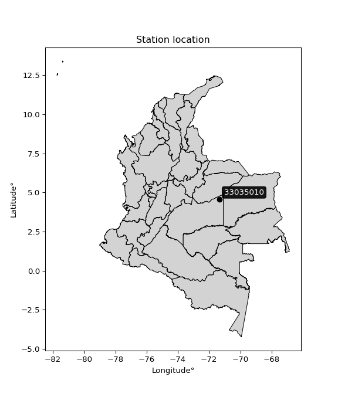

<div align="center">


</div>

# PMP Station (Rain, Pmax24h): 33035010

Probable Maximum Precipitation (PMP) is the greatest amount of rainfall for a specific duration that is meteorologically possible for a given location, acting as a "worst-case" scenario for extreme storms, crucial for designing safety-critical infrastructure like bridges, river deviations, dams, spillways, and nuclear plants to prevent catastrophic failure. PMP is calculated by hydrologists using meteorological data to determine the upper limit of extreme rainfall, often leading to the Probable Maximum Flood (PMF) for flood control design, and is increasingly being studied for climate change impacts. Probable Maximum Precipitation (PMP) is the theoretical upper limit of rainfall, a deterministic estimate for extreme events, while probability distributions (like GEV, Gumbel) describe the likelihood and frequency of various precipitation amounts, including rare ones, showing how often events occur, with PMP representing the extreme end of these distributions, used for critical infrastructure design to ensure safety against the worst conceivable weather, unlike standard statistical forecasts which cover typical probabilities.

The most common probability distributions in hydrology, used for analyzing floods, rainfall, and streamflow, include the Normal, Log-Normal, Gumbel, Gamma (including Log-Pearson Type III), and Generalized Extreme Value (GEV) distributions, often chosen based on the data´s skewness and whether modeling extremes or general conditions, with Gumbel and GEV popular for extreme events like floods, while the Normal distribution serves as a baseline, though often requiring transformations for skewed hydrological data. These distributions help in designing water infrastructure, managing water resources, and forecasting hydrologic events.

> Hydrological data often isn´t perfectly normal (it´s skewed), so different distributions are needed for different applications, such as: **Flood Frequency Analysis**: Using Gumbel, GEV, or Log-Pearson Type III for predicting extreme flood magnitudes and their return periods, **Rainfall Analysis**: Normal for annual totals, but Log-Normal, Weibull, or GEV for intensity or extreme daily rainfall, **Streamflow Modeling**: Gamma and Log-Normal for maximum flows, GEV for minimum flows, and Kappa for daily flows.

<div align="center">

</img>

</div>


## A. General information


### 1. General running parameters

• app_version: _v20260108_. • runtime: _2026-01-08 18:05:13.093906_. • Python version: _3.14.0_. • SciPy version: _1.16.3_. • Pandas version: _2.3.3_. • NumPy version: _2.3.5_. • Stations dataset (station_dataset_file): _dataset/pmax24h_in/automatic_colombia_2003_2024.csv_. • Stations catalog (station_catalog_file): _dataset/CNE.xls_. • Minimum year to eval til year_max (date_min): _1900_. • Maximum year to eval since year_min (date_max): _2024_. • Creates, save and include plots into reports (create_plot): _False_. • Plot only fit distributions with Δo > Δ (plot_only_fit): _True_. • Plot only simple graphs avoiding multiple CDFs and multiple Extreme values plots (plot_only_simple): _False_. • Eval low extreme values, if False, evaluates high extreme values (low_extreme): _False_. • Eval every SciPy distribution as logarithmic (pdist_logarithmic_on): _True_. • Standard deviation normalized (ddof): _1.0_. • Return periods to eval in years (Tr): _[2, 2.33, 5, 10, 15, 20, 25, 50, 75, 100, 200, 250, 500, 750, 1000]_. • Minimum data sample per station, 0 means any (minimum_sample): _5_. • Z-Score maximum threshold to adjust a value, 0 means disable (zscore_max): _3.5_. • Z-Score minimum threshold to adjust a value, 0 means disable (zscore_min): _-2.5_. • Avoid zeros, e.g. rain = 0 (avoid_zeros): _True_. • Avoid null values (avoid_nans): _True_. 

:file_folder:Table: [dataset.csv](../../dataset/pmax24h_in/automatic_colombia_2003_2024.csv)

> Delta Degrees of Freedom (DDOF): is a parameter used in the formulas for calculating variance and standard deviation. When ddof=0, the divisor is $N$ (the total number of observations) and this is used when your data set is the entire population. When ddof=1, the divisor is $N-1$ and this is used when your data set is a sample drawn from a larger population. Using $N-1$ provides an unbiased estimate of the population variance (known as Bessel´s correction).


### 2. Station info and location

|   id |   CODIGO | NOMBRE                     | CATEGORIA               | TECNOLOGIA                              | ESTADO           | FECHA_INSTALACION   |   FECHA_SUSPENSION |   ALTITUD |   LATITUD |   LONGITUD | DEPARTAMENTO   | MUNICIPIO     | AREA_OPERATIVA                            | ENTIDAD                                                     | AREA_HIDROGRAFICA   | ZONA_HIDROGRAFICA   | SUBZONA_HIDROGRAFICA   |   CORRIENTE | Catalogo   |   Version |
|-----:|---------:|:---------------------------|:------------------------|:----------------------------------------|:-----------------|:--------------------|-------------------:|----------:|----------:|-----------:|:---------------|:--------------|:------------------------------------------|:------------------------------------------------------------|:--------------------|:--------------------|:-----------------------|------------:|:-----------|----------:|
|    0 | 33035010 | CARIMAGUA - AUT [33035010] | Climatológica Principal | Automática con Telemetría, Convencional | En Mantenimiento | 15/05/1972          |                nan |       170 |    4.5713 |   -71.3357 | Meta           | Puerto Gaitán | Area Operativa 03 - Meta-Guaviare-Guainía | INSTITUTO DE HIDROLOGIA METEOROLOGIA Y ESTUDIOS AMBIENTALES | Orinoco             | Vichada             | Río Muco               |         nan | CNE_IDEAM  |  20251226 |

<div align="center">

Dynamic map: [:earth_americas:Google](http://maps.google.com/maps?q=4.571298,-71.33571) [:earth_americas:OSM](https://www.openstreetmap.org/#map=18/4.571298/-71.33571&layers=P) [:earth_americas:Bing](https://www.bing.com/maps?cp=4.571298~-71.33571&lvl=18) [:earth_americas:Apple](https://maps.apple.com/frame?center=4.571298%2C-71.33571&span=0.003%2C0.006)

</div>


<div align="center">

```geojson
{
  "type": "Feature",
  "geometry": {
    "type": "Point", 
    "coordinates": [-71.33571, 4.571298]
  }, 
  "properties": {
    "Name": "33035010"
  }
}
```

</div>


### 3. Discrete values table and plot

<div align="center">

|               |           0 |           1 |            2 |          3 |           4 |          5 |
|:--------------|------------:|------------:|-------------:|-----------:|------------:|-----------:|
| Date          | 2019        | 2020        | 2021         | 2022       | 2023        | 2024       |
| Value         |   98.49     |  123.26     |  107.77      |   37.17    |   82.22     |  177.15    |
| Value_initial |   98.49     |  123.26     |  107.77      |   37.17    |   82.22     |  177.15    |
| count         |    6        |    6        |    6         |    6       |    6        |    6       |
| mean          |  104.343    |  104.343    |  104.343     |  104.343   |  104.343    |  104.343   |
| std           |   46.2739   |   46.2739   |   46.2739    |   46.2739  |   46.2739   |   46.2739  |
| zscore        |   -0.126493 |    0.408798 |    0.0740519 |   -1.45165 |   -0.478096 |    1.57339 |


</div>


> The initial value (value_initial) correspond to the initial obtained or null completed value, and value (value) is adjusted only when the initial value is outside the valid range (outlier) definite through the Z-Score value. If Z-Score is active, values out of range or outliers are replaced with the station mean value. A Z-Score (or standard score) measures how many standard deviations a data point is from the mean of a dataset, indicating its relative position; positive scores mean above the mean, negative mean below, and a score of zero is exactly at the mean, allowing for comparison of values from different distributions. It´s calculated using the formula $z=(x–μ)/σ$, where $x$ is the data point, $μ$ is the mean, and $σ$ is the standard deviation, helping identify outliers and understand probability.
>
> <sub>**Note**: In this study, "completing" (filling gaps in) and "extending" (forecasting or lengthening the historical record) rainfall data series are avoided for certain critical analyses because they introduce artificial bias and uncertainty, which can distort the statistics of rare events (extremes), alter day-to-day variability, and compromise the integrity and homogeneity of the original data. Some reasons against Completing/Extending rainfall data are: **Distortion of Extremes and Variability**: The primary issue is that most gap-filling or extension methods rely on averaging or regression with nearby stations, which inherently smooths the data. Rainfall is highly variable in space and time, with a large percentage of zero values and occasional large storms. Infilling methods often underestimate the highest values and overestimate the lowest (zero) values, which severely distorts analyses focused on flood frequency, drought severity, and intensity-duration-frequency (IDF) curves, **Loss of Data Homogeneity**: Infilled or extended data are synthetic estimates, not actual measurements. Combining these estimates with observed data can violate the assumption of data homogeneity, which requires that the data properties do not change over time. Inhomogeneity can lead to incorrect conclusions about long-term trends or changes in climate patterns, **Propagation of Errors**: Errors and biases from the original data (e.g., wind-induced undercatch, instrument errors, site changes) or the data used for imputation can propagate through the analysis, leading to unreliable hydrological models and inaccurate predictions, **Compromised Statistical Integrity**: For statistical analyses, especially those involving the frequency of events, using artificial data can introduce time bias or autocorrelation that doesn´t exist in reality, making it difficult to assess the true probability of events, **Difficulty in Validation**: It is difficult to accurately validate the quality of filled or extended data, especially for past periods where ground-truth measurements are unavailable. The reliability of imputation techniques heavily depends on the density of the surrounding station network and the complexity of the local topography.</sub>


### 4. Active continuous probability distributions from SciPy (43 of 104 available)

A Probability Density Function (PDF) describes the relative likelihood of a continuous random variable falling within a specific range, where the total area under its curve equals 1, and the area over any interval gives the actual probability for that range. Unlike discrete probabilities (like rolling a die), a PDF shows density, not direct probability for a single point (which is zero), with higher points indicating higher likelihood, often visualized as a bell curve for normal distributions.

A log of a probability density function (log-PDF) is simply the logarithm of the PDF´s value, denoted as $log(f(x))$, useful for converting multiplication of probabilities into addition, improving numerical stability with tiny numbers, and connecting to information theory concepts like entropy. Instead of dealing with very small probabilities (e.g., 0.000001), log-PDFs use negative numbers (e.g., $log(0.00001) ≈ -11.51$ that are easier for computers to handle, preventing underflow errors and simplifying complex calculations. In this study, each active probability distribution from SciPy is also evaluated in the $log$ form.

[scipy.stats](https://docs.scipy.org/doc/scipy/reference/stats.html) is a Python´s powerful submodule within the SciPy library for comprehensive statistical analysis, offering over 130 probability distributions (like Normal, Poisson), functions for descriptive stats (mean, variance), hypothesis testing (t-tests, chi-square), random variable generation, and statistical tests, making it essential for data science, modeling, and research. It provides tools to explore, model, and draw conclusions from data efficiently, working seamlessly with NumPy.

<div align="center">

|   id | p_dist             |   n_parameter | fit_method   | label                                                                       | active   | ref                                                                                                        |
|-----:|:-------------------|--------------:|:-------------|:----------------------------------------------------------------------------|:---------|:-----------------------------------------------------------------------------------------------------------|
|    0 | alpha              |             3 | MLE          | Alpha                                                                       | True     | [:mortar_board:](https://docs.scipy.org/doc/scipy/reference/generated/scipy.stats.alpha.html)              |
|    1 | betaprime          |             4 | MLE          | Beta prime                                                                  | True     | [:mortar_board:](https://docs.scipy.org/doc/scipy/reference/generated/scipy.stats.betaprime.html)          |
|    2 | chi2               |             3 | MLE          | Chi²                                                                        | True     | [:mortar_board:](https://docs.scipy.org/doc/scipy/reference/generated/scipy.stats.chi2.html)               |
|    3 | crystalball        |             4 | MLE          | Crystalball                                                                 | True     | [:mortar_board:](https://docs.scipy.org/doc/scipy/reference/generated/scipy.stats.crystalball.html)        |
|    4 | erlang             |             3 | MLE          | Erlang                                                                      | True     | [:mortar_board:](https://docs.scipy.org/doc/scipy/reference/generated/scipy.stats.erlang.html)             |
|    5 | expon              |             2 | MLE          | Exponential                                                                 | True     | [:mortar_board:](https://docs.scipy.org/doc/scipy/reference/generated/scipy.stats.expon.html)              |
|    6 | exponnorm          |             3 | MLE          | Exponentially modified Normal                                               | True     | [:mortar_board:](https://docs.scipy.org/doc/scipy/reference/generated/scipy.stats.exponnorm.html)          |
|    7 | f                  |             4 | MLE          | F                                                                           | True     | [:mortar_board:](https://docs.scipy.org/doc/scipy/reference/generated/scipy.stats.f.html)                  |
|    8 | fatiguelife        |             3 | MLE          | Fatigue-life (Birnbaum-Saunders)                                            | True     | [:mortar_board:](https://docs.scipy.org/doc/scipy/reference/generated/scipy.stats.fatiguelife.html)        |
|    9 | fisk               |             3 | MLE          | Fisk                                                                        | True     | [:mortar_board:](https://docs.scipy.org/doc/scipy/reference/generated/scipy.stats.fisk.html)               |
|   10 | gamma              |             3 | MLE          | Gamma                                                                       | True     | [:mortar_board:](https://docs.scipy.org/doc/scipy/reference/generated/scipy.stats.gamma.html)              |
|   11 | genexpon           |             5 | MLE          | Generalized exponential                                                     | True     | [:mortar_board:](https://docs.scipy.org/doc/scipy/reference/generated/scipy.stats.genexpon.html)           |
|   12 | genlogistic        |             3 | MLE          | Generalized logistic                                                        | True     | [:mortar_board:](https://docs.scipy.org/doc/scipy/reference/generated/scipy.stats.genlogistic.html)        |
|   13 | gibrat             |             2 | MM           | Gibrat                                                                      | True     | [:mortar_board:](https://docs.scipy.org/doc/scipy/reference/generated/scipy.stats.gibrat.html)             |
|   14 | gompertz           |             3 | MLE          | Gompertz (or truncated Gumbel)                                              | True     | [:mortar_board:](https://docs.scipy.org/doc/scipy/reference/generated/scipy.stats.gompertz.html)           |
|   15 | gumbel_l           |             2 | MM           | Gumbel Left Skew                                                            | True     | [:mortar_board:](https://docs.scipy.org/doc/scipy/reference/generated/scipy.stats.gumbel_l.html)           |
|   16 | gumbel_r           |             2 | MM           | Gumbel Right Skew                                                           | True     | [:mortar_board:](https://docs.scipy.org/doc/scipy/reference/generated/scipy.stats.gumbel_r.html)           |
|   17 | halflogistic       |             2 | MM           | Half-logistic                                                               | True     | [:mortar_board:](https://docs.scipy.org/doc/scipy/reference/generated/scipy.stats.halflogistic.html)       |
|   18 | halfnorm           |             2 | MM           | Half Normal                                                                 | True     | [:mortar_board:](https://docs.scipy.org/doc/scipy/reference/generated/scipy.stats.halfnorm.html)           |
|   19 | hypsecant          |             2 | MM           | hyperbolic secant                                                           | True     | [:mortar_board:](https://docs.scipy.org/doc/scipy/reference/generated/scipy.stats.hypsecant.html)          |
|   20 | invgamma           |             3 | MLE          | Inverted gamma                                                              | True     | [:mortar_board:](https://docs.scipy.org/doc/scipy/reference/generated/scipy.stats.invgamma.html)           |
|   21 | invgauss           |             3 | MLE          | Inverse Gaussian                                                            | True     | [:mortar_board:](https://docs.scipy.org/doc/scipy/reference/generated/scipy.stats.invgauss.html)           |
|   22 | invweibull         |             3 | MLE          | Inverted Weibull                                                            | True     | [:mortar_board:](https://docs.scipy.org/doc/scipy/reference/generated/scipy.stats.invweibull.html)         |
|   23 | kstwobign          |             2 | MLE          | Limiting distribution of scaled Kolmogorov-Smirnov two-sided test statistic | True     | [:mortar_board:](https://docs.scipy.org/doc/scipy/reference/generated/scipy.stats.kstwobign.html)          |
|   24 | laplace            |             2 | MM           | Laplace                                                                     | True     | [:mortar_board:](https://docs.scipy.org/doc/scipy/reference/generated/scipy.stats.laplace.html)            |
|   25 | laplace_asymmetric |             3 | MLE          | Asymmetric Laplace                                                          | True     | [:mortar_board:](https://docs.scipy.org/doc/scipy/reference/generated/scipy.stats.laplace_asymmetric.html) |
|   26 | loggamma           |             3 | MLE          | Log gamma                                                                   | True     | [:mortar_board:](https://docs.scipy.org/doc/scipy/reference/generated/scipy.stats.loggamma.html)           |
|   27 | logistic           |             2 | MM           | Logistic (or Sech-squared)                                                  | True     | [:mortar_board:](https://docs.scipy.org/doc/scipy/reference/generated/scipy.stats.logistic.html)           |
|   28 | lognorm            |             3 | MLE          | Log Normal                                                                  | True     | [:mortar_board:](https://docs.scipy.org/doc/scipy/reference/generated/scipy.stats.lognorm.html)            |
|   29 | maxwell            |             2 | MM           | Maxwell                                                                     | True     | [:mortar_board:](https://docs.scipy.org/doc/scipy/reference/generated/scipy.stats.maxwell.html)            |
|   30 | mielke             |             4 | MLE          | Mielke Beta-Kappa / Dagum                                                   | True     | [:mortar_board:](https://docs.scipy.org/doc/scipy/reference/generated/scipy.stats.mielke.html)             |
|   31 | moyal              |             2 | MM           | Moyal                                                                       | True     | [:mortar_board:](https://docs.scipy.org/doc/scipy/reference/generated/scipy.stats.moyal.html)              |
|   32 | nakagami           |             3 | MLE          | Nakagami                                                                    | True     | [:mortar_board:](https://docs.scipy.org/doc/scipy/reference/generated/scipy.stats.nakagami.html)           |
|   33 | ncf                |             5 | MLE          | Non-central F distribution                                                  | True     | [:mortar_board:](https://docs.scipy.org/doc/scipy/reference/generated/scipy.stats.ncf.html)                |
|   34 | nct                |             4 | MLE          | Non-central Student’s t                                                     | True     | [:mortar_board:](https://docs.scipy.org/doc/scipy/reference/generated/scipy.stats.nct.html)                |
|   35 | norm               |             2 | MM           | Normal                                                                      | True     | [:mortar_board:](https://docs.scipy.org/doc/scipy/reference/generated/scipy.stats.norm.html)               |
|   36 | pearson3           |             3 | MM           | Pearson type III                                                            | True     | [:mortar_board:](https://docs.scipy.org/doc/scipy/reference/generated/scipy.stats.pearson3.html)           |
|   37 | rayleigh           |             2 | MM           | Rayleigh                                                                    | True     | [:mortar_board:](https://docs.scipy.org/doc/scipy/reference/generated/scipy.stats.rayleigh.html)           |
|   38 | rice               |             3 | MLE          | Rice                                                                        | True     | [:mortar_board:](https://docs.scipy.org/doc/scipy/reference/generated/scipy.stats.rice.html)               |
|   39 | t                  |             3 | MLE          | Student’s t                                                                 | True     | [:mortar_board:](https://docs.scipy.org/doc/scipy/reference/generated/scipy.stats.t.html)                  |
|   40 | truncnorm          |             4 | MLE          | Truncated normal                                                            | True     | [:mortar_board:](https://docs.scipy.org/doc/scipy/reference/generated/scipy.stats.truncnorm.html)          |
|   41 | wald               |             2 | MM           | Wald                                                                        | True     | [:mortar_board:](https://docs.scipy.org/doc/scipy/reference/generated/scipy.stats.wald.html)               |
|   42 | weibull_min        |             3 | MLE          | Weibull minimum                                                             | True     | [:mortar_board:](https://docs.scipy.org/doc/scipy/reference/generated/scipy.stats.weibull_min.html)        |

</div>

> **n_parameter:** # arguments & localization & scale.
>
> **Fit methods:** (MLE) maximum likelihood, (MM) L-moments.
>
>**Inactive** (With the only purpose of prevent loops, zero divisions, infinite values, over high estimated values or horizontal trending for recurrence intervals estimations, the follow distributions were disabled.)**:** foldnorm, gennorm, norminvgauss, powernorm, powerlognorm, skewnorm, genextreme, anglit, arcsine, argus, beta, bradford, burr, burr12, cauchy, cosine, halfcauchy, foldcauchy, skewcauchy, wrapcauchy, dgamma, gengamma, exponweib, exponpow, truncexpon, gausshyper, genhalflogistic, genhyperbolic, geninvgauss, halfgennorm, johnsonsb, johnsonsu, kappa4, kappa3, ksone, kstwo, loglaplace, levy, levy_l, levy_stable, ncx2, pareto, genpareto, truncpareto, lomax, powerlaw, rdist, rel_breitwigner, recipinvgauss, semicircular, studentized_range, trapezoid, triang, truncweibull_min, tukeylambda, uniform, loguniform, vonmises, vonmises_line, weibull_max, dweibull, 


## B. Probability (PDF) vs. Empirical (EDF) distributions functions

A continuous probability distribution (CPD) describes probabilities for variables that can take any value within a range (like rain any time), unlike discrete variables with specific outcomes (like temperature). It uses a Probability Density Function (PDF), a curve where the total area under it equals 1, and the probability of the variable falling within an interval (a to b) is found by calculating the area under the curve between those points. A key feature is that the probability of hitting any single exact value is zero, so probabilities are always expressed for ranges, e.g., $P(a ≤ X ≤ b)$.

<div align="center">

Distributions parameters from station values
|    |   station | p_dist                |   n |              loc |           scale | shape                 | shape1                 | shape2              | shape3   |
|---:|----------:|:----------------------|----:|-----------------:|----------------:|:----------------------|:-----------------------|:--------------------|:---------|
|  0 |  33035010 | alpha                 |   6 |   -534.695       |  9515.17        | 14.957770541501027    |                        |                     |          |
|  1 |  33035010 | betaprime             |   6 |    -40.12        |  6202.15        | 10.942530645024494    | 467.73847660340607     |                     |          |
|  2 |  33035010 | chi2                  |   6 |     37.17        |    38.6157      | 0.9501703307785387    |                        |                     |          |
|  3 |  33035010 | crystalball           |   6 |    104.343       |    42.2421      | 7475.851022469635     | 6266.214533250721      |                     |          |
|  4 |  33035010 | erlang                |   6 |   -212.851       |     5.64914     | 56.149093014992644    |                        |                     |          |
|  5 |  33035010 | expon                 |   6 |     37.17        |    67.1733      |                       |                        |                     |          |
|  6 |  33035010 | exponnorm             |   6 |     91.45        |    40.2452      | 0.32036920082726794   |                        |                     |          |
|  7 |  33035010 | f                     |   6 |   -213.613       |   317.946       | 113.03448477276794    | 66226.16833046249      |                     |          |
|  8 |  33035010 | fatiguelife           |   6 |     37.1692      |     0.347427    | 12.370088083337661    |                        |                     |          |
|  9 |  33035010 | fisk                  |   6 |   -401.471       |   504.179       | 21.148642290085128    |                        |                     |          |
| 10 |  33035010 | gamma                 |   6 |   -212.867       |     5.64884     | 56.15491829696576     |                        |                     |          |
| 11 |  33035010 | genexpon              |   6 |     37.1672      |     3.96133     | 0.05898610959620365   | 1.4784549111325619e-07 | 0.32343025735007935 |          |
| 12 |  33035010 | genlogistic           |   6 |     90.9607      |    26.5282      | 1.3930667156992587    |                        |                     |          |
| 13 |  33035010 | gibrat                |   6 |     72.1179      |    19.5457      |                       |                        |                     |          |
| 14 |  33035010 | gompertz              |   6 |     26.6151      |     4.00768     | 2.933131155152079e-16 |                        |                     |          |
| 15 |  33035010 | gumbel_l              |   6 |    123.355       |    32.936       |                       |                        |                     |          |
| 16 |  33035010 | gumbel_r              |   6 |     85.3322      |    32.936       |                       |                        |                     |          |
| 17 |  33035010 | halflogistic          |   6 |     54.2766      |    36.1155      |                       |                        |                     |          |
| 18 |  33035010 | halfnorm              |   6 |     48.4314      |    70.0752      |                       |                        |                     |          |
| 19 |  33035010 | hypsecant             |   6 |    104.343       |    26.8921      |                       |                        |                     |          |
| 20 |  33035010 | invgamma              |   6 |   -251.255       | 24504.9         | 70.00814812343174     |                        |                     |          |
| 21 |  33035010 | invgauss              |   6 |    -76.6632      |  2943.76        | 0.061049300668351875  |                        |                     |          |
| 22 |  33035010 | invweibull            |   6 |     37.17        |     1.74495     | 0.0522875551687592    |                        |                     |          |
| 23 |  33035010 | kstwobign             |   6 |    -54.4038      |   181.922       |                       |                        |                     |          |
| 24 |  33035010 | laplace               |   6 |    104.343       |    29.8697      |                       |                        |                     |          |
| 25 |  33035010 | laplace_asymmetric    |   6 |     98.49        |    31.3078      | 0.9108788432896567    |                        |                     |          |
| 26 |  33035010 | loggamma              |   6 | -12191.1         |  1674.27        | 1546.8936115817569    |                        |                     |          |
| 27 |  33035010 | logistic              |   6 |    104.343       |    23.2893      |                       |                        |                     |          |
| 28 |  33035010 | lognorm               |   6 |     37.17        |     0.159877    | 13.753704557803022    |                        |                     |          |
| 29 |  33035010 | maxwell               |   6 |      4.24737     |    62.7258      |                       |                        |                     |          |
| 30 |  33035010 | mielke                |   6 |     -3.26271     |   134.859       | 2.5378334523074155    | 6.595091611274055      |                     |          |
| 31 |  33035010 | moyal                 |   6 |     80.1866      |    19.0156      |                       |                        |                     |          |
| 32 |  33035010 | nakagami              |   6 |     82.22        |    48.3006      | 0.14155041840266938   |                        |                     |          |
| 33 |  33035010 | ncf                   |   6 |     -0.0517002   |     3.64119e-05 | 4.400946055997033e-06 | 5.424865411359997      | 11.059148189019176  |          |
| 34 |  33035010 | nct                   |   6 |   -182.031       |    38.5108      | 131.77144520385667    | 7.392104218589012      |                     |          |
| 35 |  33035010 | norm                  |   6 |    104.343       |    42.2421      |                       |                        |                     |          |
| 36 |  33035010 | pearson3              |   6 |    104.343       |    42.2421      | 0.17381987835627763   |                        |                     |          |
| 37 |  33035010 | rayleigh              |   6 |     23.5318      |    64.4783      |                       |                        |                     |          |
| 38 |  33035010 | rice                  |   6 |     15.0874      |    48.9776      | 1.4369941124997072    |                        |                     |          |
| 39 |  33035010 | t                     |   6 |    104.341       |    42.2437      | 4471923.471320424     |                        |                     |          |
| 40 |  33035010 | truncnorm             |   6 |    104.343       |    42.2421      | -1212.286410377637    | 2939.95609370647       |                     |          |
| 41 |  33035010 | wald                  |   6 |     62.1012      |    42.2421      |                       |                        |                     |          |
| 42 |  33035010 | weibull_min           |   6 |      8.732       |   107.794       | 2.4255977768996857    |                        |                     |          |
| 43 |  33035010 | logalpha              |   6 |    -10.2058      |   441.279       | 29.948296448466465    |                        |                     |          |
| 44 |  33035010 | logbetaprime          |   6 |     -8.73083     |    22.2589      | 1038.0237985965678    | 1738.8625264719212     |                     |          |
| 45 |  33035010 | logchi2               |   6 |      3.6155      |     0.959033    | 1.0923596612534299    |                        |                     |          |
| 46 |  33035010 | logcrystalball        |   6 |      4.54769     |     0.478626    | 7.668135678324001     | 560.8278173698777      |                     |          |
| 47 |  33035010 | logerlang             |   6 |     -3.33418     |     0.0309288   | 254.75094832607442    |                        |                     |          |
| 48 |  33035010 | logexpon              |   6 |      3.6155      |     0.932189    |                       |                        |                     |          |
| 49 |  33035010 | logexponnorm          |   6 |      4.54735     |     0.478625    | 0.0007011940441073253 |                        |                     |          |
| 50 |  33035010 | logf                  |   6 |   -571.728       |   576.274       | 4934286.7242296655    | 6921899.257194385      |                     |          |
| 51 |  33035010 | logfatiguelife        |   6 |   -218.039       |   222.587       | 0.002150849710630015  |                        |                     |          |
| 52 |  33035010 | logfisk               |   6 |     -3.18634e+07 |     3.18634e+07 | 130292598.84437302    |                        |                     |          |
| 53 |  33035010 | loggamma              |   6 |     -3.20458     |     0.0311792   | 248.72862396338587    |                        |                     |          |
| 54 |  33035010 | loggenexpon           |   6 |      3.6155      |     8.05588e+06 | 5095864.597600417     | 14443828.383995531     | 4312604.111458385   |          |
| 55 |  33035010 | loggenlogistic        |   6 |      4.88873     |     0.153794    | 0.3700620257317975    |                        |                     |          |
| 56 |  33035010 | loggibrat             |   6 |      4.18253     |     0.221482    |                       |                        |                     |          |
| 57 |  33035010 | loggompertz           |   6 |      3.6155      |     0.443483    | 0.08601423046993828   |                        |                     |          |
| 58 |  33035010 | loggumbel_l           |   6 |      4.7631      |     0.373183    |                       |                        |                     |          |
| 59 |  33035010 | loggumbel_r           |   6 |      4.33228     |     0.373183    |                       |                        |                     |          |
| 60 |  33035010 | loghalflogistic       |   6 |      3.98044     |     0.409186    |                       |                        |                     |          |
| 61 |  33035010 | loghalfnorm           |   6 |      3.91419     |     0.793985    |                       |                        |                     |          |
| 62 |  33035010 | loghypsecant          |   6 |      4.54769     |     0.304703    |                       |                        |                     |          |
| 63 |  33035010 | loginvgamma           |   6 |     -7.60336     |  7477.67        | 616.521677895511      |                        |                     |          |
| 64 |  33035010 | loginvgauss           |   6 |     -0.53006     |   489.738       | 0.010341465690129427  |                        |                     |          |
| 65 |  33035010 | loginvweibull         |   6 |     -2.96146e+07 |     2.96146e+07 | 58389347.211968884    |                        |                     |          |
| 66 |  33035010 | logkstwobign          |   6 |      2.41941     |     2.43213     |                       |                        |                     |          |
| 67 |  33035010 | loglaplace            |   6 |      4.54769     |     0.33844     |                       |                        |                     |          |
| 68 |  33035010 | loglaplace_asymmetric |   6 |      4.68        |     0.322739    | 1.2257156297615674    |                        |                     |          |
| 69 |  33035010 | logloggamma           |   6 |      4.86882     |     0.319361    | 0.7826752221931204    |                        |                     |          |
| 70 |  33035010 | loglogistic           |   6 |      4.54769     |     0.26388     |                       |                        |                     |          |
| 71 |  33035010 | loglognorm            |   6 |      3.6155      |     0.00296873  | 13.20820256625729     |                        |                     |          |
| 72 |  33035010 | logmaxwell            |   6 |      3.41355     |     0.710718    |                       |                        |                     |          |
| 73 |  33035010 | logmielke             |   6 |      1.82198     |     3.15274     | 5.597164366347494     | 22.34003925108699      |                     |          |
| 74 |  33035010 | logmoyal              |   6 |      4.27398     |     0.215457    |                       |                        |                     |          |
| 75 |  33035010 | lognakagami           |   6 |      4.4094      |     0.388228    | 0.3896202531084685    |                        |                     |          |
| 76 |  33035010 | logncf                |   6 |   -210.871       |   201.779       | 652828.1749620219     | 1055818.0540047674     | 44140.45773061355   |          |
| 77 |  33035010 | lognct                |   6 |     24.6809      |     0.474025    | 48522.89554100885     | -42.471398795039065    |                     |          |
| 78 |  33035010 | lognorm               |   6 |      4.54769     |     0.478626    |                       |                        |                     |          |
| 79 |  33035010 | logpearson3           |   6 |      4.54769     |     0.478625    | -0.8240220672966225   |                        |                     |          |
| 80 |  33035010 | lograyleigh           |   6 |      3.63203     |     0.730588    |                       |                        |                     |          |
| 81 |  33035010 | logrice               |   6 |      3.26598     |     0.514356    | 2.2528346564494504    |                        |                     |          |
| 82 |  33035010 | logt                  |   6 |      4.54776     |     0.478545    | 5716.599361870187     |                        |                     |          |
| 83 |  33035010 | logtruncnorm          |   6 |     -0.155979    |     1.21811     | 3.7479079122184906    | 5.174915150691802      |                     |          |
| 84 |  33035010 | logwald               |   6 |      4.06908     |     0.478607    |                       |                        |                     |          |
| 85 |  33035010 | logweibull_min        |   6 |     -5.74933e+06 |     5.74933e+06 | 15428454.91144691     |                        |                     |          |

</div>

> **loc** (Location parameter): This shifts the distribution along the x-axis. For many common distributions, like the normal (Gaussian) distribution, loc represents the mean $μ$. For others, like the uniform distribution, it might represent the minimum value, or for the beta distribution, the left end of the support interval.
>
> **scale** (Scale parameter): This determines the width or spread of the distribution. For the normal distribution, scale represents the standard deviation $σ$. For a uniform distribution, it defines the length of the interval (from $loc$ to $loc + scale$).
>
> **shape** (Shape parameters): Refers to parameters that define the specific form of a probability distribution, distinct from its location (loc) and scale (scale). These parameters are required arguments for most distribution functions. For example, a normal (Gaussian) distribution is fully defined by its location (mean) and scale (standard deviation), so it has no specific shape parameters beyond loc and scale. However, other distributions have intrinsic properties that need specification, as Gamma distribution that takes a shape parameter, often named $a$ or $alpha$.


### 0. Cumulative distribution values - CDF (86 evaluated)

Cumulative Distribution Function (CDF), denoted as $F$<sub>$X$</sub>$(x)$, is a function that gives the probability that a random variable $X$ will take a value less than or equal to a specific value, $x$ (i.e., $(P(X≥x)$. It essentially "accumulates" probabilities from a given point up to the far right (positive infinity), providing a complete picture of the distribution´s probabilities for both discrete (like rain) and continuous (like temperature) variables, helping to find probabilities over ranges or above certain values. Each station is evaluated separately ordering the $x$ values ascending, calculating the CDF and PDF values for the activated distributions and their logarithmic forms.

<div align="center">

CDF ordered by x ascending and calculating $log(f(x))$ separately
|   id |   Station |   date |      x |   count |    mean |     std |     zscore |   Value_initial |   station |   m |     alpha |   alpha_pdf |   betaprime |   betaprime_pdf |        chi2 |    chi2_pdf |   crystalball |   crystalball_pdf |    erlang |   erlang_pdf |    expon |   expon_pdf |   exponnorm |   exponnorm_pdf |         f |      f_pdf |   fatiguelife |   fatiguelife_pdf |      fisk |   fisk_pdf |     gamma |   gamma_pdf |    genexpon |   genexpon_pdf |   genlogistic |   genlogistic_pdf |   gibrat |   gibrat_pdf |    gompertz |   gompertz_pdf |   gumbel_l |   gumbel_l_pdf |   gumbel_r |   gumbel_r_pdf |   halflogistic |   halflogistic_pdf |   halfnorm |   halfnorm_pdf |   hypsecant |   hypsecant_pdf |   invgamma |   invgamma_pdf |   invgauss |   invgauss_pdf |   invweibull |   invweibull_pdf |   kstwobign |   kstwobign_pdf |   laplace |   laplace_pdf |   laplace_asymmetric |   laplace_asymmetric_pdf |   loggamma |   loggamma_pdf |   logistic |   logistic_pdf |   lognorm |   lognorm_pdf |   maxwell |   maxwell_pdf |    mielke |   mielke_pdf |     moyal |   moyal_pdf |   nakagami |   nakagami_pdf |      ncf |    ncf_pdf |       nct |    nct_pdf |      norm |   norm_pdf |   pearson3 |   pearson3_pdf |   rayleigh |   rayleigh_pdf |      rice |   rice_pdf |         t |      t_pdf |   truncnorm |   truncnorm_pdf |     wald |   wald_pdf |   weibull_min |   weibull_min_pdf |   logalpha |   logalpha_pdf |   logbetaprime |   logbetaprime_pdf |     logchi2 |   logchi2_pdf |   logcrystalball |   logcrystalball_pdf |   logerlang |   logerlang_pdf |   logexpon |   logexpon_pdf |   logexponnorm |   logexponnorm_pdf |      logf |   logf_pdf |   logfatiguelife |   logfatiguelife_pdf |   logfisk |   logfisk_pdf |   loggenexpon |   loggenexpon_pdf |   loggenlogistic |   loggenlogistic_pdf |   loggibrat |   loggibrat_pdf |   loggompertz |   loggompertz_pdf |   loggumbel_l |   loggumbel_l_pdf |   loggumbel_r |   loggumbel_r_pdf |   loghalflogistic |   loghalflogistic_pdf |   loghalfnorm |   loghalfnorm_pdf |   loghypsecant |   loghypsecant_pdf |   loginvgamma |   loginvgamma_pdf |   loginvgauss |   loginvgauss_pdf |   loginvweibull |   loginvweibull_pdf |   logkstwobign |   logkstwobign_pdf |   loglaplace |   loglaplace_pdf |   loglaplace_asymmetric |   loglaplace_asymmetric_pdf |   logloggamma |   logloggamma_pdf |   loglogistic |   loglogistic_pdf |   loglognorm |   loglognorm_pdf |   logmaxwell |   logmaxwell_pdf |   logmielke |   logmielke_pdf |    logmoyal |   logmoyal_pdf |   lognakagami |   lognakagami_pdf |    logncf |   logncf_pdf |   lognct |   lognct_pdf |   logpearson3 |   logpearson3_pdf |   lograyleigh |   lograyleigh_pdf |   logrice |   logrice_pdf |      logt |   logt_pdf |   logtruncnorm |   logtruncnorm_pdf |   logwald |   logwald_pdf |   logweibull_min |   logweibull_min_pdf |
|-----:|----------:|-------:|-------:|--------:|--------:|--------:|-----------:|----------------:|----------:|----:|----------:|------------:|------------:|----------------:|------------:|------------:|--------------:|------------------:|----------:|-------------:|---------:|------------:|------------:|----------------:|----------:|-----------:|--------------:|------------------:|----------:|-----------:|----------:|------------:|------------:|---------------:|--------------:|------------------:|---------:|-------------:|------------:|---------------:|-----------:|---------------:|-----------:|---------------:|---------------:|-------------------:|-----------:|---------------:|------------:|----------------:|-----------:|---------------:|-----------:|---------------:|-------------:|-----------------:|------------:|----------------:|----------:|--------------:|---------------------:|-------------------------:|-----------:|---------------:|-----------:|---------------:|----------:|--------------:|----------:|--------------:|----------:|-------------:|----------:|------------:|-----------:|---------------:|---------:|-----------:|----------:|-----------:|----------:|-----------:|-----------:|---------------:|-----------:|---------------:|----------:|-----------:|----------:|-----------:|------------:|----------------:|---------:|-----------:|--------------:|------------------:|-----------:|---------------:|---------------:|-------------------:|------------:|--------------:|-----------------:|---------------------:|------------:|----------------:|-----------:|---------------:|---------------:|-------------------:|----------:|-----------:|-----------------:|---------------------:|----------:|--------------:|--------------:|------------------:|-----------------:|---------------------:|------------:|----------------:|--------------:|------------------:|--------------:|------------------:|--------------:|------------------:|------------------:|----------------------:|--------------:|------------------:|---------------:|-------------------:|--------------:|------------------:|--------------:|------------------:|----------------:|--------------------:|---------------:|-------------------:|-------------:|-----------------:|------------------------:|----------------------------:|--------------:|------------------:|--------------:|------------------:|-------------:|-----------------:|-------------:|-----------------:|------------:|----------------:|------------:|---------------:|--------------:|------------------:|----------:|-------------:|---------:|-------------:|--------------:|------------------:|--------------:|------------------:|----------:|--------------:|----------:|-----------:|---------------:|-------------------:|----------:|--------------:|-----------------:|---------------------:|
|    0 |  33035010 |   2022 |  37.17 |       6 | 104.343 | 46.2739 | -1.45165   |           37.17 |  33035010 |   1 | 0.0463736 |  0.00282537 |   0.0384814 |      0.00290835 | 2.71744e-08 | 1.81694e+06 |     0.0558949 |        0.00266721 | 0.0474777 |   0.00274259 | 0        |  0.0148869  |   0.0543505 |      0.002665   | 0.0474839 | 0.0027424  |      0.042073 |      102.75       | 0.0499758 | 0.00228912 | 0.0474774 |  0.00274256 | 4.14137e-05 |     0.0148898  |     0.0499382 |        0.00231733 | 0        |  0           | 3.79105e-15 |    1.01913e-15 |  0.0704378 |    0.00206147  |  0.0133551 |     0.00175003 |       0        |         0          |   0        |     0          |   0.0522502 |      0.00193424 |  0.0433681 |     0.00284877 |  0.0394787 |     0.00313554 |   0.00350018 |      1.45655e+11 |   0.0382496 |      0.00364979 | 0.0527585 |    0.00176629 |            0.0528078 |               0.00185176 |  0.0248494 |       0.128876 |   0.052935 |     0.00215262 | 0.0257293 |      0.125087 | 0.0354286 |    0.0030533  | 0.0470199 |   0.00295024 | 0.0019416 | 0.000534018 | 0          |    0           | 0.172704 | 0.00648248 | 0.0532473 | 0.00273695 | 0.0558949 | 0.00266721 |  0.0504326 |     0.00271573 |  0.0221212 |     0.00320786 | 0.0362251 | 0.00328056 | 0.0559094 | 0.00266765 |   0.0558949 |      0.00266721 | 0        | 0          |      0.038706 |        0.00323666 |  0.0239019 |       0.130013 |      0.0311805 |           0.144119 | 3.24758e-09 |   3.99416e+06 |        0.0257293 |             0.125087 |   0.0261121 |        0.133549 |   0        |       1.07274  |      0.0257293 |           0.125087 | 0.0262728 |   0.127079 |        0.0254164 |             0.124301 | 0.0171588 |     0.0689602 |   1.98054e-11 |          0.632565 |        0.0467112 |             0.112369 |    0        |        0        |   3.53506e-08 |          0.193952 |     0.0451322 |          0.118167 |    0.00108529 |         0.0198511 |          0        |              0        |      0        |          0        |      0.0298475 |          0.0978125 |     0.0241212 |          0.128847 |     0.0271638 |          0.14955  |       0.0245289 |            0.179322 |      0.0310439 |           0.238833 |    0.0318244 |        0.0940328 |               0.0407161 |                    0.102926 |     0.0495721 |          0.120148 |     0.0283982 |          0.104561 |    0.0126825 |      5.58626e+12 |   0.00595639 |        0.0870595 |   0.0425407 |        0.132759 | 4.03825e-06 |    0.000207755 |   0           |          0        | 0.0252984 |     0.123711 | 0.025702 |     0.124814 |     0.0431031 |          0.129778 |      0        |          0        | 0.0213501 |      0.139077 | 0.0257254 |   0.125025 |    0           |           0        |  0        |      0        |        0.0446074 |             0.116995 |
|    1 |  33035010 |   2023 |  82.22 |       6 | 104.343 | 46.2739 | -0.478096  |           82.22 |  33035010 |   2 | 0.320596  |  0.00894777 |   0.328509  |      0.00913119 | 0.734789    | 0.00514344  |     0.300234  |        0.00823386 | 0.311879  |   0.00876572 | 0.488625 |  0.00761276 |   0.301686  |      0.00834658 | 0.311865  | 0.0087654  |      0.819497 |        0.0027063  | 0.293727  | 0.0090705  | 0.311876  |  0.00876569 | 0.48873     |     0.00761306 |     0.297031  |        0.00907227 | 0.254622 |  0.0317619   | 3.11165e-10 |    7.76422e-11 |  0.249348  |    0.00653683  |  0.333171  |     0.0111182  |       0.368651 |         0.011963   |   0.370319 |     0.0101366  |   0.263487  |      0.00871672 |  0.326951  |     0.00919686 |  0.351717  |     0.00954309 |   0.430127   |      0.000421187 |   0.374518  |      0.00925114 | 0.238399  |    0.00798131 |            0.25631   |               0.00898778 |  0.394464  |       0.79231  |   0.278898 |     0.00863547 | 0.386315  |      0.799439 | 0.328127  |    0.00907703 | 0.308631  |   0.00873098 | 0.343161  | 0.0126898   | 3.2483e-05 |    6.47108e+08 | 0.449176 | 0.00524126 | 0.308179  | 0.00849581 | 0.300234  | 0.00823386 |  0.307551  |     0.00858402 |  0.339153  |     0.00932878 | 0.320143  | 0.00869494 | 0.300264  | 0.00823391 |   0.300234  |      0.00823386 | 0.343753 | 0.0215439  |      0.326222 |        0.00878126 |  0.403299  |       0.799831 |      0.38941   |           0.743335 | 0.605083    |   0.316133    |        0.386315  |             0.799439 |   0.399263  |        0.791265 |   0.573289 |       0.457752 |      0.386316  |           0.79944  | 0.388277  |   0.798224 |        0.385671  |             0.799338 | 0.30968   |     0.87416   |   0.535136    |          0.582634 |        0.310545  |             0.715542 |    0.509593 |        1.75793  |   0.348994    |          0.756356 |     0.321314  |          0.704898 |    0.443387   |         0.966314  |          0.480905 |              0.939341 |      0.46718  |          0.827286 |      0.36025   |          0.945583  |     0.400327  |          0.801253 |     0.422449  |          0.780237 |       0.460675  |            0.703977 |      0.485176  |           0.654786 |    0.332284  |        0.981811  |               0.302933  |                    0.765784 |     0.316093  |          0.67645  |     0.3719    |          0.885214 |    0.663901  |      0.0347876   |   0.419947   |        0.825855  |   0.329868  |        0.705047 | 0.465186    |    1.03573     |   3.04519e-12 |       2671.69     | 0.384419  |     0.798028 | 0.385795 |     0.799278 |     0.339155  |          0.706516 |      0.432253 |          0.826867 | 0.39676   |      0.792215 | 0.386246  |   0.799488 |    2.28622e-09 |           3.27636  |  0.522735 |      1.31094  |        0.31898   |             0.702071 |
|    2 |  33035010 |   2019 |  98.49 |       6 | 104.343 | 46.2739 | -0.126493  |           98.49 |  33035010 |   3 | 0.472212  |  0.00944519 |   0.479842  |      0.00923757 | 0.804364    | 0.00354383  |     0.444896  |        0.00935396 | 0.462332  |   0.00949504 | 0.598626 |  0.00597519 |   0.447923  |      0.00942416 | 0.462316  | 0.00949516 |      0.857218 |        0.00198649 | 0.455698  | 0.0104921  | 0.462329  |  0.00949505 | 0.598732    |     0.00597508 |     0.457541  |        0.0103199  | 0.61774  |  0.0144638   | 1.80342e-08 |    4.49992e-09 |  0.375024  |    0.00891926  |  0.511372  |     0.0104128  |       0.545611 |         0.00972309 |   0.524992 |     0.00882196 |   0.431257  |      0.0115616  |  0.481403  |     0.00953247 |  0.506866  |     0.00928716 |   0.43597    |      0.000308621 |   0.520035  |      0.0084804  | 0.411022  |    0.0137605  |            0.453462  |               0.0159012  |  0.540251  |       0.804359 |   0.437496 |     0.0105668  | 0.535182  |      0.830272 | 0.479262  |    0.00928784 | 0.462709  |   0.0099829  | 0.536578  | 0.0107116   | 0.594215   |    0.0101949   | 0.527962 | 0.00445151 | 0.455517  | 0.00939857 | 0.444896  | 0.00935396 |  0.456156  |     0.00946129 |  0.491222  |     0.0091732  | 0.467038  | 0.00917799 | 0.444925  | 0.00935368 |   0.444896  |      0.00935396 | 0.606555 | 0.0116813  |      0.473436 |        0.0091267  |  0.549199  |       0.798047 |      0.526677  |           0.761931 | 0.657057    |   0.26218     |        0.535182  |             0.830272 |   0.54454   |        0.799973 |   0.648427 |       0.377148 |      0.535183  |           0.830273 | 0.53676   |   0.827255 |        0.534506  |             0.830023 | 0.48418   |     1.02125   |   0.632935    |          0.4997   |        0.463714  |             0.975934 |    0.728912 |        0.813172 |   0.497496    |          0.877196 |     0.466761  |          0.898468 |    0.605718   |         0.813733  |          0.63203  |              0.73382  |      0.605293 |          0.699565 |      0.54401   |          1.03469   |     0.547035  |          0.805272 |     0.56272   |          0.757704 |       0.581052  |            0.621977 |      0.596754  |           0.576828 |    0.558698  |        1.30393   |               0.478158  |                    1.20873  |     0.456923  |          0.879201 |     0.539955  |          0.941349 |    0.669541  |      0.0281529   |   0.566495   |        0.781666  |   0.47625   |        0.913169 | 0.630985    |    0.792494    |   0.419704    |          1.70425  | 0.533105  |     0.829736 | 0.534695 |     0.830794 |     0.480512  |          0.849447 |      0.576661 |          0.759756 | 0.542682  |      0.806431 | 0.535129  |   0.830385 |    0.452448    |           1.85932  |  0.701118 |      0.731558 |        0.464017  |             0.897014 |
|    3 |  33035010 |   2021 | 107.77 |       6 | 104.343 | 46.2739 |  0.0740519 |          107.77 |  33035010 |   4 | 0.558573  |  0.00909732 |   0.563505  |      0.00873677 | 0.83423     | 0.00291852  |     0.532327  |        0.00941317 | 0.549789  |   0.00927965 | 0.650416 |  0.0052042  |   0.535792  |      0.00943575 | 0.549775  | 0.00927997 |      0.874252 |        0.00169536 | 0.552624  | 0.0102674  | 0.549786  |  0.00927969 | 0.65052     |     0.00520393 |     0.552653  |        0.0100613  | 0.726097 |  0.00934067  | 1.82696e-07 |    4.55865e-08 |  0.463678  |    0.0101451   |  0.602914  |     0.0092623  |       0.6295   |         0.00835832 |   0.602885 |     0.00795558 |   0.540451  |      0.0117411  |  0.568086  |     0.00908102 |  0.590069  |     0.00859434 |   0.438635   |      0.000267713 |   0.59535   |      0.00772766 | 0.554192  |    0.0149251  |            0.582783  |               0.0121387  |  0.611353  |       0.770855 |   0.536718 |     0.0106767  | 0.608892  |      0.80227  | 0.563805  |    0.00887569 | 0.555664  |   0.00994215 | 0.628253  | 0.00903454  | 0.673253   |    0.00720515  | 0.567306 | 0.0040326  | 0.542634  | 0.00930159 | 0.532327  | 0.00941317 |  0.543751  |     0.00934153 |  0.574043  |     0.00863074 | 0.551452  | 0.00895589 | 0.532352  | 0.00941275 |   0.532327  |      0.00941317 | 0.698589 | 0.00837592 |      0.55703  |        0.00883387 |  0.619454  |       0.758584 |      0.594349  |           0.737614 | 0.67966     |   0.240321    |        0.608892  |             0.80227  |   0.615197  |        0.765416 |   0.680798 |       0.342421 |      0.608893  |           0.80227  | 0.610164  |   0.798785 |        0.608193  |             0.801987 | 0.575639  |     0.998879  |   0.676019    |          0.457274 |        0.555986  |             1.06399  |    0.7908   |        0.57803  |   0.577865    |          0.902789 |     0.550839  |          0.963325 |    0.674447   |         0.71182   |          0.693578 |              0.634124 |      0.665215 |          0.631126 |      0.634067  |          0.953359  |     0.618029  |          0.767596 |     0.629124  |          0.714156 |       0.634702  |            0.568887 |      0.64665   |           0.531012 |    0.661788  |        0.999327  |               0.60038   |                    1.5177   |     0.539802  |          0.956871 |     0.622787  |          0.890265 |    0.671962  |      0.0256954   |   0.634617   |        0.728654  |   0.56224   |        0.990511 | 0.696713    |    0.668897    |   0.559239    |          1.40325  | 0.606791  |     0.802284 | 0.608465 |     0.803063 |     0.55903   |          0.889855 |      0.642556 |          0.701796 | 0.614044  |      0.774533 | 0.60885   |   0.802386 |    0.597794    |           1.39023  |  0.758891 |      0.560954 |        0.54802   |             0.963183 |
|    4 |  33035010 |   2020 | 123.26 |       6 | 104.343 | 46.2739 |  0.408798  |          123.26 |  33035010 |   5 | 0.690063  |  0.00775366 |   0.688601  |      0.00732774 | 0.873133    | 0.00215198  |     0.672857  |        0.00854316 | 0.685304  |   0.0080675  | 0.72241  |  0.00413244 |   0.676001  |      0.00848144 | 0.685297  | 0.00806796 |      0.897496 |        0.00132598 | 0.699514  | 0.00847163 | 0.685302  |  0.00806756 | 0.722508    |     0.00413199 |     0.696874  |        0.00835708 | 0.831938 |  0.00491174  | 8.71585e-06 |    2.17478e-06 |  0.631065  |    0.0111695   |  0.728955  |     0.00699702 |       0.742056 |         0.00622106 |   0.714404 |     0.00643828 |   0.707443  |      0.00941069 |  0.698252  |     0.00761261 |  0.711135  |     0.00697646 |   0.442381   |      0.000219134 |   0.704058  |      0.00629211 | 0.734583  |    0.00888583 |            0.734149  |               0.00773476 |  0.709326  |       0.681459 |   0.692588 |     0.00914197 | 0.711243  |      0.713738 | 0.691968  |    0.00756961 | 0.700368  |   0.00848059 | 0.7473    | 0.00641777  | 0.764137   |    0.00481851  | 0.624794 | 0.00340585 | 0.679726  | 0.00823234 | 0.672857  | 0.00854316 |  0.681186  |     0.00823874 |  0.697639  |     0.007253   | 0.682852  | 0.00788072 | 0.672874  | 0.00854263 |   0.672857  |      0.00854316 | 0.799985 | 0.00505845 |      0.685995 |        0.00770339 |  0.715356  |       0.663664 |      0.689016  |           0.665955 | 0.709998    |   0.212308    |        0.711243  |             0.713738 |   0.712383  |        0.675366 |   0.723625 |       0.296479 |      0.711244  |           0.713738 | 0.712036  |   0.710216 |        0.71051   |             0.71355  | 0.701416  |     0.856386  |   0.733238    |          0.395279 |        0.699916  |             1.04197  |    0.852723 |        0.364564 |   0.698164    |          0.873817 |     0.682427  |          0.976119 |    0.759705   |         0.559472  |          0.769426 |              0.49853  |      0.743064 |          0.528509 |      0.748555  |          0.742031  |     0.71521   |          0.673289 |     0.719099  |          0.621353 |       0.705501  |            0.485244 |      0.713221  |           0.460271 |    0.772566  |        0.672009  |               0.76004   |                    0.911336 |     0.672226  |          0.995641 |     0.733084  |          0.741518 |    0.675206  |      0.0227247   |   0.72578    |        0.625287  |   0.697524  |        0.994902 | 0.77534     |    0.507353    |   0.721018    |          1.01544  | 0.709203  |     0.714632 | 0.71094  |     0.714749 |     0.679328  |          0.887448 |      0.730003 |          0.598037 | 0.712631  |      0.686661 | 0.711215  |   0.713831 |    0.748727    |           0.891986 |  0.821762 |      0.388334 |        0.679756  |             0.978553 |
|    5 |  33035010 |   2024 | 177.15 |       6 | 104.343 | 46.2739 |  1.57339   |          177.15 |  33035010 |   6 | 0.944178  |  0.00211349 |   0.933661  |      0.00220449 | 0.947138    | 0.000829816 |     0.957606  |        0.00213843 | 0.950251  |   0.00211583 | 0.875551 |  0.00185265 |   0.956178  |      0.00211062 | 0.950256  | 0.00211579 |      0.947238 |        0.00062545 | 0.948462  | 0.00178664 | 0.950252  |  0.00211583 | 0.87562     |     0.00185208 |     0.948334  |        0.00186071 | 0.953668 |  0.000923865 | 0.997588    |    0.00362719  |  0.994029  |    0.000928304 |  0.940298  |     0.00175745 |       0.935549 |         0.00172708 |   0.93377  |     0.0021072  |   0.957592  |      0.0015723  |  0.944649  |     0.0020429  |  0.937729  |     0.00199726 |   0.451529   |      0.000134106 |   0.921687  |      0.00219127 | 0.95631   |    0.0014627  |            0.944574  |               0.00161257 |  0.896549  |       0.347382 |   0.95796  |     0.00172923 | 0.905714  |      0.351174 | 0.944912  |    0.0021641  | 0.948684  |   0.00170736 | 0.937737  | 0.00163384  | 0.923084   |    0.00169332  | 0.763601 | 0.00190376 | 0.952028  | 0.00213892 | 0.957606  | 0.00213843 |  0.952831  |     0.002124   |  0.941464  |     0.00216293 | 0.949633  | 0.00220893 | 0.957606  | 0.00213836 |   0.957606  |      0.00213843 | 0.940713 | 0.0012179  |      0.947748 |        0.00222126 |  0.896492  |       0.335596 |      0.878699  |           0.370842 | 0.776066    |   0.155864    |        0.905714  |             0.351174 |   0.897671  |        0.343418 |   0.812707 |       0.200917 |      0.905715  |           0.351172 | 0.905602  |   0.349992 |        0.905063  |             0.351873 | 0.911909  |     0.328482  |   0.848931    |          0.24901  |        0.948541  |             0.303646 |    0.933434 |        0.129873 |   0.940559    |          0.38987  |     0.951763  |          0.391861 |    0.901241   |         0.251119  |          0.898063 |              0.236424 |      0.888272 |          0.283681 |      0.919718  |          0.260691  |     0.898764  |          0.338091 |     0.890145  |          0.324663 |       0.84313   |            0.283652 |      0.847161  |           0.284621 |    0.922119  |        0.230116  |               0.939479  |                    0.22985  |     0.953378  |          0.407733 |     0.915662  |          0.292652 |    0.682374  |      0.0172849   |   0.895758   |        0.318212  |   0.945767  |        0.314816 | 0.902108    |    0.22603     |   0.942423    |          0.293695 | 0.904345  |     0.353647 | 0.905723 |     0.351696 |     0.937145  |          0.439875 |      0.89311  |          0.309394 | 0.901142  |      0.347334 | 0.905701  |   0.351175 |    0.934044    |           0.253201 |  0.914705 |      0.162916 |        0.950892  |             0.397158 |


</div>

An Empirical Distribution Function (EDF) is a step-function estimate of a true cumulative distribution function (CDF) based on observed sample data, representing the proportion of data points less than or equal to a given value. It is calculated by ordering your data and jumping up by $1/n$ (where $n$ is sample size) at each unique data point, allowing analysis without assuming an underlying population distribution, and it gets closer to the true CDF as the sample size grows. For the empirical probability calculations, the parameter $m$ correspond to the order number which means the position of the $x$ values in an ascending order list.

The Kolmogorov-Smirnov (K-S) test is a non-parametric statistical test used to determine if a sample data set comes from a specific theoretical distribution (one-sample) or if two different samples come from the same underlying distribution (two-sample), by comparing their cumulative distribution functions (CDFs). It calculates the maximum vertical difference (D statistic) between these functions, with a small p-value indicating a significant difference and rejection of the null hypothesis (that the data/samples match).


### 1. EDF California (1923)

California´s estimates the true probability distribution of water-related data (like rainfall, streamflow) using observed samples, crucial for risk assessment.

<div align="center">


$P=m/n$


</div>


**1.1. Empirical values**

<div align="center">

|                | 0                   | 1                  | 2              | 3                  | 4                  | 5              |
|:---------------|:--------------------|:-------------------|:---------------|:-------------------|:-------------------|:---------------|
| date           | 2022                | 2023               | 2019           | 2021               | 2020               | 2024           |
| x              | 37.17               | 82.22              | 98.49          | 107.77             | 123.26             | 177.15         |
| m              | 1                   | 2                  | 3              | 4                  | 5                  | 6              |
| empirical_dist | edf_california      | edf_california     | edf_california | edf_california     | edf_california     | edf_california |
| empirical      | 0.16666666666666666 | 0.3333333333333333 | 0.5            | 0.6666666666666666 | 0.8333333333333334 | 1.0            |
| empirical_tr   | 1.2                 | 1.4999999999999998 | 2.0            | 2.9999999999999996 | 6.000000000000002  | inf            |

</div>


**1.2. Kolmogorov-Smirnov fit test (sorted by Δ)**


<div align="center">

|                | 0                   | 1                   | 2                     | 3                   | 4                   | 5                   | 6                   | 7                   | 8                   | 9                   | 10                  | 11                  | 12                  | 13                  | 14                  | 15                  | 16                 | 17                 | 18                 | 19                  | 20                  | 21                  | 22                  | 23                 | 24                  | 25                 | 26                  | 27                  | 28                | 29                | 30                | 31                  | 32                  | 33                  | 34                  | 35                 | 36                  | 37                 | 38                  | 39                 | 40                  | 41                 | 42                 | 43                 | 44                  | 45                  | 46                  | 47                | 48                  | 49                  | 50                  | 51                  | 52                  | 53                  | 54                  | 55                  | 56                 | 57                  | 58                 | 59                 | 60                 | 61                  | 62                 | 63                  | 64                  | 65                  | 66                  | 67                  | 68                  | 69                  | 70                  | 71                  | 72                  | 73                  | 74                 | 75                  | 76                 | 77                  | 78                 | 79                  | 80                  | 81                  | 82                  | 83                 | 84                 | 85                |
|:---------------|:--------------------|:--------------------|:----------------------|:--------------------|:--------------------|:--------------------|:--------------------|:--------------------|:--------------------|:--------------------|:--------------------|:--------------------|:--------------------|:--------------------|:--------------------|:--------------------|:-------------------|:-------------------|:-------------------|:--------------------|:--------------------|:--------------------|:--------------------|:-------------------|:--------------------|:-------------------|:--------------------|:--------------------|:------------------|:------------------|:------------------|:--------------------|:--------------------|:--------------------|:--------------------|:-------------------|:--------------------|:-------------------|:--------------------|:-------------------|:--------------------|:-------------------|:-------------------|:-------------------|:--------------------|:--------------------|:--------------------|:------------------|:--------------------|:--------------------|:--------------------|:--------------------|:--------------------|:--------------------|:--------------------|:--------------------|:-------------------|:--------------------|:-------------------|:-------------------|:-------------------|:--------------------|:-------------------|:--------------------|:--------------------|:--------------------|:--------------------|:--------------------|:--------------------|:--------------------|:--------------------|:--------------------|:--------------------|:--------------------|:-------------------|:--------------------|:-------------------|:--------------------|:-------------------|:--------------------|:--------------------|:--------------------|:--------------------|:-------------------|:-------------------|:------------------|
| station        | 33035010            | 33035010            | 33035010              | 33035010            | 33035010            | 33035010            | 33035010            | 33035010            | 33035010            | 33035010            | 33035010            | 33035010            | 33035010            | 33035010            | 33035010            | 33035010            | 33035010           | 33035010           | 33035010           | 33035010            | 33035010            | 33035010            | 33035010            | 33035010           | 33035010            | 33035010           | 33035010            | 33035010            | 33035010          | 33035010          | 33035010          | 33035010            | 33035010            | 33035010            | 33035010            | 33035010           | 33035010            | 33035010           | 33035010            | 33035010           | 33035010            | 33035010           | 33035010           | 33035010           | 33035010            | 33035010            | 33035010            | 33035010          | 33035010            | 33035010            | 33035010            | 33035010            | 33035010            | 33035010            | 33035010            | 33035010            | 33035010           | 33035010            | 33035010           | 33035010           | 33035010           | 33035010            | 33035010           | 33035010            | 33035010            | 33035010            | 33035010            | 33035010            | 33035010            | 33035010            | 33035010            | 33035010            | 33035010            | 33035010            | 33035010           | 33035010            | 33035010           | 33035010            | 33035010           | 33035010            | 33035010            | 33035010            | 33035010            | 33035010           | 33035010           | 33035010          |
| empirical_dist | edf_california      | edf_california      | edf_california        | edf_california      | edf_california      | edf_california      | edf_california      | edf_california      | edf_california      | edf_california      | edf_california      | edf_california      | edf_california      | edf_california      | edf_california      | edf_california      | edf_california     | edf_california     | edf_california     | edf_california      | edf_california      | edf_california      | edf_california      | edf_california     | edf_california      | edf_california     | edf_california      | edf_california      | edf_california    | edf_california    | edf_california    | edf_california      | edf_california      | edf_california      | edf_california      | edf_california     | edf_california      | edf_california     | edf_california      | edf_california     | edf_california      | edf_california     | edf_california     | edf_california     | edf_california      | edf_california      | edf_california      | edf_california    | edf_california      | edf_california      | edf_california      | edf_california      | edf_california      | edf_california      | edf_california      | edf_california      | edf_california     | edf_california      | edf_california     | edf_california     | edf_california     | edf_california      | edf_california     | edf_california      | edf_california      | edf_california      | edf_california      | edf_california      | edf_california      | edf_california      | edf_california      | edf_california      | edf_california      | edf_california      | edf_california     | edf_california      | edf_california     | edf_california      | edf_california     | edf_california      | edf_california      | edf_california      | edf_california      | edf_california     | edf_california     | edf_california    |
| p_dist         | laplace_asymmetric  | laplace             | loglaplace_asymmetric | hypsecant           | invgauss            | kstwobign           | mielke              | loggenlogistic      | fisk                | loglaplace          | invgamma            | logmielke           | genlogistic         | loghypsecant        | loglogistic         | loginvgauss         | logf               | logerlang          | logistic           | logexponnorm        | lognorm             | lognorm             | logcrystalball      | logt               | lognct              | logfatiguelife     | maxwell             | logncf              | loggamma          | loggamma          | loginvgamma       | logalpha            | alpha               | logbetaprime        | rayleigh            | betaprime          | logrice             | weibull_min        | erlang              | gamma              | f                   | logfisk            | rice               | loggumbel_l        | pearson3            | logkstwobign        | gumbel_r            | logweibull_min    | nct                 | logpearson3         | loginvweibull       | exponnorm           | t                   | truncnorm           | crystalball         | norm                | logmaxwell         | logloggamma         | moyal              | loggumbel_r        | genexpon           | logmoyal            | loggompertz        | gibrat              | expon               | lograyleigh         | loghalfnorm         | halfnorm            | wald                | halflogistic        | loghalflogistic     | logwald             | loggenexpon         | gumbel_l            | loggibrat          | ncf                 | logexpon           | logchi2             | loglognorm         | nakagami            | logtruncnorm        | lognakagami         | chi2                | fatiguelife        | invweibull         | gompertz          |
| delta          | 0.11385883774254378 | 0.11390812307620574 | 0.12595053166105366   | 0.12621609754062202 | 0.12718796873485763 | 0.12927514875186075 | 0.13296497532506912 | 0.13341695585529412 | 0.13381957851988768 | 0.13484222877448582 | 0.13508142149976932 | 0.13580970200135245 | 0.13645937743802217 | 0.13681921098758767 | 0.13826849777091393 | 0.13950283714204473 | 0.1403938923102198 | 0.1405546032114739 | 0.1407449812988174 | 0.14093737887585084 | 0.14093741587220526 | 0.14093741587220526 | 0.14093741631004644 | 0.1409412479228731 | 0.14096471460486196 | 0.1412502466043286 | 0.14136526069269317 | 0.14136823552283395 | 0.141817267368527 | 0.141817267368527 | 0.142545467121284 | 0.14276479649624305 | 0.14327073754674002 | 0.14431704321303485 | 0.14454544099030303 | 0.1447325633595894 | 0.14531661311838273 | 0.1473380944120638 | 0.14802937394222537 | 0.1480308718920288 | 0.14803664625267465 | 0.1495078399243908 | 0.1504816778885456 | 0.1509063060777317 | 0.15214763651498686 | 0.15283926203996678 | 0.15331151738352733 | 0.153577085854247 | 0.15360771349131797 | 0.15400561057887863 | 0.15686956986485023 | 0.15733270222149698 | 0.16045904689123913 | 0.16047637827775818 | 0.16047638712461254 | 0.16047638749237392 | 0.1607102756801783 | 0.16110692200777021 | 0.1647250624086766 | 0.1655813730595095 | 0.1666252529705736 | 0.16666262841654872 | 0.1666666313160867 | 0.16666666666666666 | 0.16666666666666666 | 0.16666666666666666 | 0.16666666666666666 | 0.16666666666666666 | 0.16666666666666666 | 0.16666666666666666 | 0.16666666666666666 | 0.20111812631921222 | 0.20180248653734928 | 0.20298858229589212 | 0.2289119513158907 | 0.23639881958662712 | 0.2399552810826397 | 0.27174951923396845 | 0.3305673429443399 | 0.33330085033860446 | 0.33333333104711454 | 0.33333333333028814 | 0.40145606251958016 | 0.4861635295893089 | 0.5484705232895093 | 0.833324617479045 |
| deltao         | 0.530385761606      | 0.530385761606      | 0.530385761606        | 0.530385761606      | 0.530385761606      | 0.530385761606      | 0.530385761606      | 0.530385761606      | 0.530385761606      | 0.530385761606      | 0.530385761606      | 0.530385761606      | 0.530385761606      | 0.530385761606      | 0.530385761606      | 0.530385761606      | 0.530385761606     | 0.530385761606     | 0.530385761606     | 0.530385761606      | 0.530385761606      | 0.530385761606      | 0.530385761606      | 0.530385761606     | 0.530385761606      | 0.530385761606     | 0.530385761606      | 0.530385761606      | 0.530385761606    | 0.530385761606    | 0.530385761606    | 0.530385761606      | 0.530385761606      | 0.530385761606      | 0.530385761606      | 0.530385761606     | 0.530385761606      | 0.530385761606     | 0.530385761606      | 0.530385761606     | 0.530385761606      | 0.530385761606     | 0.530385761606     | 0.530385761606     | 0.530385761606      | 0.530385761606      | 0.530385761606      | 0.530385761606    | 0.530385761606      | 0.530385761606      | 0.530385761606      | 0.530385761606      | 0.530385761606      | 0.530385761606      | 0.530385761606      | 0.530385761606      | 0.530385761606     | 0.530385761606      | 0.530385761606     | 0.530385761606     | 0.530385761606     | 0.530385761606      | 0.530385761606     | 0.530385761606      | 0.530385761606      | 0.530385761606      | 0.530385761606      | 0.530385761606      | 0.530385761606      | 0.530385761606      | 0.530385761606      | 0.530385761606      | 0.530385761606      | 0.530385761606      | 0.530385761606     | 0.530385761606      | 0.530385761606     | 0.530385761606      | 0.530385761606     | 0.530385761606      | 0.530385761606      | 0.530385761606      | 0.530385761606      | 0.530385761606     | 0.530385761606     | 0.530385761606    |
| eval           | Δo > Δ              | Δo > Δ              | Δo > Δ                | Δo > Δ              | Δo > Δ              | Δo > Δ              | Δo > Δ              | Δo > Δ              | Δo > Δ              | Δo > Δ              | Δo > Δ              | Δo > Δ              | Δo > Δ              | Δo > Δ              | Δo > Δ              | Δo > Δ              | Δo > Δ             | Δo > Δ             | Δo > Δ             | Δo > Δ              | Δo > Δ              | Δo > Δ              | Δo > Δ              | Δo > Δ             | Δo > Δ              | Δo > Δ             | Δo > Δ              | Δo > Δ              | Δo > Δ            | Δo > Δ            | Δo > Δ            | Δo > Δ              | Δo > Δ              | Δo > Δ              | Δo > Δ              | Δo > Δ             | Δo > Δ              | Δo > Δ             | Δo > Δ              | Δo > Δ             | Δo > Δ              | Δo > Δ             | Δo > Δ             | Δo > Δ             | Δo > Δ              | Δo > Δ              | Δo > Δ              | Δo > Δ            | Δo > Δ              | Δo > Δ              | Δo > Δ              | Δo > Δ              | Δo > Δ              | Δo > Δ              | Δo > Δ              | Δo > Δ              | Δo > Δ             | Δo > Δ              | Δo > Δ             | Δo > Δ             | Δo > Δ             | Δo > Δ              | Δo > Δ             | Δo > Δ              | Δo > Δ              | Δo > Δ              | Δo > Δ              | Δo > Δ              | Δo > Δ              | Δo > Δ              | Δo > Δ              | Δo > Δ              | Δo > Δ              | Δo > Δ              | Δo > Δ             | Δo > Δ              | Δo > Δ             | Δo > Δ              | Δo > Δ             | Δo > Δ              | Δo > Δ              | Δo > Δ              | Δo > Δ              | Δo > Δ             | Δo <= Δ            | Δo <= Δ           |
| fit            | 1                   | 1                   | 1                     | 1                   | 1                   | 1                   | 1                   | 1                   | 1                   | 1                   | 1                   | 1                   | 1                   | 1                   | 1                   | 1                   | 1                  | 1                  | 1                  | 1                   | 1                   | 1                   | 1                   | 1                  | 1                   | 1                  | 1                   | 1                   | 1                 | 1                 | 1                 | 1                   | 1                   | 1                   | 1                   | 1                  | 1                   | 1                  | 1                   | 1                  | 1                   | 1                  | 1                  | 1                  | 1                   | 1                   | 1                   | 1                 | 1                   | 1                   | 1                   | 1                   | 1                   | 1                   | 1                   | 1                   | 1                  | 1                   | 1                  | 1                  | 1                  | 1                   | 1                  | 1                   | 1                   | 1                   | 1                   | 1                   | 1                   | 1                   | 1                   | 1                   | 1                   | 1                   | 1                  | 1                   | 1                  | 1                   | 1                  | 1                   | 1                   | 1                   | 1                   | 1                  | 0                  | 0                 |
| n              | 6                   | 6                   | 6                     | 6                   | 6                   | 6                   | 6                   | 6                   | 6                   | 6                   | 6                   | 6                   | 6                   | 6                   | 6                   | 6                   | 6                  | 6                  | 6                  | 6                   | 6                   | 6                   | 6                   | 6                  | 6                   | 6                  | 6                   | 6                   | 6                 | 6                 | 6                 | 6                   | 6                   | 6                   | 6                   | 6                  | 6                   | 6                  | 6                   | 6                  | 6                   | 6                  | 6                  | 6                  | 6                   | 6                   | 6                   | 6                 | 6                   | 6                   | 6                   | 6                   | 6                   | 6                   | 6                   | 6                   | 6                  | 6                   | 6                  | 6                  | 6                  | 6                   | 6                  | 6                   | 6                   | 6                   | 6                   | 6                   | 6                   | 6                   | 6                   | 6                   | 6                   | 6                   | 6                  | 6                   | 6                  | 6                   | 6                  | 6                   | 6                   | 6                   | 6                   | 6                  | 6                  | 6                 |
| best_fit       | 1                   | 0                   | 0                     | 0                   | 0                   | 0                   | 0                   | 0                   | 0                   | 0                   | 0                   | 0                   | 0                   | 0                   | 0                   | 0                   | 0                  | 0                  | 0                  | 0                   | 0                   | 0                   | 0                   | 0                  | 0                   | 0                  | 0                   | 0                   | 0                 | 0                 | 0                 | 0                   | 0                   | 0                   | 0                   | 0                  | 0                   | 0                  | 0                   | 0                  | 0                   | 0                  | 0                  | 0                  | 0                   | 0                   | 0                   | 0                 | 0                   | 0                   | 0                   | 0                   | 0                   | 0                   | 0                   | 0                   | 0                  | 0                   | 0                  | 0                  | 0                  | 0                   | 0                  | 0                   | 0                   | 0                   | 0                   | 0                   | 0                   | 0                   | 0                   | 0                   | 0                   | 0                   | 0                  | 0                   | 0                  | 0                   | 0                  | 0                   | 0                   | 0                   | 0                   | 0                  | 0                  | 0                 |
| best_fit_sort  | 1                   | 2                   | 3                     | 4                   | 5                   | 6                   | 7                   | 8                   | 9                   | 10                  | 11                  | 12                  | 13                  | 14                  | 15                  | 16                  | 17                 | 18                 | 19                 | 20                  | 21                  | 22                  | 23                  | 24                 | 25                  | 26                 | 27                  | 28                  | 29                | 30                | 31                | 32                  | 33                  | 34                  | 35                  | 36                 | 37                  | 38                 | 39                  | 40                 | 41                  | 42                 | 43                 | 44                 | 45                  | 46                  | 47                  | 48                | 49                  | 50                  | 51                  | 52                  | 53                  | 54                  | 55                  | 56                  | 57                 | 58                  | 59                 | 60                 | 61                 | 62                  | 63                 | 64                  | 65                  | 66                  | 67                  | 68                  | 69                  | 70                  | 71                  | 72                  | 73                  | 74                  | 75                 | 76                  | 77                 | 78                  | 79                 | 80                  | 81                  | 82                  | 83                  | 84                 | 85                 | 86                |

</div>


**1.3. Best fit**

<div align="center">

|   id |   station | empirical_dist   | p_dist             |    delta |   deltao | eval   |   fit |   n |   best_fit |   best_fit_sort |
|-----:|----------:|:-----------------|:-------------------|---------:|---------:|:-------|------:|----:|-----------:|----------------:|
|    0 |  33035010 | edf_california   | laplace_asymmetric | 0.113859 | 0.530386 | Δo > Δ |     1 |   6 |          1 |               1 |

</div>


### 2. EDF Hazen (1930)

Hazen method for plotting positions is a formula used to estimate the empirical cumulative probability distribution of flood events or other hydrological data. This formula often results in biased estimations, particularly when extrapolating to extreme events (high return periods).

<div align="center">


$P=(m-0.5)/n$


</div>


**2.1. Empirical values**

<div align="center">

|                | 0                   | 1                  | 2                  | 3                  | 4         | 5                  |
|:---------------|:--------------------|:-------------------|:-------------------|:-------------------|:----------|:-------------------|
| date           | 2022                | 2023               | 2019               | 2021               | 2020      | 2024               |
| x              | 37.17               | 82.22              | 98.49              | 107.77             | 123.26    | 177.15             |
| m              | 1                   | 2                  | 3                  | 4                  | 5         | 6                  |
| empirical_dist | edf_hazen           | edf_hazen          | edf_hazen          | edf_hazen          | edf_hazen | edf_hazen          |
| empirical      | 0.08333333333333333 | 0.25               | 0.4166666666666667 | 0.5833333333333334 | 0.75      | 0.9166666666666666 |
| empirical_tr   | 1.090909090909091   | 1.3333333333333333 | 1.7142857142857144 | 2.4000000000000004 | 4.0       | 11.999999999999995 |

</div>


**2.2. Kolmogorov-Smirnov fit test (sorted by Δ)**


<div align="center">

|                | 0                   | 1                   | 2                   | 3                   | 4                  | 5                    | 6                    | 7                   | 8                     | 9                 | 10                  | 11                  | 12                  | 13                  | 14                  | 15                  | 16                 | 17                  | 18                 | 19                  | 20                  | 21                 | 22                  | 23                  | 24                  | 25                  | 26                  | 27                 | 28                  | 29                  | 30                 | 31                  | 32                  | 33                  | 34                  | 35                  | 36                  | 37                  | 38                  | 39                  | 40                  | 41                  | 42                | 43                  | 44                  | 45                 | 46                  | 47                 | 48                 | 49                  | 50                  | 51                 | 52                  | 53                  | 54                  | 55                  | 56                  | 57                  | 58                | 59                  | 60                  | 61                  | 62                 | 63                 | 64                 | 65                 | 66                  | 67                 | 68                 | 69                  | 70                 | 71                 | 72                  | 73                  | 74                  | 75                  | 76                  | 77                 | 78                | 79                | 80                  | 81                  | 82                | 83                 | 84                 | 85                 |
|:---------------|:--------------------|:--------------------|:--------------------|:--------------------|:-------------------|:---------------------|:---------------------|:--------------------|:----------------------|:------------------|:--------------------|:--------------------|:--------------------|:--------------------|:--------------------|:--------------------|:-------------------|:--------------------|:-------------------|:--------------------|:--------------------|:-------------------|:--------------------|:--------------------|:--------------------|:--------------------|:--------------------|:-------------------|:--------------------|:--------------------|:-------------------|:--------------------|:--------------------|:--------------------|:--------------------|:--------------------|:--------------------|:--------------------|:--------------------|:--------------------|:--------------------|:--------------------|:------------------|:--------------------|:--------------------|:-------------------|:--------------------|:-------------------|:-------------------|:--------------------|:--------------------|:-------------------|:--------------------|:--------------------|:--------------------|:--------------------|:--------------------|:--------------------|:------------------|:--------------------|:--------------------|:--------------------|:-------------------|:-------------------|:-------------------|:-------------------|:--------------------|:-------------------|:-------------------|:--------------------|:-------------------|:-------------------|:--------------------|:--------------------|:--------------------|:--------------------|:--------------------|:-------------------|:------------------|:------------------|:--------------------|:--------------------|:------------------|:-------------------|:-------------------|:-------------------|
| station        | 33035010            | 33035010            | 33035010            | 33035010            | 33035010           | 33035010             | 33035010             | 33035010            | 33035010              | 33035010          | 33035010            | 33035010            | 33035010            | 33035010            | 33035010            | 33035010            | 33035010           | 33035010            | 33035010           | 33035010            | 33035010            | 33035010           | 33035010            | 33035010            | 33035010            | 33035010            | 33035010            | 33035010           | 33035010            | 33035010            | 33035010           | 33035010            | 33035010            | 33035010            | 33035010            | 33035010            | 33035010            | 33035010            | 33035010            | 33035010            | 33035010            | 33035010            | 33035010          | 33035010            | 33035010            | 33035010           | 33035010            | 33035010           | 33035010           | 33035010            | 33035010            | 33035010           | 33035010            | 33035010            | 33035010            | 33035010            | 33035010            | 33035010            | 33035010          | 33035010            | 33035010            | 33035010            | 33035010           | 33035010           | 33035010           | 33035010           | 33035010            | 33035010           | 33035010           | 33035010            | 33035010           | 33035010           | 33035010            | 33035010            | 33035010            | 33035010            | 33035010            | 33035010           | 33035010          | 33035010          | 33035010            | 33035010            | 33035010          | 33035010           | 33035010           | 33035010           |
| empirical_dist | edf_hazen           | edf_hazen           | edf_hazen           | edf_hazen           | edf_hazen          | edf_hazen            | edf_hazen            | edf_hazen           | edf_hazen             | edf_hazen         | edf_hazen           | edf_hazen           | edf_hazen           | edf_hazen           | edf_hazen           | edf_hazen           | edf_hazen          | edf_hazen           | edf_hazen          | edf_hazen           | edf_hazen           | edf_hazen          | edf_hazen           | edf_hazen           | edf_hazen           | edf_hazen           | edf_hazen           | edf_hazen          | edf_hazen           | edf_hazen           | edf_hazen          | edf_hazen           | edf_hazen           | edf_hazen           | edf_hazen           | edf_hazen           | edf_hazen           | edf_hazen           | edf_hazen           | edf_hazen           | edf_hazen           | edf_hazen           | edf_hazen         | edf_hazen           | edf_hazen           | edf_hazen          | edf_hazen           | edf_hazen          | edf_hazen          | edf_hazen           | edf_hazen           | edf_hazen          | edf_hazen           | edf_hazen           | edf_hazen           | edf_hazen           | edf_hazen           | edf_hazen           | edf_hazen         | edf_hazen           | edf_hazen           | edf_hazen           | edf_hazen          | edf_hazen          | edf_hazen          | edf_hazen          | edf_hazen           | edf_hazen          | edf_hazen          | edf_hazen           | edf_hazen          | edf_hazen          | edf_hazen           | edf_hazen           | edf_hazen           | edf_hazen           | edf_hazen           | edf_hazen          | edf_hazen         | edf_hazen         | edf_hazen           | edf_hazen           | edf_hazen         | edf_hazen          | edf_hazen          | edf_hazen          |
| p_dist         | laplace_asymmetric  | laplace             | hypsecant           | fisk                | genlogistic        | logistic             | mielke               | loggenlogistic      | loglaplace_asymmetric | erlang            | gamma               | f                   | logfisk             | pearson3            | rice                | logweibull_min      | nct                | alpha               | loggumbel_l        | exponnorm           | weibull_min         | invgamma           | t                   | truncnorm           | crystalball         | norm                | logloggamma         | maxwell            | betaprime           | logmielke           | rayleigh           | logpearson3         | gumbel_r            | loggompertz         | invgauss            | gumbel_l            | moyal               | halfnorm            | loglogistic         | kstwobign           | loghypsecant        | halflogistic        | logncf            | logfatiguelife      | lognct              | logt               | logcrystalball      | lognorm            | lognorm            | logexponnorm        | logf                | logbetaprime       | loglaplace          | loggamma            | loggamma            | logrice             | logerlang           | loginvgamma         | logalpha          | logmaxwell          | loginvgauss         | lograyleigh         | wald               | loggumbel_r        | ncf                | gibrat             | loginvweibull       | logmoyal           | loghalfnorm        | loghalflogistic     | logkstwobign       | expon              | genexpon            | nakagami            | logtruncnorm        | lognakagami         | logwald             | loggenexpon        | loggibrat         | logexpon          | logchi2             | loglognorm          | invweibull        | chi2               | fatiguelife        | gompertz           |
| delta          | 0.03679572936157344 | 0.03964292883875442 | 0.04288276420728876 | 0.05048624518655431 | 0.0531260441046888 | 0.057411647965484036 | 0.058631161124634734 | 0.06054518873796444 | 0.061490978422129916  | 0.064696040608892 | 0.06469753855869542 | 0.06470331291934128 | 0.06751301171939655 | 0.06881430318165349 | 0.07014335021167806 | 0.07024375252091364 | 0.0702743801579846 | 0.07059565664383372 | 0.0713135473376163 | 0.07399936888816361 | 0.07622222348014968 | 0.0769507135784061 | 0.07712571355790576 | 0.07714304494442481 | 0.07714305379127917 | 0.07714305415904055 | 0.07777358867443684 | 0.0781272554059041 | 0.07850944592550263 | 0.07986798669985212 | 0.0891531051266557 | 0.08915506076171104 | 0.09470577209796843 | 0.09899371960080616 | 0.10171699615980867 | 0.11965524896255886 | 0.11991110346536721 | 0.12031897485270171 | 0.12328858899323875 | 0.12451754807355775 | 0.12734355268959324 | 0.12894468002133358 | 0.134418815719487 | 0.13567118972844427 | 0.13579453245595535 | 0.1362461767999757 | 0.13631483290256136 | 0.1363148360424944 | 0.1363148360424944 | 0.13631561231087602 | 0.13827722616551702 | 0.1394097411060718 | 0.14203113710753296 | 0.14446377320339665 | 0.14446377320339665 | 0.14675957466410655 | 0.14926300039202173 | 0.15032667418509965 | 0.153299355507584 | 0.16994681393869548 | 0.17244862885688317 | 0.18225316860695595 | 0.1898879830398888 | 0.1933868540476973 | 0.1991758127317001 | 0.2010733589501263 | 0.21067466798454143 | 0.2151860108963316 | 0.2171796929499838 | 0.23090497784085212 | 0.2351762753452145 | 0.2386254777195712 | 0.23873027527317525 | 0.24996751700527114 | 0.24999999771378126 | 0.24999999999695482 | 0.28445145965254554 | 0.2851358198706826 | 0.312245284649224 | 0.323288614415973 | 0.35508285256730177 | 0.41390067627767324 | 0.465137189956176 | 0.4847893958529135 | 0.5694968629226422 | 0.7499912841457116 |
| deltao         | 0.530385761606      | 0.530385761606      | 0.530385761606      | 0.530385761606      | 0.530385761606     | 0.530385761606       | 0.530385761606       | 0.530385761606      | 0.530385761606        | 0.530385761606    | 0.530385761606      | 0.530385761606      | 0.530385761606      | 0.530385761606      | 0.530385761606      | 0.530385761606      | 0.530385761606     | 0.530385761606      | 0.530385761606     | 0.530385761606      | 0.530385761606      | 0.530385761606     | 0.530385761606      | 0.530385761606      | 0.530385761606      | 0.530385761606      | 0.530385761606      | 0.530385761606     | 0.530385761606      | 0.530385761606      | 0.530385761606     | 0.530385761606      | 0.530385761606      | 0.530385761606      | 0.530385761606      | 0.530385761606      | 0.530385761606      | 0.530385761606      | 0.530385761606      | 0.530385761606      | 0.530385761606      | 0.530385761606      | 0.530385761606    | 0.530385761606      | 0.530385761606      | 0.530385761606     | 0.530385761606      | 0.530385761606     | 0.530385761606     | 0.530385761606      | 0.530385761606      | 0.530385761606     | 0.530385761606      | 0.530385761606      | 0.530385761606      | 0.530385761606      | 0.530385761606      | 0.530385761606      | 0.530385761606    | 0.530385761606      | 0.530385761606      | 0.530385761606      | 0.530385761606     | 0.530385761606     | 0.530385761606     | 0.530385761606     | 0.530385761606      | 0.530385761606     | 0.530385761606     | 0.530385761606      | 0.530385761606     | 0.530385761606     | 0.530385761606      | 0.530385761606      | 0.530385761606      | 0.530385761606      | 0.530385761606      | 0.530385761606     | 0.530385761606    | 0.530385761606    | 0.530385761606      | 0.530385761606      | 0.530385761606    | 0.530385761606     | 0.530385761606     | 0.530385761606     |
| eval           | Δo > Δ              | Δo > Δ              | Δo > Δ              | Δo > Δ              | Δo > Δ             | Δo > Δ               | Δo > Δ               | Δo > Δ              | Δo > Δ                | Δo > Δ            | Δo > Δ              | Δo > Δ              | Δo > Δ              | Δo > Δ              | Δo > Δ              | Δo > Δ              | Δo > Δ             | Δo > Δ              | Δo > Δ             | Δo > Δ              | Δo > Δ              | Δo > Δ             | Δo > Δ              | Δo > Δ              | Δo > Δ              | Δo > Δ              | Δo > Δ              | Δo > Δ             | Δo > Δ              | Δo > Δ              | Δo > Δ             | Δo > Δ              | Δo > Δ              | Δo > Δ              | Δo > Δ              | Δo > Δ              | Δo > Δ              | Δo > Δ              | Δo > Δ              | Δo > Δ              | Δo > Δ              | Δo > Δ              | Δo > Δ            | Δo > Δ              | Δo > Δ              | Δo > Δ             | Δo > Δ              | Δo > Δ             | Δo > Δ             | Δo > Δ              | Δo > Δ              | Δo > Δ             | Δo > Δ              | Δo > Δ              | Δo > Δ              | Δo > Δ              | Δo > Δ              | Δo > Δ              | Δo > Δ            | Δo > Δ              | Δo > Δ              | Δo > Δ              | Δo > Δ             | Δo > Δ             | Δo > Δ             | Δo > Δ             | Δo > Δ              | Δo > Δ             | Δo > Δ             | Δo > Δ              | Δo > Δ             | Δo > Δ             | Δo > Δ              | Δo > Δ              | Δo > Δ              | Δo > Δ              | Δo > Δ              | Δo > Δ             | Δo > Δ            | Δo > Δ            | Δo > Δ              | Δo > Δ              | Δo > Δ            | Δo > Δ             | Δo <= Δ            | Δo <= Δ            |
| fit            | 1                   | 1                   | 1                   | 1                   | 1                  | 1                    | 1                    | 1                   | 1                     | 1                 | 1                   | 1                   | 1                   | 1                   | 1                   | 1                   | 1                  | 1                   | 1                  | 1                   | 1                   | 1                  | 1                   | 1                   | 1                   | 1                   | 1                   | 1                  | 1                   | 1                   | 1                  | 1                   | 1                   | 1                   | 1                   | 1                   | 1                   | 1                   | 1                   | 1                   | 1                   | 1                   | 1                 | 1                   | 1                   | 1                  | 1                   | 1                  | 1                  | 1                   | 1                   | 1                  | 1                   | 1                   | 1                   | 1                   | 1                   | 1                   | 1                 | 1                   | 1                   | 1                   | 1                  | 1                  | 1                  | 1                  | 1                   | 1                  | 1                  | 1                   | 1                  | 1                  | 1                   | 1                   | 1                   | 1                   | 1                   | 1                  | 1                 | 1                 | 1                   | 1                   | 1                 | 1                  | 0                  | 0                  |
| n              | 6                   | 6                   | 6                   | 6                   | 6                  | 6                    | 6                    | 6                   | 6                     | 6                 | 6                   | 6                   | 6                   | 6                   | 6                   | 6                   | 6                  | 6                   | 6                  | 6                   | 6                   | 6                  | 6                   | 6                   | 6                   | 6                   | 6                   | 6                  | 6                   | 6                   | 6                  | 6                   | 6                   | 6                   | 6                   | 6                   | 6                   | 6                   | 6                   | 6                   | 6                   | 6                   | 6                 | 6                   | 6                   | 6                  | 6                   | 6                  | 6                  | 6                   | 6                   | 6                  | 6                   | 6                   | 6                   | 6                   | 6                   | 6                   | 6                 | 6                   | 6                   | 6                   | 6                  | 6                  | 6                  | 6                  | 6                   | 6                  | 6                  | 6                   | 6                  | 6                  | 6                   | 6                   | 6                   | 6                   | 6                   | 6                  | 6                 | 6                 | 6                   | 6                   | 6                 | 6                  | 6                  | 6                  |
| best_fit       | 1                   | 0                   | 0                   | 0                   | 0                  | 0                    | 0                    | 0                   | 0                     | 0                 | 0                   | 0                   | 0                   | 0                   | 0                   | 0                   | 0                  | 0                   | 0                  | 0                   | 0                   | 0                  | 0                   | 0                   | 0                   | 0                   | 0                   | 0                  | 0                   | 0                   | 0                  | 0                   | 0                   | 0                   | 0                   | 0                   | 0                   | 0                   | 0                   | 0                   | 0                   | 0                   | 0                 | 0                   | 0                   | 0                  | 0                   | 0                  | 0                  | 0                   | 0                   | 0                  | 0                   | 0                   | 0                   | 0                   | 0                   | 0                   | 0                 | 0                   | 0                   | 0                   | 0                  | 0                  | 0                  | 0                  | 0                   | 0                  | 0                  | 0                   | 0                  | 0                  | 0                   | 0                   | 0                   | 0                   | 0                   | 0                  | 0                 | 0                 | 0                   | 0                   | 0                 | 0                  | 0                  | 0                  |
| best_fit_sort  | 1                   | 2                   | 3                   | 4                   | 5                  | 6                    | 7                    | 8                   | 9                     | 10                | 11                  | 12                  | 13                  | 14                  | 15                  | 16                  | 17                 | 18                  | 19                 | 20                  | 21                  | 22                 | 23                  | 24                  | 25                  | 26                  | 27                  | 28                 | 29                  | 30                  | 31                 | 32                  | 33                  | 34                  | 35                  | 36                  | 37                  | 38                  | 39                  | 40                  | 41                  | 42                  | 43                | 44                  | 45                  | 46                 | 47                  | 48                 | 49                 | 50                  | 51                  | 52                 | 53                  | 54                  | 55                  | 56                  | 57                  | 58                  | 59                | 60                  | 61                  | 62                  | 63                 | 64                 | 65                 | 66                 | 67                  | 68                 | 69                 | 70                  | 71                 | 72                 | 73                  | 74                  | 75                  | 76                  | 77                  | 78                 | 79                | 80                | 81                  | 82                  | 83                | 84                 | 85                 | 86                 |

</div>


**2.3. Best fit**

<div align="center">

|   id |   station | empirical_dist   | p_dist             |     delta |   deltao | eval   |   fit |   n |   best_fit |   best_fit_sort |
|-----:|----------:|:-----------------|:-------------------|----------:|---------:|:-------|------:|----:|-----------:|----------------:|
|    0 |  33035010 | edf_hazen        | laplace_asymmetric | 0.0367957 | 0.530386 | Δo > Δ |     1 |   6 |          1 |               1 |

</div>


### 3. EDF Weibull (1939)

Weibull plotting position formula is an empirical method used to estimate the non-exceedance probability or plotting position for a set of observed data, is often recommended or widely used in practice, particularly in flood frequency analysis.

<div align="center">


$P=m/(n+1)$


</div>


**3.1. Empirical values**

<div align="center">

|                | 0                   | 1                  | 2                   | 3                  | 4                  | 5                  |
|:---------------|:--------------------|:-------------------|:--------------------|:-------------------|:-------------------|:-------------------|
| date           | 2022                | 2023               | 2019                | 2021               | 2020               | 2024               |
| x              | 37.17               | 82.22              | 98.49               | 107.77             | 123.26             | 177.15             |
| m              | 1                   | 2                  | 3                   | 4                  | 5                  | 6                  |
| empirical_dist | edf_weibull         | edf_weibull        | edf_weibull         | edf_weibull        | edf_weibull        | edf_weibull        |
| empirical      | 0.14285714285714285 | 0.2857142857142857 | 0.42857142857142855 | 0.5714285714285714 | 0.7142857142857143 | 0.8571428571428571 |
| empirical_tr   | 1.1666666666666665  | 1.4                | 1.75                | 2.333333333333333  | 3.5                | 6.999999999999997  |

</div>


**3.2. Kolmogorov-Smirnov fit test (sorted by Δ)**


<div align="center">

|                | 0                   | 1                   | 2                   | 3                   | 4                   | 5                   | 6                   | 7                   | 8                   | 9                   | 10                  | 11                  | 12                  | 13                  | 14                  | 15                  | 16                  | 17                  | 18                  | 19                  | 20                  | 21                 | 22                  | 23                  | 24                  | 25                    | 26                  | 27                 | 28                 | 29                  | 30                  | 31                  | 32                  | 33                  | 34                  | 35                  | 36                  | 37                  | 38                  | 39                  | 40                  | 41                 | 42                  | 43                  | 44                  | 45                 | 46                 | 47                  | 48                  | 49                  | 50                  | 51                  | 52                  | 53                 | 54                  | 55                  | 56                  | 57                 | 58                  | 59                  | 60                  | 61                  | 62                 | 63                  | 64                 | 65                  | 66                 | 67                  | 68                  | 69                  | 70                 | 71                  | 72                  | 73                 | 74                 | 75                  | 76                  | 77                 | 78                 | 79                  | 80                  | 81                  | 82                  | 83                 | 84                 | 85                 |
|:---------------|:--------------------|:--------------------|:--------------------|:--------------------|:--------------------|:--------------------|:--------------------|:--------------------|:--------------------|:--------------------|:--------------------|:--------------------|:--------------------|:--------------------|:--------------------|:--------------------|:--------------------|:--------------------|:--------------------|:--------------------|:--------------------|:-------------------|:--------------------|:--------------------|:--------------------|:----------------------|:--------------------|:-------------------|:-------------------|:--------------------|:--------------------|:--------------------|:--------------------|:--------------------|:--------------------|:--------------------|:--------------------|:--------------------|:--------------------|:--------------------|:--------------------|:-------------------|:--------------------|:--------------------|:--------------------|:-------------------|:-------------------|:--------------------|:--------------------|:--------------------|:--------------------|:--------------------|:--------------------|:-------------------|:--------------------|:--------------------|:--------------------|:-------------------|:--------------------|:--------------------|:--------------------|:--------------------|:-------------------|:--------------------|:-------------------|:--------------------|:-------------------|:--------------------|:--------------------|:--------------------|:-------------------|:--------------------|:--------------------|:-------------------|:-------------------|:--------------------|:--------------------|:-------------------|:-------------------|:--------------------|:--------------------|:--------------------|:--------------------|:-------------------|:-------------------|:-------------------|
| station        | 33035010            | 33035010            | 33035010            | 33035010            | 33035010            | 33035010            | 33035010            | 33035010            | 33035010            | 33035010            | 33035010            | 33035010            | 33035010            | 33035010            | 33035010            | 33035010            | 33035010            | 33035010            | 33035010            | 33035010            | 33035010            | 33035010           | 33035010            | 33035010            | 33035010            | 33035010              | 33035010            | 33035010           | 33035010           | 33035010            | 33035010            | 33035010            | 33035010            | 33035010            | 33035010            | 33035010            | 33035010            | 33035010            | 33035010            | 33035010            | 33035010            | 33035010           | 33035010            | 33035010            | 33035010            | 33035010           | 33035010           | 33035010            | 33035010            | 33035010            | 33035010            | 33035010            | 33035010            | 33035010           | 33035010            | 33035010            | 33035010            | 33035010           | 33035010            | 33035010            | 33035010            | 33035010            | 33035010           | 33035010            | 33035010           | 33035010            | 33035010           | 33035010            | 33035010            | 33035010            | 33035010           | 33035010            | 33035010            | 33035010           | 33035010           | 33035010            | 33035010            | 33035010           | 33035010           | 33035010            | 33035010            | 33035010            | 33035010            | 33035010           | 33035010           | 33035010           |
| empirical_dist | edf_weibull         | edf_weibull         | edf_weibull         | edf_weibull         | edf_weibull         | edf_weibull         | edf_weibull         | edf_weibull         | edf_weibull         | edf_weibull         | edf_weibull         | edf_weibull         | edf_weibull         | edf_weibull         | edf_weibull         | edf_weibull         | edf_weibull         | edf_weibull         | edf_weibull         | edf_weibull         | edf_weibull         | edf_weibull        | edf_weibull         | edf_weibull         | edf_weibull         | edf_weibull           | edf_weibull         | edf_weibull        | edf_weibull        | edf_weibull         | edf_weibull         | edf_weibull         | edf_weibull         | edf_weibull         | edf_weibull         | edf_weibull         | edf_weibull         | edf_weibull         | edf_weibull         | edf_weibull         | edf_weibull         | edf_weibull        | edf_weibull         | edf_weibull         | edf_weibull         | edf_weibull        | edf_weibull        | edf_weibull         | edf_weibull         | edf_weibull         | edf_weibull         | edf_weibull         | edf_weibull         | edf_weibull        | edf_weibull         | edf_weibull         | edf_weibull         | edf_weibull        | edf_weibull         | edf_weibull         | edf_weibull         | edf_weibull         | edf_weibull        | edf_weibull         | edf_weibull        | edf_weibull         | edf_weibull        | edf_weibull         | edf_weibull         | edf_weibull         | edf_weibull        | edf_weibull         | edf_weibull         | edf_weibull        | edf_weibull        | edf_weibull         | edf_weibull         | edf_weibull        | edf_weibull        | edf_weibull         | edf_weibull         | edf_weibull         | edf_weibull         | edf_weibull        | edf_weibull        | edf_weibull        |
| p_dist         | laplace_asymmetric  | fisk                | genlogistic         | nct                 | f                   | erlang              | gamma               | pearson3            | mielke              | loggenlogistic      | logloggamma         | alpha               | loggumbel_l         | logweibull_min      | exponnorm           | laplace             | invgamma            | logpearson3         | logmielke           | hypsecant           | t                   | crystalball        | norm                | truncnorm           | logistic            | loglaplace_asymmetric | invgauss            | weibull_min        | betaprime          | kstwobign           | rice                | maxwell             | logbetaprime        | loglogistic         | loghypsecant        | logf                | logerlang           | logexponnorm        | lognorm             | lognorm             | logcrystalball      | logt               | lognct              | logfatiguelife      | logncf              | loggamma           | loggamma           | loginvgamma         | logalpha            | rayleigh            | logrice             | logfisk             | gumbel_r            | loglaplace         | loginvgauss         | gumbel_l            | logmaxwell          | moyal              | loggompertz         | halflogistic        | halfnorm            | lograyleigh         | ncf                | loginvweibull       | loggumbel_r        | wald                | loghalfnorm        | gibrat              | logkstwobign        | logmoyal            | expon              | genexpon            | loghalflogistic     | loggenexpon        | logwald            | nakagami            | logtruncnorm        | lognakagami        | logexpon           | loggibrat           | logchi2             | loglognorm          | invweibull          | chi2               | fatiguelife        | gompertz           |
| delta          | 0.09004931393301997 | 0.09288136292152478 | 0.09291891270687733 | 0.09488523513300062 | 0.09537321815347852 | 0.09537946765922962 | 0.09537978731670382 | 0.09568801868696353 | 0.09583723752307872 | 0.09614598982288358 | 0.09623551555067045 | 0.09648351508745756 | 0.09772490877235243 | 0.09824971171574412 | 0.09903563335396504 | 0.09916673836256396 | 0.09948902235125226 | 0.09975404352921163 | 0.10031640972745243 | 0.10044932333732226 | 0.10046308555302108 | 0.1004633404974219 | 0.10046334159637571 | 0.10046334462002349 | 0.10081732674135091 | 0.10214100785152985   | 0.10337844492533382 | 0.1041511870349821 | 0.1043757720976915 | 0.10460751633613033 | 0.10663208174489941 | 0.10742853299713072 | 0.11167664437093032 | 0.11445897396139014 | 0.11543879078483138 | 0.11658436850069598 | 0.11674507940195009 | 0.11712785506632703 | 0.11712789206268145 | 0.11712789206268145 | 0.11712789250052262 | 0.1171317241133493 | 0.11715519079533815 | 0.11744072279480479 | 0.11755871171331013 | 0.1180077435590032 | 0.1180077435590032 | 0.11873594331176018 | 0.12062752632726453 | 0.12073591718077921 | 0.12150708930885892 | 0.12569831611486698 | 0.12950199357400352 | 0.1301263752027711 | 0.13673434314259747 | 0.13688660609765146 | 0.13792322893148828 | 0.1409155385991528 | 0.14285710750656289 | 0.14285714285714285 | 0.14285714285714285 | 0.14808911856583623 | 0.1634615270174144 | 0.17496038227025573 | 0.1771460843015687 | 0.17798322113512693 | 0.1814654072356981 | 0.18916859704536443 | 0.19946198963092882 | 0.20241403200781255 | 0.2029111920052855 | 0.20301598955888955 | 0.20345881355851198 | 0.2494215341563969 | 0.2725466977477837 | 0.28568180271955684 | 0.28571428342806693 | 0.2857142857112405 | 0.2875743287016873 | 0.30034052274446216 | 0.31936856685301607 | 0.37818639056338754 | 0.40561338043236644 | 0.4490751101386278 | 0.5337825772083565 | 0.7142769984314259 |
| deltao         | 0.530385761606      | 0.530385761606      | 0.530385761606      | 0.530385761606      | 0.530385761606      | 0.530385761606      | 0.530385761606      | 0.530385761606      | 0.530385761606      | 0.530385761606      | 0.530385761606      | 0.530385761606      | 0.530385761606      | 0.530385761606      | 0.530385761606      | 0.530385761606      | 0.530385761606      | 0.530385761606      | 0.530385761606      | 0.530385761606      | 0.530385761606      | 0.530385761606     | 0.530385761606      | 0.530385761606      | 0.530385761606      | 0.530385761606        | 0.530385761606      | 0.530385761606     | 0.530385761606     | 0.530385761606      | 0.530385761606      | 0.530385761606      | 0.530385761606      | 0.530385761606      | 0.530385761606      | 0.530385761606      | 0.530385761606      | 0.530385761606      | 0.530385761606      | 0.530385761606      | 0.530385761606      | 0.530385761606     | 0.530385761606      | 0.530385761606      | 0.530385761606      | 0.530385761606     | 0.530385761606     | 0.530385761606      | 0.530385761606      | 0.530385761606      | 0.530385761606      | 0.530385761606      | 0.530385761606      | 0.530385761606     | 0.530385761606      | 0.530385761606      | 0.530385761606      | 0.530385761606     | 0.530385761606      | 0.530385761606      | 0.530385761606      | 0.530385761606      | 0.530385761606     | 0.530385761606      | 0.530385761606     | 0.530385761606      | 0.530385761606     | 0.530385761606      | 0.530385761606      | 0.530385761606      | 0.530385761606     | 0.530385761606      | 0.530385761606      | 0.530385761606     | 0.530385761606     | 0.530385761606      | 0.530385761606      | 0.530385761606     | 0.530385761606     | 0.530385761606      | 0.530385761606      | 0.530385761606      | 0.530385761606      | 0.530385761606     | 0.530385761606     | 0.530385761606     |
| eval           | Δo > Δ              | Δo > Δ              | Δo > Δ              | Δo > Δ              | Δo > Δ              | Δo > Δ              | Δo > Δ              | Δo > Δ              | Δo > Δ              | Δo > Δ              | Δo > Δ              | Δo > Δ              | Δo > Δ              | Δo > Δ              | Δo > Δ              | Δo > Δ              | Δo > Δ              | Δo > Δ              | Δo > Δ              | Δo > Δ              | Δo > Δ              | Δo > Δ             | Δo > Δ              | Δo > Δ              | Δo > Δ              | Δo > Δ                | Δo > Δ              | Δo > Δ             | Δo > Δ             | Δo > Δ              | Δo > Δ              | Δo > Δ              | Δo > Δ              | Δo > Δ              | Δo > Δ              | Δo > Δ              | Δo > Δ              | Δo > Δ              | Δo > Δ              | Δo > Δ              | Δo > Δ              | Δo > Δ             | Δo > Δ              | Δo > Δ              | Δo > Δ              | Δo > Δ             | Δo > Δ             | Δo > Δ              | Δo > Δ              | Δo > Δ              | Δo > Δ              | Δo > Δ              | Δo > Δ              | Δo > Δ             | Δo > Δ              | Δo > Δ              | Δo > Δ              | Δo > Δ             | Δo > Δ              | Δo > Δ              | Δo > Δ              | Δo > Δ              | Δo > Δ             | Δo > Δ              | Δo > Δ             | Δo > Δ              | Δo > Δ             | Δo > Δ              | Δo > Δ              | Δo > Δ              | Δo > Δ             | Δo > Δ              | Δo > Δ              | Δo > Δ             | Δo > Δ             | Δo > Δ              | Δo > Δ              | Δo > Δ             | Δo > Δ             | Δo > Δ              | Δo > Δ              | Δo > Δ              | Δo > Δ              | Δo > Δ             | Δo <= Δ            | Δo <= Δ            |
| fit            | 1                   | 1                   | 1                   | 1                   | 1                   | 1                   | 1                   | 1                   | 1                   | 1                   | 1                   | 1                   | 1                   | 1                   | 1                   | 1                   | 1                   | 1                   | 1                   | 1                   | 1                   | 1                  | 1                   | 1                   | 1                   | 1                     | 1                   | 1                  | 1                  | 1                   | 1                   | 1                   | 1                   | 1                   | 1                   | 1                   | 1                   | 1                   | 1                   | 1                   | 1                   | 1                  | 1                   | 1                   | 1                   | 1                  | 1                  | 1                   | 1                   | 1                   | 1                   | 1                   | 1                   | 1                  | 1                   | 1                   | 1                   | 1                  | 1                   | 1                   | 1                   | 1                   | 1                  | 1                   | 1                  | 1                   | 1                  | 1                   | 1                   | 1                   | 1                  | 1                   | 1                   | 1                  | 1                  | 1                   | 1                   | 1                  | 1                  | 1                   | 1                   | 1                   | 1                   | 1                  | 0                  | 0                  |
| n              | 6                   | 6                   | 6                   | 6                   | 6                   | 6                   | 6                   | 6                   | 6                   | 6                   | 6                   | 6                   | 6                   | 6                   | 6                   | 6                   | 6                   | 6                   | 6                   | 6                   | 6                   | 6                  | 6                   | 6                   | 6                   | 6                     | 6                   | 6                  | 6                  | 6                   | 6                   | 6                   | 6                   | 6                   | 6                   | 6                   | 6                   | 6                   | 6                   | 6                   | 6                   | 6                  | 6                   | 6                   | 6                   | 6                  | 6                  | 6                   | 6                   | 6                   | 6                   | 6                   | 6                   | 6                  | 6                   | 6                   | 6                   | 6                  | 6                   | 6                   | 6                   | 6                   | 6                  | 6                   | 6                  | 6                   | 6                  | 6                   | 6                   | 6                   | 6                  | 6                   | 6                   | 6                  | 6                  | 6                   | 6                   | 6                  | 6                  | 6                   | 6                   | 6                   | 6                   | 6                  | 6                  | 6                  |
| best_fit       | 1                   | 0                   | 0                   | 0                   | 0                   | 0                   | 0                   | 0                   | 0                   | 0                   | 0                   | 0                   | 0                   | 0                   | 0                   | 0                   | 0                   | 0                   | 0                   | 0                   | 0                   | 0                  | 0                   | 0                   | 0                   | 0                     | 0                   | 0                  | 0                  | 0                   | 0                   | 0                   | 0                   | 0                   | 0                   | 0                   | 0                   | 0                   | 0                   | 0                   | 0                   | 0                  | 0                   | 0                   | 0                   | 0                  | 0                  | 0                   | 0                   | 0                   | 0                   | 0                   | 0                   | 0                  | 0                   | 0                   | 0                   | 0                  | 0                   | 0                   | 0                   | 0                   | 0                  | 0                   | 0                  | 0                   | 0                  | 0                   | 0                   | 0                   | 0                  | 0                   | 0                   | 0                  | 0                  | 0                   | 0                   | 0                  | 0                  | 0                   | 0                   | 0                   | 0                   | 0                  | 0                  | 0                  |
| best_fit_sort  | 1                   | 2                   | 3                   | 4                   | 5                   | 6                   | 7                   | 8                   | 9                   | 10                  | 11                  | 12                  | 13                  | 14                  | 15                  | 16                  | 17                  | 18                  | 19                  | 20                  | 21                  | 22                 | 23                  | 24                  | 25                  | 26                    | 27                  | 28                 | 29                 | 30                  | 31                  | 32                  | 33                  | 34                  | 35                  | 36                  | 37                  | 38                  | 39                  | 40                  | 41                  | 42                 | 43                  | 44                  | 45                  | 46                 | 47                 | 48                  | 49                  | 50                  | 51                  | 52                  | 53                  | 54                 | 55                  | 56                  | 57                  | 58                 | 59                  | 60                  | 61                  | 62                  | 63                 | 64                  | 65                 | 66                  | 67                 | 68                  | 69                  | 70                  | 71                 | 72                  | 73                  | 74                 | 75                 | 76                  | 77                  | 78                 | 79                 | 80                  | 81                  | 82                  | 83                  | 84                 | 85                 | 86                 |

</div>


**3.3. Best fit**

<div align="center">

|   id |   station | empirical_dist   | p_dist             |     delta |   deltao | eval   |   fit |   n |   best_fit |   best_fit_sort |
|-----:|----------:|:-----------------|:-------------------|----------:|---------:|:-------|------:|----:|-----------:|----------------:|
|    0 |  33035010 | edf_weibull      | laplace_asymmetric | 0.0900493 | 0.530386 | Δo > Δ |     1 |   6 |          1 |               1 |

</div>


### 4. EDF Beard (1943)

The Beard formula (or Beard´s plotting position formula) in hydrology is used to estimate the empirical non-exceedance probability _(P)_ of a flood event (or other extreme hydrological data point) within a given dataset.

<div align="center">


$P=(m-0.31)/(n+0.38)$


</div>


**4.1. Empirical values**

<div align="center">

|                | 0                   | 1                   | 2                  | 3                  | 4                  | 5                  |
|:---------------|:--------------------|:--------------------|:-------------------|:-------------------|:-------------------|:-------------------|
| date           | 2022                | 2023                | 2019               | 2021               | 2020               | 2024               |
| x              | 37.17               | 82.22               | 98.49              | 107.77             | 123.26             | 177.15             |
| m              | 1                   | 2                   | 3                  | 4                  | 5                  | 6                  |
| empirical_dist | edf_beard           | edf_beard           | edf_beard          | edf_beard          | edf_beard          | edf_beard          |
| empirical      | 0.10815047021943573 | 0.26489028213166144 | 0.4216300940438871 | 0.5783699059561128 | 0.7351097178683387 | 0.8918495297805643 |
| empirical_tr   | 1.1212653778558874  | 1.3603411513859276  | 1.7289972899728996 | 2.3717472118959106 | 3.7751479289940844 | 9.246376811594207  |

</div>


**4.2. Kolmogorov-Smirnov fit test (sorted by Δ)**


<div align="center">

|                | 0                    | 1                    | 2                  | 3                   | 4                   | 5                   | 6                  | 7                   | 8                   | 9                    | 10                   | 11                  | 12                 | 13                  | 14                  | 15                  | 16                  | 17                  | 18                  | 19                  | 20                  | 21                 | 22                  | 23                 | 24                    | 25                | 26                 | 27                 | 28                 | 29                 | 30                  | 31                  | 32                  | 33                 | 34                  | 35                  | 36                  | 37                 | 38                  | 39                 | 40                  | 41                  | 42                  | 43                  | 44                  | 45                  | 46                  | 47                  | 48                 | 49                  | 50                  | 51                  | 52                  | 53                  | 54                  | 55                 | 56                  | 57                  | 58                  | 59                  | 60                  | 61                  | 62                  | 63                  | 64                  | 65               | 66                  | 67                  | 68                  | 69                  | 70                  | 71                  | 72                  | 73                 | 74                  | 75                  | 76                  | 77                 | 78                 | 79                  | 80                  | 81                 | 82                  | 83                  | 84                 | 85                 |
|:---------------|:---------------------|:---------------------|:-------------------|:--------------------|:--------------------|:--------------------|:-------------------|:--------------------|:--------------------|:---------------------|:---------------------|:--------------------|:-------------------|:--------------------|:--------------------|:--------------------|:--------------------|:--------------------|:--------------------|:--------------------|:--------------------|:-------------------|:--------------------|:-------------------|:----------------------|:------------------|:-------------------|:-------------------|:-------------------|:-------------------|:--------------------|:--------------------|:--------------------|:-------------------|:--------------------|:--------------------|:--------------------|:-------------------|:--------------------|:-------------------|:--------------------|:--------------------|:--------------------|:--------------------|:--------------------|:--------------------|:--------------------|:--------------------|:-------------------|:--------------------|:--------------------|:--------------------|:--------------------|:--------------------|:--------------------|:-------------------|:--------------------|:--------------------|:--------------------|:--------------------|:--------------------|:--------------------|:--------------------|:--------------------|:--------------------|:-----------------|:--------------------|:--------------------|:--------------------|:--------------------|:--------------------|:--------------------|:--------------------|:-------------------|:--------------------|:--------------------|:--------------------|:-------------------|:-------------------|:--------------------|:--------------------|:-------------------|:--------------------|:--------------------|:-------------------|:-------------------|
| station        | 33035010             | 33035010             | 33035010           | 33035010            | 33035010            | 33035010            | 33035010           | 33035010            | 33035010            | 33035010             | 33035010             | 33035010            | 33035010           | 33035010            | 33035010            | 33035010            | 33035010            | 33035010            | 33035010            | 33035010            | 33035010            | 33035010           | 33035010            | 33035010           | 33035010              | 33035010          | 33035010           | 33035010           | 33035010           | 33035010           | 33035010            | 33035010            | 33035010            | 33035010           | 33035010            | 33035010            | 33035010            | 33035010           | 33035010            | 33035010           | 33035010            | 33035010            | 33035010            | 33035010            | 33035010            | 33035010            | 33035010            | 33035010            | 33035010           | 33035010            | 33035010            | 33035010            | 33035010            | 33035010            | 33035010            | 33035010           | 33035010            | 33035010            | 33035010            | 33035010            | 33035010            | 33035010            | 33035010            | 33035010            | 33035010            | 33035010         | 33035010            | 33035010            | 33035010            | 33035010            | 33035010            | 33035010            | 33035010            | 33035010           | 33035010            | 33035010            | 33035010            | 33035010           | 33035010           | 33035010            | 33035010            | 33035010           | 33035010            | 33035010            | 33035010           | 33035010           |
| empirical_dist | edf_beard            | edf_beard            | edf_beard          | edf_beard           | edf_beard           | edf_beard           | edf_beard          | edf_beard           | edf_beard           | edf_beard            | edf_beard            | edf_beard           | edf_beard          | edf_beard           | edf_beard           | edf_beard           | edf_beard           | edf_beard           | edf_beard           | edf_beard           | edf_beard           | edf_beard          | edf_beard           | edf_beard          | edf_beard             | edf_beard         | edf_beard          | edf_beard          | edf_beard          | edf_beard          | edf_beard           | edf_beard           | edf_beard           | edf_beard          | edf_beard           | edf_beard           | edf_beard           | edf_beard          | edf_beard           | edf_beard          | edf_beard           | edf_beard           | edf_beard           | edf_beard           | edf_beard           | edf_beard           | edf_beard           | edf_beard           | edf_beard          | edf_beard           | edf_beard           | edf_beard           | edf_beard           | edf_beard           | edf_beard           | edf_beard          | edf_beard           | edf_beard           | edf_beard           | edf_beard           | edf_beard           | edf_beard           | edf_beard           | edf_beard           | edf_beard           | edf_beard        | edf_beard           | edf_beard           | edf_beard           | edf_beard           | edf_beard           | edf_beard           | edf_beard           | edf_beard          | edf_beard           | edf_beard           | edf_beard           | edf_beard          | edf_beard          | edf_beard           | edf_beard           | edf_beard          | edf_beard           | edf_beard           | edf_beard          | edf_beard          |
| p_dist         | laplace_asymmetric   | fisk                 | genlogistic        | nct                 | f                   | erlang              | gamma              | pearson3            | mielke              | loggenlogistic       | alpha                | logloggamma         | loggumbel_l        | logweibull_min      | exponnorm           | laplace             | invgamma            | logmielke           | hypsecant           | t                   | crystalball         | norm               | truncnorm           | logistic           | loglaplace_asymmetric | weibull_min       | betaprime          | rice               | maxwell            | logpearson3        | rayleigh            | invgauss            | logfisk             | gumbel_r           | loggompertz         | halfnorm            | kstwobign           | gumbel_l           | moyal               | loglogistic        | logncf              | logfatiguelife      | lognct              | logt                | logcrystalball      | lognorm             | lognorm             | logexponnorm        | loghypsecant       | logf                | halflogistic        | logbetaprime        | loggamma            | loggamma            | logrice             | logerlang          | loginvgamma         | loglaplace          | logalpha            | logmaxwell          | loginvgauss         | lograyleigh         | loggumbel_r         | ncf                 | wald                | loginvweibull    | gibrat              | loghalfnorm         | logmoyal            | loghalflogistic     | logkstwobign        | expon               | genexpon            | nakagami           | logtruncnorm        | lognakagami         | loggenexpon         | logwald            | loggibrat          | logexpon            | logchi2             | loglognorm         | invweibull          | chi2                | fatiguelife        | gompertz           |
| delta          | 0.055342641295312855 | 0.058174690283817665 | 0.0582122400691702 | 0.06017856249529341 | 0.06066654551577139 | 0.06067279502152251 | 0.0606731146789967 | 0.06098134604925631 | 0.06113056488537161 | 0.061439317185176465 | 0.061776842449750444 | 0.06288330654277552 | 0.0630182361346453 | 0.06354303907803699 | 0.06432896071625782 | 0.06446006572485674 | 0.06478234971354513 | 0.06560973708974532 | 0.06574265069961505 | 0.06575641291531387 | 0.06575666785971468 | 0.0657566689586685 | 0.06575667198231627 | 0.0661106541036437 | 0.06743433521382272   | 0.069444514397275 | 0.0696690994599844 | 0.0719254091071923 | 0.0727218603594236 | 0.0742647786300496 | 0.08602924454307209 | 0.08682671402814723 | 0.09099164347715986 | 0.0947953209362964 | 0.10815043486885575 | 0.10815047021943573 | 0.10962726594189631 | 0.1146918215853383 | 0.11494767608814677 | 0.1183251616160183 | 0.11952853358782556 | 0.12078090759678284 | 0.12090425032429392 | 0.12135589466831426 | 0.12142455077089992 | 0.12142455391083296 | 0.12142455391083296 | 0.12142533017921459 | 0.1223801253123728 | 0.12338694403385558 | 0.12398125264411314 | 0.12451945897441036 | 0.12957349107173521 | 0.12957349107173521 | 0.13186929253244511 | 0.1343727182603603 | 0.13543639205343821 | 0.13706770973031251 | 0.13840907337592256 | 0.15505653180703405 | 0.15755834672522173 | 0.16736288647529451 | 0.18408741882911012 | 0.18428553060003866 | 0.18492455566266836 | 0.19578438585288 | 0.19610993157290585 | 0.20228941081832236 | 0.20935536653535397 | 0.21601469570919068 | 0.22028599321355308 | 0.22373519558790977 | 0.22383999314151382 | 0.2648577991369326 | 0.26489027984544267 | 0.26489028212861626 | 0.27024553773902116 | 0.2794880322753251 | 0.3072818572720036 | 0.30839833228431157 | 0.34019257043564033 | 0.3990103941460118 | 0.44032005307007366 | 0.46989911372125204 | 0.5546065807909808 | 0.7351010020140503 |
| deltao         | 0.530385761606       | 0.530385761606       | 0.530385761606     | 0.530385761606      | 0.530385761606      | 0.530385761606      | 0.530385761606     | 0.530385761606      | 0.530385761606      | 0.530385761606       | 0.530385761606       | 0.530385761606      | 0.530385761606     | 0.530385761606      | 0.530385761606      | 0.530385761606      | 0.530385761606      | 0.530385761606      | 0.530385761606      | 0.530385761606      | 0.530385761606      | 0.530385761606     | 0.530385761606      | 0.530385761606     | 0.530385761606        | 0.530385761606    | 0.530385761606     | 0.530385761606     | 0.530385761606     | 0.530385761606     | 0.530385761606      | 0.530385761606      | 0.530385761606      | 0.530385761606     | 0.530385761606      | 0.530385761606      | 0.530385761606      | 0.530385761606     | 0.530385761606      | 0.530385761606     | 0.530385761606      | 0.530385761606      | 0.530385761606      | 0.530385761606      | 0.530385761606      | 0.530385761606      | 0.530385761606      | 0.530385761606      | 0.530385761606     | 0.530385761606      | 0.530385761606      | 0.530385761606      | 0.530385761606      | 0.530385761606      | 0.530385761606      | 0.530385761606     | 0.530385761606      | 0.530385761606      | 0.530385761606      | 0.530385761606      | 0.530385761606      | 0.530385761606      | 0.530385761606      | 0.530385761606      | 0.530385761606      | 0.530385761606   | 0.530385761606      | 0.530385761606      | 0.530385761606      | 0.530385761606      | 0.530385761606      | 0.530385761606      | 0.530385761606      | 0.530385761606     | 0.530385761606      | 0.530385761606      | 0.530385761606      | 0.530385761606     | 0.530385761606     | 0.530385761606      | 0.530385761606      | 0.530385761606     | 0.530385761606      | 0.530385761606      | 0.530385761606     | 0.530385761606     |
| eval           | Δo > Δ               | Δo > Δ               | Δo > Δ             | Δo > Δ              | Δo > Δ              | Δo > Δ              | Δo > Δ             | Δo > Δ              | Δo > Δ              | Δo > Δ               | Δo > Δ               | Δo > Δ              | Δo > Δ             | Δo > Δ              | Δo > Δ              | Δo > Δ              | Δo > Δ              | Δo > Δ              | Δo > Δ              | Δo > Δ              | Δo > Δ              | Δo > Δ             | Δo > Δ              | Δo > Δ             | Δo > Δ                | Δo > Δ            | Δo > Δ             | Δo > Δ             | Δo > Δ             | Δo > Δ             | Δo > Δ              | Δo > Δ              | Δo > Δ              | Δo > Δ             | Δo > Δ              | Δo > Δ              | Δo > Δ              | Δo > Δ             | Δo > Δ              | Δo > Δ             | Δo > Δ              | Δo > Δ              | Δo > Δ              | Δo > Δ              | Δo > Δ              | Δo > Δ              | Δo > Δ              | Δo > Δ              | Δo > Δ             | Δo > Δ              | Δo > Δ              | Δo > Δ              | Δo > Δ              | Δo > Δ              | Δo > Δ              | Δo > Δ             | Δo > Δ              | Δo > Δ              | Δo > Δ              | Δo > Δ              | Δo > Δ              | Δo > Δ              | Δo > Δ              | Δo > Δ              | Δo > Δ              | Δo > Δ           | Δo > Δ              | Δo > Δ              | Δo > Δ              | Δo > Δ              | Δo > Δ              | Δo > Δ              | Δo > Δ              | Δo > Δ             | Δo > Δ              | Δo > Δ              | Δo > Δ              | Δo > Δ             | Δo > Δ             | Δo > Δ              | Δo > Δ              | Δo > Δ             | Δo > Δ              | Δo > Δ              | Δo <= Δ            | Δo <= Δ            |
| fit            | 1                    | 1                    | 1                  | 1                   | 1                   | 1                   | 1                  | 1                   | 1                   | 1                    | 1                    | 1                   | 1                  | 1                   | 1                   | 1                   | 1                   | 1                   | 1                   | 1                   | 1                   | 1                  | 1                   | 1                  | 1                     | 1                 | 1                  | 1                  | 1                  | 1                  | 1                   | 1                   | 1                   | 1                  | 1                   | 1                   | 1                   | 1                  | 1                   | 1                  | 1                   | 1                   | 1                   | 1                   | 1                   | 1                   | 1                   | 1                   | 1                  | 1                   | 1                   | 1                   | 1                   | 1                   | 1                   | 1                  | 1                   | 1                   | 1                   | 1                   | 1                   | 1                   | 1                   | 1                   | 1                   | 1                | 1                   | 1                   | 1                   | 1                   | 1                   | 1                   | 1                   | 1                  | 1                   | 1                   | 1                   | 1                  | 1                  | 1                   | 1                   | 1                  | 1                   | 1                   | 0                  | 0                  |
| n              | 6                    | 6                    | 6                  | 6                   | 6                   | 6                   | 6                  | 6                   | 6                   | 6                    | 6                    | 6                   | 6                  | 6                   | 6                   | 6                   | 6                   | 6                   | 6                   | 6                   | 6                   | 6                  | 6                   | 6                  | 6                     | 6                 | 6                  | 6                  | 6                  | 6                  | 6                   | 6                   | 6                   | 6                  | 6                   | 6                   | 6                   | 6                  | 6                   | 6                  | 6                   | 6                   | 6                   | 6                   | 6                   | 6                   | 6                   | 6                   | 6                  | 6                   | 6                   | 6                   | 6                   | 6                   | 6                   | 6                  | 6                   | 6                   | 6                   | 6                   | 6                   | 6                   | 6                   | 6                   | 6                   | 6                | 6                   | 6                   | 6                   | 6                   | 6                   | 6                   | 6                   | 6                  | 6                   | 6                   | 6                   | 6                  | 6                  | 6                   | 6                   | 6                  | 6                   | 6                   | 6                  | 6                  |
| best_fit       | 1                    | 0                    | 0                  | 0                   | 0                   | 0                   | 0                  | 0                   | 0                   | 0                    | 0                    | 0                   | 0                  | 0                   | 0                   | 0                   | 0                   | 0                   | 0                   | 0                   | 0                   | 0                  | 0                   | 0                  | 0                     | 0                 | 0                  | 0                  | 0                  | 0                  | 0                   | 0                   | 0                   | 0                  | 0                   | 0                   | 0                   | 0                  | 0                   | 0                  | 0                   | 0                   | 0                   | 0                   | 0                   | 0                   | 0                   | 0                   | 0                  | 0                   | 0                   | 0                   | 0                   | 0                   | 0                   | 0                  | 0                   | 0                   | 0                   | 0                   | 0                   | 0                   | 0                   | 0                   | 0                   | 0                | 0                   | 0                   | 0                   | 0                   | 0                   | 0                   | 0                   | 0                  | 0                   | 0                   | 0                   | 0                  | 0                  | 0                   | 0                   | 0                  | 0                   | 0                   | 0                  | 0                  |
| best_fit_sort  | 1                    | 2                    | 3                  | 4                   | 5                   | 6                   | 7                  | 8                   | 9                   | 10                   | 11                   | 12                  | 13                 | 14                  | 15                  | 16                  | 17                  | 18                  | 19                  | 20                  | 21                  | 22                 | 23                  | 24                 | 25                    | 26                | 27                 | 28                 | 29                 | 30                 | 31                  | 32                  | 33                  | 34                 | 35                  | 36                  | 37                  | 38                 | 39                  | 40                 | 41                  | 42                  | 43                  | 44                  | 45                  | 46                  | 47                  | 48                  | 49                 | 50                  | 51                  | 52                  | 53                  | 54                  | 55                  | 56                 | 57                  | 58                  | 59                  | 60                  | 61                  | 62                  | 63                  | 64                  | 65                  | 66               | 67                  | 68                  | 69                  | 70                  | 71                  | 72                  | 73                  | 74                 | 75                  | 76                  | 77                  | 78                 | 79                 | 80                  | 81                  | 82                 | 83                  | 84                  | 85                 | 86                 |

</div>


**4.3. Best fit**

<div align="center">

|   id |   station | empirical_dist   | p_dist             |     delta |   deltao | eval   |   fit |   n |   best_fit |   best_fit_sort |
|-----:|----------:|:-----------------|:-------------------|----------:|---------:|:-------|------:|----:|-----------:|----------------:|
|    0 |  33035010 | edf_beard        | laplace_asymmetric | 0.0553426 | 0.530386 | Δo > Δ |     1 |   6 |          1 |               1 |

</div>


### 5. EDF Chegodayev (1955)

The Chegodayev formula is an empirical plotting position formula used in hydrological frequency analysis to estimate the exceedance probability or return period of a specific event from a set of observed data. It is primarily used for plotting observed data points on probability paper to fit a theoretical distribution, particularly for analyzing extreme events like maximum flood flows or rainfall intensities. The constant _b_ value in the generalized plotting position formula is 0.3.

<div align="center">


$P=(m-b)/(n+1-2b)$


</div>


**5.1. Empirical values**

<div align="center">

|                | 0                   | 1                  | 2                  | 3                  | 4                 | 5                 |
|:---------------|:--------------------|:-------------------|:-------------------|:-------------------|:------------------|:------------------|
| date           | 2022                | 2023               | 2019               | 2021               | 2020              | 2024              |
| x              | 37.17               | 82.22              | 98.49              | 107.77             | 123.26            | 177.15            |
| m              | 1                   | 2                  | 3                  | 4                  | 5                 | 6                 |
| empirical_dist | edf_chegodayev      | edf_chegodayev     | edf_chegodayev     | edf_chegodayev     | edf_chegodayev    | edf_chegodayev    |
| empirical      | 0.10937499999999999 | 0.265625           | 0.421875           | 0.578125           | 0.734375          | 0.890625          |
| empirical_tr   | 1.1228070175438596  | 1.3617021276595744 | 1.7297297297297298 | 2.3703703703703702 | 3.764705882352941 | 9.142857142857142 |

</div>


**5.2. Kolmogorov-Smirnov fit test (sorted by Δ)**


<div align="center">

|                | 0                   | 1                   | 2                   | 3                   | 4                   | 5                   | 6                   | 7                   | 8                   | 9                   | 10                  | 11                 | 12                  | 13                  | 14                  | 15                  | 16                  | 17                  | 18                  | 19                  | 20                  | 21                 | 22                  | 23                | 24                    | 25                  | 26                  | 27                  | 28                  | 29                  | 30                  | 31                  | 32                  | 33                  | 34                  | 35                  | 36                  | 37                  | 38                 | 39                  | 40                | 41                  | 42                  | 43                 | 44                  | 45                  | 46                  | 47                  | 48                  | 49                  | 50                  | 51                 | 52                  | 53                  | 54                  | 55                  | 56                  | 57                  | 58                | 59                  | 60                  | 61                  | 62                 | 63                  | 64                  | 65                  | 66                  | 67                 | 68                 | 69                  | 70                 | 71                 | 72                  | 73                  | 74                  | 75                 | 76                 | 77                 | 78                 | 79                | 80                  | 81                  | 82                  | 83                 | 84                 | 85                 |
|:---------------|:--------------------|:--------------------|:--------------------|:--------------------|:--------------------|:--------------------|:--------------------|:--------------------|:--------------------|:--------------------|:--------------------|:-------------------|:--------------------|:--------------------|:--------------------|:--------------------|:--------------------|:--------------------|:--------------------|:--------------------|:--------------------|:-------------------|:--------------------|:------------------|:----------------------|:--------------------|:--------------------|:--------------------|:--------------------|:--------------------|:--------------------|:--------------------|:--------------------|:--------------------|:--------------------|:--------------------|:--------------------|:--------------------|:-------------------|:--------------------|:------------------|:--------------------|:--------------------|:-------------------|:--------------------|:--------------------|:--------------------|:--------------------|:--------------------|:--------------------|:--------------------|:-------------------|:--------------------|:--------------------|:--------------------|:--------------------|:--------------------|:--------------------|:------------------|:--------------------|:--------------------|:--------------------|:-------------------|:--------------------|:--------------------|:--------------------|:--------------------|:-------------------|:-------------------|:--------------------|:-------------------|:-------------------|:--------------------|:--------------------|:--------------------|:-------------------|:-------------------|:-------------------|:-------------------|:------------------|:--------------------|:--------------------|:--------------------|:-------------------|:-------------------|:-------------------|
| station        | 33035010            | 33035010            | 33035010            | 33035010            | 33035010            | 33035010            | 33035010            | 33035010            | 33035010            | 33035010            | 33035010            | 33035010           | 33035010            | 33035010            | 33035010            | 33035010            | 33035010            | 33035010            | 33035010            | 33035010            | 33035010            | 33035010           | 33035010            | 33035010          | 33035010              | 33035010            | 33035010            | 33035010            | 33035010            | 33035010            | 33035010            | 33035010            | 33035010            | 33035010            | 33035010            | 33035010            | 33035010            | 33035010            | 33035010           | 33035010            | 33035010          | 33035010            | 33035010            | 33035010           | 33035010            | 33035010            | 33035010            | 33035010            | 33035010            | 33035010            | 33035010            | 33035010           | 33035010            | 33035010            | 33035010            | 33035010            | 33035010            | 33035010            | 33035010          | 33035010            | 33035010            | 33035010            | 33035010           | 33035010            | 33035010            | 33035010            | 33035010            | 33035010           | 33035010           | 33035010            | 33035010           | 33035010           | 33035010            | 33035010            | 33035010            | 33035010           | 33035010           | 33035010           | 33035010           | 33035010          | 33035010            | 33035010            | 33035010            | 33035010           | 33035010           | 33035010           |
| empirical_dist | edf_chegodayev      | edf_chegodayev      | edf_chegodayev      | edf_chegodayev      | edf_chegodayev      | edf_chegodayev      | edf_chegodayev      | edf_chegodayev      | edf_chegodayev      | edf_chegodayev      | edf_chegodayev      | edf_chegodayev     | edf_chegodayev      | edf_chegodayev      | edf_chegodayev      | edf_chegodayev      | edf_chegodayev      | edf_chegodayev      | edf_chegodayev      | edf_chegodayev      | edf_chegodayev      | edf_chegodayev     | edf_chegodayev      | edf_chegodayev    | edf_chegodayev        | edf_chegodayev      | edf_chegodayev      | edf_chegodayev      | edf_chegodayev      | edf_chegodayev      | edf_chegodayev      | edf_chegodayev      | edf_chegodayev      | edf_chegodayev      | edf_chegodayev      | edf_chegodayev      | edf_chegodayev      | edf_chegodayev      | edf_chegodayev     | edf_chegodayev      | edf_chegodayev    | edf_chegodayev      | edf_chegodayev      | edf_chegodayev     | edf_chegodayev      | edf_chegodayev      | edf_chegodayev      | edf_chegodayev      | edf_chegodayev      | edf_chegodayev      | edf_chegodayev      | edf_chegodayev     | edf_chegodayev      | edf_chegodayev      | edf_chegodayev      | edf_chegodayev      | edf_chegodayev      | edf_chegodayev      | edf_chegodayev    | edf_chegodayev      | edf_chegodayev      | edf_chegodayev      | edf_chegodayev     | edf_chegodayev      | edf_chegodayev      | edf_chegodayev      | edf_chegodayev      | edf_chegodayev     | edf_chegodayev     | edf_chegodayev      | edf_chegodayev     | edf_chegodayev     | edf_chegodayev      | edf_chegodayev      | edf_chegodayev      | edf_chegodayev     | edf_chegodayev     | edf_chegodayev     | edf_chegodayev     | edf_chegodayev    | edf_chegodayev      | edf_chegodayev      | edf_chegodayev      | edf_chegodayev     | edf_chegodayev     | edf_chegodayev     |
| p_dist         | laplace_asymmetric  | fisk                | genlogistic         | nct                 | f                   | erlang              | gamma               | pearson3            | mielke              | loggenlogistic      | logloggamma         | alpha              | loggumbel_l         | logweibull_min      | exponnorm           | laplace             | invgamma            | logmielke           | hypsecant           | t                   | crystalball         | norm               | truncnorm           | logistic          | loglaplace_asymmetric | weibull_min         | betaprime           | rice                | logpearson3         | maxwell             | invgauss            | rayleigh            | logfisk             | gumbel_r            | kstwobign           | loggompertz         | halfnorm            | gumbel_l            | moyal              | loglogistic         | logncf            | logfatiguelife      | lognct              | logt               | logcrystalball      | lognorm             | lognorm             | logexponnorm        | loghypsecant        | logf                | halflogistic        | logbetaprime       | loggamma            | loggamma            | logrice             | logerlang           | loginvgamma         | loglaplace          | logalpha          | logmaxwell          | loginvgauss         | lograyleigh         | ncf                | loggumbel_r         | wald                | loginvweibull       | gibrat              | loghalfnorm        | logmoyal           | loghalflogistic     | logkstwobign       | expon              | genexpon            | nakagami            | logtruncnorm        | lognakagami        | loggenexpon        | logwald            | loggibrat          | logexpon          | logchi2             | loglognorm          | invweibull          | chi2               | fatiguelife        | gompertz           |
| delta          | 0.05656717107587711 | 0.05939922006438192 | 0.05943676984973446 | 0.06140309227585772 | 0.06189107529633565 | 0.06189732480208676 | 0.06189764445956095 | 0.06220587582982062 | 0.06235509466593586 | 0.06266384696574072 | 0.06275337269352754 | 0.0630013722303147 | 0.06424276591520955 | 0.06476756885860124 | 0.06555349049682213 | 0.06568459550542105 | 0.06600687949410938 | 0.06683426687030958 | 0.06696718048017936 | 0.06698094269587818 | 0.06698119764027899 | 0.0669811987392328 | 0.06698120176288058 | 0.067335183884208 | 0.06865886499438698   | 0.07066904417783926 | 0.07089362924054865 | 0.07314993888775656 | 0.07353006076171104 | 0.07394639013998786 | 0.08609199615980867 | 0.08725377432363635 | 0.09221617325772412 | 0.09601985071686066 | 0.10889254807355775 | 0.10937496464942001 | 0.10937499999999999 | 0.11444691562922549 | 0.1147027701320339 | 0.11808025565990543 | 0.118793815719487 | 0.12004618972844427 | 0.12016953245595535 | 0.1206211767999757 | 0.12068983290256136 | 0.12068983604249439 | 0.12068983604249439 | 0.12069061231087602 | 0.12213521935625993 | 0.12265222616551702 | 0.12373634668800026 | 0.1237847411060718 | 0.12883877320339665 | 0.12883877320339665 | 0.13113457466410655 | 0.13363800039202173 | 0.13470167418509965 | 0.13682280377419964 | 0.137674355507584 | 0.15432181393869548 | 0.15682362885688317 | 0.16662816860695595 | 0.1835508127317001 | 0.18384251287299724 | 0.18467964970655548 | 0.19504966798454143 | 0.19586502561679298 | 0.2015546929499838 | 0.2091104605792411 | 0.21527997784085212 | 0.2195512753452145 | 0.2230004777195712 | 0.22310527527317525 | 0.26559251700527114 | 0.26562499771378123 | 0.2656249999969548 | 0.2695108198706826 | 0.2792431263192122 | 0.3070369513158907 | 0.307663614415973 | 0.33945785256730177 | 0.39827567627767324 | 0.43909552328950935 | 0.4691643958529135 | 0.5538718629226422 | 0.7343662841457116 |
| deltao         | 0.530385761606      | 0.530385761606      | 0.530385761606      | 0.530385761606      | 0.530385761606      | 0.530385761606      | 0.530385761606      | 0.530385761606      | 0.530385761606      | 0.530385761606      | 0.530385761606      | 0.530385761606     | 0.530385761606      | 0.530385761606      | 0.530385761606      | 0.530385761606      | 0.530385761606      | 0.530385761606      | 0.530385761606      | 0.530385761606      | 0.530385761606      | 0.530385761606     | 0.530385761606      | 0.530385761606    | 0.530385761606        | 0.530385761606      | 0.530385761606      | 0.530385761606      | 0.530385761606      | 0.530385761606      | 0.530385761606      | 0.530385761606      | 0.530385761606      | 0.530385761606      | 0.530385761606      | 0.530385761606      | 0.530385761606      | 0.530385761606      | 0.530385761606     | 0.530385761606      | 0.530385761606    | 0.530385761606      | 0.530385761606      | 0.530385761606     | 0.530385761606      | 0.530385761606      | 0.530385761606      | 0.530385761606      | 0.530385761606      | 0.530385761606      | 0.530385761606      | 0.530385761606     | 0.530385761606      | 0.530385761606      | 0.530385761606      | 0.530385761606      | 0.530385761606      | 0.530385761606      | 0.530385761606    | 0.530385761606      | 0.530385761606      | 0.530385761606      | 0.530385761606     | 0.530385761606      | 0.530385761606      | 0.530385761606      | 0.530385761606      | 0.530385761606     | 0.530385761606     | 0.530385761606      | 0.530385761606     | 0.530385761606     | 0.530385761606      | 0.530385761606      | 0.530385761606      | 0.530385761606     | 0.530385761606     | 0.530385761606     | 0.530385761606     | 0.530385761606    | 0.530385761606      | 0.530385761606      | 0.530385761606      | 0.530385761606     | 0.530385761606     | 0.530385761606     |
| eval           | Δo > Δ              | Δo > Δ              | Δo > Δ              | Δo > Δ              | Δo > Δ              | Δo > Δ              | Δo > Δ              | Δo > Δ              | Δo > Δ              | Δo > Δ              | Δo > Δ              | Δo > Δ             | Δo > Δ              | Δo > Δ              | Δo > Δ              | Δo > Δ              | Δo > Δ              | Δo > Δ              | Δo > Δ              | Δo > Δ              | Δo > Δ              | Δo > Δ             | Δo > Δ              | Δo > Δ            | Δo > Δ                | Δo > Δ              | Δo > Δ              | Δo > Δ              | Δo > Δ              | Δo > Δ              | Δo > Δ              | Δo > Δ              | Δo > Δ              | Δo > Δ              | Δo > Δ              | Δo > Δ              | Δo > Δ              | Δo > Δ              | Δo > Δ             | Δo > Δ              | Δo > Δ            | Δo > Δ              | Δo > Δ              | Δo > Δ             | Δo > Δ              | Δo > Δ              | Δo > Δ              | Δo > Δ              | Δo > Δ              | Δo > Δ              | Δo > Δ              | Δo > Δ             | Δo > Δ              | Δo > Δ              | Δo > Δ              | Δo > Δ              | Δo > Δ              | Δo > Δ              | Δo > Δ            | Δo > Δ              | Δo > Δ              | Δo > Δ              | Δo > Δ             | Δo > Δ              | Δo > Δ              | Δo > Δ              | Δo > Δ              | Δo > Δ             | Δo > Δ             | Δo > Δ              | Δo > Δ             | Δo > Δ             | Δo > Δ              | Δo > Δ              | Δo > Δ              | Δo > Δ             | Δo > Δ             | Δo > Δ             | Δo > Δ             | Δo > Δ            | Δo > Δ              | Δo > Δ              | Δo > Δ              | Δo > Δ             | Δo <= Δ            | Δo <= Δ            |
| fit            | 1                   | 1                   | 1                   | 1                   | 1                   | 1                   | 1                   | 1                   | 1                   | 1                   | 1                   | 1                  | 1                   | 1                   | 1                   | 1                   | 1                   | 1                   | 1                   | 1                   | 1                   | 1                  | 1                   | 1                 | 1                     | 1                   | 1                   | 1                   | 1                   | 1                   | 1                   | 1                   | 1                   | 1                   | 1                   | 1                   | 1                   | 1                   | 1                  | 1                   | 1                 | 1                   | 1                   | 1                  | 1                   | 1                   | 1                   | 1                   | 1                   | 1                   | 1                   | 1                  | 1                   | 1                   | 1                   | 1                   | 1                   | 1                   | 1                 | 1                   | 1                   | 1                   | 1                  | 1                   | 1                   | 1                   | 1                   | 1                  | 1                  | 1                   | 1                  | 1                  | 1                   | 1                   | 1                   | 1                  | 1                  | 1                  | 1                  | 1                 | 1                   | 1                   | 1                   | 1                  | 0                  | 0                  |
| n              | 6                   | 6                   | 6                   | 6                   | 6                   | 6                   | 6                   | 6                   | 6                   | 6                   | 6                   | 6                  | 6                   | 6                   | 6                   | 6                   | 6                   | 6                   | 6                   | 6                   | 6                   | 6                  | 6                   | 6                 | 6                     | 6                   | 6                   | 6                   | 6                   | 6                   | 6                   | 6                   | 6                   | 6                   | 6                   | 6                   | 6                   | 6                   | 6                  | 6                   | 6                 | 6                   | 6                   | 6                  | 6                   | 6                   | 6                   | 6                   | 6                   | 6                   | 6                   | 6                  | 6                   | 6                   | 6                   | 6                   | 6                   | 6                   | 6                 | 6                   | 6                   | 6                   | 6                  | 6                   | 6                   | 6                   | 6                   | 6                  | 6                  | 6                   | 6                  | 6                  | 6                   | 6                   | 6                   | 6                  | 6                  | 6                  | 6                  | 6                 | 6                   | 6                   | 6                   | 6                  | 6                  | 6                  |
| best_fit       | 1                   | 0                   | 0                   | 0                   | 0                   | 0                   | 0                   | 0                   | 0                   | 0                   | 0                   | 0                  | 0                   | 0                   | 0                   | 0                   | 0                   | 0                   | 0                   | 0                   | 0                   | 0                  | 0                   | 0                 | 0                     | 0                   | 0                   | 0                   | 0                   | 0                   | 0                   | 0                   | 0                   | 0                   | 0                   | 0                   | 0                   | 0                   | 0                  | 0                   | 0                 | 0                   | 0                   | 0                  | 0                   | 0                   | 0                   | 0                   | 0                   | 0                   | 0                   | 0                  | 0                   | 0                   | 0                   | 0                   | 0                   | 0                   | 0                 | 0                   | 0                   | 0                   | 0                  | 0                   | 0                   | 0                   | 0                   | 0                  | 0                  | 0                   | 0                  | 0                  | 0                   | 0                   | 0                   | 0                  | 0                  | 0                  | 0                  | 0                 | 0                   | 0                   | 0                   | 0                  | 0                  | 0                  |
| best_fit_sort  | 1                   | 2                   | 3                   | 4                   | 5                   | 6                   | 7                   | 8                   | 9                   | 10                  | 11                  | 12                 | 13                  | 14                  | 15                  | 16                  | 17                  | 18                  | 19                  | 20                  | 21                  | 22                 | 23                  | 24                | 25                    | 26                  | 27                  | 28                  | 29                  | 30                  | 31                  | 32                  | 33                  | 34                  | 35                  | 36                  | 37                  | 38                  | 39                 | 40                  | 41                | 42                  | 43                  | 44                 | 45                  | 46                  | 47                  | 48                  | 49                  | 50                  | 51                  | 52                 | 53                  | 54                  | 55                  | 56                  | 57                  | 58                  | 59                | 60                  | 61                  | 62                  | 63                 | 64                  | 65                  | 66                  | 67                  | 68                 | 69                 | 70                  | 71                 | 72                 | 73                  | 74                  | 75                  | 76                 | 77                 | 78                 | 79                 | 80                | 81                  | 82                  | 83                  | 84                 | 85                 | 86                 |

</div>


**5.3. Best fit**

<div align="center">

|   id |   station | empirical_dist   | p_dist             |     delta |   deltao | eval   |   fit |   n |   best_fit |   best_fit_sort |
|-----:|----------:|:-----------------|:-------------------|----------:|---------:|:-------|------:|----:|-----------:|----------------:|
|    0 |  33035010 | edf_chegodayev   | laplace_asymmetric | 0.0565672 | 0.530386 | Δo > Δ |     1 |   6 |          1 |               1 |

</div>


### 6. EDF Blom (1958)

The Blom formula is a specific "plotting position" formula used in hydrology and statistical analysis to estimate the empirical cumulative probability (or non-exceedance probability) of a data series. It is particularly recommended for data that are approximately normally distributed. The constant _a_ is set to 0.375 (or 3/8).

<div align="center">


$P=(m-a)/(n+1-2a)$


</div>


**6.1. Empirical values**

<div align="center">

|                | 0                  | 1                  | 2                  | 3                 | 4                 | 5                  |
|:---------------|:-------------------|:-------------------|:-------------------|:------------------|:------------------|:-------------------|
| date           | 2022               | 2023               | 2019               | 2021              | 2020              | 2024               |
| x              | 37.17              | 82.22              | 98.49              | 107.77            | 123.26            | 177.15             |
| m              | 1                  | 2                  | 3                  | 4                 | 5                 | 6                  |
| empirical_dist | edf_blom           | edf_blom           | edf_blom           | edf_blom          | edf_blom          | edf_blom           |
| empirical      | 0.1                | 0.26               | 0.42               | 0.58              | 0.74              | 0.9                |
| empirical_tr   | 1.1111111111111112 | 1.3513513513513513 | 1.7241379310344827 | 2.380952380952381 | 3.846153846153846 | 10.000000000000002 |

</div>


**6.2. Kolmogorov-Smirnov fit test (sorted by Δ)**


<div align="center">

|                | 0                   | 1                   | 2                    | 3                   | 4                   | 5                    | 6                   | 7                    | 8                   | 9                    | 10                  | 11                  | 12                    | 13                  | 14                   | 15                   | 16                  | 17                  | 18                 | 19                  | 20                 | 21                  | 22                 | 23                  | 24                  | 25                  | 26                  | 27                  | 28                  | 29                  | 30                  | 31                  | 32                  | 33                  | 34                  | 35                 | 36                  | 37                  | 38                  | 39                  | 40                  | 41                  | 42                  | 43                  | 44                  | 45                  | 46                  | 47                  | 48                  | 49                | 50                | 51                  | 52                  | 53                  | 54                  | 55                  | 56                  | 57                  | 58                | 59                  | 60                  | 61                  | 62                  | 63                 | 64                 | 65                | 66                  | 67                  | 68                 | 69                 | 70                 | 71                 | 72                  | 73                  | 74                  | 75                  | 76                 | 77                  | 78                 | 79                | 80                  | 81                  | 82                  | 83                  | 84                 | 85                 |
|:---------------|:--------------------|:--------------------|:---------------------|:--------------------|:--------------------|:---------------------|:--------------------|:---------------------|:--------------------|:---------------------|:--------------------|:--------------------|:----------------------|:--------------------|:---------------------|:---------------------|:--------------------|:--------------------|:-------------------|:--------------------|:-------------------|:--------------------|:-------------------|:--------------------|:--------------------|:--------------------|:--------------------|:--------------------|:--------------------|:--------------------|:--------------------|:--------------------|:--------------------|:--------------------|:--------------------|:-------------------|:--------------------|:--------------------|:--------------------|:--------------------|:--------------------|:--------------------|:--------------------|:--------------------|:--------------------|:--------------------|:--------------------|:--------------------|:--------------------|:------------------|:------------------|:--------------------|:--------------------|:--------------------|:--------------------|:--------------------|:--------------------|:--------------------|:------------------|:--------------------|:--------------------|:--------------------|:--------------------|:-------------------|:-------------------|:------------------|:--------------------|:--------------------|:-------------------|:-------------------|:-------------------|:-------------------|:--------------------|:--------------------|:--------------------|:--------------------|:-------------------|:--------------------|:-------------------|:------------------|:--------------------|:--------------------|:--------------------|:--------------------|:-------------------|:-------------------|
| station        | 33035010            | 33035010            | 33035010             | 33035010            | 33035010            | 33035010             | 33035010            | 33035010             | 33035010            | 33035010             | 33035010            | 33035010            | 33035010              | 33035010            | 33035010             | 33035010             | 33035010            | 33035010            | 33035010           | 33035010            | 33035010           | 33035010            | 33035010           | 33035010            | 33035010            | 33035010            | 33035010            | 33035010            | 33035010            | 33035010            | 33035010            | 33035010            | 33035010            | 33035010            | 33035010            | 33035010           | 33035010            | 33035010            | 33035010            | 33035010            | 33035010            | 33035010            | 33035010            | 33035010            | 33035010            | 33035010            | 33035010            | 33035010            | 33035010            | 33035010          | 33035010          | 33035010            | 33035010            | 33035010            | 33035010            | 33035010            | 33035010            | 33035010            | 33035010          | 33035010            | 33035010            | 33035010            | 33035010            | 33035010           | 33035010           | 33035010          | 33035010            | 33035010            | 33035010           | 33035010           | 33035010           | 33035010           | 33035010            | 33035010            | 33035010            | 33035010            | 33035010           | 33035010            | 33035010           | 33035010          | 33035010            | 33035010            | 33035010            | 33035010            | 33035010           | 33035010           |
| empirical_dist | edf_blom            | edf_blom            | edf_blom             | edf_blom            | edf_blom            | edf_blom             | edf_blom            | edf_blom             | edf_blom            | edf_blom             | edf_blom            | edf_blom            | edf_blom              | edf_blom            | edf_blom             | edf_blom             | edf_blom            | edf_blom            | edf_blom           | edf_blom            | edf_blom           | edf_blom            | edf_blom           | edf_blom            | edf_blom            | edf_blom            | edf_blom            | edf_blom            | edf_blom            | edf_blom            | edf_blom            | edf_blom            | edf_blom            | edf_blom            | edf_blom            | edf_blom           | edf_blom            | edf_blom            | edf_blom            | edf_blom            | edf_blom            | edf_blom            | edf_blom            | edf_blom            | edf_blom            | edf_blom            | edf_blom            | edf_blom            | edf_blom            | edf_blom          | edf_blom          | edf_blom            | edf_blom            | edf_blom            | edf_blom            | edf_blom            | edf_blom            | edf_blom            | edf_blom          | edf_blom            | edf_blom            | edf_blom            | edf_blom            | edf_blom           | edf_blom           | edf_blom          | edf_blom            | edf_blom            | edf_blom           | edf_blom           | edf_blom           | edf_blom           | edf_blom            | edf_blom            | edf_blom            | edf_blom            | edf_blom           | edf_blom            | edf_blom           | edf_blom          | edf_blom            | edf_blom            | edf_blom            | edf_blom            | edf_blom           | edf_blom           |
| p_dist         | laplace_asymmetric  | fisk                | genlogistic          | mielke              | loggenlogistic      | erlang               | gamma               | f                    | laplace             | hypsecant            | logistic            | pearson3            | loglaplace_asymmetric | logweibull_min      | nct                  | alpha                | loggumbel_l         | rice                | exponnorm          | weibull_min         | invgamma           | t                   | truncnorm          | crystalball         | norm                | logloggamma         | maxwell             | betaprime           | logmielke           | rayleigh            | logpearson3         | logfisk             | gumbel_r            | invgauss            | loggompertz         | halfnorm           | kstwobign           | gumbel_l            | moyal               | loglogistic         | loghypsecant        | logncf              | halflogistic        | logfatiguelife      | lognct              | logt                | logcrystalball      | lognorm             | lognorm             | logexponnorm      | logf              | logbetaprime        | loggamma            | loggamma            | logrice             | loglaplace          | logerlang           | loginvgamma         | logalpha          | logmaxwell          | loginvgauss         | lograyleigh         | loggumbel_r         | wald               | ncf                | gibrat            | loginvweibull       | loghalfnorm         | logmoyal           | loghalflogistic    | logkstwobign       | expon              | genexpon            | nakagami            | logtruncnorm        | lognakagami         | loggenexpon        | logwald             | loggibrat          | logexpon          | logchi2             | loglognorm          | invweibull          | chi2                | fatiguelife        | gompertz           |
| delta          | 0.04719217107587713 | 0.05002422006438194 | 0.050061769849734476 | 0.05298009466593588 | 0.05328884696574074 | 0.054696040608891994 | 0.05469753855869541 | 0.054703312919341274 | 0.05630959550542103 | 0.057592180480179334 | 0.05796018388420798 | 0.05881430318165348 | 0.059283864994387     | 0.06024375252091363 | 0.060274380157984586 | 0.060595656643833706 | 0.06131354733761629 | 0.06377493888775657 | 0.0639993688881636 | 0.06622222348014967 | 0.0669507135784061 | 0.06712571355790575 | 0.0671430449444248 | 0.06714305379127916 | 0.06714305415904054 | 0.06777358867443684 | 0.06812725540590409 | 0.06850944592550262 | 0.06986798669985211 | 0.07915310512665569 | 0.07915506076171103 | 0.08284117325772414 | 0.09137243876463513 | 0.09171699615980866 | 0.09999996464942003 | 0.1103189748527017 | 0.11451754807355774 | 0.11632191562922545 | 0.11657777013203391 | 0.11995525565990545 | 0.12401021935625994 | 0.12441881571948699 | 0.12561134668800028 | 0.12567118972844427 | 0.12579453245595534 | 0.12624617679997568 | 0.12631483290256135 | 0.12631483604249438 | 0.12631483604249438 | 0.126315612310876 | 0.128277226165517 | 0.12940974110607179 | 0.13446377320339664 | 0.13446377320339664 | 0.13675957466410654 | 0.13869780377419966 | 0.13926300039202172 | 0.14032667418509964 | 0.143299355507584 | 0.15994681393869548 | 0.16244862885688316 | 0.17225316860695594 | 0.18571751287299726 | 0.1865546497065555 | 0.1891758127317001 | 0.197740025616793 | 0.20067466798454142 | 0.20717969294998378 | 0.2109854605792411 | 0.2209049778408521 | 0.2251762753452145 | 0.2286254777195712 | 0.22873027527317524 | 0.25996751700527115 | 0.25999999771378124 | 0.25999999999695483 | 0.2751358198706826 | 0.28111812631921224 | 0.3089119513158907 | 0.313288614415973 | 0.34508285256730176 | 0.40390067627767323 | 0.44847052328950937 | 0.47478939585291347 | 0.5594968629226422 | 0.7399912841457116 |
| deltao         | 0.530385761606      | 0.530385761606      | 0.530385761606       | 0.530385761606      | 0.530385761606      | 0.530385761606       | 0.530385761606      | 0.530385761606       | 0.530385761606      | 0.530385761606       | 0.530385761606      | 0.530385761606      | 0.530385761606        | 0.530385761606      | 0.530385761606       | 0.530385761606       | 0.530385761606      | 0.530385761606      | 0.530385761606     | 0.530385761606      | 0.530385761606     | 0.530385761606      | 0.530385761606     | 0.530385761606      | 0.530385761606      | 0.530385761606      | 0.530385761606      | 0.530385761606      | 0.530385761606      | 0.530385761606      | 0.530385761606      | 0.530385761606      | 0.530385761606      | 0.530385761606      | 0.530385761606      | 0.530385761606     | 0.530385761606      | 0.530385761606      | 0.530385761606      | 0.530385761606      | 0.530385761606      | 0.530385761606      | 0.530385761606      | 0.530385761606      | 0.530385761606      | 0.530385761606      | 0.530385761606      | 0.530385761606      | 0.530385761606      | 0.530385761606    | 0.530385761606    | 0.530385761606      | 0.530385761606      | 0.530385761606      | 0.530385761606      | 0.530385761606      | 0.530385761606      | 0.530385761606      | 0.530385761606    | 0.530385761606      | 0.530385761606      | 0.530385761606      | 0.530385761606      | 0.530385761606     | 0.530385761606     | 0.530385761606    | 0.530385761606      | 0.530385761606      | 0.530385761606     | 0.530385761606     | 0.530385761606     | 0.530385761606     | 0.530385761606      | 0.530385761606      | 0.530385761606      | 0.530385761606      | 0.530385761606     | 0.530385761606      | 0.530385761606     | 0.530385761606    | 0.530385761606      | 0.530385761606      | 0.530385761606      | 0.530385761606      | 0.530385761606     | 0.530385761606     |
| eval           | Δo > Δ              | Δo > Δ              | Δo > Δ               | Δo > Δ              | Δo > Δ              | Δo > Δ               | Δo > Δ              | Δo > Δ               | Δo > Δ              | Δo > Δ               | Δo > Δ              | Δo > Δ              | Δo > Δ                | Δo > Δ              | Δo > Δ               | Δo > Δ               | Δo > Δ              | Δo > Δ              | Δo > Δ             | Δo > Δ              | Δo > Δ             | Δo > Δ              | Δo > Δ             | Δo > Δ              | Δo > Δ              | Δo > Δ              | Δo > Δ              | Δo > Δ              | Δo > Δ              | Δo > Δ              | Δo > Δ              | Δo > Δ              | Δo > Δ              | Δo > Δ              | Δo > Δ              | Δo > Δ             | Δo > Δ              | Δo > Δ              | Δo > Δ              | Δo > Δ              | Δo > Δ              | Δo > Δ              | Δo > Δ              | Δo > Δ              | Δo > Δ              | Δo > Δ              | Δo > Δ              | Δo > Δ              | Δo > Δ              | Δo > Δ            | Δo > Δ            | Δo > Δ              | Δo > Δ              | Δo > Δ              | Δo > Δ              | Δo > Δ              | Δo > Δ              | Δo > Δ              | Δo > Δ            | Δo > Δ              | Δo > Δ              | Δo > Δ              | Δo > Δ              | Δo > Δ             | Δo > Δ             | Δo > Δ            | Δo > Δ              | Δo > Δ              | Δo > Δ             | Δo > Δ             | Δo > Δ             | Δo > Δ             | Δo > Δ              | Δo > Δ              | Δo > Δ              | Δo > Δ              | Δo > Δ             | Δo > Δ              | Δo > Δ             | Δo > Δ            | Δo > Δ              | Δo > Δ              | Δo > Δ              | Δo > Δ              | Δo <= Δ            | Δo <= Δ            |
| fit            | 1                   | 1                   | 1                    | 1                   | 1                   | 1                    | 1                   | 1                    | 1                   | 1                    | 1                   | 1                   | 1                     | 1                   | 1                    | 1                    | 1                   | 1                   | 1                  | 1                   | 1                  | 1                   | 1                  | 1                   | 1                   | 1                   | 1                   | 1                   | 1                   | 1                   | 1                   | 1                   | 1                   | 1                   | 1                   | 1                  | 1                   | 1                   | 1                   | 1                   | 1                   | 1                   | 1                   | 1                   | 1                   | 1                   | 1                   | 1                   | 1                   | 1                 | 1                 | 1                   | 1                   | 1                   | 1                   | 1                   | 1                   | 1                   | 1                 | 1                   | 1                   | 1                   | 1                   | 1                  | 1                  | 1                 | 1                   | 1                   | 1                  | 1                  | 1                  | 1                  | 1                   | 1                   | 1                   | 1                   | 1                  | 1                   | 1                  | 1                 | 1                   | 1                   | 1                   | 1                   | 0                  | 0                  |
| n              | 6                   | 6                   | 6                    | 6                   | 6                   | 6                    | 6                   | 6                    | 6                   | 6                    | 6                   | 6                   | 6                     | 6                   | 6                    | 6                    | 6                   | 6                   | 6                  | 6                   | 6                  | 6                   | 6                  | 6                   | 6                   | 6                   | 6                   | 6                   | 6                   | 6                   | 6                   | 6                   | 6                   | 6                   | 6                   | 6                  | 6                   | 6                   | 6                   | 6                   | 6                   | 6                   | 6                   | 6                   | 6                   | 6                   | 6                   | 6                   | 6                   | 6                 | 6                 | 6                   | 6                   | 6                   | 6                   | 6                   | 6                   | 6                   | 6                 | 6                   | 6                   | 6                   | 6                   | 6                  | 6                  | 6                 | 6                   | 6                   | 6                  | 6                  | 6                  | 6                  | 6                   | 6                   | 6                   | 6                   | 6                  | 6                   | 6                  | 6                 | 6                   | 6                   | 6                   | 6                   | 6                  | 6                  |
| best_fit       | 1                   | 0                   | 0                    | 0                   | 0                   | 0                    | 0                   | 0                    | 0                   | 0                    | 0                   | 0                   | 0                     | 0                   | 0                    | 0                    | 0                   | 0                   | 0                  | 0                   | 0                  | 0                   | 0                  | 0                   | 0                   | 0                   | 0                   | 0                   | 0                   | 0                   | 0                   | 0                   | 0                   | 0                   | 0                   | 0                  | 0                   | 0                   | 0                   | 0                   | 0                   | 0                   | 0                   | 0                   | 0                   | 0                   | 0                   | 0                   | 0                   | 0                 | 0                 | 0                   | 0                   | 0                   | 0                   | 0                   | 0                   | 0                   | 0                 | 0                   | 0                   | 0                   | 0                   | 0                  | 0                  | 0                 | 0                   | 0                   | 0                  | 0                  | 0                  | 0                  | 0                   | 0                   | 0                   | 0                   | 0                  | 0                   | 0                  | 0                 | 0                   | 0                   | 0                   | 0                   | 0                  | 0                  |
| best_fit_sort  | 1                   | 2                   | 3                    | 4                   | 5                   | 6                    | 7                   | 8                    | 9                   | 10                   | 11                  | 12                  | 13                    | 14                  | 15                   | 16                   | 17                  | 18                  | 19                 | 20                  | 21                 | 22                  | 23                 | 24                  | 25                  | 26                  | 27                  | 28                  | 29                  | 30                  | 31                  | 32                  | 33                  | 34                  | 35                  | 36                 | 37                  | 38                  | 39                  | 40                  | 41                  | 42                  | 43                  | 44                  | 45                  | 46                  | 47                  | 48                  | 49                  | 50                | 51                | 52                  | 53                  | 54                  | 55                  | 56                  | 57                  | 58                  | 59                | 60                  | 61                  | 62                  | 63                  | 64                 | 65                 | 66                | 67                  | 68                  | 69                 | 70                 | 71                 | 72                 | 73                  | 74                  | 75                  | 76                  | 77                 | 78                  | 79                 | 80                | 81                  | 82                  | 83                  | 84                  | 85                 | 86                 |

</div>


**6.3. Best fit**

<div align="center">

|   id |   station | empirical_dist   | p_dist             |     delta |   deltao | eval   |   fit |   n |   best_fit |   best_fit_sort |
|-----:|----------:|:-----------------|:-------------------|----------:|---------:|:-------|------:|----:|-----------:|----------------:|
|    0 |  33035010 | edf_blom         | laplace_asymmetric | 0.0471922 | 0.530386 | Δo > Δ |     1 |   6 |          1 |               1 |

</div>


### 7. EDF Tukey (1962)

In hydrology, the Tukey formula is used as a plotting position formula to estimate the empirical probability or frequency of a flood event (or other hydrological data). The formula parameter is given as _c=0.333_ (or 1/3).

<div align="center">


$P=(m-c)/(n+1-2c)$


</div>


**7.1. Empirical values**

<div align="center">

|                | 0                   | 1                  | 2                   | 3                  | 4                  | 5                  |
|:---------------|:--------------------|:-------------------|:--------------------|:-------------------|:-------------------|:-------------------|
| date           | 2022                | 2023               | 2019                | 2021               | 2020               | 2024               |
| x              | 37.17               | 82.22              | 98.49               | 107.77             | 123.26             | 177.15             |
| m              | 1                   | 2                  | 3                   | 4                  | 5                  | 6                  |
| empirical_dist | edf_tukey           | edf_tukey          | edf_tukey           | edf_tukey          | edf_tukey          | edf_tukey          |
| empirical      | 0.10526315789473684 | 0.2631578947368421 | 0.42105263157894735 | 0.5789473684210527 | 0.7368421052631579 | 0.8947368421052632 |
| empirical_tr   | 1.1176470588235294  | 1.357142857142857  | 1.7272727272727273  | 2.375              | 3.7999999999999994 | 9.5                |

</div>


**7.2. Kolmogorov-Smirnov fit test (sorted by Δ)**


<div align="center">

|                | 0                   | 1                   | 2                   | 3                    | 4                  | 5                   | 6                    | 7                   | 8                   | 9                   | 10                  | 11                  | 12                 | 13                  | 14                  | 15                  | 16                  | 17                  | 18                  | 19                  | 20                  | 21                 | 22                    | 23                 | 24                 | 25                  | 26                  | 27                 | 28                 | 29                  | 30                 | 31                  | 32                  | 33                  | 34                  | 35                  | 36                  | 37                  | 38                  | 39                  | 40                 | 41                  | 42                  | 43                  | 44                 | 45                  | 46                 | 47                 | 48                  | 49                  | 50                  | 51                 | 52                  | 53                  | 54                  | 55                  | 56                  | 57                 | 58                 | 59                 | 60                  | 61                  | 62                 | 63                  | 64                | 65                  | 66                  | 67                 | 68                  | 69                  | 70                  | 71                  | 72                  | 73                  | 74                 | 75                 | 76                 | 77                 | 78                  | 79                 | 80                 | 81                  | 82                 | 83                 | 84                 | 85                 |
|:---------------|:--------------------|:--------------------|:--------------------|:---------------------|:-------------------|:--------------------|:---------------------|:--------------------|:--------------------|:--------------------|:--------------------|:--------------------|:-------------------|:--------------------|:--------------------|:--------------------|:--------------------|:--------------------|:--------------------|:--------------------|:--------------------|:-------------------|:----------------------|:-------------------|:-------------------|:--------------------|:--------------------|:-------------------|:-------------------|:--------------------|:-------------------|:--------------------|:--------------------|:--------------------|:--------------------|:--------------------|:--------------------|:--------------------|:--------------------|:--------------------|:-------------------|:--------------------|:--------------------|:--------------------|:-------------------|:--------------------|:-------------------|:-------------------|:--------------------|:--------------------|:--------------------|:-------------------|:--------------------|:--------------------|:--------------------|:--------------------|:--------------------|:-------------------|:-------------------|:-------------------|:--------------------|:--------------------|:-------------------|:--------------------|:------------------|:--------------------|:--------------------|:-------------------|:--------------------|:--------------------|:--------------------|:--------------------|:--------------------|:--------------------|:-------------------|:-------------------|:-------------------|:-------------------|:--------------------|:-------------------|:-------------------|:--------------------|:-------------------|:-------------------|:-------------------|:-------------------|
| station        | 33035010            | 33035010            | 33035010            | 33035010             | 33035010           | 33035010            | 33035010             | 33035010            | 33035010            | 33035010            | 33035010            | 33035010            | 33035010           | 33035010            | 33035010            | 33035010            | 33035010            | 33035010            | 33035010            | 33035010            | 33035010            | 33035010           | 33035010              | 33035010           | 33035010           | 33035010            | 33035010            | 33035010           | 33035010           | 33035010            | 33035010           | 33035010            | 33035010            | 33035010            | 33035010            | 33035010            | 33035010            | 33035010            | 33035010            | 33035010            | 33035010           | 33035010            | 33035010            | 33035010            | 33035010           | 33035010            | 33035010           | 33035010           | 33035010            | 33035010            | 33035010            | 33035010           | 33035010            | 33035010            | 33035010            | 33035010            | 33035010            | 33035010           | 33035010           | 33035010           | 33035010            | 33035010            | 33035010           | 33035010            | 33035010          | 33035010            | 33035010            | 33035010           | 33035010            | 33035010            | 33035010            | 33035010            | 33035010            | 33035010            | 33035010           | 33035010           | 33035010           | 33035010           | 33035010            | 33035010           | 33035010           | 33035010            | 33035010           | 33035010           | 33035010           | 33035010           |
| empirical_dist | edf_tukey           | edf_tukey           | edf_tukey           | edf_tukey            | edf_tukey          | edf_tukey           | edf_tukey            | edf_tukey           | edf_tukey           | edf_tukey           | edf_tukey           | edf_tukey           | edf_tukey          | edf_tukey           | edf_tukey           | edf_tukey           | edf_tukey           | edf_tukey           | edf_tukey           | edf_tukey           | edf_tukey           | edf_tukey          | edf_tukey             | edf_tukey          | edf_tukey          | edf_tukey           | edf_tukey           | edf_tukey          | edf_tukey          | edf_tukey           | edf_tukey          | edf_tukey           | edf_tukey           | edf_tukey           | edf_tukey           | edf_tukey           | edf_tukey           | edf_tukey           | edf_tukey           | edf_tukey           | edf_tukey          | edf_tukey           | edf_tukey           | edf_tukey           | edf_tukey          | edf_tukey           | edf_tukey          | edf_tukey          | edf_tukey           | edf_tukey           | edf_tukey           | edf_tukey          | edf_tukey           | edf_tukey           | edf_tukey           | edf_tukey           | edf_tukey           | edf_tukey          | edf_tukey          | edf_tukey          | edf_tukey           | edf_tukey           | edf_tukey          | edf_tukey           | edf_tukey         | edf_tukey           | edf_tukey           | edf_tukey          | edf_tukey           | edf_tukey           | edf_tukey           | edf_tukey           | edf_tukey           | edf_tukey           | edf_tukey          | edf_tukey          | edf_tukey          | edf_tukey          | edf_tukey           | edf_tukey          | edf_tukey          | edf_tukey           | edf_tukey          | edf_tukey          | edf_tukey          | edf_tukey          |
| p_dist         | laplace_asymmetric  | fisk                | genlogistic         | nct                  | f                  | erlang              | gamma                | pearson3            | mielke              | loggenlogistic      | alpha               | loggumbel_l         | logweibull_min     | exponnorm           | laplace             | hypsecant           | logistic            | invgamma            | t                   | truncnorm           | crystalball         | norm               | loglaplace_asymmetric | logloggamma        | weibull_min        | logmielke           | betaprime           | rice               | maxwell            | logpearson3         | rayleigh           | logfisk             | invgauss            | gumbel_r            | loggompertz         | halfnorm            | kstwobign           | gumbel_l            | moyal               | loglogistic         | logncf             | logfatiguelife      | lognct              | loghypsecant        | logt               | logcrystalball      | lognorm            | lognorm            | logexponnorm        | halflogistic        | logf                | logbetaprime       | loggamma            | loggamma            | logrice             | logerlang           | loginvgamma         | loglaplace         | logalpha           | logmaxwell         | loginvgauss         | lograyleigh         | loggumbel_r        | wald                | ncf               | gibrat              | loginvweibull       | loghalfnorm        | logmoyal            | loghalflogistic     | logkstwobign        | expon               | genexpon            | nakagami            | logtruncnorm       | lognakagami        | loggenexpon        | logwald            | loggibrat           | logexpon           | logchi2            | loglognorm          | invweibull         | chi2               | fatiguelife        | gompertz           |
| delta          | 0.05245532897061396 | 0.05528737795911877 | 0.05532492774447131 | 0.057291250170594554 | 0.0577792331910725 | 0.05778548269682361 | 0.057785802354297804 | 0.05809403372455746 | 0.05824325256067271 | 0.05855200486047757 | 0.05888953012505155 | 0.06013092380994641 | 0.0606557267533381 | 0.06144164839155897 | 0.06157275340015789 | 0.06285533837491619 | 0.06322334177894484 | 0.06379281884156401 | 0.06396781882106362 | 0.06398515020758266 | 0.06398515905443702 | 0.0639851594221984 | 0.06454702288912384   | 0.0646156939375947 | 0.0665572020725761 | 0.06671009196301003 | 0.06678178713528549 | 0.0690380967824934 | 0.0698345480347247 | 0.07599716602486895 | 0.0831419322183732 | 0.08810433115246097 | 0.08855910142296658 | 0.09190800861159751 | 0.10526312254415686 | 0.10716108011585962 | 0.11135965333671566 | 0.11526928405027814 | 0.11552513855308655 | 0.11890262408095809 | 0.1212609209826449 | 0.12251329499160218 | 0.12263663771911326 | 0.12295758777731258 | 0.1230882820631336 | 0.12315693816571927 | 0.1231569413056523 | 0.1231569413056523 | 0.12315771757403393 | 0.12455871510905292 | 0.12511933142867493 | 0.1262518463692297 | 0.13130587846655456 | 0.13130587846655456 | 0.13360167992726446 | 0.13610510565517964 | 0.13716877944825756 | 0.1376451721952523 | 0.1401414607707419 | 0.1567889192018534 | 0.15929073412004108 | 0.16909527387011386 | 0.1846648812940499 | 0.18550201812760814 | 0.186017917994858 | 0.19668739403784563 | 0.19751677324769934 | 0.2040217982131417 | 0.20993282900029375 | 0.21774708310401003 | 0.22201838060837242 | 0.22546758298272912 | 0.22557238053633316 | 0.26312541174211324 | 0.2631578924506233 | 0.2631578947337969 | 0.2719779251338405 | 0.2800654947402649 | 0.30785931973694336 | 0.3101307196791309 | 0.3419249578304597 | 0.40074278154083115 | 0.4432073653947725 | 0.4716315011160714 | 0.5563389681858002 | 0.7368333894088694 |
| deltao         | 0.530385761606      | 0.530385761606      | 0.530385761606      | 0.530385761606       | 0.530385761606     | 0.530385761606      | 0.530385761606       | 0.530385761606      | 0.530385761606      | 0.530385761606      | 0.530385761606      | 0.530385761606      | 0.530385761606     | 0.530385761606      | 0.530385761606      | 0.530385761606      | 0.530385761606      | 0.530385761606      | 0.530385761606      | 0.530385761606      | 0.530385761606      | 0.530385761606     | 0.530385761606        | 0.530385761606     | 0.530385761606     | 0.530385761606      | 0.530385761606      | 0.530385761606     | 0.530385761606     | 0.530385761606      | 0.530385761606     | 0.530385761606      | 0.530385761606      | 0.530385761606      | 0.530385761606      | 0.530385761606      | 0.530385761606      | 0.530385761606      | 0.530385761606      | 0.530385761606      | 0.530385761606     | 0.530385761606      | 0.530385761606      | 0.530385761606      | 0.530385761606     | 0.530385761606      | 0.530385761606     | 0.530385761606     | 0.530385761606      | 0.530385761606      | 0.530385761606      | 0.530385761606     | 0.530385761606      | 0.530385761606      | 0.530385761606      | 0.530385761606      | 0.530385761606      | 0.530385761606     | 0.530385761606     | 0.530385761606     | 0.530385761606      | 0.530385761606      | 0.530385761606     | 0.530385761606      | 0.530385761606    | 0.530385761606      | 0.530385761606      | 0.530385761606     | 0.530385761606      | 0.530385761606      | 0.530385761606      | 0.530385761606      | 0.530385761606      | 0.530385761606      | 0.530385761606     | 0.530385761606     | 0.530385761606     | 0.530385761606     | 0.530385761606      | 0.530385761606     | 0.530385761606     | 0.530385761606      | 0.530385761606     | 0.530385761606     | 0.530385761606     | 0.530385761606     |
| eval           | Δo > Δ              | Δo > Δ              | Δo > Δ              | Δo > Δ               | Δo > Δ             | Δo > Δ              | Δo > Δ               | Δo > Δ              | Δo > Δ              | Δo > Δ              | Δo > Δ              | Δo > Δ              | Δo > Δ             | Δo > Δ              | Δo > Δ              | Δo > Δ              | Δo > Δ              | Δo > Δ              | Δo > Δ              | Δo > Δ              | Δo > Δ              | Δo > Δ             | Δo > Δ                | Δo > Δ             | Δo > Δ             | Δo > Δ              | Δo > Δ              | Δo > Δ             | Δo > Δ             | Δo > Δ              | Δo > Δ             | Δo > Δ              | Δo > Δ              | Δo > Δ              | Δo > Δ              | Δo > Δ              | Δo > Δ              | Δo > Δ              | Δo > Δ              | Δo > Δ              | Δo > Δ             | Δo > Δ              | Δo > Δ              | Δo > Δ              | Δo > Δ             | Δo > Δ              | Δo > Δ             | Δo > Δ             | Δo > Δ              | Δo > Δ              | Δo > Δ              | Δo > Δ             | Δo > Δ              | Δo > Δ              | Δo > Δ              | Δo > Δ              | Δo > Δ              | Δo > Δ             | Δo > Δ             | Δo > Δ             | Δo > Δ              | Δo > Δ              | Δo > Δ             | Δo > Δ              | Δo > Δ            | Δo > Δ              | Δo > Δ              | Δo > Δ             | Δo > Δ              | Δo > Δ              | Δo > Δ              | Δo > Δ              | Δo > Δ              | Δo > Δ              | Δo > Δ             | Δo > Δ             | Δo > Δ             | Δo > Δ             | Δo > Δ              | Δo > Δ             | Δo > Δ             | Δo > Δ              | Δo > Δ             | Δo > Δ             | Δo <= Δ            | Δo <= Δ            |
| fit            | 1                   | 1                   | 1                   | 1                    | 1                  | 1                   | 1                    | 1                   | 1                   | 1                   | 1                   | 1                   | 1                  | 1                   | 1                   | 1                   | 1                   | 1                   | 1                   | 1                   | 1                   | 1                  | 1                     | 1                  | 1                  | 1                   | 1                   | 1                  | 1                  | 1                   | 1                  | 1                   | 1                   | 1                   | 1                   | 1                   | 1                   | 1                   | 1                   | 1                   | 1                  | 1                   | 1                   | 1                   | 1                  | 1                   | 1                  | 1                  | 1                   | 1                   | 1                   | 1                  | 1                   | 1                   | 1                   | 1                   | 1                   | 1                  | 1                  | 1                  | 1                   | 1                   | 1                  | 1                   | 1                 | 1                   | 1                   | 1                  | 1                   | 1                   | 1                   | 1                   | 1                   | 1                   | 1                  | 1                  | 1                  | 1                  | 1                   | 1                  | 1                  | 1                   | 1                  | 1                  | 0                  | 0                  |
| n              | 6                   | 6                   | 6                   | 6                    | 6                  | 6                   | 6                    | 6                   | 6                   | 6                   | 6                   | 6                   | 6                  | 6                   | 6                   | 6                   | 6                   | 6                   | 6                   | 6                   | 6                   | 6                  | 6                     | 6                  | 6                  | 6                   | 6                   | 6                  | 6                  | 6                   | 6                  | 6                   | 6                   | 6                   | 6                   | 6                   | 6                   | 6                   | 6                   | 6                   | 6                  | 6                   | 6                   | 6                   | 6                  | 6                   | 6                  | 6                  | 6                   | 6                   | 6                   | 6                  | 6                   | 6                   | 6                   | 6                   | 6                   | 6                  | 6                  | 6                  | 6                   | 6                   | 6                  | 6                   | 6                 | 6                   | 6                   | 6                  | 6                   | 6                   | 6                   | 6                   | 6                   | 6                   | 6                  | 6                  | 6                  | 6                  | 6                   | 6                  | 6                  | 6                   | 6                  | 6                  | 6                  | 6                  |
| best_fit       | 1                   | 0                   | 0                   | 0                    | 0                  | 0                   | 0                    | 0                   | 0                   | 0                   | 0                   | 0                   | 0                  | 0                   | 0                   | 0                   | 0                   | 0                   | 0                   | 0                   | 0                   | 0                  | 0                     | 0                  | 0                  | 0                   | 0                   | 0                  | 0                  | 0                   | 0                  | 0                   | 0                   | 0                   | 0                   | 0                   | 0                   | 0                   | 0                   | 0                   | 0                  | 0                   | 0                   | 0                   | 0                  | 0                   | 0                  | 0                  | 0                   | 0                   | 0                   | 0                  | 0                   | 0                   | 0                   | 0                   | 0                   | 0                  | 0                  | 0                  | 0                   | 0                   | 0                  | 0                   | 0                 | 0                   | 0                   | 0                  | 0                   | 0                   | 0                   | 0                   | 0                   | 0                   | 0                  | 0                  | 0                  | 0                  | 0                   | 0                  | 0                  | 0                   | 0                  | 0                  | 0                  | 0                  |
| best_fit_sort  | 1                   | 2                   | 3                   | 4                    | 5                  | 6                   | 7                    | 8                   | 9                   | 10                  | 11                  | 12                  | 13                 | 14                  | 15                  | 16                  | 17                  | 18                  | 19                  | 20                  | 21                  | 22                 | 23                    | 24                 | 25                 | 26                  | 27                  | 28                 | 29                 | 30                  | 31                 | 32                  | 33                  | 34                  | 35                  | 36                  | 37                  | 38                  | 39                  | 40                  | 41                 | 42                  | 43                  | 44                  | 45                 | 46                  | 47                 | 48                 | 49                  | 50                  | 51                  | 52                 | 53                  | 54                  | 55                  | 56                  | 57                  | 58                 | 59                 | 60                 | 61                  | 62                  | 63                 | 64                  | 65                | 66                  | 67                  | 68                 | 69                  | 70                  | 71                  | 72                  | 73                  | 74                  | 75                 | 76                 | 77                 | 78                 | 79                  | 80                 | 81                 | 82                  | 83                 | 84                 | 85                 | 86                 |

</div>


**7.3. Best fit**

<div align="center">

|   id |   station | empirical_dist   | p_dist             |     delta |   deltao | eval   |   fit |   n |   best_fit |   best_fit_sort |
|-----:|----------:|:-----------------|:-------------------|----------:|---------:|:-------|------:|----:|-----------:|----------------:|
|    0 |  33035010 | edf_tukey        | laplace_asymmetric | 0.0524553 | 0.530386 | Δo > Δ |     1 |   6 |          1 |               1 |

</div>


### 8. EDF Gringorten (1963)

Gringorten plotting position formula is essential for estimating the probability and return periods of extreme events like floods and heavy rainfall. The constant _a=0.44_.

<div align="center">


$P=(m-a)/(n+1-2a)$


</div>


**8.1. Empirical values**

<div align="center">

|                | 0                   | 1                  | 2                   | 3                  | 4                  | 5                  |
|:---------------|:--------------------|:-------------------|:--------------------|:-------------------|:-------------------|:-------------------|
| date           | 2022                | 2023               | 2019                | 2021               | 2020               | 2024               |
| x              | 37.17               | 82.22              | 98.49               | 107.77             | 123.26             | 177.15             |
| m              | 1                   | 2                  | 3                   | 4                  | 5                  | 6                  |
| empirical_dist | edf_gringorten      | edf_gringorten     | edf_gringorten      | edf_gringorten     | edf_gringorten     | edf_gringorten     |
| empirical      | 0.09150326797385622 | 0.2549019607843137 | 0.41830065359477125 | 0.5816993464052288 | 0.7450980392156862 | 0.9084967320261437 |
| empirical_tr   | 1.1007194244604317  | 1.3421052631578947 | 1.7191011235955058  | 2.3906250000000004 | 3.9230769230769216 | 10.928571428571415 |

</div>


**8.2. Kolmogorov-Smirnov fit test (sorted by Δ)**


<div align="center">

|                | 0                   | 1                    | 2                   | 3                   | 4                    | 5                   | 6                    | 7                   | 8                    | 9                  | 10                   | 11                    | 12                  | 13                  | 14                  | 15                  | 16                  | 17                  | 18                  | 19                  | 20                 | 21                  | 22                  | 23                  | 24                  | 25                  | 26                  | 27                  | 28                  | 29                  | 30                  | 31                  | 32                  | 33                  | 34                  | 35                | 36                  | 37                  | 38                  | 39                  | 40                  | 41                | 42                 | 43                  | 44                  | 45                  | 46                  | 47                  | 48                  | 49                  | 50                 | 51                  | 52                  | 53                  | 54                 | 55                  | 56                  | 57                  | 58                 | 59                  | 60                  | 61                  | 62                  | 63                  | 64                 | 65                  | 66                  | 67                  | 68                  | 69                 | 70                 | 71                 | 72                  | 73                  | 74                  | 75                  | 76                 | 77                  | 78                  | 79                 | 80                  | 81                  | 82                | 83                  | 84                 | 85                 |
|:---------------|:--------------------|:---------------------|:--------------------|:--------------------|:---------------------|:--------------------|:---------------------|:--------------------|:---------------------|:-------------------|:---------------------|:----------------------|:--------------------|:--------------------|:--------------------|:--------------------|:--------------------|:--------------------|:--------------------|:--------------------|:-------------------|:--------------------|:--------------------|:--------------------|:--------------------|:--------------------|:--------------------|:--------------------|:--------------------|:--------------------|:--------------------|:--------------------|:--------------------|:--------------------|:--------------------|:------------------|:--------------------|:--------------------|:--------------------|:--------------------|:--------------------|:------------------|:-------------------|:--------------------|:--------------------|:--------------------|:--------------------|:--------------------|:--------------------|:--------------------|:-------------------|:--------------------|:--------------------|:--------------------|:-------------------|:--------------------|:--------------------|:--------------------|:-------------------|:--------------------|:--------------------|:--------------------|:--------------------|:--------------------|:-------------------|:--------------------|:--------------------|:--------------------|:--------------------|:-------------------|:-------------------|:-------------------|:--------------------|:--------------------|:--------------------|:--------------------|:-------------------|:--------------------|:--------------------|:-------------------|:--------------------|:--------------------|:------------------|:--------------------|:-------------------|:-------------------|
| station        | 33035010            | 33035010             | 33035010            | 33035010            | 33035010             | 33035010            | 33035010             | 33035010            | 33035010             | 33035010           | 33035010             | 33035010              | 33035010            | 33035010            | 33035010            | 33035010            | 33035010            | 33035010            | 33035010            | 33035010            | 33035010           | 33035010            | 33035010            | 33035010            | 33035010            | 33035010            | 33035010            | 33035010            | 33035010            | 33035010            | 33035010            | 33035010            | 33035010            | 33035010            | 33035010            | 33035010          | 33035010            | 33035010            | 33035010            | 33035010            | 33035010            | 33035010          | 33035010           | 33035010            | 33035010            | 33035010            | 33035010            | 33035010            | 33035010            | 33035010            | 33035010           | 33035010            | 33035010            | 33035010            | 33035010           | 33035010            | 33035010            | 33035010            | 33035010           | 33035010            | 33035010            | 33035010            | 33035010            | 33035010            | 33035010           | 33035010            | 33035010            | 33035010            | 33035010            | 33035010           | 33035010           | 33035010           | 33035010            | 33035010            | 33035010            | 33035010            | 33035010           | 33035010            | 33035010            | 33035010           | 33035010            | 33035010            | 33035010          | 33035010            | 33035010           | 33035010           |
| empirical_dist | edf_gringorten      | edf_gringorten       | edf_gringorten      | edf_gringorten      | edf_gringorten       | edf_gringorten      | edf_gringorten       | edf_gringorten      | edf_gringorten       | edf_gringorten     | edf_gringorten       | edf_gringorten        | edf_gringorten      | edf_gringorten      | edf_gringorten      | edf_gringorten      | edf_gringorten      | edf_gringorten      | edf_gringorten      | edf_gringorten      | edf_gringorten     | edf_gringorten      | edf_gringorten      | edf_gringorten      | edf_gringorten      | edf_gringorten      | edf_gringorten      | edf_gringorten      | edf_gringorten      | edf_gringorten      | edf_gringorten      | edf_gringorten      | edf_gringorten      | edf_gringorten      | edf_gringorten      | edf_gringorten    | edf_gringorten      | edf_gringorten      | edf_gringorten      | edf_gringorten      | edf_gringorten      | edf_gringorten    | edf_gringorten     | edf_gringorten      | edf_gringorten      | edf_gringorten      | edf_gringorten      | edf_gringorten      | edf_gringorten      | edf_gringorten      | edf_gringorten     | edf_gringorten      | edf_gringorten      | edf_gringorten      | edf_gringorten     | edf_gringorten      | edf_gringorten      | edf_gringorten      | edf_gringorten     | edf_gringorten      | edf_gringorten      | edf_gringorten      | edf_gringorten      | edf_gringorten      | edf_gringorten     | edf_gringorten      | edf_gringorten      | edf_gringorten      | edf_gringorten      | edf_gringorten     | edf_gringorten     | edf_gringorten     | edf_gringorten      | edf_gringorten      | edf_gringorten      | edf_gringorten      | edf_gringorten     | edf_gringorten      | edf_gringorten      | edf_gringorten     | edf_gringorten      | edf_gringorten      | edf_gringorten    | edf_gringorten      | edf_gringorten     | edf_gringorten     |
| p_dist         | laplace_asymmetric  | fisk                 | laplace             | genlogistic         | hypsecant            | logistic            | mielke               | loggenlogistic      | erlang               | gamma              | f                    | loglaplace_asymmetric | pearson3            | rice                | logweibull_min      | nct                 | alpha               | loggumbel_l         | exponnorm           | weibull_min         | invgamma           | t                   | truncnorm           | crystalball         | norm                | logloggamma         | maxwell             | betaprime           | logfisk             | logmielke           | rayleigh            | logpearson3         | gumbel_r            | loggompertz         | invgauss            | halfnorm          | gumbel_l            | moyal               | kstwobign           | loglogistic         | loghypsecant        | halflogistic      | logncf             | logfatiguelife      | lognct              | logt                | logcrystalball      | lognorm             | lognorm             | logexponnorm        | logf               | logbetaprime        | loggamma            | loggamma            | loglaplace         | logrice             | logerlang           | loginvgamma         | logalpha           | logmaxwell          | loginvgauss         | lograyleigh         | wald                | loggumbel_r         | ncf                | gibrat              | loginvweibull       | loghalfnorm         | logmoyal            | loghalflogistic    | logkstwobign       | expon              | genexpon            | nakagami            | logtruncnorm        | lognakagami         | loggenexpon        | logwald             | loggibrat           | logexpon           | logchi2             | loglognorm          | invweibull        | chi2                | fatiguelife        | gompertz           |
| delta          | 0.03869543904973334 | 0.045584284402240494 | 0.04781286347927738 | 0.04822408332037498 | 0.049095448454035684 | 0.05250968718117022 | 0.053729200340321026 | 0.05564322795365073 | 0.059794079824578183 | 0.0597955777743816 | 0.059801352135027463 | 0.05985699149402535   | 0.06391234239733967 | 0.06524138942736435 | 0.06534179173659982 | 0.06537241937367078 | 0.06569369585952001 | 0.06641158655330259 | 0.06909740810384979 | 0.07132026269583597 | 0.0720487527940924 | 0.07222375277359194 | 0.07224108416011099 | 0.07224109300696535 | 0.07224109337472673 | 0.07287162789012303 | 0.07322529462159039 | 0.07360748514118892 | 0.07434444123158035 | 0.07496602591553841 | 0.08425114434234199 | 0.08425309997739733 | 0.09307178516986386 | 0.09409175881649245 | 0.09681503537549496 | 0.115417014068388 | 0.11802126203445429 | 0.11827711653726264 | 0.11961558728924404 | 0.12165460206513418 | 0.12570956576148867 | 0.127310693093229 | 0.1295168549351733 | 0.13076922894413057 | 0.13089257167164164 | 0.13134421601566199 | 0.13141287211824765 | 0.13141287525818068 | 0.13141287525818068 | 0.13141365152656231 | 0.1333752653812033 | 0.13450778032175809 | 0.13956181241908294 | 0.13956181241908294 | 0.1403971501794284 | 0.14185761387979284 | 0.14436103960770802 | 0.14542471340078594 | 0.1483973947232703 | 0.16504485315438178 | 0.16754666807256946 | 0.17735120782264224 | 0.18825399611178423 | 0.18848489326338358 | 0.1942738519473864 | 0.19943937202202172 | 0.20577270720022772 | 0.21227773216567009 | 0.21268480698446984 | 0.2260030170565384 | 0.2302743145609008 | 0.2337235169352575 | 0.23382831448886154 | 0.25486947778958485 | 0.25490195849809494 | 0.25490196078126853 | 0.2802338590863689 | 0.28281747272444097 | 0.31061129772111945 | 0.3183866536316593 | 0.35018089178298806 | 0.40899871549335953 | 0.456967255315653 | 0.47988743506859977 | 0.5645949021383285 | 0.7450893233613978 |
| deltao         | 0.530385761606      | 0.530385761606       | 0.530385761606      | 0.530385761606      | 0.530385761606       | 0.530385761606      | 0.530385761606       | 0.530385761606      | 0.530385761606       | 0.530385761606     | 0.530385761606       | 0.530385761606        | 0.530385761606      | 0.530385761606      | 0.530385761606      | 0.530385761606      | 0.530385761606      | 0.530385761606      | 0.530385761606      | 0.530385761606      | 0.530385761606     | 0.530385761606      | 0.530385761606      | 0.530385761606      | 0.530385761606      | 0.530385761606      | 0.530385761606      | 0.530385761606      | 0.530385761606      | 0.530385761606      | 0.530385761606      | 0.530385761606      | 0.530385761606      | 0.530385761606      | 0.530385761606      | 0.530385761606    | 0.530385761606      | 0.530385761606      | 0.530385761606      | 0.530385761606      | 0.530385761606      | 0.530385761606    | 0.530385761606     | 0.530385761606      | 0.530385761606      | 0.530385761606      | 0.530385761606      | 0.530385761606      | 0.530385761606      | 0.530385761606      | 0.530385761606     | 0.530385761606      | 0.530385761606      | 0.530385761606      | 0.530385761606     | 0.530385761606      | 0.530385761606      | 0.530385761606      | 0.530385761606     | 0.530385761606      | 0.530385761606      | 0.530385761606      | 0.530385761606      | 0.530385761606      | 0.530385761606     | 0.530385761606      | 0.530385761606      | 0.530385761606      | 0.530385761606      | 0.530385761606     | 0.530385761606     | 0.530385761606     | 0.530385761606      | 0.530385761606      | 0.530385761606      | 0.530385761606      | 0.530385761606     | 0.530385761606      | 0.530385761606      | 0.530385761606     | 0.530385761606      | 0.530385761606      | 0.530385761606    | 0.530385761606      | 0.530385761606     | 0.530385761606     |
| eval           | Δo > Δ              | Δo > Δ               | Δo > Δ              | Δo > Δ              | Δo > Δ               | Δo > Δ              | Δo > Δ               | Δo > Δ              | Δo > Δ               | Δo > Δ             | Δo > Δ               | Δo > Δ                | Δo > Δ              | Δo > Δ              | Δo > Δ              | Δo > Δ              | Δo > Δ              | Δo > Δ              | Δo > Δ              | Δo > Δ              | Δo > Δ             | Δo > Δ              | Δo > Δ              | Δo > Δ              | Δo > Δ              | Δo > Δ              | Δo > Δ              | Δo > Δ              | Δo > Δ              | Δo > Δ              | Δo > Δ              | Δo > Δ              | Δo > Δ              | Δo > Δ              | Δo > Δ              | Δo > Δ            | Δo > Δ              | Δo > Δ              | Δo > Δ              | Δo > Δ              | Δo > Δ              | Δo > Δ            | Δo > Δ             | Δo > Δ              | Δo > Δ              | Δo > Δ              | Δo > Δ              | Δo > Δ              | Δo > Δ              | Δo > Δ              | Δo > Δ             | Δo > Δ              | Δo > Δ              | Δo > Δ              | Δo > Δ             | Δo > Δ              | Δo > Δ              | Δo > Δ              | Δo > Δ             | Δo > Δ              | Δo > Δ              | Δo > Δ              | Δo > Δ              | Δo > Δ              | Δo > Δ             | Δo > Δ              | Δo > Δ              | Δo > Δ              | Δo > Δ              | Δo > Δ             | Δo > Δ             | Δo > Δ             | Δo > Δ              | Δo > Δ              | Δo > Δ              | Δo > Δ              | Δo > Δ             | Δo > Δ              | Δo > Δ              | Δo > Δ             | Δo > Δ              | Δo > Δ              | Δo > Δ            | Δo > Δ              | Δo <= Δ            | Δo <= Δ            |
| fit            | 1                   | 1                    | 1                   | 1                   | 1                    | 1                   | 1                    | 1                   | 1                    | 1                  | 1                    | 1                     | 1                   | 1                   | 1                   | 1                   | 1                   | 1                   | 1                   | 1                   | 1                  | 1                   | 1                   | 1                   | 1                   | 1                   | 1                   | 1                   | 1                   | 1                   | 1                   | 1                   | 1                   | 1                   | 1                   | 1                 | 1                   | 1                   | 1                   | 1                   | 1                   | 1                 | 1                  | 1                   | 1                   | 1                   | 1                   | 1                   | 1                   | 1                   | 1                  | 1                   | 1                   | 1                   | 1                  | 1                   | 1                   | 1                   | 1                  | 1                   | 1                   | 1                   | 1                   | 1                   | 1                  | 1                   | 1                   | 1                   | 1                   | 1                  | 1                  | 1                  | 1                   | 1                   | 1                   | 1                   | 1                  | 1                   | 1                   | 1                  | 1                   | 1                   | 1                 | 1                   | 0                  | 0                  |
| n              | 6                   | 6                    | 6                   | 6                   | 6                    | 6                   | 6                    | 6                   | 6                    | 6                  | 6                    | 6                     | 6                   | 6                   | 6                   | 6                   | 6                   | 6                   | 6                   | 6                   | 6                  | 6                   | 6                   | 6                   | 6                   | 6                   | 6                   | 6                   | 6                   | 6                   | 6                   | 6                   | 6                   | 6                   | 6                   | 6                 | 6                   | 6                   | 6                   | 6                   | 6                   | 6                 | 6                  | 6                   | 6                   | 6                   | 6                   | 6                   | 6                   | 6                   | 6                  | 6                   | 6                   | 6                   | 6                  | 6                   | 6                   | 6                   | 6                  | 6                   | 6                   | 6                   | 6                   | 6                   | 6                  | 6                   | 6                   | 6                   | 6                   | 6                  | 6                  | 6                  | 6                   | 6                   | 6                   | 6                   | 6                  | 6                   | 6                   | 6                  | 6                   | 6                   | 6                 | 6                   | 6                  | 6                  |
| best_fit       | 1                   | 0                    | 0                   | 0                   | 0                    | 0                   | 0                    | 0                   | 0                    | 0                  | 0                    | 0                     | 0                   | 0                   | 0                   | 0                   | 0                   | 0                   | 0                   | 0                   | 0                  | 0                   | 0                   | 0                   | 0                   | 0                   | 0                   | 0                   | 0                   | 0                   | 0                   | 0                   | 0                   | 0                   | 0                   | 0                 | 0                   | 0                   | 0                   | 0                   | 0                   | 0                 | 0                  | 0                   | 0                   | 0                   | 0                   | 0                   | 0                   | 0                   | 0                  | 0                   | 0                   | 0                   | 0                  | 0                   | 0                   | 0                   | 0                  | 0                   | 0                   | 0                   | 0                   | 0                   | 0                  | 0                   | 0                   | 0                   | 0                   | 0                  | 0                  | 0                  | 0                   | 0                   | 0                   | 0                   | 0                  | 0                   | 0                   | 0                  | 0                   | 0                   | 0                 | 0                   | 0                  | 0                  |
| best_fit_sort  | 1                   | 2                    | 3                   | 4                   | 5                    | 6                   | 7                    | 8                   | 9                    | 10                 | 11                   | 12                    | 13                  | 14                  | 15                  | 16                  | 17                  | 18                  | 19                  | 20                  | 21                 | 22                  | 23                  | 24                  | 25                  | 26                  | 27                  | 28                  | 29                  | 30                  | 31                  | 32                  | 33                  | 34                  | 35                  | 36                | 37                  | 38                  | 39                  | 40                  | 41                  | 42                | 43                 | 44                  | 45                  | 46                  | 47                  | 48                  | 49                  | 50                  | 51                 | 52                  | 53                  | 54                  | 55                 | 56                  | 57                  | 58                  | 59                 | 60                  | 61                  | 62                  | 63                  | 64                  | 65                 | 66                  | 67                  | 68                  | 69                  | 70                 | 71                 | 72                 | 73                  | 74                  | 75                  | 76                  | 77                 | 78                  | 79                  | 80                 | 81                  | 82                  | 83                | 84                  | 85                 | 86                 |

</div>


**8.3. Best fit**

<div align="center">

|   id |   station | empirical_dist   | p_dist             |     delta |   deltao | eval   |   fit |   n |   best_fit |   best_fit_sort |
|-----:|----------:|:-----------------|:-------------------|----------:|---------:|:-------|------:|----:|-----------:|----------------:|
|    0 |  33035010 | edf_gringorten   | laplace_asymmetric | 0.0386954 | 0.530386 | Δo > Δ |     1 |   6 |          1 |               1 |

</div>


### 9. EDF Filliben (1975)

The specific values of the constants (0.3175) (often denoted as $alpha$) and (0.365) are derived from a method proposed by James J. Filliben in a 1975 paper. This particular formula is the mean value of the $i$-th order statistic of the normal distribution and is considered a robust and effective plotting position formula for the normal probability plot correlation coefficient test for normality.

<div align="center">


$P=(m-0.3175)/(n+0.365)$


</div>


**9.1. Empirical values**

<div align="center">

|                | 0                   | 1                   | 2                  | 3                  | 4                  | 5                  |
|:---------------|:--------------------|:--------------------|:-------------------|:-------------------|:-------------------|:-------------------|
| date           | 2022                | 2023                | 2019               | 2021               | 2020               | 2024               |
| x              | 37.17               | 82.22               | 98.49              | 107.77             | 123.26             | 177.15             |
| m              | 1                   | 2                   | 3                  | 4                  | 5                  | 6                  |
| empirical_dist | edf_filliben        | edf_filliben        | edf_filliben       | edf_filliben       | edf_filliben       | edf_filliben       |
| empirical      | 0.10722702278083267 | 0.26433621366849963 | 0.4214454045561665 | 0.5785545954438335 | 0.7356637863315004 | 0.8927729772191673 |
| empirical_tr   | 1.1201055873295205  | 1.3593166043780034  | 1.7284453496266123 | 2.3727865796831313 | 3.783060921248143  | 9.326007326007321  |

</div>


**9.2. Kolmogorov-Smirnov fit test (sorted by Δ)**


<div align="center">

|                | 0                   | 1                  | 2                   | 3                    | 4                   | 5                   | 6                    | 7                   | 8                   | 9                  | 10                  | 11                  | 12                  | 13                  | 14                  | 15                  | 16                  | 17                  | 18                  | 19                  | 20                  | 21                  | 22                  | 23                  | 24                    | 25                  | 26                  | 27                  | 28                  | 29                 | 30                  | 31                  | 32                 | 33                  | 34                  | 35                  | 36                  | 37                  | 38                  | 39                 | 40                  | 41                  | 42                  | 43                  | 44                  | 45                  | 46                  | 47                  | 48                 | 49                  | 50                  | 51                  | 52                  | 53                  | 54                  | 55                 | 56                  | 57                  | 58                  | 59                  | 60                  | 61                  | 62                  | 63                  | 64                  | 65                  | 66                 | 67                  | 68                  | 69                 | 70                  | 71                  | 72                  | 73                 | 74                  | 75                  | 76                  | 77                 | 78                 | 79                 | 80                  | 81                 | 82                 | 83                  | 84                 | 85                |
|:---------------|:--------------------|:-------------------|:--------------------|:---------------------|:--------------------|:--------------------|:---------------------|:--------------------|:--------------------|:-------------------|:--------------------|:--------------------|:--------------------|:--------------------|:--------------------|:--------------------|:--------------------|:--------------------|:--------------------|:--------------------|:--------------------|:--------------------|:--------------------|:--------------------|:----------------------|:--------------------|:--------------------|:--------------------|:--------------------|:-------------------|:--------------------|:--------------------|:-------------------|:--------------------|:--------------------|:--------------------|:--------------------|:--------------------|:--------------------|:-------------------|:--------------------|:--------------------|:--------------------|:--------------------|:--------------------|:--------------------|:--------------------|:--------------------|:-------------------|:--------------------|:--------------------|:--------------------|:--------------------|:--------------------|:--------------------|:-------------------|:--------------------|:--------------------|:--------------------|:--------------------|:--------------------|:--------------------|:--------------------|:--------------------|:--------------------|:--------------------|:-------------------|:--------------------|:--------------------|:-------------------|:--------------------|:--------------------|:--------------------|:-------------------|:--------------------|:--------------------|:--------------------|:-------------------|:-------------------|:-------------------|:--------------------|:-------------------|:-------------------|:--------------------|:-------------------|:------------------|
| station        | 33035010            | 33035010           | 33035010            | 33035010             | 33035010            | 33035010            | 33035010             | 33035010            | 33035010            | 33035010           | 33035010            | 33035010            | 33035010            | 33035010            | 33035010            | 33035010            | 33035010            | 33035010            | 33035010            | 33035010            | 33035010            | 33035010            | 33035010            | 33035010            | 33035010              | 33035010            | 33035010            | 33035010            | 33035010            | 33035010           | 33035010            | 33035010            | 33035010           | 33035010            | 33035010            | 33035010            | 33035010            | 33035010            | 33035010            | 33035010           | 33035010            | 33035010            | 33035010            | 33035010            | 33035010            | 33035010            | 33035010            | 33035010            | 33035010           | 33035010            | 33035010            | 33035010            | 33035010            | 33035010            | 33035010            | 33035010           | 33035010            | 33035010            | 33035010            | 33035010            | 33035010            | 33035010            | 33035010            | 33035010            | 33035010            | 33035010            | 33035010           | 33035010            | 33035010            | 33035010           | 33035010            | 33035010            | 33035010            | 33035010           | 33035010            | 33035010            | 33035010            | 33035010           | 33035010           | 33035010           | 33035010            | 33035010           | 33035010           | 33035010            | 33035010           | 33035010          |
| empirical_dist | edf_filliben        | edf_filliben       | edf_filliben        | edf_filliben         | edf_filliben        | edf_filliben        | edf_filliben         | edf_filliben        | edf_filliben        | edf_filliben       | edf_filliben        | edf_filliben        | edf_filliben        | edf_filliben        | edf_filliben        | edf_filliben        | edf_filliben        | edf_filliben        | edf_filliben        | edf_filliben        | edf_filliben        | edf_filliben        | edf_filliben        | edf_filliben        | edf_filliben          | edf_filliben        | edf_filliben        | edf_filliben        | edf_filliben        | edf_filliben       | edf_filliben        | edf_filliben        | edf_filliben       | edf_filliben        | edf_filliben        | edf_filliben        | edf_filliben        | edf_filliben        | edf_filliben        | edf_filliben       | edf_filliben        | edf_filliben        | edf_filliben        | edf_filliben        | edf_filliben        | edf_filliben        | edf_filliben        | edf_filliben        | edf_filliben       | edf_filliben        | edf_filliben        | edf_filliben        | edf_filliben        | edf_filliben        | edf_filliben        | edf_filliben       | edf_filliben        | edf_filliben        | edf_filliben        | edf_filliben        | edf_filliben        | edf_filliben        | edf_filliben        | edf_filliben        | edf_filliben        | edf_filliben        | edf_filliben       | edf_filliben        | edf_filliben        | edf_filliben       | edf_filliben        | edf_filliben        | edf_filliben        | edf_filliben       | edf_filliben        | edf_filliben        | edf_filliben        | edf_filliben       | edf_filliben       | edf_filliben       | edf_filliben        | edf_filliben       | edf_filliben       | edf_filliben        | edf_filliben       | edf_filliben      |
| p_dist         | laplace_asymmetric  | fisk               | genlogistic         | nct                  | f                   | erlang              | gamma                | pearson3            | mielke              | loggenlogistic     | alpha               | loggumbel_l         | logweibull_min      | exponnorm           | logloggamma         | laplace             | invgamma            | hypsecant           | t                   | crystalball         | norm                | truncnorm           | logistic            | logmielke           | loglaplace_asymmetric | weibull_min         | betaprime           | rice                | maxwell             | logpearson3        | rayleigh            | invgauss            | logfisk            | gumbel_r            | loggompertz         | halfnorm            | kstwobign           | gumbel_l            | moyal               | loglogistic        | logncf              | logfatiguelife      | lognct              | logt                | logcrystalball      | lognorm             | lognorm             | logexponnorm        | loghypsecant       | logf                | halflogistic        | logbetaprime        | loggamma            | loggamma            | logrice             | logerlang          | loginvgamma         | loglaplace          | logalpha            | logmaxwell          | loginvgauss         | lograyleigh         | loggumbel_r         | ncf                 | wald                | gibrat              | loginvweibull      | loghalfnorm         | logmoyal            | loghalflogistic    | logkstwobign        | expon               | genexpon            | nakagami           | logtruncnorm        | lognakagami         | loggenexpon         | logwald            | loggibrat          | logexpon           | logchi2             | loglognorm         | invweibull         | chi2                | fatiguelife        | gompertz          |
| delta          | 0.05441919385670979 | 0.0572512428452146 | 0.05728879263056714 | 0.059255115056690455 | 0.05974309807716833 | 0.05974934758291944 | 0.059749667240393635 | 0.06005789861065336 | 0.06020711744676854 | 0.0605158697465734 | 0.06085339501114738 | 0.06209478869604224 | 0.06261959163943392 | 0.06340551327765487 | 0.06343737500593727 | 0.06353661828625379 | 0.06385890227494206 | 0.06481920326101209 | 0.06483296547671091 | 0.06483322042111173 | 0.06483322152006554 | 0.06483322454371332 | 0.06518720666504074 | 0.06553177303135249 | 0.06651088777521966   | 0.06852106695867194 | 0.06874565202138133 | 0.07100196166858924 | 0.07179841292082054 | 0.0748188470932114 | 0.08510579710446903 | 0.08738078249130904 | 0.0900681960385568 | 0.09387187349769334 | 0.10722698743025269 | 0.10722702278083267 | 0.11018133440505812 | 0.11487651107305896 | 0.11513236557586737 | 0.1185098511037389 | 0.12008260205098736 | 0.12133497605994464 | 0.12145831878745572 | 0.12190996313147606 | 0.12197861923406172 | 0.12197862237399476 | 0.12197862237399476 | 0.12197939864237639 | 0.1225648148000934 | 0.12394101249701739 | 0.12416594213183374 | 0.12507352743757216 | 0.13012755953489702 | 0.13012755953489702 | 0.13242336099560692 | 0.1349267867235221 | 0.13599046051660002 | 0.13725239921803312 | 0.13896314183908437 | 0.15561060027019585 | 0.15811241518838354 | 0.16791695493845632 | 0.18427210831683072 | 0.18483959906320047 | 0.18510924515038896 | 0.19629462106062645 | 0.1963384543160418 | 0.20284347928148416 | 0.20954005602307457 | 0.2165687641723525 | 0.22084006167671488 | 0.22428926405107158 | 0.22439406160467562 | 0.2643037306737708 | 0.26433621138228086 | 0.26433621366545446 | 0.27079960620218296 | 0.2796727217630457 | 0.3074665467597242 | 0.3089524007474734 | 0.34074663889880213 | 0.3995644626091736 | 0.4412435005086766 | 0.47045318218441384 | 0.5551606492541425 | 0.735655070477212 |
| deltao         | 0.530385761606      | 0.530385761606     | 0.530385761606      | 0.530385761606       | 0.530385761606      | 0.530385761606      | 0.530385761606       | 0.530385761606      | 0.530385761606      | 0.530385761606     | 0.530385761606      | 0.530385761606      | 0.530385761606      | 0.530385761606      | 0.530385761606      | 0.530385761606      | 0.530385761606      | 0.530385761606      | 0.530385761606      | 0.530385761606      | 0.530385761606      | 0.530385761606      | 0.530385761606      | 0.530385761606      | 0.530385761606        | 0.530385761606      | 0.530385761606      | 0.530385761606      | 0.530385761606      | 0.530385761606     | 0.530385761606      | 0.530385761606      | 0.530385761606     | 0.530385761606      | 0.530385761606      | 0.530385761606      | 0.530385761606      | 0.530385761606      | 0.530385761606      | 0.530385761606     | 0.530385761606      | 0.530385761606      | 0.530385761606      | 0.530385761606      | 0.530385761606      | 0.530385761606      | 0.530385761606      | 0.530385761606      | 0.530385761606     | 0.530385761606      | 0.530385761606      | 0.530385761606      | 0.530385761606      | 0.530385761606      | 0.530385761606      | 0.530385761606     | 0.530385761606      | 0.530385761606      | 0.530385761606      | 0.530385761606      | 0.530385761606      | 0.530385761606      | 0.530385761606      | 0.530385761606      | 0.530385761606      | 0.530385761606      | 0.530385761606     | 0.530385761606      | 0.530385761606      | 0.530385761606     | 0.530385761606      | 0.530385761606      | 0.530385761606      | 0.530385761606     | 0.530385761606      | 0.530385761606      | 0.530385761606      | 0.530385761606     | 0.530385761606     | 0.530385761606     | 0.530385761606      | 0.530385761606     | 0.530385761606     | 0.530385761606      | 0.530385761606     | 0.530385761606    |
| eval           | Δo > Δ              | Δo > Δ             | Δo > Δ              | Δo > Δ               | Δo > Δ              | Δo > Δ              | Δo > Δ               | Δo > Δ              | Δo > Δ              | Δo > Δ             | Δo > Δ              | Δo > Δ              | Δo > Δ              | Δo > Δ              | Δo > Δ              | Δo > Δ              | Δo > Δ              | Δo > Δ              | Δo > Δ              | Δo > Δ              | Δo > Δ              | Δo > Δ              | Δo > Δ              | Δo > Δ              | Δo > Δ                | Δo > Δ              | Δo > Δ              | Δo > Δ              | Δo > Δ              | Δo > Δ             | Δo > Δ              | Δo > Δ              | Δo > Δ             | Δo > Δ              | Δo > Δ              | Δo > Δ              | Δo > Δ              | Δo > Δ              | Δo > Δ              | Δo > Δ             | Δo > Δ              | Δo > Δ              | Δo > Δ              | Δo > Δ              | Δo > Δ              | Δo > Δ              | Δo > Δ              | Δo > Δ              | Δo > Δ             | Δo > Δ              | Δo > Δ              | Δo > Δ              | Δo > Δ              | Δo > Δ              | Δo > Δ              | Δo > Δ             | Δo > Δ              | Δo > Δ              | Δo > Δ              | Δo > Δ              | Δo > Δ              | Δo > Δ              | Δo > Δ              | Δo > Δ              | Δo > Δ              | Δo > Δ              | Δo > Δ             | Δo > Δ              | Δo > Δ              | Δo > Δ             | Δo > Δ              | Δo > Δ              | Δo > Δ              | Δo > Δ             | Δo > Δ              | Δo > Δ              | Δo > Δ              | Δo > Δ             | Δo > Δ             | Δo > Δ             | Δo > Δ              | Δo > Δ             | Δo > Δ             | Δo > Δ              | Δo <= Δ            | Δo <= Δ           |
| fit            | 1                   | 1                  | 1                   | 1                    | 1                   | 1                   | 1                    | 1                   | 1                   | 1                  | 1                   | 1                   | 1                   | 1                   | 1                   | 1                   | 1                   | 1                   | 1                   | 1                   | 1                   | 1                   | 1                   | 1                   | 1                     | 1                   | 1                   | 1                   | 1                   | 1                  | 1                   | 1                   | 1                  | 1                   | 1                   | 1                   | 1                   | 1                   | 1                   | 1                  | 1                   | 1                   | 1                   | 1                   | 1                   | 1                   | 1                   | 1                   | 1                  | 1                   | 1                   | 1                   | 1                   | 1                   | 1                   | 1                  | 1                   | 1                   | 1                   | 1                   | 1                   | 1                   | 1                   | 1                   | 1                   | 1                   | 1                  | 1                   | 1                   | 1                  | 1                   | 1                   | 1                   | 1                  | 1                   | 1                   | 1                   | 1                  | 1                  | 1                  | 1                   | 1                  | 1                  | 1                   | 0                  | 0                 |
| n              | 6                   | 6                  | 6                   | 6                    | 6                   | 6                   | 6                    | 6                   | 6                   | 6                  | 6                   | 6                   | 6                   | 6                   | 6                   | 6                   | 6                   | 6                   | 6                   | 6                   | 6                   | 6                   | 6                   | 6                   | 6                     | 6                   | 6                   | 6                   | 6                   | 6                  | 6                   | 6                   | 6                  | 6                   | 6                   | 6                   | 6                   | 6                   | 6                   | 6                  | 6                   | 6                   | 6                   | 6                   | 6                   | 6                   | 6                   | 6                   | 6                  | 6                   | 6                   | 6                   | 6                   | 6                   | 6                   | 6                  | 6                   | 6                   | 6                   | 6                   | 6                   | 6                   | 6                   | 6                   | 6                   | 6                   | 6                  | 6                   | 6                   | 6                  | 6                   | 6                   | 6                   | 6                  | 6                   | 6                   | 6                   | 6                  | 6                  | 6                  | 6                   | 6                  | 6                  | 6                   | 6                  | 6                 |
| best_fit       | 1                   | 0                  | 0                   | 0                    | 0                   | 0                   | 0                    | 0                   | 0                   | 0                  | 0                   | 0                   | 0                   | 0                   | 0                   | 0                   | 0                   | 0                   | 0                   | 0                   | 0                   | 0                   | 0                   | 0                   | 0                     | 0                   | 0                   | 0                   | 0                   | 0                  | 0                   | 0                   | 0                  | 0                   | 0                   | 0                   | 0                   | 0                   | 0                   | 0                  | 0                   | 0                   | 0                   | 0                   | 0                   | 0                   | 0                   | 0                   | 0                  | 0                   | 0                   | 0                   | 0                   | 0                   | 0                   | 0                  | 0                   | 0                   | 0                   | 0                   | 0                   | 0                   | 0                   | 0                   | 0                   | 0                   | 0                  | 0                   | 0                   | 0                  | 0                   | 0                   | 0                   | 0                  | 0                   | 0                   | 0                   | 0                  | 0                  | 0                  | 0                   | 0                  | 0                  | 0                   | 0                  | 0                 |
| best_fit_sort  | 1                   | 2                  | 3                   | 4                    | 5                   | 6                   | 7                    | 8                   | 9                   | 10                 | 11                  | 12                  | 13                  | 14                  | 15                  | 16                  | 17                  | 18                  | 19                  | 20                  | 21                  | 22                  | 23                  | 24                  | 25                    | 26                  | 27                  | 28                  | 29                  | 30                 | 31                  | 32                  | 33                 | 34                  | 35                  | 36                  | 37                  | 38                  | 39                  | 40                 | 41                  | 42                  | 43                  | 44                  | 45                  | 46                  | 47                  | 48                  | 49                 | 50                  | 51                  | 52                  | 53                  | 54                  | 55                  | 56                 | 57                  | 58                  | 59                  | 60                  | 61                  | 62                  | 63                  | 64                  | 65                  | 66                  | 67                 | 68                  | 69                  | 70                 | 71                  | 72                  | 73                  | 74                 | 75                  | 76                  | 77                  | 78                 | 79                 | 80                 | 81                  | 82                 | 83                 | 84                  | 85                 | 86                |

</div>


**9.3. Best fit**

<div align="center">

|   id |   station | empirical_dist   | p_dist             |     delta |   deltao | eval   |   fit |   n |   best_fit |   best_fit_sort |
|-----:|----------:|:-----------------|:-------------------|----------:|---------:|:-------|------:|----:|-----------:|----------------:|
|    0 |  33035010 | edf_filliben     | laplace_asymmetric | 0.0544192 | 0.530386 | Δo > Δ |     1 |   6 |          1 |               1 |

</div>


### 10. EDF Jenkinson (1977)

The Jenkinson formula in hydrology is an empirical plotting position formula used to estimate the non-exceedance probability _(P)_ or return period _(T)_ of a given ordered observation within a sample. It is a widely used method in the frequency analysis of extreme events such as floods and rainfall, as it provides a distribution-free way to plot data. _a≈0.31_ and _b≈0.38_ are constants derived to approximate the median of the probability distribution for the given rank.

<div align="center">


$P=(m-a)/(n+b)$


</div>


**10.1. Empirical values**

<div align="center">

|                | 0                   | 1                   | 2                  | 3                  | 4                  | 5                  |
|:---------------|:--------------------|:--------------------|:-------------------|:-------------------|:-------------------|:-------------------|
| date           | 2022                | 2023                | 2019               | 2021               | 2020               | 2024               |
| x              | 37.17               | 82.22               | 98.49              | 107.77             | 123.26             | 177.15             |
| m              | 1                   | 2                   | 3                  | 4                  | 5                  | 6                  |
| empirical_dist | edf_jenkinson       | edf_jenkinson       | edf_jenkinson      | edf_jenkinson      | edf_jenkinson      | edf_jenkinson      |
| empirical      | 0.10815047021943573 | 0.26489028213166144 | 0.4216300940438871 | 0.5783699059561128 | 0.7351097178683387 | 0.8918495297805643 |
| empirical_tr   | 1.1212653778558874  | 1.3603411513859276  | 1.7289972899728996 | 2.3717472118959106 | 3.7751479289940844 | 9.246376811594207  |

</div>


**10.2. Kolmogorov-Smirnov fit test (sorted by Δ)**


<div align="center">

|                | 0                    | 1                    | 2                  | 3                   | 4                   | 5                   | 6                  | 7                   | 8                   | 9                    | 10                   | 11                  | 12                 | 13                  | 14                  | 15                  | 16                  | 17                  | 18                  | 19                  | 20                  | 21                 | 22                  | 23                 | 24                    | 25                | 26                 | 27                 | 28                 | 29                 | 30                  | 31                  | 32                  | 33                 | 34                  | 35                  | 36                  | 37                 | 38                  | 39                 | 40                  | 41                  | 42                  | 43                  | 44                  | 45                  | 46                  | 47                  | 48                 | 49                  | 50                  | 51                  | 52                  | 53                  | 54                  | 55                 | 56                  | 57                  | 58                  | 59                  | 60                  | 61                  | 62                  | 63                  | 64                  | 65               | 66                  | 67                  | 68                  | 69                  | 70                  | 71                  | 72                  | 73                 | 74                  | 75                  | 76                  | 77                 | 78                 | 79                  | 80                  | 81                 | 82                  | 83                  | 84                 | 85                 |
|:---------------|:---------------------|:---------------------|:-------------------|:--------------------|:--------------------|:--------------------|:-------------------|:--------------------|:--------------------|:---------------------|:---------------------|:--------------------|:-------------------|:--------------------|:--------------------|:--------------------|:--------------------|:--------------------|:--------------------|:--------------------|:--------------------|:-------------------|:--------------------|:-------------------|:----------------------|:------------------|:-------------------|:-------------------|:-------------------|:-------------------|:--------------------|:--------------------|:--------------------|:-------------------|:--------------------|:--------------------|:--------------------|:-------------------|:--------------------|:-------------------|:--------------------|:--------------------|:--------------------|:--------------------|:--------------------|:--------------------|:--------------------|:--------------------|:-------------------|:--------------------|:--------------------|:--------------------|:--------------------|:--------------------|:--------------------|:-------------------|:--------------------|:--------------------|:--------------------|:--------------------|:--------------------|:--------------------|:--------------------|:--------------------|:--------------------|:-----------------|:--------------------|:--------------------|:--------------------|:--------------------|:--------------------|:--------------------|:--------------------|:-------------------|:--------------------|:--------------------|:--------------------|:-------------------|:-------------------|:--------------------|:--------------------|:-------------------|:--------------------|:--------------------|:-------------------|:-------------------|
| station        | 33035010             | 33035010             | 33035010           | 33035010            | 33035010            | 33035010            | 33035010           | 33035010            | 33035010            | 33035010             | 33035010             | 33035010            | 33035010           | 33035010            | 33035010            | 33035010            | 33035010            | 33035010            | 33035010            | 33035010            | 33035010            | 33035010           | 33035010            | 33035010           | 33035010              | 33035010          | 33035010           | 33035010           | 33035010           | 33035010           | 33035010            | 33035010            | 33035010            | 33035010           | 33035010            | 33035010            | 33035010            | 33035010           | 33035010            | 33035010           | 33035010            | 33035010            | 33035010            | 33035010            | 33035010            | 33035010            | 33035010            | 33035010            | 33035010           | 33035010            | 33035010            | 33035010            | 33035010            | 33035010            | 33035010            | 33035010           | 33035010            | 33035010            | 33035010            | 33035010            | 33035010            | 33035010            | 33035010            | 33035010            | 33035010            | 33035010         | 33035010            | 33035010            | 33035010            | 33035010            | 33035010            | 33035010            | 33035010            | 33035010           | 33035010            | 33035010            | 33035010            | 33035010           | 33035010           | 33035010            | 33035010            | 33035010           | 33035010            | 33035010            | 33035010           | 33035010           |
| empirical_dist | edf_jenkinson        | edf_jenkinson        | edf_jenkinson      | edf_jenkinson       | edf_jenkinson       | edf_jenkinson       | edf_jenkinson      | edf_jenkinson       | edf_jenkinson       | edf_jenkinson        | edf_jenkinson        | edf_jenkinson       | edf_jenkinson      | edf_jenkinson       | edf_jenkinson       | edf_jenkinson       | edf_jenkinson       | edf_jenkinson       | edf_jenkinson       | edf_jenkinson       | edf_jenkinson       | edf_jenkinson      | edf_jenkinson       | edf_jenkinson      | edf_jenkinson         | edf_jenkinson     | edf_jenkinson      | edf_jenkinson      | edf_jenkinson      | edf_jenkinson      | edf_jenkinson       | edf_jenkinson       | edf_jenkinson       | edf_jenkinson      | edf_jenkinson       | edf_jenkinson       | edf_jenkinson       | edf_jenkinson      | edf_jenkinson       | edf_jenkinson      | edf_jenkinson       | edf_jenkinson       | edf_jenkinson       | edf_jenkinson       | edf_jenkinson       | edf_jenkinson       | edf_jenkinson       | edf_jenkinson       | edf_jenkinson      | edf_jenkinson       | edf_jenkinson       | edf_jenkinson       | edf_jenkinson       | edf_jenkinson       | edf_jenkinson       | edf_jenkinson      | edf_jenkinson       | edf_jenkinson       | edf_jenkinson       | edf_jenkinson       | edf_jenkinson       | edf_jenkinson       | edf_jenkinson       | edf_jenkinson       | edf_jenkinson       | edf_jenkinson    | edf_jenkinson       | edf_jenkinson       | edf_jenkinson       | edf_jenkinson       | edf_jenkinson       | edf_jenkinson       | edf_jenkinson       | edf_jenkinson      | edf_jenkinson       | edf_jenkinson       | edf_jenkinson       | edf_jenkinson      | edf_jenkinson      | edf_jenkinson       | edf_jenkinson       | edf_jenkinson      | edf_jenkinson       | edf_jenkinson       | edf_jenkinson      | edf_jenkinson      |
| p_dist         | laplace_asymmetric   | fisk                 | genlogistic        | nct                 | f                   | erlang              | gamma              | pearson3            | mielke              | loggenlogistic       | alpha                | logloggamma         | loggumbel_l        | logweibull_min      | exponnorm           | laplace             | invgamma            | logmielke           | hypsecant           | t                   | crystalball         | norm               | truncnorm           | logistic           | loglaplace_asymmetric | weibull_min       | betaprime          | rice               | maxwell            | logpearson3        | rayleigh            | invgauss            | logfisk             | gumbel_r           | loggompertz         | halfnorm            | kstwobign           | gumbel_l           | moyal               | loglogistic        | logncf              | logfatiguelife      | lognct              | logt                | logcrystalball      | lognorm             | lognorm             | logexponnorm        | loghypsecant       | logf                | halflogistic        | logbetaprime        | loggamma            | loggamma            | logrice             | logerlang          | loginvgamma         | loglaplace          | logalpha            | logmaxwell          | loginvgauss         | lograyleigh         | loggumbel_r         | ncf                 | wald                | loginvweibull    | gibrat              | loghalfnorm         | logmoyal            | loghalflogistic     | logkstwobign        | expon               | genexpon            | nakagami           | logtruncnorm        | lognakagami         | loggenexpon         | logwald            | loggibrat          | logexpon            | logchi2             | loglognorm         | invweibull          | chi2                | fatiguelife        | gompertz           |
| delta          | 0.055342641295312855 | 0.058174690283817665 | 0.0582122400691702 | 0.06017856249529341 | 0.06066654551577139 | 0.06067279502152251 | 0.0606731146789967 | 0.06098134604925631 | 0.06113056488537161 | 0.061439317185176465 | 0.061776842449750444 | 0.06288330654277552 | 0.0630182361346453 | 0.06354303907803699 | 0.06432896071625782 | 0.06446006572485674 | 0.06478234971354513 | 0.06560973708974532 | 0.06574265069961505 | 0.06575641291531387 | 0.06575666785971468 | 0.0657566689586685 | 0.06575667198231627 | 0.0661106541036437 | 0.06743433521382272   | 0.069444514397275 | 0.0696690994599844 | 0.0719254091071923 | 0.0727218603594236 | 0.0742647786300496 | 0.08602924454307209 | 0.08682671402814723 | 0.09099164347715986 | 0.0947953209362964 | 0.10815043486885575 | 0.10815047021943573 | 0.10962726594189631 | 0.1146918215853383 | 0.11494767608814677 | 0.1183251616160183 | 0.11952853358782556 | 0.12078090759678284 | 0.12090425032429392 | 0.12135589466831426 | 0.12142455077089992 | 0.12142455391083296 | 0.12142455391083296 | 0.12142533017921459 | 0.1223801253123728 | 0.12338694403385558 | 0.12398125264411314 | 0.12451945897441036 | 0.12957349107173521 | 0.12957349107173521 | 0.13186929253244511 | 0.1343727182603603 | 0.13543639205343821 | 0.13706770973031251 | 0.13840907337592256 | 0.15505653180703405 | 0.15755834672522173 | 0.16736288647529451 | 0.18408741882911012 | 0.18428553060003866 | 0.18492455566266836 | 0.19578438585288 | 0.19610993157290585 | 0.20228941081832236 | 0.20935536653535397 | 0.21601469570919068 | 0.22028599321355308 | 0.22373519558790977 | 0.22383999314151382 | 0.2648577991369326 | 0.26489027984544267 | 0.26489028212861626 | 0.27024553773902116 | 0.2794880322753251 | 0.3072818572720036 | 0.30839833228431157 | 0.34019257043564033 | 0.3990103941460118 | 0.44032005307007366 | 0.46989911372125204 | 0.5546065807909808 | 0.7351010020140503 |
| deltao         | 0.530385761606       | 0.530385761606       | 0.530385761606     | 0.530385761606      | 0.530385761606      | 0.530385761606      | 0.530385761606     | 0.530385761606      | 0.530385761606      | 0.530385761606       | 0.530385761606       | 0.530385761606      | 0.530385761606     | 0.530385761606      | 0.530385761606      | 0.530385761606      | 0.530385761606      | 0.530385761606      | 0.530385761606      | 0.530385761606      | 0.530385761606      | 0.530385761606     | 0.530385761606      | 0.530385761606     | 0.530385761606        | 0.530385761606    | 0.530385761606     | 0.530385761606     | 0.530385761606     | 0.530385761606     | 0.530385761606      | 0.530385761606      | 0.530385761606      | 0.530385761606     | 0.530385761606      | 0.530385761606      | 0.530385761606      | 0.530385761606     | 0.530385761606      | 0.530385761606     | 0.530385761606      | 0.530385761606      | 0.530385761606      | 0.530385761606      | 0.530385761606      | 0.530385761606      | 0.530385761606      | 0.530385761606      | 0.530385761606     | 0.530385761606      | 0.530385761606      | 0.530385761606      | 0.530385761606      | 0.530385761606      | 0.530385761606      | 0.530385761606     | 0.530385761606      | 0.530385761606      | 0.530385761606      | 0.530385761606      | 0.530385761606      | 0.530385761606      | 0.530385761606      | 0.530385761606      | 0.530385761606      | 0.530385761606   | 0.530385761606      | 0.530385761606      | 0.530385761606      | 0.530385761606      | 0.530385761606      | 0.530385761606      | 0.530385761606      | 0.530385761606     | 0.530385761606      | 0.530385761606      | 0.530385761606      | 0.530385761606     | 0.530385761606     | 0.530385761606      | 0.530385761606      | 0.530385761606     | 0.530385761606      | 0.530385761606      | 0.530385761606     | 0.530385761606     |
| eval           | Δo > Δ               | Δo > Δ               | Δo > Δ             | Δo > Δ              | Δo > Δ              | Δo > Δ              | Δo > Δ             | Δo > Δ              | Δo > Δ              | Δo > Δ               | Δo > Δ               | Δo > Δ              | Δo > Δ             | Δo > Δ              | Δo > Δ              | Δo > Δ              | Δo > Δ              | Δo > Δ              | Δo > Δ              | Δo > Δ              | Δo > Δ              | Δo > Δ             | Δo > Δ              | Δo > Δ             | Δo > Δ                | Δo > Δ            | Δo > Δ             | Δo > Δ             | Δo > Δ             | Δo > Δ             | Δo > Δ              | Δo > Δ              | Δo > Δ              | Δo > Δ             | Δo > Δ              | Δo > Δ              | Δo > Δ              | Δo > Δ             | Δo > Δ              | Δo > Δ             | Δo > Δ              | Δo > Δ              | Δo > Δ              | Δo > Δ              | Δo > Δ              | Δo > Δ              | Δo > Δ              | Δo > Δ              | Δo > Δ             | Δo > Δ              | Δo > Δ              | Δo > Δ              | Δo > Δ              | Δo > Δ              | Δo > Δ              | Δo > Δ             | Δo > Δ              | Δo > Δ              | Δo > Δ              | Δo > Δ              | Δo > Δ              | Δo > Δ              | Δo > Δ              | Δo > Δ              | Δo > Δ              | Δo > Δ           | Δo > Δ              | Δo > Δ              | Δo > Δ              | Δo > Δ              | Δo > Δ              | Δo > Δ              | Δo > Δ              | Δo > Δ             | Δo > Δ              | Δo > Δ              | Δo > Δ              | Δo > Δ             | Δo > Δ             | Δo > Δ              | Δo > Δ              | Δo > Δ             | Δo > Δ              | Δo > Δ              | Δo <= Δ            | Δo <= Δ            |
| fit            | 1                    | 1                    | 1                  | 1                   | 1                   | 1                   | 1                  | 1                   | 1                   | 1                    | 1                    | 1                   | 1                  | 1                   | 1                   | 1                   | 1                   | 1                   | 1                   | 1                   | 1                   | 1                  | 1                   | 1                  | 1                     | 1                 | 1                  | 1                  | 1                  | 1                  | 1                   | 1                   | 1                   | 1                  | 1                   | 1                   | 1                   | 1                  | 1                   | 1                  | 1                   | 1                   | 1                   | 1                   | 1                   | 1                   | 1                   | 1                   | 1                  | 1                   | 1                   | 1                   | 1                   | 1                   | 1                   | 1                  | 1                   | 1                   | 1                   | 1                   | 1                   | 1                   | 1                   | 1                   | 1                   | 1                | 1                   | 1                   | 1                   | 1                   | 1                   | 1                   | 1                   | 1                  | 1                   | 1                   | 1                   | 1                  | 1                  | 1                   | 1                   | 1                  | 1                   | 1                   | 0                  | 0                  |
| n              | 6                    | 6                    | 6                  | 6                   | 6                   | 6                   | 6                  | 6                   | 6                   | 6                    | 6                    | 6                   | 6                  | 6                   | 6                   | 6                   | 6                   | 6                   | 6                   | 6                   | 6                   | 6                  | 6                   | 6                  | 6                     | 6                 | 6                  | 6                  | 6                  | 6                  | 6                   | 6                   | 6                   | 6                  | 6                   | 6                   | 6                   | 6                  | 6                   | 6                  | 6                   | 6                   | 6                   | 6                   | 6                   | 6                   | 6                   | 6                   | 6                  | 6                   | 6                   | 6                   | 6                   | 6                   | 6                   | 6                  | 6                   | 6                   | 6                   | 6                   | 6                   | 6                   | 6                   | 6                   | 6                   | 6                | 6                   | 6                   | 6                   | 6                   | 6                   | 6                   | 6                   | 6                  | 6                   | 6                   | 6                   | 6                  | 6                  | 6                   | 6                   | 6                  | 6                   | 6                   | 6                  | 6                  |
| best_fit       | 1                    | 0                    | 0                  | 0                   | 0                   | 0                   | 0                  | 0                   | 0                   | 0                    | 0                    | 0                   | 0                  | 0                   | 0                   | 0                   | 0                   | 0                   | 0                   | 0                   | 0                   | 0                  | 0                   | 0                  | 0                     | 0                 | 0                  | 0                  | 0                  | 0                  | 0                   | 0                   | 0                   | 0                  | 0                   | 0                   | 0                   | 0                  | 0                   | 0                  | 0                   | 0                   | 0                   | 0                   | 0                   | 0                   | 0                   | 0                   | 0                  | 0                   | 0                   | 0                   | 0                   | 0                   | 0                   | 0                  | 0                   | 0                   | 0                   | 0                   | 0                   | 0                   | 0                   | 0                   | 0                   | 0                | 0                   | 0                   | 0                   | 0                   | 0                   | 0                   | 0                   | 0                  | 0                   | 0                   | 0                   | 0                  | 0                  | 0                   | 0                   | 0                  | 0                   | 0                   | 0                  | 0                  |
| best_fit_sort  | 1                    | 2                    | 3                  | 4                   | 5                   | 6                   | 7                  | 8                   | 9                   | 10                   | 11                   | 12                  | 13                 | 14                  | 15                  | 16                  | 17                  | 18                  | 19                  | 20                  | 21                  | 22                 | 23                  | 24                 | 25                    | 26                | 27                 | 28                 | 29                 | 30                 | 31                  | 32                  | 33                  | 34                 | 35                  | 36                  | 37                  | 38                 | 39                  | 40                 | 41                  | 42                  | 43                  | 44                  | 45                  | 46                  | 47                  | 48                  | 49                 | 50                  | 51                  | 52                  | 53                  | 54                  | 55                  | 56                 | 57                  | 58                  | 59                  | 60                  | 61                  | 62                  | 63                  | 64                  | 65                  | 66               | 67                  | 68                  | 69                  | 70                  | 71                  | 72                  | 73                  | 74                 | 75                  | 76                  | 77                  | 78                 | 79                 | 80                  | 81                  | 82                 | 83                  | 84                  | 85                 | 86                 |

</div>


**10.3. Best fit**

<div align="center">

|   id |   station | empirical_dist   | p_dist             |     delta |   deltao | eval   |   fit |   n |   best_fit |   best_fit_sort |
|-----:|----------:|:-----------------|:-------------------|----------:|---------:|:-------|------:|----:|-----------:|----------------:|
|    0 |  33035010 | edf_jenkinson    | laplace_asymmetric | 0.0553426 | 0.530386 | Δo > Δ |     1 |   6 |          1 |               1 |

</div>


### 11. EDF Cunnane (1978)

Cunnane´s work in statistical hydrology has focused on the performance and evaluation of different probability distributions (such as GEV, Gumbel, Lognormal) for flood frequency estimation. _b_ is a constant, typically set to 0.4.

<div align="center">


$P=(m-b)/(n+1-2b)$


</div>


**11.1. Empirical values**

<div align="center">

|                | 0                  | 1                   | 2                   | 3                  | 4                  | 5                  |
|:---------------|:-------------------|:--------------------|:--------------------|:-------------------|:-------------------|:-------------------|
| date           | 2022               | 2023                | 2019                | 2021               | 2020               | 2024               |
| x              | 37.17              | 82.22               | 98.49               | 107.77             | 123.26             | 177.15             |
| m              | 1                  | 2                   | 3                   | 4                  | 5                  | 6                  |
| empirical_dist | edf_cunnane        | edf_cunnane         | edf_cunnane         | edf_cunnane        | edf_cunnane        | edf_cunnane        |
| empirical      | 0.0967741935483871 | 0.25806451612903225 | 0.41935483870967744 | 0.5806451612903226 | 0.7419354838709676 | 0.9032258064516128 |
| empirical_tr   | 1.1071428571428572 | 1.3478260869565217  | 1.7222222222222225  | 2.384615384615385  | 3.8749999999999982 | 10.333333333333318 |

</div>


**11.2. Kolmogorov-Smirnov fit test (sorted by Δ)**


<div align="center">

|                | 0                   | 1                   | 2                    | 3                   | 4                   | 5                    | 6                   | 7                   | 8                   | 9                   | 10                  | 11                    | 12                  | 13                   | 14                   | 15                  | 16                  | 17                  | 18                  | 19                  | 20                  | 21                 | 22                  | 23                  | 24                  | 25                  | 26                  | 27                  | 28                  | 29                  | 30                  | 31                  | 32                  | 33                  | 34                  | 35                  | 36                 | 37                  | 38                  | 39                | 40                  | 41                  | 42                  | 43                  | 44                 | 45                  | 46                 | 47                  | 48                  | 49                  | 50                  | 51                  | 52                 | 53                 | 54                 | 55                 | 56                  | 57                 | 58                  | 59                  | 60                  | 61                 | 62                 | 63                  | 64                  | 65                  | 66                  | 67                  | 68                  | 69                  | 70                  | 71                  | 72                | 73                 | 74                 | 75                 | 76                  | 77                 | 78                  | 79                  | 80                 | 81                | 82                 | 83                 | 84               | 85                 |
|:---------------|:--------------------|:--------------------|:---------------------|:--------------------|:--------------------|:---------------------|:--------------------|:--------------------|:--------------------|:--------------------|:--------------------|:----------------------|:--------------------|:---------------------|:---------------------|:--------------------|:--------------------|:--------------------|:--------------------|:--------------------|:--------------------|:-------------------|:--------------------|:--------------------|:--------------------|:--------------------|:--------------------|:--------------------|:--------------------|:--------------------|:--------------------|:--------------------|:--------------------|:--------------------|:--------------------|:--------------------|:-------------------|:--------------------|:--------------------|:------------------|:--------------------|:--------------------|:--------------------|:--------------------|:-------------------|:--------------------|:-------------------|:--------------------|:--------------------|:--------------------|:--------------------|:--------------------|:-------------------|:-------------------|:-------------------|:-------------------|:--------------------|:-------------------|:--------------------|:--------------------|:--------------------|:-------------------|:-------------------|:--------------------|:--------------------|:--------------------|:--------------------|:--------------------|:--------------------|:--------------------|:--------------------|:--------------------|:------------------|:-------------------|:-------------------|:-------------------|:--------------------|:-------------------|:--------------------|:--------------------|:-------------------|:------------------|:-------------------|:-------------------|:-----------------|:-------------------|
| station        | 33035010            | 33035010            | 33035010             | 33035010            | 33035010            | 33035010             | 33035010            | 33035010            | 33035010            | 33035010            | 33035010            | 33035010              | 33035010            | 33035010             | 33035010             | 33035010            | 33035010            | 33035010            | 33035010            | 33035010            | 33035010            | 33035010           | 33035010            | 33035010            | 33035010            | 33035010            | 33035010            | 33035010            | 33035010            | 33035010            | 33035010            | 33035010            | 33035010            | 33035010            | 33035010            | 33035010            | 33035010           | 33035010            | 33035010            | 33035010          | 33035010            | 33035010            | 33035010            | 33035010            | 33035010           | 33035010            | 33035010           | 33035010            | 33035010            | 33035010            | 33035010            | 33035010            | 33035010           | 33035010           | 33035010           | 33035010           | 33035010            | 33035010           | 33035010            | 33035010            | 33035010            | 33035010           | 33035010           | 33035010            | 33035010            | 33035010            | 33035010            | 33035010            | 33035010            | 33035010            | 33035010            | 33035010            | 33035010          | 33035010           | 33035010           | 33035010           | 33035010            | 33035010           | 33035010            | 33035010            | 33035010           | 33035010          | 33035010           | 33035010           | 33035010         | 33035010           |
| empirical_dist | edf_cunnane         | edf_cunnane         | edf_cunnane          | edf_cunnane         | edf_cunnane         | edf_cunnane          | edf_cunnane         | edf_cunnane         | edf_cunnane         | edf_cunnane         | edf_cunnane         | edf_cunnane           | edf_cunnane         | edf_cunnane          | edf_cunnane          | edf_cunnane         | edf_cunnane         | edf_cunnane         | edf_cunnane         | edf_cunnane         | edf_cunnane         | edf_cunnane        | edf_cunnane         | edf_cunnane         | edf_cunnane         | edf_cunnane         | edf_cunnane         | edf_cunnane         | edf_cunnane         | edf_cunnane         | edf_cunnane         | edf_cunnane         | edf_cunnane         | edf_cunnane         | edf_cunnane         | edf_cunnane         | edf_cunnane        | edf_cunnane         | edf_cunnane         | edf_cunnane       | edf_cunnane         | edf_cunnane         | edf_cunnane         | edf_cunnane         | edf_cunnane        | edf_cunnane         | edf_cunnane        | edf_cunnane         | edf_cunnane         | edf_cunnane         | edf_cunnane         | edf_cunnane         | edf_cunnane        | edf_cunnane        | edf_cunnane        | edf_cunnane        | edf_cunnane         | edf_cunnane        | edf_cunnane         | edf_cunnane         | edf_cunnane         | edf_cunnane        | edf_cunnane        | edf_cunnane         | edf_cunnane         | edf_cunnane         | edf_cunnane         | edf_cunnane         | edf_cunnane         | edf_cunnane         | edf_cunnane         | edf_cunnane         | edf_cunnane       | edf_cunnane        | edf_cunnane        | edf_cunnane        | edf_cunnane         | edf_cunnane        | edf_cunnane         | edf_cunnane         | edf_cunnane        | edf_cunnane       | edf_cunnane        | edf_cunnane        | edf_cunnane      | edf_cunnane        |
| p_dist         | laplace_asymmetric  | fisk                | genlogistic          | mielke              | loggenlogistic      | laplace              | hypsecant           | logistic            | erlang              | gamma               | f                   | loglaplace_asymmetric | pearson3            | rice                 | logweibull_min       | nct                 | alpha               | loggumbel_l         | exponnorm           | weibull_min         | invgamma            | t                  | truncnorm           | crystalball         | norm                | logloggamma         | maxwell             | betaprime           | logmielke           | logfisk             | rayleigh            | logpearson3         | gumbel_r            | invgauss            | loggompertz         | halfnorm            | kstwobign          | gumbel_l            | moyal               | loglogistic       | loghypsecant        | halflogistic        | logncf              | logfatiguelife      | lognct             | logt                | logcrystalball     | lognorm             | lognorm             | logexponnorm        | logf                | logbetaprime        | loggamma           | loggamma           | logrice            | loglaplace         | logerlang           | loginvgamma        | logalpha            | logmaxwell          | loginvgauss         | lograyleigh        | loggumbel_r        | wald                | ncf                 | gibrat              | loginvweibull       | loghalfnorm         | logmoyal            | loghalflogistic     | logkstwobign        | expon               | genexpon          | nakagami           | logtruncnorm       | lognakagami        | loggenexpon         | logwald            | loggibrat           | logexpon            | logchi2            | loglognorm        | invweibull         | chi2               | fatiguelife      | gompertz           |
| delta          | 0.04396636462426422 | 0.04679841361276903 | 0.046835963398121565 | 0.05056664499560248 | 0.05248067260893219 | 0.053083789053808283 | 0.05436637402856659 | 0.05473437743259524 | 0.05663152447985964 | 0.05663302242966306 | 0.05663879679030892 | 0.058802806379119166  | 0.06074978705262113 | 0.062078834082645806 | 0.062179236391881276 | 0.06220986402895223 | 0.06253114051480146 | 0.06324903120858405 | 0.06593485275913125 | 0.06815770735111742 | 0.06888619744937385 | 0.0690611974288734 | 0.06907852881539245 | 0.06907853766224681 | 0.06907853803000819 | 0.06970907254540448 | 0.07006273927687184 | 0.07044492979647038 | 0.07180347057081987 | 0.07961536680611123 | 0.08108858899762345 | 0.08109054463267878 | 0.09201760005495768 | 0.09365248003077642 | 0.09677415819780712 | 0.11225445872366946 | 0.1164530319445255 | 0.11696707691954811 | 0.11722293142235646 | 0.120600416950228 | 0.12465538064658249 | 0.12625650797832283 | 0.12635429959045474 | 0.12760667359941202 | 0.1277300163269231 | 0.12818166067094344 | 0.1282503167735291 | 0.12825031991346214 | 0.12825031991346214 | 0.12825109618184377 | 0.13021271003648477 | 0.13134522497703954 | 0.1363992570743644 | 0.1363992570743644 | 0.1386950585350743 | 0.1393429650645222 | 0.14119848426298948 | 0.1422621580560674 | 0.14523483937855175 | 0.16188229780966323 | 0.16438411272785092 | 0.1741886524779237 | 0.1863626741633198 | 0.18719981099687805 | 0.19111129660266785 | 0.19838518690711554 | 0.20261015185550918 | 0.20911517682095154 | 0.21163062186956366 | 0.22284046171181987 | 0.22711175921618226 | 0.23056096159053896 | 0.230665759144143 | 0.2580320331343034 | 0.2580645138428135 | 0.2580645161259871 | 0.27707130374165034 | 0.2817632876095348 | 0.30955711260621327 | 0.31522409828694076 | 0.3470183364382695 | 0.405836160148641 | 0.4516963297411221 | 0.4767248797238812 | 0.56143234679361 | 0.7419267680166792 |
| deltao         | 0.530385761606      | 0.530385761606      | 0.530385761606       | 0.530385761606      | 0.530385761606      | 0.530385761606       | 0.530385761606      | 0.530385761606      | 0.530385761606      | 0.530385761606      | 0.530385761606      | 0.530385761606        | 0.530385761606      | 0.530385761606       | 0.530385761606       | 0.530385761606      | 0.530385761606      | 0.530385761606      | 0.530385761606      | 0.530385761606      | 0.530385761606      | 0.530385761606     | 0.530385761606      | 0.530385761606      | 0.530385761606      | 0.530385761606      | 0.530385761606      | 0.530385761606      | 0.530385761606      | 0.530385761606      | 0.530385761606      | 0.530385761606      | 0.530385761606      | 0.530385761606      | 0.530385761606      | 0.530385761606      | 0.530385761606     | 0.530385761606      | 0.530385761606      | 0.530385761606    | 0.530385761606      | 0.530385761606      | 0.530385761606      | 0.530385761606      | 0.530385761606     | 0.530385761606      | 0.530385761606     | 0.530385761606      | 0.530385761606      | 0.530385761606      | 0.530385761606      | 0.530385761606      | 0.530385761606     | 0.530385761606     | 0.530385761606     | 0.530385761606     | 0.530385761606      | 0.530385761606     | 0.530385761606      | 0.530385761606      | 0.530385761606      | 0.530385761606     | 0.530385761606     | 0.530385761606      | 0.530385761606      | 0.530385761606      | 0.530385761606      | 0.530385761606      | 0.530385761606      | 0.530385761606      | 0.530385761606      | 0.530385761606      | 0.530385761606    | 0.530385761606     | 0.530385761606     | 0.530385761606     | 0.530385761606      | 0.530385761606     | 0.530385761606      | 0.530385761606      | 0.530385761606     | 0.530385761606    | 0.530385761606     | 0.530385761606     | 0.530385761606   | 0.530385761606     |
| eval           | Δo > Δ              | Δo > Δ              | Δo > Δ               | Δo > Δ              | Δo > Δ              | Δo > Δ               | Δo > Δ              | Δo > Δ              | Δo > Δ              | Δo > Δ              | Δo > Δ              | Δo > Δ                | Δo > Δ              | Δo > Δ               | Δo > Δ               | Δo > Δ              | Δo > Δ              | Δo > Δ              | Δo > Δ              | Δo > Δ              | Δo > Δ              | Δo > Δ             | Δo > Δ              | Δo > Δ              | Δo > Δ              | Δo > Δ              | Δo > Δ              | Δo > Δ              | Δo > Δ              | Δo > Δ              | Δo > Δ              | Δo > Δ              | Δo > Δ              | Δo > Δ              | Δo > Δ              | Δo > Δ              | Δo > Δ             | Δo > Δ              | Δo > Δ              | Δo > Δ            | Δo > Δ              | Δo > Δ              | Δo > Δ              | Δo > Δ              | Δo > Δ             | Δo > Δ              | Δo > Δ             | Δo > Δ              | Δo > Δ              | Δo > Δ              | Δo > Δ              | Δo > Δ              | Δo > Δ             | Δo > Δ             | Δo > Δ             | Δo > Δ             | Δo > Δ              | Δo > Δ             | Δo > Δ              | Δo > Δ              | Δo > Δ              | Δo > Δ             | Δo > Δ             | Δo > Δ              | Δo > Δ              | Δo > Δ              | Δo > Δ              | Δo > Δ              | Δo > Δ              | Δo > Δ              | Δo > Δ              | Δo > Δ              | Δo > Δ            | Δo > Δ             | Δo > Δ             | Δo > Δ             | Δo > Δ              | Δo > Δ             | Δo > Δ              | Δo > Δ              | Δo > Δ             | Δo > Δ            | Δo > Δ             | Δo > Δ             | Δo <= Δ          | Δo <= Δ            |
| fit            | 1                   | 1                   | 1                    | 1                   | 1                   | 1                    | 1                   | 1                   | 1                   | 1                   | 1                   | 1                     | 1                   | 1                    | 1                    | 1                   | 1                   | 1                   | 1                   | 1                   | 1                   | 1                  | 1                   | 1                   | 1                   | 1                   | 1                   | 1                   | 1                   | 1                   | 1                   | 1                   | 1                   | 1                   | 1                   | 1                   | 1                  | 1                   | 1                   | 1                 | 1                   | 1                   | 1                   | 1                   | 1                  | 1                   | 1                  | 1                   | 1                   | 1                   | 1                   | 1                   | 1                  | 1                  | 1                  | 1                  | 1                   | 1                  | 1                   | 1                   | 1                   | 1                  | 1                  | 1                   | 1                   | 1                   | 1                   | 1                   | 1                   | 1                   | 1                   | 1                   | 1                 | 1                  | 1                  | 1                  | 1                   | 1                  | 1                   | 1                   | 1                  | 1                 | 1                  | 1                  | 0                | 0                  |
| n              | 6                   | 6                   | 6                    | 6                   | 6                   | 6                    | 6                   | 6                   | 6                   | 6                   | 6                   | 6                     | 6                   | 6                    | 6                    | 6                   | 6                   | 6                   | 6                   | 6                   | 6                   | 6                  | 6                   | 6                   | 6                   | 6                   | 6                   | 6                   | 6                   | 6                   | 6                   | 6                   | 6                   | 6                   | 6                   | 6                   | 6                  | 6                   | 6                   | 6                 | 6                   | 6                   | 6                   | 6                   | 6                  | 6                   | 6                  | 6                   | 6                   | 6                   | 6                   | 6                   | 6                  | 6                  | 6                  | 6                  | 6                   | 6                  | 6                   | 6                   | 6                   | 6                  | 6                  | 6                   | 6                   | 6                   | 6                   | 6                   | 6                   | 6                   | 6                   | 6                   | 6                 | 6                  | 6                  | 6                  | 6                   | 6                  | 6                   | 6                   | 6                  | 6                 | 6                  | 6                  | 6                | 6                  |
| best_fit       | 1                   | 0                   | 0                    | 0                   | 0                   | 0                    | 0                   | 0                   | 0                   | 0                   | 0                   | 0                     | 0                   | 0                    | 0                    | 0                   | 0                   | 0                   | 0                   | 0                   | 0                   | 0                  | 0                   | 0                   | 0                   | 0                   | 0                   | 0                   | 0                   | 0                   | 0                   | 0                   | 0                   | 0                   | 0                   | 0                   | 0                  | 0                   | 0                   | 0                 | 0                   | 0                   | 0                   | 0                   | 0                  | 0                   | 0                  | 0                   | 0                   | 0                   | 0                   | 0                   | 0                  | 0                  | 0                  | 0                  | 0                   | 0                  | 0                   | 0                   | 0                   | 0                  | 0                  | 0                   | 0                   | 0                   | 0                   | 0                   | 0                   | 0                   | 0                   | 0                   | 0                 | 0                  | 0                  | 0                  | 0                   | 0                  | 0                   | 0                   | 0                  | 0                 | 0                  | 0                  | 0                | 0                  |
| best_fit_sort  | 1                   | 2                   | 3                    | 4                   | 5                   | 6                    | 7                   | 8                   | 9                   | 10                  | 11                  | 12                    | 13                  | 14                   | 15                   | 16                  | 17                  | 18                  | 19                  | 20                  | 21                  | 22                 | 23                  | 24                  | 25                  | 26                  | 27                  | 28                  | 29                  | 30                  | 31                  | 32                  | 33                  | 34                  | 35                  | 36                  | 37                 | 38                  | 39                  | 40                | 41                  | 42                  | 43                  | 44                  | 45                 | 46                  | 47                 | 48                  | 49                  | 50                  | 51                  | 52                  | 53                 | 54                 | 55                 | 56                 | 57                  | 58                 | 59                  | 60                  | 61                  | 62                 | 63                 | 64                  | 65                  | 66                  | 67                  | 68                  | 69                  | 70                  | 71                  | 72                  | 73                | 74                 | 75                 | 76                 | 77                  | 78                 | 79                  | 80                  | 81                 | 82                | 83                 | 84                 | 85               | 86                 |

</div>


**11.3. Best fit**

<div align="center">

|   id |   station | empirical_dist   | p_dist             |     delta |   deltao | eval   |   fit |   n |   best_fit |   best_fit_sort |
|-----:|----------:|:-----------------|:-------------------|----------:|---------:|:-------|------:|----:|-----------:|----------------:|
|    0 |  33035010 | edf_cunnane      | laplace_asymmetric | 0.0439664 | 0.530386 | Δo > Δ |     1 |   6 |          1 |               1 |

</div>


### 12. EDF Adamowski (1981)

The Adamowski formula in hydrology refers to a specific plotting position formula used for estimating the non-parametric empirical distribution of hydrological events (like flood peaks) to calculate their return periods. This formula provides an alternative to traditional parametric methods (like the Gumbel or Log Pearson Type III distributions). 

<div align="center">


$P=(m-0.25)/(n+0.5)$


</div>


**12.1. Empirical values**

<div align="center">

|                | 0                   | 1                  | 2                  | 3                  | 4                  | 5                  |
|:---------------|:--------------------|:-------------------|:-------------------|:-------------------|:-------------------|:-------------------|
| date           | 2022                | 2023               | 2019               | 2021               | 2020               | 2024               |
| x              | 37.17               | 82.22              | 98.49              | 107.77             | 123.26             | 177.15             |
| m              | 1                   | 2                  | 3                  | 4                  | 5                  | 6                  |
| empirical_dist | edf_adamowski       | edf_adamowski      | edf_adamowski      | edf_adamowski      | edf_adamowski      | edf_adamowski      |
| empirical      | 0.11538461538461539 | 0.2692307692307692 | 0.4230769230769231 | 0.5769230769230769 | 0.7307692307692307 | 0.8846153846153846 |
| empirical_tr   | 1.1304347826086958  | 1.3684210526315788 | 1.7333333333333334 | 2.3636363636363633 | 3.7142857142857135 | 8.666666666666664  |

</div>


**12.2. Kolmogorov-Smirnov fit test (sorted by Δ)**


<div align="center">

|                | 0                   | 1                   | 2                   | 3                   | 4                   | 5                   | 6                   | 7                   | 8                   | 9                   | 10                  | 11                 | 12                  | 13                  | 14                  | 15                  | 16                 | 17                  | 18                  | 19                  | 20                 | 21                  | 22                  | 23                | 24                  | 25                    | 26                  | 27                  | 28                  | 29                  | 30                  | 31                  | 32                  | 33                  | 34                  | 35                  | 36                  | 37                  | 38                  | 39                  | 40                  | 41                  | 42                  | 43                  | 44                  | 45                  | 46                  | 47                 | 48                 | 49                  | 50                  | 51                  | 52                  | 53                  | 54                  | 55                 | 56                  | 57                  | 58                  | 59                  | 60                  | 61                  | 62                  | 63                  | 64                 | 65                 | 66                 | 67                  | 68                  | 69                 | 70                 | 71                | 72                  | 73                 | 74                  | 75                  | 76                  | 77                  | 78                 | 79                  | 80                  | 81                | 82                  | 83                  | 84                 | 85                 |
|:---------------|:--------------------|:--------------------|:--------------------|:--------------------|:--------------------|:--------------------|:--------------------|:--------------------|:--------------------|:--------------------|:--------------------|:-------------------|:--------------------|:--------------------|:--------------------|:--------------------|:-------------------|:--------------------|:--------------------|:--------------------|:-------------------|:--------------------|:--------------------|:------------------|:--------------------|:----------------------|:--------------------|:--------------------|:--------------------|:--------------------|:--------------------|:--------------------|:--------------------|:--------------------|:--------------------|:--------------------|:--------------------|:--------------------|:--------------------|:--------------------|:--------------------|:--------------------|:--------------------|:--------------------|:--------------------|:--------------------|:--------------------|:-------------------|:-------------------|:--------------------|:--------------------|:--------------------|:--------------------|:--------------------|:--------------------|:-------------------|:--------------------|:--------------------|:--------------------|:--------------------|:--------------------|:--------------------|:--------------------|:--------------------|:-------------------|:-------------------|:-------------------|:--------------------|:--------------------|:-------------------|:-------------------|:------------------|:--------------------|:-------------------|:--------------------|:--------------------|:--------------------|:--------------------|:-------------------|:--------------------|:--------------------|:------------------|:--------------------|:--------------------|:-------------------|:-------------------|
| station        | 33035010            | 33035010            | 33035010            | 33035010            | 33035010            | 33035010            | 33035010            | 33035010            | 33035010            | 33035010            | 33035010            | 33035010           | 33035010            | 33035010            | 33035010            | 33035010            | 33035010           | 33035010            | 33035010            | 33035010            | 33035010           | 33035010            | 33035010            | 33035010          | 33035010            | 33035010              | 33035010            | 33035010            | 33035010            | 33035010            | 33035010            | 33035010            | 33035010            | 33035010            | 33035010            | 33035010            | 33035010            | 33035010            | 33035010            | 33035010            | 33035010            | 33035010            | 33035010            | 33035010            | 33035010            | 33035010            | 33035010            | 33035010           | 33035010           | 33035010            | 33035010            | 33035010            | 33035010            | 33035010            | 33035010            | 33035010           | 33035010            | 33035010            | 33035010            | 33035010            | 33035010            | 33035010            | 33035010            | 33035010            | 33035010           | 33035010           | 33035010           | 33035010            | 33035010            | 33035010           | 33035010           | 33035010          | 33035010            | 33035010           | 33035010            | 33035010            | 33035010            | 33035010            | 33035010           | 33035010            | 33035010            | 33035010          | 33035010            | 33035010            | 33035010           | 33035010           |
| empirical_dist | edf_adamowski       | edf_adamowski       | edf_adamowski       | edf_adamowski       | edf_adamowski       | edf_adamowski       | edf_adamowski       | edf_adamowski       | edf_adamowski       | edf_adamowski       | edf_adamowski       | edf_adamowski      | edf_adamowski       | edf_adamowski       | edf_adamowski       | edf_adamowski       | edf_adamowski      | edf_adamowski       | edf_adamowski       | edf_adamowski       | edf_adamowski      | edf_adamowski       | edf_adamowski       | edf_adamowski     | edf_adamowski       | edf_adamowski         | edf_adamowski       | edf_adamowski       | edf_adamowski       | edf_adamowski       | edf_adamowski       | edf_adamowski       | edf_adamowski       | edf_adamowski       | edf_adamowski       | edf_adamowski       | edf_adamowski       | edf_adamowski       | edf_adamowski       | edf_adamowski       | edf_adamowski       | edf_adamowski       | edf_adamowski       | edf_adamowski       | edf_adamowski       | edf_adamowski       | edf_adamowski       | edf_adamowski      | edf_adamowski      | edf_adamowski       | edf_adamowski       | edf_adamowski       | edf_adamowski       | edf_adamowski       | edf_adamowski       | edf_adamowski      | edf_adamowski       | edf_adamowski       | edf_adamowski       | edf_adamowski       | edf_adamowski       | edf_adamowski       | edf_adamowski       | edf_adamowski       | edf_adamowski      | edf_adamowski      | edf_adamowski      | edf_adamowski       | edf_adamowski       | edf_adamowski      | edf_adamowski      | edf_adamowski     | edf_adamowski       | edf_adamowski      | edf_adamowski       | edf_adamowski       | edf_adamowski       | edf_adamowski       | edf_adamowski      | edf_adamowski       | edf_adamowski       | edf_adamowski     | edf_adamowski       | edf_adamowski       | edf_adamowski      | edf_adamowski      |
| p_dist         | laplace_asymmetric  | fisk                | genlogistic         | nct                 | f                   | erlang              | gamma               | pearson3            | mielke              | loggenlogistic      | logloggamma         | alpha              | loggumbel_l         | logweibull_min      | exponnorm           | laplace             | invgamma           | logpearson3         | logmielke           | hypsecant           | t                  | crystalball         | norm                | truncnorm         | logistic            | loglaplace_asymmetric | weibull_min         | betaprime           | rice                | maxwell             | invgauss            | rayleigh            | logfisk             | gumbel_r            | kstwobign           | gumbel_l            | moyal               | logncf              | loggompertz         | halfnorm            | logfatiguelife      | lognct              | loglogistic         | logt                | logcrystalball      | lognorm             | lognorm             | logexponnorm       | logf               | logbetaprime        | loghypsecant        | halflogistic        | loggamma            | loggamma            | logrice             | logerlang          | loginvgamma         | logalpha            | loglaplace          | logmaxwell          | loginvgauss         | lograyleigh         | ncf                 | loggumbel_r         | wald               | loginvweibull      | gibrat             | loghalfnorm         | logmoyal            | loghalflogistic    | logkstwobign       | expon             | genexpon            | loggenexpon        | nakagami            | logtruncnorm        | lognakagami         | logwald             | logexpon           | loggibrat           | logchi2             | loglognorm        | invweibull          | chi2                | fatiguelife        | gompertz           |
| delta          | 0.06257678646049251 | 0.06540883544899732 | 0.06544638523434987 | 0.06741270766047314 | 0.06790069068095106 | 0.06790694018670217 | 0.06790725984417637 | 0.06821549121443604 | 0.06836471005055127 | 0.06867346235035612 | 0.06876298807814296 | 0.0690109876149301 | 0.07025238129982497 | 0.07077718424321666 | 0.07156310588143755 | 0.07169421089003647 | 0.0720164948787248 | 0.07228151605668418 | 0.07284388225492497 | 0.07297679586479477 | 0.0729905580804936 | 0.07299081302489441 | 0.07299081412384822 | 0.072990817147496 | 0.07334479926882342 | 0.0746684803790024    | 0.07667865956245465 | 0.07690324462516404 | 0.07915955427237195 | 0.07995600552460326 | 0.08378923527058885 | 0.09326338970825175 | 0.09822578864233952 | 0.10202946610147606 | 0.10528677884278853 | 0.11324499255230236 | 0.11350084705511082 | 0.11518804648871778 | 0.11538458003403541 | 0.11538461538461539 | 0.11644042049767506 | 0.11656376322518613 | 0.11687833258298236 | 0.11701540756920648 | 0.11708406367179214 | 0.11708406681172517 | 0.11708406681172517 | 0.1170848430801068 | 0.1190464569347478 | 0.12017897187530258 | 0.12093329627933685 | 0.12253442361107719 | 0.12523300397262743 | 0.12523300397262743 | 0.12752880543333733 | 0.1300322311612525 | 0.13109590495433043 | 0.13406858627681478 | 0.13562088069727657 | 0.15071604470792627 | 0.15321785962611395 | 0.16302239937618673 | 0.17994504350093088 | 0.18264058979607417 | 0.1834777266296324 | 0.1914438987537722 | 0.1946631025398699 | 0.19794892371921458 | 0.20790853750231802 | 0.2116742086100829 | 0.2159455061144453 | 0.219394708488802 | 0.21949950604240603 | 0.2659050506399134 | 0.26919828623604036 | 0.26923076694455045 | 0.26923076922772404 | 0.27804120324228915 | 0.3040578451852038 | 0.30583502823896763 | 0.33585208333653255 | 0.394669907046904 | 0.43308590790489393 | 0.46555862662214426 | 0.5502660936918731 | 0.7307605149149423 |
| deltao         | 0.530385761606      | 0.530385761606      | 0.530385761606      | 0.530385761606      | 0.530385761606      | 0.530385761606      | 0.530385761606      | 0.530385761606      | 0.530385761606      | 0.530385761606      | 0.530385761606      | 0.530385761606     | 0.530385761606      | 0.530385761606      | 0.530385761606      | 0.530385761606      | 0.530385761606     | 0.530385761606      | 0.530385761606      | 0.530385761606      | 0.530385761606     | 0.530385761606      | 0.530385761606      | 0.530385761606    | 0.530385761606      | 0.530385761606        | 0.530385761606      | 0.530385761606      | 0.530385761606      | 0.530385761606      | 0.530385761606      | 0.530385761606      | 0.530385761606      | 0.530385761606      | 0.530385761606      | 0.530385761606      | 0.530385761606      | 0.530385761606      | 0.530385761606      | 0.530385761606      | 0.530385761606      | 0.530385761606      | 0.530385761606      | 0.530385761606      | 0.530385761606      | 0.530385761606      | 0.530385761606      | 0.530385761606     | 0.530385761606     | 0.530385761606      | 0.530385761606      | 0.530385761606      | 0.530385761606      | 0.530385761606      | 0.530385761606      | 0.530385761606     | 0.530385761606      | 0.530385761606      | 0.530385761606      | 0.530385761606      | 0.530385761606      | 0.530385761606      | 0.530385761606      | 0.530385761606      | 0.530385761606     | 0.530385761606     | 0.530385761606     | 0.530385761606      | 0.530385761606      | 0.530385761606     | 0.530385761606     | 0.530385761606    | 0.530385761606      | 0.530385761606     | 0.530385761606      | 0.530385761606      | 0.530385761606      | 0.530385761606      | 0.530385761606     | 0.530385761606      | 0.530385761606      | 0.530385761606    | 0.530385761606      | 0.530385761606      | 0.530385761606     | 0.530385761606     |
| eval           | Δo > Δ              | Δo > Δ              | Δo > Δ              | Δo > Δ              | Δo > Δ              | Δo > Δ              | Δo > Δ              | Δo > Δ              | Δo > Δ              | Δo > Δ              | Δo > Δ              | Δo > Δ             | Δo > Δ              | Δo > Δ              | Δo > Δ              | Δo > Δ              | Δo > Δ             | Δo > Δ              | Δo > Δ              | Δo > Δ              | Δo > Δ             | Δo > Δ              | Δo > Δ              | Δo > Δ            | Δo > Δ              | Δo > Δ                | Δo > Δ              | Δo > Δ              | Δo > Δ              | Δo > Δ              | Δo > Δ              | Δo > Δ              | Δo > Δ              | Δo > Δ              | Δo > Δ              | Δo > Δ              | Δo > Δ              | Δo > Δ              | Δo > Δ              | Δo > Δ              | Δo > Δ              | Δo > Δ              | Δo > Δ              | Δo > Δ              | Δo > Δ              | Δo > Δ              | Δo > Δ              | Δo > Δ             | Δo > Δ             | Δo > Δ              | Δo > Δ              | Δo > Δ              | Δo > Δ              | Δo > Δ              | Δo > Δ              | Δo > Δ             | Δo > Δ              | Δo > Δ              | Δo > Δ              | Δo > Δ              | Δo > Δ              | Δo > Δ              | Δo > Δ              | Δo > Δ              | Δo > Δ             | Δo > Δ             | Δo > Δ             | Δo > Δ              | Δo > Δ              | Δo > Δ             | Δo > Δ             | Δo > Δ            | Δo > Δ              | Δo > Δ             | Δo > Δ              | Δo > Δ              | Δo > Δ              | Δo > Δ              | Δo > Δ             | Δo > Δ              | Δo > Δ              | Δo > Δ            | Δo > Δ              | Δo > Δ              | Δo <= Δ            | Δo <= Δ            |
| fit            | 1                   | 1                   | 1                   | 1                   | 1                   | 1                   | 1                   | 1                   | 1                   | 1                   | 1                   | 1                  | 1                   | 1                   | 1                   | 1                   | 1                  | 1                   | 1                   | 1                   | 1                  | 1                   | 1                   | 1                 | 1                   | 1                     | 1                   | 1                   | 1                   | 1                   | 1                   | 1                   | 1                   | 1                   | 1                   | 1                   | 1                   | 1                   | 1                   | 1                   | 1                   | 1                   | 1                   | 1                   | 1                   | 1                   | 1                   | 1                  | 1                  | 1                   | 1                   | 1                   | 1                   | 1                   | 1                   | 1                  | 1                   | 1                   | 1                   | 1                   | 1                   | 1                   | 1                   | 1                   | 1                  | 1                  | 1                  | 1                   | 1                   | 1                  | 1                  | 1                 | 1                   | 1                  | 1                   | 1                   | 1                   | 1                   | 1                  | 1                   | 1                   | 1                 | 1                   | 1                   | 0                  | 0                  |
| n              | 6                   | 6                   | 6                   | 6                   | 6                   | 6                   | 6                   | 6                   | 6                   | 6                   | 6                   | 6                  | 6                   | 6                   | 6                   | 6                   | 6                  | 6                   | 6                   | 6                   | 6                  | 6                   | 6                   | 6                 | 6                   | 6                     | 6                   | 6                   | 6                   | 6                   | 6                   | 6                   | 6                   | 6                   | 6                   | 6                   | 6                   | 6                   | 6                   | 6                   | 6                   | 6                   | 6                   | 6                   | 6                   | 6                   | 6                   | 6                  | 6                  | 6                   | 6                   | 6                   | 6                   | 6                   | 6                   | 6                  | 6                   | 6                   | 6                   | 6                   | 6                   | 6                   | 6                   | 6                   | 6                  | 6                  | 6                  | 6                   | 6                   | 6                  | 6                  | 6                 | 6                   | 6                  | 6                   | 6                   | 6                   | 6                   | 6                  | 6                   | 6                   | 6                 | 6                   | 6                   | 6                  | 6                  |
| best_fit       | 1                   | 0                   | 0                   | 0                   | 0                   | 0                   | 0                   | 0                   | 0                   | 0                   | 0                   | 0                  | 0                   | 0                   | 0                   | 0                   | 0                  | 0                   | 0                   | 0                   | 0                  | 0                   | 0                   | 0                 | 0                   | 0                     | 0                   | 0                   | 0                   | 0                   | 0                   | 0                   | 0                   | 0                   | 0                   | 0                   | 0                   | 0                   | 0                   | 0                   | 0                   | 0                   | 0                   | 0                   | 0                   | 0                   | 0                   | 0                  | 0                  | 0                   | 0                   | 0                   | 0                   | 0                   | 0                   | 0                  | 0                   | 0                   | 0                   | 0                   | 0                   | 0                   | 0                   | 0                   | 0                  | 0                  | 0                  | 0                   | 0                   | 0                  | 0                  | 0                 | 0                   | 0                  | 0                   | 0                   | 0                   | 0                   | 0                  | 0                   | 0                   | 0                 | 0                   | 0                   | 0                  | 0                  |
| best_fit_sort  | 1                   | 2                   | 3                   | 4                   | 5                   | 6                   | 7                   | 8                   | 9                   | 10                  | 11                  | 12                 | 13                  | 14                  | 15                  | 16                  | 17                 | 18                  | 19                  | 20                  | 21                 | 22                  | 23                  | 24                | 25                  | 26                    | 27                  | 28                  | 29                  | 30                  | 31                  | 32                  | 33                  | 34                  | 35                  | 36                  | 37                  | 38                  | 39                  | 40                  | 41                  | 42                  | 43                  | 44                  | 45                  | 46                  | 47                  | 48                 | 49                 | 50                  | 51                  | 52                  | 53                  | 54                  | 55                  | 56                 | 57                  | 58                  | 59                  | 60                  | 61                  | 62                  | 63                  | 64                  | 65                 | 66                 | 67                 | 68                  | 69                  | 70                 | 71                 | 72                | 73                  | 74                 | 75                  | 76                  | 77                  | 78                  | 79                 | 80                  | 81                  | 82                | 83                  | 84                  | 85                 | 86                 |

</div>


**12.3. Best fit**

<div align="center">

|   id |   station | empirical_dist   | p_dist             |     delta |   deltao | eval   |   fit |   n |   best_fit |   best_fit_sort |
|-----:|----------:|:-----------------|:-------------------|----------:|---------:|:-------|------:|----:|-----------:|----------------:|
|    0 |  33035010 | edf_adamowski    | laplace_asymmetric | 0.0625768 | 0.530386 | Δo > Δ |     1 |   6 |          1 |               1 |

</div>


## C. Best fit & Estimate extreme values for specific return periods - Tr

Best fit in probability distribution analysis means finding the theoretical distribution (like Normal, Poisson, Exponential) that most accurately mirrors your real-world data´s patterns (shape, center, spread) for better predictions, using methods like visual checks (Q-Q plots), goodness-of-fit tests (Kolmogorov-Smirnov, Chi-Squared), and information criteria (AIC) to score and select the simplest, most representative model.


### 1. Best fit (ordered by delta Δ)

:file_folder:Table: [bestfit_33035010.csv](table/bestfit_33035010.csv)

<div align="center">

|   id |   station | empirical_dist   | p_dist             |     delta |   deltao | eval   |   fit |   n |   best_fit |   best_fit_sort |
|-----:|----------:|:-----------------|:-------------------|----------:|---------:|:-------|------:|----:|-----------:|----------------:|
|    0 |  33035010 | edf_hazen        | laplace_asymmetric | 0.0367957 | 0.530386 | Δo > Δ |     1 |   6 |          1 |               1 |
|    1 |  33035010 | edf_gringorten   | laplace_asymmetric | 0.0386954 | 0.530386 | Δo > Δ |     1 |   6 |          1 |               2 |
|    2 |  33035010 | edf_cunnane      | laplace_asymmetric | 0.0439664 | 0.530386 | Δo > Δ |     1 |   6 |          1 |               3 |
|    3 |  33035010 | edf_blom         | laplace_asymmetric | 0.0471922 | 0.530386 | Δo > Δ |     1 |   6 |          1 |               4 |
|    4 |  33035010 | edf_tukey        | laplace_asymmetric | 0.0524553 | 0.530386 | Δo > Δ |     1 |   6 |          1 |               5 |
|    5 |  33035010 | edf_filliben     | laplace_asymmetric | 0.0544192 | 0.530386 | Δo > Δ |     1 |   6 |          1 |               6 |
|    6 |  33035010 | edf_beard        | laplace_asymmetric | 0.0553426 | 0.530386 | Δo > Δ |     1 |   6 |          1 |               7 |
|    7 |  33035010 | edf_jenkinson    | laplace_asymmetric | 0.0553426 | 0.530386 | Δo > Δ |     1 |   6 |          1 |               8 |
|    8 |  33035010 | edf_chegodayev   | laplace_asymmetric | 0.0565672 | 0.530386 | Δo > Δ |     1 |   6 |          1 |               9 |
|    9 |  33035010 | edf_adamowski    | laplace_asymmetric | 0.0625768 | 0.530386 | Δo > Δ |     1 |   6 |          1 |              10 |
|   10 |  33035010 | edf_weibull      | laplace_asymmetric | 0.0900493 | 0.530386 | Δo > Δ |     1 |   6 |          1 |              11 |
|   11 |  33035010 | edf_california   | laplace_asymmetric | 0.113859  | 0.530386 | Δo > Δ |     1 |   6 |          1 |              12 |

</div>


### 2. Extreme values and % difference analysis

In hydrology, a return period (or recurrence interval $Tr$) is the statistical average time between extreme events like floods or droughts of a specific magnitude, indicating how rare an event is, with a 100-year flood, for example, having a 1% chance of occurring in any given year, not that it happens exactly every century. It is a key tool for infrastructure design (like bridges or dams) and risk assessment, calculated from historical data to determine the probability of future events, although it is important to remember it is statistical average, and events can cluster or be missed.

> risk_rate: assuming the return period as the project useful life.

:file_folder:Table: [extreme_33035010.csv](table/extreme_33035010.csv), all PDFs.  
:file_folder:Table: [extremepdiff_33035010.csv](table/extremepdiff_33035010.csv), % difference between bestfit and most used PDFs in Hydrology.

<div align="center">

Extreme values table for only best fit PDFs
|   id |      tr |   prob_l |     prob_g |   alpha |   betaprime |     chi2 |   crystalball |   erlang |    expon |   exponnorm |       f |   fatiguelife |    fisk |   gamma |   genexpon |   genlogistic |   gibrat |   gompertz |   gumbel_l |   gumbel_r |   halflogistic |   halfnorm |   hypsecant |   invgamma |   invgauss |       invweibull |   kstwobign |   laplace |   laplace_asymmetric |   loggamma |   logistic |   lognorm |   maxwell |   mielke |    moyal |   nakagami |       ncf |     nct |    norm |   pearson3 |   rayleigh |    rice |       t |   truncnorm |     wald |   weibull_min |   logalpha |   logbetaprime |          logchi2 |   logcrystalball |   logerlang |   logexpon |   logexponnorm |     logf |   logfatiguelife |   logfisk |   loggenexpon |   loggenlogistic |   loggibrat |   loggompertz |   loggumbel_l |   loggumbel_r |   loghalflogistic |   loghalfnorm |   loghypsecant |   loginvgamma |   loginvgauss |   loginvweibull |   logkstwobign |   loglaplace |   loglaplace_asymmetric |   logloggamma |   loglogistic |    loglognorm |   logmaxwell |   logmielke |   logmoyal |   lognakagami |   logncf |   lognct |   logpearson3 |   lograyleigh |   logrice |     logt |   logtruncnorm |   logwald |   logweibull_min |   station |   n |   risk_rate |
|-----:|--------:|---------:|-----------:|--------:|------------:|---------:|--------------:|---------:|---------:|------------:|--------:|--------------:|--------:|--------:|-----------:|--------------:|---------:|-----------:|-----------:|-----------:|---------------:|-----------:|------------:|-----------:|-----------:|-----------------:|------------:|----------:|---------------------:|-----------:|-----------:|----------:|----------:|---------:|---------:|-----------:|----------:|--------:|--------:|-----------:|-----------:|--------:|--------:|------------:|---------:|--------------:|-----------:|---------------:|-----------------:|-----------------:|------------:|-----------:|---------------:|---------:|-----------------:|----------:|--------------:|-----------------:|------------:|--------------:|--------------:|--------------:|------------------:|--------------:|---------------:|--------------:|--------------:|----------------:|---------------:|-------------:|------------------------:|--------------:|--------------:|--------------:|-------------:|------------:|-----------:|--------------:|---------:|---------:|--------------:|--------------:|----------:|---------:|---------------:|----------:|-----------------:|----------:|----:|------------:|
|    0 |    2    | 0.5      | 0.5        | 101.441 |     100.682 |  53.1003 |       104.343 |  102.462 |  83.731  |     103.99  | 102.464 |       37.5167 | 102.708 | 102.462 |    83.7169 |       102.605 |  91.6636 |    168.482 |    111.283 |    97.4036 |        93.9535 |    95.6964 |     104.343 |    100.447 |    97.7523 |   1969.13        |     96.1503 |   104.343 |              101.549 |    93.7086 |    104.343 |   94.4142 |   100.731 |  102.211 |  95.1633 |    91.0184 |   92.4051 | 103.216 | 104.343 |    103.12  |    99.4492 | 102.088 | 104.341 |     104.343 |  90.6502 |       101.409 |     92.654 |        95.1103 |     62.1097      |          94.4142 |     93.1898 |    70.9267 |        94.4141 |  94.2247 |          94.4896 |   100.027 |       77.5081 |          102.138 |     81.7779 |       98.7714 |       102.138 |       87.2747 |           83.9295 |       85.6029 |        94.4142 |       92.9444 |       90.7872 |         87.0126 |        84.1145 |      94.4142 |                 100.246 |       103.307 |       94.4142 |  37.2805      |      90.6274 |     101.048 |    85.0871 |       103.505 |  94.6468 |  94.4715 |       100.758 |       89.3207 |   93.4383 |  94.4207 |        101.153 |   80.846  |          102.445 |  33035010 |   6 |    0.75     |
|    1 |    2.33 | 0.570815 | 0.429185   | 109.122 |     108.61  |  59.3253 |       111.881 |  110.05  |  93.9898 |     111.504 | 110.051 |       39.5054 | 109.553 | 110.05  |    93.9732 |       109.587 |  95.4821 |    169.28  |    117.841 |   104.389  |       101.135  |   103.832  |     110.376 |    108.071 |   105.555  | 111588           |    104.65   |   108.905 |              106.798 |   102.33   |    110.985 |  102.833  |   108.562 |  109.299 | 101.775  |    96.3128 |  108.644  | 110.819 | 111.881 |    110.686 |   107.397  | 109.944 | 111.879 |     111.881 |  95.593  |       109.338 |    101.21  |       104.411  |     74.2243      |         102.833  |    101.798  |    81.7783 |       102.832  | 102.653  |         102.919  |   107.252 |       87.5439 |          109.277 |     85.3941 |      106.931  |       110.017 |       94.4626 |           91.0441 |       93.869  |       101.093  |      101.459  |       99.5508 |         96.8939 |        94.2366 |      99.4225 |                 105.639 |       111.282 |      101.793  |  38.3537      |      99.0369 |     108.705 |    91.7066 |       108.671 | 103.096  | 102.89   |       109.204 |       97.7373 |  102.006  | 102.839  |        105.761 |   85.5028 |          110.335 |  33035010 |   6 |    0.729209 |
|    2 |    5    | 0.8      | 0.2        | 139.368 |     140.727 |  97.2745 |       139.895 |  139.31  | 145.281  |     139.646 | 139.311 |       75.5176 | 136.864 | 139.311 |   145.252  |       137.393 | 117.466  |    171.858 |    139.028 |   134.734  |       133.63   |   138.236  |     134.575 |    138.411 |   137.697  |      5.0132e+12  |    140.753  |   131.713 |              133.043 |   142.752  |    136.629 |  141.247  |   139.387 |  136.616 | 132.403  |   131.379  |  198.442  | 139.711 | 139.895 |    139.492 |   139.214  | 139.95  | 139.894 |     139.895 | 123.263  |       139.891 |    141.872 |       148.467  |    208.695       |         141.247  |    142.184  |   166.634  |       141.247  | 141.163  |         141.427  |   140.395 |      148.833  |          136.707 |    109.551  |      139.437  |       139.867 |      133.225  |          131.567  |      138.617  |       132.984  |      141.585  |      142.313  |        154.612  |       152.701  |     128.741  |                 129.316 |       140.864 |      136.116  |   1.93749e+88 |     140.436  |     137.551 |   129.752  |       134.534 | 141.697  | 141.287  |       142.203 |      140.162  |  141.719  | 141.252  |        131.391 |  116.986  |          140.224 |  33035010 |   6 |    0.67232  |
|    3 |   10    | 0.9      | 0.1        | 161.051 |     164.431 | 137.483  |       158.479 |  159.657 | 191.842  |     158.56  | 159.656 |      125.176  | 157.907 | 159.657 |   191.802  |       158.444 | 142.526  |    173.293 |    150.824 |   159.45   |       160.616  |   163.695  |     153.898 |    160.438 |   161.964  |      8.57193e+18 |    168.241  |   152.417 |              156.867 |   178.941  |    155.515 |  174.352  |   161.079 |  157.416 | 159.07   |   165.022  |  299.987  | 159.485 | 158.479 |    159.204 |   161.9    | 160.318 | 158.478 |     158.479 | 152.627  |       160.76  |    179.036 |       188.4    |    600.202       |         174.352  |    178.366  |   317.967  |       174.352  | 174.396  |         174.667  |   171.19  |      225.911  |          157.516 |    145.526  |      162.328  |       159.867 |      176.282  |          178.62   |      184.966  |       165.534  |      177.802  |      182.815  |        226.225  |       220.516  |     162.778  |                 155.208 |       160.135 |      168.594  | inf           |     179.566  |     158.792 |   175.523  |       158.124 | 175.022  | 174.352  |       164.604 |      181.245  |  176.571  | 174.358  |        158.725 |  163.164  |          160.245 |  33035010 |   6 |    0.651322 |
|    4 |   15    | 0.933333 | 0.0666667  | 172.402 |     177.001 | 162.484  |       167.752 |  170.094 | 219.079  |     168.094 | 170.092 |      157.653  | 169.716 | 170.094 |   219.032  |       170.025 | 159.811  |    173.944 |    156.166 |   173.395  |       175.888  |   176.943  |     164.926 |    172.049 |   175.015  |      2.81621e+22 |    182.834  |   164.528 |              170.803 |   200.606  |    165.805 |  193.669  |   172.21  |  169.348 | 174.546  |   183.584  |  371.482  | 169.551 | 167.752 |    169.222 |   173.589  | 170.574 | 167.752 |     167.752 | 171.484  |       171.273 |    201.62  |       212.481  |   1147.4         |         193.669  |    200.035  |   464.015  |       193.669  | 193.806  |         194.086  |   190.723 |      283.593  |          169.439 |    177.012  |      174.017  |       169.843 |      206.455  |          212.362  |      214.924  |       187.565  |      199.614  |      208.005  |        280.414  |       268.021  |     186.721  |                 172.696 |       169.592 |      189.443  | inf           |     203.701  |     170.9   |   209.165  |       172.07  | 194.49   | 193.636  |       175.648 |      206.912  |  197.123  | 193.679  |        176.656 |  202.027  |          170.229 |  33035010 |   6 |    0.644736 |
|    5 |   20    | 0.95     | 0.05       | 180.038 |     185.507 | 180.703  |       173.825 |  177.032 | 238.403  |     174.379 | 177.029 |      181.698  | 178.024 | 177.031 |   238.351  |       178.059 | 173.369  |    174.348 |    159.492 |   183.159  |       186.588  |   185.776  |     172.706 |    179.888 |   183.916  |      8.16371e+24 |    192.665  |   173.121 |              180.691 |   216.316  |    172.917 |  207.465  |   179.596 |  177.931 | 185.506  |   196.15   |  428.767  | 176.218 | 173.825 |    175.849 |   181.358  | 177.317 | 173.825 |     173.825 | 185.536  |       178.182 |    218.149 |       230.014  |   1834.86        |         207.465  |    215.752  |   606.735  |       207.464  | 207.675  |         207.963  |   205.512 |      331.421  |          178.014 |    206.409  |      181.746  |       176.364 |      230.606  |          239.731  |      237.547  |       204.849  |      215.492  |      226.697  |        325.91   |       305.664  |     205.815  |                 186.285 |       175.722 |      205.341  | inf           |     221.484  |     179.639 |   236.822  |       182.061 | 208.404  | 207.404  |       182.77  |      225.953  |  211.887  | 207.478  |        190.28  |  236.893  |          176.755 |  33035010 |   6 |    0.641514 |
|    6 |   25    | 0.96     | 0.04       | 185.765 |     191.909 | 195.061  |       178.296 |  182.191 | 253.393  |     179.03  | 182.188 |      200.802  | 184.461 | 182.191 |   253.337  |       184.217 | 184.673  |    174.636 |    161.858 |   190.679  |       194.832  |   192.348  |     178.726 |    185.781 |   190.65   |      6.43347e+26 |    200.028  |   179.786 |              188.361 |   228.726  |    178.358 |  218.244  |   185.08  |  184.71  | 194.001  |   205.557  |  477.428  | 181.166 | 178.296 |    180.761 |   187.131  | 182.292 | 178.296 |     178.296 | 196.791  |       183.276 |    231.295 |       243.903  |   2653.08        |         218.244  |    228.169  |   747.029  |       218.244  | 218.516  |         218.812  |   217.595 |      373.024  |          184.787 |    234.614  |      187.469  |       181.157 |      251.118  |          263.201  |      255.911  |       219.311  |      228.07   |      241.709  |        365.927  |       337.284  |     221.96   |                 197.558 |       180.201 |      218.398  | inf           |     235.683  |     186.577 |   260.751  |       189.874 | 219.282  | 218.16   |       187.939 |      241.226  |  223.468  | 218.261  |        201.367 |  269.113  |          181.551 |  33035010 |   6 |    0.639603 |
|    7 |   50    | 0.98     | 0.02       | 202.686 |     210.906 | 240.687  |       191.098 |  197.212 | 299.954  |     192.473 | 197.208 |      262.099  | 204.574 | 197.211 |   299.887  |       203.074 | 224.517  |    175.418 |    168.281 |   213.846  |       220.232  |   211.451  |     197.393 |    203.258 |   210.813  |      4.47551e+32 |    221.65   |   200.49  |              212.185 |   268.699  |    194.981 |  252.313  |   200.985 |  206.729 | 220.375  |   233.034  |  656.137  | 195.525 | 191.098 |    194.983 |   203.887  | 196.589 | 191.099 |     191.098 | 233.539  |       197.889 |    274.162 |       288.851  |   8515.86        |         252.313  |    268.175  |  1425.46   |       252.312  | 252.8    |         253.129  |   259.094 |      532.2    |          206.794 |    368.5    |      203.987  |       194.833 |      326.497  |          350.969  |      317.752  |       270.967  |      268.791  |      291.494  |        522.798  |       450.336  |     280.644  |                 237.115 |       192.868 |      263.662  | inf           |     282.221  |     209.439 |   351.563  |       214.551 | 253.69   | 252.141  |       202.31  |      291.662  |  260.317  | 252.345  |        238.617 |  408.093  |          195.236 |  33035010 |   6 |    0.63583  |
|    8 |   75    | 0.986667 | 0.0133333  | 212.097 |     221.512 | 267.955  |       197.967 |  205.423 | 327.19   |     199.774 | 205.419 |      299.014  | 216.503 | 205.422 |   327.116  |       213.985 | 251.428  |    175.813 |    171.529 |   227.312  |       234.997  |   221.849  |     208.302 |    213.016 |   222.182  |      1.11344e+36 |    233.546  |   212.601 |              226.121 |   293.192  |    204.582 |  272.735  |   209.632 |  220.459 | 235.797  |   248.008  |  783.536  | 203.352 | 197.967 |    202.711 |   213.003  | 204.287 | 197.968 |     197.967 | 256.153  |       205.738 |    300.811 |       316.533  |  17045.4         |         272.735  |    292.694  |  2080.2    |       272.734  | 273.366  |         273.721  |   286.577 |      650.722  |          220.527 |    499.888  |      212.915  |       202.137 |      380.314  |          414.878  |      357.484  |       306.617  |      293.893  |      323.042  |        643.266  |       527.969  |     321.923  |                 263.83  |       199.566 |      293.962  | inf           |     311.272  |     224.009 |   418.692  |       229.308 | 274.337  | 272.502  |       209.706 |      323.4    |  282.568  | 272.78   |        262.19  |  527.266  |          202.545 |  33035010 |   6 |    0.634587 |
|    9 |  100    | 0.99     | 0.01       | 218.599 |     228.851 | 287.512  |       202.613 |  211.037 | 346.515  |     204.754 | 211.033 |      325.576  | 225.066 | 211.036 |   346.436  |       221.693 | 272.275  |    176.071 |    173.654 |   236.843  |       245.447  |   228.933  |     216.04  |    219.773 |   230.094  |      2.81903e+38 |    241.697  |   221.194 |              236.009 |   311.112  |    211.36  |  287.477  |   215.521 |  230.65  | 246.739  |   258.198  |  886.072  | 208.696 | 202.613 |    207.976 |   219.214  | 209.502 | 202.614 |     202.613 | 272.64   |       211.047 |    320.487 |       336.848  |  28008.6         |         287.477  |    310.636  |  2720.01   |       287.476  | 288.218  |         288.595  |   307.718 |      748.634  |          230.725 |    633.088  |      218.975  |       207.062 |      423.682  |          467.027  |      387.36   |       334.714  |      312.33   |      346.609  |        744.953  |       588.753  |     354.843  |                 284.591 |       204.058 |      317.429  | inf           |     332.753  |     235.001 |   473.954  |       239.937 | 289.25   | 287.196  |       214.564 |      346.978  |  298.701  | 287.532  |        279.538 |  635.561  |          207.472 |  33035010 |   6 |    0.633968 |
|   10 |  200    | 0.995    | 0.005      | 233.777 |     246.001 | 335.227  |       213.152 |  223.952 | 393.076  |     216.188 | 223.947 |      390.594  | 246.096 | 223.951 |   392.986  |       240.196 | 328.991  |    176.633 |    178.272 |   259.755  |       270.571  |   245.135  |     234.682 |    235.587 |   248.721  |      1.69121e+44 |    260.471  |   241.898 |              259.833 |   356.268  |    227.621 |  323.937  |   228.996 |  256.931 | 273.101  |   281.444  | 1182.39   | 220.971 | 213.152 |    220.034 |   233.425  | 221.357 | 213.153 |     213.152 | 313.708  |       223.087 |    370.721 |       388.25   |  93805.5         |         323.937  |    355.856  |  5190.25   |       323.937  | 324.972  |         325.413  |   365.011 |     1042.02   |          257.049 |   1203.87   |      232.775  |       218.184 |      549.271  |          620.819  |      465.414  |       413.434  |      359.045  |      407.759  |       1060.14   |       756.718  |     448.659  |                 341.574 |       214.131 |      381.645  | inf           |     387.641  |     264.105 |   638.937  |       266.125 | 326.168  | 323.526  |       225.112 |      407.596  |  338.832  | 324.026  |        322.371 | 1012.13   |          218.601 |  33035010 |   6 |    0.633042 |
|   11 |  250    | 0.996    | 0.004      | 238.538 |     251.383 | 350.742  |       216.372 |  227.949 | 408.065  |     219.725 | 227.945 |      411.784  | 252.995 | 227.948 |   407.972  |       246.138 | 349.341  |    176.799 |    179.63  |   267.121  |       278.648  |   250.119  |     240.683 |    240.559 |   254.604  |      1.21834e+46 |    266.281  |   248.563 |              267.503 |   371.434  |    232.841 |  335.976  |   233.144 |  265.959 | 281.587  |   288.574  | 1294.98   | 224.766 | 216.372 |    223.751 |   237.799  | 224.987 | 216.374 |     216.372 | 327.294  |       226.763 |    387.795 |       405.575  | 138862           |         335.976  |    371.045  |  6390.38   |       335.976  | 337.115  |         337.579  |   385.578 |     1156.95   |          266.1   |   1516.09   |      237.005  |       221.569 |      597.081  |          680.312  |      492.454  |       442.523  |      374.814  |      428.846  |       1187.48   |       817.838  |     483.854  |                 362.245 |       217.178 |      404.899  | inf           |     406.294  |     274.365 |   703.426  |       274.739 | 338.368  | 335.517  |       228.197 |      428.307  |  352.152  | 336.078  |        336.068 | 1180.56   |          221.987 |  33035010 |   6 |    0.632858 |
|   12 |  500    | 0.998    | 0.002      | 253.011 |     267.733 | 399.331  |       225.923 |  239.942 | 454.626  |     230.352 | 239.937 |      478.256  | 274.865 | 239.941 |   454.521  |       264.572 | 419.671  |    177.273 |    183.525 |   289.984  |       303.717  |   264.98   |     259.323 |    255.7   |   272.59   |      7.10066e+51 |    283.692  |   269.267 |              291.327 |   420.62   |    249.03  |  374.374  |   245.522 |  295.959 | 307.949  |   309.766  | 1709.85   | 236.147 | 225.923 |    234.861 |   250.851  | 235.765 | 225.925 |     225.923 | 370.494  |       237.657 |    443.856 |       461.959  | 473455           |         374.374  |    420.317  | 12193.9    |       374.373  | 375.862  |         376.413  |   457.029 |     1593.76   |          296.203 |   3363.8    |      249.578  |       231.567 |      773.633  |          903.781  |      582.764  |       546.591  |      426.225  |      499.081  |       1688.6    |      1032.19   |     611.78   |                 434.775 |       226.127 |      486.422  | inf           |     467.464  |     309.467 |   948.281  |       302.101 | 377.308  | 373.752  |       236.935 |      496.571  |  394.841  | 374.522  |        376.218 | 1926.02   |          231.989 |  33035010 |   6 |    0.632489 |
|   13 |  750    | 0.998667 | 0.00133333 | 261.287 |     277.072 | 427.996  |       231.228 |  246.694 | 481.862  |     236.355 | 246.69  |      517.53   | 287.979 | 246.693 |   481.751  |       275.343 | 466.182  |    177.526 |    185.607 |   303.349  |       318.373  |   273.282  |     270.227 |    264.377 |   282.933  |      1.66655e+55 |    293.473  |   281.379 |              305.263 |   450.921  |    258.489 |  397.569  |   252.445 |  314.99  | 323.369  |   321.559  | 2006.36   | 242.552 | 231.228 |    241.09  |   258.149  | 241.761 | 231.231 |     231.228 | 396.396  |       243.7   |    478.897 |       496.83   | 975073           |         397.569  |    450.676  | 17794.8    |       397.568  | 399.282  |         399.894  |   504.752 |     1916.75   |          315.322 |   5698      |      256.577  |       237.093 |      900.126  |         1067.03   |      640.244  |       618.469  |      458.092  |      543.713  |       2074.5    |      1176.38   |     701.765  |                 483.761 |       231.043 |      541.448  | inf           |     505.609  |     332.559 |  1129.32   |       318.547 | 400.853  | 396.841  |       241.516 |      539.382  |  420.773  | 397.751  |        396.766 | 2582.93   |          237.518 |  33035010 |   6 |    0.632366 |
|   14 | 1000    | 0.999    | 0.001      | 267.087 |     283.609 | 448.428  |       234.881 |  251.381 | 501.187  |     240.534 | 251.377 |      545.545  | 297.432 | 251.38  |   501.071  |       282.983 | 501.775  |    177.696 |    187.008 |   312.83   |       328.769  |   279.016  |     277.964 |    270.464 |   290.203  |      4.09881e+57 |    300.249  |   289.972 |              315.151 |   473.137  |    265.197 |  414.369  |   257.23  |  329.21  | 334.31   |   329.684  | 2245.25   | 246.997 | 234.881 |    245.403 |   263.193  | 245.894 | 234.884 |     234.881 | 415.028  |       247.858 |    504.826 |       522.458  |      1.63114e+06 |         414.369  |    472.937  | 23268.1    |       414.368  | 416.252  |         416.91   |   541.586 |     2182.5    |          329.617 |   8528.7    |      261.401  |       240.887 |     1002.2    |         1200.41   |      683.217  |       675.13   |      481.549  |      577.078  |       2400.59   |      1287.93   |     773.527  |                 521.829 |       234.406 |      584.203  | inf           |     533.777  |     350.238 |  1278.37   |       330.42  | 417.916  | 413.56   |       244.553 |      571.104  |  439.62   | 414.577  |        409.557 | 3190.02   |          241.313 |  33035010 |   6 |    0.632305 |


</div>


<sub>**APP DISCLAIMER**: NO WARRANTY - This software is provided by [github.com/rcfdtools](https://github.com/rcfdtools) "as is", without any express or implied warranty, including warranties of merchantability, fitness for a particular purpose, or non-infringement. There is no guarantee that the software will be error-free or operate without interruption. LIMITATION OF LIABILITY - Neither the authors nor copyright holders will be liable for claims or damages arising from the software or its use. You are responsible for determining if the software is appropriate for your use and assume all associated risks, including errors, legal compliance, and data loss. NO PROFESSIONAL ADVICE - The software provides general information and does not offer professional advice. It should not replace consultation with professional advisors.</sub>