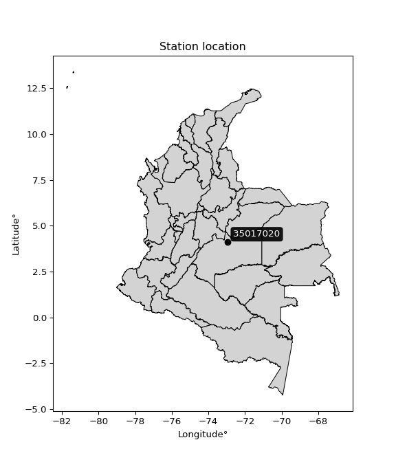

<div align="center">


</div>

# PMP Station (Rain, Pmax24h): 35017020

Probable Maximum Precipitation (PMP) is the greatest amount of rainfall for a specific duration that is meteorologically possible for a given location, acting as a "worst-case" scenario for extreme storms, crucial for designing safety-critical infrastructure like bridges, river deviations, dams, spillways, and nuclear plants to prevent catastrophic failure. PMP is calculated by hydrologists using meteorological data to determine the upper limit of extreme rainfall, often leading to the Probable Maximum Flood (PMF) for flood control design, and is increasingly being studied for climate change impacts.

<div align="center">

</img>

</div>


## A. General information


### 1. General running parameters

• app_version: _v20260103_. • runtime: _2026-01-03 07:24:50.581521_. • Python version: _3.14.0_. • SciPy version: _1.16.3_. • Pandas version: _2.3.3_. • NumPy version: _2.3.5_. • Stations dataset (station_dataset_file): _dataset/pmax24h_in/automatic_colombia_2003_2024.csv_. • Stations catalog (station_catalog_file): _dataset/CNE.xls_. • Minimum year to eval til year_max (date_min): _1900_. • Maximum year to eval since year_min (date_max): _2024_. • Creates, save and include plots into reports (create_plot): _False_. • Plot only fit distributions with Δo > Δ (plot_only_fit): _True_. • Eval low extreme values, if False, evaluates high extreme values (low_extreme): _False_. • Eval every SciPy distribution as logarithmic (pdist_logarithmic_on): _True_. • Standard deviation normalized (ddof): _1.0_. • Return periods to eval in years (Tr): _[2, 2.33, 5, 10, 15, 20, 25, 50, 75, 100, 200, 250, 500, 750, 1000]_. • Minimum data sample per station, 0 means any (minimum_sample): _5_. • Z-Score maximum threshold to adjust a value, 0 means disable (zscore_max): _3.5_. • Z-Score minimum threshold to adjust a value, 0 means disable (zscore_min): _-2.5_. • Avoid zeros, e.g. rain = 0 (avoid_zeros): _True_. • Avoid null values (avoid_nans): _True_. [:file_folder:Dataset file.](../../dataset/pmax24h_in/automatic_colombia_2003_2024.csv)

> Delta Degrees of Freedom (DDOF): is a parameter used in the formulas for calculating variance and standard deviation. When ddof=0, the divisor is $N$ (the total number of observations) and this is used when your data set is the entire population. When ddof=1, the divisor is $N-1$ and this is used when your data set is a sample drawn from a larger population. Using $N-1$ provides an unbiased estimate of the population variance (known as Bessel´s correction).


### 2. Station info and location

|   id |   CODIGO | NOMBRE                          | CATEGORIA    | TECNOLOGIA                              | ESTADO           | FECHA_INSTALACION   |   FECHA_SUSPENSION |   ALTITUD |   LATITUD |   LONGITUD | DEPARTAMENTO   | MUNICIPIO    | AREA_OPERATIVA                            | ENTIDAD                                                     | AREA_HIDROGRAFICA   | ZONA_HIDROGRAFICA   | SUBZONA_HIDROGRAFICA                             | CORRIENTE   | Catalogo   |   Version |
|-----:|---------:|:--------------------------------|:-------------|:----------------------------------------|:-----------------|:--------------------|-------------------:|----------:|----------:|-----------:|:---------------|:-------------|:------------------------------------------|:------------------------------------------------------------|:--------------------|:--------------------|:-------------------------------------------------|:------------|:-----------|----------:|
|    0 | 35017020 | PUENTE LLERAS - AUT  [35017020] | Limnigráfica | Automática con Telemetría, Convencional | En Mantenimiento | 15/03/1972          |                nan |       177 |   4.10302 |   -72.9364 | Meta           | Puerto López | Area Operativa 03 - Meta-Guaviare-Guainía | INSTITUTO DE HIDROLOGIA METEOROLOGIA Y ESTUDIOS AMBIENTALES | Orinoco             | Meta                | Directos Rio Metica entre ríos Guayuriba y Yucao | Meta        | CNE_IDEAM  |  20251226 |

<div align="center">

Dynamic map: [:earth_americas:Google](http://maps.google.com/maps?q=4.103019444,-72.936383333) [:earth_americas:OSM](https://www.openstreetmap.org/#map=18/4.103019444/-72.936383333&layers=P) [:earth_americas:Bing](https://www.bing.com/maps?cp=4.103019444~-72.936383333&lvl=18) [:earth_americas:Apple](https://maps.apple.com/frame?center=4.103019444%2C-72.936383333&span=0.003%2C0.006)

</div>


<div align="center">

```geojson
{
  "type": "Feature",
  "geometry": {
    "type": "Point", 
    "coordinates": [-72.936383333, 4.103019444]
  }, 
  "properties": {
    "Name": "35017020"
  }
}
```

</div>


### 3. Discrete values table and plot

<div align="center">

|               |         0 |           1 |            2 |           3 |           4 |           5 |          6 |          7 |
|:--------------|----------:|------------:|-------------:|------------:|------------:|------------:|-----------:|-----------:|
| Date          | 2017      | 2018        | 2019         | 2020        | 2021        | 2022        | 2023       | 2024       |
| Value         |  121      |   85.7      |   69.3       |   73.1      |   47.6      |   87        |   35.4     |   40.6     |
| Value_initial |  121      |   85.7      |   69.3       |   73.1      |   47.6      |   87        |   35.4     |   40.6     |
| count         |    8      |    8        |    8         |    8        |    8        |    8        |    8       |    8       |
| mean          |   69.9625 |   69.9625   |   69.9625    |   69.9625   |   69.9625   |   69.9625   |   69.9625  |   69.9625  |
| std           |   28.5604 |   28.5604   |   28.5604    |   28.5604   |   28.5604   |   28.5604   |   28.5604  |   28.5604  |
| zscore        |    1.787  |    0.551026 |   -0.0231965 |    0.109855 |   -0.782991 |    0.596544 |   -1.21016 |   -1.02809 |


</div>


> The initial value (value_initial) correspond to the initial obtained or null completed value, and value (value) is adjusted only when the initial value is outside the valid range definite through the Z-Score value. If Z-Score is active, values out of range or outliers are replaced with the station mean value


### 4. Active continuous probability distributions from SciPy (44 of 104 available)

A Probability Density Function (PDF) describes the relative likelihood of a continuous random variable falling within a specific range, where the total area under its curve equals 1, and the area over any interval gives the actual probability for that range. Unlike discrete probabilities (like rolling a die), a PDF shows density, not direct probability for a single point (which is zero), with higher points indicating higher likelihood, often visualized as a bell curve for normal distributions.

A log of a probability density function (log-PDF) is simply the logarithm of the PDF´s value, denoted as $log(f(x))$, useful for converting multiplication of probabilities into addition, improving numerical stability with tiny numbers, and connecting to information theory concepts like entropy. Instead of dealing with very small probabilities (e.g., 0.000001), log-PDFs use negative numbers (e.g., $log(0.00001) ≈ -11.51$ that are easier for computers to handle, preventing underflow errors and simplifying complex calculations. In this study, each active probability distribution from SciPy is also evaluated in the $log$ form.

[scipy.stats](https://docs.scipy.org/doc/scipy/reference/stats.html) is a Python´s powerful submodule within the SciPy library for comprehensive statistical analysis, offering over 130 probability distributions (like Normal, Poisson), functions for descriptive stats (mean, variance), hypothesis testing (t-tests, chi-square), random variable generation, and statistical tests, making it essential for data science, modeling, and research. It provides tools to explore, model, and draw conclusions from data efficiently, working seamlessly with NumPy.

<div align="center">

|   id | p_dist             |   n_parameter | fit_method   | label                                                                       | active   | ref                                                                                                        |
|-----:|:-------------------|--------------:|:-------------|:----------------------------------------------------------------------------|:---------|:-----------------------------------------------------------------------------------------------------------|
|    0 | alpha              |             3 | MLE          | Alpha                                                                       | True     | [:mortar_board:](https://docs.scipy.org/doc/scipy/reference/generated/scipy.stats.alpha.html)              |
|    1 | betaprime          |             4 | MLE          | Beta prime                                                                  | True     | [:mortar_board:](https://docs.scipy.org/doc/scipy/reference/generated/scipy.stats.betaprime.html)          |
|    2 | chi2               |             3 | MLE          | Chi²                                                                        | True     | [:mortar_board:](https://docs.scipy.org/doc/scipy/reference/generated/scipy.stats.chi2.html)               |
|    3 | crystalball        |             4 | MLE          | Crystalball                                                                 | True     | [:mortar_board:](https://docs.scipy.org/doc/scipy/reference/generated/scipy.stats.crystalball.html)        |
|    4 | erlang             |             3 | MLE          | Erlang                                                                      | True     | [:mortar_board:](https://docs.scipy.org/doc/scipy/reference/generated/scipy.stats.erlang.html)             |
|    5 | expon              |             2 | MLE          | Exponential                                                                 | True     | [:mortar_board:](https://docs.scipy.org/doc/scipy/reference/generated/scipy.stats.expon.html)              |
|    6 | exponnorm          |             3 | MLE          | Exponentially modified Normal                                               | True     | [:mortar_board:](https://docs.scipy.org/doc/scipy/reference/generated/scipy.stats.exponnorm.html)          |
|    7 | f                  |             4 | MLE          | F                                                                           | True     | [:mortar_board:](https://docs.scipy.org/doc/scipy/reference/generated/scipy.stats.f.html)                  |
|    8 | fatiguelife        |             3 | MLE          | Fatigue-life (Birnbaum-Saunders)                                            | True     | [:mortar_board:](https://docs.scipy.org/doc/scipy/reference/generated/scipy.stats.fatiguelife.html)        |
|    9 | fisk               |             3 | MLE          | Fisk                                                                        | True     | [:mortar_board:](https://docs.scipy.org/doc/scipy/reference/generated/scipy.stats.fisk.html)               |
|   10 | gamma              |             3 | MLE          | Gamma                                                                       | True     | [:mortar_board:](https://docs.scipy.org/doc/scipy/reference/generated/scipy.stats.gamma.html)              |
|   11 | genexpon           |             5 | MLE          | Generalized exponential                                                     | True     | [:mortar_board:](https://docs.scipy.org/doc/scipy/reference/generated/scipy.stats.genexpon.html)           |
|   12 | genlogistic        |             3 | MLE          | Generalized logistic                                                        | True     | [:mortar_board:](https://docs.scipy.org/doc/scipy/reference/generated/scipy.stats.genlogistic.html)        |
|   13 | gibrat             |             2 | MM           | Gibrat                                                                      | True     | [:mortar_board:](https://docs.scipy.org/doc/scipy/reference/generated/scipy.stats.gibrat.html)             |
|   14 | gompertz           |             3 | MLE          | Gompertz (or truncated Gumbel)                                              | True     | [:mortar_board:](https://docs.scipy.org/doc/scipy/reference/generated/scipy.stats.gompertz.html)           |
|   15 | gumbel_l           |             2 | MM           | Gumbel Left Skew                                                            | True     | [:mortar_board:](https://docs.scipy.org/doc/scipy/reference/generated/scipy.stats.gumbel_l.html)           |
|   16 | gumbel_r           |             2 | MM           | Gumbel Right Skew                                                           | True     | [:mortar_board:](https://docs.scipy.org/doc/scipy/reference/generated/scipy.stats.gumbel_r.html)           |
|   17 | halflogistic       |             2 | MM           | Half-logistic                                                               | True     | [:mortar_board:](https://docs.scipy.org/doc/scipy/reference/generated/scipy.stats.halflogistic.html)       |
|   18 | halfnorm           |             2 | MM           | Half Normal                                                                 | True     | [:mortar_board:](https://docs.scipy.org/doc/scipy/reference/generated/scipy.stats.halfnorm.html)           |
|   19 | hypsecant          |             2 | MM           | hyperbolic secant                                                           | True     | [:mortar_board:](https://docs.scipy.org/doc/scipy/reference/generated/scipy.stats.hypsecant.html)          |
|   20 | invgamma           |             3 | MLE          | Inverted gamma                                                              | True     | [:mortar_board:](https://docs.scipy.org/doc/scipy/reference/generated/scipy.stats.invgamma.html)           |
|   21 | invgauss           |             3 | MLE          | Inverse Gaussian                                                            | True     | [:mortar_board:](https://docs.scipy.org/doc/scipy/reference/generated/scipy.stats.invgauss.html)           |
|   22 | invweibull         |             3 | MLE          | Inverted Weibull                                                            | True     | [:mortar_board:](https://docs.scipy.org/doc/scipy/reference/generated/scipy.stats.invweibull.html)         |
|   23 | johnsonsu          |             4 | MLE          | Johnson Su                                                                  | True     | [:mortar_board:](https://docs.scipy.org/doc/scipy/reference/generated/scipy.stats.johnsonsu.html)          |
|   24 | kstwobign          |             2 | MLE          | Limiting distribution of scaled Kolmogorov-Smirnov two-sided test statistic | True     | [:mortar_board:](https://docs.scipy.org/doc/scipy/reference/generated/scipy.stats.kstwobign.html)          |
|   25 | laplace            |             2 | MM           | Laplace                                                                     | True     | [:mortar_board:](https://docs.scipy.org/doc/scipy/reference/generated/scipy.stats.laplace.html)            |
|   26 | laplace_asymmetric |             3 | MLE          | Asymmetric Laplace                                                          | True     | [:mortar_board:](https://docs.scipy.org/doc/scipy/reference/generated/scipy.stats.laplace_asymmetric.html) |
|   27 | loggamma           |             3 | MLE          | Log gamma                                                                   | True     | [:mortar_board:](https://docs.scipy.org/doc/scipy/reference/generated/scipy.stats.loggamma.html)           |
|   28 | logistic           |             2 | MM           | Logistic (or Sech-squared)                                                  | True     | [:mortar_board:](https://docs.scipy.org/doc/scipy/reference/generated/scipy.stats.logistic.html)           |
|   29 | lognorm            |             3 | MLE          | Log Normal                                                                  | True     | [:mortar_board:](https://docs.scipy.org/doc/scipy/reference/generated/scipy.stats.lognorm.html)            |
|   30 | maxwell            |             2 | MM           | Maxwell                                                                     | True     | [:mortar_board:](https://docs.scipy.org/doc/scipy/reference/generated/scipy.stats.maxwell.html)            |
|   31 | mielke             |             4 | MLE          | Mielke Beta-Kappa / Dagum                                                   | True     | [:mortar_board:](https://docs.scipy.org/doc/scipy/reference/generated/scipy.stats.mielke.html)             |
|   32 | moyal              |             2 | MM           | Moyal                                                                       | True     | [:mortar_board:](https://docs.scipy.org/doc/scipy/reference/generated/scipy.stats.moyal.html)              |
|   33 | nakagami           |             3 | MLE          | Nakagami                                                                    | True     | [:mortar_board:](https://docs.scipy.org/doc/scipy/reference/generated/scipy.stats.nakagami.html)           |
|   34 | ncf                |             5 | MLE          | Non-central F distribution                                                  | True     | [:mortar_board:](https://docs.scipy.org/doc/scipy/reference/generated/scipy.stats.ncf.html)                |
|   35 | nct                |             4 | MLE          | Non-central Student’s t                                                     | True     | [:mortar_board:](https://docs.scipy.org/doc/scipy/reference/generated/scipy.stats.nct.html)                |
|   36 | norm               |             2 | MM           | Normal                                                                      | True     | [:mortar_board:](https://docs.scipy.org/doc/scipy/reference/generated/scipy.stats.norm.html)               |
|   37 | pearson3           |             3 | MM           | Pearson type III                                                            | True     | [:mortar_board:](https://docs.scipy.org/doc/scipy/reference/generated/scipy.stats.pearson3.html)           |
|   38 | rayleigh           |             2 | MM           | Rayleigh                                                                    | True     | [:mortar_board:](https://docs.scipy.org/doc/scipy/reference/generated/scipy.stats.rayleigh.html)           |
|   39 | rice               |             3 | MLE          | Rice                                                                        | True     | [:mortar_board:](https://docs.scipy.org/doc/scipy/reference/generated/scipy.stats.rice.html)               |
|   40 | t                  |             3 | MLE          | Student’s t                                                                 | True     | [:mortar_board:](https://docs.scipy.org/doc/scipy/reference/generated/scipy.stats.t.html)                  |
|   41 | truncnorm          |             4 | MLE          | Truncated normal                                                            | True     | [:mortar_board:](https://docs.scipy.org/doc/scipy/reference/generated/scipy.stats.truncnorm.html)          |
|   42 | wald               |             2 | MM           | Wald                                                                        | True     | [:mortar_board:](https://docs.scipy.org/doc/scipy/reference/generated/scipy.stats.wald.html)               |
|   43 | weibull_min        |             3 | MLE          | Weibull minimum                                                             | True     | [:mortar_board:](https://docs.scipy.org/doc/scipy/reference/generated/scipy.stats.weibull_min.html)        |

</div>

> **n_parameter:** # arguments & localization & scale.
>
> **Fit methods:** (MLE) maximum likelihood, (MM) L-moments.
>
>**Inactive** (With the only purpose of prevent loops, zero divisions, infinite values, over high estimated values or horizontal trending for recurrence intervals estimations, the follow distributions were disabled.)**:** foldnorm, gennorm, norminvgauss, powernorm, powerlognorm, skewnorm, genextreme, anglit, arcsine, argus, beta, bradford, burr, burr12, cauchy, cosine, halfcauchy, foldcauchy, skewcauchy, wrapcauchy, dgamma, gengamma, exponweib, exponpow, truncexpon, gausshyper, genhalflogistic, genhyperbolic, geninvgauss, halfgennorm, johnsonsb, kappa4, kappa3, ksone, kstwo, loglaplace, levy, levy_l, levy_stable, ncx2, pareto, genpareto, truncpareto, lomax, powerlaw, rdist, rel_breitwigner, recipinvgauss, semicircular, studentized_range, trapezoid, triang, truncweibull_min, tukeylambda, uniform, loguniform, vonmises, vonmises_line, weibull_max, dweibull, 


## B. Probability distributions vs. Empirical distributions

A continuous probability distribution (CPD) describes probabilities for variables that can take any value within a range (like rain any time), unlike discrete variables with specific outcomes (like temperature). It uses a Probability Density Function (PDF), a curve where the total area under it equals 1, and the probability of the variable falling within an interval (a to b) is found by calculating the area under the curve between those points. A key feature is that the probability of hitting any single exact value is zero, so probabilities are always expressed for ranges, e.g., $P(a ≤ X ≤ b)$.

<div align="center">

Distributions parameters from station values
|    |   station | p_dist                |   n |             loc |          scale | shape                 | shape1                | shape2                 | shape3   |
|---:|----------:|:----------------------|----:|----------------:|---------------:|:----------------------|:----------------------|:-----------------------|:---------|
|  0 |  35017020 | alpha                 |   8 |  -116.866       | 1317.37        | 7.192848602923872     |                       |                        |          |
|  1 |  35017020 | betaprime             |   8 |    -2.51708     |  453.363       | 8.34437902026625      | 53.1852141647351      |                        |          |
|  2 |  35017020 | chi2                  |   8 |    35.4         |   14.6879      | 1.8532384613561357    |                       |                        |          |
|  3 |  35017020 | crystalball           |   8 |    69.9625      |   26.7158      | 2926.408468328283     | 13986.124862077962    |                        |          |
|  4 |  35017020 | erlang                |   8 |    35.4         |   40.7205      | 0.9481780624129358    |                       |                        |          |
|  5 |  35017020 | expon                 |   8 |    35.4         |   34.5625      |                       |                       |                        |          |
|  6 |  35017020 | exponnorm             |   8 |    50.3848      |   19.3526      | 1.0116333865398506    |                       |                        |          |
|  7 |  35017020 | f                     |   8 |    -0.505798    |   69.7364      | 14.23487432410488     | 263.9853922401918     |                        |          |
|  8 |  35017020 | fatiguelife           |   8 |    35.4         |    2.32765e-05 | 1183.1171253125303    |                       |                        |          |
|  9 |  35017020 | fisk                  |   8 |    10.3135      |   54.7401      | 3.4405397696836975    |                       |                        |          |
| 10 |  35017020 | gamma                 |   8 |    35.4         |   45.9843      | 0.20442307222796324   |                       |                        |          |
| 11 |  35017020 | genexpon              |   8 |    35.4         |    2.56628     | 0.07958159912210802   | 8.322325001314095e-07 | 0.8568502712316057     |          |
| 12 |  35017020 | genlogistic           |   8 |   -85.8403      |   22.0801      | 651.4018501767855     |                       |                        |          |
| 13 |  35017020 | gibrat                |   8 |    49.5817      |   12.3616      |                       |                       |                        |          |
| 14 |  35017020 | gompertz              |   8 |    35.4         |   68.9391      | 1.2730013968219622    |                       |                        |          |
| 15 |  35017020 | gumbel_l              |   8 |    81.986       |   20.8302      |                       |                       |                        |          |
| 16 |  35017020 | gumbel_r              |   8 |    57.939       |   20.8302      |                       |                       |                        |          |
| 17 |  35017020 | halflogistic          |   8 |    38.2981      |   22.841       |                       |                       |                        |          |
| 18 |  35017020 | halfnorm              |   8 |    34.6013      |   44.3187      |                       |                       |                        |          |
| 19 |  35017020 | hypsecant             |   8 |    69.9625      |   17.0078      |                       |                       |                        |          |
| 20 |  35017020 | invgamma              |   8 |   -31.9053      | 1412.76        | 14.84898231463687     |                       |                        |          |
| 21 |  35017020 | invgauss              |   8 |    13.6767      |  189.712       | 0.29669133124395697   |                       |                        |          |
| 22 |  35017020 | invweibull            |   8 |    35.4         |    1.33941     | 0.05222213000212082   |                       |                        |          |
| 23 |  35017020 | johnsonsu             |   8 |     8.61224     |    2.3637      | -8.31995384421484     | 2.1623379912727634    |                        |          |
| 24 |  35017020 | kstwobign             |   8 |   -19.3439      |  102.186       |                       |                       |                        |          |
| 25 |  35017020 | laplace               |   8 |    69.9625      |   18.8909      |                       |                       |                        |          |
| 26 |  35017020 | laplace_asymmetric    |   8 |    73.1         |   21.5668      | 1.0753816953954964    |                       |                        |          |
| 27 |  35017020 | loggamma              |   8 | -9055.3         | 1200.34        | 2003.3042704829968    |                       |                        |          |
| 28 |  35017020 | logistic              |   8 |    69.9625      |   14.7292      |                       |                       |                        |          |
| 29 |  35017020 | lognorm               |   8 |    35.4         |    0.326136    | 11.919225829502947    |                       |                        |          |
| 30 |  35017020 | maxwell               |   8 |     6.65734     |   39.6706      |                       |                       |                        |          |
| 31 |  35017020 | mielke                |   8 |    -3.22795     |   35.8702      | 15.710568458781871    | 3.1631990455504857    |                        |          |
| 32 |  35017020 | moyal                 |   8 |    54.6847      |   12.0263      |                       |                       |                        |          |
| 33 |  35017020 | nakagami              |   8 |    35.4         |   68.2914      | 0.08280747168942854   |                       |                        |          |
| 34 |  35017020 | ncf                   |   8 |    -0.771688    |   69.0851      | 16.351093792034906    | 82.88100228485817     | 5.5720409891356196e-08 |          |
| 35 |  35017020 | nct                   |   8 |    -0.0573376   |   18.0975      | 8.523414100937496     | 3.523007105697624     |                        |          |
| 36 |  35017020 | norm                  |   8 |    69.9625      |   26.7158      |                       |                       |                        |          |
| 37 |  35017020 | pearson3              |   8 |    69.9625      |   26.7158      | 0.4197746171023208    |                       |                        |          |
| 38 |  35017020 | rayleigh              |   8 |    18.8537      |   40.7789      |                       |                       |                        |          |
| 39 |  35017020 | rice                  |   8 |    22.5732      |   37.6887      | 0.2889595962584519    |                       |                        |          |
| 40 |  35017020 | t                     |   8 |    69.9636      |   26.7151      | 10344813.11073887     |                       |                        |          |
| 41 |  35017020 | truncnorm             |   8 |    69.9625      |   26.7158      | -847.0441522155638    | 1190.4068233027604    |                        |          |
| 42 |  35017020 | wald                  |   8 |    43.2467      |   26.7158      |                       |                       |                        |          |
| 43 |  35017020 | weibull_min           |   8 |    35.4         |   42.2997      | 0.8033496484860582    |                       |                        |          |
| 44 |  35017020 | logalpha              |   8 |    -5.1364      |  216.483       | 23.30392030539666     |                       |                        |          |
| 45 |  35017020 | logbetaprime          |   8 |   -10.8698      |   18.0163      | 2631.828661652112     | 3152.893502364605     |                        |          |
| 46 |  35017020 | logchi2               |   8 |     3.56671     |    0.991132    | 1.0310417328416734    |                       |                        |          |
| 47 |  35017020 | logcrystalball        |   8 |     4.17202     |    0.395795    | 230.41098906485516    | 66.38207813818991     |                        |          |
| 48 |  35017020 | logerlang             |   8 |    -5.3533      |    0.0165486   | 575.5093226826748     |                       |                        |          |
| 49 |  35017020 | logexpon              |   8 |     3.56671     |    0.605305    |                       |                       |                        |          |
| 50 |  35017020 | logexponnorm          |   8 |     4.17172     |    0.395793    | 0.0007672584233593366 |                       |                        |          |
| 51 |  35017020 | logf                  |   8 |  -101.715       |  105.885       | 330969.8607590983     | 250866.49601165619    |                        |          |
| 52 |  35017020 | logfatiguelife        |   8 |   -33.6409      |   37.8108      | 0.01046945241647769   |                       |                        |          |
| 53 |  35017020 | logfisk               |   8 |    -1.57491e+07 |    1.57491e+07 | 65818093.81888841     |                       |                        |          |
| 54 |  35017020 | loggamma              |   8 |    -5.2342      |    0.0167292   | 562.2269305725476     |                       |                        |          |
| 55 |  35017020 | loggenexpon           |   8 |     3.56551     |    0.00451696  | 0.003823504522782707  | 2.2465374848302235    | 1.6826364770793816e-05 |          |
| 56 |  35017020 | loggenlogistic        |   8 |     4.45993     |    0.155554    | 0.4212242136938126    |                       |                        |          |
| 57 |  35017020 | loggibrat             |   8 |     3.87004     |    0.183157    |                       |                       |                        |          |
| 58 |  35017020 | loggompertz           |   8 |     3.56651     |    0.561103    | 0.3691155311809027    |                       |                        |          |
| 59 |  35017020 | loggumbel_l           |   8 |     4.35015     |    0.3086      |                       |                       |                        |          |
| 60 |  35017020 | loggumbel_r           |   8 |     3.99389     |    0.3086      |                       |                       |                        |          |
| 61 |  35017020 | loghalflogistic       |   8 |     3.70289     |    0.338404    |                       |                       |                        |          |
| 62 |  35017020 | loghalfnorm           |   8 |     3.6482      |    0.656507    |                       |                       |                        |          |
| 63 |  35017020 | loghypsecant          |   8 |     4.17202     |    0.251971    |                       |                       |                        |          |
| 64 |  35017020 | loginvgamma           |   8 |    -5.91255     | 6479.74        | 643.7129696588927     |                       |                        |          |
| 65 |  35017020 | loginvgauss           |   8 |     1.66162     |   95.0917      | 0.026400024098498086  |                       |                        |          |
| 66 |  35017020 | loginvweibull         |   8 |    -2.29186e+07 |    2.29186e+07 | 62689723.34408423     |                       |                        |          |
| 67 |  35017020 | logjohnsonsu          |   8 |     7.06696     |    0.866246    | 14.551795890806176    | 7.60550968005527      |                        |          |
| 68 |  35017020 | logkstwobign          |   8 |     2.71283     |    1.66368     |                       |                       |                        |          |
| 69 |  35017020 | loglaplace            |   8 |     4.17202     |    0.279869    |                       |                       |                        |          |
| 70 |  35017020 | loglaplace_asymmetric |   8 |     4.45085     |    0.271316    | 1.6382100693419062    |                       |                        |          |
| 71 |  35017020 | logloggamma           |   8 |     1.1665      |    1.28301     | 10.903769387025001    |                       |                        |          |
| 72 |  35017020 | loglogistic           |   8 |     4.17202     |    0.218213    |                       |                       |                        |          |
| 73 |  35017020 | loglognorm            |   8 |     3.56671     |    0.00735656  | 11.523806053486286    |                       |                        |          |
| 74 |  35017020 | logmaxwell            |   8 |     3.23415     |    0.587721    |                       |                       |                        |          |
| 75 |  35017020 | logmielke             |   8 |    -0.106736    |    4.63322     | 10.412376116282445    | 33.84669831785277     |                        |          |
| 76 |  35017020 | logmoyal              |   8 |     3.94568     |    0.17817     |                       |                       |                        |          |
| 77 |  35017020 | lognakagami           |   8 |     3.56671     |    0.804342    | 0.40597853759948355   |                       |                        |          |
| 78 |  35017020 | logncf                |   8 |     1.01467     |    6.09089e-06 | 0.0003719154503314866 | 1552.6903909548423    | 192.15062550947368     |          |
| 79 |  35017020 | lognct                |   8 |   -10.8777      |    0.38017     | 8395.266196780427     | 39.582925973591564    |                        |          |
| 80 |  35017020 | lognorm               |   8 |     4.17202     |    0.395795    |                       |                       |                        |          |
| 81 |  35017020 | logpearson3           |   8 |     4.17202     |    0.395795    | -0.12545661954801718  |                       |                        |          |
| 82 |  35017020 | lograyleigh           |   8 |     3.41484     |    0.604141    |                       |                       |                        |          |
| 83 |  35017020 | logrice               |   8 |     3.37097     |    0.466958    | 1.2888914487382954    |                       |                        |          |
| 84 |  35017020 | logt                  |   8 |     4.17202     |    0.395795    | 3402477640.4450703    |                       |                        |          |
| 85 |  35017020 | logtruncnorm          |   8 |    -0.132212    |    1.09646     | 3.9861401427937504    | 4.494455380213189     |                        |          |
| 86 |  35017020 | logwald               |   8 |     3.77619     |    0.395828    |                       |                       |                        |          |
| 87 |  35017020 | logweibull_min        |   8 |     3.24593     |    1.04557     | 2.589161841929296     |                       |                        |          |

</div>

> **loc** (Location parameter): This shifts the distribution along the x-axis. For many common distributions, like the normal (Gaussian) distribution, loc represents the mean $μ$. For others, like the uniform distribution, it might represent the minimum value, or for the beta distribution, the left end of the support interval.
>
> **scale** (Scale parameter): This determines the width or spread of the distribution. For the normal distribution, scale represents the standard deviation $σ$. For a uniform distribution, it defines the length of the interval (from $loc$ to $loc + scale$).
>
> **shape** (Shape parameters): Refers to parameters that define the specific form of a probability distribution, distinct from its location (loc) and scale (scale). These parameters are required arguments for most distribution functions. For example, a normal (Gaussian) distribution is fully defined by its location (mean) and scale (standard deviation), so it has no specific shape parameters beyond loc and scale. However, other distributions have intrinsic properties that need specification, as Gamma distribution that takes a shape parameter, often named $a$ or $alpha$.


### 0. Cumulative distribution values - CDF (88 evaluated)

Cumulative Distribution Function (CDF), denoted as $F$<sub>$X$</sub>$(x)$, is a function that gives the probability that a random variable $X$ will take a value less than or equal to a specific value, $x$ (i.e., $(P(X≥x)$. It essentially "accumulates" probabilities from a given point up to the far right (positive infinity), providing a complete picture of the distribution´s probabilities for both discrete (like rain) and continuous (like temperature) variables, helping to find probabilities over ranges or above certain values. Each station is evaluated separately ordering the $x$ values ascending, calculating the CDF and PDF values for the activated distributions and their logarithmic forms.

<div align="center">

CDF ordered by x ascending and calculating $log(f(x))$ separately
|   id |   Station |   date |     x |   count |    mean |     std |     zscore |   Value_initial |   station |   m |    alpha |   alpha_pdf |   betaprime |   betaprime_pdf |        chi2 |   chi2_pdf |   crystalball |   crystalball_pdf |      erlang |   erlang_pdf |    expon |   expon_pdf |   exponnorm |   exponnorm_pdf |         f |      f_pdf |   fatiguelife |   fatiguelife_pdf |      fisk |   fisk_pdf |       gamma |   gamma_pdf |    genexpon |   genexpon_pdf |   genlogistic |   genlogistic_pdf |   gibrat |   gibrat_pdf |    gompertz |   gompertz_pdf |   gumbel_l |   gumbel_l_pdf |   gumbel_r |   gumbel_r_pdf |   halflogistic |   halflogistic_pdf |   halfnorm |   halfnorm_pdf |   hypsecant |   hypsecant_pdf |   invgamma |   invgamma_pdf |   invgauss |   invgauss_pdf |   invweibull |   invweibull_pdf |   johnsonsu |   johnsonsu_pdf |   kstwobign |   kstwobign_pdf |   laplace |   laplace_pdf |   laplace_asymmetric |   laplace_asymmetric_pdf |   loggamma |   loggamma_pdf |   logistic |   logistic_pdf |   lognorm |   lognorm_pdf |   maxwell |   maxwell_pdf |    mielke |   mielke_pdf |     moyal |   moyal_pdf |   nakagami |   nakagami_pdf |      ncf |    ncf_pdf |      nct |    nct_pdf |      norm |   norm_pdf |   pearson3 |   pearson3_pdf |   rayleigh |   rayleigh_pdf |      rice |   rice_pdf |         t |      t_pdf |   truncnorm |   truncnorm_pdf |      wald |   wald_pdf |   weibull_min |   weibull_min_pdf |   logalpha |   logalpha_pdf |   logbetaprime |   logbetaprime_pdf |     logchi2 |   logchi2_pdf |   logcrystalball |   logcrystalball_pdf |   logerlang |   logerlang_pdf |   logexpon |   logexpon_pdf |   logexponnorm |   logexponnorm_pdf |      logf |   logf_pdf |   logfatiguelife |   logfatiguelife_pdf |   logfisk |   logfisk_pdf |   loggenexpon |   loggenexpon_pdf |   loggenlogistic |   loggenlogistic_pdf |   loggibrat |   loggibrat_pdf |   loggompertz |   loggompertz_pdf |   loggumbel_l |   loggumbel_l_pdf |   loggumbel_r |   loggumbel_r_pdf |   loghalflogistic |   loghalflogistic_pdf |   loghalfnorm |   loghalfnorm_pdf |   loghypsecant |   loghypsecant_pdf |   loginvgamma |   loginvgamma_pdf |   loginvgauss |   loginvgauss_pdf |   loginvweibull |   loginvweibull_pdf |   logjohnsonsu |   logjohnsonsu_pdf |   logkstwobign |   logkstwobign_pdf |   loglaplace |   loglaplace_pdf |   loglaplace_asymmetric |   loglaplace_asymmetric_pdf |   logloggamma |   logloggamma_pdf |   loglogistic |   loglogistic_pdf |   loglognorm |   loglognorm_pdf |   logmaxwell |   logmaxwell_pdf |   logmielke |   logmielke_pdf |   logmoyal |   logmoyal_pdf |   lognakagami |   lognakagami_pdf |    logncf |   logncf_pdf |    lognct |   lognct_pdf |   logpearson3 |   logpearson3_pdf |   lograyleigh |   lograyleigh_pdf |   logrice |   logrice_pdf |      logt |   logt_pdf |   logtruncnorm |   logtruncnorm_pdf |   logwald |   logwald_pdf |   logweibull_min |   logweibull_min_pdf |
|-----:|----------:|-------:|------:|--------:|--------:|--------:|-----------:|----------------:|----------:|----:|---------:|------------:|------------:|----------------:|------------:|-----------:|--------------:|------------------:|------------:|-------------:|---------:|------------:|------------:|----------------:|----------:|-----------:|--------------:|------------------:|----------:|-----------:|------------:|------------:|------------:|---------------:|--------------:|------------------:|---------:|-------------:|------------:|---------------:|-----------:|---------------:|-----------:|---------------:|---------------:|-------------------:|-----------:|---------------:|------------:|----------------:|-----------:|---------------:|-----------:|---------------:|-------------:|-----------------:|------------:|----------------:|------------:|----------------:|----------:|--------------:|---------------------:|-------------------------:|-----------:|---------------:|-----------:|---------------:|----------:|--------------:|----------:|--------------:|----------:|-------------:|----------:|------------:|-----------:|---------------:|---------:|-----------:|---------:|-----------:|----------:|-----------:|-----------:|---------------:|-----------:|---------------:|----------:|-----------:|----------:|-----------:|------------:|----------------:|----------:|-----------:|--------------:|------------------:|-----------:|---------------:|---------------:|-------------------:|------------:|--------------:|-----------------:|---------------------:|------------:|----------------:|-----------:|---------------:|---------------:|-------------------:|----------:|-----------:|-----------------:|---------------------:|----------:|--------------:|--------------:|------------------:|-----------------:|---------------------:|------------:|----------------:|--------------:|------------------:|--------------:|------------------:|--------------:|------------------:|------------------:|----------------------:|--------------:|------------------:|---------------:|-------------------:|--------------:|------------------:|--------------:|------------------:|----------------:|--------------------:|---------------:|-------------------:|---------------:|-------------------:|-------------:|-----------------:|------------------------:|----------------------------:|--------------:|------------------:|--------------:|------------------:|-------------:|-----------------:|-------------:|-----------------:|------------:|----------------:|-----------:|---------------:|--------------:|------------------:|----------:|-------------:|----------:|-------------:|--------------:|------------------:|--------------:|------------------:|----------:|--------------:|----------:|-----------:|---------------:|-------------------:|----------:|--------------:|-----------------:|---------------------:|
|    0 |  35017020 |   2023 |  35.4 |       8 | 69.9625 | 28.5604 | -1.21016   |            35.4 |  35017020 |   1 | 0.072288 |  0.00781993 |   0.0714751 |      0.00822157 | 3.48539e-15 | 0.454529   |     0.0978825 |        0.00646704 | 1.16825e-15 |   0.155896   | 0        |  0.0289331  |   0.0828275 |      0.00697465 | 0.0743414 | 0.00835508 |     0.0546847 |       1.36648e+10 | 0.0638916 | 0.0082027  | 0.000638984 | 1.83836e+10 | 3.10392e-07 |     0.0310105  |     0.0685044 |        0.00830038 | 0        |   0          | 1.33238e-11 |     0.0184656  |   0.101326 |    0.00460918  |  0.0523044 |     0.00740911 |      0         |         0          |  0.0143786 |     0.0180004  |   0.0829578 |      0.00482261 |  0.0668861 |     0.00834168 |  0.0526008 |     0.0104597  |   0.00382847 |      1.56595e+11 |   0.0585115 |      0.00939168 |   0.0635776 |      0.00882303 | 0.0802401 |    0.00424755 |             0.105543 |               0.00455075 |   0.061273 |       0.319131 |  0.0873417 |     0.00541192 |  0.06309  |      0.31301  | 0.0866226 |    0.00812075 | 0.0553103 |   0.0099361  | 0.0257816 |  0.00616068 | 0.00191348 |    4.45999e+10 | 0.070162 | 0.00830489 | 0.071566 | 0.00761563 | 0.0978825 | 0.00646704 |  0.0865958 |     0.00730706 |  0.0790221 |     0.00916387 | 0.0540329 | 0.00819337 | 0.0978695 | 0.00646658 |   0.0978825 |      0.00646704 | 0         | 0          |   2.12502e-13 |       24.0257     |  0.0581783 |       0.332328 |      0.0610029 |           0.316164 | 9.64757e-09 |   1.11994e+07 |        0.0630897 |             0.313009 |   0.0617137 |        0.320455 |   0        |       1.65206  |      0.0630883 |           0.313005 | 0.0634597 |   0.315838 |        0.0622573 |             0.314767 | 0.0699706 |      0.271958 |    0.00101797 |          0.84784  |        0.0889137 |             0.239999 |    0        |        0        |   0.000133197 |          0.657988 |     0.0759335 |          0.23647  |     0.0184666 |          0.238868 |        0          |              0        |     0         |          0        |      0.0574645 |           0.226824 |     0.0602472 |          0.326352 |     0.0517053 |          0.346667 |       0.0482019 |            0.39981  |      0.0729306 |           0.292255 |      0.0451657 |           0.442556 |    0.0575005 |         0.205455 |               0.0996679 |                    0.224239 |      0.070694 |          0.294459 |      0.05875  |          0.253415 |   0.00412888 |      2.38162e+12 |    0.0438117 |         0.370377 |   0.0891837 |        0.252693 | 0.00377398 |      0.0977663 |   3.19405e-13 |        583.99     | 0.0950567 |     0.404955 | 0.0636241 |     0.315774 |     0.0663228 |          0.306156 |     0.0311038 |          0.403164 | 0.0379881 |      0.384927 | 0.0630895 |   0.313008 |    0           |           0        | 0         |      0        |        0.0458394 |             0.361375 |
|    1 |  35017020 |   2024 |  40.6 |       8 | 69.9625 | 28.5604 | -1.02809   |            40.6 |  35017020 |   2 | 0.120348 |  0.0106498  |   0.121705  |      0.0110541  | 0.19033     | 0.0308975  |     0.135869  |        0.00816278 | 0.136443    |   0.0232848  | 0.139681 |  0.0248917  |   0.125008  |      0.00927376 | 0.125052  | 0.0111016  |     0.655236  |       0.0141494   | 0.11543   | 0.0115992  | 0.685423    | 0.0245208   | 0.148926    |     0.0263925  |     0.120122  |        0.0115106  | 0        |   0          | 0.094923    |     0.0180222  |   0.128143 |    0.00573963  |  0.100377  |     0.0110776  |      0.0503471 |         0.0218349  |  0.107668  |     0.0178392  |   0.112095  |      0.00645543 |  0.11875   |     0.0115557  |  0.119884  |     0.0150788  |   0.393917   |      0.00368547  |   0.118003  |      0.0133269  |   0.118505  |      0.0121982  | 0.105667  |    0.00559352 |             0.13207  |               0.00569451 |   0.118038 |       0.515714 |  0.119888  |     0.00716366 |  0.118393 |      0.500627 | 0.134364  |    0.0102107  | 0.120751  |   0.0150045  | 0.0724898 |  0.011875   | 0.554086   |    0.0176393   | 0.121045 | 0.0112158  | 0.118907 | 0.0105976  | 0.135869  | 0.00816278 |  0.130148  |     0.00944545 |  0.132544  |     0.0113439  | 0.103913  | 0.0109083  | 0.135853  | 0.00816237 |   0.135869  |      0.00816278 | 0         | 0          |   0.169432    |        0.023821   |  0.118086  |       0.547886 |      0.117226  |           0.510813 | 0.277907    |   0.998483    |        0.118392  |             0.500626 |   0.118659  |        0.516946 |   0.202621 |       1.31732  |      0.11839   |           0.500622 | 0.119244  |   0.504721 |        0.118029  |             0.505703 | 0.117703  |      0.434003 |    0.126054   |          0.963583 |        0.128625  |             0.345626 |    0        |        0        |   0.0972381   |          0.758457 |     0.115848  |          0.352761 |     0.0772829 |          0.641173 |        0.00129856 |              1.47752  |     0.0674486 |          1.211    |      0.0984753 |           0.384616 |     0.118603  |          0.531484 |     0.115781  |          0.592968 |       0.124391  |            0.70919  |      0.123073  |           0.445928 |      0.129982  |           0.781109 |    0.0938322 |         0.335272 |               0.135667  |                    0.305231 |      0.121522 |          0.453903 |      0.104721 |          0.429647 |   0.600177   |      0.244584    |    0.112431  |         0.6299   |   0.130558  |        0.35628  | 0.0486502  |      0.632076  |   0.185208    |          1.08806  | 0.161898  |     0.570679 | 0.11935   |     0.503867 |     0.119841  |          0.481425 |     0.108064  |          0.706072 | 0.107958  |      0.630653 | 0.118392  |   0.500624 |    0           |           0        | 0         |      0        |        0.111192  |             0.592479 |
|    2 |  35017020 |   2021 |  47.6 |       8 | 69.9625 | 28.5604 | -0.782991  |            47.6 |  35017020 |   3 | 0.206915 |  0.0139144  |   0.210446  |      0.014101   | 0.376283    | 0.0228695  |     0.201282  |        0.0105195  | 0.282572    |   0.0187595  | 0.297411 |  0.0203281  |   0.200883  |      0.0123563  | 0.213695  | 0.0140303  |     0.729704  |       0.0082967   | 0.210643  | 0.0153425  | 0.796553    | 0.0106851   | 0.314997    |     0.0212425  |     0.213493  |        0.0149127  | 0        |   0          | 0.218425    |     0.0172262  |   0.174611 |    0.00760399  |  0.193456  |     0.0152563  |      0.200854  |         0.0210073  |  0.230708  |     0.0172454  |   0.167004  |      0.00937495 |  0.212284  |     0.0149097  |  0.237457  |     0.0178864  |   0.41023    |      0.00156465  |   0.224203  |      0.0165699  |   0.215954  |      0.0153202  | 0.153061  |    0.00810237 |             0.178601 |               0.00770079 |   0.219933 |       0.763084 |  0.17972   |     0.0100088  |  0.21735  |      0.742899 | 0.214509  |    0.0125773  | 0.240749  |   0.0185493  | 0.179427  |  0.0180851  | 0.638031   |    0.00864016  | 0.211082 | 0.0142937  | 0.206154 | 0.0141607  | 0.201282  | 0.0105195  |  0.205911  |     0.0121271  |  0.220002  |     0.0134835  | 0.190614  | 0.0136801  | 0.201264  | 0.0105193  |   0.201282  |      0.0105195  | 0.0337056 | 0.0264462  |   0.308095    |        0.0167803  |  0.226097  |       0.803899 |      0.21823   |           0.75714  | 0.402586    |   0.634452    |        0.21735   |             0.742898 |   0.220709  |        0.763738 |   0.386889 |       1.0129   |      0.217347  |           0.742896 | 0.218885  |   0.747045 |        0.218014  |             0.750186 | 0.205935  |      0.683401 |    0.283615   |          1.00081  |        0.196745  |             0.521537 |    0        |        0        |   0.226478    |          0.862872 |     0.186296  |          0.543591 |     0.216731  |          1.07389  |        0.232017   |              1.39798  |     0.256275  |          1.1521   |      0.18154   |           0.682052 |     0.223471  |          0.782998 |     0.23225   |          0.858367 |       0.259503  |            0.957544 |      0.210851  |           0.661953 |      0.274233  |           0.992957 |    0.165648  |         0.591875 |               0.194042  |                    0.436567 |      0.211086 |          0.675892 |      0.195149 |          0.719783 |   0.625764   |      0.11105     |    0.233596  |         0.876635 |   0.19962   |        0.520833 | 0.207046   |      1.27453   |   0.341939    |          0.901488 | 0.266874  |     0.741325 | 0.218758  |     0.744954 |     0.214883  |          0.714804 |     0.240382  |          0.932375 | 0.227316  |      0.856092 | 0.217349  |   0.742897 |    0           |           0        | 0.0814315 |      2.44232  |        0.225168  |             0.829614 |
|    3 |  35017020 |   2019 |  69.3 |       8 | 69.9625 | 28.5604 | -0.0231965 |            69.3 |  35017020 |   4 | 0.546371 |  0.0150617  |   0.546383  |      0.0147625  | 0.713704    | 0.0101362  |     0.490108  |        0.0149282  | 0.589266    |   0.010442   | 0.625001 |  0.0108499  |   0.528425  |      0.015701   | 0.547023  | 0.0146784  |     0.846143  |       0.00356747  | 0.56391   | 0.0143437  | 0.91841     | 0.00295614  | 0.650505    |     0.0108381  |     0.56082   |        0.0146833  | 0.679734 |   0.0181423  | 0.554498    |     0.0134515  |   0.41951  |    0.0151568   |  0.56012   |     0.0155854  |      0.590638  |         0.0142539  |  0.566335  |     0.0132509  |   0.487604  |      0.0187013  |  0.559052  |     0.0146913  |  0.593237  |     0.0132425  |   0.429674   |      0.000559128 |   0.578315  |      0.0139292  |   0.560831  |      0.0144184  | 0.482769  |    0.0255556  |             0.455228 |               0.0196282  |   0.57249  |       0.984357 |  0.488757  |     0.0169645  |  0.566643 |      0.993856 | 0.523526  |    0.0144154  | 0.601307  |   0.0126791  | 0.586004  |  0.0155766  | 0.754678   |    0.00361805  | 0.548849 | 0.0147116  | 0.553113 | 0.0152033  | 0.490108  | 0.0149282  |  0.518036  |     0.0149514  |  0.534745  |     0.014114   | 0.521634  | 0.0151027  | 0.490091  | 0.0149286  |   0.490108  |      0.0149282  | 0.658022  | 0.0155011  |   0.567028    |        0.00858881 |  0.583966  |       0.960817 |      0.569478  |           0.984977 | 0.578096    |   0.352991    |        0.566642  |             0.993856 |   0.573147  |        0.983247 |   0.670356 |       0.544591 |      0.566641  |           0.993861 | 0.568561  |   0.990844 |        0.568654  |             0.991034 | 0.554814  |      1.03223  |    0.627966   |          0.778177 |        0.501256  |             1.09394  |    0.757672 |        0.848279 |   0.57402     |          0.928085 |     0.501579  |          1.12461  |     0.635893  |          0.932873 |        0.659142   |              0.835585 |     0.63138   |          0.811293 |      0.582961  |           1.22062  |     0.579028  |          0.974722 |     0.595611  |          0.928428 |       0.617028  |            0.814925 |      0.542917  |           1.01974  |      0.630324  |           0.799218 |    0.605643  |         1.40907  |               0.451759  |                    1.01639  |      0.54711  |          1.01879  |      0.575522 |          1.11953  |   0.652373   |      0.0477304   |    0.595872  |         0.920625 |   0.495841  |        1.06669  | 0.660134   |      0.893864  |   0.624557    |          0.61517  | 0.577635  |     0.82403  | 0.567394  |     0.988462 |     0.55863   |          1.004    |     0.60515   |          0.890994 | 0.586301  |      0.937406 | 0.566642  |   0.993856 |    1.20496e-05 |           4.28701  | 0.727423  |      0.789038 |        0.582662  |             0.951373 |
|    4 |  35017020 |   2020 |  73.1 |       8 | 69.9625 | 28.5604 |  0.109855  |            73.1 |  35017020 |   5 | 0.601817 |  0.0140867  |   0.600772  |      0.0138345  | 0.749694    | 0.00883707 |     0.546744  |        0.0148302  | 0.627046    |   0.00945946 | 0.664045 |  0.00972022 |   0.586793  |      0.014964   | 0.601152  | 0.013782   |     0.858965  |       0.00319127  | 0.61582   | 0.0129643  | 0.928747    | 0.00250107  | 0.689356    |     0.00963333 |     0.614499  |        0.0135469  | 0.739948 |   0.0137935  | 0.604068    |     0.0126323  |   0.479377 |    0.0163141   |  0.61696   |     0.0143043  |      0.642153  |         0.0128637  |  0.614977  |     0.0123451  |   0.55839   |      0.0184015  |  0.612801  |     0.0135751  |  0.641065  |     0.0119362  |   0.431687   |      0.000502331 |   0.628853  |      0.0126645  |   0.613672  |      0.0133763  | 0.576513  |    0.0224175  |             0.536274 |               0.0231227  |   0.624152 |       0.948501 |  0.553053  |     0.016782   |  0.618945 |      0.962813 | 0.577347  |    0.013877   | 0.646614  |   0.0111855  | 0.6419    |  0.0138455  | 0.767794   |    0.00329516  | 0.602976 | 0.0137489  | 0.60884  | 0.0140947  | 0.546744  | 0.0148302  |  0.573927  |     0.014422   |  0.587198  |     0.0134661  | 0.577782  | 0.0144156  | 0.546729  | 0.0148307  |   0.546744  |      0.0148302  | 0.711106  | 0.0125639  |   0.598146    |        0.0078067  |  0.634125  |       0.916127 |      0.621207  |           0.950398 | 0.596345    |   0.331114    |        0.618944  |             0.962814 |   0.624747  |        0.947295 |   0.698183 |       0.498619 |      0.618943  |           0.962819 | 0.620676  |   0.958857 |        0.620755  |             0.958174 | 0.60903   |      0.99511  |    0.668147   |          0.726867 |        0.560859  |             1.13393  |    0.797903 |        0.667917 |   0.622951    |          0.903471 |     0.562994  |          1.17225  |     0.683308  |          0.843195 |        0.701461   |              0.750511 |     0.673099  |          0.75161  |      0.645954  |           1.13279  |     0.630052  |          0.934428 |     0.643799  |          0.875232 |       0.658861  |            0.751954 |      0.597249  |           1.01251  |      0.671407  |           0.739673 |    0.674126  |         1.16438  |               0.509411  |                    1.1461   |      0.60126  |          1.00665  |      0.633916 |          1.06348  |   0.654821   |      0.0441007   |    0.643728  |         0.870699 |   0.5543    |        1.1194   | 0.705022   |      0.789006  |   0.656419    |          0.578666 | 0.620857  |     0.793818 | 0.619394  |     0.956978 |     0.611681  |          0.98055  |     0.651325  |          0.837796 | 0.635243  |      0.894365 | 0.618943  |   0.962814 |    0.207951    |           3.52659  | 0.765813  |      0.654437 |        0.632417  |             0.910699 |
|    5 |  35017020 |   2018 |  85.7 |       8 | 69.9625 | 28.5604 |  0.551026  |            85.7 |  35017020 |   6 | 0.754718 |  0.010099   |   0.751954  |      0.010081   | 0.83931     | 0.0056343  |     0.722093  |        0.0125543  | 0.728799    |   0.00683903 | 0.766678 |  0.00675074 |   0.751667  |      0.0109472  | 0.752247  | 0.0101101  |     0.892974  |       0.00227706  | 0.750462  | 0.0085467  | 0.953372    | 0.00151182  | 0.789831    |     0.00651751 |     0.759384  |        0.00946437 | 0.858186 |   0.00621648 | 0.745283    |     0.00975654 |   0.697351 |    0.0173652   |  0.768161  |     0.00972661 |      0.776957  |         0.00867599 |  0.751083  |     0.00926156 |   0.759736  |      0.012823   |  0.758296  |     0.00952229 |  0.766351  |     0.00811022 |   0.437141   |      0.000375557 |   0.762544  |      0.00866534 |   0.758779  |      0.00965501 | 0.782644  |    0.0115058  |             0.752596 |               0.0123363  |   0.761678 |       0.765596 |  0.744303  |     0.012921   |  0.759438 |      0.786442 | 0.735273  |    0.0109696  | 0.760791  |   0.0071986  | 0.782997  |  0.00879617 | 0.804156   |    0.00254003  | 0.75272  | 0.00995667 | 0.759663 | 0.00981128 | 0.722093  | 0.0125543  |  0.737531  |     0.0112786  |  0.739082  |     0.0104884  | 0.739765  | 0.0111053  | 0.722085  | 0.0125548  |   0.722093  |      0.0125543  | 0.827596  | 0.00668357 |   0.683144    |        0.00581614 |  0.765361  |       0.723152 |      0.759274  |           0.770154 | 0.644544    |   0.277598    |        0.759437  |             0.786443 |   0.762076  |        0.764405 |   0.767915 |       0.383418 |      0.759437  |           0.786448 | 0.760413  |   0.781336 |        0.760235  |             0.77911  | 0.751724  |      0.779978 |    0.771162   |          0.568452 |        0.737535  |             1.02771  |    0.875766 |        0.352904 |   0.757296    |          0.77211  |     0.749896  |          1.12318  |     0.796552  |          0.587124 |        0.802335   |              0.526379 |     0.778521  |          0.575596 |      0.796691  |           0.75312  |     0.76471   |          0.745561 |     0.767718  |          0.676771 |       0.763326  |            0.563892 |      0.749682  |           0.877598 |      0.774857  |           0.563069 |    0.81538   |         0.659666 |               0.728536  |                    1.6391   |      0.751785 |          0.860984 |      0.782077 |          0.781036 |   0.66114    |      0.0359162   |    0.767784  |         0.682586 |   0.732931  |        1.06459  | 0.808567   |      0.526791  |   0.740078    |          0.47478  | 0.737318  |     0.662442 | 0.75898   |     0.781354 |     0.756209  |          0.816336 |     0.770158  |          0.652406 | 0.764025  |      0.71526  | 0.759437  |   0.786444 |    0.631226    |           1.94376  | 0.846799  |      0.391568 |        0.76397   |             0.732273 |
|    6 |  35017020 |   2022 |  87   |       8 | 69.9625 | 28.5604 |  0.596544  |            87   |  35017020 |   7 | 0.767574 |  0.0096813  |   0.764801  |      0.00968494 | 0.846468    | 0.00538032 |     0.738176  |        0.0121851  | 0.737544    |   0.00661539 | 0.775291 |  0.00650154 |   0.765594  |      0.0104793  | 0.765136  | 0.00971884 |     0.895887  |       0.00220379  | 0.761315  | 0.00815262 | 0.95529     | 0.00144014  | 0.798136    |     0.00625999 |     0.771427  |        0.00906496 | 0.865976 |   0.00577365 | 0.75777     |     0.00945486 |   0.719771 |    0.0171142   |  0.780517  |     0.00928513 |      0.787989  |         0.00829806 |  0.76292   |     0.00894971 |   0.775943  |      0.0121125  |  0.770414  |     0.00912246 |  0.776674  |     0.00777349 |   0.437623   |      0.000366011 |   0.773569  |      0.00829908 |   0.771088  |      0.00928295 | 0.797099  |    0.0107407  |             0.768125 |               0.011562   |   0.773044 |       0.744308 |  0.760736  |     0.0123576  |  0.771118 |      0.765093 | 0.749301  |    0.0106114  | 0.769937  |   0.00687453 | 0.794151  |  0.00836582 | 0.807419   |    0.00248068  | 0.765407 | 0.0095622  | 0.772137 | 0.00938093 | 0.738176  | 0.0121851  |  0.751938  |     0.0108854  |  0.752492  |     0.0101428  | 0.753949  | 0.0107167  | 0.738168  | 0.0121856  |   0.738176  |      0.0121851  | 0.836028  | 0.00629294 |   0.690597    |        0.00565091 |  0.776091  |       0.702212 |      0.77071   |           0.749002 | 0.64869     |   0.273253    |        0.771118  |             0.765094 |   0.773425  |        0.743136 |   0.773617 |       0.373999 |      0.771117  |           0.765099 | 0.772017  |   0.760017 |        0.771805  |             0.757754 | 0.76328   |      0.755107 |    0.779608   |          0.553598 |        0.7528    |             0.999671 |    0.880934 |        0.333867 |   0.768796    |          0.755527 |     0.766639  |          1.10039  |     0.805226  |          0.565257 |        0.81012    |              0.507833 |     0.787065  |          0.559534 |      0.80776   |           0.717404 |     0.775775  |          0.724315 |     0.777755  |          0.656677 |       0.771688  |            0.54707  |      0.762741  |           0.857021 |      0.783214  |           0.54712  |    0.825049  |         0.625118 |               0.752125  |                    1.49668  |      0.76459  |          0.83996  |      0.793607 |          0.750619 |   0.661676   |      0.0352933   |    0.777915  |         0.663232 |   0.748773  |        1.03931  | 0.816342   |      0.5062    |   0.747155    |          0.465368 | 0.747182  |     0.647814 | 0.770585  |     0.760217 |     0.76834   |          0.795123 |     0.779842  |          0.634001 | 0.774647  |      0.695808 | 0.771117  |   0.765096 |    0.659665    |           1.83517  | 0.852561  |      0.374069 |        0.774845  |             0.712453 |
|    7 |  35017020 |   2017 | 121   |       8 | 69.9625 | 28.5604 |  1.787     |           121   |  35017020 |   8 | 0.950991 |  0.00236327 |   0.951939  |      0.00245326 | 0.953063    | 0.00162937 |     0.971958  |        0.00240794 | 0.888166    |   0.00279605 | 0.915978 |  0.00243103 |   0.955811  |      0.00225038 | 0.953374  | 0.00245518 |     0.947478  |       0.00101545  | 0.918527  | 0.00232615 | 0.983993    | 0.00045963  | 0.929668    |     0.00218106 |     0.945868  |        0.00238391 | 0.960281 |   0.0011997  | 0.95643     |     0.00278489 |   0.998508 |    0.000466182 |  0.952712  |     0.0022156  |      0.94787   |         0.00222279 |  0.948763  |     0.00269206 |   0.968357  |      0.00185744 |  0.945721  |     0.00237929 |  0.933091  |     0.00238956 |   0.447159   |      0.00021956  |   0.936925  |      0.00238262 |   0.954013  |      0.00247224 | 0.966454  |    0.00177576 |             0.957442 |               0.00212205 |   0.939975 |       0.287822 |  0.969677  |     0.00199627 |  0.942487 |      0.291134 | 0.959937  |    0.00262401 | 0.907848  |   0.00221325 | 0.949387  |  0.00210142 | 0.872689   |    0.00149686  | 0.950459 | 0.00245339 | 0.947803 | 0.00228955 | 0.971958  | 0.00240794 |  0.961631  |     0.0024952  |  0.956596  |     0.00266611 | 0.962192  | 0.00251945 | 0.971959  | 0.00240796 |   0.971958  |      0.00240794 | 0.949501  | 0.00160663 |   0.828249    |        0.00283965 |  0.934204  |       0.280888 |      0.939177  |           0.291402 | 0.725608    |   0.198854    |        0.942487  |             0.291135 |   0.940078  |        0.28733  |   0.868731 |       0.216863 |      0.942487  |           0.291136 | 0.942248  |   0.289848 |        0.941574  |             0.289927 | 0.927532  |      0.280909 |    0.912961   |          0.271617 |        0.955029  |             0.267619 |    0.947411 |        0.115972 |   0.946696    |          0.313577 |     0.985563  |          0.19826  |     0.928315  |          0.223758 |        0.923864   |              0.21642  |     0.919539  |          0.26375  |      0.946577  |           0.211027 |     0.938193  |          0.28299  |     0.926981  |          0.274838 |       0.90021   |            0.258861 |      0.954161  |           0.301014 |      0.913017  |           0.261776 |    0.946171  |         0.192335 |               0.966179  |                    0.204213 |      0.951894 |          0.298823 |      0.945759 |          0.235086 |   0.671537   |      0.0255209   |    0.929998  |         0.280851 |   0.958495  |        0.262048 | 0.926677   |      0.205186  |   0.869192    |          0.282449 | 0.906072  |     0.322545 | 0.941358  |     0.292231 |     0.946308  |          0.295631 |     0.926646  |          0.277538 | 0.934115  |      0.28889  | 0.942487  |   0.291136 |    1           |           0.496681 | 0.932531  |      0.150545 |        0.937381  |             0.289841 |


</div>

An Empirical Distribution Function (EDF) is a step-function estimate of a true cumulative distribution function (CDF) based on observed sample data, representing the proportion of data points less than or equal to a given value. It is calculated by ordering your data and jumping up by $1/n$ (where $n$ is sample size) at each unique data point, allowing analysis without assuming an underlying population distribution, and it gets closer to the true CDF as the sample size grows. For the empirical probability calculations, the parameter $m$ correspond to the order number which means the position of the $x$ values in an ascending order list.


### 1. Empirical - EDF California (1923)

California´s estimates the true probability distribution of water-related data (like rainfall, streamflow) using observed samples, crucial for risk assessment.

<div align="center">


$P=m/n$


</div>


**1.1. Empirical values**

<div align="center">

|                | 0                  | 1                  | 2              | 3              | 4                  | 5              | 6              | 7              |
|:---------------|:-------------------|:-------------------|:---------------|:---------------|:-------------------|:---------------|:---------------|:---------------|
| date           | 2023               | 2024               | 2021           | 2019           | 2020               | 2018           | 2022           | 2017           |
| x              | 35.4               | 40.6               | 47.6           | 69.3           | 73.1               | 85.7           | 87.0           | 121.0          |
| m              | 1                  | 2                  | 3              | 4              | 5                  | 6              | 7              | 8              |
| empirical_dist | edf_california     | edf_california     | edf_california | edf_california | edf_california     | edf_california | edf_california | edf_california |
| empirical      | 0.125              | 0.25               | 0.375          | 0.5            | 0.625              | 0.75           | 0.875          | 1.0            |
| empirical_tr   | 1.1428571428571428 | 1.3333333333333333 | 1.6            | 2.0            | 2.6666666666666665 | 4.0            | 8.0            | inf            |

</div>


**1.2. Kolmogorov-Smirnov fit test (sorted by Δ)**


<div align="center">

|                | 0                   | 1                   | 2                  | 3                   | 4                   | 5                   | 6                   | 7                   | 8                   | 9                   | 10                 | 11                 | 12                  | 13                  | 14                  | 15                 | 16                  | 17                  | 18                  | 19                  | 20                  | 21                  | 22                  | 23                  | 24                 | 25                  | 26                  | 27                  | 28                 | 29                  | 30                  | 31                 | 32                  | 33                  | 34                  | 35                 | 36                  | 37                  | 38                 | 39                  | 40                  | 41                  | 42                  | 43                  | 44                  | 45                  | 46                  | 47                 | 48                  | 49                 | 50                  | 51                  | 52                 | 53                  | 54                  | 55                 | 56                  | 57                  | 58                  | 59                    | 60                  | 61                 | 62                 | 63                  | 64                  | 65                  | 66                  | 67                 | 68                 | 69                 | 70                  | 71                  | 72                 | 73                  | 74                 | 75                  | 76                  | 77                 | 78                  | 79                  | 80                  | 81                 | 82                 | 83                 | 84                 | 85                  | 86                  | 87                 |
|:---------------|:--------------------|:--------------------|:-------------------|:--------------------|:--------------------|:--------------------|:--------------------|:--------------------|:--------------------|:--------------------|:-------------------|:-------------------|:--------------------|:--------------------|:--------------------|:-------------------|:--------------------|:--------------------|:--------------------|:--------------------|:--------------------|:--------------------|:--------------------|:--------------------|:-------------------|:--------------------|:--------------------|:--------------------|:-------------------|:--------------------|:--------------------|:-------------------|:--------------------|:--------------------|:--------------------|:-------------------|:--------------------|:--------------------|:-------------------|:--------------------|:--------------------|:--------------------|:--------------------|:--------------------|:--------------------|:--------------------|:--------------------|:-------------------|:--------------------|:-------------------|:--------------------|:--------------------|:-------------------|:--------------------|:--------------------|:-------------------|:--------------------|:--------------------|:--------------------|:----------------------|:--------------------|:-------------------|:-------------------|:--------------------|:--------------------|:--------------------|:--------------------|:-------------------|:-------------------|:-------------------|:--------------------|:--------------------|:-------------------|:--------------------|:-------------------|:--------------------|:--------------------|:-------------------|:--------------------|:--------------------|:--------------------|:-------------------|:-------------------|:-------------------|:-------------------|:--------------------|:--------------------|:-------------------|
| station        | 35017020            | 35017020            | 35017020           | 35017020            | 35017020            | 35017020            | 35017020            | 35017020            | 35017020            | 35017020            | 35017020           | 35017020           | 35017020            | 35017020            | 35017020            | 35017020           | 35017020            | 35017020            | 35017020            | 35017020            | 35017020            | 35017020            | 35017020            | 35017020            | 35017020           | 35017020            | 35017020            | 35017020            | 35017020           | 35017020            | 35017020            | 35017020           | 35017020            | 35017020            | 35017020            | 35017020           | 35017020            | 35017020            | 35017020           | 35017020            | 35017020            | 35017020            | 35017020            | 35017020            | 35017020            | 35017020            | 35017020            | 35017020           | 35017020            | 35017020           | 35017020            | 35017020            | 35017020           | 35017020            | 35017020            | 35017020           | 35017020            | 35017020            | 35017020            | 35017020              | 35017020            | 35017020           | 35017020           | 35017020            | 35017020            | 35017020            | 35017020            | 35017020           | 35017020           | 35017020           | 35017020            | 35017020            | 35017020           | 35017020            | 35017020           | 35017020            | 35017020            | 35017020           | 35017020            | 35017020            | 35017020            | 35017020           | 35017020           | 35017020           | 35017020           | 35017020            | 35017020            | 35017020           |
| empirical_dist | edf_california      | edf_california      | edf_california     | edf_california      | edf_california      | edf_california      | edf_california      | edf_california      | edf_california      | edf_california      | edf_california     | edf_california     | edf_california      | edf_california      | edf_california      | edf_california     | edf_california      | edf_california      | edf_california      | edf_california      | edf_california      | edf_california      | edf_california      | edf_california      | edf_california     | edf_california      | edf_california      | edf_california      | edf_california     | edf_california      | edf_california      | edf_california     | edf_california      | edf_california      | edf_california      | edf_california     | edf_california      | edf_california      | edf_california     | edf_california      | edf_california      | edf_california      | edf_california      | edf_california      | edf_california      | edf_california      | edf_california      | edf_california     | edf_california      | edf_california     | edf_california      | edf_california      | edf_california     | edf_california      | edf_california      | edf_california     | edf_california      | edf_california      | edf_california      | edf_california        | edf_california      | edf_california     | edf_california     | edf_california      | edf_california      | edf_california      | edf_california      | edf_california     | edf_california     | edf_california     | edf_california      | edf_california      | edf_california     | edf_california      | edf_california     | edf_california      | edf_california      | edf_california     | edf_california      | edf_california      | edf_california      | edf_california     | edf_california     | edf_california     | edf_california     | edf_california      | edf_california      | edf_california     |
| p_dist         | expon               | loginvweibull       | logncf             | loggenexpon         | logkstwobign        | lognakagami         | mielke              | erlang              | invgauss            | logmaxwell          | lograyleigh        | loginvgauss        | halfnorm            | logrice             | logalpha            | logweibull_min     | genexpon            | johnsonsu           | loginvgamma         | loggompertz         | logerlang           | rayleigh            | loggamma            | loggamma            | logf               | lognct              | gompertz            | logbetaprime        | logfatiguelife     | lognorm             | lognorm             | logcrystalball     | logt                | logexponnorm        | kstwobign           | logpearson3        | maxwell             | f                   | genlogistic        | invgamma            | logloggamma         | ncf                 | logjohnsonsu        | fisk                | betaprime           | alpha               | nct                 | logfisk            | pearson3            | logexpon           | loggumbel_r         | norm                | crystalball        | truncnorm           | t                   | exponnorm          | logmielke           | loggenlogistic      | loglogistic         | loglaplace_asymmetric | gumbel_r            | loghalfnorm        | rice               | weibull_min         | loggumbel_l         | loghypsecant        | logistic            | moyal              | laplace_asymmetric | halflogistic       | gumbel_l            | logmoyal            | hypsecant          | loglaplace          | chi2               | laplace             | loghalflogistic     | logchi2            | logwald             | nakagami            | wald                | loglognorm         | gibrat             | loggibrat          | fatiguelife        | gamma               | logtruncnorm        | invweibull         |
| delta          | 0.12500096501990332 | 0.12560944650195538 | 0.1278182772541937 | 0.12796596151101558 | 0.13032424474056314 | 0.13080794673495422 | 0.13425055422879004 | 0.13745626409392608 | 0.13754301161977625 | 0.14140420623523367 | 0.1419361044798988 | 0.1427498480866943 | 0.14429227916934917 | 0.14768380392762964 | 0.14890343790257315 | 0.1498315658326946 | 0.15050545937523507 | 0.15079655843012124 | 0.15152932751061293 | 0.15276185169159048 | 0.15429065992028165 | 0.15499825134890163 | 0.15506701577560553 | 0.15506701577560553 | 0.1561150833306932 | 0.15624209258201702 | 0.15657538345099883 | 0.15677003208753165 | 0.1569859236691447 | 0.15764973882655892 | 0.15764973882655892 | 0.1576502988381409 | 0.15765086248195553 | 0.15765269461132836 | 0.15904576166769036 | 0.1601173016719967 | 0.16049106301649038 | 0.16130503305808597 | 0.1615074673401572 | 0.16271584431729583 | 0.16391438301286623 | 0.16391772202619354 | 0.16414859874861537 | 0.16435655584538464 | 0.16455356870087678 | 0.16808502715705384 | 0.16884557814158252 | 0.1690648731213762 | 0.16908864393584533 | 0.1703561702649692 | 0.17271714613614791 | 0.17371845280371428 | 0.1737184544197887 | 0.17371846221628837 | 0.17373628222939952 | 0.1741166073234249 | 0.17537963709819532 | 0.17825522430195315 | 0.17985068582646868 | 0.1809580593612405    | 0.18154444819082152 | 0.1825513941582121 | 0.1843858292356945 | 0.18440303753864173 | 0.18870400581839372 | 0.19345999334892822 | 0.19527992852312626 | 0.1955732585841703 | 0.1963991062870703 | 0.1996529167416503 | 0.20038880911551868 | 0.20134979465282535 | 0.207995773634009  | 0.20935249012018084 | 0.2137036436393005 | 0.22193889956157878 | 0.24870144405204014 | 0.2743923114351349 | 0.29356851928352823 | 0.30408602909823823 | 0.34129438129862194 | 0.3501768715520637 | 0.375              | 0.375              | 0.4052363746946155 | 0.43542273087462335 | 0.49998795038647365 | 0.5528406712587138 |
| deltao         | 0.4472608134160001  | 0.4472608134160001  | 0.4472608134160001 | 0.4472608134160001  | 0.4472608134160001  | 0.4472608134160001  | 0.4472608134160001  | 0.4472608134160001  | 0.4472608134160001  | 0.4472608134160001  | 0.4472608134160001 | 0.4472608134160001 | 0.4472608134160001  | 0.4472608134160001  | 0.4472608134160001  | 0.4472608134160001 | 0.4472608134160001  | 0.4472608134160001  | 0.4472608134160001  | 0.4472608134160001  | 0.4472608134160001  | 0.4472608134160001  | 0.4472608134160001  | 0.4472608134160001  | 0.4472608134160001 | 0.4472608134160001  | 0.4472608134160001  | 0.4472608134160001  | 0.4472608134160001 | 0.4472608134160001  | 0.4472608134160001  | 0.4472608134160001 | 0.4472608134160001  | 0.4472608134160001  | 0.4472608134160001  | 0.4472608134160001 | 0.4472608134160001  | 0.4472608134160001  | 0.4472608134160001 | 0.4472608134160001  | 0.4472608134160001  | 0.4472608134160001  | 0.4472608134160001  | 0.4472608134160001  | 0.4472608134160001  | 0.4472608134160001  | 0.4472608134160001  | 0.4472608134160001 | 0.4472608134160001  | 0.4472608134160001 | 0.4472608134160001  | 0.4472608134160001  | 0.4472608134160001 | 0.4472608134160001  | 0.4472608134160001  | 0.4472608134160001 | 0.4472608134160001  | 0.4472608134160001  | 0.4472608134160001  | 0.4472608134160001    | 0.4472608134160001  | 0.4472608134160001 | 0.4472608134160001 | 0.4472608134160001  | 0.4472608134160001  | 0.4472608134160001  | 0.4472608134160001  | 0.4472608134160001 | 0.4472608134160001 | 0.4472608134160001 | 0.4472608134160001  | 0.4472608134160001  | 0.4472608134160001 | 0.4472608134160001  | 0.4472608134160001 | 0.4472608134160001  | 0.4472608134160001  | 0.4472608134160001 | 0.4472608134160001  | 0.4472608134160001  | 0.4472608134160001  | 0.4472608134160001 | 0.4472608134160001 | 0.4472608134160001 | 0.4472608134160001 | 0.4472608134160001  | 0.4472608134160001  | 0.4472608134160001 |
| eval           | Δo > Δ              | Δo > Δ              | Δo > Δ             | Δo > Δ              | Δo > Δ              | Δo > Δ              | Δo > Δ              | Δo > Δ              | Δo > Δ              | Δo > Δ              | Δo > Δ             | Δo > Δ             | Δo > Δ              | Δo > Δ              | Δo > Δ              | Δo > Δ             | Δo > Δ              | Δo > Δ              | Δo > Δ              | Δo > Δ              | Δo > Δ              | Δo > Δ              | Δo > Δ              | Δo > Δ              | Δo > Δ             | Δo > Δ              | Δo > Δ              | Δo > Δ              | Δo > Δ             | Δo > Δ              | Δo > Δ              | Δo > Δ             | Δo > Δ              | Δo > Δ              | Δo > Δ              | Δo > Δ             | Δo > Δ              | Δo > Δ              | Δo > Δ             | Δo > Δ              | Δo > Δ              | Δo > Δ              | Δo > Δ              | Δo > Δ              | Δo > Δ              | Δo > Δ              | Δo > Δ              | Δo > Δ             | Δo > Δ              | Δo > Δ             | Δo > Δ              | Δo > Δ              | Δo > Δ             | Δo > Δ              | Δo > Δ              | Δo > Δ             | Δo > Δ              | Δo > Δ              | Δo > Δ              | Δo > Δ                | Δo > Δ              | Δo > Δ             | Δo > Δ             | Δo > Δ              | Δo > Δ              | Δo > Δ              | Δo > Δ              | Δo > Δ             | Δo > Δ             | Δo > Δ             | Δo > Δ              | Δo > Δ              | Δo > Δ             | Δo > Δ              | Δo > Δ             | Δo > Δ              | Δo > Δ              | Δo > Δ             | Δo > Δ              | Δo > Δ              | Δo > Δ              | Δo > Δ             | Δo > Δ             | Δo > Δ             | Δo > Δ             | Δo > Δ              | Δo <= Δ             | Δo <= Δ            |
| fit            | 1                   | 1                   | 1                  | 1                   | 1                   | 1                   | 1                   | 1                   | 1                   | 1                   | 1                  | 1                  | 1                   | 1                   | 1                   | 1                  | 1                   | 1                   | 1                   | 1                   | 1                   | 1                   | 1                   | 1                   | 1                  | 1                   | 1                   | 1                   | 1                  | 1                   | 1                   | 1                  | 1                   | 1                   | 1                   | 1                  | 1                   | 1                   | 1                  | 1                   | 1                   | 1                   | 1                   | 1                   | 1                   | 1                   | 1                   | 1                  | 1                   | 1                  | 1                   | 1                   | 1                  | 1                   | 1                   | 1                  | 1                   | 1                   | 1                   | 1                     | 1                   | 1                  | 1                  | 1                   | 1                   | 1                   | 1                   | 1                  | 1                  | 1                  | 1                   | 1                   | 1                  | 1                   | 1                  | 1                   | 1                   | 1                  | 1                   | 1                   | 1                   | 1                  | 1                  | 1                  | 1                  | 1                   | 0                   | 0                  |
| n              | 8                   | 8                   | 8                  | 8                   | 8                   | 8                   | 8                   | 8                   | 8                   | 8                   | 8                  | 8                  | 8                   | 8                   | 8                   | 8                  | 8                   | 8                   | 8                   | 8                   | 8                   | 8                   | 8                   | 8                   | 8                  | 8                   | 8                   | 8                   | 8                  | 8                   | 8                   | 8                  | 8                   | 8                   | 8                   | 8                  | 8                   | 8                   | 8                  | 8                   | 8                   | 8                   | 8                   | 8                   | 8                   | 8                   | 8                   | 8                  | 8                   | 8                  | 8                   | 8                   | 8                  | 8                   | 8                   | 8                  | 8                   | 8                   | 8                   | 8                     | 8                   | 8                  | 8                  | 8                   | 8                   | 8                   | 8                   | 8                  | 8                  | 8                  | 8                   | 8                   | 8                  | 8                   | 8                  | 8                   | 8                   | 8                  | 8                   | 8                   | 8                   | 8                  | 8                  | 8                  | 8                  | 8                   | 8                   | 8                  |
| best_fit       | 1                   | 0                   | 0                  | 0                   | 0                   | 0                   | 0                   | 0                   | 0                   | 0                   | 0                  | 0                  | 0                   | 0                   | 0                   | 0                  | 0                   | 0                   | 0                   | 0                   | 0                   | 0                   | 0                   | 0                   | 0                  | 0                   | 0                   | 0                   | 0                  | 0                   | 0                   | 0                  | 0                   | 0                   | 0                   | 0                  | 0                   | 0                   | 0                  | 0                   | 0                   | 0                   | 0                   | 0                   | 0                   | 0                   | 0                   | 0                  | 0                   | 0                  | 0                   | 0                   | 0                  | 0                   | 0                   | 0                  | 0                   | 0                   | 0                   | 0                     | 0                   | 0                  | 0                  | 0                   | 0                   | 0                   | 0                   | 0                  | 0                  | 0                  | 0                   | 0                   | 0                  | 0                   | 0                  | 0                   | 0                   | 0                  | 0                   | 0                   | 0                   | 0                  | 0                  | 0                  | 0                  | 0                   | 0                   | 0                  |
| best_fit_sort  | 1                   | 2                   | 3                  | 4                   | 5                   | 6                   | 7                   | 8                   | 9                   | 10                  | 11                 | 12                 | 13                  | 14                  | 15                  | 16                 | 17                  | 18                  | 19                  | 20                  | 21                  | 22                  | 23                  | 24                  | 25                 | 26                  | 27                  | 28                  | 29                 | 30                  | 31                  | 32                 | 33                  | 34                  | 35                  | 36                 | 37                  | 38                  | 39                 | 40                  | 41                  | 42                  | 43                  | 44                  | 45                  | 46                  | 47                  | 48                 | 49                  | 50                 | 51                  | 52                  | 53                 | 54                  | 55                  | 56                 | 57                  | 58                  | 59                  | 60                    | 61                  | 62                 | 63                 | 64                  | 65                  | 66                  | 67                  | 68                 | 69                 | 70                 | 71                  | 72                  | 73                 | 74                  | 75                 | 76                  | 77                  | 78                 | 79                  | 80                  | 81                  | 82                 | 83                 | 84                 | 85                 | 86                  | 87                  | 88                 |

</div>


**1.3. Best fit**

<div align="center">

|   id |   station | empirical_dist   | p_dist   |    delta |   deltao | eval   |   fit |   n |   best_fit |   best_fit_sort |
|-----:|----------:|:-----------------|:---------|---------:|---------:|:-------|------:|----:|-----------:|----------------:|
|    0 |  35017020 | edf_california   | expon    | 0.125001 | 0.447261 | Δo > Δ |     1 |   8 |          1 |               1 |

</div>


### 2. Empirical - EDF Hazen (1930)

Hazen method for plotting positions is a formula used to estimate the empirical cumulative probability distribution of flood events or other hydrological data. This formula often results in biased estimations, particularly when extrapolating to extreme events (high return periods).

<div align="center">


$P=(m-0.5)/n$


</div>


**2.1. Empirical values**

<div align="center">

|                | 0                  | 1                  | 2                  | 3                  | 4                  | 5         | 6                 | 7         |
|:---------------|:-------------------|:-------------------|:-------------------|:-------------------|:-------------------|:----------|:------------------|:----------|
| date           | 2023               | 2024               | 2021               | 2019               | 2020               | 2018      | 2022              | 2017      |
| x              | 35.4               | 40.6               | 47.6               | 69.3               | 73.1               | 85.7      | 87.0              | 121.0     |
| m              | 1                  | 2                  | 3                  | 4                  | 5                  | 6         | 7                 | 8         |
| empirical_dist | edf_hazen          | edf_hazen          | edf_hazen          | edf_hazen          | edf_hazen          | edf_hazen | edf_hazen         | edf_hazen |
| empirical      | 0.0625             | 0.1875             | 0.3125             | 0.4375             | 0.5625             | 0.6875    | 0.8125            | 0.9375    |
| empirical_tr   | 1.0666666666666667 | 1.2307692307692308 | 1.4545454545454546 | 1.7777777777777777 | 2.2857142857142856 | 3.2       | 5.333333333333333 | 16.0      |

</div>


**2.2. Kolmogorov-Smirnov fit test (sorted by Δ)**


<div align="center">

|                | 0                   | 1                   | 2                   | 3                   | 4                   | 5                  | 6                   | 7                   | 8                   | 9                  | 10                  | 11                  | 12                 | 13                 | 14                  | 15                  | 16                  | 17                  | 18                  | 19                    | 20                  | 21                  | 22                  | 23                  | 24                  | 25                  | 26                  | 27                  | 28                  | 29                  | 30                 | 31                  | 32                  | 33                  | 34                 | 35                 | 36                  | 37                  | 38                  | 39                  | 40                 | 41                  | 42                  | 43                  | 44                 | 45                  | 46                  | 47                  | 48                  | 49                  | 50                  | 51                 | 52                 | 53                  | 54                  | 55                 | 56                  | 57                 | 58                  | 59                  | 60                  | 61                  | 62                 | 63                  | 64                  | 65                  | 66                  | 67                  | 68                  | 69                  | 70                 | 71                  | 72                  | 73                  | 74                 | 75                  | 76                 | 77                 | 78                  | 79                  | 80                 | 81                 | 82                  | 83                 | 84                  | 85                 | 86                  | 87                  |
|:---------------|:--------------------|:--------------------|:--------------------|:--------------------|:--------------------|:-------------------|:--------------------|:--------------------|:--------------------|:-------------------|:--------------------|:--------------------|:-------------------|:-------------------|:--------------------|:--------------------|:--------------------|:--------------------|:--------------------|:----------------------|:--------------------|:--------------------|:--------------------|:--------------------|:--------------------|:--------------------|:--------------------|:--------------------|:--------------------|:--------------------|:-------------------|:--------------------|:--------------------|:--------------------|:-------------------|:-------------------|:--------------------|:--------------------|:--------------------|:--------------------|:-------------------|:--------------------|:--------------------|:--------------------|:-------------------|:--------------------|:--------------------|:--------------------|:--------------------|:--------------------|:--------------------|:-------------------|:-------------------|:--------------------|:--------------------|:-------------------|:--------------------|:-------------------|:--------------------|:--------------------|:--------------------|:--------------------|:-------------------|:--------------------|:--------------------|:--------------------|:--------------------|:--------------------|:--------------------|:--------------------|:-------------------|:--------------------|:--------------------|:--------------------|:-------------------|:--------------------|:-------------------|:-------------------|:--------------------|:--------------------|:-------------------|:-------------------|:--------------------|:-------------------|:--------------------|:-------------------|:--------------------|:--------------------|
| station        | 35017020            | 35017020            | 35017020            | 35017020            | 35017020            | 35017020           | 35017020            | 35017020            | 35017020            | 35017020           | 35017020            | 35017020            | 35017020           | 35017020           | 35017020            | 35017020            | 35017020            | 35017020            | 35017020            | 35017020              | 35017020            | 35017020            | 35017020            | 35017020            | 35017020            | 35017020            | 35017020            | 35017020            | 35017020            | 35017020            | 35017020           | 35017020            | 35017020            | 35017020            | 35017020           | 35017020           | 35017020            | 35017020            | 35017020            | 35017020            | 35017020           | 35017020            | 35017020            | 35017020            | 35017020           | 35017020            | 35017020            | 35017020            | 35017020            | 35017020            | 35017020            | 35017020           | 35017020           | 35017020            | 35017020            | 35017020           | 35017020            | 35017020           | 35017020            | 35017020            | 35017020            | 35017020            | 35017020           | 35017020            | 35017020            | 35017020            | 35017020            | 35017020            | 35017020            | 35017020            | 35017020           | 35017020            | 35017020            | 35017020            | 35017020           | 35017020            | 35017020           | 35017020           | 35017020            | 35017020            | 35017020           | 35017020           | 35017020            | 35017020           | 35017020            | 35017020           | 35017020            | 35017020            |
| empirical_dist | edf_hazen           | edf_hazen           | edf_hazen           | edf_hazen           | edf_hazen           | edf_hazen          | edf_hazen           | edf_hazen           | edf_hazen           | edf_hazen          | edf_hazen           | edf_hazen           | edf_hazen          | edf_hazen          | edf_hazen           | edf_hazen           | edf_hazen           | edf_hazen           | edf_hazen           | edf_hazen             | edf_hazen           | edf_hazen           | edf_hazen           | edf_hazen           | edf_hazen           | edf_hazen           | edf_hazen           | edf_hazen           | edf_hazen           | edf_hazen           | edf_hazen          | edf_hazen           | edf_hazen           | edf_hazen           | edf_hazen          | edf_hazen          | edf_hazen           | edf_hazen           | edf_hazen           | edf_hazen           | edf_hazen          | edf_hazen           | edf_hazen           | edf_hazen           | edf_hazen          | edf_hazen           | edf_hazen           | edf_hazen           | edf_hazen           | edf_hazen           | edf_hazen           | edf_hazen          | edf_hazen          | edf_hazen           | edf_hazen           | edf_hazen          | edf_hazen           | edf_hazen          | edf_hazen           | edf_hazen           | edf_hazen           | edf_hazen           | edf_hazen          | edf_hazen           | edf_hazen           | edf_hazen           | edf_hazen           | edf_hazen           | edf_hazen           | edf_hazen           | edf_hazen          | edf_hazen           | edf_hazen           | edf_hazen           | edf_hazen          | edf_hazen           | edf_hazen          | edf_hazen          | edf_hazen           | edf_hazen           | edf_hazen          | edf_hazen          | edf_hazen           | edf_hazen          | edf_hazen           | edf_hazen          | edf_hazen           | edf_hazen           |
| p_dist         | rayleigh            | maxwell             | logjohnsonsu        | pearson3            | alpha               | betaprime          | f                   | logloggamma         | norm                | crystalball        | truncnorm           | t                   | ncf                | exponnorm          | logmielke           | nct                 | loggenlogistic      | gompertz            | logfisk             | loglaplace_asymmetric | logpearson3         | invgamma            | rice                | gumbel_r            | genlogistic         | kstwobign           | loggumbel_l         | fisk                | halfnorm            | logexponnorm        | logt               | logcrystalball      | lognorm             | lognorm             | weibull_min        | lognct             | logf                | logfatiguelife      | logbetaprime        | logistic            | laplace_asymmetric | loggamma            | loggamma            | logerlang           | loggompertz        | gumbel_l            | loglogistic         | logncf              | johnsonsu           | loginvgamma         | logweibull_min      | loghypsecant       | hypsecant          | logalpha            | moyal               | logrice            | erlang              | halflogistic       | invgauss            | loginvgauss         | logmaxwell          | laplace             | mielke             | lograyleigh         | loglaplace          | loginvweibull       | lognakagami         | expon               | loggenexpon         | logkstwobign        | loghalfnorm        | loggumbel_r         | logchi2             | genexpon            | loghalflogistic    | logmoyal            | logexpon           | chi2               | wald                | logwald             | gibrat             | loggibrat          | nakagami            | loglognorm         | logtruncnorm        | fatiguelife        | invweibull          | gamma               |
| delta          | 0.09724453077414741 | 0.09799106301649038 | 0.10541706888376812 | 0.10658864393584533 | 0.10887149898670379 | 0.1088830787125421 | 0.10952250716907108 | 0.10961048380895355 | 0.11121845280371428 | 0.1112184544197887 | 0.11121846221628837 | 0.11123628222939952 | 0.1113493297544994 | 0.1116166073234249 | 0.11287963709819532 | 0.11561281979654936 | 0.11575522430195315 | 0.11699849761999492 | 0.11731395907999087 | 0.11845805936124049   | 0.12112992642380127 | 0.12155212281673466 | 0.12188582923569449 | 0.12262036213088323 | 0.12332033573902856 | 0.12333125965195957 | 0.12620400581839372 | 0.12641024977405935 | 0.12883531514428503 | 0.12914058098182257 | 0.129141504994845  | 0.12914236872444262 | 0.12914295850377866 | 0.12914295850377866 | 0.1295277229703392 | 0.1298938471759199 | 0.13106138597106565 | 0.13115423000738013 | 0.13197806634575682 | 0.13277992852312626 | 0.1338991062870703 | 0.13499028442429906 | 0.13499028442429906 | 0.13564710058676155 | 0.1365196623554179 | 0.13788880911551868 | 0.13802186410958506 | 0.14013495696524791 | 0.14081469418762294 | 0.14152803931809932 | 0.14516161342881695 | 0.1454613563411541 | 0.145495773634009  | 0.14646593336441105 | 0.14850391807212038 | 0.1488012849838498 | 0.15176593074275135 | 0.1531375561045638 | 0.15573701366318016 | 0.15811096523884505 | 0.15837211519741368 | 0.15943889956157878 | 0.1638066475691754 | 0.16765025783693766 | 0.16814348698277493 | 0.17952773355706142 | 0.18705654425089868 | 0.18750096501990332 | 0.19046596151101558 | 0.19282424474056314 | 0.1938801123445445 | 0.19839309246277992 | 0.21189231143513487 | 0.21300545937523507 | 0.2216423017574125 | 0.22263377203228396 | 0.2328561702649692 | 0.2762036436393005 | 0.27879438129862194 | 0.28992253561398895 | 0.3125             | 0.3201717874890817 | 0.36658602909823823 | 0.4126768715520637 | 0.43748795038647365 | 0.4677363746946155 | 0.49034067125871383 | 0.49792273087462335 |
| deltao         | 0.4472608134160001  | 0.4472608134160001  | 0.4472608134160001  | 0.4472608134160001  | 0.4472608134160001  | 0.4472608134160001 | 0.4472608134160001  | 0.4472608134160001  | 0.4472608134160001  | 0.4472608134160001 | 0.4472608134160001  | 0.4472608134160001  | 0.4472608134160001 | 0.4472608134160001 | 0.4472608134160001  | 0.4472608134160001  | 0.4472608134160001  | 0.4472608134160001  | 0.4472608134160001  | 0.4472608134160001    | 0.4472608134160001  | 0.4472608134160001  | 0.4472608134160001  | 0.4472608134160001  | 0.4472608134160001  | 0.4472608134160001  | 0.4472608134160001  | 0.4472608134160001  | 0.4472608134160001  | 0.4472608134160001  | 0.4472608134160001 | 0.4472608134160001  | 0.4472608134160001  | 0.4472608134160001  | 0.4472608134160001 | 0.4472608134160001 | 0.4472608134160001  | 0.4472608134160001  | 0.4472608134160001  | 0.4472608134160001  | 0.4472608134160001 | 0.4472608134160001  | 0.4472608134160001  | 0.4472608134160001  | 0.4472608134160001 | 0.4472608134160001  | 0.4472608134160001  | 0.4472608134160001  | 0.4472608134160001  | 0.4472608134160001  | 0.4472608134160001  | 0.4472608134160001 | 0.4472608134160001 | 0.4472608134160001  | 0.4472608134160001  | 0.4472608134160001 | 0.4472608134160001  | 0.4472608134160001 | 0.4472608134160001  | 0.4472608134160001  | 0.4472608134160001  | 0.4472608134160001  | 0.4472608134160001 | 0.4472608134160001  | 0.4472608134160001  | 0.4472608134160001  | 0.4472608134160001  | 0.4472608134160001  | 0.4472608134160001  | 0.4472608134160001  | 0.4472608134160001 | 0.4472608134160001  | 0.4472608134160001  | 0.4472608134160001  | 0.4472608134160001 | 0.4472608134160001  | 0.4472608134160001 | 0.4472608134160001 | 0.4472608134160001  | 0.4472608134160001  | 0.4472608134160001 | 0.4472608134160001 | 0.4472608134160001  | 0.4472608134160001 | 0.4472608134160001  | 0.4472608134160001 | 0.4472608134160001  | 0.4472608134160001  |
| eval           | Δo > Δ              | Δo > Δ              | Δo > Δ              | Δo > Δ              | Δo > Δ              | Δo > Δ             | Δo > Δ              | Δo > Δ              | Δo > Δ              | Δo > Δ             | Δo > Δ              | Δo > Δ              | Δo > Δ             | Δo > Δ             | Δo > Δ              | Δo > Δ              | Δo > Δ              | Δo > Δ              | Δo > Δ              | Δo > Δ                | Δo > Δ              | Δo > Δ              | Δo > Δ              | Δo > Δ              | Δo > Δ              | Δo > Δ              | Δo > Δ              | Δo > Δ              | Δo > Δ              | Δo > Δ              | Δo > Δ             | Δo > Δ              | Δo > Δ              | Δo > Δ              | Δo > Δ             | Δo > Δ             | Δo > Δ              | Δo > Δ              | Δo > Δ              | Δo > Δ              | Δo > Δ             | Δo > Δ              | Δo > Δ              | Δo > Δ              | Δo > Δ             | Δo > Δ              | Δo > Δ              | Δo > Δ              | Δo > Δ              | Δo > Δ              | Δo > Δ              | Δo > Δ             | Δo > Δ             | Δo > Δ              | Δo > Δ              | Δo > Δ             | Δo > Δ              | Δo > Δ             | Δo > Δ              | Δo > Δ              | Δo > Δ              | Δo > Δ              | Δo > Δ             | Δo > Δ              | Δo > Δ              | Δo > Δ              | Δo > Δ              | Δo > Δ              | Δo > Δ              | Δo > Δ              | Δo > Δ             | Δo > Δ              | Δo > Δ              | Δo > Δ              | Δo > Δ             | Δo > Δ              | Δo > Δ             | Δo > Δ             | Δo > Δ              | Δo > Δ              | Δo > Δ             | Δo > Δ             | Δo > Δ              | Δo > Δ             | Δo > Δ              | Δo <= Δ            | Δo <= Δ             | Δo <= Δ             |
| fit            | 1                   | 1                   | 1                   | 1                   | 1                   | 1                  | 1                   | 1                   | 1                   | 1                  | 1                   | 1                   | 1                  | 1                  | 1                   | 1                   | 1                   | 1                   | 1                   | 1                     | 1                   | 1                   | 1                   | 1                   | 1                   | 1                   | 1                   | 1                   | 1                   | 1                   | 1                  | 1                   | 1                   | 1                   | 1                  | 1                  | 1                   | 1                   | 1                   | 1                   | 1                  | 1                   | 1                   | 1                   | 1                  | 1                   | 1                   | 1                   | 1                   | 1                   | 1                   | 1                  | 1                  | 1                   | 1                   | 1                  | 1                   | 1                  | 1                   | 1                   | 1                   | 1                   | 1                  | 1                   | 1                   | 1                   | 1                   | 1                   | 1                   | 1                   | 1                  | 1                   | 1                   | 1                   | 1                  | 1                   | 1                  | 1                  | 1                   | 1                   | 1                  | 1                  | 1                   | 1                  | 1                   | 0                  | 0                   | 0                   |
| n              | 8                   | 8                   | 8                   | 8                   | 8                   | 8                  | 8                   | 8                   | 8                   | 8                  | 8                   | 8                   | 8                  | 8                  | 8                   | 8                   | 8                   | 8                   | 8                   | 8                     | 8                   | 8                   | 8                   | 8                   | 8                   | 8                   | 8                   | 8                   | 8                   | 8                   | 8                  | 8                   | 8                   | 8                   | 8                  | 8                  | 8                   | 8                   | 8                   | 8                   | 8                  | 8                   | 8                   | 8                   | 8                  | 8                   | 8                   | 8                   | 8                   | 8                   | 8                   | 8                  | 8                  | 8                   | 8                   | 8                  | 8                   | 8                  | 8                   | 8                   | 8                   | 8                   | 8                  | 8                   | 8                   | 8                   | 8                   | 8                   | 8                   | 8                   | 8                  | 8                   | 8                   | 8                   | 8                  | 8                   | 8                  | 8                  | 8                   | 8                   | 8                  | 8                  | 8                   | 8                  | 8                   | 8                  | 8                   | 8                   |
| best_fit       | 1                   | 0                   | 0                   | 0                   | 0                   | 0                  | 0                   | 0                   | 0                   | 0                  | 0                   | 0                   | 0                  | 0                  | 0                   | 0                   | 0                   | 0                   | 0                   | 0                     | 0                   | 0                   | 0                   | 0                   | 0                   | 0                   | 0                   | 0                   | 0                   | 0                   | 0                  | 0                   | 0                   | 0                   | 0                  | 0                  | 0                   | 0                   | 0                   | 0                   | 0                  | 0                   | 0                   | 0                   | 0                  | 0                   | 0                   | 0                   | 0                   | 0                   | 0                   | 0                  | 0                  | 0                   | 0                   | 0                  | 0                   | 0                  | 0                   | 0                   | 0                   | 0                   | 0                  | 0                   | 0                   | 0                   | 0                   | 0                   | 0                   | 0                   | 0                  | 0                   | 0                   | 0                   | 0                  | 0                   | 0                  | 0                  | 0                   | 0                   | 0                  | 0                  | 0                   | 0                  | 0                   | 0                  | 0                   | 0                   |
| best_fit_sort  | 1                   | 2                   | 3                   | 4                   | 5                   | 6                  | 7                   | 8                   | 9                   | 10                 | 11                  | 12                  | 13                 | 14                 | 15                  | 16                  | 17                  | 18                  | 19                  | 20                    | 21                  | 22                  | 23                  | 24                  | 25                  | 26                  | 27                  | 28                  | 29                  | 30                  | 31                 | 32                  | 33                  | 34                  | 35                 | 36                 | 37                  | 38                  | 39                  | 40                  | 41                 | 42                  | 43                  | 44                  | 45                 | 46                  | 47                  | 48                  | 49                  | 50                  | 51                  | 52                 | 53                 | 54                  | 55                  | 56                 | 57                  | 58                 | 59                  | 60                  | 61                  | 62                  | 63                 | 64                  | 65                  | 66                  | 67                  | 68                  | 69                  | 70                  | 71                 | 72                  | 73                  | 74                  | 75                 | 76                  | 77                 | 78                 | 79                  | 80                  | 81                 | 82                 | 83                  | 84                 | 85                  | 86                 | 87                  | 88                  |

</div>


**2.3. Best fit**

<div align="center">

|   id |   station | empirical_dist   | p_dist   |     delta |   deltao | eval   |   fit |   n |   best_fit |   best_fit_sort |
|-----:|----------:|:-----------------|:---------|----------:|---------:|:-------|------:|----:|-----------:|----------------:|
|    0 |  35017020 | edf_hazen        | rayleigh | 0.0972445 | 0.447261 | Δo > Δ |     1 |   8 |          1 |               1 |

</div>


### 3. Empirical - EDF Weibull (1939)

Weibull plotting position formula is an empirical method used to estimate the non-exceedance probability or plotting position for a set of observed data, is often recommended or widely used in practice, particularly in flood frequency analysis.

<div align="center">


$P=m/(n+1)$


</div>


**3.1. Empirical values**

<div align="center">

|                | 0                  | 1                  | 2                  | 3                  | 4                  | 5                  | 6                  | 7                  |
|:---------------|:-------------------|:-------------------|:-------------------|:-------------------|:-------------------|:-------------------|:-------------------|:-------------------|
| date           | 2023               | 2024               | 2021               | 2019               | 2020               | 2018               | 2022               | 2017               |
| x              | 35.4               | 40.6               | 47.6               | 69.3               | 73.1               | 85.7               | 87.0               | 121.0              |
| m              | 1                  | 2                  | 3                  | 4                  | 5                  | 6                  | 7                  | 8                  |
| empirical_dist | edf_weibull        | edf_weibull        | edf_weibull        | edf_weibull        | edf_weibull        | edf_weibull        | edf_weibull        | edf_weibull        |
| empirical      | 0.1111111111111111 | 0.2222222222222222 | 0.3333333333333333 | 0.4444444444444444 | 0.5555555555555556 | 0.6666666666666666 | 0.7777777777777778 | 0.8888888888888888 |
| empirical_tr   | 1.125              | 1.2857142857142856 | 1.4999999999999998 | 1.7999999999999998 | 2.25               | 2.9999999999999996 | 4.5                | 8.999999999999996  |

</div>


**3.2. Kolmogorov-Smirnov fit test (sorted by Δ)**


<div align="center">

|                | 0                   | 1                   | 2                   | 3                  | 4                   | 5                   | 6                   | 7                   | 8                   | 9                   | 10                 | 11                  | 12                  | 13                  | 14                  | 15                  | 16                  | 17                  | 18                 | 19                  | 20                  | 21                  | 22                 | 23                  | 24                  | 25                  | 26                 | 27                  | 28                  | 29                  | 30                  | 31                  | 32                 | 33                 | 34                  | 35                  | 36                  | 37                 | 38                  | 39                  | 40                 | 41                  | 42                 | 43                  | 44                    | 45                  | 46                  | 47                 | 48                 | 49                  | 50                  | 51                  | 52                  | 53                  | 54                  | 55                  | 56                 | 57                  | 58                  | 59                 | 60                  | 61                 | 62                  | 63                  | 64                  | 65                 | 66                  | 67                 | 68                 | 69                  | 70                  | 71                  | 72                 | 73                  | 74                  | 75                  | 76                  | 77                 | 78                  | 79                  | 80                 | 81                 | 82                 | 83                  | 84                 | 85                 | 86                  | 87                  |
|:---------------|:--------------------|:--------------------|:--------------------|:-------------------|:--------------------|:--------------------|:--------------------|:--------------------|:--------------------|:--------------------|:-------------------|:--------------------|:--------------------|:--------------------|:--------------------|:--------------------|:--------------------|:--------------------|:-------------------|:--------------------|:--------------------|:--------------------|:-------------------|:--------------------|:--------------------|:--------------------|:-------------------|:--------------------|:--------------------|:--------------------|:--------------------|:--------------------|:-------------------|:-------------------|:--------------------|:--------------------|:--------------------|:-------------------|:--------------------|:--------------------|:-------------------|:--------------------|:-------------------|:--------------------|:----------------------|:--------------------|:--------------------|:-------------------|:-------------------|:--------------------|:--------------------|:--------------------|:--------------------|:--------------------|:--------------------|:--------------------|:-------------------|:--------------------|:--------------------|:-------------------|:--------------------|:-------------------|:--------------------|:--------------------|:--------------------|:-------------------|:--------------------|:-------------------|:-------------------|:--------------------|:--------------------|:--------------------|:-------------------|:--------------------|:--------------------|:--------------------|:--------------------|:-------------------|:--------------------|:--------------------|:-------------------|:-------------------|:-------------------|:--------------------|:-------------------|:-------------------|:--------------------|:--------------------|
| station        | 35017020            | 35017020            | 35017020            | 35017020           | 35017020            | 35017020            | 35017020            | 35017020            | 35017020            | 35017020            | 35017020           | 35017020            | 35017020            | 35017020            | 35017020            | 35017020            | 35017020            | 35017020            | 35017020           | 35017020            | 35017020            | 35017020            | 35017020           | 35017020            | 35017020            | 35017020            | 35017020           | 35017020            | 35017020            | 35017020            | 35017020            | 35017020            | 35017020           | 35017020           | 35017020            | 35017020            | 35017020            | 35017020           | 35017020            | 35017020            | 35017020           | 35017020            | 35017020           | 35017020            | 35017020              | 35017020            | 35017020            | 35017020           | 35017020           | 35017020            | 35017020            | 35017020            | 35017020            | 35017020            | 35017020            | 35017020            | 35017020           | 35017020            | 35017020            | 35017020           | 35017020            | 35017020           | 35017020            | 35017020            | 35017020            | 35017020           | 35017020            | 35017020           | 35017020           | 35017020            | 35017020            | 35017020            | 35017020           | 35017020            | 35017020            | 35017020            | 35017020            | 35017020           | 35017020            | 35017020            | 35017020           | 35017020           | 35017020           | 35017020            | 35017020           | 35017020           | 35017020            | 35017020            |
| empirical_dist | edf_weibull         | edf_weibull         | edf_weibull         | edf_weibull        | edf_weibull         | edf_weibull         | edf_weibull         | edf_weibull         | edf_weibull         | edf_weibull         | edf_weibull        | edf_weibull         | edf_weibull         | edf_weibull         | edf_weibull         | edf_weibull         | edf_weibull         | edf_weibull         | edf_weibull        | edf_weibull         | edf_weibull         | edf_weibull         | edf_weibull        | edf_weibull         | edf_weibull         | edf_weibull         | edf_weibull        | edf_weibull         | edf_weibull         | edf_weibull         | edf_weibull         | edf_weibull         | edf_weibull        | edf_weibull        | edf_weibull         | edf_weibull         | edf_weibull         | edf_weibull        | edf_weibull         | edf_weibull         | edf_weibull        | edf_weibull         | edf_weibull        | edf_weibull         | edf_weibull           | edf_weibull         | edf_weibull         | edf_weibull        | edf_weibull        | edf_weibull         | edf_weibull         | edf_weibull         | edf_weibull         | edf_weibull         | edf_weibull         | edf_weibull         | edf_weibull        | edf_weibull         | edf_weibull         | edf_weibull        | edf_weibull         | edf_weibull        | edf_weibull         | edf_weibull         | edf_weibull         | edf_weibull        | edf_weibull         | edf_weibull        | edf_weibull        | edf_weibull         | edf_weibull         | edf_weibull         | edf_weibull        | edf_weibull         | edf_weibull         | edf_weibull         | edf_weibull         | edf_weibull        | edf_weibull         | edf_weibull         | edf_weibull        | edf_weibull        | edf_weibull        | edf_weibull         | edf_weibull        | edf_weibull        | edf_weibull         | edf_weibull         |
| p_dist         | rayleigh            | kstwobign           | logpearson3         | maxwell            | f                   | genlogistic         | invgamma            | halfnorm            | logexponnorm        | logt                | logcrystalball     | lognorm             | lognorm             | logloggamma         | ncf                 | logjohnsonsu        | weibull_min         | fisk                | betaprime          | lognct              | logf                | logfatiguelife      | logbetaprime       | alpha               | nct                 | gompertz            | logfisk            | pearson3            | loggamma            | loggamma            | logerlang           | loggompertz         | norm               | crystalball        | truncnorm           | t                   | exponnorm           | logncf             | logmielke           | johnsonsu           | loginvgamma        | loggenlogistic      | loglogistic        | logweibull_min      | loglaplace_asymmetric | logalpha            | gumbel_r            | logrice            | rice               | erlang              | loggumbel_l         | invgauss            | loginvgauss         | logmaxwell          | loghypsecant        | logistic            | moyal              | laplace_asymmetric  | mielke              | gumbel_l           | lograyleigh         | logchi2            | hypsecant           | loglaplace          | halflogistic        | loginvweibull      | lognakagami         | laplace            | expon              | loggenexpon         | logkstwobign        | loghalfnorm         | loggumbel_r        | genexpon            | logmoyal            | loghalflogistic     | logexpon            | chi2               | logwald             | wald                | nakagami           | gibrat             | loggibrat          | loglognorm          | fatiguelife        | invweibull         | logtruncnorm        | gamma               |
| delta          | 0.11333158468223495 | 0.11737909500102367 | 0.11845063500533001 | 0.1188243963498237 | 0.11963836639141928 | 0.11984080067349051 | 0.12104917765062914 | 0.12189087069984061 | 0.12219613653737815 | 0.12219706055040058 | 0.1221979242799982 | 0.12219851405933424 | 0.12219851405933424 | 0.12224771634619955 | 0.12225105535952685 | 0.12248193208194869 | 0.12258327852589479 | 0.12268988917871795 | 0.1228869020342101 | 0.12294940273147548 | 0.12411694152662123 | 0.12420978556293572 | 0.1250336219013124 | 0.12641836049038715 | 0.12717891147491583 | 0.12729922641685204 | 0.1273982064547095 | 0.12742197726917864 | 0.12804583997985464 | 0.12804583997985464 | 0.12870265614231713 | 0.12957521791097348 | 0.1320517861370476 | 0.132051787753122  | 0.13205179554962168 | 0.13206961556273283 | 0.13244994065675822 | 0.1331905125208035 | 0.13371297043152863 | 0.13387024974317852 | 0.1345835948736549 | 0.13658855763528646 | 0.138184019159802  | 0.13821716898437253 | 0.1392913926945738    | 0.13952148891996663 | 0.13987778152415484 | 0.1418568405394054 | 0.1427191625690278 | 0.14482148629830693 | 0.14703733915172704 | 0.14879256921873574 | 0.15116652079440063 | 0.15142767075296926 | 0.15179332668226153 | 0.15361326185645957 | 0.1539065919175036 | 0.15473243962040362 | 0.15686220312473098 | 0.158722142448852  | 0.16070581339249324 | 0.1632812003240237 | 0.16632910696734232 | 0.16768582345351415 | 0.17187513896387252 | 0.172583289112617  | 0.18011209980645426 | 0.1802722328949121 | 0.1805565205754589 | 0.18352151706657116 | 0.18587980029611872 | 0.18693566790010008 | 0.1914486480183355 | 0.20606101493079065 | 0.21568932758783954 | 0.22092366627426235 | 0.22591172582052477 | 0.2692591991948561 | 0.28297809116954453 | 0.29962771463195526 | 0.331863806876016  | 0.3333333333333333 | 0.3333333333333333 | 0.37795464932984146 | 0.4330141524723933 | 0.4417295601476027 | 0.44443239483091806 | 0.47396600226486274 |
| deltao         | 0.4472608134160001  | 0.4472608134160001  | 0.4472608134160001  | 0.4472608134160001 | 0.4472608134160001  | 0.4472608134160001  | 0.4472608134160001  | 0.4472608134160001  | 0.4472608134160001  | 0.4472608134160001  | 0.4472608134160001 | 0.4472608134160001  | 0.4472608134160001  | 0.4472608134160001  | 0.4472608134160001  | 0.4472608134160001  | 0.4472608134160001  | 0.4472608134160001  | 0.4472608134160001 | 0.4472608134160001  | 0.4472608134160001  | 0.4472608134160001  | 0.4472608134160001 | 0.4472608134160001  | 0.4472608134160001  | 0.4472608134160001  | 0.4472608134160001 | 0.4472608134160001  | 0.4472608134160001  | 0.4472608134160001  | 0.4472608134160001  | 0.4472608134160001  | 0.4472608134160001 | 0.4472608134160001 | 0.4472608134160001  | 0.4472608134160001  | 0.4472608134160001  | 0.4472608134160001 | 0.4472608134160001  | 0.4472608134160001  | 0.4472608134160001 | 0.4472608134160001  | 0.4472608134160001 | 0.4472608134160001  | 0.4472608134160001    | 0.4472608134160001  | 0.4472608134160001  | 0.4472608134160001 | 0.4472608134160001 | 0.4472608134160001  | 0.4472608134160001  | 0.4472608134160001  | 0.4472608134160001  | 0.4472608134160001  | 0.4472608134160001  | 0.4472608134160001  | 0.4472608134160001 | 0.4472608134160001  | 0.4472608134160001  | 0.4472608134160001 | 0.4472608134160001  | 0.4472608134160001 | 0.4472608134160001  | 0.4472608134160001  | 0.4472608134160001  | 0.4472608134160001 | 0.4472608134160001  | 0.4472608134160001 | 0.4472608134160001 | 0.4472608134160001  | 0.4472608134160001  | 0.4472608134160001  | 0.4472608134160001 | 0.4472608134160001  | 0.4472608134160001  | 0.4472608134160001  | 0.4472608134160001  | 0.4472608134160001 | 0.4472608134160001  | 0.4472608134160001  | 0.4472608134160001 | 0.4472608134160001 | 0.4472608134160001 | 0.4472608134160001  | 0.4472608134160001 | 0.4472608134160001 | 0.4472608134160001  | 0.4472608134160001  |
| eval           | Δo > Δ              | Δo > Δ              | Δo > Δ              | Δo > Δ             | Δo > Δ              | Δo > Δ              | Δo > Δ              | Δo > Δ              | Δo > Δ              | Δo > Δ              | Δo > Δ             | Δo > Δ              | Δo > Δ              | Δo > Δ              | Δo > Δ              | Δo > Δ              | Δo > Δ              | Δo > Δ              | Δo > Δ             | Δo > Δ              | Δo > Δ              | Δo > Δ              | Δo > Δ             | Δo > Δ              | Δo > Δ              | Δo > Δ              | Δo > Δ             | Δo > Δ              | Δo > Δ              | Δo > Δ              | Δo > Δ              | Δo > Δ              | Δo > Δ             | Δo > Δ             | Δo > Δ              | Δo > Δ              | Δo > Δ              | Δo > Δ             | Δo > Δ              | Δo > Δ              | Δo > Δ             | Δo > Δ              | Δo > Δ             | Δo > Δ              | Δo > Δ                | Δo > Δ              | Δo > Δ              | Δo > Δ             | Δo > Δ             | Δo > Δ              | Δo > Δ              | Δo > Δ              | Δo > Δ              | Δo > Δ              | Δo > Δ              | Δo > Δ              | Δo > Δ             | Δo > Δ              | Δo > Δ              | Δo > Δ             | Δo > Δ              | Δo > Δ             | Δo > Δ              | Δo > Δ              | Δo > Δ              | Δo > Δ             | Δo > Δ              | Δo > Δ             | Δo > Δ             | Δo > Δ              | Δo > Δ              | Δo > Δ              | Δo > Δ             | Δo > Δ              | Δo > Δ              | Δo > Δ              | Δo > Δ              | Δo > Δ             | Δo > Δ              | Δo > Δ              | Δo > Δ             | Δo > Δ             | Δo > Δ             | Δo > Δ              | Δo > Δ             | Δo > Δ             | Δo > Δ              | Δo <= Δ             |
| fit            | 1                   | 1                   | 1                   | 1                  | 1                   | 1                   | 1                   | 1                   | 1                   | 1                   | 1                  | 1                   | 1                   | 1                   | 1                   | 1                   | 1                   | 1                   | 1                  | 1                   | 1                   | 1                   | 1                  | 1                   | 1                   | 1                   | 1                  | 1                   | 1                   | 1                   | 1                   | 1                   | 1                  | 1                  | 1                   | 1                   | 1                   | 1                  | 1                   | 1                   | 1                  | 1                   | 1                  | 1                   | 1                     | 1                   | 1                   | 1                  | 1                  | 1                   | 1                   | 1                   | 1                   | 1                   | 1                   | 1                   | 1                  | 1                   | 1                   | 1                  | 1                   | 1                  | 1                   | 1                   | 1                   | 1                  | 1                   | 1                  | 1                  | 1                   | 1                   | 1                   | 1                  | 1                   | 1                   | 1                   | 1                   | 1                  | 1                   | 1                   | 1                  | 1                  | 1                  | 1                   | 1                  | 1                  | 1                   | 0                   |
| n              | 8                   | 8                   | 8                   | 8                  | 8                   | 8                   | 8                   | 8                   | 8                   | 8                   | 8                  | 8                   | 8                   | 8                   | 8                   | 8                   | 8                   | 8                   | 8                  | 8                   | 8                   | 8                   | 8                  | 8                   | 8                   | 8                   | 8                  | 8                   | 8                   | 8                   | 8                   | 8                   | 8                  | 8                  | 8                   | 8                   | 8                   | 8                  | 8                   | 8                   | 8                  | 8                   | 8                  | 8                   | 8                     | 8                   | 8                   | 8                  | 8                  | 8                   | 8                   | 8                   | 8                   | 8                   | 8                   | 8                   | 8                  | 8                   | 8                   | 8                  | 8                   | 8                  | 8                   | 8                   | 8                   | 8                  | 8                   | 8                  | 8                  | 8                   | 8                   | 8                   | 8                  | 8                   | 8                   | 8                   | 8                   | 8                  | 8                   | 8                   | 8                  | 8                  | 8                  | 8                   | 8                  | 8                  | 8                   | 8                   |
| best_fit       | 1                   | 0                   | 0                   | 0                  | 0                   | 0                   | 0                   | 0                   | 0                   | 0                   | 0                  | 0                   | 0                   | 0                   | 0                   | 0                   | 0                   | 0                   | 0                  | 0                   | 0                   | 0                   | 0                  | 0                   | 0                   | 0                   | 0                  | 0                   | 0                   | 0                   | 0                   | 0                   | 0                  | 0                  | 0                   | 0                   | 0                   | 0                  | 0                   | 0                   | 0                  | 0                   | 0                  | 0                   | 0                     | 0                   | 0                   | 0                  | 0                  | 0                   | 0                   | 0                   | 0                   | 0                   | 0                   | 0                   | 0                  | 0                   | 0                   | 0                  | 0                   | 0                  | 0                   | 0                   | 0                   | 0                  | 0                   | 0                  | 0                  | 0                   | 0                   | 0                   | 0                  | 0                   | 0                   | 0                   | 0                   | 0                  | 0                   | 0                   | 0                  | 0                  | 0                  | 0                   | 0                  | 0                  | 0                   | 0                   |
| best_fit_sort  | 1                   | 2                   | 3                   | 4                  | 5                   | 6                   | 7                   | 8                   | 9                   | 10                  | 11                 | 12                  | 13                  | 14                  | 15                  | 16                  | 17                  | 18                  | 19                 | 20                  | 21                  | 22                  | 23                 | 24                  | 25                  | 26                  | 27                 | 28                  | 29                  | 30                  | 31                  | 32                  | 33                 | 34                 | 35                  | 36                  | 37                  | 38                 | 39                  | 40                  | 41                 | 42                  | 43                 | 44                  | 45                    | 46                  | 47                  | 48                 | 49                 | 50                  | 51                  | 52                  | 53                  | 54                  | 55                  | 56                  | 57                 | 58                  | 59                  | 60                 | 61                  | 62                 | 63                  | 64                  | 65                  | 66                 | 67                  | 68                 | 69                 | 70                  | 71                  | 72                  | 73                 | 74                  | 75                  | 76                  | 77                  | 78                 | 79                  | 80                  | 81                 | 82                 | 83                 | 84                  | 85                 | 86                 | 87                  | 88                  |

</div>


**3.3. Best fit**

<div align="center">

|   id |   station | empirical_dist   | p_dist   |    delta |   deltao | eval   |   fit |   n |   best_fit |   best_fit_sort |
|-----:|----------:|:-----------------|:---------|---------:|---------:|:-------|------:|----:|-----------:|----------------:|
|    0 |  35017020 | edf_weibull      | rayleigh | 0.113332 | 0.447261 | Δo > Δ |     1 |   8 |          1 |               1 |

</div>


### 4. Empirical - EDF Beard (1943)

The Beard formula (or Beard´s plotting position formula) in hydrology is used to estimate the empirical non-exceedance probability _(P)_ of a flood event (or other extreme hydrological data point) within a given dataset.

<div align="center">


$P=(m-0.31)/(n+0.38)$


</div>


**4.1. Empirical values**

<div align="center">

|                | 0                   | 1                   | 2                  | 3                   | 4                  | 5                  | 6                  | 7                  |
|:---------------|:--------------------|:--------------------|:-------------------|:--------------------|:-------------------|:-------------------|:-------------------|:-------------------|
| date           | 2023                | 2024                | 2021               | 2019                | 2020               | 2018               | 2022               | 2017               |
| x              | 35.4                | 40.6                | 47.6               | 69.3                | 73.1               | 85.7               | 87.0               | 121.0              |
| m              | 1                   | 2                   | 3                  | 4                   | 5                  | 6                  | 7                  | 8                  |
| empirical_dist | edf_beard           | edf_beard           | edf_beard          | edf_beard           | edf_beard          | edf_beard          | edf_beard          | edf_beard          |
| empirical      | 0.08233890214797135 | 0.20167064439140808 | 0.3210023866348448 | 0.44033412887828155 | 0.5596658711217184 | 0.6789976133651551 | 0.7983293556085919 | 0.9176610978520287 |
| empirical_tr   | 1.0897269180754225  | 1.2526158445440956  | 1.4727592267135323 | 1.7867803837953091  | 2.2710027100271004 | 3.115241635687732  | 4.958579881656804  | 12.144927536231886 |

</div>


**4.2. Kolmogorov-Smirnov fit test (sorted by Δ)**


<div align="center">

|                | 0                   | 1                  | 2                   | 3                   | 4                   | 5                   | 6                  | 7                   | 8                   | 9                   | 10                  | 11                  | 12                  | 13                  | 14                 | 15                  | 16                  | 17                  | 18                  | 19                  | 20                  | 21                  | 22                 | 23                  | 24                  | 25                  | 26                  | 27                  | 28                 | 29                 | 30                  | 31                    | 32                  | 33                  | 34                 | 35                  | 36                  | 37                 | 38                 | 39                 | 40                 | 41                  | 42                  | 43                 | 44                  | 45                  | 46                  | 47                  | 48                 | 49                  | 50                  | 51                 | 52                  | 53                  | 54                 | 55                 | 56                 | 57                 | 58                  | 59                 | 60                  | 61                  | 62                 | 63                  | 64                 | 65                  | 66                  | 67                  | 68                  | 69                 | 70                  | 71                  | 72                  | 73                  | 74                  | 75                 | 76                  | 77                  | 78                 | 79                  | 80                 | 81                 | 82                  | 83                 | 84                 | 85                 | 86                 | 87                  |
|:---------------|:--------------------|:-------------------|:--------------------|:--------------------|:--------------------|:--------------------|:-------------------|:--------------------|:--------------------|:--------------------|:--------------------|:--------------------|:--------------------|:--------------------|:-------------------|:--------------------|:--------------------|:--------------------|:--------------------|:--------------------|:--------------------|:--------------------|:-------------------|:--------------------|:--------------------|:--------------------|:--------------------|:--------------------|:-------------------|:-------------------|:--------------------|:----------------------|:--------------------|:--------------------|:-------------------|:--------------------|:--------------------|:-------------------|:-------------------|:-------------------|:-------------------|:--------------------|:--------------------|:-------------------|:--------------------|:--------------------|:--------------------|:--------------------|:-------------------|:--------------------|:--------------------|:-------------------|:--------------------|:--------------------|:-------------------|:-------------------|:-------------------|:-------------------|:--------------------|:-------------------|:--------------------|:--------------------|:-------------------|:--------------------|:-------------------|:--------------------|:--------------------|:--------------------|:--------------------|:-------------------|:--------------------|:--------------------|:--------------------|:--------------------|:--------------------|:-------------------|:--------------------|:--------------------|:-------------------|:--------------------|:-------------------|:-------------------|:--------------------|:-------------------|:-------------------|:-------------------|:-------------------|:--------------------|
| station        | 35017020            | 35017020           | 35017020            | 35017020            | 35017020            | 35017020            | 35017020           | 35017020            | 35017020            | 35017020            | 35017020            | 35017020            | 35017020            | 35017020            | 35017020           | 35017020            | 35017020            | 35017020            | 35017020            | 35017020            | 35017020            | 35017020            | 35017020           | 35017020            | 35017020            | 35017020            | 35017020            | 35017020            | 35017020           | 35017020           | 35017020            | 35017020              | 35017020            | 35017020            | 35017020           | 35017020            | 35017020            | 35017020           | 35017020           | 35017020           | 35017020           | 35017020            | 35017020            | 35017020           | 35017020            | 35017020            | 35017020            | 35017020            | 35017020           | 35017020            | 35017020            | 35017020           | 35017020            | 35017020            | 35017020           | 35017020           | 35017020           | 35017020           | 35017020            | 35017020           | 35017020            | 35017020            | 35017020           | 35017020            | 35017020           | 35017020            | 35017020            | 35017020            | 35017020            | 35017020           | 35017020            | 35017020            | 35017020            | 35017020            | 35017020            | 35017020           | 35017020            | 35017020            | 35017020           | 35017020            | 35017020           | 35017020           | 35017020            | 35017020           | 35017020           | 35017020           | 35017020           | 35017020            |
| empirical_dist | edf_beard           | edf_beard          | edf_beard           | edf_beard           | edf_beard           | edf_beard           | edf_beard          | edf_beard           | edf_beard           | edf_beard           | edf_beard           | edf_beard           | edf_beard           | edf_beard           | edf_beard          | edf_beard           | edf_beard           | edf_beard           | edf_beard           | edf_beard           | edf_beard           | edf_beard           | edf_beard          | edf_beard           | edf_beard           | edf_beard           | edf_beard           | edf_beard           | edf_beard          | edf_beard          | edf_beard           | edf_beard             | edf_beard           | edf_beard           | edf_beard          | edf_beard           | edf_beard           | edf_beard          | edf_beard          | edf_beard          | edf_beard          | edf_beard           | edf_beard           | edf_beard          | edf_beard           | edf_beard           | edf_beard           | edf_beard           | edf_beard          | edf_beard           | edf_beard           | edf_beard          | edf_beard           | edf_beard           | edf_beard          | edf_beard          | edf_beard          | edf_beard          | edf_beard           | edf_beard          | edf_beard           | edf_beard           | edf_beard          | edf_beard           | edf_beard          | edf_beard           | edf_beard           | edf_beard           | edf_beard           | edf_beard          | edf_beard           | edf_beard           | edf_beard           | edf_beard           | edf_beard           | edf_beard          | edf_beard           | edf_beard           | edf_beard          | edf_beard           | edf_beard          | edf_beard          | edf_beard           | edf_beard          | edf_beard          | edf_beard          | edf_beard          | edf_beard           |
| p_dist         | rayleigh            | maxwell            | f                   | logloggamma         | ncf                 | logjohnsonsu        | betaprime          | alpha               | gompertz            | nct                 | logfisk             | pearson3            | logpearson3         | invgamma            | norm               | crystalball         | truncnorm           | t                   | exponnorm           | genlogistic         | kstwobign           | logmielke           | fisk               | loggenlogistic      | halfnorm            | logexponnorm        | logt                | logcrystalball      | lognorm            | lognorm            | weibull_min         | loglaplace_asymmetric | lognct              | gumbel_r            | logf               | logfatiguelife      | logbetaprime        | rice               | loggamma           | loggamma           | logerlang          | loggompertz         | loggumbel_l         | loglogistic        | logncf              | johnsonsu           | loginvgamma         | logistic            | logweibull_min     | laplace_asymmetric  | loghypsecant        | logalpha           | moyal               | logrice             | gumbel_l           | erlang             | halflogistic       | invgauss           | hypsecant           | loginvgauss        | logmaxwell          | mielke              | lograyleigh        | loglaplace          | laplace            | loginvweibull       | lognakagami         | expon               | loggenexpon         | logkstwobign       | loghalfnorm         | logchi2             | loggumbel_r         | genexpon            | loghalflogistic     | logmoyal           | logexpon            | chi2                | logwald            | wald                | gibrat             | loggibrat          | nakagami            | loglognorm         | logtruncnorm       | fatiguelife        | invweibull         | gamma               |
| delta          | 0.10100063798374645 | 0.1064934496513352 | 0.10730741969293078 | 0.10991676964771105 | 0.10992010866103835 | 0.11015098538346019 | 0.1105559553357216 | 0.11408741379189866 | 0.11416436874171337 | 0.11484796477642734 | 0.11506725975622101 | 0.11509103057069014 | 0.11829579754551972 | 0.11871799393845311 | 0.1197208394385591 | 0.11972084105463351 | 0.11972084885113318 | 0.11973866886424434 | 0.12011899395826972 | 0.12048620686074701 | 0.12049713077367802 | 0.12138202373304013 | 0.1235761208957778 | 0.12425761093679796 | 0.12600118626600348 | 0.12630645210354102 | 0.12630737611656345 | 0.12630823984616107 | 0.1263088296254971 | 0.1263088296254971 | 0.12669359409205766 | 0.1269604459960853    | 0.12705971829763835 | 0.12754683482566634 | 0.1282272570927841 | 0.12832010112909858 | 0.12914393746747527 | 0.1303882158705393 | 0.1321561555460175 | 0.1321561555460175 | 0.13281297170848   | 0.13368553347713635 | 0.13470639245323854 | 0.1351877352313035 | 0.13730082808696636 | 0.13798056530934139 | 0.13869391043981777 | 0.14128231515797107 | 0.1423274845505354 | 0.14240149292191512 | 0.14262722746287254 | 0.1436318044861295 | 0.14566978919383883 | 0.14596715610556826 | 0.1463911957503635 | 0.1489318018644698 | 0.1513235611330584 | 0.1529028847848986 | 0.15399816026885382 | 0.1552768363605635 | 0.15553798631913213 | 0.16097251869089385 | 0.1648161289586561 | 0.16530935810449338 | 0.1679412861964236 | 0.17669360467877987 | 0.18422241537261713 | 0.18466683614162177 | 0.18763183263273403 | 0.1899901158622816 | 0.19104598346626295 | 0.19205340928716352 | 0.19555896358449837 | 0.21017133049695352 | 0.21880817287913096 | 0.2197996431540024 | 0.23002204138668764 | 0.27336951476101895 | 0.2870884067357074 | 0.28729676793346676 | 0.3210023866348448 | 0.3210023866348448 | 0.35241538470683015 | 0.3985062271606556 | 0.4403220792647552 | 0.4535657303032074 | 0.4705017691107425 | 0.48375208648321527 |
| deltao         | 0.4472608134160001  | 0.4472608134160001 | 0.4472608134160001  | 0.4472608134160001  | 0.4472608134160001  | 0.4472608134160001  | 0.4472608134160001 | 0.4472608134160001  | 0.4472608134160001  | 0.4472608134160001  | 0.4472608134160001  | 0.4472608134160001  | 0.4472608134160001  | 0.4472608134160001  | 0.4472608134160001 | 0.4472608134160001  | 0.4472608134160001  | 0.4472608134160001  | 0.4472608134160001  | 0.4472608134160001  | 0.4472608134160001  | 0.4472608134160001  | 0.4472608134160001 | 0.4472608134160001  | 0.4472608134160001  | 0.4472608134160001  | 0.4472608134160001  | 0.4472608134160001  | 0.4472608134160001 | 0.4472608134160001 | 0.4472608134160001  | 0.4472608134160001    | 0.4472608134160001  | 0.4472608134160001  | 0.4472608134160001 | 0.4472608134160001  | 0.4472608134160001  | 0.4472608134160001 | 0.4472608134160001 | 0.4472608134160001 | 0.4472608134160001 | 0.4472608134160001  | 0.4472608134160001  | 0.4472608134160001 | 0.4472608134160001  | 0.4472608134160001  | 0.4472608134160001  | 0.4472608134160001  | 0.4472608134160001 | 0.4472608134160001  | 0.4472608134160001  | 0.4472608134160001 | 0.4472608134160001  | 0.4472608134160001  | 0.4472608134160001 | 0.4472608134160001 | 0.4472608134160001 | 0.4472608134160001 | 0.4472608134160001  | 0.4472608134160001 | 0.4472608134160001  | 0.4472608134160001  | 0.4472608134160001 | 0.4472608134160001  | 0.4472608134160001 | 0.4472608134160001  | 0.4472608134160001  | 0.4472608134160001  | 0.4472608134160001  | 0.4472608134160001 | 0.4472608134160001  | 0.4472608134160001  | 0.4472608134160001  | 0.4472608134160001  | 0.4472608134160001  | 0.4472608134160001 | 0.4472608134160001  | 0.4472608134160001  | 0.4472608134160001 | 0.4472608134160001  | 0.4472608134160001 | 0.4472608134160001 | 0.4472608134160001  | 0.4472608134160001 | 0.4472608134160001 | 0.4472608134160001 | 0.4472608134160001 | 0.4472608134160001  |
| eval           | Δo > Δ              | Δo > Δ             | Δo > Δ              | Δo > Δ              | Δo > Δ              | Δo > Δ              | Δo > Δ             | Δo > Δ              | Δo > Δ              | Δo > Δ              | Δo > Δ              | Δo > Δ              | Δo > Δ              | Δo > Δ              | Δo > Δ             | Δo > Δ              | Δo > Δ              | Δo > Δ              | Δo > Δ              | Δo > Δ              | Δo > Δ              | Δo > Δ              | Δo > Δ             | Δo > Δ              | Δo > Δ              | Δo > Δ              | Δo > Δ              | Δo > Δ              | Δo > Δ             | Δo > Δ             | Δo > Δ              | Δo > Δ                | Δo > Δ              | Δo > Δ              | Δo > Δ             | Δo > Δ              | Δo > Δ              | Δo > Δ             | Δo > Δ             | Δo > Δ             | Δo > Δ             | Δo > Δ              | Δo > Δ              | Δo > Δ             | Δo > Δ              | Δo > Δ              | Δo > Δ              | Δo > Δ              | Δo > Δ             | Δo > Δ              | Δo > Δ              | Δo > Δ             | Δo > Δ              | Δo > Δ              | Δo > Δ             | Δo > Δ             | Δo > Δ             | Δo > Δ             | Δo > Δ              | Δo > Δ             | Δo > Δ              | Δo > Δ              | Δo > Δ             | Δo > Δ              | Δo > Δ             | Δo > Δ              | Δo > Δ              | Δo > Δ              | Δo > Δ              | Δo > Δ             | Δo > Δ              | Δo > Δ              | Δo > Δ              | Δo > Δ              | Δo > Δ              | Δo > Δ             | Δo > Δ              | Δo > Δ              | Δo > Δ             | Δo > Δ              | Δo > Δ             | Δo > Δ             | Δo > Δ              | Δo > Δ             | Δo > Δ             | Δo <= Δ            | Δo <= Δ            | Δo <= Δ             |
| fit            | 1                   | 1                  | 1                   | 1                   | 1                   | 1                   | 1                  | 1                   | 1                   | 1                   | 1                   | 1                   | 1                   | 1                   | 1                  | 1                   | 1                   | 1                   | 1                   | 1                   | 1                   | 1                   | 1                  | 1                   | 1                   | 1                   | 1                   | 1                   | 1                  | 1                  | 1                   | 1                     | 1                   | 1                   | 1                  | 1                   | 1                   | 1                  | 1                  | 1                  | 1                  | 1                   | 1                   | 1                  | 1                   | 1                   | 1                   | 1                   | 1                  | 1                   | 1                   | 1                  | 1                   | 1                   | 1                  | 1                  | 1                  | 1                  | 1                   | 1                  | 1                   | 1                   | 1                  | 1                   | 1                  | 1                   | 1                   | 1                   | 1                   | 1                  | 1                   | 1                   | 1                   | 1                   | 1                   | 1                  | 1                   | 1                   | 1                  | 1                   | 1                  | 1                  | 1                   | 1                  | 1                  | 0                  | 0                  | 0                   |
| n              | 8                   | 8                  | 8                   | 8                   | 8                   | 8                   | 8                  | 8                   | 8                   | 8                   | 8                   | 8                   | 8                   | 8                   | 8                  | 8                   | 8                   | 8                   | 8                   | 8                   | 8                   | 8                   | 8                  | 8                   | 8                   | 8                   | 8                   | 8                   | 8                  | 8                  | 8                   | 8                     | 8                   | 8                   | 8                  | 8                   | 8                   | 8                  | 8                  | 8                  | 8                  | 8                   | 8                   | 8                  | 8                   | 8                   | 8                   | 8                   | 8                  | 8                   | 8                   | 8                  | 8                   | 8                   | 8                  | 8                  | 8                  | 8                  | 8                   | 8                  | 8                   | 8                   | 8                  | 8                   | 8                  | 8                   | 8                   | 8                   | 8                   | 8                  | 8                   | 8                   | 8                   | 8                   | 8                   | 8                  | 8                   | 8                   | 8                  | 8                   | 8                  | 8                  | 8                   | 8                  | 8                  | 8                  | 8                  | 8                   |
| best_fit       | 1                   | 0                  | 0                   | 0                   | 0                   | 0                   | 0                  | 0                   | 0                   | 0                   | 0                   | 0                   | 0                   | 0                   | 0                  | 0                   | 0                   | 0                   | 0                   | 0                   | 0                   | 0                   | 0                  | 0                   | 0                   | 0                   | 0                   | 0                   | 0                  | 0                  | 0                   | 0                     | 0                   | 0                   | 0                  | 0                   | 0                   | 0                  | 0                  | 0                  | 0                  | 0                   | 0                   | 0                  | 0                   | 0                   | 0                   | 0                   | 0                  | 0                   | 0                   | 0                  | 0                   | 0                   | 0                  | 0                  | 0                  | 0                  | 0                   | 0                  | 0                   | 0                   | 0                  | 0                   | 0                  | 0                   | 0                   | 0                   | 0                   | 0                  | 0                   | 0                   | 0                   | 0                   | 0                   | 0                  | 0                   | 0                   | 0                  | 0                   | 0                  | 0                  | 0                   | 0                  | 0                  | 0                  | 0                  | 0                   |
| best_fit_sort  | 1                   | 2                  | 3                   | 4                   | 5                   | 6                   | 7                  | 8                   | 9                   | 10                  | 11                  | 12                  | 13                  | 14                  | 15                 | 16                  | 17                  | 18                  | 19                  | 20                  | 21                  | 22                  | 23                 | 24                  | 25                  | 26                  | 27                  | 28                  | 29                 | 30                 | 31                  | 32                    | 33                  | 34                  | 35                 | 36                  | 37                  | 38                 | 39                 | 40                 | 41                 | 42                  | 43                  | 44                 | 45                  | 46                  | 47                  | 48                  | 49                 | 50                  | 51                  | 52                 | 53                  | 54                  | 55                 | 56                 | 57                 | 58                 | 59                  | 60                 | 61                  | 62                  | 63                 | 64                  | 65                 | 66                  | 67                  | 68                  | 69                  | 70                 | 71                  | 72                  | 73                  | 74                  | 75                  | 76                 | 77                  | 78                  | 79                 | 80                  | 81                 | 82                 | 83                  | 84                 | 85                 | 86                 | 87                 | 88                  |

</div>


**4.3. Best fit**

<div align="center">

|   id |   station | empirical_dist   | p_dist   |    delta |   deltao | eval   |   fit |   n |   best_fit |   best_fit_sort |
|-----:|----------:|:-----------------|:---------|---------:|---------:|:-------|------:|----:|-----------:|----------------:|
|    0 |  35017020 | edf_beard        | rayleigh | 0.101001 | 0.447261 | Δo > Δ |     1 |   8 |          1 |               1 |

</div>


### 5. Empirical - EDF Chegodayev (1955)

The Chegodayev formula is an empirical plotting position formula used in hydrological frequency analysis to estimate the exceedance probability or return period of a specific event from a set of observed data. It is primarily used for plotting observed data points on probability paper to fit a theoretical distribution, particularly for analyzing extreme events like maximum flood flows or rainfall intensities. The constant _b_ value in the generalized plotting position formula is 0.3.

<div align="center">


$P=(m-b)/(n+1-2b)$


</div>


**5.1. Empirical values**

<div align="center">

|                | 0                   | 1                   | 2                   | 3                   | 4                  | 5                  | 6                  | 7                  |
|:---------------|:--------------------|:--------------------|:--------------------|:--------------------|:-------------------|:-------------------|:-------------------|:-------------------|
| date           | 2023                | 2024                | 2021                | 2019                | 2020               | 2018               | 2022               | 2017               |
| x              | 35.4                | 40.6                | 47.6                | 69.3                | 73.1               | 85.7               | 87.0               | 121.0              |
| m              | 1                   | 2                   | 3                   | 4                   | 5                  | 6                  | 7                  | 8                  |
| empirical_dist | edf_chegodayev      | edf_chegodayev      | edf_chegodayev      | edf_chegodayev      | edf_chegodayev     | edf_chegodayev     | edf_chegodayev     | edf_chegodayev     |
| empirical      | 0.08333333333333333 | 0.20238095238095236 | 0.32142857142857145 | 0.44047619047619047 | 0.5595238095238095 | 0.6785714285714286 | 0.7976190476190476 | 0.9166666666666666 |
| empirical_tr   | 1.090909090909091   | 1.253731343283582   | 1.4736842105263157  | 1.7872340425531914  | 2.27027027027027   | 3.1111111111111116 | 4.941176470588234  | 11.999999999999995 |

</div>


**5.2. Kolmogorov-Smirnov fit test (sorted by Δ)**


<div align="center">

|                | 0                   | 1                   | 2                   | 3                   | 4                   | 5                   | 6                   | 7                   | 8                   | 9                   | 10                  | 11                  | 12                 | 13                 | 14                  | 15                  | 16                  | 17                  | 18                 | 19                 | 20                  | 21                  | 22                  | 23                 | 24                  | 25                 | 26                  | 27                  | 28                 | 29                 | 30                  | 31                  | 32                    | 33                  | 34                  | 35                  | 36                  | 37                  | 38                 | 39                 | 40                  | 41                  | 42                 | 43                  | 44                  | 45                  | 46                  | 47                 | 48                  | 49                  | 50                  | 51                  | 52                 | 53                  | 54                  | 55                 | 56                 | 57                 | 58                  | 59                  | 60                 | 61                  | 62                 | 63                  | 64                  | 65                  | 66                  | 67                  | 68                  | 69                  | 70                  | 71                 | 72                  | 73                 | 74                  | 75                 | 76                  | 77                  | 78                 | 79                 | 80                  | 81                  | 82                 | 83                  | 84                 | 85                  | 86                  | 87                 |
|:---------------|:--------------------|:--------------------|:--------------------|:--------------------|:--------------------|:--------------------|:--------------------|:--------------------|:--------------------|:--------------------|:--------------------|:--------------------|:-------------------|:-------------------|:--------------------|:--------------------|:--------------------|:--------------------|:-------------------|:-------------------|:--------------------|:--------------------|:--------------------|:-------------------|:--------------------|:-------------------|:--------------------|:--------------------|:-------------------|:-------------------|:--------------------|:--------------------|:----------------------|:--------------------|:--------------------|:--------------------|:--------------------|:--------------------|:-------------------|:-------------------|:--------------------|:--------------------|:-------------------|:--------------------|:--------------------|:--------------------|:--------------------|:-------------------|:--------------------|:--------------------|:--------------------|:--------------------|:-------------------|:--------------------|:--------------------|:-------------------|:-------------------|:-------------------|:--------------------|:--------------------|:-------------------|:--------------------|:-------------------|:--------------------|:--------------------|:--------------------|:--------------------|:--------------------|:--------------------|:--------------------|:--------------------|:-------------------|:--------------------|:-------------------|:--------------------|:-------------------|:--------------------|:--------------------|:-------------------|:-------------------|:--------------------|:--------------------|:-------------------|:--------------------|:-------------------|:--------------------|:--------------------|:-------------------|
| station        | 35017020            | 35017020            | 35017020            | 35017020            | 35017020            | 35017020            | 35017020            | 35017020            | 35017020            | 35017020            | 35017020            | 35017020            | 35017020           | 35017020           | 35017020            | 35017020            | 35017020            | 35017020            | 35017020           | 35017020           | 35017020            | 35017020            | 35017020            | 35017020           | 35017020            | 35017020           | 35017020            | 35017020            | 35017020           | 35017020           | 35017020            | 35017020            | 35017020              | 35017020            | 35017020            | 35017020            | 35017020            | 35017020            | 35017020           | 35017020           | 35017020            | 35017020            | 35017020           | 35017020            | 35017020            | 35017020            | 35017020            | 35017020           | 35017020            | 35017020            | 35017020            | 35017020            | 35017020           | 35017020            | 35017020            | 35017020           | 35017020           | 35017020           | 35017020            | 35017020            | 35017020           | 35017020            | 35017020           | 35017020            | 35017020            | 35017020            | 35017020            | 35017020            | 35017020            | 35017020            | 35017020            | 35017020           | 35017020            | 35017020           | 35017020            | 35017020           | 35017020            | 35017020            | 35017020           | 35017020           | 35017020            | 35017020            | 35017020           | 35017020            | 35017020           | 35017020            | 35017020            | 35017020           |
| empirical_dist | edf_chegodayev      | edf_chegodayev      | edf_chegodayev      | edf_chegodayev      | edf_chegodayev      | edf_chegodayev      | edf_chegodayev      | edf_chegodayev      | edf_chegodayev      | edf_chegodayev      | edf_chegodayev      | edf_chegodayev      | edf_chegodayev     | edf_chegodayev     | edf_chegodayev      | edf_chegodayev      | edf_chegodayev      | edf_chegodayev      | edf_chegodayev     | edf_chegodayev     | edf_chegodayev      | edf_chegodayev      | edf_chegodayev      | edf_chegodayev     | edf_chegodayev      | edf_chegodayev     | edf_chegodayev      | edf_chegodayev      | edf_chegodayev     | edf_chegodayev     | edf_chegodayev      | edf_chegodayev      | edf_chegodayev        | edf_chegodayev      | edf_chegodayev      | edf_chegodayev      | edf_chegodayev      | edf_chegodayev      | edf_chegodayev     | edf_chegodayev     | edf_chegodayev      | edf_chegodayev      | edf_chegodayev     | edf_chegodayev      | edf_chegodayev      | edf_chegodayev      | edf_chegodayev      | edf_chegodayev     | edf_chegodayev      | edf_chegodayev      | edf_chegodayev      | edf_chegodayev      | edf_chegodayev     | edf_chegodayev      | edf_chegodayev      | edf_chegodayev     | edf_chegodayev     | edf_chegodayev     | edf_chegodayev      | edf_chegodayev      | edf_chegodayev     | edf_chegodayev      | edf_chegodayev     | edf_chegodayev      | edf_chegodayev      | edf_chegodayev      | edf_chegodayev      | edf_chegodayev      | edf_chegodayev      | edf_chegodayev      | edf_chegodayev      | edf_chegodayev     | edf_chegodayev      | edf_chegodayev     | edf_chegodayev      | edf_chegodayev     | edf_chegodayev      | edf_chegodayev      | edf_chegodayev     | edf_chegodayev     | edf_chegodayev      | edf_chegodayev      | edf_chegodayev     | edf_chegodayev      | edf_chegodayev     | edf_chegodayev      | edf_chegodayev      | edf_chegodayev     |
| p_dist         | rayleigh            | maxwell             | f                   | logloggamma         | ncf                 | logjohnsonsu        | betaprime           | gompertz            | alpha               | nct                 | logfisk             | pearson3            | logpearson3        | invgamma           | norm                | crystalball         | truncnorm           | t                   | genlogistic        | kstwobign          | exponnorm           | logmielke           | fisk                | loggenlogistic     | halfnorm            | logexponnorm       | logt                | logcrystalball      | lognorm            | lognorm            | weibull_min         | lognct              | loglaplace_asymmetric | gumbel_r            | logf                | logfatiguelife      | logbetaprime        | rice                | loggamma           | loggamma           | logerlang           | loggompertz         | loglogistic        | loggumbel_l         | logncf              | johnsonsu           | loginvgamma         | logistic           | logweibull_min      | loghypsecant        | laplace_asymmetric  | logalpha            | moyal              | logrice             | gumbel_l            | erlang             | halflogistic       | invgauss           | hypsecant           | loginvgauss         | logmaxwell         | mielke              | lograyleigh        | loglaplace          | laplace             | loginvweibull       | lognakagami         | expon               | loggenexpon         | logkstwobign        | loghalfnorm         | logchi2            | loggumbel_r         | genexpon           | loghalflogistic     | logmoyal           | logexpon            | chi2                | logwald            | wald               | gibrat              | loggibrat           | nakagami           | loglognorm          | logtruncnorm       | fatiguelife         | invweibull          | gamma              |
| delta          | 0.10142682277747309 | 0.10691963444506183 | 0.10773360448665742 | 0.11034295444143769 | 0.11034629345476499 | 0.11057717017718682 | 0.11098214012944824 | 0.11402230714380446 | 0.11451359858562529 | 0.11527414957015397 | 0.11549344454994764 | 0.11551721536441678 | 0.1181537359476108 | 0.1185759323405442 | 0.12014702423228574 | 0.12014702584836015 | 0.12014703364485982 | 0.12016485365797097 | 0.1203441452628381 | 0.1203550691757691 | 0.12054517875199636 | 0.12180820852676677 | 0.12343405929786888 | 0.1246837957305246 | 0.12585912466809457 | 0.1261643905056321 | 0.12616531451865454 | 0.12616617824825216 | 0.1261667680275882 | 0.1261667680275882 | 0.12655153249414874 | 0.12691765669972943 | 0.12738663078981194   | 0.12797301961939297 | 0.12808519549487518 | 0.12817803953118967 | 0.12900187586956635 | 0.13081440066426595 | 0.1320140939481086 | 0.1320140939481086 | 0.13267091011057108 | 0.13354347187922744 | 0.1350456736333946 | 0.13513257724696517 | 0.13715876648905745 | 0.13783850371143247 | 0.13855184884190885 | 0.1417084999516977 | 0.14218542295262648 | 0.14248516586496363 | 0.14282767771564175 | 0.14348974288822058 | 0.1455277275959299 | 0.14582509450765935 | 0.14681738054409013 | 0.1487897402665609 | 0.1520338691226027 | 0.1527608231869897 | 0.15442434506258046 | 0.15513477476265458 | 0.1553959247212232 | 0.16083045709298494 | 0.1646740673607472 | 0.16516729650658446 | 0.16836747099015023 | 0.17655154308087095 | 0.18408035377470822 | 0.18452477454371286 | 0.18748977103482511 | 0.18984805426437268 | 0.19090392186835403 | 0.1910589781018015 | 0.19541690198658945 | 0.2100292688990446 | 0.21866611128122204 | 0.2196575815560935 | 0.22987997978877872 | 0.27322745316311003 | 0.2869463451377985 | 0.2877229527271934 | 0.32142857142857145 | 0.32142857142857145 | 0.3517050767172859 | 0.39779591917111135 | 0.4404641408626641 | 0.45285542231366316 | 0.46950733792538046 | 0.483041778493671  |
| deltao         | 0.4472608134160001  | 0.4472608134160001  | 0.4472608134160001  | 0.4472608134160001  | 0.4472608134160001  | 0.4472608134160001  | 0.4472608134160001  | 0.4472608134160001  | 0.4472608134160001  | 0.4472608134160001  | 0.4472608134160001  | 0.4472608134160001  | 0.4472608134160001 | 0.4472608134160001 | 0.4472608134160001  | 0.4472608134160001  | 0.4472608134160001  | 0.4472608134160001  | 0.4472608134160001 | 0.4472608134160001 | 0.4472608134160001  | 0.4472608134160001  | 0.4472608134160001  | 0.4472608134160001 | 0.4472608134160001  | 0.4472608134160001 | 0.4472608134160001  | 0.4472608134160001  | 0.4472608134160001 | 0.4472608134160001 | 0.4472608134160001  | 0.4472608134160001  | 0.4472608134160001    | 0.4472608134160001  | 0.4472608134160001  | 0.4472608134160001  | 0.4472608134160001  | 0.4472608134160001  | 0.4472608134160001 | 0.4472608134160001 | 0.4472608134160001  | 0.4472608134160001  | 0.4472608134160001 | 0.4472608134160001  | 0.4472608134160001  | 0.4472608134160001  | 0.4472608134160001  | 0.4472608134160001 | 0.4472608134160001  | 0.4472608134160001  | 0.4472608134160001  | 0.4472608134160001  | 0.4472608134160001 | 0.4472608134160001  | 0.4472608134160001  | 0.4472608134160001 | 0.4472608134160001 | 0.4472608134160001 | 0.4472608134160001  | 0.4472608134160001  | 0.4472608134160001 | 0.4472608134160001  | 0.4472608134160001 | 0.4472608134160001  | 0.4472608134160001  | 0.4472608134160001  | 0.4472608134160001  | 0.4472608134160001  | 0.4472608134160001  | 0.4472608134160001  | 0.4472608134160001  | 0.4472608134160001 | 0.4472608134160001  | 0.4472608134160001 | 0.4472608134160001  | 0.4472608134160001 | 0.4472608134160001  | 0.4472608134160001  | 0.4472608134160001 | 0.4472608134160001 | 0.4472608134160001  | 0.4472608134160001  | 0.4472608134160001 | 0.4472608134160001  | 0.4472608134160001 | 0.4472608134160001  | 0.4472608134160001  | 0.4472608134160001 |
| eval           | Δo > Δ              | Δo > Δ              | Δo > Δ              | Δo > Δ              | Δo > Δ              | Δo > Δ              | Δo > Δ              | Δo > Δ              | Δo > Δ              | Δo > Δ              | Δo > Δ              | Δo > Δ              | Δo > Δ             | Δo > Δ             | Δo > Δ              | Δo > Δ              | Δo > Δ              | Δo > Δ              | Δo > Δ             | Δo > Δ             | Δo > Δ              | Δo > Δ              | Δo > Δ              | Δo > Δ             | Δo > Δ              | Δo > Δ             | Δo > Δ              | Δo > Δ              | Δo > Δ             | Δo > Δ             | Δo > Δ              | Δo > Δ              | Δo > Δ                | Δo > Δ              | Δo > Δ              | Δo > Δ              | Δo > Δ              | Δo > Δ              | Δo > Δ             | Δo > Δ             | Δo > Δ              | Δo > Δ              | Δo > Δ             | Δo > Δ              | Δo > Δ              | Δo > Δ              | Δo > Δ              | Δo > Δ             | Δo > Δ              | Δo > Δ              | Δo > Δ              | Δo > Δ              | Δo > Δ             | Δo > Δ              | Δo > Δ              | Δo > Δ             | Δo > Δ             | Δo > Δ             | Δo > Δ              | Δo > Δ              | Δo > Δ             | Δo > Δ              | Δo > Δ             | Δo > Δ              | Δo > Δ              | Δo > Δ              | Δo > Δ              | Δo > Δ              | Δo > Δ              | Δo > Δ              | Δo > Δ              | Δo > Δ             | Δo > Δ              | Δo > Δ             | Δo > Δ              | Δo > Δ             | Δo > Δ              | Δo > Δ              | Δo > Δ             | Δo > Δ             | Δo > Δ              | Δo > Δ              | Δo > Δ             | Δo > Δ              | Δo > Δ             | Δo <= Δ             | Δo <= Δ             | Δo <= Δ            |
| fit            | 1                   | 1                   | 1                   | 1                   | 1                   | 1                   | 1                   | 1                   | 1                   | 1                   | 1                   | 1                   | 1                  | 1                  | 1                   | 1                   | 1                   | 1                   | 1                  | 1                  | 1                   | 1                   | 1                   | 1                  | 1                   | 1                  | 1                   | 1                   | 1                  | 1                  | 1                   | 1                   | 1                     | 1                   | 1                   | 1                   | 1                   | 1                   | 1                  | 1                  | 1                   | 1                   | 1                  | 1                   | 1                   | 1                   | 1                   | 1                  | 1                   | 1                   | 1                   | 1                   | 1                  | 1                   | 1                   | 1                  | 1                  | 1                  | 1                   | 1                   | 1                  | 1                   | 1                  | 1                   | 1                   | 1                   | 1                   | 1                   | 1                   | 1                   | 1                   | 1                  | 1                   | 1                  | 1                   | 1                  | 1                   | 1                   | 1                  | 1                  | 1                   | 1                   | 1                  | 1                   | 1                  | 0                   | 0                   | 0                  |
| n              | 8                   | 8                   | 8                   | 8                   | 8                   | 8                   | 8                   | 8                   | 8                   | 8                   | 8                   | 8                   | 8                  | 8                  | 8                   | 8                   | 8                   | 8                   | 8                  | 8                  | 8                   | 8                   | 8                   | 8                  | 8                   | 8                  | 8                   | 8                   | 8                  | 8                  | 8                   | 8                   | 8                     | 8                   | 8                   | 8                   | 8                   | 8                   | 8                  | 8                  | 8                   | 8                   | 8                  | 8                   | 8                   | 8                   | 8                   | 8                  | 8                   | 8                   | 8                   | 8                   | 8                  | 8                   | 8                   | 8                  | 8                  | 8                  | 8                   | 8                   | 8                  | 8                   | 8                  | 8                   | 8                   | 8                   | 8                   | 8                   | 8                   | 8                   | 8                   | 8                  | 8                   | 8                  | 8                   | 8                  | 8                   | 8                   | 8                  | 8                  | 8                   | 8                   | 8                  | 8                   | 8                  | 8                   | 8                   | 8                  |
| best_fit       | 1                   | 0                   | 0                   | 0                   | 0                   | 0                   | 0                   | 0                   | 0                   | 0                   | 0                   | 0                   | 0                  | 0                  | 0                   | 0                   | 0                   | 0                   | 0                  | 0                  | 0                   | 0                   | 0                   | 0                  | 0                   | 0                  | 0                   | 0                   | 0                  | 0                  | 0                   | 0                   | 0                     | 0                   | 0                   | 0                   | 0                   | 0                   | 0                  | 0                  | 0                   | 0                   | 0                  | 0                   | 0                   | 0                   | 0                   | 0                  | 0                   | 0                   | 0                   | 0                   | 0                  | 0                   | 0                   | 0                  | 0                  | 0                  | 0                   | 0                   | 0                  | 0                   | 0                  | 0                   | 0                   | 0                   | 0                   | 0                   | 0                   | 0                   | 0                   | 0                  | 0                   | 0                  | 0                   | 0                  | 0                   | 0                   | 0                  | 0                  | 0                   | 0                   | 0                  | 0                   | 0                  | 0                   | 0                   | 0                  |
| best_fit_sort  | 1                   | 2                   | 3                   | 4                   | 5                   | 6                   | 7                   | 8                   | 9                   | 10                  | 11                  | 12                  | 13                 | 14                 | 15                  | 16                  | 17                  | 18                  | 19                 | 20                 | 21                  | 22                  | 23                  | 24                 | 25                  | 26                 | 27                  | 28                  | 29                 | 30                 | 31                  | 32                  | 33                    | 34                  | 35                  | 36                  | 37                  | 38                  | 39                 | 40                 | 41                  | 42                  | 43                 | 44                  | 45                  | 46                  | 47                  | 48                 | 49                  | 50                  | 51                  | 52                  | 53                 | 54                  | 55                  | 56                 | 57                 | 58                 | 59                  | 60                  | 61                 | 62                  | 63                 | 64                  | 65                  | 66                  | 67                  | 68                  | 69                  | 70                  | 71                  | 72                 | 73                  | 74                 | 75                  | 76                 | 77                  | 78                  | 79                 | 80                 | 81                  | 82                  | 83                 | 84                  | 85                 | 86                  | 87                  | 88                 |

</div>


**5.3. Best fit**

<div align="center">

|   id |   station | empirical_dist   | p_dist   |    delta |   deltao | eval   |   fit |   n |   best_fit |   best_fit_sort |
|-----:|----------:|:-----------------|:---------|---------:|---------:|:-------|------:|----:|-----------:|----------------:|
|    0 |  35017020 | edf_chegodayev   | rayleigh | 0.101427 | 0.447261 | Δo > Δ |     1 |   8 |          1 |               1 |

</div>


### 6. Empirical - EDF Blom (1958)

The Blom formula is a specific "plotting position" formula used in hydrology and statistical analysis to estimate the empirical cumulative probability (or non-exceedance probability) of a data series. It is particularly recommended for data that are approximately normally distributed. The constant _a_ is set to 0.375 (or 3/8).

<div align="center">


$P=(m-a)/(n+1-2a)$


</div>


**6.1. Empirical values**

<div align="center">

|                | 0                   | 1                   | 2                  | 3                  | 4                  | 5                  | 6                 | 7                  |
|:---------------|:--------------------|:--------------------|:-------------------|:-------------------|:-------------------|:-------------------|:------------------|:-------------------|
| date           | 2023                | 2024                | 2021               | 2019               | 2020               | 2018               | 2022              | 2017               |
| x              | 35.4                | 40.6                | 47.6               | 69.3               | 73.1               | 85.7               | 87.0              | 121.0              |
| m              | 1                   | 2                   | 3                  | 4                  | 5                  | 6                  | 7                 | 8                  |
| empirical_dist | edf_blom            | edf_blom            | edf_blom           | edf_blom           | edf_blom           | edf_blom           | edf_blom          | edf_blom           |
| empirical      | 0.07575757575757576 | 0.19696969696969696 | 0.3181818181818182 | 0.4393939393939394 | 0.5606060606060606 | 0.6818181818181818 | 0.803030303030303 | 0.9242424242424242 |
| empirical_tr   | 1.0819672131147542  | 1.2452830188679247  | 1.4666666666666666 | 1.783783783783784  | 2.275862068965517  | 3.1428571428571423 | 5.076923076923076 | 13.199999999999992 |

</div>


**6.2. Kolmogorov-Smirnov fit test (sorted by Δ)**


<div align="center">

|                | 0                   | 1                   | 2                   | 3                   | 4                   | 5                   | 6                   | 7                   | 8                  | 9                   | 10                  | 11                  | 12                  | 13                  | 14                  | 15                 | 16                  | 17                 | 18                  | 19                  | 20                  | 21                  | 22                  | 23                    | 24                  | 25                 | 26                  | 27                  | 28                 | 29                  | 30                  | 31                  | 32                  | 33                  | 34                 | 35                  | 36                  | 37                  | 38                 | 39                  | 40                  | 41                  | 42                 | 43                  | 44                  | 45                  | 46                  | 47                  | 48                  | 49                  | 50                 | 51                  | 52                  | 53                  | 54                  | 55                  | 56                  | 57                  | 58                  | 59                  | 60                  | 61                 | 62                  | 63                  | 64                  | 65                  | 66                 | 67                  | 68                 | 69                  | 70                 | 71                  | 72                  | 73                  | 74                  | 75                  | 76                 | 77                 | 78                 | 79                  | 80                 | 81                 | 82                  | 83                 | 84                  | 85                 | 86                  | 87                 |
|:---------------|:--------------------|:--------------------|:--------------------|:--------------------|:--------------------|:--------------------|:--------------------|:--------------------|:-------------------|:--------------------|:--------------------|:--------------------|:--------------------|:--------------------|:--------------------|:-------------------|:--------------------|:-------------------|:--------------------|:--------------------|:--------------------|:--------------------|:--------------------|:----------------------|:--------------------|:-------------------|:--------------------|:--------------------|:-------------------|:--------------------|:--------------------|:--------------------|:--------------------|:--------------------|:-------------------|:--------------------|:--------------------|:--------------------|:-------------------|:--------------------|:--------------------|:--------------------|:-------------------|:--------------------|:--------------------|:--------------------|:--------------------|:--------------------|:--------------------|:--------------------|:-------------------|:--------------------|:--------------------|:--------------------|:--------------------|:--------------------|:--------------------|:--------------------|:--------------------|:--------------------|:--------------------|:-------------------|:--------------------|:--------------------|:--------------------|:--------------------|:-------------------|:--------------------|:-------------------|:--------------------|:-------------------|:--------------------|:--------------------|:--------------------|:--------------------|:--------------------|:-------------------|:-------------------|:-------------------|:--------------------|:-------------------|:-------------------|:--------------------|:-------------------|:--------------------|:-------------------|:--------------------|:-------------------|
| station        | 35017020            | 35017020            | 35017020            | 35017020            | 35017020            | 35017020            | 35017020            | 35017020            | 35017020           | 35017020            | 35017020            | 35017020            | 35017020            | 35017020            | 35017020            | 35017020           | 35017020            | 35017020           | 35017020            | 35017020            | 35017020            | 35017020            | 35017020            | 35017020              | 35017020            | 35017020           | 35017020            | 35017020            | 35017020           | 35017020            | 35017020            | 35017020            | 35017020            | 35017020            | 35017020           | 35017020            | 35017020            | 35017020            | 35017020           | 35017020            | 35017020            | 35017020            | 35017020           | 35017020            | 35017020            | 35017020            | 35017020            | 35017020            | 35017020            | 35017020            | 35017020           | 35017020            | 35017020            | 35017020            | 35017020            | 35017020            | 35017020            | 35017020            | 35017020            | 35017020            | 35017020            | 35017020           | 35017020            | 35017020            | 35017020            | 35017020            | 35017020           | 35017020            | 35017020           | 35017020            | 35017020           | 35017020            | 35017020            | 35017020            | 35017020            | 35017020            | 35017020           | 35017020           | 35017020           | 35017020            | 35017020           | 35017020           | 35017020            | 35017020           | 35017020            | 35017020           | 35017020            | 35017020           |
| empirical_dist | edf_blom            | edf_blom            | edf_blom            | edf_blom            | edf_blom            | edf_blom            | edf_blom            | edf_blom            | edf_blom           | edf_blom            | edf_blom            | edf_blom            | edf_blom            | edf_blom            | edf_blom            | edf_blom           | edf_blom            | edf_blom           | edf_blom            | edf_blom            | edf_blom            | edf_blom            | edf_blom            | edf_blom              | edf_blom            | edf_blom           | edf_blom            | edf_blom            | edf_blom           | edf_blom            | edf_blom            | edf_blom            | edf_blom            | edf_blom            | edf_blom           | edf_blom            | edf_blom            | edf_blom            | edf_blom           | edf_blom            | edf_blom            | edf_blom            | edf_blom           | edf_blom            | edf_blom            | edf_blom            | edf_blom            | edf_blom            | edf_blom            | edf_blom            | edf_blom           | edf_blom            | edf_blom            | edf_blom            | edf_blom            | edf_blom            | edf_blom            | edf_blom            | edf_blom            | edf_blom            | edf_blom            | edf_blom           | edf_blom            | edf_blom            | edf_blom            | edf_blom            | edf_blom           | edf_blom            | edf_blom           | edf_blom            | edf_blom           | edf_blom            | edf_blom            | edf_blom            | edf_blom            | edf_blom            | edf_blom           | edf_blom           | edf_blom           | edf_blom            | edf_blom           | edf_blom           | edf_blom            | edf_blom           | edf_blom            | edf_blom           | edf_blom            | edf_blom           |
| p_dist         | rayleigh            | maxwell             | logjohnsonsu        | f                   | logloggamma         | betaprime           | ncf                 | alpha               | pearson3           | nct                 | gompertz            | logfisk             | norm                | crystalball         | truncnorm           | t                  | exponnorm           | logmielke          | logpearson3         | invgamma            | genlogistic         | loggenlogistic      | kstwobign           | loglaplace_asymmetric | fisk                | gumbel_r           | halfnorm            | logexponnorm        | logt               | logcrystalball      | lognorm             | lognorm             | rice                | weibull_min         | lognct             | logf                | logfatiguelife      | logbetaprime        | loggumbel_l        | loggamma            | loggamma            | logerlang           | loggompertz        | loglogistic         | logncf              | logistic            | johnsonsu           | laplace_asymmetric  | loginvgamma         | logweibull_min      | loghypsecant       | gumbel_l            | logalpha            | moyal               | logrice             | erlang              | hypsecant           | halflogistic        | invgauss            | loginvgauss         | logmaxwell          | mielke             | laplace             | lograyleigh         | loglaplace          | loginvweibull       | lognakagami        | expon               | loggenexpon        | logkstwobign        | loghalfnorm        | loggumbel_r         | logchi2             | genexpon            | loghalflogistic     | logmoyal            | logexpon           | chi2               | wald               | logwald             | gibrat             | loggibrat          | nakagami            | loglognorm         | logtruncnorm        | fatiguelife        | invweibull          | gamma              |
| delta          | 0.09818006953071981 | 0.10367288119830856 | 0.10733041693043355 | 0.10762856777513169 | 0.10771654441501416 | 0.10773538688269496 | 0.10945539036056001 | 0.11126684533887202 | 0.1122704621176635 | 0.11371888040260997 | 0.11510455822605553 | 0.11542001968605148 | 0.11690027098553246 | 0.11690027260160687 | 0.11690028039810654 | 0.1169181004112177 | 0.11729842550524308 | 0.1185614552800135 | 0.11923598702986188 | 0.11965818342279527 | 0.12142639634508917 | 0.12143704248377132 | 0.12143732025802018 | 0.12413987754305866   | 0.12451631038011995 | 0.1247262663726397 | 0.12694137575034564 | 0.12724664158788318 | 0.1272475656009056 | 0.12724842933050323 | 0.12724901910983927 | 0.12724901910983927 | 0.12756764741751267 | 0.12763378357639982 | 0.1279999077819805 | 0.12916744657712625 | 0.12926029061344074 | 0.13008412695181742 | 0.1318858240002119 | 0.13309634503035966 | 0.13309634503035966 | 0.13375316119282216 | 0.1346257229614785 | 0.13612792471564567 | 0.13824101757130852 | 0.13846174670494443 | 0.13892075479368354 | 0.13958092446888848 | 0.13963409992415993 | 0.14326767403487756 | 0.1435674169472147 | 0.14357062729733686 | 0.14457199397047166 | 0.14660997867818099 | 0.14690734558991042 | 0.14987199134881196 | 0.15117759181582718 | 0.15124361671062442 | 0.15384307426924076 | 0.15621702584490565 | 0.15647817580347428 | 0.161912708175236  | 0.16512071774339696 | 0.16575631844299826 | 0.16624954758883553 | 0.17763379416312203 | 0.1851626048569593 | 0.18560702562596393 | 0.1885720221170762 | 0.19093030534662375 | 0.1919861729506051 | 0.19649915306884053 | 0.19863473567755907 | 0.21111151998129568 | 0.21974836236347312 | 0.22073983263834457 | 0.2309622308710298 | 0.2743097042453611 | 0.2844761994804401 | 0.28802859622004956 | 0.3181818181818182 | 0.3182778480951423 | 0.35711633212854127 | 0.4032071745823667 | 0.43938188978041304 | 0.4582666777249185 | 0.47708309550113803 | 0.4884530339049264 |
| deltao         | 0.4472608134160001  | 0.4472608134160001  | 0.4472608134160001  | 0.4472608134160001  | 0.4472608134160001  | 0.4472608134160001  | 0.4472608134160001  | 0.4472608134160001  | 0.4472608134160001 | 0.4472608134160001  | 0.4472608134160001  | 0.4472608134160001  | 0.4472608134160001  | 0.4472608134160001  | 0.4472608134160001  | 0.4472608134160001 | 0.4472608134160001  | 0.4472608134160001 | 0.4472608134160001  | 0.4472608134160001  | 0.4472608134160001  | 0.4472608134160001  | 0.4472608134160001  | 0.4472608134160001    | 0.4472608134160001  | 0.4472608134160001 | 0.4472608134160001  | 0.4472608134160001  | 0.4472608134160001 | 0.4472608134160001  | 0.4472608134160001  | 0.4472608134160001  | 0.4472608134160001  | 0.4472608134160001  | 0.4472608134160001 | 0.4472608134160001  | 0.4472608134160001  | 0.4472608134160001  | 0.4472608134160001 | 0.4472608134160001  | 0.4472608134160001  | 0.4472608134160001  | 0.4472608134160001 | 0.4472608134160001  | 0.4472608134160001  | 0.4472608134160001  | 0.4472608134160001  | 0.4472608134160001  | 0.4472608134160001  | 0.4472608134160001  | 0.4472608134160001 | 0.4472608134160001  | 0.4472608134160001  | 0.4472608134160001  | 0.4472608134160001  | 0.4472608134160001  | 0.4472608134160001  | 0.4472608134160001  | 0.4472608134160001  | 0.4472608134160001  | 0.4472608134160001  | 0.4472608134160001 | 0.4472608134160001  | 0.4472608134160001  | 0.4472608134160001  | 0.4472608134160001  | 0.4472608134160001 | 0.4472608134160001  | 0.4472608134160001 | 0.4472608134160001  | 0.4472608134160001 | 0.4472608134160001  | 0.4472608134160001  | 0.4472608134160001  | 0.4472608134160001  | 0.4472608134160001  | 0.4472608134160001 | 0.4472608134160001 | 0.4472608134160001 | 0.4472608134160001  | 0.4472608134160001 | 0.4472608134160001 | 0.4472608134160001  | 0.4472608134160001 | 0.4472608134160001  | 0.4472608134160001 | 0.4472608134160001  | 0.4472608134160001 |
| eval           | Δo > Δ              | Δo > Δ              | Δo > Δ              | Δo > Δ              | Δo > Δ              | Δo > Δ              | Δo > Δ              | Δo > Δ              | Δo > Δ             | Δo > Δ              | Δo > Δ              | Δo > Δ              | Δo > Δ              | Δo > Δ              | Δo > Δ              | Δo > Δ             | Δo > Δ              | Δo > Δ             | Δo > Δ              | Δo > Δ              | Δo > Δ              | Δo > Δ              | Δo > Δ              | Δo > Δ                | Δo > Δ              | Δo > Δ             | Δo > Δ              | Δo > Δ              | Δo > Δ             | Δo > Δ              | Δo > Δ              | Δo > Δ              | Δo > Δ              | Δo > Δ              | Δo > Δ             | Δo > Δ              | Δo > Δ              | Δo > Δ              | Δo > Δ             | Δo > Δ              | Δo > Δ              | Δo > Δ              | Δo > Δ             | Δo > Δ              | Δo > Δ              | Δo > Δ              | Δo > Δ              | Δo > Δ              | Δo > Δ              | Δo > Δ              | Δo > Δ             | Δo > Δ              | Δo > Δ              | Δo > Δ              | Δo > Δ              | Δo > Δ              | Δo > Δ              | Δo > Δ              | Δo > Δ              | Δo > Δ              | Δo > Δ              | Δo > Δ             | Δo > Δ              | Δo > Δ              | Δo > Δ              | Δo > Δ              | Δo > Δ             | Δo > Δ              | Δo > Δ             | Δo > Δ              | Δo > Δ             | Δo > Δ              | Δo > Δ              | Δo > Δ              | Δo > Δ              | Δo > Δ              | Δo > Δ             | Δo > Δ             | Δo > Δ             | Δo > Δ              | Δo > Δ             | Δo > Δ             | Δo > Δ              | Δo > Δ             | Δo > Δ              | Δo <= Δ            | Δo <= Δ             | Δo <= Δ            |
| fit            | 1                   | 1                   | 1                   | 1                   | 1                   | 1                   | 1                   | 1                   | 1                  | 1                   | 1                   | 1                   | 1                   | 1                   | 1                   | 1                  | 1                   | 1                  | 1                   | 1                   | 1                   | 1                   | 1                   | 1                     | 1                   | 1                  | 1                   | 1                   | 1                  | 1                   | 1                   | 1                   | 1                   | 1                   | 1                  | 1                   | 1                   | 1                   | 1                  | 1                   | 1                   | 1                   | 1                  | 1                   | 1                   | 1                   | 1                   | 1                   | 1                   | 1                   | 1                  | 1                   | 1                   | 1                   | 1                   | 1                   | 1                   | 1                   | 1                   | 1                   | 1                   | 1                  | 1                   | 1                   | 1                   | 1                   | 1                  | 1                   | 1                  | 1                   | 1                  | 1                   | 1                   | 1                   | 1                   | 1                   | 1                  | 1                  | 1                  | 1                   | 1                  | 1                  | 1                   | 1                  | 1                   | 0                  | 0                   | 0                  |
| n              | 8                   | 8                   | 8                   | 8                   | 8                   | 8                   | 8                   | 8                   | 8                  | 8                   | 8                   | 8                   | 8                   | 8                   | 8                   | 8                  | 8                   | 8                  | 8                   | 8                   | 8                   | 8                   | 8                   | 8                     | 8                   | 8                  | 8                   | 8                   | 8                  | 8                   | 8                   | 8                   | 8                   | 8                   | 8                  | 8                   | 8                   | 8                   | 8                  | 8                   | 8                   | 8                   | 8                  | 8                   | 8                   | 8                   | 8                   | 8                   | 8                   | 8                   | 8                  | 8                   | 8                   | 8                   | 8                   | 8                   | 8                   | 8                   | 8                   | 8                   | 8                   | 8                  | 8                   | 8                   | 8                   | 8                   | 8                  | 8                   | 8                  | 8                   | 8                  | 8                   | 8                   | 8                   | 8                   | 8                   | 8                  | 8                  | 8                  | 8                   | 8                  | 8                  | 8                   | 8                  | 8                   | 8                  | 8                   | 8                  |
| best_fit       | 1                   | 0                   | 0                   | 0                   | 0                   | 0                   | 0                   | 0                   | 0                  | 0                   | 0                   | 0                   | 0                   | 0                   | 0                   | 0                  | 0                   | 0                  | 0                   | 0                   | 0                   | 0                   | 0                   | 0                     | 0                   | 0                  | 0                   | 0                   | 0                  | 0                   | 0                   | 0                   | 0                   | 0                   | 0                  | 0                   | 0                   | 0                   | 0                  | 0                   | 0                   | 0                   | 0                  | 0                   | 0                   | 0                   | 0                   | 0                   | 0                   | 0                   | 0                  | 0                   | 0                   | 0                   | 0                   | 0                   | 0                   | 0                   | 0                   | 0                   | 0                   | 0                  | 0                   | 0                   | 0                   | 0                   | 0                  | 0                   | 0                  | 0                   | 0                  | 0                   | 0                   | 0                   | 0                   | 0                   | 0                  | 0                  | 0                  | 0                   | 0                  | 0                  | 0                   | 0                  | 0                   | 0                  | 0                   | 0                  |
| best_fit_sort  | 1                   | 2                   | 3                   | 4                   | 5                   | 6                   | 7                   | 8                   | 9                  | 10                  | 11                  | 12                  | 13                  | 14                  | 15                  | 16                 | 17                  | 18                 | 19                  | 20                  | 21                  | 22                  | 23                  | 24                    | 25                  | 26                 | 27                  | 28                  | 29                 | 30                  | 31                  | 32                  | 33                  | 34                  | 35                 | 36                  | 37                  | 38                  | 39                 | 40                  | 41                  | 42                  | 43                 | 44                  | 45                  | 46                  | 47                  | 48                  | 49                  | 50                  | 51                 | 52                  | 53                  | 54                  | 55                  | 56                  | 57                  | 58                  | 59                  | 60                  | 61                  | 62                 | 63                  | 64                  | 65                  | 66                  | 67                 | 68                  | 69                 | 70                  | 71                 | 72                  | 73                  | 74                  | 75                  | 76                  | 77                 | 78                 | 79                 | 80                  | 81                 | 82                 | 83                  | 84                 | 85                  | 86                 | 87                  | 88                 |

</div>


**6.3. Best fit**

<div align="center">

|   id |   station | empirical_dist   | p_dist   |     delta |   deltao | eval   |   fit |   n |   best_fit |   best_fit_sort |
|-----:|----------:|:-----------------|:---------|----------:|---------:|:-------|------:|----:|-----------:|----------------:|
|    0 |  35017020 | edf_blom         | rayleigh | 0.0981801 | 0.447261 | Δo > Δ |     1 |   8 |          1 |               1 |

</div>


### 7. Empirical - EDF Tukey (1962)

In hydrology, the Tukey formula is used as a plotting position formula to estimate the empirical probability or frequency of a flood event (or other hydrological data). The formula parameter is given as _c=0.333_ (or 1/3).

<div align="center">


$P=(m-c)/(n+1-2c)$


</div>


**7.1. Empirical values**

<div align="center">

|                | 0                  | 1         | 2                  | 3                  | 4                 | 5                  | 6                 | 7                  |
|:---------------|:-------------------|:----------|:-------------------|:-------------------|:------------------|:-------------------|:------------------|:-------------------|
| date           | 2023               | 2024      | 2021               | 2019               | 2020              | 2018               | 2022              | 2017               |
| x              | 35.4               | 40.6      | 47.6               | 69.3               | 73.1              | 85.7               | 87.0              | 121.0              |
| m              | 1                  | 2         | 3                  | 4                  | 5                 | 6                  | 7                 | 8                  |
| empirical_dist | edf_tukey          | edf_tukey | edf_tukey          | edf_tukey          | edf_tukey         | edf_tukey          | edf_tukey         | edf_tukey          |
| empirical      | 0.08               | 0.2       | 0.32               | 0.44               | 0.56              | 0.68               | 0.8               | 0.92               |
| empirical_tr   | 1.0869565217391304 | 1.25      | 1.4705882352941178 | 1.7857142857142856 | 2.272727272727273 | 3.1250000000000004 | 5.000000000000001 | 12.500000000000007 |

</div>


**7.2. Kolmogorov-Smirnov fit test (sorted by Δ)**


<div align="center">

|                | 0                   | 1                   | 2                   | 3                   | 4                   | 5                   | 6                   | 7                   | 8                   | 9                   | 10                  | 11                  | 12                  | 13                  | 14                 | 15                  | 16                  | 17                  | 18                  | 19                  | 20                  | 21                  | 22                  | 23                  | 24                    | 25                  | 26                  | 27                  | 28                 | 29                  | 30                  | 31                  | 32                 | 33                 | 34                  | 35                  | 36                 | 37                  | 38                  | 39                  | 40                  | 41                  | 42                 | 43                  | 44                 | 45                  | 46                  | 47                  | 48                 | 49                  | 50                 | 51                  | 52                  | 53                  | 54                 | 55                  | 56                 | 57                 | 58                  | 59                  | 60                  | 61                 | 62                  | 63                  | 64                  | 65                  | 66                  | 67                  | 68                  | 69                  | 70                 | 71                 | 72                  | 73                  | 74                 | 75                  | 76                  | 77                 | 78                  | 79                  | 80                 | 81                 | 82                 | 83                  | 84                  | 85                 | 86                 | 87                  |
|:---------------|:--------------------|:--------------------|:--------------------|:--------------------|:--------------------|:--------------------|:--------------------|:--------------------|:--------------------|:--------------------|:--------------------|:--------------------|:--------------------|:--------------------|:-------------------|:--------------------|:--------------------|:--------------------|:--------------------|:--------------------|:--------------------|:--------------------|:--------------------|:--------------------|:----------------------|:--------------------|:--------------------|:--------------------|:-------------------|:--------------------|:--------------------|:--------------------|:-------------------|:-------------------|:--------------------|:--------------------|:-------------------|:--------------------|:--------------------|:--------------------|:--------------------|:--------------------|:-------------------|:--------------------|:-------------------|:--------------------|:--------------------|:--------------------|:-------------------|:--------------------|:-------------------|:--------------------|:--------------------|:--------------------|:-------------------|:--------------------|:-------------------|:-------------------|:--------------------|:--------------------|:--------------------|:-------------------|:--------------------|:--------------------|:--------------------|:--------------------|:--------------------|:--------------------|:--------------------|:--------------------|:-------------------|:-------------------|:--------------------|:--------------------|:-------------------|:--------------------|:--------------------|:-------------------|:--------------------|:--------------------|:-------------------|:-------------------|:-------------------|:--------------------|:--------------------|:-------------------|:-------------------|:--------------------|
| station        | 35017020            | 35017020            | 35017020            | 35017020            | 35017020            | 35017020            | 35017020            | 35017020            | 35017020            | 35017020            | 35017020            | 35017020            | 35017020            | 35017020            | 35017020           | 35017020            | 35017020            | 35017020            | 35017020            | 35017020            | 35017020            | 35017020            | 35017020            | 35017020            | 35017020              | 35017020            | 35017020            | 35017020            | 35017020           | 35017020            | 35017020            | 35017020            | 35017020           | 35017020           | 35017020            | 35017020            | 35017020           | 35017020            | 35017020            | 35017020            | 35017020            | 35017020            | 35017020           | 35017020            | 35017020           | 35017020            | 35017020            | 35017020            | 35017020           | 35017020            | 35017020           | 35017020            | 35017020            | 35017020            | 35017020           | 35017020            | 35017020           | 35017020           | 35017020            | 35017020            | 35017020            | 35017020           | 35017020            | 35017020            | 35017020            | 35017020            | 35017020            | 35017020            | 35017020            | 35017020            | 35017020           | 35017020           | 35017020            | 35017020            | 35017020           | 35017020            | 35017020            | 35017020           | 35017020            | 35017020            | 35017020           | 35017020           | 35017020           | 35017020            | 35017020            | 35017020           | 35017020           | 35017020            |
| empirical_dist | edf_tukey           | edf_tukey           | edf_tukey           | edf_tukey           | edf_tukey           | edf_tukey           | edf_tukey           | edf_tukey           | edf_tukey           | edf_tukey           | edf_tukey           | edf_tukey           | edf_tukey           | edf_tukey           | edf_tukey          | edf_tukey           | edf_tukey           | edf_tukey           | edf_tukey           | edf_tukey           | edf_tukey           | edf_tukey           | edf_tukey           | edf_tukey           | edf_tukey             | edf_tukey           | edf_tukey           | edf_tukey           | edf_tukey          | edf_tukey           | edf_tukey           | edf_tukey           | edf_tukey          | edf_tukey          | edf_tukey           | edf_tukey           | edf_tukey          | edf_tukey           | edf_tukey           | edf_tukey           | edf_tukey           | edf_tukey           | edf_tukey          | edf_tukey           | edf_tukey          | edf_tukey           | edf_tukey           | edf_tukey           | edf_tukey          | edf_tukey           | edf_tukey          | edf_tukey           | edf_tukey           | edf_tukey           | edf_tukey          | edf_tukey           | edf_tukey          | edf_tukey          | edf_tukey           | edf_tukey           | edf_tukey           | edf_tukey          | edf_tukey           | edf_tukey           | edf_tukey           | edf_tukey           | edf_tukey           | edf_tukey           | edf_tukey           | edf_tukey           | edf_tukey          | edf_tukey          | edf_tukey           | edf_tukey           | edf_tukey          | edf_tukey           | edf_tukey           | edf_tukey          | edf_tukey           | edf_tukey           | edf_tukey          | edf_tukey          | edf_tukey          | edf_tukey           | edf_tukey           | edf_tukey          | edf_tukey          | edf_tukey           |
| p_dist         | rayleigh            | maxwell             | f                   | logloggamma         | ncf                 | logjohnsonsu        | betaprime           | alpha               | nct                 | pearson3            | gompertz            | logfisk             | logpearson3         | norm                | crystalball        | truncnorm           | t                   | invgamma            | exponnorm           | logmielke           | genlogistic         | kstwobign           | loggenlogistic      | fisk                | loglaplace_asymmetric | halfnorm            | gumbel_r            | logexponnorm        | logt               | logcrystalball      | lognorm             | lognorm             | weibull_min        | lognct             | logf                | logfatiguelife      | rice               | logbetaprime        | loggamma            | loggamma            | logerlang           | loggumbel_l         | loggompertz        | loglogistic         | logncf             | johnsonsu           | loginvgamma         | logistic            | laplace_asymmetric | logweibull_min      | loghypsecant       | logalpha            | gumbel_l            | moyal               | logrice            | erlang              | halflogistic       | hypsecant          | invgauss            | loginvgauss         | logmaxwell          | mielke             | lograyleigh         | loglaplace          | laplace             | loginvweibull       | lognakagami         | expon               | loggenexpon         | logkstwobign        | loghalfnorm        | logchi2            | loggumbel_r         | genexpon            | loghalflogistic    | logmoyal            | logexpon            | chi2               | wald                | logwald             | gibrat             | loggibrat          | nakagami           | loglognorm          | logtruncnorm        | fatiguelife        | invweibull         | gamma               |
| delta          | 0.09999825134890164 | 0.10549106301649039 | 0.10702250716907108 | 0.10891438301286624 | 0.10891772202619354 | 0.10914859874861538 | 0.10955356870087679 | 0.11308502715705385 | 0.11384557814158253 | 0.11408864393584534 | 0.11449849761999492 | 0.11481395907999087 | 0.11862992642380127 | 0.11871845280371429 | 0.1187184544197887 | 0.11871846221628837 | 0.11873628222939953 | 0.11905212281673466 | 0.11911660732342491 | 0.12037963709819532 | 0.12082033573902856 | 0.12083125965195957 | 0.12325522430195315 | 0.12391024977405934 | 0.1259580593612405    | 0.12633531514428503 | 0.12654444819082153 | 0.12664058098182257 | 0.126641504994845  | 0.12664236872444262 | 0.12664295850377866 | 0.12664295850377866 | 0.1270277229703392 | 0.1273938471759199 | 0.12856138597106564 | 0.12865423000738013 | 0.1293858292356945 | 0.12947806634575681 | 0.13249028442429905 | 0.13249028442429905 | 0.13314710058676155 | 0.13370400581839373 | 0.1340196623554179 | 0.13552186410958506 | 0.1376349569652479 | 0.13831469418762293 | 0.13902803931809932 | 0.14027992852312626 | 0.1413991062870703 | 0.14266161342881695 | 0.1429613563411541 | 0.14396593336441105 | 0.14538880911551869 | 0.14600391807212038 | 0.1463012849838498 | 0.14926593074275135 | 0.1506375561045638 | 0.152995773634009  | 0.15323701366318015 | 0.15561096523884504 | 0.15587211519741367 | 0.1613066475691754 | 0.16515025783693765 | 0.16564348698277492 | 0.16693889956157879 | 0.17702773355706142 | 0.18455654425089868 | 0.18500096501990332 | 0.18796596151101558 | 0.19032424474056314 | 0.1913801123445445 | 0.1943923114351349 | 0.19589309246277992 | 0.21050545937523507 | 0.2191423017574125 | 0.22013377203228396 | 0.23035617026496918 | 0.2737036436393005 | 0.28629438129862195 | 0.28742253561398895 | 0.32               | 0.32               | 0.3540860290982382 | 0.40017687155206366 | 0.43998795038647365 | 0.4552363746946155 | 0.4728406712587139 | 0.48542273087462334 |
| deltao         | 0.4472608134160001  | 0.4472608134160001  | 0.4472608134160001  | 0.4472608134160001  | 0.4472608134160001  | 0.4472608134160001  | 0.4472608134160001  | 0.4472608134160001  | 0.4472608134160001  | 0.4472608134160001  | 0.4472608134160001  | 0.4472608134160001  | 0.4472608134160001  | 0.4472608134160001  | 0.4472608134160001 | 0.4472608134160001  | 0.4472608134160001  | 0.4472608134160001  | 0.4472608134160001  | 0.4472608134160001  | 0.4472608134160001  | 0.4472608134160001  | 0.4472608134160001  | 0.4472608134160001  | 0.4472608134160001    | 0.4472608134160001  | 0.4472608134160001  | 0.4472608134160001  | 0.4472608134160001 | 0.4472608134160001  | 0.4472608134160001  | 0.4472608134160001  | 0.4472608134160001 | 0.4472608134160001 | 0.4472608134160001  | 0.4472608134160001  | 0.4472608134160001 | 0.4472608134160001  | 0.4472608134160001  | 0.4472608134160001  | 0.4472608134160001  | 0.4472608134160001  | 0.4472608134160001 | 0.4472608134160001  | 0.4472608134160001 | 0.4472608134160001  | 0.4472608134160001  | 0.4472608134160001  | 0.4472608134160001 | 0.4472608134160001  | 0.4472608134160001 | 0.4472608134160001  | 0.4472608134160001  | 0.4472608134160001  | 0.4472608134160001 | 0.4472608134160001  | 0.4472608134160001 | 0.4472608134160001 | 0.4472608134160001  | 0.4472608134160001  | 0.4472608134160001  | 0.4472608134160001 | 0.4472608134160001  | 0.4472608134160001  | 0.4472608134160001  | 0.4472608134160001  | 0.4472608134160001  | 0.4472608134160001  | 0.4472608134160001  | 0.4472608134160001  | 0.4472608134160001 | 0.4472608134160001 | 0.4472608134160001  | 0.4472608134160001  | 0.4472608134160001 | 0.4472608134160001  | 0.4472608134160001  | 0.4472608134160001 | 0.4472608134160001  | 0.4472608134160001  | 0.4472608134160001 | 0.4472608134160001 | 0.4472608134160001 | 0.4472608134160001  | 0.4472608134160001  | 0.4472608134160001 | 0.4472608134160001 | 0.4472608134160001  |
| eval           | Δo > Δ              | Δo > Δ              | Δo > Δ              | Δo > Δ              | Δo > Δ              | Δo > Δ              | Δo > Δ              | Δo > Δ              | Δo > Δ              | Δo > Δ              | Δo > Δ              | Δo > Δ              | Δo > Δ              | Δo > Δ              | Δo > Δ             | Δo > Δ              | Δo > Δ              | Δo > Δ              | Δo > Δ              | Δo > Δ              | Δo > Δ              | Δo > Δ              | Δo > Δ              | Δo > Δ              | Δo > Δ                | Δo > Δ              | Δo > Δ              | Δo > Δ              | Δo > Δ             | Δo > Δ              | Δo > Δ              | Δo > Δ              | Δo > Δ             | Δo > Δ             | Δo > Δ              | Δo > Δ              | Δo > Δ             | Δo > Δ              | Δo > Δ              | Δo > Δ              | Δo > Δ              | Δo > Δ              | Δo > Δ             | Δo > Δ              | Δo > Δ             | Δo > Δ              | Δo > Δ              | Δo > Δ              | Δo > Δ             | Δo > Δ              | Δo > Δ             | Δo > Δ              | Δo > Δ              | Δo > Δ              | Δo > Δ             | Δo > Δ              | Δo > Δ             | Δo > Δ             | Δo > Δ              | Δo > Δ              | Δo > Δ              | Δo > Δ             | Δo > Δ              | Δo > Δ              | Δo > Δ              | Δo > Δ              | Δo > Δ              | Δo > Δ              | Δo > Δ              | Δo > Δ              | Δo > Δ             | Δo > Δ             | Δo > Δ              | Δo > Δ              | Δo > Δ             | Δo > Δ              | Δo > Δ              | Δo > Δ             | Δo > Δ              | Δo > Δ              | Δo > Δ             | Δo > Δ             | Δo > Δ             | Δo > Δ              | Δo > Δ              | Δo <= Δ            | Δo <= Δ            | Δo <= Δ             |
| fit            | 1                   | 1                   | 1                   | 1                   | 1                   | 1                   | 1                   | 1                   | 1                   | 1                   | 1                   | 1                   | 1                   | 1                   | 1                  | 1                   | 1                   | 1                   | 1                   | 1                   | 1                   | 1                   | 1                   | 1                   | 1                     | 1                   | 1                   | 1                   | 1                  | 1                   | 1                   | 1                   | 1                  | 1                  | 1                   | 1                   | 1                  | 1                   | 1                   | 1                   | 1                   | 1                   | 1                  | 1                   | 1                  | 1                   | 1                   | 1                   | 1                  | 1                   | 1                  | 1                   | 1                   | 1                   | 1                  | 1                   | 1                  | 1                  | 1                   | 1                   | 1                   | 1                  | 1                   | 1                   | 1                   | 1                   | 1                   | 1                   | 1                   | 1                   | 1                  | 1                  | 1                   | 1                   | 1                  | 1                   | 1                   | 1                  | 1                   | 1                   | 1                  | 1                  | 1                  | 1                   | 1                   | 0                  | 0                  | 0                   |
| n              | 8                   | 8                   | 8                   | 8                   | 8                   | 8                   | 8                   | 8                   | 8                   | 8                   | 8                   | 8                   | 8                   | 8                   | 8                  | 8                   | 8                   | 8                   | 8                   | 8                   | 8                   | 8                   | 8                   | 8                   | 8                     | 8                   | 8                   | 8                   | 8                  | 8                   | 8                   | 8                   | 8                  | 8                  | 8                   | 8                   | 8                  | 8                   | 8                   | 8                   | 8                   | 8                   | 8                  | 8                   | 8                  | 8                   | 8                   | 8                   | 8                  | 8                   | 8                  | 8                   | 8                   | 8                   | 8                  | 8                   | 8                  | 8                  | 8                   | 8                   | 8                   | 8                  | 8                   | 8                   | 8                   | 8                   | 8                   | 8                   | 8                   | 8                   | 8                  | 8                  | 8                   | 8                   | 8                  | 8                   | 8                   | 8                  | 8                   | 8                   | 8                  | 8                  | 8                  | 8                   | 8                   | 8                  | 8                  | 8                   |
| best_fit       | 1                   | 0                   | 0                   | 0                   | 0                   | 0                   | 0                   | 0                   | 0                   | 0                   | 0                   | 0                   | 0                   | 0                   | 0                  | 0                   | 0                   | 0                   | 0                   | 0                   | 0                   | 0                   | 0                   | 0                   | 0                     | 0                   | 0                   | 0                   | 0                  | 0                   | 0                   | 0                   | 0                  | 0                  | 0                   | 0                   | 0                  | 0                   | 0                   | 0                   | 0                   | 0                   | 0                  | 0                   | 0                  | 0                   | 0                   | 0                   | 0                  | 0                   | 0                  | 0                   | 0                   | 0                   | 0                  | 0                   | 0                  | 0                  | 0                   | 0                   | 0                   | 0                  | 0                   | 0                   | 0                   | 0                   | 0                   | 0                   | 0                   | 0                   | 0                  | 0                  | 0                   | 0                   | 0                  | 0                   | 0                   | 0                  | 0                   | 0                   | 0                  | 0                  | 0                  | 0                   | 0                   | 0                  | 0                  | 0                   |
| best_fit_sort  | 1                   | 2                   | 3                   | 4                   | 5                   | 6                   | 7                   | 8                   | 9                   | 10                  | 11                  | 12                  | 13                  | 14                  | 15                 | 16                  | 17                  | 18                  | 19                  | 20                  | 21                  | 22                  | 23                  | 24                  | 25                    | 26                  | 27                  | 28                  | 29                 | 30                  | 31                  | 32                  | 33                 | 34                 | 35                  | 36                  | 37                 | 38                  | 39                  | 40                  | 41                  | 42                  | 43                 | 44                  | 45                 | 46                  | 47                  | 48                  | 49                 | 50                  | 51                 | 52                  | 53                  | 54                  | 55                 | 56                  | 57                 | 58                 | 59                  | 60                  | 61                  | 62                 | 63                  | 64                  | 65                  | 66                  | 67                  | 68                  | 69                  | 70                  | 71                 | 72                 | 73                  | 74                  | 75                 | 76                  | 77                  | 78                 | 79                  | 80                  | 81                 | 82                 | 83                 | 84                  | 85                  | 86                 | 87                 | 88                  |

</div>


**7.3. Best fit**

<div align="center">

|   id |   station | empirical_dist   | p_dist   |     delta |   deltao | eval   |   fit |   n |   best_fit |   best_fit_sort |
|-----:|----------:|:-----------------|:---------|----------:|---------:|:-------|------:|----:|-----------:|----------------:|
|    0 |  35017020 | edf_tukey        | rayleigh | 0.0999983 | 0.447261 | Δo > Δ |     1 |   8 |          1 |               1 |

</div>


### 8. Empirical - EDF Gringorten (1963)

Gringorten plotting position formula is essential for estimating the probability and return periods of extreme events like floods and heavy rainfall. The constant _a=0.44_.

<div align="center">


$P=(m-a)/(n+1-2a)$


</div>


**8.1. Empirical values**

<div align="center">

|                | 0                   | 1                   | 2                  | 3                  | 4                  | 5                  | 6                  | 7                  |
|:---------------|:--------------------|:--------------------|:-------------------|:-------------------|:-------------------|:-------------------|:-------------------|:-------------------|
| date           | 2023                | 2024                | 2021               | 2019               | 2020               | 2018               | 2022               | 2017               |
| x              | 35.4                | 40.6                | 47.6               | 69.3               | 73.1               | 85.7               | 87.0               | 121.0              |
| m              | 1                   | 2                   | 3                  | 4                  | 5                  | 6                  | 7                  | 8                  |
| empirical_dist | edf_gringorten      | edf_gringorten      | edf_gringorten     | edf_gringorten     | edf_gringorten     | edf_gringorten     | edf_gringorten     | edf_gringorten     |
| empirical      | 0.06896551724137932 | 0.19211822660098524 | 0.3152709359605912 | 0.4384236453201971 | 0.5615763546798029 | 0.6847290640394089 | 0.8078817733990148 | 0.9310344827586208 |
| empirical_tr   | 1.0740740740740742  | 1.2378048780487805  | 1.460431654676259  | 1.780701754385965  | 2.2808988764044944 | 3.1718750000000004 | 5.205128205128205  | 14.500000000000018 |

</div>


**8.2. Kolmogorov-Smirnov fit test (sorted by Δ)**


<div align="center">

|                | 0                   | 1                   | 2                  | 3                   | 4                   | 5                   | 6                   | 7                   | 8                   | 9                   | 10                  | 11                  | 12                  | 13                 | 14                  | 15                  | 16                 | 17                  | 18                  | 19                  | 20                  | 21                    | 22                  | 23                  | 24                  | 25                  | 26                  | 27                  | 28                  | 29                  | 30                 | 31                  | 32                  | 33                 | 34                  | 35                  | 36                  | 37                  | 38                 | 39                  | 40                  | 41                  | 42                  | 43                  | 44                 | 45                  | 46                 | 47                  | 48                 | 49                  | 50                  | 51                  | 52                  | 53                  | 54                 | 55                 | 56                  | 57                 | 58                  | 59                  | 60                  | 61                  | 62                  | 63                  | 64                 | 65                 | 66                  | 67                 | 68                  | 69                  | 70                  | 71                 | 72                  | 73                  | 74                 | 75                  | 76                  | 77                 | 78                  | 79                  | 80                 | 81                 | 82                 | 83                  | 84                  | 85                 | 86                 | 87                  |
|:---------------|:--------------------|:--------------------|:-------------------|:--------------------|:--------------------|:--------------------|:--------------------|:--------------------|:--------------------|:--------------------|:--------------------|:--------------------|:--------------------|:-------------------|:--------------------|:--------------------|:-------------------|:--------------------|:--------------------|:--------------------|:--------------------|:----------------------|:--------------------|:--------------------|:--------------------|:--------------------|:--------------------|:--------------------|:--------------------|:--------------------|:-------------------|:--------------------|:--------------------|:-------------------|:--------------------|:--------------------|:--------------------|:--------------------|:-------------------|:--------------------|:--------------------|:--------------------|:--------------------|:--------------------|:-------------------|:--------------------|:-------------------|:--------------------|:-------------------|:--------------------|:--------------------|:--------------------|:--------------------|:--------------------|:-------------------|:-------------------|:--------------------|:-------------------|:--------------------|:--------------------|:--------------------|:--------------------|:--------------------|:--------------------|:-------------------|:-------------------|:--------------------|:-------------------|:--------------------|:--------------------|:--------------------|:-------------------|:--------------------|:--------------------|:-------------------|:--------------------|:--------------------|:-------------------|:--------------------|:--------------------|:-------------------|:-------------------|:-------------------|:--------------------|:--------------------|:-------------------|:-------------------|:--------------------|
| station        | 35017020            | 35017020            | 35017020           | 35017020            | 35017020            | 35017020            | 35017020            | 35017020            | 35017020            | 35017020            | 35017020            | 35017020            | 35017020            | 35017020           | 35017020            | 35017020            | 35017020           | 35017020            | 35017020            | 35017020            | 35017020            | 35017020              | 35017020            | 35017020            | 35017020            | 35017020            | 35017020            | 35017020            | 35017020            | 35017020            | 35017020           | 35017020            | 35017020            | 35017020           | 35017020            | 35017020            | 35017020            | 35017020            | 35017020           | 35017020            | 35017020            | 35017020            | 35017020            | 35017020            | 35017020           | 35017020            | 35017020           | 35017020            | 35017020           | 35017020            | 35017020            | 35017020            | 35017020            | 35017020            | 35017020           | 35017020           | 35017020            | 35017020           | 35017020            | 35017020            | 35017020            | 35017020            | 35017020            | 35017020            | 35017020           | 35017020           | 35017020            | 35017020           | 35017020            | 35017020            | 35017020            | 35017020           | 35017020            | 35017020            | 35017020           | 35017020            | 35017020            | 35017020           | 35017020            | 35017020            | 35017020           | 35017020           | 35017020           | 35017020            | 35017020            | 35017020           | 35017020           | 35017020            |
| empirical_dist | edf_gringorten      | edf_gringorten      | edf_gringorten     | edf_gringorten      | edf_gringorten      | edf_gringorten      | edf_gringorten      | edf_gringorten      | edf_gringorten      | edf_gringorten      | edf_gringorten      | edf_gringorten      | edf_gringorten      | edf_gringorten     | edf_gringorten      | edf_gringorten      | edf_gringorten     | edf_gringorten      | edf_gringorten      | edf_gringorten      | edf_gringorten      | edf_gringorten        | edf_gringorten      | edf_gringorten      | edf_gringorten      | edf_gringorten      | edf_gringorten      | edf_gringorten      | edf_gringorten      | edf_gringorten      | edf_gringorten     | edf_gringorten      | edf_gringorten      | edf_gringorten     | edf_gringorten      | edf_gringorten      | edf_gringorten      | edf_gringorten      | edf_gringorten     | edf_gringorten      | edf_gringorten      | edf_gringorten      | edf_gringorten      | edf_gringorten      | edf_gringorten     | edf_gringorten      | edf_gringorten     | edf_gringorten      | edf_gringorten     | edf_gringorten      | edf_gringorten      | edf_gringorten      | edf_gringorten      | edf_gringorten      | edf_gringorten     | edf_gringorten     | edf_gringorten      | edf_gringorten     | edf_gringorten      | edf_gringorten      | edf_gringorten      | edf_gringorten      | edf_gringorten      | edf_gringorten      | edf_gringorten     | edf_gringorten     | edf_gringorten      | edf_gringorten     | edf_gringorten      | edf_gringorten      | edf_gringorten      | edf_gringorten     | edf_gringorten      | edf_gringorten      | edf_gringorten     | edf_gringorten      | edf_gringorten      | edf_gringorten     | edf_gringorten      | edf_gringorten      | edf_gringorten     | edf_gringorten     | edf_gringorten     | edf_gringorten      | edf_gringorten      | edf_gringorten     | edf_gringorten     | edf_gringorten      |
| p_dist         | rayleigh            | maxwell             | logjohnsonsu       | betaprime           | alpha               | f                   | logloggamma         | pearson3            | ncf                 | norm                | crystalball         | truncnorm           | t                   | exponnorm          | nct                 | logmielke           | gompertz           | logfisk             | loggenlogistic      | logpearson3         | invgamma            | loglaplace_asymmetric | gumbel_r            | genlogistic         | kstwobign           | rice                | fisk                | halfnorm            | logexponnorm        | logt                | logcrystalball     | lognorm             | lognorm             | weibull_min        | lognct              | loggumbel_l         | logf                | logfatiguelife      | logbetaprime       | loggamma            | loggamma            | logerlang           | logistic            | loggompertz         | laplace_asymmetric | loglogistic         | logncf             | johnsonsu           | loginvgamma        | gumbel_l            | logweibull_min      | loghypsecant        | logalpha            | moyal               | logrice            | hypsecant          | erlang              | halflogistic       | invgauss            | loginvgauss         | logmaxwell          | laplace             | mielke              | lograyleigh         | loglaplace         | loginvweibull      | lognakagami         | expon              | loggenexpon         | logkstwobign        | loghalfnorm         | loggumbel_r        | logchi2             | genexpon            | loghalflogistic    | logmoyal            | logexpon            | chi2               | wald                | logwald             | gibrat             | loggibrat          | nakagami           | loglognorm          | logtruncnorm        | fatiguelife        | invweibull         | gamma               |
| delta          | 0.09632088545395029 | 0.10076199897708157 | 0.104493423563571  | 0.10795943339234498 | 0.10835596311764503 | 0.10859886184887396 | 0.10868683848875643 | 0.10935957989643652 | 0.11042568443430228 | 0.11398938876430548 | 0.11398939038037989 | 0.11398939817687956 | 0.11400721818999071 | 0.1143875432840161 | 0.11468917447635224 | 0.11565057305878651 | 0.1160748522997978 | 0.11639031375979375 | 0.11852616026254434 | 0.12020628110360415 | 0.12062847749653755 | 0.12122899532183168   | 0.12181538415141271 | 0.12239669041883144 | 0.12240761433176245 | 0.12465676519628568 | 0.12548660445386223 | 0.12791166982408791 | 0.12821693566162545 | 0.12821785967464788 | 0.1282187234042455 | 0.12821931318358154 | 0.12821931318358154 | 0.1286040776501421 | 0.12897020185572278 | 0.12897494177898491 | 0.13013774065086853 | 0.13023058468718302 | 0.1310544210255597 | 0.13406663910410194 | 0.13406663910410194 | 0.13472345526656443 | 0.13555086448371745 | 0.13559601703522078 | 0.1366700422476615 | 0.13709821878938794 | 0.1392113116450508 | 0.13989104886742582 | 0.1406043939979022 | 0.14065974507610987 | 0.14423796810861983 | 0.14453771102095697 | 0.14554228804421393 | 0.14758027275192326 | 0.1478776396636527 | 0.1482667095946002 | 0.15084228542255423 | 0.1522139107843667 | 0.15481336834298304 | 0.15718731991864793 | 0.15744846987721656 | 0.16220983552216997 | 0.16288300224897828 | 0.16672661251674054 | 0.1672198416625778 | 0.1786040882368643 | 0.18613289893070156 | 0.1865773196997062 | 0.18954231619081846 | 0.19190059942036602 | 0.19295646702434738 | 0.1974694471425828 | 0.20542679419375565 | 0.21208181405503795 | 0.2207186564372154 | 0.22171012671208684 | 0.23193252494477207 | 0.2752799983191034 | 0.28156531725921313 | 0.28899889029379183 | 0.3152709359605912 | 0.3192481421688846 | 0.361967802497253  | 0.40805864495107846 | 0.43841159570667076 | 0.4631181480936303 | 0.4838751540173346 | 0.49330450427363814 |
| deltao         | 0.4472608134160001  | 0.4472608134160001  | 0.4472608134160001 | 0.4472608134160001  | 0.4472608134160001  | 0.4472608134160001  | 0.4472608134160001  | 0.4472608134160001  | 0.4472608134160001  | 0.4472608134160001  | 0.4472608134160001  | 0.4472608134160001  | 0.4472608134160001  | 0.4472608134160001 | 0.4472608134160001  | 0.4472608134160001  | 0.4472608134160001 | 0.4472608134160001  | 0.4472608134160001  | 0.4472608134160001  | 0.4472608134160001  | 0.4472608134160001    | 0.4472608134160001  | 0.4472608134160001  | 0.4472608134160001  | 0.4472608134160001  | 0.4472608134160001  | 0.4472608134160001  | 0.4472608134160001  | 0.4472608134160001  | 0.4472608134160001 | 0.4472608134160001  | 0.4472608134160001  | 0.4472608134160001 | 0.4472608134160001  | 0.4472608134160001  | 0.4472608134160001  | 0.4472608134160001  | 0.4472608134160001 | 0.4472608134160001  | 0.4472608134160001  | 0.4472608134160001  | 0.4472608134160001  | 0.4472608134160001  | 0.4472608134160001 | 0.4472608134160001  | 0.4472608134160001 | 0.4472608134160001  | 0.4472608134160001 | 0.4472608134160001  | 0.4472608134160001  | 0.4472608134160001  | 0.4472608134160001  | 0.4472608134160001  | 0.4472608134160001 | 0.4472608134160001 | 0.4472608134160001  | 0.4472608134160001 | 0.4472608134160001  | 0.4472608134160001  | 0.4472608134160001  | 0.4472608134160001  | 0.4472608134160001  | 0.4472608134160001  | 0.4472608134160001 | 0.4472608134160001 | 0.4472608134160001  | 0.4472608134160001 | 0.4472608134160001  | 0.4472608134160001  | 0.4472608134160001  | 0.4472608134160001 | 0.4472608134160001  | 0.4472608134160001  | 0.4472608134160001 | 0.4472608134160001  | 0.4472608134160001  | 0.4472608134160001 | 0.4472608134160001  | 0.4472608134160001  | 0.4472608134160001 | 0.4472608134160001 | 0.4472608134160001 | 0.4472608134160001  | 0.4472608134160001  | 0.4472608134160001 | 0.4472608134160001 | 0.4472608134160001  |
| eval           | Δo > Δ              | Δo > Δ              | Δo > Δ             | Δo > Δ              | Δo > Δ              | Δo > Δ              | Δo > Δ              | Δo > Δ              | Δo > Δ              | Δo > Δ              | Δo > Δ              | Δo > Δ              | Δo > Δ              | Δo > Δ             | Δo > Δ              | Δo > Δ              | Δo > Δ             | Δo > Δ              | Δo > Δ              | Δo > Δ              | Δo > Δ              | Δo > Δ                | Δo > Δ              | Δo > Δ              | Δo > Δ              | Δo > Δ              | Δo > Δ              | Δo > Δ              | Δo > Δ              | Δo > Δ              | Δo > Δ             | Δo > Δ              | Δo > Δ              | Δo > Δ             | Δo > Δ              | Δo > Δ              | Δo > Δ              | Δo > Δ              | Δo > Δ             | Δo > Δ              | Δo > Δ              | Δo > Δ              | Δo > Δ              | Δo > Δ              | Δo > Δ             | Δo > Δ              | Δo > Δ             | Δo > Δ              | Δo > Δ             | Δo > Δ              | Δo > Δ              | Δo > Δ              | Δo > Δ              | Δo > Δ              | Δo > Δ             | Δo > Δ             | Δo > Δ              | Δo > Δ             | Δo > Δ              | Δo > Δ              | Δo > Δ              | Δo > Δ              | Δo > Δ              | Δo > Δ              | Δo > Δ             | Δo > Δ             | Δo > Δ              | Δo > Δ             | Δo > Δ              | Δo > Δ              | Δo > Δ              | Δo > Δ             | Δo > Δ              | Δo > Δ              | Δo > Δ             | Δo > Δ              | Δo > Δ              | Δo > Δ             | Δo > Δ              | Δo > Δ              | Δo > Δ             | Δo > Δ             | Δo > Δ             | Δo > Δ              | Δo > Δ              | Δo <= Δ            | Δo <= Δ            | Δo <= Δ             |
| fit            | 1                   | 1                   | 1                  | 1                   | 1                   | 1                   | 1                   | 1                   | 1                   | 1                   | 1                   | 1                   | 1                   | 1                  | 1                   | 1                   | 1                  | 1                   | 1                   | 1                   | 1                   | 1                     | 1                   | 1                   | 1                   | 1                   | 1                   | 1                   | 1                   | 1                   | 1                  | 1                   | 1                   | 1                  | 1                   | 1                   | 1                   | 1                   | 1                  | 1                   | 1                   | 1                   | 1                   | 1                   | 1                  | 1                   | 1                  | 1                   | 1                  | 1                   | 1                   | 1                   | 1                   | 1                   | 1                  | 1                  | 1                   | 1                  | 1                   | 1                   | 1                   | 1                   | 1                   | 1                   | 1                  | 1                  | 1                   | 1                  | 1                   | 1                   | 1                   | 1                  | 1                   | 1                   | 1                  | 1                   | 1                   | 1                  | 1                   | 1                   | 1                  | 1                  | 1                  | 1                   | 1                   | 0                  | 0                  | 0                   |
| n              | 8                   | 8                   | 8                  | 8                   | 8                   | 8                   | 8                   | 8                   | 8                   | 8                   | 8                   | 8                   | 8                   | 8                  | 8                   | 8                   | 8                  | 8                   | 8                   | 8                   | 8                   | 8                     | 8                   | 8                   | 8                   | 8                   | 8                   | 8                   | 8                   | 8                   | 8                  | 8                   | 8                   | 8                  | 8                   | 8                   | 8                   | 8                   | 8                  | 8                   | 8                   | 8                   | 8                   | 8                   | 8                  | 8                   | 8                  | 8                   | 8                  | 8                   | 8                   | 8                   | 8                   | 8                   | 8                  | 8                  | 8                   | 8                  | 8                   | 8                   | 8                   | 8                   | 8                   | 8                   | 8                  | 8                  | 8                   | 8                  | 8                   | 8                   | 8                   | 8                  | 8                   | 8                   | 8                  | 8                   | 8                   | 8                  | 8                   | 8                   | 8                  | 8                  | 8                  | 8                   | 8                   | 8                  | 8                  | 8                   |
| best_fit       | 1                   | 0                   | 0                  | 0                   | 0                   | 0                   | 0                   | 0                   | 0                   | 0                   | 0                   | 0                   | 0                   | 0                  | 0                   | 0                   | 0                  | 0                   | 0                   | 0                   | 0                   | 0                     | 0                   | 0                   | 0                   | 0                   | 0                   | 0                   | 0                   | 0                   | 0                  | 0                   | 0                   | 0                  | 0                   | 0                   | 0                   | 0                   | 0                  | 0                   | 0                   | 0                   | 0                   | 0                   | 0                  | 0                   | 0                  | 0                   | 0                  | 0                   | 0                   | 0                   | 0                   | 0                   | 0                  | 0                  | 0                   | 0                  | 0                   | 0                   | 0                   | 0                   | 0                   | 0                   | 0                  | 0                  | 0                   | 0                  | 0                   | 0                   | 0                   | 0                  | 0                   | 0                   | 0                  | 0                   | 0                   | 0                  | 0                   | 0                   | 0                  | 0                  | 0                  | 0                   | 0                   | 0                  | 0                  | 0                   |
| best_fit_sort  | 1                   | 2                   | 3                  | 4                   | 5                   | 6                   | 7                   | 8                   | 9                   | 10                  | 11                  | 12                  | 13                  | 14                 | 15                  | 16                  | 17                 | 18                  | 19                  | 20                  | 21                  | 22                    | 23                  | 24                  | 25                  | 26                  | 27                  | 28                  | 29                  | 30                  | 31                 | 32                  | 33                  | 34                 | 35                  | 36                  | 37                  | 38                  | 39                 | 40                  | 41                  | 42                  | 43                  | 44                  | 45                 | 46                  | 47                 | 48                  | 49                 | 50                  | 51                  | 52                  | 53                  | 54                  | 55                 | 56                 | 57                  | 58                 | 59                  | 60                  | 61                  | 62                  | 63                  | 64                  | 65                 | 66                 | 67                  | 68                 | 69                  | 70                  | 71                  | 72                 | 73                  | 74                  | 75                 | 76                  | 77                  | 78                 | 79                  | 80                  | 81                 | 82                 | 83                 | 84                  | 85                  | 86                 | 87                 | 88                  |

</div>


**8.3. Best fit**

<div align="center">

|   id |   station | empirical_dist   | p_dist   |     delta |   deltao | eval   |   fit |   n |   best_fit |   best_fit_sort |
|-----:|----------:|:-----------------|:---------|----------:|---------:|:-------|------:|----:|-----------:|----------------:|
|    0 |  35017020 | edf_gringorten   | rayleigh | 0.0963209 | 0.447261 | Δo > Δ |     1 |   8 |          1 |               1 |

</div>


### 9. Empirical - EDF Filliben (1975)

The specific values of the constants (0.3175) (often denoted as $alpha$) and (0.365) are derived from a method proposed by James J. Filliben in a 1975 paper. This particular formula is the mean value of the $i$-th order statistic of the normal distribution and is considered a robust and effective plotting position formula for the normal probability plot correlation coefficient test for normality.

<div align="center">


$P=(m-0.3175)/(n+0.365)$


</div>


**9.1. Empirical values**

<div align="center">

|                | 0                  | 1                   | 2                  | 3                   | 4                  | 5                  | 6                  | 7                  |
|:---------------|:-------------------|:--------------------|:-------------------|:--------------------|:-------------------|:-------------------|:-------------------|:-------------------|
| date           | 2023               | 2024                | 2021               | 2019                | 2020               | 2018               | 2022               | 2017               |
| x              | 35.4               | 40.6                | 47.6               | 69.3                | 73.1               | 85.7               | 87.0               | 121.0              |
| m              | 1                  | 2                   | 3                  | 4                   | 5                  | 6                  | 7                  | 8                  |
| empirical_dist | edf_filliben       | edf_filliben        | edf_filliben       | edf_filliben        | edf_filliben       | edf_filliben       | edf_filliben       | edf_filliben       |
| empirical      | 0.0815899581589958 | 0.20113568439928273 | 0.3206814106395696 | 0.44022713687985654 | 0.5597728631201434 | 0.6793185893604303 | 0.7988643156007172 | 0.9184100418410042 |
| empirical_tr   | 1.0888382687927107 | 1.2517770295548074  | 1.4720633523977125 | 1.7864388681260008  | 2.271554650373387  | 3.118359739049394  | 4.971768202080237  | 12.256410256410254 |

</div>


**9.2. Kolmogorov-Smirnov fit test (sorted by Δ)**


<div align="center">

|                | 0                   | 1                  | 2                   | 3                   | 4                   | 5                   | 6                  | 7                   | 8                   | 9                   | 10                  | 11                  | 12                  | 13                  | 14                 | 15                  | 16                  | 17                  | 18                  | 19                  | 20                  | 21                  | 22                 | 23                  | 24                 | 25                  | 26                  | 27                  | 28                  | 29                  | 30                    | 31                  | 32                  | 33                  | 34                 | 35                 | 36                  | 37                 | 38                  | 39                  | 40                 | 41                  | 42                  | 43                  | 44                  | 45                 | 46                  | 47                  | 48                  | 49                 | 50                  | 51                 | 52                  | 53                 | 54                  | 55                  | 56                  | 57                  | 58                  | 59                 | 60                  | 61                  | 62                  | 63                  | 64                 | 65                  | 66                  | 67                  | 68                  | 69                 | 70                  | 71                  | 72                  | 73                  | 74                  | 75                  | 76                  | 77                  | 78                  | 79                 | 80                 | 81                 | 82                 | 83                 | 84                 | 85                  | 86                 | 87                 |
|:---------------|:--------------------|:-------------------|:--------------------|:--------------------|:--------------------|:--------------------|:-------------------|:--------------------|:--------------------|:--------------------|:--------------------|:--------------------|:--------------------|:--------------------|:-------------------|:--------------------|:--------------------|:--------------------|:--------------------|:--------------------|:--------------------|:--------------------|:-------------------|:--------------------|:-------------------|:--------------------|:--------------------|:--------------------|:--------------------|:--------------------|:----------------------|:--------------------|:--------------------|:--------------------|:-------------------|:-------------------|:--------------------|:-------------------|:--------------------|:--------------------|:-------------------|:--------------------|:--------------------|:--------------------|:--------------------|:-------------------|:--------------------|:--------------------|:--------------------|:-------------------|:--------------------|:-------------------|:--------------------|:-------------------|:--------------------|:--------------------|:--------------------|:--------------------|:--------------------|:-------------------|:--------------------|:--------------------|:--------------------|:--------------------|:-------------------|:--------------------|:--------------------|:--------------------|:--------------------|:-------------------|:--------------------|:--------------------|:--------------------|:--------------------|:--------------------|:--------------------|:--------------------|:--------------------|:--------------------|:-------------------|:-------------------|:-------------------|:-------------------|:-------------------|:-------------------|:--------------------|:-------------------|:-------------------|
| station        | 35017020            | 35017020           | 35017020            | 35017020            | 35017020            | 35017020            | 35017020           | 35017020            | 35017020            | 35017020            | 35017020            | 35017020            | 35017020            | 35017020            | 35017020           | 35017020            | 35017020            | 35017020            | 35017020            | 35017020            | 35017020            | 35017020            | 35017020           | 35017020            | 35017020           | 35017020            | 35017020            | 35017020            | 35017020            | 35017020            | 35017020              | 35017020            | 35017020            | 35017020            | 35017020           | 35017020           | 35017020            | 35017020           | 35017020            | 35017020            | 35017020           | 35017020            | 35017020            | 35017020            | 35017020            | 35017020           | 35017020            | 35017020            | 35017020            | 35017020           | 35017020            | 35017020           | 35017020            | 35017020           | 35017020            | 35017020            | 35017020            | 35017020            | 35017020            | 35017020           | 35017020            | 35017020            | 35017020            | 35017020            | 35017020           | 35017020            | 35017020            | 35017020            | 35017020            | 35017020           | 35017020            | 35017020            | 35017020            | 35017020            | 35017020            | 35017020            | 35017020            | 35017020            | 35017020            | 35017020           | 35017020           | 35017020           | 35017020           | 35017020           | 35017020           | 35017020            | 35017020           | 35017020           |
| empirical_dist | edf_filliben        | edf_filliben       | edf_filliben        | edf_filliben        | edf_filliben        | edf_filliben        | edf_filliben       | edf_filliben        | edf_filliben        | edf_filliben        | edf_filliben        | edf_filliben        | edf_filliben        | edf_filliben        | edf_filliben       | edf_filliben        | edf_filliben        | edf_filliben        | edf_filliben        | edf_filliben        | edf_filliben        | edf_filliben        | edf_filliben       | edf_filliben        | edf_filliben       | edf_filliben        | edf_filliben        | edf_filliben        | edf_filliben        | edf_filliben        | edf_filliben          | edf_filliben        | edf_filliben        | edf_filliben        | edf_filliben       | edf_filliben       | edf_filliben        | edf_filliben       | edf_filliben        | edf_filliben        | edf_filliben       | edf_filliben        | edf_filliben        | edf_filliben        | edf_filliben        | edf_filliben       | edf_filliben        | edf_filliben        | edf_filliben        | edf_filliben       | edf_filliben        | edf_filliben       | edf_filliben        | edf_filliben       | edf_filliben        | edf_filliben        | edf_filliben        | edf_filliben        | edf_filliben        | edf_filliben       | edf_filliben        | edf_filliben        | edf_filliben        | edf_filliben        | edf_filliben       | edf_filliben        | edf_filliben        | edf_filliben        | edf_filliben        | edf_filliben       | edf_filliben        | edf_filliben        | edf_filliben        | edf_filliben        | edf_filliben        | edf_filliben        | edf_filliben        | edf_filliben        | edf_filliben        | edf_filliben       | edf_filliben       | edf_filliben       | edf_filliben       | edf_filliben       | edf_filliben       | edf_filliben        | edf_filliben       | edf_filliben       |
| p_dist         | rayleigh            | maxwell            | f                   | logloggamma         | ncf                 | logjohnsonsu        | betaprime          | alpha               | gompertz            | nct                 | logfisk             | pearson3            | logpearson3         | invgamma            | norm               | crystalball         | truncnorm           | t                   | exponnorm           | genlogistic         | kstwobign           | logmielke           | fisk               | loggenlogistic      | halfnorm           | logexponnorm        | logt                | logcrystalball      | lognorm             | lognorm             | loglaplace_asymmetric | weibull_min         | lognct              | gumbel_r            | logf               | logfatiguelife     | logbetaprime        | rice               | loggamma            | loggamma            | logerlang          | loggompertz         | loggumbel_l         | loglogistic         | logncf              | johnsonsu          | loginvgamma         | logistic            | laplace_asymmetric  | logweibull_min     | loghypsecant        | logalpha           | moyal               | gumbel_l           | logrice             | erlang              | halflogistic        | invgauss            | hypsecant           | loginvgauss        | logmaxwell          | mielke              | lograyleigh         | loglaplace          | laplace            | loginvweibull       | lognakagami         | expon               | loggenexpon         | logkstwobign       | loghalfnorm         | logchi2             | loggumbel_r         | genexpon            | loghalflogistic     | logmoyal            | logexpon            | chi2                | wald                | logwald            | gibrat             | loggibrat          | nakagami           | loglognorm         | logtruncnorm       | fatiguelife         | invweibull         | gamma              |
| delta          | 0.10067966198847125 | 0.10617247365606   | 0.10698644369765559 | 0.10959579365243585 | 0.10959913266576315 | 0.10983000938818499 | 0.1102349793404464 | 0.11376643779662346 | 0.11427136074013838 | 0.11452698878115214 | 0.11474628376094581 | 0.11477005457541495 | 0.11840278954394473 | 0.11882498593687812 | 0.1193998634432839 | 0.11939986505935832 | 0.11939987285585799 | 0.11941769286896914 | 0.11979801796299452 | 0.12059319885917202 | 0.12060412277210303 | 0.12106104773776494 | 0.1236831128942028 | 0.12393663494152277 | 0.1261081782644285 | 0.12641344410196603 | 0.12641436811498846 | 0.12641523184458608 | 0.12641582162392212 | 0.12641582162392212 | 0.1266394700008101    | 0.12680058609048267 | 0.12716671029606336 | 0.12722585883039114 | 0.1283342490912091 | 0.1284270931275236 | 0.12925092946590028 | 0.1300672398752641 | 0.13226314754444252 | 0.13226314754444252 | 0.132919963706905  | 0.13379252547556136 | 0.13438541645796334 | 0.13529472722972852 | 0.13740782008539137 | 0.1380875573077664 | 0.13880090243824278 | 0.14096133916269588 | 0.14208051692663992 | 0.1424344765489604 | 0.14273421946129755 | 0.1437387964845545 | 0.14577678119226384 | 0.1460702197550883 | 0.14607414810399327 | 0.14903879386289481 | 0.15078860114093307 | 0.15300987678332362 | 0.15367718427357863 | 0.1553838283589885 | 0.15564497831755714 | 0.16107951068931886 | 0.16492312095708112 | 0.16541635010291839 | 0.1676203102011484 | 0.17680059667720488 | 0.18432940737104214 | 0.18477382814004678 | 0.18773882463115904 | 0.1900971078607066 | 0.19115297546468796 | 0.19280235327613904 | 0.19566595558292338 | 0.21027832249537853 | 0.21891516487755597 | 0.21990663515242742 | 0.23012903338511265 | 0.27347650675944396 | 0.28697579193819156 | 0.2871953987341324 | 0.3206814106395696 | 0.3206814106395696 | 0.3529503446989555 | 0.3990411871527809 | 0.4402150872663302 | 0.45410069029533273 | 0.471250713099718  | 0.4842870464753406 |
| deltao         | 0.4472608134160001  | 0.4472608134160001 | 0.4472608134160001  | 0.4472608134160001  | 0.4472608134160001  | 0.4472608134160001  | 0.4472608134160001 | 0.4472608134160001  | 0.4472608134160001  | 0.4472608134160001  | 0.4472608134160001  | 0.4472608134160001  | 0.4472608134160001  | 0.4472608134160001  | 0.4472608134160001 | 0.4472608134160001  | 0.4472608134160001  | 0.4472608134160001  | 0.4472608134160001  | 0.4472608134160001  | 0.4472608134160001  | 0.4472608134160001  | 0.4472608134160001 | 0.4472608134160001  | 0.4472608134160001 | 0.4472608134160001  | 0.4472608134160001  | 0.4472608134160001  | 0.4472608134160001  | 0.4472608134160001  | 0.4472608134160001    | 0.4472608134160001  | 0.4472608134160001  | 0.4472608134160001  | 0.4472608134160001 | 0.4472608134160001 | 0.4472608134160001  | 0.4472608134160001 | 0.4472608134160001  | 0.4472608134160001  | 0.4472608134160001 | 0.4472608134160001  | 0.4472608134160001  | 0.4472608134160001  | 0.4472608134160001  | 0.4472608134160001 | 0.4472608134160001  | 0.4472608134160001  | 0.4472608134160001  | 0.4472608134160001 | 0.4472608134160001  | 0.4472608134160001 | 0.4472608134160001  | 0.4472608134160001 | 0.4472608134160001  | 0.4472608134160001  | 0.4472608134160001  | 0.4472608134160001  | 0.4472608134160001  | 0.4472608134160001 | 0.4472608134160001  | 0.4472608134160001  | 0.4472608134160001  | 0.4472608134160001  | 0.4472608134160001 | 0.4472608134160001  | 0.4472608134160001  | 0.4472608134160001  | 0.4472608134160001  | 0.4472608134160001 | 0.4472608134160001  | 0.4472608134160001  | 0.4472608134160001  | 0.4472608134160001  | 0.4472608134160001  | 0.4472608134160001  | 0.4472608134160001  | 0.4472608134160001  | 0.4472608134160001  | 0.4472608134160001 | 0.4472608134160001 | 0.4472608134160001 | 0.4472608134160001 | 0.4472608134160001 | 0.4472608134160001 | 0.4472608134160001  | 0.4472608134160001 | 0.4472608134160001 |
| eval           | Δo > Δ              | Δo > Δ             | Δo > Δ              | Δo > Δ              | Δo > Δ              | Δo > Δ              | Δo > Δ             | Δo > Δ              | Δo > Δ              | Δo > Δ              | Δo > Δ              | Δo > Δ              | Δo > Δ              | Δo > Δ              | Δo > Δ             | Δo > Δ              | Δo > Δ              | Δo > Δ              | Δo > Δ              | Δo > Δ              | Δo > Δ              | Δo > Δ              | Δo > Δ             | Δo > Δ              | Δo > Δ             | Δo > Δ              | Δo > Δ              | Δo > Δ              | Δo > Δ              | Δo > Δ              | Δo > Δ                | Δo > Δ              | Δo > Δ              | Δo > Δ              | Δo > Δ             | Δo > Δ             | Δo > Δ              | Δo > Δ             | Δo > Δ              | Δo > Δ              | Δo > Δ             | Δo > Δ              | Δo > Δ              | Δo > Δ              | Δo > Δ              | Δo > Δ             | Δo > Δ              | Δo > Δ              | Δo > Δ              | Δo > Δ             | Δo > Δ              | Δo > Δ             | Δo > Δ              | Δo > Δ             | Δo > Δ              | Δo > Δ              | Δo > Δ              | Δo > Δ              | Δo > Δ              | Δo > Δ             | Δo > Δ              | Δo > Δ              | Δo > Δ              | Δo > Δ              | Δo > Δ             | Δo > Δ              | Δo > Δ              | Δo > Δ              | Δo > Δ              | Δo > Δ             | Δo > Δ              | Δo > Δ              | Δo > Δ              | Δo > Δ              | Δo > Δ              | Δo > Δ              | Δo > Δ              | Δo > Δ              | Δo > Δ              | Δo > Δ             | Δo > Δ             | Δo > Δ             | Δo > Δ             | Δo > Δ             | Δo > Δ             | Δo <= Δ             | Δo <= Δ            | Δo <= Δ            |
| fit            | 1                   | 1                  | 1                   | 1                   | 1                   | 1                   | 1                  | 1                   | 1                   | 1                   | 1                   | 1                   | 1                   | 1                   | 1                  | 1                   | 1                   | 1                   | 1                   | 1                   | 1                   | 1                   | 1                  | 1                   | 1                  | 1                   | 1                   | 1                   | 1                   | 1                   | 1                     | 1                   | 1                   | 1                   | 1                  | 1                  | 1                   | 1                  | 1                   | 1                   | 1                  | 1                   | 1                   | 1                   | 1                   | 1                  | 1                   | 1                   | 1                   | 1                  | 1                   | 1                  | 1                   | 1                  | 1                   | 1                   | 1                   | 1                   | 1                   | 1                  | 1                   | 1                   | 1                   | 1                   | 1                  | 1                   | 1                   | 1                   | 1                   | 1                  | 1                   | 1                   | 1                   | 1                   | 1                   | 1                   | 1                   | 1                   | 1                   | 1                  | 1                  | 1                  | 1                  | 1                  | 1                  | 0                   | 0                  | 0                  |
| n              | 8                   | 8                  | 8                   | 8                   | 8                   | 8                   | 8                  | 8                   | 8                   | 8                   | 8                   | 8                   | 8                   | 8                   | 8                  | 8                   | 8                   | 8                   | 8                   | 8                   | 8                   | 8                   | 8                  | 8                   | 8                  | 8                   | 8                   | 8                   | 8                   | 8                   | 8                     | 8                   | 8                   | 8                   | 8                  | 8                  | 8                   | 8                  | 8                   | 8                   | 8                  | 8                   | 8                   | 8                   | 8                   | 8                  | 8                   | 8                   | 8                   | 8                  | 8                   | 8                  | 8                   | 8                  | 8                   | 8                   | 8                   | 8                   | 8                   | 8                  | 8                   | 8                   | 8                   | 8                   | 8                  | 8                   | 8                   | 8                   | 8                   | 8                  | 8                   | 8                   | 8                   | 8                   | 8                   | 8                   | 8                   | 8                   | 8                   | 8                  | 8                  | 8                  | 8                  | 8                  | 8                  | 8                   | 8                  | 8                  |
| best_fit       | 1                   | 0                  | 0                   | 0                   | 0                   | 0                   | 0                  | 0                   | 0                   | 0                   | 0                   | 0                   | 0                   | 0                   | 0                  | 0                   | 0                   | 0                   | 0                   | 0                   | 0                   | 0                   | 0                  | 0                   | 0                  | 0                   | 0                   | 0                   | 0                   | 0                   | 0                     | 0                   | 0                   | 0                   | 0                  | 0                  | 0                   | 0                  | 0                   | 0                   | 0                  | 0                   | 0                   | 0                   | 0                   | 0                  | 0                   | 0                   | 0                   | 0                  | 0                   | 0                  | 0                   | 0                  | 0                   | 0                   | 0                   | 0                   | 0                   | 0                  | 0                   | 0                   | 0                   | 0                   | 0                  | 0                   | 0                   | 0                   | 0                   | 0                  | 0                   | 0                   | 0                   | 0                   | 0                   | 0                   | 0                   | 0                   | 0                   | 0                  | 0                  | 0                  | 0                  | 0                  | 0                  | 0                   | 0                  | 0                  |
| best_fit_sort  | 1                   | 2                  | 3                   | 4                   | 5                   | 6                   | 7                  | 8                   | 9                   | 10                  | 11                  | 12                  | 13                  | 14                  | 15                 | 16                  | 17                  | 18                  | 19                  | 20                  | 21                  | 22                  | 23                 | 24                  | 25                 | 26                  | 27                  | 28                  | 29                  | 30                  | 31                    | 32                  | 33                  | 34                  | 35                 | 36                 | 37                  | 38                 | 39                  | 40                  | 41                 | 42                  | 43                  | 44                  | 45                  | 46                 | 47                  | 48                  | 49                  | 50                 | 51                  | 52                 | 53                  | 54                 | 55                  | 56                  | 57                  | 58                  | 59                  | 60                 | 61                  | 62                  | 63                  | 64                  | 65                 | 66                  | 67                  | 68                  | 69                  | 70                 | 71                  | 72                  | 73                  | 74                  | 75                  | 76                  | 77                  | 78                  | 79                  | 80                 | 81                 | 82                 | 83                 | 84                 | 85                 | 86                  | 87                 | 88                 |

</div>


**9.3. Best fit**

<div align="center">

|   id |   station | empirical_dist   | p_dist   |   delta |   deltao | eval   |   fit |   n |   best_fit |   best_fit_sort |
|-----:|----------:|:-----------------|:---------|--------:|---------:|:-------|------:|----:|-----------:|----------------:|
|    0 |  35017020 | edf_filliben     | rayleigh | 0.10068 | 0.447261 | Δo > Δ |     1 |   8 |          1 |               1 |

</div>


### 10. Empirical - EDF Jenkinson (1977)

The Jenkinson formula in hydrology is an empirical plotting position formula used to estimate the non-exceedance probability _(P)_ or return period _(T)_ of a given ordered observation within a sample. It is a widely used method in the frequency analysis of extreme events such as floods and rainfall, as it provides a distribution-free way to plot data. _a≈0.31_ and _b≈0.38_ are constants derived to approximate the median of the probability distribution for the given rank.

<div align="center">


$P=(m-a)/(n+b)$


</div>


**10.1. Empirical values**

<div align="center">

|                | 0                   | 1                   | 2                  | 3                   | 4                  | 5                  | 6                  | 7                  |
|:---------------|:--------------------|:--------------------|:-------------------|:--------------------|:-------------------|:-------------------|:-------------------|:-------------------|
| date           | 2023                | 2024                | 2021               | 2019                | 2020               | 2018               | 2022               | 2017               |
| x              | 35.4                | 40.6                | 47.6               | 69.3                | 73.1               | 85.7               | 87.0               | 121.0              |
| m              | 1                   | 2                   | 3                  | 4                   | 5                  | 6                  | 7                  | 8                  |
| empirical_dist | edf_jenkinson       | edf_jenkinson       | edf_jenkinson      | edf_jenkinson       | edf_jenkinson      | edf_jenkinson      | edf_jenkinson      | edf_jenkinson      |
| empirical      | 0.08233890214797135 | 0.20167064439140808 | 0.3210023866348448 | 0.44033412887828155 | 0.5596658711217184 | 0.6789976133651551 | 0.7983293556085919 | 0.9176610978520287 |
| empirical_tr   | 1.0897269180754225  | 1.2526158445440956  | 1.4727592267135323 | 1.7867803837953091  | 2.2710027100271004 | 3.115241635687732  | 4.958579881656804  | 12.144927536231886 |

</div>


**10.2. Kolmogorov-Smirnov fit test (sorted by Δ)**


<div align="center">

|                | 0                   | 1                  | 2                   | 3                   | 4                   | 5                   | 6                  | 7                   | 8                   | 9                   | 10                  | 11                  | 12                  | 13                  | 14                 | 15                  | 16                  | 17                  | 18                  | 19                  | 20                  | 21                  | 22                 | 23                  | 24                  | 25                  | 26                  | 27                  | 28                 | 29                 | 30                  | 31                    | 32                  | 33                  | 34                 | 35                  | 36                  | 37                 | 38                 | 39                 | 40                 | 41                  | 42                  | 43                 | 44                  | 45                  | 46                  | 47                  | 48                 | 49                  | 50                  | 51                 | 52                  | 53                  | 54                 | 55                 | 56                 | 57                 | 58                  | 59                 | 60                  | 61                  | 62                 | 63                  | 64                 | 65                  | 66                  | 67                  | 68                  | 69                 | 70                  | 71                  | 72                  | 73                  | 74                  | 75                 | 76                  | 77                  | 78                 | 79                  | 80                 | 81                 | 82                  | 83                 | 84                 | 85                 | 86                 | 87                  |
|:---------------|:--------------------|:-------------------|:--------------------|:--------------------|:--------------------|:--------------------|:-------------------|:--------------------|:--------------------|:--------------------|:--------------------|:--------------------|:--------------------|:--------------------|:-------------------|:--------------------|:--------------------|:--------------------|:--------------------|:--------------------|:--------------------|:--------------------|:-------------------|:--------------------|:--------------------|:--------------------|:--------------------|:--------------------|:-------------------|:-------------------|:--------------------|:----------------------|:--------------------|:--------------------|:-------------------|:--------------------|:--------------------|:-------------------|:-------------------|:-------------------|:-------------------|:--------------------|:--------------------|:-------------------|:--------------------|:--------------------|:--------------------|:--------------------|:-------------------|:--------------------|:--------------------|:-------------------|:--------------------|:--------------------|:-------------------|:-------------------|:-------------------|:-------------------|:--------------------|:-------------------|:--------------------|:--------------------|:-------------------|:--------------------|:-------------------|:--------------------|:--------------------|:--------------------|:--------------------|:-------------------|:--------------------|:--------------------|:--------------------|:--------------------|:--------------------|:-------------------|:--------------------|:--------------------|:-------------------|:--------------------|:-------------------|:-------------------|:--------------------|:-------------------|:-------------------|:-------------------|:-------------------|:--------------------|
| station        | 35017020            | 35017020           | 35017020            | 35017020            | 35017020            | 35017020            | 35017020           | 35017020            | 35017020            | 35017020            | 35017020            | 35017020            | 35017020            | 35017020            | 35017020           | 35017020            | 35017020            | 35017020            | 35017020            | 35017020            | 35017020            | 35017020            | 35017020           | 35017020            | 35017020            | 35017020            | 35017020            | 35017020            | 35017020           | 35017020           | 35017020            | 35017020              | 35017020            | 35017020            | 35017020           | 35017020            | 35017020            | 35017020           | 35017020           | 35017020           | 35017020           | 35017020            | 35017020            | 35017020           | 35017020            | 35017020            | 35017020            | 35017020            | 35017020           | 35017020            | 35017020            | 35017020           | 35017020            | 35017020            | 35017020           | 35017020           | 35017020           | 35017020           | 35017020            | 35017020           | 35017020            | 35017020            | 35017020           | 35017020            | 35017020           | 35017020            | 35017020            | 35017020            | 35017020            | 35017020           | 35017020            | 35017020            | 35017020            | 35017020            | 35017020            | 35017020           | 35017020            | 35017020            | 35017020           | 35017020            | 35017020           | 35017020           | 35017020            | 35017020           | 35017020           | 35017020           | 35017020           | 35017020            |
| empirical_dist | edf_jenkinson       | edf_jenkinson      | edf_jenkinson       | edf_jenkinson       | edf_jenkinson       | edf_jenkinson       | edf_jenkinson      | edf_jenkinson       | edf_jenkinson       | edf_jenkinson       | edf_jenkinson       | edf_jenkinson       | edf_jenkinson       | edf_jenkinson       | edf_jenkinson      | edf_jenkinson       | edf_jenkinson       | edf_jenkinson       | edf_jenkinson       | edf_jenkinson       | edf_jenkinson       | edf_jenkinson       | edf_jenkinson      | edf_jenkinson       | edf_jenkinson       | edf_jenkinson       | edf_jenkinson       | edf_jenkinson       | edf_jenkinson      | edf_jenkinson      | edf_jenkinson       | edf_jenkinson         | edf_jenkinson       | edf_jenkinson       | edf_jenkinson      | edf_jenkinson       | edf_jenkinson       | edf_jenkinson      | edf_jenkinson      | edf_jenkinson      | edf_jenkinson      | edf_jenkinson       | edf_jenkinson       | edf_jenkinson      | edf_jenkinson       | edf_jenkinson       | edf_jenkinson       | edf_jenkinson       | edf_jenkinson      | edf_jenkinson       | edf_jenkinson       | edf_jenkinson      | edf_jenkinson       | edf_jenkinson       | edf_jenkinson      | edf_jenkinson      | edf_jenkinson      | edf_jenkinson      | edf_jenkinson       | edf_jenkinson      | edf_jenkinson       | edf_jenkinson       | edf_jenkinson      | edf_jenkinson       | edf_jenkinson      | edf_jenkinson       | edf_jenkinson       | edf_jenkinson       | edf_jenkinson       | edf_jenkinson      | edf_jenkinson       | edf_jenkinson       | edf_jenkinson       | edf_jenkinson       | edf_jenkinson       | edf_jenkinson      | edf_jenkinson       | edf_jenkinson       | edf_jenkinson      | edf_jenkinson       | edf_jenkinson      | edf_jenkinson      | edf_jenkinson       | edf_jenkinson      | edf_jenkinson      | edf_jenkinson      | edf_jenkinson      | edf_jenkinson       |
| p_dist         | rayleigh            | maxwell            | f                   | logloggamma         | ncf                 | logjohnsonsu        | betaprime          | alpha               | gompertz            | nct                 | logfisk             | pearson3            | logpearson3         | invgamma            | norm               | crystalball         | truncnorm           | t                   | exponnorm           | genlogistic         | kstwobign           | logmielke           | fisk               | loggenlogistic      | halfnorm            | logexponnorm        | logt                | logcrystalball      | lognorm            | lognorm            | weibull_min         | loglaplace_asymmetric | lognct              | gumbel_r            | logf               | logfatiguelife      | logbetaprime        | rice               | loggamma           | loggamma           | logerlang          | loggompertz         | loggumbel_l         | loglogistic        | logncf              | johnsonsu           | loginvgamma         | logistic            | logweibull_min     | laplace_asymmetric  | loghypsecant        | logalpha           | moyal               | logrice             | gumbel_l           | erlang             | halflogistic       | invgauss           | hypsecant           | loginvgauss        | logmaxwell          | mielke              | lograyleigh        | loglaplace          | laplace            | loginvweibull       | lognakagami         | expon               | loggenexpon         | logkstwobign       | loghalfnorm         | logchi2             | loggumbel_r         | genexpon            | loghalflogistic     | logmoyal           | logexpon            | chi2                | logwald            | wald                | gibrat             | loggibrat          | nakagami            | loglognorm         | logtruncnorm       | fatiguelife        | invweibull         | gamma               |
| delta          | 0.10100063798374645 | 0.1064934496513352 | 0.10730741969293078 | 0.10991676964771105 | 0.10992010866103835 | 0.11015098538346019 | 0.1105559553357216 | 0.11408741379189866 | 0.11416436874171337 | 0.11484796477642734 | 0.11506725975622101 | 0.11509103057069014 | 0.11829579754551972 | 0.11871799393845311 | 0.1197208394385591 | 0.11972084105463351 | 0.11972084885113318 | 0.11973866886424434 | 0.12011899395826972 | 0.12048620686074701 | 0.12049713077367802 | 0.12138202373304013 | 0.1235761208957778 | 0.12425761093679796 | 0.12600118626600348 | 0.12630645210354102 | 0.12630737611656345 | 0.12630823984616107 | 0.1263088296254971 | 0.1263088296254971 | 0.12669359409205766 | 0.1269604459960853    | 0.12705971829763835 | 0.12754683482566634 | 0.1282272570927841 | 0.12832010112909858 | 0.12914393746747527 | 0.1303882158705393 | 0.1321561555460175 | 0.1321561555460175 | 0.13281297170848   | 0.13368553347713635 | 0.13470639245323854 | 0.1351877352313035 | 0.13730082808696636 | 0.13798056530934139 | 0.13869391043981777 | 0.14128231515797107 | 0.1423274845505354 | 0.14240149292191512 | 0.14262722746287254 | 0.1436318044861295 | 0.14566978919383883 | 0.14596715610556826 | 0.1463911957503635 | 0.1489318018644698 | 0.1513235611330584 | 0.1529028847848986 | 0.15399816026885382 | 0.1552768363605635 | 0.15553798631913213 | 0.16097251869089385 | 0.1648161289586561 | 0.16530935810449338 | 0.1679412861964236 | 0.17669360467877987 | 0.18422241537261713 | 0.18466683614162177 | 0.18763183263273403 | 0.1899901158622816 | 0.19104598346626295 | 0.19205340928716352 | 0.19555896358449837 | 0.21017133049695352 | 0.21880817287913096 | 0.2197996431540024 | 0.23002204138668764 | 0.27336951476101895 | 0.2870884067357074 | 0.28729676793346676 | 0.3210023866348448 | 0.3210023866348448 | 0.35241538470683015 | 0.3985062271606556 | 0.4403220792647552 | 0.4535657303032074 | 0.4705017691107425 | 0.48375208648321527 |
| deltao         | 0.4472608134160001  | 0.4472608134160001 | 0.4472608134160001  | 0.4472608134160001  | 0.4472608134160001  | 0.4472608134160001  | 0.4472608134160001 | 0.4472608134160001  | 0.4472608134160001  | 0.4472608134160001  | 0.4472608134160001  | 0.4472608134160001  | 0.4472608134160001  | 0.4472608134160001  | 0.4472608134160001 | 0.4472608134160001  | 0.4472608134160001  | 0.4472608134160001  | 0.4472608134160001  | 0.4472608134160001  | 0.4472608134160001  | 0.4472608134160001  | 0.4472608134160001 | 0.4472608134160001  | 0.4472608134160001  | 0.4472608134160001  | 0.4472608134160001  | 0.4472608134160001  | 0.4472608134160001 | 0.4472608134160001 | 0.4472608134160001  | 0.4472608134160001    | 0.4472608134160001  | 0.4472608134160001  | 0.4472608134160001 | 0.4472608134160001  | 0.4472608134160001  | 0.4472608134160001 | 0.4472608134160001 | 0.4472608134160001 | 0.4472608134160001 | 0.4472608134160001  | 0.4472608134160001  | 0.4472608134160001 | 0.4472608134160001  | 0.4472608134160001  | 0.4472608134160001  | 0.4472608134160001  | 0.4472608134160001 | 0.4472608134160001  | 0.4472608134160001  | 0.4472608134160001 | 0.4472608134160001  | 0.4472608134160001  | 0.4472608134160001 | 0.4472608134160001 | 0.4472608134160001 | 0.4472608134160001 | 0.4472608134160001  | 0.4472608134160001 | 0.4472608134160001  | 0.4472608134160001  | 0.4472608134160001 | 0.4472608134160001  | 0.4472608134160001 | 0.4472608134160001  | 0.4472608134160001  | 0.4472608134160001  | 0.4472608134160001  | 0.4472608134160001 | 0.4472608134160001  | 0.4472608134160001  | 0.4472608134160001  | 0.4472608134160001  | 0.4472608134160001  | 0.4472608134160001 | 0.4472608134160001  | 0.4472608134160001  | 0.4472608134160001 | 0.4472608134160001  | 0.4472608134160001 | 0.4472608134160001 | 0.4472608134160001  | 0.4472608134160001 | 0.4472608134160001 | 0.4472608134160001 | 0.4472608134160001 | 0.4472608134160001  |
| eval           | Δo > Δ              | Δo > Δ             | Δo > Δ              | Δo > Δ              | Δo > Δ              | Δo > Δ              | Δo > Δ             | Δo > Δ              | Δo > Δ              | Δo > Δ              | Δo > Δ              | Δo > Δ              | Δo > Δ              | Δo > Δ              | Δo > Δ             | Δo > Δ              | Δo > Δ              | Δo > Δ              | Δo > Δ              | Δo > Δ              | Δo > Δ              | Δo > Δ              | Δo > Δ             | Δo > Δ              | Δo > Δ              | Δo > Δ              | Δo > Δ              | Δo > Δ              | Δo > Δ             | Δo > Δ             | Δo > Δ              | Δo > Δ                | Δo > Δ              | Δo > Δ              | Δo > Δ             | Δo > Δ              | Δo > Δ              | Δo > Δ             | Δo > Δ             | Δo > Δ             | Δo > Δ             | Δo > Δ              | Δo > Δ              | Δo > Δ             | Δo > Δ              | Δo > Δ              | Δo > Δ              | Δo > Δ              | Δo > Δ             | Δo > Δ              | Δo > Δ              | Δo > Δ             | Δo > Δ              | Δo > Δ              | Δo > Δ             | Δo > Δ             | Δo > Δ             | Δo > Δ             | Δo > Δ              | Δo > Δ             | Δo > Δ              | Δo > Δ              | Δo > Δ             | Δo > Δ              | Δo > Δ             | Δo > Δ              | Δo > Δ              | Δo > Δ              | Δo > Δ              | Δo > Δ             | Δo > Δ              | Δo > Δ              | Δo > Δ              | Δo > Δ              | Δo > Δ              | Δo > Δ             | Δo > Δ              | Δo > Δ              | Δo > Δ             | Δo > Δ              | Δo > Δ             | Δo > Δ             | Δo > Δ              | Δo > Δ             | Δo > Δ             | Δo <= Δ            | Δo <= Δ            | Δo <= Δ             |
| fit            | 1                   | 1                  | 1                   | 1                   | 1                   | 1                   | 1                  | 1                   | 1                   | 1                   | 1                   | 1                   | 1                   | 1                   | 1                  | 1                   | 1                   | 1                   | 1                   | 1                   | 1                   | 1                   | 1                  | 1                   | 1                   | 1                   | 1                   | 1                   | 1                  | 1                  | 1                   | 1                     | 1                   | 1                   | 1                  | 1                   | 1                   | 1                  | 1                  | 1                  | 1                  | 1                   | 1                   | 1                  | 1                   | 1                   | 1                   | 1                   | 1                  | 1                   | 1                   | 1                  | 1                   | 1                   | 1                  | 1                  | 1                  | 1                  | 1                   | 1                  | 1                   | 1                   | 1                  | 1                   | 1                  | 1                   | 1                   | 1                   | 1                   | 1                  | 1                   | 1                   | 1                   | 1                   | 1                   | 1                  | 1                   | 1                   | 1                  | 1                   | 1                  | 1                  | 1                   | 1                  | 1                  | 0                  | 0                  | 0                   |
| n              | 8                   | 8                  | 8                   | 8                   | 8                   | 8                   | 8                  | 8                   | 8                   | 8                   | 8                   | 8                   | 8                   | 8                   | 8                  | 8                   | 8                   | 8                   | 8                   | 8                   | 8                   | 8                   | 8                  | 8                   | 8                   | 8                   | 8                   | 8                   | 8                  | 8                  | 8                   | 8                     | 8                   | 8                   | 8                  | 8                   | 8                   | 8                  | 8                  | 8                  | 8                  | 8                   | 8                   | 8                  | 8                   | 8                   | 8                   | 8                   | 8                  | 8                   | 8                   | 8                  | 8                   | 8                   | 8                  | 8                  | 8                  | 8                  | 8                   | 8                  | 8                   | 8                   | 8                  | 8                   | 8                  | 8                   | 8                   | 8                   | 8                   | 8                  | 8                   | 8                   | 8                   | 8                   | 8                   | 8                  | 8                   | 8                   | 8                  | 8                   | 8                  | 8                  | 8                   | 8                  | 8                  | 8                  | 8                  | 8                   |
| best_fit       | 1                   | 0                  | 0                   | 0                   | 0                   | 0                   | 0                  | 0                   | 0                   | 0                   | 0                   | 0                   | 0                   | 0                   | 0                  | 0                   | 0                   | 0                   | 0                   | 0                   | 0                   | 0                   | 0                  | 0                   | 0                   | 0                   | 0                   | 0                   | 0                  | 0                  | 0                   | 0                     | 0                   | 0                   | 0                  | 0                   | 0                   | 0                  | 0                  | 0                  | 0                  | 0                   | 0                   | 0                  | 0                   | 0                   | 0                   | 0                   | 0                  | 0                   | 0                   | 0                  | 0                   | 0                   | 0                  | 0                  | 0                  | 0                  | 0                   | 0                  | 0                   | 0                   | 0                  | 0                   | 0                  | 0                   | 0                   | 0                   | 0                   | 0                  | 0                   | 0                   | 0                   | 0                   | 0                   | 0                  | 0                   | 0                   | 0                  | 0                   | 0                  | 0                  | 0                   | 0                  | 0                  | 0                  | 0                  | 0                   |
| best_fit_sort  | 1                   | 2                  | 3                   | 4                   | 5                   | 6                   | 7                  | 8                   | 9                   | 10                  | 11                  | 12                  | 13                  | 14                  | 15                 | 16                  | 17                  | 18                  | 19                  | 20                  | 21                  | 22                  | 23                 | 24                  | 25                  | 26                  | 27                  | 28                  | 29                 | 30                 | 31                  | 32                    | 33                  | 34                  | 35                 | 36                  | 37                  | 38                 | 39                 | 40                 | 41                 | 42                  | 43                  | 44                 | 45                  | 46                  | 47                  | 48                  | 49                 | 50                  | 51                  | 52                 | 53                  | 54                  | 55                 | 56                 | 57                 | 58                 | 59                  | 60                 | 61                  | 62                  | 63                 | 64                  | 65                 | 66                  | 67                  | 68                  | 69                  | 70                 | 71                  | 72                  | 73                  | 74                  | 75                  | 76                 | 77                  | 78                  | 79                 | 80                  | 81                 | 82                 | 83                  | 84                 | 85                 | 86                 | 87                 | 88                  |

</div>


**10.3. Best fit**

<div align="center">

|   id |   station | empirical_dist   | p_dist   |    delta |   deltao | eval   |   fit |   n |   best_fit |   best_fit_sort |
|-----:|----------:|:-----------------|:---------|---------:|---------:|:-------|------:|----:|-----------:|----------------:|
|    0 |  35017020 | edf_jenkinson    | rayleigh | 0.101001 | 0.447261 | Δo > Δ |     1 |   8 |          1 |               1 |

</div>


### 11. Empirical - EDF Cunnane (1978)

Cunnane´s work in statistical hydrology has focused on the performance and evaluation of different probability distributions (such as GEV, Gumbel, Lognormal) for flood frequency estimation. _b_ is a constant, typically set to 0.4.

<div align="center">


$P=(m-b)/(n+1-2b)$


</div>


**11.1. Empirical values**

<div align="center">

|                | 0                   | 1                   | 2                  | 3                  | 4                  | 5                  | 6                  | 7                  |
|:---------------|:--------------------|:--------------------|:-------------------|:-------------------|:-------------------|:-------------------|:-------------------|:-------------------|
| date           | 2023                | 2024                | 2021               | 2019               | 2020               | 2018               | 2022               | 2017               |
| x              | 35.4                | 40.6                | 47.6               | 69.3               | 73.1               | 85.7               | 87.0               | 121.0              |
| m              | 1                   | 2                   | 3                  | 4                  | 5                  | 6                  | 7                  | 8                  |
| empirical_dist | edf_cunnane         | edf_cunnane         | edf_cunnane        | edf_cunnane        | edf_cunnane        | edf_cunnane        | edf_cunnane        | edf_cunnane        |
| empirical      | 0.07317073170731708 | 0.19512195121951223 | 0.3170731707317074 | 0.4390243902439025 | 0.5609756097560976 | 0.6829268292682927 | 0.8048780487804879 | 0.926829268292683  |
| empirical_tr   | 1.0789473684210527  | 1.2424242424242424  | 1.4642857142857144 | 1.782608695652174  | 2.277777777777778  | 3.153846153846154  | 5.125000000000001  | 13.666666666666675 |

</div>


**11.2. Kolmogorov-Smirnov fit test (sorted by Δ)**


<div align="center">

|                | 0                   | 1                   | 2                   | 3                   | 4                   | 5                   | 6                   | 7                   | 8                  | 9                   | 10                  | 11                  | 12                  | 13                  | 14                  | 15                 | 16                  | 17                 | 18                  | 19                  | 20                  | 21                  | 22                  | 23                    | 24                 | 25                  | 26                  | 27                  | 28                  | 29                 | 30                  | 31                  | 32                  | 33                 | 34                 | 35                  | 36                  | 37                  | 38                 | 39                  | 40                  | 41                  | 42                 | 43                  | 44                  | 45                  | 46                  | 47                  | 48                  | 49                  | 50                  | 51                 | 52                  | 53                  | 54                  | 55                  | 56                  | 57                  | 58                  | 59                  | 60                  | 61                 | 62                  | 63                  | 64                  | 65                  | 66                  | 67                  | 68                  | 69                  | 70                 | 71                  | 72                  | 73                  | 74                 | 75                  | 76                 | 77                 | 78                 | 79                  | 80                 | 81                 | 82                 | 83                 | 84                  | 85                  | 86                 | 87                 |
|:---------------|:--------------------|:--------------------|:--------------------|:--------------------|:--------------------|:--------------------|:--------------------|:--------------------|:-------------------|:--------------------|:--------------------|:--------------------|:--------------------|:--------------------|:--------------------|:-------------------|:--------------------|:-------------------|:--------------------|:--------------------|:--------------------|:--------------------|:--------------------|:----------------------|:-------------------|:--------------------|:--------------------|:--------------------|:--------------------|:-------------------|:--------------------|:--------------------|:--------------------|:-------------------|:-------------------|:--------------------|:--------------------|:--------------------|:-------------------|:--------------------|:--------------------|:--------------------|:-------------------|:--------------------|:--------------------|:--------------------|:--------------------|:--------------------|:--------------------|:--------------------|:--------------------|:-------------------|:--------------------|:--------------------|:--------------------|:--------------------|:--------------------|:--------------------|:--------------------|:--------------------|:--------------------|:-------------------|:--------------------|:--------------------|:--------------------|:--------------------|:--------------------|:--------------------|:--------------------|:--------------------|:-------------------|:--------------------|:--------------------|:--------------------|:-------------------|:--------------------|:-------------------|:-------------------|:-------------------|:--------------------|:-------------------|:-------------------|:-------------------|:-------------------|:--------------------|:--------------------|:-------------------|:-------------------|
| station        | 35017020            | 35017020            | 35017020            | 35017020            | 35017020            | 35017020            | 35017020            | 35017020            | 35017020           | 35017020            | 35017020            | 35017020            | 35017020            | 35017020            | 35017020            | 35017020           | 35017020            | 35017020           | 35017020            | 35017020            | 35017020            | 35017020            | 35017020            | 35017020              | 35017020           | 35017020            | 35017020            | 35017020            | 35017020            | 35017020           | 35017020            | 35017020            | 35017020            | 35017020           | 35017020           | 35017020            | 35017020            | 35017020            | 35017020           | 35017020            | 35017020            | 35017020            | 35017020           | 35017020            | 35017020            | 35017020            | 35017020            | 35017020            | 35017020            | 35017020            | 35017020            | 35017020           | 35017020            | 35017020            | 35017020            | 35017020            | 35017020            | 35017020            | 35017020            | 35017020            | 35017020            | 35017020           | 35017020            | 35017020            | 35017020            | 35017020            | 35017020            | 35017020            | 35017020            | 35017020            | 35017020           | 35017020            | 35017020            | 35017020            | 35017020           | 35017020            | 35017020           | 35017020           | 35017020           | 35017020            | 35017020           | 35017020           | 35017020           | 35017020           | 35017020            | 35017020            | 35017020           | 35017020           |
| empirical_dist | edf_cunnane         | edf_cunnane         | edf_cunnane         | edf_cunnane         | edf_cunnane         | edf_cunnane         | edf_cunnane         | edf_cunnane         | edf_cunnane        | edf_cunnane         | edf_cunnane         | edf_cunnane         | edf_cunnane         | edf_cunnane         | edf_cunnane         | edf_cunnane        | edf_cunnane         | edf_cunnane        | edf_cunnane         | edf_cunnane         | edf_cunnane         | edf_cunnane         | edf_cunnane         | edf_cunnane           | edf_cunnane        | edf_cunnane         | edf_cunnane         | edf_cunnane         | edf_cunnane         | edf_cunnane        | edf_cunnane         | edf_cunnane         | edf_cunnane         | edf_cunnane        | edf_cunnane        | edf_cunnane         | edf_cunnane         | edf_cunnane         | edf_cunnane        | edf_cunnane         | edf_cunnane         | edf_cunnane         | edf_cunnane        | edf_cunnane         | edf_cunnane         | edf_cunnane         | edf_cunnane         | edf_cunnane         | edf_cunnane         | edf_cunnane         | edf_cunnane         | edf_cunnane        | edf_cunnane         | edf_cunnane         | edf_cunnane         | edf_cunnane         | edf_cunnane         | edf_cunnane         | edf_cunnane         | edf_cunnane         | edf_cunnane         | edf_cunnane        | edf_cunnane         | edf_cunnane         | edf_cunnane         | edf_cunnane         | edf_cunnane         | edf_cunnane         | edf_cunnane         | edf_cunnane         | edf_cunnane        | edf_cunnane         | edf_cunnane         | edf_cunnane         | edf_cunnane        | edf_cunnane         | edf_cunnane        | edf_cunnane        | edf_cunnane        | edf_cunnane         | edf_cunnane        | edf_cunnane        | edf_cunnane        | edf_cunnane        | edf_cunnane         | edf_cunnane         | edf_cunnane        | edf_cunnane        |
| p_dist         | rayleigh            | maxwell             | logjohnsonsu        | betaprime           | f                   | logloggamma         | ncf                 | alpha               | pearson3           | nct                 | gompertz            | logfisk             | norm                | crystalball         | truncnorm           | t                  | exponnorm           | logmielke          | logpearson3         | invgamma            | loggenlogistic      | genlogistic         | kstwobign           | loglaplace_asymmetric | gumbel_r           | fisk                | rice                | halfnorm            | logexponnorm        | logt               | logcrystalball      | lognorm             | lognorm             | weibull_min        | lognct             | logf                | logfatiguelife      | logbetaprime        | loggumbel_l        | loggamma            | loggamma            | logerlang           | loggompertz        | loglogistic         | logistic            | laplace_asymmetric  | logncf              | johnsonsu           | loginvgamma         | gumbel_l            | logweibull_min      | loghypsecant       | logalpha            | moyal               | logrice             | hypsecant           | erlang              | halflogistic        | invgauss            | loginvgauss         | logmaxwell          | mielke             | laplace             | lograyleigh         | loglaplace          | loginvweibull       | lognakagami         | expon               | loggenexpon         | logkstwobign        | loghalfnorm        | loggumbel_r         | logchi2             | genexpon            | loghalflogistic    | logmoyal            | logexpon           | chi2               | wald               | logwald             | gibrat             | loggibrat          | nakagami           | loglognorm         | logtruncnorm        | fatiguelife         | invweibull         | gamma              |
| delta          | 0.09707142208060901 | 0.10256423374819776 | 0.10622176948032275 | 0.10735868846863961 | 0.10799811692516859 | 0.10808609356505106 | 0.10982493951059691 | 0.11015819788876122 | 0.1111618146675527 | 0.11408842955264686 | 0.11547410737609243 | 0.11578956883608837 | 0.11579162353542166 | 0.11579162515149607 | 0.11579163294799574 | 0.1158094529611069 | 0.11618977805513228 | 0.1174528078299027 | 0.11960553617989877 | 0.12002773257283217 | 0.12032839503366052 | 0.12179594549512607 | 0.12180686940805707 | 0.12303123009294786   | 0.1236176189225289 | 0.12488585953015685 | 0.12645899996740187 | 0.12731092490038254 | 0.12761619073792008 | 0.1276171147509425 | 0.12761797848054013 | 0.12761856825987616 | 0.12761856825987616 | 0.1280033327264367 | 0.1283694569320174 | 0.12953699572716315 | 0.12962983976347764 | 0.13045367610185432 | 0.1307771765501011 | 0.13346589418039656 | 0.13346589418039656 | 0.13412271034285905 | 0.1349952721115154 | 0.13649747386568256 | 0.13735309925483363 | 0.13847227701877768 | 0.13861056672134542 | 0.13929030394372044 | 0.14000364907419682 | 0.14246197984722606 | 0.14363722318491445 | 0.1439369660972516 | 0.14494154312050855 | 0.14697952782821788 | 0.14727689473994732 | 0.15006894436571638 | 0.15024154049884886 | 0.15161316586066131 | 0.15421262341927766 | 0.15658657499494255 | 0.15684772495351118 | 0.1622822573252729 | 0.16401207029328616 | 0.16612586759303516 | 0.16661909673887243 | 0.17800334331315892 | 0.18553215400699619 | 0.18597657477600082 | 0.18894157126711308 | 0.19129985449666065 | 0.192355722100642  | 0.19686870221887742 | 0.20122157972781785 | 0.21148106913133258 | 0.22011791151351   | 0.22110938178838146 | 0.2313317800210667 | 0.274679253395398  | 0.2833675520303293 | 0.28839814537008646 | 0.3170731707317074 | 0.3186473972451792 | 0.358964077878726  | 0.4050549203325514 | 0.43901234063037614 | 0.46011442347510323 | 0.4796699395513968 | 0.4903007796551111 |
| deltao         | 0.4472608134160001  | 0.4472608134160001  | 0.4472608134160001  | 0.4472608134160001  | 0.4472608134160001  | 0.4472608134160001  | 0.4472608134160001  | 0.4472608134160001  | 0.4472608134160001 | 0.4472608134160001  | 0.4472608134160001  | 0.4472608134160001  | 0.4472608134160001  | 0.4472608134160001  | 0.4472608134160001  | 0.4472608134160001 | 0.4472608134160001  | 0.4472608134160001 | 0.4472608134160001  | 0.4472608134160001  | 0.4472608134160001  | 0.4472608134160001  | 0.4472608134160001  | 0.4472608134160001    | 0.4472608134160001 | 0.4472608134160001  | 0.4472608134160001  | 0.4472608134160001  | 0.4472608134160001  | 0.4472608134160001 | 0.4472608134160001  | 0.4472608134160001  | 0.4472608134160001  | 0.4472608134160001 | 0.4472608134160001 | 0.4472608134160001  | 0.4472608134160001  | 0.4472608134160001  | 0.4472608134160001 | 0.4472608134160001  | 0.4472608134160001  | 0.4472608134160001  | 0.4472608134160001 | 0.4472608134160001  | 0.4472608134160001  | 0.4472608134160001  | 0.4472608134160001  | 0.4472608134160001  | 0.4472608134160001  | 0.4472608134160001  | 0.4472608134160001  | 0.4472608134160001 | 0.4472608134160001  | 0.4472608134160001  | 0.4472608134160001  | 0.4472608134160001  | 0.4472608134160001  | 0.4472608134160001  | 0.4472608134160001  | 0.4472608134160001  | 0.4472608134160001  | 0.4472608134160001 | 0.4472608134160001  | 0.4472608134160001  | 0.4472608134160001  | 0.4472608134160001  | 0.4472608134160001  | 0.4472608134160001  | 0.4472608134160001  | 0.4472608134160001  | 0.4472608134160001 | 0.4472608134160001  | 0.4472608134160001  | 0.4472608134160001  | 0.4472608134160001 | 0.4472608134160001  | 0.4472608134160001 | 0.4472608134160001 | 0.4472608134160001 | 0.4472608134160001  | 0.4472608134160001 | 0.4472608134160001 | 0.4472608134160001 | 0.4472608134160001 | 0.4472608134160001  | 0.4472608134160001  | 0.4472608134160001 | 0.4472608134160001 |
| eval           | Δo > Δ              | Δo > Δ              | Δo > Δ              | Δo > Δ              | Δo > Δ              | Δo > Δ              | Δo > Δ              | Δo > Δ              | Δo > Δ             | Δo > Δ              | Δo > Δ              | Δo > Δ              | Δo > Δ              | Δo > Δ              | Δo > Δ              | Δo > Δ             | Δo > Δ              | Δo > Δ             | Δo > Δ              | Δo > Δ              | Δo > Δ              | Δo > Δ              | Δo > Δ              | Δo > Δ                | Δo > Δ             | Δo > Δ              | Δo > Δ              | Δo > Δ              | Δo > Δ              | Δo > Δ             | Δo > Δ              | Δo > Δ              | Δo > Δ              | Δo > Δ             | Δo > Δ             | Δo > Δ              | Δo > Δ              | Δo > Δ              | Δo > Δ             | Δo > Δ              | Δo > Δ              | Δo > Δ              | Δo > Δ             | Δo > Δ              | Δo > Δ              | Δo > Δ              | Δo > Δ              | Δo > Δ              | Δo > Δ              | Δo > Δ              | Δo > Δ              | Δo > Δ             | Δo > Δ              | Δo > Δ              | Δo > Δ              | Δo > Δ              | Δo > Δ              | Δo > Δ              | Δo > Δ              | Δo > Δ              | Δo > Δ              | Δo > Δ             | Δo > Δ              | Δo > Δ              | Δo > Δ              | Δo > Δ              | Δo > Δ              | Δo > Δ              | Δo > Δ              | Δo > Δ              | Δo > Δ             | Δo > Δ              | Δo > Δ              | Δo > Δ              | Δo > Δ             | Δo > Δ              | Δo > Δ             | Δo > Δ             | Δo > Δ             | Δo > Δ              | Δo > Δ             | Δo > Δ             | Δo > Δ             | Δo > Δ             | Δo > Δ              | Δo <= Δ             | Δo <= Δ            | Δo <= Δ            |
| fit            | 1                   | 1                   | 1                   | 1                   | 1                   | 1                   | 1                   | 1                   | 1                  | 1                   | 1                   | 1                   | 1                   | 1                   | 1                   | 1                  | 1                   | 1                  | 1                   | 1                   | 1                   | 1                   | 1                   | 1                     | 1                  | 1                   | 1                   | 1                   | 1                   | 1                  | 1                   | 1                   | 1                   | 1                  | 1                  | 1                   | 1                   | 1                   | 1                  | 1                   | 1                   | 1                   | 1                  | 1                   | 1                   | 1                   | 1                   | 1                   | 1                   | 1                   | 1                   | 1                  | 1                   | 1                   | 1                   | 1                   | 1                   | 1                   | 1                   | 1                   | 1                   | 1                  | 1                   | 1                   | 1                   | 1                   | 1                   | 1                   | 1                   | 1                   | 1                  | 1                   | 1                   | 1                   | 1                  | 1                   | 1                  | 1                  | 1                  | 1                   | 1                  | 1                  | 1                  | 1                  | 1                   | 0                   | 0                  | 0                  |
| n              | 8                   | 8                   | 8                   | 8                   | 8                   | 8                   | 8                   | 8                   | 8                  | 8                   | 8                   | 8                   | 8                   | 8                   | 8                   | 8                  | 8                   | 8                  | 8                   | 8                   | 8                   | 8                   | 8                   | 8                     | 8                  | 8                   | 8                   | 8                   | 8                   | 8                  | 8                   | 8                   | 8                   | 8                  | 8                  | 8                   | 8                   | 8                   | 8                  | 8                   | 8                   | 8                   | 8                  | 8                   | 8                   | 8                   | 8                   | 8                   | 8                   | 8                   | 8                   | 8                  | 8                   | 8                   | 8                   | 8                   | 8                   | 8                   | 8                   | 8                   | 8                   | 8                  | 8                   | 8                   | 8                   | 8                   | 8                   | 8                   | 8                   | 8                   | 8                  | 8                   | 8                   | 8                   | 8                  | 8                   | 8                  | 8                  | 8                  | 8                   | 8                  | 8                  | 8                  | 8                  | 8                   | 8                   | 8                  | 8                  |
| best_fit       | 1                   | 0                   | 0                   | 0                   | 0                   | 0                   | 0                   | 0                   | 0                  | 0                   | 0                   | 0                   | 0                   | 0                   | 0                   | 0                  | 0                   | 0                  | 0                   | 0                   | 0                   | 0                   | 0                   | 0                     | 0                  | 0                   | 0                   | 0                   | 0                   | 0                  | 0                   | 0                   | 0                   | 0                  | 0                  | 0                   | 0                   | 0                   | 0                  | 0                   | 0                   | 0                   | 0                  | 0                   | 0                   | 0                   | 0                   | 0                   | 0                   | 0                   | 0                   | 0                  | 0                   | 0                   | 0                   | 0                   | 0                   | 0                   | 0                   | 0                   | 0                   | 0                  | 0                   | 0                   | 0                   | 0                   | 0                   | 0                   | 0                   | 0                   | 0                  | 0                   | 0                   | 0                   | 0                  | 0                   | 0                  | 0                  | 0                  | 0                   | 0                  | 0                  | 0                  | 0                  | 0                   | 0                   | 0                  | 0                  |
| best_fit_sort  | 1                   | 2                   | 3                   | 4                   | 5                   | 6                   | 7                   | 8                   | 9                  | 10                  | 11                  | 12                  | 13                  | 14                  | 15                  | 16                 | 17                  | 18                 | 19                  | 20                  | 21                  | 22                  | 23                  | 24                    | 25                 | 26                  | 27                  | 28                  | 29                  | 30                 | 31                  | 32                  | 33                  | 34                 | 35                 | 36                  | 37                  | 38                  | 39                 | 40                  | 41                  | 42                  | 43                 | 44                  | 45                  | 46                  | 47                  | 48                  | 49                  | 50                  | 51                  | 52                 | 53                  | 54                  | 55                  | 56                  | 57                  | 58                  | 59                  | 60                  | 61                  | 62                 | 63                  | 64                  | 65                  | 66                  | 67                  | 68                  | 69                  | 70                  | 71                 | 72                  | 73                  | 74                  | 75                 | 76                  | 77                 | 78                 | 79                 | 80                  | 81                 | 82                 | 83                 | 84                 | 85                  | 86                  | 87                 | 88                 |

</div>


**11.3. Best fit**

<div align="center">

|   id |   station | empirical_dist   | p_dist   |     delta |   deltao | eval   |   fit |   n |   best_fit |   best_fit_sort |
|-----:|----------:|:-----------------|:---------|----------:|---------:|:-------|------:|----:|-----------:|----------------:|
|    0 |  35017020 | edf_cunnane      | rayleigh | 0.0970714 | 0.447261 | Δo > Δ |     1 |   8 |          1 |               1 |

</div>


### 12. Empirical - EDF Adamowski (1981)

The Adamowski formula in hydrology refers to a specific plotting position formula used for estimating the non-parametric empirical distribution of hydrological events (like flood peaks) to calculate their return periods. This formula provides an alternative to traditional parametric methods (like the Gumbel or Log Pearson Type III distributions). 

<div align="center">


$P=(m-0.25)/(n+0.5)$


</div>


**12.1. Empirical values**

<div align="center">

|                | 0                   | 1                   | 2                  | 3                  | 4                  | 5                  | 6                  | 7                  |
|:---------------|:--------------------|:--------------------|:-------------------|:-------------------|:-------------------|:-------------------|:-------------------|:-------------------|
| date           | 2023                | 2024                | 2021               | 2019               | 2020               | 2018               | 2022               | 2017               |
| x              | 35.4                | 40.6                | 47.6               | 69.3               | 73.1               | 85.7               | 87.0               | 121.0              |
| m              | 1                   | 2                   | 3                  | 4                  | 5                  | 6                  | 7                  | 8                  |
| empirical_dist | edf_adamowski       | edf_adamowski       | edf_adamowski      | edf_adamowski      | edf_adamowski      | edf_adamowski      | edf_adamowski      | edf_adamowski      |
| empirical      | 0.08823529411764706 | 0.20588235294117646 | 0.3235294117647059 | 0.4411764705882353 | 0.5588235294117647 | 0.6764705882352942 | 0.7941176470588235 | 0.9117647058823529 |
| empirical_tr   | 1.096774193548387   | 1.259259259259259   | 1.4782608695652173 | 1.7894736842105263 | 2.2666666666666666 | 3.0909090909090913 | 4.857142857142856  | 11.33333333333333  |

</div>


**12.2. Kolmogorov-Smirnov fit test (sorted by Δ)**


<div align="center">

|                | 0                   | 1                   | 2                   | 3                   | 4                   | 5                   | 6                   | 7                   | 8                   | 9                   | 10                  | 11                  | 12                  | 13                  | 14                  | 15                  | 16                  | 17                 | 18                  | 19                  | 20                 | 21                  | 22                  | 23                  | 24                 | 25                  | 26                  | 27                  | 28                  | 29                  | 30                  | 31                  | 32                  | 33                  | 34                  | 35                    | 36                  | 37                  | 38                  | 39                  | 40                  | 41                 | 42                  | 43                  | 44                  | 45                  | 46                  | 47                  | 48                  | 49                  | 50                  | 51                 | 52                 | 53                  | 54                  | 55                  | 56                  | 57                  | 58                 | 59                  | 60                 | 61                  | 62                  | 63                  | 64                  | 65                  | 66                 | 67                  | 68                 | 69                 | 70                  | 71                  | 72                  | 73                 | 74                  | 75                  | 76                 | 77                 | 78                  | 79                  | 80                 | 81                 | 82                  | 83                 | 84                 | 85                 | 86                  | 87                 |
|:---------------|:--------------------|:--------------------|:--------------------|:--------------------|:--------------------|:--------------------|:--------------------|:--------------------|:--------------------|:--------------------|:--------------------|:--------------------|:--------------------|:--------------------|:--------------------|:--------------------|:--------------------|:-------------------|:--------------------|:--------------------|:-------------------|:--------------------|:--------------------|:--------------------|:-------------------|:--------------------|:--------------------|:--------------------|:--------------------|:--------------------|:--------------------|:--------------------|:--------------------|:--------------------|:--------------------|:----------------------|:--------------------|:--------------------|:--------------------|:--------------------|:--------------------|:-------------------|:--------------------|:--------------------|:--------------------|:--------------------|:--------------------|:--------------------|:--------------------|:--------------------|:--------------------|:-------------------|:-------------------|:--------------------|:--------------------|:--------------------|:--------------------|:--------------------|:-------------------|:--------------------|:-------------------|:--------------------|:--------------------|:--------------------|:--------------------|:--------------------|:-------------------|:--------------------|:-------------------|:-------------------|:--------------------|:--------------------|:--------------------|:-------------------|:--------------------|:--------------------|:-------------------|:-------------------|:--------------------|:--------------------|:-------------------|:-------------------|:--------------------|:-------------------|:-------------------|:-------------------|:--------------------|:-------------------|
| station        | 35017020            | 35017020            | 35017020            | 35017020            | 35017020            | 35017020            | 35017020            | 35017020            | 35017020            | 35017020            | 35017020            | 35017020            | 35017020            | 35017020            | 35017020            | 35017020            | 35017020            | 35017020           | 35017020            | 35017020            | 35017020           | 35017020            | 35017020            | 35017020            | 35017020           | 35017020            | 35017020            | 35017020            | 35017020            | 35017020            | 35017020            | 35017020            | 35017020            | 35017020            | 35017020            | 35017020              | 35017020            | 35017020            | 35017020            | 35017020            | 35017020            | 35017020           | 35017020            | 35017020            | 35017020            | 35017020            | 35017020            | 35017020            | 35017020            | 35017020            | 35017020            | 35017020           | 35017020           | 35017020            | 35017020            | 35017020            | 35017020            | 35017020            | 35017020           | 35017020            | 35017020           | 35017020            | 35017020            | 35017020            | 35017020            | 35017020            | 35017020           | 35017020            | 35017020           | 35017020           | 35017020            | 35017020            | 35017020            | 35017020           | 35017020            | 35017020            | 35017020           | 35017020           | 35017020            | 35017020            | 35017020           | 35017020           | 35017020            | 35017020           | 35017020           | 35017020           | 35017020            | 35017020           |
| empirical_dist | edf_adamowski       | edf_adamowski       | edf_adamowski       | edf_adamowski       | edf_adamowski       | edf_adamowski       | edf_adamowski       | edf_adamowski       | edf_adamowski       | edf_adamowski       | edf_adamowski       | edf_adamowski       | edf_adamowski       | edf_adamowski       | edf_adamowski       | edf_adamowski       | edf_adamowski       | edf_adamowski      | edf_adamowski       | edf_adamowski       | edf_adamowski      | edf_adamowski       | edf_adamowski       | edf_adamowski       | edf_adamowski      | edf_adamowski       | edf_adamowski       | edf_adamowski       | edf_adamowski       | edf_adamowski       | edf_adamowski       | edf_adamowski       | edf_adamowski       | edf_adamowski       | edf_adamowski       | edf_adamowski         | edf_adamowski       | edf_adamowski       | edf_adamowski       | edf_adamowski       | edf_adamowski       | edf_adamowski      | edf_adamowski       | edf_adamowski       | edf_adamowski       | edf_adamowski       | edf_adamowski       | edf_adamowski       | edf_adamowski       | edf_adamowski       | edf_adamowski       | edf_adamowski      | edf_adamowski      | edf_adamowski       | edf_adamowski       | edf_adamowski       | edf_adamowski       | edf_adamowski       | edf_adamowski      | edf_adamowski       | edf_adamowski      | edf_adamowski       | edf_adamowski       | edf_adamowski       | edf_adamowski       | edf_adamowski       | edf_adamowski      | edf_adamowski       | edf_adamowski      | edf_adamowski      | edf_adamowski       | edf_adamowski       | edf_adamowski       | edf_adamowski      | edf_adamowski       | edf_adamowski       | edf_adamowski      | edf_adamowski      | edf_adamowski       | edf_adamowski       | edf_adamowski      | edf_adamowski      | edf_adamowski       | edf_adamowski      | edf_adamowski      | edf_adamowski      | edf_adamowski       | edf_adamowski      |
| p_dist         | rayleigh            | maxwell             | f                   | logloggamma         | ncf                 | logjohnsonsu        | betaprime           | gompertz            | alpha               | nct                 | logpearson3         | logfisk             | pearson3            | invgamma            | genlogistic         | kstwobign           | norm                | crystalball        | truncnorm           | t                   | exponnorm          | fisk                | logmielke           | halfnorm            | logexponnorm       | logt                | logcrystalball      | lognorm             | lognorm             | weibull_min         | lognct              | loggenlogistic      | logf                | logfatiguelife      | logbetaprime        | loglaplace_asymmetric | gumbel_r            | loggamma            | loggamma            | logerlang           | loggompertz         | rice               | loglogistic         | logncf              | johnsonsu           | loggumbel_l         | loginvgamma         | logweibull_min      | loghypsecant        | logalpha            | logistic            | moyal              | laplace_asymmetric | logrice             | erlang              | gumbel_l            | invgauss            | loginvgauss         | logmaxwell         | halflogistic        | hypsecant          | mielke              | lograyleigh         | loglaplace          | laplace             | loginvweibull       | lognakagami        | expon               | logchi2            | loggenexpon        | logkstwobign        | loghalfnorm         | loggumbel_r         | genexpon           | loghalflogistic     | logmoyal            | logexpon           | chi2               | logwald             | wald                | gibrat             | loggibrat          | nakagami            | loglognorm         | logtruncnorm       | fatiguelife        | invweibull          | gamma              |
| delta          | 0.10352766311360753 | 0.10902047478119628 | 0.10983444482279187 | 0.11244379477757213 | 0.11244713379089943 | 0.11267801051332127 | 0.11308298046558268 | 0.11332202703175964 | 0.11661443892175974 | 0.11737498990628842 | 0.11745345583556599 | 0.11759428488608209 | 0.11761805570055123 | 0.11787565222849938 | 0.11964386515079328 | 0.11965478906372429 | 0.12224786456842018 | 0.1222478661844946 | 0.12224787398099426 | 0.12226569399410542 | 0.1226460190881308 | 0.12273377918582407 | 0.12390904886290122 | 0.12515884455604975 | 0.1254641103935873 | 0.12546503440660972 | 0.12546589813620734 | 0.12546648791554338 | 0.12546648791554338 | 0.12585125238210393 | 0.12621737658768462 | 0.12678463606665905 | 0.12738491538283037 | 0.12747775941914485 | 0.12830159575752154 | 0.12948747112594639   | 0.13007385995552742 | 0.13131381383606378 | 0.13131381383606378 | 0.13197062999852627 | 0.13284319176718262 | 0.1329152410004004 | 0.13434539352134978 | 0.13645848637701263 | 0.13713822359938765 | 0.13723341758309962 | 0.13785156872986404 | 0.14148514284058167 | 0.14198940511363412 | 0.14278946277617577 | 0.14380934028783215 | 0.1448274474838851 | 0.1449285180517762 | 0.14512481439561453 | 0.14808946015451607 | 0.14891822088022458 | 0.15206054307494488 | 0.15443449465060977 | 0.1546956446091784 | 0.15553526968282677 | 0.1565251853987149 | 0.16013017698094012 | 0.16397378724870237 | 0.16446701639453964 | 0.17046831132628468 | 0.17585126296882614 | 0.1833800736626634 | 0.18382449443166804 | 0.1861570173174878 | 0.1867894909227803 | 0.18914777415232786 | 0.19020364175630922 | 0.19471662187454464 | 0.2093289887869998 | 0.21796583116917723 | 0.21895730144404868 | 0.2291796996767339 | 0.2725271730510652 | 0.28624606502575367 | 0.28982379306332784 | 0.3235294117647059 | 0.3235294117647059 | 0.34820367615706177 | 0.3942945186108872 | 0.4411644209747089 | 0.449354021753439  | 0.46460537714106676 | 0.4795403779334469 |
| deltao         | 0.4472608134160001  | 0.4472608134160001  | 0.4472608134160001  | 0.4472608134160001  | 0.4472608134160001  | 0.4472608134160001  | 0.4472608134160001  | 0.4472608134160001  | 0.4472608134160001  | 0.4472608134160001  | 0.4472608134160001  | 0.4472608134160001  | 0.4472608134160001  | 0.4472608134160001  | 0.4472608134160001  | 0.4472608134160001  | 0.4472608134160001  | 0.4472608134160001 | 0.4472608134160001  | 0.4472608134160001  | 0.4472608134160001 | 0.4472608134160001  | 0.4472608134160001  | 0.4472608134160001  | 0.4472608134160001 | 0.4472608134160001  | 0.4472608134160001  | 0.4472608134160001  | 0.4472608134160001  | 0.4472608134160001  | 0.4472608134160001  | 0.4472608134160001  | 0.4472608134160001  | 0.4472608134160001  | 0.4472608134160001  | 0.4472608134160001    | 0.4472608134160001  | 0.4472608134160001  | 0.4472608134160001  | 0.4472608134160001  | 0.4472608134160001  | 0.4472608134160001 | 0.4472608134160001  | 0.4472608134160001  | 0.4472608134160001  | 0.4472608134160001  | 0.4472608134160001  | 0.4472608134160001  | 0.4472608134160001  | 0.4472608134160001  | 0.4472608134160001  | 0.4472608134160001 | 0.4472608134160001 | 0.4472608134160001  | 0.4472608134160001  | 0.4472608134160001  | 0.4472608134160001  | 0.4472608134160001  | 0.4472608134160001 | 0.4472608134160001  | 0.4472608134160001 | 0.4472608134160001  | 0.4472608134160001  | 0.4472608134160001  | 0.4472608134160001  | 0.4472608134160001  | 0.4472608134160001 | 0.4472608134160001  | 0.4472608134160001 | 0.4472608134160001 | 0.4472608134160001  | 0.4472608134160001  | 0.4472608134160001  | 0.4472608134160001 | 0.4472608134160001  | 0.4472608134160001  | 0.4472608134160001 | 0.4472608134160001 | 0.4472608134160001  | 0.4472608134160001  | 0.4472608134160001 | 0.4472608134160001 | 0.4472608134160001  | 0.4472608134160001 | 0.4472608134160001 | 0.4472608134160001 | 0.4472608134160001  | 0.4472608134160001 |
| eval           | Δo > Δ              | Δo > Δ              | Δo > Δ              | Δo > Δ              | Δo > Δ              | Δo > Δ              | Δo > Δ              | Δo > Δ              | Δo > Δ              | Δo > Δ              | Δo > Δ              | Δo > Δ              | Δo > Δ              | Δo > Δ              | Δo > Δ              | Δo > Δ              | Δo > Δ              | Δo > Δ             | Δo > Δ              | Δo > Δ              | Δo > Δ             | Δo > Δ              | Δo > Δ              | Δo > Δ              | Δo > Δ             | Δo > Δ              | Δo > Δ              | Δo > Δ              | Δo > Δ              | Δo > Δ              | Δo > Δ              | Δo > Δ              | Δo > Δ              | Δo > Δ              | Δo > Δ              | Δo > Δ                | Δo > Δ              | Δo > Δ              | Δo > Δ              | Δo > Δ              | Δo > Δ              | Δo > Δ             | Δo > Δ              | Δo > Δ              | Δo > Δ              | Δo > Δ              | Δo > Δ              | Δo > Δ              | Δo > Δ              | Δo > Δ              | Δo > Δ              | Δo > Δ             | Δo > Δ             | Δo > Δ              | Δo > Δ              | Δo > Δ              | Δo > Δ              | Δo > Δ              | Δo > Δ             | Δo > Δ              | Δo > Δ             | Δo > Δ              | Δo > Δ              | Δo > Δ              | Δo > Δ              | Δo > Δ              | Δo > Δ             | Δo > Δ              | Δo > Δ             | Δo > Δ             | Δo > Δ              | Δo > Δ              | Δo > Δ              | Δo > Δ             | Δo > Δ              | Δo > Δ              | Δo > Δ             | Δo > Δ             | Δo > Δ              | Δo > Δ              | Δo > Δ             | Δo > Δ             | Δo > Δ              | Δo > Δ             | Δo > Δ             | Δo <= Δ            | Δo <= Δ             | Δo <= Δ            |
| fit            | 1                   | 1                   | 1                   | 1                   | 1                   | 1                   | 1                   | 1                   | 1                   | 1                   | 1                   | 1                   | 1                   | 1                   | 1                   | 1                   | 1                   | 1                  | 1                   | 1                   | 1                  | 1                   | 1                   | 1                   | 1                  | 1                   | 1                   | 1                   | 1                   | 1                   | 1                   | 1                   | 1                   | 1                   | 1                   | 1                     | 1                   | 1                   | 1                   | 1                   | 1                   | 1                  | 1                   | 1                   | 1                   | 1                   | 1                   | 1                   | 1                   | 1                   | 1                   | 1                  | 1                  | 1                   | 1                   | 1                   | 1                   | 1                   | 1                  | 1                   | 1                  | 1                   | 1                   | 1                   | 1                   | 1                   | 1                  | 1                   | 1                  | 1                  | 1                   | 1                   | 1                   | 1                  | 1                   | 1                   | 1                  | 1                  | 1                   | 1                   | 1                  | 1                  | 1                   | 1                  | 1                  | 0                  | 0                   | 0                  |
| n              | 8                   | 8                   | 8                   | 8                   | 8                   | 8                   | 8                   | 8                   | 8                   | 8                   | 8                   | 8                   | 8                   | 8                   | 8                   | 8                   | 8                   | 8                  | 8                   | 8                   | 8                  | 8                   | 8                   | 8                   | 8                  | 8                   | 8                   | 8                   | 8                   | 8                   | 8                   | 8                   | 8                   | 8                   | 8                   | 8                     | 8                   | 8                   | 8                   | 8                   | 8                   | 8                  | 8                   | 8                   | 8                   | 8                   | 8                   | 8                   | 8                   | 8                   | 8                   | 8                  | 8                  | 8                   | 8                   | 8                   | 8                   | 8                   | 8                  | 8                   | 8                  | 8                   | 8                   | 8                   | 8                   | 8                   | 8                  | 8                   | 8                  | 8                  | 8                   | 8                   | 8                   | 8                  | 8                   | 8                   | 8                  | 8                  | 8                   | 8                   | 8                  | 8                  | 8                   | 8                  | 8                  | 8                  | 8                   | 8                  |
| best_fit       | 1                   | 0                   | 0                   | 0                   | 0                   | 0                   | 0                   | 0                   | 0                   | 0                   | 0                   | 0                   | 0                   | 0                   | 0                   | 0                   | 0                   | 0                  | 0                   | 0                   | 0                  | 0                   | 0                   | 0                   | 0                  | 0                   | 0                   | 0                   | 0                   | 0                   | 0                   | 0                   | 0                   | 0                   | 0                   | 0                     | 0                   | 0                   | 0                   | 0                   | 0                   | 0                  | 0                   | 0                   | 0                   | 0                   | 0                   | 0                   | 0                   | 0                   | 0                   | 0                  | 0                  | 0                   | 0                   | 0                   | 0                   | 0                   | 0                  | 0                   | 0                  | 0                   | 0                   | 0                   | 0                   | 0                   | 0                  | 0                   | 0                  | 0                  | 0                   | 0                   | 0                   | 0                  | 0                   | 0                   | 0                  | 0                  | 0                   | 0                   | 0                  | 0                  | 0                   | 0                  | 0                  | 0                  | 0                   | 0                  |
| best_fit_sort  | 1                   | 2                   | 3                   | 4                   | 5                   | 6                   | 7                   | 8                   | 9                   | 10                  | 11                  | 12                  | 13                  | 14                  | 15                  | 16                  | 17                  | 18                 | 19                  | 20                  | 21                 | 22                  | 23                  | 24                  | 25                 | 26                  | 27                  | 28                  | 29                  | 30                  | 31                  | 32                  | 33                  | 34                  | 35                  | 36                    | 37                  | 38                  | 39                  | 40                  | 41                  | 42                 | 43                  | 44                  | 45                  | 46                  | 47                  | 48                  | 49                  | 50                  | 51                  | 52                 | 53                 | 54                  | 55                  | 56                  | 57                  | 58                  | 59                 | 60                  | 61                 | 62                  | 63                  | 64                  | 65                  | 66                  | 67                 | 68                  | 69                 | 70                 | 71                  | 72                  | 73                  | 74                 | 75                  | 76                  | 77                 | 78                 | 79                  | 80                  | 81                 | 82                 | 83                  | 84                 | 85                 | 86                 | 87                  | 88                 |

</div>


**12.3. Best fit**

<div align="center">

|   id |   station | empirical_dist   | p_dist   |    delta |   deltao | eval   |   fit |   n |   best_fit |   best_fit_sort |
|-----:|----------:|:-----------------|:---------|---------:|---------:|:-------|------:|----:|-----------:|----------------:|
|    0 |  35017020 | edf_adamowski    | rayleigh | 0.103528 | 0.447261 | Δo > Δ |     1 |   8 |          1 |               1 |

</div>


## C. Best fit & Estimate extreme values for specific return periods - Tr

Best fit in probability distribution analysis means finding the theoretical distribution (like Normal, Poisson, Exponential) that most accurately mirrors your real-world data´s patterns (shape, center, spread) for better predictions, using methods like visual checks (Q-Q plots), goodness-of-fit tests (Kolmogorov-Smirnov, Chi-Squared), and information criteria (AIC) to score and select the simplest, most representative model.


### 1. Best fit (ordered by delta Δ)

<div align="center">

|   id |   station | empirical_dist   | p_dist   |     delta |   deltao | eval   |   fit |   n |   best_fit |   best_fit_sort |
|-----:|----------:|:-----------------|:---------|----------:|---------:|:-------|------:|----:|-----------:|----------------:|
|    0 |  35017020 | edf_gringorten   | rayleigh | 0.0963209 | 0.447261 | Δo > Δ |     1 |   8 |          1 |               1 |
|    1 |  35017020 | edf_cunnane      | rayleigh | 0.0970714 | 0.447261 | Δo > Δ |     1 |   8 |          1 |               2 |
|    2 |  35017020 | edf_hazen        | rayleigh | 0.0972445 | 0.447261 | Δo > Δ |     1 |   8 |          1 |               3 |
|    3 |  35017020 | edf_blom         | rayleigh | 0.0981801 | 0.447261 | Δo > Δ |     1 |   8 |          1 |               4 |
|    4 |  35017020 | edf_tukey        | rayleigh | 0.0999983 | 0.447261 | Δo > Δ |     1 |   8 |          1 |               5 |
|    5 |  35017020 | edf_filliben     | rayleigh | 0.10068   | 0.447261 | Δo > Δ |     1 |   8 |          1 |               6 |
|    6 |  35017020 | edf_beard        | rayleigh | 0.101001  | 0.447261 | Δo > Δ |     1 |   8 |          1 |               7 |
|    7 |  35017020 | edf_jenkinson    | rayleigh | 0.101001  | 0.447261 | Δo > Δ |     1 |   8 |          1 |               8 |
|    8 |  35017020 | edf_chegodayev   | rayleigh | 0.101427  | 0.447261 | Δo > Δ |     1 |   8 |          1 |               9 |
|    9 |  35017020 | edf_adamowski    | rayleigh | 0.103528  | 0.447261 | Δo > Δ |     1 |   8 |          1 |              10 |
|   10 |  35017020 | edf_weibull      | rayleigh | 0.113332  | 0.447261 | Δo > Δ |     1 |   8 |          1 |              11 |
|   11 |  35017020 | edf_california   | expon    | 0.125001  | 0.447261 | Δo > Δ |     1 |   8 |          1 |              12 |

</div>

:file_folder:Tables: [bestfit_35017020.csv](table/bestfit_35017020.csv) | [extreme_35017020.csv](table/extreme_35017020.csv)


### 2. Extreme values

In hydrology, a return period (or recurrence interval $Tr$) is the statistical average time between extreme events like floods or droughts of a specific magnitude, indicating how rare an event is, with a 100-year flood, for example, having a 1% chance of occurring in any given year, not that it happens exactly every century. It is a key tool for infrastructure design (like bridges or dams) and risk assessment, calculated from historical data to determine the probability of future events, although it is important to remember it is statistical average, and events can cluster or be missed.

> risk_rate: assuming the return period as the project useful life.

|   id |      tr |   prob_l |     prob_g |    alpha |   betaprime |     chi2 |   crystalball |   erlang |    expon |   exponnorm |        f |   fatiguelife |     fisk |    gamma |   genexpon |   genlogistic |   gibrat |   gompertz |   gumbel_l |   gumbel_r |   halflogistic |   halfnorm |   hypsecant |   invgamma |   invgauss |      invweibull |   johnsonsu |   kstwobign |   laplace |   laplace_asymmetric |   loggamma |   logistic |   lognorm |   maxwell |   mielke |    moyal |   nakagami |      ncf |      nct |     norm |   pearson3 |   rayleigh |     rice |        t |   truncnorm |     wald |   weibull_min |   logalpha |   logbetaprime |          logchi2 |   logcrystalball |   logerlang |   logexpon |   logexponnorm |     logf |   logfatiguelife |   logfisk |   loggenexpon |   loggenlogistic |   loggibrat |   loggompertz |   loggumbel_l |   loggumbel_r |   loghalflogistic |   loghalfnorm |   loghypsecant |   loginvgamma |   loginvgauss |   loginvweibull |   logjohnsonsu |   logkstwobign |   loglaplace |   loglaplace_asymmetric |   logloggamma |   loglogistic |    loglognorm |   logmaxwell |   logmielke |   logmoyal |   lognakagami |   logncf |   lognct |   logpearson3 |   lograyleigh |   logrice |     logt |   logtruncnorm |   logwald |   logweibull_min |   station |   n |   risk_rate |
|-----:|--------:|---------:|-----------:|---------:|------------:|---------:|--------------:|---------:|---------:|------------:|---------:|--------------:|---------:|---------:|-----------:|--------------:|---------:|-----------:|-----------:|-----------:|---------------:|-----------:|------------:|-----------:|-----------:|----------------:|------------:|------------:|----------:|---------------------:|-----------:|-----------:|----------:|----------:|---------:|---------:|-----------:|---------:|---------:|---------:|-----------:|-----------:|---------:|---------:|------------:|---------:|--------------:|-----------:|---------------:|-----------------:|-----------------:|------------:|-----------:|---------------:|---------:|-----------------:|----------:|--------------:|-----------------:|------------:|--------------:|--------------:|--------------:|------------------:|--------------:|---------------:|--------------:|--------------:|----------------:|---------------:|---------------:|-------------:|------------------------:|--------------:|--------------:|--------------:|-------------:|------------:|-----------:|--------------:|---------:|---------:|--------------:|--------------:|----------:|---------:|---------------:|----------:|-----------------:|----------:|----:|------------:|
|    0 |    2    | 0.5      | 0.5        |  66.2848 |     66.2234 |  53.6812 |       69.9625 |  61.5866 |  59.3569 |     67.5034 |  66.1621 |       35.4    |  65.0536 |  36.4328 |    57.7518 |       65.3003 |  61.9433 |    65.3678 |    74.3515 |    65.5735 |        63.3915 |    64.4938 |     69.9625 |    65.4124 |    62.8092 |  1531.43        |     63.9962 |     65.2227 |   69.9625 |              71.4757 |    64.4445 |    69.9625 |   64.8461 |   67.6776 |  62.1473 |  64.1566 |    38.1964 |  66.0562 |  65.899  |  69.9625 |    68.0984 |    66.8672 |  67.8773 |  69.9636 |     69.9625 |  61.3023 |       62.204  |    63.6335 |        64.6366 |     57.0629      |          64.8462 |     64.3977 |    53.854  |        64.8463 |  64.7128 |          64.7102 |   65.744  |       59.5594 |          69.2204 |     57.5814 |       64.0473 |       69.2027 |       60.7638 |           58.8307 |       59.8004 |        64.8461 |       63.9982 |       62.7656 |         60.7195 |        66.4358 |        59.719  |      64.8461 |                 72.4967 |       66.1644 |       64.8461 |  35.6614      |      62.6878 |     69.5702 |    59.5016 |       57.7    |  63.192  |  64.7765 |       65.3849 |       61.9396 |   63.3591 |  64.8462 |        80.7008 |   57.0372 |          63.656  |  35017020 |   8 |    0.75     |
|    1 |    2.33 | 0.570815 | 0.429185   |  70.9442 |     70.9767 |  57.9278 |       74.7299 |  67.5726 |  64.6353 |     72.0409 |  70.9411 |       36.4376 |  69.7843 |  37.409  |    62.6765 |       69.9852 |  64.3583 |    70.5248 |    78.4992 |    69.9911 |        67.9335 |    69.6391 |     73.7779 |    70.1068 |    67.6429 | 86855.7         |     68.765  |     69.9969 |   72.8475 |              74.6524 |    69.1822 |    74.163  |   69.5918 |   72.6306 |  66.9822 |  68.3384 |    41.6237 |  70.8115 |  70.4767 |  74.7299 |    72.8845 |    71.8935 |  72.6184 |  74.7309 |     74.7299 |  64.4284 |       69.7435 |    68.3625 |        69.3942 |     67.9028      |          69.5919 |     69.136  |    59.0698 |        69.592  |  69.4579 |          69.4514 |   70.3869 |       64.5816 |          73.7437 |     59.6791 |       69.0613 |       73.5885 |       64.8736 |           62.9258 |       64.5365 |        68.6171 |       68.72   |       67.4955 |         65.6145 |        71.2225 |        64.5459 |      67.6779 |                 76.893  |       70.9332 |       69.0097 |  37.4957      |      67.4607 |     74.1816 |    63.3045 |       63.754  |  68.7302 |  69.5405 |       70.1477 |       66.7281 |   68.1712 |  69.5919 |        83.2192 |   59.7411 |          68.4459 |  35017020 |   8 |    0.729209 |
|    2 |    5    | 0.8      | 0.2        |  90.5546 |     90.865  |  79.4678 |       92.4471 |  97.8008 |  91.0262 |     90.4908 |  90.8084 |       58.4785 |  92.2158 |  47.9272 |    87.2992 |       90.3345 |  78.2621 |    91.7411 |    91.8988 |    89.183  |        88.485  |    91.398  |     89.0823 |    90.4362 |    90.1597 |     3.98888e+12 |     90.3695 |     90.2763 |   87.2721 |              89.9658 |    90.3325 |    90.3815 |   90.4798 |   92.1255 |  91.7504 |  87.7089 |    84.0883 |  90.8476 |  90.1391 |  92.4471 |    91.7314 |    92.0161 |  91.5935 |  92.4476 |     92.4471 |  81.9282 |      111.89   |    90.1254 |        90.6138 |    190.009       |          90.4798 |     90.2882 |    93.7764 |        90.4799 |  90.3894 |          90.428  |   91.6049 |       90.3804 |          91.4458 |     73.3314 |       90.7954 |       89.7478 |       86.2086 |           85.3226 |       89.0816 |        86.08   |       90.0658 |       90.1104 |         91.8936 |        91.0255 |        89.7962 |      83.8022 |                 90.1478 |       90.9007 |       87.7529 |   4.10744e+53 |      90.0497 |     91.635  |    84.3462 |       98.4367 |  94.9508 |  90.5716 |       90.6776 |       89.9039 |   90.3497 |  90.4799 |        95.2476 |   77.4243 |          90.2399 |  35017020 |   8 |    0.67232  |
|    3 |   10    | 0.9      | 0.1        | 105.991  |    106.173  |  99.2626 |      104.2    | 125.475  | 114.983  |    104.838  | 105.932  |       88.9113 | 113.985  |  63.8322 |   109.651  |      106.906  |  94.1109 |   106.597  |    99.3591 |   104.815  |       105.552  |   107.499  |    101.303  |   106.956  |   109.74   |     6.94423e+18 |    108.823  |    105.717  |  100.366  |             103.867  |   108.114  |   102.326  |  107.689  |  105.845  | 117.635  | 104.574  |   141.671  | 106.416  | 106.216  | 104.2    |   105.175  |   106.364  | 105.117  | 104.2    |    104.2    | 100.5    |      154.859  |   109.26   |       108.431  |    552.193       |         107.689  |    108.07   |   142.662  |       107.689  | 107.688  |         107.84   |  111.222  |      115.666  |         105.176  |     92.7414 |      107.462  |      100.236  |      108.674  |          109.87   |      113.076  |       103.165  |      108.343  |      111.06   |        120.902  |       105.959  |       115.46   |     101.743  |                101.114  |      106.235  |      104.74   | inf           |     110.345  |    104.657  |   108.287  |      136.558  | 118.798  | 107.972  |      107.086  |      111.197  |  109.512  | 107.689  |       104.44   |  101.948  |         108.731  |  35017020 |   8 |    0.651322 |
|    4 |   15    | 0.933333 | 0.0666667  | 114.587  |    114.504  | 110.902  |      110.065  | 141.722  | 128.997  |    112.904  | 114.094  |      108.815  | 128.191  |  75.009  |   122.726  |      116.255  | 105.043  |   114.002  |   102.738  |   113.634  |       115.211  |   115.878  |    108.278  |   116.302  |   121.101  |     2.3047e+22  |    119.534  |    113.913  |  108.026  |             111.998  |   118.352  |   108.834  |  117.465  |  112.884  | 135.105  | 114.362  |   176.25   | 114.941  | 115.433  | 110.065  |   112.17   |   113.757  | 112.083  | 110.065  |    110.065  | 112.425  |      181.585  |   120.628  |       118.683  |   1066.24        |         117.465  |    118.309  |   182.347  |       117.465  | 117.536  |         117.781  |  123.625  |      131.523  |         113.119  |    109.048  |      116.328  |      105.381  |      123.842  |          126.773  |      128.02   |       114.395  |      119.002  |      123.941  |        141.141  |       113.956  |       131.944  |     113.969  |                108.137  |      114.551  |      115.341  | inf           |     122.475  |    112.1    |   125.185  |      162.039  | 133.242  | 117.883  |      116.217  |      124.068  |  120.675  | 117.465  |       108.711  |  121.651  |         119.362  |  35017020 |   8 |    0.644736 |
|    5 |   20    | 0.95     | 0.05       | 120.585  |    120.224  | 119.179  |      113.906  | 153.268  | 138.94   |    118.572  | 119.669  |      123.551  | 139.132  |  83.5587 |   132.003  |      122.801  | 113.618  |   118.812  |   104.841  |   119.809  |       121.978  |   121.464  |    113.198  |   122.872  |   129.157  |     6.72857e+24 |    127.162  |    119.435  |  113.46   |             117.768  |   125.614  |   113.332  |  124.343  |  117.556  | 148.782  | 121.293  |   200.185  | 120.814  | 121.981  | 113.906  |   116.856  |   118.67   | 116.712  | 113.906  |    113.906  | 121.312  |      201.161  |   128.846  |       125.952  |   1719.37        |         124.343  |    125.571  |   217.032  |       124.343  | 124.472  |         124.796  |  132.996  |      143.304  |         118.855  |    123.822  |      122.311  |      108.716  |      135.706  |          140.142  |      139.064  |       123.045  |      126.62   |      133.444  |        157.297  |       119.392  |       144.355  |     123.525  |                113.414  |      120.246  |      123.289  | inf           |     131.251  |    117.463  |   138.724  |      181.643  | 143.794  | 124.868  |      122.563  |      133.436  |  128.634  | 124.343  |       111.212  |  138.771  |         126.881  |  35017020 |   8 |    0.641514 |
|    6 |   25    | 0.96     | 0.04       | 125.202  |    124.573  | 125.609  |      116.733  | 162.232  | 146.652  |    122.955  | 123.892  |      135.26   | 148.183  |  90.4847 |   139.198  |      127.843  | 120.766  |   122.325  |   106.337  |   124.565  |       127.191  |   125.621  |    117.006  |   127.954  |   135.411  |     5.33159e+26 |    133.109  |    123.571  |  117.676  |             122.243  |   131.263  |   116.773  |  129.662  |  121.024  | 160.215  | 126.666  |   218.271  | 125.29   | 127.088  | 116.733  |   120.358  |   122.321  | 120.15   | 116.733  |    116.733  | 128.431  |      216.668  |   135.327  |       131.604  |   2503.77        |         129.662  |    131.219  |   248.418  |       129.662  | 129.842  |         130.233  |  140.643  |      152.762  |         123.395  |    137.657  |      126.798  |      111.153  |      145.614  |          151.396  |      147.895  |       130.186  |      132.578  |      141.047  |        170.992  |       123.494  |       154.41   |     131.485  |                117.684  |      124.567  |      129.737  | inf           |     138.172  |    121.709  |   150.218  |      197.761  | 152.175  | 130.276  |      127.428  |      140.852  |  134.845  | 129.662  |       112.861  |  154.206  |         132.713  |  35017020 |   8 |    0.639603 |
|    7 |   50    | 0.98     | 0.02       | 139.478  |    137.701  | 145.623  |      124.83   | 190.119  | 170.609  |    136.537  | 136.554  |      172.826  | 179.968  | 113.317  |   161.55   |      143.374  | 145.966  |   132.218  |   110.4    |   139.217  |       143.255  |   137.702  |    128.811  |   143.76   |   154.895  |     3.77201e+32 |    151.843  |    135.716  |  130.77   |             136.144  |   148.989  |   127.286  |  146.186  |  131.083  | 201.052  | 143.346  |   271.512  | 138.862  | 143.241  | 124.83   |   130.639  |   132.918  | 130.13   | 124.83   |    124.83   | 151.672  |      266.474  |   156.169  |       149.33   |   8237.57        |         146.186  |    148.944  |   377.919  |       146.186  | 146.547  |         147.187  |  166.836  |      184.033  |         138.194  |    199.963  |      140.008  |      118.048  |      180.915  |          192.077  |      176.88   |       155.068  |      151.457  |      166.123  |        221.135  |       135.711  |       188.17   |     159.634  |                132      |      137.559  |      151.603  | inf           |     160.375  |    135.606  |   192.326  |      253.223  | 179.437  | 147.111  |      142.311  |      164.797  |  154.426  | 146.186  |       116.573  |  217.596  |         150.908  |  35017020 |   8 |    0.63583  |
|    8 |   75    | 0.986667 | 0.0133333  | 147.854  |    145.175  | 157.354  |      129.174  | 206.455  | 184.623  |    144.476  | 143.705  |      195.45   | 201.564  | 127.411  |   174.625  |      152.402  | 162.986  |   137.408  |   112.454  |   147.733  |       152.593  |   144.279  |    135.711  |   153.083  |   166.348  |     9.47657e+35 |    163.032  |    142.398  |  138.43   |             144.276  |   159.536  |   133.358  |  155.904  |  136.552  | 229.288  | 153.1    |   300.63   | 146.626  | 152.973  | 129.174  |   136.311  |   138.684  | 135.558  | 129.174  |    129.174  | 165.973  |      296.656  |   168.932  |       159.872  |  16753.6         |         155.904  |    159.489  |   483.045  |       155.904  | 156.389  |         157.201  |  184.133  |      203.734  |         147.454  |    257.317  |      147.3    |      121.696  |      205.243  |          220.577  |      194.978  |       171.756  |      162.818  |      181.926  |        256.786  |       142.555  |       209.796  |     178.816  |                141.168  |      144.917  |      165.873  | inf           |     173.91   |    144.371  |   222.227  |      289.701  | 196.336  | 157.036  |      150.909  |      179.491  |  166.13   | 155.904  |       117.957  |  268.953  |         161.647  |  35017020 |   8 |    0.634587 |
|    9 |  100    | 0.99     | 0.01       | 153.837  |    150.407  | 165.685  |      132.113  | 218.054  | 194.566  |    150.108  | 148.687  |      211.728  | 218.447  | 137.675  |   183.902  |      158.791  | 176.17   |   140.868  |   113.797  |   153.761  |       159.203  |   148.759  |    140.604  |   159.754  |   174.503  |     2.416e+38   |    171.09   |    146.977  |  143.864  |             150.045  |   167.118  |   137.645  |  162.841  |  140.277  | 251.589  | 160.02   |   320.448  | 152.078  | 160.036  | 132.113  |   140.208  |   142.612  | 139.255  | 132.112  |    132.113  | 176.401  |      318.499  |   178.274  |       167.448  |  27858           |         162.841  |    167.07   |   574.929  |       162.841  | 163.422  |         164.368  |  197.413  |      218.378  |         154.34   |    312.83   |      152.307  |      124.143  |      224.414  |          243.269  |      208.357  |       184.672  |      171.044  |      193.698  |        285.439  |       147.298  |       226.032  |     193.809  |                148.057  |      150.051  |      176.749  | inf           |     183.777  |    150.932  |   246.218  |      317.513  | 208.791  | 164.13   |      156.98   |      190.246  |  174.564  | 162.841  |       118.682  |  313.886  |         169.325  |  35017020 |   8 |    0.633968 |
|   10 |  200    | 0.995    | 0.005      | 168.464  |    162.829  | 185.785  |      138.778  | 246.024  | 218.523  |    163.679  | 160.43   |      251.576  | 265.274  | 163.146  |   206.254  |      174.151  | 212.04   |   148.552  |   116.718  |   168.252  |       175.092  |   159.005  |    152.394  |   176.082  |   194.258  |     1.47378e+44 |    190.962  |    157.522  |  156.958  |             163.946  |   185.775  |   147.929  |  179.741  |  148.799  | 314.32   | 176.692  |   365.604  | 165.072  | 177.684  | 138.778  |   149.235  |   151.599  | 147.712  | 138.777  |    138.778  | 202.374  |      372.482  |   201.851  |       186.08   |  96157.2         |         179.741  |    185.722  |   874.639  |       179.741  | 180.582  |         181.894  |  233.309  |      256.056  |         172.139  |    532.262  |      163.874  |      129.632  |      278.154  |          307.84   |      242.51   |       219.916  |      191.484  |      224.144  |        368.1    |       158.396  |       268.368  |     235.3    |                166.067  |      162.175  |      205.837  | inf           |     208.508  |    168.089  |   315.204  |      391.552  | 240.509  | 181.447  |      171.548  |      217.341  |  195.368  | 179.741  |       119.812  |  461.211  |         188.06   |  35017020 |   8 |    0.633042 |
|   11 |  250    | 0.996    | 0.004      | 173.255  |    166.782  | 192.262  |      140.815  | 255.034  | 226.235  |    168.047  | 164.144  |      264.562  | 282.437  | 171.534  |   213.449  |      179.09   | 224.91   |   150.854  |   117.577  |   172.91   |       180.201  |   162.158  |    156.19   |   181.427  |   200.649  |     1.06741e+46 |    197.507  |    160.785  |  161.174  |             168.421  |   191.908  |   151.23   |  185.248  |  151.422  | 337.595  | 182.059  |   379.433  | 169.224  | 183.578  | 140.815  |   152.045  |   154.366  | 150.315  | 140.814  |    140.815  | 210.966  |      390.244  |   209.785  |       192.203  | 143789           |         185.248  |    191.855  |  1001.13   |       185.247  | 186.181  |         187.624  |  246.164  |      268.937  |         178.266  |    644.085  |      167.464  |      131.293  |      298.03   |          332.042  |      254.103  |       232.636  |      198.265  |      234.618  |        399.461  |       161.881  |       283.012  |     250.464  |                172.319  |      166.016  |      216.155  | inf           |     216.771  |    174.065  |   341.291  |      417.623  | 251.264  | 187.1    |      176.23   |      226.434  |  202.222  | 185.248  |       120.045  |  523.83   |         194.17   |  35017020 |   8 |    0.632858 |
|   12 |  500    | 0.998    | 0.002      | 188.457  |    178.961  | 212.398  |      146.855  | 283.04   | 250.192  |    181.617  | 175.51   |      305.3    | 343.367  | 198.073  |   235.801  |      194.416  | 269.39   |   157.551  |   120.041  |   187.37   |       196.056  |   171.556  |    167.979  |   198.354  |   220.602  |     6.32535e+51 |    218.329  |    170.565  |  174.268  |             182.323  |   211.398  |   161.469  |  202.589  |  159.25   | 421.255  | 198.732  |   420.454  | 182.058  | 202.63   | 146.855  |   160.522  |   162.62   | 158.079  | 146.854  |    146.855  | 238.288  |      446.521  |   235.595  |       211.652  | 506401           |         202.589  |    211.338  |  1523.02   |       202.588  | 203.837  |         205.729  |  290.713  |      311.418  |         198.666  |   1244.97   |      178.25   |      136.173  |      369.225  |          419.962  |      292.062  |       277.031  |      220.007  |      269.439  |        514.857  |       172.474  |       331.86   |     304.084  |                193.281  |      177.784  |      251.562  | inf           |     243.427  |    194.235  |   436.913  |      506.083  | 286.492  | 204.934  |      190.774  |      255.889  |  224.032  | 202.589  |       120.518  |  785.228  |         213.422  |  35017020 |   8 |    0.632489 |
|   13 |  750    | 0.998667 | 0.00133333 | 197.611  |    186.029  | 224.187  |      150.21   | 299.432  | 264.206  |    189.556  | 182.056  |      329.37   | 385.096  | 213.887  |   248.876  |      203.377  | 298.805  |   161.187  |   121.357  |   195.823  |       205.324  |   176.807  |    174.875  |   208.505  |   232.342  |     1.49909e+55 |    230.871  |    176.059  |  181.927  |             190.454  |   223.124  |   167.451  |  212.914  |  163.628  | 479.368  | 208.484  |   443.229  | 189.537  | 214.344  | 150.21   |   165.324  |   167.236  | 162.42   | 150.209  |    150.21   | 254.67   |      480.172  |   251.562  |       223.349  |      1.06354e+06 |         212.914  |    223.06   |  1946.67   |       212.914  | 214.365  |         216.551  |  320.383  |      338.077  |         211.637  |   1925.06   |      184.329  |      138.855  |      418.483  |          481.781  |      315.685  |       306.831  |      233.229  |      291.531  |        597.196  |       178.524  |       362.913  |     340.625  |                206.706  |      184.571  |      274.874  | inf           |     259.74   |    207.282  |   504.828  |      563.395  | 308.447  | 215.575  |      199.297  |      274      |  237.174  | 212.915  |       120.677  | 1000.93   |         224.886  |  35017020 |   8 |    0.632366 |
|   14 | 1000    | 0.999    | 0.001      | 204.24   |    191.025  | 232.556  |      152.52   | 311.066  | 274.149  |    195.188  | 186.661  |      346.54   | 417.821  | 225.219  |   258.153  |      209.732  | 321.316  |   163.655  |   122.243  |   201.818  |       211.899  |   180.433  |    179.768  |   215.829  |   240.7    |     3.71246e+57 |    239.94   |    179.866  |  187.362  |             196.224  |   231.598  |   171.693  |  220.328  |  166.655  | 525.35   | 215.404  |   458.896  | 194.838  | 222.932  | 152.52   |   168.67   |   170.426  | 165.419  | 152.519  |    152.52   | 266.453  |      504.358  |   263.304  |       231.799  |      1.80445e+06 |         220.328  |    231.53   |  2316.96   |       220.327  | 221.932  |         224.34   |  343.241  |      357.838  |         221.342  |   2687.16   |      188.548  |      140.69   |      457.358  |          531.073  |      333.106  |       329.898  |      242.847  |      308.035  |        663.467  |       182.757  |       386.114  |     369.184  |                216.793  |      189.349  |      292.704  | inf           |     271.65   |    217.161  |   559.325  |      606.709  | 324.664  | 223.224  |      205.356  |      287.259  |  246.677  | 220.328  |       120.758  | 1191.87   |         233.115  |  35017020 |   8 |    0.632305 |

<sub>**APP DISCLAIMER**: NO WARRANTY - This software is provided by [github.com/rcfdtools](https://github.com/rcfdtools) "as is", without any express or implied warranty, including warranties of merchantability, fitness for a particular purpose, or non-infringement. There is no guarantee that the software will be error-free or operate without interruption. LIMITATION OF LIABILITY - Neither the authors nor copyright holders will be liable for claims or damages arising from the software or its use. You are responsible for determining if the software is appropriate for your use and assume all associated risks, including errors, legal compliance, and data loss. NO PROFESSIONAL ADVICE - The software provides general information and does not offer professional advice. It should not replace consultation with professional advisors.</sub>