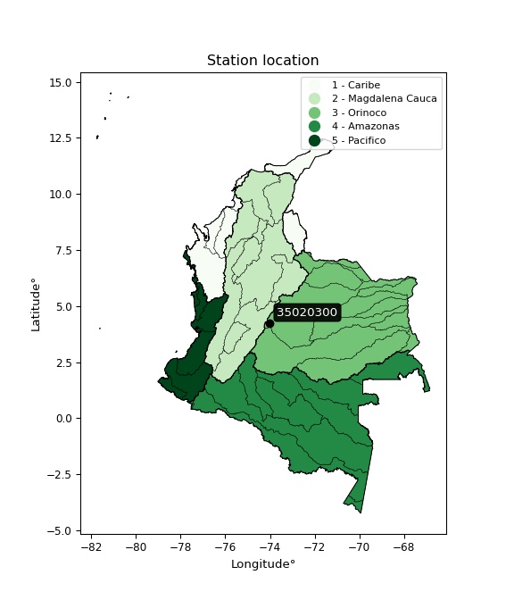

<div align="center">


</div>

# PMax24h Station (Rain, Pmax24h): 35020300

Maximum Precipitation in 24 hours (PMax24h) is the greatest amount of rainfall for a specific duration that is meteorologically possible for a given location, acting as a "worst-case" scenario for extreme storms, crucial for designing safety-critical infrastructure like bridges, river deviations, dams, spillways, and nuclear plants to prevent catastrophic failure. The PMax24h is related with the Probable Maximum Precipitation (PMP) and it is calculated by hydrologists using meteorological data to determine the upper limit of extreme rainfall, often leading to the Probable Maximum Flood (PMF) for flood control design, and is increasingly being studied for climate change impacts. Probable Maximum Precipitation (PMP) is the theoretical upper limit of rainfall, a deterministic estimate for extreme events, while probability distributions (like GEV, Gumbel) describe the likelihood and frequency of various precipitation amounts, including rare ones, showing how often events occur, with PMP representing the extreme end of these distributions, used for critical infrastructure design to ensure safety against the worst conceivable weather, unlike standard statistical forecasts which cover typical probabilities.

The most common probability distributions in hydrology, used for analyzing floods, rainfall, and streamflow, include the Normal, Log-Normal, Gumbel, Gamma (including Log-Pearson Type III), and Generalized Extreme Value (GEV) distributions, often chosen based on the data´s skewness and whether modeling extremes or general conditions, with Gumbel and GEV popular for extreme events like floods, while the Normal distribution serves as a baseline, though often requiring transformations for skewed hydrological data. These distributions help in designing water infrastructure, managing water resources, and forecasting hydrologic events.

> Hydrological data often isn´t perfectly normal (it´s skewed), so different distributions are needed for different applications, such as: **Flood Frequency Analysis**: Using Gumbel, GEV, or Log-Pearson Type III for predicting extreme flood magnitudes and their return periods, **Rainfall Analysis**: Normal for annual totals, but Log-Normal, Weibull, or GEV for intensity or extreme daily rainfall, **Streamflow Modeling**: Gamma and Log-Normal for maximum flows, GEV for minimum flows, and Kappa for daily flows.

<div align="center">

</img>

</div>


## A. General information


### 1. General running parameters

• app_version: _v20260225_. • runtime: _2026-02-27 14:50:08.749431_. • Python version: _3.14.0_. • SciPy version: _1.16.3_. • Pandas version: _2.3.3_. • NumPy version: _2.3.5_. • Stations dataset (station_dataset_file): _dataset/pmax24h_in/automatic_colombia_2003_2025.csv_. • Stations catalog (station_catalog_file): _dataset/CNE.xls_. • Minimum year to eval til year_max (date_min): _1900_. • Maximum year to eval since year_min (date_max): _2025_. • Creates, save and include plots into reports (create_plot): _False_. • Plot only fit distributions with Δo > Δ (plot_only_fit): _True_. • Plot only simple graphs avoiding multiple CDFs and multiple Extreme values plots (plot_only_simple): _False_. • Eval low extreme values, if False, evaluates high extreme values (low_extreme): _False_. • Eval every SciPy distribution as logarithmic (pdist_logarithmic_on): _True_. • Standard deviation normalized (ddof): _1.0_. • Return periods to eval in years (Tr): _[2, 2.33, 5, 10, 15, 20, 25, 50, 75, 100, 200, 250, 500, 750, 1000]_. • Minimum data sample per station, 0 means any (minimum_sample): _5_. • Z-Score maximum threshold to adjust a value, 0 means disable (zscore_max): _3.5_. • Z-Score minimum threshold to adjust a value, 0 means disable (zscore_min): _-2.5_. • Avoid zeros, e.g. rain = 0 (avoid_zeros): _True_. • Avoid null values (avoid_nans): _True_. 

:file_folder:Table: [dataset.csv](../../dataset/pmax24h_in/automatic_colombia_2003_2025.csv)

> Delta Degrees of Freedom (DDOF): is a parameter used in the formulas for calculating variance and standard deviation. When ddof=0, the divisor is $N$ (the total number of observations) and this is used when your data set is the entire population. When ddof=1, the divisor is $N-1$ and this is used when your data set is a sample drawn from a larger population. Using $N-1$ provides an unbiased estimate of the population variance (known as Bessel´s correction).


### 2. Station info and location

|   id |   CODIGO | NOMBRE               | CATEGORIA               | TECNOLOGIA                | ESTADO   | FECHA_INSTALACION   |   FECHA_SUSPENSION |   ALTITUD |   LATITUD |   LONGITUD | DEPARTAMENTO   | MUNICIPIO   | AREA_OPERATIVA                            | ENTIDAD                                                     | AREA_HIDROGRAFICA   | ZONA_HIDROGRAFICA   | SUBZONA_HIDROGRAFICA   |   CORRIENTE | Catalogo   |   Version |
|-----:|---------:|:---------------------|:------------------------|:--------------------------|:---------|:--------------------|-------------------:|----------:|----------:|-----------:|:---------------|:------------|:------------------------------------------|:------------------------------------------------------------|:--------------------|:--------------------|:-----------------------|------------:|:-----------|----------:|
|    0 | 35020300 | GUTIERREZ [35020300] | Climatológica Principal | Automática con Telemetría | Activa   | 15/07/1984          |                nan |      2300 |   4.25392 |   -74.0027 | Cundinamarca   | Gutiérrez   | Area Operativa 11 - Cundinamarca-Amazonas | INSTITUTO DE HIDROLOGIA METEOROLOGIA Y ESTUDIOS AMBIENTALES | Orinoco             | Meta                | Río Guayuriba          |         nan | CNE_IDEAM  |  20251226 |

<div align="center">

Dynamic map: [:earth_americas:Google](http://maps.google.com/maps?q=4.253917,-74.002694) [:earth_americas:OSM](https://www.openstreetmap.org/#map=18/4.253917/-74.002694&layers=P) [:earth_americas:Bing](https://www.bing.com/maps?cp=4.253917~-74.002694&lvl=18) [:earth_americas:Apple](https://maps.apple.com/frame?center=4.253917%2C-74.002694&span=0.003%2C0.006)

</div>


<div align="center">

```geojson
{
  "type": "Feature",
  "geometry": {
    "type": "Point", 
    "coordinates": [-74.002694, 4.253917]
  }, 
  "properties": {
    "Name": "35020300"
  }
}
```

</div>


### 3. Discrete values table and plot

<div align="center">

|               |          0 |           1 |          2 |           3 |           4 |
|:--------------|-----------:|------------:|-----------:|------------:|------------:|
| Date          | 2021       | 2022        | 2023       | 2024        | 2025        |
| Value         |   24.3     |   43.2      |   77       |   62        |   62.7      |
| Value_initial |   24.3     |   43.2      |   77       |   62        |   62.7      |
| count         |    5       |    5        |    5       |    5        |    5        |
| mean          |   53.84    |   53.84     |   53.84    |   53.84     |   53.84     |
| std           |   20.4162  |   20.4162   |   20.4162  |   20.4162   |   20.4162   |
| zscore        |   -1.44689 |   -0.521154 |    1.13439 |    0.399682 |    0.433968 |


</div>


> The initial value (value_initial) correspond to the initial obtained or null completed value, and value (value) is adjusted only when the initial value is outside the valid range (outlier) definite through the Z-Score value. If Z-Score is active, values out of range or outliers are replaced with the station mean value. A Z-Score (or standard score) measures how many standard deviations a data point is from the mean of a dataset, indicating its relative position; positive scores mean above the mean, negative mean below, and a score of zero is exactly at the mean, allowing for comparison of values from different distributions. It´s calculated using the formula $z=(x–μ)/σ$, where $x$ is the data point, $μ$ is the mean, and $σ$ is the standard deviation, helping identify outliers and understand probability.
>
> <sub>**Note**: In this study, "completing" (filling gaps in) and "extending" (forecasting or lengthening the historical record) rainfall data series are avoided for certain critical analyses because they introduce artificial bias and uncertainty, which can distort the statistics of rare events (extremes), alter day-to-day variability, and compromise the integrity and homogeneity of the original data. Some reasons against Completing/Extending rainfall data are: **Distortion of Extremes and Variability**: The primary issue is that most gap-filling or extension methods rely on averaging or regression with nearby stations, which inherently smooths the data. Rainfall is highly variable in space and time, with a large percentage of zero values and occasional large storms. Infilling methods often underestimate the highest values and overestimate the lowest (zero) values, which severely distorts analyses focused on flood frequency, drought severity, and intensity-duration-frequency (IDF) curves, **Loss of Data Homogeneity**: Infilled or extended data are synthetic estimates, not actual measurements. Combining these estimates with observed data can violate the assumption of data homogeneity, which requires that the data properties do not change over time. Inhomogeneity can lead to incorrect conclusions about long-term trends or changes in climate patterns, **Propagation of Errors**: Errors and biases from the original data (e.g., wind-induced undercatch, instrument errors, site changes) or the data used for imputation can propagate through the analysis, leading to unreliable hydrological models and inaccurate predictions, **Compromised Statistical Integrity**: For statistical analyses, especially those involving the frequency of events, using artificial data can introduce time bias or autocorrelation that doesn´t exist in reality, making it difficult to assess the true probability of events, **Difficulty in Validation**: It is difficult to accurately validate the quality of filled or extended data, especially for past periods where ground-truth measurements are unavailable. The reliability of imputation techniques heavily depends on the density of the surrounding station network and the complexity of the local topography.</sub>


### 4. Active continuous probability distributions from SciPy (80 of 104 available)

A Probability Density Function (PDF) describes the relative likelihood of a continuous random variable falling within a specific range, where the total area under its curve equals 1, and the area over any interval gives the actual probability for that range. Unlike discrete probabilities (like rolling a die), a PDF shows density, not direct probability for a single point (which is zero), with higher points indicating higher likelihood, often visualized as a bell curve for normal distributions.

A log of a probability density function (log-PDF) is simply the logarithm of the PDF´s value, denoted as $log(f(x))$, useful for converting multiplication of probabilities into addition, improving numerical stability with tiny numbers, and connecting to information theory concepts like entropy. Instead of dealing with very small probabilities (e.g., 0.000001), log-PDFs use negative numbers (e.g., $log(0.00001) ≈ -11.51$ that are easier for computers to handle, preventing underflow errors and simplifying complex calculations. In this study, each active probability distribution from SciPy is also evaluated in the $log$ form.

[scipy.stats](https://docs.scipy.org/doc/scipy/reference/stats.html) is a Python´s powerful submodule within the SciPy library for comprehensive statistical analysis, offering over 130 probability distributions (like Normal, Poisson, etc.), functions for descriptive stats (mean, variance), hypothesis testing (t-tests, chi-square), random variable generation, and statistical tests, making it essential for data science, modeling, and research. It provides tools to explore, model, and draw conclusions from data efficiently, working seamlessly with [NumPy](https://numpy.org/).

<div align="center">

|   id | p_dist           |   n_parameter | fit_method   | label                                                                       | active   | ref                                                                                                      |
|-----:|:-----------------|--------------:|:-------------|:----------------------------------------------------------------------------|:---------|:---------------------------------------------------------------------------------------------------------|
|    0 | alpha            |             3 | MLE          | Alpha                                                                       | True     | [:mortar_board:](https://docs.scipy.org/doc/scipy/reference/generated/scipy.stats.alpha.html)            |
|    1 | anglit           |             2 | MM           | Anglit                                                                      | True     | [:mortar_board:](https://docs.scipy.org/doc/scipy/reference/generated/scipy.stats.anglit.html)           |
|    2 | arcsine          |             2 | MM           | Arcsine                                                                     | True     | [:mortar_board:](https://docs.scipy.org/doc/scipy/reference/generated/scipy.stats.arcsine.html)          |
|    3 | argus            |             3 | MLE          | Argus                                                                       | True     | [:mortar_board:](https://docs.scipy.org/doc/scipy/reference/generated/scipy.stats.argus.html)            |
|    4 | beta             |             4 | MLE          | Beta                                                                        | True     | [:mortar_board:](https://docs.scipy.org/doc/scipy/reference/generated/scipy.stats.beta.html)             |
|    5 | betaprime        |             4 | MLE          | Beta prime                                                                  | True     | [:mortar_board:](https://docs.scipy.org/doc/scipy/reference/generated/scipy.stats.betaprime.html)        |
|    6 | bradford         |             3 | MLE          | Bradford                                                                    | True     | [:mortar_board:](https://docs.scipy.org/doc/scipy/reference/generated/scipy.stats.bradford.html)         |
|    7 | burr             |             4 | MLE          | Burr (Type III)                                                             | True     | [:mortar_board:](https://docs.scipy.org/doc/scipy/reference/generated/scipy.stats.burr.html)             |
|    8 | burr12           |             4 | MLE          | Burr (Type III) 12                                                          | True     | [:mortar_board:](https://docs.scipy.org/doc/scipy/reference/generated/scipy.stats.burr12.html)           |
|    9 | cosine           |             2 | MLE          | Cosine                                                                      | True     | [:mortar_board:](https://docs.scipy.org/doc/scipy/reference/generated/scipy.stats.cosine.html)           |
|   10 | crystalball      |             4 | MLE          | Crystalball                                                                 | True     | [:mortar_board:](https://docs.scipy.org/doc/scipy/reference/generated/scipy.stats.crystalball.html)      |
|   11 | dgamma           |             3 | MLE          | Double gamma                                                                | True     | [:mortar_board:](https://docs.scipy.org/doc/scipy/reference/generated/scipy.stats.dgamma.html)           |
|   12 | dweibull         |             3 | MLE          | Double Weibull                                                              | True     | [:mortar_board:](https://docs.scipy.org/doc/scipy/reference/generated/scipy.stats.dweibull.html)         |
|   13 | erlang           |             3 | MLE          | Erlang                                                                      | True     | [:mortar_board:](https://docs.scipy.org/doc/scipy/reference/generated/scipy.stats.erlang.html)           |
|   14 | exponnorm        |             3 | MLE          | Exponentially modified Normal                                               | True     | [:mortar_board:](https://docs.scipy.org/doc/scipy/reference/generated/scipy.stats.exponnorm.html)        |
|   15 | exponpow         |             3 | MLE          | Exponential power                                                           | True     | [:mortar_board:](https://docs.scipy.org/doc/scipy/reference/generated/scipy.stats.exponpow.html)         |
|   16 | exponweib        |             4 | MLE          | Exponentiated Weibull                                                       | True     | [:mortar_board:](https://docs.scipy.org/doc/scipy/reference/generated/scipy.stats.exponweib.html)        |
|   17 | f                |             4 | MLE          | F                                                                           | True     | [:mortar_board:](https://docs.scipy.org/doc/scipy/reference/generated/scipy.stats.f.html)                |
|   18 | fatiguelife      |             3 | MLE          | Fatigue-life (Birnbaum-Saunders)                                            | True     | [:mortar_board:](https://docs.scipy.org/doc/scipy/reference/generated/scipy.stats.fatiguelife.html)      |
|   19 | foldnorm         |             3 | MM           | Fold Normal                                                                 | True     | [:mortar_board:](https://docs.scipy.org/doc/scipy/reference/generated/scipy.stats.foldnorm.html)         |
|   20 | gamma            |             3 | MLE          | Gamma                                                                       | True     | [:mortar_board:](https://docs.scipy.org/doc/scipy/reference/generated/scipy.stats.gamma.html)            |
|   21 | gausshyper       |             6 | MLE          | Gauss hypergeometric                                                        | True     | [:mortar_board:](https://docs.scipy.org/doc/scipy/reference/generated/scipy.stats.gausshyper.html)       |
|   22 | genexpon         |             5 | MLE          | Generalized exponential                                                     | True     | [:mortar_board:](https://docs.scipy.org/doc/scipy/reference/generated/scipy.stats.genexpon.html)         |
|   23 | genextreme       |             3 | MLE          | Generalized exponential                                                     | True     | [:mortar_board:](https://docs.scipy.org/doc/scipy/reference/generated/scipy.stats.genextreme.html)       |
|   24 | gengamma         |             4 | MLE          | Generalized gamma                                                           | True     | [:mortar_board:](https://docs.scipy.org/doc/scipy/reference/generated/scipy.stats.gengamma.html)         |
|   25 | genhalflogistic  |             3 | MLE          | Generalized half-logistic                                                   | True     | [:mortar_board:](https://docs.scipy.org/doc/scipy/reference/generated/scipy.stats.genhalflogistic.html)  |
|   26 | genlogistic      |             3 | MLE          | Generalized logistic                                                        | True     | [:mortar_board:](https://docs.scipy.org/doc/scipy/reference/generated/scipy.stats.genlogistic.html)      |
|   27 | gennorm          |             3 | MLE          | Generalized Normal                                                          | True     | [:mortar_board:](https://docs.scipy.org/doc/scipy/reference/generated/scipy.stats.gennorm.html)          |
|   28 | genpareto        |             3 | MLE          | Generalized Pareto                                                          | True     | [:mortar_board:](https://docs.scipy.org/doc/scipy/reference/generated/scipy.stats.genpareto.html)        |
|   29 | gompertz         |             3 | MLE          | Gompertz (or truncated Gumbel)                                              | True     | [:mortar_board:](https://docs.scipy.org/doc/scipy/reference/generated/scipy.stats.gompertz.html)         |
|   30 | gumbel_l         |             2 | MM           | Gumbel Left Skew                                                            | True     | [:mortar_board:](https://docs.scipy.org/doc/scipy/reference/generated/scipy.stats.gumbel_l.html)         |
|   31 | gumbel_r         |             2 | MM           | Gumbel Right Skew                                                           | True     | [:mortar_board:](https://docs.scipy.org/doc/scipy/reference/generated/scipy.stats.gumbel_r.html)         |
|   32 | halfgennorm      |             3 | MLE          | Upper half of a generalized normal                                          | True     | [:mortar_board:](https://docs.scipy.org/doc/scipy/reference/generated/scipy.stats.halfgennorm.html)      |
|   33 | halflogistic     |             2 | MM           | Half-logistic                                                               | True     | [:mortar_board:](https://docs.scipy.org/doc/scipy/reference/generated/scipy.stats.halflogistic.html)     |
|   34 | halfnorm         |             2 | MM           | Half Normal                                                                 | True     | [:mortar_board:](https://docs.scipy.org/doc/scipy/reference/generated/scipy.stats.halfnorm.html)         |
|   35 | hypsecant        |             2 | MM           | hyperbolic secant                                                           | True     | [:mortar_board:](https://docs.scipy.org/doc/scipy/reference/generated/scipy.stats.hypsecant.html)        |
|   36 | invgamma         |             3 | MLE          | Inverted gamma                                                              | True     | [:mortar_board:](https://docs.scipy.org/doc/scipy/reference/generated/scipy.stats.invgamma.html)         |
|   37 | invgauss         |             3 | MLE          | Inverse Gaussian                                                            | True     | [:mortar_board:](https://docs.scipy.org/doc/scipy/reference/generated/scipy.stats.invgauss.html)         |
|   38 | invweibull       |             3 | MLE          | Inverted Weibull                                                            | True     | [:mortar_board:](https://docs.scipy.org/doc/scipy/reference/generated/scipy.stats.invweibull.html)       |
|   39 | johnsonsb        |             4 | MLE          | Johnson SB                                                                  | True     | [:mortar_board:](https://docs.scipy.org/doc/scipy/reference/generated/scipy.stats.johnsonsb.html)        |
|   40 | johnsonsu        |             4 | MLE          | Johnson Su                                                                  | True     | [:mortar_board:](https://docs.scipy.org/doc/scipy/reference/generated/scipy.stats.johnsonsu.html)        |
|   41 | kappa3           |             3 | MLE          | Kappa 3                                                                     | True     | [:mortar_board:](https://docs.scipy.org/doc/scipy/reference/generated/scipy.stats.kappa3.html)           |
|   42 | kappa4           |             4 | MLE          | Kappa 4                                                                     | True     | [:mortar_board:](https://docs.scipy.org/doc/scipy/reference/generated/scipy.stats.kappa4.html)           |
|   43 | ksone            |             3 | MLE          | Kolmogorov-Smirnov one-sided test statistic distribution                    | True     | [:mortar_board:](https://docs.scipy.org/doc/scipy/reference/generated/scipy.stats.ksone.html)            |
|   44 | kstwobign        |             2 | MLE          | Limiting distribution of scaled Kolmogorov-Smirnov two-sided test statistic | True     | [:mortar_board:](https://docs.scipy.org/doc/scipy/reference/generated/scipy.stats.kstwobign.html)        |
|   45 | laplace          |             2 | MM           | Laplace                                                                     | True     | [:mortar_board:](https://docs.scipy.org/doc/scipy/reference/generated/scipy.stats.laplace.html)          |
|   46 | levy_l           |             2 | MLE          | Left-skewed Levy                                                            | True     | [:mortar_board:](https://docs.scipy.org/doc/scipy/reference/generated/scipy.stats.levy_l.html)           |
|   47 | loggamma         |             3 | MLE          | Log gamma                                                                   | True     | [:mortar_board:](https://docs.scipy.org/doc/scipy/reference/generated/scipy.stats.loggamma.html)         |
|   48 | logistic         |             2 | MM           | Logistic (or Sech-squared)                                                  | True     | [:mortar_board:](https://docs.scipy.org/doc/scipy/reference/generated/scipy.stats.logistic.html)         |
|   49 | loglaplace       |             3 | MLE          | Log-Laplace                                                                 | True     | [:mortar_board:](https://docs.scipy.org/doc/scipy/reference/generated/scipy.stats.loglaplace.html)       |
|   50 | lomax            |             3 | MLE          | Lomax (Pareto of the second kind)                                           | True     | [:mortar_board:](https://docs.scipy.org/doc/scipy/reference/generated/scipy.stats.lomax.html)            |
|   51 | maxwell          |             2 | MM           | Maxwell                                                                     | True     | [:mortar_board:](https://docs.scipy.org/doc/scipy/reference/generated/scipy.stats.maxwell.html)          |
|   52 | mielke           |             4 | MLE          | Mielke Beta-Kappa / Dagum                                                   | True     | [:mortar_board:](https://docs.scipy.org/doc/scipy/reference/generated/scipy.stats.mielke.html)           |
|   53 | moyal            |             2 | MM           | Moyal                                                                       | True     | [:mortar_board:](https://docs.scipy.org/doc/scipy/reference/generated/scipy.stats.moyal.html)            |
|   54 | nakagami         |             3 | MLE          | Nakagami                                                                    | True     | [:mortar_board:](https://docs.scipy.org/doc/scipy/reference/generated/scipy.stats.nakagami.html)         |
|   55 | ncf              |             5 | MLE          | Non-central F distribution                                                  | True     | [:mortar_board:](https://docs.scipy.org/doc/scipy/reference/generated/scipy.stats.ncf.html)              |
|   56 | nct              |             4 | MLE          | Non-central Student’s t                                                     | True     | [:mortar_board:](https://docs.scipy.org/doc/scipy/reference/generated/scipy.stats.nct.html)              |
|   57 | norm             |             2 | MM           | Normal                                                                      | True     | [:mortar_board:](https://docs.scipy.org/doc/scipy/reference/generated/scipy.stats.norm.html)             |
|   58 | pearson3         |             3 | MM           | Pearson type III                                                            | True     | [:mortar_board:](https://docs.scipy.org/doc/scipy/reference/generated/scipy.stats.pearson3.html)         |
|   59 | powerlaw         |             3 | MLE          | Power-function                                                              | True     | [:mortar_board:](https://docs.scipy.org/doc/scipy/reference/generated/scipy.stats.powerlaw.html)         |
|   60 | rayleigh         |             2 | MM           | Rayleigh                                                                    | True     | [:mortar_board:](https://docs.scipy.org/doc/scipy/reference/generated/scipy.stats.rayleigh.html)         |
|   61 | rdist            |             3 | MLE          | R-distributed (symmetric beta)                                              | True     | [:mortar_board:](https://docs.scipy.org/doc/scipy/reference/generated/scipy.stats.rdist.html)            |
|   62 | rice             |             3 | MLE          | Rice                                                                        | True     | [:mortar_board:](https://docs.scipy.org/doc/scipy/reference/generated/scipy.stats.rice.html)             |
|   63 | semicircular     |             2 | MM           | Semicircular                                                                | True     | [:mortar_board:](https://docs.scipy.org/doc/scipy/reference/generated/scipy.stats.semicircular.html)     |
|   64 | skewnorm         |             3 | MLE          | Skew normal                                                                 | True     | [:mortar_board:](https://docs.scipy.org/doc/scipy/reference/generated/scipy.stats.skewnorm.html)         |
|   65 | t                |             3 | MLE          | Student’s t                                                                 | True     | [:mortar_board:](https://docs.scipy.org/doc/scipy/reference/generated/scipy.stats.t.html)                |
|   66 | trapezoid        |             4 | MLE          | Trapezoid                                                                   | True     | [:mortar_board:](https://docs.scipy.org/doc/scipy/reference/generated/scipy.stats.trapezoid.html)        |
|   67 | triang           |             3 | MLE          | Triangular                                                                  | True     | [:mortar_board:](https://docs.scipy.org/doc/scipy/reference/generated/scipy.stats.triang.html)           |
|   68 | truncexpon       |             3 | MLE          | Truncated exponential                                                       | True     | [:mortar_board:](https://docs.scipy.org/doc/scipy/reference/generated/scipy.stats.truncexpon.html)       |
|   69 | truncnorm        |             4 | MLE          | Truncated normal                                                            | True     | [:mortar_board:](https://docs.scipy.org/doc/scipy/reference/generated/scipy.stats.truncnorm.html)        |
|   70 | truncpareto      |             4 | MLE          | Upper truncated Pareto                                                      | True     | [:mortar_board:](https://docs.scipy.org/doc/scipy/reference/generated/scipy.stats.truncpareto.html)      |
|   71 | truncweibull_min |             5 | MLE          | Doubly truncated Weibull minimum                                            | True     | [:mortar_board:](https://docs.scipy.org/doc/scipy/reference/generated/scipy.stats.truncweibull_min.html) |
|   72 | tukeylambda      |             3 | MLE          | Tukey-Lamdba                                                                | True     | [:mortar_board:](https://docs.scipy.org/doc/scipy/reference/generated/scipy.stats.tukeylambda.html)      |
|   73 | uniform          |             2 | MLE          | Uniform                                                                     | True     | [:mortar_board:](https://docs.scipy.org/doc/scipy/reference/generated/scipy.stats.uniform.html)          |
|   74 | vonmises         |             3 | MLE          | Von Mises                                                                   | True     | [:mortar_board:](https://docs.scipy.org/doc/scipy/reference/generated/scipy.stats.vonmises.html)         |
|   75 | vonmises_line    |             3 | MLE          | Von Mises line                                                              | True     | [:mortar_board:](https://docs.scipy.org/doc/scipy/reference/generated/scipy.stats.vonmises_line.html)    |
|   76 | wald             |             2 | MM           | Wald                                                                        | True     | [:mortar_board:](https://docs.scipy.org/doc/scipy/reference/generated/scipy.stats.wald.html)             |
|   77 | weibull_max      |             3 | MLE          | Weibull maximum                                                             | True     | [:mortar_board:](https://docs.scipy.org/doc/scipy/reference/generated/scipy.stats.weibull_max.html)      |
|   78 | weibull_min      |             3 | MLE          | Weibull minimum                                                             | True     | [:mortar_board:](https://docs.scipy.org/doc/scipy/reference/generated/scipy.stats.weibull_min.html)      |
|   79 | wrapcauchy       |             3 | MLE          | Wrapped  Cauchy                                                             | True     | [:mortar_board:](https://docs.scipy.org/doc/scipy/reference/generated/scipy.stats.wrapcauchy.html)       |

</div>

> **n_parameter:** # arguments & localization & scale.
>
> **Fit methods:** (MLE) maximum likelihood, (MM) L-moments.
>
>**Inactive** (With the only purpose of prevent loops, zero divisions, infinite values, over high estimated values or horizontal trending for recurrence intervals estimations, the follow distributions were disabled.)**:** lognorm, norminvgauss, powernorm, powerlognorm, cauchy, halfcauchy, foldcauchy, skewcauchy, chi2, expon, fisk, genhyperbolic, geninvgauss, gibrat, kstwo, laplace_asymmetric, levy, levy_stable, ncx2, pareto, rel_breitwigner, recipinvgauss, studentized_range, loguniform, 


## B. Probability (PDF) vs. Empirical (EDF) distributions functions

A continuous probability distribution (CPD) describes probabilities for variables that can take any value within a range (like rain any time), unlike discrete variables with specific outcomes (like temperature). It uses a Probability Density Function (PDF), a curve where the total area under it equals 1, and the probability of the variable falling within an interval (a to b) is found by calculating the area under the curve between those points. A key feature is that the probability of hitting any single exact value is zero, so probabilities are always expressed for ranges, e.g., $P(a ≤ X ≤ b)$.

<div align="center">

Distributions parameters from station values
|     |   station | p_dist              |   n |             loc |           scale | shape                  | shape1                 | shape2                | shape3             |
|----:|----------:|:--------------------|----:|----------------:|----------------:|:-----------------------|:-----------------------|:----------------------|:-------------------|
|   0 |  35020300 | alpha               |   5 |  -338.605       |  8199.39        | 20.928138927742864     |                        |                       |                    |
|   1 |  35020300 | anglit              |   5 |    53.84        |    53.4203      |                        |                        |                       |                    |
|   2 |  35020300 | arcsine             |   5 |    28.0152      |    51.6495      |                        |                        |                       |                    |
|   3 |  35020300 | argus               |   5 |     8.335       |    71.5657      | 1.4005458058645355     |                        |                       |                    |
|   4 |  35020300 | beta                |   5 |    16.055       |    60.945       | 1.0531567406595954     | 0.5990236854570649     |                       |                    |
|   5 |  35020300 | betaprime           |   5 |  -223.435       | 74753.7         | 221.27420020745515     | 59697.10634402159      |                       |                    |
|   6 |  35020300 | bradford            |   5 |    24.2999      |    52.7001      | 0.943272665112413      |                        |                       |                    |
|   7 |  35020300 | burr                |   5 |   -13.7835      |    91.2331      | 810.9198223005088      | 0.0035994802762927135  |                       |                    |
|   8 |  35020300 | burr12              |   5 |    -2.71684     |    26.8325      | 651.8544688096724      | 0.0022530266526169453  |                       |                    |
|   9 |  35020300 | cosine              |   5 |    52.6967      |    14.9646      |                        |                        |                       |                    |
|  10 |  35020300 | crystalball         |   5 |    53.84        |    18.2608      | 9469.172100916321      | 22436.728829008738     |                       |                    |
|  11 |  35020300 | dgamma              |   5 |    62.7         |    14.5208      | 0.6888544755622089     |                        |                       |                    |
|  12 |  35020300 | dweibull            |   5 |    62.7         |    17.5471      | 0.8207485165213821     |                        |                       |                    |
|  13 |  35020300 | erlang              |   5 |  -234.762       |     1.18194     | 244.1148992292567      |                        |                       |                    |
|  14 |  35020300 | exponnorm           |   5 |    53.8251      |    18.2609      | 0.0008308007849226326  |                        |                       |                    |
|  15 |  35020300 | exponpow            |   5 |    24.3         |     1.67252     | 0.11593640991332951    |                        |                       |                    |
|  16 |  35020300 | exponweib           |   5 |    24.3         |     1.14365     | 1.2986495898103145     | 0.19701280983625089    |                       |                    |
|  17 |  35020300 | f                   |   5 | -5713.18        |  5766.98        | 272480.778791146       | 735945.1171850446      |                       |                    |
|  18 |  35020300 | fatiguelife         |   5 |    24.3         |     1.62278e-05 | 1193.2072165692052     |                        |                       |                    |
|  19 |  35020300 | foldnorm            |   5 |    32.4144      |    27.2388      | 0.07225158534196008    |                        |                       |                    |
|  20 |  35020300 | gamma               |   5 |  -224.172       |     1.23799     | 224.60736882388892     |                        |                       |                    |
|  21 |  35020300 | gausshyper          |   5 |    23.0205      |    53.9795      | 1.2320941745975371     | 0.866895194863884      | 0.9990497803720515    | 0.7665080596186543 |
|  22 |  35020300 | genexpon            |   5 |    24.3         |     2.40144     | 0.08140916844246046    | 1.4732269903331055e-07 | 0.986231582234753     |                    |
|  23 |  35020300 | genextreme          |   5 |    58.3321      |    21.9054      | 1.1734256265293688     |                        |                       |                    |
|  24 |  35020300 | gengamma            |   5 |    24.3         |     1.31535     | 1.313603347759594      | 0.11343784274690027    |                       |                    |
|  25 |  35020300 | genhalflogistic     |   5 |    14.2667      |    64.3549      | 1.0258488068523786     |                        |                       |                    |
|  26 |  35020300 | genlogistic         |   5 |    72.52        |     4.53737     | 0.22631754496777823    |                        |                       |                    |
|  27 |  35020300 | gennorm             |   5 |    62           |     0.00106773  | 0.1942446835569555     |                        |                       |                    |
|  28 |  35020300 | genpareto           |   5 |    -0.281623    |   157.298       | -2.0353834824154693    |                        |                       |                    |
|  29 |  35020300 | gompertz            |   5 |   -61.4664      |    14.7459      | 0.0002234410413100266  |                        |                       |                    |
|  30 |  35020300 | gumbel_l            |   5 |    62.0584      |    14.2379      |                        |                        |                       |                    |
|  31 |  35020300 | gumbel_r            |   5 |    45.6216      |    14.2379      |                        |                        |                       |                    |
|  32 |  35020300 | halfgennorm         |   5 |    24.3         |     1.33272     | 0.36648156714309843    |                        |                       |                    |
|  33 |  35020300 | halflogistic        |   5 |    32.1966      |    15.6124      |                        |                        |                       |                    |
|  34 |  35020300 | halfnorm            |   5 |    29.6699      |    30.2928      |                        |                        |                       |                    |
|  35 |  35020300 | hypsecant           |   5 |    53.84        |    11.6252      |                        |                        |                       |                    |
|  36 |  35020300 | invgamma            |   5 |  -177.188       | 34138.3         | 148.83221799400133     |                        |                       |                    |
|  37 |  35020300 | invgauss            |   5 |   -70.5528      |  4909.89        | 0.025264153031588778   |                        |                       |                    |
|  38 |  35020300 | invweibull          |   5 |    24.3         |     1.30756     | 0.04385305459689139    |                        |                       |                    |
|  39 |  35020300 | johnsonsb           |   5 |    16.9405      |    60.0595      | -0.27787651045425493   | 0.11721868061340927    |                       |                    |
|  40 |  35020300 | johnsonsu           |   5 |    94.1113      |     1.2915      | 8.421256064350043      | 2.0930341437948883     |                       |                    |
|  41 |  35020300 | kappa3              |   5 |    24.2544      |    52.7434      | 33463.19912886835      |                        |                       |                    |
|  42 |  35020300 | kappa4              |   5 |    24.0526      |    56.7759      | 0.9985338662653583     | 1.0723076511328231     |                       |                    |
|  43 |  35020300 | ksone               |   5 |    22.2113      |    63.2574      | 1.0                    |                        |                       |                    |
|  44 |  35020300 | kstwobign           |   5 |   -18.4248      |    82.3724      |                        |                        |                       |                    |
|  45 |  35020300 | laplace             |   5 |    53.84        |    12.9124      |                        |                        |                       |                    |
|  46 |  35020300 | levy_l              |   5 |    78.8458      |     7.0478      |                        |                        |                       |                    |
|  47 |  35020300 | loggamma            |   5 |    74.8433      |     6.8695      | 0.3408702108134485     |                        |                       |                    |
|  48 |  35020300 | logistic            |   5 |    53.84        |    10.0677      |                        |                        |                       |                    |
|  49 |  35020300 | loglaplace          |   5 |    -0.183057    |    62.1831      | 3.290581010917098      |                        |                       |                    |
|  50 |  35020300 | lomax               |   5 |    24.3         |  2686.15        | 90.84583796420725      |                        |                       |                    |
|  51 |  35020300 | maxwell             |   5 |    10.5695      |    27.1158      |                        |                        |                       |                    |
|  52 |  35020300 | mielke              |   5 |    -9.25094     |    86.5361      | 2.731826250429707      | 1400.2043088389937     |                       |                    |
|  53 |  35020300 | moyal               |   5 |    43.3973      |     8.22027     |                        |                        |                       |                    |
|  54 |  35020300 | nakagami            |   5 |    43.2         |    19.8761      | 0.4004972597743497     |                        |                       |                    |
|  55 |  35020300 | ncf                 |   5 |     0.0101538   |     3.53484e-09 | 3.6422521738729823e-10 | 2.016561376882011      | 4.349773608289372     |                    |
|  56 |  35020300 | nct                 |   5 | -1168.91        |    18.1768      | 231118.44454280823     | 67.26961108184612      |                       |                    |
|  57 |  35020300 | norm                |   5 |    53.84        |    18.2608      |                        |                        |                       |                    |
|  58 |  35020300 | pearson3            |   5 |    53.84        |    18.2608      | -0.43746801422996173   |                        |                       |                    |
|  59 |  35020300 | powerlaw            |   5 |    24.3         |    52.7         | 0.12849292926116232    |                        |                       |                    |
|  60 |  35020300 | rayleigh            |   5 |    18.9059      |    27.8733      |                        |                        |                       |                    |
|  61 |  35020300 | rdist               |   5 |    24.0885      |    19.1115      | 1.236846943383285      |                        |                       |                    |
|  62 |  35020300 | rice                |   5 |    13.056       |    20.5365      | 1.6536474648236423     |                        |                       |                    |
|  63 |  35020300 | semicircular        |   5 |    53.84        |    36.5217      |                        |                        |                       |                    |
|  64 |  35020300 | skewnorm            |   5 |    77           |    29.4943      | -6956890.035917109     |                        |                       |                    |
|  65 |  35020300 | t                   |   5 |    53.8384      |    18.2586      | 1898602.882011449      |                        |                       |                    |
|  66 |  35020300 | trapezoid           |   5 |     2.19054     |    77.4742      | 1.0                    | 1.0                    |                       |                    |
|  67 |  35020300 | triang              |   5 |     2.33758     |    74.6625      | 0.9999996546480379     |                        |                       |                    |
|  68 |  35020300 | truncexpon          |   5 |    24.3         |    70.5017      | 0.7474996950500237     |                        |                       |                    |
|  69 |  35020300 | truncnorm           |   5 |    53.84        |    18.2608      | -717.2323539511372     | 1085.875973770089      |                       |                    |
|  70 |  35020300 | truncpareto         |   5 |    24.0071      |     0.292876    | 0.2613726166249405     | 180.939760252473       |                       |                    |
|  71 |  35020300 | truncweibull_min    |   5 |    24.1994      |    78.5663      | 0.9808843027537828     | 0.0012802507446832056  | 0.6720510048152408    |                    |
|  72 |  35020300 | tukeylambda         |   5 |    50.65        |    29.3726      | 1.1147095911141538     |                        |                       |                    |
|  73 |  35020300 | uniform             |   5 |    24.3         |    52.7         |                        |                        |                       |                    |
|  74 |  35020300 | vonmises            |   5 |    -0.411386    |     1           | 1.7798881766979977     |                        |                       |                    |
|  75 |  35020300 | vonmises_line       |   5 |    50.6836      |     8.39821     | 4.84726082168341e-06   |                        |                       |                    |
|  76 |  35020300 | wald                |   5 |    35.5792      |    18.2608      |                        |                        |                       |                    |
|  77 |  35020300 | weibull_max         |   5 |    77           |     1.42579     | 0.28066606319662923    |                        |                       |                    |
|  78 |  35020300 | weibull_min         |   5 | -2745           |  2807.45        | 189.98163426519633     |                        |                       |                    |
|  79 |  35020300 | wrapcauchy          |   5 |    24.3         |     8.3875      | 0.23772340490234606    |                        |                       |                    |
|  80 |  35020300 | logalpha            |   5 |    -7.79917     |   319.631       | 27.313405617366755     |                        |                       |                    |
|  81 |  35020300 | loganglit           |   5 |     3.91312     |     1.18897     |                        |                        |                       |                    |
|  82 |  35020300 | logarcsine          |   5 |     3.33833     |     1.14958     |                        |                        |                       |                    |
|  83 |  35020300 | logargus            |   5 |     2.72166     |     1.66677     | 2.1934615051744455     |                        |                       |                    |
|  84 |  35020300 | logbeta             |   5 |     3.05707     |     1.28674     | 0.7234987619649194     | 0.32766525821848347    |                       |                    |
|  85 |  35020300 | logbetaprime        |   5 |    -7.33739     |     9.62713     | 1513.5846769861964     | 1296.1638095050994     |                       |                    |
|  86 |  35020300 | logbradford         |   5 |     3.18987     |     1.15952     | 1.2659035056636808e-05 |                        |                       |                    |
|  87 |  35020300 | logburr             |   5 |     0.0483462   |     4.30291     | 2257.6422156120534     | 0.003908548124830387   |                       |                    |
|  88 |  35020300 | logburr12           |   5 |  -138.36        |   145.646       | 492.7984771114743      | 54884.70152456322      |                       |                    |
|  89 |  35020300 | logcosine           |   5 |     3.86472     |     0.338255    |                        |                        |                       |                    |
|  90 |  35020300 | logcrystalball      |   5 |     3.91312     |     0.406432    | 83.4509273919645       | 2.24696623192349       |                       |                    |
|  91 |  35020300 | logdgamma           |   5 |     4.12713     |     0.360394    | 0.5562864037163608     |                        |                       |                    |
|  92 |  35020300 | logdweibull         |   5 |     4.13836     |     0.315312    | 0.6483113637229283     |                        |                       |                    |
|  93 |  35020300 | logerlang           |   5 |    -3.18956     |     0.0246128   | 288.3545867414789      |                        |                       |                    |
|  94 |  35020300 | logexponnorm        |   5 |     3.91276     |     0.406431    | 0.0008845112150735606  |                        |                       |                    |
|  95 |  35020300 | logexponpow         |   5 |     3.19048     |     1.15789     | 0.7075973729596747     |                        |                       |                    |
|  96 |  35020300 | logexponweib        |   5 |     3.19048     |     0.618435    | 0.12319588110600654    | 1.2709810979753788     |                       |                    |
|  97 |  35020300 | logf                |   5 |  -507.552       |   511.465       | 11831294.986390304     | 4317691.70387039       |                       |                    |
|  98 |  35020300 | logfatiguelife      |   5 |  -189.318       |   193.231       | 0.0021040910712528853  |                        |                       |                    |
|  99 |  35020300 | logfoldnorm         |   5 |     3.39959     |     0.641033    | 0.1129049467004969     |                        |                       |                    |
| 100 |  35020300 | loggamma            |   5 |    -3.1685      |     0.0247363   | 286.0777789848926      |                        |                       |                    |
| 101 |  35020300 | loggausshyper       |   5 |     3.16178     |     1.18203     | 1.2924100442802002     | 0.6446362495582447     | -0.16096342452863158  | 1.2677755578239083 |
| 102 |  35020300 | loggenexpon         |   5 |     3.19032     |     0.0554636   | 0.033816478465088076   | 7.453922318021767      | 0.0006642002401943683 |                    |
| 103 |  35020300 | loggenextreme       |   5 |     4.02708     |     0.357347    | 1.1282461401181438     |                        |                       |                    |
| 104 |  35020300 | loggengamma         |   5 |     3.19048     |     1.75834     | 0.590717248690985      | 0.24173126464880845    |                       |                    |
| 105 |  35020300 | loggenhalflogistic  |   5 |     3.11108     |     1.34476     | 1.0908854105100887     |                        |                       |                    |
| 106 |  35020300 | loggenlogistic      |   5 |     4.34408     |     2.89514e-06 | 6.647271765933168e-06  |                        |                       |                    |
| 107 |  35020300 | loggennorm          |   5 |     4.12713     |     0.00476182  | 0.3426911562688374     |                        |                       |                    |
| 108 |  35020300 | loggenpareto        |   5 |    -0.0131335   |    21.2448      | -4.87608718028126      |                        |                       |                    |
| 109 |  35020300 | loggompertz         |   5 |     3.19048     |     0.351353    | 0.08769657963436776    |                        |                       |                    |
| 110 |  35020300 | loggumbel_l         |   5 |     4.09604     |     0.316893    |                        |                        |                       |                    |
| 111 |  35020300 | loggumbel_r         |   5 |     3.73021     |     0.316893    |                        |                        |                       |                    |
| 112 |  35020300 | loghalfgennorm      |   5 |     3.19048     |     1.15334     | 962523.7812223549      |                        |                       |                    |
| 113 |  35020300 | loghalflogistic     |   5 |     3.43149     |     0.34743     |                        |                        |                       |                    |
| 114 |  35020300 | loghalfnorm         |   5 |     3.3752      |     0.674192    |                        |                        |                       |                    |
| 115 |  35020300 | loghypsecant        |   5 |     3.91312     |     0.258742    |                        |                        |                       |                    |
| 116 |  35020300 | loginvgamma         |   5 |    -4.58349     |  3322           | 392.00360689336986     |                        |                       |                    |
| 117 |  35020300 | loginvgauss         |   5 |     0.375819    |   224.453       | 0.01571291820592781    |                        |                       |                    |
| 118 |  35020300 | loginvweibull       |   5 |    -5.24796e+07 |     5.24796e+07 | 120602530.19131964     |                        |                       |                    |
| 119 |  35020300 | logjohnsonsb        |   5 |     2.47597     |     1.86784     | -0.31546227309644764   | 0.13919146663623455    |                       |                    |
| 120 |  35020300 | logjohnsonsu        |   5 |     4.40431     |     0.00137271  | 6.1007964892135504     | 0.9920680707813292     |                       |                    |
| 121 |  35020300 | logkappa3           |   5 |     3.19043     |     1.15158     | 941.0880463465774      |                        |                       |                    |
| 122 |  35020300 | logkappa4           |   5 |     3.06392     |     1.33553     | 1.1048987270470252     | 1.039106465185223      |                       |                    |
| 123 |  35020300 | logksone            |   5 |     3.07514     |     1.38399     | 1.0                    |                        |                       |                    |
| 124 |  35020300 | logkstwobign        |   5 |     2.17982     |     1.97529     |                        |                        |                       |                    |
| 125 |  35020300 | loglaplace          |   5 |     3.91312     |     0.28739     |                        |                        |                       |                    |
| 126 |  35020300 | loglevy_l           |   5 |     4.37253     |     0.109526    |                        |                        |                       |                    |
| 127 |  35020300 | logloggamma         |   5 |     4.34382     |     4.11697e-07 | 9.560765661160545e-07  |                        |                       |                    |
| 128 |  35020300 | loglogistic         |   5 |     3.91312     |     0.224077    |                        |                        |                       |                    |
| 129 |  35020300 | logloglaplace       |   5 |    -0.128566    |     4.2557      | 12.84865567494078      |                        |                       |                    |
| 130 |  35020300 | loglomax            |   5 |     3.19048     |     3.55006e+12 | 772811984082.6011      |                        |                       |                    |
| 131 |  35020300 | logmaxwell          |   5 |     2.95005     |     0.603515    |                        |                        |                       |                    |
| 132 |  35020300 | logmielke           |   5 |     2.53839     |     1.81061     | 3.0021777891904335     | 1764.6428367271174     |                       |                    |
| 133 |  35020300 | logmoyal            |   5 |     3.6807      |     0.182958    |                        |                        |                       |                    |
| 134 |  35020300 | lognakagami         |   5 |     3.76584     |     0.228355    | 0.20548708545775113    |                        |                       |                    |
| 135 |  35020300 | logncf              |   5 |    -4.27843     |     8.14873     | 901.0257337868652      | 1120.4618022872464     | 3.5850852449401636    |                    |
| 136 |  35020300 | lognct              |   5 |   -14.9844      |     0.334337    | 3031.803945824011      | 56.50248356380064      |                       |                    |
| 137 |  35020300 | lognorm             |   5 |     3.91312     |     0.406431    |                        |                        |                       |                    |
| 138 |  35020300 | logpearson3         |   5 |     3.91312     |     0.406431    | -0.8324565342795012    |                        |                       |                    |
| 139 |  35020300 | logpowerlaw         |   5 |     3.19048     |     1.15333     | 0.13663879789977915    |                        |                       |                    |
| 140 |  35020300 | lograyleigh         |   5 |     3.1356      |     0.620376    |                        |                        |                       |                    |
| 141 |  35020300 | logrdist            |   5 |     4.05477     |     0.289031    | 1.5490668413022293     |                        |                       |                    |
| 142 |  35020300 | logrice             |   5 |     2.90986     |     0.444569    | 1.982023766969604      |                        |                       |                    |
| 143 |  35020300 | logsemicircular     |   5 |     3.91312     |     0.812862    |                        |                        |                       |                    |
| 144 |  35020300 | logskewnorm         |   5 |     4.34381     |     0.592198    | -41285042.82129771     |                        |                       |                    |
| 145 |  35020300 | logt                |   5 |     3.91313     |     0.406431    | 1410611178.8634849     |                        |                       |                    |
| 146 |  35020300 | logtrapezoid        |   5 |     2.76356     |     1.72434     | 1.0                    | 1.0                    |                       |                    |
| 147 |  35020300 | logtriang           |   5 |     2.90161     |     1.44224     | 0.9999723083788039     |                        |                       |                    |
| 148 |  35020300 | logtruncexpon       |   5 |     3.19048     |     1.57193     | 0.7337055256895063     |                        |                       |                    |
| 149 |  35020300 | logtruncnorm        |   5 |    -0.143692    |     1.21166     | 3.226579359655132      | 3.7035838325389188     |                       |                    |
| 150 |  35020300 | logtruncpareto      |   5 |     3.18315     |     0.0073263   | 0.26081663989715576    | 158.42313035799228     |                       |                    |
| 151 |  35020300 | logtruncweibull_min |   5 |     3.18971     |     1.12485     | 0.8111255712534478     | 0.000674790834050089   | 1.0259994939531225    |                    |
| 152 |  35020300 | logtukeylambda      |   5 |     4.05642     |     0.447839    | 1.541206922682239      |                        |                       |                    |
| 153 |  35020300 | loguniform          |   5 |     3.19048     |     1.15333     |                        |                        |                       |                    |
| 154 |  35020300 | logvonmises         |   5 |    -2.36026     |     1           | 6.540337159009328      |                        |                       |                    |
| 155 |  35020300 | logvonmises_line    |   5 |     3.76378     |     0.184631    | 1.700764268798366e-05  |                        |                       |                    |
| 156 |  35020300 | logwald             |   5 |     3.50668     |     0.406449    |                        |                        |                       |                    |
| 157 |  35020300 | logweibull_max      |   5 |     4.34381     |     0.364634    | 0.7926765233630788     |                        |                       |                    |
| 158 |  35020300 | logweibull_min      |   5 |    -3.20146e+07 |     3.20147e+07 | 111135570.5037241      |                        |                       |                    |
| 159 |  35020300 | logwrapcauchy       |   5 |     3.19048     |     0.183558    | 0.5000000000000014     |                        |                       |                    |

</div>

> **loc** (Location parameter): This shifts the distribution along the x-axis. For many common distributions, like the normal (Gaussian) distribution, loc represents the mean $μ$. For others, like the uniform distribution, it might represent the minimum value, or for the beta distribution, the left end of the support interval.
>
> **scale** (Scale parameter): This determines the width or spread of the distribution. For the normal distribution, scale represents the standard deviation $σ$. For a uniform distribution, it defines the length of the interval (from $loc$ to $loc + scale$).
>
> **shape** (Shape parameters): Refers to parameters that define the specific form of a probability distribution, distinct from its location (loc) and scale (scale). These parameters are required arguments for most distribution functions. For example, a normal (Gaussian) distribution is fully defined by its location (mean) and scale (standard deviation), so it has no specific shape parameters beyond loc and scale. However, other distributions have intrinsic properties that need specification, as Gamma distribution that takes a shape parameter, often named $a$ or $alpha$.


### 0. Cumulative distribution values - CDF (160 evaluated)

Cumulative Distribution Function (CDF), denoted as $F$<sub>$X$</sub>$(x)$, is a function that gives the probability that a random variable $X$ will take a value less than or equal to a specific value, $x$ (i.e., $(P(X≥x)$. It essentially "accumulates" probabilities from a given point up to the far right (positive infinity), providing a complete picture of the distribution´s probabilities for both discrete (like rain) and continuous (like temperature) variables, helping to find probabilities over ranges or above certain values. Each station is evaluated separately ordering the $x$ values ascending, calculating the CDF and PDF values for the activated distributions and their logarithmic forms.

<div align="center">

CDF ordered by x ascending and calculating $log(f(x))$ separately
|   id |   Station |   date |    x |   count |   mean |     std |    zscore |   Value_initial |   station |   m |     alpha |   alpha_pdf |    anglit |   anglit_pdf |   arcsine |   arcsine_pdf |     argus |   argus_pdf |     beta |       beta_pdf |   betaprime |   betaprime_pdf |    bradford |   bradford_pdf |      burr |    burr_pdf |    burr12 |   burr12_pdf |    cosine |   cosine_pdf |   crystalball |   crystalball_pdf |    dgamma |    dgamma_pdf |   dweibull |   dweibull_pdf |   erlang |   erlang_pdf |   exponnorm |   exponnorm_pdf |   exponpow |   exponpow_pdf |   exponweib |   exponweib_pdf |        f |      f_pdf |   fatiguelife |   fatiguelife_pdf |   foldnorm |   foldnorm_pdf |     gamma |   gamma_pdf |   gausshyper |   gausshyper_pdf |    genexpon |   genexpon_pdf |   genextreme |   genextreme_pdf |   gengamma |   gengamma_pdf |   genhalflogistic |   genhalflogistic_pdf |   genlogistic |   genlogistic_pdf |   gennorm |   gennorm_pdf |   genpareto |   genpareto_pdf |   gompertz |   gompertz_pdf |   gumbel_l |   gumbel_l_pdf |   gumbel_r |   gumbel_r_pdf |   halfgennorm |   halfgennorm_pdf |   halflogistic |   halflogistic_pdf |   halfnorm |   halfnorm_pdf |   hypsecant |   hypsecant_pdf |   invgamma |   invgamma_pdf |   invgauss |   invgauss_pdf |   invweibull |   invweibull_pdf |   johnsonsb |   johnsonsb_pdf |   johnsonsu |   johnsonsu_pdf |      kappa3 |   kappa3_pdf |     kappa4 |   kappa4_pdf |     ksone |   ksone_pdf |   kstwobign |   kstwobign_pdf |   laplace |   laplace_pdf |   levy_l |   levy_l_pdf |   loggamma |   loggamma_pdf |   logistic |   logistic_pdf |   loglaplace |   loglaplace_pdf |       lomax |   lomax_pdf |   maxwell |   maxwell_pdf |    mielke |   mielke_pdf |      moyal |   moyal_pdf |    nakagami |   nakagami_pdf |      ncf |    ncf_pdf |       nct |    nct_pdf |     norm |   norm_pdf |   pearson3 |   pearson3_pdf |   powerlaw |   powerlaw_pdf |   rayleigh |   rayleigh_pdf |   rdist |    rdist_pdf |     rice |   rice_pdf |   semicircular |   semicircular_pdf |   skewnorm |   skewnorm_pdf |         t |     t_pdf |   trapezoid |   trapezoid_pdf |    triang |   triang_pdf |   truncexpon |   truncexpon_pdf |   truncnorm |   truncnorm_pdf |   truncpareto |   truncpareto_pdf |   truncweibull_min |   truncweibull_min_pdf |   tukeylambda |   tukeylambda_pdf |   uniform |   uniform_pdf |   vonmises |   vonmises_pdf |   vonmises_line |   vonmises_line_pdf |     wald |   wald_pdf |   weibull_max |   weibull_max_pdf |   weibull_min |   weibull_min_pdf |   wrapcauchy |   wrapcauchy_pdf |   logalpha |   logalpha_pdf |   loganglit |   loganglit_pdf |   logarcsine |   logarcsine_pdf |   logargus |   logargus_pdf |   logbeta |   logbeta_pdf |   logbetaprime |   logbetaprime_pdf |   logbradford |   logbradford_pdf |   logburr |   logburr_pdf |   logburr12 |   logburr12_pdf |   logcosine |   logcosine_pdf |   logcrystalball |   logcrystalball_pdf |   logdgamma |   logdgamma_pdf |   logdweibull |   logdweibull_pdf |   logerlang |   logerlang_pdf |   logexponnorm |   logexponnorm_pdf |   logexponpow |   logexponpow_pdf |   logexponweib |   logexponweib_pdf |      logf |   logf_pdf |   logfatiguelife |   logfatiguelife_pdf |   logfoldnorm |   logfoldnorm_pdf |   loggausshyper |   loggausshyper_pdf |   loggenexpon |   loggenexpon_pdf |   loggenextreme |   loggenextreme_pdf |   loggengamma |   loggengamma_pdf |   loggenhalflogistic |   loggenhalflogistic_pdf |   loggenlogistic |   loggenlogistic_pdf |   loggennorm |   loggennorm_pdf |   loggenpareto |   loggenpareto_pdf |   loggompertz |   loggompertz_pdf |   loggumbel_l |   loggumbel_l_pdf |   loggumbel_r |   loggumbel_r_pdf |   loghalfgennorm |   loghalfgennorm_pdf |   loghalflogistic |   loghalflogistic_pdf |   loghalfnorm |   loghalfnorm_pdf |   loghypsecant |   loghypsecant_pdf |   loginvgamma |   loginvgamma_pdf |   loginvgauss |   loginvgauss_pdf |   loginvweibull |   loginvweibull_pdf |   logjohnsonsb |   logjohnsonsb_pdf |   logjohnsonsu |   logjohnsonsu_pdf |   logkappa3 |   logkappa3_pdf |   logkappa4 |   logkappa4_pdf |   logksone |   logksone_pdf |   logkstwobign |   logkstwobign_pdf |   loglevy_l |   loglevy_l_pdf |   logloggamma |   logloggamma_pdf |   loglogistic |   loglogistic_pdf |   logloglaplace |   logloglaplace_pdf |    loglomax |   loglomax_pdf |   logmaxwell |   logmaxwell_pdf |   logmielke |   logmielke_pdf |    logmoyal |   logmoyal_pdf |   lognakagami |   lognakagami_pdf |    logncf |   logncf_pdf |    lognct |   lognct_pdf |   lognorm |   lognorm_pdf |   logpearson3 |   logpearson3_pdf |   logpowerlaw |   logpowerlaw_pdf |   lograyleigh |   lograyleigh_pdf |    logrdist |   logrdist_pdf |   logrice |   logrice_pdf |   logsemicircular |   logsemicircular_pdf |   logskewnorm |   logskewnorm_pdf |      logt |   logt_pdf |   logtrapezoid |   logtrapezoid_pdf |   logtriang |   logtriang_pdf |   logtruncexpon |   logtruncexpon_pdf |   logtruncnorm |   logtruncnorm_pdf |   logtruncpareto |   logtruncpareto_pdf |   logtruncweibull_min |   logtruncweibull_min_pdf |   logtukeylambda |   logtukeylambda_pdf |   loguniform |   loguniform_pdf |   logvonmises |   logvonmises_pdf |   logvonmises_line |   logvonmises_line_pdf |   logwald |   logwald_pdf |   logweibull_max |   logweibull_max_pdf |   logweibull_min |   logweibull_min_pdf |   logwrapcauchy |   logwrapcauchy_pdf |
|-----:|----------:|-------:|-----:|--------:|-------:|--------:|----------:|----------------:|----------:|----:|----------:|------------:|----------:|-------------:|----------:|--------------:|----------:|------------:|---------:|---------------:|------------:|----------------:|------------:|---------------:|----------:|------------:|----------:|-------------:|----------:|-------------:|--------------:|------------------:|----------:|--------------:|-----------:|---------------:|---------:|-------------:|------------:|----------------:|-----------:|---------------:|------------:|----------------:|---------:|-----------:|--------------:|------------------:|-----------:|---------------:|----------:|------------:|-------------:|-----------------:|------------:|---------------:|-------------:|-----------------:|-----------:|---------------:|------------------:|----------------------:|--------------:|------------------:|----------:|--------------:|------------:|----------------:|-----------:|---------------:|-----------:|---------------:|-----------:|---------------:|--------------:|------------------:|---------------:|-------------------:|-----------:|---------------:|------------:|----------------:|-----------:|---------------:|-----------:|---------------:|-------------:|-----------------:|------------:|----------------:|------------:|----------------:|------------:|-------------:|-----------:|-------------:|----------:|------------:|------------:|----------------:|----------:|--------------:|---------:|-------------:|-----------:|---------------:|-----------:|---------------:|-------------:|-----------------:|------------:|------------:|----------:|--------------:|----------:|-------------:|-----------:|------------:|------------:|---------------:|---------:|-----------:|----------:|-----------:|---------:|-----------:|-----------:|---------------:|-----------:|---------------:|-----------:|---------------:|--------:|-------------:|---------:|-----------:|---------------:|-------------------:|-----------:|---------------:|----------:|----------:|------------:|----------------:|----------:|-------------:|-------------:|-----------------:|------------:|----------------:|--------------:|------------------:|-------------------:|-----------------------:|--------------:|------------------:|----------:|--------------:|-----------:|---------------:|----------------:|--------------------:|---------:|-----------:|--------------:|------------------:|--------------:|------------------:|-------------:|-----------------:|-----------:|---------------:|------------:|----------------:|-------------:|-----------------:|-----------:|---------------:|----------:|--------------:|---------------:|-------------------:|--------------:|------------------:|----------:|--------------:|------------:|----------------:|------------:|----------------:|-----------------:|---------------------:|------------:|----------------:|--------------:|------------------:|------------:|----------------:|---------------:|-------------------:|--------------:|------------------:|---------------:|-------------------:|----------:|-----------:|-----------------:|---------------------:|--------------:|------------------:|----------------:|--------------------:|--------------:|------------------:|----------------:|--------------------:|--------------:|------------------:|---------------------:|-------------------------:|-----------------:|---------------------:|-------------:|-----------------:|---------------:|-------------------:|--------------:|------------------:|--------------:|------------------:|--------------:|------------------:|-----------------:|---------------------:|------------------:|----------------------:|--------------:|------------------:|---------------:|-------------------:|--------------:|------------------:|--------------:|------------------:|----------------:|--------------------:|---------------:|-------------------:|---------------:|-------------------:|------------:|----------------:|------------:|----------------:|-----------:|---------------:|---------------:|-------------------:|------------:|----------------:|--------------:|------------------:|--------------:|------------------:|----------------:|--------------------:|------------:|---------------:|-------------:|-----------------:|------------:|----------------:|------------:|---------------:|--------------:|------------------:|----------:|-------------:|----------:|-------------:|----------:|--------------:|--------------:|------------------:|--------------:|------------------:|--------------:|------------------:|------------:|---------------:|----------:|--------------:|------------------:|----------------------:|--------------:|------------------:|----------:|-----------:|---------------:|-------------------:|------------:|----------------:|----------------:|--------------------:|---------------:|-------------------:|-----------------:|---------------------:|----------------------:|--------------------------:|-----------------:|---------------------:|-------------:|-----------------:|--------------:|------------------:|-------------------:|-----------------------:|----------:|--------------:|-----------------:|---------------------:|-----------------:|---------------------:|----------------:|--------------------:|
|    0 |  35020300 |   2021 | 24.3 |       5 |  53.84 | 20.4162 | -1.44689  |            24.3 |  35020300 |   1 | 0.0478973 |  0.00620433 | 0.0530553 |   0.00839172 |  0        |     0         | 0.0493285 |  0.00625113 | 0.073877 |     0.00971383 |   0.0537432 |      0.0063096  | 1.50648e-06 |      0.026941  | 0.0780778 | nan         | 0.0100301 |   0.0532017  | 0.0472566 |   0.00722131 |      0.052867 |        0.00590401 | 0.0182695 |    0.00137344 |  0.0746522 |     0.00303444 | 0.051347 |   0.00613046 |   0.0528658 |      0.00590389 |  0.0199002 |    6.49322e+11 | 0.000193998 |     1.39612e+10 | 0.053031 | 0.00593506 |     0.0561971 |       1.98587e+10 |   0        |     0          | 0.0512559 |  0.00611276 |    0.0118728 |        0.0113576 | 4.06377e-07 |     0.0339001  |    0.0887797 |       0.00347656 | 0.00566379 |    2.3528e+11  |         0.0847392 |            0.00918219 |     0.0902521 |        0.00450153 | 0.0675076 |    0.00144656 |    0.171462 |      0.00772424 |  0.0720624 |     0.00472053 |  0.0680845 |      0.0046153 |  0.0114403 |     0.00359218 |    1.1027e-11 |        0.173944   |       0        |         0          |   0        |     0          |   0.0500529 |      0.00428783 |  0.0501562 |     0.00653845 |   0.052664 |     0.00721732 |    0.0128719 |      6.91581e+11 |    0.305504 |     0.00636285  |   0.0836548 |      0.00460905 | 0.000864319 |    0.0189538 | 0.00577405 |    0.017486  | 0.0330192 |   0.0158084 |   0.0492739 |      0.00942411 | 0.0507483 |    0.00393021 | 0.280746 |   0.00246455 |  0.0394798 |       0.21889  |  0.0504921 |     0.00476201 |     0.040451 |         0.140753 | 3.24413e-14 |  0.0338201  | 0.0319929 |    0.00663697 | 0.0751404 |   0.00611817 | 0.00139815 | 0.000941479 | 0           |     0          | 0.380859 | 0.00843177 | 0.0529088 | 0.0059089  | 0.052867 | 0.00590401 |  0.0630509 |     0.00554764 | 0.00835812 |    3.02293e+11 |  0.0185508 |     0.00681405 | 0.50407 |     0.019245 | 0.039131 | 0.00710867 |       0.048703 |          0.0102502 |  0.0739721 |     0.00548197 | 0.0528554 | 0.0059037 |   0.0814408 |      0.00736706 | 0.0865279 |   0.00787963 |  1.45243e-08 |        0.0269428 |    0.052867 |      0.00590401 |   1.49425e-16 |        1.20113    |        2.43344e-08 |              0.0288675 |   7.10543e-15 |         0.0332531 |  0        |     0.0189753 |    4.30757 |      0.411353  |     2.03378e-06 |           0.018951  | 0        | 0          |     0.0636517 |       0.000933695 |     0.0716014 |        0.00473185 |   6.6571e-09 |        0.0308105 |  0.0382518 |       0.219916 |    0.031214 |        0.292514 |     0        |         0        |   0.039825 |       0.182826 | 0.0781331 |   0.442384    |      0.0412483 |           0.222048 |   0.000524374 |          0.862432 | 0.0623981 |    nan        |   0.0423372 |        0.144229 |   0.0375979 |        0.277589 |        0.0376995 |             0.202039 |   0.0134295 |     0.0422321   |     0.0649311 |         0.0906533 |    0.039409 |        0.218743 |      0.0376995 |           0.202039 |   1.23464e-11 |      19672.3      |     0.00425388 |        1.49986e+12 | 0.0375341 |   0.201517 |        0.0375435 |             0.202041 |      0        |          0        |       0.0045097 |            0.204291 |   9.23741e-05 |          0.609894 |       0.0431145 |            0.104168 |    0.00663898 |       2.13451e+12 |            0.0305054 |                 0.397039 |          0       |             0.162431 |    0.0261778 |        0.0430147 |       0.238586 |        0.135393    |   1.72832e-08 |          0.249597 |     0.0557881 |          0.171042 |    0.00412172 |         0.0714259 |         0        |             0.867044 |          0        |              0        |      0        |          0        |      0.0389391 |           0.150119 |     0.0400866 |          0.226302 |     0.0405477 |          0.24904  |       0.0411131 |            0.301531 |       0.35119  |        0.117003    |      0.0937878 |           0.136837 | 3.82559e-05 |        0.862075 |  3.6319e-15 |       24.5902   |  0.0833333 |       0.722546 |       0.044    |           0.366801 |    0.239174 |       0.0980822 |      0.068673 |          0.159478 |      0.038236 |          0.164113 |       0.0205046 |           0.0793773 | 2.55499e-12 |       0.21769  |    0.0160362 |         0.193807 |   0.0466097 |        0.214589 | 0.000134562 |     0.00568956 |   0           |       0           | 0.0757725 |     0.300622 | 0.0393081 |     0.210755 | 0.0376993 |      0.202039 |     0.0549959 |          0.189875 |    0.00783039 |       2.40928e+12 |    0.00390502 |          0.142035 | 0           |        0       | 0.0304447 |      0.233556 |         0.0218187 |              0.358601 |     0.0514699 |          0.202233 | 0.0376988 |   0.202037 |      0.0612961 |           0.28716  |    0.040118 |        0.27776  |      6.7669e-07 |            1.22369  |    0           |           0        |       1.5143e-16 |           48.557     |           3.63795e-05 |                  4.47327  |      0           |              0       |     0        |         0.867055 |       1.03667 |          0.186714 |          0.0058011 |               0.862002 |  0        |      0        |        0.0828076 |             0.141784 |        0.0422398 |             0.14349  |        0        |            2.60117  |
|    1 |  35020300 |   2022 | 43.2 |       5 |  53.84 | 20.4162 | -0.521154 |            43.2 |  35020300 |   2 | 0.292132  |  0.0193195  | 0.306051  |   0.0172538  |  0.364828 |     0.0135273 | 0.244937  |  0.0147003  | 0.281423 |     0.0123664  |   0.292969  |      0.0189085  | 0.438598    |      0.0201309 | 0.253145  |   0.012967  | 0.545693  |   0.014531   | 0.30464   |   0.0192002  |      0.280059 |        0.018436   | 0.0782781 |    0.00623231 |  0.168029  |     0.00771213 | 0.288447 |   0.0189537  |   0.280054  |      0.0184359  |  0.936756  |    0.0019326   | 0.777822    |     0.00390586  | 0.281058 | 0.0184679  |     0.817121  |       0.00634119  |   0.307108 |     0.027024   | 0.287246  |  0.0188515  |    0.320444  |        0.0180914 | 0.473084    |     0.0178626  |    0.190423  |       0.00796278 | 0.628371   |    0.00257693  |         0.292616  |            0.0131854  |     0.231589  |        0.0115333  | 0.111563  |    0.00380275 |    0.333896 |      0.00968231 |  0.236649  |     0.0139906  |  0.233509  |      0.0143163 |  0.305622  |     0.0254452  |    0.560134   |        0.0123786  |       0.338495 |         0.0283564  |   0.344869 |     0.0238386  |   0.242466  |      0.0188976  |  0.3022    |     0.0195664  |   0.319984 |     0.0198603  |    0.410874  |      0.000847964 |    0.379244 |     0.00301826  |   0.235681  |      0.0126497  | 0.359091    |    0.0189538 | 0.342441   |    0.0181258 | 0.331798  |   0.0158084 |   0.369676  |      0.020447   | 0.219333  |    0.0169863  | 0.34343  |   0.00450806 |  0.373597  |       0.917507 |  0.257913  |     0.0190106  |     0.299503 |         1.04215  | 0.471103    |  0.0177624  | 0.305705  |    0.020657   | 0.254672  |   0.0132642  | 0.311504   | 0.0294316   | 3.31168e-13 |    37.3325     | 0.510076 | 0.00550398 | 0.280209  | 0.0184392  | 0.280059 | 0.018436   |  0.26374   |     0.0165029  | 0.876548   |    0.00595927  |  0.316024  |     0.0213876  | 1       | 13882.3      | 0.295427 | 0.0193036  |       0.317189 |          0.0166751 |  0.251802  |     0.014029   | 0.280065  | 0.0184385 |   0.280191  |      0.0136647  | 0.299532  |   0.0146605  |  0.446675    |        0.0206071 |    0.280059 |      0.018436   |   0.894837    |        0.00614274 |        0.445613    |              0.020399  |   0.362506    |         0.018505  |  0.358634 |     0.0189753 |    7.32869 |      0.425852  |     0.358176    |           0.0189511 | 0.287867 | 0.0539531  |     0.0879035 |       0.00177483  |     0.236992  |        0.0140625  |   0.409261   |        0.0131987 |  0.372831  |       0.904524 |    0.377389 |        0.815382 |     0.417517 |         0.57291  |   0.267242 |       0.702855 | 0.31171   |   0.44359     |      0.370999  |           0.899545 |   0.496735    |          0.862427 | 0.275145  |      0.653104 |   0.273369  |        0.804556 |   0.407615  |        0.921077 |        0.358533  |             0.919193 |   0.0894951 |     0.318099    |     0.164097  |         0.318183  |    0.37376  |        0.918524 |      0.358534  |           0.919194 |   0.568203    |          0.595633 |     0.938702   |        0.156405    | 0.357966  |   0.918413 |        0.358829  |             0.919833 |      0.429769 |          1.05272  |       0.275009  |            0.686426 |   0.460341    |          0.827171 |       0.181916  |            0.475433 |    0.737806   |       0.1105      |            0.333874  |                 0.704629 |          0       |             0.608681 |    0.0859959 |        0.235905  |       0.339177 |        0.234484    |   0.30462     |          0.892584 |     0.297249  |          0.782274 |    0.40916    |         1.15385   |         0        |             0.867044 |          0.447188 |              1.15135  |      0.437695 |          1.00058  |      0.327869  |           1.05469  |     0.377548  |          0.905523 |     0.39984   |          0.911043 |       0.427142  |            0.834994 |       0.419286 |        0.13627     |      0.248121  |           0.491793 | 0.496046    |        0.862075 |  0.517919   |        0.826475 |  0.49906   |       0.722546 |       0.460621 |           0.821094 |    0.329081 |       0.255278  |      0.26126  |          0.606719 |      0.341349 |          1.00336  |       0.159924  |           0.527632  | 0.117725    |       0.192059 |    0.390959  |         0.968871 |   0.311294  |        0.761383 | 0.428122    |     1.26229    |   7.08998e-07 |       6.56129e+08 | 0.39581   |     0.756142 | 0.364901  |     0.914206 | 0.358533  |      0.919194 |     0.314459  |          0.791971 |    0.909355   |       0.215956    |    0.403115   |          0.977436 | 0.000953089 |        7.66805 | 0.372179  |      0.918435 |         0.385285  |              0.77022  |     0.329081  |          0.836832 | 0.358532  |   0.919194 |      0.337854  |           0.674174 |    0.359087 |        0.830996 |      0.589595   |            0.848608 |    1.11226e-05 |           3.47336  |       0.928341   |            0.194986  |           0.687619    |                  0.71823  |      1.65548e-08 |              2.23281 |     0.498872 |         0.867055 |       1.34716 |          0.921857 |          0.501774  |               0.862031 |  0.47381  |      1.73913  |        0.236764  |             0.467823 |        0.272427  |             0.803275 |        0.499624 |            0.289022 |
|    2 |  35020300 |   2024 | 62   |       5 |  53.84 | 20.4162 |  0.399682 |            62   |  35020300 |   3 | 0.677474  |  0.0183307  | 0.650386  |   0.0178527  |  0.602332 |     0.0129914 | 0.607735  |  0.0235756  | 0.554621 |     0.0176144  |   0.679157  |      0.0188046  | 0.776201    |      0.0160862 | 0.581838  |   0.0224102 | 0.725556  |   0.00622808 | 0.691637  |   0.019281   |      0.672511 |        0.019771   | 0.433023  |    0.0640491  |  0.465698  |     0.0388062  | 0.678305 |   0.0190454  |   0.672506  |      0.0197711  |  0.959227  |    0.000755667 | 0.8264      |     0.00176599  | 0.673071 | 0.0197029  |     0.899268  |       0.00298908  |   0.721337 |     0.0162472  | 0.675474  |  0.019017   |    0.672537  |        0.019453  | 0.721416    |     0.00944403 |    0.436084  |       0.0205617  | 0.661902   |    0.00128243  |         0.602711  |            0.0206898  |     0.579281  |        0.0263048  | 0.5       |    3.00158    |    0.553115 |      0.0146372  |  0.619738  |     0.0249397  |  0.630613  |      0.0258378 |  0.728672  |     0.0161995  |    0.718637   |        0.00578302 |       0.741804 |         0.0144029  |   0.714143 |     0.0149026  |   0.707062  |      0.0217892  |  0.684431  |     0.0178788  |   0.690693 |     0.0167888  |    0.42192   |      0.000423515 |    0.440799 |     0.00410954  |   0.596329  |      0.0252211  | 0.715423    |    0.0189538 | 0.69163    |    0.0191663 | 0.628997  |   0.0158084 |   0.703789  |      0.0139052  | 0.734223  |    0.0205831  | 0.482249 |   0.0124265  |  0.704749  |       0.808342 |  0.692218  |     0.0211619  |     0.762554 |         0.826213 | 0.718086    |  0.0094024  | 0.691662  |    0.01752    | 0.588051  |   0.0225464  | 0.747041   | 0.0148601   | 0.678016    |     0.0222486  | 0.596187 | 0.0038038  | 0.672584  | 0.0197616  | 0.672511 | 0.019771   |  0.651253  |     0.0216729  | 0.957874   |    0.00326472  |  0.697345  |     0.0167875  | 1       |     0        | 0.679799 | 0.0185586  |       0.641047 |          0.0169906 |  0.611051  |     0.0237704  | 0.672563  | 0.0197721 |   0.595972  |      0.019929   | 0.638554  |   0.0214056  |  0.786736    |        0.0157837 |    0.672511 |      0.019771   |   0.968568    |        0.00259589 |        0.784176    |              0.0158461 |   0.709855    |         0.0186129 |  0.71537  |     0.0189753 |   10.3079  |      0.411619  |     0.714458    |           0.0189511 | 0.79978  | 0.0117161  |     0.144315  |       0.0052271   |     0.620776  |        0.0248869  |   0.646199   |        0.0154448 |  0.695986  |       0.786005 |    0.676134 |        0.787149 |     0.621441 |         0.596684 |   0.640983 |       1.40404  | 0.51301   |   0.765591    |      0.697341  |           0.804075 |   0.808324    |          0.862423 | 0.623741  |      1.34941  |   0.672364  |        1.26441  |   0.734927  |        0.806402 |        0.70075   |             0.854506 |   0.5       |     2.63216e+06 |     0.445655  |         2.9611    |    0.705201 |        0.808636 |      0.700751  |           0.854506 |   0.744558    |          0.392757 |     0.975316   |        0.0621537   | 0.700005  |   0.854518 |        0.700863  |             0.853114 |      0.740579 |          0.654843 |       0.593007  |            1.15429  |   0.720504    |          0.589457 |       0.489554  |            1.43038  |    0.768421   |       0.0661456   |            0.662287  |                 1.18753  |          0       |             1.39525  |    0.5       |       19.3709    |       0.45962  |        0.511478    |   0.69069     |          1.1102   |     0.66816   |          1.15513  |    0.751433   |         0.67764   |         0        |             0.867044 |          0.762069 |              0.60336  |      0.735284 |          0.635392 |      0.737555  |           0.903236 |     0.700206  |          0.782807 |     0.710827  |          0.728708 |       0.690171  |            0.58814  |       0.486923 |        0.289759    |      0.55859   |           1.41247  | 0.807508    |        0.862075 |  0.813488   |        0.817422 |  0.760112  |       0.722546 |       0.71451  |           0.564905 |    0.495911 |       0.868846  |      0.604584 |          1.40402  |      0.722135 |          0.895478 |       0.5       |           1.50958   | 0.184457    |       0.177543 |    0.716575  |         0.750702 |   0.675406  |        1.27628  | 0.767828    |     0.616275   |   0.878585    |       0.647131    | 0.6664    |     0.684243 | 0.701247  |     0.833699 | 0.700751  |      0.854507 |     0.666007  |          1.05279  |    0.971967   |       0.14179     |    0.721198   |          0.71828  | 0.607171    |        1.49565 | 0.703786  |      0.813215 |         0.665653  |              0.755552 |     0.714457  |          1.2601   | 0.700749  |   0.85451  |      0.62533   |           0.917195 |    0.722078 |        1.1784   |      0.863508   |            0.674355 |    0.796881    |           1.26942  |       0.979847   |            0.106127  |           0.90291     |                  0.494455 |      0.615148    |              1.63563 |     0.812134 |         0.867055 |       1.69515 |          0.872201 |          0.813218  |               0.862011 |  0.815981 |      0.475235 |        0.515856  |             1.24921  |        0.671999  |             1.26927  |        0.646979 |            0.747942 |
|    3 |  35020300 |   2025 | 62.7 |       5 |  53.84 | 20.4162 |  0.433968 |            62.7 |  35020300 |   4 | 0.690176  |  0.0179574  | 0.66283   |   0.017699   |  0.611471 |     0.0131222 | 0.624324  |  0.0238193  | 0.567074 |     0.0179697  |   0.692195  |      0.0184432  | 0.787419    |      0.0159668 | 0.597665  |   0.0228091 | 0.729858  |   0.00606485 | 0.70503   |   0.0189819  |      0.68623  |        0.019421   | 0.5       | 1224.06       |  0.5       |    13.4315     | 0.691509 |   0.0186782  |   0.686224  |      0.0194211  |  0.959749  |    0.000736208 | 0.827622    |     0.00172815  | 0.686742 | 0.0193519  |     0.901335  |       0.00291718  |   0.732553 |     0.0157971  | 0.688661  |  0.0186566  |    0.686182  |        0.0195333 | 0.727949    |     0.00922256 |    0.450769  |       0.0214048  | 0.662792   |    0.00125865  |         0.617335  |            0.0210945  |     0.597853  |        0.0267484  | 0.627817  |    0.0891174  |    0.563485 |      0.0149974  |  0.637203  |     0.024951   |  0.648694  |      0.0258114 |  0.739822  |     0.0156583  |    0.722639   |        0.00565137 |       0.751719 |         0.0139286  |   0.724447 |     0.0145357  |   0.722034  |      0.0209855  |  0.696814  |     0.0175007  |   0.702316 |     0.0164187  |    0.422214  |      0.000415749 |    0.443724 |     0.00424934  |   0.614073  |      0.025467   | 0.728691    |    0.0189538 | 0.705068   |    0.0192287 | 0.640063  |   0.0158084 |   0.71341   |      0.0135836  | 0.748248  |    0.019497   | 0.491188 |   0.0131238  |  0.713755  |       0.795902 |  0.70683   |     0.0205827  |     0.771652 |         0.794559 | 0.72459     |  0.0091831  | 0.703791  |    0.0171343  | 0.603969  |   0.0229314  | 0.757246   | 0.0143013   | 0.693325    |     0.0214951  | 0.598833 | 0.00375576 | 0.686295  | 0.0194115  | 0.68623  | 0.019421   |  0.666347  |     0.0214453  | 0.960141   |    0.00321279  |  0.708963  |     0.0164054  | 1       |     0        | 0.692669 | 0.0182091  |       0.652913 |          0.0169106 |  0.62779   |     0.0240523  | 0.686283  | 0.0194219 |   0.610004  |      0.0201623  | 0.653625  |   0.0216567  |  0.79773     |        0.0156277 |    0.68623  |      0.019421   |   0.970364    |        0.0025368  |        0.795217    |              0.0157009 |   0.722893    |         0.0186389 |  0.728653 |     0.0189753 |   10.6313  |      0.448559  |     0.727724    |           0.0189511 | 0.807781 | 0.0111506  |     0.148085  |       0.00555126  |     0.638201  |        0.024889   |   0.657196   |        0.0159833 |  0.704744  |       0.774205 |    0.684939 |        0.781414 |     0.628169 |         0.601922 |   0.656869 |       1.42563  | 0.521747  |   0.791187    |      0.706302  |           0.792343 |   0.818007    |          0.862423 | 0.639055  |      1.37874  |   0.686523  |        1.25756  |   0.743919  |        0.795282 |        0.710273  |             0.841846 |   0.580729  |     3.92059     |     0.5       |    105511         |    0.71421  |        0.796154 |      0.710274  |           0.841845 |   0.748938    |          0.387494 |     0.976005   |        0.0604584   | 0.709528  |   0.841901 |        0.71037   |             0.840437 |      0.747859 |          0.64202  |       0.606117  |            1.18143  |   0.727071    |          0.580482 |       0.505929  |            1.4872   |    0.769158   |       0.0653115   |            0.675758  |                 1.21221  |          0       |             1.43168  |    0.583144  |        5.06563   |       0.465484 |        0.533575    |   0.7031      |          1.10026  |     0.681102  |          1.15012  |    0.758945   |         0.660591  |         0        |             0.867044 |          0.76876  |              0.588619 |      0.742351 |          0.623614 |      0.747546  |           0.876579 |     0.708928  |          0.770923 |     0.718941  |          0.716775 |       0.696721  |            0.578599 |       0.490253 |        0.303602    |      0.574724  |           1.462    | 0.817187    |        0.862075 |  0.822669   |        0.818056 |  0.768224  |       0.722546 |       0.720802 |           0.555964 |    0.50596  |       0.922154  |      0.620554 |          1.4411   |      0.732076 |          0.875327 |       0.516643  |           1.4555    | 0.186448    |       0.177117 |    0.72493   |         0.737701 |   0.689836  |        1.2944   | 0.774651    |     0.599206   |   0.88567     |       0.615269    | 0.674041  |     0.677035 | 0.710538  |     0.821296 | 0.710274  |      0.841846 |     0.677802  |          1.04814  |    0.973551   |       0.140339    |    0.729191   |          0.705587 | 0.624005    |        1.5033  | 0.712848  |      0.801034 |         0.674118  |              0.752516 |     0.728653  |          1.26864  | 0.710272  |   0.841849 |      0.63567   |           0.924747 |    0.735368 |        1.18919  |      0.871052   |            0.669556 |    0.810902    |           1.22858  |       0.98103    |            0.104557  |           0.908432    |                  0.489232 |      0.633533    |              1.63952 |     0.821869 |         0.867055 |       1.70487 |          0.858962 |          0.822896  |               0.86201  |  0.821224 |      0.45894  |        0.530152  |             1.29807  |        0.686213  |             1.26252  |        0.65566  |            0.799251 |
|    4 |  35020300 |   2023 | 77   |       5 |  53.84 | 20.4162 |  1.13439  |            77   |  35020300 |   5 | 0.884806  |  0.0092251  | 0.881224  |   0.0121125  |  0.854125 |     0.0278607 | 0.962795  |  0.0182597  | 1        | 25449          |   0.89248   |      0.00939025 | 1           |      0.0138637 | 0.98562   |   0.0311233 | 0.797934  |   0.00372272 | 0.917405  |   0.0100693  |      0.897652 |        0.00977454 | 0.880794  |    0.00981937 |  0.785306  |     0.0104173  | 0.89381  |   0.00942815 |   0.897649  |      0.00977473 |  0.968105  |    0.000465331 | 0.84802     |     0.00118515  | 0.897365 | 0.0097461  |     0.934515  |       0.00182736  |   0.897444 |     0.00770649 | 0.891529  |  0.0095137  |    1         |        2.06853   | 0.832461    |     0.0056796  |    1         |      10.4099     | 0.678045   |    0.000911234 |         1         |            0.0784267  |     0.930838  |        0.0126024  | 0.871775  |    0.00506493 |    1        | 830331          |  0.931049  |     0.0125061  |  0.942502  |      0.0115336 |  0.895497  |     0.00694215 |    0.788119   |        0.00370744 |       0.892659 |         0.00650634 |   0.881812 |     0.00777157 |   0.913703  |      0.00733269 |  0.885798  |     0.00895878 |   0.880123 |     0.00858031 |    0.427263  |      0.000302333 |    0.999972 |     2.09949e+09 |   0.940529  |      0.0144292  | 0.99973     |    0.0189515 | 1          |    0.209741  | 0.866123  |   0.0158084 |   0.863471  |      0.00767307 | 0.916822  |    0.0064417  | 0.949301 |   0.0625941  |  0.850969  |       0.533204 |  0.908912  |     0.00822342 |     0.888278 |         0.388746 | 0.828823    |  0.00567781 | 0.888484  |    0.00878427 | 0.991004  |   0.0310824  | 0.896944   | 0.00623346  | 0.903601    |     0.00889669 | 0.646359 | 0.00293947 | 0.897614  | 0.00977107 | 0.897652 | 0.00977454 |  0.908959  |     0.011157   | 1          |    0.0024382   |  0.886048  |     0.00852071 | 1       |     0        | 0.891789 | 0.00943642 |       0.874724 |          0.0134781 |  0.999999  |     0.0270521  | 0.897696  | 0.0097727 |   0.932393  |      0.0249271  | 0.999999  |   0.0267872  |  1           |        0.0127587 |    0.897652 |      0.00977454 |   1           |        0.00170608 |        1           |              0.0130302 |   1           |         0.0322353 |  1        |     0.0189753 |   12.9769  |      0.0378378 |     0.998723    |           0.018951  | 0.910982 | 0.00448593 |     0.999882  |       2.32162e+09 |     0.930673  |        0.0124564  |   0.999994   |        0.0308105 |  0.839181  |       0.529188 |    0.831366 |        0.629835 |     0.769602 |         0.836216 |   0.96117  |       1.22288  | 0.999994  |   7.34698e+09 |      0.844007  |           0.540676 |   0.995186    |          0.862421 | 0.984743  |      1.98335  |   0.905522  |        0.769757 |   0.882681  |        0.542896 |        0.855351  |             0.559874 |   0.847099  |     0.596172    |     0.765582  |         0.560357  |    0.851401 |        0.532771 |      0.855352  |           0.559872 |   0.819263    |          0.299744 |     0.985757   |        0.0364917   | 0.854698  |   0.560677 |        0.855181  |             0.558876 |      0.856707 |          0.423788 |       1         |       249145        |   0.829505    |          0.418288 |       1         |          182.157    |    0.781222   |       0.0529411   |            1         |                31.7406   |          0.99938 |             2.29459  |    0.865328  |        0.479145  |       0.999465 |        2.26637e+11 |   0.894478    |          0.701733 |     0.887582  |          0.775317 |    0.865682   |         0.394026  |         0.999988 |             0.867041 |          0.865021 |              0.362288 |      0.849195 |          0.421644 |      0.880909  |           0.449607 |     0.84256   |          0.524759 |     0.842569  |          0.485757 |       0.798215  |            0.413424 |       0.999999 |        2.68471e+09 |      0.951259  |           1.65667  | 0.99429     |        0.858134 |  0.994846   |        0.920563 |  0.916667  |       0.722546 |       0.818767 |           0.401161 |    0.94913  |       4.03026   |      0.999957 |          2.32218  |      0.872364 |          0.496905 |       0.735841  |           0.758901  | 0.222031    |       0.169359 |    0.851043  |         0.489935 |   0.991403  |        1.63827  | 0.870284    |     0.351358   |   0.966062    |       0.220051    | 0.797467  |     0.517748 | 0.852349  |     0.550108 | 0.855352  |      0.559873 |     0.870589  |          0.768598 |    1          |       0.118473    |    0.849901   |          0.471205 | 1           |     4265.55    | 0.851388  |      0.539855 |         0.820779  |              0.664219 |     1         |          1.34733  | 0.855351  |   0.559876 |      0.839849  |           1.06294  |    0.999972 |        1.38673  |      0.999999   |            0.587525 |    0.999999    |           0.665161 |       1          |            0.0817869 |           1           |                  0.405739 |      0.993167    |              2.09941 |     1        |         0.867055 |       1.85217 |          0.564612 |          0.99999   |               0.862002 |  0.89181  |      0.252842 |        1         |          2327.72     |        0.906049  |             0.771317 |        1        |            2.60117  |


</div>

An Empirical Distribution Function (EDF) is a step-function estimate of a true cumulative distribution function (CDF) based on observed sample data, representing the proportion of data points less than or equal to a given value. It is calculated by ordering your data and jumping up by $1/n$ (where $n$ is sample size) at each unique data point, allowing analysis without assuming an underlying population distribution, and it gets closer to the true CDF as the sample size grows. For the empirical probability calculations, the parameter $m$ correspond to the order number which means the position of the $x$ values in an ascending order list.

The Kolmogorov-Smirnov (K-S) test is a non-parametric statistical test used to determine if a sample data set comes from a specific theoretical distribution (one-sample) or if two different samples come from the same underlying distribution (two-sample), by comparing their cumulative distribution functions (CDFs). It calculates the maximum vertical difference (D statistic) between these functions, with a small p-value indicating a significant difference and rejection of the null hypothesis (that the data/samples match).


### 1. EDF California (1923)

California´s estimates the true probability distribution of water-related data (like rainfall, streamflow) using observed samples, crucial for risk assessment.

<div align="center">


$P=m/n$


</div>


**1.1. Empirical values**

<div align="center">

|                | 0              | 1                  | 2              | 3                 | 4              |
|:---------------|:---------------|:-------------------|:---------------|:------------------|:---------------|
| date           | 2021           | 2022               | 2024           | 2025              | 2023           |
| x              | 24.3           | 43.2               | 62.0           | 62.7              | 77.0           |
| m              | 1              | 2                  | 3              | 4                 | 5              |
| empirical_dist | edf_california | edf_california     | edf_california | edf_california    | edf_california |
| empirical      | 0.2            | 0.4                | 0.6            | 0.8               | 1.0            |
| empirical_tr   | 1.25           | 1.6666666666666667 | 2.5            | 5.000000000000001 | inf            |

</div>


**1.2. Kolmogorov-Smirnov fit test (sorted by Δ)**


<div align="center">

|                | 0                   | 1                   | 2                   | 3                   | 4                  | 5                   | 6                   | 7                   | 8                   | 9                   | 10                  | 11                  | 12                 | 13                  | 14                  | 15                 | 16                  | 17                  | 18                  | 19                 | 20                 | 21                  | 22                 | 23                  | 24                  | 25                  | 26                 | 27                  | 28                  | 29                  | 30                 | 31                 | 32                 | 33                  | 34                  | 35                  | 36                  | 37                 | 38                  | 39                  | 40                 | 41                  | 42                  | 43                  | 44                  | 45                  | 46                  | 47                 | 48                  | 49                  | 50                  | 51                  | 52                  | 53                  | 54                 | 55                  | 56                  | 57                  | 58                  | 59                 | 60                  | 61                  | 62                 | 63                 | 64                  | 65                  | 66                  | 67                 | 68                  | 69                  | 70                  | 71                  | 72                  | 73                  | 74                 | 75                  | 76                  | 77                  | 78                 | 79                 | 80                  | 81                  | 82                  | 83                  | 84                 | 85                  | 86                  | 87                  | 88                  | 89                  | 90                  | 91                 | 92                 | 93                 | 94                 | 95                 | 96                 | 97                 | 98                 | 99                 | 100                | 101                | 102                 | 103                 | 104                 | 105                 | 106                 | 107                 | 108                 | 109                 | 110                 | 111                 | 112                 | 113                 | 114                 | 115                 | 116                 | 117                | 118                | 119                | 120                | 121                | 122                 | 123                | 124                 | 125                 | 126                | 127                 | 128                 | 129                 | 130                 | 131                | 132                | 133                | 134                | 135                 | 136                 | 137                 | 138                 | 139                | 140                 | 141                | 142                | 143                 | 144                 | 145                 | 146                 | 147                | 148                | 149                | 150                | 151                | 152                | 153                | 154                | 155                | 156                | 157                | 158                | 159                |
|:---------------|:--------------------|:--------------------|:--------------------|:--------------------|:-------------------|:--------------------|:--------------------|:--------------------|:--------------------|:--------------------|:--------------------|:--------------------|:-------------------|:--------------------|:--------------------|:-------------------|:--------------------|:--------------------|:--------------------|:-------------------|:-------------------|:--------------------|:-------------------|:--------------------|:--------------------|:--------------------|:-------------------|:--------------------|:--------------------|:--------------------|:-------------------|:-------------------|:-------------------|:--------------------|:--------------------|:--------------------|:--------------------|:-------------------|:--------------------|:--------------------|:-------------------|:--------------------|:--------------------|:--------------------|:--------------------|:--------------------|:--------------------|:-------------------|:--------------------|:--------------------|:--------------------|:--------------------|:--------------------|:--------------------|:-------------------|:--------------------|:--------------------|:--------------------|:--------------------|:-------------------|:--------------------|:--------------------|:-------------------|:-------------------|:--------------------|:--------------------|:--------------------|:-------------------|:--------------------|:--------------------|:--------------------|:--------------------|:--------------------|:--------------------|:-------------------|:--------------------|:--------------------|:--------------------|:-------------------|:-------------------|:--------------------|:--------------------|:--------------------|:--------------------|:-------------------|:--------------------|:--------------------|:--------------------|:--------------------|:--------------------|:--------------------|:-------------------|:-------------------|:-------------------|:-------------------|:-------------------|:-------------------|:-------------------|:-------------------|:-------------------|:-------------------|:-------------------|:--------------------|:--------------------|:--------------------|:--------------------|:--------------------|:--------------------|:--------------------|:--------------------|:--------------------|:--------------------|:--------------------|:--------------------|:--------------------|:--------------------|:--------------------|:-------------------|:-------------------|:-------------------|:-------------------|:-------------------|:--------------------|:-------------------|:--------------------|:--------------------|:-------------------|:--------------------|:--------------------|:--------------------|:--------------------|:-------------------|:-------------------|:-------------------|:-------------------|:--------------------|:--------------------|:--------------------|:--------------------|:-------------------|:--------------------|:-------------------|:-------------------|:--------------------|:--------------------|:--------------------|:--------------------|:-------------------|:-------------------|:-------------------|:-------------------|:-------------------|:-------------------|:-------------------|:-------------------|:-------------------|:-------------------|:-------------------|:-------------------|:-------------------|
| station        | 35020300            | 35020300            | 35020300            | 35020300            | 35020300           | 35020300            | 35020300            | 35020300            | 35020300            | 35020300            | 35020300            | 35020300            | 35020300           | 35020300            | 35020300            | 35020300           | 35020300            | 35020300            | 35020300            | 35020300           | 35020300           | 35020300            | 35020300           | 35020300            | 35020300            | 35020300            | 35020300           | 35020300            | 35020300            | 35020300            | 35020300           | 35020300           | 35020300           | 35020300            | 35020300            | 35020300            | 35020300            | 35020300           | 35020300            | 35020300            | 35020300           | 35020300            | 35020300            | 35020300            | 35020300            | 35020300            | 35020300            | 35020300           | 35020300            | 35020300            | 35020300            | 35020300            | 35020300            | 35020300            | 35020300           | 35020300            | 35020300            | 35020300            | 35020300            | 35020300           | 35020300            | 35020300            | 35020300           | 35020300           | 35020300            | 35020300            | 35020300            | 35020300           | 35020300            | 35020300            | 35020300            | 35020300            | 35020300            | 35020300            | 35020300           | 35020300            | 35020300            | 35020300            | 35020300           | 35020300           | 35020300            | 35020300            | 35020300            | 35020300            | 35020300           | 35020300            | 35020300            | 35020300            | 35020300            | 35020300            | 35020300            | 35020300           | 35020300           | 35020300           | 35020300           | 35020300           | 35020300           | 35020300           | 35020300           | 35020300           | 35020300           | 35020300           | 35020300            | 35020300            | 35020300            | 35020300            | 35020300            | 35020300            | 35020300            | 35020300            | 35020300            | 35020300            | 35020300            | 35020300            | 35020300            | 35020300            | 35020300            | 35020300           | 35020300           | 35020300           | 35020300           | 35020300           | 35020300            | 35020300           | 35020300            | 35020300            | 35020300           | 35020300            | 35020300            | 35020300            | 35020300            | 35020300           | 35020300           | 35020300           | 35020300           | 35020300            | 35020300            | 35020300            | 35020300            | 35020300           | 35020300            | 35020300           | 35020300           | 35020300            | 35020300            | 35020300            | 35020300            | 35020300           | 35020300           | 35020300           | 35020300           | 35020300           | 35020300           | 35020300           | 35020300           | 35020300           | 35020300           | 35020300           | 35020300           | 35020300           |
| empirical_dist | edf_california      | edf_california      | edf_california      | edf_california      | edf_california     | edf_california      | edf_california      | edf_california      | edf_california      | edf_california      | edf_california      | edf_california      | edf_california     | edf_california      | edf_california      | edf_california     | edf_california      | edf_california      | edf_california      | edf_california     | edf_california     | edf_california      | edf_california     | edf_california      | edf_california      | edf_california      | edf_california     | edf_california      | edf_california      | edf_california      | edf_california     | edf_california     | edf_california     | edf_california      | edf_california      | edf_california      | edf_california      | edf_california     | edf_california      | edf_california      | edf_california     | edf_california      | edf_california      | edf_california      | edf_california      | edf_california      | edf_california      | edf_california     | edf_california      | edf_california      | edf_california      | edf_california      | edf_california      | edf_california      | edf_california     | edf_california      | edf_california      | edf_california      | edf_california      | edf_california     | edf_california      | edf_california      | edf_california     | edf_california     | edf_california      | edf_california      | edf_california      | edf_california     | edf_california      | edf_california      | edf_california      | edf_california      | edf_california      | edf_california      | edf_california     | edf_california      | edf_california      | edf_california      | edf_california     | edf_california     | edf_california      | edf_california      | edf_california      | edf_california      | edf_california     | edf_california      | edf_california      | edf_california      | edf_california      | edf_california      | edf_california      | edf_california     | edf_california     | edf_california     | edf_california     | edf_california     | edf_california     | edf_california     | edf_california     | edf_california     | edf_california     | edf_california     | edf_california      | edf_california      | edf_california      | edf_california      | edf_california      | edf_california      | edf_california      | edf_california      | edf_california      | edf_california      | edf_california      | edf_california      | edf_california      | edf_california      | edf_california      | edf_california     | edf_california     | edf_california     | edf_california     | edf_california     | edf_california      | edf_california     | edf_california      | edf_california      | edf_california     | edf_california      | edf_california      | edf_california      | edf_california      | edf_california     | edf_california     | edf_california     | edf_california     | edf_california      | edf_california      | edf_california      | edf_california      | edf_california     | edf_california      | edf_california     | edf_california     | edf_california      | edf_california      | edf_california      | edf_california      | edf_california     | edf_california     | edf_california     | edf_california     | edf_california     | edf_california     | edf_california     | edf_california     | edf_california     | edf_california     | edf_california     | edf_california     | edf_california     |
| p_dist         | pearson3            | loggumbel_l         | logpearson3         | betaprime           | triang             | anglit              | f                   | nct                 | crystalball         | norm                | truncnorm           | exponnorm           | t                  | invgauss            | logskewnorm         | erlang             | gamma               | logistic            | invgamma            | kstwobign          | semicircular       | alpha               | cosine             | logmielke           | hypsecant           | logburr12           | logweibull_min     | logbetaprime        | loginvgauss         | logtriang           | loginvgamma        | logksone           | logargus           | loggamma            | loggamma            | logerlang           | lognct              | rice               | logburr             | loghypsecant        | logalpha           | loglogistic         | logexponnorm        | logcrystalball      | lognorm             | logt                | logcosine           | logfatiguelife     | logf                | loglaplace          | loglaplace          | weibull_min         | gompertz            | logtrapezoid        | gumbel_l           | ksone               | maxwell             | loganglit           | loggenhalflogistic  | logrice            | skewnorm            | argus               | logsemicircular    | logloggamma        | laplace             | logkstwobign        | rayleigh            | genhalflogistic    | logmaxwell          | johnsonsu           | gausshyper          | gumbel_r            | trapezoid           | kappa4              | loggausshyper      | loggumbel_r         | mielke              | lograyleigh         | moyal              | kappa3             | logmoyal            | loggenexpon         | vonmises_line       | bradford            | genexpon           | truncweibull_min    | loggompertz         | truncexpon          | wrapcauchy          | logexponpow         | lomax               | tukeylambda        | halfnorm           | uniform            | loghalfnorm        | loghalflogistic    | logwrapcauchy      | wald               | logfoldnorm        | foldnorm           | arcsine            | halflogistic       | loginvweibull       | burr12              | genlogistic         | burr                | logncf              | logkappa3           | logbradford         | halfgennorm         | loguniform          | logvonmises_line    | logkappa4           | logwald             | logjohnsonsu        | logarcsine          | beta                | genpareto          | logtruncexpon      | logweibull_max     | logbeta            | logloglaplace      | gennorm             | loglevy_l          | loggenextreme       | logdweibull         | dweibull           | logtruncweibull_min | levy_l              | logjohnsonsb        | logdgamma           | loggennorm         | dgamma             | gengamma           | loggenpareto       | loggengamma         | genextreme          | ncf                 | johnsonsb           | exponweib          | logrdist            | logtruncnorm       | lognakagami        | logtukeylambda      | nakagami            | fatiguelife         | powerlaw            | truncpareto        | logpowerlaw        | logtruncpareto     | exponpow           | logexponweib       | invweibull         | rdist              | weibull_max        | loglomax           | loggenlogistic     | loghalfgennorm     | logvonmises        | vonmises           |
| delta          | 0.13694911708219526 | 0.14421191762501073 | 0.14500413819587876 | 0.14625677904686588 | 0.1463746300879234 | 0.14694468040635833 | 0.14696901216271374 | 0.14709123367675442 | 0.14713302084493368 | 0.14713302367652262 | 0.14713303281075757 | 0.14713417069438392 | 0.1471445990085425 | 0.14733597731256012 | 0.14853007461444284 | 0.1486529737939226 | 0.14874407709466214 | 0.14950790101303352 | 0.14984379458458186 | 0.1507260944608309 | 0.1512970403988826 | 0.15210271125774427 | 0.1527433996583099 | 0.15339026952071919 | 0.15753399859244002 | 0.15766278852446236 | 0.1577602217416162 | 0.15875172504816581 | 0.15945228848902557 | 0.15988196980948766 | 0.1599133838384322 | 0.1601118708142243 | 0.1601749620699952 | 0.16052020578467077 | 0.16052020578467077 | 0.16059095685061386 | 0.16069189180464805 | 0.1608690032019588 | 0.16094511036020442 | 0.16106090837631293 | 0.1617482459272414 | 0.16176404567158928 | 0.16230050750013297 | 0.16230052081003005 | 0.16230067988041863 | 0.16230123585357348 | 0.16240214508791664 | 0.1624564905925493 | 0.16246592045176922 | 0.16255446735078538 | 0.16255446735078538 | 0.16300840997678187 | 0.16335052046807527 | 0.16432987350249073 | 0.1664914774569895 | 0.16698081302221082 | 0.16800713732770148 | 0.16878604152416093 | 0.16949464153529187 | 0.1695553199542426 | 0.17221015232865944 | 0.17567591871494015 | 0.1792208415364014 | 0.1794455102287772 | 0.18066684857074874 | 0.18123326929613248 | 0.18144916456399676 | 0.1826649329453386 | 0.18396375249513897 | 0.18592718924628782 | 0.18812720248424944 | 0.18855969337495201 | 0.18999632107487652 | 0.19422594858651016 | 0.195490302698426  | 0.19587827988002365 | 0.19603143182874172 | 0.19609498291300415 | 0.1986018460254476 | 0.1991356813395479 | 0.19986543831079617 | 0.19990762587101535 | 0.19999796621584245 | 0.19999849351828425 | 0.1999995936225486 | 0.19999997566559882 | 0.19999998271678862 | 0.19999998547568773 | 0.19999999334289595 | 0.19999999998765364 | 0.19999999999996756 | 0.1999999999999929 | 0.2                | 0.2                | 0.2                | 0.2                | 0.2                | 0.2                | 0.2                | 0.2                | 0.2                | 0.2                | 0.20178506912947192 | 0.20206631002019115 | 0.20214682200135625 | 0.20233503452224177 | 0.20253348853363595 | 0.20750812263519025 | 0.20832403919201536 | 0.21188112262345937 | 0.21213424497706912 | 0.21321813922424693 | 0.21348804019133572 | 0.21598050619672415 | 0.22527572439790478 | 0.23039770896896505 | 0.23292629207764404 | 0.2365147746352111 | 0.2635083845930961 | 0.2698479226740139 | 0.2782527849439693 | 0.2833573827103044 | 0.28843684379400597 | 0.2940403597226344 | 0.29407082719811484 | 0.29999999971090197 | 0.2999999999998837 | 0.30290999526677764 | 0.30881247989365734 | 0.30974732247293496 | 0.31050491632818766 | 0.3140041032333896 | 0.3217218987077012 | 0.3219551377037273 | 0.3345158060825797 | 0.33780633319118225 | 0.34923073852279723 | 0.35364094345919084 | 0.35627625907115607 | 0.3778216788961899 | 0.39904691057391745 | 0.3999888774404785 | 0.3999992910017113 | 0.39999998344522825 | 0.39999999999966884 | 0.41712143210254793 | 0.47654824939463736 | 0.4948366016344704 | 0.5093554120538023 | 0.5283410594133725 | 0.5367563121655794 | 0.5387015312908279 | 0.572737029356185  | 0.5999999999047397 | 0.6519145784836462 | 0.7779694720322974 | 0.8                | 0.8                | 1.0951484310850015 | 11.976885700646713 |
| deltao         | 0.5865427407550001  | 0.5865427407550001  | 0.5865427407550001  | 0.5865427407550001  | 0.5865427407550001 | 0.5865427407550001  | 0.5865427407550001  | 0.5865427407550001  | 0.5865427407550001  | 0.5865427407550001  | 0.5865427407550001  | 0.5865427407550001  | 0.5865427407550001 | 0.5865427407550001  | 0.5865427407550001  | 0.5865427407550001 | 0.5865427407550001  | 0.5865427407550001  | 0.5865427407550001  | 0.5865427407550001 | 0.5865427407550001 | 0.5865427407550001  | 0.5865427407550001 | 0.5865427407550001  | 0.5865427407550001  | 0.5865427407550001  | 0.5865427407550001 | 0.5865427407550001  | 0.5865427407550001  | 0.5865427407550001  | 0.5865427407550001 | 0.5865427407550001 | 0.5865427407550001 | 0.5865427407550001  | 0.5865427407550001  | 0.5865427407550001  | 0.5865427407550001  | 0.5865427407550001 | 0.5865427407550001  | 0.5865427407550001  | 0.5865427407550001 | 0.5865427407550001  | 0.5865427407550001  | 0.5865427407550001  | 0.5865427407550001  | 0.5865427407550001  | 0.5865427407550001  | 0.5865427407550001 | 0.5865427407550001  | 0.5865427407550001  | 0.5865427407550001  | 0.5865427407550001  | 0.5865427407550001  | 0.5865427407550001  | 0.5865427407550001 | 0.5865427407550001  | 0.5865427407550001  | 0.5865427407550001  | 0.5865427407550001  | 0.5865427407550001 | 0.5865427407550001  | 0.5865427407550001  | 0.5865427407550001 | 0.5865427407550001 | 0.5865427407550001  | 0.5865427407550001  | 0.5865427407550001  | 0.5865427407550001 | 0.5865427407550001  | 0.5865427407550001  | 0.5865427407550001  | 0.5865427407550001  | 0.5865427407550001  | 0.5865427407550001  | 0.5865427407550001 | 0.5865427407550001  | 0.5865427407550001  | 0.5865427407550001  | 0.5865427407550001 | 0.5865427407550001 | 0.5865427407550001  | 0.5865427407550001  | 0.5865427407550001  | 0.5865427407550001  | 0.5865427407550001 | 0.5865427407550001  | 0.5865427407550001  | 0.5865427407550001  | 0.5865427407550001  | 0.5865427407550001  | 0.5865427407550001  | 0.5865427407550001 | 0.5865427407550001 | 0.5865427407550001 | 0.5865427407550001 | 0.5865427407550001 | 0.5865427407550001 | 0.5865427407550001 | 0.5865427407550001 | 0.5865427407550001 | 0.5865427407550001 | 0.5865427407550001 | 0.5865427407550001  | 0.5865427407550001  | 0.5865427407550001  | 0.5865427407550001  | 0.5865427407550001  | 0.5865427407550001  | 0.5865427407550001  | 0.5865427407550001  | 0.5865427407550001  | 0.5865427407550001  | 0.5865427407550001  | 0.5865427407550001  | 0.5865427407550001  | 0.5865427407550001  | 0.5865427407550001  | 0.5865427407550001 | 0.5865427407550001 | 0.5865427407550001 | 0.5865427407550001 | 0.5865427407550001 | 0.5865427407550001  | 0.5865427407550001 | 0.5865427407550001  | 0.5865427407550001  | 0.5865427407550001 | 0.5865427407550001  | 0.5865427407550001  | 0.5865427407550001  | 0.5865427407550001  | 0.5865427407550001 | 0.5865427407550001 | 0.5865427407550001 | 0.5865427407550001 | 0.5865427407550001  | 0.5865427407550001  | 0.5865427407550001  | 0.5865427407550001  | 0.5865427407550001 | 0.5865427407550001  | 0.5865427407550001 | 0.5865427407550001 | 0.5865427407550001  | 0.5865427407550001  | 0.5865427407550001  | 0.5865427407550001  | 0.5865427407550001 | 0.5865427407550001 | 0.5865427407550001 | 0.5865427407550001 | 0.5865427407550001 | 0.5865427407550001 | 0.5865427407550001 | 0.5865427407550001 | 0.5865427407550001 | 0.5865427407550001 | 0.5865427407550001 | 0.5865427407550001 | 0.5865427407550001 |
| eval           | Δo > Δ              | Δo > Δ              | Δo > Δ              | Δo > Δ              | Δo > Δ             | Δo > Δ              | Δo > Δ              | Δo > Δ              | Δo > Δ              | Δo > Δ              | Δo > Δ              | Δo > Δ              | Δo > Δ             | Δo > Δ              | Δo > Δ              | Δo > Δ             | Δo > Δ              | Δo > Δ              | Δo > Δ              | Δo > Δ             | Δo > Δ             | Δo > Δ              | Δo > Δ             | Δo > Δ              | Δo > Δ              | Δo > Δ              | Δo > Δ             | Δo > Δ              | Δo > Δ              | Δo > Δ              | Δo > Δ             | Δo > Δ             | Δo > Δ             | Δo > Δ              | Δo > Δ              | Δo > Δ              | Δo > Δ              | Δo > Δ             | Δo > Δ              | Δo > Δ              | Δo > Δ             | Δo > Δ              | Δo > Δ              | Δo > Δ              | Δo > Δ              | Δo > Δ              | Δo > Δ              | Δo > Δ             | Δo > Δ              | Δo > Δ              | Δo > Δ              | Δo > Δ              | Δo > Δ              | Δo > Δ              | Δo > Δ             | Δo > Δ              | Δo > Δ              | Δo > Δ              | Δo > Δ              | Δo > Δ             | Δo > Δ              | Δo > Δ              | Δo > Δ             | Δo > Δ             | Δo > Δ              | Δo > Δ              | Δo > Δ              | Δo > Δ             | Δo > Δ              | Δo > Δ              | Δo > Δ              | Δo > Δ              | Δo > Δ              | Δo > Δ              | Δo > Δ             | Δo > Δ              | Δo > Δ              | Δo > Δ              | Δo > Δ             | Δo > Δ             | Δo > Δ              | Δo > Δ              | Δo > Δ              | Δo > Δ              | Δo > Δ             | Δo > Δ              | Δo > Δ              | Δo > Δ              | Δo > Δ              | Δo > Δ              | Δo > Δ              | Δo > Δ             | Δo > Δ             | Δo > Δ             | Δo > Δ             | Δo > Δ             | Δo > Δ             | Δo > Δ             | Δo > Δ             | Δo > Δ             | Δo > Δ             | Δo > Δ             | Δo > Δ              | Δo > Δ              | Δo > Δ              | Δo > Δ              | Δo > Δ              | Δo > Δ              | Δo > Δ              | Δo > Δ              | Δo > Δ              | Δo > Δ              | Δo > Δ              | Δo > Δ              | Δo > Δ              | Δo > Δ              | Δo > Δ              | Δo > Δ             | Δo > Δ             | Δo > Δ             | Δo > Δ             | Δo > Δ             | Δo > Δ              | Δo > Δ             | Δo > Δ              | Δo > Δ              | Δo > Δ             | Δo > Δ              | Δo > Δ              | Δo > Δ              | Δo > Δ              | Δo > Δ             | Δo > Δ             | Δo > Δ             | Δo > Δ             | Δo > Δ              | Δo > Δ              | Δo > Δ              | Δo > Δ              | Δo > Δ             | Δo > Δ              | Δo > Δ             | Δo > Δ             | Δo > Δ              | Δo > Δ              | Δo > Δ              | Δo > Δ              | Δo > Δ             | Δo > Δ             | Δo > Δ             | Δo > Δ             | Δo > Δ             | Δo > Δ             | Δo <= Δ            | Δo <= Δ            | Δo <= Δ            | Δo <= Δ            | Δo <= Δ            | Δo <= Δ            | Δo <= Δ            |
| fit            | 1                   | 1                   | 1                   | 1                   | 1                  | 1                   | 1                   | 1                   | 1                   | 1                   | 1                   | 1                   | 1                  | 1                   | 1                   | 1                  | 1                   | 1                   | 1                   | 1                  | 1                  | 1                   | 1                  | 1                   | 1                   | 1                   | 1                  | 1                   | 1                   | 1                   | 1                  | 1                  | 1                  | 1                   | 1                   | 1                   | 1                   | 1                  | 1                   | 1                   | 1                  | 1                   | 1                   | 1                   | 1                   | 1                   | 1                   | 1                  | 1                   | 1                   | 1                   | 1                   | 1                   | 1                   | 1                  | 1                   | 1                   | 1                   | 1                   | 1                  | 1                   | 1                   | 1                  | 1                  | 1                   | 1                   | 1                   | 1                  | 1                   | 1                   | 1                   | 1                   | 1                   | 1                   | 1                  | 1                   | 1                   | 1                   | 1                  | 1                  | 1                   | 1                   | 1                   | 1                   | 1                  | 1                   | 1                   | 1                   | 1                   | 1                   | 1                   | 1                  | 1                  | 1                  | 1                  | 1                  | 1                  | 1                  | 1                  | 1                  | 1                  | 1                  | 1                   | 1                   | 1                   | 1                   | 1                   | 1                   | 1                   | 1                   | 1                   | 1                   | 1                   | 1                   | 1                   | 1                   | 1                   | 1                  | 1                  | 1                  | 1                  | 1                  | 1                   | 1                  | 1                   | 1                   | 1                  | 1                   | 1                   | 1                   | 1                   | 1                  | 1                  | 1                  | 1                  | 1                   | 1                   | 1                   | 1                   | 1                  | 1                   | 1                  | 1                  | 1                   | 1                   | 1                   | 1                   | 1                  | 1                  | 1                  | 1                  | 1                  | 1                  | 0                  | 0                  | 0                  | 0                  | 0                  | 0                  | 0                  |
| n              | 5                   | 5                   | 5                   | 5                   | 5                  | 5                   | 5                   | 5                   | 5                   | 5                   | 5                   | 5                   | 5                  | 5                   | 5                   | 5                  | 5                   | 5                   | 5                   | 5                  | 5                  | 5                   | 5                  | 5                   | 5                   | 5                   | 5                  | 5                   | 5                   | 5                   | 5                  | 5                  | 5                  | 5                   | 5                   | 5                   | 5                   | 5                  | 5                   | 5                   | 5                  | 5                   | 5                   | 5                   | 5                   | 5                   | 5                   | 5                  | 5                   | 5                   | 5                   | 5                   | 5                   | 5                   | 5                  | 5                   | 5                   | 5                   | 5                   | 5                  | 5                   | 5                   | 5                  | 5                  | 5                   | 5                   | 5                   | 5                  | 5                   | 5                   | 5                   | 5                   | 5                   | 5                   | 5                  | 5                   | 5                   | 5                   | 5                  | 5                  | 5                   | 5                   | 5                   | 5                   | 5                  | 5                   | 5                   | 5                   | 5                   | 5                   | 5                   | 5                  | 5                  | 5                  | 5                  | 5                  | 5                  | 5                  | 5                  | 5                  | 5                  | 5                  | 5                   | 5                   | 5                   | 5                   | 5                   | 5                   | 5                   | 5                   | 5                   | 5                   | 5                   | 5                   | 5                   | 5                   | 5                   | 5                  | 5                  | 5                  | 5                  | 5                  | 5                   | 5                  | 5                   | 5                   | 5                  | 5                   | 5                   | 5                   | 5                   | 5                  | 5                  | 5                  | 5                  | 5                   | 5                   | 5                   | 5                   | 5                  | 5                   | 5                  | 5                  | 5                   | 5                   | 5                   | 5                   | 5                  | 5                  | 5                  | 5                  | 5                  | 5                  | 5                  | 5                  | 5                  | 5                  | 5                  | 5                  | 5                  |
| best_fit       | 1                   | 0                   | 0                   | 0                   | 0                  | 0                   | 0                   | 0                   | 0                   | 0                   | 0                   | 0                   | 0                  | 0                   | 0                   | 0                  | 0                   | 0                   | 0                   | 0                  | 0                  | 0                   | 0                  | 0                   | 0                   | 0                   | 0                  | 0                   | 0                   | 0                   | 0                  | 0                  | 0                  | 0                   | 0                   | 0                   | 0                   | 0                  | 0                   | 0                   | 0                  | 0                   | 0                   | 0                   | 0                   | 0                   | 0                   | 0                  | 0                   | 0                   | 0                   | 0                   | 0                   | 0                   | 0                  | 0                   | 0                   | 0                   | 0                   | 0                  | 0                   | 0                   | 0                  | 0                  | 0                   | 0                   | 0                   | 0                  | 0                   | 0                   | 0                   | 0                   | 0                   | 0                   | 0                  | 0                   | 0                   | 0                   | 0                  | 0                  | 0                   | 0                   | 0                   | 0                   | 0                  | 0                   | 0                   | 0                   | 0                   | 0                   | 0                   | 0                  | 0                  | 0                  | 0                  | 0                  | 0                  | 0                  | 0                  | 0                  | 0                  | 0                  | 0                   | 0                   | 0                   | 0                   | 0                   | 0                   | 0                   | 0                   | 0                   | 0                   | 0                   | 0                   | 0                   | 0                   | 0                   | 0                  | 0                  | 0                  | 0                  | 0                  | 0                   | 0                  | 0                   | 0                   | 0                  | 0                   | 0                   | 0                   | 0                   | 0                  | 0                  | 0                  | 0                  | 0                   | 0                   | 0                   | 0                   | 0                  | 0                   | 0                  | 0                  | 0                   | 0                   | 0                   | 0                   | 0                  | 0                  | 0                  | 0                  | 0                  | 0                  | 0                  | 0                  | 0                  | 0                  | 0                  | 0                  | 0                  |
| best_fit_sort  | 1                   | 2                   | 3                   | 4                   | 5                  | 6                   | 7                   | 8                   | 9                   | 10                  | 11                  | 12                  | 13                 | 14                  | 15                  | 16                 | 17                  | 18                  | 19                  | 20                 | 21                 | 22                  | 23                 | 24                  | 25                  | 26                  | 27                 | 28                  | 29                  | 30                  | 31                 | 32                 | 33                 | 34                  | 35                  | 36                  | 37                  | 38                 | 39                  | 40                  | 41                 | 42                  | 43                  | 44                  | 45                  | 46                  | 47                  | 48                 | 49                  | 50                  | 51                  | 52                  | 53                  | 54                  | 55                 | 56                  | 57                  | 58                  | 59                  | 60                 | 61                  | 62                  | 63                 | 64                 | 65                  | 66                  | 67                  | 68                 | 69                  | 70                  | 71                  | 72                  | 73                  | 74                  | 75                 | 76                  | 77                  | 78                  | 79                 | 80                 | 81                  | 82                  | 83                  | 84                  | 85                 | 86                  | 87                  | 88                  | 89                  | 90                  | 91                  | 92                 | 93                 | 94                 | 95                 | 96                 | 97                 | 98                 | 99                 | 100                | 101                | 102                | 103                 | 104                 | 105                 | 106                 | 107                 | 108                 | 109                 | 110                 | 111                 | 112                 | 113                 | 114                 | 115                 | 116                 | 117                 | 118                | 119                | 120                | 121                | 122                | 123                 | 124                | 125                 | 126                 | 127                | 128                 | 129                 | 130                 | 131                 | 132                | 133                | 134                | 135                | 136                 | 137                 | 138                 | 139                 | 140                | 141                 | 142                | 143                | 144                 | 145                 | 146                 | 147                 | 148                | 149                | 150                | 151                | 152                | 153                | 154                | 155                | 156                | 157                | 158                | 159                | 160                |

</div>


**1.3. Best fit**

<div align="center">

|   id |   station | empirical_dist   | p_dist   |    delta |   deltao | eval   |   fit |   n |   best_fit |   best_fit_sort |
|-----:|----------:|:-----------------|:---------|---------:|---------:|:-------|------:|----:|-----------:|----------------:|
|    0 |  35020300 | edf_california   | pearson3 | 0.136949 | 0.586543 | Δo > Δ |     1 |   5 |          1 |               1 |

</div>


### 2. EDF Hazen (1930)

Hazen method for plotting positions is a formula used to estimate the empirical cumulative probability distribution of flood events or other hydrological data. This formula often results in biased estimations, particularly when extrapolating to extreme events (high return periods).

<div align="center">


$P=(m-0.5)/n$


</div>


**2.1. Empirical values**

<div align="center">

|                | 0                  | 1                  | 2         | 3                 | 4                  |
|:---------------|:-------------------|:-------------------|:----------|:------------------|:-------------------|
| date           | 2021               | 2022               | 2024      | 2025              | 2023               |
| x              | 24.3               | 43.2               | 62.0      | 62.7              | 77.0               |
| m              | 1                  | 2                  | 3         | 4                 | 5                  |
| empirical_dist | edf_hazen          | edf_hazen          | edf_hazen | edf_hazen         | edf_hazen          |
| empirical      | 0.1                | 0.3                | 0.5       | 0.7               | 0.9                |
| empirical_tr   | 1.1111111111111112 | 1.4285714285714286 | 2.0       | 3.333333333333333 | 10.000000000000002 |

</div>


**2.2. Kolmogorov-Smirnov fit test (sorted by Δ)**


<div align="center">

|                | 0                   | 1                   | 2                   | 3                   | 4                   | 5                   | 6                   | 7                   | 8                  | 9                  | 10                  | 11                  | 12                  | 13                  | 14                 | 15                  | 16                 | 17                  | 18                  | 19                  | 20                 | 21                  | 22                  | 23                  | 24                 | 25                  | 26                 | 27                 | 28                 | 29                 | 30                  | 31                  | 32                  | 33                 | 34                  | 35                  | 36                  | 37                  | 38                 | 39                  | 40                 | 41                  | 42                 | 43                 | 44                  | 45                  | 46                 | 47                  | 48                  | 49                  | 50                  | 51                  | 52                 | 53                  | 54                 | 55                 | 56                  | 57                 | 58                  | 59                  | 60                  | 61                  | 62                  | 63                  | 64                  | 65                  | 66                  | 67                  | 68                 | 69                 | 70                 | 71                  | 72                  | 73                  | 74                 | 75                  | 76                 | 77                 | 78                 | 79                  | 80                  | 81                  | 82                  | 83                  | 84                  | 85                  | 86                  | 87                 | 88                  | 89                  | 90                  | 91                  | 92                  | 93                 | 94                 | 95                 | 96                 | 97                  | 98                 | 99                  | 100                 | 101                 | 102                | 103                 | 104                 | 105                | 106                 | 107                | 108                 | 109                 | 110                 | 111                | 112                | 113                 | 114                 | 115                 | 116                | 117                 | 118                 | 119                 | 120                 | 121                 | 122                | 123                | 124                | 125                | 126                | 127                | 128                | 129                 | 130                | 131                | 132                | 133                 | 134                 | 135                | 136                | 137                | 138                 | 139                | 140                | 141                 | 142                 | 143                | 144                | 145                | 146                | 147                | 148                | 149                | 150                | 151                | 152                | 153                | 154                | 155                | 156                | 157                | 158                | 159                |
|:---------------|:--------------------|:--------------------|:--------------------|:--------------------|:--------------------|:--------------------|:--------------------|:--------------------|:-------------------|:-------------------|:--------------------|:--------------------|:--------------------|:--------------------|:-------------------|:--------------------|:-------------------|:--------------------|:--------------------|:--------------------|:-------------------|:--------------------|:--------------------|:--------------------|:-------------------|:--------------------|:-------------------|:-------------------|:-------------------|:-------------------|:--------------------|:--------------------|:--------------------|:-------------------|:--------------------|:--------------------|:--------------------|:--------------------|:-------------------|:--------------------|:-------------------|:--------------------|:-------------------|:-------------------|:--------------------|:--------------------|:-------------------|:--------------------|:--------------------|:--------------------|:--------------------|:--------------------|:-------------------|:--------------------|:-------------------|:-------------------|:--------------------|:-------------------|:--------------------|:--------------------|:--------------------|:--------------------|:--------------------|:--------------------|:--------------------|:--------------------|:--------------------|:--------------------|:-------------------|:-------------------|:-------------------|:--------------------|:--------------------|:--------------------|:-------------------|:--------------------|:-------------------|:-------------------|:-------------------|:--------------------|:--------------------|:--------------------|:--------------------|:--------------------|:--------------------|:--------------------|:--------------------|:-------------------|:--------------------|:--------------------|:--------------------|:--------------------|:--------------------|:-------------------|:-------------------|:-------------------|:-------------------|:--------------------|:-------------------|:--------------------|:--------------------|:--------------------|:-------------------|:--------------------|:--------------------|:-------------------|:--------------------|:-------------------|:--------------------|:--------------------|:--------------------|:-------------------|:-------------------|:--------------------|:--------------------|:--------------------|:-------------------|:--------------------|:--------------------|:--------------------|:--------------------|:--------------------|:-------------------|:-------------------|:-------------------|:-------------------|:-------------------|:-------------------|:-------------------|:--------------------|:-------------------|:-------------------|:-------------------|:--------------------|:--------------------|:-------------------|:-------------------|:-------------------|:--------------------|:-------------------|:-------------------|:--------------------|:--------------------|:-------------------|:-------------------|:-------------------|:-------------------|:-------------------|:-------------------|:-------------------|:-------------------|:-------------------|:-------------------|:-------------------|:-------------------|:-------------------|:-------------------|:-------------------|:-------------------|:-------------------|
| station        | 35020300            | 35020300            | 35020300            | 35020300            | 35020300            | 35020300            | 35020300            | 35020300            | 35020300           | 35020300           | 35020300            | 35020300            | 35020300            | 35020300            | 35020300           | 35020300            | 35020300           | 35020300            | 35020300            | 35020300            | 35020300           | 35020300            | 35020300            | 35020300            | 35020300           | 35020300            | 35020300           | 35020300           | 35020300           | 35020300           | 35020300            | 35020300            | 35020300            | 35020300           | 35020300            | 35020300            | 35020300            | 35020300            | 35020300           | 35020300            | 35020300           | 35020300            | 35020300           | 35020300           | 35020300            | 35020300            | 35020300           | 35020300            | 35020300            | 35020300            | 35020300            | 35020300            | 35020300           | 35020300            | 35020300           | 35020300           | 35020300            | 35020300           | 35020300            | 35020300            | 35020300            | 35020300            | 35020300            | 35020300            | 35020300            | 35020300            | 35020300            | 35020300            | 35020300           | 35020300           | 35020300           | 35020300            | 35020300            | 35020300            | 35020300           | 35020300            | 35020300           | 35020300           | 35020300           | 35020300            | 35020300            | 35020300            | 35020300            | 35020300            | 35020300            | 35020300            | 35020300            | 35020300           | 35020300            | 35020300            | 35020300            | 35020300            | 35020300            | 35020300           | 35020300           | 35020300           | 35020300           | 35020300            | 35020300           | 35020300            | 35020300            | 35020300            | 35020300           | 35020300            | 35020300            | 35020300           | 35020300            | 35020300           | 35020300            | 35020300            | 35020300            | 35020300           | 35020300           | 35020300            | 35020300            | 35020300            | 35020300           | 35020300            | 35020300            | 35020300            | 35020300            | 35020300            | 35020300           | 35020300           | 35020300           | 35020300           | 35020300           | 35020300           | 35020300           | 35020300            | 35020300           | 35020300           | 35020300           | 35020300            | 35020300            | 35020300           | 35020300           | 35020300           | 35020300            | 35020300           | 35020300           | 35020300            | 35020300            | 35020300           | 35020300           | 35020300           | 35020300           | 35020300           | 35020300           | 35020300           | 35020300           | 35020300           | 35020300           | 35020300           | 35020300           | 35020300           | 35020300           | 35020300           | 35020300           | 35020300           |
| empirical_dist | edf_hazen           | edf_hazen           | edf_hazen           | edf_hazen           | edf_hazen           | edf_hazen           | edf_hazen           | edf_hazen           | edf_hazen          | edf_hazen          | edf_hazen           | edf_hazen           | edf_hazen           | edf_hazen           | edf_hazen          | edf_hazen           | edf_hazen          | edf_hazen           | edf_hazen           | edf_hazen           | edf_hazen          | edf_hazen           | edf_hazen           | edf_hazen           | edf_hazen          | edf_hazen           | edf_hazen          | edf_hazen          | edf_hazen          | edf_hazen          | edf_hazen           | edf_hazen           | edf_hazen           | edf_hazen          | edf_hazen           | edf_hazen           | edf_hazen           | edf_hazen           | edf_hazen          | edf_hazen           | edf_hazen          | edf_hazen           | edf_hazen          | edf_hazen          | edf_hazen           | edf_hazen           | edf_hazen          | edf_hazen           | edf_hazen           | edf_hazen           | edf_hazen           | edf_hazen           | edf_hazen          | edf_hazen           | edf_hazen          | edf_hazen          | edf_hazen           | edf_hazen          | edf_hazen           | edf_hazen           | edf_hazen           | edf_hazen           | edf_hazen           | edf_hazen           | edf_hazen           | edf_hazen           | edf_hazen           | edf_hazen           | edf_hazen          | edf_hazen          | edf_hazen          | edf_hazen           | edf_hazen           | edf_hazen           | edf_hazen          | edf_hazen           | edf_hazen          | edf_hazen          | edf_hazen          | edf_hazen           | edf_hazen           | edf_hazen           | edf_hazen           | edf_hazen           | edf_hazen           | edf_hazen           | edf_hazen           | edf_hazen          | edf_hazen           | edf_hazen           | edf_hazen           | edf_hazen           | edf_hazen           | edf_hazen          | edf_hazen          | edf_hazen          | edf_hazen          | edf_hazen           | edf_hazen          | edf_hazen           | edf_hazen           | edf_hazen           | edf_hazen          | edf_hazen           | edf_hazen           | edf_hazen          | edf_hazen           | edf_hazen          | edf_hazen           | edf_hazen           | edf_hazen           | edf_hazen          | edf_hazen          | edf_hazen           | edf_hazen           | edf_hazen           | edf_hazen          | edf_hazen           | edf_hazen           | edf_hazen           | edf_hazen           | edf_hazen           | edf_hazen          | edf_hazen          | edf_hazen          | edf_hazen          | edf_hazen          | edf_hazen          | edf_hazen          | edf_hazen           | edf_hazen          | edf_hazen          | edf_hazen          | edf_hazen           | edf_hazen           | edf_hazen          | edf_hazen          | edf_hazen          | edf_hazen           | edf_hazen          | edf_hazen          | edf_hazen           | edf_hazen           | edf_hazen          | edf_hazen          | edf_hazen          | edf_hazen          | edf_hazen          | edf_hazen          | edf_hazen          | edf_hazen          | edf_hazen          | edf_hazen          | edf_hazen          | edf_hazen          | edf_hazen          | edf_hazen          | edf_hazen          | edf_hazen          | edf_hazen          |
| p_dist         | trapezoid           | mielke              | johnsonsu           | loggausshyper       | genlogistic         | arcsine             | burr                | genhalflogistic     | logloggamma        | argus              | skewnorm            | gompertz            | weibull_min         | logburr             | logjohnsonsu       | logtrapezoid        | ksone              | logarcsine          | gumbel_l            | beta                | genpareto          | triang              | logargus            | semicircular        | wrapcauchy         | anglit              | pearson3           | loggenhalflogistic | logsemicircular    | logpearson3        | logncf              | loggumbel_l         | logweibull_max      | logweibull_min     | logburr12           | exponnorm           | norm                | truncnorm           | crystalball        | gausshyper          | t                  | nct                 | f                  | logmielke          | gamma               | loganglit           | alpha              | logbeta             | erlang              | betaprime           | rice                | logloglaplace       | invgamma           | gennorm             | loginvweibull      | loggompertz        | invgauss            | kappa4             | cosine              | maxwell             | logistic            | loglevy_l           | loggenextreme       | logalpha            | logbetaprime        | rayleigh            | logwrapcauchy       | logdweibull         | dweibull           | logf               | loginvgamma        | logt                | logcrystalball      | lognorm             | logexponnorm       | logfatiguelife      | lognct             | logrice            | kstwobign          | loggamma            | loggamma            | logerlang           | hypsecant           | levy_l              | tukeylambda         | logdgamma           | loginvgauss         | loggennorm         | halfnorm            | logskewnorm         | vonmises_line       | logkstwobign        | uniform             | kappa3             | logmaxwell         | lomax              | loggenexpon        | lograyleigh         | foldnorm           | genexpon            | dgamma              | logtriang           | loglogistic        | gumbel_r            | laplace             | loggenpareto       | logcosine           | loghalfnorm        | loghypsecant        | logfoldnorm         | halflogistic        | burr12             | moyal              | genextreme          | logjohnsonsb        | loggumbel_r         | johnsonsb          | logksone            | halfgennorm         | loghalflogistic     | loglaplace          | loglaplace          | logmoyal           | logexponpow        | bradford           | ncf                | truncweibull_min   | truncexpon         | logrdist           | wald                | logtruncnorm       | logtukeylambda     | nakagami           | logkappa3           | logbradford         | loguniform         | logvonmises_line   | logkappa4          | logwald             | gengamma           | logtruncexpon      | lognakagami         | logtruncweibull_min | loggengamma        | invweibull         | exponweib          | fatiguelife        | weibull_max        | powerlaw           | truncpareto        | logpowerlaw        | logtruncpareto     | exponpow           | logexponweib       | loglomax           | rdist              | loggenlogistic     | loghalfgennorm     | logvonmises        | vonmises           |
| delta          | 0.09597173528895131 | 0.09603143182874163 | 0.09632928577166211 | 0.09999999999605436 | 0.10214682200135616 | 0.10233194062468831 | 0.10233503452224169 | 0.10271130643085069 | 0.1045842332481941 | 0.1077349409106787 | 0.11105128696674005 | 0.11973760653723109 | 0.12077593750758564 | 0.12374082899495786 | 0.1252757243979047 | 0.12533032962583945 | 0.1289967310176453 | 0.13039770896896508 | 0.13061288656240944 | 0.13292629207764395 | 0.136514774635211  | 0.13855358118437056 | 0.14098332603123964 | 0.14104678511301838 | 0.1461985713634738 | 0.15038602961405867 | 0.1512532452848041 | 0.1622874786768822 | 0.1656525961456512 | 0.1660069960348397 | 0.16639962893403537 | 0.16815950291848358 | 0.16984792267401383 | 0.1719991331050683 | 0.17236371868699696 | 0.17250567299083797 | 0.17251112678078084 | 0.17251112890426445 | 0.1725111362127557 | 0.17253679204000938 | 0.1725632793359514 | 0.17258351944728267 | 0.173071161173306  | 0.1754058224655154 | 0.17547379165925348 | 0.17613367597850094 | 0.1774744498365417 | 0.17825278494396923 | 0.17830497418002067 | 0.17915674419918193 | 0.17979906240885124 | 0.18335738271030433 | 0.1844309655298353 | 0.18843684379400594 | 0.1901712703897226 | 0.1906900214639664 | 0.19069339806355168 | 0.1916297586042086 | 0.19163694942687282 | 0.19166164422688858 | 0.19221824932617515 | 0.19404035972263434 | 0.19407082719811475 | 0.19598551722169777 | 0.19734054008223667 | 0.19734492007759785 | 0.19962416170817754 | 0.19999999971090188 | 0.1999999999998836 | 0.2000046250745804 | 0.2002055533847943 | 0.20074933528148264 | 0.20075004324188273 | 0.20075079140667706 | 0.2007511864459085 | 0.20086289590249473 | 0.201246788592921  | 0.2037856667613236 | 0.2037893382615339 | 0.20474938530317344 | 0.20474938530317344 | 0.20520080955380926 | 0.20706150742835372 | 0.20881247989365725 | 0.20985486765865602 | 0.21050491632818763 | 0.21082672019239113 | 0.2140041032333896 | 0.21414339300240037 | 0.21445735187488035 | 0.21445777061346671 | 0.21451006140507634 | 0.21537001897533203 | 0.2154230812314648 | 0.2165750066642943 | 0.2180855482018087 | 0.2205037659375434 | 0.22119844286103207 | 0.2213371670338803 | 0.22141646419218675 | 0.22172189870770118 | 0.22207768526213456 | 0.2221348907976607 | 0.22867217887258962 | 0.23422349217788174 | 0.2345158060825796 | 0.23492705706225314 | 0.235283933730705  | 0.23755459118573785 | 0.24057862723224388 | 0.24180372825259167 | 0.245693269740837  | 0.2470405883777691 | 0.24923073852279715 | 0.25119008941589294 | 0.25143296022181116 | 0.256276259071156  | 0.26011187081422427 | 0.26013413253691714 | 0.26206932948480255 | 0.26255446735078536 | 0.26255446735078536 | 0.2678279236269281 | 0.2682030565255343 | 0.2762009129998355 | 0.2808586428330362 | 0.2841759168296095 | 0.286735608406692  | 0.2990469105739174 | 0.29977969507564817 | 0.2999888774404785 | 0.2999999834452282 | 0.2999999999996688 | 0.30750812263519023 | 0.30832403919201534 | 0.3121342449770691 | 0.3132181392242469 | 0.3134880401913357 | 0.31598050619672413 | 0.3283713520884544 | 0.3635083845930961 | 0.37858506219649446 | 0.4029099952667776  | 0.4378063331911823 | 0.472737029356185  | 0.4778216788961899 | 0.5171214321025479 | 0.5519145784836461 | 0.5765482493946374 | 0.5948366016344704 | 0.6093554120538023 | 0.6283410594133725 | 0.6367563121655795 | 0.638701531290828  | 0.6779694720322975 | 0.6999999999047397 | 0.7                | 0.7                | 1.1951484310850014 | 12.076885700646713 |
| deltao         | 0.5865427407550001  | 0.5865427407550001  | 0.5865427407550001  | 0.5865427407550001  | 0.5865427407550001  | 0.5865427407550001  | 0.5865427407550001  | 0.5865427407550001  | 0.5865427407550001 | 0.5865427407550001 | 0.5865427407550001  | 0.5865427407550001  | 0.5865427407550001  | 0.5865427407550001  | 0.5865427407550001 | 0.5865427407550001  | 0.5865427407550001 | 0.5865427407550001  | 0.5865427407550001  | 0.5865427407550001  | 0.5865427407550001 | 0.5865427407550001  | 0.5865427407550001  | 0.5865427407550001  | 0.5865427407550001 | 0.5865427407550001  | 0.5865427407550001 | 0.5865427407550001 | 0.5865427407550001 | 0.5865427407550001 | 0.5865427407550001  | 0.5865427407550001  | 0.5865427407550001  | 0.5865427407550001 | 0.5865427407550001  | 0.5865427407550001  | 0.5865427407550001  | 0.5865427407550001  | 0.5865427407550001 | 0.5865427407550001  | 0.5865427407550001 | 0.5865427407550001  | 0.5865427407550001 | 0.5865427407550001 | 0.5865427407550001  | 0.5865427407550001  | 0.5865427407550001 | 0.5865427407550001  | 0.5865427407550001  | 0.5865427407550001  | 0.5865427407550001  | 0.5865427407550001  | 0.5865427407550001 | 0.5865427407550001  | 0.5865427407550001 | 0.5865427407550001 | 0.5865427407550001  | 0.5865427407550001 | 0.5865427407550001  | 0.5865427407550001  | 0.5865427407550001  | 0.5865427407550001  | 0.5865427407550001  | 0.5865427407550001  | 0.5865427407550001  | 0.5865427407550001  | 0.5865427407550001  | 0.5865427407550001  | 0.5865427407550001 | 0.5865427407550001 | 0.5865427407550001 | 0.5865427407550001  | 0.5865427407550001  | 0.5865427407550001  | 0.5865427407550001 | 0.5865427407550001  | 0.5865427407550001 | 0.5865427407550001 | 0.5865427407550001 | 0.5865427407550001  | 0.5865427407550001  | 0.5865427407550001  | 0.5865427407550001  | 0.5865427407550001  | 0.5865427407550001  | 0.5865427407550001  | 0.5865427407550001  | 0.5865427407550001 | 0.5865427407550001  | 0.5865427407550001  | 0.5865427407550001  | 0.5865427407550001  | 0.5865427407550001  | 0.5865427407550001 | 0.5865427407550001 | 0.5865427407550001 | 0.5865427407550001 | 0.5865427407550001  | 0.5865427407550001 | 0.5865427407550001  | 0.5865427407550001  | 0.5865427407550001  | 0.5865427407550001 | 0.5865427407550001  | 0.5865427407550001  | 0.5865427407550001 | 0.5865427407550001  | 0.5865427407550001 | 0.5865427407550001  | 0.5865427407550001  | 0.5865427407550001  | 0.5865427407550001 | 0.5865427407550001 | 0.5865427407550001  | 0.5865427407550001  | 0.5865427407550001  | 0.5865427407550001 | 0.5865427407550001  | 0.5865427407550001  | 0.5865427407550001  | 0.5865427407550001  | 0.5865427407550001  | 0.5865427407550001 | 0.5865427407550001 | 0.5865427407550001 | 0.5865427407550001 | 0.5865427407550001 | 0.5865427407550001 | 0.5865427407550001 | 0.5865427407550001  | 0.5865427407550001 | 0.5865427407550001 | 0.5865427407550001 | 0.5865427407550001  | 0.5865427407550001  | 0.5865427407550001 | 0.5865427407550001 | 0.5865427407550001 | 0.5865427407550001  | 0.5865427407550001 | 0.5865427407550001 | 0.5865427407550001  | 0.5865427407550001  | 0.5865427407550001 | 0.5865427407550001 | 0.5865427407550001 | 0.5865427407550001 | 0.5865427407550001 | 0.5865427407550001 | 0.5865427407550001 | 0.5865427407550001 | 0.5865427407550001 | 0.5865427407550001 | 0.5865427407550001 | 0.5865427407550001 | 0.5865427407550001 | 0.5865427407550001 | 0.5865427407550001 | 0.5865427407550001 | 0.5865427407550001 |
| eval           | Δo > Δ              | Δo > Δ              | Δo > Δ              | Δo > Δ              | Δo > Δ              | Δo > Δ              | Δo > Δ              | Δo > Δ              | Δo > Δ             | Δo > Δ             | Δo > Δ              | Δo > Δ              | Δo > Δ              | Δo > Δ              | Δo > Δ             | Δo > Δ              | Δo > Δ             | Δo > Δ              | Δo > Δ              | Δo > Δ              | Δo > Δ             | Δo > Δ              | Δo > Δ              | Δo > Δ              | Δo > Δ             | Δo > Δ              | Δo > Δ             | Δo > Δ             | Δo > Δ             | Δo > Δ             | Δo > Δ              | Δo > Δ              | Δo > Δ              | Δo > Δ             | Δo > Δ              | Δo > Δ              | Δo > Δ              | Δo > Δ              | Δo > Δ             | Δo > Δ              | Δo > Δ             | Δo > Δ              | Δo > Δ             | Δo > Δ             | Δo > Δ              | Δo > Δ              | Δo > Δ             | Δo > Δ              | Δo > Δ              | Δo > Δ              | Δo > Δ              | Δo > Δ              | Δo > Δ             | Δo > Δ              | Δo > Δ             | Δo > Δ             | Δo > Δ              | Δo > Δ             | Δo > Δ              | Δo > Δ              | Δo > Δ              | Δo > Δ              | Δo > Δ              | Δo > Δ              | Δo > Δ              | Δo > Δ              | Δo > Δ              | Δo > Δ              | Δo > Δ             | Δo > Δ             | Δo > Δ             | Δo > Δ              | Δo > Δ              | Δo > Δ              | Δo > Δ             | Δo > Δ              | Δo > Δ             | Δo > Δ             | Δo > Δ             | Δo > Δ              | Δo > Δ              | Δo > Δ              | Δo > Δ              | Δo > Δ              | Δo > Δ              | Δo > Δ              | Δo > Δ              | Δo > Δ             | Δo > Δ              | Δo > Δ              | Δo > Δ              | Δo > Δ              | Δo > Δ              | Δo > Δ             | Δo > Δ             | Δo > Δ             | Δo > Δ             | Δo > Δ              | Δo > Δ             | Δo > Δ              | Δo > Δ              | Δo > Δ              | Δo > Δ             | Δo > Δ              | Δo > Δ              | Δo > Δ             | Δo > Δ              | Δo > Δ             | Δo > Δ              | Δo > Δ              | Δo > Δ              | Δo > Δ             | Δo > Δ             | Δo > Δ              | Δo > Δ              | Δo > Δ              | Δo > Δ             | Δo > Δ              | Δo > Δ              | Δo > Δ              | Δo > Δ              | Δo > Δ              | Δo > Δ             | Δo > Δ             | Δo > Δ             | Δo > Δ             | Δo > Δ             | Δo > Δ             | Δo > Δ             | Δo > Δ              | Δo > Δ             | Δo > Δ             | Δo > Δ             | Δo > Δ              | Δo > Δ              | Δo > Δ             | Δo > Δ             | Δo > Δ             | Δo > Δ              | Δo > Δ             | Δo > Δ             | Δo > Δ              | Δo > Δ              | Δo > Δ             | Δo > Δ             | Δo > Δ             | Δo > Δ             | Δo > Δ             | Δo > Δ             | Δo <= Δ            | Δo <= Δ            | Δo <= Δ            | Δo <= Δ            | Δo <= Δ            | Δo <= Δ            | Δo <= Δ            | Δo <= Δ            | Δo <= Δ            | Δo <= Δ            | Δo <= Δ            |
| fit            | 1                   | 1                   | 1                   | 1                   | 1                   | 1                   | 1                   | 1                   | 1                  | 1                  | 1                   | 1                   | 1                   | 1                   | 1                  | 1                   | 1                  | 1                   | 1                   | 1                   | 1                  | 1                   | 1                   | 1                   | 1                  | 1                   | 1                  | 1                  | 1                  | 1                  | 1                   | 1                   | 1                   | 1                  | 1                   | 1                   | 1                   | 1                   | 1                  | 1                   | 1                  | 1                   | 1                  | 1                  | 1                   | 1                   | 1                  | 1                   | 1                   | 1                   | 1                   | 1                   | 1                  | 1                   | 1                  | 1                  | 1                   | 1                  | 1                   | 1                   | 1                   | 1                   | 1                   | 1                   | 1                   | 1                   | 1                   | 1                   | 1                  | 1                  | 1                  | 1                   | 1                   | 1                   | 1                  | 1                   | 1                  | 1                  | 1                  | 1                   | 1                   | 1                   | 1                   | 1                   | 1                   | 1                   | 1                   | 1                  | 1                   | 1                   | 1                   | 1                   | 1                   | 1                  | 1                  | 1                  | 1                  | 1                   | 1                  | 1                   | 1                   | 1                   | 1                  | 1                   | 1                   | 1                  | 1                   | 1                  | 1                   | 1                   | 1                   | 1                  | 1                  | 1                   | 1                   | 1                   | 1                  | 1                   | 1                   | 1                   | 1                   | 1                   | 1                  | 1                  | 1                  | 1                  | 1                  | 1                  | 1                  | 1                   | 1                  | 1                  | 1                  | 1                   | 1                   | 1                  | 1                  | 1                  | 1                   | 1                  | 1                  | 1                   | 1                   | 1                  | 1                  | 1                  | 1                  | 1                  | 1                  | 0                  | 0                  | 0                  | 0                  | 0                  | 0                  | 0                  | 0                  | 0                  | 0                  | 0                  |
| n              | 5                   | 5                   | 5                   | 5                   | 5                   | 5                   | 5                   | 5                   | 5                  | 5                  | 5                   | 5                   | 5                   | 5                   | 5                  | 5                   | 5                  | 5                   | 5                   | 5                   | 5                  | 5                   | 5                   | 5                   | 5                  | 5                   | 5                  | 5                  | 5                  | 5                  | 5                   | 5                   | 5                   | 5                  | 5                   | 5                   | 5                   | 5                   | 5                  | 5                   | 5                  | 5                   | 5                  | 5                  | 5                   | 5                   | 5                  | 5                   | 5                   | 5                   | 5                   | 5                   | 5                  | 5                   | 5                  | 5                  | 5                   | 5                  | 5                   | 5                   | 5                   | 5                   | 5                   | 5                   | 5                   | 5                   | 5                   | 5                   | 5                  | 5                  | 5                  | 5                   | 5                   | 5                   | 5                  | 5                   | 5                  | 5                  | 5                  | 5                   | 5                   | 5                   | 5                   | 5                   | 5                   | 5                   | 5                   | 5                  | 5                   | 5                   | 5                   | 5                   | 5                   | 5                  | 5                  | 5                  | 5                  | 5                   | 5                  | 5                   | 5                   | 5                   | 5                  | 5                   | 5                   | 5                  | 5                   | 5                  | 5                   | 5                   | 5                   | 5                  | 5                  | 5                   | 5                   | 5                   | 5                  | 5                   | 5                   | 5                   | 5                   | 5                   | 5                  | 5                  | 5                  | 5                  | 5                  | 5                  | 5                  | 5                   | 5                  | 5                  | 5                  | 5                   | 5                   | 5                  | 5                  | 5                  | 5                   | 5                  | 5                  | 5                   | 5                   | 5                  | 5                  | 5                  | 5                  | 5                  | 5                  | 5                  | 5                  | 5                  | 5                  | 5                  | 5                  | 5                  | 5                  | 5                  | 5                  | 5                  |
| best_fit       | 1                   | 0                   | 0                   | 0                   | 0                   | 0                   | 0                   | 0                   | 0                  | 0                  | 0                   | 0                   | 0                   | 0                   | 0                  | 0                   | 0                  | 0                   | 0                   | 0                   | 0                  | 0                   | 0                   | 0                   | 0                  | 0                   | 0                  | 0                  | 0                  | 0                  | 0                   | 0                   | 0                   | 0                  | 0                   | 0                   | 0                   | 0                   | 0                  | 0                   | 0                  | 0                   | 0                  | 0                  | 0                   | 0                   | 0                  | 0                   | 0                   | 0                   | 0                   | 0                   | 0                  | 0                   | 0                  | 0                  | 0                   | 0                  | 0                   | 0                   | 0                   | 0                   | 0                   | 0                   | 0                   | 0                   | 0                   | 0                   | 0                  | 0                  | 0                  | 0                   | 0                   | 0                   | 0                  | 0                   | 0                  | 0                  | 0                  | 0                   | 0                   | 0                   | 0                   | 0                   | 0                   | 0                   | 0                   | 0                  | 0                   | 0                   | 0                   | 0                   | 0                   | 0                  | 0                  | 0                  | 0                  | 0                   | 0                  | 0                   | 0                   | 0                   | 0                  | 0                   | 0                   | 0                  | 0                   | 0                  | 0                   | 0                   | 0                   | 0                  | 0                  | 0                   | 0                   | 0                   | 0                  | 0                   | 0                   | 0                   | 0                   | 0                   | 0                  | 0                  | 0                  | 0                  | 0                  | 0                  | 0                  | 0                   | 0                  | 0                  | 0                  | 0                   | 0                   | 0                  | 0                  | 0                  | 0                   | 0                  | 0                  | 0                   | 0                   | 0                  | 0                  | 0                  | 0                  | 0                  | 0                  | 0                  | 0                  | 0                  | 0                  | 0                  | 0                  | 0                  | 0                  | 0                  | 0                  | 0                  |
| best_fit_sort  | 1                   | 2                   | 3                   | 4                   | 5                   | 6                   | 7                   | 8                   | 9                  | 10                 | 11                  | 12                  | 13                  | 14                  | 15                 | 16                  | 17                 | 18                  | 19                  | 20                  | 21                 | 22                  | 23                  | 24                  | 25                 | 26                  | 27                 | 28                 | 29                 | 30                 | 31                  | 32                  | 33                  | 34                 | 35                  | 36                  | 37                  | 38                  | 39                 | 40                  | 41                 | 42                  | 43                 | 44                 | 45                  | 46                  | 47                 | 48                  | 49                  | 50                  | 51                  | 52                  | 53                 | 54                  | 55                 | 56                 | 57                  | 58                 | 59                  | 60                  | 61                  | 62                  | 63                  | 64                  | 65                  | 66                  | 67                  | 68                  | 69                 | 70                 | 71                 | 72                  | 73                  | 74                  | 75                 | 76                  | 77                 | 78                 | 79                 | 80                  | 81                  | 82                  | 83                  | 84                  | 85                  | 86                  | 87                  | 88                 | 89                  | 90                  | 91                  | 92                  | 93                  | 94                 | 95                 | 96                 | 97                 | 98                  | 99                 | 100                 | 101                 | 102                 | 103                | 104                 | 105                 | 106                | 107                 | 108                | 109                 | 110                 | 111                 | 112                | 113                | 114                 | 115                 | 116                 | 117                | 118                 | 119                 | 120                 | 121                 | 122                 | 123                | 124                | 125                | 126                | 127                | 128                | 129                | 130                 | 131                | 132                | 133                | 134                 | 135                 | 136                | 137                | 138                | 139                 | 140                | 141                | 142                 | 143                 | 144                | 145                | 146                | 147                | 148                | 149                | 150                | 151                | 152                | 153                | 154                | 155                | 156                | 157                | 158                | 159                | 160                |

</div>


**2.3. Best fit**

<div align="center">

|   id |   station | empirical_dist   | p_dist    |     delta |   deltao | eval   |   fit |   n |   best_fit |   best_fit_sort |
|-----:|----------:|:-----------------|:----------|----------:|---------:|:-------|------:|----:|-----------:|----------------:|
|    0 |  35020300 | edf_hazen        | trapezoid | 0.0959717 | 0.586543 | Δo > Δ |     1 |   5 |          1 |               1 |

</div>


### 3. EDF Weibull (1939)

Weibull plotting position formula is an empirical method used to estimate the non-exceedance probability or plotting position for a set of observed data, is often recommended or widely used in practice, particularly in flood frequency analysis.

<div align="center">


$P=m/(n+1)$


</div>


**3.1. Empirical values**

<div align="center">

|                | 0                   | 1                  | 2           | 3                  | 4                  |
|:---------------|:--------------------|:-------------------|:------------|:-------------------|:-------------------|
| date           | 2021                | 2022               | 2024        | 2025               | 2023               |
| x              | 24.3                | 43.2               | 62.0        | 62.7               | 77.0               |
| m              | 1                   | 2                  | 3           | 4                  | 5                  |
| empirical_dist | edf_weibull         | edf_weibull        | edf_weibull | edf_weibull        | edf_weibull        |
| empirical      | 0.16666666666666666 | 0.3333333333333333 | 0.5         | 0.6666666666666666 | 0.8333333333333334 |
| empirical_tr   | 1.2                 | 1.4999999999999998 | 2.0         | 2.9999999999999996 | 6.000000000000002  |

</div>


**3.2. Kolmogorov-Smirnov fit test (sorted by Δ)**


<div align="center">

|                | 0                   | 1                   | 2                   | 3                   | 4                   | 5                   | 6                   | 7                   | 8                   | 9                   | 10                  | 11                  | 12                  | 13                 | 14                  | 15                 | 16                  | 17                 | 18                 | 19                 | 20                  | 21                 | 22                  | 23                  | 24                  | 25                 | 26                 | 27                  | 28                 | 29                 | 30                  | 31                 | 32                  | 33                  | 34                  | 35                  | 36                  | 37                  | 38                 | 39                 | 40                  | 41                  | 42                  | 43                  | 44                 | 45                  | 46                 | 47                  | 48                 | 49                  | 50                 | 51                  | 52                  | 53                  | 54                 | 55                  | 56                  | 57                  | 58                 | 59                 | 60                 | 61                 | 62                  | 63                 | 64                  | 65                  | 66                  | 67                  | 68                  | 69                  | 70                 | 71                 | 72                  | 73                  | 74                  | 75                 | 76                  | 77                  | 78                 | 79                 | 80                 | 81                  | 82                  | 83                  | 84                  | 85                  | 86                  | 87                  | 88                  | 89                  | 90                  | 91                  | 92                  | 93                 | 94                  | 95                 | 96                 | 97                 | 98                  | 99                 | 100                 | 101                 | 102                 | 103                | 104                 | 105                 | 106                | 107                 | 108                 | 109                 | 110                | 111                 | 112                 | 113                 | 114                 | 115                 | 116                | 117                | 118                 | 119                 | 120                 | 121                 | 122                 | 123                 | 124                | 125                | 126                | 127                | 128                | 129                 | 130                 | 131                 | 132                | 133                | 134                | 135                 | 136                 | 137                | 138                 | 139                 | 140                | 141                 | 142                 | 143                 | 144                 | 145                | 146                 | 147                | 148                | 149                | 150                | 151                | 152                | 153                | 154                | 155                | 156                | 157                | 158                | 159                |
|:---------------|:--------------------|:--------------------|:--------------------|:--------------------|:--------------------|:--------------------|:--------------------|:--------------------|:--------------------|:--------------------|:--------------------|:--------------------|:--------------------|:-------------------|:--------------------|:-------------------|:--------------------|:-------------------|:-------------------|:-------------------|:--------------------|:-------------------|:--------------------|:--------------------|:--------------------|:-------------------|:-------------------|:--------------------|:-------------------|:-------------------|:--------------------|:-------------------|:--------------------|:--------------------|:--------------------|:--------------------|:--------------------|:--------------------|:-------------------|:-------------------|:--------------------|:--------------------|:--------------------|:--------------------|:-------------------|:--------------------|:-------------------|:--------------------|:-------------------|:--------------------|:-------------------|:--------------------|:--------------------|:--------------------|:-------------------|:--------------------|:--------------------|:--------------------|:-------------------|:-------------------|:-------------------|:-------------------|:--------------------|:-------------------|:--------------------|:--------------------|:--------------------|:--------------------|:--------------------|:--------------------|:-------------------|:-------------------|:--------------------|:--------------------|:--------------------|:-------------------|:--------------------|:--------------------|:-------------------|:-------------------|:-------------------|:--------------------|:--------------------|:--------------------|:--------------------|:--------------------|:--------------------|:--------------------|:--------------------|:--------------------|:--------------------|:--------------------|:--------------------|:-------------------|:--------------------|:-------------------|:-------------------|:-------------------|:--------------------|:-------------------|:--------------------|:--------------------|:--------------------|:-------------------|:--------------------|:--------------------|:-------------------|:--------------------|:--------------------|:--------------------|:-------------------|:--------------------|:--------------------|:--------------------|:--------------------|:--------------------|:-------------------|:-------------------|:--------------------|:--------------------|:--------------------|:--------------------|:--------------------|:--------------------|:-------------------|:-------------------|:-------------------|:-------------------|:-------------------|:--------------------|:--------------------|:--------------------|:-------------------|:-------------------|:-------------------|:--------------------|:--------------------|:-------------------|:--------------------|:--------------------|:-------------------|:--------------------|:--------------------|:--------------------|:--------------------|:-------------------|:--------------------|:-------------------|:-------------------|:-------------------|:-------------------|:-------------------|:-------------------|:-------------------|:-------------------|:-------------------|:-------------------|:-------------------|:-------------------|:-------------------|
| station        | 35020300            | 35020300            | 35020300            | 35020300            | 35020300            | 35020300            | 35020300            | 35020300            | 35020300            | 35020300            | 35020300            | 35020300            | 35020300            | 35020300           | 35020300            | 35020300           | 35020300            | 35020300           | 35020300           | 35020300           | 35020300            | 35020300           | 35020300            | 35020300            | 35020300            | 35020300           | 35020300           | 35020300            | 35020300           | 35020300           | 35020300            | 35020300           | 35020300            | 35020300            | 35020300            | 35020300            | 35020300            | 35020300            | 35020300           | 35020300           | 35020300            | 35020300            | 35020300            | 35020300            | 35020300           | 35020300            | 35020300           | 35020300            | 35020300           | 35020300            | 35020300           | 35020300            | 35020300            | 35020300            | 35020300           | 35020300            | 35020300            | 35020300            | 35020300           | 35020300           | 35020300           | 35020300           | 35020300            | 35020300           | 35020300            | 35020300            | 35020300            | 35020300            | 35020300            | 35020300            | 35020300           | 35020300           | 35020300            | 35020300            | 35020300            | 35020300           | 35020300            | 35020300            | 35020300           | 35020300           | 35020300           | 35020300            | 35020300            | 35020300            | 35020300            | 35020300            | 35020300            | 35020300            | 35020300            | 35020300            | 35020300            | 35020300            | 35020300            | 35020300           | 35020300            | 35020300           | 35020300           | 35020300           | 35020300            | 35020300           | 35020300            | 35020300            | 35020300            | 35020300           | 35020300            | 35020300            | 35020300           | 35020300            | 35020300            | 35020300            | 35020300           | 35020300            | 35020300            | 35020300            | 35020300            | 35020300            | 35020300           | 35020300           | 35020300            | 35020300            | 35020300            | 35020300            | 35020300            | 35020300            | 35020300           | 35020300           | 35020300           | 35020300           | 35020300           | 35020300            | 35020300            | 35020300            | 35020300           | 35020300           | 35020300           | 35020300            | 35020300            | 35020300           | 35020300            | 35020300            | 35020300           | 35020300            | 35020300            | 35020300            | 35020300            | 35020300           | 35020300            | 35020300           | 35020300           | 35020300           | 35020300           | 35020300           | 35020300           | 35020300           | 35020300           | 35020300           | 35020300           | 35020300           | 35020300           | 35020300           |
| empirical_dist | edf_weibull         | edf_weibull         | edf_weibull         | edf_weibull         | edf_weibull         | edf_weibull         | edf_weibull         | edf_weibull         | edf_weibull         | edf_weibull         | edf_weibull         | edf_weibull         | edf_weibull         | edf_weibull        | edf_weibull         | edf_weibull        | edf_weibull         | edf_weibull        | edf_weibull        | edf_weibull        | edf_weibull         | edf_weibull        | edf_weibull         | edf_weibull         | edf_weibull         | edf_weibull        | edf_weibull        | edf_weibull         | edf_weibull        | edf_weibull        | edf_weibull         | edf_weibull        | edf_weibull         | edf_weibull         | edf_weibull         | edf_weibull         | edf_weibull         | edf_weibull         | edf_weibull        | edf_weibull        | edf_weibull         | edf_weibull         | edf_weibull         | edf_weibull         | edf_weibull        | edf_weibull         | edf_weibull        | edf_weibull         | edf_weibull        | edf_weibull         | edf_weibull        | edf_weibull         | edf_weibull         | edf_weibull         | edf_weibull        | edf_weibull         | edf_weibull         | edf_weibull         | edf_weibull        | edf_weibull        | edf_weibull        | edf_weibull        | edf_weibull         | edf_weibull        | edf_weibull         | edf_weibull         | edf_weibull         | edf_weibull         | edf_weibull         | edf_weibull         | edf_weibull        | edf_weibull        | edf_weibull         | edf_weibull         | edf_weibull         | edf_weibull        | edf_weibull         | edf_weibull         | edf_weibull        | edf_weibull        | edf_weibull        | edf_weibull         | edf_weibull         | edf_weibull         | edf_weibull         | edf_weibull         | edf_weibull         | edf_weibull         | edf_weibull         | edf_weibull         | edf_weibull         | edf_weibull         | edf_weibull         | edf_weibull        | edf_weibull         | edf_weibull        | edf_weibull        | edf_weibull        | edf_weibull         | edf_weibull        | edf_weibull         | edf_weibull         | edf_weibull         | edf_weibull        | edf_weibull         | edf_weibull         | edf_weibull        | edf_weibull         | edf_weibull         | edf_weibull         | edf_weibull        | edf_weibull         | edf_weibull         | edf_weibull         | edf_weibull         | edf_weibull         | edf_weibull        | edf_weibull        | edf_weibull         | edf_weibull         | edf_weibull         | edf_weibull         | edf_weibull         | edf_weibull         | edf_weibull        | edf_weibull        | edf_weibull        | edf_weibull        | edf_weibull        | edf_weibull         | edf_weibull         | edf_weibull         | edf_weibull        | edf_weibull        | edf_weibull        | edf_weibull         | edf_weibull         | edf_weibull        | edf_weibull         | edf_weibull         | edf_weibull        | edf_weibull         | edf_weibull         | edf_weibull         | edf_weibull         | edf_weibull        | edf_weibull         | edf_weibull        | edf_weibull        | edf_weibull        | edf_weibull        | edf_weibull        | edf_weibull        | edf_weibull        | edf_weibull        | edf_weibull        | edf_weibull        | edf_weibull        | edf_weibull        | edf_weibull        |
| p_dist         | trapezoid           | genlogistic         | johnsonsu           | logjohnsonsu        | gompertz            | weibull_min         | logtrapezoid        | argus               | gumbel_l            | ksone               | logargus            | semicircular        | anglit              | pearson3           | logburr             | burr               | mielke              | loglevy_l          | logsemicircular    | logpearson3        | logncf              | logloggamma        | logbeta             | skewnorm            | triang              | genpareto          | wrapcauchy         | beta                | loggausshyper      | logweibull_max     | dweibull            | loggenextreme      | loggenhalflogistic  | genhalflogistic     | logwrapcauchy       | logarcsine          | arcsine             | loggumbel_l         | logdweibull        | logweibull_min     | logburr12           | exponnorm           | norm                | truncnorm           | crystalball        | gausshyper          | t                  | nct                 | f                  | logloglaplace       | logmielke          | gamma               | levy_l              | loganglit           | alpha              | erlang              | betaprime           | rice                | invgamma           | logjohnsonsb       | loginvweibull      | loggompertz        | invgauss            | kappa4             | cosine              | maxwell             | logistic            | logalpha            | logbetaprime        | rayleigh            | logf               | loginvgamma        | logt                | logcrystalball      | lognorm             | logexponnorm       | logfatiguelife      | loggenpareto        | lognct             | logrice            | kstwobign          | loggamma            | loggamma            | logerlang           | hypsecant           | tukeylambda         | loginvgauss         | halfnorm            | ncf                 | logskewnorm         | vonmises_line       | logkstwobign        | uniform             | kappa3             | genextreme          | logmaxwell         | lomax              | loggenexpon        | lograyleigh         | foldnorm           | genexpon            | gennorm             | logtriang           | loglogistic        | johnsonsb           | burr12              | halfgennorm        | gumbel_r            | laplace             | logcosine           | loghalfnorm        | loghypsecant        | logfoldnorm         | halflogistic        | logdgamma           | logexponpow         | moyal              | loggennorm         | loggumbel_r         | dgamma              | logksone            | loghalflogistic     | loglaplace          | loglaplace          | logmoyal           | bradford           | truncweibull_min   | truncexpon         | gengamma           | wald                | logkappa3           | logbradford         | loguniform         | logvonmises_line   | logkappa4          | logwald             | logrdist            | logtruncnorm       | logtukeylambda      | nakagami            | logtruncexpon      | lognakagami         | logtruncweibull_min | loggengamma         | invweibull          | exponweib          | fatiguelife         | weibull_max        | powerlaw           | truncpareto        | logpowerlaw        | logtruncpareto     | exponpow           | logexponweib       | loglomax           | rdist              | loggenlogistic     | loghalfgennorm     | logvonmises        | vonmises           |
| delta          | 0.09905950007583852 | 0.10174463369626063 | 0.10719539240243026 | 0.11792600738510783 | 0.11973760653723109 | 0.12077593750758564 | 0.12533032962583945 | 0.12946141037981074 | 0.13061288656240944 | 0.13364747968887747 | 0.14098332603123964 | 0.14104678511301838 | 0.15038602961405867 | 0.1512532452848041 | 0.15140935830502256 | 0.1522863566173106 | 0.15767092604815858 | 0.160707026389301  | 0.1656525961456512 | 0.1660069960348397 | 0.16639962893403537 | 0.1666237823264496 | 0.16666026034937131 | 0.16666605890871755 | 0.16666607372016407 | 0.1666666521661364 | 0.1666666600095626 | 0.16666666637920868 | 0.166666666662721  | 0.1666666666640585 | 0.16666666666655028 | 0.1666666666666594 | 0.16666666666666186 | 0.16666666666666607 | 0.16666666666666666 | 0.16666666666666666 | 0.16666666666666666 | 0.16815950291848358 | 0.1692365907848515 | 0.1719991331050683 | 0.17236371868699696 | 0.17250567299083797 | 0.17251112678078084 | 0.17251112890426445 | 0.1725111362127557 | 0.17253679204000938 | 0.1725632793359514 | 0.17258351944728267 | 0.173071161173306  | 0.17340905709250404 | 0.1754058224655154 | 0.17547379165925348 | 0.17547914656032393 | 0.17613367597850094 | 0.1774744498365417 | 0.17830497418002067 | 0.17915674419918193 | 0.17979906240885124 | 0.1844309655298353 | 0.1845234227492263 | 0.1901712703897226 | 0.1906900214639664 | 0.19069339806355168 | 0.1916297586042086 | 0.19163694942687282 | 0.19166164422688858 | 0.19221824932617515 | 0.19598551722169777 | 0.19734054008223667 | 0.19734492007759785 | 0.2000046250745804 | 0.2002055533847943 | 0.20074933528148264 | 0.20075004324188273 | 0.20075079140667706 | 0.2007511864459085 | 0.20086289590249473 | 0.20118247274924628 | 0.201246788592921  | 0.2037856667613236 | 0.2037893382615339 | 0.20474938530317344 | 0.20474938530317344 | 0.20520080955380926 | 0.20706150742835372 | 0.20985486765865602 | 0.21082672019239113 | 0.21414339300240037 | 0.21419197616636956 | 0.21445735187488035 | 0.21445777061346671 | 0.21451006140507634 | 0.21537001897533203 | 0.2154230812314648 | 0.21589740518946382 | 0.2165750066642943 | 0.2180855482018087 | 0.2205037659375434 | 0.22119844286103207 | 0.2213371670338803 | 0.22141646419218675 | 0.22177017712733926 | 0.22207768526213456 | 0.2221348907976607 | 0.22294292573782265 | 0.22555554914096843 | 0.2268007992035838 | 0.22867217887258962 | 0.23422349217788174 | 0.23492705706225314 | 0.235283933730705  | 0.23755459118573785 | 0.24057862723224388 | 0.24180372825259167 | 0.24383824966152096 | 0.24455817979462235 | 0.2470405883777691 | 0.2473374365667229 | 0.25143296022181116 | 0.25505523204103453 | 0.26011187081422427 | 0.26206932948480255 | 0.26255446735078536 | 0.26255446735078536 | 0.2678279236269281 | 0.2762009129998355 | 0.2841759168296095 | 0.286735608406692  | 0.2950380187551211 | 0.29977969507564817 | 0.30750812263519023 | 0.30832403919201534 | 0.3121342449770691 | 0.3132181392242469 | 0.3134880401913357 | 0.31598050619672413 | 0.33238024390725074 | 0.3333222107738118 | 0.33333331677856154 | 0.33333333333300214 | 0.3635083845930961 | 0.37858506219649446 | 0.4029099952667776  | 0.40447299985784896 | 0.40607036268951835 | 0.4444883455628566 | 0.48378809876921464 | 0.5185812451503128 | 0.543214916061304  | 0.5615032683011372 | 0.5760220787204691 | 0.5950077260800393 | 0.603422978832246  | 0.6053681979574945 | 0.6113028053656309 | 0.6666666665714065 | 0.6666666666666666 | 0.6666666666666666 | 1.1951484310850014 | 12.14355236731338  |
| deltao         | 0.5865427407550001  | 0.5865427407550001  | 0.5865427407550001  | 0.5865427407550001  | 0.5865427407550001  | 0.5865427407550001  | 0.5865427407550001  | 0.5865427407550001  | 0.5865427407550001  | 0.5865427407550001  | 0.5865427407550001  | 0.5865427407550001  | 0.5865427407550001  | 0.5865427407550001 | 0.5865427407550001  | 0.5865427407550001 | 0.5865427407550001  | 0.5865427407550001 | 0.5865427407550001 | 0.5865427407550001 | 0.5865427407550001  | 0.5865427407550001 | 0.5865427407550001  | 0.5865427407550001  | 0.5865427407550001  | 0.5865427407550001 | 0.5865427407550001 | 0.5865427407550001  | 0.5865427407550001 | 0.5865427407550001 | 0.5865427407550001  | 0.5865427407550001 | 0.5865427407550001  | 0.5865427407550001  | 0.5865427407550001  | 0.5865427407550001  | 0.5865427407550001  | 0.5865427407550001  | 0.5865427407550001 | 0.5865427407550001 | 0.5865427407550001  | 0.5865427407550001  | 0.5865427407550001  | 0.5865427407550001  | 0.5865427407550001 | 0.5865427407550001  | 0.5865427407550001 | 0.5865427407550001  | 0.5865427407550001 | 0.5865427407550001  | 0.5865427407550001 | 0.5865427407550001  | 0.5865427407550001  | 0.5865427407550001  | 0.5865427407550001 | 0.5865427407550001  | 0.5865427407550001  | 0.5865427407550001  | 0.5865427407550001 | 0.5865427407550001 | 0.5865427407550001 | 0.5865427407550001 | 0.5865427407550001  | 0.5865427407550001 | 0.5865427407550001  | 0.5865427407550001  | 0.5865427407550001  | 0.5865427407550001  | 0.5865427407550001  | 0.5865427407550001  | 0.5865427407550001 | 0.5865427407550001 | 0.5865427407550001  | 0.5865427407550001  | 0.5865427407550001  | 0.5865427407550001 | 0.5865427407550001  | 0.5865427407550001  | 0.5865427407550001 | 0.5865427407550001 | 0.5865427407550001 | 0.5865427407550001  | 0.5865427407550001  | 0.5865427407550001  | 0.5865427407550001  | 0.5865427407550001  | 0.5865427407550001  | 0.5865427407550001  | 0.5865427407550001  | 0.5865427407550001  | 0.5865427407550001  | 0.5865427407550001  | 0.5865427407550001  | 0.5865427407550001 | 0.5865427407550001  | 0.5865427407550001 | 0.5865427407550001 | 0.5865427407550001 | 0.5865427407550001  | 0.5865427407550001 | 0.5865427407550001  | 0.5865427407550001  | 0.5865427407550001  | 0.5865427407550001 | 0.5865427407550001  | 0.5865427407550001  | 0.5865427407550001 | 0.5865427407550001  | 0.5865427407550001  | 0.5865427407550001  | 0.5865427407550001 | 0.5865427407550001  | 0.5865427407550001  | 0.5865427407550001  | 0.5865427407550001  | 0.5865427407550001  | 0.5865427407550001 | 0.5865427407550001 | 0.5865427407550001  | 0.5865427407550001  | 0.5865427407550001  | 0.5865427407550001  | 0.5865427407550001  | 0.5865427407550001  | 0.5865427407550001 | 0.5865427407550001 | 0.5865427407550001 | 0.5865427407550001 | 0.5865427407550001 | 0.5865427407550001  | 0.5865427407550001  | 0.5865427407550001  | 0.5865427407550001 | 0.5865427407550001 | 0.5865427407550001 | 0.5865427407550001  | 0.5865427407550001  | 0.5865427407550001 | 0.5865427407550001  | 0.5865427407550001  | 0.5865427407550001 | 0.5865427407550001  | 0.5865427407550001  | 0.5865427407550001  | 0.5865427407550001  | 0.5865427407550001 | 0.5865427407550001  | 0.5865427407550001 | 0.5865427407550001 | 0.5865427407550001 | 0.5865427407550001 | 0.5865427407550001 | 0.5865427407550001 | 0.5865427407550001 | 0.5865427407550001 | 0.5865427407550001 | 0.5865427407550001 | 0.5865427407550001 | 0.5865427407550001 | 0.5865427407550001 |
| eval           | Δo > Δ              | Δo > Δ              | Δo > Δ              | Δo > Δ              | Δo > Δ              | Δo > Δ              | Δo > Δ              | Δo > Δ              | Δo > Δ              | Δo > Δ              | Δo > Δ              | Δo > Δ              | Δo > Δ              | Δo > Δ             | Δo > Δ              | Δo > Δ             | Δo > Δ              | Δo > Δ             | Δo > Δ             | Δo > Δ             | Δo > Δ              | Δo > Δ             | Δo > Δ              | Δo > Δ              | Δo > Δ              | Δo > Δ             | Δo > Δ             | Δo > Δ              | Δo > Δ             | Δo > Δ             | Δo > Δ              | Δo > Δ             | Δo > Δ              | Δo > Δ              | Δo > Δ              | Δo > Δ              | Δo > Δ              | Δo > Δ              | Δo > Δ             | Δo > Δ             | Δo > Δ              | Δo > Δ              | Δo > Δ              | Δo > Δ              | Δo > Δ             | Δo > Δ              | Δo > Δ             | Δo > Δ              | Δo > Δ             | Δo > Δ              | Δo > Δ             | Δo > Δ              | Δo > Δ              | Δo > Δ              | Δo > Δ             | Δo > Δ              | Δo > Δ              | Δo > Δ              | Δo > Δ             | Δo > Δ             | Δo > Δ             | Δo > Δ             | Δo > Δ              | Δo > Δ             | Δo > Δ              | Δo > Δ              | Δo > Δ              | Δo > Δ              | Δo > Δ              | Δo > Δ              | Δo > Δ             | Δo > Δ             | Δo > Δ              | Δo > Δ              | Δo > Δ              | Δo > Δ             | Δo > Δ              | Δo > Δ              | Δo > Δ             | Δo > Δ             | Δo > Δ             | Δo > Δ              | Δo > Δ              | Δo > Δ              | Δo > Δ              | Δo > Δ              | Δo > Δ              | Δo > Δ              | Δo > Δ              | Δo > Δ              | Δo > Δ              | Δo > Δ              | Δo > Δ              | Δo > Δ             | Δo > Δ              | Δo > Δ             | Δo > Δ             | Δo > Δ             | Δo > Δ              | Δo > Δ             | Δo > Δ              | Δo > Δ              | Δo > Δ              | Δo > Δ             | Δo > Δ              | Δo > Δ              | Δo > Δ             | Δo > Δ              | Δo > Δ              | Δo > Δ              | Δo > Δ             | Δo > Δ              | Δo > Δ              | Δo > Δ              | Δo > Δ              | Δo > Δ              | Δo > Δ             | Δo > Δ             | Δo > Δ              | Δo > Δ              | Δo > Δ              | Δo > Δ              | Δo > Δ              | Δo > Δ              | Δo > Δ             | Δo > Δ             | Δo > Δ             | Δo > Δ             | Δo > Δ             | Δo > Δ              | Δo > Δ              | Δo > Δ              | Δo > Δ             | Δo > Δ             | Δo > Δ             | Δo > Δ              | Δo > Δ              | Δo > Δ             | Δo > Δ              | Δo > Δ              | Δo > Δ             | Δo > Δ              | Δo > Δ              | Δo > Δ              | Δo > Δ              | Δo > Δ             | Δo > Δ              | Δo > Δ             | Δo > Δ             | Δo > Δ             | Δo > Δ             | Δo <= Δ            | Δo <= Δ            | Δo <= Δ            | Δo <= Δ            | Δo <= Δ            | Δo <= Δ            | Δo <= Δ            | Δo <= Δ            | Δo <= Δ            |
| fit            | 1                   | 1                   | 1                   | 1                   | 1                   | 1                   | 1                   | 1                   | 1                   | 1                   | 1                   | 1                   | 1                   | 1                  | 1                   | 1                  | 1                   | 1                  | 1                  | 1                  | 1                   | 1                  | 1                   | 1                   | 1                   | 1                  | 1                  | 1                   | 1                  | 1                  | 1                   | 1                  | 1                   | 1                   | 1                   | 1                   | 1                   | 1                   | 1                  | 1                  | 1                   | 1                   | 1                   | 1                   | 1                  | 1                   | 1                  | 1                   | 1                  | 1                   | 1                  | 1                   | 1                   | 1                   | 1                  | 1                   | 1                   | 1                   | 1                  | 1                  | 1                  | 1                  | 1                   | 1                  | 1                   | 1                   | 1                   | 1                   | 1                   | 1                   | 1                  | 1                  | 1                   | 1                   | 1                   | 1                  | 1                   | 1                   | 1                  | 1                  | 1                  | 1                   | 1                   | 1                   | 1                   | 1                   | 1                   | 1                   | 1                   | 1                   | 1                   | 1                   | 1                   | 1                  | 1                   | 1                  | 1                  | 1                  | 1                   | 1                  | 1                   | 1                   | 1                   | 1                  | 1                   | 1                   | 1                  | 1                   | 1                   | 1                   | 1                  | 1                   | 1                   | 1                   | 1                   | 1                   | 1                  | 1                  | 1                   | 1                   | 1                   | 1                   | 1                   | 1                   | 1                  | 1                  | 1                  | 1                  | 1                  | 1                   | 1                   | 1                   | 1                  | 1                  | 1                  | 1                   | 1                   | 1                  | 1                   | 1                   | 1                  | 1                   | 1                   | 1                   | 1                   | 1                  | 1                   | 1                  | 1                  | 1                  | 1                  | 0                  | 0                  | 0                  | 0                  | 0                  | 0                  | 0                  | 0                  | 0                  |
| n              | 5                   | 5                   | 5                   | 5                   | 5                   | 5                   | 5                   | 5                   | 5                   | 5                   | 5                   | 5                   | 5                   | 5                  | 5                   | 5                  | 5                   | 5                  | 5                  | 5                  | 5                   | 5                  | 5                   | 5                   | 5                   | 5                  | 5                  | 5                   | 5                  | 5                  | 5                   | 5                  | 5                   | 5                   | 5                   | 5                   | 5                   | 5                   | 5                  | 5                  | 5                   | 5                   | 5                   | 5                   | 5                  | 5                   | 5                  | 5                   | 5                  | 5                   | 5                  | 5                   | 5                   | 5                   | 5                  | 5                   | 5                   | 5                   | 5                  | 5                  | 5                  | 5                  | 5                   | 5                  | 5                   | 5                   | 5                   | 5                   | 5                   | 5                   | 5                  | 5                  | 5                   | 5                   | 5                   | 5                  | 5                   | 5                   | 5                  | 5                  | 5                  | 5                   | 5                   | 5                   | 5                   | 5                   | 5                   | 5                   | 5                   | 5                   | 5                   | 5                   | 5                   | 5                  | 5                   | 5                  | 5                  | 5                  | 5                   | 5                  | 5                   | 5                   | 5                   | 5                  | 5                   | 5                   | 5                  | 5                   | 5                   | 5                   | 5                  | 5                   | 5                   | 5                   | 5                   | 5                   | 5                  | 5                  | 5                   | 5                   | 5                   | 5                   | 5                   | 5                   | 5                  | 5                  | 5                  | 5                  | 5                  | 5                   | 5                   | 5                   | 5                  | 5                  | 5                  | 5                   | 5                   | 5                  | 5                   | 5                   | 5                  | 5                   | 5                   | 5                   | 5                   | 5                  | 5                   | 5                  | 5                  | 5                  | 5                  | 5                  | 5                  | 5                  | 5                  | 5                  | 5                  | 5                  | 5                  | 5                  |
| best_fit       | 1                   | 0                   | 0                   | 0                   | 0                   | 0                   | 0                   | 0                   | 0                   | 0                   | 0                   | 0                   | 0                   | 0                  | 0                   | 0                  | 0                   | 0                  | 0                  | 0                  | 0                   | 0                  | 0                   | 0                   | 0                   | 0                  | 0                  | 0                   | 0                  | 0                  | 0                   | 0                  | 0                   | 0                   | 0                   | 0                   | 0                   | 0                   | 0                  | 0                  | 0                   | 0                   | 0                   | 0                   | 0                  | 0                   | 0                  | 0                   | 0                  | 0                   | 0                  | 0                   | 0                   | 0                   | 0                  | 0                   | 0                   | 0                   | 0                  | 0                  | 0                  | 0                  | 0                   | 0                  | 0                   | 0                   | 0                   | 0                   | 0                   | 0                   | 0                  | 0                  | 0                   | 0                   | 0                   | 0                  | 0                   | 0                   | 0                  | 0                  | 0                  | 0                   | 0                   | 0                   | 0                   | 0                   | 0                   | 0                   | 0                   | 0                   | 0                   | 0                   | 0                   | 0                  | 0                   | 0                  | 0                  | 0                  | 0                   | 0                  | 0                   | 0                   | 0                   | 0                  | 0                   | 0                   | 0                  | 0                   | 0                   | 0                   | 0                  | 0                   | 0                   | 0                   | 0                   | 0                   | 0                  | 0                  | 0                   | 0                   | 0                   | 0                   | 0                   | 0                   | 0                  | 0                  | 0                  | 0                  | 0                  | 0                   | 0                   | 0                   | 0                  | 0                  | 0                  | 0                   | 0                   | 0                  | 0                   | 0                   | 0                  | 0                   | 0                   | 0                   | 0                   | 0                  | 0                   | 0                  | 0                  | 0                  | 0                  | 0                  | 0                  | 0                  | 0                  | 0                  | 0                  | 0                  | 0                  | 0                  |
| best_fit_sort  | 1                   | 2                   | 3                   | 4                   | 5                   | 6                   | 7                   | 8                   | 9                   | 10                  | 11                  | 12                  | 13                  | 14                 | 15                  | 16                 | 17                  | 18                 | 19                 | 20                 | 21                  | 22                 | 23                  | 24                  | 25                  | 26                 | 27                 | 28                  | 29                 | 30                 | 31                  | 32                 | 33                  | 34                  | 35                  | 36                  | 37                  | 38                  | 39                 | 40                 | 41                  | 42                  | 43                  | 44                  | 45                 | 46                  | 47                 | 48                  | 49                 | 50                  | 51                 | 52                  | 53                  | 54                  | 55                 | 56                  | 57                  | 58                  | 59                 | 60                 | 61                 | 62                 | 63                  | 64                 | 65                  | 66                  | 67                  | 68                  | 69                  | 70                  | 71                 | 72                 | 73                  | 74                  | 75                  | 76                 | 77                  | 78                  | 79                 | 80                 | 81                 | 82                  | 83                  | 84                  | 85                  | 86                  | 87                  | 88                  | 89                  | 90                  | 91                  | 92                  | 93                  | 94                 | 95                  | 96                 | 97                 | 98                 | 99                  | 100                | 101                 | 102                 | 103                 | 104                | 105                 | 106                 | 107                | 108                 | 109                 | 110                 | 111                | 112                 | 113                 | 114                 | 115                 | 116                 | 117                | 118                | 119                 | 120                 | 121                 | 122                 | 123                 | 124                 | 125                | 126                | 127                | 128                | 129                | 130                 | 131                 | 132                 | 133                | 134                | 135                | 136                 | 137                 | 138                | 139                 | 140                 | 141                | 142                 | 143                 | 144                 | 145                 | 146                | 147                 | 148                | 149                | 150                | 151                | 152                | 153                | 154                | 155                | 156                | 157                | 158                | 159                | 160                |

</div>


**3.3. Best fit**

<div align="center">

|   id |   station | empirical_dist   | p_dist    |     delta |   deltao | eval   |   fit |   n |   best_fit |   best_fit_sort |
|-----:|----------:|:-----------------|:----------|----------:|---------:|:-------|------:|----:|-----------:|----------------:|
|    0 |  35020300 | edf_weibull      | trapezoid | 0.0990595 | 0.586543 | Δo > Δ |     1 |   5 |          1 |               1 |

</div>


### 4. EDF Beard (1943)

The Beard formula (or Beard´s plotting position formula) in hydrology is used to estimate the empirical non-exceedance probability _(P)_ of a flood event (or other extreme hydrological data point) within a given dataset.

<div align="center">


$P=(m-0.31)/(n+0.38)$


</div>


**4.1. Empirical values**

<div align="center">

|                | 0                   | 1                  | 2         | 3                  | 4                  |
|:---------------|:--------------------|:-------------------|:----------|:-------------------|:-------------------|
| date           | 2021                | 2022               | 2024      | 2025               | 2023               |
| x              | 24.3                | 43.2               | 62.0      | 62.7               | 77.0               |
| m              | 1                   | 2                  | 3         | 4                  | 5                  |
| empirical_dist | edf_beard           | edf_beard          | edf_beard | edf_beard          | edf_beard          |
| empirical      | 0.12825278810408922 | 0.3141263940520446 | 0.5       | 0.6858736059479554 | 0.8717472118959109 |
| empirical_tr   | 1.1471215351812367  | 1.4579945799457996 | 2.0       | 3.183431952662722  | 7.797101449275368  |

</div>


**4.2. Kolmogorov-Smirnov fit test (sorted by Δ)**


<div align="center">

|                | 0                   | 1                   | 2                   | 3                  | 4                   | 5                  | 6                   | 7                   | 8                   | 9                   | 10                  | 11                 | 12                  | 13                 | 14                 | 15                 | 16                  | 17                  | 18                  | 19                 | 20                  | 21                  | 22                  | 23                  | 24                 | 25                  | 26                 | 27                 | 28                 | 29                 | 30                 | 31                 | 32                  | 33                  | 34                 | 35                 | 36                  | 37                  | 38                  | 39                  | 40                 | 41                  | 42                 | 43                  | 44                 | 45                 | 46                  | 47                  | 48                 | 49                  | 50                  | 51                  | 52                  | 53                  | 54                 | 55                 | 56                  | 57                  | 58                 | 59                 | 60                  | 61                 | 62                  | 63                  | 64                  | 65                  | 66                  | 67                  | 68                  | 69                 | 70                 | 71                  | 72                  | 73                  | 74                 | 75                  | 76                 | 77                  | 78                 | 79                 | 80                  | 81                  | 82                  | 83                  | 84                  | 85                  | 86                  | 87                  | 88                  | 89                  | 90                  | 91                 | 92                 | 93                 | 94                  | 95                 | 96                  | 97                 | 98                  | 99                  | 100                | 101                 | 102                 | 103                 | 104                 | 105                 | 106                 | 107                 | 108                 | 109                | 110                | 111                 | 112                 | 113                 | 114                 | 115                | 116                | 117                 | 118                 | 119                 | 120                 | 121                 | 122                 | 123                 | 124                | 125                | 126                | 127                | 128                 | 129                 | 130                 | 131                | 132                 | 133                | 134                | 135                | 136                 | 137                 | 138                | 139                 | 140                | 141                 | 142                 | 143                 | 144                 | 145                | 146                | 147                | 148                | 149                | 150                | 151                | 152                | 153                | 154                | 155                | 156                | 157                | 158                | 159                |
|:---------------|:--------------------|:--------------------|:--------------------|:-------------------|:--------------------|:-------------------|:--------------------|:--------------------|:--------------------|:--------------------|:--------------------|:-------------------|:--------------------|:-------------------|:-------------------|:-------------------|:--------------------|:--------------------|:--------------------|:-------------------|:--------------------|:--------------------|:--------------------|:--------------------|:-------------------|:--------------------|:-------------------|:-------------------|:-------------------|:-------------------|:-------------------|:-------------------|:--------------------|:--------------------|:-------------------|:-------------------|:--------------------|:--------------------|:--------------------|:--------------------|:-------------------|:--------------------|:-------------------|:--------------------|:-------------------|:-------------------|:--------------------|:--------------------|:-------------------|:--------------------|:--------------------|:--------------------|:--------------------|:--------------------|:-------------------|:-------------------|:--------------------|:--------------------|:-------------------|:-------------------|:--------------------|:-------------------|:--------------------|:--------------------|:--------------------|:--------------------|:--------------------|:--------------------|:--------------------|:-------------------|:-------------------|:--------------------|:--------------------|:--------------------|:-------------------|:--------------------|:-------------------|:--------------------|:-------------------|:-------------------|:--------------------|:--------------------|:--------------------|:--------------------|:--------------------|:--------------------|:--------------------|:--------------------|:--------------------|:--------------------|:--------------------|:-------------------|:-------------------|:-------------------|:--------------------|:-------------------|:--------------------|:-------------------|:--------------------|:--------------------|:-------------------|:--------------------|:--------------------|:--------------------|:--------------------|:--------------------|:--------------------|:--------------------|:--------------------|:-------------------|:-------------------|:--------------------|:--------------------|:--------------------|:--------------------|:-------------------|:-------------------|:--------------------|:--------------------|:--------------------|:--------------------|:--------------------|:--------------------|:--------------------|:-------------------|:-------------------|:-------------------|:-------------------|:--------------------|:--------------------|:--------------------|:-------------------|:--------------------|:-------------------|:-------------------|:-------------------|:--------------------|:--------------------|:-------------------|:--------------------|:-------------------|:--------------------|:--------------------|:--------------------|:--------------------|:-------------------|:-------------------|:-------------------|:-------------------|:-------------------|:-------------------|:-------------------|:-------------------|:-------------------|:-------------------|:-------------------|:-------------------|:-------------------|:-------------------|:-------------------|
| station        | 35020300            | 35020300            | 35020300            | 35020300           | 35020300            | 35020300           | 35020300            | 35020300            | 35020300            | 35020300            | 35020300            | 35020300           | 35020300            | 35020300           | 35020300           | 35020300           | 35020300            | 35020300            | 35020300            | 35020300           | 35020300            | 35020300            | 35020300            | 35020300            | 35020300           | 35020300            | 35020300           | 35020300           | 35020300           | 35020300           | 35020300           | 35020300           | 35020300            | 35020300            | 35020300           | 35020300           | 35020300            | 35020300            | 35020300            | 35020300            | 35020300           | 35020300            | 35020300           | 35020300            | 35020300           | 35020300           | 35020300            | 35020300            | 35020300           | 35020300            | 35020300            | 35020300            | 35020300            | 35020300            | 35020300           | 35020300           | 35020300            | 35020300            | 35020300           | 35020300           | 35020300            | 35020300           | 35020300            | 35020300            | 35020300            | 35020300            | 35020300            | 35020300            | 35020300            | 35020300           | 35020300           | 35020300            | 35020300            | 35020300            | 35020300           | 35020300            | 35020300           | 35020300            | 35020300           | 35020300           | 35020300            | 35020300            | 35020300            | 35020300            | 35020300            | 35020300            | 35020300            | 35020300            | 35020300            | 35020300            | 35020300            | 35020300           | 35020300           | 35020300           | 35020300            | 35020300           | 35020300            | 35020300           | 35020300            | 35020300            | 35020300           | 35020300            | 35020300            | 35020300            | 35020300            | 35020300            | 35020300            | 35020300            | 35020300            | 35020300           | 35020300           | 35020300            | 35020300            | 35020300            | 35020300            | 35020300           | 35020300           | 35020300            | 35020300            | 35020300            | 35020300            | 35020300            | 35020300            | 35020300            | 35020300           | 35020300           | 35020300           | 35020300           | 35020300            | 35020300            | 35020300            | 35020300           | 35020300            | 35020300           | 35020300           | 35020300           | 35020300            | 35020300            | 35020300           | 35020300            | 35020300           | 35020300            | 35020300            | 35020300            | 35020300            | 35020300           | 35020300           | 35020300           | 35020300           | 35020300           | 35020300           | 35020300           | 35020300           | 35020300           | 35020300           | 35020300           | 35020300           | 35020300           | 35020300           | 35020300           |
| empirical_dist | edf_beard           | edf_beard           | edf_beard           | edf_beard          | edf_beard           | edf_beard          | edf_beard           | edf_beard           | edf_beard           | edf_beard           | edf_beard           | edf_beard          | edf_beard           | edf_beard          | edf_beard          | edf_beard          | edf_beard           | edf_beard           | edf_beard           | edf_beard          | edf_beard           | edf_beard           | edf_beard           | edf_beard           | edf_beard          | edf_beard           | edf_beard          | edf_beard          | edf_beard          | edf_beard          | edf_beard          | edf_beard          | edf_beard           | edf_beard           | edf_beard          | edf_beard          | edf_beard           | edf_beard           | edf_beard           | edf_beard           | edf_beard          | edf_beard           | edf_beard          | edf_beard           | edf_beard          | edf_beard          | edf_beard           | edf_beard           | edf_beard          | edf_beard           | edf_beard           | edf_beard           | edf_beard           | edf_beard           | edf_beard          | edf_beard          | edf_beard           | edf_beard           | edf_beard          | edf_beard          | edf_beard           | edf_beard          | edf_beard           | edf_beard           | edf_beard           | edf_beard           | edf_beard           | edf_beard           | edf_beard           | edf_beard          | edf_beard          | edf_beard           | edf_beard           | edf_beard           | edf_beard          | edf_beard           | edf_beard          | edf_beard           | edf_beard          | edf_beard          | edf_beard           | edf_beard           | edf_beard           | edf_beard           | edf_beard           | edf_beard           | edf_beard           | edf_beard           | edf_beard           | edf_beard           | edf_beard           | edf_beard          | edf_beard          | edf_beard          | edf_beard           | edf_beard          | edf_beard           | edf_beard          | edf_beard           | edf_beard           | edf_beard          | edf_beard           | edf_beard           | edf_beard           | edf_beard           | edf_beard           | edf_beard           | edf_beard           | edf_beard           | edf_beard          | edf_beard          | edf_beard           | edf_beard           | edf_beard           | edf_beard           | edf_beard          | edf_beard          | edf_beard           | edf_beard           | edf_beard           | edf_beard           | edf_beard           | edf_beard           | edf_beard           | edf_beard          | edf_beard          | edf_beard          | edf_beard          | edf_beard           | edf_beard           | edf_beard           | edf_beard          | edf_beard           | edf_beard          | edf_beard          | edf_beard          | edf_beard           | edf_beard           | edf_beard          | edf_beard           | edf_beard          | edf_beard           | edf_beard           | edf_beard           | edf_beard           | edf_beard          | edf_beard          | edf_beard          | edf_beard          | edf_beard          | edf_beard          | edf_beard          | edf_beard          | edf_beard          | edf_beard          | edf_beard          | edf_beard          | edf_beard          | edf_beard          | edf_beard          |
| p_dist         | genlogistic         | trapezoid           | johnsonsu           | argus              | logjohnsonsu        | burr               | mielke              | gompertz            | weibull_min         | logburr             | logtrapezoid        | logloggamma        | skewnorm            | genpareto          | beta               | loggausshyper      | genhalflogistic     | logarcsine          | arcsine             | ksone              | gumbel_l            | triang              | logargus            | semicircular        | wrapcauchy         | anglit              | pearson3           | logweibull_max     | loggenhalflogistic | logbeta            | logsemicircular    | logpearson3        | logncf              | loggumbel_l         | logloglaplace      | logweibull_min     | logburr12           | exponnorm           | norm                | truncnorm           | crystalball        | gausshyper          | t                  | nct                 | f                  | logmielke          | gamma               | loganglit           | alpha              | erlang              | betaprime           | rice                | loglevy_l           | loggenextreme       | invgamma           | logwrapcauchy      | logdweibull         | dweibull            | loginvweibull      | loggompertz        | invgauss            | kappa4             | cosine              | maxwell             | logistic            | levy_l              | logalpha            | logbetaprime        | rayleigh            | logf               | loginvgamma        | logt                | logcrystalball      | lognorm             | logexponnorm       | logfatiguelife      | lognct             | gennorm             | logrice            | kstwobign          | loggamma            | loggamma            | logerlang           | hypsecant           | tukeylambda         | loginvgauss         | halfnorm            | logskewnorm         | vonmises_line       | logkstwobign        | uniform             | kappa3             | logmaxwell         | lomax              | loggenpareto        | loggenexpon        | lograyleigh         | foldnorm           | genexpon            | logtriang           | loglogistic        | logjohnsonsb        | logdgamma           | loggennorm          | gumbel_r            | burr12              | laplace             | logcosine           | genextreme          | loghalfnorm        | dgamma             | loghypsecant        | logfoldnorm         | halflogistic        | johnsonsb           | halfgennorm        | moyal              | loggumbel_r         | ncf                 | logexponpow         | logksone            | loghalflogistic     | loglaplace          | loglaplace          | logmoyal           | bradford           | truncweibull_min   | truncexpon         | wald                | logkappa3           | logbradford         | loguniform         | logrdist            | logvonmises_line   | logkappa4          | logtruncnorm       | logtukeylambda      | nakagami            | gengamma           | logwald             | logtruncexpon      | lognakagami         | logtruncweibull_min | loggengamma         | invweibull          | exponweib          | fatiguelife        | weibull_max        | powerlaw           | truncpareto        | logpowerlaw        | logtruncpareto     | exponpow           | logexponweib       | loglomax           | rdist              | loggenlogistic     | loghalfgennorm     | logvonmises        | vonmises           |
| delta          | 0.08802042794931164 | 0.09597173528895131 | 0.09632928577166211 | 0.1077349409106787 | 0.11114933034586016 | 0.1138724780547331 | 0.11925704748558108 | 0.11973760653723109 | 0.12077593750758564 | 0.12374082899495786 | 0.12533032962583945 | 0.1282099037638721 | 0.12825218034614005 | 0.1282527736035589 | 0.1282527878166312 | 0.1282527881001435 | 0.12825278810408858 | 0.12825278810408922 | 0.12825278810408922 | 0.1289967310176453 | 0.13061288656240944 | 0.13855358118437056 | 0.14098332603123964 | 0.14104678511301838 | 0.1461985713634738 | 0.15038602961405867 | 0.1512532452848041 | 0.1557215286219693 | 0.1622874786768822 | 0.1641263908919247 | 0.1656525961456512 | 0.1660069960348397 | 0.16639962893403537 | 0.16815950291848358 | 0.1692309886582598 | 0.1719991331050683 | 0.17236371868699696 | 0.17250567299083797 | 0.17251112678078084 | 0.17251112890426445 | 0.1725111362127557 | 0.17253679204000938 | 0.1725632793359514 | 0.17258351944728267 | 0.173071161173306  | 0.1754058224655154 | 0.17547379165925348 | 0.17613367597850094 | 0.1774744498365417 | 0.17830497418002067 | 0.17915674419918193 | 0.17979906240885124 | 0.17991396567058981 | 0.17994443314607023 | 0.1844309655298353 | 0.1854977676561329 | 0.18587360565885735 | 0.18587360594783908 | 0.1901712703897226 | 0.1906900214639664 | 0.19069339806355168 | 0.1916297586042086 | 0.19163694942687282 | 0.19166164422688858 | 0.19221824932617515 | 0.19468608584161273 | 0.19598551722169777 | 0.19734054008223667 | 0.19734492007759785 | 0.2000046250745804 | 0.2002055533847943 | 0.20074933528148264 | 0.20075004324188273 | 0.20075079140667706 | 0.2007511864459085 | 0.20086289590249473 | 0.201246788592921  | 0.20256323784605057 | 0.2037856667613236 | 0.2037893382615339 | 0.20474938530317344 | 0.20474938530317344 | 0.20520080955380926 | 0.20706150742835372 | 0.20985486765865602 | 0.21082672019239113 | 0.21414339300240037 | 0.21445735187488035 | 0.21445777061346671 | 0.21451006140507634 | 0.21537001897533203 | 0.2154230812314648 | 0.2165750066642943 | 0.2180855482018087 | 0.22038941203053508 | 0.2205037659375434 | 0.22119844286103207 | 0.2213371670338803 | 0.22141646419218675 | 0.22207768526213456 | 0.2221348907976607 | 0.22293730131180375 | 0.22463131038023226 | 0.22813049728543422 | 0.22867217887258962 | 0.23156687568879236 | 0.23422349217788174 | 0.23492705706225314 | 0.23510434447075262 | 0.235283933730705  | 0.2358482927597458 | 0.23755459118573785 | 0.24057862723224388 | 0.24180372825259167 | 0.24214986501911145 | 0.2460077384848725 | 0.2470405883777691 | 0.25143296022181116 | 0.25260585472894703 | 0.25407666247348965 | 0.26011187081422427 | 0.26206932948480255 | 0.26255446735078536 | 0.26255446735078536 | 0.2678279236269281 | 0.2762009129998355 | 0.2841759168296095 | 0.286735608406692  | 0.29977969507564817 | 0.30750812263519023 | 0.30832403919201534 | 0.3121342449770691 | 0.31317330462596205 | 0.3132181392242469 | 0.3134880401913357 | 0.3141152714925231 | 0.31412637749727285 | 0.31412639405171344 | 0.3142449580364098 | 0.31598050619672413 | 0.3635083845930961 | 0.37858506219649446 | 0.4029099952667776  | 0.42367993913913765 | 0.44448424125209585 | 0.4636952848441453 | 0.5029950380505033 | 0.5377881844316016 | 0.5624218553425928 | 0.5807102075824258 | 0.5952290180017576 | 0.6142146653613278 | 0.6226299181135349 | 0.6245751372387833 | 0.6497166839282082 | 0.6858736058526951 | 0.6858736059479554 | 0.6858736059479554 | 1.1951484310850014 | 12.105138488750802 |
| deltao         | 0.5865427407550001  | 0.5865427407550001  | 0.5865427407550001  | 0.5865427407550001 | 0.5865427407550001  | 0.5865427407550001 | 0.5865427407550001  | 0.5865427407550001  | 0.5865427407550001  | 0.5865427407550001  | 0.5865427407550001  | 0.5865427407550001 | 0.5865427407550001  | 0.5865427407550001 | 0.5865427407550001 | 0.5865427407550001 | 0.5865427407550001  | 0.5865427407550001  | 0.5865427407550001  | 0.5865427407550001 | 0.5865427407550001  | 0.5865427407550001  | 0.5865427407550001  | 0.5865427407550001  | 0.5865427407550001 | 0.5865427407550001  | 0.5865427407550001 | 0.5865427407550001 | 0.5865427407550001 | 0.5865427407550001 | 0.5865427407550001 | 0.5865427407550001 | 0.5865427407550001  | 0.5865427407550001  | 0.5865427407550001 | 0.5865427407550001 | 0.5865427407550001  | 0.5865427407550001  | 0.5865427407550001  | 0.5865427407550001  | 0.5865427407550001 | 0.5865427407550001  | 0.5865427407550001 | 0.5865427407550001  | 0.5865427407550001 | 0.5865427407550001 | 0.5865427407550001  | 0.5865427407550001  | 0.5865427407550001 | 0.5865427407550001  | 0.5865427407550001  | 0.5865427407550001  | 0.5865427407550001  | 0.5865427407550001  | 0.5865427407550001 | 0.5865427407550001 | 0.5865427407550001  | 0.5865427407550001  | 0.5865427407550001 | 0.5865427407550001 | 0.5865427407550001  | 0.5865427407550001 | 0.5865427407550001  | 0.5865427407550001  | 0.5865427407550001  | 0.5865427407550001  | 0.5865427407550001  | 0.5865427407550001  | 0.5865427407550001  | 0.5865427407550001 | 0.5865427407550001 | 0.5865427407550001  | 0.5865427407550001  | 0.5865427407550001  | 0.5865427407550001 | 0.5865427407550001  | 0.5865427407550001 | 0.5865427407550001  | 0.5865427407550001 | 0.5865427407550001 | 0.5865427407550001  | 0.5865427407550001  | 0.5865427407550001  | 0.5865427407550001  | 0.5865427407550001  | 0.5865427407550001  | 0.5865427407550001  | 0.5865427407550001  | 0.5865427407550001  | 0.5865427407550001  | 0.5865427407550001  | 0.5865427407550001 | 0.5865427407550001 | 0.5865427407550001 | 0.5865427407550001  | 0.5865427407550001 | 0.5865427407550001  | 0.5865427407550001 | 0.5865427407550001  | 0.5865427407550001  | 0.5865427407550001 | 0.5865427407550001  | 0.5865427407550001  | 0.5865427407550001  | 0.5865427407550001  | 0.5865427407550001  | 0.5865427407550001  | 0.5865427407550001  | 0.5865427407550001  | 0.5865427407550001 | 0.5865427407550001 | 0.5865427407550001  | 0.5865427407550001  | 0.5865427407550001  | 0.5865427407550001  | 0.5865427407550001 | 0.5865427407550001 | 0.5865427407550001  | 0.5865427407550001  | 0.5865427407550001  | 0.5865427407550001  | 0.5865427407550001  | 0.5865427407550001  | 0.5865427407550001  | 0.5865427407550001 | 0.5865427407550001 | 0.5865427407550001 | 0.5865427407550001 | 0.5865427407550001  | 0.5865427407550001  | 0.5865427407550001  | 0.5865427407550001 | 0.5865427407550001  | 0.5865427407550001 | 0.5865427407550001 | 0.5865427407550001 | 0.5865427407550001  | 0.5865427407550001  | 0.5865427407550001 | 0.5865427407550001  | 0.5865427407550001 | 0.5865427407550001  | 0.5865427407550001  | 0.5865427407550001  | 0.5865427407550001  | 0.5865427407550001 | 0.5865427407550001 | 0.5865427407550001 | 0.5865427407550001 | 0.5865427407550001 | 0.5865427407550001 | 0.5865427407550001 | 0.5865427407550001 | 0.5865427407550001 | 0.5865427407550001 | 0.5865427407550001 | 0.5865427407550001 | 0.5865427407550001 | 0.5865427407550001 | 0.5865427407550001 |
| eval           | Δo > Δ              | Δo > Δ              | Δo > Δ              | Δo > Δ             | Δo > Δ              | Δo > Δ             | Δo > Δ              | Δo > Δ              | Δo > Δ              | Δo > Δ              | Δo > Δ              | Δo > Δ             | Δo > Δ              | Δo > Δ             | Δo > Δ             | Δo > Δ             | Δo > Δ              | Δo > Δ              | Δo > Δ              | Δo > Δ             | Δo > Δ              | Δo > Δ              | Δo > Δ              | Δo > Δ              | Δo > Δ             | Δo > Δ              | Δo > Δ             | Δo > Δ             | Δo > Δ             | Δo > Δ             | Δo > Δ             | Δo > Δ             | Δo > Δ              | Δo > Δ              | Δo > Δ             | Δo > Δ             | Δo > Δ              | Δo > Δ              | Δo > Δ              | Δo > Δ              | Δo > Δ             | Δo > Δ              | Δo > Δ             | Δo > Δ              | Δo > Δ             | Δo > Δ             | Δo > Δ              | Δo > Δ              | Δo > Δ             | Δo > Δ              | Δo > Δ              | Δo > Δ              | Δo > Δ              | Δo > Δ              | Δo > Δ             | Δo > Δ             | Δo > Δ              | Δo > Δ              | Δo > Δ             | Δo > Δ             | Δo > Δ              | Δo > Δ             | Δo > Δ              | Δo > Δ              | Δo > Δ              | Δo > Δ              | Δo > Δ              | Δo > Δ              | Δo > Δ              | Δo > Δ             | Δo > Δ             | Δo > Δ              | Δo > Δ              | Δo > Δ              | Δo > Δ             | Δo > Δ              | Δo > Δ             | Δo > Δ              | Δo > Δ             | Δo > Δ             | Δo > Δ              | Δo > Δ              | Δo > Δ              | Δo > Δ              | Δo > Δ              | Δo > Δ              | Δo > Δ              | Δo > Δ              | Δo > Δ              | Δo > Δ              | Δo > Δ              | Δo > Δ             | Δo > Δ             | Δo > Δ             | Δo > Δ              | Δo > Δ             | Δo > Δ              | Δo > Δ             | Δo > Δ              | Δo > Δ              | Δo > Δ             | Δo > Δ              | Δo > Δ              | Δo > Δ              | Δo > Δ              | Δo > Δ              | Δo > Δ              | Δo > Δ              | Δo > Δ              | Δo > Δ             | Δo > Δ             | Δo > Δ              | Δo > Δ              | Δo > Δ              | Δo > Δ              | Δo > Δ             | Δo > Δ             | Δo > Δ              | Δo > Δ              | Δo > Δ              | Δo > Δ              | Δo > Δ              | Δo > Δ              | Δo > Δ              | Δo > Δ             | Δo > Δ             | Δo > Δ             | Δo > Δ             | Δo > Δ              | Δo > Δ              | Δo > Δ              | Δo > Δ             | Δo > Δ              | Δo > Δ             | Δo > Δ             | Δo > Δ             | Δo > Δ              | Δo > Δ              | Δo > Δ             | Δo > Δ              | Δo > Δ             | Δo > Δ              | Δo > Δ              | Δo > Δ              | Δo > Δ              | Δo > Δ             | Δo > Δ             | Δo > Δ             | Δo > Δ             | Δo > Δ             | Δo <= Δ            | Δo <= Δ            | Δo <= Δ            | Δo <= Δ            | Δo <= Δ            | Δo <= Δ            | Δo <= Δ            | Δo <= Δ            | Δo <= Δ            | Δo <= Δ            |
| fit            | 1                   | 1                   | 1                   | 1                  | 1                   | 1                  | 1                   | 1                   | 1                   | 1                   | 1                   | 1                  | 1                   | 1                  | 1                  | 1                  | 1                   | 1                   | 1                   | 1                  | 1                   | 1                   | 1                   | 1                   | 1                  | 1                   | 1                  | 1                  | 1                  | 1                  | 1                  | 1                  | 1                   | 1                   | 1                  | 1                  | 1                   | 1                   | 1                   | 1                   | 1                  | 1                   | 1                  | 1                   | 1                  | 1                  | 1                   | 1                   | 1                  | 1                   | 1                   | 1                   | 1                   | 1                   | 1                  | 1                  | 1                   | 1                   | 1                  | 1                  | 1                   | 1                  | 1                   | 1                   | 1                   | 1                   | 1                   | 1                   | 1                   | 1                  | 1                  | 1                   | 1                   | 1                   | 1                  | 1                   | 1                  | 1                   | 1                  | 1                  | 1                   | 1                   | 1                   | 1                   | 1                   | 1                   | 1                   | 1                   | 1                   | 1                   | 1                   | 1                  | 1                  | 1                  | 1                   | 1                  | 1                   | 1                  | 1                   | 1                   | 1                  | 1                   | 1                   | 1                   | 1                   | 1                   | 1                   | 1                   | 1                   | 1                  | 1                  | 1                   | 1                   | 1                   | 1                   | 1                  | 1                  | 1                   | 1                   | 1                   | 1                   | 1                   | 1                   | 1                   | 1                  | 1                  | 1                  | 1                  | 1                   | 1                   | 1                   | 1                  | 1                   | 1                  | 1                  | 1                  | 1                   | 1                   | 1                  | 1                   | 1                  | 1                   | 1                   | 1                   | 1                   | 1                  | 1                  | 1                  | 1                  | 1                  | 0                  | 0                  | 0                  | 0                  | 0                  | 0                  | 0                  | 0                  | 0                  | 0                  |
| n              | 5                   | 5                   | 5                   | 5                  | 5                   | 5                  | 5                   | 5                   | 5                   | 5                   | 5                   | 5                  | 5                   | 5                  | 5                  | 5                  | 5                   | 5                   | 5                   | 5                  | 5                   | 5                   | 5                   | 5                   | 5                  | 5                   | 5                  | 5                  | 5                  | 5                  | 5                  | 5                  | 5                   | 5                   | 5                  | 5                  | 5                   | 5                   | 5                   | 5                   | 5                  | 5                   | 5                  | 5                   | 5                  | 5                  | 5                   | 5                   | 5                  | 5                   | 5                   | 5                   | 5                   | 5                   | 5                  | 5                  | 5                   | 5                   | 5                  | 5                  | 5                   | 5                  | 5                   | 5                   | 5                   | 5                   | 5                   | 5                   | 5                   | 5                  | 5                  | 5                   | 5                   | 5                   | 5                  | 5                   | 5                  | 5                   | 5                  | 5                  | 5                   | 5                   | 5                   | 5                   | 5                   | 5                   | 5                   | 5                   | 5                   | 5                   | 5                   | 5                  | 5                  | 5                  | 5                   | 5                  | 5                   | 5                  | 5                   | 5                   | 5                  | 5                   | 5                   | 5                   | 5                   | 5                   | 5                   | 5                   | 5                   | 5                  | 5                  | 5                   | 5                   | 5                   | 5                   | 5                  | 5                  | 5                   | 5                   | 5                   | 5                   | 5                   | 5                   | 5                   | 5                  | 5                  | 5                  | 5                  | 5                   | 5                   | 5                   | 5                  | 5                   | 5                  | 5                  | 5                  | 5                   | 5                   | 5                  | 5                   | 5                  | 5                   | 5                   | 5                   | 5                   | 5                  | 5                  | 5                  | 5                  | 5                  | 5                  | 5                  | 5                  | 5                  | 5                  | 5                  | 5                  | 5                  | 5                  | 5                  |
| best_fit       | 1                   | 0                   | 0                   | 0                  | 0                   | 0                  | 0                   | 0                   | 0                   | 0                   | 0                   | 0                  | 0                   | 0                  | 0                  | 0                  | 0                   | 0                   | 0                   | 0                  | 0                   | 0                   | 0                   | 0                   | 0                  | 0                   | 0                  | 0                  | 0                  | 0                  | 0                  | 0                  | 0                   | 0                   | 0                  | 0                  | 0                   | 0                   | 0                   | 0                   | 0                  | 0                   | 0                  | 0                   | 0                  | 0                  | 0                   | 0                   | 0                  | 0                   | 0                   | 0                   | 0                   | 0                   | 0                  | 0                  | 0                   | 0                   | 0                  | 0                  | 0                   | 0                  | 0                   | 0                   | 0                   | 0                   | 0                   | 0                   | 0                   | 0                  | 0                  | 0                   | 0                   | 0                   | 0                  | 0                   | 0                  | 0                   | 0                  | 0                  | 0                   | 0                   | 0                   | 0                   | 0                   | 0                   | 0                   | 0                   | 0                   | 0                   | 0                   | 0                  | 0                  | 0                  | 0                   | 0                  | 0                   | 0                  | 0                   | 0                   | 0                  | 0                   | 0                   | 0                   | 0                   | 0                   | 0                   | 0                   | 0                   | 0                  | 0                  | 0                   | 0                   | 0                   | 0                   | 0                  | 0                  | 0                   | 0                   | 0                   | 0                   | 0                   | 0                   | 0                   | 0                  | 0                  | 0                  | 0                  | 0                   | 0                   | 0                   | 0                  | 0                   | 0                  | 0                  | 0                  | 0                   | 0                   | 0                  | 0                   | 0                  | 0                   | 0                   | 0                   | 0                   | 0                  | 0                  | 0                  | 0                  | 0                  | 0                  | 0                  | 0                  | 0                  | 0                  | 0                  | 0                  | 0                  | 0                  | 0                  |
| best_fit_sort  | 1                   | 2                   | 3                   | 4                  | 5                   | 6                  | 7                   | 8                   | 9                   | 10                  | 11                  | 12                 | 13                  | 14                 | 15                 | 16                 | 17                  | 18                  | 19                  | 20                 | 21                  | 22                  | 23                  | 24                  | 25                 | 26                  | 27                 | 28                 | 29                 | 30                 | 31                 | 32                 | 33                  | 34                  | 35                 | 36                 | 37                  | 38                  | 39                  | 40                  | 41                 | 42                  | 43                 | 44                  | 45                 | 46                 | 47                  | 48                  | 49                 | 50                  | 51                  | 52                  | 53                  | 54                  | 55                 | 56                 | 57                  | 58                  | 59                 | 60                 | 61                  | 62                 | 63                  | 64                  | 65                  | 66                  | 67                  | 68                  | 69                  | 70                 | 71                 | 72                  | 73                  | 74                  | 75                 | 76                  | 77                 | 78                  | 79                 | 80                 | 81                  | 82                  | 83                  | 84                  | 85                  | 86                  | 87                  | 88                  | 89                  | 90                  | 91                  | 92                 | 93                 | 94                 | 95                  | 96                 | 97                  | 98                 | 99                  | 100                 | 101                | 102                 | 103                 | 104                 | 105                 | 106                 | 107                 | 108                 | 109                 | 110                | 111                | 112                 | 113                 | 114                 | 115                 | 116                | 117                | 118                 | 119                 | 120                 | 121                 | 122                 | 123                 | 124                 | 125                | 126                | 127                | 128                | 129                 | 130                 | 131                 | 132                | 133                 | 134                | 135                | 136                | 137                 | 138                 | 139                | 140                 | 141                | 142                 | 143                 | 144                 | 145                 | 146                | 147                | 148                | 149                | 150                | 151                | 152                | 153                | 154                | 155                | 156                | 157                | 158                | 159                | 160                |

</div>


**4.3. Best fit**

<div align="center">

|   id |   station | empirical_dist   | p_dist      |     delta |   deltao | eval   |   fit |   n |   best_fit |   best_fit_sort |
|-----:|----------:|:-----------------|:------------|----------:|---------:|:-------|------:|----:|-----------:|----------------:|
|    0 |  35020300 | edf_beard        | genlogistic | 0.0880204 | 0.586543 | Δo > Δ |     1 |   5 |          1 |               1 |

</div>


### 5. EDF Chegodayev (1955)

The Chegodayev formula is an empirical plotting position formula used in hydrological frequency analysis to estimate the exceedance probability or return period of a specific event from a set of observed data. It is primarily used for plotting observed data points on probability paper to fit a theoretical distribution, particularly for analyzing extreme events like maximum flood flows or rainfall intensities. The constant _b_ value in the generalized plotting position formula is 0.3.

<div align="center">


$P=(m-b)/(n+1-2b)$


</div>


**5.1. Empirical values**

<div align="center">

|                | 0                   | 1                   | 2              | 3                  | 4                  |
|:---------------|:--------------------|:--------------------|:---------------|:-------------------|:-------------------|
| date           | 2021                | 2022                | 2024           | 2025               | 2023               |
| x              | 24.3                | 43.2                | 62.0           | 62.7               | 77.0               |
| m              | 1                   | 2                   | 3              | 4                  | 5                  |
| empirical_dist | edf_chegodayev      | edf_chegodayev      | edf_chegodayev | edf_chegodayev     | edf_chegodayev     |
| empirical      | 0.12962962962962962 | 0.31481481481481477 | 0.5            | 0.6851851851851851 | 0.8703703703703703 |
| empirical_tr   | 1.148936170212766   | 1.4594594594594594  | 2.0            | 3.1764705882352935 | 7.714285714285713  |

</div>


**5.2. Kolmogorov-Smirnov fit test (sorted by Δ)**


<div align="center">

|                | 0                   | 1                   | 2                   | 3                  | 4                   | 5                   | 6                   | 7                  | 8                   | 9                   | 10                  | 11                 | 12                 | 13                  | 14                  | 15                 | 16                  | 17                 | 18                  | 19                  | 20                  | 21                  | 22                  | 23                  | 24                 | 25                  | 26                 | 27                 | 28                 | 29                 | 30                 | 31                 | 32                  | 33                  | 34                 | 35                 | 36                  | 37                  | 38                  | 39                  | 40                 | 41                  | 42                 | 43                  | 44                 | 45                 | 46                  | 47                  | 48                 | 49                  | 50                  | 51                 | 52                 | 53                  | 54                 | 55                  | 56                  | 57                  | 58                 | 59                 | 60                  | 61                 | 62                  | 63                  | 64                  | 65                  | 66                  | 67                  | 68                  | 69                 | 70                 | 71                  | 72                  | 73                  | 74                 | 75                  | 76                 | 77                  | 78                 | 79                 | 80                  | 81                  | 82                  | 83                  | 84                  | 85                  | 86                  | 87                  | 88                  | 89                  | 90                  | 91                 | 92                 | 93                 | 94                  | 95                 | 96                  | 97                 | 98                  | 99                  | 100                 | 101                | 102                | 103                 | 104                 | 105                 | 106                 | 107                | 108                 | 109                | 110                 | 111                 | 112                 | 113                 | 114                 | 115                 | 116                | 117                | 118                 | 119                | 120                 | 121                 | 122                 | 123                 | 124                | 125                | 126                | 127                | 128                 | 129                 | 130                 | 131                | 132                | 133                | 134                 | 135                | 136                 | 137                | 138                | 139                 | 140                | 141                 | 142                 | 143                | 144                 | 145                 | 146                | 147                | 148                | 149                | 150                | 151                | 152                | 153                | 154                | 155                | 156                | 157                | 158                | 159                |
|:---------------|:--------------------|:--------------------|:--------------------|:-------------------|:--------------------|:--------------------|:--------------------|:-------------------|:--------------------|:--------------------|:--------------------|:-------------------|:-------------------|:--------------------|:--------------------|:-------------------|:--------------------|:-------------------|:--------------------|:--------------------|:--------------------|:--------------------|:--------------------|:--------------------|:-------------------|:--------------------|:-------------------|:-------------------|:-------------------|:-------------------|:-------------------|:-------------------|:--------------------|:--------------------|:-------------------|:-------------------|:--------------------|:--------------------|:--------------------|:--------------------|:-------------------|:--------------------|:-------------------|:--------------------|:-------------------|:-------------------|:--------------------|:--------------------|:-------------------|:--------------------|:--------------------|:-------------------|:-------------------|:--------------------|:-------------------|:--------------------|:--------------------|:--------------------|:-------------------|:-------------------|:--------------------|:-------------------|:--------------------|:--------------------|:--------------------|:--------------------|:--------------------|:--------------------|:--------------------|:-------------------|:-------------------|:--------------------|:--------------------|:--------------------|:-------------------|:--------------------|:-------------------|:--------------------|:-------------------|:-------------------|:--------------------|:--------------------|:--------------------|:--------------------|:--------------------|:--------------------|:--------------------|:--------------------|:--------------------|:--------------------|:--------------------|:-------------------|:-------------------|:-------------------|:--------------------|:-------------------|:--------------------|:-------------------|:--------------------|:--------------------|:--------------------|:-------------------|:-------------------|:--------------------|:--------------------|:--------------------|:--------------------|:-------------------|:--------------------|:-------------------|:--------------------|:--------------------|:--------------------|:--------------------|:--------------------|:--------------------|:-------------------|:-------------------|:--------------------|:-------------------|:--------------------|:--------------------|:--------------------|:--------------------|:-------------------|:-------------------|:-------------------|:-------------------|:--------------------|:--------------------|:--------------------|:-------------------|:-------------------|:-------------------|:--------------------|:-------------------|:--------------------|:-------------------|:-------------------|:--------------------|:-------------------|:--------------------|:--------------------|:-------------------|:--------------------|:--------------------|:-------------------|:-------------------|:-------------------|:-------------------|:-------------------|:-------------------|:-------------------|:-------------------|:-------------------|:-------------------|:-------------------|:-------------------|:-------------------|:-------------------|
| station        | 35020300            | 35020300            | 35020300            | 35020300           | 35020300            | 35020300            | 35020300            | 35020300           | 35020300            | 35020300            | 35020300            | 35020300           | 35020300           | 35020300            | 35020300            | 35020300           | 35020300            | 35020300           | 35020300            | 35020300            | 35020300            | 35020300            | 35020300            | 35020300            | 35020300           | 35020300            | 35020300           | 35020300           | 35020300           | 35020300           | 35020300           | 35020300           | 35020300            | 35020300            | 35020300           | 35020300           | 35020300            | 35020300            | 35020300            | 35020300            | 35020300           | 35020300            | 35020300           | 35020300            | 35020300           | 35020300           | 35020300            | 35020300            | 35020300           | 35020300            | 35020300            | 35020300           | 35020300           | 35020300            | 35020300           | 35020300            | 35020300            | 35020300            | 35020300           | 35020300           | 35020300            | 35020300           | 35020300            | 35020300            | 35020300            | 35020300            | 35020300            | 35020300            | 35020300            | 35020300           | 35020300           | 35020300            | 35020300            | 35020300            | 35020300           | 35020300            | 35020300           | 35020300            | 35020300           | 35020300           | 35020300            | 35020300            | 35020300            | 35020300            | 35020300            | 35020300            | 35020300            | 35020300            | 35020300            | 35020300            | 35020300            | 35020300           | 35020300           | 35020300           | 35020300            | 35020300           | 35020300            | 35020300           | 35020300            | 35020300            | 35020300            | 35020300           | 35020300           | 35020300            | 35020300            | 35020300            | 35020300            | 35020300           | 35020300            | 35020300           | 35020300            | 35020300            | 35020300            | 35020300            | 35020300            | 35020300            | 35020300           | 35020300           | 35020300            | 35020300           | 35020300            | 35020300            | 35020300            | 35020300            | 35020300           | 35020300           | 35020300           | 35020300           | 35020300            | 35020300            | 35020300            | 35020300           | 35020300           | 35020300           | 35020300            | 35020300           | 35020300            | 35020300           | 35020300           | 35020300            | 35020300           | 35020300            | 35020300            | 35020300           | 35020300            | 35020300            | 35020300           | 35020300           | 35020300           | 35020300           | 35020300           | 35020300           | 35020300           | 35020300           | 35020300           | 35020300           | 35020300           | 35020300           | 35020300           | 35020300           |
| empirical_dist | edf_chegodayev      | edf_chegodayev      | edf_chegodayev      | edf_chegodayev     | edf_chegodayev      | edf_chegodayev      | edf_chegodayev      | edf_chegodayev     | edf_chegodayev      | edf_chegodayev      | edf_chegodayev      | edf_chegodayev     | edf_chegodayev     | edf_chegodayev      | edf_chegodayev      | edf_chegodayev     | edf_chegodayev      | edf_chegodayev     | edf_chegodayev      | edf_chegodayev      | edf_chegodayev      | edf_chegodayev      | edf_chegodayev      | edf_chegodayev      | edf_chegodayev     | edf_chegodayev      | edf_chegodayev     | edf_chegodayev     | edf_chegodayev     | edf_chegodayev     | edf_chegodayev     | edf_chegodayev     | edf_chegodayev      | edf_chegodayev      | edf_chegodayev     | edf_chegodayev     | edf_chegodayev      | edf_chegodayev      | edf_chegodayev      | edf_chegodayev      | edf_chegodayev     | edf_chegodayev      | edf_chegodayev     | edf_chegodayev      | edf_chegodayev     | edf_chegodayev     | edf_chegodayev      | edf_chegodayev      | edf_chegodayev     | edf_chegodayev      | edf_chegodayev      | edf_chegodayev     | edf_chegodayev     | edf_chegodayev      | edf_chegodayev     | edf_chegodayev      | edf_chegodayev      | edf_chegodayev      | edf_chegodayev     | edf_chegodayev     | edf_chegodayev      | edf_chegodayev     | edf_chegodayev      | edf_chegodayev      | edf_chegodayev      | edf_chegodayev      | edf_chegodayev      | edf_chegodayev      | edf_chegodayev      | edf_chegodayev     | edf_chegodayev     | edf_chegodayev      | edf_chegodayev      | edf_chegodayev      | edf_chegodayev     | edf_chegodayev      | edf_chegodayev     | edf_chegodayev      | edf_chegodayev     | edf_chegodayev     | edf_chegodayev      | edf_chegodayev      | edf_chegodayev      | edf_chegodayev      | edf_chegodayev      | edf_chegodayev      | edf_chegodayev      | edf_chegodayev      | edf_chegodayev      | edf_chegodayev      | edf_chegodayev      | edf_chegodayev     | edf_chegodayev     | edf_chegodayev     | edf_chegodayev      | edf_chegodayev     | edf_chegodayev      | edf_chegodayev     | edf_chegodayev      | edf_chegodayev      | edf_chegodayev      | edf_chegodayev     | edf_chegodayev     | edf_chegodayev      | edf_chegodayev      | edf_chegodayev      | edf_chegodayev      | edf_chegodayev     | edf_chegodayev      | edf_chegodayev     | edf_chegodayev      | edf_chegodayev      | edf_chegodayev      | edf_chegodayev      | edf_chegodayev      | edf_chegodayev      | edf_chegodayev     | edf_chegodayev     | edf_chegodayev      | edf_chegodayev     | edf_chegodayev      | edf_chegodayev      | edf_chegodayev      | edf_chegodayev      | edf_chegodayev     | edf_chegodayev     | edf_chegodayev     | edf_chegodayev     | edf_chegodayev      | edf_chegodayev      | edf_chegodayev      | edf_chegodayev     | edf_chegodayev     | edf_chegodayev     | edf_chegodayev      | edf_chegodayev     | edf_chegodayev      | edf_chegodayev     | edf_chegodayev     | edf_chegodayev      | edf_chegodayev     | edf_chegodayev      | edf_chegodayev      | edf_chegodayev     | edf_chegodayev      | edf_chegodayev      | edf_chegodayev     | edf_chegodayev     | edf_chegodayev     | edf_chegodayev     | edf_chegodayev     | edf_chegodayev     | edf_chegodayev     | edf_chegodayev     | edf_chegodayev     | edf_chegodayev     | edf_chegodayev     | edf_chegodayev     | edf_chegodayev     | edf_chegodayev     |
| p_dist         | genlogistic         | trapezoid           | johnsonsu           | argus              | logjohnsonsu        | burr                | gompertz            | mielke             | weibull_min         | logburr             | logtrapezoid        | ksone              | logloggamma        | skewnorm            | genpareto           | beta               | loggausshyper       | genhalflogistic    | arcsine             | logarcsine          | gumbel_l            | triang              | logargus            | semicircular        | wrapcauchy         | anglit              | pearson3           | logweibull_max     | loggenhalflogistic | logbeta            | logsemicircular    | logpearson3        | logncf              | loggumbel_l         | logloglaplace      | logweibull_min     | logburr12           | exponnorm           | norm                | truncnorm           | crystalball        | gausshyper          | t                  | nct                 | f                  | logmielke          | gamma               | loganglit           | alpha              | erlang              | betaprime           | loglevy_l          | loggenextreme      | rice                | invgamma           | logwrapcauchy       | logdweibull         | dweibull            | loginvweibull      | loggompertz        | invgauss            | kappa4             | cosine              | maxwell             | logistic            | levy_l              | logalpha            | logbetaprime        | rayleigh            | logf               | loginvgamma        | logt                | logcrystalball      | lognorm             | logexponnorm       | logfatiguelife      | lognct             | gennorm             | logrice            | kstwobign          | loggamma            | loggamma            | logerlang           | hypsecant           | tukeylambda         | loginvgauss         | halfnorm            | logskewnorm         | vonmises_line       | logkstwobign        | uniform             | kappa3             | logmaxwell         | lomax              | loggenpareto        | loggenexpon        | lograyleigh         | foldnorm           | genexpon            | logjohnsonsb        | logtriang           | loglogistic        | logdgamma          | gumbel_r            | loggennorm          | burr12              | laplace             | genextreme         | logcosine           | loghalfnorm        | dgamma              | loghypsecant        | logfoldnorm         | johnsonsb           | halflogistic        | halfgennorm         | moyal              | ncf                | loggumbel_r         | logexponpow        | logksone            | loghalflogistic     | loglaplace          | loglaplace          | logmoyal           | bradford           | truncweibull_min   | truncexpon         | wald                | logkappa3           | logbradford         | loguniform         | logvonmises_line   | logkappa4          | gengamma            | logrdist           | logtruncnorm        | logtukeylambda     | nakagami           | logwald             | logtruncexpon      | lognakagami         | logtruncweibull_min | loggengamma        | invweibull          | exponweib           | fatiguelife        | weibull_max        | powerlaw           | truncpareto        | logpowerlaw        | logtruncpareto     | exponpow           | logexponweib       | loglomax           | rdist              | loggenlogistic     | loghalfgennorm     | logvonmises        | vonmises           |
| delta          | 0.08733200718654133 | 0.09597173528895131 | 0.09632928577166211 | 0.1077349409106787 | 0.11046090958308985 | 0.11524931958027362 | 0.11973760653723109 | 0.1206338890111216 | 0.12077593750758564 | 0.12374082899495786 | 0.12533032962583945 | 0.1289967310176453 | 0.1295867452894126 | 0.12962902187168057 | 0.12962961512909943 | 0.1296296293421717 | 0.12962962962568403 | 0.1296296296296291 | 0.12962962962962962 | 0.12962962962962962 | 0.13061288656240944 | 0.13855358118437056 | 0.14098332603123964 | 0.14104678511301838 | 0.1461985713634738 | 0.15038602961405867 | 0.1512532452848041 | 0.155033107859199  | 0.1622874786768822 | 0.1634379701291544 | 0.1656525961456512 | 0.1660069960348397 | 0.16639962893403537 | 0.16815950291848358 | 0.1685425678954895 | 0.1719991331050683 | 0.17236371868699696 | 0.17250567299083797 | 0.17251112678078084 | 0.17251112890426445 | 0.1725111362127557 | 0.17253679204000938 | 0.1725632793359514 | 0.17258351944728267 | 0.173071161173306  | 0.1754058224655154 | 0.17547379165925348 | 0.17613367597850094 | 0.1774744498365417 | 0.17830497418002067 | 0.17915674419918193 | 0.1792255449078195 | 0.1792560123832999 | 0.17979906240885124 | 0.1844309655298353 | 0.18480934689336276 | 0.18518518489608704 | 0.18518518518506877 | 0.1901712703897226 | 0.1906900214639664 | 0.19069339806355168 | 0.1916297586042086 | 0.19163694942687282 | 0.19166164422688858 | 0.19221824932617515 | 0.19399766507884242 | 0.19598551722169777 | 0.19734054008223667 | 0.19734492007759785 | 0.2000046250745804 | 0.2002055533847943 | 0.20074933528148264 | 0.20075004324188273 | 0.20075079140667706 | 0.2007511864459085 | 0.20086289590249473 | 0.201246788592921  | 0.20325165860882072 | 0.2037856667613236 | 0.2037893382615339 | 0.20474938530317344 | 0.20474938530317344 | 0.20520080955380926 | 0.20706150742835372 | 0.20985486765865602 | 0.21082672019239113 | 0.21414339300240037 | 0.21445735187488035 | 0.21445777061346671 | 0.21451006140507634 | 0.21537001897533203 | 0.2154230812314648 | 0.2165750066642943 | 0.2180855482018087 | 0.21970099126776477 | 0.2205037659375434 | 0.22119844286103207 | 0.2213371670338803 | 0.22141646419218675 | 0.22156045978626335 | 0.22207768526213456 | 0.2221348907976607 | 0.2253197311430024 | 0.22867217887258962 | 0.22881891804820437 | 0.23087845492602221 | 0.23422349217788174 | 0.2344159237079823 | 0.23492705706225314 | 0.235283933730705  | 0.23653671352251596 | 0.23755459118573785 | 0.24057862723224388 | 0.24146144425634114 | 0.24180372825259167 | 0.24531931772210236 | 0.2470405883777691 | 0.2512290132034066 | 0.25143296022181116 | 0.2533882417107195 | 0.26011187081422427 | 0.26206932948480255 | 0.26255446735078536 | 0.26255446735078536 | 0.2678279236269281 | 0.2762009129998355 | 0.2841759168296095 | 0.286735608406692  | 0.29977969507564817 | 0.30750812263519023 | 0.30832403919201534 | 0.3121342449770691 | 0.3132181392242469 | 0.3134880401913357 | 0.31355653727363964 | 0.3138617253887322 | 0.31480369225529325 | 0.314814798260043  | 0.3148148148144836 | 0.31598050619672413 | 0.3635083845930961 | 0.37858506219649446 | 0.4029099952667776  | 0.4229915183763675 | 0.44310739972655533 | 0.46300686408137515 | 0.5023066172877332 | 0.5370997636688313 | 0.5617334345798226 | 0.5800217868196557 | 0.5945405972389876 | 0.6135262445985578 | 0.6219414973507646 | 0.6238867164760131 | 0.6483398424026678 | 0.685185185089925  | 0.6851851851851851 | 0.6851851851851851 | 1.1951484310850014 | 12.106515330276343 |
| deltao         | 0.5865427407550001  | 0.5865427407550001  | 0.5865427407550001  | 0.5865427407550001 | 0.5865427407550001  | 0.5865427407550001  | 0.5865427407550001  | 0.5865427407550001 | 0.5865427407550001  | 0.5865427407550001  | 0.5865427407550001  | 0.5865427407550001 | 0.5865427407550001 | 0.5865427407550001  | 0.5865427407550001  | 0.5865427407550001 | 0.5865427407550001  | 0.5865427407550001 | 0.5865427407550001  | 0.5865427407550001  | 0.5865427407550001  | 0.5865427407550001  | 0.5865427407550001  | 0.5865427407550001  | 0.5865427407550001 | 0.5865427407550001  | 0.5865427407550001 | 0.5865427407550001 | 0.5865427407550001 | 0.5865427407550001 | 0.5865427407550001 | 0.5865427407550001 | 0.5865427407550001  | 0.5865427407550001  | 0.5865427407550001 | 0.5865427407550001 | 0.5865427407550001  | 0.5865427407550001  | 0.5865427407550001  | 0.5865427407550001  | 0.5865427407550001 | 0.5865427407550001  | 0.5865427407550001 | 0.5865427407550001  | 0.5865427407550001 | 0.5865427407550001 | 0.5865427407550001  | 0.5865427407550001  | 0.5865427407550001 | 0.5865427407550001  | 0.5865427407550001  | 0.5865427407550001 | 0.5865427407550001 | 0.5865427407550001  | 0.5865427407550001 | 0.5865427407550001  | 0.5865427407550001  | 0.5865427407550001  | 0.5865427407550001 | 0.5865427407550001 | 0.5865427407550001  | 0.5865427407550001 | 0.5865427407550001  | 0.5865427407550001  | 0.5865427407550001  | 0.5865427407550001  | 0.5865427407550001  | 0.5865427407550001  | 0.5865427407550001  | 0.5865427407550001 | 0.5865427407550001 | 0.5865427407550001  | 0.5865427407550001  | 0.5865427407550001  | 0.5865427407550001 | 0.5865427407550001  | 0.5865427407550001 | 0.5865427407550001  | 0.5865427407550001 | 0.5865427407550001 | 0.5865427407550001  | 0.5865427407550001  | 0.5865427407550001  | 0.5865427407550001  | 0.5865427407550001  | 0.5865427407550001  | 0.5865427407550001  | 0.5865427407550001  | 0.5865427407550001  | 0.5865427407550001  | 0.5865427407550001  | 0.5865427407550001 | 0.5865427407550001 | 0.5865427407550001 | 0.5865427407550001  | 0.5865427407550001 | 0.5865427407550001  | 0.5865427407550001 | 0.5865427407550001  | 0.5865427407550001  | 0.5865427407550001  | 0.5865427407550001 | 0.5865427407550001 | 0.5865427407550001  | 0.5865427407550001  | 0.5865427407550001  | 0.5865427407550001  | 0.5865427407550001 | 0.5865427407550001  | 0.5865427407550001 | 0.5865427407550001  | 0.5865427407550001  | 0.5865427407550001  | 0.5865427407550001  | 0.5865427407550001  | 0.5865427407550001  | 0.5865427407550001 | 0.5865427407550001 | 0.5865427407550001  | 0.5865427407550001 | 0.5865427407550001  | 0.5865427407550001  | 0.5865427407550001  | 0.5865427407550001  | 0.5865427407550001 | 0.5865427407550001 | 0.5865427407550001 | 0.5865427407550001 | 0.5865427407550001  | 0.5865427407550001  | 0.5865427407550001  | 0.5865427407550001 | 0.5865427407550001 | 0.5865427407550001 | 0.5865427407550001  | 0.5865427407550001 | 0.5865427407550001  | 0.5865427407550001 | 0.5865427407550001 | 0.5865427407550001  | 0.5865427407550001 | 0.5865427407550001  | 0.5865427407550001  | 0.5865427407550001 | 0.5865427407550001  | 0.5865427407550001  | 0.5865427407550001 | 0.5865427407550001 | 0.5865427407550001 | 0.5865427407550001 | 0.5865427407550001 | 0.5865427407550001 | 0.5865427407550001 | 0.5865427407550001 | 0.5865427407550001 | 0.5865427407550001 | 0.5865427407550001 | 0.5865427407550001 | 0.5865427407550001 | 0.5865427407550001 |
| eval           | Δo > Δ              | Δo > Δ              | Δo > Δ              | Δo > Δ             | Δo > Δ              | Δo > Δ              | Δo > Δ              | Δo > Δ             | Δo > Δ              | Δo > Δ              | Δo > Δ              | Δo > Δ             | Δo > Δ             | Δo > Δ              | Δo > Δ              | Δo > Δ             | Δo > Δ              | Δo > Δ             | Δo > Δ              | Δo > Δ              | Δo > Δ              | Δo > Δ              | Δo > Δ              | Δo > Δ              | Δo > Δ             | Δo > Δ              | Δo > Δ             | Δo > Δ             | Δo > Δ             | Δo > Δ             | Δo > Δ             | Δo > Δ             | Δo > Δ              | Δo > Δ              | Δo > Δ             | Δo > Δ             | Δo > Δ              | Δo > Δ              | Δo > Δ              | Δo > Δ              | Δo > Δ             | Δo > Δ              | Δo > Δ             | Δo > Δ              | Δo > Δ             | Δo > Δ             | Δo > Δ              | Δo > Δ              | Δo > Δ             | Δo > Δ              | Δo > Δ              | Δo > Δ             | Δo > Δ             | Δo > Δ              | Δo > Δ             | Δo > Δ              | Δo > Δ              | Δo > Δ              | Δo > Δ             | Δo > Δ             | Δo > Δ              | Δo > Δ             | Δo > Δ              | Δo > Δ              | Δo > Δ              | Δo > Δ              | Δo > Δ              | Δo > Δ              | Δo > Δ              | Δo > Δ             | Δo > Δ             | Δo > Δ              | Δo > Δ              | Δo > Δ              | Δo > Δ             | Δo > Δ              | Δo > Δ             | Δo > Δ              | Δo > Δ             | Δo > Δ             | Δo > Δ              | Δo > Δ              | Δo > Δ              | Δo > Δ              | Δo > Δ              | Δo > Δ              | Δo > Δ              | Δo > Δ              | Δo > Δ              | Δo > Δ              | Δo > Δ              | Δo > Δ             | Δo > Δ             | Δo > Δ             | Δo > Δ              | Δo > Δ             | Δo > Δ              | Δo > Δ             | Δo > Δ              | Δo > Δ              | Δo > Δ              | Δo > Δ             | Δo > Δ             | Δo > Δ              | Δo > Δ              | Δo > Δ              | Δo > Δ              | Δo > Δ             | Δo > Δ              | Δo > Δ             | Δo > Δ              | Δo > Δ              | Δo > Δ              | Δo > Δ              | Δo > Δ              | Δo > Δ              | Δo > Δ             | Δo > Δ             | Δo > Δ              | Δo > Δ             | Δo > Δ              | Δo > Δ              | Δo > Δ              | Δo > Δ              | Δo > Δ             | Δo > Δ             | Δo > Δ             | Δo > Δ             | Δo > Δ              | Δo > Δ              | Δo > Δ              | Δo > Δ             | Δo > Δ             | Δo > Δ             | Δo > Δ              | Δo > Δ             | Δo > Δ              | Δo > Δ             | Δo > Δ             | Δo > Δ              | Δo > Δ             | Δo > Δ              | Δo > Δ              | Δo > Δ             | Δo > Δ              | Δo > Δ              | Δo > Δ             | Δo > Δ             | Δo > Δ             | Δo > Δ             | Δo <= Δ            | Δo <= Δ            | Δo <= Δ            | Δo <= Δ            | Δo <= Δ            | Δo <= Δ            | Δo <= Δ            | Δo <= Δ            | Δo <= Δ            | Δo <= Δ            |
| fit            | 1                   | 1                   | 1                   | 1                  | 1                   | 1                   | 1                   | 1                  | 1                   | 1                   | 1                   | 1                  | 1                  | 1                   | 1                   | 1                  | 1                   | 1                  | 1                   | 1                   | 1                   | 1                   | 1                   | 1                   | 1                  | 1                   | 1                  | 1                  | 1                  | 1                  | 1                  | 1                  | 1                   | 1                   | 1                  | 1                  | 1                   | 1                   | 1                   | 1                   | 1                  | 1                   | 1                  | 1                   | 1                  | 1                  | 1                   | 1                   | 1                  | 1                   | 1                   | 1                  | 1                  | 1                   | 1                  | 1                   | 1                   | 1                   | 1                  | 1                  | 1                   | 1                  | 1                   | 1                   | 1                   | 1                   | 1                   | 1                   | 1                   | 1                  | 1                  | 1                   | 1                   | 1                   | 1                  | 1                   | 1                  | 1                   | 1                  | 1                  | 1                   | 1                   | 1                   | 1                   | 1                   | 1                   | 1                   | 1                   | 1                   | 1                   | 1                   | 1                  | 1                  | 1                  | 1                   | 1                  | 1                   | 1                  | 1                   | 1                   | 1                   | 1                  | 1                  | 1                   | 1                   | 1                   | 1                   | 1                  | 1                   | 1                  | 1                   | 1                   | 1                   | 1                   | 1                   | 1                   | 1                  | 1                  | 1                   | 1                  | 1                   | 1                   | 1                   | 1                   | 1                  | 1                  | 1                  | 1                  | 1                   | 1                   | 1                   | 1                  | 1                  | 1                  | 1                   | 1                  | 1                   | 1                  | 1                  | 1                   | 1                  | 1                   | 1                   | 1                  | 1                   | 1                   | 1                  | 1                  | 1                  | 1                  | 0                  | 0                  | 0                  | 0                  | 0                  | 0                  | 0                  | 0                  | 0                  | 0                  |
| n              | 5                   | 5                   | 5                   | 5                  | 5                   | 5                   | 5                   | 5                  | 5                   | 5                   | 5                   | 5                  | 5                  | 5                   | 5                   | 5                  | 5                   | 5                  | 5                   | 5                   | 5                   | 5                   | 5                   | 5                   | 5                  | 5                   | 5                  | 5                  | 5                  | 5                  | 5                  | 5                  | 5                   | 5                   | 5                  | 5                  | 5                   | 5                   | 5                   | 5                   | 5                  | 5                   | 5                  | 5                   | 5                  | 5                  | 5                   | 5                   | 5                  | 5                   | 5                   | 5                  | 5                  | 5                   | 5                  | 5                   | 5                   | 5                   | 5                  | 5                  | 5                   | 5                  | 5                   | 5                   | 5                   | 5                   | 5                   | 5                   | 5                   | 5                  | 5                  | 5                   | 5                   | 5                   | 5                  | 5                   | 5                  | 5                   | 5                  | 5                  | 5                   | 5                   | 5                   | 5                   | 5                   | 5                   | 5                   | 5                   | 5                   | 5                   | 5                   | 5                  | 5                  | 5                  | 5                   | 5                  | 5                   | 5                  | 5                   | 5                   | 5                   | 5                  | 5                  | 5                   | 5                   | 5                   | 5                   | 5                  | 5                   | 5                  | 5                   | 5                   | 5                   | 5                   | 5                   | 5                   | 5                  | 5                  | 5                   | 5                  | 5                   | 5                   | 5                   | 5                   | 5                  | 5                  | 5                  | 5                  | 5                   | 5                   | 5                   | 5                  | 5                  | 5                  | 5                   | 5                  | 5                   | 5                  | 5                  | 5                   | 5                  | 5                   | 5                   | 5                  | 5                   | 5                   | 5                  | 5                  | 5                  | 5                  | 5                  | 5                  | 5                  | 5                  | 5                  | 5                  | 5                  | 5                  | 5                  | 5                  |
| best_fit       | 1                   | 0                   | 0                   | 0                  | 0                   | 0                   | 0                   | 0                  | 0                   | 0                   | 0                   | 0                  | 0                  | 0                   | 0                   | 0                  | 0                   | 0                  | 0                   | 0                   | 0                   | 0                   | 0                   | 0                   | 0                  | 0                   | 0                  | 0                  | 0                  | 0                  | 0                  | 0                  | 0                   | 0                   | 0                  | 0                  | 0                   | 0                   | 0                   | 0                   | 0                  | 0                   | 0                  | 0                   | 0                  | 0                  | 0                   | 0                   | 0                  | 0                   | 0                   | 0                  | 0                  | 0                   | 0                  | 0                   | 0                   | 0                   | 0                  | 0                  | 0                   | 0                  | 0                   | 0                   | 0                   | 0                   | 0                   | 0                   | 0                   | 0                  | 0                  | 0                   | 0                   | 0                   | 0                  | 0                   | 0                  | 0                   | 0                  | 0                  | 0                   | 0                   | 0                   | 0                   | 0                   | 0                   | 0                   | 0                   | 0                   | 0                   | 0                   | 0                  | 0                  | 0                  | 0                   | 0                  | 0                   | 0                  | 0                   | 0                   | 0                   | 0                  | 0                  | 0                   | 0                   | 0                   | 0                   | 0                  | 0                   | 0                  | 0                   | 0                   | 0                   | 0                   | 0                   | 0                   | 0                  | 0                  | 0                   | 0                  | 0                   | 0                   | 0                   | 0                   | 0                  | 0                  | 0                  | 0                  | 0                   | 0                   | 0                   | 0                  | 0                  | 0                  | 0                   | 0                  | 0                   | 0                  | 0                  | 0                   | 0                  | 0                   | 0                   | 0                  | 0                   | 0                   | 0                  | 0                  | 0                  | 0                  | 0                  | 0                  | 0                  | 0                  | 0                  | 0                  | 0                  | 0                  | 0                  | 0                  |
| best_fit_sort  | 1                   | 2                   | 3                   | 4                  | 5                   | 6                   | 7                   | 8                  | 9                   | 10                  | 11                  | 12                 | 13                 | 14                  | 15                  | 16                 | 17                  | 18                 | 19                  | 20                  | 21                  | 22                  | 23                  | 24                  | 25                 | 26                  | 27                 | 28                 | 29                 | 30                 | 31                 | 32                 | 33                  | 34                  | 35                 | 36                 | 37                  | 38                  | 39                  | 40                  | 41                 | 42                  | 43                 | 44                  | 45                 | 46                 | 47                  | 48                  | 49                 | 50                  | 51                  | 52                 | 53                 | 54                  | 55                 | 56                  | 57                  | 58                  | 59                 | 60                 | 61                  | 62                 | 63                  | 64                  | 65                  | 66                  | 67                  | 68                  | 69                  | 70                 | 71                 | 72                  | 73                  | 74                  | 75                 | 76                  | 77                 | 78                  | 79                 | 80                 | 81                  | 82                  | 83                  | 84                  | 85                  | 86                  | 87                  | 88                  | 89                  | 90                  | 91                  | 92                 | 93                 | 94                 | 95                  | 96                 | 97                  | 98                 | 99                  | 100                 | 101                 | 102                | 103                | 104                 | 105                 | 106                 | 107                 | 108                | 109                 | 110                | 111                 | 112                 | 113                 | 114                 | 115                 | 116                 | 117                | 118                | 119                 | 120                | 121                 | 122                 | 123                 | 124                 | 125                | 126                | 127                | 128                | 129                 | 130                 | 131                 | 132                | 133                | 134                | 135                 | 136                | 137                 | 138                | 139                | 140                 | 141                | 142                 | 143                 | 144                | 145                 | 146                 | 147                | 148                | 149                | 150                | 151                | 152                | 153                | 154                | 155                | 156                | 157                | 158                | 159                | 160                |

</div>


**5.3. Best fit**

<div align="center">

|   id |   station | empirical_dist   | p_dist      |    delta |   deltao | eval   |   fit |   n |   best_fit |   best_fit_sort |
|-----:|----------:|:-----------------|:------------|---------:|---------:|:-------|------:|----:|-----------:|----------------:|
|    0 |  35020300 | edf_chegodayev   | genlogistic | 0.087332 | 0.586543 | Δo > Δ |     1 |   5 |          1 |               1 |

</div>


### 6. EDF Blom (1958)

The Blom formula is a specific "plotting position" formula used in hydrology and statistical analysis to estimate the empirical cumulative probability (or non-exceedance probability) of a data series. It is particularly recommended for data that are approximately normally distributed. The constant _a_ is set to 0.375 (or 3/8).

<div align="center">


$P=(m-a)/(n+1-2a)$


</div>


**6.1. Empirical values**

<div align="center">

|                | 0                   | 1                   | 2        | 3                  | 4                  |
|:---------------|:--------------------|:--------------------|:---------|:-------------------|:-------------------|
| date           | 2021                | 2022                | 2024     | 2025               | 2023               |
| x              | 24.3                | 43.2                | 62.0     | 62.7               | 77.0               |
| m              | 1                   | 2                   | 3        | 4                  | 5                  |
| empirical_dist | edf_blom            | edf_blom            | edf_blom | edf_blom           | edf_blom           |
| empirical      | 0.11904761904761904 | 0.30952380952380953 | 0.5      | 0.6904761904761905 | 0.8809523809523809 |
| empirical_tr   | 1.135135135135135   | 1.4482758620689655  | 2.0      | 3.230769230769231  | 8.399999999999999  |

</div>


**6.2. Kolmogorov-Smirnov fit test (sorted by Δ)**


<div align="center">

|                | 0                   | 1                   | 2                   | 3                   | 4                  | 5                   | 6                  | 7                   | 8                   | 9                   | 10                  | 11                  | 12                  | 13                  | 14                  | 15                  | 16                  | 17                  | 18                 | 19                 | 20                  | 21                  | 22                  | 23                  | 24                 | 25                  | 26                 | 27                  | 28                 | 29                 | 30                 | 31                  | 32                  | 33                  | 34                 | 35                  | 36                  | 37                  | 38                  | 39                 | 40                  | 41                 | 42                  | 43                 | 44                  | 45                 | 46                  | 47                  | 48                 | 49                  | 50                  | 51                  | 52                 | 53                  | 54                  | 55                 | 56                 | 57                 | 58                  | 59                 | 60                  | 61                 | 62                  | 63                  | 64                  | 65                  | 66                  | 67                  | 68                  | 69                  | 70                 | 71                 | 72                  | 73                  | 74                  | 75                 | 76                  | 77                 | 78                 | 79                 | 80                  | 81                  | 82                  | 83                  | 84                  | 85                  | 86                  | 87                  | 88                  | 89                  | 90                  | 91                 | 92                 | 93                 | 94                  | 95                 | 96                  | 97                 | 98                  | 99                  | 100                | 101                 | 102                | 103                 | 104                 | 105                 | 106                 | 107                 | 108                | 109                 | 110                 | 111                 | 112                 | 113                 | 114                | 115                | 116                | 117                 | 118                 | 119                 | 120                | 121                 | 122                 | 123                 | 124                | 125                | 126                | 127                | 128                 | 129                 | 130                 | 131                 | 132                | 133                 | 134                 | 135                | 136                | 137                | 138                 | 139                 | 140                | 141                 | 142                 | 143                 | 144                | 145                | 146                | 147                | 148                | 149                | 150                | 151                | 152                | 153                | 154                | 155                | 156                | 157                | 158                | 159                |
|:---------------|:--------------------|:--------------------|:--------------------|:--------------------|:-------------------|:--------------------|:-------------------|:--------------------|:--------------------|:--------------------|:--------------------|:--------------------|:--------------------|:--------------------|:--------------------|:--------------------|:--------------------|:--------------------|:-------------------|:-------------------|:--------------------|:--------------------|:--------------------|:--------------------|:-------------------|:--------------------|:-------------------|:--------------------|:-------------------|:-------------------|:-------------------|:--------------------|:--------------------|:--------------------|:-------------------|:--------------------|:--------------------|:--------------------|:--------------------|:-------------------|:--------------------|:-------------------|:--------------------|:-------------------|:--------------------|:-------------------|:--------------------|:--------------------|:-------------------|:--------------------|:--------------------|:--------------------|:-------------------|:--------------------|:--------------------|:-------------------|:-------------------|:-------------------|:--------------------|:-------------------|:--------------------|:-------------------|:--------------------|:--------------------|:--------------------|:--------------------|:--------------------|:--------------------|:--------------------|:--------------------|:-------------------|:-------------------|:--------------------|:--------------------|:--------------------|:-------------------|:--------------------|:-------------------|:-------------------|:-------------------|:--------------------|:--------------------|:--------------------|:--------------------|:--------------------|:--------------------|:--------------------|:--------------------|:--------------------|:--------------------|:--------------------|:-------------------|:-------------------|:-------------------|:--------------------|:-------------------|:--------------------|:-------------------|:--------------------|:--------------------|:-------------------|:--------------------|:-------------------|:--------------------|:--------------------|:--------------------|:--------------------|:--------------------|:-------------------|:--------------------|:--------------------|:--------------------|:--------------------|:--------------------|:-------------------|:-------------------|:-------------------|:--------------------|:--------------------|:--------------------|:-------------------|:--------------------|:--------------------|:--------------------|:-------------------|:-------------------|:-------------------|:-------------------|:--------------------|:--------------------|:--------------------|:--------------------|:-------------------|:--------------------|:--------------------|:-------------------|:-------------------|:-------------------|:--------------------|:--------------------|:-------------------|:--------------------|:--------------------|:--------------------|:-------------------|:-------------------|:-------------------|:-------------------|:-------------------|:-------------------|:-------------------|:-------------------|:-------------------|:-------------------|:-------------------|:-------------------|:-------------------|:-------------------|:-------------------|:-------------------|
| station        | 35020300            | 35020300            | 35020300            | 35020300            | 35020300           | 35020300            | 35020300           | 35020300            | 35020300            | 35020300            | 35020300            | 35020300            | 35020300            | 35020300            | 35020300            | 35020300            | 35020300            | 35020300            | 35020300           | 35020300           | 35020300            | 35020300            | 35020300            | 35020300            | 35020300           | 35020300            | 35020300           | 35020300            | 35020300           | 35020300           | 35020300           | 35020300            | 35020300            | 35020300            | 35020300           | 35020300            | 35020300            | 35020300            | 35020300            | 35020300           | 35020300            | 35020300           | 35020300            | 35020300           | 35020300            | 35020300           | 35020300            | 35020300            | 35020300           | 35020300            | 35020300            | 35020300            | 35020300           | 35020300            | 35020300            | 35020300           | 35020300           | 35020300           | 35020300            | 35020300           | 35020300            | 35020300           | 35020300            | 35020300            | 35020300            | 35020300            | 35020300            | 35020300            | 35020300            | 35020300            | 35020300           | 35020300           | 35020300            | 35020300            | 35020300            | 35020300           | 35020300            | 35020300           | 35020300           | 35020300           | 35020300            | 35020300            | 35020300            | 35020300            | 35020300            | 35020300            | 35020300            | 35020300            | 35020300            | 35020300            | 35020300            | 35020300           | 35020300           | 35020300           | 35020300            | 35020300           | 35020300            | 35020300           | 35020300            | 35020300            | 35020300           | 35020300            | 35020300           | 35020300            | 35020300            | 35020300            | 35020300            | 35020300            | 35020300           | 35020300            | 35020300            | 35020300            | 35020300            | 35020300            | 35020300           | 35020300           | 35020300           | 35020300            | 35020300            | 35020300            | 35020300           | 35020300            | 35020300            | 35020300            | 35020300           | 35020300           | 35020300           | 35020300           | 35020300            | 35020300            | 35020300            | 35020300            | 35020300           | 35020300            | 35020300            | 35020300           | 35020300           | 35020300           | 35020300            | 35020300            | 35020300           | 35020300            | 35020300            | 35020300            | 35020300           | 35020300           | 35020300           | 35020300           | 35020300           | 35020300           | 35020300           | 35020300           | 35020300           | 35020300           | 35020300           | 35020300           | 35020300           | 35020300           | 35020300           | 35020300           |
| empirical_dist | edf_blom            | edf_blom            | edf_blom            | edf_blom            | edf_blom           | edf_blom            | edf_blom           | edf_blom            | edf_blom            | edf_blom            | edf_blom            | edf_blom            | edf_blom            | edf_blom            | edf_blom            | edf_blom            | edf_blom            | edf_blom            | edf_blom           | edf_blom           | edf_blom            | edf_blom            | edf_blom            | edf_blom            | edf_blom           | edf_blom            | edf_blom           | edf_blom            | edf_blom           | edf_blom           | edf_blom           | edf_blom            | edf_blom            | edf_blom            | edf_blom           | edf_blom            | edf_blom            | edf_blom            | edf_blom            | edf_blom           | edf_blom            | edf_blom           | edf_blom            | edf_blom           | edf_blom            | edf_blom           | edf_blom            | edf_blom            | edf_blom           | edf_blom            | edf_blom            | edf_blom            | edf_blom           | edf_blom            | edf_blom            | edf_blom           | edf_blom           | edf_blom           | edf_blom            | edf_blom           | edf_blom            | edf_blom           | edf_blom            | edf_blom            | edf_blom            | edf_blom            | edf_blom            | edf_blom            | edf_blom            | edf_blom            | edf_blom           | edf_blom           | edf_blom            | edf_blom            | edf_blom            | edf_blom           | edf_blom            | edf_blom           | edf_blom           | edf_blom           | edf_blom            | edf_blom            | edf_blom            | edf_blom            | edf_blom            | edf_blom            | edf_blom            | edf_blom            | edf_blom            | edf_blom            | edf_blom            | edf_blom           | edf_blom           | edf_blom           | edf_blom            | edf_blom           | edf_blom            | edf_blom           | edf_blom            | edf_blom            | edf_blom           | edf_blom            | edf_blom           | edf_blom            | edf_blom            | edf_blom            | edf_blom            | edf_blom            | edf_blom           | edf_blom            | edf_blom            | edf_blom            | edf_blom            | edf_blom            | edf_blom           | edf_blom           | edf_blom           | edf_blom            | edf_blom            | edf_blom            | edf_blom           | edf_blom            | edf_blom            | edf_blom            | edf_blom           | edf_blom           | edf_blom           | edf_blom           | edf_blom            | edf_blom            | edf_blom            | edf_blom            | edf_blom           | edf_blom            | edf_blom            | edf_blom           | edf_blom           | edf_blom           | edf_blom            | edf_blom            | edf_blom           | edf_blom            | edf_blom            | edf_blom            | edf_blom           | edf_blom           | edf_blom           | edf_blom           | edf_blom           | edf_blom           | edf_blom           | edf_blom           | edf_blom           | edf_blom           | edf_blom           | edf_blom           | edf_blom           | edf_blom           | edf_blom           | edf_blom           |
| p_dist         | genlogistic         | trapezoid           | johnsonsu           | burr                | argus              | mielke              | logjohnsonsu       | logloggamma         | skewnorm            | loggausshyper       | genhalflogistic     | arcsine             | gompertz            | weibull_min         | logarcsine          | beta                | logburr             | logtrapezoid        | genpareto          | ksone              | gumbel_l            | triang              | logargus            | semicircular        | wrapcauchy         | anglit              | pearson3           | logweibull_max      | loggenhalflogistic | logsemicircular    | logpearson3        | logncf              | loggumbel_l         | logbeta             | logweibull_min     | logburr12           | exponnorm           | norm                | truncnorm           | crystalball        | gausshyper          | t                  | nct                 | f                  | logloglaplace       | logmielke          | gamma               | loganglit           | alpha              | erlang              | betaprime           | rice                | invgamma           | loglevy_l           | loggenextreme       | logwrapcauchy      | loginvweibull      | logdweibull        | dweibull            | loggompertz        | invgauss            | kappa4             | cosine              | maxwell             | logistic            | logalpha            | logbetaprime        | rayleigh            | gennorm             | levy_l              | logf               | loginvgamma        | logt                | logcrystalball      | lognorm             | logexponnorm       | logfatiguelife      | lognct             | logrice            | kstwobign          | loggamma            | loggamma            | logerlang           | hypsecant           | tukeylambda         | loginvgauss         | halfnorm            | logskewnorm         | vonmises_line       | logkstwobign        | uniform             | kappa3             | logmaxwell         | lomax              | logdgamma           | loggenexpon        | lograyleigh         | foldnorm           | genexpon            | logtriang           | loglogistic        | loggennorm          | loggenpareto       | gumbel_r            | dgamma              | logjohnsonsb        | laplace             | logcosine           | loghalfnorm        | burr12              | loghypsecant        | genextreme          | logfoldnorm         | halflogistic        | johnsonsb          | moyal              | halfgennorm        | loggumbel_r         | logexponpow         | logksone            | ncf                | loghalflogistic     | loglaplace          | loglaplace          | logmoyal           | bradford           | truncweibull_min   | truncexpon         | wald                | logkappa3           | logbradford         | logrdist            | logtruncnorm       | logtukeylambda      | nakagami            | loguniform         | logvonmises_line   | logkappa4          | logwald             | gengamma            | logtruncexpon      | lognakagami         | logtruncweibull_min | loggengamma         | invweibull         | exponweib          | fatiguelife        | weibull_max        | powerlaw           | truncpareto        | logpowerlaw        | logtruncpareto     | exponpow           | logexponweib       | loglomax           | rdist              | loggenlogistic     | loghalfgennorm     | logvonmises        | vonmises           |
| delta          | 0.09262301247754667 | 0.09597173528895131 | 0.09632928577166211 | 0.10466730899826304 | 0.1077349409106787 | 0.11005187842911102 | 0.1157519148740952 | 0.11900473470740203 | 0.11904701128966999 | 0.11904761904367345 | 0.11904761904761851 | 0.11904761904761904 | 0.11973760653723109 | 0.12077593750758564 | 0.12144053111436282 | 0.12340248255383446 | 0.12374082899495786 | 0.12533032962583945 | 0.1269909651114015 | 0.1289967310176453 | 0.13061288656240944 | 0.13855358118437056 | 0.14098332603123964 | 0.14104678511301838 | 0.1461985713634738 | 0.15038602961405867 | 0.1512532452848041 | 0.16032411315020434 | 0.1622874786768822 | 0.1656525961456512 | 0.1660069960348397 | 0.16639962893403537 | 0.16815950291848358 | 0.16872897542015974 | 0.1719991331050683 | 0.17236371868699696 | 0.17250567299083797 | 0.17251112678078084 | 0.17251112890426445 | 0.1725111362127557 | 0.17253679204000938 | 0.1725632793359514 | 0.17258351944728267 | 0.173071161173306  | 0.17383357318649484 | 0.1754058224655154 | 0.17547379165925348 | 0.17613367597850094 | 0.1774744498365417 | 0.17830497418002067 | 0.17915674419918193 | 0.17979906240885124 | 0.1844309655298353 | 0.18451655019882485 | 0.18454701767430526 | 0.190100352184368  | 0.1901712703897226 | 0.1904761901870924 | 0.19047619047607411 | 0.1906900214639664 | 0.19069339806355168 | 0.1916297586042086 | 0.19163694942687282 | 0.19166164422688858 | 0.19221824932617515 | 0.19598551722169777 | 0.19734054008223667 | 0.19734492007759785 | 0.19796065331781548 | 0.19928867036984776 | 0.2000046250745804 | 0.2002055533847943 | 0.20074933528148264 | 0.20075004324188273 | 0.20075079140667706 | 0.2007511864459085 | 0.20086289590249473 | 0.201246788592921  | 0.2037856667613236 | 0.2037893382615339 | 0.20474938530317344 | 0.20474938530317344 | 0.20520080955380926 | 0.20706150742835372 | 0.20985486765865602 | 0.21082672019239113 | 0.21414339300240037 | 0.21445735187488035 | 0.21445777061346671 | 0.21451006140507634 | 0.21537001897533203 | 0.2154230812314648 | 0.2165750066642943 | 0.2180855482018087 | 0.22002872585199718 | 0.2205037659375434 | 0.22119844286103207 | 0.2213371670338803 | 0.22141646419218675 | 0.22207768526213456 | 0.2221348907976607 | 0.22352791275719913 | 0.2249919965587701 | 0.22867217887258962 | 0.23124570823151072 | 0.23214247036827393 | 0.23422349217788174 | 0.23492705706225314 | 0.235283933730705  | 0.23616946021702745 | 0.23755459118573785 | 0.23970692899898766 | 0.24057862723224388 | 0.24180372825259167 | 0.2467524495473465 | 0.2470405883777691 | 0.2506103230131076 | 0.25143296022181116 | 0.25867924700172473 | 0.26011187081422427 | 0.2618110237854172 | 0.26206932948480255 | 0.26255446735078536 | 0.26255446735078536 | 0.2678279236269281 | 0.2762009129998355 | 0.2841759168296095 | 0.286735608406692  | 0.29977969507564817 | 0.30750812263519023 | 0.30832403919201534 | 0.30857072009772696 | 0.309512686964288  | 0.30952379296903776 | 0.30952380952347835 | 0.3121342449770691 | 0.3132181392242469 | 0.3134880401913357 | 0.31598050619672413 | 0.31884754256464487 | 0.3635083845930961 | 0.37858506219649446 | 0.4029099952667776  | 0.42828252366737274 | 0.4536894103085659 | 0.4682978693723804 | 0.5075976225787384 | 0.5423907689598366 | 0.5670244398708278 | 0.5853127921106609 | 0.5998316025299928 | 0.618817249889563  | 0.6272325026417699 | 0.6291777217670184 | 0.6589218529846783 | 0.6904761903809302 | 0.6904761904761905 | 0.6904761904761905 | 1.1951484310850014 | 12.095933319694332 |
| deltao         | 0.5865427407550001  | 0.5865427407550001  | 0.5865427407550001  | 0.5865427407550001  | 0.5865427407550001 | 0.5865427407550001  | 0.5865427407550001 | 0.5865427407550001  | 0.5865427407550001  | 0.5865427407550001  | 0.5865427407550001  | 0.5865427407550001  | 0.5865427407550001  | 0.5865427407550001  | 0.5865427407550001  | 0.5865427407550001  | 0.5865427407550001  | 0.5865427407550001  | 0.5865427407550001 | 0.5865427407550001 | 0.5865427407550001  | 0.5865427407550001  | 0.5865427407550001  | 0.5865427407550001  | 0.5865427407550001 | 0.5865427407550001  | 0.5865427407550001 | 0.5865427407550001  | 0.5865427407550001 | 0.5865427407550001 | 0.5865427407550001 | 0.5865427407550001  | 0.5865427407550001  | 0.5865427407550001  | 0.5865427407550001 | 0.5865427407550001  | 0.5865427407550001  | 0.5865427407550001  | 0.5865427407550001  | 0.5865427407550001 | 0.5865427407550001  | 0.5865427407550001 | 0.5865427407550001  | 0.5865427407550001 | 0.5865427407550001  | 0.5865427407550001 | 0.5865427407550001  | 0.5865427407550001  | 0.5865427407550001 | 0.5865427407550001  | 0.5865427407550001  | 0.5865427407550001  | 0.5865427407550001 | 0.5865427407550001  | 0.5865427407550001  | 0.5865427407550001 | 0.5865427407550001 | 0.5865427407550001 | 0.5865427407550001  | 0.5865427407550001 | 0.5865427407550001  | 0.5865427407550001 | 0.5865427407550001  | 0.5865427407550001  | 0.5865427407550001  | 0.5865427407550001  | 0.5865427407550001  | 0.5865427407550001  | 0.5865427407550001  | 0.5865427407550001  | 0.5865427407550001 | 0.5865427407550001 | 0.5865427407550001  | 0.5865427407550001  | 0.5865427407550001  | 0.5865427407550001 | 0.5865427407550001  | 0.5865427407550001 | 0.5865427407550001 | 0.5865427407550001 | 0.5865427407550001  | 0.5865427407550001  | 0.5865427407550001  | 0.5865427407550001  | 0.5865427407550001  | 0.5865427407550001  | 0.5865427407550001  | 0.5865427407550001  | 0.5865427407550001  | 0.5865427407550001  | 0.5865427407550001  | 0.5865427407550001 | 0.5865427407550001 | 0.5865427407550001 | 0.5865427407550001  | 0.5865427407550001 | 0.5865427407550001  | 0.5865427407550001 | 0.5865427407550001  | 0.5865427407550001  | 0.5865427407550001 | 0.5865427407550001  | 0.5865427407550001 | 0.5865427407550001  | 0.5865427407550001  | 0.5865427407550001  | 0.5865427407550001  | 0.5865427407550001  | 0.5865427407550001 | 0.5865427407550001  | 0.5865427407550001  | 0.5865427407550001  | 0.5865427407550001  | 0.5865427407550001  | 0.5865427407550001 | 0.5865427407550001 | 0.5865427407550001 | 0.5865427407550001  | 0.5865427407550001  | 0.5865427407550001  | 0.5865427407550001 | 0.5865427407550001  | 0.5865427407550001  | 0.5865427407550001  | 0.5865427407550001 | 0.5865427407550001 | 0.5865427407550001 | 0.5865427407550001 | 0.5865427407550001  | 0.5865427407550001  | 0.5865427407550001  | 0.5865427407550001  | 0.5865427407550001 | 0.5865427407550001  | 0.5865427407550001  | 0.5865427407550001 | 0.5865427407550001 | 0.5865427407550001 | 0.5865427407550001  | 0.5865427407550001  | 0.5865427407550001 | 0.5865427407550001  | 0.5865427407550001  | 0.5865427407550001  | 0.5865427407550001 | 0.5865427407550001 | 0.5865427407550001 | 0.5865427407550001 | 0.5865427407550001 | 0.5865427407550001 | 0.5865427407550001 | 0.5865427407550001 | 0.5865427407550001 | 0.5865427407550001 | 0.5865427407550001 | 0.5865427407550001 | 0.5865427407550001 | 0.5865427407550001 | 0.5865427407550001 | 0.5865427407550001 |
| eval           | Δo > Δ              | Δo > Δ              | Δo > Δ              | Δo > Δ              | Δo > Δ             | Δo > Δ              | Δo > Δ             | Δo > Δ              | Δo > Δ              | Δo > Δ              | Δo > Δ              | Δo > Δ              | Δo > Δ              | Δo > Δ              | Δo > Δ              | Δo > Δ              | Δo > Δ              | Δo > Δ              | Δo > Δ             | Δo > Δ             | Δo > Δ              | Δo > Δ              | Δo > Δ              | Δo > Δ              | Δo > Δ             | Δo > Δ              | Δo > Δ             | Δo > Δ              | Δo > Δ             | Δo > Δ             | Δo > Δ             | Δo > Δ              | Δo > Δ              | Δo > Δ              | Δo > Δ             | Δo > Δ              | Δo > Δ              | Δo > Δ              | Δo > Δ              | Δo > Δ             | Δo > Δ              | Δo > Δ             | Δo > Δ              | Δo > Δ             | Δo > Δ              | Δo > Δ             | Δo > Δ              | Δo > Δ              | Δo > Δ             | Δo > Δ              | Δo > Δ              | Δo > Δ              | Δo > Δ             | Δo > Δ              | Δo > Δ              | Δo > Δ             | Δo > Δ             | Δo > Δ             | Δo > Δ              | Δo > Δ             | Δo > Δ              | Δo > Δ             | Δo > Δ              | Δo > Δ              | Δo > Δ              | Δo > Δ              | Δo > Δ              | Δo > Δ              | Δo > Δ              | Δo > Δ              | Δo > Δ             | Δo > Δ             | Δo > Δ              | Δo > Δ              | Δo > Δ              | Δo > Δ             | Δo > Δ              | Δo > Δ             | Δo > Δ             | Δo > Δ             | Δo > Δ              | Δo > Δ              | Δo > Δ              | Δo > Δ              | Δo > Δ              | Δo > Δ              | Δo > Δ              | Δo > Δ              | Δo > Δ              | Δo > Δ              | Δo > Δ              | Δo > Δ             | Δo > Δ             | Δo > Δ             | Δo > Δ              | Δo > Δ             | Δo > Δ              | Δo > Δ             | Δo > Δ              | Δo > Δ              | Δo > Δ             | Δo > Δ              | Δo > Δ             | Δo > Δ              | Δo > Δ              | Δo > Δ              | Δo > Δ              | Δo > Δ              | Δo > Δ             | Δo > Δ              | Δo > Δ              | Δo > Δ              | Δo > Δ              | Δo > Δ              | Δo > Δ             | Δo > Δ             | Δo > Δ             | Δo > Δ              | Δo > Δ              | Δo > Δ              | Δo > Δ             | Δo > Δ              | Δo > Δ              | Δo > Δ              | Δo > Δ             | Δo > Δ             | Δo > Δ             | Δo > Δ             | Δo > Δ              | Δo > Δ              | Δo > Δ              | Δo > Δ              | Δo > Δ             | Δo > Δ              | Δo > Δ              | Δo > Δ             | Δo > Δ             | Δo > Δ             | Δo > Δ              | Δo > Δ              | Δo > Δ             | Δo > Δ              | Δo > Δ              | Δo > Δ              | Δo > Δ             | Δo > Δ             | Δo > Δ             | Δo > Δ             | Δo > Δ             | Δo > Δ             | Δo <= Δ            | Δo <= Δ            | Δo <= Δ            | Δo <= Δ            | Δo <= Δ            | Δo <= Δ            | Δo <= Δ            | Δo <= Δ            | Δo <= Δ            | Δo <= Δ            |
| fit            | 1                   | 1                   | 1                   | 1                   | 1                  | 1                   | 1                  | 1                   | 1                   | 1                   | 1                   | 1                   | 1                   | 1                   | 1                   | 1                   | 1                   | 1                   | 1                  | 1                  | 1                   | 1                   | 1                   | 1                   | 1                  | 1                   | 1                  | 1                   | 1                  | 1                  | 1                  | 1                   | 1                   | 1                   | 1                  | 1                   | 1                   | 1                   | 1                   | 1                  | 1                   | 1                  | 1                   | 1                  | 1                   | 1                  | 1                   | 1                   | 1                  | 1                   | 1                   | 1                   | 1                  | 1                   | 1                   | 1                  | 1                  | 1                  | 1                   | 1                  | 1                   | 1                  | 1                   | 1                   | 1                   | 1                   | 1                   | 1                   | 1                   | 1                   | 1                  | 1                  | 1                   | 1                   | 1                   | 1                  | 1                   | 1                  | 1                  | 1                  | 1                   | 1                   | 1                   | 1                   | 1                   | 1                   | 1                   | 1                   | 1                   | 1                   | 1                   | 1                  | 1                  | 1                  | 1                   | 1                  | 1                   | 1                  | 1                   | 1                   | 1                  | 1                   | 1                  | 1                   | 1                   | 1                   | 1                   | 1                   | 1                  | 1                   | 1                   | 1                   | 1                   | 1                   | 1                  | 1                  | 1                  | 1                   | 1                   | 1                   | 1                  | 1                   | 1                   | 1                   | 1                  | 1                  | 1                  | 1                  | 1                   | 1                   | 1                   | 1                   | 1                  | 1                   | 1                   | 1                  | 1                  | 1                  | 1                   | 1                   | 1                  | 1                   | 1                   | 1                   | 1                  | 1                  | 1                  | 1                  | 1                  | 1                  | 0                  | 0                  | 0                  | 0                  | 0                  | 0                  | 0                  | 0                  | 0                  | 0                  |
| n              | 5                   | 5                   | 5                   | 5                   | 5                  | 5                   | 5                  | 5                   | 5                   | 5                   | 5                   | 5                   | 5                   | 5                   | 5                   | 5                   | 5                   | 5                   | 5                  | 5                  | 5                   | 5                   | 5                   | 5                   | 5                  | 5                   | 5                  | 5                   | 5                  | 5                  | 5                  | 5                   | 5                   | 5                   | 5                  | 5                   | 5                   | 5                   | 5                   | 5                  | 5                   | 5                  | 5                   | 5                  | 5                   | 5                  | 5                   | 5                   | 5                  | 5                   | 5                   | 5                   | 5                  | 5                   | 5                   | 5                  | 5                  | 5                  | 5                   | 5                  | 5                   | 5                  | 5                   | 5                   | 5                   | 5                   | 5                   | 5                   | 5                   | 5                   | 5                  | 5                  | 5                   | 5                   | 5                   | 5                  | 5                   | 5                  | 5                  | 5                  | 5                   | 5                   | 5                   | 5                   | 5                   | 5                   | 5                   | 5                   | 5                   | 5                   | 5                   | 5                  | 5                  | 5                  | 5                   | 5                  | 5                   | 5                  | 5                   | 5                   | 5                  | 5                   | 5                  | 5                   | 5                   | 5                   | 5                   | 5                   | 5                  | 5                   | 5                   | 5                   | 5                   | 5                   | 5                  | 5                  | 5                  | 5                   | 5                   | 5                   | 5                  | 5                   | 5                   | 5                   | 5                  | 5                  | 5                  | 5                  | 5                   | 5                   | 5                   | 5                   | 5                  | 5                   | 5                   | 5                  | 5                  | 5                  | 5                   | 5                   | 5                  | 5                   | 5                   | 5                   | 5                  | 5                  | 5                  | 5                  | 5                  | 5                  | 5                  | 5                  | 5                  | 5                  | 5                  | 5                  | 5                  | 5                  | 5                  | 5                  |
| best_fit       | 1                   | 0                   | 0                   | 0                   | 0                  | 0                   | 0                  | 0                   | 0                   | 0                   | 0                   | 0                   | 0                   | 0                   | 0                   | 0                   | 0                   | 0                   | 0                  | 0                  | 0                   | 0                   | 0                   | 0                   | 0                  | 0                   | 0                  | 0                   | 0                  | 0                  | 0                  | 0                   | 0                   | 0                   | 0                  | 0                   | 0                   | 0                   | 0                   | 0                  | 0                   | 0                  | 0                   | 0                  | 0                   | 0                  | 0                   | 0                   | 0                  | 0                   | 0                   | 0                   | 0                  | 0                   | 0                   | 0                  | 0                  | 0                  | 0                   | 0                  | 0                   | 0                  | 0                   | 0                   | 0                   | 0                   | 0                   | 0                   | 0                   | 0                   | 0                  | 0                  | 0                   | 0                   | 0                   | 0                  | 0                   | 0                  | 0                  | 0                  | 0                   | 0                   | 0                   | 0                   | 0                   | 0                   | 0                   | 0                   | 0                   | 0                   | 0                   | 0                  | 0                  | 0                  | 0                   | 0                  | 0                   | 0                  | 0                   | 0                   | 0                  | 0                   | 0                  | 0                   | 0                   | 0                   | 0                   | 0                   | 0                  | 0                   | 0                   | 0                   | 0                   | 0                   | 0                  | 0                  | 0                  | 0                   | 0                   | 0                   | 0                  | 0                   | 0                   | 0                   | 0                  | 0                  | 0                  | 0                  | 0                   | 0                   | 0                   | 0                   | 0                  | 0                   | 0                   | 0                  | 0                  | 0                  | 0                   | 0                   | 0                  | 0                   | 0                   | 0                   | 0                  | 0                  | 0                  | 0                  | 0                  | 0                  | 0                  | 0                  | 0                  | 0                  | 0                  | 0                  | 0                  | 0                  | 0                  | 0                  |
| best_fit_sort  | 1                   | 2                   | 3                   | 4                   | 5                  | 6                   | 7                  | 8                   | 9                   | 10                  | 11                  | 12                  | 13                  | 14                  | 15                  | 16                  | 17                  | 18                  | 19                 | 20                 | 21                  | 22                  | 23                  | 24                  | 25                 | 26                  | 27                 | 28                  | 29                 | 30                 | 31                 | 32                  | 33                  | 34                  | 35                 | 36                  | 37                  | 38                  | 39                  | 40                 | 41                  | 42                 | 43                  | 44                 | 45                  | 46                 | 47                  | 48                  | 49                 | 50                  | 51                  | 52                  | 53                 | 54                  | 55                  | 56                 | 57                 | 58                 | 59                  | 60                 | 61                  | 62                 | 63                  | 64                  | 65                  | 66                  | 67                  | 68                  | 69                  | 70                  | 71                 | 72                 | 73                  | 74                  | 75                  | 76                 | 77                  | 78                 | 79                 | 80                 | 81                  | 82                  | 83                  | 84                  | 85                  | 86                  | 87                  | 88                  | 89                  | 90                  | 91                  | 92                 | 93                 | 94                 | 95                  | 96                 | 97                  | 98                 | 99                  | 100                 | 101                | 102                 | 103                | 104                 | 105                 | 106                 | 107                 | 108                 | 109                | 110                 | 111                 | 112                 | 113                 | 114                 | 115                | 116                | 117                | 118                 | 119                 | 120                 | 121                | 122                 | 123                 | 124                 | 125                | 126                | 127                | 128                | 129                 | 130                 | 131                 | 132                 | 133                | 134                 | 135                 | 136                | 137                | 138                | 139                 | 140                 | 141                | 142                 | 143                 | 144                 | 145                | 146                | 147                | 148                | 149                | 150                | 151                | 152                | 153                | 154                | 155                | 156                | 157                | 158                | 159                | 160                |

</div>


**6.3. Best fit**

<div align="center">

|   id |   station | empirical_dist   | p_dist      |    delta |   deltao | eval   |   fit |   n |   best_fit |   best_fit_sort |
|-----:|----------:|:-----------------|:------------|---------:|---------:|:-------|------:|----:|-----------:|----------------:|
|    0 |  35020300 | edf_blom         | genlogistic | 0.092623 | 0.586543 | Δo > Δ |     1 |   5 |          1 |               1 |

</div>


### 7. EDF Tukey (1962)

In hydrology, the Tukey formula is used as a plotting position formula to estimate the empirical probability or frequency of a flood event (or other hydrological data). The formula parameter is given as _c=0.333_ (or 1/3).

<div align="center">


$P=(m-c)/(n+1-2c)$


</div>


**7.1. Empirical values**

<div align="center">

|                | 0                  | 1                  | 2         | 3         | 4         |
|:---------------|:-------------------|:-------------------|:----------|:----------|:----------|
| date           | 2021               | 2022               | 2024      | 2025      | 2023      |
| x              | 24.3               | 43.2               | 62.0      | 62.7      | 77.0      |
| m              | 1                  | 2                  | 3         | 4         | 5         |
| empirical_dist | edf_tukey          | edf_tukey          | edf_tukey | edf_tukey | edf_tukey |
| empirical      | 0.125              | 0.3125             | 0.5       | 0.6875    | 0.875     |
| empirical_tr   | 1.1428571428571428 | 1.4545454545454546 | 2.0       | 3.2       | 8.0       |

</div>


**7.2. Kolmogorov-Smirnov fit test (sorted by Δ)**


<div align="center">

|                | 0                   | 1                   | 2                   | 3                  | 4                   | 5                   | 6                   | 7                   | 8                   | 9                   | 10                  | 11                  | 12                  | 13                  | 14                  | 15                  | 16                 | 17                 | 18                  | 19                 | 20                  | 21                  | 22                  | 23                  | 24                 | 25                  | 26                 | 27                  | 28                 | 29                 | 30                  | 31                 | 32                  | 33                  | 34                  | 35                 | 36                  | 37                  | 38                  | 39                  | 40                 | 41                  | 42                 | 43                  | 44                 | 45                 | 46                  | 47                  | 48                 | 49                  | 50                  | 51                  | 52                  | 53                 | 54                 | 55                  | 56                  | 57                  | 58                 | 59                 | 60                  | 61                 | 62                  | 63                  | 64                  | 65                  | 66                 | 67                  | 68                  | 69                 | 70                 | 71                  | 72                  | 73                  | 74                 | 75                  | 76                  | 77                 | 78                 | 79                 | 80                  | 81                  | 82                  | 83                  | 84                  | 85                  | 86                  | 87                  | 88                  | 89                  | 90                  | 91                 | 92                 | 93                 | 94                 | 95                  | 96                 | 97                  | 98                  | 99                  | 100                | 101                 | 102                 | 103                | 104                 | 105                 | 106                | 107                 | 108                 | 109                | 110                | 111                 | 112                 | 113                 | 114                 | 115                | 116                 | 117                 | 118                 | 119                | 120                 | 121                 | 122                 | 123                 | 124                | 125                | 126                | 127                | 128                 | 129                 | 130                 | 131                | 132                | 133                | 134                | 135                | 136                | 137                | 138                | 139                 | 140                | 141                 | 142                 | 143                | 144                | 145                | 146                | 147                | 148                | 149                | 150                | 151                | 152                | 153                | 154                | 155                | 156                | 157                | 158                | 159                |
|:---------------|:--------------------|:--------------------|:--------------------|:-------------------|:--------------------|:--------------------|:--------------------|:--------------------|:--------------------|:--------------------|:--------------------|:--------------------|:--------------------|:--------------------|:--------------------|:--------------------|:-------------------|:-------------------|:--------------------|:-------------------|:--------------------|:--------------------|:--------------------|:--------------------|:-------------------|:--------------------|:-------------------|:--------------------|:-------------------|:-------------------|:--------------------|:-------------------|:--------------------|:--------------------|:--------------------|:-------------------|:--------------------|:--------------------|:--------------------|:--------------------|:-------------------|:--------------------|:-------------------|:--------------------|:-------------------|:-------------------|:--------------------|:--------------------|:-------------------|:--------------------|:--------------------|:--------------------|:--------------------|:-------------------|:-------------------|:--------------------|:--------------------|:--------------------|:-------------------|:-------------------|:--------------------|:-------------------|:--------------------|:--------------------|:--------------------|:--------------------|:-------------------|:--------------------|:--------------------|:-------------------|:-------------------|:--------------------|:--------------------|:--------------------|:-------------------|:--------------------|:--------------------|:-------------------|:-------------------|:-------------------|:--------------------|:--------------------|:--------------------|:--------------------|:--------------------|:--------------------|:--------------------|:--------------------|:--------------------|:--------------------|:--------------------|:-------------------|:-------------------|:-------------------|:-------------------|:--------------------|:-------------------|:--------------------|:--------------------|:--------------------|:-------------------|:--------------------|:--------------------|:-------------------|:--------------------|:--------------------|:-------------------|:--------------------|:--------------------|:-------------------|:-------------------|:--------------------|:--------------------|:--------------------|:--------------------|:-------------------|:--------------------|:--------------------|:--------------------|:-------------------|:--------------------|:--------------------|:--------------------|:--------------------|:-------------------|:-------------------|:-------------------|:-------------------|:--------------------|:--------------------|:--------------------|:-------------------|:-------------------|:-------------------|:-------------------|:-------------------|:-------------------|:-------------------|:-------------------|:--------------------|:-------------------|:--------------------|:--------------------|:-------------------|:-------------------|:-------------------|:-------------------|:-------------------|:-------------------|:-------------------|:-------------------|:-------------------|:-------------------|:-------------------|:-------------------|:-------------------|:-------------------|:-------------------|:-------------------|:-------------------|
| station        | 35020300            | 35020300            | 35020300            | 35020300           | 35020300            | 35020300            | 35020300            | 35020300            | 35020300            | 35020300            | 35020300            | 35020300            | 35020300            | 35020300            | 35020300            | 35020300            | 35020300           | 35020300           | 35020300            | 35020300           | 35020300            | 35020300            | 35020300            | 35020300            | 35020300           | 35020300            | 35020300           | 35020300            | 35020300           | 35020300           | 35020300            | 35020300           | 35020300            | 35020300            | 35020300            | 35020300           | 35020300            | 35020300            | 35020300            | 35020300            | 35020300           | 35020300            | 35020300           | 35020300            | 35020300           | 35020300           | 35020300            | 35020300            | 35020300           | 35020300            | 35020300            | 35020300            | 35020300            | 35020300           | 35020300           | 35020300            | 35020300            | 35020300            | 35020300           | 35020300           | 35020300            | 35020300           | 35020300            | 35020300            | 35020300            | 35020300            | 35020300           | 35020300            | 35020300            | 35020300           | 35020300           | 35020300            | 35020300            | 35020300            | 35020300           | 35020300            | 35020300            | 35020300           | 35020300           | 35020300           | 35020300            | 35020300            | 35020300            | 35020300            | 35020300            | 35020300            | 35020300            | 35020300            | 35020300            | 35020300            | 35020300            | 35020300           | 35020300           | 35020300           | 35020300           | 35020300            | 35020300           | 35020300            | 35020300            | 35020300            | 35020300           | 35020300            | 35020300            | 35020300           | 35020300            | 35020300            | 35020300           | 35020300            | 35020300            | 35020300           | 35020300           | 35020300            | 35020300            | 35020300            | 35020300            | 35020300           | 35020300            | 35020300            | 35020300            | 35020300           | 35020300            | 35020300            | 35020300            | 35020300            | 35020300           | 35020300           | 35020300           | 35020300           | 35020300            | 35020300            | 35020300            | 35020300           | 35020300           | 35020300           | 35020300           | 35020300           | 35020300           | 35020300           | 35020300           | 35020300            | 35020300           | 35020300            | 35020300            | 35020300           | 35020300           | 35020300           | 35020300           | 35020300           | 35020300           | 35020300           | 35020300           | 35020300           | 35020300           | 35020300           | 35020300           | 35020300           | 35020300           | 35020300           | 35020300           | 35020300           |
| empirical_dist | edf_tukey           | edf_tukey           | edf_tukey           | edf_tukey          | edf_tukey           | edf_tukey           | edf_tukey           | edf_tukey           | edf_tukey           | edf_tukey           | edf_tukey           | edf_tukey           | edf_tukey           | edf_tukey           | edf_tukey           | edf_tukey           | edf_tukey          | edf_tukey          | edf_tukey           | edf_tukey          | edf_tukey           | edf_tukey           | edf_tukey           | edf_tukey           | edf_tukey          | edf_tukey           | edf_tukey          | edf_tukey           | edf_tukey          | edf_tukey          | edf_tukey           | edf_tukey          | edf_tukey           | edf_tukey           | edf_tukey           | edf_tukey          | edf_tukey           | edf_tukey           | edf_tukey           | edf_tukey           | edf_tukey          | edf_tukey           | edf_tukey          | edf_tukey           | edf_tukey          | edf_tukey          | edf_tukey           | edf_tukey           | edf_tukey          | edf_tukey           | edf_tukey           | edf_tukey           | edf_tukey           | edf_tukey          | edf_tukey          | edf_tukey           | edf_tukey           | edf_tukey           | edf_tukey          | edf_tukey          | edf_tukey           | edf_tukey          | edf_tukey           | edf_tukey           | edf_tukey           | edf_tukey           | edf_tukey          | edf_tukey           | edf_tukey           | edf_tukey          | edf_tukey          | edf_tukey           | edf_tukey           | edf_tukey           | edf_tukey          | edf_tukey           | edf_tukey           | edf_tukey          | edf_tukey          | edf_tukey          | edf_tukey           | edf_tukey           | edf_tukey           | edf_tukey           | edf_tukey           | edf_tukey           | edf_tukey           | edf_tukey           | edf_tukey           | edf_tukey           | edf_tukey           | edf_tukey          | edf_tukey          | edf_tukey          | edf_tukey          | edf_tukey           | edf_tukey          | edf_tukey           | edf_tukey           | edf_tukey           | edf_tukey          | edf_tukey           | edf_tukey           | edf_tukey          | edf_tukey           | edf_tukey           | edf_tukey          | edf_tukey           | edf_tukey           | edf_tukey          | edf_tukey          | edf_tukey           | edf_tukey           | edf_tukey           | edf_tukey           | edf_tukey          | edf_tukey           | edf_tukey           | edf_tukey           | edf_tukey          | edf_tukey           | edf_tukey           | edf_tukey           | edf_tukey           | edf_tukey          | edf_tukey          | edf_tukey          | edf_tukey          | edf_tukey           | edf_tukey           | edf_tukey           | edf_tukey          | edf_tukey          | edf_tukey          | edf_tukey          | edf_tukey          | edf_tukey          | edf_tukey          | edf_tukey          | edf_tukey           | edf_tukey          | edf_tukey           | edf_tukey           | edf_tukey          | edf_tukey          | edf_tukey          | edf_tukey          | edf_tukey          | edf_tukey          | edf_tukey          | edf_tukey          | edf_tukey          | edf_tukey          | edf_tukey          | edf_tukey          | edf_tukey          | edf_tukey          | edf_tukey          | edf_tukey          | edf_tukey          |
| p_dist         | genlogistic         | trapezoid           | johnsonsu           | argus              | burr                | logjohnsonsu        | mielke              | gompertz            | weibull_min         | logburr             | logloggamma         | skewnorm            | genpareto           | beta                | loggausshyper       | genhalflogistic     | logarcsine         | arcsine            | logtrapezoid        | ksone              | gumbel_l            | triang              | logargus            | semicircular        | wrapcauchy         | anglit              | pearson3           | logweibull_max      | loggenhalflogistic | logsemicircular    | logbeta             | logpearson3        | logncf              | loggumbel_l         | logloglaplace       | logweibull_min     | logburr12           | exponnorm           | norm                | truncnorm           | crystalball        | gausshyper          | t                  | nct                 | f                  | logmielke          | gamma               | loganglit           | alpha              | erlang              | betaprime           | rice                | loglevy_l           | loggenextreme      | invgamma           | logwrapcauchy       | logdweibull         | dweibull            | loginvweibull      | loggompertz        | invgauss            | kappa4             | cosine              | maxwell             | logistic            | logalpha            | levy_l             | logbetaprime        | rayleigh            | logf               | loginvgamma        | logt                | logcrystalball      | lognorm             | logexponnorm       | logfatiguelife      | gennorm             | lognct             | logrice            | kstwobign          | loggamma            | loggamma            | logerlang           | hypsecant           | tukeylambda         | loginvgauss         | halfnorm            | logskewnorm         | vonmises_line       | logkstwobign        | uniform             | kappa3             | logmaxwell         | lomax              | loggenexpon        | lograyleigh         | foldnorm           | genexpon            | loggenpareto        | logtriang           | loglogistic        | logdgamma           | logjohnsonsb        | loggennorm         | gumbel_r            | burr12              | dgamma             | laplace             | logcosine           | loghalfnorm        | genextreme         | loghypsecant        | logfoldnorm         | halflogistic        | johnsonsb           | moyal              | halfgennorm         | loggumbel_r         | logexponpow         | ncf                | logksone            | loghalflogistic     | loglaplace          | loglaplace          | logmoyal           | bradford           | truncweibull_min   | truncexpon         | wald                | logkappa3           | logbradford         | logrdist           | loguniform         | logtruncnorm       | logtukeylambda     | nakagami           | logvonmises_line   | logkappa4          | gengamma           | logwald             | logtruncexpon      | lognakagami         | logtruncweibull_min | loggengamma        | invweibull         | exponweib          | fatiguelife        | weibull_max        | powerlaw           | truncpareto        | logpowerlaw        | logtruncpareto     | exponpow           | logexponweib       | loglomax           | rdist              | loggenlogistic     | loghalfgennorm     | logvonmises        | vonmises           |
| delta          | 0.08964682200135621 | 0.09597173528895131 | 0.09632928577166211 | 0.1077349409106787 | 0.11061968995064397 | 0.11277572439790473 | 0.11600425938149195 | 0.11973760653723109 | 0.12077593750758564 | 0.12374082899495786 | 0.12495711565978296 | 0.12499939224205092 | 0.12499998549946978 | 0.12499999971254205 | 0.12499999999605438 | 0.12499999999999944 | 0.125              | 0.125              | 0.12533032962583945 | 0.1289967310176453 | 0.13061288656240944 | 0.13855358118437056 | 0.14098332603123964 | 0.14104678511301838 | 0.1461985713634738 | 0.15038602961405867 | 0.1512532452848041 | 0.15734792267401387 | 0.1622874786768822 | 0.1656525961456512 | 0.16575278494396928 | 0.1660069960348397 | 0.16639962893403537 | 0.16815950291848358 | 0.17085738271030437 | 0.1719991331050683 | 0.17236371868699696 | 0.17250567299083797 | 0.17251112678078084 | 0.17251112890426445 | 0.1725111362127557 | 0.17253679204000938 | 0.1725632793359514 | 0.17258351944728267 | 0.173071161173306  | 0.1754058224655154 | 0.17547379165925348 | 0.17613367597850094 | 0.1774744498365417 | 0.17830497418002067 | 0.17915674419918193 | 0.17979906240885124 | 0.18154035972263438 | 0.1815708271981148 | 0.1844309655298353 | 0.18712416170817753 | 0.18749999971090192 | 0.18749999999988365 | 0.1901712703897226 | 0.1906900214639664 | 0.19069339806355168 | 0.1916297586042086 | 0.19163694942687282 | 0.19166164422688858 | 0.19221824932617515 | 0.19598551722169777 | 0.1963124798936573 | 0.19734054008223667 | 0.19734492007759785 | 0.2000046250745804 | 0.2002055533847943 | 0.20074933528148264 | 0.20075004324188273 | 0.20075079140667706 | 0.2007511864459085 | 0.20086289590249473 | 0.20093684379400595 | 0.201246788592921  | 0.2037856667613236 | 0.2037893382615339 | 0.20474938530317344 | 0.20474938530317344 | 0.20520080955380926 | 0.20706150742835372 | 0.20985486765865602 | 0.21082672019239113 | 0.21414339300240037 | 0.21445735187488035 | 0.21445777061346671 | 0.21451006140507634 | 0.21537001897533203 | 0.2154230812314648 | 0.2165750066642943 | 0.2180855482018087 | 0.2205037659375434 | 0.22119844286103207 | 0.2213371670338803 | 0.22141646419218675 | 0.22201580608257965 | 0.22207768526213456 | 0.2221348907976607 | 0.22300491632818764 | 0.22619008941589297 | 0.2265041032333896 | 0.22867217887258962 | 0.23319326974083698 | 0.2342218987077012 | 0.23422349217788174 | 0.23492705706225314 | 0.235283933730705  | 0.2367307385227972 | 0.23755459118573785 | 0.24057862723224388 | 0.24180372825259167 | 0.24377625907115602 | 0.2470405883777691 | 0.24763413253691713 | 0.25143296022181116 | 0.25570305652553427 | 0.2558586428330362 | 0.26011187081422427 | 0.26206932948480255 | 0.26255446735078536 | 0.26255446735078536 | 0.2678279236269281 | 0.2762009129998355 | 0.2841759168296095 | 0.286735608406692  | 0.29977969507564817 | 0.30750812263519023 | 0.30832403919201534 | 0.3115469105739174 | 0.3121342449770691 | 0.3124888774404785 | 0.3124999834452282 | 0.3124999999996688 | 0.3132181392242469 | 0.3134880401913357 | 0.3158713520884544 | 0.31598050619672413 | 0.3635083845930961 | 0.37858506219649446 | 0.4029099952667776  | 0.4253063331911823 | 0.447737029356185  | 0.4653216788961899 | 0.504621432102548  | 0.5394145784836462 | 0.5640482493946374 | 0.5823366016344704 | 0.5968554120538023 | 0.6158410594133725 | 0.6242563121655794 | 0.6262015312908279 | 0.6529694720322974 | 0.6874999999047398 | 0.6875             | 0.6875             | 1.1951484310850014 | 12.101885700646713 |
| deltao         | 0.5865427407550001  | 0.5865427407550001  | 0.5865427407550001  | 0.5865427407550001 | 0.5865427407550001  | 0.5865427407550001  | 0.5865427407550001  | 0.5865427407550001  | 0.5865427407550001  | 0.5865427407550001  | 0.5865427407550001  | 0.5865427407550001  | 0.5865427407550001  | 0.5865427407550001  | 0.5865427407550001  | 0.5865427407550001  | 0.5865427407550001 | 0.5865427407550001 | 0.5865427407550001  | 0.5865427407550001 | 0.5865427407550001  | 0.5865427407550001  | 0.5865427407550001  | 0.5865427407550001  | 0.5865427407550001 | 0.5865427407550001  | 0.5865427407550001 | 0.5865427407550001  | 0.5865427407550001 | 0.5865427407550001 | 0.5865427407550001  | 0.5865427407550001 | 0.5865427407550001  | 0.5865427407550001  | 0.5865427407550001  | 0.5865427407550001 | 0.5865427407550001  | 0.5865427407550001  | 0.5865427407550001  | 0.5865427407550001  | 0.5865427407550001 | 0.5865427407550001  | 0.5865427407550001 | 0.5865427407550001  | 0.5865427407550001 | 0.5865427407550001 | 0.5865427407550001  | 0.5865427407550001  | 0.5865427407550001 | 0.5865427407550001  | 0.5865427407550001  | 0.5865427407550001  | 0.5865427407550001  | 0.5865427407550001 | 0.5865427407550001 | 0.5865427407550001  | 0.5865427407550001  | 0.5865427407550001  | 0.5865427407550001 | 0.5865427407550001 | 0.5865427407550001  | 0.5865427407550001 | 0.5865427407550001  | 0.5865427407550001  | 0.5865427407550001  | 0.5865427407550001  | 0.5865427407550001 | 0.5865427407550001  | 0.5865427407550001  | 0.5865427407550001 | 0.5865427407550001 | 0.5865427407550001  | 0.5865427407550001  | 0.5865427407550001  | 0.5865427407550001 | 0.5865427407550001  | 0.5865427407550001  | 0.5865427407550001 | 0.5865427407550001 | 0.5865427407550001 | 0.5865427407550001  | 0.5865427407550001  | 0.5865427407550001  | 0.5865427407550001  | 0.5865427407550001  | 0.5865427407550001  | 0.5865427407550001  | 0.5865427407550001  | 0.5865427407550001  | 0.5865427407550001  | 0.5865427407550001  | 0.5865427407550001 | 0.5865427407550001 | 0.5865427407550001 | 0.5865427407550001 | 0.5865427407550001  | 0.5865427407550001 | 0.5865427407550001  | 0.5865427407550001  | 0.5865427407550001  | 0.5865427407550001 | 0.5865427407550001  | 0.5865427407550001  | 0.5865427407550001 | 0.5865427407550001  | 0.5865427407550001  | 0.5865427407550001 | 0.5865427407550001  | 0.5865427407550001  | 0.5865427407550001 | 0.5865427407550001 | 0.5865427407550001  | 0.5865427407550001  | 0.5865427407550001  | 0.5865427407550001  | 0.5865427407550001 | 0.5865427407550001  | 0.5865427407550001  | 0.5865427407550001  | 0.5865427407550001 | 0.5865427407550001  | 0.5865427407550001  | 0.5865427407550001  | 0.5865427407550001  | 0.5865427407550001 | 0.5865427407550001 | 0.5865427407550001 | 0.5865427407550001 | 0.5865427407550001  | 0.5865427407550001  | 0.5865427407550001  | 0.5865427407550001 | 0.5865427407550001 | 0.5865427407550001 | 0.5865427407550001 | 0.5865427407550001 | 0.5865427407550001 | 0.5865427407550001 | 0.5865427407550001 | 0.5865427407550001  | 0.5865427407550001 | 0.5865427407550001  | 0.5865427407550001  | 0.5865427407550001 | 0.5865427407550001 | 0.5865427407550001 | 0.5865427407550001 | 0.5865427407550001 | 0.5865427407550001 | 0.5865427407550001 | 0.5865427407550001 | 0.5865427407550001 | 0.5865427407550001 | 0.5865427407550001 | 0.5865427407550001 | 0.5865427407550001 | 0.5865427407550001 | 0.5865427407550001 | 0.5865427407550001 | 0.5865427407550001 |
| eval           | Δo > Δ              | Δo > Δ              | Δo > Δ              | Δo > Δ             | Δo > Δ              | Δo > Δ              | Δo > Δ              | Δo > Δ              | Δo > Δ              | Δo > Δ              | Δo > Δ              | Δo > Δ              | Δo > Δ              | Δo > Δ              | Δo > Δ              | Δo > Δ              | Δo > Δ             | Δo > Δ             | Δo > Δ              | Δo > Δ             | Δo > Δ              | Δo > Δ              | Δo > Δ              | Δo > Δ              | Δo > Δ             | Δo > Δ              | Δo > Δ             | Δo > Δ              | Δo > Δ             | Δo > Δ             | Δo > Δ              | Δo > Δ             | Δo > Δ              | Δo > Δ              | Δo > Δ              | Δo > Δ             | Δo > Δ              | Δo > Δ              | Δo > Δ              | Δo > Δ              | Δo > Δ             | Δo > Δ              | Δo > Δ             | Δo > Δ              | Δo > Δ             | Δo > Δ             | Δo > Δ              | Δo > Δ              | Δo > Δ             | Δo > Δ              | Δo > Δ              | Δo > Δ              | Δo > Δ              | Δo > Δ             | Δo > Δ             | Δo > Δ              | Δo > Δ              | Δo > Δ              | Δo > Δ             | Δo > Δ             | Δo > Δ              | Δo > Δ             | Δo > Δ              | Δo > Δ              | Δo > Δ              | Δo > Δ              | Δo > Δ             | Δo > Δ              | Δo > Δ              | Δo > Δ             | Δo > Δ             | Δo > Δ              | Δo > Δ              | Δo > Δ              | Δo > Δ             | Δo > Δ              | Δo > Δ              | Δo > Δ             | Δo > Δ             | Δo > Δ             | Δo > Δ              | Δo > Δ              | Δo > Δ              | Δo > Δ              | Δo > Δ              | Δo > Δ              | Δo > Δ              | Δo > Δ              | Δo > Δ              | Δo > Δ              | Δo > Δ              | Δo > Δ             | Δo > Δ             | Δo > Δ             | Δo > Δ             | Δo > Δ              | Δo > Δ             | Δo > Δ              | Δo > Δ              | Δo > Δ              | Δo > Δ             | Δo > Δ              | Δo > Δ              | Δo > Δ             | Δo > Δ              | Δo > Δ              | Δo > Δ             | Δo > Δ              | Δo > Δ              | Δo > Δ             | Δo > Δ             | Δo > Δ              | Δo > Δ              | Δo > Δ              | Δo > Δ              | Δo > Δ             | Δo > Δ              | Δo > Δ              | Δo > Δ              | Δo > Δ             | Δo > Δ              | Δo > Δ              | Δo > Δ              | Δo > Δ              | Δo > Δ             | Δo > Δ             | Δo > Δ             | Δo > Δ             | Δo > Δ              | Δo > Δ              | Δo > Δ              | Δo > Δ             | Δo > Δ             | Δo > Δ             | Δo > Δ             | Δo > Δ             | Δo > Δ             | Δo > Δ             | Δo > Δ             | Δo > Δ              | Δo > Δ             | Δo > Δ              | Δo > Δ              | Δo > Δ             | Δo > Δ             | Δo > Δ             | Δo > Δ             | Δo > Δ             | Δo > Δ             | Δo > Δ             | Δo <= Δ            | Δo <= Δ            | Δo <= Δ            | Δo <= Δ            | Δo <= Δ            | Δo <= Δ            | Δo <= Δ            | Δo <= Δ            | Δo <= Δ            | Δo <= Δ            |
| fit            | 1                   | 1                   | 1                   | 1                  | 1                   | 1                   | 1                   | 1                   | 1                   | 1                   | 1                   | 1                   | 1                   | 1                   | 1                   | 1                   | 1                  | 1                  | 1                   | 1                  | 1                   | 1                   | 1                   | 1                   | 1                  | 1                   | 1                  | 1                   | 1                  | 1                  | 1                   | 1                  | 1                   | 1                   | 1                   | 1                  | 1                   | 1                   | 1                   | 1                   | 1                  | 1                   | 1                  | 1                   | 1                  | 1                  | 1                   | 1                   | 1                  | 1                   | 1                   | 1                   | 1                   | 1                  | 1                  | 1                   | 1                   | 1                   | 1                  | 1                  | 1                   | 1                  | 1                   | 1                   | 1                   | 1                   | 1                  | 1                   | 1                   | 1                  | 1                  | 1                   | 1                   | 1                   | 1                  | 1                   | 1                   | 1                  | 1                  | 1                  | 1                   | 1                   | 1                   | 1                   | 1                   | 1                   | 1                   | 1                   | 1                   | 1                   | 1                   | 1                  | 1                  | 1                  | 1                  | 1                   | 1                  | 1                   | 1                   | 1                   | 1                  | 1                   | 1                   | 1                  | 1                   | 1                   | 1                  | 1                   | 1                   | 1                  | 1                  | 1                   | 1                   | 1                   | 1                   | 1                  | 1                   | 1                   | 1                   | 1                  | 1                   | 1                   | 1                   | 1                   | 1                  | 1                  | 1                  | 1                  | 1                   | 1                   | 1                   | 1                  | 1                  | 1                  | 1                  | 1                  | 1                  | 1                  | 1                  | 1                   | 1                  | 1                   | 1                   | 1                  | 1                  | 1                  | 1                  | 1                  | 1                  | 1                  | 0                  | 0                  | 0                  | 0                  | 0                  | 0                  | 0                  | 0                  | 0                  | 0                  |
| n              | 5                   | 5                   | 5                   | 5                  | 5                   | 5                   | 5                   | 5                   | 5                   | 5                   | 5                   | 5                   | 5                   | 5                   | 5                   | 5                   | 5                  | 5                  | 5                   | 5                  | 5                   | 5                   | 5                   | 5                   | 5                  | 5                   | 5                  | 5                   | 5                  | 5                  | 5                   | 5                  | 5                   | 5                   | 5                   | 5                  | 5                   | 5                   | 5                   | 5                   | 5                  | 5                   | 5                  | 5                   | 5                  | 5                  | 5                   | 5                   | 5                  | 5                   | 5                   | 5                   | 5                   | 5                  | 5                  | 5                   | 5                   | 5                   | 5                  | 5                  | 5                   | 5                  | 5                   | 5                   | 5                   | 5                   | 5                  | 5                   | 5                   | 5                  | 5                  | 5                   | 5                   | 5                   | 5                  | 5                   | 5                   | 5                  | 5                  | 5                  | 5                   | 5                   | 5                   | 5                   | 5                   | 5                   | 5                   | 5                   | 5                   | 5                   | 5                   | 5                  | 5                  | 5                  | 5                  | 5                   | 5                  | 5                   | 5                   | 5                   | 5                  | 5                   | 5                   | 5                  | 5                   | 5                   | 5                  | 5                   | 5                   | 5                  | 5                  | 5                   | 5                   | 5                   | 5                   | 5                  | 5                   | 5                   | 5                   | 5                  | 5                   | 5                   | 5                   | 5                   | 5                  | 5                  | 5                  | 5                  | 5                   | 5                   | 5                   | 5                  | 5                  | 5                  | 5                  | 5                  | 5                  | 5                  | 5                  | 5                   | 5                  | 5                   | 5                   | 5                  | 5                  | 5                  | 5                  | 5                  | 5                  | 5                  | 5                  | 5                  | 5                  | 5                  | 5                  | 5                  | 5                  | 5                  | 5                  | 5                  |
| best_fit       | 1                   | 0                   | 0                   | 0                  | 0                   | 0                   | 0                   | 0                   | 0                   | 0                   | 0                   | 0                   | 0                   | 0                   | 0                   | 0                   | 0                  | 0                  | 0                   | 0                  | 0                   | 0                   | 0                   | 0                   | 0                  | 0                   | 0                  | 0                   | 0                  | 0                  | 0                   | 0                  | 0                   | 0                   | 0                   | 0                  | 0                   | 0                   | 0                   | 0                   | 0                  | 0                   | 0                  | 0                   | 0                  | 0                  | 0                   | 0                   | 0                  | 0                   | 0                   | 0                   | 0                   | 0                  | 0                  | 0                   | 0                   | 0                   | 0                  | 0                  | 0                   | 0                  | 0                   | 0                   | 0                   | 0                   | 0                  | 0                   | 0                   | 0                  | 0                  | 0                   | 0                   | 0                   | 0                  | 0                   | 0                   | 0                  | 0                  | 0                  | 0                   | 0                   | 0                   | 0                   | 0                   | 0                   | 0                   | 0                   | 0                   | 0                   | 0                   | 0                  | 0                  | 0                  | 0                  | 0                   | 0                  | 0                   | 0                   | 0                   | 0                  | 0                   | 0                   | 0                  | 0                   | 0                   | 0                  | 0                   | 0                   | 0                  | 0                  | 0                   | 0                   | 0                   | 0                   | 0                  | 0                   | 0                   | 0                   | 0                  | 0                   | 0                   | 0                   | 0                   | 0                  | 0                  | 0                  | 0                  | 0                   | 0                   | 0                   | 0                  | 0                  | 0                  | 0                  | 0                  | 0                  | 0                  | 0                  | 0                   | 0                  | 0                   | 0                   | 0                  | 0                  | 0                  | 0                  | 0                  | 0                  | 0                  | 0                  | 0                  | 0                  | 0                  | 0                  | 0                  | 0                  | 0                  | 0                  | 0                  |
| best_fit_sort  | 1                   | 2                   | 3                   | 4                  | 5                   | 6                   | 7                   | 8                   | 9                   | 10                  | 11                  | 12                  | 13                  | 14                  | 15                  | 16                  | 17                 | 18                 | 19                  | 20                 | 21                  | 22                  | 23                  | 24                  | 25                 | 26                  | 27                 | 28                  | 29                 | 30                 | 31                  | 32                 | 33                  | 34                  | 35                  | 36                 | 37                  | 38                  | 39                  | 40                  | 41                 | 42                  | 43                 | 44                  | 45                 | 46                 | 47                  | 48                  | 49                 | 50                  | 51                  | 52                  | 53                  | 54                 | 55                 | 56                  | 57                  | 58                  | 59                 | 60                 | 61                  | 62                 | 63                  | 64                  | 65                  | 66                  | 67                 | 68                  | 69                  | 70                 | 71                 | 72                  | 73                  | 74                  | 75                 | 76                  | 77                  | 78                 | 79                 | 80                 | 81                  | 82                  | 83                  | 84                  | 85                  | 86                  | 87                  | 88                  | 89                  | 90                  | 91                  | 92                 | 93                 | 94                 | 95                 | 96                  | 97                 | 98                  | 99                  | 100                 | 101                | 102                 | 103                 | 104                | 105                 | 106                 | 107                | 108                 | 109                 | 110                | 111                | 112                 | 113                 | 114                 | 115                 | 116                | 117                 | 118                 | 119                 | 120                | 121                 | 122                 | 123                 | 124                 | 125                | 126                | 127                | 128                | 129                 | 130                 | 131                 | 132                | 133                | 134                | 135                | 136                | 137                | 138                | 139                | 140                 | 141                | 142                 | 143                 | 144                | 145                | 146                | 147                | 148                | 149                | 150                | 151                | 152                | 153                | 154                | 155                | 156                | 157                | 158                | 159                | 160                |

</div>


**7.3. Best fit**

<div align="center">

|   id |   station | empirical_dist   | p_dist      |     delta |   deltao | eval   |   fit |   n |   best_fit |   best_fit_sort |
|-----:|----------:|:-----------------|:------------|----------:|---------:|:-------|------:|----:|-----------:|----------------:|
|    0 |  35020300 | edf_tukey        | genlogistic | 0.0896468 | 0.586543 | Δo > Δ |     1 |   5 |          1 |               1 |

</div>


### 8. EDF Gringorten (1963)

Gringorten plotting position formula is essential for estimating the probability and return periods of extreme events like floods and heavy rainfall. The constant _a=0.44_.

<div align="center">


$P=(m-a)/(n+1-2a)$


</div>


**8.1. Empirical values**

<div align="center">

|                | 0                   | 1                  | 2              | 3                 | 4                  |
|:---------------|:--------------------|:-------------------|:---------------|:------------------|:-------------------|
| date           | 2021                | 2022               | 2024           | 2025              | 2023               |
| x              | 24.3                | 43.2               | 62.0           | 62.7              | 77.0               |
| m              | 1                   | 2                  | 3              | 4                 | 5                  |
| empirical_dist | edf_gringorten      | edf_gringorten     | edf_gringorten | edf_gringorten    | edf_gringorten     |
| empirical      | 0.10937500000000001 | 0.3046875          | 0.5            | 0.6953125         | 0.8906249999999999 |
| empirical_tr   | 1.1228070175438596  | 1.4382022471910112 | 2.0            | 3.282051282051282 | 9.142857142857133  |

</div>


**8.2. Kolmogorov-Smirnov fit test (sorted by Δ)**


<div align="center">

|                | 0                   | 1                   | 2                   | 3                   | 4                   | 5                  | 6                   | 7                   | 8                   | 9                   | 10                  | 11                  | 12                  | 13                  | 14                  | 15                  | 16                  | 17                 | 18                 | 19                  | 20                  | 21                  | 22                  | 23                  | 24                 | 25                  | 26                 | 27                 | 28                  | 29                 | 30                 | 31                  | 32                  | 33                 | 34                  | 35                  | 36                  | 37                  | 38                 | 39                  | 40                 | 41                  | 42                 | 43                  | 44                 | 45                  | 46                  | 47                 | 48                  | 49                  | 50                  | 51                  | 52                 | 53                  | 54                 | 55                 | 56                 | 57                  | 58                 | 59                  | 60                  | 61                  | 62                  | 63                  | 64                  | 65                  | 66                  | 67                  | 68                  | 69                 | 70                 | 71                  | 72                  | 73                  | 74                 | 75                  | 76                 | 77                 | 78                 | 79                 | 80                  | 81                  | 82                  | 83                  | 84                  | 85                  | 86                  | 87                  | 88                  | 89                  | 90                  | 91                  | 92                 | 93                 | 94                 | 95                 | 96                 | 97                  | 98                 | 99                  | 100                 | 101                | 102                | 103                 | 104                 | 105                 | 106                 | 107                | 108                 | 109                 | 110                 | 111                 | 112                 | 113                | 114                | 115                 | 116                | 117                 | 118                 | 119                 | 120                 | 121                 | 122                 | 123                | 124                | 125                | 126                | 127                | 128                 | 129                | 130                | 131                | 132                | 133                 | 134                 | 135                | 136                | 137                | 138                 | 139                | 140                | 141                 | 142                 | 143                | 144                 | 145                | 146                | 147                | 148                | 149                | 150                | 151                | 152                | 153                | 154                | 155                | 156                | 157                | 158                | 159                |
|:---------------|:--------------------|:--------------------|:--------------------|:--------------------|:--------------------|:-------------------|:--------------------|:--------------------|:--------------------|:--------------------|:--------------------|:--------------------|:--------------------|:--------------------|:--------------------|:--------------------|:--------------------|:-------------------|:-------------------|:--------------------|:--------------------|:--------------------|:--------------------|:--------------------|:-------------------|:--------------------|:-------------------|:-------------------|:--------------------|:-------------------|:-------------------|:--------------------|:--------------------|:-------------------|:--------------------|:--------------------|:--------------------|:--------------------|:-------------------|:--------------------|:-------------------|:--------------------|:-------------------|:--------------------|:-------------------|:--------------------|:--------------------|:-------------------|:--------------------|:--------------------|:--------------------|:--------------------|:-------------------|:--------------------|:-------------------|:-------------------|:-------------------|:--------------------|:-------------------|:--------------------|:--------------------|:--------------------|:--------------------|:--------------------|:--------------------|:--------------------|:--------------------|:--------------------|:--------------------|:-------------------|:-------------------|:--------------------|:--------------------|:--------------------|:-------------------|:--------------------|:-------------------|:-------------------|:-------------------|:-------------------|:--------------------|:--------------------|:--------------------|:--------------------|:--------------------|:--------------------|:--------------------|:--------------------|:--------------------|:--------------------|:--------------------|:--------------------|:-------------------|:-------------------|:-------------------|:-------------------|:-------------------|:--------------------|:-------------------|:--------------------|:--------------------|:-------------------|:-------------------|:--------------------|:--------------------|:--------------------|:--------------------|:-------------------|:--------------------|:--------------------|:--------------------|:--------------------|:--------------------|:-------------------|:-------------------|:--------------------|:-------------------|:--------------------|:--------------------|:--------------------|:--------------------|:--------------------|:--------------------|:-------------------|:-------------------|:-------------------|:-------------------|:-------------------|:--------------------|:-------------------|:-------------------|:-------------------|:-------------------|:--------------------|:--------------------|:-------------------|:-------------------|:-------------------|:--------------------|:-------------------|:-------------------|:--------------------|:--------------------|:-------------------|:--------------------|:-------------------|:-------------------|:-------------------|:-------------------|:-------------------|:-------------------|:-------------------|:-------------------|:-------------------|:-------------------|:-------------------|:-------------------|:-------------------|:-------------------|:-------------------|
| station        | 35020300            | 35020300            | 35020300            | 35020300            | 35020300            | 35020300           | 35020300            | 35020300            | 35020300            | 35020300            | 35020300            | 35020300            | 35020300            | 35020300            | 35020300            | 35020300            | 35020300            | 35020300           | 35020300           | 35020300            | 35020300            | 35020300            | 35020300            | 35020300            | 35020300           | 35020300            | 35020300           | 35020300           | 35020300            | 35020300           | 35020300           | 35020300            | 35020300            | 35020300           | 35020300            | 35020300            | 35020300            | 35020300            | 35020300           | 35020300            | 35020300           | 35020300            | 35020300           | 35020300            | 35020300           | 35020300            | 35020300            | 35020300           | 35020300            | 35020300            | 35020300            | 35020300            | 35020300           | 35020300            | 35020300           | 35020300           | 35020300           | 35020300            | 35020300           | 35020300            | 35020300            | 35020300            | 35020300            | 35020300            | 35020300            | 35020300            | 35020300            | 35020300            | 35020300            | 35020300           | 35020300           | 35020300            | 35020300            | 35020300            | 35020300           | 35020300            | 35020300           | 35020300           | 35020300           | 35020300           | 35020300            | 35020300            | 35020300            | 35020300            | 35020300            | 35020300            | 35020300            | 35020300            | 35020300            | 35020300            | 35020300            | 35020300            | 35020300           | 35020300           | 35020300           | 35020300           | 35020300           | 35020300            | 35020300           | 35020300            | 35020300            | 35020300           | 35020300           | 35020300            | 35020300            | 35020300            | 35020300            | 35020300           | 35020300            | 35020300            | 35020300            | 35020300            | 35020300            | 35020300           | 35020300           | 35020300            | 35020300           | 35020300            | 35020300            | 35020300            | 35020300            | 35020300            | 35020300            | 35020300           | 35020300           | 35020300           | 35020300           | 35020300           | 35020300            | 35020300           | 35020300           | 35020300           | 35020300           | 35020300            | 35020300            | 35020300           | 35020300           | 35020300           | 35020300            | 35020300           | 35020300           | 35020300            | 35020300            | 35020300           | 35020300            | 35020300           | 35020300           | 35020300           | 35020300           | 35020300           | 35020300           | 35020300           | 35020300           | 35020300           | 35020300           | 35020300           | 35020300           | 35020300           | 35020300           | 35020300           |
| empirical_dist | edf_gringorten      | edf_gringorten      | edf_gringorten      | edf_gringorten      | edf_gringorten      | edf_gringorten     | edf_gringorten      | edf_gringorten      | edf_gringorten      | edf_gringorten      | edf_gringorten      | edf_gringorten      | edf_gringorten      | edf_gringorten      | edf_gringorten      | edf_gringorten      | edf_gringorten      | edf_gringorten     | edf_gringorten     | edf_gringorten      | edf_gringorten      | edf_gringorten      | edf_gringorten      | edf_gringorten      | edf_gringorten     | edf_gringorten      | edf_gringorten     | edf_gringorten     | edf_gringorten      | edf_gringorten     | edf_gringorten     | edf_gringorten      | edf_gringorten      | edf_gringorten     | edf_gringorten      | edf_gringorten      | edf_gringorten      | edf_gringorten      | edf_gringorten     | edf_gringorten      | edf_gringorten     | edf_gringorten      | edf_gringorten     | edf_gringorten      | edf_gringorten     | edf_gringorten      | edf_gringorten      | edf_gringorten     | edf_gringorten      | edf_gringorten      | edf_gringorten      | edf_gringorten      | edf_gringorten     | edf_gringorten      | edf_gringorten     | edf_gringorten     | edf_gringorten     | edf_gringorten      | edf_gringorten     | edf_gringorten      | edf_gringorten      | edf_gringorten      | edf_gringorten      | edf_gringorten      | edf_gringorten      | edf_gringorten      | edf_gringorten      | edf_gringorten      | edf_gringorten      | edf_gringorten     | edf_gringorten     | edf_gringorten      | edf_gringorten      | edf_gringorten      | edf_gringorten     | edf_gringorten      | edf_gringorten     | edf_gringorten     | edf_gringorten     | edf_gringorten     | edf_gringorten      | edf_gringorten      | edf_gringorten      | edf_gringorten      | edf_gringorten      | edf_gringorten      | edf_gringorten      | edf_gringorten      | edf_gringorten      | edf_gringorten      | edf_gringorten      | edf_gringorten      | edf_gringorten     | edf_gringorten     | edf_gringorten     | edf_gringorten     | edf_gringorten     | edf_gringorten      | edf_gringorten     | edf_gringorten      | edf_gringorten      | edf_gringorten     | edf_gringorten     | edf_gringorten      | edf_gringorten      | edf_gringorten      | edf_gringorten      | edf_gringorten     | edf_gringorten      | edf_gringorten      | edf_gringorten      | edf_gringorten      | edf_gringorten      | edf_gringorten     | edf_gringorten     | edf_gringorten      | edf_gringorten     | edf_gringorten      | edf_gringorten      | edf_gringorten      | edf_gringorten      | edf_gringorten      | edf_gringorten      | edf_gringorten     | edf_gringorten     | edf_gringorten     | edf_gringorten     | edf_gringorten     | edf_gringorten      | edf_gringorten     | edf_gringorten     | edf_gringorten     | edf_gringorten     | edf_gringorten      | edf_gringorten      | edf_gringorten     | edf_gringorten     | edf_gringorten     | edf_gringorten      | edf_gringorten     | edf_gringorten     | edf_gringorten      | edf_gringorten      | edf_gringorten     | edf_gringorten      | edf_gringorten     | edf_gringorten     | edf_gringorten     | edf_gringorten     | edf_gringorten     | edf_gringorten     | edf_gringorten     | edf_gringorten     | edf_gringorten     | edf_gringorten     | edf_gringorten     | edf_gringorten     | edf_gringorten     | edf_gringorten     | edf_gringorten     |
| p_dist         | trapezoid           | johnsonsu           | genlogistic         | burr                | mielke              | argus              | logloggamma         | loggausshyper       | genhalflogistic     | arcsine             | skewnorm            | gompertz            | logjohnsonsu        | weibull_min         | logarcsine          | logburr             | logtrapezoid        | beta               | ksone              | gumbel_l            | genpareto           | triang              | logargus            | semicircular        | wrapcauchy         | anglit              | pearson3           | loggenhalflogistic | logweibull_max      | logsemicircular    | logpearson3        | logncf              | loggumbel_l         | logweibull_min     | logburr12           | exponnorm           | norm                | truncnorm           | crystalball        | gausshyper          | t                  | nct                 | f                  | logbeta             | logmielke          | gamma               | loganglit           | alpha              | erlang              | logloglaplace       | betaprime           | rice                | invgamma           | loglevy_l           | loggenextreme      | loginvweibull      | loggompertz        | invgauss            | kappa4             | cosine              | maxwell             | logistic            | gennorm             | logwrapcauchy       | logdweibull         | dweibull            | logalpha            | logbetaprime        | rayleigh            | logf               | loginvgamma        | logt                | logcrystalball      | lognorm             | logexponnorm       | logfatiguelife      | lognct             | logrice            | kstwobign          | levy_l             | loggamma            | loggamma            | logerlang           | hypsecant           | tukeylambda         | loginvgauss         | halfnorm            | logskewnorm         | vonmises_line       | logkstwobign        | logdgamma           | uniform             | kappa3             | logmaxwell         | lomax              | loggennorm         | loggenexpon        | lograyleigh         | foldnorm           | genexpon            | logtriang           | loglogistic        | dgamma             | gumbel_r            | loggenpareto        | laplace             | logcosine           | loghalfnorm        | loghypsecant        | logfoldnorm         | burr12              | halflogistic        | logjohnsonsb        | genextreme         | moyal              | loggumbel_r         | johnsonsb          | halfgennorm         | logksone            | loghalflogistic     | loglaplace          | loglaplace          | logexponpow         | logmoyal           | ncf                | bradford           | truncweibull_min   | truncexpon         | wald                | logrdist           | logtruncnorm       | logtukeylambda     | nakagami           | logkappa3           | logbradford         | loguniform         | logvonmises_line   | logkappa4          | logwald             | gengamma           | logtruncexpon      | lognakagami         | logtruncweibull_min | loggengamma        | invweibull          | exponweib          | fatiguelife        | weibull_max        | powerlaw           | truncpareto        | logpowerlaw        | logtruncpareto     | exponpow           | logexponweib       | loglomax           | rdist              | loggenlogistic     | loghalfgennorm     | logvonmises        | vonmises           |
| delta          | 0.09597173528895131 | 0.09632928577166211 | 0.09745932200135621 | 0.09764753452224173 | 0.10037925938149206 | 0.1077349409106787 | 0.10933211565978307 | 0.10937499999605449 | 0.10937499999999956 | 0.10937500000000001 | 0.11105128696674005 | 0.11973760653723109 | 0.12058822439790473 | 0.12077593750758564 | 0.12144053111436282 | 0.12374082899495786 | 0.12533032962583945 | 0.128238792077644  | 0.1289967310176453 | 0.13061288656240944 | 0.13182727463521104 | 0.13855358118437056 | 0.14098332603123964 | 0.14104678511301838 | 0.1461985713634738 | 0.15038602961405867 | 0.1512532452848041 | 0.1622874786768822 | 0.16516042267401387 | 0.1656525961456512 | 0.1660069960348397 | 0.16639962893403537 | 0.16815950291848358 | 0.1719991331050683 | 0.17236371868699696 | 0.17250567299083797 | 0.17251112678078084 | 0.17251112890426445 | 0.1725111362127557 | 0.17253679204000938 | 0.1725632793359514 | 0.17258351944728267 | 0.173071161173306  | 0.17356528494396928 | 0.1754058224655154 | 0.17547379165925348 | 0.17613367597850094 | 0.1774744498365417 | 0.17830497418002067 | 0.17866988271030437 | 0.17915674419918193 | 0.17979906240885124 | 0.1844309655298353 | 0.18935285972263438 | 0.1893833271981148 | 0.1901712703897226 | 0.1906900214639664 | 0.19069339806355168 | 0.1916297586042086 | 0.19163694942687282 | 0.19166164422688858 | 0.19221824932617515 | 0.19312434379400595 | 0.19493666170817753 | 0.19531249971090192 | 0.19531249999988365 | 0.19598551722169777 | 0.19734054008223667 | 0.19734492007759785 | 0.2000046250745804 | 0.2002055533847943 | 0.20074933528148264 | 0.20075004324188273 | 0.20075079140667706 | 0.2007511864459085 | 0.20086289590249473 | 0.201246788592921  | 0.2037856667613236 | 0.2037893382615339 | 0.2041249798936573 | 0.20474938530317344 | 0.20474938530317344 | 0.20520080955380926 | 0.20706150742835372 | 0.20985486765865602 | 0.21082672019239113 | 0.21414339300240037 | 0.21445735187488035 | 0.21445777061346671 | 0.21451006140507634 | 0.21519241632818764 | 0.21537001897533203 | 0.2154230812314648 | 0.2165750066642943 | 0.2180855482018087 | 0.2186916032333896 | 0.2205037659375434 | 0.22119844286103207 | 0.2213371670338803 | 0.22141646419218675 | 0.22207768526213456 | 0.2221348907976607 | 0.2264093987077012 | 0.22867217887258962 | 0.22982830608257965 | 0.23422349217788174 | 0.23492705706225314 | 0.235283933730705  | 0.23755459118573785 | 0.24057862723224388 | 0.24100576974083698 | 0.24180372825259167 | 0.24181508941589297 | 0.2445432385227972 | 0.2470405883777691 | 0.25143296022181116 | 0.251588759071156  | 0.25544663253691713 | 0.26011187081422427 | 0.26206932948480255 | 0.26255446735078536 | 0.26255446735078536 | 0.26351555652553427 | 0.2678279236269281 | 0.2714836428330362 | 0.2762009129998355 | 0.2841759168296095 | 0.286735608406692  | 0.29977969507564817 | 0.3037344105739174 | 0.3046763774404785 | 0.3046874834452282 | 0.3046874999996688 | 0.30750812263519023 | 0.30832403919201534 | 0.3121342449770691 | 0.3132181392242469 | 0.3134880401913357 | 0.31598050619672413 | 0.3236838520884544 | 0.3635083845930961 | 0.37858506219649446 | 0.4029099952667776  | 0.4331188331911823 | 0.46336202935618487 | 0.4731341788961899 | 0.512433932102548  | 0.5472270784836462 | 0.5718607493946374 | 0.5901491016344704 | 0.6046679120538023 | 0.6236535594133725 | 0.6320688121655794 | 0.6340140312908279 | 0.6685944720322974 | 0.6953124999047398 | 0.6953125          | 0.6953125          | 1.1951484310850014 | 12.086260700646713 |
| deltao         | 0.5865427407550001  | 0.5865427407550001  | 0.5865427407550001  | 0.5865427407550001  | 0.5865427407550001  | 0.5865427407550001 | 0.5865427407550001  | 0.5865427407550001  | 0.5865427407550001  | 0.5865427407550001  | 0.5865427407550001  | 0.5865427407550001  | 0.5865427407550001  | 0.5865427407550001  | 0.5865427407550001  | 0.5865427407550001  | 0.5865427407550001  | 0.5865427407550001 | 0.5865427407550001 | 0.5865427407550001  | 0.5865427407550001  | 0.5865427407550001  | 0.5865427407550001  | 0.5865427407550001  | 0.5865427407550001 | 0.5865427407550001  | 0.5865427407550001 | 0.5865427407550001 | 0.5865427407550001  | 0.5865427407550001 | 0.5865427407550001 | 0.5865427407550001  | 0.5865427407550001  | 0.5865427407550001 | 0.5865427407550001  | 0.5865427407550001  | 0.5865427407550001  | 0.5865427407550001  | 0.5865427407550001 | 0.5865427407550001  | 0.5865427407550001 | 0.5865427407550001  | 0.5865427407550001 | 0.5865427407550001  | 0.5865427407550001 | 0.5865427407550001  | 0.5865427407550001  | 0.5865427407550001 | 0.5865427407550001  | 0.5865427407550001  | 0.5865427407550001  | 0.5865427407550001  | 0.5865427407550001 | 0.5865427407550001  | 0.5865427407550001 | 0.5865427407550001 | 0.5865427407550001 | 0.5865427407550001  | 0.5865427407550001 | 0.5865427407550001  | 0.5865427407550001  | 0.5865427407550001  | 0.5865427407550001  | 0.5865427407550001  | 0.5865427407550001  | 0.5865427407550001  | 0.5865427407550001  | 0.5865427407550001  | 0.5865427407550001  | 0.5865427407550001 | 0.5865427407550001 | 0.5865427407550001  | 0.5865427407550001  | 0.5865427407550001  | 0.5865427407550001 | 0.5865427407550001  | 0.5865427407550001 | 0.5865427407550001 | 0.5865427407550001 | 0.5865427407550001 | 0.5865427407550001  | 0.5865427407550001  | 0.5865427407550001  | 0.5865427407550001  | 0.5865427407550001  | 0.5865427407550001  | 0.5865427407550001  | 0.5865427407550001  | 0.5865427407550001  | 0.5865427407550001  | 0.5865427407550001  | 0.5865427407550001  | 0.5865427407550001 | 0.5865427407550001 | 0.5865427407550001 | 0.5865427407550001 | 0.5865427407550001 | 0.5865427407550001  | 0.5865427407550001 | 0.5865427407550001  | 0.5865427407550001  | 0.5865427407550001 | 0.5865427407550001 | 0.5865427407550001  | 0.5865427407550001  | 0.5865427407550001  | 0.5865427407550001  | 0.5865427407550001 | 0.5865427407550001  | 0.5865427407550001  | 0.5865427407550001  | 0.5865427407550001  | 0.5865427407550001  | 0.5865427407550001 | 0.5865427407550001 | 0.5865427407550001  | 0.5865427407550001 | 0.5865427407550001  | 0.5865427407550001  | 0.5865427407550001  | 0.5865427407550001  | 0.5865427407550001  | 0.5865427407550001  | 0.5865427407550001 | 0.5865427407550001 | 0.5865427407550001 | 0.5865427407550001 | 0.5865427407550001 | 0.5865427407550001  | 0.5865427407550001 | 0.5865427407550001 | 0.5865427407550001 | 0.5865427407550001 | 0.5865427407550001  | 0.5865427407550001  | 0.5865427407550001 | 0.5865427407550001 | 0.5865427407550001 | 0.5865427407550001  | 0.5865427407550001 | 0.5865427407550001 | 0.5865427407550001  | 0.5865427407550001  | 0.5865427407550001 | 0.5865427407550001  | 0.5865427407550001 | 0.5865427407550001 | 0.5865427407550001 | 0.5865427407550001 | 0.5865427407550001 | 0.5865427407550001 | 0.5865427407550001 | 0.5865427407550001 | 0.5865427407550001 | 0.5865427407550001 | 0.5865427407550001 | 0.5865427407550001 | 0.5865427407550001 | 0.5865427407550001 | 0.5865427407550001 |
| eval           | Δo > Δ              | Δo > Δ              | Δo > Δ              | Δo > Δ              | Δo > Δ              | Δo > Δ             | Δo > Δ              | Δo > Δ              | Δo > Δ              | Δo > Δ              | Δo > Δ              | Δo > Δ              | Δo > Δ              | Δo > Δ              | Δo > Δ              | Δo > Δ              | Δo > Δ              | Δo > Δ             | Δo > Δ             | Δo > Δ              | Δo > Δ              | Δo > Δ              | Δo > Δ              | Δo > Δ              | Δo > Δ             | Δo > Δ              | Δo > Δ             | Δo > Δ             | Δo > Δ              | Δo > Δ             | Δo > Δ             | Δo > Δ              | Δo > Δ              | Δo > Δ             | Δo > Δ              | Δo > Δ              | Δo > Δ              | Δo > Δ              | Δo > Δ             | Δo > Δ              | Δo > Δ             | Δo > Δ              | Δo > Δ             | Δo > Δ              | Δo > Δ             | Δo > Δ              | Δo > Δ              | Δo > Δ             | Δo > Δ              | Δo > Δ              | Δo > Δ              | Δo > Δ              | Δo > Δ             | Δo > Δ              | Δo > Δ             | Δo > Δ             | Δo > Δ             | Δo > Δ              | Δo > Δ             | Δo > Δ              | Δo > Δ              | Δo > Δ              | Δo > Δ              | Δo > Δ              | Δo > Δ              | Δo > Δ              | Δo > Δ              | Δo > Δ              | Δo > Δ              | Δo > Δ             | Δo > Δ             | Δo > Δ              | Δo > Δ              | Δo > Δ              | Δo > Δ             | Δo > Δ              | Δo > Δ             | Δo > Δ             | Δo > Δ             | Δo > Δ             | Δo > Δ              | Δo > Δ              | Δo > Δ              | Δo > Δ              | Δo > Δ              | Δo > Δ              | Δo > Δ              | Δo > Δ              | Δo > Δ              | Δo > Δ              | Δo > Δ              | Δo > Δ              | Δo > Δ             | Δo > Δ             | Δo > Δ             | Δo > Δ             | Δo > Δ             | Δo > Δ              | Δo > Δ             | Δo > Δ              | Δo > Δ              | Δo > Δ             | Δo > Δ             | Δo > Δ              | Δo > Δ              | Δo > Δ              | Δo > Δ              | Δo > Δ             | Δo > Δ              | Δo > Δ              | Δo > Δ              | Δo > Δ              | Δo > Δ              | Δo > Δ             | Δo > Δ             | Δo > Δ              | Δo > Δ             | Δo > Δ              | Δo > Δ              | Δo > Δ              | Δo > Δ              | Δo > Δ              | Δo > Δ              | Δo > Δ             | Δo > Δ             | Δo > Δ             | Δo > Δ             | Δo > Δ             | Δo > Δ              | Δo > Δ             | Δo > Δ             | Δo > Δ             | Δo > Δ             | Δo > Δ              | Δo > Δ              | Δo > Δ             | Δo > Δ             | Δo > Δ             | Δo > Δ              | Δo > Δ             | Δo > Δ             | Δo > Δ              | Δo > Δ              | Δo > Δ             | Δo > Δ              | Δo > Δ             | Δo > Δ             | Δo > Δ             | Δo > Δ             | Δo <= Δ            | Δo <= Δ            | Δo <= Δ            | Δo <= Δ            | Δo <= Δ            | Δo <= Δ            | Δo <= Δ            | Δo <= Δ            | Δo <= Δ            | Δo <= Δ            | Δo <= Δ            |
| fit            | 1                   | 1                   | 1                   | 1                   | 1                   | 1                  | 1                   | 1                   | 1                   | 1                   | 1                   | 1                   | 1                   | 1                   | 1                   | 1                   | 1                   | 1                  | 1                  | 1                   | 1                   | 1                   | 1                   | 1                   | 1                  | 1                   | 1                  | 1                  | 1                   | 1                  | 1                  | 1                   | 1                   | 1                  | 1                   | 1                   | 1                   | 1                   | 1                  | 1                   | 1                  | 1                   | 1                  | 1                   | 1                  | 1                   | 1                   | 1                  | 1                   | 1                   | 1                   | 1                   | 1                  | 1                   | 1                  | 1                  | 1                  | 1                   | 1                  | 1                   | 1                   | 1                   | 1                   | 1                   | 1                   | 1                   | 1                   | 1                   | 1                   | 1                  | 1                  | 1                   | 1                   | 1                   | 1                  | 1                   | 1                  | 1                  | 1                  | 1                  | 1                   | 1                   | 1                   | 1                   | 1                   | 1                   | 1                   | 1                   | 1                   | 1                   | 1                   | 1                   | 1                  | 1                  | 1                  | 1                  | 1                  | 1                   | 1                  | 1                   | 1                   | 1                  | 1                  | 1                   | 1                   | 1                   | 1                   | 1                  | 1                   | 1                   | 1                   | 1                   | 1                   | 1                  | 1                  | 1                   | 1                  | 1                   | 1                   | 1                   | 1                   | 1                   | 1                   | 1                  | 1                  | 1                  | 1                  | 1                  | 1                   | 1                  | 1                  | 1                  | 1                  | 1                   | 1                   | 1                  | 1                  | 1                  | 1                   | 1                  | 1                  | 1                   | 1                   | 1                  | 1                   | 1                  | 1                  | 1                  | 1                  | 0                  | 0                  | 0                  | 0                  | 0                  | 0                  | 0                  | 0                  | 0                  | 0                  | 0                  |
| n              | 5                   | 5                   | 5                   | 5                   | 5                   | 5                  | 5                   | 5                   | 5                   | 5                   | 5                   | 5                   | 5                   | 5                   | 5                   | 5                   | 5                   | 5                  | 5                  | 5                   | 5                   | 5                   | 5                   | 5                   | 5                  | 5                   | 5                  | 5                  | 5                   | 5                  | 5                  | 5                   | 5                   | 5                  | 5                   | 5                   | 5                   | 5                   | 5                  | 5                   | 5                  | 5                   | 5                  | 5                   | 5                  | 5                   | 5                   | 5                  | 5                   | 5                   | 5                   | 5                   | 5                  | 5                   | 5                  | 5                  | 5                  | 5                   | 5                  | 5                   | 5                   | 5                   | 5                   | 5                   | 5                   | 5                   | 5                   | 5                   | 5                   | 5                  | 5                  | 5                   | 5                   | 5                   | 5                  | 5                   | 5                  | 5                  | 5                  | 5                  | 5                   | 5                   | 5                   | 5                   | 5                   | 5                   | 5                   | 5                   | 5                   | 5                   | 5                   | 5                   | 5                  | 5                  | 5                  | 5                  | 5                  | 5                   | 5                  | 5                   | 5                   | 5                  | 5                  | 5                   | 5                   | 5                   | 5                   | 5                  | 5                   | 5                   | 5                   | 5                   | 5                   | 5                  | 5                  | 5                   | 5                  | 5                   | 5                   | 5                   | 5                   | 5                   | 5                   | 5                  | 5                  | 5                  | 5                  | 5                  | 5                   | 5                  | 5                  | 5                  | 5                  | 5                   | 5                   | 5                  | 5                  | 5                  | 5                   | 5                  | 5                  | 5                   | 5                   | 5                  | 5                   | 5                  | 5                  | 5                  | 5                  | 5                  | 5                  | 5                  | 5                  | 5                  | 5                  | 5                  | 5                  | 5                  | 5                  | 5                  |
| best_fit       | 1                   | 0                   | 0                   | 0                   | 0                   | 0                  | 0                   | 0                   | 0                   | 0                   | 0                   | 0                   | 0                   | 0                   | 0                   | 0                   | 0                   | 0                  | 0                  | 0                   | 0                   | 0                   | 0                   | 0                   | 0                  | 0                   | 0                  | 0                  | 0                   | 0                  | 0                  | 0                   | 0                   | 0                  | 0                   | 0                   | 0                   | 0                   | 0                  | 0                   | 0                  | 0                   | 0                  | 0                   | 0                  | 0                   | 0                   | 0                  | 0                   | 0                   | 0                   | 0                   | 0                  | 0                   | 0                  | 0                  | 0                  | 0                   | 0                  | 0                   | 0                   | 0                   | 0                   | 0                   | 0                   | 0                   | 0                   | 0                   | 0                   | 0                  | 0                  | 0                   | 0                   | 0                   | 0                  | 0                   | 0                  | 0                  | 0                  | 0                  | 0                   | 0                   | 0                   | 0                   | 0                   | 0                   | 0                   | 0                   | 0                   | 0                   | 0                   | 0                   | 0                  | 0                  | 0                  | 0                  | 0                  | 0                   | 0                  | 0                   | 0                   | 0                  | 0                  | 0                   | 0                   | 0                   | 0                   | 0                  | 0                   | 0                   | 0                   | 0                   | 0                   | 0                  | 0                  | 0                   | 0                  | 0                   | 0                   | 0                   | 0                   | 0                   | 0                   | 0                  | 0                  | 0                  | 0                  | 0                  | 0                   | 0                  | 0                  | 0                  | 0                  | 0                   | 0                   | 0                  | 0                  | 0                  | 0                   | 0                  | 0                  | 0                   | 0                   | 0                  | 0                   | 0                  | 0                  | 0                  | 0                  | 0                  | 0                  | 0                  | 0                  | 0                  | 0                  | 0                  | 0                  | 0                  | 0                  | 0                  |
| best_fit_sort  | 1                   | 2                   | 3                   | 4                   | 5                   | 6                  | 7                   | 8                   | 9                   | 10                  | 11                  | 12                  | 13                  | 14                  | 15                  | 16                  | 17                  | 18                 | 19                 | 20                  | 21                  | 22                  | 23                  | 24                  | 25                 | 26                  | 27                 | 28                 | 29                  | 30                 | 31                 | 32                  | 33                  | 34                 | 35                  | 36                  | 37                  | 38                  | 39                 | 40                  | 41                 | 42                  | 43                 | 44                  | 45                 | 46                  | 47                  | 48                 | 49                  | 50                  | 51                  | 52                  | 53                 | 54                  | 55                 | 56                 | 57                 | 58                  | 59                 | 60                  | 61                  | 62                  | 63                  | 64                  | 65                  | 66                  | 67                  | 68                  | 69                  | 70                 | 71                 | 72                  | 73                  | 74                  | 75                 | 76                  | 77                 | 78                 | 79                 | 80                 | 81                  | 82                  | 83                  | 84                  | 85                  | 86                  | 87                  | 88                  | 89                  | 90                  | 91                  | 92                  | 93                 | 94                 | 95                 | 96                 | 97                 | 98                  | 99                 | 100                 | 101                 | 102                | 103                | 104                 | 105                 | 106                 | 107                 | 108                | 109                 | 110                 | 111                 | 112                 | 113                 | 114                | 115                | 116                 | 117                | 118                 | 119                 | 120                 | 121                 | 122                 | 123                 | 124                | 125                | 126                | 127                | 128                | 129                 | 130                | 131                | 132                | 133                | 134                 | 135                 | 136                | 137                | 138                | 139                 | 140                | 141                | 142                 | 143                 | 144                | 145                 | 146                | 147                | 148                | 149                | 150                | 151                | 152                | 153                | 154                | 155                | 156                | 157                | 158                | 159                | 160                |

</div>


**8.3. Best fit**

<div align="center">

|   id |   station | empirical_dist   | p_dist    |     delta |   deltao | eval   |   fit |   n |   best_fit |   best_fit_sort |
|-----:|----------:|:-----------------|:----------|----------:|---------:|:-------|------:|----:|-----------:|----------------:|
|    0 |  35020300 | edf_gringorten   | trapezoid | 0.0959717 | 0.586543 | Δo > Δ |     1 |   5 |          1 |               1 |

</div>


### 9. EDF Filliben (1975)

The specific values of the constants (0.3175) (often denoted as $alpha$) and (0.365) are derived from a method proposed by James J. Filliben in a 1975 paper. This particular formula is the mean value of the $i$-th order statistic of the normal distribution and is considered a robust and effective plotting position formula for the normal probability plot correlation coefficient test for normality.

<div align="center">


$P=(m-0.3175)/(n+0.365)$


</div>


**9.1. Empirical values**

<div align="center">

|                | 0                   | 1                  | 2            | 3                  | 4                  |
|:---------------|:--------------------|:-------------------|:-------------|:-------------------|:-------------------|
| date           | 2021                | 2022               | 2024         | 2025               | 2023               |
| x              | 24.3                | 43.2               | 62.0         | 62.7               | 77.0               |
| m              | 1                   | 2                  | 3            | 4                  | 5                  |
| empirical_dist | edf_filliben        | edf_filliben       | edf_filliben | edf_filliben       | edf_filliben       |
| empirical      | 0.12721342031686858 | 0.3136067101584343 | 0.5          | 0.6863932898415657 | 0.8727865796831314 |
| empirical_tr   | 1.1457554725040042  | 1.456890699253225  | 2.0          | 3.188707280832095  | 7.860805860805863  |

</div>


**9.2. Kolmogorov-Smirnov fit test (sorted by Δ)**


<div align="center">

|                | 0                   | 1                   | 2                   | 3                  | 4                  | 5                   | 6                  | 7                   | 8                   | 9                   | 10                  | 11                 | 12                  | 13                  | 14                 | 15                  | 16                 | 17                  | 18                  | 19                 | 20                  | 21                  | 22                  | 23                  | 24                 | 25                  | 26                 | 27                  | 28                 | 29                  | 30                 | 31                 | 32                  | 33                  | 34                  | 35                 | 36                  | 37                  | 38                  | 39                  | 40                 | 41                  | 42                 | 43                  | 44                 | 45                 | 46                  | 47                  | 48                 | 49                  | 50                  | 51                  | 52                  | 53                  | 54                 | 55                  | 56                 | 57                  | 58                 | 59                 | 60                  | 61                 | 62                  | 63                  | 64                  | 65                  | 66                  | 67                  | 68                  | 69                 | 70                 | 71                  | 72                  | 73                  | 74                 | 75                  | 76                 | 77                  | 78                 | 79                 | 80                  | 81                  | 82                  | 83                  | 84                  | 85                  | 86                  | 87                  | 88                  | 89                  | 90                  | 91                 | 92                 | 93                 | 94                 | 95                  | 96                  | 97                 | 98                  | 99                  | 100                | 101                | 102                 | 103                 | 104                 | 105                | 106                 | 107                 | 108                | 109                 | 110                 | 111                 | 112                 | 113                 | 114                | 115                 | 116                | 117                 | 118                | 119                | 120                 | 121                 | 122                 | 123                 | 124                | 125                | 126                | 127                | 128                 | 129                 | 130                 | 131                | 132                | 133                | 134                | 135                 | 136                | 137                | 138                 | 139                 | 140                | 141                 | 142                 | 143                | 144                | 145                 | 146                | 147                | 148                | 149                | 150                | 151                | 152                | 153                | 154                | 155                | 156                | 157                | 158                | 159                |
|:---------------|:--------------------|:--------------------|:--------------------|:-------------------|:-------------------|:--------------------|:-------------------|:--------------------|:--------------------|:--------------------|:--------------------|:-------------------|:--------------------|:--------------------|:-------------------|:--------------------|:-------------------|:--------------------|:--------------------|:-------------------|:--------------------|:--------------------|:--------------------|:--------------------|:-------------------|:--------------------|:-------------------|:--------------------|:-------------------|:--------------------|:-------------------|:-------------------|:--------------------|:--------------------|:--------------------|:-------------------|:--------------------|:--------------------|:--------------------|:--------------------|:-------------------|:--------------------|:-------------------|:--------------------|:-------------------|:-------------------|:--------------------|:--------------------|:-------------------|:--------------------|:--------------------|:--------------------|:--------------------|:--------------------|:-------------------|:--------------------|:-------------------|:--------------------|:-------------------|:-------------------|:--------------------|:-------------------|:--------------------|:--------------------|:--------------------|:--------------------|:--------------------|:--------------------|:--------------------|:-------------------|:-------------------|:--------------------|:--------------------|:--------------------|:-------------------|:--------------------|:-------------------|:--------------------|:-------------------|:-------------------|:--------------------|:--------------------|:--------------------|:--------------------|:--------------------|:--------------------|:--------------------|:--------------------|:--------------------|:--------------------|:--------------------|:-------------------|:-------------------|:-------------------|:-------------------|:--------------------|:--------------------|:-------------------|:--------------------|:--------------------|:-------------------|:-------------------|:--------------------|:--------------------|:--------------------|:-------------------|:--------------------|:--------------------|:-------------------|:--------------------|:--------------------|:--------------------|:--------------------|:--------------------|:-------------------|:--------------------|:-------------------|:--------------------|:-------------------|:-------------------|:--------------------|:--------------------|:--------------------|:--------------------|:-------------------|:-------------------|:-------------------|:-------------------|:--------------------|:--------------------|:--------------------|:-------------------|:-------------------|:-------------------|:-------------------|:--------------------|:-------------------|:-------------------|:--------------------|:--------------------|:-------------------|:--------------------|:--------------------|:-------------------|:-------------------|:--------------------|:-------------------|:-------------------|:-------------------|:-------------------|:-------------------|:-------------------|:-------------------|:-------------------|:-------------------|:-------------------|:-------------------|:-------------------|:-------------------|:-------------------|
| station        | 35020300            | 35020300            | 35020300            | 35020300           | 35020300           | 35020300            | 35020300           | 35020300            | 35020300            | 35020300            | 35020300            | 35020300           | 35020300            | 35020300            | 35020300           | 35020300            | 35020300           | 35020300            | 35020300            | 35020300           | 35020300            | 35020300            | 35020300            | 35020300            | 35020300           | 35020300            | 35020300           | 35020300            | 35020300           | 35020300            | 35020300           | 35020300           | 35020300            | 35020300            | 35020300            | 35020300           | 35020300            | 35020300            | 35020300            | 35020300            | 35020300           | 35020300            | 35020300           | 35020300            | 35020300           | 35020300           | 35020300            | 35020300            | 35020300           | 35020300            | 35020300            | 35020300            | 35020300            | 35020300            | 35020300           | 35020300            | 35020300           | 35020300            | 35020300           | 35020300           | 35020300            | 35020300           | 35020300            | 35020300            | 35020300            | 35020300            | 35020300            | 35020300            | 35020300            | 35020300           | 35020300           | 35020300            | 35020300            | 35020300            | 35020300           | 35020300            | 35020300           | 35020300            | 35020300           | 35020300           | 35020300            | 35020300            | 35020300            | 35020300            | 35020300            | 35020300            | 35020300            | 35020300            | 35020300            | 35020300            | 35020300            | 35020300           | 35020300           | 35020300           | 35020300           | 35020300            | 35020300            | 35020300           | 35020300            | 35020300            | 35020300           | 35020300           | 35020300            | 35020300            | 35020300            | 35020300           | 35020300            | 35020300            | 35020300           | 35020300            | 35020300            | 35020300            | 35020300            | 35020300            | 35020300           | 35020300            | 35020300           | 35020300            | 35020300           | 35020300           | 35020300            | 35020300            | 35020300            | 35020300            | 35020300           | 35020300           | 35020300           | 35020300           | 35020300            | 35020300            | 35020300            | 35020300           | 35020300           | 35020300           | 35020300           | 35020300            | 35020300           | 35020300           | 35020300            | 35020300            | 35020300           | 35020300            | 35020300            | 35020300           | 35020300           | 35020300            | 35020300           | 35020300           | 35020300           | 35020300           | 35020300           | 35020300           | 35020300           | 35020300           | 35020300           | 35020300           | 35020300           | 35020300           | 35020300           | 35020300           |
| empirical_dist | edf_filliben        | edf_filliben        | edf_filliben        | edf_filliben       | edf_filliben       | edf_filliben        | edf_filliben       | edf_filliben        | edf_filliben        | edf_filliben        | edf_filliben        | edf_filliben       | edf_filliben        | edf_filliben        | edf_filliben       | edf_filliben        | edf_filliben       | edf_filliben        | edf_filliben        | edf_filliben       | edf_filliben        | edf_filliben        | edf_filliben        | edf_filliben        | edf_filliben       | edf_filliben        | edf_filliben       | edf_filliben        | edf_filliben       | edf_filliben        | edf_filliben       | edf_filliben       | edf_filliben        | edf_filliben        | edf_filliben        | edf_filliben       | edf_filliben        | edf_filliben        | edf_filliben        | edf_filliben        | edf_filliben       | edf_filliben        | edf_filliben       | edf_filliben        | edf_filliben       | edf_filliben       | edf_filliben        | edf_filliben        | edf_filliben       | edf_filliben        | edf_filliben        | edf_filliben        | edf_filliben        | edf_filliben        | edf_filliben       | edf_filliben        | edf_filliben       | edf_filliben        | edf_filliben       | edf_filliben       | edf_filliben        | edf_filliben       | edf_filliben        | edf_filliben        | edf_filliben        | edf_filliben        | edf_filliben        | edf_filliben        | edf_filliben        | edf_filliben       | edf_filliben       | edf_filliben        | edf_filliben        | edf_filliben        | edf_filliben       | edf_filliben        | edf_filliben       | edf_filliben        | edf_filliben       | edf_filliben       | edf_filliben        | edf_filliben        | edf_filliben        | edf_filliben        | edf_filliben        | edf_filliben        | edf_filliben        | edf_filliben        | edf_filliben        | edf_filliben        | edf_filliben        | edf_filliben       | edf_filliben       | edf_filliben       | edf_filliben       | edf_filliben        | edf_filliben        | edf_filliben       | edf_filliben        | edf_filliben        | edf_filliben       | edf_filliben       | edf_filliben        | edf_filliben        | edf_filliben        | edf_filliben       | edf_filliben        | edf_filliben        | edf_filliben       | edf_filliben        | edf_filliben        | edf_filliben        | edf_filliben        | edf_filliben        | edf_filliben       | edf_filliben        | edf_filliben       | edf_filliben        | edf_filliben       | edf_filliben       | edf_filliben        | edf_filliben        | edf_filliben        | edf_filliben        | edf_filliben       | edf_filliben       | edf_filliben       | edf_filliben       | edf_filliben        | edf_filliben        | edf_filliben        | edf_filliben       | edf_filliben       | edf_filliben       | edf_filliben       | edf_filliben        | edf_filliben       | edf_filliben       | edf_filliben        | edf_filliben        | edf_filliben       | edf_filliben        | edf_filliben        | edf_filliben       | edf_filliben       | edf_filliben        | edf_filliben       | edf_filliben       | edf_filliben       | edf_filliben       | edf_filliben       | edf_filliben       | edf_filliben       | edf_filliben       | edf_filliben       | edf_filliben       | edf_filliben       | edf_filliben       | edf_filliben       | edf_filliben       |
| p_dist         | genlogistic         | trapezoid           | johnsonsu           | argus              | logjohnsonsu       | burr                | mielke             | gompertz            | weibull_min         | logburr             | logtrapezoid        | logloggamma        | skewnorm            | genpareto           | beta               | loggausshyper       | genhalflogistic    | logarcsine          | arcsine             | ksone              | gumbel_l            | triang              | logargus            | semicircular        | wrapcauchy         | anglit              | pearson3           | logweibull_max      | loggenhalflogistic | logbeta             | logsemicircular    | logpearson3        | logncf              | loggumbel_l         | logloglaplace       | logweibull_min     | logburr12           | exponnorm           | norm                | truncnorm           | crystalball        | gausshyper          | t                  | nct                 | f                  | logmielke          | gamma               | loganglit           | alpha              | erlang              | betaprime           | rice                | loglevy_l           | loggenextreme       | invgamma           | logwrapcauchy       | logdweibull        | dweibull            | loginvweibull      | loggompertz        | invgauss            | kappa4             | cosine              | maxwell             | logistic            | levy_l              | logalpha            | logbetaprime        | rayleigh            | logf               | loginvgamma        | logt                | logcrystalball      | lognorm             | logexponnorm       | logfatiguelife      | lognct             | gennorm             | logrice            | kstwobign          | loggamma            | loggamma            | logerlang           | hypsecant           | tukeylambda         | loginvgauss         | halfnorm            | logskewnorm         | vonmises_line       | logkstwobign        | uniform             | kappa3             | logmaxwell         | lomax              | loggenexpon        | loggenpareto        | lograyleigh         | foldnorm           | genexpon            | logtriang           | loglogistic        | logjohnsonsb       | logdgamma           | loggennorm          | gumbel_r            | burr12             | laplace             | logcosine           | loghalfnorm        | dgamma              | genextreme          | loghypsecant        | logfoldnorm         | halflogistic        | johnsonsb          | halfgennorm         | moyal              | loggumbel_r         | ncf                | logexponpow        | logksone            | loghalflogistic     | loglaplace          | loglaplace          | logmoyal           | bradford           | truncweibull_min   | truncexpon         | wald                | logkappa3           | logbradford         | loguniform         | logrdist           | logvonmises_line   | logkappa4          | logtruncnorm        | logtukeylambda     | nakagami           | gengamma            | logwald             | logtruncexpon      | lognakagami         | logtruncweibull_min | loggengamma        | invweibull         | exponweib           | fatiguelife        | weibull_max        | powerlaw           | truncpareto        | logpowerlaw        | logtruncpareto     | exponpow           | logexponweib       | loglomax           | rdist              | loggenlogistic     | loghalfgennorm     | logvonmises        | vonmises           |
| delta          | 0.08854011184292188 | 0.09597173528895131 | 0.09632928577166211 | 0.1077349409106787 | 0.1116690142394704 | 0.11283311026751253 | 0.1182176796983605 | 0.11973760653723109 | 0.12077593750758564 | 0.12374082899495786 | 0.12533032962583945 | 0.1271705359766515 | 0.12721281255891947 | 0.12721340581633833 | 0.1272134200294106 | 0.12721342031292293 | 0.127213420316868  | 0.12721342031686858 | 0.12721342031686858 | 0.1289967310176453 | 0.13061288656240944 | 0.13855358118437056 | 0.14098332603123964 | 0.14104678511301838 | 0.1461985713634738 | 0.15038602961405867 | 0.1512532452848041 | 0.15624121251557954 | 0.1622874786768822 | 0.16464607478553495 | 0.1656525961456512 | 0.1660069960348397 | 0.16639962893403537 | 0.16815950291848358 | 0.16975067255187004 | 0.1719991331050683 | 0.17236371868699696 | 0.17250567299083797 | 0.17251112678078084 | 0.17251112890426445 | 0.1725111362127557 | 0.17253679204000938 | 0.1725632793359514 | 0.17258351944728267 | 0.173071161173306  | 0.1754058224655154 | 0.17547379165925348 | 0.17613367597850094 | 0.1774744498365417 | 0.17830497418002067 | 0.17915674419918193 | 0.17979906240885124 | 0.18043364956420005 | 0.18046411703968046 | 0.1844309655298353 | 0.18601745154974325 | 0.1863932895524676 | 0.18639328984144932 | 0.1901712703897226 | 0.1906900214639664 | 0.19069339806355168 | 0.1916297586042086 | 0.19163694942687282 | 0.19166164422688858 | 0.19221824932617515 | 0.19520576973522297 | 0.19598551722169777 | 0.19734054008223667 | 0.19734492007759785 | 0.2000046250745804 | 0.2002055533847943 | 0.20074933528148264 | 0.20075004324188273 | 0.20075079140667706 | 0.2007511864459085 | 0.20086289590249473 | 0.201246788592921  | 0.20204355395244022 | 0.2037856667613236 | 0.2037893382615339 | 0.20474938530317344 | 0.20474938530317344 | 0.20520080955380926 | 0.20706150742835372 | 0.20985486765865602 | 0.21082672019239113 | 0.21414339300240037 | 0.21445735187488035 | 0.21445777061346671 | 0.21451006140507634 | 0.21537001897533203 | 0.2154230812314648 | 0.2165750066642943 | 0.2180855482018087 | 0.2205037659375434 | 0.22090909592414532 | 0.22119844286103207 | 0.2213371670338803 | 0.22141646419218675 | 0.22207768526213456 | 0.2221348907976607 | 0.2239766690990244 | 0.22411162648662192 | 0.22761081339182387 | 0.22867217887258962 | 0.2320865595824027 | 0.23422349217788174 | 0.23492705706225314 | 0.235283933730705  | 0.23532860886613546 | 0.23562402836436286 | 0.23755459118573785 | 0.24057862723224388 | 0.24180372825259167 | 0.2426695489127217 | 0.24652742237848285 | 0.2470405883777691 | 0.25143296022181116 | 0.2536452225161676 | 0.2545963463671    | 0.26011187081422427 | 0.26206932948480255 | 0.26255446735078536 | 0.26255446735078536 | 0.2678279236269281 | 0.2762009129998355 | 0.2841759168296095 | 0.286735608406692  | 0.29977969507564817 | 0.30750812263519023 | 0.30832403919201534 | 0.3121342449770691 | 0.3126536207323517 | 0.3132181392242469 | 0.3134880401913357 | 0.31359558759891276 | 0.3136066936036625 | 0.3136067101581031 | 0.31476464193002013 | 0.31598050619672413 | 0.3635083845930961 | 0.37858506219649446 | 0.4029099952667776  | 0.424199623032748  | 0.4455236090393164 | 0.46421496873775564 | 0.5035147219441136 | 0.5383078683252118 | 0.5629415392362032 | 0.5812298914760361 | 0.595748701895368  | 0.6147343492549382 | 0.6231496020071452 | 0.6250948211323937 | 0.6507560517154289 | 0.6863932897463054 | 0.6863932898415657 | 0.6863932898415657 | 1.1951484310850014 | 12.104099120963582 |
| deltao         | 0.5865427407550001  | 0.5865427407550001  | 0.5865427407550001  | 0.5865427407550001 | 0.5865427407550001 | 0.5865427407550001  | 0.5865427407550001 | 0.5865427407550001  | 0.5865427407550001  | 0.5865427407550001  | 0.5865427407550001  | 0.5865427407550001 | 0.5865427407550001  | 0.5865427407550001  | 0.5865427407550001 | 0.5865427407550001  | 0.5865427407550001 | 0.5865427407550001  | 0.5865427407550001  | 0.5865427407550001 | 0.5865427407550001  | 0.5865427407550001  | 0.5865427407550001  | 0.5865427407550001  | 0.5865427407550001 | 0.5865427407550001  | 0.5865427407550001 | 0.5865427407550001  | 0.5865427407550001 | 0.5865427407550001  | 0.5865427407550001 | 0.5865427407550001 | 0.5865427407550001  | 0.5865427407550001  | 0.5865427407550001  | 0.5865427407550001 | 0.5865427407550001  | 0.5865427407550001  | 0.5865427407550001  | 0.5865427407550001  | 0.5865427407550001 | 0.5865427407550001  | 0.5865427407550001 | 0.5865427407550001  | 0.5865427407550001 | 0.5865427407550001 | 0.5865427407550001  | 0.5865427407550001  | 0.5865427407550001 | 0.5865427407550001  | 0.5865427407550001  | 0.5865427407550001  | 0.5865427407550001  | 0.5865427407550001  | 0.5865427407550001 | 0.5865427407550001  | 0.5865427407550001 | 0.5865427407550001  | 0.5865427407550001 | 0.5865427407550001 | 0.5865427407550001  | 0.5865427407550001 | 0.5865427407550001  | 0.5865427407550001  | 0.5865427407550001  | 0.5865427407550001  | 0.5865427407550001  | 0.5865427407550001  | 0.5865427407550001  | 0.5865427407550001 | 0.5865427407550001 | 0.5865427407550001  | 0.5865427407550001  | 0.5865427407550001  | 0.5865427407550001 | 0.5865427407550001  | 0.5865427407550001 | 0.5865427407550001  | 0.5865427407550001 | 0.5865427407550001 | 0.5865427407550001  | 0.5865427407550001  | 0.5865427407550001  | 0.5865427407550001  | 0.5865427407550001  | 0.5865427407550001  | 0.5865427407550001  | 0.5865427407550001  | 0.5865427407550001  | 0.5865427407550001  | 0.5865427407550001  | 0.5865427407550001 | 0.5865427407550001 | 0.5865427407550001 | 0.5865427407550001 | 0.5865427407550001  | 0.5865427407550001  | 0.5865427407550001 | 0.5865427407550001  | 0.5865427407550001  | 0.5865427407550001 | 0.5865427407550001 | 0.5865427407550001  | 0.5865427407550001  | 0.5865427407550001  | 0.5865427407550001 | 0.5865427407550001  | 0.5865427407550001  | 0.5865427407550001 | 0.5865427407550001  | 0.5865427407550001  | 0.5865427407550001  | 0.5865427407550001  | 0.5865427407550001  | 0.5865427407550001 | 0.5865427407550001  | 0.5865427407550001 | 0.5865427407550001  | 0.5865427407550001 | 0.5865427407550001 | 0.5865427407550001  | 0.5865427407550001  | 0.5865427407550001  | 0.5865427407550001  | 0.5865427407550001 | 0.5865427407550001 | 0.5865427407550001 | 0.5865427407550001 | 0.5865427407550001  | 0.5865427407550001  | 0.5865427407550001  | 0.5865427407550001 | 0.5865427407550001 | 0.5865427407550001 | 0.5865427407550001 | 0.5865427407550001  | 0.5865427407550001 | 0.5865427407550001 | 0.5865427407550001  | 0.5865427407550001  | 0.5865427407550001 | 0.5865427407550001  | 0.5865427407550001  | 0.5865427407550001 | 0.5865427407550001 | 0.5865427407550001  | 0.5865427407550001 | 0.5865427407550001 | 0.5865427407550001 | 0.5865427407550001 | 0.5865427407550001 | 0.5865427407550001 | 0.5865427407550001 | 0.5865427407550001 | 0.5865427407550001 | 0.5865427407550001 | 0.5865427407550001 | 0.5865427407550001 | 0.5865427407550001 | 0.5865427407550001 |
| eval           | Δo > Δ              | Δo > Δ              | Δo > Δ              | Δo > Δ             | Δo > Δ             | Δo > Δ              | Δo > Δ             | Δo > Δ              | Δo > Δ              | Δo > Δ              | Δo > Δ              | Δo > Δ             | Δo > Δ              | Δo > Δ              | Δo > Δ             | Δo > Δ              | Δo > Δ             | Δo > Δ              | Δo > Δ              | Δo > Δ             | Δo > Δ              | Δo > Δ              | Δo > Δ              | Δo > Δ              | Δo > Δ             | Δo > Δ              | Δo > Δ             | Δo > Δ              | Δo > Δ             | Δo > Δ              | Δo > Δ             | Δo > Δ             | Δo > Δ              | Δo > Δ              | Δo > Δ              | Δo > Δ             | Δo > Δ              | Δo > Δ              | Δo > Δ              | Δo > Δ              | Δo > Δ             | Δo > Δ              | Δo > Δ             | Δo > Δ              | Δo > Δ             | Δo > Δ             | Δo > Δ              | Δo > Δ              | Δo > Δ             | Δo > Δ              | Δo > Δ              | Δo > Δ              | Δo > Δ              | Δo > Δ              | Δo > Δ             | Δo > Δ              | Δo > Δ             | Δo > Δ              | Δo > Δ             | Δo > Δ             | Δo > Δ              | Δo > Δ             | Δo > Δ              | Δo > Δ              | Δo > Δ              | Δo > Δ              | Δo > Δ              | Δo > Δ              | Δo > Δ              | Δo > Δ             | Δo > Δ             | Δo > Δ              | Δo > Δ              | Δo > Δ              | Δo > Δ             | Δo > Δ              | Δo > Δ             | Δo > Δ              | Δo > Δ             | Δo > Δ             | Δo > Δ              | Δo > Δ              | Δo > Δ              | Δo > Δ              | Δo > Δ              | Δo > Δ              | Δo > Δ              | Δo > Δ              | Δo > Δ              | Δo > Δ              | Δo > Δ              | Δo > Δ             | Δo > Δ             | Δo > Δ             | Δo > Δ             | Δo > Δ              | Δo > Δ              | Δo > Δ             | Δo > Δ              | Δo > Δ              | Δo > Δ             | Δo > Δ             | Δo > Δ              | Δo > Δ              | Δo > Δ              | Δo > Δ             | Δo > Δ              | Δo > Δ              | Δo > Δ             | Δo > Δ              | Δo > Δ              | Δo > Δ              | Δo > Δ              | Δo > Δ              | Δo > Δ             | Δo > Δ              | Δo > Δ             | Δo > Δ              | Δo > Δ             | Δo > Δ             | Δo > Δ              | Δo > Δ              | Δo > Δ              | Δo > Δ              | Δo > Δ             | Δo > Δ             | Δo > Δ             | Δo > Δ             | Δo > Δ              | Δo > Δ              | Δo > Δ              | Δo > Δ             | Δo > Δ             | Δo > Δ             | Δo > Δ             | Δo > Δ              | Δo > Δ             | Δo > Δ             | Δo > Δ              | Δo > Δ              | Δo > Δ             | Δo > Δ              | Δo > Δ              | Δo > Δ             | Δo > Δ             | Δo > Δ              | Δo > Δ             | Δo > Δ             | Δo > Δ             | Δo > Δ             | Δo <= Δ            | Δo <= Δ            | Δo <= Δ            | Δo <= Δ            | Δo <= Δ            | Δo <= Δ            | Δo <= Δ            | Δo <= Δ            | Δo <= Δ            | Δo <= Δ            |
| fit            | 1                   | 1                   | 1                   | 1                  | 1                  | 1                   | 1                  | 1                   | 1                   | 1                   | 1                   | 1                  | 1                   | 1                   | 1                  | 1                   | 1                  | 1                   | 1                   | 1                  | 1                   | 1                   | 1                   | 1                   | 1                  | 1                   | 1                  | 1                   | 1                  | 1                   | 1                  | 1                  | 1                   | 1                   | 1                   | 1                  | 1                   | 1                   | 1                   | 1                   | 1                  | 1                   | 1                  | 1                   | 1                  | 1                  | 1                   | 1                   | 1                  | 1                   | 1                   | 1                   | 1                   | 1                   | 1                  | 1                   | 1                  | 1                   | 1                  | 1                  | 1                   | 1                  | 1                   | 1                   | 1                   | 1                   | 1                   | 1                   | 1                   | 1                  | 1                  | 1                   | 1                   | 1                   | 1                  | 1                   | 1                  | 1                   | 1                  | 1                  | 1                   | 1                   | 1                   | 1                   | 1                   | 1                   | 1                   | 1                   | 1                   | 1                   | 1                   | 1                  | 1                  | 1                  | 1                  | 1                   | 1                   | 1                  | 1                   | 1                   | 1                  | 1                  | 1                   | 1                   | 1                   | 1                  | 1                   | 1                   | 1                  | 1                   | 1                   | 1                   | 1                   | 1                   | 1                  | 1                   | 1                  | 1                   | 1                  | 1                  | 1                   | 1                   | 1                   | 1                   | 1                  | 1                  | 1                  | 1                  | 1                   | 1                   | 1                   | 1                  | 1                  | 1                  | 1                  | 1                   | 1                  | 1                  | 1                   | 1                   | 1                  | 1                   | 1                   | 1                  | 1                  | 1                   | 1                  | 1                  | 1                  | 1                  | 0                  | 0                  | 0                  | 0                  | 0                  | 0                  | 0                  | 0                  | 0                  | 0                  |
| n              | 5                   | 5                   | 5                   | 5                  | 5                  | 5                   | 5                  | 5                   | 5                   | 5                   | 5                   | 5                  | 5                   | 5                   | 5                  | 5                   | 5                  | 5                   | 5                   | 5                  | 5                   | 5                   | 5                   | 5                   | 5                  | 5                   | 5                  | 5                   | 5                  | 5                   | 5                  | 5                  | 5                   | 5                   | 5                   | 5                  | 5                   | 5                   | 5                   | 5                   | 5                  | 5                   | 5                  | 5                   | 5                  | 5                  | 5                   | 5                   | 5                  | 5                   | 5                   | 5                   | 5                   | 5                   | 5                  | 5                   | 5                  | 5                   | 5                  | 5                  | 5                   | 5                  | 5                   | 5                   | 5                   | 5                   | 5                   | 5                   | 5                   | 5                  | 5                  | 5                   | 5                   | 5                   | 5                  | 5                   | 5                  | 5                   | 5                  | 5                  | 5                   | 5                   | 5                   | 5                   | 5                   | 5                   | 5                   | 5                   | 5                   | 5                   | 5                   | 5                  | 5                  | 5                  | 5                  | 5                   | 5                   | 5                  | 5                   | 5                   | 5                  | 5                  | 5                   | 5                   | 5                   | 5                  | 5                   | 5                   | 5                  | 5                   | 5                   | 5                   | 5                   | 5                   | 5                  | 5                   | 5                  | 5                   | 5                  | 5                  | 5                   | 5                   | 5                   | 5                   | 5                  | 5                  | 5                  | 5                  | 5                   | 5                   | 5                   | 5                  | 5                  | 5                  | 5                  | 5                   | 5                  | 5                  | 5                   | 5                   | 5                  | 5                   | 5                   | 5                  | 5                  | 5                   | 5                  | 5                  | 5                  | 5                  | 5                  | 5                  | 5                  | 5                  | 5                  | 5                  | 5                  | 5                  | 5                  | 5                  |
| best_fit       | 1                   | 0                   | 0                   | 0                  | 0                  | 0                   | 0                  | 0                   | 0                   | 0                   | 0                   | 0                  | 0                   | 0                   | 0                  | 0                   | 0                  | 0                   | 0                   | 0                  | 0                   | 0                   | 0                   | 0                   | 0                  | 0                   | 0                  | 0                   | 0                  | 0                   | 0                  | 0                  | 0                   | 0                   | 0                   | 0                  | 0                   | 0                   | 0                   | 0                   | 0                  | 0                   | 0                  | 0                   | 0                  | 0                  | 0                   | 0                   | 0                  | 0                   | 0                   | 0                   | 0                   | 0                   | 0                  | 0                   | 0                  | 0                   | 0                  | 0                  | 0                   | 0                  | 0                   | 0                   | 0                   | 0                   | 0                   | 0                   | 0                   | 0                  | 0                  | 0                   | 0                   | 0                   | 0                  | 0                   | 0                  | 0                   | 0                  | 0                  | 0                   | 0                   | 0                   | 0                   | 0                   | 0                   | 0                   | 0                   | 0                   | 0                   | 0                   | 0                  | 0                  | 0                  | 0                  | 0                   | 0                   | 0                  | 0                   | 0                   | 0                  | 0                  | 0                   | 0                   | 0                   | 0                  | 0                   | 0                   | 0                  | 0                   | 0                   | 0                   | 0                   | 0                   | 0                  | 0                   | 0                  | 0                   | 0                  | 0                  | 0                   | 0                   | 0                   | 0                   | 0                  | 0                  | 0                  | 0                  | 0                   | 0                   | 0                   | 0                  | 0                  | 0                  | 0                  | 0                   | 0                  | 0                  | 0                   | 0                   | 0                  | 0                   | 0                   | 0                  | 0                  | 0                   | 0                  | 0                  | 0                  | 0                  | 0                  | 0                  | 0                  | 0                  | 0                  | 0                  | 0                  | 0                  | 0                  | 0                  |
| best_fit_sort  | 1                   | 2                   | 3                   | 4                  | 5                  | 6                   | 7                  | 8                   | 9                   | 10                  | 11                  | 12                 | 13                  | 14                  | 15                 | 16                  | 17                 | 18                  | 19                  | 20                 | 21                  | 22                  | 23                  | 24                  | 25                 | 26                  | 27                 | 28                  | 29                 | 30                  | 31                 | 32                 | 33                  | 34                  | 35                  | 36                 | 37                  | 38                  | 39                  | 40                  | 41                 | 42                  | 43                 | 44                  | 45                 | 46                 | 47                  | 48                  | 49                 | 50                  | 51                  | 52                  | 53                  | 54                  | 55                 | 56                  | 57                 | 58                  | 59                 | 60                 | 61                  | 62                 | 63                  | 64                  | 65                  | 66                  | 67                  | 68                  | 69                  | 70                 | 71                 | 72                  | 73                  | 74                  | 75                 | 76                  | 77                 | 78                  | 79                 | 80                 | 81                  | 82                  | 83                  | 84                  | 85                  | 86                  | 87                  | 88                  | 89                  | 90                  | 91                  | 92                 | 93                 | 94                 | 95                 | 96                  | 97                  | 98                 | 99                  | 100                 | 101                | 102                | 103                 | 104                 | 105                 | 106                | 107                 | 108                 | 109                | 110                 | 111                 | 112                 | 113                 | 114                 | 115                | 116                 | 117                | 118                 | 119                | 120                | 121                 | 122                 | 123                 | 124                 | 125                | 126                | 127                | 128                | 129                 | 130                 | 131                 | 132                | 133                | 134                | 135                | 136                 | 137                | 138                | 139                 | 140                 | 141                | 142                 | 143                 | 144                | 145                | 146                 | 147                | 148                | 149                | 150                | 151                | 152                | 153                | 154                | 155                | 156                | 157                | 158                | 159                | 160                |

</div>


**9.3. Best fit**

<div align="center">

|   id |   station | empirical_dist   | p_dist      |     delta |   deltao | eval   |   fit |   n |   best_fit |   best_fit_sort |
|-----:|----------:|:-----------------|:------------|----------:|---------:|:-------|------:|----:|-----------:|----------------:|
|    0 |  35020300 | edf_filliben     | genlogistic | 0.0885401 | 0.586543 | Δo > Δ |     1 |   5 |          1 |               1 |

</div>


### 10. EDF Jenkinson (1977)

The Jenkinson formula in hydrology is an empirical plotting position formula used to estimate the non-exceedance probability _(P)_ or return period _(T)_ of a given ordered observation within a sample. It is a widely used method in the frequency analysis of extreme events such as floods and rainfall, as it provides a distribution-free way to plot data. _a≈0.31_ and _b≈0.38_ are constants derived to approximate the median of the probability distribution for the given rank.

<div align="center">


$P=(m-a)/(n+b)$


</div>


**10.1. Empirical values**

<div align="center">

|                | 0                   | 1                  | 2             | 3                  | 4                  |
|:---------------|:--------------------|:-------------------|:--------------|:-------------------|:-------------------|
| date           | 2021                | 2022               | 2024          | 2025               | 2023               |
| x              | 24.3                | 43.2               | 62.0          | 62.7               | 77.0               |
| m              | 1                   | 2                  | 3             | 4                  | 5                  |
| empirical_dist | edf_jenkinson       | edf_jenkinson      | edf_jenkinson | edf_jenkinson      | edf_jenkinson      |
| empirical      | 0.12825278810408922 | 0.3141263940520446 | 0.5           | 0.6858736059479554 | 0.8717472118959109 |
| empirical_tr   | 1.1471215351812367  | 1.4579945799457996 | 2.0           | 3.183431952662722  | 7.797101449275368  |

</div>


**10.2. Kolmogorov-Smirnov fit test (sorted by Δ)**


<div align="center">

|                | 0                   | 1                   | 2                   | 3                  | 4                   | 5                  | 6                   | 7                   | 8                   | 9                   | 10                  | 11                 | 12                  | 13                 | 14                 | 15                 | 16                  | 17                  | 18                  | 19                 | 20                  | 21                  | 22                  | 23                  | 24                 | 25                  | 26                 | 27                 | 28                 | 29                 | 30                 | 31                 | 32                  | 33                  | 34                 | 35                 | 36                  | 37                  | 38                  | 39                  | 40                 | 41                  | 42                 | 43                  | 44                 | 45                 | 46                  | 47                  | 48                 | 49                  | 50                  | 51                  | 52                  | 53                  | 54                 | 55                 | 56                  | 57                  | 58                 | 59                 | 60                  | 61                 | 62                  | 63                  | 64                  | 65                  | 66                  | 67                  | 68                  | 69                 | 70                 | 71                  | 72                  | 73                  | 74                 | 75                  | 76                 | 77                  | 78                 | 79                 | 80                  | 81                  | 82                  | 83                  | 84                  | 85                  | 86                  | 87                  | 88                  | 89                  | 90                  | 91                 | 92                 | 93                 | 94                  | 95                 | 96                  | 97                 | 98                  | 99                  | 100                | 101                 | 102                 | 103                 | 104                 | 105                 | 106                 | 107                 | 108                 | 109                | 110                | 111                 | 112                 | 113                 | 114                 | 115                | 116                | 117                 | 118                 | 119                 | 120                 | 121                 | 122                 | 123                 | 124                | 125                | 126                | 127                | 128                 | 129                 | 130                 | 131                | 132                 | 133                | 134                | 135                | 136                 | 137                 | 138                | 139                 | 140                | 141                 | 142                 | 143                 | 144                 | 145                | 146                | 147                | 148                | 149                | 150                | 151                | 152                | 153                | 154                | 155                | 156                | 157                | 158                | 159                |
|:---------------|:--------------------|:--------------------|:--------------------|:-------------------|:--------------------|:-------------------|:--------------------|:--------------------|:--------------------|:--------------------|:--------------------|:-------------------|:--------------------|:-------------------|:-------------------|:-------------------|:--------------------|:--------------------|:--------------------|:-------------------|:--------------------|:--------------------|:--------------------|:--------------------|:-------------------|:--------------------|:-------------------|:-------------------|:-------------------|:-------------------|:-------------------|:-------------------|:--------------------|:--------------------|:-------------------|:-------------------|:--------------------|:--------------------|:--------------------|:--------------------|:-------------------|:--------------------|:-------------------|:--------------------|:-------------------|:-------------------|:--------------------|:--------------------|:-------------------|:--------------------|:--------------------|:--------------------|:--------------------|:--------------------|:-------------------|:-------------------|:--------------------|:--------------------|:-------------------|:-------------------|:--------------------|:-------------------|:--------------------|:--------------------|:--------------------|:--------------------|:--------------------|:--------------------|:--------------------|:-------------------|:-------------------|:--------------------|:--------------------|:--------------------|:-------------------|:--------------------|:-------------------|:--------------------|:-------------------|:-------------------|:--------------------|:--------------------|:--------------------|:--------------------|:--------------------|:--------------------|:--------------------|:--------------------|:--------------------|:--------------------|:--------------------|:-------------------|:-------------------|:-------------------|:--------------------|:-------------------|:--------------------|:-------------------|:--------------------|:--------------------|:-------------------|:--------------------|:--------------------|:--------------------|:--------------------|:--------------------|:--------------------|:--------------------|:--------------------|:-------------------|:-------------------|:--------------------|:--------------------|:--------------------|:--------------------|:-------------------|:-------------------|:--------------------|:--------------------|:--------------------|:--------------------|:--------------------|:--------------------|:--------------------|:-------------------|:-------------------|:-------------------|:-------------------|:--------------------|:--------------------|:--------------------|:-------------------|:--------------------|:-------------------|:-------------------|:-------------------|:--------------------|:--------------------|:-------------------|:--------------------|:-------------------|:--------------------|:--------------------|:--------------------|:--------------------|:-------------------|:-------------------|:-------------------|:-------------------|:-------------------|:-------------------|:-------------------|:-------------------|:-------------------|:-------------------|:-------------------|:-------------------|:-------------------|:-------------------|:-------------------|
| station        | 35020300            | 35020300            | 35020300            | 35020300           | 35020300            | 35020300           | 35020300            | 35020300            | 35020300            | 35020300            | 35020300            | 35020300           | 35020300            | 35020300           | 35020300           | 35020300           | 35020300            | 35020300            | 35020300            | 35020300           | 35020300            | 35020300            | 35020300            | 35020300            | 35020300           | 35020300            | 35020300           | 35020300           | 35020300           | 35020300           | 35020300           | 35020300           | 35020300            | 35020300            | 35020300           | 35020300           | 35020300            | 35020300            | 35020300            | 35020300            | 35020300           | 35020300            | 35020300           | 35020300            | 35020300           | 35020300           | 35020300            | 35020300            | 35020300           | 35020300            | 35020300            | 35020300            | 35020300            | 35020300            | 35020300           | 35020300           | 35020300            | 35020300            | 35020300           | 35020300           | 35020300            | 35020300           | 35020300            | 35020300            | 35020300            | 35020300            | 35020300            | 35020300            | 35020300            | 35020300           | 35020300           | 35020300            | 35020300            | 35020300            | 35020300           | 35020300            | 35020300           | 35020300            | 35020300           | 35020300           | 35020300            | 35020300            | 35020300            | 35020300            | 35020300            | 35020300            | 35020300            | 35020300            | 35020300            | 35020300            | 35020300            | 35020300           | 35020300           | 35020300           | 35020300            | 35020300           | 35020300            | 35020300           | 35020300            | 35020300            | 35020300           | 35020300            | 35020300            | 35020300            | 35020300            | 35020300            | 35020300            | 35020300            | 35020300            | 35020300           | 35020300           | 35020300            | 35020300            | 35020300            | 35020300            | 35020300           | 35020300           | 35020300            | 35020300            | 35020300            | 35020300            | 35020300            | 35020300            | 35020300            | 35020300           | 35020300           | 35020300           | 35020300           | 35020300            | 35020300            | 35020300            | 35020300           | 35020300            | 35020300           | 35020300           | 35020300           | 35020300            | 35020300            | 35020300           | 35020300            | 35020300           | 35020300            | 35020300            | 35020300            | 35020300            | 35020300           | 35020300           | 35020300           | 35020300           | 35020300           | 35020300           | 35020300           | 35020300           | 35020300           | 35020300           | 35020300           | 35020300           | 35020300           | 35020300           | 35020300           |
| empirical_dist | edf_jenkinson       | edf_jenkinson       | edf_jenkinson       | edf_jenkinson      | edf_jenkinson       | edf_jenkinson      | edf_jenkinson       | edf_jenkinson       | edf_jenkinson       | edf_jenkinson       | edf_jenkinson       | edf_jenkinson      | edf_jenkinson       | edf_jenkinson      | edf_jenkinson      | edf_jenkinson      | edf_jenkinson       | edf_jenkinson       | edf_jenkinson       | edf_jenkinson      | edf_jenkinson       | edf_jenkinson       | edf_jenkinson       | edf_jenkinson       | edf_jenkinson      | edf_jenkinson       | edf_jenkinson      | edf_jenkinson      | edf_jenkinson      | edf_jenkinson      | edf_jenkinson      | edf_jenkinson      | edf_jenkinson       | edf_jenkinson       | edf_jenkinson      | edf_jenkinson      | edf_jenkinson       | edf_jenkinson       | edf_jenkinson       | edf_jenkinson       | edf_jenkinson      | edf_jenkinson       | edf_jenkinson      | edf_jenkinson       | edf_jenkinson      | edf_jenkinson      | edf_jenkinson       | edf_jenkinson       | edf_jenkinson      | edf_jenkinson       | edf_jenkinson       | edf_jenkinson       | edf_jenkinson       | edf_jenkinson       | edf_jenkinson      | edf_jenkinson      | edf_jenkinson       | edf_jenkinson       | edf_jenkinson      | edf_jenkinson      | edf_jenkinson       | edf_jenkinson      | edf_jenkinson       | edf_jenkinson       | edf_jenkinson       | edf_jenkinson       | edf_jenkinson       | edf_jenkinson       | edf_jenkinson       | edf_jenkinson      | edf_jenkinson      | edf_jenkinson       | edf_jenkinson       | edf_jenkinson       | edf_jenkinson      | edf_jenkinson       | edf_jenkinson      | edf_jenkinson       | edf_jenkinson      | edf_jenkinson      | edf_jenkinson       | edf_jenkinson       | edf_jenkinson       | edf_jenkinson       | edf_jenkinson       | edf_jenkinson       | edf_jenkinson       | edf_jenkinson       | edf_jenkinson       | edf_jenkinson       | edf_jenkinson       | edf_jenkinson      | edf_jenkinson      | edf_jenkinson      | edf_jenkinson       | edf_jenkinson      | edf_jenkinson       | edf_jenkinson      | edf_jenkinson       | edf_jenkinson       | edf_jenkinson      | edf_jenkinson       | edf_jenkinson       | edf_jenkinson       | edf_jenkinson       | edf_jenkinson       | edf_jenkinson       | edf_jenkinson       | edf_jenkinson       | edf_jenkinson      | edf_jenkinson      | edf_jenkinson       | edf_jenkinson       | edf_jenkinson       | edf_jenkinson       | edf_jenkinson      | edf_jenkinson      | edf_jenkinson       | edf_jenkinson       | edf_jenkinson       | edf_jenkinson       | edf_jenkinson       | edf_jenkinson       | edf_jenkinson       | edf_jenkinson      | edf_jenkinson      | edf_jenkinson      | edf_jenkinson      | edf_jenkinson       | edf_jenkinson       | edf_jenkinson       | edf_jenkinson      | edf_jenkinson       | edf_jenkinson      | edf_jenkinson      | edf_jenkinson      | edf_jenkinson       | edf_jenkinson       | edf_jenkinson      | edf_jenkinson       | edf_jenkinson      | edf_jenkinson       | edf_jenkinson       | edf_jenkinson       | edf_jenkinson       | edf_jenkinson      | edf_jenkinson      | edf_jenkinson      | edf_jenkinson      | edf_jenkinson      | edf_jenkinson      | edf_jenkinson      | edf_jenkinson      | edf_jenkinson      | edf_jenkinson      | edf_jenkinson      | edf_jenkinson      | edf_jenkinson      | edf_jenkinson      | edf_jenkinson      |
| p_dist         | genlogistic         | trapezoid           | johnsonsu           | argus              | logjohnsonsu        | burr               | mielke              | gompertz            | weibull_min         | logburr             | logtrapezoid        | logloggamma        | skewnorm            | genpareto          | beta               | loggausshyper      | genhalflogistic     | logarcsine          | arcsine             | ksone              | gumbel_l            | triang              | logargus            | semicircular        | wrapcauchy         | anglit              | pearson3           | logweibull_max     | loggenhalflogistic | logbeta            | logsemicircular    | logpearson3        | logncf              | loggumbel_l         | logloglaplace      | logweibull_min     | logburr12           | exponnorm           | norm                | truncnorm           | crystalball        | gausshyper          | t                  | nct                 | f                  | logmielke          | gamma               | loganglit           | alpha              | erlang              | betaprime           | rice                | loglevy_l           | loggenextreme       | invgamma           | logwrapcauchy      | logdweibull         | dweibull            | loginvweibull      | loggompertz        | invgauss            | kappa4             | cosine              | maxwell             | logistic            | levy_l              | logalpha            | logbetaprime        | rayleigh            | logf               | loginvgamma        | logt                | logcrystalball      | lognorm             | logexponnorm       | logfatiguelife      | lognct             | gennorm             | logrice            | kstwobign          | loggamma            | loggamma            | logerlang           | hypsecant           | tukeylambda         | loginvgauss         | halfnorm            | logskewnorm         | vonmises_line       | logkstwobign        | uniform             | kappa3             | logmaxwell         | lomax              | loggenpareto        | loggenexpon        | lograyleigh         | foldnorm           | genexpon            | logtriang           | loglogistic        | logjohnsonsb        | logdgamma           | loggennorm          | gumbel_r            | burr12              | laplace             | logcosine           | genextreme          | loghalfnorm        | dgamma             | loghypsecant        | logfoldnorm         | halflogistic        | johnsonsb           | halfgennorm        | moyal              | loggumbel_r         | ncf                 | logexponpow         | logksone            | loghalflogistic     | loglaplace          | loglaplace          | logmoyal           | bradford           | truncweibull_min   | truncexpon         | wald                | logkappa3           | logbradford         | loguniform         | logrdist            | logvonmises_line   | logkappa4          | logtruncnorm       | logtukeylambda      | nakagami            | gengamma           | logwald             | logtruncexpon      | lognakagami         | logtruncweibull_min | loggengamma         | invweibull          | exponweib          | fatiguelife        | weibull_max        | powerlaw           | truncpareto        | logpowerlaw        | logtruncpareto     | exponpow           | logexponweib       | loglomax           | rdist              | loggenlogistic     | loghalfgennorm     | logvonmises        | vonmises           |
| delta          | 0.08802042794931164 | 0.09597173528895131 | 0.09632928577166211 | 0.1077349409106787 | 0.11114933034586016 | 0.1138724780547331 | 0.11925704748558108 | 0.11973760653723109 | 0.12077593750758564 | 0.12374082899495786 | 0.12533032962583945 | 0.1282099037638721 | 0.12825218034614005 | 0.1282527736035589 | 0.1282527878166312 | 0.1282527881001435 | 0.12825278810408858 | 0.12825278810408922 | 0.12825278810408922 | 0.1289967310176453 | 0.13061288656240944 | 0.13855358118437056 | 0.14098332603123964 | 0.14104678511301838 | 0.1461985713634738 | 0.15038602961405867 | 0.1512532452848041 | 0.1557215286219693 | 0.1622874786768822 | 0.1641263908919247 | 0.1656525961456512 | 0.1660069960348397 | 0.16639962893403537 | 0.16815950291848358 | 0.1692309886582598 | 0.1719991331050683 | 0.17236371868699696 | 0.17250567299083797 | 0.17251112678078084 | 0.17251112890426445 | 0.1725111362127557 | 0.17253679204000938 | 0.1725632793359514 | 0.17258351944728267 | 0.173071161173306  | 0.1754058224655154 | 0.17547379165925348 | 0.17613367597850094 | 0.1774744498365417 | 0.17830497418002067 | 0.17915674419918193 | 0.17979906240885124 | 0.17991396567058981 | 0.17994443314607023 | 0.1844309655298353 | 0.1854977676561329 | 0.18587360565885735 | 0.18587360594783908 | 0.1901712703897226 | 0.1906900214639664 | 0.19069339806355168 | 0.1916297586042086 | 0.19163694942687282 | 0.19166164422688858 | 0.19221824932617515 | 0.19468608584161273 | 0.19598551722169777 | 0.19734054008223667 | 0.19734492007759785 | 0.2000046250745804 | 0.2002055533847943 | 0.20074933528148264 | 0.20075004324188273 | 0.20075079140667706 | 0.2007511864459085 | 0.20086289590249473 | 0.201246788592921  | 0.20256323784605057 | 0.2037856667613236 | 0.2037893382615339 | 0.20474938530317344 | 0.20474938530317344 | 0.20520080955380926 | 0.20706150742835372 | 0.20985486765865602 | 0.21082672019239113 | 0.21414339300240037 | 0.21445735187488035 | 0.21445777061346671 | 0.21451006140507634 | 0.21537001897533203 | 0.2154230812314648 | 0.2165750066642943 | 0.2180855482018087 | 0.22038941203053508 | 0.2205037659375434 | 0.22119844286103207 | 0.2213371670338803 | 0.22141646419218675 | 0.22207768526213456 | 0.2221348907976607 | 0.22293730131180375 | 0.22463131038023226 | 0.22813049728543422 | 0.22867217887258962 | 0.23156687568879236 | 0.23422349217788174 | 0.23492705706225314 | 0.23510434447075262 | 0.235283933730705  | 0.2358482927597458 | 0.23755459118573785 | 0.24057862723224388 | 0.24180372825259167 | 0.24214986501911145 | 0.2460077384848725 | 0.2470405883777691 | 0.25143296022181116 | 0.25260585472894703 | 0.25407666247348965 | 0.26011187081422427 | 0.26206932948480255 | 0.26255446735078536 | 0.26255446735078536 | 0.2678279236269281 | 0.2762009129998355 | 0.2841759168296095 | 0.286735608406692  | 0.29977969507564817 | 0.30750812263519023 | 0.30832403919201534 | 0.3121342449770691 | 0.31317330462596205 | 0.3132181392242469 | 0.3134880401913357 | 0.3141152714925231 | 0.31412637749727285 | 0.31412639405171344 | 0.3142449580364098 | 0.31598050619672413 | 0.3635083845930961 | 0.37858506219649446 | 0.4029099952667776  | 0.42367993913913765 | 0.44448424125209585 | 0.4636952848441453 | 0.5029950380505033 | 0.5377881844316016 | 0.5624218553425928 | 0.5807102075824258 | 0.5952290180017576 | 0.6142146653613278 | 0.6226299181135349 | 0.6245751372387833 | 0.6497166839282082 | 0.6858736058526951 | 0.6858736059479554 | 0.6858736059479554 | 1.1951484310850014 | 12.105138488750802 |
| deltao         | 0.5865427407550001  | 0.5865427407550001  | 0.5865427407550001  | 0.5865427407550001 | 0.5865427407550001  | 0.5865427407550001 | 0.5865427407550001  | 0.5865427407550001  | 0.5865427407550001  | 0.5865427407550001  | 0.5865427407550001  | 0.5865427407550001 | 0.5865427407550001  | 0.5865427407550001 | 0.5865427407550001 | 0.5865427407550001 | 0.5865427407550001  | 0.5865427407550001  | 0.5865427407550001  | 0.5865427407550001 | 0.5865427407550001  | 0.5865427407550001  | 0.5865427407550001  | 0.5865427407550001  | 0.5865427407550001 | 0.5865427407550001  | 0.5865427407550001 | 0.5865427407550001 | 0.5865427407550001 | 0.5865427407550001 | 0.5865427407550001 | 0.5865427407550001 | 0.5865427407550001  | 0.5865427407550001  | 0.5865427407550001 | 0.5865427407550001 | 0.5865427407550001  | 0.5865427407550001  | 0.5865427407550001  | 0.5865427407550001  | 0.5865427407550001 | 0.5865427407550001  | 0.5865427407550001 | 0.5865427407550001  | 0.5865427407550001 | 0.5865427407550001 | 0.5865427407550001  | 0.5865427407550001  | 0.5865427407550001 | 0.5865427407550001  | 0.5865427407550001  | 0.5865427407550001  | 0.5865427407550001  | 0.5865427407550001  | 0.5865427407550001 | 0.5865427407550001 | 0.5865427407550001  | 0.5865427407550001  | 0.5865427407550001 | 0.5865427407550001 | 0.5865427407550001  | 0.5865427407550001 | 0.5865427407550001  | 0.5865427407550001  | 0.5865427407550001  | 0.5865427407550001  | 0.5865427407550001  | 0.5865427407550001  | 0.5865427407550001  | 0.5865427407550001 | 0.5865427407550001 | 0.5865427407550001  | 0.5865427407550001  | 0.5865427407550001  | 0.5865427407550001 | 0.5865427407550001  | 0.5865427407550001 | 0.5865427407550001  | 0.5865427407550001 | 0.5865427407550001 | 0.5865427407550001  | 0.5865427407550001  | 0.5865427407550001  | 0.5865427407550001  | 0.5865427407550001  | 0.5865427407550001  | 0.5865427407550001  | 0.5865427407550001  | 0.5865427407550001  | 0.5865427407550001  | 0.5865427407550001  | 0.5865427407550001 | 0.5865427407550001 | 0.5865427407550001 | 0.5865427407550001  | 0.5865427407550001 | 0.5865427407550001  | 0.5865427407550001 | 0.5865427407550001  | 0.5865427407550001  | 0.5865427407550001 | 0.5865427407550001  | 0.5865427407550001  | 0.5865427407550001  | 0.5865427407550001  | 0.5865427407550001  | 0.5865427407550001  | 0.5865427407550001  | 0.5865427407550001  | 0.5865427407550001 | 0.5865427407550001 | 0.5865427407550001  | 0.5865427407550001  | 0.5865427407550001  | 0.5865427407550001  | 0.5865427407550001 | 0.5865427407550001 | 0.5865427407550001  | 0.5865427407550001  | 0.5865427407550001  | 0.5865427407550001  | 0.5865427407550001  | 0.5865427407550001  | 0.5865427407550001  | 0.5865427407550001 | 0.5865427407550001 | 0.5865427407550001 | 0.5865427407550001 | 0.5865427407550001  | 0.5865427407550001  | 0.5865427407550001  | 0.5865427407550001 | 0.5865427407550001  | 0.5865427407550001 | 0.5865427407550001 | 0.5865427407550001 | 0.5865427407550001  | 0.5865427407550001  | 0.5865427407550001 | 0.5865427407550001  | 0.5865427407550001 | 0.5865427407550001  | 0.5865427407550001  | 0.5865427407550001  | 0.5865427407550001  | 0.5865427407550001 | 0.5865427407550001 | 0.5865427407550001 | 0.5865427407550001 | 0.5865427407550001 | 0.5865427407550001 | 0.5865427407550001 | 0.5865427407550001 | 0.5865427407550001 | 0.5865427407550001 | 0.5865427407550001 | 0.5865427407550001 | 0.5865427407550001 | 0.5865427407550001 | 0.5865427407550001 |
| eval           | Δo > Δ              | Δo > Δ              | Δo > Δ              | Δo > Δ             | Δo > Δ              | Δo > Δ             | Δo > Δ              | Δo > Δ              | Δo > Δ              | Δo > Δ              | Δo > Δ              | Δo > Δ             | Δo > Δ              | Δo > Δ             | Δo > Δ             | Δo > Δ             | Δo > Δ              | Δo > Δ              | Δo > Δ              | Δo > Δ             | Δo > Δ              | Δo > Δ              | Δo > Δ              | Δo > Δ              | Δo > Δ             | Δo > Δ              | Δo > Δ             | Δo > Δ             | Δo > Δ             | Δo > Δ             | Δo > Δ             | Δo > Δ             | Δo > Δ              | Δo > Δ              | Δo > Δ             | Δo > Δ             | Δo > Δ              | Δo > Δ              | Δo > Δ              | Δo > Δ              | Δo > Δ             | Δo > Δ              | Δo > Δ             | Δo > Δ              | Δo > Δ             | Δo > Δ             | Δo > Δ              | Δo > Δ              | Δo > Δ             | Δo > Δ              | Δo > Δ              | Δo > Δ              | Δo > Δ              | Δo > Δ              | Δo > Δ             | Δo > Δ             | Δo > Δ              | Δo > Δ              | Δo > Δ             | Δo > Δ             | Δo > Δ              | Δo > Δ             | Δo > Δ              | Δo > Δ              | Δo > Δ              | Δo > Δ              | Δo > Δ              | Δo > Δ              | Δo > Δ              | Δo > Δ             | Δo > Δ             | Δo > Δ              | Δo > Δ              | Δo > Δ              | Δo > Δ             | Δo > Δ              | Δo > Δ             | Δo > Δ              | Δo > Δ             | Δo > Δ             | Δo > Δ              | Δo > Δ              | Δo > Δ              | Δo > Δ              | Δo > Δ              | Δo > Δ              | Δo > Δ              | Δo > Δ              | Δo > Δ              | Δo > Δ              | Δo > Δ              | Δo > Δ             | Δo > Δ             | Δo > Δ             | Δo > Δ              | Δo > Δ             | Δo > Δ              | Δo > Δ             | Δo > Δ              | Δo > Δ              | Δo > Δ             | Δo > Δ              | Δo > Δ              | Δo > Δ              | Δo > Δ              | Δo > Δ              | Δo > Δ              | Δo > Δ              | Δo > Δ              | Δo > Δ             | Δo > Δ             | Δo > Δ              | Δo > Δ              | Δo > Δ              | Δo > Δ              | Δo > Δ             | Δo > Δ             | Δo > Δ              | Δo > Δ              | Δo > Δ              | Δo > Δ              | Δo > Δ              | Δo > Δ              | Δo > Δ              | Δo > Δ             | Δo > Δ             | Δo > Δ             | Δo > Δ             | Δo > Δ              | Δo > Δ              | Δo > Δ              | Δo > Δ             | Δo > Δ              | Δo > Δ             | Δo > Δ             | Δo > Δ             | Δo > Δ              | Δo > Δ              | Δo > Δ             | Δo > Δ              | Δo > Δ             | Δo > Δ              | Δo > Δ              | Δo > Δ              | Δo > Δ              | Δo > Δ             | Δo > Δ             | Δo > Δ             | Δo > Δ             | Δo > Δ             | Δo <= Δ            | Δo <= Δ            | Δo <= Δ            | Δo <= Δ            | Δo <= Δ            | Δo <= Δ            | Δo <= Δ            | Δo <= Δ            | Δo <= Δ            | Δo <= Δ            |
| fit            | 1                   | 1                   | 1                   | 1                  | 1                   | 1                  | 1                   | 1                   | 1                   | 1                   | 1                   | 1                  | 1                   | 1                  | 1                  | 1                  | 1                   | 1                   | 1                   | 1                  | 1                   | 1                   | 1                   | 1                   | 1                  | 1                   | 1                  | 1                  | 1                  | 1                  | 1                  | 1                  | 1                   | 1                   | 1                  | 1                  | 1                   | 1                   | 1                   | 1                   | 1                  | 1                   | 1                  | 1                   | 1                  | 1                  | 1                   | 1                   | 1                  | 1                   | 1                   | 1                   | 1                   | 1                   | 1                  | 1                  | 1                   | 1                   | 1                  | 1                  | 1                   | 1                  | 1                   | 1                   | 1                   | 1                   | 1                   | 1                   | 1                   | 1                  | 1                  | 1                   | 1                   | 1                   | 1                  | 1                   | 1                  | 1                   | 1                  | 1                  | 1                   | 1                   | 1                   | 1                   | 1                   | 1                   | 1                   | 1                   | 1                   | 1                   | 1                   | 1                  | 1                  | 1                  | 1                   | 1                  | 1                   | 1                  | 1                   | 1                   | 1                  | 1                   | 1                   | 1                   | 1                   | 1                   | 1                   | 1                   | 1                   | 1                  | 1                  | 1                   | 1                   | 1                   | 1                   | 1                  | 1                  | 1                   | 1                   | 1                   | 1                   | 1                   | 1                   | 1                   | 1                  | 1                  | 1                  | 1                  | 1                   | 1                   | 1                   | 1                  | 1                   | 1                  | 1                  | 1                  | 1                   | 1                   | 1                  | 1                   | 1                  | 1                   | 1                   | 1                   | 1                   | 1                  | 1                  | 1                  | 1                  | 1                  | 0                  | 0                  | 0                  | 0                  | 0                  | 0                  | 0                  | 0                  | 0                  | 0                  |
| n              | 5                   | 5                   | 5                   | 5                  | 5                   | 5                  | 5                   | 5                   | 5                   | 5                   | 5                   | 5                  | 5                   | 5                  | 5                  | 5                  | 5                   | 5                   | 5                   | 5                  | 5                   | 5                   | 5                   | 5                   | 5                  | 5                   | 5                  | 5                  | 5                  | 5                  | 5                  | 5                  | 5                   | 5                   | 5                  | 5                  | 5                   | 5                   | 5                   | 5                   | 5                  | 5                   | 5                  | 5                   | 5                  | 5                  | 5                   | 5                   | 5                  | 5                   | 5                   | 5                   | 5                   | 5                   | 5                  | 5                  | 5                   | 5                   | 5                  | 5                  | 5                   | 5                  | 5                   | 5                   | 5                   | 5                   | 5                   | 5                   | 5                   | 5                  | 5                  | 5                   | 5                   | 5                   | 5                  | 5                   | 5                  | 5                   | 5                  | 5                  | 5                   | 5                   | 5                   | 5                   | 5                   | 5                   | 5                   | 5                   | 5                   | 5                   | 5                   | 5                  | 5                  | 5                  | 5                   | 5                  | 5                   | 5                  | 5                   | 5                   | 5                  | 5                   | 5                   | 5                   | 5                   | 5                   | 5                   | 5                   | 5                   | 5                  | 5                  | 5                   | 5                   | 5                   | 5                   | 5                  | 5                  | 5                   | 5                   | 5                   | 5                   | 5                   | 5                   | 5                   | 5                  | 5                  | 5                  | 5                  | 5                   | 5                   | 5                   | 5                  | 5                   | 5                  | 5                  | 5                  | 5                   | 5                   | 5                  | 5                   | 5                  | 5                   | 5                   | 5                   | 5                   | 5                  | 5                  | 5                  | 5                  | 5                  | 5                  | 5                  | 5                  | 5                  | 5                  | 5                  | 5                  | 5                  | 5                  | 5                  |
| best_fit       | 1                   | 0                   | 0                   | 0                  | 0                   | 0                  | 0                   | 0                   | 0                   | 0                   | 0                   | 0                  | 0                   | 0                  | 0                  | 0                  | 0                   | 0                   | 0                   | 0                  | 0                   | 0                   | 0                   | 0                   | 0                  | 0                   | 0                  | 0                  | 0                  | 0                  | 0                  | 0                  | 0                   | 0                   | 0                  | 0                  | 0                   | 0                   | 0                   | 0                   | 0                  | 0                   | 0                  | 0                   | 0                  | 0                  | 0                   | 0                   | 0                  | 0                   | 0                   | 0                   | 0                   | 0                   | 0                  | 0                  | 0                   | 0                   | 0                  | 0                  | 0                   | 0                  | 0                   | 0                   | 0                   | 0                   | 0                   | 0                   | 0                   | 0                  | 0                  | 0                   | 0                   | 0                   | 0                  | 0                   | 0                  | 0                   | 0                  | 0                  | 0                   | 0                   | 0                   | 0                   | 0                   | 0                   | 0                   | 0                   | 0                   | 0                   | 0                   | 0                  | 0                  | 0                  | 0                   | 0                  | 0                   | 0                  | 0                   | 0                   | 0                  | 0                   | 0                   | 0                   | 0                   | 0                   | 0                   | 0                   | 0                   | 0                  | 0                  | 0                   | 0                   | 0                   | 0                   | 0                  | 0                  | 0                   | 0                   | 0                   | 0                   | 0                   | 0                   | 0                   | 0                  | 0                  | 0                  | 0                  | 0                   | 0                   | 0                   | 0                  | 0                   | 0                  | 0                  | 0                  | 0                   | 0                   | 0                  | 0                   | 0                  | 0                   | 0                   | 0                   | 0                   | 0                  | 0                  | 0                  | 0                  | 0                  | 0                  | 0                  | 0                  | 0                  | 0                  | 0                  | 0                  | 0                  | 0                  | 0                  |
| best_fit_sort  | 1                   | 2                   | 3                   | 4                  | 5                   | 6                  | 7                   | 8                   | 9                   | 10                  | 11                  | 12                 | 13                  | 14                 | 15                 | 16                 | 17                  | 18                  | 19                  | 20                 | 21                  | 22                  | 23                  | 24                  | 25                 | 26                  | 27                 | 28                 | 29                 | 30                 | 31                 | 32                 | 33                  | 34                  | 35                 | 36                 | 37                  | 38                  | 39                  | 40                  | 41                 | 42                  | 43                 | 44                  | 45                 | 46                 | 47                  | 48                  | 49                 | 50                  | 51                  | 52                  | 53                  | 54                  | 55                 | 56                 | 57                  | 58                  | 59                 | 60                 | 61                  | 62                 | 63                  | 64                  | 65                  | 66                  | 67                  | 68                  | 69                  | 70                 | 71                 | 72                  | 73                  | 74                  | 75                 | 76                  | 77                 | 78                  | 79                 | 80                 | 81                  | 82                  | 83                  | 84                  | 85                  | 86                  | 87                  | 88                  | 89                  | 90                  | 91                  | 92                 | 93                 | 94                 | 95                  | 96                 | 97                  | 98                 | 99                  | 100                 | 101                | 102                 | 103                 | 104                 | 105                 | 106                 | 107                 | 108                 | 109                 | 110                | 111                | 112                 | 113                 | 114                 | 115                 | 116                | 117                | 118                 | 119                 | 120                 | 121                 | 122                 | 123                 | 124                 | 125                | 126                | 127                | 128                | 129                 | 130                 | 131                 | 132                | 133                 | 134                | 135                | 136                | 137                 | 138                 | 139                | 140                 | 141                | 142                 | 143                 | 144                 | 145                 | 146                | 147                | 148                | 149                | 150                | 151                | 152                | 153                | 154                | 155                | 156                | 157                | 158                | 159                | 160                |

</div>


**10.3. Best fit**

<div align="center">

|   id |   station | empirical_dist   | p_dist      |     delta |   deltao | eval   |   fit |   n |   best_fit |   best_fit_sort |
|-----:|----------:|:-----------------|:------------|----------:|---------:|:-------|------:|----:|-----------:|----------------:|
|    0 |  35020300 | edf_jenkinson    | genlogistic | 0.0880204 | 0.586543 | Δo > Δ |     1 |   5 |          1 |               1 |

</div>


### 11. EDF Cunnane (1978)

Cunnane´s work in statistical hydrology has focused on the performance and evaluation of different probability distributions (such as GEV, Gumbel, Lognormal) for flood frequency estimation. _b_ is a constant, typically set to 0.4.

<div align="center">


$P=(m-b)/(n+1-2b)$


</div>


**11.1. Empirical values**

<div align="center">

|                | 0                   | 1                  | 2           | 3                  | 4                  |
|:---------------|:--------------------|:-------------------|:------------|:-------------------|:-------------------|
| date           | 2021                | 2022               | 2024        | 2025               | 2023               |
| x              | 24.3                | 43.2               | 62.0        | 62.7               | 77.0               |
| m              | 1                   | 2                  | 3           | 4                  | 5                  |
| empirical_dist | edf_cunnane         | edf_cunnane        | edf_cunnane | edf_cunnane        | edf_cunnane        |
| empirical      | 0.11538461538461538 | 0.3076923076923077 | 0.5         | 0.6923076923076923 | 0.8846153846153845 |
| empirical_tr   | 1.1304347826086958  | 1.4444444444444444 | 2.0         | 3.25               | 8.666666666666655  |

</div>


**11.2. Kolmogorov-Smirnov fit test (sorted by Δ)**


<div align="center">

|                | 0                  | 1                   | 2                   | 3                  | 4                   | 5                  | 6                   | 7                   | 8                   | 9                   | 10                  | 11                  | 12                  | 13                  | 14                  | 15                  | 16                  | 17                  | 18                  | 19                 | 20                  | 21                  | 22                  | 23                  | 24                 | 25                  | 26                 | 27                  | 28                 | 29                 | 30                 | 31                  | 32                  | 33                  | 34                 | 35                  | 36                  | 37                  | 38                  | 39                 | 40                  | 41                 | 42                  | 43                 | 44                 | 45                  | 46                  | 47                  | 48                 | 49                  | 50                  | 51                  | 52                 | 53                  | 54                  | 55                 | 56                 | 57                  | 58                 | 59                  | 60                  | 61                  | 62                  | 63                 | 64                  | 65                  | 66                  | 67                  | 68                  | 69                 | 70                 | 71                  | 72                  | 73                  | 74                 | 75                  | 76                 | 77                 | 78                 | 79                 | 80                  | 81                  | 82                  | 83                  | 84                  | 85                  | 86                  | 87                  | 88                  | 89                  | 90                  | 91                 | 92                 | 93                 | 94                  | 95                 | 96                  | 97                 | 98                  | 99                 | 100                 | 101                | 102                 | 103                 | 104                | 105                 | 106                 | 107                | 108                | 109                 | 110                 | 111                 | 112                 | 113                 | 114                | 115                | 116                 | 117                | 118                 | 119                 | 120                 | 121                 | 122                 | 123                 | 124                | 125                | 126                | 127                | 128                 | 129                 | 130                 | 131                | 132                 | 133                 | 134                 | 135                | 136                | 137                | 138                 | 139                | 140                | 141                 | 142                 | 143                 | 144                 | 145                | 146                | 147                | 148                | 149                | 150                | 151                | 152                | 153                | 154                | 155                | 156                | 157                | 158                | 159                |
|:---------------|:-------------------|:--------------------|:--------------------|:-------------------|:--------------------|:-------------------|:--------------------|:--------------------|:--------------------|:--------------------|:--------------------|:--------------------|:--------------------|:--------------------|:--------------------|:--------------------|:--------------------|:--------------------|:--------------------|:-------------------|:--------------------|:--------------------|:--------------------|:--------------------|:-------------------|:--------------------|:-------------------|:--------------------|:-------------------|:-------------------|:-------------------|:--------------------|:--------------------|:--------------------|:-------------------|:--------------------|:--------------------|:--------------------|:--------------------|:-------------------|:--------------------|:-------------------|:--------------------|:-------------------|:-------------------|:--------------------|:--------------------|:--------------------|:-------------------|:--------------------|:--------------------|:--------------------|:-------------------|:--------------------|:--------------------|:-------------------|:-------------------|:--------------------|:-------------------|:--------------------|:--------------------|:--------------------|:--------------------|:-------------------|:--------------------|:--------------------|:--------------------|:--------------------|:--------------------|:-------------------|:-------------------|:--------------------|:--------------------|:--------------------|:-------------------|:--------------------|:-------------------|:-------------------|:-------------------|:-------------------|:--------------------|:--------------------|:--------------------|:--------------------|:--------------------|:--------------------|:--------------------|:--------------------|:--------------------|:--------------------|:--------------------|:-------------------|:-------------------|:-------------------|:--------------------|:-------------------|:--------------------|:-------------------|:--------------------|:-------------------|:--------------------|:-------------------|:--------------------|:--------------------|:-------------------|:--------------------|:--------------------|:-------------------|:-------------------|:--------------------|:--------------------|:--------------------|:--------------------|:--------------------|:-------------------|:-------------------|:--------------------|:-------------------|:--------------------|:--------------------|:--------------------|:--------------------|:--------------------|:--------------------|:-------------------|:-------------------|:-------------------|:-------------------|:--------------------|:--------------------|:--------------------|:-------------------|:--------------------|:--------------------|:--------------------|:-------------------|:-------------------|:-------------------|:--------------------|:-------------------|:-------------------|:--------------------|:--------------------|:--------------------|:--------------------|:-------------------|:-------------------|:-------------------|:-------------------|:-------------------|:-------------------|:-------------------|:-------------------|:-------------------|:-------------------|:-------------------|:-------------------|:-------------------|:-------------------|:-------------------|
| station        | 35020300           | 35020300            | 35020300            | 35020300           | 35020300            | 35020300           | 35020300            | 35020300            | 35020300            | 35020300            | 35020300            | 35020300            | 35020300            | 35020300            | 35020300            | 35020300            | 35020300            | 35020300            | 35020300            | 35020300           | 35020300            | 35020300            | 35020300            | 35020300            | 35020300           | 35020300            | 35020300           | 35020300            | 35020300           | 35020300           | 35020300           | 35020300            | 35020300            | 35020300            | 35020300           | 35020300            | 35020300            | 35020300            | 35020300            | 35020300           | 35020300            | 35020300           | 35020300            | 35020300           | 35020300           | 35020300            | 35020300            | 35020300            | 35020300           | 35020300            | 35020300            | 35020300            | 35020300           | 35020300            | 35020300            | 35020300           | 35020300           | 35020300            | 35020300           | 35020300            | 35020300            | 35020300            | 35020300            | 35020300           | 35020300            | 35020300            | 35020300            | 35020300            | 35020300            | 35020300           | 35020300           | 35020300            | 35020300            | 35020300            | 35020300           | 35020300            | 35020300           | 35020300           | 35020300           | 35020300           | 35020300            | 35020300            | 35020300            | 35020300            | 35020300            | 35020300            | 35020300            | 35020300            | 35020300            | 35020300            | 35020300            | 35020300           | 35020300           | 35020300           | 35020300            | 35020300           | 35020300            | 35020300           | 35020300            | 35020300           | 35020300            | 35020300           | 35020300            | 35020300            | 35020300           | 35020300            | 35020300            | 35020300           | 35020300           | 35020300            | 35020300            | 35020300            | 35020300            | 35020300            | 35020300           | 35020300           | 35020300            | 35020300           | 35020300            | 35020300            | 35020300            | 35020300            | 35020300            | 35020300            | 35020300           | 35020300           | 35020300           | 35020300           | 35020300            | 35020300            | 35020300            | 35020300           | 35020300            | 35020300            | 35020300            | 35020300           | 35020300           | 35020300           | 35020300            | 35020300           | 35020300           | 35020300            | 35020300            | 35020300            | 35020300            | 35020300           | 35020300           | 35020300           | 35020300           | 35020300           | 35020300           | 35020300           | 35020300           | 35020300           | 35020300           | 35020300           | 35020300           | 35020300           | 35020300           | 35020300           |
| empirical_dist | edf_cunnane        | edf_cunnane         | edf_cunnane         | edf_cunnane        | edf_cunnane         | edf_cunnane        | edf_cunnane         | edf_cunnane         | edf_cunnane         | edf_cunnane         | edf_cunnane         | edf_cunnane         | edf_cunnane         | edf_cunnane         | edf_cunnane         | edf_cunnane         | edf_cunnane         | edf_cunnane         | edf_cunnane         | edf_cunnane        | edf_cunnane         | edf_cunnane         | edf_cunnane         | edf_cunnane         | edf_cunnane        | edf_cunnane         | edf_cunnane        | edf_cunnane         | edf_cunnane        | edf_cunnane        | edf_cunnane        | edf_cunnane         | edf_cunnane         | edf_cunnane         | edf_cunnane        | edf_cunnane         | edf_cunnane         | edf_cunnane         | edf_cunnane         | edf_cunnane        | edf_cunnane         | edf_cunnane        | edf_cunnane         | edf_cunnane        | edf_cunnane        | edf_cunnane         | edf_cunnane         | edf_cunnane         | edf_cunnane        | edf_cunnane         | edf_cunnane         | edf_cunnane         | edf_cunnane        | edf_cunnane         | edf_cunnane         | edf_cunnane        | edf_cunnane        | edf_cunnane         | edf_cunnane        | edf_cunnane         | edf_cunnane         | edf_cunnane         | edf_cunnane         | edf_cunnane        | edf_cunnane         | edf_cunnane         | edf_cunnane         | edf_cunnane         | edf_cunnane         | edf_cunnane        | edf_cunnane        | edf_cunnane         | edf_cunnane         | edf_cunnane         | edf_cunnane        | edf_cunnane         | edf_cunnane        | edf_cunnane        | edf_cunnane        | edf_cunnane        | edf_cunnane         | edf_cunnane         | edf_cunnane         | edf_cunnane         | edf_cunnane         | edf_cunnane         | edf_cunnane         | edf_cunnane         | edf_cunnane         | edf_cunnane         | edf_cunnane         | edf_cunnane        | edf_cunnane        | edf_cunnane        | edf_cunnane         | edf_cunnane        | edf_cunnane         | edf_cunnane        | edf_cunnane         | edf_cunnane        | edf_cunnane         | edf_cunnane        | edf_cunnane         | edf_cunnane         | edf_cunnane        | edf_cunnane         | edf_cunnane         | edf_cunnane        | edf_cunnane        | edf_cunnane         | edf_cunnane         | edf_cunnane         | edf_cunnane         | edf_cunnane         | edf_cunnane        | edf_cunnane        | edf_cunnane         | edf_cunnane        | edf_cunnane         | edf_cunnane         | edf_cunnane         | edf_cunnane         | edf_cunnane         | edf_cunnane         | edf_cunnane        | edf_cunnane        | edf_cunnane        | edf_cunnane        | edf_cunnane         | edf_cunnane         | edf_cunnane         | edf_cunnane        | edf_cunnane         | edf_cunnane         | edf_cunnane         | edf_cunnane        | edf_cunnane        | edf_cunnane        | edf_cunnane         | edf_cunnane        | edf_cunnane        | edf_cunnane         | edf_cunnane         | edf_cunnane         | edf_cunnane         | edf_cunnane        | edf_cunnane        | edf_cunnane        | edf_cunnane        | edf_cunnane        | edf_cunnane        | edf_cunnane        | edf_cunnane        | edf_cunnane        | edf_cunnane        | edf_cunnane        | edf_cunnane        | edf_cunnane        | edf_cunnane        | edf_cunnane        |
| p_dist         | genlogistic        | trapezoid           | johnsonsu           | burr               | mielke              | argus              | logloggamma         | skewnorm            | loggausshyper       | genhalflogistic     | arcsine             | logjohnsonsu        | gompertz            | weibull_min         | logarcsine          | logburr             | beta                | logtrapezoid        | genpareto           | ksone              | gumbel_l            | triang              | logargus            | semicircular        | wrapcauchy         | anglit              | pearson3           | logweibull_max      | loggenhalflogistic | logsemicircular    | logpearson3        | logncf              | loggumbel_l         | logbeta             | logweibull_min     | logburr12           | exponnorm           | norm                | truncnorm           | crystalball        | gausshyper          | t                  | nct                 | f                  | logmielke          | gamma               | logloglaplace       | loganglit           | alpha              | erlang              | betaprime           | rice                | invgamma           | loglevy_l           | loggenextreme       | loginvweibull      | loggompertz        | invgauss            | kappa4             | cosine              | maxwell             | logwrapcauchy       | logistic            | logdweibull        | dweibull            | logalpha            | gennorm             | logbetaprime        | rayleigh            | logf               | loginvgamma        | logt                | logcrystalball      | lognorm             | logexponnorm       | logfatiguelife      | levy_l             | lognct             | logrice            | kstwobign          | loggamma            | loggamma            | logerlang           | hypsecant           | tukeylambda         | loginvgauss         | halfnorm            | logskewnorm         | vonmises_line       | logkstwobign        | uniform             | kappa3             | logmaxwell         | lomax              | logdgamma           | loggenexpon        | lograyleigh         | foldnorm           | genexpon            | loggennorm         | logtriang           | loglogistic        | loggenpareto        | gumbel_r            | dgamma             | laplace             | logcosine           | loghalfnorm        | logjohnsonsb       | loghypsecant        | burr12              | logfoldnorm         | genextreme          | halflogistic        | moyal              | johnsonsb          | loggumbel_r         | halfgennorm        | logksone            | logexponpow         | loghalflogistic     | loglaplace          | loglaplace          | ncf                 | logmoyal           | bradford           | truncweibull_min   | truncexpon         | wald                | logrdist            | logkappa3           | logtruncnorm       | logtukeylambda      | nakagami            | logbradford         | loguniform         | logvonmises_line   | logkappa4          | logwald             | gengamma           | logtruncexpon      | lognakagami         | logtruncweibull_min | loggengamma         | invweibull          | exponweib          | fatiguelife        | weibull_max        | powerlaw           | truncpareto        | logpowerlaw        | logtruncpareto     | exponpow           | logexponweib       | loglomax           | rdist              | loggenlogistic     | loghalfgennorm     | logvonmises        | vonmises           |
| delta          | 0.0944545143090485 | 0.09597173528895131 | 0.09632928577166211 | 0.1010043053352595 | 0.10638887476610748 | 0.1077349409106787 | 0.11534173104439849 | 0.11538400762666645 | 0.11538461538066991 | 0.11538461538461497 | 0.11538461538461538 | 0.11758341670559702 | 0.11973760653723109 | 0.12077593750758564 | 0.12144053111436282 | 0.12374082899495786 | 0.12523398438533628 | 0.12533032962583945 | 0.12882246694290334 | 0.1289967310176453 | 0.13061288656240944 | 0.13855358118437056 | 0.14098332603123964 | 0.14104678511301838 | 0.1461985713634738 | 0.15038602961405867 | 0.1512532452848041 | 0.16215561498170616 | 0.1622874786768822 | 0.1656525961456512 | 0.1660069960348397 | 0.16639962893403537 | 0.16815950291848358 | 0.17056047725166157 | 0.1719991331050683 | 0.17236371868699696 | 0.17250567299083797 | 0.17251112678078084 | 0.17251112890426445 | 0.1725111362127557 | 0.17253679204000938 | 0.1725632793359514 | 0.17258351944728267 | 0.173071161173306  | 0.1754058224655154 | 0.17547379165925348 | 0.17566507501799666 | 0.17613367597850094 | 0.1774744498365417 | 0.17830497418002067 | 0.17915674419918193 | 0.17979906240885124 | 0.1844309655298353 | 0.18634805203032667 | 0.18637851950580708 | 0.1901712703897226 | 0.1906900214639664 | 0.19069339806355168 | 0.1916297586042086 | 0.19163694942687282 | 0.19166164422688858 | 0.19193185401586982 | 0.19221824932617515 | 0.1923076920185942 | 0.19230769230757594 | 0.19598551722169777 | 0.19612915148631366 | 0.19734054008223667 | 0.19734492007759785 | 0.2000046250745804 | 0.2002055533847943 | 0.20074933528148264 | 0.20075004324188273 | 0.20075079140667706 | 0.2007511864459085 | 0.20086289590249473 | 0.2011201722013496 | 0.201246788592921  | 0.2037856667613236 | 0.2037893382615339 | 0.20474938530317344 | 0.20474938530317344 | 0.20520080955380926 | 0.20706150742835372 | 0.20985486765865602 | 0.21082672019239113 | 0.21414339300240037 | 0.21445735187488035 | 0.21445777061346671 | 0.21451006140507634 | 0.21537001897533203 | 0.2154230812314648 | 0.2165750066642943 | 0.2180855482018087 | 0.21819722402049535 | 0.2205037659375434 | 0.22119844286103207 | 0.2213371670338803 | 0.22141646419218675 | 0.2216964109256973 | 0.22207768526213456 | 0.2221348907976607 | 0.22682349839027194 | 0.22867217887258962 | 0.2294142064000089 | 0.23422349217788174 | 0.23492705706225314 | 0.235283933730705  | 0.2358054740312776 | 0.23755459118573785 | 0.23800096204852927 | 0.24057862723224388 | 0.24153843083048948 | 0.24180372825259167 | 0.2470405883777691 | 0.2485839513788483 | 0.25143296022181116 | 0.2524418248446094 | 0.26011187081422427 | 0.26051074883322656 | 0.26206932948480255 | 0.26255446735078536 | 0.26255446735078536 | 0.26547402744842086 | 0.2678279236269281 | 0.2762009129998355 | 0.2841759168296095 | 0.286735608406692  | 0.29977969507564817 | 0.30673921826622513 | 0.30750812263519023 | 0.3076811851327862 | 0.30769229113753593 | 0.30769230769197653 | 0.30832403919201534 | 0.3121342449770691 | 0.3132181392242469 | 0.3134880401913357 | 0.31598050619672413 | 0.3206790443961467 | 0.3635083845930961 | 0.37858506219649446 | 0.4029099952667776  | 0.43011402549887456 | 0.45735241397156945 | 0.4701293712038822 | 0.5094291244102402 | 0.5442222707913384 | 0.5688559417023297 | 0.5871442939421627 | 0.6016631043614946 | 0.6206487517210648 | 0.6290640044732717 | 0.6310092235985202 | 0.662584856647682  | 0.692307692212432  | 0.6923076923076923 | 0.6923076923076923 | 1.1951484310850014 | 12.092270316031328 |
| deltao         | 0.5865427407550001 | 0.5865427407550001  | 0.5865427407550001  | 0.5865427407550001 | 0.5865427407550001  | 0.5865427407550001 | 0.5865427407550001  | 0.5865427407550001  | 0.5865427407550001  | 0.5865427407550001  | 0.5865427407550001  | 0.5865427407550001  | 0.5865427407550001  | 0.5865427407550001  | 0.5865427407550001  | 0.5865427407550001  | 0.5865427407550001  | 0.5865427407550001  | 0.5865427407550001  | 0.5865427407550001 | 0.5865427407550001  | 0.5865427407550001  | 0.5865427407550001  | 0.5865427407550001  | 0.5865427407550001 | 0.5865427407550001  | 0.5865427407550001 | 0.5865427407550001  | 0.5865427407550001 | 0.5865427407550001 | 0.5865427407550001 | 0.5865427407550001  | 0.5865427407550001  | 0.5865427407550001  | 0.5865427407550001 | 0.5865427407550001  | 0.5865427407550001  | 0.5865427407550001  | 0.5865427407550001  | 0.5865427407550001 | 0.5865427407550001  | 0.5865427407550001 | 0.5865427407550001  | 0.5865427407550001 | 0.5865427407550001 | 0.5865427407550001  | 0.5865427407550001  | 0.5865427407550001  | 0.5865427407550001 | 0.5865427407550001  | 0.5865427407550001  | 0.5865427407550001  | 0.5865427407550001 | 0.5865427407550001  | 0.5865427407550001  | 0.5865427407550001 | 0.5865427407550001 | 0.5865427407550001  | 0.5865427407550001 | 0.5865427407550001  | 0.5865427407550001  | 0.5865427407550001  | 0.5865427407550001  | 0.5865427407550001 | 0.5865427407550001  | 0.5865427407550001  | 0.5865427407550001  | 0.5865427407550001  | 0.5865427407550001  | 0.5865427407550001 | 0.5865427407550001 | 0.5865427407550001  | 0.5865427407550001  | 0.5865427407550001  | 0.5865427407550001 | 0.5865427407550001  | 0.5865427407550001 | 0.5865427407550001 | 0.5865427407550001 | 0.5865427407550001 | 0.5865427407550001  | 0.5865427407550001  | 0.5865427407550001  | 0.5865427407550001  | 0.5865427407550001  | 0.5865427407550001  | 0.5865427407550001  | 0.5865427407550001  | 0.5865427407550001  | 0.5865427407550001  | 0.5865427407550001  | 0.5865427407550001 | 0.5865427407550001 | 0.5865427407550001 | 0.5865427407550001  | 0.5865427407550001 | 0.5865427407550001  | 0.5865427407550001 | 0.5865427407550001  | 0.5865427407550001 | 0.5865427407550001  | 0.5865427407550001 | 0.5865427407550001  | 0.5865427407550001  | 0.5865427407550001 | 0.5865427407550001  | 0.5865427407550001  | 0.5865427407550001 | 0.5865427407550001 | 0.5865427407550001  | 0.5865427407550001  | 0.5865427407550001  | 0.5865427407550001  | 0.5865427407550001  | 0.5865427407550001 | 0.5865427407550001 | 0.5865427407550001  | 0.5865427407550001 | 0.5865427407550001  | 0.5865427407550001  | 0.5865427407550001  | 0.5865427407550001  | 0.5865427407550001  | 0.5865427407550001  | 0.5865427407550001 | 0.5865427407550001 | 0.5865427407550001 | 0.5865427407550001 | 0.5865427407550001  | 0.5865427407550001  | 0.5865427407550001  | 0.5865427407550001 | 0.5865427407550001  | 0.5865427407550001  | 0.5865427407550001  | 0.5865427407550001 | 0.5865427407550001 | 0.5865427407550001 | 0.5865427407550001  | 0.5865427407550001 | 0.5865427407550001 | 0.5865427407550001  | 0.5865427407550001  | 0.5865427407550001  | 0.5865427407550001  | 0.5865427407550001 | 0.5865427407550001 | 0.5865427407550001 | 0.5865427407550001 | 0.5865427407550001 | 0.5865427407550001 | 0.5865427407550001 | 0.5865427407550001 | 0.5865427407550001 | 0.5865427407550001 | 0.5865427407550001 | 0.5865427407550001 | 0.5865427407550001 | 0.5865427407550001 | 0.5865427407550001 |
| eval           | Δo > Δ             | Δo > Δ              | Δo > Δ              | Δo > Δ             | Δo > Δ              | Δo > Δ             | Δo > Δ              | Δo > Δ              | Δo > Δ              | Δo > Δ              | Δo > Δ              | Δo > Δ              | Δo > Δ              | Δo > Δ              | Δo > Δ              | Δo > Δ              | Δo > Δ              | Δo > Δ              | Δo > Δ              | Δo > Δ             | Δo > Δ              | Δo > Δ              | Δo > Δ              | Δo > Δ              | Δo > Δ             | Δo > Δ              | Δo > Δ             | Δo > Δ              | Δo > Δ             | Δo > Δ             | Δo > Δ             | Δo > Δ              | Δo > Δ              | Δo > Δ              | Δo > Δ             | Δo > Δ              | Δo > Δ              | Δo > Δ              | Δo > Δ              | Δo > Δ             | Δo > Δ              | Δo > Δ             | Δo > Δ              | Δo > Δ             | Δo > Δ             | Δo > Δ              | Δo > Δ              | Δo > Δ              | Δo > Δ             | Δo > Δ              | Δo > Δ              | Δo > Δ              | Δo > Δ             | Δo > Δ              | Δo > Δ              | Δo > Δ             | Δo > Δ             | Δo > Δ              | Δo > Δ             | Δo > Δ              | Δo > Δ              | Δo > Δ              | Δo > Δ              | Δo > Δ             | Δo > Δ              | Δo > Δ              | Δo > Δ              | Δo > Δ              | Δo > Δ              | Δo > Δ             | Δo > Δ             | Δo > Δ              | Δo > Δ              | Δo > Δ              | Δo > Δ             | Δo > Δ              | Δo > Δ             | Δo > Δ             | Δo > Δ             | Δo > Δ             | Δo > Δ              | Δo > Δ              | Δo > Δ              | Δo > Δ              | Δo > Δ              | Δo > Δ              | Δo > Δ              | Δo > Δ              | Δo > Δ              | Δo > Δ              | Δo > Δ              | Δo > Δ             | Δo > Δ             | Δo > Δ             | Δo > Δ              | Δo > Δ             | Δo > Δ              | Δo > Δ             | Δo > Δ              | Δo > Δ             | Δo > Δ              | Δo > Δ             | Δo > Δ              | Δo > Δ              | Δo > Δ             | Δo > Δ              | Δo > Δ              | Δo > Δ             | Δo > Δ             | Δo > Δ              | Δo > Δ              | Δo > Δ              | Δo > Δ              | Δo > Δ              | Δo > Δ             | Δo > Δ             | Δo > Δ              | Δo > Δ             | Δo > Δ              | Δo > Δ              | Δo > Δ              | Δo > Δ              | Δo > Δ              | Δo > Δ              | Δo > Δ             | Δo > Δ             | Δo > Δ             | Δo > Δ             | Δo > Δ              | Δo > Δ              | Δo > Δ              | Δo > Δ             | Δo > Δ              | Δo > Δ              | Δo > Δ              | Δo > Δ             | Δo > Δ             | Δo > Δ             | Δo > Δ              | Δo > Δ             | Δo > Δ             | Δo > Δ              | Δo > Δ              | Δo > Δ              | Δo > Δ              | Δo > Δ             | Δo > Δ             | Δo > Δ             | Δo > Δ             | Δo <= Δ            | Δo <= Δ            | Δo <= Δ            | Δo <= Δ            | Δo <= Δ            | Δo <= Δ            | Δo <= Δ            | Δo <= Δ            | Δo <= Δ            | Δo <= Δ            | Δo <= Δ            |
| fit            | 1                  | 1                   | 1                   | 1                  | 1                   | 1                  | 1                   | 1                   | 1                   | 1                   | 1                   | 1                   | 1                   | 1                   | 1                   | 1                   | 1                   | 1                   | 1                   | 1                  | 1                   | 1                   | 1                   | 1                   | 1                  | 1                   | 1                  | 1                   | 1                  | 1                  | 1                  | 1                   | 1                   | 1                   | 1                  | 1                   | 1                   | 1                   | 1                   | 1                  | 1                   | 1                  | 1                   | 1                  | 1                  | 1                   | 1                   | 1                   | 1                  | 1                   | 1                   | 1                   | 1                  | 1                   | 1                   | 1                  | 1                  | 1                   | 1                  | 1                   | 1                   | 1                   | 1                   | 1                  | 1                   | 1                   | 1                   | 1                   | 1                   | 1                  | 1                  | 1                   | 1                   | 1                   | 1                  | 1                   | 1                  | 1                  | 1                  | 1                  | 1                   | 1                   | 1                   | 1                   | 1                   | 1                   | 1                   | 1                   | 1                   | 1                   | 1                   | 1                  | 1                  | 1                  | 1                   | 1                  | 1                   | 1                  | 1                   | 1                  | 1                   | 1                  | 1                   | 1                   | 1                  | 1                   | 1                   | 1                  | 1                  | 1                   | 1                   | 1                   | 1                   | 1                   | 1                  | 1                  | 1                   | 1                  | 1                   | 1                   | 1                   | 1                   | 1                   | 1                   | 1                  | 1                  | 1                  | 1                  | 1                   | 1                   | 1                   | 1                  | 1                   | 1                   | 1                   | 1                  | 1                  | 1                  | 1                   | 1                  | 1                  | 1                   | 1                   | 1                   | 1                   | 1                  | 1                  | 1                  | 1                  | 0                  | 0                  | 0                  | 0                  | 0                  | 0                  | 0                  | 0                  | 0                  | 0                  | 0                  |
| n              | 5                  | 5                   | 5                   | 5                  | 5                   | 5                  | 5                   | 5                   | 5                   | 5                   | 5                   | 5                   | 5                   | 5                   | 5                   | 5                   | 5                   | 5                   | 5                   | 5                  | 5                   | 5                   | 5                   | 5                   | 5                  | 5                   | 5                  | 5                   | 5                  | 5                  | 5                  | 5                   | 5                   | 5                   | 5                  | 5                   | 5                   | 5                   | 5                   | 5                  | 5                   | 5                  | 5                   | 5                  | 5                  | 5                   | 5                   | 5                   | 5                  | 5                   | 5                   | 5                   | 5                  | 5                   | 5                   | 5                  | 5                  | 5                   | 5                  | 5                   | 5                   | 5                   | 5                   | 5                  | 5                   | 5                   | 5                   | 5                   | 5                   | 5                  | 5                  | 5                   | 5                   | 5                   | 5                  | 5                   | 5                  | 5                  | 5                  | 5                  | 5                   | 5                   | 5                   | 5                   | 5                   | 5                   | 5                   | 5                   | 5                   | 5                   | 5                   | 5                  | 5                  | 5                  | 5                   | 5                  | 5                   | 5                  | 5                   | 5                  | 5                   | 5                  | 5                   | 5                   | 5                  | 5                   | 5                   | 5                  | 5                  | 5                   | 5                   | 5                   | 5                   | 5                   | 5                  | 5                  | 5                   | 5                  | 5                   | 5                   | 5                   | 5                   | 5                   | 5                   | 5                  | 5                  | 5                  | 5                  | 5                   | 5                   | 5                   | 5                  | 5                   | 5                   | 5                   | 5                  | 5                  | 5                  | 5                   | 5                  | 5                  | 5                   | 5                   | 5                   | 5                   | 5                  | 5                  | 5                  | 5                  | 5                  | 5                  | 5                  | 5                  | 5                  | 5                  | 5                  | 5                  | 5                  | 5                  | 5                  |
| best_fit       | 1                  | 0                   | 0                   | 0                  | 0                   | 0                  | 0                   | 0                   | 0                   | 0                   | 0                   | 0                   | 0                   | 0                   | 0                   | 0                   | 0                   | 0                   | 0                   | 0                  | 0                   | 0                   | 0                   | 0                   | 0                  | 0                   | 0                  | 0                   | 0                  | 0                  | 0                  | 0                   | 0                   | 0                   | 0                  | 0                   | 0                   | 0                   | 0                   | 0                  | 0                   | 0                  | 0                   | 0                  | 0                  | 0                   | 0                   | 0                   | 0                  | 0                   | 0                   | 0                   | 0                  | 0                   | 0                   | 0                  | 0                  | 0                   | 0                  | 0                   | 0                   | 0                   | 0                   | 0                  | 0                   | 0                   | 0                   | 0                   | 0                   | 0                  | 0                  | 0                   | 0                   | 0                   | 0                  | 0                   | 0                  | 0                  | 0                  | 0                  | 0                   | 0                   | 0                   | 0                   | 0                   | 0                   | 0                   | 0                   | 0                   | 0                   | 0                   | 0                  | 0                  | 0                  | 0                   | 0                  | 0                   | 0                  | 0                   | 0                  | 0                   | 0                  | 0                   | 0                   | 0                  | 0                   | 0                   | 0                  | 0                  | 0                   | 0                   | 0                   | 0                   | 0                   | 0                  | 0                  | 0                   | 0                  | 0                   | 0                   | 0                   | 0                   | 0                   | 0                   | 0                  | 0                  | 0                  | 0                  | 0                   | 0                   | 0                   | 0                  | 0                   | 0                   | 0                   | 0                  | 0                  | 0                  | 0                   | 0                  | 0                  | 0                   | 0                   | 0                   | 0                   | 0                  | 0                  | 0                  | 0                  | 0                  | 0                  | 0                  | 0                  | 0                  | 0                  | 0                  | 0                  | 0                  | 0                  | 0                  |
| best_fit_sort  | 1                  | 2                   | 3                   | 4                  | 5                   | 6                  | 7                   | 8                   | 9                   | 10                  | 11                  | 12                  | 13                  | 14                  | 15                  | 16                  | 17                  | 18                  | 19                  | 20                 | 21                  | 22                  | 23                  | 24                  | 25                 | 26                  | 27                 | 28                  | 29                 | 30                 | 31                 | 32                  | 33                  | 34                  | 35                 | 36                  | 37                  | 38                  | 39                  | 40                 | 41                  | 42                 | 43                  | 44                 | 45                 | 46                  | 47                  | 48                  | 49                 | 50                  | 51                  | 52                  | 53                 | 54                  | 55                  | 56                 | 57                 | 58                  | 59                 | 60                  | 61                  | 62                  | 63                  | 64                 | 65                  | 66                  | 67                  | 68                  | 69                  | 70                 | 71                 | 72                  | 73                  | 74                  | 75                 | 76                  | 77                 | 78                 | 79                 | 80                 | 81                  | 82                  | 83                  | 84                  | 85                  | 86                  | 87                  | 88                  | 89                  | 90                  | 91                  | 92                 | 93                 | 94                 | 95                  | 96                 | 97                  | 98                 | 99                  | 100                | 101                 | 102                | 103                 | 104                 | 105                | 106                 | 107                 | 108                | 109                | 110                 | 111                 | 112                 | 113                 | 114                 | 115                | 116                | 117                 | 118                | 119                 | 120                 | 121                 | 122                 | 123                 | 124                 | 125                | 126                | 127                | 128                | 129                 | 130                 | 131                 | 132                | 133                 | 134                 | 135                 | 136                | 137                | 138                | 139                 | 140                | 141                | 142                 | 143                 | 144                 | 145                 | 146                | 147                | 148                | 149                | 150                | 151                | 152                | 153                | 154                | 155                | 156                | 157                | 158                | 159                | 160                |

</div>


**11.3. Best fit**

<div align="center">

|   id |   station | empirical_dist   | p_dist      |     delta |   deltao | eval   |   fit |   n |   best_fit |   best_fit_sort |
|-----:|----------:|:-----------------|:------------|----------:|---------:|:-------|------:|----:|-----------:|----------------:|
|    0 |  35020300 | edf_cunnane      | genlogistic | 0.0944545 | 0.586543 | Δo > Δ |     1 |   5 |          1 |               1 |

</div>


### 12. EDF Adamowski (1981)

The Adamowski formula in hydrology refers to a specific plotting position formula used for estimating the non-parametric empirical distribution of hydrological events (like flood peaks) to calculate their return periods. This formula provides an alternative to traditional parametric methods (like the Gumbel or Log Pearson Type III distributions). 

<div align="center">


$P=(m-0.25)/(n+0.5)$


</div>


**12.1. Empirical values**

<div align="center">

|                | 0                   | 1                  | 2             | 3                  | 4                  |
|:---------------|:--------------------|:-------------------|:--------------|:-------------------|:-------------------|
| date           | 2021                | 2022               | 2024          | 2025               | 2023               |
| x              | 24.3                | 43.2               | 62.0          | 62.7               | 77.0               |
| m              | 1                   | 2                  | 3             | 4                  | 5                  |
| empirical_dist | edf_adamowski       | edf_adamowski      | edf_adamowski | edf_adamowski      | edf_adamowski      |
| empirical      | 0.13636363636363635 | 0.3181818181818182 | 0.5           | 0.6818181818181818 | 0.8636363636363636 |
| empirical_tr   | 1.1578947368421053  | 1.4666666666666666 | 2.0           | 3.1428571428571423 | 7.333333333333334  |

</div>


**12.2. Kolmogorov-Smirnov fit test (sorted by Δ)**


<div align="center">

|                | 0                  | 1                   | 2                   | 3                  | 4                  | 5                   | 6                   | 7                   | 8                   | 9                   | 10                 | 11                 | 12                  | 13                 | 14                  | 15                  | 16                 | 17                  | 18                 | 19                  | 20                  | 21                  | 22                  | 23                  | 24                 | 25                  | 26                 | 27                  | 28                  | 29                 | 30                  | 31                 | 32                 | 33                  | 34                  | 35                 | 36                  | 37                  | 38                  | 39                  | 40                 | 41                  | 42                 | 43                  | 44                 | 45                 | 46                  | 47                  | 48                  | 49                  | 50                 | 51                  | 52                  | 53                  | 54                  | 55                 | 56                  | 57                 | 58                 | 59                  | 60                 | 61                  | 62                 | 63                  | 64                  | 65                  | 66                  | 67                  | 68                  | 69                 | 70                 | 71                  | 72                  | 73                  | 74                 | 75                  | 76                 | 77                 | 78                 | 79                  | 80                  | 81                  | 82                  | 83                  | 84                  | 85                  | 86                  | 87                  | 88                  | 89                  | 90                  | 91                  | 92                 | 93                  | 94                 | 95                 | 96                 | 97                  | 98                 | 99                  | 100                 | 101                | 102                | 103                 | 104                 | 105                 | 106                 | 107                 | 108                 | 109                | 110                 | 111                | 112                 | 113                 | 114                 | 115                 | 116                 | 117                | 118                | 119                 | 120                 | 121                 | 122                 | 123                 | 124                | 125                | 126                | 127                | 128                 | 129                 | 130                 | 131                 | 132                | 133                | 134                | 135                 | 136                | 137                 | 138                | 139                | 140                | 141                 | 142                 | 143                | 144                | 145                 | 146                | 147                | 148                | 149                | 150                | 151                | 152                | 153                | 154                | 155                | 156                | 157                | 158                | 159                |
|:---------------|:-------------------|:--------------------|:--------------------|:-------------------|:-------------------|:--------------------|:--------------------|:--------------------|:--------------------|:--------------------|:-------------------|:-------------------|:--------------------|:-------------------|:--------------------|:--------------------|:-------------------|:--------------------|:-------------------|:--------------------|:--------------------|:--------------------|:--------------------|:--------------------|:-------------------|:--------------------|:-------------------|:--------------------|:--------------------|:-------------------|:--------------------|:-------------------|:-------------------|:--------------------|:--------------------|:-------------------|:--------------------|:--------------------|:--------------------|:--------------------|:-------------------|:--------------------|:-------------------|:--------------------|:-------------------|:-------------------|:--------------------|:--------------------|:--------------------|:--------------------|:-------------------|:--------------------|:--------------------|:--------------------|:--------------------|:-------------------|:--------------------|:-------------------|:-------------------|:--------------------|:-------------------|:--------------------|:-------------------|:--------------------|:--------------------|:--------------------|:--------------------|:--------------------|:--------------------|:-------------------|:-------------------|:--------------------|:--------------------|:--------------------|:-------------------|:--------------------|:-------------------|:-------------------|:-------------------|:--------------------|:--------------------|:--------------------|:--------------------|:--------------------|:--------------------|:--------------------|:--------------------|:--------------------|:--------------------|:--------------------|:--------------------|:--------------------|:-------------------|:--------------------|:-------------------|:-------------------|:-------------------|:--------------------|:-------------------|:--------------------|:--------------------|:-------------------|:-------------------|:--------------------|:--------------------|:--------------------|:--------------------|:--------------------|:--------------------|:-------------------|:--------------------|:-------------------|:--------------------|:--------------------|:--------------------|:--------------------|:--------------------|:-------------------|:-------------------|:--------------------|:--------------------|:--------------------|:--------------------|:--------------------|:-------------------|:-------------------|:-------------------|:-------------------|:--------------------|:--------------------|:--------------------|:--------------------|:-------------------|:-------------------|:-------------------|:--------------------|:-------------------|:--------------------|:-------------------|:-------------------|:-------------------|:--------------------|:--------------------|:-------------------|:-------------------|:--------------------|:-------------------|:-------------------|:-------------------|:-------------------|:-------------------|:-------------------|:-------------------|:-------------------|:-------------------|:-------------------|:-------------------|:-------------------|:-------------------|:-------------------|
| station        | 35020300           | 35020300            | 35020300            | 35020300           | 35020300           | 35020300            | 35020300            | 35020300            | 35020300            | 35020300            | 35020300           | 35020300           | 35020300            | 35020300           | 35020300            | 35020300            | 35020300           | 35020300            | 35020300           | 35020300            | 35020300            | 35020300            | 35020300            | 35020300            | 35020300           | 35020300            | 35020300           | 35020300            | 35020300            | 35020300           | 35020300            | 35020300           | 35020300           | 35020300            | 35020300            | 35020300           | 35020300            | 35020300            | 35020300            | 35020300            | 35020300           | 35020300            | 35020300           | 35020300            | 35020300           | 35020300           | 35020300            | 35020300            | 35020300            | 35020300            | 35020300           | 35020300            | 35020300            | 35020300            | 35020300            | 35020300           | 35020300            | 35020300           | 35020300           | 35020300            | 35020300           | 35020300            | 35020300           | 35020300            | 35020300            | 35020300            | 35020300            | 35020300            | 35020300            | 35020300           | 35020300           | 35020300            | 35020300            | 35020300            | 35020300           | 35020300            | 35020300           | 35020300           | 35020300           | 35020300            | 35020300            | 35020300            | 35020300            | 35020300            | 35020300            | 35020300            | 35020300            | 35020300            | 35020300            | 35020300            | 35020300            | 35020300            | 35020300           | 35020300            | 35020300           | 35020300           | 35020300           | 35020300            | 35020300           | 35020300            | 35020300            | 35020300           | 35020300           | 35020300            | 35020300            | 35020300            | 35020300            | 35020300            | 35020300            | 35020300           | 35020300            | 35020300           | 35020300            | 35020300            | 35020300            | 35020300            | 35020300            | 35020300           | 35020300           | 35020300            | 35020300            | 35020300            | 35020300            | 35020300            | 35020300           | 35020300           | 35020300           | 35020300           | 35020300            | 35020300            | 35020300            | 35020300            | 35020300           | 35020300           | 35020300           | 35020300            | 35020300           | 35020300            | 35020300           | 35020300           | 35020300           | 35020300            | 35020300            | 35020300           | 35020300           | 35020300            | 35020300           | 35020300           | 35020300           | 35020300           | 35020300           | 35020300           | 35020300           | 35020300           | 35020300           | 35020300           | 35020300           | 35020300           | 35020300           | 35020300           |
| empirical_dist | edf_adamowski      | edf_adamowski       | edf_adamowski       | edf_adamowski      | edf_adamowski      | edf_adamowski       | edf_adamowski       | edf_adamowski       | edf_adamowski       | edf_adamowski       | edf_adamowski      | edf_adamowski      | edf_adamowski       | edf_adamowski      | edf_adamowski       | edf_adamowski       | edf_adamowski      | edf_adamowski       | edf_adamowski      | edf_adamowski       | edf_adamowski       | edf_adamowski       | edf_adamowski       | edf_adamowski       | edf_adamowski      | edf_adamowski       | edf_adamowski      | edf_adamowski       | edf_adamowski       | edf_adamowski      | edf_adamowski       | edf_adamowski      | edf_adamowski      | edf_adamowski       | edf_adamowski       | edf_adamowski      | edf_adamowski       | edf_adamowski       | edf_adamowski       | edf_adamowski       | edf_adamowski      | edf_adamowski       | edf_adamowski      | edf_adamowski       | edf_adamowski      | edf_adamowski      | edf_adamowski       | edf_adamowski       | edf_adamowski       | edf_adamowski       | edf_adamowski      | edf_adamowski       | edf_adamowski       | edf_adamowski       | edf_adamowski       | edf_adamowski      | edf_adamowski       | edf_adamowski      | edf_adamowski      | edf_adamowski       | edf_adamowski      | edf_adamowski       | edf_adamowski      | edf_adamowski       | edf_adamowski       | edf_adamowski       | edf_adamowski       | edf_adamowski       | edf_adamowski       | edf_adamowski      | edf_adamowski      | edf_adamowski       | edf_adamowski       | edf_adamowski       | edf_adamowski      | edf_adamowski       | edf_adamowski      | edf_adamowski      | edf_adamowski      | edf_adamowski       | edf_adamowski       | edf_adamowski       | edf_adamowski       | edf_adamowski       | edf_adamowski       | edf_adamowski       | edf_adamowski       | edf_adamowski       | edf_adamowski       | edf_adamowski       | edf_adamowski       | edf_adamowski       | edf_adamowski      | edf_adamowski       | edf_adamowski      | edf_adamowski      | edf_adamowski      | edf_adamowski       | edf_adamowski      | edf_adamowski       | edf_adamowski       | edf_adamowski      | edf_adamowski      | edf_adamowski       | edf_adamowski       | edf_adamowski       | edf_adamowski       | edf_adamowski       | edf_adamowski       | edf_adamowski      | edf_adamowski       | edf_adamowski      | edf_adamowski       | edf_adamowski       | edf_adamowski       | edf_adamowski       | edf_adamowski       | edf_adamowski      | edf_adamowski      | edf_adamowski       | edf_adamowski       | edf_adamowski       | edf_adamowski       | edf_adamowski       | edf_adamowski      | edf_adamowski      | edf_adamowski      | edf_adamowski      | edf_adamowski       | edf_adamowski       | edf_adamowski       | edf_adamowski       | edf_adamowski      | edf_adamowski      | edf_adamowski      | edf_adamowski       | edf_adamowski      | edf_adamowski       | edf_adamowski      | edf_adamowski      | edf_adamowski      | edf_adamowski       | edf_adamowski       | edf_adamowski      | edf_adamowski      | edf_adamowski       | edf_adamowski      | edf_adamowski      | edf_adamowski      | edf_adamowski      | edf_adamowski      | edf_adamowski      | edf_adamowski      | edf_adamowski      | edf_adamowski      | edf_adamowski      | edf_adamowski      | edf_adamowski      | edf_adamowski      | edf_adamowski      |
| p_dist         | genlogistic        | trapezoid           | johnsonsu           | logjohnsonsu       | argus              | gompertz            | weibull_min         | burr                | logburr             | logtrapezoid        | mielke             | ksone              | gumbel_l            | logloggamma        | skewnorm            | genpareto           | beta               | loggausshyper       | genhalflogistic    | logarcsine          | arcsine             | triang              | logargus            | semicircular        | wrapcauchy         | anglit              | pearson3           | logweibull_max      | logbeta             | loggenhalflogistic | logloglaplace       | logsemicircular    | logpearson3        | logncf              | loggumbel_l         | logweibull_min     | logburr12           | exponnorm           | norm                | truncnorm           | crystalball        | gausshyper          | t                  | nct                 | f                  | logmielke          | gamma               | loglevy_l           | loggenextreme       | loganglit           | alpha              | erlang              | betaprime           | rice                | logwrapcauchy       | logdweibull        | dweibull            | invgamma           | loginvweibull      | levy_l              | loggompertz        | invgauss            | kappa4             | cosine              | maxwell             | logistic            | logalpha            | logbetaprime        | rayleigh            | logf               | loginvgamma        | logt                | logcrystalball      | lognorm             | logexponnorm       | logfatiguelife      | lognct             | logrice            | kstwobign          | loggamma            | loggamma            | logerlang           | gennorm             | hypsecant           | tukeylambda         | loginvgauss         | halfnorm            | logskewnorm         | vonmises_line       | logkstwobign        | logjohnsonsb        | uniform             | kappa3             | loggenpareto        | logmaxwell         | lomax              | loggenexpon        | lograyleigh         | foldnorm           | genexpon            | logtriang           | loglogistic        | burr12             | gumbel_r            | logdgamma           | genextreme          | loggennorm          | laplace             | logcosine           | loghalfnorm        | loghypsecant        | johnsonsb          | dgamma              | logfoldnorm         | halflogistic        | halfgennorm         | ncf                 | moyal              | logexponpow        | loggumbel_r         | logksone            | loghalflogistic     | loglaplace          | loglaplace          | logmoyal           | bradford           | truncweibull_min   | truncexpon         | wald                | logkappa3           | logbradford         | gengamma            | loguniform         | logvonmises_line   | logkappa4          | logwald             | logrdist           | logtruncnorm        | logtukeylambda     | nakagami           | logtruncexpon      | lognakagami         | logtruncweibull_min | loggengamma        | invweibull         | exponweib           | fatiguelife        | weibull_max        | powerlaw           | truncpareto        | logpowerlaw        | logtruncpareto     | exponpow           | logexponweib       | loglomax           | rdist              | loggenlogistic     | loghalfgennorm     | logvonmises        | vonmises           |
| delta          | 0.0865931185447455 | 0.09597173528895131 | 0.09632928577166211 | 0.1070939062160865 | 0.1077349409106787 | 0.11973760653723109 | 0.12077593750758564 | 0.12198332631428033 | 0.12374082899495786 | 0.12533032962583945 | 0.1273678957451283 | 0.1289967310176453 | 0.13061288656240944 | 0.1363207520234193 | 0.13636302860568728 | 0.13636362186310613 | 0.1363636360761784 | 0.13636363635969073 | 0.1363636363636358 | 0.13636363636363635 | 0.13636363636363635 | 0.13855358118437056 | 0.14098332603123964 | 0.14104678511301838 | 0.1461985713634738 | 0.15038602961405867 | 0.1512532452848041 | 0.15166610449219564 | 0.16007096676215105 | 0.1622874786768822 | 0.16517556452848614 | 0.1656525961456512 | 0.1660069960348397 | 0.16639962893403537 | 0.16815950291848358 | 0.1719991331050683 | 0.17236371868699696 | 0.17250567299083797 | 0.17251112678078084 | 0.17251112890426445 | 0.1725111362127557 | 0.17253679204000938 | 0.1725632793359514 | 0.17258351944728267 | 0.173071161173306  | 0.1754058224655154 | 0.17547379165925348 | 0.17585854154081615 | 0.17588900901629656 | 0.17613367597850094 | 0.1774744498365417 | 0.17830497418002067 | 0.17915674419918193 | 0.17979906240885124 | 0.18144234352635935 | 0.1818181815290837 | 0.18181818181806542 | 0.1844309655298353 | 0.1901712703897226 | 0.19063066171183907 | 0.1906900214639664 | 0.19069339806355168 | 0.1916297586042086 | 0.19163694942687282 | 0.19166164422688858 | 0.19221824932617515 | 0.19598551722169777 | 0.19734054008223667 | 0.19734492007759785 | 0.2000046250745804 | 0.2002055533847943 | 0.20074933528148264 | 0.20075004324188273 | 0.20075079140667706 | 0.2007511864459085 | 0.20086289590249473 | 0.201246788592921  | 0.2037856667613236 | 0.2037893382615339 | 0.20474938530317344 | 0.20474938530317344 | 0.20520080955380926 | 0.20661866197582412 | 0.20706150742835372 | 0.20985486765865602 | 0.21082672019239113 | 0.21414339300240037 | 0.21445735187488035 | 0.21445777061346671 | 0.21451006140507634 | 0.21482645305225662 | 0.21537001897533203 | 0.2154230812314648 | 0.21633398790076142 | 0.2165750066642943 | 0.2180855482018087 | 0.2205037659375434 | 0.22119844286103207 | 0.2213371670338803 | 0.22141646419218675 | 0.22207768526213456 | 0.2221348907976607 | 0.2275114515590188 | 0.22867217887258962 | 0.22868673451000582 | 0.23104892034097896 | 0.23218592141520777 | 0.23422349217788174 | 0.23492705706225314 | 0.235283933730705  | 0.23755459118573785 | 0.2380944408893378 | 0.23990371688951936 | 0.24057862723224388 | 0.24180372825259167 | 0.24195231435509895 | 0.24449500646939987 | 0.2470405883777691 | 0.2500212383437161 | 0.25143296022181116 | 0.26011187081422427 | 0.26206932948480255 | 0.26255446735078536 | 0.26255446735078536 | 0.2678279236269281 | 0.2762009129998355 | 0.2841759168296095 | 0.286735608406692  | 0.29977969507564817 | 0.30750812263519023 | 0.30832403919201534 | 0.31018953390663623 | 0.3121342449770691 | 0.3132181392242469 | 0.3134880401913357 | 0.31598050619672413 | 0.3172287287557356 | 0.31817069562229666 | 0.3181818016270464 | 0.318181818181487  | 0.3635083845930961 | 0.37858506219649446 | 0.4029099952667776  | 0.4196245150093641 | 0.4363733929925486 | 0.45963986071437174 | 0.4989396139207298 | 0.5337327603018279 | 0.5583664312128191 | 0.5766547834526523 | 0.5911735938719842 | 0.6101592412315544 | 0.6185744939837612 | 0.6205197131090097 | 0.6416058356686611 | 0.6818181817229216 | 0.6818181818181818 | 0.6818181818181818 | 1.1951484310850014 | 12.11324933701035  |
| deltao         | 0.5865427407550001 | 0.5865427407550001  | 0.5865427407550001  | 0.5865427407550001 | 0.5865427407550001 | 0.5865427407550001  | 0.5865427407550001  | 0.5865427407550001  | 0.5865427407550001  | 0.5865427407550001  | 0.5865427407550001 | 0.5865427407550001 | 0.5865427407550001  | 0.5865427407550001 | 0.5865427407550001  | 0.5865427407550001  | 0.5865427407550001 | 0.5865427407550001  | 0.5865427407550001 | 0.5865427407550001  | 0.5865427407550001  | 0.5865427407550001  | 0.5865427407550001  | 0.5865427407550001  | 0.5865427407550001 | 0.5865427407550001  | 0.5865427407550001 | 0.5865427407550001  | 0.5865427407550001  | 0.5865427407550001 | 0.5865427407550001  | 0.5865427407550001 | 0.5865427407550001 | 0.5865427407550001  | 0.5865427407550001  | 0.5865427407550001 | 0.5865427407550001  | 0.5865427407550001  | 0.5865427407550001  | 0.5865427407550001  | 0.5865427407550001 | 0.5865427407550001  | 0.5865427407550001 | 0.5865427407550001  | 0.5865427407550001 | 0.5865427407550001 | 0.5865427407550001  | 0.5865427407550001  | 0.5865427407550001  | 0.5865427407550001  | 0.5865427407550001 | 0.5865427407550001  | 0.5865427407550001  | 0.5865427407550001  | 0.5865427407550001  | 0.5865427407550001 | 0.5865427407550001  | 0.5865427407550001 | 0.5865427407550001 | 0.5865427407550001  | 0.5865427407550001 | 0.5865427407550001  | 0.5865427407550001 | 0.5865427407550001  | 0.5865427407550001  | 0.5865427407550001  | 0.5865427407550001  | 0.5865427407550001  | 0.5865427407550001  | 0.5865427407550001 | 0.5865427407550001 | 0.5865427407550001  | 0.5865427407550001  | 0.5865427407550001  | 0.5865427407550001 | 0.5865427407550001  | 0.5865427407550001 | 0.5865427407550001 | 0.5865427407550001 | 0.5865427407550001  | 0.5865427407550001  | 0.5865427407550001  | 0.5865427407550001  | 0.5865427407550001  | 0.5865427407550001  | 0.5865427407550001  | 0.5865427407550001  | 0.5865427407550001  | 0.5865427407550001  | 0.5865427407550001  | 0.5865427407550001  | 0.5865427407550001  | 0.5865427407550001 | 0.5865427407550001  | 0.5865427407550001 | 0.5865427407550001 | 0.5865427407550001 | 0.5865427407550001  | 0.5865427407550001 | 0.5865427407550001  | 0.5865427407550001  | 0.5865427407550001 | 0.5865427407550001 | 0.5865427407550001  | 0.5865427407550001  | 0.5865427407550001  | 0.5865427407550001  | 0.5865427407550001  | 0.5865427407550001  | 0.5865427407550001 | 0.5865427407550001  | 0.5865427407550001 | 0.5865427407550001  | 0.5865427407550001  | 0.5865427407550001  | 0.5865427407550001  | 0.5865427407550001  | 0.5865427407550001 | 0.5865427407550001 | 0.5865427407550001  | 0.5865427407550001  | 0.5865427407550001  | 0.5865427407550001  | 0.5865427407550001  | 0.5865427407550001 | 0.5865427407550001 | 0.5865427407550001 | 0.5865427407550001 | 0.5865427407550001  | 0.5865427407550001  | 0.5865427407550001  | 0.5865427407550001  | 0.5865427407550001 | 0.5865427407550001 | 0.5865427407550001 | 0.5865427407550001  | 0.5865427407550001 | 0.5865427407550001  | 0.5865427407550001 | 0.5865427407550001 | 0.5865427407550001 | 0.5865427407550001  | 0.5865427407550001  | 0.5865427407550001 | 0.5865427407550001 | 0.5865427407550001  | 0.5865427407550001 | 0.5865427407550001 | 0.5865427407550001 | 0.5865427407550001 | 0.5865427407550001 | 0.5865427407550001 | 0.5865427407550001 | 0.5865427407550001 | 0.5865427407550001 | 0.5865427407550001 | 0.5865427407550001 | 0.5865427407550001 | 0.5865427407550001 | 0.5865427407550001 |
| eval           | Δo > Δ             | Δo > Δ              | Δo > Δ              | Δo > Δ             | Δo > Δ             | Δo > Δ              | Δo > Δ              | Δo > Δ              | Δo > Δ              | Δo > Δ              | Δo > Δ             | Δo > Δ             | Δo > Δ              | Δo > Δ             | Δo > Δ              | Δo > Δ              | Δo > Δ             | Δo > Δ              | Δo > Δ             | Δo > Δ              | Δo > Δ              | Δo > Δ              | Δo > Δ              | Δo > Δ              | Δo > Δ             | Δo > Δ              | Δo > Δ             | Δo > Δ              | Δo > Δ              | Δo > Δ             | Δo > Δ              | Δo > Δ             | Δo > Δ             | Δo > Δ              | Δo > Δ              | Δo > Δ             | Δo > Δ              | Δo > Δ              | Δo > Δ              | Δo > Δ              | Δo > Δ             | Δo > Δ              | Δo > Δ             | Δo > Δ              | Δo > Δ             | Δo > Δ             | Δo > Δ              | Δo > Δ              | Δo > Δ              | Δo > Δ              | Δo > Δ             | Δo > Δ              | Δo > Δ              | Δo > Δ              | Δo > Δ              | Δo > Δ             | Δo > Δ              | Δo > Δ             | Δo > Δ             | Δo > Δ              | Δo > Δ             | Δo > Δ              | Δo > Δ             | Δo > Δ              | Δo > Δ              | Δo > Δ              | Δo > Δ              | Δo > Δ              | Δo > Δ              | Δo > Δ             | Δo > Δ             | Δo > Δ              | Δo > Δ              | Δo > Δ              | Δo > Δ             | Δo > Δ              | Δo > Δ             | Δo > Δ             | Δo > Δ             | Δo > Δ              | Δo > Δ              | Δo > Δ              | Δo > Δ              | Δo > Δ              | Δo > Δ              | Δo > Δ              | Δo > Δ              | Δo > Δ              | Δo > Δ              | Δo > Δ              | Δo > Δ              | Δo > Δ              | Δo > Δ             | Δo > Δ              | Δo > Δ             | Δo > Δ             | Δo > Δ             | Δo > Δ              | Δo > Δ             | Δo > Δ              | Δo > Δ              | Δo > Δ             | Δo > Δ             | Δo > Δ              | Δo > Δ              | Δo > Δ              | Δo > Δ              | Δo > Δ              | Δo > Δ              | Δo > Δ             | Δo > Δ              | Δo > Δ             | Δo > Δ              | Δo > Δ              | Δo > Δ              | Δo > Δ              | Δo > Δ              | Δo > Δ             | Δo > Δ             | Δo > Δ              | Δo > Δ              | Δo > Δ              | Δo > Δ              | Δo > Δ              | Δo > Δ             | Δo > Δ             | Δo > Δ             | Δo > Δ             | Δo > Δ              | Δo > Δ              | Δo > Δ              | Δo > Δ              | Δo > Δ             | Δo > Δ             | Δo > Δ             | Δo > Δ              | Δo > Δ             | Δo > Δ              | Δo > Δ             | Δo > Δ             | Δo > Δ             | Δo > Δ              | Δo > Δ              | Δo > Δ             | Δo > Δ             | Δo > Δ              | Δo > Δ             | Δo > Δ             | Δo > Δ             | Δo > Δ             | Δo <= Δ            | Δo <= Δ            | Δo <= Δ            | Δo <= Δ            | Δo <= Δ            | Δo <= Δ            | Δo <= Δ            | Δo <= Δ            | Δo <= Δ            | Δo <= Δ            |
| fit            | 1                  | 1                   | 1                   | 1                  | 1                  | 1                   | 1                   | 1                   | 1                   | 1                   | 1                  | 1                  | 1                   | 1                  | 1                   | 1                   | 1                  | 1                   | 1                  | 1                   | 1                   | 1                   | 1                   | 1                   | 1                  | 1                   | 1                  | 1                   | 1                   | 1                  | 1                   | 1                  | 1                  | 1                   | 1                   | 1                  | 1                   | 1                   | 1                   | 1                   | 1                  | 1                   | 1                  | 1                   | 1                  | 1                  | 1                   | 1                   | 1                   | 1                   | 1                  | 1                   | 1                   | 1                   | 1                   | 1                  | 1                   | 1                  | 1                  | 1                   | 1                  | 1                   | 1                  | 1                   | 1                   | 1                   | 1                   | 1                   | 1                   | 1                  | 1                  | 1                   | 1                   | 1                   | 1                  | 1                   | 1                  | 1                  | 1                  | 1                   | 1                   | 1                   | 1                   | 1                   | 1                   | 1                   | 1                   | 1                   | 1                   | 1                   | 1                   | 1                   | 1                  | 1                   | 1                  | 1                  | 1                  | 1                   | 1                  | 1                   | 1                   | 1                  | 1                  | 1                   | 1                   | 1                   | 1                   | 1                   | 1                   | 1                  | 1                   | 1                  | 1                   | 1                   | 1                   | 1                   | 1                   | 1                  | 1                  | 1                   | 1                   | 1                   | 1                   | 1                   | 1                  | 1                  | 1                  | 1                  | 1                   | 1                   | 1                   | 1                   | 1                  | 1                  | 1                  | 1                   | 1                  | 1                   | 1                  | 1                  | 1                  | 1                   | 1                   | 1                  | 1                  | 1                   | 1                  | 1                  | 1                  | 1                  | 0                  | 0                  | 0                  | 0                  | 0                  | 0                  | 0                  | 0                  | 0                  | 0                  |
| n              | 5                  | 5                   | 5                   | 5                  | 5                  | 5                   | 5                   | 5                   | 5                   | 5                   | 5                  | 5                  | 5                   | 5                  | 5                   | 5                   | 5                  | 5                   | 5                  | 5                   | 5                   | 5                   | 5                   | 5                   | 5                  | 5                   | 5                  | 5                   | 5                   | 5                  | 5                   | 5                  | 5                  | 5                   | 5                   | 5                  | 5                   | 5                   | 5                   | 5                   | 5                  | 5                   | 5                  | 5                   | 5                  | 5                  | 5                   | 5                   | 5                   | 5                   | 5                  | 5                   | 5                   | 5                   | 5                   | 5                  | 5                   | 5                  | 5                  | 5                   | 5                  | 5                   | 5                  | 5                   | 5                   | 5                   | 5                   | 5                   | 5                   | 5                  | 5                  | 5                   | 5                   | 5                   | 5                  | 5                   | 5                  | 5                  | 5                  | 5                   | 5                   | 5                   | 5                   | 5                   | 5                   | 5                   | 5                   | 5                   | 5                   | 5                   | 5                   | 5                   | 5                  | 5                   | 5                  | 5                  | 5                  | 5                   | 5                  | 5                   | 5                   | 5                  | 5                  | 5                   | 5                   | 5                   | 5                   | 5                   | 5                   | 5                  | 5                   | 5                  | 5                   | 5                   | 5                   | 5                   | 5                   | 5                  | 5                  | 5                   | 5                   | 5                   | 5                   | 5                   | 5                  | 5                  | 5                  | 5                  | 5                   | 5                   | 5                   | 5                   | 5                  | 5                  | 5                  | 5                   | 5                  | 5                   | 5                  | 5                  | 5                  | 5                   | 5                   | 5                  | 5                  | 5                   | 5                  | 5                  | 5                  | 5                  | 5                  | 5                  | 5                  | 5                  | 5                  | 5                  | 5                  | 5                  | 5                  | 5                  |
| best_fit       | 1                  | 0                   | 0                   | 0                  | 0                  | 0                   | 0                   | 0                   | 0                   | 0                   | 0                  | 0                  | 0                   | 0                  | 0                   | 0                   | 0                  | 0                   | 0                  | 0                   | 0                   | 0                   | 0                   | 0                   | 0                  | 0                   | 0                  | 0                   | 0                   | 0                  | 0                   | 0                  | 0                  | 0                   | 0                   | 0                  | 0                   | 0                   | 0                   | 0                   | 0                  | 0                   | 0                  | 0                   | 0                  | 0                  | 0                   | 0                   | 0                   | 0                   | 0                  | 0                   | 0                   | 0                   | 0                   | 0                  | 0                   | 0                  | 0                  | 0                   | 0                  | 0                   | 0                  | 0                   | 0                   | 0                   | 0                   | 0                   | 0                   | 0                  | 0                  | 0                   | 0                   | 0                   | 0                  | 0                   | 0                  | 0                  | 0                  | 0                   | 0                   | 0                   | 0                   | 0                   | 0                   | 0                   | 0                   | 0                   | 0                   | 0                   | 0                   | 0                   | 0                  | 0                   | 0                  | 0                  | 0                  | 0                   | 0                  | 0                   | 0                   | 0                  | 0                  | 0                   | 0                   | 0                   | 0                   | 0                   | 0                   | 0                  | 0                   | 0                  | 0                   | 0                   | 0                   | 0                   | 0                   | 0                  | 0                  | 0                   | 0                   | 0                   | 0                   | 0                   | 0                  | 0                  | 0                  | 0                  | 0                   | 0                   | 0                   | 0                   | 0                  | 0                  | 0                  | 0                   | 0                  | 0                   | 0                  | 0                  | 0                  | 0                   | 0                   | 0                  | 0                  | 0                   | 0                  | 0                  | 0                  | 0                  | 0                  | 0                  | 0                  | 0                  | 0                  | 0                  | 0                  | 0                  | 0                  | 0                  |
| best_fit_sort  | 1                  | 2                   | 3                   | 4                  | 5                  | 6                   | 7                   | 8                   | 9                   | 10                  | 11                 | 12                 | 13                  | 14                 | 15                  | 16                  | 17                 | 18                  | 19                 | 20                  | 21                  | 22                  | 23                  | 24                  | 25                 | 26                  | 27                 | 28                  | 29                  | 30                 | 31                  | 32                 | 33                 | 34                  | 35                  | 36                 | 37                  | 38                  | 39                  | 40                  | 41                 | 42                  | 43                 | 44                  | 45                 | 46                 | 47                  | 48                  | 49                  | 50                  | 51                 | 52                  | 53                  | 54                  | 55                  | 56                 | 57                  | 58                 | 59                 | 60                  | 61                 | 62                  | 63                 | 64                  | 65                  | 66                  | 67                  | 68                  | 69                  | 70                 | 71                 | 72                  | 73                  | 74                  | 75                 | 76                  | 77                 | 78                 | 79                 | 80                  | 81                  | 82                  | 83                  | 84                  | 85                  | 86                  | 87                  | 88                  | 89                  | 90                  | 91                  | 92                  | 93                 | 94                  | 95                 | 96                 | 97                 | 98                  | 99                 | 100                 | 101                 | 102                | 103                | 104                 | 105                 | 106                 | 107                 | 108                 | 109                 | 110                | 111                 | 112                | 113                 | 114                 | 115                 | 116                 | 117                 | 118                | 119                | 120                 | 121                 | 122                 | 123                 | 124                 | 125                | 126                | 127                | 128                | 129                 | 130                 | 131                 | 132                 | 133                | 134                | 135                | 136                 | 137                | 138                 | 139                | 140                | 141                | 142                 | 143                 | 144                | 145                | 146                 | 147                | 148                | 149                | 150                | 151                | 152                | 153                | 154                | 155                | 156                | 157                | 158                | 159                | 160                |

</div>


**12.3. Best fit**

<div align="center">

|   id |   station | empirical_dist   | p_dist      |     delta |   deltao | eval   |   fit |   n |   best_fit |   best_fit_sort |
|-----:|----------:|:-----------------|:------------|----------:|---------:|:-------|------:|----:|-----------:|----------------:|
|    0 |  35020300 | edf_adamowski    | genlogistic | 0.0865931 | 0.586543 | Δo > Δ |     1 |   5 |          1 |               1 |

</div>


## C. Best fit & Estimate extreme values for specific return periods - Tr

Best fit in probability distribution analysis means finding the theoretical distribution (like Normal, Poisson, Exponential, etc.) that most accurately mirrors your real-world data´s patterns (shape, center, spread) for better predictions, using methods like visual checks (Q-Q plots), goodness-of-fit tests (Kolmogorov-Smirnov, Chi-Squared), and information criteria (AIC) to score and select the simplest, most representative model.


### 1. Best fit (ordered by delta Δ)

:file_folder:Table: [bestfit_35020300.csv](table/bestfit_35020300.csv)

<div align="center">

|   id |   station | empirical_dist   | p_dist      |     delta |   deltao | eval   |   fit |   n |   best_fit |   best_fit_sort |
|-----:|----------:|:-----------------|:------------|----------:|---------:|:-------|------:|----:|-----------:|----------------:|
|    0 |  35020300 | edf_adamowski    | genlogistic | 0.0865931 | 0.586543 | Δo > Δ |     1 |   5 |          1 |               1 |
|    1 |  35020300 | edf_chegodayev   | genlogistic | 0.087332  | 0.586543 | Δo > Δ |     1 |   5 |          1 |               2 |
|    2 |  35020300 | edf_jenkinson    | genlogistic | 0.0880204 | 0.586543 | Δo > Δ |     1 |   5 |          1 |               3 |
|    3 |  35020300 | edf_beard        | genlogistic | 0.0880204 | 0.586543 | Δo > Δ |     1 |   5 |          1 |               4 |
|    4 |  35020300 | edf_filliben     | genlogistic | 0.0885401 | 0.586543 | Δo > Δ |     1 |   5 |          1 |               5 |
|    5 |  35020300 | edf_tukey        | genlogistic | 0.0896468 | 0.586543 | Δo > Δ |     1 |   5 |          1 |               6 |
|    6 |  35020300 | edf_blom         | genlogistic | 0.092623  | 0.586543 | Δo > Δ |     1 |   5 |          1 |               7 |
|    7 |  35020300 | edf_cunnane      | genlogistic | 0.0944545 | 0.586543 | Δo > Δ |     1 |   5 |          1 |               8 |
|    8 |  35020300 | edf_gringorten   | trapezoid   | 0.0959717 | 0.586543 | Δo > Δ |     1 |   5 |          1 |               9 |
|    9 |  35020300 | edf_hazen        | trapezoid   | 0.0959717 | 0.586543 | Δo > Δ |     1 |   5 |          1 |              10 |
|   10 |  35020300 | edf_weibull      | trapezoid   | 0.0990595 | 0.586543 | Δo > Δ |     1 |   5 |          1 |              11 |
|   11 |  35020300 | edf_california   | pearson3    | 0.136949  | 0.586543 | Δo > Δ |     1 |   5 |          1 |              12 |

</div>


### 2. Extreme values and % difference analysis

In hydrology, a return period (or recurrence interval $Tr$) is the statistical average time between extreme events like floods or droughts of a specific magnitude, indicating how rare an event is, with a 100-year flood, for example, having a 1% chance of occurring in any given year, not that it happens exactly every century. It is a key tool for infrastructure design (like bridges or dams) and risk assessment, calculated from historical data to determine the probability of future events, although it is important to remember it is statistical average, and events can cluster or be missed.

The extreme value porcentage difference is evaluated as $pdiff = 1 - (ETrBf / ETr) * 100$, where _ETrBf_ correspond to the bestfit extreme value for a specific recurrence interval and _ETr_ correspond to the extreme value for one of the most used PDFsused in hydrology.

> risk_rate: assuming the return period as the project useful life.

:file_folder:Table: [extreme_35020300.csv](table/extreme_35020300.csv), all PDFs.  
:file_folder:Table: [extremepdiff_35020300.csv](table/extremepdiff_35020300.csv), % difference between bestfit and most used PDFs in Hydrology.

<div align="center">

Extreme values table for only best fit PDFs
|   id |      tr |   prob_l |     prob_g |    alpha |   anglit |   arcsine |   argus |    beta |   betaprime |   bradford |    burr |   burr12 |   cosine |   crystalball |   dgamma |   dweibull |   erlang |   exponnorm |   exponpow |   exponweib |        f |   fatiguelife |   foldnorm |    gamma |   gausshyper |   genexpon |   genextreme |         gengamma |   genhalflogistic |   genlogistic |   gennorm |   genpareto |   gompertz |   gumbel_l |   gumbel_r |   halfgennorm |   halflogistic |   halfnorm |   hypsecant |   invgamma |   invgauss |       invweibull |   johnsonsb |   johnsonsu |   kappa3 |   kappa4 |   ksone |   kstwobign |   laplace |   levy_l |   loggamma |   logistic |   loglaplace |    lomax |   maxwell |   mielke |    moyal |   nakagami |        ncf |      nct |     norm |   pearson3 |   powerlaw |   rayleigh |   rdist |     rice |   semicircular |   skewnorm |        t |   trapezoid |   triang |   truncexpon |   truncnorm |   truncpareto |   truncweibull_min |   tukeylambda |   uniform |   vonmises |   vonmises_line |     wald |   weibull_max |   weibull_min |   wrapcauchy |   logalpha |   loganglit |   logarcsine |   logargus |   logbeta |   logbetaprime |   logbradford |   logburr |   logburr12 |   logcosine |   logcrystalball |   logdgamma |   logdweibull |   logerlang |   logexponnorm |   logexponpow |   logexponweib |     logf |   logfatiguelife |   logfoldnorm |   loggausshyper |   loggenexpon |   loggenextreme |       loggengamma |   loggenhalflogistic |   loggenlogistic |   loggennorm |   loggenpareto |   loggompertz |   loggumbel_l |   loggumbel_r |   loghalfgennorm |   loghalflogistic |   loghalfnorm |   loghypsecant |   loginvgamma |   loginvgauss |   loginvweibull |   logjohnsonsb |   logjohnsonsu |   logkappa3 |   logkappa4 |   logksone |   logkstwobign |   loglevy_l |   logloggamma |   loglogistic |   logloglaplace |         loglomax |   logmaxwell |   logmielke |   logmoyal |   lognakagami |   logncf |   lognct |   lognorm |   logpearson3 |   logpowerlaw |   lograyleigh |   logrdist |   logrice |   logsemicircular |   logskewnorm |     logt |   logtrapezoid |   logtriang |   logtruncexpon |   logtruncnorm |   logtruncpareto |   logtruncweibull_min |   logtukeylambda |   loguniform |   logvonmises |   logvonmises_line |   logwald |   logweibull_max |   logweibull_min |   logwrapcauchy |   station |   n |   risk_rate |
|-----:|--------:|---------:|-----------:|---------:|---------:|----------:|--------:|--------:|------------:|-----------:|--------:|---------:|---------:|--------------:|---------:|-----------:|---------:|------------:|-----------:|------------:|---------:|--------------:|-----------:|---------:|-------------:|-----------:|-------------:|-----------------:|------------------:|--------------:|----------:|------------:|-----------:|-----------:|-----------:|--------------:|---------------:|-----------:|------------:|-----------:|-----------:|-----------------:|------------:|------------:|---------:|---------:|--------:|------------:|----------:|---------:|-----------:|-----------:|-------------:|---------:|----------:|---------:|---------:|-----------:|-----------:|---------:|---------:|-----------:|-----------:|-----------:|--------:|---------:|---------------:|-----------:|---------:|------------:|---------:|-------------:|------------:|--------------:|-------------------:|--------------:|----------:|-----------:|----------------:|---------:|--------------:|--------------:|-------------:|-----------:|------------:|-------------:|-----------:|----------:|---------------:|--------------:|----------:|------------:|------------:|-----------------:|------------:|--------------:|------------:|---------------:|--------------:|---------------:|---------:|-----------------:|--------------:|----------------:|--------------:|----------------:|------------------:|---------------------:|-----------------:|-------------:|---------------:|--------------:|--------------:|--------------:|-----------------:|------------------:|--------------:|---------------:|--------------:|--------------:|----------------:|---------------:|---------------:|------------:|------------:|-----------:|---------------:|------------:|--------------:|--------------:|----------------:|-----------------:|-------------:|------------:|-----------:|--------------:|---------:|---------:|----------:|--------------:|--------------:|--------------:|-----------:|----------:|------------------:|--------------:|---------:|---------------:|------------:|----------------:|---------------:|-----------------:|----------------------:|-----------------:|-------------:|--------------:|-------------------:|----------:|-----------------:|-----------------:|----------------:|----------:|----:|------------:|
|    0 |    2    | 0.5      | 0.5        |  53.1823 |  53.84   |   53.84   | 57.2378 | 58.7659 |     53.2323 |    46.3132 | 58.1648 |  40.2994 |  52.6967 |       53.84   |  62.7    |    62.7    |  53.3727 |     53.8403 |    24.3066 |     24.9077 |  53.794  |       24.3    |    50.8347 |  53.4783 |      52.9457 |    44.7467 |      64.8573 |     25.608       |           56.6744 |       58.8406 |   62      |     58.1477 |    57.0932 |    56.84   |    50.84   |       38.8863 |        49.3486 |    50.102  |     53.84   |    52.7012 |    51.9473 |   5598.56        |     71.8683 |     58.0291 |  24.2544 |  51.8083 | 53.84   |     49.7444 |   53.84   |  63.354  |    49.3904 |    53.84   |      50.0551 |  44.8735 |   52.2782 |  57.8925 |  49.8715 |    55.1788 |    41.404  |  53.8337 |  53.84   |    55.1676 |    24.5394 |    51.7243 | 24.0885 |  53.0936 |        53.84   |    57.1064 |  53.8384 |     56.9731 |  55.1319 |      45.8364 |     53.84   |       25.7383 |            45.9164 |       50.65   |   50.65   |  -0.411386 |         50.6836 |  47.9206 |       76.6137 |       57.0448 |      50.6501 |    49.56   |     50.0551 |      50.055  |    55.5813 |   60.9302 |        49.6514 |       43.3638 |   56.0471 |     54.0296 |     47.6897 |          50.0551 |     62      |       62.7    |     49.375  |        50.055  |       38.7937 |        24.4805 |  50.0869 |          50.0388 |       46.2807 |         56.8181 |       45.3499 |         62.4488 |     24.6266       |              53.0876 |         inf      |      62      |        66.3829 |       52.3895 |       53.5114 |       46.822  |             24.3 |           45.2942 |       46.0595 |        50.0551 |       49.3097 |       48.1914 |         47.2255 |        64.6076 |        59.3076 |     43.3986 |     42.2745 |    43.2562 |        45.3547 |     62.2889 |       57.131  |       50.0551 |         62      |    586.74        |      48.345  |     53.288  |    45.8235 |       46.6206 |  49.4788 |  49.8083 |   50.0551 |       52.9261 |       24.4762 |       47.7526 |    57.6722 |   49.4644 |           50.0551 |       51.644  |  50.0552 |        53.6701 |     50.4715 |         39.0037 |        51.8396 |          25.1622 |               34.4398 |          57.767  |      43.2562 |     0.0943956 |            43.1112 |   43.8762 |          61.201  |          54.0691 |         43.2562 |  35020300 |   5 |    0.75     |
|    1 |    2.33 | 0.570815 | 0.429185   |  56.5517 |  57.6357 |   59.538  | 60.414  | 62.9076 |     56.573  |    50.065  | 61.505  |  45.0134 |  56.0398 |       57.0987 |  63.4608 |    64.4777 |  56.678  |     57.0989 |    24.3245 |     25.7512 |  57.0585 |       25.0358 |    54.0053 |  56.7995 |      56.7021 |    49.2517 |      67.5324 |     30.0886      |           60.4251 |       61.6768 |   62.2311 |     63.1845 |    60.0286 |    59.675  |    53.8595 |       44.0824 |        52.4531 |    53.619  |     56.4479 |    56.1001 |    55.4604 | 702216           |     75.8001 |     60.9799 |  24.2544 |  55.6155 | 58.3196 |     53.5928 |   55.812  |  67.5699 |    53.2304 |    56.7111 |      52.3009 |  49.4276 |   55.6637 |  61.2283 |  52.7299 |    57.6538 |    55.7108 |  57.0933 |  57.0987 |    58.3536 |    24.971  |    55.1599 | 27.751  |  56.4705 |        57.911  |    60.2811 |  57.0966 |     60.7241 |  58.7468 |      49.4972 |     57.0987 |       26.426  |            49.6114 |       54.4908 |   54.382  |  -0.263091 |         54.4204 |  50.0573 |       76.8185 |       59.9832 |      56.5552 |    53.5247 |     54.4676 |      56.8233 |    58.8623 |   66.332  |        53.5825 |       47.0748 |   59.5225 |     57.2291 |     51.4331 |          53.8204 |     62.5501 |       63.7989 |     53.2096 |        53.8203 |       43.3904 |        24.724  |  53.8601 |          53.8049 |       49.8801 |         60.7966 |       49.6581 |         65.2953 |     25.3635       |              57.0803 |         inf      |      62.555  |        71.7615 |       55.7831 |       56.9967 |       50.0768 |             24.3 |           48.534  |       49.8096 |        53.0464 |       53.253  |       52.1531 |         51.7911 |        73.0812 |        62.5319 |     47.1141 |     46.0643 |    47.7104 |        49.7395 |     66.5065 |       60.4844 |       53.3581 |         65.2366 |   1183.39        |      52.1286 |     56.8574 |    48.8335 |       48.0361 |  54.2959 |  53.6241 |   53.8203 |       56.6665 |       24.7673 |       51.5473 |    60.5045 |   53.3107 |           54.8023 |       55.0432 |  53.8204 |        58.3432 |     54.1218 |         42.261  |        53.6958 |          25.5775 |               37.2337 |          60.3384 |      46.9374 |     0.101368  |            46.8023 |   46.0133 |          64.5907 |          57.2612 |         53.841  |  35020300 |   5 |    0.729209 |
|    2 |    5    | 0.8      | 0.2        |  69.5981 |  71.028  |   74.7327 | 69.8402 | 73.0849 |     69.2238 |    63.4912 | 70.7349 | inf      |  68.0871 |       69.2087 |  70.9178 |    78.4742 |  69.1827 |     69.209  |    25.467  |     49.9788 |  69.204  |       40.6654 |    67.4134 |  69.3735 |      68.4024 |    71.7758 |      73.7885 |    797.465       |           70.4145 |       70.1649 |   68.2539 |     74.0799 |    69.5124 |    68.834  |    66.9777 |       80.3485 |        66.5006 |    68.4916 |     66.9088 |    69.3343 |    69.4135 |      9.35347e+14 |     76.9957 |     69.9851 |  24.2544 |  67.5723 | 72.8172 |     69.9401 |   65.6715 |  74.5546 |    70.6334 |    67.7968 |      65.1346 |  72.3123 |   68.9889 |  70.4976 |  65.97   |    68.4525 |   168.463  |  69.2083 |  69.2087 |    69.466  |    33.5812 |    68.9141 | 38.3242 |  69.2652 |        71.8036 |    69.5277 |  69.2052 |     71.4856 |  69.1177 |      62.8454 |     69.2087 |       33.2555 |            63.0052 |       66.8157 |   66.46   |   0.307126 |         66.5139 |  62.0188 |       76.9932 |       69.4969 |      69.9424 |    71.8972 |     73.3818 |      79.6896 |    68.9829 |   75.8659 |        71.4545 |       61.4045 |   69.6729 |     68.929  |     67.5316 |          70.4699 |     72.0515 |       82.5907 |     70.5835 |        70.4698 |       72.3898 |        28.4984 |  70.5428 |          70.4768 |       68.4665 |         71.809  |       72.0469 |         72.6387 |    117.358        |              68.8293 |         inf      |      69.8688 |        76.8691 |       68.8182 |       69.8845 |       67.056  |             24.3 |           66.3451 |       69.3531 |        66.9533 |       71.468  |       71.0651 |         77.3345 |        76.9647 |        71.2816 |     61.4624 |     60.9849 |    65.5189 |        73.6119 |     74.1319 |       69.9469 |       68.2898 |         84.92   |  39487.5         |      70.1259 |     67.9859 |    65.5689 |       56.2496 |  77.3792 |  70.6673 |   70.4698 |       70.8705 |       30.4398 |       70.0093 |    70.1116 |   70.6521 |           74.6596 |       66.2724 |  70.4699 |        74.133  |     66.1263 |         56.5809 |        62.1531 |          29.9538 |               51.2962 |          69.2769 |      61.1384 |     0.132324  |            61.0565 |   60.0495 |          72.8821 |          68.919  |         70.568  |  35020300 |   5 |    0.67232  |
|    3 |   10    | 0.9      | 0.1        |  78.7387 |  78.6082 |   78.4008 | 73.9927 | 75.771  |     77.8228 |    70.0213 | 74.2152 | inf      |  75.3657 |       77.2422 |  79.1505 |    94.0341 |  77.6714 |     77.2425 |    32.0585 |    157.202  |  77.2729 |       62.2459 |    77.3351 |  77.9176 |      73.0994 |    92.2225 |      75.6687 |  12575.2         |           73.9402 |       74.892  |   84.1938 |     76.2877 |    74.793  |    73.9332 |    77.6622 |      128.612  |        78.1664 |    79.4971 |     75.2621 |    78.6688 |    79.4882 |      2.52789e+22 |     76.9999 |     74.566  |  24.2544 |  72.517  | 79.143  |     82.3864 |   74.6217 |  76.2409 |    85.5585 |    75.9611 |      79.4923 |  93.2536 |   78.3665 |  74.0112 |  77.4977 |    76.6012 |   376.566  |  77.2463 |  77.2422 |    76.2212 |    47.5114 |    78.7212 | 41.5761 |  77.8955 |        78.9322 |    73.2937 |  77.2377 |     75.689  |  73.1686 |      69.5681 |     77.2422 |       44.0643 |            69.6839 |       72.0568 |   71.73   |   0.729679 |         71.7906 |  74.7128 |       76.9995 |       74.8077 |      73.6871 |    88.1722 |     86.8679 |      86.4687 |    73.6425 |   76.8621 |        86.8476 |       68.9537 |   73.7136 |     76.4585 |     79.6082 |          84.2667 |     86.2654 |      120.941  |     85.4784 |        84.2666 |      107.699  |        35.8342 |  84.3782 |          84.314  |       86.5482 |         75.2044 |       94.4265 |         75.0985 | 919103            |              73.2705 |         inf      |      84.4021 |        76.9955 |       77.6178 |       78.2836 |       85.058  |             24.3 |           86.0109 |       88.6012 |        80.6336 |       87.5207 |       88.5126 |        107.199  |        76.9985 |        74.8848 |     69.0219 |     68.8821 |    75.2442 |        99.2131 |     76.1002 |       73.586  |       81.8977 |        109.403  | 953451           |      86.4018 |     72.7157 |    84.7471 |       64.2627 |  98.6722 |  84.9895 |   84.2666 |       80.1981 |       41.4257 |       87.0867 |    74.0695 |   85.3392 |           87.4966 |       71.478  |  84.2667 |        81.4033 |     71.5084 |         65.5099 |        68.0271 |          38.1203 |               61.6372 |          73.3384 |      68.6123 |     0.15844   |            68.5668 |   79.6554 |          75.3753 |          76.4092 |         74.0099 |  35020300 |   5 |    0.651322 |
|    4 |   15    | 0.933333 | 0.0666667  |  83.4549 |  81.8451 |   79.1004 | 75.5085 | 76.3756 |     82.176  |    72.2962 | 75.3184 | inf      |  78.6812 |       81.2511 |  84.2268 |   103.901  |  81.9656 |     81.2514 |    41.5318 |    307.189  |  81.3031 |       76.36   |    82.4982 |  82.2422 |      74.5495 |   104.183  |      76.1899 |  45031.7         |           75.0171 |       77.201  |  100.288  |     76.6879 |    77.1846 |    76.2426 |    83.6903 |      163.948  |        84.7682 |    85.2243 |     80.0293 |    83.5028 |    84.7716 |      3.94192e+26 |     77      |     76.5167 |  24.2544 |  74.0977 | 81.2515 |     88.9939 |   79.8572 |  76.7503 |    94.2617 |    80.4093 |      89.3166 | 105.578  |   83.178  |  75.1271 |  84.1878 |    80.8617 |   583.488  |  81.2579 |  81.2511 |    79.4135 |    55.105  |    83.7742 | 42.3529 |  82.2313 |        81.7121 |    74.5328 |  81.2461 |     77.0377 |  74.4684 |      71.9594 |     81.2511 |       51.0075 |            72.0462 |       73.7619 |   73.4867 |   0.966839 |         73.5495 |  82.8643 |       76.9999 |       77.2162 |      74.8166 |    97.8778 |     93.3571 |      87.8257 |    75.3773 |   76.9599 |        95.8488 |       71.671  |   75.0194 |     80.1359 |     85.8034 |          92.1311 |     96.8047 |      158.764  |     94.1621 |        92.131  |      132.595  |        41.8061 |  92.2687 |          92.2098 |       97.7737 |         76.0395 |      108.66   |         75.8151 |      9.17985e+11  |              74.6272 |         inf      |      98.248  |        76.9994 |       82.0107 |       82.4125 |       97.271  |             24.3 |           99.6224 |      100.646  |        89.6594 |       97.057  |       99.1994 |        128.885  |        76.9997 |        76.21   |     71.743  |     71.694  |    78.7968 |       116.247  |     76.7051 |       74.7474 |       90.421  |        127.699  |      6.14055e+06 |      96.1681 |     74.2816 |    98.354  |       69.0186 | 111.674  |  93.2295 |   92.131  |       84.7157 |       48.7432 |       97.4529 |    75.2439 |   93.8141 |           93.0811 |       73.2785 |  92.1311 |        83.884  |     73.3265 |         69.0096 |        70.5488 |          44.3525 |               66.0568 |          74.6797 |      71.3015 |     0.173628  |            71.2702 |   95.5018 |          76.0434 |          80.064  |         75.0262 |  35020300 |   5 |    0.644736 |
|    5 |   20    | 0.95     | 0.05       |  86.6016 |  83.7492 |   79.3468 | 76.3263 | 76.6138 |     85.0493 |    73.4527 | 75.8604 | inf      |  80.7201 |       83.8764 |  87.9034 |   111.176  |  84.7987 |     83.8767 |    52.1002 |    478.592  |  83.9436 |       86.8097 |    85.9405 |  85.0963 |      75.2391 |   112.669  |      76.4279 | 100145           |           75.5368 |       78.7313 |  115.561  |     76.8262 |    78.6732 |    77.68   |    87.9111 |      192.323  |        89.3936 |    89.0426 |     83.3923 |    86.7342 |    88.3265 |      3.40019e+29 |     77      |     77.6879 |  24.2544 |  74.8681 | 82.3058 |     93.445  |   83.5718 |  77.0112 |   100.48   |    83.4838 |      97.0148 | 114.355  |   86.3712 |  75.6755 |  88.9258 |    83.7059 |   789.767  |  83.8851 |  83.8764 |    81.4407 |    59.6544 |    87.1328 | 42.667  |  85.0792 |        83.254  |    75.1505 |  83.8711 |     77.703  |  75.1095 |      73.1862 |     83.8764 |       55.6216 |            73.2551 |       74.6013 |   74.365  |   1.13595  |         74.429  |  88.9387 |       77      |       78.7164 |      75.3691 |   104.907  |     97.3986 |      88.3087 |    76.3211 |   76.9833 |       102.29   |       73.0695 |   75.6652 |     82.5143 |     89.8505 |          97.6749 |    105.358  |      196.328  |    100.365  |        97.6747 |      152.264  |        46.8132 |  97.8327 |          97.7792 |      106.056  |         76.3845 |      119.324  |         76.15   |      1.18902e+19  |              75.275  |         inf      |     111.59   |        76.9998 |       84.882  |       85.0918 |      106.852  |             24.3 |          110.423  |      109.573  |        96.6281 |      103.947  |      107.063  |        146.63   |        76.9999 |        76.9417 |     73.1435 |     73.1268 |    80.6355 |       129.341  |     77.0167 |       75.3193 |       96.825  |        142.936  |      2.30217e+07 |     103.252  |     75.0629 |   109.292  |       72.4105 | 121.215  |  99.0699 |   97.6748 |       87.6027 |       53.669  |      105.017  |    75.7825 |   99.8282 |           96.3309 |       74.1931 |  97.6749 |        85.1354 |     74.2403 |         70.8758 |        71.9599 |          48.9931 |               68.5037 |          75.3418 |      72.6853 |     0.184497  |            72.6616 |  109.328  |          76.3406 |          82.4267 |         75.5233 |  35020300 |   5 |    0.641514 |
|    6 |   25    | 0.96     | 0.04       |  88.9481 |  85.0396 |   79.4611 | 76.8484 | 76.7339 |     87.1758 |    74.1528 | 76.1825 | inf      |  82.15   |       85.809  |  90.7889 |   116.959  |  86.895  |     85.8093 |    63.0428 |    661.71   |  85.888  |       95.1124 |    88.5017 |  87.2086 |      75.6377 |   119.252  |      76.5624 | 177263           |           75.8423 |       79.8759 |  129.954  |     76.8897 |    79.7325 |    78.7029 |    91.1621 |      216.266  |        92.9572 |    91.8837 |     85.9951 |    89.147  |    90.9922 |      6.20636e+31 |     77      |     78.5002 |  24.2544 |  75.3218 | 82.9384 |     96.779  |   86.4531 |  77.1749 |   105.341  |    85.8358 |     103.44   | 121.183  |   88.7418 |  76.0017 |  92.5983 |    85.8233 |   995.593  |  85.8191 |  85.809  |    82.9014 |    62.6562 |    89.6282 | 42.828  |  87.1795 |        84.2543 |    75.5208 |  85.8035 |     78.0994 |  75.4915 |      73.9326 |     85.809  |       58.8725 |            73.9897 |       75.0992 |   74.892  |   1.26879  |         74.9567 |  93.8042 |       77      |       79.7844 |      75.6977 |   110.457  |    100.236  |      88.5336 |    76.9266 |   76.9916 |       107.332  |       73.9217 |   76.0506 |     84.2499 |     92.8019 |         101.968  |    112.657  |      233.884  |    105.215  |       101.968  |      168.709  |        51.155  | 102.142  |         102.094  |      112.669  |         76.5642 |      127.936  |         76.3422 |      6.4742e+26   |              75.6519 |         inf      |     124.61   |        76.9999 |       86.9915 |       87.0513 |      114.87   |             24.3 |          119.537  |      116.725  |       102.391  |      109.377  |      113.341  |        161.948  |        76.9999 |        77.4202 |     73.9969 |     73.9926 |    81.7592 |       140.107  |     77.2129 |       75.6597 |      102.029  |        156.27   |      6.41671e+07 |     108.846  |     75.5312 |   118.601  |       75.0506 | 128.814  | 103.61   |  101.968  |       89.6857 |       57.1652 |      111.015  |    76.0846 |  104.507  |           98.4996 |       74.7467 | 101.968  |        85.8898 |     74.7902 |         72.0355 |        72.8631 |          52.5268 |               70.0568 |          75.7349 |      73.5284 |     0.193016  |            73.5094 |  121.832  |          76.5051 |          84.1504 |         75.8195 |  35020300 |   5 |    0.639603 |
|    7 |   50    | 0.98     | 0.02       |  95.8133 |  88.216  |   79.6138 | 78.017  | 76.9164 |     93.3192 |    75.5669 | 76.8207 | inf      |  85.8941 |       91.3432 |  99.8975 |   135.611  |  92.9482 |     91.3435 |   116.446  |   1633.22   |  91.4592 |      121.751  |    95.9462 |  93.3098 |      76.3867 |   139.698  |      76.8083 | 842877           |           76.4373 |       83.2788 |  191.58   |     76.9731 |    82.6081 |    81.4797 |   101.177  |      301.768  |       103.937  |   100.141  |     94.0645 |    96.2199 |    98.8582 |      5.7403e+38  |     77      |     80.6124 |  75.959  |  76.2019 | 84.2036 |    106.569  |   95.4033 |  77.5436 |   120.73   |    93.0218 |     126.242  | 142.498  |   95.6172 |  76.6476 | 103.999  |    91.9802 |  2020.44   |  91.3579 |  91.3432 |    86.938  |    69.3326 |    96.8719 | 43.0785 |  93.2101 |        86.5394 |    76.2606 |  91.337  |     78.8861 |  76.2496 |      75.4496 |     91.3432 |       66.7457 |            75.4802 |       76.0768 |   75.946  |   1.68997  |         76.012  | 109.69   |       77      |       82.6856 |      76.3505 |   128.336  |    107.579  |      88.835  |    78.2905 |   76.999  |       123.325  |       75.656  |   76.8172 |     89.1492 |    100.998  |         115.334  |    139.496  |      424.959  |    120.563  |       115.334  |      226.724  |        67.3888 | 115.565  |         115.539  |      134.328  |         76.8511 |      156.71   |         76.7019 |      3.88763e+68  |              76.3711 |         inf      |     187.848  |        77      |       93.0073 |       92.6009 |      143.553  |             24.3 |          152.623  |      140.275  |       122.535  |      126.812  |      133.966  |        219.941  |        77      |        78.5509 |     75.7337 |     75.729  |    84.0539 |       177.181  |     77.6565 |       76.3345 |      119.724  |        208.245  |      1.54936e+09 |     126.844  |     76.4667 |   152.859  |       83.3043 | 153.657  | 117.842  |  115.334  |       95.423  |       65.7124 |      130.436  |    76.624  |  119.182  |          103.639  |       75.8653 | 115.334  |        87.4068 |     75.8934 |         74.4501 |        74.8165 |          62.0895 |               73.3732 |          76.5073 |      75.2442 |     0.220189  |            75.2349 |  173.51   |          76.7958 |          89.0133 |         76.4095 |  35020300 |   5 |    0.63583  |
|    8 |   75    | 0.986667 | 0.0133333  |  99.5886 |  89.6139 |   79.6421 | 78.4748 | 76.9575 |     96.6484 |    76.0425 | 77.0337 | inf      |  87.6821 |       94.3127 | 105.305  |   146.95   |  96.2268 |     94.313  |   164.464  |   2603.06   |  94.4504 |      137.794  |    99.9986 |  96.6157 |      76.6156 |   151.659  |      76.8814 |      1.86353e+06 |           76.6301 |       85.2027 |  241.79   |     76.9882 |    84.0623 |    82.8838 |   106.998  |      359.851  |       110.32   |   104.637  |     98.7803 |   100.118  |   103.224  |      6.42533e+42 |     77      |     81.6262 |  76.3108 |  76.4833 | 84.6253 |    111.956  |  100.639  |  77.6951 |   129.977  |    97.1722 |     141.843  | 155.043  |   99.3552 |  76.8611 | 110.666  |    95.3321 |  3040.85   |  94.33   |  94.3127 |    89.0157 |    71.7725 |   100.813  | 43.1369 |  96.4547 |        87.4522 |    76.5071 |  94.3061 |     79.1465 |  76.5006 |      75.9626 |     94.3127 |       69.8607 |            75.9835 |       76.3946 |   76.2973 |   1.92985  |         76.3638 | 119.466  |       77      |       84.1538 |      76.5673 |   139.301  |    110.979  |      88.891  |    78.8281 |   76.9997 |       132.958  |       76.2431 |   77.0751 |     91.7348 |    105.163  |         123.214  |    158.551  |      624.078  |    129.785  |       123.214  |      265.764  |        79.006  | 123.482  |         123.473  |      147.82   |         76.9206 |      175.05   |         76.8119 |      3.18242e+110 |              76.5968 |         inf      |     251.018  |        77      |       96.2167 |       95.5405 |      163.41   |             24.3 |          175.916  |      155.035  |       136.096  |      137.463  |      146.901  |        262.766  |        77      |        79.0343 |     76.3217 |     76.3045 |    84.833  |       201.612  |     77.8395 |       76.5576 |      131.311  |        248.141  |      9.97839e+09 |     137.848  |     76.7783 |   177.311  |       88.1745 | 169.138  | 126.298  |  123.214  |       98.3457 |       69.1234 |      142.393  |    76.7769 |  127.906  |          105.766  |       76.2417 | 123.214  |        87.9149 |     76.2623 |         75.2846 |        75.5164 |          66.3039 |               74.5457 |          76.7589 |      75.825  |     0.236729  |            75.8191 |  215.685  |          76.878  |          91.5783 |         76.6061 |  35020300 |   5 |    0.634587 |
|    9 |  100    | 0.99     | 0.01       | 102.179  |  90.4452 |   79.652  | 78.729  | 76.9737 |     98.9133 |    76.2811 | 77.1431 | inf      |  88.8028 |       96.3211 | 109.169  |   155.167  |  98.4566 |     96.3214 |   207.501  |   3539.52   |  96.4742 |      149.338  |   102.759  |  98.8646 |      76.7241 |   160.145  |      76.9155 |      3.13679e+06 |           76.7251 |       86.5498 |  284.92   |     76.9934 |    85.0134 |    83.8022 |   111.118  |      404.797  |       114.838  |   107.699  |    102.125  |   102.796  |   106.235  |      4.71623e+45 |     77      |     82.2689 |  76.4866 |  76.6205 | 84.8361 |    115.646  |  104.353  |  77.7836 |   136.664  |   100.102  |     154.069  | 163.977  |  101.901  |  76.9677 | 115.396  |    97.6151 |  4058.4    |  96.3403 |  96.3211 |    90.3866 |    73.035  |   103.497  | 43.1604 |  98.6522 |        87.9634 |    76.6304 |  96.3143 |     79.2764 |  76.6258 |      76.2206 |     96.3211 |       71.5256 |            76.2363 |       76.5511 |   76.473  |   2.08572  |         76.5397 | 126.593  |       77      |       85.1146 |      76.6756 |   147.333  |    113.052  |      88.9106 |    79.1273 |   76.9999 |       139.935  |       76.5384 |   77.2087 |     93.4668 |    107.861  |         128.847  |    173.816  |      831.809  |    136.453  |       128.847  |      295.862  |        88.3088 | 129.143  |         129.147  |      157.779  |         76.9492 |      188.78   |         76.8642 |      7.14168e+150 |              76.7057 |         inf      |     315.637  |        77      |       98.3793 |       97.5136 |      179.103  |             24.3 |          194.521  |      165.969  |       146.615  |      145.245  |      156.505  |        298.026  |        77      |        79.3206 |     76.6173 |     76.59   |    85.2253 |       220.268  |     77.9467 |       76.6689 |      140.16   |        281.959  |      3.74102e+10 |     145.885  |     76.9342 |   196.995  |       91.6517 | 180.583  | 132.372  |  128.847  |      100.255  |       70.953  |      151.161  |    76.846  |  134.173  |          106.976  |       76.4306 | 128.847  |        88.1694 |     76.4469 |         75.7076 |        75.8765 |          68.6652 |               75.1453 |          76.8832 |      76.117  |     0.248818  |            76.1128 |  252.764  |          76.9153 |          93.2959 |         76.7045 |  35020300 |   5 |    0.633968 |
|   10 |  200    | 0.995    | 0.005      | 108.171  |  92.0156 |   79.6616 | 79.1683 | 76.9917 |    104.09   |    76.6399 | 77.3251 | inf      |  91.0815 |      100.877  | 118.555  |   175.499  | 103.551  |    100.877  |   346.488  |   6939.17   | 101.067  |      177.595  |   109.073  | 104.004  |      76.8759 |   180.592  |      76.9627 |      9.77442e+06 |           76.8653 |       89.757  |  418.812  |     76.9984 |    87.0808 |    85.7985 |   121.023  |      526.241  |       125.699  |   114.703  |    110.184  |   108.998  |   113.242  |      3.65616e+52 |     77      |     83.608  |  76.7504 |  76.8195 | 85.1524 |    124.147  |  113.304  |  77.9514 |   153.254  |   107.132  |     188.03   | 185.621  |  107.726  |  77.1315 | 126.792  |   102.835  |  8111.12   | 100.9    | 100.877  |    93.395  |    74.9837 |   109.641  | 43.1871 | 103.645  |        88.8546 |    76.8152 | 100.869  |     79.4708 |  76.8131 |      76.6092 |    100.877  |       74.1687 |            76.6172 |       76.7814 |   76.7365 |   2.37783  |         76.8035 | 144.346  |       77      |       87.204  |      76.8379 |   167.621  |    117.073  |      88.9295 |    79.6459 |   77      |       157.277  |       76.9834 |   77.4346 |     97.3459 |    113.562  |         142.597  |    217.544  |     1742.79   |    152.993  |       142.597  |      376.952  |       114.801  | 142.967  |         143.009  |      183.151  |         76.9827 |      224.449  |         76.938  |      5.67523e+295 |              76.8621 |         inf      |     595.853  |        77      |      103.258  |      101.944  |      223.277  |             24.3 |          247.703  |      193.965  |       175.418  |      164.83   |      181.229  |        403.386  |        77      |        79.8664 |     77.0639 |     77.0129 |    85.8171 |       270.071  |     78.1502 |       76.8354 |      163.896  |        388.232  |      9.03295e+11 |     166.08   |     77.1717 |   253.869  |      100.114  | 209.846  | 147.295  |  142.597  |      104.372  |       73.8667 |      173.309  |    76.937  |  149.569  |          109.119  |       76.7148 | 142.597  |        88.5518 |     76.7241 |         76.3494 |        76.4299 |          72.577  |               76.062  |          77.067  |      76.5572 |     0.279367  |            76.5556 |  375.255  |          76.9648 |          97.1413 |         76.8521 |  35020300 |   5 |    0.633042 |
|   11 |  250    | 0.996    | 0.004      | 110.035  |  92.4153 |   79.6627 | 79.2707 | 76.9943 |    105.683  |    76.7119 | 77.3691 | inf      |  91.7061 |      102.269  | 121.596  |   182.193  | 105.118  |    102.269  |   403.019  |   8468.99   | 102.471  |      186.803  |   111.016  | 105.585  |      76.9041 |   187.174  |      76.9713 |      1.36725e+07 |           76.8929 |       90.7819 |  472.16   |     76.999  |    87.6891 |    86.3859 |   124.207  |      569.4    |       129.19   |   116.857  |    112.778  |   110.93   |   115.433  |      5.9962e+54  |     77      |     83.9865 |  76.8032 |  76.8579 | 85.2157 |    126.777  |  116.185  |  77.9951 |   158.749  |   109.388  |     200.484  | 192.623  |  109.519  |  77.1668 | 130.461  |   104.441  | 10130.5    | 102.294  | 102.269  |    94.2866 |    75.3815 |   111.532  | 43.191  | 105.173  |        89.0637 |    76.8522 | 102.262  |     79.5096 |  76.8505 |      76.6872 |    102.269  |       74.7194 |            76.6936 |       76.8266 |   76.7892 |   2.44467  |         76.8563 | 150.219  |       77      |       87.8191 |      76.8704 |   174.452  |    118.119  |      88.9318 |    79.767  |   77      |       163.031  |       77.0727 |   77.4901 |     98.5179 |    115.177  |         147.085  |    234.016  |     2241.69   |    158.47   |       147.084  |      405.737  |       124.695  | 147.48   |         147.536  |      191.748  |         76.9877 |      236.749  |         76.9519 |    inf            |              76.8919 |          76.8865 |     750.409  |        77      |      104.742  |      103.285  |      239.675  |             24.3 |          267.717  |      203.493  |       185.845  |      171.402  |      189.696  |        444.617  |        77      |        80.0083 |     77.1547 |     77.0962 |    85.936  |       287.656  |     78.2033 |       76.8686 |      172.338  |        431.944  |      2.5177e+12  |     172.842  |     77.222  |   275.468  |      102.866  | 219.804  | 152.195  |  147.084  |      105.568  |       74.4752 |      180.759  |    76.9528 |  154.623  |          109.628  |       76.7717 | 147.085  |        88.6283 |     76.7795 |         76.4788 |        76.5426 |          73.418  |               76.2479 |          77.1033 |      76.6456 |     0.289689  |            76.6444 |  427.662  |          76.9734 |          98.3026 |         76.8817 |  35020300 |   5 |    0.632858 |
|   12 |  500    | 0.998    | 0.002      | 115.655  |  93.4063 |   79.6642 | 79.5055 | 76.9982 |    110.436  |    76.8558 | 77.4829 | inf      |  93.3685 |      106.398  | 131.092  |   203.41   | 109.793  |    106.398  |   619.771  |  15029.3    | 106.637  |      215.692  |   116.807  | 110.304  |      76.9569 |   207.621  |      76.9873 |      3.58915e+07 |           76.9475 |       93.9517 |  675.233  |     76.9998 |    89.4329 |    88.0696 |   134.09   |      716.52   |       140.028  |   123.282  |    120.836  |   116.761  |   122.069  |      4.49077e+61 |     77      |     85.0321 |  76.9087 |  76.9324 | 85.3422 |    134.661  |  125.135  |  78.1078 |   176.331  |   116.387  |     244.677  | 214.486  |  114.87   |  77.2492 | 141.857  |   109.225  | 20186.3    | 106.427  | 106.398  |    96.8557 |    76.1853 |   117.174  | 43.1971 | 109.71   |        89.5451 |    76.9261 | 106.39   |     79.5872 |  76.9253 |      76.8434 |    106.398  |       75.8439 |            76.8467 |       76.9154 |   76.8946 |   2.58484  |         76.9619 | 168.894  |       77      |       89.583  |      76.9353 |   196.679  |    120.753  |      88.9348 |    80.0451 |   77      |       181.478  |       77.2517 |   77.6355 |    101.957  |    119.587  |         161.241  |    294.122  |     5100.91   |    175.995  |       161.241  |      503.905  |       160.341  | 161.721  |         161.828  |      219.851  |         76.9958 |      277.655  |         76.978  |    inf            |              76.9493 |          76.9537 |    1672.33   |        77      |      109.118  |      107.23   |      298.645  |             24.3 |          340.733  |      234.77   |       222.352  |      192.711  |      217.715  |        601.405  |        77      |        80.3715 |     77.3473 |     77.2603 |    86.1742 |       347.517  |     78.3404 |       76.9351 |      201.387  |        608.976  |      6.07916e+13 |     194.702  |     77.3368 |   354.996  |      111.511  | 252.527  | 167.742  |  161.241  |      108.939  |       75.7191 |      204.945  |    76.9807 |  170.651  |          110.809  |       76.8858 | 161.241  |        88.7815 |     76.8905 |         76.7388 |        76.7699 |          75.164  |               76.6222 |          77.1752 |      76.8226 |     0.323534  |            76.8225 |  648.072  |          76.9889 |         101.709  |         76.9408 |  35020300 |   5 |    0.632489 |
|   13 |  750    | 0.998667 | 0.00133333 | 118.838  |  93.8451 |   79.6645 | 79.5996 | 76.9991 |    113.096  |    76.9039 | 77.5398 | inf      |  94.174  |      108.691  | 136.677  |   216.099  | 112.408  |    108.692  |   777.833  |  20448      | 108.952  |      232.76   |   120.042  | 112.944  |      76.973  |   219.581  |      76.9921 |      6.02254e+07 |           76.9654 |       95.7996 |  823.683  |     76.9999 |    90.3649 |    88.9695 |   139.868  |      811.989  |       146.363  |   126.871  |    125.55   |   120.067  |   125.847  |      4.68933e+65 |     77      |     85.5664 |  76.9439 |  76.9563 | 85.3844 |    139.09   |  130.371  |  78.1613 |   186.998  |   120.476  |     274.915  | 227.353  |  117.863  |  77.2863 | 148.523  |   111.897  | 30198.9    | 108.723  | 108.691  |    98.235  |    76.4556 |   120.329  | 43.1985 | 112.233  |        89.7388 |    76.9507 | 108.683  |     79.6131 |  76.9502 |      76.8956 |    108.691  |       76.2257 |            76.8977 |       76.9444 |   76.9297 |   2.63296  |         76.997  | 180.092  |       77      |       90.5262 |      76.9569 |   210.43   |    121.938  |      88.9354 |    80.1567 |   77      |       192.693  |       77.3114 |   77.7091 |    103.844  |    121.785  |         169.686  |    336.586  |     8478.13   |    186.625  |       169.685  |      567.716  |       185.087  | 170.22   |         170.36   |      237.306  |         76.9978 |      303.573  |         76.9861 |    inf            |              76.9674 |          76.9761 |    2842.95   |        77      |      111.535  |      109.399  |      339.628  |             24.3 |          392.323  |      254.292  |       246.946  |      205.839  |      235.392  |        717.555  |        77      |        80.5408 |     77.4234 |     77.3138 |    86.2537 |       386.455  |     78.4056 |       76.9572 |      220.574  |        751.044  |      3.91519e+14 |     208.112  |     77.3871 |   411.773  |      116.64   | 272.996  | 177.08   |  169.685  |      110.695  |       76.1419 |      219.853  |    76.9886 |  180.271  |          111.288  |       76.9238 | 169.685  |        88.8326 |     76.9275 |         76.8257 |        76.8463 |          75.7657 |               76.7477 |          77.199  |      76.8817 |     0.344759  |            76.8819 |  831.496  |          76.9934 |         103.578  |         76.9605 |  35020300 |   5 |    0.632366 |
|   14 | 1000    | 0.999    | 0.001      | 121.055  |  94.1066 |   79.6646 | 79.6524 | 76.9994 |    114.936  |    76.9279 | 77.5777 | inf      |  94.6822 |      110.27   | 140.65   |   225.218  | 114.216  |    110.271  |   905.03   |  25168.1    | 110.547  |      244.935  |   122.276  | 114.77   |      76.9806 |   228.067  |      76.9944 |      8.53825e+07 |           76.9742 |       97.1091 |  944.016  |     76.9999 |    90.9921 |    89.5752 |   143.967  |      884.053  |       150.857  |   129.349  |    128.894  |   122.372  |   128.486  |      3.32502e+68 |     77      |     85.9162 |  76.9615 |  76.9679 | 85.4055 |    142.158  |  134.085  |  78.1949 |   194.745  |   123.375  |     298.611  | 236.516  |  119.931  |  77.3099 | 153.252  |   113.741  | 40183.7    | 110.304  | 110.27   |    99.1651 |    76.5912 |   122.509  | 43.199  | 113.972  |        89.8477 |    76.9631 | 110.262  |     79.626  |  76.9627 |      76.9217 |    110.27   |       76.4179 |            76.9233 |       76.9587 |   76.9473 |   2.65718  |         77.0146 | 188.146  |       77      |       91.1612 |      76.9677 |   220.543  |    122.65   |      88.9356 |    80.2193 |   77      |       200.849  |       77.3413 |   77.7584 |    105.134  |    123.192  |         175.755  |    370.543  |    12300.8    |    194.345  |       175.755  |      615.965  |       204.624  | 176.33   |         176.496  |      250.163  |         76.9986 |      322.899  |         76.9899 |    inf            |              76.9762 |          76.9872 |    4263.45   |        77      |      113.193  |      110.884  |      372.065  |             24.3 |          433.587  |      268.713  |       266.029  |      215.468  |      248.549  |        813.305  |        77      |        80.6458 |     77.4686 |     77.3402 |    86.2935 |       415.961  |     78.4466 |       76.9683 |      235.278  |        875.069  |      1.46785e+15 |     217.917  |     77.4186 |   457.484  |      120.313  | 288.148  | 183.821  |  175.755  |      111.856  |       76.3548 |      230.785  |    76.9921 |  187.212  |          111.558  |       76.9429 | 175.755  |        88.8582 |     76.946  |         76.8693 |        76.8847 |          76.0704 |               76.8107 |          77.2108 |      76.9112 |     0.360551  |            76.9117 |  994.759  |          76.9954 |         104.855  |         76.9704 |  35020300 |   5 |    0.632305 |


</div>


<sub>**APP DISCLAIMER**: NO WARRANTY - This software is provided by [github.com/rcfdtools](https://github.com/rcfdtools) "as is", without any express or implied warranty, including warranties of merchantability, fitness for a particular purpose, or non-infringement. There is no guarantee that the software will be error-free or operate without interruption. LIMITATION OF LIABILITY - Neither the authors nor copyright holders will be liable for claims or damages arising from the software or its use. You are responsible for determining if the software is appropriate for your use and assume all associated risks, including errors, legal compliance, and data loss. NO PROFESSIONAL ADVICE - The software provides general information and does not offer professional advice. It should not replace consultation with professional advisors.</sub>