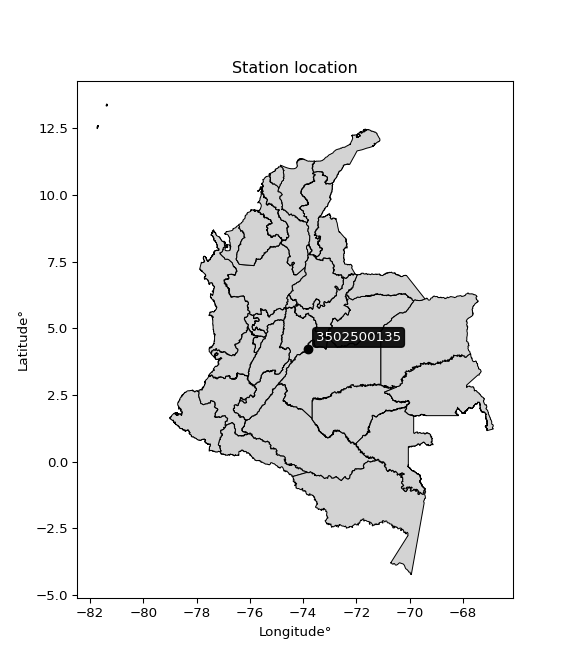

<div align="center">


</div>

# Station (rain, Pmax24h): 3502500135

Probable Maximum Precipitation (PMP) is the greatest amount of rainfall for a specific duration that is meteorologically possible for a given location, acting as a "worst-case" scenario for extreme storms, crucial for designing safety-critical infrastructure like bridges, river deviations, dams, spillways, and nuclear plants to prevent catastrophic failure. PMP is calculated by hydrologists using meteorological data to determine the upper limit of extreme rainfall, often leading to the Probable Maximum Flood (PMF) for flood control design, and is increasingly being studied for climate change impacts.

<div align="center">

</img>

</div>


## A. General information


### 1. General running parameters

• app_version: _v20251226_. • runtime: _2025-12-26 15:38:16.554582_. • Python version: _3.14.0_. • SciPy version: _1.16.3_. • Pandas version: _2.3.3_. • NumPy version: _2.3.5_. • Stations dataset (station_dataset_file): _dataset/pmax24h_in/automatic_colombia_2003_2024.csv_. • Stations catalog (station_catalog_file): _dataset/CNE_IDEAM.xls_. • Minimum year to eval til year_max (date_min): _2003_. • Maximum year to eval since year_min (date_max): _2024_. • Creates, save and include plots into reports (create_plot): _False_. • Plot only fit distributions with Δo > Δ (plot_only_fit): _True_. • Eval low extreme values, if False, evaluates high extreme values (low_extreme): _False_. • Eval every SciPy distribution as logarithmic (pdist_logarithmic_on): _True_. • Standard deviation normalized (ddof): _1.0_. • Return periods to eval in years (Tr): _[2, 2.33, 5, 10, 15, 20, 25, 50, 75, 100, 200, 250, 500, 750, 1000]_. • Minimum data sample per station, 0 means any (minimum_sample): _5_. • Z-Score threshold to adjust a value, 0 means disable (zscore): _3.5_. • Avoid zeros, e.g. rain = 0 (avoid_zeros): _True_. • Avoid null values (avoid_nans): _True_. [:file_folder:Dataset file.](../../dataset/pmax24h_in/automatic_colombia_2003_2024.csv)


### 2. Station info and location

|   id |     CODIGO | NOMBRE                                       | CATEGORIA              | TECNOLOGIA                | ESTADO   | FECHA_INSTALACION   |   FECHA_SUSPENSION |   ALTITUD |   LATITUD |   LONGITUD | DEPARTAMENTO   | MUNICIPIO   | AREA_OPERATIVA                            | ENTIDAD                                                     | AREA_HIDROGRAFICA   | ZONA_HIDROGRAFICA   | SUBZONA_HIDROGRAFICA   |   CORRIENTE | OBSERVACION                                                                                                                                                                                                                                                                                                                                                                                                                                                                                   |   SUBRED | Catalogo   |
|-----:|-----------:|:---------------------------------------------|:-----------------------|:--------------------------|:---------|:--------------------|-------------------:|----------:|----------:|-----------:|:---------------|:------------|:------------------------------------------|:------------------------------------------------------------|:--------------------|:--------------------|:-----------------------|------------:|:----------------------------------------------------------------------------------------------------------------------------------------------------------------------------------------------------------------------------------------------------------------------------------------------------------------------------------------------------------------------------------------------------------------------------------------------------------------------------------------------|---------:|:-----------|
|    0 | 3502500135 | GUAYABETAL POLLO OLIMPICO - AUT [3502500135] | Meteorológica Especial | Automática con Telemetría | Activa   | 25/07/2019          |                nan |      1272 |   4.22553 |   -73.8148 | Cundinamarca   | Guayabetal  | Area Operativa 03 - Meta-Guaviare-Guainía | INSTITUTO DE HIDROLOGIA METEOROLOGIA Y ESTUDIOS AMBIENTALES | Orinoco             | Meta                | Río Guayuriba          |         nan | Solicitud de instalación de una estación nueva en Guayabetal para el monitoreo de precipitaciones en apoyo a la emergencia de la vía al llano. Esta va a contar con pluviómetro y sensor de temperatura y humedad del aire.|05/08/2022$Migracion$Ajuste de coordenadas de acuerdo con la solicitud y envío de nuevas por la coordinadora del AO 03.|22/05/2025$mvelez$Se realiza el cambio de coordenada y elevación a solicitud del coordinador mediante memorando 20253100064473 09/04/2025 |      nan | CNE_IDEAM  |

<div align="center">

Map location in: [:earth_americas:Google](http://maps.google.com/maps?q=4.22553,-73.81481) [:earth_americas:OSM](https://www.openstreetmap.org/#map=18/4.22553/-73.81481&layers=P) [:earth_americas:Bing](https://www.bing.com/maps?cp=4.22553~-73.81481&lvl=18) [:earth_americas:Apple](https://maps.apple.com/frame?center=4.22553%2C-73.81481&span=0.003%2C0.006)

</div>


<div align="center">

```geojson
{
  "type": "Feature",
  "geometry": {
    "type": "Point", 
    "coordinates": [-73.81481, 4.22553]
  }, 
  "properties": {
    "Name": "3502500135"
  }
}
```

</div>


### 3. Discrete values table and plot

|               |           0 |           1 |          2 |           3 |          4 |           5 |
|:--------------|------------:|------------:|-----------:|------------:|-----------:|------------:|
| Date          | 2019        | 2020        | 2021       | 2022        | 2023       | 2024        |
| Value         |  203.343    |   78.694    |   59.574   |  705.225    | 1504.6     |  151.2      |
| Value_initial |  203.343    |   78.694    |   59.574   |  705.225    | 1504.6     |  151.2      |
| count         |    6        |    6        |    6       |    6        |    6       |    6        |
| mean          |  450.439    |  450.439    |  450.439   |  450.439    |  450.439   |  450.439    |
| std           |  568.813    |  568.813    |  568.813   |  568.813    |  568.813   |  568.813    |
| zscore        |   -0.434407 |   -0.653546 |   -0.68716 |    0.447925 |    1.85326 |   -0.526077 |
> If Z-Score is active, values out of range or outliers are replaced with the station mean value.


### 4. Active continuous probability distributions from SciPy (45 of 104 available)

[scipy.stats](https://docs.scipy.org/doc/scipy/reference/stats.html) is a Python´s powerful submodule within the SciPy library for comprehensive statistical analysis, offering over 130 probability distributions (like Normal, Poisson), functions for descriptive stats (mean, variance), hypothesis testing (t-tests, chi-square), random variable generation, and statistical tests, making it essential for data science, modeling, and research. It provides tools to explore, model, and draw conclusions from data efficiently, working seamlessly with NumPy.

<div align="center">

|   id | p_dist             |   n_parameter | fit_method   | label                                                                       | active   | ref                                                                                                        |
|-----:|:-------------------|--------------:|:-------------|:----------------------------------------------------------------------------|:---------|:-----------------------------------------------------------------------------------------------------------|
|    0 | alpha              |             3 | MLE          | Alpha                                                                       | True     | [:mortar_board:](https://docs.scipy.org/doc/scipy/reference/generated/scipy.stats.alpha.html)              |
|    1 | betaprime          |             4 | MLE          | Beta prime                                                                  | True     | [:mortar_board:](https://docs.scipy.org/doc/scipy/reference/generated/scipy.stats.betaprime.html)          |
|    2 | chi2               |             3 | MLE          | Chi²                                                                        | True     | [:mortar_board:](https://docs.scipy.org/doc/scipy/reference/generated/scipy.stats.chi2.html)               |
|    3 | crystalball        |             4 | MLE          | Crystalball                                                                 | True     | [:mortar_board:](https://docs.scipy.org/doc/scipy/reference/generated/scipy.stats.crystalball.html)        |
|    4 | erlang             |             3 | MLE          | Erlang                                                                      | True     | [:mortar_board:](https://docs.scipy.org/doc/scipy/reference/generated/scipy.stats.erlang.html)             |
|    5 | expon              |             2 | MLE          | Exponential                                                                 | True     | [:mortar_board:](https://docs.scipy.org/doc/scipy/reference/generated/scipy.stats.expon.html)              |
|    6 | exponnorm          |             3 | MLE          | Exponentially modified Normal                                               | True     | [:mortar_board:](https://docs.scipy.org/doc/scipy/reference/generated/scipy.stats.exponnorm.html)          |
|    7 | f                  |             4 | MLE          | F                                                                           | True     | [:mortar_board:](https://docs.scipy.org/doc/scipy/reference/generated/scipy.stats.f.html)                  |
|    8 | fatiguelife        |             3 | MLE          | Fatigue-life (Birnbaum-Saunders)                                            | True     | [:mortar_board:](https://docs.scipy.org/doc/scipy/reference/generated/scipy.stats.fatiguelife.html)        |
|    9 | fisk               |             3 | MLE          | Fisk                                                                        | True     | [:mortar_board:](https://docs.scipy.org/doc/scipy/reference/generated/scipy.stats.fisk.html)               |
|   10 | gamma              |             3 | MLE          | Gamma                                                                       | True     | [:mortar_board:](https://docs.scipy.org/doc/scipy/reference/generated/scipy.stats.gamma.html)              |
|   11 | genexpon           |             5 | MLE          | Generalized exponential                                                     | True     | [:mortar_board:](https://docs.scipy.org/doc/scipy/reference/generated/scipy.stats.genexpon.html)           |
|   12 | genlogistic        |             3 | MLE          | Generalized logistic                                                        | True     | [:mortar_board:](https://docs.scipy.org/doc/scipy/reference/generated/scipy.stats.genlogistic.html)        |
|   13 | gibrat             |             2 | MM           | Gibrat                                                                      | True     | [:mortar_board:](https://docs.scipy.org/doc/scipy/reference/generated/scipy.stats.gibrat.html)             |
|   14 | gompertz           |             3 | MLE          | Gompertz (or truncated Gumbel)                                              | True     | [:mortar_board:](https://docs.scipy.org/doc/scipy/reference/generated/scipy.stats.gompertz.html)           |
|   15 | gumbel_l           |             2 | MM           | Gumbel Left Skew                                                            | True     | [:mortar_board:](https://docs.scipy.org/doc/scipy/reference/generated/scipy.stats.gumbel_l.html)           |
|   16 | gumbel_r           |             2 | MM           | Gumbel Right Skew                                                           | True     | [:mortar_board:](https://docs.scipy.org/doc/scipy/reference/generated/scipy.stats.gumbel_r.html)           |
|   17 | halflogistic       |             2 | MM           | Half-logistic                                                               | True     | [:mortar_board:](https://docs.scipy.org/doc/scipy/reference/generated/scipy.stats.halflogistic.html)       |
|   18 | halfnorm           |             2 | MM           | Half Normal                                                                 | True     | [:mortar_board:](https://docs.scipy.org/doc/scipy/reference/generated/scipy.stats.halfnorm.html)           |
|   19 | hypsecant          |             2 | MM           | hyperbolic secant                                                           | True     | [:mortar_board:](https://docs.scipy.org/doc/scipy/reference/generated/scipy.stats.hypsecant.html)          |
|   20 | invgamma           |             3 | MLE          | Inverted gamma                                                              | True     | [:mortar_board:](https://docs.scipy.org/doc/scipy/reference/generated/scipy.stats.invgamma.html)           |
|   21 | invgauss           |             3 | MLE          | Inverse Gaussian                                                            | True     | [:mortar_board:](https://docs.scipy.org/doc/scipy/reference/generated/scipy.stats.invgauss.html)           |
|   22 | invweibull         |             3 | MLE          | Inverted Weibull                                                            | True     | [:mortar_board:](https://docs.scipy.org/doc/scipy/reference/generated/scipy.stats.invweibull.html)         |
|   23 | johnsonsu          |             4 | MLE          | Johnson Su                                                                  | True     | [:mortar_board:](https://docs.scipy.org/doc/scipy/reference/generated/scipy.stats.johnsonsu.html)          |
|   24 | kstwobign          |             2 | MLE          | Limiting distribution of scaled Kolmogorov-Smirnov two-sided test statistic | True     | [:mortar_board:](https://docs.scipy.org/doc/scipy/reference/generated/scipy.stats.kstwobign.html)          |
|   25 | laplace            |             2 | MM           | Laplace                                                                     | True     | [:mortar_board:](https://docs.scipy.org/doc/scipy/reference/generated/scipy.stats.laplace.html)            |
|   26 | laplace_asymmetric |             3 | MLE          | Asymmetric Laplace                                                          | True     | [:mortar_board:](https://docs.scipy.org/doc/scipy/reference/generated/scipy.stats.laplace_asymmetric.html) |
|   27 | loggamma           |             3 | MLE          | Log gamma                                                                   | True     | [:mortar_board:](https://docs.scipy.org/doc/scipy/reference/generated/scipy.stats.loggamma.html)           |
|   28 | logistic           |             2 | MM           | Logistic (or Sech-squared)                                                  | True     | [:mortar_board:](https://docs.scipy.org/doc/scipy/reference/generated/scipy.stats.logistic.html)           |
|   29 | lognorm            |             3 | MLE          | Log Normal                                                                  | True     | [:mortar_board:](https://docs.scipy.org/doc/scipy/reference/generated/scipy.stats.lognorm.html)            |
|   30 | maxwell            |             2 | MM           | Maxwell                                                                     | True     | [:mortar_board:](https://docs.scipy.org/doc/scipy/reference/generated/scipy.stats.maxwell.html)            |
|   31 | mielke             |             4 | MLE          | Mielke Beta-Kappa / Dagum                                                   | True     | [:mortar_board:](https://docs.scipy.org/doc/scipy/reference/generated/scipy.stats.mielke.html)             |
|   32 | moyal              |             2 | MM           | Moyal                                                                       | True     | [:mortar_board:](https://docs.scipy.org/doc/scipy/reference/generated/scipy.stats.moyal.html)              |
|   33 | nakagami           |             3 | MLE          | Nakagami                                                                    | True     | [:mortar_board:](https://docs.scipy.org/doc/scipy/reference/generated/scipy.stats.nakagami.html)           |
|   34 | ncf                |             5 | MLE          | Non-central F distribution                                                  | True     | [:mortar_board:](https://docs.scipy.org/doc/scipy/reference/generated/scipy.stats.ncf.html)                |
|   35 | nct                |             4 | MLE          | Non-central Student’s t                                                     | True     | [:mortar_board:](https://docs.scipy.org/doc/scipy/reference/generated/scipy.stats.nct.html)                |
|   36 | norm               |             2 | MM           | Normal                                                                      | True     | [:mortar_board:](https://docs.scipy.org/doc/scipy/reference/generated/scipy.stats.norm.html)               |
|   37 | pareto             |             3 | MLE          | Pareto                                                                      | True     | [:mortar_board:](https://docs.scipy.org/doc/scipy/reference/generated/scipy.stats.pareto.html)             |
|   38 | pearson3           |             3 | MM           | Pearson type III                                                            | True     | [:mortar_board:](https://docs.scipy.org/doc/scipy/reference/generated/scipy.stats.pearson3.html)           |
|   39 | rayleigh           |             2 | MM           | Rayleigh                                                                    | True     | [:mortar_board:](https://docs.scipy.org/doc/scipy/reference/generated/scipy.stats.rayleigh.html)           |
|   40 | rice               |             3 | MLE          | Rice                                                                        | True     | [:mortar_board:](https://docs.scipy.org/doc/scipy/reference/generated/scipy.stats.rice.html)               |
|   41 | t                  |             3 | MLE          | Student’s t                                                                 | True     | [:mortar_board:](https://docs.scipy.org/doc/scipy/reference/generated/scipy.stats.t.html)                  |
|   42 | truncnorm          |             4 | MLE          | Truncated normal                                                            | True     | [:mortar_board:](https://docs.scipy.org/doc/scipy/reference/generated/scipy.stats.truncnorm.html)          |
|   43 | wald               |             2 | MM           | Wald                                                                        | True     | [:mortar_board:](https://docs.scipy.org/doc/scipy/reference/generated/scipy.stats.wald.html)               |
|   44 | weibull_min        |             3 | MLE          | Weibull minimum                                                             | True     | [:mortar_board:](https://docs.scipy.org/doc/scipy/reference/generated/scipy.stats.weibull_min.html)        |

</div>

> **n_parameter:** # arguments & localization & scale.
>
> **Fit methods:** (MLE) maximum likelihood, (MM) L-moments.
>
>**Inactive:** foldnorm, gennorm, norminvgauss, powernorm, powerlognorm, skewnorm, genextreme, anglit, arcsine, argus, beta, bradford, burr, burr12, cauchy, cosine, halfcauchy, foldcauchy, skewcauchy, wrapcauchy, dgamma, gengamma, exponweib, exponpow, truncexpon, gausshyper, genhalflogistic, genhyperbolic, geninvgauss, halfgennorm, johnsonsb, kappa4, kappa3, ksone, kstwo, loglaplace, levy, levy_l, levy_stable, ncx2, genpareto, truncpareto, lomax, powerlaw, rdist, rel_breitwigner, recipinvgauss, semicircular, studentized_range, trapezoid, triang, truncweibull_min, tukeylambda, uniform, loguniform, vonmises, vonmises_line, weibull_max, dweibull, 


## B. Probability distributions vs. Empirical distributions

A continuous probability distribution (CPD) describes probabilities for variables that can take any value within a range (like rain any time), unlike discrete variables with specific outcomes (like temperature). It uses a Probability Density Function (PDF), a curve where the total area under it equals 1, and the probability of the variable falling within an interval (a to b) is found by calculating the area under the curve between those points. A key feature is that the probability of hitting any single exact value is zero, so probabilities are always expressed for ranges, e.g., $P(a ≤ X ≤ b)$.

<div align="center">

Distributions parameters
|    |    station | p_dist                |   n |               loc |           scale | shape                 | shape1                 | shape2                 | shape3   |
|---:|-----------:|:----------------------|----:|------------------:|----------------:|:----------------------|:-----------------------|:-----------------------|:---------|
|  0 | 3502500135 | alpha                 |   6 |      -0.319357    |   108.558       | 8.784026784171556e-12 |                        |                        |          |
|  1 | 3502500135 | betaprime             |   6 |      10.6864      |     1.08092     | 94.91212714885404     | 0.9059986022581819     |                        |          |
|  2 | 3502500135 | chi2                  |   6 |      59.574       |     3.40756     | 1.407671472985872     |                        |                        |          |
|  3 | 3502500135 | crystalball           |   6 |      -0.385698    |   687.533       | 4.693474400707272     | 2.2243950508105903     |                        |          |
|  4 | 3502500135 | erlang                |   6 |      59.574       |   565.738       | 0.4603175775942267    |                        |                        |          |
|  5 | 3502500135 | expon                 |   6 |      59.574       |   390.865       |                       |                        |                        |          |
|  6 | 3502500135 | exponnorm             |   6 |      59.1761      |     0.125131    | 3113.519076864188     |                        |                        |          |
|  7 | 3502500135 | f                     |   6 |      48.8627      |    41.746       | 180.58649862266532    | 1.0970668921863855     |                        |          |
|  8 | 3502500135 | fatiguelife           |   6 |      59.574       |     0.00186059  | 459.1589224877407     |                        |                        |          |
|  9 | 3502500135 | fisk                  |   6 |      59.574       |    84.2072      | 0.5886101234136336    |                        |                        |          |
| 10 | 3502500135 | gamma                 |   6 |      59.574       |   315.527       | 0.7772946405949762    |                        |                        |          |
| 11 | 3502500135 | genexpon              |   6 |      59.574       |   673.595       | 1.7233414511941878    | 1.7395580043781753e-12 | 1.7870153405786322     |          |
| 12 | 3502500135 | genlogistic           |   6 |   -2206.77        |   311.351       | 2518.0930035532774    |                        |                        |          |
| 13 | 3502500135 | gibrat                |   6 |      54.3148      |   240.262       |                       |                        |                        |          |
| 14 | 3502500135 | gompertz              |   6 |      59.574       |     6.12125e+09 | 15674164.912762318    |                        |                        |          |
| 15 | 3502500135 | gumbel_l              |   6 |     684.131       |   404.86        |                       |                        |                        |          |
| 16 | 3502500135 | gumbel_r              |   6 |     216.748       |   404.86        |                       |                        |                        |          |
| 17 | 3502500135 | halflogistic          |   6 |    -164.996       |   443.943       |                       |                        |                        |          |
| 18 | 3502500135 | halfnorm              |   6 |    -236.848       |   861.387       |                       |                        |                        |          |
| 19 | 3502500135 | hypsecant             |   6 |     450.439       |   330.567       |                       |                        |                        |          |
| 20 | 3502500135 | invgamma              |   6 |      48.7349      |    22.8472      | 0.5486167979479606    |                        |                        |          |
| 21 | 3502500135 | invgauss              |   6 |      46.8498      |    52.9544      | 7.621464297197477     |                        |                        |          |
| 22 | 3502500135 | invweibull            |   6 |      59.574       |     2.44479     | 0.06539203289225853   |                        |                        |          |
| 23 | 3502500135 | johnsonsu             |   6 |      59.574       |     9.67773e-12 | -1.7501746599081813   | 0.10312990060182688    |                        |          |
| 24 | 3502500135 | kstwobign             |   6 |    -920.977       |  1590.27        |                       |                        |                        |          |
| 25 | 3502500135 | laplace               |   6 |     450.439       |   367.167       |                       |                        |                        |          |
| 26 | 3502500135 | laplace_asymmetric    |   6 |      59.574       |     0.00025709  | 6.577445142969727e-07 |                        |                        |          |
| 27 | 3502500135 | loggamma              |   6 | -159065           | 21479.8         | 1679.921777099261     |                        |                        |          |
| 28 | 3502500135 | logistic              |   6 |     450.439       |   286.279       |                       |                        |                        |          |
| 29 | 3502500135 | lognorm               |   6 |      59.574       |     0.344434    | 14.160431065564799    |                        |                        |          |
| 30 | 3502500135 | maxwell               |   6 |    -779.972       |   771.046       |                       |                        |                        |          |
| 31 | 3502500135 | mielke                |   6 |      -0.336665    |     1.27794     | 204.34809816801283    | 1.1179516833392382     |                        |          |
| 32 | 3502500135 | moyal                 |   6 |     153.497       |   233.746       |                       |                        |                        |          |
| 33 | 3502500135 | nakagami              |   6 |      59.574       |   970.55        | 0.19888099792335215   |                        |                        |          |
| 34 | 3502500135 | ncf                   |   6 |      -0.024722    |     8.21934e-06 | 3.765777038820993e-07 | 1.299768579230355      | 7.355934537817116      |          |
| 35 | 3502500135 | nct                   |   6 |      -0.0276307   |     1.97586     | 0.8560588025264931    | 54.73592957072239      |                        |          |
| 36 | 3502500135 | norm                  |   6 |     450.439       |   519.253       |                       |                        |                        |          |
| 37 | 3502500135 | pareto                |   6 |      58.931       |     0.643024    | 0.21099539640557352   |                        |                        |          |
| 38 | 3502500135 | pearson3              |   6 |     450.439       |   519.253       | 1.2321309291019844    |                        |                        |          |
| 39 | 3502500135 | rayleigh              |   6 |    -542.922       |   792.588       |                       |                        |                        |          |
| 40 | 3502500135 | rice                  |   6 |    -319.356       |   656.585       | 0.0002667605266046507 |                        |                        |          |
| 41 | 3502500135 | t                     |   6 |     127.365       |    79.7541      | 0.7137390925880307    |                        |                        |          |
| 42 | 3502500135 | truncnorm             |   6 |      -1.8444e+06  | 30960.9         | 59.57365200065529     | 1564.1551729274356     |                        |          |
| 43 | 3502500135 | wald                  |   6 |     -68.8136      |   519.253       |                       |                        |                        |          |
| 44 | 3502500135 | weibull_min           |   6 |      59.574       |   500.449       | 0.5350962306076177    |                        |                        |          |
| 45 | 3502500135 | logalpha              |   6 |       0.883437    |    17.9737      | 4.189196842168462     |                        |                        |          |
| 46 | 3502500135 | logbetaprime          |   6 |       1.61641     |     1.2678      | 39.77803852002931     | 14.083288348754632     |                        |          |
| 47 | 3502500135 | logchi2               |   6 |       4.08722     |     0.95005     | 1.0656139767704331    |                        |                        |          |
| 48 | 3502500135 | logcrystalball        |   6 |       5.44351     |     1.15102     | 23.881690672557326    | 421.8312011873454      |                        |          |
| 49 | 3502500135 | logerlang             |   6 |       4.08722     |     1.45823     | 0.6579436873243365    |                        |                        |          |
| 50 | 3502500135 | logexpon              |   6 |       4.08722     |     1.35629     |                       |                        |                        |          |
| 51 | 3502500135 | logexponnorm          |   6 |       4.08587     |     0.000406546 | 3321.537161578418     |                        |                        |          |
| 52 | 3502500135 | logf                  |   6 |       4.08722     |     1.41792     | 0.779148976422551     | 81.04758488770568      |                        |          |
| 53 | 3502500135 | logfatiguelife        |   6 |       3.93032     |     0.887564    | 1.1533856635933384    |                        |                        |          |
| 54 | 3502500135 | logfisk               |   6 |       4.08722     |     0.780527    | 0.8830228828403819    |                        |                        |          |
| 55 | 3502500135 | loggamma              |   6 |       4.08722     |     1.17677     | 0.48316187024479484   |                        |                        |          |
| 56 | 3502500135 | loggenexpon           |   6 |       4.0866      |     0.145865    | 0.08803038568964636   | 4.260308635132956      | 0.0005704886421857795  |          |
| 57 | 3502500135 | loggenlogistic        |   6 |      -1.14163     |     0.901651    | 812.490466958453      |                        |                        |          |
| 58 | 3502500135 | loggibrat             |   6 |       4.5654      |     0.532597    |                       |                        |                        |          |
| 59 | 3502500135 | loggompertz           |   6 |       4.08722     |     4.18815     | 2.292004716106134     |                        |                        |          |
| 60 | 3502500135 | loggumbel_l           |   6 |       5.96153     |     0.897447    |                       |                        |                        |          |
| 61 | 3502500135 | loggumbel_r           |   6 |       4.92549     |     0.897447    |                       |                        |                        |          |
| 62 | 3502500135 | loghalflogistic       |   6 |       4.07929     |     0.984082    |                       |                        |                        |          |
| 63 | 3502500135 | loghalfnorm           |   6 |       3.92001     |     1.90942     |                       |                        |                        |          |
| 64 | 3502500135 | loghypsecant          |   6 |       5.44351     |     0.732762    |                       |                        |                        |          |
| 65 | 3502500135 | loginvgamma           |   6 |       3.03163     |     8.29823     | 4.36371890684811      |                        |                        |          |
| 66 | 3502500135 | loginvgauss           |   6 |       3.67527     |     2.44025     | 0.7246133121884815    |                        |                        |          |
| 67 | 3502500135 | loginvweibull         |   6 |       0.897253    |     3.90621     | 4.797721566732285     |                        |                        |          |
| 68 | 3502500135 | logjohnsonsu          |   6 |       3.92183e+07 |     4.49881e+06 | 99070713.91881663     | 34618918.15970108      |                        |          |
| 69 | 3502500135 | logkstwobign          |   6 |       1.7716      |     4.20308     |                       |                        |                        |          |
| 70 | 3502500135 | loglaplace            |   6 |       5.44351     |     0.813894    |                       |                        |                        |          |
| 71 | 3502500135 | loglaplace_asymmetric |   6 |       5.0186      |     0.877751    | 0.7867068605733509    |                        |                        |          |
| 72 | 3502500135 | logloggamma           |   6 |    -398.68        |    52.8735      | 2086.8751626647254    |                        |                        |          |
| 73 | 3502500135 | loglogistic           |   6 |       5.44351     |     0.634591    |                       |                        |                        |          |
| 74 | 3502500135 | loglognorm            |   6 |       4.08722     |     0.00362146  | 13.009241409333752    |                        |                        |          |
| 75 | 3502500135 | logmaxwell            |   6 |       2.71608     |     1.70917     |                       |                        |                        |          |
| 76 | 3502500135 | logmielke             |   6 |       1.75972     |     1.11674     | 173.8110911016105     | 3.8183466615663884     |                        |          |
| 77 | 3502500135 | logmoyal              |   6 |       4.78529     |     0.518141    |                       |                        |                        |          |
| 78 | 3502500135 | lognakagami           |   6 |       4.08722     |     2.12767     | 0.0680772676963256    |                        |                        |          |
| 79 | 3502500135 | logncf                |   6 |      -0.678045    |     5.96053     | 270.2344373630691     | 76.1969961311357       | 1.1441786721484144e-11 |          |
| 80 | 3502500135 | lognct                |   6 |      -0.0311781   |     0.114135    | 12.961721557910522    | 45.1196398350592       |                        |          |
| 81 | 3502500135 | lognorm               |   6 |       5.44351     |     1.15102     |                       |                        |                        |          |
| 82 | 3502500135 | logpareto             |   6 |       4.08373     |     0.00348881  | 0.2051661768106953    |                        |                        |          |
| 83 | 3502500135 | logpearson3           |   6 |       5.44351     |     1.15102     | 0.45119858860034207   |                        |                        |          |
| 84 | 3502500135 | lograyleigh           |   6 |       3.24154     |     1.75692     |                       |                        |                        |          |
| 85 | 3502500135 | logrice               |   6 |       3.47785     |     1.61069     | 0.001890012633296227  |                        |                        |          |
| 86 | 3502500135 | logt                  |   6 |       5.44353     |     1.15103     | 425544451.44318414    |                        |                        |          |
| 87 | 3502500135 | logtruncnorm          |   6 |      -0.102178    |     2.35709     | 2.1724968017191895    | 11.609342739215801     |                        |          |
| 88 | 3502500135 | logwald               |   6 |       4.29255     |     1.15097     |                       |                        |                        |          |
| 89 | 3502500135 | logweibull_min        |   6 |       4.08722     |     1.32864     | 0.1692529499487701    |                        |                        |          |

</div>

> **loc** (Location parameter): This shifts the distribution along the x-axis. For many common distributions, like the normal (Gaussian) distribution, loc represents the mean $μ$. For others, like the uniform distribution, it might represent the minimum value, or for the beta distribution, the left end of the support interval.
>
> **scale** (Scale parameter): This determines the width or spread of the distribution. For the normal distribution, scale represents the standard deviation $σ$. For a uniform distribution, it defines the length of the interval (from $loc$ to $loc + scale$).
>
> **shape** (Shape parameters): Refers to parameters that define the specific form of a probability distribution, distinct from its location (loc) and scale (scale). These parameters are required arguments for most distribution functions. For example, a normal (Gaussian) distribution is fully defined by its location (mean) and scale (standard deviation), so it has no specific shape parameters beyond loc and scale. However, other distributions have intrinsic properties that need specification, as Gamma distribution that takes a shape parameter, often named $a$ or $alpha$.


### 0. Cumulative distribution values - CDF (90 evaluated)

> Ordered by x ascending and calculating $log(f(x))$ separately. 

|   id |    Station |   date |        x |   count |    mean |     std |    zscore |   Value_initial |    station |   m |     alpha |   alpha_pdf |   betaprime |   betaprime_pdf |        chi2 |       chi2_pdf |   crystalball |   crystalball_pdf |      erlang |   erlang_pdf |     expon |   expon_pdf |   exponnorm |   exponnorm_pdf |         f |       f_pdf |   fatiguelife |   fatiguelife_pdf |        fisk |      fisk_pdf |       gamma |    gamma_pdf |    genexpon |   genexpon_pdf |   genlogistic |   genlogistic_pdf |      gibrat |   gibrat_pdf |    gompertz |   gompertz_pdf |   gumbel_l |   gumbel_l_pdf |   gumbel_r |   gumbel_r_pdf |   halflogistic |   halflogistic_pdf |   halfnorm |   halfnorm_pdf |   hypsecant |   hypsecant_pdf |   invgamma |   invgamma_pdf |   invgauss |   invgauss_pdf |   invweibull |   invweibull_pdf |   johnsonsu |   johnsonsu_pdf |   kstwobign |   kstwobign_pdf |   laplace |   laplace_pdf |   laplace_asymmetric |   laplace_asymmetric_pdf |    loggamma |   loggamma_pdf |   logistic |   logistic_pdf |   lognorm |   lognorm_pdf |   maxwell |   maxwell_pdf |   mielke |   mielke_pdf |    moyal |   moyal_pdf |    nakagami |   nakagami_pdf |      ncf |     ncf_pdf |       nct |     nct_pdf |     norm |    norm_pdf |   pareto |   pareto_pdf |   pearson3 |   pearson3_pdf |   rayleigh |   rayleigh_pdf |     rice |    rice_pdf |        t |       t_pdf |   truncnorm |   truncnorm_pdf |     wald |    wald_pdf |   weibull_min |   weibull_min_pdf |   logalpha |   logalpha_pdf |   logbetaprime |   logbetaprime_pdf |     logchi2 |   logchi2_pdf |   logcrystalball |   logcrystalball_pdf |   logerlang |   logerlang_pdf |   logexpon |   logexpon_pdf |   logexponnorm |   logexponnorm_pdf |        logf |    logf_pdf |   logfatiguelife |   logfatiguelife_pdf |     logfisk |   logfisk_pdf |   loggenexpon |   loggenexpon_pdf |   loggenlogistic |   loggenlogistic_pdf |   loggibrat |   loggibrat_pdf |   loggompertz |   loggompertz_pdf |   loggumbel_l |   loggumbel_l_pdf |   loggumbel_r |   loggumbel_r_pdf |   loghalflogistic |   loghalflogistic_pdf |   loghalfnorm |   loghalfnorm_pdf |   loghypsecant |   loghypsecant_pdf |   loginvgamma |   loginvgamma_pdf |   loginvgauss |   loginvgauss_pdf |   loginvweibull |   loginvweibull_pdf |   logjohnsonsu |   logjohnsonsu_pdf |   logkstwobign |   logkstwobign_pdf |   loglaplace |   loglaplace_pdf |   loglaplace_asymmetric |   loglaplace_asymmetric_pdf |   logloggamma |   logloggamma_pdf |   loglogistic |   loglogistic_pdf |   loglognorm |   loglognorm_pdf |   logmaxwell |   logmaxwell_pdf |   logmielke |   logmielke_pdf |   logmoyal |   logmoyal_pdf |   lognakagami |   lognakagami_pdf |   logncf |   logncf_pdf |    lognct |   lognct_pdf |   logpareto |   logpareto_pdf |   logpearson3 |   logpearson3_pdf |   lograyleigh |   lograyleigh_pdf |   logrice |   logrice_pdf |     logt |   logt_pdf |   logtruncnorm |   logtruncnorm_pdf |     logwald |   logwald_pdf |   logweibull_min |   logweibull_min_pdf |
|-----:|-----------:|-------:|---------:|--------:|--------:|--------:|----------:|----------------:|-----------:|----:|----------:|------------:|------------:|----------------:|------------:|---------------:|--------------:|------------------:|------------:|-------------:|----------:|------------:|------------:|----------------:|----------:|------------:|--------------:|------------------:|------------:|--------------:|------------:|-------------:|------------:|---------------:|--------------:|------------------:|------------:|-------------:|------------:|---------------:|-----------:|---------------:|-----------:|---------------:|---------------:|-------------------:|-----------:|---------------:|------------:|----------------:|-----------:|---------------:|-----------:|---------------:|-------------:|-----------------:|------------:|----------------:|------------:|----------------:|----------:|--------------:|---------------------:|-------------------------:|------------:|---------------:|-----------:|---------------:|----------:|--------------:|----------:|--------------:|---------:|-------------:|---------:|------------:|------------:|---------------:|---------:|------------:|----------:|------------:|---------:|------------:|---------:|-------------:|-----------:|---------------:|-----------:|---------------:|---------:|------------:|---------:|------------:|------------:|----------------:|---------:|------------:|--------------:|------------------:|-----------:|---------------:|---------------:|-------------------:|------------:|--------------:|-----------------:|---------------------:|------------:|----------------:|-----------:|---------------:|---------------:|-------------------:|------------:|------------:|-----------------:|---------------------:|------------:|--------------:|--------------:|------------------:|-----------------:|---------------------:|------------:|----------------:|--------------:|------------------:|--------------:|------------------:|--------------:|------------------:|------------------:|----------------------:|--------------:|------------------:|---------------:|-------------------:|--------------:|------------------:|--------------:|------------------:|----------------:|--------------------:|---------------:|-------------------:|---------------:|-------------------:|-------------:|-----------------:|------------------------:|----------------------------:|--------------:|------------------:|--------------:|------------------:|-------------:|-----------------:|-------------:|-----------------:|------------:|----------------:|-----------:|---------------:|--------------:|------------------:|---------:|-------------:|----------:|-------------:|------------:|----------------:|--------------:|------------------:|--------------:|------------------:|----------:|--------------:|---------:|-----------:|---------------:|-------------------:|------------:|--------------:|-----------------:|---------------------:|
|    0 | 3502500135 |   2021 |   59.574 |       6 | 450.439 | 568.813 | -0.68716  |          59.574 | 3502500135 |   1 | 0.0699066 | 0.00467163  |    0.106691 |      0.00462732 | 3.13671e-11 | 3107.1         |      0.534748 |       0.000578048 | 1.87466e-08 |  1.21448e+06 | 0         | 0.00255843  |  0.00102078 |     0.00256224  | 0.0461353 | 0.0104178   |     0.0581065 |       2.55117e+07 | 1.24897e-07 | 467.108       | 1.24059e-13 | 13.5714      | 4.82245e-13 |    0.00255842  |      0.176143 |       0.000982042 | 6.62542e-05 |  5.10961e-05 | 7.35014e-10 |    0.00256062  |   0.192501 |    0.000426455 |   0.228927 |    0.000833669 |       0.247668 |        0.00105719  |   0.269245 |    0.000873026 |    0.189359 |     0.000539639 |  0.0461364 |    0.0104166   |  0.0470713 |    0.0090844   |  0.000133095 |      1.09315e+10 |   0.0403979 |     9.24991e+08 |    0.158421 |     0.000886977 |  0.172443 |   0.000469657 |          1.09879e-12 |              0.00255843  | 5.57439e-08 |    3.03242e+07 |   0.203375 |    0.00056593  |  0.11933  |     0.173109  |  0.243534 |   0.000678179 |      nan |          nan | 0.221514 | 0.000988291 | 1.20675e-07 |    6.75541e+06 | 0.207568 | 0.00288459  | 0.0757063 | 0.00458663  | 0.225801 | 0.000578748 | 0        |  0.32813     |   0.241716 |    0.0009122   |   0.250931 |    0.000718425 | 0.153407 | 0.000744135 | 0.296376 | 0.0020386   | 4.54747e-13 |     0.0019247   | 0.109852 | 0.00198694  |   9.65655e-10 |   72721.6         |  0.0776651 |      0.254554  |       0.101491 |          0.24278   | 7.64963e-09 |   4.58892e+06 |         0.11933  |            0.173109  | 1.08214e-10 |   80162.5       |   0        |      0.737303  |    0.000996414 |          0.739462  | 9.29211e-07 | 4.07572e+08 |        0.0447932 |            0.730282  | 6.37096e-14 |    63.3398    |   0.000376479 |         0.60335   |        0.0855953 |            0.233001  |    0        |       0         |   1.42791e-11 |         0.547259  |      0.116508 |         0.121947  |     0.0784861 |         0.222558  |        0.00403026 |              0.50808  |     0.0697804 |         0.416267  |      0.0991962 |          0.133192  |     0.0649004 |         0.305936  |     0.0522296 |         0.412649  |       0.0711668 |           0.282865  |       0.11712  |          0.172444  |      0.0781249 |          0.240521  |    0.0944606 |        0.11606   |               0.0992273 |                   0.143697  |      0.121269 |         0.172625  |      0.105526 |         0.148742  |    0.0128079 |      2.86009e+12 |     0.11361  |        0.217772  |   0.0688059 |        0.293405 |  0.0498398 |      0.220639  |     0.0069509 |       1.06555e+12 | 0.100751 |    0.209727  | 0.0895465 |    0.229813  |    0        |      58.8069    |      0.110173 |         0.201225  |      0.109386 |         0.244     | 0.0690647 |     0.218662  | 0.119329 |  0.173107  |    0           |          0         | 0           |     0         |       0.00269784 |          5.13411e+11 |
|    1 | 3502500135 |   2020 |   78.694 |       6 | 450.439 | 568.813 | -0.653546 |          78.694 | 3502500135 |   2 | 0.169468  | 0.00539887  |    0.194484 |      0.00442529 | 0.968159    |    0.00505995  |      0.545786 |       0.000576425 | 0.234947    |  0.00552671  | 0.0477399 | 0.00243629  |  0.0488634  |     0.00244133  | 0.241197  | 0.00828263  |     0.587359  |       0.00224806  | 0.294705    |   0.00639879  | 0.11906     |  0.00467719  | 0.0477399   |    0.00243629  |      0.19533  |       0.00102419  | 0.0110688   |  0.00119437  | 0.0477798   |    0.00243827  |   0.200808 |    0.000442479 |   0.245038 |    0.000851177 |       0.267771 |        0.00104552  |   0.285873 |    0.00086617  |    0.199927 |     0.000565811 |  0.241192  |    0.00828291  |  0.224152  |    0.00797907  |  0.417214    |      0.00124734  |   0.892719  |     0.000996139 |    0.175719 |     0.000921789 |  0.18166  |   0.000494762 |          0.0477399   |              0.00243629  | 0.522092    |    0.770785    |   0.214411 |    0.000588372 |  0.174504 |     0.223551  |  0.256618 |   0.00069031  |      nan |          nan | 0.240586 | 0.00100603  | 0.165592    |    0.00344467  | 0.259278 | 0.00252732  | 0.169971  | 0.00499204  | 0.237019 | 0.000594611 | 0.51458  |  0.00518248  |   0.259231 |    0.000919492 |   0.264756 |    0.000727544 | 0.167869 | 0.000768329 | 0.34046  | 0.00259     | 0.0361315   |     0.00185517  | 0.148666 | 0.00205868  |   0.159957    |       0.00409777  |  0.165401  |      0.368547  |       0.180206 |          0.318563  | 0.385085    |   0.669298    |         0.174504 |            0.223551  | 0.346498    |       0.728777  |   0.185537 |      0.600506  |    0.187082    |          0.602001  | 0.403769    | 0.534469    |        0.264035  |            0.693029  | 0.286901    |     0.649032  |   0.158698    |         0.534526  |        0.164317  |            0.328752  |    0        |       0         |   0.145727    |         0.499635  |      0.155422 |         0.158967  |     0.154709  |         0.321712  |        0.144438   |              0.497488 |     0.184506  |         0.406644  |      0.143725  |          0.189545  |     0.172935  |         0.449639  |     0.196524  |         0.563378  |       0.170495  |           0.417223  |       0.172227 |          0.223775  |      0.159221  |          0.336249  |    0.132977  |        0.163384  |               0.148488  |                   0.215034  |      0.176177 |         0.222134  |      0.154642 |         0.206003  |    0.630721  |      0.104203    |     0.182152 |        0.272921  |   0.17264   |        0.435888 |  0.133786  |      0.375155  |     0.65421   |       0.31966     | 0.169204 |    0.280558  | 0.166175  |    0.317313  |    0.593854 |       0.295659  |      0.174812 |         0.262217  |      0.18507  |         0.296751  | 0.140906  |     0.29396   | 0.174502 |  0.223548  |    0           |          0         | 0.000189656 |     0.0215742 |       0.535852   |          0.216627    |
|    2 | 3502500135 |   2024 |  151.2   |       6 | 450.439 | 568.813 | -0.526077 |         151.2   | 3502500135 |   3 | 0.473707  | 0.00291876  |    0.437397 |      0.00241301 | 0.999999    |    7.62329e-08 |      0.587251 |       0.000566318 | 0.464684    |  0.00208707  | 0.208969  | 0.00202379  |  0.210379   |     0.00202676  | 0.542574  | 0.0021158   |     0.685557  |       0.000936205 | 0.512422    |   0.00160502  | 0.365285    |  0.00262198  | 0.208969    |    0.00202379  |      0.274203 |       0.00113922  | 0.181886    |  0.00272611  | 0.209128    |    0.00202512  |   0.235181 |    0.000506497 |   0.308589 |    0.000896167 |       0.341794 |        0.000994697 |   0.347644 |    0.000836899 |    0.244675 |     0.000669404 |  0.54259   |    0.00211597  |  0.539171  |    0.00236888  |  0.45429     |      0.000255816 |   0.91965   |     0.000167885 |    0.246373 |     0.00101753  |  0.221321 |   0.000602779 |          0.208969    |              0.00202379  | 0.799793    |    0.237041    |   0.260134 |    0.000672296 |  0.356004 |     0.323768  |  0.308113 |   0.000727872 |      nan |          nan | 0.314933 | 0.00103516  | 0.30875     |    0.00133835  | 0.40303  | 0.00154257  | 0.447294  | 0.00267828  | 0.28221  | 0.000650751 | 0.649313 |  0.000801929 |   0.326333 |    0.000926292 |   0.318517 |    0.000753002 | 0.226484 | 0.000844303 | 0.585506 | 0.00335487  | 0.161681    |     0.00161359  | 0.294128 | 0.00188245  |   0.331779    |       0.0015732   |  0.437488  |      0.414182  |       0.415135 |          0.370606  | 0.656555    |   0.269958    |         0.356004 |            0.323768  | 0.652667    |       0.308093  |   0.496772 |      0.371031  |    0.498789    |          0.371169  | 0.615969    | 0.213491    |        0.570273  |            0.314512  | 0.538929    |     0.235582  |   0.457748    |         0.384878  |        0.416523  |            0.404369  |    0.435876 |       0.868884  |   0.434944    |         0.386247  |      0.2951   |         0.274671  |     0.40598   |         0.407791  |        0.444043   |              0.407906 |     0.434946  |         0.354124  |      0.324972  |          0.370364  |     0.472144  |         0.409795  |     0.512899  |         0.379818  |       0.461536  |           0.415423  |       0.354683 |          0.326386  |      0.41059   |          0.396347  |    0.296645  |        0.364476  |               0.3823    |                   0.55363   |      0.356243 |         0.321168  |      0.338591 |         0.3529    |    0.665166  |      0.0300615   |     0.38829  |        0.341906  |   0.469463  |        0.412499 |  0.42464   |      0.446954  |     0.770562  |       0.111277    | 0.389068 |    0.369363  | 0.409242  |    0.392589  |    0.682429 |       0.0696938 |      0.380521 |         0.350271  |      0.400422 |         0.345179  | 0.367148  |     0.375844  | 0.356    |  0.323765  |    1.66216e-10 |          1.07202   | 0.468969    |     0.620972  |       0.610015   |          0.0667334   |
|    3 | 3502500135 |   2019 |  203.343 |       6 | 450.439 | 568.813 | -0.434407 |         203.343 | 3502500135 |   4 | 0.594015  | 0.00181169  |    0.540377 |      0.00161205 | 1           |    3.17234e-11 |      0.616507 |       0.000555328 | 0.556305    |  0.00149252  | 0.30776   | 0.00177105  |  0.309294   |     0.00177287  | 0.625585  | 0.00120634  |     0.727542  |       0.000699326 | 0.578072    |   0.00099858  | 0.484903    |  0.00201042  | 0.30776     |    0.00177104  |      0.334737 |       0.00117636  | 0.31647     |  0.00238842  | 0.307978    |    0.001772    |   0.262855 |    0.000555272 |   0.355701 |    0.000908155 |       0.392583 |        0.000952689 |   0.390667 |    0.000812895 |    0.281556 |     0.000744935 |  0.625608  |    0.00120642  |  0.633564  |    0.00139179  |  0.464815    |      0.00016197  |   0.926356  |     0.000100137 |    0.300444 |     0.00105188  |  0.255093 |   0.000694759 |          0.30776     |              0.00177105  | 0.857637    |    0.159764    |   0.296686 |    0.00072888  |  0.455513 |     0.344442  |  0.346579 |   0.000746309 |      nan |          nan | 0.368725 | 0.00102427  | 0.369183    |    0.0010177   | 0.472235 | 0.00114214  | 0.558945  | 0.00170448  | 0.317084 | 0.000686053 | 0.680941 |  0.000466165 |   0.374369 |    0.000914086 |   0.358062 |    0.000762591 | 0.27158  | 0.000883184 | 0.719476 | 0.00183752  | 0.241735    |     0.00145954  | 0.385799 | 0.00163137  |   0.40132     |       0.00114315  |  0.553013  |      0.361914  |       0.521506 |          0.34377   | 0.725948    |   0.203017    |         0.455513 |            0.344442  | 0.731448    |       0.228775  |   0.595526 |      0.29822   |    0.597534    |          0.298044  | 0.671715    | 0.166234    |        0.651257  |            0.237386  | 0.59867     |     0.172813  |   0.56278     |         0.325064  |        0.532265  |            0.372121  |    0.633684 |       0.502112  |   0.541913    |         0.336082  |      0.385221 |         0.333263  |     0.523102  |         0.377692  |        0.556533   |              0.350718 |     0.53493   |         0.320003  |      0.444413  |          0.42779   |     0.582433  |         0.334314  |     0.612497  |         0.295666  |       0.574556  |           0.345789  |       0.455067 |          0.34764   |      0.524022  |          0.365567  |    0.426912  |        0.52453   |               0.526361  |                   0.424511  |      0.455018 |         0.342185  |      0.449502 |         0.389936  |    0.672864  |      0.0225956   |     0.489768 |        0.339703  |   0.580617  |        0.33701  |  0.548602  |      0.38581   |     0.799606  |       0.0868172   | 0.498088 |    0.361899  | 0.522363  |    0.366349  |    0.699869 |       0.050015  |      0.485143 |         0.351816  |      0.501587 |         0.33478   | 0.478164  |     0.36951   | 0.455508 |  0.344439  |    0.277271    |          0.809415  | 0.619511    |     0.411143  |       0.6272     |          0.050713    |
|    4 | 3502500135 |   2022 |  705.225 |       6 | 450.439 | 568.813 |  0.447925 |         705.225 | 3502500135 |   5 | 0.877717  | 0.000171953 |    0.829021 |      0.00020607 | 1           |    2.11681e-43 |      0.847623 |       0.000342688 | 0.88231     |  0.000273271 | 0.808305  | 0.000490437 |  0.809528   |     0.000488896 | 0.823862  | 0.000143895 |     0.900245  |       0.000174052 | 0.768344    |   0.000162266 | 0.914348    |  0.000293234 | 0.808305    |    0.000490437 |      0.803827 |       0.000563753 | 0.840531    |  0.00037299  | 0.808576    |    0.000490163 |   0.651279 |    0.000907405 |   0.741387 |    0.00054796  |       0.753111 |        0.000487476 |   0.7259   |    0.000509341 |    0.72413  |     0.000733918 |  0.823891  |    0.000143892 |  0.867148  |    0.000169118 |  0.499353    |      3.51213e-05 |   0.945652  |     1.76019e-05 |    0.753436 |     0.000630601 |  0.750194 |   0.000680361 |          0.808305    |              0.000490437 | 0.961609    |    0.0386791   |   0.708888 |    0.000720855 |  0.833655 |     0.216799  |  0.705505 |   0.000600605 |      nan |          nan | 0.758675 | 0.000500175 | 0.661899    |    0.000378817 | 0.722763 | 0.000226603 | 0.842833  | 0.000189432 | 0.688173 | 0.000681161 | 0.767433 |  7.59262e-05 |   0.742412 |    0.000516987 |   0.710604 |    0.000574995 | 0.70404  | 0.000703391 | 0.924651 | 9.22772e-05 | 0.711454    |     0.000555558 | 0.808894 | 0.000389389 |   0.682109    |       0.000301936 |  0.846637  |      0.132061  |       0.830676 |          0.155075  | 0.883768    |   0.0760909   |         0.833655 |            0.216799  | 0.902166    |       0.0767535 |   0.838313 |      0.119212  |    0.839763    |          0.118663  | 0.812455    | 0.0771406   |        0.83845   |            0.0929662 | 0.734526    |     0.0696748 |   0.841134    |         0.140519  |        0.853158  |            0.150255  |    0.90653  |       0.0837915 |   0.841663    |         0.156329  |      0.856996 |         0.309908  |     0.850369  |         0.153583  |        0.850972   |              0.140154 |     0.832977  |         0.160844  |      0.86314   |          0.181071  |     0.842017  |         0.11691   |     0.841681  |         0.107579  |       0.844863  |           0.120703  |       0.835902 |          0.216922  |      0.850654  |          0.16167   |    0.872941  |        0.156112  |               0.844629  |                   0.139255  |      0.832666 |         0.217938  |      0.852839 |         0.197773  |    0.692031  |      0.010942    |     0.832123 |        0.188501  |   0.840591  |        0.115924 |  0.856635  |      0.136846  |     0.875748  |       0.044268    | 0.841853 |    0.174921  | 0.846073  |    0.155422  |    0.739924 |       0.0215609 |      0.836451 |         0.187896  |      0.831729 |         0.180821  | 0.839439  |     0.19066   | 0.83365  |  0.216802  |    0.841836    |          0.20947   | 0.881981    |     0.098867  |       0.670688   |          0.0250516   |
|    5 | 3502500135 |   2023 | 1504.6   |       6 | 450.439 | 568.813 |  1.85326  |        1504.6   | 3502500135 |   6 | 0.942494  | 3.81456e-05 |    0.911342 |      5.1837e-05 | 1           |    1.91329e-94 |      0.9857   |       5.28617e-05 | 0.979091    |  4.30647e-05 | 0.975202  | 6.34439e-05 |  0.975524   |     6.28249e-05 | 0.885439  | 4.27283e-05 |     0.972528  |       4.19976e-05 | 0.842       |   5.41903e-05 | 0.994104    |  1.94549e-05 | 0.975202    |    6.3444e-05  |      0.983383 |       5.29249e-05 | 0.963895    |  5.46548e-05 | 0.97528     |    6.32975e-05 |   0.999493 |    9.49389e-06 |   0.959306 |    9.84395e-05 |       0.954529 |        0.000100096 |   0.95679  |    0.000120011 |    0.973776 |     7.92393e-05 |  0.885465  |    4.27249e-05 |  0.937315  |    4.60809e-05 |  0.517469    |      1.54273e-05 |   0.954214  |     6.85964e-06 |    0.980931 |     7.31581e-05 |  0.971681 |   7.71292e-05 |          0.975202    |              6.34439e-05 | 0.981879    |    0.0176924   |   0.975452 |    8.36426e-05 |  0.948137 |     0.0922517 |  0.967623 |   0.000112708 |      nan |          nan | 0.955684 | 9.46971e-05 | 0.864833    |    0.000163862 | 0.823673 | 7.19383e-05 | 0.917649  | 4.67808e-05 | 0.978829 | 9.78493e-05 | 0.803765 |  2.86405e-05 |   0.956664 |    0.000103914 |   0.96445  |    0.00011587  | 0.9789   | 8.92719e-05 | 0.95936  | 2.10297e-05 | 0.938106    |     0.000119221 | 0.95436  | 7.37869e-05 |   0.828587    |       0.000111949 |  0.918526  |      0.0654769 |       0.916872 |          0.0793872 | 0.928527    |   0.0450682   |         0.948137 |            0.0922517 | 0.945595    |       0.0416569 |   0.907523 |      0.0681834 |    0.908577    |          0.0677026 | 0.861145    | 0.0533118   |        0.894264  |            0.0576809 | 0.77797     |     0.0472357 |   0.921323    |         0.0763262 |        0.933761  |            0.0709729 |    0.949696 |       0.0376737 |   0.930271    |         0.0824987 |      0.989162 |         0.0546411 |     0.932702  |         0.0724066 |        0.928124   |              0.070414 |     0.924709  |         0.0859098 |      0.950676  |          0.0670429 |     0.907585  |         0.0624031 |     0.903957  |         0.0615948 |       0.911858  |           0.0628866 |       0.949735 |          0.0908286 |      0.938421  |          0.0773028 |    0.949921  |        0.0615307 |               0.921221  |                   0.0706079 |      0.947984 |         0.0930442 |      0.950317 |         0.0744009 |    0.699225  |      0.00828654  |     0.935489 |        0.0903861 |   0.905481  |        0.061713 |  0.930708  |      0.0666972 |     0.904677  |       0.0329263   | 0.935619 |    0.0808956 | 0.92988   |    0.0741064 |    0.753794 |       0.0156264 |      0.937644 |         0.0866986 |      0.932083 |         0.0896551 | 0.941548  |     0.0864814 | 0.948134 |  0.0922547 |    0.944735    |          0.0801945 | 0.935508    |     0.0491807 |       0.687198   |          0.0190548   |

An Empirical Distribution Function (EDF) is a step-function estimate of a true cumulative distribution function (CDF) based on observed sample data, representing the proportion of data points less than or equal to a given value. It is calculated by ordering your data and jumping up by $1/n$ (where $n$ is sample size) at each unique data point, allowing analysis without assuming an underlying population distribution, and it gets closer to the true CDF as the sample size grows.


### 1. Empirical - EDF California (1923)

California´s estimates the true probability distribution of water-related data (like rainfall, streamflow) using observed samples, crucial for risk assessment.

<div align="center">


$P=m/n$


</div>


**1.1. Empirical values**

<div align="center">

|                | 0                   | 1                  | 2              | 3                  | 4                  | 5              |
|:---------------|:--------------------|:-------------------|:---------------|:-------------------|:-------------------|:---------------|
| date           | 2021                | 2020               | 2024           | 2019               | 2022               | 2023           |
| x              | 59.574              | 78.694             | 151.2          | 203.343            | 705.225            | 1504.6         |
| m              | 1                   | 2                  | 3              | 4                  | 5                  | 6              |
| empirical_dist | edf_california      | edf_california     | edf_california | edf_california     | edf_california     | edf_california |
| empirical      | 0.16666666666666666 | 0.3333333333333333 | 0.5            | 0.6666666666666666 | 0.8333333333333334 | 1.0            |
| empirical_tr   | 1.2                 | 1.4999999999999998 | 2.0            | 2.9999999999999996 | 6.000000000000002  | inf            |

</div>


**1.2. Kolmogorov-Smirnov fit test (sorted by Δ)**


<div align="center">

|                | 0                   | 1                 | 2                   | 3                   | 4                 | 5                   | 6                   | 7                   | 8                   | 9                   | 10                  | 11                 | 12                 | 13                  | 14                  | 15                  | 16                  | 17                 | 18                  | 19                 | 20                  | 21                  | 22                | 23                  | 24                 | 25                  | 26                  | 27                  | 28                 | 29                  | 30               | 31                    | 32                 | 33                  | 34                  | 35                  | 36                  | 37                  | 38                  | 39                  | 40                  | 41                  | 42                  | 43                  | 44                 | 45                  | 46                  | 47                  | 48                  | 49                  | 50                  | 51                 | 52                 | 53                  | 54                 | 55                 | 56                 | 57                  | 58                  | 59                 | 60                 | 61               | 62                 | 63                 | 64                | 65                 | 66                 | 67                 | 68                  | 69                 | 70                 | 71                  | 72                  | 73                  | 74                 | 75                  | 76                 | 77                 | 78                 | 79                 | 80                 | 81                | 82                 | 83                  | 84                  | 85                  | 86                 | 87                 | 88                 | 89             |
|:---------------|:--------------------|:------------------|:--------------------|:--------------------|:------------------|:--------------------|:--------------------|:--------------------|:--------------------|:--------------------|:--------------------|:-------------------|:-------------------|:--------------------|:--------------------|:--------------------|:--------------------|:-------------------|:--------------------|:-------------------|:--------------------|:--------------------|:------------------|:--------------------|:-------------------|:--------------------|:--------------------|:--------------------|:-------------------|:--------------------|:-----------------|:----------------------|:-------------------|:--------------------|:--------------------|:--------------------|:--------------------|:--------------------|:--------------------|:--------------------|:--------------------|:--------------------|:--------------------|:--------------------|:-------------------|:--------------------|:--------------------|:--------------------|:--------------------|:--------------------|:--------------------|:-------------------|:-------------------|:--------------------|:-------------------|:-------------------|:-------------------|:--------------------|:--------------------|:-------------------|:-------------------|:-----------------|:-------------------|:-------------------|:------------------|:-------------------|:-------------------|:-------------------|:--------------------|:-------------------|:-------------------|:--------------------|:--------------------|:--------------------|:-------------------|:--------------------|:-------------------|:-------------------|:-------------------|:-------------------|:-------------------|:------------------|:-------------------|:--------------------|:--------------------|:--------------------|:-------------------|:-------------------|:-------------------|:---------------|
| station        | 3502500135          | 3502500135        | 3502500135          | 3502500135          | 3502500135        | 3502500135          | 3502500135          | 3502500135          | 3502500135          | 3502500135          | 3502500135          | 3502500135         | 3502500135         | 3502500135          | 3502500135          | 3502500135          | 3502500135          | 3502500135         | 3502500135          | 3502500135         | 3502500135          | 3502500135          | 3502500135        | 3502500135          | 3502500135         | 3502500135          | 3502500135          | 3502500135          | 3502500135         | 3502500135          | 3502500135       | 3502500135            | 3502500135         | 3502500135          | 3502500135          | 3502500135          | 3502500135          | 3502500135          | 3502500135          | 3502500135          | 3502500135          | 3502500135          | 3502500135          | 3502500135          | 3502500135         | 3502500135          | 3502500135          | 3502500135          | 3502500135          | 3502500135          | 3502500135          | 3502500135         | 3502500135         | 3502500135          | 3502500135         | 3502500135         | 3502500135         | 3502500135          | 3502500135          | 3502500135         | 3502500135         | 3502500135       | 3502500135         | 3502500135         | 3502500135        | 3502500135         | 3502500135         | 3502500135         | 3502500135          | 3502500135         | 3502500135         | 3502500135          | 3502500135          | 3502500135          | 3502500135         | 3502500135          | 3502500135         | 3502500135         | 3502500135         | 3502500135         | 3502500135         | 3502500135        | 3502500135         | 3502500135          | 3502500135          | 3502500135          | 3502500135         | 3502500135         | 3502500135         | 3502500135     |
| empirical_dist | edf_california      | edf_california    | edf_california      | edf_california      | edf_california    | edf_california      | edf_california      | edf_california      | edf_california      | edf_california      | edf_california      | edf_california     | edf_california     | edf_california      | edf_california      | edf_california      | edf_california      | edf_california     | edf_california      | edf_california     | edf_california      | edf_california      | edf_california    | edf_california      | edf_california     | edf_california      | edf_california      | edf_california      | edf_california     | edf_california      | edf_california   | edf_california        | edf_california     | edf_california      | edf_california      | edf_california      | edf_california      | edf_california      | edf_california      | edf_california      | edf_california      | edf_california      | edf_california      | edf_california      | edf_california     | edf_california      | edf_california      | edf_california      | edf_california      | edf_california      | edf_california      | edf_california     | edf_california     | edf_california      | edf_california     | edf_california     | edf_california     | edf_california      | edf_california      | edf_california     | edf_california     | edf_california   | edf_california     | edf_california     | edf_california    | edf_california     | edf_california     | edf_california     | edf_california      | edf_california     | edf_california     | edf_california      | edf_california      | edf_california      | edf_california     | edf_california      | edf_california     | edf_california     | edf_california     | edf_california     | edf_california     | edf_california    | edf_california     | edf_california      | edf_california      | edf_california      | edf_california     | edf_california     | edf_california     | edf_california |
| p_dist         | invgauss            | invgamma          | f                   | logfatiguelife      | t                 | loginvgauss         | betaprime           | loghalfnorm         | logbetaprime        | loginvgamma         | logmielke           | loginvweibull      | nct                | alpha               | lograyleigh         | logexponnorm        | logf                | fisk               | erlang              | logchi2            | logerlang           | logexpon            | lognct            | logalpha            | logncf             | loggenlogistic      | logkstwobign        | loggenexpon         | logmaxwell         | loggumbel_r         | logpearson3      | loglaplace_asymmetric | loggompertz        | loghalflogistic     | logrice             | ncf                 | pareto              | logmoyal            | lognorm             | lognorm             | logcrystalball      | logt                | logjohnsonsu        | logloggamma         | gamma              | loglogistic         | logfisk             | loghypsecant        | loglaplace          | fatiguelife         | logpareto           | weibull_min        | halflogistic       | halfnorm            | wald               | loggumbel_l        | pearson3           | nakagami            | moyal               | loggamma           | loggamma           | loglognorm       | rayleigh           | gumbel_r           | logweibull_min    | maxwell            | lognakagami        | genlogistic        | logwald             | loggibrat          | norm               | gibrat              | exponnorm           | gompertz            | expon              | laplace_asymmetric  | genexpon           | kstwobign          | crystalball        | logistic           | hypsecant          | rice              | gumbel_l           | laplace             | truncnorm           | invweibull          | logtruncnorm       | johnsonsu          | chi2               | mielke         |
| delta          | 0.11959540897469065 | 0.120530225978559 | 0.12053138257415108 | 0.12187350738000308 | 0.129709457138401 | 0.13680941011623685 | 0.13884915001091724 | 0.14882741534771785 | 0.15312715171911476 | 0.16039822133150716 | 0.16069365850290207 | 0.1628386146694809 | 0.1633623968795086 | 0.16386519281219955 | 0.16507989486297647 | 0.16567025314090514 | 0.16666573745535085 | 0.1666665417691877 | 0.16666664792010313 | 0.1666666590170343 | 0.16666666655845286 | 0.16666666666666666 | 0.167158107142781 | 0.16793199947698054 | 0.1685790951714391 | 0.16901653103936962 | 0.17411283024667054 | 0.17463552351287662 | 0.1768983603321227 | 0.17862461482661665 | 0.18152326982742 | 0.18484529876701986   | 0.1876065360392223 | 0.18889516922878563 | 0.19242736895340704 | 0.19443156251994914 | 0.19623516839584276 | 0.19954754500885308 | 0.21115346977314714 | 0.21115346977314714 | 0.21115351343461658 | 0.21115863920099553 | 0.21159965257598412 | 0.21164883016552205 | 0.2142734879032103 | 0.21716421372941996 | 0.22203046925996728 | 0.22225395467795545 | 0.23975452988770518 | 0.25402557139177256 | 0.26052040463131937 | 0.2653466682548985 | 0.2740839562782673 | 0.27599960581735394 | 0.2808680953417027 | 0.2814453559701297 | 0.2922980707225607 | 0.29748413859194417 | 0.29794137508421326 | 0.2997929510663697 | 0.2997929510663697 | 0.30077505868344 | 0.3086050296026955 | 0.3109654566704533 | 0.312801602828892 | 0.3200875508279667 | 0.3208763056774025 | 0.3319297527585447 | 0.33314367780701926 | 0.3333333333333333 | 0.3495827910449952 | 0.35019673858168976 | 0.35737289404960493 | 0.35868881218614346 | 0.3589068235296545 | 0.35890683364894493 | 0.3589069617410287 | 0.3662223696519148 | 0.3680815482133529 | 0.3699810156181412 | 0.3851111456789784 | 0.395086843522697 | 0.4038120259195848 | 0.41157376748257574 | 0.42493142647861626 | 0.48253095657444867 | 0.4999999998337836 | 0.5593852007369828 | 0.6348260814782216 | nan            |
| deltao         | 0.530385761606      | 0.530385761606    | 0.530385761606      | 0.530385761606      | 0.530385761606    | 0.530385761606      | 0.530385761606      | 0.530385761606      | 0.530385761606      | 0.530385761606      | 0.530385761606      | 0.530385761606     | 0.530385761606     | 0.530385761606      | 0.530385761606      | 0.530385761606      | 0.530385761606      | 0.530385761606     | 0.530385761606      | 0.530385761606     | 0.530385761606      | 0.530385761606      | 0.530385761606    | 0.530385761606      | 0.530385761606     | 0.530385761606      | 0.530385761606      | 0.530385761606      | 0.530385761606     | 0.530385761606      | 0.530385761606   | 0.530385761606        | 0.530385761606     | 0.530385761606      | 0.530385761606      | 0.530385761606      | 0.530385761606      | 0.530385761606      | 0.530385761606      | 0.530385761606      | 0.530385761606      | 0.530385761606      | 0.530385761606      | 0.530385761606      | 0.530385761606     | 0.530385761606      | 0.530385761606      | 0.530385761606      | 0.530385761606      | 0.530385761606      | 0.530385761606      | 0.530385761606     | 0.530385761606     | 0.530385761606      | 0.530385761606     | 0.530385761606     | 0.530385761606     | 0.530385761606      | 0.530385761606      | 0.530385761606     | 0.530385761606     | 0.530385761606   | 0.530385761606     | 0.530385761606     | 0.530385761606    | 0.530385761606     | 0.530385761606     | 0.530385761606     | 0.530385761606      | 0.530385761606     | 0.530385761606     | 0.530385761606      | 0.530385761606      | 0.530385761606      | 0.530385761606     | 0.530385761606      | 0.530385761606     | 0.530385761606     | 0.530385761606     | 0.530385761606     | 0.530385761606     | 0.530385761606    | 0.530385761606     | 0.530385761606      | 0.530385761606      | 0.530385761606      | 0.530385761606     | 0.530385761606     | 0.530385761606     | 0.530385761606 |
| eval           | Δo > Δ              | Δo > Δ            | Δo > Δ              | Δo > Δ              | Δo > Δ            | Δo > Δ              | Δo > Δ              | Δo > Δ              | Δo > Δ              | Δo > Δ              | Δo > Δ              | Δo > Δ             | Δo > Δ             | Δo > Δ              | Δo > Δ              | Δo > Δ              | Δo > Δ              | Δo > Δ             | Δo > Δ              | Δo > Δ             | Δo > Δ              | Δo > Δ              | Δo > Δ            | Δo > Δ              | Δo > Δ             | Δo > Δ              | Δo > Δ              | Δo > Δ              | Δo > Δ             | Δo > Δ              | Δo > Δ           | Δo > Δ                | Δo > Δ             | Δo > Δ              | Δo > Δ              | Δo > Δ              | Δo > Δ              | Δo > Δ              | Δo > Δ              | Δo > Δ              | Δo > Δ              | Δo > Δ              | Δo > Δ              | Δo > Δ              | Δo > Δ             | Δo > Δ              | Δo > Δ              | Δo > Δ              | Δo > Δ              | Δo > Δ              | Δo > Δ              | Δo > Δ             | Δo > Δ             | Δo > Δ              | Δo > Δ             | Δo > Δ             | Δo > Δ             | Δo > Δ              | Δo > Δ              | Δo > Δ             | Δo > Δ             | Δo > Δ           | Δo > Δ             | Δo > Δ             | Δo > Δ            | Δo > Δ             | Δo > Δ             | Δo > Δ             | Δo > Δ              | Δo > Δ             | Δo > Δ             | Δo > Δ              | Δo > Δ              | Δo > Δ              | Δo > Δ             | Δo > Δ              | Δo > Δ             | Δo > Δ             | Δo > Δ             | Δo > Δ             | Δo > Δ             | Δo > Δ            | Δo > Δ             | Δo > Δ              | Δo > Δ              | Δo > Δ              | Δo > Δ             | Δo <= Δ            | Δo <= Δ            | Δo <= Δ        |
| fit            | 1                   | 1                 | 1                   | 1                   | 1                 | 1                   | 1                   | 1                   | 1                   | 1                   | 1                   | 1                  | 1                  | 1                   | 1                   | 1                   | 1                   | 1                  | 1                   | 1                  | 1                   | 1                   | 1                 | 1                   | 1                  | 1                   | 1                   | 1                   | 1                  | 1                   | 1                | 1                     | 1                  | 1                   | 1                   | 1                   | 1                   | 1                   | 1                   | 1                   | 1                   | 1                   | 1                   | 1                   | 1                  | 1                   | 1                   | 1                   | 1                   | 1                   | 1                   | 1                  | 1                  | 1                   | 1                  | 1                  | 1                  | 1                   | 1                   | 1                  | 1                  | 1                | 1                  | 1                  | 1                 | 1                  | 1                  | 1                  | 1                   | 1                  | 1                  | 1                   | 1                   | 1                   | 1                  | 1                   | 1                  | 1                  | 1                  | 1                  | 1                  | 1                 | 1                  | 1                   | 1                   | 1                   | 1                  | 0                  | 0                  | 0              |
| n              | 6                   | 6                 | 6                   | 6                   | 6                 | 6                   | 6                   | 6                   | 6                   | 6                   | 6                   | 6                  | 6                  | 6                   | 6                   | 6                   | 6                   | 6                  | 6                   | 6                  | 6                   | 6                   | 6                 | 6                   | 6                  | 6                   | 6                   | 6                   | 6                  | 6                   | 6                | 6                     | 6                  | 6                   | 6                   | 6                   | 6                   | 6                   | 6                   | 6                   | 6                   | 6                   | 6                   | 6                   | 6                  | 6                   | 6                   | 6                   | 6                   | 6                   | 6                   | 6                  | 6                  | 6                   | 6                  | 6                  | 6                  | 6                   | 6                   | 6                  | 6                  | 6                | 6                  | 6                  | 6                 | 6                  | 6                  | 6                  | 6                   | 6                  | 6                  | 6                   | 6                   | 6                   | 6                  | 6                   | 6                  | 6                  | 6                  | 6                  | 6                  | 6                 | 6                  | 6                   | 6                   | 6                   | 6                  | 6                  | 6                  | 6              |
| best_fit       | 1                   | 0                 | 0                   | 0                   | 0                 | 0                   | 0                   | 0                   | 0                   | 0                   | 0                   | 0                  | 0                  | 0                   | 0                   | 0                   | 0                   | 0                  | 0                   | 0                  | 0                   | 0                   | 0                 | 0                   | 0                  | 0                   | 0                   | 0                   | 0                  | 0                   | 0                | 0                     | 0                  | 0                   | 0                   | 0                   | 0                   | 0                   | 0                   | 0                   | 0                   | 0                   | 0                   | 0                   | 0                  | 0                   | 0                   | 0                   | 0                   | 0                   | 0                   | 0                  | 0                  | 0                   | 0                  | 0                  | 0                  | 0                   | 0                   | 0                  | 0                  | 0                | 0                  | 0                  | 0                 | 0                  | 0                  | 0                  | 0                   | 0                  | 0                  | 0                   | 0                   | 0                   | 0                  | 0                   | 0                  | 0                  | 0                  | 0                  | 0                  | 0                 | 0                  | 0                   | 0                   | 0                   | 0                  | 0                  | 0                  | 0              |
| best_fit_sort  | 1                   | 2                 | 3                   | 4                   | 5                 | 6                   | 7                   | 8                   | 9                   | 10                  | 11                  | 12                 | 13                 | 14                  | 15                  | 16                  | 17                  | 18                 | 19                  | 20                 | 21                  | 22                  | 23                | 24                  | 25                 | 26                  | 27                  | 28                  | 29                 | 30                  | 31               | 32                    | 33                 | 34                  | 35                  | 36                  | 37                  | 38                  | 39                  | 40                  | 41                  | 42                  | 43                  | 44                  | 45                 | 46                  | 47                  | 48                  | 49                  | 50                  | 51                  | 52                 | 53                 | 54                  | 55                 | 56                 | 57                 | 58                  | 59                  | 60                 | 61                 | 62               | 63                 | 64                 | 65                | 66                 | 67                 | 68                 | 69                  | 70                 | 71                 | 72                  | 73                  | 74                  | 75                 | 76                  | 77                 | 78                 | 79                 | 80                 | 81                 | 82                | 83                 | 84                  | 85                  | 86                  | 87                 | 88                 | 89                 | 90             |

</div>


**1.3. Best fit**

<div align="center">

|   id |    station | empirical_dist   | p_dist   |    delta |   deltao | eval   |   fit |   n |   best_fit |   best_fit_sort |
|-----:|-----------:|:-----------------|:---------|---------:|---------:|:-------|------:|----:|-----------:|----------------:|
|    0 | 3502500135 | edf_california   | invgauss | 0.119595 | 0.530386 | Δo > Δ |     1 |   6 |          1 |               1 |

</div>


### 2. Empirical - EDF Hazen (1930)

Hazen method for plotting positions is a formula used to estimate the empirical cumulative probability distribution of flood events or other hydrological data. This formula often results in biased estimations, particularly when extrapolating to extreme events (high return periods).

<div align="center">


$P=(m-0.5)/n$


</div>


**2.1. Empirical values**

<div align="center">

|                | 0                   | 1                  | 2                  | 3                  | 4         | 5                  |
|:---------------|:--------------------|:-------------------|:-------------------|:-------------------|:----------|:-------------------|
| date           | 2021                | 2020               | 2024               | 2019               | 2022      | 2023               |
| x              | 59.574              | 78.694             | 151.2              | 203.343            | 705.225   | 1504.6             |
| m              | 1                   | 2                  | 3                  | 4                  | 5         | 6                  |
| empirical_dist | edf_hazen           | edf_hazen          | edf_hazen          | edf_hazen          | edf_hazen | edf_hazen          |
| empirical      | 0.08333333333333333 | 0.25               | 0.4166666666666667 | 0.5833333333333334 | 0.75      | 0.9166666666666666 |
| empirical_tr   | 1.090909090909091   | 1.3333333333333333 | 1.7142857142857144 | 2.4000000000000004 | 4.0       | 11.999999999999995 |

</div>


**2.2. Kolmogorov-Smirnov fit test (sorted by Δ)**


<div align="center">

|                | 0                   | 1                   | 2                   | 3                   | 4                   | 5                   | 6                   | 7                  | 8                   | 9                   | 10                  | 11                  | 12                  | 13                  | 14                  | 15                  | 16                  | 17                  | 18                  | 19                  | 20                    | 21                  | 22                | 23                  | 24                  | 25                  | 26                 | 27                  | 28                 | 29                  | 30                 | 31                  | 32                  | 33                  | 34                  | 35                  | 36                 | 37                  | 38                 | 39                 | 40                  | 41                  | 42                  | 43                  | 44                  | 45                  | 46                  | 47                  | 48                  | 49                 | 50                  | 51                  | 52                 | 53               | 54                  | 55                  | 56                  | 57                  | 58                  | 59                  | 60                 | 61             | 62                  | 63                 | 64                 | 65                  | 66                 | 67                 | 68                 | 69                  | 70                  | 71                  | 72                 | 73                  | 74                  | 75                  | 76                 | 77                 | 78                | 79                 | 80                 | 81                  | 82                  | 83                 | 84                 | 85                 | 86                  | 87                 | 88                | 89             |
|:---------------|:--------------------|:--------------------|:--------------------|:--------------------|:--------------------|:--------------------|:--------------------|:-------------------|:--------------------|:--------------------|:--------------------|:--------------------|:--------------------|:--------------------|:--------------------|:--------------------|:--------------------|:--------------------|:--------------------|:--------------------|:----------------------|:--------------------|:------------------|:--------------------|:--------------------|:--------------------|:-------------------|:--------------------|:-------------------|:--------------------|:-------------------|:--------------------|:--------------------|:--------------------|:--------------------|:--------------------|:-------------------|:--------------------|:-------------------|:-------------------|:--------------------|:--------------------|:--------------------|:--------------------|:--------------------|:--------------------|:--------------------|:--------------------|:--------------------|:-------------------|:--------------------|:--------------------|:-------------------|:-----------------|:--------------------|:--------------------|:--------------------|:--------------------|:--------------------|:--------------------|:-------------------|:---------------|:--------------------|:-------------------|:-------------------|:--------------------|:-------------------|:-------------------|:-------------------|:--------------------|:--------------------|:--------------------|:-------------------|:--------------------|:--------------------|:--------------------|:-------------------|:-------------------|:------------------|:-------------------|:-------------------|:--------------------|:--------------------|:-------------------|:-------------------|:-------------------|:--------------------|:-------------------|:------------------|:---------------|
| station        | 3502500135          | 3502500135          | 3502500135          | 3502500135          | 3502500135          | 3502500135          | 3502500135          | 3502500135         | 3502500135          | 3502500135          | 3502500135          | 3502500135          | 3502500135          | 3502500135          | 3502500135          | 3502500135          | 3502500135          | 3502500135          | 3502500135          | 3502500135          | 3502500135            | 3502500135          | 3502500135        | 3502500135          | 3502500135          | 3502500135          | 3502500135         | 3502500135          | 3502500135         | 3502500135          | 3502500135         | 3502500135          | 3502500135          | 3502500135          | 3502500135          | 3502500135          | 3502500135         | 3502500135          | 3502500135         | 3502500135         | 3502500135          | 3502500135          | 3502500135          | 3502500135          | 3502500135          | 3502500135          | 3502500135          | 3502500135          | 3502500135          | 3502500135         | 3502500135          | 3502500135          | 3502500135         | 3502500135       | 3502500135          | 3502500135          | 3502500135          | 3502500135          | 3502500135          | 3502500135          | 3502500135         | 3502500135     | 3502500135          | 3502500135         | 3502500135         | 3502500135          | 3502500135         | 3502500135         | 3502500135         | 3502500135          | 3502500135          | 3502500135          | 3502500135         | 3502500135          | 3502500135          | 3502500135          | 3502500135         | 3502500135         | 3502500135        | 3502500135         | 3502500135         | 3502500135          | 3502500135          | 3502500135         | 3502500135         | 3502500135         | 3502500135          | 3502500135         | 3502500135        | 3502500135     |
| empirical_dist | edf_hazen           | edf_hazen           | edf_hazen           | edf_hazen           | edf_hazen           | edf_hazen           | edf_hazen           | edf_hazen          | edf_hazen           | edf_hazen           | edf_hazen           | edf_hazen           | edf_hazen           | edf_hazen           | edf_hazen           | edf_hazen           | edf_hazen           | edf_hazen           | edf_hazen           | edf_hazen           | edf_hazen             | edf_hazen           | edf_hazen         | edf_hazen           | edf_hazen           | edf_hazen           | edf_hazen          | edf_hazen           | edf_hazen          | edf_hazen           | edf_hazen          | edf_hazen           | edf_hazen           | edf_hazen           | edf_hazen           | edf_hazen           | edf_hazen          | edf_hazen           | edf_hazen          | edf_hazen          | edf_hazen           | edf_hazen           | edf_hazen           | edf_hazen           | edf_hazen           | edf_hazen           | edf_hazen           | edf_hazen           | edf_hazen           | edf_hazen          | edf_hazen           | edf_hazen           | edf_hazen          | edf_hazen        | edf_hazen           | edf_hazen           | edf_hazen           | edf_hazen           | edf_hazen           | edf_hazen           | edf_hazen          | edf_hazen      | edf_hazen           | edf_hazen          | edf_hazen          | edf_hazen           | edf_hazen          | edf_hazen          | edf_hazen          | edf_hazen           | edf_hazen           | edf_hazen           | edf_hazen          | edf_hazen           | edf_hazen           | edf_hazen           | edf_hazen          | edf_hazen          | edf_hazen         | edf_hazen          | edf_hazen          | edf_hazen           | edf_hazen           | edf_hazen          | edf_hazen          | edf_hazen          | edf_hazen           | edf_hazen          | edf_hazen         | edf_hazen      |
| p_dist         | betaprime           | logbetaprime        | lograyleigh         | loghalfnorm         | logexpon            | logexponnorm        | logmielke           | loggenexpon        | logncf              | loginvgamma         | nct                 | logmaxwell          | loginvweibull       | fisk                | lognct              | loginvgauss         | logalpha            | logpearson3         | loggumbel_r         | logkstwobign        | loglaplace_asymmetric | loggenlogistic      | loggompertz       | loghalflogistic     | logrice             | logmoyal            | invgauss           | ncf                 | f                  | invgamma            | alpha              | lognorm             | lognorm             | logcrystalball      | logt                | logjohnsonsu        | logloggamma        | erlang              | loglogistic        | logfisk            | loghypsecant        | logfatiguelife      | loglaplace          | gamma               | weibull_min         | halflogistic        | halfnorm            | wald                | loggumbel_l         | logf               | pearson3            | t                   | nakagami           | moyal            | rayleigh            | gumbel_r            | logerlang           | maxwell             | logchi2             | genlogistic         | logwald            | loggibrat      | pareto              | norm               | gibrat             | exponnorm           | gompertz           | expon              | laplace_asymmetric | genexpon            | kstwobign           | logweibull_min      | logistic           | hypsecant           | rice                | gumbel_l            | laplace            | fatiguelife        | truncnorm         | logpareto          | loglognorm         | loggamma            | loggamma            | invweibull         | lognakagami        | logtruncnorm       | crystalball         | johnsonsu          | chi2              | mielke         |
| delta          | 0.07902147137813564 | 0.08067610625946242 | 0.08174656152964321 | 0.08297664981438413 | 0.08831334195692042 | 0.08976307710630604 | 0.09059066645327685 | 0.0913021901795433 | 0.09185322895302639 | 0.09201671815154433 | 0.09283328254873369 | 0.09356502699878944 | 0.09486262725424688 | 0.09575557191528467 | 0.09607348790480286 | 0.09623190711196655 | 0.09663680159984178 | 0.09818993649408675 | 0.10036861570311573 | 0.10065423352415725 | 0.10151196543368654   | 0.10315790566292571 | 0.104273202705889 | 0.10556183589545232 | 0.10909403562007372 | 0.11621421167551976 | 0.1225045966001041 | 0.12423509984774171 | 0.1259074567969623 | 0.12592338095431038 | 0.1277172575192752 | 0.12782013643981388 | 0.12782013643981388 | 0.12782018010128332 | 0.12782530586766228 | 0.12826631924265086 | 0.1283154968321888 | 0.13231018639606662 | 0.1338308803960867 | 0.1386971359266339 | 0.13892062134462219 | 0.15360682839275647 | 0.15642119655437192 | 0.16434839197943418 | 0.18201333492156524 | 0.19075062294493406 | 0.19266627248402068 | 0.19753476200836945 | 0.19811202263679645 | 0.1993026360830637 | 0.20896473738922744 | 0.21304279047173436 | 0.2141508052586109 | 0.21460804175088 | 0.22527169626936222 | 0.22763212333712002 | 0.23600009220789037 | 0.23675421749463343 | 0.23988861305119086 | 0.24859641942521143 | 0.2498103444736859 | 0.25           | 0.26457993314930284 | 0.2662494577116619 | 0.2668634052483565 | 0.27403956071627167 | 0.2753554788528102 | 0.2755734901963212 | 0.2755735003156117 | 0.27557362840769545 | 0.28288903631858153 | 0.28585208235011783 | 0.2866476822848079 | 0.30177781234564516 | 0.31175351018936376 | 0.32047869258625156 | 0.3282404341492425 | 0.3373589047251059 | 0.341598093145283 | 0.3438537379646527 | 0.3807205200604198 | 0.38312628439970303 | 0.38312628439970303 | 0.3991976232411153 | 0.4042096390107358 | 0.4166666665004503 | 0.45141488154668624 | 0.6427185340703161 | 0.718159414811555 | nan            |
| deltao         | 0.530385761606      | 0.530385761606      | 0.530385761606      | 0.530385761606      | 0.530385761606      | 0.530385761606      | 0.530385761606      | 0.530385761606     | 0.530385761606      | 0.530385761606      | 0.530385761606      | 0.530385761606      | 0.530385761606      | 0.530385761606      | 0.530385761606      | 0.530385761606      | 0.530385761606      | 0.530385761606      | 0.530385761606      | 0.530385761606      | 0.530385761606        | 0.530385761606      | 0.530385761606    | 0.530385761606      | 0.530385761606      | 0.530385761606      | 0.530385761606     | 0.530385761606      | 0.530385761606     | 0.530385761606      | 0.530385761606     | 0.530385761606      | 0.530385761606      | 0.530385761606      | 0.530385761606      | 0.530385761606      | 0.530385761606     | 0.530385761606      | 0.530385761606     | 0.530385761606     | 0.530385761606      | 0.530385761606      | 0.530385761606      | 0.530385761606      | 0.530385761606      | 0.530385761606      | 0.530385761606      | 0.530385761606      | 0.530385761606      | 0.530385761606     | 0.530385761606      | 0.530385761606      | 0.530385761606     | 0.530385761606   | 0.530385761606      | 0.530385761606      | 0.530385761606      | 0.530385761606      | 0.530385761606      | 0.530385761606      | 0.530385761606     | 0.530385761606 | 0.530385761606      | 0.530385761606     | 0.530385761606     | 0.530385761606      | 0.530385761606     | 0.530385761606     | 0.530385761606     | 0.530385761606      | 0.530385761606      | 0.530385761606      | 0.530385761606     | 0.530385761606      | 0.530385761606      | 0.530385761606      | 0.530385761606     | 0.530385761606     | 0.530385761606    | 0.530385761606     | 0.530385761606     | 0.530385761606      | 0.530385761606      | 0.530385761606     | 0.530385761606     | 0.530385761606     | 0.530385761606      | 0.530385761606     | 0.530385761606    | 0.530385761606 |
| eval           | Δo > Δ              | Δo > Δ              | Δo > Δ              | Δo > Δ              | Δo > Δ              | Δo > Δ              | Δo > Δ              | Δo > Δ             | Δo > Δ              | Δo > Δ              | Δo > Δ              | Δo > Δ              | Δo > Δ              | Δo > Δ              | Δo > Δ              | Δo > Δ              | Δo > Δ              | Δo > Δ              | Δo > Δ              | Δo > Δ              | Δo > Δ                | Δo > Δ              | Δo > Δ            | Δo > Δ              | Δo > Δ              | Δo > Δ              | Δo > Δ             | Δo > Δ              | Δo > Δ             | Δo > Δ              | Δo > Δ             | Δo > Δ              | Δo > Δ              | Δo > Δ              | Δo > Δ              | Δo > Δ              | Δo > Δ             | Δo > Δ              | Δo > Δ             | Δo > Δ             | Δo > Δ              | Δo > Δ              | Δo > Δ              | Δo > Δ              | Δo > Δ              | Δo > Δ              | Δo > Δ              | Δo > Δ              | Δo > Δ              | Δo > Δ             | Δo > Δ              | Δo > Δ              | Δo > Δ             | Δo > Δ           | Δo > Δ              | Δo > Δ              | Δo > Δ              | Δo > Δ              | Δo > Δ              | Δo > Δ              | Δo > Δ             | Δo > Δ         | Δo > Δ              | Δo > Δ             | Δo > Δ             | Δo > Δ              | Δo > Δ             | Δo > Δ             | Δo > Δ             | Δo > Δ              | Δo > Δ              | Δo > Δ              | Δo > Δ             | Δo > Δ              | Δo > Δ              | Δo > Δ              | Δo > Δ             | Δo > Δ             | Δo > Δ            | Δo > Δ             | Δo > Δ             | Δo > Δ              | Δo > Δ              | Δo > Δ             | Δo > Δ             | Δo > Δ             | Δo > Δ              | Δo <= Δ            | Δo <= Δ           | Δo <= Δ        |
| fit            | 1                   | 1                   | 1                   | 1                   | 1                   | 1                   | 1                   | 1                  | 1                   | 1                   | 1                   | 1                   | 1                   | 1                   | 1                   | 1                   | 1                   | 1                   | 1                   | 1                   | 1                     | 1                   | 1                 | 1                   | 1                   | 1                   | 1                  | 1                   | 1                  | 1                   | 1                  | 1                   | 1                   | 1                   | 1                   | 1                   | 1                  | 1                   | 1                  | 1                  | 1                   | 1                   | 1                   | 1                   | 1                   | 1                   | 1                   | 1                   | 1                   | 1                  | 1                   | 1                   | 1                  | 1                | 1                   | 1                   | 1                   | 1                   | 1                   | 1                   | 1                  | 1              | 1                   | 1                  | 1                  | 1                   | 1                  | 1                  | 1                  | 1                   | 1                   | 1                   | 1                  | 1                   | 1                   | 1                   | 1                  | 1                  | 1                 | 1                  | 1                  | 1                   | 1                   | 1                  | 1                  | 1                  | 1                   | 0                  | 0                 | 0              |
| n              | 6                   | 6                   | 6                   | 6                   | 6                   | 6                   | 6                   | 6                  | 6                   | 6                   | 6                   | 6                   | 6                   | 6                   | 6                   | 6                   | 6                   | 6                   | 6                   | 6                   | 6                     | 6                   | 6                 | 6                   | 6                   | 6                   | 6                  | 6                   | 6                  | 6                   | 6                  | 6                   | 6                   | 6                   | 6                   | 6                   | 6                  | 6                   | 6                  | 6                  | 6                   | 6                   | 6                   | 6                   | 6                   | 6                   | 6                   | 6                   | 6                   | 6                  | 6                   | 6                   | 6                  | 6                | 6                   | 6                   | 6                   | 6                   | 6                   | 6                   | 6                  | 6              | 6                   | 6                  | 6                  | 6                   | 6                  | 6                  | 6                  | 6                   | 6                   | 6                   | 6                  | 6                   | 6                   | 6                   | 6                  | 6                  | 6                 | 6                  | 6                  | 6                   | 6                   | 6                  | 6                  | 6                  | 6                   | 6                  | 6                 | 6              |
| best_fit       | 1                   | 0                   | 0                   | 0                   | 0                   | 0                   | 0                   | 0                  | 0                   | 0                   | 0                   | 0                   | 0                   | 0                   | 0                   | 0                   | 0                   | 0                   | 0                   | 0                   | 0                     | 0                   | 0                 | 0                   | 0                   | 0                   | 0                  | 0                   | 0                  | 0                   | 0                  | 0                   | 0                   | 0                   | 0                   | 0                   | 0                  | 0                   | 0                  | 0                  | 0                   | 0                   | 0                   | 0                   | 0                   | 0                   | 0                   | 0                   | 0                   | 0                  | 0                   | 0                   | 0                  | 0                | 0                   | 0                   | 0                   | 0                   | 0                   | 0                   | 0                  | 0              | 0                   | 0                  | 0                  | 0                   | 0                  | 0                  | 0                  | 0                   | 0                   | 0                   | 0                  | 0                   | 0                   | 0                   | 0                  | 0                  | 0                 | 0                  | 0                  | 0                   | 0                   | 0                  | 0                  | 0                  | 0                   | 0                  | 0                 | 0              |
| best_fit_sort  | 1                   | 2                   | 3                   | 4                   | 5                   | 6                   | 7                   | 8                  | 9                   | 10                  | 11                  | 12                  | 13                  | 14                  | 15                  | 16                  | 17                  | 18                  | 19                  | 20                  | 21                    | 22                  | 23                | 24                  | 25                  | 26                  | 27                 | 28                  | 29                 | 30                  | 31                 | 32                  | 33                  | 34                  | 35                  | 36                  | 37                 | 38                  | 39                 | 40                 | 41                  | 42                  | 43                  | 44                  | 45                  | 46                  | 47                  | 48                  | 49                  | 50                 | 51                  | 52                  | 53                 | 54               | 55                  | 56                  | 57                  | 58                  | 59                  | 60                  | 61                 | 62             | 63                  | 64                 | 65                 | 66                  | 67                 | 68                 | 69                 | 70                  | 71                  | 72                  | 73                 | 74                  | 75                  | 76                  | 77                 | 78                 | 79                | 80                 | 81                 | 82                  | 83                  | 84                 | 85                 | 86                 | 87                  | 88                 | 89                | 90             |

</div>


**2.3. Best fit**

<div align="center">

|   id |    station | empirical_dist   | p_dist    |     delta |   deltao | eval   |   fit |   n |   best_fit |   best_fit_sort |
|-----:|-----------:|:-----------------|:----------|----------:|---------:|:-------|------:|----:|-----------:|----------------:|
|    0 | 3502500135 | edf_hazen        | betaprime | 0.0790215 | 0.530386 | Δo > Δ |     1 |   6 |          1 |               1 |

</div>


### 3. Empirical - EDF Weibull (1939)

Weibull plotting position formula is an empirical method used to estimate the non-exceedance probability or plotting position for a set of observed data, is often recommended or widely used in practice, particularly in flood frequency analysis.

<div align="center">


$P=m/(n+1)$


</div>


**3.1. Empirical values**

<div align="center">

|                | 0                   | 1                  | 2                   | 3                  | 4                  | 5                  |
|:---------------|:--------------------|:-------------------|:--------------------|:-------------------|:-------------------|:-------------------|
| date           | 2021                | 2020               | 2024                | 2019               | 2022               | 2023               |
| x              | 59.574              | 78.694             | 151.2               | 203.343            | 705.225            | 1504.6             |
| m              | 1                   | 2                  | 3                   | 4                  | 5                  | 6                  |
| empirical_dist | edf_weibull         | edf_weibull        | edf_weibull         | edf_weibull        | edf_weibull        | edf_weibull        |
| empirical      | 0.14285714285714285 | 0.2857142857142857 | 0.42857142857142855 | 0.5714285714285714 | 0.7142857142857143 | 0.8571428571428571 |
| empirical_tr   | 1.1666666666666665  | 1.4                | 1.75                | 2.333333333333333  | 3.5                | 6.999999999999997  |

</div>


**3.2. Kolmogorov-Smirnov fit test (sorted by Δ)**


<div align="center">

|                | 0                   | 1                   | 2                   | 3                   | 4                   | 5                   | 6                   | 7                 | 8                   | 9                   | 10                  | 11                  | 12                 | 13                  | 14                 | 15                  | 16                 | 17                 | 18                  | 19                  | 20                  | 21                  | 22                  | 23                  | 24                  | 25                    | 26                  | 27                 | 28                  | 29                 | 30                  | 31                 | 32                  | 33                  | 34                  | 35                  | 36                  | 37                  | 38                  | 39                 | 40                  | 41                 | 42                  | 43                  | 44                  | 45                 | 46                  | 47                  | 48                  | 49                  | 50                  | 51                  | 52                  | 53                  | 54                  | 55                  | 56                 | 57                  | 58                | 59                  | 60                  | 61                  | 62                  | 63                 | 64                 | 65                  | 66                 | 67                 | 68                  | 69                  | 70                  | 71                  | 72                 | 73                 | 74                 | 75                 | 76                | 77                 | 78                 | 79                | 80                  | 81                 | 82                 | 83                  | 84                  | 85                 | 86                 | 87                 | 88                 | 89             |
|:---------------|:--------------------|:--------------------|:--------------------|:--------------------|:--------------------|:--------------------|:--------------------|:------------------|:--------------------|:--------------------|:--------------------|:--------------------|:-------------------|:--------------------|:-------------------|:--------------------|:-------------------|:-------------------|:--------------------|:--------------------|:--------------------|:--------------------|:--------------------|:--------------------|:--------------------|:----------------------|:--------------------|:-------------------|:--------------------|:-------------------|:--------------------|:-------------------|:--------------------|:--------------------|:--------------------|:--------------------|:--------------------|:--------------------|:--------------------|:-------------------|:--------------------|:-------------------|:--------------------|:--------------------|:--------------------|:-------------------|:--------------------|:--------------------|:--------------------|:--------------------|:--------------------|:--------------------|:--------------------|:--------------------|:--------------------|:--------------------|:-------------------|:--------------------|:------------------|:--------------------|:--------------------|:--------------------|:--------------------|:-------------------|:-------------------|:--------------------|:-------------------|:-------------------|:--------------------|:--------------------|:--------------------|:--------------------|:-------------------|:-------------------|:-------------------|:-------------------|:------------------|:-------------------|:-------------------|:------------------|:--------------------|:-------------------|:-------------------|:--------------------|:--------------------|:-------------------|:-------------------|:-------------------|:-------------------|:---------------|
| station        | 3502500135          | 3502500135          | 3502500135          | 3502500135          | 3502500135          | 3502500135          | 3502500135          | 3502500135        | 3502500135          | 3502500135          | 3502500135          | 3502500135          | 3502500135         | 3502500135          | 3502500135         | 3502500135          | 3502500135         | 3502500135         | 3502500135          | 3502500135          | 3502500135          | 3502500135          | 3502500135          | 3502500135          | 3502500135          | 3502500135            | 3502500135          | 3502500135         | 3502500135          | 3502500135         | 3502500135          | 3502500135         | 3502500135          | 3502500135          | 3502500135          | 3502500135          | 3502500135          | 3502500135          | 3502500135          | 3502500135         | 3502500135          | 3502500135         | 3502500135          | 3502500135          | 3502500135          | 3502500135         | 3502500135          | 3502500135          | 3502500135          | 3502500135          | 3502500135          | 3502500135          | 3502500135          | 3502500135          | 3502500135          | 3502500135          | 3502500135         | 3502500135          | 3502500135        | 3502500135          | 3502500135          | 3502500135          | 3502500135          | 3502500135         | 3502500135         | 3502500135          | 3502500135         | 3502500135         | 3502500135          | 3502500135          | 3502500135          | 3502500135          | 3502500135         | 3502500135         | 3502500135         | 3502500135         | 3502500135        | 3502500135         | 3502500135         | 3502500135        | 3502500135          | 3502500135         | 3502500135         | 3502500135          | 3502500135          | 3502500135         | 3502500135         | 3502500135         | 3502500135         | 3502500135     |
| empirical_dist | edf_weibull         | edf_weibull         | edf_weibull         | edf_weibull         | edf_weibull         | edf_weibull         | edf_weibull         | edf_weibull       | edf_weibull         | edf_weibull         | edf_weibull         | edf_weibull         | edf_weibull        | edf_weibull         | edf_weibull        | edf_weibull         | edf_weibull        | edf_weibull        | edf_weibull         | edf_weibull         | edf_weibull         | edf_weibull         | edf_weibull         | edf_weibull         | edf_weibull         | edf_weibull           | edf_weibull         | edf_weibull        | edf_weibull         | edf_weibull        | edf_weibull         | edf_weibull        | edf_weibull         | edf_weibull         | edf_weibull         | edf_weibull         | edf_weibull         | edf_weibull         | edf_weibull         | edf_weibull        | edf_weibull         | edf_weibull        | edf_weibull         | edf_weibull         | edf_weibull         | edf_weibull        | edf_weibull         | edf_weibull         | edf_weibull         | edf_weibull         | edf_weibull         | edf_weibull         | edf_weibull         | edf_weibull         | edf_weibull         | edf_weibull         | edf_weibull        | edf_weibull         | edf_weibull       | edf_weibull         | edf_weibull         | edf_weibull         | edf_weibull         | edf_weibull        | edf_weibull        | edf_weibull         | edf_weibull        | edf_weibull        | edf_weibull         | edf_weibull         | edf_weibull         | edf_weibull         | edf_weibull        | edf_weibull        | edf_weibull        | edf_weibull        | edf_weibull       | edf_weibull        | edf_weibull        | edf_weibull       | edf_weibull         | edf_weibull        | edf_weibull        | edf_weibull         | edf_weibull         | edf_weibull        | edf_weibull        | edf_weibull        | edf_weibull        | edf_weibull    |
| p_dist         | ncf                 | f                   | invgamma            | betaprime           | logbetaprime        | lograyleigh         | logmaxwell          | logloggamma       | loghalfnorm         | logt                | lognorm             | lognorm             | logcrystalball     | logjohnsonsu        | logpearson3        | logmielke           | loginvgauss        | logncf             | loginvgamma         | nct                 | loginvweibull       | lognct              | logalpha            | loggumbel_r         | logkstwobign        | loglaplace_asymmetric | loglogistic         | loggenlogistic     | loghalflogistic     | logfatiguelife     | logexponnorm        | loggenexpon        | fisk                | loggompertz         | logfisk             | logexpon            | logrice             | loghypsecant        | logmoyal            | invgauss           | loglaplace          | alpha              | erlang              | weibull_min         | halflogistic        | halfnorm           | wald                | loggumbel_l         | logf                | pearson3            | gamma               | nakagami            | moyal               | t                   | rayleigh            | gumbel_r            | logerlang          | maxwell             | logchi2           | pareto              | genlogistic         | logweibull_min      | norm                | exponnorm          | gompertz           | expon               | laplace_asymmetric | genexpon           | kstwobign           | gibrat              | logistic            | logwald             | loggibrat          | hypsecant          | rice               | fatiguelife        | logpareto         | gumbel_l           | laplace            | truncnorm         | invweibull          | loglognorm         | lognakagami        | loggamma            | loggamma            | crystalball        | logtruncnorm       | johnsonsu          | chi2               | mielke         |
| delta          | 0.09919346728185391 | 0.11400269489220044 | 0.11401861904954852 | 0.11473575709242134 | 0.11639039197374812 | 0.11744299976707218 | 0.11783699083341459 | 0.118380237817854 | 0.11869093552866983 | 0.11936401285394427 | 0.11936888161199521 | 0.11936888161199521 | 0.1193689591810917 | 0.12161606397868774 | 0.1221651111692631 | 0.12630495216756255 | 0.1273951472007533 | 0.1275675146673121 | 0.12773100386583003 | 0.12854756826301938 | 0.13057691296853258 | 0.13178777361908856 | 0.13235108731412748 | 0.13608290141740143 | 0.13636851923844295 | 0.13722625114797224   | 0.13855312623551597 | 0.1388721913772114 | 0.14127612160973801 | 0.1417020664879946 | 0.14186072933138133 | 0.1424806642549664 | 0.14285701795966388 | 0.14285714284286374 | 0.14285714285707915 | 0.14285714285714285 | 0.14480832133435942 | 0.14885466464973052 | 0.15192849738980546 | 0.1528622190436596 | 0.15865575564687406 | 0.1634315432335609 | 0.16802447211035232 | 0.17010857301680327 | 0.17884586104017208 | 0.1807615105792587 | 0.18563000010360747 | 0.18620726073203447 | 0.18739787417830184 | 0.19705997548446547 | 0.20006267769371988 | 0.20224604335384894 | 0.20270327984611802 | 0.21036485827036244 | 0.21336693436460025 | 0.21572736143235804 | 0.2240953303031285 | 0.22484945558987146 | 0.227983851146429 | 0.22886564743501714 | 0.23669165752044946 | 0.25013779663583213 | 0.25434469580689995 | 0.2621347988115097 | 0.2634507169480482 | 0.26366872829155924 | 0.2636687384108497 | 0.2636688665029335 | 0.27098427441381956 | 0.27464547417351864 | 0.27474292038004594 | 0.28552463018797164 | 0.2857142857142857 | 0.2898730504408832 | 0.2998487482846018 | 0.3016446190108202 | 0.308139452250367 | 0.3085739306814896 | 0.3163356722444805 | 0.329693331240521 | 0.33967381371730576 | 0.3450062343461341 | 0.3684953532964501 | 0.37122152249494117 | 0.37122152249494117 | 0.3918910720228767 | 0.4285714284052122 | 0.6070042483560304 | 0.6824451290972693 | nan            |
| deltao         | 0.530385761606      | 0.530385761606      | 0.530385761606      | 0.530385761606      | 0.530385761606      | 0.530385761606      | 0.530385761606      | 0.530385761606    | 0.530385761606      | 0.530385761606      | 0.530385761606      | 0.530385761606      | 0.530385761606     | 0.530385761606      | 0.530385761606     | 0.530385761606      | 0.530385761606     | 0.530385761606     | 0.530385761606      | 0.530385761606      | 0.530385761606      | 0.530385761606      | 0.530385761606      | 0.530385761606      | 0.530385761606      | 0.530385761606        | 0.530385761606      | 0.530385761606     | 0.530385761606      | 0.530385761606     | 0.530385761606      | 0.530385761606     | 0.530385761606      | 0.530385761606      | 0.530385761606      | 0.530385761606      | 0.530385761606      | 0.530385761606      | 0.530385761606      | 0.530385761606     | 0.530385761606      | 0.530385761606     | 0.530385761606      | 0.530385761606      | 0.530385761606      | 0.530385761606     | 0.530385761606      | 0.530385761606      | 0.530385761606      | 0.530385761606      | 0.530385761606      | 0.530385761606      | 0.530385761606      | 0.530385761606      | 0.530385761606      | 0.530385761606      | 0.530385761606     | 0.530385761606      | 0.530385761606    | 0.530385761606      | 0.530385761606      | 0.530385761606      | 0.530385761606      | 0.530385761606     | 0.530385761606     | 0.530385761606      | 0.530385761606     | 0.530385761606     | 0.530385761606      | 0.530385761606      | 0.530385761606      | 0.530385761606      | 0.530385761606     | 0.530385761606     | 0.530385761606     | 0.530385761606     | 0.530385761606    | 0.530385761606     | 0.530385761606     | 0.530385761606    | 0.530385761606      | 0.530385761606     | 0.530385761606     | 0.530385761606      | 0.530385761606      | 0.530385761606     | 0.530385761606     | 0.530385761606     | 0.530385761606     | 0.530385761606 |
| eval           | Δo > Δ              | Δo > Δ              | Δo > Δ              | Δo > Δ              | Δo > Δ              | Δo > Δ              | Δo > Δ              | Δo > Δ            | Δo > Δ              | Δo > Δ              | Δo > Δ              | Δo > Δ              | Δo > Δ             | Δo > Δ              | Δo > Δ             | Δo > Δ              | Δo > Δ             | Δo > Δ             | Δo > Δ              | Δo > Δ              | Δo > Δ              | Δo > Δ              | Δo > Δ              | Δo > Δ              | Δo > Δ              | Δo > Δ                | Δo > Δ              | Δo > Δ             | Δo > Δ              | Δo > Δ             | Δo > Δ              | Δo > Δ             | Δo > Δ              | Δo > Δ              | Δo > Δ              | Δo > Δ              | Δo > Δ              | Δo > Δ              | Δo > Δ              | Δo > Δ             | Δo > Δ              | Δo > Δ             | Δo > Δ              | Δo > Δ              | Δo > Δ              | Δo > Δ             | Δo > Δ              | Δo > Δ              | Δo > Δ              | Δo > Δ              | Δo > Δ              | Δo > Δ              | Δo > Δ              | Δo > Δ              | Δo > Δ              | Δo > Δ              | Δo > Δ             | Δo > Δ              | Δo > Δ            | Δo > Δ              | Δo > Δ              | Δo > Δ              | Δo > Δ              | Δo > Δ             | Δo > Δ             | Δo > Δ              | Δo > Δ             | Δo > Δ             | Δo > Δ              | Δo > Δ              | Δo > Δ              | Δo > Δ              | Δo > Δ             | Δo > Δ             | Δo > Δ             | Δo > Δ             | Δo > Δ            | Δo > Δ             | Δo > Δ             | Δo > Δ            | Δo > Δ              | Δo > Δ             | Δo > Δ             | Δo > Δ              | Δo > Δ              | Δo > Δ             | Δo > Δ             | Δo <= Δ            | Δo <= Δ            | Δo <= Δ        |
| fit            | 1                   | 1                   | 1                   | 1                   | 1                   | 1                   | 1                   | 1                 | 1                   | 1                   | 1                   | 1                   | 1                  | 1                   | 1                  | 1                   | 1                  | 1                  | 1                   | 1                   | 1                   | 1                   | 1                   | 1                   | 1                   | 1                     | 1                   | 1                  | 1                   | 1                  | 1                   | 1                  | 1                   | 1                   | 1                   | 1                   | 1                   | 1                   | 1                   | 1                  | 1                   | 1                  | 1                   | 1                   | 1                   | 1                  | 1                   | 1                   | 1                   | 1                   | 1                   | 1                   | 1                   | 1                   | 1                   | 1                   | 1                  | 1                   | 1                 | 1                   | 1                   | 1                   | 1                   | 1                  | 1                  | 1                   | 1                  | 1                  | 1                   | 1                   | 1                   | 1                   | 1                  | 1                  | 1                  | 1                  | 1                 | 1                  | 1                  | 1                 | 1                   | 1                  | 1                  | 1                   | 1                   | 1                  | 1                  | 0                  | 0                  | 0              |
| n              | 6                   | 6                   | 6                   | 6                   | 6                   | 6                   | 6                   | 6                 | 6                   | 6                   | 6                   | 6                   | 6                  | 6                   | 6                  | 6                   | 6                  | 6                  | 6                   | 6                   | 6                   | 6                   | 6                   | 6                   | 6                   | 6                     | 6                   | 6                  | 6                   | 6                  | 6                   | 6                  | 6                   | 6                   | 6                   | 6                   | 6                   | 6                   | 6                   | 6                  | 6                   | 6                  | 6                   | 6                   | 6                   | 6                  | 6                   | 6                   | 6                   | 6                   | 6                   | 6                   | 6                   | 6                   | 6                   | 6                   | 6                  | 6                   | 6                 | 6                   | 6                   | 6                   | 6                   | 6                  | 6                  | 6                   | 6                  | 6                  | 6                   | 6                   | 6                   | 6                   | 6                  | 6                  | 6                  | 6                  | 6                 | 6                  | 6                  | 6                 | 6                   | 6                  | 6                  | 6                   | 6                   | 6                  | 6                  | 6                  | 6                  | 6              |
| best_fit       | 1                   | 0                   | 0                   | 0                   | 0                   | 0                   | 0                   | 0                 | 0                   | 0                   | 0                   | 0                   | 0                  | 0                   | 0                  | 0                   | 0                  | 0                  | 0                   | 0                   | 0                   | 0                   | 0                   | 0                   | 0                   | 0                     | 0                   | 0                  | 0                   | 0                  | 0                   | 0                  | 0                   | 0                   | 0                   | 0                   | 0                   | 0                   | 0                   | 0                  | 0                   | 0                  | 0                   | 0                   | 0                   | 0                  | 0                   | 0                   | 0                   | 0                   | 0                   | 0                   | 0                   | 0                   | 0                   | 0                   | 0                  | 0                   | 0                 | 0                   | 0                   | 0                   | 0                   | 0                  | 0                  | 0                   | 0                  | 0                  | 0                   | 0                   | 0                   | 0                   | 0                  | 0                  | 0                  | 0                  | 0                 | 0                  | 0                  | 0                 | 0                   | 0                  | 0                  | 0                   | 0                   | 0                  | 0                  | 0                  | 0                  | 0              |
| best_fit_sort  | 1                   | 2                   | 3                   | 4                   | 5                   | 6                   | 7                   | 8                 | 9                   | 10                  | 11                  | 12                  | 13                 | 14                  | 15                 | 16                  | 17                 | 18                 | 19                  | 20                  | 21                  | 22                  | 23                  | 24                  | 25                  | 26                    | 27                  | 28                 | 29                  | 30                 | 31                  | 32                 | 33                  | 34                  | 35                  | 36                  | 37                  | 38                  | 39                  | 40                 | 41                  | 42                 | 43                  | 44                  | 45                  | 46                 | 47                  | 48                  | 49                  | 50                  | 51                  | 52                  | 53                  | 54                  | 55                  | 56                  | 57                 | 58                  | 59                | 60                  | 61                  | 62                  | 63                  | 64                 | 65                 | 66                  | 67                 | 68                 | 69                  | 70                  | 71                  | 72                  | 73                 | 74                 | 75                 | 76                 | 77                | 78                 | 79                 | 80                | 81                  | 82                 | 83                 | 84                  | 85                  | 86                 | 87                 | 88                 | 89                 | 90             |

</div>


**3.3. Best fit**

<div align="center">

|   id |    station | empirical_dist   | p_dist   |     delta |   deltao | eval   |   fit |   n |   best_fit |   best_fit_sort |
|-----:|-----------:|:-----------------|:---------|----------:|---------:|:-------|------:|----:|-----------:|----------------:|
|    0 | 3502500135 | edf_weibull      | ncf      | 0.0991935 | 0.530386 | Δo > Δ |     1 |   6 |          1 |               1 |

</div>


### 4. Empirical - EDF Beard (1943)

The Beard formula (or Beard´s plotting position formula) in hydrology is used to estimate the empirical non-exceedance probability _(P)_ of a flood event (or other extreme hydrological data point) within a given dataset.

<div align="center">


$P=(m-0.31)/(n+0.38)$


</div>


**4.1. Empirical values**

<div align="center">

|                | 0                   | 1                   | 2                  | 3                  | 4                  | 5                  |
|:---------------|:--------------------|:--------------------|:-------------------|:-------------------|:-------------------|:-------------------|
| date           | 2021                | 2020                | 2024               | 2019               | 2022               | 2023               |
| x              | 59.574              | 78.694              | 151.2              | 203.343            | 705.225            | 1504.6             |
| m              | 1                   | 2                   | 3                  | 4                  | 5                  | 6                  |
| empirical_dist | edf_beard           | edf_beard           | edf_beard          | edf_beard          | edf_beard          | edf_beard          |
| empirical      | 0.10815047021943573 | 0.26489028213166144 | 0.4216300940438871 | 0.5783699059561128 | 0.7351097178683387 | 0.8918495297805643 |
| empirical_tr   | 1.1212653778558874  | 1.3603411513859276  | 1.7289972899728996 | 2.3717472118959106 | 3.7751479289940844 | 9.246376811594207  |

</div>


**4.2. Kolmogorov-Smirnov fit test (sorted by Δ)**


<div align="center">

|                | 0                   | 1                   | 2                  | 3                   | 4                   | 5                   | 6                   | 7                   | 8                   | 9                   | 10                  | 11                  | 12                  | 13                  | 14                  | 15                  | 16                 | 17                  | 18                  | 19                  | 20                  | 21                    | 22                  | 23                  | 24                  | 25                  | 26                  | 27                  | 28                  | 29                  | 30                  | 31                  | 32                  | 33                  | 34                  | 35                  | 36                 | 37                  | 38                  | 39                  | 40                  | 41                  | 42                  | 43                 | 44                 | 45                 | 46                  | 47                  | 48                 | 49                 | 50                  | 51                 | 52                  | 53                  | 54                  | 55                  | 56                  | 57                  | 58                  | 59                  | 60                 | 61                  | 62                  | 63                 | 64                  | 65                 | 66                  | 67                  | 68                 | 69                 | 70                 | 71                | 72                  | 73                 | 74                 | 75                | 76                  | 77                 | 78                  | 79                  | 80                  | 81                | 82                 | 83                 | 84                 | 85                  | 86                 | 87                 | 88                 | 89             |
|:---------------|:--------------------|:--------------------|:-------------------|:--------------------|:--------------------|:--------------------|:--------------------|:--------------------|:--------------------|:--------------------|:--------------------|:--------------------|:--------------------|:--------------------|:--------------------|:--------------------|:-------------------|:--------------------|:--------------------|:--------------------|:--------------------|:----------------------|:--------------------|:--------------------|:--------------------|:--------------------|:--------------------|:--------------------|:--------------------|:--------------------|:--------------------|:--------------------|:--------------------|:--------------------|:--------------------|:--------------------|:-------------------|:--------------------|:--------------------|:--------------------|:--------------------|:--------------------|:--------------------|:-------------------|:-------------------|:-------------------|:--------------------|:--------------------|:-------------------|:-------------------|:--------------------|:-------------------|:--------------------|:--------------------|:--------------------|:--------------------|:--------------------|:--------------------|:--------------------|:--------------------|:-------------------|:--------------------|:--------------------|:-------------------|:--------------------|:-------------------|:--------------------|:--------------------|:-------------------|:-------------------|:-------------------|:------------------|:--------------------|:-------------------|:-------------------|:------------------|:--------------------|:-------------------|:--------------------|:--------------------|:--------------------|:------------------|:-------------------|:-------------------|:-------------------|:--------------------|:-------------------|:-------------------|:-------------------|:---------------|
| station        | 3502500135          | 3502500135          | 3502500135         | 3502500135          | 3502500135          | 3502500135          | 3502500135          | 3502500135          | 3502500135          | 3502500135          | 3502500135          | 3502500135          | 3502500135          | 3502500135          | 3502500135          | 3502500135          | 3502500135         | 3502500135          | 3502500135          | 3502500135          | 3502500135          | 3502500135            | 3502500135          | 3502500135          | 3502500135          | 3502500135          | 3502500135          | 3502500135          | 3502500135          | 3502500135          | 3502500135          | 3502500135          | 3502500135          | 3502500135          | 3502500135          | 3502500135          | 3502500135         | 3502500135          | 3502500135          | 3502500135          | 3502500135          | 3502500135          | 3502500135          | 3502500135         | 3502500135         | 3502500135         | 3502500135          | 3502500135          | 3502500135         | 3502500135         | 3502500135          | 3502500135         | 3502500135          | 3502500135          | 3502500135          | 3502500135          | 3502500135          | 3502500135          | 3502500135          | 3502500135          | 3502500135         | 3502500135          | 3502500135          | 3502500135         | 3502500135          | 3502500135         | 3502500135          | 3502500135          | 3502500135         | 3502500135         | 3502500135         | 3502500135        | 3502500135          | 3502500135         | 3502500135         | 3502500135        | 3502500135          | 3502500135         | 3502500135          | 3502500135          | 3502500135          | 3502500135        | 3502500135         | 3502500135         | 3502500135         | 3502500135          | 3502500135         | 3502500135         | 3502500135         | 3502500135     |
| empirical_dist | edf_beard           | edf_beard           | edf_beard          | edf_beard           | edf_beard           | edf_beard           | edf_beard           | edf_beard           | edf_beard           | edf_beard           | edf_beard           | edf_beard           | edf_beard           | edf_beard           | edf_beard           | edf_beard           | edf_beard          | edf_beard           | edf_beard           | edf_beard           | edf_beard           | edf_beard             | edf_beard           | edf_beard           | edf_beard           | edf_beard           | edf_beard           | edf_beard           | edf_beard           | edf_beard           | edf_beard           | edf_beard           | edf_beard           | edf_beard           | edf_beard           | edf_beard           | edf_beard          | edf_beard           | edf_beard           | edf_beard           | edf_beard           | edf_beard           | edf_beard           | edf_beard          | edf_beard          | edf_beard          | edf_beard           | edf_beard           | edf_beard          | edf_beard          | edf_beard           | edf_beard          | edf_beard           | edf_beard           | edf_beard           | edf_beard           | edf_beard           | edf_beard           | edf_beard           | edf_beard           | edf_beard          | edf_beard           | edf_beard           | edf_beard          | edf_beard           | edf_beard          | edf_beard           | edf_beard           | edf_beard          | edf_beard          | edf_beard          | edf_beard         | edf_beard           | edf_beard          | edf_beard          | edf_beard         | edf_beard           | edf_beard          | edf_beard           | edf_beard           | edf_beard           | edf_beard         | edf_beard          | edf_beard          | edf_beard          | edf_beard           | edf_beard          | edf_beard          | edf_beard          | edf_beard      |
| p_dist         | betaprime           | logbetaprime        | lograyleigh        | logmaxwell          | loghalfnorm         | logpearson3         | logmielke           | ncf                 | loginvgauss         | logncf              | loginvgamma         | logexponnorm        | nct                 | loggenexpon         | fisk                | logexpon            | loginvweibull      | lognct              | logalpha            | loggumbel_r         | logkstwobign        | loglaplace_asymmetric | logfisk             | loggenlogistic      | loggompertz         | loghalflogistic     | f                   | invgamma            | lognorm             | lognorm             | logcrystalball      | logt                | logjohnsonsu        | logloggamma         | logrice             | loglogistic         | logmoyal           | invgauss            | loghypsecant        | alpha               | erlang              | logfatiguelife      | loglaplace          | weibull_min        | gamma              | halflogistic       | halfnorm            | t                   | wald               | loggumbel_l        | logf                | pearson3           | nakagami            | moyal               | rayleigh            | gumbel_r            | logerlang           | maxwell             | logchi2             | genlogistic         | pareto             | norm                | gibrat              | logwald            | loggibrat           | exponnorm          | gompertz            | expon               | laplace_asymmetric | genexpon           | logweibull_min     | kstwobign         | logistic            | hypsecant          | rice               | gumbel_l          | fatiguelife         | laplace            | logpareto           | truncnorm           | loglognorm          | invweibull        | loggamma           | loggamma           | lognakagami        | logtruncnorm        | crystalball        | johnsonsu          | chi2               | mielke         |
| delta          | 0.09391175350979697 | 0.09556638839112375 | 0.0966189961844478 | 0.09701298725079022 | 0.09786693194604545 | 0.10134110758663872 | 0.10548094858493817 | 0.10613480180939533 | 0.10657114361812892 | 0.10674351108468771 | 0.10690700028320566 | 0.10715405669367421 | 0.10772356468039501 | 0.10777399161725928 | 0.10815034532195678 | 0.10815047021943573 | 0.1097529093859082 | 0.11096377003646418 | 0.11152708373150311 | 0.11525889783477705 | 0.11554451565581858 | 0.11640224756534798   | 0.11729897958194663 | 0.11804818779458703 | 0.11916348483755043 | 0.12045211802711375 | 0.12094402941974186 | 0.12095995357708994 | 0.12285670906259333 | 0.12285670906259333 | 0.12285675272406277 | 0.12286187849044172 | 0.12330289186543031 | 0.12335206945496824 | 0.12398431775173516 | 0.12886745301886615 | 0.1311044938071812 | 0.13203821546103522 | 0.13395719396740163 | 0.14260753965093653 | 0.14720046852772795 | 0.14864340101553603 | 0.15145776917715137 | 0.1770499075443447 | 0.1792386741110955 | 0.1857871955677135 | 0.18770284510680013 | 0.18954085468773807 | 0.1925713346311489 | 0.1931485952595759 | 0.19433920870584326 | 0.2040013100120069 | 0.20918737788139036 | 0.20964461437365944 | 0.22030826889214167 | 0.22266869595989947 | 0.23103666483066992 | 0.23179079011741288 | 0.23492518567397042 | 0.24363299204799088 | 0.2496896510176414 | 0.26128603033444137 | 0.26189997787113595 | 0.2647006266053474 | 0.26489028213166144 | 0.2690761333390511 | 0.27039205147558965 | 0.27061006281910066 | 0.2706100729383911 | 0.2706102010304749 | 0.2709618002184564 | 0.277925608941361 | 0.28168425490758736 | 0.2968143849684246 | 0.3067900828121432 | 0.315515265209031 | 0.32246862259344444 | 0.3232770067720219 | 0.32896345583299125 | 0.33663466576806245 | 0.36583023792875835 | 0.374380486355013 | 0.3781628570224826 | 0.3781628570224826 | 0.3893193568790744 | 0.42163009387767075 | 0.4265977446605838 | 0.6278282519386547 | 0.7032691326798935 | nan            |
| deltao         | 0.530385761606      | 0.530385761606      | 0.530385761606     | 0.530385761606      | 0.530385761606      | 0.530385761606      | 0.530385761606      | 0.530385761606      | 0.530385761606      | 0.530385761606      | 0.530385761606      | 0.530385761606      | 0.530385761606      | 0.530385761606      | 0.530385761606      | 0.530385761606      | 0.530385761606     | 0.530385761606      | 0.530385761606      | 0.530385761606      | 0.530385761606      | 0.530385761606        | 0.530385761606      | 0.530385761606      | 0.530385761606      | 0.530385761606      | 0.530385761606      | 0.530385761606      | 0.530385761606      | 0.530385761606      | 0.530385761606      | 0.530385761606      | 0.530385761606      | 0.530385761606      | 0.530385761606      | 0.530385761606      | 0.530385761606     | 0.530385761606      | 0.530385761606      | 0.530385761606      | 0.530385761606      | 0.530385761606      | 0.530385761606      | 0.530385761606     | 0.530385761606     | 0.530385761606     | 0.530385761606      | 0.530385761606      | 0.530385761606     | 0.530385761606     | 0.530385761606      | 0.530385761606     | 0.530385761606      | 0.530385761606      | 0.530385761606      | 0.530385761606      | 0.530385761606      | 0.530385761606      | 0.530385761606      | 0.530385761606      | 0.530385761606     | 0.530385761606      | 0.530385761606      | 0.530385761606     | 0.530385761606      | 0.530385761606     | 0.530385761606      | 0.530385761606      | 0.530385761606     | 0.530385761606     | 0.530385761606     | 0.530385761606    | 0.530385761606      | 0.530385761606     | 0.530385761606     | 0.530385761606    | 0.530385761606      | 0.530385761606     | 0.530385761606      | 0.530385761606      | 0.530385761606      | 0.530385761606    | 0.530385761606     | 0.530385761606     | 0.530385761606     | 0.530385761606      | 0.530385761606     | 0.530385761606     | 0.530385761606     | 0.530385761606 |
| eval           | Δo > Δ              | Δo > Δ              | Δo > Δ             | Δo > Δ              | Δo > Δ              | Δo > Δ              | Δo > Δ              | Δo > Δ              | Δo > Δ              | Δo > Δ              | Δo > Δ              | Δo > Δ              | Δo > Δ              | Δo > Δ              | Δo > Δ              | Δo > Δ              | Δo > Δ             | Δo > Δ              | Δo > Δ              | Δo > Δ              | Δo > Δ              | Δo > Δ                | Δo > Δ              | Δo > Δ              | Δo > Δ              | Δo > Δ              | Δo > Δ              | Δo > Δ              | Δo > Δ              | Δo > Δ              | Δo > Δ              | Δo > Δ              | Δo > Δ              | Δo > Δ              | Δo > Δ              | Δo > Δ              | Δo > Δ             | Δo > Δ              | Δo > Δ              | Δo > Δ              | Δo > Δ              | Δo > Δ              | Δo > Δ              | Δo > Δ             | Δo > Δ             | Δo > Δ             | Δo > Δ              | Δo > Δ              | Δo > Δ             | Δo > Δ             | Δo > Δ              | Δo > Δ             | Δo > Δ              | Δo > Δ              | Δo > Δ              | Δo > Δ              | Δo > Δ              | Δo > Δ              | Δo > Δ              | Δo > Δ              | Δo > Δ             | Δo > Δ              | Δo > Δ              | Δo > Δ             | Δo > Δ              | Δo > Δ             | Δo > Δ              | Δo > Δ              | Δo > Δ             | Δo > Δ             | Δo > Δ             | Δo > Δ            | Δo > Δ              | Δo > Δ             | Δo > Δ             | Δo > Δ            | Δo > Δ              | Δo > Δ             | Δo > Δ              | Δo > Δ              | Δo > Δ              | Δo > Δ            | Δo > Δ             | Δo > Δ             | Δo > Δ             | Δo > Δ              | Δo > Δ             | Δo <= Δ            | Δo <= Δ            | Δo <= Δ        |
| fit            | 1                   | 1                   | 1                  | 1                   | 1                   | 1                   | 1                   | 1                   | 1                   | 1                   | 1                   | 1                   | 1                   | 1                   | 1                   | 1                   | 1                  | 1                   | 1                   | 1                   | 1                   | 1                     | 1                   | 1                   | 1                   | 1                   | 1                   | 1                   | 1                   | 1                   | 1                   | 1                   | 1                   | 1                   | 1                   | 1                   | 1                  | 1                   | 1                   | 1                   | 1                   | 1                   | 1                   | 1                  | 1                  | 1                  | 1                   | 1                   | 1                  | 1                  | 1                   | 1                  | 1                   | 1                   | 1                   | 1                   | 1                   | 1                   | 1                   | 1                   | 1                  | 1                   | 1                   | 1                  | 1                   | 1                  | 1                   | 1                   | 1                  | 1                  | 1                  | 1                 | 1                   | 1                  | 1                  | 1                 | 1                   | 1                  | 1                   | 1                   | 1                   | 1                 | 1                  | 1                  | 1                  | 1                   | 1                  | 0                  | 0                  | 0              |
| n              | 6                   | 6                   | 6                  | 6                   | 6                   | 6                   | 6                   | 6                   | 6                   | 6                   | 6                   | 6                   | 6                   | 6                   | 6                   | 6                   | 6                  | 6                   | 6                   | 6                   | 6                   | 6                     | 6                   | 6                   | 6                   | 6                   | 6                   | 6                   | 6                   | 6                   | 6                   | 6                   | 6                   | 6                   | 6                   | 6                   | 6                  | 6                   | 6                   | 6                   | 6                   | 6                   | 6                   | 6                  | 6                  | 6                  | 6                   | 6                   | 6                  | 6                  | 6                   | 6                  | 6                   | 6                   | 6                   | 6                   | 6                   | 6                   | 6                   | 6                   | 6                  | 6                   | 6                   | 6                  | 6                   | 6                  | 6                   | 6                   | 6                  | 6                  | 6                  | 6                 | 6                   | 6                  | 6                  | 6                 | 6                   | 6                  | 6                   | 6                   | 6                   | 6                 | 6                  | 6                  | 6                  | 6                   | 6                  | 6                  | 6                  | 6              |
| best_fit       | 1                   | 0                   | 0                  | 0                   | 0                   | 0                   | 0                   | 0                   | 0                   | 0                   | 0                   | 0                   | 0                   | 0                   | 0                   | 0                   | 0                  | 0                   | 0                   | 0                   | 0                   | 0                     | 0                   | 0                   | 0                   | 0                   | 0                   | 0                   | 0                   | 0                   | 0                   | 0                   | 0                   | 0                   | 0                   | 0                   | 0                  | 0                   | 0                   | 0                   | 0                   | 0                   | 0                   | 0                  | 0                  | 0                  | 0                   | 0                   | 0                  | 0                  | 0                   | 0                  | 0                   | 0                   | 0                   | 0                   | 0                   | 0                   | 0                   | 0                   | 0                  | 0                   | 0                   | 0                  | 0                   | 0                  | 0                   | 0                   | 0                  | 0                  | 0                  | 0                 | 0                   | 0                  | 0                  | 0                 | 0                   | 0                  | 0                   | 0                   | 0                   | 0                 | 0                  | 0                  | 0                  | 0                   | 0                  | 0                  | 0                  | 0              |
| best_fit_sort  | 1                   | 2                   | 3                  | 4                   | 5                   | 6                   | 7                   | 8                   | 9                   | 10                  | 11                  | 12                  | 13                  | 14                  | 15                  | 16                  | 17                 | 18                  | 19                  | 20                  | 21                  | 22                    | 23                  | 24                  | 25                  | 26                  | 27                  | 28                  | 29                  | 30                  | 31                  | 32                  | 33                  | 34                  | 35                  | 36                  | 37                 | 38                  | 39                  | 40                  | 41                  | 42                  | 43                  | 44                 | 45                 | 46                 | 47                  | 48                  | 49                 | 50                 | 51                  | 52                 | 53                  | 54                  | 55                  | 56                  | 57                  | 58                  | 59                  | 60                  | 61                 | 62                  | 63                  | 64                 | 65                  | 66                 | 67                  | 68                  | 69                 | 70                 | 71                 | 72                | 73                  | 74                 | 75                 | 76                | 77                  | 78                 | 79                  | 80                  | 81                  | 82                | 83                 | 84                 | 85                 | 86                  | 87                 | 88                 | 89                 | 90             |

</div>


**4.3. Best fit**

<div align="center">

|   id |    station | empirical_dist   | p_dist    |     delta |   deltao | eval   |   fit |   n |   best_fit |   best_fit_sort |
|-----:|-----------:|:-----------------|:----------|----------:|---------:|:-------|------:|----:|-----------:|----------------:|
|    0 | 3502500135 | edf_beard        | betaprime | 0.0939118 | 0.530386 | Δo > Δ |     1 |   6 |          1 |               1 |

</div>


### 5. Empirical - EDF Chegodayev (1955)

The Chegodayev formula is an empirical plotting position formula used in hydrological frequency analysis to estimate the exceedance probability or return period of a specific event from a set of observed data. It is primarily used for plotting observed data points on probability paper to fit a theoretical distribution, particularly for analyzing extreme events like maximum flood flows or rainfall intensities. The constant _b_ value in the generalized plotting position formula is 0.3.

<div align="center">


$P=(m-b)/(n+1-2b)$


</div>


**5.1. Empirical values**

<div align="center">

|                | 0                   | 1                  | 2                  | 3                  | 4                 | 5                 |
|:---------------|:--------------------|:-------------------|:-------------------|:-------------------|:------------------|:------------------|
| date           | 2021                | 2020               | 2024               | 2019               | 2022              | 2023              |
| x              | 59.574              | 78.694             | 151.2              | 203.343            | 705.225           | 1504.6            |
| m              | 1                   | 2                  | 3                  | 4                  | 5                 | 6                 |
| empirical_dist | edf_chegodayev      | edf_chegodayev     | edf_chegodayev     | edf_chegodayev     | edf_chegodayev    | edf_chegodayev    |
| empirical      | 0.10937499999999999 | 0.265625           | 0.421875           | 0.578125           | 0.734375          | 0.890625          |
| empirical_tr   | 1.1228070175438596  | 1.3617021276595744 | 1.7297297297297298 | 2.3703703703703702 | 3.764705882352941 | 9.142857142857142 |

</div>


**5.2. Kolmogorov-Smirnov fit test (sorted by Δ)**


<div align="center">

|                | 0                   | 1                   | 2                   | 3                   | 4                   | 5                  | 6                   | 7                   | 8                   | 9                   | 10                  | 11                  | 12                  | 13                  | 14                  | 15                  | 16                  | 17                  | 18                  | 19                  | 20                  | 21                  | 22                    | 23                  | 24                | 25                  | 26                  | 27                  | 28                  | 29                  | 30                  | 31                 | 32                  | 33                  | 34                  | 35                  | 36                  | 37                 | 38                  | 39                 | 40                  | 41                  | 42                  | 43                  | 44                  | 45                  | 46                 | 47                  | 48                  | 49                  | 50                  | 51                  | 52                  | 53                  | 54                  | 55                  | 56                  | 57                  | 58                  | 59                  | 60                  | 61                  | 62                  | 63                  | 64             | 65                 | 66                  | 67                  | 68                  | 69                 | 70                 | 71                  | 72                  | 73                 | 74                 | 75                 | 76                 | 77                 | 78                 | 79                  | 80                 | 81                  | 82                 | 83                 | 84                 | 85                 | 86                  | 87                 | 88                | 89             |
|:---------------|:--------------------|:--------------------|:--------------------|:--------------------|:--------------------|:-------------------|:--------------------|:--------------------|:--------------------|:--------------------|:--------------------|:--------------------|:--------------------|:--------------------|:--------------------|:--------------------|:--------------------|:--------------------|:--------------------|:--------------------|:--------------------|:--------------------|:----------------------|:--------------------|:------------------|:--------------------|:--------------------|:--------------------|:--------------------|:--------------------|:--------------------|:-------------------|:--------------------|:--------------------|:--------------------|:--------------------|:--------------------|:-------------------|:--------------------|:-------------------|:--------------------|:--------------------|:--------------------|:--------------------|:--------------------|:--------------------|:-------------------|:--------------------|:--------------------|:--------------------|:--------------------|:--------------------|:--------------------|:--------------------|:--------------------|:--------------------|:--------------------|:--------------------|:--------------------|:--------------------|:--------------------|:--------------------|:--------------------|:--------------------|:---------------|:-------------------|:--------------------|:--------------------|:--------------------|:-------------------|:-------------------|:--------------------|:--------------------|:-------------------|:-------------------|:-------------------|:-------------------|:-------------------|:-------------------|:--------------------|:-------------------|:--------------------|:-------------------|:-------------------|:-------------------|:-------------------|:--------------------|:-------------------|:------------------|:---------------|
| station        | 3502500135          | 3502500135          | 3502500135          | 3502500135          | 3502500135          | 3502500135         | 3502500135          | 3502500135          | 3502500135          | 3502500135          | 3502500135          | 3502500135          | 3502500135          | 3502500135          | 3502500135          | 3502500135          | 3502500135          | 3502500135          | 3502500135          | 3502500135          | 3502500135          | 3502500135          | 3502500135            | 3502500135          | 3502500135        | 3502500135          | 3502500135          | 3502500135          | 3502500135          | 3502500135          | 3502500135          | 3502500135         | 3502500135          | 3502500135          | 3502500135          | 3502500135          | 3502500135          | 3502500135         | 3502500135          | 3502500135         | 3502500135          | 3502500135          | 3502500135          | 3502500135          | 3502500135          | 3502500135          | 3502500135         | 3502500135          | 3502500135          | 3502500135          | 3502500135          | 3502500135          | 3502500135          | 3502500135          | 3502500135          | 3502500135          | 3502500135          | 3502500135          | 3502500135          | 3502500135          | 3502500135          | 3502500135          | 3502500135          | 3502500135          | 3502500135     | 3502500135         | 3502500135          | 3502500135          | 3502500135          | 3502500135         | 3502500135         | 3502500135          | 3502500135          | 3502500135         | 3502500135         | 3502500135         | 3502500135         | 3502500135         | 3502500135         | 3502500135          | 3502500135         | 3502500135          | 3502500135         | 3502500135         | 3502500135         | 3502500135         | 3502500135          | 3502500135         | 3502500135        | 3502500135     |
| empirical_dist | edf_chegodayev      | edf_chegodayev      | edf_chegodayev      | edf_chegodayev      | edf_chegodayev      | edf_chegodayev     | edf_chegodayev      | edf_chegodayev      | edf_chegodayev      | edf_chegodayev      | edf_chegodayev      | edf_chegodayev      | edf_chegodayev      | edf_chegodayev      | edf_chegodayev      | edf_chegodayev      | edf_chegodayev      | edf_chegodayev      | edf_chegodayev      | edf_chegodayev      | edf_chegodayev      | edf_chegodayev      | edf_chegodayev        | edf_chegodayev      | edf_chegodayev    | edf_chegodayev      | edf_chegodayev      | edf_chegodayev      | edf_chegodayev      | edf_chegodayev      | edf_chegodayev      | edf_chegodayev     | edf_chegodayev      | edf_chegodayev      | edf_chegodayev      | edf_chegodayev      | edf_chegodayev      | edf_chegodayev     | edf_chegodayev      | edf_chegodayev     | edf_chegodayev      | edf_chegodayev      | edf_chegodayev      | edf_chegodayev      | edf_chegodayev      | edf_chegodayev      | edf_chegodayev     | edf_chegodayev      | edf_chegodayev      | edf_chegodayev      | edf_chegodayev      | edf_chegodayev      | edf_chegodayev      | edf_chegodayev      | edf_chegodayev      | edf_chegodayev      | edf_chegodayev      | edf_chegodayev      | edf_chegodayev      | edf_chegodayev      | edf_chegodayev      | edf_chegodayev      | edf_chegodayev      | edf_chegodayev      | edf_chegodayev | edf_chegodayev     | edf_chegodayev      | edf_chegodayev      | edf_chegodayev      | edf_chegodayev     | edf_chegodayev     | edf_chegodayev      | edf_chegodayev      | edf_chegodayev     | edf_chegodayev     | edf_chegodayev     | edf_chegodayev     | edf_chegodayev     | edf_chegodayev     | edf_chegodayev      | edf_chegodayev     | edf_chegodayev      | edf_chegodayev     | edf_chegodayev     | edf_chegodayev     | edf_chegodayev     | edf_chegodayev      | edf_chegodayev     | edf_chegodayev    | edf_chegodayev |
| p_dist         | betaprime           | logbetaprime        | lograyleigh         | logmaxwell          | loghalfnorm         | logpearson3        | ncf                 | logmielke           | loginvgauss         | logncf              | loginvgamma         | logexponnorm        | nct                 | loggenexpon         | fisk                | logexpon            | loginvweibull       | lognct              | logalpha            | loggumbel_r         | logkstwobign        | logfisk             | loglaplace_asymmetric | loggenlogistic      | loggompertz       | f                   | invgamma            | loghalflogistic     | lognorm             | lognorm             | logcrystalball      | logt               | logjohnsonsu        | logloggamma         | logrice             | loglogistic         | logmoyal            | invgauss           | loghypsecant        | alpha              | erlang              | logfatiguelife      | loglaplace          | weibull_min         | gamma               | halflogistic        | halfnorm           | t                   | wald                | loggumbel_l         | logf                | pearson3            | nakagami            | moyal               | rayleigh            | gumbel_r            | logerlang           | maxwell             | logchi2             | genlogistic         | pareto              | norm                | gibrat              | logwald             | loggibrat      | exponnorm          | gompertz            | logweibull_min      | expon               | laplace_asymmetric | genexpon           | kstwobign           | logistic            | hypsecant          | rice               | gumbel_l           | fatiguelife        | laplace            | logpareto          | truncnorm           | loglognorm         | invweibull          | loggamma           | loggamma           | lognakagami        | logtruncnorm       | crystalball         | johnsonsu          | chi2              | mielke         |
| delta          | 0.09464647137813564 | 0.09630110625946242 | 0.09735371405278648 | 0.09774770511912889 | 0.09860164981438413 | 0.1020758254549774 | 0.10588989585328251 | 0.10621566645327685 | 0.10730586148646759 | 0.10747822895302639 | 0.10764171815154433 | 0.10837858647423847 | 0.10845828254873369 | 0.10899852139782354 | 0.10937487510252103 | 0.10937499999999999 | 0.11048762725424688 | 0.11169848790480286 | 0.11226180159984178 | 0.11599361570311573 | 0.11627923352415725 | 0.11705407362583375 | 0.11713696543368654   | 0.11878290566292571 | 0.119898202705889 | 0.12069912346362899 | 0.12071504762097707 | 0.12118683589545232 | 0.12261180310648051 | 0.12261180310648051 | 0.12261184676794995 | 0.1226169725343289 | 0.12305798590931749 | 0.12310716349885542 | 0.12471903562007372 | 0.12862254706275333 | 0.13183921167551976 | 0.1327729333293739 | 0.13371228801128882 | 0.1433422575192752 | 0.14793518639606662 | 0.14839849505942315 | 0.15121286322103855 | 0.17680500158823187 | 0.17997339197943418 | 0.18554228961160069 | 0.1874579391506873 | 0.19027557255607674 | 0.19232642867503608 | 0.19290368930346308 | 0.19409430274973039 | 0.20375640405589407 | 0.20894247192527754 | 0.20939970841754663 | 0.22006336293602885 | 0.22242379000378665 | 0.23079175887455705 | 0.23154588416130006 | 0.23468027971785754 | 0.24338808609187806 | 0.24895493314930284 | 0.26104112437832855 | 0.26165507191502313 | 0.26543534447368594 | 0.265625       | 0.2688312273829383 | 0.27014714551947683 | 0.27022708235011783 | 0.27036515686298784 | 0.2703651669822783 | 0.2703652950743621 | 0.27768070298524816 | 0.28143934895147454 | 0.2965694790123118 | 0.3065451768560304 | 0.3152703592529182 | 0.3217339047251059 | 0.3230321008159091 | 0.3282287379646527 | 0.33638975981194963 | 0.3650955200604198 | 0.37315595657444867 | 0.3779179510663697 | 0.3779179510663697 | 0.3885846390107358 | 0.4218749998337836 | 0.42537321488001956 | 0.6270935340703161 | 0.702534414811555 | nan            |
| deltao         | 0.530385761606      | 0.530385761606      | 0.530385761606      | 0.530385761606      | 0.530385761606      | 0.530385761606     | 0.530385761606      | 0.530385761606      | 0.530385761606      | 0.530385761606      | 0.530385761606      | 0.530385761606      | 0.530385761606      | 0.530385761606      | 0.530385761606      | 0.530385761606      | 0.530385761606      | 0.530385761606      | 0.530385761606      | 0.530385761606      | 0.530385761606      | 0.530385761606      | 0.530385761606        | 0.530385761606      | 0.530385761606    | 0.530385761606      | 0.530385761606      | 0.530385761606      | 0.530385761606      | 0.530385761606      | 0.530385761606      | 0.530385761606     | 0.530385761606      | 0.530385761606      | 0.530385761606      | 0.530385761606      | 0.530385761606      | 0.530385761606     | 0.530385761606      | 0.530385761606     | 0.530385761606      | 0.530385761606      | 0.530385761606      | 0.530385761606      | 0.530385761606      | 0.530385761606      | 0.530385761606     | 0.530385761606      | 0.530385761606      | 0.530385761606      | 0.530385761606      | 0.530385761606      | 0.530385761606      | 0.530385761606      | 0.530385761606      | 0.530385761606      | 0.530385761606      | 0.530385761606      | 0.530385761606      | 0.530385761606      | 0.530385761606      | 0.530385761606      | 0.530385761606      | 0.530385761606      | 0.530385761606 | 0.530385761606     | 0.530385761606      | 0.530385761606      | 0.530385761606      | 0.530385761606     | 0.530385761606     | 0.530385761606      | 0.530385761606      | 0.530385761606     | 0.530385761606     | 0.530385761606     | 0.530385761606     | 0.530385761606     | 0.530385761606     | 0.530385761606      | 0.530385761606     | 0.530385761606      | 0.530385761606     | 0.530385761606     | 0.530385761606     | 0.530385761606     | 0.530385761606      | 0.530385761606     | 0.530385761606    | 0.530385761606 |
| eval           | Δo > Δ              | Δo > Δ              | Δo > Δ              | Δo > Δ              | Δo > Δ              | Δo > Δ             | Δo > Δ              | Δo > Δ              | Δo > Δ              | Δo > Δ              | Δo > Δ              | Δo > Δ              | Δo > Δ              | Δo > Δ              | Δo > Δ              | Δo > Δ              | Δo > Δ              | Δo > Δ              | Δo > Δ              | Δo > Δ              | Δo > Δ              | Δo > Δ              | Δo > Δ                | Δo > Δ              | Δo > Δ            | Δo > Δ              | Δo > Δ              | Δo > Δ              | Δo > Δ              | Δo > Δ              | Δo > Δ              | Δo > Δ             | Δo > Δ              | Δo > Δ              | Δo > Δ              | Δo > Δ              | Δo > Δ              | Δo > Δ             | Δo > Δ              | Δo > Δ             | Δo > Δ              | Δo > Δ              | Δo > Δ              | Δo > Δ              | Δo > Δ              | Δo > Δ              | Δo > Δ             | Δo > Δ              | Δo > Δ              | Δo > Δ              | Δo > Δ              | Δo > Δ              | Δo > Δ              | Δo > Δ              | Δo > Δ              | Δo > Δ              | Δo > Δ              | Δo > Δ              | Δo > Δ              | Δo > Δ              | Δo > Δ              | Δo > Δ              | Δo > Δ              | Δo > Δ              | Δo > Δ         | Δo > Δ             | Δo > Δ              | Δo > Δ              | Δo > Δ              | Δo > Δ             | Δo > Δ             | Δo > Δ              | Δo > Δ              | Δo > Δ             | Δo > Δ             | Δo > Δ             | Δo > Δ             | Δo > Δ             | Δo > Δ             | Δo > Δ              | Δo > Δ             | Δo > Δ              | Δo > Δ             | Δo > Δ             | Δo > Δ             | Δo > Δ             | Δo > Δ              | Δo <= Δ            | Δo <= Δ           | Δo <= Δ        |
| fit            | 1                   | 1                   | 1                   | 1                   | 1                   | 1                  | 1                   | 1                   | 1                   | 1                   | 1                   | 1                   | 1                   | 1                   | 1                   | 1                   | 1                   | 1                   | 1                   | 1                   | 1                   | 1                   | 1                     | 1                   | 1                 | 1                   | 1                   | 1                   | 1                   | 1                   | 1                   | 1                  | 1                   | 1                   | 1                   | 1                   | 1                   | 1                  | 1                   | 1                  | 1                   | 1                   | 1                   | 1                   | 1                   | 1                   | 1                  | 1                   | 1                   | 1                   | 1                   | 1                   | 1                   | 1                   | 1                   | 1                   | 1                   | 1                   | 1                   | 1                   | 1                   | 1                   | 1                   | 1                   | 1              | 1                  | 1                   | 1                   | 1                   | 1                  | 1                  | 1                   | 1                   | 1                  | 1                  | 1                  | 1                  | 1                  | 1                  | 1                   | 1                  | 1                   | 1                  | 1                  | 1                  | 1                  | 1                   | 0                  | 0                 | 0              |
| n              | 6                   | 6                   | 6                   | 6                   | 6                   | 6                  | 6                   | 6                   | 6                   | 6                   | 6                   | 6                   | 6                   | 6                   | 6                   | 6                   | 6                   | 6                   | 6                   | 6                   | 6                   | 6                   | 6                     | 6                   | 6                 | 6                   | 6                   | 6                   | 6                   | 6                   | 6                   | 6                  | 6                   | 6                   | 6                   | 6                   | 6                   | 6                  | 6                   | 6                  | 6                   | 6                   | 6                   | 6                   | 6                   | 6                   | 6                  | 6                   | 6                   | 6                   | 6                   | 6                   | 6                   | 6                   | 6                   | 6                   | 6                   | 6                   | 6                   | 6                   | 6                   | 6                   | 6                   | 6                   | 6              | 6                  | 6                   | 6                   | 6                   | 6                  | 6                  | 6                   | 6                   | 6                  | 6                  | 6                  | 6                  | 6                  | 6                  | 6                   | 6                  | 6                   | 6                  | 6                  | 6                  | 6                  | 6                   | 6                  | 6                 | 6              |
| best_fit       | 1                   | 0                   | 0                   | 0                   | 0                   | 0                  | 0                   | 0                   | 0                   | 0                   | 0                   | 0                   | 0                   | 0                   | 0                   | 0                   | 0                   | 0                   | 0                   | 0                   | 0                   | 0                   | 0                     | 0                   | 0                 | 0                   | 0                   | 0                   | 0                   | 0                   | 0                   | 0                  | 0                   | 0                   | 0                   | 0                   | 0                   | 0                  | 0                   | 0                  | 0                   | 0                   | 0                   | 0                   | 0                   | 0                   | 0                  | 0                   | 0                   | 0                   | 0                   | 0                   | 0                   | 0                   | 0                   | 0                   | 0                   | 0                   | 0                   | 0                   | 0                   | 0                   | 0                   | 0                   | 0              | 0                  | 0                   | 0                   | 0                   | 0                  | 0                  | 0                   | 0                   | 0                  | 0                  | 0                  | 0                  | 0                  | 0                  | 0                   | 0                  | 0                   | 0                  | 0                  | 0                  | 0                  | 0                   | 0                  | 0                 | 0              |
| best_fit_sort  | 1                   | 2                   | 3                   | 4                   | 5                   | 6                  | 7                   | 8                   | 9                   | 10                  | 11                  | 12                  | 13                  | 14                  | 15                  | 16                  | 17                  | 18                  | 19                  | 20                  | 21                  | 22                  | 23                    | 24                  | 25                | 26                  | 27                  | 28                  | 29                  | 30                  | 31                  | 32                 | 33                  | 34                  | 35                  | 36                  | 37                  | 38                 | 39                  | 40                 | 41                  | 42                  | 43                  | 44                  | 45                  | 46                  | 47                 | 48                  | 49                  | 50                  | 51                  | 52                  | 53                  | 54                  | 55                  | 56                  | 57                  | 58                  | 59                  | 60                  | 61                  | 62                  | 63                  | 64                  | 65             | 66                 | 67                  | 68                  | 69                  | 70                 | 71                 | 72                  | 73                  | 74                 | 75                 | 76                 | 77                 | 78                 | 79                 | 80                  | 81                 | 82                  | 83                 | 84                 | 85                 | 86                 | 87                  | 88                 | 89                | 90             |

</div>


**5.3. Best fit**

<div align="center">

|   id |    station | empirical_dist   | p_dist    |     delta |   deltao | eval   |   fit |   n |   best_fit |   best_fit_sort |
|-----:|-----------:|:-----------------|:----------|----------:|---------:|:-------|------:|----:|-----------:|----------------:|
|    0 | 3502500135 | edf_chegodayev   | betaprime | 0.0946465 | 0.530386 | Δo > Δ |     1 |   6 |          1 |               1 |

</div>


### 6. Empirical - EDF Blom (1958)

The Blom formula is a specific "plotting position" formula used in hydrology and statistical analysis to estimate the empirical cumulative probability (or non-exceedance probability) of a data series. It is particularly recommended for data that are approximately normally distributed. The constant _a_ is set to 0.375 (or 3/8).

<div align="center">


$P=(m-a)/(n+1-2a)$


</div>


**6.1. Empirical values**

<div align="center">

|                | 0                  | 1                  | 2                  | 3                 | 4                 | 5                  |
|:---------------|:-------------------|:-------------------|:-------------------|:------------------|:------------------|:-------------------|
| date           | 2021               | 2020               | 2024               | 2019              | 2022              | 2023               |
| x              | 59.574             | 78.694             | 151.2              | 203.343           | 705.225           | 1504.6             |
| m              | 1                  | 2                  | 3                  | 4                 | 5                 | 6                  |
| empirical_dist | edf_blom           | edf_blom           | edf_blom           | edf_blom          | edf_blom          | edf_blom           |
| empirical      | 0.1                | 0.26               | 0.42               | 0.58              | 0.74              | 0.9                |
| empirical_tr   | 1.1111111111111112 | 1.3513513513513513 | 1.7241379310344827 | 2.380952380952381 | 3.846153846153846 | 10.000000000000002 |

</div>


**6.2. Kolmogorov-Smirnov fit test (sorted by Δ)**


<div align="center">

|                | 0                   | 1                   | 2                   | 3                  | 4                   | 5                  | 6                   | 7                   | 8              | 9                   | 10                  | 11                 | 12                 | 13                  | 14                 | 15                  | 16                  | 17                  | 18                  | 19                  | 20                  | 21                    | 22                  | 23                | 24                  | 25                  | 26                 | 27                | 28                  | 29                  | 30                  | 31                  | 32                  | 33                  | 34                  | 35                  | 36                 | 37                 | 38                  | 39                  | 40                  | 41                  | 42                 | 43                 | 44                  | 45                  | 46                  | 47                  | 48                  | 49                 | 50                  | 51                  | 52                 | 53                 | 54                 | 55                 | 56                  | 57                  | 58                  | 59                  | 60                  | 61                  | 62             | 63                 | 64                 | 65                  | 66                 | 67                 | 68                  | 69                  | 70                 | 71                 | 72                 | 73                  | 74                  | 75                  | 76                  | 77                  | 78                 | 79                 | 80                 | 81                  | 82                  | 83                 | 84                 | 85                 | 86                 | 87                 | 88                | 89             |
|:---------------|:--------------------|:--------------------|:--------------------|:-------------------|:--------------------|:-------------------|:--------------------|:--------------------|:---------------|:--------------------|:--------------------|:-------------------|:-------------------|:--------------------|:-------------------|:--------------------|:--------------------|:--------------------|:--------------------|:--------------------|:--------------------|:----------------------|:--------------------|:------------------|:--------------------|:--------------------|:-------------------|:------------------|:--------------------|:--------------------|:--------------------|:--------------------|:--------------------|:--------------------|:--------------------|:--------------------|:-------------------|:-------------------|:--------------------|:--------------------|:--------------------|:--------------------|:-------------------|:-------------------|:--------------------|:--------------------|:--------------------|:--------------------|:--------------------|:-------------------|:--------------------|:--------------------|:-------------------|:-------------------|:-------------------|:-------------------|:--------------------|:--------------------|:--------------------|:--------------------|:--------------------|:--------------------|:---------------|:-------------------|:-------------------|:--------------------|:-------------------|:-------------------|:--------------------|:--------------------|:-------------------|:-------------------|:-------------------|:--------------------|:--------------------|:--------------------|:--------------------|:--------------------|:-------------------|:-------------------|:-------------------|:--------------------|:--------------------|:-------------------|:-------------------|:-------------------|:-------------------|:-------------------|:------------------|:---------------|
| station        | 3502500135          | 3502500135          | 3502500135          | 3502500135         | 3502500135          | 3502500135         | 3502500135          | 3502500135          | 3502500135     | 3502500135          | 3502500135          | 3502500135         | 3502500135         | 3502500135          | 3502500135         | 3502500135          | 3502500135          | 3502500135          | 3502500135          | 3502500135          | 3502500135          | 3502500135            | 3502500135          | 3502500135        | 3502500135          | 3502500135          | 3502500135         | 3502500135        | 3502500135          | 3502500135          | 3502500135          | 3502500135          | 3502500135          | 3502500135          | 3502500135          | 3502500135          | 3502500135         | 3502500135         | 3502500135          | 3502500135          | 3502500135          | 3502500135          | 3502500135         | 3502500135         | 3502500135          | 3502500135          | 3502500135          | 3502500135          | 3502500135          | 3502500135         | 3502500135          | 3502500135          | 3502500135         | 3502500135         | 3502500135         | 3502500135         | 3502500135          | 3502500135          | 3502500135          | 3502500135          | 3502500135          | 3502500135          | 3502500135     | 3502500135         | 3502500135         | 3502500135          | 3502500135         | 3502500135         | 3502500135          | 3502500135          | 3502500135         | 3502500135         | 3502500135         | 3502500135          | 3502500135          | 3502500135          | 3502500135          | 3502500135          | 3502500135         | 3502500135         | 3502500135         | 3502500135          | 3502500135          | 3502500135         | 3502500135         | 3502500135         | 3502500135         | 3502500135         | 3502500135        | 3502500135     |
| empirical_dist | edf_blom            | edf_blom            | edf_blom            | edf_blom           | edf_blom            | edf_blom           | edf_blom            | edf_blom            | edf_blom       | edf_blom            | edf_blom            | edf_blom           | edf_blom           | edf_blom            | edf_blom           | edf_blom            | edf_blom            | edf_blom            | edf_blom            | edf_blom            | edf_blom            | edf_blom              | edf_blom            | edf_blom          | edf_blom            | edf_blom            | edf_blom           | edf_blom          | edf_blom            | edf_blom            | edf_blom            | edf_blom            | edf_blom            | edf_blom            | edf_blom            | edf_blom            | edf_blom           | edf_blom           | edf_blom            | edf_blom            | edf_blom            | edf_blom            | edf_blom           | edf_blom           | edf_blom            | edf_blom            | edf_blom            | edf_blom            | edf_blom            | edf_blom           | edf_blom            | edf_blom            | edf_blom           | edf_blom           | edf_blom           | edf_blom           | edf_blom            | edf_blom            | edf_blom            | edf_blom            | edf_blom            | edf_blom            | edf_blom       | edf_blom           | edf_blom           | edf_blom            | edf_blom           | edf_blom           | edf_blom            | edf_blom            | edf_blom           | edf_blom           | edf_blom           | edf_blom            | edf_blom            | edf_blom            | edf_blom            | edf_blom            | edf_blom           | edf_blom           | edf_blom           | edf_blom            | edf_blom            | edf_blom           | edf_blom           | edf_blom           | edf_blom           | edf_blom           | edf_blom          | edf_blom       |
| p_dist         | betaprime           | logbetaprime        | lograyleigh         | logmaxwell         | loghalfnorm         | logpearson3        | logexponnorm        | fisk                | logexpon       | logmielke           | loggenexpon         | loginvgauss        | logncf             | loginvgamma         | nct                | loginvweibull       | lognct              | logalpha            | ncf                 | loggumbel_r         | logkstwobign        | loglaplace_asymmetric | loggenlogistic      | loggompertz       | loghalflogistic     | logrice             | logfisk            | f                 | invgamma            | lognorm             | lognorm             | logcrystalball      | logt                | logjohnsonsu        | logloggamma         | logmoyal            | invgauss           | loglogistic        | loghypsecant        | alpha               | erlang              | logfatiguelife      | loglaplace         | gamma              | weibull_min         | halflogistic        | halfnorm            | wald                | loggumbel_l         | logf               | t                   | pearson3            | nakagami           | moyal              | rayleigh           | gumbel_r           | logerlang           | maxwell             | logchi2             | genlogistic         | pareto              | logwald             | loggibrat      | norm               | gibrat             | exponnorm           | gompertz           | expon              | laplace_asymmetric  | genexpon            | logweibull_min     | kstwobign          | logistic           | hypsecant           | rice                | gumbel_l            | laplace             | fatiguelife         | logpareto          | truncnorm          | loglognorm         | loggamma            | loggamma            | invweibull         | lognakagami        | logtruncnorm       | crystalball        | johnsonsu          | chi2              | mielke         |
| delta          | 0.08902147137813565 | 0.09067610625946243 | 0.09172871405278649 | 0.0921227051191289 | 0.09297664981438414 | 0.0964508254549774 | 0.09976307710630605 | 0.09999987510252105 | 0.1            | 0.10059066645327686 | 0.10130219017954331 | 0.1016808614864676 | 0.1018532289530264 | 0.10201671815154434 | 0.1028332825487337 | 0.10486262725424689 | 0.10607348790480287 | 0.10663680159984179 | 0.10776489585328247 | 0.11036861570311574 | 0.11065423352415726 | 0.11151196543368655   | 0.11315790566292572 | 0.114273202705889 | 0.11556183589545233 | 0.11909403562007373 | 0.1220304692599673 | 0.122574123463629 | 0.12259004762097708 | 0.12448680310648047 | 0.12448680310648047 | 0.12448684676794991 | 0.12449197253432887 | 0.12493298590931745 | 0.12498216349885538 | 0.12621421167551977 | 0.1271479333293739 | 0.1304975470627533 | 0.13558728801128878 | 0.13771725751927522 | 0.14231018639606663 | 0.15027349505942317 | 0.1530878632210385 | 0.1743483919794342 | 0.17868000158823183 | 0.18741728961160065 | 0.18933293915068727 | 0.19420142867503604 | 0.19477868930346304 | 0.1959693027497304 | 0.19637612380506766 | 0.20563140405589403 | 0.2108174719252775 | 0.2112747084175466 | 0.2219383629360288 | 0.2242987900037866 | 0.23266675887455707 | 0.23342088416130002 | 0.23655527971785756 | 0.24526308609187802 | 0.25457993314930283 | 0.25981034447368595 | 0.26           | 0.2629161243783285 | 0.2635300719150231 | 0.27070622738293826 | 0.2720221455194768 | 0.2722401568629878 | 0.27224016698227826 | 0.27224029507436204 | 0.2758520823501178 | 0.2795557029852481 | 0.2833143489514745 | 0.29844447901231175 | 0.30842017685603035 | 0.31714535925291815 | 0.32490710081590907 | 0.32735890472510587 | 0.3338537379646527 | 0.3382647598119496 | 0.3707205200604198 | 0.37979295106636973 | 0.37979295106636973 | 0.3825309565744487 | 0.3942096390107358 | 0.4199999998337836 | 0.4347482148800196 | 0.6327185340703161 | 0.708159414811555 | nan            |
| deltao         | 0.530385761606      | 0.530385761606      | 0.530385761606      | 0.530385761606     | 0.530385761606      | 0.530385761606     | 0.530385761606      | 0.530385761606      | 0.530385761606 | 0.530385761606      | 0.530385761606      | 0.530385761606     | 0.530385761606     | 0.530385761606      | 0.530385761606     | 0.530385761606      | 0.530385761606      | 0.530385761606      | 0.530385761606      | 0.530385761606      | 0.530385761606      | 0.530385761606        | 0.530385761606      | 0.530385761606    | 0.530385761606      | 0.530385761606      | 0.530385761606     | 0.530385761606    | 0.530385761606      | 0.530385761606      | 0.530385761606      | 0.530385761606      | 0.530385761606      | 0.530385761606      | 0.530385761606      | 0.530385761606      | 0.530385761606     | 0.530385761606     | 0.530385761606      | 0.530385761606      | 0.530385761606      | 0.530385761606      | 0.530385761606     | 0.530385761606     | 0.530385761606      | 0.530385761606      | 0.530385761606      | 0.530385761606      | 0.530385761606      | 0.530385761606     | 0.530385761606      | 0.530385761606      | 0.530385761606     | 0.530385761606     | 0.530385761606     | 0.530385761606     | 0.530385761606      | 0.530385761606      | 0.530385761606      | 0.530385761606      | 0.530385761606      | 0.530385761606      | 0.530385761606 | 0.530385761606     | 0.530385761606     | 0.530385761606      | 0.530385761606     | 0.530385761606     | 0.530385761606      | 0.530385761606      | 0.530385761606     | 0.530385761606     | 0.530385761606     | 0.530385761606      | 0.530385761606      | 0.530385761606      | 0.530385761606      | 0.530385761606      | 0.530385761606     | 0.530385761606     | 0.530385761606     | 0.530385761606      | 0.530385761606      | 0.530385761606     | 0.530385761606     | 0.530385761606     | 0.530385761606     | 0.530385761606     | 0.530385761606    | 0.530385761606 |
| eval           | Δo > Δ              | Δo > Δ              | Δo > Δ              | Δo > Δ             | Δo > Δ              | Δo > Δ             | Δo > Δ              | Δo > Δ              | Δo > Δ         | Δo > Δ              | Δo > Δ              | Δo > Δ             | Δo > Δ             | Δo > Δ              | Δo > Δ             | Δo > Δ              | Δo > Δ              | Δo > Δ              | Δo > Δ              | Δo > Δ              | Δo > Δ              | Δo > Δ                | Δo > Δ              | Δo > Δ            | Δo > Δ              | Δo > Δ              | Δo > Δ             | Δo > Δ            | Δo > Δ              | Δo > Δ              | Δo > Δ              | Δo > Δ              | Δo > Δ              | Δo > Δ              | Δo > Δ              | Δo > Δ              | Δo > Δ             | Δo > Δ             | Δo > Δ              | Δo > Δ              | Δo > Δ              | Δo > Δ              | Δo > Δ             | Δo > Δ             | Δo > Δ              | Δo > Δ              | Δo > Δ              | Δo > Δ              | Δo > Δ              | Δo > Δ             | Δo > Δ              | Δo > Δ              | Δo > Δ             | Δo > Δ             | Δo > Δ             | Δo > Δ             | Δo > Δ              | Δo > Δ              | Δo > Δ              | Δo > Δ              | Δo > Δ              | Δo > Δ              | Δo > Δ         | Δo > Δ             | Δo > Δ             | Δo > Δ              | Δo > Δ             | Δo > Δ             | Δo > Δ              | Δo > Δ              | Δo > Δ             | Δo > Δ             | Δo > Δ             | Δo > Δ              | Δo > Δ              | Δo > Δ              | Δo > Δ              | Δo > Δ              | Δo > Δ             | Δo > Δ             | Δo > Δ             | Δo > Δ              | Δo > Δ              | Δo > Δ             | Δo > Δ             | Δo > Δ             | Δo > Δ             | Δo <= Δ            | Δo <= Δ           | Δo <= Δ        |
| fit            | 1                   | 1                   | 1                   | 1                  | 1                   | 1                  | 1                   | 1                   | 1              | 1                   | 1                   | 1                  | 1                  | 1                   | 1                  | 1                   | 1                   | 1                   | 1                   | 1                   | 1                   | 1                     | 1                   | 1                 | 1                   | 1                   | 1                  | 1                 | 1                   | 1                   | 1                   | 1                   | 1                   | 1                   | 1                   | 1                   | 1                  | 1                  | 1                   | 1                   | 1                   | 1                   | 1                  | 1                  | 1                   | 1                   | 1                   | 1                   | 1                   | 1                  | 1                   | 1                   | 1                  | 1                  | 1                  | 1                  | 1                   | 1                   | 1                   | 1                   | 1                   | 1                   | 1              | 1                  | 1                  | 1                   | 1                  | 1                  | 1                   | 1                   | 1                  | 1                  | 1                  | 1                   | 1                   | 1                   | 1                   | 1                   | 1                  | 1                  | 1                  | 1                   | 1                   | 1                  | 1                  | 1                  | 1                  | 0                  | 0                 | 0              |
| n              | 6                   | 6                   | 6                   | 6                  | 6                   | 6                  | 6                   | 6                   | 6              | 6                   | 6                   | 6                  | 6                  | 6                   | 6                  | 6                   | 6                   | 6                   | 6                   | 6                   | 6                   | 6                     | 6                   | 6                 | 6                   | 6                   | 6                  | 6                 | 6                   | 6                   | 6                   | 6                   | 6                   | 6                   | 6                   | 6                   | 6                  | 6                  | 6                   | 6                   | 6                   | 6                   | 6                  | 6                  | 6                   | 6                   | 6                   | 6                   | 6                   | 6                  | 6                   | 6                   | 6                  | 6                  | 6                  | 6                  | 6                   | 6                   | 6                   | 6                   | 6                   | 6                   | 6              | 6                  | 6                  | 6                   | 6                  | 6                  | 6                   | 6                   | 6                  | 6                  | 6                  | 6                   | 6                   | 6                   | 6                   | 6                   | 6                  | 6                  | 6                  | 6                   | 6                   | 6                  | 6                  | 6                  | 6                  | 6                  | 6                 | 6              |
| best_fit       | 1                   | 0                   | 0                   | 0                  | 0                   | 0                  | 0                   | 0                   | 0              | 0                   | 0                   | 0                  | 0                  | 0                   | 0                  | 0                   | 0                   | 0                   | 0                   | 0                   | 0                   | 0                     | 0                   | 0                 | 0                   | 0                   | 0                  | 0                 | 0                   | 0                   | 0                   | 0                   | 0                   | 0                   | 0                   | 0                   | 0                  | 0                  | 0                   | 0                   | 0                   | 0                   | 0                  | 0                  | 0                   | 0                   | 0                   | 0                   | 0                   | 0                  | 0                   | 0                   | 0                  | 0                  | 0                  | 0                  | 0                   | 0                   | 0                   | 0                   | 0                   | 0                   | 0              | 0                  | 0                  | 0                   | 0                  | 0                  | 0                   | 0                   | 0                  | 0                  | 0                  | 0                   | 0                   | 0                   | 0                   | 0                   | 0                  | 0                  | 0                  | 0                   | 0                   | 0                  | 0                  | 0                  | 0                  | 0                  | 0                 | 0              |
| best_fit_sort  | 1                   | 2                   | 3                   | 4                  | 5                   | 6                  | 7                   | 8                   | 9              | 10                  | 11                  | 12                 | 13                 | 14                  | 15                 | 16                  | 17                  | 18                  | 19                  | 20                  | 21                  | 22                    | 23                  | 24                | 25                  | 26                  | 27                 | 28                | 29                  | 30                  | 31                  | 32                  | 33                  | 34                  | 35                  | 36                  | 37                 | 38                 | 39                  | 40                  | 41                  | 42                  | 43                 | 44                 | 45                  | 46                  | 47                  | 48                  | 49                  | 50                 | 51                  | 52                  | 53                 | 54                 | 55                 | 56                 | 57                  | 58                  | 59                  | 60                  | 61                  | 62                  | 63             | 64                 | 65                 | 66                  | 67                 | 68                 | 69                  | 70                  | 71                 | 72                 | 73                 | 74                  | 75                  | 76                  | 77                  | 78                  | 79                 | 80                 | 81                 | 82                  | 83                  | 84                 | 85                 | 86                 | 87                 | 88                 | 89                | 90             |

</div>


**6.3. Best fit**

<div align="center">

|   id |    station | empirical_dist   | p_dist    |     delta |   deltao | eval   |   fit |   n |   best_fit |   best_fit_sort |
|-----:|-----------:|:-----------------|:----------|----------:|---------:|:-------|------:|----:|-----------:|----------------:|
|    0 | 3502500135 | edf_blom         | betaprime | 0.0890215 | 0.530386 | Δo > Δ |     1 |   6 |          1 |               1 |

</div>


### 7. Empirical - EDF Tukey (1962)

In hydrology, the Tukey formula is used as a plotting position formula to estimate the empirical probability or frequency of a flood event (or other hydrological data). The formula parameter is given as _c=0.333_ (or 1/3).

<div align="center">


$P=(m-c)/(n+1-2c)$


</div>


**7.1. Empirical values**

<div align="center">

|                | 0                   | 1                  | 2                   | 3                  | 4                  | 5                  |
|:---------------|:--------------------|:-------------------|:--------------------|:-------------------|:-------------------|:-------------------|
| date           | 2021                | 2020               | 2024                | 2019               | 2022               | 2023               |
| x              | 59.574              | 78.694             | 151.2               | 203.343            | 705.225            | 1504.6             |
| m              | 1                   | 2                  | 3                   | 4                  | 5                  | 6                  |
| empirical_dist | edf_tukey           | edf_tukey          | edf_tukey           | edf_tukey          | edf_tukey          | edf_tukey          |
| empirical      | 0.10526315789473684 | 0.2631578947368421 | 0.42105263157894735 | 0.5789473684210527 | 0.7368421052631579 | 0.8947368421052632 |
| empirical_tr   | 1.1176470588235294  | 1.357142857142857  | 1.7272727272727273  | 2.375              | 3.7999999999999994 | 9.5                |

</div>


**7.2. Kolmogorov-Smirnov fit test (sorted by Δ)**


<div align="center">

|                | 0                   | 1                   | 2                   | 3                   | 4                   | 5                   | 6                   | 7                   | 8                   | 9                   | 10                  | 11                  | 12                  | 13                  | 14                  | 15                  | 16                  | 17                | 18                  | 19                  | 20                 | 21                    | 22                  | 23                  | 24                  | 25                 | 26                  | 27                  | 28                  | 29                  | 30                  | 31                 | 32                  | 33                  | 34                  | 35                  | 36                | 37                  | 38                  | 39                  | 40                  | 41                 | 42                 | 43                  | 44                  | 45                  | 46                  | 47                  | 48                  | 49                  | 50                  | 51                  | 52                 | 53                  | 54                 | 55                 | 56                 | 57                  | 58                 | 59                  | 60                  | 61                 | 62                 | 63                  | 64                 | 65                  | 66                 | 67                 | 68                  | 69                  | 70                  | 71                 | 72                 | 73                  | 74                  | 75                  | 76                  | 77                 | 78                 | 79                 | 80                 | 81                  | 82                  | 83                  | 84                 | 85                  | 86                 | 87                 | 88                 | 89             |
|:---------------|:--------------------|:--------------------|:--------------------|:--------------------|:--------------------|:--------------------|:--------------------|:--------------------|:--------------------|:--------------------|:--------------------|:--------------------|:--------------------|:--------------------|:--------------------|:--------------------|:--------------------|:------------------|:--------------------|:--------------------|:-------------------|:----------------------|:--------------------|:--------------------|:--------------------|:-------------------|:--------------------|:--------------------|:--------------------|:--------------------|:--------------------|:-------------------|:--------------------|:--------------------|:--------------------|:--------------------|:------------------|:--------------------|:--------------------|:--------------------|:--------------------|:-------------------|:-------------------|:--------------------|:--------------------|:--------------------|:--------------------|:--------------------|:--------------------|:--------------------|:--------------------|:--------------------|:-------------------|:--------------------|:-------------------|:-------------------|:-------------------|:--------------------|:-------------------|:--------------------|:--------------------|:-------------------|:-------------------|:--------------------|:-------------------|:--------------------|:-------------------|:-------------------|:--------------------|:--------------------|:--------------------|:-------------------|:-------------------|:--------------------|:--------------------|:--------------------|:--------------------|:-------------------|:-------------------|:-------------------|:-------------------|:--------------------|:--------------------|:--------------------|:-------------------|:--------------------|:-------------------|:-------------------|:-------------------|:---------------|
| station        | 3502500135          | 3502500135          | 3502500135          | 3502500135          | 3502500135          | 3502500135          | 3502500135          | 3502500135          | 3502500135          | 3502500135          | 3502500135          | 3502500135          | 3502500135          | 3502500135          | 3502500135          | 3502500135          | 3502500135          | 3502500135        | 3502500135          | 3502500135          | 3502500135         | 3502500135            | 3502500135          | 3502500135          | 3502500135          | 3502500135         | 3502500135          | 3502500135          | 3502500135          | 3502500135          | 3502500135          | 3502500135         | 3502500135          | 3502500135          | 3502500135          | 3502500135          | 3502500135        | 3502500135          | 3502500135          | 3502500135          | 3502500135          | 3502500135         | 3502500135         | 3502500135          | 3502500135          | 3502500135          | 3502500135          | 3502500135          | 3502500135          | 3502500135          | 3502500135          | 3502500135          | 3502500135         | 3502500135          | 3502500135         | 3502500135         | 3502500135         | 3502500135          | 3502500135         | 3502500135          | 3502500135          | 3502500135         | 3502500135         | 3502500135          | 3502500135         | 3502500135          | 3502500135         | 3502500135         | 3502500135          | 3502500135          | 3502500135          | 3502500135         | 3502500135         | 3502500135          | 3502500135          | 3502500135          | 3502500135          | 3502500135         | 3502500135         | 3502500135         | 3502500135         | 3502500135          | 3502500135          | 3502500135          | 3502500135         | 3502500135          | 3502500135         | 3502500135         | 3502500135         | 3502500135     |
| empirical_dist | edf_tukey           | edf_tukey           | edf_tukey           | edf_tukey           | edf_tukey           | edf_tukey           | edf_tukey           | edf_tukey           | edf_tukey           | edf_tukey           | edf_tukey           | edf_tukey           | edf_tukey           | edf_tukey           | edf_tukey           | edf_tukey           | edf_tukey           | edf_tukey         | edf_tukey           | edf_tukey           | edf_tukey          | edf_tukey             | edf_tukey           | edf_tukey           | edf_tukey           | edf_tukey          | edf_tukey           | edf_tukey           | edf_tukey           | edf_tukey           | edf_tukey           | edf_tukey          | edf_tukey           | edf_tukey           | edf_tukey           | edf_tukey           | edf_tukey         | edf_tukey           | edf_tukey           | edf_tukey           | edf_tukey           | edf_tukey          | edf_tukey          | edf_tukey           | edf_tukey           | edf_tukey           | edf_tukey           | edf_tukey           | edf_tukey           | edf_tukey           | edf_tukey           | edf_tukey           | edf_tukey          | edf_tukey           | edf_tukey          | edf_tukey          | edf_tukey          | edf_tukey           | edf_tukey          | edf_tukey           | edf_tukey           | edf_tukey          | edf_tukey          | edf_tukey           | edf_tukey          | edf_tukey           | edf_tukey          | edf_tukey          | edf_tukey           | edf_tukey           | edf_tukey           | edf_tukey          | edf_tukey          | edf_tukey           | edf_tukey           | edf_tukey           | edf_tukey           | edf_tukey          | edf_tukey          | edf_tukey          | edf_tukey          | edf_tukey           | edf_tukey           | edf_tukey           | edf_tukey          | edf_tukey           | edf_tukey          | edf_tukey          | edf_tukey          | edf_tukey      |
| p_dist         | betaprime           | logbetaprime        | lograyleigh         | logmaxwell          | loghalfnorm         | logpearson3         | logmielke           | logexponnorm        | loginvgauss         | loggenexpon         | logncf              | loginvgamma         | fisk                | logexpon            | nct                 | ncf                 | loginvweibull       | lognct            | logalpha            | loggumbel_r         | logkstwobign       | loglaplace_asymmetric | loggenlogistic      | loggompertz         | logfisk             | loghalflogistic    | f                   | invgamma            | logrice             | lognorm             | lognorm             | logcrystalball     | logt                | logjohnsonsu        | logloggamma         | logmoyal            | loglogistic       | invgauss            | loghypsecant        | alpha               | erlang              | logfatiguelife     | loglaplace         | gamma               | weibull_min         | halflogistic        | halfnorm            | t                   | wald                | loggumbel_l         | logf                | pearson3            | nakagami           | moyal               | rayleigh           | gumbel_r           | logerlang          | maxwell             | logchi2            | genlogistic         | pareto              | norm               | gibrat             | logwald             | loggibrat          | exponnorm           | gompertz           | expon              | laplace_asymmetric  | genexpon            | logweibull_min      | kstwobign          | logistic           | hypsecant           | rice                | gumbel_l            | laplace             | fatiguelife        | logpareto          | truncnorm          | loglognorm         | invweibull          | loggamma            | loggamma            | lognakagami        | logtruncnorm        | crystalball        | johnsonsu          | chi2               | mielke         |
| delta          | 0.09217936611497779 | 0.09383400099630457 | 0.09488660878962862 | 0.09528059985597104 | 0.09613454455122628 | 0.09960872019181954 | 0.10374856119011899 | 0.10426674436897532 | 0.10483875622330974 | 0.10488667929256039 | 0.10501112368986854 | 0.10517461288838648 | 0.10526303299725788 | 0.10526315789473684 | 0.10599117728557583 | 0.10671226427433517 | 0.10802052199108902 | 0.109231382641645 | 0.10979469633668393 | 0.11352651043995787 | 0.1138121282609994 | 0.11466986017052863   | 0.11631580039976785 | 0.11743109744273109 | 0.11787644204688641 | 0.1187197306322944 | 0.12152149188468164 | 0.12153741604202972 | 0.12225193035691581 | 0.12343417152753317 | 0.12343417152753317 | 0.1234342151890026 | 0.12343934095538156 | 0.12388035433037015 | 0.12392953191990808 | 0.12937210641236185 | 0.129444915483806 | 0.13030582806621605 | 0.13453465643234147 | 0.14087515225611735 | 0.14546808113290877 | 0.1492208634804758 | 0.1520352316420912 | 0.17750628671627633 | 0.17762737000928452 | 0.18636465803265334 | 0.18828030757173997 | 0.19111296591033083 | 0.19314879709608873 | 0.19372605772451573 | 0.19491667117078304 | 0.20457877247694672 | 0.2097648403463302 | 0.21022207683859928 | 0.2208857313570815 | 0.2232461584248393 | 0.2316141272956097 | 0.23236825258235272 | 0.2355026481389102 | 0.24421045451293072 | 0.25142203841246075 | 0.2618634927993812 | 0.2624774403360758 | 0.26296823921052803 | 0.2631578947368421 | 0.26965359580399095 | 0.2709695139405295 | 0.2711875252840405 | 0.27118753540333096 | 0.27118766349541473 | 0.27269418761327574 | 0.2785030714063008 | 0.2822617173725272 | 0.29739184743336444 | 0.30736754527708304 | 0.31609272767397084 | 0.32385446923696176 | 0.3242010099882638 | 0.3306958432278106 | 0.3372121282330023 | 0.3675626253235777 | 0.37726779867971183 | 0.37874031948742237 | 0.37874031948742237 | 0.3910517442738937 | 0.42105263141273097 | 0.4294850569852827 | 0.6295606393334741 | 0.7050015200747128 | nan            |
| deltao         | 0.530385761606      | 0.530385761606      | 0.530385761606      | 0.530385761606      | 0.530385761606      | 0.530385761606      | 0.530385761606      | 0.530385761606      | 0.530385761606      | 0.530385761606      | 0.530385761606      | 0.530385761606      | 0.530385761606      | 0.530385761606      | 0.530385761606      | 0.530385761606      | 0.530385761606      | 0.530385761606    | 0.530385761606      | 0.530385761606      | 0.530385761606     | 0.530385761606        | 0.530385761606      | 0.530385761606      | 0.530385761606      | 0.530385761606     | 0.530385761606      | 0.530385761606      | 0.530385761606      | 0.530385761606      | 0.530385761606      | 0.530385761606     | 0.530385761606      | 0.530385761606      | 0.530385761606      | 0.530385761606      | 0.530385761606    | 0.530385761606      | 0.530385761606      | 0.530385761606      | 0.530385761606      | 0.530385761606     | 0.530385761606     | 0.530385761606      | 0.530385761606      | 0.530385761606      | 0.530385761606      | 0.530385761606      | 0.530385761606      | 0.530385761606      | 0.530385761606      | 0.530385761606      | 0.530385761606     | 0.530385761606      | 0.530385761606     | 0.530385761606     | 0.530385761606     | 0.530385761606      | 0.530385761606     | 0.530385761606      | 0.530385761606      | 0.530385761606     | 0.530385761606     | 0.530385761606      | 0.530385761606     | 0.530385761606      | 0.530385761606     | 0.530385761606     | 0.530385761606      | 0.530385761606      | 0.530385761606      | 0.530385761606     | 0.530385761606     | 0.530385761606      | 0.530385761606      | 0.530385761606      | 0.530385761606      | 0.530385761606     | 0.530385761606     | 0.530385761606     | 0.530385761606     | 0.530385761606      | 0.530385761606      | 0.530385761606      | 0.530385761606     | 0.530385761606      | 0.530385761606     | 0.530385761606     | 0.530385761606     | 0.530385761606 |
| eval           | Δo > Δ              | Δo > Δ              | Δo > Δ              | Δo > Δ              | Δo > Δ              | Δo > Δ              | Δo > Δ              | Δo > Δ              | Δo > Δ              | Δo > Δ              | Δo > Δ              | Δo > Δ              | Δo > Δ              | Δo > Δ              | Δo > Δ              | Δo > Δ              | Δo > Δ              | Δo > Δ            | Δo > Δ              | Δo > Δ              | Δo > Δ             | Δo > Δ                | Δo > Δ              | Δo > Δ              | Δo > Δ              | Δo > Δ             | Δo > Δ              | Δo > Δ              | Δo > Δ              | Δo > Δ              | Δo > Δ              | Δo > Δ             | Δo > Δ              | Δo > Δ              | Δo > Δ              | Δo > Δ              | Δo > Δ            | Δo > Δ              | Δo > Δ              | Δo > Δ              | Δo > Δ              | Δo > Δ             | Δo > Δ             | Δo > Δ              | Δo > Δ              | Δo > Δ              | Δo > Δ              | Δo > Δ              | Δo > Δ              | Δo > Δ              | Δo > Δ              | Δo > Δ              | Δo > Δ             | Δo > Δ              | Δo > Δ             | Δo > Δ             | Δo > Δ             | Δo > Δ              | Δo > Δ             | Δo > Δ              | Δo > Δ              | Δo > Δ             | Δo > Δ             | Δo > Δ              | Δo > Δ             | Δo > Δ              | Δo > Δ             | Δo > Δ             | Δo > Δ              | Δo > Δ              | Δo > Δ              | Δo > Δ             | Δo > Δ             | Δo > Δ              | Δo > Δ              | Δo > Δ              | Δo > Δ              | Δo > Δ             | Δo > Δ             | Δo > Δ             | Δo > Δ             | Δo > Δ              | Δo > Δ              | Δo > Δ              | Δo > Δ             | Δo > Δ              | Δo > Δ             | Δo <= Δ            | Δo <= Δ            | Δo <= Δ        |
| fit            | 1                   | 1                   | 1                   | 1                   | 1                   | 1                   | 1                   | 1                   | 1                   | 1                   | 1                   | 1                   | 1                   | 1                   | 1                   | 1                   | 1                   | 1                 | 1                   | 1                   | 1                  | 1                     | 1                   | 1                   | 1                   | 1                  | 1                   | 1                   | 1                   | 1                   | 1                   | 1                  | 1                   | 1                   | 1                   | 1                   | 1                 | 1                   | 1                   | 1                   | 1                   | 1                  | 1                  | 1                   | 1                   | 1                   | 1                   | 1                   | 1                   | 1                   | 1                   | 1                   | 1                  | 1                   | 1                  | 1                  | 1                  | 1                   | 1                  | 1                   | 1                   | 1                  | 1                  | 1                   | 1                  | 1                   | 1                  | 1                  | 1                   | 1                   | 1                   | 1                  | 1                  | 1                   | 1                   | 1                   | 1                   | 1                  | 1                  | 1                  | 1                  | 1                   | 1                   | 1                   | 1                  | 1                   | 1                  | 0                  | 0                  | 0              |
| n              | 6                   | 6                   | 6                   | 6                   | 6                   | 6                   | 6                   | 6                   | 6                   | 6                   | 6                   | 6                   | 6                   | 6                   | 6                   | 6                   | 6                   | 6                 | 6                   | 6                   | 6                  | 6                     | 6                   | 6                   | 6                   | 6                  | 6                   | 6                   | 6                   | 6                   | 6                   | 6                  | 6                   | 6                   | 6                   | 6                   | 6                 | 6                   | 6                   | 6                   | 6                   | 6                  | 6                  | 6                   | 6                   | 6                   | 6                   | 6                   | 6                   | 6                   | 6                   | 6                   | 6                  | 6                   | 6                  | 6                  | 6                  | 6                   | 6                  | 6                   | 6                   | 6                  | 6                  | 6                   | 6                  | 6                   | 6                  | 6                  | 6                   | 6                   | 6                   | 6                  | 6                  | 6                   | 6                   | 6                   | 6                   | 6                  | 6                  | 6                  | 6                  | 6                   | 6                   | 6                   | 6                  | 6                   | 6                  | 6                  | 6                  | 6              |
| best_fit       | 1                   | 0                   | 0                   | 0                   | 0                   | 0                   | 0                   | 0                   | 0                   | 0                   | 0                   | 0                   | 0                   | 0                   | 0                   | 0                   | 0                   | 0                 | 0                   | 0                   | 0                  | 0                     | 0                   | 0                   | 0                   | 0                  | 0                   | 0                   | 0                   | 0                   | 0                   | 0                  | 0                   | 0                   | 0                   | 0                   | 0                 | 0                   | 0                   | 0                   | 0                   | 0                  | 0                  | 0                   | 0                   | 0                   | 0                   | 0                   | 0                   | 0                   | 0                   | 0                   | 0                  | 0                   | 0                  | 0                  | 0                  | 0                   | 0                  | 0                   | 0                   | 0                  | 0                  | 0                   | 0                  | 0                   | 0                  | 0                  | 0                   | 0                   | 0                   | 0                  | 0                  | 0                   | 0                   | 0                   | 0                   | 0                  | 0                  | 0                  | 0                  | 0                   | 0                   | 0                   | 0                  | 0                   | 0                  | 0                  | 0                  | 0              |
| best_fit_sort  | 1                   | 2                   | 3                   | 4                   | 5                   | 6                   | 7                   | 8                   | 9                   | 10                  | 11                  | 12                  | 13                  | 14                  | 15                  | 16                  | 17                  | 18                | 19                  | 20                  | 21                 | 22                    | 23                  | 24                  | 25                  | 26                 | 27                  | 28                  | 29                  | 30                  | 31                  | 32                 | 33                  | 34                  | 35                  | 36                  | 37                | 38                  | 39                  | 40                  | 41                  | 42                 | 43                 | 44                  | 45                  | 46                  | 47                  | 48                  | 49                  | 50                  | 51                  | 52                  | 53                 | 54                  | 55                 | 56                 | 57                 | 58                  | 59                 | 60                  | 61                  | 62                 | 63                 | 64                  | 65                 | 66                  | 67                 | 68                 | 69                  | 70                  | 71                  | 72                 | 73                 | 74                  | 75                  | 76                  | 77                  | 78                 | 79                 | 80                 | 81                 | 82                  | 83                  | 84                  | 85                 | 86                  | 87                 | 88                 | 89                 | 90             |

</div>


**7.3. Best fit**

<div align="center">

|   id |    station | empirical_dist   | p_dist    |     delta |   deltao | eval   |   fit |   n |   best_fit |   best_fit_sort |
|-----:|-----------:|:-----------------|:----------|----------:|---------:|:-------|------:|----:|-----------:|----------------:|
|    0 | 3502500135 | edf_tukey        | betaprime | 0.0921794 | 0.530386 | Δo > Δ |     1 |   6 |          1 |               1 |

</div>


### 8. Empirical - EDF Gringorten (1963)

Gringorten plotting position formula is essential for estimating the probability and return periods of extreme events like floods and heavy rainfall. The constant _a=0.44_.

<div align="center">


$P=(m-a)/(n+1-2a)$


</div>


**8.1. Empirical values**

<div align="center">

|                | 0                   | 1                  | 2                   | 3                  | 4                  | 5                  |
|:---------------|:--------------------|:-------------------|:--------------------|:-------------------|:-------------------|:-------------------|
| date           | 2021                | 2020               | 2024                | 2019               | 2022               | 2023               |
| x              | 59.574              | 78.694             | 151.2               | 203.343            | 705.225            | 1504.6             |
| m              | 1                   | 2                  | 3                   | 4                  | 5                  | 6                  |
| empirical_dist | edf_gringorten      | edf_gringorten     | edf_gringorten      | edf_gringorten     | edf_gringorten     | edf_gringorten     |
| empirical      | 0.09150326797385622 | 0.2549019607843137 | 0.41830065359477125 | 0.5816993464052288 | 0.7450980392156862 | 0.9084967320261437 |
| empirical_tr   | 1.1007194244604317  | 1.3421052631578947 | 1.7191011235955058  | 2.3906250000000004 | 3.9230769230769216 | 10.928571428571415 |

</div>


**8.2. Kolmogorov-Smirnov fit test (sorted by Δ)**


<div align="center">

|                | 0                   | 1                   | 2                  | 3                   | 4                   | 5                   | 6                  | 7                   | 8                   | 9                   | 10                  | 11                  | 12                  | 13                  | 14                 | 15                 | 16                  | 17                 | 18                  | 19                  | 20                    | 21                  | 22                 | 23                  | 24                  | 25                  | 26                  | 27                  | 28                  | 29                  | 30                 | 31                 | 32                  | 33                 | 34                 | 35                  | 36                  | 37                  | 38                  | 39                  | 40                  | 41                 | 42                  | 43                | 44                  | 45                 | 46                  | 47                  | 48                  | 49                  | 50                  | 51                  | 52                  | 53                  | 54                  | 55                  | 56                 | 57                  | 58                 | 59                  | 60                  | 61                 | 62                  | 63                  | 64                  | 65                 | 66                  | 67                  | 68                 | 69                 | 70                 | 71                  | 72                  | 73                 | 74                 | 75                | 76                 | 77                  | 78                | 79                  | 80                 | 81                  | 82                  | 83                  | 84                 | 85                 | 86                  | 87                 | 88                 | 89             |
|:---------------|:--------------------|:--------------------|:-------------------|:--------------------|:--------------------|:--------------------|:-------------------|:--------------------|:--------------------|:--------------------|:--------------------|:--------------------|:--------------------|:--------------------|:-------------------|:-------------------|:--------------------|:-------------------|:--------------------|:--------------------|:----------------------|:--------------------|:-------------------|:--------------------|:--------------------|:--------------------|:--------------------|:--------------------|:--------------------|:--------------------|:-------------------|:-------------------|:--------------------|:-------------------|:-------------------|:--------------------|:--------------------|:--------------------|:--------------------|:--------------------|:--------------------|:-------------------|:--------------------|:------------------|:--------------------|:-------------------|:--------------------|:--------------------|:--------------------|:--------------------|:--------------------|:--------------------|:--------------------|:--------------------|:--------------------|:--------------------|:-------------------|:--------------------|:-------------------|:--------------------|:--------------------|:-------------------|:--------------------|:--------------------|:--------------------|:-------------------|:--------------------|:--------------------|:-------------------|:-------------------|:-------------------|:--------------------|:--------------------|:-------------------|:-------------------|:------------------|:-------------------|:--------------------|:------------------|:--------------------|:-------------------|:--------------------|:--------------------|:--------------------|:-------------------|:-------------------|:--------------------|:-------------------|:-------------------|:---------------|
| station        | 3502500135          | 3502500135          | 3502500135         | 3502500135          | 3502500135          | 3502500135          | 3502500135         | 3502500135          | 3502500135          | 3502500135          | 3502500135          | 3502500135          | 3502500135          | 3502500135          | 3502500135         | 3502500135         | 3502500135          | 3502500135         | 3502500135          | 3502500135          | 3502500135            | 3502500135          | 3502500135         | 3502500135          | 3502500135          | 3502500135          | 3502500135          | 3502500135          | 3502500135          | 3502500135          | 3502500135         | 3502500135         | 3502500135          | 3502500135         | 3502500135         | 3502500135          | 3502500135          | 3502500135          | 3502500135          | 3502500135          | 3502500135          | 3502500135         | 3502500135          | 3502500135        | 3502500135          | 3502500135         | 3502500135          | 3502500135          | 3502500135          | 3502500135          | 3502500135          | 3502500135          | 3502500135          | 3502500135          | 3502500135          | 3502500135          | 3502500135         | 3502500135          | 3502500135         | 3502500135          | 3502500135          | 3502500135         | 3502500135          | 3502500135          | 3502500135          | 3502500135         | 3502500135          | 3502500135          | 3502500135         | 3502500135         | 3502500135         | 3502500135          | 3502500135          | 3502500135         | 3502500135         | 3502500135        | 3502500135         | 3502500135          | 3502500135        | 3502500135          | 3502500135         | 3502500135          | 3502500135          | 3502500135          | 3502500135         | 3502500135         | 3502500135          | 3502500135         | 3502500135         | 3502500135     |
| empirical_dist | edf_gringorten      | edf_gringorten      | edf_gringorten     | edf_gringorten      | edf_gringorten      | edf_gringorten      | edf_gringorten     | edf_gringorten      | edf_gringorten      | edf_gringorten      | edf_gringorten      | edf_gringorten      | edf_gringorten      | edf_gringorten      | edf_gringorten     | edf_gringorten     | edf_gringorten      | edf_gringorten     | edf_gringorten      | edf_gringorten      | edf_gringorten        | edf_gringorten      | edf_gringorten     | edf_gringorten      | edf_gringorten      | edf_gringorten      | edf_gringorten      | edf_gringorten      | edf_gringorten      | edf_gringorten      | edf_gringorten     | edf_gringorten     | edf_gringorten      | edf_gringorten     | edf_gringorten     | edf_gringorten      | edf_gringorten      | edf_gringorten      | edf_gringorten      | edf_gringorten      | edf_gringorten      | edf_gringorten     | edf_gringorten      | edf_gringorten    | edf_gringorten      | edf_gringorten     | edf_gringorten      | edf_gringorten      | edf_gringorten      | edf_gringorten      | edf_gringorten      | edf_gringorten      | edf_gringorten      | edf_gringorten      | edf_gringorten      | edf_gringorten      | edf_gringorten     | edf_gringorten      | edf_gringorten     | edf_gringorten      | edf_gringorten      | edf_gringorten     | edf_gringorten      | edf_gringorten      | edf_gringorten      | edf_gringorten     | edf_gringorten      | edf_gringorten      | edf_gringorten     | edf_gringorten     | edf_gringorten     | edf_gringorten      | edf_gringorten      | edf_gringorten     | edf_gringorten     | edf_gringorten    | edf_gringorten     | edf_gringorten      | edf_gringorten    | edf_gringorten      | edf_gringorten     | edf_gringorten      | edf_gringorten      | edf_gringorten      | edf_gringorten     | edf_gringorten     | edf_gringorten      | edf_gringorten     | edf_gringorten     | edf_gringorten |
| p_dist         | betaprime           | logbetaprime        | lograyleigh        | loghalfnorm         | logmaxwell          | logexpon            | fisk               | logexponnorm        | logmielke           | loggenexpon         | logpearson3         | loginvgauss         | logncf              | loginvgamma         | nct                | loginvweibull      | lognct              | logalpha           | loggumbel_r         | logkstwobign        | loglaplace_asymmetric | loggenlogistic      | loggompertz        | loghalflogistic     | logrice             | ncf                 | logmoyal            | invgauss            | f                   | invgamma            | lognorm            | lognorm            | logcrystalball      | logt               | logjohnsonsu       | logloggamma         | logfisk             | loglogistic         | alpha               | erlang              | loghypsecant        | logfatiguelife     | loglaplace          | gamma             | weibull_min         | halflogistic       | halfnorm            | wald                | loggumbel_l         | logf                | t                   | pearson3            | nakagami            | moyal               | rayleigh            | gumbel_r            | logerlang          | maxwell             | logchi2            | genlogistic         | logwald             | loggibrat          | pareto              | norm                | gibrat              | exponnorm          | gompertz            | expon               | laplace_asymmetric | genexpon           | logweibull_min     | kstwobign           | logistic            | hypsecant          | rice               | gumbel_l          | laplace            | fatiguelife         | logpareto         | truncnorm           | loglognorm         | loggamma            | loggamma            | invweibull          | lognakagami        | logtruncnorm       | crystalball         | johnsonsu          | chi2               | mielke         |
| delta          | 0.08392343216244946 | 0.08557806704377624 | 0.0866306748371003 | 0.08787861059869795 | 0.09193104007068487 | 0.09321530274123424 | 0.0941215849871801 | 0.09466503789061986 | 0.09549262723759067 | 0.09620415096385701 | 0.09655594956598218 | 0.09658282227078141 | 0.09675518973734021 | 0.09691867893585815 | 0.0977352433330475 | 0.0997645880385607 | 0.10097544868911668 | 0.1015387623841556 | 0.10527057648742955 | 0.10555619430847107 | 0.10641392621800025   | 0.10805986644723953 | 0.1091751634902027 | 0.11046379667976602 | 0.11399599640438743 | 0.11606516520721882 | 0.12111617245983347 | 0.12204989411368772 | 0.12427346986885773 | 0.12428939402620581 | 0.1261861495117093 | 0.1261861495117093 | 0.12618619317317875 | 0.1261913189395577 | 0.1266323323145463 | 0.12668150990408422 | 0.13052720128611095 | 0.13219689346798214 | 0.13261921830358903 | 0.13721214718038044 | 0.13728663441651762 | 0.1519728414646519 | 0.15478720962626735 | 0.169250352763748 | 0.18037934799346067 | 0.1891166360168295 | 0.19103228555591611 | 0.19590077508026488 | 0.19647803570869188 | 0.19766864915495913 | 0.20487285583121145 | 0.20733075046112287 | 0.21251681833050634 | 0.21297405482277543 | 0.22363770934125765 | 0.22599813640901545 | 0.2343661052797858 | 0.23512023056652886 | 0.2382546261230863 | 0.24696243249710687 | 0.25471230525799965 | 0.2549019607843137 | 0.25967797236498913 | 0.26461547078355735 | 0.26522941832025193 | 0.2724055737881671 | 0.27372149192470563 | 0.27393950326821664 | 0.2739395133875071 | 0.2739396414795909 | 0.2809501215658041 | 0.28125504939047696 | 0.28501369535670334 | 0.3001438254175406 | 0.3101195232612592 | 0.318844705658147 | 0.3266064472211379 | 0.33245694394079217 | 0.338951777180339 | 0.33996410621717843 | 0.3758185592761061 | 0.38149229747159846 | 0.38149229747159846 | 0.39102768860059234 | 0.3993076782264221 | 0.4183006534285549 | 0.44324494690616334 | 0.6378165732860024 | 0.7132574540272413 | nan            |
| deltao         | 0.530385761606      | 0.530385761606      | 0.530385761606     | 0.530385761606      | 0.530385761606      | 0.530385761606      | 0.530385761606     | 0.530385761606      | 0.530385761606      | 0.530385761606      | 0.530385761606      | 0.530385761606      | 0.530385761606      | 0.530385761606      | 0.530385761606     | 0.530385761606     | 0.530385761606      | 0.530385761606     | 0.530385761606      | 0.530385761606      | 0.530385761606        | 0.530385761606      | 0.530385761606     | 0.530385761606      | 0.530385761606      | 0.530385761606      | 0.530385761606      | 0.530385761606      | 0.530385761606      | 0.530385761606      | 0.530385761606     | 0.530385761606     | 0.530385761606      | 0.530385761606     | 0.530385761606     | 0.530385761606      | 0.530385761606      | 0.530385761606      | 0.530385761606      | 0.530385761606      | 0.530385761606      | 0.530385761606     | 0.530385761606      | 0.530385761606    | 0.530385761606      | 0.530385761606     | 0.530385761606      | 0.530385761606      | 0.530385761606      | 0.530385761606      | 0.530385761606      | 0.530385761606      | 0.530385761606      | 0.530385761606      | 0.530385761606      | 0.530385761606      | 0.530385761606     | 0.530385761606      | 0.530385761606     | 0.530385761606      | 0.530385761606      | 0.530385761606     | 0.530385761606      | 0.530385761606      | 0.530385761606      | 0.530385761606     | 0.530385761606      | 0.530385761606      | 0.530385761606     | 0.530385761606     | 0.530385761606     | 0.530385761606      | 0.530385761606      | 0.530385761606     | 0.530385761606     | 0.530385761606    | 0.530385761606     | 0.530385761606      | 0.530385761606    | 0.530385761606      | 0.530385761606     | 0.530385761606      | 0.530385761606      | 0.530385761606      | 0.530385761606     | 0.530385761606     | 0.530385761606      | 0.530385761606     | 0.530385761606     | 0.530385761606 |
| eval           | Δo > Δ              | Δo > Δ              | Δo > Δ             | Δo > Δ              | Δo > Δ              | Δo > Δ              | Δo > Δ             | Δo > Δ              | Δo > Δ              | Δo > Δ              | Δo > Δ              | Δo > Δ              | Δo > Δ              | Δo > Δ              | Δo > Δ             | Δo > Δ             | Δo > Δ              | Δo > Δ             | Δo > Δ              | Δo > Δ              | Δo > Δ                | Δo > Δ              | Δo > Δ             | Δo > Δ              | Δo > Δ              | Δo > Δ              | Δo > Δ              | Δo > Δ              | Δo > Δ              | Δo > Δ              | Δo > Δ             | Δo > Δ             | Δo > Δ              | Δo > Δ             | Δo > Δ             | Δo > Δ              | Δo > Δ              | Δo > Δ              | Δo > Δ              | Δo > Δ              | Δo > Δ              | Δo > Δ             | Δo > Δ              | Δo > Δ            | Δo > Δ              | Δo > Δ             | Δo > Δ              | Δo > Δ              | Δo > Δ              | Δo > Δ              | Δo > Δ              | Δo > Δ              | Δo > Δ              | Δo > Δ              | Δo > Δ              | Δo > Δ              | Δo > Δ             | Δo > Δ              | Δo > Δ             | Δo > Δ              | Δo > Δ              | Δo > Δ             | Δo > Δ              | Δo > Δ              | Δo > Δ              | Δo > Δ             | Δo > Δ              | Δo > Δ              | Δo > Δ             | Δo > Δ             | Δo > Δ             | Δo > Δ              | Δo > Δ              | Δo > Δ             | Δo > Δ             | Δo > Δ            | Δo > Δ             | Δo > Δ              | Δo > Δ            | Δo > Δ              | Δo > Δ             | Δo > Δ              | Δo > Δ              | Δo > Δ              | Δo > Δ             | Δo > Δ             | Δo > Δ              | Δo <= Δ            | Δo <= Δ            | Δo <= Δ        |
| fit            | 1                   | 1                   | 1                  | 1                   | 1                   | 1                   | 1                  | 1                   | 1                   | 1                   | 1                   | 1                   | 1                   | 1                   | 1                  | 1                  | 1                   | 1                  | 1                   | 1                   | 1                     | 1                   | 1                  | 1                   | 1                   | 1                   | 1                   | 1                   | 1                   | 1                   | 1                  | 1                  | 1                   | 1                  | 1                  | 1                   | 1                   | 1                   | 1                   | 1                   | 1                   | 1                  | 1                   | 1                 | 1                   | 1                  | 1                   | 1                   | 1                   | 1                   | 1                   | 1                   | 1                   | 1                   | 1                   | 1                   | 1                  | 1                   | 1                  | 1                   | 1                   | 1                  | 1                   | 1                   | 1                   | 1                  | 1                   | 1                   | 1                  | 1                  | 1                  | 1                   | 1                   | 1                  | 1                  | 1                 | 1                  | 1                   | 1                 | 1                   | 1                  | 1                   | 1                   | 1                   | 1                  | 1                  | 1                   | 0                  | 0                  | 0              |
| n              | 6                   | 6                   | 6                  | 6                   | 6                   | 6                   | 6                  | 6                   | 6                   | 6                   | 6                   | 6                   | 6                   | 6                   | 6                  | 6                  | 6                   | 6                  | 6                   | 6                   | 6                     | 6                   | 6                  | 6                   | 6                   | 6                   | 6                   | 6                   | 6                   | 6                   | 6                  | 6                  | 6                   | 6                  | 6                  | 6                   | 6                   | 6                   | 6                   | 6                   | 6                   | 6                  | 6                   | 6                 | 6                   | 6                  | 6                   | 6                   | 6                   | 6                   | 6                   | 6                   | 6                   | 6                   | 6                   | 6                   | 6                  | 6                   | 6                  | 6                   | 6                   | 6                  | 6                   | 6                   | 6                   | 6                  | 6                   | 6                   | 6                  | 6                  | 6                  | 6                   | 6                   | 6                  | 6                  | 6                 | 6                  | 6                   | 6                 | 6                   | 6                  | 6                   | 6                   | 6                   | 6                  | 6                  | 6                   | 6                  | 6                  | 6              |
| best_fit       | 1                   | 0                   | 0                  | 0                   | 0                   | 0                   | 0                  | 0                   | 0                   | 0                   | 0                   | 0                   | 0                   | 0                   | 0                  | 0                  | 0                   | 0                  | 0                   | 0                   | 0                     | 0                   | 0                  | 0                   | 0                   | 0                   | 0                   | 0                   | 0                   | 0                   | 0                  | 0                  | 0                   | 0                  | 0                  | 0                   | 0                   | 0                   | 0                   | 0                   | 0                   | 0                  | 0                   | 0                 | 0                   | 0                  | 0                   | 0                   | 0                   | 0                   | 0                   | 0                   | 0                   | 0                   | 0                   | 0                   | 0                  | 0                   | 0                  | 0                   | 0                   | 0                  | 0                   | 0                   | 0                   | 0                  | 0                   | 0                   | 0                  | 0                  | 0                  | 0                   | 0                   | 0                  | 0                  | 0                 | 0                  | 0                   | 0                 | 0                   | 0                  | 0                   | 0                   | 0                   | 0                  | 0                  | 0                   | 0                  | 0                  | 0              |
| best_fit_sort  | 1                   | 2                   | 3                  | 4                   | 5                   | 6                   | 7                  | 8                   | 9                   | 10                  | 11                  | 12                  | 13                  | 14                  | 15                 | 16                 | 17                  | 18                 | 19                  | 20                  | 21                    | 22                  | 23                 | 24                  | 25                  | 26                  | 27                  | 28                  | 29                  | 30                  | 31                 | 32                 | 33                  | 34                 | 35                 | 36                  | 37                  | 38                  | 39                  | 40                  | 41                  | 42                 | 43                  | 44                | 45                  | 46                 | 47                  | 48                  | 49                  | 50                  | 51                  | 52                  | 53                  | 54                  | 55                  | 56                  | 57                 | 58                  | 59                 | 60                  | 61                  | 62                 | 63                  | 64                  | 65                  | 66                 | 67                  | 68                  | 69                 | 70                 | 71                 | 72                  | 73                  | 74                 | 75                 | 76                | 77                 | 78                  | 79                | 80                  | 81                 | 82                  | 83                  | 84                  | 85                 | 86                 | 87                  | 88                 | 89                 | 90             |

</div>


**8.3. Best fit**

<div align="center">

|   id |    station | empirical_dist   | p_dist    |     delta |   deltao | eval   |   fit |   n |   best_fit |   best_fit_sort |
|-----:|-----------:|:-----------------|:----------|----------:|---------:|:-------|------:|----:|-----------:|----------------:|
|    0 | 3502500135 | edf_gringorten   | betaprime | 0.0839234 | 0.530386 | Δo > Δ |     1 |   6 |          1 |               1 |

</div>


### 9. Empirical - EDF Filliben (1975)

The specific values of the constants (0.3175) (often denoted as $alpha$) and (0.365) are derived from a method proposed by James J. Filliben in a 1975 paper. This particular formula is the mean value of the $i$-th order statistic of the normal distribution and is considered a robust and effective plotting position formula for the normal probability plot correlation coefficient test for normality.

<div align="center">


$P=(m-0.3175)/(n+0.365)$


</div>


**9.1. Empirical values**

<div align="center">

|                | 0                   | 1                   | 2                  | 3                  | 4                  | 5                  |
|:---------------|:--------------------|:--------------------|:-------------------|:-------------------|:-------------------|:-------------------|
| date           | 2021                | 2020                | 2024               | 2019               | 2022               | 2023               |
| x              | 59.574              | 78.694              | 151.2              | 203.343            | 705.225            | 1504.6             |
| m              | 1                   | 2                   | 3                  | 4                  | 5                  | 6                  |
| empirical_dist | edf_filliben        | edf_filliben        | edf_filliben       | edf_filliben       | edf_filliben       | edf_filliben       |
| empirical      | 0.10722702278083267 | 0.26433621366849963 | 0.4214454045561665 | 0.5785545954438335 | 0.7356637863315004 | 0.8927729772191673 |
| empirical_tr   | 1.1201055873295205  | 1.3593166043780034  | 1.7284453496266123 | 2.3727865796831313 | 3.783060921248143  | 9.326007326007321  |

</div>


**9.2. Kolmogorov-Smirnov fit test (sorted by Δ)**


<div align="center">

|                | 0                   | 1                 | 2                   | 3                   | 4                  | 5                   | 6                   | 7                   | 8                   | 9                   | 10                  | 11                 | 12                  | 13                  | 14                  | 15                  | 16                  | 17                  | 18                  | 19                 | 20                  | 21                    | 22                  | 23                  | 24                  | 25                  | 26                  | 27                  | 28                  | 29                  | 30                  | 31                  | 32                  | 33                  | 34                 | 35                 | 36                 | 37                  | 38                 | 39                  | 40                 | 41                  | 42                  | 43                  | 44                  | 45                  | 46                 | 47                | 48                  | 49                  | 50                  | 51                  | 52                  | 53                 | 54                  | 55                  | 56                  | 57                  | 58                  | 59                  | 60                 | 61                | 62                 | 63                 | 64                  | 65                 | 66                 | 67                 | 68                 | 69                  | 70                 | 71                  | 72                | 73                  | 74                  | 75                  | 76                  | 77                 | 78                  | 79                 | 80                  | 81                  | 82                 | 83                 | 84                 | 85                  | 86                 | 87                 | 88                 | 89             |
|:---------------|:--------------------|:------------------|:--------------------|:--------------------|:-------------------|:--------------------|:--------------------|:--------------------|:--------------------|:--------------------|:--------------------|:-------------------|:--------------------|:--------------------|:--------------------|:--------------------|:--------------------|:--------------------|:--------------------|:-------------------|:--------------------|:----------------------|:--------------------|:--------------------|:--------------------|:--------------------|:--------------------|:--------------------|:--------------------|:--------------------|:--------------------|:--------------------|:--------------------|:--------------------|:-------------------|:-------------------|:-------------------|:--------------------|:-------------------|:--------------------|:-------------------|:--------------------|:--------------------|:--------------------|:--------------------|:--------------------|:-------------------|:------------------|:--------------------|:--------------------|:--------------------|:--------------------|:--------------------|:-------------------|:--------------------|:--------------------|:--------------------|:--------------------|:--------------------|:--------------------|:-------------------|:------------------|:-------------------|:-------------------|:--------------------|:-------------------|:-------------------|:-------------------|:-------------------|:--------------------|:-------------------|:--------------------|:------------------|:--------------------|:--------------------|:--------------------|:--------------------|:-------------------|:--------------------|:-------------------|:--------------------|:--------------------|:-------------------|:-------------------|:-------------------|:--------------------|:-------------------|:-------------------|:-------------------|:---------------|
| station        | 3502500135          | 3502500135        | 3502500135          | 3502500135          | 3502500135         | 3502500135          | 3502500135          | 3502500135          | 3502500135          | 3502500135          | 3502500135          | 3502500135         | 3502500135          | 3502500135          | 3502500135          | 3502500135          | 3502500135          | 3502500135          | 3502500135          | 3502500135         | 3502500135          | 3502500135            | 3502500135          | 3502500135          | 3502500135          | 3502500135          | 3502500135          | 3502500135          | 3502500135          | 3502500135          | 3502500135          | 3502500135          | 3502500135          | 3502500135          | 3502500135         | 3502500135         | 3502500135         | 3502500135          | 3502500135         | 3502500135          | 3502500135         | 3502500135          | 3502500135          | 3502500135          | 3502500135          | 3502500135          | 3502500135         | 3502500135        | 3502500135          | 3502500135          | 3502500135          | 3502500135          | 3502500135          | 3502500135         | 3502500135          | 3502500135          | 3502500135          | 3502500135          | 3502500135          | 3502500135          | 3502500135         | 3502500135        | 3502500135         | 3502500135         | 3502500135          | 3502500135         | 3502500135         | 3502500135         | 3502500135         | 3502500135          | 3502500135         | 3502500135          | 3502500135        | 3502500135          | 3502500135          | 3502500135          | 3502500135          | 3502500135         | 3502500135          | 3502500135         | 3502500135          | 3502500135          | 3502500135         | 3502500135         | 3502500135         | 3502500135          | 3502500135         | 3502500135         | 3502500135         | 3502500135     |
| empirical_dist | edf_filliben        | edf_filliben      | edf_filliben        | edf_filliben        | edf_filliben       | edf_filliben        | edf_filliben        | edf_filliben        | edf_filliben        | edf_filliben        | edf_filliben        | edf_filliben       | edf_filliben        | edf_filliben        | edf_filliben        | edf_filliben        | edf_filliben        | edf_filliben        | edf_filliben        | edf_filliben       | edf_filliben        | edf_filliben          | edf_filliben        | edf_filliben        | edf_filliben        | edf_filliben        | edf_filliben        | edf_filliben        | edf_filliben        | edf_filliben        | edf_filliben        | edf_filliben        | edf_filliben        | edf_filliben        | edf_filliben       | edf_filliben       | edf_filliben       | edf_filliben        | edf_filliben       | edf_filliben        | edf_filliben       | edf_filliben        | edf_filliben        | edf_filliben        | edf_filliben        | edf_filliben        | edf_filliben       | edf_filliben      | edf_filliben        | edf_filliben        | edf_filliben        | edf_filliben        | edf_filliben        | edf_filliben       | edf_filliben        | edf_filliben        | edf_filliben        | edf_filliben        | edf_filliben        | edf_filliben        | edf_filliben       | edf_filliben      | edf_filliben       | edf_filliben       | edf_filliben        | edf_filliben       | edf_filliben       | edf_filliben       | edf_filliben       | edf_filliben        | edf_filliben       | edf_filliben        | edf_filliben      | edf_filliben        | edf_filliben        | edf_filliben        | edf_filliben        | edf_filliben       | edf_filliben        | edf_filliben       | edf_filliben        | edf_filliben        | edf_filliben       | edf_filliben       | edf_filliben       | edf_filliben        | edf_filliben       | edf_filliben       | edf_filliben       | edf_filliben   |
| p_dist         | betaprime           | logbetaprime      | lograyleigh         | logmaxwell          | loghalfnorm        | logpearson3         | logmielke           | loginvgauss         | logncf              | logexponnorm        | ncf                 | loginvgamma        | loggenexpon         | nct                 | fisk                | logexpon            | loginvweibull       | lognct              | logalpha            | loggumbel_r        | logkstwobign        | loglaplace_asymmetric | logfisk             | loggenlogistic      | loggompertz         | loghalflogistic     | f                   | invgamma            | lognorm             | lognorm             | logcrystalball      | logt                | logrice             | logjohnsonsu        | logloggamma        | loglogistic        | logmoyal           | invgauss            | loghypsecant       | alpha               | erlang             | logfatiguelife      | loglaplace          | weibull_min         | gamma               | halflogistic        | halfnorm           | t                 | wald                | loggumbel_l         | logf                | pearson3            | nakagami            | moyal              | rayleigh            | gumbel_r            | logerlang           | maxwell             | logchi2             | genlogistic         | pareto             | norm              | gibrat             | logwald            | loggibrat           | exponnorm          | gompertz           | expon              | laplace_asymmetric | genexpon            | logweibull_min     | kstwobign           | logistic          | hypsecant           | rice                | gumbel_l            | fatiguelife         | laplace            | logpareto           | truncnorm          | loglognorm          | invweibull          | loggamma           | loggamma           | lognakagami        | logtruncnorm        | crystalball        | johnsonsu          | chi2               | mielke         |
| delta          | 0.09335768504663522 | 0.095012319927962 | 0.09606492772128605 | 0.09645891878762847 | 0.0973128634828837 | 0.10078703912347697 | 0.10492688012177642 | 0.10601707515496717 | 0.10618944262152596 | 0.10623060925507115 | 0.10631949129711599 | 0.1063529318200439 | 0.10685054417865622 | 0.10716949621723326 | 0.10722689788335371 | 0.10722702278083267 | 0.10919884092274645 | 0.11040970157330243 | 0.11097301526834136 | 0.1147048293716153 | 0.11499044719265683 | 0.11584817910218617   | 0.11748366906966723 | 0.11749411933142528 | 0.11860941637438863 | 0.11989804956395195 | 0.12112871890746246 | 0.12114464306481054 | 0.12304139855031399 | 0.12304139855031399 | 0.12304144221178342 | 0.12304656797816238 | 0.12343024928857335 | 0.12348758135315097 | 0.1235367589426889 | 0.1290521425065868 | 0.1305504253440194 | 0.13148414699787347 | 0.1341418834551223 | 0.14205347118777478 | 0.1466464000645662 | 0.14882809050325663 | 0.15164245866487203 | 0.17723459703206534 | 0.17868460564793376 | 0.18597188505543416 | 0.1878875345945208 | 0.189149101024235 | 0.19275602411886955 | 0.19333328474729655 | 0.19452389819356386 | 0.20418599949972754 | 0.20937206736911101 | 0.2098293038613801 | 0.22049295837986232 | 0.22285338544762012 | 0.23122135431839053 | 0.23197547960513354 | 0.23510987516169102 | 0.24381768153571154 | 0.2502437194808032 | 0.261470719822162 | 0.2620846673588566 | 0.2641465581421856 | 0.26433621366849963 | 0.2692608228267718 | 0.2705767409633103 | 0.2707947523068213 | 0.2707947624261118 | 0.27079489051819555 | 0.2715158686816182 | 0.27811029842908164 | 0.281868944395308 | 0.29699907445614526 | 0.30697477229986386 | 0.31569995469675166 | 0.32302269105660625 | 0.3234616962597426 | 0.32951752429615305 | 0.3368193552557831 | 0.36638430639192016 | 0.37530393379361593 | 0.3783475465102032 | 0.3783475465102032 | 0.3898734253422362 | 0.42144540438995015 | 0.4275211920991869 | 0.6283823204018164 | 0.7038232011430554 | nan            |
| deltao         | 0.530385761606      | 0.530385761606    | 0.530385761606      | 0.530385761606      | 0.530385761606     | 0.530385761606      | 0.530385761606      | 0.530385761606      | 0.530385761606      | 0.530385761606      | 0.530385761606      | 0.530385761606     | 0.530385761606      | 0.530385761606      | 0.530385761606      | 0.530385761606      | 0.530385761606      | 0.530385761606      | 0.530385761606      | 0.530385761606     | 0.530385761606      | 0.530385761606        | 0.530385761606      | 0.530385761606      | 0.530385761606      | 0.530385761606      | 0.530385761606      | 0.530385761606      | 0.530385761606      | 0.530385761606      | 0.530385761606      | 0.530385761606      | 0.530385761606      | 0.530385761606      | 0.530385761606     | 0.530385761606     | 0.530385761606     | 0.530385761606      | 0.530385761606     | 0.530385761606      | 0.530385761606     | 0.530385761606      | 0.530385761606      | 0.530385761606      | 0.530385761606      | 0.530385761606      | 0.530385761606     | 0.530385761606    | 0.530385761606      | 0.530385761606      | 0.530385761606      | 0.530385761606      | 0.530385761606      | 0.530385761606     | 0.530385761606      | 0.530385761606      | 0.530385761606      | 0.530385761606      | 0.530385761606      | 0.530385761606      | 0.530385761606     | 0.530385761606    | 0.530385761606     | 0.530385761606     | 0.530385761606      | 0.530385761606     | 0.530385761606     | 0.530385761606     | 0.530385761606     | 0.530385761606      | 0.530385761606     | 0.530385761606      | 0.530385761606    | 0.530385761606      | 0.530385761606      | 0.530385761606      | 0.530385761606      | 0.530385761606     | 0.530385761606      | 0.530385761606     | 0.530385761606      | 0.530385761606      | 0.530385761606     | 0.530385761606     | 0.530385761606     | 0.530385761606      | 0.530385761606     | 0.530385761606     | 0.530385761606     | 0.530385761606 |
| eval           | Δo > Δ              | Δo > Δ            | Δo > Δ              | Δo > Δ              | Δo > Δ             | Δo > Δ              | Δo > Δ              | Δo > Δ              | Δo > Δ              | Δo > Δ              | Δo > Δ              | Δo > Δ             | Δo > Δ              | Δo > Δ              | Δo > Δ              | Δo > Δ              | Δo > Δ              | Δo > Δ              | Δo > Δ              | Δo > Δ             | Δo > Δ              | Δo > Δ                | Δo > Δ              | Δo > Δ              | Δo > Δ              | Δo > Δ              | Δo > Δ              | Δo > Δ              | Δo > Δ              | Δo > Δ              | Δo > Δ              | Δo > Δ              | Δo > Δ              | Δo > Δ              | Δo > Δ             | Δo > Δ             | Δo > Δ             | Δo > Δ              | Δo > Δ             | Δo > Δ              | Δo > Δ             | Δo > Δ              | Δo > Δ              | Δo > Δ              | Δo > Δ              | Δo > Δ              | Δo > Δ             | Δo > Δ            | Δo > Δ              | Δo > Δ              | Δo > Δ              | Δo > Δ              | Δo > Δ              | Δo > Δ             | Δo > Δ              | Δo > Δ              | Δo > Δ              | Δo > Δ              | Δo > Δ              | Δo > Δ              | Δo > Δ             | Δo > Δ            | Δo > Δ             | Δo > Δ             | Δo > Δ              | Δo > Δ             | Δo > Δ             | Δo > Δ             | Δo > Δ             | Δo > Δ              | Δo > Δ             | Δo > Δ              | Δo > Δ            | Δo > Δ              | Δo > Δ              | Δo > Δ              | Δo > Δ              | Δo > Δ             | Δo > Δ              | Δo > Δ             | Δo > Δ              | Δo > Δ              | Δo > Δ             | Δo > Δ             | Δo > Δ             | Δo > Δ              | Δo > Δ             | Δo <= Δ            | Δo <= Δ            | Δo <= Δ        |
| fit            | 1                   | 1                 | 1                   | 1                   | 1                  | 1                   | 1                   | 1                   | 1                   | 1                   | 1                   | 1                  | 1                   | 1                   | 1                   | 1                   | 1                   | 1                   | 1                   | 1                  | 1                   | 1                     | 1                   | 1                   | 1                   | 1                   | 1                   | 1                   | 1                   | 1                   | 1                   | 1                   | 1                   | 1                   | 1                  | 1                  | 1                  | 1                   | 1                  | 1                   | 1                  | 1                   | 1                   | 1                   | 1                   | 1                   | 1                  | 1                 | 1                   | 1                   | 1                   | 1                   | 1                   | 1                  | 1                   | 1                   | 1                   | 1                   | 1                   | 1                   | 1                  | 1                 | 1                  | 1                  | 1                   | 1                  | 1                  | 1                  | 1                  | 1                   | 1                  | 1                   | 1                 | 1                   | 1                   | 1                   | 1                   | 1                  | 1                   | 1                  | 1                   | 1                   | 1                  | 1                  | 1                  | 1                   | 1                  | 0                  | 0                  | 0              |
| n              | 6                   | 6                 | 6                   | 6                   | 6                  | 6                   | 6                   | 6                   | 6                   | 6                   | 6                   | 6                  | 6                   | 6                   | 6                   | 6                   | 6                   | 6                   | 6                   | 6                  | 6                   | 6                     | 6                   | 6                   | 6                   | 6                   | 6                   | 6                   | 6                   | 6                   | 6                   | 6                   | 6                   | 6                   | 6                  | 6                  | 6                  | 6                   | 6                  | 6                   | 6                  | 6                   | 6                   | 6                   | 6                   | 6                   | 6                  | 6                 | 6                   | 6                   | 6                   | 6                   | 6                   | 6                  | 6                   | 6                   | 6                   | 6                   | 6                   | 6                   | 6                  | 6                 | 6                  | 6                  | 6                   | 6                  | 6                  | 6                  | 6                  | 6                   | 6                  | 6                   | 6                 | 6                   | 6                   | 6                   | 6                   | 6                  | 6                   | 6                  | 6                   | 6                   | 6                  | 6                  | 6                  | 6                   | 6                  | 6                  | 6                  | 6              |
| best_fit       | 1                   | 0                 | 0                   | 0                   | 0                  | 0                   | 0                   | 0                   | 0                   | 0                   | 0                   | 0                  | 0                   | 0                   | 0                   | 0                   | 0                   | 0                   | 0                   | 0                  | 0                   | 0                     | 0                   | 0                   | 0                   | 0                   | 0                   | 0                   | 0                   | 0                   | 0                   | 0                   | 0                   | 0                   | 0                  | 0                  | 0                  | 0                   | 0                  | 0                   | 0                  | 0                   | 0                   | 0                   | 0                   | 0                   | 0                  | 0                 | 0                   | 0                   | 0                   | 0                   | 0                   | 0                  | 0                   | 0                   | 0                   | 0                   | 0                   | 0                   | 0                  | 0                 | 0                  | 0                  | 0                   | 0                  | 0                  | 0                  | 0                  | 0                   | 0                  | 0                   | 0                 | 0                   | 0                   | 0                   | 0                   | 0                  | 0                   | 0                  | 0                   | 0                   | 0                  | 0                  | 0                  | 0                   | 0                  | 0                  | 0                  | 0              |
| best_fit_sort  | 1                   | 2                 | 3                   | 4                   | 5                  | 6                   | 7                   | 8                   | 9                   | 10                  | 11                  | 12                 | 13                  | 14                  | 15                  | 16                  | 17                  | 18                  | 19                  | 20                 | 21                  | 22                    | 23                  | 24                  | 25                  | 26                  | 27                  | 28                  | 29                  | 30                  | 31                  | 32                  | 33                  | 34                  | 35                 | 36                 | 37                 | 38                  | 39                 | 40                  | 41                 | 42                  | 43                  | 44                  | 45                  | 46                  | 47                 | 48                | 49                  | 50                  | 51                  | 52                  | 53                  | 54                 | 55                  | 56                  | 57                  | 58                  | 59                  | 60                  | 61                 | 62                | 63                 | 64                 | 65                  | 66                 | 67                 | 68                 | 69                 | 70                  | 71                 | 72                  | 73                | 74                  | 75                  | 76                  | 77                  | 78                 | 79                  | 80                 | 81                  | 82                  | 83                 | 84                 | 85                 | 86                  | 87                 | 88                 | 89                 | 90             |

</div>


**9.3. Best fit**

<div align="center">

|   id |    station | empirical_dist   | p_dist    |     delta |   deltao | eval   |   fit |   n |   best_fit |   best_fit_sort |
|-----:|-----------:|:-----------------|:----------|----------:|---------:|:-------|------:|----:|-----------:|----------------:|
|    0 | 3502500135 | edf_filliben     | betaprime | 0.0933577 | 0.530386 | Δo > Δ |     1 |   6 |          1 |               1 |

</div>


### 10. Empirical - EDF Jenkinson (1977)

The Jenkinson formula in hydrology is an empirical plotting position formula used to estimate the non-exceedance probability _(P)_ or return period _(T)_ of a given ordered observation within a sample. It is a widely used method in the frequency analysis of extreme events such as floods and rainfall, as it provides a distribution-free way to plot data. _a≈0.31_ and _b≈0.38_ are constants derived to approximate the median of the probability distribution for the given rank.

<div align="center">


$P=(m-a)/(n+b)$


</div>


**10.1. Empirical values**

<div align="center">

|                | 0                   | 1                   | 2                  | 3                  | 4                  | 5                  |
|:---------------|:--------------------|:--------------------|:-------------------|:-------------------|:-------------------|:-------------------|
| date           | 2021                | 2020                | 2024               | 2019               | 2022               | 2023               |
| x              | 59.574              | 78.694              | 151.2              | 203.343            | 705.225            | 1504.6             |
| m              | 1                   | 2                   | 3                  | 4                  | 5                  | 6                  |
| empirical_dist | edf_jenkinson       | edf_jenkinson       | edf_jenkinson      | edf_jenkinson      | edf_jenkinson      | edf_jenkinson      |
| empirical      | 0.10815047021943573 | 0.26489028213166144 | 0.4216300940438871 | 0.5783699059561128 | 0.7351097178683387 | 0.8918495297805643 |
| empirical_tr   | 1.1212653778558874  | 1.3603411513859276  | 1.7289972899728996 | 2.3717472118959106 | 3.7751479289940844 | 9.246376811594207  |

</div>


**10.2. Kolmogorov-Smirnov fit test (sorted by Δ)**


<div align="center">

|                | 0                   | 1                   | 2                  | 3                   | 4                   | 5                   | 6                   | 7                   | 8                   | 9                   | 10                  | 11                  | 12                  | 13                  | 14                  | 15                  | 16                 | 17                  | 18                  | 19                  | 20                  | 21                    | 22                  | 23                  | 24                  | 25                  | 26                  | 27                  | 28                  | 29                  | 30                  | 31                  | 32                  | 33                  | 34                  | 35                  | 36                 | 37                  | 38                  | 39                  | 40                  | 41                  | 42                  | 43                 | 44                 | 45                 | 46                  | 47                  | 48                 | 49                 | 50                  | 51                 | 52                  | 53                  | 54                  | 55                  | 56                  | 57                  | 58                  | 59                  | 60                 | 61                  | 62                  | 63                 | 64                  | 65                 | 66                  | 67                  | 68                 | 69                 | 70                 | 71                | 72                  | 73                 | 74                 | 75                | 76                  | 77                 | 78                  | 79                  | 80                  | 81                | 82                 | 83                 | 84                 | 85                  | 86                 | 87                 | 88                 | 89             |
|:---------------|:--------------------|:--------------------|:-------------------|:--------------------|:--------------------|:--------------------|:--------------------|:--------------------|:--------------------|:--------------------|:--------------------|:--------------------|:--------------------|:--------------------|:--------------------|:--------------------|:-------------------|:--------------------|:--------------------|:--------------------|:--------------------|:----------------------|:--------------------|:--------------------|:--------------------|:--------------------|:--------------------|:--------------------|:--------------------|:--------------------|:--------------------|:--------------------|:--------------------|:--------------------|:--------------------|:--------------------|:-------------------|:--------------------|:--------------------|:--------------------|:--------------------|:--------------------|:--------------------|:-------------------|:-------------------|:-------------------|:--------------------|:--------------------|:-------------------|:-------------------|:--------------------|:-------------------|:--------------------|:--------------------|:--------------------|:--------------------|:--------------------|:--------------------|:--------------------|:--------------------|:-------------------|:--------------------|:--------------------|:-------------------|:--------------------|:-------------------|:--------------------|:--------------------|:-------------------|:-------------------|:-------------------|:------------------|:--------------------|:-------------------|:-------------------|:------------------|:--------------------|:-------------------|:--------------------|:--------------------|:--------------------|:------------------|:-------------------|:-------------------|:-------------------|:--------------------|:-------------------|:-------------------|:-------------------|:---------------|
| station        | 3502500135          | 3502500135          | 3502500135         | 3502500135          | 3502500135          | 3502500135          | 3502500135          | 3502500135          | 3502500135          | 3502500135          | 3502500135          | 3502500135          | 3502500135          | 3502500135          | 3502500135          | 3502500135          | 3502500135         | 3502500135          | 3502500135          | 3502500135          | 3502500135          | 3502500135            | 3502500135          | 3502500135          | 3502500135          | 3502500135          | 3502500135          | 3502500135          | 3502500135          | 3502500135          | 3502500135          | 3502500135          | 3502500135          | 3502500135          | 3502500135          | 3502500135          | 3502500135         | 3502500135          | 3502500135          | 3502500135          | 3502500135          | 3502500135          | 3502500135          | 3502500135         | 3502500135         | 3502500135         | 3502500135          | 3502500135          | 3502500135         | 3502500135         | 3502500135          | 3502500135         | 3502500135          | 3502500135          | 3502500135          | 3502500135          | 3502500135          | 3502500135          | 3502500135          | 3502500135          | 3502500135         | 3502500135          | 3502500135          | 3502500135         | 3502500135          | 3502500135         | 3502500135          | 3502500135          | 3502500135         | 3502500135         | 3502500135         | 3502500135        | 3502500135          | 3502500135         | 3502500135         | 3502500135        | 3502500135          | 3502500135         | 3502500135          | 3502500135          | 3502500135          | 3502500135        | 3502500135         | 3502500135         | 3502500135         | 3502500135          | 3502500135         | 3502500135         | 3502500135         | 3502500135     |
| empirical_dist | edf_jenkinson       | edf_jenkinson       | edf_jenkinson      | edf_jenkinson       | edf_jenkinson       | edf_jenkinson       | edf_jenkinson       | edf_jenkinson       | edf_jenkinson       | edf_jenkinson       | edf_jenkinson       | edf_jenkinson       | edf_jenkinson       | edf_jenkinson       | edf_jenkinson       | edf_jenkinson       | edf_jenkinson      | edf_jenkinson       | edf_jenkinson       | edf_jenkinson       | edf_jenkinson       | edf_jenkinson         | edf_jenkinson       | edf_jenkinson       | edf_jenkinson       | edf_jenkinson       | edf_jenkinson       | edf_jenkinson       | edf_jenkinson       | edf_jenkinson       | edf_jenkinson       | edf_jenkinson       | edf_jenkinson       | edf_jenkinson       | edf_jenkinson       | edf_jenkinson       | edf_jenkinson      | edf_jenkinson       | edf_jenkinson       | edf_jenkinson       | edf_jenkinson       | edf_jenkinson       | edf_jenkinson       | edf_jenkinson      | edf_jenkinson      | edf_jenkinson      | edf_jenkinson       | edf_jenkinson       | edf_jenkinson      | edf_jenkinson      | edf_jenkinson       | edf_jenkinson      | edf_jenkinson       | edf_jenkinson       | edf_jenkinson       | edf_jenkinson       | edf_jenkinson       | edf_jenkinson       | edf_jenkinson       | edf_jenkinson       | edf_jenkinson      | edf_jenkinson       | edf_jenkinson       | edf_jenkinson      | edf_jenkinson       | edf_jenkinson      | edf_jenkinson       | edf_jenkinson       | edf_jenkinson      | edf_jenkinson      | edf_jenkinson      | edf_jenkinson     | edf_jenkinson       | edf_jenkinson      | edf_jenkinson      | edf_jenkinson     | edf_jenkinson       | edf_jenkinson      | edf_jenkinson       | edf_jenkinson       | edf_jenkinson       | edf_jenkinson     | edf_jenkinson      | edf_jenkinson      | edf_jenkinson      | edf_jenkinson       | edf_jenkinson      | edf_jenkinson      | edf_jenkinson      | edf_jenkinson  |
| p_dist         | betaprime           | logbetaprime        | lograyleigh        | logmaxwell          | loghalfnorm         | logpearson3         | logmielke           | ncf                 | loginvgauss         | logncf              | loginvgamma         | logexponnorm        | nct                 | loggenexpon         | fisk                | logexpon            | loginvweibull      | lognct              | logalpha            | loggumbel_r         | logkstwobign        | loglaplace_asymmetric | logfisk             | loggenlogistic      | loggompertz         | loghalflogistic     | f                   | invgamma            | lognorm             | lognorm             | logcrystalball      | logt                | logjohnsonsu        | logloggamma         | logrice             | loglogistic         | logmoyal           | invgauss            | loghypsecant        | alpha               | erlang              | logfatiguelife      | loglaplace          | weibull_min        | gamma              | halflogistic       | halfnorm            | t                   | wald               | loggumbel_l        | logf                | pearson3           | nakagami            | moyal               | rayleigh            | gumbel_r            | logerlang           | maxwell             | logchi2             | genlogistic         | pareto             | norm                | gibrat              | logwald            | loggibrat           | exponnorm          | gompertz            | expon               | laplace_asymmetric | genexpon           | logweibull_min     | kstwobign         | logistic            | hypsecant          | rice               | gumbel_l          | fatiguelife         | laplace            | logpareto           | truncnorm           | loglognorm          | invweibull        | loggamma           | loggamma           | lognakagami        | logtruncnorm        | crystalball        | johnsonsu          | chi2               | mielke         |
| delta          | 0.09391175350979697 | 0.09556638839112375 | 0.0966189961844478 | 0.09701298725079022 | 0.09786693194604545 | 0.10134110758663872 | 0.10548094858493817 | 0.10613480180939533 | 0.10657114361812892 | 0.10674351108468771 | 0.10690700028320566 | 0.10715405669367421 | 0.10772356468039501 | 0.10777399161725928 | 0.10815034532195678 | 0.10815047021943573 | 0.1097529093859082 | 0.11096377003646418 | 0.11152708373150311 | 0.11525889783477705 | 0.11554451565581858 | 0.11640224756534798   | 0.11729897958194663 | 0.11804818779458703 | 0.11916348483755043 | 0.12045211802711375 | 0.12094402941974186 | 0.12095995357708994 | 0.12285670906259333 | 0.12285670906259333 | 0.12285675272406277 | 0.12286187849044172 | 0.12330289186543031 | 0.12335206945496824 | 0.12398431775173516 | 0.12886745301886615 | 0.1311044938071812 | 0.13203821546103522 | 0.13395719396740163 | 0.14260753965093653 | 0.14720046852772795 | 0.14864340101553603 | 0.15145776917715137 | 0.1770499075443447 | 0.1792386741110955 | 0.1857871955677135 | 0.18770284510680013 | 0.18954085468773807 | 0.1925713346311489 | 0.1931485952595759 | 0.19433920870584326 | 0.2040013100120069 | 0.20918737788139036 | 0.20964461437365944 | 0.22030826889214167 | 0.22266869595989947 | 0.23103666483066992 | 0.23179079011741288 | 0.23492518567397042 | 0.24363299204799088 | 0.2496896510176414 | 0.26128603033444137 | 0.26189997787113595 | 0.2647006266053474 | 0.26489028213166144 | 0.2690761333390511 | 0.27039205147558965 | 0.27061006281910066 | 0.2706100729383911 | 0.2706102010304749 | 0.2709618002184564 | 0.277925608941361 | 0.28168425490758736 | 0.2968143849684246 | 0.3067900828121432 | 0.315515265209031 | 0.32246862259344444 | 0.3232770067720219 | 0.32896345583299125 | 0.33663466576806245 | 0.36583023792875835 | 0.374380486355013 | 0.3781628570224826 | 0.3781628570224826 | 0.3893193568790744 | 0.42163009387767075 | 0.4265977446605838 | 0.6278282519386547 | 0.7032691326798935 | nan            |
| deltao         | 0.530385761606      | 0.530385761606      | 0.530385761606     | 0.530385761606      | 0.530385761606      | 0.530385761606      | 0.530385761606      | 0.530385761606      | 0.530385761606      | 0.530385761606      | 0.530385761606      | 0.530385761606      | 0.530385761606      | 0.530385761606      | 0.530385761606      | 0.530385761606      | 0.530385761606     | 0.530385761606      | 0.530385761606      | 0.530385761606      | 0.530385761606      | 0.530385761606        | 0.530385761606      | 0.530385761606      | 0.530385761606      | 0.530385761606      | 0.530385761606      | 0.530385761606      | 0.530385761606      | 0.530385761606      | 0.530385761606      | 0.530385761606      | 0.530385761606      | 0.530385761606      | 0.530385761606      | 0.530385761606      | 0.530385761606     | 0.530385761606      | 0.530385761606      | 0.530385761606      | 0.530385761606      | 0.530385761606      | 0.530385761606      | 0.530385761606     | 0.530385761606     | 0.530385761606     | 0.530385761606      | 0.530385761606      | 0.530385761606     | 0.530385761606     | 0.530385761606      | 0.530385761606     | 0.530385761606      | 0.530385761606      | 0.530385761606      | 0.530385761606      | 0.530385761606      | 0.530385761606      | 0.530385761606      | 0.530385761606      | 0.530385761606     | 0.530385761606      | 0.530385761606      | 0.530385761606     | 0.530385761606      | 0.530385761606     | 0.530385761606      | 0.530385761606      | 0.530385761606     | 0.530385761606     | 0.530385761606     | 0.530385761606    | 0.530385761606      | 0.530385761606     | 0.530385761606     | 0.530385761606    | 0.530385761606      | 0.530385761606     | 0.530385761606      | 0.530385761606      | 0.530385761606      | 0.530385761606    | 0.530385761606     | 0.530385761606     | 0.530385761606     | 0.530385761606      | 0.530385761606     | 0.530385761606     | 0.530385761606     | 0.530385761606 |
| eval           | Δo > Δ              | Δo > Δ              | Δo > Δ             | Δo > Δ              | Δo > Δ              | Δo > Δ              | Δo > Δ              | Δo > Δ              | Δo > Δ              | Δo > Δ              | Δo > Δ              | Δo > Δ              | Δo > Δ              | Δo > Δ              | Δo > Δ              | Δo > Δ              | Δo > Δ             | Δo > Δ              | Δo > Δ              | Δo > Δ              | Δo > Δ              | Δo > Δ                | Δo > Δ              | Δo > Δ              | Δo > Δ              | Δo > Δ              | Δo > Δ              | Δo > Δ              | Δo > Δ              | Δo > Δ              | Δo > Δ              | Δo > Δ              | Δo > Δ              | Δo > Δ              | Δo > Δ              | Δo > Δ              | Δo > Δ             | Δo > Δ              | Δo > Δ              | Δo > Δ              | Δo > Δ              | Δo > Δ              | Δo > Δ              | Δo > Δ             | Δo > Δ             | Δo > Δ             | Δo > Δ              | Δo > Δ              | Δo > Δ             | Δo > Δ             | Δo > Δ              | Δo > Δ             | Δo > Δ              | Δo > Δ              | Δo > Δ              | Δo > Δ              | Δo > Δ              | Δo > Δ              | Δo > Δ              | Δo > Δ              | Δo > Δ             | Δo > Δ              | Δo > Δ              | Δo > Δ             | Δo > Δ              | Δo > Δ             | Δo > Δ              | Δo > Δ              | Δo > Δ             | Δo > Δ             | Δo > Δ             | Δo > Δ            | Δo > Δ              | Δo > Δ             | Δo > Δ             | Δo > Δ            | Δo > Δ              | Δo > Δ             | Δo > Δ              | Δo > Δ              | Δo > Δ              | Δo > Δ            | Δo > Δ             | Δo > Δ             | Δo > Δ             | Δo > Δ              | Δo > Δ             | Δo <= Δ            | Δo <= Δ            | Δo <= Δ        |
| fit            | 1                   | 1                   | 1                  | 1                   | 1                   | 1                   | 1                   | 1                   | 1                   | 1                   | 1                   | 1                   | 1                   | 1                   | 1                   | 1                   | 1                  | 1                   | 1                   | 1                   | 1                   | 1                     | 1                   | 1                   | 1                   | 1                   | 1                   | 1                   | 1                   | 1                   | 1                   | 1                   | 1                   | 1                   | 1                   | 1                   | 1                  | 1                   | 1                   | 1                   | 1                   | 1                   | 1                   | 1                  | 1                  | 1                  | 1                   | 1                   | 1                  | 1                  | 1                   | 1                  | 1                   | 1                   | 1                   | 1                   | 1                   | 1                   | 1                   | 1                   | 1                  | 1                   | 1                   | 1                  | 1                   | 1                  | 1                   | 1                   | 1                  | 1                  | 1                  | 1                 | 1                   | 1                  | 1                  | 1                 | 1                   | 1                  | 1                   | 1                   | 1                   | 1                 | 1                  | 1                  | 1                  | 1                   | 1                  | 0                  | 0                  | 0              |
| n              | 6                   | 6                   | 6                  | 6                   | 6                   | 6                   | 6                   | 6                   | 6                   | 6                   | 6                   | 6                   | 6                   | 6                   | 6                   | 6                   | 6                  | 6                   | 6                   | 6                   | 6                   | 6                     | 6                   | 6                   | 6                   | 6                   | 6                   | 6                   | 6                   | 6                   | 6                   | 6                   | 6                   | 6                   | 6                   | 6                   | 6                  | 6                   | 6                   | 6                   | 6                   | 6                   | 6                   | 6                  | 6                  | 6                  | 6                   | 6                   | 6                  | 6                  | 6                   | 6                  | 6                   | 6                   | 6                   | 6                   | 6                   | 6                   | 6                   | 6                   | 6                  | 6                   | 6                   | 6                  | 6                   | 6                  | 6                   | 6                   | 6                  | 6                  | 6                  | 6                 | 6                   | 6                  | 6                  | 6                 | 6                   | 6                  | 6                   | 6                   | 6                   | 6                 | 6                  | 6                  | 6                  | 6                   | 6                  | 6                  | 6                  | 6              |
| best_fit       | 1                   | 0                   | 0                  | 0                   | 0                   | 0                   | 0                   | 0                   | 0                   | 0                   | 0                   | 0                   | 0                   | 0                   | 0                   | 0                   | 0                  | 0                   | 0                   | 0                   | 0                   | 0                     | 0                   | 0                   | 0                   | 0                   | 0                   | 0                   | 0                   | 0                   | 0                   | 0                   | 0                   | 0                   | 0                   | 0                   | 0                  | 0                   | 0                   | 0                   | 0                   | 0                   | 0                   | 0                  | 0                  | 0                  | 0                   | 0                   | 0                  | 0                  | 0                   | 0                  | 0                   | 0                   | 0                   | 0                   | 0                   | 0                   | 0                   | 0                   | 0                  | 0                   | 0                   | 0                  | 0                   | 0                  | 0                   | 0                   | 0                  | 0                  | 0                  | 0                 | 0                   | 0                  | 0                  | 0                 | 0                   | 0                  | 0                   | 0                   | 0                   | 0                 | 0                  | 0                  | 0                  | 0                   | 0                  | 0                  | 0                  | 0              |
| best_fit_sort  | 1                   | 2                   | 3                  | 4                   | 5                   | 6                   | 7                   | 8                   | 9                   | 10                  | 11                  | 12                  | 13                  | 14                  | 15                  | 16                  | 17                 | 18                  | 19                  | 20                  | 21                  | 22                    | 23                  | 24                  | 25                  | 26                  | 27                  | 28                  | 29                  | 30                  | 31                  | 32                  | 33                  | 34                  | 35                  | 36                  | 37                 | 38                  | 39                  | 40                  | 41                  | 42                  | 43                  | 44                 | 45                 | 46                 | 47                  | 48                  | 49                 | 50                 | 51                  | 52                 | 53                  | 54                  | 55                  | 56                  | 57                  | 58                  | 59                  | 60                  | 61                 | 62                  | 63                  | 64                 | 65                  | 66                 | 67                  | 68                  | 69                 | 70                 | 71                 | 72                | 73                  | 74                 | 75                 | 76                | 77                  | 78                 | 79                  | 80                  | 81                  | 82                | 83                 | 84                 | 85                 | 86                  | 87                 | 88                 | 89                 | 90             |

</div>


**10.3. Best fit**

<div align="center">

|   id |    station | empirical_dist   | p_dist    |     delta |   deltao | eval   |   fit |   n |   best_fit |   best_fit_sort |
|-----:|-----------:|:-----------------|:----------|----------:|---------:|:-------|------:|----:|-----------:|----------------:|
|    0 | 3502500135 | edf_jenkinson    | betaprime | 0.0939118 | 0.530386 | Δo > Δ |     1 |   6 |          1 |               1 |

</div>


### 11. Empirical - EDF Cunnane (1978)

Cunnane´s work in statistical hydrology has focused on the performance and evaluation of different probability distributions (such as GEV, Gumbel, Lognormal) for flood frequency estimation. _b_ is a constant, typically set to 0.4.

<div align="center">


$P=(m-b)/(n+1-2b)$


</div>


**11.1. Empirical values**

<div align="center">

|                | 0                  | 1                   | 2                   | 3                  | 4                  | 5                  |
|:---------------|:-------------------|:--------------------|:--------------------|:-------------------|:-------------------|:-------------------|
| date           | 2021               | 2020                | 2024                | 2019               | 2022               | 2023               |
| x              | 59.574             | 78.694              | 151.2               | 203.343            | 705.225            | 1504.6             |
| m              | 1                  | 2                   | 3                   | 4                  | 5                  | 6                  |
| empirical_dist | edf_cunnane        | edf_cunnane         | edf_cunnane         | edf_cunnane        | edf_cunnane        | edf_cunnane        |
| empirical      | 0.0967741935483871 | 0.25806451612903225 | 0.41935483870967744 | 0.5806451612903226 | 0.7419354838709676 | 0.9032258064516128 |
| empirical_tr   | 1.1071428571428572 | 1.3478260869565217  | 1.7222222222222225  | 2.384615384615385  | 3.8749999999999982 | 10.333333333333318 |

</div>


**11.2. Kolmogorov-Smirnov fit test (sorted by Δ)**


<div align="center">

|                | 0                 | 1                   | 2                   | 3                   | 4                   | 5                 | 6                   | 7                  | 8                  | 9                   | 10                  | 11                  | 12                  | 13                  | 14                  | 15                  | 16                  | 17                  | 18                  | 19                  | 20                    | 21                  | 22                  | 23                  | 24                  | 25                  | 26                  | 27                  | 28                  | 29                  | 30                  | 31                  | 32                  | 33                  | 34                  | 35                 | 36                  | 37                  | 38                  | 39                  | 40                  | 41                  | 42                  | 43                  | 44                 | 45                 | 46                  | 47                 | 48                 | 49                  | 50                  | 51                 | 52                  | 53                  | 54                  | 55                  | 56                  | 57                  | 58                 | 59                  | 60                 | 61                 | 62                  | 63                  | 64                  | 65                 | 66                  | 67                  | 68                 | 69                 | 70                 | 71                 | 72                  | 73                 | 74                | 75                 | 76                 | 77                  | 78                  | 79                  | 80                  | 81                 | 82                 | 83                  | 84                  | 85                  | 86                  | 87                 | 88                 | 89             |
|:---------------|:------------------|:--------------------|:--------------------|:--------------------|:--------------------|:------------------|:--------------------|:-------------------|:-------------------|:--------------------|:--------------------|:--------------------|:--------------------|:--------------------|:--------------------|:--------------------|:--------------------|:--------------------|:--------------------|:--------------------|:----------------------|:--------------------|:--------------------|:--------------------|:--------------------|:--------------------|:--------------------|:--------------------|:--------------------|:--------------------|:--------------------|:--------------------|:--------------------|:--------------------|:--------------------|:-------------------|:--------------------|:--------------------|:--------------------|:--------------------|:--------------------|:--------------------|:--------------------|:--------------------|:-------------------|:-------------------|:--------------------|:-------------------|:-------------------|:--------------------|:--------------------|:-------------------|:--------------------|:--------------------|:--------------------|:--------------------|:--------------------|:--------------------|:-------------------|:--------------------|:-------------------|:-------------------|:--------------------|:--------------------|:--------------------|:-------------------|:--------------------|:--------------------|:-------------------|:-------------------|:-------------------|:-------------------|:--------------------|:-------------------|:------------------|:-------------------|:-------------------|:--------------------|:--------------------|:--------------------|:--------------------|:-------------------|:-------------------|:--------------------|:--------------------|:--------------------|:--------------------|:-------------------|:-------------------|:---------------|
| station        | 3502500135        | 3502500135          | 3502500135          | 3502500135          | 3502500135          | 3502500135        | 3502500135          | 3502500135         | 3502500135         | 3502500135          | 3502500135          | 3502500135          | 3502500135          | 3502500135          | 3502500135          | 3502500135          | 3502500135          | 3502500135          | 3502500135          | 3502500135          | 3502500135            | 3502500135          | 3502500135          | 3502500135          | 3502500135          | 3502500135          | 3502500135          | 3502500135          | 3502500135          | 3502500135          | 3502500135          | 3502500135          | 3502500135          | 3502500135          | 3502500135          | 3502500135         | 3502500135          | 3502500135          | 3502500135          | 3502500135          | 3502500135          | 3502500135          | 3502500135          | 3502500135          | 3502500135         | 3502500135         | 3502500135          | 3502500135         | 3502500135         | 3502500135          | 3502500135          | 3502500135         | 3502500135          | 3502500135          | 3502500135          | 3502500135          | 3502500135          | 3502500135          | 3502500135         | 3502500135          | 3502500135         | 3502500135         | 3502500135          | 3502500135          | 3502500135          | 3502500135         | 3502500135          | 3502500135          | 3502500135         | 3502500135         | 3502500135         | 3502500135         | 3502500135          | 3502500135         | 3502500135        | 3502500135         | 3502500135         | 3502500135          | 3502500135          | 3502500135          | 3502500135          | 3502500135         | 3502500135         | 3502500135          | 3502500135          | 3502500135          | 3502500135          | 3502500135         | 3502500135         | 3502500135     |
| empirical_dist | edf_cunnane       | edf_cunnane         | edf_cunnane         | edf_cunnane         | edf_cunnane         | edf_cunnane       | edf_cunnane         | edf_cunnane        | edf_cunnane        | edf_cunnane         | edf_cunnane         | edf_cunnane         | edf_cunnane         | edf_cunnane         | edf_cunnane         | edf_cunnane         | edf_cunnane         | edf_cunnane         | edf_cunnane         | edf_cunnane         | edf_cunnane           | edf_cunnane         | edf_cunnane         | edf_cunnane         | edf_cunnane         | edf_cunnane         | edf_cunnane         | edf_cunnane         | edf_cunnane         | edf_cunnane         | edf_cunnane         | edf_cunnane         | edf_cunnane         | edf_cunnane         | edf_cunnane         | edf_cunnane        | edf_cunnane         | edf_cunnane         | edf_cunnane         | edf_cunnane         | edf_cunnane         | edf_cunnane         | edf_cunnane         | edf_cunnane         | edf_cunnane        | edf_cunnane        | edf_cunnane         | edf_cunnane        | edf_cunnane        | edf_cunnane         | edf_cunnane         | edf_cunnane        | edf_cunnane         | edf_cunnane         | edf_cunnane         | edf_cunnane         | edf_cunnane         | edf_cunnane         | edf_cunnane        | edf_cunnane         | edf_cunnane        | edf_cunnane        | edf_cunnane         | edf_cunnane         | edf_cunnane         | edf_cunnane        | edf_cunnane         | edf_cunnane         | edf_cunnane        | edf_cunnane        | edf_cunnane        | edf_cunnane        | edf_cunnane         | edf_cunnane        | edf_cunnane       | edf_cunnane        | edf_cunnane        | edf_cunnane         | edf_cunnane         | edf_cunnane         | edf_cunnane         | edf_cunnane        | edf_cunnane        | edf_cunnane         | edf_cunnane         | edf_cunnane         | edf_cunnane         | edf_cunnane        | edf_cunnane        | edf_cunnane    |
| p_dist         | betaprime         | logbetaprime        | lograyleigh         | logmaxwell          | loghalfnorm         | logpearson3       | fisk                | logexpon           | logexponnorm       | logmielke           | loggenexpon         | loginvgauss         | logncf              | loginvgamma         | nct                 | loginvweibull       | lognct              | logalpha            | loggumbel_r         | logkstwobign        | loglaplace_asymmetric | ncf                 | loggenlogistic      | loggompertz         | loghalflogistic     | logrice             | f                   | invgamma            | logmoyal            | lognorm             | lognorm             | logcrystalball      | logt                | invgauss            | logfisk             | logjohnsonsu       | logloggamma         | loglogistic         | alpha               | loghypsecant        | erlang              | logfatiguelife      | loglaplace          | gamma               | weibull_min        | halflogistic       | halfnorm            | wald               | loggumbel_l        | logf                | t                   | pearson3           | nakagami            | moyal               | rayleigh            | gumbel_r            | logerlang           | maxwell             | logchi2            | genlogistic         | pareto             | logwald            | loggibrat           | norm                | gibrat              | exponnorm          | gompertz            | expon               | laplace_asymmetric | genexpon           | logweibull_min     | kstwobign          | logistic            | hypsecant          | rice              | gumbel_l           | laplace            | fatiguelife         | logpareto           | truncnorm           | loglognorm          | loggamma           | loggamma           | invweibull          | lognakagami         | logtruncnorm        | crystalball         | johnsonsu          | chi2               | mielke         |
| delta          | 0.087085987507168 | 0.08874062238849478 | 0.08979323018181884 | 0.09087685495577869 | 0.09104116594341649 | 0.095501764451076 | 0.09677406865090814 | 0.0967741935483871 | 0.0978275932353384 | 0.09865518258230921 | 0.09936670630857555 | 0.09974537761549995 | 0.09991774508205875 | 0.10008123428057669 | 0.10089779867776605 | 0.10292714338327924 | 0.10413800403383522 | 0.10470131772887414 | 0.10843313183214809 | 0.10871874965318962 | 0.10957648156271879   | 0.11079423963268795 | 0.11122242179195807 | 0.11233771883492125 | 0.11362635202448457 | 0.11715855174910597 | 0.12321928475395155 | 0.12323520891129963 | 0.12427872780455201 | 0.12513196439680313 | 0.12513196439680313 | 0.12513200805827257 | 0.12513713382465153 | 0.12521244945840626 | 0.12525627571158005 | 0.1255781471996401 | 0.12562732478917804 | 0.13114270835307595 | 0.13578177364830757 | 0.13623244930161144 | 0.14037470252509898 | 0.15091865634974572 | 0.15373302451136117 | 0.17241290810846654 | 0.1793251628785545 | 0.1880624509019233 | 0.18997810044100993 | 0.1948465899653587 | 0.1954238505937857 | 0.19661446404005295 | 0.19960193025668058 | 0.2062765653462167 | 0.21146263321560016 | 0.21191986970786925 | 0.22258352422635147 | 0.22494395129410927 | 0.23331192016487962 | 0.23406604545162268 | 0.2372004410081801 | 0.24590824738220068 | 0.2565154170202706 | 0.2578748606027182 | 0.25806451612903225 | 0.26356128566865117 | 0.26417523320534575 | 0.2713513886732609 | 0.27266730680979945 | 0.27288531815331046 | 0.2728853282726009 | 0.2728854563646847 | 0.2777875662210856 | 0.2802008642755708 | 0.28395951024179716 | 0.2990896403026344 | 0.309065338146353 | 0.3177905205432408 | 0.3255522621062317 | 0.32929438859607363 | 0.33578922183562043 | 0.33890992110227225 | 0.37265600393138754 | 0.3804381123566923 | 0.3804381123566923 | 0.38575676302606143 | 0.39614512288170356 | 0.41935483854346106 | 0.43797402133163243 | 0.6346540179412838 | 0.7100948986825227 | nan            |
| deltao         | 0.530385761606    | 0.530385761606      | 0.530385761606      | 0.530385761606      | 0.530385761606      | 0.530385761606    | 0.530385761606      | 0.530385761606     | 0.530385761606     | 0.530385761606      | 0.530385761606      | 0.530385761606      | 0.530385761606      | 0.530385761606      | 0.530385761606      | 0.530385761606      | 0.530385761606      | 0.530385761606      | 0.530385761606      | 0.530385761606      | 0.530385761606        | 0.530385761606      | 0.530385761606      | 0.530385761606      | 0.530385761606      | 0.530385761606      | 0.530385761606      | 0.530385761606      | 0.530385761606      | 0.530385761606      | 0.530385761606      | 0.530385761606      | 0.530385761606      | 0.530385761606      | 0.530385761606      | 0.530385761606     | 0.530385761606      | 0.530385761606      | 0.530385761606      | 0.530385761606      | 0.530385761606      | 0.530385761606      | 0.530385761606      | 0.530385761606      | 0.530385761606     | 0.530385761606     | 0.530385761606      | 0.530385761606     | 0.530385761606     | 0.530385761606      | 0.530385761606      | 0.530385761606     | 0.530385761606      | 0.530385761606      | 0.530385761606      | 0.530385761606      | 0.530385761606      | 0.530385761606      | 0.530385761606     | 0.530385761606      | 0.530385761606     | 0.530385761606     | 0.530385761606      | 0.530385761606      | 0.530385761606      | 0.530385761606     | 0.530385761606      | 0.530385761606      | 0.530385761606     | 0.530385761606     | 0.530385761606     | 0.530385761606     | 0.530385761606      | 0.530385761606     | 0.530385761606    | 0.530385761606     | 0.530385761606     | 0.530385761606      | 0.530385761606      | 0.530385761606      | 0.530385761606      | 0.530385761606     | 0.530385761606     | 0.530385761606      | 0.530385761606      | 0.530385761606      | 0.530385761606      | 0.530385761606     | 0.530385761606     | 0.530385761606 |
| eval           | Δo > Δ            | Δo > Δ              | Δo > Δ              | Δo > Δ              | Δo > Δ              | Δo > Δ            | Δo > Δ              | Δo > Δ             | Δo > Δ             | Δo > Δ              | Δo > Δ              | Δo > Δ              | Δo > Δ              | Δo > Δ              | Δo > Δ              | Δo > Δ              | Δo > Δ              | Δo > Δ              | Δo > Δ              | Δo > Δ              | Δo > Δ                | Δo > Δ              | Δo > Δ              | Δo > Δ              | Δo > Δ              | Δo > Δ              | Δo > Δ              | Δo > Δ              | Δo > Δ              | Δo > Δ              | Δo > Δ              | Δo > Δ              | Δo > Δ              | Δo > Δ              | Δo > Δ              | Δo > Δ             | Δo > Δ              | Δo > Δ              | Δo > Δ              | Δo > Δ              | Δo > Δ              | Δo > Δ              | Δo > Δ              | Δo > Δ              | Δo > Δ             | Δo > Δ             | Δo > Δ              | Δo > Δ             | Δo > Δ             | Δo > Δ              | Δo > Δ              | Δo > Δ             | Δo > Δ              | Δo > Δ              | Δo > Δ              | Δo > Δ              | Δo > Δ              | Δo > Δ              | Δo > Δ             | Δo > Δ              | Δo > Δ             | Δo > Δ             | Δo > Δ              | Δo > Δ              | Δo > Δ              | Δo > Δ             | Δo > Δ              | Δo > Δ              | Δo > Δ             | Δo > Δ             | Δo > Δ             | Δo > Δ             | Δo > Δ              | Δo > Δ             | Δo > Δ            | Δo > Δ             | Δo > Δ             | Δo > Δ              | Δo > Δ              | Δo > Δ              | Δo > Δ              | Δo > Δ             | Δo > Δ             | Δo > Δ              | Δo > Δ              | Δo > Δ              | Δo > Δ              | Δo <= Δ            | Δo <= Δ            | Δo <= Δ        |
| fit            | 1                 | 1                   | 1                   | 1                   | 1                   | 1                 | 1                   | 1                  | 1                  | 1                   | 1                   | 1                   | 1                   | 1                   | 1                   | 1                   | 1                   | 1                   | 1                   | 1                   | 1                     | 1                   | 1                   | 1                   | 1                   | 1                   | 1                   | 1                   | 1                   | 1                   | 1                   | 1                   | 1                   | 1                   | 1                   | 1                  | 1                   | 1                   | 1                   | 1                   | 1                   | 1                   | 1                   | 1                   | 1                  | 1                  | 1                   | 1                  | 1                  | 1                   | 1                   | 1                  | 1                   | 1                   | 1                   | 1                   | 1                   | 1                   | 1                  | 1                   | 1                  | 1                  | 1                   | 1                   | 1                   | 1                  | 1                   | 1                   | 1                  | 1                  | 1                  | 1                  | 1                   | 1                  | 1                 | 1                  | 1                  | 1                   | 1                   | 1                   | 1                   | 1                  | 1                  | 1                   | 1                   | 1                   | 1                   | 0                  | 0                  | 0              |
| n              | 6                 | 6                   | 6                   | 6                   | 6                   | 6                 | 6                   | 6                  | 6                  | 6                   | 6                   | 6                   | 6                   | 6                   | 6                   | 6                   | 6                   | 6                   | 6                   | 6                   | 6                     | 6                   | 6                   | 6                   | 6                   | 6                   | 6                   | 6                   | 6                   | 6                   | 6                   | 6                   | 6                   | 6                   | 6                   | 6                  | 6                   | 6                   | 6                   | 6                   | 6                   | 6                   | 6                   | 6                   | 6                  | 6                  | 6                   | 6                  | 6                  | 6                   | 6                   | 6                  | 6                   | 6                   | 6                   | 6                   | 6                   | 6                   | 6                  | 6                   | 6                  | 6                  | 6                   | 6                   | 6                   | 6                  | 6                   | 6                   | 6                  | 6                  | 6                  | 6                  | 6                   | 6                  | 6                 | 6                  | 6                  | 6                   | 6                   | 6                   | 6                   | 6                  | 6                  | 6                   | 6                   | 6                   | 6                   | 6                  | 6                  | 6              |
| best_fit       | 1                 | 0                   | 0                   | 0                   | 0                   | 0                 | 0                   | 0                  | 0                  | 0                   | 0                   | 0                   | 0                   | 0                   | 0                   | 0                   | 0                   | 0                   | 0                   | 0                   | 0                     | 0                   | 0                   | 0                   | 0                   | 0                   | 0                   | 0                   | 0                   | 0                   | 0                   | 0                   | 0                   | 0                   | 0                   | 0                  | 0                   | 0                   | 0                   | 0                   | 0                   | 0                   | 0                   | 0                   | 0                  | 0                  | 0                   | 0                  | 0                  | 0                   | 0                   | 0                  | 0                   | 0                   | 0                   | 0                   | 0                   | 0                   | 0                  | 0                   | 0                  | 0                  | 0                   | 0                   | 0                   | 0                  | 0                   | 0                   | 0                  | 0                  | 0                  | 0                  | 0                   | 0                  | 0                 | 0                  | 0                  | 0                   | 0                   | 0                   | 0                   | 0                  | 0                  | 0                   | 0                   | 0                   | 0                   | 0                  | 0                  | 0              |
| best_fit_sort  | 1                 | 2                   | 3                   | 4                   | 5                   | 6                 | 7                   | 8                  | 9                  | 10                  | 11                  | 12                  | 13                  | 14                  | 15                  | 16                  | 17                  | 18                  | 19                  | 20                  | 21                    | 22                  | 23                  | 24                  | 25                  | 26                  | 27                  | 28                  | 29                  | 30                  | 31                  | 32                  | 33                  | 34                  | 35                  | 36                 | 37                  | 38                  | 39                  | 40                  | 41                  | 42                  | 43                  | 44                  | 45                 | 46                 | 47                  | 48                 | 49                 | 50                  | 51                  | 52                 | 53                  | 54                  | 55                  | 56                  | 57                  | 58                  | 59                 | 60                  | 61                 | 62                 | 63                  | 64                  | 65                  | 66                 | 67                  | 68                  | 69                 | 70                 | 71                 | 72                 | 73                  | 74                 | 75                | 76                 | 77                 | 78                  | 79                  | 80                  | 81                  | 82                 | 83                 | 84                  | 85                  | 86                  | 87                  | 88                 | 89                 | 90             |

</div>


**11.3. Best fit**

<div align="center">

|   id |    station | empirical_dist   | p_dist    |    delta |   deltao | eval   |   fit |   n |   best_fit |   best_fit_sort |
|-----:|-----------:|:-----------------|:----------|---------:|---------:|:-------|------:|----:|-----------:|----------------:|
|    0 | 3502500135 | edf_cunnane      | betaprime | 0.087086 | 0.530386 | Δo > Δ |     1 |   6 |          1 |               1 |

</div>


### 12. Empirical - EDF Adamowski (1981)

The Adamowski formula in hydrology refers to a specific plotting position formula used for estimating the non-parametric empirical distribution of hydrological events (like flood peaks) to calculate their return periods. This formula provides an alternative to traditional parametric methods (like the Gumbel or Log Pearson Type III distributions). 

<div align="center">


$P=(m-0.25)/(n+0.5)$


</div>


**12.1. Empirical values**

<div align="center">

|                | 0                   | 1                  | 2                  | 3                  | 4                  | 5                  |
|:---------------|:--------------------|:-------------------|:-------------------|:-------------------|:-------------------|:-------------------|
| date           | 2021                | 2020               | 2024               | 2019               | 2022               | 2023               |
| x              | 59.574              | 78.694             | 151.2              | 203.343            | 705.225            | 1504.6             |
| m              | 1                   | 2                  | 3                  | 4                  | 5                  | 6                  |
| empirical_dist | edf_adamowski       | edf_adamowski      | edf_adamowski      | edf_adamowski      | edf_adamowski      | edf_adamowski      |
| empirical      | 0.11538461538461539 | 0.2692307692307692 | 0.4230769230769231 | 0.5769230769230769 | 0.7307692307692307 | 0.8846153846153846 |
| empirical_tr   | 1.1304347826086958  | 1.3684210526315788 | 1.7333333333333334 | 2.3636363636363633 | 3.7142857142857135 | 8.666666666666664  |

</div>


**12.2. Kolmogorov-Smirnov fit test (sorted by Δ)**


<div align="center">

|                | 0                   | 1                  | 2                   | 3                   | 4                  | 5                   | 6                   | 7                   | 8                   | 9                   | 10                 | 11                  | 12                  | 13                  | 14                  | 15                  | 16                  | 17                  | 18                  | 19                  | 20                  | 21                | 22                | 23                  | 24                    | 25                  | 26                  | 27                  | 28                  | 29                  | 30                  | 31                  | 32                  | 33                  | 34                 | 35                  | 36                 | 37                  | 38                  | 39                  | 40                  | 41                  | 42                 | 43                  | 44                  | 45                  | 46                  | 47                  | 48                  | 49                 | 50                  | 51                  | 52                 | 53                 | 54                  | 55                  | 56                  | 57                  | 58                  | 59                  | 60                  | 61                 | 62              | 63                 | 64                  | 65                 | 66                  | 67                 | 68                 | 69                  | 70                 | 71                  | 72                 | 73                  | 74                  | 75                  | 76                  | 77                | 78                  | 79                 | 80                  | 81                  | 82                  | 83                  | 84                 | 85                  | 86                 | 87                 | 88                 | 89             |
|:---------------|:--------------------|:-------------------|:--------------------|:--------------------|:-------------------|:--------------------|:--------------------|:--------------------|:--------------------|:--------------------|:-------------------|:--------------------|:--------------------|:--------------------|:--------------------|:--------------------|:--------------------|:--------------------|:--------------------|:--------------------|:--------------------|:------------------|:------------------|:--------------------|:----------------------|:--------------------|:--------------------|:--------------------|:--------------------|:--------------------|:--------------------|:--------------------|:--------------------|:--------------------|:-------------------|:--------------------|:-------------------|:--------------------|:--------------------|:--------------------|:--------------------|:--------------------|:-------------------|:--------------------|:--------------------|:--------------------|:--------------------|:--------------------|:--------------------|:-------------------|:--------------------|:--------------------|:-------------------|:-------------------|:--------------------|:--------------------|:--------------------|:--------------------|:--------------------|:--------------------|:--------------------|:-------------------|:----------------|:-------------------|:--------------------|:-------------------|:--------------------|:-------------------|:-------------------|:--------------------|:-------------------|:--------------------|:-------------------|:--------------------|:--------------------|:--------------------|:--------------------|:------------------|:--------------------|:-------------------|:--------------------|:--------------------|:--------------------|:--------------------|:-------------------|:--------------------|:-------------------|:-------------------|:-------------------|:---------------|
| station        | 3502500135          | 3502500135         | 3502500135          | 3502500135          | 3502500135         | 3502500135          | 3502500135          | 3502500135          | 3502500135          | 3502500135          | 3502500135         | 3502500135          | 3502500135          | 3502500135          | 3502500135          | 3502500135          | 3502500135          | 3502500135          | 3502500135          | 3502500135          | 3502500135          | 3502500135        | 3502500135        | 3502500135          | 3502500135            | 3502500135          | 3502500135          | 3502500135          | 3502500135          | 3502500135          | 3502500135          | 3502500135          | 3502500135          | 3502500135          | 3502500135         | 3502500135          | 3502500135         | 3502500135          | 3502500135          | 3502500135          | 3502500135          | 3502500135          | 3502500135         | 3502500135          | 3502500135          | 3502500135          | 3502500135          | 3502500135          | 3502500135          | 3502500135         | 3502500135          | 3502500135          | 3502500135         | 3502500135         | 3502500135          | 3502500135          | 3502500135          | 3502500135          | 3502500135          | 3502500135          | 3502500135          | 3502500135         | 3502500135      | 3502500135         | 3502500135          | 3502500135         | 3502500135          | 3502500135         | 3502500135         | 3502500135          | 3502500135         | 3502500135          | 3502500135         | 3502500135          | 3502500135          | 3502500135          | 3502500135          | 3502500135        | 3502500135          | 3502500135         | 3502500135          | 3502500135          | 3502500135          | 3502500135          | 3502500135         | 3502500135          | 3502500135         | 3502500135         | 3502500135         | 3502500135     |
| empirical_dist | edf_adamowski       | edf_adamowski      | edf_adamowski       | edf_adamowski       | edf_adamowski      | edf_adamowski       | edf_adamowski       | edf_adamowski       | edf_adamowski       | edf_adamowski       | edf_adamowski      | edf_adamowski       | edf_adamowski       | edf_adamowski       | edf_adamowski       | edf_adamowski       | edf_adamowski       | edf_adamowski       | edf_adamowski       | edf_adamowski       | edf_adamowski       | edf_adamowski     | edf_adamowski     | edf_adamowski       | edf_adamowski         | edf_adamowski       | edf_adamowski       | edf_adamowski       | edf_adamowski       | edf_adamowski       | edf_adamowski       | edf_adamowski       | edf_adamowski       | edf_adamowski       | edf_adamowski      | edf_adamowski       | edf_adamowski      | edf_adamowski       | edf_adamowski       | edf_adamowski       | edf_adamowski       | edf_adamowski       | edf_adamowski      | edf_adamowski       | edf_adamowski       | edf_adamowski       | edf_adamowski       | edf_adamowski       | edf_adamowski       | edf_adamowski      | edf_adamowski       | edf_adamowski       | edf_adamowski      | edf_adamowski      | edf_adamowski       | edf_adamowski       | edf_adamowski       | edf_adamowski       | edf_adamowski       | edf_adamowski       | edf_adamowski       | edf_adamowski      | edf_adamowski   | edf_adamowski      | edf_adamowski       | edf_adamowski      | edf_adamowski       | edf_adamowski      | edf_adamowski      | edf_adamowski       | edf_adamowski      | edf_adamowski       | edf_adamowski      | edf_adamowski       | edf_adamowski       | edf_adamowski       | edf_adamowski       | edf_adamowski     | edf_adamowski       | edf_adamowski      | edf_adamowski       | edf_adamowski       | edf_adamowski       | edf_adamowski       | edf_adamowski      | edf_adamowski       | edf_adamowski      | edf_adamowski      | edf_adamowski      | edf_adamowski  |
| p_dist         | betaprime           | logbetaprime       | lograyleigh         | logmaxwell          | loghalfnorm        | ncf                 | logpearson3         | logmielke           | loginvgauss         | logncf              | loginvgamma        | nct                 | loginvweibull       | logexponnorm        | loggenexpon         | lognct              | fisk                | logexpon            | logfisk             | logalpha            | f                   | invgamma          | loggumbel_r       | logkstwobign        | loglaplace_asymmetric | lognorm             | lognorm             | logcrystalball      | logt                | logjohnsonsu        | logloggamma         | loggenlogistic      | loggompertz         | loghalflogistic     | loglogistic        | logrice             | loghypsecant       | logmoyal            | invgauss            | alpha               | logfatiguelife      | loglaplace          | erlang             | weibull_min         | gamma               | halflogistic        | halfnorm            | wald                | loggumbel_l         | logf               | t                   | pearson3            | nakagami           | moyal              | rayleigh            | gumbel_r            | logerlang           | maxwell             | logchi2             | genlogistic         | pareto              | norm               | gibrat          | logweibull_min     | exponnorm           | gompertz           | logwald             | expon              | laplace_asymmetric | genexpon            | loggibrat          | kstwobign           | logistic           | hypsecant           | rice                | gumbel_l            | fatiguelife         | laplace           | logpareto           | truncnorm          | loglognorm          | invweibull          | loggamma            | loggamma            | lognakagami        | crystalball         | logtruncnorm       | johnsonsu          | chi2               | mielke         |
| delta          | 0.09825224060890492 | 0.0999068754902317 | 0.10095948328355575 | 0.10135347434989816 | 0.1022074190451534 | 0.10468797277635938 | 0.10568159468574667 | 0.10982143568404612 | 0.11091163071723686 | 0.11108399818379566 | 0.1112474873823136 | 0.11206405177950296 | 0.11409339648501615 | 0.11438820185885387 | 0.11500813678243894 | 0.11530425713557213 | 0.11538449048713643 | 0.11538461538461539 | 0.11585215054891068 | 0.11586757083061106 | 0.11949720038670592 | 0.119513124544054 | 0.119599384933885 | 0.11988500275492653 | 0.12074273466445576   | 0.12140988002955738 | 0.12140988002955738 | 0.12140992369102682 | 0.12141504945740578 | 0.12185606283239436 | 0.12190524042193229 | 0.12238867489369498 | 0.12350397193665821 | 0.12479260512622153 | 0.1274206239858302 | 0.12832480485084294 | 0.1325103649343657 | 0.13544498090628898 | 0.13637870256014317 | 0.14694802675004448 | 0.14719657198250008 | 0.15001094014411542 | 0.1515409556268359 | 0.17560307851130874 | 0.18357916121020346 | 0.18434036653467756 | 0.18625601607376419 | 0.19112450559811295 | 0.19170176622653995 | 0.1928923796728073 | 0.19388134178684602 | 0.20255448097897094 | 0.2077405488483544 | 0.2081977853406235 | 0.21886143985910572 | 0.22122186692686352 | 0.22958983579763398 | 0.23034396108437694 | 0.23347835664093447 | 0.24218616301495494 | 0.24534916391853362 | 0.2598392013014054 | 0.2604531488381 | 0.2666213131193486 | 0.26762930430601517 | 0.2689452224425537 | 0.26904111370445516 | 0.2691632337860647 | 0.2691632439053552 | 0.26916337199743895 | 0.2692307692307692 | 0.27647877990832503 | 0.2802374258745514 | 0.29536755593538866 | 0.30534325377910726 | 0.31406843617599506 | 0.31812813549433666 | 0.321830177738986 | 0.32462296873388347 | 0.3351878367350265 | 0.36148975082965057 | 0.36714634118983325 | 0.37671602798944664 | 0.37671602798944664 | 0.3849788697799666 | 0.41936359949540414 | 0.4230769229107067 | 0.6234877648395469 | 0.6989286455807857 | nan            |
| deltao         | 0.530385761606      | 0.530385761606     | 0.530385761606      | 0.530385761606      | 0.530385761606     | 0.530385761606      | 0.530385761606      | 0.530385761606      | 0.530385761606      | 0.530385761606      | 0.530385761606     | 0.530385761606      | 0.530385761606      | 0.530385761606      | 0.530385761606      | 0.530385761606      | 0.530385761606      | 0.530385761606      | 0.530385761606      | 0.530385761606      | 0.530385761606      | 0.530385761606    | 0.530385761606    | 0.530385761606      | 0.530385761606        | 0.530385761606      | 0.530385761606      | 0.530385761606      | 0.530385761606      | 0.530385761606      | 0.530385761606      | 0.530385761606      | 0.530385761606      | 0.530385761606      | 0.530385761606     | 0.530385761606      | 0.530385761606     | 0.530385761606      | 0.530385761606      | 0.530385761606      | 0.530385761606      | 0.530385761606      | 0.530385761606     | 0.530385761606      | 0.530385761606      | 0.530385761606      | 0.530385761606      | 0.530385761606      | 0.530385761606      | 0.530385761606     | 0.530385761606      | 0.530385761606      | 0.530385761606     | 0.530385761606     | 0.530385761606      | 0.530385761606      | 0.530385761606      | 0.530385761606      | 0.530385761606      | 0.530385761606      | 0.530385761606      | 0.530385761606     | 0.530385761606  | 0.530385761606     | 0.530385761606      | 0.530385761606     | 0.530385761606      | 0.530385761606     | 0.530385761606     | 0.530385761606      | 0.530385761606     | 0.530385761606      | 0.530385761606     | 0.530385761606      | 0.530385761606      | 0.530385761606      | 0.530385761606      | 0.530385761606    | 0.530385761606      | 0.530385761606     | 0.530385761606      | 0.530385761606      | 0.530385761606      | 0.530385761606      | 0.530385761606     | 0.530385761606      | 0.530385761606     | 0.530385761606     | 0.530385761606     | 0.530385761606 |
| eval           | Δo > Δ              | Δo > Δ             | Δo > Δ              | Δo > Δ              | Δo > Δ             | Δo > Δ              | Δo > Δ              | Δo > Δ              | Δo > Δ              | Δo > Δ              | Δo > Δ             | Δo > Δ              | Δo > Δ              | Δo > Δ              | Δo > Δ              | Δo > Δ              | Δo > Δ              | Δo > Δ              | Δo > Δ              | Δo > Δ              | Δo > Δ              | Δo > Δ            | Δo > Δ            | Δo > Δ              | Δo > Δ                | Δo > Δ              | Δo > Δ              | Δo > Δ              | Δo > Δ              | Δo > Δ              | Δo > Δ              | Δo > Δ              | Δo > Δ              | Δo > Δ              | Δo > Δ             | Δo > Δ              | Δo > Δ             | Δo > Δ              | Δo > Δ              | Δo > Δ              | Δo > Δ              | Δo > Δ              | Δo > Δ             | Δo > Δ              | Δo > Δ              | Δo > Δ              | Δo > Δ              | Δo > Δ              | Δo > Δ              | Δo > Δ             | Δo > Δ              | Δo > Δ              | Δo > Δ             | Δo > Δ             | Δo > Δ              | Δo > Δ              | Δo > Δ              | Δo > Δ              | Δo > Δ              | Δo > Δ              | Δo > Δ              | Δo > Δ             | Δo > Δ          | Δo > Δ             | Δo > Δ              | Δo > Δ             | Δo > Δ              | Δo > Δ             | Δo > Δ             | Δo > Δ              | Δo > Δ             | Δo > Δ              | Δo > Δ             | Δo > Δ              | Δo > Δ              | Δo > Δ              | Δo > Δ              | Δo > Δ            | Δo > Δ              | Δo > Δ             | Δo > Δ              | Δo > Δ              | Δo > Δ              | Δo > Δ              | Δo > Δ             | Δo > Δ              | Δo > Δ             | Δo <= Δ            | Δo <= Δ            | Δo <= Δ        |
| fit            | 1                   | 1                  | 1                   | 1                   | 1                  | 1                   | 1                   | 1                   | 1                   | 1                   | 1                  | 1                   | 1                   | 1                   | 1                   | 1                   | 1                   | 1                   | 1                   | 1                   | 1                   | 1                 | 1                 | 1                   | 1                     | 1                   | 1                   | 1                   | 1                   | 1                   | 1                   | 1                   | 1                   | 1                   | 1                  | 1                   | 1                  | 1                   | 1                   | 1                   | 1                   | 1                   | 1                  | 1                   | 1                   | 1                   | 1                   | 1                   | 1                   | 1                  | 1                   | 1                   | 1                  | 1                  | 1                   | 1                   | 1                   | 1                   | 1                   | 1                   | 1                   | 1                  | 1               | 1                  | 1                   | 1                  | 1                   | 1                  | 1                  | 1                   | 1                  | 1                   | 1                  | 1                   | 1                   | 1                   | 1                   | 1                 | 1                   | 1                  | 1                   | 1                   | 1                   | 1                   | 1                  | 1                   | 1                  | 0                  | 0                  | 0              |
| n              | 6                   | 6                  | 6                   | 6                   | 6                  | 6                   | 6                   | 6                   | 6                   | 6                   | 6                  | 6                   | 6                   | 6                   | 6                   | 6                   | 6                   | 6                   | 6                   | 6                   | 6                   | 6                 | 6                 | 6                   | 6                     | 6                   | 6                   | 6                   | 6                   | 6                   | 6                   | 6                   | 6                   | 6                   | 6                  | 6                   | 6                  | 6                   | 6                   | 6                   | 6                   | 6                   | 6                  | 6                   | 6                   | 6                   | 6                   | 6                   | 6                   | 6                  | 6                   | 6                   | 6                  | 6                  | 6                   | 6                   | 6                   | 6                   | 6                   | 6                   | 6                   | 6                  | 6               | 6                  | 6                   | 6                  | 6                   | 6                  | 6                  | 6                   | 6                  | 6                   | 6                  | 6                   | 6                   | 6                   | 6                   | 6                 | 6                   | 6                  | 6                   | 6                   | 6                   | 6                   | 6                  | 6                   | 6                  | 6                  | 6                  | 6              |
| best_fit       | 1                   | 0                  | 0                   | 0                   | 0                  | 0                   | 0                   | 0                   | 0                   | 0                   | 0                  | 0                   | 0                   | 0                   | 0                   | 0                   | 0                   | 0                   | 0                   | 0                   | 0                   | 0                 | 0                 | 0                   | 0                     | 0                   | 0                   | 0                   | 0                   | 0                   | 0                   | 0                   | 0                   | 0                   | 0                  | 0                   | 0                  | 0                   | 0                   | 0                   | 0                   | 0                   | 0                  | 0                   | 0                   | 0                   | 0                   | 0                   | 0                   | 0                  | 0                   | 0                   | 0                  | 0                  | 0                   | 0                   | 0                   | 0                   | 0                   | 0                   | 0                   | 0                  | 0               | 0                  | 0                   | 0                  | 0                   | 0                  | 0                  | 0                   | 0                  | 0                   | 0                  | 0                   | 0                   | 0                   | 0                   | 0                 | 0                   | 0                  | 0                   | 0                   | 0                   | 0                   | 0                  | 0                   | 0                  | 0                  | 0                  | 0              |
| best_fit_sort  | 1                   | 2                  | 3                   | 4                   | 5                  | 6                   | 7                   | 8                   | 9                   | 10                  | 11                 | 12                  | 13                  | 14                  | 15                  | 16                  | 17                  | 18                  | 19                  | 20                  | 21                  | 22                | 23                | 24                  | 25                    | 26                  | 27                  | 28                  | 29                  | 30                  | 31                  | 32                  | 33                  | 34                  | 35                 | 36                  | 37                 | 38                  | 39                  | 40                  | 41                  | 42                  | 43                 | 44                  | 45                  | 46                  | 47                  | 48                  | 49                  | 50                 | 51                  | 52                  | 53                 | 54                 | 55                  | 56                  | 57                  | 58                  | 59                  | 60                  | 61                  | 62                 | 63              | 64                 | 65                  | 66                 | 67                  | 68                 | 69                 | 70                  | 71                 | 72                  | 73                 | 74                  | 75                  | 76                  | 77                  | 78                | 79                  | 80                 | 81                  | 82                  | 83                  | 84                  | 85                 | 86                  | 87                 | 88                 | 89                 | 90             |

</div>


**12.3. Best fit**

<div align="center">

|   id |    station | empirical_dist   | p_dist    |     delta |   deltao | eval   |   fit |   n |   best_fit |   best_fit_sort |
|-----:|-----------:|:-----------------|:----------|----------:|---------:|:-------|------:|----:|-----------:|----------------:|
|    0 | 3502500135 | edf_adamowski    | betaprime | 0.0982522 | 0.530386 | Δo > Δ |     1 |   6 |          1 |               1 |

</div>


## C. Best fit & Estimate extreme values for specific return periods - Tr


### 1. Best fit (ordered by delta Δ)

<div align="center">

|   id |    station | empirical_dist   | p_dist    |     delta |   deltao | eval   |   fit |   n |   best_fit |   best_fit_sort |
|-----:|-----------:|:-----------------|:----------|----------:|---------:|:-------|------:|----:|-----------:|----------------:|
|    0 | 3502500135 | edf_hazen        | betaprime | 0.0790215 | 0.530386 | Δo > Δ |     1 |   6 |          1 |               1 |
|    1 | 3502500135 | edf_gringorten   | betaprime | 0.0839234 | 0.530386 | Δo > Δ |     1 |   6 |          1 |               2 |
|    2 | 3502500135 | edf_cunnane      | betaprime | 0.087086  | 0.530386 | Δo > Δ |     1 |   6 |          1 |               3 |
|    3 | 3502500135 | edf_blom         | betaprime | 0.0890215 | 0.530386 | Δo > Δ |     1 |   6 |          1 |               4 |
|    4 | 3502500135 | edf_tukey        | betaprime | 0.0921794 | 0.530386 | Δo > Δ |     1 |   6 |          1 |               5 |
|    5 | 3502500135 | edf_filliben     | betaprime | 0.0933577 | 0.530386 | Δo > Δ |     1 |   6 |          1 |               6 |
|    6 | 3502500135 | edf_beard        | betaprime | 0.0939118 | 0.530386 | Δo > Δ |     1 |   6 |          1 |               7 |
|    7 | 3502500135 | edf_jenkinson    | betaprime | 0.0939118 | 0.530386 | Δo > Δ |     1 |   6 |          1 |               8 |
|    8 | 3502500135 | edf_chegodayev   | betaprime | 0.0946465 | 0.530386 | Δo > Δ |     1 |   6 |          1 |               9 |
|    9 | 3502500135 | edf_adamowski    | betaprime | 0.0982522 | 0.530386 | Δo > Δ |     1 |   6 |          1 |              10 |
|   10 | 3502500135 | edf_weibull      | ncf       | 0.0991935 | 0.530386 | Δo > Δ |     1 |   6 |          1 |              11 |
|   11 | 3502500135 | edf_california   | invgauss  | 0.119595  | 0.530386 | Δo > Δ |     1 |   6 |          1 |              12 |

</div>

:file_folder:Tables: [bestfit_3502500135.csv](table/bestfit_3502500135.csv) | [extreme_3502500135.csv](table/extreme_3502500135.csv)


### 2. Extreme values

In hydrology, a return period (or recurrence interval $Tr$) is the statistical average time between extreme events like floods or droughts of a specific magnitude, indicating how rare an event is, with a 100-year flood, for example, having a 1% chance of occurring in any given year, not that it happens exactly every century. It is a key tool for infrastructure design (like bridges or dams) and risk assessment, calculated from historical data to determine the probability of future events, although it is important to remember it is statistical average, and events can cluster or be missed.

> risk_rate: assuming the return period as the project useful life.

|   id |      tr |   prob_l |     prob_g |     alpha |   betaprime |     chi2 |   crystalball |   erlang |    expon |   exponnorm |                f |   fatiguelife |             fisk |    gamma |   genexpon |   genlogistic |   gibrat |   gompertz |   gumbel_l |   gumbel_r |   halflogistic |   halfnorm |   hypsecant |         invgamma |   invgauss |      invweibull |        johnsonsu |   kstwobign |   laplace |   laplace_asymmetric |   loggamma |   logistic |   lognorm |   maxwell |    mielke |    moyal |   nakagami |              ncf |        nct |     norm |           pareto |   pearson3 |   rayleigh |     rice |          t |   truncnorm |     wald |   weibull_min |         logalpha |   logbetaprime |          logchi2 |   logcrystalball |   logerlang |   logexpon |   logexponnorm |             logf |   logfatiguelife |           logfisk |   loggenexpon |   loggenlogistic |        loggibrat |   loggompertz |   loggumbel_l |   loggumbel_r |   loghalflogistic |   loghalfnorm |   loghypsecant |      loginvgamma |      loginvgauss |    loginvweibull |   logjohnsonsu |   logkstwobign |   loglaplace |   loglaplace_asymmetric |   logloggamma |   loglogistic |    loglognorm |   logmaxwell |        logmielke |   logmoyal |      lognakagami |    logncf |    lognct |         logpareto |   logpearson3 |   lograyleigh |   logrice |     logt |   logtruncnorm |          logwald |   logweibull_min |    station |   n |   risk_rate |
|-----:|--------:|---------:|-----------:|----------:|------------:|---------:|--------------:|---------:|---------:|------------:|-----------------:|--------------:|-----------------:|---------:|-----------:|--------------:|---------:|-----------:|-----------:|-----------:|---------------:|-----------:|------------:|-----------------:|-----------:|----------------:|-----------------:|------------:|----------:|---------------------:|-----------:|-----------:|----------:|----------:|----------:|---------:|-----------:|-----------------:|-----------:|---------:|-----------------:|-----------:|-----------:|---------:|-----------:|------------:|---------:|--------------:|-----------------:|---------------:|-----------------:|-----------------:|------------:|-----------:|---------------:|-----------------:|-----------------:|------------------:|--------------:|-----------------:|-----------------:|--------------:|--------------:|--------------:|------------------:|--------------:|---------------:|-----------------:|-----------------:|-----------------:|---------------:|---------------:|-------------:|------------------------:|--------------:|--------------:|--------------:|-------------:|-----------------:|-----------:|-----------------:|----------:|----------:|------------------:|--------------:|--------------:|----------:|---------:|---------------:|-----------------:|-----------------:|-----------:|----:|------------:|
|    0 |    2    | 0.5      | 0.5        |   160.628 |     180.34  |  62.375  |     -0.386732 |  169.263 |  330.501 |     329.224 |    133.417       |       59.5759 |    143.781       |  210.988 |    330.501 |       345.571 |  294.576 |    330.269 |    535.744 |    365.134 |        322.725 |    344.149 |     450.439 |    133.412       |    136.179 |   723.929       |     59.5741      |     395.09  |   450.439 |              330.501 |    76.5533 |    450.439 |   231.253 |   406.029 |   186.496 |  337.595 |    369.828 |    229.334       |    172.908 |  450.439 |     76.1077      |    346.541 |    390.279 |  453.714 |    127.365 |     419.672 |  282.119 |       311.859 |    176.605       |        191.14  |     96.8813      |          231.253 |     101.963 |    152.525 |        151.695 |     98.5344      |    123.703       |    130.028        |       169.333 |          186.72  |    163.694       |       180.157 |       279.39  |       191.41  |           174.236 |       182.71  |        231.253 |    162.072       |    146.22        |    166.262       |        231.273 |        190.558 |      231.253 |                 191.419 |       231.768 |       231.253 |  59.7901      |      209.573 |    163.095       |    180.075 |     61.9202      |   204.421 |   191.422 |     65.762        |       212.135 |       202.382 |   215.789 |  231.257 |        280.439 |    159.242       |    69.3807       | 3502500135 |   6 |    0.75     |
|    1 |    2.33 | 0.570815 | 0.429185   |   191.191 |     223.589 |  63.17   |    122.304    |  213.331 |  390.195 |     388.724 |    165.799       |       72.0692 |    196.272       |  250.891 |    390.195 |       411.609 |  341.515 |    389.912 |    616.361 |    450.995 |        411.003 |    444.154 |     524.596 |    165.788       |    165.725 | 17076.4         |     59.5746      |     469.388 |   506.514 |              390.195 |    84.3144 |    532.08  |   283.983 |   502.298 |   225.596 |  418.873 |    495.992 |    315.151       |    210.505 |  543.1   |     94.3542      |    435.617 |    487.971 |  534.643 |    146.892 |     499.003 |  342.878 |       425.591 |    213.75        |        235.689 |    115.097       |          283.983 |     119.733 |    187.629 |        186.438 |    124.766       |    151.461       |    175.088        |       208.47  |          226.083 |    181.645       |       222.026 |       334.056 |       231.538 |           211.896 |       228.054 |        272.57  |    196.486       |    177.995       |    201.164       |        283.463 |        231.904 |      261.861 |                 226.979 |       284.906 |       277.13  |  61.8137      |      259.425 |    197.576       |    215.625 |     65.9841      |   249.885 |   232.923 |     73.6343       |       260.694 |       251.316 |   263.178 |  283.988 |        319.088 |    182.199       |    97.6513       | 3502500135 |   6 |    0.729209 |
|    2 |    5    | 0.8      | 0.2        |   428.174 |     585.728 |  67.4573 |    578.256    |  485.315 |  688.647 |     686.209 |    566.396       |      337.428  |    947.137       |  460.977 |    688.648 |       698.494 |  611.752 |    688.109 |    876.797 |    824.013 |        810.446 |    867.064 |     822.055 |    566.255       |    437.553 |     2.23841e+10 |     59.9713      |     784.986 |   786.871 |              688.648 |   151.332  |    847.306 |   609.255 |   881.203 |   515.198 |  795.361 |   1172.04  |   1223.87        |    530.744 |  887.454 |   1380.09        |    828.626 |    879.077 |  858.638 |    265.367 |     895.588 |  683.006 |      1277.43  |    519.335       |        587.051 |    315.331       |          609.255 |     289.151 |    528.526 |        522.796 |    603.98        |    489.675       |   2536.96         |       541.157 |          518.96  |    330.662       |       552.791 |       595.032 |       529.329 |           513.647 |       582.331 |        527.036 |    515.577       |    502.506       |    511.39        |        603.827 |        534.028 |      487.494 |                 532.08  |       612.119 |       557.378 |   1.77262e+91 |      600.872 |    519.486       |    496.755 |    204.27        |   567.358 |   542.077 | 436483            |       589.053 |       598.047 |   582.679 |  609.268 |        589.515 |    387.233       |     2.37373e+11  | 3502500135 |   6 |    0.67232  |
|    3 |   10    | 0.9      | 0.1        |   863.571 |    1311.78  |  71.5992 |    880.723    |  776.04  |  959.575 |     956.257 |   1918.21        |      703.82   |   3579.46        |  660.081 |    959.575 |       932.148 |  919.791 |    958.805 |   1021.8   |   1127.83  |       1142.17  |   1180.01  |    1059.58  |   1917.36        |    956.95  |     2.15688e+15 |     87.8728      |    1025.27  |  1041.37  |              959.575 |   280.443  |   1079.46  |  1010.91  |  1147.86  |  1008.69  | 1123.15  |   1747.44  |   3723.63        |   1198.7   | 1115.89  |  35350.2         |   1146.3   |   1157.94  | 1089.65  |    514.039 |    1255.52  | 1043.96  |      2437.93  |   1170.08        |       1239.16  |    888.771       |         1010.91  |     685.825 |   1353.17  |       1333     |   3631.53        |   1667.07        | 718823            |      1170.77  |         1020.98  |    654.544       |      1096.5   |       820.599 |      1038.03  |          1071.54  |      1165.3   |        892.295 |   1339.84        |   1413           |   1262.97        |        997.183 |       1007.8   |      856.99  |                1153.04  |      1014.57  |       932.485 | inf           |     1085.15  |   1380.89        |   1027.32  |   1310.06        |  1050.39  |  1073.1   |      1.44383e+115 |      1056.77  |      1109.68  |  1026.95  | 1010.93  |        989.763 |    861.882       |     2.7648e+81   | 3502500135 |   6 |    0.651322 |
|    4 |   15    | 0.933333 | 0.0666667  |  1297.41  |    2077.54  |  74.0848 |   1031.66     |  957.405 | 1118.06  |    1114.23  |   3980.03        |      943.447  |   7515.92        |  778.649 |   1118.06  |      1063.97  | 1132.26  |   1117.15  |   1087.46  |   1299.24  |       1329.89  |   1342.86  |    1195.14  |   3977.8         |   1422.37  |     1.3986e+18  |    297.399       |    1152.84  |  1190.25  |             1118.06  |   411.292  |   1205.95  |  1301.53  |  1284.67  |  1473.39  | 1313.39  |   2056.49  |   7024.72        |   1926.37  | 1229.88  | 241183           |   1322.64  |   1301.63  | 1208.68  |    814.21  |    1466.04  | 1275.75  |      3280.04  |   1938.29        |       1894.53  |   1680.65        |         1301.53  |    1154.92  |   2345.22  |       2304.71  |  11482.2         |   3570.93        |      3.21269e+08  |      1781.79  |         1495.6   |   1048.31        |      1562.55  |       949.179 |      1517.84  |          1624.54  |      1671.93  |       1205.06  |   2477.81        |   2687.69        |   2246.84        |       1280.83  |       1411.88  |     1192.05  |                1812.65  |      1304.76  |      1234.27  | inf           |     1469.61  |   2624.49        |   1566.19  |   4249.86        |  1463.33  |  1578.2   |    inf            |      1433.61  |      1525.89  |  1375.19  | 1301.56  |       1320.87  |   1440.73        |     3.07819e+209 | 3502500135 |   6 |    0.644736 |
|    5 |   20    | 0.95     | 0.05       |  1730.87  |    2870.59  |  75.8687 |   1130.51     | 1089.74  | 1230.5   |    1226.31  |   6701           |     1120.86   |  12586.5         |  863.45  |   1230.5   |      1156.27  | 1298.93  |   1229.5   |   1128.34  |   1419.26  |       1461.42  |   1451.44  |    1290.77  |   6696.71        |   1833.28  |     1.30164e+20 |   1018.28        |    1238.77  |  1295.87  |             1230.5   |   543.559  |   1293.37  |  1535.75  |  1375.47  |  1920.96  | 1448.12  |   2264.27  |  10985           |   2696.43  | 1304.53  | 942775           |   1444.71  |   1397.13  | 1287.8   |   1156.89  |    1615.39  | 1448.48  |      3948.77  |   2827.84        |       2555.31  |   2667.68        |         1535.75  |    1680.27  |   3464.47  |       3398.83  |  26918           |   6223.12        |      1.94206e+11  |      2372.11  |         1953.9   |   1516.85        |      1975.08  |      1039.2   |      1980.46  |          2174.45  |      2126.89  |       1489.6   |   3950.75        |   4307.85        |   3470.21        |       1509     |       1771.88  |     1506.55  |                2498.69  |      1538.08  |      1498.21  | inf           |     1797.27  |   4300.45        |   2111.28  |   9710.18        |  1835.38  |  2069.63  |    inf            |      1759.06  |      1885.66  |  1669.74  | 1535.79  |       1611.64  |   2112.81        |   inf            | 3502500135 |   6 |    0.641514 |
|    6 |   25    | 0.96     | 0.04       |  2164.18  |    3684.64  |  77.2619 |   1203.27     | 1194.13  | 1317.72  |    1313.24  |  10047.9         |     1261.82   |  18689.6         |  929.55  |   1317.72  |      1227.36  | 1437.87  |   1316.64  |   1157.42  |   1511.71  |       1562.75  |   1532.22  |    1364.78  |  10040.8         |   2199.36  |     4.27543e+21 |   2734.79        |    1303.14  |  1377.8   |             1317.72  |   677.092  |   1360.25  |  1734.7   |  1442.88  |  2356.39  | 1552.54  |   2419.4   |  15521           |   3499.75  | 1359.49  |      2.7145e+06  |   1537.93  |   1468.09  | 1346.58  |   1535.63  |    1731.22  | 1586.84  |      4507.62  |   3841.99        |       3221.93  |   3835.65        |         1734.7   |    2252.89  |   4688.95  |       4594.01  |  53048.2         |   9643.33        |      1.47721e+14  |      2943.72  |         2400.59  |   2063.98        |      2348.37  |      1108.41  |      2430.88  |          2722.09  |      2544     |       1755.16  |   5782.96        |   6262.99        |   4942.34        |       1702.55  |       2100.46  |     1806.58  |                3205.07  |      1735.9   |      1737.63  | inf           |     2086.94  |   6462.84        |   2661.2   |  18198.3         |  2179.24  |  2552.38  |    inf            |      2050.03  |      2206.85  |  1928.74  | 1734.75  |       1874.8   |   2871.08        |   inf            | 3502500135 |   6 |    0.639603 |
|    7 |   50    | 0.98     | 0.02       |  4330.05  |    7969.38  |  81.6333 |   1411.63     | 1526.19  | 1588.65  |    1583.29  |  35465.8         |     1714.1    |  62699.7         | 1136.33  |   1588.65  |      1446.37  | 1927.65  |   1587.34  |   1236.38  |   1796.49  |       1874.97  |   1767.04  |    1594.24  |  35434.1         |   3597.52  |     2.00709e+26 |  50595.4         |    1492.15  |  1632.31  |             1588.65  |  1360.23   |   1564.59  |  2458.78  |  1638.39  |  4421.33  | 1876.73  |   2871.43  |  45260.4         |   7865.67  | 1516.85  |      7.25093e+07 |   1820.95  |   1674.06  | 1517.21  |   3848.87  |    2090.99  | 2038.56  |      6463.6   |  10928.9         |       6640.47  |  12106           |         2458.78  |    5664.29  |  12005     |      11713.6   | 474720           |  38828.4         |      3.88842e+29  |      5587.03  |         4526.5   |   6112.59        |      3857.08  |      1320.41  |      4570.04  |          5438.51  |      4281.24  |       2918.87  |  21294.7         |  20887.3         |  16432           |       2405.37  |       3461.52  |     3175.88  |                6945.52  |      2453.47  |      2733.2   | inf           |     3218.98  |  26718.6         |   5459.74  | 116786           |  3652.12  |  4901.3   |    inf            |      3215.29  |      3483.89  |  2931.32  | 2458.85  |       2952.32  |   7814.42        |   inf            | 3502500135 |   6 |    0.63583  |
|    8 |   75    | 0.986667 | 0.0133333  |  6495.61  |   12492.4   |  84.215  |   1523.44     | 1724.85  | 1747.13  |    1741.26  |  74236           |     1986.48   | 126248           | 1258.11  |   1747.13  |      1573.67  | 2258.45  |   1745.69  |   1276.31  |   1962.01  |       2056.47  |   1894.86  |    1728.33  |  74161.2         |   4589.61  |     1.04201e+29 | 244622           |    1596.14  |  1781.18  |             1747.13  |  2063.4    |   1682.6   |  2964.88  |  1744.68  |  6373.76  | 2066.31  |   3117.6   |  84540.2         |  12631.2   | 1601.29  |      4.95413e+08 |   1982.73  |   1786.12  | 1610.04  |   6695.86  |    2301.42  | 2316.53  |      7759.64  |  21855           |      10187.5   |  24002.1         |         2964.88  |    9774.3   |  20806.2   |      20252.4   |      1.80101e+06 |  89323.3         |      1.37644e+46  |      7979.19  |         6544.27  |  12726           |      5028.16  |      1442.61  |      6595.84  |          8132.14  |      5683.61  |       3929.22  |  50190.7         |  43391.6         |  35977.1         |       2895.43  |       4556.52  |     4417.57  |               10918.8   |      2953.02  |      3550.47  | inf           |     4074.21  |  69314.7         |   8311.47  | 323705           |  4894.97  |  7204.82  |    inf            |      4123.14  |      4466.25  |  3680.98  | 2964.98  |       3812.03  |  14470.5         |   inf            | 3502500135 |   6 |    0.634587 |
|    9 |  100    | 0.99     | 0.01       |  8661.1   |   17177.6   |  86.0558 |   1599.06     | 1867.4   | 1859.58  |    1853.34  | 125401           |     2182.46   | 206963           | 1344.81  |   1859.58  |      1663.76  | 2514.71  |   1858.04  |   1302.42  |   2079.16  |       2184.93  |   1981.94  |    1823.45  | 125265           |   5365.46  |     8.70286e+30 | 710540           |    1667.39  |  1886.81  |             1859.58  |  2781.91   |   1765.93  |  3365.02  |  1817.08  |  8256.86  | 2200.81  |   3285.17  | 131665           |  17676.4   | 1658.4   |      1.9369e+09  |   2096.14  |   1862.47  | 1673.28  |   9956.66  |    2450.7   | 2519.19  |      8746.15  |  37393.8         |      13846.6   |  39179.6         |         3365.01  |   14427.3   |  30735.9   |      29866.8   |      4.73384e+06 | 162390           |      2.88136e+63  |     10200.3   |         8495.17  |  22459.1         |      6010.39  |      1528.58  |      8551.69  |         10811.1   |      6893.71  |       4851.52  |  96727.8         |  73673.3         |  65319.8         |       3282.31  |       5500.69  |     5583.03  |               15051.2   |      3346.96  |      4270.71  | inf           |     4783.45  | 145148           |  11198.5   | 648054           |  6007.14  |  9494.38  |    inf            |      4892.48  |      5289.79  |  4298.74  | 3365.12  |       4551.16  |  22676.8         |   inf            | 3502500135 |   6 |    0.633968 |
|   10 |  200    | 0.995    | 0.005      | 17322.9   |   36967.2   |  90.5165 |   1770.58     | 2215.39  | 2130.5   |    2123.39  | 443617           |     2662.2    | 677562           | 1554.58  |   2130.5   |      1880.36  | 3211.88  |   2128.73  |   1359.19  |   2360.81  |       2493.76  |   2181.09  |    2052.6   | 443050           |   7455.96  |     3.62941e+35 |      7.98282e+06 |    1831.5   |  2141.31  |             2130.5   |  5765.47   |   1965.8   |  4484.34  |  1982.71  | 15384.2   | 2524.86  |   3667.75  | 382705           |  39723     | 1787.95  |      5.17393e+10 |   2365.41  |   2037.15  | 1817.99  |  26086.6   |    2810.33  | 3024.01  |     11348.3   | 165595           |      29403     | 129190           |         4484.33  |   37105.1   |  78692.1   |      76153.1   |      5.17364e+07 | 698536           |      6.05983e+137 |     18028.4   |        15906.8   | 105336           |      8976.02  |      1733.55  |     15965.8   |         21437.9   |     10719.6   |       8062.7   | 564113           | 272511           | 320310           |       4362.42  |       8487.63  |     9814.7   |               32616.7   |      4444.77  |      6651.5   | inf           |     6905.59  |      1.09826e+06 |  22967.8   |      3.15045e+06 |  9759.49  | 18674.7   |    inf            |      7274.96  |      7791.16  |  6130.69  | 4484.49  |       6886.3   |  69429.8         |   inf            | 3502500135 |   6 |    0.633042 |
|   11 |  250    | 0.996    | 0.004      | 21653.7   |   47303.5   |  91.9591 |   1823        | 2328.59  | 2217.72  |    2210.32  | 666298           |     2818.55   | 991563           | 1622.33  |   2217.72  |      1949.99  | 3462.03  |   2215.87  |   1375.89  |   2451.35  |       2593.05  |   2242.36  |    2126.37  | 665404           |   8189.13  |     1.10957e+37 |      1.67192e+07 |    1882.28  |  2223.24  |             2217.72  |  7306.66   |   2029.97  |  4895.64  |  2033.7   | 18791.4   | 2629.18  |   3785.22  | 539525           |  51552.1   | 1827.53  |      1.48977e+11 |   2451.05  |   2090.92  | 1862.54  |  35614.5   |    2926.09  | 3191.02  |     12253.1   | 287096           |      37646.3   | 190302           |         4895.64  |   50377.2   | 106505     |     102932     |      1.13713e+08 |      1.12273e+06 |      1.21401e+177 |     21525     |        19460.7   | 183400           |     10134.1   |      1798.94  |     19514.5   |         26715.5   |     12279     |       9495     |      1.05725e+06 | 418929           | 561945           |       4758.64  |       9706.93  |    11769.3   |               41837.4   |      4846.79  |      7668.22  | inf           |     7731.91  |      2.28561e+06 |  28943.3   |      5.11177e+06 | 11388.2   | 23313.5   |    inf            |      8232.52  |      8777.42  |  6838.58  | 4895.81  |       7840.19  | 100535           |   inf            | 3502500135 |   6 |    0.632858 |
|   12 |  500    | 0.998    | 0.002      | 43307.9   |  101712     |  96.4576 |   1978.45     | 2683.25  | 2488.65  |    2480.37  |      2.35745e+06 |     3309.01   |      3.23003e+06 | 1833.37  |   2488.65  |      2166.11  | 4326.54  |   2486.57  |   1423.77  |   2732.39  |       2901.21  |   2425.04  |    2355.5   |      2.35384e+06 |  10628.8   |     4.52145e+41 |      1.49733e+08 |    2034.48  |  2477.74  |             2488.65  | 15341.7    |   2228.98  |  6350.81  |  2185.85  | 34964.1   | 2953.22  |   4134.73  |      1.5677e+06  | 115849     | 1944.93  |      3.97954e+12 |   2714.35  |   2251.35  | 1995.44  |  93848.2   |    3285.63  | 3722.05  |     15268.9   |      2.12669e+06 |      82491.4   | 639135           |         6350.8   |  130809     | 272681     |     262452     |      1.38117e+09 |      4.96428e+06 |    inf            |     36709.7   |        36389.5   |      1.24645e+06 |     14467.1   |      2000.36  |     36383.7   |         52896.8   |     18408.7   |      15779.1   |      9.21195e+06 |      1.63283e+06 |      3.83801e+06 |       6158.13  |      14513.8   |    20689.9   |               90663.5   |      6263.98  |     11920.1   | inf           |    10833.3   |      2.98159e+07 |  59361     |      2.14616e+07 | 18316.2   | 47137     |    inf            |     11958.8   |     12526.1   |  9474.63  | 6351.03  |      11611.8   | 326224           |   inf            | 3502500135 |   6 |    0.632489 |
|   13 |  750    | 0.998667 | 0.00133333 | 64962     |  159148     |  99.0996 |   2064.8      | 2892.55  | 2647.13  |    2638.34  |      4.93698e+06 |     3598.8    |      6.43962e+06 | 1957.18  |   2647.13  |      2292.46  | 4898.27  |   2644.92  |   1449.36  |   2896.68  |       3081.36  |   2527.09  |    2489.54  |      4.92886e+06 |  12156.9   |     2.24052e+44 |      5.06086e+08 |    2119.98  |  2626.61  |             2647.13  | 23762.4    |   2345.25  |  7338.59  |  2270.95  | 50265.1   | 3142.77  |   4329.48  |      2.92572e+06 | 186034     | 2010.15  |      2.71899e+13 |   2866.69  |   2341.07  | 2069.76  | 165534     |    3495.91  | 4040.44  |     17175.8   |      8.93097e+06 |     132215     |      1.30492e+06 |         7338.58  |  229197     | 472593     |     453770     |      6.15607e+09 |      1.1934e+07  |    inf            |     49625.4   |        52466.2   |      4.42682e+06 |     17582.3   |      2117.1   |     52368.5   |         78860.6   |     23081.7   |      21238.1   |      3.85911e+07 |      3.67582e+06 |      1.35157e+07 |       7106.35  |      18193.8   |    28779.1   |              142529     |      7221.94  |     15424.4   | inf           |    13082.3   |      1.68605e+08 |  90361.1   |      4.75622e+07 | 24133.2   | 71981.9   |    inf            |     14779.3   |     15282.2   | 11369.5   | 7338.86  |      14513.7   | 660721           |   inf            | 3502500135 |   6 |    0.632366 |
|   14 | 1000    | 0.999    | 0.001      | 86616.1   |  218642     | 100.978  |   2124.25     | 3041.76  | 2759.58  |    2750.42  |      8.34121e+06 |     3805.51   |      1.05043e+07 | 2045.15  |   2759.58  |      2382.08  | 5335.79  |   2757.27  |   1466.58  |   3013.22  |       3209.15  |   2597.57  |    2584.63  |      8.32683e+06 |  13281     |     1.82839e+46 |      1.17051e+09 |    2179.22  |  2732.24  |             2759.58  | 32457.8    |   2427.7   |  8106.61  |  2329.77  | 65026.4   | 3277.26  |   4463.77  |      4.55496e+06 | 260339     | 2055.05  |      1.06303e+14 |   2974.11  |   2403.06  | 2121.12  | 247642     |    3645.1   | 4269.47  |     18592     |      2.88437e+07 |     185928     |      2.16964e+06 |         8106.6   |  341566     | 698137     |     669187     |      1.80348e+10 |      2.23018e+07 |    inf            |     61188.9   |        68013.6   |      1.16761e+07 |     20084.6   |      2199.49  |     67804.9   |        104684     |     26984.7   |      26222     |      1.15841e+08 |      6.57904e+06 |      3.52912e+07 |       7842.78  |      21277.3   |    36371.8   |              196472     |      7964.77  |     18517.6   | inf           |    14904.1   |      6.47444e+08 | 121746     |      8.22005e+07 | 29329.8   | 97751.6   |    inf            |     17130.1   |     17533.5   | 12896.1   | 8106.91  |      16955.4   |      1.09773e+06 |   inf            | 3502500135 |   6 |    0.632305 |

<sub>**APP DISCLAIMER**: NO WARRANTY - This software is provided by [github.com/rcfdtools](https://github.com/rcfdtools) "as is", without any express or implied warranty, including warranties of merchantability, fitness for a particular purpose, or non-infringement. There is no guarantee that the software will be error-free or operate without interruption. LIMITATION OF LIABILITY - Neither the authors nor copyright holders will be liable for claims or damages arising from the software or its use. You are responsible for determining if the software is appropriate for your use and assume all associated risks, including errors, legal compliance, and data loss. NO PROFESSIONAL ADVICE - The software provides general information and does not offer professional advice. It should not replace consultation with professional advisors.</sub>