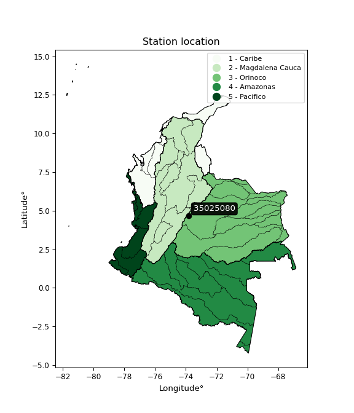

<div align="center">


</div>

# PMP Station (Rain, Pmax24h): 35025080

Probable Maximum Precipitation (PMP) is the greatest amount of rainfall for a specific duration that is meteorologically possible for a given location, acting as a "worst-case" scenario for extreme storms, crucial for designing safety-critical infrastructure like bridges, river deviations, dams, spillways, and nuclear plants to prevent catastrophic failure. PMP is calculated by hydrologists using meteorological data to determine the upper limit of extreme rainfall, often leading to the Probable Maximum Flood (PMF) for flood control design, and is increasingly being studied for climate change impacts. Probable Maximum Precipitation (PMP) is the theoretical upper limit of rainfall, a deterministic estimate for extreme events, while probability distributions (like GEV, Gumbel) describe the likelihood and frequency of various precipitation amounts, including rare ones, showing how often events occur, with PMP representing the extreme end of these distributions, used for critical infrastructure design to ensure safety against the worst conceivable weather, unlike standard statistical forecasts which cover typical probabilities.

The most common probability distributions in hydrology, used for analyzing floods, rainfall, and streamflow, include the Normal, Log-Normal, Gumbel, Gamma (including Log-Pearson Type III), and Generalized Extreme Value (GEV) distributions, often chosen based on the data´s skewness and whether modeling extremes or general conditions, with Gumbel and GEV popular for extreme events like floods, while the Normal distribution serves as a baseline, though often requiring transformations for skewed hydrological data. These distributions help in designing water infrastructure, managing water resources, and forecasting hydrologic events.

> Hydrological data often isn´t perfectly normal (it´s skewed), so different distributions are needed for different applications, such as: **Flood Frequency Analysis**: Using Gumbel, GEV, or Log-Pearson Type III for predicting extreme flood magnitudes and their return periods, **Rainfall Analysis**: Normal for annual totals, but Log-Normal, Weibull, or GEV for intensity or extreme daily rainfall, **Streamflow Modeling**: Gamma and Log-Normal for maximum flows, GEV for minimum flows, and Kappa for daily flows.

<div align="center">

</img>

</div>


## A. General information


### 1. General running parameters

• app_version: _v20260108_. • runtime: _2026-01-09 11:32:22.148588_. • Python version: _3.14.0_. • SciPy version: _1.16.3_. • Pandas version: _2.3.3_. • NumPy version: _2.3.5_. • Stations dataset (station_dataset_file): _dataset/pmax24h_in/automatic_colombia_2003_2024.csv_. • Stations catalog (station_catalog_file): _dataset/CNE.xls_. • Minimum year to eval til year_max (date_min): _1900_. • Maximum year to eval since year_min (date_max): _2024_. • Creates, save and include plots into reports (create_plot): _False_. • Plot only fit distributions with Δo > Δ (plot_only_fit): _True_. • Plot only simple graphs avoiding multiple CDFs and multiple Extreme values plots (plot_only_simple): _True_. • Eval low extreme values, if False, evaluates high extreme values (low_extreme): _False_. • Eval every SciPy distribution as logarithmic (pdist_logarithmic_on): _True_. • Standard deviation normalized (ddof): _1.0_. • Return periods to eval in years (Tr): _[2, 2.33, 5, 10, 15, 20, 25, 50, 75, 100, 200, 250, 500, 750, 1000]_. • Minimum data sample per station, 0 means any (minimum_sample): _5_. • Z-Score maximum threshold to adjust a value, 0 means disable (zscore_max): _3.5_. • Z-Score minimum threshold to adjust a value, 0 means disable (zscore_min): _-2.5_. • Avoid zeros, e.g. rain = 0 (avoid_zeros): _True_. • Avoid null values (avoid_nans): _True_. 

:file_folder:Table: [dataset.csv](../../dataset/pmax24h_in/automatic_colombia_2003_2024.csv)

> Delta Degrees of Freedom (DDOF): is a parameter used in the formulas for calculating variance and standard deviation. When ddof=0, the divisor is $N$ (the total number of observations) and this is used when your data set is the entire population. When ddof=1, the divisor is $N-1$ and this is used when your data set is a sample drawn from a larger population. Using $N-1$ provides an unbiased estimate of the population variance (known as Bessel´s correction).


### 2. Station info and location

|   id |   CODIGO | NOMBRE                  | CATEGORIA               | TECNOLOGIA                | ESTADO   | FECHA_INSTALACION   |   FECHA_SUSPENSION |   ALTITUD |   LATITUD |   LONGITUD | DEPARTAMENTO   | MUNICIPIO   | AREA_OPERATIVA                            | ENTIDAD                                                     | AREA_HIDROGRAFICA   | ZONA_HIDROGRAFICA   | SUBZONA_HIDROGRAFICA   |   CORRIENTE | Catalogo   |   Version |
|-----:|---------:|:------------------------|:------------------------|:--------------------------|:---------|:--------------------|-------------------:|----------:|----------:|-----------:|:---------------|:------------|:------------------------------------------|:------------------------------------------------------------|:--------------------|:--------------------|:-----------------------|------------:|:-----------|----------:|
|    0 | 35025080 | PNN CHINGAZA [35025080] | Climatológica Principal | Automática con Telemetría | Activa   | 06/12/2007          |                nan |      3205 |     4.661 |   -73.8273 | Cundinamarca   | La Calera   | Area Operativa 11 - Cundinamarca-Amazonas | INSTITUTO DE HIDROLOGIA METEOROLOGIA Y ESTUDIOS AMBIENTALES | Orinoco             | Meta                | Río Guayuriba          |         nan | CNE_IDEAM  |  20251226 |

<div align="center">

Dynamic map: [:earth_americas:Google](http://maps.google.com/maps?q=4.661,-73.82733) [:earth_americas:OSM](https://www.openstreetmap.org/#map=18/4.661/-73.82733&layers=P) [:earth_americas:Bing](https://www.bing.com/maps?cp=4.661~-73.82733&lvl=18) [:earth_americas:Apple](https://maps.apple.com/frame?center=4.661%2C-73.82733&span=0.003%2C0.006)

</div>


<div align="center">

```geojson
{
  "type": "Feature",
  "geometry": {
    "type": "Point", 
    "coordinates": [-73.82733, 4.661]
  }, 
  "properties": {
    "Name": "35025080"
  }
}
```

</div>


### 3. Discrete values table and plot

<div align="center">

|               |          0 |           1 |           2 |           3 |           4 |          5 |          6 |           7 |              8 |
|:--------------|-----------:|------------:|------------:|------------:|------------:|-----------:|-----------:|------------:|---------------:|
| Date          | 2016       | 2017        | 2018        | 2019        | 2020        | 2021       | 2022       | 2023        | 2024           |
| Value         |    0.1     |   38.2      |   28.1      |   42.6      |   14.7      |   49.7     |   47.5     |   19.2      |   30           |
| Value_initial |    0.1     |   38.2      |   28.1      |   42.6      |   14.7      |   49.7     |   47.5     |   19.2      |   30           |
| count         |    9       |    9        |    9        |    9        |    9        |    9       |    9       |    9        |    9           |
| mean          |   30.0111  |   30.0111   |   30.0111   |   30.0111   |   30.0111   |   30.0111  |   30.0111  |   30.0111   |   30.0111      |
| std           |   16.4647  |   16.4647   |   16.4647   |   16.4647   |   16.4647   |   16.4647  |   16.4647  |   16.4647   |   16.4647      |
| zscore        |   -1.81668 |    0.497361 |   -0.116073 |    0.764599 |   -0.929936 |    1.19582 |    1.06221 |   -0.656624 |   -0.000674845 |


</div>


> The initial value (value_initial) correspond to the initial obtained or null completed value, and value (value) is adjusted only when the initial value is outside the valid range (outlier) definite through the Z-Score value. If Z-Score is active, values out of range or outliers are replaced with the station mean value. A Z-Score (or standard score) measures how many standard deviations a data point is from the mean of a dataset, indicating its relative position; positive scores mean above the mean, negative mean below, and a score of zero is exactly at the mean, allowing for comparison of values from different distributions. It´s calculated using the formula $z=(x–μ)/σ$, where $x$ is the data point, $μ$ is the mean, and $σ$ is the standard deviation, helping identify outliers and understand probability.
>
> <sub>**Note**: In this study, "completing" (filling gaps in) and "extending" (forecasting or lengthening the historical record) rainfall data series are avoided for certain critical analyses because they introduce artificial bias and uncertainty, which can distort the statistics of rare events (extremes), alter day-to-day variability, and compromise the integrity and homogeneity of the original data. Some reasons against Completing/Extending rainfall data are: **Distortion of Extremes and Variability**: The primary issue is that most gap-filling or extension methods rely on averaging or regression with nearby stations, which inherently smooths the data. Rainfall is highly variable in space and time, with a large percentage of zero values and occasional large storms. Infilling methods often underestimate the highest values and overestimate the lowest (zero) values, which severely distorts analyses focused on flood frequency, drought severity, and intensity-duration-frequency (IDF) curves, **Loss of Data Homogeneity**: Infilled or extended data are synthetic estimates, not actual measurements. Combining these estimates with observed data can violate the assumption of data homogeneity, which requires that the data properties do not change over time. Inhomogeneity can lead to incorrect conclusions about long-term trends or changes in climate patterns, **Propagation of Errors**: Errors and biases from the original data (e.g., wind-induced undercatch, instrument errors, site changes) or the data used for imputation can propagate through the analysis, leading to unreliable hydrological models and inaccurate predictions, **Compromised Statistical Integrity**: For statistical analyses, especially those involving the frequency of events, using artificial data can introduce time bias or autocorrelation that doesn´t exist in reality, making it difficult to assess the true probability of events, **Difficulty in Validation**: It is difficult to accurately validate the quality of filled or extended data, especially for past periods where ground-truth measurements are unavailable. The reliability of imputation techniques heavily depends on the density of the surrounding station network and the complexity of the local topography.</sub>


### 4. Active continuous probability distributions from SciPy (45 of 104 available)

A Probability Density Function (PDF) describes the relative likelihood of a continuous random variable falling within a specific range, where the total area under its curve equals 1, and the area over any interval gives the actual probability for that range. Unlike discrete probabilities (like rolling a die), a PDF shows density, not direct probability for a single point (which is zero), with higher points indicating higher likelihood, often visualized as a bell curve for normal distributions.

A log of a probability density function (log-PDF) is simply the logarithm of the PDF´s value, denoted as $log(f(x))$, useful for converting multiplication of probabilities into addition, improving numerical stability with tiny numbers, and connecting to information theory concepts like entropy. Instead of dealing with very small probabilities (e.g., 0.000001), log-PDFs use negative numbers (e.g., $log(0.00001) ≈ -11.51$ that are easier for computers to handle, preventing underflow errors and simplifying complex calculations. In this study, each active probability distribution from SciPy is also evaluated in the $log$ form.

[scipy.stats](https://docs.scipy.org/doc/scipy/reference/stats.html) is a Python´s powerful submodule within the SciPy library for comprehensive statistical analysis, offering over 130 probability distributions (like Normal, Poisson), functions for descriptive stats (mean, variance), hypothesis testing (t-tests, chi-square), random variable generation, and statistical tests, making it essential for data science, modeling, and research. It provides tools to explore, model, and draw conclusions from data efficiently, working seamlessly with NumPy.

<div align="center">

|   id | p_dist             |   n_parameter | fit_method   | label                                                                       | active   | ref                                                                                                        |
|-----:|:-------------------|--------------:|:-------------|:----------------------------------------------------------------------------|:---------|:-----------------------------------------------------------------------------------------------------------|
|    0 | alpha              |             3 | MLE          | Alpha                                                                       | True     | [:mortar_board:](https://docs.scipy.org/doc/scipy/reference/generated/scipy.stats.alpha.html)              |
|    1 | betaprime          |             4 | MLE          | Beta prime                                                                  | True     | [:mortar_board:](https://docs.scipy.org/doc/scipy/reference/generated/scipy.stats.betaprime.html)          |
|    2 | chi2               |             3 | MLE          | Chi²                                                                        | True     | [:mortar_board:](https://docs.scipy.org/doc/scipy/reference/generated/scipy.stats.chi2.html)               |
|    3 | crystalball        |             4 | MLE          | Crystalball                                                                 | True     | [:mortar_board:](https://docs.scipy.org/doc/scipy/reference/generated/scipy.stats.crystalball.html)        |
|    4 | dweibull           |             3 | MLE          | Double Weibull                                                              | True     | [:mortar_board:](https://docs.scipy.org/doc/scipy/reference/generated/scipy.stats.dweibull.html)           |
|    5 | erlang             |             3 | MLE          | Erlang                                                                      | True     | [:mortar_board:](https://docs.scipy.org/doc/scipy/reference/generated/scipy.stats.erlang.html)             |
|    6 | expon              |             2 | MLE          | Exponential                                                                 | True     | [:mortar_board:](https://docs.scipy.org/doc/scipy/reference/generated/scipy.stats.expon.html)              |
|    7 | exponnorm          |             3 | MLE          | Exponentially modified Normal                                               | True     | [:mortar_board:](https://docs.scipy.org/doc/scipy/reference/generated/scipy.stats.exponnorm.html)          |
|    8 | f                  |             4 | MLE          | F                                                                           | True     | [:mortar_board:](https://docs.scipy.org/doc/scipy/reference/generated/scipy.stats.f.html)                  |
|    9 | fatiguelife        |             3 | MLE          | Fatigue-life (Birnbaum-Saunders)                                            | True     | [:mortar_board:](https://docs.scipy.org/doc/scipy/reference/generated/scipy.stats.fatiguelife.html)        |
|   10 | fisk               |             3 | MLE          | Fisk                                                                        | True     | [:mortar_board:](https://docs.scipy.org/doc/scipy/reference/generated/scipy.stats.fisk.html)               |
|   11 | gamma              |             3 | MLE          | Gamma                                                                       | True     | [:mortar_board:](https://docs.scipy.org/doc/scipy/reference/generated/scipy.stats.gamma.html)              |
|   12 | genexpon           |             5 | MLE          | Generalized exponential                                                     | True     | [:mortar_board:](https://docs.scipy.org/doc/scipy/reference/generated/scipy.stats.genexpon.html)           |
|   13 | genlogistic        |             3 | MLE          | Generalized logistic                                                        | True     | [:mortar_board:](https://docs.scipy.org/doc/scipy/reference/generated/scipy.stats.genlogistic.html)        |
|   14 | gibrat             |             2 | MM           | Gibrat                                                                      | True     | [:mortar_board:](https://docs.scipy.org/doc/scipy/reference/generated/scipy.stats.gibrat.html)             |
|   15 | gompertz           |             3 | MLE          | Gompertz (or truncated Gumbel)                                              | True     | [:mortar_board:](https://docs.scipy.org/doc/scipy/reference/generated/scipy.stats.gompertz.html)           |
|   16 | gumbel_l           |             2 | MM           | Gumbel Left Skew                                                            | True     | [:mortar_board:](https://docs.scipy.org/doc/scipy/reference/generated/scipy.stats.gumbel_l.html)           |
|   17 | gumbel_r           |             2 | MM           | Gumbel Right Skew                                                           | True     | [:mortar_board:](https://docs.scipy.org/doc/scipy/reference/generated/scipy.stats.gumbel_r.html)           |
|   18 | halflogistic       |             2 | MM           | Half-logistic                                                               | True     | [:mortar_board:](https://docs.scipy.org/doc/scipy/reference/generated/scipy.stats.halflogistic.html)       |
|   19 | halfnorm           |             2 | MM           | Half Normal                                                                 | True     | [:mortar_board:](https://docs.scipy.org/doc/scipy/reference/generated/scipy.stats.halfnorm.html)           |
|   20 | hypsecant          |             2 | MM           | hyperbolic secant                                                           | True     | [:mortar_board:](https://docs.scipy.org/doc/scipy/reference/generated/scipy.stats.hypsecant.html)          |
|   21 | invgamma           |             3 | MLE          | Inverted gamma                                                              | True     | [:mortar_board:](https://docs.scipy.org/doc/scipy/reference/generated/scipy.stats.invgamma.html)           |
|   22 | invgauss           |             3 | MLE          | Inverse Gaussian                                                            | True     | [:mortar_board:](https://docs.scipy.org/doc/scipy/reference/generated/scipy.stats.invgauss.html)           |
|   23 | invweibull         |             3 | MLE          | Inverted Weibull                                                            | True     | [:mortar_board:](https://docs.scipy.org/doc/scipy/reference/generated/scipy.stats.invweibull.html)         |
|   24 | kappa4             |             4 | MLE          | Kappa 4                                                                     | True     | [:mortar_board:](https://docs.scipy.org/doc/scipy/reference/generated/scipy.stats.kappa4.html)             |
|   25 | kstwobign          |             2 | MLE          | Limiting distribution of scaled Kolmogorov-Smirnov two-sided test statistic | True     | [:mortar_board:](https://docs.scipy.org/doc/scipy/reference/generated/scipy.stats.kstwobign.html)          |
|   26 | laplace            |             2 | MM           | Laplace                                                                     | True     | [:mortar_board:](https://docs.scipy.org/doc/scipy/reference/generated/scipy.stats.laplace.html)            |
|   27 | laplace_asymmetric |             3 | MLE          | Asymmetric Laplace                                                          | True     | [:mortar_board:](https://docs.scipy.org/doc/scipy/reference/generated/scipy.stats.laplace_asymmetric.html) |
|   28 | loggamma           |             3 | MLE          | Log gamma                                                                   | True     | [:mortar_board:](https://docs.scipy.org/doc/scipy/reference/generated/scipy.stats.loggamma.html)           |
|   29 | logistic           |             2 | MM           | Logistic (or Sech-squared)                                                  | True     | [:mortar_board:](https://docs.scipy.org/doc/scipy/reference/generated/scipy.stats.logistic.html)           |
|   30 | lognorm            |             3 | MLE          | Log Normal                                                                  | True     | [:mortar_board:](https://docs.scipy.org/doc/scipy/reference/generated/scipy.stats.lognorm.html)            |
|   31 | maxwell            |             2 | MM           | Maxwell                                                                     | True     | [:mortar_board:](https://docs.scipy.org/doc/scipy/reference/generated/scipy.stats.maxwell.html)            |
|   32 | mielke             |             4 | MLE          | Mielke Beta-Kappa / Dagum                                                   | True     | [:mortar_board:](https://docs.scipy.org/doc/scipy/reference/generated/scipy.stats.mielke.html)             |
|   33 | moyal              |             2 | MM           | Moyal                                                                       | True     | [:mortar_board:](https://docs.scipy.org/doc/scipy/reference/generated/scipy.stats.moyal.html)              |
|   34 | nakagami           |             3 | MLE          | Nakagami                                                                    | True     | [:mortar_board:](https://docs.scipy.org/doc/scipy/reference/generated/scipy.stats.nakagami.html)           |
|   35 | ncf                |             5 | MLE          | Non-central F distribution                                                  | True     | [:mortar_board:](https://docs.scipy.org/doc/scipy/reference/generated/scipy.stats.ncf.html)                |
|   36 | nct                |             4 | MLE          | Non-central Student’s t                                                     | True     | [:mortar_board:](https://docs.scipy.org/doc/scipy/reference/generated/scipy.stats.nct.html)                |
|   37 | norm               |             2 | MM           | Normal                                                                      | True     | [:mortar_board:](https://docs.scipy.org/doc/scipy/reference/generated/scipy.stats.norm.html)               |
|   38 | pearson3           |             3 | MM           | Pearson type III                                                            | True     | [:mortar_board:](https://docs.scipy.org/doc/scipy/reference/generated/scipy.stats.pearson3.html)           |
|   39 | rayleigh           |             2 | MM           | Rayleigh                                                                    | True     | [:mortar_board:](https://docs.scipy.org/doc/scipy/reference/generated/scipy.stats.rayleigh.html)           |
|   40 | rice               |             3 | MLE          | Rice                                                                        | True     | [:mortar_board:](https://docs.scipy.org/doc/scipy/reference/generated/scipy.stats.rice.html)               |
|   41 | t                  |             3 | MLE          | Student’s t                                                                 | True     | [:mortar_board:](https://docs.scipy.org/doc/scipy/reference/generated/scipy.stats.t.html)                  |
|   42 | truncnorm          |             4 | MLE          | Truncated normal                                                            | True     | [:mortar_board:](https://docs.scipy.org/doc/scipy/reference/generated/scipy.stats.truncnorm.html)          |
|   43 | wald               |             2 | MM           | Wald                                                                        | True     | [:mortar_board:](https://docs.scipy.org/doc/scipy/reference/generated/scipy.stats.wald.html)               |
|   44 | weibull_min        |             3 | MLE          | Weibull minimum                                                             | True     | [:mortar_board:](https://docs.scipy.org/doc/scipy/reference/generated/scipy.stats.weibull_min.html)        |

</div>

> **n_parameter:** # arguments & localization & scale.
>
> **Fit methods:** (MLE) maximum likelihood, (MM) L-moments.
>
>**Inactive** (With the only purpose of prevent loops, zero divisions, infinite values, over high estimated values or horizontal trending for recurrence intervals estimations, the follow distributions were disabled.)**:** foldnorm, gennorm, norminvgauss, powernorm, powerlognorm, skewnorm, genextreme, anglit, arcsine, argus, beta, bradford, burr, burr12, cauchy, cosine, halfcauchy, foldcauchy, skewcauchy, wrapcauchy, dgamma, gengamma, exponweib, exponpow, truncexpon, gausshyper, genhalflogistic, genhyperbolic, geninvgauss, halfgennorm, johnsonsb, johnsonsu, kappa3, ksone, kstwo, loglaplace, levy, levy_l, levy_stable, ncx2, pareto, genpareto, truncpareto, lomax, powerlaw, rdist, rel_breitwigner, recipinvgauss, semicircular, studentized_range, trapezoid, triang, truncweibull_min, tukeylambda, uniform, loguniform, vonmises, vonmises_line, weibull_max, 


## B. Probability (PDF) vs. Empirical (EDF) distributions functions

A continuous probability distribution (CPD) describes probabilities for variables that can take any value within a range (like rain any time), unlike discrete variables with specific outcomes (like temperature). It uses a Probability Density Function (PDF), a curve where the total area under it equals 1, and the probability of the variable falling within an interval (a to b) is found by calculating the area under the curve between those points. A key feature is that the probability of hitting any single exact value is zero, so probabilities are always expressed for ranges, e.g., $P(a ≤ X ≤ b)$.

<div align="center">

Distributions parameters from station values
|    |   station | p_dist                |   n |             loc |           scale | shape                  | shape1             | shape2               | shape3   |
|---:|----------:|:----------------------|----:|----------------:|----------------:|:-----------------------|:-------------------|:---------------------|:---------|
|  0 |  35025080 | alpha                 |   9 |     0.003375    |     0.290718    | 1.200382481327063e-06  |                    |                      |          |
|  1 |  35025080 | betaprime             |   9 |     0.1         |   563.498       | 0.6731259250589303     | 21.11350264566253  |                      |          |
|  2 |  35025080 | chi2                  |   9 |  -104.293       |     0.965631    | 138.93299329511336     |                    |                      |          |
|  3 |  35025080 | crystalball           |   9 |    30.0111      |    15.5231      | 1991.4655555000197     | 17.69852520448106  |                      |          |
|  4 |  35025080 | dweibull              |   9 |    29.1461      |    13.8326      | 1.2778674758125312     |                    |                      |          |
|  5 |  35025080 | erlang                |   9 |  -210.459       |     1.03137     | 233.03415807685712     |                    |                      |          |
|  6 |  35025080 | expon                 |   9 |     0.1         |    29.9111      |                        |                    |                      |          |
|  7 |  35025080 | exponnorm             |   9 |    30.0013      |    15.523       | 0.0006313536424157262  |                    |                      |          |
|  8 |  35025080 | f                     |   9 | -2851.12        |  2881.11        | 92800.10815874713      | 262963.0431589328  |                      |          |
|  9 |  35025080 | fatiguelife           |   9 | -1926.42        |  1956.39        | 0.007926609833981378   |                    |                      |          |
| 10 |  35025080 | fisk                  |   9 |    -9.98089e+08 |     9.98089e+08 | 107543633.09503144     |                    |                      |          |
| 11 |  35025080 | gamma                 |   9 |  -226.266       |     0.979077    | 261.64941095577024     |                    |                      |          |
| 12 |  35025080 | genexpon              |   9 |    -5.53555     |     2.55419     | 8.956751303802759e-12  | 0.6099934388191579 | 0.015275725688003464 |          |
| 13 |  35025080 | genlogistic           |   9 |    49.7007      |     6.51533e-05 | 3.296407307426973e-06  |                    |                      |          |
| 14 |  35025080 | gibrat                |   9 |    18.169       |     7.18262     |                        |                    |                      |          |
| 15 |  35025080 | gompertz              |   9 |    14.7         |    12.116       | 0.15710318579792387    |                    |                      |          |
| 16 |  35025080 | gumbel_l              |   9 |    36.9973      |    12.1033      |                        |                    |                      |          |
| 17 |  35025080 | gumbel_r              |   9 |    23.0249      |    12.1033      |                        |                    |                      |          |
| 18 |  35025080 | halflogistic          |   9 |    11.6127      |    13.2716      |                        |                    |                      |          |
| 19 |  35025080 | halfnorm              |   9 |     9.46466     |    25.7512      |                        |                    |                      |          |
| 20 |  35025080 | hypsecant             |   9 |    30.0111      |     9.88229     |                        |                    |                      |          |
| 21 |  35025080 | invgamma              |   9 |  -195.374       | 45409.7         | 202.51679320846068     |                    |                      |          |
| 22 |  35025080 | invgauss              |   9 |   -85.2826      |  5422.08        | 0.021328038404694494   |                    |                      |          |
| 23 |  35025080 | invweibull            |   9 |    -6.7253e+06  |     6.72532e+06 | 422843.20125019294     |                    |                      |          |
| 24 |  35025080 | kappa4                |   9 |    -4.65793     |    58.8038      | 1.0883614541079973     | 1.0815131669212574 |                      |          |
| 25 |  35025080 | kstwobign             |   9 |   -34.5951      |    73.8711      |                        |                    |                      |          |
| 26 |  35025080 | laplace               |   9 |    30.0111      |    10.9765      |                        |                    |                      |          |
| 27 |  35025080 | laplace_asymmetric    |   9 |    30           |    12.8677      | 0.999579318909942      |                    |                      |          |
| 28 |  35025080 | loggamma              |   9 |    49.7         |     1.42649e-06 | 7.254084872913876e-08  |                    |                      |          |
| 29 |  35025080 | logistic              |   9 |    30.0111      |     8.55831     |                        |                    |                      |          |
| 30 |  35025080 | lognorm               |   9 |     0.1         |     0.284818    | 13.285257539218646     |                    |                      |          |
| 31 |  35025080 | maxwell               |   9 |    -6.77203     |    23.0504      |                        |                    |                      |          |
| 32 |  35025080 | mielke                |   9 |     0.1         |    49.7127      | 0.6970683876252552     | 3415.8956303471787 |                      |          |
| 33 |  35025080 | moyal                 |   9 |    21.134       |     6.98783     |                        |                    |                      |          |
| 34 |  35025080 | nakagami              |   9 |     0.1         |    33.0465      | 0.23711838480973788    |                    |                      |          |
| 35 |  35025080 | ncf                   |   9 |     0.1         |     2.17561     | 0.6867457049516525     | 12.958642200553015 | 7.952456919063827    |          |
| 36 |  35025080 | nct                   |   9 | -1076.4         |    15.4968      | 735369.0401232466      | 71.39607880628304  |                      |          |
| 37 |  35025080 | norm                  |   9 |    30.0111      |    15.5231      |                        |                    |                      |          |
| 38 |  35025080 | pearson3              |   9 |    30.0111      |    15.5231      | -0.4780917465489584    |                    |                      |          |
| 39 |  35025080 | rayleigh              |   9 |     0.314586    |    23.6944      |                        |                    |                      |          |
| 40 |  35025080 | rice                  |   9 |    -8.97325     |    16.8644      | 2.0471698795056597     |                    |                      |          |
| 41 |  35025080 | t                     |   9 |    30.0106      |    15.5265      | 224340.65631626465     |                    |                      |          |
| 42 |  35025080 | truncnorm             |   9 |    23.7548      |    22.7126      | -1.0415061571408815    | 1.1423275545775136 |                      |          |
| 43 |  35025080 | wald                  |   9 |    14.488       |    15.5231      |                        |                    |                      |          |
| 44 |  35025080 | weibull_min           |   9 |    -7.21524e+07 |     7.21525e+07 | 5769280.949410984      |                    |                      |          |
| 45 |  35025080 | logalpha              |   9 |   -45.1622      |  1139.86        | 23.866612685100385     |                    |                      |          |
| 46 |  35025080 | logbetaprime          |   9 |    -2.30259     |     5.02963     | 0.18497568704024026    | 0.6849478451825046 |                      |          |
| 47 |  35025080 | logchi2               |   9 |    -2.30259     |     1.23013     | 1.0204856938578046     |                    |                      |          |
| 48 |  35025080 | logcrystalball        |   9 |     2.80428     |     1.8465      | 4787.533046808069      | 105.64348292147365 |                      |          |
| 49 |  35025080 | logdweibull           |   9 |     3.64284     |     1.12673     | 0.7911555404178233     |                    |                      |          |
| 50 |  35025080 | logerlang             |   9 |    -2.30259     |     5.21066     | 0.0013084118821900495  |                    |                      |          |
| 51 |  35025080 | logexpon              |   9 |    -2.30259     |     5.10687     |                        |                    |                      |          |
| 52 |  35025080 | logexponnorm          |   9 |     2.80331     |     1.84651     | 0.0005273962817623106  |                    |                      |          |
| 53 |  35025080 | logf                  |   9 |    -2.30259     |     1.12838     | 1.0192891634627461     | 1.1027475977148482 |                      |          |
| 54 |  35025080 | logfatiguelife        |   9 | -1115.93        |  1118.73        | 0.0016488072555991507  |                    |                      |          |
| 55 |  35025080 | logfisk               |   9 |    -2.30259     |     1.56968     | 0.8387958750537667     |                    |                      |          |
| 56 |  35025080 | loggamma              |   9 |    -2.30259     |     1.22385     | 0.7910251093942615     |                    |                      |          |
| 57 |  35025080 | loggenexpon           |   9 |    -2.30259     |     3.25333     | 0.2938710891470887     | 1.4171490822802073 | 0.2803853570296745   |          |
| 58 |  35025080 | loggenlogistic        |   9 |     3.90899     |     2.11943e-06 | 1.912749969941837e-06  |                    |                      |          |
| 59 |  35025080 | loggibrat             |   9 |     1.39571     |     0.854358    |                        |                    |                      |          |
| 60 |  35025080 | loggompertz           |   9 |    -2.3376      |     0.81338     | 0.0008247377289595067  |                    |                      |          |
| 61 |  35025080 | loggumbel_l           |   9 |     3.63531     |     1.43971     |                        |                    |                      |          |
| 62 |  35025080 | loggumbel_r           |   9 |     1.97326     |     1.43971     |                        |                    |                      |          |
| 63 |  35025080 | loghalflogistic       |   9 |     0.615711    |     1.57872     |                        |                    |                      |          |
| 64 |  35025080 | loghalfnorm           |   9 |     0.360275    |     3.06312     |                        |                    |                      |          |
| 65 |  35025080 | loghypsecant          |   9 |     2.80428     |     1.17552     |                        |                    |                      |          |
| 66 |  35025080 | loginvgamma           |   9 |   -46.1399      | 28859.5         | 590.5233687468824      |                    |                      |          |
| 67 |  35025080 | loginvgauss           |   9 |   -17.3188      |  1728.49        | 0.011650438470900124   |                    |                      |          |
| 68 |  35025080 | loginvweibull         |   9 |    -2.02181e+08 |     2.02181e+08 | 80075279.93067518      |                    |                      |          |
| 69 |  35025080 | logkappa4             |   9 |    -2.70367     |     7.3945      | 1.03598101810741       | 1.1187382867447415 |                      |          |
| 70 |  35025080 | logkstwobign          |   9 |    -7.63789     |    11.9894      |                        |                    |                      |          |
| 71 |  35025080 | loglaplace            |   9 |     2.80428     |     1.30567     |                        |                    |                      |          |
| 72 |  35025080 | loglaplace_asymmetric |   9 |     3.90602     |     0.0090227   | 121.90841126528139     |                    |                      |          |
| 73 |  35025080 | logloggamma           |   9 |     3.90629     |     2.81002e-06 | 2.5482369770274077e-06 |                    |                      |          |
| 74 |  35025080 | loglogistic           |   9 |     2.80428     |     1.01803     |                        |                    |                      |          |
| 75 |  35025080 | loglognorm            |   9 | -1507.36        |  1510.16        | 0.0012236608109233323  |                    |                      |          |
| 76 |  35025080 | logmaxwell            |   9 |    -1.57118     |     2.74191     |                        |                    |                      |          |
| 77 |  35025080 | logmielke             |   9 |    -2.30259     |     3.5143      | 0.2102520381636278     | 1.001007827925839  |                      |          |
| 78 |  35025080 | logmoyal              |   9 |     1.74834     |     0.831217    |                        |                    |                      |          |
| 79 |  35025080 | lognakagami           |   9 | -2923.82        |  2926.63        | 623347.4767035032      |                    |                      |          |
| 80 |  35025080 | logncf                |   9 |    -2.30259     |     1.08731     | 1.0041277870367968     | 1.1074453988937394 | 1.0692487676654467   |          |
| 81 |  35025080 | lognct                |   9 |  -106.644       |     1.81298     | 41580.02599393067      | 60.36888214831828  |                      |          |
| 82 |  35025080 | lognorm               |   9 |     2.80428     |     1.8465      |                        |                    |                      |          |
| 83 |  35025080 | logpearson3           |   9 |     2.80428     |     1.84652     | -2.2743200828948797    |                    |                      |          |
| 84 |  35025080 | lograyleigh           |   9 |    -0.728169    |     2.81849     |                        |                    |                      |          |
| 85 |  35025080 | logrice               |   9 |    -2.93451     |     4.26261     | 0.015028317595497723   |                    |                      |          |
| 86 |  35025080 | logt                  |   9 |     3.55434     |     0.333936    | 1.108282048323194      |                    |                      |          |
| 87 |  35025080 | logtruncnorm          |   9 |     1.57084     |     6.51251     | -0.6093298530507986    | 0.3585675590095574 |                      |          |
| 88 |  35025080 | logwald               |   9 |     0.957749    |     1.84653     |                        |                    |                      |          |
| 89 |  35025080 | logweibull_min        |   9 |    -2.30259     |     1.53002     | 0.4849277382555426     |                    |                      |          |

</div>

> **loc** (Location parameter): This shifts the distribution along the x-axis. For many common distributions, like the normal (Gaussian) distribution, loc represents the mean $μ$. For others, like the uniform distribution, it might represent the minimum value, or for the beta distribution, the left end of the support interval.
>
> **scale** (Scale parameter): This determines the width or spread of the distribution. For the normal distribution, scale represents the standard deviation $σ$. For a uniform distribution, it defines the length of the interval (from $loc$ to $loc + scale$).
>
> **shape** (Shape parameters): Refers to parameters that define the specific form of a probability distribution, distinct from its location (loc) and scale (scale). These parameters are required arguments for most distribution functions. For example, a normal (Gaussian) distribution is fully defined by its location (mean) and scale (standard deviation), so it has no specific shape parameters beyond loc and scale. However, other distributions have intrinsic properties that need specification, as Gamma distribution that takes a shape parameter, often named $a$ or $alpha$.


### 0. Cumulative distribution values - CDF (90 evaluated)

Cumulative Distribution Function (CDF), denoted as $F$<sub>$X$</sub>$(x)$, is a function that gives the probability that a random variable $X$ will take a value less than or equal to a specific value, $x$ (i.e., $(P(X≥x)$. It essentially "accumulates" probabilities from a given point up to the far right (positive infinity), providing a complete picture of the distribution´s probabilities for both discrete (like rain) and continuous (like temperature) variables, helping to find probabilities over ranges or above certain values. Each station is evaluated separately ordering the $x$ values ascending, calculating the CDF and PDF values for the activated distributions and their logarithmic forms.

<div align="center">

CDF ordered by x ascending and calculating $log(f(x))$ separately
|   id |   Station |   date |    x |   count |    mean |     std |       zscore |   Value_initial |   station |   m |      alpha |   alpha_pdf |   betaprime |   betaprime_pdf |      chi2 |   chi2_pdf |   crystalball |   crystalball_pdf |   dweibull |   dweibull_pdf |    erlang |   erlang_pdf |    expon |   expon_pdf |   exponnorm |   exponnorm_pdf |         f |      f_pdf |   fatiguelife |   fatiguelife_pdf |     fisk |   fisk_pdf |    gamma |   gamma_pdf |   genexpon |   genexpon_pdf |   genlogistic |   genlogistic_pdf |    gibrat |   gibrat_pdf |    gompertz |   gompertz_pdf |   gumbel_l |   gumbel_l_pdf |   gumbel_r |   gumbel_r_pdf |   halflogistic |   halflogistic_pdf |   halfnorm |   halfnorm_pdf |   hypsecant |   hypsecant_pdf |   invgamma |   invgamma_pdf |   invgauss |   invgauss_pdf |   invweibull |   invweibull_pdf |      kappa4 |   kappa4_pdf |   kstwobign |   kstwobign_pdf |   laplace |   laplace_pdf |   laplace_asymmetric |   laplace_asymmetric_pdf |    loggamma |   loggamma_pdf |   logistic |   logistic_pdf |    lognorm |   lognorm_pdf |    maxwell |   maxwell_pdf |      mielke |   mielke_pdf |       moyal |   moyal_pdf |   nakagami |   nakagami_pdf |         ncf |     ncf_pdf |       nct |   nct_pdf |      norm |   norm_pdf |   pearson3 |   pearson3_pdf |   rayleigh |   rayleigh_pdf |      rice |   rice_pdf |         t |      t_pdf |   truncnorm |   truncnorm_pdf |        wald |    wald_pdf |   weibull_min |   weibull_min_pdf |   logalpha |   logalpha_pdf |   logbetaprime |   logbetaprime_pdf |     logchi2 |   logchi2_pdf |   logcrystalball |   logcrystalball_pdf |   logdweibull |   logdweibull_pdf |   logerlang |   logerlang_pdf |   logexpon |   logexpon_pdf |   logexponnorm |   logexponnorm_pdf |        logf |    logf_pdf |   logfatiguelife |   logfatiguelife_pdf |     logfisk |   logfisk_pdf |   loggenexpon |   loggenexpon_pdf |   loggenlogistic |   loggenlogistic_pdf |   loggibrat |   loggibrat_pdf |   loggompertz |   loggompertz_pdf |   loggumbel_l |   loggumbel_l_pdf |   loggumbel_r |   loggumbel_r_pdf |   loghalflogistic |   loghalflogistic_pdf |   loghalfnorm |   loghalfnorm_pdf |   loghypsecant |   loghypsecant_pdf |   loginvgamma |   loginvgamma_pdf |   loginvgauss |   loginvgauss_pdf |   loginvweibull |   loginvweibull_pdf |   logkappa4 |   logkappa4_pdf |   logkstwobign |   logkstwobign_pdf |   loglaplace |   loglaplace_pdf |   loglaplace_asymmetric |   loglaplace_asymmetric_pdf |   logloggamma |   logloggamma_pdf |   loglogistic |   loglogistic_pdf |   loglognorm |   loglognorm_pdf |   logmaxwell |   logmaxwell_pdf |   logmielke |   logmielke_pdf |    logmoyal |   logmoyal_pdf |   lognakagami |   lognakagami_pdf |      logncf |   logncf_pdf |    lognct |   lognct_pdf |   logpearson3 |   logpearson3_pdf |   lograyleigh |   lograyleigh_pdf |   logrice |   logrice_pdf |      logt |   logt_pdf |   logtruncnorm |   logtruncnorm_pdf |   logwald |   logwald_pdf |   logweibull_min |   logweibull_min_pdf |
|-----:|----------:|-------:|-----:|--------:|--------:|--------:|-------------:|----------------:|----------:|----:|-----------:|------------:|------------:|----------------:|----------:|-----------:|--------------:|------------------:|-----------:|---------------:|----------:|-------------:|---------:|------------:|------------:|----------------:|----------:|-----------:|--------------:|------------------:|---------:|-----------:|---------:|------------:|-----------:|---------------:|--------------:|------------------:|----------:|-------------:|------------:|---------------:|-----------:|---------------:|-----------:|---------------:|---------------:|-------------------:|-----------:|---------------:|------------:|----------------:|-----------:|---------------:|-----------:|---------------:|-------------:|-----------------:|------------:|-------------:|------------:|----------------:|----------:|--------------:|---------------------:|-------------------------:|------------:|---------------:|-----------:|---------------:|-----------:|--------------:|-----------:|--------------:|------------:|-------------:|------------:|------------:|-----------:|---------------:|------------:|------------:|----------:|----------:|----------:|-----------:|-----------:|---------------:|-----------:|---------------:|----------:|-----------:|----------:|-----------:|------------:|----------------:|------------:|------------:|--------------:|------------------:|-----------:|---------------:|---------------:|-------------------:|------------:|--------------:|-----------------:|---------------------:|--------------:|------------------:|------------:|----------------:|-----------:|---------------:|---------------:|-------------------:|------------:|------------:|-----------------:|---------------------:|------------:|--------------:|--------------:|------------------:|-----------------:|---------------------:|------------:|----------------:|--------------:|------------------:|--------------:|------------------:|--------------:|------------------:|------------------:|----------------------:|--------------:|------------------:|---------------:|-------------------:|--------------:|------------------:|--------------:|------------------:|----------------:|--------------------:|------------:|----------------:|---------------:|-------------------:|-------------:|-----------------:|------------------------:|----------------------------:|--------------:|------------------:|--------------:|------------------:|-------------:|-----------------:|-------------:|-----------------:|------------:|----------------:|------------:|---------------:|--------------:|------------------:|------------:|-------------:|----------:|-------------:|--------------:|------------------:|--------------:|------------------:|----------:|--------------:|----------:|-----------:|---------------:|-------------------:|----------:|--------------:|-----------------:|---------------------:|
|    0 |  35025080 |   2016 |  0.1 |       9 | 30.0111 | 16.4647 | -1.81668     |             0.1 |  35025080 |   1 | 0.00262348 | 0.26886     | 5.42274e-13 |  26302.4        | 0.0246449 | 0.00424648 |     0.0269972 |        0.00401506 |  0.0378674 |     0.00429903 | 0.0253416 |   0.00410232 | 0        |  0.0334324  |   0.0269969 |      0.00401503 | 0.0268769 | 0.00402645 |     0.0261245 |         0.003971  | 0.03466  | 0.00360516 | 0.026201 |  0.00416956 |  0.0221787 |     0.00773958 |      0        |        0.00411367 | 0         |   0          | 0           |      0         |  0.0463211 |     0.00373711 | 0.00129842 |    0.000713036 |       0        |         0          |   0        |     0          |    0.030835 |      0.00311535 |  0.0215987 |     0.00393968 |  0.0217843 |     0.00423428 |    0.0192709 |       0.00478492 | 2.19142e-15 |    0.337993  |   0.0198799 |      0.00583613 | 0.0327723 |    0.00298569 |            0.0488898 |               0.00380101 | 6.58171e-13 |  1172.35       |  0.0294555 |     0.00334036 | 0.00284002 |    0.00471604 | 0.00686256 |    0.00294288 | 1.16544e-13 | 5853.91      | 6.65721e-06 | 1.01027e-05 | 1.5073e-09 |    5.15079e+07 | 3.79416e-08 | 1.04308e+08 | 0.0269927 | 0.0040151 | 0.0269972 | 0.00401506 |   0.038472 |     0.00418762 |   0        |      0         | 0.0191537 | 0.00450621 | 0.0270262 | 0.00401773 | 6.40244e-06 |       0.0140947 | 0           | 0           |     0.0495464 |         0.0038619 | 0.00318083 |     0.00598448 |    0.000962009 |        4.00704e+11 | 1.04534e-08 |   1.20106e+07 |       0.00284002 |           0.00471604 |     0.0120177 |        0.00596214 |    0.953459 |     2.80916e+12 |   0        |      0.195815  |     0.00284016 |         0.00471623 | 9.16962e-09 | 1.05232e+07 |       0.00282194 |           0.00471536 | 9.08064e-14 |   171.515     |   1.90024e-10 |         0.0903294 |                0 |           0.00331783 |    0        |       0         |   3.62739e-05 |        0.00105852 |     0.0160436 |         0.0110538 |   3.43014e-09 |        4.6437e-08 |          0        |              0        |      0        |          0        |     0.00826278 |         0.00702826 |    0.00342714 |        0.00592967 |    0.00369377 |         0.0068898 |      0.00737832 |           0.0143459 |   0.0233495 |        0.155843 |      0.0110939 |          0.0238291 |    0.0100073 |       0.00766447 |              0.00353677 |                  0.00321541 |    0.00358694 |        0.00325278 |    0.00658451 |        0.00642531 |   0.00281823 |       0.00469566 |     0        |         0        | 0.000454292 |     2.15083e+11 | 2.77232e-30 |    2.19728e-28 |    0.00292075 |        0.00482153 | 7.14655e-09 |  8.07951e+06 | 0.0028715 |   0.00476619 |     0.0246422 |         0.0124015 |      0        |          0        | 0.0109276 |     0.0343951 | 0.0136238 |  0.0025717 |      0.0131391 |           0.13914  |  0        |     0         |      2.92125e-08 |          3.18988e+07 |
|    1 |  35025080 |   2020 | 14.7 |       9 | 30.0111 | 16.4647 | -0.929936    |            14.7 |  35025080 |   2 | 0.984218   | 0.00107372  | 0.593506    |      0.0193655  | 0.173674  | 0.0172641  |     0.161982  |        0.0158006  |  0.173746  |     0.0162454  | 0.167595  |   0.0166344  | 0.386216 |  0.0205203  |   0.161981  |      0.0158006  | 0.162528  | 0.0158713  |     0.161432  |         0.0159057 | 0.147575 | 0.0135545  | 0.168698 |  0.016562   |  0.244957  |     0.0205538  |      0        |        0.00861063 | 0         |   0          | 2.28956e-11 |      0.0129666 |  0.146543  |     0.0111737  | 0.13678    |    0.0224822   |       0.11579  |         0.0371692  |   0.161103 |     0.0303506  |    0.13323  |      0.0130915  |  0.16819   |     0.0173987  |  0.176911  |     0.0178718  |    0.206586  |       0.0204838  | 0.305887    |    0.019519  |   0.235271  |      0.0216724  | 0.123928  |    0.0112904  |            0.15212   |               0.0118268  | 0.989683    |     0.00878952 |  0.143191  |     0.0143355  | 0.47486    |    0.215624   | 0.166794   |    0.0194636  | 0.425677    |    0.0203237 | 0.113042    | 0.0257758   | 0.526125   |    0.0164608   | 0.274252    | 0.0227884   | 0.161988  | 0.015802  | 0.161982  | 0.0158006  |   0.159543 |     0.0135808  |   0.168313 |      0.0213104 | 0.168539  | 0.0168543  | 0.162043  | 0.015801   | 0.270865    |       0.0223913 | 3.10784e-17 | 5.43942e-15 |     0.150668  |         0.0110904 | 0.51801    |     0.198405   |    0.812575    |        0.0182281   | 0.95465     |   0.0217623   |       0.47486    |           0.215624   |     0.207939  |        0.15114    |    0.999691 |     0.000100686 |   0.623637 |      0.0736975 |     0.474861   |         0.215623   | 0.735046    | 0.0252327   |       0.477672   |           0.215961   | 0.725159    |     0.0334991 |   0.575935    |         0.102876  |                0 |           0.299793   |    0.660453 |       0.283425  |   0.327604    |        0.328793   |     0.404193  |         0.214301  |   0.544028    |        0.230032   |          0.575877 |              0.21168  |      0.552667 |          0.195162 |     0.468522   |         0.26946    |    0.485921   |        0.198472   |    0.497318   |         0.185007  |      0.50652    |           0.136454  |   0.778512  |        0.163289 |      0.551592  |          0.124284  |    0.457341  |       0.350273   |              0.330367   |                  0.300349   |    0.331234   |        0.300377   |    0.471437   |        0.244771   |   0.474894   |       0.215475   |     0.508735 |         0.210124 | 0.894096    |     0.0155623   | 0.569845    |    0.232077    |    0.47481    |        0.214821   | 0.62331     |  0.0323891   | 0.475018  |   0.214974   |     0.328687  |         0.181469  |      0.520243 |          0.206305 | 0.580954  |     0.129652  | 0.107039  |  0.123531  |      0.804957  |           0.163636 |  0.64171  |     0.237717  |      0.830367    |          0.0292437   |
|    2 |  35025080 |   2023 | 19.2 |       9 | 30.0111 | 16.4647 | -0.656624    |            19.2 |  35025080 |   3 | 0.987917   | 0.000629379 | 0.670203    |      0.0149804  | 0.260866  | 0.0213276  |     0.243072  |        0.0201653  |  0.259447  |     0.0218687  | 0.252334  |   0.0209061  | 0.471947 |  0.0176541  |   0.243071  |      0.0201653  | 0.243916  | 0.0202223  |     0.24307   |         0.0202973 | 0.219449 | 0.0184566  | 0.252967 |  0.0207727  |  0.340437  |     0.0216606  |      0        |        0.0108122  | 0.0261218 |   0.0588092  | 0.0682227   |      0.0175162 |  0.205324  |     0.0150896  | 0.253685   |    0.0287501   |       0.278307 |         0.0347563  |   0.29461  |     0.0288474  |    0.205717 |      0.0193976  |  0.256492  |     0.0216753  |  0.266201  |     0.0216016  |    0.304704  |       0.0227674  | 0.393153    |    0.0192898 |   0.336129  |      0.0228231  | 0.186732  |    0.017012   |            0.215837  |               0.0167806  | 0.991781    |     0.00698978 |  0.220418  |     0.020078   | 0.532507   |    0.215336   | 0.263627   |    0.0232934  | 0.513351    |    0.0187351 | 0.250796    | 0.0339063   | 0.593941   |    0.0138295   | 0.37518     | 0.0218247   | 0.243084  | 0.0201665 | 0.243072  | 0.0201653  |   0.229676 |     0.0176222  |   0.272133 |      0.0244843 | 0.253581  | 0.0208265  | 0.24313   | 0.0201635  | 0.375017    |       0.0237607 | 0.169531    | 0.0691206   |     0.20866   |         0.0148081 | 0.570393   |     0.193344   |    0.817286    |        0.0170746   | 0.960088    |   0.0190315   |       0.532507   |           0.215336   |     0.254115  |        0.197799   |    0.999717 |     9.08029e-05 |   0.642813 |      0.0699425 |     0.532507   |         0.215334   | 0.741552    | 0.0235214   |       0.535373   |           0.215398   | 0.733787    |     0.0311657 |   0.602882    |         0.098899  |                0 |           0.3815     |    0.726272 |       0.213513  |   0.423908    |        0.391186   |     0.463873  |         0.232139  |   0.603091    |        0.211831   |          0.629661 |              0.191145 |      0.603036 |          0.181958 |     0.540676   |         0.268575   |    0.538702   |        0.196228   |    0.546296   |         0.181342  |      0.542309   |           0.131431  |   0.82263   |        0.167303 |      0.584108  |          0.119162  |    0.554478  |       0.34122    |              0.421155   |                  0.382888   |    0.422002   |        0.382688   |    0.536922   |        0.244233   |   0.532496   |       0.215148   |     0.563975 |         0.203019 | 0.898092    |     0.0143856   | 0.628426    |    0.206602    |    0.532243   |        0.21454    | 0.631689    |  0.0303999   | 0.532484  |   0.214638   |     0.38135   |         0.214013  |      0.574209 |          0.197413 | 0.614944  |     0.124795  | 0.152356  |  0.230985  |      0.848493  |           0.162353 |  0.69875  |     0.191484  |      0.8379      |          0.0272047   |
|    3 |  35025080 |   2018 | 28.1 |       9 | 30.0111 | 16.4647 | -0.116073    |            28.1 |  35025080 |   4 | 0.991744   | 0.000293819 | 0.776831    |      0.00950105 | 0.472076  | 0.0249332  |     0.451008  |        0.0255059  |  0.481884  |     0.021724   | 0.463388  |   0.0253547  | 0.607848 |  0.0131106  |   0.451007  |      0.025506   | 0.451995  | 0.0254716  |     0.45197   |         0.0255635 | 0.423137 | 0.0263008  | 0.462602 |  0.0251957  |  0.530645  |     0.0204254  |      0        |        0.0169618  | 0.62703   |   0.0381172  | 0.272171    |      0.0285216 |  0.380876  |     0.0245255  | 0.518147   |    0.0281477   |       0.551926 |         0.0261979  |   0.530732 |     0.0238464  |    0.438823 |      0.0316171  |  0.471567  |     0.0253651  |  0.47497   |     0.0241106  |    0.507061  |       0.0216509  | 0.564033    |    0.0191764 |   0.532719  |      0.0206095  | 0.420102  |    0.038273   |            0.431156  |               0.0335209  | 0.994053    |     0.0050462  |  0.444405  |     0.0288502  | 0.613263   |    0.207286   | 0.485319   |    0.0252269  | 0.670215    |    0.0166852 | 0.543532    | 0.028838    | 0.700298   |    0.0103261   | 0.551063    | 0.0174184   | 0.451024  | 0.0255054 | 0.451008  | 0.0255059  |   0.420145 |     0.0246626  |   0.4972   |      0.024884  | 0.462338  | 0.0250257  | 0.451032  | 0.0255005  | 0.589408    |       0.0238037 | 0.614088    | 0.0310288   |     0.379228  |         0.0236663 | 0.641851   |     0.180982   |    0.823506    |        0.0156265   | 0.966691    |   0.0157531   |       0.613263   |           0.207286   |     0.349697  |        0.322142   |    0.999749 |     7.87087e-05 |   0.668482 |      0.0649161 |     0.613263   |         0.207285   | 0.750094    | 0.0213917   |       0.616077   |           0.206958   | 0.745089    |     0.0282554 |   0.639435    |         0.0930195 |                0 |           0.537985   |    0.793927 |       0.146907  |   0.585765    |        0.449256   |     0.556103  |         0.250409  |   0.678314    |        0.182873   |          0.697018 |              0.162843 |      0.668647 |          0.162508 |     0.63925    |         0.245282   |    0.611955   |        0.187401   |    0.613707   |         0.171888  |      0.590822   |           0.12314   |   0.887869  |        0.176154 |      0.628018  |          0.11134   |    0.667197  |       0.25489    |              0.595412   |                  0.541311   |    0.596088   |        0.540557   |    0.627632   |        0.229571   |   0.613173   |       0.207067   |     0.638583 |         0.187908 | 0.903286    |     0.0129294   | 0.700344    |    0.171527    |    0.612711   |        0.206586   | 0.642779    |  0.0278922   | 0.612973  |   0.206599   |     0.473757  |         0.274575  |      0.646375 |          0.180908 | 0.661013  |     0.116969  | 0.31108   |  0.688482  |      0.909909  |           0.160073 |  0.761925 |     0.143151  |      0.847761    |          0.0246456   |
|    4 |  35025080 |   2024 | 30   |       9 | 30.0111 | 16.4647 | -0.000674845 |            30   |  35025080 |   5 | 0.992267   | 0.000257778 | 0.794081    |      0.00867176 | 0.519309  | 0.024729   |     0.499714  |        0.0257     |  0.514036  |     0.0207065  | 0.511584  |   0.025317   | 0.631984 |  0.0123037  |   0.499714  |      0.0257     | 0.500615  | 0.0256433  |     0.500756  |         0.0257253 | 0.473729 | 0.026863   | 0.510509 |  0.0251729  |  0.568799  |     0.0197165  |      0        |        0.0186733  | 0.691132  |   0.0297718  | 0.32854     |      0.0307801 |  0.42933   |     0.0264485  | 0.570082   |    0.0264698   |       0.599732 |         0.0241237  |   0.574812 |     0.0225451  |    0.499642 |      0.0322101  |  0.51958   |     0.025114   |  0.520463  |     0.0237273  |    0.547357  |       0.0207398  | 0.600491    |    0.0192032 |   0.571015  |      0.0196864  | 0.499494  |    0.0455059  |            0.49979   |               0.0388569  | 0.994374    |     0.00477199 |  0.499675  |     0.0292114  | 0.626753   |    0.205054   | 0.532776   |    0.0246781  | 0.701601    |    0.0163566 | 0.595931    | 0.0263027   | 0.719354   |    0.00974024  | 0.583152    | 0.0163607   | 0.499729  | 0.025699  | 0.499714  | 0.0257     |   0.467919 |     0.0255735  |   0.543794 |      0.024122  | 0.509936  | 0.0250197  | 0.499727  | 0.0256943  | 0.634223    |       0.023344  | 0.667816    | 0.0257276   |     0.425938  |         0.0254763 | 0.653606   |     0.17834    |    0.824521    |        0.0153981   | 0.967706    |   0.0152533   |       0.626753   |           0.205054   |     0.37197   |        0.360243   |    0.999754 |     7.68361e-05 |   0.672702 |      0.0640897 |     0.626753   |         0.205053   | 0.751483    | 0.0210579   |       0.629544   |           0.204663   | 0.746922    |     0.0277986 |   0.645488    |         0.0919922 |                0 |           0.570708   |    0.803251 |       0.138224  |   0.61527     |        0.452207   |     0.572552  |         0.252341  |   0.690113    |        0.177788   |          0.707519 |              0.158172 |      0.679169 |          0.159135 |     0.655104   |         0.239267   |    0.624148   |        0.185283   |    0.624886   |         0.169829  |      0.598829   |           0.121616  |   0.899465  |        0.178364 |      0.635258  |          0.109954  |    0.683463  |       0.242432   |              0.631903   |                  0.574487   |    0.632526   |        0.5736     |    0.642525   |        0.225619   |   0.626649   |       0.204833   |     0.650778 |         0.184833 | 0.904125    |     0.012702    | 0.711379    |    0.165834    |    0.626157   |        0.204379   | 0.64459     |  0.0274957   | 0.626419  |   0.204378   |     0.492132  |         0.287259  |      0.658107 |          0.177722 | 0.668619  |     0.115537  | 0.360095  |  0.809035  |      0.920367  |           0.15963  |  0.771069 |     0.136438  |      0.849361    |          0.0242422   |
|    5 |  35025080 |   2017 | 38.2 |       9 | 30.0111 | 16.4647 |  0.497361    |            38.2 |  35025080 |   6 | 0.993927   | 0.000158982 | 0.853174    |      0.00594083 | 0.707914  | 0.0204906  |     0.701087  |        0.0223616  |  0.720558  |     0.022947   | 0.706722  |   0.0213638  | 0.720226 |  0.0093535  |   0.701087  |      0.0223617  | 0.701248  | 0.0222537  |     0.70179   |         0.0222664 | 0.685327 | 0.0232366  | 0.704891 |  0.0213307  |  0.714731  |     0.0156801  |      0        |        0.0282748  | 0.847464  |   0.0117704  | 0.607683    |      0.0353846 |  0.668615  |     0.0302403  | 0.7517     |    0.0177265   |       0.762289 |         0.0157823  |   0.735529 |     0.0166246  |    0.73791  |      0.0236244  |  0.710122  |     0.0205675  |  0.699561  |     0.0193534  |    0.697757  |       0.0157882  | 0.759181    |    0.0195875 |   0.714058  |      0.0151224  | 0.76288   |    0.0216026  |            0.735447  |               0.0205508  | 0.995416    |     0.00388317 |  0.722488  |     0.0234274  | 0.675132   |    0.194885   | 0.716871   |    0.0196433  | 0.830728    |    0.0151988 | 0.768071    | 0.0161197   | 0.790064   |    0.00759716  | 0.699339    | 0.0120913   | 0.701089  | 0.0223596 | 0.701087  | 0.0223616  |   0.681122 |     0.0251397  |   0.721481 |      0.0187947 | 0.703838  | 0.0213844  | 0.701058  | 0.0223576  | 0.812662    |       0.0198042 | 0.816173    | 0.0124276   |     0.656718  |         0.0293482 | 0.695424   |     0.16752    |    0.828144    |        0.0146006   | 0.971181    |   0.0135482   |       0.675132   |           0.194885   |     0.5       |      500.793      |    0.999772 |     7.03768e-05 |   0.687828 |      0.0611279 |     0.675132   |         0.194884   | 0.756428    | 0.0198963   |       0.677802   |           0.194279   | 0.753444    |     0.0262084 |   0.667255    |         0.0881709 |                0 |           0.709778   |    0.833242 |       0.111226  |   0.723606    |        0.43725    |     0.634044  |         0.25552   |   0.730816    |        0.159184   |          0.743709 |              0.141538 |      0.716117 |          0.14669  |     0.709945   |         0.213989   |    0.667855   |        0.17614    |    0.664921   |         0.161298  |      0.62752    |           0.115812  |   0.943884  |        0.1908   |      0.661202  |          0.10477   |    0.736943  |       0.201473   |              0.78715    |                  0.715628   |    0.787488   |        0.714126   |    0.695021   |        0.208213   |   0.674975   |       0.194665   |     0.693983 |         0.172545 | 0.907097    |     0.0119132   | 0.749007    |    0.145898    |    0.674385   |        0.194322   | 0.651065    |  0.0261091   | 0.674642  |   0.19427    |     0.567921  |         0.342503  |      0.69957  |          0.165307 | 0.695883  |     0.110076  | 0.584142  |  0.910733  |      0.958731  |           0.157865 |  0.801328 |     0.114777  |      0.855046    |          0.0228341   |
|    6 |  35025080 |   2019 | 42.6 |       9 | 30.0111 | 16.4647 |  0.764599    |            42.6 |  35025080 |   7 | 0.994555   | 0.000127835 | 0.876918    |      0.00489083 | 0.790215  | 0.0168412  |     0.791311  |        0.0184977  |  0.809536  |     0.0174599  | 0.792584  |   0.0175573  | 0.758498 |  0.008074   |   0.791311  |      0.0184977  | 0.791019  | 0.0184045  |     0.791543  |         0.0183855 | 0.777726 | 0.0186265  | 0.790742 |  0.0175832  |  0.778365  |     0.0132407  |      0        |        0.0353249  | 0.88956   |   0.00771868 | 0.756874    |      0.0315301 |  0.795806  |     0.0268026  | 0.82002    |    0.0134438   |       0.823445 |         0.0121288  |   0.801819 |     0.0135396  |    0.826349 |      0.0167132  |  0.792436  |     0.0167796  |  0.777479  |     0.0160187  |    0.761162  |       0.0130605  | 0.846394    |    0.0201171 |   0.77515   |      0.0126686  | 0.84119   |    0.0144682  |            0.812037  |               0.0146012  | 0.99582     |     0.00353876 |  0.813202  |     0.0177493  | 0.696084   |    0.189398   | 0.795409   |    0.0160191  | 0.896489    |    0.0147039 | 0.829572    | 0.0120074   | 0.821347   |    0.00664132  | 0.748152    | 0.0101417   | 0.791304  | 0.0184959 | 0.791311  | 0.0184977  |   0.784973 |     0.0217271  |   0.796569 |      0.015322  | 0.79015   | 0.0177292  | 0.791269  | 0.0184958  | 0.894153    |       0.017183  | 0.862301    | 0.00879431  |     0.781297  |         0.0265816 | 0.713398   |     0.162174   |    0.829717    |        0.0142628   | 0.972619    |   0.0128462   |       0.696084   |           0.189398   |     0.572898  |        0.488438   |    0.999779 |     6.76802e-05 |   0.694421 |      0.0598368 |     0.696084   |         0.189398   | 0.758571    | 0.0194064   |       0.698683   |           0.188707   | 0.756265    |     0.0255373 |   0.676773    |         0.0864376 |                0 |           0.783162   |    0.844811 |       0.101216  |   0.770186    |        0.415707   |     0.661868  |         0.254664  |   0.747722    |        0.150989   |          0.758747 |              0.134382 |      0.731805 |          0.141112 |     0.732604   |         0.201645   |    0.686802   |        0.171409   |    0.682275   |         0.157033  |      0.639999   |           0.113123  |   0.965224  |        0.201782 |      0.672495  |          0.102408  |    0.758015  |       0.185334   |              0.869164   |                  0.79019    |    0.869319   |        0.788334   |    0.717235   |        0.199217   |   0.695903   |       0.189184   |     0.712472 |         0.166609 | 0.908377    |     0.0115815   | 0.764451    |    0.137499    |    0.695279   |        0.188894   | 0.653879    |  0.0255208   | 0.695528  |   0.188822   |     0.606892  |         0.373188  |      0.717274 |          0.159446 | 0.707745  |     0.107536  | 0.674007  |  0.727656  |      0.975895  |           0.157005 |  0.813377 |     0.106398  |      0.857503    |          0.022238    |
|    7 |  35025080 |   2022 | 47.5 |       9 | 30.0111 | 16.4647 |  1.06221     |            47.5 |  35025080 |   8 | 0.995116   | 0.00010282  | 0.898513    |      0.00395998 | 0.86227   | 0.0125942  |     0.870052  |        0.013624   |  0.880982  |     0.0118939  | 0.867404  |   0.0129939  | 0.79499  |  0.00685398 |   0.870052  |      0.013624   | 0.869398  | 0.013572   |     0.869779  |         0.0135363 | 0.85575  | 0.0133008  | 0.865805 |  0.0130622  |  0.836703  |     0.0106     |      0        |        0.0452636  | 0.920284  |   0.00505497 | 0.888904    |      0.0215889 |  0.907594  |     0.0181828  | 0.876021   |    0.00958047  |       0.874531 |         0.00886081 |   0.860333 |     0.010409   |    0.892564 |      0.0106663  |  0.86396   |     0.0124533  |  0.846677  |     0.0122598  |    0.818281  |       0.0103179  | 0.948052    |    0.0217482 |   0.830951  |      0.0101544  | 0.898374  |    0.00925854 |            0.871541  |               0.00997883 | 0.996188    |     0.0032255  |  0.885289  |     0.0118659  | 0.716384   |    0.183434   | 0.863948   |    0.0120025  | 0.967338    |    0.0142258 | 0.879509    | 0.00855566  | 0.851532   |    0.00569902  | 0.793173    | 0.00828929  | 0.870038  | 0.013623  | 0.870052  | 0.013624   |   0.87813  |     0.0160783  |   0.862326 |      0.0115709 | 0.86602   | 0.0132309  | 0.870006  | 0.0136243  | 0.970676    |       0.0140363 | 0.898449    | 0.00614872  |     0.894508  |         0.0189716 | 0.730753   |     0.156606   |    0.831252    |        0.0139381   | 0.973982    |   0.0121833   |       0.716384   |           0.183434   |     0.619284  |        0.376765   |    0.999787 |     6.51114e-05 |   0.700867 |      0.0585746 |     0.716384   |         0.183433   | 0.760658    | 0.0189368   |       0.718904   |           0.182666   | 0.75901     |     0.0248936 |   0.68609     |         0.0847041 |                0 |           0.864021   |    0.855338 |       0.0923179 |   0.813853    |        0.384946   |     0.689477  |         0.252242  |   0.763724    |        0.142988   |          0.773    |              0.127468 |      0.746867 |          0.13558  |     0.753877   |         0.189126   |    0.705193   |        0.166362   |    0.69913    |         0.152557  |      0.652168   |           0.110409  |   0.988373  |        0.229607 |      0.683516  |          0.100043  |    0.777375  |       0.170506   |              0.959598   |                  0.872407   |    0.95953    |        0.87014    |    0.738413   |        0.189739   |   0.71618    |       0.183228   |     0.73028  |         0.160496 | 0.909621    |     0.0112642   | 0.778982    |    0.129494    |    0.715527   |        0.182992   | 0.656626    |  0.0249548   | 0.715768  |   0.182902   |     0.649418  |         0.409005  |      0.734309 |          0.15348  | 0.719313  |     0.104961  | 0.742493  |  0.535582  |      0.99294   |           0.156107 |  0.824539 |     0.0987666 |      0.859892    |          0.0216652   |
|    8 |  35025080 |   2021 | 49.7 |       9 | 30.0111 | 16.4647 |  1.19582     |            49.7 |  35025080 |   9 | 0.995333   | 9.39183e-05 | 0.906831    |      0.00360777 | 0.887979  | 0.010797   |     0.897666  |        0.0114974  |  0.904811  |     0.00981651 | 0.893825  |   0.0110443  | 0.809527 |  0.00636796 |   0.897666  |      0.0114974  | 0.896921  | 0.0114668  |     0.897221  |         0.0114301 | 0.882621 | 0.011163   | 0.892388 |  0.0111221  |  0.858789  |     0.00948739 |      0.999965 |        0.0505918  | 0.930471  |   0.00423621 | 0.930481    |      0.0161993 |  0.942518  |     0.0135652  | 0.895507   |    0.00816582  |       0.892669 |         0.00765325 |   0.881822 |     0.00914157 |    0.913713 |      0.00862496 |  0.889346  |     0.010646   |  0.871894  |     0.0106808  |    0.839757  |       0.0092208  | 0.999525    |    0.031734  |   0.852146  |      0.00912474 | 0.916831  |    0.007577   |            0.891721  |               0.00841123 | 0.996331    |     0.00310361 |  0.908923  |     0.00967268 | 0.72463    |    0.180825   | 0.888496   |    0.0103327  | 0.998419    |    0.0140256 | 0.896952    | 0.00733223  | 0.863641   |    0.00531273  | 0.810599    | 0.0075624   | 0.89765   | 0.0114968 | 0.897666  | 0.0114974  |   0.910438 |     0.01329    |   0.88606  |      0.0100227 | 0.892958  | 0.0112747  | 0.897621  | 0.0114984  | 0.999999    |       0.0126251 | 0.910988    | 0.00527668  |     0.931553  |         0.0146769 | 0.73779    |     0.154232   |    0.831881    |        0.0138066   | 0.974527    |   0.0119183   |       0.72463    |           0.180825   |     0.635638  |        0.34664    |    0.99979  |     6.4078e-05  |   0.703507 |      0.0580576 |     0.72463    |         0.180824   | 0.761511    | 0.0187469   |       0.727115   |           0.180027   | 0.760131    |     0.0246335 |   0.689909    |         0.0839829 |                0 |           0.900057   |    0.859439 |       0.0889066 |   0.83094     |        0.369623   |     0.700865  |         0.250755  |   0.770124    |        0.139722   |          0.778707 |              0.124663 |      0.752954 |          0.133295 |     0.762322   |         0.183919   |    0.712675   |        0.164178   |    0.705994   |         0.15064   |      0.657141   |           0.109274  |   1         |        6.67492  |      0.688023  |          0.099058  |    0.784962  |       0.164695   |              0.999921   |                  0.909066   |    0.999745   |        0.90661    |    0.746912   |        0.185687   |   0.724417   |       0.180622   |     0.737488 |         0.157909 | 0.910128    |     0.0111361   | 0.784772    |    0.126279    |    0.723754   |        0.180409   | 0.657751    |  0.0247255   | 0.723991  |   0.180312   |     0.668313  |         0.425873  |      0.741202 |          0.150974 | 0.724041  |     0.10388   | 0.765175  |  0.467783  |      0.999999  |           0.155722 |  0.828943 |     0.0957911 |      0.860868    |          0.0214334   |


</div>

An Empirical Distribution Function (EDF) is a step-function estimate of a true cumulative distribution function (CDF) based on observed sample data, representing the proportion of data points less than or equal to a given value. It is calculated by ordering your data and jumping up by $1/n$ (where $n$ is sample size) at each unique data point, allowing analysis without assuming an underlying population distribution, and it gets closer to the true CDF as the sample size grows. For the empirical probability calculations, the parameter $m$ correspond to the order number which means the position of the $x$ values in an ascending order list.

The Kolmogorov-Smirnov (K-S) test is a non-parametric statistical test used to determine if a sample data set comes from a specific theoretical distribution (one-sample) or if two different samples come from the same underlying distribution (two-sample), by comparing their cumulative distribution functions (CDFs). It calculates the maximum vertical difference (D statistic) between these functions, with a small p-value indicating a significant difference and rejection of the null hypothesis (that the data/samples match).


### 1. EDF California (1923)

California´s estimates the true probability distribution of water-related data (like rainfall, streamflow) using observed samples, crucial for risk assessment.

<div align="center">


$P=m/n$


</div>


**1.1. Empirical values**

<div align="center">

|                | 0                  | 1                  | 2                  | 3                  | 4                  | 5                  | 6                  | 7                  | 8              |
|:---------------|:-------------------|:-------------------|:-------------------|:-------------------|:-------------------|:-------------------|:-------------------|:-------------------|:---------------|
| date           | 2016               | 2020               | 2023               | 2018               | 2024               | 2017               | 2019               | 2022               | 2021           |
| x              | 0.1                | 14.7               | 19.2               | 28.1               | 30.0               | 38.2               | 42.6               | 47.5               | 49.7           |
| m              | 1                  | 2                  | 3                  | 4                  | 5                  | 6                  | 7                  | 8                  | 9              |
| empirical_dist | edf_california     | edf_california     | edf_california     | edf_california     | edf_california     | edf_california     | edf_california     | edf_california     | edf_california |
| empirical      | 0.1111111111111111 | 0.2222222222222222 | 0.3333333333333333 | 0.4444444444444444 | 0.5555555555555556 | 0.6666666666666666 | 0.7777777777777778 | 0.8888888888888888 | 1.0            |
| empirical_tr   | 1.125              | 1.2857142857142856 | 1.4999999999999998 | 1.7999999999999998 | 2.25               | 2.9999999999999996 | 4.5                | 8.999999999999996  | inf            |

</div>


**1.2. Kolmogorov-Smirnov fit test (sorted by Δ)**


<div align="center">

|                | 0                   | 1                   | 2                   | 3                   | 4                   | 5                   | 6                   | 7                   | 8                   | 9                   | 10                  | 11                  | 12                  | 13                  | 14                  | 15                  | 16                  | 17                  | 18                  | 19                  | 20                  | 21                  | 22                  | 23                  | 24                  | 25                  | 26                  | 27                  | 28                  | 29                  | 30                  | 31                  | 32                    | 33                  | 34                  | 35                  | 36                  | 37                  | 38                  | 39                  | 40                  | 41                  | 42                  | 43                  | 44                  | 45                  | 46                  | 47                  | 48                  | 49                  | 50                  | 51                  | 52                  | 53                  | 54                  | 55                  | 56                  | 57                  | 58                  | 59                  | 60                  | 61                  | 62                  | 63                  | 64                  | 65                  | 66                  | 67                  | 68                  | 69                  | 70                  | 71                  | 72                  | 73                  | 74                  | 75                  | 76                  | 77                  | 78                  | 79                  | 80                  | 81                  | 82                  | 83                  | 84                  | 85                  | 86                  | 87                  | 88                  | 89                  |
|:---------------|:--------------------|:--------------------|:--------------------|:--------------------|:--------------------|:--------------------|:--------------------|:--------------------|:--------------------|:--------------------|:--------------------|:--------------------|:--------------------|:--------------------|:--------------------|:--------------------|:--------------------|:--------------------|:--------------------|:--------------------|:--------------------|:--------------------|:--------------------|:--------------------|:--------------------|:--------------------|:--------------------|:--------------------|:--------------------|:--------------------|:--------------------|:--------------------|:----------------------|:--------------------|:--------------------|:--------------------|:--------------------|:--------------------|:--------------------|:--------------------|:--------------------|:--------------------|:--------------------|:--------------------|:--------------------|:--------------------|:--------------------|:--------------------|:--------------------|:--------------------|:--------------------|:--------------------|:--------------------|:--------------------|:--------------------|:--------------------|:--------------------|:--------------------|:--------------------|:--------------------|:--------------------|:--------------------|:--------------------|:--------------------|:--------------------|:--------------------|:--------------------|:--------------------|:--------------------|:--------------------|:--------------------|:--------------------|:--------------------|:--------------------|:--------------------|:--------------------|:--------------------|:--------------------|:--------------------|:--------------------|:--------------------|:--------------------|:--------------------|:--------------------|:--------------------|:--------------------|:--------------------|:--------------------|:--------------------|:--------------------|
| station        | 35025080            | 35025080            | 35025080            | 35025080            | 35025080            | 35025080            | 35025080            | 35025080            | 35025080            | 35025080            | 35025080            | 35025080            | 35025080            | 35025080            | 35025080            | 35025080            | 35025080            | 35025080            | 35025080            | 35025080            | 35025080            | 35025080            | 35025080            | 35025080            | 35025080            | 35025080            | 35025080            | 35025080            | 35025080            | 35025080            | 35025080            | 35025080            | 35025080              | 35025080            | 35025080            | 35025080            | 35025080            | 35025080            | 35025080            | 35025080            | 35025080            | 35025080            | 35025080            | 35025080            | 35025080            | 35025080            | 35025080            | 35025080            | 35025080            | 35025080            | 35025080            | 35025080            | 35025080            | 35025080            | 35025080            | 35025080            | 35025080            | 35025080            | 35025080            | 35025080            | 35025080            | 35025080            | 35025080            | 35025080            | 35025080            | 35025080            | 35025080            | 35025080            | 35025080            | 35025080            | 35025080            | 35025080            | 35025080            | 35025080            | 35025080            | 35025080            | 35025080            | 35025080            | 35025080            | 35025080            | 35025080            | 35025080            | 35025080            | 35025080            | 35025080            | 35025080            | 35025080            | 35025080            | 35025080            | 35025080            |
| empirical_dist | edf_california      | edf_california      | edf_california      | edf_california      | edf_california      | edf_california      | edf_california      | edf_california      | edf_california      | edf_california      | edf_california      | edf_california      | edf_california      | edf_california      | edf_california      | edf_california      | edf_california      | edf_california      | edf_california      | edf_california      | edf_california      | edf_california      | edf_california      | edf_california      | edf_california      | edf_california      | edf_california      | edf_california      | edf_california      | edf_california      | edf_california      | edf_california      | edf_california        | edf_california      | edf_california      | edf_california      | edf_california      | edf_california      | edf_california      | edf_california      | edf_california      | edf_california      | edf_california      | edf_california      | edf_california      | edf_california      | edf_california      | edf_california      | edf_california      | edf_california      | edf_california      | edf_california      | edf_california      | edf_california      | edf_california      | edf_california      | edf_california      | edf_california      | edf_california      | edf_california      | edf_california      | edf_california      | edf_california      | edf_california      | edf_california      | edf_california      | edf_california      | edf_california      | edf_california      | edf_california      | edf_california      | edf_california      | edf_california      | edf_california      | edf_california      | edf_california      | edf_california      | edf_california      | edf_california      | edf_california      | edf_california      | edf_california      | edf_california      | edf_california      | edf_california      | edf_california      | edf_california      | edf_california      | edf_california      | edf_california      |
| p_dist         | dweibull            | crystalball         | norm                | exponnorm           | nct                 | t                   | fatiguelife         | f                   | pearson3            | erlang              | rice                | gamma               | gumbel_r            | invgamma            | moyal               | halflogistic        | maxwell             | chi2                | logistic            | rayleigh            | fisk                | laplace_asymmetric  | halfnorm            | kappa4              | hypsecant           | gumbel_l            | invgauss            | weibull_min         | genexpon            | truncnorm           | laplace             | kstwobign           | loglaplace_asymmetric | logloggamma         | invweibull          | loggompertz         | ncf                 | expon               | wald                | mielke              | logt                | loglaplace          | loghypsecant        | loglogistic         | gompertz            | logfatiguelife      | lognorm             | lognorm             | logcrystalball      | logexponnorm        | loglognorm          | lognct              | lognakagami         | logmaxwell          | loginvgamma         | loginvgauss         | logalpha            | lograyleigh         | loggumbel_l         | nakagami            | gibrat              | loggumbel_r         | logkstwobign        | loghalfnorm         | logpearson3         | loginvweibull       | logmoyal            | loghalflogistic     | loggenexpon         | logrice             | logdweibull         | betaprime           | logncf              | logexpon            | logwald             | loggibrat           | logfisk             | logf                | logkappa4           | logtruncnorm        | logbetaprime        | logweibull_min      | logmielke           | logchi2             | alpha               | loggamma            | loggamma            | logerlang           | genlogistic         | loggenlogistic      |
| delta          | 0.09518879004077374 | 0.10233403028318766 | 0.1023340329047     | 0.1023340929660087  | 0.10234984136856684 | 0.10237875989651757 | 0.10277851752391176 | 0.10307915823594693 | 0.10365730600010714 | 0.10617521128088858 | 0.10704160764180182 | 0.1076124099131558  | 0.10981269373176347 | 0.11065358482418253 | 0.1111044538995254  | 0.1111111111111111  | 0.11150400955920181 | 0.11202053763583797 | 0.11291485284384412 | 0.11394030761485285 | 0.11737945991362975 | 0.11749583812699713 | 0.11817802136329103 | 0.11958858423966623 | 0.1276158938848016  | 0.12800901713999815 | 0.128105713691809   | 0.1296173829383932  | 0.14121102584530898 | 0.1459958183881399  | 0.14660174601669376 | 0.14785447027613863 | 0.15096761157042293   | 0.15164342779325657 | 0.16024292139445018 | 0.169060421670584   | 0.18940148711418514 | 0.19047265143149894 | 0.22222222222222218 | 0.22577094961206712 | 0.23482543945612921 | 0.23511911037506178 | 0.24629999338970415 | 0.2530882074622869  | 0.2651106484323188  | 0.27288543301911117 | 0.27536950410542493 | 0.27536950410542493 | 0.2753695078056987  | 0.27537007489963794 | 0.27558302048415984 | 0.27600922391359806 | 0.2762457135762927  | 0.28651310055748724 | 0.2873246345497239  | 0.29400642964742973 | 0.29578800683623363 | 0.2980208812129842  | 0.2991351887628204  | 0.30390277977123614 | 0.3072115074913371  | 0.321805769903053   | 0.32937024371068013 | 0.33044472529883295 | 0.33168698019243636 | 0.34285897369914564 | 0.3476226706045983  | 0.35365487488245495 | 0.3537130899346558  | 0.35873226187789364 | 0.3643617804595676  | 0.37128339343328587 | 0.40108747808275536 | 0.40141427887451975 | 0.41948806596385024 | 0.4382311030370979  | 0.5029363030436577  | 0.5128236519370722  | 0.5562895010294925  | 0.5827347553120208  | 0.5903522838649482  | 0.6081446027223538  | 0.6718739699990518  | 0.7324275108948433  | 0.7619956494496617  | 0.7674608743662055  | 0.7674608743662055  | 0.8423477523642606  | 0.8888888888888888  | 1.0                 |
| deltao         | 0.41761268023100007 | 0.41761268023100007 | 0.41761268023100007 | 0.41761268023100007 | 0.41761268023100007 | 0.41761268023100007 | 0.41761268023100007 | 0.41761268023100007 | 0.41761268023100007 | 0.41761268023100007 | 0.41761268023100007 | 0.41761268023100007 | 0.41761268023100007 | 0.41761268023100007 | 0.41761268023100007 | 0.41761268023100007 | 0.41761268023100007 | 0.41761268023100007 | 0.41761268023100007 | 0.41761268023100007 | 0.41761268023100007 | 0.41761268023100007 | 0.41761268023100007 | 0.41761268023100007 | 0.41761268023100007 | 0.41761268023100007 | 0.41761268023100007 | 0.41761268023100007 | 0.41761268023100007 | 0.41761268023100007 | 0.41761268023100007 | 0.41761268023100007 | 0.41761268023100007   | 0.41761268023100007 | 0.41761268023100007 | 0.41761268023100007 | 0.41761268023100007 | 0.41761268023100007 | 0.41761268023100007 | 0.41761268023100007 | 0.41761268023100007 | 0.41761268023100007 | 0.41761268023100007 | 0.41761268023100007 | 0.41761268023100007 | 0.41761268023100007 | 0.41761268023100007 | 0.41761268023100007 | 0.41761268023100007 | 0.41761268023100007 | 0.41761268023100007 | 0.41761268023100007 | 0.41761268023100007 | 0.41761268023100007 | 0.41761268023100007 | 0.41761268023100007 | 0.41761268023100007 | 0.41761268023100007 | 0.41761268023100007 | 0.41761268023100007 | 0.41761268023100007 | 0.41761268023100007 | 0.41761268023100007 | 0.41761268023100007 | 0.41761268023100007 | 0.41761268023100007 | 0.41761268023100007 | 0.41761268023100007 | 0.41761268023100007 | 0.41761268023100007 | 0.41761268023100007 | 0.41761268023100007 | 0.41761268023100007 | 0.41761268023100007 | 0.41761268023100007 | 0.41761268023100007 | 0.41761268023100007 | 0.41761268023100007 | 0.41761268023100007 | 0.41761268023100007 | 0.41761268023100007 | 0.41761268023100007 | 0.41761268023100007 | 0.41761268023100007 | 0.41761268023100007 | 0.41761268023100007 | 0.41761268023100007 | 0.41761268023100007 | 0.41761268023100007 | 0.41761268023100007 |
| eval           | Δo > Δ              | Δo > Δ              | Δo > Δ              | Δo > Δ              | Δo > Δ              | Δo > Δ              | Δo > Δ              | Δo > Δ              | Δo > Δ              | Δo > Δ              | Δo > Δ              | Δo > Δ              | Δo > Δ              | Δo > Δ              | Δo > Δ              | Δo > Δ              | Δo > Δ              | Δo > Δ              | Δo > Δ              | Δo > Δ              | Δo > Δ              | Δo > Δ              | Δo > Δ              | Δo > Δ              | Δo > Δ              | Δo > Δ              | Δo > Δ              | Δo > Δ              | Δo > Δ              | Δo > Δ              | Δo > Δ              | Δo > Δ              | Δo > Δ                | Δo > Δ              | Δo > Δ              | Δo > Δ              | Δo > Δ              | Δo > Δ              | Δo > Δ              | Δo > Δ              | Δo > Δ              | Δo > Δ              | Δo > Δ              | Δo > Δ              | Δo > Δ              | Δo > Δ              | Δo > Δ              | Δo > Δ              | Δo > Δ              | Δo > Δ              | Δo > Δ              | Δo > Δ              | Δo > Δ              | Δo > Δ              | Δo > Δ              | Δo > Δ              | Δo > Δ              | Δo > Δ              | Δo > Δ              | Δo > Δ              | Δo > Δ              | Δo > Δ              | Δo > Δ              | Δo > Δ              | Δo > Δ              | Δo > Δ              | Δo > Δ              | Δo > Δ              | Δo > Δ              | Δo > Δ              | Δo > Δ              | Δo > Δ              | Δo > Δ              | Δo > Δ              | Δo <= Δ             | Δo <= Δ             | Δo <= Δ             | Δo <= Δ             | Δo <= Δ             | Δo <= Δ             | Δo <= Δ             | Δo <= Δ             | Δo <= Δ             | Δo <= Δ             | Δo <= Δ             | Δo <= Δ             | Δo <= Δ             | Δo <= Δ             | Δo <= Δ             | Δo <= Δ             |
| fit            | 1                   | 1                   | 1                   | 1                   | 1                   | 1                   | 1                   | 1                   | 1                   | 1                   | 1                   | 1                   | 1                   | 1                   | 1                   | 1                   | 1                   | 1                   | 1                   | 1                   | 1                   | 1                   | 1                   | 1                   | 1                   | 1                   | 1                   | 1                   | 1                   | 1                   | 1                   | 1                   | 1                     | 1                   | 1                   | 1                   | 1                   | 1                   | 1                   | 1                   | 1                   | 1                   | 1                   | 1                   | 1                   | 1                   | 1                   | 1                   | 1                   | 1                   | 1                   | 1                   | 1                   | 1                   | 1                   | 1                   | 1                   | 1                   | 1                   | 1                   | 1                   | 1                   | 1                   | 1                   | 1                   | 1                   | 1                   | 1                   | 1                   | 1                   | 1                   | 1                   | 1                   | 1                   | 0                   | 0                   | 0                   | 0                   | 0                   | 0                   | 0                   | 0                   | 0                   | 0                   | 0                   | 0                   | 0                   | 0                   | 0                   | 0                   |
| n              | 9                   | 9                   | 9                   | 9                   | 9                   | 9                   | 9                   | 9                   | 9                   | 9                   | 9                   | 9                   | 9                   | 9                   | 9                   | 9                   | 9                   | 9                   | 9                   | 9                   | 9                   | 9                   | 9                   | 9                   | 9                   | 9                   | 9                   | 9                   | 9                   | 9                   | 9                   | 9                   | 9                     | 9                   | 9                   | 9                   | 9                   | 9                   | 9                   | 9                   | 9                   | 9                   | 9                   | 9                   | 9                   | 9                   | 9                   | 9                   | 9                   | 9                   | 9                   | 9                   | 9                   | 9                   | 9                   | 9                   | 9                   | 9                   | 9                   | 9                   | 9                   | 9                   | 9                   | 9                   | 9                   | 9                   | 9                   | 9                   | 9                   | 9                   | 9                   | 9                   | 9                   | 9                   | 9                   | 9                   | 9                   | 9                   | 9                   | 9                   | 9                   | 9                   | 9                   | 9                   | 9                   | 9                   | 9                   | 9                   | 9                   | 9                   |
| best_fit       | 1                   | 0                   | 0                   | 0                   | 0                   | 0                   | 0                   | 0                   | 0                   | 0                   | 0                   | 0                   | 0                   | 0                   | 0                   | 0                   | 0                   | 0                   | 0                   | 0                   | 0                   | 0                   | 0                   | 0                   | 0                   | 0                   | 0                   | 0                   | 0                   | 0                   | 0                   | 0                   | 0                     | 0                   | 0                   | 0                   | 0                   | 0                   | 0                   | 0                   | 0                   | 0                   | 0                   | 0                   | 0                   | 0                   | 0                   | 0                   | 0                   | 0                   | 0                   | 0                   | 0                   | 0                   | 0                   | 0                   | 0                   | 0                   | 0                   | 0                   | 0                   | 0                   | 0                   | 0                   | 0                   | 0                   | 0                   | 0                   | 0                   | 0                   | 0                   | 0                   | 0                   | 0                   | 0                   | 0                   | 0                   | 0                   | 0                   | 0                   | 0                   | 0                   | 0                   | 0                   | 0                   | 0                   | 0                   | 0                   | 0                   | 0                   |
| best_fit_sort  | 1                   | 2                   | 3                   | 4                   | 5                   | 6                   | 7                   | 8                   | 9                   | 10                  | 11                  | 12                  | 13                  | 14                  | 15                  | 16                  | 17                  | 18                  | 19                  | 20                  | 21                  | 22                  | 23                  | 24                  | 25                  | 26                  | 27                  | 28                  | 29                  | 30                  | 31                  | 32                  | 33                    | 34                  | 35                  | 36                  | 37                  | 38                  | 39                  | 40                  | 41                  | 42                  | 43                  | 44                  | 45                  | 46                  | 47                  | 48                  | 49                  | 50                  | 51                  | 52                  | 53                  | 54                  | 55                  | 56                  | 57                  | 58                  | 59                  | 60                  | 61                  | 62                  | 63                  | 64                  | 65                  | 66                  | 67                  | 68                  | 69                  | 70                  | 71                  | 72                  | 73                  | 74                  | 75                  | 76                  | 77                  | 78                  | 79                  | 80                  | 81                  | 82                  | 83                  | 84                  | 85                  | 86                  | 87                  | 88                  | 89                  | 90                  |

</div>


**1.3. Best fit**

<div align="center">

|   id |   station | empirical_dist   | p_dist   |     delta |   deltao | eval   |   fit |   n |   best_fit |   best_fit_sort |
|-----:|----------:|:-----------------|:---------|----------:|---------:|:-------|------:|----:|-----------:|----------------:|
|    0 |  35025080 | edf_california   | dweibull | 0.0951888 | 0.417613 | Δo > Δ |     1 |   9 |          1 |               1 |

</div>


### 2. EDF Hazen (1930)

Hazen method for plotting positions is a formula used to estimate the empirical cumulative probability distribution of flood events or other hydrological data. This formula often results in biased estimations, particularly when extrapolating to extreme events (high return periods).

<div align="center">


$P=(m-0.5)/n$


</div>


**2.1. Empirical values**

<div align="center">

|                | 0                   | 1                   | 2                  | 3                  | 4         | 5                  | 6                  | 7                  | 8                  |
|:---------------|:--------------------|:--------------------|:-------------------|:-------------------|:----------|:-------------------|:-------------------|:-------------------|:-------------------|
| date           | 2016                | 2020                | 2023               | 2018               | 2024      | 2017               | 2019               | 2022               | 2021               |
| x              | 0.1                 | 14.7                | 19.2               | 28.1               | 30.0      | 38.2               | 42.6               | 47.5               | 49.7               |
| m              | 1                   | 2                   | 3                  | 4                  | 5         | 6                  | 7                  | 8                  | 9                  |
| empirical_dist | edf_hazen           | edf_hazen           | edf_hazen          | edf_hazen          | edf_hazen | edf_hazen          | edf_hazen          | edf_hazen          | edf_hazen          |
| empirical      | 0.05555555555555555 | 0.16666666666666666 | 0.2777777777777778 | 0.3888888888888889 | 0.5       | 0.6111111111111112 | 0.7222222222222222 | 0.8333333333333334 | 0.9444444444444444 |
| empirical_tr   | 1.0588235294117647  | 1.2                 | 1.3846153846153846 | 1.6363636363636362 | 2.0       | 2.5714285714285716 | 3.5999999999999996 | 6.000000000000002  | 17.999999999999993 |

</div>


**2.2. Kolmogorov-Smirnov fit test (sorted by Δ)**


<div align="center">

|                | 0                   | 1                   | 2                   | 3                   | 4                   | 5                   | 6                   | 7                   | 8                   | 9                   | 10                  | 11                  | 12                  | 13                  | 14                  | 15                  | 16                  | 17                  | 18                  | 19                  | 20                  | 21                  | 22                  | 23                  | 24                  | 25                  | 26                  | 27                  | 28                  | 29                  | 30                  | 31                  | 32                  | 33                  | 34                  | 35                  | 36                    | 37                  | 38                  | 39                  | 40                  | 41                  | 42                  | 43                  | 44                  | 45                  | 46                  | 47                  | 48                  | 49                  | 50                  | 51                  | 52                  | 53                  | 54                  | 55                  | 56                  | 57                  | 58                  | 59                  | 60                  | 61                  | 62                  | 63                  | 64                  | 65                  | 66                  | 67                  | 68                  | 69                  | 70                  | 71                  | 72                  | 73                  | 74                  | 75                  | 76                  | 77                  | 78                  | 79                  | 80                  | 81                  | 82                  | 83                  | 84                  | 85                  | 86                  | 87                  | 88                  | 89                  |
|:---------------|:--------------------|:--------------------|:--------------------|:--------------------|:--------------------|:--------------------|:--------------------|:--------------------|:--------------------|:--------------------|:--------------------|:--------------------|:--------------------|:--------------------|:--------------------|:--------------------|:--------------------|:--------------------|:--------------------|:--------------------|:--------------------|:--------------------|:--------------------|:--------------------|:--------------------|:--------------------|:--------------------|:--------------------|:--------------------|:--------------------|:--------------------|:--------------------|:--------------------|:--------------------|:--------------------|:--------------------|:----------------------|:--------------------|:--------------------|:--------------------|:--------------------|:--------------------|:--------------------|:--------------------|:--------------------|:--------------------|:--------------------|:--------------------|:--------------------|:--------------------|:--------------------|:--------------------|:--------------------|:--------------------|:--------------------|:--------------------|:--------------------|:--------------------|:--------------------|:--------------------|:--------------------|:--------------------|:--------------------|:--------------------|:--------------------|:--------------------|:--------------------|:--------------------|:--------------------|:--------------------|:--------------------|:--------------------|:--------------------|:--------------------|:--------------------|:--------------------|:--------------------|:--------------------|:--------------------|:--------------------|:--------------------|:--------------------|:--------------------|:--------------------|:--------------------|:--------------------|:--------------------|:--------------------|:--------------------|:--------------------|
| station        | 35025080            | 35025080            | 35025080            | 35025080            | 35025080            | 35025080            | 35025080            | 35025080            | 35025080            | 35025080            | 35025080            | 35025080            | 35025080            | 35025080            | 35025080            | 35025080            | 35025080            | 35025080            | 35025080            | 35025080            | 35025080            | 35025080            | 35025080            | 35025080            | 35025080            | 35025080            | 35025080            | 35025080            | 35025080            | 35025080            | 35025080            | 35025080            | 35025080            | 35025080            | 35025080            | 35025080            | 35025080              | 35025080            | 35025080            | 35025080            | 35025080            | 35025080            | 35025080            | 35025080            | 35025080            | 35025080            | 35025080            | 35025080            | 35025080            | 35025080            | 35025080            | 35025080            | 35025080            | 35025080            | 35025080            | 35025080            | 35025080            | 35025080            | 35025080            | 35025080            | 35025080            | 35025080            | 35025080            | 35025080            | 35025080            | 35025080            | 35025080            | 35025080            | 35025080            | 35025080            | 35025080            | 35025080            | 35025080            | 35025080            | 35025080            | 35025080            | 35025080            | 35025080            | 35025080            | 35025080            | 35025080            | 35025080            | 35025080            | 35025080            | 35025080            | 35025080            | 35025080            | 35025080            | 35025080            | 35025080            |
| empirical_dist | edf_hazen           | edf_hazen           | edf_hazen           | edf_hazen           | edf_hazen           | edf_hazen           | edf_hazen           | edf_hazen           | edf_hazen           | edf_hazen           | edf_hazen           | edf_hazen           | edf_hazen           | edf_hazen           | edf_hazen           | edf_hazen           | edf_hazen           | edf_hazen           | edf_hazen           | edf_hazen           | edf_hazen           | edf_hazen           | edf_hazen           | edf_hazen           | edf_hazen           | edf_hazen           | edf_hazen           | edf_hazen           | edf_hazen           | edf_hazen           | edf_hazen           | edf_hazen           | edf_hazen           | edf_hazen           | edf_hazen           | edf_hazen           | edf_hazen             | edf_hazen           | edf_hazen           | edf_hazen           | edf_hazen           | edf_hazen           | edf_hazen           | edf_hazen           | edf_hazen           | edf_hazen           | edf_hazen           | edf_hazen           | edf_hazen           | edf_hazen           | edf_hazen           | edf_hazen           | edf_hazen           | edf_hazen           | edf_hazen           | edf_hazen           | edf_hazen           | edf_hazen           | edf_hazen           | edf_hazen           | edf_hazen           | edf_hazen           | edf_hazen           | edf_hazen           | edf_hazen           | edf_hazen           | edf_hazen           | edf_hazen           | edf_hazen           | edf_hazen           | edf_hazen           | edf_hazen           | edf_hazen           | edf_hazen           | edf_hazen           | edf_hazen           | edf_hazen           | edf_hazen           | edf_hazen           | edf_hazen           | edf_hazen           | edf_hazen           | edf_hazen           | edf_hazen           | edf_hazen           | edf_hazen           | edf_hazen           | edf_hazen           | edf_hazen           | edf_hazen           |
| p_dist         | pearson3            | weibull_min         | fisk                | gumbel_l            | invgauss            | t                   | exponnorm           | crystalball         | norm                | nct                 | f                   | fatiguelife         | rice                | gamma               | erlang              | chi2                | invgamma            | maxwell             | dweibull            | rayleigh            | logistic            | invweibull          | laplace_asymmetric  | hypsecant           | gumbel_r            | genexpon            | halfnorm            | kstwobign           | laplace             | moyal               | ncf                 | halflogistic        | kappa4              | logt                | loggompertz         | truncnorm           | loglaplace_asymmetric | logloggamma         | gompertz            | expon               | wald                | loggumbel_l         | gibrat              | logpearson3         | mielke              | loglaplace          | loghypsecant        | loglogistic         | lognakagami         | logcrystalball      | lognorm             | lognorm             | logexponnorm        | loglognorm          | lognct              | logdweibull         | logfatiguelife      | loginvgamma         | loginvgauss         | loginvweibull       | logmaxwell          | logalpha            | lograyleigh         | nakagami            | loggumbel_r         | logkstwobign        | loghalfnorm         | logmoyal            | loghalflogistic     | loggenexpon         | logrice             | betaprime           | logncf              | logexpon            | logwald             | loggibrat           | logfisk             | logf                | logkappa4           | logtruncnorm        | logbetaprime        | logweibull_min      | logmielke           | logchi2             | alpha               | loggamma            | loggamma            | genlogistic         | logerlang           | loggenlogistic      |
| delta          | 0.07001110189847348 | 0.07406182738283762 | 0.07421621036995185 | 0.07426024003695797 | 0.08844948936092334 | 0.08994686475251812 | 0.08997585831107724 | 0.08997628077409914 | 0.08997628135972957 | 0.08997748042711107 | 0.0901371274809124  | 0.09067922867903355 | 0.09272652560999817 | 0.09377970996182905 | 0.09561084205920112 | 0.09680306391745752 | 0.09901048598852225 | 0.10575959282547287 | 0.10944728412303073 | 0.11037017802279214 | 0.1113764719080026  | 0.11817259174571243 | 0.12433547648786036 | 0.1267991829797518  | 0.140588729867146   | 0.14175635694825778 | 0.1418426934689206  | 0.14382980416014562 | 0.15176867216840573 | 0.15695951384545503 | 0.16217377329891675 | 0.1630373088781641  | 0.17514413979522175 | 0.17926988390057363 | 0.19687596973613825 | 0.20155137394369538 | 0.20652316712597846   | 0.2071989833488121  | 0.20955509287676327 | 0.21954977705762554 | 0.22519894680736424 | 0.24357963320726483 | 0.25165595193578155 | 0.2761314246368808  | 0.28132650516762264 | 0.2906746659306173  | 0.3018555489452597  | 0.30477062862737325 | 0.30814370417483583 | 0.30819331425378393 | 0.30819332129212706 | 0.30819332129212706 | 0.30819405437602365 | 0.3082270758571093  | 0.3083513378244146  | 0.308806224904012   | 0.3110056483260315  | 0.31925468088600384 | 0.33065157681551105 | 0.3398538116878346  | 0.3420686561130428  | 0.3513435623917892  | 0.3535764367685398  | 0.3594583353267917  | 0.37736132545860857 | 0.3849257992662357  | 0.38600028085438853 | 0.40317822616015386 | 0.40921043043801053 | 0.40926864549021136 | 0.4142878174334492  | 0.42683894898884145 | 0.45664303363831094 | 0.45696983443007533 | 0.4750436215194058  | 0.49378665859265347 | 0.5584918585992132  | 0.5683792074926278  | 0.6118450565850481  | 0.6382903108675764  | 0.6459078394205038  | 0.6637001582779094  | 0.7274295255546074  | 0.7879830664503988  | 0.8175512050052173  | 0.823016429921761   | 0.823016429921761   | 0.8333333333333334  | 0.8979033079198161  | 0.9444444444444444  |
| deltao         | 0.41761268023100007 | 0.41761268023100007 | 0.41761268023100007 | 0.41761268023100007 | 0.41761268023100007 | 0.41761268023100007 | 0.41761268023100007 | 0.41761268023100007 | 0.41761268023100007 | 0.41761268023100007 | 0.41761268023100007 | 0.41761268023100007 | 0.41761268023100007 | 0.41761268023100007 | 0.41761268023100007 | 0.41761268023100007 | 0.41761268023100007 | 0.41761268023100007 | 0.41761268023100007 | 0.41761268023100007 | 0.41761268023100007 | 0.41761268023100007 | 0.41761268023100007 | 0.41761268023100007 | 0.41761268023100007 | 0.41761268023100007 | 0.41761268023100007 | 0.41761268023100007 | 0.41761268023100007 | 0.41761268023100007 | 0.41761268023100007 | 0.41761268023100007 | 0.41761268023100007 | 0.41761268023100007 | 0.41761268023100007 | 0.41761268023100007 | 0.41761268023100007   | 0.41761268023100007 | 0.41761268023100007 | 0.41761268023100007 | 0.41761268023100007 | 0.41761268023100007 | 0.41761268023100007 | 0.41761268023100007 | 0.41761268023100007 | 0.41761268023100007 | 0.41761268023100007 | 0.41761268023100007 | 0.41761268023100007 | 0.41761268023100007 | 0.41761268023100007 | 0.41761268023100007 | 0.41761268023100007 | 0.41761268023100007 | 0.41761268023100007 | 0.41761268023100007 | 0.41761268023100007 | 0.41761268023100007 | 0.41761268023100007 | 0.41761268023100007 | 0.41761268023100007 | 0.41761268023100007 | 0.41761268023100007 | 0.41761268023100007 | 0.41761268023100007 | 0.41761268023100007 | 0.41761268023100007 | 0.41761268023100007 | 0.41761268023100007 | 0.41761268023100007 | 0.41761268023100007 | 0.41761268023100007 | 0.41761268023100007 | 0.41761268023100007 | 0.41761268023100007 | 0.41761268023100007 | 0.41761268023100007 | 0.41761268023100007 | 0.41761268023100007 | 0.41761268023100007 | 0.41761268023100007 | 0.41761268023100007 | 0.41761268023100007 | 0.41761268023100007 | 0.41761268023100007 | 0.41761268023100007 | 0.41761268023100007 | 0.41761268023100007 | 0.41761268023100007 | 0.41761268023100007 |
| eval           | Δo > Δ              | Δo > Δ              | Δo > Δ              | Δo > Δ              | Δo > Δ              | Δo > Δ              | Δo > Δ              | Δo > Δ              | Δo > Δ              | Δo > Δ              | Δo > Δ              | Δo > Δ              | Δo > Δ              | Δo > Δ              | Δo > Δ              | Δo > Δ              | Δo > Δ              | Δo > Δ              | Δo > Δ              | Δo > Δ              | Δo > Δ              | Δo > Δ              | Δo > Δ              | Δo > Δ              | Δo > Δ              | Δo > Δ              | Δo > Δ              | Δo > Δ              | Δo > Δ              | Δo > Δ              | Δo > Δ              | Δo > Δ              | Δo > Δ              | Δo > Δ              | Δo > Δ              | Δo > Δ              | Δo > Δ                | Δo > Δ              | Δo > Δ              | Δo > Δ              | Δo > Δ              | Δo > Δ              | Δo > Δ              | Δo > Δ              | Δo > Δ              | Δo > Δ              | Δo > Δ              | Δo > Δ              | Δo > Δ              | Δo > Δ              | Δo > Δ              | Δo > Δ              | Δo > Δ              | Δo > Δ              | Δo > Δ              | Δo > Δ              | Δo > Δ              | Δo > Δ              | Δo > Δ              | Δo > Δ              | Δo > Δ              | Δo > Δ              | Δo > Δ              | Δo > Δ              | Δo > Δ              | Δo > Δ              | Δo > Δ              | Δo > Δ              | Δo > Δ              | Δo > Δ              | Δo > Δ              | Δo <= Δ             | Δo <= Δ             | Δo <= Δ             | Δo <= Δ             | Δo <= Δ             | Δo <= Δ             | Δo <= Δ             | Δo <= Δ             | Δo <= Δ             | Δo <= Δ             | Δo <= Δ             | Δo <= Δ             | Δo <= Δ             | Δo <= Δ             | Δo <= Δ             | Δo <= Δ             | Δo <= Δ             | Δo <= Δ             | Δo <= Δ             |
| fit            | 1                   | 1                   | 1                   | 1                   | 1                   | 1                   | 1                   | 1                   | 1                   | 1                   | 1                   | 1                   | 1                   | 1                   | 1                   | 1                   | 1                   | 1                   | 1                   | 1                   | 1                   | 1                   | 1                   | 1                   | 1                   | 1                   | 1                   | 1                   | 1                   | 1                   | 1                   | 1                   | 1                   | 1                   | 1                   | 1                   | 1                     | 1                   | 1                   | 1                   | 1                   | 1                   | 1                   | 1                   | 1                   | 1                   | 1                   | 1                   | 1                   | 1                   | 1                   | 1                   | 1                   | 1                   | 1                   | 1                   | 1                   | 1                   | 1                   | 1                   | 1                   | 1                   | 1                   | 1                   | 1                   | 1                   | 1                   | 1                   | 1                   | 1                   | 1                   | 0                   | 0                   | 0                   | 0                   | 0                   | 0                   | 0                   | 0                   | 0                   | 0                   | 0                   | 0                   | 0                   | 0                   | 0                   | 0                   | 0                   | 0                   | 0                   |
| n              | 9                   | 9                   | 9                   | 9                   | 9                   | 9                   | 9                   | 9                   | 9                   | 9                   | 9                   | 9                   | 9                   | 9                   | 9                   | 9                   | 9                   | 9                   | 9                   | 9                   | 9                   | 9                   | 9                   | 9                   | 9                   | 9                   | 9                   | 9                   | 9                   | 9                   | 9                   | 9                   | 9                   | 9                   | 9                   | 9                   | 9                     | 9                   | 9                   | 9                   | 9                   | 9                   | 9                   | 9                   | 9                   | 9                   | 9                   | 9                   | 9                   | 9                   | 9                   | 9                   | 9                   | 9                   | 9                   | 9                   | 9                   | 9                   | 9                   | 9                   | 9                   | 9                   | 9                   | 9                   | 9                   | 9                   | 9                   | 9                   | 9                   | 9                   | 9                   | 9                   | 9                   | 9                   | 9                   | 9                   | 9                   | 9                   | 9                   | 9                   | 9                   | 9                   | 9                   | 9                   | 9                   | 9                   | 9                   | 9                   | 9                   | 9                   |
| best_fit       | 1                   | 0                   | 0                   | 0                   | 0                   | 0                   | 0                   | 0                   | 0                   | 0                   | 0                   | 0                   | 0                   | 0                   | 0                   | 0                   | 0                   | 0                   | 0                   | 0                   | 0                   | 0                   | 0                   | 0                   | 0                   | 0                   | 0                   | 0                   | 0                   | 0                   | 0                   | 0                   | 0                   | 0                   | 0                   | 0                   | 0                     | 0                   | 0                   | 0                   | 0                   | 0                   | 0                   | 0                   | 0                   | 0                   | 0                   | 0                   | 0                   | 0                   | 0                   | 0                   | 0                   | 0                   | 0                   | 0                   | 0                   | 0                   | 0                   | 0                   | 0                   | 0                   | 0                   | 0                   | 0                   | 0                   | 0                   | 0                   | 0                   | 0                   | 0                   | 0                   | 0                   | 0                   | 0                   | 0                   | 0                   | 0                   | 0                   | 0                   | 0                   | 0                   | 0                   | 0                   | 0                   | 0                   | 0                   | 0                   | 0                   | 0                   |
| best_fit_sort  | 1                   | 2                   | 3                   | 4                   | 5                   | 6                   | 7                   | 8                   | 9                   | 10                  | 11                  | 12                  | 13                  | 14                  | 15                  | 16                  | 17                  | 18                  | 19                  | 20                  | 21                  | 22                  | 23                  | 24                  | 25                  | 26                  | 27                  | 28                  | 29                  | 30                  | 31                  | 32                  | 33                  | 34                  | 35                  | 36                  | 37                    | 38                  | 39                  | 40                  | 41                  | 42                  | 43                  | 44                  | 45                  | 46                  | 47                  | 48                  | 49                  | 50                  | 51                  | 52                  | 53                  | 54                  | 55                  | 56                  | 57                  | 58                  | 59                  | 60                  | 61                  | 62                  | 63                  | 64                  | 65                  | 66                  | 67                  | 68                  | 69                  | 70                  | 71                  | 72                  | 73                  | 74                  | 75                  | 76                  | 77                  | 78                  | 79                  | 80                  | 81                  | 82                  | 83                  | 84                  | 85                  | 86                  | 87                  | 88                  | 89                  | 90                  |

</div>


**2.3. Best fit**

<div align="center">

|   id |   station | empirical_dist   | p_dist   |     delta |   deltao | eval   |   fit |   n |   best_fit |   best_fit_sort |
|-----:|----------:|:-----------------|:---------|----------:|---------:|:-------|------:|----:|-----------:|----------------:|
|    0 |  35025080 | edf_hazen        | pearson3 | 0.0700111 | 0.417613 | Δo > Δ |     1 |   9 |          1 |               1 |

</div>


### 3. EDF Weibull (1939)

Weibull plotting position formula is an empirical method used to estimate the non-exceedance probability or plotting position for a set of observed data, is often recommended or widely used in practice, particularly in flood frequency analysis.

<div align="center">


$P=m/(n+1)$


</div>


**3.1. Empirical values**

<div align="center">

|                | 0                  | 1           | 2                  | 3                  | 4           | 5           | 6                 | 7                 | 8                  |
|:---------------|:-------------------|:------------|:-------------------|:-------------------|:------------|:------------|:------------------|:------------------|:-------------------|
| date           | 2016               | 2020        | 2023               | 2018               | 2024        | 2017        | 2019              | 2022              | 2021               |
| x              | 0.1                | 14.7        | 19.2               | 28.1               | 30.0        | 38.2        | 42.6              | 47.5              | 49.7               |
| m              | 1                  | 2           | 3                  | 4                  | 5           | 6           | 7                 | 8                 | 9                  |
| empirical_dist | edf_weibull        | edf_weibull | edf_weibull        | edf_weibull        | edf_weibull | edf_weibull | edf_weibull       | edf_weibull       | edf_weibull        |
| empirical      | 0.1                | 0.2         | 0.3                | 0.4                | 0.5         | 0.6         | 0.7               | 0.8               | 0.9                |
| empirical_tr   | 1.1111111111111112 | 1.25        | 1.4285714285714286 | 1.6666666666666667 | 2.0         | 2.5         | 3.333333333333333 | 5.000000000000001 | 10.000000000000002 |

</div>


**3.2. Kolmogorov-Smirnov fit test (sorted by Δ)**


<div align="center">

|                | 0                   | 1                   | 2                   | 3                   | 4                   | 5                   | 6                   | 7                   | 8                   | 9                   | 10                  | 11                  | 12                  | 13                  | 14                  | 15                  | 16                  | 17                  | 18                  | 19                  | 20                  | 21                  | 22                  | 23                  | 24                  | 25                  | 26                  | 27                  | 28                  | 29                  | 30                  | 31                  | 32                  | 33                  | 34                  | 35                    | 36                  | 37                  | 38                  | 39                  | 40                  | 41                  | 42                  | 43                  | 44                  | 45                  | 46                  | 47                  | 48                  | 49                  | 50                  | 51                  | 52                  | 53                  | 54                  | 55                  | 56                  | 57                  | 58                  | 59                  | 60                  | 61                  | 62                  | 63                  | 64                  | 65                  | 66                  | 67                  | 68                  | 69                  | 70                  | 71                  | 72                  | 73                  | 74                  | 75                  | 76                  | 77                  | 78                  | 79                  | 80                  | 81                  | 82                  | 83                  | 84                  | 85                  | 86                  | 87                  | 88                  | 89                  |
|:---------------|:--------------------|:--------------------|:--------------------|:--------------------|:--------------------|:--------------------|:--------------------|:--------------------|:--------------------|:--------------------|:--------------------|:--------------------|:--------------------|:--------------------|:--------------------|:--------------------|:--------------------|:--------------------|:--------------------|:--------------------|:--------------------|:--------------------|:--------------------|:--------------------|:--------------------|:--------------------|:--------------------|:--------------------|:--------------------|:--------------------|:--------------------|:--------------------|:--------------------|:--------------------|:--------------------|:----------------------|:--------------------|:--------------------|:--------------------|:--------------------|:--------------------|:--------------------|:--------------------|:--------------------|:--------------------|:--------------------|:--------------------|:--------------------|:--------------------|:--------------------|:--------------------|:--------------------|:--------------------|:--------------------|:--------------------|:--------------------|:--------------------|:--------------------|:--------------------|:--------------------|:--------------------|:--------------------|:--------------------|:--------------------|:--------------------|:--------------------|:--------------------|:--------------------|:--------------------|:--------------------|:--------------------|:--------------------|:--------------------|:--------------------|:--------------------|:--------------------|:--------------------|:--------------------|:--------------------|:--------------------|:--------------------|:--------------------|:--------------------|:--------------------|:--------------------|:--------------------|:--------------------|:--------------------|:--------------------|:--------------------|
| station        | 35025080            | 35025080            | 35025080            | 35025080            | 35025080            | 35025080            | 35025080            | 35025080            | 35025080            | 35025080            | 35025080            | 35025080            | 35025080            | 35025080            | 35025080            | 35025080            | 35025080            | 35025080            | 35025080            | 35025080            | 35025080            | 35025080            | 35025080            | 35025080            | 35025080            | 35025080            | 35025080            | 35025080            | 35025080            | 35025080            | 35025080            | 35025080            | 35025080            | 35025080            | 35025080            | 35025080              | 35025080            | 35025080            | 35025080            | 35025080            | 35025080            | 35025080            | 35025080            | 35025080            | 35025080            | 35025080            | 35025080            | 35025080            | 35025080            | 35025080            | 35025080            | 35025080            | 35025080            | 35025080            | 35025080            | 35025080            | 35025080            | 35025080            | 35025080            | 35025080            | 35025080            | 35025080            | 35025080            | 35025080            | 35025080            | 35025080            | 35025080            | 35025080            | 35025080            | 35025080            | 35025080            | 35025080            | 35025080            | 35025080            | 35025080            | 35025080            | 35025080            | 35025080            | 35025080            | 35025080            | 35025080            | 35025080            | 35025080            | 35025080            | 35025080            | 35025080            | 35025080            | 35025080            | 35025080            | 35025080            |
| empirical_dist | edf_weibull         | edf_weibull         | edf_weibull         | edf_weibull         | edf_weibull         | edf_weibull         | edf_weibull         | edf_weibull         | edf_weibull         | edf_weibull         | edf_weibull         | edf_weibull         | edf_weibull         | edf_weibull         | edf_weibull         | edf_weibull         | edf_weibull         | edf_weibull         | edf_weibull         | edf_weibull         | edf_weibull         | edf_weibull         | edf_weibull         | edf_weibull         | edf_weibull         | edf_weibull         | edf_weibull         | edf_weibull         | edf_weibull         | edf_weibull         | edf_weibull         | edf_weibull         | edf_weibull         | edf_weibull         | edf_weibull         | edf_weibull           | edf_weibull         | edf_weibull         | edf_weibull         | edf_weibull         | edf_weibull         | edf_weibull         | edf_weibull         | edf_weibull         | edf_weibull         | edf_weibull         | edf_weibull         | edf_weibull         | edf_weibull         | edf_weibull         | edf_weibull         | edf_weibull         | edf_weibull         | edf_weibull         | edf_weibull         | edf_weibull         | edf_weibull         | edf_weibull         | edf_weibull         | edf_weibull         | edf_weibull         | edf_weibull         | edf_weibull         | edf_weibull         | edf_weibull         | edf_weibull         | edf_weibull         | edf_weibull         | edf_weibull         | edf_weibull         | edf_weibull         | edf_weibull         | edf_weibull         | edf_weibull         | edf_weibull         | edf_weibull         | edf_weibull         | edf_weibull         | edf_weibull         | edf_weibull         | edf_weibull         | edf_weibull         | edf_weibull         | edf_weibull         | edf_weibull         | edf_weibull         | edf_weibull         | edf_weibull         | edf_weibull         | edf_weibull         |
| p_dist         | pearson3            | fisk                | weibull_min         | invgauss            | t                   | exponnorm           | crystalball         | norm                | nct                 | f                   | fatiguelife         | rice                | gamma               | erlang              | invweibull          | gumbel_l            | chi2                | invgamma            | maxwell             | dweibull            | rayleigh            | logistic            | genexpon            | kstwobign           | laplace_asymmetric  | halfnorm            | hypsecant           | logt                | ncf                 | gumbel_r            | halflogistic        | laplace             | kappa4              | moyal               | loggompertz         | loglaplace_asymmetric | logloggamma         | loggumbel_l         | expon               | truncnorm           | wald                | logpearson3         | gompertz            | logdweibull         | loglaplace          | loghypsecant        | mielke              | loglogistic         | gibrat              | lognakagami         | logcrystalball      | lognorm             | lognorm             | logexponnorm        | loglognorm          | lognct              | logfatiguelife      | loginvgamma         | loginvgauss         | loginvweibull       | logmaxwell          | logalpha            | lograyleigh         | nakagami            | loggumbel_r         | logkstwobign        | loghalfnorm         | logmoyal            | loghalflogistic     | loggenexpon         | logrice             | betaprime           | logncf              | logexpon            | logwald             | loggibrat           | logfisk             | logf                | logkappa4           | logtruncnorm        | logbetaprime        | logweibull_min      | logmielke           | logchi2             | alpha               | loggamma            | loggamma            | genlogistic         | logerlang           | loggenlogistic      |
| delta          | 0.08497259936237311 | 0.08532732148106303 | 0.09450773424054115 | 0.09956060047203452 | 0.1010579758636293  | 0.10108696942218842 | 0.10108739188521032 | 0.10108739247084075 | 0.10108859153822225 | 0.10124823859202359 | 0.10179033979014473 | 0.10383763672110935 | 0.10489082107294023 | 0.1067219531703123  | 0.1070614806346013  | 0.1075935733702913  | 0.1079141750285687  | 0.11012159709963343 | 0.11687070393658405 | 0.12055839523414191 | 0.12148128913390333 | 0.12248758301911378 | 0.13064524583714665 | 0.1327186930490345  | 0.13544658759897155 | 0.13552872026369922 | 0.13791029409086297 | 0.1476440892150776  | 0.15106266218780562 | 0.15169984097825717 | 0.16228942472063312 | 0.1628797832795169  | 0.16403302868411063 | 0.16807062495656622 | 0.18576485862502712 | 0.19541205601486733   | 0.19608787223770097 | 0.20419319639375494 | 0.20784848015377533 | 0.21266248505480656 | 0.21617293430264717 | 0.2316869801924364  | 0.23177731509898547 | 0.2643617804595676  | 0.2671972427579311  | 0.26852221561192635 | 0.2702153940565115  | 0.2714372952940399  | 0.27387817415800375 | 0.27481037084150245 | 0.2748599809204506  | 0.2748599879587937  | 0.2748599879587937  | 0.27486072104269027 | 0.2748937425237759  | 0.2750180044910812  | 0.2776723149926982  | 0.2859213475526705  | 0.2973182434821777  | 0.3065204783545012  | 0.30873532277970944 | 0.31801022905845583 | 0.3202431034352064  | 0.32612500199345834 | 0.3440279921252752  | 0.35159246593290233 | 0.35266694752105515 | 0.3698448928268205  | 0.37587709710467715 | 0.375935312156878   | 0.38095448410011584 | 0.39350561565550807 | 0.42330970030497755 | 0.42363650109674195 | 0.44171028818607244 | 0.4604533252593201  | 0.5251585252658799  | 0.5350458741592945  | 0.5785117232517147  | 0.6049569775342429  | 0.6125745060871703  | 0.630366824944576   | 0.694096192221274   | 0.7546497331170654  | 0.784217871671884   | 0.7896830965884276  | 0.7896830965884276  | 0.8                 | 0.8534588634753717  | 0.9                 |
| deltao         | 0.41761268023100007 | 0.41761268023100007 | 0.41761268023100007 | 0.41761268023100007 | 0.41761268023100007 | 0.41761268023100007 | 0.41761268023100007 | 0.41761268023100007 | 0.41761268023100007 | 0.41761268023100007 | 0.41761268023100007 | 0.41761268023100007 | 0.41761268023100007 | 0.41761268023100007 | 0.41761268023100007 | 0.41761268023100007 | 0.41761268023100007 | 0.41761268023100007 | 0.41761268023100007 | 0.41761268023100007 | 0.41761268023100007 | 0.41761268023100007 | 0.41761268023100007 | 0.41761268023100007 | 0.41761268023100007 | 0.41761268023100007 | 0.41761268023100007 | 0.41761268023100007 | 0.41761268023100007 | 0.41761268023100007 | 0.41761268023100007 | 0.41761268023100007 | 0.41761268023100007 | 0.41761268023100007 | 0.41761268023100007 | 0.41761268023100007   | 0.41761268023100007 | 0.41761268023100007 | 0.41761268023100007 | 0.41761268023100007 | 0.41761268023100007 | 0.41761268023100007 | 0.41761268023100007 | 0.41761268023100007 | 0.41761268023100007 | 0.41761268023100007 | 0.41761268023100007 | 0.41761268023100007 | 0.41761268023100007 | 0.41761268023100007 | 0.41761268023100007 | 0.41761268023100007 | 0.41761268023100007 | 0.41761268023100007 | 0.41761268023100007 | 0.41761268023100007 | 0.41761268023100007 | 0.41761268023100007 | 0.41761268023100007 | 0.41761268023100007 | 0.41761268023100007 | 0.41761268023100007 | 0.41761268023100007 | 0.41761268023100007 | 0.41761268023100007 | 0.41761268023100007 | 0.41761268023100007 | 0.41761268023100007 | 0.41761268023100007 | 0.41761268023100007 | 0.41761268023100007 | 0.41761268023100007 | 0.41761268023100007 | 0.41761268023100007 | 0.41761268023100007 | 0.41761268023100007 | 0.41761268023100007 | 0.41761268023100007 | 0.41761268023100007 | 0.41761268023100007 | 0.41761268023100007 | 0.41761268023100007 | 0.41761268023100007 | 0.41761268023100007 | 0.41761268023100007 | 0.41761268023100007 | 0.41761268023100007 | 0.41761268023100007 | 0.41761268023100007 | 0.41761268023100007 |
| eval           | Δo > Δ              | Δo > Δ              | Δo > Δ              | Δo > Δ              | Δo > Δ              | Δo > Δ              | Δo > Δ              | Δo > Δ              | Δo > Δ              | Δo > Δ              | Δo > Δ              | Δo > Δ              | Δo > Δ              | Δo > Δ              | Δo > Δ              | Δo > Δ              | Δo > Δ              | Δo > Δ              | Δo > Δ              | Δo > Δ              | Δo > Δ              | Δo > Δ              | Δo > Δ              | Δo > Δ              | Δo > Δ              | Δo > Δ              | Δo > Δ              | Δo > Δ              | Δo > Δ              | Δo > Δ              | Δo > Δ              | Δo > Δ              | Δo > Δ              | Δo > Δ              | Δo > Δ              | Δo > Δ                | Δo > Δ              | Δo > Δ              | Δo > Δ              | Δo > Δ              | Δo > Δ              | Δo > Δ              | Δo > Δ              | Δo > Δ              | Δo > Δ              | Δo > Δ              | Δo > Δ              | Δo > Δ              | Δo > Δ              | Δo > Δ              | Δo > Δ              | Δo > Δ              | Δo > Δ              | Δo > Δ              | Δo > Δ              | Δo > Δ              | Δo > Δ              | Δo > Δ              | Δo > Δ              | Δo > Δ              | Δo > Δ              | Δo > Δ              | Δo > Δ              | Δo > Δ              | Δo > Δ              | Δo > Δ              | Δo > Δ              | Δo > Δ              | Δo > Δ              | Δo > Δ              | Δo > Δ              | Δo > Δ              | Δo <= Δ             | Δo <= Δ             | Δo <= Δ             | Δo <= Δ             | Δo <= Δ             | Δo <= Δ             | Δo <= Δ             | Δo <= Δ             | Δo <= Δ             | Δo <= Δ             | Δo <= Δ             | Δo <= Δ             | Δo <= Δ             | Δo <= Δ             | Δo <= Δ             | Δo <= Δ             | Δo <= Δ             | Δo <= Δ             |
| fit            | 1                   | 1                   | 1                   | 1                   | 1                   | 1                   | 1                   | 1                   | 1                   | 1                   | 1                   | 1                   | 1                   | 1                   | 1                   | 1                   | 1                   | 1                   | 1                   | 1                   | 1                   | 1                   | 1                   | 1                   | 1                   | 1                   | 1                   | 1                   | 1                   | 1                   | 1                   | 1                   | 1                   | 1                   | 1                   | 1                     | 1                   | 1                   | 1                   | 1                   | 1                   | 1                   | 1                   | 1                   | 1                   | 1                   | 1                   | 1                   | 1                   | 1                   | 1                   | 1                   | 1                   | 1                   | 1                   | 1                   | 1                   | 1                   | 1                   | 1                   | 1                   | 1                   | 1                   | 1                   | 1                   | 1                   | 1                   | 1                   | 1                   | 1                   | 1                   | 1                   | 0                   | 0                   | 0                   | 0                   | 0                   | 0                   | 0                   | 0                   | 0                   | 0                   | 0                   | 0                   | 0                   | 0                   | 0                   | 0                   | 0                   | 0                   |
| n              | 9                   | 9                   | 9                   | 9                   | 9                   | 9                   | 9                   | 9                   | 9                   | 9                   | 9                   | 9                   | 9                   | 9                   | 9                   | 9                   | 9                   | 9                   | 9                   | 9                   | 9                   | 9                   | 9                   | 9                   | 9                   | 9                   | 9                   | 9                   | 9                   | 9                   | 9                   | 9                   | 9                   | 9                   | 9                   | 9                     | 9                   | 9                   | 9                   | 9                   | 9                   | 9                   | 9                   | 9                   | 9                   | 9                   | 9                   | 9                   | 9                   | 9                   | 9                   | 9                   | 9                   | 9                   | 9                   | 9                   | 9                   | 9                   | 9                   | 9                   | 9                   | 9                   | 9                   | 9                   | 9                   | 9                   | 9                   | 9                   | 9                   | 9                   | 9                   | 9                   | 9                   | 9                   | 9                   | 9                   | 9                   | 9                   | 9                   | 9                   | 9                   | 9                   | 9                   | 9                   | 9                   | 9                   | 9                   | 9                   | 9                   | 9                   |
| best_fit       | 1                   | 0                   | 0                   | 0                   | 0                   | 0                   | 0                   | 0                   | 0                   | 0                   | 0                   | 0                   | 0                   | 0                   | 0                   | 0                   | 0                   | 0                   | 0                   | 0                   | 0                   | 0                   | 0                   | 0                   | 0                   | 0                   | 0                   | 0                   | 0                   | 0                   | 0                   | 0                   | 0                   | 0                   | 0                   | 0                     | 0                   | 0                   | 0                   | 0                   | 0                   | 0                   | 0                   | 0                   | 0                   | 0                   | 0                   | 0                   | 0                   | 0                   | 0                   | 0                   | 0                   | 0                   | 0                   | 0                   | 0                   | 0                   | 0                   | 0                   | 0                   | 0                   | 0                   | 0                   | 0                   | 0                   | 0                   | 0                   | 0                   | 0                   | 0                   | 0                   | 0                   | 0                   | 0                   | 0                   | 0                   | 0                   | 0                   | 0                   | 0                   | 0                   | 0                   | 0                   | 0                   | 0                   | 0                   | 0                   | 0                   | 0                   |
| best_fit_sort  | 1                   | 2                   | 3                   | 4                   | 5                   | 6                   | 7                   | 8                   | 9                   | 10                  | 11                  | 12                  | 13                  | 14                  | 15                  | 16                  | 17                  | 18                  | 19                  | 20                  | 21                  | 22                  | 23                  | 24                  | 25                  | 26                  | 27                  | 28                  | 29                  | 30                  | 31                  | 32                  | 33                  | 34                  | 35                  | 36                    | 37                  | 38                  | 39                  | 40                  | 41                  | 42                  | 43                  | 44                  | 45                  | 46                  | 47                  | 48                  | 49                  | 50                  | 51                  | 52                  | 53                  | 54                  | 55                  | 56                  | 57                  | 58                  | 59                  | 60                  | 61                  | 62                  | 63                  | 64                  | 65                  | 66                  | 67                  | 68                  | 69                  | 70                  | 71                  | 72                  | 73                  | 74                  | 75                  | 76                  | 77                  | 78                  | 79                  | 80                  | 81                  | 82                  | 83                  | 84                  | 85                  | 86                  | 87                  | 88                  | 89                  | 90                  |

</div>


**3.3. Best fit**

<div align="center">

|   id |   station | empirical_dist   | p_dist   |     delta |   deltao | eval   |   fit |   n |   best_fit |   best_fit_sort |
|-----:|----------:|:-----------------|:---------|----------:|---------:|:-------|------:|----:|-----------:|----------------:|
|    0 |  35025080 | edf_weibull      | pearson3 | 0.0849726 | 0.417613 | Δo > Δ |     1 |   9 |          1 |               1 |

</div>


### 4. EDF Beard (1943)

The Beard formula (or Beard´s plotting position formula) in hydrology is used to estimate the empirical non-exceedance probability _(P)_ of a flood event (or other extreme hydrological data point) within a given dataset.

<div align="center">


$P=(m-0.31)/(n+0.38)$


</div>


**4.1. Empirical values**

<div align="center">

|                | 0                   | 1                   | 2                  | 3                   | 4         | 5                  | 6                  | 7                  | 8                  |
|:---------------|:--------------------|:--------------------|:-------------------|:--------------------|:----------|:-------------------|:-------------------|:-------------------|:-------------------|
| date           | 2016                | 2020                | 2023               | 2018                | 2024      | 2017               | 2019               | 2022               | 2021               |
| x              | 0.1                 | 14.7                | 19.2               | 28.1                | 30.0      | 38.2               | 42.6               | 47.5               | 49.7               |
| m              | 1                   | 2                   | 3                  | 4                   | 5         | 6                  | 7                  | 8                  | 9                  |
| empirical_dist | edf_beard           | edf_beard           | edf_beard          | edf_beard           | edf_beard | edf_beard          | edf_beard          | edf_beard          | edf_beard          |
| empirical      | 0.07356076759061833 | 0.18017057569296374 | 0.2867803837953091 | 0.39339019189765456 | 0.5       | 0.6066098081023454 | 0.7132196162046908 | 0.8198294243070362 | 0.9264392324093815 |
| empirical_tr   | 1.0794016110471807  | 1.2197659297789336  | 1.4020926756352765 | 1.6485061511423549  | 2.0       | 2.542005420054201  | 3.486988847583642  | 5.550295857988164  | 13.5942028985507   |

</div>


**4.2. Kolmogorov-Smirnov fit test (sorted by Δ)**


<div align="center">

|                | 0                   | 1                   | 2                   | 3                   | 4                   | 5                   | 6                   | 7                   | 8                   | 9                   | 10                  | 11                  | 12                  | 13                  | 14                  | 15                  | 16                  | 17                  | 18                  | 19                  | 20                  | 21                  | 22                  | 23                  | 24                  | 25                  | 26                  | 27                  | 28                  | 29                  | 30                  | 31                  | 32                  | 33                  | 34                  | 35                    | 36                  | 37                  | 38                  | 39                  | 40                  | 41                  | 42                  | 43                  | 44                  | 45                  | 46                  | 47                  | 48                  | 49                  | 50                  | 51                  | 52                  | 53                  | 54                  | 55                  | 56                  | 57                  | 58                  | 59                  | 60                  | 61                  | 62                  | 63                  | 64                  | 65                  | 66                  | 67                  | 68                  | 69                  | 70                  | 71                  | 72                  | 73                  | 74                  | 75                  | 76                  | 77                  | 78                  | 79                  | 80                  | 81                  | 82                  | 83                  | 84                  | 85                  | 86                  | 87                  | 88                  | 89                  |
|:---------------|:--------------------|:--------------------|:--------------------|:--------------------|:--------------------|:--------------------|:--------------------|:--------------------|:--------------------|:--------------------|:--------------------|:--------------------|:--------------------|:--------------------|:--------------------|:--------------------|:--------------------|:--------------------|:--------------------|:--------------------|:--------------------|:--------------------|:--------------------|:--------------------|:--------------------|:--------------------|:--------------------|:--------------------|:--------------------|:--------------------|:--------------------|:--------------------|:--------------------|:--------------------|:--------------------|:----------------------|:--------------------|:--------------------|:--------------------|:--------------------|:--------------------|:--------------------|:--------------------|:--------------------|:--------------------|:--------------------|:--------------------|:--------------------|:--------------------|:--------------------|:--------------------|:--------------------|:--------------------|:--------------------|:--------------------|:--------------------|:--------------------|:--------------------|:--------------------|:--------------------|:--------------------|:--------------------|:--------------------|:--------------------|:--------------------|:--------------------|:--------------------|:--------------------|:--------------------|:--------------------|:--------------------|:--------------------|:--------------------|:--------------------|:--------------------|:--------------------|:--------------------|:--------------------|:--------------------|:--------------------|:--------------------|:--------------------|:--------------------|:--------------------|:--------------------|:--------------------|:--------------------|:--------------------|:--------------------|:--------------------|
| station        | 35025080            | 35025080            | 35025080            | 35025080            | 35025080            | 35025080            | 35025080            | 35025080            | 35025080            | 35025080            | 35025080            | 35025080            | 35025080            | 35025080            | 35025080            | 35025080            | 35025080            | 35025080            | 35025080            | 35025080            | 35025080            | 35025080            | 35025080            | 35025080            | 35025080            | 35025080            | 35025080            | 35025080            | 35025080            | 35025080            | 35025080            | 35025080            | 35025080            | 35025080            | 35025080            | 35025080              | 35025080            | 35025080            | 35025080            | 35025080            | 35025080            | 35025080            | 35025080            | 35025080            | 35025080            | 35025080            | 35025080            | 35025080            | 35025080            | 35025080            | 35025080            | 35025080            | 35025080            | 35025080            | 35025080            | 35025080            | 35025080            | 35025080            | 35025080            | 35025080            | 35025080            | 35025080            | 35025080            | 35025080            | 35025080            | 35025080            | 35025080            | 35025080            | 35025080            | 35025080            | 35025080            | 35025080            | 35025080            | 35025080            | 35025080            | 35025080            | 35025080            | 35025080            | 35025080            | 35025080            | 35025080            | 35025080            | 35025080            | 35025080            | 35025080            | 35025080            | 35025080            | 35025080            | 35025080            | 35025080            |
| empirical_dist | edf_beard           | edf_beard           | edf_beard           | edf_beard           | edf_beard           | edf_beard           | edf_beard           | edf_beard           | edf_beard           | edf_beard           | edf_beard           | edf_beard           | edf_beard           | edf_beard           | edf_beard           | edf_beard           | edf_beard           | edf_beard           | edf_beard           | edf_beard           | edf_beard           | edf_beard           | edf_beard           | edf_beard           | edf_beard           | edf_beard           | edf_beard           | edf_beard           | edf_beard           | edf_beard           | edf_beard           | edf_beard           | edf_beard           | edf_beard           | edf_beard           | edf_beard             | edf_beard           | edf_beard           | edf_beard           | edf_beard           | edf_beard           | edf_beard           | edf_beard           | edf_beard           | edf_beard           | edf_beard           | edf_beard           | edf_beard           | edf_beard           | edf_beard           | edf_beard           | edf_beard           | edf_beard           | edf_beard           | edf_beard           | edf_beard           | edf_beard           | edf_beard           | edf_beard           | edf_beard           | edf_beard           | edf_beard           | edf_beard           | edf_beard           | edf_beard           | edf_beard           | edf_beard           | edf_beard           | edf_beard           | edf_beard           | edf_beard           | edf_beard           | edf_beard           | edf_beard           | edf_beard           | edf_beard           | edf_beard           | edf_beard           | edf_beard           | edf_beard           | edf_beard           | edf_beard           | edf_beard           | edf_beard           | edf_beard           | edf_beard           | edf_beard           | edf_beard           | edf_beard           | edf_beard           |
| p_dist         | pearson3            | weibull_min         | fisk                | gumbel_l            | invgauss            | t                   | exponnorm           | crystalball         | norm                | nct                 | f                   | fatiguelife         | rice                | gamma               | erlang              | chi2                | invgamma            | maxwell             | invweibull          | dweibull            | rayleigh            | logistic            | laplace_asymmetric  | hypsecant           | genexpon            | halfnorm            | kstwobign           | gumbel_r            | laplace             | ncf                 | halflogistic        | logt                | moyal               | kappa4              | loggompertz         | loglaplace_asymmetric | logloggamma         | truncnorm           | expon               | gompertz            | wald                | loggumbel_l         | logpearson3         | gibrat              | mielke              | loglaplace          | loghypsecant        | logdweibull         | loglogistic         | lognakagami         | logcrystalball      | lognorm             | lognorm             | logexponnorm        | loglognorm          | lognct              | logfatiguelife      | loginvgamma         | loginvgauss         | loginvweibull       | logmaxwell          | logalpha            | lograyleigh         | nakagami            | loggumbel_r         | logkstwobign        | loghalfnorm         | logmoyal            | loghalflogistic     | loggenexpon         | logrice             | betaprime           | logncf              | logexpon            | logwald             | loggibrat           | logfisk             | logf                | logkappa4           | logtruncnorm        | logbetaprime        | logweibull_min      | logmielke           | logchi2             | alpha               | loggamma            | loggamma            | genlogistic         | logerlang           | loggenlogistic      |
| delta          | 0.0745124049072392  | 0.07812066823418168 | 0.07871751337871757 | 0.08776414906325514 | 0.09295079236968906 | 0.09444816776128384 | 0.09447716131984296 | 0.09447758378286486 | 0.0944775843684953  | 0.09447878343587679 | 0.09463843048967813 | 0.09518053168779927 | 0.09722782861876389 | 0.09828101297059477 | 0.10011214506796684 | 0.10130436692622324 | 0.10351178899728797 | 0.11026089583423859 | 0.11367128873694676 | 0.11394858713179645 | 0.11487148103155786 | 0.11587777491676832 | 0.12883677949662609 | 0.1313004859885175  | 0.1372550539394921  | 0.13734139046015492 | 0.13932850115137996 | 0.1450900328759117  | 0.15626997517717145 | 0.15767247029015108 | 0.15853600586939842 | 0.16126467186551074 | 0.16146081685422076 | 0.1706428367864561  | 0.19237466672737258 | 0.2020218641172128    | 0.20269768034004643 | 0.2060526769524611  | 0.2144582882561208  | 0.2185576988942946  | 0.22069764379859858 | 0.22557442117220194 | 0.2581262126018179  | 0.2606585579533129  | 0.276825202158857   | 0.27717075690432025 | 0.2883516399189626  | 0.2908010128689491  | 0.2912667196010762  | 0.2946397951485387  | 0.2946894052274869  | 0.29468941226582995 | 0.29468941226582995 | 0.29469014534972654 | 0.2947231668308122  | 0.2948474287981175  | 0.29750173929973445 | 0.3057507718597068  | 0.317147667789214   | 0.32634990266153746 | 0.3285647470867457  | 0.3378396533654921  | 0.34007252774224267 | 0.3459544263004946  | 0.36385741643231145 | 0.3714218902399386  | 0.3724963718280914  | 0.38967431713385675 | 0.3957065214117134  | 0.39576473646391425 | 0.4007839084071521  | 0.41333503996254434 | 0.4431391246120138  | 0.4434659254037782  | 0.4615397124931087  | 0.48028274956635636 | 0.5449879495729162  | 0.5548752984663308  | 0.598341147558751   | 0.6247864018412792  | 0.6324039303942066  | 0.6501962492516122  | 0.7139256165283103  | 0.7744791574241017  | 0.8040472959789202  | 0.8095125208954639  | 0.8095125208954639  | 0.8198294243070362  | 0.8798980958847533  | 0.9264392324093815  |
| deltao         | 0.41761268023100007 | 0.41761268023100007 | 0.41761268023100007 | 0.41761268023100007 | 0.41761268023100007 | 0.41761268023100007 | 0.41761268023100007 | 0.41761268023100007 | 0.41761268023100007 | 0.41761268023100007 | 0.41761268023100007 | 0.41761268023100007 | 0.41761268023100007 | 0.41761268023100007 | 0.41761268023100007 | 0.41761268023100007 | 0.41761268023100007 | 0.41761268023100007 | 0.41761268023100007 | 0.41761268023100007 | 0.41761268023100007 | 0.41761268023100007 | 0.41761268023100007 | 0.41761268023100007 | 0.41761268023100007 | 0.41761268023100007 | 0.41761268023100007 | 0.41761268023100007 | 0.41761268023100007 | 0.41761268023100007 | 0.41761268023100007 | 0.41761268023100007 | 0.41761268023100007 | 0.41761268023100007 | 0.41761268023100007 | 0.41761268023100007   | 0.41761268023100007 | 0.41761268023100007 | 0.41761268023100007 | 0.41761268023100007 | 0.41761268023100007 | 0.41761268023100007 | 0.41761268023100007 | 0.41761268023100007 | 0.41761268023100007 | 0.41761268023100007 | 0.41761268023100007 | 0.41761268023100007 | 0.41761268023100007 | 0.41761268023100007 | 0.41761268023100007 | 0.41761268023100007 | 0.41761268023100007 | 0.41761268023100007 | 0.41761268023100007 | 0.41761268023100007 | 0.41761268023100007 | 0.41761268023100007 | 0.41761268023100007 | 0.41761268023100007 | 0.41761268023100007 | 0.41761268023100007 | 0.41761268023100007 | 0.41761268023100007 | 0.41761268023100007 | 0.41761268023100007 | 0.41761268023100007 | 0.41761268023100007 | 0.41761268023100007 | 0.41761268023100007 | 0.41761268023100007 | 0.41761268023100007 | 0.41761268023100007 | 0.41761268023100007 | 0.41761268023100007 | 0.41761268023100007 | 0.41761268023100007 | 0.41761268023100007 | 0.41761268023100007 | 0.41761268023100007 | 0.41761268023100007 | 0.41761268023100007 | 0.41761268023100007 | 0.41761268023100007 | 0.41761268023100007 | 0.41761268023100007 | 0.41761268023100007 | 0.41761268023100007 | 0.41761268023100007 | 0.41761268023100007 |
| eval           | Δo > Δ              | Δo > Δ              | Δo > Δ              | Δo > Δ              | Δo > Δ              | Δo > Δ              | Δo > Δ              | Δo > Δ              | Δo > Δ              | Δo > Δ              | Δo > Δ              | Δo > Δ              | Δo > Δ              | Δo > Δ              | Δo > Δ              | Δo > Δ              | Δo > Δ              | Δo > Δ              | Δo > Δ              | Δo > Δ              | Δo > Δ              | Δo > Δ              | Δo > Δ              | Δo > Δ              | Δo > Δ              | Δo > Δ              | Δo > Δ              | Δo > Δ              | Δo > Δ              | Δo > Δ              | Δo > Δ              | Δo > Δ              | Δo > Δ              | Δo > Δ              | Δo > Δ              | Δo > Δ                | Δo > Δ              | Δo > Δ              | Δo > Δ              | Δo > Δ              | Δo > Δ              | Δo > Δ              | Δo > Δ              | Δo > Δ              | Δo > Δ              | Δo > Δ              | Δo > Δ              | Δo > Δ              | Δo > Δ              | Δo > Δ              | Δo > Δ              | Δo > Δ              | Δo > Δ              | Δo > Δ              | Δo > Δ              | Δo > Δ              | Δo > Δ              | Δo > Δ              | Δo > Δ              | Δo > Δ              | Δo > Δ              | Δo > Δ              | Δo > Δ              | Δo > Δ              | Δo > Δ              | Δo > Δ              | Δo > Δ              | Δo > Δ              | Δo > Δ              | Δo > Δ              | Δo > Δ              | Δo > Δ              | Δo <= Δ             | Δo <= Δ             | Δo <= Δ             | Δo <= Δ             | Δo <= Δ             | Δo <= Δ             | Δo <= Δ             | Δo <= Δ             | Δo <= Δ             | Δo <= Δ             | Δo <= Δ             | Δo <= Δ             | Δo <= Δ             | Δo <= Δ             | Δo <= Δ             | Δo <= Δ             | Δo <= Δ             | Δo <= Δ             |
| fit            | 1                   | 1                   | 1                   | 1                   | 1                   | 1                   | 1                   | 1                   | 1                   | 1                   | 1                   | 1                   | 1                   | 1                   | 1                   | 1                   | 1                   | 1                   | 1                   | 1                   | 1                   | 1                   | 1                   | 1                   | 1                   | 1                   | 1                   | 1                   | 1                   | 1                   | 1                   | 1                   | 1                   | 1                   | 1                   | 1                     | 1                   | 1                   | 1                   | 1                   | 1                   | 1                   | 1                   | 1                   | 1                   | 1                   | 1                   | 1                   | 1                   | 1                   | 1                   | 1                   | 1                   | 1                   | 1                   | 1                   | 1                   | 1                   | 1                   | 1                   | 1                   | 1                   | 1                   | 1                   | 1                   | 1                   | 1                   | 1                   | 1                   | 1                   | 1                   | 1                   | 0                   | 0                   | 0                   | 0                   | 0                   | 0                   | 0                   | 0                   | 0                   | 0                   | 0                   | 0                   | 0                   | 0                   | 0                   | 0                   | 0                   | 0                   |
| n              | 9                   | 9                   | 9                   | 9                   | 9                   | 9                   | 9                   | 9                   | 9                   | 9                   | 9                   | 9                   | 9                   | 9                   | 9                   | 9                   | 9                   | 9                   | 9                   | 9                   | 9                   | 9                   | 9                   | 9                   | 9                   | 9                   | 9                   | 9                   | 9                   | 9                   | 9                   | 9                   | 9                   | 9                   | 9                   | 9                     | 9                   | 9                   | 9                   | 9                   | 9                   | 9                   | 9                   | 9                   | 9                   | 9                   | 9                   | 9                   | 9                   | 9                   | 9                   | 9                   | 9                   | 9                   | 9                   | 9                   | 9                   | 9                   | 9                   | 9                   | 9                   | 9                   | 9                   | 9                   | 9                   | 9                   | 9                   | 9                   | 9                   | 9                   | 9                   | 9                   | 9                   | 9                   | 9                   | 9                   | 9                   | 9                   | 9                   | 9                   | 9                   | 9                   | 9                   | 9                   | 9                   | 9                   | 9                   | 9                   | 9                   | 9                   |
| best_fit       | 1                   | 0                   | 0                   | 0                   | 0                   | 0                   | 0                   | 0                   | 0                   | 0                   | 0                   | 0                   | 0                   | 0                   | 0                   | 0                   | 0                   | 0                   | 0                   | 0                   | 0                   | 0                   | 0                   | 0                   | 0                   | 0                   | 0                   | 0                   | 0                   | 0                   | 0                   | 0                   | 0                   | 0                   | 0                   | 0                     | 0                   | 0                   | 0                   | 0                   | 0                   | 0                   | 0                   | 0                   | 0                   | 0                   | 0                   | 0                   | 0                   | 0                   | 0                   | 0                   | 0                   | 0                   | 0                   | 0                   | 0                   | 0                   | 0                   | 0                   | 0                   | 0                   | 0                   | 0                   | 0                   | 0                   | 0                   | 0                   | 0                   | 0                   | 0                   | 0                   | 0                   | 0                   | 0                   | 0                   | 0                   | 0                   | 0                   | 0                   | 0                   | 0                   | 0                   | 0                   | 0                   | 0                   | 0                   | 0                   | 0                   | 0                   |
| best_fit_sort  | 1                   | 2                   | 3                   | 4                   | 5                   | 6                   | 7                   | 8                   | 9                   | 10                  | 11                  | 12                  | 13                  | 14                  | 15                  | 16                  | 17                  | 18                  | 19                  | 20                  | 21                  | 22                  | 23                  | 24                  | 25                  | 26                  | 27                  | 28                  | 29                  | 30                  | 31                  | 32                  | 33                  | 34                  | 35                  | 36                    | 37                  | 38                  | 39                  | 40                  | 41                  | 42                  | 43                  | 44                  | 45                  | 46                  | 47                  | 48                  | 49                  | 50                  | 51                  | 52                  | 53                  | 54                  | 55                  | 56                  | 57                  | 58                  | 59                  | 60                  | 61                  | 62                  | 63                  | 64                  | 65                  | 66                  | 67                  | 68                  | 69                  | 70                  | 71                  | 72                  | 73                  | 74                  | 75                  | 76                  | 77                  | 78                  | 79                  | 80                  | 81                  | 82                  | 83                  | 84                  | 85                  | 86                  | 87                  | 88                  | 89                  | 90                  |

</div>


**4.3. Best fit**

<div align="center">

|   id |   station | empirical_dist   | p_dist   |     delta |   deltao | eval   |   fit |   n |   best_fit |   best_fit_sort |
|-----:|----------:|:-----------------|:---------|----------:|---------:|:-------|------:|----:|-----------:|----------------:|
|    0 |  35025080 | edf_beard        | pearson3 | 0.0745124 | 0.417613 | Δo > Δ |     1 |   9 |          1 |               1 |

</div>


### 5. EDF Chegodayev (1955)

The Chegodayev formula is an empirical plotting position formula used in hydrological frequency analysis to estimate the exceedance probability or return period of a specific event from a set of observed data. It is primarily used for plotting observed data points on probability paper to fit a theoretical distribution, particularly for analyzing extreme events like maximum flood flows or rainfall intensities. The constant _b_ value in the generalized plotting position formula is 0.3.

<div align="center">


$P=(m-b)/(n+1-2b)$


</div>


**5.1. Empirical values**

<div align="center">

|                | 0                   | 1                   | 2                  | 3                   | 4              | 5                  | 6                  | 7                  | 8                  |
|:---------------|:--------------------|:--------------------|:-------------------|:--------------------|:---------------|:-------------------|:-------------------|:-------------------|:-------------------|
| date           | 2016                | 2020                | 2023               | 2018                | 2024           | 2017               | 2019               | 2022               | 2021               |
| x              | 0.1                 | 14.7                | 19.2               | 28.1                | 30.0           | 38.2               | 42.6               | 47.5               | 49.7               |
| m              | 1                   | 2                   | 3                  | 4                   | 5              | 6                  | 7                  | 8                  | 9                  |
| empirical_dist | edf_chegodayev      | edf_chegodayev      | edf_chegodayev     | edf_chegodayev      | edf_chegodayev | edf_chegodayev     | edf_chegodayev     | edf_chegodayev     | edf_chegodayev     |
| empirical      | 0.07446808510638298 | 0.18085106382978722 | 0.2872340425531915 | 0.39361702127659576 | 0.5            | 0.6063829787234043 | 0.7127659574468085 | 0.8191489361702128 | 0.9255319148936169 |
| empirical_tr   | 1.0804597701149425  | 1.2207792207792207  | 1.4029850746268657 | 1.6491228070175437  | 2.0            | 2.540540540540541  | 3.481481481481481  | 5.529411764705883  | 13.428571428571399 |

</div>


**5.2. Kolmogorov-Smirnov fit test (sorted by Δ)**


<div align="center">

|                | 0                   | 1                   | 2                   | 3                   | 4                   | 5                   | 6                   | 7                   | 8                   | 9                   | 10                  | 11                  | 12                  | 13                  | 14                  | 15                  | 16                  | 17                  | 18                  | 19                  | 20                  | 21                  | 22                  | 23                  | 24                  | 25                  | 26                  | 27                  | 28                  | 29                  | 30                  | 31                  | 32                  | 33                  | 34                  | 35                    | 36                  | 37                  | 38                  | 39                  | 40                  | 41                  | 42                  | 43                  | 44                  | 45                  | 46                  | 47                  | 48                  | 49                  | 50                  | 51                  | 52                  | 53                  | 54                  | 55                  | 56                  | 57                  | 58                  | 59                  | 60                  | 61                  | 62                  | 63                  | 64                  | 65                  | 66                  | 67                  | 68                  | 69                  | 70                  | 71                  | 72                  | 73                  | 74                  | 75                  | 76                  | 77                  | 78                  | 79                  | 80                  | 81                  | 82                  | 83                  | 84                  | 85                  | 86                  | 87                  | 88                  | 89                  |
|:---------------|:--------------------|:--------------------|:--------------------|:--------------------|:--------------------|:--------------------|:--------------------|:--------------------|:--------------------|:--------------------|:--------------------|:--------------------|:--------------------|:--------------------|:--------------------|:--------------------|:--------------------|:--------------------|:--------------------|:--------------------|:--------------------|:--------------------|:--------------------|:--------------------|:--------------------|:--------------------|:--------------------|:--------------------|:--------------------|:--------------------|:--------------------|:--------------------|:--------------------|:--------------------|:--------------------|:----------------------|:--------------------|:--------------------|:--------------------|:--------------------|:--------------------|:--------------------|:--------------------|:--------------------|:--------------------|:--------------------|:--------------------|:--------------------|:--------------------|:--------------------|:--------------------|:--------------------|:--------------------|:--------------------|:--------------------|:--------------------|:--------------------|:--------------------|:--------------------|:--------------------|:--------------------|:--------------------|:--------------------|:--------------------|:--------------------|:--------------------|:--------------------|:--------------------|:--------------------|:--------------------|:--------------------|:--------------------|:--------------------|:--------------------|:--------------------|:--------------------|:--------------------|:--------------------|:--------------------|:--------------------|:--------------------|:--------------------|:--------------------|:--------------------|:--------------------|:--------------------|:--------------------|:--------------------|:--------------------|:--------------------|
| station        | 35025080            | 35025080            | 35025080            | 35025080            | 35025080            | 35025080            | 35025080            | 35025080            | 35025080            | 35025080            | 35025080            | 35025080            | 35025080            | 35025080            | 35025080            | 35025080            | 35025080            | 35025080            | 35025080            | 35025080            | 35025080            | 35025080            | 35025080            | 35025080            | 35025080            | 35025080            | 35025080            | 35025080            | 35025080            | 35025080            | 35025080            | 35025080            | 35025080            | 35025080            | 35025080            | 35025080              | 35025080            | 35025080            | 35025080            | 35025080            | 35025080            | 35025080            | 35025080            | 35025080            | 35025080            | 35025080            | 35025080            | 35025080            | 35025080            | 35025080            | 35025080            | 35025080            | 35025080            | 35025080            | 35025080            | 35025080            | 35025080            | 35025080            | 35025080            | 35025080            | 35025080            | 35025080            | 35025080            | 35025080            | 35025080            | 35025080            | 35025080            | 35025080            | 35025080            | 35025080            | 35025080            | 35025080            | 35025080            | 35025080            | 35025080            | 35025080            | 35025080            | 35025080            | 35025080            | 35025080            | 35025080            | 35025080            | 35025080            | 35025080            | 35025080            | 35025080            | 35025080            | 35025080            | 35025080            | 35025080            |
| empirical_dist | edf_chegodayev      | edf_chegodayev      | edf_chegodayev      | edf_chegodayev      | edf_chegodayev      | edf_chegodayev      | edf_chegodayev      | edf_chegodayev      | edf_chegodayev      | edf_chegodayev      | edf_chegodayev      | edf_chegodayev      | edf_chegodayev      | edf_chegodayev      | edf_chegodayev      | edf_chegodayev      | edf_chegodayev      | edf_chegodayev      | edf_chegodayev      | edf_chegodayev      | edf_chegodayev      | edf_chegodayev      | edf_chegodayev      | edf_chegodayev      | edf_chegodayev      | edf_chegodayev      | edf_chegodayev      | edf_chegodayev      | edf_chegodayev      | edf_chegodayev      | edf_chegodayev      | edf_chegodayev      | edf_chegodayev      | edf_chegodayev      | edf_chegodayev      | edf_chegodayev        | edf_chegodayev      | edf_chegodayev      | edf_chegodayev      | edf_chegodayev      | edf_chegodayev      | edf_chegodayev      | edf_chegodayev      | edf_chegodayev      | edf_chegodayev      | edf_chegodayev      | edf_chegodayev      | edf_chegodayev      | edf_chegodayev      | edf_chegodayev      | edf_chegodayev      | edf_chegodayev      | edf_chegodayev      | edf_chegodayev      | edf_chegodayev      | edf_chegodayev      | edf_chegodayev      | edf_chegodayev      | edf_chegodayev      | edf_chegodayev      | edf_chegodayev      | edf_chegodayev      | edf_chegodayev      | edf_chegodayev      | edf_chegodayev      | edf_chegodayev      | edf_chegodayev      | edf_chegodayev      | edf_chegodayev      | edf_chegodayev      | edf_chegodayev      | edf_chegodayev      | edf_chegodayev      | edf_chegodayev      | edf_chegodayev      | edf_chegodayev      | edf_chegodayev      | edf_chegodayev      | edf_chegodayev      | edf_chegodayev      | edf_chegodayev      | edf_chegodayev      | edf_chegodayev      | edf_chegodayev      | edf_chegodayev      | edf_chegodayev      | edf_chegodayev      | edf_chegodayev      | edf_chegodayev      | edf_chegodayev      |
| p_dist         | pearson3            | weibull_min         | fisk                | gumbel_l            | invgauss            | t                   | exponnorm           | crystalball         | norm                | nct                 | f                   | fatiguelife         | rice                | gamma               | erlang              | chi2                | invgamma            | maxwell             | invweibull          | dweibull            | rayleigh            | logistic            | laplace_asymmetric  | hypsecant           | genexpon            | halfnorm            | kstwobign           | gumbel_r            | laplace             | ncf                 | halflogistic        | logt                | moyal               | kappa4              | loggompertz         | loglaplace_asymmetric | logloggamma         | truncnorm           | expon               | gompertz            | wald                | loggumbel_l         | logpearson3         | gibrat              | loglaplace          | mielke              | loghypsecant        | logdweibull         | loglogistic         | lognakagami         | logcrystalball      | lognorm             | lognorm             | logexponnorm        | loglognorm          | lognct              | logfatiguelife      | loginvgamma         | loginvgauss         | loginvweibull       | logmaxwell          | logalpha            | lograyleigh         | nakagami            | loggumbel_r         | logkstwobign        | loghalfnorm         | logmoyal            | loghalflogistic     | loggenexpon         | logrice             | betaprime           | logncf              | logexpon            | logwald             | loggibrat           | logfisk             | logf                | logkappa4           | logtruncnorm        | logbetaprime        | logweibull_min      | logmielke           | logchi2             | alpha               | loggamma            | loggamma            | genlogistic         | logerlang           | loggenlogistic      |
| delta          | 0.07473923428618034 | 0.07857432699206407 | 0.07894434275765871 | 0.08844463720007856 | 0.0931776217486302  | 0.09467499714022498 | 0.0947039906987841  | 0.094704413161806   | 0.09470441374743643 | 0.09470561281481793 | 0.09486525986861927 | 0.09540736106674041 | 0.09745465799770503 | 0.09850784234953591 | 0.10033897444690798 | 0.10153119630516438 | 0.10373861837622911 | 0.11048772521317973 | 0.11344445935800557 | 0.11417541651073759 | 0.115098310410499   | 0.11610460429570946 | 0.12906360887556723 | 0.13152731536745865 | 0.13702822456055092 | 0.13711456108121373 | 0.13910167177243876 | 0.14531686225485285 | 0.1564968045561126  | 0.15744564091120988 | 0.15830917649045723 | 0.16035735434974607 | 0.1616876462331619  | 0.1704160074075149  | 0.19214783734843138 | 0.2017950347382716    | 0.20247085096110523 | 0.20627950633140224 | 0.2142314588771796  | 0.219011357652177   | 0.22047081441965738 | 0.22466710365643727 | 0.2572188950860532  | 0.2611122167111953  | 0.27649026876749677 | 0.2765983727799158  | 0.28767115178213915 | 0.28989369535318443 | 0.2905862314642527  | 0.29395930701171524 | 0.2940089170906634  | 0.2940089241290065  | 0.2940089241290065  | 0.29400965721290306 | 0.2940426786939887  | 0.294166940661294   | 0.29682125116291097 | 0.3050702837228833  | 0.3164671796523905  | 0.325669414524714   | 0.32788425894992224 | 0.3371591652286686  | 0.3393920396054192  | 0.34527393816367113 | 0.363176928295488   | 0.3707414021031151  | 0.37181588369126795 | 0.3889938289970333  | 0.39502603327488994 | 0.39508424832709077 | 0.40010342027032864 | 0.41265455182572086 | 0.44245863647519035 | 0.44278543726695474 | 0.46085922435628524 | 0.4796022614295329  | 0.5443074614360927  | 0.5541948103295072  | 0.5976606594219275  | 0.6241059137044558  | 0.6317234422573832  | 0.6495157611147888  | 0.7132451283914868  | 0.7737986692872783  | 0.8033668078420967  | 0.8088320327586405  | 0.8088320327586405  | 0.8191489361702128  | 0.8789907783689888  | 0.9255319148936169  |
| deltao         | 0.41761268023100007 | 0.41761268023100007 | 0.41761268023100007 | 0.41761268023100007 | 0.41761268023100007 | 0.41761268023100007 | 0.41761268023100007 | 0.41761268023100007 | 0.41761268023100007 | 0.41761268023100007 | 0.41761268023100007 | 0.41761268023100007 | 0.41761268023100007 | 0.41761268023100007 | 0.41761268023100007 | 0.41761268023100007 | 0.41761268023100007 | 0.41761268023100007 | 0.41761268023100007 | 0.41761268023100007 | 0.41761268023100007 | 0.41761268023100007 | 0.41761268023100007 | 0.41761268023100007 | 0.41761268023100007 | 0.41761268023100007 | 0.41761268023100007 | 0.41761268023100007 | 0.41761268023100007 | 0.41761268023100007 | 0.41761268023100007 | 0.41761268023100007 | 0.41761268023100007 | 0.41761268023100007 | 0.41761268023100007 | 0.41761268023100007   | 0.41761268023100007 | 0.41761268023100007 | 0.41761268023100007 | 0.41761268023100007 | 0.41761268023100007 | 0.41761268023100007 | 0.41761268023100007 | 0.41761268023100007 | 0.41761268023100007 | 0.41761268023100007 | 0.41761268023100007 | 0.41761268023100007 | 0.41761268023100007 | 0.41761268023100007 | 0.41761268023100007 | 0.41761268023100007 | 0.41761268023100007 | 0.41761268023100007 | 0.41761268023100007 | 0.41761268023100007 | 0.41761268023100007 | 0.41761268023100007 | 0.41761268023100007 | 0.41761268023100007 | 0.41761268023100007 | 0.41761268023100007 | 0.41761268023100007 | 0.41761268023100007 | 0.41761268023100007 | 0.41761268023100007 | 0.41761268023100007 | 0.41761268023100007 | 0.41761268023100007 | 0.41761268023100007 | 0.41761268023100007 | 0.41761268023100007 | 0.41761268023100007 | 0.41761268023100007 | 0.41761268023100007 | 0.41761268023100007 | 0.41761268023100007 | 0.41761268023100007 | 0.41761268023100007 | 0.41761268023100007 | 0.41761268023100007 | 0.41761268023100007 | 0.41761268023100007 | 0.41761268023100007 | 0.41761268023100007 | 0.41761268023100007 | 0.41761268023100007 | 0.41761268023100007 | 0.41761268023100007 | 0.41761268023100007 |
| eval           | Δo > Δ              | Δo > Δ              | Δo > Δ              | Δo > Δ              | Δo > Δ              | Δo > Δ              | Δo > Δ              | Δo > Δ              | Δo > Δ              | Δo > Δ              | Δo > Δ              | Δo > Δ              | Δo > Δ              | Δo > Δ              | Δo > Δ              | Δo > Δ              | Δo > Δ              | Δo > Δ              | Δo > Δ              | Δo > Δ              | Δo > Δ              | Δo > Δ              | Δo > Δ              | Δo > Δ              | Δo > Δ              | Δo > Δ              | Δo > Δ              | Δo > Δ              | Δo > Δ              | Δo > Δ              | Δo > Δ              | Δo > Δ              | Δo > Δ              | Δo > Δ              | Δo > Δ              | Δo > Δ                | Δo > Δ              | Δo > Δ              | Δo > Δ              | Δo > Δ              | Δo > Δ              | Δo > Δ              | Δo > Δ              | Δo > Δ              | Δo > Δ              | Δo > Δ              | Δo > Δ              | Δo > Δ              | Δo > Δ              | Δo > Δ              | Δo > Δ              | Δo > Δ              | Δo > Δ              | Δo > Δ              | Δo > Δ              | Δo > Δ              | Δo > Δ              | Δo > Δ              | Δo > Δ              | Δo > Δ              | Δo > Δ              | Δo > Δ              | Δo > Δ              | Δo > Δ              | Δo > Δ              | Δo > Δ              | Δo > Δ              | Δo > Δ              | Δo > Δ              | Δo > Δ              | Δo > Δ              | Δo > Δ              | Δo <= Δ             | Δo <= Δ             | Δo <= Δ             | Δo <= Δ             | Δo <= Δ             | Δo <= Δ             | Δo <= Δ             | Δo <= Δ             | Δo <= Δ             | Δo <= Δ             | Δo <= Δ             | Δo <= Δ             | Δo <= Δ             | Δo <= Δ             | Δo <= Δ             | Δo <= Δ             | Δo <= Δ             | Δo <= Δ             |
| fit            | 1                   | 1                   | 1                   | 1                   | 1                   | 1                   | 1                   | 1                   | 1                   | 1                   | 1                   | 1                   | 1                   | 1                   | 1                   | 1                   | 1                   | 1                   | 1                   | 1                   | 1                   | 1                   | 1                   | 1                   | 1                   | 1                   | 1                   | 1                   | 1                   | 1                   | 1                   | 1                   | 1                   | 1                   | 1                   | 1                     | 1                   | 1                   | 1                   | 1                   | 1                   | 1                   | 1                   | 1                   | 1                   | 1                   | 1                   | 1                   | 1                   | 1                   | 1                   | 1                   | 1                   | 1                   | 1                   | 1                   | 1                   | 1                   | 1                   | 1                   | 1                   | 1                   | 1                   | 1                   | 1                   | 1                   | 1                   | 1                   | 1                   | 1                   | 1                   | 1                   | 0                   | 0                   | 0                   | 0                   | 0                   | 0                   | 0                   | 0                   | 0                   | 0                   | 0                   | 0                   | 0                   | 0                   | 0                   | 0                   | 0                   | 0                   |
| n              | 9                   | 9                   | 9                   | 9                   | 9                   | 9                   | 9                   | 9                   | 9                   | 9                   | 9                   | 9                   | 9                   | 9                   | 9                   | 9                   | 9                   | 9                   | 9                   | 9                   | 9                   | 9                   | 9                   | 9                   | 9                   | 9                   | 9                   | 9                   | 9                   | 9                   | 9                   | 9                   | 9                   | 9                   | 9                   | 9                     | 9                   | 9                   | 9                   | 9                   | 9                   | 9                   | 9                   | 9                   | 9                   | 9                   | 9                   | 9                   | 9                   | 9                   | 9                   | 9                   | 9                   | 9                   | 9                   | 9                   | 9                   | 9                   | 9                   | 9                   | 9                   | 9                   | 9                   | 9                   | 9                   | 9                   | 9                   | 9                   | 9                   | 9                   | 9                   | 9                   | 9                   | 9                   | 9                   | 9                   | 9                   | 9                   | 9                   | 9                   | 9                   | 9                   | 9                   | 9                   | 9                   | 9                   | 9                   | 9                   | 9                   | 9                   |
| best_fit       | 1                   | 0                   | 0                   | 0                   | 0                   | 0                   | 0                   | 0                   | 0                   | 0                   | 0                   | 0                   | 0                   | 0                   | 0                   | 0                   | 0                   | 0                   | 0                   | 0                   | 0                   | 0                   | 0                   | 0                   | 0                   | 0                   | 0                   | 0                   | 0                   | 0                   | 0                   | 0                   | 0                   | 0                   | 0                   | 0                     | 0                   | 0                   | 0                   | 0                   | 0                   | 0                   | 0                   | 0                   | 0                   | 0                   | 0                   | 0                   | 0                   | 0                   | 0                   | 0                   | 0                   | 0                   | 0                   | 0                   | 0                   | 0                   | 0                   | 0                   | 0                   | 0                   | 0                   | 0                   | 0                   | 0                   | 0                   | 0                   | 0                   | 0                   | 0                   | 0                   | 0                   | 0                   | 0                   | 0                   | 0                   | 0                   | 0                   | 0                   | 0                   | 0                   | 0                   | 0                   | 0                   | 0                   | 0                   | 0                   | 0                   | 0                   |
| best_fit_sort  | 1                   | 2                   | 3                   | 4                   | 5                   | 6                   | 7                   | 8                   | 9                   | 10                  | 11                  | 12                  | 13                  | 14                  | 15                  | 16                  | 17                  | 18                  | 19                  | 20                  | 21                  | 22                  | 23                  | 24                  | 25                  | 26                  | 27                  | 28                  | 29                  | 30                  | 31                  | 32                  | 33                  | 34                  | 35                  | 36                    | 37                  | 38                  | 39                  | 40                  | 41                  | 42                  | 43                  | 44                  | 45                  | 46                  | 47                  | 48                  | 49                  | 50                  | 51                  | 52                  | 53                  | 54                  | 55                  | 56                  | 57                  | 58                  | 59                  | 60                  | 61                  | 62                  | 63                  | 64                  | 65                  | 66                  | 67                  | 68                  | 69                  | 70                  | 71                  | 72                  | 73                  | 74                  | 75                  | 76                  | 77                  | 78                  | 79                  | 80                  | 81                  | 82                  | 83                  | 84                  | 85                  | 86                  | 87                  | 88                  | 89                  | 90                  |

</div>


**5.3. Best fit**

<div align="center">

|   id |   station | empirical_dist   | p_dist   |     delta |   deltao | eval   |   fit |   n |   best_fit |   best_fit_sort |
|-----:|----------:|:-----------------|:---------|----------:|---------:|:-------|------:|----:|-----------:|----------------:|
|    0 |  35025080 | edf_chegodayev   | pearson3 | 0.0747392 | 0.417613 | Δo > Δ |     1 |   9 |          1 |               1 |

</div>


### 6. EDF Blom (1958)

The Blom formula is a specific "plotting position" formula used in hydrology and statistical analysis to estimate the empirical cumulative probability (or non-exceedance probability) of a data series. It is particularly recommended for data that are approximately normally distributed. The constant _a_ is set to 0.375 (or 3/8).

<div align="center">


$P=(m-a)/(n+1-2a)$


</div>


**6.1. Empirical values**

<div align="center">

|                | 0                   | 1                   | 2                   | 3                  | 4        | 5                  | 6                  | 7                  | 8                  |
|:---------------|:--------------------|:--------------------|:--------------------|:-------------------|:---------|:-------------------|:-------------------|:-------------------|:-------------------|
| date           | 2016                | 2020                | 2023                | 2018               | 2024     | 2017               | 2019               | 2022               | 2021               |
| x              | 0.1                 | 14.7                | 19.2                | 28.1               | 30.0     | 38.2               | 42.6               | 47.5               | 49.7               |
| m              | 1                   | 2                   | 3                   | 4                  | 5        | 6                  | 7                  | 8                  | 9                  |
| empirical_dist | edf_blom            | edf_blom            | edf_blom            | edf_blom           | edf_blom | edf_blom           | edf_blom           | edf_blom           | edf_blom           |
| empirical      | 0.06756756756756757 | 0.17567567567567569 | 0.28378378378378377 | 0.3918918918918919 | 0.5      | 0.6081081081081081 | 0.7162162162162162 | 0.8243243243243243 | 0.9324324324324325 |
| empirical_tr   | 1.072463768115942   | 1.2131147540983607  | 1.3962264150943395  | 1.6444444444444444 | 2.0      | 2.5517241379310347 | 3.523809523809524  | 5.6923076923076925 | 14.800000000000006 |

</div>


**6.2. Kolmogorov-Smirnov fit test (sorted by Δ)**


<div align="center">

|                | 0                   | 1                   | 2                   | 3                   | 4                   | 5                   | 6                   | 7                   | 8                   | 9                   | 10                  | 11                  | 12                  | 13                  | 14                  | 15                  | 16                  | 17                  | 18                  | 19                  | 20                  | 21                  | 22                  | 23                  | 24                  | 25                  | 26                  | 27                  | 28                  | 29                  | 30                  | 31                  | 32                  | 33                  | 34                  | 35                    | 36                  | 37                  | 38                  | 39                  | 40                  | 41                  | 42                  | 43                  | 44                  | 45                  | 46                  | 47                  | 48                  | 49                  | 50                  | 51                  | 52                  | 53                  | 54                  | 55                  | 56                  | 57                  | 58                  | 59                  | 60                  | 61                  | 62                  | 63                  | 64                  | 65                  | 66                  | 67                  | 68                  | 69                  | 70                  | 71                  | 72                  | 73                  | 74                  | 75                  | 76                  | 77                  | 78                  | 79                  | 80                  | 81                  | 82                  | 83                  | 84                  | 85                  | 86                  | 87                  | 88                  | 89                  |
|:---------------|:--------------------|:--------------------|:--------------------|:--------------------|:--------------------|:--------------------|:--------------------|:--------------------|:--------------------|:--------------------|:--------------------|:--------------------|:--------------------|:--------------------|:--------------------|:--------------------|:--------------------|:--------------------|:--------------------|:--------------------|:--------------------|:--------------------|:--------------------|:--------------------|:--------------------|:--------------------|:--------------------|:--------------------|:--------------------|:--------------------|:--------------------|:--------------------|:--------------------|:--------------------|:--------------------|:----------------------|:--------------------|:--------------------|:--------------------|:--------------------|:--------------------|:--------------------|:--------------------|:--------------------|:--------------------|:--------------------|:--------------------|:--------------------|:--------------------|:--------------------|:--------------------|:--------------------|:--------------------|:--------------------|:--------------------|:--------------------|:--------------------|:--------------------|:--------------------|:--------------------|:--------------------|:--------------------|:--------------------|:--------------------|:--------------------|:--------------------|:--------------------|:--------------------|:--------------------|:--------------------|:--------------------|:--------------------|:--------------------|:--------------------|:--------------------|:--------------------|:--------------------|:--------------------|:--------------------|:--------------------|:--------------------|:--------------------|:--------------------|:--------------------|:--------------------|:--------------------|:--------------------|:--------------------|:--------------------|:--------------------|
| station        | 35025080            | 35025080            | 35025080            | 35025080            | 35025080            | 35025080            | 35025080            | 35025080            | 35025080            | 35025080            | 35025080            | 35025080            | 35025080            | 35025080            | 35025080            | 35025080            | 35025080            | 35025080            | 35025080            | 35025080            | 35025080            | 35025080            | 35025080            | 35025080            | 35025080            | 35025080            | 35025080            | 35025080            | 35025080            | 35025080            | 35025080            | 35025080            | 35025080            | 35025080            | 35025080            | 35025080              | 35025080            | 35025080            | 35025080            | 35025080            | 35025080            | 35025080            | 35025080            | 35025080            | 35025080            | 35025080            | 35025080            | 35025080            | 35025080            | 35025080            | 35025080            | 35025080            | 35025080            | 35025080            | 35025080            | 35025080            | 35025080            | 35025080            | 35025080            | 35025080            | 35025080            | 35025080            | 35025080            | 35025080            | 35025080            | 35025080            | 35025080            | 35025080            | 35025080            | 35025080            | 35025080            | 35025080            | 35025080            | 35025080            | 35025080            | 35025080            | 35025080            | 35025080            | 35025080            | 35025080            | 35025080            | 35025080            | 35025080            | 35025080            | 35025080            | 35025080            | 35025080            | 35025080            | 35025080            | 35025080            |
| empirical_dist | edf_blom            | edf_blom            | edf_blom            | edf_blom            | edf_blom            | edf_blom            | edf_blom            | edf_blom            | edf_blom            | edf_blom            | edf_blom            | edf_blom            | edf_blom            | edf_blom            | edf_blom            | edf_blom            | edf_blom            | edf_blom            | edf_blom            | edf_blom            | edf_blom            | edf_blom            | edf_blom            | edf_blom            | edf_blom            | edf_blom            | edf_blom            | edf_blom            | edf_blom            | edf_blom            | edf_blom            | edf_blom            | edf_blom            | edf_blom            | edf_blom            | edf_blom              | edf_blom            | edf_blom            | edf_blom            | edf_blom            | edf_blom            | edf_blom            | edf_blom            | edf_blom            | edf_blom            | edf_blom            | edf_blom            | edf_blom            | edf_blom            | edf_blom            | edf_blom            | edf_blom            | edf_blom            | edf_blom            | edf_blom            | edf_blom            | edf_blom            | edf_blom            | edf_blom            | edf_blom            | edf_blom            | edf_blom            | edf_blom            | edf_blom            | edf_blom            | edf_blom            | edf_blom            | edf_blom            | edf_blom            | edf_blom            | edf_blom            | edf_blom            | edf_blom            | edf_blom            | edf_blom            | edf_blom            | edf_blom            | edf_blom            | edf_blom            | edf_blom            | edf_blom            | edf_blom            | edf_blom            | edf_blom            | edf_blom            | edf_blom            | edf_blom            | edf_blom            | edf_blom            | edf_blom            |
| p_dist         | pearson3            | weibull_min         | fisk                | gumbel_l            | invgauss            | t                   | exponnorm           | crystalball         | norm                | nct                 | f                   | fatiguelife         | rice                | gamma               | erlang              | chi2                | invgamma            | maxwell             | dweibull            | rayleigh            | logistic            | invweibull          | laplace_asymmetric  | hypsecant           | genexpon            | halfnorm            | kstwobign           | gumbel_r            | laplace             | ncf                 | moyal               | halflogistic        | logt                | kappa4              | loggompertz         | loglaplace_asymmetric | logloggamma         | truncnorm           | gompertz            | expon               | wald                | loggumbel_l         | gibrat              | logpearson3         | mielke              | loglaplace          | loghypsecant        | loglogistic         | logdweibull         | lognakagami         | logcrystalball      | lognorm             | lognorm             | logexponnorm        | loglognorm          | lognct              | logfatiguelife      | loginvgamma         | loginvgauss         | loginvweibull       | logmaxwell          | logalpha            | lograyleigh         | nakagami            | loggumbel_r         | logkstwobign        | loghalfnorm         | logmoyal            | loghalflogistic     | loggenexpon         | logrice             | betaprime           | logncf              | logexpon            | logwald             | loggibrat           | logfisk             | logf                | logkappa4           | logtruncnorm        | logbetaprime        | logweibull_min      | logmielke           | logchi2             | alpha               | loggamma            | loggamma            | genlogistic         | logerlang           | loggenlogistic      |
| delta          | 0.07301410490147653 | 0.07512406822265633 | 0.0772192133729549  | 0.083269249045967   | 0.09145249236392639 | 0.09294986775552116 | 0.09297886131408029 | 0.09297928377710218 | 0.09297928436273262 | 0.09298048343011411 | 0.09314013048391545 | 0.0936822316820366  | 0.09572952861300121 | 0.0967827129648321  | 0.09861384506220416 | 0.09980606692046057 | 0.10201348899152529 | 0.10876259582847592 | 0.11245028712603378 | 0.11337318102579519 | 0.11437947491100564 | 0.11516958874270944 | 0.1273384794908634  | 0.12980218598275484 | 0.1387533539452548  | 0.1388396904659176  | 0.14082680115714263 | 0.14359173287014904 | 0.15477167517140877 | 0.15917077029591375 | 0.15996251684845808 | 0.1600343058751611  | 0.16725787188856167 | 0.17214113679221876 | 0.19387296673313525 | 0.20352016412297547   | 0.2041959803458091  | 0.20455437694669842 | 0.21556109888276925 | 0.21595658826188346 | 0.22219594380436125 | 0.23156762119525287 | 0.25766195794178753 | 0.2641194126248688  | 0.27832350216461965 | 0.2816656569216083  | 0.29284653993625065 | 0.2957616196183642  | 0.29679421289200003 | 0.2991346951658268  | 0.2991843052447749  | 0.29918431228311804 | 0.29918431228311804 | 0.2991850453670146  | 0.29921806684810026 | 0.29934232881540557 | 0.3019966393170225  | 0.3102456718769948  | 0.321642567806502   | 0.33084480267882554 | 0.3330596471040338  | 0.3423345533827802  | 0.34456742775953075 | 0.3504493263177827  | 0.36835231644959954 | 0.3759167902572267  | 0.3769912718453795  | 0.39416921715114484 | 0.4002014214290015  | 0.40025963648120233 | 0.4052788084244402  | 0.4178299399798324  | 0.4476340246293019  | 0.4479608254210663  | 0.4660346125103968  | 0.48477764958364444 | 0.5494828495902042  | 0.5593701984836188  | 0.602836047576039   | 0.6292813018585673  | 0.6368988304114948  | 0.6546911492689004  | 0.7184205165455984  | 0.7789740574413898  | 0.8085421959962082  | 0.814007420912752   | 0.814007420912752   | 0.8243243243243243  | 0.8858912959078041  | 0.9324324324324325  |
| deltao         | 0.41761268023100007 | 0.41761268023100007 | 0.41761268023100007 | 0.41761268023100007 | 0.41761268023100007 | 0.41761268023100007 | 0.41761268023100007 | 0.41761268023100007 | 0.41761268023100007 | 0.41761268023100007 | 0.41761268023100007 | 0.41761268023100007 | 0.41761268023100007 | 0.41761268023100007 | 0.41761268023100007 | 0.41761268023100007 | 0.41761268023100007 | 0.41761268023100007 | 0.41761268023100007 | 0.41761268023100007 | 0.41761268023100007 | 0.41761268023100007 | 0.41761268023100007 | 0.41761268023100007 | 0.41761268023100007 | 0.41761268023100007 | 0.41761268023100007 | 0.41761268023100007 | 0.41761268023100007 | 0.41761268023100007 | 0.41761268023100007 | 0.41761268023100007 | 0.41761268023100007 | 0.41761268023100007 | 0.41761268023100007 | 0.41761268023100007   | 0.41761268023100007 | 0.41761268023100007 | 0.41761268023100007 | 0.41761268023100007 | 0.41761268023100007 | 0.41761268023100007 | 0.41761268023100007 | 0.41761268023100007 | 0.41761268023100007 | 0.41761268023100007 | 0.41761268023100007 | 0.41761268023100007 | 0.41761268023100007 | 0.41761268023100007 | 0.41761268023100007 | 0.41761268023100007 | 0.41761268023100007 | 0.41761268023100007 | 0.41761268023100007 | 0.41761268023100007 | 0.41761268023100007 | 0.41761268023100007 | 0.41761268023100007 | 0.41761268023100007 | 0.41761268023100007 | 0.41761268023100007 | 0.41761268023100007 | 0.41761268023100007 | 0.41761268023100007 | 0.41761268023100007 | 0.41761268023100007 | 0.41761268023100007 | 0.41761268023100007 | 0.41761268023100007 | 0.41761268023100007 | 0.41761268023100007 | 0.41761268023100007 | 0.41761268023100007 | 0.41761268023100007 | 0.41761268023100007 | 0.41761268023100007 | 0.41761268023100007 | 0.41761268023100007 | 0.41761268023100007 | 0.41761268023100007 | 0.41761268023100007 | 0.41761268023100007 | 0.41761268023100007 | 0.41761268023100007 | 0.41761268023100007 | 0.41761268023100007 | 0.41761268023100007 | 0.41761268023100007 | 0.41761268023100007 |
| eval           | Δo > Δ              | Δo > Δ              | Δo > Δ              | Δo > Δ              | Δo > Δ              | Δo > Δ              | Δo > Δ              | Δo > Δ              | Δo > Δ              | Δo > Δ              | Δo > Δ              | Δo > Δ              | Δo > Δ              | Δo > Δ              | Δo > Δ              | Δo > Δ              | Δo > Δ              | Δo > Δ              | Δo > Δ              | Δo > Δ              | Δo > Δ              | Δo > Δ              | Δo > Δ              | Δo > Δ              | Δo > Δ              | Δo > Δ              | Δo > Δ              | Δo > Δ              | Δo > Δ              | Δo > Δ              | Δo > Δ              | Δo > Δ              | Δo > Δ              | Δo > Δ              | Δo > Δ              | Δo > Δ                | Δo > Δ              | Δo > Δ              | Δo > Δ              | Δo > Δ              | Δo > Δ              | Δo > Δ              | Δo > Δ              | Δo > Δ              | Δo > Δ              | Δo > Δ              | Δo > Δ              | Δo > Δ              | Δo > Δ              | Δo > Δ              | Δo > Δ              | Δo > Δ              | Δo > Δ              | Δo > Δ              | Δo > Δ              | Δo > Δ              | Δo > Δ              | Δo > Δ              | Δo > Δ              | Δo > Δ              | Δo > Δ              | Δo > Δ              | Δo > Δ              | Δo > Δ              | Δo > Δ              | Δo > Δ              | Δo > Δ              | Δo > Δ              | Δo > Δ              | Δo > Δ              | Δo > Δ              | Δo <= Δ             | Δo <= Δ             | Δo <= Δ             | Δo <= Δ             | Δo <= Δ             | Δo <= Δ             | Δo <= Δ             | Δo <= Δ             | Δo <= Δ             | Δo <= Δ             | Δo <= Δ             | Δo <= Δ             | Δo <= Δ             | Δo <= Δ             | Δo <= Δ             | Δo <= Δ             | Δo <= Δ             | Δo <= Δ             | Δo <= Δ             |
| fit            | 1                   | 1                   | 1                   | 1                   | 1                   | 1                   | 1                   | 1                   | 1                   | 1                   | 1                   | 1                   | 1                   | 1                   | 1                   | 1                   | 1                   | 1                   | 1                   | 1                   | 1                   | 1                   | 1                   | 1                   | 1                   | 1                   | 1                   | 1                   | 1                   | 1                   | 1                   | 1                   | 1                   | 1                   | 1                   | 1                     | 1                   | 1                   | 1                   | 1                   | 1                   | 1                   | 1                   | 1                   | 1                   | 1                   | 1                   | 1                   | 1                   | 1                   | 1                   | 1                   | 1                   | 1                   | 1                   | 1                   | 1                   | 1                   | 1                   | 1                   | 1                   | 1                   | 1                   | 1                   | 1                   | 1                   | 1                   | 1                   | 1                   | 1                   | 1                   | 0                   | 0                   | 0                   | 0                   | 0                   | 0                   | 0                   | 0                   | 0                   | 0                   | 0                   | 0                   | 0                   | 0                   | 0                   | 0                   | 0                   | 0                   | 0                   |
| n              | 9                   | 9                   | 9                   | 9                   | 9                   | 9                   | 9                   | 9                   | 9                   | 9                   | 9                   | 9                   | 9                   | 9                   | 9                   | 9                   | 9                   | 9                   | 9                   | 9                   | 9                   | 9                   | 9                   | 9                   | 9                   | 9                   | 9                   | 9                   | 9                   | 9                   | 9                   | 9                   | 9                   | 9                   | 9                   | 9                     | 9                   | 9                   | 9                   | 9                   | 9                   | 9                   | 9                   | 9                   | 9                   | 9                   | 9                   | 9                   | 9                   | 9                   | 9                   | 9                   | 9                   | 9                   | 9                   | 9                   | 9                   | 9                   | 9                   | 9                   | 9                   | 9                   | 9                   | 9                   | 9                   | 9                   | 9                   | 9                   | 9                   | 9                   | 9                   | 9                   | 9                   | 9                   | 9                   | 9                   | 9                   | 9                   | 9                   | 9                   | 9                   | 9                   | 9                   | 9                   | 9                   | 9                   | 9                   | 9                   | 9                   | 9                   |
| best_fit       | 1                   | 0                   | 0                   | 0                   | 0                   | 0                   | 0                   | 0                   | 0                   | 0                   | 0                   | 0                   | 0                   | 0                   | 0                   | 0                   | 0                   | 0                   | 0                   | 0                   | 0                   | 0                   | 0                   | 0                   | 0                   | 0                   | 0                   | 0                   | 0                   | 0                   | 0                   | 0                   | 0                   | 0                   | 0                   | 0                     | 0                   | 0                   | 0                   | 0                   | 0                   | 0                   | 0                   | 0                   | 0                   | 0                   | 0                   | 0                   | 0                   | 0                   | 0                   | 0                   | 0                   | 0                   | 0                   | 0                   | 0                   | 0                   | 0                   | 0                   | 0                   | 0                   | 0                   | 0                   | 0                   | 0                   | 0                   | 0                   | 0                   | 0                   | 0                   | 0                   | 0                   | 0                   | 0                   | 0                   | 0                   | 0                   | 0                   | 0                   | 0                   | 0                   | 0                   | 0                   | 0                   | 0                   | 0                   | 0                   | 0                   | 0                   |
| best_fit_sort  | 1                   | 2                   | 3                   | 4                   | 5                   | 6                   | 7                   | 8                   | 9                   | 10                  | 11                  | 12                  | 13                  | 14                  | 15                  | 16                  | 17                  | 18                  | 19                  | 20                  | 21                  | 22                  | 23                  | 24                  | 25                  | 26                  | 27                  | 28                  | 29                  | 30                  | 31                  | 32                  | 33                  | 34                  | 35                  | 36                    | 37                  | 38                  | 39                  | 40                  | 41                  | 42                  | 43                  | 44                  | 45                  | 46                  | 47                  | 48                  | 49                  | 50                  | 51                  | 52                  | 53                  | 54                  | 55                  | 56                  | 57                  | 58                  | 59                  | 60                  | 61                  | 62                  | 63                  | 64                  | 65                  | 66                  | 67                  | 68                  | 69                  | 70                  | 71                  | 72                  | 73                  | 74                  | 75                  | 76                  | 77                  | 78                  | 79                  | 80                  | 81                  | 82                  | 83                  | 84                  | 85                  | 86                  | 87                  | 88                  | 89                  | 90                  |

</div>


**6.3. Best fit**

<div align="center">

|   id |   station | empirical_dist   | p_dist   |     delta |   deltao | eval   |   fit |   n |   best_fit |   best_fit_sort |
|-----:|----------:|:-----------------|:---------|----------:|---------:|:-------|------:|----:|-----------:|----------------:|
|    0 |  35025080 | edf_blom         | pearson3 | 0.0730141 | 0.417613 | Δo > Δ |     1 |   9 |          1 |               1 |

</div>


### 7. EDF Tukey (1962)

In hydrology, the Tukey formula is used as a plotting position formula to estimate the empirical probability or frequency of a flood event (or other hydrological data). The formula parameter is given as _c=0.333_ (or 1/3).

<div align="center">


$P=(m-c)/(n+1-2c)$


</div>


**7.1. Empirical values**

<div align="center">

|                | 0                   | 1                   | 2                  | 3                   | 4         | 5                  | 6                  | 7                  | 8                  |
|:---------------|:--------------------|:--------------------|:-------------------|:--------------------|:----------|:-------------------|:-------------------|:-------------------|:-------------------|
| date           | 2016                | 2020                | 2023               | 2018                | 2024      | 2017               | 2019               | 2022               | 2021               |
| x              | 0.1                 | 14.7                | 19.2               | 28.1                | 30.0      | 38.2               | 42.6               | 47.5               | 49.7               |
| m              | 1                   | 2                   | 3                  | 4                   | 5         | 6                  | 7                  | 8                  | 9                  |
| empirical_dist | edf_tukey           | edf_tukey           | edf_tukey          | edf_tukey           | edf_tukey | edf_tukey          | edf_tukey          | edf_tukey          | edf_tukey          |
| empirical      | 0.07142857142857142 | 0.17857142857142858 | 0.2857142857142857 | 0.39285714285714285 | 0.5       | 0.6071428571428571 | 0.7142857142857143 | 0.8214285714285714 | 0.9285714285714286 |
| empirical_tr   | 1.0769230769230769  | 1.2173913043478262  | 1.4                | 1.6470588235294117  | 2.0       | 2.545454545454545  | 3.5                | 5.599999999999999  | 14.000000000000007 |

</div>


**7.2. Kolmogorov-Smirnov fit test (sorted by Δ)**


<div align="center">

|                | 0                   | 1                   | 2                   | 3                   | 4                   | 5                   | 6                   | 7                   | 8                   | 9                   | 10                  | 11                  | 12                  | 13                  | 14                  | 15                  | 16                  | 17                  | 18                  | 19                  | 20                  | 21                  | 22                  | 23                  | 24                  | 25                  | 26                  | 27                  | 28                  | 29                  | 30                  | 31                  | 32                  | 33                  | 34                  | 35                    | 36                  | 37                  | 38                  | 39                  | 40                  | 41                  | 42                  | 43                  | 44                  | 45                  | 46                  | 47                  | 48                  | 49                  | 50                  | 51                  | 52                  | 53                  | 54                  | 55                  | 56                  | 57                  | 58                  | 59                  | 60                  | 61                  | 62                  | 63                  | 64                  | 65                  | 66                  | 67                  | 68                  | 69                  | 70                  | 71                  | 72                  | 73                  | 74                  | 75                  | 76                  | 77                  | 78                  | 79                  | 80                  | 81                  | 82                  | 83                  | 84                  | 85                  | 86                  | 87                  | 88                  | 89                  |
|:---------------|:--------------------|:--------------------|:--------------------|:--------------------|:--------------------|:--------------------|:--------------------|:--------------------|:--------------------|:--------------------|:--------------------|:--------------------|:--------------------|:--------------------|:--------------------|:--------------------|:--------------------|:--------------------|:--------------------|:--------------------|:--------------------|:--------------------|:--------------------|:--------------------|:--------------------|:--------------------|:--------------------|:--------------------|:--------------------|:--------------------|:--------------------|:--------------------|:--------------------|:--------------------|:--------------------|:----------------------|:--------------------|:--------------------|:--------------------|:--------------------|:--------------------|:--------------------|:--------------------|:--------------------|:--------------------|:--------------------|:--------------------|:--------------------|:--------------------|:--------------------|:--------------------|:--------------------|:--------------------|:--------------------|:--------------------|:--------------------|:--------------------|:--------------------|:--------------------|:--------------------|:--------------------|:--------------------|:--------------------|:--------------------|:--------------------|:--------------------|:--------------------|:--------------------|:--------------------|:--------------------|:--------------------|:--------------------|:--------------------|:--------------------|:--------------------|:--------------------|:--------------------|:--------------------|:--------------------|:--------------------|:--------------------|:--------------------|:--------------------|:--------------------|:--------------------|:--------------------|:--------------------|:--------------------|:--------------------|:--------------------|
| station        | 35025080            | 35025080            | 35025080            | 35025080            | 35025080            | 35025080            | 35025080            | 35025080            | 35025080            | 35025080            | 35025080            | 35025080            | 35025080            | 35025080            | 35025080            | 35025080            | 35025080            | 35025080            | 35025080            | 35025080            | 35025080            | 35025080            | 35025080            | 35025080            | 35025080            | 35025080            | 35025080            | 35025080            | 35025080            | 35025080            | 35025080            | 35025080            | 35025080            | 35025080            | 35025080            | 35025080              | 35025080            | 35025080            | 35025080            | 35025080            | 35025080            | 35025080            | 35025080            | 35025080            | 35025080            | 35025080            | 35025080            | 35025080            | 35025080            | 35025080            | 35025080            | 35025080            | 35025080            | 35025080            | 35025080            | 35025080            | 35025080            | 35025080            | 35025080            | 35025080            | 35025080            | 35025080            | 35025080            | 35025080            | 35025080            | 35025080            | 35025080            | 35025080            | 35025080            | 35025080            | 35025080            | 35025080            | 35025080            | 35025080            | 35025080            | 35025080            | 35025080            | 35025080            | 35025080            | 35025080            | 35025080            | 35025080            | 35025080            | 35025080            | 35025080            | 35025080            | 35025080            | 35025080            | 35025080            | 35025080            |
| empirical_dist | edf_tukey           | edf_tukey           | edf_tukey           | edf_tukey           | edf_tukey           | edf_tukey           | edf_tukey           | edf_tukey           | edf_tukey           | edf_tukey           | edf_tukey           | edf_tukey           | edf_tukey           | edf_tukey           | edf_tukey           | edf_tukey           | edf_tukey           | edf_tukey           | edf_tukey           | edf_tukey           | edf_tukey           | edf_tukey           | edf_tukey           | edf_tukey           | edf_tukey           | edf_tukey           | edf_tukey           | edf_tukey           | edf_tukey           | edf_tukey           | edf_tukey           | edf_tukey           | edf_tukey           | edf_tukey           | edf_tukey           | edf_tukey             | edf_tukey           | edf_tukey           | edf_tukey           | edf_tukey           | edf_tukey           | edf_tukey           | edf_tukey           | edf_tukey           | edf_tukey           | edf_tukey           | edf_tukey           | edf_tukey           | edf_tukey           | edf_tukey           | edf_tukey           | edf_tukey           | edf_tukey           | edf_tukey           | edf_tukey           | edf_tukey           | edf_tukey           | edf_tukey           | edf_tukey           | edf_tukey           | edf_tukey           | edf_tukey           | edf_tukey           | edf_tukey           | edf_tukey           | edf_tukey           | edf_tukey           | edf_tukey           | edf_tukey           | edf_tukey           | edf_tukey           | edf_tukey           | edf_tukey           | edf_tukey           | edf_tukey           | edf_tukey           | edf_tukey           | edf_tukey           | edf_tukey           | edf_tukey           | edf_tukey           | edf_tukey           | edf_tukey           | edf_tukey           | edf_tukey           | edf_tukey           | edf_tukey           | edf_tukey           | edf_tukey           | edf_tukey           |
| p_dist         | pearson3            | weibull_min         | fisk                | gumbel_l            | invgauss            | t                   | exponnorm           | crystalball         | norm                | nct                 | f                   | fatiguelife         | rice                | gamma               | erlang              | chi2                | invgamma            | maxwell             | dweibull            | invweibull          | rayleigh            | logistic            | laplace_asymmetric  | hypsecant           | genexpon            | halfnorm            | kstwobign           | gumbel_r            | laplace             | ncf                 | halflogistic        | moyal               | logt                | kappa4              | loggompertz         | loglaplace_asymmetric | logloggamma         | truncnorm           | expon               | gompertz            | wald                | loggumbel_l         | gibrat              | logpearson3         | mielke              | loglaplace          | loghypsecant        | loglogistic         | logdweibull         | lognakagami         | logcrystalball      | lognorm             | lognorm             | logexponnorm        | loglognorm          | lognct              | logfatiguelife      | loginvgamma         | loginvgauss         | loginvweibull       | logmaxwell          | logalpha            | lograyleigh         | nakagami            | loggumbel_r         | logkstwobign        | loghalfnorm         | logmoyal            | loghalflogistic     | loggenexpon         | logrice             | betaprime           | logncf              | logexpon            | logwald             | loggibrat           | logfisk             | logf                | logkappa4           | logtruncnorm        | logbetaprime        | logweibull_min      | logmielke           | logchi2             | alpha               | loggamma            | loggamma            | genlogistic         | logerlang           | loggenlogistic      |
| delta          | 0.07397935586672755 | 0.07705457015315825 | 0.07818446433820592 | 0.08616500194171994 | 0.0924177433291774  | 0.09391511872077218 | 0.0939441122793313  | 0.0939445347423532  | 0.09394453532798364 | 0.09394573439536513 | 0.09410538144916647 | 0.09464748264728762 | 0.09669477957825223 | 0.09774796393008311 | 0.09957909602745518 | 0.10077131788571159 | 0.10297873995677631 | 0.10972784679372694 | 0.1134155380912848  | 0.11420433777745848 | 0.11433843199104621 | 0.11534472587625666 | 0.12830373045611443 | 0.13076743694800586 | 0.13778810298000382 | 0.13787443950066663 | 0.13986155019189167 | 0.14455698383540005 | 0.1557369261366598  | 0.1582055193306628  | 0.15906905490991013 | 0.1609277678137091  | 0.16339686802755782 | 0.1711758858269678  | 0.1929077157678843  | 0.2025549131577245    | 0.20323072938055814 | 0.20551962791194944 | 0.2149913372966325  | 0.21749160081327118 | 0.2212306928391103  | 0.22770661733424902 | 0.25959245987228946 | 0.26025840876386497 | 0.2773582511993687  | 0.27876990402585544 | 0.2899507870404978  | 0.2928658667226114  | 0.2929332090309962  | 0.29623894227007386 | 0.29628855234902207 | 0.2962885593873651  | 0.2962885593873651  | 0.2962892924712617  | 0.2963223139523473  | 0.2964465759196526  | 0.29910088642126964 | 0.307349918981242   | 0.3187468149107492  | 0.3279490497830726  | 0.33016389420828085 | 0.33943880048702724 | 0.3416716748637778  | 0.34755357342202975 | 0.3654565635538466  | 0.37302103736147374 | 0.37409551894962656 | 0.3912734642553919  | 0.39730566853324856 | 0.3973638835854494  | 0.40238305552868725 | 0.4149341870840795  | 0.44473827173354896 | 0.44506507252531335 | 0.46313885961464385 | 0.4818818966878915  | 0.5465870966944513  | 0.5564744455878659  | 0.5999402946802861  | 0.6263855489628144  | 0.6340030775157418  | 0.6517953963731474  | 0.7155247636498454  | 0.7760783045456369  | 0.8056464431004553  | 0.8111116680169991  | 0.8111116680169991  | 0.8214285714285714  | 0.8820302920468003  | 0.9285714285714286  |
| deltao         | 0.41761268023100007 | 0.41761268023100007 | 0.41761268023100007 | 0.41761268023100007 | 0.41761268023100007 | 0.41761268023100007 | 0.41761268023100007 | 0.41761268023100007 | 0.41761268023100007 | 0.41761268023100007 | 0.41761268023100007 | 0.41761268023100007 | 0.41761268023100007 | 0.41761268023100007 | 0.41761268023100007 | 0.41761268023100007 | 0.41761268023100007 | 0.41761268023100007 | 0.41761268023100007 | 0.41761268023100007 | 0.41761268023100007 | 0.41761268023100007 | 0.41761268023100007 | 0.41761268023100007 | 0.41761268023100007 | 0.41761268023100007 | 0.41761268023100007 | 0.41761268023100007 | 0.41761268023100007 | 0.41761268023100007 | 0.41761268023100007 | 0.41761268023100007 | 0.41761268023100007 | 0.41761268023100007 | 0.41761268023100007 | 0.41761268023100007   | 0.41761268023100007 | 0.41761268023100007 | 0.41761268023100007 | 0.41761268023100007 | 0.41761268023100007 | 0.41761268023100007 | 0.41761268023100007 | 0.41761268023100007 | 0.41761268023100007 | 0.41761268023100007 | 0.41761268023100007 | 0.41761268023100007 | 0.41761268023100007 | 0.41761268023100007 | 0.41761268023100007 | 0.41761268023100007 | 0.41761268023100007 | 0.41761268023100007 | 0.41761268023100007 | 0.41761268023100007 | 0.41761268023100007 | 0.41761268023100007 | 0.41761268023100007 | 0.41761268023100007 | 0.41761268023100007 | 0.41761268023100007 | 0.41761268023100007 | 0.41761268023100007 | 0.41761268023100007 | 0.41761268023100007 | 0.41761268023100007 | 0.41761268023100007 | 0.41761268023100007 | 0.41761268023100007 | 0.41761268023100007 | 0.41761268023100007 | 0.41761268023100007 | 0.41761268023100007 | 0.41761268023100007 | 0.41761268023100007 | 0.41761268023100007 | 0.41761268023100007 | 0.41761268023100007 | 0.41761268023100007 | 0.41761268023100007 | 0.41761268023100007 | 0.41761268023100007 | 0.41761268023100007 | 0.41761268023100007 | 0.41761268023100007 | 0.41761268023100007 | 0.41761268023100007 | 0.41761268023100007 | 0.41761268023100007 |
| eval           | Δo > Δ              | Δo > Δ              | Δo > Δ              | Δo > Δ              | Δo > Δ              | Δo > Δ              | Δo > Δ              | Δo > Δ              | Δo > Δ              | Δo > Δ              | Δo > Δ              | Δo > Δ              | Δo > Δ              | Δo > Δ              | Δo > Δ              | Δo > Δ              | Δo > Δ              | Δo > Δ              | Δo > Δ              | Δo > Δ              | Δo > Δ              | Δo > Δ              | Δo > Δ              | Δo > Δ              | Δo > Δ              | Δo > Δ              | Δo > Δ              | Δo > Δ              | Δo > Δ              | Δo > Δ              | Δo > Δ              | Δo > Δ              | Δo > Δ              | Δo > Δ              | Δo > Δ              | Δo > Δ                | Δo > Δ              | Δo > Δ              | Δo > Δ              | Δo > Δ              | Δo > Δ              | Δo > Δ              | Δo > Δ              | Δo > Δ              | Δo > Δ              | Δo > Δ              | Δo > Δ              | Δo > Δ              | Δo > Δ              | Δo > Δ              | Δo > Δ              | Δo > Δ              | Δo > Δ              | Δo > Δ              | Δo > Δ              | Δo > Δ              | Δo > Δ              | Δo > Δ              | Δo > Δ              | Δo > Δ              | Δo > Δ              | Δo > Δ              | Δo > Δ              | Δo > Δ              | Δo > Δ              | Δo > Δ              | Δo > Δ              | Δo > Δ              | Δo > Δ              | Δo > Δ              | Δo > Δ              | Δo > Δ              | Δo <= Δ             | Δo <= Δ             | Δo <= Δ             | Δo <= Δ             | Δo <= Δ             | Δo <= Δ             | Δo <= Δ             | Δo <= Δ             | Δo <= Δ             | Δo <= Δ             | Δo <= Δ             | Δo <= Δ             | Δo <= Δ             | Δo <= Δ             | Δo <= Δ             | Δo <= Δ             | Δo <= Δ             | Δo <= Δ             |
| fit            | 1                   | 1                   | 1                   | 1                   | 1                   | 1                   | 1                   | 1                   | 1                   | 1                   | 1                   | 1                   | 1                   | 1                   | 1                   | 1                   | 1                   | 1                   | 1                   | 1                   | 1                   | 1                   | 1                   | 1                   | 1                   | 1                   | 1                   | 1                   | 1                   | 1                   | 1                   | 1                   | 1                   | 1                   | 1                   | 1                     | 1                   | 1                   | 1                   | 1                   | 1                   | 1                   | 1                   | 1                   | 1                   | 1                   | 1                   | 1                   | 1                   | 1                   | 1                   | 1                   | 1                   | 1                   | 1                   | 1                   | 1                   | 1                   | 1                   | 1                   | 1                   | 1                   | 1                   | 1                   | 1                   | 1                   | 1                   | 1                   | 1                   | 1                   | 1                   | 1                   | 0                   | 0                   | 0                   | 0                   | 0                   | 0                   | 0                   | 0                   | 0                   | 0                   | 0                   | 0                   | 0                   | 0                   | 0                   | 0                   | 0                   | 0                   |
| n              | 9                   | 9                   | 9                   | 9                   | 9                   | 9                   | 9                   | 9                   | 9                   | 9                   | 9                   | 9                   | 9                   | 9                   | 9                   | 9                   | 9                   | 9                   | 9                   | 9                   | 9                   | 9                   | 9                   | 9                   | 9                   | 9                   | 9                   | 9                   | 9                   | 9                   | 9                   | 9                   | 9                   | 9                   | 9                   | 9                     | 9                   | 9                   | 9                   | 9                   | 9                   | 9                   | 9                   | 9                   | 9                   | 9                   | 9                   | 9                   | 9                   | 9                   | 9                   | 9                   | 9                   | 9                   | 9                   | 9                   | 9                   | 9                   | 9                   | 9                   | 9                   | 9                   | 9                   | 9                   | 9                   | 9                   | 9                   | 9                   | 9                   | 9                   | 9                   | 9                   | 9                   | 9                   | 9                   | 9                   | 9                   | 9                   | 9                   | 9                   | 9                   | 9                   | 9                   | 9                   | 9                   | 9                   | 9                   | 9                   | 9                   | 9                   |
| best_fit       | 1                   | 0                   | 0                   | 0                   | 0                   | 0                   | 0                   | 0                   | 0                   | 0                   | 0                   | 0                   | 0                   | 0                   | 0                   | 0                   | 0                   | 0                   | 0                   | 0                   | 0                   | 0                   | 0                   | 0                   | 0                   | 0                   | 0                   | 0                   | 0                   | 0                   | 0                   | 0                   | 0                   | 0                   | 0                   | 0                     | 0                   | 0                   | 0                   | 0                   | 0                   | 0                   | 0                   | 0                   | 0                   | 0                   | 0                   | 0                   | 0                   | 0                   | 0                   | 0                   | 0                   | 0                   | 0                   | 0                   | 0                   | 0                   | 0                   | 0                   | 0                   | 0                   | 0                   | 0                   | 0                   | 0                   | 0                   | 0                   | 0                   | 0                   | 0                   | 0                   | 0                   | 0                   | 0                   | 0                   | 0                   | 0                   | 0                   | 0                   | 0                   | 0                   | 0                   | 0                   | 0                   | 0                   | 0                   | 0                   | 0                   | 0                   |
| best_fit_sort  | 1                   | 2                   | 3                   | 4                   | 5                   | 6                   | 7                   | 8                   | 9                   | 10                  | 11                  | 12                  | 13                  | 14                  | 15                  | 16                  | 17                  | 18                  | 19                  | 20                  | 21                  | 22                  | 23                  | 24                  | 25                  | 26                  | 27                  | 28                  | 29                  | 30                  | 31                  | 32                  | 33                  | 34                  | 35                  | 36                    | 37                  | 38                  | 39                  | 40                  | 41                  | 42                  | 43                  | 44                  | 45                  | 46                  | 47                  | 48                  | 49                  | 50                  | 51                  | 52                  | 53                  | 54                  | 55                  | 56                  | 57                  | 58                  | 59                  | 60                  | 61                  | 62                  | 63                  | 64                  | 65                  | 66                  | 67                  | 68                  | 69                  | 70                  | 71                  | 72                  | 73                  | 74                  | 75                  | 76                  | 77                  | 78                  | 79                  | 80                  | 81                  | 82                  | 83                  | 84                  | 85                  | 86                  | 87                  | 88                  | 89                  | 90                  |

</div>


**7.3. Best fit**

<div align="center">

|   id |   station | empirical_dist   | p_dist   |     delta |   deltao | eval   |   fit |   n |   best_fit |   best_fit_sort |
|-----:|----------:|:-----------------|:---------|----------:|---------:|:-------|------:|----:|-----------:|----------------:|
|    0 |  35025080 | edf_tukey        | pearson3 | 0.0739794 | 0.417613 | Δo > Δ |     1 |   9 |          1 |               1 |

</div>


### 8. EDF Gringorten (1963)

Gringorten plotting position formula is essential for estimating the probability and return periods of extreme events like floods and heavy rainfall. The constant _a=0.44_.

<div align="center">


$P=(m-a)/(n+1-2a)$


</div>


**8.1. Empirical values**

<div align="center">

|                | 0                    | 1                  | 2                   | 3                  | 4              | 5                  | 6                  | 7                  | 8                  |
|:---------------|:---------------------|:-------------------|:--------------------|:-------------------|:---------------|:-------------------|:-------------------|:-------------------|:-------------------|
| date           | 2016                 | 2020               | 2023                | 2018               | 2024           | 2017               | 2019               | 2022               | 2021               |
| x              | 0.1                  | 14.7               | 19.2                | 28.1               | 30.0           | 38.2               | 42.6               | 47.5               | 49.7               |
| m              | 1                    | 2                  | 3                   | 4                  | 5              | 6                  | 7                  | 8                  | 9                  |
| empirical_dist | edf_gringorten       | edf_gringorten     | edf_gringorten      | edf_gringorten     | edf_gringorten | edf_gringorten     | edf_gringorten     | edf_gringorten     | edf_gringorten     |
| empirical      | 0.061403508771929835 | 0.1710526315789474 | 0.28070175438596495 | 0.3903508771929825 | 0.5            | 0.6096491228070176 | 0.7192982456140351 | 0.8289473684210527 | 0.9385964912280703 |
| empirical_tr   | 1.0654205607476634   | 1.2063492063492063 | 1.3902439024390243  | 1.6402877697841727 | 2.0            | 2.561797752808989  | 3.5625             | 5.846153846153847  | 16.285714285714324 |

</div>


**8.2. Kolmogorov-Smirnov fit test (sorted by Δ)**


<div align="center">

|                | 0                   | 1                   | 2                   | 3                   | 4                   | 5                   | 6                   | 7                   | 8                   | 9                   | 10                  | 11                  | 12                  | 13                  | 14                  | 15                  | 16                  | 17                  | 18                  | 19                  | 20                  | 21                  | 22                  | 23                  | 24                  | 25                  | 26                  | 27                  | 28                  | 29                  | 30                  | 31                  | 32                  | 33                  | 34                  | 35                  | 36                    | 37                  | 38                  | 39                  | 40                  | 41                  | 42                  | 43                  | 44                  | 45                  | 46                  | 47                  | 48                  | 49                  | 50                  | 51                  | 52                  | 53                  | 54                  | 55                  | 56                  | 57                  | 58                  | 59                  | 60                  | 61                  | 62                  | 63                  | 64                  | 65                  | 66                  | 67                  | 68                  | 69                  | 70                  | 71                  | 72                  | 73                  | 74                  | 75                  | 76                  | 77                  | 78                  | 79                  | 80                  | 81                  | 82                  | 83                  | 84                  | 85                  | 86                  | 87                  | 88                  | 89                  |
|:---------------|:--------------------|:--------------------|:--------------------|:--------------------|:--------------------|:--------------------|:--------------------|:--------------------|:--------------------|:--------------------|:--------------------|:--------------------|:--------------------|:--------------------|:--------------------|:--------------------|:--------------------|:--------------------|:--------------------|:--------------------|:--------------------|:--------------------|:--------------------|:--------------------|:--------------------|:--------------------|:--------------------|:--------------------|:--------------------|:--------------------|:--------------------|:--------------------|:--------------------|:--------------------|:--------------------|:--------------------|:----------------------|:--------------------|:--------------------|:--------------------|:--------------------|:--------------------|:--------------------|:--------------------|:--------------------|:--------------------|:--------------------|:--------------------|:--------------------|:--------------------|:--------------------|:--------------------|:--------------------|:--------------------|:--------------------|:--------------------|:--------------------|:--------------------|:--------------------|:--------------------|:--------------------|:--------------------|:--------------------|:--------------------|:--------------------|:--------------------|:--------------------|:--------------------|:--------------------|:--------------------|:--------------------|:--------------------|:--------------------|:--------------------|:--------------------|:--------------------|:--------------------|:--------------------|:--------------------|:--------------------|:--------------------|:--------------------|:--------------------|:--------------------|:--------------------|:--------------------|:--------------------|:--------------------|:--------------------|:--------------------|
| station        | 35025080            | 35025080            | 35025080            | 35025080            | 35025080            | 35025080            | 35025080            | 35025080            | 35025080            | 35025080            | 35025080            | 35025080            | 35025080            | 35025080            | 35025080            | 35025080            | 35025080            | 35025080            | 35025080            | 35025080            | 35025080            | 35025080            | 35025080            | 35025080            | 35025080            | 35025080            | 35025080            | 35025080            | 35025080            | 35025080            | 35025080            | 35025080            | 35025080            | 35025080            | 35025080            | 35025080            | 35025080              | 35025080            | 35025080            | 35025080            | 35025080            | 35025080            | 35025080            | 35025080            | 35025080            | 35025080            | 35025080            | 35025080            | 35025080            | 35025080            | 35025080            | 35025080            | 35025080            | 35025080            | 35025080            | 35025080            | 35025080            | 35025080            | 35025080            | 35025080            | 35025080            | 35025080            | 35025080            | 35025080            | 35025080            | 35025080            | 35025080            | 35025080            | 35025080            | 35025080            | 35025080            | 35025080            | 35025080            | 35025080            | 35025080            | 35025080            | 35025080            | 35025080            | 35025080            | 35025080            | 35025080            | 35025080            | 35025080            | 35025080            | 35025080            | 35025080            | 35025080            | 35025080            | 35025080            | 35025080            |
| empirical_dist | edf_gringorten      | edf_gringorten      | edf_gringorten      | edf_gringorten      | edf_gringorten      | edf_gringorten      | edf_gringorten      | edf_gringorten      | edf_gringorten      | edf_gringorten      | edf_gringorten      | edf_gringorten      | edf_gringorten      | edf_gringorten      | edf_gringorten      | edf_gringorten      | edf_gringorten      | edf_gringorten      | edf_gringorten      | edf_gringorten      | edf_gringorten      | edf_gringorten      | edf_gringorten      | edf_gringorten      | edf_gringorten      | edf_gringorten      | edf_gringorten      | edf_gringorten      | edf_gringorten      | edf_gringorten      | edf_gringorten      | edf_gringorten      | edf_gringorten      | edf_gringorten      | edf_gringorten      | edf_gringorten      | edf_gringorten        | edf_gringorten      | edf_gringorten      | edf_gringorten      | edf_gringorten      | edf_gringorten      | edf_gringorten      | edf_gringorten      | edf_gringorten      | edf_gringorten      | edf_gringorten      | edf_gringorten      | edf_gringorten      | edf_gringorten      | edf_gringorten      | edf_gringorten      | edf_gringorten      | edf_gringorten      | edf_gringorten      | edf_gringorten      | edf_gringorten      | edf_gringorten      | edf_gringorten      | edf_gringorten      | edf_gringorten      | edf_gringorten      | edf_gringorten      | edf_gringorten      | edf_gringorten      | edf_gringorten      | edf_gringorten      | edf_gringorten      | edf_gringorten      | edf_gringorten      | edf_gringorten      | edf_gringorten      | edf_gringorten      | edf_gringorten      | edf_gringorten      | edf_gringorten      | edf_gringorten      | edf_gringorten      | edf_gringorten      | edf_gringorten      | edf_gringorten      | edf_gringorten      | edf_gringorten      | edf_gringorten      | edf_gringorten      | edf_gringorten      | edf_gringorten      | edf_gringorten      | edf_gringorten      | edf_gringorten      |
| p_dist         | pearson3            | weibull_min         | fisk                | gumbel_l            | invgauss            | t                   | exponnorm           | crystalball         | norm                | nct                 | f                   | fatiguelife         | rice                | gamma               | erlang              | chi2                | invgamma            | maxwell             | dweibull            | rayleigh            | logistic            | invweibull          | laplace_asymmetric  | hypsecant           | genexpon            | halfnorm            | gumbel_r            | kstwobign           | laplace             | moyal               | ncf                 | halflogistic        | logt                | kappa4              | loggompertz         | truncnorm           | loglaplace_asymmetric | logloggamma         | gompertz            | expon               | wald                | loggumbel_l         | gibrat              | logpearson3         | mielke              | loglaplace          | loghypsecant        | loglogistic         | logdweibull         | lognakagami         | logcrystalball      | lognorm             | lognorm             | logexponnorm        | loglognorm          | lognct              | logfatiguelife      | loginvgamma         | loginvgauss         | loginvweibull       | logmaxwell          | logalpha            | lograyleigh         | nakagami            | loggumbel_r         | logkstwobign        | loghalfnorm         | logmoyal            | loghalflogistic     | loggenexpon         | logrice             | betaprime           | logncf              | logexpon            | logwald             | loggibrat           | logfisk             | logf                | logkappa4           | logtruncnorm        | logbetaprime        | logweibull_min      | logmielke           | logchi2             | alpha               | loggamma            | loggamma            | genlogistic         | logerlang           | loggenlogistic      |
| delta          | 0.07147309020256709 | 0.07406182738283762 | 0.07567819867404546 | 0.07864620494923868 | 0.08991147766501695 | 0.09140885305661173 | 0.09143784661517085 | 0.09143826907819275 | 0.09143826966382318 | 0.09143946873120468 | 0.09159911578500601 | 0.09214121698312716 | 0.09418851391409178 | 0.09524169826592266 | 0.09707283036329473 | 0.09826505222155113 | 0.10047247429261585 | 0.10722158112956648 | 0.11090927242712434 | 0.11183216632688575 | 0.1128384602120962  | 0.11671060344161882 | 0.12579746479195397 | 0.1282611712838454  | 0.14029436864416417 | 0.14038070516482698 | 0.1420507181712396  | 0.14236781585605202 | 0.15323066047249934 | 0.15842150214954864 | 0.16071178499482314 | 0.16157532057407048 | 0.17342193068419953 | 0.17368215149112814 | 0.19541398143204464 | 0.203013362247789   | 0.20506117882188485   | 0.20573699504471848 | 0.21247906948495043 | 0.21749760296079285 | 0.22373695850327063 | 0.23773167999089073 | 0.2545799285439687  | 0.2702834714205067  | 0.27986451686352903 | 0.2862887010183366  | 0.29746958403297896 | 0.30038466371509254 | 0.3029582716876379  | 0.30375773926255506 | 0.3038073493415032  | 0.3038073563798463  | 0.3038073563798463  | 0.3038080894637429  | 0.3038411109448285  | 0.3039653729121338  | 0.3066196834137508  | 0.3148687159737231  | 0.32626561190323033 | 0.3354678467755538  | 0.33768269120076205 | 0.34695759747950844 | 0.349190471856259   | 0.35507237041451095 | 0.3729753605463278  | 0.38053983435395494 | 0.38161431594210776 | 0.3987922612478731  | 0.40482446552572976 | 0.4048826805779306  | 0.40990185252116845 | 0.4224529840765607  | 0.45225706872603016 | 0.45258386951779456 | 0.47065765660712505 | 0.4894006936803727  | 0.5541058936869325  | 0.5639932425803471  | 0.6074590916727673  | 0.6339043459552955  | 0.641521874508223   | 0.6593141933656286  | 0.7230435606423267  | 0.783597101538118   | 0.8131652400929366  | 0.8186304650094802  | 0.8186304650094802  | 0.8289473684210527  | 0.8920553547034419  | 0.9385964912280703  |
| deltao         | 0.41761268023100007 | 0.41761268023100007 | 0.41761268023100007 | 0.41761268023100007 | 0.41761268023100007 | 0.41761268023100007 | 0.41761268023100007 | 0.41761268023100007 | 0.41761268023100007 | 0.41761268023100007 | 0.41761268023100007 | 0.41761268023100007 | 0.41761268023100007 | 0.41761268023100007 | 0.41761268023100007 | 0.41761268023100007 | 0.41761268023100007 | 0.41761268023100007 | 0.41761268023100007 | 0.41761268023100007 | 0.41761268023100007 | 0.41761268023100007 | 0.41761268023100007 | 0.41761268023100007 | 0.41761268023100007 | 0.41761268023100007 | 0.41761268023100007 | 0.41761268023100007 | 0.41761268023100007 | 0.41761268023100007 | 0.41761268023100007 | 0.41761268023100007 | 0.41761268023100007 | 0.41761268023100007 | 0.41761268023100007 | 0.41761268023100007 | 0.41761268023100007   | 0.41761268023100007 | 0.41761268023100007 | 0.41761268023100007 | 0.41761268023100007 | 0.41761268023100007 | 0.41761268023100007 | 0.41761268023100007 | 0.41761268023100007 | 0.41761268023100007 | 0.41761268023100007 | 0.41761268023100007 | 0.41761268023100007 | 0.41761268023100007 | 0.41761268023100007 | 0.41761268023100007 | 0.41761268023100007 | 0.41761268023100007 | 0.41761268023100007 | 0.41761268023100007 | 0.41761268023100007 | 0.41761268023100007 | 0.41761268023100007 | 0.41761268023100007 | 0.41761268023100007 | 0.41761268023100007 | 0.41761268023100007 | 0.41761268023100007 | 0.41761268023100007 | 0.41761268023100007 | 0.41761268023100007 | 0.41761268023100007 | 0.41761268023100007 | 0.41761268023100007 | 0.41761268023100007 | 0.41761268023100007 | 0.41761268023100007 | 0.41761268023100007 | 0.41761268023100007 | 0.41761268023100007 | 0.41761268023100007 | 0.41761268023100007 | 0.41761268023100007 | 0.41761268023100007 | 0.41761268023100007 | 0.41761268023100007 | 0.41761268023100007 | 0.41761268023100007 | 0.41761268023100007 | 0.41761268023100007 | 0.41761268023100007 | 0.41761268023100007 | 0.41761268023100007 | 0.41761268023100007 |
| eval           | Δo > Δ              | Δo > Δ              | Δo > Δ              | Δo > Δ              | Δo > Δ              | Δo > Δ              | Δo > Δ              | Δo > Δ              | Δo > Δ              | Δo > Δ              | Δo > Δ              | Δo > Δ              | Δo > Δ              | Δo > Δ              | Δo > Δ              | Δo > Δ              | Δo > Δ              | Δo > Δ              | Δo > Δ              | Δo > Δ              | Δo > Δ              | Δo > Δ              | Δo > Δ              | Δo > Δ              | Δo > Δ              | Δo > Δ              | Δo > Δ              | Δo > Δ              | Δo > Δ              | Δo > Δ              | Δo > Δ              | Δo > Δ              | Δo > Δ              | Δo > Δ              | Δo > Δ              | Δo > Δ              | Δo > Δ                | Δo > Δ              | Δo > Δ              | Δo > Δ              | Δo > Δ              | Δo > Δ              | Δo > Δ              | Δo > Δ              | Δo > Δ              | Δo > Δ              | Δo > Δ              | Δo > Δ              | Δo > Δ              | Δo > Δ              | Δo > Δ              | Δo > Δ              | Δo > Δ              | Δo > Δ              | Δo > Δ              | Δo > Δ              | Δo > Δ              | Δo > Δ              | Δo > Δ              | Δo > Δ              | Δo > Δ              | Δo > Δ              | Δo > Δ              | Δo > Δ              | Δo > Δ              | Δo > Δ              | Δo > Δ              | Δo > Δ              | Δo > Δ              | Δo > Δ              | Δo > Δ              | Δo <= Δ             | Δo <= Δ             | Δo <= Δ             | Δo <= Δ             | Δo <= Δ             | Δo <= Δ             | Δo <= Δ             | Δo <= Δ             | Δo <= Δ             | Δo <= Δ             | Δo <= Δ             | Δo <= Δ             | Δo <= Δ             | Δo <= Δ             | Δo <= Δ             | Δo <= Δ             | Δo <= Δ             | Δo <= Δ             | Δo <= Δ             |
| fit            | 1                   | 1                   | 1                   | 1                   | 1                   | 1                   | 1                   | 1                   | 1                   | 1                   | 1                   | 1                   | 1                   | 1                   | 1                   | 1                   | 1                   | 1                   | 1                   | 1                   | 1                   | 1                   | 1                   | 1                   | 1                   | 1                   | 1                   | 1                   | 1                   | 1                   | 1                   | 1                   | 1                   | 1                   | 1                   | 1                   | 1                     | 1                   | 1                   | 1                   | 1                   | 1                   | 1                   | 1                   | 1                   | 1                   | 1                   | 1                   | 1                   | 1                   | 1                   | 1                   | 1                   | 1                   | 1                   | 1                   | 1                   | 1                   | 1                   | 1                   | 1                   | 1                   | 1                   | 1                   | 1                   | 1                   | 1                   | 1                   | 1                   | 1                   | 1                   | 0                   | 0                   | 0                   | 0                   | 0                   | 0                   | 0                   | 0                   | 0                   | 0                   | 0                   | 0                   | 0                   | 0                   | 0                   | 0                   | 0                   | 0                   | 0                   |
| n              | 9                   | 9                   | 9                   | 9                   | 9                   | 9                   | 9                   | 9                   | 9                   | 9                   | 9                   | 9                   | 9                   | 9                   | 9                   | 9                   | 9                   | 9                   | 9                   | 9                   | 9                   | 9                   | 9                   | 9                   | 9                   | 9                   | 9                   | 9                   | 9                   | 9                   | 9                   | 9                   | 9                   | 9                   | 9                   | 9                   | 9                     | 9                   | 9                   | 9                   | 9                   | 9                   | 9                   | 9                   | 9                   | 9                   | 9                   | 9                   | 9                   | 9                   | 9                   | 9                   | 9                   | 9                   | 9                   | 9                   | 9                   | 9                   | 9                   | 9                   | 9                   | 9                   | 9                   | 9                   | 9                   | 9                   | 9                   | 9                   | 9                   | 9                   | 9                   | 9                   | 9                   | 9                   | 9                   | 9                   | 9                   | 9                   | 9                   | 9                   | 9                   | 9                   | 9                   | 9                   | 9                   | 9                   | 9                   | 9                   | 9                   | 9                   |
| best_fit       | 1                   | 0                   | 0                   | 0                   | 0                   | 0                   | 0                   | 0                   | 0                   | 0                   | 0                   | 0                   | 0                   | 0                   | 0                   | 0                   | 0                   | 0                   | 0                   | 0                   | 0                   | 0                   | 0                   | 0                   | 0                   | 0                   | 0                   | 0                   | 0                   | 0                   | 0                   | 0                   | 0                   | 0                   | 0                   | 0                   | 0                     | 0                   | 0                   | 0                   | 0                   | 0                   | 0                   | 0                   | 0                   | 0                   | 0                   | 0                   | 0                   | 0                   | 0                   | 0                   | 0                   | 0                   | 0                   | 0                   | 0                   | 0                   | 0                   | 0                   | 0                   | 0                   | 0                   | 0                   | 0                   | 0                   | 0                   | 0                   | 0                   | 0                   | 0                   | 0                   | 0                   | 0                   | 0                   | 0                   | 0                   | 0                   | 0                   | 0                   | 0                   | 0                   | 0                   | 0                   | 0                   | 0                   | 0                   | 0                   | 0                   | 0                   |
| best_fit_sort  | 1                   | 2                   | 3                   | 4                   | 5                   | 6                   | 7                   | 8                   | 9                   | 10                  | 11                  | 12                  | 13                  | 14                  | 15                  | 16                  | 17                  | 18                  | 19                  | 20                  | 21                  | 22                  | 23                  | 24                  | 25                  | 26                  | 27                  | 28                  | 29                  | 30                  | 31                  | 32                  | 33                  | 34                  | 35                  | 36                  | 37                    | 38                  | 39                  | 40                  | 41                  | 42                  | 43                  | 44                  | 45                  | 46                  | 47                  | 48                  | 49                  | 50                  | 51                  | 52                  | 53                  | 54                  | 55                  | 56                  | 57                  | 58                  | 59                  | 60                  | 61                  | 62                  | 63                  | 64                  | 65                  | 66                  | 67                  | 68                  | 69                  | 70                  | 71                  | 72                  | 73                  | 74                  | 75                  | 76                  | 77                  | 78                  | 79                  | 80                  | 81                  | 82                  | 83                  | 84                  | 85                  | 86                  | 87                  | 88                  | 89                  | 90                  |

</div>


**8.3. Best fit**

<div align="center">

|   id |   station | empirical_dist   | p_dist   |     delta |   deltao | eval   |   fit |   n |   best_fit |   best_fit_sort |
|-----:|----------:|:-----------------|:---------|----------:|---------:|:-------|------:|----:|-----------:|----------------:|
|    0 |  35025080 | edf_gringorten   | pearson3 | 0.0714731 | 0.417613 | Δo > Δ |     1 |   9 |          1 |               1 |

</div>


### 9. EDF Filliben (1975)

The specific values of the constants (0.3175) (often denoted as $alpha$) and (0.365) are derived from a method proposed by James J. Filliben in a 1975 paper. This particular formula is the mean value of the $i$-th order statistic of the normal distribution and is considered a robust and effective plotting position formula for the normal probability plot correlation coefficient test for normality.

<div align="center">


$P=(m-0.3175)/(n+0.365)$


</div>


**9.1. Empirical values**

<div align="center">

|                | 0                   | 1                  | 2                   | 3                   | 4            | 5                  | 6                  | 7                  | 8                  |
|:---------------|:--------------------|:-------------------|:--------------------|:--------------------|:-------------|:-------------------|:-------------------|:-------------------|:-------------------|
| date           | 2016                | 2020               | 2023                | 2018                | 2024         | 2017               | 2019               | 2022               | 2021               |
| x              | 0.1                 | 14.7               | 19.2                | 28.1                | 30.0         | 38.2               | 42.6               | 47.5               | 49.7               |
| m              | 1                   | 2                  | 3                   | 4                   | 5            | 6                  | 7                  | 8                  | 9                  |
| empirical_dist | edf_filliben        | edf_filliben       | edf_filliben        | edf_filliben        | edf_filliben | edf_filliben       | edf_filliben       | edf_filliben       | edf_filliben       |
| empirical      | 0.07287773625200214 | 0.1796583021890016 | 0.28643886812600106 | 0.39321943406300053 | 0.5          | 0.6067805659369995 | 0.7135611318739989 | 0.8203416978109984 | 0.9271222637479978 |
| empirical_tr   | 1.0786063921681543  | 1.219004230393752  | 1.401421623643846   | 1.6480422349318082  | 2.0          | 2.5431093007467753 | 3.491146318732526  | 5.566121842496286  | 13.721611721611705 |

</div>


**9.2. Kolmogorov-Smirnov fit test (sorted by Δ)**


<div align="center">

|                | 0                   | 1                   | 2                   | 3                   | 4                   | 5                   | 6                   | 7                   | 8                   | 9                   | 10                  | 11                  | 12                  | 13                  | 14                  | 15                  | 16                  | 17                  | 18                  | 19                  | 20                  | 21                  | 22                  | 23                  | 24                  | 25                  | 26                  | 27                  | 28                  | 29                  | 30                  | 31                  | 32                  | 33                  | 34                  | 35                    | 36                  | 37                  | 38                  | 39                  | 40                  | 41                  | 42                  | 43                  | 44                  | 45                  | 46                  | 47                  | 48                  | 49                  | 50                  | 51                  | 52                  | 53                  | 54                  | 55                  | 56                  | 57                  | 58                  | 59                  | 60                  | 61                  | 62                  | 63                  | 64                  | 65                  | 66                  | 67                  | 68                  | 69                  | 70                  | 71                  | 72                  | 73                  | 74                  | 75                  | 76                  | 77                  | 78                  | 79                  | 80                  | 81                  | 82                  | 83                  | 84                  | 85                  | 86                  | 87                  | 88                  | 89                  |
|:---------------|:--------------------|:--------------------|:--------------------|:--------------------|:--------------------|:--------------------|:--------------------|:--------------------|:--------------------|:--------------------|:--------------------|:--------------------|:--------------------|:--------------------|:--------------------|:--------------------|:--------------------|:--------------------|:--------------------|:--------------------|:--------------------|:--------------------|:--------------------|:--------------------|:--------------------|:--------------------|:--------------------|:--------------------|:--------------------|:--------------------|:--------------------|:--------------------|:--------------------|:--------------------|:--------------------|:----------------------|:--------------------|:--------------------|:--------------------|:--------------------|:--------------------|:--------------------|:--------------------|:--------------------|:--------------------|:--------------------|:--------------------|:--------------------|:--------------------|:--------------------|:--------------------|:--------------------|:--------------------|:--------------------|:--------------------|:--------------------|:--------------------|:--------------------|:--------------------|:--------------------|:--------------------|:--------------------|:--------------------|:--------------------|:--------------------|:--------------------|:--------------------|:--------------------|:--------------------|:--------------------|:--------------------|:--------------------|:--------------------|:--------------------|:--------------------|:--------------------|:--------------------|:--------------------|:--------------------|:--------------------|:--------------------|:--------------------|:--------------------|:--------------------|:--------------------|:--------------------|:--------------------|:--------------------|:--------------------|:--------------------|
| station        | 35025080            | 35025080            | 35025080            | 35025080            | 35025080            | 35025080            | 35025080            | 35025080            | 35025080            | 35025080            | 35025080            | 35025080            | 35025080            | 35025080            | 35025080            | 35025080            | 35025080            | 35025080            | 35025080            | 35025080            | 35025080            | 35025080            | 35025080            | 35025080            | 35025080            | 35025080            | 35025080            | 35025080            | 35025080            | 35025080            | 35025080            | 35025080            | 35025080            | 35025080            | 35025080            | 35025080              | 35025080            | 35025080            | 35025080            | 35025080            | 35025080            | 35025080            | 35025080            | 35025080            | 35025080            | 35025080            | 35025080            | 35025080            | 35025080            | 35025080            | 35025080            | 35025080            | 35025080            | 35025080            | 35025080            | 35025080            | 35025080            | 35025080            | 35025080            | 35025080            | 35025080            | 35025080            | 35025080            | 35025080            | 35025080            | 35025080            | 35025080            | 35025080            | 35025080            | 35025080            | 35025080            | 35025080            | 35025080            | 35025080            | 35025080            | 35025080            | 35025080            | 35025080            | 35025080            | 35025080            | 35025080            | 35025080            | 35025080            | 35025080            | 35025080            | 35025080            | 35025080            | 35025080            | 35025080            | 35025080            |
| empirical_dist | edf_filliben        | edf_filliben        | edf_filliben        | edf_filliben        | edf_filliben        | edf_filliben        | edf_filliben        | edf_filliben        | edf_filliben        | edf_filliben        | edf_filliben        | edf_filliben        | edf_filliben        | edf_filliben        | edf_filliben        | edf_filliben        | edf_filliben        | edf_filliben        | edf_filliben        | edf_filliben        | edf_filliben        | edf_filliben        | edf_filliben        | edf_filliben        | edf_filliben        | edf_filliben        | edf_filliben        | edf_filliben        | edf_filliben        | edf_filliben        | edf_filliben        | edf_filliben        | edf_filliben        | edf_filliben        | edf_filliben        | edf_filliben          | edf_filliben        | edf_filliben        | edf_filliben        | edf_filliben        | edf_filliben        | edf_filliben        | edf_filliben        | edf_filliben        | edf_filliben        | edf_filliben        | edf_filliben        | edf_filliben        | edf_filliben        | edf_filliben        | edf_filliben        | edf_filliben        | edf_filliben        | edf_filliben        | edf_filliben        | edf_filliben        | edf_filliben        | edf_filliben        | edf_filliben        | edf_filliben        | edf_filliben        | edf_filliben        | edf_filliben        | edf_filliben        | edf_filliben        | edf_filliben        | edf_filliben        | edf_filliben        | edf_filliben        | edf_filliben        | edf_filliben        | edf_filliben        | edf_filliben        | edf_filliben        | edf_filliben        | edf_filliben        | edf_filliben        | edf_filliben        | edf_filliben        | edf_filliben        | edf_filliben        | edf_filliben        | edf_filliben        | edf_filliben        | edf_filliben        | edf_filliben        | edf_filliben        | edf_filliben        | edf_filliben        | edf_filliben        |
| p_dist         | pearson3            | weibull_min         | fisk                | gumbel_l            | invgauss            | t                   | exponnorm           | crystalball         | norm                | nct                 | f                   | fatiguelife         | rice                | gamma               | erlang              | chi2                | invgamma            | maxwell             | dweibull            | invweibull          | rayleigh            | logistic            | laplace_asymmetric  | hypsecant           | genexpon            | halfnorm            | kstwobign           | gumbel_r            | laplace             | ncf                 | halflogistic        | moyal               | logt                | kappa4              | loggompertz         | loglaplace_asymmetric | logloggamma         | truncnorm           | expon               | gompertz            | wald                | loggumbel_l         | logpearson3         | gibrat              | mielke              | loglaplace          | loghypsecant        | logdweibull         | loglogistic         | lognakagami         | logcrystalball      | lognorm             | lognorm             | logexponnorm        | loglognorm          | lognct              | logfatiguelife      | loginvgamma         | loginvgauss         | loginvweibull       | logmaxwell          | logalpha            | lograyleigh         | nakagami            | loggumbel_r         | logkstwobign        | loghalfnorm         | logmoyal            | loghalflogistic     | loggenexpon         | logrice             | betaprime           | logncf              | logexpon            | logwald             | loggibrat           | logfisk             | logf                | logkappa4           | logtruncnorm        | logbetaprime        | logweibull_min      | logmielke           | logchi2             | alpha               | loggamma            | loggamma            | genlogistic         | logerlang           | loggenlogistic      |
| delta          | 0.07434164707258517 | 0.07777915256487361 | 0.07854675554406354 | 0.08725187555929292 | 0.09278003453503503 | 0.09427740992662981 | 0.09430640348518893 | 0.09430682594821083 | 0.09430682653384126 | 0.09430802560122276 | 0.09446767265502409 | 0.09500977385314524 | 0.09705707078410986 | 0.09811025513594074 | 0.0999413872333128  | 0.10113360909156921 | 0.10334103116263393 | 0.11009013799958456 | 0.11377782929714242 | 0.1138420465716008  | 0.11470072319690383 | 0.11570701708211428 | 0.12866602166197205 | 0.13112972815386348 | 0.13742581177414614 | 0.13751214829480896 | 0.139499258986034   | 0.14491927504125768 | 0.15609921734251742 | 0.1578432281248051  | 0.15870676370405246 | 0.16129005901956672 | 0.161947703204127   | 0.17081359462111012 | 0.1925454245620266  | 0.20219262195186682   | 0.20286843817470046 | 0.20588191911780707 | 0.21462904609077482 | 0.21821618322498654 | 0.2208684016332526  | 0.2262574525108182  | 0.25880924394043414 | 0.2603170422840048  | 0.276995959993511   | 0.27768303040828235 | 0.2888639134229247  | 0.29148404420756535 | 0.2917789931050383  | 0.2951520686525009  | 0.295201678731449   | 0.2952016857697921  | 0.2952016857697921  | 0.2952024188536887  | 0.29523544033477434 | 0.29535970230207964 | 0.29801401280369655 | 0.3062630453636689  | 0.3176599412931761  | 0.3268621761654996  | 0.32907702059070787 | 0.33835192686945426 | 0.3405848012462048  | 0.34646669980445677 | 0.3643696899362736  | 0.37193416374390076 | 0.3730086453320536  | 0.3901865906378189  | 0.3962187949156756  | 0.3962770099678764  | 0.40129618191111427 | 0.4138473134665065  | 0.443651398115976   | 0.4439781989077404  | 0.46205198599707087 | 0.4807950230703185  | 0.5455002230768783  | 0.5553875719702929  | 0.5988534210627131  | 0.6252986753452414  | 0.6329162038981688  | 0.6507085227555744  | 0.7144378900322724  | 0.7749914309280639  | 0.8045595694828823  | 0.8100247943994261  | 0.8100247943994261  | 0.8203416978109984  | 0.8805811272233696  | 0.9271222637479978  |
| deltao         | 0.41761268023100007 | 0.41761268023100007 | 0.41761268023100007 | 0.41761268023100007 | 0.41761268023100007 | 0.41761268023100007 | 0.41761268023100007 | 0.41761268023100007 | 0.41761268023100007 | 0.41761268023100007 | 0.41761268023100007 | 0.41761268023100007 | 0.41761268023100007 | 0.41761268023100007 | 0.41761268023100007 | 0.41761268023100007 | 0.41761268023100007 | 0.41761268023100007 | 0.41761268023100007 | 0.41761268023100007 | 0.41761268023100007 | 0.41761268023100007 | 0.41761268023100007 | 0.41761268023100007 | 0.41761268023100007 | 0.41761268023100007 | 0.41761268023100007 | 0.41761268023100007 | 0.41761268023100007 | 0.41761268023100007 | 0.41761268023100007 | 0.41761268023100007 | 0.41761268023100007 | 0.41761268023100007 | 0.41761268023100007 | 0.41761268023100007   | 0.41761268023100007 | 0.41761268023100007 | 0.41761268023100007 | 0.41761268023100007 | 0.41761268023100007 | 0.41761268023100007 | 0.41761268023100007 | 0.41761268023100007 | 0.41761268023100007 | 0.41761268023100007 | 0.41761268023100007 | 0.41761268023100007 | 0.41761268023100007 | 0.41761268023100007 | 0.41761268023100007 | 0.41761268023100007 | 0.41761268023100007 | 0.41761268023100007 | 0.41761268023100007 | 0.41761268023100007 | 0.41761268023100007 | 0.41761268023100007 | 0.41761268023100007 | 0.41761268023100007 | 0.41761268023100007 | 0.41761268023100007 | 0.41761268023100007 | 0.41761268023100007 | 0.41761268023100007 | 0.41761268023100007 | 0.41761268023100007 | 0.41761268023100007 | 0.41761268023100007 | 0.41761268023100007 | 0.41761268023100007 | 0.41761268023100007 | 0.41761268023100007 | 0.41761268023100007 | 0.41761268023100007 | 0.41761268023100007 | 0.41761268023100007 | 0.41761268023100007 | 0.41761268023100007 | 0.41761268023100007 | 0.41761268023100007 | 0.41761268023100007 | 0.41761268023100007 | 0.41761268023100007 | 0.41761268023100007 | 0.41761268023100007 | 0.41761268023100007 | 0.41761268023100007 | 0.41761268023100007 | 0.41761268023100007 |
| eval           | Δo > Δ              | Δo > Δ              | Δo > Δ              | Δo > Δ              | Δo > Δ              | Δo > Δ              | Δo > Δ              | Δo > Δ              | Δo > Δ              | Δo > Δ              | Δo > Δ              | Δo > Δ              | Δo > Δ              | Δo > Δ              | Δo > Δ              | Δo > Δ              | Δo > Δ              | Δo > Δ              | Δo > Δ              | Δo > Δ              | Δo > Δ              | Δo > Δ              | Δo > Δ              | Δo > Δ              | Δo > Δ              | Δo > Δ              | Δo > Δ              | Δo > Δ              | Δo > Δ              | Δo > Δ              | Δo > Δ              | Δo > Δ              | Δo > Δ              | Δo > Δ              | Δo > Δ              | Δo > Δ                | Δo > Δ              | Δo > Δ              | Δo > Δ              | Δo > Δ              | Δo > Δ              | Δo > Δ              | Δo > Δ              | Δo > Δ              | Δo > Δ              | Δo > Δ              | Δo > Δ              | Δo > Δ              | Δo > Δ              | Δo > Δ              | Δo > Δ              | Δo > Δ              | Δo > Δ              | Δo > Δ              | Δo > Δ              | Δo > Δ              | Δo > Δ              | Δo > Δ              | Δo > Δ              | Δo > Δ              | Δo > Δ              | Δo > Δ              | Δo > Δ              | Δo > Δ              | Δo > Δ              | Δo > Δ              | Δo > Δ              | Δo > Δ              | Δo > Δ              | Δo > Δ              | Δo > Δ              | Δo > Δ              | Δo <= Δ             | Δo <= Δ             | Δo <= Δ             | Δo <= Δ             | Δo <= Δ             | Δo <= Δ             | Δo <= Δ             | Δo <= Δ             | Δo <= Δ             | Δo <= Δ             | Δo <= Δ             | Δo <= Δ             | Δo <= Δ             | Δo <= Δ             | Δo <= Δ             | Δo <= Δ             | Δo <= Δ             | Δo <= Δ             |
| fit            | 1                   | 1                   | 1                   | 1                   | 1                   | 1                   | 1                   | 1                   | 1                   | 1                   | 1                   | 1                   | 1                   | 1                   | 1                   | 1                   | 1                   | 1                   | 1                   | 1                   | 1                   | 1                   | 1                   | 1                   | 1                   | 1                   | 1                   | 1                   | 1                   | 1                   | 1                   | 1                   | 1                   | 1                   | 1                   | 1                     | 1                   | 1                   | 1                   | 1                   | 1                   | 1                   | 1                   | 1                   | 1                   | 1                   | 1                   | 1                   | 1                   | 1                   | 1                   | 1                   | 1                   | 1                   | 1                   | 1                   | 1                   | 1                   | 1                   | 1                   | 1                   | 1                   | 1                   | 1                   | 1                   | 1                   | 1                   | 1                   | 1                   | 1                   | 1                   | 1                   | 0                   | 0                   | 0                   | 0                   | 0                   | 0                   | 0                   | 0                   | 0                   | 0                   | 0                   | 0                   | 0                   | 0                   | 0                   | 0                   | 0                   | 0                   |
| n              | 9                   | 9                   | 9                   | 9                   | 9                   | 9                   | 9                   | 9                   | 9                   | 9                   | 9                   | 9                   | 9                   | 9                   | 9                   | 9                   | 9                   | 9                   | 9                   | 9                   | 9                   | 9                   | 9                   | 9                   | 9                   | 9                   | 9                   | 9                   | 9                   | 9                   | 9                   | 9                   | 9                   | 9                   | 9                   | 9                     | 9                   | 9                   | 9                   | 9                   | 9                   | 9                   | 9                   | 9                   | 9                   | 9                   | 9                   | 9                   | 9                   | 9                   | 9                   | 9                   | 9                   | 9                   | 9                   | 9                   | 9                   | 9                   | 9                   | 9                   | 9                   | 9                   | 9                   | 9                   | 9                   | 9                   | 9                   | 9                   | 9                   | 9                   | 9                   | 9                   | 9                   | 9                   | 9                   | 9                   | 9                   | 9                   | 9                   | 9                   | 9                   | 9                   | 9                   | 9                   | 9                   | 9                   | 9                   | 9                   | 9                   | 9                   |
| best_fit       | 1                   | 0                   | 0                   | 0                   | 0                   | 0                   | 0                   | 0                   | 0                   | 0                   | 0                   | 0                   | 0                   | 0                   | 0                   | 0                   | 0                   | 0                   | 0                   | 0                   | 0                   | 0                   | 0                   | 0                   | 0                   | 0                   | 0                   | 0                   | 0                   | 0                   | 0                   | 0                   | 0                   | 0                   | 0                   | 0                     | 0                   | 0                   | 0                   | 0                   | 0                   | 0                   | 0                   | 0                   | 0                   | 0                   | 0                   | 0                   | 0                   | 0                   | 0                   | 0                   | 0                   | 0                   | 0                   | 0                   | 0                   | 0                   | 0                   | 0                   | 0                   | 0                   | 0                   | 0                   | 0                   | 0                   | 0                   | 0                   | 0                   | 0                   | 0                   | 0                   | 0                   | 0                   | 0                   | 0                   | 0                   | 0                   | 0                   | 0                   | 0                   | 0                   | 0                   | 0                   | 0                   | 0                   | 0                   | 0                   | 0                   | 0                   |
| best_fit_sort  | 1                   | 2                   | 3                   | 4                   | 5                   | 6                   | 7                   | 8                   | 9                   | 10                  | 11                  | 12                  | 13                  | 14                  | 15                  | 16                  | 17                  | 18                  | 19                  | 20                  | 21                  | 22                  | 23                  | 24                  | 25                  | 26                  | 27                  | 28                  | 29                  | 30                  | 31                  | 32                  | 33                  | 34                  | 35                  | 36                    | 37                  | 38                  | 39                  | 40                  | 41                  | 42                  | 43                  | 44                  | 45                  | 46                  | 47                  | 48                  | 49                  | 50                  | 51                  | 52                  | 53                  | 54                  | 55                  | 56                  | 57                  | 58                  | 59                  | 60                  | 61                  | 62                  | 63                  | 64                  | 65                  | 66                  | 67                  | 68                  | 69                  | 70                  | 71                  | 72                  | 73                  | 74                  | 75                  | 76                  | 77                  | 78                  | 79                  | 80                  | 81                  | 82                  | 83                  | 84                  | 85                  | 86                  | 87                  | 88                  | 89                  | 90                  |

</div>


**9.3. Best fit**

<div align="center">

|   id |   station | empirical_dist   | p_dist   |     delta |   deltao | eval   |   fit |   n |   best_fit |   best_fit_sort |
|-----:|----------:|:-----------------|:---------|----------:|---------:|:-------|------:|----:|-----------:|----------------:|
|    0 |  35025080 | edf_filliben     | pearson3 | 0.0743416 | 0.417613 | Δo > Δ |     1 |   9 |          1 |               1 |

</div>


### 10. EDF Jenkinson (1977)

The Jenkinson formula in hydrology is an empirical plotting position formula used to estimate the non-exceedance probability _(P)_ or return period _(T)_ of a given ordered observation within a sample. It is a widely used method in the frequency analysis of extreme events such as floods and rainfall, as it provides a distribution-free way to plot data. _a≈0.31_ and _b≈0.38_ are constants derived to approximate the median of the probability distribution for the given rank.

<div align="center">


$P=(m-a)/(n+b)$


</div>


**10.1. Empirical values**

<div align="center">

|                | 0                   | 1                   | 2                  | 3                   | 4             | 5                  | 6                  | 7                  | 8                  |
|:---------------|:--------------------|:--------------------|:-------------------|:--------------------|:--------------|:-------------------|:-------------------|:-------------------|:-------------------|
| date           | 2016                | 2020                | 2023               | 2018                | 2024          | 2017               | 2019               | 2022               | 2021               |
| x              | 0.1                 | 14.7                | 19.2               | 28.1                | 30.0          | 38.2               | 42.6               | 47.5               | 49.7               |
| m              | 1                   | 2                   | 3                  | 4                   | 5             | 6                  | 7                  | 8                  | 9                  |
| empirical_dist | edf_jenkinson       | edf_jenkinson       | edf_jenkinson      | edf_jenkinson       | edf_jenkinson | edf_jenkinson      | edf_jenkinson      | edf_jenkinson      | edf_jenkinson      |
| empirical      | 0.07356076759061833 | 0.18017057569296374 | 0.2867803837953091 | 0.39339019189765456 | 0.5           | 0.6066098081023454 | 0.7132196162046908 | 0.8198294243070362 | 0.9264392324093815 |
| empirical_tr   | 1.0794016110471807  | 1.2197659297789336  | 1.4020926756352765 | 1.6485061511423549  | 2.0           | 2.542005420054201  | 3.486988847583642  | 5.550295857988164  | 13.5942028985507   |

</div>


**10.2. Kolmogorov-Smirnov fit test (sorted by Δ)**


<div align="center">

|                | 0                   | 1                   | 2                   | 3                   | 4                   | 5                   | 6                   | 7                   | 8                   | 9                   | 10                  | 11                  | 12                  | 13                  | 14                  | 15                  | 16                  | 17                  | 18                  | 19                  | 20                  | 21                  | 22                  | 23                  | 24                  | 25                  | 26                  | 27                  | 28                  | 29                  | 30                  | 31                  | 32                  | 33                  | 34                  | 35                    | 36                  | 37                  | 38                  | 39                  | 40                  | 41                  | 42                  | 43                  | 44                  | 45                  | 46                  | 47                  | 48                  | 49                  | 50                  | 51                  | 52                  | 53                  | 54                  | 55                  | 56                  | 57                  | 58                  | 59                  | 60                  | 61                  | 62                  | 63                  | 64                  | 65                  | 66                  | 67                  | 68                  | 69                  | 70                  | 71                  | 72                  | 73                  | 74                  | 75                  | 76                  | 77                  | 78                  | 79                  | 80                  | 81                  | 82                  | 83                  | 84                  | 85                  | 86                  | 87                  | 88                  | 89                  |
|:---------------|:--------------------|:--------------------|:--------------------|:--------------------|:--------------------|:--------------------|:--------------------|:--------------------|:--------------------|:--------------------|:--------------------|:--------------------|:--------------------|:--------------------|:--------------------|:--------------------|:--------------------|:--------------------|:--------------------|:--------------------|:--------------------|:--------------------|:--------------------|:--------------------|:--------------------|:--------------------|:--------------------|:--------------------|:--------------------|:--------------------|:--------------------|:--------------------|:--------------------|:--------------------|:--------------------|:----------------------|:--------------------|:--------------------|:--------------------|:--------------------|:--------------------|:--------------------|:--------------------|:--------------------|:--------------------|:--------------------|:--------------------|:--------------------|:--------------------|:--------------------|:--------------------|:--------------------|:--------------------|:--------------------|:--------------------|:--------------------|:--------------------|:--------------------|:--------------------|:--------------------|:--------------------|:--------------------|:--------------------|:--------------------|:--------------------|:--------------------|:--------------------|:--------------------|:--------------------|:--------------------|:--------------------|:--------------------|:--------------------|:--------------------|:--------------------|:--------------------|:--------------------|:--------------------|:--------------------|:--------------------|:--------------------|:--------------------|:--------------------|:--------------------|:--------------------|:--------------------|:--------------------|:--------------------|:--------------------|:--------------------|
| station        | 35025080            | 35025080            | 35025080            | 35025080            | 35025080            | 35025080            | 35025080            | 35025080            | 35025080            | 35025080            | 35025080            | 35025080            | 35025080            | 35025080            | 35025080            | 35025080            | 35025080            | 35025080            | 35025080            | 35025080            | 35025080            | 35025080            | 35025080            | 35025080            | 35025080            | 35025080            | 35025080            | 35025080            | 35025080            | 35025080            | 35025080            | 35025080            | 35025080            | 35025080            | 35025080            | 35025080              | 35025080            | 35025080            | 35025080            | 35025080            | 35025080            | 35025080            | 35025080            | 35025080            | 35025080            | 35025080            | 35025080            | 35025080            | 35025080            | 35025080            | 35025080            | 35025080            | 35025080            | 35025080            | 35025080            | 35025080            | 35025080            | 35025080            | 35025080            | 35025080            | 35025080            | 35025080            | 35025080            | 35025080            | 35025080            | 35025080            | 35025080            | 35025080            | 35025080            | 35025080            | 35025080            | 35025080            | 35025080            | 35025080            | 35025080            | 35025080            | 35025080            | 35025080            | 35025080            | 35025080            | 35025080            | 35025080            | 35025080            | 35025080            | 35025080            | 35025080            | 35025080            | 35025080            | 35025080            | 35025080            |
| empirical_dist | edf_jenkinson       | edf_jenkinson       | edf_jenkinson       | edf_jenkinson       | edf_jenkinson       | edf_jenkinson       | edf_jenkinson       | edf_jenkinson       | edf_jenkinson       | edf_jenkinson       | edf_jenkinson       | edf_jenkinson       | edf_jenkinson       | edf_jenkinson       | edf_jenkinson       | edf_jenkinson       | edf_jenkinson       | edf_jenkinson       | edf_jenkinson       | edf_jenkinson       | edf_jenkinson       | edf_jenkinson       | edf_jenkinson       | edf_jenkinson       | edf_jenkinson       | edf_jenkinson       | edf_jenkinson       | edf_jenkinson       | edf_jenkinson       | edf_jenkinson       | edf_jenkinson       | edf_jenkinson       | edf_jenkinson       | edf_jenkinson       | edf_jenkinson       | edf_jenkinson         | edf_jenkinson       | edf_jenkinson       | edf_jenkinson       | edf_jenkinson       | edf_jenkinson       | edf_jenkinson       | edf_jenkinson       | edf_jenkinson       | edf_jenkinson       | edf_jenkinson       | edf_jenkinson       | edf_jenkinson       | edf_jenkinson       | edf_jenkinson       | edf_jenkinson       | edf_jenkinson       | edf_jenkinson       | edf_jenkinson       | edf_jenkinson       | edf_jenkinson       | edf_jenkinson       | edf_jenkinson       | edf_jenkinson       | edf_jenkinson       | edf_jenkinson       | edf_jenkinson       | edf_jenkinson       | edf_jenkinson       | edf_jenkinson       | edf_jenkinson       | edf_jenkinson       | edf_jenkinson       | edf_jenkinson       | edf_jenkinson       | edf_jenkinson       | edf_jenkinson       | edf_jenkinson       | edf_jenkinson       | edf_jenkinson       | edf_jenkinson       | edf_jenkinson       | edf_jenkinson       | edf_jenkinson       | edf_jenkinson       | edf_jenkinson       | edf_jenkinson       | edf_jenkinson       | edf_jenkinson       | edf_jenkinson       | edf_jenkinson       | edf_jenkinson       | edf_jenkinson       | edf_jenkinson       | edf_jenkinson       |
| p_dist         | pearson3            | weibull_min         | fisk                | gumbel_l            | invgauss            | t                   | exponnorm           | crystalball         | norm                | nct                 | f                   | fatiguelife         | rice                | gamma               | erlang              | chi2                | invgamma            | maxwell             | invweibull          | dweibull            | rayleigh            | logistic            | laplace_asymmetric  | hypsecant           | genexpon            | halfnorm            | kstwobign           | gumbel_r            | laplace             | ncf                 | halflogistic        | logt                | moyal               | kappa4              | loggompertz         | loglaplace_asymmetric | logloggamma         | truncnorm           | expon               | gompertz            | wald                | loggumbel_l         | logpearson3         | gibrat              | mielke              | loglaplace          | loghypsecant        | logdweibull         | loglogistic         | lognakagami         | logcrystalball      | lognorm             | lognorm             | logexponnorm        | loglognorm          | lognct              | logfatiguelife      | loginvgamma         | loginvgauss         | loginvweibull       | logmaxwell          | logalpha            | lograyleigh         | nakagami            | loggumbel_r         | logkstwobign        | loghalfnorm         | logmoyal            | loghalflogistic     | loggenexpon         | logrice             | betaprime           | logncf              | logexpon            | logwald             | loggibrat           | logfisk             | logf                | logkappa4           | logtruncnorm        | logbetaprime        | logweibull_min      | logmielke           | logchi2             | alpha               | loggamma            | loggamma            | genlogistic         | logerlang           | loggenlogistic      |
| delta          | 0.0745124049072392  | 0.07812066823418168 | 0.07871751337871757 | 0.08776414906325514 | 0.09295079236968906 | 0.09444816776128384 | 0.09447716131984296 | 0.09447758378286486 | 0.0944775843684953  | 0.09447878343587679 | 0.09463843048967813 | 0.09518053168779927 | 0.09722782861876389 | 0.09828101297059477 | 0.10011214506796684 | 0.10130436692622324 | 0.10351178899728797 | 0.11026089583423859 | 0.11367128873694676 | 0.11394858713179645 | 0.11487148103155786 | 0.11587777491676832 | 0.12883677949662609 | 0.1313004859885175  | 0.1372550539394921  | 0.13734139046015492 | 0.13932850115137996 | 0.1450900328759117  | 0.15626997517717145 | 0.15767247029015108 | 0.15853600586939842 | 0.16126467186551074 | 0.16146081685422076 | 0.1706428367864561  | 0.19237466672737258 | 0.2020218641172128    | 0.20269768034004643 | 0.2060526769524611  | 0.2144582882561208  | 0.2185576988942946  | 0.22069764379859858 | 0.22557442117220194 | 0.2581262126018179  | 0.2606585579533129  | 0.276825202158857   | 0.27717075690432025 | 0.2883516399189626  | 0.2908010128689491  | 0.2912667196010762  | 0.2946397951485387  | 0.2946894052274869  | 0.29468941226582995 | 0.29468941226582995 | 0.29469014534972654 | 0.2947231668308122  | 0.2948474287981175  | 0.29750173929973445 | 0.3057507718597068  | 0.317147667789214   | 0.32634990266153746 | 0.3285647470867457  | 0.3378396533654921  | 0.34007252774224267 | 0.3459544263004946  | 0.36385741643231145 | 0.3714218902399386  | 0.3724963718280914  | 0.38967431713385675 | 0.3957065214117134  | 0.39576473646391425 | 0.4007839084071521  | 0.41333503996254434 | 0.4431391246120138  | 0.4434659254037782  | 0.4615397124931087  | 0.48028274956635636 | 0.5449879495729162  | 0.5548752984663308  | 0.598341147558751   | 0.6247864018412792  | 0.6324039303942066  | 0.6501962492516122  | 0.7139256165283103  | 0.7744791574241017  | 0.8040472959789202  | 0.8095125208954639  | 0.8095125208954639  | 0.8198294243070362  | 0.8798980958847533  | 0.9264392324093815  |
| deltao         | 0.41761268023100007 | 0.41761268023100007 | 0.41761268023100007 | 0.41761268023100007 | 0.41761268023100007 | 0.41761268023100007 | 0.41761268023100007 | 0.41761268023100007 | 0.41761268023100007 | 0.41761268023100007 | 0.41761268023100007 | 0.41761268023100007 | 0.41761268023100007 | 0.41761268023100007 | 0.41761268023100007 | 0.41761268023100007 | 0.41761268023100007 | 0.41761268023100007 | 0.41761268023100007 | 0.41761268023100007 | 0.41761268023100007 | 0.41761268023100007 | 0.41761268023100007 | 0.41761268023100007 | 0.41761268023100007 | 0.41761268023100007 | 0.41761268023100007 | 0.41761268023100007 | 0.41761268023100007 | 0.41761268023100007 | 0.41761268023100007 | 0.41761268023100007 | 0.41761268023100007 | 0.41761268023100007 | 0.41761268023100007 | 0.41761268023100007   | 0.41761268023100007 | 0.41761268023100007 | 0.41761268023100007 | 0.41761268023100007 | 0.41761268023100007 | 0.41761268023100007 | 0.41761268023100007 | 0.41761268023100007 | 0.41761268023100007 | 0.41761268023100007 | 0.41761268023100007 | 0.41761268023100007 | 0.41761268023100007 | 0.41761268023100007 | 0.41761268023100007 | 0.41761268023100007 | 0.41761268023100007 | 0.41761268023100007 | 0.41761268023100007 | 0.41761268023100007 | 0.41761268023100007 | 0.41761268023100007 | 0.41761268023100007 | 0.41761268023100007 | 0.41761268023100007 | 0.41761268023100007 | 0.41761268023100007 | 0.41761268023100007 | 0.41761268023100007 | 0.41761268023100007 | 0.41761268023100007 | 0.41761268023100007 | 0.41761268023100007 | 0.41761268023100007 | 0.41761268023100007 | 0.41761268023100007 | 0.41761268023100007 | 0.41761268023100007 | 0.41761268023100007 | 0.41761268023100007 | 0.41761268023100007 | 0.41761268023100007 | 0.41761268023100007 | 0.41761268023100007 | 0.41761268023100007 | 0.41761268023100007 | 0.41761268023100007 | 0.41761268023100007 | 0.41761268023100007 | 0.41761268023100007 | 0.41761268023100007 | 0.41761268023100007 | 0.41761268023100007 | 0.41761268023100007 |
| eval           | Δo > Δ              | Δo > Δ              | Δo > Δ              | Δo > Δ              | Δo > Δ              | Δo > Δ              | Δo > Δ              | Δo > Δ              | Δo > Δ              | Δo > Δ              | Δo > Δ              | Δo > Δ              | Δo > Δ              | Δo > Δ              | Δo > Δ              | Δo > Δ              | Δo > Δ              | Δo > Δ              | Δo > Δ              | Δo > Δ              | Δo > Δ              | Δo > Δ              | Δo > Δ              | Δo > Δ              | Δo > Δ              | Δo > Δ              | Δo > Δ              | Δo > Δ              | Δo > Δ              | Δo > Δ              | Δo > Δ              | Δo > Δ              | Δo > Δ              | Δo > Δ              | Δo > Δ              | Δo > Δ                | Δo > Δ              | Δo > Δ              | Δo > Δ              | Δo > Δ              | Δo > Δ              | Δo > Δ              | Δo > Δ              | Δo > Δ              | Δo > Δ              | Δo > Δ              | Δo > Δ              | Δo > Δ              | Δo > Δ              | Δo > Δ              | Δo > Δ              | Δo > Δ              | Δo > Δ              | Δo > Δ              | Δo > Δ              | Δo > Δ              | Δo > Δ              | Δo > Δ              | Δo > Δ              | Δo > Δ              | Δo > Δ              | Δo > Δ              | Δo > Δ              | Δo > Δ              | Δo > Δ              | Δo > Δ              | Δo > Δ              | Δo > Δ              | Δo > Δ              | Δo > Δ              | Δo > Δ              | Δo > Δ              | Δo <= Δ             | Δo <= Δ             | Δo <= Δ             | Δo <= Δ             | Δo <= Δ             | Δo <= Δ             | Δo <= Δ             | Δo <= Δ             | Δo <= Δ             | Δo <= Δ             | Δo <= Δ             | Δo <= Δ             | Δo <= Δ             | Δo <= Δ             | Δo <= Δ             | Δo <= Δ             | Δo <= Δ             | Δo <= Δ             |
| fit            | 1                   | 1                   | 1                   | 1                   | 1                   | 1                   | 1                   | 1                   | 1                   | 1                   | 1                   | 1                   | 1                   | 1                   | 1                   | 1                   | 1                   | 1                   | 1                   | 1                   | 1                   | 1                   | 1                   | 1                   | 1                   | 1                   | 1                   | 1                   | 1                   | 1                   | 1                   | 1                   | 1                   | 1                   | 1                   | 1                     | 1                   | 1                   | 1                   | 1                   | 1                   | 1                   | 1                   | 1                   | 1                   | 1                   | 1                   | 1                   | 1                   | 1                   | 1                   | 1                   | 1                   | 1                   | 1                   | 1                   | 1                   | 1                   | 1                   | 1                   | 1                   | 1                   | 1                   | 1                   | 1                   | 1                   | 1                   | 1                   | 1                   | 1                   | 1                   | 1                   | 0                   | 0                   | 0                   | 0                   | 0                   | 0                   | 0                   | 0                   | 0                   | 0                   | 0                   | 0                   | 0                   | 0                   | 0                   | 0                   | 0                   | 0                   |
| n              | 9                   | 9                   | 9                   | 9                   | 9                   | 9                   | 9                   | 9                   | 9                   | 9                   | 9                   | 9                   | 9                   | 9                   | 9                   | 9                   | 9                   | 9                   | 9                   | 9                   | 9                   | 9                   | 9                   | 9                   | 9                   | 9                   | 9                   | 9                   | 9                   | 9                   | 9                   | 9                   | 9                   | 9                   | 9                   | 9                     | 9                   | 9                   | 9                   | 9                   | 9                   | 9                   | 9                   | 9                   | 9                   | 9                   | 9                   | 9                   | 9                   | 9                   | 9                   | 9                   | 9                   | 9                   | 9                   | 9                   | 9                   | 9                   | 9                   | 9                   | 9                   | 9                   | 9                   | 9                   | 9                   | 9                   | 9                   | 9                   | 9                   | 9                   | 9                   | 9                   | 9                   | 9                   | 9                   | 9                   | 9                   | 9                   | 9                   | 9                   | 9                   | 9                   | 9                   | 9                   | 9                   | 9                   | 9                   | 9                   | 9                   | 9                   |
| best_fit       | 1                   | 0                   | 0                   | 0                   | 0                   | 0                   | 0                   | 0                   | 0                   | 0                   | 0                   | 0                   | 0                   | 0                   | 0                   | 0                   | 0                   | 0                   | 0                   | 0                   | 0                   | 0                   | 0                   | 0                   | 0                   | 0                   | 0                   | 0                   | 0                   | 0                   | 0                   | 0                   | 0                   | 0                   | 0                   | 0                     | 0                   | 0                   | 0                   | 0                   | 0                   | 0                   | 0                   | 0                   | 0                   | 0                   | 0                   | 0                   | 0                   | 0                   | 0                   | 0                   | 0                   | 0                   | 0                   | 0                   | 0                   | 0                   | 0                   | 0                   | 0                   | 0                   | 0                   | 0                   | 0                   | 0                   | 0                   | 0                   | 0                   | 0                   | 0                   | 0                   | 0                   | 0                   | 0                   | 0                   | 0                   | 0                   | 0                   | 0                   | 0                   | 0                   | 0                   | 0                   | 0                   | 0                   | 0                   | 0                   | 0                   | 0                   |
| best_fit_sort  | 1                   | 2                   | 3                   | 4                   | 5                   | 6                   | 7                   | 8                   | 9                   | 10                  | 11                  | 12                  | 13                  | 14                  | 15                  | 16                  | 17                  | 18                  | 19                  | 20                  | 21                  | 22                  | 23                  | 24                  | 25                  | 26                  | 27                  | 28                  | 29                  | 30                  | 31                  | 32                  | 33                  | 34                  | 35                  | 36                    | 37                  | 38                  | 39                  | 40                  | 41                  | 42                  | 43                  | 44                  | 45                  | 46                  | 47                  | 48                  | 49                  | 50                  | 51                  | 52                  | 53                  | 54                  | 55                  | 56                  | 57                  | 58                  | 59                  | 60                  | 61                  | 62                  | 63                  | 64                  | 65                  | 66                  | 67                  | 68                  | 69                  | 70                  | 71                  | 72                  | 73                  | 74                  | 75                  | 76                  | 77                  | 78                  | 79                  | 80                  | 81                  | 82                  | 83                  | 84                  | 85                  | 86                  | 87                  | 88                  | 89                  | 90                  |

</div>


**10.3. Best fit**

<div align="center">

|   id |   station | empirical_dist   | p_dist   |     delta |   deltao | eval   |   fit |   n |   best_fit |   best_fit_sort |
|-----:|----------:|:-----------------|:---------|----------:|---------:|:-------|------:|----:|-----------:|----------------:|
|    0 |  35025080 | edf_jenkinson    | pearson3 | 0.0745124 | 0.417613 | Δo > Δ |     1 |   9 |          1 |               1 |

</div>


### 11. EDF Cunnane (1978)

Cunnane´s work in statistical hydrology has focused on the performance and evaluation of different probability distributions (such as GEV, Gumbel, Lognormal) for flood frequency estimation. _b_ is a constant, typically set to 0.4.

<div align="center">


$P=(m-b)/(n+1-2b)$


</div>


**11.1. Empirical values**

<div align="center">

|                | 0                   | 1                  | 2                   | 3                  | 4           | 5                  | 6                 | 7                  | 8                  |
|:---------------|:--------------------|:-------------------|:--------------------|:-------------------|:------------|:-------------------|:------------------|:-------------------|:-------------------|
| date           | 2016                | 2020               | 2023                | 2018               | 2024        | 2017               | 2019              | 2022               | 2021               |
| x              | 0.1                 | 14.7               | 19.2                | 28.1               | 30.0        | 38.2               | 42.6              | 47.5               | 49.7               |
| m              | 1                   | 2                  | 3                   | 4                  | 5           | 6                  | 7                 | 8                  | 9                  |
| empirical_dist | edf_cunnane         | edf_cunnane        | edf_cunnane         | edf_cunnane        | edf_cunnane | edf_cunnane        | edf_cunnane       | edf_cunnane        | edf_cunnane        |
| empirical      | 0.06521739130434782 | 0.1739130434782609 | 0.28260869565217395 | 0.391304347826087  | 0.5         | 0.6086956521739131 | 0.717391304347826 | 0.8260869565217391 | 0.9347826086956522 |
| empirical_tr   | 1.069767441860465   | 1.2105263157894737 | 1.393939393939394   | 1.6428571428571428 | 2.0         | 2.555555555555556  | 3.538461538461538 | 5.75               | 15.333333333333343 |

</div>


**11.2. Kolmogorov-Smirnov fit test (sorted by Δ)**


<div align="center">

|                | 0                   | 1                   | 2                   | 3                   | 4                   | 5                   | 6                   | 7                   | 8                   | 9                   | 10                  | 11                  | 12                  | 13                  | 14                  | 15                  | 16                  | 17                  | 18                  | 19                  | 20                  | 21                  | 22                  | 23                  | 24                  | 25                  | 26                  | 27                  | 28                  | 29                  | 30                  | 31                  | 32                  | 33                  | 34                  | 35                  | 36                    | 37                  | 38                  | 39                  | 40                  | 41                  | 42                  | 43                  | 44                  | 45                  | 46                  | 47                  | 48                  | 49                  | 50                  | 51                  | 52                  | 53                  | 54                  | 55                  | 56                  | 57                  | 58                  | 59                  | 60                  | 61                  | 62                  | 63                  | 64                  | 65                  | 66                  | 67                  | 68                  | 69                  | 70                  | 71                  | 72                  | 73                  | 74                  | 75                  | 76                  | 77                  | 78                  | 79                  | 80                  | 81                  | 82                  | 83                  | 84                  | 85                  | 86                  | 87                  | 88                  | 89                  |
|:---------------|:--------------------|:--------------------|:--------------------|:--------------------|:--------------------|:--------------------|:--------------------|:--------------------|:--------------------|:--------------------|:--------------------|:--------------------|:--------------------|:--------------------|:--------------------|:--------------------|:--------------------|:--------------------|:--------------------|:--------------------|:--------------------|:--------------------|:--------------------|:--------------------|:--------------------|:--------------------|:--------------------|:--------------------|:--------------------|:--------------------|:--------------------|:--------------------|:--------------------|:--------------------|:--------------------|:--------------------|:----------------------|:--------------------|:--------------------|:--------------------|:--------------------|:--------------------|:--------------------|:--------------------|:--------------------|:--------------------|:--------------------|:--------------------|:--------------------|:--------------------|:--------------------|:--------------------|:--------------------|:--------------------|:--------------------|:--------------------|:--------------------|:--------------------|:--------------------|:--------------------|:--------------------|:--------------------|:--------------------|:--------------------|:--------------------|:--------------------|:--------------------|:--------------------|:--------------------|:--------------------|:--------------------|:--------------------|:--------------------|:--------------------|:--------------------|:--------------------|:--------------------|:--------------------|:--------------------|:--------------------|:--------------------|:--------------------|:--------------------|:--------------------|:--------------------|:--------------------|:--------------------|:--------------------|:--------------------|:--------------------|
| station        | 35025080            | 35025080            | 35025080            | 35025080            | 35025080            | 35025080            | 35025080            | 35025080            | 35025080            | 35025080            | 35025080            | 35025080            | 35025080            | 35025080            | 35025080            | 35025080            | 35025080            | 35025080            | 35025080            | 35025080            | 35025080            | 35025080            | 35025080            | 35025080            | 35025080            | 35025080            | 35025080            | 35025080            | 35025080            | 35025080            | 35025080            | 35025080            | 35025080            | 35025080            | 35025080            | 35025080            | 35025080              | 35025080            | 35025080            | 35025080            | 35025080            | 35025080            | 35025080            | 35025080            | 35025080            | 35025080            | 35025080            | 35025080            | 35025080            | 35025080            | 35025080            | 35025080            | 35025080            | 35025080            | 35025080            | 35025080            | 35025080            | 35025080            | 35025080            | 35025080            | 35025080            | 35025080            | 35025080            | 35025080            | 35025080            | 35025080            | 35025080            | 35025080            | 35025080            | 35025080            | 35025080            | 35025080            | 35025080            | 35025080            | 35025080            | 35025080            | 35025080            | 35025080            | 35025080            | 35025080            | 35025080            | 35025080            | 35025080            | 35025080            | 35025080            | 35025080            | 35025080            | 35025080            | 35025080            | 35025080            |
| empirical_dist | edf_cunnane         | edf_cunnane         | edf_cunnane         | edf_cunnane         | edf_cunnane         | edf_cunnane         | edf_cunnane         | edf_cunnane         | edf_cunnane         | edf_cunnane         | edf_cunnane         | edf_cunnane         | edf_cunnane         | edf_cunnane         | edf_cunnane         | edf_cunnane         | edf_cunnane         | edf_cunnane         | edf_cunnane         | edf_cunnane         | edf_cunnane         | edf_cunnane         | edf_cunnane         | edf_cunnane         | edf_cunnane         | edf_cunnane         | edf_cunnane         | edf_cunnane         | edf_cunnane         | edf_cunnane         | edf_cunnane         | edf_cunnane         | edf_cunnane         | edf_cunnane         | edf_cunnane         | edf_cunnane         | edf_cunnane           | edf_cunnane         | edf_cunnane         | edf_cunnane         | edf_cunnane         | edf_cunnane         | edf_cunnane         | edf_cunnane         | edf_cunnane         | edf_cunnane         | edf_cunnane         | edf_cunnane         | edf_cunnane         | edf_cunnane         | edf_cunnane         | edf_cunnane         | edf_cunnane         | edf_cunnane         | edf_cunnane         | edf_cunnane         | edf_cunnane         | edf_cunnane         | edf_cunnane         | edf_cunnane         | edf_cunnane         | edf_cunnane         | edf_cunnane         | edf_cunnane         | edf_cunnane         | edf_cunnane         | edf_cunnane         | edf_cunnane         | edf_cunnane         | edf_cunnane         | edf_cunnane         | edf_cunnane         | edf_cunnane         | edf_cunnane         | edf_cunnane         | edf_cunnane         | edf_cunnane         | edf_cunnane         | edf_cunnane         | edf_cunnane         | edf_cunnane         | edf_cunnane         | edf_cunnane         | edf_cunnane         | edf_cunnane         | edf_cunnane         | edf_cunnane         | edf_cunnane         | edf_cunnane         | edf_cunnane         |
| p_dist         | pearson3            | weibull_min         | fisk                | gumbel_l            | invgauss            | t                   | exponnorm           | crystalball         | norm                | nct                 | f                   | fatiguelife         | rice                | gamma               | erlang              | chi2                | invgamma            | maxwell             | dweibull            | rayleigh            | logistic            | invweibull          | laplace_asymmetric  | hypsecant           | genexpon            | halfnorm            | kstwobign           | gumbel_r            | laplace             | moyal               | ncf                 | halflogistic        | logt                | kappa4              | loggompertz         | truncnorm           | loglaplace_asymmetric | logloggamma         | gompertz            | expon               | wald                | loggumbel_l         | gibrat              | logpearson3         | mielke              | loglaplace          | loghypsecant        | loglogistic         | logdweibull         | lognakagami         | logcrystalball      | lognorm             | lognorm             | logexponnorm        | loglognorm          | lognct              | logfatiguelife      | loginvgamma         | loginvgauss         | loginvweibull       | logmaxwell          | logalpha            | lograyleigh         | nakagami            | loggumbel_r         | logkstwobign        | loghalfnorm         | logmoyal            | loghalflogistic     | loggenexpon         | logrice             | betaprime           | logncf              | logexpon            | logwald             | loggibrat           | logfisk             | logf                | logkappa4           | logtruncnorm        | logbetaprime        | logweibull_min      | logmielke           | logchi2             | alpha               | loggamma            | loggamma            | genlogistic         | logerlang           | loggenlogistic      |
| delta          | 0.07242656083567156 | 0.07406182738283762 | 0.07663166930714993 | 0.0815066168485522  | 0.09086494829812142 | 0.0923623236897162  | 0.09239131724827532 | 0.09239173971129722 | 0.09239174029692765 | 0.09239293936430915 | 0.09255258641811048 | 0.09309468761623163 | 0.09514198454719625 | 0.09619516889902713 | 0.0980263009963992  | 0.0992185228546556  | 0.10142594492572032 | 0.10817505176267095 | 0.11186274306022881 | 0.11278563695999022 | 0.11379193084520067 | 0.11575713280851435 | 0.12675093542505844 | 0.12921464191694987 | 0.1393408980110597  | 0.1394272345317225  | 0.14141434522294755 | 0.14300418880434407 | 0.1541841311056038  | 0.1593749727826531  | 0.15975831436171867 | 0.160621849940966   | 0.16960804815178143 | 0.17272868085802368 | 0.19446051079894017 | 0.20396683288089346 | 0.20410770818878038   | 0.20478352441161402 | 0.21438601075115943 | 0.21654413232768838 | 0.22278348787016616 | 0.23391779745847263 | 0.2564868698101777  | 0.2664695888880886  | 0.27891104623042456 | 0.28342828911902307 | 0.29460917213366544 | 0.297524251815779   | 0.2991443891552198  | 0.3008973273632416  | 0.3009469374421897  | 0.30094694448053283 | 0.30094694448053283 | 0.3009476775644294  | 0.30098069904551505 | 0.30110496101282036 | 0.30375927151443727 | 0.3120083040744096  | 0.3234052000039168  | 0.33260743487624034 | 0.3348222793014486  | 0.344097185580195   | 0.34633005995694555 | 0.3522119585151975  | 0.37011494864701433 | 0.3776794224546415  | 0.3787539040427943  | 0.39593184934855963 | 0.4019640536264163  | 0.4020222686786171  | 0.407041440621855   | 0.4195925721772472  | 0.4493966568267167  | 0.4497234576184811  | 0.4677972447078116  | 0.48654028178105924 | 0.551245481787619   | 0.5611328306810336  | 0.6045986797734538  | 0.6310439340559821  | 0.6386614626089095  | 0.6564537814663152  | 0.7201831487430131  | 0.7807366896388046  | 0.810304828193623   | 0.8157700531101668  | 0.8157700531101668  | 0.8260869565217391  | 0.8882414721710239  | 0.9347826086956522  |
| deltao         | 0.41761268023100007 | 0.41761268023100007 | 0.41761268023100007 | 0.41761268023100007 | 0.41761268023100007 | 0.41761268023100007 | 0.41761268023100007 | 0.41761268023100007 | 0.41761268023100007 | 0.41761268023100007 | 0.41761268023100007 | 0.41761268023100007 | 0.41761268023100007 | 0.41761268023100007 | 0.41761268023100007 | 0.41761268023100007 | 0.41761268023100007 | 0.41761268023100007 | 0.41761268023100007 | 0.41761268023100007 | 0.41761268023100007 | 0.41761268023100007 | 0.41761268023100007 | 0.41761268023100007 | 0.41761268023100007 | 0.41761268023100007 | 0.41761268023100007 | 0.41761268023100007 | 0.41761268023100007 | 0.41761268023100007 | 0.41761268023100007 | 0.41761268023100007 | 0.41761268023100007 | 0.41761268023100007 | 0.41761268023100007 | 0.41761268023100007 | 0.41761268023100007   | 0.41761268023100007 | 0.41761268023100007 | 0.41761268023100007 | 0.41761268023100007 | 0.41761268023100007 | 0.41761268023100007 | 0.41761268023100007 | 0.41761268023100007 | 0.41761268023100007 | 0.41761268023100007 | 0.41761268023100007 | 0.41761268023100007 | 0.41761268023100007 | 0.41761268023100007 | 0.41761268023100007 | 0.41761268023100007 | 0.41761268023100007 | 0.41761268023100007 | 0.41761268023100007 | 0.41761268023100007 | 0.41761268023100007 | 0.41761268023100007 | 0.41761268023100007 | 0.41761268023100007 | 0.41761268023100007 | 0.41761268023100007 | 0.41761268023100007 | 0.41761268023100007 | 0.41761268023100007 | 0.41761268023100007 | 0.41761268023100007 | 0.41761268023100007 | 0.41761268023100007 | 0.41761268023100007 | 0.41761268023100007 | 0.41761268023100007 | 0.41761268023100007 | 0.41761268023100007 | 0.41761268023100007 | 0.41761268023100007 | 0.41761268023100007 | 0.41761268023100007 | 0.41761268023100007 | 0.41761268023100007 | 0.41761268023100007 | 0.41761268023100007 | 0.41761268023100007 | 0.41761268023100007 | 0.41761268023100007 | 0.41761268023100007 | 0.41761268023100007 | 0.41761268023100007 | 0.41761268023100007 |
| eval           | Δo > Δ              | Δo > Δ              | Δo > Δ              | Δo > Δ              | Δo > Δ              | Δo > Δ              | Δo > Δ              | Δo > Δ              | Δo > Δ              | Δo > Δ              | Δo > Δ              | Δo > Δ              | Δo > Δ              | Δo > Δ              | Δo > Δ              | Δo > Δ              | Δo > Δ              | Δo > Δ              | Δo > Δ              | Δo > Δ              | Δo > Δ              | Δo > Δ              | Δo > Δ              | Δo > Δ              | Δo > Δ              | Δo > Δ              | Δo > Δ              | Δo > Δ              | Δo > Δ              | Δo > Δ              | Δo > Δ              | Δo > Δ              | Δo > Δ              | Δo > Δ              | Δo > Δ              | Δo > Δ              | Δo > Δ                | Δo > Δ              | Δo > Δ              | Δo > Δ              | Δo > Δ              | Δo > Δ              | Δo > Δ              | Δo > Δ              | Δo > Δ              | Δo > Δ              | Δo > Δ              | Δo > Δ              | Δo > Δ              | Δo > Δ              | Δo > Δ              | Δo > Δ              | Δo > Δ              | Δo > Δ              | Δo > Δ              | Δo > Δ              | Δo > Δ              | Δo > Δ              | Δo > Δ              | Δo > Δ              | Δo > Δ              | Δo > Δ              | Δo > Δ              | Δo > Δ              | Δo > Δ              | Δo > Δ              | Δo > Δ              | Δo > Δ              | Δo > Δ              | Δo > Δ              | Δo > Δ              | Δo <= Δ             | Δo <= Δ             | Δo <= Δ             | Δo <= Δ             | Δo <= Δ             | Δo <= Δ             | Δo <= Δ             | Δo <= Δ             | Δo <= Δ             | Δo <= Δ             | Δo <= Δ             | Δo <= Δ             | Δo <= Δ             | Δo <= Δ             | Δo <= Δ             | Δo <= Δ             | Δo <= Δ             | Δo <= Δ             | Δo <= Δ             |
| fit            | 1                   | 1                   | 1                   | 1                   | 1                   | 1                   | 1                   | 1                   | 1                   | 1                   | 1                   | 1                   | 1                   | 1                   | 1                   | 1                   | 1                   | 1                   | 1                   | 1                   | 1                   | 1                   | 1                   | 1                   | 1                   | 1                   | 1                   | 1                   | 1                   | 1                   | 1                   | 1                   | 1                   | 1                   | 1                   | 1                   | 1                     | 1                   | 1                   | 1                   | 1                   | 1                   | 1                   | 1                   | 1                   | 1                   | 1                   | 1                   | 1                   | 1                   | 1                   | 1                   | 1                   | 1                   | 1                   | 1                   | 1                   | 1                   | 1                   | 1                   | 1                   | 1                   | 1                   | 1                   | 1                   | 1                   | 1                   | 1                   | 1                   | 1                   | 1                   | 0                   | 0                   | 0                   | 0                   | 0                   | 0                   | 0                   | 0                   | 0                   | 0                   | 0                   | 0                   | 0                   | 0                   | 0                   | 0                   | 0                   | 0                   | 0                   |
| n              | 9                   | 9                   | 9                   | 9                   | 9                   | 9                   | 9                   | 9                   | 9                   | 9                   | 9                   | 9                   | 9                   | 9                   | 9                   | 9                   | 9                   | 9                   | 9                   | 9                   | 9                   | 9                   | 9                   | 9                   | 9                   | 9                   | 9                   | 9                   | 9                   | 9                   | 9                   | 9                   | 9                   | 9                   | 9                   | 9                   | 9                     | 9                   | 9                   | 9                   | 9                   | 9                   | 9                   | 9                   | 9                   | 9                   | 9                   | 9                   | 9                   | 9                   | 9                   | 9                   | 9                   | 9                   | 9                   | 9                   | 9                   | 9                   | 9                   | 9                   | 9                   | 9                   | 9                   | 9                   | 9                   | 9                   | 9                   | 9                   | 9                   | 9                   | 9                   | 9                   | 9                   | 9                   | 9                   | 9                   | 9                   | 9                   | 9                   | 9                   | 9                   | 9                   | 9                   | 9                   | 9                   | 9                   | 9                   | 9                   | 9                   | 9                   |
| best_fit       | 1                   | 0                   | 0                   | 0                   | 0                   | 0                   | 0                   | 0                   | 0                   | 0                   | 0                   | 0                   | 0                   | 0                   | 0                   | 0                   | 0                   | 0                   | 0                   | 0                   | 0                   | 0                   | 0                   | 0                   | 0                   | 0                   | 0                   | 0                   | 0                   | 0                   | 0                   | 0                   | 0                   | 0                   | 0                   | 0                   | 0                     | 0                   | 0                   | 0                   | 0                   | 0                   | 0                   | 0                   | 0                   | 0                   | 0                   | 0                   | 0                   | 0                   | 0                   | 0                   | 0                   | 0                   | 0                   | 0                   | 0                   | 0                   | 0                   | 0                   | 0                   | 0                   | 0                   | 0                   | 0                   | 0                   | 0                   | 0                   | 0                   | 0                   | 0                   | 0                   | 0                   | 0                   | 0                   | 0                   | 0                   | 0                   | 0                   | 0                   | 0                   | 0                   | 0                   | 0                   | 0                   | 0                   | 0                   | 0                   | 0                   | 0                   |
| best_fit_sort  | 1                   | 2                   | 3                   | 4                   | 5                   | 6                   | 7                   | 8                   | 9                   | 10                  | 11                  | 12                  | 13                  | 14                  | 15                  | 16                  | 17                  | 18                  | 19                  | 20                  | 21                  | 22                  | 23                  | 24                  | 25                  | 26                  | 27                  | 28                  | 29                  | 30                  | 31                  | 32                  | 33                  | 34                  | 35                  | 36                  | 37                    | 38                  | 39                  | 40                  | 41                  | 42                  | 43                  | 44                  | 45                  | 46                  | 47                  | 48                  | 49                  | 50                  | 51                  | 52                  | 53                  | 54                  | 55                  | 56                  | 57                  | 58                  | 59                  | 60                  | 61                  | 62                  | 63                  | 64                  | 65                  | 66                  | 67                  | 68                  | 69                  | 70                  | 71                  | 72                  | 73                  | 74                  | 75                  | 76                  | 77                  | 78                  | 79                  | 80                  | 81                  | 82                  | 83                  | 84                  | 85                  | 86                  | 87                  | 88                  | 89                  | 90                  |

</div>


**11.3. Best fit**

<div align="center">

|   id |   station | empirical_dist   | p_dist   |     delta |   deltao | eval   |   fit |   n |   best_fit |   best_fit_sort |
|-----:|----------:|:-----------------|:---------|----------:|---------:|:-------|------:|----:|-----------:|----------------:|
|    0 |  35025080 | edf_cunnane      | pearson3 | 0.0724266 | 0.417613 | Δo > Δ |     1 |   9 |          1 |               1 |

</div>


### 12. EDF Adamowski (1981)

The Adamowski formula in hydrology refers to a specific plotting position formula used for estimating the non-parametric empirical distribution of hydrological events (like flood peaks) to calculate their return periods. This formula provides an alternative to traditional parametric methods (like the Gumbel or Log Pearson Type III distributions). 

<div align="center">


$P=(m-0.25)/(n+0.5)$


</div>


**12.1. Empirical values**

<div align="center">

|                | 0                   | 1                   | 2                  | 3                   | 4             | 5                  | 6                  | 7                  | 8                  |
|:---------------|:--------------------|:--------------------|:-------------------|:--------------------|:--------------|:-------------------|:-------------------|:-------------------|:-------------------|
| date           | 2016                | 2020                | 2023               | 2018                | 2024          | 2017               | 2019               | 2022               | 2021               |
| x              | 0.1                 | 14.7                | 19.2               | 28.1                | 30.0          | 38.2               | 42.6               | 47.5               | 49.7               |
| m              | 1                   | 2                   | 3                  | 4                   | 5             | 6                  | 7                  | 8                  | 9                  |
| empirical_dist | edf_adamowski       | edf_adamowski       | edf_adamowski      | edf_adamowski       | edf_adamowski | edf_adamowski      | edf_adamowski      | edf_adamowski      | edf_adamowski      |
| empirical      | 0.07894736842105263 | 0.18421052631578946 | 0.2894736842105263 | 0.39473684210526316 | 0.5           | 0.6052631578947368 | 0.7105263157894737 | 0.8157894736842105 | 0.9210526315789473 |
| empirical_tr   | 1.0857142857142856  | 1.2258064516129032  | 1.4074074074074074 | 1.6521739130434783  | 2.0           | 2.533333333333333  | 3.4545454545454546 | 5.428571428571428  | 12.666666666666663 |

</div>


**12.2. Kolmogorov-Smirnov fit test (sorted by Δ)**


<div align="center">

|                | 0                   | 1                   | 2                   | 3                   | 4                   | 5                   | 6                   | 7                   | 8                   | 9                   | 10                  | 11                  | 12                  | 13                  | 14                  | 15                  | 16                  | 17                  | 18                  | 19                  | 20                  | 21                  | 22                  | 23                  | 24                  | 25                  | 26                  | 27                  | 28                  | 29                  | 30                  | 31                  | 32                  | 33                  | 34                  | 35                    | 36                  | 37                  | 38                  | 39                  | 40                  | 41                  | 42                  | 43                  | 44                  | 45                  | 46                  | 47                  | 48                  | 49                  | 50                  | 51                  | 52                  | 53                  | 54                  | 55                  | 56                  | 57                  | 58                  | 59                  | 60                  | 61                  | 62                  | 63                  | 64                  | 65                  | 66                  | 67                  | 68                  | 69                  | 70                  | 71                  | 72                  | 73                  | 74                  | 75                  | 76                  | 77                  | 78                  | 79                  | 80                  | 81                  | 82                  | 83                  | 84                  | 85                  | 86                  | 87                  | 88                  | 89                  |
|:---------------|:--------------------|:--------------------|:--------------------|:--------------------|:--------------------|:--------------------|:--------------------|:--------------------|:--------------------|:--------------------|:--------------------|:--------------------|:--------------------|:--------------------|:--------------------|:--------------------|:--------------------|:--------------------|:--------------------|:--------------------|:--------------------|:--------------------|:--------------------|:--------------------|:--------------------|:--------------------|:--------------------|:--------------------|:--------------------|:--------------------|:--------------------|:--------------------|:--------------------|:--------------------|:--------------------|:----------------------|:--------------------|:--------------------|:--------------------|:--------------------|:--------------------|:--------------------|:--------------------|:--------------------|:--------------------|:--------------------|:--------------------|:--------------------|:--------------------|:--------------------|:--------------------|:--------------------|:--------------------|:--------------------|:--------------------|:--------------------|:--------------------|:--------------------|:--------------------|:--------------------|:--------------------|:--------------------|:--------------------|:--------------------|:--------------------|:--------------------|:--------------------|:--------------------|:--------------------|:--------------------|:--------------------|:--------------------|:--------------------|:--------------------|:--------------------|:--------------------|:--------------------|:--------------------|:--------------------|:--------------------|:--------------------|:--------------------|:--------------------|:--------------------|:--------------------|:--------------------|:--------------------|:--------------------|:--------------------|:--------------------|
| station        | 35025080            | 35025080            | 35025080            | 35025080            | 35025080            | 35025080            | 35025080            | 35025080            | 35025080            | 35025080            | 35025080            | 35025080            | 35025080            | 35025080            | 35025080            | 35025080            | 35025080            | 35025080            | 35025080            | 35025080            | 35025080            | 35025080            | 35025080            | 35025080            | 35025080            | 35025080            | 35025080            | 35025080            | 35025080            | 35025080            | 35025080            | 35025080            | 35025080            | 35025080            | 35025080            | 35025080              | 35025080            | 35025080            | 35025080            | 35025080            | 35025080            | 35025080            | 35025080            | 35025080            | 35025080            | 35025080            | 35025080            | 35025080            | 35025080            | 35025080            | 35025080            | 35025080            | 35025080            | 35025080            | 35025080            | 35025080            | 35025080            | 35025080            | 35025080            | 35025080            | 35025080            | 35025080            | 35025080            | 35025080            | 35025080            | 35025080            | 35025080            | 35025080            | 35025080            | 35025080            | 35025080            | 35025080            | 35025080            | 35025080            | 35025080            | 35025080            | 35025080            | 35025080            | 35025080            | 35025080            | 35025080            | 35025080            | 35025080            | 35025080            | 35025080            | 35025080            | 35025080            | 35025080            | 35025080            | 35025080            |
| empirical_dist | edf_adamowski       | edf_adamowski       | edf_adamowski       | edf_adamowski       | edf_adamowski       | edf_adamowski       | edf_adamowski       | edf_adamowski       | edf_adamowski       | edf_adamowski       | edf_adamowski       | edf_adamowski       | edf_adamowski       | edf_adamowski       | edf_adamowski       | edf_adamowski       | edf_adamowski       | edf_adamowski       | edf_adamowski       | edf_adamowski       | edf_adamowski       | edf_adamowski       | edf_adamowski       | edf_adamowski       | edf_adamowski       | edf_adamowski       | edf_adamowski       | edf_adamowski       | edf_adamowski       | edf_adamowski       | edf_adamowski       | edf_adamowski       | edf_adamowski       | edf_adamowski       | edf_adamowski       | edf_adamowski         | edf_adamowski       | edf_adamowski       | edf_adamowski       | edf_adamowski       | edf_adamowski       | edf_adamowski       | edf_adamowski       | edf_adamowski       | edf_adamowski       | edf_adamowski       | edf_adamowski       | edf_adamowski       | edf_adamowski       | edf_adamowski       | edf_adamowski       | edf_adamowski       | edf_adamowski       | edf_adamowski       | edf_adamowski       | edf_adamowski       | edf_adamowski       | edf_adamowski       | edf_adamowski       | edf_adamowski       | edf_adamowski       | edf_adamowski       | edf_adamowski       | edf_adamowski       | edf_adamowski       | edf_adamowski       | edf_adamowski       | edf_adamowski       | edf_adamowski       | edf_adamowski       | edf_adamowski       | edf_adamowski       | edf_adamowski       | edf_adamowski       | edf_adamowski       | edf_adamowski       | edf_adamowski       | edf_adamowski       | edf_adamowski       | edf_adamowski       | edf_adamowski       | edf_adamowski       | edf_adamowski       | edf_adamowski       | edf_adamowski       | edf_adamowski       | edf_adamowski       | edf_adamowski       | edf_adamowski       | edf_adamowski       |
| p_dist         | pearson3            | fisk                | weibull_min         | gumbel_l            | invgauss            | t                   | exponnorm           | crystalball         | norm                | nct                 | f                   | fatiguelife         | rice                | gamma               | erlang              | chi2                | invgamma            | maxwell             | invweibull          | dweibull            | rayleigh            | logistic            | laplace_asymmetric  | hypsecant           | genexpon            | halfnorm            | kstwobign           | gumbel_r            | logt                | ncf                 | halflogistic        | laplace             | moyal               | kappa4              | loggompertz         | loglaplace_asymmetric | logloggamma         | truncnorm           | expon               | wald                | loggumbel_l         | gompertz            | logpearson3         | gibrat              | loglaplace          | mielke              | loghypsecant        | logdweibull         | loglogistic         | lognakagami         | logcrystalball      | lognorm             | lognorm             | logexponnorm        | loglognorm          | lognct              | logfatiguelife      | loginvgamma         | loginvgauss         | loginvweibull       | logmaxwell          | logalpha            | lograyleigh         | nakagami            | loggumbel_r         | logkstwobign        | loghalfnorm         | logmoyal            | loghalflogistic     | loggenexpon         | logrice             | betaprime           | logncf              | logexpon            | logwald             | loggibrat           | logfisk             | logf                | logkappa4           | logtruncnorm        | logbetaprime        | logweibull_min      | logmielke           | logchi2             | alpha               | loggamma            | loggamma            | genlogistic         | logerlang           | loggenlogistic      |
| delta          | 0.0758590551148478  | 0.08006416358632618 | 0.08081396864939888 | 0.09180409968608083 | 0.09429744257729766 | 0.09579481796889244 | 0.09582381152745156 | 0.09582423399047346 | 0.0958242345761039  | 0.09582543364348539 | 0.09598508069728673 | 0.09652718189540788 | 0.09857447882637249 | 0.09962766317820337 | 0.10145879527557544 | 0.10265101713383185 | 0.10485843920489657 | 0.1116075460418472  | 0.11232463852933816 | 0.11529523733940505 | 0.11621813123916647 | 0.11722442512437692 | 0.1301834297042347  | 0.13264713619612611 | 0.1359084037318835  | 0.13599474025254632 | 0.13798185094377136 | 0.1464366830835203  | 0.15587807103507656 | 0.15632582008254248 | 0.15718935566178982 | 0.15761662538478005 | 0.16280746706182936 | 0.16929618657884749 | 0.19102801651976398 | 0.2006752139096042    | 0.20135103013243782 | 0.2073993271600697  | 0.2131116380485122  | 0.21935099359098997 | 0.22018782034176776 | 0.2212509993095118  | 0.2527396117713837  | 0.2633518583685301  | 0.27313080628149455 | 0.2754785519512484  | 0.2843116892961369  | 0.2854144120385149  | 0.2872267689782505  | 0.29059984452571297 | 0.2906494546046612  | 0.2906494616430042  | 0.2906494616430042  | 0.2906501947269008  | 0.29068321620798643 | 0.29080747817529173 | 0.29346178867690875 | 0.3017108212368811  | 0.3131077171663883  | 0.3223099520387117  | 0.32452479646391996 | 0.33379970274266635 | 0.3360325771194169  | 0.34191447567766886 | 0.3598174658094857  | 0.36738193961711285 | 0.36845642120526567 | 0.385634366511031   | 0.39166657078888767 | 0.3917247858410885  | 0.39674395778432636 | 0.4092950893397186  | 0.4390991739891881  | 0.43942597478095247 | 0.45749976187028296 | 0.4762427989435306  | 0.5409479989500904  | 0.550835347843505   | 0.5943011969359252  | 0.6207464512184535  | 0.6283639797713809  | 0.6461562986287865  | 0.7098856659054845  | 0.770439206801276   | 0.8000073453560944  | 0.8054725702726382  | 0.8054725702726382  | 0.8157894736842105  | 0.874511495054319   | 0.9210526315789473  |
| deltao         | 0.41761268023100007 | 0.41761268023100007 | 0.41761268023100007 | 0.41761268023100007 | 0.41761268023100007 | 0.41761268023100007 | 0.41761268023100007 | 0.41761268023100007 | 0.41761268023100007 | 0.41761268023100007 | 0.41761268023100007 | 0.41761268023100007 | 0.41761268023100007 | 0.41761268023100007 | 0.41761268023100007 | 0.41761268023100007 | 0.41761268023100007 | 0.41761268023100007 | 0.41761268023100007 | 0.41761268023100007 | 0.41761268023100007 | 0.41761268023100007 | 0.41761268023100007 | 0.41761268023100007 | 0.41761268023100007 | 0.41761268023100007 | 0.41761268023100007 | 0.41761268023100007 | 0.41761268023100007 | 0.41761268023100007 | 0.41761268023100007 | 0.41761268023100007 | 0.41761268023100007 | 0.41761268023100007 | 0.41761268023100007 | 0.41761268023100007   | 0.41761268023100007 | 0.41761268023100007 | 0.41761268023100007 | 0.41761268023100007 | 0.41761268023100007 | 0.41761268023100007 | 0.41761268023100007 | 0.41761268023100007 | 0.41761268023100007 | 0.41761268023100007 | 0.41761268023100007 | 0.41761268023100007 | 0.41761268023100007 | 0.41761268023100007 | 0.41761268023100007 | 0.41761268023100007 | 0.41761268023100007 | 0.41761268023100007 | 0.41761268023100007 | 0.41761268023100007 | 0.41761268023100007 | 0.41761268023100007 | 0.41761268023100007 | 0.41761268023100007 | 0.41761268023100007 | 0.41761268023100007 | 0.41761268023100007 | 0.41761268023100007 | 0.41761268023100007 | 0.41761268023100007 | 0.41761268023100007 | 0.41761268023100007 | 0.41761268023100007 | 0.41761268023100007 | 0.41761268023100007 | 0.41761268023100007 | 0.41761268023100007 | 0.41761268023100007 | 0.41761268023100007 | 0.41761268023100007 | 0.41761268023100007 | 0.41761268023100007 | 0.41761268023100007 | 0.41761268023100007 | 0.41761268023100007 | 0.41761268023100007 | 0.41761268023100007 | 0.41761268023100007 | 0.41761268023100007 | 0.41761268023100007 | 0.41761268023100007 | 0.41761268023100007 | 0.41761268023100007 | 0.41761268023100007 |
| eval           | Δo > Δ              | Δo > Δ              | Δo > Δ              | Δo > Δ              | Δo > Δ              | Δo > Δ              | Δo > Δ              | Δo > Δ              | Δo > Δ              | Δo > Δ              | Δo > Δ              | Δo > Δ              | Δo > Δ              | Δo > Δ              | Δo > Δ              | Δo > Δ              | Δo > Δ              | Δo > Δ              | Δo > Δ              | Δo > Δ              | Δo > Δ              | Δo > Δ              | Δo > Δ              | Δo > Δ              | Δo > Δ              | Δo > Δ              | Δo > Δ              | Δo > Δ              | Δo > Δ              | Δo > Δ              | Δo > Δ              | Δo > Δ              | Δo > Δ              | Δo > Δ              | Δo > Δ              | Δo > Δ                | Δo > Δ              | Δo > Δ              | Δo > Δ              | Δo > Δ              | Δo > Δ              | Δo > Δ              | Δo > Δ              | Δo > Δ              | Δo > Δ              | Δo > Δ              | Δo > Δ              | Δo > Δ              | Δo > Δ              | Δo > Δ              | Δo > Δ              | Δo > Δ              | Δo > Δ              | Δo > Δ              | Δo > Δ              | Δo > Δ              | Δo > Δ              | Δo > Δ              | Δo > Δ              | Δo > Δ              | Δo > Δ              | Δo > Δ              | Δo > Δ              | Δo > Δ              | Δo > Δ              | Δo > Δ              | Δo > Δ              | Δo > Δ              | Δo > Δ              | Δo > Δ              | Δo > Δ              | Δo > Δ              | Δo <= Δ             | Δo <= Δ             | Δo <= Δ             | Δo <= Δ             | Δo <= Δ             | Δo <= Δ             | Δo <= Δ             | Δo <= Δ             | Δo <= Δ             | Δo <= Δ             | Δo <= Δ             | Δo <= Δ             | Δo <= Δ             | Δo <= Δ             | Δo <= Δ             | Δo <= Δ             | Δo <= Δ             | Δo <= Δ             |
| fit            | 1                   | 1                   | 1                   | 1                   | 1                   | 1                   | 1                   | 1                   | 1                   | 1                   | 1                   | 1                   | 1                   | 1                   | 1                   | 1                   | 1                   | 1                   | 1                   | 1                   | 1                   | 1                   | 1                   | 1                   | 1                   | 1                   | 1                   | 1                   | 1                   | 1                   | 1                   | 1                   | 1                   | 1                   | 1                   | 1                     | 1                   | 1                   | 1                   | 1                   | 1                   | 1                   | 1                   | 1                   | 1                   | 1                   | 1                   | 1                   | 1                   | 1                   | 1                   | 1                   | 1                   | 1                   | 1                   | 1                   | 1                   | 1                   | 1                   | 1                   | 1                   | 1                   | 1                   | 1                   | 1                   | 1                   | 1                   | 1                   | 1                   | 1                   | 1                   | 1                   | 0                   | 0                   | 0                   | 0                   | 0                   | 0                   | 0                   | 0                   | 0                   | 0                   | 0                   | 0                   | 0                   | 0                   | 0                   | 0                   | 0                   | 0                   |
| n              | 9                   | 9                   | 9                   | 9                   | 9                   | 9                   | 9                   | 9                   | 9                   | 9                   | 9                   | 9                   | 9                   | 9                   | 9                   | 9                   | 9                   | 9                   | 9                   | 9                   | 9                   | 9                   | 9                   | 9                   | 9                   | 9                   | 9                   | 9                   | 9                   | 9                   | 9                   | 9                   | 9                   | 9                   | 9                   | 9                     | 9                   | 9                   | 9                   | 9                   | 9                   | 9                   | 9                   | 9                   | 9                   | 9                   | 9                   | 9                   | 9                   | 9                   | 9                   | 9                   | 9                   | 9                   | 9                   | 9                   | 9                   | 9                   | 9                   | 9                   | 9                   | 9                   | 9                   | 9                   | 9                   | 9                   | 9                   | 9                   | 9                   | 9                   | 9                   | 9                   | 9                   | 9                   | 9                   | 9                   | 9                   | 9                   | 9                   | 9                   | 9                   | 9                   | 9                   | 9                   | 9                   | 9                   | 9                   | 9                   | 9                   | 9                   |
| best_fit       | 1                   | 0                   | 0                   | 0                   | 0                   | 0                   | 0                   | 0                   | 0                   | 0                   | 0                   | 0                   | 0                   | 0                   | 0                   | 0                   | 0                   | 0                   | 0                   | 0                   | 0                   | 0                   | 0                   | 0                   | 0                   | 0                   | 0                   | 0                   | 0                   | 0                   | 0                   | 0                   | 0                   | 0                   | 0                   | 0                     | 0                   | 0                   | 0                   | 0                   | 0                   | 0                   | 0                   | 0                   | 0                   | 0                   | 0                   | 0                   | 0                   | 0                   | 0                   | 0                   | 0                   | 0                   | 0                   | 0                   | 0                   | 0                   | 0                   | 0                   | 0                   | 0                   | 0                   | 0                   | 0                   | 0                   | 0                   | 0                   | 0                   | 0                   | 0                   | 0                   | 0                   | 0                   | 0                   | 0                   | 0                   | 0                   | 0                   | 0                   | 0                   | 0                   | 0                   | 0                   | 0                   | 0                   | 0                   | 0                   | 0                   | 0                   |
| best_fit_sort  | 1                   | 2                   | 3                   | 4                   | 5                   | 6                   | 7                   | 8                   | 9                   | 10                  | 11                  | 12                  | 13                  | 14                  | 15                  | 16                  | 17                  | 18                  | 19                  | 20                  | 21                  | 22                  | 23                  | 24                  | 25                  | 26                  | 27                  | 28                  | 29                  | 30                  | 31                  | 32                  | 33                  | 34                  | 35                  | 36                    | 37                  | 38                  | 39                  | 40                  | 41                  | 42                  | 43                  | 44                  | 45                  | 46                  | 47                  | 48                  | 49                  | 50                  | 51                  | 52                  | 53                  | 54                  | 55                  | 56                  | 57                  | 58                  | 59                  | 60                  | 61                  | 62                  | 63                  | 64                  | 65                  | 66                  | 67                  | 68                  | 69                  | 70                  | 71                  | 72                  | 73                  | 74                  | 75                  | 76                  | 77                  | 78                  | 79                  | 80                  | 81                  | 82                  | 83                  | 84                  | 85                  | 86                  | 87                  | 88                  | 89                  | 90                  |

</div>


**12.3. Best fit**

<div align="center">

|   id |   station | empirical_dist   | p_dist   |     delta |   deltao | eval   |   fit |   n |   best_fit |   best_fit_sort |
|-----:|----------:|:-----------------|:---------|----------:|---------:|:-------|------:|----:|-----------:|----------------:|
|    0 |  35025080 | edf_adamowski    | pearson3 | 0.0758591 | 0.417613 | Δo > Δ |     1 |   9 |          1 |               1 |

</div>


## C. Best fit & Estimate extreme values for specific return periods - Tr

Best fit in probability distribution analysis means finding the theoretical distribution (like Normal, Poisson, Exponential) that most accurately mirrors your real-world data´s patterns (shape, center, spread) for better predictions, using methods like visual checks (Q-Q plots), goodness-of-fit tests (Kolmogorov-Smirnov, Chi-Squared), and information criteria (AIC) to score and select the simplest, most representative model.


### 1. Best fit (ordered by delta Δ)

:file_folder:Table: [bestfit_35025080.csv](table/bestfit_35025080.csv)

<div align="center">

|   id |   station | empirical_dist   | p_dist   |     delta |   deltao | eval   |   fit |   n |   best_fit |   best_fit_sort |
|-----:|----------:|:-----------------|:---------|----------:|---------:|:-------|------:|----:|-----------:|----------------:|
|    0 |  35025080 | edf_hazen        | pearson3 | 0.0700111 | 0.417613 | Δo > Δ |     1 |   9 |          1 |               1 |
|    1 |  35025080 | edf_gringorten   | pearson3 | 0.0714731 | 0.417613 | Δo > Δ |     1 |   9 |          1 |               2 |
|    2 |  35025080 | edf_cunnane      | pearson3 | 0.0724266 | 0.417613 | Δo > Δ |     1 |   9 |          1 |               3 |
|    3 |  35025080 | edf_blom         | pearson3 | 0.0730141 | 0.417613 | Δo > Δ |     1 |   9 |          1 |               4 |
|    4 |  35025080 | edf_tukey        | pearson3 | 0.0739794 | 0.417613 | Δo > Δ |     1 |   9 |          1 |               5 |
|    5 |  35025080 | edf_filliben     | pearson3 | 0.0743416 | 0.417613 | Δo > Δ |     1 |   9 |          1 |               6 |
|    6 |  35025080 | edf_beard        | pearson3 | 0.0745124 | 0.417613 | Δo > Δ |     1 |   9 |          1 |               7 |
|    7 |  35025080 | edf_jenkinson    | pearson3 | 0.0745124 | 0.417613 | Δo > Δ |     1 |   9 |          1 |               8 |
|    8 |  35025080 | edf_chegodayev   | pearson3 | 0.0747392 | 0.417613 | Δo > Δ |     1 |   9 |          1 |               9 |
|    9 |  35025080 | edf_adamowski    | pearson3 | 0.0758591 | 0.417613 | Δo > Δ |     1 |   9 |          1 |              10 |
|   10 |  35025080 | edf_weibull      | pearson3 | 0.0849726 | 0.417613 | Δo > Δ |     1 |   9 |          1 |              11 |
|   11 |  35025080 | edf_california   | dweibull | 0.0951888 | 0.417613 | Δo > Δ |     1 |   9 |          1 |              12 |

</div>


### 2. Extreme values and % difference analysis

In hydrology, a return period (or recurrence interval $Tr$) is the statistical average time between extreme events like floods or droughts of a specific magnitude, indicating how rare an event is, with a 100-year flood, for example, having a 1% chance of occurring in any given year, not that it happens exactly every century. It is a key tool for infrastructure design (like bridges or dams) and risk assessment, calculated from historical data to determine the probability of future events, although it is important to remember it is statistical average, and events can cluster or be missed.

The extreme value porcentage difference is evaluated as $pdiff = 1 - (ETrBf / ETr) * 100$, where _ETrBf_ correspond to the bestfit extreme value for a specific recurrence interval and _ETr_ correspond to the extreme value for one of the most used PDFsused in hydrology.

> risk_rate: assuming the return period as the project useful life.

:file_folder:Table: [extreme_35025080.csv](table/extreme_35025080.csv), all PDFs.  
:file_folder:Table: [extremepdiff_35025080.csv](table/extremepdiff_35025080.csv), % difference between bestfit and most used PDFs in Hydrology.

<div align="center">

Extreme values table for only best fit PDFs
|   id |      tr |   prob_l |     prob_g |      alpha |   betaprime |    chi2 |   crystalball |   dweibull |   erlang |    expon |   exponnorm |       f |   fatiguelife |    fisk |   gamma |   genexpon |   genlogistic |   gibrat |   gompertz |   gumbel_l |   gumbel_r |   halflogistic |   halfnorm |   hypsecant |   invgamma |   invgauss |   invweibull |   kappa4 |   kstwobign |   laplace |   laplace_asymmetric |   loggamma |   logistic |   lognorm |   maxwell |   mielke |    moyal |   nakagami |      ncf |     nct |    norm |   pearson3 |   rayleigh |    rice |       t |   truncnorm |     wald |   weibull_min |   logalpha |      logbetaprime |      logchi2 |   logcrystalball |      logdweibull |   logerlang |         logexpon |   logexponnorm |           logf |   logfatiguelife |        logfisk |      loggenexpon |   loggenlogistic |        loggibrat |   loggompertz |   loggumbel_l |   loggumbel_r |   loghalflogistic |   loghalfnorm |   loghypsecant |   loginvgamma |   loginvgauss |    loginvweibull |   logkappa4 |     logkstwobign |   loglaplace |   loglaplace_asymmetric |   logloggamma |   loglogistic |   loglognorm |   logmaxwell |        logmielke |    logmoyal |   lognakagami |         logncf |    lognct |   logpearson3 |   lograyleigh |      logrice |            logt |   logtruncnorm |          logwald |   logweibull_min |   station |   n |   risk_rate |
|-----:|--------:|---------:|-----------:|-----------:|------------:|--------:|--------------:|-----------:|---------:|---------:|------------:|--------:|--------------:|--------:|--------:|-----------:|--------------:|---------:|-----------:|-----------:|-----------:|---------------:|-----------:|------------:|-----------:|-----------:|-------------:|---------:|------------:|----------:|---------------------:|-----------:|-----------:|----------:|----------:|---------:|---------:|-----------:|---------:|--------:|--------:|-----------:|-----------:|--------:|--------:|------------:|---------:|--------------:|-----------:|------------------:|-------------:|-----------------:|-----------------:|------------:|-----------------:|---------------:|---------------:|-----------------:|---------------:|-----------------:|-----------------:|-----------------:|--------------:|--------------:|--------------:|------------------:|--------------:|---------------:|--------------:|--------------:|-----------------:|------------:|-----------------:|-------------:|------------------------:|--------------:|--------------:|-------------:|-------------:|-----------------:|------------:|--------------:|---------------:|----------:|--------------:|--------------:|-------------:|----------------:|---------------:|-----------------:|-----------------:|----------:|----:|------------:|
|    0 |    2    | 0.5      | 0.5        |   0.434394 |     10.4825 | 29.2213 |       30.0111 |    29.1461 |  29.5428 |  20.8328 |     30.0111 | 29.976  |       29.9706 | 30.9762 | 29.5828 |    26.617  |      inf      |  25.3516 |    35.1594 |    32.5613 |    27.4609 |        26.1931 |    26.8336 |     30.0111 |    29.2228 |    29.1416 |      27.7749 |  24.7597 |     26.5386 |   30.0111 |              30.0054 |   0.182792 |    30.0111 |   16.5153 |   28.6835 |   0.1    |  26.6376 |    13.1652 |  25.2936 | 30.0105 | 30.0111 |    31.2437 |    28.2126 | 29.6031 | 30.0106 |     24.3858 |  24.9792 |       32.7794 |    13.4275 |      0.124648     |     0.178842 |          16.5153 |     38.2         |    0.1      |      3.44605     |        16.5152 |   0.28898      |          16.2995 |   0.480509     |      7.26708     |         inf      |      9.48841     |       23.1182 |       22.3681 |       12.1939 |           10.4867 |       11.3172 |        16.5153 |       15.7812 |       14.9147 |     14.0161      |     2.4585  |      9.81804     |      16.5153 |                 23.1888 |       23.1485 |       16.5153 |      16.5141 |      14.1026 |     0.114455     |     11.0563 |       16.5263 |   1.12341      |   16.5091 |       30.8251 |       13.3344 |      8.04145 |    34.9649      |        2.32676 |      9.07669     |      0.205144    |  35025080 |   9 |    0.75     |
|    1 |    2.33 | 0.570815 | 0.429185   |   0.51624  |     13.5681 | 32.1062 |       32.7812 |    32.3249 |  32.3611 |  25.4009 |     32.7812 | 32.7533 |       32.7399 | 33.6229 | 32.4173 |    30.1024 |      inf      |  26.7548 |    37.1609 |    34.9713 |    30.0277 |        28.8322 |    29.8232 |     32.228  |    32.0648 |    32.1547 |      31.148  |  28.4537 |     29.9899 |   31.6874 |              31.9714 |   0.21385  |    32.4518 |   22.9609 |   31.5614 |   0.1    |  29.0674 |    17.5767 |  29.2554 | 32.7808 | 32.7812 |    33.9438 |    31.1331 | 32.4537 | 32.7813 |     27.3213 |  26.7956 |       35.2697 |    19.242  |      0.159426     |     0.221435 |          22.9609 |     42.4199      |    0.1      |      7.5169      |        22.9609 |   0.510922     |          22.6542 |   0.907281     |     13.9888      |         inf      |     11.212       |       27.1779 |       29.7942 |       16.5479 |           14.3541 |       16.1504 |        21.4987 |       22.6409 |       22.0024 |     23.9429      |     3.92117 |     17.1906      |      20.1598 |                 26.8258 |       26.7892 |       22.0785 |      22.966  |      19.8598 |     0.129995     |     14.7617 |       23.0047 |   3.80883      |   22.977  |       38.5232 |       18.8733 |     13.5996  |    37.6505      |        3.56911 |     11.2658      |      0.295466    |  35025080 |   9 |    0.729209 |
|    2 |    5    | 0.8      | 0.2        |   1.15088  |     30.6939 | 43.19   |       43.0756 |    42.064  |  43.0272 |  48.2401 |     43.0757 | 43.0944 |       43.0657 | 43.8421 | 43.1339 |    44.2937 |      inf      |  34.8336 |    44.0192 |    42.7571 |    41.1791 |        40.7735 |    42.4661 |     41.1206 |    43.0564 |    44.0577 |      45.8021 |  40.2737 |     44.65   |   40.0687 |              41.801  |   0.486965 |    41.8755 |   78.1272 |   42.8888 |   0.1    |  40.3225 |    39.5346 |  48.338  | 43.0761 | 43.0756 |    43.3032 |    42.8252 | 43.1637 | 43.0781 |     37.5662 |  36.9637 |       43.3147 |    76.9407 |      7.79326      |     0.787288 |          78.1272 |    104.762       |    0.1      |    371.15        |        78.1277 | 695.947        |          77.0637 | 362.472        |    229.173       |         inf      |     29.31        |       45.8446 |       75.2221 |       62.3486 |           59.4127 |       72.6626 |        61.9158 |       89.3559 |       99.7712 |    245.178       |    16.7556  |    185.625       |      54.6342 |                 38.8865 |       38.8698 |       67.7329 |      78.2782 |      76.4105 |     0.640712     |     56.3088 |       78.6464 |   1.43493e+07  |   78.5529 |       65.0328 |       75.8338 |    111.449   |    54.066       |       14.2615  |     37.7625      |      5.92746     |  35025080 |   9 |    0.67232  |
|    3 |   10    | 0.9      | 0.1        |   2.31688  |     47.8785 | 50.8621 |       49.9047 |    49.2203 |  50.2717 |  68.9729 |     49.9047 | 49.9715 |       49.9455 | 51.3681 | 50.4033 |    54.6509 |      inf      |  44.0424 |    48.0297 |    47.0918 |    50.2617 |        50.6903 |    51.8216 |     48.2215 |    50.7404 |    52.595  |      57.7377 |  45.2293 |     55.8118 |   47.677  |              50.7239 |   1.05951  |    48.8156 |  176.033  |   50.8604 |  42.839  |  50.1219 |    57.4482 |  66.0408 | 49.9061 | 49.9047 |    48.942  |    51.162  | 50.3402 | 49.9087 |     42.9425 |  47.7545 |       47.7938 |   201.812  | 738569            |     2.94303  |         176.033  |    298.556       |    0.1      |  12790           |       176.034  |   2.54296e+13  |         173.735  |   2.28546e+08  |   1974.67        |         inf      |     87.6456      |       61.3406 |      125.974  |      183.67   |          193.282  |      221.111  |       144.091  |      228.509  |      288.816  |   1630.64        |    30.0901  |   1136.05        |     135.055  |                 44.2653 |       44.2609 |      154.644  |     176.67   |     197.229  |    21.9799       |    180.639  |      177.775  |   1.32441e+29  |  177.663  |       75.8591 |      204.427  |    499.406   |    88.362       |       26.4154  |    136.309       |    513.41        |  35025080 |   9 |    0.651322 |
|    4 |   15    | 0.933333 | 0.0666667  |   3.47871  |     58.4673 | 54.787  |       53.3126 |    53.0793 |  53.9377 |  81.1008 |     53.3126 | 53.4085 |       53.3877 | 55.4687 | 54.079  |    60.067  |      inf      |  50.3942 |    49.8785 |    49.055  |    55.3861 |        56.3023 |    56.6901 |     52.274  |    54.6982 |    57.0551 |      64.4717 |  46.8165 |     61.7374 |   52.1276 |              55.9435 |   1.68225  |    52.597  |  264.024  |   54.9505 |  45.128  |  55.809  |    66.9804 |  76.9065 | 53.3146 | 53.3126 |    51.5913 |    55.4574 | 53.9368 | 53.3173 |     44.9853 |  54.6839 |       49.8223 |   331.204  |      1.84646e+12  |     6.6428   |         264.024  |    586.544       |    0.1      | 101425           |       264.027  |   2.78689e+29  |         260.71   |   7.05691e+14  |   6306.37        |         inf      |    186.576       |       69.9881 |      159.109  |      337.88   |          376.803  |      394.565  |       233.34   |      368.266  |      500.061  |   4749.19        |    36.1242  |   2972.16        |     229.313  |                 46.0719 |       46.072  |      242.481  |     265.246  |     320.826  |   834.27         |    355.31   |      267.074  |   2.19038e+62  |  267.026  |       79.0433 |      340.755  |   1081.62    |   137.516       |       32.5431  |    310.815       |  15285.8         |  35025080 |   9 |    0.644736 |
|    5 |   20    | 0.95     | 0.05       |   4.63952  |     66.1915 | 57.3924 |       55.5443 |    55.714  |  56.3567 |  89.7057 |     55.5443 | 55.6611 |       55.6451 | 58.3029 | 56.5035 |    63.6973 |      inf      |  55.3768 |    51.0377 |    50.2769 |    58.974  |        60.2342 |    59.936  |     55.1328 |    57.3359 |    60.0498 |      69.1866 |  47.5894 |     65.7291 |   55.2853 |              59.6469 |   2.34105  |    55.2105 |  344.298  |   57.665  |  46.286  |  59.8366 |    73.3734 |  84.9111 | 55.5467 | 55.5443 |    53.2681 |    58.3125 | 56.2967 | 55.5495 |     46.0738 |  59.8476 |       51.0849 |   460.568  |      5.71566e+19  |    12.0007   |         344.298  |    968.898       |    0.1      | 440749           |       344.303  |   3.52536e+50  |         340.115  |   6.44114e+21  |  13915.6         |         inf      |    337.478       |       75.9762 |      184.001  |      517.745  |          601.509  |      580.5    |       327.851  |      504.979  |      721.281  |  10038.8         |    39.436   |   5681.1         |     333.855  |                 46.9777 |       46.9801 |      330.898  |     346.14   |     443.1    | 32401.4          |    573.692  |      348.652  |   8.50618e+105 |  348.713  |       80.4981 |      478.558  |   1807.8     |   209.649       |       36.1473  |    574.47        | 242222           |  35025080 |   9 |    0.641514 |
|    6 |   25    | 0.96     | 0.04       |   5.79992  |     72.2969 | 59.3281 |       57.1871 |    57.7085 |  58.1468 |  96.3802 |     57.1871 | 57.3203 |       57.3085 | 60.471  | 58.2971 |    66.4106 |      inf      |  59.5305 |    51.8663 |    51.1464 |    61.7377 |        63.2636 |    62.3511 |     57.3453 |    59.3013 |    62.2923 |      72.8184 |  48.0441 |     68.719  |   57.7347 |              62.5195 |   3.02857  |    57.2099 |  418.605  |   59.6802 |  46.985  |  62.9585 |    78.1416 |  91.3091 | 57.1899 | 57.1871 |    54.4733 |    60.4337 | 58.0361 | 57.1927 |     46.7523 |  63.9837 |       51.9834 |   588.704  |      1.49224e+28  |    19.1113   |         418.605  |   1446.88        |    0.1      |      1.37752e+06 |       418.611  |   2.77089e+76  |         413.661  |   1.36254e+29  |  25313.5         |         inf      |    553.121       |       80.547  |      204.052  |      719.261  |          862.467  |      773.684  |       426.555  |      638.137  |      947.815  |  17867.6         |    41.5022  |   9229.58        |     446.777  |                 47.5219 |       47.5257 |      419.74   |     421.079  |     563.131  |     1.2691e+06   |    831.679  |      424.238  |   2.0746e+159  |  424.436  |       81.3126 |      615.912  |   2647.84    |   315.555       |       38.5084  |    939.592       |      2.53343e+06 |  35025080 |   9 |    0.639603 |
|    7 |   50    | 0.98     | 0.02       |  11.6001   |     91.8657 | 64.955  |       61.8916 |    63.6772 |  63.3168 | 117.113  |     61.8916 | 62.076  |       62.0795 | 67.0953 | 63.4749 |    74.3644 |      inf      |  74.1724 |    54.1288 |    53.5069 |    70.2512 |        72.5975 |    69.3708 |     64.2049 |    65.0426 |    68.8948 |      84.0061 |  48.9241 |     77.4989 |   65.343  |              71.4425 |   6.77466  |    63.3185 |  732.551  |   65.5248 |  48.3926 |  72.6501 |    92.0261 | 112.368  | 61.8954 | 61.8916 |    57.7907 |    66.5914 | 63.026  | 61.8983 |     48.1747 |  77.4879 |       54.4225 |  1204.73   |      1.59569e+81  |    83.5312   |         732.551  |   5328.06        |    0.1      |      4.747e+07   |       732.564  |   1.39973e+272 |         724.746  |   3.7168e+69   | 151239           |         inf      |   3156.46        |       94.3897 |      270.197  |     1980.14   |         2617.85   |     1783.21   |       964.596  |     1256.99   |     2106.66   | 105532           |    45.7395  |  38374.6         |    1104.43   |                 48.612  |       48.6187 |      868.068  |     738.162  |    1128.6    |     1.20793e+14  |   2634.06   |      744.134  | inf            |  745.21   |       82.7633 |     1281.22   |   8016.99    |  2189.59        |       43.7293  |   4683.62        |      1.17222e+10 |  35025080 |   9 |    0.63583  |
|    8 |   75    | 0.986667 | 0.0133333  |  17.3995   |    103.72   | 68.0258 |       64.4158 |    67.0367 |  66.1177 | 129.241  |     64.4158 | 64.6305 |       64.6442 | 70.9213 | 66.2786 |    78.7409 |      inf      |  84.0616 |    55.2797 |    54.7005 |    75.1995 |        78.0233 |    73.1921 |     68.2137 |    68.194  |    72.55   |      90.5089 |  49.2043 |     82.3295 |   69.7936 |              76.6621 |  10.8821   |    66.8466 |  989.104  |   68.7023 |  48.8646 |  78.3176 |    99.5861 | 125.613  | 64.4203 | 64.4158 |    59.49   |    69.9414 | 65.7084 | 64.4231 |     48.6707 |  85.7978 |       55.6558 |  1783.8    |      3.08968e+148 |   201.286    |         989.104  |  11844.6         |    0.10001  |      3.76439e+08 |       989.123  | inf            |         979.292  |   2.30428e+114 | 413101           |         inf      |  10234.4         |      102.271  |      311.418  |     3567.22   |         4991.69   |     2809.36   |      1553.95   |     1817.14   |     3267.14   | 296278           |    47.1455  |  84050.2         |    1875.23   |                 48.9759 |       48.9835 |     1320.74   |     997.695  |    1647.01   |     1.15899e+22  |   5169.01   |     1006.01   | inf            | 1008.08   |       83.1735 |     1908.46   |  14647.3     | 13719.4         |       45.6309  |  12585.7         |      3.67569e+12 |  35025080 |   9 |    0.634587 |
|    9 |  100    | 0.99     | 0.01       |  23.1987   |    112.308  | 70.1232 |       66.1232 |    69.3706 |  68.0228 | 137.846  |     66.1231 | 66.3593 |       66.3807 | 73.6225 | 68.185  |    81.7427 |      inf      |  91.7224 |    56.0347 |    55.4812 |    78.7018 |        81.8636 |    75.7953 |     71.0572 |    70.3542 |    75.0674 |      95.1113 |  49.3405 |     85.6392 |   72.9513 |              80.3654 |  15.2484   |    69.3376 | 1211.83   |   70.8667 |  49.1011 |  82.3384 |   104.733  | 135.469  | 66.128  | 66.1232 |    60.608  |    72.2236 | 67.5244 | 66.1309 |     48.9232 |  91.8565 |       56.4626 |  2333.97   |      1.27564e+227 |   377.97     |        1211.83   |  21186.1         |    0.100135 |      1.63584e+09 |      1211.85   | inf            |        1200.47   |   1.64211e+162 | 830160           |         inf      |  25456.8         |      107.78   |      341.724  |     5410.75   |         7882.07   |     3829.01   |      2179.4    |     2336.03   |     4414.17   | 615180           |    47.8349  | 143824           |    2730.14   |                 49.1579 |       49.166  |     1776.23   |    1223.24   |    2130.63   |     1.10979e+30  |   8339.21   |     1233.6    | inf            | 1236.7    |       83.3586 |     2503.72   |  22084.2     | 80845.2         |       46.6142  |  25874.8         |      3.12855e+14 |  35025080 |   9 |    0.633968 |
|   10 |  200    | 0.995    | 0.005      |  46.3949   |    133.596  | 74.9423 |       69.9959 |    74.8476 |  72.376  | 158.579  |     69.9958 | 70.2839 |       70.3253 | 80.1022 | 72.5396 |    88.6732 |      inf      | 112.564  |    57.681  |    57.1782 |    87.1216 |        91.0961 |    81.749  |     77.9077 |    75.3417 |    80.9151 |     106.176  |  49.5374 |     93.2623 |   80.5596 |              89.2884 |  34.4803   |    75.3129 | 1920.91   |   75.8185 |  49.4565 |  92.0259 |   116.489  | 160.927  | 70.0018 | 69.9959 |    63.0517 |    77.4457 | 71.6484 | 70.0045 |     49.3079 | 106.948  |       58.2161 |  4339.02   |    inf            |  1754.9      |        1920.91   |  90027.3         |    0.106641 |      5.63717e+10 |      1920.95   | inf            |        1905.52   | inf            |      4.27352e+06 |         inf      | 303720           |      120.797  |      418.161  |    14730.8    |        23637.6    |     7774.23   |      4923.07   |     4153.88   |     8844.64   |      3.5631e+06  |    48.8322  | 495631           |    6748.87   |                 49.431  |       49.4399 |     3615.63   |    1942.37   |    3839.9    |     9.06788e+61  |  26398.6    |     1959.27   | inf            | 1966.41   |       83.6022 |     4659.71   |  56507       |     6.82743e+07 |       48.1312  | 155784           |      4.90344e+19 |  35025080 |   9 |    0.633042 |
|   11 |  250    | 0.996    | 0.004      |  57.9929   |    140.627  | 76.4321 |       71.1794 |    76.5716 |  73.7153 | 165.253  |     71.1793 | 71.4841 |       71.5323 | 82.1825 | 73.8787 |    90.8241 |      inf      | 120.043  |    58.1667 |    57.6775 |    89.8285 |        94.0642 |    83.5807 |     80.113  |    76.8906 |    82.7406 |     109.733  |  49.5752 |     95.6215 |   83.0089 |              92.161  |  44.874    |    77.2312 | 2211.29   |   77.3427 |  49.5277 |  95.1445 |   120.101  | 169.676  | 71.1857 | 71.1794 |    63.7733 |    79.0532 | 72.91   | 71.1883 |     49.3857 | 111.941  |       58.732  |  5259.59   |    inf            |  2889.65     |        2211.29   | 145285           |    0.115095 |      1.76185e+11 |      2211.34   | inf            |        2194.59   | inf            |      7.16149e+06 |         inf      | 739240           |      124.919  |      443.749  |    20326.5    |        33646.5    |     9666.71   |      6399.69   |     4960.81   |    10975.6    |      6.26709e+06 |    49.0226  | 726857           |    9031.58   |                 49.4857 |       49.4947 |     4542.4    |    2237.25   |    4603.26   |     8.08366e+77  |  38255.1    |     2256.81   | inf            | 2265.89   |       83.6443 |     5641.58   |  75457.2     |     1.7292e+09  |       48.4407  | 282131           |      3.37052e+21 |  35025080 |   9 |    0.632858 |
|   12 |  500    | 0.998    | 0.002      | 115.983    |    163.022  | 80.8973 |       74.689  |    81.8208 |  77.7112 | 185.986  |     74.689  | 75.0459 |       75.1159 | 88.634  | 77.8732 |    97.2918 |       49.6611 | 145.887  |    59.5621 |    59.1088 |    98.2299 |       103.277  |    89.0417 |     86.963  |    81.5532 |    88.2618 |     120.774  |  49.6483 |    102.691  |   90.6172 |             101.084  | 101.938    |    83.1805 | 3357.03   |   81.8913 |  49.6701 | 104.832  |   130.851  | 198.746  | 74.6964 | 74.689  |    65.8451 |    83.8494 | 76.6541 | 74.6988 |     49.5423 | 127.816  |       60.211  |  9382.47   |    inf            | 13760.8      |        3357.03   | 666433           |    0.206529 |      6.0714e+12  |      3357.11   | inf            |        3336.56   | inf            |      3.45784e+07 |         inf      |      1.59907e+07 |      137.53   |      526.114  |    55218.6    |       100663      |    18509.6    |     14455.4    |     8436.41   |    21020.9    |      3.61603e+07 |    49.3869  |      2.28974e+06 |   22326      |                 49.595  |       49.6043 |     9217.85   |    3402.35   |    7907.58   |     4.16708e+157 | 121097      |     3432.33   | inf            | 3450.26   |       83.7188 |     9981      | 178833       |     8.42935e+15 |       49.0662  |      1.86457e+06 |      5.61579e+27 |  35025080 |   9 |    0.632489 |
|   13 |  750    | 0.998667 | 0.00133333 | 173.973    |    176.512  | 83.4085 |       76.6386 |    84.8243 |  79.9469 | 198.114  |     76.6386 | 77.0261 |       77.1094 | 92.4032 | 80.1072 |   100.941  |       49.6743 | 162.979  |    60.3096 |    59.8738 |   103.141  |       108.662  |    92.0926 |     90.9699 |    84.189  |    91.3991 |     127.228  |  49.6716 |    106.663  |   95.0678 |             106.304  | 164.946    |    86.6563 | 4233.25   |   84.4353 |  49.7177 | 110.498  |   136.845  | 217.181  | 76.6467 | 76.6386 |    66.9527 |    86.5314 | 78.736  | 76.6489 |     49.5947 | 137.334  |       61.0014 | 13010.9    |    inf            | 34528.4      |        4233.25   |      1.66424e+06 |    0.384177 |      4.81464e+13 |      4233.37   | inf            |        4211.15   | inf            |      8.5317e+07  |          49.7748 |      1.22126e+08 |      144.784  |      576.234  |    99040.9    |       191027      |    26607.4    |     23282.5    |    11364.4    |    30351.1    |      1.00742e+08 |    49.5008  |      4.36253e+06 |   37907.7    |                 49.6314 |       49.6409 |    13937.7    |    4294.77   |   10702.1    |     1.95243e+237 | 237616      |     4332.59   | inf            | 4358.35   |       83.7398 |    13731.8    | 289737       |     1.90269e+22 |       49.2766  |      5.78508e+06 |      5.64498e+31 |  35025080 |   9 |    0.632366 |
|   14 | 1000    | 0.999    | 0.001      | 231.962    |    186.259  | 85.1502 |       77.981  |    86.9283 |  81.4927 | 206.719  |     77.9809 | 78.3901 |       78.483  | 95.0763 | 81.6516 |   103.477  |       49.6809 | 176.059  |    60.8133 |    60.3887 |   106.625  |       112.483  |    94.1995 |     93.8129 |    86.023  |    93.5886 |     131.806  |  49.6829 |    109.415  |   98.2255 |             110.007  | 232.193    |    89.1213 | 4966.15   |   86.1936 |  49.7415 | 114.519  |   140.979  | 230.952  | 77.9895 | 77.981  |    67.6975 |    88.3848 | 80.17   | 77.9916 |     49.621  | 144.181  |       61.5334 | 16333      |    inf            | 66502.5      |        4966.15   |      3.21836e+06 |    0.671486 |      2.09223e+14 |      4966.28   | inf            |        4943.36   | inf            |      1.60804e+08 |          49.7932 |      5.78737e+08 |      149.88   |      612.627  |   149898      |       300921      |    34185.9    |     32651.1    |    13969.2    |    39188.2    |      2.08377e+08 |    49.5556  |      6.81846e+06 |   55189.6    |                 49.6497 |       49.6591 |    18686.6    |    5041.94   |   13191.8    |   inf            | 383334      |     5086.25   | inf            | 5119.13   |       83.7492 |    17118.8    | 404405       |     2.66196e+28 |       49.3822  |      1.30624e+07 |      5.68129e+34 |  35025080 |   9 |    0.632305 |


</div>


<sub>**APP DISCLAIMER**: NO WARRANTY - This software is provided by [github.com/rcfdtools](https://github.com/rcfdtools) "as is", without any express or implied warranty, including warranties of merchantability, fitness for a particular purpose, or non-infringement. There is no guarantee that the software will be error-free or operate without interruption. LIMITATION OF LIABILITY - Neither the authors nor copyright holders will be liable for claims or damages arising from the software or its use. You are responsible for determining if the software is appropriate for your use and assume all associated risks, including errors, legal compliance, and data loss. NO PROFESSIONAL ADVICE - The software provides general information and does not offer professional advice. It should not replace consultation with professional advisors.</sub>