<div align="center">


</div>

# PMax24h Station (Rain): 35025090

Maximum Precipitation in 24 hours (PMax24h) is the greatest amount of rainfall for a specific duration that is meteorologically possible for a given location, acting as a "worst-case" scenario for extreme storms, crucial for designing safety-critical infrastructure like bridges, river deviations, dams, spillways, and nuclear plants to prevent catastrophic failure. The PMax24h is related with the Probable Maximum Precipitation (PMP) and it is calculated by hydrologists using meteorological data to determine the upper limit of extreme rainfall, often leading to the Probable Maximum Flood (PMF) for flood control design, and is increasingly being studied for climate change impacts. Probable Maximum Precipitation (PMP) is the theoretical upper limit of rainfall, a deterministic estimate for extreme events, while probability distributions (like GEV, Gumbel) describe the likelihood and frequency of various precipitation amounts, including rare ones, showing how often events occur, with PMP representing the extreme end of these distributions, used for critical infrastructure design to ensure safety against the worst conceivable weather, unlike standard statistical forecasts which cover typical probabilities.

The most common probability distributions in hydrology, used for analyzing floods, rainfall, and streamflow, include the Normal, Log-Normal, Gumbel, Gamma (including Log-Pearson Type III), and Generalized Extreme Value (GEV) distributions, often chosen based on the data´s skewness and whether modeling extremes or general conditions, with Gumbel and GEV popular for extreme events like floods, while the Normal distribution serves as a baseline, though often requiring transformations for skewed hydrological data. These distributions help in designing water infrastructure, managing water resources, and forecasting hydrologic events.

> Hydrological data often isn´t perfectly normal (it´s skewed), so different distributions are needed for different applications, such as: **Flood Frequency Analysis**: Using Gumbel, GEV, or Log-Pearson Type III for predicting extreme flood magnitudes and their return periods, **Rainfall Analysis**: Normal for annual totals, but Log-Normal, Weibull, or GEV for intensity or extreme daily rainfall, **Streamflow Modeling**: Gamma and Log-Normal for maximum flows, GEV for minimum flows, and Kappa for daily flows.

<div align="center">

</img>

</div>


## A. General information


### 1. General running parameters

• app_version: _v20260312_. • runtime: _2026-03-12 07:15:23.203550_. • Python version: _3.14.0_. • SciPy version: _1.16.3_. • Pandas version: _2.3.3_. • NumPy version: _2.3.5_. • Stations dataset (station_dataset_file): _dataset/pmax24h_in/automatic_colombia_2003_2025.csv_. • Stations catalog (station_catalog_file): _dataset/CNE.xls_. • Minimum year to eval til year_max (date_min): _1900_. • Maximum year to eval since year_min (date_max): _2025_. • Creates, save and include plots into reports (create_plot): _True_. • Plot only fit distributions with Δo > Δ (plot_only_fit): _True_. • Plot only simple graphs avoiding multiple CDFs and multiple Extreme values plots (plot_only_simple): _True_. • Eval low extreme values, if False, evaluates high extreme values (low_extreme): _False_. • Eval every SciPy distribution as logarithmic (pdist_logarithmic_on): _True_. • Standard deviation normalized (ddof): _1.0_. • Return periods to eval in years (Tr): _[2, 2.33, 5, 10, 15, 20, 25, 50, 75, 100, 200, 250, 500, 750, 1000]_. • Minimum data sample per station, 0 means any (minimum_sample): _5_. • Z-Score maximum threshold to adjust a value, 0 means disable (zscore_max): _3.5_. • Z-Score minimum threshold to adjust a value, 0 means disable (zscore_min): _-2.5_. • Avoid zeros, e.g. rain = 0 (avoid_zeros): _True_. • Avoid null values (avoid_nans): _True_. 

:file_folder:Table: [dataset.csv](../../dataset/pmax24h_in/automatic_colombia_2003_2025.csv)

> Delta Degrees of Freedom (DDOF): is a parameter used in the formulas for calculating variance and standard deviation. When ddof=0, the divisor is $N$ (the total number of observations) and this is used when your data set is the entire population. When ddof=1, the divisor is $N-1$ and this is used when your data set is a sample drawn from a larger population. Using $N-1$ provides an unbiased estimate of the population variance (known as Bessel´s correction).


### 2. Station info and location

|   id |   CODIGO | NOMBRE                        | CATEGORIA               | TECNOLOGIA                | ESTADO     | FECHA_INSTALACION   | FECHA_SUSPENSION   |   ALTITUD |   LATITUD |   LONGITUD | DEPARTAMENTO   | MUNICIPIO   | AREA_OPERATIVA                            | ENTIDAD                                                     | AREA_HIDROGRAFICA   | ZONA_HIDROGRAFICA   | SUBZONA_HIDROGRAFICA   |   CORRIENTE | Catalogo   |   Version |
|-----:|---------:|:------------------------------|:------------------------|:--------------------------|:-----------|:--------------------|:-------------------|----------:|----------:|-----------:|:---------------|:------------|:------------------------------------------|:------------------------------------------------------------|:--------------------|:--------------------|:-----------------------|------------:|:-----------|----------:|
|    0 | 35025090 | BOSQUE INTERVENIDO [35025090] | Climatológica Principal | Automática con Telemetría | Suspendida | 09/07/2008          | 02/12/2025         |      2944 |   4.66489 |   -73.8466 | Cundinamarca   | La Calera   | Area Operativa 11 - Cundinamarca-Amazonas | INSTITUTO DE HIDROLOGIA METEOROLOGIA Y ESTUDIOS AMBIENTALES | Orinoco             | Meta                | Río Guayuriba          |         nan | CNE_IDEAM  |  20251226 |

<div align="center">

Dynamic map: [:earth_americas:Google](http://maps.google.com/maps?q=4.664889,-73.846639) [:earth_americas:OSM](https://www.openstreetmap.org/#map=18/4.664889/-73.846639&layers=P) [:earth_americas:Bing](https://www.bing.com/maps?cp=4.664889~-73.846639&lvl=18) [:earth_americas:Apple](https://maps.apple.com/frame?center=4.664889%2C-73.846639&span=0.003%2C0.006)

</div>


<div align="center">

```geojson
{
  "type": "Feature",
  "geometry": {
    "type": "Point", 
    "coordinates": [-73.846639, 4.664889]
  }, 
  "properties": {
    "Name": "35025090"
  }
}
```

</div>


### 3. Discrete values table and plot

<div align="center">

|               |          0 |           1 |            2 |           3 |           4 |          5 |           6 |           7 |
|:--------------|-----------:|------------:|-------------:|------------:|------------:|-----------:|------------:|------------:|
| Date          | 2016       | 2017        | 2018         | 2019        | 2020        | 2021       | 2022        | 2023        |
| Value         |    0.2     |   52.5      |   40.5       |   59.1      |   31.8      |   73.4     |   38.2      |   34.4      |
| Value_initial |    0.2     |   52.5      |   40.5       |   59.1      |   31.8      |   73.4     |   38.2      |   34.4      |
| count         |    8       |    8        |    8         |    8        |    8        |    8       |    8        |    8        |
| mean          |   41.2625  |   41.2625   |   41.2625    |   41.2625   |   41.2625   |   41.2625  |   41.2625   |   41.2625   |
| std           |   21.7453  |   21.7453   |   21.7453    |   21.7453   |   21.7453   |   21.7453  |   21.7453   |   21.7453   |
| zscore        |   -1.88834 |    0.516779 |   -0.0350651 |    0.820293 |   -0.435152 |    1.47791 |   -0.140835 |   -0.315586 |


</div>


<div align="center">

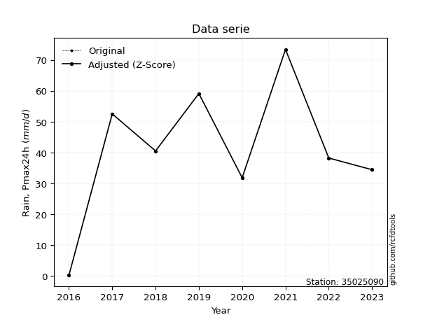</img>

</div>


> The initial value (value_initial) correspond to the initial obtained or null completed value, and value (value) is adjusted only when the initial value is outside the valid range (outlier) definite through the Z-Score value. If Z-Score is active, values out of range or outliers are replaced with the station mean value. A Z-Score (or standard score) measures how many standard deviations a data point is from the mean of a dataset, indicating its relative position; positive scores mean above the mean, negative mean below, and a score of zero is exactly at the mean, allowing for comparison of values from different distributions. It´s calculated using the formula $z=(x–μ)/σ$, where $x$ is the data point, $μ$ is the mean, and $σ$ is the standard deviation, helping identify outliers and understand probability.
>
> <sub>**Note**: In this study, "completing" (filling gaps in) and "extending" (forecasting or lengthening the historical record) rainfall data series are avoided for certain critical analyses because they introduce artificial bias and uncertainty, which can distort the statistics of rare events (extremes), alter day-to-day variability, and compromise the integrity and homogeneity of the original data. Some reasons against Completing/Extending rainfall data are: **Distortion of Extremes and Variability**: The primary issue is that most gap-filling or extension methods rely on averaging or regression with nearby stations, which inherently smooths the data. Rainfall is highly variable in space and time, with a large percentage of zero values and occasional large storms. Infilling methods often underestimate the highest values and overestimate the lowest (zero) values, which severely distorts analyses focused on flood frequency, drought severity, and intensity-duration-frequency (IDF) curves, **Loss of Data Homogeneity**: Infilled or extended data are synthetic estimates, not actual measurements. Combining these estimates with observed data can violate the assumption of data homogeneity, which requires that the data properties do not change over time. Inhomogeneity can lead to incorrect conclusions about long-term trends or changes in climate patterns, **Propagation of Errors**: Errors and biases from the original data (e.g., wind-induced undercatch, instrument errors, site changes) or the data used for imputation can propagate through the analysis, leading to unreliable hydrological models and inaccurate predictions, **Compromised Statistical Integrity**: For statistical analyses, especially those involving the frequency of events, using artificial data can introduce time bias or autocorrelation that doesn´t exist in reality, making it difficult to assess the true probability of events, **Difficulty in Validation**: It is difficult to accurately validate the quality of filled or extended data, especially for past periods where ground-truth measurements are unavailable. The reliability of imputation techniques heavily depends on the density of the surrounding station network and the complexity of the local topography.</sub>


### 4. Active continuous probability distributions from SciPy (80 of 104 available)

A Probability Density Function (PDF) describes the relative likelihood of a continuous random variable falling within a specific range, where the total area under its curve equals 1, and the area over any interval gives the actual probability for that range. Unlike discrete probabilities (like rolling a die), a PDF shows density, not direct probability for a single point (which is zero), with higher points indicating higher likelihood, often visualized as a bell curve for normal distributions.

A log of a probability density function (log-PDF) is simply the logarithm of the PDF´s value, denoted as $log(f(x))$, useful for converting multiplication of probabilities into addition, improving numerical stability with tiny numbers, and connecting to information theory concepts like entropy. Instead of dealing with very small probabilities (e.g., 0.000001), log-PDFs use negative numbers (e.g., $log(0.00001) ≈ -11.51$ that are easier for computers to handle, preventing underflow errors and simplifying complex calculations. In this study, each active probability distribution from SciPy is also evaluated in the $log$ form.

[scipy.stats](https://docs.scipy.org/doc/scipy/reference/stats.html) is a Python´s powerful submodule within the SciPy library for comprehensive statistical analysis, offering over 130 probability distributions (like Normal, Poisson, etc.), functions for descriptive stats (mean, variance), hypothesis testing (t-tests, chi-square), random variable generation, and statistical tests, making it essential for data science, modeling, and research. It provides tools to explore, model, and draw conclusions from data efficiently, working seamlessly with [NumPy](https://numpy.org/).

<div align="center">

|   id | p_dist           |   n_parameter | fit_method   | label                                                                       | active   | ref                                                                                                      |
|-----:|:-----------------|--------------:|:-------------|:----------------------------------------------------------------------------|:---------|:---------------------------------------------------------------------------------------------------------|
|    0 | alpha            |             3 | MLE          | Alpha                                                                       | True     | [:mortar_board:](https://docs.scipy.org/doc/scipy/reference/generated/scipy.stats.alpha.html)            |
|    1 | anglit           |             2 | MM           | Anglit                                                                      | True     | [:mortar_board:](https://docs.scipy.org/doc/scipy/reference/generated/scipy.stats.anglit.html)           |
|    2 | arcsine          |             2 | MM           | Arcsine                                                                     | True     | [:mortar_board:](https://docs.scipy.org/doc/scipy/reference/generated/scipy.stats.arcsine.html)          |
|    3 | argus            |             3 | MLE          | Argus                                                                       | True     | [:mortar_board:](https://docs.scipy.org/doc/scipy/reference/generated/scipy.stats.argus.html)            |
|    4 | beta             |             4 | MLE          | Beta                                                                        | True     | [:mortar_board:](https://docs.scipy.org/doc/scipy/reference/generated/scipy.stats.beta.html)             |
|    5 | betaprime        |             4 | MLE          | Beta prime                                                                  | True     | [:mortar_board:](https://docs.scipy.org/doc/scipy/reference/generated/scipy.stats.betaprime.html)        |
|    6 | bradford         |             3 | MLE          | Bradford                                                                    | True     | [:mortar_board:](https://docs.scipy.org/doc/scipy/reference/generated/scipy.stats.bradford.html)         |
|    7 | burr             |             4 | MLE          | Burr (Type III)                                                             | True     | [:mortar_board:](https://docs.scipy.org/doc/scipy/reference/generated/scipy.stats.burr.html)             |
|    8 | burr12           |             4 | MLE          | Burr (Type III) 12                                                          | True     | [:mortar_board:](https://docs.scipy.org/doc/scipy/reference/generated/scipy.stats.burr12.html)           |
|    9 | cosine           |             2 | MLE          | Cosine                                                                      | True     | [:mortar_board:](https://docs.scipy.org/doc/scipy/reference/generated/scipy.stats.cosine.html)           |
|   10 | crystalball      |             4 | MLE          | Crystalball                                                                 | True     | [:mortar_board:](https://docs.scipy.org/doc/scipy/reference/generated/scipy.stats.crystalball.html)      |
|   11 | dgamma           |             3 | MLE          | Double gamma                                                                | True     | [:mortar_board:](https://docs.scipy.org/doc/scipy/reference/generated/scipy.stats.dgamma.html)           |
|   12 | dweibull         |             3 | MLE          | Double Weibull                                                              | True     | [:mortar_board:](https://docs.scipy.org/doc/scipy/reference/generated/scipy.stats.dweibull.html)         |
|   13 | erlang           |             3 | MLE          | Erlang                                                                      | True     | [:mortar_board:](https://docs.scipy.org/doc/scipy/reference/generated/scipy.stats.erlang.html)           |
|   14 | exponnorm        |             3 | MLE          | Exponentially modified Normal                                               | True     | [:mortar_board:](https://docs.scipy.org/doc/scipy/reference/generated/scipy.stats.exponnorm.html)        |
|   15 | exponpow         |             3 | MLE          | Exponential power                                                           | True     | [:mortar_board:](https://docs.scipy.org/doc/scipy/reference/generated/scipy.stats.exponpow.html)         |
|   16 | exponweib        |             4 | MLE          | Exponentiated Weibull                                                       | True     | [:mortar_board:](https://docs.scipy.org/doc/scipy/reference/generated/scipy.stats.exponweib.html)        |
|   17 | f                |             4 | MLE          | F                                                                           | True     | [:mortar_board:](https://docs.scipy.org/doc/scipy/reference/generated/scipy.stats.f.html)                |
|   18 | fatiguelife      |             3 | MLE          | Fatigue-life (Birnbaum-Saunders)                                            | True     | [:mortar_board:](https://docs.scipy.org/doc/scipy/reference/generated/scipy.stats.fatiguelife.html)      |
|   19 | foldnorm         |             3 | MM           | Fold Normal                                                                 | True     | [:mortar_board:](https://docs.scipy.org/doc/scipy/reference/generated/scipy.stats.foldnorm.html)         |
|   20 | gamma            |             3 | MLE          | Gamma                                                                       | True     | [:mortar_board:](https://docs.scipy.org/doc/scipy/reference/generated/scipy.stats.gamma.html)            |
|   21 | gausshyper       |             6 | MLE          | Gauss hypergeometric                                                        | True     | [:mortar_board:](https://docs.scipy.org/doc/scipy/reference/generated/scipy.stats.gausshyper.html)       |
|   22 | genexpon         |             5 | MLE          | Generalized exponential                                                     | True     | [:mortar_board:](https://docs.scipy.org/doc/scipy/reference/generated/scipy.stats.genexpon.html)         |
|   23 | genextreme       |             3 | MLE          | Generalized exponential                                                     | True     | [:mortar_board:](https://docs.scipy.org/doc/scipy/reference/generated/scipy.stats.genextreme.html)       |
|   24 | gengamma         |             4 | MLE          | Generalized gamma                                                           | True     | [:mortar_board:](https://docs.scipy.org/doc/scipy/reference/generated/scipy.stats.gengamma.html)         |
|   25 | genhalflogistic  |             3 | MLE          | Generalized half-logistic                                                   | True     | [:mortar_board:](https://docs.scipy.org/doc/scipy/reference/generated/scipy.stats.genhalflogistic.html)  |
|   26 | genlogistic      |             3 | MLE          | Generalized logistic                                                        | True     | [:mortar_board:](https://docs.scipy.org/doc/scipy/reference/generated/scipy.stats.genlogistic.html)      |
|   27 | gennorm          |             3 | MLE          | Generalized Normal                                                          | True     | [:mortar_board:](https://docs.scipy.org/doc/scipy/reference/generated/scipy.stats.gennorm.html)          |
|   28 | genpareto        |             3 | MLE          | Generalized Pareto                                                          | True     | [:mortar_board:](https://docs.scipy.org/doc/scipy/reference/generated/scipy.stats.genpareto.html)        |
|   29 | gompertz         |             3 | MLE          | Gompertz (or truncated Gumbel)                                              | True     | [:mortar_board:](https://docs.scipy.org/doc/scipy/reference/generated/scipy.stats.gompertz.html)         |
|   30 | gumbel_l         |             2 | MM           | Gumbel Left Skew                                                            | True     | [:mortar_board:](https://docs.scipy.org/doc/scipy/reference/generated/scipy.stats.gumbel_l.html)         |
|   31 | gumbel_r         |             2 | MM           | Gumbel Right Skew                                                           | True     | [:mortar_board:](https://docs.scipy.org/doc/scipy/reference/generated/scipy.stats.gumbel_r.html)         |
|   32 | halfgennorm      |             3 | MLE          | Upper half of a generalized normal                                          | True     | [:mortar_board:](https://docs.scipy.org/doc/scipy/reference/generated/scipy.stats.halfgennorm.html)      |
|   33 | halflogistic     |             2 | MM           | Half-logistic                                                               | True     | [:mortar_board:](https://docs.scipy.org/doc/scipy/reference/generated/scipy.stats.halflogistic.html)     |
|   34 | halfnorm         |             2 | MM           | Half Normal                                                                 | True     | [:mortar_board:](https://docs.scipy.org/doc/scipy/reference/generated/scipy.stats.halfnorm.html)         |
|   35 | hypsecant        |             2 | MM           | hyperbolic secant                                                           | True     | [:mortar_board:](https://docs.scipy.org/doc/scipy/reference/generated/scipy.stats.hypsecant.html)        |
|   36 | invgamma         |             3 | MLE          | Inverted gamma                                                              | True     | [:mortar_board:](https://docs.scipy.org/doc/scipy/reference/generated/scipy.stats.invgamma.html)         |
|   37 | invgauss         |             3 | MLE          | Inverse Gaussian                                                            | True     | [:mortar_board:](https://docs.scipy.org/doc/scipy/reference/generated/scipy.stats.invgauss.html)         |
|   38 | invweibull       |             3 | MLE          | Inverted Weibull                                                            | True     | [:mortar_board:](https://docs.scipy.org/doc/scipy/reference/generated/scipy.stats.invweibull.html)       |
|   39 | johnsonsb        |             4 | MLE          | Johnson SB                                                                  | True     | [:mortar_board:](https://docs.scipy.org/doc/scipy/reference/generated/scipy.stats.johnsonsb.html)        |
|   40 | johnsonsu        |             4 | MLE          | Johnson Su                                                                  | True     | [:mortar_board:](https://docs.scipy.org/doc/scipy/reference/generated/scipy.stats.johnsonsu.html)        |
|   41 | kappa3           |             3 | MLE          | Kappa 3                                                                     | True     | [:mortar_board:](https://docs.scipy.org/doc/scipy/reference/generated/scipy.stats.kappa3.html)           |
|   42 | kappa4           |             4 | MLE          | Kappa 4                                                                     | True     | [:mortar_board:](https://docs.scipy.org/doc/scipy/reference/generated/scipy.stats.kappa4.html)           |
|   43 | ksone            |             3 | MLE          | Kolmogorov-Smirnov one-sided test statistic distribution                    | True     | [:mortar_board:](https://docs.scipy.org/doc/scipy/reference/generated/scipy.stats.ksone.html)            |
|   44 | kstwobign        |             2 | MLE          | Limiting distribution of scaled Kolmogorov-Smirnov two-sided test statistic | True     | [:mortar_board:](https://docs.scipy.org/doc/scipy/reference/generated/scipy.stats.kstwobign.html)        |
|   45 | laplace          |             2 | MM           | Laplace                                                                     | True     | [:mortar_board:](https://docs.scipy.org/doc/scipy/reference/generated/scipy.stats.laplace.html)          |
|   46 | levy_l           |             2 | MLE          | Left-skewed Levy                                                            | True     | [:mortar_board:](https://docs.scipy.org/doc/scipy/reference/generated/scipy.stats.levy_l.html)           |
|   47 | loggamma         |             3 | MLE          | Log gamma                                                                   | True     | [:mortar_board:](https://docs.scipy.org/doc/scipy/reference/generated/scipy.stats.loggamma.html)         |
|   48 | logistic         |             2 | MM           | Logistic (or Sech-squared)                                                  | True     | [:mortar_board:](https://docs.scipy.org/doc/scipy/reference/generated/scipy.stats.logistic.html)         |
|   49 | loglaplace       |             3 | MLE          | Log-Laplace                                                                 | True     | [:mortar_board:](https://docs.scipy.org/doc/scipy/reference/generated/scipy.stats.loglaplace.html)       |
|   50 | lomax            |             3 | MLE          | Lomax (Pareto of the second kind)                                           | True     | [:mortar_board:](https://docs.scipy.org/doc/scipy/reference/generated/scipy.stats.lomax.html)            |
|   51 | maxwell          |             2 | MM           | Maxwell                                                                     | True     | [:mortar_board:](https://docs.scipy.org/doc/scipy/reference/generated/scipy.stats.maxwell.html)          |
|   52 | mielke           |             4 | MLE          | Mielke Beta-Kappa / Dagum                                                   | True     | [:mortar_board:](https://docs.scipy.org/doc/scipy/reference/generated/scipy.stats.mielke.html)           |
|   53 | moyal            |             2 | MM           | Moyal                                                                       | True     | [:mortar_board:](https://docs.scipy.org/doc/scipy/reference/generated/scipy.stats.moyal.html)            |
|   54 | nakagami         |             3 | MLE          | Nakagami                                                                    | True     | [:mortar_board:](https://docs.scipy.org/doc/scipy/reference/generated/scipy.stats.nakagami.html)         |
|   55 | ncf              |             5 | MLE          | Non-central F distribution                                                  | True     | [:mortar_board:](https://docs.scipy.org/doc/scipy/reference/generated/scipy.stats.ncf.html)              |
|   56 | nct              |             4 | MLE          | Non-central Student’s t                                                     | True     | [:mortar_board:](https://docs.scipy.org/doc/scipy/reference/generated/scipy.stats.nct.html)              |
|   57 | norm             |             2 | MM           | Normal                                                                      | True     | [:mortar_board:](https://docs.scipy.org/doc/scipy/reference/generated/scipy.stats.norm.html)             |
|   58 | pearson3         |             3 | MM           | Pearson type III                                                            | True     | [:mortar_board:](https://docs.scipy.org/doc/scipy/reference/generated/scipy.stats.pearson3.html)         |
|   59 | powerlaw         |             3 | MLE          | Power-function                                                              | True     | [:mortar_board:](https://docs.scipy.org/doc/scipy/reference/generated/scipy.stats.powerlaw.html)         |
|   60 | rayleigh         |             2 | MM           | Rayleigh                                                                    | True     | [:mortar_board:](https://docs.scipy.org/doc/scipy/reference/generated/scipy.stats.rayleigh.html)         |
|   61 | rdist            |             3 | MLE          | R-distributed (symmetric beta)                                              | True     | [:mortar_board:](https://docs.scipy.org/doc/scipy/reference/generated/scipy.stats.rdist.html)            |
|   62 | rice             |             3 | MLE          | Rice                                                                        | True     | [:mortar_board:](https://docs.scipy.org/doc/scipy/reference/generated/scipy.stats.rice.html)             |
|   63 | semicircular     |             2 | MM           | Semicircular                                                                | True     | [:mortar_board:](https://docs.scipy.org/doc/scipy/reference/generated/scipy.stats.semicircular.html)     |
|   64 | skewnorm         |             3 | MLE          | Skew normal                                                                 | True     | [:mortar_board:](https://docs.scipy.org/doc/scipy/reference/generated/scipy.stats.skewnorm.html)         |
|   65 | t                |             3 | MLE          | Student’s t                                                                 | True     | [:mortar_board:](https://docs.scipy.org/doc/scipy/reference/generated/scipy.stats.t.html)                |
|   66 | trapezoid        |             4 | MLE          | Trapezoid                                                                   | True     | [:mortar_board:](https://docs.scipy.org/doc/scipy/reference/generated/scipy.stats.trapezoid.html)        |
|   67 | triang           |             3 | MLE          | Triangular                                                                  | True     | [:mortar_board:](https://docs.scipy.org/doc/scipy/reference/generated/scipy.stats.triang.html)           |
|   68 | truncexpon       |             3 | MLE          | Truncated exponential                                                       | True     | [:mortar_board:](https://docs.scipy.org/doc/scipy/reference/generated/scipy.stats.truncexpon.html)       |
|   69 | truncnorm        |             4 | MLE          | Truncated normal                                                            | True     | [:mortar_board:](https://docs.scipy.org/doc/scipy/reference/generated/scipy.stats.truncnorm.html)        |
|   70 | truncpareto      |             4 | MLE          | Upper truncated Pareto                                                      | True     | [:mortar_board:](https://docs.scipy.org/doc/scipy/reference/generated/scipy.stats.truncpareto.html)      |
|   71 | truncweibull_min |             5 | MLE          | Doubly truncated Weibull minimum                                            | True     | [:mortar_board:](https://docs.scipy.org/doc/scipy/reference/generated/scipy.stats.truncweibull_min.html) |
|   72 | tukeylambda      |             3 | MLE          | Tukey-Lamdba                                                                | True     | [:mortar_board:](https://docs.scipy.org/doc/scipy/reference/generated/scipy.stats.tukeylambda.html)      |
|   73 | uniform          |             2 | MLE          | Uniform                                                                     | True     | [:mortar_board:](https://docs.scipy.org/doc/scipy/reference/generated/scipy.stats.uniform.html)          |
|   74 | vonmises         |             3 | MLE          | Von Mises                                                                   | True     | [:mortar_board:](https://docs.scipy.org/doc/scipy/reference/generated/scipy.stats.vonmises.html)         |
|   75 | vonmises_line    |             3 | MLE          | Von Mises line                                                              | True     | [:mortar_board:](https://docs.scipy.org/doc/scipy/reference/generated/scipy.stats.vonmises_line.html)    |
|   76 | wald             |             2 | MM           | Wald                                                                        | True     | [:mortar_board:](https://docs.scipy.org/doc/scipy/reference/generated/scipy.stats.wald.html)             |
|   77 | weibull_max      |             3 | MLE          | Weibull maximum                                                             | True     | [:mortar_board:](https://docs.scipy.org/doc/scipy/reference/generated/scipy.stats.weibull_max.html)      |
|   78 | weibull_min      |             3 | MLE          | Weibull minimum                                                             | True     | [:mortar_board:](https://docs.scipy.org/doc/scipy/reference/generated/scipy.stats.weibull_min.html)      |
|   79 | wrapcauchy       |             3 | MLE          | Wrapped  Cauchy                                                             | True     | [:mortar_board:](https://docs.scipy.org/doc/scipy/reference/generated/scipy.stats.wrapcauchy.html)       |

</div>

> **n_parameter:** # arguments & localization & scale.
>
> **Fit methods:** (MLE) maximum likelihood, (MM) L-moments.
>
>**Inactive** (With the only purpose of prevent loops, zero divisions, infinite values, over high estimated values or horizontal trending for recurrence intervals estimations, the follow distributions were disabled.)**:** lognorm, norminvgauss, powernorm, powerlognorm, cauchy, halfcauchy, foldcauchy, skewcauchy, chi2, expon, fisk, genhyperbolic, geninvgauss, gibrat, kstwo, laplace_asymmetric, levy, levy_stable, ncx2, pareto, rel_breitwigner, recipinvgauss, studentized_range, loguniform, 


## B. Probability (PDF) vs. Empirical (EDF) distributions functions

A continuous probability distribution (CPD) describes probabilities for variables that can take any value within a range (like rain any time), unlike discrete variables with specific outcomes (like temperature). It uses a Probability Density Function (PDF), a curve where the total area under it equals 1, and the probability of the variable falling within an interval (a to b) is found by calculating the area under the curve between those points. A key feature is that the probability of hitting any single exact value is zero, so probabilities are always expressed for ranges, e.g., $P(a ≤ X ≤ b)$.

<div align="center">

Distributions parameters from station values
|     |   station | p_dist              |   n |               loc |            scale | shape                  | shape1                | shape2                | shape3             |
|----:|----------:|:--------------------|----:|------------------:|-----------------:|:-----------------------|:----------------------|:----------------------|:-------------------|
|   0 |  35025090 | alpha               |   8 |    -277.164       |   4548.64        | 14.355510909137344     |                       |                       |                    |
|   1 |  35025090 | anglit              |   8 |      41.2625      |     59.5051      |                        |                       |                       |                    |
|   2 |  35025090 | arcsine             |   8 |      12.4962      |     57.5326      |                        |                       |                       |                    |
|   3 |  35025090 | argus               |   8 |     -12.0162      |     88.7415      | 0.6132549205895783     |                       |                       |                    |
|   4 |  35025090 | beta                |   8 |      -5.21875     |     78.6188      | 0.7632927489174126     | 0.7927343987533287    |                       |                    |
|   5 |  35025090 | betaprime           |   8 |    -608.455       | 115066           | 1009.1653880544966     | 178777.22501266448    |                       |                    |
|   6 |  35025090 | bradford            |   8 |      -9.66946     |     83.0695      | 0.0011248389391852716  |                       |                       |                    |
|   7 |  35025090 | burr                |   8 |      -0.115078    |     75.1454      | 129.65581975463266     | 0.006844619065147489  |                       |                    |
|   8 |  35025090 | burr12              |   8 |     -69.9877      |    601.692       | 6.457796429550314      | 34167.54814327607     |                       |                    |
|   9 |  35025090 | cosine              |   8 |      39.6398      |     17.9121      |                        |                       |                       |                    |
|  10 |  35025090 | crystalball         |   8 |      41.2625      |     20.3408      | 2768.0390698047763     | 2863.983801869713     |                       |                    |
|  11 |  35025090 | dgamma              |   8 |      40.5         |     16.3951      | 0.9016524551369044     |                       |                       |                    |
|  12 |  35025090 | dweibull            |   8 |      38.2         |     15.2218      | 0.91205227526248       |                       |                       |                    |
|  13 |  35025090 | erlang              |   8 |    -321.571       |      1.18023     | 307.459333885762       |                       |                       |                    |
|  14 |  35025090 | exponnorm           |   8 |      41.249       |     20.3409      | 0.0006558437756479449  |                       |                       |                    |
|  15 |  35025090 | exponpow            |   8 |       0.2         |      3.3736      | 0.13134634607828422    |                       |                       |                    |
|  16 |  35025090 | exponweib           |   8 |       0.2         |      3.49708     | 1.7072827787478113     | 0.3070141548831855    |                       |                    |
|  17 |  35025090 | f                   |   8 |   -7611.74        |   7652.98        | 330163.66513829015     | 1902961.192499199     |                       |                    |
|  18 |  35025090 | fatiguelife         |   8 |   -1650.4         |   1691.39        | 0.011980758285869503   |                       |                       |                    |
|  19 |  35025090 | foldnorm            |   8 |    -102.451       |     19.371       | 7.43115288667487       |                       |                       |                    |
|  20 |  35025090 | gamma               |   8 |    -290.643       |      1.30015     | 255.17004620723935     |                       |                       |                    |
|  21 |  35025090 | gausshyper          |   8 |      -7.17403     |     80.574       | 1.360596510376874      | 0.8523785226802787    | 0.9769809109919007    | 0.7394179489730961 |
|  22 |  35025090 | genexpon            |   8 |       0.199889    |      2.21541     | 0.054985476935246885   | 9.858366169477187e-07 | 1.847238257004773     |                    |
|  23 |  35025090 | genextreme          |   8 |      36.2123      |     22.069       | 0.49062767484314285    |                       |                       |                    |
|  24 |  35025090 | gengamma            |   8 |    -388.927       |     27.0161      | 138.23348414416574     | 1.7804624508531366    |                       |                    |
|  25 |  35025090 | genhalflogistic     |   8 |      -7.40981     |     85.2018      | 1.054349589547742      |                       |                       |                    |
|  26 |  35025090 | genlogistic         |   8 |      48.0764      |      9.69583     | 0.6809224230129428     |                       |                       |                    |
|  27 |  35025090 | gennorm             |   8 |      38.2         |      2.16932     | 0.4777428157002257     |                       |                       |                    |
|  28 |  35025090 | genpareto           |   8 |      -0.197696    |     96.6931      | -1.3138055056343898    |                       |                       |                    |
|  29 |  35025090 | gompertz            |   8 |      31.8         |     26.5149      | 0.9272950473808539     |                       |                       |                    |
|  30 |  35025090 | gumbel_l            |   8 |      50.417       |     15.8597      |                        |                       |                       |                    |
|  31 |  35025090 | gumbel_r            |   8 |      32.108       |     15.8597      |                        |                       |                       |                    |
|  32 |  35025090 | halfgennorm         |   8 |       0.2         |      0.774917    | 0.32403846361206934    |                       |                       |                    |
|  33 |  35025090 | halflogistic        |   8 |      17.1538      |     17.3907      |                        |                       |                       |                    |
|  34 |  35025090 | halfnorm            |   8 |      14.3392      |     33.7434      |                        |                       |                       |                    |
|  35 |  35025090 | hypsecant           |   8 |      41.2625      |     12.9494      |                        |                       |                       |                    |
|  36 |  35025090 | invgamma            |   8 |    -224.772       |  41216.1         | 156.19441391577243     |                       |                       |                    |
|  37 |  35025090 | invgauss            |   8 |    -118.82        |   8227.43        | 0.019431241071600325   |                       |                       |                    |
|  38 |  35025090 | invweibull          |   8 |       0.2         |      2.82681     | 0.06391093112675193    |                       |                       |                    |
|  39 |  35025090 | johnsonsb           |   8 |       0.2         |     73.2003      | 0.3424317156545518     | 0.09559933754645213   |                       |                    |
|  40 |  35025090 | johnsonsu           |   8 |     145.068       |     25.8422      | 10.975847534534736     | 5.2734196122195645    |                       |                    |
|  41 |  35025090 | kappa3              |   8 |       0.193945    |     73.1955      | 16045.68939986587      |                       |                       |                    |
|  42 |  35025090 | kappa4              |   8 |      -7.19695     |     81.689       | 1.0996279735752732     | 1.0121331233771864    |                       |                    |
|  43 |  35025090 | ksone               |   8 |      -7.12        |     87.84        | 1.0                    |                       |                       |                    |
|  44 |  35025090 | kstwobign           |   8 |     -47.3253      |    101.551       |                        |                       |                       |                    |
|  45 |  35025090 | laplace             |   8 |      41.2625      |     14.3831      |                        |                       |                       |                    |
|  46 |  35025090 | levy_l              |   8 |      76.7253      |     15.6478      |                        |                       |                       |                    |
|  47 |  35025090 | loggamma            |   8 |      -4.0898      |     37.4621      | 3.8432598646859564     |                       |                       |                    |
|  48 |  35025090 | logistic            |   8 |      41.2625      |     11.2145      |                        |                       |                       |                    |
|  49 |  35025090 | loglaplace          |   8 |      -0.0909481   |     40.5909      | 1.2071577048032145     |                       |                       |                    |
|  50 |  35025090 | lomax               |   8 |       0.2         |      1.99765e+10 | 514239191.9396093      |                       |                       |                    |
|  51 |  35025090 | maxwell             |   8 |      -6.93675     |     30.2044      |                        |                       |                       |                    |
|  52 |  35025090 | mielke              |   8 |       0.2         |     70.5871      | 0.3653975659494396     | 3.268507682507201     |                       |                    |
|  53 |  35025090 | moyal               |   8 |      29.6303      |      9.1566      |                        |                       |                       |                    |
|  54 |  35025090 | nakagami            |   8 |       0.2         |     44.624       | 0.2607748911076243     |                       |                       |                    |
|  55 |  35025090 | ncf                 |   8 |       0.2         |      1.44575     | 0.2643284674049999     | 27.74610664509393     | 7.185783968801124     |                    |
|  56 |  35025090 | nct                 |   8 |    1246.1         |     20.2993      | 385338.6585418419      | -59.353675984031554   |                       |                    |
|  57 |  35025090 | norm                |   8 |      41.2625      |     20.3408      |                        |                       |                       |                    |
|  58 |  35025090 | pearson3            |   8 |      41.2625      |     20.3408      | -0.4477972245408549    |                       |                       |                    |
|  59 |  35025090 | powerlaw            |   8 |       0.2         |     73.2         | 0.1745836533631095     |                       |                       |                    |
|  60 |  35025090 | rayleigh            |   8 |       2.34926     |     31.0483      |                        |                       |                       |                    |
|  61 |  35025090 | rdist               |   8 |      -7.04566     |     47.5457      | 0.90300140190292       |                       |                       |                    |
|  62 |  35025090 | rice                |   8 |     -13.4527      |     21.7669      | 2.2785651204384774     |                       |                       |                    |
|  63 |  35025090 | semicircular        |   8 |      41.2625      |     40.6817      |                        |                       |                       |                    |
|  64 |  35025090 | skewnorm            |   8 |      61.4127      |     28.6318      | -1.8951316123714181    |                       |                       |                    |
|  65 |  35025090 | t                   |   8 |      41.2625      |     20.3409      | 913799291.3595018      |                       |                       |                    |
|  66 |  35025090 | trapezoid           |   8 |      -7.476       |     87.84        | 0.9999999999999999     | 1.0                   |                       |                    |
|  67 |  35025090 | triang              |   8 |     -15.6741      |     89.0748      | 0.9999999999959008     |                       |                       |                    |
|  68 |  35025090 | truncexpon          |   8 |       0.2         |    111.119       | 0.65875597029458       |                       |                       |                    |
|  69 |  35025090 | truncnorm           |   8 |      43.0116      |     26.8096      | -1.6054568868327541    | 1.2086330535560421    |                       |                    |
|  70 |  35025090 | truncpareto         |   8 |       0.184554    |      0.0154463   | 0.1432651039797547     | 4739.9871362345375    |                       |                    |
|  71 |  35025090 | truncweibull_min    |   8 |      -2.82032     |    118.142       | 1.3759057808573587     | 0.0012837954914428828 | 0.6451603838304956    |                    |
|  72 |  35025090 | tukeylambda         |   8 |      -5.24798     |     50.6828      | 1.1078693315552834     |                       |                       |                    |
|  73 |  35025090 | uniform             |   8 |       0.2         |     73.2         |                        |                       |                       |                    |
|  74 |  35025090 | vonmises            |   8 |       2.04159     |      1           | 0.5779613838695605     |                       |                       |                    |
|  75 |  35025090 | vonmises_line       |   8 |      36.8         |     11.6502      | 0.9587311408484915     |                       |                       |                    |
|  76 |  35025090 | wald                |   8 |      20.9217      |     20.3408      |                        |                       |                       |                    |
|  77 |  35025090 | weibull_max         |   8 |      73.4         |      1.56077     | 0.28698118629894087    |                       |                       |                    |
|  78 |  35025090 | weibull_min         |   8 |     -69.978       |    119.482       | 6.4571361552862285     |                       |                       |                    |
|  79 |  35025090 | wrapcauchy          |   8 |       0.198102    |     11.6505      | 5.078571334635575e-08  |                       |                       |                    |
|  80 |  35025090 | logalpha            |   8 |     -64.3336      |   2402.79        | 35.634453183291626     |                       |                       |                    |
|  81 |  35025090 | loganglit           |   8 |       3.13352     |      5.30191     |                        |                       |                       |                    |
|  82 |  35025090 | logarcsine          |   8 |       0.570447    |      5.12615     |                        |                       |                       |                    |
|  83 |  35025090 | logargus            |   8 |      -3.50886     |      7.87871     | 3.5204942904561523     |                       |                       |                    |
|  84 |  35025090 | logbeta             |   8 |      -2.3625      |      6.65843     | 0.12590144085501986    | 0.019167964617788826  |                       |                    |
|  85 |  35025090 | logbetaprime        |   8 |      -1.60944     |      2.01015     | 0.20620462592647043    | 0.9349014267696116    |                       |                    |
|  86 |  35025090 | logbradford         |   8 |      -1.60944     |      5.90537     | 1.1054770110306245     |                       |                       |                    |
|  87 |  35025090 | logburr             |   8 |      -1.60944     |      2.97589     | 0.4950403971491991     | 0.3565983163124742    |                       |                    |
|  88 |  35025090 | logburr12           |   8 |  -46260.1         |  46276.3         | 53760.857691689365     | 1902674.057463162     |                       |                    |
|  89 |  35025090 | logcosine           |   8 |       2.59232     |      1.75416     |                        |                       |                       |                    |
|  90 |  35025090 | logcrystalball      |   8 |       3.13352     |      1.81236     | 5.774633075445175      | 42.12026056860536     |                       |                    |
|  91 |  35025090 | logdgamma           |   8 |       3.53806     |      1.25958     | 0.6278921553769963     |                       |                       |                    |
|  92 |  35025090 | logdweibull         |   8 |       3.7013      |      1.30277     | 0.638391798222441      |                       |                       |                    |
|  93 |  35025090 | logerlang           |   8 |      -1.60944     |    119.687       | 0.19037223587484953    |                       |                       |                    |
|  94 |  35025090 | logexponnorm        |   8 |       3.13222     |      1.81238     | 0.0007234650237819757  |                       |                       |                    |
|  95 |  35025090 | logexponpow         |   8 |      -1.60944     |      1.83158     | 0.3556164773366597     |                       |                       |                    |
|  96 |  35025090 | logexponweib        |   8 |      -1.60944     |      1.93849     | 0.6308376560053459     | 0.28994321242975857   |                       |                    |
|  97 |  35025090 | logf                |   8 |      -1.60944     |      1.14946     | 1.012744804300827      | 1.1062234010125103    |                       |                    |
|  98 |  35025090 | logfatiguelife      |   8 |   -1248.81        |   1251.93        | 0.001448045381649143   |                       |                       |                    |
|  99 |  35025090 | logfoldnorm         |   8 |      -6.32095     |      1.23081     | 7.795347296244552      |                       |                       |                    |
| 100 |  35025090 | loggamma            |   8 |      -1.60944     |      2.42828     | 0.5189495049972073     |                       |                       |                    |
| 101 |  35025090 | loggausshyper       |   8 |      -1.81147     |      6.10739     | 1.3361230308297842     | 0.6454276644869958    | 1.0323412989965068    | 0.8275183020819237 |
| 102 |  35025090 | loggenexpon         |   8 |      -1.92395     |      0.0903427   | 0.0024835528801298405  | 6.728189955139555     | 7.251693742314495e-05 |                    |
| 103 |  35025090 | loggenextreme       |   8 |       3.08365     |      1.41812     | 1.1698041327886681     |                       |                       |                    |
| 104 |  35025090 | loggengamma         |   8 | -349635           | 349611           | 25.468544639850236     | 41419.40656092881     |                       |                    |
| 105 |  35025090 | loggenhalflogistic  |   8 |      -1.69519     |      6.79315     | 1.1338717629331927     |                       |                       |                    |
| 106 |  35025090 | loggenlogistic      |   8 |       4.29598     |      3.6205e-06  | 3.1178557816724237e-06 |                       |                       |                    |
| 107 |  35025090 | loggennorm          |   8 |       3.64284     |      0.0448722   | 0.3985751980541091     |                       |                       |                    |
| 108 |  35025090 | loggenpareto        |   8 |      -1.60944     |      1.26718     | 1.4150479317468703     |                       |                       |                    |
| 109 |  35025090 | loggompertz         |   8 |      -1.60944     |      7.98761e+13 | 102757974311002.16     |                       |                       |                    |
| 110 |  35025090 | loggumbel_l         |   8 |       3.94918     |      1.41309     |                        |                       |                       |                    |
| 111 |  35025090 | loggumbel_r         |   8 |       2.31786     |      1.41309     |                        |                       |                       |                    |
| 112 |  35025090 | loghalfgennorm      |   8 |      -1.6096      |      5.90691     | 32805.67686375026      |                       |                       |                    |
| 113 |  35025090 | loghalflogistic     |   8 |       0.985391    |      1.54953     |                        |                       |                       |                    |
| 114 |  35025090 | loghalfnorm         |   8 |       0.734625    |      3.00656     |                        |                       |                       |                    |
| 115 |  35025090 | loghypsecant        |   8 |       3.13352     |      1.15379     |                        |                       |                       |                    |
| 116 |  35025090 | loginvgamma         |   8 |     -50.1437      |  39759.7         | 747.7133307260233      |                       |                       |                    |
| 117 |  35025090 | loginvgauss         |   8 |     -18.4995      |   2260.54        | 0.009560649230768957   |                       |                       |                    |
| 118 |  35025090 | loginvweibull       |   8 |      -5.77514e+07 |      5.77514e+07 | 23805479.47841433      |                       |                       |                    |
| 119 |  35025090 | logjohnsonsb        |   8 |      -1.60944     |      5.90536     | 0.7888734915576081     | 0.19009336931975696   |                       |                    |
| 120 |  35025090 | logjohnsonsu        |   8 |       4.34796     |      0.00125059  | 5.4781952613665865     | 0.8046202773997777    |                       |                    |
| 121 |  35025090 | logkappa3           |   8 |      -1.60944     |      5.90531     | 269875.6534581984      |                       |                       |                    |
| 122 |  35025090 | logkappa4           |   8 |      -1.97486     |      6.95382     | 1.0434027824139767     | 1.1089246591563926    |                       |                    |
| 123 |  35025090 | logksone            |   8 |      -2.19997     |      7.08643     | 1.0                    |                       |                       |                    |
| 124 |  35025090 | logkstwobign        |   8 |      -6.81755     |     11.4083      |                        |                       |                       |                    |
| 125 |  35025090 | loglaplace          |   8 |       3.13352     |      1.28153     |                        |                       |                       |                    |
| 126 |  35025090 | loglevy_l           |   8 |       4.35775     |      0.288762    |                        |                       |                       |                    |
| 127 |  35025090 | logloggamma         |   8 |       4.29596     |      3.01401e-06 | 2.590997886361387e-06  |                       |                       |                    |
| 128 |  35025090 | loglogistic         |   8 |       3.13352     |      0.999208    |                        |                       |                       |                    |
| 129 |  35025090 | logloglaplace       |   8 |      -1.60944     |      1.29387     | 0.8360244826901064     |                       |                       |                    |
| 130 |  35025090 | loglomax            |   8 |      -1.60944     | 432027           | 91084.23180527834      |                       |                       |                    |
| 131 |  35025090 | logmaxwell          |   8 |      -1.16099     |      2.69119     |                        |                       |                       |                    |
| 132 |  35025090 | logmielke           |   8 |      -1.60944     |      3.49628     | 0.18489023381939015    | 0.883888030899258     |                       |                    |
| 133 |  35025090 | logmoyal            |   8 |       2.0971      |      0.81585     |                        |                       |                       |                    |
| 134 |  35025090 | lognakagami         |   8 |   -1779.36        |   1782.49        | 240190.2559747254      |                       |                       |                    |
| 135 |  35025090 | logncf              |   8 |      -1.60944     |      1.05608     | 1.033804229731743      | 1.1024541029679322    | 1.1114551911214838    |                    |
| 136 |  35025090 | lognct              |   8 |    -117.564       |      1.7554      | 31109.30920460295      | 68.75576406033929     |                       |                    |
| 137 |  35025090 | lognorm             |   8 |       3.13352     |      1.81236     |                        |                       |                       |                    |
| 138 |  35025090 | logpearson3         |   8 |       3.13353     |      1.81235     | -2.168995112320089     |                       |                       |                    |
| 139 |  35025090 | logpowerlaw         |   8 |      -1.60944     |      5.90536     | 0.2081775517961552     |                       |                       |                    |
| 140 |  35025090 | lograyleigh         |   8 |      -0.333663    |      2.76641     |                        |                       |                       |                    |
| 141 |  35025090 | logrdist            |   8 |      -1.60944     |      2.22048e-16 | 1.4395442137914358     |                       |                       |                    |
| 142 |  35025090 | logrice             |   8 |      -2.27285     |      4.02681     | 0.07169186690696269    |                       |                       |                    |
| 143 |  35025090 | logsemicircular     |   8 |       3.13352     |      3.62477     |                        |                       |                       |                    |
| 144 |  35025090 | logskewnorm         |   8 |       4.29592     |      2.15294     | -37507875.00948027     |                       |                       |                    |
| 145 |  35025090 | logt                |   8 |       3.70518     |      0.236077    | 0.9623036192174503     |                       |                       |                    |
| 146 |  35025090 | logtrapezoid        |   8 |      -2.09224     |      7.68921     | 1.0                    | 1.0                   |                       |                    |
| 147 |  35025090 | logtriang           |   8 |      -2.34092     |      6.63686     | 0.9999988495603708     |                       |                       |                    |
| 148 |  35025090 | logtruncexpon       |   8 |      -1.60944     |     11.5439      | 0.5115585289822949     |                       |                       |                    |
| 149 |  35025090 | logtruncnorm        |   8 |       1.40226     |      5.75309     | -0.5234952838311606    | 0.5029858811911205    |                       |                    |
| 150 |  35025090 | logtruncpareto      |   8 |      -1.61129     |      0.00185678  | 0.0032220305681536455  | 3181.439899846573     |                       |                    |
| 151 |  35025090 | logtruncweibull_min |   8 |      -1.85773     |     12.9407      | 1.6764287018887662     | 0.0003659906342050993 | 0.4755269819960362    |                    |
| 152 |  35025090 | logtukeylambda      |   8 |      -1.60944     |      2.55288e-16 | 1.4913767858280789     |                       |                       |                    |
| 153 |  35025090 | loguniform          |   8 |      -1.60944     |      5.90536     |                        |                       |                       |                    |
| 154 |  35025090 | logvonmises         |   8 |      -2.37086     |      1           | 7.039951357037155      |                       |                       |                    |
| 155 |  35025090 | logvonmises_line    |   8 |       1.58914     |      1.01814     | 3.912856207694943e-05  |                       |                       |                    |
| 156 |  35025090 | logwald             |   8 |       1.32114     |      1.81238     |                        |                       |                       |                    |
| 157 |  35025090 | logweibull_max      |   8 |       4.29592     |      2.23083     | 0.5834020760641422     |                       |                       |                    |
| 158 |  35025090 | logweibull_min      |   8 |      -1.60944     |      1.64658     | 0.5991053433159192     |                       |                       |                    |
| 159 |  35025090 | logwrapcauchy       |   8 |      -1.60989     |      0.93994     | 0.6862802859060881     |                       |                       |                    |

</div>

> **loc** (Location parameter): This shifts the distribution along the x-axis. For many common distributions, like the normal (Gaussian) distribution, loc represents the mean $μ$. For others, like the uniform distribution, it might represent the minimum value, or for the beta distribution, the left end of the support interval.
>
> **scale** (Scale parameter): This determines the width or spread of the distribution. For the normal distribution, scale represents the standard deviation $σ$. For a uniform distribution, it defines the length of the interval (from $loc$ to $loc + scale$).
>
> **shape** (Shape parameters): Refers to parameters that define the specific form of a probability distribution, distinct from its location (loc) and scale (scale). These parameters are required arguments for most distribution functions. For example, a normal (Gaussian) distribution is fully defined by its location (mean) and scale (standard deviation), so it has no specific shape parameters beyond loc and scale. However, other distributions have intrinsic properties that need specification, as Gamma distribution that takes a shape parameter, often named $a$ or $alpha$.


### 0. Cumulative distribution values - CDF (160 evaluated)

Cumulative Distribution Function (CDF), denoted as $F$<sub>$X$</sub>$(x)$, is a function that gives the probability that a random variable $X$ will take a value less than or equal to a specific value, $x$ (i.e., $(P(X≥x)$. It essentially "accumulates" probabilities from a given point up to the far right (positive infinity), providing a complete picture of the distribution´s probabilities for both discrete (like rain) and continuous (like temperature) variables, helping to find probabilities over ranges or above certain values. Each station is evaluated separately ordering the $x$ values ascending, calculating the CDF and PDF values for the activated distributions and their logarithmic forms.

<div align="center">

CDF ordered by x ascending and calculating $log(f(x))$ separately
|   id |   Station |   date |    x |   count |    mean |     std |     zscore |   Value_initial |   station |   m |     alpha |   alpha_pdf |     anglit |   anglit_pdf |   arcsine |   arcsine_pdf |     argus |   argus_pdf |     beta |   beta_pdf |   betaprime |   betaprime_pdf |   bradford |   bradford_pdf |       burr |    burr_pdf |    burr12 |   burr12_pdf |    cosine |   cosine_pdf |   crystalball |   crystalball_pdf |    dgamma |   dgamma_pdf |   dweibull |   dweibull_pdf |    erlang |   erlang_pdf |   exponnorm |   exponnorm_pdf |   exponpow |   exponpow_pdf |   exponweib |   exponweib_pdf |         f |      f_pdf |   fatiguelife |   fatiguelife_pdf |   foldnorm |   foldnorm_pdf |    gamma |   gamma_pdf |   gausshyper |   gausshyper_pdf |    genexpon |   genexpon_pdf |   genextreme |   genextreme_pdf |   gengamma |   gengamma_pdf |   genhalflogistic |   genhalflogistic_pdf |   genlogistic |   genlogistic_pdf |   gennorm |   gennorm_pdf |   genpareto |   genpareto_pdf |    gompertz |   gompertz_pdf |   gumbel_l |   gumbel_l_pdf |    gumbel_r |   gumbel_r_pdf |   halfgennorm |   halfgennorm_pdf |   halflogistic |   halflogistic_pdf |   halfnorm |   halfnorm_pdf |   hypsecant |   hypsecant_pdf |   invgamma |   invgamma_pdf |   invgauss |   invgauss_pdf |   invweibull |   invweibull_pdf |   johnsonsb |   johnsonsb_pdf |   johnsonsu |   johnsonsu_pdf |     kappa3 |   kappa3_pdf |      kappa4 |   kappa4_pdf |     ksone |   ksone_pdf |   kstwobign |   kstwobign_pdf |   laplace |   laplace_pdf |   levy_l |   levy_l_pdf |    loggamma |   loggamma_pdf |   logistic |   logistic_pdf |   loglaplace |   loglaplace_pdf |       lomax |   lomax_pdf |    maxwell |   maxwell_pdf |      mielke |   mielke_pdf |       moyal |   moyal_pdf |    nakagami |   nakagami_pdf |        ncf |        ncf_pdf |       nct |    nct_pdf |      norm |   norm_pdf |   pearson3 |   pearson3_pdf |    powerlaw |   powerlaw_pdf |   rayleigh |   rayleigh_pdf |    rdist |   rdist_pdf |      rice |   rice_pdf |   semicircular |   semicircular_pdf |   skewnorm |   skewnorm_pdf |         t |      t_pdf |   trapezoid |   trapezoid_pdf |    triang |   triang_pdf |   truncexpon |   truncexpon_pdf |   truncnorm |   truncnorm_pdf |   truncpareto |   truncpareto_pdf |   truncweibull_min |   truncweibull_min_pdf |   tukeylambda |   tukeylambda_pdf |   uniform |   uniform_pdf |   vonmises |   vonmises_pdf |   vonmises_line |   vonmises_line_pdf |     wald |   wald_pdf |   weibull_max |   weibull_max_pdf |   weibull_min |   weibull_min_pdf |   wrapcauchy |   wrapcauchy_pdf |   logalpha |   logalpha_pdf |   loganglit |   loganglit_pdf |   logarcsine |   logarcsine_pdf |   logargus |   logargus_pdf |   logbeta |   logbeta_pdf |   logbetaprime |   logbetaprime_pdf |   logbradford |   logbradford_pdf |    logburr |   logburr_pdf |   logburr12 |   logburr12_pdf |   logcosine |   logcosine_pdf |   logcrystalball |   logcrystalball_pdf |   logdgamma |   logdgamma_pdf |   logdweibull |   logdweibull_pdf |   logerlang |   logerlang_pdf |   logexponnorm |   logexponnorm_pdf |   logexponpow |   logexponpow_pdf |   logexponweib |   logexponweib_pdf |        logf |    logf_pdf |   logfatiguelife |   logfatiguelife_pdf |   logfoldnorm |   logfoldnorm_pdf |   loggausshyper |   loggausshyper_pdf |   loggenexpon |   loggenexpon_pdf |   loggenextreme |   loggenextreme_pdf |   loggengamma |   loggengamma_pdf |   loggenhalflogistic |   loggenhalflogistic_pdf |   loggenlogistic |   loggenlogistic_pdf |   loggennorm |   loggennorm_pdf |   loggenpareto |   loggenpareto_pdf |   loggompertz |   loggompertz_pdf |   loggumbel_l |   loggumbel_l_pdf |   loggumbel_r |   loggumbel_r_pdf |   loghalfgennorm |   loghalfgennorm_pdf |   loghalflogistic |   loghalflogistic_pdf |   loghalfnorm |   loghalfnorm_pdf |   loghypsecant |   loghypsecant_pdf |   loginvgamma |   loginvgamma_pdf |   loginvgauss |   loginvgauss_pdf |   loginvweibull |   loginvweibull_pdf |   logjohnsonsb |   logjohnsonsb_pdf |   logjohnsonsu |   logjohnsonsu_pdf |   logkappa3 |   logkappa3_pdf |   logkappa4 |   logkappa4_pdf |   logksone |   logksone_pdf |   logkstwobign |   logkstwobign_pdf |   loglevy_l |   loglevy_l_pdf |   logloggamma |   logloggamma_pdf |   loglogistic |   loglogistic_pdf |   logloglaplace |   logloglaplace_pdf |    loglomax |   loglomax_pdf |   logmaxwell |   logmaxwell_pdf |   logmielke |   logmielke_pdf |    logmoyal |   logmoyal_pdf |   lognakagami |   lognakagami_pdf |      logncf |   logncf_pdf |     lognct |   lognct_pdf |    lognorm |   lognorm_pdf |   logpearson3 |   logpearson3_pdf |   logpowerlaw |   logpowerlaw_pdf |   lograyleigh |   lograyleigh_pdf |   logrdist |   logrdist_pdf |   logrice |   logrice_pdf |   logsemicircular |   logsemicircular_pdf |   logskewnorm |   logskewnorm_pdf |      logt |   logt_pdf |   logtrapezoid |   logtrapezoid_pdf |   logtriang |   logtriang_pdf |   logtruncexpon |   logtruncexpon_pdf |   logtruncnorm |   logtruncnorm_pdf |   logtruncpareto |   logtruncpareto_pdf |   logtruncweibull_min |   logtruncweibull_min_pdf |   logtukeylambda |   logtukeylambda_pdf |   loguniform |   loguniform_pdf |   logvonmises |   logvonmises_pdf |   logvonmises_line |   logvonmises_line_pdf |   logwald |   logwald_pdf |   logweibull_max |   logweibull_max_pdf |   logweibull_min |   logweibull_min_pdf |   logwrapcauchy |   logwrapcauchy_pdf |
|-----:|----------:|-------:|-----:|--------:|--------:|--------:|-----------:|----------------:|----------:|----:|----------:|------------:|-----------:|-------------:|----------:|--------------:|----------:|------------:|---------:|-----------:|------------:|----------------:|-----------:|---------------:|-----------:|------------:|----------:|-------------:|----------:|-------------:|--------------:|------------------:|----------:|-------------:|-----------:|---------------:|----------:|-------------:|------------:|----------------:|-----------:|---------------:|------------:|----------------:|----------:|-----------:|--------------:|------------------:|-----------:|---------------:|---------:|------------:|-------------:|-----------------:|------------:|---------------:|-------------:|-----------------:|-----------:|---------------:|------------------:|----------------------:|--------------:|------------------:|----------:|--------------:|------------:|----------------:|------------:|---------------:|-----------:|---------------:|------------:|---------------:|--------------:|------------------:|---------------:|-------------------:|-----------:|---------------:|------------:|----------------:|-----------:|---------------:|-----------:|---------------:|-------------:|-----------------:|------------:|----------------:|------------:|----------------:|-----------:|-------------:|------------:|-------------:|----------:|------------:|------------:|----------------:|----------:|--------------:|---------:|-------------:|------------:|---------------:|-----------:|---------------:|-------------:|-----------------:|------------:|------------:|-----------:|--------------:|------------:|-------------:|------------:|------------:|------------:|---------------:|-----------:|---------------:|----------:|-----------:|----------:|-----------:|-----------:|---------------:|------------:|---------------:|-----------:|---------------:|---------:|------------:|----------:|-----------:|---------------:|-------------------:|-----------:|---------------:|----------:|-----------:|------------:|----------------:|----------:|-------------:|-------------:|-----------------:|------------:|----------------:|--------------:|------------------:|-------------------:|-----------------------:|--------------:|------------------:|----------:|--------------:|-----------:|---------------:|----------------:|--------------------:|---------:|-----------:|--------------:|------------------:|--------------:|------------------:|-------------:|-----------------:|-----------:|---------------:|------------:|----------------:|-------------:|-----------------:|-----------:|---------------:|----------:|--------------:|---------------:|-------------------:|--------------:|------------------:|-----------:|--------------:|------------:|----------------:|------------:|----------------:|-----------------:|---------------------:|------------:|----------------:|--------------:|------------------:|------------:|----------------:|---------------:|-------------------:|--------------:|------------------:|---------------:|-------------------:|------------:|------------:|-----------------:|---------------------:|--------------:|------------------:|----------------:|--------------------:|--------------:|------------------:|----------------:|--------------------:|--------------:|------------------:|---------------------:|-------------------------:|-----------------:|---------------------:|-------------:|-----------------:|---------------:|-------------------:|--------------:|------------------:|--------------:|------------------:|--------------:|------------------:|-----------------:|---------------------:|------------------:|----------------------:|--------------:|------------------:|---------------:|-------------------:|--------------:|------------------:|--------------:|------------------:|----------------:|--------------------:|---------------:|-------------------:|---------------:|-------------------:|------------:|----------------:|------------:|----------------:|-----------:|---------------:|---------------:|-------------------:|------------:|----------------:|--------------:|------------------:|--------------:|------------------:|----------------:|--------------------:|------------:|---------------:|-------------:|-----------------:|------------:|----------------:|------------:|---------------:|--------------:|------------------:|------------:|-------------:|-----------:|-------------:|-----------:|--------------:|--------------:|------------------:|--------------:|------------------:|--------------:|------------------:|-----------:|---------------:|----------:|--------------:|------------------:|----------------------:|--------------:|------------------:|----------:|-----------:|---------------:|-------------------:|------------:|----------------:|----------------:|--------------------:|---------------:|-------------------:|-----------------:|---------------------:|----------------------:|--------------------------:|-----------------:|---------------------:|-------------:|-----------------:|--------------:|------------------:|-------------------:|-----------------------:|----------:|--------------:|-----------------:|---------------------:|-----------------:|---------------------:|----------------:|--------------------:|
|    0 |  35025090 |   2016 |  0.2 |       8 | 41.2625 | 21.7453 | -1.88834   |             0.2 |  35025090 |   1 | 0.0204739 |  0.00292021 | 0.00906051 |   0.00318475 |  0        |     0         | 0.0262555 |  0.0042855  | 0.107457 |  0.0152653 |   0.0213534 |      0.00260743 |   0.118869 |      0.0120433 | 0.00776451 | nan         | 0.0316801 |   0.00286814 | 0.0210617 |   0.003643   |     0.0217581 |        0.00255632 | 0.0356238 |   0.00223892 |  0.0499577 |     0.00276194 | 0.0203186 |   0.00256986 |   0.0217586 |      0.00255637 | 0.00570137 |    2.698e+13   | 1.08812e-09 |     2.05489e+07 | 0.0219407 | 0.00257699 |     0.0207973 |        0.00253106 |  0.0165063 |     0.00212225 | 0.020854 |  0.00263791 |    0.0437815 |       0.00791261 | 2.74364e-06 |     0.0248195  |    0.0363024 |       0.00302922 |  0.0216094 |     0.00262132 |          0.046868 |            0.00646427 |      0.034488 |        0.00240479 | 0.0540953 |    0.00208013 |  0.00411564 |       0.0103554 | 0           |      0         |  0.0412819 |     0.00254846 | 0.000565682 |    0.000266706 |   2.05434e-13 |        0.192812   |       0        |         0          |   0        |     0          |   0.0266979 |      0.0020593  |  0.0190298 |     0.00272074 |  0.0196846 |     0.00291811 |  4.94162e-06 |      1.39023e+11 | 0.000102596 |     1.39665e+12 |   0.0350502 |      0.0027723  | 8.2678e-05 |    0.0136538 | 3.09685e-15 |    0.341859  | 0.0833333 |   0.0113843 |   0.0191659 |      0.00413994 | 0.0287807 |    0.002001   | 0.34887  |   0.00212827 | 5.35457e-09 |    1.25144e+07 |  0.0250489 |     0.00217767 |    0.0123494 |        0.0096364 | 4.04244e-12 |  0.0257422  | 0.00345023 |    0.00143419 | 1.88244e-07 |   2.4782e+09 | 6.09766e-07 | 8.59496e-07 | 2.48909e-10 |     4.6772e+06 | 0.00172921 | 40328.7        | 0.0217928 | 0.00255835 | 0.0217581 | 0.00255632 |  0.0322874 |     0.00277901 | 0.000608088 |     3.8249e+12 |   0        |     0          | 0.54536  | 0.00631434  | 0.0168925 | 0.0027884  |       0        |          0         |  0.0325224 |     0.00283503 | 0.0217581 | 0.00255632 |  0.00763634 |      0.00198967 | 0.0317591 |   0.00400138 |  8.14191e-09 |        0.0186514 |  0.00114098 |      0.00499525 |      0        |      13.2016      |          0.0149938 |             0.00692171 |      0.557931 |         0.0106381 |  0        |     0.0136612 |   0.125277 |       0.125644 |     5.78273e-07 |          0.00421238 | 0        | 0          |     0.0489412 |       0.000578911 |     0.0316791 |        0.00286816 |  2.59251e-05 |        0.0136608 | 0.00376139 |     0.00684733 |    0        |        0        |     0        |         0        | 0.00245572 |     0.00303572 |  0.102114 |   0.0189546   |    0.000502217 |        4.66391e+11 |   1.70027e-06 |          0.251427 | 0.00142253 |   1.13094e+12 |  0.00198367 |       0.0023031 |   0.0107221 |       0.0241145 |       0.00443526 |           0.00716946 |  0.00323519 |      0.00276401 |     0.0430406 |         0.0126886 | 0.000457339 |     3.92104e+11 |     0.00443554 |         0.00716978 |   2.18711e-06 |       3.50278e+09 |     0.00121414 |        1.00013e+12 | 7.17706e-09 | 1.63673e+07 |       0.00447695 |           0.00725507 |   3.63334e-05 |       0.000123821 |      0.00959225 |           0.0630127 |     0.0115354 |         0.0457554 |       0.0208363 |           0.0116759 |    0.00457063 |        0.00662951 |           0.00635704 |                0.0746693 |         0        |            0.0053267 |    0.0102849 |       0.00419323 |    9.55069e-10 |          0.789155  |   1.17118e-14 |       1.28647     |     0.0193817 |          0.013582 |   1.01167e-07 |       1.15311e-06 |         0        |             0.169296 |          0        |              0        |      0        |          0        |      0.0104364 |         0.00904376 |    0.00542036 |        0.00902565 |      0.006531 |         0.0111969 |       0.0104637 |           0.0196675 |    3.02802e-07 |     802060         |      0.0291341 |          0.0089692 | 7.78936e-07 |        0.169331 |   0.0139483 |        0.174129 |  0.0833333 |       0.141115 |      0.0147504 |          0.0306985 |    0.174114 |       0.0143555 |    0.00624122 |        0.00536528 |    0.00860542 |        0.00853813 |     3.30118e-14 |         124.293     | 3.56319e-10 |      0.21083   |     0        |         0        |  0.00101228 |       8.429e+11 | 3.17579e-22 |    1.84835e-20 |    0.00454492 |        0.00730919 | 2.94927e-09 |  6.86567e+06 | 0.00452018 |    0.0072967 | 0.00443527 |    0.00716946 |     0.0277906 |         0.0146601 |   0.000380824 |       3.57041e+11 |      0        |          0        |   0.999851 |     3.4546e+16 | 0.0134451 |     0.0402593 |          0        |              0        |    0.00608934 |        0.00861318 | 0.0157834 | 0.00285426 |      0.0039426 |           0.016332 |   0.0121474 |        0.033213 |     1.58844e-07 |            0.216327 |    2.82825e-06 |           0.154168 |      9.60023e-09 |           67.6491    |              0.005283 |                  0.035693 |              0.5 |          2.75333e+15 |     0        |         0.169338 |      0.973258 |          0.148606 |        3.93233e-07 |               0.156313 |  0        |     0         |         0.171252 |            0.0298544 |      3.10537e-10 |       837870         |     0.000412185 |            0.910138 |
|    1 |  35025090 |   2020 | 31.8 |       8 | 41.2625 | 21.7453 | -0.435152  |            31.8 |  35025090 |   2 | 0.356902  |  0.0177733  | 0.343647   |   0.0159625  |  0.393307 |     0.0117175 | 0.324412  |  0.0140779  | 0.487292 |  0.0108902 |   0.328531  |      0.017801   |   0.499355 |      0.0120381 | 0.467685   |   0.0130047 | 0.298848  |   0.015793   | 0.362885  |   0.0169331  |     0.320895  |        0.0176015  | 0.26908   |   0.0178887  |  0.317623  |     0.0205381  | 0.328485  |   0.0177777  |   0.320898  |      0.0176015  | 0.940695   |    0.00126495  | 0.772878    |     0.00410455  | 0.321822  | 0.0175843  |     0.324675  |        0.017851   |  0.308317  |     0.0181692  | 0.33288  |  0.0178316  |    0.382122  |       0.0123975  | 0.543568    |     0.0113287  |    0.29816   |       0.0148887  |  0.327937  |     0.017729   |          0.304875 |            0.0103401  |      0.283775 |        0.0167949  | 0.264602  |    0.0197393  |  0.352247   |       0.0118518 | 4.28145e-12 |      0.0349726 |  0.265946  |     0.0143098  | 0.360735    |    0.0231915   |   0.626541    |        0.00693426 |       0.397849 |         0.0242001  |   0.395164 |     0.0206827  |   0.285705  |      0.0192178  |  0.352304  |     0.0182524  |  0.359722  |     0.0178656  |  0.42442     |      0.000735666 | 0.624054    |     0.00202018  |   0.294766  |      0.0156556  | 0.431543   |    0.0136538 | 0.461391    |    0.0133273 | 0.443078  |   0.0113843 |   0.421623  |      0.0163279  | 0.258972  |    0.0180052  | 0.444926 |   0.00440317 | 0.956599    |    0.0209697   |  0.300741  |     0.0187521  |    0.612285  |        0.30254   | 0.556675    |  0.0114121  | 0.350719   |    0.0190905  | 0.739729    |   0.00797688 | 0.374395    | 0.0260848   | 0.633633    |     0.00942185 | 0.443578   |     0.0138181  | 0.320895  | 0.0175961  | 0.320895  | 0.0176015  |  0.300119  |     0.0159857  | 0.86359     |     0.00477116 |   0.362289 |     0.0194825  | 0.788131 | 0.0114036   | 0.330456  | 0.0176876  |       0.353269 |          0.0152196 |  0.2991    |     0.0159154  | 0.320895  | 0.0176014  |  0.199926   |      0.0101806  | 0.284056  |   0.0119668  |  0.512989    |        0.0140348 |  0.340828   |      0.0163799  |      0.945877 |       0.00216368  |          0.400106  |             0.0144868  |      0.898982 |         0.0111504 |  0.431694 |     0.0136612 |   5.14965  |       0.13949  |     0.360773    |          0.026273   | 0.394764 | 0.0409621  |     0.0768842 |       0.0013607   |     0.298849  |        0.015793   |  0.431708    |        0.0136608 | 0.575921   |     0.204783   |    0.561322 |        0.187187 |     0.540589 |         0.125207 | 0.436978   |     0.475992   |  0.161118 |   0.0215695   |    0.924594    |        0.0114703   |   0.896203    |          0.129011 | 0.816069   |   0.0123478   |  0.512326   |       0.406956  |   0.654187  |       0.170598  |       0.571363   |           0.216592   |  0.404654   |      0.732986   |     0.355429  |         0.320209  | 0.590907    |     0.0214158   |     0.571359   |         0.21659    |   0.959428    |       0.0171886   |     0.822228   |        0.0142633   | 0.735642    | 0.0248328   |       0.574247   |           0.216182   |   0.559995    |       0.320457    |      0.714699   |           0.222321  |     0.636866  |         0.126593  |       0.482789  |           0.359283  |    0.564438   |        0.236628   |           0.700459   |                0.268525  |         0        |            0.419017  |    0.312509  |       0.575453   |    0.738157    |          0.0310243 |   0.998528    |       0.00189397  |     0.506937  |          0.246731 |   0.640309    |       0.202005    |         0        |             0.169296 |          0.663102 |              0.180795 |      0.635222 |          0.175999 |      0.588749  |         0.265229   |    0.581895   |        0.198669   |      0.58385  |         0.181906  |       0.568751  |           0.132299  |    0.871049    |          0.0556954 |      0.358454  |          0.338296  | 0.858324    |        0.169331 |   0.836813  |        0.176632 |  0.79863   |       0.141115 |      0.608428  |          0.120811  |    0.429269 |       0.214416  |    0.487196   |        0.418818   |    0.580835   |        0.243659   |     0.840344    |           0.0263325 | 0.656535    |      0.0724118 |     0.600238 |         0.200168 |  0.892739   |       0.0136327 | 0.66436     |    0.193112    |    0.57137    |        0.215843   | 0.626411    |  0.0318696   | 0.571514   |    0.215481  | 0.571362   |    0.216592   |     0.429327  |         0.244204  |   0.968704    |       0.0397842   |      0.609375 |          0.193608 |   1        |     0          | 0.636011  |     0.128346  |          0.55717  |              0.174919 |    0.697632   |        0.343661   | 0.246281  | 0.638538   |      0.521303  |           0.187799 |   0.763816  |        0.263367 |     0.887483    |            0.139448 |    0.865271    |           0.165859 |      0.981309    |            0.0241477 |              0.806525 |                  0.226736 |              1   |          0           |     0.858356 |         0.169338 |      1.12142  |          0.510674 |        0.792373    |               0.156318 |  0.731145 |     0.169422  |         0.568797 |            0.223841  |      0.859336    |            0.0326087 |     0.618408    |            0.147578 |
|    2 |  35025090 |   2023 | 34.4 |       8 | 41.2625 | 21.7453 | -0.315586  |            34.4 |  35025090 |   3 | 0.403656  |  0.018146   | 0.385694   |   0.0163602  |  0.423324 |     0.0113944 | 0.361831  |  0.0146986  | 0.515564 |  0.0108609 |   0.375957  |      0.0186366  |   0.530653 |      0.0120377 | 0.501347   |   0.0128905 | 0.341528  |   0.0170205  | 0.407547  |   0.0173932  |     0.367917  |        0.0185278  | 0.320342  |   0.0217077  |  0.377119  |     0.0255292  | 0.375794  |   0.0185702  |   0.36792   |      0.0185279  | 0.94381    |    0.00113475  | 0.78304     |     0.00372257  | 0.368781  | 0.0184971  |     0.372304  |        0.0187428  |  0.357032  |     0.0192578  | 0.380283 |  0.0185872  |    0.414613  |       0.0125949  | 0.572092    |     0.0106207  |    0.338294  |       0.0159706  |  0.375177  |     0.0185663  |          0.332371 |            0.0108164  |      0.329842 |        0.0186206  | 0.326179  |    0.0285674  |  0.383297   |       0.0120359 | 0.0911147   |      0.0350609 |  0.305282  |     0.0159556  | 0.420865    |    0.0229661   |   0.643808    |        0.00636092 |       0.458842 |         0.0226979  |   0.44783  |     0.0198154  |   0.338695  |      0.0214919  |  0.400464  |     0.0187447  |  0.406684  |     0.0182138  |  0.426258    |      0.00067924  | 0.629253    |     0.00198223  |   0.337173  |      0.0169477  | 0.467043   |    0.0136538 | 0.49593     |    0.013242  | 0.472678  |   0.0113843 |   0.4636    |      0.0159388  | 0.310284  |    0.0215727  | 0.456833 |   0.00476383 | 0.958214    |    0.0201521   |  0.351619  |     0.0203293  |    0.635347  |        0.284544  | 0.585376    |  0.0106733  | 0.400815   |    0.019395   | 0.759739    |   0.00742223 | 0.440883    | 0.0249506   | 0.657404    |     0.00887108 | 0.478875   |     0.0133242  | 0.367903  | 0.0185223  | 0.367917  | 0.0185278  |  0.34329   |     0.0172014  | 0.875594    |     0.00446972 |   0.413046 |     0.0195149  | 0.820403 | 0.0136317   | 0.377501  | 0.0184596  |       0.393121 |          0.0154246 |  0.342171  |     0.0171983  | 0.367917  | 0.0185278  |  0.227272   |      0.0108545  | 0.316022  |   0.0126222  |  0.549056    |        0.0137102 |  0.384222   |      0.0169778  |      0.951252 |       0.00197675  |          0.437928  |             0.0146012  |      0.928166 |         0.0113088 |  0.467213 |     0.0136612 |   5.72757  |       0.205977 |     0.431679    |          0.0280845  | 0.491125 | 0.0333687  |     0.0805903 |       0.00149346  |     0.34153   |        0.0170205  |  0.467227    |        0.0136608 | 0.591929   |     0.202539   |    0.576004 |        0.186419 |     0.550451 |         0.125767 | 0.475907   |     0.514952   |  0.162886 |   0.0234844   |    0.925484    |        0.0111892   |   0.906304    |          0.128044 | 0.817031   |   0.0121212   |  0.544691   |       0.41628   |   0.667517  |       0.16859   |       0.588314   |           0.214707   |  0.5        | 156296          |     0.38339   |         0.398145  | 0.59258     |     0.0211368   |     0.588309   |         0.214705   |   0.960755    |       0.0165925   |     0.823339   |        0.0140141   | 0.737573    | 0.0243246   |       0.591162   |           0.214221   |   0.585042    |       0.316737    |      0.732463   |           0.22991   |     0.646745  |         0.124802  |       0.512079  |           0.386577  |    0.582985   |        0.235288   |           0.721952   |                0.278582  |         0        |            0.448357  |    0.366142  |       0.816928   |    0.740568    |          0.0303389 |   0.998669    |       0.00171184  |     0.526479  |          0.250504 |   0.655939    |       0.195742    |         0        |             0.169296 |          0.677072 |              0.174754 |      0.64889  |          0.17182  |      0.609385  |         0.259753   |    0.597425   |        0.196494   |      0.598063 |         0.179741  |       0.579074  |           0.130407  |    0.875554    |          0.0590519 |      0.386644  |          0.380231  | 0.871632    |        0.169331 |   0.850756  |        0.178225 |  0.80972   |       0.141115 |      0.617852  |          0.119009  |    0.447176 |       0.242219  |    0.521248   |        0.448092   |    0.599853   |        0.24022    |     0.842384    |           0.025599  | 0.662179    |      0.0712219 |     0.61584  |         0.196827 |  0.893799   |       0.0133343 | 0.679242    |    0.185629    |    0.588262   |        0.213969   | 0.628892    |  0.0312756   | 0.588377   |    0.213593  | 0.588313   |    0.214707   |     0.448996  |         0.256468  |   0.971812    |       0.0393025   |      0.624449 |          0.189993 |   1        |     0          | 0.646026  |     0.126525  |          0.570902 |              0.174533 |    0.724827   |        0.348338   | 0.305769  | 0.886931   |      0.536167  |           0.190458 |   0.784654  |        0.266936 |     0.898405    |            0.138502 |    0.878273    |           0.165035 |      0.983192    |            0.023778  |              0.824383 |                  0.227717 |              1   |          0           |     0.871665 |         0.169338 |      1.16651  |          0.637796 |        0.804658    |               0.156317 |  0.744062 |     0.159428  |         0.587036 |            0.240712  |      0.861868    |            0.0318249 |     0.630927    |            0.171956 |
|    3 |  35025090 |   2022 | 38.2 |       8 | 41.2625 | 21.7453 | -0.140835  |            38.2 |  35025090 |   4 | 0.472901  |  0.0182039  | 0.448625   |   0.0167163  |  0.466048 |     0.0111286 | 0.419279  |  0.0155186  | 0.556812 |  0.0108562 |   0.448333  |      0.0193503  |   0.576395 |      0.0120371 | 0.550039   |   0.0127399 | 0.409249  |   0.0185606  | 0.474428  |   0.017742   |     0.440162  |        0.0193918  | 0.417201  |   0.0301254  |  0.5       |     0.668098   | 0.447796  |   0.0192202  |   0.440164  |      0.0193918  | 0.947816   |    0.000980009 | 0.796277    |     0.00326133  | 0.440873  | 0.0193426  |     0.445234  |        0.0195336  |  0.432413  |     0.0202986  | 0.452243 |  0.0191816  |    0.463014  |       0.0128791  | 0.610606    |     0.00966477 |    0.401721  |       0.0173686  |  0.447301  |     0.019289   |          0.374895 |            0.0115788  |      0.405141 |        0.0209041  | 0.5       |    0.105568   |  0.429589   |       0.0123343 | 0.223648    |      0.0345632 |  0.370524  |     0.0183713  | 0.506084    |    0.0217324   |   0.666586    |        0.00565016 |       0.540667 |         0.0203465  |   0.520512 |     0.018415   |   0.425413  |      0.0239093  |  0.47225   |     0.0189322  |  0.476123  |     0.0182388  |  0.428704    |      0.000610698 | 0.636736    |     0.0019633   |   0.404805  |      0.018587   | 0.518927   |    0.0136538 | 0.546035    |    0.0131317 | 0.515938  |   0.0113843 |   0.52274   |      0.0151504  | 0.404109  |    0.028096   | 0.476079 |   0.00538665 | 0.960271    |    0.0191149   |  0.43215   |     0.0218821  |    0.663975  |        0.262205  | 0.624014    |  0.0096787  | 0.474554   |    0.0193137  | 0.786511    |   0.00668028 | 0.531129    | 0.0224272   | 0.689696    |     0.00813729 | 0.528003   |     0.0125193  | 0.440127  | 0.0193866  | 0.440162  | 0.0193918  |  0.411606  |     0.0186859  | 0.891849    |     0.00409743 |   0.486569 |     0.0190944  | 0.88519  | 0.0227476   | 0.449071  | 0.0191089  |       0.452121 |          0.0156044 |  0.410715  |     0.0188134  | 0.440161  | 0.0193918  |  0.270391   |      0.0118395  | 0.365806  |   0.01358    |  0.600274    |        0.0132493 |  0.450006   |      0.0175911  |      0.958322 |       0.00175251  |          0.493638  |             0.0147087  |      0.971858 |         0.0117635 |  0.519126 |     0.0136612 |   6.16651  |       0.149223 |     0.540031    |          0.0284622  | 0.600581 | 0.0247199  |     0.0866945 |       0.00172841  |     0.40925   |        0.0185605  |  0.519138    |        0.0136608 | 0.612974   |     0.199073   |    0.595473 |        0.185141 |     0.563676 |         0.126718 | 0.532671   |     0.568803   |  0.165509 |   0.0267597   |    0.926638    |        0.0108305   |   0.919654    |          0.126778 | 0.818285   |   0.0118303   |  0.58879    |       0.42464   |   0.685031  |       0.16567   |       0.610653   |           0.2116     |  0.613319   |      0.645042   |     0.435606  |         0.655763  | 0.594775    |     0.0207765   |     0.610649   |         0.211599   |   0.962454    |       0.0158332   |     0.824791   |        0.0136939   | 0.740088    | 0.0236732   |       0.613446   |           0.211016   |   0.617888    |       0.309872    |      0.757159   |           0.241895  |     0.659694  |         0.122349  |       0.554694  |           0.427891  |    0.60751    |        0.232689   |           0.751905   |                0.293469  |         0        |            0.490695  |    0.5       |       3.31772    |    0.743701    |          0.0294617 |   0.998837    |       0.00149597  |     0.552955  |          0.254699 |   0.676007    |       0.187314    |         0        |             0.169296 |          0.694966 |              0.166831 |      0.6666   |          0.166225 |      0.636158  |         0.251026   |    0.617843   |        0.193159   |      0.616731 |         0.176541  |       0.592603  |           0.127812  |    0.882023    |          0.0646841 |      0.42991   |          0.44819   | 0.889374    |        0.169331 |   0.869555  |        0.180677 |  0.824506  |       0.141115 |      0.630194  |          0.116577  |    0.474924 |       0.289796  |    0.570378   |        0.490326   |    0.62474    |        0.234626   |     0.845017    |           0.0246692 | 0.66956     |      0.0696658 |     0.636216 |         0.192038 |  0.895176   |       0.0129524 | 0.698179    |    0.175886    |    0.610525   |        0.210882   | 0.632128    |  0.0305116   | 0.610601   |    0.210493  | 0.610653   |    0.2116     |     0.476776  |         0.274032  |   0.975897    |       0.0386804   |      0.644094 |          0.184928 |   1        |     0          | 0.659153  |     0.12403   |          0.589157 |              0.173888 |    0.761625   |        0.353938   | 0.41846   | 1.24944    |      0.556309  |           0.194002 |   0.812872  |        0.271693 |     0.912851    |            0.137251 |    0.895506    |           0.163896 |      0.985658    |            0.0233023 |              0.848308 |                  0.228961 |              1   |          0           |     0.889408 |         0.169338 |      1.24224  |          0.805338 |        0.821037    |               0.156317 |  0.760117 |     0.14721   |         0.61362  |            0.267703  |      0.86515     |            0.0308189 |     0.651077    |            0.215006 |
|    4 |  35025090 |   2018 | 40.5 |       8 | 41.2625 | 21.7453 | -0.0350651 |            40.5 |  35025090 |   5 | 0.514539  |  0.0179708  | 0.487187   |   0.0167998  |  0.491562 |     0.0110693 | 0.455485  |  0.015957   | 0.5818   |  0.0108756 |   0.493018  |      0.0194648  |   0.60408  |      0.0120367 | 0.579244   |   0.0126565 | 0.452805  |   0.0192837  | 0.515284  |   0.0177605  |     0.485049  |        0.0195991  | 0.5       |   0.926606   |  0.581705  |     0.0295951  | 0.492141  |   0.0193004  |   0.485051  |      0.0195991  | 0.949979   |    0.000902204 | 0.803502    |     0.00302613  | 0.485635  | 0.0195406  |     0.490386  |        0.0196871  |  0.479463  |     0.0205675  | 0.496462 |  0.0192298  |    0.492835  |       0.0130523  | 0.632212    |     0.0091285  |    0.442499  |       0.0180702  |  0.491854  |     0.0194125  |          0.4021   |            0.0120836  |      0.454428 |        0.0218922  | 0.6247    |    0.0377518  |  0.458185   |       0.012535  | 0.302405    |      0.0338712 |  0.414392  |     0.0197584  | 0.554819    |    0.0206089   |   0.679148    |        0.00527943 |       0.585785 |         0.0188852  |   0.56183  |     0.0175078  |   0.481268  |      0.0245385  |  0.515621  |     0.0187447  |  0.517821  |     0.0179889  |  0.430068    |      0.00057551  | 0.641259    |     0.00197217  |   0.44849   |      0.0193682  | 0.550331   |    0.0136538 | 0.576168    |    0.0130721 | 0.542122  |   0.0113843 |   0.55694   |      0.0145787  | 0.474184  |    0.032968   | 0.48897  |   0.00583203 | 0.961372    |    0.018561    |  0.483008  |     0.0222668  |    0.678961  |        0.250511  | 0.645629    |  0.00912229 | 0.518633   |    0.0189826  | 0.801392    |   0.00626342 | 0.580698    | 0.0206609   | 0.707936    |     0.00772728 | 0.556204   |     0.0120008  | 0.485002  | 0.0195943  | 0.485049  | 0.0195991  |  0.455391  |     0.019355   | 0.901046    |     0.00390342 |   0.529952 |     0.0186025  | 1        | 1.12323e+06 | 0.493175  | 0.0192041  |       0.488068 |          0.0156461 |  0.454892  |     0.019568   | 0.485048  | 0.0195991  |  0.298307   |      0.0124357  | 0.397706  |   0.0141598  |  0.630435    |        0.0129779 |  0.490729   |      0.0177984  |      0.962219 |       0.00163868  |          0.527512  |             0.0147429  |      1        |         0.0191601 |  0.550546 |     0.0136612 |   6.68826  |       0.223018 |     0.604364    |          0.027318   | 0.652717 | 0.0207546  |     0.0908631 |       0.00190093  |     0.452806  |        0.0192836  |  0.550558    |        0.0136608 | 0.624551   |     0.196915   |    0.606273 |        0.184302 |     0.571103 |         0.127355 | 0.566815   |     0.599158   |  0.16714  |   0.0290906   |    0.927265    |        0.010638    |   0.927046    |          0.126082 | 0.818972   |   0.0116734   |  0.613694   |       0.426967  |   0.694666  |       0.163924  |       0.622967   |           0.209582   |  0.647107   |      0.522124   |     0.5       |     96012.5       | 0.595984    |     0.0205811   |     0.622962   |         0.20958    |   0.963367    |       0.0154263   |     0.825586   |        0.0135208   | 0.741462    | 0.0233221   |       0.625724   |           0.208946   |   0.63587     |       0.305144    |      0.771528   |           0.249798  |     0.666806  |         0.120951  |       0.580461  |           0.453904  |    0.621062   |        0.230842   |           0.769329   |                0.302669  |         0        |            0.516034  |    0.590316  |       1.09276    |    0.74541     |          0.0289896 |   0.998921    |       0.00138758  |     0.567904  |          0.256582 |   0.686821    |       0.182596    |         0        |             0.169296 |          0.704593 |              0.162484 |      0.676227 |          0.163097 |      0.650676  |         0.245547   |    0.629077   |        0.191092   |      0.626997 |         0.174609  |       0.600032  |           0.126333  |    0.885917    |          0.068608  |      0.457411  |          0.493562  | 0.899275    |        0.169331 |   0.880164  |        0.182253 |  0.832757  |       0.141115 |      0.63697   |          0.115207  |    0.492823 |       0.32349   |    0.599778   |        0.5156     |    0.638354   |        0.231041   |     0.846445    |           0.0241729 | 0.673608    |      0.0688124 |     0.647361 |         0.189213 |  0.895927   |       0.0127467 | 0.708307    |    0.17058     |    0.622797   |        0.208878   | 0.6339      |  0.0300986   | 0.62285    |    0.208483  | 0.622966   |    0.209582   |     0.493101  |         0.284497  |   0.978148    |       0.0383428   |      0.65482  |          0.181991 |   1        |     0          | 0.666363  |     0.122606  |          0.599311 |              0.173462 |    0.782401   |        0.356734   | 0.494806  | 1.33786    |      0.567709  |           0.19598  |   0.828835  |        0.274348 |     0.920855    |            0.136557 |    0.905069    |           0.16324  |      0.987013    |            0.023045  |              0.861714 |                  0.229624 |              1   |          0           |     0.899308 |         0.169338 |      1.2918   |          0.888192 |        0.830176    |               0.156316 |  0.768537 |     0.140895  |         0.629785 |            0.285703  |      0.866936    |            0.030276  |     0.664526    |            0.246065 |
|    5 |  35025090 |   2017 | 52.5 |       8 | 41.2625 | 21.7453 |  0.516779  |            52.5 |  35025090 |   6 | 0.711467  |  0.0142928  | 0.684391   |   0.0156208  |  0.627749 |     0.0120205 | 0.656724  |  0.0172673  | 0.714265 |  0.0113067 |   0.713788  |      0.016398   |   0.748509 |      0.0120348 | 0.728837   |   0.0122931 | 0.690689  |   0.019135   | 0.718969  |   0.0155773  |     0.709683  |        0.016837   | 0.783538  |   0.0141719  |  0.805586  |     0.011713   | 0.710438  |   0.0161963  |   0.709685  |      0.0168369  | 0.958942   |    0.000619685 | 0.834077    |     0.00215046  | 0.709453  | 0.016772   |     0.714357  |        0.0166585  |  0.714977  |     0.0175269  | 0.713192 |  0.0160301  |    0.655316  |       0.0140804  | 0.726947    |     0.00677718 |    0.670329  |       0.0190458  |  0.712381  |     0.0164114  |          0.565797 |            0.0154265  |      0.715902 |        0.0195012  | 0.840533  |    0.00900187 |  0.61641    |       0.0139698 | 0.666121    |      0.0254899 |  0.680295  |     0.0229877  | 0.758482    |    0.0132204   |   0.733187    |        0.00384483 |       0.768329 |         0.0117784  |   0.741908 |     0.0124746  |   0.746931  |      0.0175482  |  0.721399  |     0.0148867  |  0.714635  |     0.0142668  |  0.436105    |      0.000442258 | 0.666445    |     0.00232837  |   0.688706  |      0.0193929  | 0.714177   |    0.0136538 | 0.731491    |    0.0128343 | 0.678734  |   0.0113843 |   0.711337  |      0.0110749  | 0.771094  |    0.0159149  | 0.578427 |   0.00958233 | 0.965889    |    0.0163013   |  0.731462  |     0.0175153  |    0.737812  |        0.204589  | 0.739803    |  0.00669804 | 0.724413   |    0.0147563  | 0.864859    |   0.00439355 | 0.77423     | 0.0119938   | 0.789226    |     0.00589752 | 0.683456   |     0.00921667 | 0.709604  | 0.0168366  | 0.709683  | 0.016837   |  0.691998  |     0.0188698  | 0.942994    |     0.00314783 |   0.728697 |     0.0141143  | 1        | 0           | 0.711212  | 0.0162537  |       0.673591 |          0.0150399 |  0.695504  |     0.0191786  | 0.709683  | 0.016837   |  0.466198   |      0.0155461  | 0.585773  |   0.0171846  |  0.778055    |        0.0116494 |  0.701708   |      0.0167914  |      0.979115 |       0.00121654  |          0.704128  |             0.0146157  |      1        |         0         |  0.714481 |     0.0136612 |   8.55025  |       0.258601 |     0.853887    |          0.0135849  | 0.820907 | 0.00919009 |     0.121775  |       0.00352076  |     0.690689  |        0.0191349  |  0.714488    |        0.0136608 | 0.674241   |     0.185592   |    0.653516 |        0.179501 |     0.604615 |         0.131214 | 0.738596   |     0.716284   |  0.176809 |   0.0492179   |    0.929921    |        0.00984348  |   0.959373    |          0.123083 | 0.821916   |   0.0110191   |  0.723597   |       0.41302   |   0.73611   |       0.155222  |       0.675975   |           0.198344   |  0.747994   |      0.29821    |     0.650115  |         0.307276  | 0.601217    |     0.0197584   |     0.67597    |         0.198343   |   0.967149    |       0.0137543   |     0.829      |        0.0127979   | 0.747321    | 0.0218628   |       0.678539   |           0.197507   |   0.711676    |       0.277355    |      0.842536   |           0.304562  |     0.697369  |         0.11453   |       0.71666   |           0.609055  |    0.679592   |        0.219371   |           0.85422    |                0.355695  |         0        |            0.645261  |    0.74971   |       0.37435    |    0.752674    |          0.0270321 |   0.999228    |       0.000993726 |     0.635148  |          0.260327 |   0.731504    |       0.161848    |         0        |             0.169296 |          0.744323 |              0.143909 |      0.716751 |          0.149224 |      0.710869  |         0.217528   |    0.677323   |        0.180314   |      0.671089 |         0.164908  |       0.631944  |           0.119554  |    0.907111    |          0.0999724 |      0.62013   |          0.791252  | 0.943218    |        0.169331 |   0.928631  |        0.192366 |  0.869378  |       0.141115 |      0.66607   |          0.109045  |    0.606299 |       0.595841  |    0.749682   |        0.644465   |    0.69592    |        0.211783   |     0.852449    |           0.0221456 | 0.690986    |      0.0651486 |     0.694729 |         0.175562 |  0.899122   |       0.0118933 | 0.749636    |    0.148299    |    0.675633   |        0.197727   | 0.641484    |  0.028372    | 0.675581   |    0.197324  | 0.675974   |    0.198344   |     0.573596  |         0.337955  |   0.987912    |       0.0369213   |      0.700282 |          0.168185 |   1        |     0          | 0.697339  |     0.116055  |          0.644027 |              0.170995 |    0.876307   |        0.36614    | 0.759918  | 0.612361   |      0.619707  |           0.204758 |   0.90156   |        0.286131 |     0.955898    |            0.133522 |    0.947038    |           0.160161 |      0.992852    |            0.0219684 |              0.921661 |                  0.232299 |              1   |          0           |     0.943253 |         0.169338 |      1.55021  |          1.02976  |        0.870742    |               0.156315 |  0.801824 |     0.116585  |         0.718277 |            0.413779  |      0.874494    |            0.0280153 |     0.7551      |            0.484896 |
|    6 |  35025090 |   2019 | 59.1 |       8 | 41.2625 | 21.7453 |  0.820293  |            59.1 |  35025090 |   7 | 0.796304  |  0.0113863  | 0.782127   |   0.0138745  |  0.712901 |     0.0141044 | 0.770157  |  0.0169393  | 0.790696 |  0.0119225 |   0.810995  |      0.012952   |   0.827935 |      0.0120337 | 0.809424   |   0.0121307 | 0.80733   |   0.0158722  | 0.813759  |   0.0130228  |     0.809738  |        0.0133522  | 0.858891  |   0.00907569 |  0.868458  |     0.00766498 | 0.806578  |   0.0128401  |   0.809739  |      0.0133521  | 0.962686   |    0.00051952  | 0.847168    |     0.00183036  | 0.809152  | 0.013312   |     0.813008  |        0.01312    |  0.818245  |     0.0136286  | 0.808249 |  0.012685   |    0.750765  |       0.0148965  | 0.768205    |     0.00575316 |    0.790741  |       0.0171273  |  0.809776  |     0.0129929  |          0.675768 |            0.0180185  |      0.827409 |        0.0141132  | 0.887139  |    0.00551827 |  0.712643   |       0.0152952 | 0.811585    |      0.0184501 |  0.822522  |     0.0193474  | 0.833324    |    0.0095804   |   0.756685    |        0.00329701 |       0.835473 |         0.00868234 |   0.815328 |     0.00980968 |   0.842716  |      0.0116578  |  0.809224  |     0.0116887  |  0.79928   |     0.011355   |  0.438852    |      0.000392185 | 0.683589    |     0.00295701  |   0.806984  |      0.0160959  | 0.804292   |    0.0136538 | 0.815908    |    0.0127529 | 0.753871  |   0.0113843 |   0.777945  |      0.00912853 | 0.855332  |    0.0100582  | 0.653926 |   0.0136819  | 0.967764    |    0.0153691   |  0.830697  |     0.0125409  |    0.760953  |        0.186532  | 0.780459    |  0.00565147 | 0.811369   |    0.0115699  | 0.891027    |   0.00355836 | 0.841444    | 0.00854313  | 0.825333    |     0.00506097 | 0.739504   |     0.00778878 | 0.809663  | 0.0133541  | 0.809738  | 0.0133522  |  0.806738  |     0.0155951  | 0.962764    |     0.0028537  |   0.811841 |     0.011077   | 1        | 0           | 0.807904  | 0.0129392  |       0.769914 |          0.0140643 |  0.8113    |     0.0155778  | 0.809737  | 0.0133522  |  0.574448   |      0.0172569  | 0.704681  |   0.0188483  |  0.852702    |        0.0109776 |  0.806801   |      0.014931   |      0.986613 |       0.00106202  |          0.799849  |             0.0143738  |      1        |         0         |  0.804645 |     0.0136612 |   9.63002  |       0.242872 |     0.92323     |          0.00795677 | 0.870966 | 0.00621442 |     0.151326  |       0.00573465  |     0.807329  |        0.0158722  |  0.804649    |        0.0136608 | 0.695868   |     0.179599   |    0.674612 |        0.176736 |     0.620291 |         0.133619 | 0.824959   |     0.735657   |  0.183908 |   0.0742667   |    0.931067    |        0.00951075  |   0.97387     |          0.121762 | 0.823204   |   0.0107417   |  0.771358   |       0.392054  |   0.75423   |       0.15077   |       0.699099   |           0.192105   |  0.780159   |      0.24762    |     0.682404  |         0.243469  | 0.603536    |     0.0194055   |     0.699094   |         0.192104   |   0.968736    |       0.0130584   |     0.830497   |        0.0124907   | 0.749873    | 0.0212462   |       0.70156    |           0.191193   |   0.743605    |       0.261637    |      0.881272   |           0.354615  |     0.710752  |         0.111503  |       0.79493   |           0.719708  |    0.705171   |        0.212492   |           0.89839    |                0.392537  |         0        |            0.714535  |    0.787948  |       0.279131   |    0.755826    |          0.0262076 |   0.999337    |       0.000853309 |     0.665928  |          0.259202 |   0.750121    |       0.152626    |         0        |             0.169296 |          0.760885 |              0.135865 |      0.734049 |          0.142938 |      0.735806  |         0.203581   |    0.698343   |        0.174632   |      0.690326 |         0.159953  |       0.645914  |           0.116375  |    0.920738    |          0.134439  |      0.72561   |          0.997969  | 0.96327     |        0.169331 |   0.951856  |        0.200568 |  0.886088  |       0.141115 |      0.678815  |          0.106207  |    0.691429 |       0.868494  |    0.830018   |        0.713526   |    0.720402   |        0.201583   |     0.855021    |           0.0213065 | 0.698605    |      0.0635422 |     0.715123 |         0.168847 |  0.900509   |       0.0115335 | 0.766635    |    0.13887     |    0.698687   |        0.191538   | 0.644799    |  0.0276378   | 0.698588   |    0.191141  | 0.699098   |    0.192105   |     0.61531   |         0.367163  |   0.992248    |       0.0363114   |      0.719808 |          0.161564 |   1        |     0          | 0.710899  |     0.112961  |          0.664192 |              0.169548 |    0.919828   |        0.36873    | 0.817333  | 0.379909   |      0.644191  |           0.208764 |   0.935761  |        0.291508 |     0.971629    |            0.132159 |    0.965916    |           0.158668 |      0.995426    |            0.0215098 |              0.949234 |                  0.233378 |              1   |          0           |     0.963306 |         0.169338 |      1.66781  |          0.941541 |        0.889252    |               0.156314 |  0.815066 |     0.107218  |         0.773688 |            0.53447   |      0.877755    |            0.0270583 |     0.8228      |            0.664838 |
|    7 |  35025090 |   2021 | 73.4 |       8 | 41.2625 | 21.7453 |  1.47791   |            73.4 |  35025090 |   8 | 0.91625   |  0.00569581 | 0.941017   |   0.00791844 |  1        |     0         | 0.977887  |  0.00973045 | 1        | 14.0203    |   0.940792  |      0.00556552 |   1        |      0.0120314 | 0.980343   |   0.0111835 | 0.961049  |   0.00569308 | 0.951346  |   0.00614113 |     0.942941  |        0.00562975 | 0.943218  |   0.00358694 |  0.941648  |     0.0032478  | 0.936552  |   0.00568316 |   0.942941  |      0.00562971 | 0.968978   |    0.000373002 | 0.869637    |     0.00135055  | 0.94224   | 0.00564822 |     0.943444  |        0.00550655 |  0.950212  |     0.00530619 | 0.936664 |  0.00562477 |    1         |       2.34615    | 0.837459    |     0.00403426 |    0.972316  |       0.00713902 |  0.940262  |     0.00560959 |          1        |            0.155958   |      0.952913 |        0.00457625 | 0.939653  |    0.00239512 |  1          |      66.8953    | 0.970552    |      0.004945  |  0.98587   |     0.00379483 | 0.928664    |    0.00433355  |   0.797329    |        0.00245005 |       0.924207 |         0.00419308 |   0.919932 |     0.00511111 |   0.946906  |      0.00408116 |  0.929174  |     0.00545342 |  0.918704  |     0.00565256 |  0.443866    |      0.000314772 | 0.937746    |    42.3887      |   0.962291  |      0.00568514 | 0.999541   |    0.0136451 | 0.998488    |    0.0132472 | 0.916667  |   0.0113843 |   0.881592  |      0.00554115 | 0.946471  |    0.00372164 | 0.969937 |   0.0247495  | 0.970922    |    0.0138065   |  0.946125  |     0.00454522 |    0.798141  |        0.157514  | 0.848069    |  0.00391104 | 0.930435   |    0.00543722 | 0.931419    |   0.00218679 | 0.926997    | 0.00397522  | 0.886514    |     0.00356151 | 0.831581   |     0.0052169  | 0.942905  | 0.00563251 | 0.942941  | 0.00562976 |  0.959117  |     0.00579229 | 1           |     0.00238502 |   0.927079 |     0.00537461 | 1        | 0           | 0.938819  | 0.00568861 |       0.944085 |          0.0095949 |  0.959564  |     0.00545703 | 0.942941  | 0.00562977 |  0.847724   |      0.0209636  | 0.999985  |   0.0224529  |  1           |        0.009652  |  0.981856   |      0.00940367 |      1        |       0.000828399 |          1         |             0.0135646  |      1        |         0         |  1        |     0.0136612 |  11.9202   |       0.102307 |     0.999999    |          0.00421238 | 0.932774 | 0.00291758 |     0.999907  |       1.88699e+09 |     0.961049  |        0.00569315 |  0.999999    |        0.0136608 | 0.733505   |     0.167572   |    0.712284 |        0.170768 |     0.649832 |         0.139345 | 0.972179   |     0.536147   |  0.569276 |   1.11685e+13 |    0.933065    |        0.00894481  |   0.999999    |          0.119416 | 0.825479   |   0.0102651   |  0.850151   |       0.33052   |   0.785959  |       0.141931  |       0.73936    |           0.1792     |  0.826411   |      0.183928   |     0.727264  |         0.177474  | 0.607674    |     0.0187929   |     0.739355   |         0.1792     |   0.971436    |       0.0118822   |     0.833146   |        0.0119614   | 0.754361    | 0.0201896   |       0.741612   |           0.178184   |   0.796888    |       0.229575    |      1          |       49056         |     0.734304  |         0.105849  |       1         |         145.946     |    0.749654   |        0.197613   |           1          |               22.5244    |         0.999952 |            0.861127  |    0.836646  |       0.181283   |    0.76135     |          0.0247985 |   0.999498    |       0.000645711 |     0.721435  |          0.251954 |   0.781419    |       0.13639     |         0.999784 |             0.169216 |          0.788795 |              0.121908 |      0.763788 |          0.131583 |      0.777119  |         0.177771   |    0.734971   |        0.163243   |      0.723946 |         0.150213  |       0.670494  |           0.110481  |    0.999975    |         99.8108    |      0.972602  |          0.975399  | 0.999963    |        0.169324 |   1         |        5.30791  |  0.916667  |       0.141115 |      0.701266  |          0.101003  |    0.969318 |       1.34963   |    0.999972   |        0.859616   |    0.761936   |        0.181533   |     0.859482    |           0.0198931 | 0.712064    |      0.0607046 |     0.750332 |         0.156023 |  0.902941   |       0.010918  | 0.794963    |    0.122855    |    0.738836   |        0.178739   | 0.65065     |  0.0263727   | 0.738654   |    0.178368  | 0.73936    |    0.179201   |     0.701605  |         0.432332  |   1           |       0.0352523   |      0.753476 |          0.149131 |   1        |     0          | 0.734753  |     0.107176  |          0.700599 |              0.166355 |    1          |        0.370603   | 0.875091  | 0.185171   |      0.690223  |           0.216094 |   0.999995  |        0.301347 |     0.999999    |            0.129701 |    0.999991    |           0.1558   |      1           |            0.0207182 |              1        |                  0.235128 |              1   |          0           |     1        |         0.169338 |      1.83937  |          0.622478 |        0.923125    |               0.156314 |  0.836639 |     0.0923483 |         1        |       680919         |      0.883438    |            0.0254166 |     1           |            0.91014  |


</div>

An Empirical Distribution Function (EDF) is a step-function estimate of a true cumulative distribution function (CDF) based on observed sample data, representing the proportion of data points less than or equal to a given value. It is calculated by ordering your data and jumping up by $1/n$ (where $n$ is sample size) at each unique data point, allowing analysis without assuming an underlying population distribution, and it gets closer to the true CDF as the sample size grows. For the empirical probability calculations, the parameter $m$ correspond to the order number which means the position of the $x$ values in an ascending order list.

The Kolmogorov-Smirnov (K-S) test is a non-parametric statistical test used to determine if a sample data set comes from a specific theoretical distribution (one-sample) or if two different samples come from the same underlying distribution (two-sample), by comparing their cumulative distribution functions (CDFs). It calculates the maximum vertical difference (D statistic) between these functions, with a small p-value indicating a significant difference and rejection of the null hypothesis (that the data/samples match).


### 1. EDF California (1923)

California´s estimates the true probability distribution of water-related data (like rainfall, streamflow) using observed samples, crucial for risk assessment.

<div align="center">


$P=m/n$


</div>


**1.1. Empirical values**

<div align="center">

|                | 0                  | 1                  | 2              | 3              | 4                  | 5              | 6              | 7              |
|:---------------|:-------------------|:-------------------|:---------------|:---------------|:-------------------|:---------------|:---------------|:---------------|
| date           | 2016               | 2020               | 2023           | 2022           | 2018               | 2017           | 2019           | 2021           |
| x              | 0.2                | 31.8               | 34.4           | 38.2           | 40.5               | 52.5           | 59.1           | 73.4           |
| m              | 1                  | 2                  | 3              | 4              | 5                  | 6              | 7              | 8              |
| empirical_dist | edf_california     | edf_california     | edf_california | edf_california | edf_california     | edf_california | edf_california | edf_california |
| empirical      | 0.125              | 0.25               | 0.375          | 0.5            | 0.625              | 0.75           | 0.875          | 1.0            |
| empirical_tr   | 1.1428571428571428 | 1.3333333333333333 | 1.6            | 2.0            | 2.6666666666666665 | 4.0            | 8.0            | inf            |

</div>


**1.2. Kolmogorov-Smirnov fit test (sorted by Δ)**


<div align="center">

|                | 0                   | 1                   | 2                   | 3                   | 4                   | 5                  | 6                   | 7                   | 8                   | 9                   | 10                 | 11                  | 12                  | 13                  | 14                 | 15                  | 16                  | 17                  | 18                  | 19                  | 20                  | 21                  | 22                  | 23                 | 24                  | 25                  | 26                  | 27                  | 28                 | 29                  | 30                 | 31                  | 32                  | 33                 | 34                 | 35                  | 36                  | 37                  | 38                  | 39                  | 40                  | 41                  | 42                  | 43                  | 44                 | 45                  | 46                  | 47                 | 48                  | 49                  | 50                  | 51                  | 52                  | 53                 | 54                  | 55                 | 56                  | 57                  | 58                  | 59                  | 60                  | 61                  | 62                  | 63                  | 64                 | 65                  | 66                  | 67                  | 68                 | 69                  | 70                  | 71                 | 72                  | 73                 | 74                 | 75                 | 76                 | 77                  | 78                  | 79                  | 80                  | 81                 | 82                 | 83                  | 84                  | 85                 | 86                 | 87                 | 88                  | 89                  | 90                  | 91                 | 92                 | 93                 | 94                 | 95                  | 96                  | 97                  | 98                 | 99                  | 100                 | 101                 | 102                | 103                | 104                | 105                 | 106                 | 107                | 108                 | 109                | 110                | 111                | 112                 | 113                | 114                 | 115                 | 116                | 117                | 118                 | 119                | 120                 | 121                | 122                | 123                | 124                | 125                | 126                | 127                | 128                 | 129                | 130                | 131                | 132                | 133                | 134                | 135                | 136                | 137                | 138                | 139                | 140                | 141                | 142                | 143                | 144                | 145                | 146                | 147                | 148                | 149                | 150                | 151                | 152                | 153                | 154                | 155                | 156                | 157                | 158                | 159                |
|:---------------|:--------------------|:--------------------|:--------------------|:--------------------|:--------------------|:-------------------|:--------------------|:--------------------|:--------------------|:--------------------|:-------------------|:--------------------|:--------------------|:--------------------|:-------------------|:--------------------|:--------------------|:--------------------|:--------------------|:--------------------|:--------------------|:--------------------|:--------------------|:-------------------|:--------------------|:--------------------|:--------------------|:--------------------|:-------------------|:--------------------|:-------------------|:--------------------|:--------------------|:-------------------|:-------------------|:--------------------|:--------------------|:--------------------|:--------------------|:--------------------|:--------------------|:--------------------|:--------------------|:--------------------|:-------------------|:--------------------|:--------------------|:-------------------|:--------------------|:--------------------|:--------------------|:--------------------|:--------------------|:-------------------|:--------------------|:-------------------|:--------------------|:--------------------|:--------------------|:--------------------|:--------------------|:--------------------|:--------------------|:--------------------|:-------------------|:--------------------|:--------------------|:--------------------|:-------------------|:--------------------|:--------------------|:-------------------|:--------------------|:-------------------|:-------------------|:-------------------|:-------------------|:--------------------|:--------------------|:--------------------|:--------------------|:-------------------|:-------------------|:--------------------|:--------------------|:-------------------|:-------------------|:-------------------|:--------------------|:--------------------|:--------------------|:-------------------|:-------------------|:-------------------|:-------------------|:--------------------|:--------------------|:--------------------|:-------------------|:--------------------|:--------------------|:--------------------|:-------------------|:-------------------|:-------------------|:--------------------|:--------------------|:-------------------|:--------------------|:-------------------|:-------------------|:-------------------|:--------------------|:-------------------|:--------------------|:--------------------|:-------------------|:-------------------|:--------------------|:-------------------|:--------------------|:-------------------|:-------------------|:-------------------|:-------------------|:-------------------|:-------------------|:-------------------|:--------------------|:-------------------|:-------------------|:-------------------|:-------------------|:-------------------|:-------------------|:-------------------|:-------------------|:-------------------|:-------------------|:-------------------|:-------------------|:-------------------|:-------------------|:-------------------|:-------------------|:-------------------|:-------------------|:-------------------|:-------------------|:-------------------|:-------------------|:-------------------|:-------------------|:-------------------|:-------------------|:-------------------|:-------------------|:-------------------|:-------------------|:-------------------|
| station        | 35025090            | 35025090            | 35025090            | 35025090            | 35025090            | 35025090           | 35025090            | 35025090            | 35025090            | 35025090            | 35025090           | 35025090            | 35025090            | 35025090            | 35025090           | 35025090            | 35025090            | 35025090            | 35025090            | 35025090            | 35025090            | 35025090            | 35025090            | 35025090           | 35025090            | 35025090            | 35025090            | 35025090            | 35025090           | 35025090            | 35025090           | 35025090            | 35025090            | 35025090           | 35025090           | 35025090            | 35025090            | 35025090            | 35025090            | 35025090            | 35025090            | 35025090            | 35025090            | 35025090            | 35025090           | 35025090            | 35025090            | 35025090           | 35025090            | 35025090            | 35025090            | 35025090            | 35025090            | 35025090           | 35025090            | 35025090           | 35025090            | 35025090            | 35025090            | 35025090            | 35025090            | 35025090            | 35025090            | 35025090            | 35025090           | 35025090            | 35025090            | 35025090            | 35025090           | 35025090            | 35025090            | 35025090           | 35025090            | 35025090           | 35025090           | 35025090           | 35025090           | 35025090            | 35025090            | 35025090            | 35025090            | 35025090           | 35025090           | 35025090            | 35025090            | 35025090           | 35025090           | 35025090           | 35025090            | 35025090            | 35025090            | 35025090           | 35025090           | 35025090           | 35025090           | 35025090            | 35025090            | 35025090            | 35025090           | 35025090            | 35025090            | 35025090            | 35025090           | 35025090           | 35025090           | 35025090            | 35025090            | 35025090           | 35025090            | 35025090           | 35025090           | 35025090           | 35025090            | 35025090           | 35025090            | 35025090            | 35025090           | 35025090           | 35025090            | 35025090           | 35025090            | 35025090           | 35025090           | 35025090           | 35025090           | 35025090           | 35025090           | 35025090           | 35025090            | 35025090           | 35025090           | 35025090           | 35025090           | 35025090           | 35025090           | 35025090           | 35025090           | 35025090           | 35025090           | 35025090           | 35025090           | 35025090           | 35025090           | 35025090           | 35025090           | 35025090           | 35025090           | 35025090           | 35025090           | 35025090           | 35025090           | 35025090           | 35025090           | 35025090           | 35025090           | 35025090           | 35025090           | 35025090           | 35025090           | 35025090           |
| empirical_dist | edf_california      | edf_california      | edf_california      | edf_california      | edf_california      | edf_california     | edf_california      | edf_california      | edf_california      | edf_california      | edf_california     | edf_california      | edf_california      | edf_california      | edf_california     | edf_california      | edf_california      | edf_california      | edf_california      | edf_california      | edf_california      | edf_california      | edf_california      | edf_california     | edf_california      | edf_california      | edf_california      | edf_california      | edf_california     | edf_california      | edf_california     | edf_california      | edf_california      | edf_california     | edf_california     | edf_california      | edf_california      | edf_california      | edf_california      | edf_california      | edf_california      | edf_california      | edf_california      | edf_california      | edf_california     | edf_california      | edf_california      | edf_california     | edf_california      | edf_california      | edf_california      | edf_california      | edf_california      | edf_california     | edf_california      | edf_california     | edf_california      | edf_california      | edf_california      | edf_california      | edf_california      | edf_california      | edf_california      | edf_california      | edf_california     | edf_california      | edf_california      | edf_california      | edf_california     | edf_california      | edf_california      | edf_california     | edf_california      | edf_california     | edf_california     | edf_california     | edf_california     | edf_california      | edf_california      | edf_california      | edf_california      | edf_california     | edf_california     | edf_california      | edf_california      | edf_california     | edf_california     | edf_california     | edf_california      | edf_california      | edf_california      | edf_california     | edf_california     | edf_california     | edf_california     | edf_california      | edf_california      | edf_california      | edf_california     | edf_california      | edf_california      | edf_california      | edf_california     | edf_california     | edf_california     | edf_california      | edf_california      | edf_california     | edf_california      | edf_california     | edf_california     | edf_california     | edf_california      | edf_california     | edf_california      | edf_california      | edf_california     | edf_california     | edf_california      | edf_california     | edf_california      | edf_california     | edf_california     | edf_california     | edf_california     | edf_california     | edf_california     | edf_california     | edf_california      | edf_california     | edf_california     | edf_california     | edf_california     | edf_california     | edf_california     | edf_california     | edf_california     | edf_california     | edf_california     | edf_california     | edf_california     | edf_california     | edf_california     | edf_california     | edf_california     | edf_california     | edf_california     | edf_california     | edf_california     | edf_california     | edf_california     | edf_california     | edf_california     | edf_california     | edf_california     | edf_california     | edf_california     | edf_california     | edf_california     | edf_california     |
| p_dist         | dweibull            | gennorm             | invgamma            | invgauss            | alpha               | cosine             | maxwell             | gumbel_r            | moyal               | vonmises_line       | rayleigh           | dgamma              | gamma               | logt                | rice               | betaprime           | gausshyper          | erlang              | gengamma            | truncnorm           | fatiguelife         | semicircular        | anglit              | f                  | exponnorm           | crystalball         | norm                | t                   | nct                | logistic            | hypsecant          | wald                | halfnorm            | foldnorm           | halflogistic       | truncweibull_min    | laplace             | arcsine             | loggennorm          | genpareto           | logjohnsonsu        | argus               | pearson3            | skewnorm            | genlogistic        | kstwobign           | weibull_min         | burr12             | logdgamma           | johnsonsu           | kappa3              | uniform             | wrapcauchy          | genextreme         | loglevy_l           | logargus           | ksone               | ncf                 | gumbel_l            | kappa4              | burr                | genhalflogistic     | levy_l              | triang              | loggenextreme      | logloggamma         | beta                | bradford            | logburr12          | truncexpon          | logdweibull         | loggumbel_l        | genexpon            | logpearson3        | lomax              | logsemicircular    | logtrapezoid       | logfoldnorm         | loganglit           | loggengamma         | logweibull_max      | logexponnorm       | lognorm            | logcrystalball      | lognakagami         | lognct             | gompertz           | logfatiguelife     | logalpha            | trapezoid           | loginvweibull       | loglogistic        | loginvgamma        | loginvgauss        | loghypsecant       | logarcsine          | logmaxwell          | logkstwobign        | lograyleigh        | loglaplace          | loglaplace          | logwrapcauchy       | johnsonsb          | logncf             | halfgennorm        | nakagami            | loghalfnorm         | logrice            | loggenexpon         | loggumbel_r        | logerlang          | logcosine          | loglomax            | loghalflogistic    | logmoyal            | logskewnorm         | loggenhalflogistic | loggausshyper      | logwald             | logf               | loggenpareto        | mielke             | logtriang          | exponweib          | rdist              | logvonmises_line   | logksone           | invweibull         | logtruncweibull_min | logburr            | logexponweib       | logkappa4          | logloglaplace      | logkappa3          | loguniform         | logweibull_min     | powerlaw           | logtruncnorm       | logjohnsonsb       | logtruncexpon      | logmielke          | logbradford        | tukeylambda        | logbetaprime       | exponpow           | logbeta            | truncpareto        | loggamma           | loggamma           | logexponpow        | logpowerlaw        | weibull_max        | logtruncpareto     | loggompertz        | logtukeylambda     | logvonmises        | logrdist           | loggenlogistic     | loghalfgennorm     | vonmises           |
| delta          | 0.07504232964374297 | 0.09053305107508691 | 0.10937919912250227 | 0.10972199874799982 | 0.11046071037478622 | 0.1128848951703767 | 0.12154977033333632 | 0.12443431782904861 | 0.12499939023401734 | 0.12499942172709758 | 0.125              | 0.12500000000000733 | 0.12853819062065164 | 0.13019421885046012 | 0.1318254561678333 | 0.13198231334472083 | 0.13216506314445076 | 0.13285927202382303 | 0.13314611672735122 | 0.13427145635270282 | 0.13461384779831548 | 0.13693163506175843 | 0.13781262910455988 | 0.1393645116074002 | 0.13994861781664514 | 0.13995130225515157 | 0.13995131148428525 | 0.13995168905487465 | 0.1399979281906385 | 0.14199154676651987 | 0.143732257106977  | 0.14476428312110495 | 0.14516428524915376 | 0.1455365592885095 | 0.1478494003462309 | 0.15010602778229226 | 0.15081636325826508 | 0.16209867055103722 | 0.16335351543550736 | 0.16681468411063788 | 0.16758877710023679 | 0.16951492035405136 | 0.16960883558864304 | 0.17010816353990044 | 0.1705724965750594 | 0.17162253410369027 | 0.17219351356327917 | 0.1721948281155109 | 0.17358903890806066 | 0.17651031133959044 | 0.18154303009595135 | 0.18169398907103823 | 0.18170835911108213 | 0.1825007941637704 | 0.18357085719119892 | 0.1869779227212679 | 0.19307832422586524 | 0.19357752150641938 | 0.21060818675826054 | 0.21139148040580802 | 0.21768503669611894 | 0.22289981474221537 | 0.22386986960285582 | 0.22729357323604943 | 0.2327888958570793 | 0.23719565374135643 | 0.23729193308513913 | 0.24935479718754544 | 0.2623262785989584 | 0.26298939610117966 | 0.27273606463270994 | 0.2785653475699046 | 0.29356771990606456 | 0.2983953908604535 | 0.3066754577034634 | 0.3071695123127335 | 0.3097765965463136 | 0.30999537024260826 | 0.31132248747142655 | 0.31443751761172223 | 0.31879706773384353 | 0.3213590725473311 | 0.3213624412076377 | 0.32136302737362166 | 0.32136963590971357 | 0.3215141179691521 | 0.3225946484968147 | 0.3242470739113459 | 0.32592121072883584 | 0.32669301860312333 | 0.32950601880053876 | 0.3308346754033582 | 0.3318953649689327 | 0.3338504201367868 | 0.3387492335150105 | 0.35016824881549624 | 0.35023838553057274 | 0.35842766337312404 | 0.3593746152905648 | 0.36228504609947987 | 0.36228504609947987 | 0.36840761126005317 | 0.3740544218829719 | 0.3764105627273362 | 0.376541392536866  | 0.38363315841210055 | 0.38522212545892465 | 0.3860107327732223 | 0.38686632286076184 | 0.3903088447450419 | 0.3923264043374891 | 0.4041871824034474 | 0.40653511472627835 | 0.4131015285805073 | 0.41435998407045804 | 0.44763180506699785 | 0.4504587846247078 | 0.4646994491848886 | 0.48114511373559665 | 0.4856419351198231 | 0.48815725650842023 | 0.489729426247244  | 0.513815584531372  | 0.522878056646628  | 0.5381306281902678 | 0.5423733919905364 | 0.5486302014795394 | 0.5561337563952196 | 0.5565245224179547  | 0.5660692454297971 | 0.5722282848164145 | 0.5868128745595299 | 0.5903435219113125 | 0.6083243259399054 | 0.6083562417754473 | 0.6093363967561415 | 0.6135901765170806 | 0.615270583367833  | 0.6210493440757052 | 0.6374825240178733 | 0.6427394138722439 | 0.6462034546981156 | 0.6489820732348122 | 0.674593908276479  | 0.69069529098918   | 0.6910919778020126 | 0.695876708602215  | 0.7065988175452925 | 0.7065988175452925 | 0.7094280374708976 | 0.7187039642879547 | 0.7236736643842938 | 0.7313088169884728 | 0.7485277777650834 | 0.75               | 0.8714175712973364 | 0.8748509091324157 | 0.875              | 0.875              | 10.920196795763227 |
| deltao         | 0.4472608134160001  | 0.4472608134160001  | 0.4472608134160001  | 0.4472608134160001  | 0.4472608134160001  | 0.4472608134160001 | 0.4472608134160001  | 0.4472608134160001  | 0.4472608134160001  | 0.4472608134160001  | 0.4472608134160001 | 0.4472608134160001  | 0.4472608134160001  | 0.4472608134160001  | 0.4472608134160001 | 0.4472608134160001  | 0.4472608134160001  | 0.4472608134160001  | 0.4472608134160001  | 0.4472608134160001  | 0.4472608134160001  | 0.4472608134160001  | 0.4472608134160001  | 0.4472608134160001 | 0.4472608134160001  | 0.4472608134160001  | 0.4472608134160001  | 0.4472608134160001  | 0.4472608134160001 | 0.4472608134160001  | 0.4472608134160001 | 0.4472608134160001  | 0.4472608134160001  | 0.4472608134160001 | 0.4472608134160001 | 0.4472608134160001  | 0.4472608134160001  | 0.4472608134160001  | 0.4472608134160001  | 0.4472608134160001  | 0.4472608134160001  | 0.4472608134160001  | 0.4472608134160001  | 0.4472608134160001  | 0.4472608134160001 | 0.4472608134160001  | 0.4472608134160001  | 0.4472608134160001 | 0.4472608134160001  | 0.4472608134160001  | 0.4472608134160001  | 0.4472608134160001  | 0.4472608134160001  | 0.4472608134160001 | 0.4472608134160001  | 0.4472608134160001 | 0.4472608134160001  | 0.4472608134160001  | 0.4472608134160001  | 0.4472608134160001  | 0.4472608134160001  | 0.4472608134160001  | 0.4472608134160001  | 0.4472608134160001  | 0.4472608134160001 | 0.4472608134160001  | 0.4472608134160001  | 0.4472608134160001  | 0.4472608134160001 | 0.4472608134160001  | 0.4472608134160001  | 0.4472608134160001 | 0.4472608134160001  | 0.4472608134160001 | 0.4472608134160001 | 0.4472608134160001 | 0.4472608134160001 | 0.4472608134160001  | 0.4472608134160001  | 0.4472608134160001  | 0.4472608134160001  | 0.4472608134160001 | 0.4472608134160001 | 0.4472608134160001  | 0.4472608134160001  | 0.4472608134160001 | 0.4472608134160001 | 0.4472608134160001 | 0.4472608134160001  | 0.4472608134160001  | 0.4472608134160001  | 0.4472608134160001 | 0.4472608134160001 | 0.4472608134160001 | 0.4472608134160001 | 0.4472608134160001  | 0.4472608134160001  | 0.4472608134160001  | 0.4472608134160001 | 0.4472608134160001  | 0.4472608134160001  | 0.4472608134160001  | 0.4472608134160001 | 0.4472608134160001 | 0.4472608134160001 | 0.4472608134160001  | 0.4472608134160001  | 0.4472608134160001 | 0.4472608134160001  | 0.4472608134160001 | 0.4472608134160001 | 0.4472608134160001 | 0.4472608134160001  | 0.4472608134160001 | 0.4472608134160001  | 0.4472608134160001  | 0.4472608134160001 | 0.4472608134160001 | 0.4472608134160001  | 0.4472608134160001 | 0.4472608134160001  | 0.4472608134160001 | 0.4472608134160001 | 0.4472608134160001 | 0.4472608134160001 | 0.4472608134160001 | 0.4472608134160001 | 0.4472608134160001 | 0.4472608134160001  | 0.4472608134160001 | 0.4472608134160001 | 0.4472608134160001 | 0.4472608134160001 | 0.4472608134160001 | 0.4472608134160001 | 0.4472608134160001 | 0.4472608134160001 | 0.4472608134160001 | 0.4472608134160001 | 0.4472608134160001 | 0.4472608134160001 | 0.4472608134160001 | 0.4472608134160001 | 0.4472608134160001 | 0.4472608134160001 | 0.4472608134160001 | 0.4472608134160001 | 0.4472608134160001 | 0.4472608134160001 | 0.4472608134160001 | 0.4472608134160001 | 0.4472608134160001 | 0.4472608134160001 | 0.4472608134160001 | 0.4472608134160001 | 0.4472608134160001 | 0.4472608134160001 | 0.4472608134160001 | 0.4472608134160001 | 0.4472608134160001 |
| eval           | Δo > Δ              | Δo > Δ              | Δo > Δ              | Δo > Δ              | Δo > Δ              | Δo > Δ             | Δo > Δ              | Δo > Δ              | Δo > Δ              | Δo > Δ              | Δo > Δ             | Δo > Δ              | Δo > Δ              | Δo > Δ              | Δo > Δ             | Δo > Δ              | Δo > Δ              | Δo > Δ              | Δo > Δ              | Δo > Δ              | Δo > Δ              | Δo > Δ              | Δo > Δ              | Δo > Δ             | Δo > Δ              | Δo > Δ              | Δo > Δ              | Δo > Δ              | Δo > Δ             | Δo > Δ              | Δo > Δ             | Δo > Δ              | Δo > Δ              | Δo > Δ             | Δo > Δ             | Δo > Δ              | Δo > Δ              | Δo > Δ              | Δo > Δ              | Δo > Δ              | Δo > Δ              | Δo > Δ              | Δo > Δ              | Δo > Δ              | Δo > Δ             | Δo > Δ              | Δo > Δ              | Δo > Δ             | Δo > Δ              | Δo > Δ              | Δo > Δ              | Δo > Δ              | Δo > Δ              | Δo > Δ             | Δo > Δ              | Δo > Δ             | Δo > Δ              | Δo > Δ              | Δo > Δ              | Δo > Δ              | Δo > Δ              | Δo > Δ              | Δo > Δ              | Δo > Δ              | Δo > Δ             | Δo > Δ              | Δo > Δ              | Δo > Δ              | Δo > Δ             | Δo > Δ              | Δo > Δ              | Δo > Δ             | Δo > Δ              | Δo > Δ             | Δo > Δ             | Δo > Δ             | Δo > Δ             | Δo > Δ              | Δo > Δ              | Δo > Δ              | Δo > Δ              | Δo > Δ             | Δo > Δ             | Δo > Δ              | Δo > Δ              | Δo > Δ             | Δo > Δ             | Δo > Δ             | Δo > Δ              | Δo > Δ              | Δo > Δ              | Δo > Δ             | Δo > Δ             | Δo > Δ             | Δo > Δ             | Δo > Δ              | Δo > Δ              | Δo > Δ              | Δo > Δ             | Δo > Δ              | Δo > Δ              | Δo > Δ              | Δo > Δ             | Δo > Δ             | Δo > Δ             | Δo > Δ              | Δo > Δ              | Δo > Δ             | Δo > Δ              | Δo > Δ             | Δo > Δ             | Δo > Δ             | Δo > Δ              | Δo > Δ             | Δo > Δ              | Δo <= Δ             | Δo <= Δ            | Δo <= Δ            | Δo <= Δ             | Δo <= Δ            | Δo <= Δ             | Δo <= Δ            | Δo <= Δ            | Δo <= Δ            | Δo <= Δ            | Δo <= Δ            | Δo <= Δ            | Δo <= Δ            | Δo <= Δ             | Δo <= Δ            | Δo <= Δ            | Δo <= Δ            | Δo <= Δ            | Δo <= Δ            | Δo <= Δ            | Δo <= Δ            | Δo <= Δ            | Δo <= Δ            | Δo <= Δ            | Δo <= Δ            | Δo <= Δ            | Δo <= Δ            | Δo <= Δ            | Δo <= Δ            | Δo <= Δ            | Δo <= Δ            | Δo <= Δ            | Δo <= Δ            | Δo <= Δ            | Δo <= Δ            | Δo <= Δ            | Δo <= Δ            | Δo <= Δ            | Δo <= Δ            | Δo <= Δ            | Δo <= Δ            | Δo <= Δ            | Δo <= Δ            | Δo <= Δ            | Δo <= Δ            |
| fit            | 1                   | 1                   | 1                   | 1                   | 1                   | 1                  | 1                   | 1                   | 1                   | 1                   | 1                  | 1                   | 1                   | 1                   | 1                  | 1                   | 1                   | 1                   | 1                   | 1                   | 1                   | 1                   | 1                   | 1                  | 1                   | 1                   | 1                   | 1                   | 1                  | 1                   | 1                  | 1                   | 1                   | 1                  | 1                  | 1                   | 1                   | 1                   | 1                   | 1                   | 1                   | 1                   | 1                   | 1                   | 1                  | 1                   | 1                   | 1                  | 1                   | 1                   | 1                   | 1                   | 1                   | 1                  | 1                   | 1                  | 1                   | 1                   | 1                   | 1                   | 1                   | 1                   | 1                   | 1                   | 1                  | 1                   | 1                   | 1                   | 1                  | 1                   | 1                   | 1                  | 1                   | 1                  | 1                  | 1                  | 1                  | 1                   | 1                   | 1                   | 1                   | 1                  | 1                  | 1                   | 1                   | 1                  | 1                  | 1                  | 1                   | 1                   | 1                   | 1                  | 1                  | 1                  | 1                  | 1                   | 1                   | 1                   | 1                  | 1                   | 1                   | 1                   | 1                  | 1                  | 1                  | 1                   | 1                   | 1                  | 1                   | 1                  | 1                  | 1                  | 1                   | 1                  | 1                   | 0                   | 0                  | 0                  | 0                   | 0                  | 0                   | 0                  | 0                  | 0                  | 0                  | 0                  | 0                  | 0                  | 0                   | 0                  | 0                  | 0                  | 0                  | 0                  | 0                  | 0                  | 0                  | 0                  | 0                  | 0                  | 0                  | 0                  | 0                  | 0                  | 0                  | 0                  | 0                  | 0                  | 0                  | 0                  | 0                  | 0                  | 0                  | 0                  | 0                  | 0                  | 0                  | 0                  | 0                  | 0                  |
| n              | 8                   | 8                   | 8                   | 8                   | 8                   | 8                  | 8                   | 8                   | 8                   | 8                   | 8                  | 8                   | 8                   | 8                   | 8                  | 8                   | 8                   | 8                   | 8                   | 8                   | 8                   | 8                   | 8                   | 8                  | 8                   | 8                   | 8                   | 8                   | 8                  | 8                   | 8                  | 8                   | 8                   | 8                  | 8                  | 8                   | 8                   | 8                   | 8                   | 8                   | 8                   | 8                   | 8                   | 8                   | 8                  | 8                   | 8                   | 8                  | 8                   | 8                   | 8                   | 8                   | 8                   | 8                  | 8                   | 8                  | 8                   | 8                   | 8                   | 8                   | 8                   | 8                   | 8                   | 8                   | 8                  | 8                   | 8                   | 8                   | 8                  | 8                   | 8                   | 8                  | 8                   | 8                  | 8                  | 8                  | 8                  | 8                   | 8                   | 8                   | 8                   | 8                  | 8                  | 8                   | 8                   | 8                  | 8                  | 8                  | 8                   | 8                   | 8                   | 8                  | 8                  | 8                  | 8                  | 8                   | 8                   | 8                   | 8                  | 8                   | 8                   | 8                   | 8                  | 8                  | 8                  | 8                   | 8                   | 8                  | 8                   | 8                  | 8                  | 8                  | 8                   | 8                  | 8                   | 8                   | 8                  | 8                  | 8                   | 8                  | 8                   | 8                  | 8                  | 8                  | 8                  | 8                  | 8                  | 8                  | 8                   | 8                  | 8                  | 8                  | 8                  | 8                  | 8                  | 8                  | 8                  | 8                  | 8                  | 8                  | 8                  | 8                  | 8                  | 8                  | 8                  | 8                  | 8                  | 8                  | 8                  | 8                  | 8                  | 8                  | 8                  | 8                  | 8                  | 8                  | 8                  | 8                  | 8                  | 8                  |
| best_fit       | 1                   | 0                   | 0                   | 0                   | 0                   | 0                  | 0                   | 0                   | 0                   | 0                   | 0                  | 0                   | 0                   | 0                   | 0                  | 0                   | 0                   | 0                   | 0                   | 0                   | 0                   | 0                   | 0                   | 0                  | 0                   | 0                   | 0                   | 0                   | 0                  | 0                   | 0                  | 0                   | 0                   | 0                  | 0                  | 0                   | 0                   | 0                   | 0                   | 0                   | 0                   | 0                   | 0                   | 0                   | 0                  | 0                   | 0                   | 0                  | 0                   | 0                   | 0                   | 0                   | 0                   | 0                  | 0                   | 0                  | 0                   | 0                   | 0                   | 0                   | 0                   | 0                   | 0                   | 0                   | 0                  | 0                   | 0                   | 0                   | 0                  | 0                   | 0                   | 0                  | 0                   | 0                  | 0                  | 0                  | 0                  | 0                   | 0                   | 0                   | 0                   | 0                  | 0                  | 0                   | 0                   | 0                  | 0                  | 0                  | 0                   | 0                   | 0                   | 0                  | 0                  | 0                  | 0                  | 0                   | 0                   | 0                   | 0                  | 0                   | 0                   | 0                   | 0                  | 0                  | 0                  | 0                   | 0                   | 0                  | 0                   | 0                  | 0                  | 0                  | 0                   | 0                  | 0                   | 0                   | 0                  | 0                  | 0                   | 0                  | 0                   | 0                  | 0                  | 0                  | 0                  | 0                  | 0                  | 0                  | 0                   | 0                  | 0                  | 0                  | 0                  | 0                  | 0                  | 0                  | 0                  | 0                  | 0                  | 0                  | 0                  | 0                  | 0                  | 0                  | 0                  | 0                  | 0                  | 0                  | 0                  | 0                  | 0                  | 0                  | 0                  | 0                  | 0                  | 0                  | 0                  | 0                  | 0                  | 0                  |
| best_fit_sort  | 1                   | 2                   | 3                   | 4                   | 5                   | 6                  | 7                   | 8                   | 9                   | 10                  | 11                 | 12                  | 13                  | 14                  | 15                 | 16                  | 17                  | 18                  | 19                  | 20                  | 21                  | 22                  | 23                  | 24                 | 25                  | 26                  | 27                  | 28                  | 29                 | 30                  | 31                 | 32                  | 33                  | 34                 | 35                 | 36                  | 37                  | 38                  | 39                  | 40                  | 41                  | 42                  | 43                  | 44                  | 45                 | 46                  | 47                  | 48                 | 49                  | 50                  | 51                  | 52                  | 53                  | 54                 | 55                  | 56                 | 57                  | 58                  | 59                  | 60                  | 61                  | 62                  | 63                  | 64                  | 65                 | 66                  | 67                  | 68                  | 69                 | 70                  | 71                  | 72                 | 73                  | 74                 | 75                 | 76                 | 77                 | 78                  | 79                  | 80                  | 81                  | 82                 | 83                 | 84                  | 85                  | 86                 | 87                 | 88                 | 89                  | 90                  | 91                  | 92                 | 93                 | 94                 | 95                 | 96                  | 97                  | 98                  | 99                 | 100                 | 101                 | 102                 | 103                | 104                | 105                | 106                 | 107                 | 108                | 109                 | 110                | 111                | 112                | 113                 | 114                | 115                 | 116                 | 117                | 118                | 119                 | 120                | 121                 | 122                | 123                | 124                | 125                | 126                | 127                | 128                | 129                 | 130                | 131                | 132                | 133                | 134                | 135                | 136                | 137                | 138                | 139                | 140                | 141                | 142                | 143                | 144                | 145                | 146                | 147                | 148                | 149                | 150                | 151                | 152                | 153                | 154                | 155                | 156                | 157                | 158                | 159                | 160                |

</div>


**1.3. Best fit**

<div align="center">

|   id |   station | empirical_dist   | p_dist   |     delta |   deltao | eval   |   fit |   n |   best_fit |   best_fit_sort |
|-----:|----------:|:-----------------|:---------|----------:|---------:|:-------|------:|----:|-----------:|----------------:|
|    0 |  35025090 | edf_california   | dweibull | 0.0750423 | 0.447261 | Δo > Δ |     1 |   8 |          1 |               1 |

</div>


<div align="center">

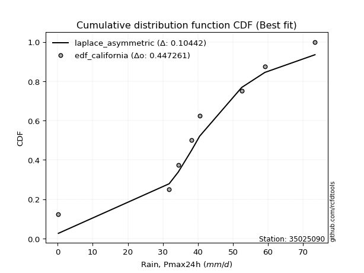</img>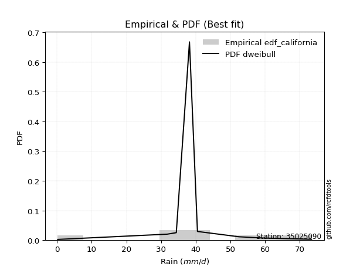</img>

</div>


### 2. EDF Hazen (1930)

Hazen method for plotting positions is a formula used to estimate the empirical cumulative probability distribution of flood events or other hydrological data. This formula often results in biased estimations, particularly when extrapolating to extreme events (high return periods).

<div align="center">


$P=(m-0.5)/n$


</div>


**2.1. Empirical values**

<div align="center">

|                | 0                  | 1                  | 2                  | 3                  | 4                  | 5         | 6                 | 7         |
|:---------------|:-------------------|:-------------------|:-------------------|:-------------------|:-------------------|:----------|:------------------|:----------|
| date           | 2016               | 2020               | 2023               | 2022               | 2018               | 2017      | 2019              | 2021      |
| x              | 0.2                | 31.8               | 34.4               | 38.2               | 40.5               | 52.5      | 59.1              | 73.4      |
| m              | 1                  | 2                  | 3                  | 4                  | 5                  | 6         | 7                 | 8         |
| empirical_dist | edf_hazen          | edf_hazen          | edf_hazen          | edf_hazen          | edf_hazen          | edf_hazen | edf_hazen         | edf_hazen |
| empirical      | 0.0625             | 0.1875             | 0.3125             | 0.4375             | 0.5625             | 0.6875    | 0.8125            | 0.9375    |
| empirical_tr   | 1.0666666666666667 | 1.2307692307692308 | 1.4545454545454546 | 1.7777777777777777 | 2.2857142857142856 | 3.2       | 5.333333333333333 | 16.0      |

</div>


**2.2. Kolmogorov-Smirnov fit test (sorted by Δ)**


<div align="center">

|                | 0                   | 1                   | 2                   | 3                   | 4                  | 5                   | 6                   | 7                   | 8                   | 9                   | 10                  | 11                  | 12                  | 13                 | 14                 | 15                  | 16                  | 17                  | 18                  | 19                  | 20                  | 21                  | 22                 | 23                  | 24                  | 25                 | 26                  | 27                  | 28                  | 29                 | 30                  | 31                  | 32                  | 33                  | 34                  | 35                  | 36                 | 37                 | 38                  | 39                  | 40                  | 41                  | 42                  | 43                  | 44                 | 45                  | 46                  | 47                  | 48                  | 49                  | 50                  | 51                 | 52                  | 53                  | 54                  | 55                  | 56                  | 57                  | 58                  | 59                  | 60                 | 61                  | 62                 | 63                 | 64                  | 65                 | 66                  | 67                 | 68                 | 69                 | 70                  | 71                  | 72                 | 73                 | 74                  | 75                  | 76                 | 77                  | 78                 | 79                 | 80                  | 81                  | 82                  | 83                 | 84                  | 85                 | 86                 | 87                  | 88                  | 89                 | 90                 | 91                  | 92                 | 93                 | 94                 | 95                 | 96                  | 97                  | 98                  | 99                 | 100                 | 101                 | 102                 | 103                | 104                | 105                | 106                 | 107                 | 108                | 109                 | 110                | 111                | 112                 | 113                | 114                 | 115                | 116                | 117                | 118                | 119                | 120                | 121                | 122                | 123                | 124                | 125                | 126                | 127                | 128                 | 129                | 130                | 131                | 132                | 133                | 134                | 135                | 136                | 137                | 138                | 139                | 140                | 141                | 142                | 143                | 144                | 145                | 146                | 147                | 148                | 149                | 150                | 151                | 152                | 153                | 154                | 155                | 156                | 157                | 158                | 159                |
|:---------------|:--------------------|:--------------------|:--------------------|:--------------------|:-------------------|:--------------------|:--------------------|:--------------------|:--------------------|:--------------------|:--------------------|:--------------------|:--------------------|:-------------------|:-------------------|:--------------------|:--------------------|:--------------------|:--------------------|:--------------------|:--------------------|:--------------------|:-------------------|:--------------------|:--------------------|:-------------------|:--------------------|:--------------------|:--------------------|:-------------------|:--------------------|:--------------------|:--------------------|:--------------------|:--------------------|:--------------------|:-------------------|:-------------------|:--------------------|:--------------------|:--------------------|:--------------------|:--------------------|:--------------------|:-------------------|:--------------------|:--------------------|:--------------------|:--------------------|:--------------------|:--------------------|:-------------------|:--------------------|:--------------------|:--------------------|:--------------------|:--------------------|:--------------------|:--------------------|:--------------------|:-------------------|:--------------------|:-------------------|:-------------------|:--------------------|:-------------------|:--------------------|:-------------------|:-------------------|:-------------------|:--------------------|:--------------------|:-------------------|:-------------------|:--------------------|:--------------------|:-------------------|:--------------------|:-------------------|:-------------------|:--------------------|:--------------------|:--------------------|:-------------------|:--------------------|:-------------------|:-------------------|:--------------------|:--------------------|:-------------------|:-------------------|:--------------------|:-------------------|:-------------------|:-------------------|:-------------------|:--------------------|:--------------------|:--------------------|:-------------------|:--------------------|:--------------------|:--------------------|:-------------------|:-------------------|:-------------------|:--------------------|:--------------------|:-------------------|:--------------------|:-------------------|:-------------------|:--------------------|:-------------------|:--------------------|:-------------------|:-------------------|:-------------------|:-------------------|:-------------------|:-------------------|:-------------------|:-------------------|:-------------------|:-------------------|:-------------------|:-------------------|:-------------------|:--------------------|:-------------------|:-------------------|:-------------------|:-------------------|:-------------------|:-------------------|:-------------------|:-------------------|:-------------------|:-------------------|:-------------------|:-------------------|:-------------------|:-------------------|:-------------------|:-------------------|:-------------------|:-------------------|:-------------------|:-------------------|:-------------------|:-------------------|:-------------------|:-------------------|:-------------------|:-------------------|:-------------------|:-------------------|:-------------------|:-------------------|:-------------------|
| station        | 35025090            | 35025090            | 35025090            | 35025090            | 35025090           | 35025090            | 35025090            | 35025090            | 35025090            | 35025090            | 35025090            | 35025090            | 35025090            | 35025090           | 35025090           | 35025090            | 35025090            | 35025090            | 35025090            | 35025090            | 35025090            | 35025090            | 35025090           | 35025090            | 35025090            | 35025090           | 35025090            | 35025090            | 35025090            | 35025090           | 35025090            | 35025090            | 35025090            | 35025090            | 35025090            | 35025090            | 35025090           | 35025090           | 35025090            | 35025090            | 35025090            | 35025090            | 35025090            | 35025090            | 35025090           | 35025090            | 35025090            | 35025090            | 35025090            | 35025090            | 35025090            | 35025090           | 35025090            | 35025090            | 35025090            | 35025090            | 35025090            | 35025090            | 35025090            | 35025090            | 35025090           | 35025090            | 35025090           | 35025090           | 35025090            | 35025090           | 35025090            | 35025090           | 35025090           | 35025090           | 35025090            | 35025090            | 35025090           | 35025090           | 35025090            | 35025090            | 35025090           | 35025090            | 35025090           | 35025090           | 35025090            | 35025090            | 35025090            | 35025090           | 35025090            | 35025090           | 35025090           | 35025090            | 35025090            | 35025090           | 35025090           | 35025090            | 35025090           | 35025090           | 35025090           | 35025090           | 35025090            | 35025090            | 35025090            | 35025090           | 35025090            | 35025090            | 35025090            | 35025090           | 35025090           | 35025090           | 35025090            | 35025090            | 35025090           | 35025090            | 35025090           | 35025090           | 35025090            | 35025090           | 35025090            | 35025090           | 35025090           | 35025090           | 35025090           | 35025090           | 35025090           | 35025090           | 35025090           | 35025090           | 35025090           | 35025090           | 35025090           | 35025090           | 35025090            | 35025090           | 35025090           | 35025090           | 35025090           | 35025090           | 35025090           | 35025090           | 35025090           | 35025090           | 35025090           | 35025090           | 35025090           | 35025090           | 35025090           | 35025090           | 35025090           | 35025090           | 35025090           | 35025090           | 35025090           | 35025090           | 35025090           | 35025090           | 35025090           | 35025090           | 35025090           | 35025090           | 35025090           | 35025090           | 35025090           | 35025090           |
| empirical_dist | edf_hazen           | edf_hazen           | edf_hazen           | edf_hazen           | edf_hazen          | edf_hazen           | edf_hazen           | edf_hazen           | edf_hazen           | edf_hazen           | edf_hazen           | edf_hazen           | edf_hazen           | edf_hazen          | edf_hazen          | edf_hazen           | edf_hazen           | edf_hazen           | edf_hazen           | edf_hazen           | edf_hazen           | edf_hazen           | edf_hazen          | edf_hazen           | edf_hazen           | edf_hazen          | edf_hazen           | edf_hazen           | edf_hazen           | edf_hazen          | edf_hazen           | edf_hazen           | edf_hazen           | edf_hazen           | edf_hazen           | edf_hazen           | edf_hazen          | edf_hazen          | edf_hazen           | edf_hazen           | edf_hazen           | edf_hazen           | edf_hazen           | edf_hazen           | edf_hazen          | edf_hazen           | edf_hazen           | edf_hazen           | edf_hazen           | edf_hazen           | edf_hazen           | edf_hazen          | edf_hazen           | edf_hazen           | edf_hazen           | edf_hazen           | edf_hazen           | edf_hazen           | edf_hazen           | edf_hazen           | edf_hazen          | edf_hazen           | edf_hazen          | edf_hazen          | edf_hazen           | edf_hazen          | edf_hazen           | edf_hazen          | edf_hazen          | edf_hazen          | edf_hazen           | edf_hazen           | edf_hazen          | edf_hazen          | edf_hazen           | edf_hazen           | edf_hazen          | edf_hazen           | edf_hazen          | edf_hazen          | edf_hazen           | edf_hazen           | edf_hazen           | edf_hazen          | edf_hazen           | edf_hazen          | edf_hazen          | edf_hazen           | edf_hazen           | edf_hazen          | edf_hazen          | edf_hazen           | edf_hazen          | edf_hazen          | edf_hazen          | edf_hazen          | edf_hazen           | edf_hazen           | edf_hazen           | edf_hazen          | edf_hazen           | edf_hazen           | edf_hazen           | edf_hazen          | edf_hazen          | edf_hazen          | edf_hazen           | edf_hazen           | edf_hazen          | edf_hazen           | edf_hazen          | edf_hazen          | edf_hazen           | edf_hazen          | edf_hazen           | edf_hazen          | edf_hazen          | edf_hazen          | edf_hazen          | edf_hazen          | edf_hazen          | edf_hazen          | edf_hazen          | edf_hazen          | edf_hazen          | edf_hazen          | edf_hazen          | edf_hazen          | edf_hazen           | edf_hazen          | edf_hazen          | edf_hazen          | edf_hazen          | edf_hazen          | edf_hazen          | edf_hazen          | edf_hazen          | edf_hazen          | edf_hazen          | edf_hazen          | edf_hazen          | edf_hazen          | edf_hazen          | edf_hazen          | edf_hazen          | edf_hazen          | edf_hazen          | edf_hazen          | edf_hazen          | edf_hazen          | edf_hazen          | edf_hazen          | edf_hazen          | edf_hazen          | edf_hazen          | edf_hazen          | edf_hazen          | edf_hazen          | edf_hazen          | edf_hazen          |
| p_dist         | logt                | laplace             | dgamma              | hypsecant           | genlogistic        | burr12              | weibull_min         | skewnorm            | pearson3            | logistic            | johnsonsu           | genextreme          | foldnorm            | loggennorm         | dweibull           | t                   | norm                | crystalball         | nct                 | exponnorm           | f                   | argus               | fatiguelife        | gengamma            | erlang              | betaprime          | rice                | gamma               | gumbel_l            | gennorm            | truncnorm           | anglit              | genhalflogistic     | maxwell             | genpareto           | triang              | invgamma           | semicircular       | alpha               | logjohnsonsu        | invgauss            | gumbel_r            | vonmises_line       | rayleigh            | cosine             | moyal               | gausshyper          | arcsine             | wald                | halfnorm            | logdweibull         | halflogistic       | truncweibull_min    | logdgamma           | kstwobign           | loglevy_l           | logpearson3         | kappa3              | uniform             | wrapcauchy          | logargus           | ksone               | ncf                | gompertz           | trapezoid           | kappa4             | burr                | levy_l             | loggenextreme      | logloggamma        | beta                | bradford            | loggumbel_l        | logburr12          | truncexpon          | logtrapezoid        | logarcsine         | genexpon            | lomax              | logsemicircular    | logfoldnorm         | loganglit           | loggengamma         | loginvweibull      | logweibull_max      | logexponnorm       | lognorm            | logcrystalball      | lognakagami         | lognct             | logfatiguelife     | logalpha            | loglogistic        | loginvgamma        | loginvgauss        | loghypsecant       | logerlang           | logmaxwell          | logkstwobign        | lograyleigh        | loglaplace          | loglaplace          | logwrapcauchy       | johnsonsb          | logncf             | halfgennorm        | nakagami            | loghalfnorm         | logrice            | loggenexpon         | loggumbel_r        | logcosine          | loglomax            | loghalflogistic    | logmoyal            | invweibull         | logskewnorm        | loggenhalflogistic | loggausshyper      | logwald            | logf               | loggenpareto       | mielke             | logtriang          | exponweib          | rdist              | logvonmises_line   | logksone           | logtruncweibull_min | logburr            | logbeta            | logexponweib       | logkappa4          | logloglaplace      | weibull_max        | logkappa3          | loguniform         | logweibull_min     | powerlaw           | logtruncnorm       | logjohnsonsb       | logtruncexpon      | logmielke          | logbradford        | tukeylambda        | logbetaprime       | exponpow           | truncpareto        | loggamma           | loggamma           | logexponpow        | logpowerlaw        | logtruncpareto     | loggompertz        | loggenlogistic     | loghalfgennorm     | logtukeylambda     | logvonmises        | logrdist           | vonmises           |
| delta          | 0.07241763217731212 | 0.08831636325826508 | 0.09603778995263346 | 0.09820538608670132 | 0.1080724965750594 | 0.11134773448531299 | 0.11134926324281452 | 0.11160015623436309 | 0.11261862786101329 | 0.11324050014588727 | 0.11401031133959044 | 0.12000079416377041 | 0.12081734805490962 | 0.1250093290072647 | 0.1301234757210642 | 0.13339492543162357 | 0.13339516822656095 | 0.13339517409688362 | 0.13339527612779967 | 0.13339790310323058 | 0.13432150200929938 | 0.13691179839319978 | 0.1371752640086929 | 0.14043670761747645 | 0.14098472889881547 | 0.1410313935568745 | 0.14295605620476032 | 0.14538029322419876 | 0.14810818675826054 | 0.1530330510750869 | 0.15332765341729998 | 0.15614724008107744 | 0.16039981474221537 | 0.16321898669906476 | 0.16474650565982352 | 0.16479357323604943 | 0.1648042936225781 | 0.1657692200193963 | 0.16940176175821559 | 0.17095425446618462 | 0.17222199874799982 | 0.17323465893355483 | 0.17327305924084557 | 0.17478932574054257 | 0.1753848951703767 | 0.18689451198910034 | 0.19462239765869166 | 0.20580718604201564 | 0.20726428312110495 | 0.20766428524915376 | 0.21023606463270994 | 0.2103494003462309 | 0.21260602778229226 | 0.21715423921989147 | 0.23412253410369027 | 0.24176882831426316 | 0.24182667564411064 | 0.24404303009595135 | 0.24419398907103823 | 0.24420835911108213 | 0.2494779227212679 | 0.25557832422586524 | 0.2560775215064194 | 0.2600946484968147 | 0.26419301860312333 | 0.273891480405808  | 0.28018503669611894 | 0.2863698696028558 | 0.2952888958570793 | 0.2996956537413564 | 0.29979193308513913 | 0.31185479718754544 | 0.31943712757681   | 0.3248262785989584 | 0.32548939610117966 | 0.33380348501856805 | 0.3530893883249412 | 0.35606771990606456 | 0.3691754577034634 | 0.3696695123127335 | 0.37249537024260826 | 0.37382248747142655 | 0.37693751761172223 | 0.3812508159500735 | 0.38129706773384353 | 0.3838590725473311 | 0.3838624412076377 | 0.38386302737362166 | 0.38386963590971357 | 0.3840141179691521 | 0.3867470739113459 | 0.38842121072883584 | 0.3933346754033582 | 0.3943953649689327 | 0.3963504201367868 | 0.4012492335150105 | 0.40340745004979084 | 0.41273838553057274 | 0.42092766337312404 | 0.4218746152905648 | 0.42478504609947987 | 0.42478504609947987 | 0.43090761126005317 | 0.4365544218829719 | 0.4389105627273362 | 0.439041392536866  | 0.44613315841210055 | 0.44772212545892465 | 0.4485107327732223 | 0.44936632286076184 | 0.4528088447450419 | 0.4666871824034474 | 0.46903511472627835 | 0.4756015285805073 | 0.47685998407045804 | 0.4936337563952196 | 0.5101318050669978 | 0.5129587846247078 | 0.5271994491848886 | 0.5436451137355967 | 0.5481419351198231 | 0.5506572565084202 | 0.552229426247244  | 0.576315584531372  | 0.585378056646628  | 0.6006306281902678 | 0.6048733919905364 | 0.6111302014795394 | 0.6190245224179547  | 0.6285692454297971 | 0.6285919778020126 | 0.6347282848164145 | 0.6493128745595299 | 0.6528435219113125 | 0.6611736643842938 | 0.6708243259399054 | 0.6708562417754473 | 0.6718363967561415 | 0.6760901765170806 | 0.677770583367833  | 0.6835493440757052 | 0.6999825240178733 | 0.7052394138722439 | 0.7087034546981156 | 0.7114820732348122 | 0.737093908276479  | 0.75319529098918   | 0.758376708602215  | 0.7690988175452925 | 0.7690988175452925 | 0.7719280374708976 | 0.7812039642879547 | 0.7938088169884728 | 0.8110277777650834 | 0.8125             | 0.8125             | 0.8125             | 0.9339175712973364 | 0.9373509091324157 | 10.982696795763227 |
| deltao         | 0.4472608134160001  | 0.4472608134160001  | 0.4472608134160001  | 0.4472608134160001  | 0.4472608134160001 | 0.4472608134160001  | 0.4472608134160001  | 0.4472608134160001  | 0.4472608134160001  | 0.4472608134160001  | 0.4472608134160001  | 0.4472608134160001  | 0.4472608134160001  | 0.4472608134160001 | 0.4472608134160001 | 0.4472608134160001  | 0.4472608134160001  | 0.4472608134160001  | 0.4472608134160001  | 0.4472608134160001  | 0.4472608134160001  | 0.4472608134160001  | 0.4472608134160001 | 0.4472608134160001  | 0.4472608134160001  | 0.4472608134160001 | 0.4472608134160001  | 0.4472608134160001  | 0.4472608134160001  | 0.4472608134160001 | 0.4472608134160001  | 0.4472608134160001  | 0.4472608134160001  | 0.4472608134160001  | 0.4472608134160001  | 0.4472608134160001  | 0.4472608134160001 | 0.4472608134160001 | 0.4472608134160001  | 0.4472608134160001  | 0.4472608134160001  | 0.4472608134160001  | 0.4472608134160001  | 0.4472608134160001  | 0.4472608134160001 | 0.4472608134160001  | 0.4472608134160001  | 0.4472608134160001  | 0.4472608134160001  | 0.4472608134160001  | 0.4472608134160001  | 0.4472608134160001 | 0.4472608134160001  | 0.4472608134160001  | 0.4472608134160001  | 0.4472608134160001  | 0.4472608134160001  | 0.4472608134160001  | 0.4472608134160001  | 0.4472608134160001  | 0.4472608134160001 | 0.4472608134160001  | 0.4472608134160001 | 0.4472608134160001 | 0.4472608134160001  | 0.4472608134160001 | 0.4472608134160001  | 0.4472608134160001 | 0.4472608134160001 | 0.4472608134160001 | 0.4472608134160001  | 0.4472608134160001  | 0.4472608134160001 | 0.4472608134160001 | 0.4472608134160001  | 0.4472608134160001  | 0.4472608134160001 | 0.4472608134160001  | 0.4472608134160001 | 0.4472608134160001 | 0.4472608134160001  | 0.4472608134160001  | 0.4472608134160001  | 0.4472608134160001 | 0.4472608134160001  | 0.4472608134160001 | 0.4472608134160001 | 0.4472608134160001  | 0.4472608134160001  | 0.4472608134160001 | 0.4472608134160001 | 0.4472608134160001  | 0.4472608134160001 | 0.4472608134160001 | 0.4472608134160001 | 0.4472608134160001 | 0.4472608134160001  | 0.4472608134160001  | 0.4472608134160001  | 0.4472608134160001 | 0.4472608134160001  | 0.4472608134160001  | 0.4472608134160001  | 0.4472608134160001 | 0.4472608134160001 | 0.4472608134160001 | 0.4472608134160001  | 0.4472608134160001  | 0.4472608134160001 | 0.4472608134160001  | 0.4472608134160001 | 0.4472608134160001 | 0.4472608134160001  | 0.4472608134160001 | 0.4472608134160001  | 0.4472608134160001 | 0.4472608134160001 | 0.4472608134160001 | 0.4472608134160001 | 0.4472608134160001 | 0.4472608134160001 | 0.4472608134160001 | 0.4472608134160001 | 0.4472608134160001 | 0.4472608134160001 | 0.4472608134160001 | 0.4472608134160001 | 0.4472608134160001 | 0.4472608134160001  | 0.4472608134160001 | 0.4472608134160001 | 0.4472608134160001 | 0.4472608134160001 | 0.4472608134160001 | 0.4472608134160001 | 0.4472608134160001 | 0.4472608134160001 | 0.4472608134160001 | 0.4472608134160001 | 0.4472608134160001 | 0.4472608134160001 | 0.4472608134160001 | 0.4472608134160001 | 0.4472608134160001 | 0.4472608134160001 | 0.4472608134160001 | 0.4472608134160001 | 0.4472608134160001 | 0.4472608134160001 | 0.4472608134160001 | 0.4472608134160001 | 0.4472608134160001 | 0.4472608134160001 | 0.4472608134160001 | 0.4472608134160001 | 0.4472608134160001 | 0.4472608134160001 | 0.4472608134160001 | 0.4472608134160001 | 0.4472608134160001 |
| eval           | Δo > Δ              | Δo > Δ              | Δo > Δ              | Δo > Δ              | Δo > Δ             | Δo > Δ              | Δo > Δ              | Δo > Δ              | Δo > Δ              | Δo > Δ              | Δo > Δ              | Δo > Δ              | Δo > Δ              | Δo > Δ             | Δo > Δ             | Δo > Δ              | Δo > Δ              | Δo > Δ              | Δo > Δ              | Δo > Δ              | Δo > Δ              | Δo > Δ              | Δo > Δ             | Δo > Δ              | Δo > Δ              | Δo > Δ             | Δo > Δ              | Δo > Δ              | Δo > Δ              | Δo > Δ             | Δo > Δ              | Δo > Δ              | Δo > Δ              | Δo > Δ              | Δo > Δ              | Δo > Δ              | Δo > Δ             | Δo > Δ             | Δo > Δ              | Δo > Δ              | Δo > Δ              | Δo > Δ              | Δo > Δ              | Δo > Δ              | Δo > Δ             | Δo > Δ              | Δo > Δ              | Δo > Δ              | Δo > Δ              | Δo > Δ              | Δo > Δ              | Δo > Δ             | Δo > Δ              | Δo > Δ              | Δo > Δ              | Δo > Δ              | Δo > Δ              | Δo > Δ              | Δo > Δ              | Δo > Δ              | Δo > Δ             | Δo > Δ              | Δo > Δ             | Δo > Δ             | Δo > Δ              | Δo > Δ             | Δo > Δ              | Δo > Δ             | Δo > Δ             | Δo > Δ             | Δo > Δ              | Δo > Δ              | Δo > Δ             | Δo > Δ             | Δo > Δ              | Δo > Δ              | Δo > Δ             | Δo > Δ              | Δo > Δ             | Δo > Δ             | Δo > Δ              | Δo > Δ              | Δo > Δ              | Δo > Δ             | Δo > Δ              | Δo > Δ             | Δo > Δ             | Δo > Δ              | Δo > Δ              | Δo > Δ             | Δo > Δ             | Δo > Δ              | Δo > Δ             | Δo > Δ             | Δo > Δ             | Δo > Δ             | Δo > Δ              | Δo > Δ              | Δo > Δ              | Δo > Δ             | Δo > Δ              | Δo > Δ              | Δo > Δ              | Δo > Δ             | Δo > Δ             | Δo > Δ             | Δo > Δ              | Δo <= Δ             | Δo <= Δ            | Δo <= Δ             | Δo <= Δ            | Δo <= Δ            | Δo <= Δ             | Δo <= Δ            | Δo <= Δ             | Δo <= Δ            | Δo <= Δ            | Δo <= Δ            | Δo <= Δ            | Δo <= Δ            | Δo <= Δ            | Δo <= Δ            | Δo <= Δ            | Δo <= Δ            | Δo <= Δ            | Δo <= Δ            | Δo <= Δ            | Δo <= Δ            | Δo <= Δ             | Δo <= Δ            | Δo <= Δ            | Δo <= Δ            | Δo <= Δ            | Δo <= Δ            | Δo <= Δ            | Δo <= Δ            | Δo <= Δ            | Δo <= Δ            | Δo <= Δ            | Δo <= Δ            | Δo <= Δ            | Δo <= Δ            | Δo <= Δ            | Δo <= Δ            | Δo <= Δ            | Δo <= Δ            | Δo <= Δ            | Δo <= Δ            | Δo <= Δ            | Δo <= Δ            | Δo <= Δ            | Δo <= Δ            | Δo <= Δ            | Δo <= Δ            | Δo <= Δ            | Δo <= Δ            | Δo <= Δ            | Δo <= Δ            | Δo <= Δ            | Δo <= Δ            |
| fit            | 1                   | 1                   | 1                   | 1                   | 1                  | 1                   | 1                   | 1                   | 1                   | 1                   | 1                   | 1                   | 1                   | 1                  | 1                  | 1                   | 1                   | 1                   | 1                   | 1                   | 1                   | 1                   | 1                  | 1                   | 1                   | 1                  | 1                   | 1                   | 1                   | 1                  | 1                   | 1                   | 1                   | 1                   | 1                   | 1                   | 1                  | 1                  | 1                   | 1                   | 1                   | 1                   | 1                   | 1                   | 1                  | 1                   | 1                   | 1                   | 1                   | 1                   | 1                   | 1                  | 1                   | 1                   | 1                   | 1                   | 1                   | 1                   | 1                   | 1                   | 1                  | 1                   | 1                  | 1                  | 1                   | 1                  | 1                   | 1                  | 1                  | 1                  | 1                   | 1                   | 1                  | 1                  | 1                   | 1                   | 1                  | 1                   | 1                  | 1                  | 1                   | 1                   | 1                   | 1                  | 1                   | 1                  | 1                  | 1                   | 1                   | 1                  | 1                  | 1                   | 1                  | 1                  | 1                  | 1                  | 1                   | 1                   | 1                   | 1                  | 1                   | 1                   | 1                   | 1                  | 1                  | 1                  | 1                   | 0                   | 0                  | 0                   | 0                  | 0                  | 0                   | 0                  | 0                   | 0                  | 0                  | 0                  | 0                  | 0                  | 0                  | 0                  | 0                  | 0                  | 0                  | 0                  | 0                  | 0                  | 0                   | 0                  | 0                  | 0                  | 0                  | 0                  | 0                  | 0                  | 0                  | 0                  | 0                  | 0                  | 0                  | 0                  | 0                  | 0                  | 0                  | 0                  | 0                  | 0                  | 0                  | 0                  | 0                  | 0                  | 0                  | 0                  | 0                  | 0                  | 0                  | 0                  | 0                  | 0                  |
| n              | 8                   | 8                   | 8                   | 8                   | 8                  | 8                   | 8                   | 8                   | 8                   | 8                   | 8                   | 8                   | 8                   | 8                  | 8                  | 8                   | 8                   | 8                   | 8                   | 8                   | 8                   | 8                   | 8                  | 8                   | 8                   | 8                  | 8                   | 8                   | 8                   | 8                  | 8                   | 8                   | 8                   | 8                   | 8                   | 8                   | 8                  | 8                  | 8                   | 8                   | 8                   | 8                   | 8                   | 8                   | 8                  | 8                   | 8                   | 8                   | 8                   | 8                   | 8                   | 8                  | 8                   | 8                   | 8                   | 8                   | 8                   | 8                   | 8                   | 8                   | 8                  | 8                   | 8                  | 8                  | 8                   | 8                  | 8                   | 8                  | 8                  | 8                  | 8                   | 8                   | 8                  | 8                  | 8                   | 8                   | 8                  | 8                   | 8                  | 8                  | 8                   | 8                   | 8                   | 8                  | 8                   | 8                  | 8                  | 8                   | 8                   | 8                  | 8                  | 8                   | 8                  | 8                  | 8                  | 8                  | 8                   | 8                   | 8                   | 8                  | 8                   | 8                   | 8                   | 8                  | 8                  | 8                  | 8                   | 8                   | 8                  | 8                   | 8                  | 8                  | 8                   | 8                  | 8                   | 8                  | 8                  | 8                  | 8                  | 8                  | 8                  | 8                  | 8                  | 8                  | 8                  | 8                  | 8                  | 8                  | 8                   | 8                  | 8                  | 8                  | 8                  | 8                  | 8                  | 8                  | 8                  | 8                  | 8                  | 8                  | 8                  | 8                  | 8                  | 8                  | 8                  | 8                  | 8                  | 8                  | 8                  | 8                  | 8                  | 8                  | 8                  | 8                  | 8                  | 8                  | 8                  | 8                  | 8                  | 8                  |
| best_fit       | 1                   | 0                   | 0                   | 0                   | 0                  | 0                   | 0                   | 0                   | 0                   | 0                   | 0                   | 0                   | 0                   | 0                  | 0                  | 0                   | 0                   | 0                   | 0                   | 0                   | 0                   | 0                   | 0                  | 0                   | 0                   | 0                  | 0                   | 0                   | 0                   | 0                  | 0                   | 0                   | 0                   | 0                   | 0                   | 0                   | 0                  | 0                  | 0                   | 0                   | 0                   | 0                   | 0                   | 0                   | 0                  | 0                   | 0                   | 0                   | 0                   | 0                   | 0                   | 0                  | 0                   | 0                   | 0                   | 0                   | 0                   | 0                   | 0                   | 0                   | 0                  | 0                   | 0                  | 0                  | 0                   | 0                  | 0                   | 0                  | 0                  | 0                  | 0                   | 0                   | 0                  | 0                  | 0                   | 0                   | 0                  | 0                   | 0                  | 0                  | 0                   | 0                   | 0                   | 0                  | 0                   | 0                  | 0                  | 0                   | 0                   | 0                  | 0                  | 0                   | 0                  | 0                  | 0                  | 0                  | 0                   | 0                   | 0                   | 0                  | 0                   | 0                   | 0                   | 0                  | 0                  | 0                  | 0                   | 0                   | 0                  | 0                   | 0                  | 0                  | 0                   | 0                  | 0                   | 0                  | 0                  | 0                  | 0                  | 0                  | 0                  | 0                  | 0                  | 0                  | 0                  | 0                  | 0                  | 0                  | 0                   | 0                  | 0                  | 0                  | 0                  | 0                  | 0                  | 0                  | 0                  | 0                  | 0                  | 0                  | 0                  | 0                  | 0                  | 0                  | 0                  | 0                  | 0                  | 0                  | 0                  | 0                  | 0                  | 0                  | 0                  | 0                  | 0                  | 0                  | 0                  | 0                  | 0                  | 0                  |
| best_fit_sort  | 1                   | 2                   | 3                   | 4                   | 5                  | 6                   | 7                   | 8                   | 9                   | 10                  | 11                  | 12                  | 13                  | 14                 | 15                 | 16                  | 17                  | 18                  | 19                  | 20                  | 21                  | 22                  | 23                 | 24                  | 25                  | 26                 | 27                  | 28                  | 29                  | 30                 | 31                  | 32                  | 33                  | 34                  | 35                  | 36                  | 37                 | 38                 | 39                  | 40                  | 41                  | 42                  | 43                  | 44                  | 45                 | 46                  | 47                  | 48                  | 49                  | 50                  | 51                  | 52                 | 53                  | 54                  | 55                  | 56                  | 57                  | 58                  | 59                  | 60                  | 61                 | 62                  | 63                 | 64                 | 65                  | 66                 | 67                  | 68                 | 69                 | 70                 | 71                  | 72                  | 73                 | 74                 | 75                  | 76                  | 77                 | 78                  | 79                 | 80                 | 81                  | 82                  | 83                  | 84                 | 85                  | 86                 | 87                 | 88                  | 89                  | 90                 | 91                 | 92                  | 93                 | 94                 | 95                 | 96                 | 97                  | 98                  | 99                  | 100                | 101                 | 102                 | 103                 | 104                | 105                | 106                | 107                 | 108                 | 109                | 110                 | 111                | 112                | 113                 | 114                | 115                 | 116                | 117                | 118                | 119                | 120                | 121                | 122                | 123                | 124                | 125                | 126                | 127                | 128                | 129                 | 130                | 131                | 132                | 133                | 134                | 135                | 136                | 137                | 138                | 139                | 140                | 141                | 142                | 143                | 144                | 145                | 146                | 147                | 148                | 149                | 150                | 151                | 152                | 153                | 154                | 155                | 156                | 157                | 158                | 159                | 160                |

</div>


**2.3. Best fit**

<div align="center">

|   id |   station | empirical_dist   | p_dist   |     delta |   deltao | eval   |   fit |   n |   best_fit |   best_fit_sort |
|-----:|----------:|:-----------------|:---------|----------:|---------:|:-------|------:|----:|-----------:|----------------:|
|    0 |  35025090 | edf_hazen        | logt     | 0.0724176 | 0.447261 | Δo > Δ |     1 |   8 |          1 |               1 |

</div>


<div align="center">

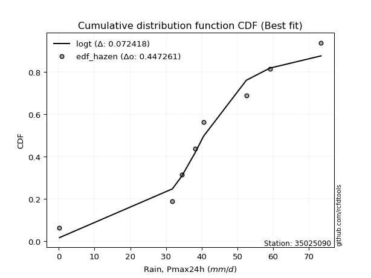</img></img>

</div>


### 3. EDF Weibull (1939)

Weibull plotting position formula is an empirical method used to estimate the non-exceedance probability or plotting position for a set of observed data, is often recommended or widely used in practice, particularly in flood frequency analysis.

<div align="center">


$P=m/(n+1)$


</div>


**3.1. Empirical values**

<div align="center">

|                | 0                  | 1                  | 2                  | 3                  | 4                  | 5                  | 6                  | 7                  |
|:---------------|:-------------------|:-------------------|:-------------------|:-------------------|:-------------------|:-------------------|:-------------------|:-------------------|
| date           | 2016               | 2020               | 2023               | 2022               | 2018               | 2017               | 2019               | 2021               |
| x              | 0.2                | 31.8               | 34.4               | 38.2               | 40.5               | 52.5               | 59.1               | 73.4               |
| m              | 1                  | 2                  | 3                  | 4                  | 5                  | 6                  | 7                  | 8                  |
| empirical_dist | edf_weibull        | edf_weibull        | edf_weibull        | edf_weibull        | edf_weibull        | edf_weibull        | edf_weibull        | edf_weibull        |
| empirical      | 0.1111111111111111 | 0.2222222222222222 | 0.3333333333333333 | 0.4444444444444444 | 0.5555555555555556 | 0.6666666666666666 | 0.7777777777777778 | 0.8888888888888888 |
| empirical_tr   | 1.125              | 1.2857142857142856 | 1.4999999999999998 | 1.7999999999999998 | 2.25               | 2.9999999999999996 | 4.5                | 8.999999999999996  |

</div>


**3.2. Kolmogorov-Smirnov fit test (sorted by Δ)**


<div align="center">

|                | 0                  | 1                   | 2                   | 3                  | 4                   | 5                   | 6                   | 7                   | 8                   | 9                   | 10                  | 11                  | 12                  | 13                  | 14                  | 15                  | 16                  | 17                  | 18                  | 19                  | 20                  | 21                  | 22                  | 23                  | 24                  | 25                  | 26                  | 27                  | 28                  | 29                  | 30                 | 31                  | 32                 | 33                  | 34                 | 35                 | 36                  | 37                 | 38                  | 39                 | 40                  | 41                  | 42                  | 43                 | 44                  | 45                  | 46                  | 47                  | 48                  | 49                  | 50                 | 51                  | 52                  | 53                  | 54                  | 55                  | 56                  | 57                  | 58                  | 59                  | 60                 | 61                  | 62                  | 63                  | 64                 | 65                  | 66                  | 67                 | 68                 | 69                 | 70                 | 71                  | 72                  | 73                 | 74                  | 75                  | 76                 | 77                  | 78                 | 79                 | 80                  | 81                  | 82                 | 83                 | 84                 | 85                 | 86                 | 87                  | 88                  | 89                  | 90                 | 91                  | 92                 | 93                 | 94                 | 95                 | 96                  | 97                  | 98                  | 99                 | 100                 | 101                 | 102                 | 103                | 104                | 105                | 106                 | 107                 | 108                | 109                | 110                | 111                | 112                 | 113                | 114                 | 115                 | 116                 | 117                | 118                | 119                | 120                | 121                | 122                | 123                | 124                | 125                | 126                | 127                | 128                 | 129                | 130                | 131                | 132                | 133                | 134                | 135                | 136                | 137                | 138                | 139                | 140                | 141                | 142                | 143                | 144                | 145                | 146                | 147                | 148                | 149                | 150                | 151                | 152                | 153                | 154                | 155                | 156                | 157                | 158                | 159                |
|:---------------|:-------------------|:--------------------|:--------------------|:-------------------|:--------------------|:--------------------|:--------------------|:--------------------|:--------------------|:--------------------|:--------------------|:--------------------|:--------------------|:--------------------|:--------------------|:--------------------|:--------------------|:--------------------|:--------------------|:--------------------|:--------------------|:--------------------|:--------------------|:--------------------|:--------------------|:--------------------|:--------------------|:--------------------|:--------------------|:--------------------|:-------------------|:--------------------|:-------------------|:--------------------|:-------------------|:-------------------|:--------------------|:-------------------|:--------------------|:-------------------|:--------------------|:--------------------|:--------------------|:-------------------|:--------------------|:--------------------|:--------------------|:--------------------|:--------------------|:--------------------|:-------------------|:--------------------|:--------------------|:--------------------|:--------------------|:--------------------|:--------------------|:--------------------|:--------------------|:--------------------|:-------------------|:--------------------|:--------------------|:--------------------|:-------------------|:--------------------|:--------------------|:-------------------|:-------------------|:-------------------|:-------------------|:--------------------|:--------------------|:-------------------|:--------------------|:--------------------|:-------------------|:--------------------|:-------------------|:-------------------|:--------------------|:--------------------|:-------------------|:-------------------|:-------------------|:-------------------|:-------------------|:--------------------|:--------------------|:--------------------|:-------------------|:--------------------|:-------------------|:-------------------|:-------------------|:-------------------|:--------------------|:--------------------|:--------------------|:-------------------|:--------------------|:--------------------|:--------------------|:-------------------|:-------------------|:-------------------|:--------------------|:--------------------|:-------------------|:-------------------|:-------------------|:-------------------|:--------------------|:-------------------|:--------------------|:--------------------|:--------------------|:-------------------|:-------------------|:-------------------|:-------------------|:-------------------|:-------------------|:-------------------|:-------------------|:-------------------|:-------------------|:-------------------|:--------------------|:-------------------|:-------------------|:-------------------|:-------------------|:-------------------|:-------------------|:-------------------|:-------------------|:-------------------|:-------------------|:-------------------|:-------------------|:-------------------|:-------------------|:-------------------|:-------------------|:-------------------|:-------------------|:-------------------|:-------------------|:-------------------|:-------------------|:-------------------|:-------------------|:-------------------|:-------------------|:-------------------|:-------------------|:-------------------|:-------------------|:-------------------|
| station        | 35025090           | 35025090            | 35025090            | 35025090           | 35025090            | 35025090            | 35025090            | 35025090            | 35025090            | 35025090            | 35025090            | 35025090            | 35025090            | 35025090            | 35025090            | 35025090            | 35025090            | 35025090            | 35025090            | 35025090            | 35025090            | 35025090            | 35025090            | 35025090            | 35025090            | 35025090            | 35025090            | 35025090            | 35025090            | 35025090            | 35025090           | 35025090            | 35025090           | 35025090            | 35025090           | 35025090           | 35025090            | 35025090           | 35025090            | 35025090           | 35025090            | 35025090            | 35025090            | 35025090           | 35025090            | 35025090            | 35025090            | 35025090            | 35025090            | 35025090            | 35025090           | 35025090            | 35025090            | 35025090            | 35025090            | 35025090            | 35025090            | 35025090            | 35025090            | 35025090            | 35025090           | 35025090            | 35025090            | 35025090            | 35025090           | 35025090            | 35025090            | 35025090           | 35025090           | 35025090           | 35025090           | 35025090            | 35025090            | 35025090           | 35025090            | 35025090            | 35025090           | 35025090            | 35025090           | 35025090           | 35025090            | 35025090            | 35025090           | 35025090           | 35025090           | 35025090           | 35025090           | 35025090            | 35025090            | 35025090            | 35025090           | 35025090            | 35025090           | 35025090           | 35025090           | 35025090           | 35025090            | 35025090            | 35025090            | 35025090           | 35025090            | 35025090            | 35025090            | 35025090           | 35025090           | 35025090           | 35025090            | 35025090            | 35025090           | 35025090           | 35025090           | 35025090           | 35025090            | 35025090           | 35025090            | 35025090            | 35025090            | 35025090           | 35025090           | 35025090           | 35025090           | 35025090           | 35025090           | 35025090           | 35025090           | 35025090           | 35025090           | 35025090           | 35025090            | 35025090           | 35025090           | 35025090           | 35025090           | 35025090           | 35025090           | 35025090           | 35025090           | 35025090           | 35025090           | 35025090           | 35025090           | 35025090           | 35025090           | 35025090           | 35025090           | 35025090           | 35025090           | 35025090           | 35025090           | 35025090           | 35025090           | 35025090           | 35025090           | 35025090           | 35025090           | 35025090           | 35025090           | 35025090           | 35025090           | 35025090           |
| empirical_dist | edf_weibull        | edf_weibull         | edf_weibull         | edf_weibull        | edf_weibull         | edf_weibull         | edf_weibull         | edf_weibull         | edf_weibull         | edf_weibull         | edf_weibull         | edf_weibull         | edf_weibull         | edf_weibull         | edf_weibull         | edf_weibull         | edf_weibull         | edf_weibull         | edf_weibull         | edf_weibull         | edf_weibull         | edf_weibull         | edf_weibull         | edf_weibull         | edf_weibull         | edf_weibull         | edf_weibull         | edf_weibull         | edf_weibull         | edf_weibull         | edf_weibull        | edf_weibull         | edf_weibull        | edf_weibull         | edf_weibull        | edf_weibull        | edf_weibull         | edf_weibull        | edf_weibull         | edf_weibull        | edf_weibull         | edf_weibull         | edf_weibull         | edf_weibull        | edf_weibull         | edf_weibull         | edf_weibull         | edf_weibull         | edf_weibull         | edf_weibull         | edf_weibull        | edf_weibull         | edf_weibull         | edf_weibull         | edf_weibull         | edf_weibull         | edf_weibull         | edf_weibull         | edf_weibull         | edf_weibull         | edf_weibull        | edf_weibull         | edf_weibull         | edf_weibull         | edf_weibull        | edf_weibull         | edf_weibull         | edf_weibull        | edf_weibull        | edf_weibull        | edf_weibull        | edf_weibull         | edf_weibull         | edf_weibull        | edf_weibull         | edf_weibull         | edf_weibull        | edf_weibull         | edf_weibull        | edf_weibull        | edf_weibull         | edf_weibull         | edf_weibull        | edf_weibull        | edf_weibull        | edf_weibull        | edf_weibull        | edf_weibull         | edf_weibull         | edf_weibull         | edf_weibull        | edf_weibull         | edf_weibull        | edf_weibull        | edf_weibull        | edf_weibull        | edf_weibull         | edf_weibull         | edf_weibull         | edf_weibull        | edf_weibull         | edf_weibull         | edf_weibull         | edf_weibull        | edf_weibull        | edf_weibull        | edf_weibull         | edf_weibull         | edf_weibull        | edf_weibull        | edf_weibull        | edf_weibull        | edf_weibull         | edf_weibull        | edf_weibull         | edf_weibull         | edf_weibull         | edf_weibull        | edf_weibull        | edf_weibull        | edf_weibull        | edf_weibull        | edf_weibull        | edf_weibull        | edf_weibull        | edf_weibull        | edf_weibull        | edf_weibull        | edf_weibull         | edf_weibull        | edf_weibull        | edf_weibull        | edf_weibull        | edf_weibull        | edf_weibull        | edf_weibull        | edf_weibull        | edf_weibull        | edf_weibull        | edf_weibull        | edf_weibull        | edf_weibull        | edf_weibull        | edf_weibull        | edf_weibull        | edf_weibull        | edf_weibull        | edf_weibull        | edf_weibull        | edf_weibull        | edf_weibull        | edf_weibull        | edf_weibull        | edf_weibull        | edf_weibull        | edf_weibull        | edf_weibull        | edf_weibull        | edf_weibull        | edf_weibull        |
| p_dist         | hypsecant          | logistic            | foldnorm            | logt               | t                   | norm                | crystalball         | nct                 | exponnorm           | f                   | pearson3            | skewnorm            | loggennorm          | genlogistic         | argus               | fatiguelife         | weibull_min         | burr12              | laplace             | gengamma            | erlang              | betaprime           | johnsonsu           | rice                | gamma               | genextreme          | dgamma              | truncnorm           | anglit              | maxwell             | genpareto          | invgamma            | semicircular       | alpha               | logjohnsonsu       | invgauss           | gumbel_r            | dweibull           | rayleigh            | cosine             | gumbel_l            | moyal               | genhalflogistic     | triang             | gausshyper          | logdweibull         | arcsine             | wald                | halfnorm            | gennorm             | halflogistic       | truncweibull_min    | logdgamma           | vonmises_line       | kstwobign           | loglevy_l           | logpearson3         | kappa3              | uniform             | wrapcauchy          | logargus           | ksone               | ncf                 | levy_l              | kappa4             | burr                | gompertz            | trapezoid          | loggenextreme      | logloggamma        | beta               | bradford            | loggumbel_l         | logburr12          | truncexpon          | logtrapezoid        | logarcsine         | genexpon            | lomax              | logsemicircular    | logfoldnorm         | loganglit           | loggengamma        | loginvweibull      | logweibull_max     | logexponnorm       | lognorm            | logcrystalball      | lognakagami         | lognct              | logfatiguelife     | logalpha            | loglogistic        | loginvgamma        | loginvgauss        | loghypsecant       | logerlang           | logmaxwell          | logkstwobign        | lograyleigh        | loglaplace          | loglaplace          | logwrapcauchy       | johnsonsb          | logncf             | halfgennorm        | nakagami            | loghalfnorm         | logrice            | loggenexpon        | loggumbel_r        | logcosine          | loglomax            | loghalflogistic    | logmoyal            | invweibull          | logskewnorm         | loggenhalflogistic | loggausshyper      | logwald            | logf               | loggenpareto       | mielke             | logtriang          | exponweib          | rdist              | logvonmises_line   | logksone           | logtruncweibull_min | logburr            | logbeta            | logexponweib       | logkappa4          | logloglaplace      | weibull_max        | logkappa3          | loguniform         | logweibull_min     | powerlaw           | logtruncnorm       | logjohnsonsb       | logtruncexpon      | logmielke          | logbradford        | tukeylambda        | logbetaprime       | exponpow           | truncpareto        | loggamma           | loggamma           | logexponpow        | logpowerlaw        | logtruncpareto     | loggompertz        | loggenlogistic     | loghalfgennorm     | logtukeylambda     | logrdist           | logvonmises        | vonmises           |
| delta          | 0.0844131990541244 | 0.08606218310409253 | 0.09460485217587927 | 0.0953277355250534 | 0.09867270320940136 | 0.09867294600433874 | 0.09867295187466141 | 0.09867305390557746 | 0.09867568088100837 | 0.09959927978707717 | 0.10016439114419862 | 0.10066371909545602 | 0.10082620688798567 | 0.10112805213061499 | 0.10218957617097757 | 0.10245304178647069 | 0.10274906911883475 | 0.10275038367106648 | 0.10442725663181773 | 0.10571448539525424 | 0.10626250667659326 | 0.10630917133465229 | 0.10706586689514602 | 0.10823383398253811 | 0.11065807100197655 | 0.11305634971932599 | 0.11687112328596683 | 0.11860543119507777 | 0.12142501785885523 | 0.12849676447684255 | 0.1300242834376013 | 0.13008207140035588 | 0.1310469977971741 | 0.13467953953599338 | 0.1362320322439624 | 0.1374997765257776 | 0.13851243671133262 | 0.1389196448837393 | 0.14006710351832036 | 0.1406626729481545 | 0.14116374231381612 | 0.15217228976687813 | 0.15345537029777095 | 0.157849128791605  | 0.15990017543646945 | 0.16162495352159878 | 0.17108496381979343 | 0.17254206089888274 | 0.17294206302693155 | 0.17386638440842028 | 0.1756271781240087 | 0.17788380556007005 | 0.18243201699766926 | 0.18722033056753995 | 0.19940031188146806 | 0.20704660609204095 | 0.20710445342188843 | 0.20932080787372914 | 0.20947176684881602 | 0.20948613688885992 | 0.2147557004990457 | 0.22085610200364303 | 0.22135529928419717 | 0.23775875849174471 | 0.2391692581835858 | 0.24546281447389673 | 0.25315020405237026 | 0.2572485741586789 | 0.2605666736348571 | 0.2649734315191342 | 0.2650697108629169 | 0.27713257496532323 | 0.28471490535458777 | 0.2901040563767362 | 0.29076717387895745 | 0.29908126279634584 | 0.318367166102719  | 0.32134549768384235 | 0.3344532354812412 | 0.3349472900905113 | 0.33777314802038605 | 0.33910026524920434 | 0.3422152953895    | 0.3465285937278513 | 0.3465748455116213 | 0.3491368503251089 | 0.3491402189854155 | 0.34914080515139945 | 0.34914741368749136 | 0.34929189574692987 | 0.3520248516891237 | 0.35369898850661363 | 0.358612453181136  | 0.3596731427467105 | 0.3616281979145646 | 0.3665270112927883 | 0.36868522782756863 | 0.37801616330835053 | 0.38620544115090183 | 0.3871523930683426 | 0.39006282387725766 | 0.39006282387725766 | 0.39618538903783096 | 0.4018321996607497 | 0.404188340505114  | 0.4043191703146438 | 0.41141093618987834 | 0.41299990323670244 | 0.4137885105510001 | 0.4146441006385396 | 0.4180866225228197 | 0.4319649601812252 | 0.43431289250405614 | 0.4408793063582851 | 0.44213776184823583 | 0.44502264528410845 | 0.47540958284477564 | 0.4782365624024856 | 0.4924772269626664 | 0.5089228915133744 | 0.5134197128976009 | 0.515935034286198  | 0.5175072040250218 | 0.5415933623091498 | 0.5506558344244058 | 0.5659084059680456 | 0.5701511697683141 | 0.5764079792573172 | 0.5843023001957325  | 0.5938470232075749 | 0.5938697555797904 | 0.6000060625941923 | 0.6145906523373077 | 0.6181212996890902 | 0.6264514421620716 | 0.6361021037176832 | 0.6361340195532251 | 0.6371141745339193 | 0.6413679542948584 | 0.6430483611456108 | 0.648827121853483  | 0.6652603017956511 | 0.6705171916500217 | 0.6739812324758934 | 0.67675985101259   | 0.7023716860542568 | 0.7184730687669578 | 0.7236544863799927 | 0.7343765953230703 | 0.7343765953230703 | 0.7372058152486753 | 0.7464817420657325 | 0.7590865947662506 | 0.7763055555428612 | 0.7777777777777778 | 0.7777777777777778 | 0.7777777777777778 | 0.8887397980213045 | 0.9504820861276051 | 11.031307906874337 |
| deltao         | 0.4472608134160001 | 0.4472608134160001  | 0.4472608134160001  | 0.4472608134160001 | 0.4472608134160001  | 0.4472608134160001  | 0.4472608134160001  | 0.4472608134160001  | 0.4472608134160001  | 0.4472608134160001  | 0.4472608134160001  | 0.4472608134160001  | 0.4472608134160001  | 0.4472608134160001  | 0.4472608134160001  | 0.4472608134160001  | 0.4472608134160001  | 0.4472608134160001  | 0.4472608134160001  | 0.4472608134160001  | 0.4472608134160001  | 0.4472608134160001  | 0.4472608134160001  | 0.4472608134160001  | 0.4472608134160001  | 0.4472608134160001  | 0.4472608134160001  | 0.4472608134160001  | 0.4472608134160001  | 0.4472608134160001  | 0.4472608134160001 | 0.4472608134160001  | 0.4472608134160001 | 0.4472608134160001  | 0.4472608134160001 | 0.4472608134160001 | 0.4472608134160001  | 0.4472608134160001 | 0.4472608134160001  | 0.4472608134160001 | 0.4472608134160001  | 0.4472608134160001  | 0.4472608134160001  | 0.4472608134160001 | 0.4472608134160001  | 0.4472608134160001  | 0.4472608134160001  | 0.4472608134160001  | 0.4472608134160001  | 0.4472608134160001  | 0.4472608134160001 | 0.4472608134160001  | 0.4472608134160001  | 0.4472608134160001  | 0.4472608134160001  | 0.4472608134160001  | 0.4472608134160001  | 0.4472608134160001  | 0.4472608134160001  | 0.4472608134160001  | 0.4472608134160001 | 0.4472608134160001  | 0.4472608134160001  | 0.4472608134160001  | 0.4472608134160001 | 0.4472608134160001  | 0.4472608134160001  | 0.4472608134160001 | 0.4472608134160001 | 0.4472608134160001 | 0.4472608134160001 | 0.4472608134160001  | 0.4472608134160001  | 0.4472608134160001 | 0.4472608134160001  | 0.4472608134160001  | 0.4472608134160001 | 0.4472608134160001  | 0.4472608134160001 | 0.4472608134160001 | 0.4472608134160001  | 0.4472608134160001  | 0.4472608134160001 | 0.4472608134160001 | 0.4472608134160001 | 0.4472608134160001 | 0.4472608134160001 | 0.4472608134160001  | 0.4472608134160001  | 0.4472608134160001  | 0.4472608134160001 | 0.4472608134160001  | 0.4472608134160001 | 0.4472608134160001 | 0.4472608134160001 | 0.4472608134160001 | 0.4472608134160001  | 0.4472608134160001  | 0.4472608134160001  | 0.4472608134160001 | 0.4472608134160001  | 0.4472608134160001  | 0.4472608134160001  | 0.4472608134160001 | 0.4472608134160001 | 0.4472608134160001 | 0.4472608134160001  | 0.4472608134160001  | 0.4472608134160001 | 0.4472608134160001 | 0.4472608134160001 | 0.4472608134160001 | 0.4472608134160001  | 0.4472608134160001 | 0.4472608134160001  | 0.4472608134160001  | 0.4472608134160001  | 0.4472608134160001 | 0.4472608134160001 | 0.4472608134160001 | 0.4472608134160001 | 0.4472608134160001 | 0.4472608134160001 | 0.4472608134160001 | 0.4472608134160001 | 0.4472608134160001 | 0.4472608134160001 | 0.4472608134160001 | 0.4472608134160001  | 0.4472608134160001 | 0.4472608134160001 | 0.4472608134160001 | 0.4472608134160001 | 0.4472608134160001 | 0.4472608134160001 | 0.4472608134160001 | 0.4472608134160001 | 0.4472608134160001 | 0.4472608134160001 | 0.4472608134160001 | 0.4472608134160001 | 0.4472608134160001 | 0.4472608134160001 | 0.4472608134160001 | 0.4472608134160001 | 0.4472608134160001 | 0.4472608134160001 | 0.4472608134160001 | 0.4472608134160001 | 0.4472608134160001 | 0.4472608134160001 | 0.4472608134160001 | 0.4472608134160001 | 0.4472608134160001 | 0.4472608134160001 | 0.4472608134160001 | 0.4472608134160001 | 0.4472608134160001 | 0.4472608134160001 | 0.4472608134160001 |
| eval           | Δo > Δ             | Δo > Δ              | Δo > Δ              | Δo > Δ             | Δo > Δ              | Δo > Δ              | Δo > Δ              | Δo > Δ              | Δo > Δ              | Δo > Δ              | Δo > Δ              | Δo > Δ              | Δo > Δ              | Δo > Δ              | Δo > Δ              | Δo > Δ              | Δo > Δ              | Δo > Δ              | Δo > Δ              | Δo > Δ              | Δo > Δ              | Δo > Δ              | Δo > Δ              | Δo > Δ              | Δo > Δ              | Δo > Δ              | Δo > Δ              | Δo > Δ              | Δo > Δ              | Δo > Δ              | Δo > Δ             | Δo > Δ              | Δo > Δ             | Δo > Δ              | Δo > Δ             | Δo > Δ             | Δo > Δ              | Δo > Δ             | Δo > Δ              | Δo > Δ             | Δo > Δ              | Δo > Δ              | Δo > Δ              | Δo > Δ             | Δo > Δ              | Δo > Δ              | Δo > Δ              | Δo > Δ              | Δo > Δ              | Δo > Δ              | Δo > Δ             | Δo > Δ              | Δo > Δ              | Δo > Δ              | Δo > Δ              | Δo > Δ              | Δo > Δ              | Δo > Δ              | Δo > Δ              | Δo > Δ              | Δo > Δ             | Δo > Δ              | Δo > Δ              | Δo > Δ              | Δo > Δ             | Δo > Δ              | Δo > Δ              | Δo > Δ             | Δo > Δ             | Δo > Δ             | Δo > Δ             | Δo > Δ              | Δo > Δ              | Δo > Δ             | Δo > Δ              | Δo > Δ              | Δo > Δ             | Δo > Δ              | Δo > Δ             | Δo > Δ             | Δo > Δ              | Δo > Δ              | Δo > Δ             | Δo > Δ             | Δo > Δ             | Δo > Δ             | Δo > Δ             | Δo > Δ              | Δo > Δ              | Δo > Δ              | Δo > Δ             | Δo > Δ              | Δo > Δ             | Δo > Δ             | Δo > Δ             | Δo > Δ             | Δo > Δ              | Δo > Δ              | Δo > Δ              | Δo > Δ             | Δo > Δ              | Δo > Δ              | Δo > Δ              | Δo > Δ             | Δo > Δ             | Δo > Δ             | Δo > Δ              | Δo > Δ              | Δo > Δ             | Δo > Δ             | Δo > Δ             | Δo > Δ             | Δo > Δ              | Δo > Δ             | Δo > Δ              | Δo > Δ              | Δo <= Δ             | Δo <= Δ            | Δo <= Δ            | Δo <= Δ            | Δo <= Δ            | Δo <= Δ            | Δo <= Δ            | Δo <= Δ            | Δo <= Δ            | Δo <= Δ            | Δo <= Δ            | Δo <= Δ            | Δo <= Δ             | Δo <= Δ            | Δo <= Δ            | Δo <= Δ            | Δo <= Δ            | Δo <= Δ            | Δo <= Δ            | Δo <= Δ            | Δo <= Δ            | Δo <= Δ            | Δo <= Δ            | Δo <= Δ            | Δo <= Δ            | Δo <= Δ            | Δo <= Δ            | Δo <= Δ            | Δo <= Δ            | Δo <= Δ            | Δo <= Δ            | Δo <= Δ            | Δo <= Δ            | Δo <= Δ            | Δo <= Δ            | Δo <= Δ            | Δo <= Δ            | Δo <= Δ            | Δo <= Δ            | Δo <= Δ            | Δo <= Δ            | Δo <= Δ            | Δo <= Δ            | Δo <= Δ            |
| fit            | 1                  | 1                   | 1                   | 1                  | 1                   | 1                   | 1                   | 1                   | 1                   | 1                   | 1                   | 1                   | 1                   | 1                   | 1                   | 1                   | 1                   | 1                   | 1                   | 1                   | 1                   | 1                   | 1                   | 1                   | 1                   | 1                   | 1                   | 1                   | 1                   | 1                   | 1                  | 1                   | 1                  | 1                   | 1                  | 1                  | 1                   | 1                  | 1                   | 1                  | 1                   | 1                   | 1                   | 1                  | 1                   | 1                   | 1                   | 1                   | 1                   | 1                   | 1                  | 1                   | 1                   | 1                   | 1                   | 1                   | 1                   | 1                   | 1                   | 1                   | 1                  | 1                   | 1                   | 1                   | 1                  | 1                   | 1                   | 1                  | 1                  | 1                  | 1                  | 1                   | 1                   | 1                  | 1                   | 1                   | 1                  | 1                   | 1                  | 1                  | 1                   | 1                   | 1                  | 1                  | 1                  | 1                  | 1                  | 1                   | 1                   | 1                   | 1                  | 1                   | 1                  | 1                  | 1                  | 1                  | 1                   | 1                   | 1                   | 1                  | 1                   | 1                   | 1                   | 1                  | 1                  | 1                  | 1                   | 1                   | 1                  | 1                  | 1                  | 1                  | 1                   | 1                  | 1                   | 1                   | 0                   | 0                  | 0                  | 0                  | 0                  | 0                  | 0                  | 0                  | 0                  | 0                  | 0                  | 0                  | 0                   | 0                  | 0                  | 0                  | 0                  | 0                  | 0                  | 0                  | 0                  | 0                  | 0                  | 0                  | 0                  | 0                  | 0                  | 0                  | 0                  | 0                  | 0                  | 0                  | 0                  | 0                  | 0                  | 0                  | 0                  | 0                  | 0                  | 0                  | 0                  | 0                  | 0                  | 0                  |
| n              | 8                  | 8                   | 8                   | 8                  | 8                   | 8                   | 8                   | 8                   | 8                   | 8                   | 8                   | 8                   | 8                   | 8                   | 8                   | 8                   | 8                   | 8                   | 8                   | 8                   | 8                   | 8                   | 8                   | 8                   | 8                   | 8                   | 8                   | 8                   | 8                   | 8                   | 8                  | 8                   | 8                  | 8                   | 8                  | 8                  | 8                   | 8                  | 8                   | 8                  | 8                   | 8                   | 8                   | 8                  | 8                   | 8                   | 8                   | 8                   | 8                   | 8                   | 8                  | 8                   | 8                   | 8                   | 8                   | 8                   | 8                   | 8                   | 8                   | 8                   | 8                  | 8                   | 8                   | 8                   | 8                  | 8                   | 8                   | 8                  | 8                  | 8                  | 8                  | 8                   | 8                   | 8                  | 8                   | 8                   | 8                  | 8                   | 8                  | 8                  | 8                   | 8                   | 8                  | 8                  | 8                  | 8                  | 8                  | 8                   | 8                   | 8                   | 8                  | 8                   | 8                  | 8                  | 8                  | 8                  | 8                   | 8                   | 8                   | 8                  | 8                   | 8                   | 8                   | 8                  | 8                  | 8                  | 8                   | 8                   | 8                  | 8                  | 8                  | 8                  | 8                   | 8                  | 8                   | 8                   | 8                   | 8                  | 8                  | 8                  | 8                  | 8                  | 8                  | 8                  | 8                  | 8                  | 8                  | 8                  | 8                   | 8                  | 8                  | 8                  | 8                  | 8                  | 8                  | 8                  | 8                  | 8                  | 8                  | 8                  | 8                  | 8                  | 8                  | 8                  | 8                  | 8                  | 8                  | 8                  | 8                  | 8                  | 8                  | 8                  | 8                  | 8                  | 8                  | 8                  | 8                  | 8                  | 8                  | 8                  |
| best_fit       | 1                  | 0                   | 0                   | 0                  | 0                   | 0                   | 0                   | 0                   | 0                   | 0                   | 0                   | 0                   | 0                   | 0                   | 0                   | 0                   | 0                   | 0                   | 0                   | 0                   | 0                   | 0                   | 0                   | 0                   | 0                   | 0                   | 0                   | 0                   | 0                   | 0                   | 0                  | 0                   | 0                  | 0                   | 0                  | 0                  | 0                   | 0                  | 0                   | 0                  | 0                   | 0                   | 0                   | 0                  | 0                   | 0                   | 0                   | 0                   | 0                   | 0                   | 0                  | 0                   | 0                   | 0                   | 0                   | 0                   | 0                   | 0                   | 0                   | 0                   | 0                  | 0                   | 0                   | 0                   | 0                  | 0                   | 0                   | 0                  | 0                  | 0                  | 0                  | 0                   | 0                   | 0                  | 0                   | 0                   | 0                  | 0                   | 0                  | 0                  | 0                   | 0                   | 0                  | 0                  | 0                  | 0                  | 0                  | 0                   | 0                   | 0                   | 0                  | 0                   | 0                  | 0                  | 0                  | 0                  | 0                   | 0                   | 0                   | 0                  | 0                   | 0                   | 0                   | 0                  | 0                  | 0                  | 0                   | 0                   | 0                  | 0                  | 0                  | 0                  | 0                   | 0                  | 0                   | 0                   | 0                   | 0                  | 0                  | 0                  | 0                  | 0                  | 0                  | 0                  | 0                  | 0                  | 0                  | 0                  | 0                   | 0                  | 0                  | 0                  | 0                  | 0                  | 0                  | 0                  | 0                  | 0                  | 0                  | 0                  | 0                  | 0                  | 0                  | 0                  | 0                  | 0                  | 0                  | 0                  | 0                  | 0                  | 0                  | 0                  | 0                  | 0                  | 0                  | 0                  | 0                  | 0                  | 0                  | 0                  |
| best_fit_sort  | 1                  | 2                   | 3                   | 4                  | 5                   | 6                   | 7                   | 8                   | 9                   | 10                  | 11                  | 12                  | 13                  | 14                  | 15                  | 16                  | 17                  | 18                  | 19                  | 20                  | 21                  | 22                  | 23                  | 24                  | 25                  | 26                  | 27                  | 28                  | 29                  | 30                  | 31                 | 32                  | 33                 | 34                  | 35                 | 36                 | 37                  | 38                 | 39                  | 40                 | 41                  | 42                  | 43                  | 44                 | 45                  | 46                  | 47                  | 48                  | 49                  | 50                  | 51                 | 52                  | 53                  | 54                  | 55                  | 56                  | 57                  | 58                  | 59                  | 60                  | 61                 | 62                  | 63                  | 64                  | 65                 | 66                  | 67                  | 68                 | 69                 | 70                 | 71                 | 72                  | 73                  | 74                 | 75                  | 76                  | 77                 | 78                  | 79                 | 80                 | 81                  | 82                  | 83                 | 84                 | 85                 | 86                 | 87                 | 88                  | 89                  | 90                  | 91                 | 92                  | 93                 | 94                 | 95                 | 96                 | 97                  | 98                  | 99                  | 100                | 101                 | 102                 | 103                 | 104                | 105                | 106                | 107                 | 108                 | 109                | 110                | 111                | 112                | 113                 | 114                | 115                 | 116                 | 117                 | 118                | 119                | 120                | 121                | 122                | 123                | 124                | 125                | 126                | 127                | 128                | 129                 | 130                | 131                | 132                | 133                | 134                | 135                | 136                | 137                | 138                | 139                | 140                | 141                | 142                | 143                | 144                | 145                | 146                | 147                | 148                | 149                | 150                | 151                | 152                | 153                | 154                | 155                | 156                | 157                | 158                | 159                | 160                |

</div>


**3.3. Best fit**

<div align="center">

|   id |   station | empirical_dist   | p_dist    |     delta |   deltao | eval   |   fit |   n |   best_fit |   best_fit_sort |
|-----:|----------:|:-----------------|:----------|----------:|---------:|:-------|------:|----:|-----------:|----------------:|
|    0 |  35025090 | edf_weibull      | hypsecant | 0.0844132 | 0.447261 | Δo > Δ |     1 |   8 |          1 |               1 |

</div>


<div align="center">

</img>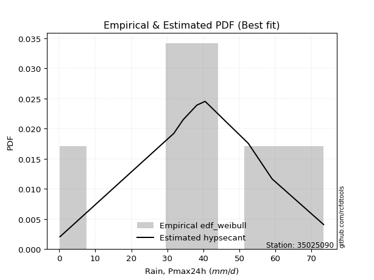</img>

</div>


### 4. EDF Beard (1943)

The Beard formula (or Beard´s plotting position formula) in hydrology is used to estimate the empirical non-exceedance probability _(P)_ of a flood event (or other extreme hydrological data point) within a given dataset.

<div align="center">


$P=(m-0.31)/(n+0.38)$


</div>


**4.1. Empirical values**

<div align="center">

|                | 0                   | 1                   | 2                  | 3                   | 4                  | 5                  | 6                  | 7                  |
|:---------------|:--------------------|:--------------------|:-------------------|:--------------------|:-------------------|:-------------------|:-------------------|:-------------------|
| date           | 2016                | 2020                | 2023               | 2022                | 2018               | 2017               | 2019               | 2021               |
| x              | 0.2                 | 31.8                | 34.4               | 38.2                | 40.5               | 52.5               | 59.1               | 73.4               |
| m              | 1                   | 2                   | 3                  | 4                   | 5                  | 6                  | 7                  | 8                  |
| empirical_dist | edf_beard           | edf_beard           | edf_beard          | edf_beard           | edf_beard          | edf_beard          | edf_beard          | edf_beard          |
| empirical      | 0.08233890214797135 | 0.20167064439140808 | 0.3210023866348448 | 0.44033412887828155 | 0.5596658711217184 | 0.6789976133651551 | 0.7983293556085919 | 0.9176610978520287 |
| empirical_tr   | 1.0897269180754225  | 1.2526158445440956  | 1.4727592267135323 | 1.7867803837953091  | 2.2710027100271004 | 3.115241635687732  | 4.958579881656804  | 12.144927536231886 |

</div>


**4.2. Kolmogorov-Smirnov fit test (sorted by Δ)**


<div align="center">

|                | 0                   | 1                   | 2                   | 3                   | 4                   | 5                   | 6                   | 7                  | 8                   | 9                   | 10                 | 11                  | 12                  | 13                 | 14                  | 15                  | 16                  | 17                  | 18                  | 19                 | 20                 | 21                  | 22                  | 23                  | 24                 | 25                 | 26                  | 27                  | 28                 | 29                  | 30                  | 31                  | 32                  | 33                 | 34                  | 35                 | 36                  | 37                  | 38                  | 39                  | 40                  | 41                  | 42                  | 43                  | 44                  | 45                 | 46                  | 47                 | 48                  | 49                  | 50                  | 51                  | 52                  | 53                  | 54                 | 55                  | 56                  | 57                  | 58                  | 59                  | 60                  | 61                  | 62                 | 63                 | 64                  | 65                 | 66                  | 67                  | 68                 | 69                  | 70                  | 71                  | 72                 | 73                 | 74                 | 75                  | 76                 | 77                 | 78                 | 79                 | 80                 | 81                  | 82                  | 83                 | 84                  | 85                 | 86                 | 87                 | 88                 | 89                 | 90                 | 91                  | 92                 | 93                 | 94                 | 95                  | 96                  | 97                  | 98                  | 99                 | 100                | 101                | 102                | 103                | 104                | 105                 | 106                 | 107                 | 108                | 109                 | 110                | 111                 | 112                 | 113                | 114                 | 115                 | 116                 | 117                | 118                | 119                | 120                | 121                | 122                | 123                | 124                | 125                | 126                | 127                | 128                 | 129                | 130                | 131                | 132                | 133                | 134                | 135                | 136                | 137                | 138                | 139                | 140                | 141                | 142                | 143                | 144                | 145                | 146                | 147                | 148                | 149                | 150                | 151                | 152                | 153                | 154                | 155                | 156                | 157                | 158                | 159                |
|:---------------|:--------------------|:--------------------|:--------------------|:--------------------|:--------------------|:--------------------|:--------------------|:-------------------|:--------------------|:--------------------|:-------------------|:--------------------|:--------------------|:-------------------|:--------------------|:--------------------|:--------------------|:--------------------|:--------------------|:-------------------|:-------------------|:--------------------|:--------------------|:--------------------|:-------------------|:-------------------|:--------------------|:--------------------|:-------------------|:--------------------|:--------------------|:--------------------|:--------------------|:-------------------|:--------------------|:-------------------|:--------------------|:--------------------|:--------------------|:--------------------|:--------------------|:--------------------|:--------------------|:--------------------|:--------------------|:-------------------|:--------------------|:-------------------|:--------------------|:--------------------|:--------------------|:--------------------|:--------------------|:--------------------|:-------------------|:--------------------|:--------------------|:--------------------|:--------------------|:--------------------|:--------------------|:--------------------|:-------------------|:-------------------|:--------------------|:-------------------|:--------------------|:--------------------|:-------------------|:--------------------|:--------------------|:--------------------|:-------------------|:-------------------|:-------------------|:--------------------|:-------------------|:-------------------|:-------------------|:-------------------|:-------------------|:--------------------|:--------------------|:-------------------|:--------------------|:-------------------|:-------------------|:-------------------|:-------------------|:-------------------|:-------------------|:--------------------|:-------------------|:-------------------|:-------------------|:--------------------|:--------------------|:--------------------|:--------------------|:-------------------|:-------------------|:-------------------|:-------------------|:-------------------|:-------------------|:--------------------|:--------------------|:--------------------|:-------------------|:--------------------|:-------------------|:--------------------|:--------------------|:-------------------|:--------------------|:--------------------|:--------------------|:-------------------|:-------------------|:-------------------|:-------------------|:-------------------|:-------------------|:-------------------|:-------------------|:-------------------|:-------------------|:-------------------|:--------------------|:-------------------|:-------------------|:-------------------|:-------------------|:-------------------|:-------------------|:-------------------|:-------------------|:-------------------|:-------------------|:-------------------|:-------------------|:-------------------|:-------------------|:-------------------|:-------------------|:-------------------|:-------------------|:-------------------|:-------------------|:-------------------|:-------------------|:-------------------|:-------------------|:-------------------|:-------------------|:-------------------|:-------------------|:-------------------|:-------------------|:-------------------|
| station        | 35025090            | 35025090            | 35025090            | 35025090            | 35025090            | 35025090            | 35025090            | 35025090           | 35025090            | 35025090            | 35025090           | 35025090            | 35025090            | 35025090           | 35025090            | 35025090            | 35025090            | 35025090            | 35025090            | 35025090           | 35025090           | 35025090            | 35025090            | 35025090            | 35025090           | 35025090           | 35025090            | 35025090            | 35025090           | 35025090            | 35025090            | 35025090            | 35025090            | 35025090           | 35025090            | 35025090           | 35025090            | 35025090            | 35025090            | 35025090            | 35025090            | 35025090            | 35025090            | 35025090            | 35025090            | 35025090           | 35025090            | 35025090           | 35025090            | 35025090            | 35025090            | 35025090            | 35025090            | 35025090            | 35025090           | 35025090            | 35025090            | 35025090            | 35025090            | 35025090            | 35025090            | 35025090            | 35025090           | 35025090           | 35025090            | 35025090           | 35025090            | 35025090            | 35025090           | 35025090            | 35025090            | 35025090            | 35025090           | 35025090           | 35025090           | 35025090            | 35025090           | 35025090           | 35025090           | 35025090           | 35025090           | 35025090            | 35025090            | 35025090           | 35025090            | 35025090           | 35025090           | 35025090           | 35025090           | 35025090           | 35025090           | 35025090            | 35025090           | 35025090           | 35025090           | 35025090            | 35025090            | 35025090            | 35025090            | 35025090           | 35025090           | 35025090           | 35025090           | 35025090           | 35025090           | 35025090            | 35025090            | 35025090            | 35025090           | 35025090            | 35025090           | 35025090            | 35025090            | 35025090           | 35025090            | 35025090            | 35025090            | 35025090           | 35025090           | 35025090           | 35025090           | 35025090           | 35025090           | 35025090           | 35025090           | 35025090           | 35025090           | 35025090           | 35025090            | 35025090           | 35025090           | 35025090           | 35025090           | 35025090           | 35025090           | 35025090           | 35025090           | 35025090           | 35025090           | 35025090           | 35025090           | 35025090           | 35025090           | 35025090           | 35025090           | 35025090           | 35025090           | 35025090           | 35025090           | 35025090           | 35025090           | 35025090           | 35025090           | 35025090           | 35025090           | 35025090           | 35025090           | 35025090           | 35025090           | 35025090           |
| empirical_dist | edf_beard           | edf_beard           | edf_beard           | edf_beard           | edf_beard           | edf_beard           | edf_beard           | edf_beard          | edf_beard           | edf_beard           | edf_beard          | edf_beard           | edf_beard           | edf_beard          | edf_beard           | edf_beard           | edf_beard           | edf_beard           | edf_beard           | edf_beard          | edf_beard          | edf_beard           | edf_beard           | edf_beard           | edf_beard          | edf_beard          | edf_beard           | edf_beard           | edf_beard          | edf_beard           | edf_beard           | edf_beard           | edf_beard           | edf_beard          | edf_beard           | edf_beard          | edf_beard           | edf_beard           | edf_beard           | edf_beard           | edf_beard           | edf_beard           | edf_beard           | edf_beard           | edf_beard           | edf_beard          | edf_beard           | edf_beard          | edf_beard           | edf_beard           | edf_beard           | edf_beard           | edf_beard           | edf_beard           | edf_beard          | edf_beard           | edf_beard           | edf_beard           | edf_beard           | edf_beard           | edf_beard           | edf_beard           | edf_beard          | edf_beard          | edf_beard           | edf_beard          | edf_beard           | edf_beard           | edf_beard          | edf_beard           | edf_beard           | edf_beard           | edf_beard          | edf_beard          | edf_beard          | edf_beard           | edf_beard          | edf_beard          | edf_beard          | edf_beard          | edf_beard          | edf_beard           | edf_beard           | edf_beard          | edf_beard           | edf_beard          | edf_beard          | edf_beard          | edf_beard          | edf_beard          | edf_beard          | edf_beard           | edf_beard          | edf_beard          | edf_beard          | edf_beard           | edf_beard           | edf_beard           | edf_beard           | edf_beard          | edf_beard          | edf_beard          | edf_beard          | edf_beard          | edf_beard          | edf_beard           | edf_beard           | edf_beard           | edf_beard          | edf_beard           | edf_beard          | edf_beard           | edf_beard           | edf_beard          | edf_beard           | edf_beard           | edf_beard           | edf_beard          | edf_beard          | edf_beard          | edf_beard          | edf_beard          | edf_beard          | edf_beard          | edf_beard          | edf_beard          | edf_beard          | edf_beard          | edf_beard           | edf_beard          | edf_beard          | edf_beard          | edf_beard          | edf_beard          | edf_beard          | edf_beard          | edf_beard          | edf_beard          | edf_beard          | edf_beard          | edf_beard          | edf_beard          | edf_beard          | edf_beard          | edf_beard          | edf_beard          | edf_beard          | edf_beard          | edf_beard          | edf_beard          | edf_beard          | edf_beard          | edf_beard          | edf_beard          | edf_beard          | edf_beard          | edf_beard          | edf_beard          | edf_beard          | edf_beard          |
| p_dist         | logt                | hypsecant           | laplace             | logistic            | pearson3            | dgamma              | skewnorm            | genlogistic        | foldnorm            | weibull_min         | burr12             | loggennorm          | johnsonsu           | genextreme         | t                   | norm                | crystalball         | nct                 | exponnorm           | f                  | argus              | fatiguelife         | gengamma            | dweibull            | erlang             | betaprime          | rice                | gamma               | truncnorm          | anglit              | gumbel_l            | maxwell             | genpareto           | invgamma           | semicircular        | alpha              | logjohnsonsu        | genhalflogistic     | invgauss            | gumbel_r            | rayleigh            | cosine              | gennorm             | triang              | moyal               | vonmises_line      | gausshyper          | logdweibull        | arcsine             | wald                | halfnorm            | halflogistic        | truncweibull_min    | logdgamma           | kstwobign          | loglevy_l           | logpearson3         | kappa3              | uniform             | wrapcauchy          | logargus            | ksone               | ncf                | gompertz           | kappa4              | trapezoid          | burr                | levy_l              | loggenextreme      | logloggamma         | beta                | bradford            | loggumbel_l        | logburr12          | truncexpon         | logtrapezoid        | logarcsine         | genexpon           | lomax              | logsemicircular    | logfoldnorm        | loganglit           | loggengamma         | loginvweibull      | logweibull_max      | logexponnorm       | lognorm            | logcrystalball     | lognakagami        | lognct             | logfatiguelife     | logalpha            | loglogistic        | loginvgamma        | loginvgauss        | loghypsecant        | logerlang           | logmaxwell          | logkstwobign        | lograyleigh        | loglaplace         | loglaplace         | logwrapcauchy      | johnsonsb          | logncf             | halfgennorm         | nakagami            | loghalfnorm         | logrice            | loggenexpon         | loggumbel_r        | logcosine           | loglomax            | loghalflogistic    | logmoyal            | invweibull          | logskewnorm         | loggenhalflogistic | loggausshyper      | logwald            | logf               | loggenpareto       | mielke             | logtriang          | exponweib          | rdist              | logvonmises_line   | logksone           | logtruncweibull_min | logburr            | logbeta            | logexponweib       | logkappa4          | logloglaplace      | weibull_max        | logkappa3          | loguniform         | logweibull_min     | powerlaw           | logtruncnorm       | logjohnsonsb       | logtruncexpon      | logmielke          | logbradford        | tukeylambda        | logbetaprime       | exponpow           | truncpareto        | loggamma           | loggamma           | logexponpow        | logpowerlaw        | logtruncpareto     | loggompertz        | loggenlogistic     | loghalfgennorm     | logtukeylambda     | logrdist           | logvonmises        | vonmises           |
| delta          | 0.08092001881215705 | 0.08403474169529324 | 0.09209630993332929 | 0.09906985575447919 | 0.10427470671036143 | 0.10454017658747838 | 0.10477403466161883 | 0.1052383676967778 | 0.10664670366350154 | 0.10685938468499756 | 0.1068606992372293 | 0.11083868461585661 | 0.11117618246130884 | 0.1171666652854888 | 0.11922428104021549 | 0.11922452383515286 | 0.11922452970547553 | 0.11922463173639158 | 0.11922725871182249 | 0.1201508576178913 | 0.1227411540017917 | 0.12300461961728482 | 0.12626606322606837 | 0.12658869818525087 | 0.1268140845074074 | 0.1268607491654664 | 0.12878541181335224 | 0.13120964883279068 | 0.1391570090258919 | 0.14197659568966936 | 0.14527405787997894 | 0.14904834230765668 | 0.15057586126841543 | 0.15063364923117   | 0.15159857562798823 | 0.1552311173668075 | 0.15678361007477654 | 0.15756568586393377 | 0.15805135435659173 | 0.15906401454214675 | 0.16061868134913448 | 0.16121425077896862 | 0.16153543770993184 | 0.16195944435776782 | 0.17272386759769226 | 0.1748893838690515 | 0.18045175326728358 | 0.1903971624847386 | 0.19163654165060756 | 0.19309363872969687 | 0.19349364085774567 | 0.19617875595482281 | 0.19843538339088418 | 0.20298359482848338 | 0.2199518897122822 | 0.22759818392285508 | 0.22765603125270256 | 0.22987238570454327 | 0.23002334467963015 | 0.23003771471967405 | 0.23530727832985981 | 0.24140767983445716 | 0.2419068771150113 | 0.2572605196185331 | 0.25972083601439994 | 0.2613588897248417 | 0.26601439230471086 | 0.26653096745488447 | 0.2811182514656712 | 0.28552500934994834 | 0.28562128869373105 | 0.29768415279613736 | 0.3052664831854019 | 0.3106556342075503 | 0.3113187517097716 | 0.31963284062715996 | 0.3389187439335331 | 0.3418970755146565 | 0.3550048133120553 | 0.3554988679213254 | 0.3583247258512002 | 0.35965184308001846 | 0.36276687322031415 | 0.3670801715586654 | 0.36712642334243545 | 0.369688428155923  | 0.3696917968162296 | 0.3696923829822136 | 0.3696989915183055 | 0.369843473577744  | 0.3725764295199378 | 0.37425056633742776 | 0.3791640310119501 | 0.3802247205775246 | 0.3821797757453787 | 0.38707858912360243 | 0.38923680565838276 | 0.39856774113916466 | 0.40675701898171596 | 0.4077039708991567 | 0.4106144017080718 | 0.4106144017080718 | 0.4167369668686451 | 0.4223837774915638 | 0.4247399183359281 | 0.42487074814545794 | 0.43196251402069247 | 0.43355148106751656 | 0.4343400883818142 | 0.43519567846935375 | 0.4386382003536338 | 0.45251653801203934 | 0.45486447033487026 | 0.4614308841890992 | 0.46268933967904996 | 0.47379485424724826 | 0.49596116067558976 | 0.4987881402332997 | 0.5130288047934806 | 0.5294744693441886 | 0.5339712907284151 | 0.5364866121170122 | 0.538058781855836  | 0.5621449401399639 | 0.57120741225522   | 0.5864599837988598 | 0.5907027475991282 | 0.5969595570881314 | 0.6048538780265467  | 0.6143986010383891 | 0.6144213334106045 | 0.6205576404250064 | 0.6351422301681218 | 0.6386728775199044 | 0.6470030199928857 | 0.6566536815484973 | 0.6566855973840393 | 0.6576657523647333 | 0.6619195321256726 | 0.6635999389764249 | 0.6693786996842972 | 0.6858118796264652 | 0.6910687694808357 | 0.6945328103067074 | 0.6973114288434041 | 0.7229232638850709 | 0.7390246465977719 | 0.7442060642108068 | 0.7549281731538844 | 0.7549281731538844 | 0.7577573930794894 | 0.7670333198965467 | 0.7796381725970647 | 0.7968571333736754 | 0.7983293556085919 | 0.7983293556085919 | 0.798329355608592  | 0.9175120069844444 | 0.9217098771644653 | 11.002535697911197 |
| deltao         | 0.4472608134160001  | 0.4472608134160001  | 0.4472608134160001  | 0.4472608134160001  | 0.4472608134160001  | 0.4472608134160001  | 0.4472608134160001  | 0.4472608134160001 | 0.4472608134160001  | 0.4472608134160001  | 0.4472608134160001 | 0.4472608134160001  | 0.4472608134160001  | 0.4472608134160001 | 0.4472608134160001  | 0.4472608134160001  | 0.4472608134160001  | 0.4472608134160001  | 0.4472608134160001  | 0.4472608134160001 | 0.4472608134160001 | 0.4472608134160001  | 0.4472608134160001  | 0.4472608134160001  | 0.4472608134160001 | 0.4472608134160001 | 0.4472608134160001  | 0.4472608134160001  | 0.4472608134160001 | 0.4472608134160001  | 0.4472608134160001  | 0.4472608134160001  | 0.4472608134160001  | 0.4472608134160001 | 0.4472608134160001  | 0.4472608134160001 | 0.4472608134160001  | 0.4472608134160001  | 0.4472608134160001  | 0.4472608134160001  | 0.4472608134160001  | 0.4472608134160001  | 0.4472608134160001  | 0.4472608134160001  | 0.4472608134160001  | 0.4472608134160001 | 0.4472608134160001  | 0.4472608134160001 | 0.4472608134160001  | 0.4472608134160001  | 0.4472608134160001  | 0.4472608134160001  | 0.4472608134160001  | 0.4472608134160001  | 0.4472608134160001 | 0.4472608134160001  | 0.4472608134160001  | 0.4472608134160001  | 0.4472608134160001  | 0.4472608134160001  | 0.4472608134160001  | 0.4472608134160001  | 0.4472608134160001 | 0.4472608134160001 | 0.4472608134160001  | 0.4472608134160001 | 0.4472608134160001  | 0.4472608134160001  | 0.4472608134160001 | 0.4472608134160001  | 0.4472608134160001  | 0.4472608134160001  | 0.4472608134160001 | 0.4472608134160001 | 0.4472608134160001 | 0.4472608134160001  | 0.4472608134160001 | 0.4472608134160001 | 0.4472608134160001 | 0.4472608134160001 | 0.4472608134160001 | 0.4472608134160001  | 0.4472608134160001  | 0.4472608134160001 | 0.4472608134160001  | 0.4472608134160001 | 0.4472608134160001 | 0.4472608134160001 | 0.4472608134160001 | 0.4472608134160001 | 0.4472608134160001 | 0.4472608134160001  | 0.4472608134160001 | 0.4472608134160001 | 0.4472608134160001 | 0.4472608134160001  | 0.4472608134160001  | 0.4472608134160001  | 0.4472608134160001  | 0.4472608134160001 | 0.4472608134160001 | 0.4472608134160001 | 0.4472608134160001 | 0.4472608134160001 | 0.4472608134160001 | 0.4472608134160001  | 0.4472608134160001  | 0.4472608134160001  | 0.4472608134160001 | 0.4472608134160001  | 0.4472608134160001 | 0.4472608134160001  | 0.4472608134160001  | 0.4472608134160001 | 0.4472608134160001  | 0.4472608134160001  | 0.4472608134160001  | 0.4472608134160001 | 0.4472608134160001 | 0.4472608134160001 | 0.4472608134160001 | 0.4472608134160001 | 0.4472608134160001 | 0.4472608134160001 | 0.4472608134160001 | 0.4472608134160001 | 0.4472608134160001 | 0.4472608134160001 | 0.4472608134160001  | 0.4472608134160001 | 0.4472608134160001 | 0.4472608134160001 | 0.4472608134160001 | 0.4472608134160001 | 0.4472608134160001 | 0.4472608134160001 | 0.4472608134160001 | 0.4472608134160001 | 0.4472608134160001 | 0.4472608134160001 | 0.4472608134160001 | 0.4472608134160001 | 0.4472608134160001 | 0.4472608134160001 | 0.4472608134160001 | 0.4472608134160001 | 0.4472608134160001 | 0.4472608134160001 | 0.4472608134160001 | 0.4472608134160001 | 0.4472608134160001 | 0.4472608134160001 | 0.4472608134160001 | 0.4472608134160001 | 0.4472608134160001 | 0.4472608134160001 | 0.4472608134160001 | 0.4472608134160001 | 0.4472608134160001 | 0.4472608134160001 |
| eval           | Δo > Δ              | Δo > Δ              | Δo > Δ              | Δo > Δ              | Δo > Δ              | Δo > Δ              | Δo > Δ              | Δo > Δ             | Δo > Δ              | Δo > Δ              | Δo > Δ             | Δo > Δ              | Δo > Δ              | Δo > Δ             | Δo > Δ              | Δo > Δ              | Δo > Δ              | Δo > Δ              | Δo > Δ              | Δo > Δ             | Δo > Δ             | Δo > Δ              | Δo > Δ              | Δo > Δ              | Δo > Δ             | Δo > Δ             | Δo > Δ              | Δo > Δ              | Δo > Δ             | Δo > Δ              | Δo > Δ              | Δo > Δ              | Δo > Δ              | Δo > Δ             | Δo > Δ              | Δo > Δ             | Δo > Δ              | Δo > Δ              | Δo > Δ              | Δo > Δ              | Δo > Δ              | Δo > Δ              | Δo > Δ              | Δo > Δ              | Δo > Δ              | Δo > Δ             | Δo > Δ              | Δo > Δ             | Δo > Δ              | Δo > Δ              | Δo > Δ              | Δo > Δ              | Δo > Δ              | Δo > Δ              | Δo > Δ             | Δo > Δ              | Δo > Δ              | Δo > Δ              | Δo > Δ              | Δo > Δ              | Δo > Δ              | Δo > Δ              | Δo > Δ             | Δo > Δ             | Δo > Δ              | Δo > Δ             | Δo > Δ              | Δo > Δ              | Δo > Δ             | Δo > Δ              | Δo > Δ              | Δo > Δ              | Δo > Δ             | Δo > Δ             | Δo > Δ             | Δo > Δ              | Δo > Δ             | Δo > Δ             | Δo > Δ             | Δo > Δ             | Δo > Δ             | Δo > Δ              | Δo > Δ              | Δo > Δ             | Δo > Δ              | Δo > Δ             | Δo > Δ             | Δo > Δ             | Δo > Δ             | Δo > Δ             | Δo > Δ             | Δo > Δ              | Δo > Δ             | Δo > Δ             | Δo > Δ             | Δo > Δ              | Δo > Δ              | Δo > Δ              | Δo > Δ              | Δo > Δ             | Δo > Δ             | Δo > Δ             | Δo > Δ             | Δo > Δ             | Δo > Δ             | Δo > Δ              | Δo > Δ              | Δo > Δ              | Δo > Δ             | Δo > Δ              | Δo > Δ             | Δo <= Δ             | Δo <= Δ             | Δo <= Δ            | Δo <= Δ             | Δo <= Δ             | Δo <= Δ             | Δo <= Δ            | Δo <= Δ            | Δo <= Δ            | Δo <= Δ            | Δo <= Δ            | Δo <= Δ            | Δo <= Δ            | Δo <= Δ            | Δo <= Δ            | Δo <= Δ            | Δo <= Δ            | Δo <= Δ             | Δo <= Δ            | Δo <= Δ            | Δo <= Δ            | Δo <= Δ            | Δo <= Δ            | Δo <= Δ            | Δo <= Δ            | Δo <= Δ            | Δo <= Δ            | Δo <= Δ            | Δo <= Δ            | Δo <= Δ            | Δo <= Δ            | Δo <= Δ            | Δo <= Δ            | Δo <= Δ            | Δo <= Δ            | Δo <= Δ            | Δo <= Δ            | Δo <= Δ            | Δo <= Δ            | Δo <= Δ            | Δo <= Δ            | Δo <= Δ            | Δo <= Δ            | Δo <= Δ            | Δo <= Δ            | Δo <= Δ            | Δo <= Δ            | Δo <= Δ            | Δo <= Δ            |
| fit            | 1                   | 1                   | 1                   | 1                   | 1                   | 1                   | 1                   | 1                  | 1                   | 1                   | 1                  | 1                   | 1                   | 1                  | 1                   | 1                   | 1                   | 1                   | 1                   | 1                  | 1                  | 1                   | 1                   | 1                   | 1                  | 1                  | 1                   | 1                   | 1                  | 1                   | 1                   | 1                   | 1                   | 1                  | 1                   | 1                  | 1                   | 1                   | 1                   | 1                   | 1                   | 1                   | 1                   | 1                   | 1                   | 1                  | 1                   | 1                  | 1                   | 1                   | 1                   | 1                   | 1                   | 1                   | 1                  | 1                   | 1                   | 1                   | 1                   | 1                   | 1                   | 1                   | 1                  | 1                  | 1                   | 1                  | 1                   | 1                   | 1                  | 1                   | 1                   | 1                   | 1                  | 1                  | 1                  | 1                   | 1                  | 1                  | 1                  | 1                  | 1                  | 1                   | 1                   | 1                  | 1                   | 1                  | 1                  | 1                  | 1                  | 1                  | 1                  | 1                   | 1                  | 1                  | 1                  | 1                   | 1                   | 1                   | 1                   | 1                  | 1                  | 1                  | 1                  | 1                  | 1                  | 1                   | 1                   | 1                   | 1                  | 1                   | 1                  | 0                   | 0                   | 0                  | 0                   | 0                   | 0                   | 0                  | 0                  | 0                  | 0                  | 0                  | 0                  | 0                  | 0                  | 0                  | 0                  | 0                  | 0                   | 0                  | 0                  | 0                  | 0                  | 0                  | 0                  | 0                  | 0                  | 0                  | 0                  | 0                  | 0                  | 0                  | 0                  | 0                  | 0                  | 0                  | 0                  | 0                  | 0                  | 0                  | 0                  | 0                  | 0                  | 0                  | 0                  | 0                  | 0                  | 0                  | 0                  | 0                  |
| n              | 8                   | 8                   | 8                   | 8                   | 8                   | 8                   | 8                   | 8                  | 8                   | 8                   | 8                  | 8                   | 8                   | 8                  | 8                   | 8                   | 8                   | 8                   | 8                   | 8                  | 8                  | 8                   | 8                   | 8                   | 8                  | 8                  | 8                   | 8                   | 8                  | 8                   | 8                   | 8                   | 8                   | 8                  | 8                   | 8                  | 8                   | 8                   | 8                   | 8                   | 8                   | 8                   | 8                   | 8                   | 8                   | 8                  | 8                   | 8                  | 8                   | 8                   | 8                   | 8                   | 8                   | 8                   | 8                  | 8                   | 8                   | 8                   | 8                   | 8                   | 8                   | 8                   | 8                  | 8                  | 8                   | 8                  | 8                   | 8                   | 8                  | 8                   | 8                   | 8                   | 8                  | 8                  | 8                  | 8                   | 8                  | 8                  | 8                  | 8                  | 8                  | 8                   | 8                   | 8                  | 8                   | 8                  | 8                  | 8                  | 8                  | 8                  | 8                  | 8                   | 8                  | 8                  | 8                  | 8                   | 8                   | 8                   | 8                   | 8                  | 8                  | 8                  | 8                  | 8                  | 8                  | 8                   | 8                   | 8                   | 8                  | 8                   | 8                  | 8                   | 8                   | 8                  | 8                   | 8                   | 8                   | 8                  | 8                  | 8                  | 8                  | 8                  | 8                  | 8                  | 8                  | 8                  | 8                  | 8                  | 8                   | 8                  | 8                  | 8                  | 8                  | 8                  | 8                  | 8                  | 8                  | 8                  | 8                  | 8                  | 8                  | 8                  | 8                  | 8                  | 8                  | 8                  | 8                  | 8                  | 8                  | 8                  | 8                  | 8                  | 8                  | 8                  | 8                  | 8                  | 8                  | 8                  | 8                  | 8                  |
| best_fit       | 1                   | 0                   | 0                   | 0                   | 0                   | 0                   | 0                   | 0                  | 0                   | 0                   | 0                  | 0                   | 0                   | 0                  | 0                   | 0                   | 0                   | 0                   | 0                   | 0                  | 0                  | 0                   | 0                   | 0                   | 0                  | 0                  | 0                   | 0                   | 0                  | 0                   | 0                   | 0                   | 0                   | 0                  | 0                   | 0                  | 0                   | 0                   | 0                   | 0                   | 0                   | 0                   | 0                   | 0                   | 0                   | 0                  | 0                   | 0                  | 0                   | 0                   | 0                   | 0                   | 0                   | 0                   | 0                  | 0                   | 0                   | 0                   | 0                   | 0                   | 0                   | 0                   | 0                  | 0                  | 0                   | 0                  | 0                   | 0                   | 0                  | 0                   | 0                   | 0                   | 0                  | 0                  | 0                  | 0                   | 0                  | 0                  | 0                  | 0                  | 0                  | 0                   | 0                   | 0                  | 0                   | 0                  | 0                  | 0                  | 0                  | 0                  | 0                  | 0                   | 0                  | 0                  | 0                  | 0                   | 0                   | 0                   | 0                   | 0                  | 0                  | 0                  | 0                  | 0                  | 0                  | 0                   | 0                   | 0                   | 0                  | 0                   | 0                  | 0                   | 0                   | 0                  | 0                   | 0                   | 0                   | 0                  | 0                  | 0                  | 0                  | 0                  | 0                  | 0                  | 0                  | 0                  | 0                  | 0                  | 0                   | 0                  | 0                  | 0                  | 0                  | 0                  | 0                  | 0                  | 0                  | 0                  | 0                  | 0                  | 0                  | 0                  | 0                  | 0                  | 0                  | 0                  | 0                  | 0                  | 0                  | 0                  | 0                  | 0                  | 0                  | 0                  | 0                  | 0                  | 0                  | 0                  | 0                  | 0                  |
| best_fit_sort  | 1                   | 2                   | 3                   | 4                   | 5                   | 6                   | 7                   | 8                  | 9                   | 10                  | 11                 | 12                  | 13                  | 14                 | 15                  | 16                  | 17                  | 18                  | 19                  | 20                 | 21                 | 22                  | 23                  | 24                  | 25                 | 26                 | 27                  | 28                  | 29                 | 30                  | 31                  | 32                  | 33                  | 34                 | 35                  | 36                 | 37                  | 38                  | 39                  | 40                  | 41                  | 42                  | 43                  | 44                  | 45                  | 46                 | 47                  | 48                 | 49                  | 50                  | 51                  | 52                  | 53                  | 54                  | 55                 | 56                  | 57                  | 58                  | 59                  | 60                  | 61                  | 62                  | 63                 | 64                 | 65                  | 66                 | 67                  | 68                  | 69                 | 70                  | 71                  | 72                  | 73                 | 74                 | 75                 | 76                  | 77                 | 78                 | 79                 | 80                 | 81                 | 82                  | 83                  | 84                 | 85                  | 86                 | 87                 | 88                 | 89                 | 90                 | 91                 | 92                  | 93                 | 94                 | 95                 | 96                  | 97                  | 98                  | 99                  | 100                | 101                | 102                | 103                | 104                | 105                | 106                 | 107                 | 108                 | 109                | 110                 | 111                | 112                 | 113                 | 114                | 115                 | 116                 | 117                 | 118                | 119                | 120                | 121                | 122                | 123                | 124                | 125                | 126                | 127                | 128                | 129                 | 130                | 131                | 132                | 133                | 134                | 135                | 136                | 137                | 138                | 139                | 140                | 141                | 142                | 143                | 144                | 145                | 146                | 147                | 148                | 149                | 150                | 151                | 152                | 153                | 154                | 155                | 156                | 157                | 158                | 159                | 160                |

</div>


**4.3. Best fit**

<div align="center">

|   id |   station | empirical_dist   | p_dist   |   delta |   deltao | eval   |   fit |   n |   best_fit |   best_fit_sort |
|-----:|----------:|:-----------------|:---------|--------:|---------:|:-------|------:|----:|-----------:|----------------:|
|    0 |  35025090 | edf_beard        | logt     | 0.08092 | 0.447261 | Δo > Δ |     1 |   8 |          1 |               1 |

</div>


<div align="center">

</img></img>

</div>


### 5. EDF Chegodayev (1955)

The Chegodayev formula is an empirical plotting position formula used in hydrological frequency analysis to estimate the exceedance probability or return period of a specific event from a set of observed data. It is primarily used for plotting observed data points on probability paper to fit a theoretical distribution, particularly for analyzing extreme events like maximum flood flows or rainfall intensities. The constant _b_ value in the generalized plotting position formula is 0.3.

<div align="center">


$P=(m-b)/(n+1-2b)$


</div>


**5.1. Empirical values**

<div align="center">

|                | 0                   | 1                   | 2                   | 3                   | 4                  | 5                  | 6                  | 7                  |
|:---------------|:--------------------|:--------------------|:--------------------|:--------------------|:-------------------|:-------------------|:-------------------|:-------------------|
| date           | 2016                | 2020                | 2023                | 2022                | 2018               | 2017               | 2019               | 2021               |
| x              | 0.2                 | 31.8                | 34.4                | 38.2                | 40.5               | 52.5               | 59.1               | 73.4               |
| m              | 1                   | 2                   | 3                   | 4                   | 5                  | 6                  | 7                  | 8                  |
| empirical_dist | edf_chegodayev      | edf_chegodayev      | edf_chegodayev      | edf_chegodayev      | edf_chegodayev     | edf_chegodayev     | edf_chegodayev     | edf_chegodayev     |
| empirical      | 0.08333333333333333 | 0.20238095238095236 | 0.32142857142857145 | 0.44047619047619047 | 0.5595238095238095 | 0.6785714285714286 | 0.7976190476190476 | 0.9166666666666666 |
| empirical_tr   | 1.090909090909091   | 1.253731343283582   | 1.4736842105263157  | 1.7872340425531914  | 2.27027027027027   | 3.1111111111111116 | 4.941176470588234  | 11.999999999999995 |

</div>


**5.2. Kolmogorov-Smirnov fit test (sorted by Δ)**


<div align="center">

|                | 0                   | 1                   | 2                   | 3                   | 4                   | 5                   | 6                   | 7                   | 8                   | 9                  | 10                  | 11                  | 12                  | 13                  | 14                  | 15                  | 16                  | 17                  | 18                  | 19                  | 20                  | 21                  | 22                 | 23                  | 24                  | 25                  | 26                  | 27                 | 28                  | 29                 | 30                  | 31                 | 32                  | 33                  | 34                  | 35                  | 36                  | 37                  | 38                 | 39                  | 40                 | 41                  | 42                  | 43                 | 44                 | 45                  | 46                 | 47                  | 48                 | 49                 | 50                 | 51                  | 52                 | 53                 | 54                  | 55                 | 56                 | 57                 | 58                  | 59                  | 60                  | 61                  | 62                  | 63                 | 64                 | 65                  | 66                 | 67                 | 68                  | 69                 | 70                  | 71                  | 72                  | 73                 | 74                  | 75                 | 76                  | 77                  | 78                  | 79                  | 80                  | 81                 | 82                 | 83                  | 84                 | 85                  | 86                  | 87                  | 88                  | 89                  | 90                  | 91                 | 92                 | 93                  | 94                  | 95                 | 96                 | 97                 | 98                 | 99                 | 100                 | 101                 | 102                 | 103                 | 104                 | 105                | 106                | 107                | 108                 | 109                | 110                | 111                | 112                | 113                | 114                | 115                 | 116                | 117                 | 118                | 119                | 120                | 121                | 122                | 123                | 124                | 125                | 126                | 127                | 128                 | 129                | 130                | 131                | 132                | 133                | 134                | 135                | 136                | 137                | 138                | 139                | 140                | 141                | 142                | 143                | 144                | 145                | 146                | 147                | 148                | 149                | 150                | 151                | 152                | 153                | 154                | 155                | 156                | 157                | 158                | 159                |
|:---------------|:--------------------|:--------------------|:--------------------|:--------------------|:--------------------|:--------------------|:--------------------|:--------------------|:--------------------|:-------------------|:--------------------|:--------------------|:--------------------|:--------------------|:--------------------|:--------------------|:--------------------|:--------------------|:--------------------|:--------------------|:--------------------|:--------------------|:-------------------|:--------------------|:--------------------|:--------------------|:--------------------|:-------------------|:--------------------|:-------------------|:--------------------|:-------------------|:--------------------|:--------------------|:--------------------|:--------------------|:--------------------|:--------------------|:-------------------|:--------------------|:-------------------|:--------------------|:--------------------|:-------------------|:-------------------|:--------------------|:-------------------|:--------------------|:-------------------|:-------------------|:-------------------|:--------------------|:-------------------|:-------------------|:--------------------|:-------------------|:-------------------|:-------------------|:--------------------|:--------------------|:--------------------|:--------------------|:--------------------|:-------------------|:-------------------|:--------------------|:-------------------|:-------------------|:--------------------|:-------------------|:--------------------|:--------------------|:--------------------|:-------------------|:--------------------|:-------------------|:--------------------|:--------------------|:--------------------|:--------------------|:--------------------|:-------------------|:-------------------|:--------------------|:-------------------|:--------------------|:--------------------|:--------------------|:--------------------|:--------------------|:--------------------|:-------------------|:-------------------|:--------------------|:--------------------|:-------------------|:-------------------|:-------------------|:-------------------|:-------------------|:--------------------|:--------------------|:--------------------|:--------------------|:--------------------|:-------------------|:-------------------|:-------------------|:--------------------|:-------------------|:-------------------|:-------------------|:-------------------|:-------------------|:-------------------|:--------------------|:-------------------|:--------------------|:-------------------|:-------------------|:-------------------|:-------------------|:-------------------|:-------------------|:-------------------|:-------------------|:-------------------|:-------------------|:--------------------|:-------------------|:-------------------|:-------------------|:-------------------|:-------------------|:-------------------|:-------------------|:-------------------|:-------------------|:-------------------|:-------------------|:-------------------|:-------------------|:-------------------|:-------------------|:-------------------|:-------------------|:-------------------|:-------------------|:-------------------|:-------------------|:-------------------|:-------------------|:-------------------|:-------------------|:-------------------|:-------------------|:-------------------|:-------------------|:-------------------|:-------------------|
| station        | 35025090            | 35025090            | 35025090            | 35025090            | 35025090            | 35025090            | 35025090            | 35025090            | 35025090            | 35025090           | 35025090            | 35025090            | 35025090            | 35025090            | 35025090            | 35025090            | 35025090            | 35025090            | 35025090            | 35025090            | 35025090            | 35025090            | 35025090           | 35025090            | 35025090            | 35025090            | 35025090            | 35025090           | 35025090            | 35025090           | 35025090            | 35025090           | 35025090            | 35025090            | 35025090            | 35025090            | 35025090            | 35025090            | 35025090           | 35025090            | 35025090           | 35025090            | 35025090            | 35025090           | 35025090           | 35025090            | 35025090           | 35025090            | 35025090           | 35025090           | 35025090           | 35025090            | 35025090           | 35025090           | 35025090            | 35025090           | 35025090           | 35025090           | 35025090            | 35025090            | 35025090            | 35025090            | 35025090            | 35025090           | 35025090           | 35025090            | 35025090           | 35025090           | 35025090            | 35025090           | 35025090            | 35025090            | 35025090            | 35025090           | 35025090            | 35025090           | 35025090            | 35025090            | 35025090            | 35025090            | 35025090            | 35025090           | 35025090           | 35025090            | 35025090           | 35025090            | 35025090            | 35025090            | 35025090            | 35025090            | 35025090            | 35025090           | 35025090           | 35025090            | 35025090            | 35025090           | 35025090           | 35025090           | 35025090           | 35025090           | 35025090            | 35025090            | 35025090            | 35025090            | 35025090            | 35025090           | 35025090           | 35025090           | 35025090            | 35025090           | 35025090           | 35025090           | 35025090           | 35025090           | 35025090           | 35025090            | 35025090           | 35025090            | 35025090           | 35025090           | 35025090           | 35025090           | 35025090           | 35025090           | 35025090           | 35025090           | 35025090           | 35025090           | 35025090            | 35025090           | 35025090           | 35025090           | 35025090           | 35025090           | 35025090           | 35025090           | 35025090           | 35025090           | 35025090           | 35025090           | 35025090           | 35025090           | 35025090           | 35025090           | 35025090           | 35025090           | 35025090           | 35025090           | 35025090           | 35025090           | 35025090           | 35025090           | 35025090           | 35025090           | 35025090           | 35025090           | 35025090           | 35025090           | 35025090           | 35025090           |
| empirical_dist | edf_chegodayev      | edf_chegodayev      | edf_chegodayev      | edf_chegodayev      | edf_chegodayev      | edf_chegodayev      | edf_chegodayev      | edf_chegodayev      | edf_chegodayev      | edf_chegodayev     | edf_chegodayev      | edf_chegodayev      | edf_chegodayev      | edf_chegodayev      | edf_chegodayev      | edf_chegodayev      | edf_chegodayev      | edf_chegodayev      | edf_chegodayev      | edf_chegodayev      | edf_chegodayev      | edf_chegodayev      | edf_chegodayev     | edf_chegodayev      | edf_chegodayev      | edf_chegodayev      | edf_chegodayev      | edf_chegodayev     | edf_chegodayev      | edf_chegodayev     | edf_chegodayev      | edf_chegodayev     | edf_chegodayev      | edf_chegodayev      | edf_chegodayev      | edf_chegodayev      | edf_chegodayev      | edf_chegodayev      | edf_chegodayev     | edf_chegodayev      | edf_chegodayev     | edf_chegodayev      | edf_chegodayev      | edf_chegodayev     | edf_chegodayev     | edf_chegodayev      | edf_chegodayev     | edf_chegodayev      | edf_chegodayev     | edf_chegodayev     | edf_chegodayev     | edf_chegodayev      | edf_chegodayev     | edf_chegodayev     | edf_chegodayev      | edf_chegodayev     | edf_chegodayev     | edf_chegodayev     | edf_chegodayev      | edf_chegodayev      | edf_chegodayev      | edf_chegodayev      | edf_chegodayev      | edf_chegodayev     | edf_chegodayev     | edf_chegodayev      | edf_chegodayev     | edf_chegodayev     | edf_chegodayev      | edf_chegodayev     | edf_chegodayev      | edf_chegodayev      | edf_chegodayev      | edf_chegodayev     | edf_chegodayev      | edf_chegodayev     | edf_chegodayev      | edf_chegodayev      | edf_chegodayev      | edf_chegodayev      | edf_chegodayev      | edf_chegodayev     | edf_chegodayev     | edf_chegodayev      | edf_chegodayev     | edf_chegodayev      | edf_chegodayev      | edf_chegodayev      | edf_chegodayev      | edf_chegodayev      | edf_chegodayev      | edf_chegodayev     | edf_chegodayev     | edf_chegodayev      | edf_chegodayev      | edf_chegodayev     | edf_chegodayev     | edf_chegodayev     | edf_chegodayev     | edf_chegodayev     | edf_chegodayev      | edf_chegodayev      | edf_chegodayev      | edf_chegodayev      | edf_chegodayev      | edf_chegodayev     | edf_chegodayev     | edf_chegodayev     | edf_chegodayev      | edf_chegodayev     | edf_chegodayev     | edf_chegodayev     | edf_chegodayev     | edf_chegodayev     | edf_chegodayev     | edf_chegodayev      | edf_chegodayev     | edf_chegodayev      | edf_chegodayev     | edf_chegodayev     | edf_chegodayev     | edf_chegodayev     | edf_chegodayev     | edf_chegodayev     | edf_chegodayev     | edf_chegodayev     | edf_chegodayev     | edf_chegodayev     | edf_chegodayev      | edf_chegodayev     | edf_chegodayev     | edf_chegodayev     | edf_chegodayev     | edf_chegodayev     | edf_chegodayev     | edf_chegodayev     | edf_chegodayev     | edf_chegodayev     | edf_chegodayev     | edf_chegodayev     | edf_chegodayev     | edf_chegodayev     | edf_chegodayev     | edf_chegodayev     | edf_chegodayev     | edf_chegodayev     | edf_chegodayev     | edf_chegodayev     | edf_chegodayev     | edf_chegodayev     | edf_chegodayev     | edf_chegodayev     | edf_chegodayev     | edf_chegodayev     | edf_chegodayev     | edf_chegodayev     | edf_chegodayev     | edf_chegodayev     | edf_chegodayev     | edf_chegodayev     |
| p_dist         | logt                | hypsecant           | laplace             | logistic            | pearson3            | skewnorm            | dgamma              | genlogistic         | foldnorm            | weibull_min        | burr12              | loggennorm          | johnsonsu           | genextreme          | t                   | norm                | crystalball         | nct                 | exponnorm           | f                   | argus               | fatiguelife         | gengamma           | erlang              | betaprime           | dweibull            | rice                | gamma              | truncnorm           | anglit             | gumbel_l            | maxwell            | genpareto           | invgamma            | semicircular        | alpha               | logjohnsonsu        | invgauss            | genhalflogistic    | gumbel_r            | rayleigh           | cosine              | triang              | gennorm            | moyal              | vonmises_line       | gausshyper         | logdweibull         | arcsine            | wald               | halfnorm           | halflogistic        | truncweibull_min   | logdgamma          | kstwobign           | loglevy_l          | logpearson3        | kappa3             | uniform             | wrapcauchy          | logargus            | ksone               | ncf                 | gompertz           | kappa4             | trapezoid           | burr               | levy_l             | loggenextreme       | logloggamma        | beta                | bradford            | loggumbel_l         | logburr12          | truncexpon          | logtrapezoid       | logarcsine          | genexpon            | lomax               | logsemicircular     | logfoldnorm         | loganglit          | loggengamma        | loginvweibull       | logweibull_max     | logexponnorm        | lognorm             | logcrystalball      | lognakagami         | lognct              | logfatiguelife      | logalpha           | loglogistic        | loginvgamma         | loginvgauss         | loghypsecant       | logerlang          | logmaxwell         | logkstwobign       | lograyleigh        | loglaplace          | loglaplace          | logwrapcauchy       | johnsonsb           | logncf              | halfgennorm        | nakagami           | loghalfnorm        | logrice             | loggenexpon        | loggumbel_r        | logcosine          | loglomax           | loghalflogistic    | logmoyal           | invweibull          | logskewnorm        | loggenhalflogistic  | loggausshyper      | logwald            | logf               | loggenpareto       | mielke             | logtriang          | exponweib          | rdist              | logvonmises_line   | logksone           | logtruncweibull_min | logburr            | logbeta            | logexponweib       | logkappa4          | logloglaplace      | weibull_max        | logkappa3          | loguniform         | logweibull_min     | powerlaw           | logtruncnorm       | logjohnsonsb       | logtruncexpon      | logmielke          | logbradford        | tukeylambda        | logbetaprime       | exponpow           | truncpareto        | loggamma           | loggamma           | logexponpow        | logpowerlaw        | logtruncpareto     | loggompertz        | loggenlogistic     | loghalfgennorm     | logtukeylambda     | logrdist           | logvonmises        | vonmises           |
| delta          | 0.08134620360588352 | 0.08332443370574896 | 0.09252249472705576 | 0.09835954776493491 | 0.10413264511245257 | 0.10463197306370997 | 0.10496636138120485 | 0.10509630609886894 | 0.10593639567395727 | 0.1067173230870887 | 0.10671863763932044 | 0.11012837662631234 | 0.11103412086339998 | 0.11702460368757994 | 0.11851397305067121 | 0.11851421584560859 | 0.11851422171593126 | 0.11851432374684731 | 0.11851695072227822 | 0.11944054962834702 | 0.12203084601224742 | 0.12229431162774054 | 0.1255557552365241 | 0.12610377651786311 | 0.12615044117592214 | 0.12701488297897734 | 0.12807510382380796 | 0.1304993408432464 | 0.13844670103634762 | 0.1412662877001251 | 0.14513199628207007 | 0.1483380343181124 | 0.14986555327887116 | 0.14992334124162573 | 0.15088826763844396 | 0.15452080937726323 | 0.15607330208523226 | 0.15734104636704746 | 0.1574236242660249 | 0.15835370655260247 | 0.1599083733595902 | 0.16050394278942434 | 0.16181738275985896 | 0.1619616225036583 | 0.172013559608148  | 0.17531556866277798 | 0.1797414452777393 | 0.18940273129937657 | 0.1909262336610633 | 0.1923833307401526 | 0.1927833328682014 | 0.19546844796527854 | 0.1977250754013399 | 0.2022732868389391 | 0.21924158172273792 | 0.2268878759333108 | 0.2269457232631583 | 0.229162077714999  | 0.22931303669008588 | 0.22932740673012977 | 0.23459697034031554 | 0.24069737184491288 | 0.24119656912546703 | 0.2571184580206242 | 0.2590105280248557 | 0.26121682812693287 | 0.2653040843151666 | 0.2655365362695225 | 0.28040794347612696 | 0.2848147013604041 | 0.28491098070418674 | 0.29697384480659306 | 0.30455617519585765 | 0.3099453262180061 | 0.31060844372022733 | 0.3189225326376157 | 0.33820843594398886 | 0.34118676752511223 | 0.35429450532251106 | 0.35478855993178116 | 0.35761441786165593 | 0.3589415350904742 | 0.3620565652307699 | 0.36636986356912116 | 0.3664161153528912 | 0.36897812016637876 | 0.36898148882668536 | 0.36898207499266933 | 0.36898868352876124 | 0.36913316558819975 | 0.37186612153039356 | 0.3735402583478835 | 0.3784537230224059 | 0.37951441258798035 | 0.38146946775583446 | 0.3863682811340582 | 0.3885264976688385 | 0.3978574331496204 | 0.4060467109921717 | 0.4069936629096125 | 0.40990409371852754 | 0.40990409371852754 | 0.41602665887910084 | 0.42167346950201956 | 0.42402961034638387 | 0.4241604401559137 | 0.4312522060311482 | 0.4328411730779723 | 0.43362978039226996 | 0.4344853704798095 | 0.4379278923640896 | 0.4518062300224951 | 0.454154162345326  | 0.460720576199555  | 0.4619790316895057 | 0.47280042306188624 | 0.4952508526860455 | 0.49807783224375546 | 0.5123184968039363 | 0.5287641613546443 | 0.5332609827388708 | 0.5357763041274679 | 0.5373484738662917 | 0.5614346321504197 | 0.5704971042656757 | 0.5857496758093155 | 0.589992439609584  | 0.5962492490985871 | 0.6041435700370024  | 0.6136882930488448 | 0.6137110254210602 | 0.6198473324354622 | 0.6344319221785776 | 0.6379625695303601 | 0.6462927120033414 | 0.655943373558953  | 0.655975289394495  | 0.6569554443751892 | 0.6612092241361283 | 0.6628896309868807 | 0.6686683916947529 | 0.685101571636921  | 0.6903584614912915 | 0.6938225023171632 | 0.6966011208538598 | 0.7222129558955267 | 0.7383143386082277 | 0.7434957562212626 | 0.7542178651643402 | 0.7542178651643402 | 0.7570470850899452 | 0.7663230119070024 | 0.7789278646075205 | 0.7961468253841311 | 0.7976190476190476 | 0.7976190476190476 | 0.7976190476190477 | 0.9165175757990823 | 0.9227043083498273 | 11.00353012909656  |
| deltao         | 0.4472608134160001  | 0.4472608134160001  | 0.4472608134160001  | 0.4472608134160001  | 0.4472608134160001  | 0.4472608134160001  | 0.4472608134160001  | 0.4472608134160001  | 0.4472608134160001  | 0.4472608134160001 | 0.4472608134160001  | 0.4472608134160001  | 0.4472608134160001  | 0.4472608134160001  | 0.4472608134160001  | 0.4472608134160001  | 0.4472608134160001  | 0.4472608134160001  | 0.4472608134160001  | 0.4472608134160001  | 0.4472608134160001  | 0.4472608134160001  | 0.4472608134160001 | 0.4472608134160001  | 0.4472608134160001  | 0.4472608134160001  | 0.4472608134160001  | 0.4472608134160001 | 0.4472608134160001  | 0.4472608134160001 | 0.4472608134160001  | 0.4472608134160001 | 0.4472608134160001  | 0.4472608134160001  | 0.4472608134160001  | 0.4472608134160001  | 0.4472608134160001  | 0.4472608134160001  | 0.4472608134160001 | 0.4472608134160001  | 0.4472608134160001 | 0.4472608134160001  | 0.4472608134160001  | 0.4472608134160001 | 0.4472608134160001 | 0.4472608134160001  | 0.4472608134160001 | 0.4472608134160001  | 0.4472608134160001 | 0.4472608134160001 | 0.4472608134160001 | 0.4472608134160001  | 0.4472608134160001 | 0.4472608134160001 | 0.4472608134160001  | 0.4472608134160001 | 0.4472608134160001 | 0.4472608134160001 | 0.4472608134160001  | 0.4472608134160001  | 0.4472608134160001  | 0.4472608134160001  | 0.4472608134160001  | 0.4472608134160001 | 0.4472608134160001 | 0.4472608134160001  | 0.4472608134160001 | 0.4472608134160001 | 0.4472608134160001  | 0.4472608134160001 | 0.4472608134160001  | 0.4472608134160001  | 0.4472608134160001  | 0.4472608134160001 | 0.4472608134160001  | 0.4472608134160001 | 0.4472608134160001  | 0.4472608134160001  | 0.4472608134160001  | 0.4472608134160001  | 0.4472608134160001  | 0.4472608134160001 | 0.4472608134160001 | 0.4472608134160001  | 0.4472608134160001 | 0.4472608134160001  | 0.4472608134160001  | 0.4472608134160001  | 0.4472608134160001  | 0.4472608134160001  | 0.4472608134160001  | 0.4472608134160001 | 0.4472608134160001 | 0.4472608134160001  | 0.4472608134160001  | 0.4472608134160001 | 0.4472608134160001 | 0.4472608134160001 | 0.4472608134160001 | 0.4472608134160001 | 0.4472608134160001  | 0.4472608134160001  | 0.4472608134160001  | 0.4472608134160001  | 0.4472608134160001  | 0.4472608134160001 | 0.4472608134160001 | 0.4472608134160001 | 0.4472608134160001  | 0.4472608134160001 | 0.4472608134160001 | 0.4472608134160001 | 0.4472608134160001 | 0.4472608134160001 | 0.4472608134160001 | 0.4472608134160001  | 0.4472608134160001 | 0.4472608134160001  | 0.4472608134160001 | 0.4472608134160001 | 0.4472608134160001 | 0.4472608134160001 | 0.4472608134160001 | 0.4472608134160001 | 0.4472608134160001 | 0.4472608134160001 | 0.4472608134160001 | 0.4472608134160001 | 0.4472608134160001  | 0.4472608134160001 | 0.4472608134160001 | 0.4472608134160001 | 0.4472608134160001 | 0.4472608134160001 | 0.4472608134160001 | 0.4472608134160001 | 0.4472608134160001 | 0.4472608134160001 | 0.4472608134160001 | 0.4472608134160001 | 0.4472608134160001 | 0.4472608134160001 | 0.4472608134160001 | 0.4472608134160001 | 0.4472608134160001 | 0.4472608134160001 | 0.4472608134160001 | 0.4472608134160001 | 0.4472608134160001 | 0.4472608134160001 | 0.4472608134160001 | 0.4472608134160001 | 0.4472608134160001 | 0.4472608134160001 | 0.4472608134160001 | 0.4472608134160001 | 0.4472608134160001 | 0.4472608134160001 | 0.4472608134160001 | 0.4472608134160001 |
| eval           | Δo > Δ              | Δo > Δ              | Δo > Δ              | Δo > Δ              | Δo > Δ              | Δo > Δ              | Δo > Δ              | Δo > Δ              | Δo > Δ              | Δo > Δ             | Δo > Δ              | Δo > Δ              | Δo > Δ              | Δo > Δ              | Δo > Δ              | Δo > Δ              | Δo > Δ              | Δo > Δ              | Δo > Δ              | Δo > Δ              | Δo > Δ              | Δo > Δ              | Δo > Δ             | Δo > Δ              | Δo > Δ              | Δo > Δ              | Δo > Δ              | Δo > Δ             | Δo > Δ              | Δo > Δ             | Δo > Δ              | Δo > Δ             | Δo > Δ              | Δo > Δ              | Δo > Δ              | Δo > Δ              | Δo > Δ              | Δo > Δ              | Δo > Δ             | Δo > Δ              | Δo > Δ             | Δo > Δ              | Δo > Δ              | Δo > Δ             | Δo > Δ             | Δo > Δ              | Δo > Δ             | Δo > Δ              | Δo > Δ             | Δo > Δ             | Δo > Δ             | Δo > Δ              | Δo > Δ             | Δo > Δ             | Δo > Δ              | Δo > Δ             | Δo > Δ             | Δo > Δ             | Δo > Δ              | Δo > Δ              | Δo > Δ              | Δo > Δ              | Δo > Δ              | Δo > Δ             | Δo > Δ             | Δo > Δ              | Δo > Δ             | Δo > Δ             | Δo > Δ              | Δo > Δ             | Δo > Δ              | Δo > Δ              | Δo > Δ              | Δo > Δ             | Δo > Δ              | Δo > Δ             | Δo > Δ              | Δo > Δ              | Δo > Δ              | Δo > Δ              | Δo > Δ              | Δo > Δ             | Δo > Δ             | Δo > Δ              | Δo > Δ             | Δo > Δ              | Δo > Δ              | Δo > Δ              | Δo > Δ              | Δo > Δ              | Δo > Δ              | Δo > Δ             | Δo > Δ             | Δo > Δ              | Δo > Δ              | Δo > Δ             | Δo > Δ             | Δo > Δ             | Δo > Δ             | Δo > Δ             | Δo > Δ              | Δo > Δ              | Δo > Δ              | Δo > Δ              | Δo > Δ              | Δo > Δ             | Δo > Δ             | Δo > Δ             | Δo > Δ              | Δo > Δ             | Δo > Δ             | Δo <= Δ            | Δo <= Δ            | Δo <= Δ            | Δo <= Δ            | Δo <= Δ             | Δo <= Δ            | Δo <= Δ             | Δo <= Δ            | Δo <= Δ            | Δo <= Δ            | Δo <= Δ            | Δo <= Δ            | Δo <= Δ            | Δo <= Δ            | Δo <= Δ            | Δo <= Δ            | Δo <= Δ            | Δo <= Δ             | Δo <= Δ            | Δo <= Δ            | Δo <= Δ            | Δo <= Δ            | Δo <= Δ            | Δo <= Δ            | Δo <= Δ            | Δo <= Δ            | Δo <= Δ            | Δo <= Δ            | Δo <= Δ            | Δo <= Δ            | Δo <= Δ            | Δo <= Δ            | Δo <= Δ            | Δo <= Δ            | Δo <= Δ            | Δo <= Δ            | Δo <= Δ            | Δo <= Δ            | Δo <= Δ            | Δo <= Δ            | Δo <= Δ            | Δo <= Δ            | Δo <= Δ            | Δo <= Δ            | Δo <= Δ            | Δo <= Δ            | Δo <= Δ            | Δo <= Δ            | Δo <= Δ            |
| fit            | 1                   | 1                   | 1                   | 1                   | 1                   | 1                   | 1                   | 1                   | 1                   | 1                  | 1                   | 1                   | 1                   | 1                   | 1                   | 1                   | 1                   | 1                   | 1                   | 1                   | 1                   | 1                   | 1                  | 1                   | 1                   | 1                   | 1                   | 1                  | 1                   | 1                  | 1                   | 1                  | 1                   | 1                   | 1                   | 1                   | 1                   | 1                   | 1                  | 1                   | 1                  | 1                   | 1                   | 1                  | 1                  | 1                   | 1                  | 1                   | 1                  | 1                  | 1                  | 1                   | 1                  | 1                  | 1                   | 1                  | 1                  | 1                  | 1                   | 1                   | 1                   | 1                   | 1                   | 1                  | 1                  | 1                   | 1                  | 1                  | 1                   | 1                  | 1                   | 1                   | 1                   | 1                  | 1                   | 1                  | 1                   | 1                   | 1                   | 1                   | 1                   | 1                  | 1                  | 1                   | 1                  | 1                   | 1                   | 1                   | 1                   | 1                   | 1                   | 1                  | 1                  | 1                   | 1                   | 1                  | 1                  | 1                  | 1                  | 1                  | 1                   | 1                   | 1                   | 1                   | 1                   | 1                  | 1                  | 1                  | 1                   | 1                  | 1                  | 0                  | 0                  | 0                  | 0                  | 0                   | 0                  | 0                   | 0                  | 0                  | 0                  | 0                  | 0                  | 0                  | 0                  | 0                  | 0                  | 0                  | 0                   | 0                  | 0                  | 0                  | 0                  | 0                  | 0                  | 0                  | 0                  | 0                  | 0                  | 0                  | 0                  | 0                  | 0                  | 0                  | 0                  | 0                  | 0                  | 0                  | 0                  | 0                  | 0                  | 0                  | 0                  | 0                  | 0                  | 0                  | 0                  | 0                  | 0                  | 0                  |
| n              | 8                   | 8                   | 8                   | 8                   | 8                   | 8                   | 8                   | 8                   | 8                   | 8                  | 8                   | 8                   | 8                   | 8                   | 8                   | 8                   | 8                   | 8                   | 8                   | 8                   | 8                   | 8                   | 8                  | 8                   | 8                   | 8                   | 8                   | 8                  | 8                   | 8                  | 8                   | 8                  | 8                   | 8                   | 8                   | 8                   | 8                   | 8                   | 8                  | 8                   | 8                  | 8                   | 8                   | 8                  | 8                  | 8                   | 8                  | 8                   | 8                  | 8                  | 8                  | 8                   | 8                  | 8                  | 8                   | 8                  | 8                  | 8                  | 8                   | 8                   | 8                   | 8                   | 8                   | 8                  | 8                  | 8                   | 8                  | 8                  | 8                   | 8                  | 8                   | 8                   | 8                   | 8                  | 8                   | 8                  | 8                   | 8                   | 8                   | 8                   | 8                   | 8                  | 8                  | 8                   | 8                  | 8                   | 8                   | 8                   | 8                   | 8                   | 8                   | 8                  | 8                  | 8                   | 8                   | 8                  | 8                  | 8                  | 8                  | 8                  | 8                   | 8                   | 8                   | 8                   | 8                   | 8                  | 8                  | 8                  | 8                   | 8                  | 8                  | 8                  | 8                  | 8                  | 8                  | 8                   | 8                  | 8                   | 8                  | 8                  | 8                  | 8                  | 8                  | 8                  | 8                  | 8                  | 8                  | 8                  | 8                   | 8                  | 8                  | 8                  | 8                  | 8                  | 8                  | 8                  | 8                  | 8                  | 8                  | 8                  | 8                  | 8                  | 8                  | 8                  | 8                  | 8                  | 8                  | 8                  | 8                  | 8                  | 8                  | 8                  | 8                  | 8                  | 8                  | 8                  | 8                  | 8                  | 8                  | 8                  |
| best_fit       | 1                   | 0                   | 0                   | 0                   | 0                   | 0                   | 0                   | 0                   | 0                   | 0                  | 0                   | 0                   | 0                   | 0                   | 0                   | 0                   | 0                   | 0                   | 0                   | 0                   | 0                   | 0                   | 0                  | 0                   | 0                   | 0                   | 0                   | 0                  | 0                   | 0                  | 0                   | 0                  | 0                   | 0                   | 0                   | 0                   | 0                   | 0                   | 0                  | 0                   | 0                  | 0                   | 0                   | 0                  | 0                  | 0                   | 0                  | 0                   | 0                  | 0                  | 0                  | 0                   | 0                  | 0                  | 0                   | 0                  | 0                  | 0                  | 0                   | 0                   | 0                   | 0                   | 0                   | 0                  | 0                  | 0                   | 0                  | 0                  | 0                   | 0                  | 0                   | 0                   | 0                   | 0                  | 0                   | 0                  | 0                   | 0                   | 0                   | 0                   | 0                   | 0                  | 0                  | 0                   | 0                  | 0                   | 0                   | 0                   | 0                   | 0                   | 0                   | 0                  | 0                  | 0                   | 0                   | 0                  | 0                  | 0                  | 0                  | 0                  | 0                   | 0                   | 0                   | 0                   | 0                   | 0                  | 0                  | 0                  | 0                   | 0                  | 0                  | 0                  | 0                  | 0                  | 0                  | 0                   | 0                  | 0                   | 0                  | 0                  | 0                  | 0                  | 0                  | 0                  | 0                  | 0                  | 0                  | 0                  | 0                   | 0                  | 0                  | 0                  | 0                  | 0                  | 0                  | 0                  | 0                  | 0                  | 0                  | 0                  | 0                  | 0                  | 0                  | 0                  | 0                  | 0                  | 0                  | 0                  | 0                  | 0                  | 0                  | 0                  | 0                  | 0                  | 0                  | 0                  | 0                  | 0                  | 0                  | 0                  |
| best_fit_sort  | 1                   | 2                   | 3                   | 4                   | 5                   | 6                   | 7                   | 8                   | 9                   | 10                 | 11                  | 12                  | 13                  | 14                  | 15                  | 16                  | 17                  | 18                  | 19                  | 20                  | 21                  | 22                  | 23                 | 24                  | 25                  | 26                  | 27                  | 28                 | 29                  | 30                 | 31                  | 32                 | 33                  | 34                  | 35                  | 36                  | 37                  | 38                  | 39                 | 40                  | 41                 | 42                  | 43                  | 44                 | 45                 | 46                  | 47                 | 48                  | 49                 | 50                 | 51                 | 52                  | 53                 | 54                 | 55                  | 56                 | 57                 | 58                 | 59                  | 60                  | 61                  | 62                  | 63                  | 64                 | 65                 | 66                  | 67                 | 68                 | 69                  | 70                 | 71                  | 72                  | 73                  | 74                 | 75                  | 76                 | 77                  | 78                  | 79                  | 80                  | 81                  | 82                 | 83                 | 84                  | 85                 | 86                  | 87                  | 88                  | 89                  | 90                  | 91                  | 92                 | 93                 | 94                  | 95                  | 96                 | 97                 | 98                 | 99                 | 100                | 101                 | 102                 | 103                 | 104                 | 105                 | 106                | 107                | 108                | 109                 | 110                | 111                | 112                | 113                | 114                | 115                | 116                 | 117                | 118                 | 119                | 120                | 121                | 122                | 123                | 124                | 125                | 126                | 127                | 128                | 129                 | 130                | 131                | 132                | 133                | 134                | 135                | 136                | 137                | 138                | 139                | 140                | 141                | 142                | 143                | 144                | 145                | 146                | 147                | 148                | 149                | 150                | 151                | 152                | 153                | 154                | 155                | 156                | 157                | 158                | 159                | 160                |

</div>


**5.3. Best fit**

<div align="center">

|   id |   station | empirical_dist   | p_dist   |     delta |   deltao | eval   |   fit |   n |   best_fit |   best_fit_sort |
|-----:|----------:|:-----------------|:---------|----------:|---------:|:-------|------:|----:|-----------:|----------------:|
|    0 |  35025090 | edf_chegodayev   | logt     | 0.0813462 | 0.447261 | Δo > Δ |     1 |   8 |          1 |               1 |

</div>


<div align="center">

</img>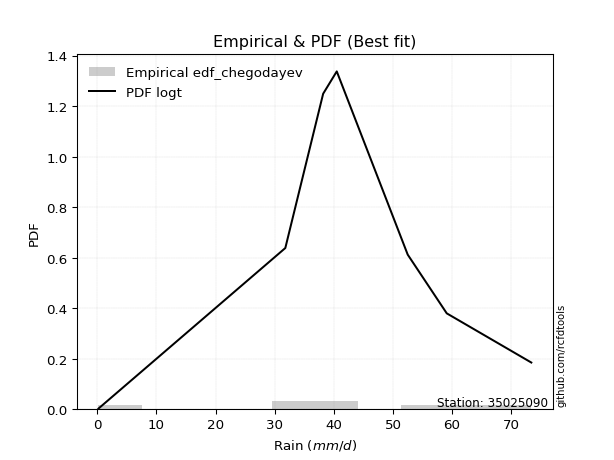</img>

</div>


### 6. EDF Blom (1958)

The Blom formula is a specific "plotting position" formula used in hydrology and statistical analysis to estimate the empirical cumulative probability (or non-exceedance probability) of a data series. It is particularly recommended for data that are approximately normally distributed. The constant _a_ is set to 0.375 (or 3/8).

<div align="center">


$P=(m-a)/(n+1-2a)$


</div>


**6.1. Empirical values**

<div align="center">

|                | 0                   | 1                   | 2                  | 3                  | 4                  | 5                  | 6                 | 7                  |
|:---------------|:--------------------|:--------------------|:-------------------|:-------------------|:-------------------|:-------------------|:------------------|:-------------------|
| date           | 2016                | 2020                | 2023               | 2022               | 2018               | 2017               | 2019              | 2021               |
| x              | 0.2                 | 31.8                | 34.4               | 38.2               | 40.5               | 52.5               | 59.1              | 73.4               |
| m              | 1                   | 2                   | 3                  | 4                  | 5                  | 6                  | 7                 | 8                  |
| empirical_dist | edf_blom            | edf_blom            | edf_blom           | edf_blom           | edf_blom           | edf_blom           | edf_blom          | edf_blom           |
| empirical      | 0.07575757575757576 | 0.19696969696969696 | 0.3181818181818182 | 0.4393939393939394 | 0.5606060606060606 | 0.6818181818181818 | 0.803030303030303 | 0.9242424242424242 |
| empirical_tr   | 1.0819672131147542  | 1.2452830188679247  | 1.4666666666666666 | 1.783783783783784  | 2.275862068965517  | 3.1428571428571423 | 5.076923076923076 | 13.199999999999992 |

</div>


**6.2. Kolmogorov-Smirnov fit test (sorted by Δ)**


<div align="center">

|                | 0                   | 1                   | 2                  | 3                   | 4                   | 5                   | 6                   | 7                   | 8                   | 9                   | 10                  | 11                 | 12                  | 13                  | 14                  | 15                 | 16                  | 17                  | 18                 | 19                  | 20                  | 21                  | 22                  | 23                 | 24                 | 25                  | 26                  | 27                 | 28                  | 29                 | 30                  | 31                 | 32                  | 33                  | 34                  | 35                  | 36                  | 37                  | 38                  | 39                  | 40                  | 41                  | 42                 | 43                  | 44                 | 45                  | 46                 | 47                  | 48                  | 49                 | 50                 | 51                  | 52                 | 53                 | 54                 | 55                 | 56                  | 57                 | 58                  | 59                  | 60                  | 61                  | 62                  | 63                  | 64                 | 65                  | 66                 | 67                 | 68                  | 69                  | 70                  | 71                 | 72                 | 73                  | 74                 | 75                 | 76                  | 77                 | 78                 | 79                 | 80                 | 81                 | 82                  | 83                 | 84                  | 85                  | 86                 | 87                 | 88                 | 89                 | 90                 | 91                 | 92                  | 93                 | 94                 | 95                  | 96                 | 97                 | 98                 | 99                  | 100                | 101                | 102                | 103                | 104                 | 105                 | 106                | 107                | 108                | 109                | 110                 | 111                 | 112                | 113                 | 114                | 115                | 116                | 117                | 118                | 119                | 120                | 121                | 122                | 123                | 124                | 125                | 126                | 127                | 128                 | 129                | 130                | 131                | 132                | 133                | 134                | 135                | 136                | 137                | 138                | 139                | 140                | 141                | 142                | 143                | 144                | 145                | 146                | 147                | 148                | 149                | 150                | 151                | 152                | 153                | 154                | 155                | 156                | 157                | 158                | 159                |
|:---------------|:--------------------|:--------------------|:-------------------|:--------------------|:--------------------|:--------------------|:--------------------|:--------------------|:--------------------|:--------------------|:--------------------|:-------------------|:--------------------|:--------------------|:--------------------|:-------------------|:--------------------|:--------------------|:-------------------|:--------------------|:--------------------|:--------------------|:--------------------|:-------------------|:-------------------|:--------------------|:--------------------|:-------------------|:--------------------|:-------------------|:--------------------|:-------------------|:--------------------|:--------------------|:--------------------|:--------------------|:--------------------|:--------------------|:--------------------|:--------------------|:--------------------|:--------------------|:-------------------|:--------------------|:-------------------|:--------------------|:-------------------|:--------------------|:--------------------|:-------------------|:-------------------|:--------------------|:-------------------|:-------------------|:-------------------|:-------------------|:--------------------|:-------------------|:--------------------|:--------------------|:--------------------|:--------------------|:--------------------|:--------------------|:-------------------|:--------------------|:-------------------|:-------------------|:--------------------|:--------------------|:--------------------|:-------------------|:-------------------|:--------------------|:-------------------|:-------------------|:--------------------|:-------------------|:-------------------|:-------------------|:-------------------|:-------------------|:--------------------|:-------------------|:--------------------|:--------------------|:-------------------|:-------------------|:-------------------|:-------------------|:-------------------|:-------------------|:--------------------|:-------------------|:-------------------|:--------------------|:-------------------|:-------------------|:-------------------|:--------------------|:-------------------|:-------------------|:-------------------|:-------------------|:--------------------|:--------------------|:-------------------|:-------------------|:-------------------|:-------------------|:--------------------|:--------------------|:-------------------|:--------------------|:-------------------|:-------------------|:-------------------|:-------------------|:-------------------|:-------------------|:-------------------|:-------------------|:-------------------|:-------------------|:-------------------|:-------------------|:-------------------|:-------------------|:--------------------|:-------------------|:-------------------|:-------------------|:-------------------|:-------------------|:-------------------|:-------------------|:-------------------|:-------------------|:-------------------|:-------------------|:-------------------|:-------------------|:-------------------|:-------------------|:-------------------|:-------------------|:-------------------|:-------------------|:-------------------|:-------------------|:-------------------|:-------------------|:-------------------|:-------------------|:-------------------|:-------------------|:-------------------|:-------------------|:-------------------|:-------------------|
| station        | 35025090            | 35025090            | 35025090           | 35025090            | 35025090            | 35025090            | 35025090            | 35025090            | 35025090            | 35025090            | 35025090            | 35025090           | 35025090            | 35025090            | 35025090            | 35025090           | 35025090            | 35025090            | 35025090           | 35025090            | 35025090            | 35025090            | 35025090            | 35025090           | 35025090           | 35025090            | 35025090            | 35025090           | 35025090            | 35025090           | 35025090            | 35025090           | 35025090            | 35025090            | 35025090            | 35025090            | 35025090            | 35025090            | 35025090            | 35025090            | 35025090            | 35025090            | 35025090           | 35025090            | 35025090           | 35025090            | 35025090           | 35025090            | 35025090            | 35025090           | 35025090           | 35025090            | 35025090           | 35025090           | 35025090           | 35025090           | 35025090            | 35025090           | 35025090            | 35025090            | 35025090            | 35025090            | 35025090            | 35025090            | 35025090           | 35025090            | 35025090           | 35025090           | 35025090            | 35025090            | 35025090            | 35025090           | 35025090           | 35025090            | 35025090           | 35025090           | 35025090            | 35025090           | 35025090           | 35025090           | 35025090           | 35025090           | 35025090            | 35025090           | 35025090            | 35025090            | 35025090           | 35025090           | 35025090           | 35025090           | 35025090           | 35025090           | 35025090            | 35025090           | 35025090           | 35025090            | 35025090           | 35025090           | 35025090           | 35025090            | 35025090           | 35025090           | 35025090           | 35025090           | 35025090            | 35025090            | 35025090           | 35025090           | 35025090           | 35025090           | 35025090            | 35025090            | 35025090           | 35025090            | 35025090           | 35025090           | 35025090           | 35025090           | 35025090           | 35025090           | 35025090           | 35025090           | 35025090           | 35025090           | 35025090           | 35025090           | 35025090           | 35025090           | 35025090            | 35025090           | 35025090           | 35025090           | 35025090           | 35025090           | 35025090           | 35025090           | 35025090           | 35025090           | 35025090           | 35025090           | 35025090           | 35025090           | 35025090           | 35025090           | 35025090           | 35025090           | 35025090           | 35025090           | 35025090           | 35025090           | 35025090           | 35025090           | 35025090           | 35025090           | 35025090           | 35025090           | 35025090           | 35025090           | 35025090           | 35025090           |
| empirical_dist | edf_blom            | edf_blom            | edf_blom           | edf_blom            | edf_blom            | edf_blom            | edf_blom            | edf_blom            | edf_blom            | edf_blom            | edf_blom            | edf_blom           | edf_blom            | edf_blom            | edf_blom            | edf_blom           | edf_blom            | edf_blom            | edf_blom           | edf_blom            | edf_blom            | edf_blom            | edf_blom            | edf_blom           | edf_blom           | edf_blom            | edf_blom            | edf_blom           | edf_blom            | edf_blom           | edf_blom            | edf_blom           | edf_blom            | edf_blom            | edf_blom            | edf_blom            | edf_blom            | edf_blom            | edf_blom            | edf_blom            | edf_blom            | edf_blom            | edf_blom           | edf_blom            | edf_blom           | edf_blom            | edf_blom           | edf_blom            | edf_blom            | edf_blom           | edf_blom           | edf_blom            | edf_blom           | edf_blom           | edf_blom           | edf_blom           | edf_blom            | edf_blom           | edf_blom            | edf_blom            | edf_blom            | edf_blom            | edf_blom            | edf_blom            | edf_blom           | edf_blom            | edf_blom           | edf_blom           | edf_blom            | edf_blom            | edf_blom            | edf_blom           | edf_blom           | edf_blom            | edf_blom           | edf_blom           | edf_blom            | edf_blom           | edf_blom           | edf_blom           | edf_blom           | edf_blom           | edf_blom            | edf_blom           | edf_blom            | edf_blom            | edf_blom           | edf_blom           | edf_blom           | edf_blom           | edf_blom           | edf_blom           | edf_blom            | edf_blom           | edf_blom           | edf_blom            | edf_blom           | edf_blom           | edf_blom           | edf_blom            | edf_blom           | edf_blom           | edf_blom           | edf_blom           | edf_blom            | edf_blom            | edf_blom           | edf_blom           | edf_blom           | edf_blom           | edf_blom            | edf_blom            | edf_blom           | edf_blom            | edf_blom           | edf_blom           | edf_blom           | edf_blom           | edf_blom           | edf_blom           | edf_blom           | edf_blom           | edf_blom           | edf_blom           | edf_blom           | edf_blom           | edf_blom           | edf_blom           | edf_blom            | edf_blom           | edf_blom           | edf_blom           | edf_blom           | edf_blom           | edf_blom           | edf_blom           | edf_blom           | edf_blom           | edf_blom           | edf_blom           | edf_blom           | edf_blom           | edf_blom           | edf_blom           | edf_blom           | edf_blom           | edf_blom           | edf_blom           | edf_blom           | edf_blom           | edf_blom           | edf_blom           | edf_blom           | edf_blom           | edf_blom           | edf_blom           | edf_blom           | edf_blom           | edf_blom           | edf_blom           |
| p_dist         | logt                | hypsecant           | laplace            | dgamma              | logistic            | pearson3            | skewnorm            | genlogistic         | weibull_min         | burr12              | foldnorm            | johnsonsu          | loggennorm          | genextreme          | dweibull            | t                  | norm                | crystalball         | nct                | exponnorm           | f                   | argus               | fatiguelife         | gengamma           | erlang             | betaprime           | rice                | gamma              | truncnorm           | gumbel_l           | anglit              | maxwell            | genpareto           | invgamma            | semicircular        | genhalflogistic     | gennorm             | alpha               | logjohnsonsu        | invgauss            | triang              | gumbel_r            | rayleigh           | cosine              | vonmises_line      | moyal               | gausshyper         | arcsine             | logdweibull         | wald               | halfnorm           | halflogistic        | truncweibull_min   | logdgamma          | kstwobign          | loglevy_l          | logpearson3         | kappa3             | uniform             | wrapcauchy          | logargus            | ksone               | ncf                 | gompertz            | trapezoid          | kappa4              | burr               | levy_l             | loggenextreme       | logloggamma         | beta                | bradford           | loggumbel_l        | logburr12           | truncexpon         | logtrapezoid       | logarcsine          | genexpon           | lomax              | logsemicircular    | logfoldnorm        | loganglit          | loggengamma         | loginvweibull      | logweibull_max      | logexponnorm        | lognorm            | logcrystalball     | lognakagami        | lognct             | logfatiguelife     | logalpha           | loglogistic         | loginvgamma        | loginvgauss        | loghypsecant        | logerlang          | logmaxwell         | logkstwobign       | lograyleigh         | loglaplace         | loglaplace         | logwrapcauchy      | johnsonsb          | logncf              | halfgennorm         | nakagami           | loghalfnorm        | logrice            | loggenexpon        | loggumbel_r         | logcosine           | loglomax           | loghalflogistic     | logmoyal           | invweibull         | logskewnorm        | loggenhalflogistic | loggausshyper      | logwald            | logf               | loggenpareto       | mielke             | logtriang          | exponweib          | rdist              | logvonmises_line   | logksone           | logtruncweibull_min | logburr            | logbeta            | logexponweib       | logkappa4          | logloglaplace      | weibull_max        | logkappa3          | loguniform         | logweibull_min     | powerlaw           | logtruncnorm       | logjohnsonsb       | logtruncexpon      | logmielke          | logbradford        | tukeylambda        | logbetaprime       | exponpow           | truncpareto        | loggamma           | loggamma           | logexponpow        | logpowerlaw        | logtruncpareto     | loggompertz        | loggenlogistic     | loghalfgennorm     | logtukeylambda     | logrdist           | logvonmises        | vonmises           |
| delta          | 0.07809945035913035 | 0.08873568911700436 | 0.0892757414803026 | 0.10171960813445169 | 0.10377080317619031 | 0.10521489619470359 | 0.10571422414596099 | 0.10617855718111996 | 0.10779957416933972 | 0.10780088872157145 | 0.11134765108521266 | 0.112116371945651  | 0.11553963203756773 | 0.11810685476983096 | 0.12376812973222417 | 0.1239252284619266 | 0.12392547125686398 | 0.12392547712718666 | 0.1239255791581027 | 0.12392820613353361 | 0.12485180503960241 | 0.12744210142350282 | 0.12770556703899594 | 0.1309670106477795 | 0.1315150319291185 | 0.13156169658717753 | 0.13348635923506336 | 0.1359105962545018 | 0.14385795644760302 | 0.1462142473643211 | 0.14667754311138048 | 0.1537492897293678 | 0.15527680869012656 | 0.15533459665288113 | 0.15629952304969935 | 0.15850587534827593 | 0.15871486925690514 | 0.15993206478851862 | 0.16148455749648766 | 0.16275230177830285 | 0.16289963384210998 | 0.16376496196385787 | 0.1653196287708456 | 0.16591519820067974 | 0.1720688154160248 | 0.17742481501940338 | 0.1851527006889947 | 0.19633748907231868 | 0.19697848887513414 | 0.197794586151408  | 0.1981945882794568 | 0.20087970337653394 | 0.2031363308125953 | 0.2076845422501945 | 0.2246528371339933 | 0.2322991313445662 | 0.23235697867441368 | 0.2345733331262544 | 0.23472429210134127 | 0.23473866214138517 | 0.24000822575157094 | 0.24610862725616828 | 0.24660782453672242 | 0.25820070910287524 | 0.2622990792091839 | 0.26442178343611106 | 0.270715339726422  | 0.2731122938452801 | 0.28581919888738233 | 0.29022595677165947 | 0.29032223611544217 | 0.3023851002178485 | 0.309967430607113  | 0.31535658162926145 | 0.3160196991314827 | 0.3243337880488711 | 0.34361969135524423 | 0.3465980229363676 | 0.3597057607337664 | 0.3601998153430365 | 0.3630256732729113 | 0.3643527905017296 | 0.36746782064202527 | 0.3717811189803765 | 0.37182737076414657 | 0.37438937557763413 | 0.3743927442379407 | 0.3743933304039247 | 0.3743999389400166 | 0.3745444209994551 | 0.3772773769416489 | 0.3789515137591389 | 0.38386497843366124 | 0.3849256679992357 | 0.3868807231670898 | 0.39177953654531356 | 0.3939377530800939 | 0.4032686885608758 | 0.4114579664034271 | 0.41240491832086784 | 0.4153153491297829 | 0.4153153491297829 | 0.4214379142903562 | 0.4270847249132749 | 0.42944086575763923 | 0.42957169556716907 | 0.4366634614424036 | 0.4382524284892277 | 0.4390410358035253 | 0.4398966258910649 | 0.44333914777534494 | 0.45721748543375046 | 0.4595654177565814 | 0.46613183161081034 | 0.4673902871007611 | 0.4803761806376438 | 0.5006621080973008 | 0.5034890876550109 | 0.5177297522151916 | 0.5341754167658996 | 0.5386722381501261 | 0.5411875595387232 | 0.542759729277547  | 0.5668458875616751 | 0.575908359676931  | 0.5911609312205708 | 0.5954036950208395 | 0.6016605045098424 | 0.6095548254482577  | 0.6190995484601001 | 0.6191222808323156 | 0.6252585878467176 | 0.639843177589833  | 0.6433738249416154 | 0.6517039674145968 | 0.6613546289702084 | 0.6613865448057503 | 0.6623666997864446 | 0.6666204795473836 | 0.6683008863981361 | 0.6740796471060082 | 0.6905128270481764 | 0.695769716902547  | 0.6992337577284187 | 0.7020123762651151 | 0.7276242113067821 | 0.7437255940194831 | 0.748907011632518  | 0.7596291205755956 | 0.7596291205755956 | 0.7624583405012006 | 0.7717342673182577 | 0.7843391200187759 | 0.8015580807953864 | 0.803030303030303  | 0.803030303030303  | 0.803030303030303  | 0.9240933333748399 | 0.9244478743276394 | 10.995954371520803 |
| deltao         | 0.4472608134160001  | 0.4472608134160001  | 0.4472608134160001 | 0.4472608134160001  | 0.4472608134160001  | 0.4472608134160001  | 0.4472608134160001  | 0.4472608134160001  | 0.4472608134160001  | 0.4472608134160001  | 0.4472608134160001  | 0.4472608134160001 | 0.4472608134160001  | 0.4472608134160001  | 0.4472608134160001  | 0.4472608134160001 | 0.4472608134160001  | 0.4472608134160001  | 0.4472608134160001 | 0.4472608134160001  | 0.4472608134160001  | 0.4472608134160001  | 0.4472608134160001  | 0.4472608134160001 | 0.4472608134160001 | 0.4472608134160001  | 0.4472608134160001  | 0.4472608134160001 | 0.4472608134160001  | 0.4472608134160001 | 0.4472608134160001  | 0.4472608134160001 | 0.4472608134160001  | 0.4472608134160001  | 0.4472608134160001  | 0.4472608134160001  | 0.4472608134160001  | 0.4472608134160001  | 0.4472608134160001  | 0.4472608134160001  | 0.4472608134160001  | 0.4472608134160001  | 0.4472608134160001 | 0.4472608134160001  | 0.4472608134160001 | 0.4472608134160001  | 0.4472608134160001 | 0.4472608134160001  | 0.4472608134160001  | 0.4472608134160001 | 0.4472608134160001 | 0.4472608134160001  | 0.4472608134160001 | 0.4472608134160001 | 0.4472608134160001 | 0.4472608134160001 | 0.4472608134160001  | 0.4472608134160001 | 0.4472608134160001  | 0.4472608134160001  | 0.4472608134160001  | 0.4472608134160001  | 0.4472608134160001  | 0.4472608134160001  | 0.4472608134160001 | 0.4472608134160001  | 0.4472608134160001 | 0.4472608134160001 | 0.4472608134160001  | 0.4472608134160001  | 0.4472608134160001  | 0.4472608134160001 | 0.4472608134160001 | 0.4472608134160001  | 0.4472608134160001 | 0.4472608134160001 | 0.4472608134160001  | 0.4472608134160001 | 0.4472608134160001 | 0.4472608134160001 | 0.4472608134160001 | 0.4472608134160001 | 0.4472608134160001  | 0.4472608134160001 | 0.4472608134160001  | 0.4472608134160001  | 0.4472608134160001 | 0.4472608134160001 | 0.4472608134160001 | 0.4472608134160001 | 0.4472608134160001 | 0.4472608134160001 | 0.4472608134160001  | 0.4472608134160001 | 0.4472608134160001 | 0.4472608134160001  | 0.4472608134160001 | 0.4472608134160001 | 0.4472608134160001 | 0.4472608134160001  | 0.4472608134160001 | 0.4472608134160001 | 0.4472608134160001 | 0.4472608134160001 | 0.4472608134160001  | 0.4472608134160001  | 0.4472608134160001 | 0.4472608134160001 | 0.4472608134160001 | 0.4472608134160001 | 0.4472608134160001  | 0.4472608134160001  | 0.4472608134160001 | 0.4472608134160001  | 0.4472608134160001 | 0.4472608134160001 | 0.4472608134160001 | 0.4472608134160001 | 0.4472608134160001 | 0.4472608134160001 | 0.4472608134160001 | 0.4472608134160001 | 0.4472608134160001 | 0.4472608134160001 | 0.4472608134160001 | 0.4472608134160001 | 0.4472608134160001 | 0.4472608134160001 | 0.4472608134160001  | 0.4472608134160001 | 0.4472608134160001 | 0.4472608134160001 | 0.4472608134160001 | 0.4472608134160001 | 0.4472608134160001 | 0.4472608134160001 | 0.4472608134160001 | 0.4472608134160001 | 0.4472608134160001 | 0.4472608134160001 | 0.4472608134160001 | 0.4472608134160001 | 0.4472608134160001 | 0.4472608134160001 | 0.4472608134160001 | 0.4472608134160001 | 0.4472608134160001 | 0.4472608134160001 | 0.4472608134160001 | 0.4472608134160001 | 0.4472608134160001 | 0.4472608134160001 | 0.4472608134160001 | 0.4472608134160001 | 0.4472608134160001 | 0.4472608134160001 | 0.4472608134160001 | 0.4472608134160001 | 0.4472608134160001 | 0.4472608134160001 |
| eval           | Δo > Δ              | Δo > Δ              | Δo > Δ             | Δo > Δ              | Δo > Δ              | Δo > Δ              | Δo > Δ              | Δo > Δ              | Δo > Δ              | Δo > Δ              | Δo > Δ              | Δo > Δ             | Δo > Δ              | Δo > Δ              | Δo > Δ              | Δo > Δ             | Δo > Δ              | Δo > Δ              | Δo > Δ             | Δo > Δ              | Δo > Δ              | Δo > Δ              | Δo > Δ              | Δo > Δ             | Δo > Δ             | Δo > Δ              | Δo > Δ              | Δo > Δ             | Δo > Δ              | Δo > Δ             | Δo > Δ              | Δo > Δ             | Δo > Δ              | Δo > Δ              | Δo > Δ              | Δo > Δ              | Δo > Δ              | Δo > Δ              | Δo > Δ              | Δo > Δ              | Δo > Δ              | Δo > Δ              | Δo > Δ             | Δo > Δ              | Δo > Δ             | Δo > Δ              | Δo > Δ             | Δo > Δ              | Δo > Δ              | Δo > Δ             | Δo > Δ             | Δo > Δ              | Δo > Δ             | Δo > Δ             | Δo > Δ             | Δo > Δ             | Δo > Δ              | Δo > Δ             | Δo > Δ              | Δo > Δ              | Δo > Δ              | Δo > Δ              | Δo > Δ              | Δo > Δ              | Δo > Δ             | Δo > Δ              | Δo > Δ             | Δo > Δ             | Δo > Δ              | Δo > Δ              | Δo > Δ              | Δo > Δ             | Δo > Δ             | Δo > Δ              | Δo > Δ             | Δo > Δ             | Δo > Δ              | Δo > Δ             | Δo > Δ             | Δo > Δ             | Δo > Δ             | Δo > Δ             | Δo > Δ              | Δo > Δ             | Δo > Δ              | Δo > Δ              | Δo > Δ             | Δo > Δ             | Δo > Δ             | Δo > Δ             | Δo > Δ             | Δo > Δ             | Δo > Δ              | Δo > Δ             | Δo > Δ             | Δo > Δ              | Δo > Δ             | Δo > Δ             | Δo > Δ             | Δo > Δ              | Δo > Δ             | Δo > Δ             | Δo > Δ             | Δo > Δ             | Δo > Δ              | Δo > Δ              | Δo > Δ             | Δo > Δ             | Δo > Δ             | Δo > Δ             | Δo > Δ              | Δo <= Δ             | Δo <= Δ            | Δo <= Δ             | Δo <= Δ            | Δo <= Δ            | Δo <= Δ            | Δo <= Δ            | Δo <= Δ            | Δo <= Δ            | Δo <= Δ            | Δo <= Δ            | Δo <= Δ            | Δo <= Δ            | Δo <= Δ            | Δo <= Δ            | Δo <= Δ            | Δo <= Δ            | Δo <= Δ             | Δo <= Δ            | Δo <= Δ            | Δo <= Δ            | Δo <= Δ            | Δo <= Δ            | Δo <= Δ            | Δo <= Δ            | Δo <= Δ            | Δo <= Δ            | Δo <= Δ            | Δo <= Δ            | Δo <= Δ            | Δo <= Δ            | Δo <= Δ            | Δo <= Δ            | Δo <= Δ            | Δo <= Δ            | Δo <= Δ            | Δo <= Δ            | Δo <= Δ            | Δo <= Δ            | Δo <= Δ            | Δo <= Δ            | Δo <= Δ            | Δo <= Δ            | Δo <= Δ            | Δo <= Δ            | Δo <= Δ            | Δo <= Δ            | Δo <= Δ            | Δo <= Δ            |
| fit            | 1                   | 1                   | 1                  | 1                   | 1                   | 1                   | 1                   | 1                   | 1                   | 1                   | 1                   | 1                  | 1                   | 1                   | 1                   | 1                  | 1                   | 1                   | 1                  | 1                   | 1                   | 1                   | 1                   | 1                  | 1                  | 1                   | 1                   | 1                  | 1                   | 1                  | 1                   | 1                  | 1                   | 1                   | 1                   | 1                   | 1                   | 1                   | 1                   | 1                   | 1                   | 1                   | 1                  | 1                   | 1                  | 1                   | 1                  | 1                   | 1                   | 1                  | 1                  | 1                   | 1                  | 1                  | 1                  | 1                  | 1                   | 1                  | 1                   | 1                   | 1                   | 1                   | 1                   | 1                   | 1                  | 1                   | 1                  | 1                  | 1                   | 1                   | 1                   | 1                  | 1                  | 1                   | 1                  | 1                  | 1                   | 1                  | 1                  | 1                  | 1                  | 1                  | 1                   | 1                  | 1                   | 1                   | 1                  | 1                  | 1                  | 1                  | 1                  | 1                  | 1                   | 1                  | 1                  | 1                   | 1                  | 1                  | 1                  | 1                   | 1                  | 1                  | 1                  | 1                  | 1                   | 1                   | 1                  | 1                  | 1                  | 1                  | 1                   | 0                   | 0                  | 0                   | 0                  | 0                  | 0                  | 0                  | 0                  | 0                  | 0                  | 0                  | 0                  | 0                  | 0                  | 0                  | 0                  | 0                  | 0                   | 0                  | 0                  | 0                  | 0                  | 0                  | 0                  | 0                  | 0                  | 0                  | 0                  | 0                  | 0                  | 0                  | 0                  | 0                  | 0                  | 0                  | 0                  | 0                  | 0                  | 0                  | 0                  | 0                  | 0                  | 0                  | 0                  | 0                  | 0                  | 0                  | 0                  | 0                  |
| n              | 8                   | 8                   | 8                  | 8                   | 8                   | 8                   | 8                   | 8                   | 8                   | 8                   | 8                   | 8                  | 8                   | 8                   | 8                   | 8                  | 8                   | 8                   | 8                  | 8                   | 8                   | 8                   | 8                   | 8                  | 8                  | 8                   | 8                   | 8                  | 8                   | 8                  | 8                   | 8                  | 8                   | 8                   | 8                   | 8                   | 8                   | 8                   | 8                   | 8                   | 8                   | 8                   | 8                  | 8                   | 8                  | 8                   | 8                  | 8                   | 8                   | 8                  | 8                  | 8                   | 8                  | 8                  | 8                  | 8                  | 8                   | 8                  | 8                   | 8                   | 8                   | 8                   | 8                   | 8                   | 8                  | 8                   | 8                  | 8                  | 8                   | 8                   | 8                   | 8                  | 8                  | 8                   | 8                  | 8                  | 8                   | 8                  | 8                  | 8                  | 8                  | 8                  | 8                   | 8                  | 8                   | 8                   | 8                  | 8                  | 8                  | 8                  | 8                  | 8                  | 8                   | 8                  | 8                  | 8                   | 8                  | 8                  | 8                  | 8                   | 8                  | 8                  | 8                  | 8                  | 8                   | 8                   | 8                  | 8                  | 8                  | 8                  | 8                   | 8                   | 8                  | 8                   | 8                  | 8                  | 8                  | 8                  | 8                  | 8                  | 8                  | 8                  | 8                  | 8                  | 8                  | 8                  | 8                  | 8                  | 8                   | 8                  | 8                  | 8                  | 8                  | 8                  | 8                  | 8                  | 8                  | 8                  | 8                  | 8                  | 8                  | 8                  | 8                  | 8                  | 8                  | 8                  | 8                  | 8                  | 8                  | 8                  | 8                  | 8                  | 8                  | 8                  | 8                  | 8                  | 8                  | 8                  | 8                  | 8                  |
| best_fit       | 1                   | 0                   | 0                  | 0                   | 0                   | 0                   | 0                   | 0                   | 0                   | 0                   | 0                   | 0                  | 0                   | 0                   | 0                   | 0                  | 0                   | 0                   | 0                  | 0                   | 0                   | 0                   | 0                   | 0                  | 0                  | 0                   | 0                   | 0                  | 0                   | 0                  | 0                   | 0                  | 0                   | 0                   | 0                   | 0                   | 0                   | 0                   | 0                   | 0                   | 0                   | 0                   | 0                  | 0                   | 0                  | 0                   | 0                  | 0                   | 0                   | 0                  | 0                  | 0                   | 0                  | 0                  | 0                  | 0                  | 0                   | 0                  | 0                   | 0                   | 0                   | 0                   | 0                   | 0                   | 0                  | 0                   | 0                  | 0                  | 0                   | 0                   | 0                   | 0                  | 0                  | 0                   | 0                  | 0                  | 0                   | 0                  | 0                  | 0                  | 0                  | 0                  | 0                   | 0                  | 0                   | 0                   | 0                  | 0                  | 0                  | 0                  | 0                  | 0                  | 0                   | 0                  | 0                  | 0                   | 0                  | 0                  | 0                  | 0                   | 0                  | 0                  | 0                  | 0                  | 0                   | 0                   | 0                  | 0                  | 0                  | 0                  | 0                   | 0                   | 0                  | 0                   | 0                  | 0                  | 0                  | 0                  | 0                  | 0                  | 0                  | 0                  | 0                  | 0                  | 0                  | 0                  | 0                  | 0                  | 0                   | 0                  | 0                  | 0                  | 0                  | 0                  | 0                  | 0                  | 0                  | 0                  | 0                  | 0                  | 0                  | 0                  | 0                  | 0                  | 0                  | 0                  | 0                  | 0                  | 0                  | 0                  | 0                  | 0                  | 0                  | 0                  | 0                  | 0                  | 0                  | 0                  | 0                  | 0                  |
| best_fit_sort  | 1                   | 2                   | 3                  | 4                   | 5                   | 6                   | 7                   | 8                   | 9                   | 10                  | 11                  | 12                 | 13                  | 14                  | 15                  | 16                 | 17                  | 18                  | 19                 | 20                  | 21                  | 22                  | 23                  | 24                 | 25                 | 26                  | 27                  | 28                 | 29                  | 30                 | 31                  | 32                 | 33                  | 34                  | 35                  | 36                  | 37                  | 38                  | 39                  | 40                  | 41                  | 42                  | 43                 | 44                  | 45                 | 46                  | 47                 | 48                  | 49                  | 50                 | 51                 | 52                  | 53                 | 54                 | 55                 | 56                 | 57                  | 58                 | 59                  | 60                  | 61                  | 62                  | 63                  | 64                  | 65                 | 66                  | 67                 | 68                 | 69                  | 70                  | 71                  | 72                 | 73                 | 74                  | 75                 | 76                 | 77                  | 78                 | 79                 | 80                 | 81                 | 82                 | 83                  | 84                 | 85                  | 86                  | 87                 | 88                 | 89                 | 90                 | 91                 | 92                 | 93                  | 94                 | 95                 | 96                  | 97                 | 98                 | 99                 | 100                 | 101                | 102                | 103                | 104                | 105                 | 106                 | 107                | 108                | 109                | 110                | 111                 | 112                 | 113                | 114                 | 115                | 116                | 117                | 118                | 119                | 120                | 121                | 122                | 123                | 124                | 125                | 126                | 127                | 128                | 129                 | 130                | 131                | 132                | 133                | 134                | 135                | 136                | 137                | 138                | 139                | 140                | 141                | 142                | 143                | 144                | 145                | 146                | 147                | 148                | 149                | 150                | 151                | 152                | 153                | 154                | 155                | 156                | 157                | 158                | 159                | 160                |

</div>


**6.3. Best fit**

<div align="center">

|   id |   station | empirical_dist   | p_dist   |     delta |   deltao | eval   |   fit |   n |   best_fit |   best_fit_sort |
|-----:|----------:|:-----------------|:---------|----------:|---------:|:-------|------:|----:|-----------:|----------------:|
|    0 |  35025090 | edf_blom         | logt     | 0.0780995 | 0.447261 | Δo > Δ |     1 |   8 |          1 |               1 |

</div>


<div align="center">

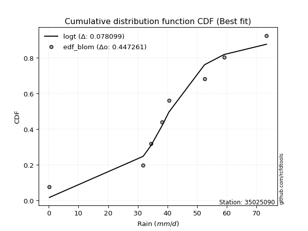</img>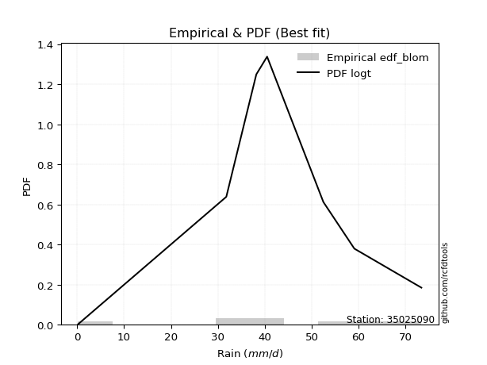</img>

</div>


### 7. EDF Tukey (1962)

In hydrology, the Tukey formula is used as a plotting position formula to estimate the empirical probability or frequency of a flood event (or other hydrological data). The formula parameter is given as _c=0.333_ (or 1/3).

<div align="center">


$P=(m-c)/(n+1-2c)$


</div>


**7.1. Empirical values**

<div align="center">

|                | 0                  | 1         | 2                  | 3                  | 4                 | 5                  | 6                 | 7                  |
|:---------------|:-------------------|:----------|:-------------------|:-------------------|:------------------|:-------------------|:------------------|:-------------------|
| date           | 2016               | 2020      | 2023               | 2022               | 2018              | 2017               | 2019              | 2021               |
| x              | 0.2                | 31.8      | 34.4               | 38.2               | 40.5              | 52.5               | 59.1              | 73.4               |
| m              | 1                  | 2         | 3                  | 4                  | 5                 | 6                  | 7                 | 8                  |
| empirical_dist | edf_tukey          | edf_tukey | edf_tukey          | edf_tukey          | edf_tukey         | edf_tukey          | edf_tukey         | edf_tukey          |
| empirical      | 0.08               | 0.2       | 0.32               | 0.44               | 0.56              | 0.68               | 0.8               | 0.92               |
| empirical_tr   | 1.0869565217391304 | 1.25      | 1.4705882352941178 | 1.7857142857142856 | 2.272727272727273 | 3.1250000000000004 | 5.000000000000001 | 12.500000000000007 |

</div>


**7.2. Kolmogorov-Smirnov fit test (sorted by Δ)**


<div align="center">

|                | 0                   | 1                   | 2                   | 3                   | 4                   | 5                   | 6                   | 7                   | 8                   | 9                   | 10                  | 11                 | 12                  | 13                  | 14                  | 15                  | 16                 | 17                  | 18                  | 19                  | 20                  | 21                  | 22                 | 23                  | 24                  | 25                  | 26                 | 27                  | 28                  | 29                  | 30                 | 31                  | 32                 | 33                  | 34                 | 35                  | 36                  | 37                 | 38                 | 39                  | 40                  | 41                  | 42                  | 43                 | 44                  | 45                  | 46                  | 47                  | 48                  | 49                  | 50                  | 51                  | 52                  | 53                  | 54                  | 55                  | 56                  | 57                  | 58                  | 59                  | 60                 | 61                  | 62                  | 63                  | 64                 | 65                 | 66                 | 67                 | 68                 | 69                 | 70                 | 71                  | 72                  | 73                 | 74                  | 75                  | 76                 | 77                  | 78                  | 79                 | 80                  | 81                  | 82                 | 83                 | 84                 | 85                 | 86                 | 87                  | 88                  | 89                  | 90                 | 91                  | 92                 | 93                  | 94                 | 95                 | 96                  | 97                 | 98                  | 99                 | 100                 | 101                 | 102                 | 103                | 104                | 105                | 106                 | 107                 | 108                | 109                | 110                | 111                | 112                 | 113                | 114                 | 115                 | 116                 | 117                | 118                | 119                | 120                | 121                | 122                | 123                | 124                | 125                | 126                | 127                | 128                 | 129                | 130                | 131                | 132                | 133                | 134                | 135                | 136                | 137                | 138                | 139                | 140                | 141                | 142                | 143                | 144                | 145                | 146                | 147                | 148                | 149                | 150                | 151                | 152                | 153                | 154                | 155                | 156                | 157                | 158                | 159                |
|:---------------|:--------------------|:--------------------|:--------------------|:--------------------|:--------------------|:--------------------|:--------------------|:--------------------|:--------------------|:--------------------|:--------------------|:-------------------|:--------------------|:--------------------|:--------------------|:--------------------|:-------------------|:--------------------|:--------------------|:--------------------|:--------------------|:--------------------|:-------------------|:--------------------|:--------------------|:--------------------|:-------------------|:--------------------|:--------------------|:--------------------|:-------------------|:--------------------|:-------------------|:--------------------|:-------------------|:--------------------|:--------------------|:-------------------|:-------------------|:--------------------|:--------------------|:--------------------|:--------------------|:-------------------|:--------------------|:--------------------|:--------------------|:--------------------|:--------------------|:--------------------|:--------------------|:--------------------|:--------------------|:--------------------|:--------------------|:--------------------|:--------------------|:--------------------|:--------------------|:--------------------|:-------------------|:--------------------|:--------------------|:--------------------|:-------------------|:-------------------|:-------------------|:-------------------|:-------------------|:-------------------|:-------------------|:--------------------|:--------------------|:-------------------|:--------------------|:--------------------|:-------------------|:--------------------|:--------------------|:-------------------|:--------------------|:--------------------|:-------------------|:-------------------|:-------------------|:-------------------|:-------------------|:--------------------|:--------------------|:--------------------|:-------------------|:--------------------|:-------------------|:--------------------|:-------------------|:-------------------|:--------------------|:-------------------|:--------------------|:-------------------|:--------------------|:--------------------|:--------------------|:-------------------|:-------------------|:-------------------|:--------------------|:--------------------|:-------------------|:-------------------|:-------------------|:-------------------|:--------------------|:-------------------|:--------------------|:--------------------|:--------------------|:-------------------|:-------------------|:-------------------|:-------------------|:-------------------|:-------------------|:-------------------|:-------------------|:-------------------|:-------------------|:-------------------|:--------------------|:-------------------|:-------------------|:-------------------|:-------------------|:-------------------|:-------------------|:-------------------|:-------------------|:-------------------|:-------------------|:-------------------|:-------------------|:-------------------|:-------------------|:-------------------|:-------------------|:-------------------|:-------------------|:-------------------|:-------------------|:-------------------|:-------------------|:-------------------|:-------------------|:-------------------|:-------------------|:-------------------|:-------------------|:-------------------|:-------------------|:-------------------|
| station        | 35025090            | 35025090            | 35025090            | 35025090            | 35025090            | 35025090            | 35025090            | 35025090            | 35025090            | 35025090            | 35025090            | 35025090           | 35025090            | 35025090            | 35025090            | 35025090            | 35025090           | 35025090            | 35025090            | 35025090            | 35025090            | 35025090            | 35025090           | 35025090            | 35025090            | 35025090            | 35025090           | 35025090            | 35025090            | 35025090            | 35025090           | 35025090            | 35025090           | 35025090            | 35025090           | 35025090            | 35025090            | 35025090           | 35025090           | 35025090            | 35025090            | 35025090            | 35025090            | 35025090           | 35025090            | 35025090            | 35025090            | 35025090            | 35025090            | 35025090            | 35025090            | 35025090            | 35025090            | 35025090            | 35025090            | 35025090            | 35025090            | 35025090            | 35025090            | 35025090            | 35025090           | 35025090            | 35025090            | 35025090            | 35025090           | 35025090           | 35025090           | 35025090           | 35025090           | 35025090           | 35025090           | 35025090            | 35025090            | 35025090           | 35025090            | 35025090            | 35025090           | 35025090            | 35025090            | 35025090           | 35025090            | 35025090            | 35025090           | 35025090           | 35025090           | 35025090           | 35025090           | 35025090            | 35025090            | 35025090            | 35025090           | 35025090            | 35025090           | 35025090            | 35025090           | 35025090           | 35025090            | 35025090           | 35025090            | 35025090           | 35025090            | 35025090            | 35025090            | 35025090           | 35025090           | 35025090           | 35025090            | 35025090            | 35025090           | 35025090           | 35025090           | 35025090           | 35025090            | 35025090           | 35025090            | 35025090            | 35025090            | 35025090           | 35025090           | 35025090           | 35025090           | 35025090           | 35025090           | 35025090           | 35025090           | 35025090           | 35025090           | 35025090           | 35025090            | 35025090           | 35025090           | 35025090           | 35025090           | 35025090           | 35025090           | 35025090           | 35025090           | 35025090           | 35025090           | 35025090           | 35025090           | 35025090           | 35025090           | 35025090           | 35025090           | 35025090           | 35025090           | 35025090           | 35025090           | 35025090           | 35025090           | 35025090           | 35025090           | 35025090           | 35025090           | 35025090           | 35025090           | 35025090           | 35025090           | 35025090           |
| empirical_dist | edf_tukey           | edf_tukey           | edf_tukey           | edf_tukey           | edf_tukey           | edf_tukey           | edf_tukey           | edf_tukey           | edf_tukey           | edf_tukey           | edf_tukey           | edf_tukey          | edf_tukey           | edf_tukey           | edf_tukey           | edf_tukey           | edf_tukey          | edf_tukey           | edf_tukey           | edf_tukey           | edf_tukey           | edf_tukey           | edf_tukey          | edf_tukey           | edf_tukey           | edf_tukey           | edf_tukey          | edf_tukey           | edf_tukey           | edf_tukey           | edf_tukey          | edf_tukey           | edf_tukey          | edf_tukey           | edf_tukey          | edf_tukey           | edf_tukey           | edf_tukey          | edf_tukey          | edf_tukey           | edf_tukey           | edf_tukey           | edf_tukey           | edf_tukey          | edf_tukey           | edf_tukey           | edf_tukey           | edf_tukey           | edf_tukey           | edf_tukey           | edf_tukey           | edf_tukey           | edf_tukey           | edf_tukey           | edf_tukey           | edf_tukey           | edf_tukey           | edf_tukey           | edf_tukey           | edf_tukey           | edf_tukey          | edf_tukey           | edf_tukey           | edf_tukey           | edf_tukey          | edf_tukey          | edf_tukey          | edf_tukey          | edf_tukey          | edf_tukey          | edf_tukey          | edf_tukey           | edf_tukey           | edf_tukey          | edf_tukey           | edf_tukey           | edf_tukey          | edf_tukey           | edf_tukey           | edf_tukey          | edf_tukey           | edf_tukey           | edf_tukey          | edf_tukey          | edf_tukey          | edf_tukey          | edf_tukey          | edf_tukey           | edf_tukey           | edf_tukey           | edf_tukey          | edf_tukey           | edf_tukey          | edf_tukey           | edf_tukey          | edf_tukey          | edf_tukey           | edf_tukey          | edf_tukey           | edf_tukey          | edf_tukey           | edf_tukey           | edf_tukey           | edf_tukey          | edf_tukey          | edf_tukey          | edf_tukey           | edf_tukey           | edf_tukey          | edf_tukey          | edf_tukey          | edf_tukey          | edf_tukey           | edf_tukey          | edf_tukey           | edf_tukey           | edf_tukey           | edf_tukey          | edf_tukey          | edf_tukey          | edf_tukey          | edf_tukey          | edf_tukey          | edf_tukey          | edf_tukey          | edf_tukey          | edf_tukey          | edf_tukey          | edf_tukey           | edf_tukey          | edf_tukey          | edf_tukey          | edf_tukey          | edf_tukey          | edf_tukey          | edf_tukey          | edf_tukey          | edf_tukey          | edf_tukey          | edf_tukey          | edf_tukey          | edf_tukey          | edf_tukey          | edf_tukey          | edf_tukey          | edf_tukey          | edf_tukey          | edf_tukey          | edf_tukey          | edf_tukey          | edf_tukey          | edf_tukey          | edf_tukey          | edf_tukey          | edf_tukey          | edf_tukey          | edf_tukey          | edf_tukey          | edf_tukey          | edf_tukey          |
| p_dist         | logt                | hypsecant           | laplace             | logistic            | dgamma              | pearson3            | skewnorm            | genlogistic         | weibull_min         | burr12              | foldnorm            | johnsonsu          | loggennorm          | genextreme          | t                   | norm                | crystalball        | nct                 | exponnorm           | f                   | argus               | fatiguelife         | dweibull           | gengamma            | erlang              | betaprime           | rice               | gamma               | truncnorm           | anglit              | gumbel_l           | maxwell             | genpareto          | invgamma            | semicircular       | alpha               | genhalflogistic     | logjohnsonsu       | invgauss           | gennorm             | gumbel_r            | rayleigh            | triang              | cosine             | vonmises_line       | moyal               | gausshyper          | logdweibull         | arcsine             | wald                | halfnorm            | halflogistic        | truncweibull_min    | logdgamma           | kstwobign           | loglevy_l           | logpearson3         | kappa3              | uniform             | wrapcauchy          | logargus           | ksone               | ncf                 | gompertz            | kappa4             | trapezoid          | burr               | levy_l             | loggenextreme      | logloggamma        | beta               | bradford            | loggumbel_l         | logburr12          | truncexpon          | logtrapezoid        | logarcsine         | genexpon            | lomax               | logsemicircular    | logfoldnorm         | loganglit           | loggengamma        | loginvweibull      | logweibull_max     | logexponnorm       | lognorm            | logcrystalball      | lognakagami         | lognct              | logfatiguelife     | logalpha            | loglogistic        | loginvgamma         | loginvgauss        | loghypsecant       | logerlang           | logmaxwell         | logkstwobign        | lograyleigh        | loglaplace          | loglaplace          | logwrapcauchy       | johnsonsb          | logncf             | halfgennorm        | nakagami            | loghalfnorm         | logrice            | loggenexpon        | loggumbel_r        | logcosine          | loglomax            | loghalflogistic    | logmoyal            | invweibull          | logskewnorm         | loggenhalflogistic | loggausshyper      | logwald            | logf               | loggenpareto       | mielke             | logtriang          | exponweib          | rdist              | logvonmises_line   | logksone           | logtruncweibull_min | logburr            | logbeta            | logexponweib       | logkappa4          | logloglaplace      | weibull_max        | logkappa3          | loguniform         | logweibull_min     | powerlaw           | logtruncnorm       | logjohnsonsb       | logtruncexpon      | logmielke          | logbradford        | tukeylambda        | logbetaprime       | exponpow           | truncpareto        | loggamma           | loggamma           | logexponpow        | logpowerlaw        | logtruncpareto     | loggompertz        | loggenlogistic     | loghalfgennorm     | logtukeylambda     | logrdist           | logvonmises        | vonmises           |
| delta          | 0.07991763217731207 | 0.08570538608670131 | 0.09109392329848431 | 0.10074050014588726 | 0.10353778995263341 | 0.10460883558864309 | 0.10510816353990049 | 0.10557249657505946 | 0.10719351356327922 | 0.10719482811551095 | 0.10831734805490961 | 0.1115103113395905 | 0.11250932900726468 | 0.11750079416377046 | 0.12089492543162356 | 0.12089516822656093 | 0.1208951740968836 | 0.12089527612779966 | 0.12089790310323056 | 0.12182150200929937 | 0.12441179839319977 | 0.12467526400869289 | 0.1255863115504059 | 0.12793670761747644 | 0.12848472889881546 | 0.12853139355687448 | 0.1304560562047603 | 0.13288029322419875 | 0.14082765341729997 | 0.14364724008107743 | 0.1456081867582606 | 0.15071898669906475 | 0.1522465056598235 | 0.15230429362257808 | 0.1532692200193963 | 0.15690176175821557 | 0.15789981474221543 | 0.1584542544661846 | 0.1597219987479998 | 0.16053305107508686 | 0.16073465893355482 | 0.16228932574054256 | 0.16229357323604948 | 0.1628848951703767 | 0.17388699723420653 | 0.17439451198910033 | 0.18212239765869165 | 0.19273606463270998 | 0.19330718604201563 | 0.19476428312110494 | 0.19516428524915375 | 0.19784940034623089 | 0.20010602778229225 | 0.20465423921989145 | 0.22162253410369026 | 0.22926882831426315 | 0.22932667564411063 | 0.23154303009595134 | 0.23169398907103822 | 0.23170835911108212 | 0.2369779227212679 | 0.24307832422586523 | 0.24357752150641937 | 0.25759464849681474 | 0.261391480405808  | 0.2616930186031234 | 0.2676850366961189 | 0.2688698696028558 | 0.2827888958570793 | 0.2871956537413564 | 0.2872919330851391 | 0.29935479718754543 | 0.30693712757680996 | 0.3123262785989584 | 0.31298939610117965 | 0.32130348501856804 | 0.3405893883249412 | 0.34356771990606455 | 0.35667545770346337 | 0.3571695123127335 | 0.35999537024260825 | 0.36132248747142653 | 0.3644375176117222 | 0.3687508159500735 | 0.3687970677338435 | 0.3713590725473311 | 0.3713624412076377 | 0.37136302737362165 | 0.37136963590971356 | 0.37151411796915207 | 0.3742470739113459 | 0.37592121072883583 | 0.3808346754033582 | 0.38189536496893267 | 0.3838504201367868 | 0.3887492335150105 | 0.39090745004979083 | 0.4002383855305727 | 0.40842766337312403 | 0.4093746152905648 | 0.41228504609947986 | 0.41228504609947986 | 0.41840761126005316 | 0.4240544218829719 | 0.4264105627273362 | 0.426541392536866  | 0.43363315841210054 | 0.43522212545892464 | 0.4360107327732223 | 0.4368663228607618 | 0.4403088447450419 | 0.4541871824034474 | 0.45653511472627833 | 0.4631015285805073 | 0.46435998407045803 | 0.47613375639521965 | 0.49763180506699783 | 0.5004587846247077 | 0.5146994491848886 | 0.5311451137355967 | 0.5356419351198232 | 0.5381572565084203 | 0.5397294262472441 | 0.5638155845313719 | 0.572878056646628  | 0.5881306281902678 | 0.5923733919905363 | 0.5986302014795395 | 0.6065245224179547  | 0.6160692454297971 | 0.6160919778020126 | 0.6222282848164145 | 0.6368128745595298 | 0.6403435219113125 | 0.6486736643842939 | 0.6583243259399054 | 0.6583562417754474 | 0.6593363967561414 | 0.6635901765170806 | 0.665270583367833  | 0.6710493440757053 | 0.6874825240178732 | 0.6927394138722438 | 0.6962034546981155 | 0.6989820732348122 | 0.724593908276479  | 0.74069529098918   | 0.7458767086022149 | 0.7565988175452925 | 0.7565988175452925 | 0.7594280374708975 | 0.7687039642879547 | 0.7813088169884728 | 0.7985277777650834 | 0.8                | 0.8                | 0.8                | 0.9198509091324157 | 0.9214175712973365 | 11.000196795763227 |
| deltao         | 0.4472608134160001  | 0.4472608134160001  | 0.4472608134160001  | 0.4472608134160001  | 0.4472608134160001  | 0.4472608134160001  | 0.4472608134160001  | 0.4472608134160001  | 0.4472608134160001  | 0.4472608134160001  | 0.4472608134160001  | 0.4472608134160001 | 0.4472608134160001  | 0.4472608134160001  | 0.4472608134160001  | 0.4472608134160001  | 0.4472608134160001 | 0.4472608134160001  | 0.4472608134160001  | 0.4472608134160001  | 0.4472608134160001  | 0.4472608134160001  | 0.4472608134160001 | 0.4472608134160001  | 0.4472608134160001  | 0.4472608134160001  | 0.4472608134160001 | 0.4472608134160001  | 0.4472608134160001  | 0.4472608134160001  | 0.4472608134160001 | 0.4472608134160001  | 0.4472608134160001 | 0.4472608134160001  | 0.4472608134160001 | 0.4472608134160001  | 0.4472608134160001  | 0.4472608134160001 | 0.4472608134160001 | 0.4472608134160001  | 0.4472608134160001  | 0.4472608134160001  | 0.4472608134160001  | 0.4472608134160001 | 0.4472608134160001  | 0.4472608134160001  | 0.4472608134160001  | 0.4472608134160001  | 0.4472608134160001  | 0.4472608134160001  | 0.4472608134160001  | 0.4472608134160001  | 0.4472608134160001  | 0.4472608134160001  | 0.4472608134160001  | 0.4472608134160001  | 0.4472608134160001  | 0.4472608134160001  | 0.4472608134160001  | 0.4472608134160001  | 0.4472608134160001 | 0.4472608134160001  | 0.4472608134160001  | 0.4472608134160001  | 0.4472608134160001 | 0.4472608134160001 | 0.4472608134160001 | 0.4472608134160001 | 0.4472608134160001 | 0.4472608134160001 | 0.4472608134160001 | 0.4472608134160001  | 0.4472608134160001  | 0.4472608134160001 | 0.4472608134160001  | 0.4472608134160001  | 0.4472608134160001 | 0.4472608134160001  | 0.4472608134160001  | 0.4472608134160001 | 0.4472608134160001  | 0.4472608134160001  | 0.4472608134160001 | 0.4472608134160001 | 0.4472608134160001 | 0.4472608134160001 | 0.4472608134160001 | 0.4472608134160001  | 0.4472608134160001  | 0.4472608134160001  | 0.4472608134160001 | 0.4472608134160001  | 0.4472608134160001 | 0.4472608134160001  | 0.4472608134160001 | 0.4472608134160001 | 0.4472608134160001  | 0.4472608134160001 | 0.4472608134160001  | 0.4472608134160001 | 0.4472608134160001  | 0.4472608134160001  | 0.4472608134160001  | 0.4472608134160001 | 0.4472608134160001 | 0.4472608134160001 | 0.4472608134160001  | 0.4472608134160001  | 0.4472608134160001 | 0.4472608134160001 | 0.4472608134160001 | 0.4472608134160001 | 0.4472608134160001  | 0.4472608134160001 | 0.4472608134160001  | 0.4472608134160001  | 0.4472608134160001  | 0.4472608134160001 | 0.4472608134160001 | 0.4472608134160001 | 0.4472608134160001 | 0.4472608134160001 | 0.4472608134160001 | 0.4472608134160001 | 0.4472608134160001 | 0.4472608134160001 | 0.4472608134160001 | 0.4472608134160001 | 0.4472608134160001  | 0.4472608134160001 | 0.4472608134160001 | 0.4472608134160001 | 0.4472608134160001 | 0.4472608134160001 | 0.4472608134160001 | 0.4472608134160001 | 0.4472608134160001 | 0.4472608134160001 | 0.4472608134160001 | 0.4472608134160001 | 0.4472608134160001 | 0.4472608134160001 | 0.4472608134160001 | 0.4472608134160001 | 0.4472608134160001 | 0.4472608134160001 | 0.4472608134160001 | 0.4472608134160001 | 0.4472608134160001 | 0.4472608134160001 | 0.4472608134160001 | 0.4472608134160001 | 0.4472608134160001 | 0.4472608134160001 | 0.4472608134160001 | 0.4472608134160001 | 0.4472608134160001 | 0.4472608134160001 | 0.4472608134160001 | 0.4472608134160001 |
| eval           | Δo > Δ              | Δo > Δ              | Δo > Δ              | Δo > Δ              | Δo > Δ              | Δo > Δ              | Δo > Δ              | Δo > Δ              | Δo > Δ              | Δo > Δ              | Δo > Δ              | Δo > Δ             | Δo > Δ              | Δo > Δ              | Δo > Δ              | Δo > Δ              | Δo > Δ             | Δo > Δ              | Δo > Δ              | Δo > Δ              | Δo > Δ              | Δo > Δ              | Δo > Δ             | Δo > Δ              | Δo > Δ              | Δo > Δ              | Δo > Δ             | Δo > Δ              | Δo > Δ              | Δo > Δ              | Δo > Δ             | Δo > Δ              | Δo > Δ             | Δo > Δ              | Δo > Δ             | Δo > Δ              | Δo > Δ              | Δo > Δ             | Δo > Δ             | Δo > Δ              | Δo > Δ              | Δo > Δ              | Δo > Δ              | Δo > Δ             | Δo > Δ              | Δo > Δ              | Δo > Δ              | Δo > Δ              | Δo > Δ              | Δo > Δ              | Δo > Δ              | Δo > Δ              | Δo > Δ              | Δo > Δ              | Δo > Δ              | Δo > Δ              | Δo > Δ              | Δo > Δ              | Δo > Δ              | Δo > Δ              | Δo > Δ             | Δo > Δ              | Δo > Δ              | Δo > Δ              | Δo > Δ             | Δo > Δ             | Δo > Δ             | Δo > Δ             | Δo > Δ             | Δo > Δ             | Δo > Δ             | Δo > Δ              | Δo > Δ              | Δo > Δ             | Δo > Δ              | Δo > Δ              | Δo > Δ             | Δo > Δ              | Δo > Δ              | Δo > Δ             | Δo > Δ              | Δo > Δ              | Δo > Δ             | Δo > Δ             | Δo > Δ             | Δo > Δ             | Δo > Δ             | Δo > Δ              | Δo > Δ              | Δo > Δ              | Δo > Δ             | Δo > Δ              | Δo > Δ             | Δo > Δ              | Δo > Δ             | Δo > Δ             | Δo > Δ              | Δo > Δ             | Δo > Δ              | Δo > Δ             | Δo > Δ              | Δo > Δ              | Δo > Δ              | Δo > Δ             | Δo > Δ             | Δo > Δ             | Δo > Δ              | Δo > Δ              | Δo > Δ             | Δo > Δ             | Δo > Δ             | Δo <= Δ            | Δo <= Δ             | Δo <= Δ            | Δo <= Δ             | Δo <= Δ             | Δo <= Δ             | Δo <= Δ            | Δo <= Δ            | Δo <= Δ            | Δo <= Δ            | Δo <= Δ            | Δo <= Δ            | Δo <= Δ            | Δo <= Δ            | Δo <= Δ            | Δo <= Δ            | Δo <= Δ            | Δo <= Δ             | Δo <= Δ            | Δo <= Δ            | Δo <= Δ            | Δo <= Δ            | Δo <= Δ            | Δo <= Δ            | Δo <= Δ            | Δo <= Δ            | Δo <= Δ            | Δo <= Δ            | Δo <= Δ            | Δo <= Δ            | Δo <= Δ            | Δo <= Δ            | Δo <= Δ            | Δo <= Δ            | Δo <= Δ            | Δo <= Δ            | Δo <= Δ            | Δo <= Δ            | Δo <= Δ            | Δo <= Δ            | Δo <= Δ            | Δo <= Δ            | Δo <= Δ            | Δo <= Δ            | Δo <= Δ            | Δo <= Δ            | Δo <= Δ            | Δo <= Δ            | Δo <= Δ            |
| fit            | 1                   | 1                   | 1                   | 1                   | 1                   | 1                   | 1                   | 1                   | 1                   | 1                   | 1                   | 1                  | 1                   | 1                   | 1                   | 1                   | 1                  | 1                   | 1                   | 1                   | 1                   | 1                   | 1                  | 1                   | 1                   | 1                   | 1                  | 1                   | 1                   | 1                   | 1                  | 1                   | 1                  | 1                   | 1                  | 1                   | 1                   | 1                  | 1                  | 1                   | 1                   | 1                   | 1                   | 1                  | 1                   | 1                   | 1                   | 1                   | 1                   | 1                   | 1                   | 1                   | 1                   | 1                   | 1                   | 1                   | 1                   | 1                   | 1                   | 1                   | 1                  | 1                   | 1                   | 1                   | 1                  | 1                  | 1                  | 1                  | 1                  | 1                  | 1                  | 1                   | 1                   | 1                  | 1                   | 1                   | 1                  | 1                   | 1                   | 1                  | 1                   | 1                   | 1                  | 1                  | 1                  | 1                  | 1                  | 1                   | 1                   | 1                   | 1                  | 1                   | 1                  | 1                   | 1                  | 1                  | 1                   | 1                  | 1                   | 1                  | 1                   | 1                   | 1                   | 1                  | 1                  | 1                  | 1                   | 1                   | 1                  | 1                  | 1                  | 0                  | 0                   | 0                  | 0                   | 0                   | 0                   | 0                  | 0                  | 0                  | 0                  | 0                  | 0                  | 0                  | 0                  | 0                  | 0                  | 0                  | 0                   | 0                  | 0                  | 0                  | 0                  | 0                  | 0                  | 0                  | 0                  | 0                  | 0                  | 0                  | 0                  | 0                  | 0                  | 0                  | 0                  | 0                  | 0                  | 0                  | 0                  | 0                  | 0                  | 0                  | 0                  | 0                  | 0                  | 0                  | 0                  | 0                  | 0                  | 0                  |
| n              | 8                   | 8                   | 8                   | 8                   | 8                   | 8                   | 8                   | 8                   | 8                   | 8                   | 8                   | 8                  | 8                   | 8                   | 8                   | 8                   | 8                  | 8                   | 8                   | 8                   | 8                   | 8                   | 8                  | 8                   | 8                   | 8                   | 8                  | 8                   | 8                   | 8                   | 8                  | 8                   | 8                  | 8                   | 8                  | 8                   | 8                   | 8                  | 8                  | 8                   | 8                   | 8                   | 8                   | 8                  | 8                   | 8                   | 8                   | 8                   | 8                   | 8                   | 8                   | 8                   | 8                   | 8                   | 8                   | 8                   | 8                   | 8                   | 8                   | 8                   | 8                  | 8                   | 8                   | 8                   | 8                  | 8                  | 8                  | 8                  | 8                  | 8                  | 8                  | 8                   | 8                   | 8                  | 8                   | 8                   | 8                  | 8                   | 8                   | 8                  | 8                   | 8                   | 8                  | 8                  | 8                  | 8                  | 8                  | 8                   | 8                   | 8                   | 8                  | 8                   | 8                  | 8                   | 8                  | 8                  | 8                   | 8                  | 8                   | 8                  | 8                   | 8                   | 8                   | 8                  | 8                  | 8                  | 8                   | 8                   | 8                  | 8                  | 8                  | 8                  | 8                   | 8                  | 8                   | 8                   | 8                   | 8                  | 8                  | 8                  | 8                  | 8                  | 8                  | 8                  | 8                  | 8                  | 8                  | 8                  | 8                   | 8                  | 8                  | 8                  | 8                  | 8                  | 8                  | 8                  | 8                  | 8                  | 8                  | 8                  | 8                  | 8                  | 8                  | 8                  | 8                  | 8                  | 8                  | 8                  | 8                  | 8                  | 8                  | 8                  | 8                  | 8                  | 8                  | 8                  | 8                  | 8                  | 8                  | 8                  |
| best_fit       | 1                   | 0                   | 0                   | 0                   | 0                   | 0                   | 0                   | 0                   | 0                   | 0                   | 0                   | 0                  | 0                   | 0                   | 0                   | 0                   | 0                  | 0                   | 0                   | 0                   | 0                   | 0                   | 0                  | 0                   | 0                   | 0                   | 0                  | 0                   | 0                   | 0                   | 0                  | 0                   | 0                  | 0                   | 0                  | 0                   | 0                   | 0                  | 0                  | 0                   | 0                   | 0                   | 0                   | 0                  | 0                   | 0                   | 0                   | 0                   | 0                   | 0                   | 0                   | 0                   | 0                   | 0                   | 0                   | 0                   | 0                   | 0                   | 0                   | 0                   | 0                  | 0                   | 0                   | 0                   | 0                  | 0                  | 0                  | 0                  | 0                  | 0                  | 0                  | 0                   | 0                   | 0                  | 0                   | 0                   | 0                  | 0                   | 0                   | 0                  | 0                   | 0                   | 0                  | 0                  | 0                  | 0                  | 0                  | 0                   | 0                   | 0                   | 0                  | 0                   | 0                  | 0                   | 0                  | 0                  | 0                   | 0                  | 0                   | 0                  | 0                   | 0                   | 0                   | 0                  | 0                  | 0                  | 0                   | 0                   | 0                  | 0                  | 0                  | 0                  | 0                   | 0                  | 0                   | 0                   | 0                   | 0                  | 0                  | 0                  | 0                  | 0                  | 0                  | 0                  | 0                  | 0                  | 0                  | 0                  | 0                   | 0                  | 0                  | 0                  | 0                  | 0                  | 0                  | 0                  | 0                  | 0                  | 0                  | 0                  | 0                  | 0                  | 0                  | 0                  | 0                  | 0                  | 0                  | 0                  | 0                  | 0                  | 0                  | 0                  | 0                  | 0                  | 0                  | 0                  | 0                  | 0                  | 0                  | 0                  |
| best_fit_sort  | 1                   | 2                   | 3                   | 4                   | 5                   | 6                   | 7                   | 8                   | 9                   | 10                  | 11                  | 12                 | 13                  | 14                  | 15                  | 16                  | 17                 | 18                  | 19                  | 20                  | 21                  | 22                  | 23                 | 24                  | 25                  | 26                  | 27                 | 28                  | 29                  | 30                  | 31                 | 32                  | 33                 | 34                  | 35                 | 36                  | 37                  | 38                 | 39                 | 40                  | 41                  | 42                  | 43                  | 44                 | 45                  | 46                  | 47                  | 48                  | 49                  | 50                  | 51                  | 52                  | 53                  | 54                  | 55                  | 56                  | 57                  | 58                  | 59                  | 60                  | 61                 | 62                  | 63                  | 64                  | 65                 | 66                 | 67                 | 68                 | 69                 | 70                 | 71                 | 72                  | 73                  | 74                 | 75                  | 76                  | 77                 | 78                  | 79                  | 80                 | 81                  | 82                  | 83                 | 84                 | 85                 | 86                 | 87                 | 88                  | 89                  | 90                  | 91                 | 92                  | 93                 | 94                  | 95                 | 96                 | 97                  | 98                 | 99                  | 100                | 101                 | 102                 | 103                 | 104                | 105                | 106                | 107                 | 108                 | 109                | 110                | 111                | 112                | 113                 | 114                | 115                 | 116                 | 117                 | 118                | 119                | 120                | 121                | 122                | 123                | 124                | 125                | 126                | 127                | 128                | 129                 | 130                | 131                | 132                | 133                | 134                | 135                | 136                | 137                | 138                | 139                | 140                | 141                | 142                | 143                | 144                | 145                | 146                | 147                | 148                | 149                | 150                | 151                | 152                | 153                | 154                | 155                | 156                | 157                | 158                | 159                | 160                |

</div>


**7.3. Best fit**

<div align="center">

|   id |   station | empirical_dist   | p_dist   |     delta |   deltao | eval   |   fit |   n |   best_fit |   best_fit_sort |
|-----:|----------:|:-----------------|:---------|----------:|---------:|:-------|------:|----:|-----------:|----------------:|
|    0 |  35025090 | edf_tukey        | logt     | 0.0799176 | 0.447261 | Δo > Δ |     1 |   8 |          1 |               1 |

</div>


<div align="center">

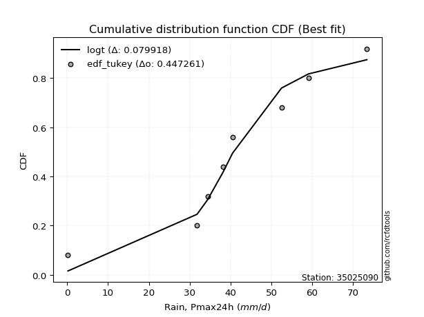</img>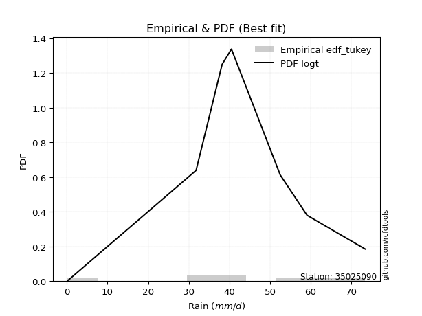</img>

</div>


### 8. EDF Gringorten (1963)

Gringorten plotting position formula is essential for estimating the probability and return periods of extreme events like floods and heavy rainfall. The constant _a=0.44_.

<div align="center">


$P=(m-a)/(n+1-2a)$


</div>


**8.1. Empirical values**

<div align="center">

|                | 0                   | 1                   | 2                  | 3                  | 4                  | 5                  | 6                  | 7                  |
|:---------------|:--------------------|:--------------------|:-------------------|:-------------------|:-------------------|:-------------------|:-------------------|:-------------------|
| date           | 2016                | 2020                | 2023               | 2022               | 2018               | 2017               | 2019               | 2021               |
| x              | 0.2                 | 31.8                | 34.4               | 38.2               | 40.5               | 52.5               | 59.1               | 73.4               |
| m              | 1                   | 2                   | 3                  | 4                  | 5                  | 6                  | 7                  | 8                  |
| empirical_dist | edf_gringorten      | edf_gringorten      | edf_gringorten     | edf_gringorten     | edf_gringorten     | edf_gringorten     | edf_gringorten     | edf_gringorten     |
| empirical      | 0.06896551724137932 | 0.19211822660098524 | 0.3152709359605912 | 0.4384236453201971 | 0.5615763546798029 | 0.6847290640394089 | 0.8078817733990148 | 0.9310344827586208 |
| empirical_tr   | 1.0740740740740742  | 1.2378048780487805  | 1.460431654676259  | 1.780701754385965  | 2.2808988764044944 | 3.1718750000000004 | 5.205128205128205  | 14.500000000000018 |

</div>


**8.2. Kolmogorov-Smirnov fit test (sorted by Δ)**


<div align="center">

|                | 0                  | 1                   | 2                   | 3                   | 4                   | 5                   | 6                   | 7                   | 8                  | 9                   | 10                  | 11                  | 12                  | 13                  | 14                  | 15                  | 16                 | 17                  | 18                  | 19                  | 20                  | 21                  | 22                  | 23                  | 24                  | 25                  | 26                  | 27                  | 28                  | 29                  | 30                 | 31                 | 32                  | 33                 | 34                  | 35                  | 36                  | 37                  | 38                  | 39                  | 40                  | 41                 | 42                  | 43                  | 44                  | 45                 | 46                  | 47                 | 48                  | 49                  | 50                  | 51                  | 52                  | 53                  | 54                  | 55                  | 56                 | 57                  | 58                 | 59                 | 60                  | 61                  | 62                  | 63                 | 64                  | 65                 | 66                  | 67                 | 68                 | 69                 | 70                  | 71                 | 72                  | 73                 | 74                  | 75                  | 76                 | 77                  | 78                 | 79                 | 80                  | 81                  | 82                 | 83                 | 84                 | 85                 | 86                 | 87                  | 88                  | 89                  | 90                 | 91                  | 92                 | 93                 | 94                 | 95                 | 96                  | 97                  | 98                  | 99                 | 100                 | 101                 | 102                 | 103                | 104                | 105                | 106                 | 107                 | 108                | 109                | 110                | 111                | 112                 | 113                | 114                 | 115                | 116                | 117                | 118                | 119                | 120                | 121                | 122                | 123                | 124                | 125                | 126                | 127                | 128                 | 129                | 130                | 131                | 132                | 133                | 134                | 135                | 136                | 137                | 138                | 139                | 140                | 141                | 142                | 143                | 144                | 145                | 146                | 147                | 148                | 149                | 150                | 151                | 152                | 153                | 154                | 155                | 156                | 157                | 158                | 159                |
|:---------------|:-------------------|:--------------------|:--------------------|:--------------------|:--------------------|:--------------------|:--------------------|:--------------------|:-------------------|:--------------------|:--------------------|:--------------------|:--------------------|:--------------------|:--------------------|:--------------------|:-------------------|:--------------------|:--------------------|:--------------------|:--------------------|:--------------------|:--------------------|:--------------------|:--------------------|:--------------------|:--------------------|:--------------------|:--------------------|:--------------------|:-------------------|:-------------------|:--------------------|:-------------------|:--------------------|:--------------------|:--------------------|:--------------------|:--------------------|:--------------------|:--------------------|:-------------------|:--------------------|:--------------------|:--------------------|:-------------------|:--------------------|:-------------------|:--------------------|:--------------------|:--------------------|:--------------------|:--------------------|:--------------------|:--------------------|:--------------------|:-------------------|:--------------------|:-------------------|:-------------------|:--------------------|:--------------------|:--------------------|:-------------------|:--------------------|:-------------------|:--------------------|:-------------------|:-------------------|:-------------------|:--------------------|:-------------------|:--------------------|:-------------------|:--------------------|:--------------------|:-------------------|:--------------------|:-------------------|:-------------------|:--------------------|:--------------------|:-------------------|:-------------------|:-------------------|:-------------------|:-------------------|:--------------------|:--------------------|:--------------------|:-------------------|:--------------------|:-------------------|:-------------------|:-------------------|:-------------------|:--------------------|:--------------------|:--------------------|:-------------------|:--------------------|:--------------------|:--------------------|:-------------------|:-------------------|:-------------------|:--------------------|:--------------------|:-------------------|:-------------------|:-------------------|:-------------------|:--------------------|:-------------------|:--------------------|:-------------------|:-------------------|:-------------------|:-------------------|:-------------------|:-------------------|:-------------------|:-------------------|:-------------------|:-------------------|:-------------------|:-------------------|:-------------------|:--------------------|:-------------------|:-------------------|:-------------------|:-------------------|:-------------------|:-------------------|:-------------------|:-------------------|:-------------------|:-------------------|:-------------------|:-------------------|:-------------------|:-------------------|:-------------------|:-------------------|:-------------------|:-------------------|:-------------------|:-------------------|:-------------------|:-------------------|:-------------------|:-------------------|:-------------------|:-------------------|:-------------------|:-------------------|:-------------------|:-------------------|:-------------------|
| station        | 35025090           | 35025090            | 35025090            | 35025090            | 35025090            | 35025090            | 35025090            | 35025090            | 35025090           | 35025090            | 35025090            | 35025090            | 35025090            | 35025090            | 35025090            | 35025090            | 35025090           | 35025090            | 35025090            | 35025090            | 35025090            | 35025090            | 35025090            | 35025090            | 35025090            | 35025090            | 35025090            | 35025090            | 35025090            | 35025090            | 35025090           | 35025090           | 35025090            | 35025090           | 35025090            | 35025090            | 35025090            | 35025090            | 35025090            | 35025090            | 35025090            | 35025090           | 35025090            | 35025090            | 35025090            | 35025090           | 35025090            | 35025090           | 35025090            | 35025090            | 35025090            | 35025090            | 35025090            | 35025090            | 35025090            | 35025090            | 35025090           | 35025090            | 35025090           | 35025090           | 35025090            | 35025090            | 35025090            | 35025090           | 35025090            | 35025090           | 35025090            | 35025090           | 35025090           | 35025090           | 35025090            | 35025090           | 35025090            | 35025090           | 35025090            | 35025090            | 35025090           | 35025090            | 35025090           | 35025090           | 35025090            | 35025090            | 35025090           | 35025090           | 35025090           | 35025090           | 35025090           | 35025090            | 35025090            | 35025090            | 35025090           | 35025090            | 35025090           | 35025090           | 35025090           | 35025090           | 35025090            | 35025090            | 35025090            | 35025090           | 35025090            | 35025090            | 35025090            | 35025090           | 35025090           | 35025090           | 35025090            | 35025090            | 35025090           | 35025090           | 35025090           | 35025090           | 35025090            | 35025090           | 35025090            | 35025090           | 35025090           | 35025090           | 35025090           | 35025090           | 35025090           | 35025090           | 35025090           | 35025090           | 35025090           | 35025090           | 35025090           | 35025090           | 35025090            | 35025090           | 35025090           | 35025090           | 35025090           | 35025090           | 35025090           | 35025090           | 35025090           | 35025090           | 35025090           | 35025090           | 35025090           | 35025090           | 35025090           | 35025090           | 35025090           | 35025090           | 35025090           | 35025090           | 35025090           | 35025090           | 35025090           | 35025090           | 35025090           | 35025090           | 35025090           | 35025090           | 35025090           | 35025090           | 35025090           | 35025090           |
| empirical_dist | edf_gringorten     | edf_gringorten      | edf_gringorten      | edf_gringorten      | edf_gringorten      | edf_gringorten      | edf_gringorten      | edf_gringorten      | edf_gringorten     | edf_gringorten      | edf_gringorten      | edf_gringorten      | edf_gringorten      | edf_gringorten      | edf_gringorten      | edf_gringorten      | edf_gringorten     | edf_gringorten      | edf_gringorten      | edf_gringorten      | edf_gringorten      | edf_gringorten      | edf_gringorten      | edf_gringorten      | edf_gringorten      | edf_gringorten      | edf_gringorten      | edf_gringorten      | edf_gringorten      | edf_gringorten      | edf_gringorten     | edf_gringorten     | edf_gringorten      | edf_gringorten     | edf_gringorten      | edf_gringorten      | edf_gringorten      | edf_gringorten      | edf_gringorten      | edf_gringorten      | edf_gringorten      | edf_gringorten     | edf_gringorten      | edf_gringorten      | edf_gringorten      | edf_gringorten     | edf_gringorten      | edf_gringorten     | edf_gringorten      | edf_gringorten      | edf_gringorten      | edf_gringorten      | edf_gringorten      | edf_gringorten      | edf_gringorten      | edf_gringorten      | edf_gringorten     | edf_gringorten      | edf_gringorten     | edf_gringorten     | edf_gringorten      | edf_gringorten      | edf_gringorten      | edf_gringorten     | edf_gringorten      | edf_gringorten     | edf_gringorten      | edf_gringorten     | edf_gringorten     | edf_gringorten     | edf_gringorten      | edf_gringorten     | edf_gringorten      | edf_gringorten     | edf_gringorten      | edf_gringorten      | edf_gringorten     | edf_gringorten      | edf_gringorten     | edf_gringorten     | edf_gringorten      | edf_gringorten      | edf_gringorten     | edf_gringorten     | edf_gringorten     | edf_gringorten     | edf_gringorten     | edf_gringorten      | edf_gringorten      | edf_gringorten      | edf_gringorten     | edf_gringorten      | edf_gringorten     | edf_gringorten     | edf_gringorten     | edf_gringorten     | edf_gringorten      | edf_gringorten      | edf_gringorten      | edf_gringorten     | edf_gringorten      | edf_gringorten      | edf_gringorten      | edf_gringorten     | edf_gringorten     | edf_gringorten     | edf_gringorten      | edf_gringorten      | edf_gringorten     | edf_gringorten     | edf_gringorten     | edf_gringorten     | edf_gringorten      | edf_gringorten     | edf_gringorten      | edf_gringorten     | edf_gringorten     | edf_gringorten     | edf_gringorten     | edf_gringorten     | edf_gringorten     | edf_gringorten     | edf_gringorten     | edf_gringorten     | edf_gringorten     | edf_gringorten     | edf_gringorten     | edf_gringorten     | edf_gringorten      | edf_gringorten     | edf_gringorten     | edf_gringorten     | edf_gringorten     | edf_gringorten     | edf_gringorten     | edf_gringorten     | edf_gringorten     | edf_gringorten     | edf_gringorten     | edf_gringorten     | edf_gringorten     | edf_gringorten     | edf_gringorten     | edf_gringorten     | edf_gringorten     | edf_gringorten     | edf_gringorten     | edf_gringorten     | edf_gringorten     | edf_gringorten     | edf_gringorten     | edf_gringorten     | edf_gringorten     | edf_gringorten     | edf_gringorten     | edf_gringorten     | edf_gringorten     | edf_gringorten     | edf_gringorten     | edf_gringorten     |
| p_dist         | logt               | laplace             | hypsecant           | dgamma              | skewnorm            | genlogistic         | pearson3            | logistic            | weibull_min        | burr12              | johnsonsu           | foldnorm            | genextreme          | loggennorm          | dweibull            | t                   | norm               | crystalball         | nct                 | exponnorm           | f                   | argus               | fatiguelife         | gengamma            | erlang              | betaprime           | rice                | gamma               | gumbel_l            | truncnorm           | anglit             | gennorm            | maxwell             | genhalflogistic    | genpareto           | invgamma            | semicircular        | triang              | alpha               | logjohnsonsu        | invgauss            | gumbel_r           | vonmises_line       | rayleigh            | cosine              | moyal              | gausshyper          | arcsine            | wald                | halfnorm            | logdweibull         | halflogistic        | truncweibull_min    | logdgamma           | kstwobign           | loglevy_l           | logpearson3        | kappa3              | uniform            | wrapcauchy         | logargus            | ksone               | ncf                 | gompertz           | trapezoid           | kappa4             | burr                | levy_l             | loggenextreme      | logloggamma        | beta                | bradford           | loggumbel_l         | logburr12          | truncexpon          | logtrapezoid        | logarcsine         | genexpon            | lomax              | logsemicircular    | logfoldnorm         | loganglit           | loggengamma        | loginvweibull      | logweibull_max     | logexponnorm       | lognorm            | logcrystalball      | lognakagami         | lognct              | logfatiguelife     | logalpha            | loglogistic        | loginvgamma        | loginvgauss        | loghypsecant       | logerlang           | logmaxwell          | logkstwobign        | lograyleigh        | loglaplace          | loglaplace          | logwrapcauchy       | johnsonsb          | logncf             | halfgennorm        | nakagami            | loghalfnorm         | logrice            | loggenexpon        | loggumbel_r        | logcosine          | loglomax            | loghalflogistic    | logmoyal            | invweibull         | logskewnorm        | loggenhalflogistic | loggausshyper      | logwald            | logf               | loggenpareto       | mielke             | logtriang          | exponweib          | rdist              | logvonmises_line   | logksone           | logtruncweibull_min | logburr            | logbeta            | logexponweib       | logkappa4          | logloglaplace      | weibull_max        | logkappa3          | loguniform         | logweibull_min     | powerlaw           | logtruncnorm       | logjohnsonsb       | logtruncexpon      | logmielke          | logbradford        | tukeylambda        | logbetaprime       | exponpow           | truncpareto        | loggamma           | loggamma           | logexponpow        | logpowerlaw        | logtruncpareto     | loggompertz        | loggenlogistic     | loghalfgennorm     | logtukeylambda     | logvonmises        | logrdist           | vonmises           |
| delta          | 0.0751885681379032 | 0.08739271793806802 | 0.09358715948571608 | 0.09880872591322454 | 0.10698192963337785 | 0.10714885125486234 | 0.10800040126002805 | 0.10862227354490203 | 0.1087698682430821 | 0.10877118279531384 | 0.11308666601939338 | 0.11619912145392439 | 0.11907714884357334 | 0.12039110240627945 | 0.12550524912007896 | 0.12877669883063833 | 0.1287769416255757 | 0.12877694749589838 | 0.12877704952681443 | 0.12877967650224534 | 0.12970327540831414 | 0.13229357179221454 | 0.13255703740770766 | 0.13581848101649122 | 0.13636650229783023 | 0.13641316695588926 | 0.13833782960377508 | 0.14076206662321353 | 0.14718454143806348 | 0.14870942681631474 | 0.1515290134800922 | 0.155803987035678  | 0.15860076009807952 | 0.1594761694220183 | 0.16012827905883828 | 0.16018606702159285 | 0.16115099341841108 | 0.16386992791585236 | 0.16478353515723035 | 0.16633602786519938 | 0.16760377214701458 | 0.1686164323325696 | 0.16915793319479766 | 0.17017109913955733 | 0.17076666856939146 | 0.1822762853881151 | 0.19000417105770642 | 0.2011889594410304 | 0.20264605652011972 | 0.20304605864816852 | 0.20377054739133071 | 0.20573117374524566 | 0.20798780118130702 | 0.21253601261890623 | 0.22950430750270503 | 0.23715060171327793 | 0.2372084490431254 | 0.23942480349496612 | 0.239575762470053  | 0.2395901325100969 | 0.24485969612028266 | 0.25096009762488003 | 0.25145929490543417 | 0.2591710031766176 | 0.26326937328292627 | 0.2692732538048228 | 0.27556681009513373 | 0.2799043523614765 | 0.2906706692560941 | 0.2950774271403712 | 0.29517370648415386 | 0.3072365705865602 | 0.31481890097582477 | 0.3202080519979732 | 0.32087116950019445 | 0.32918525841758284 | 0.348471161723956  | 0.35144949330507935 | 0.3645572311024782 | 0.3650512857117483 | 0.36787714364162305 | 0.36920426087044134 | 0.372319291010737  | 0.3766325893490883 | 0.3766788411328583 | 0.3792408459463459 | 0.3792442146066525 | 0.37924480077263645 | 0.37925140930872836 | 0.37939589136816687 | 0.3821288473103607 | 0.38380298412785063 | 0.388716448802373  | 0.3897771383679475 | 0.3917321935358016 | 0.3966310069140253 | 0.39878922344880563 | 0.40812015892958753 | 0.41630943677213883 | 0.4172563886895796 | 0.42016681949849466 | 0.42016681949849466 | 0.42628938465906796 | 0.4319361952819867 | 0.434292336126351  | 0.4344231659358808 | 0.44151493181111534 | 0.44310389885793944 | 0.4438925061722371 | 0.4447480962597766 | 0.4481906181440567 | 0.4620689558024622 | 0.46441688812529314 | 0.4709833019795221 | 0.47224175746947283 | 0.4871682391538404 | 0.5055135784660126 | 0.5083405580237226 | 0.5225812225839034 | 0.5390268871346114 | 0.5435237085188379 | 0.546039029907435  | 0.5476111996462588 | 0.5716973579303868 | 0.5807598300456428 | 0.5960124015892826 | 0.6002551653895511 | 0.6065119748785542 | 0.6144062958169695  | 0.6239510188288119 | 0.6239737512010274 | 0.6301100582154293 | 0.6446946479585447 | 0.6482252953103272 | 0.6565554377833086 | 0.6662060993389202 | 0.6662380151744621 | 0.6672181701551563 | 0.6714719499160954 | 0.6731523567668478 | 0.67893111747472   | 0.6953642974168881 | 0.7006211872712587 | 0.7040852280971304 | 0.706863846633827  | 0.7324756816754938 | 0.7485770643881948 | 0.7537584820012297 | 0.7644805909443073 | 0.7644805909443073 | 0.7673098108699123 | 0.7765857376869695 | 0.7891905903874876 | 0.8064095511640982 | 0.8078817733990148 | 0.8078817733990148 | 0.8078817733990148 | 0.9292993446963512 | 0.9308853918910364 | 10.989162313004606 |
| deltao         | 0.4472608134160001 | 0.4472608134160001  | 0.4472608134160001  | 0.4472608134160001  | 0.4472608134160001  | 0.4472608134160001  | 0.4472608134160001  | 0.4472608134160001  | 0.4472608134160001 | 0.4472608134160001  | 0.4472608134160001  | 0.4472608134160001  | 0.4472608134160001  | 0.4472608134160001  | 0.4472608134160001  | 0.4472608134160001  | 0.4472608134160001 | 0.4472608134160001  | 0.4472608134160001  | 0.4472608134160001  | 0.4472608134160001  | 0.4472608134160001  | 0.4472608134160001  | 0.4472608134160001  | 0.4472608134160001  | 0.4472608134160001  | 0.4472608134160001  | 0.4472608134160001  | 0.4472608134160001  | 0.4472608134160001  | 0.4472608134160001 | 0.4472608134160001 | 0.4472608134160001  | 0.4472608134160001 | 0.4472608134160001  | 0.4472608134160001  | 0.4472608134160001  | 0.4472608134160001  | 0.4472608134160001  | 0.4472608134160001  | 0.4472608134160001  | 0.4472608134160001 | 0.4472608134160001  | 0.4472608134160001  | 0.4472608134160001  | 0.4472608134160001 | 0.4472608134160001  | 0.4472608134160001 | 0.4472608134160001  | 0.4472608134160001  | 0.4472608134160001  | 0.4472608134160001  | 0.4472608134160001  | 0.4472608134160001  | 0.4472608134160001  | 0.4472608134160001  | 0.4472608134160001 | 0.4472608134160001  | 0.4472608134160001 | 0.4472608134160001 | 0.4472608134160001  | 0.4472608134160001  | 0.4472608134160001  | 0.4472608134160001 | 0.4472608134160001  | 0.4472608134160001 | 0.4472608134160001  | 0.4472608134160001 | 0.4472608134160001 | 0.4472608134160001 | 0.4472608134160001  | 0.4472608134160001 | 0.4472608134160001  | 0.4472608134160001 | 0.4472608134160001  | 0.4472608134160001  | 0.4472608134160001 | 0.4472608134160001  | 0.4472608134160001 | 0.4472608134160001 | 0.4472608134160001  | 0.4472608134160001  | 0.4472608134160001 | 0.4472608134160001 | 0.4472608134160001 | 0.4472608134160001 | 0.4472608134160001 | 0.4472608134160001  | 0.4472608134160001  | 0.4472608134160001  | 0.4472608134160001 | 0.4472608134160001  | 0.4472608134160001 | 0.4472608134160001 | 0.4472608134160001 | 0.4472608134160001 | 0.4472608134160001  | 0.4472608134160001  | 0.4472608134160001  | 0.4472608134160001 | 0.4472608134160001  | 0.4472608134160001  | 0.4472608134160001  | 0.4472608134160001 | 0.4472608134160001 | 0.4472608134160001 | 0.4472608134160001  | 0.4472608134160001  | 0.4472608134160001 | 0.4472608134160001 | 0.4472608134160001 | 0.4472608134160001 | 0.4472608134160001  | 0.4472608134160001 | 0.4472608134160001  | 0.4472608134160001 | 0.4472608134160001 | 0.4472608134160001 | 0.4472608134160001 | 0.4472608134160001 | 0.4472608134160001 | 0.4472608134160001 | 0.4472608134160001 | 0.4472608134160001 | 0.4472608134160001 | 0.4472608134160001 | 0.4472608134160001 | 0.4472608134160001 | 0.4472608134160001  | 0.4472608134160001 | 0.4472608134160001 | 0.4472608134160001 | 0.4472608134160001 | 0.4472608134160001 | 0.4472608134160001 | 0.4472608134160001 | 0.4472608134160001 | 0.4472608134160001 | 0.4472608134160001 | 0.4472608134160001 | 0.4472608134160001 | 0.4472608134160001 | 0.4472608134160001 | 0.4472608134160001 | 0.4472608134160001 | 0.4472608134160001 | 0.4472608134160001 | 0.4472608134160001 | 0.4472608134160001 | 0.4472608134160001 | 0.4472608134160001 | 0.4472608134160001 | 0.4472608134160001 | 0.4472608134160001 | 0.4472608134160001 | 0.4472608134160001 | 0.4472608134160001 | 0.4472608134160001 | 0.4472608134160001 | 0.4472608134160001 |
| eval           | Δo > Δ             | Δo > Δ              | Δo > Δ              | Δo > Δ              | Δo > Δ              | Δo > Δ              | Δo > Δ              | Δo > Δ              | Δo > Δ             | Δo > Δ              | Δo > Δ              | Δo > Δ              | Δo > Δ              | Δo > Δ              | Δo > Δ              | Δo > Δ              | Δo > Δ             | Δo > Δ              | Δo > Δ              | Δo > Δ              | Δo > Δ              | Δo > Δ              | Δo > Δ              | Δo > Δ              | Δo > Δ              | Δo > Δ              | Δo > Δ              | Δo > Δ              | Δo > Δ              | Δo > Δ              | Δo > Δ             | Δo > Δ             | Δo > Δ              | Δo > Δ             | Δo > Δ              | Δo > Δ              | Δo > Δ              | Δo > Δ              | Δo > Δ              | Δo > Δ              | Δo > Δ              | Δo > Δ             | Δo > Δ              | Δo > Δ              | Δo > Δ              | Δo > Δ             | Δo > Δ              | Δo > Δ             | Δo > Δ              | Δo > Δ              | Δo > Δ              | Δo > Δ              | Δo > Δ              | Δo > Δ              | Δo > Δ              | Δo > Δ              | Δo > Δ             | Δo > Δ              | Δo > Δ             | Δo > Δ             | Δo > Δ              | Δo > Δ              | Δo > Δ              | Δo > Δ             | Δo > Δ              | Δo > Δ             | Δo > Δ              | Δo > Δ             | Δo > Δ             | Δo > Δ             | Δo > Δ              | Δo > Δ             | Δo > Δ              | Δo > Δ             | Δo > Δ              | Δo > Δ              | Δo > Δ             | Δo > Δ              | Δo > Δ             | Δo > Δ             | Δo > Δ              | Δo > Δ              | Δo > Δ             | Δo > Δ             | Δo > Δ             | Δo > Δ             | Δo > Δ             | Δo > Δ              | Δo > Δ              | Δo > Δ              | Δo > Δ             | Δo > Δ              | Δo > Δ             | Δo > Δ             | Δo > Δ             | Δo > Δ             | Δo > Δ              | Δo > Δ              | Δo > Δ              | Δo > Δ             | Δo > Δ              | Δo > Δ              | Δo > Δ              | Δo > Δ             | Δo > Δ             | Δo > Δ             | Δo > Δ              | Δo > Δ              | Δo > Δ             | Δo > Δ             | Δo <= Δ            | Δo <= Δ            | Δo <= Δ             | Δo <= Δ            | Δo <= Δ             | Δo <= Δ            | Δo <= Δ            | Δo <= Δ            | Δo <= Δ            | Δo <= Δ            | Δo <= Δ            | Δo <= Δ            | Δo <= Δ            | Δo <= Δ            | Δo <= Δ            | Δo <= Δ            | Δo <= Δ            | Δo <= Δ            | Δo <= Δ             | Δo <= Δ            | Δo <= Δ            | Δo <= Δ            | Δo <= Δ            | Δo <= Δ            | Δo <= Δ            | Δo <= Δ            | Δo <= Δ            | Δo <= Δ            | Δo <= Δ            | Δo <= Δ            | Δo <= Δ            | Δo <= Δ            | Δo <= Δ            | Δo <= Δ            | Δo <= Δ            | Δo <= Δ            | Δo <= Δ            | Δo <= Δ            | Δo <= Δ            | Δo <= Δ            | Δo <= Δ            | Δo <= Δ            | Δo <= Δ            | Δo <= Δ            | Δo <= Δ            | Δo <= Δ            | Δo <= Δ            | Δo <= Δ            | Δo <= Δ            | Δo <= Δ            |
| fit            | 1                  | 1                   | 1                   | 1                   | 1                   | 1                   | 1                   | 1                   | 1                  | 1                   | 1                   | 1                   | 1                   | 1                   | 1                   | 1                   | 1                  | 1                   | 1                   | 1                   | 1                   | 1                   | 1                   | 1                   | 1                   | 1                   | 1                   | 1                   | 1                   | 1                   | 1                  | 1                  | 1                   | 1                  | 1                   | 1                   | 1                   | 1                   | 1                   | 1                   | 1                   | 1                  | 1                   | 1                   | 1                   | 1                  | 1                   | 1                  | 1                   | 1                   | 1                   | 1                   | 1                   | 1                   | 1                   | 1                   | 1                  | 1                   | 1                  | 1                  | 1                   | 1                   | 1                   | 1                  | 1                   | 1                  | 1                   | 1                  | 1                  | 1                  | 1                   | 1                  | 1                   | 1                  | 1                   | 1                   | 1                  | 1                   | 1                  | 1                  | 1                   | 1                   | 1                  | 1                  | 1                  | 1                  | 1                  | 1                   | 1                   | 1                   | 1                  | 1                   | 1                  | 1                  | 1                  | 1                  | 1                   | 1                   | 1                   | 1                  | 1                   | 1                   | 1                   | 1                  | 1                  | 1                  | 1                   | 1                   | 1                  | 1                  | 0                  | 0                  | 0                   | 0                  | 0                   | 0                  | 0                  | 0                  | 0                  | 0                  | 0                  | 0                  | 0                  | 0                  | 0                  | 0                  | 0                  | 0                  | 0                   | 0                  | 0                  | 0                  | 0                  | 0                  | 0                  | 0                  | 0                  | 0                  | 0                  | 0                  | 0                  | 0                  | 0                  | 0                  | 0                  | 0                  | 0                  | 0                  | 0                  | 0                  | 0                  | 0                  | 0                  | 0                  | 0                  | 0                  | 0                  | 0                  | 0                  | 0                  |
| n              | 8                  | 8                   | 8                   | 8                   | 8                   | 8                   | 8                   | 8                   | 8                  | 8                   | 8                   | 8                   | 8                   | 8                   | 8                   | 8                   | 8                  | 8                   | 8                   | 8                   | 8                   | 8                   | 8                   | 8                   | 8                   | 8                   | 8                   | 8                   | 8                   | 8                   | 8                  | 8                  | 8                   | 8                  | 8                   | 8                   | 8                   | 8                   | 8                   | 8                   | 8                   | 8                  | 8                   | 8                   | 8                   | 8                  | 8                   | 8                  | 8                   | 8                   | 8                   | 8                   | 8                   | 8                   | 8                   | 8                   | 8                  | 8                   | 8                  | 8                  | 8                   | 8                   | 8                   | 8                  | 8                   | 8                  | 8                   | 8                  | 8                  | 8                  | 8                   | 8                  | 8                   | 8                  | 8                   | 8                   | 8                  | 8                   | 8                  | 8                  | 8                   | 8                   | 8                  | 8                  | 8                  | 8                  | 8                  | 8                   | 8                   | 8                   | 8                  | 8                   | 8                  | 8                  | 8                  | 8                  | 8                   | 8                   | 8                   | 8                  | 8                   | 8                   | 8                   | 8                  | 8                  | 8                  | 8                   | 8                   | 8                  | 8                  | 8                  | 8                  | 8                   | 8                  | 8                   | 8                  | 8                  | 8                  | 8                  | 8                  | 8                  | 8                  | 8                  | 8                  | 8                  | 8                  | 8                  | 8                  | 8                   | 8                  | 8                  | 8                  | 8                  | 8                  | 8                  | 8                  | 8                  | 8                  | 8                  | 8                  | 8                  | 8                  | 8                  | 8                  | 8                  | 8                  | 8                  | 8                  | 8                  | 8                  | 8                  | 8                  | 8                  | 8                  | 8                  | 8                  | 8                  | 8                  | 8                  | 8                  |
| best_fit       | 1                  | 0                   | 0                   | 0                   | 0                   | 0                   | 0                   | 0                   | 0                  | 0                   | 0                   | 0                   | 0                   | 0                   | 0                   | 0                   | 0                  | 0                   | 0                   | 0                   | 0                   | 0                   | 0                   | 0                   | 0                   | 0                   | 0                   | 0                   | 0                   | 0                   | 0                  | 0                  | 0                   | 0                  | 0                   | 0                   | 0                   | 0                   | 0                   | 0                   | 0                   | 0                  | 0                   | 0                   | 0                   | 0                  | 0                   | 0                  | 0                   | 0                   | 0                   | 0                   | 0                   | 0                   | 0                   | 0                   | 0                  | 0                   | 0                  | 0                  | 0                   | 0                   | 0                   | 0                  | 0                   | 0                  | 0                   | 0                  | 0                  | 0                  | 0                   | 0                  | 0                   | 0                  | 0                   | 0                   | 0                  | 0                   | 0                  | 0                  | 0                   | 0                   | 0                  | 0                  | 0                  | 0                  | 0                  | 0                   | 0                   | 0                   | 0                  | 0                   | 0                  | 0                  | 0                  | 0                  | 0                   | 0                   | 0                   | 0                  | 0                   | 0                   | 0                   | 0                  | 0                  | 0                  | 0                   | 0                   | 0                  | 0                  | 0                  | 0                  | 0                   | 0                  | 0                   | 0                  | 0                  | 0                  | 0                  | 0                  | 0                  | 0                  | 0                  | 0                  | 0                  | 0                  | 0                  | 0                  | 0                   | 0                  | 0                  | 0                  | 0                  | 0                  | 0                  | 0                  | 0                  | 0                  | 0                  | 0                  | 0                  | 0                  | 0                  | 0                  | 0                  | 0                  | 0                  | 0                  | 0                  | 0                  | 0                  | 0                  | 0                  | 0                  | 0                  | 0                  | 0                  | 0                  | 0                  | 0                  |
| best_fit_sort  | 1                  | 2                   | 3                   | 4                   | 5                   | 6                   | 7                   | 8                   | 9                  | 10                  | 11                  | 12                  | 13                  | 14                  | 15                  | 16                  | 17                 | 18                  | 19                  | 20                  | 21                  | 22                  | 23                  | 24                  | 25                  | 26                  | 27                  | 28                  | 29                  | 30                  | 31                 | 32                 | 33                  | 34                 | 35                  | 36                  | 37                  | 38                  | 39                  | 40                  | 41                  | 42                 | 43                  | 44                  | 45                  | 46                 | 47                  | 48                 | 49                  | 50                  | 51                  | 52                  | 53                  | 54                  | 55                  | 56                  | 57                 | 58                  | 59                 | 60                 | 61                  | 62                  | 63                  | 64                 | 65                  | 66                 | 67                  | 68                 | 69                 | 70                 | 71                  | 72                 | 73                  | 74                 | 75                  | 76                  | 77                 | 78                  | 79                 | 80                 | 81                  | 82                  | 83                 | 84                 | 85                 | 86                 | 87                 | 88                  | 89                  | 90                  | 91                 | 92                  | 93                 | 94                 | 95                 | 96                 | 97                  | 98                  | 99                  | 100                | 101                 | 102                 | 103                 | 104                | 105                | 106                | 107                 | 108                 | 109                | 110                | 111                | 112                | 113                 | 114                | 115                 | 116                | 117                | 118                | 119                | 120                | 121                | 122                | 123                | 124                | 125                | 126                | 127                | 128                | 129                 | 130                | 131                | 132                | 133                | 134                | 135                | 136                | 137                | 138                | 139                | 140                | 141                | 142                | 143                | 144                | 145                | 146                | 147                | 148                | 149                | 150                | 151                | 152                | 153                | 154                | 155                | 156                | 157                | 158                | 159                | 160                |

</div>


**8.3. Best fit**

<div align="center">

|   id |   station | empirical_dist   | p_dist   |     delta |   deltao | eval   |   fit |   n |   best_fit |   best_fit_sort |
|-----:|----------:|:-----------------|:---------|----------:|---------:|:-------|------:|----:|-----------:|----------------:|
|    0 |  35025090 | edf_gringorten   | logt     | 0.0751886 | 0.447261 | Δo > Δ |     1 |   8 |          1 |               1 |

</div>


<div align="center">

</img>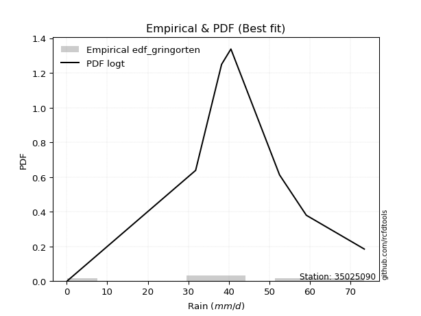</img>

</div>


### 9. EDF Filliben (1975)

The specific values of the constants (0.3175) (often denoted as $alpha$) and (0.365) are derived from a method proposed by James J. Filliben in a 1975 paper. This particular formula is the mean value of the $i$-th order statistic of the normal distribution and is considered a robust and effective plotting position formula for the normal probability plot correlation coefficient test for normality.

<div align="center">


$P=(m-0.3175)/(n+0.365)$


</div>


**9.1. Empirical values**

<div align="center">

|                | 0                  | 1                   | 2                  | 3                   | 4                  | 5                  | 6                  | 7                  |
|:---------------|:-------------------|:--------------------|:-------------------|:--------------------|:-------------------|:-------------------|:-------------------|:-------------------|
| date           | 2016               | 2020                | 2023               | 2022                | 2018               | 2017               | 2019               | 2021               |
| x              | 0.2                | 31.8                | 34.4               | 38.2                | 40.5               | 52.5               | 59.1               | 73.4               |
| m              | 1                  | 2                   | 3                  | 4                   | 5                  | 6                  | 7                  | 8                  |
| empirical_dist | edf_filliben       | edf_filliben        | edf_filliben       | edf_filliben        | edf_filliben       | edf_filliben       | edf_filliben       | edf_filliben       |
| empirical      | 0.0815899581589958 | 0.20113568439928273 | 0.3206814106395696 | 0.44022713687985654 | 0.5597728631201434 | 0.6793185893604303 | 0.7988643156007172 | 0.9184100418410042 |
| empirical_tr   | 1.0888382687927107 | 1.2517770295548074  | 1.4720633523977125 | 1.7864388681260008  | 2.271554650373387  | 3.118359739049394  | 4.971768202080237  | 12.256410256410254 |

</div>


**9.2. Kolmogorov-Smirnov fit test (sorted by Δ)**


<div align="center">

|                | 0                  | 1                   | 2                   | 3                   | 4                   | 5                   | 6                   | 7                   | 8                   | 9                  | 10                 | 11                  | 12                  | 13                  | 14                  | 15                  | 16                  | 17                  | 18                  | 19                  | 20                  | 21                  | 22                  | 23                  | 24                  | 25                  | 26                 | 27                  | 28                  | 29                  | 30                  | 31                  | 32                 | 33                  | 34                  | 35                  | 36                 | 37                  | 38                 | 39                 | 40                  | 41                 | 42                  | 43                  | 44                  | 45                  | 46                  | 47                 | 48                  | 49                  | 50                  | 51                  | 52                  | 53                  | 54                  | 55                  | 56                  | 57                  | 58                 | 59                 | 60                  | 61                 | 62                  | 63                 | 64                  | 65                  | 66                 | 67                 | 68                  | 69                  | 70                  | 71                  | 72                 | 73                  | 74                 | 75                 | 76                  | 77                 | 78                  | 79                  | 80                 | 81                 | 82                 | 83                  | 84                 | 85                  | 86                  | 87                 | 88                 | 89                 | 90                  | 91                 | 92                  | 93                 | 94                  | 95                  | 96                 | 97                 | 98                 | 99                  | 100                | 101                | 102                | 103                 | 104                 | 105                 | 106                | 107                | 108                 | 109                | 110                 | 111                 | 112                | 113                 | 114                | 115                | 116                | 117                 | 118                | 119                | 120                | 121                | 122                | 123                | 124                | 125                | 126                | 127                | 128                 | 129                | 130                | 131                | 132                | 133                | 134                | 135                | 136                | 137                | 138                | 139                | 140                | 141                | 142                | 143                | 144                | 145                | 146                | 147                | 148                | 149                | 150                | 151                | 152                | 153                | 154                | 155                | 156                | 157                | 158                | 159                |
|:---------------|:-------------------|:--------------------|:--------------------|:--------------------|:--------------------|:--------------------|:--------------------|:--------------------|:--------------------|:-------------------|:-------------------|:--------------------|:--------------------|:--------------------|:--------------------|:--------------------|:--------------------|:--------------------|:--------------------|:--------------------|:--------------------|:--------------------|:--------------------|:--------------------|:--------------------|:--------------------|:-------------------|:--------------------|:--------------------|:--------------------|:--------------------|:--------------------|:-------------------|:--------------------|:--------------------|:--------------------|:-------------------|:--------------------|:-------------------|:-------------------|:--------------------|:-------------------|:--------------------|:--------------------|:--------------------|:--------------------|:--------------------|:-------------------|:--------------------|:--------------------|:--------------------|:--------------------|:--------------------|:--------------------|:--------------------|:--------------------|:--------------------|:--------------------|:-------------------|:-------------------|:--------------------|:-------------------|:--------------------|:-------------------|:--------------------|:--------------------|:-------------------|:-------------------|:--------------------|:--------------------|:--------------------|:--------------------|:-------------------|:--------------------|:-------------------|:-------------------|:--------------------|:-------------------|:--------------------|:--------------------|:-------------------|:-------------------|:-------------------|:--------------------|:-------------------|:--------------------|:--------------------|:-------------------|:-------------------|:-------------------|:--------------------|:-------------------|:--------------------|:-------------------|:--------------------|:--------------------|:-------------------|:-------------------|:-------------------|:--------------------|:-------------------|:-------------------|:-------------------|:--------------------|:--------------------|:--------------------|:-------------------|:-------------------|:--------------------|:-------------------|:--------------------|:--------------------|:-------------------|:--------------------|:-------------------|:-------------------|:-------------------|:--------------------|:-------------------|:-------------------|:-------------------|:-------------------|:-------------------|:-------------------|:-------------------|:-------------------|:-------------------|:-------------------|:--------------------|:-------------------|:-------------------|:-------------------|:-------------------|:-------------------|:-------------------|:-------------------|:-------------------|:-------------------|:-------------------|:-------------------|:-------------------|:-------------------|:-------------------|:-------------------|:-------------------|:-------------------|:-------------------|:-------------------|:-------------------|:-------------------|:-------------------|:-------------------|:-------------------|:-------------------|:-------------------|:-------------------|:-------------------|:-------------------|:-------------------|:-------------------|
| station        | 35025090           | 35025090            | 35025090            | 35025090            | 35025090            | 35025090            | 35025090            | 35025090            | 35025090            | 35025090           | 35025090           | 35025090            | 35025090            | 35025090            | 35025090            | 35025090            | 35025090            | 35025090            | 35025090            | 35025090            | 35025090            | 35025090            | 35025090            | 35025090            | 35025090            | 35025090            | 35025090           | 35025090            | 35025090            | 35025090            | 35025090            | 35025090            | 35025090           | 35025090            | 35025090            | 35025090            | 35025090           | 35025090            | 35025090           | 35025090           | 35025090            | 35025090           | 35025090            | 35025090            | 35025090            | 35025090            | 35025090            | 35025090           | 35025090            | 35025090            | 35025090            | 35025090            | 35025090            | 35025090            | 35025090            | 35025090            | 35025090            | 35025090            | 35025090           | 35025090           | 35025090            | 35025090           | 35025090            | 35025090           | 35025090            | 35025090            | 35025090           | 35025090           | 35025090            | 35025090            | 35025090            | 35025090            | 35025090           | 35025090            | 35025090           | 35025090           | 35025090            | 35025090           | 35025090            | 35025090            | 35025090           | 35025090           | 35025090           | 35025090            | 35025090           | 35025090            | 35025090            | 35025090           | 35025090           | 35025090           | 35025090            | 35025090           | 35025090            | 35025090           | 35025090            | 35025090            | 35025090           | 35025090           | 35025090           | 35025090            | 35025090           | 35025090           | 35025090           | 35025090            | 35025090            | 35025090            | 35025090           | 35025090           | 35025090            | 35025090           | 35025090            | 35025090            | 35025090           | 35025090            | 35025090           | 35025090           | 35025090           | 35025090            | 35025090           | 35025090           | 35025090           | 35025090           | 35025090           | 35025090           | 35025090           | 35025090           | 35025090           | 35025090           | 35025090            | 35025090           | 35025090           | 35025090           | 35025090           | 35025090           | 35025090           | 35025090           | 35025090           | 35025090           | 35025090           | 35025090           | 35025090           | 35025090           | 35025090           | 35025090           | 35025090           | 35025090           | 35025090           | 35025090           | 35025090           | 35025090           | 35025090           | 35025090           | 35025090           | 35025090           | 35025090           | 35025090           | 35025090           | 35025090           | 35025090           | 35025090           |
| empirical_dist | edf_filliben       | edf_filliben        | edf_filliben        | edf_filliben        | edf_filliben        | edf_filliben        | edf_filliben        | edf_filliben        | edf_filliben        | edf_filliben       | edf_filliben       | edf_filliben        | edf_filliben        | edf_filliben        | edf_filliben        | edf_filliben        | edf_filliben        | edf_filliben        | edf_filliben        | edf_filliben        | edf_filliben        | edf_filliben        | edf_filliben        | edf_filliben        | edf_filliben        | edf_filliben        | edf_filliben       | edf_filliben        | edf_filliben        | edf_filliben        | edf_filliben        | edf_filliben        | edf_filliben       | edf_filliben        | edf_filliben        | edf_filliben        | edf_filliben       | edf_filliben        | edf_filliben       | edf_filliben       | edf_filliben        | edf_filliben       | edf_filliben        | edf_filliben        | edf_filliben        | edf_filliben        | edf_filliben        | edf_filliben       | edf_filliben        | edf_filliben        | edf_filliben        | edf_filliben        | edf_filliben        | edf_filliben        | edf_filliben        | edf_filliben        | edf_filliben        | edf_filliben        | edf_filliben       | edf_filliben       | edf_filliben        | edf_filliben       | edf_filliben        | edf_filliben       | edf_filliben        | edf_filliben        | edf_filliben       | edf_filliben       | edf_filliben        | edf_filliben        | edf_filliben        | edf_filliben        | edf_filliben       | edf_filliben        | edf_filliben       | edf_filliben       | edf_filliben        | edf_filliben       | edf_filliben        | edf_filliben        | edf_filliben       | edf_filliben       | edf_filliben       | edf_filliben        | edf_filliben       | edf_filliben        | edf_filliben        | edf_filliben       | edf_filliben       | edf_filliben       | edf_filliben        | edf_filliben       | edf_filliben        | edf_filliben       | edf_filliben        | edf_filliben        | edf_filliben       | edf_filliben       | edf_filliben       | edf_filliben        | edf_filliben       | edf_filliben       | edf_filliben       | edf_filliben        | edf_filliben        | edf_filliben        | edf_filliben       | edf_filliben       | edf_filliben        | edf_filliben       | edf_filliben        | edf_filliben        | edf_filliben       | edf_filliben        | edf_filliben       | edf_filliben       | edf_filliben       | edf_filliben        | edf_filliben       | edf_filliben       | edf_filliben       | edf_filliben       | edf_filliben       | edf_filliben       | edf_filliben       | edf_filliben       | edf_filliben       | edf_filliben       | edf_filliben        | edf_filliben       | edf_filliben       | edf_filliben       | edf_filliben       | edf_filliben       | edf_filliben       | edf_filliben       | edf_filliben       | edf_filliben       | edf_filliben       | edf_filliben       | edf_filliben       | edf_filliben       | edf_filliben       | edf_filliben       | edf_filliben       | edf_filliben       | edf_filliben       | edf_filliben       | edf_filliben       | edf_filliben       | edf_filliben       | edf_filliben       | edf_filliben       | edf_filliben       | edf_filliben       | edf_filliben       | edf_filliben       | edf_filliben       | edf_filliben       | edf_filliben       |
| p_dist         | logt               | hypsecant           | laplace             | logistic            | dgamma              | pearson3            | skewnorm            | genlogistic         | weibull_min         | burr12             | foldnorm           | johnsonsu           | loggennorm          | genextreme          | t                   | norm                | crystalball         | nct                 | exponnorm           | f                   | argus               | fatiguelife         | dweibull            | gengamma            | erlang              | betaprime           | rice               | gamma               | truncnorm           | anglit              | gumbel_l            | maxwell             | genpareto          | invgamma            | semicircular        | alpha               | logjohnsonsu       | genhalflogistic     | invgauss           | gumbel_r           | rayleigh            | gennorm            | cosine              | triang              | moyal               | vonmises_line       | gausshyper          | logdweibull        | arcsine             | wald                | halfnorm            | halflogistic        | truncweibull_min    | logdgamma           | kstwobign           | loglevy_l           | logpearson3         | kappa3              | uniform            | wrapcauchy         | logargus            | ksone              | ncf                 | gompertz           | kappa4              | trapezoid           | burr               | levy_l             | loggenextreme       | logloggamma         | beta                | bradford            | loggumbel_l        | logburr12           | truncexpon         | logtrapezoid       | logarcsine          | genexpon           | lomax               | logsemicircular     | logfoldnorm        | loganglit          | loggengamma        | loginvweibull       | logweibull_max     | logexponnorm        | lognorm             | logcrystalball     | lognakagami        | lognct             | logfatiguelife      | logalpha           | loglogistic         | loginvgamma        | loginvgauss         | loghypsecant        | logerlang          | logmaxwell         | logkstwobign       | lograyleigh         | loglaplace         | loglaplace         | logwrapcauchy      | johnsonsb           | logncf              | halfgennorm         | nakagami           | loghalfnorm        | logrice             | loggenexpon        | loggumbel_r         | logcosine           | loglomax           | loghalflogistic     | logmoyal           | invweibull         | logskewnorm        | loggenhalflogistic  | loggausshyper      | logwald            | logf               | loggenpareto       | mielke             | logtriang          | exponweib          | rdist              | logvonmises_line   | logksone           | logtruncweibull_min | logburr            | logbeta            | logexponweib       | logkappa4          | logloglaplace      | weibull_max        | logkappa3          | loguniform         | logweibull_min     | powerlaw           | logtruncnorm       | logjohnsonsb       | logtruncexpon      | logmielke          | logbradford        | tukeylambda        | logbetaprime       | exponpow           | truncpareto        | loggamma           | loggamma           | logexponpow        | logpowerlaw        | logtruncpareto     | loggompertz        | loggenlogistic     | loghalfgennorm     | logtukeylambda     | logrdist           | logvonmises        | vonmises           |
| delta          | 0.0805990428168818 | 0.08456970168741859 | 0.09177533393805404 | 0.09960481574660454 | 0.10421920059220313 | 0.10438169870878644 | 0.10488102666004384 | 0.10534535969520281 | 0.10696637668342257 | 0.1069676912356543 | 0.1071816636556269 | 0.11128317445973385 | 0.11137364460798196 | 0.11727365728391381 | 0.11975924103234084 | 0.11975948382727822 | 0.11975948969760089 | 0.11975959172851694 | 0.11976221870394785 | 0.12068581761001665 | 0.12327611399391705 | 0.12353957960941017 | 0.12626772218997562 | 0.12680102321819373 | 0.12734904449953274 | 0.12739570915759177 | 0.1293203718054776 | 0.13174460882491604 | 0.13969196901801725 | 0.14251155568179472 | 0.14538104987840395 | 0.14958330229978203 | 0.1511108212605408 | 0.15116860922329536 | 0.15213353562011359 | 0.15576607735893286 | 0.1573185700669019 | 0.15767267786235878 | 0.1585863143487171 | 0.1595989745342721 | 0.16115364134125984 | 0.1612144617146566 | 0.16174921077109397 | 0.16206643635619283 | 0.17325882758981762 | 0.17456840787377625 | 0.18098671325940893 | 0.1911461064737141 | 0.19217150164273292 | 0.19362859872182223 | 0.19402860084987103 | 0.19671371594694817 | 0.19897034338300953 | 0.20351855482060874 | 0.22048684970440754 | 0.22813314391498044 | 0.22819099124482792 | 0.23040734569666863 | 0.2305583046717555 | 0.2305726747117994 | 0.23584223832198517 | 0.2419426398265825 | 0.24244183710713665 | 0.2573675116169581 | 0.26025579600652526 | 0.26146588172326674 | 0.2665493522968362 | 0.26727991144386   | 0.28165321145779654 | 0.28605996934207367 | 0.28615624868585643 | 0.29821911278826274 | 0.3058014431775272 | 0.31119059419967565 | 0.3118537117018969 | 0.3201678006192853 | 0.33945370392565843 | 0.3424320355067818 | 0.35553977330418063 | 0.35603382791345073 | 0.3588596858433255 | 0.3601868030721438 | 0.3633018332124395 | 0.36761513155079073 | 0.3676613833345608 | 0.37022338814804834 | 0.37022675680835493 | 0.3702273429743389 | 0.3702339515104308 | 0.3703784335698693 | 0.37311138951206313 | 0.3747855263295531 | 0.37969899100407545 | 0.3807596805696499 | 0.38271473573750403 | 0.38761354911572776 | 0.3897717656505081 | 0.39910270113129   | 0.4072919789738413 | 0.40823893089128205 | 0.4111493617001971 | 0.4111493617001971 | 0.4172719268607704 | 0.42291873748368913 | 0.42527487832805344 | 0.42540570813758327 | 0.4324974740128178 | 0.4340864410596419 | 0.43487504837393953 | 0.4357306384614791 | 0.43917316034575915 | 0.45305149800416467 | 0.4553994303269956 | 0.46196584418122455 | 0.4632242996711753 | 0.4745437982362238 | 0.4964961206677151 | 0.49932310022542503 | 0.5135637647856058 | 0.5300094293363139 | 0.5345062507205404 | 0.5370215721091375 | 0.5385937418479613 | 0.5626799001320892 | 0.5717423722473453 | 0.586994943790985  | 0.5912377075912536 | 0.5974945170802567 | 0.6053888380186719  | 0.6149335610305143 | 0.6149562934027298 | 0.6210926004171318 | 0.6356771901602472 | 0.6392078375120297 | 0.6475379799850111 | 0.6571886415406226 | 0.6572205573761646 | 0.6582007123568587 | 0.6624544921177978 | 0.6641348989685503 | 0.6699136596764225 | 0.6863468396185906 | 0.6916037294729611 | 0.6950677702988328 | 0.6978463888355294 | 0.7234582238771963 | 0.7395596065898973 | 0.7447410242029322 | 0.7554631331460098 | 0.7554631331460098 | 0.7582923530716148 | 0.7675682798886719 | 0.7801731325891901 | 0.7973920933658006 | 0.7988643156007172 | 0.7988643156007172 | 0.7988643156007172 | 0.9182609509734199 | 0.9209609331754898 | 11.001786753922222 |
| deltao         | 0.4472608134160001 | 0.4472608134160001  | 0.4472608134160001  | 0.4472608134160001  | 0.4472608134160001  | 0.4472608134160001  | 0.4472608134160001  | 0.4472608134160001  | 0.4472608134160001  | 0.4472608134160001 | 0.4472608134160001 | 0.4472608134160001  | 0.4472608134160001  | 0.4472608134160001  | 0.4472608134160001  | 0.4472608134160001  | 0.4472608134160001  | 0.4472608134160001  | 0.4472608134160001  | 0.4472608134160001  | 0.4472608134160001  | 0.4472608134160001  | 0.4472608134160001  | 0.4472608134160001  | 0.4472608134160001  | 0.4472608134160001  | 0.4472608134160001 | 0.4472608134160001  | 0.4472608134160001  | 0.4472608134160001  | 0.4472608134160001  | 0.4472608134160001  | 0.4472608134160001 | 0.4472608134160001  | 0.4472608134160001  | 0.4472608134160001  | 0.4472608134160001 | 0.4472608134160001  | 0.4472608134160001 | 0.4472608134160001 | 0.4472608134160001  | 0.4472608134160001 | 0.4472608134160001  | 0.4472608134160001  | 0.4472608134160001  | 0.4472608134160001  | 0.4472608134160001  | 0.4472608134160001 | 0.4472608134160001  | 0.4472608134160001  | 0.4472608134160001  | 0.4472608134160001  | 0.4472608134160001  | 0.4472608134160001  | 0.4472608134160001  | 0.4472608134160001  | 0.4472608134160001  | 0.4472608134160001  | 0.4472608134160001 | 0.4472608134160001 | 0.4472608134160001  | 0.4472608134160001 | 0.4472608134160001  | 0.4472608134160001 | 0.4472608134160001  | 0.4472608134160001  | 0.4472608134160001 | 0.4472608134160001 | 0.4472608134160001  | 0.4472608134160001  | 0.4472608134160001  | 0.4472608134160001  | 0.4472608134160001 | 0.4472608134160001  | 0.4472608134160001 | 0.4472608134160001 | 0.4472608134160001  | 0.4472608134160001 | 0.4472608134160001  | 0.4472608134160001  | 0.4472608134160001 | 0.4472608134160001 | 0.4472608134160001 | 0.4472608134160001  | 0.4472608134160001 | 0.4472608134160001  | 0.4472608134160001  | 0.4472608134160001 | 0.4472608134160001 | 0.4472608134160001 | 0.4472608134160001  | 0.4472608134160001 | 0.4472608134160001  | 0.4472608134160001 | 0.4472608134160001  | 0.4472608134160001  | 0.4472608134160001 | 0.4472608134160001 | 0.4472608134160001 | 0.4472608134160001  | 0.4472608134160001 | 0.4472608134160001 | 0.4472608134160001 | 0.4472608134160001  | 0.4472608134160001  | 0.4472608134160001  | 0.4472608134160001 | 0.4472608134160001 | 0.4472608134160001  | 0.4472608134160001 | 0.4472608134160001  | 0.4472608134160001  | 0.4472608134160001 | 0.4472608134160001  | 0.4472608134160001 | 0.4472608134160001 | 0.4472608134160001 | 0.4472608134160001  | 0.4472608134160001 | 0.4472608134160001 | 0.4472608134160001 | 0.4472608134160001 | 0.4472608134160001 | 0.4472608134160001 | 0.4472608134160001 | 0.4472608134160001 | 0.4472608134160001 | 0.4472608134160001 | 0.4472608134160001  | 0.4472608134160001 | 0.4472608134160001 | 0.4472608134160001 | 0.4472608134160001 | 0.4472608134160001 | 0.4472608134160001 | 0.4472608134160001 | 0.4472608134160001 | 0.4472608134160001 | 0.4472608134160001 | 0.4472608134160001 | 0.4472608134160001 | 0.4472608134160001 | 0.4472608134160001 | 0.4472608134160001 | 0.4472608134160001 | 0.4472608134160001 | 0.4472608134160001 | 0.4472608134160001 | 0.4472608134160001 | 0.4472608134160001 | 0.4472608134160001 | 0.4472608134160001 | 0.4472608134160001 | 0.4472608134160001 | 0.4472608134160001 | 0.4472608134160001 | 0.4472608134160001 | 0.4472608134160001 | 0.4472608134160001 | 0.4472608134160001 |
| eval           | Δo > Δ             | Δo > Δ              | Δo > Δ              | Δo > Δ              | Δo > Δ              | Δo > Δ              | Δo > Δ              | Δo > Δ              | Δo > Δ              | Δo > Δ             | Δo > Δ             | Δo > Δ              | Δo > Δ              | Δo > Δ              | Δo > Δ              | Δo > Δ              | Δo > Δ              | Δo > Δ              | Δo > Δ              | Δo > Δ              | Δo > Δ              | Δo > Δ              | Δo > Δ              | Δo > Δ              | Δo > Δ              | Δo > Δ              | Δo > Δ             | Δo > Δ              | Δo > Δ              | Δo > Δ              | Δo > Δ              | Δo > Δ              | Δo > Δ             | Δo > Δ              | Δo > Δ              | Δo > Δ              | Δo > Δ             | Δo > Δ              | Δo > Δ             | Δo > Δ             | Δo > Δ              | Δo > Δ             | Δo > Δ              | Δo > Δ              | Δo > Δ              | Δo > Δ              | Δo > Δ              | Δo > Δ             | Δo > Δ              | Δo > Δ              | Δo > Δ              | Δo > Δ              | Δo > Δ              | Δo > Δ              | Δo > Δ              | Δo > Δ              | Δo > Δ              | Δo > Δ              | Δo > Δ             | Δo > Δ             | Δo > Δ              | Δo > Δ             | Δo > Δ              | Δo > Δ             | Δo > Δ              | Δo > Δ              | Δo > Δ             | Δo > Δ             | Δo > Δ              | Δo > Δ              | Δo > Δ              | Δo > Δ              | Δo > Δ             | Δo > Δ              | Δo > Δ             | Δo > Δ             | Δo > Δ              | Δo > Δ             | Δo > Δ              | Δo > Δ              | Δo > Δ             | Δo > Δ             | Δo > Δ             | Δo > Δ              | Δo > Δ             | Δo > Δ              | Δo > Δ              | Δo > Δ             | Δo > Δ             | Δo > Δ             | Δo > Δ              | Δo > Δ             | Δo > Δ              | Δo > Δ             | Δo > Δ              | Δo > Δ              | Δo > Δ             | Δo > Δ             | Δo > Δ             | Δo > Δ              | Δo > Δ             | Δo > Δ             | Δo > Δ             | Δo > Δ              | Δo > Δ              | Δo > Δ              | Δo > Δ             | Δo > Δ             | Δo > Δ              | Δo > Δ             | Δo > Δ              | Δo <= Δ             | Δo <= Δ            | Δo <= Δ             | Δo <= Δ            | Δo <= Δ            | Δo <= Δ            | Δo <= Δ             | Δo <= Δ            | Δo <= Δ            | Δo <= Δ            | Δo <= Δ            | Δo <= Δ            | Δo <= Δ            | Δo <= Δ            | Δo <= Δ            | Δo <= Δ            | Δo <= Δ            | Δo <= Δ             | Δo <= Δ            | Δo <= Δ            | Δo <= Δ            | Δo <= Δ            | Δo <= Δ            | Δo <= Δ            | Δo <= Δ            | Δo <= Δ            | Δo <= Δ            | Δo <= Δ            | Δo <= Δ            | Δo <= Δ            | Δo <= Δ            | Δo <= Δ            | Δo <= Δ            | Δo <= Δ            | Δo <= Δ            | Δo <= Δ            | Δo <= Δ            | Δo <= Δ            | Δo <= Δ            | Δo <= Δ            | Δo <= Δ            | Δo <= Δ            | Δo <= Δ            | Δo <= Δ            | Δo <= Δ            | Δo <= Δ            | Δo <= Δ            | Δo <= Δ            | Δo <= Δ            |
| fit            | 1                  | 1                   | 1                   | 1                   | 1                   | 1                   | 1                   | 1                   | 1                   | 1                  | 1                  | 1                   | 1                   | 1                   | 1                   | 1                   | 1                   | 1                   | 1                   | 1                   | 1                   | 1                   | 1                   | 1                   | 1                   | 1                   | 1                  | 1                   | 1                   | 1                   | 1                   | 1                   | 1                  | 1                   | 1                   | 1                   | 1                  | 1                   | 1                  | 1                  | 1                   | 1                  | 1                   | 1                   | 1                   | 1                   | 1                   | 1                  | 1                   | 1                   | 1                   | 1                   | 1                   | 1                   | 1                   | 1                   | 1                   | 1                   | 1                  | 1                  | 1                   | 1                  | 1                   | 1                  | 1                   | 1                   | 1                  | 1                  | 1                   | 1                   | 1                   | 1                   | 1                  | 1                   | 1                  | 1                  | 1                   | 1                  | 1                   | 1                   | 1                  | 1                  | 1                  | 1                   | 1                  | 1                   | 1                   | 1                  | 1                  | 1                  | 1                   | 1                  | 1                   | 1                  | 1                   | 1                   | 1                  | 1                  | 1                  | 1                   | 1                  | 1                  | 1                  | 1                   | 1                   | 1                   | 1                  | 1                  | 1                   | 1                  | 1                   | 0                   | 0                  | 0                   | 0                  | 0                  | 0                  | 0                   | 0                  | 0                  | 0                  | 0                  | 0                  | 0                  | 0                  | 0                  | 0                  | 0                  | 0                   | 0                  | 0                  | 0                  | 0                  | 0                  | 0                  | 0                  | 0                  | 0                  | 0                  | 0                  | 0                  | 0                  | 0                  | 0                  | 0                  | 0                  | 0                  | 0                  | 0                  | 0                  | 0                  | 0                  | 0                  | 0                  | 0                  | 0                  | 0                  | 0                  | 0                  | 0                  |
| n              | 8                  | 8                   | 8                   | 8                   | 8                   | 8                   | 8                   | 8                   | 8                   | 8                  | 8                  | 8                   | 8                   | 8                   | 8                   | 8                   | 8                   | 8                   | 8                   | 8                   | 8                   | 8                   | 8                   | 8                   | 8                   | 8                   | 8                  | 8                   | 8                   | 8                   | 8                   | 8                   | 8                  | 8                   | 8                   | 8                   | 8                  | 8                   | 8                  | 8                  | 8                   | 8                  | 8                   | 8                   | 8                   | 8                   | 8                   | 8                  | 8                   | 8                   | 8                   | 8                   | 8                   | 8                   | 8                   | 8                   | 8                   | 8                   | 8                  | 8                  | 8                   | 8                  | 8                   | 8                  | 8                   | 8                   | 8                  | 8                  | 8                   | 8                   | 8                   | 8                   | 8                  | 8                   | 8                  | 8                  | 8                   | 8                  | 8                   | 8                   | 8                  | 8                  | 8                  | 8                   | 8                  | 8                   | 8                   | 8                  | 8                  | 8                  | 8                   | 8                  | 8                   | 8                  | 8                   | 8                   | 8                  | 8                  | 8                  | 8                   | 8                  | 8                  | 8                  | 8                   | 8                   | 8                   | 8                  | 8                  | 8                   | 8                  | 8                   | 8                   | 8                  | 8                   | 8                  | 8                  | 8                  | 8                   | 8                  | 8                  | 8                  | 8                  | 8                  | 8                  | 8                  | 8                  | 8                  | 8                  | 8                   | 8                  | 8                  | 8                  | 8                  | 8                  | 8                  | 8                  | 8                  | 8                  | 8                  | 8                  | 8                  | 8                  | 8                  | 8                  | 8                  | 8                  | 8                  | 8                  | 8                  | 8                  | 8                  | 8                  | 8                  | 8                  | 8                  | 8                  | 8                  | 8                  | 8                  | 8                  |
| best_fit       | 1                  | 0                   | 0                   | 0                   | 0                   | 0                   | 0                   | 0                   | 0                   | 0                  | 0                  | 0                   | 0                   | 0                   | 0                   | 0                   | 0                   | 0                   | 0                   | 0                   | 0                   | 0                   | 0                   | 0                   | 0                   | 0                   | 0                  | 0                   | 0                   | 0                   | 0                   | 0                   | 0                  | 0                   | 0                   | 0                   | 0                  | 0                   | 0                  | 0                  | 0                   | 0                  | 0                   | 0                   | 0                   | 0                   | 0                   | 0                  | 0                   | 0                   | 0                   | 0                   | 0                   | 0                   | 0                   | 0                   | 0                   | 0                   | 0                  | 0                  | 0                   | 0                  | 0                   | 0                  | 0                   | 0                   | 0                  | 0                  | 0                   | 0                   | 0                   | 0                   | 0                  | 0                   | 0                  | 0                  | 0                   | 0                  | 0                   | 0                   | 0                  | 0                  | 0                  | 0                   | 0                  | 0                   | 0                   | 0                  | 0                  | 0                  | 0                   | 0                  | 0                   | 0                  | 0                   | 0                   | 0                  | 0                  | 0                  | 0                   | 0                  | 0                  | 0                  | 0                   | 0                   | 0                   | 0                  | 0                  | 0                   | 0                  | 0                   | 0                   | 0                  | 0                   | 0                  | 0                  | 0                  | 0                   | 0                  | 0                  | 0                  | 0                  | 0                  | 0                  | 0                  | 0                  | 0                  | 0                  | 0                   | 0                  | 0                  | 0                  | 0                  | 0                  | 0                  | 0                  | 0                  | 0                  | 0                  | 0                  | 0                  | 0                  | 0                  | 0                  | 0                  | 0                  | 0                  | 0                  | 0                  | 0                  | 0                  | 0                  | 0                  | 0                  | 0                  | 0                  | 0                  | 0                  | 0                  | 0                  |
| best_fit_sort  | 1                  | 2                   | 3                   | 4                   | 5                   | 6                   | 7                   | 8                   | 9                   | 10                 | 11                 | 12                  | 13                  | 14                  | 15                  | 16                  | 17                  | 18                  | 19                  | 20                  | 21                  | 22                  | 23                  | 24                  | 25                  | 26                  | 27                 | 28                  | 29                  | 30                  | 31                  | 32                  | 33                 | 34                  | 35                  | 36                  | 37                 | 38                  | 39                 | 40                 | 41                  | 42                 | 43                  | 44                  | 45                  | 46                  | 47                  | 48                 | 49                  | 50                  | 51                  | 52                  | 53                  | 54                  | 55                  | 56                  | 57                  | 58                  | 59                 | 60                 | 61                  | 62                 | 63                  | 64                 | 65                  | 66                  | 67                 | 68                 | 69                  | 70                  | 71                  | 72                  | 73                 | 74                  | 75                 | 76                 | 77                  | 78                 | 79                  | 80                  | 81                 | 82                 | 83                 | 84                  | 85                 | 86                  | 87                  | 88                 | 89                 | 90                 | 91                  | 92                 | 93                  | 94                 | 95                  | 96                  | 97                 | 98                 | 99                 | 100                 | 101                | 102                | 103                | 104                 | 105                 | 106                 | 107                | 108                | 109                 | 110                | 111                 | 112                 | 113                | 114                 | 115                | 116                | 117                | 118                 | 119                | 120                | 121                | 122                | 123                | 124                | 125                | 126                | 127                | 128                | 129                 | 130                | 131                | 132                | 133                | 134                | 135                | 136                | 137                | 138                | 139                | 140                | 141                | 142                | 143                | 144                | 145                | 146                | 147                | 148                | 149                | 150                | 151                | 152                | 153                | 154                | 155                | 156                | 157                | 158                | 159                | 160                |

</div>


**9.3. Best fit**

<div align="center">

|   id |   station | empirical_dist   | p_dist   |    delta |   deltao | eval   |   fit |   n |   best_fit |   best_fit_sort |
|-----:|----------:|:-----------------|:---------|---------:|---------:|:-------|------:|----:|-----------:|----------------:|
|    0 |  35025090 | edf_filliben     | logt     | 0.080599 | 0.447261 | Δo > Δ |     1 |   8 |          1 |               1 |

</div>


<div align="center">

</img>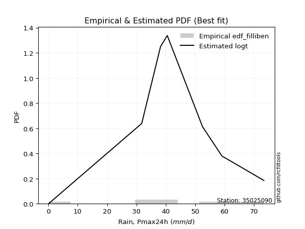</img>

</div>


### 10. EDF Jenkinson (1977)

The Jenkinson formula in hydrology is an empirical plotting position formula used to estimate the non-exceedance probability _(P)_ or return period _(T)_ of a given ordered observation within a sample. It is a widely used method in the frequency analysis of extreme events such as floods and rainfall, as it provides a distribution-free way to plot data. _a≈0.31_ and _b≈0.38_ are constants derived to approximate the median of the probability distribution for the given rank.

<div align="center">


$P=(m-a)/(n+b)$


</div>


**10.1. Empirical values**

<div align="center">

|                | 0                   | 1                   | 2                  | 3                   | 4                  | 5                  | 6                  | 7                  |
|:---------------|:--------------------|:--------------------|:-------------------|:--------------------|:-------------------|:-------------------|:-------------------|:-------------------|
| date           | 2016                | 2020                | 2023               | 2022                | 2018               | 2017               | 2019               | 2021               |
| x              | 0.2                 | 31.8                | 34.4               | 38.2                | 40.5               | 52.5               | 59.1               | 73.4               |
| m              | 1                   | 2                   | 3                  | 4                   | 5                  | 6                  | 7                  | 8                  |
| empirical_dist | edf_jenkinson       | edf_jenkinson       | edf_jenkinson      | edf_jenkinson       | edf_jenkinson      | edf_jenkinson      | edf_jenkinson      | edf_jenkinson      |
| empirical      | 0.08233890214797135 | 0.20167064439140808 | 0.3210023866348448 | 0.44033412887828155 | 0.5596658711217184 | 0.6789976133651551 | 0.7983293556085919 | 0.9176610978520287 |
| empirical_tr   | 1.0897269180754225  | 1.2526158445440956  | 1.4727592267135323 | 1.7867803837953091  | 2.2710027100271004 | 3.115241635687732  | 4.958579881656804  | 12.144927536231886 |

</div>


**10.2. Kolmogorov-Smirnov fit test (sorted by Δ)**


<div align="center">

|                | 0                   | 1                   | 2                   | 3                   | 4                   | 5                   | 6                   | 7                  | 8                   | 9                   | 10                 | 11                  | 12                  | 13                 | 14                  | 15                  | 16                  | 17                  | 18                  | 19                 | 20                 | 21                  | 22                  | 23                  | 24                 | 25                 | 26                  | 27                  | 28                 | 29                  | 30                  | 31                  | 32                  | 33                 | 34                  | 35                 | 36                  | 37                  | 38                  | 39                  | 40                  | 41                  | 42                  | 43                  | 44                  | 45                 | 46                  | 47                 | 48                  | 49                  | 50                  | 51                  | 52                  | 53                  | 54                 | 55                  | 56                  | 57                  | 58                  | 59                  | 60                  | 61                  | 62                 | 63                 | 64                  | 65                 | 66                  | 67                  | 68                 | 69                  | 70                  | 71                  | 72                 | 73                 | 74                 | 75                  | 76                 | 77                 | 78                 | 79                 | 80                 | 81                  | 82                  | 83                 | 84                  | 85                 | 86                 | 87                 | 88                 | 89                 | 90                 | 91                  | 92                 | 93                 | 94                 | 95                  | 96                  | 97                  | 98                  | 99                 | 100                | 101                | 102                | 103                | 104                | 105                 | 106                 | 107                 | 108                | 109                 | 110                | 111                 | 112                 | 113                | 114                 | 115                 | 116                 | 117                | 118                | 119                | 120                | 121                | 122                | 123                | 124                | 125                | 126                | 127                | 128                 | 129                | 130                | 131                | 132                | 133                | 134                | 135                | 136                | 137                | 138                | 139                | 140                | 141                | 142                | 143                | 144                | 145                | 146                | 147                | 148                | 149                | 150                | 151                | 152                | 153                | 154                | 155                | 156                | 157                | 158                | 159                |
|:---------------|:--------------------|:--------------------|:--------------------|:--------------------|:--------------------|:--------------------|:--------------------|:-------------------|:--------------------|:--------------------|:-------------------|:--------------------|:--------------------|:-------------------|:--------------------|:--------------------|:--------------------|:--------------------|:--------------------|:-------------------|:-------------------|:--------------------|:--------------------|:--------------------|:-------------------|:-------------------|:--------------------|:--------------------|:-------------------|:--------------------|:--------------------|:--------------------|:--------------------|:-------------------|:--------------------|:-------------------|:--------------------|:--------------------|:--------------------|:--------------------|:--------------------|:--------------------|:--------------------|:--------------------|:--------------------|:-------------------|:--------------------|:-------------------|:--------------------|:--------------------|:--------------------|:--------------------|:--------------------|:--------------------|:-------------------|:--------------------|:--------------------|:--------------------|:--------------------|:--------------------|:--------------------|:--------------------|:-------------------|:-------------------|:--------------------|:-------------------|:--------------------|:--------------------|:-------------------|:--------------------|:--------------------|:--------------------|:-------------------|:-------------------|:-------------------|:--------------------|:-------------------|:-------------------|:-------------------|:-------------------|:-------------------|:--------------------|:--------------------|:-------------------|:--------------------|:-------------------|:-------------------|:-------------------|:-------------------|:-------------------|:-------------------|:--------------------|:-------------------|:-------------------|:-------------------|:--------------------|:--------------------|:--------------------|:--------------------|:-------------------|:-------------------|:-------------------|:-------------------|:-------------------|:-------------------|:--------------------|:--------------------|:--------------------|:-------------------|:--------------------|:-------------------|:--------------------|:--------------------|:-------------------|:--------------------|:--------------------|:--------------------|:-------------------|:-------------------|:-------------------|:-------------------|:-------------------|:-------------------|:-------------------|:-------------------|:-------------------|:-------------------|:-------------------|:--------------------|:-------------------|:-------------------|:-------------------|:-------------------|:-------------------|:-------------------|:-------------------|:-------------------|:-------------------|:-------------------|:-------------------|:-------------------|:-------------------|:-------------------|:-------------------|:-------------------|:-------------------|:-------------------|:-------------------|:-------------------|:-------------------|:-------------------|:-------------------|:-------------------|:-------------------|:-------------------|:-------------------|:-------------------|:-------------------|:-------------------|:-------------------|
| station        | 35025090            | 35025090            | 35025090            | 35025090            | 35025090            | 35025090            | 35025090            | 35025090           | 35025090            | 35025090            | 35025090           | 35025090            | 35025090            | 35025090           | 35025090            | 35025090            | 35025090            | 35025090            | 35025090            | 35025090           | 35025090           | 35025090            | 35025090            | 35025090            | 35025090           | 35025090           | 35025090            | 35025090            | 35025090           | 35025090            | 35025090            | 35025090            | 35025090            | 35025090           | 35025090            | 35025090           | 35025090            | 35025090            | 35025090            | 35025090            | 35025090            | 35025090            | 35025090            | 35025090            | 35025090            | 35025090           | 35025090            | 35025090           | 35025090            | 35025090            | 35025090            | 35025090            | 35025090            | 35025090            | 35025090           | 35025090            | 35025090            | 35025090            | 35025090            | 35025090            | 35025090            | 35025090            | 35025090           | 35025090           | 35025090            | 35025090           | 35025090            | 35025090            | 35025090           | 35025090            | 35025090            | 35025090            | 35025090           | 35025090           | 35025090           | 35025090            | 35025090           | 35025090           | 35025090           | 35025090           | 35025090           | 35025090            | 35025090            | 35025090           | 35025090            | 35025090           | 35025090           | 35025090           | 35025090           | 35025090           | 35025090           | 35025090            | 35025090           | 35025090           | 35025090           | 35025090            | 35025090            | 35025090            | 35025090            | 35025090           | 35025090           | 35025090           | 35025090           | 35025090           | 35025090           | 35025090            | 35025090            | 35025090            | 35025090           | 35025090            | 35025090           | 35025090            | 35025090            | 35025090           | 35025090            | 35025090            | 35025090            | 35025090           | 35025090           | 35025090           | 35025090           | 35025090           | 35025090           | 35025090           | 35025090           | 35025090           | 35025090           | 35025090           | 35025090            | 35025090           | 35025090           | 35025090           | 35025090           | 35025090           | 35025090           | 35025090           | 35025090           | 35025090           | 35025090           | 35025090           | 35025090           | 35025090           | 35025090           | 35025090           | 35025090           | 35025090           | 35025090           | 35025090           | 35025090           | 35025090           | 35025090           | 35025090           | 35025090           | 35025090           | 35025090           | 35025090           | 35025090           | 35025090           | 35025090           | 35025090           |
| empirical_dist | edf_jenkinson       | edf_jenkinson       | edf_jenkinson       | edf_jenkinson       | edf_jenkinson       | edf_jenkinson       | edf_jenkinson       | edf_jenkinson      | edf_jenkinson       | edf_jenkinson       | edf_jenkinson      | edf_jenkinson       | edf_jenkinson       | edf_jenkinson      | edf_jenkinson       | edf_jenkinson       | edf_jenkinson       | edf_jenkinson       | edf_jenkinson       | edf_jenkinson      | edf_jenkinson      | edf_jenkinson       | edf_jenkinson       | edf_jenkinson       | edf_jenkinson      | edf_jenkinson      | edf_jenkinson       | edf_jenkinson       | edf_jenkinson      | edf_jenkinson       | edf_jenkinson       | edf_jenkinson       | edf_jenkinson       | edf_jenkinson      | edf_jenkinson       | edf_jenkinson      | edf_jenkinson       | edf_jenkinson       | edf_jenkinson       | edf_jenkinson       | edf_jenkinson       | edf_jenkinson       | edf_jenkinson       | edf_jenkinson       | edf_jenkinson       | edf_jenkinson      | edf_jenkinson       | edf_jenkinson      | edf_jenkinson       | edf_jenkinson       | edf_jenkinson       | edf_jenkinson       | edf_jenkinson       | edf_jenkinson       | edf_jenkinson      | edf_jenkinson       | edf_jenkinson       | edf_jenkinson       | edf_jenkinson       | edf_jenkinson       | edf_jenkinson       | edf_jenkinson       | edf_jenkinson      | edf_jenkinson      | edf_jenkinson       | edf_jenkinson      | edf_jenkinson       | edf_jenkinson       | edf_jenkinson      | edf_jenkinson       | edf_jenkinson       | edf_jenkinson       | edf_jenkinson      | edf_jenkinson      | edf_jenkinson      | edf_jenkinson       | edf_jenkinson      | edf_jenkinson      | edf_jenkinson      | edf_jenkinson      | edf_jenkinson      | edf_jenkinson       | edf_jenkinson       | edf_jenkinson      | edf_jenkinson       | edf_jenkinson      | edf_jenkinson      | edf_jenkinson      | edf_jenkinson      | edf_jenkinson      | edf_jenkinson      | edf_jenkinson       | edf_jenkinson      | edf_jenkinson      | edf_jenkinson      | edf_jenkinson       | edf_jenkinson       | edf_jenkinson       | edf_jenkinson       | edf_jenkinson      | edf_jenkinson      | edf_jenkinson      | edf_jenkinson      | edf_jenkinson      | edf_jenkinson      | edf_jenkinson       | edf_jenkinson       | edf_jenkinson       | edf_jenkinson      | edf_jenkinson       | edf_jenkinson      | edf_jenkinson       | edf_jenkinson       | edf_jenkinson      | edf_jenkinson       | edf_jenkinson       | edf_jenkinson       | edf_jenkinson      | edf_jenkinson      | edf_jenkinson      | edf_jenkinson      | edf_jenkinson      | edf_jenkinson      | edf_jenkinson      | edf_jenkinson      | edf_jenkinson      | edf_jenkinson      | edf_jenkinson      | edf_jenkinson       | edf_jenkinson      | edf_jenkinson      | edf_jenkinson      | edf_jenkinson      | edf_jenkinson      | edf_jenkinson      | edf_jenkinson      | edf_jenkinson      | edf_jenkinson      | edf_jenkinson      | edf_jenkinson      | edf_jenkinson      | edf_jenkinson      | edf_jenkinson      | edf_jenkinson      | edf_jenkinson      | edf_jenkinson      | edf_jenkinson      | edf_jenkinson      | edf_jenkinson      | edf_jenkinson      | edf_jenkinson      | edf_jenkinson      | edf_jenkinson      | edf_jenkinson      | edf_jenkinson      | edf_jenkinson      | edf_jenkinson      | edf_jenkinson      | edf_jenkinson      | edf_jenkinson      |
| p_dist         | logt                | hypsecant           | laplace             | logistic            | pearson3            | dgamma              | skewnorm            | genlogistic        | foldnorm            | weibull_min         | burr12             | loggennorm          | johnsonsu           | genextreme         | t                   | norm                | crystalball         | nct                 | exponnorm           | f                  | argus              | fatiguelife         | gengamma            | dweibull            | erlang             | betaprime          | rice                | gamma               | truncnorm          | anglit              | gumbel_l            | maxwell             | genpareto           | invgamma           | semicircular        | alpha              | logjohnsonsu        | genhalflogistic     | invgauss            | gumbel_r            | rayleigh            | cosine              | gennorm             | triang              | moyal               | vonmises_line      | gausshyper          | logdweibull        | arcsine             | wald                | halfnorm            | halflogistic        | truncweibull_min    | logdgamma           | kstwobign          | loglevy_l           | logpearson3         | kappa3              | uniform             | wrapcauchy          | logargus            | ksone               | ncf                | gompertz           | kappa4              | trapezoid          | burr                | levy_l              | loggenextreme      | logloggamma         | beta                | bradford            | loggumbel_l        | logburr12          | truncexpon         | logtrapezoid        | logarcsine         | genexpon           | lomax              | logsemicircular    | logfoldnorm        | loganglit           | loggengamma         | loginvweibull      | logweibull_max      | logexponnorm       | lognorm            | logcrystalball     | lognakagami        | lognct             | logfatiguelife     | logalpha            | loglogistic        | loginvgamma        | loginvgauss        | loghypsecant        | logerlang           | logmaxwell          | logkstwobign        | lograyleigh        | loglaplace         | loglaplace         | logwrapcauchy      | johnsonsb          | logncf             | halfgennorm         | nakagami            | loghalfnorm         | logrice            | loggenexpon         | loggumbel_r        | logcosine           | loglomax            | loghalflogistic    | logmoyal            | invweibull          | logskewnorm         | loggenhalflogistic | loggausshyper      | logwald            | logf               | loggenpareto       | mielke             | logtriang          | exponweib          | rdist              | logvonmises_line   | logksone           | logtruncweibull_min | logburr            | logbeta            | logexponweib       | logkappa4          | logloglaplace      | weibull_max        | logkappa3          | loguniform         | logweibull_min     | powerlaw           | logtruncnorm       | logjohnsonsb       | logtruncexpon      | logmielke          | logbradford        | tukeylambda        | logbetaprime       | exponpow           | truncpareto        | loggamma           | loggamma           | logexponpow        | logpowerlaw        | logtruncpareto     | loggompertz        | loggenlogistic     | loghalfgennorm     | logtukeylambda     | logrdist           | logvonmises        | vonmises           |
| delta          | 0.08092001881215705 | 0.08403474169529324 | 0.09209630993332929 | 0.09906985575447919 | 0.10427470671036143 | 0.10454017658747838 | 0.10477403466161883 | 0.1052383676967778 | 0.10664670366350154 | 0.10685938468499756 | 0.1068606992372293 | 0.11083868461585661 | 0.11117618246130884 | 0.1171666652854888 | 0.11922428104021549 | 0.11922452383515286 | 0.11922452970547553 | 0.11922463173639158 | 0.11922725871182249 | 0.1201508576178913 | 0.1227411540017917 | 0.12300461961728482 | 0.12626606322606837 | 0.12658869818525087 | 0.1268140845074074 | 0.1268607491654664 | 0.12878541181335224 | 0.13120964883279068 | 0.1391570090258919 | 0.14197659568966936 | 0.14527405787997894 | 0.14904834230765668 | 0.15057586126841543 | 0.15063364923117   | 0.15159857562798823 | 0.1552311173668075 | 0.15678361007477654 | 0.15756568586393377 | 0.15805135435659173 | 0.15906401454214675 | 0.16061868134913448 | 0.16121425077896862 | 0.16153543770993184 | 0.16195944435776782 | 0.17272386759769226 | 0.1748893838690515 | 0.18045175326728358 | 0.1903971624847386 | 0.19163654165060756 | 0.19309363872969687 | 0.19349364085774567 | 0.19617875595482281 | 0.19843538339088418 | 0.20298359482848338 | 0.2199518897122822 | 0.22759818392285508 | 0.22765603125270256 | 0.22987238570454327 | 0.23002334467963015 | 0.23003771471967405 | 0.23530727832985981 | 0.24140767983445716 | 0.2419068771150113 | 0.2572605196185331 | 0.25972083601439994 | 0.2613588897248417 | 0.26601439230471086 | 0.26653096745488447 | 0.2811182514656712 | 0.28552500934994834 | 0.28562128869373105 | 0.29768415279613736 | 0.3052664831854019 | 0.3106556342075503 | 0.3113187517097716 | 0.31963284062715996 | 0.3389187439335331 | 0.3418970755146565 | 0.3550048133120553 | 0.3554988679213254 | 0.3583247258512002 | 0.35965184308001846 | 0.36276687322031415 | 0.3670801715586654 | 0.36712642334243545 | 0.369688428155923  | 0.3696917968162296 | 0.3696923829822136 | 0.3696989915183055 | 0.369843473577744  | 0.3725764295199378 | 0.37425056633742776 | 0.3791640310119501 | 0.3802247205775246 | 0.3821797757453787 | 0.38707858912360243 | 0.38923680565838276 | 0.39856774113916466 | 0.40675701898171596 | 0.4077039708991567 | 0.4106144017080718 | 0.4106144017080718 | 0.4167369668686451 | 0.4223837774915638 | 0.4247399183359281 | 0.42487074814545794 | 0.43196251402069247 | 0.43355148106751656 | 0.4343400883818142 | 0.43519567846935375 | 0.4386382003536338 | 0.45251653801203934 | 0.45486447033487026 | 0.4614308841890992 | 0.46268933967904996 | 0.47379485424724826 | 0.49596116067558976 | 0.4987881402332997 | 0.5130288047934806 | 0.5294744693441886 | 0.5339712907284151 | 0.5364866121170122 | 0.538058781855836  | 0.5621449401399639 | 0.57120741225522   | 0.5864599837988598 | 0.5907027475991282 | 0.5969595570881314 | 0.6048538780265467  | 0.6143986010383891 | 0.6144213334106045 | 0.6205576404250064 | 0.6351422301681218 | 0.6386728775199044 | 0.6470030199928857 | 0.6566536815484973 | 0.6566855973840393 | 0.6576657523647333 | 0.6619195321256726 | 0.6635999389764249 | 0.6693786996842972 | 0.6858118796264652 | 0.6910687694808357 | 0.6945328103067074 | 0.6973114288434041 | 0.7229232638850709 | 0.7390246465977719 | 0.7442060642108068 | 0.7549281731538844 | 0.7549281731538844 | 0.7577573930794894 | 0.7670333198965467 | 0.7796381725970647 | 0.7968571333736754 | 0.7983293556085919 | 0.7983293556085919 | 0.798329355608592  | 0.9175120069844444 | 0.9217098771644653 | 11.002535697911197 |
| deltao         | 0.4472608134160001  | 0.4472608134160001  | 0.4472608134160001  | 0.4472608134160001  | 0.4472608134160001  | 0.4472608134160001  | 0.4472608134160001  | 0.4472608134160001 | 0.4472608134160001  | 0.4472608134160001  | 0.4472608134160001 | 0.4472608134160001  | 0.4472608134160001  | 0.4472608134160001 | 0.4472608134160001  | 0.4472608134160001  | 0.4472608134160001  | 0.4472608134160001  | 0.4472608134160001  | 0.4472608134160001 | 0.4472608134160001 | 0.4472608134160001  | 0.4472608134160001  | 0.4472608134160001  | 0.4472608134160001 | 0.4472608134160001 | 0.4472608134160001  | 0.4472608134160001  | 0.4472608134160001 | 0.4472608134160001  | 0.4472608134160001  | 0.4472608134160001  | 0.4472608134160001  | 0.4472608134160001 | 0.4472608134160001  | 0.4472608134160001 | 0.4472608134160001  | 0.4472608134160001  | 0.4472608134160001  | 0.4472608134160001  | 0.4472608134160001  | 0.4472608134160001  | 0.4472608134160001  | 0.4472608134160001  | 0.4472608134160001  | 0.4472608134160001 | 0.4472608134160001  | 0.4472608134160001 | 0.4472608134160001  | 0.4472608134160001  | 0.4472608134160001  | 0.4472608134160001  | 0.4472608134160001  | 0.4472608134160001  | 0.4472608134160001 | 0.4472608134160001  | 0.4472608134160001  | 0.4472608134160001  | 0.4472608134160001  | 0.4472608134160001  | 0.4472608134160001  | 0.4472608134160001  | 0.4472608134160001 | 0.4472608134160001 | 0.4472608134160001  | 0.4472608134160001 | 0.4472608134160001  | 0.4472608134160001  | 0.4472608134160001 | 0.4472608134160001  | 0.4472608134160001  | 0.4472608134160001  | 0.4472608134160001 | 0.4472608134160001 | 0.4472608134160001 | 0.4472608134160001  | 0.4472608134160001 | 0.4472608134160001 | 0.4472608134160001 | 0.4472608134160001 | 0.4472608134160001 | 0.4472608134160001  | 0.4472608134160001  | 0.4472608134160001 | 0.4472608134160001  | 0.4472608134160001 | 0.4472608134160001 | 0.4472608134160001 | 0.4472608134160001 | 0.4472608134160001 | 0.4472608134160001 | 0.4472608134160001  | 0.4472608134160001 | 0.4472608134160001 | 0.4472608134160001 | 0.4472608134160001  | 0.4472608134160001  | 0.4472608134160001  | 0.4472608134160001  | 0.4472608134160001 | 0.4472608134160001 | 0.4472608134160001 | 0.4472608134160001 | 0.4472608134160001 | 0.4472608134160001 | 0.4472608134160001  | 0.4472608134160001  | 0.4472608134160001  | 0.4472608134160001 | 0.4472608134160001  | 0.4472608134160001 | 0.4472608134160001  | 0.4472608134160001  | 0.4472608134160001 | 0.4472608134160001  | 0.4472608134160001  | 0.4472608134160001  | 0.4472608134160001 | 0.4472608134160001 | 0.4472608134160001 | 0.4472608134160001 | 0.4472608134160001 | 0.4472608134160001 | 0.4472608134160001 | 0.4472608134160001 | 0.4472608134160001 | 0.4472608134160001 | 0.4472608134160001 | 0.4472608134160001  | 0.4472608134160001 | 0.4472608134160001 | 0.4472608134160001 | 0.4472608134160001 | 0.4472608134160001 | 0.4472608134160001 | 0.4472608134160001 | 0.4472608134160001 | 0.4472608134160001 | 0.4472608134160001 | 0.4472608134160001 | 0.4472608134160001 | 0.4472608134160001 | 0.4472608134160001 | 0.4472608134160001 | 0.4472608134160001 | 0.4472608134160001 | 0.4472608134160001 | 0.4472608134160001 | 0.4472608134160001 | 0.4472608134160001 | 0.4472608134160001 | 0.4472608134160001 | 0.4472608134160001 | 0.4472608134160001 | 0.4472608134160001 | 0.4472608134160001 | 0.4472608134160001 | 0.4472608134160001 | 0.4472608134160001 | 0.4472608134160001 |
| eval           | Δo > Δ              | Δo > Δ              | Δo > Δ              | Δo > Δ              | Δo > Δ              | Δo > Δ              | Δo > Δ              | Δo > Δ             | Δo > Δ              | Δo > Δ              | Δo > Δ             | Δo > Δ              | Δo > Δ              | Δo > Δ             | Δo > Δ              | Δo > Δ              | Δo > Δ              | Δo > Δ              | Δo > Δ              | Δo > Δ             | Δo > Δ             | Δo > Δ              | Δo > Δ              | Δo > Δ              | Δo > Δ             | Δo > Δ             | Δo > Δ              | Δo > Δ              | Δo > Δ             | Δo > Δ              | Δo > Δ              | Δo > Δ              | Δo > Δ              | Δo > Δ             | Δo > Δ              | Δo > Δ             | Δo > Δ              | Δo > Δ              | Δo > Δ              | Δo > Δ              | Δo > Δ              | Δo > Δ              | Δo > Δ              | Δo > Δ              | Δo > Δ              | Δo > Δ             | Δo > Δ              | Δo > Δ             | Δo > Δ              | Δo > Δ              | Δo > Δ              | Δo > Δ              | Δo > Δ              | Δo > Δ              | Δo > Δ             | Δo > Δ              | Δo > Δ              | Δo > Δ              | Δo > Δ              | Δo > Δ              | Δo > Δ              | Δo > Δ              | Δo > Δ             | Δo > Δ             | Δo > Δ              | Δo > Δ             | Δo > Δ              | Δo > Δ              | Δo > Δ             | Δo > Δ              | Δo > Δ              | Δo > Δ              | Δo > Δ             | Δo > Δ             | Δo > Δ             | Δo > Δ              | Δo > Δ             | Δo > Δ             | Δo > Δ             | Δo > Δ             | Δo > Δ             | Δo > Δ              | Δo > Δ              | Δo > Δ             | Δo > Δ              | Δo > Δ             | Δo > Δ             | Δo > Δ             | Δo > Δ             | Δo > Δ             | Δo > Δ             | Δo > Δ              | Δo > Δ             | Δo > Δ             | Δo > Δ             | Δo > Δ              | Δo > Δ              | Δo > Δ              | Δo > Δ              | Δo > Δ             | Δo > Δ             | Δo > Δ             | Δo > Δ             | Δo > Δ             | Δo > Δ             | Δo > Δ              | Δo > Δ              | Δo > Δ              | Δo > Δ             | Δo > Δ              | Δo > Δ             | Δo <= Δ             | Δo <= Δ             | Δo <= Δ            | Δo <= Δ             | Δo <= Δ             | Δo <= Δ             | Δo <= Δ            | Δo <= Δ            | Δo <= Δ            | Δo <= Δ            | Δo <= Δ            | Δo <= Δ            | Δo <= Δ            | Δo <= Δ            | Δo <= Δ            | Δo <= Δ            | Δo <= Δ            | Δo <= Δ             | Δo <= Δ            | Δo <= Δ            | Δo <= Δ            | Δo <= Δ            | Δo <= Δ            | Δo <= Δ            | Δo <= Δ            | Δo <= Δ            | Δo <= Δ            | Δo <= Δ            | Δo <= Δ            | Δo <= Δ            | Δo <= Δ            | Δo <= Δ            | Δo <= Δ            | Δo <= Δ            | Δo <= Δ            | Δo <= Δ            | Δo <= Δ            | Δo <= Δ            | Δo <= Δ            | Δo <= Δ            | Δo <= Δ            | Δo <= Δ            | Δo <= Δ            | Δo <= Δ            | Δo <= Δ            | Δo <= Δ            | Δo <= Δ            | Δo <= Δ            | Δo <= Δ            |
| fit            | 1                   | 1                   | 1                   | 1                   | 1                   | 1                   | 1                   | 1                  | 1                   | 1                   | 1                  | 1                   | 1                   | 1                  | 1                   | 1                   | 1                   | 1                   | 1                   | 1                  | 1                  | 1                   | 1                   | 1                   | 1                  | 1                  | 1                   | 1                   | 1                  | 1                   | 1                   | 1                   | 1                   | 1                  | 1                   | 1                  | 1                   | 1                   | 1                   | 1                   | 1                   | 1                   | 1                   | 1                   | 1                   | 1                  | 1                   | 1                  | 1                   | 1                   | 1                   | 1                   | 1                   | 1                   | 1                  | 1                   | 1                   | 1                   | 1                   | 1                   | 1                   | 1                   | 1                  | 1                  | 1                   | 1                  | 1                   | 1                   | 1                  | 1                   | 1                   | 1                   | 1                  | 1                  | 1                  | 1                   | 1                  | 1                  | 1                  | 1                  | 1                  | 1                   | 1                   | 1                  | 1                   | 1                  | 1                  | 1                  | 1                  | 1                  | 1                  | 1                   | 1                  | 1                  | 1                  | 1                   | 1                   | 1                   | 1                   | 1                  | 1                  | 1                  | 1                  | 1                  | 1                  | 1                   | 1                   | 1                   | 1                  | 1                   | 1                  | 0                   | 0                   | 0                  | 0                   | 0                   | 0                   | 0                  | 0                  | 0                  | 0                  | 0                  | 0                  | 0                  | 0                  | 0                  | 0                  | 0                  | 0                   | 0                  | 0                  | 0                  | 0                  | 0                  | 0                  | 0                  | 0                  | 0                  | 0                  | 0                  | 0                  | 0                  | 0                  | 0                  | 0                  | 0                  | 0                  | 0                  | 0                  | 0                  | 0                  | 0                  | 0                  | 0                  | 0                  | 0                  | 0                  | 0                  | 0                  | 0                  |
| n              | 8                   | 8                   | 8                   | 8                   | 8                   | 8                   | 8                   | 8                  | 8                   | 8                   | 8                  | 8                   | 8                   | 8                  | 8                   | 8                   | 8                   | 8                   | 8                   | 8                  | 8                  | 8                   | 8                   | 8                   | 8                  | 8                  | 8                   | 8                   | 8                  | 8                   | 8                   | 8                   | 8                   | 8                  | 8                   | 8                  | 8                   | 8                   | 8                   | 8                   | 8                   | 8                   | 8                   | 8                   | 8                   | 8                  | 8                   | 8                  | 8                   | 8                   | 8                   | 8                   | 8                   | 8                   | 8                  | 8                   | 8                   | 8                   | 8                   | 8                   | 8                   | 8                   | 8                  | 8                  | 8                   | 8                  | 8                   | 8                   | 8                  | 8                   | 8                   | 8                   | 8                  | 8                  | 8                  | 8                   | 8                  | 8                  | 8                  | 8                  | 8                  | 8                   | 8                   | 8                  | 8                   | 8                  | 8                  | 8                  | 8                  | 8                  | 8                  | 8                   | 8                  | 8                  | 8                  | 8                   | 8                   | 8                   | 8                   | 8                  | 8                  | 8                  | 8                  | 8                  | 8                  | 8                   | 8                   | 8                   | 8                  | 8                   | 8                  | 8                   | 8                   | 8                  | 8                   | 8                   | 8                   | 8                  | 8                  | 8                  | 8                  | 8                  | 8                  | 8                  | 8                  | 8                  | 8                  | 8                  | 8                   | 8                  | 8                  | 8                  | 8                  | 8                  | 8                  | 8                  | 8                  | 8                  | 8                  | 8                  | 8                  | 8                  | 8                  | 8                  | 8                  | 8                  | 8                  | 8                  | 8                  | 8                  | 8                  | 8                  | 8                  | 8                  | 8                  | 8                  | 8                  | 8                  | 8                  | 8                  |
| best_fit       | 1                   | 0                   | 0                   | 0                   | 0                   | 0                   | 0                   | 0                  | 0                   | 0                   | 0                  | 0                   | 0                   | 0                  | 0                   | 0                   | 0                   | 0                   | 0                   | 0                  | 0                  | 0                   | 0                   | 0                   | 0                  | 0                  | 0                   | 0                   | 0                  | 0                   | 0                   | 0                   | 0                   | 0                  | 0                   | 0                  | 0                   | 0                   | 0                   | 0                   | 0                   | 0                   | 0                   | 0                   | 0                   | 0                  | 0                   | 0                  | 0                   | 0                   | 0                   | 0                   | 0                   | 0                   | 0                  | 0                   | 0                   | 0                   | 0                   | 0                   | 0                   | 0                   | 0                  | 0                  | 0                   | 0                  | 0                   | 0                   | 0                  | 0                   | 0                   | 0                   | 0                  | 0                  | 0                  | 0                   | 0                  | 0                  | 0                  | 0                  | 0                  | 0                   | 0                   | 0                  | 0                   | 0                  | 0                  | 0                  | 0                  | 0                  | 0                  | 0                   | 0                  | 0                  | 0                  | 0                   | 0                   | 0                   | 0                   | 0                  | 0                  | 0                  | 0                  | 0                  | 0                  | 0                   | 0                   | 0                   | 0                  | 0                   | 0                  | 0                   | 0                   | 0                  | 0                   | 0                   | 0                   | 0                  | 0                  | 0                  | 0                  | 0                  | 0                  | 0                  | 0                  | 0                  | 0                  | 0                  | 0                   | 0                  | 0                  | 0                  | 0                  | 0                  | 0                  | 0                  | 0                  | 0                  | 0                  | 0                  | 0                  | 0                  | 0                  | 0                  | 0                  | 0                  | 0                  | 0                  | 0                  | 0                  | 0                  | 0                  | 0                  | 0                  | 0                  | 0                  | 0                  | 0                  | 0                  | 0                  |
| best_fit_sort  | 1                   | 2                   | 3                   | 4                   | 5                   | 6                   | 7                   | 8                  | 9                   | 10                  | 11                 | 12                  | 13                  | 14                 | 15                  | 16                  | 17                  | 18                  | 19                  | 20                 | 21                 | 22                  | 23                  | 24                  | 25                 | 26                 | 27                  | 28                  | 29                 | 30                  | 31                  | 32                  | 33                  | 34                 | 35                  | 36                 | 37                  | 38                  | 39                  | 40                  | 41                  | 42                  | 43                  | 44                  | 45                  | 46                 | 47                  | 48                 | 49                  | 50                  | 51                  | 52                  | 53                  | 54                  | 55                 | 56                  | 57                  | 58                  | 59                  | 60                  | 61                  | 62                  | 63                 | 64                 | 65                  | 66                 | 67                  | 68                  | 69                 | 70                  | 71                  | 72                  | 73                 | 74                 | 75                 | 76                  | 77                 | 78                 | 79                 | 80                 | 81                 | 82                  | 83                  | 84                 | 85                  | 86                 | 87                 | 88                 | 89                 | 90                 | 91                 | 92                  | 93                 | 94                 | 95                 | 96                  | 97                  | 98                  | 99                  | 100                | 101                | 102                | 103                | 104                | 105                | 106                 | 107                 | 108                 | 109                | 110                 | 111                | 112                 | 113                 | 114                | 115                 | 116                 | 117                 | 118                | 119                | 120                | 121                | 122                | 123                | 124                | 125                | 126                | 127                | 128                | 129                 | 130                | 131                | 132                | 133                | 134                | 135                | 136                | 137                | 138                | 139                | 140                | 141                | 142                | 143                | 144                | 145                | 146                | 147                | 148                | 149                | 150                | 151                | 152                | 153                | 154                | 155                | 156                | 157                | 158                | 159                | 160                |

</div>


**10.3. Best fit**

<div align="center">

|   id |   station | empirical_dist   | p_dist   |   delta |   deltao | eval   |   fit |   n |   best_fit |   best_fit_sort |
|-----:|----------:|:-----------------|:---------|--------:|---------:|:-------|------:|----:|-----------:|----------------:|
|    0 |  35025090 | edf_jenkinson    | logt     | 0.08092 | 0.447261 | Δo > Δ |     1 |   8 |          1 |               1 |

</div>


<div align="center">

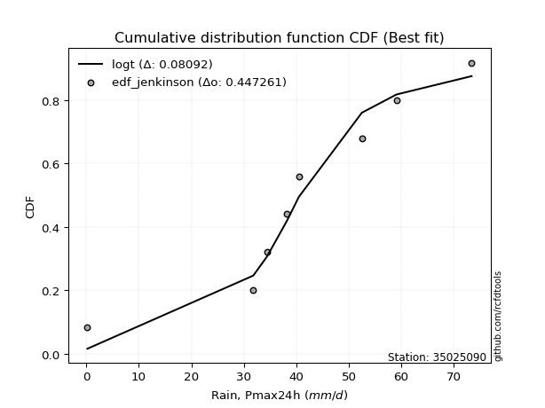</img>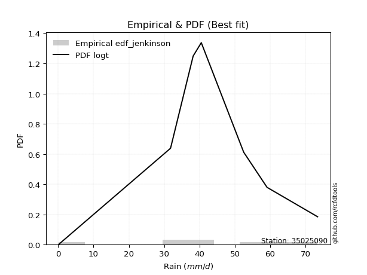</img>

</div>


### 11. EDF Cunnane (1978)

Cunnane´s work in statistical hydrology has focused on the performance and evaluation of different probability distributions (such as GEV, Gumbel, Lognormal) for flood frequency estimation. _b_ is a constant, typically set to 0.4.

<div align="center">


$P=(m-b)/(n+1-2b)$


</div>


**11.1. Empirical values**

<div align="center">

|                | 0                   | 1                   | 2                  | 3                  | 4                  | 5                  | 6                  | 7                  |
|:---------------|:--------------------|:--------------------|:-------------------|:-------------------|:-------------------|:-------------------|:-------------------|:-------------------|
| date           | 2016                | 2020                | 2023               | 2022               | 2018               | 2017               | 2019               | 2021               |
| x              | 0.2                 | 31.8                | 34.4               | 38.2               | 40.5               | 52.5               | 59.1               | 73.4               |
| m              | 1                   | 2                   | 3                  | 4                  | 5                  | 6                  | 7                  | 8                  |
| empirical_dist | edf_cunnane         | edf_cunnane         | edf_cunnane        | edf_cunnane        | edf_cunnane        | edf_cunnane        | edf_cunnane        | edf_cunnane        |
| empirical      | 0.07317073170731708 | 0.19512195121951223 | 0.3170731707317074 | 0.4390243902439025 | 0.5609756097560976 | 0.6829268292682927 | 0.8048780487804879 | 0.926829268292683  |
| empirical_tr   | 1.0789473684210527  | 1.2424242424242424  | 1.4642857142857144 | 1.782608695652174  | 2.277777777777778  | 3.153846153846154  | 5.125000000000001  | 13.666666666666675 |

</div>


**11.2. Kolmogorov-Smirnov fit test (sorted by Δ)**


<div align="center">

|                | 0                   | 1                   | 2                   | 3                   | 4                   | 5                   | 6                   | 7                   | 8                   | 9                   | 10                  | 11                 | 12                  | 13                  | 14                  | 15                  | 16                  | 17                 | 18                  | 19                  | 20                  | 21                  | 22                  | 23                  | 24                  | 25                  | 26                 | 27                  | 28                  | 29                  | 30                 | 31                  | 32                 | 33                  | 34                  | 35                  | 36                 | 37                  | 38                  | 39                 | 40                 | 41                 | 42                  | 43                  | 44                  | 45                 | 46                  | 47                  | 48                 | 49                  | 50                  | 51                  | 52                  | 53                  | 54                  | 55                  | 56                  | 57                  | 58                 | 59                 | 60                  | 61                 | 62                  | 63                 | 64                  | 65                  | 66                 | 67                  | 68                  | 69                  | 70                 | 71                  | 72                 | 73                  | 74                 | 75                 | 76                  | 77                 | 78                 | 79                 | 80                 | 81                 | 82                  | 83                 | 84                 | 85                  | 86                 | 87                 | 88                 | 89                 | 90                 | 91                 | 92                  | 93                 | 94                  | 95                  | 96                 | 97                 | 98                 | 99                  | 100                | 101                | 102                | 103                 | 104                 | 105                 | 106                | 107                | 108                 | 109                | 110                 | 111                 | 112                | 113                 | 114                | 115                | 116                | 117                | 118                | 119                | 120                | 121                | 122                | 123                | 124                | 125                | 126                | 127                | 128                 | 129                | 130                | 131                | 132                | 133                | 134                | 135                | 136                | 137                | 138                | 139                | 140                | 141                | 142                | 143                | 144                | 145                | 146                | 147                | 148                | 149                | 150                | 151                | 152                | 153                | 154                | 155                | 156                | 157                | 158                | 159                |
|:---------------|:--------------------|:--------------------|:--------------------|:--------------------|:--------------------|:--------------------|:--------------------|:--------------------|:--------------------|:--------------------|:--------------------|:-------------------|:--------------------|:--------------------|:--------------------|:--------------------|:--------------------|:-------------------|:--------------------|:--------------------|:--------------------|:--------------------|:--------------------|:--------------------|:--------------------|:--------------------|:-------------------|:--------------------|:--------------------|:--------------------|:-------------------|:--------------------|:-------------------|:--------------------|:--------------------|:--------------------|:-------------------|:--------------------|:--------------------|:-------------------|:-------------------|:-------------------|:--------------------|:--------------------|:--------------------|:-------------------|:--------------------|:--------------------|:-------------------|:--------------------|:--------------------|:--------------------|:--------------------|:--------------------|:--------------------|:--------------------|:--------------------|:--------------------|:-------------------|:-------------------|:--------------------|:-------------------|:--------------------|:-------------------|:--------------------|:--------------------|:-------------------|:--------------------|:--------------------|:--------------------|:-------------------|:--------------------|:-------------------|:--------------------|:-------------------|:-------------------|:--------------------|:-------------------|:-------------------|:-------------------|:-------------------|:-------------------|:--------------------|:-------------------|:-------------------|:--------------------|:-------------------|:-------------------|:-------------------|:-------------------|:-------------------|:-------------------|:--------------------|:-------------------|:--------------------|:--------------------|:-------------------|:-------------------|:-------------------|:--------------------|:-------------------|:-------------------|:-------------------|:--------------------|:--------------------|:--------------------|:-------------------|:-------------------|:--------------------|:-------------------|:--------------------|:--------------------|:-------------------|:--------------------|:-------------------|:-------------------|:-------------------|:-------------------|:-------------------|:-------------------|:-------------------|:-------------------|:-------------------|:-------------------|:-------------------|:-------------------|:-------------------|:-------------------|:--------------------|:-------------------|:-------------------|:-------------------|:-------------------|:-------------------|:-------------------|:-------------------|:-------------------|:-------------------|:-------------------|:-------------------|:-------------------|:-------------------|:-------------------|:-------------------|:-------------------|:-------------------|:-------------------|:-------------------|:-------------------|:-------------------|:-------------------|:-------------------|:-------------------|:-------------------|:-------------------|:-------------------|:-------------------|:-------------------|:-------------------|:-------------------|
| station        | 35025090            | 35025090            | 35025090            | 35025090            | 35025090            | 35025090            | 35025090            | 35025090            | 35025090            | 35025090            | 35025090            | 35025090           | 35025090            | 35025090            | 35025090            | 35025090            | 35025090            | 35025090           | 35025090            | 35025090            | 35025090            | 35025090            | 35025090            | 35025090            | 35025090            | 35025090            | 35025090           | 35025090            | 35025090            | 35025090            | 35025090           | 35025090            | 35025090           | 35025090            | 35025090            | 35025090            | 35025090           | 35025090            | 35025090            | 35025090           | 35025090           | 35025090           | 35025090            | 35025090            | 35025090            | 35025090           | 35025090            | 35025090            | 35025090           | 35025090            | 35025090            | 35025090            | 35025090            | 35025090            | 35025090            | 35025090            | 35025090            | 35025090            | 35025090           | 35025090           | 35025090            | 35025090           | 35025090            | 35025090           | 35025090            | 35025090            | 35025090           | 35025090            | 35025090            | 35025090            | 35025090           | 35025090            | 35025090           | 35025090            | 35025090           | 35025090           | 35025090            | 35025090           | 35025090           | 35025090           | 35025090           | 35025090           | 35025090            | 35025090           | 35025090           | 35025090            | 35025090           | 35025090           | 35025090           | 35025090           | 35025090           | 35025090           | 35025090            | 35025090           | 35025090            | 35025090            | 35025090           | 35025090           | 35025090           | 35025090            | 35025090           | 35025090           | 35025090           | 35025090            | 35025090            | 35025090            | 35025090           | 35025090           | 35025090            | 35025090           | 35025090            | 35025090            | 35025090           | 35025090            | 35025090           | 35025090           | 35025090           | 35025090           | 35025090           | 35025090           | 35025090           | 35025090           | 35025090           | 35025090           | 35025090           | 35025090           | 35025090           | 35025090           | 35025090            | 35025090           | 35025090           | 35025090           | 35025090           | 35025090           | 35025090           | 35025090           | 35025090           | 35025090           | 35025090           | 35025090           | 35025090           | 35025090           | 35025090           | 35025090           | 35025090           | 35025090           | 35025090           | 35025090           | 35025090           | 35025090           | 35025090           | 35025090           | 35025090           | 35025090           | 35025090           | 35025090           | 35025090           | 35025090           | 35025090           | 35025090           |
| empirical_dist | edf_cunnane         | edf_cunnane         | edf_cunnane         | edf_cunnane         | edf_cunnane         | edf_cunnane         | edf_cunnane         | edf_cunnane         | edf_cunnane         | edf_cunnane         | edf_cunnane         | edf_cunnane        | edf_cunnane         | edf_cunnane         | edf_cunnane         | edf_cunnane         | edf_cunnane         | edf_cunnane        | edf_cunnane         | edf_cunnane         | edf_cunnane         | edf_cunnane         | edf_cunnane         | edf_cunnane         | edf_cunnane         | edf_cunnane         | edf_cunnane        | edf_cunnane         | edf_cunnane         | edf_cunnane         | edf_cunnane        | edf_cunnane         | edf_cunnane        | edf_cunnane         | edf_cunnane         | edf_cunnane         | edf_cunnane        | edf_cunnane         | edf_cunnane         | edf_cunnane        | edf_cunnane        | edf_cunnane        | edf_cunnane         | edf_cunnane         | edf_cunnane         | edf_cunnane        | edf_cunnane         | edf_cunnane         | edf_cunnane        | edf_cunnane         | edf_cunnane         | edf_cunnane         | edf_cunnane         | edf_cunnane         | edf_cunnane         | edf_cunnane         | edf_cunnane         | edf_cunnane         | edf_cunnane        | edf_cunnane        | edf_cunnane         | edf_cunnane        | edf_cunnane         | edf_cunnane        | edf_cunnane         | edf_cunnane         | edf_cunnane        | edf_cunnane         | edf_cunnane         | edf_cunnane         | edf_cunnane        | edf_cunnane         | edf_cunnane        | edf_cunnane         | edf_cunnane        | edf_cunnane        | edf_cunnane         | edf_cunnane        | edf_cunnane        | edf_cunnane        | edf_cunnane        | edf_cunnane        | edf_cunnane         | edf_cunnane        | edf_cunnane        | edf_cunnane         | edf_cunnane        | edf_cunnane        | edf_cunnane        | edf_cunnane        | edf_cunnane        | edf_cunnane        | edf_cunnane         | edf_cunnane        | edf_cunnane         | edf_cunnane         | edf_cunnane        | edf_cunnane        | edf_cunnane        | edf_cunnane         | edf_cunnane        | edf_cunnane        | edf_cunnane        | edf_cunnane         | edf_cunnane         | edf_cunnane         | edf_cunnane        | edf_cunnane        | edf_cunnane         | edf_cunnane        | edf_cunnane         | edf_cunnane         | edf_cunnane        | edf_cunnane         | edf_cunnane        | edf_cunnane        | edf_cunnane        | edf_cunnane        | edf_cunnane        | edf_cunnane        | edf_cunnane        | edf_cunnane        | edf_cunnane        | edf_cunnane        | edf_cunnane        | edf_cunnane        | edf_cunnane        | edf_cunnane        | edf_cunnane         | edf_cunnane        | edf_cunnane        | edf_cunnane        | edf_cunnane        | edf_cunnane        | edf_cunnane        | edf_cunnane        | edf_cunnane        | edf_cunnane        | edf_cunnane        | edf_cunnane        | edf_cunnane        | edf_cunnane        | edf_cunnane        | edf_cunnane        | edf_cunnane        | edf_cunnane        | edf_cunnane        | edf_cunnane        | edf_cunnane        | edf_cunnane        | edf_cunnane        | edf_cunnane        | edf_cunnane        | edf_cunnane        | edf_cunnane        | edf_cunnane        | edf_cunnane        | edf_cunnane        | edf_cunnane        | edf_cunnane        |
| p_dist         | logt                | laplace             | hypsecant           | dgamma              | pearson3            | logistic            | skewnorm            | genlogistic         | weibull_min         | burr12              | johnsonsu           | foldnorm           | loggennorm          | genextreme          | dweibull            | t                   | norm                | crystalball        | nct                 | exponnorm           | f                   | argus               | fatiguelife         | gengamma            | erlang              | betaprime           | rice               | gamma               | truncnorm           | gumbel_l            | anglit             | maxwell             | genpareto          | invgamma            | gennorm             | semicircular        | genhalflogistic    | alpha               | triang              | logjohnsonsu       | invgauss           | gumbel_r           | rayleigh            | cosine              | vonmises_line       | moyal              | gausshyper          | arcsine             | logdweibull        | wald                | halfnorm            | halflogistic        | truncweibull_min    | logdgamma           | kstwobign           | loglevy_l           | logpearson3         | kappa3              | uniform            | wrapcauchy         | logargus            | ksone              | ncf                 | gompertz           | trapezoid           | kappa4              | burr               | levy_l              | loggenextreme       | logloggamma         | beta               | bradford            | loggumbel_l        | logburr12           | truncexpon         | logtrapezoid       | logarcsine          | genexpon           | lomax              | logsemicircular    | logfoldnorm        | loganglit          | loggengamma         | loginvweibull      | logweibull_max     | logexponnorm        | lognorm            | logcrystalball     | lognakagami        | lognct             | logfatiguelife     | logalpha           | loglogistic         | loginvgamma        | loginvgauss         | loghypsecant        | logerlang          | logmaxwell         | logkstwobign       | lograyleigh         | loglaplace         | loglaplace         | logwrapcauchy      | johnsonsb           | logncf              | halfgennorm         | nakagami           | loghalfnorm        | logrice             | loggenexpon        | loggumbel_r         | logcosine           | loglomax           | loghalflogistic     | logmoyal           | invweibull         | logskewnorm        | loggenhalflogistic | loggausshyper      | logwald            | logf               | loggenpareto       | mielke             | logtriang          | exponweib          | rdist              | logvonmises_line   | logksone           | logtruncweibull_min | logburr            | logbeta            | logexponweib       | logkappa4          | logloglaplace      | weibull_max        | logkappa3          | loguniform         | logweibull_min     | powerlaw           | logtruncnorm       | logjohnsonsb       | logtruncexpon      | logmielke          | logbradford        | tukeylambda        | logbetaprime       | exponpow           | truncpareto        | loggamma           | loggamma           | logexponpow        | logpowerlaw        | logtruncpareto     | loggompertz        | logtukeylambda     | loggenlogistic     | loghalfgennorm     | logvonmises        | logrdist           | vonmises           |
| delta          | 0.07699080290901938 | 0.08816709403019163 | 0.09058343486718909 | 0.10061096068434072 | 0.10558444534474065 | 0.10561854892637504 | 0.10608377329599805 | 0.10654810633115702 | 0.10816912331937678 | 0.10817043787160852 | 0.11248592109568806 | 0.1131953968353974 | 0.11738737778775246 | 0.11847640391986802 | 0.12265948228211321 | 0.12577297421211134 | 0.12577321700704872 | 0.1257732228773714 | 0.12577332490828744 | 0.12577595188371835 | 0.12669955078978715 | 0.12928984717368755 | 0.12955331278918067 | 0.13281475639796422 | 0.13336277767930324 | 0.13340944233736227 | 0.1353341049852481 | 0.13775834200468653 | 0.14570570219778775 | 0.14658379651435816 | 0.1485252888615652 | 0.15559703547955253 | 0.1571245544403113 | 0.15718234240306586 | 0.15760622180679418 | 0.15814726879988408 | 0.158875424498313  | 0.16177981053870336 | 0.16326918299214704 | 0.1633323032466724 | 0.1646000475284876 | 0.1656127077140426 | 0.16716737452103034 | 0.16776294395086447 | 0.17096016796591385 | 0.1792725607695881 | 0.18700044643917943 | 0.19818523482250341 | 0.1995653329253929 | 0.19964233190159272 | 0.20004233402964153 | 0.20272744912671867 | 0.20498407656278003 | 0.20953228800037924 | 0.22650058288417804 | 0.23414687709475093 | 0.23420472442459842 | 0.23642107887643912 | 0.236572037851526  | 0.2365864078915699 | 0.24185597150175567 | 0.247956373006353  | 0.24845557028690715 | 0.2585702582529123 | 0.26266862835922095 | 0.26626952918629576 | 0.2725630854766067 | 0.27569913789553874 | 0.28766694463756703 | 0.29207370252184417 | 0.2921699818656269 | 0.30423284596803324 | 0.3118151763572977 | 0.31720432737944615 | 0.3178674448816674 | 0.3261815337990558 | 0.34546743710542893 | 0.3484457686865523 | 0.3615535064839511 | 0.3620475610932212 | 0.364873419023096  | 0.3662005362519143 | 0.36931556639220997 | 0.3736288647305612 | 0.3736751165143313 | 0.37623712132781884 | 0.3762404899881254 | 0.3762410761541094 | 0.3762476846902013 | 0.3763921667496398 | 0.3791251226918336 | 0.3807992595093236 | 0.38571272418384595 | 0.3867734137494204 | 0.38872846891727453 | 0.39362728229549826 | 0.3957854988302786 | 0.4051164343110605 | 0.4133057121536118 | 0.41425266407105255 | 0.4171630948799676 | 0.4171630948799676 | 0.4232856600405409 | 0.42893247066345963 | 0.43128861150782394 | 0.43141944131735377 | 0.4385112071925883 | 0.4401001742394124 | 0.44088878155371003 | 0.4417443716412496 | 0.44518689352552965 | 0.45906523118393516 | 0.4614131635067661 | 0.46797957736099505 | 0.4692380328509458 | 0.4829630246879026 | 0.5025098538474856 | 0.5053368334051955 | 0.5195774979653763 | 0.5360231625160844 | 0.5405199839003109 | 0.543035305288908  | 0.5446074750277318 | 0.5686936333118597 | 0.5777561054271158 | 0.5930086769707555 | 0.5972514407710241 | 0.6035082502600272 | 0.6114025711984424  | 0.6209472942102848 | 0.6209700265825004 | 0.6271063335969023 | 0.6416909233400176 | 0.6452215706918002 | 0.6535517131647817 | 0.6632023747203931 | 0.6632342905559351 | 0.6642144455366292 | 0.6684682252975683 | 0.6701486321483208 | 0.675927392856193  | 0.692360572798361  | 0.6976174626527316 | 0.7010815034786033 | 0.7038601220152999 | 0.7294719570569668 | 0.7455733397696678 | 0.7507547573827027 | 0.7614768663257803 | 0.7614768663257803 | 0.7643060862513853 | 0.7735820130684424 | 0.7861868657689606 | 0.8034058265455711 | 0.8048780487804877 | 0.8048780487804879 | 0.8048780487804879 | 0.9262956200778242 | 0.9266801774250986 | 10.993367527470543 |
| deltao         | 0.4472608134160001  | 0.4472608134160001  | 0.4472608134160001  | 0.4472608134160001  | 0.4472608134160001  | 0.4472608134160001  | 0.4472608134160001  | 0.4472608134160001  | 0.4472608134160001  | 0.4472608134160001  | 0.4472608134160001  | 0.4472608134160001 | 0.4472608134160001  | 0.4472608134160001  | 0.4472608134160001  | 0.4472608134160001  | 0.4472608134160001  | 0.4472608134160001 | 0.4472608134160001  | 0.4472608134160001  | 0.4472608134160001  | 0.4472608134160001  | 0.4472608134160001  | 0.4472608134160001  | 0.4472608134160001  | 0.4472608134160001  | 0.4472608134160001 | 0.4472608134160001  | 0.4472608134160001  | 0.4472608134160001  | 0.4472608134160001 | 0.4472608134160001  | 0.4472608134160001 | 0.4472608134160001  | 0.4472608134160001  | 0.4472608134160001  | 0.4472608134160001 | 0.4472608134160001  | 0.4472608134160001  | 0.4472608134160001 | 0.4472608134160001 | 0.4472608134160001 | 0.4472608134160001  | 0.4472608134160001  | 0.4472608134160001  | 0.4472608134160001 | 0.4472608134160001  | 0.4472608134160001  | 0.4472608134160001 | 0.4472608134160001  | 0.4472608134160001  | 0.4472608134160001  | 0.4472608134160001  | 0.4472608134160001  | 0.4472608134160001  | 0.4472608134160001  | 0.4472608134160001  | 0.4472608134160001  | 0.4472608134160001 | 0.4472608134160001 | 0.4472608134160001  | 0.4472608134160001 | 0.4472608134160001  | 0.4472608134160001 | 0.4472608134160001  | 0.4472608134160001  | 0.4472608134160001 | 0.4472608134160001  | 0.4472608134160001  | 0.4472608134160001  | 0.4472608134160001 | 0.4472608134160001  | 0.4472608134160001 | 0.4472608134160001  | 0.4472608134160001 | 0.4472608134160001 | 0.4472608134160001  | 0.4472608134160001 | 0.4472608134160001 | 0.4472608134160001 | 0.4472608134160001 | 0.4472608134160001 | 0.4472608134160001  | 0.4472608134160001 | 0.4472608134160001 | 0.4472608134160001  | 0.4472608134160001 | 0.4472608134160001 | 0.4472608134160001 | 0.4472608134160001 | 0.4472608134160001 | 0.4472608134160001 | 0.4472608134160001  | 0.4472608134160001 | 0.4472608134160001  | 0.4472608134160001  | 0.4472608134160001 | 0.4472608134160001 | 0.4472608134160001 | 0.4472608134160001  | 0.4472608134160001 | 0.4472608134160001 | 0.4472608134160001 | 0.4472608134160001  | 0.4472608134160001  | 0.4472608134160001  | 0.4472608134160001 | 0.4472608134160001 | 0.4472608134160001  | 0.4472608134160001 | 0.4472608134160001  | 0.4472608134160001  | 0.4472608134160001 | 0.4472608134160001  | 0.4472608134160001 | 0.4472608134160001 | 0.4472608134160001 | 0.4472608134160001 | 0.4472608134160001 | 0.4472608134160001 | 0.4472608134160001 | 0.4472608134160001 | 0.4472608134160001 | 0.4472608134160001 | 0.4472608134160001 | 0.4472608134160001 | 0.4472608134160001 | 0.4472608134160001 | 0.4472608134160001  | 0.4472608134160001 | 0.4472608134160001 | 0.4472608134160001 | 0.4472608134160001 | 0.4472608134160001 | 0.4472608134160001 | 0.4472608134160001 | 0.4472608134160001 | 0.4472608134160001 | 0.4472608134160001 | 0.4472608134160001 | 0.4472608134160001 | 0.4472608134160001 | 0.4472608134160001 | 0.4472608134160001 | 0.4472608134160001 | 0.4472608134160001 | 0.4472608134160001 | 0.4472608134160001 | 0.4472608134160001 | 0.4472608134160001 | 0.4472608134160001 | 0.4472608134160001 | 0.4472608134160001 | 0.4472608134160001 | 0.4472608134160001 | 0.4472608134160001 | 0.4472608134160001 | 0.4472608134160001 | 0.4472608134160001 | 0.4472608134160001 |
| eval           | Δo > Δ              | Δo > Δ              | Δo > Δ              | Δo > Δ              | Δo > Δ              | Δo > Δ              | Δo > Δ              | Δo > Δ              | Δo > Δ              | Δo > Δ              | Δo > Δ              | Δo > Δ             | Δo > Δ              | Δo > Δ              | Δo > Δ              | Δo > Δ              | Δo > Δ              | Δo > Δ             | Δo > Δ              | Δo > Δ              | Δo > Δ              | Δo > Δ              | Δo > Δ              | Δo > Δ              | Δo > Δ              | Δo > Δ              | Δo > Δ             | Δo > Δ              | Δo > Δ              | Δo > Δ              | Δo > Δ             | Δo > Δ              | Δo > Δ             | Δo > Δ              | Δo > Δ              | Δo > Δ              | Δo > Δ             | Δo > Δ              | Δo > Δ              | Δo > Δ             | Δo > Δ             | Δo > Δ             | Δo > Δ              | Δo > Δ              | Δo > Δ              | Δo > Δ             | Δo > Δ              | Δo > Δ              | Δo > Δ             | Δo > Δ              | Δo > Δ              | Δo > Δ              | Δo > Δ              | Δo > Δ              | Δo > Δ              | Δo > Δ              | Δo > Δ              | Δo > Δ              | Δo > Δ             | Δo > Δ             | Δo > Δ              | Δo > Δ             | Δo > Δ              | Δo > Δ             | Δo > Δ              | Δo > Δ              | Δo > Δ             | Δo > Δ              | Δo > Δ              | Δo > Δ              | Δo > Δ             | Δo > Δ              | Δo > Δ             | Δo > Δ              | Δo > Δ             | Δo > Δ             | Δo > Δ              | Δo > Δ             | Δo > Δ             | Δo > Δ             | Δo > Δ             | Δo > Δ             | Δo > Δ              | Δo > Δ             | Δo > Δ             | Δo > Δ              | Δo > Δ             | Δo > Δ             | Δo > Δ             | Δo > Δ             | Δo > Δ             | Δo > Δ             | Δo > Δ              | Δo > Δ             | Δo > Δ              | Δo > Δ              | Δo > Δ             | Δo > Δ             | Δo > Δ             | Δo > Δ              | Δo > Δ             | Δo > Δ             | Δo > Δ             | Δo > Δ              | Δo > Δ              | Δo > Δ              | Δo > Δ             | Δo > Δ             | Δo > Δ              | Δo > Δ             | Δo > Δ              | Δo <= Δ             | Δo <= Δ            | Δo <= Δ             | Δo <= Δ            | Δo <= Δ            | Δo <= Δ            | Δo <= Δ            | Δo <= Δ            | Δo <= Δ            | Δo <= Δ            | Δo <= Δ            | Δo <= Δ            | Δo <= Δ            | Δo <= Δ            | Δo <= Δ            | Δo <= Δ            | Δo <= Δ            | Δo <= Δ             | Δo <= Δ            | Δo <= Δ            | Δo <= Δ            | Δo <= Δ            | Δo <= Δ            | Δo <= Δ            | Δo <= Δ            | Δo <= Δ            | Δo <= Δ            | Δo <= Δ            | Δo <= Δ            | Δo <= Δ            | Δo <= Δ            | Δo <= Δ            | Δo <= Δ            | Δo <= Δ            | Δo <= Δ            | Δo <= Δ            | Δo <= Δ            | Δo <= Δ            | Δo <= Δ            | Δo <= Δ            | Δo <= Δ            | Δo <= Δ            | Δo <= Δ            | Δo <= Δ            | Δo <= Δ            | Δo <= Δ            | Δo <= Δ            | Δo <= Δ            | Δo <= Δ            |
| fit            | 1                   | 1                   | 1                   | 1                   | 1                   | 1                   | 1                   | 1                   | 1                   | 1                   | 1                   | 1                  | 1                   | 1                   | 1                   | 1                   | 1                   | 1                  | 1                   | 1                   | 1                   | 1                   | 1                   | 1                   | 1                   | 1                   | 1                  | 1                   | 1                   | 1                   | 1                  | 1                   | 1                  | 1                   | 1                   | 1                   | 1                  | 1                   | 1                   | 1                  | 1                  | 1                  | 1                   | 1                   | 1                   | 1                  | 1                   | 1                   | 1                  | 1                   | 1                   | 1                   | 1                   | 1                   | 1                   | 1                   | 1                   | 1                   | 1                  | 1                  | 1                   | 1                  | 1                   | 1                  | 1                   | 1                   | 1                  | 1                   | 1                   | 1                   | 1                  | 1                   | 1                  | 1                   | 1                  | 1                  | 1                   | 1                  | 1                  | 1                  | 1                  | 1                  | 1                   | 1                  | 1                  | 1                   | 1                  | 1                  | 1                  | 1                  | 1                  | 1                  | 1                   | 1                  | 1                   | 1                   | 1                  | 1                  | 1                  | 1                   | 1                  | 1                  | 1                  | 1                   | 1                   | 1                   | 1                  | 1                  | 1                   | 1                  | 1                   | 0                   | 0                  | 0                   | 0                  | 0                  | 0                  | 0                  | 0                  | 0                  | 0                  | 0                  | 0                  | 0                  | 0                  | 0                  | 0                  | 0                  | 0                   | 0                  | 0                  | 0                  | 0                  | 0                  | 0                  | 0                  | 0                  | 0                  | 0                  | 0                  | 0                  | 0                  | 0                  | 0                  | 0                  | 0                  | 0                  | 0                  | 0                  | 0                  | 0                  | 0                  | 0                  | 0                  | 0                  | 0                  | 0                  | 0                  | 0                  | 0                  |
| n              | 8                   | 8                   | 8                   | 8                   | 8                   | 8                   | 8                   | 8                   | 8                   | 8                   | 8                   | 8                  | 8                   | 8                   | 8                   | 8                   | 8                   | 8                  | 8                   | 8                   | 8                   | 8                   | 8                   | 8                   | 8                   | 8                   | 8                  | 8                   | 8                   | 8                   | 8                  | 8                   | 8                  | 8                   | 8                   | 8                   | 8                  | 8                   | 8                   | 8                  | 8                  | 8                  | 8                   | 8                   | 8                   | 8                  | 8                   | 8                   | 8                  | 8                   | 8                   | 8                   | 8                   | 8                   | 8                   | 8                   | 8                   | 8                   | 8                  | 8                  | 8                   | 8                  | 8                   | 8                  | 8                   | 8                   | 8                  | 8                   | 8                   | 8                   | 8                  | 8                   | 8                  | 8                   | 8                  | 8                  | 8                   | 8                  | 8                  | 8                  | 8                  | 8                  | 8                   | 8                  | 8                  | 8                   | 8                  | 8                  | 8                  | 8                  | 8                  | 8                  | 8                   | 8                  | 8                   | 8                   | 8                  | 8                  | 8                  | 8                   | 8                  | 8                  | 8                  | 8                   | 8                   | 8                   | 8                  | 8                  | 8                   | 8                  | 8                   | 8                   | 8                  | 8                   | 8                  | 8                  | 8                  | 8                  | 8                  | 8                  | 8                  | 8                  | 8                  | 8                  | 8                  | 8                  | 8                  | 8                  | 8                   | 8                  | 8                  | 8                  | 8                  | 8                  | 8                  | 8                  | 8                  | 8                  | 8                  | 8                  | 8                  | 8                  | 8                  | 8                  | 8                  | 8                  | 8                  | 8                  | 8                  | 8                  | 8                  | 8                  | 8                  | 8                  | 8                  | 8                  | 8                  | 8                  | 8                  | 8                  |
| best_fit       | 1                   | 0                   | 0                   | 0                   | 0                   | 0                   | 0                   | 0                   | 0                   | 0                   | 0                   | 0                  | 0                   | 0                   | 0                   | 0                   | 0                   | 0                  | 0                   | 0                   | 0                   | 0                   | 0                   | 0                   | 0                   | 0                   | 0                  | 0                   | 0                   | 0                   | 0                  | 0                   | 0                  | 0                   | 0                   | 0                   | 0                  | 0                   | 0                   | 0                  | 0                  | 0                  | 0                   | 0                   | 0                   | 0                  | 0                   | 0                   | 0                  | 0                   | 0                   | 0                   | 0                   | 0                   | 0                   | 0                   | 0                   | 0                   | 0                  | 0                  | 0                   | 0                  | 0                   | 0                  | 0                   | 0                   | 0                  | 0                   | 0                   | 0                   | 0                  | 0                   | 0                  | 0                   | 0                  | 0                  | 0                   | 0                  | 0                  | 0                  | 0                  | 0                  | 0                   | 0                  | 0                  | 0                   | 0                  | 0                  | 0                  | 0                  | 0                  | 0                  | 0                   | 0                  | 0                   | 0                   | 0                  | 0                  | 0                  | 0                   | 0                  | 0                  | 0                  | 0                   | 0                   | 0                   | 0                  | 0                  | 0                   | 0                  | 0                   | 0                   | 0                  | 0                   | 0                  | 0                  | 0                  | 0                  | 0                  | 0                  | 0                  | 0                  | 0                  | 0                  | 0                  | 0                  | 0                  | 0                  | 0                   | 0                  | 0                  | 0                  | 0                  | 0                  | 0                  | 0                  | 0                  | 0                  | 0                  | 0                  | 0                  | 0                  | 0                  | 0                  | 0                  | 0                  | 0                  | 0                  | 0                  | 0                  | 0                  | 0                  | 0                  | 0                  | 0                  | 0                  | 0                  | 0                  | 0                  | 0                  |
| best_fit_sort  | 1                   | 2                   | 3                   | 4                   | 5                   | 6                   | 7                   | 8                   | 9                   | 10                  | 11                  | 12                 | 13                  | 14                  | 15                  | 16                  | 17                  | 18                 | 19                  | 20                  | 21                  | 22                  | 23                  | 24                  | 25                  | 26                  | 27                 | 28                  | 29                  | 30                  | 31                 | 32                  | 33                 | 34                  | 35                  | 36                  | 37                 | 38                  | 39                  | 40                 | 41                 | 42                 | 43                  | 44                  | 45                  | 46                 | 47                  | 48                  | 49                 | 50                  | 51                  | 52                  | 53                  | 54                  | 55                  | 56                  | 57                  | 58                  | 59                 | 60                 | 61                  | 62                 | 63                  | 64                 | 65                  | 66                  | 67                 | 68                  | 69                  | 70                  | 71                 | 72                  | 73                 | 74                  | 75                 | 76                 | 77                  | 78                 | 79                 | 80                 | 81                 | 82                 | 83                  | 84                 | 85                 | 86                  | 87                 | 88                 | 89                 | 90                 | 91                 | 92                 | 93                  | 94                 | 95                  | 96                  | 97                 | 98                 | 99                 | 100                 | 101                | 102                | 103                | 104                 | 105                 | 106                 | 107                | 108                | 109                 | 110                | 111                 | 112                 | 113                | 114                 | 115                | 116                | 117                | 118                | 119                | 120                | 121                | 122                | 123                | 124                | 125                | 126                | 127                | 128                | 129                 | 130                | 131                | 132                | 133                | 134                | 135                | 136                | 137                | 138                | 139                | 140                | 141                | 142                | 143                | 144                | 145                | 146                | 147                | 148                | 149                | 150                | 151                | 152                | 153                | 154                | 155                | 156                | 157                | 158                | 159                | 160                |

</div>


**11.3. Best fit**

<div align="center">

|   id |   station | empirical_dist   | p_dist   |     delta |   deltao | eval   |   fit |   n |   best_fit |   best_fit_sort |
|-----:|----------:|:-----------------|:---------|----------:|---------:|:-------|------:|----:|-----------:|----------------:|
|    0 |  35025090 | edf_cunnane      | logt     | 0.0769908 | 0.447261 | Δo > Δ |     1 |   8 |          1 |               1 |

</div>


<div align="center">

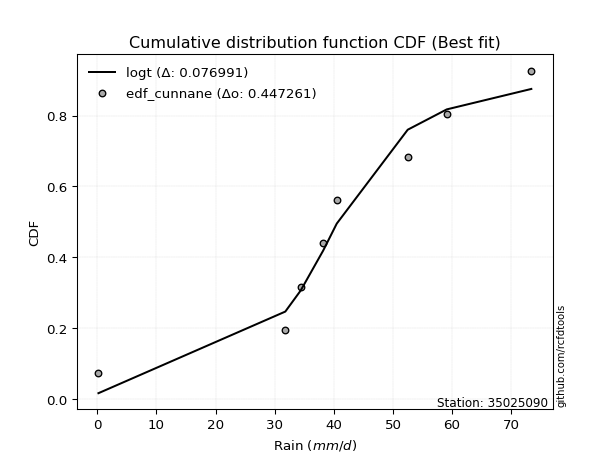</img></img>

</div>


### 12. EDF Adamowski (1981)

The Adamowski formula in hydrology refers to a specific plotting position formula used for estimating the non-parametric empirical distribution of hydrological events (like flood peaks) to calculate their return periods. This formula provides an alternative to traditional parametric methods (like the Gumbel or Log Pearson Type III distributions). 

<div align="center">


$P=(m-0.25)/(n+0.5)$


</div>


**12.1. Empirical values**

<div align="center">

|                | 0                   | 1                   | 2                  | 3                  | 4                  | 5                  | 6                  | 7                  |
|:---------------|:--------------------|:--------------------|:-------------------|:-------------------|:-------------------|:-------------------|:-------------------|:-------------------|
| date           | 2016                | 2020                | 2023               | 2022               | 2018               | 2017               | 2019               | 2021               |
| x              | 0.2                 | 31.8                | 34.4               | 38.2               | 40.5               | 52.5               | 59.1               | 73.4               |
| m              | 1                   | 2                   | 3                  | 4                  | 5                  | 6                  | 7                  | 8                  |
| empirical_dist | edf_adamowski       | edf_adamowski       | edf_adamowski      | edf_adamowski      | edf_adamowski      | edf_adamowski      | edf_adamowski      | edf_adamowski      |
| empirical      | 0.08823529411764706 | 0.20588235294117646 | 0.3235294117647059 | 0.4411764705882353 | 0.5588235294117647 | 0.6764705882352942 | 0.7941176470588235 | 0.9117647058823529 |
| empirical_tr   | 1.096774193548387   | 1.259259259259259   | 1.4782608695652173 | 1.7894736842105263 | 2.2666666666666666 | 3.0909090909090913 | 4.857142857142856  | 11.33333333333333  |

</div>


**12.2. Kolmogorov-Smirnov fit test (sorted by Δ)**


<div align="center">

|                | 0                   | 1                   | 2                  | 3                   | 4                   | 5                   | 6                   | 7                   | 8                   | 9                   | 10                  | 11                 | 12                  | 13                  | 14                  | 15                  | 16                 | 17                  | 18                  | 19                  | 20                  | 21                  | 22                  | 23                  | 24                  | 25                  | 26                 | 27                  | 28                  | 29                  | 30                  | 31                 | 32                  | 33                  | 34                  | 35                  | 36                  | 37                  | 38                  | 39                 | 40                 | 41                  | 42                  | 43                  | 44                  | 45                 | 46                  | 47                  | 48                  | 49                 | 50                 | 51                  | 52                 | 53                 | 54                 | 55                 | 56                  | 57                 | 58                  | 59                  | 60                  | 61                  | 62                  | 63                  | 64                 | 65                  | 66                  | 67                 | 68                  | 69                  | 70                  | 71                 | 72                 | 73                  | 74                 | 75                 | 76                  | 77                 | 78                 | 79                 | 80                 | 81                 | 82                  | 83                 | 84                  | 85                  | 86                 | 87                 | 88                 | 89                 | 90                 | 91                 | 92                  | 93                 | 94                 | 95                  | 96                 | 97                 | 98                 | 99                  | 100                | 101                | 102                | 103                | 104                 | 105                 | 106                | 107                | 108                | 109                | 110                 | 111                 | 112                | 113                 | 114                | 115                 | 116                | 117                | 118                | 119                | 120                | 121                | 122                | 123                | 124                | 125                | 126                | 127                | 128                 | 129                | 130                | 131                | 132                | 133                | 134                | 135                | 136                | 137                | 138                | 139                | 140                | 141                | 142                | 143                | 144                | 145                | 146                | 147                | 148                | 149                | 150                | 151                | 152                | 153                | 154                | 155                | 156                | 157                | 158                | 159                |
|:---------------|:--------------------|:--------------------|:-------------------|:--------------------|:--------------------|:--------------------|:--------------------|:--------------------|:--------------------|:--------------------|:--------------------|:-------------------|:--------------------|:--------------------|:--------------------|:--------------------|:-------------------|:--------------------|:--------------------|:--------------------|:--------------------|:--------------------|:--------------------|:--------------------|:--------------------|:--------------------|:-------------------|:--------------------|:--------------------|:--------------------|:--------------------|:-------------------|:--------------------|:--------------------|:--------------------|:--------------------|:--------------------|:--------------------|:--------------------|:-------------------|:-------------------|:--------------------|:--------------------|:--------------------|:--------------------|:-------------------|:--------------------|:--------------------|:--------------------|:-------------------|:-------------------|:--------------------|:-------------------|:-------------------|:-------------------|:-------------------|:--------------------|:-------------------|:--------------------|:--------------------|:--------------------|:--------------------|:--------------------|:--------------------|:-------------------|:--------------------|:--------------------|:-------------------|:--------------------|:--------------------|:--------------------|:-------------------|:-------------------|:--------------------|:-------------------|:-------------------|:--------------------|:-------------------|:-------------------|:-------------------|:-------------------|:-------------------|:--------------------|:-------------------|:--------------------|:--------------------|:-------------------|:-------------------|:-------------------|:-------------------|:-------------------|:-------------------|:--------------------|:-------------------|:-------------------|:--------------------|:-------------------|:-------------------|:-------------------|:--------------------|:-------------------|:-------------------|:-------------------|:-------------------|:--------------------|:--------------------|:-------------------|:-------------------|:-------------------|:-------------------|:--------------------|:--------------------|:-------------------|:--------------------|:-------------------|:--------------------|:-------------------|:-------------------|:-------------------|:-------------------|:-------------------|:-------------------|:-------------------|:-------------------|:-------------------|:-------------------|:-------------------|:-------------------|:--------------------|:-------------------|:-------------------|:-------------------|:-------------------|:-------------------|:-------------------|:-------------------|:-------------------|:-------------------|:-------------------|:-------------------|:-------------------|:-------------------|:-------------------|:-------------------|:-------------------|:-------------------|:-------------------|:-------------------|:-------------------|:-------------------|:-------------------|:-------------------|:-------------------|:-------------------|:-------------------|:-------------------|:-------------------|:-------------------|:-------------------|:-------------------|
| station        | 35025090            | 35025090            | 35025090           | 35025090            | 35025090            | 35025090            | 35025090            | 35025090            | 35025090            | 35025090            | 35025090            | 35025090           | 35025090            | 35025090            | 35025090            | 35025090            | 35025090           | 35025090            | 35025090            | 35025090            | 35025090            | 35025090            | 35025090            | 35025090            | 35025090            | 35025090            | 35025090           | 35025090            | 35025090            | 35025090            | 35025090            | 35025090           | 35025090            | 35025090            | 35025090            | 35025090            | 35025090            | 35025090            | 35025090            | 35025090           | 35025090           | 35025090            | 35025090            | 35025090            | 35025090            | 35025090           | 35025090            | 35025090            | 35025090            | 35025090           | 35025090           | 35025090            | 35025090           | 35025090           | 35025090           | 35025090           | 35025090            | 35025090           | 35025090            | 35025090            | 35025090            | 35025090            | 35025090            | 35025090            | 35025090           | 35025090            | 35025090            | 35025090           | 35025090            | 35025090            | 35025090            | 35025090           | 35025090           | 35025090            | 35025090           | 35025090           | 35025090            | 35025090           | 35025090           | 35025090           | 35025090           | 35025090           | 35025090            | 35025090           | 35025090            | 35025090            | 35025090           | 35025090           | 35025090           | 35025090           | 35025090           | 35025090           | 35025090            | 35025090           | 35025090           | 35025090            | 35025090           | 35025090           | 35025090           | 35025090            | 35025090           | 35025090           | 35025090           | 35025090           | 35025090            | 35025090            | 35025090           | 35025090           | 35025090           | 35025090           | 35025090            | 35025090            | 35025090           | 35025090            | 35025090           | 35025090            | 35025090           | 35025090           | 35025090           | 35025090           | 35025090           | 35025090           | 35025090           | 35025090           | 35025090           | 35025090           | 35025090           | 35025090           | 35025090            | 35025090           | 35025090           | 35025090           | 35025090           | 35025090           | 35025090           | 35025090           | 35025090           | 35025090           | 35025090           | 35025090           | 35025090           | 35025090           | 35025090           | 35025090           | 35025090           | 35025090           | 35025090           | 35025090           | 35025090           | 35025090           | 35025090           | 35025090           | 35025090           | 35025090           | 35025090           | 35025090           | 35025090           | 35025090           | 35025090           | 35025090           |
| empirical_dist | edf_adamowski       | edf_adamowski       | edf_adamowski      | edf_adamowski       | edf_adamowski       | edf_adamowski       | edf_adamowski       | edf_adamowski       | edf_adamowski       | edf_adamowski       | edf_adamowski       | edf_adamowski      | edf_adamowski       | edf_adamowski       | edf_adamowski       | edf_adamowski       | edf_adamowski      | edf_adamowski       | edf_adamowski       | edf_adamowski       | edf_adamowski       | edf_adamowski       | edf_adamowski       | edf_adamowski       | edf_adamowski       | edf_adamowski       | edf_adamowski      | edf_adamowski       | edf_adamowski       | edf_adamowski       | edf_adamowski       | edf_adamowski      | edf_adamowski       | edf_adamowski       | edf_adamowski       | edf_adamowski       | edf_adamowski       | edf_adamowski       | edf_adamowski       | edf_adamowski      | edf_adamowski      | edf_adamowski       | edf_adamowski       | edf_adamowski       | edf_adamowski       | edf_adamowski      | edf_adamowski       | edf_adamowski       | edf_adamowski       | edf_adamowski      | edf_adamowski      | edf_adamowski       | edf_adamowski      | edf_adamowski      | edf_adamowski      | edf_adamowski      | edf_adamowski       | edf_adamowski      | edf_adamowski       | edf_adamowski       | edf_adamowski       | edf_adamowski       | edf_adamowski       | edf_adamowski       | edf_adamowski      | edf_adamowski       | edf_adamowski       | edf_adamowski      | edf_adamowski       | edf_adamowski       | edf_adamowski       | edf_adamowski      | edf_adamowski      | edf_adamowski       | edf_adamowski      | edf_adamowski      | edf_adamowski       | edf_adamowski      | edf_adamowski      | edf_adamowski      | edf_adamowski      | edf_adamowski      | edf_adamowski       | edf_adamowski      | edf_adamowski       | edf_adamowski       | edf_adamowski      | edf_adamowski      | edf_adamowski      | edf_adamowski      | edf_adamowski      | edf_adamowski      | edf_adamowski       | edf_adamowski      | edf_adamowski      | edf_adamowski       | edf_adamowski      | edf_adamowski      | edf_adamowski      | edf_adamowski       | edf_adamowski      | edf_adamowski      | edf_adamowski      | edf_adamowski      | edf_adamowski       | edf_adamowski       | edf_adamowski      | edf_adamowski      | edf_adamowski      | edf_adamowski      | edf_adamowski       | edf_adamowski       | edf_adamowski      | edf_adamowski       | edf_adamowski      | edf_adamowski       | edf_adamowski      | edf_adamowski      | edf_adamowski      | edf_adamowski      | edf_adamowski      | edf_adamowski      | edf_adamowski      | edf_adamowski      | edf_adamowski      | edf_adamowski      | edf_adamowski      | edf_adamowski      | edf_adamowski       | edf_adamowski      | edf_adamowski      | edf_adamowski      | edf_adamowski      | edf_adamowski      | edf_adamowski      | edf_adamowski      | edf_adamowski      | edf_adamowski      | edf_adamowski      | edf_adamowski      | edf_adamowski      | edf_adamowski      | edf_adamowski      | edf_adamowski      | edf_adamowski      | edf_adamowski      | edf_adamowski      | edf_adamowski      | edf_adamowski      | edf_adamowski      | edf_adamowski      | edf_adamowski      | edf_adamowski      | edf_adamowski      | edf_adamowski      | edf_adamowski      | edf_adamowski      | edf_adamowski      | edf_adamowski      | edf_adamowski      |
| p_dist         | hypsecant           | logt                | laplace            | logistic            | foldnorm            | pearson3            | skewnorm            | genlogistic         | weibull_min         | burr12              | loggennorm          | dgamma             | johnsonsu           | t                   | norm                | crystalball         | nct                | exponnorm           | f                   | genextreme          | argus               | fatiguelife         | gengamma            | erlang              | betaprime           | rice                | gamma              | dweibull            | truncnorm           | anglit              | gumbel_l            | maxwell            | genpareto           | invgamma            | semicircular        | alpha               | logjohnsonsu        | invgauss            | gumbel_r            | rayleigh           | genhalflogistic    | cosine              | triang              | gennorm             | moyal               | gausshyper         | vonmises_line       | logdweibull         | arcsine             | wald               | halfnorm           | halflogistic        | truncweibull_min   | logdgamma          | kstwobign          | loglevy_l          | logpearson3         | kappa3             | uniform             | wrapcauchy          | logargus            | ksone               | ncf                 | kappa4              | gompertz           | trapezoid           | levy_l              | burr               | loggenextreme       | logloggamma         | beta                | bradford           | loggumbel_l        | logburr12           | truncexpon         | logtrapezoid       | logarcsine          | genexpon           | lomax              | logsemicircular    | logfoldnorm        | loganglit          | loggengamma         | loginvweibull      | logweibull_max      | logexponnorm        | lognorm            | logcrystalball     | lognakagami        | lognct             | logfatiguelife     | logalpha           | loglogistic         | loginvgamma        | loginvgauss        | loghypsecant        | logerlang          | logmaxwell         | logkstwobign       | lograyleigh         | loglaplace         | loglaplace         | logwrapcauchy      | johnsonsb          | logncf              | halfgennorm         | nakagami           | loghalfnorm        | logrice            | loggenexpon        | loggumbel_r         | logcosine           | loglomax           | loghalflogistic     | logmoyal           | invweibull          | logskewnorm        | loggenhalflogistic | loggausshyper      | logwald            | logf               | loggenpareto       | mielke             | logtriang          | exponweib          | rdist              | logvonmises_line   | logksone           | logtruncweibull_min | logburr            | logbeta            | logexponweib       | logkappa4          | logloglaplace      | weibull_max        | logkappa3          | loguniform         | logweibull_min     | powerlaw           | logtruncnorm       | logjohnsonsb       | logtruncexpon      | logmielke          | logbradford        | tukeylambda        | logbetaprime       | exponpow           | truncpareto        | loggamma           | loggamma           | logexponpow        | logpowerlaw        | logtruncpareto     | loggompertz        | loggenlogistic     | loghalfgennorm     | logtukeylambda     | logrdist           | logvonmises        | vonmises           |
| delta          | 0.07982303314552486 | 0.08344704394201796 | 0.0946233350631902 | 0.09485814720471081 | 0.10243499511373316 | 0.10343236500040776 | 0.10393169295166516 | 0.10439602598682413 | 0.10601704297504388 | 0.10601835752727562 | 0.10662697606608823 | 0.1070672017173393 | 0.11033384075135516 | 0.11501257249044711 | 0.11501281528538448 | 0.11501282115570716 | 0.1150129231866232 | 0.11501555016205411 | 0.11593914906812292 | 0.11632432357553513 | 0.11852944545202332 | 0.11879291106751644 | 0.12205435467629999 | 0.12260237595763901 | 0.12264904061569804 | 0.12457370326358386 | 0.1269979402830223 | 0.12911572331511179 | 0.13494530047612352 | 0.13776488713990098 | 0.14443171617002526 | 0.1448366337578883 | 0.14636415271864706 | 0.14642194068140163 | 0.14738686707821985 | 0.15101940881703912 | 0.15257190152500816 | 0.15383964580682336 | 0.15485230599237837 | 0.1564069727993661 | 0.1567233441539801 | 0.15700254222920024 | 0.16111710264781415 | 0.16406246283979276 | 0.16851215904792388 | 0.1762400447175152 | 0.17741640899891242 | 0.18450077051506286 | 0.18742483310083918 | 0.1888819301799285 | 0.1892819323079773 | 0.19196704740505444 | 0.1942236748411158 | 0.198771886278715  | 0.2157401811625138 | 0.2233864753730867 | 0.22344432270293418 | 0.2256606771547749 | 0.22581163612986177 | 0.22582600616990567 | 0.23109556978009144 | 0.23719597128468878 | 0.23769516856524292 | 0.25550912746463156 | 0.2564181779085794 | 0.26051654801488805 | 0.26063457548520874 | 0.2618026837549425 | 0.27690654291590283 | 0.28131330080017997 | 0.28140958014396267 | 0.293472444246369  | 0.3010547746356335 | 0.30644392565778195 | 0.3071070431600032 | 0.3154211320773916 | 0.33470703538376473 | 0.3376853669648881 | 0.3507931047622869 | 0.351287159371557  | 0.3541130173014318 | 0.3554401345302501 | 0.35855516467054577 | 0.362868463008897  | 0.36291471479266707 | 0.36547671960615463 | 0.3654800882664612 | 0.3654806744324452 | 0.3654872829685371 | 0.3656317650279756 | 0.3683647209701694 | 0.3700388577876594 | 0.37495232246218174 | 0.3760130120277562 | 0.3779680671956103 | 0.38286688057383406 | 0.3850250971086144 | 0.3943560325893963 | 0.4025453104319476 | 0.40349226234938834 | 0.4064026931583034 | 0.4064026931583034 | 0.4125252583188767 | 0.4181720689417954 | 0.42052820978615973 | 0.42065903959568957 | 0.4277508054709241 | 0.4293397725177482 | 0.4301283798320458 | 0.4309839699195854 | 0.43442649180386544 | 0.44830482946227096 | 0.4506527617851019 | 0.45721917563933084 | 0.4584776311292816 | 0.46789846227757254 | 0.4917494521258214 | 0.4945764316835313 | 0.5088170962437122 | 0.5252627607944202 | 0.5297595821786467 | 0.5322749035672438 | 0.5338470733060676 | 0.5579332315901955 | 0.5669957037054516 | 0.5822482752490914 | 0.5864910390493598 | 0.592747848538363  | 0.6006421694767783  | 0.6101868924886207 | 0.6102096248608361 | 0.616345931875238  | 0.6309305216183534 | 0.634461168970136  | 0.6427913114431173 | 0.652441972998729  | 0.6524738888342709 | 0.653454043814965  | 0.6577078235759042 | 0.6593882304266565 | 0.6651669911345288 | 0.6816001710766968 | 0.6868570609310674 | 0.6903211017569391 | 0.6930997202936358 | 0.7187115553353025 | 0.7348129380480035 | 0.7399943556610384 | 0.750716464604116  | 0.750716464604116  | 0.753545684529721  | 0.7628216113467783 | 0.7754264640472963 | 0.792645424823907  | 0.7941176470588235 | 0.7941176470588235 | 0.7941176470588236 | 0.9116156150147686 | 0.927606269134141  | 11.008432089880873 |
| deltao         | 0.4472608134160001  | 0.4472608134160001  | 0.4472608134160001 | 0.4472608134160001  | 0.4472608134160001  | 0.4472608134160001  | 0.4472608134160001  | 0.4472608134160001  | 0.4472608134160001  | 0.4472608134160001  | 0.4472608134160001  | 0.4472608134160001 | 0.4472608134160001  | 0.4472608134160001  | 0.4472608134160001  | 0.4472608134160001  | 0.4472608134160001 | 0.4472608134160001  | 0.4472608134160001  | 0.4472608134160001  | 0.4472608134160001  | 0.4472608134160001  | 0.4472608134160001  | 0.4472608134160001  | 0.4472608134160001  | 0.4472608134160001  | 0.4472608134160001 | 0.4472608134160001  | 0.4472608134160001  | 0.4472608134160001  | 0.4472608134160001  | 0.4472608134160001 | 0.4472608134160001  | 0.4472608134160001  | 0.4472608134160001  | 0.4472608134160001  | 0.4472608134160001  | 0.4472608134160001  | 0.4472608134160001  | 0.4472608134160001 | 0.4472608134160001 | 0.4472608134160001  | 0.4472608134160001  | 0.4472608134160001  | 0.4472608134160001  | 0.4472608134160001 | 0.4472608134160001  | 0.4472608134160001  | 0.4472608134160001  | 0.4472608134160001 | 0.4472608134160001 | 0.4472608134160001  | 0.4472608134160001 | 0.4472608134160001 | 0.4472608134160001 | 0.4472608134160001 | 0.4472608134160001  | 0.4472608134160001 | 0.4472608134160001  | 0.4472608134160001  | 0.4472608134160001  | 0.4472608134160001  | 0.4472608134160001  | 0.4472608134160001  | 0.4472608134160001 | 0.4472608134160001  | 0.4472608134160001  | 0.4472608134160001 | 0.4472608134160001  | 0.4472608134160001  | 0.4472608134160001  | 0.4472608134160001 | 0.4472608134160001 | 0.4472608134160001  | 0.4472608134160001 | 0.4472608134160001 | 0.4472608134160001  | 0.4472608134160001 | 0.4472608134160001 | 0.4472608134160001 | 0.4472608134160001 | 0.4472608134160001 | 0.4472608134160001  | 0.4472608134160001 | 0.4472608134160001  | 0.4472608134160001  | 0.4472608134160001 | 0.4472608134160001 | 0.4472608134160001 | 0.4472608134160001 | 0.4472608134160001 | 0.4472608134160001 | 0.4472608134160001  | 0.4472608134160001 | 0.4472608134160001 | 0.4472608134160001  | 0.4472608134160001 | 0.4472608134160001 | 0.4472608134160001 | 0.4472608134160001  | 0.4472608134160001 | 0.4472608134160001 | 0.4472608134160001 | 0.4472608134160001 | 0.4472608134160001  | 0.4472608134160001  | 0.4472608134160001 | 0.4472608134160001 | 0.4472608134160001 | 0.4472608134160001 | 0.4472608134160001  | 0.4472608134160001  | 0.4472608134160001 | 0.4472608134160001  | 0.4472608134160001 | 0.4472608134160001  | 0.4472608134160001 | 0.4472608134160001 | 0.4472608134160001 | 0.4472608134160001 | 0.4472608134160001 | 0.4472608134160001 | 0.4472608134160001 | 0.4472608134160001 | 0.4472608134160001 | 0.4472608134160001 | 0.4472608134160001 | 0.4472608134160001 | 0.4472608134160001  | 0.4472608134160001 | 0.4472608134160001 | 0.4472608134160001 | 0.4472608134160001 | 0.4472608134160001 | 0.4472608134160001 | 0.4472608134160001 | 0.4472608134160001 | 0.4472608134160001 | 0.4472608134160001 | 0.4472608134160001 | 0.4472608134160001 | 0.4472608134160001 | 0.4472608134160001 | 0.4472608134160001 | 0.4472608134160001 | 0.4472608134160001 | 0.4472608134160001 | 0.4472608134160001 | 0.4472608134160001 | 0.4472608134160001 | 0.4472608134160001 | 0.4472608134160001 | 0.4472608134160001 | 0.4472608134160001 | 0.4472608134160001 | 0.4472608134160001 | 0.4472608134160001 | 0.4472608134160001 | 0.4472608134160001 | 0.4472608134160001 |
| eval           | Δo > Δ              | Δo > Δ              | Δo > Δ             | Δo > Δ              | Δo > Δ              | Δo > Δ              | Δo > Δ              | Δo > Δ              | Δo > Δ              | Δo > Δ              | Δo > Δ              | Δo > Δ             | Δo > Δ              | Δo > Δ              | Δo > Δ              | Δo > Δ              | Δo > Δ             | Δo > Δ              | Δo > Δ              | Δo > Δ              | Δo > Δ              | Δo > Δ              | Δo > Δ              | Δo > Δ              | Δo > Δ              | Δo > Δ              | Δo > Δ             | Δo > Δ              | Δo > Δ              | Δo > Δ              | Δo > Δ              | Δo > Δ             | Δo > Δ              | Δo > Δ              | Δo > Δ              | Δo > Δ              | Δo > Δ              | Δo > Δ              | Δo > Δ              | Δo > Δ             | Δo > Δ             | Δo > Δ              | Δo > Δ              | Δo > Δ              | Δo > Δ              | Δo > Δ             | Δo > Δ              | Δo > Δ              | Δo > Δ              | Δo > Δ             | Δo > Δ             | Δo > Δ              | Δo > Δ             | Δo > Δ             | Δo > Δ             | Δo > Δ             | Δo > Δ              | Δo > Δ             | Δo > Δ              | Δo > Δ              | Δo > Δ              | Δo > Δ              | Δo > Δ              | Δo > Δ              | Δo > Δ             | Δo > Δ              | Δo > Δ              | Δo > Δ             | Δo > Δ              | Δo > Δ              | Δo > Δ              | Δo > Δ             | Δo > Δ             | Δo > Δ              | Δo > Δ             | Δo > Δ             | Δo > Δ              | Δo > Δ             | Δo > Δ             | Δo > Δ             | Δo > Δ             | Δo > Δ             | Δo > Δ              | Δo > Δ             | Δo > Δ              | Δo > Δ              | Δo > Δ             | Δo > Δ             | Δo > Δ             | Δo > Δ             | Δo > Δ             | Δo > Δ             | Δo > Δ              | Δo > Δ             | Δo > Δ             | Δo > Δ              | Δo > Δ             | Δo > Δ             | Δo > Δ             | Δo > Δ              | Δo > Δ             | Δo > Δ             | Δo > Δ             | Δo > Δ             | Δo > Δ              | Δo > Δ              | Δo > Δ             | Δo > Δ             | Δo > Δ             | Δo > Δ             | Δo > Δ              | Δo <= Δ             | Δo <= Δ            | Δo <= Δ             | Δo <= Δ            | Δo <= Δ             | Δo <= Δ            | Δo <= Δ            | Δo <= Δ            | Δo <= Δ            | Δo <= Δ            | Δo <= Δ            | Δo <= Δ            | Δo <= Δ            | Δo <= Δ            | Δo <= Δ            | Δo <= Δ            | Δo <= Δ            | Δo <= Δ             | Δo <= Δ            | Δo <= Δ            | Δo <= Δ            | Δo <= Δ            | Δo <= Δ            | Δo <= Δ            | Δo <= Δ            | Δo <= Δ            | Δo <= Δ            | Δo <= Δ            | Δo <= Δ            | Δo <= Δ            | Δo <= Δ            | Δo <= Δ            | Δo <= Δ            | Δo <= Δ            | Δo <= Δ            | Δo <= Δ            | Δo <= Δ            | Δo <= Δ            | Δo <= Δ            | Δo <= Δ            | Δo <= Δ            | Δo <= Δ            | Δo <= Δ            | Δo <= Δ            | Δo <= Δ            | Δo <= Δ            | Δo <= Δ            | Δo <= Δ            | Δo <= Δ            |
| fit            | 1                   | 1                   | 1                  | 1                   | 1                   | 1                   | 1                   | 1                   | 1                   | 1                   | 1                   | 1                  | 1                   | 1                   | 1                   | 1                   | 1                  | 1                   | 1                   | 1                   | 1                   | 1                   | 1                   | 1                   | 1                   | 1                   | 1                  | 1                   | 1                   | 1                   | 1                   | 1                  | 1                   | 1                   | 1                   | 1                   | 1                   | 1                   | 1                   | 1                  | 1                  | 1                   | 1                   | 1                   | 1                   | 1                  | 1                   | 1                   | 1                   | 1                  | 1                  | 1                   | 1                  | 1                  | 1                  | 1                  | 1                   | 1                  | 1                   | 1                   | 1                   | 1                   | 1                   | 1                   | 1                  | 1                   | 1                   | 1                  | 1                   | 1                   | 1                   | 1                  | 1                  | 1                   | 1                  | 1                  | 1                   | 1                  | 1                  | 1                  | 1                  | 1                  | 1                   | 1                  | 1                   | 1                   | 1                  | 1                  | 1                  | 1                  | 1                  | 1                  | 1                   | 1                  | 1                  | 1                   | 1                  | 1                  | 1                  | 1                   | 1                  | 1                  | 1                  | 1                  | 1                   | 1                   | 1                  | 1                  | 1                  | 1                  | 1                   | 0                   | 0                  | 0                   | 0                  | 0                   | 0                  | 0                  | 0                  | 0                  | 0                  | 0                  | 0                  | 0                  | 0                  | 0                  | 0                  | 0                  | 0                   | 0                  | 0                  | 0                  | 0                  | 0                  | 0                  | 0                  | 0                  | 0                  | 0                  | 0                  | 0                  | 0                  | 0                  | 0                  | 0                  | 0                  | 0                  | 0                  | 0                  | 0                  | 0                  | 0                  | 0                  | 0                  | 0                  | 0                  | 0                  | 0                  | 0                  | 0                  |
| n              | 8                   | 8                   | 8                  | 8                   | 8                   | 8                   | 8                   | 8                   | 8                   | 8                   | 8                   | 8                  | 8                   | 8                   | 8                   | 8                   | 8                  | 8                   | 8                   | 8                   | 8                   | 8                   | 8                   | 8                   | 8                   | 8                   | 8                  | 8                   | 8                   | 8                   | 8                   | 8                  | 8                   | 8                   | 8                   | 8                   | 8                   | 8                   | 8                   | 8                  | 8                  | 8                   | 8                   | 8                   | 8                   | 8                  | 8                   | 8                   | 8                   | 8                  | 8                  | 8                   | 8                  | 8                  | 8                  | 8                  | 8                   | 8                  | 8                   | 8                   | 8                   | 8                   | 8                   | 8                   | 8                  | 8                   | 8                   | 8                  | 8                   | 8                   | 8                   | 8                  | 8                  | 8                   | 8                  | 8                  | 8                   | 8                  | 8                  | 8                  | 8                  | 8                  | 8                   | 8                  | 8                   | 8                   | 8                  | 8                  | 8                  | 8                  | 8                  | 8                  | 8                   | 8                  | 8                  | 8                   | 8                  | 8                  | 8                  | 8                   | 8                  | 8                  | 8                  | 8                  | 8                   | 8                   | 8                  | 8                  | 8                  | 8                  | 8                   | 8                   | 8                  | 8                   | 8                  | 8                   | 8                  | 8                  | 8                  | 8                  | 8                  | 8                  | 8                  | 8                  | 8                  | 8                  | 8                  | 8                  | 8                   | 8                  | 8                  | 8                  | 8                  | 8                  | 8                  | 8                  | 8                  | 8                  | 8                  | 8                  | 8                  | 8                  | 8                  | 8                  | 8                  | 8                  | 8                  | 8                  | 8                  | 8                  | 8                  | 8                  | 8                  | 8                  | 8                  | 8                  | 8                  | 8                  | 8                  | 8                  |
| best_fit       | 1                   | 0                   | 0                  | 0                   | 0                   | 0                   | 0                   | 0                   | 0                   | 0                   | 0                   | 0                  | 0                   | 0                   | 0                   | 0                   | 0                  | 0                   | 0                   | 0                   | 0                   | 0                   | 0                   | 0                   | 0                   | 0                   | 0                  | 0                   | 0                   | 0                   | 0                   | 0                  | 0                   | 0                   | 0                   | 0                   | 0                   | 0                   | 0                   | 0                  | 0                  | 0                   | 0                   | 0                   | 0                   | 0                  | 0                   | 0                   | 0                   | 0                  | 0                  | 0                   | 0                  | 0                  | 0                  | 0                  | 0                   | 0                  | 0                   | 0                   | 0                   | 0                   | 0                   | 0                   | 0                  | 0                   | 0                   | 0                  | 0                   | 0                   | 0                   | 0                  | 0                  | 0                   | 0                  | 0                  | 0                   | 0                  | 0                  | 0                  | 0                  | 0                  | 0                   | 0                  | 0                   | 0                   | 0                  | 0                  | 0                  | 0                  | 0                  | 0                  | 0                   | 0                  | 0                  | 0                   | 0                  | 0                  | 0                  | 0                   | 0                  | 0                  | 0                  | 0                  | 0                   | 0                   | 0                  | 0                  | 0                  | 0                  | 0                   | 0                   | 0                  | 0                   | 0                  | 0                   | 0                  | 0                  | 0                  | 0                  | 0                  | 0                  | 0                  | 0                  | 0                  | 0                  | 0                  | 0                  | 0                   | 0                  | 0                  | 0                  | 0                  | 0                  | 0                  | 0                  | 0                  | 0                  | 0                  | 0                  | 0                  | 0                  | 0                  | 0                  | 0                  | 0                  | 0                  | 0                  | 0                  | 0                  | 0                  | 0                  | 0                  | 0                  | 0                  | 0                  | 0                  | 0                  | 0                  | 0                  |
| best_fit_sort  | 1                   | 2                   | 3                  | 4                   | 5                   | 6                   | 7                   | 8                   | 9                   | 10                  | 11                  | 12                 | 13                  | 14                  | 15                  | 16                  | 17                 | 18                  | 19                  | 20                  | 21                  | 22                  | 23                  | 24                  | 25                  | 26                  | 27                 | 28                  | 29                  | 30                  | 31                  | 32                 | 33                  | 34                  | 35                  | 36                  | 37                  | 38                  | 39                  | 40                 | 41                 | 42                  | 43                  | 44                  | 45                  | 46                 | 47                  | 48                  | 49                  | 50                 | 51                 | 52                  | 53                 | 54                 | 55                 | 56                 | 57                  | 58                 | 59                  | 60                  | 61                  | 62                  | 63                  | 64                  | 65                 | 66                  | 67                  | 68                 | 69                  | 70                  | 71                  | 72                 | 73                 | 74                  | 75                 | 76                 | 77                  | 78                 | 79                 | 80                 | 81                 | 82                 | 83                  | 84                 | 85                  | 86                  | 87                 | 88                 | 89                 | 90                 | 91                 | 92                 | 93                  | 94                 | 95                 | 96                  | 97                 | 98                 | 99                 | 100                 | 101                | 102                | 103                | 104                | 105                 | 106                 | 107                | 108                | 109                | 110                | 111                 | 112                 | 113                | 114                 | 115                | 116                 | 117                | 118                | 119                | 120                | 121                | 122                | 123                | 124                | 125                | 126                | 127                | 128                | 129                 | 130                | 131                | 132                | 133                | 134                | 135                | 136                | 137                | 138                | 139                | 140                | 141                | 142                | 143                | 144                | 145                | 146                | 147                | 148                | 149                | 150                | 151                | 152                | 153                | 154                | 155                | 156                | 157                | 158                | 159                | 160                |

</div>


**12.3. Best fit**

<div align="center">

|   id |   station | empirical_dist   | p_dist    |    delta |   deltao | eval   |   fit |   n |   best_fit |   best_fit_sort |
|-----:|----------:|:-----------------|:----------|---------:|---------:|:-------|------:|----:|-----------:|----------------:|
|    0 |  35025090 | edf_adamowski    | hypsecant | 0.079823 | 0.447261 | Δo > Δ |     1 |   8 |          1 |               1 |

</div>


<div align="center">

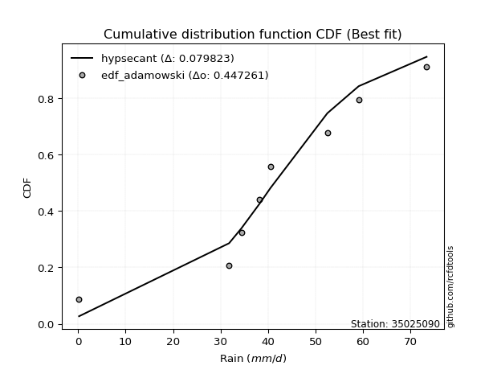</img>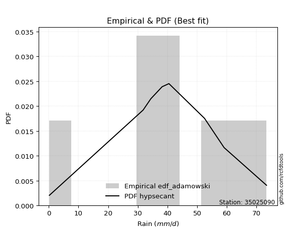</img>

</div>


## C. Best fit & Estimate extreme values for specific return periods - Tr

Best fit in probability distribution analysis means finding the theoretical distribution (like Normal, Poisson, Exponential, etc.) that most accurately mirrors your real-world data´s patterns (shape, center, spread) for better predictions, using methods like visual checks (Q-Q plots), goodness-of-fit tests (Kolmogorov-Smirnov, Chi-Squared), and information criteria (AIC) to score and select the simplest, most representative model.


### 1. Best fit (ordered by delta Δ)

:file_folder:Table: [bestfit_35025090.csv](table/bestfit_35025090.csv)

<div align="center">

|   id |   station | empirical_dist   | p_dist    |     delta |   deltao | eval   |   fit |   n |   best_fit |   best_fit_sort |
|-----:|----------:|:-----------------|:----------|----------:|---------:|:-------|------:|----:|-----------:|----------------:|
|    0 |  35025090 | edf_hazen        | logt      | 0.0724176 | 0.447261 | Δo > Δ |     1 |   8 |          1 |               1 |
|    1 |  35025090 | edf_california   | dweibull  | 0.0750423 | 0.447261 | Δo > Δ |     1 |   8 |          1 |               2 |
|    2 |  35025090 | edf_gringorten   | logt      | 0.0751886 | 0.447261 | Δo > Δ |     1 |   8 |          1 |               3 |
|    3 |  35025090 | edf_cunnane      | logt      | 0.0769908 | 0.447261 | Δo > Δ |     1 |   8 |          1 |               4 |
|    4 |  35025090 | edf_blom         | logt      | 0.0780995 | 0.447261 | Δo > Δ |     1 |   8 |          1 |               5 |
|    5 |  35025090 | edf_adamowski    | hypsecant | 0.079823  | 0.447261 | Δo > Δ |     1 |   8 |          1 |               6 |
|    6 |  35025090 | edf_tukey        | logt      | 0.0799176 | 0.447261 | Δo > Δ |     1 |   8 |          1 |               7 |
|    7 |  35025090 | edf_filliben     | logt      | 0.080599  | 0.447261 | Δo > Δ |     1 |   8 |          1 |               8 |
|    8 |  35025090 | edf_beard        | logt      | 0.08092   | 0.447261 | Δo > Δ |     1 |   8 |          1 |               9 |
|    9 |  35025090 | edf_jenkinson    | logt      | 0.08092   | 0.447261 | Δo > Δ |     1 |   8 |          1 |              10 |
|   10 |  35025090 | edf_chegodayev   | logt      | 0.0813462 | 0.447261 | Δo > Δ |     1 |   8 |          1 |              11 |
|   11 |  35025090 | edf_weibull      | hypsecant | 0.0844132 | 0.447261 | Δo > Δ |     1 |   8 |          1 |              12 |

</div>


### 2. Extreme values and % difference analysis

In hydrology, a return period (or recurrence interval $Tr$) is the statistical average time between extreme events like floods or droughts of a specific magnitude, indicating how rare an event is, with a 100-year flood, for example, having a 1% chance of occurring in any given year, not that it happens exactly every century. It is a key tool for infrastructure design (like bridges or dams) and risk assessment, calculated from historical data to determine the probability of future events, although it is important to remember it is statistical average, and events can cluster or be missed.

The extreme value porcentage difference is evaluated as $pdiff = 1 - (ETrBf / ETr) * 100$, where _ETrBf_ correspond to the bestfit extreme value for a specific recurrence interval and _ETr_ correspond to the extreme value for one of the most used PDFsused in hydrology.

> risk_rate: assuming the return period as the project useful life.

:file_folder:Table: [extreme_35025090.csv](table/extreme_35025090.csv), all PDFs.  
:file_folder:Table: [extremepdiff_35025090.csv](table/extremepdiff_35025090.csv), % difference between bestfit and most used PDFs in Hydrology.

<div align="center">

Extreme values table for only best fit PDFs
|   id |      tr |   prob_l |     prob_g |    alpha |   anglit |   arcsine |   argus |    beta |   betaprime |   bradford |    burr |   burr12 |   cosine |   crystalball |   dgamma |   dweibull |   erlang |   exponnorm |   exponpow |   exponweib |        f |   fatiguelife |   foldnorm |    gamma |   gausshyper |   genexpon |   genextreme |   gengamma |   genhalflogistic |   genlogistic |   gennorm |   genpareto |   gompertz |   gumbel_l |   gumbel_r |   halfgennorm |   halflogistic |   halfnorm |   hypsecant |   invgamma |   invgauss |      invweibull |   johnsonsb |   johnsonsu |    kappa3 |   kappa4 |   ksone |   kstwobign |   laplace |   levy_l |      loggamma |   logistic |   loglaplace |    lomax |   maxwell |   mielke |    moyal |   nakagami |      ncf |      nct |     norm |   pearson3 |   powerlaw |   rayleigh |    rdist |     rice |   semicircular |   skewnorm |        t |   trapezoid |   triang |   truncexpon |   truncnorm |   truncpareto |   truncweibull_min |   tukeylambda |   uniform |   vonmises |   vonmises_line |     wald |   weibull_max |   weibull_min |   wrapcauchy |   logalpha |   loganglit |   logarcsine |   logargus |   logbeta |     logbetaprime |   logbradford |       logburr |   logburr12 |   logcosine |   logcrystalball |   logdgamma |      logdweibull |     logerlang |   logexponnorm |   logexponpow |   logexponweib |            logf |   logfatiguelife |   logfoldnorm |   loggausshyper |   loggenexpon |   loggenextreme |   loggengamma |   loggenhalflogistic |   loggenlogistic |       loggennorm |   loggenpareto |   loggompertz |   loggumbel_l |   loggumbel_r |   loghalfgennorm |   loghalflogistic |   loghalfnorm |   loghypsecant |   loginvgamma |   loginvgauss |    loginvweibull |   logjohnsonsb |   logjohnsonsu |   logkappa3 |   logkappa4 |   logksone |     logkstwobign |   loglevy_l |   logloggamma |   loglogistic |     logloglaplace |         loglomax |   logmaxwell |         logmielke |    logmoyal |   lognakagami |         logncf |    lognct |   lognorm |   logpearson3 |   logpowerlaw |   lograyleigh |   logrdist |     logrice |   logsemicircular |   logskewnorm |             logt |   logtrapezoid |   logtriang |   logtruncexpon |   logtruncnorm |   logtruncpareto |   logtruncweibull_min |   logtukeylambda |   loguniform |   logvonmises |   logvonmises_line |          logwald |   logweibull_max |   logweibull_min |   logwrapcauchy |   station |   n |   risk_rate |
|-----:|--------:|---------:|-----------:|---------:|---------:|----------:|--------:|--------:|------------:|-----------:|--------:|---------:|---------:|--------------:|---------:|-----------:|---------:|------------:|-----------:|------------:|---------:|--------------:|-----------:|---------:|-------------:|-----------:|-------------:|-----------:|------------------:|--------------:|----------:|------------:|-----------:|-----------:|-----------:|--------------:|---------------:|-----------:|------------:|-----------:|-----------:|----------------:|------------:|------------:|----------:|---------:|--------:|------------:|----------:|---------:|--------------:|-----------:|-------------:|---------:|----------:|---------:|---------:|-----------:|---------:|---------:|---------:|-----------:|-----------:|-----------:|---------:|---------:|---------------:|-----------:|---------:|------------:|---------:|-------------:|------------:|--------------:|-------------------:|--------------:|----------:|-----------:|----------------:|---------:|--------------:|--------------:|-------------:|-----------:|------------:|-------------:|-----------:|----------:|-----------------:|--------------:|--------------:|------------:|------------:|-----------------:|------------:|-----------------:|--------------:|---------------:|--------------:|---------------:|----------------:|-----------------:|--------------:|----------------:|--------------:|----------------:|--------------:|---------------------:|-----------------:|-----------------:|---------------:|--------------:|--------------:|--------------:|-----------------:|------------------:|--------------:|---------------:|--------------:|--------------:|-----------------:|---------------:|---------------:|------------:|------------:|-----------:|-----------------:|------------:|--------------:|--------------:|------------------:|-----------------:|-------------:|------------------:|------------:|--------------:|---------------:|----------:|----------:|--------------:|--------------:|--------------:|-----------:|------------:|------------------:|--------------:|-----------------:|---------------:|------------:|----------------:|---------------:|-----------------:|----------------------:|-----------------:|-------------:|--------------:|-------------------:|-----------------:|-----------------:|-----------------:|----------------:|----------:|----:|------------:|
|    0 |    2    | 0.5      | 0.5        |  39.6934 |  41.2625 |   41.2625 | 43.2492 | 32.9678 |     40.8587 |    31.8536 | 34.2956 |  42.9111 |  39.6398 |       41.2625 |  40.5    |    38.2    |  40.9073 |     41.2624 |   0.225558 |     4.93566 |  41.2348 |       40.9883 |    41.4976 |  40.684  |      41.0481 |    28.1268 |      43.6153 |    40.9197 |           48.0247 |       42.5538 |   38.2    |     43.7947 |    46.6001 |    44.6042 |    37.9208 |       17.9774 |        36.2595 |    37.0987 |     41.2625 |    39.6688 |    39.5131 |   874.91        |     2.18141 |     43.1134 |  0.193945 |  34.7075 | 36.8    |     36.7156 |   41.2625 |  42.3298 |      0.361554 |    41.2625 |      22.9547 |  27.1265 |   39.5228 |  10.7963 |  36.842  |    19.6489 |  36.0052 |  41.2651 |  41.2625 |    42.776  |    1.58114 |    38.9058 | -7.04566 |  40.8555 |        41.2625 |    42.7723 |  41.2625 |     54.6363 |  47.3113 |      30.8783 |     41.0205 |      0.501287 |            38.6324 |      -5.24798 |   36.8    |    2.04159 |         36.8    |  34.6688 |       72.9648 |       42.911  |      36.7991 |    22.0917 |     22.9546 |      22.9546 |    36.0105 |      73.4 |     0.216605     |       2.22533 |   0.21669     |     30.8464 |     13.3607 |          22.9547 |     34.4    |     40.5         |  1.57591      |        22.955  |      0.270435 |   0.217984     |    0.584716     |          22.6477 |       26.408  |         10.2221 |       11.6585 |         33.3261 |       24.2418 |              13.0922 |         inf      |     38.2         |   0.889659     |      0.342789 |       30.9158 |       17.0437 |         0.199967 |           14.6982 |       15.8397 |        22.9547 |       21.224  |       20.2877 |     19.3097      |       0.219198 |        43.8947 |    0.199999 |     4.18309 |    3.83145 |     13.7856      |     41.3891 |       32.7743 |       22.9547 |      0.729371     |      5.35635     |      19.6588 |      0.217925     |     15.4817 |       22.9283 |   2.25174      |   22.902  |   22.9547 |       41.4863 |      0.247095 |       18.6071 |        0.2 |     11.8752 |           22.9546 |       17.1807 |     40.6575      |        28.3562 |     10.5071 |         2.63709 |        3.85952 |         0.221071 |               7.65585 |              0.2 |      3.83145 |     0.0934001 |            4.89955 |     12.7562      |          22.3249 |      0.488532    |         3.83058 |  35025090 |   8 |    0.75     |
|    1 |    2.33 | 0.570815 | 0.429185   |  43.6817 |  45.4906 |   47.6096 | 47.4889 | 39.4894 |     44.5239 |    37.7364 | 39.8347 |  46.4465 |  43.6413 |       44.8923 |  42.4104 |    40.1394 |  44.6105 |     44.8922 |   0.28122  |     7.88034 |  44.8766 |       44.6083 |    44.9544 |  44.4012 |      46.3717 |    34.28   |      47.3288 |    44.594  |           52.8241 |       45.6958 |   39.2725 |     49.1769 |    48.9882 |    47.7622 |    41.2843 |       24.7425 |        39.7177 |    41.0163 |     44.1675 |    43.4843 |    43.4913 | 24153.8         |    11.3614  |     46.6149 |  0.193945 |  40.0907 | 43.0204 |     41.4601 |   43.4591 |  51.69   |      0.448045 |    44.4606 |      27.9171 |  33.0592 |   43.294  |  15.4476 |  40.0259 |    25.615  |  41.7321 |  44.8957 |  44.8923 |    46.3223 |    3.14944 |    42.7327 |  4.19683 |  44.5718 |        45.7972 |    46.2603 |  44.8924 |     58.8892 |  51.624  |      35.9985 |     44.9854 |      0.737373 |            43.4354 |       1.41097 |   41.9837 |    2.31444 |         39.2889 |  37.049  |       73.1921 |       46.4465 |      41.9829 |    31.0182 |     33.4564 |      40.4086 |    40.7705 |      73.4 |     0.233979     |       3.38568 |   0.243977    |     36.6119 |     19.7706 |          31.7197 |     36.0997 |     43.377       | 13.3555       |        31.7203 |      0.31759  |   0.248327     |    1.04099      |          31.2996 |       32.8945 |         15.391  |       19.2725 |         39.6392 |       32.6695 |              18.5414 |         inf      |     39.8304      |   1.58274      |      0.385997 |       40.962  |       22.9993 |         0.199967 |           20.0024 |       22.4564 |        29.7359 |       30.0809 |       29.6115 |     32.3009      |       0.251422 |        49.1271 |    0.199999 |     6.49661 |    6.32856 |     23.491       |     49.1929 |       38.2341 |       30.5229 |      0.945303     |     11.0526      |      27.5095 |      0.240064     |     20.56   |       31.7185 |   7.56005      |   31.6971 |   31.7198 |       52.0686 |      0.298225 |       26.1676 |        0.2 |     19.5197 |           34.383  |       21.6613 |     42.9065      |        41.1461 |     14.4889 |         4.00047 |        5.76196 |         0.239166 |              10.8124  |              0.2 |      5.82078 |     0.10003   |            7.70712 |     15.7696      |          32.0869 |      0.694725    |        20.1276  |  35025090 |   8 |    0.729209 |
|    2 |    5    | 0.8      | 0.2        |  59.4267 |  60.4083 |   64.5349 | 60.8757 | 59.877  |     58.2661 |    56.7786 | 58.3237 |  58.6424 |  58.0615 |       58.3818 |  53.7108 |    52.0305 |  58.5931 |     58.3817 |   2.65547  |    39.3636  |  58.4223 |       58.1292 |    57.8006 |  58.4584 |      62.3463 |    65.0442 |      59.6444 |    58.3593 |           65.4318 |       57.2613 |   48.6981 |     64.5171 |    58.4835 |    57.9643 |    55.8966 |       74.5018 |        55.3651 |    57.5831 |     55.8199 |    58.3236 |    59.1635 |     4.40403e+10 |    73.0072  |     58.6698 |  0.193945 |  57.8532 | 63.152  |     61.6135 |   54.4416 |  67.1978 |      1.5891   |    56.8091 |      74.2756 |  62.7214 |   58.1369 |  40.2785 |  54.7742 |    54.3662 |  67.8231 |  58.3873 |  58.3818 |    58.6716 |   20.5901  |    58.0537 | 32.81    |  58.4968 |        61.2723 |    58.3857 |  58.3818 |     71.0905 |  63.9968 |      54.4    |     58.6468 |      5.10189  |            59.1105 |      22.7886  |   58.76   |    3.37116 |         49.0429 |  50.3729 |       73.3916 |       58.6424 |      58.7597 |   112.874  |    126.395  |     182.562  |    57.1279 |      73.4 |     0.636388     |      15.4846  |  10.3434      |     63.6848 |     81.1575 |         105.514  |     64.3543 |    126.134       |  9.85658e+11  |       105.517  |      1.01956  |   8.50818      | 1520.88         |         104.243  |       74.4066 |         45.2158 |      144.68   |         59.5155 |       96.0782 |              44.6959 |         inf      |     61.844       | 506.56         |      0.698803 |      101.662  |       84.5565 |         0.199967 |           80.6456 |       98.2669 |        83.9805 |      112.956  |      128.028  |    301.951       |       5.7563   |        63.3732 |    0.199999 |    25.761   |   32.1102  |    226.027       |     65.492  |       56.6211 |       91.7182 |      9.60292      |    413.415       |     103.237  |      1.07889      |     76.5094 |      105.964  |   2.65091e+07  |  106.175  |  105.514  |       90.367  |      1.51033  |      102.476  |        0.2 |    142.739  |          136.51   |       42.5417 |     56.6676      |       119.724  |     36.4255 |        17.2631  |       21.55    |         0.635243 |              30.8972  |              0.2 |     22.5301  |     0.129254  |           33.39    |     51.6895      |          61.8901 |      7.64727     |        57.0174  |  35025090 |   8 |    0.67232  |
|    3 |   10    | 0.9      | 0.1        |  70.7527 |  68.8519 |   68.6209 | 67.2043 | 67.6778 |     67.4882 |    65.0889 | 66.6181 |  65.9779 |  66.7736 |       67.3303 |  64.479  |    63.8489 |  68.0618 |     67.3303 |  13.2712   |   102.112   |  67.4182 |       67.1579 |    66.3225 |  67.9963 |      68.49   |    92.9712 |      66.2817 |    67.5857 |           69.7758 |       65.4096 |   61.6312 |     69.8268 |    64.8887 |    63.6445 |    67.7982 |      144.657  |        68.3597 |    69.8421 |     65.1247 |    68.7746 |    70.3655 |     5.53651e+15 |    73.3963  |     65.9009 |  0.193945 |  65.705  | 71.936  |     76.9577 |   64.4113 |  70.9417 |      5.89157  |    65.9033 |     180.562  |  89.6479 |   68.5826 |  61.7326 |  67.6149 |    77.3858 |  90.0626 |  67.3365 |  67.3303 |    66.1617 |   40.2328  |    68.9778 | 38.802   |  67.8063 |        69.2128 |    65.8613 |  67.3304 |     75.8563 |  68.8297 |      63.4944 |     65.8984 |     16.8491   |            66.1517 |      31.8913  |   66.08   |    4.09624 |         56.4738 |  64.5128 |       73.3994 |       65.9779 |      66.0799 |   273.327  |    268.201  |     262.736  |    65.5458 |      73.4 |     6.44242      |      32.7511  |   2.988e+10   |     86.674  |    190.488  |         234.196  |    126.63   |    630.634       |  1.60912e+29  |       234.205  |      4.10045  |   4.16434e+06  |    6.39242e+13  |         231.709  |      127.87   |         62.1611 |      610.36   |         67.2732 |      191.653  |              59.3423 |         inf      |    121.887       |   1.06062e+09  |      1.19771  |      168.637  |      244.165  |         0.199967 |          256.697  |      292.943  |       192.412  |      278.334  |      356.436  |   1864.56        |      48.6425   |        68.9115 |    0.199999 |    45.1127  |   65.2233  |   1267.03        |     70.1769 |       64.9355 |      206.233  |   1423.91         |  11072.6         |     261.839  |     56.5611       |    240.21   |      235.902  |   2.55988e+29  |  236.977  |  234.197  |      107.516  |      7.03242  |      271.23   |        0.2 |    589.717  |          276.97   |       56.0018 |     86.7557      |       181.704  |     52.2144 |        34.7987  |       39.2629  |         2.72058  |              47.8172  |              0.2 |     40.6658  |     0.153662  |           63.3064  |    182.203       |          70.0212 |    150.718       |        65.5246  |  35025090 |   8 |    0.651322 |
|    4 |   15    | 0.933333 | 0.0666667  |  76.6946 |  72.4575 |   69.4002 | 69.5872 | 69.9552 |     72.122  |    67.8591 | 69.4096 |  69.4362 |  70.7421 |       71.7959 |  70.8622 |    71.0139 |  72.8448 |     71.7958 |  26.6369   |   159.326   |  71.9104 |       71.6812 |    70.5751 |  72.8199 |      70.3468 |   109.307  |      69.0787 |    72.2178 |           71.0795 |       69.7791 |   70.9277 |     71.3025 |    68.0243 |    66.2168 |    74.5129 |      197.81   |        75.7135 |    76.2216 |     70.4349 |    74.1819 |    76.2061 |     4.17125e+18 |    73.3999  |     69.3002 |  0.193945 |  68.3239 | 74.864  |     85.1036 |   70.2431 |  72.0727 |     13.213    |    70.8582 |     303.594  | 105.399  |   73.9422 |  74.2889 |  75.067  |    89.584  | 102.922  |  71.8021 |  71.7959 |    69.6962 |   49.5042  |    74.6064 | 39.8055  |  72.4678 |        72.3093 |    69.4655 |  71.7959 |     77.3855 |  70.3803 |      66.6991 |     68.7097 |     26.5656   |            68.5418 |      34.8563  |   68.52   |    4.4171  |         60.4356 |  73.5928 |       73.3999 |       69.4363 |      68.5199 |   428.601  |    369.813  |     281.627  |    68.8282 |      73.4 |    75.6431       |      42.5758  |   3.60325e+28 |     99.657  |    280.966  |         348.638  |    193.474  |   2007.96        |  3.07094e+41  |       348.653  |     10.0601   |   2.95051e+13  |    7.79397e+29  |         345.25   |      167.54   |         67.1657 |     1282.1    |         69.603  |      268.571  |              64.3476 |         inf      |    204.494       |   7.28815e+16  |      1.64147  |      212.077  |      444.134  |         0.199967 |          494.293  |      517.185  |       308.826  |      439.762  |      603.835  |   5207.72        |      64.058    |        70.8325 |    0.199999 |    53.7946  |   82.6018  |   3163.84        |     71.657  |       67.7415 |      320.695  | 361441            |  75770.8         |     422.108  |   4985.93         |    466.612  |      351.72   |   6.21075e+62  |  353.86   |  348.639  |      112.942  |     13.8747   |      447.86   |        0.2 |   1224.86   |          364.969  |       61.3029 |    131.652       |       207.729  |     58.6094 |        44.3912  |       48.2078  |         6.15063  |              55.2026  |              0.2 |     49.5129  |     0.167759  |           78.3537  |    409.179       |          71.7449 |   1182.31        |        68.144   |  35025090 |   8 |    0.644736 |
|    5 |   20    | 0.95     | 0.05       |  80.697  |  74.5785 |   69.6746 | 70.8895 | 70.9993 |     75.168  |    69.2443 | 70.8105 |  71.6332 |  73.1827 |       74.7202 |  75.4152 |    76.1847 |  75.998  |     74.7201 |  40.5234   |   211.027   |  74.8533 |       74.6498 |    73.3601 |  76.0019 |      71.2208 |   120.898  |      70.7185 |    75.2612 |           71.702  |       72.7812 |   78.2701 |     71.9626 |    70.0437 |    67.818  |    79.2144 |      241.32   |        80.8658 |    80.475  |     74.181  |    77.7948 |    80.1236 |     4.3121e+20  |    73.4002  |     71.4548 |  0.193945 |  69.6313 | 76.328  |     90.591  |   74.3809 |  72.6519 |     23.7496   |    74.2829 |     438.941  | 116.574  |   77.4992 |  83.4912 |  80.3448 |    97.7563 | 112.059  |  74.7265 |  74.7202 |    71.9388 |   54.765   |    78.3476 | 40.1323  |  75.5253 |        74.0268 |    71.7879 |  74.7202 |     78.1398 |  71.1453 |      68.3369 |     70.2269 |     33.7731   |            69.7462 |      36.317   |   69.74   |    4.59529 |         62.9676 |  80.3592 |       73.4    |       71.6332 |      69.74   |   577.25   |    446.741  |     288.599  |    70.6483 |      73.4 |   955.641        |      48.6632  |   2.30139e+55 |    108.703  |    356.823  |         452.411  |    263.474  |   4976.7         |  8.61678e+50  |       452.433  |     19.4862   |   3.53603e+20  |    1.03398e+51  |         448.313  |      199.971  |         69.3427 |     2100.08   |         70.6948 |      334.143  |              66.8102 |         inf      |    311.771       |   7.61184e+25  |      2.05281  |      244.598  |      675.213  |         0.199967 |          782.272  |      755.497  |       431.192  |      594.958  |      857.88   |  10690           |      68.8019   |        71.8557 |    0.199999 |    58.5544  |   92.9571  |   5860.54        |     72.427  |       69.1507 |      435.124  |      1.3427e+08   | 296568           |     579.51   | 583450            |    746.759  |      456.88   |   5.25582e+106 |  460.157  |  452.413  |      115.532  |     20.2122   |      625.042  |        0.2 |   1991.04   |          425.321  |       64.1305 |    200.07        |       221.909  |     62.0469 |        50.2356  |       53.4806  |        10.1332   |              59.2943  |              0.2 |     54.634   |     0.177803  |           87.1696  |    747.728       |          72.3997 |   5821.34        |        69.4458  |  35025090 |   8 |    0.641514 |
|    6 |   25    | 0.96     | 0.04       |  83.7017 |  76.0159 |   69.802  | 71.7273 | 71.5865 |     77.4161 |    70.0754 | 71.6534 |  73.2176 |  74.8942 |       76.8729 |  78.9575 |    80.2391 |  78.3299 |     76.8729 |  54.2492   |   258.236   |  77.0202 |       76.8384 |    75.4101 |  78.3559 |      71.7224 |   129.889  |      71.8287 |    77.5066 |           72.0652 |       75.0705 |   84.3852 |     72.3279 |    71.5105 |    68.9574 |    82.8358 |      278.523  |        84.8354 |    83.6396 |     77.0802 |    80.4914 |    83.0549 |     1.53576e+22 |    73.4002  |     73.0058 | 70.504    |  70.4143 | 77.2064 |     94.7012 |   77.5904 |  73.0154 |     37.6639   |    76.9028 |     584.252  | 125.243  |   80.1398 |  90.896  |  84.4356 |   103.849  | 119.172  |  76.8792 |  76.8729 |    73.5537 |   58.1378  |    81.1272 | 40.2755  |  77.7783 |        75.1411 |    73.4802 |  76.873  |     78.5893 |  71.601  |      69.3312 |     71.1805 |     39.1714   |            70.472  |      37.184   |   70.472  |    4.70747 |         64.7157 |  85.7789 |       73.4    |       73.2176 |      70.472  |   719.873  |    507.781  |     291.892  |    71.8289 |      73.4 | 12698.1          |      52.768   |   8.95793e+90 |    115.635  |    421.933  |         548.068  |    336.005  |  10537.1         |  4.10439e+58  |       548.095  |     32.8842   |   3.73409e+27  |    7.91276e+76  |         543.388  |      227.792  |         70.5043 |     3030.41   |         71.3199 |      391.948  |              68.2588 |         inf      |    446.284       |   7.85604e+35  |      2.44163  |      270.734  |      932.336  |         0.199967 |         1114.21   |     1001.59   |       558.285  |      744.248  |     1114.33   |  18601.6         |      70.7163   |        72.5079 |    0.199999 |    61.5252  |   99.7835  |   9299.75        |     72.9145 |       69.9982 |      549.529  |      6.73515e+10  | 854673           |     733.234  |      8.33814e+07  |   1075.17   |      553.904  |   4.28986e+160 |  558.346  |  548.07   |      117.029  |     25.6462   |      800.699  |        0.2 |   2856.56   |          469.714  |       65.8874 |    304.819       |       230.813  |     64.1901 |        54.1401  |       56.9401  |        14.1506   |              61.8878  |              0.2 |     57.9575  |     0.185652  |           92.9285  |   1211.89        |          72.7222 |  21565.3         |        70.2282  |  35025090 |   8 |    0.639603 |
|    7 |   50    | 0.98     | 0.02       |  92.5919 |  79.5541 |   69.972  | 73.6204 | 72.6422 |     83.881  |    71.7377 | 73.3694 |  77.6085 |  79.3757 |       83.0375 |  90.0073 |    93.0436 |  85.0573 |     83.0374 | 116.325    |   450.212   |  83.2281 |       83.1208 |    81.2808 |  85.1523 |      72.6558 |   157.816  |      74.5619 |    83.9601 |           72.7641 |       82.0385 |  105.683  |     72.9687 |    75.6094 |    72.0504 |    93.9916 |      414.373  |        97.0663 |    92.838  |     86.0688 |    88.3917 |    91.6755 |     9.25065e+26 |    73.4003  |     77.2888 | 71.9688   |  71.9749 | 78.9632 |    106.771  |   87.5601 |  73.8339 |    162.32     |    84.9073 |    1420.3    | 152.169  |   87.7983 | 116.041  |  97.135  |   121.584  | 141.528  |  83.0434 |  83.0375 |    78.0119 |   65.4011  |    89.1959 | 40.4516  |  84.2395 |        77.6865 |    78.2544 |  83.0375 |     79.4812 |  72.5054 |      71.347  |     73.2034 |     53.233    |            71.9309 |      38.8875  |   71.936  |    4.94146 |         68.7708 | 103.474  |       73.4    |       77.6084 |      71.936  |  1365.2    |    695.969  |     296.348  |    74.5251 |      73.4 |     8.4779e+09   |      62.1586  | inf           |    136.766  |    654.412  |         949.237  |    726.428  | 137652           |  1.06342e+84  |       949.29   |    173.89     |   1.03332e+60  |    8.58747e+271 |         942.698  |      330.778  |         72.3972 |     8789.57   |         72.4791 |      615.398  |              71.0378 |         inf      |   1626.24        |   3.42288e+97  |      4.18482  |      356.638  |     2519.13   |        65.3046   |         3313.25   |     2273.17   |      1243.58   |     1422.32   |     2390.81   | 102482           |      72.8442   |        73.9855 |    0.199999 |    67.6307  |  114.977   |  36085.8         |     74.0242 |       71.6974 |     1121.32   |      5.16462e+25  |      2.28923e+07 |    1450.74   |      3.37223e+19  |   3333.41   |      961.481  | inf            |  971.733  |  949.241  |      119.832  |     42.5111   |     1643.22   |        0.2 |   8145.23   |          589.291  |       69.5435 |   2588.76        |       249.556  |     68.6648 |        62.9757  |       64.6066  |        30.131    |              67.4069  |              0.2 |     65.2233  |     0.210542  |          105.613   |   5864.13        |          73.1963 |      1.86259e+06 |        71.8027  |  35025090 |   8 |    0.63583  |
|    8 |   75    | 0.986667 | 0.0133333  |  97.545  |  81.1113 |   70.0035 | 74.3689 | 72.9454 |     87.3666 |    72.2918 | 73.9889 |  79.88   |  81.5159 |       86.3452 |  96.4963 |   100.663  |  88.6977 |     86.3451 | 168.358    |   598.856   |  86.5606 |       86.5012 |    84.4307 |  88.8328 |      72.9375 |   174.152  |      75.7672 |    87.437  |           72.9868 |       86.0511 |  119.735  |     73.1468 |    77.7428 |    73.6145 |   100.476  |      508.863  |       104.176  |    97.8452 |     91.3217 |    92.7426 |    96.4416 |     5.55141e+29 |    73.4003  |     79.4938 | 72.4571   |  72.4922 | 79.5488 |    113.412  |   93.3919 |  74.1703 |    387.696    |    89.5304 |    2388.07   | 167.92   |   91.9621 | 132.73   | 104.561  |   131.24   | 154.853  |  86.3508 |  86.3452 |    80.304  |   67.9829  |    93.5856 | 40.4803  |  87.7115 |        78.7033 |    80.7771 |  86.3452 |     79.7764 |  72.8049 |      72.0271 |     73.9172 |     59.1506   |            72.4194 |      39.4418  |   72.424  |    5.02153 |         70.2712 | 114.363  |       73.4    |       79.8798 |      72.424  |  1933.78   |    799.551  |     297.182  |    75.6018 |      73.4 |     9.39734e+15  |      65.6822  | inf           |    148.88   |    807.006  |        1274.58   |   1150.16   | 724427           |  5.86002e+99  |      1274.66   |    468.794    |   1.39739e+88  |  inf            |        1267.06   |      404.072  |         72.8632 |    15691.1    |         72.8278 |      781.232  |              71.905  |         inf      |   3937.68        |   9.08398e+173 |      5.73531  |      409.968  |     4489.1    |        67.9275   |         6242.74   |     3551.34   |      1985.81   |     2021.54   |     3633.38   | 276313           |      73.163    |        74.5851 |    0.199999 |    69.6651  |  120.539   |  76089.9         |     74.4851 |       72.2651 |     1692.87   |      1.57909e+42  |      1.56659e+08 |    2102.36   |      1.06232e+32  |   6460.39   |     1292.6    | inf            | 1308.38   | 1274.59   |      120.682  |     50.7631   |     2429.74   |        0.2 |  14403.7    |          645.174  |       70.8061 |  22908.7         |       256.09   |     70.2139 |        66.2598  |       67.4049  |        39.8964   |              69.35    |              0.2 |     67.8423  |     0.225586  |          110.214   |  15472.5         |          73.2989 |      3.28946e+07 |        72.332   |  35025090 |   8 |    0.634587 |
|    9 |  100    | 0.99     | 0.01       | 100.971  |  82.0372 |   70.0146 | 74.7861 | 73.0837 |     89.7307 |    72.5688 | 74.3343 |  81.3846 |  82.8573 |       88.5824 | 101.109  |   106.119  |  91.172  |     88.5823 | 213.193    |   722.783   |  88.8152 |       88.7912 |    86.5613 |  91.3356 |      73.07   |   185.742  |      76.4854 |    89.7943 |           73.0954 |       88.8808 |  130.411  |     73.2265 |    79.1587 |    74.6376 |   105.065  |      583.002  |       109.208  |   101.256  |     95.0478 |    95.7308 |    99.7218 |     5.13722e+31 |    73.4003  |     80.9496 | 72.7012   |  72.7499 | 79.8416 |    117.962  |   97.5297 |  74.3669 |    723.286    |    92.7944 |    3452.71   | 179.096  |   94.7981 | 145.68   | 109.83   |   137.815  | 164.443  |  88.5878 |  88.5824 |    81.8152 |   69.3051  |    96.5762 | 40.4896  |  90.0618 |        79.2727 |    82.4698 |  88.5824 |     79.9237 |  72.9542 |      72.3687 |     74.2824 |     62.3903   |            72.6641 |      39.7151  |   72.668  |    5.06181 |         71.0417 | 122.302  |       73.4    |       81.3844 |      72.668  |  2451.99   |    868.313  |     297.475  |    76.2047 |      73.4 |     1.45678e+22  |      67.5251  | inf           |    157.378  |    920.298  |        1555.74   |   1598.25   |      2.51473e+06 |  1.77587e+111 |      1555.84   |    951.459    |   1.10763e+113 |  inf            |        1547.66   |      462.647  |         73.0558 |    23289.1    |         72.9917 |      916.816  |              72.3201 |         inf      |   7818.49        |   8.06771e+261 |      7.17256  |      449.094  |     6756.81   |        69.2782   |         9774.62   |     4812.69   |      2767.73   |     2568.38   |     4839.51   | 557534           |      73.267    |        74.9293 |    0.199999 |    70.6657  |  123.42    | 126856           |     74.7558 |       72.5492 |     2264.26   |      6.57115e+59  |      6.13182e+08 |    2706.76   |      1.32266e+45  |  10330.8    |     1579.04   | inf            | 1600.06   | 1555.75   |      121.082  |     55.5675   |     3171.63   |        0.2 |  21239.1    |          678.752  |       71.4459 | 208574           |       259.412  |     70.9995 |        67.9712  |       68.8531  |        46.1782   |              70.3417  |              0.2 |     69.191   |     0.236531  |          112.59    |  31388.5         |          73.3384 |      2.82576e+08 |        72.5977  |  35025090 |   8 |    0.633968 |
|   10 |  200    | 0.995    | 0.005      | 108.98   |  83.7865 |   70.0252 | 75.5102 | 73.268  |     95.1131 |    72.9844 | 74.9858 |  84.7073 |  85.5848 |       93.657  | 112.248  |   119.421  |  96.821  |     93.657  | 350.775    |  1092.03    |  93.9312 |       93.9968 |    91.394  |  97.053  |      73.2536 |   213.669  |      77.8468 |    95.1581 |           73.2537 |       95.6618 |  158.526  |     73.3302 |    82.2885 |    76.8612 |   116.098  |      787.097  |       121.306  |   109.058  |    104.024  |   102.648  |   107.334  |     2.7414e+36  |    73.4003  |     84.1496 | 73.0674   |  73.1344 | 80.2808 |    128.441  |  107.499  |  74.7394 |   3303.88     |   100.624  |    8393.46   | 206.022  |  101.287  | 181.445  | 122.524  |   152.836  | 188.083  |  93.6618 |  93.657  |    85.1282 |   71.3282  |   103.419  | 40.4978  |  95.398  |        80.2654 |    86.2727 |  93.6571 |     80.1441 |  73.1777 |      72.8832 |     74.8414 |     67.6389   |            73.0317 |      40.1175  |   73.034  |    5.12243 |         72.2152 | 142.078  |       73.4    |       84.707  |      73.0341 |  4226.19   |   1014.77   |     297.757  |    77.2555 |      73.4 |     7.05196e+47  |      70.3961  | inf           |    177.561  |   1202.08   |        2445.14   |   3560.34   |      6.25075e+07 |  6.1331e+139  |      2445.3    |   5266.32     |   8.42174e+192 |  inf            |        2436.65   |      628.936  |         73.2822 |    57498.7    |         73.2187 |     1312.85   |              72.9073 |         inf      |  50027.2         | inf            |     12.2934   |      547.499  |    18058      |        71.3548   |        28724      |     9644.5    |      6158.55   |     4442.63   |     9373.03   |      3.01448e+06 |      73.3642   |        75.5601 |    0.199999 |    72.1192  |  127.872   | 411713           |     75.2715 |       72.9756 |     4548.89   |      9.11887e+137 |      1.64248e+10 |    4825.35   |      2.25517e+101 |  32014      |     2486.52   | inf            | 2526.24   | 2445.15   |      121.638  |     63.7795   |     5835.41   |        0.2 |  51648.2    |          741.524  |       72.4164 |      1.71805e+09 |       264.467  |     72.1918 |        70.6291  |       71.0891  |        57.9435   |              71.8551  |              0.2 |     71.2644  |     0.264     |          116.25    | 182808           |          73.3813 |      7.30931e+10 |        72.9978  |  35025090 |   8 |    0.633042 |
|   11 |  250    | 0.996    | 0.004      | 111.495  |  84.2317 |   70.0265 | 75.6794 | 73.3004 |     96.7635 |    73.0675 | 75.1627 |  85.6987 |  86.3325 |       95.2078 | 115.84   |   123.746  |  98.5574 |     95.2078 | 404.544    |  1234.2     |  95.4951 |       95.5907 |    92.8708 |  98.8113 |      73.2873 |   222.66   |      78.1945 |    96.8018 |           73.2845 |       97.8373 |  168.292  |     73.3479 |    83.2222 |    77.5155 |   119.645  |      860.787  |       125.196  |   111.458  |    106.914  |   104.801  |   109.708  |     9.07219e+37 |    73.4003  |     85.0999 | 73.1406   |  73.2109 | 80.3686 |    131.684  |  110.709  |  74.8363 |   5410.88     |   103.138  |   11172.1    | 214.691  |  103.284  | 194.549  | 126.611  |   157.451  | 195.87   |  95.2124 |  95.2078 |    86.1092 |   71.7386  |   105.525  | 40.4986  |  97.03   |        80.4983 |    87.4255 |  95.2079 |     80.1881 |  73.2224 |      72.9864 |     74.9549 |     68.7484   |            73.1053 |      40.1964  |   73.1072 |    5.13457 |         72.4516 | 148.62   |       73.4    |       85.6984 |      73.1073 |  4999.36   |   1055.83   |     297.791  |    77.502  |      73.4 |     1.18463e+61  |      70.9861  | inf           |    183.978  |   1293.4    |        2807.45   |   4617.21   |      1.87089e+08 |  1.579e+149   |      2807.64   |   9135.41     |   2.832e+225   |  inf            |        2799.27   |      690.812  |         73.3166 |    75946.1    |         73.2604 |     1463.52   |              73.0174 |         inf      |  96772.2         | inf            |     14.6218   |      580.364  |    24769.7    |        71.7775   |        40620.7    |    11944.1    |      7967.01   |     5259.7    |    11505.9    |      5.18611e+06 |      73.376    |        75.7178 |    0.199999 |    72.398   |  128.781   | 592685           |     75.4062 |       73.0609 |     5690.81   |      2.39295e+180 |      4.73355e+10 |    5765.24   |      1.24263e+131 |  46075.5    |     2856.66   | inf            | 2904.74   | 2807.47   |      121.739  |     65.583    |     7040.11   |        0.2 |  67896.9    |          757.072  |       72.6121 |      1.68037e+11 |       265.488  |     72.4323 |        71.1741  |       71.5458  |        60.7027   |              72.1616  |              0.2 |     71.6865  |     0.273219  |          116.996   | 327456           |          73.3873 |      4.87667e+11 |        73.0781  |  35025090 |   8 |    0.632858 |
|   12 |  500    | 0.998    | 0.002      | 119.151  |  85.3356 |   70.0282 | 76.0683 | 73.3584 |    101.673  |    73.2338 | 75.6586 |  88.5763 |  88.3223 |       99.8067 | 127.014  |   137.3    | 103.735  |     99.8067 | 603.087    |  1756.94    | 100.134  |      100.326  |    97.2504 | 104.057  |      73.35   |   250.587  |      79.0601 |   101.689  |           73.3444 |      104.582  |  200.84   |     73.3791 |    85.9292 |    79.3911 |   130.654  |     1115.86   |       137.267  |   118.614  |    115.89   |   111.298  |   116.883  |     4.72795e+42 |    73.4003  |     87.8453 | 73.2871   |  73.3631 | 80.5443 |    141.403  |  120.678  |  75.0867 |  25327        |   110.934  |   27159.1    | 241.617  |  109.244  | 241.198  | 139.305  |   171.193  | 220.662  |  99.8104 |  99.8067 |    88.9333 |   72.5654  |   111.81   | 40.4997  | 101.873  |        81.0345 |    90.8213 |  99.8068 |     80.2761 |  73.3116 |      73.193  |     75.1836 |     71.0306   |            73.2526 |      40.3518  |   73.2536 |    5.15887 |         72.9255 | 169.422  |       73.4    |       88.5758 |      73.2537 |  8265.94   |   1164.96   |     297.836  |    78.0695 |      73.4 |     3.3071e+129  |      72.1823  | inf           |    203.688  |   1571.66   |        4229.3    |  10407.2    |      6.76841e+09 |  9.95665e+178 |      4229.61   |  50295.7      | inf            |  inf            |        4224.39   |      912.46   |         73.3715 |   174240      |         73.338  |     2013.95   |              73.2256 |          73.2336 | 915760           | inf            |     25.061    |      685.925  |    66057.1    |        72.6305   |       119091      |    22597.5    |     17726.6    |     8710.72   |    21312      |      2.79375e+07 |      73.3927   |        76.1081 |   72.5541   |    72.9337  |  130.619   |      1.76606e+06 |     75.7554 |       73.2316 |    11398.2    |    inf            |      1.26798e+12 |    9805.02   |      8.29761e+289 | 142779      |     4311.1    | inf            | 4395.17   | 4229.33   |      121.929  |     69.3666   |    12324.7    |        0.2 | 153567      |          794.122  |       73.005  |      2.35279e+21 |       267.54   |     72.9154 |        72.2779  |       72.4685  |        66.6982   |              72.7782  |              0.2 |     72.5382  |     0.303224  |          118.502   |      2.08984e+06 |          73.3961 |      2.46203e+14 |        73.2389  |  35025090 |   8 |    0.632489 |
|   13 |  750    | 0.998667 | 0.00133333 | 123.536  |  85.8244 |   70.0285 | 76.2245 | 73.3751 |    104.41   |    73.2892 | 75.9259 |  90.136  |  89.2865 |      102.361  | 133.561  |   145.307  | 106.629  |    102.361  | 742.334    |  2124.73    | 102.713  |      102.962  |    99.6834 | 106.99   |      73.369  |   266.923  |      79.4453 |   104.412  |           73.3638 |      108.521  |  221.424  |     73.3877 |    87.3933 |    80.3935 |   137.09   |     1284.21   |       144.324  |   122.612  |    121.141  |   114.98   |   120.957  |     2.70521e+45 |    73.4003  |     89.3246 | 73.3359   |  73.4134 | 80.6029 |    146.863  |  126.51   |  75.2055 |  62897.4      |   115.488  |   45664.8    | 257.368  |  112.578  | 273.306  | 146.73   |   178.857  | 235.62   | 102.365  | 102.361  |    90.4479 |   72.8427  |   115.325  | 40.4999  | 104.566  |        81.2504 |    92.6941 | 102.362  |     80.3054 |  73.3413 |      73.2619 |     75.2603 |     71.8105   |            73.3017 |      40.4026  |   73.3024 |    5.16697 |         73.0837 | 181.895  |       73.4    |       90.1354 |      73.3025 | 10962.5    |   1216.81   |     297.844  |    78.2979 |      73.4 |     3.17013e+200 |      72.5859  | inf           |    215.074  |   1727.31   |        5310.39   |  16795      |      6.24962e+10 |  5.91171e+196 |      5310.79   | 135626        | inf            |  inf            |        5309.7    |     1065      |         73.3848 |   277244      |         73.3614 |     2400.28   |              73.2899 |          73.2905 |      3.92739e+06 | inf            |     34.3462   |      750.006  |   117208      |        72.9171   |       223337      |    32266.9    |     28300.7    |    11557      |    30179.7    |      7.47707e+07 |      73.3962   |        76.2827 |   72.8404   |    73.1022  |  131.238   |      3.26129e+06 |     75.9217 |       73.2885 |    17103.2    |    inf            |      8.67762e+12 |   13196      |    inf            | 276689      |     5418.52   | inf            | 5532.65   | 5310.42   |      121.986  |     70.6824   |    16856.5    |        0.2 | 242382      |          809.54   |       73.1364 |      5.34012e+31 |       268.227  |     73.077  |        72.65    |       72.779   |        68.8492   |              72.9849  |              0.2 |     72.8243  |     0.321862  |          119.009   |      6.34962e+06 |          73.3981 |      1.17564e+16 |        73.2926  |  35025090 |   8 |    0.632366 |
|   14 | 1000    | 0.999    | 0.001      | 126.612  |  86.1157 |   70.0286 | 76.3122 | 73.3827 |    106.298  |    73.3169 | 76.1096 |  91.1943 |  89.8948 |      104.12   | 138.209  |   151.02   | 108.629  |    104.12   | 851.878    |  2415.89    | 104.488  |      104.779  |   101.358  | 109.019  |      73.3778 |   278.514  |      79.6755 |   106.29   |           73.3733 |      111.315  |  236.719  |     73.3916 |    88.3852 |    81.0681 |   141.655  |     1412.59   |       149.33   |   125.373  |    124.866  |   117.546  |   123.798  |     2.44469e+47 |    73.4003  |     90.3247 | 73.3603   |  73.4385 | 80.6322 |    150.646  |  130.648  |  75.2801 | 120245        |   118.718  |   66022.9    | 268.544  |  114.882  | 298.585  | 151.998  |   184.144  | 246.451  | 104.123  | 104.12   |    91.4684 |   72.9817  |   117.753  | 40.4999  | 106.42   |        81.3716 |    93.9783 | 104.12   |     80.3201 |  73.3561 |      73.2964 |     75.2988 |     72.2041   |            73.3263 |      40.4276  |   73.3268 |    5.17102 |         73.1628 | 190.867  |       73.4    |       91.1937 |      73.3269 | 13331.7    |   1248.8    |     297.847  |    78.4262 |      73.4 |     1.51743e+273 |      72.7886  | inf           |    223.093  |   1833.32   |        6211.4    |  23614.4    |      3.19156e+11 |  3.26329e+209 |      6211.88   | 273238        | inf            |  inf            |        6215.17   |     1184.6    |         73.3903 |   382185      |         73.3725 |     2706.46   |              73.3205 |          73.3189 |      1.17689e+07 | inf            |     42.9533   |      796.472  |   176039      |        73.0608   |       348875      |    41266      |     39441.2    |    14055.2    |    38435.9    |      1.50316e+08 |      73.3976   |        76.3883 |   72.9839   |    73.1834  |  131.548   |      4.98811e+06 |     76.0263 |       73.317  |    22806.7    |    inf            |      3.39664e+13 |   16203.1    |    inf            | 442440      |     6342.29   | inf            | 6482.93   | 6211.44   |      122.012  |     71.351    |    20928.9    |        0.2 | 332253      |          818.334  |       73.2022 |      1.66803e+42 |       268.571  |     73.1579 |        72.8368  |       72.9348  |        69.9552   |              73.0885  |              0.2 |     72.9678  |     0.335638  |          119.263   |      1.41228e+07 |          73.3988 |      2.0148e+17  |        73.3194  |  35025090 |   8 |    0.632305 |


</div>


<div align="center">

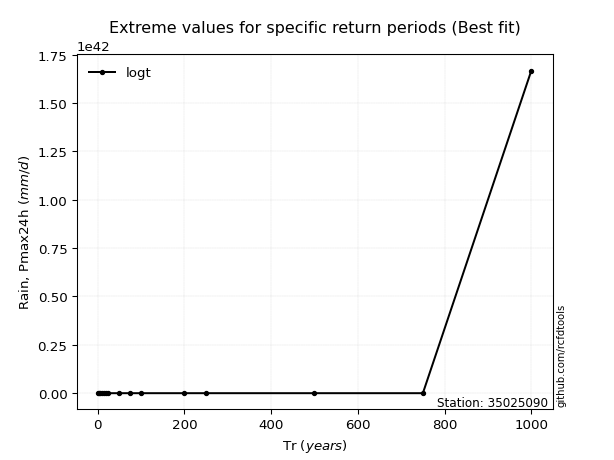</img>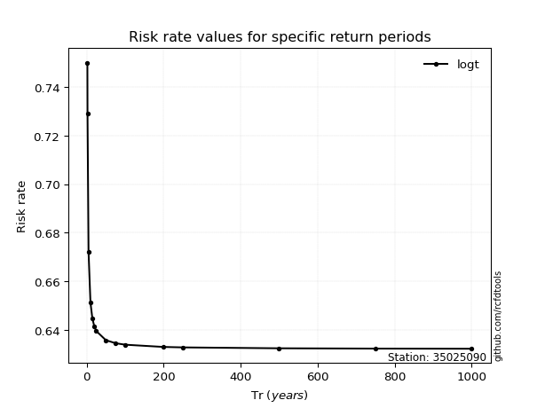</img>

</div>


<sub>**APP DISCLAIMER**: NO WARRANTY - This software is provided by [github.com/rcfdtools](https://github.com/rcfdtools) "as is", without any express or implied warranty, including warranties of merchantability, fitness for a particular purpose, or non-infringement. There is no guarantee that the software will be error-free or operate without interruption. LIMITATION OF LIABILITY - Neither the authors nor copyright holders will be liable for claims or damages arising from the software or its use. You are responsible for determining if the software is appropriate for your use and assume all associated risks, including errors, legal compliance, and data loss. NO PROFESSIONAL ADVICE - The software provides general information and does not offer professional advice. It should not replace consultation with professional advisors.</sub>