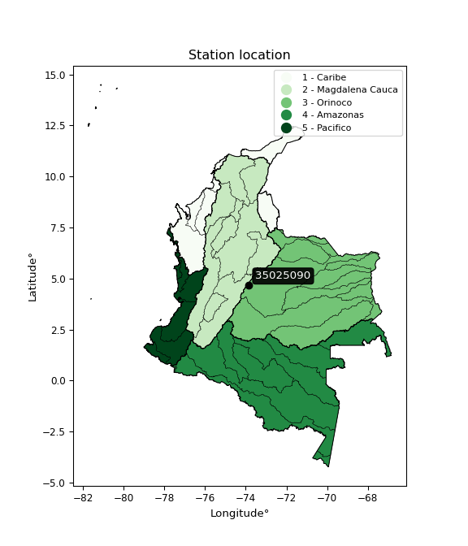

<div align="center">


</div>

# PMP Station (rain, Pmax24h): 35025090

Probable Maximum Precipitation (PMP) is the greatest amount of rainfall for a specific duration that is meteorologically possible for a given location, acting as a "worst-case" scenario for extreme storms, crucial for designing safety-critical infrastructure like bridges, river deviations, dams, spillways, and nuclear plants to prevent catastrophic failure. PMP is calculated by hydrologists using meteorological data to determine the upper limit of extreme rainfall, often leading to the Probable Maximum Flood (PMF) for flood control design, and is increasingly being studied for climate change impacts.

<div align="center">

</img>

</div>


## A. General information


### 1. General running parameters

• app_version: _v20251228_. • runtime: _2025-12-28 08:43:48.795225_. • Python version: _3.14.0_. • SciPy version: _1.16.3_. • Pandas version: _2.3.3_. • NumPy version: _2.3.5_. • Stations dataset (station_dataset_file): _dataset/pmax24h_in/automatic_colombia_2003_2024.csv_. • Stations catalog (station_catalog_file): _dataset/CNE_IDEAM.xls_. • Minimum year to eval til year_max (date_min): _1900_. • Maximum year to eval since year_min (date_max): _2024_. • Creates, save and include plots into reports (create_plot): _False_. • Plot only fit distributions with Δo > Δ (plot_only_fit): _True_. • Eval low extreme values, if False, evaluates high extreme values (low_extreme): _False_. • Eval every SciPy distribution as logarithmic (pdist_logarithmic_on): _True_. • Standard deviation normalized (ddof): _1.0_. • Return periods to eval in years (Tr): _[2, 2.33, 5, 10, 15, 20, 25, 50, 75, 100, 200, 250, 500, 750, 1000]_. • Minimum data sample per station, 0 means any (minimum_sample): _5_. • Z-Score maximum threshold to adjust a value, 0 means disable (zscore_max): _3.5_. • Z-Score minimum threshold to adjust a value, 0 means disable (zscore_min): _-2.5_. • Avoid zeros, e.g. rain = 0 (avoid_zeros): _True_. • Avoid null values (avoid_nans): _True_. [:file_folder:Dataset file.](../../dataset/pmax24h_in/automatic_colombia_2003_2024.csv)

> Delta Degrees of Freedom (DDOF): is a parameter used in the formulas for calculating variance and standard deviation. When ddof=0, the divisor is $N$ (the total number of observations) and this is used when your data set is the entire population. When ddof=1, the divisor is $N-1$ and this is used when your data set is a sample drawn from a larger population. Using $N-1$ provides an unbiased estimate of the population variance (known as Bessel´s correction).


### 2. Station info and location

|   id |   CODIGO | NOMBRE                        | CATEGORIA               | TECNOLOGIA                | ESTADO     | FECHA_INSTALACION   | FECHA_SUSPENSION   |   ALTITUD |   LATITUD |   LONGITUD | DEPARTAMENTO   | MUNICIPIO   | AREA_OPERATIVA                            | ENTIDAD                                                     | AREA_HIDROGRAFICA   | ZONA_HIDROGRAFICA   | SUBZONA_HIDROGRAFICA   |   CORRIENTE | Catalogo   |
|-----:|---------:|:------------------------------|:------------------------|:--------------------------|:-----------|:--------------------|:-------------------|----------:|----------:|-----------:|:---------------|:------------|:------------------------------------------|:------------------------------------------------------------|:--------------------|:--------------------|:-----------------------|------------:|:-----------|
|    0 | 35025090 | BOSQUE INTERVENIDO [35025090] | Climatológica Principal | Automática con Telemetría | Suspendida | 09/07/2008          | 02/12/2025         |      2944 |   4.66489 |   -73.8466 | Cundinamarca   | La Calera   | Area Operativa 11 - Cundinamarca-Amazonas | INSTITUTO DE HIDROLOGIA METEOROLOGIA Y ESTUDIOS AMBIENTALES | Orinoco             | Meta                | Río Guayuriba          |         nan | CNE_IDEAM  |

<div align="center">

Map location in: [:earth_americas:Google](http://maps.google.com/maps?q=4.664889,-73.846639) [:earth_americas:OSM](https://www.openstreetmap.org/#map=18/4.664889/-73.846639&layers=P) [:earth_americas:Bing](https://www.bing.com/maps?cp=4.664889~-73.846639&lvl=18) [:earth_americas:Apple](https://maps.apple.com/frame?center=4.664889%2C-73.846639&span=0.003%2C0.006)

</div>


<div align="center">

```geojson
{
  "type": "Feature",
  "geometry": {
    "type": "Point", 
    "coordinates": [-73.846639, 4.664889]
  }, 
  "properties": {
    "Name": "35025090"
  }
}
```

</div>


### 3. Discrete values table and plot

|               |          0 |           1 |            2 |           3 |           4 |          5 |           6 |           7 |
|:--------------|-----------:|------------:|-------------:|------------:|------------:|-----------:|------------:|------------:|
| Date          | 2016       | 2017        | 2018         | 2019        | 2020        | 2021       | 2022        | 2023        |
| Value         |    0.2     |   52.5      |   40.5       |   59.1      |   31.8      |   73.4     |   38.2      |   34.4      |
| Value_initial |    0.2     |   52.5      |   40.5       |   59.1      |   31.8      |   73.4     |   38.2      |   34.4      |
| count         |    8       |    8        |    8         |    8        |    8        |    8       |    8        |    8        |
| mean          |   41.2625  |   41.2625   |   41.2625    |   41.2625   |   41.2625   |   41.2625  |   41.2625   |   41.2625   |
| std           |   21.7453  |   21.7453   |   21.7453    |   21.7453   |   21.7453   |   21.7453  |   21.7453   |   21.7453   |
| zscore        |   -1.88834 |    0.516779 |   -0.0350651 |    0.820293 |   -0.435152 |    1.47791 |   -0.140835 |   -0.315586 |

> The initial value (value_initial) correspond to the initial obtained or null completed value, and value (value) is adjusted only when the initial value is outside the valid range definite through the Z-Score value. If Z-Score is active, values out of range or outliers are replaced with the station mean value


### 4. Active continuous probability distributions from SciPy (44 of 104 available)

[scipy.stats](https://docs.scipy.org/doc/scipy/reference/stats.html) is a Python´s powerful submodule within the SciPy library for comprehensive statistical analysis, offering over 130 probability distributions (like Normal, Poisson), functions for descriptive stats (mean, variance), hypothesis testing (t-tests, chi-square), random variable generation, and statistical tests, making it essential for data science, modeling, and research. It provides tools to explore, model, and draw conclusions from data efficiently, working seamlessly with NumPy.

<div align="center">

|   id | p_dist             |   n_parameter | fit_method   | label                                                                       | active   | ref                                                                                                        |
|-----:|:-------------------|--------------:|:-------------|:----------------------------------------------------------------------------|:---------|:-----------------------------------------------------------------------------------------------------------|
|    0 | alpha              |             3 | MLE          | Alpha                                                                       | True     | [:mortar_board:](https://docs.scipy.org/doc/scipy/reference/generated/scipy.stats.alpha.html)              |
|    1 | betaprime          |             4 | MLE          | Beta prime                                                                  | True     | [:mortar_board:](https://docs.scipy.org/doc/scipy/reference/generated/scipy.stats.betaprime.html)          |
|    2 | chi2               |             3 | MLE          | Chi²                                                                        | True     | [:mortar_board:](https://docs.scipy.org/doc/scipy/reference/generated/scipy.stats.chi2.html)               |
|    3 | crystalball        |             4 | MLE          | Crystalball                                                                 | True     | [:mortar_board:](https://docs.scipy.org/doc/scipy/reference/generated/scipy.stats.crystalball.html)        |
|    4 | erlang             |             3 | MLE          | Erlang                                                                      | True     | [:mortar_board:](https://docs.scipy.org/doc/scipy/reference/generated/scipy.stats.erlang.html)             |
|    5 | expon              |             2 | MLE          | Exponential                                                                 | True     | [:mortar_board:](https://docs.scipy.org/doc/scipy/reference/generated/scipy.stats.expon.html)              |
|    6 | exponnorm          |             3 | MLE          | Exponentially modified Normal                                               | True     | [:mortar_board:](https://docs.scipy.org/doc/scipy/reference/generated/scipy.stats.exponnorm.html)          |
|    7 | f                  |             4 | MLE          | F                                                                           | True     | [:mortar_board:](https://docs.scipy.org/doc/scipy/reference/generated/scipy.stats.f.html)                  |
|    8 | fatiguelife        |             3 | MLE          | Fatigue-life (Birnbaum-Saunders)                                            | True     | [:mortar_board:](https://docs.scipy.org/doc/scipy/reference/generated/scipy.stats.fatiguelife.html)        |
|    9 | fisk               |             3 | MLE          | Fisk                                                                        | True     | [:mortar_board:](https://docs.scipy.org/doc/scipy/reference/generated/scipy.stats.fisk.html)               |
|   10 | gamma              |             3 | MLE          | Gamma                                                                       | True     | [:mortar_board:](https://docs.scipy.org/doc/scipy/reference/generated/scipy.stats.gamma.html)              |
|   11 | genexpon           |             5 | MLE          | Generalized exponential                                                     | True     | [:mortar_board:](https://docs.scipy.org/doc/scipy/reference/generated/scipy.stats.genexpon.html)           |
|   12 | genlogistic        |             3 | MLE          | Generalized logistic                                                        | True     | [:mortar_board:](https://docs.scipy.org/doc/scipy/reference/generated/scipy.stats.genlogistic.html)        |
|   13 | gibrat             |             2 | MM           | Gibrat                                                                      | True     | [:mortar_board:](https://docs.scipy.org/doc/scipy/reference/generated/scipy.stats.gibrat.html)             |
|   14 | gompertz           |             3 | MLE          | Gompertz (or truncated Gumbel)                                              | True     | [:mortar_board:](https://docs.scipy.org/doc/scipy/reference/generated/scipy.stats.gompertz.html)           |
|   15 | gumbel_l           |             2 | MM           | Gumbel Left Skew                                                            | True     | [:mortar_board:](https://docs.scipy.org/doc/scipy/reference/generated/scipy.stats.gumbel_l.html)           |
|   16 | gumbel_r           |             2 | MM           | Gumbel Right Skew                                                           | True     | [:mortar_board:](https://docs.scipy.org/doc/scipy/reference/generated/scipy.stats.gumbel_r.html)           |
|   17 | halflogistic       |             2 | MM           | Half-logistic                                                               | True     | [:mortar_board:](https://docs.scipy.org/doc/scipy/reference/generated/scipy.stats.halflogistic.html)       |
|   18 | halfnorm           |             2 | MM           | Half Normal                                                                 | True     | [:mortar_board:](https://docs.scipy.org/doc/scipy/reference/generated/scipy.stats.halfnorm.html)           |
|   19 | hypsecant          |             2 | MM           | hyperbolic secant                                                           | True     | [:mortar_board:](https://docs.scipy.org/doc/scipy/reference/generated/scipy.stats.hypsecant.html)          |
|   20 | invgamma           |             3 | MLE          | Inverted gamma                                                              | True     | [:mortar_board:](https://docs.scipy.org/doc/scipy/reference/generated/scipy.stats.invgamma.html)           |
|   21 | invgauss           |             3 | MLE          | Inverse Gaussian                                                            | True     | [:mortar_board:](https://docs.scipy.org/doc/scipy/reference/generated/scipy.stats.invgauss.html)           |
|   22 | invweibull         |             3 | MLE          | Inverted Weibull                                                            | True     | [:mortar_board:](https://docs.scipy.org/doc/scipy/reference/generated/scipy.stats.invweibull.html)         |
|   23 | johnsonsu          |             4 | MLE          | Johnson Su                                                                  | True     | [:mortar_board:](https://docs.scipy.org/doc/scipy/reference/generated/scipy.stats.johnsonsu.html)          |
|   24 | kstwobign          |             2 | MLE          | Limiting distribution of scaled Kolmogorov-Smirnov two-sided test statistic | True     | [:mortar_board:](https://docs.scipy.org/doc/scipy/reference/generated/scipy.stats.kstwobign.html)          |
|   25 | laplace            |             2 | MM           | Laplace                                                                     | True     | [:mortar_board:](https://docs.scipy.org/doc/scipy/reference/generated/scipy.stats.laplace.html)            |
|   26 | laplace_asymmetric |             3 | MLE          | Asymmetric Laplace                                                          | True     | [:mortar_board:](https://docs.scipy.org/doc/scipy/reference/generated/scipy.stats.laplace_asymmetric.html) |
|   27 | loggamma           |             3 | MLE          | Log gamma                                                                   | True     | [:mortar_board:](https://docs.scipy.org/doc/scipy/reference/generated/scipy.stats.loggamma.html)           |
|   28 | logistic           |             2 | MM           | Logistic (or Sech-squared)                                                  | True     | [:mortar_board:](https://docs.scipy.org/doc/scipy/reference/generated/scipy.stats.logistic.html)           |
|   29 | lognorm            |             3 | MLE          | Log Normal                                                                  | True     | [:mortar_board:](https://docs.scipy.org/doc/scipy/reference/generated/scipy.stats.lognorm.html)            |
|   30 | maxwell            |             2 | MM           | Maxwell                                                                     | True     | [:mortar_board:](https://docs.scipy.org/doc/scipy/reference/generated/scipy.stats.maxwell.html)            |
|   31 | mielke             |             4 | MLE          | Mielke Beta-Kappa / Dagum                                                   | True     | [:mortar_board:](https://docs.scipy.org/doc/scipy/reference/generated/scipy.stats.mielke.html)             |
|   32 | moyal              |             2 | MM           | Moyal                                                                       | True     | [:mortar_board:](https://docs.scipy.org/doc/scipy/reference/generated/scipy.stats.moyal.html)              |
|   33 | nakagami           |             3 | MLE          | Nakagami                                                                    | True     | [:mortar_board:](https://docs.scipy.org/doc/scipy/reference/generated/scipy.stats.nakagami.html)           |
|   34 | ncf                |             5 | MLE          | Non-central F distribution                                                  | True     | [:mortar_board:](https://docs.scipy.org/doc/scipy/reference/generated/scipy.stats.ncf.html)                |
|   35 | nct                |             4 | MLE          | Non-central Student’s t                                                     | True     | [:mortar_board:](https://docs.scipy.org/doc/scipy/reference/generated/scipy.stats.nct.html)                |
|   36 | norm               |             2 | MM           | Normal                                                                      | True     | [:mortar_board:](https://docs.scipy.org/doc/scipy/reference/generated/scipy.stats.norm.html)               |
|   37 | pearson3           |             3 | MM           | Pearson type III                                                            | True     | [:mortar_board:](https://docs.scipy.org/doc/scipy/reference/generated/scipy.stats.pearson3.html)           |
|   38 | rayleigh           |             2 | MM           | Rayleigh                                                                    | True     | [:mortar_board:](https://docs.scipy.org/doc/scipy/reference/generated/scipy.stats.rayleigh.html)           |
|   39 | rice               |             3 | MLE          | Rice                                                                        | True     | [:mortar_board:](https://docs.scipy.org/doc/scipy/reference/generated/scipy.stats.rice.html)               |
|   40 | t                  |             3 | MLE          | Student’s t                                                                 | True     | [:mortar_board:](https://docs.scipy.org/doc/scipy/reference/generated/scipy.stats.t.html)                  |
|   41 | truncnorm          |             4 | MLE          | Truncated normal                                                            | True     | [:mortar_board:](https://docs.scipy.org/doc/scipy/reference/generated/scipy.stats.truncnorm.html)          |
|   42 | wald               |             2 | MM           | Wald                                                                        | True     | [:mortar_board:](https://docs.scipy.org/doc/scipy/reference/generated/scipy.stats.wald.html)               |
|   43 | weibull_min        |             3 | MLE          | Weibull minimum                                                             | True     | [:mortar_board:](https://docs.scipy.org/doc/scipy/reference/generated/scipy.stats.weibull_min.html)        |

</div>

> **n_parameter:** # arguments & localization & scale.
>
> **Fit methods:** (MLE) maximum likelihood, (MM) L-moments.
>
>**Inactive:** foldnorm, gennorm, norminvgauss, powernorm, powerlognorm, skewnorm, genextreme, anglit, arcsine, argus, beta, bradford, burr, burr12, cauchy, cosine, halfcauchy, foldcauchy, skewcauchy, wrapcauchy, dgamma, gengamma, exponweib, exponpow, truncexpon, gausshyper, genhalflogistic, genhyperbolic, geninvgauss, halfgennorm, johnsonsb, kappa4, kappa3, ksone, kstwo, loglaplace, levy, levy_l, levy_stable, ncx2, pareto, genpareto, truncpareto, lomax, powerlaw, rdist, rel_breitwigner, recipinvgauss, semicircular, studentized_range, trapezoid, triang, truncweibull_min, tukeylambda, uniform, loguniform, vonmises, vonmises_line, weibull_max, dweibull, 


## B. Probability distributions vs. Empirical distributions

A continuous probability distribution (CPD) describes probabilities for variables that can take any value within a range (like rain any time), unlike discrete variables with specific outcomes (like temperature). It uses a Probability Density Function (PDF), a curve where the total area under it equals 1, and the probability of the variable falling within an interval (a to b) is found by calculating the area under the curve between those points. A key feature is that the probability of hitting any single exact value is zero, so probabilities are always expressed for ranges, e.g., $P(a ≤ X ≤ b)$.

<div align="center">

Distributions parameters from station values
|    |   station | p_dist                |   n |             loc |            scale | shape                  | shape1                | shape2                | shape3   |
|---:|----------:|:----------------------|----:|----------------:|-----------------:|:-----------------------|:----------------------|:----------------------|:---------|
|  0 |  35025090 | alpha                 |   8 |  -277.164       |   4548.64        | 14.355510909137344     |                       |                       |          |
|  1 |  35025090 | betaprime             |   8 |  -608.455       | 115066           | 1009.1653880544966     | 178777.22501266448    |                       |          |
|  2 |  35025090 | chi2                  |   8 |  -152.205       |      1.12682     | 171.49535113843865     |                       |                       |          |
|  3 |  35025090 | crystalball           |   8 |    41.2625      |     20.3408      | 2768.0390698047763     | 2863.983801869713     |                       |          |
|  4 |  35025090 | erlang                |   8 |  -321.571       |      1.18023     | 307.459333885762       |                       |                       |          |
|  5 |  35025090 | expon                 |   8 |     0.2         |     41.0625      |                        |                       |                       |          |
|  6 |  35025090 | exponnorm             |   8 |    41.249       |     20.3409      | 0.0006558437756479449  |                       |                       |          |
|  7 |  35025090 | f                     |   8 | -7611.74        |   7652.98        | 330163.66513829015     | 1902961.192499199     |                       |          |
|  8 |  35025090 | fatiguelife           |   8 | -1650.4         |   1691.39        | 0.011980758285869503   |                       |                       |          |
|  9 |  35025090 | fisk                  |   8 |    -1.95216e+09 |      1.95216e+09 | 172453895.9796478      |                       |                       |          |
| 10 |  35025090 | gamma                 |   8 |  -290.643       |      1.30015     | 255.17004620723935     |                       |                       |          |
| 11 |  35025090 | genexpon              |   8 |     0.199889    |      2.21541     | 0.054985476935246885   | 9.858366169477187e-07 | 1.847238257004773     |          |
| 12 |  35025090 | genlogistic           |   8 |    48.0764      |      9.69583     | 0.6809224230129428     |                       |                       |          |
| 13 |  35025090 | gibrat                |   8 |    25.745       |      9.41183     |                        |                       |                       |          |
| 14 |  35025090 | gompertz              |   8 |    31.8         |     26.5149      | 0.9272950473808539     |                       |                       |          |
| 15 |  35025090 | gumbel_l              |   8 |    50.417       |     15.8597      |                        |                       |                       |          |
| 16 |  35025090 | gumbel_r              |   8 |    32.108       |     15.8597      |                        |                       |                       |          |
| 17 |  35025090 | halflogistic          |   8 |    17.1538      |     17.3907      |                        |                       |                       |          |
| 18 |  35025090 | halfnorm              |   8 |    14.3392      |     33.7434      |                        |                       |                       |          |
| 19 |  35025090 | hypsecant             |   8 |    41.2625      |     12.9494      |                        |                       |                       |          |
| 20 |  35025090 | invgamma              |   8 |  -224.772       |  41216.1         | 156.19441391577243     |                       |                       |          |
| 21 |  35025090 | invgauss              |   8 |  -118.82        |   8227.43        | 0.019431241071600325   |                       |                       |          |
| 22 |  35025090 | invweibull            |   8 |     0.2         |      2.82681     | 0.06391093112675193    |                       |                       |          |
| 23 |  35025090 | johnsonsu             |   8 |   145.068       |     25.8422      | 10.975847534534736     | 5.2734196122195645    |                       |          |
| 24 |  35025090 | kstwobign             |   8 |   -47.3253      |    101.551       |                        |                       |                       |          |
| 25 |  35025090 | laplace               |   8 |    41.2625      |     14.3831      |                        |                       |                       |          |
| 26 |  35025090 | laplace_asymmetric    |   8 |    38.2         |     14.8772      | 0.9023606214323464     |                       |                       |          |
| 27 |  35025090 | loggamma              |   8 |    -4.0898      |     37.4621      | 3.8432598646859564     |                       |                       |          |
| 28 |  35025090 | logistic              |   8 |    41.2625      |     11.2145      |                        |                       |                       |          |
| 29 |  35025090 | lognorm               |   8 |     0.2         |      0.238183    | 13.869484647360881     |                       |                       |          |
| 30 |  35025090 | maxwell               |   8 |    -6.93675     |     30.2044      |                        |                       |                       |          |
| 31 |  35025090 | mielke                |   8 |     0.2         |     70.5871      | 0.3653975659494396     | 3.268507682507201     |                       |          |
| 32 |  35025090 | moyal                 |   8 |    29.6303      |      9.1566      |                        |                       |                       |          |
| 33 |  35025090 | nakagami              |   8 |     0.2         |     44.624       | 0.2607748911076243     |                       |                       |          |
| 34 |  35025090 | ncf                   |   8 |     0.2         |      1.44575     | 0.2643284674049999     | 27.74610664509393     | 7.185783968801124     |          |
| 35 |  35025090 | nct                   |   8 |  1246.1         |     20.2993      | 385338.6585418419      | -59.353675984031554   |                       |          |
| 36 |  35025090 | norm                  |   8 |    41.2625      |     20.3408      |                        |                       |                       |          |
| 37 |  35025090 | pearson3              |   8 |    41.2625      |     20.3408      | -0.4477972245408549    |                       |                       |          |
| 38 |  35025090 | rayleigh              |   8 |     2.34926     |     31.0483      |                        |                       |                       |          |
| 39 |  35025090 | rice                  |   8 |   -13.4527      |     21.7669      | 2.2785651204384774     |                       |                       |          |
| 40 |  35025090 | t                     |   8 |    41.2625      |     20.3409      | 913799291.3595018      |                       |                       |          |
| 41 |  35025090 | truncnorm             |   8 |    43.0116      |     26.8096      | -1.6054568868327541    | 1.2086330535560421    |                       |          |
| 42 |  35025090 | wald                  |   8 |    20.9217      |     20.3408      |                        |                       |                       |          |
| 43 |  35025090 | weibull_min           |   8 |   -69.978       |    119.482       | 6.4571361552862285     |                       |                       |          |
| 44 |  35025090 | logalpha              |   8 |   -64.3336      |   2402.79        | 35.634453183291626     |                       |                       |          |
| 45 |  35025090 | logbetaprime          |   8 |    -1.60944     |      2.01015     | 0.20620462592647043    | 0.9349014267696116    |                       |          |
| 46 |  35025090 | logchi2               |   8 |    -1.60944     |      1.23724     | 1.112349511113944      |                       |                       |          |
| 47 |  35025090 | logcrystalball        |   8 |     3.13352     |      1.81236     | 5.774633075445175      | 42.12026056860536     |                       |          |
| 48 |  35025090 | logerlang             |   8 |    -1.60944     |    119.687       | 0.19037223587484953    |                       |                       |          |
| 49 |  35025090 | logexpon              |   8 |    -1.60944     |      4.74296     |                        |                       |                       |          |
| 50 |  35025090 | logexponnorm          |   8 |     3.13222     |      1.81238     | 0.0007234650237819757  |                       |                       |          |
| 51 |  35025090 | logf                  |   8 |    -1.60944     |      1.14946     | 1.012744804300827      | 1.1062234010125103    |                       |          |
| 52 |  35025090 | logfatiguelife        |   8 | -1248.81        |   1251.93        | 0.001448045381649143   |                       |                       |          |
| 53 |  35025090 | logfisk               |   8 |    -1.60944     |      1.92562     | 0.7528200873091855     |                       |                       |          |
| 54 |  35025090 | loggamma              |   8 |    -1.60944     |      2.42828     | 0.5189495049972073     |                       |                       |          |
| 55 |  35025090 | loggenexpon           |   8 |    -1.92395     |      0.0903427   | 0.0024835528801298405  | 6.728189955139555     | 7.251693742314495e-05 |          |
| 56 |  35025090 | loggenlogistic        |   8 |     4.29598     |      3.6205e-06  | 3.1178557816724237e-06 |                       |                       |          |
| 57 |  35025090 | loggibrat             |   8 |     1.75091     |      0.838594    |                        |                       |                       |          |
| 58 |  35025090 | loggompertz           |   8 |    -1.60944     |      7.98761e+13 | 102757974311002.16     |                       |                       |          |
| 59 |  35025090 | loggumbel_l           |   8 |     3.94918     |      1.41309     |                        |                       |                       |          |
| 60 |  35025090 | loggumbel_r           |   8 |     2.31786     |      1.41309     |                        |                       |                       |          |
| 61 |  35025090 | loghalflogistic       |   8 |     0.985391    |      1.54953     |                        |                       |                       |          |
| 62 |  35025090 | loghalfnorm           |   8 |     0.734625    |      3.00656     |                        |                       |                       |          |
| 63 |  35025090 | loghypsecant          |   8 |     3.13352     |      1.15379     |                        |                       |                       |          |
| 64 |  35025090 | loginvgamma           |   8 |   -50.1437      |  39759.7         | 747.7133307260233      |                       |                       |          |
| 65 |  35025090 | loginvgauss           |   8 |   -18.4995      |   2260.54        | 0.009560649230768957   |                       |                       |          |
| 66 |  35025090 | loginvweibull         |   8 |    -5.77514e+07 |      5.77514e+07 | 23805479.47841433      |                       |                       |          |
| 67 |  35025090 | logjohnsonsu          |   8 |     4.34796     |      0.00125059  | 5.4781952613665865     | 0.8046202773997777    |                       |          |
| 68 |  35025090 | logkstwobign          |   8 |    -6.81755     |     11.4083      |                        |                       |                       |          |
| 69 |  35025090 | loglaplace            |   8 |     3.13352     |      1.28153     |                        |                       |                       |          |
| 70 |  35025090 | loglaplace_asymmetric |   8 |     4.29593     |      0.00810991  | 143.31102052095395     |                       |                       |          |
| 71 |  35025090 | logloggamma           |   8 |     4.29596     |      3.01401e-06 | 2.590997886361387e-06  |                       |                       |          |
| 72 |  35025090 | loglogistic           |   8 |     3.13352     |      0.999208    |                        |                       |                       |          |
| 73 |  35025090 | loglognorm            |   8 | -1078.68        |   1081.81        | 0.0016686171542299108  |                       |                       |          |
| 74 |  35025090 | logmaxwell            |   8 |    -1.16099     |      2.69119     |                        |                       |                       |          |
| 75 |  35025090 | logmielke             |   8 |    -1.60944     |      3.49628     | 0.18489023381939015    | 0.883888030899258     |                       |          |
| 76 |  35025090 | logmoyal              |   8 |     2.0971      |      0.81585     |                        |                       |                       |          |
| 77 |  35025090 | lognakagami           |   8 | -1779.36        |   1782.49        | 240190.2559747254      |                       |                       |          |
| 78 |  35025090 | logncf                |   8 |    -1.60944     |      1.05608     | 1.033804229731743      | 1.1024541029679322    | 1.1114551911214838    |          |
| 79 |  35025090 | lognct                |   8 |  -117.564       |      1.7554      | 31109.30920460295      | 68.75576406033929     |                       |          |
| 80 |  35025090 | lognorm               |   8 |     3.13352     |      1.81236     |                        |                       |                       |          |
| 81 |  35025090 | logpearson3           |   8 |     3.13353     |      1.81235     | -2.168995112320089     |                       |                       |          |
| 82 |  35025090 | lograyleigh           |   8 |    -0.333663    |      2.76641     |                        |                       |                       |          |
| 83 |  35025090 | logrice               |   8 |    -2.27285     |      4.02681     | 0.07169186690696269    |                       |                       |          |
| 84 |  35025090 | logt                  |   8 |     3.70518     |      0.236077    | 0.9623036192174503     |                       |                       |          |
| 85 |  35025090 | logtruncnorm          |   8 |     1.40226     |      5.75309     | -0.5234952838311606    | 0.5029858811911205    |                       |          |
| 86 |  35025090 | logwald               |   8 |     1.32114     |      1.81238     |                        |                       |                       |          |
| 87 |  35025090 | logweibull_min        |   8 |    -1.60944     |      1.64658     | 0.5991053433159192     |                       |                       |          |

</div>

> **loc** (Location parameter): This shifts the distribution along the x-axis. For many common distributions, like the normal (Gaussian) distribution, loc represents the mean $μ$. For others, like the uniform distribution, it might represent the minimum value, or for the beta distribution, the left end of the support interval.
>
> **scale** (Scale parameter): This determines the width or spread of the distribution. For the normal distribution, scale represents the standard deviation $σ$. For a uniform distribution, it defines the length of the interval (from $loc$ to $loc + scale$).
>
> **shape** (Shape parameters): Refers to parameters that define the specific form of a probability distribution, distinct from its location (loc) and scale (scale). These parameters are required arguments for most distribution functions. For example, a normal (Gaussian) distribution is fully defined by its location (mean) and scale (standard deviation), so it has no specific shape parameters beyond loc and scale. However, other distributions have intrinsic properties that need specification, as Gamma distribution that takes a shape parameter, often named $a$ or $alpha$.


### 0. Cumulative distribution values - CDF (88 evaluated)

Cumulative Distribution Function (CDF), denoted as $F$<sub>$X$</sub>$(x)$, is a function that gives the probability that a random variable $X$ will take a value less than or equal to a specific value, $x$ (i.e., $(P(X≥x)$. It essentially "accumulates" probabilities from a given point up to the far right (positive infinity), providing a complete picture of the distribution´s probabilities for both discrete (like rain) and continuous (like temperature) variables, helping to find probabilities over ranges or above certain values.

<div align="center">

CDF ordered by x ascending and calculating $log(f(x))$ separately
|   id |   Station |   date |    x |   count |    mean |     std |     zscore |   Value_initial |   station |   m |     alpha |   alpha_pdf |   betaprime |   betaprime_pdf |      chi2 |   chi2_pdf |   crystalball |   crystalball_pdf |    erlang |   erlang_pdf |    expon |   expon_pdf |   exponnorm |   exponnorm_pdf |         f |      f_pdf |   fatiguelife |   fatiguelife_pdf |      fisk |   fisk_pdf |    gamma |   gamma_pdf |    genexpon |   genexpon_pdf |   genlogistic |   genlogistic_pdf |   gibrat |   gibrat_pdf |    gompertz |   gompertz_pdf |   gumbel_l |   gumbel_l_pdf |    gumbel_r |   gumbel_r_pdf |   halflogistic |   halflogistic_pdf |   halfnorm |   halfnorm_pdf |   hypsecant |   hypsecant_pdf |   invgamma |   invgamma_pdf |   invgauss |   invgauss_pdf |   invweibull |   invweibull_pdf |   johnsonsu |   johnsonsu_pdf |   kstwobign |   kstwobign_pdf |   laplace |   laplace_pdf |   laplace_asymmetric |   laplace_asymmetric_pdf |    loggamma |   loggamma_pdf |   logistic |   logistic_pdf |    lognorm |   lognorm_pdf |    maxwell |   maxwell_pdf |      mielke |   mielke_pdf |       moyal |   moyal_pdf |    nakagami |   nakagami_pdf |        ncf |        ncf_pdf |       nct |    nct_pdf |      norm |   norm_pdf |   pearson3 |   pearson3_pdf |   rayleigh |   rayleigh_pdf |      rice |   rice_pdf |         t |      t_pdf |   truncnorm |   truncnorm_pdf |     wald |   wald_pdf |   weibull_min |   weibull_min_pdf |   logalpha |   logalpha_pdf |   logbetaprime |   logbetaprime_pdf |     logchi2 |   logchi2_pdf |   logcrystalball |   logcrystalball_pdf |   logerlang |   logerlang_pdf |   logexpon |   logexpon_pdf |   logexponnorm |   logexponnorm_pdf |        logf |    logf_pdf |   logfatiguelife |   logfatiguelife_pdf |     logfisk |   logfisk_pdf |   loggenexpon |   loggenexpon_pdf |   loggenlogistic |   loggenlogistic_pdf |   loggibrat |   loggibrat_pdf |   loggompertz |   loggompertz_pdf |   loggumbel_l |   loggumbel_l_pdf |   loggumbel_r |   loggumbel_r_pdf |   loghalflogistic |   loghalflogistic_pdf |   loghalfnorm |   loghalfnorm_pdf |   loghypsecant |   loghypsecant_pdf |   loginvgamma |   loginvgamma_pdf |   loginvgauss |   loginvgauss_pdf |   loginvweibull |   loginvweibull_pdf |   logjohnsonsu |   logjohnsonsu_pdf |   logkstwobign |   logkstwobign_pdf |   loglaplace |   loglaplace_pdf |   loglaplace_asymmetric |   loglaplace_asymmetric_pdf |   logloggamma |   logloggamma_pdf |   loglogistic |   loglogistic_pdf |   loglognorm |   loglognorm_pdf |   logmaxwell |   logmaxwell_pdf |   logmielke |   logmielke_pdf |    logmoyal |   logmoyal_pdf |   lognakagami |   lognakagami_pdf |      logncf |   logncf_pdf |     lognct |   lognct_pdf |   logpearson3 |   logpearson3_pdf |   lograyleigh |   lograyleigh_pdf |   logrice |   logrice_pdf |      logt |   logt_pdf |   logtruncnorm |   logtruncnorm_pdf |   logwald |   logwald_pdf |   logweibull_min |   logweibull_min_pdf |
|-----:|----------:|-------:|-----:|--------:|--------:|--------:|-----------:|----------------:|----------:|----:|----------:|------------:|------------:|----------------:|----------:|-----------:|--------------:|------------------:|----------:|-------------:|---------:|------------:|------------:|----------------:|----------:|-----------:|--------------:|------------------:|----------:|-----------:|---------:|------------:|------------:|---------------:|--------------:|------------------:|---------:|-------------:|------------:|---------------:|-----------:|---------------:|------------:|---------------:|---------------:|-------------------:|-----------:|---------------:|------------:|----------------:|-----------:|---------------:|-----------:|---------------:|-------------:|-----------------:|------------:|----------------:|------------:|----------------:|----------:|--------------:|---------------------:|-------------------------:|------------:|---------------:|-----------:|---------------:|-----------:|--------------:|-----------:|--------------:|------------:|-------------:|------------:|------------:|------------:|---------------:|-----------:|---------------:|----------:|-----------:|----------:|-----------:|-----------:|---------------:|-----------:|---------------:|----------:|-----------:|----------:|-----------:|------------:|----------------:|---------:|-----------:|--------------:|------------------:|-----------:|---------------:|---------------:|-------------------:|------------:|--------------:|-----------------:|---------------------:|------------:|----------------:|-----------:|---------------:|---------------:|-------------------:|------------:|------------:|-----------------:|---------------------:|------------:|--------------:|--------------:|------------------:|-----------------:|---------------------:|------------:|----------------:|--------------:|------------------:|--------------:|------------------:|--------------:|------------------:|------------------:|----------------------:|--------------:|------------------:|---------------:|-------------------:|--------------:|------------------:|--------------:|------------------:|----------------:|--------------------:|---------------:|-------------------:|---------------:|-------------------:|-------------:|-----------------:|------------------------:|----------------------------:|--------------:|------------------:|--------------:|------------------:|-------------:|-----------------:|-------------:|-----------------:|------------:|----------------:|------------:|---------------:|--------------:|------------------:|------------:|-------------:|-----------:|-------------:|--------------:|------------------:|--------------:|------------------:|----------:|--------------:|----------:|-----------:|---------------:|-------------------:|----------:|--------------:|-----------------:|---------------------:|
|    0 |  35025090 |   2016 |  0.2 |       8 | 41.2625 | 21.7453 | -1.88834   |             0.2 |  35025090 |   1 | 0.0204739 |  0.00292021 |   0.0213534 |      0.00260743 | 0.0188484 | 0.0025877  |     0.0217581 |        0.00255632 | 0.0203186 |   0.00256986 | 0        |  0.0243531  |   0.0217586 |      0.00255637 | 0.0219407 | 0.00257699 |     0.0207973 |        0.00253106 | 0.0240913 | 0.00207695 | 0.020854 |  0.00263791 | 2.74364e-06 |     0.0248195  |      0.034488 |        0.00240479 | 0        |   0          | 0           |      0         |  0.0412819 |     0.00254846 | 0.000565682 |    0.000266706 |       0        |         0          |   0        |     0          |   0.0266979 |      0.0020593  |  0.0190298 |     0.00272074 |  0.0196846 |     0.00291811 |  4.94162e-06 |      1.39023e+11 |   0.0350502 |      0.0027723  |   0.0191659 |      0.00413994 | 0.0287807 |    0.002001   |            0.0264688 |               0.00197167 | 5.35457e-09 |    1.25144e+07 |  0.0250489 |     0.00217767 | 0.00443527 |    0.00716946 | 0.00345023 |    0.00143419 | 1.88244e-07 |   2.4782e+09 | 6.09766e-07 | 8.59496e-07 | 2.48909e-10 |     4.6772e+06 | 0.00172921 | 40328.7        | 0.0217928 | 0.00255835 | 0.0217581 | 0.00255632 |  0.0322874 |     0.00277901 |   0        |     0          | 0.0168925 | 0.0027884  | 0.0217581 | 0.00255632 |  0.00114098 |      0.00499525 | 0        | 0          |     0.0316791 |        0.00286816 | 0.00376139 |     0.00684733 |    0.000502217 |        4.66391e+11 | 1.33651e-09 |   3.34768e+06 |       0.00443526 |           0.00716946 | 0.000457339 |     3.92104e+11 |   0        |      0.210839  |     0.00443554 |         0.00716978 | 7.17706e-09 | 1.63673e+07 |       0.00447695 |           0.00725507 | 1.00336e-12 |  3401.79      |     0.0115354 |         0.0457554 |         0        |            0.0053267 |    0        |       0         |   1.17118e-14 |       1.28647     |     0.0193817 |          0.013582 |   1.01167e-07 |       1.15311e-06 |          0        |              0        |      0        |          0        |      0.0104364 |         0.00904376 |    0.00542036 |        0.00902565 |      0.006531 |         0.0111969 |       0.0104637 |           0.0196675 |      0.0291341 |          0.0089692 |      0.0147504 |          0.0306985 |    0.0123494 |        0.0096364 |              0.00621323 |                  0.00534591 |    0.00624122 |        0.00536528 |    0.00860542 |        0.00853813 |   0.00425661 |       0.00696907 |     0        |         0        |  0.00101228 |       8.429e+11 | 3.17579e-22 |    1.84835e-20 |    0.00454492 |        0.00730919 | 2.94927e-09 |  6.86567e+06 | 0.00452018 |    0.0072967 |     0.0277906 |         0.0146601 |      0        |          0        | 0.0134451 |     0.0402593 | 0.0157834 | 0.00285426 |    2.82825e-06 |           0.154168 |  0        |     0         |      3.10537e-10 |       837870         |
|    1 |  35025090 |   2020 | 31.8 |       8 | 41.2625 | 21.7453 | -0.435152  |            31.8 |  35025090 |   2 | 0.356902  |  0.0177733  |   0.328531  |      0.017801   | 0.339485  | 0.0181256  |     0.320895  |        0.0176015  | 0.328485  |   0.0177777  | 0.536783 |  0.0112808  |   0.320898  |      0.0176015  | 0.321822  | 0.0175843  |     0.324675  |        0.017851   | 0.287004  | 0.0180772  | 0.33288  |  0.0178316  | 0.543568    |     0.0113287  |      0.283775 |        0.0167949  | 0.329575 |   0.0597792  | 4.28145e-12 |      0.0349726 |  0.265946  |     0.0143098  | 0.360735    |    0.0231915   |       0.397849 |         0.0242001  |   0.395164 |     0.0206827  |   0.285705  |      0.0192178  |  0.352304  |     0.0182524  |  0.359722  |     0.0178656  |  0.42442     |      0.000735666 |   0.294766  |      0.0156556  |   0.421623  |      0.0163279  | 0.258972  |    0.0180052  |            0.278623  |               0.0207547  | 0.956599    |    0.0209697   |  0.300741  |     0.0187521  | 0.571362   |    0.216592   | 0.350719   |    0.0190905  | 0.739729    |   0.00797688 | 0.374395    | 0.0260848   | 0.633633    |     0.00942185 | 0.443578   |     0.0138181  | 0.320895  | 0.0175961  | 0.320895  | 0.0176015  |  0.300119  |     0.0159857  |   0.362289 |     0.0194825  | 0.330456  | 0.0176876  | 0.320895  | 0.0176014  |  0.340828   |      0.0163799  | 0.394764 | 0.0409621  |     0.298849  |        0.015793   | 0.575921   |     0.204783   |    0.924594    |        0.0114703   | 0.949521    |   0.023703    |       0.571363   |           0.216592   | 0.590907    |     0.0214158   |   0.656553 |      0.072412  |     0.571359   |         0.21659    | 0.735642    | 0.0248328   |       0.574247   |           0.216182   | 0.674507    |     0.0326066 |     0.636866  |         0.126593  |         0        |            0.419017  |    0.761668 |       0.181259  |   0.998528    |       0.00189397  |     0.506937  |          0.246731 |   0.640309    |       0.202005    |          0.663102 |              0.180795 |      0.635222 |          0.175999 |      0.588749  |         0.265229   |    0.581895   |        0.198669   |      0.58385  |         0.181906  |       0.568751  |           0.132299  |      0.358454  |          0.338296  |      0.608428  |          0.120811  |    0.612285  |        0.30254   |              0.486874   |                  0.41891    |    0.487196   |        0.418818   |    0.580835   |        0.243659   |   0.572524   |       0.217278   |     0.600238 |         0.200168 |  0.892739   |       0.0136327 | 0.66436     |    0.193112    |    0.57137    |        0.215843   | 0.626411    |  0.0318696   | 0.571514   |    0.215481  |     0.429327  |         0.244204  |      0.609375 |          0.193608 | 0.636011  |     0.128346  | 0.246281  | 0.638538   |    0.865271    |           0.165859 |  0.731145 |     0.169422  |      0.859336    |            0.0326087 |
|    2 |  35025090 |   2023 | 34.4 |       8 | 41.2625 | 21.7453 | -0.315586  |            34.4 |  35025090 |   3 | 0.403656  |  0.018146   |   0.375957  |      0.0186366  | 0.387523  | 0.0187792  |     0.367917  |        0.0185278  | 0.375794  |   0.0185702  | 0.565203 |  0.0105887  |   0.36792   |      0.0185279  | 0.368781  | 0.0184971  |     0.372304  |        0.0187428  | 0.336196  | 0.0197146  | 0.380283 |  0.0185872  | 0.572092    |     0.0106207  |      0.329842 |        0.0186206  | 0.466595 |   0.0459323  | 0.0911147   |      0.0350609 |  0.305282  |     0.0159556  | 0.420865    |    0.0229661   |       0.458842 |         0.0226979  |   0.44783  |     0.0198154  |   0.338695  |      0.0214919  |  0.400464  |     0.0187447  |  0.406684  |     0.0182138  |  0.426258    |      0.00067924  |   0.337173  |      0.0169477  |   0.4636    |      0.0159388  | 0.310284  |    0.0215727  |            0.338165  |               0.0251901  | 0.958214    |    0.0201521   |  0.351619  |     0.0203293  | 0.588313   |    0.214707   | 0.400815   |    0.019395   | 0.759739    |   0.00742223 | 0.440883    | 0.0249506   | 0.657404    |     0.00887108 | 0.478875   |     0.0133242  | 0.367903  | 0.0185223  | 0.367917  | 0.0185278  |  0.34329   |     0.0172014  |   0.413046 |     0.0195149  | 0.377501  | 0.0184596  | 0.367917  | 0.0185278  |  0.384222   |      0.0169778  | 0.491125 | 0.0333687  |     0.34153   |        0.0170205  | 0.591929   |     0.202539   |    0.925484    |        0.0111892   | 0.951349    |   0.0228058   |       0.588314   |           0.214707   | 0.59258     |     0.0211368   |   0.662197 |      0.071222  |     0.588309   |         0.214705   | 0.737573    | 0.0243246   |       0.591162   |           0.214221   | 0.677044    |     0.0319783 |     0.646745  |         0.124802  |         0        |            0.448357  |    0.77537  |       0.16766   |   0.998669    |       0.00171184  |     0.526479  |          0.250504 |   0.655939    |       0.195742    |          0.677072 |              0.174754 |      0.64889  |          0.17182  |      0.609385  |         0.259753   |    0.597425   |        0.196494   |      0.598063 |         0.179741  |       0.579074  |           0.130407  |      0.386644  |          0.380231  |      0.617852  |          0.119009  |    0.635347  |        0.284544  |              0.520935   |                  0.448217   |    0.521248   |        0.448092   |    0.599853   |        0.24022    |   0.589526   |       0.215336   |     0.61584  |         0.196827 |  0.893799   |       0.0133343 | 0.679242    |    0.185629    |    0.588262   |        0.213969   | 0.628892    |  0.0312756   | 0.588377   |    0.213593  |     0.448996  |         0.256468  |      0.624449 |          0.189993 | 0.646026  |     0.126525  | 0.305769  | 0.886931   |    0.878273    |           0.165035 |  0.744062 |     0.159428  |      0.861868    |            0.0318249 |
|    3 |  35025090 |   2022 | 38.2 |       8 | 41.2625 | 21.7453 | -0.140835  |            38.2 |  35025090 |   4 | 0.472901  |  0.0182039  |   0.448333  |      0.0193503  | 0.459893  | 0.0192026  |     0.440162  |        0.0193918  | 0.447796  |   0.0192202  | 0.603635 |  0.00965274 |   0.440164  |      0.0193918  | 0.440873  | 0.0193426  |     0.445234  |        0.0195336  | 0.414692  | 0.0214421  | 0.452243 |  0.0191816  | 0.610606    |     0.00966477 |      0.405141 |        0.0209041  | 0.61032  |   0.0307981  | 0.223648    |      0.0345632 |  0.370524  |     0.0183713  | 0.506084    |    0.0217324   |       0.540667 |         0.0203465  |   0.520512 |     0.018415   |   0.425413  |      0.0239093  |  0.47225   |     0.0189322  |  0.476123  |     0.0182388  |  0.428704    |      0.000610698 |   0.404805  |      0.018587   |   0.52274   |      0.0151504  | 0.404109  |    0.028096   |            0.448809  |               0.033432   | 0.960271    |    0.0191149   |  0.43215   |     0.0218821  | 0.610653   |    0.2116     | 0.474554   |    0.0193137  | 0.786511    |   0.00668028 | 0.531129    | 0.0224272   | 0.689696    |     0.00813729 | 0.528003   |     0.0125193  | 0.440127  | 0.0193866  | 0.440162  | 0.0193918  |  0.411606  |     0.0186859  |   0.486569 |     0.0190944  | 0.449071  | 0.0191089  | 0.440161  | 0.0193918  |  0.450006   |      0.0175911  | 0.600581 | 0.0247199  |     0.40925   |        0.0185605  | 0.612974   |     0.199073   |    0.926638    |        0.0108305   | 0.953678    |   0.0216656   |       0.610653   |           0.2116     | 0.594775    |     0.0207765   |   0.669577 |      0.0696659 |     0.610649   |         0.211599   | 0.740088    | 0.0236732   |       0.613446   |           0.211016   | 0.680352    |     0.0311709 |     0.659694  |         0.122349  |         0        |            0.490695  |    0.79207  |       0.151446  |   0.998837    |       0.00149597  |     0.552955  |          0.254699 |   0.676007    |       0.187314    |          0.694966 |              0.166831 |      0.6666   |          0.166225 |      0.636158  |         0.251026   |    0.617843   |        0.193159   |      0.616731 |         0.176541  |       0.592603  |           0.127812  |      0.42991   |          0.44819   |      0.630194  |          0.116577  |    0.663975  |        0.262205  |              0.570081   |                  0.490502   |    0.570378   |        0.490326   |    0.62474    |        0.234626   |   0.611928   |       0.212149   |     0.636216 |         0.192038 |  0.895176   |       0.0129524 | 0.698179    |    0.175886    |    0.610525   |        0.210882   | 0.632128    |  0.0305116   | 0.610601   |    0.210493  |     0.476776  |         0.274032  |      0.644094 |          0.184928 | 0.659153  |     0.12403   | 0.41846   | 1.24944    |    0.895506    |           0.163896 |  0.760117 |     0.14721   |      0.86515     |            0.0308189 |
|    4 |  35025090 |   2018 | 40.5 |       8 | 41.2625 | 21.7453 | -0.0350651 |            40.5 |  35025090 |   5 | 0.514539  |  0.0179708  |   0.493018  |      0.0194648  | 0.504038  | 0.0191452  |     0.485049  |        0.0195991  | 0.492141  |   0.0193004  | 0.625225 |  0.00912693 |   0.485051  |      0.0195991  | 0.485635  | 0.0195406  |     0.490386  |        0.0196871  | 0.464703  | 0.0219749  | 0.496462 |  0.0192298  | 0.632212    |     0.0091285  |      0.454428 |        0.0218922  | 0.673505 |   0.0244385  | 0.302405    |      0.0338712 |  0.414392  |     0.0197584  | 0.554819    |    0.0206089   |       0.585785 |         0.0188852  |   0.56183  |     0.0175078  |   0.481268  |      0.0245385  |  0.515621  |     0.0187447  |  0.517821  |     0.0179889  |  0.430068    |      0.00057551  |   0.44849   |      0.0193682  |   0.55694   |      0.0145787  | 0.474184  |    0.032968   |            0.52058   |               0.0290788  | 0.961372    |    0.018561    |  0.483008  |     0.0222668  | 0.622966   |    0.209582   | 0.518633   |    0.0189826  | 0.801392    |   0.00626342 | 0.580698    | 0.0206609   | 0.707936    |     0.00772728 | 0.556204   |     0.0120008  | 0.485002  | 0.0195943  | 0.485049  | 0.0195991  |  0.455391  |     0.019355   |   0.529952 |     0.0186025  | 0.493175  | 0.0192041  | 0.485048  | 0.0195991  |  0.490729   |      0.0177984  | 0.652717 | 0.0207546  |     0.452806  |        0.0192836  | 0.624551   |     0.196915   |    0.927265    |        0.010638    | 0.954927    |   0.021056    |       0.622967   |           0.209582   | 0.595984    |     0.0205811   |   0.673625 |      0.0688124 |     0.622962   |         0.20958    | 0.741462    | 0.0233221   |       0.625724   |           0.208946   | 0.682162    |     0.0307347 |     0.666806  |         0.120951  |         0        |            0.516034  |    0.800682 |       0.143247  |   0.998921    |       0.00138758  |     0.567904  |          0.256582 |   0.686821    |       0.182596    |          0.704593 |              0.162484 |      0.676227 |          0.163097 |      0.650676  |         0.245547   |    0.629077   |        0.191092   |      0.626997 |         0.174609  |       0.600032  |           0.126333  |      0.457411  |          0.493562  |      0.63697   |          0.115207  |    0.678961  |        0.250511  |              0.599492   |                  0.515808   |    0.599778   |        0.5156     |    0.638354   |        0.231041   |   0.624272   |       0.210084   |     0.647361 |         0.189213 |  0.895927   |       0.0127467 | 0.708307    |    0.17058     |    0.622797   |        0.208878   | 0.6339      |  0.0300986   | 0.62285    |    0.208483  |     0.493101  |         0.284497  |      0.65482  |          0.181991 | 0.666363  |     0.122606  | 0.494806  | 1.33786    |    0.905069    |           0.16324  |  0.768537 |     0.140895  |      0.866936    |            0.030276  |
|    5 |  35025090 |   2017 | 52.5 |       8 | 41.2625 | 21.7453 |  0.516779  |            52.5 |  35025090 |   6 | 0.711467  |  0.0142928  |   0.713788  |      0.016398   | 0.717182  | 0.0155943  |     0.709683  |        0.016837   | 0.710438  |   0.0161963  | 0.720197 |  0.00681409 |   0.709685  |      0.0168369  | 0.709453  | 0.016772   |     0.714357  |        0.0166585  | 0.714768  | 0.0180103  | 0.713192 |  0.0160301  | 0.726947    |     0.00677718 |      0.715902 |        0.0195012  | 0.851932 |   0.00863947 | 0.666121    |      0.0254899 |  0.680295  |     0.0229877  | 0.758482    |    0.0132204   |       0.768329 |         0.0117784  |   0.741908 |     0.0124746  |   0.746931  |      0.0175482  |  0.721399  |     0.0148867  |  0.714635  |     0.0142668  |  0.436105    |      0.000442258 |   0.688706  |      0.0193929  |   0.711337  |      0.0110749  | 0.771094  |    0.0159149  |            0.768466  |               0.0140435  | 0.965889    |    0.0163013   |  0.731462  |     0.0175153  | 0.675974   |    0.198344   | 0.724413   |    0.0147563  | 0.864859    |   0.00439355 | 0.77423     | 0.0119938   | 0.789226    |     0.00589752 | 0.683456   |     0.00921667 | 0.709604  | 0.0168366  | 0.709683  | 0.016837   |  0.691998  |     0.0188698  |   0.728697 |     0.0141143  | 0.711212  | 0.0162537  | 0.709683  | 0.016837   |  0.701708   |      0.0167914  | 0.820907 | 0.00919009 |     0.690689  |        0.0191349  | 0.674241   |     0.185592   |    0.929921    |        0.00984348  | 0.96006     |   0.0185624   |       0.675975   |           0.198344   | 0.601217    |     0.0197584   |   0.691003 |      0.0651485 |     0.67597    |         0.198343   | 0.747321    | 0.0218628   |       0.678539   |           0.197507   | 0.689898    |     0.0289139 |     0.697369  |         0.11453   |         0        |            0.645261  |    0.833722 |       0.112889  |   0.999228    |       0.000993726 |     0.635148  |          0.260327 |   0.731504    |       0.161848    |          0.744323 |              0.143909 |      0.716751 |          0.149224 |      0.710869  |         0.217528   |    0.677323   |        0.180314   |      0.671089 |         0.164908  |       0.631944  |           0.119554  |      0.62013   |          0.791252  |      0.66607   |          0.109045  |    0.737812  |        0.204589  |              0.749472   |                  0.644851   |    0.749682   |        0.644465   |    0.69592    |        0.211783   |   0.677382   |       0.19863    |     0.694729 |         0.175562 |  0.899122   |       0.0118933 | 0.749636    |    0.148299    |    0.675633   |        0.197727   | 0.641484    |  0.028372    | 0.675581   |    0.197324  |     0.573596  |         0.337955  |      0.700282 |          0.168185 | 0.697339  |     0.116055  | 0.759918  | 0.612361   |    0.947038    |           0.160161 |  0.801824 |     0.116585  |      0.874494    |            0.0280153 |
|    6 |  35025090 |   2019 | 59.1 |       8 | 41.2625 | 21.7453 |  0.820293  |            59.1 |  35025090 |   7 | 0.796304  |  0.0113863  |   0.810995  |      0.012952   | 0.809368  | 0.0122753  |     0.809738  |        0.0133522  | 0.806578  |   0.0128401  | 0.761741 |  0.00580234 |   0.809739  |      0.0133521  | 0.809152  | 0.013312   |     0.813008  |        0.01312    | 0.817828  | 0.0131614  | 0.808249 |  0.012685   | 0.768205    |     0.00575316 |      0.827409 |        0.0141132  | 0.897107 |   0.00537196 | 0.811585    |      0.0184501 |  0.822522  |     0.0193474  | 0.833324    |    0.0095804   |       0.835473 |         0.00868234 |   0.815328 |     0.00980968 |   0.842716  |      0.0116578  |  0.809224  |     0.0116887  |  0.79928   |     0.011355   |  0.438852    |      0.000392185 |   0.806984  |      0.0160959  |   0.777945  |      0.00912853 | 0.855332  |    0.0100582  |            0.844847  |               0.00941065 | 0.967764    |    0.0153691   |  0.830697  |     0.0125409  | 0.699098   |    0.192105   | 0.811369   |    0.0115699  | 0.891027    |   0.00355836 | 0.841444    | 0.00854313  | 0.825333    |     0.00506097 | 0.739504   |     0.00778878 | 0.809663  | 0.0133541  | 0.809738  | 0.0133522  |  0.806738  |     0.0155951  |   0.811841 |     0.011077   | 0.807904  | 0.0129392  | 0.809737  | 0.0133522  |  0.806801   |      0.014931   | 0.870966 | 0.00621442 |     0.807329  |        0.0158722  | 0.695868   |     0.179599   |    0.931067    |        0.00951075  | 0.962197    |   0.0175305   |       0.699099   |           0.192105   | 0.603536    |     0.0194055   |   0.698623 |      0.063542  |     0.699094   |         0.192104   | 0.749873    | 0.0212462   |       0.70156    |           0.191193   | 0.693276    |     0.0281407 |     0.710752  |         0.111503  |         0        |            0.714535  |    0.846414 |       0.101725  |   0.999337    |       0.000853309 |     0.665928  |          0.259202 |   0.750121    |       0.152626    |          0.760885 |              0.135865 |      0.734049 |          0.142938 |      0.735806  |         0.203581   |    0.698343   |        0.174632   |      0.690326 |         0.159953  |       0.645914  |           0.116375  |      0.72561   |          0.997969  |      0.678815  |          0.106207  |    0.760953  |        0.186532  |              0.829859   |                  0.714017   |    0.830018   |        0.713526   |    0.720402   |        0.201583   |   0.700535   |       0.19229    |     0.715123 |         0.168847 |  0.900509   |       0.0115335 | 0.766635    |    0.13887     |    0.698687   |        0.191538   | 0.644799    |  0.0276378   | 0.698588   |    0.191141  |     0.61531   |         0.367163  |      0.719808 |          0.161564 | 0.710899  |     0.112961  | 0.817333  | 0.379909   |    0.965916    |           0.158668 |  0.815066 |     0.107218  |      0.877755    |            0.0270583 |
|    7 |  35025090 |   2021 | 73.4 |       8 | 41.2625 | 21.7453 |  1.47791   |            73.4 |  35025090 |   8 | 0.91625   |  0.00569581 |   0.940792  |      0.00556552 | 0.934121  | 0.00553921 |     0.942941  |        0.00562975 | 0.936552  |   0.00568316 | 0.831808 |  0.004096   |   0.942941  |      0.00562971 | 0.94224   | 0.00564822 |     0.943444  |        0.00550655 | 0.940753  | 0.0049238  | 0.936664 |  0.00562477 | 0.837459    |     0.00403426 |      0.952913 |        0.00457625 | 0.9476   |   0.00224646 | 0.970552    |      0.004945  |  0.98587   |     0.00379483 | 0.928664    |    0.00433355  |       0.924207 |         0.00419308 |   0.919932 |     0.00511111 |   0.946906  |      0.00408116 |  0.929174  |     0.00545342 |  0.918704  |     0.00565256 |  0.443866    |      0.000314772 |   0.962291  |      0.00568514 |   0.881592  |      0.00554115 | 0.946471  |    0.00372164 |            0.934826  |               0.00395305 | 0.970922    |    0.0138065   |  0.946125  |     0.00454522 | 0.73936    |    0.179201   | 0.930435   |    0.00543722 | 0.931419    |   0.00218679 | 0.926997    | 0.00397522  | 0.886514    |     0.00356151 | 0.831581   |     0.0052169  | 0.942905  | 0.00563251 | 0.942941  | 0.00562976 |  0.959117  |     0.00579229 |   0.927079 |     0.00537461 | 0.938819  | 0.00568861 | 0.942941  | 0.00562977 |  0.981856   |      0.00940367 | 0.932774 | 0.00291758 |     0.961049  |        0.00569315 | 0.733505   |     0.167572   |    0.933065    |        0.00894481  | 0.965804    |   0.0157964   |       0.73936    |           0.1792     | 0.607674    |     0.0187929   |   0.712082 |      0.0607043 |     0.739355   |         0.1792     | 0.754361    | 0.0201896   |       0.741612   |           0.178184   | 0.699227    |     0.0268103 |     0.734304  |         0.105849  |         0.999952 |            0.861127  |    0.866536 |       0.0846434 |   0.999498    |       0.000645711 |     0.721435  |          0.251954 |   0.781419    |       0.13639     |          0.788795 |              0.121908 |      0.763788 |          0.131583 |      0.777119  |         0.177771   |    0.734971   |        0.163243   |      0.723946 |         0.150213  |       0.670494  |           0.110481  |      0.972602  |          0.975399  |      0.701266  |          0.101003  |    0.798141  |        0.157514  |              0.999945   |                  0.86036    |    0.999972   |        0.859616   |    0.761936   |        0.181533   |   0.740817   |       0.179207   |     0.750332 |         0.156023 |  0.902941   |       0.010918  | 0.794963    |    0.122855    |    0.738836   |        0.178739   | 0.65065     |  0.0263727   | 0.738654   |    0.178368  |     0.701605  |         0.432332  |      0.753476 |          0.149131 | 0.734753  |     0.107176  | 0.875091  | 0.185171   |    0.999991    |           0.1558   |  0.836639 |     0.0923483 |      0.883438    |            0.0254166 |


</div>

An Empirical Distribution Function (EDF) is a step-function estimate of a true cumulative distribution function (CDF) based on observed sample data, representing the proportion of data points less than or equal to a given value. It is calculated by ordering your data and jumping up by $1/n$ (where $n$ is sample size) at each unique data point, allowing analysis without assuming an underlying population distribution, and it gets closer to the true CDF as the sample size grows.


### 1. Empirical - EDF California (1923)

California´s estimates the true probability distribution of water-related data (like rainfall, streamflow) using observed samples, crucial for risk assessment.

<div align="center">


$P=m/n$


</div>


**1.1. Empirical values**

<div align="center">

|                | 0                  | 1                  | 2              | 3              | 4                  | 5              | 6              | 7              |
|:---------------|:-------------------|:-------------------|:---------------|:---------------|:-------------------|:---------------|:---------------|:---------------|
| date           | 2016               | 2020               | 2023           | 2022           | 2018               | 2017           | 2019           | 2021           |
| x              | 0.2                | 31.8               | 34.4           | 38.2           | 40.5               | 52.5           | 59.1           | 73.4           |
| m              | 1                  | 2                  | 3              | 4              | 5                  | 6              | 7              | 8              |
| empirical_dist | edf_california     | edf_california     | edf_california | edf_california | edf_california     | edf_california | edf_california | edf_california |
| empirical      | 0.125              | 0.25               | 0.375          | 0.5            | 0.625              | 0.75           | 0.875          | 1.0            |
| empirical_tr   | 1.1428571428571428 | 1.3333333333333333 | 1.6            | 2.0            | 2.6666666666666665 | 4.0            | 8.0            | inf            |

</div>


**1.2. Kolmogorov-Smirnov fit test (sorted by Δ)**


<div align="center">

|                | 0                   | 1                   | 2                   | 3                   | 4                   | 5                   | 6                   | 7                   | 8                  | 9                  | 10                  | 11                  | 12                 | 13                  | 14                  | 15                  | 16                  | 17                 | 18                  | 19                  | 20                  | 21                  | 22                 | 23                  | 24                 | 25                  | 26                  | 27                 | 28                  | 29                  | 30                  | 31                  | 32                 | 33                  | 34                  | 35                  | 36                  | 37                  | 38                    | 39                  | 40                 | 41                  | 42                  | 43                 | 44                 | 45                 | 46                 | 47                  | 48                  | 49                 | 50                 | 51                 | 52                 | 53                  | 54                  | 55                 | 56                 | 57                 | 58                 | 59                  | 60                  | 61                 | 62                  | 63                 | 64                  | 65                  | 66                 | 67                  | 68                 | 69                 | 70                  | 71                 | 72                  | 73                  | 74                  | 75                 | 76                 | 77                 | 78                 | 79                 | 80                 | 81                 | 82                 | 83                 | 84                 | 85                 | 86                 | 87                 |
|:---------------|:--------------------|:--------------------|:--------------------|:--------------------|:--------------------|:--------------------|:--------------------|:--------------------|:-------------------|:-------------------|:--------------------|:--------------------|:-------------------|:--------------------|:--------------------|:--------------------|:--------------------|:-------------------|:--------------------|:--------------------|:--------------------|:--------------------|:-------------------|:--------------------|:-------------------|:--------------------|:--------------------|:-------------------|:--------------------|:--------------------|:--------------------|:--------------------|:-------------------|:--------------------|:--------------------|:--------------------|:--------------------|:--------------------|:----------------------|:--------------------|:-------------------|:--------------------|:--------------------|:-------------------|:-------------------|:-------------------|:-------------------|:--------------------|:--------------------|:-------------------|:-------------------|:-------------------|:-------------------|:--------------------|:--------------------|:-------------------|:-------------------|:-------------------|:-------------------|:--------------------|:--------------------|:-------------------|:--------------------|:-------------------|:--------------------|:--------------------|:-------------------|:--------------------|:-------------------|:-------------------|:--------------------|:-------------------|:--------------------|:--------------------|:--------------------|:-------------------|:-------------------|:-------------------|:-------------------|:-------------------|:-------------------|:-------------------|:-------------------|:-------------------|:-------------------|:-------------------|:-------------------|:-------------------|
| station        | 35025090            | 35025090            | 35025090            | 35025090            | 35025090            | 35025090            | 35025090            | 35025090            | 35025090           | 35025090           | 35025090            | 35025090            | 35025090           | 35025090            | 35025090            | 35025090            | 35025090            | 35025090           | 35025090            | 35025090            | 35025090            | 35025090            | 35025090           | 35025090            | 35025090           | 35025090            | 35025090            | 35025090           | 35025090            | 35025090            | 35025090            | 35025090            | 35025090           | 35025090            | 35025090            | 35025090            | 35025090            | 35025090            | 35025090              | 35025090            | 35025090           | 35025090            | 35025090            | 35025090           | 35025090           | 35025090           | 35025090           | 35025090            | 35025090            | 35025090           | 35025090           | 35025090           | 35025090           | 35025090            | 35025090            | 35025090           | 35025090           | 35025090           | 35025090           | 35025090            | 35025090            | 35025090           | 35025090            | 35025090           | 35025090            | 35025090            | 35025090           | 35025090            | 35025090           | 35025090           | 35025090            | 35025090           | 35025090            | 35025090            | 35025090            | 35025090           | 35025090           | 35025090           | 35025090           | 35025090           | 35025090           | 35025090           | 35025090           | 35025090           | 35025090           | 35025090           | 35025090           | 35025090           |
| empirical_dist | edf_california      | edf_california      | edf_california      | edf_california      | edf_california      | edf_california      | edf_california      | edf_california      | edf_california     | edf_california     | edf_california      | edf_california      | edf_california     | edf_california      | edf_california      | edf_california      | edf_california      | edf_california     | edf_california      | edf_california      | edf_california      | edf_california      | edf_california     | edf_california      | edf_california     | edf_california      | edf_california      | edf_california     | edf_california      | edf_california      | edf_california      | edf_california      | edf_california     | edf_california      | edf_california      | edf_california      | edf_california      | edf_california      | edf_california        | edf_california      | edf_california     | edf_california      | edf_california      | edf_california     | edf_california     | edf_california     | edf_california     | edf_california      | edf_california      | edf_california     | edf_california     | edf_california     | edf_california     | edf_california      | edf_california      | edf_california     | edf_california     | edf_california     | edf_california     | edf_california      | edf_california      | edf_california     | edf_california      | edf_california     | edf_california      | edf_california      | edf_california     | edf_california      | edf_california     | edf_california     | edf_california      | edf_california     | edf_california      | edf_california      | edf_california      | edf_california     | edf_california     | edf_california     | edf_california     | edf_california     | edf_california     | edf_california     | edf_california     | edf_california     | edf_california     | edf_california     | edf_california     | edf_california     |
| p_dist         | laplace_asymmetric  | invgamma            | invgauss            | alpha               | chi2                | maxwell             | gumbel_r            | moyal               | rayleigh           | gibrat             | gamma               | logt                | rice               | betaprime           | erlang              | truncnorm           | fatiguelife         | f                  | exponnorm           | crystalball         | norm                | t                   | nct                | logistic            | hypsecant          | wald                | halfnorm            | halflogistic       | laplace             | fisk                | logjohnsonsu        | pearson3            | genlogistic        | kstwobign           | weibull_min         | johnsonsu           | ncf                 | gumbel_l            | loglaplace_asymmetric | logloggamma         | loggumbel_l        | expon               | genexpon            | logpearson3        | logexponnorm       | lognorm            | lognorm            | logcrystalball      | lognakagami         | lognct             | loglognorm         | gompertz           | logfatiguelife     | logalpha            | loginvweibull       | loglogistic        | loginvgamma        | loginvgauss        | loghypsecant       | logmaxwell          | logkstwobign        | lograyleigh        | loglaplace          | logncf             | nakagami            | loghalfnorm         | logrice            | loggenexpon         | loggumbel_r        | logerlang          | logexpon            | loghalflogistic    | logmoyal            | logfisk             | logwald             | logf               | mielke             | loggibrat          | invweibull         | logweibull_min     | logtruncnorm       | logmielke          | logbetaprime       | logchi2            | loggamma           | loggamma           | loggompertz        | loggenlogistic     |
| delta          | 0.10441954140006815 | 0.10937919912250227 | 0.10972199874799982 | 0.11046071037478622 | 0.12096231049757866 | 0.12154977033333632 | 0.12443431782904861 | 0.12499939023401734 | 0.125              | 0.125              | 0.12853819062065164 | 0.13019421885046012 | 0.1318254561678333 | 0.13198231334472083 | 0.13285927202382303 | 0.13427145635270282 | 0.13461384779831548 | 0.1393645116074002 | 0.13994861781664514 | 0.13995130225515157 | 0.13995131148428525 | 0.13995168905487465 | 0.1399979281906385 | 0.14199154676651987 | 0.143732257106977  | 0.14476428312110495 | 0.14516428524915376 | 0.1478494003462309 | 0.15081636325826508 | 0.16029653163512853 | 0.16758877710023679 | 0.16960883558864304 | 0.1705724965750594 | 0.17162253410369027 | 0.17219351356327917 | 0.17651031133959044 | 0.19357752150641938 | 0.21060818675826054 | 0.23687409444308433   | 0.23719565374135643 | 0.2785653475699046 | 0.28678251246743747 | 0.29356771990606456 | 0.2983953908604535 | 0.3213590725473311 | 0.3213624412076377 | 0.3213624412076377 | 0.32136302737362166 | 0.32136963590971357 | 0.3215141179691521 | 0.322524286590665  | 0.3225946484968147 | 0.3242470739113459 | 0.32592121072883584 | 0.32950601880053876 | 0.3308346754033582 | 0.3318953649689327 | 0.3338504201367868 | 0.3387492335150105 | 0.35023838553057274 | 0.35842766337312404 | 0.3593746152905648 | 0.36228504609947987 | 0.3764105627273362 | 0.38363315841210055 | 0.38522212545892465 | 0.3860107327732223 | 0.38686632286076184 | 0.3903088447450419 | 0.3923264043374891 | 0.40655259609958194 | 0.4131015285805073 | 0.41435998407045804 | 0.42450650475801466 | 0.48114511373559665 | 0.4856419351198231 | 0.489729426247244  | 0.5116678048209169 | 0.5561337563952196 | 0.6093363967561415 | 0.615270583367833  | 0.6427394138722439 | 0.674593908276479  | 0.6995213919818344 | 0.7065988175452925 | 0.7065988175452925 | 0.7485277777650834 | 0.875              |
| deltao         | 0.4472608134160001  | 0.4472608134160001  | 0.4472608134160001  | 0.4472608134160001  | 0.4472608134160001  | 0.4472608134160001  | 0.4472608134160001  | 0.4472608134160001  | 0.4472608134160001 | 0.4472608134160001 | 0.4472608134160001  | 0.4472608134160001  | 0.4472608134160001 | 0.4472608134160001  | 0.4472608134160001  | 0.4472608134160001  | 0.4472608134160001  | 0.4472608134160001 | 0.4472608134160001  | 0.4472608134160001  | 0.4472608134160001  | 0.4472608134160001  | 0.4472608134160001 | 0.4472608134160001  | 0.4472608134160001 | 0.4472608134160001  | 0.4472608134160001  | 0.4472608134160001 | 0.4472608134160001  | 0.4472608134160001  | 0.4472608134160001  | 0.4472608134160001  | 0.4472608134160001 | 0.4472608134160001  | 0.4472608134160001  | 0.4472608134160001  | 0.4472608134160001  | 0.4472608134160001  | 0.4472608134160001    | 0.4472608134160001  | 0.4472608134160001 | 0.4472608134160001  | 0.4472608134160001  | 0.4472608134160001 | 0.4472608134160001 | 0.4472608134160001 | 0.4472608134160001 | 0.4472608134160001  | 0.4472608134160001  | 0.4472608134160001 | 0.4472608134160001 | 0.4472608134160001 | 0.4472608134160001 | 0.4472608134160001  | 0.4472608134160001  | 0.4472608134160001 | 0.4472608134160001 | 0.4472608134160001 | 0.4472608134160001 | 0.4472608134160001  | 0.4472608134160001  | 0.4472608134160001 | 0.4472608134160001  | 0.4472608134160001 | 0.4472608134160001  | 0.4472608134160001  | 0.4472608134160001 | 0.4472608134160001  | 0.4472608134160001 | 0.4472608134160001 | 0.4472608134160001  | 0.4472608134160001 | 0.4472608134160001  | 0.4472608134160001  | 0.4472608134160001  | 0.4472608134160001 | 0.4472608134160001 | 0.4472608134160001 | 0.4472608134160001 | 0.4472608134160001 | 0.4472608134160001 | 0.4472608134160001 | 0.4472608134160001 | 0.4472608134160001 | 0.4472608134160001 | 0.4472608134160001 | 0.4472608134160001 | 0.4472608134160001 |
| eval           | Δo > Δ              | Δo > Δ              | Δo > Δ              | Δo > Δ              | Δo > Δ              | Δo > Δ              | Δo > Δ              | Δo > Δ              | Δo > Δ             | Δo > Δ             | Δo > Δ              | Δo > Δ              | Δo > Δ             | Δo > Δ              | Δo > Δ              | Δo > Δ              | Δo > Δ              | Δo > Δ             | Δo > Δ              | Δo > Δ              | Δo > Δ              | Δo > Δ              | Δo > Δ             | Δo > Δ              | Δo > Δ             | Δo > Δ              | Δo > Δ              | Δo > Δ             | Δo > Δ              | Δo > Δ              | Δo > Δ              | Δo > Δ              | Δo > Δ             | Δo > Δ              | Δo > Δ              | Δo > Δ              | Δo > Δ              | Δo > Δ              | Δo > Δ                | Δo > Δ              | Δo > Δ             | Δo > Δ              | Δo > Δ              | Δo > Δ             | Δo > Δ             | Δo > Δ             | Δo > Δ             | Δo > Δ              | Δo > Δ              | Δo > Δ             | Δo > Δ             | Δo > Δ             | Δo > Δ             | Δo > Δ              | Δo > Δ              | Δo > Δ             | Δo > Δ             | Δo > Δ             | Δo > Δ             | Δo > Δ              | Δo > Δ              | Δo > Δ             | Δo > Δ              | Δo > Δ             | Δo > Δ              | Δo > Δ              | Δo > Δ             | Δo > Δ              | Δo > Δ             | Δo > Δ             | Δo > Δ              | Δo > Δ             | Δo > Δ              | Δo > Δ              | Δo <= Δ             | Δo <= Δ            | Δo <= Δ            | Δo <= Δ            | Δo <= Δ            | Δo <= Δ            | Δo <= Δ            | Δo <= Δ            | Δo <= Δ            | Δo <= Δ            | Δo <= Δ            | Δo <= Δ            | Δo <= Δ            | Δo <= Δ            |
| fit            | 1                   | 1                   | 1                   | 1                   | 1                   | 1                   | 1                   | 1                   | 1                  | 1                  | 1                   | 1                   | 1                  | 1                   | 1                   | 1                   | 1                   | 1                  | 1                   | 1                   | 1                   | 1                   | 1                  | 1                   | 1                  | 1                   | 1                   | 1                  | 1                   | 1                   | 1                   | 1                   | 1                  | 1                   | 1                   | 1                   | 1                   | 1                   | 1                     | 1                   | 1                  | 1                   | 1                   | 1                  | 1                  | 1                  | 1                  | 1                   | 1                   | 1                  | 1                  | 1                  | 1                  | 1                   | 1                   | 1                  | 1                  | 1                  | 1                  | 1                   | 1                   | 1                  | 1                   | 1                  | 1                   | 1                   | 1                  | 1                   | 1                  | 1                  | 1                   | 1                  | 1                   | 1                   | 0                   | 0                  | 0                  | 0                  | 0                  | 0                  | 0                  | 0                  | 0                  | 0                  | 0                  | 0                  | 0                  | 0                  |
| n              | 8                   | 8                   | 8                   | 8                   | 8                   | 8                   | 8                   | 8                   | 8                  | 8                  | 8                   | 8                   | 8                  | 8                   | 8                   | 8                   | 8                   | 8                  | 8                   | 8                   | 8                   | 8                   | 8                  | 8                   | 8                  | 8                   | 8                   | 8                  | 8                   | 8                   | 8                   | 8                   | 8                  | 8                   | 8                   | 8                   | 8                   | 8                   | 8                     | 8                   | 8                  | 8                   | 8                   | 8                  | 8                  | 8                  | 8                  | 8                   | 8                   | 8                  | 8                  | 8                  | 8                  | 8                   | 8                   | 8                  | 8                  | 8                  | 8                  | 8                   | 8                   | 8                  | 8                   | 8                  | 8                   | 8                   | 8                  | 8                   | 8                  | 8                  | 8                   | 8                  | 8                   | 8                   | 8                   | 8                  | 8                  | 8                  | 8                  | 8                  | 8                  | 8                  | 8                  | 8                  | 8                  | 8                  | 8                  | 8                  |
| best_fit       | 1                   | 0                   | 0                   | 0                   | 0                   | 0                   | 0                   | 0                   | 0                  | 0                  | 0                   | 0                   | 0                  | 0                   | 0                   | 0                   | 0                   | 0                  | 0                   | 0                   | 0                   | 0                   | 0                  | 0                   | 0                  | 0                   | 0                   | 0                  | 0                   | 0                   | 0                   | 0                   | 0                  | 0                   | 0                   | 0                   | 0                   | 0                   | 0                     | 0                   | 0                  | 0                   | 0                   | 0                  | 0                  | 0                  | 0                  | 0                   | 0                   | 0                  | 0                  | 0                  | 0                  | 0                   | 0                   | 0                  | 0                  | 0                  | 0                  | 0                   | 0                   | 0                  | 0                   | 0                  | 0                   | 0                   | 0                  | 0                   | 0                  | 0                  | 0                   | 0                  | 0                   | 0                   | 0                   | 0                  | 0                  | 0                  | 0                  | 0                  | 0                  | 0                  | 0                  | 0                  | 0                  | 0                  | 0                  | 0                  |
| best_fit_sort  | 1                   | 2                   | 3                   | 4                   | 5                   | 6                   | 7                   | 8                   | 9                  | 10                 | 11                  | 12                  | 13                 | 14                  | 15                  | 16                  | 17                  | 18                 | 19                  | 20                  | 21                  | 22                  | 23                 | 24                  | 25                 | 26                  | 27                  | 28                 | 29                  | 30                  | 31                  | 32                  | 33                 | 34                  | 35                  | 36                  | 37                  | 38                  | 39                    | 40                  | 41                 | 42                  | 43                  | 44                 | 45                 | 46                 | 47                 | 48                  | 49                  | 50                 | 51                 | 52                 | 53                 | 54                  | 55                  | 56                 | 57                 | 58                 | 59                 | 60                  | 61                  | 62                 | 63                  | 64                 | 65                  | 66                  | 67                 | 68                  | 69                 | 70                 | 71                  | 72                 | 73                  | 74                  | 75                  | 76                 | 77                 | 78                 | 79                 | 80                 | 81                 | 82                 | 83                 | 84                 | 85                 | 86                 | 87                 | 88                 |

</div>


**1.3. Best fit**

<div align="center">

|   id |   station | empirical_dist   | p_dist             |   delta |   deltao | eval   |   fit |   n |   best_fit |   best_fit_sort |
|-----:|----------:|:-----------------|:-------------------|--------:|---------:|:-------|------:|----:|-----------:|----------------:|
|    0 |  35025090 | edf_california   | laplace_asymmetric | 0.10442 | 0.447261 | Δo > Δ |     1 |   8 |          1 |               1 |

</div>


### 2. Empirical - EDF Hazen (1930)

Hazen method for plotting positions is a formula used to estimate the empirical cumulative probability distribution of flood events or other hydrological data. This formula often results in biased estimations, particularly when extrapolating to extreme events (high return periods).

<div align="center">


$P=(m-0.5)/n$


</div>


**2.1. Empirical values**

<div align="center">

|                | 0                  | 1                  | 2                  | 3                  | 4                  | 5         | 6                 | 7         |
|:---------------|:-------------------|:-------------------|:-------------------|:-------------------|:-------------------|:----------|:------------------|:----------|
| date           | 2016               | 2020               | 2023               | 2022               | 2018               | 2017      | 2019              | 2021      |
| x              | 0.2                | 31.8               | 34.4               | 38.2               | 40.5               | 52.5      | 59.1              | 73.4      |
| m              | 1                  | 2                  | 3                  | 4                  | 5                  | 6         | 7                 | 8         |
| empirical_dist | edf_hazen          | edf_hazen          | edf_hazen          | edf_hazen          | edf_hazen          | edf_hazen | edf_hazen         | edf_hazen |
| empirical      | 0.0625             | 0.1875             | 0.3125             | 0.4375             | 0.5625             | 0.6875    | 0.8125            | 0.9375    |
| empirical_tr   | 1.0666666666666667 | 1.2307692307692308 | 1.4545454545454546 | 1.7777777777777777 | 2.2857142857142856 | 3.2       | 5.333333333333333 | 16.0      |

</div>


**2.2. Kolmogorov-Smirnov fit test (sorted by Δ)**


<div align="center">

|                | 0                   | 1                   | 2                  | 3                   | 4                  | 5                  | 6                   | 7                   | 8                   | 9                   | 10                  | 11                  | 12                  | 13                  | 14                  | 15                  | 16                 | 17                  | 18                 | 19                  | 20                  | 21                  | 22                 | 23                  | 24                  | 25                 | 26                  | 27                  | 28                  | 29                  | 30                  | 31                  | 32                  | 33                  | 34                  | 35                 | 36                  | 37                  | 38                 | 39                 | 40                    | 41                 | 42                 | 43                  | 44                  | 45                 | 46                 | 47                 | 48                 | 49                  | 50                  | 51                 | 52                 | 53                 | 54                  | 55                 | 56                 | 57                 | 58                 | 59                  | 60                  | 61                  | 62                 | 63                  | 64                 | 65                  | 66                  | 67                 | 68                  | 69                 | 70                  | 71                 | 72                  | 73                  | 74                 | 75                 | 76                 | 77                 | 78                 | 79                 | 80                 | 81                 | 82                 | 83                 | 84                 | 85                 | 86                 | 87                 |
|:---------------|:--------------------|:--------------------|:-------------------|:--------------------|:-------------------|:-------------------|:--------------------|:--------------------|:--------------------|:--------------------|:--------------------|:--------------------|:--------------------|:--------------------|:--------------------|:--------------------|:-------------------|:--------------------|:-------------------|:--------------------|:--------------------|:--------------------|:-------------------|:--------------------|:--------------------|:-------------------|:--------------------|:--------------------|:--------------------|:--------------------|:--------------------|:--------------------|:--------------------|:--------------------|:--------------------|:-------------------|:--------------------|:--------------------|:-------------------|:-------------------|:----------------------|:-------------------|:-------------------|:--------------------|:--------------------|:-------------------|:-------------------|:-------------------|:-------------------|:--------------------|:--------------------|:-------------------|:-------------------|:-------------------|:--------------------|:-------------------|:-------------------|:-------------------|:-------------------|:--------------------|:--------------------|:--------------------|:-------------------|:--------------------|:-------------------|:--------------------|:--------------------|:-------------------|:--------------------|:-------------------|:--------------------|:-------------------|:--------------------|:--------------------|:-------------------|:-------------------|:-------------------|:-------------------|:-------------------|:-------------------|:-------------------|:-------------------|:-------------------|:-------------------|:-------------------|:-------------------|:-------------------|:-------------------|
| station        | 35025090            | 35025090            | 35025090           | 35025090            | 35025090           | 35025090           | 35025090            | 35025090            | 35025090            | 35025090            | 35025090            | 35025090            | 35025090            | 35025090            | 35025090            | 35025090            | 35025090           | 35025090            | 35025090           | 35025090            | 35025090            | 35025090            | 35025090           | 35025090            | 35025090            | 35025090           | 35025090            | 35025090            | 35025090            | 35025090            | 35025090            | 35025090            | 35025090            | 35025090            | 35025090            | 35025090           | 35025090            | 35025090            | 35025090           | 35025090           | 35025090              | 35025090           | 35025090           | 35025090            | 35025090            | 35025090           | 35025090           | 35025090           | 35025090           | 35025090            | 35025090            | 35025090           | 35025090           | 35025090           | 35025090            | 35025090           | 35025090           | 35025090           | 35025090           | 35025090            | 35025090            | 35025090            | 35025090           | 35025090            | 35025090           | 35025090            | 35025090            | 35025090           | 35025090            | 35025090           | 35025090            | 35025090           | 35025090            | 35025090            | 35025090           | 35025090           | 35025090           | 35025090           | 35025090           | 35025090           | 35025090           | 35025090           | 35025090           | 35025090           | 35025090           | 35025090           | 35025090           | 35025090           |
| empirical_dist | edf_hazen           | edf_hazen           | edf_hazen          | edf_hazen           | edf_hazen          | edf_hazen          | edf_hazen           | edf_hazen           | edf_hazen           | edf_hazen           | edf_hazen           | edf_hazen           | edf_hazen           | edf_hazen           | edf_hazen           | edf_hazen           | edf_hazen          | edf_hazen           | edf_hazen          | edf_hazen           | edf_hazen           | edf_hazen           | edf_hazen          | edf_hazen           | edf_hazen           | edf_hazen          | edf_hazen           | edf_hazen           | edf_hazen           | edf_hazen           | edf_hazen           | edf_hazen           | edf_hazen           | edf_hazen           | edf_hazen           | edf_hazen          | edf_hazen           | edf_hazen           | edf_hazen          | edf_hazen          | edf_hazen             | edf_hazen          | edf_hazen          | edf_hazen           | edf_hazen           | edf_hazen          | edf_hazen          | edf_hazen          | edf_hazen          | edf_hazen           | edf_hazen           | edf_hazen          | edf_hazen          | edf_hazen          | edf_hazen           | edf_hazen          | edf_hazen          | edf_hazen          | edf_hazen          | edf_hazen           | edf_hazen           | edf_hazen           | edf_hazen          | edf_hazen           | edf_hazen          | edf_hazen           | edf_hazen           | edf_hazen          | edf_hazen           | edf_hazen          | edf_hazen           | edf_hazen          | edf_hazen           | edf_hazen           | edf_hazen          | edf_hazen          | edf_hazen          | edf_hazen          | edf_hazen          | edf_hazen          | edf_hazen          | edf_hazen          | edf_hazen          | edf_hazen          | edf_hazen          | edf_hazen          | edf_hazen          | edf_hazen          |
| p_dist         | logt                | laplace             | laplace_asymmetric | hypsecant           | fisk               | genlogistic        | weibull_min         | pearson3            | logistic            | johnsonsu           | t                   | norm                | crystalball         | nct                 | exponnorm           | f                   | fatiguelife        | erlang              | betaprime          | rice                | gamma               | gumbel_l            | chi2               | truncnorm           | maxwell             | invgamma           | alpha               | logjohnsonsu        | invgauss            | gibrat              | gumbel_r            | rayleigh            | moyal               | wald                | halfnorm            | halflogistic       | kstwobign           | logpearson3         | ncf                | gompertz           | loglaplace_asymmetric | logloggamma        | loggumbel_l        | expon               | genexpon            | loginvweibull      | logexponnorm       | lognorm            | lognorm            | logcrystalball      | lognakagami         | lognct             | loglognorm         | logfatiguelife     | logalpha            | loglogistic        | loginvgamma        | loginvgauss        | loghypsecant       | logerlang           | logmaxwell          | logkstwobign        | lograyleigh        | loglaplace          | logncf             | nakagami            | loghalfnorm         | logrice            | loggenexpon         | loggumbel_r        | logexpon            | loghalflogistic    | logmoyal            | logfisk             | invweibull         | logwald            | logf               | mielke             | loggibrat          | logweibull_min     | logtruncnorm       | logmielke          | logbetaprime       | logchi2            | loggamma           | loggamma           | loggompertz        | loggenlogistic     |
| delta          | 0.07241763217731212 | 0.08831636325826508 | 0.0911231862457148 | 0.09820538608670132 | 0.099504262417966  | 0.1080724965750594 | 0.11134926324281452 | 0.11261862786101329 | 0.11324050014588727 | 0.11401031133959044 | 0.13339492543162357 | 0.13339516822656095 | 0.13339517409688362 | 0.13339527612779967 | 0.13339790310323058 | 0.13432150200929938 | 0.1371752640086929 | 0.14098472889881547 | 0.1410313935568745 | 0.14295605620476032 | 0.14538029322419876 | 0.14810818675826054 | 0.1519851067460214 | 0.15332765341729998 | 0.16321898669906476 | 0.1648042936225781 | 0.16940176175821559 | 0.17095425446618462 | 0.17222199874799982 | 0.17282007129979016 | 0.17323465893355483 | 0.17478932574054257 | 0.18689451198910034 | 0.20726428312110495 | 0.20766428524915376 | 0.2103494003462309 | 0.23412253410369027 | 0.24182667564411064 | 0.2560775215064194 | 0.2600946484968147 | 0.2993740944430843    | 0.2996956537413564 | 0.31943712757681   | 0.34928251246743747 | 0.35606771990606456 | 0.3812508159500735 | 0.3838590725473311 | 0.3838624412076377 | 0.3838624412076377 | 0.38386302737362166 | 0.38386963590971357 | 0.3840141179691521 | 0.385024286590665  | 0.3867470739113459 | 0.38842121072883584 | 0.3933346754033582 | 0.3943953649689327 | 0.3963504201367868 | 0.4012492335150105 | 0.40340745004979084 | 0.41273838553057274 | 0.42092766337312404 | 0.4218746152905648 | 0.42478504609947987 | 0.4389105627273362 | 0.44613315841210055 | 0.44772212545892465 | 0.4485107327732223 | 0.44936632286076184 | 0.4528088447450419 | 0.46905259609958194 | 0.4756015285805073 | 0.47685998407045804 | 0.48700650475801466 | 0.4936337563952196 | 0.5436451137355967 | 0.5481419351198231 | 0.552229426247244  | 0.5741678048209169 | 0.6718363967561415 | 0.677770583367833  | 0.7052394138722439 | 0.737093908276479  | 0.7620213919818344 | 0.7690988175452925 | 0.7690988175452925 | 0.8110277777650834 | 0.8125             |
| deltao         | 0.4472608134160001  | 0.4472608134160001  | 0.4472608134160001 | 0.4472608134160001  | 0.4472608134160001 | 0.4472608134160001 | 0.4472608134160001  | 0.4472608134160001  | 0.4472608134160001  | 0.4472608134160001  | 0.4472608134160001  | 0.4472608134160001  | 0.4472608134160001  | 0.4472608134160001  | 0.4472608134160001  | 0.4472608134160001  | 0.4472608134160001 | 0.4472608134160001  | 0.4472608134160001 | 0.4472608134160001  | 0.4472608134160001  | 0.4472608134160001  | 0.4472608134160001 | 0.4472608134160001  | 0.4472608134160001  | 0.4472608134160001 | 0.4472608134160001  | 0.4472608134160001  | 0.4472608134160001  | 0.4472608134160001  | 0.4472608134160001  | 0.4472608134160001  | 0.4472608134160001  | 0.4472608134160001  | 0.4472608134160001  | 0.4472608134160001 | 0.4472608134160001  | 0.4472608134160001  | 0.4472608134160001 | 0.4472608134160001 | 0.4472608134160001    | 0.4472608134160001 | 0.4472608134160001 | 0.4472608134160001  | 0.4472608134160001  | 0.4472608134160001 | 0.4472608134160001 | 0.4472608134160001 | 0.4472608134160001 | 0.4472608134160001  | 0.4472608134160001  | 0.4472608134160001 | 0.4472608134160001 | 0.4472608134160001 | 0.4472608134160001  | 0.4472608134160001 | 0.4472608134160001 | 0.4472608134160001 | 0.4472608134160001 | 0.4472608134160001  | 0.4472608134160001  | 0.4472608134160001  | 0.4472608134160001 | 0.4472608134160001  | 0.4472608134160001 | 0.4472608134160001  | 0.4472608134160001  | 0.4472608134160001 | 0.4472608134160001  | 0.4472608134160001 | 0.4472608134160001  | 0.4472608134160001 | 0.4472608134160001  | 0.4472608134160001  | 0.4472608134160001 | 0.4472608134160001 | 0.4472608134160001 | 0.4472608134160001 | 0.4472608134160001 | 0.4472608134160001 | 0.4472608134160001 | 0.4472608134160001 | 0.4472608134160001 | 0.4472608134160001 | 0.4472608134160001 | 0.4472608134160001 | 0.4472608134160001 | 0.4472608134160001 |
| eval           | Δo > Δ              | Δo > Δ              | Δo > Δ             | Δo > Δ              | Δo > Δ             | Δo > Δ             | Δo > Δ              | Δo > Δ              | Δo > Δ              | Δo > Δ              | Δo > Δ              | Δo > Δ              | Δo > Δ              | Δo > Δ              | Δo > Δ              | Δo > Δ              | Δo > Δ             | Δo > Δ              | Δo > Δ             | Δo > Δ              | Δo > Δ              | Δo > Δ              | Δo > Δ             | Δo > Δ              | Δo > Δ              | Δo > Δ             | Δo > Δ              | Δo > Δ              | Δo > Δ              | Δo > Δ              | Δo > Δ              | Δo > Δ              | Δo > Δ              | Δo > Δ              | Δo > Δ              | Δo > Δ             | Δo > Δ              | Δo > Δ              | Δo > Δ             | Δo > Δ             | Δo > Δ                | Δo > Δ             | Δo > Δ             | Δo > Δ              | Δo > Δ              | Δo > Δ             | Δo > Δ             | Δo > Δ             | Δo > Δ             | Δo > Δ              | Δo > Δ              | Δo > Δ             | Δo > Δ             | Δo > Δ             | Δo > Δ              | Δo > Δ             | Δo > Δ             | Δo > Δ             | Δo > Δ             | Δo > Δ              | Δo > Δ              | Δo > Δ              | Δo > Δ             | Δo > Δ              | Δo > Δ             | Δo > Δ              | Δo <= Δ             | Δo <= Δ            | Δo <= Δ             | Δo <= Δ            | Δo <= Δ             | Δo <= Δ            | Δo <= Δ             | Δo <= Δ             | Δo <= Δ            | Δo <= Δ            | Δo <= Δ            | Δo <= Δ            | Δo <= Δ            | Δo <= Δ            | Δo <= Δ            | Δo <= Δ            | Δo <= Δ            | Δo <= Δ            | Δo <= Δ            | Δo <= Δ            | Δo <= Δ            | Δo <= Δ            |
| fit            | 1                   | 1                   | 1                  | 1                   | 1                  | 1                  | 1                   | 1                   | 1                   | 1                   | 1                   | 1                   | 1                   | 1                   | 1                   | 1                   | 1                  | 1                   | 1                  | 1                   | 1                   | 1                   | 1                  | 1                   | 1                   | 1                  | 1                   | 1                   | 1                   | 1                   | 1                   | 1                   | 1                   | 1                   | 1                   | 1                  | 1                   | 1                   | 1                  | 1                  | 1                     | 1                  | 1                  | 1                   | 1                   | 1                  | 1                  | 1                  | 1                  | 1                   | 1                   | 1                  | 1                  | 1                  | 1                   | 1                  | 1                  | 1                  | 1                  | 1                   | 1                   | 1                   | 1                  | 1                   | 1                  | 1                   | 0                   | 0                  | 0                   | 0                  | 0                   | 0                  | 0                   | 0                   | 0                  | 0                  | 0                  | 0                  | 0                  | 0                  | 0                  | 0                  | 0                  | 0                  | 0                  | 0                  | 0                  | 0                  |
| n              | 8                   | 8                   | 8                  | 8                   | 8                  | 8                  | 8                   | 8                   | 8                   | 8                   | 8                   | 8                   | 8                   | 8                   | 8                   | 8                   | 8                  | 8                   | 8                  | 8                   | 8                   | 8                   | 8                  | 8                   | 8                   | 8                  | 8                   | 8                   | 8                   | 8                   | 8                   | 8                   | 8                   | 8                   | 8                   | 8                  | 8                   | 8                   | 8                  | 8                  | 8                     | 8                  | 8                  | 8                   | 8                   | 8                  | 8                  | 8                  | 8                  | 8                   | 8                   | 8                  | 8                  | 8                  | 8                   | 8                  | 8                  | 8                  | 8                  | 8                   | 8                   | 8                   | 8                  | 8                   | 8                  | 8                   | 8                   | 8                  | 8                   | 8                  | 8                   | 8                  | 8                   | 8                   | 8                  | 8                  | 8                  | 8                  | 8                  | 8                  | 8                  | 8                  | 8                  | 8                  | 8                  | 8                  | 8                  | 8                  |
| best_fit       | 1                   | 0                   | 0                  | 0                   | 0                  | 0                  | 0                   | 0                   | 0                   | 0                   | 0                   | 0                   | 0                   | 0                   | 0                   | 0                   | 0                  | 0                   | 0                  | 0                   | 0                   | 0                   | 0                  | 0                   | 0                   | 0                  | 0                   | 0                   | 0                   | 0                   | 0                   | 0                   | 0                   | 0                   | 0                   | 0                  | 0                   | 0                   | 0                  | 0                  | 0                     | 0                  | 0                  | 0                   | 0                   | 0                  | 0                  | 0                  | 0                  | 0                   | 0                   | 0                  | 0                  | 0                  | 0                   | 0                  | 0                  | 0                  | 0                  | 0                   | 0                   | 0                   | 0                  | 0                   | 0                  | 0                   | 0                   | 0                  | 0                   | 0                  | 0                   | 0                  | 0                   | 0                   | 0                  | 0                  | 0                  | 0                  | 0                  | 0                  | 0                  | 0                  | 0                  | 0                  | 0                  | 0                  | 0                  | 0                  |
| best_fit_sort  | 1                   | 2                   | 3                  | 4                   | 5                  | 6                  | 7                   | 8                   | 9                   | 10                  | 11                  | 12                  | 13                  | 14                  | 15                  | 16                  | 17                 | 18                  | 19                 | 20                  | 21                  | 22                  | 23                 | 24                  | 25                  | 26                 | 27                  | 28                  | 29                  | 30                  | 31                  | 32                  | 33                  | 34                  | 35                  | 36                 | 37                  | 38                  | 39                 | 40                 | 41                    | 42                 | 43                 | 44                  | 45                  | 46                 | 47                 | 48                 | 49                 | 50                  | 51                  | 52                 | 53                 | 54                 | 55                  | 56                 | 57                 | 58                 | 59                 | 60                  | 61                  | 62                  | 63                 | 64                  | 65                 | 66                  | 67                  | 68                 | 69                  | 70                 | 71                  | 72                 | 73                  | 74                  | 75                 | 76                 | 77                 | 78                 | 79                 | 80                 | 81                 | 82                 | 83                 | 84                 | 85                 | 86                 | 87                 | 88                 |

</div>


**2.3. Best fit**

<div align="center">

|   id |   station | empirical_dist   | p_dist   |     delta |   deltao | eval   |   fit |   n |   best_fit |   best_fit_sort |
|-----:|----------:|:-----------------|:---------|----------:|---------:|:-------|------:|----:|-----------:|----------------:|
|    0 |  35025090 | edf_hazen        | logt     | 0.0724176 | 0.447261 | Δo > Δ |     1 |   8 |          1 |               1 |

</div>


### 3. Empirical - EDF Weibull (1939)

Weibull plotting position formula is an empirical method used to estimate the non-exceedance probability or plotting position for a set of observed data, is often recommended or widely used in practice, particularly in flood frequency analysis.

<div align="center">


$P=m/(n+1)$


</div>


**3.1. Empirical values**

<div align="center">

|                | 0                  | 1                  | 2                  | 3                  | 4                  | 5                  | 6                  | 7                  |
|:---------------|:-------------------|:-------------------|:-------------------|:-------------------|:-------------------|:-------------------|:-------------------|:-------------------|
| date           | 2016               | 2020               | 2023               | 2022               | 2018               | 2017               | 2019               | 2021               |
| x              | 0.2                | 31.8               | 34.4               | 38.2               | 40.5               | 52.5               | 59.1               | 73.4               |
| m              | 1                  | 2                  | 3                  | 4                  | 5                  | 6                  | 7                  | 8                  |
| empirical_dist | edf_weibull        | edf_weibull        | edf_weibull        | edf_weibull        | edf_weibull        | edf_weibull        | edf_weibull        | edf_weibull        |
| empirical      | 0.1111111111111111 | 0.2222222222222222 | 0.3333333333333333 | 0.4444444444444444 | 0.5555555555555556 | 0.6666666666666666 | 0.7777777777777778 | 0.8888888888888888 |
| empirical_tr   | 1.125              | 1.2857142857142856 | 1.4999999999999998 | 1.7999999999999998 | 2.25               | 2.9999999999999996 | 4.5                | 8.999999999999996  |

</div>


**3.2. Kolmogorov-Smirnov fit test (sorted by Δ)**


<div align="center">

|                | 0                  | 1                   | 2                  | 3                  | 4                   | 5                   | 6                   | 7                   | 8                   | 9                   | 10                  | 11                  | 12                  | 13                  | 14                  | 15                  | 16                  | 17                  | 18                  | 19                  | 20                  | 21                  | 22                  | 23                  | 24                  | 25                  | 26                 | 27                 | 28                  | 29                  | 30                  | 31                  | 32                  | 33                  | 34                 | 35                 | 36                  | 37                  | 38                  | 39                  | 40                    | 41                 | 42                  | 43                  | 44                  | 45                 | 46                 | 47                 | 48                 | 49                  | 50                  | 51                  | 52                 | 53                 | 54                  | 55                 | 56                 | 57                 | 58                 | 59                  | 60                  | 61                  | 62                 | 63                  | 64                 | 65                  | 66                  | 67                 | 68                 | 69                 | 70                  | 71                 | 72                  | 73                  | 74                  | 75                 | 76                 | 77                 | 78                 | 79                 | 80                 | 81                 | 82                 | 83                 | 84                 | 85                 | 86                 | 87                 |
|:---------------|:-------------------|:--------------------|:-------------------|:-------------------|:--------------------|:--------------------|:--------------------|:--------------------|:--------------------|:--------------------|:--------------------|:--------------------|:--------------------|:--------------------|:--------------------|:--------------------|:--------------------|:--------------------|:--------------------|:--------------------|:--------------------|:--------------------|:--------------------|:--------------------|:--------------------|:--------------------|:-------------------|:-------------------|:--------------------|:--------------------|:--------------------|:--------------------|:--------------------|:--------------------|:-------------------|:-------------------|:--------------------|:--------------------|:--------------------|:--------------------|:----------------------|:-------------------|:--------------------|:--------------------|:--------------------|:-------------------|:-------------------|:-------------------|:-------------------|:--------------------|:--------------------|:--------------------|:-------------------|:-------------------|:--------------------|:-------------------|:-------------------|:-------------------|:-------------------|:--------------------|:--------------------|:--------------------|:-------------------|:--------------------|:-------------------|:--------------------|:--------------------|:-------------------|:-------------------|:-------------------|:--------------------|:-------------------|:--------------------|:--------------------|:--------------------|:-------------------|:-------------------|:-------------------|:-------------------|:-------------------|:-------------------|:-------------------|:-------------------|:-------------------|:-------------------|:-------------------|:-------------------|:-------------------|
| station        | 35025090           | 35025090            | 35025090           | 35025090           | 35025090            | 35025090            | 35025090            | 35025090            | 35025090            | 35025090            | 35025090            | 35025090            | 35025090            | 35025090            | 35025090            | 35025090            | 35025090            | 35025090            | 35025090            | 35025090            | 35025090            | 35025090            | 35025090            | 35025090            | 35025090            | 35025090            | 35025090           | 35025090           | 35025090            | 35025090            | 35025090            | 35025090            | 35025090            | 35025090            | 35025090           | 35025090           | 35025090            | 35025090            | 35025090            | 35025090            | 35025090              | 35025090           | 35025090            | 35025090            | 35025090            | 35025090           | 35025090           | 35025090           | 35025090           | 35025090            | 35025090            | 35025090            | 35025090           | 35025090           | 35025090            | 35025090           | 35025090           | 35025090           | 35025090           | 35025090            | 35025090            | 35025090            | 35025090           | 35025090            | 35025090           | 35025090            | 35025090            | 35025090           | 35025090           | 35025090           | 35025090            | 35025090           | 35025090            | 35025090            | 35025090            | 35025090           | 35025090           | 35025090           | 35025090           | 35025090           | 35025090           | 35025090           | 35025090           | 35025090           | 35025090           | 35025090           | 35025090           | 35025090           |
| empirical_dist | edf_weibull        | edf_weibull         | edf_weibull        | edf_weibull        | edf_weibull         | edf_weibull         | edf_weibull         | edf_weibull         | edf_weibull         | edf_weibull         | edf_weibull         | edf_weibull         | edf_weibull         | edf_weibull         | edf_weibull         | edf_weibull         | edf_weibull         | edf_weibull         | edf_weibull         | edf_weibull         | edf_weibull         | edf_weibull         | edf_weibull         | edf_weibull         | edf_weibull         | edf_weibull         | edf_weibull        | edf_weibull        | edf_weibull         | edf_weibull         | edf_weibull         | edf_weibull         | edf_weibull         | edf_weibull         | edf_weibull        | edf_weibull        | edf_weibull         | edf_weibull         | edf_weibull         | edf_weibull         | edf_weibull           | edf_weibull        | edf_weibull         | edf_weibull         | edf_weibull         | edf_weibull        | edf_weibull        | edf_weibull        | edf_weibull        | edf_weibull         | edf_weibull         | edf_weibull         | edf_weibull        | edf_weibull        | edf_weibull         | edf_weibull        | edf_weibull        | edf_weibull        | edf_weibull        | edf_weibull         | edf_weibull         | edf_weibull         | edf_weibull        | edf_weibull         | edf_weibull        | edf_weibull         | edf_weibull         | edf_weibull        | edf_weibull        | edf_weibull        | edf_weibull         | edf_weibull        | edf_weibull         | edf_weibull         | edf_weibull         | edf_weibull        | edf_weibull        | edf_weibull        | edf_weibull        | edf_weibull        | edf_weibull        | edf_weibull        | edf_weibull        | edf_weibull        | edf_weibull        | edf_weibull        | edf_weibull        | edf_weibull        |
| p_dist         | hypsecant          | logistic            | fisk               | logt               | t                   | norm                | crystalball         | nct                 | exponnorm           | f                   | pearson3            | genlogistic         | laplace_asymmetric  | fatiguelife         | weibull_min         | laplace             | erlang              | betaprime           | johnsonsu           | rice                | gamma               | chi2                | truncnorm           | maxwell             | invgamma            | alpha               | logjohnsonsu       | invgauss           | gumbel_r            | rayleigh            | gumbel_l            | moyal               | wald                | halfnorm            | halflogistic       | gibrat             | kstwobign           | logpearson3         | ncf                 | gompertz            | loglaplace_asymmetric | logloggamma        | loggumbel_l         | expon               | genexpon            | loginvweibull      | logexponnorm       | lognorm            | lognorm            | logcrystalball      | lognakagami         | lognct              | loglognorm         | logfatiguelife     | logalpha            | loglogistic        | loginvgamma        | loginvgauss        | loghypsecant       | logerlang           | logmaxwell          | logkstwobign        | lograyleigh        | loglaplace          | logncf             | nakagami            | loghalfnorm         | logrice            | loggenexpon        | loggumbel_r        | logexpon            | loghalflogistic    | logmoyal            | invweibull          | logfisk             | logwald            | logf               | mielke             | loggibrat          | logweibull_min     | logtruncnorm       | logmielke          | logbetaprime       | logchi2            | loggamma           | loggamma           | loggompertz        | loggenlogistic     |
| delta          | 0.0844131990541244 | 0.08606218310409253 | 0.0908520871906841 | 0.0953277355250534 | 0.09867270320940136 | 0.09867294600433874 | 0.09867295187466141 | 0.09867305390557746 | 0.09867568088100837 | 0.09959927978707717 | 0.10016439114419862 | 0.10112805213061499 | 0.10179932328641039 | 0.10245304178647069 | 0.10274906911883475 | 0.10442725663181773 | 0.10626250667659326 | 0.10630917133465229 | 0.10706586689514602 | 0.10823383398253811 | 0.11065807100197655 | 0.11726288452379918 | 0.11860543119507777 | 0.12849676447684255 | 0.13008207140035588 | 0.13467953953599338 | 0.1362320322439624 | 0.1374997765257776 | 0.13851243671133262 | 0.14006710351832036 | 0.14116374231381612 | 0.15217228976687813 | 0.17254206089888274 | 0.17294206302693155 | 0.1756271781240087 | 0.1852648756256975 | 0.19940031188146806 | 0.20710445342188843 | 0.22135529928419717 | 0.25315020405237026 | 0.2646518722208621    | 0.2649734315191342 | 0.28471490535458777 | 0.31456029024521526 | 0.32134549768384235 | 0.3465285937278513 | 0.3491368503251089 | 0.3491402189854155 | 0.3491402189854155 | 0.34914080515139945 | 0.34914741368749136 | 0.34929189574692987 | 0.3503020643684428 | 0.3520248516891237 | 0.35369898850661363 | 0.358612453181136  | 0.3596731427467105 | 0.3616281979145646 | 0.3665270112927883 | 0.36868522782756863 | 0.37801616330835053 | 0.38620544115090183 | 0.3871523930683426 | 0.39006282387725766 | 0.404188340505114  | 0.41141093618987834 | 0.41299990323670244 | 0.4137885105510001 | 0.4146441006385396 | 0.4180866225228197 | 0.43433037387735973 | 0.4408793063582851 | 0.44213776184823583 | 0.44502264528410845 | 0.45228428253579245 | 0.5089228915133744 | 0.5134197128976009 | 0.5175072040250218 | 0.5394455825986947 | 0.6371141745339193 | 0.6430483611456108 | 0.6705171916500217 | 0.7023716860542568 | 0.7272991697596122 | 0.7343765953230703 | 0.7343765953230703 | 0.7763055555428612 | 0.7777777777777778 |
| deltao         | 0.4472608134160001 | 0.4472608134160001  | 0.4472608134160001 | 0.4472608134160001 | 0.4472608134160001  | 0.4472608134160001  | 0.4472608134160001  | 0.4472608134160001  | 0.4472608134160001  | 0.4472608134160001  | 0.4472608134160001  | 0.4472608134160001  | 0.4472608134160001  | 0.4472608134160001  | 0.4472608134160001  | 0.4472608134160001  | 0.4472608134160001  | 0.4472608134160001  | 0.4472608134160001  | 0.4472608134160001  | 0.4472608134160001  | 0.4472608134160001  | 0.4472608134160001  | 0.4472608134160001  | 0.4472608134160001  | 0.4472608134160001  | 0.4472608134160001 | 0.4472608134160001 | 0.4472608134160001  | 0.4472608134160001  | 0.4472608134160001  | 0.4472608134160001  | 0.4472608134160001  | 0.4472608134160001  | 0.4472608134160001 | 0.4472608134160001 | 0.4472608134160001  | 0.4472608134160001  | 0.4472608134160001  | 0.4472608134160001  | 0.4472608134160001    | 0.4472608134160001 | 0.4472608134160001  | 0.4472608134160001  | 0.4472608134160001  | 0.4472608134160001 | 0.4472608134160001 | 0.4472608134160001 | 0.4472608134160001 | 0.4472608134160001  | 0.4472608134160001  | 0.4472608134160001  | 0.4472608134160001 | 0.4472608134160001 | 0.4472608134160001  | 0.4472608134160001 | 0.4472608134160001 | 0.4472608134160001 | 0.4472608134160001 | 0.4472608134160001  | 0.4472608134160001  | 0.4472608134160001  | 0.4472608134160001 | 0.4472608134160001  | 0.4472608134160001 | 0.4472608134160001  | 0.4472608134160001  | 0.4472608134160001 | 0.4472608134160001 | 0.4472608134160001 | 0.4472608134160001  | 0.4472608134160001 | 0.4472608134160001  | 0.4472608134160001  | 0.4472608134160001  | 0.4472608134160001 | 0.4472608134160001 | 0.4472608134160001 | 0.4472608134160001 | 0.4472608134160001 | 0.4472608134160001 | 0.4472608134160001 | 0.4472608134160001 | 0.4472608134160001 | 0.4472608134160001 | 0.4472608134160001 | 0.4472608134160001 | 0.4472608134160001 |
| eval           | Δo > Δ             | Δo > Δ              | Δo > Δ             | Δo > Δ             | Δo > Δ              | Δo > Δ              | Δo > Δ              | Δo > Δ              | Δo > Δ              | Δo > Δ              | Δo > Δ              | Δo > Δ              | Δo > Δ              | Δo > Δ              | Δo > Δ              | Δo > Δ              | Δo > Δ              | Δo > Δ              | Δo > Δ              | Δo > Δ              | Δo > Δ              | Δo > Δ              | Δo > Δ              | Δo > Δ              | Δo > Δ              | Δo > Δ              | Δo > Δ             | Δo > Δ             | Δo > Δ              | Δo > Δ              | Δo > Δ              | Δo > Δ              | Δo > Δ              | Δo > Δ              | Δo > Δ             | Δo > Δ             | Δo > Δ              | Δo > Δ              | Δo > Δ              | Δo > Δ              | Δo > Δ                | Δo > Δ             | Δo > Δ              | Δo > Δ              | Δo > Δ              | Δo > Δ             | Δo > Δ             | Δo > Δ             | Δo > Δ             | Δo > Δ              | Δo > Δ              | Δo > Δ              | Δo > Δ             | Δo > Δ             | Δo > Δ              | Δo > Δ             | Δo > Δ             | Δo > Δ             | Δo > Δ             | Δo > Δ              | Δo > Δ              | Δo > Δ              | Δo > Δ             | Δo > Δ              | Δo > Δ             | Δo > Δ              | Δo > Δ              | Δo > Δ             | Δo > Δ             | Δo > Δ             | Δo > Δ              | Δo > Δ             | Δo > Δ              | Δo > Δ              | Δo <= Δ             | Δo <= Δ            | Δo <= Δ            | Δo <= Δ            | Δo <= Δ            | Δo <= Δ            | Δo <= Δ            | Δo <= Δ            | Δo <= Δ            | Δo <= Δ            | Δo <= Δ            | Δo <= Δ            | Δo <= Δ            | Δo <= Δ            |
| fit            | 1                  | 1                   | 1                  | 1                  | 1                   | 1                   | 1                   | 1                   | 1                   | 1                   | 1                   | 1                   | 1                   | 1                   | 1                   | 1                   | 1                   | 1                   | 1                   | 1                   | 1                   | 1                   | 1                   | 1                   | 1                   | 1                   | 1                  | 1                  | 1                   | 1                   | 1                   | 1                   | 1                   | 1                   | 1                  | 1                  | 1                   | 1                   | 1                   | 1                   | 1                     | 1                  | 1                   | 1                   | 1                   | 1                  | 1                  | 1                  | 1                  | 1                   | 1                   | 1                   | 1                  | 1                  | 1                   | 1                  | 1                  | 1                  | 1                  | 1                   | 1                   | 1                   | 1                  | 1                   | 1                  | 1                   | 1                   | 1                  | 1                  | 1                  | 1                   | 1                  | 1                   | 1                   | 0                   | 0                  | 0                  | 0                  | 0                  | 0                  | 0                  | 0                  | 0                  | 0                  | 0                  | 0                  | 0                  | 0                  |
| n              | 8                  | 8                   | 8                  | 8                  | 8                   | 8                   | 8                   | 8                   | 8                   | 8                   | 8                   | 8                   | 8                   | 8                   | 8                   | 8                   | 8                   | 8                   | 8                   | 8                   | 8                   | 8                   | 8                   | 8                   | 8                   | 8                   | 8                  | 8                  | 8                   | 8                   | 8                   | 8                   | 8                   | 8                   | 8                  | 8                  | 8                   | 8                   | 8                   | 8                   | 8                     | 8                  | 8                   | 8                   | 8                   | 8                  | 8                  | 8                  | 8                  | 8                   | 8                   | 8                   | 8                  | 8                  | 8                   | 8                  | 8                  | 8                  | 8                  | 8                   | 8                   | 8                   | 8                  | 8                   | 8                  | 8                   | 8                   | 8                  | 8                  | 8                  | 8                   | 8                  | 8                   | 8                   | 8                   | 8                  | 8                  | 8                  | 8                  | 8                  | 8                  | 8                  | 8                  | 8                  | 8                  | 8                  | 8                  | 8                  |
| best_fit       | 1                  | 0                   | 0                  | 0                  | 0                   | 0                   | 0                   | 0                   | 0                   | 0                   | 0                   | 0                   | 0                   | 0                   | 0                   | 0                   | 0                   | 0                   | 0                   | 0                   | 0                   | 0                   | 0                   | 0                   | 0                   | 0                   | 0                  | 0                  | 0                   | 0                   | 0                   | 0                   | 0                   | 0                   | 0                  | 0                  | 0                   | 0                   | 0                   | 0                   | 0                     | 0                  | 0                   | 0                   | 0                   | 0                  | 0                  | 0                  | 0                  | 0                   | 0                   | 0                   | 0                  | 0                  | 0                   | 0                  | 0                  | 0                  | 0                  | 0                   | 0                   | 0                   | 0                  | 0                   | 0                  | 0                   | 0                   | 0                  | 0                  | 0                  | 0                   | 0                  | 0                   | 0                   | 0                   | 0                  | 0                  | 0                  | 0                  | 0                  | 0                  | 0                  | 0                  | 0                  | 0                  | 0                  | 0                  | 0                  |
| best_fit_sort  | 1                  | 2                   | 3                  | 4                  | 5                   | 6                   | 7                   | 8                   | 9                   | 10                  | 11                  | 12                  | 13                  | 14                  | 15                  | 16                  | 17                  | 18                  | 19                  | 20                  | 21                  | 22                  | 23                  | 24                  | 25                  | 26                  | 27                 | 28                 | 29                  | 30                  | 31                  | 32                  | 33                  | 34                  | 35                 | 36                 | 37                  | 38                  | 39                  | 40                  | 41                    | 42                 | 43                  | 44                  | 45                  | 46                 | 47                 | 48                 | 49                 | 50                  | 51                  | 52                  | 53                 | 54                 | 55                  | 56                 | 57                 | 58                 | 59                 | 60                  | 61                  | 62                  | 63                 | 64                  | 65                 | 66                  | 67                  | 68                 | 69                 | 70                 | 71                  | 72                 | 73                  | 74                  | 75                  | 76                 | 77                 | 78                 | 79                 | 80                 | 81                 | 82                 | 83                 | 84                 | 85                 | 86                 | 87                 | 88                 |

</div>


**3.3. Best fit**

<div align="center">

|   id |   station | empirical_dist   | p_dist    |     delta |   deltao | eval   |   fit |   n |   best_fit |   best_fit_sort |
|-----:|----------:|:-----------------|:----------|----------:|---------:|:-------|------:|----:|-----------:|----------------:|
|    0 |  35025090 | edf_weibull      | hypsecant | 0.0844132 | 0.447261 | Δo > Δ |     1 |   8 |          1 |               1 |

</div>


### 4. Empirical - EDF Beard (1943)

The Beard formula (or Beard´s plotting position formula) in hydrology is used to estimate the empirical non-exceedance probability _(P)_ of a flood event (or other extreme hydrological data point) within a given dataset.

<div align="center">


$P=(m-0.31)/(n+0.38)$


</div>


**4.1. Empirical values**

<div align="center">

|                | 0                   | 1                   | 2                  | 3                   | 4                  | 5                  | 6                  | 7                  |
|:---------------|:--------------------|:--------------------|:-------------------|:--------------------|:-------------------|:-------------------|:-------------------|:-------------------|
| date           | 2016                | 2020                | 2023               | 2022                | 2018               | 2017               | 2019               | 2021               |
| x              | 0.2                 | 31.8                | 34.4               | 38.2                | 40.5               | 52.5               | 59.1               | 73.4               |
| m              | 1                   | 2                   | 3                  | 4                   | 5                  | 6                  | 7                  | 8                  |
| empirical_dist | edf_beard           | edf_beard           | edf_beard          | edf_beard           | edf_beard          | edf_beard          | edf_beard          | edf_beard          |
| empirical      | 0.08233890214797135 | 0.20167064439140808 | 0.3210023866348448 | 0.44033412887828155 | 0.5596658711217184 | 0.6789976133651551 | 0.7983293556085919 | 0.9176610978520287 |
| empirical_tr   | 1.0897269180754225  | 1.2526158445440956  | 1.4727592267135323 | 1.7867803837953091  | 2.2710027100271004 | 3.115241635687732  | 4.958579881656804  | 12.144927536231886 |

</div>


**4.2. Kolmogorov-Smirnov fit test (sorted by Δ)**


<div align="center">

|                | 0                   | 1                   | 2                   | 3                   | 4                   | 5                   | 6                   | 7                  | 8                   | 9                   | 10                  | 11                  | 12                  | 13                  | 14                  | 15                 | 16                  | 17                 | 18                 | 19                  | 20                  | 21                 | 22                 | 23                  | 24                  | 25                 | 26                 | 27                  | 28                  | 29                  | 30                  | 31                  | 32                  | 33                  | 34                  | 35                  | 36                 | 37                  | 38                 | 39                 | 40                    | 41                  | 42                 | 43                 | 44                 | 45                 | 46                 | 47                 | 48                 | 49                 | 50                 | 51                 | 52                 | 53                 | 54                  | 55                 | 56                 | 57                 | 58                  | 59                  | 60                  | 61                  | 62                 | 63                 | 64                 | 65                  | 66                  | 67                 | 68                  | 69                 | 70                  | 71                 | 72                  | 73                 | 74                  | 75                 | 76                 | 77                 | 78                 | 79                 | 80                 | 81                 | 82                 | 83                 | 84                 | 85                 | 86                 | 87                 |
|:---------------|:--------------------|:--------------------|:--------------------|:--------------------|:--------------------|:--------------------|:--------------------|:-------------------|:--------------------|:--------------------|:--------------------|:--------------------|:--------------------|:--------------------|:--------------------|:-------------------|:--------------------|:-------------------|:-------------------|:--------------------|:--------------------|:-------------------|:-------------------|:--------------------|:--------------------|:-------------------|:-------------------|:--------------------|:--------------------|:--------------------|:--------------------|:--------------------|:--------------------|:--------------------|:--------------------|:--------------------|:-------------------|:--------------------|:-------------------|:-------------------|:----------------------|:--------------------|:-------------------|:-------------------|:-------------------|:-------------------|:-------------------|:-------------------|:-------------------|:-------------------|:-------------------|:-------------------|:-------------------|:-------------------|:--------------------|:-------------------|:-------------------|:-------------------|:--------------------|:--------------------|:--------------------|:--------------------|:-------------------|:-------------------|:-------------------|:--------------------|:--------------------|:-------------------|:--------------------|:-------------------|:--------------------|:-------------------|:--------------------|:-------------------|:--------------------|:-------------------|:-------------------|:-------------------|:-------------------|:-------------------|:-------------------|:-------------------|:-------------------|:-------------------|:-------------------|:-------------------|:-------------------|:-------------------|
| station        | 35025090            | 35025090            | 35025090            | 35025090            | 35025090            | 35025090            | 35025090            | 35025090           | 35025090            | 35025090            | 35025090            | 35025090            | 35025090            | 35025090            | 35025090            | 35025090           | 35025090            | 35025090           | 35025090           | 35025090            | 35025090            | 35025090           | 35025090           | 35025090            | 35025090            | 35025090           | 35025090           | 35025090            | 35025090            | 35025090            | 35025090            | 35025090            | 35025090            | 35025090            | 35025090            | 35025090            | 35025090           | 35025090            | 35025090           | 35025090           | 35025090              | 35025090            | 35025090           | 35025090           | 35025090           | 35025090           | 35025090           | 35025090           | 35025090           | 35025090           | 35025090           | 35025090           | 35025090           | 35025090           | 35025090            | 35025090           | 35025090           | 35025090           | 35025090            | 35025090            | 35025090            | 35025090            | 35025090           | 35025090           | 35025090           | 35025090            | 35025090            | 35025090           | 35025090            | 35025090           | 35025090            | 35025090           | 35025090            | 35025090           | 35025090            | 35025090           | 35025090           | 35025090           | 35025090           | 35025090           | 35025090           | 35025090           | 35025090           | 35025090           | 35025090           | 35025090           | 35025090           | 35025090           |
| empirical_dist | edf_beard           | edf_beard           | edf_beard           | edf_beard           | edf_beard           | edf_beard           | edf_beard           | edf_beard          | edf_beard           | edf_beard           | edf_beard           | edf_beard           | edf_beard           | edf_beard           | edf_beard           | edf_beard          | edf_beard           | edf_beard          | edf_beard          | edf_beard           | edf_beard           | edf_beard          | edf_beard          | edf_beard           | edf_beard           | edf_beard          | edf_beard          | edf_beard           | edf_beard           | edf_beard           | edf_beard           | edf_beard           | edf_beard           | edf_beard           | edf_beard           | edf_beard           | edf_beard          | edf_beard           | edf_beard          | edf_beard          | edf_beard             | edf_beard           | edf_beard          | edf_beard          | edf_beard          | edf_beard          | edf_beard          | edf_beard          | edf_beard          | edf_beard          | edf_beard          | edf_beard          | edf_beard          | edf_beard          | edf_beard           | edf_beard          | edf_beard          | edf_beard          | edf_beard           | edf_beard           | edf_beard           | edf_beard           | edf_beard          | edf_beard          | edf_beard          | edf_beard           | edf_beard           | edf_beard          | edf_beard           | edf_beard          | edf_beard           | edf_beard          | edf_beard           | edf_beard          | edf_beard           | edf_beard          | edf_beard          | edf_beard          | edf_beard          | edf_beard          | edf_beard          | edf_beard          | edf_beard          | edf_beard          | edf_beard          | edf_beard          | edf_beard          | edf_beard          |
| p_dist         | logt                | hypsecant           | laplace_asymmetric  | laplace             | fisk                | logistic            | pearson3            | genlogistic        | weibull_min         | johnsonsu           | t                   | norm                | crystalball         | nct                 | exponnorm           | f                  | fatiguelife         | erlang             | betaprime          | rice                | gamma               | chi2               | truncnorm          | gumbel_l            | maxwell             | invgamma           | alpha              | logjohnsonsu        | invgauss            | gumbel_r            | rayleigh            | moyal               | gibrat              | wald                | halfnorm            | halflogistic        | kstwobign          | logpearson3         | ncf                | gompertz           | loglaplace_asymmetric | logloggamma         | loggumbel_l        | expon              | genexpon           | loginvweibull      | logexponnorm       | lognorm            | lognorm            | logcrystalball     | lognakagami        | lognct             | loglognorm         | logfatiguelife     | logalpha            | loglogistic        | loginvgamma        | loginvgauss        | loghypsecant        | logerlang           | logmaxwell          | logkstwobign        | lograyleigh        | loglaplace         | logncf             | nakagami            | loghalfnorm         | logrice            | loggenexpon         | loggumbel_r        | logexpon            | loghalflogistic    | logmoyal            | logfisk            | invweibull          | logwald            | logf               | mielke             | loggibrat          | logweibull_min     | logtruncnorm       | logmielke          | logbetaprime       | logchi2            | loggamma           | loggamma           | loggompertz        | loggenlogistic     |
| delta          | 0.08092001881215705 | 0.08403474169529324 | 0.08946837658792195 | 0.09209630993332929 | 0.09496240275684692 | 0.09906985575447919 | 0.10427470671036143 | 0.1052383676967778 | 0.10685938468499756 | 0.11117618246130884 | 0.11922428104021549 | 0.11922452383515286 | 0.11922452970547553 | 0.11922463173639158 | 0.11922725871182249 | 0.1201508576178913 | 0.12300461961728482 | 0.1268140845074074 | 0.1268607491654664 | 0.12878541181335224 | 0.13120964883279068 | 0.1378144623546133 | 0.1391570090258919 | 0.14527405787997894 | 0.14904834230765668 | 0.15063364923117   | 0.1552311173668075 | 0.15678361007477654 | 0.15805135435659173 | 0.15906401454214675 | 0.16061868134913448 | 0.17272386759769226 | 0.17293392892720905 | 0.19309363872969687 | 0.19349364085774567 | 0.19617875595482281 | 0.2199518897122822 | 0.22765603125270256 | 0.2419068771150113 | 0.2572605196185331 | 0.28520345005167624   | 0.28552500934994834 | 0.3052664831854019 | 0.3351118680760294 | 0.3418970755146565 | 0.3670801715586654 | 0.369688428155923  | 0.3696917968162296 | 0.3696917968162296 | 0.3696923829822136 | 0.3696989915183055 | 0.369843473577744  | 0.3708536421992569 | 0.3725764295199378 | 0.37425056633742776 | 0.3791640310119501 | 0.3802247205775246 | 0.3821797757453787 | 0.38707858912360243 | 0.38923680565838276 | 0.39856774113916466 | 0.40675701898171596 | 0.4077039708991567 | 0.4106144017080718 | 0.4247399183359281 | 0.43196251402069247 | 0.43355148106751656 | 0.4343400883818142 | 0.43519567846935375 | 0.4386382003536338 | 0.45488195170817386 | 0.4614308841890992 | 0.46268933967904996 | 0.4728358603666066 | 0.47379485424724826 | 0.5294744693441886 | 0.5339712907284151 | 0.538058781855836  | 0.5599971604295089 | 0.6576657523647333 | 0.6635999389764249 | 0.6910687694808357 | 0.7229232638850709 | 0.7478507475904264 | 0.7549281731538844 | 0.7549281731538844 | 0.7968571333736754 | 0.7983293556085919 |
| deltao         | 0.4472608134160001  | 0.4472608134160001  | 0.4472608134160001  | 0.4472608134160001  | 0.4472608134160001  | 0.4472608134160001  | 0.4472608134160001  | 0.4472608134160001 | 0.4472608134160001  | 0.4472608134160001  | 0.4472608134160001  | 0.4472608134160001  | 0.4472608134160001  | 0.4472608134160001  | 0.4472608134160001  | 0.4472608134160001 | 0.4472608134160001  | 0.4472608134160001 | 0.4472608134160001 | 0.4472608134160001  | 0.4472608134160001  | 0.4472608134160001 | 0.4472608134160001 | 0.4472608134160001  | 0.4472608134160001  | 0.4472608134160001 | 0.4472608134160001 | 0.4472608134160001  | 0.4472608134160001  | 0.4472608134160001  | 0.4472608134160001  | 0.4472608134160001  | 0.4472608134160001  | 0.4472608134160001  | 0.4472608134160001  | 0.4472608134160001  | 0.4472608134160001 | 0.4472608134160001  | 0.4472608134160001 | 0.4472608134160001 | 0.4472608134160001    | 0.4472608134160001  | 0.4472608134160001 | 0.4472608134160001 | 0.4472608134160001 | 0.4472608134160001 | 0.4472608134160001 | 0.4472608134160001 | 0.4472608134160001 | 0.4472608134160001 | 0.4472608134160001 | 0.4472608134160001 | 0.4472608134160001 | 0.4472608134160001 | 0.4472608134160001  | 0.4472608134160001 | 0.4472608134160001 | 0.4472608134160001 | 0.4472608134160001  | 0.4472608134160001  | 0.4472608134160001  | 0.4472608134160001  | 0.4472608134160001 | 0.4472608134160001 | 0.4472608134160001 | 0.4472608134160001  | 0.4472608134160001  | 0.4472608134160001 | 0.4472608134160001  | 0.4472608134160001 | 0.4472608134160001  | 0.4472608134160001 | 0.4472608134160001  | 0.4472608134160001 | 0.4472608134160001  | 0.4472608134160001 | 0.4472608134160001 | 0.4472608134160001 | 0.4472608134160001 | 0.4472608134160001 | 0.4472608134160001 | 0.4472608134160001 | 0.4472608134160001 | 0.4472608134160001 | 0.4472608134160001 | 0.4472608134160001 | 0.4472608134160001 | 0.4472608134160001 |
| eval           | Δo > Δ              | Δo > Δ              | Δo > Δ              | Δo > Δ              | Δo > Δ              | Δo > Δ              | Δo > Δ              | Δo > Δ             | Δo > Δ              | Δo > Δ              | Δo > Δ              | Δo > Δ              | Δo > Δ              | Δo > Δ              | Δo > Δ              | Δo > Δ             | Δo > Δ              | Δo > Δ             | Δo > Δ             | Δo > Δ              | Δo > Δ              | Δo > Δ             | Δo > Δ             | Δo > Δ              | Δo > Δ              | Δo > Δ             | Δo > Δ             | Δo > Δ              | Δo > Δ              | Δo > Δ              | Δo > Δ              | Δo > Δ              | Δo > Δ              | Δo > Δ              | Δo > Δ              | Δo > Δ              | Δo > Δ             | Δo > Δ              | Δo > Δ             | Δo > Δ             | Δo > Δ                | Δo > Δ              | Δo > Δ             | Δo > Δ             | Δo > Δ             | Δo > Δ             | Δo > Δ             | Δo > Δ             | Δo > Δ             | Δo > Δ             | Δo > Δ             | Δo > Δ             | Δo > Δ             | Δo > Δ             | Δo > Δ              | Δo > Δ             | Δo > Δ             | Δo > Δ             | Δo > Δ              | Δo > Δ              | Δo > Δ              | Δo > Δ              | Δo > Δ             | Δo > Δ             | Δo > Δ             | Δo > Δ              | Δo > Δ              | Δo > Δ             | Δo > Δ              | Δo > Δ             | Δo <= Δ             | Δo <= Δ            | Δo <= Δ             | Δo <= Δ            | Δo <= Δ             | Δo <= Δ            | Δo <= Δ            | Δo <= Δ            | Δo <= Δ            | Δo <= Δ            | Δo <= Δ            | Δo <= Δ            | Δo <= Δ            | Δo <= Δ            | Δo <= Δ            | Δo <= Δ            | Δo <= Δ            | Δo <= Δ            |
| fit            | 1                   | 1                   | 1                   | 1                   | 1                   | 1                   | 1                   | 1                  | 1                   | 1                   | 1                   | 1                   | 1                   | 1                   | 1                   | 1                  | 1                   | 1                  | 1                  | 1                   | 1                   | 1                  | 1                  | 1                   | 1                   | 1                  | 1                  | 1                   | 1                   | 1                   | 1                   | 1                   | 1                   | 1                   | 1                   | 1                   | 1                  | 1                   | 1                  | 1                  | 1                     | 1                   | 1                  | 1                  | 1                  | 1                  | 1                  | 1                  | 1                  | 1                  | 1                  | 1                  | 1                  | 1                  | 1                   | 1                  | 1                  | 1                  | 1                   | 1                   | 1                   | 1                   | 1                  | 1                  | 1                  | 1                   | 1                   | 1                  | 1                   | 1                  | 0                   | 0                  | 0                   | 0                  | 0                   | 0                  | 0                  | 0                  | 0                  | 0                  | 0                  | 0                  | 0                  | 0                  | 0                  | 0                  | 0                  | 0                  |
| n              | 8                   | 8                   | 8                   | 8                   | 8                   | 8                   | 8                   | 8                  | 8                   | 8                   | 8                   | 8                   | 8                   | 8                   | 8                   | 8                  | 8                   | 8                  | 8                  | 8                   | 8                   | 8                  | 8                  | 8                   | 8                   | 8                  | 8                  | 8                   | 8                   | 8                   | 8                   | 8                   | 8                   | 8                   | 8                   | 8                   | 8                  | 8                   | 8                  | 8                  | 8                     | 8                   | 8                  | 8                  | 8                  | 8                  | 8                  | 8                  | 8                  | 8                  | 8                  | 8                  | 8                  | 8                  | 8                   | 8                  | 8                  | 8                  | 8                   | 8                   | 8                   | 8                   | 8                  | 8                  | 8                  | 8                   | 8                   | 8                  | 8                   | 8                  | 8                   | 8                  | 8                   | 8                  | 8                   | 8                  | 8                  | 8                  | 8                  | 8                  | 8                  | 8                  | 8                  | 8                  | 8                  | 8                  | 8                  | 8                  |
| best_fit       | 1                   | 0                   | 0                   | 0                   | 0                   | 0                   | 0                   | 0                  | 0                   | 0                   | 0                   | 0                   | 0                   | 0                   | 0                   | 0                  | 0                   | 0                  | 0                  | 0                   | 0                   | 0                  | 0                  | 0                   | 0                   | 0                  | 0                  | 0                   | 0                   | 0                   | 0                   | 0                   | 0                   | 0                   | 0                   | 0                   | 0                  | 0                   | 0                  | 0                  | 0                     | 0                   | 0                  | 0                  | 0                  | 0                  | 0                  | 0                  | 0                  | 0                  | 0                  | 0                  | 0                  | 0                  | 0                   | 0                  | 0                  | 0                  | 0                   | 0                   | 0                   | 0                   | 0                  | 0                  | 0                  | 0                   | 0                   | 0                  | 0                   | 0                  | 0                   | 0                  | 0                   | 0                  | 0                   | 0                  | 0                  | 0                  | 0                  | 0                  | 0                  | 0                  | 0                  | 0                  | 0                  | 0                  | 0                  | 0                  |
| best_fit_sort  | 1                   | 2                   | 3                   | 4                   | 5                   | 6                   | 7                   | 8                  | 9                   | 10                  | 11                  | 12                  | 13                  | 14                  | 15                  | 16                 | 17                  | 18                 | 19                 | 20                  | 21                  | 22                 | 23                 | 24                  | 25                  | 26                 | 27                 | 28                  | 29                  | 30                  | 31                  | 32                  | 33                  | 34                  | 35                  | 36                  | 37                 | 38                  | 39                 | 40                 | 41                    | 42                  | 43                 | 44                 | 45                 | 46                 | 47                 | 48                 | 49                 | 50                 | 51                 | 52                 | 53                 | 54                 | 55                  | 56                 | 57                 | 58                 | 59                  | 60                  | 61                  | 62                  | 63                 | 64                 | 65                 | 66                  | 67                  | 68                 | 69                  | 70                 | 71                  | 72                 | 73                  | 74                 | 75                  | 76                 | 77                 | 78                 | 79                 | 80                 | 81                 | 82                 | 83                 | 84                 | 85                 | 86                 | 87                 | 88                 |

</div>


**4.3. Best fit**

<div align="center">

|   id |   station | empirical_dist   | p_dist   |   delta |   deltao | eval   |   fit |   n |   best_fit |   best_fit_sort |
|-----:|----------:|:-----------------|:---------|--------:|---------:|:-------|------:|----:|-----------:|----------------:|
|    0 |  35025090 | edf_beard        | logt     | 0.08092 | 0.447261 | Δo > Δ |     1 |   8 |          1 |               1 |

</div>


### 5. Empirical - EDF Chegodayev (1955)

The Chegodayev formula is an empirical plotting position formula used in hydrological frequency analysis to estimate the exceedance probability or return period of a specific event from a set of observed data. It is primarily used for plotting observed data points on probability paper to fit a theoretical distribution, particularly for analyzing extreme events like maximum flood flows or rainfall intensities. The constant _b_ value in the generalized plotting position formula is 0.3.

<div align="center">


$P=(m-b)/(n+1-2b)$


</div>


**5.1. Empirical values**

<div align="center">

|                | 0                   | 1                   | 2                   | 3                   | 4                  | 5                  | 6                  | 7                  |
|:---------------|:--------------------|:--------------------|:--------------------|:--------------------|:-------------------|:-------------------|:-------------------|:-------------------|
| date           | 2016                | 2020                | 2023                | 2022                | 2018               | 2017               | 2019               | 2021               |
| x              | 0.2                 | 31.8                | 34.4                | 38.2                | 40.5               | 52.5               | 59.1               | 73.4               |
| m              | 1                   | 2                   | 3                   | 4                   | 5                  | 6                  | 7                  | 8                  |
| empirical_dist | edf_chegodayev      | edf_chegodayev      | edf_chegodayev      | edf_chegodayev      | edf_chegodayev     | edf_chegodayev     | edf_chegodayev     | edf_chegodayev     |
| empirical      | 0.08333333333333333 | 0.20238095238095236 | 0.32142857142857145 | 0.44047619047619047 | 0.5595238095238095 | 0.6785714285714286 | 0.7976190476190476 | 0.9166666666666666 |
| empirical_tr   | 1.090909090909091   | 1.253731343283582   | 1.4736842105263157  | 1.7872340425531914  | 2.27027027027027   | 3.1111111111111116 | 4.941176470588234  | 11.999999999999995 |

</div>


**5.2. Kolmogorov-Smirnov fit test (sorted by Δ)**


<div align="center">

|                | 0                   | 1                   | 2                   | 3                   | 4                   | 5                   | 6                   | 7                   | 8                  | 9                   | 10                  | 11                  | 12                  | 13                  | 14                  | 15                  | 16                  | 17                  | 18                  | 19                  | 20                 | 21                  | 22                  | 23                  | 24                 | 25                  | 26                  | 27                  | 28                  | 29                  | 30                 | 31                 | 32                  | 33                 | 34                 | 35                  | 36                  | 37                 | 38                  | 39                 | 40                    | 41                 | 42                  | 43                  | 44                  | 45                  | 46                  | 47                  | 48                  | 49                  | 50                  | 51                  | 52                 | 53                  | 54                 | 55                 | 56                  | 57                  | 58                 | 59                 | 60                 | 61                 | 62                 | 63                  | 64                  | 65                 | 66                 | 67                  | 68                 | 69                 | 70                 | 71                 | 72                 | 73                  | 74                  | 75                 | 76                 | 77                 | 78                 | 79                 | 80                 | 81                 | 82                 | 83                 | 84                 | 85                 | 86                 | 87                 |
|:---------------|:--------------------|:--------------------|:--------------------|:--------------------|:--------------------|:--------------------|:--------------------|:--------------------|:-------------------|:--------------------|:--------------------|:--------------------|:--------------------|:--------------------|:--------------------|:--------------------|:--------------------|:--------------------|:--------------------|:--------------------|:-------------------|:--------------------|:--------------------|:--------------------|:-------------------|:--------------------|:--------------------|:--------------------|:--------------------|:--------------------|:-------------------|:-------------------|:--------------------|:-------------------|:-------------------|:--------------------|:--------------------|:-------------------|:--------------------|:-------------------|:----------------------|:-------------------|:--------------------|:--------------------|:--------------------|:--------------------|:--------------------|:--------------------|:--------------------|:--------------------|:--------------------|:--------------------|:-------------------|:--------------------|:-------------------|:-------------------|:--------------------|:--------------------|:-------------------|:-------------------|:-------------------|:-------------------|:-------------------|:--------------------|:--------------------|:-------------------|:-------------------|:--------------------|:-------------------|:-------------------|:-------------------|:-------------------|:-------------------|:--------------------|:--------------------|:-------------------|:-------------------|:-------------------|:-------------------|:-------------------|:-------------------|:-------------------|:-------------------|:-------------------|:-------------------|:-------------------|:-------------------|:-------------------|
| station        | 35025090            | 35025090            | 35025090            | 35025090            | 35025090            | 35025090            | 35025090            | 35025090            | 35025090           | 35025090            | 35025090            | 35025090            | 35025090            | 35025090            | 35025090            | 35025090            | 35025090            | 35025090            | 35025090            | 35025090            | 35025090           | 35025090            | 35025090            | 35025090            | 35025090           | 35025090            | 35025090            | 35025090            | 35025090            | 35025090            | 35025090           | 35025090           | 35025090            | 35025090           | 35025090           | 35025090            | 35025090            | 35025090           | 35025090            | 35025090           | 35025090              | 35025090           | 35025090            | 35025090            | 35025090            | 35025090            | 35025090            | 35025090            | 35025090            | 35025090            | 35025090            | 35025090            | 35025090           | 35025090            | 35025090           | 35025090           | 35025090            | 35025090            | 35025090           | 35025090           | 35025090           | 35025090           | 35025090           | 35025090            | 35025090            | 35025090           | 35025090           | 35025090            | 35025090           | 35025090           | 35025090           | 35025090           | 35025090           | 35025090            | 35025090            | 35025090           | 35025090           | 35025090           | 35025090           | 35025090           | 35025090           | 35025090           | 35025090           | 35025090           | 35025090           | 35025090           | 35025090           | 35025090           |
| empirical_dist | edf_chegodayev      | edf_chegodayev      | edf_chegodayev      | edf_chegodayev      | edf_chegodayev      | edf_chegodayev      | edf_chegodayev      | edf_chegodayev      | edf_chegodayev     | edf_chegodayev      | edf_chegodayev      | edf_chegodayev      | edf_chegodayev      | edf_chegodayev      | edf_chegodayev      | edf_chegodayev      | edf_chegodayev      | edf_chegodayev      | edf_chegodayev      | edf_chegodayev      | edf_chegodayev     | edf_chegodayev      | edf_chegodayev      | edf_chegodayev      | edf_chegodayev     | edf_chegodayev      | edf_chegodayev      | edf_chegodayev      | edf_chegodayev      | edf_chegodayev      | edf_chegodayev     | edf_chegodayev     | edf_chegodayev      | edf_chegodayev     | edf_chegodayev     | edf_chegodayev      | edf_chegodayev      | edf_chegodayev     | edf_chegodayev      | edf_chegodayev     | edf_chegodayev        | edf_chegodayev     | edf_chegodayev      | edf_chegodayev      | edf_chegodayev      | edf_chegodayev      | edf_chegodayev      | edf_chegodayev      | edf_chegodayev      | edf_chegodayev      | edf_chegodayev      | edf_chegodayev      | edf_chegodayev     | edf_chegodayev      | edf_chegodayev     | edf_chegodayev     | edf_chegodayev      | edf_chegodayev      | edf_chegodayev     | edf_chegodayev     | edf_chegodayev     | edf_chegodayev     | edf_chegodayev     | edf_chegodayev      | edf_chegodayev      | edf_chegodayev     | edf_chegodayev     | edf_chegodayev      | edf_chegodayev     | edf_chegodayev     | edf_chegodayev     | edf_chegodayev     | edf_chegodayev     | edf_chegodayev      | edf_chegodayev      | edf_chegodayev     | edf_chegodayev     | edf_chegodayev     | edf_chegodayev     | edf_chegodayev     | edf_chegodayev     | edf_chegodayev     | edf_chegodayev     | edf_chegodayev     | edf_chegodayev     | edf_chegodayev     | edf_chegodayev     | edf_chegodayev     |
| p_dist         | logt                | hypsecant           | laplace_asymmetric  | laplace             | fisk                | logistic            | pearson3            | genlogistic         | weibull_min        | johnsonsu           | t                   | norm                | crystalball         | nct                 | exponnorm           | f                   | fatiguelife         | erlang              | betaprime           | rice                | gamma              | chi2                | truncnorm           | gumbel_l            | maxwell            | invgamma            | alpha               | logjohnsonsu        | invgauss            | gumbel_r            | rayleigh           | moyal              | gibrat              | wald               | halfnorm           | halflogistic        | kstwobign           | logpearson3        | ncf                 | gompertz           | loglaplace_asymmetric | logloggamma        | loggumbel_l         | expon               | genexpon            | loginvweibull       | logexponnorm        | lognorm             | lognorm             | logcrystalball      | lognakagami         | lognct              | loglognorm         | logfatiguelife      | logalpha           | loglogistic        | loginvgamma         | loginvgauss         | loghypsecant       | logerlang          | logmaxwell         | logkstwobign       | lograyleigh        | loglaplace          | logncf              | nakagami           | loghalfnorm        | logrice             | loggenexpon        | loggumbel_r        | logexpon           | loghalflogistic    | logmoyal           | logfisk             | invweibull          | logwald            | logf               | mielke             | loggibrat          | logweibull_min     | logtruncnorm       | logmielke          | logbetaprime       | logchi2            | loggamma           | loggamma           | loggompertz        | loggenlogistic     |
| delta          | 0.08134620360588352 | 0.08332443370574896 | 0.08989456138164842 | 0.09252249472705576 | 0.09482034115893806 | 0.09835954776493491 | 0.10413264511245257 | 0.10509630609886894 | 0.1067173230870887 | 0.11103412086339998 | 0.11851397305067121 | 0.11851421584560859 | 0.11851422171593126 | 0.11851432374684731 | 0.11851695072227822 | 0.11944054962834702 | 0.12229431162774054 | 0.12610377651786311 | 0.12615044117592214 | 0.12807510382380796 | 0.1304993408432464 | 0.13710415436506904 | 0.13844670103634762 | 0.14513199628207007 | 0.1483380343181124 | 0.14992334124162573 | 0.15452080937726323 | 0.15607330208523226 | 0.15734104636704746 | 0.15835370655260247 | 0.1599083733595902 | 0.172013559608148  | 0.17336011372093552 | 0.1923833307401526 | 0.1927833328682014 | 0.19546844796527854 | 0.21924158172273792 | 0.2269457232631583 | 0.24119656912546703 | 0.2571184580206242 | 0.28449314206213194   | 0.2848147013604041 | 0.30455617519585765 | 0.33440156008648514 | 0.34118676752511223 | 0.36636986356912116 | 0.36897812016637876 | 0.36898148882668536 | 0.36898148882668536 | 0.36898207499266933 | 0.36898868352876124 | 0.36913316558819975 | 0.3701433342097127 | 0.37186612153039356 | 0.3735402583478835 | 0.3784537230224059 | 0.37951441258798035 | 0.38146946775583446 | 0.3863682811340582 | 0.3885264976688385 | 0.3978574331496204 | 0.4060467109921717 | 0.4069936629096125 | 0.40990409371852754 | 0.42402961034638387 | 0.4312522060311482 | 0.4328411730779723 | 0.43362978039226996 | 0.4344853704798095 | 0.4379278923640896 | 0.4541716437186296 | 0.460720576199555  | 0.4619790316895057 | 0.47212555237706233 | 0.47280042306188624 | 0.5287641613546443 | 0.5332609827388708 | 0.5373484738662917 | 0.5592868524399646 | 0.6569554443751892 | 0.6628896309868807 | 0.6903584614912915 | 0.7222129558955267 | 0.7471404396008821 | 0.7542178651643402 | 0.7542178651643402 | 0.7961468253841311 | 0.7976190476190476 |
| deltao         | 0.4472608134160001  | 0.4472608134160001  | 0.4472608134160001  | 0.4472608134160001  | 0.4472608134160001  | 0.4472608134160001  | 0.4472608134160001  | 0.4472608134160001  | 0.4472608134160001 | 0.4472608134160001  | 0.4472608134160001  | 0.4472608134160001  | 0.4472608134160001  | 0.4472608134160001  | 0.4472608134160001  | 0.4472608134160001  | 0.4472608134160001  | 0.4472608134160001  | 0.4472608134160001  | 0.4472608134160001  | 0.4472608134160001 | 0.4472608134160001  | 0.4472608134160001  | 0.4472608134160001  | 0.4472608134160001 | 0.4472608134160001  | 0.4472608134160001  | 0.4472608134160001  | 0.4472608134160001  | 0.4472608134160001  | 0.4472608134160001 | 0.4472608134160001 | 0.4472608134160001  | 0.4472608134160001 | 0.4472608134160001 | 0.4472608134160001  | 0.4472608134160001  | 0.4472608134160001 | 0.4472608134160001  | 0.4472608134160001 | 0.4472608134160001    | 0.4472608134160001 | 0.4472608134160001  | 0.4472608134160001  | 0.4472608134160001  | 0.4472608134160001  | 0.4472608134160001  | 0.4472608134160001  | 0.4472608134160001  | 0.4472608134160001  | 0.4472608134160001  | 0.4472608134160001  | 0.4472608134160001 | 0.4472608134160001  | 0.4472608134160001 | 0.4472608134160001 | 0.4472608134160001  | 0.4472608134160001  | 0.4472608134160001 | 0.4472608134160001 | 0.4472608134160001 | 0.4472608134160001 | 0.4472608134160001 | 0.4472608134160001  | 0.4472608134160001  | 0.4472608134160001 | 0.4472608134160001 | 0.4472608134160001  | 0.4472608134160001 | 0.4472608134160001 | 0.4472608134160001 | 0.4472608134160001 | 0.4472608134160001 | 0.4472608134160001  | 0.4472608134160001  | 0.4472608134160001 | 0.4472608134160001 | 0.4472608134160001 | 0.4472608134160001 | 0.4472608134160001 | 0.4472608134160001 | 0.4472608134160001 | 0.4472608134160001 | 0.4472608134160001 | 0.4472608134160001 | 0.4472608134160001 | 0.4472608134160001 | 0.4472608134160001 |
| eval           | Δo > Δ              | Δo > Δ              | Δo > Δ              | Δo > Δ              | Δo > Δ              | Δo > Δ              | Δo > Δ              | Δo > Δ              | Δo > Δ             | Δo > Δ              | Δo > Δ              | Δo > Δ              | Δo > Δ              | Δo > Δ              | Δo > Δ              | Δo > Δ              | Δo > Δ              | Δo > Δ              | Δo > Δ              | Δo > Δ              | Δo > Δ             | Δo > Δ              | Δo > Δ              | Δo > Δ              | Δo > Δ             | Δo > Δ              | Δo > Δ              | Δo > Δ              | Δo > Δ              | Δo > Δ              | Δo > Δ             | Δo > Δ             | Δo > Δ              | Δo > Δ             | Δo > Δ             | Δo > Δ              | Δo > Δ              | Δo > Δ             | Δo > Δ              | Δo > Δ             | Δo > Δ                | Δo > Δ             | Δo > Δ              | Δo > Δ              | Δo > Δ              | Δo > Δ              | Δo > Δ              | Δo > Δ              | Δo > Δ              | Δo > Δ              | Δo > Δ              | Δo > Δ              | Δo > Δ             | Δo > Δ              | Δo > Δ             | Δo > Δ             | Δo > Δ              | Δo > Δ              | Δo > Δ             | Δo > Δ             | Δo > Δ             | Δo > Δ             | Δo > Δ             | Δo > Δ              | Δo > Δ              | Δo > Δ             | Δo > Δ             | Δo > Δ              | Δo > Δ             | Δo > Δ             | Δo <= Δ            | Δo <= Δ            | Δo <= Δ            | Δo <= Δ             | Δo <= Δ             | Δo <= Δ            | Δo <= Δ            | Δo <= Δ            | Δo <= Δ            | Δo <= Δ            | Δo <= Δ            | Δo <= Δ            | Δo <= Δ            | Δo <= Δ            | Δo <= Δ            | Δo <= Δ            | Δo <= Δ            | Δo <= Δ            |
| fit            | 1                   | 1                   | 1                   | 1                   | 1                   | 1                   | 1                   | 1                   | 1                  | 1                   | 1                   | 1                   | 1                   | 1                   | 1                   | 1                   | 1                   | 1                   | 1                   | 1                   | 1                  | 1                   | 1                   | 1                   | 1                  | 1                   | 1                   | 1                   | 1                   | 1                   | 1                  | 1                  | 1                   | 1                  | 1                  | 1                   | 1                   | 1                  | 1                   | 1                  | 1                     | 1                  | 1                   | 1                   | 1                   | 1                   | 1                   | 1                   | 1                   | 1                   | 1                   | 1                   | 1                  | 1                   | 1                  | 1                  | 1                   | 1                   | 1                  | 1                  | 1                  | 1                  | 1                  | 1                   | 1                   | 1                  | 1                  | 1                   | 1                  | 1                  | 0                  | 0                  | 0                  | 0                   | 0                   | 0                  | 0                  | 0                  | 0                  | 0                  | 0                  | 0                  | 0                  | 0                  | 0                  | 0                  | 0                  | 0                  |
| n              | 8                   | 8                   | 8                   | 8                   | 8                   | 8                   | 8                   | 8                   | 8                  | 8                   | 8                   | 8                   | 8                   | 8                   | 8                   | 8                   | 8                   | 8                   | 8                   | 8                   | 8                  | 8                   | 8                   | 8                   | 8                  | 8                   | 8                   | 8                   | 8                   | 8                   | 8                  | 8                  | 8                   | 8                  | 8                  | 8                   | 8                   | 8                  | 8                   | 8                  | 8                     | 8                  | 8                   | 8                   | 8                   | 8                   | 8                   | 8                   | 8                   | 8                   | 8                   | 8                   | 8                  | 8                   | 8                  | 8                  | 8                   | 8                   | 8                  | 8                  | 8                  | 8                  | 8                  | 8                   | 8                   | 8                  | 8                  | 8                   | 8                  | 8                  | 8                  | 8                  | 8                  | 8                   | 8                   | 8                  | 8                  | 8                  | 8                  | 8                  | 8                  | 8                  | 8                  | 8                  | 8                  | 8                  | 8                  | 8                  |
| best_fit       | 1                   | 0                   | 0                   | 0                   | 0                   | 0                   | 0                   | 0                   | 0                  | 0                   | 0                   | 0                   | 0                   | 0                   | 0                   | 0                   | 0                   | 0                   | 0                   | 0                   | 0                  | 0                   | 0                   | 0                   | 0                  | 0                   | 0                   | 0                   | 0                   | 0                   | 0                  | 0                  | 0                   | 0                  | 0                  | 0                   | 0                   | 0                  | 0                   | 0                  | 0                     | 0                  | 0                   | 0                   | 0                   | 0                   | 0                   | 0                   | 0                   | 0                   | 0                   | 0                   | 0                  | 0                   | 0                  | 0                  | 0                   | 0                   | 0                  | 0                  | 0                  | 0                  | 0                  | 0                   | 0                   | 0                  | 0                  | 0                   | 0                  | 0                  | 0                  | 0                  | 0                  | 0                   | 0                   | 0                  | 0                  | 0                  | 0                  | 0                  | 0                  | 0                  | 0                  | 0                  | 0                  | 0                  | 0                  | 0                  |
| best_fit_sort  | 1                   | 2                   | 3                   | 4                   | 5                   | 6                   | 7                   | 8                   | 9                  | 10                  | 11                  | 12                  | 13                  | 14                  | 15                  | 16                  | 17                  | 18                  | 19                  | 20                  | 21                 | 22                  | 23                  | 24                  | 25                 | 26                  | 27                  | 28                  | 29                  | 30                  | 31                 | 32                 | 33                  | 34                 | 35                 | 36                  | 37                  | 38                 | 39                  | 40                 | 41                    | 42                 | 43                  | 44                  | 45                  | 46                  | 47                  | 48                  | 49                  | 50                  | 51                  | 52                  | 53                 | 54                  | 55                 | 56                 | 57                  | 58                  | 59                 | 60                 | 61                 | 62                 | 63                 | 64                  | 65                  | 66                 | 67                 | 68                  | 69                 | 70                 | 71                 | 72                 | 73                 | 74                  | 75                  | 76                 | 77                 | 78                 | 79                 | 80                 | 81                 | 82                 | 83                 | 84                 | 85                 | 86                 | 87                 | 88                 |

</div>


**5.3. Best fit**

<div align="center">

|   id |   station | empirical_dist   | p_dist   |     delta |   deltao | eval   |   fit |   n |   best_fit |   best_fit_sort |
|-----:|----------:|:-----------------|:---------|----------:|---------:|:-------|------:|----:|-----------:|----------------:|
|    0 |  35025090 | edf_chegodayev   | logt     | 0.0813462 | 0.447261 | Δo > Δ |     1 |   8 |          1 |               1 |

</div>


### 6. Empirical - EDF Blom (1958)

The Blom formula is a specific "plotting position" formula used in hydrology and statistical analysis to estimate the empirical cumulative probability (or non-exceedance probability) of a data series. It is particularly recommended for data that are approximately normally distributed. The constant _a_ is set to 0.375 (or 3/8).

<div align="center">


$P=(m-a)/(n+1-2a)$


</div>


**6.1. Empirical values**

<div align="center">

|                | 0                   | 1                   | 2                  | 3                  | 4                  | 5                  | 6                 | 7                  |
|:---------------|:--------------------|:--------------------|:-------------------|:-------------------|:-------------------|:-------------------|:------------------|:-------------------|
| date           | 2016                | 2020                | 2023               | 2022               | 2018               | 2017               | 2019              | 2021               |
| x              | 0.2                 | 31.8                | 34.4               | 38.2               | 40.5               | 52.5               | 59.1              | 73.4               |
| m              | 1                   | 2                   | 3                  | 4                  | 5                  | 6                  | 7                 | 8                  |
| empirical_dist | edf_blom            | edf_blom            | edf_blom           | edf_blom           | edf_blom           | edf_blom           | edf_blom          | edf_blom           |
| empirical      | 0.07575757575757576 | 0.19696969696969696 | 0.3181818181818182 | 0.4393939393939394 | 0.5606060606060606 | 0.6818181818181818 | 0.803030303030303 | 0.9242424242424242 |
| empirical_tr   | 1.0819672131147542  | 1.2452830188679247  | 1.4666666666666666 | 1.783783783783784  | 2.275862068965517  | 3.1428571428571423 | 5.076923076923076 | 13.199999999999992 |

</div>


**6.2. Kolmogorov-Smirnov fit test (sorted by Δ)**


<div align="center">

|                | 0                   | 1                   | 2                   | 3                  | 4                   | 5                   | 6                   | 7                   | 8                   | 9                  | 10                 | 11                  | 12                  | 13                 | 14                  | 15                  | 16                  | 17                 | 18                  | 19                  | 20                 | 21                  | 22                  | 23                 | 24                 | 25                  | 26                  | 27                  | 28                  | 29                  | 30                 | 31                  | 32                  | 33                 | 34                 | 35                  | 36                 | 37                  | 38                  | 39                  | 40                    | 41                  | 42                 | 43                 | 44                 | 45                 | 46                  | 47                 | 48                 | 49                 | 50                 | 51                 | 52                  | 53                 | 54                 | 55                  | 56                 | 57                 | 58                  | 59                 | 60                 | 61                 | 62                  | 63                 | 64                  | 65                 | 66                 | 67                 | 68                 | 69                  | 70                 | 71                  | 72                 | 73                 | 74                 | 75                 | 76                 | 77                 | 78                 | 79                 | 80                 | 81                 | 82                 | 83                 | 84                 | 85                 | 86                 | 87                 |
|:---------------|:--------------------|:--------------------|:--------------------|:-------------------|:--------------------|:--------------------|:--------------------|:--------------------|:--------------------|:-------------------|:-------------------|:--------------------|:--------------------|:-------------------|:--------------------|:--------------------|:--------------------|:-------------------|:--------------------|:--------------------|:-------------------|:--------------------|:--------------------|:-------------------|:-------------------|:--------------------|:--------------------|:--------------------|:--------------------|:--------------------|:-------------------|:--------------------|:--------------------|:-------------------|:-------------------|:--------------------|:-------------------|:--------------------|:--------------------|:--------------------|:----------------------|:--------------------|:-------------------|:-------------------|:-------------------|:-------------------|:--------------------|:-------------------|:-------------------|:-------------------|:-------------------|:-------------------|:--------------------|:-------------------|:-------------------|:--------------------|:-------------------|:-------------------|:--------------------|:-------------------|:-------------------|:-------------------|:--------------------|:-------------------|:--------------------|:-------------------|:-------------------|:-------------------|:-------------------|:--------------------|:-------------------|:--------------------|:-------------------|:-------------------|:-------------------|:-------------------|:-------------------|:-------------------|:-------------------|:-------------------|:-------------------|:-------------------|:-------------------|:-------------------|:-------------------|:-------------------|:-------------------|:-------------------|
| station        | 35025090            | 35025090            | 35025090            | 35025090           | 35025090            | 35025090            | 35025090            | 35025090            | 35025090            | 35025090           | 35025090           | 35025090            | 35025090            | 35025090           | 35025090            | 35025090            | 35025090            | 35025090           | 35025090            | 35025090            | 35025090           | 35025090            | 35025090            | 35025090           | 35025090           | 35025090            | 35025090            | 35025090            | 35025090            | 35025090            | 35025090           | 35025090            | 35025090            | 35025090           | 35025090           | 35025090            | 35025090           | 35025090            | 35025090            | 35025090            | 35025090              | 35025090            | 35025090           | 35025090           | 35025090           | 35025090           | 35025090            | 35025090           | 35025090           | 35025090           | 35025090           | 35025090           | 35025090            | 35025090           | 35025090           | 35025090            | 35025090           | 35025090           | 35025090            | 35025090           | 35025090           | 35025090           | 35025090            | 35025090           | 35025090            | 35025090           | 35025090           | 35025090           | 35025090           | 35025090            | 35025090           | 35025090            | 35025090           | 35025090           | 35025090           | 35025090           | 35025090           | 35025090           | 35025090           | 35025090           | 35025090           | 35025090           | 35025090           | 35025090           | 35025090           | 35025090           | 35025090           | 35025090           |
| empirical_dist | edf_blom            | edf_blom            | edf_blom            | edf_blom           | edf_blom            | edf_blom            | edf_blom            | edf_blom            | edf_blom            | edf_blom           | edf_blom           | edf_blom            | edf_blom            | edf_blom           | edf_blom            | edf_blom            | edf_blom            | edf_blom           | edf_blom            | edf_blom            | edf_blom           | edf_blom            | edf_blom            | edf_blom           | edf_blom           | edf_blom            | edf_blom            | edf_blom            | edf_blom            | edf_blom            | edf_blom           | edf_blom            | edf_blom            | edf_blom           | edf_blom           | edf_blom            | edf_blom           | edf_blom            | edf_blom            | edf_blom            | edf_blom              | edf_blom            | edf_blom           | edf_blom           | edf_blom           | edf_blom           | edf_blom            | edf_blom           | edf_blom           | edf_blom           | edf_blom           | edf_blom           | edf_blom            | edf_blom           | edf_blom           | edf_blom            | edf_blom           | edf_blom           | edf_blom            | edf_blom           | edf_blom           | edf_blom           | edf_blom            | edf_blom           | edf_blom            | edf_blom           | edf_blom           | edf_blom           | edf_blom           | edf_blom            | edf_blom           | edf_blom            | edf_blom           | edf_blom           | edf_blom           | edf_blom           | edf_blom           | edf_blom           | edf_blom           | edf_blom           | edf_blom           | edf_blom           | edf_blom           | edf_blom           | edf_blom           | edf_blom           | edf_blom           | edf_blom           |
| p_dist         | logt                | laplace_asymmetric  | hypsecant           | laplace            | fisk                | logistic            | pearson3            | genlogistic         | weibull_min         | johnsonsu          | t                  | norm                | crystalball         | nct                | exponnorm           | f                   | fatiguelife         | erlang             | betaprime           | rice                | gamma              | chi2                | truncnorm           | gumbel_l           | maxwell            | invgamma            | alpha               | logjohnsonsu        | invgauss            | gumbel_r            | rayleigh           | gibrat              | moyal               | wald               | halfnorm           | halflogistic        | kstwobign          | logpearson3         | ncf                 | gompertz            | loglaplace_asymmetric | logloggamma         | loggumbel_l        | expon              | genexpon           | loginvweibull      | logexponnorm        | lognorm            | lognorm            | logcrystalball     | lognakagami        | lognct             | loglognorm          | logfatiguelife     | logalpha           | loglogistic         | loginvgamma        | loginvgauss        | loghypsecant        | logerlang          | logmaxwell         | logkstwobign       | lograyleigh         | loglaplace         | logncf              | nakagami           | loghalfnorm        | logrice            | loggenexpon        | loggumbel_r         | logexpon           | loghalflogistic     | logmoyal           | logfisk            | invweibull         | logwald            | logf               | mielke             | loggibrat          | logweibull_min     | logtruncnorm       | logmielke          | logbetaprime       | logchi2            | loggamma           | loggamma           | loggompertz        | loggenlogistic     |
| delta          | 0.07809945035913035 | 0.08664780813489525 | 0.08873568911700436 | 0.0892757414803026 | 0.09590259224118908 | 0.10377080317619031 | 0.10521489619470359 | 0.10617855718111996 | 0.10779957416933972 | 0.112116371945651  | 0.1239252284619266 | 0.12392547125686398 | 0.12392547712718666 | 0.1239255791581027 | 0.12392820613353361 | 0.12485180503960241 | 0.12770556703899594 | 0.1315150319291185 | 0.13156169658717753 | 0.13348635923506336 | 0.1359105962545018 | 0.14251540977632443 | 0.14385795644760302 | 0.1462142473643211 | 0.1537492897293678 | 0.15533459665288113 | 0.15993206478851862 | 0.16148455749648766 | 0.16275230177830285 | 0.16376496196385787 | 0.1653196287708456 | 0.17092613190585076 | 0.17742481501940338 | 0.197794586151408  | 0.1981945882794568 | 0.20087970337653394 | 0.2246528371339933 | 0.23235697867441368 | 0.24660782453672242 | 0.25820070910287524 | 0.28990439747338737   | 0.29022595677165947 | 0.309967430607113  | 0.3398128154977405 | 0.3465980229363676 | 0.3717811189803765 | 0.37438937557763413 | 0.3743927442379407 | 0.3743927442379407 | 0.3743933304039247 | 0.3743999389400166 | 0.3745444209994551 | 0.37555458962096805 | 0.3772773769416489 | 0.3789515137591389 | 0.38386497843366124 | 0.3849256679992357 | 0.3868807231670898 | 0.39177953654531356 | 0.3939377530800939 | 0.4032686885608758 | 0.4114579664034271 | 0.41240491832086784 | 0.4153153491297829 | 0.42944086575763923 | 0.4366634614424036 | 0.4382524284892277 | 0.4390410358035253 | 0.4398966258910649 | 0.44333914777534494 | 0.459582899129885  | 0.46613183161081034 | 0.4673902871007611 | 0.4775368077883177 | 0.4803761806376438 | 0.5341754167658996 | 0.5386722381501261 | 0.542759729277547  | 0.5646981078512199 | 0.6623666997864446 | 0.6683008863981361 | 0.695769716902547  | 0.7276242113067821 | 0.7525516950121374 | 0.7596291205755956 | 0.7596291205755956 | 0.8015580807953864 | 0.803030303030303  |
| deltao         | 0.4472608134160001  | 0.4472608134160001  | 0.4472608134160001  | 0.4472608134160001 | 0.4472608134160001  | 0.4472608134160001  | 0.4472608134160001  | 0.4472608134160001  | 0.4472608134160001  | 0.4472608134160001 | 0.4472608134160001 | 0.4472608134160001  | 0.4472608134160001  | 0.4472608134160001 | 0.4472608134160001  | 0.4472608134160001  | 0.4472608134160001  | 0.4472608134160001 | 0.4472608134160001  | 0.4472608134160001  | 0.4472608134160001 | 0.4472608134160001  | 0.4472608134160001  | 0.4472608134160001 | 0.4472608134160001 | 0.4472608134160001  | 0.4472608134160001  | 0.4472608134160001  | 0.4472608134160001  | 0.4472608134160001  | 0.4472608134160001 | 0.4472608134160001  | 0.4472608134160001  | 0.4472608134160001 | 0.4472608134160001 | 0.4472608134160001  | 0.4472608134160001 | 0.4472608134160001  | 0.4472608134160001  | 0.4472608134160001  | 0.4472608134160001    | 0.4472608134160001  | 0.4472608134160001 | 0.4472608134160001 | 0.4472608134160001 | 0.4472608134160001 | 0.4472608134160001  | 0.4472608134160001 | 0.4472608134160001 | 0.4472608134160001 | 0.4472608134160001 | 0.4472608134160001 | 0.4472608134160001  | 0.4472608134160001 | 0.4472608134160001 | 0.4472608134160001  | 0.4472608134160001 | 0.4472608134160001 | 0.4472608134160001  | 0.4472608134160001 | 0.4472608134160001 | 0.4472608134160001 | 0.4472608134160001  | 0.4472608134160001 | 0.4472608134160001  | 0.4472608134160001 | 0.4472608134160001 | 0.4472608134160001 | 0.4472608134160001 | 0.4472608134160001  | 0.4472608134160001 | 0.4472608134160001  | 0.4472608134160001 | 0.4472608134160001 | 0.4472608134160001 | 0.4472608134160001 | 0.4472608134160001 | 0.4472608134160001 | 0.4472608134160001 | 0.4472608134160001 | 0.4472608134160001 | 0.4472608134160001 | 0.4472608134160001 | 0.4472608134160001 | 0.4472608134160001 | 0.4472608134160001 | 0.4472608134160001 | 0.4472608134160001 |
| eval           | Δo > Δ              | Δo > Δ              | Δo > Δ              | Δo > Δ             | Δo > Δ              | Δo > Δ              | Δo > Δ              | Δo > Δ              | Δo > Δ              | Δo > Δ             | Δo > Δ             | Δo > Δ              | Δo > Δ              | Δo > Δ             | Δo > Δ              | Δo > Δ              | Δo > Δ              | Δo > Δ             | Δo > Δ              | Δo > Δ              | Δo > Δ             | Δo > Δ              | Δo > Δ              | Δo > Δ             | Δo > Δ             | Δo > Δ              | Δo > Δ              | Δo > Δ              | Δo > Δ              | Δo > Δ              | Δo > Δ             | Δo > Δ              | Δo > Δ              | Δo > Δ             | Δo > Δ             | Δo > Δ              | Δo > Δ             | Δo > Δ              | Δo > Δ              | Δo > Δ              | Δo > Δ                | Δo > Δ              | Δo > Δ             | Δo > Δ             | Δo > Δ             | Δo > Δ             | Δo > Δ              | Δo > Δ             | Δo > Δ             | Δo > Δ             | Δo > Δ             | Δo > Δ             | Δo > Δ              | Δo > Δ             | Δo > Δ             | Δo > Δ              | Δo > Δ             | Δo > Δ             | Δo > Δ              | Δo > Δ             | Δo > Δ             | Δo > Δ             | Δo > Δ              | Δo > Δ             | Δo > Δ              | Δo > Δ             | Δo > Δ             | Δo > Δ             | Δo > Δ             | Δo > Δ              | Δo <= Δ            | Δo <= Δ             | Δo <= Δ            | Δo <= Δ            | Δo <= Δ            | Δo <= Δ            | Δo <= Δ            | Δo <= Δ            | Δo <= Δ            | Δo <= Δ            | Δo <= Δ            | Δo <= Δ            | Δo <= Δ            | Δo <= Δ            | Δo <= Δ            | Δo <= Δ            | Δo <= Δ            | Δo <= Δ            |
| fit            | 1                   | 1                   | 1                   | 1                  | 1                   | 1                   | 1                   | 1                   | 1                   | 1                  | 1                  | 1                   | 1                   | 1                  | 1                   | 1                   | 1                   | 1                  | 1                   | 1                   | 1                  | 1                   | 1                   | 1                  | 1                  | 1                   | 1                   | 1                   | 1                   | 1                   | 1                  | 1                   | 1                   | 1                  | 1                  | 1                   | 1                  | 1                   | 1                   | 1                   | 1                     | 1                   | 1                  | 1                  | 1                  | 1                  | 1                   | 1                  | 1                  | 1                  | 1                  | 1                  | 1                   | 1                  | 1                  | 1                   | 1                  | 1                  | 1                   | 1                  | 1                  | 1                  | 1                   | 1                  | 1                   | 1                  | 1                  | 1                  | 1                  | 1                   | 0                  | 0                   | 0                  | 0                  | 0                  | 0                  | 0                  | 0                  | 0                  | 0                  | 0                  | 0                  | 0                  | 0                  | 0                  | 0                  | 0                  | 0                  |
| n              | 8                   | 8                   | 8                   | 8                  | 8                   | 8                   | 8                   | 8                   | 8                   | 8                  | 8                  | 8                   | 8                   | 8                  | 8                   | 8                   | 8                   | 8                  | 8                   | 8                   | 8                  | 8                   | 8                   | 8                  | 8                  | 8                   | 8                   | 8                   | 8                   | 8                   | 8                  | 8                   | 8                   | 8                  | 8                  | 8                   | 8                  | 8                   | 8                   | 8                   | 8                     | 8                   | 8                  | 8                  | 8                  | 8                  | 8                   | 8                  | 8                  | 8                  | 8                  | 8                  | 8                   | 8                  | 8                  | 8                   | 8                  | 8                  | 8                   | 8                  | 8                  | 8                  | 8                   | 8                  | 8                   | 8                  | 8                  | 8                  | 8                  | 8                   | 8                  | 8                   | 8                  | 8                  | 8                  | 8                  | 8                  | 8                  | 8                  | 8                  | 8                  | 8                  | 8                  | 8                  | 8                  | 8                  | 8                  | 8                  |
| best_fit       | 1                   | 0                   | 0                   | 0                  | 0                   | 0                   | 0                   | 0                   | 0                   | 0                  | 0                  | 0                   | 0                   | 0                  | 0                   | 0                   | 0                   | 0                  | 0                   | 0                   | 0                  | 0                   | 0                   | 0                  | 0                  | 0                   | 0                   | 0                   | 0                   | 0                   | 0                  | 0                   | 0                   | 0                  | 0                  | 0                   | 0                  | 0                   | 0                   | 0                   | 0                     | 0                   | 0                  | 0                  | 0                  | 0                  | 0                   | 0                  | 0                  | 0                  | 0                  | 0                  | 0                   | 0                  | 0                  | 0                   | 0                  | 0                  | 0                   | 0                  | 0                  | 0                  | 0                   | 0                  | 0                   | 0                  | 0                  | 0                  | 0                  | 0                   | 0                  | 0                   | 0                  | 0                  | 0                  | 0                  | 0                  | 0                  | 0                  | 0                  | 0                  | 0                  | 0                  | 0                  | 0                  | 0                  | 0                  | 0                  |
| best_fit_sort  | 1                   | 2                   | 3                   | 4                  | 5                   | 6                   | 7                   | 8                   | 9                   | 10                 | 11                 | 12                  | 13                  | 14                 | 15                  | 16                  | 17                  | 18                 | 19                  | 20                  | 21                 | 22                  | 23                  | 24                 | 25                 | 26                  | 27                  | 28                  | 29                  | 30                  | 31                 | 32                  | 33                  | 34                 | 35                 | 36                  | 37                 | 38                  | 39                  | 40                  | 41                    | 42                  | 43                 | 44                 | 45                 | 46                 | 47                  | 48                 | 49                 | 50                 | 51                 | 52                 | 53                  | 54                 | 55                 | 56                  | 57                 | 58                 | 59                  | 60                 | 61                 | 62                 | 63                  | 64                 | 65                  | 66                 | 67                 | 68                 | 69                 | 70                  | 71                 | 72                  | 73                 | 74                 | 75                 | 76                 | 77                 | 78                 | 79                 | 80                 | 81                 | 82                 | 83                 | 84                 | 85                 | 86                 | 87                 | 88                 |

</div>


**6.3. Best fit**

<div align="center">

|   id |   station | empirical_dist   | p_dist   |     delta |   deltao | eval   |   fit |   n |   best_fit |   best_fit_sort |
|-----:|----------:|:-----------------|:---------|----------:|---------:|:-------|------:|----:|-----------:|----------------:|
|    0 |  35025090 | edf_blom         | logt     | 0.0780995 | 0.447261 | Δo > Δ |     1 |   8 |          1 |               1 |

</div>


### 7. Empirical - EDF Tukey (1962)

In hydrology, the Tukey formula is used as a plotting position formula to estimate the empirical probability or frequency of a flood event (or other hydrological data). The formula parameter is given as _c=0.333_ (or 1/3).

<div align="center">


$P=(m-c)/(n+1-2c)$


</div>


**7.1. Empirical values**

<div align="center">

|                | 0                  | 1         | 2                  | 3                  | 4                 | 5                  | 6                 | 7                  |
|:---------------|:-------------------|:----------|:-------------------|:-------------------|:------------------|:-------------------|:------------------|:-------------------|
| date           | 2016               | 2020      | 2023               | 2022               | 2018              | 2017               | 2019              | 2021               |
| x              | 0.2                | 31.8      | 34.4               | 38.2               | 40.5              | 52.5               | 59.1              | 73.4               |
| m              | 1                  | 2         | 3                  | 4                  | 5                 | 6                  | 7                 | 8                  |
| empirical_dist | edf_tukey          | edf_tukey | edf_tukey          | edf_tukey          | edf_tukey         | edf_tukey          | edf_tukey         | edf_tukey          |
| empirical      | 0.08               | 0.2       | 0.32               | 0.44               | 0.56              | 0.68               | 0.8               | 0.92               |
| empirical_tr   | 1.0869565217391304 | 1.25      | 1.4705882352941178 | 1.7857142857142856 | 2.272727272727273 | 3.1250000000000004 | 5.000000000000001 | 12.500000000000007 |

</div>


**7.2. Kolmogorov-Smirnov fit test (sorted by Δ)**


<div align="center">

|                | 0                   | 1                   | 2                   | 3                   | 4                   | 5                   | 6                   | 7                   | 8                   | 9                  | 10                  | 11                  | 12                 | 13                  | 14                  | 15                  | 16                  | 17                  | 18                  | 19                 | 20                  | 21                  | 22                  | 23                 | 24                  | 25                  | 26                  | 27                 | 28                 | 29                  | 30                  | 31                  | 32                  | 33                  | 34                  | 35                  | 36                  | 37                  | 38                  | 39                  | 40                    | 41                 | 42                  | 43                  | 44                  | 45                 | 46                 | 47                 | 48                 | 49                  | 50                  | 51                  | 52                 | 53                 | 54                  | 55                 | 56                  | 57                 | 58                 | 59                  | 60                 | 61                  | 62                 | 63                  | 64                 | 65                  | 66                  | 67                 | 68                 | 69                 | 70                  | 71                 | 72                  | 73                  | 74                  | 75                 | 76                 | 77                 | 78                 | 79                 | 80                 | 81                 | 82                 | 83                 | 84                 | 85                 | 86                 | 87                 |
|:---------------|:--------------------|:--------------------|:--------------------|:--------------------|:--------------------|:--------------------|:--------------------|:--------------------|:--------------------|:-------------------|:--------------------|:--------------------|:-------------------|:--------------------|:--------------------|:--------------------|:--------------------|:--------------------|:--------------------|:-------------------|:--------------------|:--------------------|:--------------------|:-------------------|:--------------------|:--------------------|:--------------------|:-------------------|:-------------------|:--------------------|:--------------------|:--------------------|:--------------------|:--------------------|:--------------------|:--------------------|:--------------------|:--------------------|:--------------------|:--------------------|:----------------------|:-------------------|:--------------------|:--------------------|:--------------------|:-------------------|:-------------------|:-------------------|:-------------------|:--------------------|:--------------------|:--------------------|:-------------------|:-------------------|:--------------------|:-------------------|:--------------------|:-------------------|:-------------------|:--------------------|:-------------------|:--------------------|:-------------------|:--------------------|:-------------------|:--------------------|:--------------------|:-------------------|:-------------------|:-------------------|:--------------------|:-------------------|:--------------------|:--------------------|:--------------------|:-------------------|:-------------------|:-------------------|:-------------------|:-------------------|:-------------------|:-------------------|:-------------------|:-------------------|:-------------------|:-------------------|:-------------------|:-------------------|
| station        | 35025090            | 35025090            | 35025090            | 35025090            | 35025090            | 35025090            | 35025090            | 35025090            | 35025090            | 35025090           | 35025090            | 35025090            | 35025090           | 35025090            | 35025090            | 35025090            | 35025090            | 35025090            | 35025090            | 35025090           | 35025090            | 35025090            | 35025090            | 35025090           | 35025090            | 35025090            | 35025090            | 35025090           | 35025090           | 35025090            | 35025090            | 35025090            | 35025090            | 35025090            | 35025090            | 35025090            | 35025090            | 35025090            | 35025090            | 35025090            | 35025090              | 35025090           | 35025090            | 35025090            | 35025090            | 35025090           | 35025090           | 35025090           | 35025090           | 35025090            | 35025090            | 35025090            | 35025090           | 35025090           | 35025090            | 35025090           | 35025090            | 35025090           | 35025090           | 35025090            | 35025090           | 35025090            | 35025090           | 35025090            | 35025090           | 35025090            | 35025090            | 35025090           | 35025090           | 35025090           | 35025090            | 35025090           | 35025090            | 35025090            | 35025090            | 35025090           | 35025090           | 35025090           | 35025090           | 35025090           | 35025090           | 35025090           | 35025090           | 35025090           | 35025090           | 35025090           | 35025090           | 35025090           |
| empirical_dist | edf_tukey           | edf_tukey           | edf_tukey           | edf_tukey           | edf_tukey           | edf_tukey           | edf_tukey           | edf_tukey           | edf_tukey           | edf_tukey          | edf_tukey           | edf_tukey           | edf_tukey          | edf_tukey           | edf_tukey           | edf_tukey           | edf_tukey           | edf_tukey           | edf_tukey           | edf_tukey          | edf_tukey           | edf_tukey           | edf_tukey           | edf_tukey          | edf_tukey           | edf_tukey           | edf_tukey           | edf_tukey          | edf_tukey          | edf_tukey           | edf_tukey           | edf_tukey           | edf_tukey           | edf_tukey           | edf_tukey           | edf_tukey           | edf_tukey           | edf_tukey           | edf_tukey           | edf_tukey           | edf_tukey             | edf_tukey          | edf_tukey           | edf_tukey           | edf_tukey           | edf_tukey          | edf_tukey          | edf_tukey          | edf_tukey          | edf_tukey           | edf_tukey           | edf_tukey           | edf_tukey          | edf_tukey          | edf_tukey           | edf_tukey          | edf_tukey           | edf_tukey          | edf_tukey          | edf_tukey           | edf_tukey          | edf_tukey           | edf_tukey          | edf_tukey           | edf_tukey          | edf_tukey           | edf_tukey           | edf_tukey          | edf_tukey          | edf_tukey          | edf_tukey           | edf_tukey          | edf_tukey           | edf_tukey           | edf_tukey           | edf_tukey          | edf_tukey          | edf_tukey          | edf_tukey          | edf_tukey          | edf_tukey          | edf_tukey          | edf_tukey          | edf_tukey          | edf_tukey          | edf_tukey          | edf_tukey          | edf_tukey          |
| p_dist         | logt                | hypsecant           | laplace_asymmetric  | laplace             | fisk                | logistic            | pearson3            | genlogistic         | weibull_min         | johnsonsu          | t                   | norm                | crystalball        | nct                 | exponnorm           | f                   | fatiguelife         | erlang              | betaprime           | rice               | gamma               | chi2                | truncnorm           | gumbel_l           | maxwell             | invgamma            | alpha               | logjohnsonsu       | invgauss           | gumbel_r            | rayleigh            | gibrat              | moyal               | wald                | halfnorm            | halflogistic        | kstwobign           | logpearson3         | ncf                 | gompertz            | loglaplace_asymmetric | logloggamma        | loggumbel_l         | expon               | genexpon            | loginvweibull      | logexponnorm       | lognorm            | lognorm            | logcrystalball      | lognakagami         | lognct              | loglognorm         | logfatiguelife     | logalpha            | loglogistic        | loginvgamma         | loginvgauss        | loghypsecant       | logerlang           | logmaxwell         | logkstwobign        | lograyleigh        | loglaplace          | logncf             | nakagami            | loghalfnorm         | logrice            | loggenexpon        | loggumbel_r        | logexpon            | loghalflogistic    | logmoyal            | logfisk             | invweibull          | logwald            | logf               | mielke             | loggibrat          | logweibull_min     | logtruncnorm       | logmielke          | logbetaprime       | logchi2            | loggamma           | loggamma           | loggompertz        | loggenlogistic     |
| delta          | 0.07991763217731207 | 0.08570538608670131 | 0.08846598995307697 | 0.09109392329848431 | 0.09529653163512858 | 0.10074050014588726 | 0.10460883558864309 | 0.10557249657505946 | 0.10719351356327922 | 0.1115103113395905 | 0.12089492543162356 | 0.12089516822656093 | 0.1208951740968836 | 0.12089527612779966 | 0.12089790310323056 | 0.12182150200929937 | 0.12467526400869289 | 0.12848472889881546 | 0.12853139355687448 | 0.1304560562047603 | 0.13288029322419875 | 0.13948510674602138 | 0.14082765341729997 | 0.1456081867582606 | 0.15071898669906475 | 0.15230429362257808 | 0.15690176175821557 | 0.1584542544661846 | 0.1597219987479998 | 0.16073465893355482 | 0.16228932574054256 | 0.17193154229236407 | 0.17439451198910033 | 0.19476428312110494 | 0.19516428524915375 | 0.19784940034623089 | 0.22162253410369026 | 0.22932667564411063 | 0.24357752150641937 | 0.25759464849681474 | 0.2868740944430843    | 0.2871956537413564 | 0.30693712757680996 | 0.33678251246743746 | 0.34356771990606455 | 0.3687508159500735 | 0.3713590725473311 | 0.3713624412076377 | 0.3713624412076377 | 0.37136302737362165 | 0.37136963590971356 | 0.37151411796915207 | 0.372524286590665  | 0.3742470739113459 | 0.37592121072883583 | 0.3808346754033582 | 0.38189536496893267 | 0.3838504201367868 | 0.3887492335150105 | 0.39090745004979083 | 0.4002383855305727 | 0.40842766337312403 | 0.4093746152905648 | 0.41228504609947986 | 0.4264105627273362 | 0.43363315841210054 | 0.43522212545892464 | 0.4360107327732223 | 0.4368663228607618 | 0.4403088447450419 | 0.45655259609958193 | 0.4631015285805073 | 0.46435998407045803 | 0.47450650475801465 | 0.47613375639521965 | 0.5311451137355967 | 0.5356419351198232 | 0.5397294262472441 | 0.5616678048209169 | 0.6593363967561414 | 0.665270583367833  | 0.6927394138722438 | 0.724593908276479  | 0.7495213919818344 | 0.7565988175452925 | 0.7565988175452925 | 0.7985277777650834 | 0.8                |
| deltao         | 0.4472608134160001  | 0.4472608134160001  | 0.4472608134160001  | 0.4472608134160001  | 0.4472608134160001  | 0.4472608134160001  | 0.4472608134160001  | 0.4472608134160001  | 0.4472608134160001  | 0.4472608134160001 | 0.4472608134160001  | 0.4472608134160001  | 0.4472608134160001 | 0.4472608134160001  | 0.4472608134160001  | 0.4472608134160001  | 0.4472608134160001  | 0.4472608134160001  | 0.4472608134160001  | 0.4472608134160001 | 0.4472608134160001  | 0.4472608134160001  | 0.4472608134160001  | 0.4472608134160001 | 0.4472608134160001  | 0.4472608134160001  | 0.4472608134160001  | 0.4472608134160001 | 0.4472608134160001 | 0.4472608134160001  | 0.4472608134160001  | 0.4472608134160001  | 0.4472608134160001  | 0.4472608134160001  | 0.4472608134160001  | 0.4472608134160001  | 0.4472608134160001  | 0.4472608134160001  | 0.4472608134160001  | 0.4472608134160001  | 0.4472608134160001    | 0.4472608134160001 | 0.4472608134160001  | 0.4472608134160001  | 0.4472608134160001  | 0.4472608134160001 | 0.4472608134160001 | 0.4472608134160001 | 0.4472608134160001 | 0.4472608134160001  | 0.4472608134160001  | 0.4472608134160001  | 0.4472608134160001 | 0.4472608134160001 | 0.4472608134160001  | 0.4472608134160001 | 0.4472608134160001  | 0.4472608134160001 | 0.4472608134160001 | 0.4472608134160001  | 0.4472608134160001 | 0.4472608134160001  | 0.4472608134160001 | 0.4472608134160001  | 0.4472608134160001 | 0.4472608134160001  | 0.4472608134160001  | 0.4472608134160001 | 0.4472608134160001 | 0.4472608134160001 | 0.4472608134160001  | 0.4472608134160001 | 0.4472608134160001  | 0.4472608134160001  | 0.4472608134160001  | 0.4472608134160001 | 0.4472608134160001 | 0.4472608134160001 | 0.4472608134160001 | 0.4472608134160001 | 0.4472608134160001 | 0.4472608134160001 | 0.4472608134160001 | 0.4472608134160001 | 0.4472608134160001 | 0.4472608134160001 | 0.4472608134160001 | 0.4472608134160001 |
| eval           | Δo > Δ              | Δo > Δ              | Δo > Δ              | Δo > Δ              | Δo > Δ              | Δo > Δ              | Δo > Δ              | Δo > Δ              | Δo > Δ              | Δo > Δ             | Δo > Δ              | Δo > Δ              | Δo > Δ             | Δo > Δ              | Δo > Δ              | Δo > Δ              | Δo > Δ              | Δo > Δ              | Δo > Δ              | Δo > Δ             | Δo > Δ              | Δo > Δ              | Δo > Δ              | Δo > Δ             | Δo > Δ              | Δo > Δ              | Δo > Δ              | Δo > Δ             | Δo > Δ             | Δo > Δ              | Δo > Δ              | Δo > Δ              | Δo > Δ              | Δo > Δ              | Δo > Δ              | Δo > Δ              | Δo > Δ              | Δo > Δ              | Δo > Δ              | Δo > Δ              | Δo > Δ                | Δo > Δ             | Δo > Δ              | Δo > Δ              | Δo > Δ              | Δo > Δ             | Δo > Δ             | Δo > Δ             | Δo > Δ             | Δo > Δ              | Δo > Δ              | Δo > Δ              | Δo > Δ             | Δo > Δ             | Δo > Δ              | Δo > Δ             | Δo > Δ              | Δo > Δ             | Δo > Δ             | Δo > Δ              | Δo > Δ             | Δo > Δ              | Δo > Δ             | Δo > Δ              | Δo > Δ             | Δo > Δ              | Δo > Δ              | Δo > Δ             | Δo > Δ             | Δo > Δ             | Δo <= Δ             | Δo <= Δ            | Δo <= Δ             | Δo <= Δ             | Δo <= Δ             | Δo <= Δ            | Δo <= Δ            | Δo <= Δ            | Δo <= Δ            | Δo <= Δ            | Δo <= Δ            | Δo <= Δ            | Δo <= Δ            | Δo <= Δ            | Δo <= Δ            | Δo <= Δ            | Δo <= Δ            | Δo <= Δ            |
| fit            | 1                   | 1                   | 1                   | 1                   | 1                   | 1                   | 1                   | 1                   | 1                   | 1                  | 1                   | 1                   | 1                  | 1                   | 1                   | 1                   | 1                   | 1                   | 1                   | 1                  | 1                   | 1                   | 1                   | 1                  | 1                   | 1                   | 1                   | 1                  | 1                  | 1                   | 1                   | 1                   | 1                   | 1                   | 1                   | 1                   | 1                   | 1                   | 1                   | 1                   | 1                     | 1                  | 1                   | 1                   | 1                   | 1                  | 1                  | 1                  | 1                  | 1                   | 1                   | 1                   | 1                  | 1                  | 1                   | 1                  | 1                   | 1                  | 1                  | 1                   | 1                  | 1                   | 1                  | 1                   | 1                  | 1                   | 1                   | 1                  | 1                  | 1                  | 0                   | 0                  | 0                   | 0                   | 0                   | 0                  | 0                  | 0                  | 0                  | 0                  | 0                  | 0                  | 0                  | 0                  | 0                  | 0                  | 0                  | 0                  |
| n              | 8                   | 8                   | 8                   | 8                   | 8                   | 8                   | 8                   | 8                   | 8                   | 8                  | 8                   | 8                   | 8                  | 8                   | 8                   | 8                   | 8                   | 8                   | 8                   | 8                  | 8                   | 8                   | 8                   | 8                  | 8                   | 8                   | 8                   | 8                  | 8                  | 8                   | 8                   | 8                   | 8                   | 8                   | 8                   | 8                   | 8                   | 8                   | 8                   | 8                   | 8                     | 8                  | 8                   | 8                   | 8                   | 8                  | 8                  | 8                  | 8                  | 8                   | 8                   | 8                   | 8                  | 8                  | 8                   | 8                  | 8                   | 8                  | 8                  | 8                   | 8                  | 8                   | 8                  | 8                   | 8                  | 8                   | 8                   | 8                  | 8                  | 8                  | 8                   | 8                  | 8                   | 8                   | 8                   | 8                  | 8                  | 8                  | 8                  | 8                  | 8                  | 8                  | 8                  | 8                  | 8                  | 8                  | 8                  | 8                  |
| best_fit       | 1                   | 0                   | 0                   | 0                   | 0                   | 0                   | 0                   | 0                   | 0                   | 0                  | 0                   | 0                   | 0                  | 0                   | 0                   | 0                   | 0                   | 0                   | 0                   | 0                  | 0                   | 0                   | 0                   | 0                  | 0                   | 0                   | 0                   | 0                  | 0                  | 0                   | 0                   | 0                   | 0                   | 0                   | 0                   | 0                   | 0                   | 0                   | 0                   | 0                   | 0                     | 0                  | 0                   | 0                   | 0                   | 0                  | 0                  | 0                  | 0                  | 0                   | 0                   | 0                   | 0                  | 0                  | 0                   | 0                  | 0                   | 0                  | 0                  | 0                   | 0                  | 0                   | 0                  | 0                   | 0                  | 0                   | 0                   | 0                  | 0                  | 0                  | 0                   | 0                  | 0                   | 0                   | 0                   | 0                  | 0                  | 0                  | 0                  | 0                  | 0                  | 0                  | 0                  | 0                  | 0                  | 0                  | 0                  | 0                  |
| best_fit_sort  | 1                   | 2                   | 3                   | 4                   | 5                   | 6                   | 7                   | 8                   | 9                   | 10                 | 11                  | 12                  | 13                 | 14                  | 15                  | 16                  | 17                  | 18                  | 19                  | 20                 | 21                  | 22                  | 23                  | 24                 | 25                  | 26                  | 27                  | 28                 | 29                 | 30                  | 31                  | 32                  | 33                  | 34                  | 35                  | 36                  | 37                  | 38                  | 39                  | 40                  | 41                    | 42                 | 43                  | 44                  | 45                  | 46                 | 47                 | 48                 | 49                 | 50                  | 51                  | 52                  | 53                 | 54                 | 55                  | 56                 | 57                  | 58                 | 59                 | 60                  | 61                 | 62                  | 63                 | 64                  | 65                 | 66                  | 67                  | 68                 | 69                 | 70                 | 71                  | 72                 | 73                  | 74                  | 75                  | 76                 | 77                 | 78                 | 79                 | 80                 | 81                 | 82                 | 83                 | 84                 | 85                 | 86                 | 87                 | 88                 |

</div>


**7.3. Best fit**

<div align="center">

|   id |   station | empirical_dist   | p_dist   |     delta |   deltao | eval   |   fit |   n |   best_fit |   best_fit_sort |
|-----:|----------:|:-----------------|:---------|----------:|---------:|:-------|------:|----:|-----------:|----------------:|
|    0 |  35025090 | edf_tukey        | logt     | 0.0799176 | 0.447261 | Δo > Δ |     1 |   8 |          1 |               1 |

</div>


### 8. Empirical - EDF Gringorten (1963)

Gringorten plotting position formula is essential for estimating the probability and return periods of extreme events like floods and heavy rainfall. The constant _a=0.44_.

<div align="center">


$P=(m-a)/(n+1-2a)$


</div>


**8.1. Empirical values**

<div align="center">

|                | 0                   | 1                   | 2                  | 3                  | 4                  | 5                  | 6                  | 7                  |
|:---------------|:--------------------|:--------------------|:-------------------|:-------------------|:-------------------|:-------------------|:-------------------|:-------------------|
| date           | 2016                | 2020                | 2023               | 2022               | 2018               | 2017               | 2019               | 2021               |
| x              | 0.2                 | 31.8                | 34.4               | 38.2               | 40.5               | 52.5               | 59.1               | 73.4               |
| m              | 1                   | 2                   | 3                  | 4                  | 5                  | 6                  | 7                  | 8                  |
| empirical_dist | edf_gringorten      | edf_gringorten      | edf_gringorten     | edf_gringorten     | edf_gringorten     | edf_gringorten     | edf_gringorten     | edf_gringorten     |
| empirical      | 0.06896551724137932 | 0.19211822660098524 | 0.3152709359605912 | 0.4384236453201971 | 0.5615763546798029 | 0.6847290640394089 | 0.8078817733990148 | 0.9310344827586208 |
| empirical_tr   | 1.0740740740740742  | 1.2378048780487805  | 1.460431654676259  | 1.780701754385965  | 2.2808988764044944 | 3.1718750000000004 | 5.205128205128205  | 14.500000000000018 |

</div>


**8.2. Kolmogorov-Smirnov fit test (sorted by Δ)**


<div align="center">

|                | 0                  | 1                   | 2                   | 3                   | 4                   | 5                   | 6                   | 7                   | 8                  | 9                   | 10                  | 11                 | 12                  | 13                  | 14                  | 15                  | 16                  | 17                  | 18                  | 19                  | 20                  | 21                  | 22                  | 23                  | 24                  | 25                  | 26                  | 27                  | 28                  | 29                 | 30                  | 31                  | 32                 | 33                  | 34                  | 35                  | 36                  | 37                 | 38                  | 39                 | 40                    | 41                 | 42                  | 43                  | 44                  | 45                 | 46                 | 47                 | 48                 | 49                  | 50                  | 51                  | 52                 | 53                 | 54                  | 55                 | 56                 | 57                 | 58                 | 59                  | 60                  | 61                  | 62                 | 63                  | 64                 | 65                  | 66                  | 67                 | 68                 | 69                 | 70                  | 71                 | 72                  | 73                  | 74                 | 75                 | 76                 | 77                 | 78                 | 79                 | 80                 | 81                 | 82                 | 83                 | 84                 | 85                 | 86                 | 87                 |
|:---------------|:-------------------|:--------------------|:--------------------|:--------------------|:--------------------|:--------------------|:--------------------|:--------------------|:-------------------|:--------------------|:--------------------|:-------------------|:--------------------|:--------------------|:--------------------|:--------------------|:--------------------|:--------------------|:--------------------|:--------------------|:--------------------|:--------------------|:--------------------|:--------------------|:--------------------|:--------------------|:--------------------|:--------------------|:--------------------|:-------------------|:--------------------|:--------------------|:-------------------|:--------------------|:--------------------|:--------------------|:--------------------|:-------------------|:--------------------|:-------------------|:----------------------|:-------------------|:--------------------|:--------------------|:--------------------|:-------------------|:-------------------|:-------------------|:-------------------|:--------------------|:--------------------|:--------------------|:-------------------|:-------------------|:--------------------|:-------------------|:-------------------|:-------------------|:-------------------|:--------------------|:--------------------|:--------------------|:-------------------|:--------------------|:-------------------|:--------------------|:--------------------|:-------------------|:-------------------|:-------------------|:--------------------|:-------------------|:--------------------|:--------------------|:-------------------|:-------------------|:-------------------|:-------------------|:-------------------|:-------------------|:-------------------|:-------------------|:-------------------|:-------------------|:-------------------|:-------------------|:-------------------|:-------------------|
| station        | 35025090           | 35025090            | 35025090            | 35025090            | 35025090            | 35025090            | 35025090            | 35025090            | 35025090           | 35025090            | 35025090            | 35025090           | 35025090            | 35025090            | 35025090            | 35025090            | 35025090            | 35025090            | 35025090            | 35025090            | 35025090            | 35025090            | 35025090            | 35025090            | 35025090            | 35025090            | 35025090            | 35025090            | 35025090            | 35025090           | 35025090            | 35025090            | 35025090           | 35025090            | 35025090            | 35025090            | 35025090            | 35025090           | 35025090            | 35025090           | 35025090              | 35025090           | 35025090            | 35025090            | 35025090            | 35025090           | 35025090           | 35025090           | 35025090           | 35025090            | 35025090            | 35025090            | 35025090           | 35025090           | 35025090            | 35025090           | 35025090           | 35025090           | 35025090           | 35025090            | 35025090            | 35025090            | 35025090           | 35025090            | 35025090           | 35025090            | 35025090            | 35025090           | 35025090           | 35025090           | 35025090            | 35025090           | 35025090            | 35025090            | 35025090           | 35025090           | 35025090           | 35025090           | 35025090           | 35025090           | 35025090           | 35025090           | 35025090           | 35025090           | 35025090           | 35025090           | 35025090           | 35025090           |
| empirical_dist | edf_gringorten     | edf_gringorten      | edf_gringorten      | edf_gringorten      | edf_gringorten      | edf_gringorten      | edf_gringorten      | edf_gringorten      | edf_gringorten     | edf_gringorten      | edf_gringorten      | edf_gringorten     | edf_gringorten      | edf_gringorten      | edf_gringorten      | edf_gringorten      | edf_gringorten      | edf_gringorten      | edf_gringorten      | edf_gringorten      | edf_gringorten      | edf_gringorten      | edf_gringorten      | edf_gringorten      | edf_gringorten      | edf_gringorten      | edf_gringorten      | edf_gringorten      | edf_gringorten      | edf_gringorten     | edf_gringorten      | edf_gringorten      | edf_gringorten     | edf_gringorten      | edf_gringorten      | edf_gringorten      | edf_gringorten      | edf_gringorten     | edf_gringorten      | edf_gringorten     | edf_gringorten        | edf_gringorten     | edf_gringorten      | edf_gringorten      | edf_gringorten      | edf_gringorten     | edf_gringorten     | edf_gringorten     | edf_gringorten     | edf_gringorten      | edf_gringorten      | edf_gringorten      | edf_gringorten     | edf_gringorten     | edf_gringorten      | edf_gringorten     | edf_gringorten     | edf_gringorten     | edf_gringorten     | edf_gringorten      | edf_gringorten      | edf_gringorten      | edf_gringorten     | edf_gringorten      | edf_gringorten     | edf_gringorten      | edf_gringorten      | edf_gringorten     | edf_gringorten     | edf_gringorten     | edf_gringorten      | edf_gringorten     | edf_gringorten      | edf_gringorten      | edf_gringorten     | edf_gringorten     | edf_gringorten     | edf_gringorten     | edf_gringorten     | edf_gringorten     | edf_gringorten     | edf_gringorten     | edf_gringorten     | edf_gringorten     | edf_gringorten     | edf_gringorten     | edf_gringorten     | edf_gringorten     |
| p_dist         | logt               | laplace_asymmetric  | laplace             | hypsecant           | fisk                | genlogistic         | pearson3            | logistic            | weibull_min        | johnsonsu           | t                   | norm               | crystalball         | nct                 | exponnorm           | f                   | fatiguelife         | erlang              | betaprime           | rice                | gamma               | gumbel_l            | chi2                | truncnorm           | maxwell             | invgamma            | alpha               | logjohnsonsu        | invgauss            | gumbel_r           | rayleigh            | gibrat              | moyal              | wald                | halfnorm            | halflogistic        | kstwobign           | logpearson3        | ncf                 | gompertz           | loglaplace_asymmetric | logloggamma        | loggumbel_l         | expon               | genexpon            | loginvweibull      | logexponnorm       | lognorm            | lognorm            | logcrystalball      | lognakagami         | lognct              | loglognorm         | logfatiguelife     | logalpha            | loglogistic        | loginvgamma        | loginvgauss        | loghypsecant       | logerlang           | logmaxwell          | logkstwobign        | lograyleigh        | loglaplace          | logncf             | nakagami            | loghalfnorm         | logrice            | loggenexpon        | loggumbel_r        | logexpon            | loghalflogistic    | logmoyal            | logfisk             | invweibull         | logwald            | logf               | mielke             | loggibrat          | logweibull_min     | logtruncnorm       | logmielke          | logbetaprime       | logchi2            | loggamma           | loggamma           | loggompertz        | loggenlogistic     |
| delta          | 0.0751885681379032 | 0.08650495964472957 | 0.08739271793806802 | 0.09358715948571608 | 0.09687288631493146 | 0.10714885125486234 | 0.10800040126002805 | 0.10862227354490203 | 0.1087698682430821 | 0.11308666601939338 | 0.12877669883063833 | 0.1287769416255757 | 0.12877694749589838 | 0.12877704952681443 | 0.12877967650224534 | 0.12970327540831414 | 0.13255703740770766 | 0.13636650229783023 | 0.13641316695588926 | 0.13833782960377508 | 0.14076206662321353 | 0.14718454143806348 | 0.14736688014503616 | 0.14870942681631474 | 0.15860076009807952 | 0.16018606702159285 | 0.16478353515723035 | 0.16633602786519938 | 0.16760377214701458 | 0.1686164323325696 | 0.17017109913955733 | 0.17189642597959304 | 0.1822762853881151 | 0.20264605652011972 | 0.20304605864816852 | 0.20573117374524566 | 0.22950430750270503 | 0.2372084490431254 | 0.25145929490543417 | 0.2591710031766176 | 0.29475586784209906   | 0.2950774271403712 | 0.31481890097582477 | 0.34466428586645226 | 0.35144949330507935 | 0.3766325893490883 | 0.3792408459463459 | 0.3792442146066525 | 0.3792442146066525 | 0.37924480077263645 | 0.37925140930872836 | 0.37939589136816687 | 0.3804060599896798 | 0.3821288473103607 | 0.38380298412785063 | 0.388716448802373  | 0.3897771383679475 | 0.3917321935358016 | 0.3966310069140253 | 0.39878922344880563 | 0.40812015892958753 | 0.41630943677213883 | 0.4172563886895796 | 0.42016681949849466 | 0.434292336126351  | 0.44151493181111534 | 0.44310389885793944 | 0.4438925061722371 | 0.4447480962597766 | 0.4481906181440567 | 0.46443436949859673 | 0.4709833019795221 | 0.47224175746947283 | 0.48238827815702945 | 0.4871682391538404 | 0.5390268871346114 | 0.5435237085188379 | 0.5476111996462588 | 0.5695495782199317 | 0.6672181701551563 | 0.6731523567668478 | 0.7006211872712587 | 0.7324756816754938 | 0.7574031653808492 | 0.7644805909443073 | 0.7644805909443073 | 0.8064095511640982 | 0.8078817733990148 |
| deltao         | 0.4472608134160001 | 0.4472608134160001  | 0.4472608134160001  | 0.4472608134160001  | 0.4472608134160001  | 0.4472608134160001  | 0.4472608134160001  | 0.4472608134160001  | 0.4472608134160001 | 0.4472608134160001  | 0.4472608134160001  | 0.4472608134160001 | 0.4472608134160001  | 0.4472608134160001  | 0.4472608134160001  | 0.4472608134160001  | 0.4472608134160001  | 0.4472608134160001  | 0.4472608134160001  | 0.4472608134160001  | 0.4472608134160001  | 0.4472608134160001  | 0.4472608134160001  | 0.4472608134160001  | 0.4472608134160001  | 0.4472608134160001  | 0.4472608134160001  | 0.4472608134160001  | 0.4472608134160001  | 0.4472608134160001 | 0.4472608134160001  | 0.4472608134160001  | 0.4472608134160001 | 0.4472608134160001  | 0.4472608134160001  | 0.4472608134160001  | 0.4472608134160001  | 0.4472608134160001 | 0.4472608134160001  | 0.4472608134160001 | 0.4472608134160001    | 0.4472608134160001 | 0.4472608134160001  | 0.4472608134160001  | 0.4472608134160001  | 0.4472608134160001 | 0.4472608134160001 | 0.4472608134160001 | 0.4472608134160001 | 0.4472608134160001  | 0.4472608134160001  | 0.4472608134160001  | 0.4472608134160001 | 0.4472608134160001 | 0.4472608134160001  | 0.4472608134160001 | 0.4472608134160001 | 0.4472608134160001 | 0.4472608134160001 | 0.4472608134160001  | 0.4472608134160001  | 0.4472608134160001  | 0.4472608134160001 | 0.4472608134160001  | 0.4472608134160001 | 0.4472608134160001  | 0.4472608134160001  | 0.4472608134160001 | 0.4472608134160001 | 0.4472608134160001 | 0.4472608134160001  | 0.4472608134160001 | 0.4472608134160001  | 0.4472608134160001  | 0.4472608134160001 | 0.4472608134160001 | 0.4472608134160001 | 0.4472608134160001 | 0.4472608134160001 | 0.4472608134160001 | 0.4472608134160001 | 0.4472608134160001 | 0.4472608134160001 | 0.4472608134160001 | 0.4472608134160001 | 0.4472608134160001 | 0.4472608134160001 | 0.4472608134160001 |
| eval           | Δo > Δ             | Δo > Δ              | Δo > Δ              | Δo > Δ              | Δo > Δ              | Δo > Δ              | Δo > Δ              | Δo > Δ              | Δo > Δ             | Δo > Δ              | Δo > Δ              | Δo > Δ             | Δo > Δ              | Δo > Δ              | Δo > Δ              | Δo > Δ              | Δo > Δ              | Δo > Δ              | Δo > Δ              | Δo > Δ              | Δo > Δ              | Δo > Δ              | Δo > Δ              | Δo > Δ              | Δo > Δ              | Δo > Δ              | Δo > Δ              | Δo > Δ              | Δo > Δ              | Δo > Δ             | Δo > Δ              | Δo > Δ              | Δo > Δ             | Δo > Δ              | Δo > Δ              | Δo > Δ              | Δo > Δ              | Δo > Δ             | Δo > Δ              | Δo > Δ             | Δo > Δ                | Δo > Δ             | Δo > Δ              | Δo > Δ              | Δo > Δ              | Δo > Δ             | Δo > Δ             | Δo > Δ             | Δo > Δ             | Δo > Δ              | Δo > Δ              | Δo > Δ              | Δo > Δ             | Δo > Δ             | Δo > Δ              | Δo > Δ             | Δo > Δ             | Δo > Δ             | Δo > Δ             | Δo > Δ              | Δo > Δ              | Δo > Δ              | Δo > Δ             | Δo > Δ              | Δo > Δ             | Δo > Δ              | Δo > Δ              | Δo > Δ             | Δo > Δ             | Δo <= Δ            | Δo <= Δ             | Δo <= Δ            | Δo <= Δ             | Δo <= Δ             | Δo <= Δ            | Δo <= Δ            | Δo <= Δ            | Δo <= Δ            | Δo <= Δ            | Δo <= Δ            | Δo <= Δ            | Δo <= Δ            | Δo <= Δ            | Δo <= Δ            | Δo <= Δ            | Δo <= Δ            | Δo <= Δ            | Δo <= Δ            |
| fit            | 1                  | 1                   | 1                   | 1                   | 1                   | 1                   | 1                   | 1                   | 1                  | 1                   | 1                   | 1                  | 1                   | 1                   | 1                   | 1                   | 1                   | 1                   | 1                   | 1                   | 1                   | 1                   | 1                   | 1                   | 1                   | 1                   | 1                   | 1                   | 1                   | 1                  | 1                   | 1                   | 1                  | 1                   | 1                   | 1                   | 1                   | 1                  | 1                   | 1                  | 1                     | 1                  | 1                   | 1                   | 1                   | 1                  | 1                  | 1                  | 1                  | 1                   | 1                   | 1                   | 1                  | 1                  | 1                   | 1                  | 1                  | 1                  | 1                  | 1                   | 1                   | 1                   | 1                  | 1                   | 1                  | 1                   | 1                   | 1                  | 1                  | 0                  | 0                   | 0                  | 0                   | 0                   | 0                  | 0                  | 0                  | 0                  | 0                  | 0                  | 0                  | 0                  | 0                  | 0                  | 0                  | 0                  | 0                  | 0                  |
| n              | 8                  | 8                   | 8                   | 8                   | 8                   | 8                   | 8                   | 8                   | 8                  | 8                   | 8                   | 8                  | 8                   | 8                   | 8                   | 8                   | 8                   | 8                   | 8                   | 8                   | 8                   | 8                   | 8                   | 8                   | 8                   | 8                   | 8                   | 8                   | 8                   | 8                  | 8                   | 8                   | 8                  | 8                   | 8                   | 8                   | 8                   | 8                  | 8                   | 8                  | 8                     | 8                  | 8                   | 8                   | 8                   | 8                  | 8                  | 8                  | 8                  | 8                   | 8                   | 8                   | 8                  | 8                  | 8                   | 8                  | 8                  | 8                  | 8                  | 8                   | 8                   | 8                   | 8                  | 8                   | 8                  | 8                   | 8                   | 8                  | 8                  | 8                  | 8                   | 8                  | 8                   | 8                   | 8                  | 8                  | 8                  | 8                  | 8                  | 8                  | 8                  | 8                  | 8                  | 8                  | 8                  | 8                  | 8                  | 8                  |
| best_fit       | 1                  | 0                   | 0                   | 0                   | 0                   | 0                   | 0                   | 0                   | 0                  | 0                   | 0                   | 0                  | 0                   | 0                   | 0                   | 0                   | 0                   | 0                   | 0                   | 0                   | 0                   | 0                   | 0                   | 0                   | 0                   | 0                   | 0                   | 0                   | 0                   | 0                  | 0                   | 0                   | 0                  | 0                   | 0                   | 0                   | 0                   | 0                  | 0                   | 0                  | 0                     | 0                  | 0                   | 0                   | 0                   | 0                  | 0                  | 0                  | 0                  | 0                   | 0                   | 0                   | 0                  | 0                  | 0                   | 0                  | 0                  | 0                  | 0                  | 0                   | 0                   | 0                   | 0                  | 0                   | 0                  | 0                   | 0                   | 0                  | 0                  | 0                  | 0                   | 0                  | 0                   | 0                   | 0                  | 0                  | 0                  | 0                  | 0                  | 0                  | 0                  | 0                  | 0                  | 0                  | 0                  | 0                  | 0                  | 0                  |
| best_fit_sort  | 1                  | 2                   | 3                   | 4                   | 5                   | 6                   | 7                   | 8                   | 9                  | 10                  | 11                  | 12                 | 13                  | 14                  | 15                  | 16                  | 17                  | 18                  | 19                  | 20                  | 21                  | 22                  | 23                  | 24                  | 25                  | 26                  | 27                  | 28                  | 29                  | 30                 | 31                  | 32                  | 33                 | 34                  | 35                  | 36                  | 37                  | 38                 | 39                  | 40                 | 41                    | 42                 | 43                  | 44                  | 45                  | 46                 | 47                 | 48                 | 49                 | 50                  | 51                  | 52                  | 53                 | 54                 | 55                  | 56                 | 57                 | 58                 | 59                 | 60                  | 61                  | 62                  | 63                 | 64                  | 65                 | 66                  | 67                  | 68                 | 69                 | 70                 | 71                  | 72                 | 73                  | 74                  | 75                 | 76                 | 77                 | 78                 | 79                 | 80                 | 81                 | 82                 | 83                 | 84                 | 85                 | 86                 | 87                 | 88                 |

</div>


**8.3. Best fit**

<div align="center">

|   id |   station | empirical_dist   | p_dist   |     delta |   deltao | eval   |   fit |   n |   best_fit |   best_fit_sort |
|-----:|----------:|:-----------------|:---------|----------:|---------:|:-------|------:|----:|-----------:|----------------:|
|    0 |  35025090 | edf_gringorten   | logt     | 0.0751886 | 0.447261 | Δo > Δ |     1 |   8 |          1 |               1 |

</div>


### 9. Empirical - EDF Filliben (1975)

The specific values of the constants (0.3175) (often denoted as $alpha$) and (0.365) are derived from a method proposed by James J. Filliben in a 1975 paper. This particular formula is the mean value of the $i$-th order statistic of the normal distribution and is considered a robust and effective plotting position formula for the normal probability plot correlation coefficient test for normality.

<div align="center">


$P=(m-0.3175)/(n+0.365)$


</div>


**9.1. Empirical values**

<div align="center">

|                | 0                  | 1                   | 2                  | 3                   | 4                  | 5                  | 6                  | 7                  |
|:---------------|:-------------------|:--------------------|:-------------------|:--------------------|:-------------------|:-------------------|:-------------------|:-------------------|
| date           | 2016               | 2020                | 2023               | 2022                | 2018               | 2017               | 2019               | 2021               |
| x              | 0.2                | 31.8                | 34.4               | 38.2                | 40.5               | 52.5               | 59.1               | 73.4               |
| m              | 1                  | 2                   | 3                  | 4                   | 5                  | 6                  | 7                  | 8                  |
| empirical_dist | edf_filliben       | edf_filliben        | edf_filliben       | edf_filliben        | edf_filliben       | edf_filliben       | edf_filliben       | edf_filliben       |
| empirical      | 0.0815899581589958 | 0.20113568439928273 | 0.3206814106395696 | 0.44022713687985654 | 0.5597728631201434 | 0.6793185893604303 | 0.7988643156007172 | 0.9184100418410042 |
| empirical_tr   | 1.0888382687927107 | 1.2517770295548074  | 1.4720633523977125 | 1.7864388681260008  | 2.271554650373387  | 3.118359739049394  | 4.971768202080237  | 12.256410256410254 |

</div>


**9.2. Kolmogorov-Smirnov fit test (sorted by Δ)**


<div align="center">

|                | 0                  | 1                   | 2                  | 3                   | 4                   | 5                   | 6                   | 7                   | 8                   | 9                   | 10                  | 11                  | 12                  | 13                  | 14                  | 15                  | 16                  | 17                  | 18                  | 19                 | 20                  | 21                  | 22                  | 23                  | 24                  | 25                  | 26                  | 27                 | 28                 | 29                 | 30                  | 31                 | 32                  | 33                  | 34                  | 35                  | 36                  | 37                  | 38                  | 39                 | 40                    | 41                  | 42                 | 43                 | 44                 | 45                  | 46                  | 47                  | 48                  | 49                 | 50                 | 51                 | 52                  | 53                  | 54                 | 55                  | 56                 | 57                  | 58                  | 59                 | 60                 | 61                 | 62                  | 63                 | 64                  | 65                 | 66                 | 67                  | 68                 | 69                  | 70                 | 71                  | 72                 | 73                 | 74                 | 75                 | 76                 | 77                 | 78                 | 79                 | 80                 | 81                 | 82                 | 83                 | 84                 | 85                 | 86                 | 87                 |
|:---------------|:-------------------|:--------------------|:-------------------|:--------------------|:--------------------|:--------------------|:--------------------|:--------------------|:--------------------|:--------------------|:--------------------|:--------------------|:--------------------|:--------------------|:--------------------|:--------------------|:--------------------|:--------------------|:--------------------|:-------------------|:--------------------|:--------------------|:--------------------|:--------------------|:--------------------|:--------------------|:--------------------|:-------------------|:-------------------|:-------------------|:--------------------|:-------------------|:--------------------|:--------------------|:--------------------|:--------------------|:--------------------|:--------------------|:--------------------|:-------------------|:----------------------|:--------------------|:-------------------|:-------------------|:-------------------|:--------------------|:--------------------|:--------------------|:--------------------|:-------------------|:-------------------|:-------------------|:--------------------|:--------------------|:-------------------|:--------------------|:-------------------|:--------------------|:--------------------|:-------------------|:-------------------|:-------------------|:--------------------|:-------------------|:--------------------|:-------------------|:-------------------|:--------------------|:-------------------|:--------------------|:-------------------|:--------------------|:-------------------|:-------------------|:-------------------|:-------------------|:-------------------|:-------------------|:-------------------|:-------------------|:-------------------|:-------------------|:-------------------|:-------------------|:-------------------|:-------------------|:-------------------|:-------------------|
| station        | 35025090           | 35025090            | 35025090           | 35025090            | 35025090            | 35025090            | 35025090            | 35025090            | 35025090            | 35025090            | 35025090            | 35025090            | 35025090            | 35025090            | 35025090            | 35025090            | 35025090            | 35025090            | 35025090            | 35025090           | 35025090            | 35025090            | 35025090            | 35025090            | 35025090            | 35025090            | 35025090            | 35025090           | 35025090           | 35025090           | 35025090            | 35025090           | 35025090            | 35025090            | 35025090            | 35025090            | 35025090            | 35025090            | 35025090            | 35025090           | 35025090              | 35025090            | 35025090           | 35025090           | 35025090           | 35025090            | 35025090            | 35025090            | 35025090            | 35025090           | 35025090           | 35025090           | 35025090            | 35025090            | 35025090           | 35025090            | 35025090           | 35025090            | 35025090            | 35025090           | 35025090           | 35025090           | 35025090            | 35025090           | 35025090            | 35025090           | 35025090           | 35025090            | 35025090           | 35025090            | 35025090           | 35025090            | 35025090           | 35025090           | 35025090           | 35025090           | 35025090           | 35025090           | 35025090           | 35025090           | 35025090           | 35025090           | 35025090           | 35025090           | 35025090           | 35025090           | 35025090           | 35025090           |
| empirical_dist | edf_filliben       | edf_filliben        | edf_filliben       | edf_filliben        | edf_filliben        | edf_filliben        | edf_filliben        | edf_filliben        | edf_filliben        | edf_filliben        | edf_filliben        | edf_filliben        | edf_filliben        | edf_filliben        | edf_filliben        | edf_filliben        | edf_filliben        | edf_filliben        | edf_filliben        | edf_filliben       | edf_filliben        | edf_filliben        | edf_filliben        | edf_filliben        | edf_filliben        | edf_filliben        | edf_filliben        | edf_filliben       | edf_filliben       | edf_filliben       | edf_filliben        | edf_filliben       | edf_filliben        | edf_filliben        | edf_filliben        | edf_filliben        | edf_filliben        | edf_filliben        | edf_filliben        | edf_filliben       | edf_filliben          | edf_filliben        | edf_filliben       | edf_filliben       | edf_filliben       | edf_filliben        | edf_filliben        | edf_filliben        | edf_filliben        | edf_filliben       | edf_filliben       | edf_filliben       | edf_filliben        | edf_filliben        | edf_filliben       | edf_filliben        | edf_filliben       | edf_filliben        | edf_filliben        | edf_filliben       | edf_filliben       | edf_filliben       | edf_filliben        | edf_filliben       | edf_filliben        | edf_filliben       | edf_filliben       | edf_filliben        | edf_filliben       | edf_filliben        | edf_filliben       | edf_filliben        | edf_filliben       | edf_filliben       | edf_filliben       | edf_filliben       | edf_filliben       | edf_filliben       | edf_filliben       | edf_filliben       | edf_filliben       | edf_filliben       | edf_filliben       | edf_filliben       | edf_filliben       | edf_filliben       | edf_filliben       | edf_filliben       |
| p_dist         | logt               | hypsecant           | laplace_asymmetric | laplace             | fisk                | logistic            | pearson3            | genlogistic         | weibull_min         | johnsonsu           | t                   | norm                | crystalball         | nct                 | exponnorm           | f                   | fatiguelife         | erlang              | betaprime           | rice               | gamma               | chi2                | truncnorm           | gumbel_l            | maxwell             | invgamma            | alpha               | logjohnsonsu       | invgauss           | gumbel_r           | rayleigh            | gibrat             | moyal               | wald                | halfnorm            | halflogistic        | kstwobign           | logpearson3         | ncf                 | gompertz           | loglaplace_asymmetric | logloggamma         | loggumbel_l        | expon              | genexpon           | loginvweibull       | logexponnorm        | lognorm             | lognorm             | logcrystalball     | lognakagami        | lognct             | loglognorm          | logfatiguelife      | logalpha           | loglogistic         | loginvgamma        | loginvgauss         | loghypsecant        | logerlang          | logmaxwell         | logkstwobign       | lograyleigh         | loglaplace         | logncf              | nakagami           | loghalfnorm        | logrice             | loggenexpon        | loggumbel_r         | logexpon           | loghalflogistic     | logmoyal           | logfisk            | invweibull         | logwald            | logf               | mielke             | loggibrat          | logweibull_min     | logtruncnorm       | logmielke          | logbetaprime       | logchi2            | loggamma           | loggamma           | loggompertz        | loggenlogistic     |
| delta          | 0.0805990428168818 | 0.08456970168741859 | 0.0891474005926467 | 0.09177533393805404 | 0.09506939475527193 | 0.09960481574660454 | 0.10438169870878644 | 0.10534535969520281 | 0.10696637668342257 | 0.11128317445973385 | 0.11975924103234084 | 0.11975948382727822 | 0.11975948969760089 | 0.11975959172851694 | 0.11976221870394785 | 0.12068581761001665 | 0.12353957960941017 | 0.12734904449953274 | 0.12739570915759177 | 0.1293203718054776 | 0.13174460882491604 | 0.13834942234673867 | 0.13969196901801725 | 0.14538104987840395 | 0.14958330229978203 | 0.15116860922329536 | 0.15576607735893286 | 0.1573185700669019 | 0.1585863143487171 | 0.1595989745342721 | 0.16115364134125984 | 0.1726129529319338 | 0.17325882758981762 | 0.19362859872182223 | 0.19402860084987103 | 0.19671371594694817 | 0.22048684970440754 | 0.22819099124482792 | 0.24244183710713665 | 0.2573675116169581 | 0.2857384100438016    | 0.28605996934207367 | 0.3058014431775272 | 0.3356468280681547 | 0.3424320355067818 | 0.36761513155079073 | 0.37022338814804834 | 0.37022675680835493 | 0.37022675680835493 | 0.3702273429743389 | 0.3702339515104308 | 0.3703784335698693 | 0.37138860219138226 | 0.37311138951206313 | 0.3747855263295531 | 0.37969899100407545 | 0.3807596805696499 | 0.38271473573750403 | 0.38761354911572776 | 0.3897717656505081 | 0.39910270113129   | 0.4072919789738413 | 0.40823893089128205 | 0.4111493617001971 | 0.42527487832805344 | 0.4324974740128178 | 0.4340864410596419 | 0.43487504837393953 | 0.4357306384614791 | 0.43917316034575915 | 0.4554169117002992 | 0.46196584418122455 | 0.4632242996711753 | 0.4733708203587319 | 0.4745437982362238 | 0.5300094293363139 | 0.5345062507205404 | 0.5385937418479613 | 0.5605321204216341 | 0.6582007123568587 | 0.6641348989685503 | 0.6916037294729611 | 0.7234582238771963 | 0.7483857075825516 | 0.7554631331460098 | 0.7554631331460098 | 0.7973920933658006 | 0.7988643156007172 |
| deltao         | 0.4472608134160001 | 0.4472608134160001  | 0.4472608134160001 | 0.4472608134160001  | 0.4472608134160001  | 0.4472608134160001  | 0.4472608134160001  | 0.4472608134160001  | 0.4472608134160001  | 0.4472608134160001  | 0.4472608134160001  | 0.4472608134160001  | 0.4472608134160001  | 0.4472608134160001  | 0.4472608134160001  | 0.4472608134160001  | 0.4472608134160001  | 0.4472608134160001  | 0.4472608134160001  | 0.4472608134160001 | 0.4472608134160001  | 0.4472608134160001  | 0.4472608134160001  | 0.4472608134160001  | 0.4472608134160001  | 0.4472608134160001  | 0.4472608134160001  | 0.4472608134160001 | 0.4472608134160001 | 0.4472608134160001 | 0.4472608134160001  | 0.4472608134160001 | 0.4472608134160001  | 0.4472608134160001  | 0.4472608134160001  | 0.4472608134160001  | 0.4472608134160001  | 0.4472608134160001  | 0.4472608134160001  | 0.4472608134160001 | 0.4472608134160001    | 0.4472608134160001  | 0.4472608134160001 | 0.4472608134160001 | 0.4472608134160001 | 0.4472608134160001  | 0.4472608134160001  | 0.4472608134160001  | 0.4472608134160001  | 0.4472608134160001 | 0.4472608134160001 | 0.4472608134160001 | 0.4472608134160001  | 0.4472608134160001  | 0.4472608134160001 | 0.4472608134160001  | 0.4472608134160001 | 0.4472608134160001  | 0.4472608134160001  | 0.4472608134160001 | 0.4472608134160001 | 0.4472608134160001 | 0.4472608134160001  | 0.4472608134160001 | 0.4472608134160001  | 0.4472608134160001 | 0.4472608134160001 | 0.4472608134160001  | 0.4472608134160001 | 0.4472608134160001  | 0.4472608134160001 | 0.4472608134160001  | 0.4472608134160001 | 0.4472608134160001 | 0.4472608134160001 | 0.4472608134160001 | 0.4472608134160001 | 0.4472608134160001 | 0.4472608134160001 | 0.4472608134160001 | 0.4472608134160001 | 0.4472608134160001 | 0.4472608134160001 | 0.4472608134160001 | 0.4472608134160001 | 0.4472608134160001 | 0.4472608134160001 | 0.4472608134160001 |
| eval           | Δo > Δ             | Δo > Δ              | Δo > Δ             | Δo > Δ              | Δo > Δ              | Δo > Δ              | Δo > Δ              | Δo > Δ              | Δo > Δ              | Δo > Δ              | Δo > Δ              | Δo > Δ              | Δo > Δ              | Δo > Δ              | Δo > Δ              | Δo > Δ              | Δo > Δ              | Δo > Δ              | Δo > Δ              | Δo > Δ             | Δo > Δ              | Δo > Δ              | Δo > Δ              | Δo > Δ              | Δo > Δ              | Δo > Δ              | Δo > Δ              | Δo > Δ             | Δo > Δ             | Δo > Δ             | Δo > Δ              | Δo > Δ             | Δo > Δ              | Δo > Δ              | Δo > Δ              | Δo > Δ              | Δo > Δ              | Δo > Δ              | Δo > Δ              | Δo > Δ             | Δo > Δ                | Δo > Δ              | Δo > Δ             | Δo > Δ             | Δo > Δ             | Δo > Δ              | Δo > Δ              | Δo > Δ              | Δo > Δ              | Δo > Δ             | Δo > Δ             | Δo > Δ             | Δo > Δ              | Δo > Δ              | Δo > Δ             | Δo > Δ              | Δo > Δ             | Δo > Δ              | Δo > Δ              | Δo > Δ             | Δo > Δ             | Δo > Δ             | Δo > Δ              | Δo > Δ             | Δo > Δ              | Δo > Δ             | Δo > Δ             | Δo > Δ              | Δo > Δ             | Δo > Δ              | Δo <= Δ            | Δo <= Δ             | Δo <= Δ            | Δo <= Δ            | Δo <= Δ            | Δo <= Δ            | Δo <= Δ            | Δo <= Δ            | Δo <= Δ            | Δo <= Δ            | Δo <= Δ            | Δo <= Δ            | Δo <= Δ            | Δo <= Δ            | Δo <= Δ            | Δo <= Δ            | Δo <= Δ            | Δo <= Δ            |
| fit            | 1                  | 1                   | 1                  | 1                   | 1                   | 1                   | 1                   | 1                   | 1                   | 1                   | 1                   | 1                   | 1                   | 1                   | 1                   | 1                   | 1                   | 1                   | 1                   | 1                  | 1                   | 1                   | 1                   | 1                   | 1                   | 1                   | 1                   | 1                  | 1                  | 1                  | 1                   | 1                  | 1                   | 1                   | 1                   | 1                   | 1                   | 1                   | 1                   | 1                  | 1                     | 1                   | 1                  | 1                  | 1                  | 1                   | 1                   | 1                   | 1                   | 1                  | 1                  | 1                  | 1                   | 1                   | 1                  | 1                   | 1                  | 1                   | 1                   | 1                  | 1                  | 1                  | 1                   | 1                  | 1                   | 1                  | 1                  | 1                   | 1                  | 1                   | 0                  | 0                   | 0                  | 0                  | 0                  | 0                  | 0                  | 0                  | 0                  | 0                  | 0                  | 0                  | 0                  | 0                  | 0                  | 0                  | 0                  | 0                  |
| n              | 8                  | 8                   | 8                  | 8                   | 8                   | 8                   | 8                   | 8                   | 8                   | 8                   | 8                   | 8                   | 8                   | 8                   | 8                   | 8                   | 8                   | 8                   | 8                   | 8                  | 8                   | 8                   | 8                   | 8                   | 8                   | 8                   | 8                   | 8                  | 8                  | 8                  | 8                   | 8                  | 8                   | 8                   | 8                   | 8                   | 8                   | 8                   | 8                   | 8                  | 8                     | 8                   | 8                  | 8                  | 8                  | 8                   | 8                   | 8                   | 8                   | 8                  | 8                  | 8                  | 8                   | 8                   | 8                  | 8                   | 8                  | 8                   | 8                   | 8                  | 8                  | 8                  | 8                   | 8                  | 8                   | 8                  | 8                  | 8                   | 8                  | 8                   | 8                  | 8                   | 8                  | 8                  | 8                  | 8                  | 8                  | 8                  | 8                  | 8                  | 8                  | 8                  | 8                  | 8                  | 8                  | 8                  | 8                  | 8                  |
| best_fit       | 1                  | 0                   | 0                  | 0                   | 0                   | 0                   | 0                   | 0                   | 0                   | 0                   | 0                   | 0                   | 0                   | 0                   | 0                   | 0                   | 0                   | 0                   | 0                   | 0                  | 0                   | 0                   | 0                   | 0                   | 0                   | 0                   | 0                   | 0                  | 0                  | 0                  | 0                   | 0                  | 0                   | 0                   | 0                   | 0                   | 0                   | 0                   | 0                   | 0                  | 0                     | 0                   | 0                  | 0                  | 0                  | 0                   | 0                   | 0                   | 0                   | 0                  | 0                  | 0                  | 0                   | 0                   | 0                  | 0                   | 0                  | 0                   | 0                   | 0                  | 0                  | 0                  | 0                   | 0                  | 0                   | 0                  | 0                  | 0                   | 0                  | 0                   | 0                  | 0                   | 0                  | 0                  | 0                  | 0                  | 0                  | 0                  | 0                  | 0                  | 0                  | 0                  | 0                  | 0                  | 0                  | 0                  | 0                  | 0                  |
| best_fit_sort  | 1                  | 2                   | 3                  | 4                   | 5                   | 6                   | 7                   | 8                   | 9                   | 10                  | 11                  | 12                  | 13                  | 14                  | 15                  | 16                  | 17                  | 18                  | 19                  | 20                 | 21                  | 22                  | 23                  | 24                  | 25                  | 26                  | 27                  | 28                 | 29                 | 30                 | 31                  | 32                 | 33                  | 34                  | 35                  | 36                  | 37                  | 38                  | 39                  | 40                 | 41                    | 42                  | 43                 | 44                 | 45                 | 46                  | 47                  | 48                  | 49                  | 50                 | 51                 | 52                 | 53                  | 54                  | 55                 | 56                  | 57                 | 58                  | 59                  | 60                 | 61                 | 62                 | 63                  | 64                 | 65                  | 66                 | 67                 | 68                  | 69                 | 70                  | 71                 | 72                  | 73                 | 74                 | 75                 | 76                 | 77                 | 78                 | 79                 | 80                 | 81                 | 82                 | 83                 | 84                 | 85                 | 86                 | 87                 | 88                 |

</div>


**9.3. Best fit**

<div align="center">

|   id |   station | empirical_dist   | p_dist   |    delta |   deltao | eval   |   fit |   n |   best_fit |   best_fit_sort |
|-----:|----------:|:-----------------|:---------|---------:|---------:|:-------|------:|----:|-----------:|----------------:|
|    0 |  35025090 | edf_filliben     | logt     | 0.080599 | 0.447261 | Δo > Δ |     1 |   8 |          1 |               1 |

</div>


### 10. Empirical - EDF Jenkinson (1977)

The Jenkinson formula in hydrology is an empirical plotting position formula used to estimate the non-exceedance probability _(P)_ or return period _(T)_ of a given ordered observation within a sample. It is a widely used method in the frequency analysis of extreme events such as floods and rainfall, as it provides a distribution-free way to plot data. _a≈0.31_ and _b≈0.38_ are constants derived to approximate the median of the probability distribution for the given rank.

<div align="center">


$P=(m-a)/(n+b)$


</div>


**10.1. Empirical values**

<div align="center">

|                | 0                   | 1                   | 2                  | 3                   | 4                  | 5                  | 6                  | 7                  |
|:---------------|:--------------------|:--------------------|:-------------------|:--------------------|:-------------------|:-------------------|:-------------------|:-------------------|
| date           | 2016                | 2020                | 2023               | 2022                | 2018               | 2017               | 2019               | 2021               |
| x              | 0.2                 | 31.8                | 34.4               | 38.2                | 40.5               | 52.5               | 59.1               | 73.4               |
| m              | 1                   | 2                   | 3                  | 4                   | 5                  | 6                  | 7                  | 8                  |
| empirical_dist | edf_jenkinson       | edf_jenkinson       | edf_jenkinson      | edf_jenkinson       | edf_jenkinson      | edf_jenkinson      | edf_jenkinson      | edf_jenkinson      |
| empirical      | 0.08233890214797135 | 0.20167064439140808 | 0.3210023866348448 | 0.44033412887828155 | 0.5596658711217184 | 0.6789976133651551 | 0.7983293556085919 | 0.9176610978520287 |
| empirical_tr   | 1.0897269180754225  | 1.2526158445440956  | 1.4727592267135323 | 1.7867803837953091  | 2.2710027100271004 | 3.115241635687732  | 4.958579881656804  | 12.144927536231886 |

</div>


**10.2. Kolmogorov-Smirnov fit test (sorted by Δ)**


<div align="center">

|                | 0                   | 1                   | 2                   | 3                   | 4                   | 5                   | 6                   | 7                  | 8                   | 9                   | 10                  | 11                  | 12                  | 13                  | 14                  | 15                 | 16                  | 17                 | 18                 | 19                  | 20                  | 21                 | 22                 | 23                  | 24                  | 25                 | 26                 | 27                  | 28                  | 29                  | 30                  | 31                  | 32                  | 33                  | 34                  | 35                  | 36                 | 37                  | 38                 | 39                 | 40                    | 41                  | 42                 | 43                 | 44                 | 45                 | 46                 | 47                 | 48                 | 49                 | 50                 | 51                 | 52                 | 53                 | 54                  | 55                 | 56                 | 57                 | 58                  | 59                  | 60                  | 61                  | 62                 | 63                 | 64                 | 65                  | 66                  | 67                 | 68                  | 69                 | 70                  | 71                 | 72                  | 73                 | 74                  | 75                 | 76                 | 77                 | 78                 | 79                 | 80                 | 81                 | 82                 | 83                 | 84                 | 85                 | 86                 | 87                 |
|:---------------|:--------------------|:--------------------|:--------------------|:--------------------|:--------------------|:--------------------|:--------------------|:-------------------|:--------------------|:--------------------|:--------------------|:--------------------|:--------------------|:--------------------|:--------------------|:-------------------|:--------------------|:-------------------|:-------------------|:--------------------|:--------------------|:-------------------|:-------------------|:--------------------|:--------------------|:-------------------|:-------------------|:--------------------|:--------------------|:--------------------|:--------------------|:--------------------|:--------------------|:--------------------|:--------------------|:--------------------|:-------------------|:--------------------|:-------------------|:-------------------|:----------------------|:--------------------|:-------------------|:-------------------|:-------------------|:-------------------|:-------------------|:-------------------|:-------------------|:-------------------|:-------------------|:-------------------|:-------------------|:-------------------|:--------------------|:-------------------|:-------------------|:-------------------|:--------------------|:--------------------|:--------------------|:--------------------|:-------------------|:-------------------|:-------------------|:--------------------|:--------------------|:-------------------|:--------------------|:-------------------|:--------------------|:-------------------|:--------------------|:-------------------|:--------------------|:-------------------|:-------------------|:-------------------|:-------------------|:-------------------|:-------------------|:-------------------|:-------------------|:-------------------|:-------------------|:-------------------|:-------------------|:-------------------|
| station        | 35025090            | 35025090            | 35025090            | 35025090            | 35025090            | 35025090            | 35025090            | 35025090           | 35025090            | 35025090            | 35025090            | 35025090            | 35025090            | 35025090            | 35025090            | 35025090           | 35025090            | 35025090           | 35025090           | 35025090            | 35025090            | 35025090           | 35025090           | 35025090            | 35025090            | 35025090           | 35025090           | 35025090            | 35025090            | 35025090            | 35025090            | 35025090            | 35025090            | 35025090            | 35025090            | 35025090            | 35025090           | 35025090            | 35025090           | 35025090           | 35025090              | 35025090            | 35025090           | 35025090           | 35025090           | 35025090           | 35025090           | 35025090           | 35025090           | 35025090           | 35025090           | 35025090           | 35025090           | 35025090           | 35025090            | 35025090           | 35025090           | 35025090           | 35025090            | 35025090            | 35025090            | 35025090            | 35025090           | 35025090           | 35025090           | 35025090            | 35025090            | 35025090           | 35025090            | 35025090           | 35025090            | 35025090           | 35025090            | 35025090           | 35025090            | 35025090           | 35025090           | 35025090           | 35025090           | 35025090           | 35025090           | 35025090           | 35025090           | 35025090           | 35025090           | 35025090           | 35025090           | 35025090           |
| empirical_dist | edf_jenkinson       | edf_jenkinson       | edf_jenkinson       | edf_jenkinson       | edf_jenkinson       | edf_jenkinson       | edf_jenkinson       | edf_jenkinson      | edf_jenkinson       | edf_jenkinson       | edf_jenkinson       | edf_jenkinson       | edf_jenkinson       | edf_jenkinson       | edf_jenkinson       | edf_jenkinson      | edf_jenkinson       | edf_jenkinson      | edf_jenkinson      | edf_jenkinson       | edf_jenkinson       | edf_jenkinson      | edf_jenkinson      | edf_jenkinson       | edf_jenkinson       | edf_jenkinson      | edf_jenkinson      | edf_jenkinson       | edf_jenkinson       | edf_jenkinson       | edf_jenkinson       | edf_jenkinson       | edf_jenkinson       | edf_jenkinson       | edf_jenkinson       | edf_jenkinson       | edf_jenkinson      | edf_jenkinson       | edf_jenkinson      | edf_jenkinson      | edf_jenkinson         | edf_jenkinson       | edf_jenkinson      | edf_jenkinson      | edf_jenkinson      | edf_jenkinson      | edf_jenkinson      | edf_jenkinson      | edf_jenkinson      | edf_jenkinson      | edf_jenkinson      | edf_jenkinson      | edf_jenkinson      | edf_jenkinson      | edf_jenkinson       | edf_jenkinson      | edf_jenkinson      | edf_jenkinson      | edf_jenkinson       | edf_jenkinson       | edf_jenkinson       | edf_jenkinson       | edf_jenkinson      | edf_jenkinson      | edf_jenkinson      | edf_jenkinson       | edf_jenkinson       | edf_jenkinson      | edf_jenkinson       | edf_jenkinson      | edf_jenkinson       | edf_jenkinson      | edf_jenkinson       | edf_jenkinson      | edf_jenkinson       | edf_jenkinson      | edf_jenkinson      | edf_jenkinson      | edf_jenkinson      | edf_jenkinson      | edf_jenkinson      | edf_jenkinson      | edf_jenkinson      | edf_jenkinson      | edf_jenkinson      | edf_jenkinson      | edf_jenkinson      | edf_jenkinson      |
| p_dist         | logt                | hypsecant           | laplace_asymmetric  | laplace             | fisk                | logistic            | pearson3            | genlogistic        | weibull_min         | johnsonsu           | t                   | norm                | crystalball         | nct                 | exponnorm           | f                  | fatiguelife         | erlang             | betaprime          | rice                | gamma               | chi2               | truncnorm          | gumbel_l            | maxwell             | invgamma           | alpha              | logjohnsonsu        | invgauss            | gumbel_r            | rayleigh            | moyal               | gibrat              | wald                | halfnorm            | halflogistic        | kstwobign          | logpearson3         | ncf                | gompertz           | loglaplace_asymmetric | logloggamma         | loggumbel_l        | expon              | genexpon           | loginvweibull      | logexponnorm       | lognorm            | lognorm            | logcrystalball     | lognakagami        | lognct             | loglognorm         | logfatiguelife     | logalpha            | loglogistic        | loginvgamma        | loginvgauss        | loghypsecant        | logerlang           | logmaxwell          | logkstwobign        | lograyleigh        | loglaplace         | logncf             | nakagami            | loghalfnorm         | logrice            | loggenexpon         | loggumbel_r        | logexpon            | loghalflogistic    | logmoyal            | logfisk            | invweibull          | logwald            | logf               | mielke             | loggibrat          | logweibull_min     | logtruncnorm       | logmielke          | logbetaprime       | logchi2            | loggamma           | loggamma           | loggompertz        | loggenlogistic     |
| delta          | 0.08092001881215705 | 0.08403474169529324 | 0.08946837658792195 | 0.09209630993332929 | 0.09496240275684692 | 0.09906985575447919 | 0.10427470671036143 | 0.1052383676967778 | 0.10685938468499756 | 0.11117618246130884 | 0.11922428104021549 | 0.11922452383515286 | 0.11922452970547553 | 0.11922463173639158 | 0.11922725871182249 | 0.1201508576178913 | 0.12300461961728482 | 0.1268140845074074 | 0.1268607491654664 | 0.12878541181335224 | 0.13120964883279068 | 0.1378144623546133 | 0.1391570090258919 | 0.14527405787997894 | 0.14904834230765668 | 0.15063364923117   | 0.1552311173668075 | 0.15678361007477654 | 0.15805135435659173 | 0.15906401454214675 | 0.16061868134913448 | 0.17272386759769226 | 0.17293392892720905 | 0.19309363872969687 | 0.19349364085774567 | 0.19617875595482281 | 0.2199518897122822 | 0.22765603125270256 | 0.2419068771150113 | 0.2572605196185331 | 0.28520345005167624   | 0.28552500934994834 | 0.3052664831854019 | 0.3351118680760294 | 0.3418970755146565 | 0.3670801715586654 | 0.369688428155923  | 0.3696917968162296 | 0.3696917968162296 | 0.3696923829822136 | 0.3696989915183055 | 0.369843473577744  | 0.3708536421992569 | 0.3725764295199378 | 0.37425056633742776 | 0.3791640310119501 | 0.3802247205775246 | 0.3821797757453787 | 0.38707858912360243 | 0.38923680565838276 | 0.39856774113916466 | 0.40675701898171596 | 0.4077039708991567 | 0.4106144017080718 | 0.4247399183359281 | 0.43196251402069247 | 0.43355148106751656 | 0.4343400883818142 | 0.43519567846935375 | 0.4386382003536338 | 0.45488195170817386 | 0.4614308841890992 | 0.46268933967904996 | 0.4728358603666066 | 0.47379485424724826 | 0.5294744693441886 | 0.5339712907284151 | 0.538058781855836  | 0.5599971604295089 | 0.6576657523647333 | 0.6635999389764249 | 0.6910687694808357 | 0.7229232638850709 | 0.7478507475904264 | 0.7549281731538844 | 0.7549281731538844 | 0.7968571333736754 | 0.7983293556085919 |
| deltao         | 0.4472608134160001  | 0.4472608134160001  | 0.4472608134160001  | 0.4472608134160001  | 0.4472608134160001  | 0.4472608134160001  | 0.4472608134160001  | 0.4472608134160001 | 0.4472608134160001  | 0.4472608134160001  | 0.4472608134160001  | 0.4472608134160001  | 0.4472608134160001  | 0.4472608134160001  | 0.4472608134160001  | 0.4472608134160001 | 0.4472608134160001  | 0.4472608134160001 | 0.4472608134160001 | 0.4472608134160001  | 0.4472608134160001  | 0.4472608134160001 | 0.4472608134160001 | 0.4472608134160001  | 0.4472608134160001  | 0.4472608134160001 | 0.4472608134160001 | 0.4472608134160001  | 0.4472608134160001  | 0.4472608134160001  | 0.4472608134160001  | 0.4472608134160001  | 0.4472608134160001  | 0.4472608134160001  | 0.4472608134160001  | 0.4472608134160001  | 0.4472608134160001 | 0.4472608134160001  | 0.4472608134160001 | 0.4472608134160001 | 0.4472608134160001    | 0.4472608134160001  | 0.4472608134160001 | 0.4472608134160001 | 0.4472608134160001 | 0.4472608134160001 | 0.4472608134160001 | 0.4472608134160001 | 0.4472608134160001 | 0.4472608134160001 | 0.4472608134160001 | 0.4472608134160001 | 0.4472608134160001 | 0.4472608134160001 | 0.4472608134160001  | 0.4472608134160001 | 0.4472608134160001 | 0.4472608134160001 | 0.4472608134160001  | 0.4472608134160001  | 0.4472608134160001  | 0.4472608134160001  | 0.4472608134160001 | 0.4472608134160001 | 0.4472608134160001 | 0.4472608134160001  | 0.4472608134160001  | 0.4472608134160001 | 0.4472608134160001  | 0.4472608134160001 | 0.4472608134160001  | 0.4472608134160001 | 0.4472608134160001  | 0.4472608134160001 | 0.4472608134160001  | 0.4472608134160001 | 0.4472608134160001 | 0.4472608134160001 | 0.4472608134160001 | 0.4472608134160001 | 0.4472608134160001 | 0.4472608134160001 | 0.4472608134160001 | 0.4472608134160001 | 0.4472608134160001 | 0.4472608134160001 | 0.4472608134160001 | 0.4472608134160001 |
| eval           | Δo > Δ              | Δo > Δ              | Δo > Δ              | Δo > Δ              | Δo > Δ              | Δo > Δ              | Δo > Δ              | Δo > Δ             | Δo > Δ              | Δo > Δ              | Δo > Δ              | Δo > Δ              | Δo > Δ              | Δo > Δ              | Δo > Δ              | Δo > Δ             | Δo > Δ              | Δo > Δ             | Δo > Δ             | Δo > Δ              | Δo > Δ              | Δo > Δ             | Δo > Δ             | Δo > Δ              | Δo > Δ              | Δo > Δ             | Δo > Δ             | Δo > Δ              | Δo > Δ              | Δo > Δ              | Δo > Δ              | Δo > Δ              | Δo > Δ              | Δo > Δ              | Δo > Δ              | Δo > Δ              | Δo > Δ             | Δo > Δ              | Δo > Δ             | Δo > Δ             | Δo > Δ                | Δo > Δ              | Δo > Δ             | Δo > Δ             | Δo > Δ             | Δo > Δ             | Δo > Δ             | Δo > Δ             | Δo > Δ             | Δo > Δ             | Δo > Δ             | Δo > Δ             | Δo > Δ             | Δo > Δ             | Δo > Δ              | Δo > Δ             | Δo > Δ             | Δo > Δ             | Δo > Δ              | Δo > Δ              | Δo > Δ              | Δo > Δ              | Δo > Δ             | Δo > Δ             | Δo > Δ             | Δo > Δ              | Δo > Δ              | Δo > Δ             | Δo > Δ              | Δo > Δ             | Δo <= Δ             | Δo <= Δ            | Δo <= Δ             | Δo <= Δ            | Δo <= Δ             | Δo <= Δ            | Δo <= Δ            | Δo <= Δ            | Δo <= Δ            | Δo <= Δ            | Δo <= Δ            | Δo <= Δ            | Δo <= Δ            | Δo <= Δ            | Δo <= Δ            | Δo <= Δ            | Δo <= Δ            | Δo <= Δ            |
| fit            | 1                   | 1                   | 1                   | 1                   | 1                   | 1                   | 1                   | 1                  | 1                   | 1                   | 1                   | 1                   | 1                   | 1                   | 1                   | 1                  | 1                   | 1                  | 1                  | 1                   | 1                   | 1                  | 1                  | 1                   | 1                   | 1                  | 1                  | 1                   | 1                   | 1                   | 1                   | 1                   | 1                   | 1                   | 1                   | 1                   | 1                  | 1                   | 1                  | 1                  | 1                     | 1                   | 1                  | 1                  | 1                  | 1                  | 1                  | 1                  | 1                  | 1                  | 1                  | 1                  | 1                  | 1                  | 1                   | 1                  | 1                  | 1                  | 1                   | 1                   | 1                   | 1                   | 1                  | 1                  | 1                  | 1                   | 1                   | 1                  | 1                   | 1                  | 0                   | 0                  | 0                   | 0                  | 0                   | 0                  | 0                  | 0                  | 0                  | 0                  | 0                  | 0                  | 0                  | 0                  | 0                  | 0                  | 0                  | 0                  |
| n              | 8                   | 8                   | 8                   | 8                   | 8                   | 8                   | 8                   | 8                  | 8                   | 8                   | 8                   | 8                   | 8                   | 8                   | 8                   | 8                  | 8                   | 8                  | 8                  | 8                   | 8                   | 8                  | 8                  | 8                   | 8                   | 8                  | 8                  | 8                   | 8                   | 8                   | 8                   | 8                   | 8                   | 8                   | 8                   | 8                   | 8                  | 8                   | 8                  | 8                  | 8                     | 8                   | 8                  | 8                  | 8                  | 8                  | 8                  | 8                  | 8                  | 8                  | 8                  | 8                  | 8                  | 8                  | 8                   | 8                  | 8                  | 8                  | 8                   | 8                   | 8                   | 8                   | 8                  | 8                  | 8                  | 8                   | 8                   | 8                  | 8                   | 8                  | 8                   | 8                  | 8                   | 8                  | 8                   | 8                  | 8                  | 8                  | 8                  | 8                  | 8                  | 8                  | 8                  | 8                  | 8                  | 8                  | 8                  | 8                  |
| best_fit       | 1                   | 0                   | 0                   | 0                   | 0                   | 0                   | 0                   | 0                  | 0                   | 0                   | 0                   | 0                   | 0                   | 0                   | 0                   | 0                  | 0                   | 0                  | 0                  | 0                   | 0                   | 0                  | 0                  | 0                   | 0                   | 0                  | 0                  | 0                   | 0                   | 0                   | 0                   | 0                   | 0                   | 0                   | 0                   | 0                   | 0                  | 0                   | 0                  | 0                  | 0                     | 0                   | 0                  | 0                  | 0                  | 0                  | 0                  | 0                  | 0                  | 0                  | 0                  | 0                  | 0                  | 0                  | 0                   | 0                  | 0                  | 0                  | 0                   | 0                   | 0                   | 0                   | 0                  | 0                  | 0                  | 0                   | 0                   | 0                  | 0                   | 0                  | 0                   | 0                  | 0                   | 0                  | 0                   | 0                  | 0                  | 0                  | 0                  | 0                  | 0                  | 0                  | 0                  | 0                  | 0                  | 0                  | 0                  | 0                  |
| best_fit_sort  | 1                   | 2                   | 3                   | 4                   | 5                   | 6                   | 7                   | 8                  | 9                   | 10                  | 11                  | 12                  | 13                  | 14                  | 15                  | 16                 | 17                  | 18                 | 19                 | 20                  | 21                  | 22                 | 23                 | 24                  | 25                  | 26                 | 27                 | 28                  | 29                  | 30                  | 31                  | 32                  | 33                  | 34                  | 35                  | 36                  | 37                 | 38                  | 39                 | 40                 | 41                    | 42                  | 43                 | 44                 | 45                 | 46                 | 47                 | 48                 | 49                 | 50                 | 51                 | 52                 | 53                 | 54                 | 55                  | 56                 | 57                 | 58                 | 59                  | 60                  | 61                  | 62                  | 63                 | 64                 | 65                 | 66                  | 67                  | 68                 | 69                  | 70                 | 71                  | 72                 | 73                  | 74                 | 75                  | 76                 | 77                 | 78                 | 79                 | 80                 | 81                 | 82                 | 83                 | 84                 | 85                 | 86                 | 87                 | 88                 |

</div>


**10.3. Best fit**

<div align="center">

|   id |   station | empirical_dist   | p_dist   |   delta |   deltao | eval   |   fit |   n |   best_fit |   best_fit_sort |
|-----:|----------:|:-----------------|:---------|--------:|---------:|:-------|------:|----:|-----------:|----------------:|
|    0 |  35025090 | edf_jenkinson    | logt     | 0.08092 | 0.447261 | Δo > Δ |     1 |   8 |          1 |               1 |

</div>


### 11. Empirical - EDF Cunnane (1978)

Cunnane´s work in statistical hydrology has focused on the performance and evaluation of different probability distributions (such as GEV, Gumbel, Lognormal) for flood frequency estimation. _b_ is a constant, typically set to 0.4.

<div align="center">


$P=(m-b)/(n+1-2b)$


</div>


**11.1. Empirical values**

<div align="center">

|                | 0                   | 1                   | 2                  | 3                  | 4                  | 5                  | 6                  | 7                  |
|:---------------|:--------------------|:--------------------|:-------------------|:-------------------|:-------------------|:-------------------|:-------------------|:-------------------|
| date           | 2016                | 2020                | 2023               | 2022               | 2018               | 2017               | 2019               | 2021               |
| x              | 0.2                 | 31.8                | 34.4               | 38.2               | 40.5               | 52.5               | 59.1               | 73.4               |
| m              | 1                   | 2                   | 3                  | 4                  | 5                  | 6                  | 7                  | 8                  |
| empirical_dist | edf_cunnane         | edf_cunnane         | edf_cunnane        | edf_cunnane        | edf_cunnane        | edf_cunnane        | edf_cunnane        | edf_cunnane        |
| empirical      | 0.07317073170731708 | 0.19512195121951223 | 0.3170731707317074 | 0.4390243902439025 | 0.5609756097560976 | 0.6829268292682927 | 0.8048780487804879 | 0.926829268292683  |
| empirical_tr   | 1.0789473684210527  | 1.2424242424242424  | 1.4642857142857144 | 1.782608695652174  | 2.277777777777778  | 3.153846153846154  | 5.125000000000001  | 13.666666666666675 |

</div>


**11.2. Kolmogorov-Smirnov fit test (sorted by Δ)**


<div align="center">

|                | 0                   | 1                   | 2                   | 3                   | 4                   | 5                   | 6                   | 7                   | 8                   | 9                   | 10                  | 11                  | 12                 | 13                  | 14                  | 15                  | 16                  | 17                  | 18                  | 19                 | 20                  | 21                  | 22                  | 23                  | 24                  | 25                  | 26                  | 27                 | 28                 | 29                 | 30                  | 31                  | 32                 | 33                  | 34                  | 35                  | 36                  | 37                  | 38                  | 39                 | 40                    | 41                  | 42                 | 43                 | 44                 | 45                 | 46                  | 47                 | 48                 | 49                 | 50                 | 51                 | 52                  | 53                 | 54                 | 55                  | 56                 | 57                  | 58                  | 59                 | 60                 | 61                 | 62                  | 63                 | 64                  | 65                 | 66                 | 67                  | 68                 | 69                  | 70                 | 71                  | 72                 | 73                 | 74                 | 75                 | 76                 | 77                 | 78                 | 79                 | 80                 | 81                 | 82                 | 83                 | 84                 | 85                 | 86                 | 87                 |
|:---------------|:--------------------|:--------------------|:--------------------|:--------------------|:--------------------|:--------------------|:--------------------|:--------------------|:--------------------|:--------------------|:--------------------|:--------------------|:-------------------|:--------------------|:--------------------|:--------------------|:--------------------|:--------------------|:--------------------|:-------------------|:--------------------|:--------------------|:--------------------|:--------------------|:--------------------|:--------------------|:--------------------|:-------------------|:-------------------|:-------------------|:--------------------|:--------------------|:-------------------|:--------------------|:--------------------|:--------------------|:--------------------|:--------------------|:--------------------|:-------------------|:----------------------|:--------------------|:-------------------|:-------------------|:-------------------|:-------------------|:--------------------|:-------------------|:-------------------|:-------------------|:-------------------|:-------------------|:--------------------|:-------------------|:-------------------|:--------------------|:-------------------|:--------------------|:--------------------|:-------------------|:-------------------|:-------------------|:--------------------|:-------------------|:--------------------|:-------------------|:-------------------|:--------------------|:-------------------|:--------------------|:-------------------|:--------------------|:-------------------|:-------------------|:-------------------|:-------------------|:-------------------|:-------------------|:-------------------|:-------------------|:-------------------|:-------------------|:-------------------|:-------------------|:-------------------|:-------------------|:-------------------|:-------------------|
| station        | 35025090            | 35025090            | 35025090            | 35025090            | 35025090            | 35025090            | 35025090            | 35025090            | 35025090            | 35025090            | 35025090            | 35025090            | 35025090           | 35025090            | 35025090            | 35025090            | 35025090            | 35025090            | 35025090            | 35025090           | 35025090            | 35025090            | 35025090            | 35025090            | 35025090            | 35025090            | 35025090            | 35025090           | 35025090           | 35025090           | 35025090            | 35025090            | 35025090           | 35025090            | 35025090            | 35025090            | 35025090            | 35025090            | 35025090            | 35025090           | 35025090              | 35025090            | 35025090           | 35025090           | 35025090           | 35025090           | 35025090            | 35025090           | 35025090           | 35025090           | 35025090           | 35025090           | 35025090            | 35025090           | 35025090           | 35025090            | 35025090           | 35025090            | 35025090            | 35025090           | 35025090           | 35025090           | 35025090            | 35025090           | 35025090            | 35025090           | 35025090           | 35025090            | 35025090           | 35025090            | 35025090           | 35025090            | 35025090           | 35025090           | 35025090           | 35025090           | 35025090           | 35025090           | 35025090           | 35025090           | 35025090           | 35025090           | 35025090           | 35025090           | 35025090           | 35025090           | 35025090           | 35025090           |
| empirical_dist | edf_cunnane         | edf_cunnane         | edf_cunnane         | edf_cunnane         | edf_cunnane         | edf_cunnane         | edf_cunnane         | edf_cunnane         | edf_cunnane         | edf_cunnane         | edf_cunnane         | edf_cunnane         | edf_cunnane        | edf_cunnane         | edf_cunnane         | edf_cunnane         | edf_cunnane         | edf_cunnane         | edf_cunnane         | edf_cunnane        | edf_cunnane         | edf_cunnane         | edf_cunnane         | edf_cunnane         | edf_cunnane         | edf_cunnane         | edf_cunnane         | edf_cunnane        | edf_cunnane        | edf_cunnane        | edf_cunnane         | edf_cunnane         | edf_cunnane        | edf_cunnane         | edf_cunnane         | edf_cunnane         | edf_cunnane         | edf_cunnane         | edf_cunnane         | edf_cunnane        | edf_cunnane           | edf_cunnane         | edf_cunnane        | edf_cunnane        | edf_cunnane        | edf_cunnane        | edf_cunnane         | edf_cunnane        | edf_cunnane        | edf_cunnane        | edf_cunnane        | edf_cunnane        | edf_cunnane         | edf_cunnane        | edf_cunnane        | edf_cunnane         | edf_cunnane        | edf_cunnane         | edf_cunnane         | edf_cunnane        | edf_cunnane        | edf_cunnane        | edf_cunnane         | edf_cunnane        | edf_cunnane         | edf_cunnane        | edf_cunnane        | edf_cunnane         | edf_cunnane        | edf_cunnane         | edf_cunnane        | edf_cunnane         | edf_cunnane        | edf_cunnane        | edf_cunnane        | edf_cunnane        | edf_cunnane        | edf_cunnane        | edf_cunnane        | edf_cunnane        | edf_cunnane        | edf_cunnane        | edf_cunnane        | edf_cunnane        | edf_cunnane        | edf_cunnane        | edf_cunnane        | edf_cunnane        |
| p_dist         | logt                | laplace_asymmetric  | laplace             | hypsecant           | fisk                | pearson3            | logistic            | genlogistic         | weibull_min         | johnsonsu           | t                   | norm                | crystalball        | nct                 | exponnorm           | f                   | fatiguelife         | erlang              | betaprime           | rice               | gamma               | chi2                | truncnorm           | gumbel_l            | maxwell             | invgamma            | alpha               | logjohnsonsu       | invgauss           | gumbel_r           | rayleigh            | gibrat              | moyal              | wald                | halfnorm            | halflogistic        | kstwobign           | logpearson3         | ncf                 | gompertz           | loglaplace_asymmetric | logloggamma         | loggumbel_l        | expon              | genexpon           | loginvweibull      | logexponnorm        | lognorm            | lognorm            | logcrystalball     | lognakagami        | lognct             | loglognorm          | logfatiguelife     | logalpha           | loglogistic         | loginvgamma        | loginvgauss         | loghypsecant        | logerlang          | logmaxwell         | logkstwobign       | lograyleigh         | loglaplace         | logncf              | nakagami           | loghalfnorm        | logrice             | loggenexpon        | loggumbel_r         | logexpon           | loghalflogistic     | logmoyal           | logfisk            | invweibull         | logwald            | logf               | mielke             | loggibrat          | logweibull_min     | logtruncnorm       | logmielke          | logbetaprime       | logchi2            | loggamma           | loggamma           | loggompertz        | loggenlogistic     |
| delta          | 0.07699080290901938 | 0.08553916068478429 | 0.08816709403019163 | 0.09058343486718909 | 0.09627214139122614 | 0.10558444534474065 | 0.10561854892637504 | 0.10654810633115702 | 0.10816912331937678 | 0.11248592109568806 | 0.12577297421211134 | 0.12577321700704872 | 0.1257732228773714 | 0.12577332490828744 | 0.12577595188371835 | 0.12669955078978715 | 0.12955331278918067 | 0.13336277767930324 | 0.13340944233736227 | 0.1353341049852481 | 0.13775834200468653 | 0.14436315552650916 | 0.14570570219778775 | 0.14658379651435816 | 0.15559703547955253 | 0.15718234240306586 | 0.16177981053870336 | 0.1633323032466724 | 0.1646000475284876 | 0.1656127077140426 | 0.16716737452103034 | 0.17129568105588766 | 0.1792725607695881 | 0.19964233190159272 | 0.20004233402964153 | 0.20272744912671867 | 0.22650058288417804 | 0.23420472442459842 | 0.24845557028690715 | 0.2585702582529123 | 0.2917521432235721    | 0.29207370252184417 | 0.3118151763572977 | 0.3416605612479252 | 0.3484457686865523 | 0.3736288647305612 | 0.37623712132781884 | 0.3762404899881254 | 0.3762404899881254 | 0.3762410761541094 | 0.3762476846902013 | 0.3763921667496398 | 0.37740233537115275 | 0.3791251226918336 | 0.3807992595093236 | 0.38571272418384595 | 0.3867734137494204 | 0.38872846891727453 | 0.39362728229549826 | 0.3957854988302786 | 0.4051164343110605 | 0.4133057121536118 | 0.41425266407105255 | 0.4171630948799676 | 0.43128861150782394 | 0.4385112071925883 | 0.4401001742394124 | 0.44088878155371003 | 0.4417443716412496 | 0.44518689352552965 | 0.4614306448800697 | 0.46797957736099505 | 0.4692380328509458 | 0.4793845535385024 | 0.4829630246879026 | 0.5360231625160844 | 0.5405199839003109 | 0.5446074750277318 | 0.5665458536014046 | 0.6642144455366292 | 0.6701486321483208 | 0.6976174626527316 | 0.7294719570569668 | 0.7543994407623221 | 0.7614768663257803 | 0.7614768663257803 | 0.8034058265455711 | 0.8048780487804879 |
| deltao         | 0.4472608134160001  | 0.4472608134160001  | 0.4472608134160001  | 0.4472608134160001  | 0.4472608134160001  | 0.4472608134160001  | 0.4472608134160001  | 0.4472608134160001  | 0.4472608134160001  | 0.4472608134160001  | 0.4472608134160001  | 0.4472608134160001  | 0.4472608134160001 | 0.4472608134160001  | 0.4472608134160001  | 0.4472608134160001  | 0.4472608134160001  | 0.4472608134160001  | 0.4472608134160001  | 0.4472608134160001 | 0.4472608134160001  | 0.4472608134160001  | 0.4472608134160001  | 0.4472608134160001  | 0.4472608134160001  | 0.4472608134160001  | 0.4472608134160001  | 0.4472608134160001 | 0.4472608134160001 | 0.4472608134160001 | 0.4472608134160001  | 0.4472608134160001  | 0.4472608134160001 | 0.4472608134160001  | 0.4472608134160001  | 0.4472608134160001  | 0.4472608134160001  | 0.4472608134160001  | 0.4472608134160001  | 0.4472608134160001 | 0.4472608134160001    | 0.4472608134160001  | 0.4472608134160001 | 0.4472608134160001 | 0.4472608134160001 | 0.4472608134160001 | 0.4472608134160001  | 0.4472608134160001 | 0.4472608134160001 | 0.4472608134160001 | 0.4472608134160001 | 0.4472608134160001 | 0.4472608134160001  | 0.4472608134160001 | 0.4472608134160001 | 0.4472608134160001  | 0.4472608134160001 | 0.4472608134160001  | 0.4472608134160001  | 0.4472608134160001 | 0.4472608134160001 | 0.4472608134160001 | 0.4472608134160001  | 0.4472608134160001 | 0.4472608134160001  | 0.4472608134160001 | 0.4472608134160001 | 0.4472608134160001  | 0.4472608134160001 | 0.4472608134160001  | 0.4472608134160001 | 0.4472608134160001  | 0.4472608134160001 | 0.4472608134160001 | 0.4472608134160001 | 0.4472608134160001 | 0.4472608134160001 | 0.4472608134160001 | 0.4472608134160001 | 0.4472608134160001 | 0.4472608134160001 | 0.4472608134160001 | 0.4472608134160001 | 0.4472608134160001 | 0.4472608134160001 | 0.4472608134160001 | 0.4472608134160001 | 0.4472608134160001 |
| eval           | Δo > Δ              | Δo > Δ              | Δo > Δ              | Δo > Δ              | Δo > Δ              | Δo > Δ              | Δo > Δ              | Δo > Δ              | Δo > Δ              | Δo > Δ              | Δo > Δ              | Δo > Δ              | Δo > Δ             | Δo > Δ              | Δo > Δ              | Δo > Δ              | Δo > Δ              | Δo > Δ              | Δo > Δ              | Δo > Δ             | Δo > Δ              | Δo > Δ              | Δo > Δ              | Δo > Δ              | Δo > Δ              | Δo > Δ              | Δo > Δ              | Δo > Δ             | Δo > Δ             | Δo > Δ             | Δo > Δ              | Δo > Δ              | Δo > Δ             | Δo > Δ              | Δo > Δ              | Δo > Δ              | Δo > Δ              | Δo > Δ              | Δo > Δ              | Δo > Δ             | Δo > Δ                | Δo > Δ              | Δo > Δ             | Δo > Δ             | Δo > Δ             | Δo > Δ             | Δo > Δ              | Δo > Δ             | Δo > Δ             | Δo > Δ             | Δo > Δ             | Δo > Δ             | Δo > Δ              | Δo > Δ             | Δo > Δ             | Δo > Δ              | Δo > Δ             | Δo > Δ              | Δo > Δ              | Δo > Δ             | Δo > Δ             | Δo > Δ             | Δo > Δ              | Δo > Δ             | Δo > Δ              | Δo > Δ             | Δo > Δ             | Δo > Δ              | Δo > Δ             | Δo > Δ              | Δo <= Δ            | Δo <= Δ             | Δo <= Δ            | Δo <= Δ            | Δo <= Δ            | Δo <= Δ            | Δo <= Δ            | Δo <= Δ            | Δo <= Δ            | Δo <= Δ            | Δo <= Δ            | Δo <= Δ            | Δo <= Δ            | Δo <= Δ            | Δo <= Δ            | Δo <= Δ            | Δo <= Δ            | Δo <= Δ            |
| fit            | 1                   | 1                   | 1                   | 1                   | 1                   | 1                   | 1                   | 1                   | 1                   | 1                   | 1                   | 1                   | 1                  | 1                   | 1                   | 1                   | 1                   | 1                   | 1                   | 1                  | 1                   | 1                   | 1                   | 1                   | 1                   | 1                   | 1                   | 1                  | 1                  | 1                  | 1                   | 1                   | 1                  | 1                   | 1                   | 1                   | 1                   | 1                   | 1                   | 1                  | 1                     | 1                   | 1                  | 1                  | 1                  | 1                  | 1                   | 1                  | 1                  | 1                  | 1                  | 1                  | 1                   | 1                  | 1                  | 1                   | 1                  | 1                   | 1                   | 1                  | 1                  | 1                  | 1                   | 1                  | 1                   | 1                  | 1                  | 1                   | 1                  | 1                   | 0                  | 0                   | 0                  | 0                  | 0                  | 0                  | 0                  | 0                  | 0                  | 0                  | 0                  | 0                  | 0                  | 0                  | 0                  | 0                  | 0                  | 0                  |
| n              | 8                   | 8                   | 8                   | 8                   | 8                   | 8                   | 8                   | 8                   | 8                   | 8                   | 8                   | 8                   | 8                  | 8                   | 8                   | 8                   | 8                   | 8                   | 8                   | 8                  | 8                   | 8                   | 8                   | 8                   | 8                   | 8                   | 8                   | 8                  | 8                  | 8                  | 8                   | 8                   | 8                  | 8                   | 8                   | 8                   | 8                   | 8                   | 8                   | 8                  | 8                     | 8                   | 8                  | 8                  | 8                  | 8                  | 8                   | 8                  | 8                  | 8                  | 8                  | 8                  | 8                   | 8                  | 8                  | 8                   | 8                  | 8                   | 8                   | 8                  | 8                  | 8                  | 8                   | 8                  | 8                   | 8                  | 8                  | 8                   | 8                  | 8                   | 8                  | 8                   | 8                  | 8                  | 8                  | 8                  | 8                  | 8                  | 8                  | 8                  | 8                  | 8                  | 8                  | 8                  | 8                  | 8                  | 8                  | 8                  |
| best_fit       | 1                   | 0                   | 0                   | 0                   | 0                   | 0                   | 0                   | 0                   | 0                   | 0                   | 0                   | 0                   | 0                  | 0                   | 0                   | 0                   | 0                   | 0                   | 0                   | 0                  | 0                   | 0                   | 0                   | 0                   | 0                   | 0                   | 0                   | 0                  | 0                  | 0                  | 0                   | 0                   | 0                  | 0                   | 0                   | 0                   | 0                   | 0                   | 0                   | 0                  | 0                     | 0                   | 0                  | 0                  | 0                  | 0                  | 0                   | 0                  | 0                  | 0                  | 0                  | 0                  | 0                   | 0                  | 0                  | 0                   | 0                  | 0                   | 0                   | 0                  | 0                  | 0                  | 0                   | 0                  | 0                   | 0                  | 0                  | 0                   | 0                  | 0                   | 0                  | 0                   | 0                  | 0                  | 0                  | 0                  | 0                  | 0                  | 0                  | 0                  | 0                  | 0                  | 0                  | 0                  | 0                  | 0                  | 0                  | 0                  |
| best_fit_sort  | 1                   | 2                   | 3                   | 4                   | 5                   | 6                   | 7                   | 8                   | 9                   | 10                  | 11                  | 12                  | 13                 | 14                  | 15                  | 16                  | 17                  | 18                  | 19                  | 20                 | 21                  | 22                  | 23                  | 24                  | 25                  | 26                  | 27                  | 28                 | 29                 | 30                 | 31                  | 32                  | 33                 | 34                  | 35                  | 36                  | 37                  | 38                  | 39                  | 40                 | 41                    | 42                  | 43                 | 44                 | 45                 | 46                 | 47                  | 48                 | 49                 | 50                 | 51                 | 52                 | 53                  | 54                 | 55                 | 56                  | 57                 | 58                  | 59                  | 60                 | 61                 | 62                 | 63                  | 64                 | 65                  | 66                 | 67                 | 68                  | 69                 | 70                  | 71                 | 72                  | 73                 | 74                 | 75                 | 76                 | 77                 | 78                 | 79                 | 80                 | 81                 | 82                 | 83                 | 84                 | 85                 | 86                 | 87                 | 88                 |

</div>


**11.3. Best fit**

<div align="center">

|   id |   station | empirical_dist   | p_dist   |     delta |   deltao | eval   |   fit |   n |   best_fit |   best_fit_sort |
|-----:|----------:|:-----------------|:---------|----------:|---------:|:-------|------:|----:|-----------:|----------------:|
|    0 |  35025090 | edf_cunnane      | logt     | 0.0769908 | 0.447261 | Δo > Δ |     1 |   8 |          1 |               1 |

</div>


### 12. Empirical - EDF Adamowski (1981)

The Adamowski formula in hydrology refers to a specific plotting position formula used for estimating the non-parametric empirical distribution of hydrological events (like flood peaks) to calculate their return periods. This formula provides an alternative to traditional parametric methods (like the Gumbel or Log Pearson Type III distributions). 

<div align="center">


$P=(m-0.25)/(n+0.5)$


</div>


**12.1. Empirical values**

<div align="center">

|                | 0                   | 1                   | 2                  | 3                  | 4                  | 5                  | 6                  | 7                  |
|:---------------|:--------------------|:--------------------|:-------------------|:-------------------|:-------------------|:-------------------|:-------------------|:-------------------|
| date           | 2016                | 2020                | 2023               | 2022               | 2018               | 2017               | 2019               | 2021               |
| x              | 0.2                 | 31.8                | 34.4               | 38.2               | 40.5               | 52.5               | 59.1               | 73.4               |
| m              | 1                   | 2                   | 3                  | 4                  | 5                  | 6                  | 7                  | 8                  |
| empirical_dist | edf_adamowski       | edf_adamowski       | edf_adamowski      | edf_adamowski      | edf_adamowski      | edf_adamowski      | edf_adamowski      | edf_adamowski      |
| empirical      | 0.08823529411764706 | 0.20588235294117646 | 0.3235294117647059 | 0.4411764705882353 | 0.5588235294117647 | 0.6764705882352942 | 0.7941176470588235 | 0.9117647058823529 |
| empirical_tr   | 1.096774193548387   | 1.259259259259259   | 1.4782608695652173 | 1.7894736842105263 | 2.2666666666666666 | 3.0909090909090913 | 4.857142857142856  | 11.33333333333333  |

</div>


**12.2. Kolmogorov-Smirnov fit test (sorted by Δ)**


<div align="center">

|                | 0                   | 1                   | 2                   | 3                   | 4                  | 5                   | 6                   | 7                   | 8                   | 9                   | 10                  | 11                  | 12                  | 13                 | 14                  | 15                  | 16                  | 17                  | 18                  | 19                  | 20                 | 21                  | 22                  | 23                  | 24                 | 25                  | 26                  | 27                  | 28                  | 29                  | 30                 | 31                  | 32                  | 33                 | 34                 | 35                  | 36                 | 37                  | 38                  | 39                 | 40                    | 41                  | 42                 | 43                 | 44                 | 45                 | 46                  | 47                 | 48                 | 49                 | 50                 | 51                 | 52                  | 53                 | 54                 | 55                  | 56                 | 57                 | 58                  | 59                 | 60                 | 61                 | 62                  | 63                 | 64                  | 65                 | 66                 | 67                 | 68                 | 69                  | 70                 | 71                  | 72                 | 73                  | 74                 | 75                 | 76                 | 77                 | 78                 | 79                 | 80                 | 81                 | 82                 | 83                 | 84                 | 85                 | 86                 | 87                 |
|:---------------|:--------------------|:--------------------|:--------------------|:--------------------|:-------------------|:--------------------|:--------------------|:--------------------|:--------------------|:--------------------|:--------------------|:--------------------|:--------------------|:-------------------|:--------------------|:--------------------|:--------------------|:--------------------|:--------------------|:--------------------|:-------------------|:--------------------|:--------------------|:--------------------|:-------------------|:--------------------|:--------------------|:--------------------|:--------------------|:--------------------|:-------------------|:--------------------|:--------------------|:-------------------|:-------------------|:--------------------|:-------------------|:--------------------|:--------------------|:-------------------|:----------------------|:--------------------|:-------------------|:-------------------|:-------------------|:-------------------|:--------------------|:-------------------|:-------------------|:-------------------|:-------------------|:-------------------|:--------------------|:-------------------|:-------------------|:--------------------|:-------------------|:-------------------|:--------------------|:-------------------|:-------------------|:-------------------|:--------------------|:-------------------|:--------------------|:-------------------|:-------------------|:-------------------|:-------------------|:--------------------|:-------------------|:--------------------|:-------------------|:--------------------|:-------------------|:-------------------|:-------------------|:-------------------|:-------------------|:-------------------|:-------------------|:-------------------|:-------------------|:-------------------|:-------------------|:-------------------|:-------------------|:-------------------|
| station        | 35025090            | 35025090            | 35025090            | 35025090            | 35025090           | 35025090            | 35025090            | 35025090            | 35025090            | 35025090            | 35025090            | 35025090            | 35025090            | 35025090           | 35025090            | 35025090            | 35025090            | 35025090            | 35025090            | 35025090            | 35025090           | 35025090            | 35025090            | 35025090            | 35025090           | 35025090            | 35025090            | 35025090            | 35025090            | 35025090            | 35025090           | 35025090            | 35025090            | 35025090           | 35025090           | 35025090            | 35025090           | 35025090            | 35025090            | 35025090           | 35025090              | 35025090            | 35025090           | 35025090           | 35025090           | 35025090           | 35025090            | 35025090           | 35025090           | 35025090           | 35025090           | 35025090           | 35025090            | 35025090           | 35025090           | 35025090            | 35025090           | 35025090           | 35025090            | 35025090           | 35025090           | 35025090           | 35025090            | 35025090           | 35025090            | 35025090           | 35025090           | 35025090           | 35025090           | 35025090            | 35025090           | 35025090            | 35025090           | 35025090            | 35025090           | 35025090           | 35025090           | 35025090           | 35025090           | 35025090           | 35025090           | 35025090           | 35025090           | 35025090           | 35025090           | 35025090           | 35025090           | 35025090           |
| empirical_dist | edf_adamowski       | edf_adamowski       | edf_adamowski       | edf_adamowski       | edf_adamowski      | edf_adamowski       | edf_adamowski       | edf_adamowski       | edf_adamowski       | edf_adamowski       | edf_adamowski       | edf_adamowski       | edf_adamowski       | edf_adamowski      | edf_adamowski       | edf_adamowski       | edf_adamowski       | edf_adamowski       | edf_adamowski       | edf_adamowski       | edf_adamowski      | edf_adamowski       | edf_adamowski       | edf_adamowski       | edf_adamowski      | edf_adamowski       | edf_adamowski       | edf_adamowski       | edf_adamowski       | edf_adamowski       | edf_adamowski      | edf_adamowski       | edf_adamowski       | edf_adamowski      | edf_adamowski      | edf_adamowski       | edf_adamowski      | edf_adamowski       | edf_adamowski       | edf_adamowski      | edf_adamowski         | edf_adamowski       | edf_adamowski      | edf_adamowski      | edf_adamowski      | edf_adamowski      | edf_adamowski       | edf_adamowski      | edf_adamowski      | edf_adamowski      | edf_adamowski      | edf_adamowski      | edf_adamowski       | edf_adamowski      | edf_adamowski      | edf_adamowski       | edf_adamowski      | edf_adamowski      | edf_adamowski       | edf_adamowski      | edf_adamowski      | edf_adamowski      | edf_adamowski       | edf_adamowski      | edf_adamowski       | edf_adamowski      | edf_adamowski      | edf_adamowski      | edf_adamowski      | edf_adamowski       | edf_adamowski      | edf_adamowski       | edf_adamowski      | edf_adamowski       | edf_adamowski      | edf_adamowski      | edf_adamowski      | edf_adamowski      | edf_adamowski      | edf_adamowski      | edf_adamowski      | edf_adamowski      | edf_adamowski      | edf_adamowski      | edf_adamowski      | edf_adamowski      | edf_adamowski      | edf_adamowski      |
| p_dist         | hypsecant           | logt                | laplace_asymmetric  | fisk                | laplace            | logistic            | pearson3            | genlogistic         | weibull_min         | johnsonsu           | t                   | norm                | crystalball         | nct                | exponnorm           | f                   | fatiguelife         | erlang              | betaprime           | rice                | gamma              | chi2                | truncnorm           | gumbel_l            | maxwell            | invgamma            | alpha               | logjohnsonsu        | invgauss            | gumbel_r            | rayleigh           | moyal               | gibrat              | wald               | halfnorm           | halflogistic        | kstwobign          | logpearson3         | ncf                 | gompertz           | loglaplace_asymmetric | logloggamma         | loggumbel_l        | expon              | genexpon           | loginvweibull      | logexponnorm        | lognorm            | lognorm            | logcrystalball     | lognakagami        | lognct             | loglognorm          | logfatiguelife     | logalpha           | loglogistic         | loginvgamma        | loginvgauss        | loghypsecant        | logerlang          | logmaxwell         | logkstwobign       | lograyleigh         | loglaplace         | logncf              | nakagami           | loghalfnorm        | logrice            | loggenexpon        | loggumbel_r         | logexpon           | loghalflogistic     | logmoyal           | invweibull          | logfisk            | logwald            | logf               | mielke             | loggibrat          | logweibull_min     | logtruncnorm       | logmielke          | logbetaprime       | logchi2            | loggamma           | loggamma           | loggompertz        | loggenlogistic     |
| delta          | 0.07982303314552486 | 0.08344704394201796 | 0.09199540171778287 | 0.09412006104689324 | 0.0946233350631902 | 0.09485814720471081 | 0.10343236500040776 | 0.10439602598682413 | 0.10601704297504388 | 0.11033384075135516 | 0.11501257249044711 | 0.11501281528538448 | 0.11501282115570716 | 0.1150129231866232 | 0.11501555016205411 | 0.11593914906812292 | 0.11879291106751644 | 0.12260237595763901 | 0.12264904061569804 | 0.12457370326358386 | 0.1269979402830223 | 0.13360275380484493 | 0.13494530047612352 | 0.14443171617002526 | 0.1448366337578883 | 0.14642194068140163 | 0.15101940881703912 | 0.15257190152500816 | 0.15383964580682336 | 0.15485230599237837 | 0.1564069727993661 | 0.16851215904792388 | 0.17546095405706996 | 0.1888819301799285 | 0.1892819323079773 | 0.19196704740505444 | 0.2157401811625138 | 0.22344432270293418 | 0.23769516856524292 | 0.2564181779085794 | 0.28099174150190787   | 0.28131330080017997 | 0.3010547746356335 | 0.330900159526261  | 0.3376853669648881 | 0.362868463008897  | 0.36547671960615463 | 0.3654800882664612 | 0.3654800882664612 | 0.3654806744324452 | 0.3654872829685371 | 0.3656317650279756 | 0.36664193364948855 | 0.3683647209701694 | 0.3700388577876594 | 0.37495232246218174 | 0.3760130120277562 | 0.3779680671956103 | 0.38286688057383406 | 0.3850250971086144 | 0.3943560325893963 | 0.4025453104319476 | 0.40349226234938834 | 0.4064026931583034 | 0.42052820978615973 | 0.4277508054709241 | 0.4293397725177482 | 0.4301283798320458 | 0.4309839699195854 | 0.43442649180386544 | 0.4506702431584055 | 0.45721917563933084 | 0.4584776311292816 | 0.46789846227757254 | 0.4686241518168382 | 0.5252627607944202 | 0.5297595821786467 | 0.5338470733060676 | 0.5557854518797405 | 0.653454043814965  | 0.6593882304266565 | 0.6868570609310674 | 0.7187115553353025 | 0.743639039040658  | 0.750716464604116  | 0.750716464604116  | 0.792645424823907  | 0.7941176470588235 |
| deltao         | 0.4472608134160001  | 0.4472608134160001  | 0.4472608134160001  | 0.4472608134160001  | 0.4472608134160001 | 0.4472608134160001  | 0.4472608134160001  | 0.4472608134160001  | 0.4472608134160001  | 0.4472608134160001  | 0.4472608134160001  | 0.4472608134160001  | 0.4472608134160001  | 0.4472608134160001 | 0.4472608134160001  | 0.4472608134160001  | 0.4472608134160001  | 0.4472608134160001  | 0.4472608134160001  | 0.4472608134160001  | 0.4472608134160001 | 0.4472608134160001  | 0.4472608134160001  | 0.4472608134160001  | 0.4472608134160001 | 0.4472608134160001  | 0.4472608134160001  | 0.4472608134160001  | 0.4472608134160001  | 0.4472608134160001  | 0.4472608134160001 | 0.4472608134160001  | 0.4472608134160001  | 0.4472608134160001 | 0.4472608134160001 | 0.4472608134160001  | 0.4472608134160001 | 0.4472608134160001  | 0.4472608134160001  | 0.4472608134160001 | 0.4472608134160001    | 0.4472608134160001  | 0.4472608134160001 | 0.4472608134160001 | 0.4472608134160001 | 0.4472608134160001 | 0.4472608134160001  | 0.4472608134160001 | 0.4472608134160001 | 0.4472608134160001 | 0.4472608134160001 | 0.4472608134160001 | 0.4472608134160001  | 0.4472608134160001 | 0.4472608134160001 | 0.4472608134160001  | 0.4472608134160001 | 0.4472608134160001 | 0.4472608134160001  | 0.4472608134160001 | 0.4472608134160001 | 0.4472608134160001 | 0.4472608134160001  | 0.4472608134160001 | 0.4472608134160001  | 0.4472608134160001 | 0.4472608134160001 | 0.4472608134160001 | 0.4472608134160001 | 0.4472608134160001  | 0.4472608134160001 | 0.4472608134160001  | 0.4472608134160001 | 0.4472608134160001  | 0.4472608134160001 | 0.4472608134160001 | 0.4472608134160001 | 0.4472608134160001 | 0.4472608134160001 | 0.4472608134160001 | 0.4472608134160001 | 0.4472608134160001 | 0.4472608134160001 | 0.4472608134160001 | 0.4472608134160001 | 0.4472608134160001 | 0.4472608134160001 | 0.4472608134160001 |
| eval           | Δo > Δ              | Δo > Δ              | Δo > Δ              | Δo > Δ              | Δo > Δ             | Δo > Δ              | Δo > Δ              | Δo > Δ              | Δo > Δ              | Δo > Δ              | Δo > Δ              | Δo > Δ              | Δo > Δ              | Δo > Δ             | Δo > Δ              | Δo > Δ              | Δo > Δ              | Δo > Δ              | Δo > Δ              | Δo > Δ              | Δo > Δ             | Δo > Δ              | Δo > Δ              | Δo > Δ              | Δo > Δ             | Δo > Δ              | Δo > Δ              | Δo > Δ              | Δo > Δ              | Δo > Δ              | Δo > Δ             | Δo > Δ              | Δo > Δ              | Δo > Δ             | Δo > Δ             | Δo > Δ              | Δo > Δ             | Δo > Δ              | Δo > Δ              | Δo > Δ             | Δo > Δ                | Δo > Δ              | Δo > Δ             | Δo > Δ             | Δo > Δ             | Δo > Δ             | Δo > Δ              | Δo > Δ             | Δo > Δ             | Δo > Δ             | Δo > Δ             | Δo > Δ             | Δo > Δ              | Δo > Δ             | Δo > Δ             | Δo > Δ              | Δo > Δ             | Δo > Δ             | Δo > Δ              | Δo > Δ             | Δo > Δ             | Δo > Δ             | Δo > Δ              | Δo > Δ             | Δo > Δ              | Δo > Δ             | Δo > Δ             | Δo > Δ             | Δo > Δ             | Δo > Δ              | Δo <= Δ            | Δo <= Δ             | Δo <= Δ            | Δo <= Δ             | Δo <= Δ            | Δo <= Δ            | Δo <= Δ            | Δo <= Δ            | Δo <= Δ            | Δo <= Δ            | Δo <= Δ            | Δo <= Δ            | Δo <= Δ            | Δo <= Δ            | Δo <= Δ            | Δo <= Δ            | Δo <= Δ            | Δo <= Δ            |
| fit            | 1                   | 1                   | 1                   | 1                   | 1                  | 1                   | 1                   | 1                   | 1                   | 1                   | 1                   | 1                   | 1                   | 1                  | 1                   | 1                   | 1                   | 1                   | 1                   | 1                   | 1                  | 1                   | 1                   | 1                   | 1                  | 1                   | 1                   | 1                   | 1                   | 1                   | 1                  | 1                   | 1                   | 1                  | 1                  | 1                   | 1                  | 1                   | 1                   | 1                  | 1                     | 1                   | 1                  | 1                  | 1                  | 1                  | 1                   | 1                  | 1                  | 1                  | 1                  | 1                  | 1                   | 1                  | 1                  | 1                   | 1                  | 1                  | 1                   | 1                  | 1                  | 1                  | 1                   | 1                  | 1                   | 1                  | 1                  | 1                  | 1                  | 1                   | 0                  | 0                   | 0                  | 0                   | 0                  | 0                  | 0                  | 0                  | 0                  | 0                  | 0                  | 0                  | 0                  | 0                  | 0                  | 0                  | 0                  | 0                  |
| n              | 8                   | 8                   | 8                   | 8                   | 8                  | 8                   | 8                   | 8                   | 8                   | 8                   | 8                   | 8                   | 8                   | 8                  | 8                   | 8                   | 8                   | 8                   | 8                   | 8                   | 8                  | 8                   | 8                   | 8                   | 8                  | 8                   | 8                   | 8                   | 8                   | 8                   | 8                  | 8                   | 8                   | 8                  | 8                  | 8                   | 8                  | 8                   | 8                   | 8                  | 8                     | 8                   | 8                  | 8                  | 8                  | 8                  | 8                   | 8                  | 8                  | 8                  | 8                  | 8                  | 8                   | 8                  | 8                  | 8                   | 8                  | 8                  | 8                   | 8                  | 8                  | 8                  | 8                   | 8                  | 8                   | 8                  | 8                  | 8                  | 8                  | 8                   | 8                  | 8                   | 8                  | 8                   | 8                  | 8                  | 8                  | 8                  | 8                  | 8                  | 8                  | 8                  | 8                  | 8                  | 8                  | 8                  | 8                  | 8                  |
| best_fit       | 1                   | 0                   | 0                   | 0                   | 0                  | 0                   | 0                   | 0                   | 0                   | 0                   | 0                   | 0                   | 0                   | 0                  | 0                   | 0                   | 0                   | 0                   | 0                   | 0                   | 0                  | 0                   | 0                   | 0                   | 0                  | 0                   | 0                   | 0                   | 0                   | 0                   | 0                  | 0                   | 0                   | 0                  | 0                  | 0                   | 0                  | 0                   | 0                   | 0                  | 0                     | 0                   | 0                  | 0                  | 0                  | 0                  | 0                   | 0                  | 0                  | 0                  | 0                  | 0                  | 0                   | 0                  | 0                  | 0                   | 0                  | 0                  | 0                   | 0                  | 0                  | 0                  | 0                   | 0                  | 0                   | 0                  | 0                  | 0                  | 0                  | 0                   | 0                  | 0                   | 0                  | 0                   | 0                  | 0                  | 0                  | 0                  | 0                  | 0                  | 0                  | 0                  | 0                  | 0                  | 0                  | 0                  | 0                  | 0                  |
| best_fit_sort  | 1                   | 2                   | 3                   | 4                   | 5                  | 6                   | 7                   | 8                   | 9                   | 10                  | 11                  | 12                  | 13                  | 14                 | 15                  | 16                  | 17                  | 18                  | 19                  | 20                  | 21                 | 22                  | 23                  | 24                  | 25                 | 26                  | 27                  | 28                  | 29                  | 30                  | 31                 | 32                  | 33                  | 34                 | 35                 | 36                  | 37                 | 38                  | 39                  | 40                 | 41                    | 42                  | 43                 | 44                 | 45                 | 46                 | 47                  | 48                 | 49                 | 50                 | 51                 | 52                 | 53                  | 54                 | 55                 | 56                  | 57                 | 58                 | 59                  | 60                 | 61                 | 62                 | 63                  | 64                 | 65                  | 66                 | 67                 | 68                 | 69                 | 70                  | 71                 | 72                  | 73                 | 74                  | 75                 | 76                 | 77                 | 78                 | 79                 | 80                 | 81                 | 82                 | 83                 | 84                 | 85                 | 86                 | 87                 | 88                 |

</div>


**12.3. Best fit**

<div align="center">

|   id |   station | empirical_dist   | p_dist    |    delta |   deltao | eval   |   fit |   n |   best_fit |   best_fit_sort |
|-----:|----------:|:-----------------|:----------|---------:|---------:|:-------|------:|----:|-----------:|----------------:|
|    0 |  35025090 | edf_adamowski    | hypsecant | 0.079823 | 0.447261 | Δo > Δ |     1 |   8 |          1 |               1 |

</div>


## C. Best fit & Estimate extreme values for specific return periods - Tr


### 1. Best fit (ordered by delta Δ)

<div align="center">

|   id |   station | empirical_dist   | p_dist             |     delta |   deltao | eval   |   fit |   n |   best_fit |   best_fit_sort |
|-----:|----------:|:-----------------|:-------------------|----------:|---------:|:-------|------:|----:|-----------:|----------------:|
|    0 |  35025090 | edf_hazen        | logt               | 0.0724176 | 0.447261 | Δo > Δ |     1 |   8 |          1 |               1 |
|    1 |  35025090 | edf_gringorten   | logt               | 0.0751886 | 0.447261 | Δo > Δ |     1 |   8 |          1 |               2 |
|    2 |  35025090 | edf_cunnane      | logt               | 0.0769908 | 0.447261 | Δo > Δ |     1 |   8 |          1 |               3 |
|    3 |  35025090 | edf_blom         | logt               | 0.0780995 | 0.447261 | Δo > Δ |     1 |   8 |          1 |               4 |
|    4 |  35025090 | edf_adamowski    | hypsecant          | 0.079823  | 0.447261 | Δo > Δ |     1 |   8 |          1 |               5 |
|    5 |  35025090 | edf_tukey        | logt               | 0.0799176 | 0.447261 | Δo > Δ |     1 |   8 |          1 |               6 |
|    6 |  35025090 | edf_filliben     | logt               | 0.080599  | 0.447261 | Δo > Δ |     1 |   8 |          1 |               7 |
|    7 |  35025090 | edf_jenkinson    | logt               | 0.08092   | 0.447261 | Δo > Δ |     1 |   8 |          1 |               8 |
|    8 |  35025090 | edf_beard        | logt               | 0.08092   | 0.447261 | Δo > Δ |     1 |   8 |          1 |               9 |
|    9 |  35025090 | edf_chegodayev   | logt               | 0.0813462 | 0.447261 | Δo > Δ |     1 |   8 |          1 |              10 |
|   10 |  35025090 | edf_weibull      | hypsecant          | 0.0844132 | 0.447261 | Δo > Δ |     1 |   8 |          1 |              11 |
|   11 |  35025090 | edf_california   | laplace_asymmetric | 0.10442   | 0.447261 | Δo > Δ |     1 |   8 |          1 |              12 |

</div>

:file_folder:Tables: [bestfit_35025090.csv](table/bestfit_35025090.csv) | [extreme_35025090.csv](table/extreme_35025090.csv)


### 2. Extreme values

In hydrology, a return period (or recurrence interval $Tr$) is the statistical average time between extreme events like floods or droughts of a specific magnitude, indicating how rare an event is, with a 100-year flood, for example, having a 1% chance of occurring in any given year, not that it happens exactly every century. It is a key tool for infrastructure design (like bridges or dams) and risk assessment, calculated from historical data to determine the probability of future events, although it is important to remember it is statistical average, and events can cluster or be missed.

> risk_rate: assuming the return period as the project useful life.

|   id |      tr |   prob_l |     prob_g |    alpha |   betaprime |     chi2 |   crystalball |   erlang |    expon |   exponnorm |        f |   fatiguelife |     fisk |    gamma |   genexpon |   genlogistic |   gibrat |   gompertz |   gumbel_l |   gumbel_r |   halflogistic |   halfnorm |   hypsecant |   invgamma |   invgauss |      invweibull |   johnsonsu |   kstwobign |   laplace |   laplace_asymmetric |      loggamma |   logistic |   lognorm |   maxwell |   mielke |    moyal |   nakagami |      ncf |      nct |     norm |   pearson3 |   rayleigh |     rice |        t |   truncnorm |     wald |   weibull_min |   logalpha |     logbetaprime |       logchi2 |   logcrystalball |     logerlang |         logexpon |   logexponnorm |            logf |   logfatiguelife |          logfisk |   loggenexpon |   loggenlogistic |        loggibrat |   loggompertz |   loggumbel_l |   loggumbel_r |   loghalflogistic |   loghalfnorm |   loghypsecant |   loginvgamma |   loginvgauss |    loginvweibull |   logjohnsonsu |     logkstwobign |   loglaplace |   loglaplace_asymmetric |   logloggamma |   loglogistic |   loglognorm |   logmaxwell |         logmielke |    logmoyal |   lognakagami |         logncf |    lognct |   logpearson3 |   lograyleigh |     logrice |             logt |   logtruncnorm |          logwald |   logweibull_min |   station |   n |   risk_rate |
|-----:|--------:|---------:|-----------:|---------:|------------:|---------:|--------------:|---------:|---------:|------------:|---------:|--------------:|---------:|---------:|-----------:|--------------:|---------:|-----------:|-----------:|-----------:|---------------:|-----------:|------------:|-----------:|-----------:|----------------:|------------:|------------:|----------:|---------------------:|--------------:|-----------:|----------:|----------:|---------:|---------:|-----------:|---------:|---------:|---------:|-----------:|-----------:|---------:|---------:|------------:|---------:|--------------:|-----------:|-----------------:|--------------:|-----------------:|--------------:|-----------------:|---------------:|----------------:|-----------------:|-----------------:|--------------:|-----------------:|-----------------:|--------------:|--------------:|--------------:|------------------:|--------------:|---------------:|--------------:|--------------:|-----------------:|---------------:|-----------------:|-------------:|------------------------:|--------------:|--------------:|-------------:|-------------:|------------------:|------------:|--------------:|---------------:|----------:|--------------:|--------------:|------------:|-----------------:|---------------:|-----------------:|-----------------:|----------:|----:|------------:|
|    0 |    2    | 0.5      | 0.5        |  39.6934 |     40.8587 |  40.2892 |       41.2625 |  40.9073 |  28.6624 |     41.2624 |  41.2348 |       40.9883 |  42.1009 |  40.684  |    28.1268 |       42.5538 |  35.1568 |    46.6001 |    44.6042 |    37.9208 |        36.2595 |    37.0987 |     41.2625 |    39.6688 |    39.5131 |   874.91        |     43.1134 |     36.7156 |   41.2625 |              39.807  |      0.361554 |    41.2625 |   22.9547 |   39.5228 |  10.7963 |  36.842  |    19.6489 |  36.0052 |  41.2651 |  41.2625 |    42.776  |    38.9058 |  40.8555 |  41.2625 |     41.0205 |  34.6688 |       42.911  |    22.0917 |     0.216605     |      0.396434 |          22.9547 |  1.57591      |      5.35555     |        22.955  |    0.584716     |          22.6477 |     1.37187      |       11.6585 |         inf      |     13.3231      |      0.342789 |       30.9158 |       17.0437 |           14.6982 |       15.8397 |        22.9547 |       21.224  |       20.2877 |     19.3097      |        43.8947 |     13.7856      |      22.9547 |                 32.7986 |       32.7743 |       22.9547 |       22.861 |      19.6588 |      0.217925     |     15.4817 |       22.9283 |   2.25174      |   22.902  |       41.4863 |       18.6071 |     11.8752 |     40.6575      |        3.85952 |     12.7562      |      0.488532    |  35025090 |   8 |    0.75     |
|    1 |    2.33 | 0.570815 | 0.429185   |  43.6817 |     44.5239 |  44.0287 |       44.8923 |  44.6105 |  34.9335 |     44.8922 |  44.8766 |       44.6083 |  45.3291 |  44.4012 |    34.28   |       45.6958 |  36.9956 |    48.9882 |    47.7622 |    41.2843 |        39.7177 |    41.0163 |     44.1675 |    43.4843 |    43.4913 | 24153.8         |     46.6149 |     41.4601 |   43.4591 |              42.3249 |      0.448045 |    44.4606 |   31.7198 |   43.294  |  15.4476 |  40.0259 |    25.615  |  41.7321 |  44.8957 |  44.8923 |    46.3223 |    42.7327 |  44.5718 |  44.8924 |     44.9854 |  37.049  |       46.4465 |    31.0182 |     0.233979     |      0.500922 |          31.7197 | 13.3555       |     11.0506      |        31.7203 |    1.04099      |          31.2996 |     3.33017      |       19.2725 |         inf      |     15.6949      |      0.385997 |       40.962  |       22.9993 |           20.0024 |       22.4564 |        29.7359 |       30.0809 |       29.6115 |     32.3009      |        49.1271 |     23.491       |      27.9171 |                 38.2572 |       38.2341 |       30.5229 |       31.551 |      27.5095 |      0.240064     |     20.56   |       31.7185 |   7.56005      |   31.6971 |       52.0686 |       26.1676 |     19.5197 |     42.9065      |        5.76196 |     15.7696      |      0.694725    |  35025090 |   8 |    0.729209 |
|    2 |    5    | 0.8      | 0.2        |  59.4267 |     58.2661 |  58.3489 |       58.3818 |  58.5931 |  66.2875 |     58.3817 |  58.4223 |       58.1292 |  57.7936 |  58.4584 |    65.0442 |       57.2613 |  47.5816 |    58.4835 |    57.9643 |    55.8966 |        55.3651 |    57.5831 |     55.8199 |    58.3236 |    59.1635 |     4.40403e+10 |     58.6698 |     61.6135 |   54.4416 |              54.9138 |      1.5891   |    56.8091 |  105.514  |   58.1369 |  40.2785 |  54.7742 |    54.3662 |  67.8231 |  58.3873 |  58.3818 |    58.6716 |    58.0537 |  58.4968 |  58.3818 |     58.6468 |  50.3729 |       58.6424 |   112.874  |     0.636388     |      1.93078  |         105.514  |  9.85658e+11  |    413.255       |       105.517  | 1520.88         |         104.243  | 37537.2          |      144.68   |         inf      |     40.3081      |      0.698803 |      101.662  |       84.5565 |           80.6456 |       98.2669 |        83.9805 |      112.956  |      128.028  |    301.951       |        63.3732 |    226.027       |      74.2756 |                 56.6358 |       56.6211 |       91.7182 |      104.556 |     103.237  |      1.07889      |     76.5094 |      105.964  |   2.65091e+07  |  106.175  |       90.367  |      102.476  |    142.739  |     56.6676      |       21.55    |     51.6895      |      7.64727     |  35025090 |   8 |    0.67232  |
|    3 |   10    | 0.9      | 0.1        |  70.7527 |     67.4882 |  68.2203 |       67.3303 |  68.0618 |  94.7499 |     67.3303 |  67.4182 |       67.1579 |  66.9733 |  67.9963 |    92.9712 |       65.4096 |  59.6485 |    64.8887 |    63.6445 |    67.7982 |        68.3597 |    69.8421 |     65.1247 |    68.7746 |    70.3655 |     5.53651e+15 |     65.9009 |     76.9577 |   64.4113 |              66.3417 |      5.89157  |    65.9033 |  234.197  |   68.5826 |  61.7326 |  67.6149 |    77.3858 |  90.0626 |  67.3365 |  67.3303 |    66.1617 |    68.9778 |  67.8063 |  67.3304 |     65.8984 |  64.5128 |       65.9779 |   273.327  |     6.44242      |      7.61871  |         234.196  |  1.60912e+29  |  11066           |       234.205  |    6.39242e+13  |         231.709  |     6.10975e+14  |      610.36   |         inf      |    118.122       |      1.19771  |      168.637  |      244.165  |          256.697  |      292.943  |       192.412  |      278.334  |      356.436  |   1864.56        |        68.9115 |   1267.03        |     180.562  |                 64.9445 |       64.9355 |      206.233  |      231.657 |     261.839  |     56.5611       |    240.21   |      235.902  |   2.55988e+29  |  236.977  |      107.516  |      271.23   |    589.717  |     86.7557      |       39.2629  |    182.203       |    150.718       |  35025090 |   8 |    0.651322 |
|    4 |   15    | 0.933333 | 0.0666667  |  76.6946 |     72.122  |  73.2585 |       71.7959 |  72.8448 | 111.399  |     71.7958 |  71.9104 |       71.6812 |  71.9748 |  72.8199 |   109.307  |       69.7791 |  67.9717 |    68.0243 |    66.2168 |    74.5129 |        75.7135 |    76.2216 |     70.4349 |    74.1819 |    76.2061 |     4.17125e+18 |     69.3002 |     85.1036 |   70.2431 |              73.0266 |     13.213    |    70.8582 |  348.639  |   73.9422 |  74.2889 |  75.067  |    89.584  | 102.922  |  71.8021 |  71.7959 |    69.6962 |    74.6064 |  72.4678 |  71.7959 |     68.7097 |  73.5928 |       69.4363 |   428.601  |    75.6431       |     17.6581   |         348.638  |  3.07094e+41  |  75715.7         |       348.653  |    7.79397e+29  |         345.25   |     1.41063e+27  |     1282.1    |         inf      |    247.971       |      1.64147  |      212.077  |      444.134  |          494.293  |      517.185  |       308.826  |      439.762  |      603.835  |   5207.72        |        70.8325 |   3163.84        |     303.594  |                 67.7485 |       67.7415 |      320.695  |      344.628 |     422.108  |   4985.93         |    466.612  |      351.72   |   6.21075e+62  |  353.86   |      112.942  |      447.86   |   1224.86   |    131.652       |       48.2078  |    409.179       |   1182.31        |  35025090 |   8 |    0.644736 |
|    5 |   20    | 0.95     | 0.05       |  80.697  |     75.168  |  76.5987 |       74.7202 |  75.998  | 123.212  |     74.7201 |  74.8533 |       74.6498 |  75.4317 |  76.0019 |   120.898  |       72.7812 |  74.5007 |    70.0437 |    67.818  |    79.2144 |        80.8658 |    80.475  |     74.181  |    77.7948 |    80.1236 |     4.3121e+20  |     71.4548 |     90.591  |   74.3809 |              77.7696 |     23.7496   |    74.2829 |  452.413  |   77.4992 |  83.4912 |  80.3448 |    97.7563 | 112.059  |  74.7265 |  74.7202 |    71.9388 |    78.3476 |  75.5253 |  74.7202 |     70.2269 |  80.3592 |       71.6332 |   577.25   |   955.641        |     32.4519   |         452.411  |  8.61678e+50  | 296323           |       452.433  |    1.03398e+51  |         448.313  |     1.20597e+41  |     2100.08   |         inf      |    443.651       |      2.05281  |      244.598  |      675.213  |          782.272  |      755.497  |       431.192  |      594.958  |      857.88   |  10690           |        71.8557 |   5860.54        |     438.941  |                 69.1566 |       69.1507 |      435.124  |      447.048 |     579.51   | 583450            |    746.759  |      456.88   |   5.25582e+106 |  460.157  |      115.532  |      625.042  |   1991.04   |    200.07        |       53.4806  |    747.728       |   5821.34        |  35025090 |   8 |    0.641514 |
|    6 |   25    | 0.96     | 0.04       |  83.7017 |     77.4161 |  79.0781 |       76.8729 |  78.3299 | 132.375  |     76.8729 |  77.0202 |       76.8384 |  78.0762 |  78.3559 |   129.889  |       75.0705 |  79.9435 |    71.5105 |    68.9574 |    82.8358 |        84.8354 |    83.6396 |     77.0802 |    80.4914 |    83.0549 |     1.53576e+22 |     73.0058 |     94.7012 |   77.5904 |              81.4485 |     37.6639   |    76.9028 |  548.07   |   80.1398 |  90.896  |  84.4356 |   103.849  | 119.172  |  76.8792 |  76.8729 |    73.5537 |    81.1272 |  77.7783 |  76.873  |     71.1805 |  85.7789 |       73.2176 |   719.873  | 12698.1          |     52.3299   |         548.068  |  4.10439e+58  | 853898           |       548.095  |    7.91276e+76  |         543.388  |     1.92115e+56  |     3030.41   |         inf      |    720.538       |      2.44163  |      270.734  |      932.336  |         1114.21   |     1001.59   |       558.285  |      744.248  |     1114.33   |  18601.6         |        72.5079 |   9299.75        |     584.252  |                 70.0033 |       69.9982 |      549.529  |      541.449 |     733.234  |      8.33814e+07  |   1075.17   |      553.904  |   4.28986e+160 |  558.346  |      117.029  |      800.699  |   2856.56   |    304.819       |       56.9401  |   1211.89        |  21565.3         |  35025090 |   8 |    0.639603 |
|    7 |   50    | 0.98     | 0.02       |  92.5919 |     83.881  |  86.2758 |       83.0375 |  85.0573 | 160.837  |     83.0374 |  83.2281 |       83.1208 |  86.156  |  85.1523 |   157.816  |       82.0385 |  99.1298 |    75.6094 |    72.0504 |    93.9916 |        97.0663 |    92.838  |     86.0688 |    88.3917 |    91.6755 |     9.25065e+26 |     77.2888 |    106.771  |   87.5601 |              92.8764 |    162.32     |    84.9073 |  949.241  |   87.7983 | 116.041  |  97.135  |   121.584  | 141.528  |  83.0434 |  83.0375 |    78.0119 |    89.1959 |  84.2395 |  83.0375 |     73.2034 | 103.474  |       77.6084 |  1365.2    |     8.4779e+09   |    236.933    |         949.237  |  1.06342e+84  |      2.28654e+07 |       949.29   |    8.58747e+271 |         942.698  |     2.31791e+146 |     8789.57   |         inf      |   3981.82        |      4.18482  |      356.638  |     2519.13   |         3313.25   |     2273.17   |      1243.58   |     1422.32   |     2390.81   | 102482           |        73.9855 |  36085.8         |    1420.3    |                 71.7012 |       71.6974 |     1121.32   |      937.345 |    1450.74   |      3.37223e+19  |   3333.41   |      961.481  | inf            |  971.733  |      119.832  |     1643.22   |   8145.23   |   2588.76        |       64.6066  |   5864.13        |      1.86259e+06 |  35025090 |   8 |    0.63583  |
|    8 |   75    | 0.986667 | 0.0133333  |  97.545  |     87.3666 |  90.1975 |       86.3452 |  88.6977 | 177.487  |     86.3451 |  86.5606 |       86.5012 |  90.8225 |  88.8328 |   174.152  |       86.0511 | 112.088  |    77.7428 |    73.6145 |   100.476  |       104.176  |    97.8452 |     91.3217 |    92.7426 |    96.4416 |     5.55141e+29 |     79.4938 |    113.412  |   93.3919 |              99.5613 |    387.696    |    89.5304 | 1274.59   |   91.9621 | 132.73   | 104.561  |   131.24   | 154.853  |  86.3508 |  86.3452 |    80.304  |    93.5856 |  87.7115 |  86.3452 |     73.9172 | 114.363  |       79.8798 |  1933.78   |     9.39734e+15  |    581.68     |        1274.58   |  5.86002e+99  |      1.56449e+08 |      1274.66   |  inf            |        1267.06   |     3.88524e+253 |    15691.1    |         inf      |  12633.3         |      5.73531  |      409.968  |     4489.1    |         6242.74   |     3551.34   |      1985.81   |     2021.54   |     3633.38   | 276313           |        74.5851 |  76089.9         |    2388.07   |                 72.2684 |       72.2651 |     1692.87   |     1258.45  |    2102.36   |      1.06232e+32  |   6460.39   |     1292.6    | inf            | 1308.38   |      120.682  |     2429.74   |  14403.7    |  22908.7         |       67.4049  |  15472.5         |      3.28946e+07 |  35025090 |   8 |    0.634587 |
|    9 |  100    | 0.99     | 0.01       | 100.971  |     89.7307 |  92.8739 |       88.5824 |  91.172  | 189.3    |     88.5823 |  88.8152 |       88.7912 |  94.1172 |  91.3356 |   185.742  |       88.8808 | 122.127  |    79.1587 |    74.6376 |   105.065  |       109.208  |   101.256  |     95.0478 |    95.7308 |    99.7218 |     5.13722e+31 |     80.9496 |    117.962  |   97.5297 |             104.304  |    723.286    |    92.7944 | 1555.75   |   94.7981 | 145.68   | 109.83   |   137.815  | 164.443  |  88.5878 |  88.5824 |    81.8152 |    96.5762 |  90.0618 |  88.5824 |     74.2824 | 122.302  |       81.3844 |  2451.99   |     1.45678e+22  |   1106.01     |        1555.74   |  1.77587e+111 |      6.12285e+08 |      1555.84   |  inf            |        1547.66   |   inf            |    23289.1    |         inf      |  30900           |      7.17256  |      449.094  |     6756.81   |         9774.62   |     4812.69   |      2767.73   |     2568.38   |     4839.51   | 557534           |        74.9293 | 126856           |    3452.71   |                 72.5523 |       72.5492 |     2264.26   |     1535.98  |    2706.76   |      1.32266e+45  |  10330.8    |     1579.04   | inf            | 1600.06   |      121.082  |     3171.63   |  21239.1    | 208574           |       68.8531  |  31388.5         |      2.82576e+08 |  35025090 |   8 |    0.633968 |
|   10 |  200    | 0.995    | 0.005      | 108.98   |     95.1131 |  99.016  |       93.657  |  96.821  | 217.762  |     93.657  |  93.9312 |       93.9968 | 102.021  |  97.053  |   213.669  |       95.6618 | 149.437  |    82.2885 |    76.8612 |   116.098  |       121.306  |   109.058  |    104.024  |   102.648  |   107.334  |     2.7414e+36  |     84.1496 |    128.441  |  107.499  |             115.732  |   3303.88     |   100.624  | 2445.15   |  101.287  | 181.445  | 122.524  |   152.836  | 188.083  |  93.6618 |  93.657  |    85.1282 |   103.419  |  95.398  |  93.6571 |     74.8414 | 142.078  |       84.707  |  4226.19   |     7.05196e+47  |   5281.52     |        2445.14   |  6.1331e+139  |      1.63956e+10 |      2445.3    |  inf            |        2436.65   |   inf            |    57498.7    |         inf      | 352178           |     12.2934   |      547.499  |    18058      |        28724      |     9644.5    |      6158.55   |     4442.63   |     9373.03   |      3.01448e+06 |        75.5601 | 411713           |    8393.46   |                 72.9783 |       72.9756 |     4548.89   |     2414.18  |    4825.35   |      2.25517e+101 |  32014      |     2486.52   | inf            | 2526.24   |      121.638  |     5835.41   |  51648.2    |      1.71805e+09 |       71.0891  | 182808           |      7.30931e+10 |  35025090 |   8 |    0.633042 |
|   11 |  250    | 0.996    | 0.004      | 111.495  |     96.7635 | 100.913  |       95.2078 |  98.5574 | 226.925  |     95.2078 |  95.4951 |       95.5907 | 104.558  |  98.8113 |   222.66   |       97.8373 | 159.236  |    83.2222 |    77.5155 |   119.645  |       125.196  |   111.458  |    106.914  |   104.801  |   109.708  |     9.07219e+37 |     85.0999 |    131.684  |  110.709  |             119.411  |   5410.88     |   103.138  | 2807.47   |  103.284  | 194.549  | 126.611  |   157.451  | 195.87   |  95.2124 |  95.2078 |    86.1092 |   105.525  |  97.03   |  95.2079 |     74.9549 | 148.62   |       85.6984 |  4999.36   |     1.18463e+61  |   8771.15     |        2807.45   |  1.579e+149   |      4.72463e+10 |      2807.64   |  inf            |        2799.27   |   inf            |    75946.1    |         inf      | 843233           |     14.6218   |      580.364  |    24769.7    |        40620.7    |    11944.1    |      7967.01   |     5259.7    |    11505.9    |      5.18611e+06 |        75.7178 | 592685           |   11172.1    |                 73.0636 |       73.0609 |     5690.81   |     2772.05  |    5765.24   |      1.24263e+131 |  46075.5    |     2856.66   | inf            | 2904.74   |      121.739  |     7040.11   |  67896.9    |      1.68037e+11 |       71.5458  | 327456           |      4.87667e+11 |  35025090 |   8 |    0.632858 |
|   12 |  500    | 0.998    | 0.002      | 119.151  |    101.673  | 106.593  |       99.8067 | 103.735  | 255.387  |     99.8067 | 100.134  |      100.326  | 112.427  | 104.057  |   250.587  |      104.582  | 193.102  |    85.9292 |    79.3911 |   130.654  |       137.267  |   118.614  |    115.89   |   111.298  |   116.883  |     4.72795e+42 |     87.8453 |    141.403  |  120.678  |             130.839  |  25327        |   110.934  | 4229.33   |  109.244  | 241.198  | 139.305  |   171.193  | 220.662  |  99.8104 |  99.8067 |    88.9333 |   111.81   | 101.873  |  99.8068 |     75.1836 | 169.422  |       88.5758 |  8265.94   |     3.3071e+129  |  42833.3      |        4229.3    |  9.95665e+178 |      1.26515e+12 |      4229.61   |  inf            |        4224.39   |   inf            |   174240      |          73.2336 |      1.72345e+07 |     25.061    |      685.925  |    66057.1    |       119091      |    22597.5    |     17726.6    |     8710.72   |    21312      |      2.79375e+07 |        76.1081 |      1.76606e+06 |   27159.1    |                 73.2341 |       73.2316 |    11398.2    |     4177.01  |    9805.02   |      8.29761e+289 | 142779      |     4311.1    | inf            | 4395.17   |      121.929  |    12324.7    | 153567      |      2.35279e+21 |       72.4685  |      2.08984e+06 |      2.46203e+14 |  35025090 |   8 |    0.632489 |
|   13 |  750    | 0.998667 | 0.00133333 | 123.536  |    104.41   | 109.783  |      102.361  | 106.629  | 272.037  |    102.361  | 102.713  |      102.962  | 117.024  | 106.99   |   266.923  |      108.521  | 215.499  |    87.3933 |    80.3935 |   137.09   |       144.324  |   122.612  |    121.141  |   114.98   |   120.957  |     2.70521e+45 |     89.3246 |    146.863  |  126.51   |             137.524  |  62897.4      |   115.488  | 5310.42   |  112.578  | 273.306  | 146.73   |   178.857  | 235.62   | 102.365  | 102.361  |    90.4479 |   115.325  | 104.566  | 102.362  |     75.2603 | 181.895  |       90.1354 | 10962.5    |     3.17013e+200 | 108983        |        5310.39   |  5.91171e+196 |      8.65636e+12 |      5310.79   |  inf            |        5309.7    |   inf            |   277244      |          73.2905 |      1.26779e+08 |     34.3462   |      750.006  |   117208      |       223337      |    32266.9    |     28300.7    |    11557      |    30179.7    |      7.47707e+07 |        76.2827 |      3.26129e+06 |   45664.8    |                 73.291  |       73.2885 |    17103.2    |     5245.8   |   13196      |    inf            | 276689      |     5418.52   | inf            | 5532.65   |      121.986  |    16856.5    | 242382      |      5.34012e+31 |       72.779   |      6.34962e+06 |      1.17564e+16 |  35025090 |   8 |    0.632366 |
|   14 | 1000    | 0.999    | 0.001      | 126.612  |    106.298  | 111.995  |      104.12   | 108.629  | 283.85   |    104.12   | 104.488  |      104.779  | 120.285  | 109.019  |   278.514  |      111.315  | 232.638  |    88.3852 |    81.0681 |   141.655  |       149.33   |   125.373  |    124.866  |   117.546  |   123.798  |     2.44469e+47 |     90.3247 |    150.646  |  130.648  |             142.267  | 120245        |   118.718  | 6211.44   |  114.882  | 298.585  | 151.998  |   184.144  | 246.451  | 104.123  | 104.12   |    91.4684 |   117.753  | 106.42   | 104.12   |     75.2988 | 190.867  |       91.1937 | 13331.7    |     1.51743e+273 | 211920        |        6211.4    |  3.26329e+209 |      3.38778e+13 |      6211.88   |  inf            |        6215.17   |   inf            |   382185      |          73.3189 |      5.83785e+08 |     42.9533   |      796.472  |   176039      |       348875      |    41266      |     39441.2    |    14055.2    |    38435.9    |      1.50316e+08 |        76.3883 |      4.98811e+06 |   66022.9    |                 73.3194 |       73.317  |    22806.7    |     6136.9   |   16203.1    |    inf            | 442440      |     6342.29   | inf            | 6482.93   |      122.012  |    20928.9    | 332253      |      1.66803e+42 |       72.9348  |      1.41228e+07 |      2.0148e+17  |  35025090 |   8 |    0.632305 |

<sub>**APP DISCLAIMER**: NO WARRANTY - This software is provided by [github.com/rcfdtools](https://github.com/rcfdtools) "as is", without any express or implied warranty, including warranties of merchantability, fitness for a particular purpose, or non-infringement. There is no guarantee that the software will be error-free or operate without interruption. LIMITATION OF LIABILITY - Neither the authors nor copyright holders will be liable for claims or damages arising from the software or its use. You are responsible for determining if the software is appropriate for your use and assume all associated risks, including errors, legal compliance, and data loss. NO PROFESSIONAL ADVICE - The software provides general information and does not offer professional advice. It should not replace consultation with professional advisors.</sub>