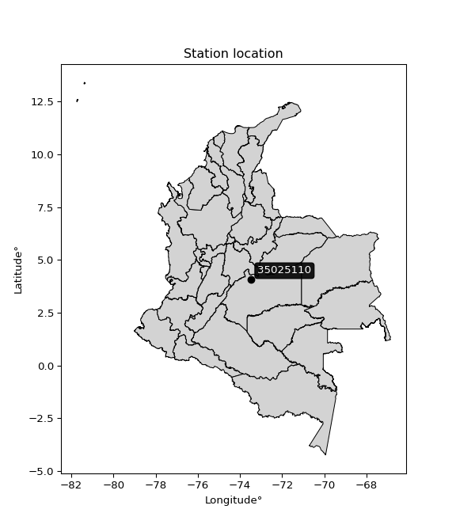

<div align="center">


</div>

# PMP Station (rain, Pmax24h): 35025110

Probable Maximum Precipitation (PMP) is the greatest amount of rainfall for a specific duration that is meteorologically possible for a given location, acting as a "worst-case" scenario for extreme storms, crucial for designing safety-critical infrastructure like bridges, river deviations, dams, spillways, and nuclear plants to prevent catastrophic failure. PMP is calculated by hydrologists using meteorological data to determine the upper limit of extreme rainfall, often leading to the Probable Maximum Flood (PMF) for flood control design, and is increasingly being studied for climate change impacts.

<div align="center">

</img>

</div>


## A. General information


### 1. General running parameters

• app_version: _v20251227_. • runtime: _2025-12-27 09:02:11.367833_. • Python version: _3.14.0_. • SciPy version: _1.16.3_. • Pandas version: _2.3.3_. • NumPy version: _2.3.5_. • Stations dataset (station_dataset_file): _dataset/pmax24h_in/automatic_colombia_2003_2024_filter.csv_. • Stations catalog (station_catalog_file): _dataset/CNE_IDEAM.xls_. • Minimum year to eval til year_max (date_min): _2003_. • Maximum year to eval since year_min (date_max): _2024_. • Creates, save and include plots into reports (create_plot): _False_. • Plot only fit distributions with Δo > Δ (plot_only_fit): _True_. • Eval low extreme values, if False, evaluates high extreme values (low_extreme): _False_. • Eval every SciPy distribution as logarithmic (pdist_logarithmic_on): _True_. • Standard deviation normalized (ddof): _1.0_. • Return periods to eval in years (Tr): _[2, 2.33, 5, 10, 15, 20, 25, 50, 75, 100, 200, 250, 500, 750, 1000]_. • Minimum data sample per station, 0 means any (minimum_sample): _5_. • Z-Score threshold to adjust a value, 0 means disable (zscore): _3.5_. • Avoid zeros, e.g. rain = 0 (avoid_zeros): _True_. • Avoid null values (avoid_nans): _True_. [:file_folder:Dataset file.](../../dataset/pmax24h_in/automatic_colombia_2003_2024_filter.csv)

> Delta Degrees of Freedom (DDOF): is a parameter used in the formulas for calculating variance and standard deviation. When ddof=0, the divisor is $N$ (the total number of observations) and this is used when your data set is the entire population. When ddof=1, the divisor is $N-1$ and this is used when your data set is a sample drawn from a larger population. Using $N-1$ provides an unbiased estimate of the population variance (known as Bessel´s correction).


### 2. Station info and location

|   id |   CODIGO | NOMBRE                       | CATEGORIA         | TECNOLOGIA                              | ESTADO   | FECHA_INSTALACION   |   FECHA_SUSPENSION |   ALTITUD |   LATITUD |   LONGITUD | DEPARTAMENTO   | MUNICIPIO     | AREA_OPERATIVA                            | ENTIDAD                                                     | AREA_HIDROGRAFICA   | ZONA_HIDROGRAFICA   | SUBZONA_HIDROGRAFICA   |   CORRIENTE | Catalogo   |
|-----:|---------:|:-----------------------------|:------------------|:----------------------------------------|:---------|:--------------------|-------------------:|----------:|----------:|-----------:|:---------------|:--------------|:------------------------------------------|:------------------------------------------------------------|:--------------------|:--------------------|:-----------------------|------------:|:-----------|
|    0 | 35025110 | LA LIBERTAD - AUT [35025110] | Agrometeorológica | Automática con Telemetría, Convencional | Activa   | 25/03/2007          |                nan |       340 |   4.05741 |   -73.4679 | Meta           | Villavicencio | Area Operativa 03 - Meta-Guaviare-Guainía | INSTITUTO DE HIDROLOGIA METEOROLOGIA Y ESTUDIOS AMBIENTALES | Orinoco             | Meta                | Río Negro              |         nan | CNE_IDEAM  |

<div align="center">

Map location in: [:earth_americas:Google](http://maps.google.com/maps?q=4.057415,-73.467865) [:earth_americas:OSM](https://www.openstreetmap.org/#map=18/4.057415/-73.467865&layers=P) [:earth_americas:Bing](https://www.bing.com/maps?cp=4.057415~-73.467865&lvl=18) [:earth_americas:Apple](https://maps.apple.com/frame?center=4.057415%2C-73.467865&span=0.003%2C0.006)

</div>


<div align="center">

```geojson
{
  "type": "Feature",
  "geometry": {
    "type": "Point", 
    "coordinates": [-73.467865, 4.057415]
  }, 
  "properties": {
    "Name": "35025110"
  }
}
```

</div>


### 3. Discrete values table and plot

|               |          0 |           1 |         2 |           3 |           4 |
|:--------------|-----------:|------------:|----------:|------------:|------------:|
| Date          | 2017       | 2018        | 2019      | 2021        | 2022        |
| Value         |  103.4     |   66.7      |   58.4    |   75.9      |   89.4      |
| Value_initial |  103.4     |   66.7      |   58.4    |   75.9      |   89.4      |
| count         |    5       |    5        |    5      |    5        |    5        |
| mean          |   78.76    |   78.76     |   78.76   |   78.76     |   78.76     |
| std           |   17.9478  |   17.9478   |   17.9478 |   17.9478   |   17.9478   |
| zscore        |    1.37287 |   -0.671949 |   -1.1344 |   -0.159351 |    0.592831 |

> The initial value (value_initial) correspond to the initial obtained or null completed value, and value (value) is adjusted only when the initial value is outside the valid range definite through the Z-Score value. If Z-Score is active, values out of range or outliers are replaced with the station mean value


### 4. Active continuous probability distributions from SciPy (45 of 104 available)

[scipy.stats](https://docs.scipy.org/doc/scipy/reference/stats.html) is a Python´s powerful submodule within the SciPy library for comprehensive statistical analysis, offering over 130 probability distributions (like Normal, Poisson), functions for descriptive stats (mean, variance), hypothesis testing (t-tests, chi-square), random variable generation, and statistical tests, making it essential for data science, modeling, and research. It provides tools to explore, model, and draw conclusions from data efficiently, working seamlessly with NumPy.

<div align="center">

|   id | p_dist             |   n_parameter | fit_method   | label                                                                       | active   | ref                                                                                                        |
|-----:|:-------------------|--------------:|:-------------|:----------------------------------------------------------------------------|:---------|:-----------------------------------------------------------------------------------------------------------|
|    0 | alpha              |             3 | MLE          | Alpha                                                                       | True     | [:mortar_board:](https://docs.scipy.org/doc/scipy/reference/generated/scipy.stats.alpha.html)              |
|    1 | betaprime          |             4 | MLE          | Beta prime                                                                  | True     | [:mortar_board:](https://docs.scipy.org/doc/scipy/reference/generated/scipy.stats.betaprime.html)          |
|    2 | chi2               |             3 | MLE          | Chi²                                                                        | True     | [:mortar_board:](https://docs.scipy.org/doc/scipy/reference/generated/scipy.stats.chi2.html)               |
|    3 | crystalball        |             4 | MLE          | Crystalball                                                                 | True     | [:mortar_board:](https://docs.scipy.org/doc/scipy/reference/generated/scipy.stats.crystalball.html)        |
|    4 | erlang             |             3 | MLE          | Erlang                                                                      | True     | [:mortar_board:](https://docs.scipy.org/doc/scipy/reference/generated/scipy.stats.erlang.html)             |
|    5 | expon              |             2 | MLE          | Exponential                                                                 | True     | [:mortar_board:](https://docs.scipy.org/doc/scipy/reference/generated/scipy.stats.expon.html)              |
|    6 | exponnorm          |             3 | MLE          | Exponentially modified Normal                                               | True     | [:mortar_board:](https://docs.scipy.org/doc/scipy/reference/generated/scipy.stats.exponnorm.html)          |
|    7 | f                  |             4 | MLE          | F                                                                           | True     | [:mortar_board:](https://docs.scipy.org/doc/scipy/reference/generated/scipy.stats.f.html)                  |
|    8 | fatiguelife        |             3 | MLE          | Fatigue-life (Birnbaum-Saunders)                                            | True     | [:mortar_board:](https://docs.scipy.org/doc/scipy/reference/generated/scipy.stats.fatiguelife.html)        |
|    9 | fisk               |             3 | MLE          | Fisk                                                                        | True     | [:mortar_board:](https://docs.scipy.org/doc/scipy/reference/generated/scipy.stats.fisk.html)               |
|   10 | gamma              |             3 | MLE          | Gamma                                                                       | True     | [:mortar_board:](https://docs.scipy.org/doc/scipy/reference/generated/scipy.stats.gamma.html)              |
|   11 | genexpon           |             5 | MLE          | Generalized exponential                                                     | True     | [:mortar_board:](https://docs.scipy.org/doc/scipy/reference/generated/scipy.stats.genexpon.html)           |
|   12 | genlogistic        |             3 | MLE          | Generalized logistic                                                        | True     | [:mortar_board:](https://docs.scipy.org/doc/scipy/reference/generated/scipy.stats.genlogistic.html)        |
|   13 | gibrat             |             2 | MM           | Gibrat                                                                      | True     | [:mortar_board:](https://docs.scipy.org/doc/scipy/reference/generated/scipy.stats.gibrat.html)             |
|   14 | gompertz           |             3 | MLE          | Gompertz (or truncated Gumbel)                                              | True     | [:mortar_board:](https://docs.scipy.org/doc/scipy/reference/generated/scipy.stats.gompertz.html)           |
|   15 | gumbel_l           |             2 | MM           | Gumbel Left Skew                                                            | True     | [:mortar_board:](https://docs.scipy.org/doc/scipy/reference/generated/scipy.stats.gumbel_l.html)           |
|   16 | gumbel_r           |             2 | MM           | Gumbel Right Skew                                                           | True     | [:mortar_board:](https://docs.scipy.org/doc/scipy/reference/generated/scipy.stats.gumbel_r.html)           |
|   17 | halflogistic       |             2 | MM           | Half-logistic                                                               | True     | [:mortar_board:](https://docs.scipy.org/doc/scipy/reference/generated/scipy.stats.halflogistic.html)       |
|   18 | halfnorm           |             2 | MM           | Half Normal                                                                 | True     | [:mortar_board:](https://docs.scipy.org/doc/scipy/reference/generated/scipy.stats.halfnorm.html)           |
|   19 | hypsecant          |             2 | MM           | hyperbolic secant                                                           | True     | [:mortar_board:](https://docs.scipy.org/doc/scipy/reference/generated/scipy.stats.hypsecant.html)          |
|   20 | invgamma           |             3 | MLE          | Inverted gamma                                                              | True     | [:mortar_board:](https://docs.scipy.org/doc/scipy/reference/generated/scipy.stats.invgamma.html)           |
|   21 | invgauss           |             3 | MLE          | Inverse Gaussian                                                            | True     | [:mortar_board:](https://docs.scipy.org/doc/scipy/reference/generated/scipy.stats.invgauss.html)           |
|   22 | invweibull         |             3 | MLE          | Inverted Weibull                                                            | True     | [:mortar_board:](https://docs.scipy.org/doc/scipy/reference/generated/scipy.stats.invweibull.html)         |
|   23 | johnsonsu          |             4 | MLE          | Johnson Su                                                                  | True     | [:mortar_board:](https://docs.scipy.org/doc/scipy/reference/generated/scipy.stats.johnsonsu.html)          |
|   24 | kstwobign          |             2 | MLE          | Limiting distribution of scaled Kolmogorov-Smirnov two-sided test statistic | True     | [:mortar_board:](https://docs.scipy.org/doc/scipy/reference/generated/scipy.stats.kstwobign.html)          |
|   25 | laplace            |             2 | MM           | Laplace                                                                     | True     | [:mortar_board:](https://docs.scipy.org/doc/scipy/reference/generated/scipy.stats.laplace.html)            |
|   26 | laplace_asymmetric |             3 | MLE          | Asymmetric Laplace                                                          | True     | [:mortar_board:](https://docs.scipy.org/doc/scipy/reference/generated/scipy.stats.laplace_asymmetric.html) |
|   27 | loggamma           |             3 | MLE          | Log gamma                                                                   | True     | [:mortar_board:](https://docs.scipy.org/doc/scipy/reference/generated/scipy.stats.loggamma.html)           |
|   28 | logistic           |             2 | MM           | Logistic (or Sech-squared)                                                  | True     | [:mortar_board:](https://docs.scipy.org/doc/scipy/reference/generated/scipy.stats.logistic.html)           |
|   29 | lognorm            |             3 | MLE          | Log Normal                                                                  | True     | [:mortar_board:](https://docs.scipy.org/doc/scipy/reference/generated/scipy.stats.lognorm.html)            |
|   30 | maxwell            |             2 | MM           | Maxwell                                                                     | True     | [:mortar_board:](https://docs.scipy.org/doc/scipy/reference/generated/scipy.stats.maxwell.html)            |
|   31 | mielke             |             4 | MLE          | Mielke Beta-Kappa / Dagum                                                   | True     | [:mortar_board:](https://docs.scipy.org/doc/scipy/reference/generated/scipy.stats.mielke.html)             |
|   32 | moyal              |             2 | MM           | Moyal                                                                       | True     | [:mortar_board:](https://docs.scipy.org/doc/scipy/reference/generated/scipy.stats.moyal.html)              |
|   33 | nakagami           |             3 | MLE          | Nakagami                                                                    | True     | [:mortar_board:](https://docs.scipy.org/doc/scipy/reference/generated/scipy.stats.nakagami.html)           |
|   34 | ncf                |             5 | MLE          | Non-central F distribution                                                  | True     | [:mortar_board:](https://docs.scipy.org/doc/scipy/reference/generated/scipy.stats.ncf.html)                |
|   35 | nct                |             4 | MLE          | Non-central Student’s t                                                     | True     | [:mortar_board:](https://docs.scipy.org/doc/scipy/reference/generated/scipy.stats.nct.html)                |
|   36 | norm               |             2 | MM           | Normal                                                                      | True     | [:mortar_board:](https://docs.scipy.org/doc/scipy/reference/generated/scipy.stats.norm.html)               |
|   37 | pareto             |             3 | MLE          | Pareto                                                                      | True     | [:mortar_board:](https://docs.scipy.org/doc/scipy/reference/generated/scipy.stats.pareto.html)             |
|   38 | pearson3           |             3 | MM           | Pearson type III                                                            | True     | [:mortar_board:](https://docs.scipy.org/doc/scipy/reference/generated/scipy.stats.pearson3.html)           |
|   39 | rayleigh           |             2 | MM           | Rayleigh                                                                    | True     | [:mortar_board:](https://docs.scipy.org/doc/scipy/reference/generated/scipy.stats.rayleigh.html)           |
|   40 | rice               |             3 | MLE          | Rice                                                                        | True     | [:mortar_board:](https://docs.scipy.org/doc/scipy/reference/generated/scipy.stats.rice.html)               |
|   41 | t                  |             3 | MLE          | Student’s t                                                                 | True     | [:mortar_board:](https://docs.scipy.org/doc/scipy/reference/generated/scipy.stats.t.html)                  |
|   42 | truncnorm          |             4 | MLE          | Truncated normal                                                            | True     | [:mortar_board:](https://docs.scipy.org/doc/scipy/reference/generated/scipy.stats.truncnorm.html)          |
|   43 | wald               |             2 | MM           | Wald                                                                        | True     | [:mortar_board:](https://docs.scipy.org/doc/scipy/reference/generated/scipy.stats.wald.html)               |
|   44 | weibull_min        |             3 | MLE          | Weibull minimum                                                             | True     | [:mortar_board:](https://docs.scipy.org/doc/scipy/reference/generated/scipy.stats.weibull_min.html)        |

</div>

> **n_parameter:** # arguments & localization & scale.
>
> **Fit methods:** (MLE) maximum likelihood, (MM) L-moments.
>
>**Inactive:** foldnorm, gennorm, norminvgauss, powernorm, powerlognorm, skewnorm, genextreme, anglit, arcsine, argus, beta, bradford, burr, burr12, cauchy, cosine, halfcauchy, foldcauchy, skewcauchy, wrapcauchy, dgamma, gengamma, exponweib, exponpow, truncexpon, gausshyper, genhalflogistic, genhyperbolic, geninvgauss, halfgennorm, johnsonsb, kappa4, kappa3, ksone, kstwo, loglaplace, levy, levy_l, levy_stable, ncx2, genpareto, truncpareto, lomax, powerlaw, rdist, rel_breitwigner, recipinvgauss, semicircular, studentized_range, trapezoid, triang, truncweibull_min, tukeylambda, uniform, loguniform, vonmises, vonmises_line, weibull_max, dweibull, 


## B. Probability distributions vs. Empirical distributions

A continuous probability distribution (CPD) describes probabilities for variables that can take any value within a range (like rain any time), unlike discrete variables with specific outcomes (like temperature). It uses a Probability Density Function (PDF), a curve where the total area under it equals 1, and the probability of the variable falling within an interval (a to b) is found by calculating the area under the curve between those points. A key feature is that the probability of hitting any single exact value is zero, so probabilities are always expressed for ranges, e.g., $P(a ≤ X ≤ b)$.

<div align="center">

Distributions parameters from station values
|    |   station | p_dist                |   n |             loc |            scale | shape                | shape1                 | shape2                 | shape3   |
|---:|----------:|:----------------------|----:|----------------:|-----------------:|:---------------------|:-----------------------|:-----------------------|:---------|
|  0 |  35025110 | alpha                 |   5 |   -30.835       |    748.063       | 6.971160331535433    |                        |                        |          |
|  1 |  35025110 | betaprime             |   5 |    -0.656668    |     17.6704      | 133.34328436048253   | 30.691526930125434     |                        |          |
|  2 |  35025110 | chi2                  |   5 |    58.4         |      1.71807     | 0.2987504374738237   |                        |                        |          |
|  3 |  35025110 | crystalball           |   5 |    78.76        |     16.053       | 4924.559576292637    | 4595.221361243903      |                        |          |
|  4 |  35025110 | erlang                |   5 |    58.4         |     23.7977      | 0.3457941504247912   |                        |                        |          |
|  5 |  35025110 | expon                 |   5 |    58.4         |     20.36        |                      |                        |                        |          |
|  6 |  35025110 | exponnorm             |   5 |    74.8085      |     15.5626      | 0.25391295856459467  |                        |                        |          |
|  7 |  35025110 | f                     |   5 |    22.3398      |     52.0099      | 3528.5005880064405   | 24.900389116219074     |                        |          |
|  8 |  35025110 | fatiguelife           |   5 |    58.4         |      0.000187435 | 382.2371637945081    |                        |                        |          |
|  9 |  35025110 | fisk                  |   5 |    -0.242311    |     77.1422      | 8.059609653281047    |                        |                        |          |
| 10 |  35025110 | gamma                 |   5 |    58.4         |     22.3623      | 0.5687030917751987   |                        |                        |          |
| 11 |  35025110 | genexpon              |   5 |    58.3999      |      2.26454     | 0.09926663712454212  | 1.2154136992452839e-06 | 1.649482023818101      |          |
| 12 |  35025110 | genlogistic           |   5 |   -20.2689      |     13.2897      | 961.3318906038463    |                        |                        |          |
| 13 |  35025110 | gibrat                |   5 |    66.5136      |      7.42783     |                      |                        |                        |          |
| 14 |  35025110 | gompertz              |   5 |    58.4         |     36.8505      | 1.0941874321316991   |                        |                        |          |
| 15 |  35025110 | gumbel_l              |   5 |    85.9847      |     12.5165      |                      |                        |                        |          |
| 16 |  35025110 | gumbel_r              |   5 |    71.5353      |     12.5165      |                      |                        |                        |          |
| 17 |  35025110 | halflogistic          |   5 |    59.7335      |     13.7247      |                      |                        |                        |          |
| 18 |  35025110 | halfnorm              |   5 |    57.5121      |     26.6302      |                      |                        |                        |          |
| 19 |  35025110 | hypsecant             |   5 |    78.76        |     10.2196      |                      |                        |                        |          |
| 20 |  35025110 | invgamma              |   5 |    22.1553      |    649.519       | 12.44811203943174    |                        |                        |          |
| 21 |  35025110 | invgauss              |   5 |    45.2865      |    108.397       | 0.30880395213755185  |                        |                        |          |
| 22 |  35025110 | invweibull            |   5 |    58.4         |      2.02944     | 0.06977900489200352  |                        |                        |          |
| 23 |  35025110 | johnsonsu             |   5 |     6.83759e+08 |      2.61041e+08 | 76674057.45624617    | 45351325.29788776      |                        |          |
| 24 |  35025110 | kstwobign             |   5 |    25.1427      |     61.2851      |                      |                        |                        |          |
| 25 |  35025110 | laplace               |   5 |    78.76        |     11.3512      |                      |                        |                        |          |
| 26 |  35025110 | laplace_asymmetric    |   5 |    75.9         |     13.3107      | 0.8983229463711508   |                        |                        |          |
| 27 |  35025110 | loggamma              |   5 | -3088.62        |    469.85        | 847.0300000510783    |                        |                        |          |
| 28 |  35025110 | logistic              |   5 |    78.76        |      8.85048     |                      |                        |                        |          |
| 29 |  35025110 | lognorm               |   5 |    58.4         |      0.0170473   | 14.264488397200637   |                        |                        |          |
| 30 |  35025110 | maxwell               |   5 |    40.7212      |     23.8373      |                      |                        |                        |          |
| 31 |  35025110 | mielke                |   5 |    -5.93247     |     25.2149      | 4755.414794655804    | 6.055390593579958      |                        |          |
| 32 |  35025110 | moyal                 |   5 |    69.5799      |      7.22638     |                      |                        |                        |          |
| 33 |  35025110 | nakagami              |   5 |    66.7         |     17.7325      | 0.04908988735817427  |                        |                        |          |
| 34 |  35025110 | ncf                   |   5 |    -7.45559     |     76.9432      | 58.361552620833066   | 4639.342867376086      | 7.005864681289566      |          |
| 35 |  35025110 | nct                   |   5 |    -0.169019    |      2.70117     | 13.329204354815406   | 27.547284054316137     |                        |          |
| 36 |  35025110 | norm                  |   5 |    78.76        |     16.053       |                      |                        |                        |          |
| 37 |  35025110 | pareto                |   5 |    58.2134      |      0.186593    | 0.26347154868204964  |                        |                        |          |
| 38 |  35025110 | pearson3              |   5 |    78.76        |     16.053       | 0.28748820437062006  |                        |                        |          |
| 39 |  35025110 | rayleigh              |   5 |    48.0497      |     24.5033      |                      |                        |                        |          |
| 40 |  35025110 | rice                  |   5 |    50.1263      |     21.4102      | 0.5922688362302382   |                        |                        |          |
| 41 |  35025110 | t                     |   5 |    78.7591      |     16.0522      | 6978057.25503192     |                        |                        |          |
| 42 |  35025110 | truncnorm             |   5 |    78.76        |     16.053       | -407.32615981590425  | 81.639657222793        |                        |          |
| 43 |  35025110 | wald                  |   5 |    62.707       |     16.053       |                      |                        |                        |          |
| 44 |  35025110 | weibull_min           |   5 |    58.4         |     23.0557      | 0.5802370948830751   |                        |                        |          |
| 45 |  35025110 | logalpha              |   5 |    -0.38608     |    110.195       | 23.33138587593256    |                        |                        |          |
| 46 |  35025110 | logbetaprime          |   5 |     2.19189     |      0.450738    | 645.0723096529816    | 135.99378827032993     |                        |          |
| 47 |  35025110 | logchi2               |   5 |     4.06732     |      0.993788    | 0.9860416691557292   |                        |                        |          |
| 48 |  35025110 | logcrystalball        |   5 |     4.34573     |      0.203203    | 9.460102443576362    | 3628.6211659883274     |                        |          |
| 49 |  35025110 | logerlang             |   5 |     0.944005    |      0.0121552   | 279.7944039238779    |                        |                        |          |
| 50 |  35025110 | logexpon              |   5 |     4.06732     |      0.278417    |                      |                        |                        |          |
| 51 |  35025110 | logexponnorm          |   5 |     4.33232     |      0.202759    | 0.06613603247835868  |                        |                        |          |
| 52 |  35025110 | logf                  |   5 |     3.1787      |      1.1613      | 83.85032297560451    | 271.4820787380835      |                        |          |
| 53 |  35025110 | logfatiguelife        |   5 |     3.44904     |      0.872988    | 0.23303490417381145  |                        |                        |          |
| 54 |  35025110 | logfisk               |   5 |     3.34441     |      0.98422     | 7.918111455921316    |                        |                        |          |
| 55 |  35025110 | loggamma              |   5 |     1.08756     |      0.0126058   | 258.4591262584772    |                        |                        |          |
| 56 |  35025110 | loggenexpon           |   5 |     4.06697     |      0.00193406  | 0.004456934888208579 | 1.5688331883373703     | 1.4336157193807538e-05 |          |
| 57 |  35025110 | loggenlogistic        |   5 |     3.25232     |      0.177539    | 269.65726048867486   |                        |                        |          |
| 58 |  35025110 | loggibrat             |   5 |     4.19074     |      0.0940083   |                      |                        |                        |          |
| 59 |  35025110 | loggompertz           |   5 |     4.06732     |      0.463488    | 1.001712344972368    |                        |                        |          |
| 60 |  35025110 | loggumbel_l           |   5 |     4.43718     |      0.158437    |                      |                        |                        |          |
| 61 |  35025110 | loggumbel_r           |   5 |     4.25428     |      0.158437    |                      |                        |                        |          |
| 62 |  35025110 | loghalflogistic       |   5 |     4.10492     |      0.173713    |                      |                        |                        |          |
| 63 |  35025110 | loghalfnorm           |   5 |     4.07675     |      0.337122    |                      |                        |                        |          |
| 64 |  35025110 | loghypsecant          |   5 |     4.34573     |      0.129363    |                      |                        |                        |          |
| 65 |  35025110 | loginvgamma           |   5 |    -2.57713     |   8043.07        | 1162.7952265839713   |                        |                        |          |
| 66 |  35025110 | loginvgauss           |   5 |     3.47896     |     14.673       | 0.059043081626070165 |                        |                        |          |
| 67 |  35025110 | loginvweibull         |   5 |    -2.91684e+07 |      2.91685e+07 | 154879148.96607983   |                        |                        |          |
| 68 |  35025110 | logjohnsonsu          |   5 |     1.72859e+06 | 112700           | 29187334.44899174    | 8523004.622396223      |                        |          |
| 69 |  35025110 | logkstwobign          |   5 |     3.63276     |      0.813907    |                      |                        |                        |          |
| 70 |  35025110 | loglaplace            |   5 |     4.34573     |      0.143686    |                      |                        |                        |          |
| 71 |  35025110 | loglaplace_asymmetric |   5 |     4.32942     |      0.172289    | 0.9538430073350141   |                        |                        |          |
| 72 |  35025110 | logloggamma           |   5 |   -32.7566      |      5.60171     | 753.0033253424699    |                        |                        |          |
| 73 |  35025110 | loglogistic           |   5 |     4.34573     |      0.112032    |                      |                        |                        |          |
| 74 |  35025110 | loglognorm            |   5 |     4.06732     |      0.000376101 | 13.394951716696603   |                        |                        |          |
| 75 |  35025110 | logmaxwell            |   5 |     3.86423     |      0.301739    |                      |                        |                        |          |
| 76 |  35025110 | logmielke             |   5 |    -1.3804e+06  |      1.3804e+06  | 301110353.4030181    | 7857370.509378437      |                        |          |
| 77 |  35025110 | logmoyal              |   5 |     4.22953     |      0.0914736   |                      |                        |                        |          |
| 78 |  35025110 | lognakagami           |   5 |     4.06732     |      0.430412    | 0.06260025269274339  |                        |                        |          |
| 79 |  35025110 | logncf                |   5 |    -4.32718     |      8.37575     | 1165.5116857744597   | 1011.4833358832439     | 40.97806176846059      |          |
| 80 |  35025110 | lognct                |   5 |     0.42351     |      0.0949734   | 240.59849659871827   | 41.17022285340836      |                        |          |
| 81 |  35025110 | lognorm               |   5 |     4.34573     |      0.203203    |                      |                        |                        |          |
| 82 |  35025110 | logpareto             |   5 |     4.06469     |      0.00262612  | 0.2626276478381294   |                        |                        |          |
| 83 |  35025110 | logpearson3           |   5 |     4.34573     |      0.203203    | 0.08710799061207275  |                        |                        |          |
| 84 |  35025110 | lograyleigh           |   5 |     3.95699     |      0.310169    |                      |                        |                        |          |
| 85 |  35025110 | logrice               |   5 |     3.96152     |      0.253717    | 0.9668154769066812   |                        |                        |          |
| 86 |  35025110 | logt                  |   5 |     4.34574     |      0.203211    | 35637561.41694379    |                        |                        |          |
| 87 |  35025110 | logtruncnorm          |   5 |    -0.0649791   |      1.03138     | 4.006577426941847    | 4.56049863327066       |                        |          |
| 88 |  35025110 | logwald               |   5 |     4.1425      |      0.203232    |                      |                        |                        |          |
| 89 |  35025110 | logweibull_min        |   5 |     4.06732     |      0.16451     | 0.1507952530458494   |                        |                        |          |

</div>

> **loc** (Location parameter): This shifts the distribution along the x-axis. For many common distributions, like the normal (Gaussian) distribution, loc represents the mean $μ$. For others, like the uniform distribution, it might represent the minimum value, or for the beta distribution, the left end of the support interval.
>
> **scale** (Scale parameter): This determines the width or spread of the distribution. For the normal distribution, scale represents the standard deviation $σ$. For a uniform distribution, it defines the length of the interval (from $loc$ to $loc + scale$).
>
> **shape** (Shape parameters): Refers to parameters that define the specific form of a probability distribution, distinct from its location (loc) and scale (scale). These parameters are required arguments for most distribution functions. For example, a normal (Gaussian) distribution is fully defined by its location (mean) and scale (standard deviation), so it has no specific shape parameters beyond loc and scale. However, other distributions have intrinsic properties that need specification, as Gamma distribution that takes a shape parameter, often named $a$ or $alpha$.


### 0. Cumulative distribution values - CDF (90 evaluated)

Cumulative Distribution Function (CDF), denoted as $F$<sub>$X$</sub>$(x)$, is a function that gives the probability that a random variable $X$ will take a value less than or equal to a specific value, $x$ (i.e., $(P(X≥x)$. It essentially "accumulates" probabilities from a given point up to the far right (positive infinity), providing a complete picture of the distribution´s probabilities for both discrete (like rain) and continuous (like temperature) variables, helping to find probabilities over ranges or above certain values.

<div align="center">

CDF ordered by x ascending and calculating $log(f(x))$ separately
|   id |   Station |   date |     x |   count |   mean |     std |    zscore |   Value_initial |   station |   m |     alpha |   alpha_pdf |   betaprime |   betaprime_pdf |       chi2 |    chi2_pdf |   crystalball |   crystalball_pdf |      erlang |   erlang_pdf |    expon |   expon_pdf |   exponnorm |   exponnorm_pdf |         f |      f_pdf |   fatiguelife |   fatiguelife_pdf |     fisk |   fisk_pdf |       gamma |     gamma_pdf |    genexpon |   genexpon_pdf |   genlogistic |   genlogistic_pdf |      gibrat |   gibrat_pdf |    gompertz |   gompertz_pdf |   gumbel_l |   gumbel_l_pdf |   gumbel_r |   gumbel_r_pdf |   halflogistic |   halflogistic_pdf |   halfnorm |   halfnorm_pdf |   hypsecant |   hypsecant_pdf |   invgamma |   invgamma_pdf |   invgauss |   invgauss_pdf |   invweibull |   invweibull_pdf |   johnsonsu |   johnsonsu_pdf |   kstwobign |   kstwobign_pdf |   laplace |   laplace_pdf |   laplace_asymmetric |   laplace_asymmetric_pdf |   loggamma |   loggamma_pdf |   logistic |   logistic_pdf |   lognorm |   lognorm_pdf |   maxwell |   maxwell_pdf |   mielke |   mielke_pdf |     moyal |   moyal_pdf |   nakagami |   nakagami_pdf |       ncf |    ncf_pdf |       nct |    nct_pdf |     norm |   norm_pdf |      pareto |   pareto_pdf |   pearson3 |   pearson3_pdf |   rayleigh |   rayleigh_pdf |      rice |   rice_pdf |        t |      t_pdf |   truncnorm |   truncnorm_pdf |     wald |   wald_pdf |   weibull_min |   weibull_min_pdf |   logalpha |   logalpha_pdf |   logbetaprime |   logbetaprime_pdf |     logchi2 |   logchi2_pdf |   logcrystalball |   logcrystalball_pdf |   logerlang |   logerlang_pdf |   logexpon |   logexpon_pdf |   logexponnorm |   logexponnorm_pdf |      logf |   logf_pdf |   logfatiguelife |   logfatiguelife_pdf |   logfisk |   logfisk_pdf |   loggenexpon |   loggenexpon_pdf |   loggenlogistic |   loggenlogistic_pdf |   loggibrat |   loggibrat_pdf |   loggompertz |   loggompertz_pdf |   loggumbel_l |   loggumbel_l_pdf |   loggumbel_r |   loggumbel_r_pdf |   loghalflogistic |   loghalflogistic_pdf |   loghalfnorm |   loghalfnorm_pdf |   loghypsecant |   loghypsecant_pdf |   loginvgamma |   loginvgamma_pdf |   loginvgauss |   loginvgauss_pdf |   loginvweibull |   loginvweibull_pdf |   logjohnsonsu |   logjohnsonsu_pdf |   logkstwobign |   logkstwobign_pdf |   loglaplace |   loglaplace_pdf |   loglaplace_asymmetric |   loglaplace_asymmetric_pdf |   logloggamma |   logloggamma_pdf |   loglogistic |   loglogistic_pdf |   loglognorm |   loglognorm_pdf |   logmaxwell |   logmaxwell_pdf |   logmielke |   logmielke_pdf |   logmoyal |   logmoyal_pdf |   lognakagami |   lognakagami_pdf |   logncf |   logncf_pdf |    lognct |   lognct_pdf |   logpareto |   logpareto_pdf |   logpearson3 |   logpearson3_pdf |   lograyleigh |   lograyleigh_pdf |   logrice |   logrice_pdf |      logt |   logt_pdf |   logtruncnorm |   logtruncnorm_pdf |   logwald |   logwald_pdf |   logweibull_min |   logweibull_min_pdf |
|-----:|----------:|-------:|------:|--------:|-------:|--------:|----------:|----------------:|----------:|----:|----------:|------------:|------------:|----------------:|-----------:|------------:|--------------:|------------------:|------------:|-------------:|---------:|------------:|------------:|----------------:|----------:|-----------:|--------------:|------------------:|---------:|-----------:|------------:|--------------:|------------:|---------------:|--------------:|------------------:|------------:|-------------:|------------:|---------------:|-----------:|---------------:|-----------:|---------------:|---------------:|-------------------:|-----------:|---------------:|------------:|----------------:|-----------:|---------------:|-----------:|---------------:|-------------:|-----------------:|------------:|----------------:|------------:|----------------:|----------:|--------------:|---------------------:|-------------------------:|-----------:|---------------:|-----------:|---------------:|----------:|--------------:|----------:|--------------:|---------:|-------------:|----------:|------------:|-----------:|---------------:|----------:|-----------:|----------:|-----------:|---------:|-----------:|------------:|-------------:|-----------:|---------------:|-----------:|---------------:|----------:|-----------:|---------:|-----------:|------------:|----------------:|---------:|-----------:|--------------:|------------------:|-----------:|---------------:|---------------:|-------------------:|------------:|--------------:|-----------------:|---------------------:|------------:|----------------:|-----------:|---------------:|---------------:|-------------------:|----------:|-----------:|-----------------:|---------------------:|----------:|--------------:|--------------:|------------------:|-----------------:|---------------------:|------------:|----------------:|--------------:|------------------:|--------------:|------------------:|--------------:|------------------:|------------------:|----------------------:|--------------:|------------------:|---------------:|-------------------:|--------------:|------------------:|--------------:|------------------:|----------------:|--------------------:|---------------:|-------------------:|---------------:|-------------------:|-------------:|-----------------:|------------------------:|----------------------------:|--------------:|------------------:|--------------:|------------------:|-------------:|-----------------:|-------------:|-----------------:|------------:|----------------:|-----------:|---------------:|--------------:|------------------:|---------:|-------------:|----------:|-------------:|------------:|----------------:|--------------:|------------------:|--------------:|------------------:|----------:|--------------:|----------:|-----------:|---------------:|-------------------:|----------:|--------------:|-----------------:|---------------------:|
|    0 |  35025110 |   2019 |  58.4 |       5 |  78.76 | 17.9478 | -1.1344   |            58.4 |  35025110 |   1 | 0.0789892 |  0.0138325  |    0.083016 |      0.0136014  | 0.00686287 | 1.44276e+11 |      0.102345 |        0.0111187  | 2.38467e-05 |  1.12673e+07 | 0        |  0.0491159  |    0.10168  |      0.0111806  | 0.0720754 | 0.0151166  |     0.0777432 |       1.62493e+08 | 0.098865 | 0.0122443  | 3.65587e-07 | 2375.65       | 4.32432e-06 |     0.043835   |     0.0758401 |        0.0146985  | 0           |   0          | 5.37766e-09 |     0.0296926  |   0.104502 |     0.00789684 |   0.057495 |     0.0131194  |       0        |         0          |  0.0265969 |     0.0299449  |   0.0862958 |      0.00834105 |  0.0721137 |      0.0151206 |   0.060624 |     0.0189575  |  3.70743e-05 |      3.71465e+09 |    0.103539 |      0.0111535  |   0.0700085 |      0.0155325  | 0.0831762 |    0.00732754 |             0.103348 |               0.00864309 |  0.0817096 |       0.791196 |  0.0910864 |     0.00935426 | 0.0853217 |       0.76795 | 0.0922316 |     0.0139842 |      nan |          nan | 0.0302015 |  0.0114242  |  0         |    0           | 0.0919375 | 0.0123818  | 0.0761486 | 0.014374   | 0.102345 | 0.0111187  | 1.11022e-16 |   1.41201    |  0.0957647 |     0.0121188  |  0.0853492 |     0.0157674  | 0.0607644 | 0.0142406  | 0.102344 | 0.0111192  |    0.102345 |      0.0111187  | 0        | 0          |   9.99615e-10 |    81629.7        |  0.0788656 |       0.817144 |      0.0765708 |           0.835393 | 3.05332e-08 |   1.69488e+07 |        0.0853218 |              0.76795 |   0.0830919 |        0.796436 |   0        |       3.59174  |      0.0853071 |           0.768046 | 0.0742544 |   0.850108 |        0.0684097 |             0.929194 | 0.0799336 |      0.805538 |   0.000804459 |          2.30469  |        0.0657076 |             1.00255  |   0         |         0       |   3.50177e-09 |          2.16125  |      0.092317 |          0.55491  |     0.0385979 |          0.792865 |          0        |              0        |      0        |          0        |      0.0736619 |           0.564351 |      0.082277 |          0.789827 |     0.0675354 |          0.937914 |       0.0714456 |            1.00107  |      0.0853674 |           0.7681   |      0.0619536 |           1.09145  |    0.0720196 |         0.501228 |               0.0966727 |                    0.588261 |     0.0870723 |          0.763236 |     0.0769053 |          0.633667 |    0.0228236 |       4.5505e+12 |    0.0709141 |          0.9551  |   0.0663343 |        0.988975 |  0.0152238 |       0.55668  |     0.0126003 |       1.77618e+12 | 0.296852 |     0.678781 | 0.0797141 |     0.806619 | 1.11022e-16 |      100.006    |     0.0832112 |          0.785247 |     0.0612972 |          1.07646  |  0.053233 |      0.982923 | 0.0853232 |   0.767929 |    2.98549e-06 |           4.47371  |  0        |      0        |       0.00703021 |          1.18939e+12 |
|    1 |  35025110 |   2018 |  66.7 |       5 |  78.76 | 17.9478 | -0.671949 |            66.7 |  35025110 |   2 | 0.242425  |  0.0245795  |    0.241068 |      0.0236898  | 0.994711   | 0.00196505  |      0.226247 |        0.0187412  | 0.715827    |  0.0229044   | 0.334796 |  0.0326721  |    0.226516 |      0.0188937  | 0.252477  | 0.0266335  |     0.709018  |       0.0113706   | 0.241768 | 0.0220706  | 0.562128    |    0.0302169  | 0.304998    |     0.0304659  |     0.251076  |        0.0260906  | 0.000114371 |   0.00240871 | 0.241498    |     0.0282113  |   0.19283  |     0.0138148  |   0.22957  |     0.0269903  |       0.248482 |         0.0341813  |  0.269918  |     0.0282304  |   0.189776  |      0.017489   |  0.252533  |      0.0266332 |   0.281877 |     0.0301789  |  0.403979    |      0.00307838  |    0.22743  |      0.018697   |   0.252682  |      0.026547   | 0.172805  |    0.0152235  |             0.206901 |               0.0173033  |  0.239536  |       1.57965  |  0.203812  |     0.0183349  | 0.236944  |       1.51917 | 0.244056  |     0.0219529 |      nan |          nan | 0.222275  |  0.0319934  |  0.0291789 |    2.01591e+11 | 0.232396  | 0.0211442  | 0.246832  | 0.0254964  | 0.226247 | 0.0187412  | 0.634231    |   0.0113555  |  0.232157  |     0.0205151  |  0.251484  |     0.0232508  | 0.22272   | 0.0236818  | 0.226253 | 0.0187425  |    0.226247 |      0.0187412  | 0.111387 | 0.064421   |   0.424649    |        0.0222335  |  0.243285  |       1.6407   |      0.245709  |           1.68335  | 0.290961    |   1.03199     |        0.236944  |              1.51917 |   0.241225  |        1.57826  |   0.379545 |       2.22851  |      0.236956  |           1.51943  | 0.246563  |   1.70489  |        0.259288  |             1.85561  | 0.248419  |      1.72747  |   0.302597    |          2.16556  |        0.274889  |             1.99471  |   0.0108389 |         3.02125 |   0.282953    |          2.06429  |      0.200752 |          1.13041  |     0.24493   |          2.17477  |          0.267592 |              2.67221  |      0.285792 |          2.21325  |      0.199855  |           1.44539  |      0.239537 |          1.57314  |     0.260787  |          1.87559  |       0.271699  |            1.87989  |      0.236993  |           1.51903  |      0.284084  |           2.04073  |    0.181598  |         1.26385  |               0.217016  |                    1.32056  |     0.236894  |          1.49863  |     0.214336  |          1.50311  |    0.669318  |       0.203618   |    0.25653   |          1.76378 |   0.273267  |        1.98414  |  0.240459  |       2.57049  |     0.749799  |       0.702462    | 0.391705 |     0.741584 | 0.241619  |     1.61823  | 0.645019    |        0.68795  |     0.239101  |          1.55929  |     0.264664  |          1.85897  |  0.246273 |      1.81776  | 0.236939  |   1.51909  |    0.46326     |           2.64769  |  0.148521 |      5.25959  |       0.620281   |          0.417236    |
|    2 |  35025110 |   2021 |  75.9 |       5 |  78.76 | 17.9478 | -0.159351 |            75.9 |  35025110 |   3 | 0.485068  |  0.0261776  |    0.477765 |      0.0259526  | 0.999785   | 7.16165e-05 |      0.429299 |        0.0244603  | 0.852102    |  0.00955187  | 0.576638 |  0.0207938  |    0.430897 |      0.0245628  | 0.503546  | 0.0258779  |     0.787966  |       0.00661983  | 0.473736 | 0.0263893  | 0.755261    |    0.0145163  | 0.535656    |     0.0203549  |     0.500644  |        0.026054   | 0.592519    |   0.0413539  | 0.485773    |     0.0245497  |   0.360308 |     0.0228335  |   0.493816 |     0.027838   |       0.529144 |         0.0262303  |  0.510113  |     0.0236067  |   0.412061  |      0.0299657  |  0.503581  |      0.0258748 |   0.538471 |     0.0242067  |  0.422984    |      0.00145118  |    0.42965  |      0.0243348  |   0.50101   |      0.0256353  | 0.388639  |    0.0342378  |             0.446592 |               0.037349   |  0.476297  |       1.97141  |  0.419909  |     0.0275223  | 0.468002  |       1.95695 | 0.463696  |     0.0245355 |      nan |          nan | 0.518421  |  0.0289412  |  0.829772  |    0.00874424  | 0.452639  | 0.0253468  | 0.49377   | 0.0261318  | 0.429299 | 0.0244603  | 0.698572    |   0.00449027 |  0.447626  |     0.025053   |  0.475822  |     0.0243142  | 0.457225  | 0.0258594  | 0.429318 | 0.0244618  |    0.429299 |      0.0244603  | 0.586396 | 0.0327179  |   0.573508    |        0.0120504  |  0.485085  |       1.97567  |      0.490819  |           1.97671  | 0.398281    |   0.685323    |        0.468002  |              1.95695 |   0.477399  |        1.96478  |   0.609918 |       1.40107  |      0.46804   |           1.95703  | 0.491799  |   1.95535  |        0.514431  |             1.94329  | 0.50159   |      2.00963  |   0.555917    |          1.72346  |        0.535541  |             1.88154  |   0.651269  |         2.66744 |   0.533092    |          1.77635  |      0.39741  |          1.92646  |     0.536676  |          2.10813  |          0.569093 |              1.94612  |      0.546438 |          1.7872   |      0.459959  |           2.44115  |      0.475502 |          1.96694  |     0.517302  |          1.94281  |       0.518848  |            1.80767  |      0.468013  |           1.95655  |      0.54366   |           1.84787  |    0.446329  |         3.10627  |               0.476389  |                    2.89887  |     0.465508  |          1.94457  |     0.463655  |          2.21972  |    0.687487  |       0.10084    |    0.502037  |          1.91507 |   0.534061  |        1.89126  |  0.562411  |       2.13613  |     0.815527  |       0.381141    | 0.489089 |     0.7581   | 0.481658  |     1.97522  | 0.702265    |        0.295374 |     0.473743  |          1.96349  |     0.513663  |          1.88268  |  0.496965 |      1.94642  | 0.467985  |   1.95686  |    0.729653    |           1.56479  |  0.634051 |      2.21773  |       0.657936   |          0.211119    |
|    3 |  35025110 |   2022 |  89.4 |       5 |  78.76 | 17.9478 |  0.592831 |            89.4 |  35025110 |   4 | 0.773219  |  0.0155886  |    0.770534 |      0.016227   | 0.999997   | 8.65986e-07 |      0.746272 |        0.0199507  | 0.934178    |  0.0037262   | 0.781855 |  0.0107144  |    0.747498 |      0.0198095  | 0.777025  | 0.0143821  |     0.856324  |       0.0038872   | 0.770363 | 0.0159051  | 0.885716    |    0.00620259 | 0.74306     |     0.0112632  |     0.778347  |        0.0146741  | 0.869771    |   0.00925451 | 0.763897    |     0.016259   |   0.731182 |     0.028215   |   0.786662 |     0.0150813  |       0.793484 |         0.0134933  |  0.768861  |     0.0146289  |   0.783935  |      0.0195555  |  0.777026  |      0.0143804 |   0.781731 |     0.0125213  |  0.437462    |      0.000814115 |    0.745133 |      0.0198919  |   0.778407  |      0.0151023  | 0.804167  |    0.0172522  |             0.777485 |               0.0150173  |  0.769645  |       1.45592  |  0.768915  |     0.0200763  | 0.765873  |       1.50917 | 0.756346  |     0.0173493 |      nan |          nan | 0.799682  |  0.0135652  |  0.903923  |    0.00362072  | 0.758623  | 0.0180527  | 0.776152  | 0.0150701  | 0.746272 | 0.0199507  | 0.740413    |   0.00219306 |  0.755036  |     0.0184223  |  0.759227  |     0.0165821  | 0.760033  | 0.0176117  | 0.746302 | 0.0199505  |    0.746272 |      0.0199507  | 0.840179 | 0.010156   |   0.694996    |        0.00677887 |  0.772366  |       1.39738  |      0.774124  |           1.36154  | 0.492966    |   0.493496    |        0.765873  |              1.50917 |   0.769799  |        1.45222  |   0.78333  |       0.778222 |      0.765892  |           1.50892  | 0.769894  |   1.3336   |        0.779064  |             1.2248   | 0.772721  |      1.21057  |   0.782911    |          1.05565  |        0.779951  |             1.09129  |   0.878657  |         0.66676 |   0.778781    |          1.19815  |      0.759106 |          2.16419  |     0.801342  |          1.12014  |          0.806653 |              1.00543  |      0.7832   |          1.10385  |      0.802819  |           1.42861  |      0.768726 |          1.45831  |     0.780434  |          1.21209  |       0.759495  |            1.10942  |      0.765831  |           1.50902  |      0.786237  |           1.10642  |    0.820738  |         1.24759  |               0.788456  |                    1.17117  |     0.763711  |          1.52284  |     0.788447  |          1.48885  |    0.700196  |       0.0609418  |    0.773367  |          1.30891 |   0.780158  |        1.09889  |  0.812862  |       1.00394  |     0.864705  |       0.239995    | 0.610595 |     0.715192 | 0.771258  |     1.41875  | 0.737627    |        0.160834 |     0.768008  |          1.47067  |     0.775495  |          1.25111  |  0.773289 |      1.33748  | 0.76585   |   1.5092   |    0.915171    |           0.785746 |  0.84998  |      0.743786 |       0.68469    |          0.128883    |
|    4 |  35025110 |   2017 | 103.4 |       5 |  78.76 | 17.9478 |  1.37287  |           103.4 |  35025110 |   5 | 0.919     |  0.00623009 |    0.923075 |      0.00647506 | 1          | 1.07243e-08 |      0.937598 |        0.00765177 | 0.969325    |  0.0016214   | 0.890323 |  0.00538688 |    0.936953 |      0.00758094 | 0.912653  | 0.00597103 |     0.900057  |       0.00249862  | 0.915286 | 0.00602958 | 0.945535    |    0.00282407 | 0.860907    |     0.00609725 |     0.916316  |        0.00602549 | 0.94549     |   0.00299455 | 0.926927    |     0.00735774 |   0.982055 |     0.00576417 |   0.924587 |     0.00579201 |       0.920272 |         0.00557754 |  0.915138  |     0.00678895 |   0.943034  |      0.00554447 |  0.912643  |      0.0059709 |   0.903175 |     0.00565632 |  0.446845    |      0.000558159 |    0.936589 |      0.00770703 |   0.923315  |      0.00639014 | 0.942951  |    0.00502581 |             0.9135   |               0.00583782 |  0.92292   |       0.673469 |  0.941807  |     0.00619252 | 0.925247  |       0.69487 | 0.925309  |     0.0072956 |      nan |          nan | 0.923264  |  0.00529304 |  0.942211  |    0.00206185  | 0.930089  | 0.00710325 | 0.917389  | 0.00610113 | 0.937598 | 0.00765177 | 0.764574    |   0.00137271 |  0.930798  |     0.00726248 |  0.92202   |     0.00718879 | 0.929072  | 0.00715347 | 0.937615 | 0.00765054 |    0.937598 |      0.00765177 | 0.930039 | 0.00386893 |   0.77101     |        0.00435241 |  0.91933   |       0.652975 |      0.91731   |           0.640615 | 0.55711     |   0.395167    |        0.925247  |              0.69487 |   0.922833  |        0.673324 |   0.871512 |       0.461495 |      0.925235  |           0.694757 | 0.911423  |   0.645261 |        0.908751  |             0.598922 | 0.897335  |      0.563632 |   0.899572    |          0.575883 |        0.89624   |             0.552893 |   0.94075   |         0.26337 |   0.912337    |          0.649872 |      0.971716 |          0.636499 |     0.915382  |          0.510818 |          0.911467 |              0.487094 |      0.904412 |          0.590191 |      0.934067  |           0.506034 |      0.922461 |          0.676538 |     0.908665  |          0.592572 |       0.880682  |            0.594158 |      0.925207  |           0.695012 |      0.905718  |           0.572443 |    0.934873  |         0.453255 |               0.905463  |                    0.523384 |     0.925096  |          0.7048   |     0.931769  |          0.567476 |    0.707779  |       0.0448914  |    0.91368   |          0.64677 |   0.897039  |        0.554014 |  0.914883  |       0.463484 |     0.894629  |       0.176705    | 0.708807 |     0.628918 | 0.920519  |     0.660651 | 0.757018    |        0.11119  |     0.923156  |          0.681436 |     0.910598  |          0.633415 |  0.916465 |      0.65528  | 0.925232  |   0.694945 |    0.999995    |           0.417084 |  0.923924 |      0.336364 |       0.700759   |          0.0952977   |


</div>

An Empirical Distribution Function (EDF) is a step-function estimate of a true cumulative distribution function (CDF) based on observed sample data, representing the proportion of data points less than or equal to a given value. It is calculated by ordering your data and jumping up by $1/n$ (where $n$ is sample size) at each unique data point, allowing analysis without assuming an underlying population distribution, and it gets closer to the true CDF as the sample size grows.


### 1. Empirical - EDF California (1923)

California´s estimates the true probability distribution of water-related data (like rainfall, streamflow) using observed samples, crucial for risk assessment.

<div align="center">


$P=m/n$


</div>


**1.1. Empirical values**

<div align="center">

|                | 0              | 1                  | 2              | 3                 | 4              |
|:---------------|:---------------|:-------------------|:---------------|:------------------|:---------------|
| date           | 2019           | 2018               | 2021           | 2022              | 2017           |
| x              | 58.4           | 66.7               | 75.9           | 89.4              | 103.4          |
| m              | 1              | 2                  | 3              | 4                 | 5              |
| empirical_dist | edf_california | edf_california     | edf_california | edf_california    | edf_california |
| empirical      | 0.2            | 0.4                | 0.6            | 0.8               | 1.0            |
| empirical_tr   | 1.25           | 1.6666666666666667 | 2.5            | 5.000000000000001 | inf            |

</div>


**1.2. Kolmogorov-Smirnov fit test (sorted by Δ)**


<div align="center">

|                | 0                   | 1                   | 2                  | 3                  | 4                   | 5                   | 6                  | 7                  | 8                   | 9                  | 10                  | 11                  | 12                 | 13                  | 14                 | 15                  | 16                  | 17                 | 18                  | 19                 | 20                 | 21                  | 22                  | 23                  | 24                  | 25                 | 26                  | 27                 | 28                 | 29                  | 30                 | 31                  | 32                  | 33                  | 34                 | 35                 | 36                  | 37                  | 38                 | 39                  | 40                 | 41                  | 42                  | 43                  | 44                  | 45                  | 46                 | 47                  | 48                 | 49                 | 50                    | 51                 | 52                 | 53                 | 54                  | 55                 | 56                 | 57                  | 58                  | 59                  | 60                  | 61                 | 62                 | 63                 | 64                 | 65                 | 66                 | 67                  | 68                  | 69                  | 70                  | 71                  | 72                  | 73                 | 74                  | 75                 | 76                  | 77                 | 78                 | 79                 | 80                  | 81                 | 82                  | 83                 | 84                 | 85                 | 86                  | 87                 | 88                 | 89                 |
|:---------------|:--------------------|:--------------------|:-------------------|:-------------------|:--------------------|:--------------------|:-------------------|:-------------------|:--------------------|:-------------------|:--------------------|:--------------------|:-------------------|:--------------------|:-------------------|:--------------------|:--------------------|:-------------------|:--------------------|:-------------------|:-------------------|:--------------------|:--------------------|:--------------------|:--------------------|:-------------------|:--------------------|:-------------------|:-------------------|:--------------------|:-------------------|:--------------------|:--------------------|:--------------------|:-------------------|:-------------------|:--------------------|:--------------------|:-------------------|:--------------------|:-------------------|:--------------------|:--------------------|:--------------------|:--------------------|:--------------------|:-------------------|:--------------------|:-------------------|:-------------------|:----------------------|:-------------------|:-------------------|:-------------------|:--------------------|:-------------------|:-------------------|:--------------------|:--------------------|:--------------------|:--------------------|:-------------------|:-------------------|:-------------------|:-------------------|:-------------------|:-------------------|:--------------------|:--------------------|:--------------------|:--------------------|:--------------------|:--------------------|:-------------------|:--------------------|:-------------------|:--------------------|:-------------------|:-------------------|:-------------------|:--------------------|:-------------------|:--------------------|:-------------------|:-------------------|:-------------------|:--------------------|:-------------------|:-------------------|:-------------------|
| station        | 35025110            | 35025110            | 35025110           | 35025110           | 35025110            | 35025110            | 35025110           | 35025110           | 35025110            | 35025110           | 35025110            | 35025110            | 35025110           | 35025110            | 35025110           | 35025110            | 35025110            | 35025110           | 35025110            | 35025110           | 35025110           | 35025110            | 35025110            | 35025110            | 35025110            | 35025110           | 35025110            | 35025110           | 35025110           | 35025110            | 35025110           | 35025110            | 35025110            | 35025110            | 35025110           | 35025110           | 35025110            | 35025110            | 35025110           | 35025110            | 35025110           | 35025110            | 35025110            | 35025110            | 35025110            | 35025110            | 35025110           | 35025110            | 35025110           | 35025110           | 35025110              | 35025110           | 35025110           | 35025110           | 35025110            | 35025110           | 35025110           | 35025110            | 35025110            | 35025110            | 35025110            | 35025110           | 35025110           | 35025110           | 35025110           | 35025110           | 35025110           | 35025110            | 35025110            | 35025110            | 35025110            | 35025110            | 35025110            | 35025110           | 35025110            | 35025110           | 35025110            | 35025110           | 35025110           | 35025110           | 35025110            | 35025110           | 35025110            | 35025110           | 35025110           | 35025110           | 35025110            | 35025110           | 35025110           | 35025110           |
| empirical_dist | edf_california      | edf_california      | edf_california     | edf_california     | edf_california      | edf_california      | edf_california     | edf_california     | edf_california      | edf_california     | edf_california      | edf_california      | edf_california     | edf_california      | edf_california     | edf_california      | edf_california      | edf_california     | edf_california      | edf_california     | edf_california     | edf_california      | edf_california      | edf_california      | edf_california      | edf_california     | edf_california      | edf_california     | edf_california     | edf_california      | edf_california     | edf_california      | edf_california      | edf_california      | edf_california     | edf_california     | edf_california      | edf_california      | edf_california     | edf_california      | edf_california     | edf_california      | edf_california      | edf_california      | edf_california      | edf_california      | edf_california     | edf_california      | edf_california     | edf_california     | edf_california        | edf_california     | edf_california     | edf_california     | edf_california      | edf_california     | edf_california     | edf_california      | edf_california      | edf_california      | edf_california      | edf_california     | edf_california     | edf_california     | edf_california     | edf_california     | edf_california     | edf_california      | edf_california      | edf_california      | edf_california      | edf_california      | edf_california      | edf_california     | edf_california      | edf_california     | edf_california      | edf_california     | edf_california     | edf_california     | edf_california      | edf_california     | edf_california      | edf_california     | edf_california     | edf_california     | edf_california      | edf_california     | edf_california     | edf_california     |
| p_dist         | loginvweibull       | logmielke           | loggenlogistic     | logkstwobign       | lograyleigh         | loginvgauss         | invgauss           | logfatiguelife     | logmaxwell          | kstwobign          | invgamma            | f                   | rayleigh           | genlogistic         | logfisk            | nct                 | logf                | logrice            | logbetaprime        | maxwell            | logalpha           | alpha               | fisk                | lognct              | logerlang           | betaprime          | loginvgamma         | loggamma           | loggamma           | logpearson3         | loggumbel_r        | logjohnsonsu        | logexponnorm        | logcrystalball      | lognorm            | lognorm            | logt                | logloggamma         | ncf                | pearson3            | gumbel_r           | johnsonsu           | halfnorm            | exponnorm           | t                   | crystalball         | norm               | truncnorm           | rice               | moyal              | loglaplace_asymmetric | logmoyal           | loglogistic        | laplace_asymmetric | logistic            | loggenexpon        | genexpon           | logtruncnorm        | gamma               | gompertz            | loggompertz         | loghalfnorm        | expon              | halflogistic       | loghalflogistic    | logexpon           | loghypsecant       | loggumbel_l         | hypsecant           | loglaplace          | laplace             | weibull_min         | pareto              | gumbel_l           | logpareto           | logwald            | wald                | logncf             | loglognorm         | logweibull_min     | fatiguelife         | erlang             | lognakagami         | nakagami           | loggibrat          | gibrat             | logchi2             | invweibull         | chi2               | mielke             |
| delta          | 0.12855440592277376 | 0.13366570935563604 | 0.134292431073015  | 0.1380464273238389 | 0.13870283348341944 | 0.13921271148356779 | 0.1393760437520191 | 0.1407122175600538 | 0.14346990172346413 | 0.1473182184665331 | 0.14746737880788802 | 0.14752252711506336 | 0.1485155670453418 | 0.14892420618471924 | 0.1515807673750094 | 0.15316810524463872 | 0.15343693225966162 | 0.1537274764355945 | 0.15429132621758682 | 0.1559438079052242 | 0.1567150138208771 | 0.15757533016785624 | 0.15823197586705673 | 0.15838148218599246 | 0.15877524005434934 | 0.1589316552963747 | 0.16046290275002859 | 0.1604635843829762 | 0.1604635843829762 | 0.16089860594554328 | 0.1614020671243004 | 0.16300731530987117 | 0.16304444871267884 | 0.16305611021989413 | 0.1630561972308695 | 0.1630561972308695 | 0.16306128734354758 | 0.16310592830147302 | 0.1676037518661644 | 0.16784346007757295 | 0.1704303101778424 | 0.17257046634535622 | 0.17340311351697826 | 0.17348412521060946 | 0.17374656589835974 | 0.17375251218087973 | 0.1737525159925697 | 0.17375251733662958 | 0.1772802658677569 | 0.1777247465110391 | 0.18298379102686144   | 0.1847762107145718 | 0.1856641282394991 | 0.1930993665060636 | 0.19618820718119157 | 0.1991955409757902 | 0.199995675680607  | 0.19999701451124366 | 0.19999963441260601 | 0.19999999462234164 | 0.19999999649822794 | 0.2                | 0.2                | 0.2                | 0.2                | 0.2                | 0.2001453076426909 | 0.20259044423169392 | 0.21022445927927735 | 0.21840234236314723 | 0.22719511444879742 | 0.22898992684605735 | 0.23542568605955871 | 0.2396919827482129 | 0.24501934244345647 | 0.2514788854703242 | 0.28861347766087997 | 0.2911927694936842 | 0.2922213337456602 | 0.299241140323909  | 0.30901771299851133 | 0.3158268765773691 | 0.34979936360877706 | 0.3708210657052125 | 0.3891610571258302 | 0.3998856286877757 | 0.44288965496320887 | 0.5531548444238293 | 0.5947109030373021 | nan                |
| deltao         | 0.5865427407550001  | 0.5865427407550001  | 0.5865427407550001 | 0.5865427407550001 | 0.5865427407550001  | 0.5865427407550001  | 0.5865427407550001 | 0.5865427407550001 | 0.5865427407550001  | 0.5865427407550001 | 0.5865427407550001  | 0.5865427407550001  | 0.5865427407550001 | 0.5865427407550001  | 0.5865427407550001 | 0.5865427407550001  | 0.5865427407550001  | 0.5865427407550001 | 0.5865427407550001  | 0.5865427407550001 | 0.5865427407550001 | 0.5865427407550001  | 0.5865427407550001  | 0.5865427407550001  | 0.5865427407550001  | 0.5865427407550001 | 0.5865427407550001  | 0.5865427407550001 | 0.5865427407550001 | 0.5865427407550001  | 0.5865427407550001 | 0.5865427407550001  | 0.5865427407550001  | 0.5865427407550001  | 0.5865427407550001 | 0.5865427407550001 | 0.5865427407550001  | 0.5865427407550001  | 0.5865427407550001 | 0.5865427407550001  | 0.5865427407550001 | 0.5865427407550001  | 0.5865427407550001  | 0.5865427407550001  | 0.5865427407550001  | 0.5865427407550001  | 0.5865427407550001 | 0.5865427407550001  | 0.5865427407550001 | 0.5865427407550001 | 0.5865427407550001    | 0.5865427407550001 | 0.5865427407550001 | 0.5865427407550001 | 0.5865427407550001  | 0.5865427407550001 | 0.5865427407550001 | 0.5865427407550001  | 0.5865427407550001  | 0.5865427407550001  | 0.5865427407550001  | 0.5865427407550001 | 0.5865427407550001 | 0.5865427407550001 | 0.5865427407550001 | 0.5865427407550001 | 0.5865427407550001 | 0.5865427407550001  | 0.5865427407550001  | 0.5865427407550001  | 0.5865427407550001  | 0.5865427407550001  | 0.5865427407550001  | 0.5865427407550001 | 0.5865427407550001  | 0.5865427407550001 | 0.5865427407550001  | 0.5865427407550001 | 0.5865427407550001 | 0.5865427407550001 | 0.5865427407550001  | 0.5865427407550001 | 0.5865427407550001  | 0.5865427407550001 | 0.5865427407550001 | 0.5865427407550001 | 0.5865427407550001  | 0.5865427407550001 | 0.5865427407550001 | 0.5865427407550001 |
| eval           | Δo > Δ              | Δo > Δ              | Δo > Δ             | Δo > Δ             | Δo > Δ              | Δo > Δ              | Δo > Δ             | Δo > Δ             | Δo > Δ              | Δo > Δ             | Δo > Δ              | Δo > Δ              | Δo > Δ             | Δo > Δ              | Δo > Δ             | Δo > Δ              | Δo > Δ              | Δo > Δ             | Δo > Δ              | Δo > Δ             | Δo > Δ             | Δo > Δ              | Δo > Δ              | Δo > Δ              | Δo > Δ              | Δo > Δ             | Δo > Δ              | Δo > Δ             | Δo > Δ             | Δo > Δ              | Δo > Δ             | Δo > Δ              | Δo > Δ              | Δo > Δ              | Δo > Δ             | Δo > Δ             | Δo > Δ              | Δo > Δ              | Δo > Δ             | Δo > Δ              | Δo > Δ             | Δo > Δ              | Δo > Δ              | Δo > Δ              | Δo > Δ              | Δo > Δ              | Δo > Δ             | Δo > Δ              | Δo > Δ             | Δo > Δ             | Δo > Δ                | Δo > Δ             | Δo > Δ             | Δo > Δ             | Δo > Δ              | Δo > Δ             | Δo > Δ             | Δo > Δ              | Δo > Δ              | Δo > Δ              | Δo > Δ              | Δo > Δ             | Δo > Δ             | Δo > Δ             | Δo > Δ             | Δo > Δ             | Δo > Δ             | Δo > Δ              | Δo > Δ              | Δo > Δ              | Δo > Δ              | Δo > Δ              | Δo > Δ              | Δo > Δ             | Δo > Δ              | Δo > Δ             | Δo > Δ              | Δo > Δ             | Δo > Δ             | Δo > Δ             | Δo > Δ              | Δo > Δ             | Δo > Δ              | Δo > Δ             | Δo > Δ             | Δo > Δ             | Δo > Δ              | Δo > Δ             | Δo <= Δ            | Δo <= Δ            |
| fit            | 1                   | 1                   | 1                  | 1                  | 1                   | 1                   | 1                  | 1                  | 1                   | 1                  | 1                   | 1                   | 1                  | 1                   | 1                  | 1                   | 1                   | 1                  | 1                   | 1                  | 1                  | 1                   | 1                   | 1                   | 1                   | 1                  | 1                   | 1                  | 1                  | 1                   | 1                  | 1                   | 1                   | 1                   | 1                  | 1                  | 1                   | 1                   | 1                  | 1                   | 1                  | 1                   | 1                   | 1                   | 1                   | 1                   | 1                  | 1                   | 1                  | 1                  | 1                     | 1                  | 1                  | 1                  | 1                   | 1                  | 1                  | 1                   | 1                   | 1                   | 1                   | 1                  | 1                  | 1                  | 1                  | 1                  | 1                  | 1                   | 1                   | 1                   | 1                   | 1                   | 1                   | 1                  | 1                   | 1                  | 1                   | 1                  | 1                  | 1                  | 1                   | 1                  | 1                   | 1                  | 1                  | 1                  | 1                   | 1                  | 0                  | 0                  |
| n              | 5                   | 5                   | 5                  | 5                  | 5                   | 5                   | 5                  | 5                  | 5                   | 5                  | 5                   | 5                   | 5                  | 5                   | 5                  | 5                   | 5                   | 5                  | 5                   | 5                  | 5                  | 5                   | 5                   | 5                   | 5                   | 5                  | 5                   | 5                  | 5                  | 5                   | 5                  | 5                   | 5                   | 5                   | 5                  | 5                  | 5                   | 5                   | 5                  | 5                   | 5                  | 5                   | 5                   | 5                   | 5                   | 5                   | 5                  | 5                   | 5                  | 5                  | 5                     | 5                  | 5                  | 5                  | 5                   | 5                  | 5                  | 5                   | 5                   | 5                   | 5                   | 5                  | 5                  | 5                  | 5                  | 5                  | 5                  | 5                   | 5                   | 5                   | 5                   | 5                   | 5                   | 5                  | 5                   | 5                  | 5                   | 5                  | 5                  | 5                  | 5                   | 5                  | 5                   | 5                  | 5                  | 5                  | 5                   | 5                  | 5                  | 5                  |
| best_fit       | 1                   | 0                   | 0                  | 0                  | 0                   | 0                   | 0                  | 0                  | 0                   | 0                  | 0                   | 0                   | 0                  | 0                   | 0                  | 0                   | 0                   | 0                  | 0                   | 0                  | 0                  | 0                   | 0                   | 0                   | 0                   | 0                  | 0                   | 0                  | 0                  | 0                   | 0                  | 0                   | 0                   | 0                   | 0                  | 0                  | 0                   | 0                   | 0                  | 0                   | 0                  | 0                   | 0                   | 0                   | 0                   | 0                   | 0                  | 0                   | 0                  | 0                  | 0                     | 0                  | 0                  | 0                  | 0                   | 0                  | 0                  | 0                   | 0                   | 0                   | 0                   | 0                  | 0                  | 0                  | 0                  | 0                  | 0                  | 0                   | 0                   | 0                   | 0                   | 0                   | 0                   | 0                  | 0                   | 0                  | 0                   | 0                  | 0                  | 0                  | 0                   | 0                  | 0                   | 0                  | 0                  | 0                  | 0                   | 0                  | 0                  | 0                  |
| best_fit_sort  | 1                   | 2                   | 3                  | 4                  | 5                   | 6                   | 7                  | 8                  | 9                   | 10                 | 11                  | 12                  | 13                 | 14                  | 15                 | 16                  | 17                  | 18                 | 19                  | 20                 | 21                 | 22                  | 23                  | 24                  | 25                  | 26                 | 27                  | 28                 | 29                 | 30                  | 31                 | 32                  | 33                  | 34                  | 35                 | 36                 | 37                  | 38                  | 39                 | 40                  | 41                 | 42                  | 43                  | 44                  | 45                  | 46                  | 47                 | 48                  | 49                 | 50                 | 51                    | 52                 | 53                 | 54                 | 55                  | 56                 | 57                 | 58                  | 59                  | 60                  | 61                  | 62                 | 63                 | 64                 | 65                 | 66                 | 67                 | 68                  | 69                  | 70                  | 71                  | 72                  | 73                  | 74                 | 75                  | 76                 | 77                  | 78                 | 79                 | 80                 | 81                  | 82                 | 83                  | 84                 | 85                 | 86                 | 87                  | 88                 | 89                 | 90                 |

</div>


**1.3. Best fit**

<div align="center">

|   id |   station | empirical_dist   | p_dist        |    delta |   deltao | eval   |   fit |   n |   best_fit |   best_fit_sort |
|-----:|----------:|:-----------------|:--------------|---------:|---------:|:-------|------:|----:|-----------:|----------------:|
|    0 |  35025110 | edf_california   | loginvweibull | 0.128554 | 0.586543 | Δo > Δ |     1 |   5 |          1 |               1 |

</div>


### 2. Empirical - EDF Hazen (1930)

Hazen method for plotting positions is a formula used to estimate the empirical cumulative probability distribution of flood events or other hydrological data. This formula often results in biased estimations, particularly when extrapolating to extreme events (high return periods).

<div align="center">


$P=(m-0.5)/n$


</div>


**2.1. Empirical values**

<div align="center">

|                | 0                  | 1                  | 2         | 3                 | 4                  |
|:---------------|:-------------------|:-------------------|:----------|:------------------|:-------------------|
| date           | 2019               | 2018               | 2021      | 2022              | 2017               |
| x              | 58.4               | 66.7               | 75.9      | 89.4              | 103.4              |
| m              | 1                  | 2                  | 3         | 4                 | 5                  |
| empirical_dist | edf_hazen          | edf_hazen          | edf_hazen | edf_hazen         | edf_hazen          |
| empirical      | 0.1                | 0.3                | 0.5       | 0.7               | 0.9                |
| empirical_tr   | 1.1111111111111112 | 1.4285714285714286 | 2.0       | 3.333333333333333 | 10.000000000000002 |

</div>


**2.2. Kolmogorov-Smirnov fit test (sorted by Δ)**


<div align="center">

|                | 0                    | 1                   | 2                   | 3                   | 4                   | 5                   | 6                   | 7                   | 8                   | 9                   | 10                  | 11                  | 12                  | 13                 | 14                  | 15                  | 16                  | 17                 | 18                  | 19                  | 20                  | 21                  | 22                  | 23                  | 24                  | 25                  | 26                  | 27                  | 28                  | 29                 | 30                  | 31                  | 32                  | 33                  | 34                 | 35                  | 36                  | 37                 | 38                  | 39                  | 40                  | 41                 | 42                  | 43                 | 44                  | 45                  | 46                  | 47                  | 48                  | 49                    | 50                  | 51                  | 52                  | 53                  | 54                 | 55                  | 56                  | 57                 | 58                 | 59                 | 60                 | 61                  | 62                  | 63                  | 64                 | 65                  | 66                 | 67                  | 68                 | 69                  | 70                  | 71                  | 72                  | 73                 | 74                  | 75                 | 76                 | 77                 | 78                  | 79                 | 80                 | 81                 | 82                 | 83                 | 84                  | 85                 | 86                 | 87                  | 88                 | 89                 |
|:---------------|:---------------------|:--------------------|:--------------------|:--------------------|:--------------------|:--------------------|:--------------------|:--------------------|:--------------------|:--------------------|:--------------------|:--------------------|:--------------------|:-------------------|:--------------------|:--------------------|:--------------------|:-------------------|:--------------------|:--------------------|:--------------------|:--------------------|:--------------------|:--------------------|:--------------------|:--------------------|:--------------------|:--------------------|:--------------------|:-------------------|:--------------------|:--------------------|:--------------------|:--------------------|:-------------------|:--------------------|:--------------------|:-------------------|:--------------------|:--------------------|:--------------------|:-------------------|:--------------------|:-------------------|:--------------------|:--------------------|:--------------------|:--------------------|:--------------------|:----------------------|:--------------------|:--------------------|:--------------------|:--------------------|:-------------------|:--------------------|:--------------------|:-------------------|:-------------------|:-------------------|:-------------------|:--------------------|:--------------------|:--------------------|:-------------------|:--------------------|:-------------------|:--------------------|:-------------------|:--------------------|:--------------------|:--------------------|:--------------------|:-------------------|:--------------------|:-------------------|:-------------------|:-------------------|:--------------------|:-------------------|:-------------------|:-------------------|:-------------------|:-------------------|:--------------------|:-------------------|:-------------------|:--------------------|:-------------------|:-------------------|
| station        | 35025110             | 35025110            | 35025110            | 35025110            | 35025110            | 35025110            | 35025110            | 35025110            | 35025110            | 35025110            | 35025110            | 35025110            | 35025110            | 35025110           | 35025110            | 35025110            | 35025110            | 35025110           | 35025110            | 35025110            | 35025110            | 35025110            | 35025110            | 35025110            | 35025110            | 35025110            | 35025110            | 35025110            | 35025110            | 35025110           | 35025110            | 35025110            | 35025110            | 35025110            | 35025110           | 35025110            | 35025110            | 35025110           | 35025110            | 35025110            | 35025110            | 35025110           | 35025110            | 35025110           | 35025110            | 35025110            | 35025110            | 35025110            | 35025110            | 35025110              | 35025110            | 35025110            | 35025110            | 35025110            | 35025110           | 35025110            | 35025110            | 35025110           | 35025110           | 35025110           | 35025110           | 35025110            | 35025110            | 35025110            | 35025110           | 35025110            | 35025110           | 35025110            | 35025110           | 35025110            | 35025110            | 35025110            | 35025110            | 35025110           | 35025110            | 35025110           | 35025110           | 35025110           | 35025110            | 35025110           | 35025110           | 35025110           | 35025110           | 35025110           | 35025110            | 35025110           | 35025110           | 35025110            | 35025110           | 35025110           |
| empirical_dist | edf_hazen            | edf_hazen           | edf_hazen           | edf_hazen           | edf_hazen           | edf_hazen           | edf_hazen           | edf_hazen           | edf_hazen           | edf_hazen           | edf_hazen           | edf_hazen           | edf_hazen           | edf_hazen          | edf_hazen           | edf_hazen           | edf_hazen           | edf_hazen          | edf_hazen           | edf_hazen           | edf_hazen           | edf_hazen           | edf_hazen           | edf_hazen           | edf_hazen           | edf_hazen           | edf_hazen           | edf_hazen           | edf_hazen           | edf_hazen          | edf_hazen           | edf_hazen           | edf_hazen           | edf_hazen           | edf_hazen          | edf_hazen           | edf_hazen           | edf_hazen          | edf_hazen           | edf_hazen           | edf_hazen           | edf_hazen          | edf_hazen           | edf_hazen          | edf_hazen           | edf_hazen           | edf_hazen           | edf_hazen           | edf_hazen           | edf_hazen             | edf_hazen           | edf_hazen           | edf_hazen           | edf_hazen           | edf_hazen          | edf_hazen           | edf_hazen           | edf_hazen          | edf_hazen          | edf_hazen          | edf_hazen          | edf_hazen           | edf_hazen           | edf_hazen           | edf_hazen          | edf_hazen           | edf_hazen          | edf_hazen           | edf_hazen          | edf_hazen           | edf_hazen           | edf_hazen           | edf_hazen           | edf_hazen          | edf_hazen           | edf_hazen          | edf_hazen          | edf_hazen          | edf_hazen           | edf_hazen          | edf_hazen          | edf_hazen          | edf_hazen          | edf_hazen          | edf_hazen           | edf_hazen          | edf_hazen          | edf_hazen           | edf_hazen          | edf_hazen          |
| p_dist         | maxwell              | rayleigh            | loginvweibull       | logloggamma         | logjohnsonsu        | logt                | lognorm             | lognorm             | logcrystalball      | logexponnorm        | ncf                 | pearson3            | logpearson3         | loginvgamma        | loggamma            | loggamma            | logerlang           | logf               | fisk                | betaprime           | lognct              | logalpha            | johnsonsu           | logfisk             | alpha               | logrice             | logmaxwell          | halfnorm            | exponnorm           | t                  | crystalball         | norm                | truncnorm           | logbetaprime        | lograyleigh        | nct                 | f                   | invgamma           | rice                | genlogistic         | kstwobign           | logfatiguelife     | loggenlogistic      | logmielke          | loginvgauss         | invgauss            | logkstwobign        | gumbel_r            | loglogistic         | loglaplace_asymmetric | laplace_asymmetric  | logistic            | loggenexpon         | moyal               | genexpon           | gompertz            | loggompertz         | loghalfnorm        | halflogistic       | expon              | loggumbel_r        | loggumbel_l         | loghypsecant        | loghalflogistic     | logexpon           | hypsecant           | logmoyal           | loglaplace          | laplace            | weibull_min         | gumbel_l            | logwald             | wald                | logncf             | logtruncnorm        | gamma              | loggibrat          | gibrat             | logweibull_min      | nakagami           | pareto             | logchi2            | logpareto          | loglognorm         | fatiguelife         | erlang             | lognakagami        | invweibull          | chi2               | mielke             |
| delta          | 0.056346474400964186 | 0.05922650806815355 | 0.05949483289898905 | 0.06371125518370768 | 0.06583111523609642 | 0.06585045820440272 | 0.06587311890263847 | 0.06587311890263847 | 0.06587322063195578 | 0.06589191686786255 | 0.06760375186616438 | 0.06784346007757291 | 0.06800848915524216 | 0.0687261836252756 | 0.06964525516801578 | 0.06964525516801578 | 0.06979899053522787 | 0.069894280683514  | 0.07036348897135014 | 0.07053351280739939 | 0.07125819179215342 | 0.07236589687541684 | 0.07257046634535619 | 0.07272130939885735 | 0.07321871019254855 | 0.07328916809869868 | 0.07336719693310778 | 0.07340311351697827 | 0.07348412521060943 | 0.0737465658983597 | 0.07375251218087969 | 0.07375251599256966 | 0.07375251733662955 | 0.07412410131052172 | 0.075494645348963  | 0.07615202120774622 | 0.07702468742973523 | 0.0770257481271206 | 0.07728026586775685 | 0.07834685048302004 | 0.07840738269901837 | 0.079063941217966  | 0.07995074724300133 | 0.0801577976316824 | 0.08043400557275238 | 0.08173085104248401 | 0.08623689824012026 | 0.08666179042888456 | 0.08844719524867273 | 0.08845605724542938   | 0.09309936650606357 | 0.09618820718119153 | 0.09919554097579018 | 0.09968221717672343 | 0.099995675680607  | 0.09999999462234163 | 0.09999999649822792 | 0.1                | 0.1                | 0.1                | 0.1013418613375815 | 0.10259044423169394 | 0.10281864413564556 | 0.10665325766048461 | 0.1099176400749291 | 0.11022445927927732 | 0.1128622076614596 | 0.12073840570583227 | 0.1271951144487974 | 0.12898992684605737 | 0.13969198274821293 | 0.15147888547032418 | 0.18861347766087996 | 0.1968523589279794 | 0.22965277388376815 | 0.2621282393571371 | 0.2891610571258302 | 0.2998856286877757 | 0.32028103223656407 | 0.3297720871002643 | 0.3342309421018224 | 0.3428896549632089 | 0.3450193424434565 | 0.3693182915474192 | 0.40901771299851136 | 0.4158268765773691 | 0.4497993636087771 | 0.45315484442382936 | 0.6947109030373022 | nan                |
| deltao         | 0.5865427407550001   | 0.5865427407550001  | 0.5865427407550001  | 0.5865427407550001  | 0.5865427407550001  | 0.5865427407550001  | 0.5865427407550001  | 0.5865427407550001  | 0.5865427407550001  | 0.5865427407550001  | 0.5865427407550001  | 0.5865427407550001  | 0.5865427407550001  | 0.5865427407550001 | 0.5865427407550001  | 0.5865427407550001  | 0.5865427407550001  | 0.5865427407550001 | 0.5865427407550001  | 0.5865427407550001  | 0.5865427407550001  | 0.5865427407550001  | 0.5865427407550001  | 0.5865427407550001  | 0.5865427407550001  | 0.5865427407550001  | 0.5865427407550001  | 0.5865427407550001  | 0.5865427407550001  | 0.5865427407550001 | 0.5865427407550001  | 0.5865427407550001  | 0.5865427407550001  | 0.5865427407550001  | 0.5865427407550001 | 0.5865427407550001  | 0.5865427407550001  | 0.5865427407550001 | 0.5865427407550001  | 0.5865427407550001  | 0.5865427407550001  | 0.5865427407550001 | 0.5865427407550001  | 0.5865427407550001 | 0.5865427407550001  | 0.5865427407550001  | 0.5865427407550001  | 0.5865427407550001  | 0.5865427407550001  | 0.5865427407550001    | 0.5865427407550001  | 0.5865427407550001  | 0.5865427407550001  | 0.5865427407550001  | 0.5865427407550001 | 0.5865427407550001  | 0.5865427407550001  | 0.5865427407550001 | 0.5865427407550001 | 0.5865427407550001 | 0.5865427407550001 | 0.5865427407550001  | 0.5865427407550001  | 0.5865427407550001  | 0.5865427407550001 | 0.5865427407550001  | 0.5865427407550001 | 0.5865427407550001  | 0.5865427407550001 | 0.5865427407550001  | 0.5865427407550001  | 0.5865427407550001  | 0.5865427407550001  | 0.5865427407550001 | 0.5865427407550001  | 0.5865427407550001 | 0.5865427407550001 | 0.5865427407550001 | 0.5865427407550001  | 0.5865427407550001 | 0.5865427407550001 | 0.5865427407550001 | 0.5865427407550001 | 0.5865427407550001 | 0.5865427407550001  | 0.5865427407550001 | 0.5865427407550001 | 0.5865427407550001  | 0.5865427407550001 | 0.5865427407550001 |
| eval           | Δo > Δ               | Δo > Δ              | Δo > Δ              | Δo > Δ              | Δo > Δ              | Δo > Δ              | Δo > Δ              | Δo > Δ              | Δo > Δ              | Δo > Δ              | Δo > Δ              | Δo > Δ              | Δo > Δ              | Δo > Δ             | Δo > Δ              | Δo > Δ              | Δo > Δ              | Δo > Δ             | Δo > Δ              | Δo > Δ              | Δo > Δ              | Δo > Δ              | Δo > Δ              | Δo > Δ              | Δo > Δ              | Δo > Δ              | Δo > Δ              | Δo > Δ              | Δo > Δ              | Δo > Δ             | Δo > Δ              | Δo > Δ              | Δo > Δ              | Δo > Δ              | Δo > Δ             | Δo > Δ              | Δo > Δ              | Δo > Δ             | Δo > Δ              | Δo > Δ              | Δo > Δ              | Δo > Δ             | Δo > Δ              | Δo > Δ             | Δo > Δ              | Δo > Δ              | Δo > Δ              | Δo > Δ              | Δo > Δ              | Δo > Δ                | Δo > Δ              | Δo > Δ              | Δo > Δ              | Δo > Δ              | Δo > Δ             | Δo > Δ              | Δo > Δ              | Δo > Δ             | Δo > Δ             | Δo > Δ             | Δo > Δ             | Δo > Δ              | Δo > Δ              | Δo > Δ              | Δo > Δ             | Δo > Δ              | Δo > Δ             | Δo > Δ              | Δo > Δ             | Δo > Δ              | Δo > Δ              | Δo > Δ              | Δo > Δ              | Δo > Δ             | Δo > Δ              | Δo > Δ             | Δo > Δ             | Δo > Δ             | Δo > Δ              | Δo > Δ             | Δo > Δ             | Δo > Δ             | Δo > Δ             | Δo > Δ             | Δo > Δ              | Δo > Δ             | Δo > Δ             | Δo > Δ              | Δo <= Δ            | Δo <= Δ            |
| fit            | 1                    | 1                   | 1                   | 1                   | 1                   | 1                   | 1                   | 1                   | 1                   | 1                   | 1                   | 1                   | 1                   | 1                  | 1                   | 1                   | 1                   | 1                  | 1                   | 1                   | 1                   | 1                   | 1                   | 1                   | 1                   | 1                   | 1                   | 1                   | 1                   | 1                  | 1                   | 1                   | 1                   | 1                   | 1                  | 1                   | 1                   | 1                  | 1                   | 1                   | 1                   | 1                  | 1                   | 1                  | 1                   | 1                   | 1                   | 1                   | 1                   | 1                     | 1                   | 1                   | 1                   | 1                   | 1                  | 1                   | 1                   | 1                  | 1                  | 1                  | 1                  | 1                   | 1                   | 1                   | 1                  | 1                   | 1                  | 1                   | 1                  | 1                   | 1                   | 1                   | 1                   | 1                  | 1                   | 1                  | 1                  | 1                  | 1                   | 1                  | 1                  | 1                  | 1                  | 1                  | 1                   | 1                  | 1                  | 1                   | 0                  | 0                  |
| n              | 5                    | 5                   | 5                   | 5                   | 5                   | 5                   | 5                   | 5                   | 5                   | 5                   | 5                   | 5                   | 5                   | 5                  | 5                   | 5                   | 5                   | 5                  | 5                   | 5                   | 5                   | 5                   | 5                   | 5                   | 5                   | 5                   | 5                   | 5                   | 5                   | 5                  | 5                   | 5                   | 5                   | 5                   | 5                  | 5                   | 5                   | 5                  | 5                   | 5                   | 5                   | 5                  | 5                   | 5                  | 5                   | 5                   | 5                   | 5                   | 5                   | 5                     | 5                   | 5                   | 5                   | 5                   | 5                  | 5                   | 5                   | 5                  | 5                  | 5                  | 5                  | 5                   | 5                   | 5                   | 5                  | 5                   | 5                  | 5                   | 5                  | 5                   | 5                   | 5                   | 5                   | 5                  | 5                   | 5                  | 5                  | 5                  | 5                   | 5                  | 5                  | 5                  | 5                  | 5                  | 5                   | 5                  | 5                  | 5                   | 5                  | 5                  |
| best_fit       | 1                    | 0                   | 0                   | 0                   | 0                   | 0                   | 0                   | 0                   | 0                   | 0                   | 0                   | 0                   | 0                   | 0                  | 0                   | 0                   | 0                   | 0                  | 0                   | 0                   | 0                   | 0                   | 0                   | 0                   | 0                   | 0                   | 0                   | 0                   | 0                   | 0                  | 0                   | 0                   | 0                   | 0                   | 0                  | 0                   | 0                   | 0                  | 0                   | 0                   | 0                   | 0                  | 0                   | 0                  | 0                   | 0                   | 0                   | 0                   | 0                   | 0                     | 0                   | 0                   | 0                   | 0                   | 0                  | 0                   | 0                   | 0                  | 0                  | 0                  | 0                  | 0                   | 0                   | 0                   | 0                  | 0                   | 0                  | 0                   | 0                  | 0                   | 0                   | 0                   | 0                   | 0                  | 0                   | 0                  | 0                  | 0                  | 0                   | 0                  | 0                  | 0                  | 0                  | 0                  | 0                   | 0                  | 0                  | 0                   | 0                  | 0                  |
| best_fit_sort  | 1                    | 2                   | 3                   | 4                   | 5                   | 6                   | 7                   | 8                   | 9                   | 10                  | 11                  | 12                  | 13                  | 14                 | 15                  | 16                  | 17                  | 18                 | 19                  | 20                  | 21                  | 22                  | 23                  | 24                  | 25                  | 26                  | 27                  | 28                  | 29                  | 30                 | 31                  | 32                  | 33                  | 34                  | 35                 | 36                  | 37                  | 38                 | 39                  | 40                  | 41                  | 42                 | 43                  | 44                 | 45                  | 46                  | 47                  | 48                  | 49                  | 50                    | 51                  | 52                  | 53                  | 54                  | 55                 | 56                  | 57                  | 58                 | 59                 | 60                 | 61                 | 62                  | 63                  | 64                  | 65                 | 66                  | 67                 | 68                  | 69                 | 70                  | 71                  | 72                  | 73                  | 74                 | 75                  | 76                 | 77                 | 78                 | 79                  | 80                 | 81                 | 82                 | 83                 | 84                 | 85                  | 86                 | 87                 | 88                  | 89                 | 90                 |

</div>


**2.3. Best fit**

<div align="center">

|   id |   station | empirical_dist   | p_dist   |     delta |   deltao | eval   |   fit |   n |   best_fit |   best_fit_sort |
|-----:|----------:|:-----------------|:---------|----------:|---------:|:-------|------:|----:|-----------:|----------------:|
|    0 |  35025110 | edf_hazen        | maxwell  | 0.0563465 | 0.586543 | Δo > Δ |     1 |   5 |          1 |               1 |

</div>


### 3. Empirical - EDF Weibull (1939)

Weibull plotting position formula is an empirical method used to estimate the non-exceedance probability or plotting position for a set of observed data, is often recommended or widely used in practice, particularly in flood frequency analysis.

<div align="center">


$P=m/(n+1)$


</div>


**3.1. Empirical values**

<div align="center">

|                | 0                   | 1                  | 2           | 3                  | 4                  |
|:---------------|:--------------------|:-------------------|:------------|:-------------------|:-------------------|
| date           | 2019                | 2018               | 2021        | 2022               | 2017               |
| x              | 58.4                | 66.7               | 75.9        | 89.4               | 103.4              |
| m              | 1                   | 2                  | 3           | 4                  | 5                  |
| empirical_dist | edf_weibull         | edf_weibull        | edf_weibull | edf_weibull        | edf_weibull        |
| empirical      | 0.16666666666666666 | 0.3333333333333333 | 0.5         | 0.6666666666666666 | 0.8333333333333334 |
| empirical_tr   | 1.2                 | 1.4999999999999998 | 2.0         | 2.9999999999999996 | 6.000000000000002  |

</div>


**3.2. Kolmogorov-Smirnov fit test (sorted by Δ)**


<div align="center">

|                | 0                   | 1                   | 2                  | 3                   | 4                   | 5                   | 6                  | 7                  | 8                  | 9                   | 10                 | 11                  | 12                  | 13                  | 14                  | 15                  | 16                 | 17                  | 18                  | 19                  | 20                  | 21                  | 22                  | 23                  | 24                  | 25                  | 26                  | 27                  | 28                  | 29                  | 30                  | 31                  | 32                  | 33                  | 34                  | 35                  | 36                  | 37                  | 38                 | 39                  | 40                  | 41                  | 42                  | 43                 | 44                  | 45                  | 46                  | 47                  | 48                    | 49                 | 50                  | 51                  | 52                  | 53                 | 54                 | 55                  | 56                 | 57                  | 58                 | 59                  | 60                 | 61                 | 62                  | 63                  | 64                  | 65                 | 66                  | 67                  | 68                  | 69                  | 70                  | 71                  | 72                 | 73                 | 74                  | 75                  | 76                  | 77                  | 78                 | 79                 | 80                 | 81                 | 82                 | 83                  | 84                  | 85                 | 86                 | 87                  | 88                 | 89                 |
|:---------------|:--------------------|:--------------------|:-------------------|:--------------------|:--------------------|:--------------------|:-------------------|:-------------------|:-------------------|:--------------------|:-------------------|:--------------------|:--------------------|:--------------------|:--------------------|:--------------------|:-------------------|:--------------------|:--------------------|:--------------------|:--------------------|:--------------------|:--------------------|:--------------------|:--------------------|:--------------------|:--------------------|:--------------------|:--------------------|:--------------------|:--------------------|:--------------------|:--------------------|:--------------------|:--------------------|:--------------------|:--------------------|:--------------------|:-------------------|:--------------------|:--------------------|:--------------------|:--------------------|:-------------------|:--------------------|:--------------------|:--------------------|:--------------------|:----------------------|:-------------------|:--------------------|:--------------------|:--------------------|:-------------------|:-------------------|:--------------------|:-------------------|:--------------------|:-------------------|:--------------------|:-------------------|:-------------------|:--------------------|:--------------------|:--------------------|:-------------------|:--------------------|:--------------------|:--------------------|:--------------------|:--------------------|:--------------------|:-------------------|:-------------------|:--------------------|:--------------------|:--------------------|:--------------------|:-------------------|:-------------------|:-------------------|:-------------------|:-------------------|:--------------------|:--------------------|:-------------------|:-------------------|:--------------------|:-------------------|:-------------------|
| station        | 35025110            | 35025110            | 35025110           | 35025110            | 35025110            | 35025110            | 35025110           | 35025110           | 35025110           | 35025110            | 35025110           | 35025110            | 35025110            | 35025110            | 35025110            | 35025110            | 35025110           | 35025110            | 35025110            | 35025110            | 35025110            | 35025110            | 35025110            | 35025110            | 35025110            | 35025110            | 35025110            | 35025110            | 35025110            | 35025110            | 35025110            | 35025110            | 35025110            | 35025110            | 35025110            | 35025110            | 35025110            | 35025110            | 35025110           | 35025110            | 35025110            | 35025110            | 35025110            | 35025110           | 35025110            | 35025110            | 35025110            | 35025110            | 35025110              | 35025110           | 35025110            | 35025110            | 35025110            | 35025110           | 35025110           | 35025110            | 35025110           | 35025110            | 35025110           | 35025110            | 35025110           | 35025110           | 35025110            | 35025110            | 35025110            | 35025110           | 35025110            | 35025110            | 35025110            | 35025110            | 35025110            | 35025110            | 35025110           | 35025110           | 35025110            | 35025110            | 35025110            | 35025110            | 35025110           | 35025110           | 35025110           | 35025110           | 35025110           | 35025110            | 35025110            | 35025110           | 35025110           | 35025110            | 35025110           | 35025110           |
| empirical_dist | edf_weibull         | edf_weibull         | edf_weibull        | edf_weibull         | edf_weibull         | edf_weibull         | edf_weibull        | edf_weibull        | edf_weibull        | edf_weibull         | edf_weibull        | edf_weibull         | edf_weibull         | edf_weibull         | edf_weibull         | edf_weibull         | edf_weibull        | edf_weibull         | edf_weibull         | edf_weibull         | edf_weibull         | edf_weibull         | edf_weibull         | edf_weibull         | edf_weibull         | edf_weibull         | edf_weibull         | edf_weibull         | edf_weibull         | edf_weibull         | edf_weibull         | edf_weibull         | edf_weibull         | edf_weibull         | edf_weibull         | edf_weibull         | edf_weibull         | edf_weibull         | edf_weibull        | edf_weibull         | edf_weibull         | edf_weibull         | edf_weibull         | edf_weibull        | edf_weibull         | edf_weibull         | edf_weibull         | edf_weibull         | edf_weibull           | edf_weibull        | edf_weibull         | edf_weibull         | edf_weibull         | edf_weibull        | edf_weibull        | edf_weibull         | edf_weibull        | edf_weibull         | edf_weibull        | edf_weibull         | edf_weibull        | edf_weibull        | edf_weibull         | edf_weibull         | edf_weibull         | edf_weibull        | edf_weibull         | edf_weibull         | edf_weibull         | edf_weibull         | edf_weibull         | edf_weibull         | edf_weibull        | edf_weibull        | edf_weibull         | edf_weibull         | edf_weibull         | edf_weibull         | edf_weibull        | edf_weibull        | edf_weibull        | edf_weibull        | edf_weibull        | edf_weibull         | edf_weibull         | edf_weibull        | edf_weibull        | edf_weibull         | edf_weibull        | edf_weibull        |
| p_dist         | maxwell             | rayleigh            | loginvweibull      | logloggamma         | logjohnsonsu        | logt                | lognorm            | lognorm            | logcrystalball     | logexponnorm        | ncf                | pearson3            | logpearson3         | loginvgamma         | loggamma            | loggamma            | logerlang          | logf                | fisk                | betaprime           | lognct              | logalpha            | johnsonsu           | logfisk             | alpha               | logmaxwell          | exponnorm           | t                   | crystalball         | norm                | truncnorm           | logbetaprime        | lograyleigh         | nct                 | f                   | invgamma            | rice                | genlogistic         | kstwobign          | logfatiguelife      | loggenlogistic      | logrice             | logmielke           | loginvgauss        | invgauss            | logkstwobign        | gumbel_r            | loglogistic         | loglaplace_asymmetric | laplace_asymmetric | logistic            | logncf              | loggumbel_r         | loghypsecant       | moyal              | loggumbel_l         | halfnorm           | hypsecant           | gumbel_l           | logmoyal            | loglaplace         | laplace            | loggenexpon         | genexpon            | gompertz            | loggompertz        | weibull_min         | expon               | halflogistic        | loghalfnorm         | loghalflogistic     | logexpon            | logwald            | wald               | logtruncnorm        | gamma               | logchi2             | logweibull_min      | pareto             | logpareto          | loggibrat          | nakagami           | gibrat             | loglognorm          | fatiguelife         | erlang             | invweibull         | lognakagami         | chi2               | mielke             |
| delta          | 0.09197568336131934 | 0.09255984140148688 | 0.0952210725894404 | 0.09704458851704101 | 0.09916444856942974 | 0.09918379153773604 | 0.0992064522359718 | 0.0992064522359718 | 0.0992065539652891 | 0.09922525020119588 | 0.1009370851994977 | 0.10117679341090624 | 0.10134182248857548 | 0.10205951695860893 | 0.10297858850134911 | 0.10297858850134911 | 0.1031323238685612 | 0.10322761401684732 | 0.10369682230468347 | 0.10386684614073272 | 0.10459152512548675 | 0.10569923020875016 | 0.10590379967868951 | 0.10605464273219067 | 0.10655204352588188 | 0.10670053026644111 | 0.10681745854394276 | 0.10707989923169303 | 0.10708584551421302 | 0.10708584932590298 | 0.10708585066996287 | 0.10745743464385504 | 0.10882797868229632 | 0.10948535454107955 | 0.11035802076306855 | 0.11035908146045392 | 0.11061359920109018 | 0.11168018381635336 | 0.1117407160323517 | 0.11239727455129933 | 0.11328408057633466 | 0.11343366767294547 | 0.11349113096501573 | 0.1137673389060857 | 0.11506418437581734 | 0.11957023157345359 | 0.11999512376221788 | 0.12178052858200605 | 0.1217893905787627    | 0.1264326998393969 | 0.12952154051452486 | 0.13018569226131274 | 0.13467519467091482 | 0.1361519774689789 | 0.1364651283909965 | 0.13838286364431918 | 0.1400697801836449 | 0.14355779261261065 | 0.1487216194877813 | 0.15144287738123846 | 0.1540717390391656 | 0.1605284477821307 | 0.16586220764245685 | 0.16666234234727365 | 0.16666666128900828 | 0.1666666631648946 | 0.16666666566705152 | 0.16666666666666666 | 0.16666666666666666 | 0.16666666666666666 | 0.16666666666666666 | 0.16666666666666666 | 0.1848122188036575 | 0.2219468109942133 | 0.24850418824074105 | 0.25526076080965143 | 0.27622298829654224 | 0.28694769890323074 | 0.3008976087684891 | 0.3116860091101232 | 0.3224943904591635 | 0.3297720871002643 | 0.333218962021109  | 0.33598495821408586 | 0.37568437966517804 | 0.3824935432440358 | 0.3864881777571627 | 0.41646603027544377 | 0.6613775697039688 | nan                |
| deltao         | 0.5865427407550001  | 0.5865427407550001  | 0.5865427407550001 | 0.5865427407550001  | 0.5865427407550001  | 0.5865427407550001  | 0.5865427407550001 | 0.5865427407550001 | 0.5865427407550001 | 0.5865427407550001  | 0.5865427407550001 | 0.5865427407550001  | 0.5865427407550001  | 0.5865427407550001  | 0.5865427407550001  | 0.5865427407550001  | 0.5865427407550001 | 0.5865427407550001  | 0.5865427407550001  | 0.5865427407550001  | 0.5865427407550001  | 0.5865427407550001  | 0.5865427407550001  | 0.5865427407550001  | 0.5865427407550001  | 0.5865427407550001  | 0.5865427407550001  | 0.5865427407550001  | 0.5865427407550001  | 0.5865427407550001  | 0.5865427407550001  | 0.5865427407550001  | 0.5865427407550001  | 0.5865427407550001  | 0.5865427407550001  | 0.5865427407550001  | 0.5865427407550001  | 0.5865427407550001  | 0.5865427407550001 | 0.5865427407550001  | 0.5865427407550001  | 0.5865427407550001  | 0.5865427407550001  | 0.5865427407550001 | 0.5865427407550001  | 0.5865427407550001  | 0.5865427407550001  | 0.5865427407550001  | 0.5865427407550001    | 0.5865427407550001 | 0.5865427407550001  | 0.5865427407550001  | 0.5865427407550001  | 0.5865427407550001 | 0.5865427407550001 | 0.5865427407550001  | 0.5865427407550001 | 0.5865427407550001  | 0.5865427407550001 | 0.5865427407550001  | 0.5865427407550001 | 0.5865427407550001 | 0.5865427407550001  | 0.5865427407550001  | 0.5865427407550001  | 0.5865427407550001 | 0.5865427407550001  | 0.5865427407550001  | 0.5865427407550001  | 0.5865427407550001  | 0.5865427407550001  | 0.5865427407550001  | 0.5865427407550001 | 0.5865427407550001 | 0.5865427407550001  | 0.5865427407550001  | 0.5865427407550001  | 0.5865427407550001  | 0.5865427407550001 | 0.5865427407550001 | 0.5865427407550001 | 0.5865427407550001 | 0.5865427407550001 | 0.5865427407550001  | 0.5865427407550001  | 0.5865427407550001 | 0.5865427407550001 | 0.5865427407550001  | 0.5865427407550001 | 0.5865427407550001 |
| eval           | Δo > Δ              | Δo > Δ              | Δo > Δ             | Δo > Δ              | Δo > Δ              | Δo > Δ              | Δo > Δ             | Δo > Δ             | Δo > Δ             | Δo > Δ              | Δo > Δ             | Δo > Δ              | Δo > Δ              | Δo > Δ              | Δo > Δ              | Δo > Δ              | Δo > Δ             | Δo > Δ              | Δo > Δ              | Δo > Δ              | Δo > Δ              | Δo > Δ              | Δo > Δ              | Δo > Δ              | Δo > Δ              | Δo > Δ              | Δo > Δ              | Δo > Δ              | Δo > Δ              | Δo > Δ              | Δo > Δ              | Δo > Δ              | Δo > Δ              | Δo > Δ              | Δo > Δ              | Δo > Δ              | Δo > Δ              | Δo > Δ              | Δo > Δ             | Δo > Δ              | Δo > Δ              | Δo > Δ              | Δo > Δ              | Δo > Δ             | Δo > Δ              | Δo > Δ              | Δo > Δ              | Δo > Δ              | Δo > Δ                | Δo > Δ             | Δo > Δ              | Δo > Δ              | Δo > Δ              | Δo > Δ             | Δo > Δ             | Δo > Δ              | Δo > Δ             | Δo > Δ              | Δo > Δ             | Δo > Δ              | Δo > Δ             | Δo > Δ             | Δo > Δ              | Δo > Δ              | Δo > Δ              | Δo > Δ             | Δo > Δ              | Δo > Δ              | Δo > Δ              | Δo > Δ              | Δo > Δ              | Δo > Δ              | Δo > Δ             | Δo > Δ             | Δo > Δ              | Δo > Δ              | Δo > Δ              | Δo > Δ              | Δo > Δ             | Δo > Δ             | Δo > Δ             | Δo > Δ             | Δo > Δ             | Δo > Δ              | Δo > Δ              | Δo > Δ             | Δo > Δ             | Δo > Δ              | Δo <= Δ            | Δo <= Δ            |
| fit            | 1                   | 1                   | 1                  | 1                   | 1                   | 1                   | 1                  | 1                  | 1                  | 1                   | 1                  | 1                   | 1                   | 1                   | 1                   | 1                   | 1                  | 1                   | 1                   | 1                   | 1                   | 1                   | 1                   | 1                   | 1                   | 1                   | 1                   | 1                   | 1                   | 1                   | 1                   | 1                   | 1                   | 1                   | 1                   | 1                   | 1                   | 1                   | 1                  | 1                   | 1                   | 1                   | 1                   | 1                  | 1                   | 1                   | 1                   | 1                   | 1                     | 1                  | 1                   | 1                   | 1                   | 1                  | 1                  | 1                   | 1                  | 1                   | 1                  | 1                   | 1                  | 1                  | 1                   | 1                   | 1                   | 1                  | 1                   | 1                   | 1                   | 1                   | 1                   | 1                   | 1                  | 1                  | 1                   | 1                   | 1                   | 1                   | 1                  | 1                  | 1                  | 1                  | 1                  | 1                   | 1                   | 1                  | 1                  | 1                   | 0                  | 0                  |
| n              | 5                   | 5                   | 5                  | 5                   | 5                   | 5                   | 5                  | 5                  | 5                  | 5                   | 5                  | 5                   | 5                   | 5                   | 5                   | 5                   | 5                  | 5                   | 5                   | 5                   | 5                   | 5                   | 5                   | 5                   | 5                   | 5                   | 5                   | 5                   | 5                   | 5                   | 5                   | 5                   | 5                   | 5                   | 5                   | 5                   | 5                   | 5                   | 5                  | 5                   | 5                   | 5                   | 5                   | 5                  | 5                   | 5                   | 5                   | 5                   | 5                     | 5                  | 5                   | 5                   | 5                   | 5                  | 5                  | 5                   | 5                  | 5                   | 5                  | 5                   | 5                  | 5                  | 5                   | 5                   | 5                   | 5                  | 5                   | 5                   | 5                   | 5                   | 5                   | 5                   | 5                  | 5                  | 5                   | 5                   | 5                   | 5                   | 5                  | 5                  | 5                  | 5                  | 5                  | 5                   | 5                   | 5                  | 5                  | 5                   | 5                  | 5                  |
| best_fit       | 1                   | 0                   | 0                  | 0                   | 0                   | 0                   | 0                  | 0                  | 0                  | 0                   | 0                  | 0                   | 0                   | 0                   | 0                   | 0                   | 0                  | 0                   | 0                   | 0                   | 0                   | 0                   | 0                   | 0                   | 0                   | 0                   | 0                   | 0                   | 0                   | 0                   | 0                   | 0                   | 0                   | 0                   | 0                   | 0                   | 0                   | 0                   | 0                  | 0                   | 0                   | 0                   | 0                   | 0                  | 0                   | 0                   | 0                   | 0                   | 0                     | 0                  | 0                   | 0                   | 0                   | 0                  | 0                  | 0                   | 0                  | 0                   | 0                  | 0                   | 0                  | 0                  | 0                   | 0                   | 0                   | 0                  | 0                   | 0                   | 0                   | 0                   | 0                   | 0                   | 0                  | 0                  | 0                   | 0                   | 0                   | 0                   | 0                  | 0                  | 0                  | 0                  | 0                  | 0                   | 0                   | 0                  | 0                  | 0                   | 0                  | 0                  |
| best_fit_sort  | 1                   | 2                   | 3                  | 4                   | 5                   | 6                   | 7                  | 8                  | 9                  | 10                  | 11                 | 12                  | 13                  | 14                  | 15                  | 16                  | 17                 | 18                  | 19                  | 20                  | 21                  | 22                  | 23                  | 24                  | 25                  | 26                  | 27                  | 28                  | 29                  | 30                  | 31                  | 32                  | 33                  | 34                  | 35                  | 36                  | 37                  | 38                  | 39                 | 40                  | 41                  | 42                  | 43                  | 44                 | 45                  | 46                  | 47                  | 48                  | 49                    | 50                 | 51                  | 52                  | 53                  | 54                 | 55                 | 56                  | 57                 | 58                  | 59                 | 60                  | 61                 | 62                 | 63                  | 64                  | 65                  | 66                 | 67                  | 68                  | 69                  | 70                  | 71                  | 72                  | 73                 | 74                 | 75                  | 76                  | 77                  | 78                  | 79                 | 80                 | 81                 | 82                 | 83                 | 84                  | 85                  | 86                 | 87                 | 88                  | 89                 | 90                 |

</div>


**3.3. Best fit**

<div align="center">

|   id |   station | empirical_dist   | p_dist   |     delta |   deltao | eval   |   fit |   n |   best_fit |   best_fit_sort |
|-----:|----------:|:-----------------|:---------|----------:|---------:|:-------|------:|----:|-----------:|----------------:|
|    0 |  35025110 | edf_weibull      | maxwell  | 0.0919757 | 0.586543 | Δo > Δ |     1 |   5 |          1 |               1 |

</div>


### 4. Empirical - EDF Beard (1943)

The Beard formula (or Beard´s plotting position formula) in hydrology is used to estimate the empirical non-exceedance probability _(P)_ of a flood event (or other extreme hydrological data point) within a given dataset.

<div align="center">


$P=(m-0.31)/(n+0.38)$


</div>


**4.1. Empirical values**

<div align="center">

|                | 0                   | 1                  | 2         | 3                  | 4                  |
|:---------------|:--------------------|:-------------------|:----------|:-------------------|:-------------------|
| date           | 2019                | 2018               | 2021      | 2022               | 2017               |
| x              | 58.4                | 66.7               | 75.9      | 89.4               | 103.4              |
| m              | 1                   | 2                  | 3         | 4                  | 5                  |
| empirical_dist | edf_beard           | edf_beard          | edf_beard | edf_beard          | edf_beard          |
| empirical      | 0.12825278810408922 | 0.3141263940520446 | 0.5       | 0.6858736059479554 | 0.8717472118959109 |
| empirical_tr   | 1.1471215351812367  | 1.4579945799457996 | 2.0       | 3.183431952662722  | 7.797101449275368  |

</div>


**4.2. Kolmogorov-Smirnov fit test (sorted by Δ)**


<div align="center">

|                | 0                   | 1                   | 2                   | 3                  | 4                   | 5                   | 6                  | 7                  | 8                  | 9                   | 10                  | 11                  | 12                  | 13                  | 14                 | 15                 | 16                  | 17                  | 18                  | 19                  | 20                  | 21                  | 22                  | 23                  | 24                  | 25                 | 26                 | 27                  | 28                  | 29                  | 30                  | 31                  | 32                  | 33                  | 34                  | 35                  | 36                  | 37                  | 38                  | 39                  | 40                  | 41                  | 42                  | 43                 | 44                  | 45                  | 46                  | 47                  | 48                  | 49                    | 50                 | 51                  | 52                  | 53                  | 54                  | 55                  | 56                  | 57                  | 58                 | 59                 | 60                  | 61                  | 62                  | 63                  | 64                  | 65                  | 66                  | 67                  | 68                 | 69                  | 70                  | 71                 | 72                  | 73                 | 74                  | 75                  | 76                 | 77                  | 78                 | 79                  | 80                 | 81                 | 82                  | 83                  | 84                  | 85                 | 86                 | 87                  | 88                 | 89                 |
|:---------------|:--------------------|:--------------------|:--------------------|:-------------------|:--------------------|:--------------------|:-------------------|:-------------------|:-------------------|:--------------------|:--------------------|:--------------------|:--------------------|:--------------------|:-------------------|:-------------------|:--------------------|:--------------------|:--------------------|:--------------------|:--------------------|:--------------------|:--------------------|:--------------------|:--------------------|:-------------------|:-------------------|:--------------------|:--------------------|:--------------------|:--------------------|:--------------------|:--------------------|:--------------------|:--------------------|:--------------------|:--------------------|:--------------------|:--------------------|:--------------------|:--------------------|:--------------------|:--------------------|:-------------------|:--------------------|:--------------------|:--------------------|:--------------------|:--------------------|:----------------------|:-------------------|:--------------------|:--------------------|:--------------------|:--------------------|:--------------------|:--------------------|:--------------------|:-------------------|:-------------------|:--------------------|:--------------------|:--------------------|:--------------------|:--------------------|:--------------------|:--------------------|:--------------------|:-------------------|:--------------------|:--------------------|:-------------------|:--------------------|:-------------------|:--------------------|:--------------------|:-------------------|:--------------------|:-------------------|:--------------------|:-------------------|:-------------------|:--------------------|:--------------------|:--------------------|:-------------------|:-------------------|:--------------------|:-------------------|:-------------------|
| station        | 35025110            | 35025110            | 35025110            | 35025110           | 35025110            | 35025110            | 35025110           | 35025110           | 35025110           | 35025110            | 35025110            | 35025110            | 35025110            | 35025110            | 35025110           | 35025110           | 35025110            | 35025110            | 35025110            | 35025110            | 35025110            | 35025110            | 35025110            | 35025110            | 35025110            | 35025110           | 35025110           | 35025110            | 35025110            | 35025110            | 35025110            | 35025110            | 35025110            | 35025110            | 35025110            | 35025110            | 35025110            | 35025110            | 35025110            | 35025110            | 35025110            | 35025110            | 35025110            | 35025110           | 35025110            | 35025110            | 35025110            | 35025110            | 35025110            | 35025110              | 35025110           | 35025110            | 35025110            | 35025110            | 35025110            | 35025110            | 35025110            | 35025110            | 35025110           | 35025110           | 35025110            | 35025110            | 35025110            | 35025110            | 35025110            | 35025110            | 35025110            | 35025110            | 35025110           | 35025110            | 35025110            | 35025110           | 35025110            | 35025110           | 35025110            | 35025110            | 35025110           | 35025110            | 35025110           | 35025110            | 35025110           | 35025110           | 35025110            | 35025110            | 35025110            | 35025110           | 35025110           | 35025110            | 35025110           | 35025110           |
| empirical_dist | edf_beard           | edf_beard           | edf_beard           | edf_beard          | edf_beard           | edf_beard           | edf_beard          | edf_beard          | edf_beard          | edf_beard           | edf_beard           | edf_beard           | edf_beard           | edf_beard           | edf_beard          | edf_beard          | edf_beard           | edf_beard           | edf_beard           | edf_beard           | edf_beard           | edf_beard           | edf_beard           | edf_beard           | edf_beard           | edf_beard          | edf_beard          | edf_beard           | edf_beard           | edf_beard           | edf_beard           | edf_beard           | edf_beard           | edf_beard           | edf_beard           | edf_beard           | edf_beard           | edf_beard           | edf_beard           | edf_beard           | edf_beard           | edf_beard           | edf_beard           | edf_beard          | edf_beard           | edf_beard           | edf_beard           | edf_beard           | edf_beard           | edf_beard             | edf_beard          | edf_beard           | edf_beard           | edf_beard           | edf_beard           | edf_beard           | edf_beard           | edf_beard           | edf_beard          | edf_beard          | edf_beard           | edf_beard           | edf_beard           | edf_beard           | edf_beard           | edf_beard           | edf_beard           | edf_beard           | edf_beard          | edf_beard           | edf_beard           | edf_beard          | edf_beard           | edf_beard          | edf_beard           | edf_beard           | edf_beard          | edf_beard           | edf_beard          | edf_beard           | edf_beard          | edf_beard          | edf_beard           | edf_beard           | edf_beard           | edf_beard          | edf_beard          | edf_beard           | edf_beard          | edf_beard          |
| p_dist         | maxwell             | rayleigh            | loginvweibull       | logloggamma        | logjohnsonsu        | logt                | lognorm            | lognorm            | logcrystalball     | logexponnorm        | ncf                 | pearson3            | logpearson3         | loginvgamma         | loggamma           | loggamma           | logerlang           | logf                | fisk                | betaprime           | lognct              | logalpha            | johnsonsu           | logfisk             | alpha               | logrice            | logmaxwell         | exponnorm           | t                   | crystalball         | norm                | truncnorm           | logbetaprime        | lograyleigh         | nct                 | f                   | invgamma            | rice                | genlogistic         | kstwobign           | logfatiguelife      | loggenlogistic      | logmielke           | loginvgauss        | invgauss            | logkstwobign        | gumbel_r            | halfnorm            | loglogistic         | loglaplace_asymmetric | laplace_asymmetric | logistic            | loggumbel_l         | moyal               | loggumbel_r         | loghypsecant        | hypsecant           | logmoyal            | loggenexpon        | genexpon           | gompertz            | loggompertz         | weibull_min         | halflogistic        | expon               | loghalfnorm         | loghalflogistic     | logexpon            | loglaplace         | gumbel_l            | laplace             | logwald            | logncf              | wald               | logtruncnorm        | gamma               | loggibrat          | logweibull_min      | gibrat             | logchi2             | pareto             | nakagami           | logpareto           | loglognorm          | fatiguelife         | erlang             | invweibull         | lognakagami         | chi2               | mielke             |
| delta          | 0.07047286845300871 | 0.07335290212019807 | 0.07362122695103357 | 0.0778376492357522 | 0.07995750928814094 | 0.07997685225644724 | 0.079999512954683  | 0.079999512954683  | 0.0799996146840003 | 0.08001831091990708 | 0.08173014591820901 | 0.08196985412961755 | 0.08213488320728668 | 0.08285257767732013 | 0.0837716492200603 | 0.0837716492200603 | 0.08392538458727239 | 0.08402067473555852 | 0.08448988302339466 | 0.08465990685944391 | 0.08538458584419795 | 0.08649229092746136 | 0.08669686039740082 | 0.08684770345090187 | 0.08734510424459307 | 0.0874155621507432 | 0.0874935909851523 | 0.08761051926265406 | 0.08787295995040434 | 0.08787890623292433 | 0.08787891004461429 | 0.08787891138867418 | 0.08825049536256624 | 0.08962103940100752 | 0.09027841525979075 | 0.09115108148177975 | 0.09115214217916512 | 0.09140665991980149 | 0.09247324453506456 | 0.09253377675106289 | 0.09319033527001053 | 0.09407714129504585 | 0.09428419168372693 | 0.0945603996247969 | 0.09585724509452853 | 0.10036329229216479 | 0.10078818448092908 | 0.10165590162106748 | 0.10257358930071725 | 0.1025824512974739    | 0.1072257605581082 | 0.11031460123323616 | 0.11337484431031594 | 0.11380861122876795 | 0.11546825538962602 | 0.11694503818769009 | 0.12435085333132195 | 0.12698860171350412 | 0.1274483290798794 | 0.1282484637846962 | 0.12825278272643084 | 0.12825278460231715 | 0.12825278710447408 | 0.12825278810408922 | 0.12825278810408922 | 0.12825278810408922 | 0.12825278810408922 | 0.12825278810408922 | 0.1348647997578768 | 0.13969198274821293 | 0.14132150850084202 | 0.1656052795223688 | 0.16859957082389018 | 0.2027398717129246 | 0.22965277388376815 | 0.25526076080965143 | 0.3032874511778748 | 0.30615463818451943 | 0.3140120227398203 | 0.31463686685911973 | 0.3201045480497778 | 0.3297720871002643 | 0.33089294839141187 | 0.35519189749537455 | 0.39489131894646673 | 0.4017004825253245 | 0.4249020563197402 | 0.43567296955673246 | 0.6805845089852576 | nan                |
| deltao         | 0.5865427407550001  | 0.5865427407550001  | 0.5865427407550001  | 0.5865427407550001 | 0.5865427407550001  | 0.5865427407550001  | 0.5865427407550001 | 0.5865427407550001 | 0.5865427407550001 | 0.5865427407550001  | 0.5865427407550001  | 0.5865427407550001  | 0.5865427407550001  | 0.5865427407550001  | 0.5865427407550001 | 0.5865427407550001 | 0.5865427407550001  | 0.5865427407550001  | 0.5865427407550001  | 0.5865427407550001  | 0.5865427407550001  | 0.5865427407550001  | 0.5865427407550001  | 0.5865427407550001  | 0.5865427407550001  | 0.5865427407550001 | 0.5865427407550001 | 0.5865427407550001  | 0.5865427407550001  | 0.5865427407550001  | 0.5865427407550001  | 0.5865427407550001  | 0.5865427407550001  | 0.5865427407550001  | 0.5865427407550001  | 0.5865427407550001  | 0.5865427407550001  | 0.5865427407550001  | 0.5865427407550001  | 0.5865427407550001  | 0.5865427407550001  | 0.5865427407550001  | 0.5865427407550001  | 0.5865427407550001 | 0.5865427407550001  | 0.5865427407550001  | 0.5865427407550001  | 0.5865427407550001  | 0.5865427407550001  | 0.5865427407550001    | 0.5865427407550001 | 0.5865427407550001  | 0.5865427407550001  | 0.5865427407550001  | 0.5865427407550001  | 0.5865427407550001  | 0.5865427407550001  | 0.5865427407550001  | 0.5865427407550001 | 0.5865427407550001 | 0.5865427407550001  | 0.5865427407550001  | 0.5865427407550001  | 0.5865427407550001  | 0.5865427407550001  | 0.5865427407550001  | 0.5865427407550001  | 0.5865427407550001  | 0.5865427407550001 | 0.5865427407550001  | 0.5865427407550001  | 0.5865427407550001 | 0.5865427407550001  | 0.5865427407550001 | 0.5865427407550001  | 0.5865427407550001  | 0.5865427407550001 | 0.5865427407550001  | 0.5865427407550001 | 0.5865427407550001  | 0.5865427407550001 | 0.5865427407550001 | 0.5865427407550001  | 0.5865427407550001  | 0.5865427407550001  | 0.5865427407550001 | 0.5865427407550001 | 0.5865427407550001  | 0.5865427407550001 | 0.5865427407550001 |
| eval           | Δo > Δ              | Δo > Δ              | Δo > Δ              | Δo > Δ             | Δo > Δ              | Δo > Δ              | Δo > Δ             | Δo > Δ             | Δo > Δ             | Δo > Δ              | Δo > Δ              | Δo > Δ              | Δo > Δ              | Δo > Δ              | Δo > Δ             | Δo > Δ             | Δo > Δ              | Δo > Δ              | Δo > Δ              | Δo > Δ              | Δo > Δ              | Δo > Δ              | Δo > Δ              | Δo > Δ              | Δo > Δ              | Δo > Δ             | Δo > Δ             | Δo > Δ              | Δo > Δ              | Δo > Δ              | Δo > Δ              | Δo > Δ              | Δo > Δ              | Δo > Δ              | Δo > Δ              | Δo > Δ              | Δo > Δ              | Δo > Δ              | Δo > Δ              | Δo > Δ              | Δo > Δ              | Δo > Δ              | Δo > Δ              | Δo > Δ             | Δo > Δ              | Δo > Δ              | Δo > Δ              | Δo > Δ              | Δo > Δ              | Δo > Δ                | Δo > Δ             | Δo > Δ              | Δo > Δ              | Δo > Δ              | Δo > Δ              | Δo > Δ              | Δo > Δ              | Δo > Δ              | Δo > Δ             | Δo > Δ             | Δo > Δ              | Δo > Δ              | Δo > Δ              | Δo > Δ              | Δo > Δ              | Δo > Δ              | Δo > Δ              | Δo > Δ              | Δo > Δ             | Δo > Δ              | Δo > Δ              | Δo > Δ             | Δo > Δ              | Δo > Δ             | Δo > Δ              | Δo > Δ              | Δo > Δ             | Δo > Δ              | Δo > Δ             | Δo > Δ              | Δo > Δ             | Δo > Δ             | Δo > Δ              | Δo > Δ              | Δo > Δ              | Δo > Δ             | Δo > Δ             | Δo > Δ              | Δo <= Δ            | Δo <= Δ            |
| fit            | 1                   | 1                   | 1                   | 1                  | 1                   | 1                   | 1                  | 1                  | 1                  | 1                   | 1                   | 1                   | 1                   | 1                   | 1                  | 1                  | 1                   | 1                   | 1                   | 1                   | 1                   | 1                   | 1                   | 1                   | 1                   | 1                  | 1                  | 1                   | 1                   | 1                   | 1                   | 1                   | 1                   | 1                   | 1                   | 1                   | 1                   | 1                   | 1                   | 1                   | 1                   | 1                   | 1                   | 1                  | 1                   | 1                   | 1                   | 1                   | 1                   | 1                     | 1                  | 1                   | 1                   | 1                   | 1                   | 1                   | 1                   | 1                   | 1                  | 1                  | 1                   | 1                   | 1                   | 1                   | 1                   | 1                   | 1                   | 1                   | 1                  | 1                   | 1                   | 1                  | 1                   | 1                  | 1                   | 1                   | 1                  | 1                   | 1                  | 1                   | 1                  | 1                  | 1                   | 1                   | 1                   | 1                  | 1                  | 1                   | 0                  | 0                  |
| n              | 5                   | 5                   | 5                   | 5                  | 5                   | 5                   | 5                  | 5                  | 5                  | 5                   | 5                   | 5                   | 5                   | 5                   | 5                  | 5                  | 5                   | 5                   | 5                   | 5                   | 5                   | 5                   | 5                   | 5                   | 5                   | 5                  | 5                  | 5                   | 5                   | 5                   | 5                   | 5                   | 5                   | 5                   | 5                   | 5                   | 5                   | 5                   | 5                   | 5                   | 5                   | 5                   | 5                   | 5                  | 5                   | 5                   | 5                   | 5                   | 5                   | 5                     | 5                  | 5                   | 5                   | 5                   | 5                   | 5                   | 5                   | 5                   | 5                  | 5                  | 5                   | 5                   | 5                   | 5                   | 5                   | 5                   | 5                   | 5                   | 5                  | 5                   | 5                   | 5                  | 5                   | 5                  | 5                   | 5                   | 5                  | 5                   | 5                  | 5                   | 5                  | 5                  | 5                   | 5                   | 5                   | 5                  | 5                  | 5                   | 5                  | 5                  |
| best_fit       | 1                   | 0                   | 0                   | 0                  | 0                   | 0                   | 0                  | 0                  | 0                  | 0                   | 0                   | 0                   | 0                   | 0                   | 0                  | 0                  | 0                   | 0                   | 0                   | 0                   | 0                   | 0                   | 0                   | 0                   | 0                   | 0                  | 0                  | 0                   | 0                   | 0                   | 0                   | 0                   | 0                   | 0                   | 0                   | 0                   | 0                   | 0                   | 0                   | 0                   | 0                   | 0                   | 0                   | 0                  | 0                   | 0                   | 0                   | 0                   | 0                   | 0                     | 0                  | 0                   | 0                   | 0                   | 0                   | 0                   | 0                   | 0                   | 0                  | 0                  | 0                   | 0                   | 0                   | 0                   | 0                   | 0                   | 0                   | 0                   | 0                  | 0                   | 0                   | 0                  | 0                   | 0                  | 0                   | 0                   | 0                  | 0                   | 0                  | 0                   | 0                  | 0                  | 0                   | 0                   | 0                   | 0                  | 0                  | 0                   | 0                  | 0                  |
| best_fit_sort  | 1                   | 2                   | 3                   | 4                  | 5                   | 6                   | 7                  | 8                  | 9                  | 10                  | 11                  | 12                  | 13                  | 14                  | 15                 | 16                 | 17                  | 18                  | 19                  | 20                  | 21                  | 22                  | 23                  | 24                  | 25                  | 26                 | 27                 | 28                  | 29                  | 30                  | 31                  | 32                  | 33                  | 34                  | 35                  | 36                  | 37                  | 38                  | 39                  | 40                  | 41                  | 42                  | 43                  | 44                 | 45                  | 46                  | 47                  | 48                  | 49                  | 50                    | 51                 | 52                  | 53                  | 54                  | 55                  | 56                  | 57                  | 58                  | 59                 | 60                 | 61                  | 62                  | 63                  | 64                  | 65                  | 66                  | 67                  | 68                  | 69                 | 70                  | 71                  | 72                 | 73                  | 74                 | 75                  | 76                  | 77                 | 78                  | 79                 | 80                  | 81                 | 82                 | 83                  | 84                  | 85                  | 86                 | 87                 | 88                  | 89                 | 90                 |

</div>


**4.3. Best fit**

<div align="center">

|   id |   station | empirical_dist   | p_dist   |     delta |   deltao | eval   |   fit |   n |   best_fit |   best_fit_sort |
|-----:|----------:|:-----------------|:---------|----------:|---------:|:-------|------:|----:|-----------:|----------------:|
|    0 |  35025110 | edf_beard        | maxwell  | 0.0704729 | 0.586543 | Δo > Δ |     1 |   5 |          1 |               1 |

</div>


### 5. Empirical - EDF Chegodayev (1955)

The Chegodayev formula is an empirical plotting position formula used in hydrological frequency analysis to estimate the exceedance probability or return period of a specific event from a set of observed data. It is primarily used for plotting observed data points on probability paper to fit a theoretical distribution, particularly for analyzing extreme events like maximum flood flows or rainfall intensities. The constant _b_ value in the generalized plotting position formula is 0.3.

<div align="center">


$P=(m-b)/(n+1-2b)$


</div>


**5.1. Empirical values**

<div align="center">

|                | 0                   | 1                   | 2              | 3                  | 4                  |
|:---------------|:--------------------|:--------------------|:---------------|:-------------------|:-------------------|
| date           | 2019                | 2018                | 2021           | 2022               | 2017               |
| x              | 58.4                | 66.7                | 75.9           | 89.4               | 103.4              |
| m              | 1                   | 2                   | 3              | 4                  | 5                  |
| empirical_dist | edf_chegodayev      | edf_chegodayev      | edf_chegodayev | edf_chegodayev     | edf_chegodayev     |
| empirical      | 0.12962962962962962 | 0.31481481481481477 | 0.5            | 0.6851851851851851 | 0.8703703703703703 |
| empirical_tr   | 1.148936170212766   | 1.4594594594594594  | 2.0            | 3.1764705882352935 | 7.714285714285713  |

</div>


**5.2. Kolmogorov-Smirnov fit test (sorted by Δ)**


<div align="center">

|                | 0                   | 1                   | 2                   | 3                   | 4                   | 5                   | 6                   | 7                   | 8                   | 9                   | 10                  | 11                 | 12                 | 13                  | 14                  | 15                  | 16                 | 17                  | 18                  | 19                  | 20                  | 21                  | 22                  | 23                  | 24                  | 25                  | 26                  | 27                  | 28                  | 29                  | 30                  | 31                  | 32                  | 33                  | 34                  | 35                  | 36                  | 37                  | 38                  | 39                 | 40                  | 41                  | 42                  | 43                  | 44                  | 45                 | 46                  | 47                  | 48                  | 49                    | 50                  | 51                  | 52                  | 53                  | 54                  | 55                 | 56                 | 57                  | 58                  | 59                 | 60                  | 61                  | 62                  | 63                  | 64                  | 65                  | 66                  | 67                  | 68                 | 69                  | 70                  | 71                  | 72                  | 73                  | 74                  | 75                  | 76                  | 77                 | 78                 | 79                  | 80                  | 81                 | 82                 | 83                 | 84                 | 85                  | 86                 | 87                 | 88                 | 89                 |
|:---------------|:--------------------|:--------------------|:--------------------|:--------------------|:--------------------|:--------------------|:--------------------|:--------------------|:--------------------|:--------------------|:--------------------|:-------------------|:-------------------|:--------------------|:--------------------|:--------------------|:-------------------|:--------------------|:--------------------|:--------------------|:--------------------|:--------------------|:--------------------|:--------------------|:--------------------|:--------------------|:--------------------|:--------------------|:--------------------|:--------------------|:--------------------|:--------------------|:--------------------|:--------------------|:--------------------|:--------------------|:--------------------|:--------------------|:--------------------|:-------------------|:--------------------|:--------------------|:--------------------|:--------------------|:--------------------|:-------------------|:--------------------|:--------------------|:--------------------|:----------------------|:--------------------|:--------------------|:--------------------|:--------------------|:--------------------|:-------------------|:-------------------|:--------------------|:--------------------|:-------------------|:--------------------|:--------------------|:--------------------|:--------------------|:--------------------|:--------------------|:--------------------|:--------------------|:-------------------|:--------------------|:--------------------|:--------------------|:--------------------|:--------------------|:--------------------|:--------------------|:--------------------|:-------------------|:-------------------|:--------------------|:--------------------|:-------------------|:-------------------|:-------------------|:-------------------|:--------------------|:-------------------|:-------------------|:-------------------|:-------------------|
| station        | 35025110            | 35025110            | 35025110            | 35025110            | 35025110            | 35025110            | 35025110            | 35025110            | 35025110            | 35025110            | 35025110            | 35025110           | 35025110           | 35025110            | 35025110            | 35025110            | 35025110           | 35025110            | 35025110            | 35025110            | 35025110            | 35025110            | 35025110            | 35025110            | 35025110            | 35025110            | 35025110            | 35025110            | 35025110            | 35025110            | 35025110            | 35025110            | 35025110            | 35025110            | 35025110            | 35025110            | 35025110            | 35025110            | 35025110            | 35025110           | 35025110            | 35025110            | 35025110            | 35025110            | 35025110            | 35025110           | 35025110            | 35025110            | 35025110            | 35025110              | 35025110            | 35025110            | 35025110            | 35025110            | 35025110            | 35025110           | 35025110           | 35025110            | 35025110            | 35025110           | 35025110            | 35025110            | 35025110            | 35025110            | 35025110            | 35025110            | 35025110            | 35025110            | 35025110           | 35025110            | 35025110            | 35025110            | 35025110            | 35025110            | 35025110            | 35025110            | 35025110            | 35025110           | 35025110           | 35025110            | 35025110            | 35025110           | 35025110           | 35025110           | 35025110           | 35025110            | 35025110           | 35025110           | 35025110           | 35025110           |
| empirical_dist | edf_chegodayev      | edf_chegodayev      | edf_chegodayev      | edf_chegodayev      | edf_chegodayev      | edf_chegodayev      | edf_chegodayev      | edf_chegodayev      | edf_chegodayev      | edf_chegodayev      | edf_chegodayev      | edf_chegodayev     | edf_chegodayev     | edf_chegodayev      | edf_chegodayev      | edf_chegodayev      | edf_chegodayev     | edf_chegodayev      | edf_chegodayev      | edf_chegodayev      | edf_chegodayev      | edf_chegodayev      | edf_chegodayev      | edf_chegodayev      | edf_chegodayev      | edf_chegodayev      | edf_chegodayev      | edf_chegodayev      | edf_chegodayev      | edf_chegodayev      | edf_chegodayev      | edf_chegodayev      | edf_chegodayev      | edf_chegodayev      | edf_chegodayev      | edf_chegodayev      | edf_chegodayev      | edf_chegodayev      | edf_chegodayev      | edf_chegodayev     | edf_chegodayev      | edf_chegodayev      | edf_chegodayev      | edf_chegodayev      | edf_chegodayev      | edf_chegodayev     | edf_chegodayev      | edf_chegodayev      | edf_chegodayev      | edf_chegodayev        | edf_chegodayev      | edf_chegodayev      | edf_chegodayev      | edf_chegodayev      | edf_chegodayev      | edf_chegodayev     | edf_chegodayev     | edf_chegodayev      | edf_chegodayev      | edf_chegodayev     | edf_chegodayev      | edf_chegodayev      | edf_chegodayev      | edf_chegodayev      | edf_chegodayev      | edf_chegodayev      | edf_chegodayev      | edf_chegodayev      | edf_chegodayev     | edf_chegodayev      | edf_chegodayev      | edf_chegodayev      | edf_chegodayev      | edf_chegodayev      | edf_chegodayev      | edf_chegodayev      | edf_chegodayev      | edf_chegodayev     | edf_chegodayev     | edf_chegodayev      | edf_chegodayev      | edf_chegodayev     | edf_chegodayev     | edf_chegodayev     | edf_chegodayev     | edf_chegodayev      | edf_chegodayev     | edf_chegodayev     | edf_chegodayev     | edf_chegodayev     |
| p_dist         | maxwell             | rayleigh            | loginvweibull       | logloggamma         | logjohnsonsu        | logt                | lognorm             | lognorm             | logcrystalball      | logexponnorm        | ncf                 | pearson3           | logpearson3        | loginvgamma         | loggamma            | loggamma            | logerlang          | logf                | fisk                | betaprime           | lognct              | logalpha            | johnsonsu           | logfisk             | alpha               | logrice             | logmaxwell          | exponnorm           | t                   | crystalball         | norm                | truncnorm           | logbetaprime        | lograyleigh         | nct                 | f                   | invgamma            | rice                | genlogistic         | kstwobign          | logfatiguelife      | loggenlogistic      | logmielke           | loginvgauss         | invgauss            | logkstwobign       | gumbel_r            | halfnorm            | loglogistic         | loglaplace_asymmetric | laplace_asymmetric  | logistic            | loggumbel_l         | moyal               | loggumbel_r         | loghypsecant       | hypsecant          | logmoyal            | loggenexpon         | genexpon           | gompertz            | loggompertz         | weibull_min         | halflogistic        | expon               | loghalfnorm         | loghalflogistic     | logexpon            | loglaplace         | gumbel_l            | laplace             | logwald             | logncf              | wald                | logtruncnorm        | gamma               | loggibrat           | logweibull_min     | logchi2            | gibrat              | pareto              | nakagami           | logpareto          | loglognorm         | fatiguelife        | erlang              | invweibull         | lognakagami        | chi2               | mielke             |
| delta          | 0.07116128921577902 | 0.07404132288296839 | 0.07430964771380388 | 0.07852606999852252 | 0.08064593005091125 | 0.08066527301921755 | 0.08068793371745331 | 0.08068793371745331 | 0.08068803544677061 | 0.08070673168267739 | 0.08241856668097916 | 0.0826582748923877 | 0.082823303970057  | 0.08354099844009044 | 0.08446006998283062 | 0.08446006998283062 | 0.0846138053500427 | 0.08470909549832883 | 0.08517830378616498 | 0.08534832762221423 | 0.08607300660696826 | 0.08718071169023167 | 0.08738528116017097 | 0.08753612421367218 | 0.08803352500736339 | 0.08810398291351351 | 0.08818201174792262 | 0.08829894002542421 | 0.08856138071317449 | 0.08856732699569447 | 0.08856733080738444 | 0.08856733215144433 | 0.08893891612533655 | 0.09030946016377783 | 0.09096683602256106 | 0.09183950224455006 | 0.09184056294193543 | 0.09209508068257163 | 0.09316166529783487 | 0.0932221975138332 | 0.09387875603278084 | 0.09476556205781617 | 0.09497261244649724 | 0.09524882038756721 | 0.09654566585729885 | 0.1010517130549351 | 0.10147660524369939 | 0.10303274314660789 | 0.10326201006348756 | 0.10327087206024421   | 0.10791418132087835 | 0.11100302199600631 | 0.11406326507308609 | 0.11449703199153827 | 0.11615667615239633 | 0.1176334589504604 | 0.1250392740940921 | 0.12767702247627444 | 0.12882517060541981 | 0.1296253053102366 | 0.12962962425197125 | 0.12962962612785756 | 0.12962962863001448 | 0.12962962962962962 | 0.12962962962962962 | 0.12962962962962962 | 0.12962962962962962 | 0.12962962962962962 | 0.1355532205206471 | 0.13969198274821293 | 0.14200992926361217 | 0.16629370028513896 | 0.16722272929834978 | 0.20342829247569474 | 0.22998566972222256 | 0.25526076080965143 | 0.30397587194064496 | 0.3054662174217493 | 0.3132600253335792 | 0.31470044350259047 | 0.31941612728700763 | 0.3297720871002643 | 0.3302045276286417 | 0.3545034767326044 | 0.3942028981836966 | 0.40101206176255433 | 0.4235252147941997 | 0.4349845487939623 | 0.6798960882224874 | nan                |
| deltao         | 0.5865427407550001  | 0.5865427407550001  | 0.5865427407550001  | 0.5865427407550001  | 0.5865427407550001  | 0.5865427407550001  | 0.5865427407550001  | 0.5865427407550001  | 0.5865427407550001  | 0.5865427407550001  | 0.5865427407550001  | 0.5865427407550001 | 0.5865427407550001 | 0.5865427407550001  | 0.5865427407550001  | 0.5865427407550001  | 0.5865427407550001 | 0.5865427407550001  | 0.5865427407550001  | 0.5865427407550001  | 0.5865427407550001  | 0.5865427407550001  | 0.5865427407550001  | 0.5865427407550001  | 0.5865427407550001  | 0.5865427407550001  | 0.5865427407550001  | 0.5865427407550001  | 0.5865427407550001  | 0.5865427407550001  | 0.5865427407550001  | 0.5865427407550001  | 0.5865427407550001  | 0.5865427407550001  | 0.5865427407550001  | 0.5865427407550001  | 0.5865427407550001  | 0.5865427407550001  | 0.5865427407550001  | 0.5865427407550001 | 0.5865427407550001  | 0.5865427407550001  | 0.5865427407550001  | 0.5865427407550001  | 0.5865427407550001  | 0.5865427407550001 | 0.5865427407550001  | 0.5865427407550001  | 0.5865427407550001  | 0.5865427407550001    | 0.5865427407550001  | 0.5865427407550001  | 0.5865427407550001  | 0.5865427407550001  | 0.5865427407550001  | 0.5865427407550001 | 0.5865427407550001 | 0.5865427407550001  | 0.5865427407550001  | 0.5865427407550001 | 0.5865427407550001  | 0.5865427407550001  | 0.5865427407550001  | 0.5865427407550001  | 0.5865427407550001  | 0.5865427407550001  | 0.5865427407550001  | 0.5865427407550001  | 0.5865427407550001 | 0.5865427407550001  | 0.5865427407550001  | 0.5865427407550001  | 0.5865427407550001  | 0.5865427407550001  | 0.5865427407550001  | 0.5865427407550001  | 0.5865427407550001  | 0.5865427407550001 | 0.5865427407550001 | 0.5865427407550001  | 0.5865427407550001  | 0.5865427407550001 | 0.5865427407550001 | 0.5865427407550001 | 0.5865427407550001 | 0.5865427407550001  | 0.5865427407550001 | 0.5865427407550001 | 0.5865427407550001 | 0.5865427407550001 |
| eval           | Δo > Δ              | Δo > Δ              | Δo > Δ              | Δo > Δ              | Δo > Δ              | Δo > Δ              | Δo > Δ              | Δo > Δ              | Δo > Δ              | Δo > Δ              | Δo > Δ              | Δo > Δ             | Δo > Δ             | Δo > Δ              | Δo > Δ              | Δo > Δ              | Δo > Δ             | Δo > Δ              | Δo > Δ              | Δo > Δ              | Δo > Δ              | Δo > Δ              | Δo > Δ              | Δo > Δ              | Δo > Δ              | Δo > Δ              | Δo > Δ              | Δo > Δ              | Δo > Δ              | Δo > Δ              | Δo > Δ              | Δo > Δ              | Δo > Δ              | Δo > Δ              | Δo > Δ              | Δo > Δ              | Δo > Δ              | Δo > Δ              | Δo > Δ              | Δo > Δ             | Δo > Δ              | Δo > Δ              | Δo > Δ              | Δo > Δ              | Δo > Δ              | Δo > Δ             | Δo > Δ              | Δo > Δ              | Δo > Δ              | Δo > Δ                | Δo > Δ              | Δo > Δ              | Δo > Δ              | Δo > Δ              | Δo > Δ              | Δo > Δ             | Δo > Δ             | Δo > Δ              | Δo > Δ              | Δo > Δ             | Δo > Δ              | Δo > Δ              | Δo > Δ              | Δo > Δ              | Δo > Δ              | Δo > Δ              | Δo > Δ              | Δo > Δ              | Δo > Δ             | Δo > Δ              | Δo > Δ              | Δo > Δ              | Δo > Δ              | Δo > Δ              | Δo > Δ              | Δo > Δ              | Δo > Δ              | Δo > Δ             | Δo > Δ             | Δo > Δ              | Δo > Δ              | Δo > Δ             | Δo > Δ             | Δo > Δ             | Δo > Δ             | Δo > Δ              | Δo > Δ             | Δo > Δ             | Δo <= Δ            | Δo <= Δ            |
| fit            | 1                   | 1                   | 1                   | 1                   | 1                   | 1                   | 1                   | 1                   | 1                   | 1                   | 1                   | 1                  | 1                  | 1                   | 1                   | 1                   | 1                  | 1                   | 1                   | 1                   | 1                   | 1                   | 1                   | 1                   | 1                   | 1                   | 1                   | 1                   | 1                   | 1                   | 1                   | 1                   | 1                   | 1                   | 1                   | 1                   | 1                   | 1                   | 1                   | 1                  | 1                   | 1                   | 1                   | 1                   | 1                   | 1                  | 1                   | 1                   | 1                   | 1                     | 1                   | 1                   | 1                   | 1                   | 1                   | 1                  | 1                  | 1                   | 1                   | 1                  | 1                   | 1                   | 1                   | 1                   | 1                   | 1                   | 1                   | 1                   | 1                  | 1                   | 1                   | 1                   | 1                   | 1                   | 1                   | 1                   | 1                   | 1                  | 1                  | 1                   | 1                   | 1                  | 1                  | 1                  | 1                  | 1                   | 1                  | 1                  | 0                  | 0                  |
| n              | 5                   | 5                   | 5                   | 5                   | 5                   | 5                   | 5                   | 5                   | 5                   | 5                   | 5                   | 5                  | 5                  | 5                   | 5                   | 5                   | 5                  | 5                   | 5                   | 5                   | 5                   | 5                   | 5                   | 5                   | 5                   | 5                   | 5                   | 5                   | 5                   | 5                   | 5                   | 5                   | 5                   | 5                   | 5                   | 5                   | 5                   | 5                   | 5                   | 5                  | 5                   | 5                   | 5                   | 5                   | 5                   | 5                  | 5                   | 5                   | 5                   | 5                     | 5                   | 5                   | 5                   | 5                   | 5                   | 5                  | 5                  | 5                   | 5                   | 5                  | 5                   | 5                   | 5                   | 5                   | 5                   | 5                   | 5                   | 5                   | 5                  | 5                   | 5                   | 5                   | 5                   | 5                   | 5                   | 5                   | 5                   | 5                  | 5                  | 5                   | 5                   | 5                  | 5                  | 5                  | 5                  | 5                   | 5                  | 5                  | 5                  | 5                  |
| best_fit       | 1                   | 0                   | 0                   | 0                   | 0                   | 0                   | 0                   | 0                   | 0                   | 0                   | 0                   | 0                  | 0                  | 0                   | 0                   | 0                   | 0                  | 0                   | 0                   | 0                   | 0                   | 0                   | 0                   | 0                   | 0                   | 0                   | 0                   | 0                   | 0                   | 0                   | 0                   | 0                   | 0                   | 0                   | 0                   | 0                   | 0                   | 0                   | 0                   | 0                  | 0                   | 0                   | 0                   | 0                   | 0                   | 0                  | 0                   | 0                   | 0                   | 0                     | 0                   | 0                   | 0                   | 0                   | 0                   | 0                  | 0                  | 0                   | 0                   | 0                  | 0                   | 0                   | 0                   | 0                   | 0                   | 0                   | 0                   | 0                   | 0                  | 0                   | 0                   | 0                   | 0                   | 0                   | 0                   | 0                   | 0                   | 0                  | 0                  | 0                   | 0                   | 0                  | 0                  | 0                  | 0                  | 0                   | 0                  | 0                  | 0                  | 0                  |
| best_fit_sort  | 1                   | 2                   | 3                   | 4                   | 5                   | 6                   | 7                   | 8                   | 9                   | 10                  | 11                  | 12                 | 13                 | 14                  | 15                  | 16                  | 17                 | 18                  | 19                  | 20                  | 21                  | 22                  | 23                  | 24                  | 25                  | 26                  | 27                  | 28                  | 29                  | 30                  | 31                  | 32                  | 33                  | 34                  | 35                  | 36                  | 37                  | 38                  | 39                  | 40                 | 41                  | 42                  | 43                  | 44                  | 45                  | 46                 | 47                  | 48                  | 49                  | 50                    | 51                  | 52                  | 53                  | 54                  | 55                  | 56                 | 57                 | 58                  | 59                  | 60                 | 61                  | 62                  | 63                  | 64                  | 65                  | 66                  | 67                  | 68                  | 69                 | 70                  | 71                  | 72                  | 73                  | 74                  | 75                  | 76                  | 77                  | 78                 | 79                 | 80                  | 81                  | 82                 | 83                 | 84                 | 85                 | 86                  | 87                 | 88                 | 89                 | 90                 |

</div>


**5.3. Best fit**

<div align="center">

|   id |   station | empirical_dist   | p_dist   |     delta |   deltao | eval   |   fit |   n |   best_fit |   best_fit_sort |
|-----:|----------:|:-----------------|:---------|----------:|---------:|:-------|------:|----:|-----------:|----------------:|
|    0 |  35025110 | edf_chegodayev   | maxwell  | 0.0711613 | 0.586543 | Δo > Δ |     1 |   5 |          1 |               1 |

</div>


### 6. Empirical - EDF Blom (1958)

The Blom formula is a specific "plotting position" formula used in hydrology and statistical analysis to estimate the empirical cumulative probability (or non-exceedance probability) of a data series. It is particularly recommended for data that are approximately normally distributed. The constant _a_ is set to 0.375 (or 3/8).

<div align="center">


$P=(m-a)/(n+1-2a)$


</div>


**6.1. Empirical values**

<div align="center">

|                | 0                   | 1                   | 2        | 3                  | 4                  |
|:---------------|:--------------------|:--------------------|:---------|:-------------------|:-------------------|
| date           | 2019                | 2018                | 2021     | 2022               | 2017               |
| x              | 58.4                | 66.7                | 75.9     | 89.4               | 103.4              |
| m              | 1                   | 2                   | 3        | 4                  | 5                  |
| empirical_dist | edf_blom            | edf_blom            | edf_blom | edf_blom           | edf_blom           |
| empirical      | 0.11904761904761904 | 0.30952380952380953 | 0.5      | 0.6904761904761905 | 0.8809523809523809 |
| empirical_tr   | 1.135135135135135   | 1.4482758620689655  | 2.0      | 3.230769230769231  | 8.399999999999999  |

</div>


**6.2. Kolmogorov-Smirnov fit test (sorted by Δ)**


<div align="center">

|                | 0                   | 1                   | 2                   | 3                   | 4                  | 5                   | 6                   | 7                   | 8                   | 9                   | 10                  | 11                  | 12                  | 13                 | 14                  | 15                  | 16                  | 17                  | 18                  | 19                  | 20                  | 21                  | 22                  | 23                  | 24                  | 25                  | 26                  | 27                  | 28                  | 29                  | 30                 | 31                  | 32                  | 33                  | 34                  | 35                  | 36                  | 37                 | 38                  | 39                  | 40                 | 41                  | 42                 | 43                  | 44                 | 45                  | 46                  | 47                  | 48                  | 49                    | 50                  | 51                  | 52                  | 53                  | 54                  | 55                  | 56                  | 57                  | 58                  | 59                  | 60                 | 61                  | 62                  | 63                  | 64                  | 65                  | 66                  | 67                  | 68                  | 69                  | 70                  | 71                  | 72                  | 73                 | 74                  | 75                  | 76                 | 77                  | 78                 | 79                 | 80                  | 81                 | 82                  | 83                  | 84                 | 85                  | 86                  | 87                  | 88                 | 89                 |
|:---------------|:--------------------|:--------------------|:--------------------|:--------------------|:-------------------|:--------------------|:--------------------|:--------------------|:--------------------|:--------------------|:--------------------|:--------------------|:--------------------|:-------------------|:--------------------|:--------------------|:--------------------|:--------------------|:--------------------|:--------------------|:--------------------|:--------------------|:--------------------|:--------------------|:--------------------|:--------------------|:--------------------|:--------------------|:--------------------|:--------------------|:-------------------|:--------------------|:--------------------|:--------------------|:--------------------|:--------------------|:--------------------|:-------------------|:--------------------|:--------------------|:-------------------|:--------------------|:-------------------|:--------------------|:-------------------|:--------------------|:--------------------|:--------------------|:--------------------|:----------------------|:--------------------|:--------------------|:--------------------|:--------------------|:--------------------|:--------------------|:--------------------|:--------------------|:--------------------|:--------------------|:-------------------|:--------------------|:--------------------|:--------------------|:--------------------|:--------------------|:--------------------|:--------------------|:--------------------|:--------------------|:--------------------|:--------------------|:--------------------|:-------------------|:--------------------|:--------------------|:-------------------|:--------------------|:-------------------|:-------------------|:--------------------|:-------------------|:--------------------|:--------------------|:-------------------|:--------------------|:--------------------|:--------------------|:-------------------|:-------------------|
| station        | 35025110            | 35025110            | 35025110            | 35025110            | 35025110           | 35025110            | 35025110            | 35025110            | 35025110            | 35025110            | 35025110            | 35025110            | 35025110            | 35025110           | 35025110            | 35025110            | 35025110            | 35025110            | 35025110            | 35025110            | 35025110            | 35025110            | 35025110            | 35025110            | 35025110            | 35025110            | 35025110            | 35025110            | 35025110            | 35025110            | 35025110           | 35025110            | 35025110            | 35025110            | 35025110            | 35025110            | 35025110            | 35025110           | 35025110            | 35025110            | 35025110           | 35025110            | 35025110           | 35025110            | 35025110           | 35025110            | 35025110            | 35025110            | 35025110            | 35025110              | 35025110            | 35025110            | 35025110            | 35025110            | 35025110            | 35025110            | 35025110            | 35025110            | 35025110            | 35025110            | 35025110           | 35025110            | 35025110            | 35025110            | 35025110            | 35025110            | 35025110            | 35025110            | 35025110            | 35025110            | 35025110            | 35025110            | 35025110            | 35025110           | 35025110            | 35025110            | 35025110           | 35025110            | 35025110           | 35025110           | 35025110            | 35025110           | 35025110            | 35025110            | 35025110           | 35025110            | 35025110            | 35025110            | 35025110           | 35025110           |
| empirical_dist | edf_blom            | edf_blom            | edf_blom            | edf_blom            | edf_blom           | edf_blom            | edf_blom            | edf_blom            | edf_blom            | edf_blom            | edf_blom            | edf_blom            | edf_blom            | edf_blom           | edf_blom            | edf_blom            | edf_blom            | edf_blom            | edf_blom            | edf_blom            | edf_blom            | edf_blom            | edf_blom            | edf_blom            | edf_blom            | edf_blom            | edf_blom            | edf_blom            | edf_blom            | edf_blom            | edf_blom           | edf_blom            | edf_blom            | edf_blom            | edf_blom            | edf_blom            | edf_blom            | edf_blom           | edf_blom            | edf_blom            | edf_blom           | edf_blom            | edf_blom           | edf_blom            | edf_blom           | edf_blom            | edf_blom            | edf_blom            | edf_blom            | edf_blom              | edf_blom            | edf_blom            | edf_blom            | edf_blom            | edf_blom            | edf_blom            | edf_blom            | edf_blom            | edf_blom            | edf_blom            | edf_blom           | edf_blom            | edf_blom            | edf_blom            | edf_blom            | edf_blom            | edf_blom            | edf_blom            | edf_blom            | edf_blom            | edf_blom            | edf_blom            | edf_blom            | edf_blom           | edf_blom            | edf_blom            | edf_blom           | edf_blom            | edf_blom           | edf_blom           | edf_blom            | edf_blom           | edf_blom            | edf_blom            | edf_blom           | edf_blom            | edf_blom            | edf_blom            | edf_blom           | edf_blom           |
| p_dist         | maxwell             | rayleigh            | loginvweibull       | logloggamma         | logjohnsonsu       | logt                | lognorm             | lognorm             | logcrystalball      | logexponnorm        | ncf                 | pearson3            | logpearson3         | loginvgamma        | loggamma            | loggamma            | logerlang           | logf                | fisk                | betaprime           | lognct              | logalpha            | johnsonsu           | logfisk             | alpha               | logrice             | logmaxwell          | exponnorm           | t                   | crystalball         | norm               | truncnorm           | logbetaprime        | lograyleigh         | nct                 | f                   | invgamma            | rice               | genlogistic         | kstwobign           | logfatiguelife     | loggenlogistic      | logmielke          | loginvgauss         | invgauss           | halfnorm            | logkstwobign        | gumbel_r            | loglogistic         | loglaplace_asymmetric | laplace_asymmetric  | logistic            | loggumbel_l         | moyal               | loggumbel_r         | loghypsecant        | loggenexpon         | genexpon            | gompertz            | loggompertz         | weibull_min        | logexpon            | halflogistic        | expon               | loghalflogistic     | loghalfnorm         | hypsecant           | logmoyal            | loglaplace          | laplace             | gumbel_l            | logwald             | logncf              | wald               | logtruncnorm        | gamma               | loggibrat          | gibrat              | logweibull_min     | logchi2            | pareto              | nakagami           | logpareto           | loglognorm          | fatiguelife        | erlang              | invweibull          | lognakagami         | chi2               | mielke             |
| delta          | 0.06587028392477368 | 0.06875031759196304 | 0.06901864242279854 | 0.07323506470751717 | 0.0753549247599059 | 0.07537426772821221 | 0.07539692842644796 | 0.07539692842644796 | 0.07539703015576527 | 0.07541572639167204 | 0.07712756138997393 | 0.07736726960138246 | 0.07753229867905165 | 0.0782499931490851 | 0.07916906469182527 | 0.07916906469182527 | 0.07932280005903736 | 0.07941809020732349 | 0.07988729849515963 | 0.08005732233120888 | 0.08078200131596291 | 0.08188970639922633 | 0.08209427586916573 | 0.08224511892266684 | 0.08274251971635804 | 0.08281297762250817 | 0.08289100645691727 | 0.08300793473441898 | 0.08327037542216925 | 0.08327632170468924 | 0.0832763255163792 | 0.08327632686043909 | 0.08364791083433121 | 0.08501845487277249 | 0.08567583073155571 | 0.08654849695354472 | 0.08654955765093009 | 0.0868040753915664 | 0.08787066000682953 | 0.08793119222282786 | 0.0885877507417755 | 0.08947455676681082 | 0.0896816071554919 | 0.08995781509656187 | 0.0912546605662935 | 0.09245073256459731 | 0.09576070776392975 | 0.09618559995269405 | 0.09797100477248222 | 0.09797986676923887   | 0.10262317602987311 | 0.10571201670500108 | 0.10877225978208085 | 0.10920602670053292 | 0.11086567086139099 | 0.11234245365945505 | 0.11824316002340922 | 0.11904329472822603 | 0.11904761366996067 | 0.11904761554584696 | 0.1190476180480039 | 0.11904761904761904 | 0.11904761904761904 | 0.11904761904761904 | 0.11904761904761904 | 0.11904761904761904 | 0.11974826880308687 | 0.12238601718526909 | 0.13026221522964176 | 0.13671892397260693 | 0.13969198274821293 | 0.16100269499413372 | 0.17780473988036036 | 0.1981372871846895 | 0.22965277388376815 | 0.25526076080965143 | 0.2986848666496397 | 0.30940943821158523 | 0.3107572227127545 | 0.3238420359155898 | 0.32470713257801287 | 0.3297720871002643 | 0.33549553291964695 | 0.35979448202360964 | 0.3994939034747018 | 0.40630306705355956 | 0.43410722537621027 | 0.44027555408496755 | 0.6851870935134926 | nan                |
| deltao         | 0.5865427407550001  | 0.5865427407550001  | 0.5865427407550001  | 0.5865427407550001  | 0.5865427407550001 | 0.5865427407550001  | 0.5865427407550001  | 0.5865427407550001  | 0.5865427407550001  | 0.5865427407550001  | 0.5865427407550001  | 0.5865427407550001  | 0.5865427407550001  | 0.5865427407550001 | 0.5865427407550001  | 0.5865427407550001  | 0.5865427407550001  | 0.5865427407550001  | 0.5865427407550001  | 0.5865427407550001  | 0.5865427407550001  | 0.5865427407550001  | 0.5865427407550001  | 0.5865427407550001  | 0.5865427407550001  | 0.5865427407550001  | 0.5865427407550001  | 0.5865427407550001  | 0.5865427407550001  | 0.5865427407550001  | 0.5865427407550001 | 0.5865427407550001  | 0.5865427407550001  | 0.5865427407550001  | 0.5865427407550001  | 0.5865427407550001  | 0.5865427407550001  | 0.5865427407550001 | 0.5865427407550001  | 0.5865427407550001  | 0.5865427407550001 | 0.5865427407550001  | 0.5865427407550001 | 0.5865427407550001  | 0.5865427407550001 | 0.5865427407550001  | 0.5865427407550001  | 0.5865427407550001  | 0.5865427407550001  | 0.5865427407550001    | 0.5865427407550001  | 0.5865427407550001  | 0.5865427407550001  | 0.5865427407550001  | 0.5865427407550001  | 0.5865427407550001  | 0.5865427407550001  | 0.5865427407550001  | 0.5865427407550001  | 0.5865427407550001  | 0.5865427407550001 | 0.5865427407550001  | 0.5865427407550001  | 0.5865427407550001  | 0.5865427407550001  | 0.5865427407550001  | 0.5865427407550001  | 0.5865427407550001  | 0.5865427407550001  | 0.5865427407550001  | 0.5865427407550001  | 0.5865427407550001  | 0.5865427407550001  | 0.5865427407550001 | 0.5865427407550001  | 0.5865427407550001  | 0.5865427407550001 | 0.5865427407550001  | 0.5865427407550001 | 0.5865427407550001 | 0.5865427407550001  | 0.5865427407550001 | 0.5865427407550001  | 0.5865427407550001  | 0.5865427407550001 | 0.5865427407550001  | 0.5865427407550001  | 0.5865427407550001  | 0.5865427407550001 | 0.5865427407550001 |
| eval           | Δo > Δ              | Δo > Δ              | Δo > Δ              | Δo > Δ              | Δo > Δ             | Δo > Δ              | Δo > Δ              | Δo > Δ              | Δo > Δ              | Δo > Δ              | Δo > Δ              | Δo > Δ              | Δo > Δ              | Δo > Δ             | Δo > Δ              | Δo > Δ              | Δo > Δ              | Δo > Δ              | Δo > Δ              | Δo > Δ              | Δo > Δ              | Δo > Δ              | Δo > Δ              | Δo > Δ              | Δo > Δ              | Δo > Δ              | Δo > Δ              | Δo > Δ              | Δo > Δ              | Δo > Δ              | Δo > Δ             | Δo > Δ              | Δo > Δ              | Δo > Δ              | Δo > Δ              | Δo > Δ              | Δo > Δ              | Δo > Δ             | Δo > Δ              | Δo > Δ              | Δo > Δ             | Δo > Δ              | Δo > Δ             | Δo > Δ              | Δo > Δ             | Δo > Δ              | Δo > Δ              | Δo > Δ              | Δo > Δ              | Δo > Δ                | Δo > Δ              | Δo > Δ              | Δo > Δ              | Δo > Δ              | Δo > Δ              | Δo > Δ              | Δo > Δ              | Δo > Δ              | Δo > Δ              | Δo > Δ              | Δo > Δ             | Δo > Δ              | Δo > Δ              | Δo > Δ              | Δo > Δ              | Δo > Δ              | Δo > Δ              | Δo > Δ              | Δo > Δ              | Δo > Δ              | Δo > Δ              | Δo > Δ              | Δo > Δ              | Δo > Δ             | Δo > Δ              | Δo > Δ              | Δo > Δ             | Δo > Δ              | Δo > Δ             | Δo > Δ             | Δo > Δ              | Δo > Δ             | Δo > Δ              | Δo > Δ              | Δo > Δ             | Δo > Δ              | Δo > Δ              | Δo > Δ              | Δo <= Δ            | Δo <= Δ            |
| fit            | 1                   | 1                   | 1                   | 1                   | 1                  | 1                   | 1                   | 1                   | 1                   | 1                   | 1                   | 1                   | 1                   | 1                  | 1                   | 1                   | 1                   | 1                   | 1                   | 1                   | 1                   | 1                   | 1                   | 1                   | 1                   | 1                   | 1                   | 1                   | 1                   | 1                   | 1                  | 1                   | 1                   | 1                   | 1                   | 1                   | 1                   | 1                  | 1                   | 1                   | 1                  | 1                   | 1                  | 1                   | 1                  | 1                   | 1                   | 1                   | 1                   | 1                     | 1                   | 1                   | 1                   | 1                   | 1                   | 1                   | 1                   | 1                   | 1                   | 1                   | 1                  | 1                   | 1                   | 1                   | 1                   | 1                   | 1                   | 1                   | 1                   | 1                   | 1                   | 1                   | 1                   | 1                  | 1                   | 1                   | 1                  | 1                   | 1                  | 1                  | 1                   | 1                  | 1                   | 1                   | 1                  | 1                   | 1                   | 1                   | 0                  | 0                  |
| n              | 5                   | 5                   | 5                   | 5                   | 5                  | 5                   | 5                   | 5                   | 5                   | 5                   | 5                   | 5                   | 5                   | 5                  | 5                   | 5                   | 5                   | 5                   | 5                   | 5                   | 5                   | 5                   | 5                   | 5                   | 5                   | 5                   | 5                   | 5                   | 5                   | 5                   | 5                  | 5                   | 5                   | 5                   | 5                   | 5                   | 5                   | 5                  | 5                   | 5                   | 5                  | 5                   | 5                  | 5                   | 5                  | 5                   | 5                   | 5                   | 5                   | 5                     | 5                   | 5                   | 5                   | 5                   | 5                   | 5                   | 5                   | 5                   | 5                   | 5                   | 5                  | 5                   | 5                   | 5                   | 5                   | 5                   | 5                   | 5                   | 5                   | 5                   | 5                   | 5                   | 5                   | 5                  | 5                   | 5                   | 5                  | 5                   | 5                  | 5                  | 5                   | 5                  | 5                   | 5                   | 5                  | 5                   | 5                   | 5                   | 5                  | 5                  |
| best_fit       | 1                   | 0                   | 0                   | 0                   | 0                  | 0                   | 0                   | 0                   | 0                   | 0                   | 0                   | 0                   | 0                   | 0                  | 0                   | 0                   | 0                   | 0                   | 0                   | 0                   | 0                   | 0                   | 0                   | 0                   | 0                   | 0                   | 0                   | 0                   | 0                   | 0                   | 0                  | 0                   | 0                   | 0                   | 0                   | 0                   | 0                   | 0                  | 0                   | 0                   | 0                  | 0                   | 0                  | 0                   | 0                  | 0                   | 0                   | 0                   | 0                   | 0                     | 0                   | 0                   | 0                   | 0                   | 0                   | 0                   | 0                   | 0                   | 0                   | 0                   | 0                  | 0                   | 0                   | 0                   | 0                   | 0                   | 0                   | 0                   | 0                   | 0                   | 0                   | 0                   | 0                   | 0                  | 0                   | 0                   | 0                  | 0                   | 0                  | 0                  | 0                   | 0                  | 0                   | 0                   | 0                  | 0                   | 0                   | 0                   | 0                  | 0                  |
| best_fit_sort  | 1                   | 2                   | 3                   | 4                   | 5                  | 6                   | 7                   | 8                   | 9                   | 10                  | 11                  | 12                  | 13                  | 14                 | 15                  | 16                  | 17                  | 18                  | 19                  | 20                  | 21                  | 22                  | 23                  | 24                  | 25                  | 26                  | 27                  | 28                  | 29                  | 30                  | 31                 | 32                  | 33                  | 34                  | 35                  | 36                  | 37                  | 38                 | 39                  | 40                  | 41                 | 42                  | 43                 | 44                  | 45                 | 46                  | 47                  | 48                  | 49                  | 50                    | 51                  | 52                  | 53                  | 54                  | 55                  | 56                  | 57                  | 58                  | 59                  | 60                  | 61                 | 62                  | 63                  | 64                  | 65                  | 66                  | 67                  | 68                  | 69                  | 70                  | 71                  | 72                  | 73                  | 74                 | 75                  | 76                  | 77                 | 78                  | 79                 | 80                 | 81                  | 82                 | 83                  | 84                  | 85                 | 86                  | 87                  | 88                  | 89                 | 90                 |

</div>


**6.3. Best fit**

<div align="center">

|   id |   station | empirical_dist   | p_dist   |     delta |   deltao | eval   |   fit |   n |   best_fit |   best_fit_sort |
|-----:|----------:|:-----------------|:---------|----------:|---------:|:-------|------:|----:|-----------:|----------------:|
|    0 |  35025110 | edf_blom         | maxwell  | 0.0658703 | 0.586543 | Δo > Δ |     1 |   5 |          1 |               1 |

</div>


### 7. Empirical - EDF Tukey (1962)

In hydrology, the Tukey formula is used as a plotting position formula to estimate the empirical probability or frequency of a flood event (or other hydrological data). The formula parameter is given as _c=0.333_ (or 1/3).

<div align="center">


$P=(m-c)/(n+1-2c)$


</div>


**7.1. Empirical values**

<div align="center">

|                | 0                  | 1                  | 2         | 3         | 4         |
|:---------------|:-------------------|:-------------------|:----------|:----------|:----------|
| date           | 2019               | 2018               | 2021      | 2022      | 2017      |
| x              | 58.4               | 66.7               | 75.9      | 89.4      | 103.4     |
| m              | 1                  | 2                  | 3         | 4         | 5         |
| empirical_dist | edf_tukey          | edf_tukey          | edf_tukey | edf_tukey | edf_tukey |
| empirical      | 0.125              | 0.3125             | 0.5       | 0.6875    | 0.875     |
| empirical_tr   | 1.1428571428571428 | 1.4545454545454546 | 2.0       | 3.2       | 8.0       |

</div>


**7.2. Kolmogorov-Smirnov fit test (sorted by Δ)**


<div align="center">

|                | 0                   | 1                  | 2                  | 3                   | 4                   | 5                   | 6                   | 7                   | 8                   | 9                   | 10                  | 11                  | 12                  | 13                  | 14                  | 15                  | 16                  | 17                  | 18                 | 19                  | 20                  | 21                  | 22                 | 23                 | 24                  | 25                  | 26                  | 27                  | 28                  | 29                 | 30                  | 31                  | 32                  | 33                  | 34                  | 35                  | 36                  | 37                  | 38                  | 39                  | 40                  | 41                  | 42                  | 43                  | 44                  | 45                  | 46                  | 47                  | 48                  | 49                    | 50                  | 51                  | 52                  | 53                  | 54                  | 55                  | 56                  | 57                  | 58                  | 59                  | 60                  | 61                  | 62                 | 63                 | 64                 | 65                 | 66                 | 67                  | 68                  | 69                  | 70                 | 71                 | 72                 | 73                  | 74                  | 75                  | 76                 | 77                  | 78                 | 79                  | 80                 | 81                 | 82                 | 83                 | 84                  | 85                 | 86                  | 87                 | 88                 | 89                 |
|:---------------|:--------------------|:-------------------|:-------------------|:--------------------|:--------------------|:--------------------|:--------------------|:--------------------|:--------------------|:--------------------|:--------------------|:--------------------|:--------------------|:--------------------|:--------------------|:--------------------|:--------------------|:--------------------|:-------------------|:--------------------|:--------------------|:--------------------|:-------------------|:-------------------|:--------------------|:--------------------|:--------------------|:--------------------|:--------------------|:-------------------|:--------------------|:--------------------|:--------------------|:--------------------|:--------------------|:--------------------|:--------------------|:--------------------|:--------------------|:--------------------|:--------------------|:--------------------|:--------------------|:--------------------|:--------------------|:--------------------|:--------------------|:--------------------|:--------------------|:----------------------|:--------------------|:--------------------|:--------------------|:--------------------|:--------------------|:--------------------|:--------------------|:--------------------|:--------------------|:--------------------|:--------------------|:--------------------|:-------------------|:-------------------|:-------------------|:-------------------|:-------------------|:--------------------|:--------------------|:--------------------|:-------------------|:-------------------|:-------------------|:--------------------|:--------------------|:--------------------|:-------------------|:--------------------|:-------------------|:--------------------|:-------------------|:-------------------|:-------------------|:-------------------|:--------------------|:-------------------|:--------------------|:-------------------|:-------------------|:-------------------|
| station        | 35025110            | 35025110           | 35025110           | 35025110            | 35025110            | 35025110            | 35025110            | 35025110            | 35025110            | 35025110            | 35025110            | 35025110            | 35025110            | 35025110            | 35025110            | 35025110            | 35025110            | 35025110            | 35025110           | 35025110            | 35025110            | 35025110            | 35025110           | 35025110           | 35025110            | 35025110            | 35025110            | 35025110            | 35025110            | 35025110           | 35025110            | 35025110            | 35025110            | 35025110            | 35025110            | 35025110            | 35025110            | 35025110            | 35025110            | 35025110            | 35025110            | 35025110            | 35025110            | 35025110            | 35025110            | 35025110            | 35025110            | 35025110            | 35025110            | 35025110              | 35025110            | 35025110            | 35025110            | 35025110            | 35025110            | 35025110            | 35025110            | 35025110            | 35025110            | 35025110            | 35025110            | 35025110            | 35025110           | 35025110           | 35025110           | 35025110           | 35025110           | 35025110            | 35025110            | 35025110            | 35025110           | 35025110           | 35025110           | 35025110            | 35025110            | 35025110            | 35025110           | 35025110            | 35025110           | 35025110            | 35025110           | 35025110           | 35025110           | 35025110           | 35025110            | 35025110           | 35025110            | 35025110           | 35025110           | 35025110           |
| empirical_dist | edf_tukey           | edf_tukey          | edf_tukey          | edf_tukey           | edf_tukey           | edf_tukey           | edf_tukey           | edf_tukey           | edf_tukey           | edf_tukey           | edf_tukey           | edf_tukey           | edf_tukey           | edf_tukey           | edf_tukey           | edf_tukey           | edf_tukey           | edf_tukey           | edf_tukey          | edf_tukey           | edf_tukey           | edf_tukey           | edf_tukey          | edf_tukey          | edf_tukey           | edf_tukey           | edf_tukey           | edf_tukey           | edf_tukey           | edf_tukey          | edf_tukey           | edf_tukey           | edf_tukey           | edf_tukey           | edf_tukey           | edf_tukey           | edf_tukey           | edf_tukey           | edf_tukey           | edf_tukey           | edf_tukey           | edf_tukey           | edf_tukey           | edf_tukey           | edf_tukey           | edf_tukey           | edf_tukey           | edf_tukey           | edf_tukey           | edf_tukey             | edf_tukey           | edf_tukey           | edf_tukey           | edf_tukey           | edf_tukey           | edf_tukey           | edf_tukey           | edf_tukey           | edf_tukey           | edf_tukey           | edf_tukey           | edf_tukey           | edf_tukey          | edf_tukey          | edf_tukey          | edf_tukey          | edf_tukey          | edf_tukey           | edf_tukey           | edf_tukey           | edf_tukey          | edf_tukey          | edf_tukey          | edf_tukey           | edf_tukey           | edf_tukey           | edf_tukey          | edf_tukey           | edf_tukey          | edf_tukey           | edf_tukey          | edf_tukey          | edf_tukey          | edf_tukey          | edf_tukey           | edf_tukey          | edf_tukey           | edf_tukey          | edf_tukey          | edf_tukey          |
| p_dist         | maxwell             | rayleigh           | loginvweibull      | logloggamma         | logjohnsonsu        | logt                | lognorm             | lognorm             | logcrystalball      | logexponnorm        | ncf                 | pearson3            | logpearson3         | loginvgamma         | loggamma            | loggamma            | logerlang           | logf                | fisk               | betaprime           | lognct              | logalpha            | johnsonsu          | logfisk            | alpha               | logrice             | logmaxwell          | exponnorm           | t                   | crystalball        | norm                | truncnorm           | logbetaprime        | lograyleigh         | nct                 | f                   | invgamma            | rice                | genlogistic         | kstwobign           | logfatiguelife      | loggenlogistic      | logmielke           | loginvgauss         | invgauss            | halfnorm            | logkstwobign        | gumbel_r            | loglogistic         | loglaplace_asymmetric | laplace_asymmetric  | logistic            | loggumbel_l         | moyal               | loggumbel_r         | loghypsecant        | hypsecant           | loggenexpon         | genexpon            | gompertz            | loggompertz         | weibull_min         | halflogistic       | expon              | loghalflogistic    | loghalfnorm        | logexpon           | logmoyal            | loglaplace          | gumbel_l            | laplace            | logwald            | logncf             | wald                | logtruncnorm        | gamma               | loggibrat          | logweibull_min      | gibrat             | logchi2             | pareto             | nakagami           | logpareto          | loglognorm         | fatiguelife         | erlang             | invweibull          | lognakagami        | chi2               | mielke             |
| delta          | 0.06884647440096414 | 0.0717265080681535 | 0.071994832898989  | 0.07621125518370764 | 0.07833111523609637 | 0.07835045820440267 | 0.07837311890263843 | 0.07837311890263843 | 0.07837322063195573 | 0.07839191686786251 | 0.08010375186616439 | 0.08034346007757293 | 0.08050848915524211 | 0.08122618362527556 | 0.08214525516801574 | 0.08214525516801574 | 0.08229899053522782 | 0.08239428068351395 | 0.0828634889713501 | 0.08303351280739935 | 0.08375819179215338 | 0.08486589687541679 | 0.0850704663453562 | 0.0852213093988573 | 0.08571871019254851 | 0.08578916809869863 | 0.08586719693310774 | 0.08598412521060944 | 0.08624656589835972 | 0.0862525121808797 | 0.08625251599256967 | 0.08625251733662956 | 0.08662410131052167 | 0.08799464534896295 | 0.08865202120774618 | 0.08952468742973518 | 0.08952574812712055 | 0.08978026586775686 | 0.09084685048301999 | 0.09090738269901832 | 0.09156394121796596 | 0.09245074724300129 | 0.09265779763168236 | 0.09293400557275233 | 0.09423085104248397 | 0.09840311351697827 | 0.09873689824012022 | 0.09916179042888451 | 0.10094719524867268 | 0.10095605724542933   | 0.10559936650606358 | 0.10868820718119154 | 0.11174845025827132 | 0.11218221717672339 | 0.11384186133758145 | 0.11531864413564552 | 0.12272445927927733 | 0.12419554097579018 | 0.12499567568060699 | 0.12499999462234163 | 0.12499999649822792 | 0.12499999900038486 | 0.125              | 0.125              | 0.125              | 0.125              | 0.125              | 0.12536220766145956 | 0.13323840570583223 | 0.13969198274821293 | 0.1396951144487974 | 0.1639788854703242 | 0.1718523589279794 | 0.20111347766087997 | 0.22965277388376815 | 0.25526076080965143 | 0.3016610571258302 | 0.30778103223656406 | 0.3123856286877757 | 0.31788965496320887 | 0.3217309421018224 | 0.3297720871002643 | 0.3325193424434565 | 0.3568182915474192 | 0.39651771299851135 | 0.4033268765773691 | 0.42815484442382934 | 0.4372993636087771 | 0.6822109030373021 | nan                |
| deltao         | 0.5865427407550001  | 0.5865427407550001 | 0.5865427407550001 | 0.5865427407550001  | 0.5865427407550001  | 0.5865427407550001  | 0.5865427407550001  | 0.5865427407550001  | 0.5865427407550001  | 0.5865427407550001  | 0.5865427407550001  | 0.5865427407550001  | 0.5865427407550001  | 0.5865427407550001  | 0.5865427407550001  | 0.5865427407550001  | 0.5865427407550001  | 0.5865427407550001  | 0.5865427407550001 | 0.5865427407550001  | 0.5865427407550001  | 0.5865427407550001  | 0.5865427407550001 | 0.5865427407550001 | 0.5865427407550001  | 0.5865427407550001  | 0.5865427407550001  | 0.5865427407550001  | 0.5865427407550001  | 0.5865427407550001 | 0.5865427407550001  | 0.5865427407550001  | 0.5865427407550001  | 0.5865427407550001  | 0.5865427407550001  | 0.5865427407550001  | 0.5865427407550001  | 0.5865427407550001  | 0.5865427407550001  | 0.5865427407550001  | 0.5865427407550001  | 0.5865427407550001  | 0.5865427407550001  | 0.5865427407550001  | 0.5865427407550001  | 0.5865427407550001  | 0.5865427407550001  | 0.5865427407550001  | 0.5865427407550001  | 0.5865427407550001    | 0.5865427407550001  | 0.5865427407550001  | 0.5865427407550001  | 0.5865427407550001  | 0.5865427407550001  | 0.5865427407550001  | 0.5865427407550001  | 0.5865427407550001  | 0.5865427407550001  | 0.5865427407550001  | 0.5865427407550001  | 0.5865427407550001  | 0.5865427407550001 | 0.5865427407550001 | 0.5865427407550001 | 0.5865427407550001 | 0.5865427407550001 | 0.5865427407550001  | 0.5865427407550001  | 0.5865427407550001  | 0.5865427407550001 | 0.5865427407550001 | 0.5865427407550001 | 0.5865427407550001  | 0.5865427407550001  | 0.5865427407550001  | 0.5865427407550001 | 0.5865427407550001  | 0.5865427407550001 | 0.5865427407550001  | 0.5865427407550001 | 0.5865427407550001 | 0.5865427407550001 | 0.5865427407550001 | 0.5865427407550001  | 0.5865427407550001 | 0.5865427407550001  | 0.5865427407550001 | 0.5865427407550001 | 0.5865427407550001 |
| eval           | Δo > Δ              | Δo > Δ             | Δo > Δ             | Δo > Δ              | Δo > Δ              | Δo > Δ              | Δo > Δ              | Δo > Δ              | Δo > Δ              | Δo > Δ              | Δo > Δ              | Δo > Δ              | Δo > Δ              | Δo > Δ              | Δo > Δ              | Δo > Δ              | Δo > Δ              | Δo > Δ              | Δo > Δ             | Δo > Δ              | Δo > Δ              | Δo > Δ              | Δo > Δ             | Δo > Δ             | Δo > Δ              | Δo > Δ              | Δo > Δ              | Δo > Δ              | Δo > Δ              | Δo > Δ             | Δo > Δ              | Δo > Δ              | Δo > Δ              | Δo > Δ              | Δo > Δ              | Δo > Δ              | Δo > Δ              | Δo > Δ              | Δo > Δ              | Δo > Δ              | Δo > Δ              | Δo > Δ              | Δo > Δ              | Δo > Δ              | Δo > Δ              | Δo > Δ              | Δo > Δ              | Δo > Δ              | Δo > Δ              | Δo > Δ                | Δo > Δ              | Δo > Δ              | Δo > Δ              | Δo > Δ              | Δo > Δ              | Δo > Δ              | Δo > Δ              | Δo > Δ              | Δo > Δ              | Δo > Δ              | Δo > Δ              | Δo > Δ              | Δo > Δ             | Δo > Δ             | Δo > Δ             | Δo > Δ             | Δo > Δ             | Δo > Δ              | Δo > Δ              | Δo > Δ              | Δo > Δ             | Δo > Δ             | Δo > Δ             | Δo > Δ              | Δo > Δ              | Δo > Δ              | Δo > Δ             | Δo > Δ              | Δo > Δ             | Δo > Δ              | Δo > Δ             | Δo > Δ             | Δo > Δ             | Δo > Δ             | Δo > Δ              | Δo > Δ             | Δo > Δ              | Δo > Δ             | Δo <= Δ            | Δo <= Δ            |
| fit            | 1                   | 1                  | 1                  | 1                   | 1                   | 1                   | 1                   | 1                   | 1                   | 1                   | 1                   | 1                   | 1                   | 1                   | 1                   | 1                   | 1                   | 1                   | 1                  | 1                   | 1                   | 1                   | 1                  | 1                  | 1                   | 1                   | 1                   | 1                   | 1                   | 1                  | 1                   | 1                   | 1                   | 1                   | 1                   | 1                   | 1                   | 1                   | 1                   | 1                   | 1                   | 1                   | 1                   | 1                   | 1                   | 1                   | 1                   | 1                   | 1                   | 1                     | 1                   | 1                   | 1                   | 1                   | 1                   | 1                   | 1                   | 1                   | 1                   | 1                   | 1                   | 1                   | 1                  | 1                  | 1                  | 1                  | 1                  | 1                   | 1                   | 1                   | 1                  | 1                  | 1                  | 1                   | 1                   | 1                   | 1                  | 1                   | 1                  | 1                   | 1                  | 1                  | 1                  | 1                  | 1                   | 1                  | 1                   | 1                  | 0                  | 0                  |
| n              | 5                   | 5                  | 5                  | 5                   | 5                   | 5                   | 5                   | 5                   | 5                   | 5                   | 5                   | 5                   | 5                   | 5                   | 5                   | 5                   | 5                   | 5                   | 5                  | 5                   | 5                   | 5                   | 5                  | 5                  | 5                   | 5                   | 5                   | 5                   | 5                   | 5                  | 5                   | 5                   | 5                   | 5                   | 5                   | 5                   | 5                   | 5                   | 5                   | 5                   | 5                   | 5                   | 5                   | 5                   | 5                   | 5                   | 5                   | 5                   | 5                   | 5                     | 5                   | 5                   | 5                   | 5                   | 5                   | 5                   | 5                   | 5                   | 5                   | 5                   | 5                   | 5                   | 5                  | 5                  | 5                  | 5                  | 5                  | 5                   | 5                   | 5                   | 5                  | 5                  | 5                  | 5                   | 5                   | 5                   | 5                  | 5                   | 5                  | 5                   | 5                  | 5                  | 5                  | 5                  | 5                   | 5                  | 5                   | 5                  | 5                  | 5                  |
| best_fit       | 1                   | 0                  | 0                  | 0                   | 0                   | 0                   | 0                   | 0                   | 0                   | 0                   | 0                   | 0                   | 0                   | 0                   | 0                   | 0                   | 0                   | 0                   | 0                  | 0                   | 0                   | 0                   | 0                  | 0                  | 0                   | 0                   | 0                   | 0                   | 0                   | 0                  | 0                   | 0                   | 0                   | 0                   | 0                   | 0                   | 0                   | 0                   | 0                   | 0                   | 0                   | 0                   | 0                   | 0                   | 0                   | 0                   | 0                   | 0                   | 0                   | 0                     | 0                   | 0                   | 0                   | 0                   | 0                   | 0                   | 0                   | 0                   | 0                   | 0                   | 0                   | 0                   | 0                  | 0                  | 0                  | 0                  | 0                  | 0                   | 0                   | 0                   | 0                  | 0                  | 0                  | 0                   | 0                   | 0                   | 0                  | 0                   | 0                  | 0                   | 0                  | 0                  | 0                  | 0                  | 0                   | 0                  | 0                   | 0                  | 0                  | 0                  |
| best_fit_sort  | 1                   | 2                  | 3                  | 4                   | 5                   | 6                   | 7                   | 8                   | 9                   | 10                  | 11                  | 12                  | 13                  | 14                  | 15                  | 16                  | 17                  | 18                  | 19                 | 20                  | 21                  | 22                  | 23                 | 24                 | 25                  | 26                  | 27                  | 28                  | 29                  | 30                 | 31                  | 32                  | 33                  | 34                  | 35                  | 36                  | 37                  | 38                  | 39                  | 40                  | 41                  | 42                  | 43                  | 44                  | 45                  | 46                  | 47                  | 48                  | 49                  | 50                    | 51                  | 52                  | 53                  | 54                  | 55                  | 56                  | 57                  | 58                  | 59                  | 60                  | 61                  | 62                  | 63                 | 64                 | 65                 | 66                 | 67                 | 68                  | 69                  | 70                  | 71                 | 72                 | 73                 | 74                  | 75                  | 76                  | 77                 | 78                  | 79                 | 80                  | 81                 | 82                 | 83                 | 84                 | 85                  | 86                 | 87                  | 88                 | 89                 | 90                 |

</div>


**7.3. Best fit**

<div align="center">

|   id |   station | empirical_dist   | p_dist   |     delta |   deltao | eval   |   fit |   n |   best_fit |   best_fit_sort |
|-----:|----------:|:-----------------|:---------|----------:|---------:|:-------|------:|----:|-----------:|----------------:|
|    0 |  35025110 | edf_tukey        | maxwell  | 0.0688465 | 0.586543 | Δo > Δ |     1 |   5 |          1 |               1 |

</div>


### 8. Empirical - EDF Gringorten (1963)

Gringorten plotting position formula is essential for estimating the probability and return periods of extreme events like floods and heavy rainfall. The constant _a=0.44_.

<div align="center">


$P=(m-a)/(n+1-2a)$


</div>


**8.1. Empirical values**

<div align="center">

|                | 0                   | 1                  | 2              | 3                 | 4                  |
|:---------------|:--------------------|:-------------------|:---------------|:------------------|:-------------------|
| date           | 2019                | 2018               | 2021           | 2022              | 2017               |
| x              | 58.4                | 66.7               | 75.9           | 89.4              | 103.4              |
| m              | 1                   | 2                  | 3              | 4                 | 5                  |
| empirical_dist | edf_gringorten      | edf_gringorten     | edf_gringorten | edf_gringorten    | edf_gringorten     |
| empirical      | 0.10937500000000001 | 0.3046875          | 0.5            | 0.6953125         | 0.8906249999999999 |
| empirical_tr   | 1.1228070175438596  | 1.4382022471910112 | 2.0            | 3.282051282051282 | 9.142857142857133  |

</div>


**8.2. Kolmogorov-Smirnov fit test (sorted by Δ)**


<div align="center">

|                | 0                   | 1                  | 2                  | 3                   | 4                   | 5                   | 6                   | 7                   | 8                   | 9                   | 10                  | 11                  | 12                  | 13                  | 14                  | 15                  | 16                  | 17                  | 18                 | 19                  | 20                  | 21                  | 22                 | 23                 | 24                  | 25                  | 26                  | 27                  | 28                  | 29                 | 30                  | 31                  | 32                  | 33                  | 34                  | 35                  | 36                  | 37                  | 38                  | 39                  | 40                  | 41                  | 42                  | 43                  | 44                  | 45                  | 46                  | 47                  | 48                  | 49                    | 50                  | 51                  | 52                  | 53                  | 54                  | 55                  | 56                  | 57                 | 58                  | 59                  | 60                  | 61                  | 62                  | 63                 | 64                  | 65                  | 66                  | 67                  | 68                  | 69                 | 70                  | 71                 | 72                 | 73                  | 74                  | 75                  | 76                 | 77                 | 78                  | 79                 | 80                 | 81                  | 82                 | 83                 | 84                  | 85                 | 86                  | 87                 | 88                 | 89                 |
|:---------------|:--------------------|:-------------------|:-------------------|:--------------------|:--------------------|:--------------------|:--------------------|:--------------------|:--------------------|:--------------------|:--------------------|:--------------------|:--------------------|:--------------------|:--------------------|:--------------------|:--------------------|:--------------------|:-------------------|:--------------------|:--------------------|:--------------------|:-------------------|:-------------------|:--------------------|:--------------------|:--------------------|:--------------------|:--------------------|:-------------------|:--------------------|:--------------------|:--------------------|:--------------------|:--------------------|:--------------------|:--------------------|:--------------------|:--------------------|:--------------------|:--------------------|:--------------------|:--------------------|:--------------------|:--------------------|:--------------------|:--------------------|:--------------------|:--------------------|:----------------------|:--------------------|:--------------------|:--------------------|:--------------------|:--------------------|:--------------------|:--------------------|:-------------------|:--------------------|:--------------------|:--------------------|:--------------------|:--------------------|:-------------------|:--------------------|:--------------------|:--------------------|:--------------------|:--------------------|:-------------------|:--------------------|:-------------------|:-------------------|:--------------------|:--------------------|:--------------------|:-------------------|:-------------------|:--------------------|:-------------------|:-------------------|:--------------------|:-------------------|:-------------------|:--------------------|:-------------------|:--------------------|:-------------------|:-------------------|:-------------------|
| station        | 35025110            | 35025110           | 35025110           | 35025110            | 35025110            | 35025110            | 35025110            | 35025110            | 35025110            | 35025110            | 35025110            | 35025110            | 35025110            | 35025110            | 35025110            | 35025110            | 35025110            | 35025110            | 35025110           | 35025110            | 35025110            | 35025110            | 35025110           | 35025110           | 35025110            | 35025110            | 35025110            | 35025110            | 35025110            | 35025110           | 35025110            | 35025110            | 35025110            | 35025110            | 35025110            | 35025110            | 35025110            | 35025110            | 35025110            | 35025110            | 35025110            | 35025110            | 35025110            | 35025110            | 35025110            | 35025110            | 35025110            | 35025110            | 35025110            | 35025110              | 35025110            | 35025110            | 35025110            | 35025110            | 35025110            | 35025110            | 35025110            | 35025110           | 35025110            | 35025110            | 35025110            | 35025110            | 35025110            | 35025110           | 35025110            | 35025110            | 35025110            | 35025110            | 35025110            | 35025110           | 35025110            | 35025110           | 35025110           | 35025110            | 35025110            | 35025110            | 35025110           | 35025110           | 35025110            | 35025110           | 35025110           | 35025110            | 35025110           | 35025110           | 35025110            | 35025110           | 35025110            | 35025110           | 35025110           | 35025110           |
| empirical_dist | edf_gringorten      | edf_gringorten     | edf_gringorten     | edf_gringorten      | edf_gringorten      | edf_gringorten      | edf_gringorten      | edf_gringorten      | edf_gringorten      | edf_gringorten      | edf_gringorten      | edf_gringorten      | edf_gringorten      | edf_gringorten      | edf_gringorten      | edf_gringorten      | edf_gringorten      | edf_gringorten      | edf_gringorten     | edf_gringorten      | edf_gringorten      | edf_gringorten      | edf_gringorten     | edf_gringorten     | edf_gringorten      | edf_gringorten      | edf_gringorten      | edf_gringorten      | edf_gringorten      | edf_gringorten     | edf_gringorten      | edf_gringorten      | edf_gringorten      | edf_gringorten      | edf_gringorten      | edf_gringorten      | edf_gringorten      | edf_gringorten      | edf_gringorten      | edf_gringorten      | edf_gringorten      | edf_gringorten      | edf_gringorten      | edf_gringorten      | edf_gringorten      | edf_gringorten      | edf_gringorten      | edf_gringorten      | edf_gringorten      | edf_gringorten        | edf_gringorten      | edf_gringorten      | edf_gringorten      | edf_gringorten      | edf_gringorten      | edf_gringorten      | edf_gringorten      | edf_gringorten     | edf_gringorten      | edf_gringorten      | edf_gringorten      | edf_gringorten      | edf_gringorten      | edf_gringorten     | edf_gringorten      | edf_gringorten      | edf_gringorten      | edf_gringorten      | edf_gringorten      | edf_gringorten     | edf_gringorten      | edf_gringorten     | edf_gringorten     | edf_gringorten      | edf_gringorten      | edf_gringorten      | edf_gringorten     | edf_gringorten     | edf_gringorten      | edf_gringorten     | edf_gringorten     | edf_gringorten      | edf_gringorten     | edf_gringorten     | edf_gringorten      | edf_gringorten     | edf_gringorten      | edf_gringorten     | edf_gringorten     | edf_gringorten     |
| p_dist         | maxwell             | rayleigh           | loginvweibull      | logloggamma         | logjohnsonsu        | logt                | lognorm             | lognorm             | logcrystalball      | logexponnorm        | ncf                 | pearson3            | logpearson3         | loginvgamma         | loggamma            | loggamma            | logerlang           | logf                | fisk               | betaprime           | lognct              | logalpha            | johnsonsu          | logfisk            | alpha               | logrice             | logmaxwell          | exponnorm           | t                   | crystalball        | norm                | truncnorm           | logbetaprime        | lograyleigh         | nct                 | f                   | invgamma            | rice                | halfnorm            | genlogistic         | kstwobign           | logfatiguelife      | loggenlogistic      | logmielke           | loginvgauss         | invgauss            | logkstwobign        | gumbel_r            | loglogistic         | loglaplace_asymmetric | laplace_asymmetric  | logistic            | loggumbel_l         | moyal               | loggumbel_r         | loghypsecant        | loggenexpon         | genexpon           | gompertz            | loggompertz         | halflogistic        | expon               | loghalfnorm         | logexpon           | loghalflogistic     | hypsecant           | logmoyal            | weibull_min         | loglaplace          | laplace            | gumbel_l            | logwald            | logncf             | wald                | logtruncnorm        | gamma               | loggibrat          | gibrat             | logweibull_min      | pareto             | nakagami           | logchi2             | logpareto          | loglognorm         | fatiguelife         | erlang             | invweibull          | lognakagami        | chi2               | mielke             |
| delta          | 0.06103397440096414 | 0.0639140080681535 | 0.064182332898989  | 0.06839875518370764 | 0.07051861523609637 | 0.07053795820440267 | 0.07056061890263843 | 0.07056061890263843 | 0.07056072063195573 | 0.07057941686786251 | 0.07229125186616439 | 0.07253096007757293 | 0.07269598915524211 | 0.07341368362527556 | 0.07433275516801574 | 0.07433275516801574 | 0.07448649053522782 | 0.07458178068351395 | 0.0750509889713501 | 0.07522101280739935 | 0.07594569179215338 | 0.07705339687541679 | 0.0772579663453562 | 0.0774088093988573 | 0.07790621019254851 | 0.07797666809869863 | 0.07805469693310774 | 0.07817162521060944 | 0.07843406589835972 | 0.0784400121808797 | 0.07844001599256967 | 0.07844001733662956 | 0.07881160131052167 | 0.08018214534896295 | 0.08083952120774618 | 0.08171218742973518 | 0.08171324812712055 | 0.08196776586775686 | 0.08277811351697828 | 0.08303435048301999 | 0.08309488269901832 | 0.08375144121796596 | 0.08463824724300129 | 0.08484529763168236 | 0.08512150557275233 | 0.08641835104248397 | 0.09092439824012022 | 0.09134929042888451 | 0.09313469524867268 | 0.09314355724542933   | 0.09778686650606358 | 0.10087570718119154 | 0.10393595025827132 | 0.10436971717672339 | 0.10602936133758145 | 0.10750614413564552 | 0.10857054097579019 | 0.109370675680607  | 0.10937499462234164 | 0.10937499649822793 | 0.10937500000000001 | 0.10937500000000001 | 0.10937500000000001 | 0.1099176400749291 | 0.11134075766048457 | 0.11491195927927733 | 0.11754970766145956 | 0.11996138186698779 | 0.12542590570583223 | 0.1318826144487974 | 0.13969198274821293 | 0.1561663854703242 | 0.1874773589279794 | 0.19330097766087997 | 0.22965277388376815 | 0.25744073935713707 | 0.2938485571258302 | 0.3045731286877757 | 0.31559353223656406 | 0.3295434421018224 | 0.3297720871002643 | 0.33351465496320876 | 0.3403318424434565 | 0.3646307915474192 | 0.40433021299851135 | 0.4111393765773691 | 0.44377984442382923 | 0.4451118636087771 | 0.6900234030373021 | nan                |
| deltao         | 0.5865427407550001  | 0.5865427407550001 | 0.5865427407550001 | 0.5865427407550001  | 0.5865427407550001  | 0.5865427407550001  | 0.5865427407550001  | 0.5865427407550001  | 0.5865427407550001  | 0.5865427407550001  | 0.5865427407550001  | 0.5865427407550001  | 0.5865427407550001  | 0.5865427407550001  | 0.5865427407550001  | 0.5865427407550001  | 0.5865427407550001  | 0.5865427407550001  | 0.5865427407550001 | 0.5865427407550001  | 0.5865427407550001  | 0.5865427407550001  | 0.5865427407550001 | 0.5865427407550001 | 0.5865427407550001  | 0.5865427407550001  | 0.5865427407550001  | 0.5865427407550001  | 0.5865427407550001  | 0.5865427407550001 | 0.5865427407550001  | 0.5865427407550001  | 0.5865427407550001  | 0.5865427407550001  | 0.5865427407550001  | 0.5865427407550001  | 0.5865427407550001  | 0.5865427407550001  | 0.5865427407550001  | 0.5865427407550001  | 0.5865427407550001  | 0.5865427407550001  | 0.5865427407550001  | 0.5865427407550001  | 0.5865427407550001  | 0.5865427407550001  | 0.5865427407550001  | 0.5865427407550001  | 0.5865427407550001  | 0.5865427407550001    | 0.5865427407550001  | 0.5865427407550001  | 0.5865427407550001  | 0.5865427407550001  | 0.5865427407550001  | 0.5865427407550001  | 0.5865427407550001  | 0.5865427407550001 | 0.5865427407550001  | 0.5865427407550001  | 0.5865427407550001  | 0.5865427407550001  | 0.5865427407550001  | 0.5865427407550001 | 0.5865427407550001  | 0.5865427407550001  | 0.5865427407550001  | 0.5865427407550001  | 0.5865427407550001  | 0.5865427407550001 | 0.5865427407550001  | 0.5865427407550001 | 0.5865427407550001 | 0.5865427407550001  | 0.5865427407550001  | 0.5865427407550001  | 0.5865427407550001 | 0.5865427407550001 | 0.5865427407550001  | 0.5865427407550001 | 0.5865427407550001 | 0.5865427407550001  | 0.5865427407550001 | 0.5865427407550001 | 0.5865427407550001  | 0.5865427407550001 | 0.5865427407550001  | 0.5865427407550001 | 0.5865427407550001 | 0.5865427407550001 |
| eval           | Δo > Δ              | Δo > Δ             | Δo > Δ             | Δo > Δ              | Δo > Δ              | Δo > Δ              | Δo > Δ              | Δo > Δ              | Δo > Δ              | Δo > Δ              | Δo > Δ              | Δo > Δ              | Δo > Δ              | Δo > Δ              | Δo > Δ              | Δo > Δ              | Δo > Δ              | Δo > Δ              | Δo > Δ             | Δo > Δ              | Δo > Δ              | Δo > Δ              | Δo > Δ             | Δo > Δ             | Δo > Δ              | Δo > Δ              | Δo > Δ              | Δo > Δ              | Δo > Δ              | Δo > Δ             | Δo > Δ              | Δo > Δ              | Δo > Δ              | Δo > Δ              | Δo > Δ              | Δo > Δ              | Δo > Δ              | Δo > Δ              | Δo > Δ              | Δo > Δ              | Δo > Δ              | Δo > Δ              | Δo > Δ              | Δo > Δ              | Δo > Δ              | Δo > Δ              | Δo > Δ              | Δo > Δ              | Δo > Δ              | Δo > Δ                | Δo > Δ              | Δo > Δ              | Δo > Δ              | Δo > Δ              | Δo > Δ              | Δo > Δ              | Δo > Δ              | Δo > Δ             | Δo > Δ              | Δo > Δ              | Δo > Δ              | Δo > Δ              | Δo > Δ              | Δo > Δ             | Δo > Δ              | Δo > Δ              | Δo > Δ              | Δo > Δ              | Δo > Δ              | Δo > Δ             | Δo > Δ              | Δo > Δ             | Δo > Δ             | Δo > Δ              | Δo > Δ              | Δo > Δ              | Δo > Δ             | Δo > Δ             | Δo > Δ              | Δo > Δ             | Δo > Δ             | Δo > Δ              | Δo > Δ             | Δo > Δ             | Δo > Δ              | Δo > Δ             | Δo > Δ              | Δo > Δ             | Δo <= Δ            | Δo <= Δ            |
| fit            | 1                   | 1                  | 1                  | 1                   | 1                   | 1                   | 1                   | 1                   | 1                   | 1                   | 1                   | 1                   | 1                   | 1                   | 1                   | 1                   | 1                   | 1                   | 1                  | 1                   | 1                   | 1                   | 1                  | 1                  | 1                   | 1                   | 1                   | 1                   | 1                   | 1                  | 1                   | 1                   | 1                   | 1                   | 1                   | 1                   | 1                   | 1                   | 1                   | 1                   | 1                   | 1                   | 1                   | 1                   | 1                   | 1                   | 1                   | 1                   | 1                   | 1                     | 1                   | 1                   | 1                   | 1                   | 1                   | 1                   | 1                   | 1                  | 1                   | 1                   | 1                   | 1                   | 1                   | 1                  | 1                   | 1                   | 1                   | 1                   | 1                   | 1                  | 1                   | 1                  | 1                  | 1                   | 1                   | 1                   | 1                  | 1                  | 1                   | 1                  | 1                  | 1                   | 1                  | 1                  | 1                   | 1                  | 1                   | 1                  | 0                  | 0                  |
| n              | 5                   | 5                  | 5                  | 5                   | 5                   | 5                   | 5                   | 5                   | 5                   | 5                   | 5                   | 5                   | 5                   | 5                   | 5                   | 5                   | 5                   | 5                   | 5                  | 5                   | 5                   | 5                   | 5                  | 5                  | 5                   | 5                   | 5                   | 5                   | 5                   | 5                  | 5                   | 5                   | 5                   | 5                   | 5                   | 5                   | 5                   | 5                   | 5                   | 5                   | 5                   | 5                   | 5                   | 5                   | 5                   | 5                   | 5                   | 5                   | 5                   | 5                     | 5                   | 5                   | 5                   | 5                   | 5                   | 5                   | 5                   | 5                  | 5                   | 5                   | 5                   | 5                   | 5                   | 5                  | 5                   | 5                   | 5                   | 5                   | 5                   | 5                  | 5                   | 5                  | 5                  | 5                   | 5                   | 5                   | 5                  | 5                  | 5                   | 5                  | 5                  | 5                   | 5                  | 5                  | 5                   | 5                  | 5                   | 5                  | 5                  | 5                  |
| best_fit       | 1                   | 0                  | 0                  | 0                   | 0                   | 0                   | 0                   | 0                   | 0                   | 0                   | 0                   | 0                   | 0                   | 0                   | 0                   | 0                   | 0                   | 0                   | 0                  | 0                   | 0                   | 0                   | 0                  | 0                  | 0                   | 0                   | 0                   | 0                   | 0                   | 0                  | 0                   | 0                   | 0                   | 0                   | 0                   | 0                   | 0                   | 0                   | 0                   | 0                   | 0                   | 0                   | 0                   | 0                   | 0                   | 0                   | 0                   | 0                   | 0                   | 0                     | 0                   | 0                   | 0                   | 0                   | 0                   | 0                   | 0                   | 0                  | 0                   | 0                   | 0                   | 0                   | 0                   | 0                  | 0                   | 0                   | 0                   | 0                   | 0                   | 0                  | 0                   | 0                  | 0                  | 0                   | 0                   | 0                   | 0                  | 0                  | 0                   | 0                  | 0                  | 0                   | 0                  | 0                  | 0                   | 0                  | 0                   | 0                  | 0                  | 0                  |
| best_fit_sort  | 1                   | 2                  | 3                  | 4                   | 5                   | 6                   | 7                   | 8                   | 9                   | 10                  | 11                  | 12                  | 13                  | 14                  | 15                  | 16                  | 17                  | 18                  | 19                 | 20                  | 21                  | 22                  | 23                 | 24                 | 25                  | 26                  | 27                  | 28                  | 29                  | 30                 | 31                  | 32                  | 33                  | 34                  | 35                  | 36                  | 37                  | 38                  | 39                  | 40                  | 41                  | 42                  | 43                  | 44                  | 45                  | 46                  | 47                  | 48                  | 49                  | 50                    | 51                  | 52                  | 53                  | 54                  | 55                  | 56                  | 57                  | 58                 | 59                  | 60                  | 61                  | 62                  | 63                  | 64                 | 65                  | 66                  | 67                  | 68                  | 69                  | 70                 | 71                  | 72                 | 73                 | 74                  | 75                  | 76                  | 77                 | 78                 | 79                  | 80                 | 81                 | 82                  | 83                 | 84                 | 85                  | 86                 | 87                  | 88                 | 89                 | 90                 |

</div>


**8.3. Best fit**

<div align="center">

|   id |   station | empirical_dist   | p_dist   |    delta |   deltao | eval   |   fit |   n |   best_fit |   best_fit_sort |
|-----:|----------:|:-----------------|:---------|---------:|---------:|:-------|------:|----:|-----------:|----------------:|
|    0 |  35025110 | edf_gringorten   | maxwell  | 0.061034 | 0.586543 | Δo > Δ |     1 |   5 |          1 |               1 |

</div>


### 9. Empirical - EDF Filliben (1975)

The specific values of the constants (0.3175) (often denoted as $alpha$) and (0.365) are derived from a method proposed by James J. Filliben in a 1975 paper. This particular formula is the mean value of the $i$-th order statistic of the normal distribution and is considered a robust and effective plotting position formula for the normal probability plot correlation coefficient test for normality.

<div align="center">


$P=(m-0.3175)/(n+0.365)$


</div>


**9.1. Empirical values**

<div align="center">

|                | 0                   | 1                  | 2            | 3                  | 4                  |
|:---------------|:--------------------|:-------------------|:-------------|:-------------------|:-------------------|
| date           | 2019                | 2018               | 2021         | 2022               | 2017               |
| x              | 58.4                | 66.7               | 75.9         | 89.4               | 103.4              |
| m              | 1                   | 2                  | 3            | 4                  | 5                  |
| empirical_dist | edf_filliben        | edf_filliben       | edf_filliben | edf_filliben       | edf_filliben       |
| empirical      | 0.12721342031686858 | 0.3136067101584343 | 0.5          | 0.6863932898415657 | 0.8727865796831314 |
| empirical_tr   | 1.1457554725040042  | 1.456890699253225  | 2.0          | 3.188707280832095  | 7.860805860805863  |

</div>


**9.2. Kolmogorov-Smirnov fit test (sorted by Δ)**


<div align="center">

|                | 0                   | 1                   | 2                   | 3                   | 4                  | 5                  | 6                   | 7                   | 8                   | 9                   | 10                  | 11                 | 12                  | 13                  | 14                  | 15                  | 16                  | 17                  | 18                  | 19                  | 20                  | 21                  | 22                  | 23                  | 24                  | 25                  | 26                  | 27                  | 28                 | 29                  | 30                  | 31                  | 32                 | 33                  | 34                  | 35                  | 36                  | 37                  | 38                  | 39                  | 40                  | 41                  | 42                  | 43                  | 44                 | 45                  | 46                  | 47                  | 48                  | 49                    | 50                  | 51                  | 52                 | 53                  | 54                  | 55                  | 56                  | 57                  | 58                 | 59                  | 60                 | 61                  | 62                  | 63                  | 64                  | 65                  | 66                  | 67                  | 68                  | 69                  | 70                  | 71                  | 72                  | 73                  | 74                  | 75                  | 76                  | 77                 | 78                 | 79                 | 80                 | 81                 | 82                 | 83                 | 84                 | 85                 | 86                 | 87                 | 88                 | 89                 |
|:---------------|:--------------------|:--------------------|:--------------------|:--------------------|:-------------------|:-------------------|:--------------------|:--------------------|:--------------------|:--------------------|:--------------------|:-------------------|:--------------------|:--------------------|:--------------------|:--------------------|:--------------------|:--------------------|:--------------------|:--------------------|:--------------------|:--------------------|:--------------------|:--------------------|:--------------------|:--------------------|:--------------------|:--------------------|:-------------------|:--------------------|:--------------------|:--------------------|:-------------------|:--------------------|:--------------------|:--------------------|:--------------------|:--------------------|:--------------------|:--------------------|:--------------------|:--------------------|:--------------------|:--------------------|:-------------------|:--------------------|:--------------------|:--------------------|:--------------------|:----------------------|:--------------------|:--------------------|:-------------------|:--------------------|:--------------------|:--------------------|:--------------------|:--------------------|:-------------------|:--------------------|:-------------------|:--------------------|:--------------------|:--------------------|:--------------------|:--------------------|:--------------------|:--------------------|:--------------------|:--------------------|:--------------------|:--------------------|:--------------------|:--------------------|:--------------------|:--------------------|:--------------------|:-------------------|:-------------------|:-------------------|:-------------------|:-------------------|:-------------------|:-------------------|:-------------------|:-------------------|:-------------------|:-------------------|:-------------------|:-------------------|
| station        | 35025110            | 35025110            | 35025110            | 35025110            | 35025110           | 35025110           | 35025110            | 35025110            | 35025110            | 35025110            | 35025110            | 35025110           | 35025110            | 35025110            | 35025110            | 35025110            | 35025110            | 35025110            | 35025110            | 35025110            | 35025110            | 35025110            | 35025110            | 35025110            | 35025110            | 35025110            | 35025110            | 35025110            | 35025110           | 35025110            | 35025110            | 35025110            | 35025110           | 35025110            | 35025110            | 35025110            | 35025110            | 35025110            | 35025110            | 35025110            | 35025110            | 35025110            | 35025110            | 35025110            | 35025110           | 35025110            | 35025110            | 35025110            | 35025110            | 35025110              | 35025110            | 35025110            | 35025110           | 35025110            | 35025110            | 35025110            | 35025110            | 35025110            | 35025110           | 35025110            | 35025110           | 35025110            | 35025110            | 35025110            | 35025110            | 35025110            | 35025110            | 35025110            | 35025110            | 35025110            | 35025110            | 35025110            | 35025110            | 35025110            | 35025110            | 35025110            | 35025110            | 35025110           | 35025110           | 35025110           | 35025110           | 35025110           | 35025110           | 35025110           | 35025110           | 35025110           | 35025110           | 35025110           | 35025110           | 35025110           |
| empirical_dist | edf_filliben        | edf_filliben        | edf_filliben        | edf_filliben        | edf_filliben       | edf_filliben       | edf_filliben        | edf_filliben        | edf_filliben        | edf_filliben        | edf_filliben        | edf_filliben       | edf_filliben        | edf_filliben        | edf_filliben        | edf_filliben        | edf_filliben        | edf_filliben        | edf_filliben        | edf_filliben        | edf_filliben        | edf_filliben        | edf_filliben        | edf_filliben        | edf_filliben        | edf_filliben        | edf_filliben        | edf_filliben        | edf_filliben       | edf_filliben        | edf_filliben        | edf_filliben        | edf_filliben       | edf_filliben        | edf_filliben        | edf_filliben        | edf_filliben        | edf_filliben        | edf_filliben        | edf_filliben        | edf_filliben        | edf_filliben        | edf_filliben        | edf_filliben        | edf_filliben       | edf_filliben        | edf_filliben        | edf_filliben        | edf_filliben        | edf_filliben          | edf_filliben        | edf_filliben        | edf_filliben       | edf_filliben        | edf_filliben        | edf_filliben        | edf_filliben        | edf_filliben        | edf_filliben       | edf_filliben        | edf_filliben       | edf_filliben        | edf_filliben        | edf_filliben        | edf_filliben        | edf_filliben        | edf_filliben        | edf_filliben        | edf_filliben        | edf_filliben        | edf_filliben        | edf_filliben        | edf_filliben        | edf_filliben        | edf_filliben        | edf_filliben        | edf_filliben        | edf_filliben       | edf_filliben       | edf_filliben       | edf_filliben       | edf_filliben       | edf_filliben       | edf_filliben       | edf_filliben       | edf_filliben       | edf_filliben       | edf_filliben       | edf_filliben       | edf_filliben       |
| p_dist         | maxwell             | rayleigh            | loginvweibull       | logloggamma         | logjohnsonsu       | logt               | lognorm             | lognorm             | logcrystalball      | logexponnorm        | ncf                 | pearson3           | logpearson3         | loginvgamma         | loggamma            | loggamma            | logerlang           | logf                | fisk                | betaprime           | lognct              | logalpha            | johnsonsu           | logfisk             | alpha               | logrice             | logmaxwell          | exponnorm           | t                  | crystalball         | norm                | truncnorm           | logbetaprime       | lograyleigh         | nct                 | f                   | invgamma            | rice                | genlogistic         | kstwobign           | logfatiguelife      | loggenlogistic      | logmielke           | loginvgauss         | invgauss           | logkstwobign        | gumbel_r            | halfnorm            | loglogistic         | loglaplace_asymmetric | laplace_asymmetric  | logistic            | loggumbel_l        | moyal               | loggumbel_r         | loghypsecant        | hypsecant           | loggenexpon         | logmoyal           | genexpon            | gompertz           | loggompertz         | weibull_min         | halflogistic        | expon               | loghalfnorm         | loghalflogistic     | logexpon            | loglaplace          | gumbel_l            | laplace             | logwald             | logncf              | wald                | logtruncnorm        | gamma               | loggibrat           | logweibull_min     | gibrat             | logchi2            | pareto             | nakagami           | logpareto          | loglognorm         | fatiguelife        | erlang             | invweibull         | lognakagami        | chi2               | mielke             |
| delta          | 0.06995318455939847 | 0.07283321822658784 | 0.07310154305742333 | 0.07731796534214197 | 0.0794378253945307 | 0.079457168362837  | 0.07947982906107276 | 0.07947982906107276 | 0.07947993079039006 | 0.07949862702629684 | 0.08121046202459867 | 0.0814501702360072 | 0.08161519931367645 | 0.08233289378370989 | 0.08325196532645007 | 0.08325196532645007 | 0.08340570069366215 | 0.08350099084194829 | 0.08397019912978443 | 0.08414022296583368 | 0.08486490195058771 | 0.08597260703385112 | 0.08617717650379048 | 0.08632801955729164 | 0.08682542035098284 | 0.08689587825713296 | 0.08697390709154207 | 0.08709083536904372 | 0.087353276056794  | 0.08735922233931398 | 0.08735922615100394 | 0.08735922749506383 | 0.087730811468956  | 0.08910135550739728 | 0.08975873136618051 | 0.09063139758816952 | 0.09063245828555488 | 0.09088697602619114 | 0.09195356064145432 | 0.09201409285745266 | 0.09267065137640029 | 0.09355745740143562 | 0.09376450779011669 | 0.09404071573118666 | 0.0953375612009183 | 0.09984360839855455 | 0.10026850058731884 | 0.10061653383384685 | 0.10205390540710702 | 0.10206276740386366   | 0.10670607666449786 | 0.10979491733962582 | 0.1128551604167056 | 0.11328892733515772 | 0.11494857149601578 | 0.11642535429407985 | 0.12383116943771161 | 0.12640896129265877 | 0.1264689178198939 | 0.12720909599747557 | 0.1272134149392102 | 0.12721341681509651 | 0.12721341931725344 | 0.12721342031686858 | 0.12721342031686858 | 0.12721342031686858 | 0.12721342031686858 | 0.12721342031686858 | 0.13434511586426656 | 0.13969198274821293 | 0.14080182460723167 | 0.16508559562875846 | 0.16963893861111082 | 0.20222018781931425 | 0.22965277388376815 | 0.25526076080965143 | 0.30276776728426447 | 0.3066743220781298 | 0.31349233884621   | 0.3156762346463403 | 0.3206242319433881 | 0.3297720871002643 | 0.3314126322850222 | 0.3557115813889849 | 0.3954110028400771 | 0.4022201664189348 | 0.4259414241069608 | 0.4361926534503428 | 0.6811041928788679 | nan                |
| deltao         | 0.5865427407550001  | 0.5865427407550001  | 0.5865427407550001  | 0.5865427407550001  | 0.5865427407550001 | 0.5865427407550001 | 0.5865427407550001  | 0.5865427407550001  | 0.5865427407550001  | 0.5865427407550001  | 0.5865427407550001  | 0.5865427407550001 | 0.5865427407550001  | 0.5865427407550001  | 0.5865427407550001  | 0.5865427407550001  | 0.5865427407550001  | 0.5865427407550001  | 0.5865427407550001  | 0.5865427407550001  | 0.5865427407550001  | 0.5865427407550001  | 0.5865427407550001  | 0.5865427407550001  | 0.5865427407550001  | 0.5865427407550001  | 0.5865427407550001  | 0.5865427407550001  | 0.5865427407550001 | 0.5865427407550001  | 0.5865427407550001  | 0.5865427407550001  | 0.5865427407550001 | 0.5865427407550001  | 0.5865427407550001  | 0.5865427407550001  | 0.5865427407550001  | 0.5865427407550001  | 0.5865427407550001  | 0.5865427407550001  | 0.5865427407550001  | 0.5865427407550001  | 0.5865427407550001  | 0.5865427407550001  | 0.5865427407550001 | 0.5865427407550001  | 0.5865427407550001  | 0.5865427407550001  | 0.5865427407550001  | 0.5865427407550001    | 0.5865427407550001  | 0.5865427407550001  | 0.5865427407550001 | 0.5865427407550001  | 0.5865427407550001  | 0.5865427407550001  | 0.5865427407550001  | 0.5865427407550001  | 0.5865427407550001 | 0.5865427407550001  | 0.5865427407550001 | 0.5865427407550001  | 0.5865427407550001  | 0.5865427407550001  | 0.5865427407550001  | 0.5865427407550001  | 0.5865427407550001  | 0.5865427407550001  | 0.5865427407550001  | 0.5865427407550001  | 0.5865427407550001  | 0.5865427407550001  | 0.5865427407550001  | 0.5865427407550001  | 0.5865427407550001  | 0.5865427407550001  | 0.5865427407550001  | 0.5865427407550001 | 0.5865427407550001 | 0.5865427407550001 | 0.5865427407550001 | 0.5865427407550001 | 0.5865427407550001 | 0.5865427407550001 | 0.5865427407550001 | 0.5865427407550001 | 0.5865427407550001 | 0.5865427407550001 | 0.5865427407550001 | 0.5865427407550001 |
| eval           | Δo > Δ              | Δo > Δ              | Δo > Δ              | Δo > Δ              | Δo > Δ             | Δo > Δ             | Δo > Δ              | Δo > Δ              | Δo > Δ              | Δo > Δ              | Δo > Δ              | Δo > Δ             | Δo > Δ              | Δo > Δ              | Δo > Δ              | Δo > Δ              | Δo > Δ              | Δo > Δ              | Δo > Δ              | Δo > Δ              | Δo > Δ              | Δo > Δ              | Δo > Δ              | Δo > Δ              | Δo > Δ              | Δo > Δ              | Δo > Δ              | Δo > Δ              | Δo > Δ             | Δo > Δ              | Δo > Δ              | Δo > Δ              | Δo > Δ             | Δo > Δ              | Δo > Δ              | Δo > Δ              | Δo > Δ              | Δo > Δ              | Δo > Δ              | Δo > Δ              | Δo > Δ              | Δo > Δ              | Δo > Δ              | Δo > Δ              | Δo > Δ             | Δo > Δ              | Δo > Δ              | Δo > Δ              | Δo > Δ              | Δo > Δ                | Δo > Δ              | Δo > Δ              | Δo > Δ             | Δo > Δ              | Δo > Δ              | Δo > Δ              | Δo > Δ              | Δo > Δ              | Δo > Δ             | Δo > Δ              | Δo > Δ             | Δo > Δ              | Δo > Δ              | Δo > Δ              | Δo > Δ              | Δo > Δ              | Δo > Δ              | Δo > Δ              | Δo > Δ              | Δo > Δ              | Δo > Δ              | Δo > Δ              | Δo > Δ              | Δo > Δ              | Δo > Δ              | Δo > Δ              | Δo > Δ              | Δo > Δ             | Δo > Δ             | Δo > Δ             | Δo > Δ             | Δo > Δ             | Δo > Δ             | Δo > Δ             | Δo > Δ             | Δo > Δ             | Δo > Δ             | Δo > Δ             | Δo <= Δ            | Δo <= Δ            |
| fit            | 1                   | 1                   | 1                   | 1                   | 1                  | 1                  | 1                   | 1                   | 1                   | 1                   | 1                   | 1                  | 1                   | 1                   | 1                   | 1                   | 1                   | 1                   | 1                   | 1                   | 1                   | 1                   | 1                   | 1                   | 1                   | 1                   | 1                   | 1                   | 1                  | 1                   | 1                   | 1                   | 1                  | 1                   | 1                   | 1                   | 1                   | 1                   | 1                   | 1                   | 1                   | 1                   | 1                   | 1                   | 1                  | 1                   | 1                   | 1                   | 1                   | 1                     | 1                   | 1                   | 1                  | 1                   | 1                   | 1                   | 1                   | 1                   | 1                  | 1                   | 1                  | 1                   | 1                   | 1                   | 1                   | 1                   | 1                   | 1                   | 1                   | 1                   | 1                   | 1                   | 1                   | 1                   | 1                   | 1                   | 1                   | 1                  | 1                  | 1                  | 1                  | 1                  | 1                  | 1                  | 1                  | 1                  | 1                  | 1                  | 0                  | 0                  |
| n              | 5                   | 5                   | 5                   | 5                   | 5                  | 5                  | 5                   | 5                   | 5                   | 5                   | 5                   | 5                  | 5                   | 5                   | 5                   | 5                   | 5                   | 5                   | 5                   | 5                   | 5                   | 5                   | 5                   | 5                   | 5                   | 5                   | 5                   | 5                   | 5                  | 5                   | 5                   | 5                   | 5                  | 5                   | 5                   | 5                   | 5                   | 5                   | 5                   | 5                   | 5                   | 5                   | 5                   | 5                   | 5                  | 5                   | 5                   | 5                   | 5                   | 5                     | 5                   | 5                   | 5                  | 5                   | 5                   | 5                   | 5                   | 5                   | 5                  | 5                   | 5                  | 5                   | 5                   | 5                   | 5                   | 5                   | 5                   | 5                   | 5                   | 5                   | 5                   | 5                   | 5                   | 5                   | 5                   | 5                   | 5                   | 5                  | 5                  | 5                  | 5                  | 5                  | 5                  | 5                  | 5                  | 5                  | 5                  | 5                  | 5                  | 5                  |
| best_fit       | 1                   | 0                   | 0                   | 0                   | 0                  | 0                  | 0                   | 0                   | 0                   | 0                   | 0                   | 0                  | 0                   | 0                   | 0                   | 0                   | 0                   | 0                   | 0                   | 0                   | 0                   | 0                   | 0                   | 0                   | 0                   | 0                   | 0                   | 0                   | 0                  | 0                   | 0                   | 0                   | 0                  | 0                   | 0                   | 0                   | 0                   | 0                   | 0                   | 0                   | 0                   | 0                   | 0                   | 0                   | 0                  | 0                   | 0                   | 0                   | 0                   | 0                     | 0                   | 0                   | 0                  | 0                   | 0                   | 0                   | 0                   | 0                   | 0                  | 0                   | 0                  | 0                   | 0                   | 0                   | 0                   | 0                   | 0                   | 0                   | 0                   | 0                   | 0                   | 0                   | 0                   | 0                   | 0                   | 0                   | 0                   | 0                  | 0                  | 0                  | 0                  | 0                  | 0                  | 0                  | 0                  | 0                  | 0                  | 0                  | 0                  | 0                  |
| best_fit_sort  | 1                   | 2                   | 3                   | 4                   | 5                  | 6                  | 7                   | 8                   | 9                   | 10                  | 11                  | 12                 | 13                  | 14                  | 15                  | 16                  | 17                  | 18                  | 19                  | 20                  | 21                  | 22                  | 23                  | 24                  | 25                  | 26                  | 27                  | 28                  | 29                 | 30                  | 31                  | 32                  | 33                 | 34                  | 35                  | 36                  | 37                  | 38                  | 39                  | 40                  | 41                  | 42                  | 43                  | 44                  | 45                 | 46                  | 47                  | 48                  | 49                  | 50                    | 51                  | 52                  | 53                 | 54                  | 55                  | 56                  | 57                  | 58                  | 59                 | 60                  | 61                 | 62                  | 63                  | 64                  | 65                  | 66                  | 67                  | 68                  | 69                  | 70                  | 71                  | 72                  | 73                  | 74                  | 75                  | 76                  | 77                  | 78                 | 79                 | 80                 | 81                 | 82                 | 83                 | 84                 | 85                 | 86                 | 87                 | 88                 | 89                 | 90                 |

</div>


**9.3. Best fit**

<div align="center">

|   id |   station | empirical_dist   | p_dist   |     delta |   deltao | eval   |   fit |   n |   best_fit |   best_fit_sort |
|-----:|----------:|:-----------------|:---------|----------:|---------:|:-------|------:|----:|-----------:|----------------:|
|    0 |  35025110 | edf_filliben     | maxwell  | 0.0699532 | 0.586543 | Δo > Δ |     1 |   5 |          1 |               1 |

</div>


### 10. Empirical - EDF Jenkinson (1977)

The Jenkinson formula in hydrology is an empirical plotting position formula used to estimate the non-exceedance probability _(P)_ or return period _(T)_ of a given ordered observation within a sample. It is a widely used method in the frequency analysis of extreme events such as floods and rainfall, as it provides a distribution-free way to plot data. _a≈0.31_ and _b≈0.38_ are constants derived to approximate the median of the probability distribution for the given rank.

<div align="center">


$P=(m-a)/(n+b)$


</div>


**10.1. Empirical values**

<div align="center">

|                | 0                   | 1                  | 2             | 3                  | 4                  |
|:---------------|:--------------------|:-------------------|:--------------|:-------------------|:-------------------|
| date           | 2019                | 2018               | 2021          | 2022               | 2017               |
| x              | 58.4                | 66.7               | 75.9          | 89.4               | 103.4              |
| m              | 1                   | 2                  | 3             | 4                  | 5                  |
| empirical_dist | edf_jenkinson       | edf_jenkinson      | edf_jenkinson | edf_jenkinson      | edf_jenkinson      |
| empirical      | 0.12825278810408922 | 0.3141263940520446 | 0.5           | 0.6858736059479554 | 0.8717472118959109 |
| empirical_tr   | 1.1471215351812367  | 1.4579945799457996 | 2.0           | 3.183431952662722  | 7.797101449275368  |

</div>


**10.2. Kolmogorov-Smirnov fit test (sorted by Δ)**


<div align="center">

|                | 0                   | 1                   | 2                   | 3                  | 4                   | 5                   | 6                  | 7                  | 8                  | 9                   | 10                  | 11                  | 12                  | 13                  | 14                 | 15                 | 16                  | 17                  | 18                  | 19                  | 20                  | 21                  | 22                  | 23                  | 24                  | 25                 | 26                 | 27                  | 28                  | 29                  | 30                  | 31                  | 32                  | 33                  | 34                  | 35                  | 36                  | 37                  | 38                  | 39                  | 40                  | 41                  | 42                  | 43                 | 44                  | 45                  | 46                  | 47                  | 48                  | 49                    | 50                 | 51                  | 52                  | 53                  | 54                  | 55                  | 56                  | 57                  | 58                 | 59                 | 60                  | 61                  | 62                  | 63                  | 64                  | 65                  | 66                  | 67                  | 68                 | 69                  | 70                  | 71                 | 72                  | 73                 | 74                  | 75                  | 76                 | 77                  | 78                 | 79                  | 80                 | 81                 | 82                  | 83                  | 84                  | 85                 | 86                 | 87                  | 88                 | 89                 |
|:---------------|:--------------------|:--------------------|:--------------------|:-------------------|:--------------------|:--------------------|:-------------------|:-------------------|:-------------------|:--------------------|:--------------------|:--------------------|:--------------------|:--------------------|:-------------------|:-------------------|:--------------------|:--------------------|:--------------------|:--------------------|:--------------------|:--------------------|:--------------------|:--------------------|:--------------------|:-------------------|:-------------------|:--------------------|:--------------------|:--------------------|:--------------------|:--------------------|:--------------------|:--------------------|:--------------------|:--------------------|:--------------------|:--------------------|:--------------------|:--------------------|:--------------------|:--------------------|:--------------------|:-------------------|:--------------------|:--------------------|:--------------------|:--------------------|:--------------------|:----------------------|:-------------------|:--------------------|:--------------------|:--------------------|:--------------------|:--------------------|:--------------------|:--------------------|:-------------------|:-------------------|:--------------------|:--------------------|:--------------------|:--------------------|:--------------------|:--------------------|:--------------------|:--------------------|:-------------------|:--------------------|:--------------------|:-------------------|:--------------------|:-------------------|:--------------------|:--------------------|:-------------------|:--------------------|:-------------------|:--------------------|:-------------------|:-------------------|:--------------------|:--------------------|:--------------------|:-------------------|:-------------------|:--------------------|:-------------------|:-------------------|
| station        | 35025110            | 35025110            | 35025110            | 35025110           | 35025110            | 35025110            | 35025110           | 35025110           | 35025110           | 35025110            | 35025110            | 35025110            | 35025110            | 35025110            | 35025110           | 35025110           | 35025110            | 35025110            | 35025110            | 35025110            | 35025110            | 35025110            | 35025110            | 35025110            | 35025110            | 35025110           | 35025110           | 35025110            | 35025110            | 35025110            | 35025110            | 35025110            | 35025110            | 35025110            | 35025110            | 35025110            | 35025110            | 35025110            | 35025110            | 35025110            | 35025110            | 35025110            | 35025110            | 35025110           | 35025110            | 35025110            | 35025110            | 35025110            | 35025110            | 35025110              | 35025110           | 35025110            | 35025110            | 35025110            | 35025110            | 35025110            | 35025110            | 35025110            | 35025110           | 35025110           | 35025110            | 35025110            | 35025110            | 35025110            | 35025110            | 35025110            | 35025110            | 35025110            | 35025110           | 35025110            | 35025110            | 35025110           | 35025110            | 35025110           | 35025110            | 35025110            | 35025110           | 35025110            | 35025110           | 35025110            | 35025110           | 35025110           | 35025110            | 35025110            | 35025110            | 35025110           | 35025110           | 35025110            | 35025110           | 35025110           |
| empirical_dist | edf_jenkinson       | edf_jenkinson       | edf_jenkinson       | edf_jenkinson      | edf_jenkinson       | edf_jenkinson       | edf_jenkinson      | edf_jenkinson      | edf_jenkinson      | edf_jenkinson       | edf_jenkinson       | edf_jenkinson       | edf_jenkinson       | edf_jenkinson       | edf_jenkinson      | edf_jenkinson      | edf_jenkinson       | edf_jenkinson       | edf_jenkinson       | edf_jenkinson       | edf_jenkinson       | edf_jenkinson       | edf_jenkinson       | edf_jenkinson       | edf_jenkinson       | edf_jenkinson      | edf_jenkinson      | edf_jenkinson       | edf_jenkinson       | edf_jenkinson       | edf_jenkinson       | edf_jenkinson       | edf_jenkinson       | edf_jenkinson       | edf_jenkinson       | edf_jenkinson       | edf_jenkinson       | edf_jenkinson       | edf_jenkinson       | edf_jenkinson       | edf_jenkinson       | edf_jenkinson       | edf_jenkinson       | edf_jenkinson      | edf_jenkinson       | edf_jenkinson       | edf_jenkinson       | edf_jenkinson       | edf_jenkinson       | edf_jenkinson         | edf_jenkinson      | edf_jenkinson       | edf_jenkinson       | edf_jenkinson       | edf_jenkinson       | edf_jenkinson       | edf_jenkinson       | edf_jenkinson       | edf_jenkinson      | edf_jenkinson      | edf_jenkinson       | edf_jenkinson       | edf_jenkinson       | edf_jenkinson       | edf_jenkinson       | edf_jenkinson       | edf_jenkinson       | edf_jenkinson       | edf_jenkinson      | edf_jenkinson       | edf_jenkinson       | edf_jenkinson      | edf_jenkinson       | edf_jenkinson      | edf_jenkinson       | edf_jenkinson       | edf_jenkinson      | edf_jenkinson       | edf_jenkinson      | edf_jenkinson       | edf_jenkinson      | edf_jenkinson      | edf_jenkinson       | edf_jenkinson       | edf_jenkinson       | edf_jenkinson      | edf_jenkinson      | edf_jenkinson       | edf_jenkinson      | edf_jenkinson      |
| p_dist         | maxwell             | rayleigh            | loginvweibull       | logloggamma        | logjohnsonsu        | logt                | lognorm            | lognorm            | logcrystalball     | logexponnorm        | ncf                 | pearson3            | logpearson3         | loginvgamma         | loggamma           | loggamma           | logerlang           | logf                | fisk                | betaprime           | lognct              | logalpha            | johnsonsu           | logfisk             | alpha               | logrice            | logmaxwell         | exponnorm           | t                   | crystalball         | norm                | truncnorm           | logbetaprime        | lograyleigh         | nct                 | f                   | invgamma            | rice                | genlogistic         | kstwobign           | logfatiguelife      | loggenlogistic      | logmielke           | loginvgauss        | invgauss            | logkstwobign        | gumbel_r            | halfnorm            | loglogistic         | loglaplace_asymmetric | laplace_asymmetric | logistic            | loggumbel_l         | moyal               | loggumbel_r         | loghypsecant        | hypsecant           | logmoyal            | loggenexpon        | genexpon           | gompertz            | loggompertz         | weibull_min         | halflogistic        | expon               | loghalfnorm         | loghalflogistic     | logexpon            | loglaplace         | gumbel_l            | laplace             | logwald            | logncf              | wald               | logtruncnorm        | gamma               | loggibrat          | logweibull_min      | gibrat             | logchi2             | pareto             | nakagami           | logpareto           | loglognorm          | fatiguelife         | erlang             | invweibull         | lognakagami         | chi2               | mielke             |
| delta          | 0.07047286845300871 | 0.07335290212019807 | 0.07362122695103357 | 0.0778376492357522 | 0.07995750928814094 | 0.07997685225644724 | 0.079999512954683  | 0.079999512954683  | 0.0799996146840003 | 0.08001831091990708 | 0.08173014591820901 | 0.08196985412961755 | 0.08213488320728668 | 0.08285257767732013 | 0.0837716492200603 | 0.0837716492200603 | 0.08392538458727239 | 0.08402067473555852 | 0.08448988302339466 | 0.08465990685944391 | 0.08538458584419795 | 0.08649229092746136 | 0.08669686039740082 | 0.08684770345090187 | 0.08734510424459307 | 0.0874155621507432 | 0.0874935909851523 | 0.08761051926265406 | 0.08787295995040434 | 0.08787890623292433 | 0.08787891004461429 | 0.08787891138867418 | 0.08825049536256624 | 0.08962103940100752 | 0.09027841525979075 | 0.09115108148177975 | 0.09115214217916512 | 0.09140665991980149 | 0.09247324453506456 | 0.09253377675106289 | 0.09319033527001053 | 0.09407714129504585 | 0.09428419168372693 | 0.0945603996247969 | 0.09585724509452853 | 0.10036329229216479 | 0.10078818448092908 | 0.10165590162106748 | 0.10257358930071725 | 0.1025824512974739    | 0.1072257605581082 | 0.11031460123323616 | 0.11337484431031594 | 0.11380861122876795 | 0.11546825538962602 | 0.11694503818769009 | 0.12435085333132195 | 0.12698860171350412 | 0.1274483290798794 | 0.1282484637846962 | 0.12825278272643084 | 0.12825278460231715 | 0.12825278710447408 | 0.12825278810408922 | 0.12825278810408922 | 0.12825278810408922 | 0.12825278810408922 | 0.12825278810408922 | 0.1348647997578768 | 0.13969198274821293 | 0.14132150850084202 | 0.1656052795223688 | 0.16859957082389018 | 0.2027398717129246 | 0.22965277388376815 | 0.25526076080965143 | 0.3032874511778748 | 0.30615463818451943 | 0.3140120227398203 | 0.31463686685911973 | 0.3201045480497778 | 0.3297720871002643 | 0.33089294839141187 | 0.35519189749537455 | 0.39489131894646673 | 0.4017004825253245 | 0.4249020563197402 | 0.43567296955673246 | 0.6805845089852576 | nan                |
| deltao         | 0.5865427407550001  | 0.5865427407550001  | 0.5865427407550001  | 0.5865427407550001 | 0.5865427407550001  | 0.5865427407550001  | 0.5865427407550001 | 0.5865427407550001 | 0.5865427407550001 | 0.5865427407550001  | 0.5865427407550001  | 0.5865427407550001  | 0.5865427407550001  | 0.5865427407550001  | 0.5865427407550001 | 0.5865427407550001 | 0.5865427407550001  | 0.5865427407550001  | 0.5865427407550001  | 0.5865427407550001  | 0.5865427407550001  | 0.5865427407550001  | 0.5865427407550001  | 0.5865427407550001  | 0.5865427407550001  | 0.5865427407550001 | 0.5865427407550001 | 0.5865427407550001  | 0.5865427407550001  | 0.5865427407550001  | 0.5865427407550001  | 0.5865427407550001  | 0.5865427407550001  | 0.5865427407550001  | 0.5865427407550001  | 0.5865427407550001  | 0.5865427407550001  | 0.5865427407550001  | 0.5865427407550001  | 0.5865427407550001  | 0.5865427407550001  | 0.5865427407550001  | 0.5865427407550001  | 0.5865427407550001 | 0.5865427407550001  | 0.5865427407550001  | 0.5865427407550001  | 0.5865427407550001  | 0.5865427407550001  | 0.5865427407550001    | 0.5865427407550001 | 0.5865427407550001  | 0.5865427407550001  | 0.5865427407550001  | 0.5865427407550001  | 0.5865427407550001  | 0.5865427407550001  | 0.5865427407550001  | 0.5865427407550001 | 0.5865427407550001 | 0.5865427407550001  | 0.5865427407550001  | 0.5865427407550001  | 0.5865427407550001  | 0.5865427407550001  | 0.5865427407550001  | 0.5865427407550001  | 0.5865427407550001  | 0.5865427407550001 | 0.5865427407550001  | 0.5865427407550001  | 0.5865427407550001 | 0.5865427407550001  | 0.5865427407550001 | 0.5865427407550001  | 0.5865427407550001  | 0.5865427407550001 | 0.5865427407550001  | 0.5865427407550001 | 0.5865427407550001  | 0.5865427407550001 | 0.5865427407550001 | 0.5865427407550001  | 0.5865427407550001  | 0.5865427407550001  | 0.5865427407550001 | 0.5865427407550001 | 0.5865427407550001  | 0.5865427407550001 | 0.5865427407550001 |
| eval           | Δo > Δ              | Δo > Δ              | Δo > Δ              | Δo > Δ             | Δo > Δ              | Δo > Δ              | Δo > Δ             | Δo > Δ             | Δo > Δ             | Δo > Δ              | Δo > Δ              | Δo > Δ              | Δo > Δ              | Δo > Δ              | Δo > Δ             | Δo > Δ             | Δo > Δ              | Δo > Δ              | Δo > Δ              | Δo > Δ              | Δo > Δ              | Δo > Δ              | Δo > Δ              | Δo > Δ              | Δo > Δ              | Δo > Δ             | Δo > Δ             | Δo > Δ              | Δo > Δ              | Δo > Δ              | Δo > Δ              | Δo > Δ              | Δo > Δ              | Δo > Δ              | Δo > Δ              | Δo > Δ              | Δo > Δ              | Δo > Δ              | Δo > Δ              | Δo > Δ              | Δo > Δ              | Δo > Δ              | Δo > Δ              | Δo > Δ             | Δo > Δ              | Δo > Δ              | Δo > Δ              | Δo > Δ              | Δo > Δ              | Δo > Δ                | Δo > Δ             | Δo > Δ              | Δo > Δ              | Δo > Δ              | Δo > Δ              | Δo > Δ              | Δo > Δ              | Δo > Δ              | Δo > Δ             | Δo > Δ             | Δo > Δ              | Δo > Δ              | Δo > Δ              | Δo > Δ              | Δo > Δ              | Δo > Δ              | Δo > Δ              | Δo > Δ              | Δo > Δ             | Δo > Δ              | Δo > Δ              | Δo > Δ             | Δo > Δ              | Δo > Δ             | Δo > Δ              | Δo > Δ              | Δo > Δ             | Δo > Δ              | Δo > Δ             | Δo > Δ              | Δo > Δ             | Δo > Δ             | Δo > Δ              | Δo > Δ              | Δo > Δ              | Δo > Δ             | Δo > Δ             | Δo > Δ              | Δo <= Δ            | Δo <= Δ            |
| fit            | 1                   | 1                   | 1                   | 1                  | 1                   | 1                   | 1                  | 1                  | 1                  | 1                   | 1                   | 1                   | 1                   | 1                   | 1                  | 1                  | 1                   | 1                   | 1                   | 1                   | 1                   | 1                   | 1                   | 1                   | 1                   | 1                  | 1                  | 1                   | 1                   | 1                   | 1                   | 1                   | 1                   | 1                   | 1                   | 1                   | 1                   | 1                   | 1                   | 1                   | 1                   | 1                   | 1                   | 1                  | 1                   | 1                   | 1                   | 1                   | 1                   | 1                     | 1                  | 1                   | 1                   | 1                   | 1                   | 1                   | 1                   | 1                   | 1                  | 1                  | 1                   | 1                   | 1                   | 1                   | 1                   | 1                   | 1                   | 1                   | 1                  | 1                   | 1                   | 1                  | 1                   | 1                  | 1                   | 1                   | 1                  | 1                   | 1                  | 1                   | 1                  | 1                  | 1                   | 1                   | 1                   | 1                  | 1                  | 1                   | 0                  | 0                  |
| n              | 5                   | 5                   | 5                   | 5                  | 5                   | 5                   | 5                  | 5                  | 5                  | 5                   | 5                   | 5                   | 5                   | 5                   | 5                  | 5                  | 5                   | 5                   | 5                   | 5                   | 5                   | 5                   | 5                   | 5                   | 5                   | 5                  | 5                  | 5                   | 5                   | 5                   | 5                   | 5                   | 5                   | 5                   | 5                   | 5                   | 5                   | 5                   | 5                   | 5                   | 5                   | 5                   | 5                   | 5                  | 5                   | 5                   | 5                   | 5                   | 5                   | 5                     | 5                  | 5                   | 5                   | 5                   | 5                   | 5                   | 5                   | 5                   | 5                  | 5                  | 5                   | 5                   | 5                   | 5                   | 5                   | 5                   | 5                   | 5                   | 5                  | 5                   | 5                   | 5                  | 5                   | 5                  | 5                   | 5                   | 5                  | 5                   | 5                  | 5                   | 5                  | 5                  | 5                   | 5                   | 5                   | 5                  | 5                  | 5                   | 5                  | 5                  |
| best_fit       | 1                   | 0                   | 0                   | 0                  | 0                   | 0                   | 0                  | 0                  | 0                  | 0                   | 0                   | 0                   | 0                   | 0                   | 0                  | 0                  | 0                   | 0                   | 0                   | 0                   | 0                   | 0                   | 0                   | 0                   | 0                   | 0                  | 0                  | 0                   | 0                   | 0                   | 0                   | 0                   | 0                   | 0                   | 0                   | 0                   | 0                   | 0                   | 0                   | 0                   | 0                   | 0                   | 0                   | 0                  | 0                   | 0                   | 0                   | 0                   | 0                   | 0                     | 0                  | 0                   | 0                   | 0                   | 0                   | 0                   | 0                   | 0                   | 0                  | 0                  | 0                   | 0                   | 0                   | 0                   | 0                   | 0                   | 0                   | 0                   | 0                  | 0                   | 0                   | 0                  | 0                   | 0                  | 0                   | 0                   | 0                  | 0                   | 0                  | 0                   | 0                  | 0                  | 0                   | 0                   | 0                   | 0                  | 0                  | 0                   | 0                  | 0                  |
| best_fit_sort  | 1                   | 2                   | 3                   | 4                  | 5                   | 6                   | 7                  | 8                  | 9                  | 10                  | 11                  | 12                  | 13                  | 14                  | 15                 | 16                 | 17                  | 18                  | 19                  | 20                  | 21                  | 22                  | 23                  | 24                  | 25                  | 26                 | 27                 | 28                  | 29                  | 30                  | 31                  | 32                  | 33                  | 34                  | 35                  | 36                  | 37                  | 38                  | 39                  | 40                  | 41                  | 42                  | 43                  | 44                 | 45                  | 46                  | 47                  | 48                  | 49                  | 50                    | 51                 | 52                  | 53                  | 54                  | 55                  | 56                  | 57                  | 58                  | 59                 | 60                 | 61                  | 62                  | 63                  | 64                  | 65                  | 66                  | 67                  | 68                  | 69                 | 70                  | 71                  | 72                 | 73                  | 74                 | 75                  | 76                  | 77                 | 78                  | 79                 | 80                  | 81                 | 82                 | 83                  | 84                  | 85                  | 86                 | 87                 | 88                  | 89                 | 90                 |

</div>


**10.3. Best fit**

<div align="center">

|   id |   station | empirical_dist   | p_dist   |     delta |   deltao | eval   |   fit |   n |   best_fit |   best_fit_sort |
|-----:|----------:|:-----------------|:---------|----------:|---------:|:-------|------:|----:|-----------:|----------------:|
|    0 |  35025110 | edf_jenkinson    | maxwell  | 0.0704729 | 0.586543 | Δo > Δ |     1 |   5 |          1 |               1 |

</div>


### 11. Empirical - EDF Cunnane (1978)

Cunnane´s work in statistical hydrology has focused on the performance and evaluation of different probability distributions (such as GEV, Gumbel, Lognormal) for flood frequency estimation. _b_ is a constant, typically set to 0.4.

<div align="center">


$P=(m-b)/(n+1-2b)$


</div>


**11.1. Empirical values**

<div align="center">

|                | 0                   | 1                  | 2           | 3                  | 4                  |
|:---------------|:--------------------|:-------------------|:------------|:-------------------|:-------------------|
| date           | 2019                | 2018               | 2021        | 2022               | 2017               |
| x              | 58.4                | 66.7               | 75.9        | 89.4               | 103.4              |
| m              | 1                   | 2                  | 3           | 4                  | 5                  |
| empirical_dist | edf_cunnane         | edf_cunnane        | edf_cunnane | edf_cunnane        | edf_cunnane        |
| empirical      | 0.11538461538461538 | 0.3076923076923077 | 0.5         | 0.6923076923076923 | 0.8846153846153845 |
| empirical_tr   | 1.1304347826086958  | 1.4444444444444444 | 2.0         | 3.25               | 8.666666666666655  |

</div>


**11.2. Kolmogorov-Smirnov fit test (sorted by Δ)**


<div align="center">

|                | 0                   | 1                   | 2                   | 3                   | 4                   | 5                   | 6                   | 7                   | 8                   | 9                   | 10                 | 11                  | 12                  | 13                  | 14                  | 15                  | 16                  | 17                  | 18                 | 19                  | 20                  | 21                 | 22                  | 23                  | 24                  | 25                  | 26                  | 27                  | 28                  | 29                  | 30                  | 31                  | 32                  | 33                  | 34                  | 35                  | 36                  | 37                  | 38                 | 39                  | 40                  | 41                 | 42                  | 43                  | 44                  | 45                  | 46                  | 47                  | 48                  | 49                    | 50                  | 51                  | 52                  | 53                 | 54                  | 55                  | 56                  | 57                  | 58                 | 59                 | 60                  | 61                  | 62                  | 63                  | 64                  | 65                  | 66                  | 67                  | 68                  | 69                 | 70                  | 71                 | 72                  | 73                  | 74                  | 75                  | 76                 | 77                 | 78                  | 79                 | 80                  | 81                 | 82                 | 83                  | 84                  | 85                 | 86                 | 87                  | 88                 | 89                 |
|:---------------|:--------------------|:--------------------|:--------------------|:--------------------|:--------------------|:--------------------|:--------------------|:--------------------|:--------------------|:--------------------|:-------------------|:--------------------|:--------------------|:--------------------|:--------------------|:--------------------|:--------------------|:--------------------|:-------------------|:--------------------|:--------------------|:-------------------|:--------------------|:--------------------|:--------------------|:--------------------|:--------------------|:--------------------|:--------------------|:--------------------|:--------------------|:--------------------|:--------------------|:--------------------|:--------------------|:--------------------|:--------------------|:--------------------|:-------------------|:--------------------|:--------------------|:-------------------|:--------------------|:--------------------|:--------------------|:--------------------|:--------------------|:--------------------|:--------------------|:----------------------|:--------------------|:--------------------|:--------------------|:-------------------|:--------------------|:--------------------|:--------------------|:--------------------|:-------------------|:-------------------|:--------------------|:--------------------|:--------------------|:--------------------|:--------------------|:--------------------|:--------------------|:--------------------|:--------------------|:-------------------|:--------------------|:-------------------|:--------------------|:--------------------|:--------------------|:--------------------|:-------------------|:-------------------|:--------------------|:-------------------|:--------------------|:-------------------|:-------------------|:--------------------|:--------------------|:-------------------|:-------------------|:--------------------|:-------------------|:-------------------|
| station        | 35025110            | 35025110            | 35025110            | 35025110            | 35025110            | 35025110            | 35025110            | 35025110            | 35025110            | 35025110            | 35025110           | 35025110            | 35025110            | 35025110            | 35025110            | 35025110            | 35025110            | 35025110            | 35025110           | 35025110            | 35025110            | 35025110           | 35025110            | 35025110            | 35025110            | 35025110            | 35025110            | 35025110            | 35025110            | 35025110            | 35025110            | 35025110            | 35025110            | 35025110            | 35025110            | 35025110            | 35025110            | 35025110            | 35025110           | 35025110            | 35025110            | 35025110           | 35025110            | 35025110            | 35025110            | 35025110            | 35025110            | 35025110            | 35025110            | 35025110              | 35025110            | 35025110            | 35025110            | 35025110           | 35025110            | 35025110            | 35025110            | 35025110            | 35025110           | 35025110           | 35025110            | 35025110            | 35025110            | 35025110            | 35025110            | 35025110            | 35025110            | 35025110            | 35025110            | 35025110           | 35025110            | 35025110           | 35025110            | 35025110            | 35025110            | 35025110            | 35025110           | 35025110           | 35025110            | 35025110           | 35025110            | 35025110           | 35025110           | 35025110            | 35025110            | 35025110           | 35025110           | 35025110            | 35025110           | 35025110           |
| empirical_dist | edf_cunnane         | edf_cunnane         | edf_cunnane         | edf_cunnane         | edf_cunnane         | edf_cunnane         | edf_cunnane         | edf_cunnane         | edf_cunnane         | edf_cunnane         | edf_cunnane        | edf_cunnane         | edf_cunnane         | edf_cunnane         | edf_cunnane         | edf_cunnane         | edf_cunnane         | edf_cunnane         | edf_cunnane        | edf_cunnane         | edf_cunnane         | edf_cunnane        | edf_cunnane         | edf_cunnane         | edf_cunnane         | edf_cunnane         | edf_cunnane         | edf_cunnane         | edf_cunnane         | edf_cunnane         | edf_cunnane         | edf_cunnane         | edf_cunnane         | edf_cunnane         | edf_cunnane         | edf_cunnane         | edf_cunnane         | edf_cunnane         | edf_cunnane        | edf_cunnane         | edf_cunnane         | edf_cunnane        | edf_cunnane         | edf_cunnane         | edf_cunnane         | edf_cunnane         | edf_cunnane         | edf_cunnane         | edf_cunnane         | edf_cunnane           | edf_cunnane         | edf_cunnane         | edf_cunnane         | edf_cunnane        | edf_cunnane         | edf_cunnane         | edf_cunnane         | edf_cunnane         | edf_cunnane        | edf_cunnane        | edf_cunnane         | edf_cunnane         | edf_cunnane         | edf_cunnane         | edf_cunnane         | edf_cunnane         | edf_cunnane         | edf_cunnane         | edf_cunnane         | edf_cunnane        | edf_cunnane         | edf_cunnane        | edf_cunnane         | edf_cunnane         | edf_cunnane         | edf_cunnane         | edf_cunnane        | edf_cunnane        | edf_cunnane         | edf_cunnane        | edf_cunnane         | edf_cunnane        | edf_cunnane        | edf_cunnane         | edf_cunnane         | edf_cunnane        | edf_cunnane        | edf_cunnane         | edf_cunnane        | edf_cunnane        |
| p_dist         | maxwell             | rayleigh            | loginvweibull       | logloggamma         | logjohnsonsu        | logt                | lognorm             | lognorm             | logcrystalball      | logexponnorm        | ncf                | pearson3            | logpearson3         | loginvgamma         | loggamma            | loggamma            | logerlang           | logf                | fisk               | betaprime           | lognct              | logalpha           | johnsonsu           | logfisk             | alpha               | logrice             | logmaxwell          | exponnorm           | t                   | crystalball         | norm                | truncnorm           | logbetaprime        | lograyleigh         | nct                 | f                   | invgamma            | rice                | genlogistic        | kstwobign           | logfatiguelife      | loggenlogistic     | logmielke           | loginvgauss         | halfnorm            | invgauss            | logkstwobign        | gumbel_r            | loglogistic         | loglaplace_asymmetric | laplace_asymmetric  | logistic            | loggumbel_l         | moyal              | loggumbel_r         | loghypsecant        | loggenexpon         | genexpon            | gompertz           | loggompertz        | loghalfnorm         | expon               | halflogistic        | logexpon            | loghalflogistic     | weibull_min         | hypsecant           | logmoyal            | loglaplace          | laplace            | gumbel_l            | logwald            | logncf              | wald                | logtruncnorm        | gamma               | loggibrat          | gibrat             | logweibull_min      | pareto             | logchi2             | nakagami           | logpareto          | loglognorm          | fatiguelife         | erlang             | invweibull         | lognakagami         | chi2               | mielke             |
| delta          | 0.06403878209327185 | 0.06691881576046121 | 0.06718714059129671 | 0.07140356287601535 | 0.07352342292840408 | 0.07354276589671038 | 0.07356542659494614 | 0.07356542659494614 | 0.07356552832426344 | 0.07358422456017022 | 0.0752960595584721 | 0.07553576776988064 | 0.07570079684754982 | 0.07641849131758327 | 0.07733756286032345 | 0.07733756286032345 | 0.07749129822753553 | 0.07758658837582166 | 0.0780557966636578 | 0.07822582049970705 | 0.07895049948446109 | 0.0800582045677245 | 0.08026277403766391 | 0.08041361709116501 | 0.08091101788485622 | 0.08098147579100634 | 0.08105950462541545 | 0.08117643290291715 | 0.08143887359066743 | 0.08144481987318741 | 0.08144482368487738 | 0.08144482502893727 | 0.08181640900282938 | 0.08318695304127066 | 0.08384432890005389 | 0.08471699512204289 | 0.08471805581942826 | 0.08497257356006457 | 0.0860391581753277 | 0.08609969039132603 | 0.08675624891027367 | 0.087643054935309  | 0.08785010532399007 | 0.08812631326506004 | 0.08878772890159364 | 0.08942315873479167 | 0.09392920593242793 | 0.09435409812119222 | 0.09613950294098039 | 0.09614836493773704   | 0.10079167419837129 | 0.10388051487349925 | 0.10694075795057903 | 0.1073745248690311 | 0.10903416902988916 | 0.11051095182795323 | 0.11458015636040556 | 0.11538029106522237 | 0.115384610006957  | 0.1153846118828433 | 0.11538461538461538 | 0.11538461538461538 | 0.11538461538461538 | 0.11538461538461538 | 0.11538461538461538 | 0.11695657417468008 | 0.11791676697158504 | 0.12055451535376727 | 0.12843071339813994 | 0.1348874221411051 | 0.13969198274821293 | 0.1591711931626319 | 0.18146774354336404 | 0.19630578535318768 | 0.22965277388376815 | 0.25526076080965143 | 0.2968533648181379 | 0.3075779363800834 | 0.31258872454425635 | 0.3265386344095147 | 0.32750503957859334 | 0.3297720871002643 | 0.3373270347511488 | 0.36162598385511147 | 0.40132540530620364 | 0.4081345688850614 | 0.4377702290392138 | 0.44210705591646937 | 0.6870185953449944 | nan                |
| deltao         | 0.5865427407550001  | 0.5865427407550001  | 0.5865427407550001  | 0.5865427407550001  | 0.5865427407550001  | 0.5865427407550001  | 0.5865427407550001  | 0.5865427407550001  | 0.5865427407550001  | 0.5865427407550001  | 0.5865427407550001 | 0.5865427407550001  | 0.5865427407550001  | 0.5865427407550001  | 0.5865427407550001  | 0.5865427407550001  | 0.5865427407550001  | 0.5865427407550001  | 0.5865427407550001 | 0.5865427407550001  | 0.5865427407550001  | 0.5865427407550001 | 0.5865427407550001  | 0.5865427407550001  | 0.5865427407550001  | 0.5865427407550001  | 0.5865427407550001  | 0.5865427407550001  | 0.5865427407550001  | 0.5865427407550001  | 0.5865427407550001  | 0.5865427407550001  | 0.5865427407550001  | 0.5865427407550001  | 0.5865427407550001  | 0.5865427407550001  | 0.5865427407550001  | 0.5865427407550001  | 0.5865427407550001 | 0.5865427407550001  | 0.5865427407550001  | 0.5865427407550001 | 0.5865427407550001  | 0.5865427407550001  | 0.5865427407550001  | 0.5865427407550001  | 0.5865427407550001  | 0.5865427407550001  | 0.5865427407550001  | 0.5865427407550001    | 0.5865427407550001  | 0.5865427407550001  | 0.5865427407550001  | 0.5865427407550001 | 0.5865427407550001  | 0.5865427407550001  | 0.5865427407550001  | 0.5865427407550001  | 0.5865427407550001 | 0.5865427407550001 | 0.5865427407550001  | 0.5865427407550001  | 0.5865427407550001  | 0.5865427407550001  | 0.5865427407550001  | 0.5865427407550001  | 0.5865427407550001  | 0.5865427407550001  | 0.5865427407550001  | 0.5865427407550001 | 0.5865427407550001  | 0.5865427407550001 | 0.5865427407550001  | 0.5865427407550001  | 0.5865427407550001  | 0.5865427407550001  | 0.5865427407550001 | 0.5865427407550001 | 0.5865427407550001  | 0.5865427407550001 | 0.5865427407550001  | 0.5865427407550001 | 0.5865427407550001 | 0.5865427407550001  | 0.5865427407550001  | 0.5865427407550001 | 0.5865427407550001 | 0.5865427407550001  | 0.5865427407550001 | 0.5865427407550001 |
| eval           | Δo > Δ              | Δo > Δ              | Δo > Δ              | Δo > Δ              | Δo > Δ              | Δo > Δ              | Δo > Δ              | Δo > Δ              | Δo > Δ              | Δo > Δ              | Δo > Δ             | Δo > Δ              | Δo > Δ              | Δo > Δ              | Δo > Δ              | Δo > Δ              | Δo > Δ              | Δo > Δ              | Δo > Δ             | Δo > Δ              | Δo > Δ              | Δo > Δ             | Δo > Δ              | Δo > Δ              | Δo > Δ              | Δo > Δ              | Δo > Δ              | Δo > Δ              | Δo > Δ              | Δo > Δ              | Δo > Δ              | Δo > Δ              | Δo > Δ              | Δo > Δ              | Δo > Δ              | Δo > Δ              | Δo > Δ              | Δo > Δ              | Δo > Δ             | Δo > Δ              | Δo > Δ              | Δo > Δ             | Δo > Δ              | Δo > Δ              | Δo > Δ              | Δo > Δ              | Δo > Δ              | Δo > Δ              | Δo > Δ              | Δo > Δ                | Δo > Δ              | Δo > Δ              | Δo > Δ              | Δo > Δ             | Δo > Δ              | Δo > Δ              | Δo > Δ              | Δo > Δ              | Δo > Δ             | Δo > Δ             | Δo > Δ              | Δo > Δ              | Δo > Δ              | Δo > Δ              | Δo > Δ              | Δo > Δ              | Δo > Δ              | Δo > Δ              | Δo > Δ              | Δo > Δ             | Δo > Δ              | Δo > Δ             | Δo > Δ              | Δo > Δ              | Δo > Δ              | Δo > Δ              | Δo > Δ             | Δo > Δ             | Δo > Δ              | Δo > Δ             | Δo > Δ              | Δo > Δ             | Δo > Δ             | Δo > Δ              | Δo > Δ              | Δo > Δ             | Δo > Δ             | Δo > Δ              | Δo <= Δ            | Δo <= Δ            |
| fit            | 1                   | 1                   | 1                   | 1                   | 1                   | 1                   | 1                   | 1                   | 1                   | 1                   | 1                  | 1                   | 1                   | 1                   | 1                   | 1                   | 1                   | 1                   | 1                  | 1                   | 1                   | 1                  | 1                   | 1                   | 1                   | 1                   | 1                   | 1                   | 1                   | 1                   | 1                   | 1                   | 1                   | 1                   | 1                   | 1                   | 1                   | 1                   | 1                  | 1                   | 1                   | 1                  | 1                   | 1                   | 1                   | 1                   | 1                   | 1                   | 1                   | 1                     | 1                   | 1                   | 1                   | 1                  | 1                   | 1                   | 1                   | 1                   | 1                  | 1                  | 1                   | 1                   | 1                   | 1                   | 1                   | 1                   | 1                   | 1                   | 1                   | 1                  | 1                   | 1                  | 1                   | 1                   | 1                   | 1                   | 1                  | 1                  | 1                   | 1                  | 1                   | 1                  | 1                  | 1                   | 1                   | 1                  | 1                  | 1                   | 0                  | 0                  |
| n              | 5                   | 5                   | 5                   | 5                   | 5                   | 5                   | 5                   | 5                   | 5                   | 5                   | 5                  | 5                   | 5                   | 5                   | 5                   | 5                   | 5                   | 5                   | 5                  | 5                   | 5                   | 5                  | 5                   | 5                   | 5                   | 5                   | 5                   | 5                   | 5                   | 5                   | 5                   | 5                   | 5                   | 5                   | 5                   | 5                   | 5                   | 5                   | 5                  | 5                   | 5                   | 5                  | 5                   | 5                   | 5                   | 5                   | 5                   | 5                   | 5                   | 5                     | 5                   | 5                   | 5                   | 5                  | 5                   | 5                   | 5                   | 5                   | 5                  | 5                  | 5                   | 5                   | 5                   | 5                   | 5                   | 5                   | 5                   | 5                   | 5                   | 5                  | 5                   | 5                  | 5                   | 5                   | 5                   | 5                   | 5                  | 5                  | 5                   | 5                  | 5                   | 5                  | 5                  | 5                   | 5                   | 5                  | 5                  | 5                   | 5                  | 5                  |
| best_fit       | 1                   | 0                   | 0                   | 0                   | 0                   | 0                   | 0                   | 0                   | 0                   | 0                   | 0                  | 0                   | 0                   | 0                   | 0                   | 0                   | 0                   | 0                   | 0                  | 0                   | 0                   | 0                  | 0                   | 0                   | 0                   | 0                   | 0                   | 0                   | 0                   | 0                   | 0                   | 0                   | 0                   | 0                   | 0                   | 0                   | 0                   | 0                   | 0                  | 0                   | 0                   | 0                  | 0                   | 0                   | 0                   | 0                   | 0                   | 0                   | 0                   | 0                     | 0                   | 0                   | 0                   | 0                  | 0                   | 0                   | 0                   | 0                   | 0                  | 0                  | 0                   | 0                   | 0                   | 0                   | 0                   | 0                   | 0                   | 0                   | 0                   | 0                  | 0                   | 0                  | 0                   | 0                   | 0                   | 0                   | 0                  | 0                  | 0                   | 0                  | 0                   | 0                  | 0                  | 0                   | 0                   | 0                  | 0                  | 0                   | 0                  | 0                  |
| best_fit_sort  | 1                   | 2                   | 3                   | 4                   | 5                   | 6                   | 7                   | 8                   | 9                   | 10                  | 11                 | 12                  | 13                  | 14                  | 15                  | 16                  | 17                  | 18                  | 19                 | 20                  | 21                  | 22                 | 23                  | 24                  | 25                  | 26                  | 27                  | 28                  | 29                  | 30                  | 31                  | 32                  | 33                  | 34                  | 35                  | 36                  | 37                  | 38                  | 39                 | 40                  | 41                  | 42                 | 43                  | 44                  | 45                  | 46                  | 47                  | 48                  | 49                  | 50                    | 51                  | 52                  | 53                  | 54                 | 55                  | 56                  | 57                  | 58                  | 59                 | 60                 | 61                  | 62                  | 63                  | 64                  | 65                  | 66                  | 67                  | 68                  | 69                  | 70                 | 71                  | 72                 | 73                  | 74                  | 75                  | 76                  | 77                 | 78                 | 79                  | 80                 | 81                  | 82                 | 83                 | 84                  | 85                  | 86                 | 87                 | 88                  | 89                 | 90                 |

</div>


**11.3. Best fit**

<div align="center">

|   id |   station | empirical_dist   | p_dist   |     delta |   deltao | eval   |   fit |   n |   best_fit |   best_fit_sort |
|-----:|----------:|:-----------------|:---------|----------:|---------:|:-------|------:|----:|-----------:|----------------:|
|    0 |  35025110 | edf_cunnane      | maxwell  | 0.0640388 | 0.586543 | Δo > Δ |     1 |   5 |          1 |               1 |

</div>


### 12. Empirical - EDF Adamowski (1981)

The Adamowski formula in hydrology refers to a specific plotting position formula used for estimating the non-parametric empirical distribution of hydrological events (like flood peaks) to calculate their return periods. This formula provides an alternative to traditional parametric methods (like the Gumbel or Log Pearson Type III distributions). 

<div align="center">


$P=(m-0.25)/(n+0.5)$


</div>


**12.1. Empirical values**

<div align="center">

|                | 0                   | 1                  | 2             | 3                  | 4                  |
|:---------------|:--------------------|:-------------------|:--------------|:-------------------|:-------------------|
| date           | 2019                | 2018               | 2021          | 2022               | 2017               |
| x              | 58.4                | 66.7               | 75.9          | 89.4               | 103.4              |
| m              | 1                   | 2                  | 3             | 4                  | 5                  |
| empirical_dist | edf_adamowski       | edf_adamowski      | edf_adamowski | edf_adamowski      | edf_adamowski      |
| empirical      | 0.13636363636363635 | 0.3181818181818182 | 0.5           | 0.6818181818181818 | 0.8636363636363636 |
| empirical_tr   | 1.1578947368421053  | 1.4666666666666666 | 2.0           | 3.1428571428571423 | 7.333333333333334  |

</div>


**12.2. Kolmogorov-Smirnov fit test (sorted by Δ)**


<div align="center">

|                | 0                   | 1                   | 2                   | 3                   | 4                  | 5                  | 6                   | 7                   | 8                   | 9                   | 10                  | 11                 | 12                  | 13                 | 14                  | 15                  | 16                  | 17                  | 18                  | 19                  | 20                  | 21                  | 22                  | 23                  | 24                  | 25                  | 26                  | 27                  | 28                 | 29                  | 30                  | 31                  | 32                 | 33                  | 34                  | 35                  | 36                  | 37                  | 38                  | 39                  | 40                  | 41                  | 42                  | 43                  | 44                 | 45                  | 46                  | 47                  | 48                    | 49                  | 50                  | 51                  | 52                 | 53                  | 54                  | 55                  | 56                 | 57                 | 58                  | 59                  | 60                  | 61                 | 62                 | 63                  | 64                  | 65                  | 66                  | 67                  | 68                  | 69                  | 70                  | 71                  | 72                  | 73                  | 74                  | 75                  | 76                 | 77                 | 78                  | 79                 | 80                 | 81                 | 82                 | 83                 | 84                 | 85                 | 86                 | 87                 | 88                 | 89                 |
|:---------------|:--------------------|:--------------------|:--------------------|:--------------------|:-------------------|:-------------------|:--------------------|:--------------------|:--------------------|:--------------------|:--------------------|:-------------------|:--------------------|:-------------------|:--------------------|:--------------------|:--------------------|:--------------------|:--------------------|:--------------------|:--------------------|:--------------------|:--------------------|:--------------------|:--------------------|:--------------------|:--------------------|:--------------------|:-------------------|:--------------------|:--------------------|:--------------------|:-------------------|:--------------------|:--------------------|:--------------------|:--------------------|:--------------------|:--------------------|:--------------------|:--------------------|:--------------------|:--------------------|:--------------------|:-------------------|:--------------------|:--------------------|:--------------------|:----------------------|:--------------------|:--------------------|:--------------------|:-------------------|:--------------------|:--------------------|:--------------------|:-------------------|:-------------------|:--------------------|:--------------------|:--------------------|:-------------------|:-------------------|:--------------------|:--------------------|:--------------------|:--------------------|:--------------------|:--------------------|:--------------------|:--------------------|:--------------------|:--------------------|:--------------------|:--------------------|:--------------------|:-------------------|:-------------------|:--------------------|:-------------------|:-------------------|:-------------------|:-------------------|:-------------------|:-------------------|:-------------------|:-------------------|:-------------------|:-------------------|:-------------------|
| station        | 35025110            | 35025110            | 35025110            | 35025110            | 35025110           | 35025110           | 35025110            | 35025110            | 35025110            | 35025110            | 35025110            | 35025110           | 35025110            | 35025110           | 35025110            | 35025110            | 35025110            | 35025110            | 35025110            | 35025110            | 35025110            | 35025110            | 35025110            | 35025110            | 35025110            | 35025110            | 35025110            | 35025110            | 35025110           | 35025110            | 35025110            | 35025110            | 35025110           | 35025110            | 35025110            | 35025110            | 35025110            | 35025110            | 35025110            | 35025110            | 35025110            | 35025110            | 35025110            | 35025110            | 35025110           | 35025110            | 35025110            | 35025110            | 35025110              | 35025110            | 35025110            | 35025110            | 35025110           | 35025110            | 35025110            | 35025110            | 35025110           | 35025110           | 35025110            | 35025110            | 35025110            | 35025110           | 35025110           | 35025110            | 35025110            | 35025110            | 35025110            | 35025110            | 35025110            | 35025110            | 35025110            | 35025110            | 35025110            | 35025110            | 35025110            | 35025110            | 35025110           | 35025110           | 35025110            | 35025110           | 35025110           | 35025110           | 35025110           | 35025110           | 35025110           | 35025110           | 35025110           | 35025110           | 35025110           | 35025110           |
| empirical_dist | edf_adamowski       | edf_adamowski       | edf_adamowski       | edf_adamowski       | edf_adamowski      | edf_adamowski      | edf_adamowski       | edf_adamowski       | edf_adamowski       | edf_adamowski       | edf_adamowski       | edf_adamowski      | edf_adamowski       | edf_adamowski      | edf_adamowski       | edf_adamowski       | edf_adamowski       | edf_adamowski       | edf_adamowski       | edf_adamowski       | edf_adamowski       | edf_adamowski       | edf_adamowski       | edf_adamowski       | edf_adamowski       | edf_adamowski       | edf_adamowski       | edf_adamowski       | edf_adamowski      | edf_adamowski       | edf_adamowski       | edf_adamowski       | edf_adamowski      | edf_adamowski       | edf_adamowski       | edf_adamowski       | edf_adamowski       | edf_adamowski       | edf_adamowski       | edf_adamowski       | edf_adamowski       | edf_adamowski       | edf_adamowski       | edf_adamowski       | edf_adamowski      | edf_adamowski       | edf_adamowski       | edf_adamowski       | edf_adamowski         | edf_adamowski       | edf_adamowski       | edf_adamowski       | edf_adamowski      | edf_adamowski       | edf_adamowski       | edf_adamowski       | edf_adamowski      | edf_adamowski      | edf_adamowski       | edf_adamowski       | edf_adamowski       | edf_adamowski      | edf_adamowski      | edf_adamowski       | edf_adamowski       | edf_adamowski       | edf_adamowski       | edf_adamowski       | edf_adamowski       | edf_adamowski       | edf_adamowski       | edf_adamowski       | edf_adamowski       | edf_adamowski       | edf_adamowski       | edf_adamowski       | edf_adamowski      | edf_adamowski      | edf_adamowski       | edf_adamowski      | edf_adamowski      | edf_adamowski      | edf_adamowski      | edf_adamowski      | edf_adamowski      | edf_adamowski      | edf_adamowski      | edf_adamowski      | edf_adamowski      | edf_adamowski      |
| p_dist         | maxwell             | rayleigh            | loginvweibull       | logloggamma         | logjohnsonsu       | logt               | lognorm             | lognorm             | logcrystalball      | logexponnorm        | ncf                 | pearson3           | logpearson3         | loginvgamma        | loggamma            | loggamma            | logerlang           | logf                | fisk                | betaprime           | lognct              | logalpha            | johnsonsu           | logfisk             | alpha               | logrice             | logmaxwell          | exponnorm           | t                  | crystalball         | norm                | truncnorm           | logbetaprime       | lograyleigh         | nct                 | f                   | invgamma            | rice                | genlogistic         | kstwobign           | logfatiguelife      | loggenlogistic      | logmielke           | loginvgauss         | invgauss           | logkstwobign        | gumbel_r            | loglogistic         | loglaplace_asymmetric | halfnorm            | laplace_asymmetric  | logistic            | loggumbel_l        | moyal               | loggumbel_r         | loghypsecant        | hypsecant          | logmoyal           | loggenexpon         | genexpon            | gompertz            | loggompertz        | weibull_min        | halflogistic        | expon               | loghalfnorm         | loghalflogistic     | logexpon            | loglaplace          | gumbel_l            | laplace             | logncf              | logwald             | wald                | logtruncnorm        | gamma               | logweibull_min     | logchi2            | loggibrat           | pareto             | gibrat             | logpareto          | nakagami           | loglognorm         | fatiguelife        | erlang             | invweibull         | lognakagami        | chi2               | mielke             |
| delta          | 0.07452829258278237 | 0.07740832624997174 | 0.07767665108080724 | 0.08189307336552587 | 0.0840129334179146 | 0.0840322763862209 | 0.08405493708445666 | 0.08405493708445666 | 0.08405503881377396 | 0.08407373504968074 | 0.08578557004798257 | 0.0860252782593911 | 0.08619030733706035 | 0.0869080018070938 | 0.08782707334983397 | 0.08782707334983397 | 0.08798080871704606 | 0.08807609886533219 | 0.08854530715316833 | 0.08871533098921758 | 0.08944000997397161 | 0.09054771505723502 | 0.09075228452717438 | 0.09090312758067554 | 0.09140052837436674 | 0.09147098628051686 | 0.09154901511492597 | 0.09166594339242762 | 0.0919283840801779 | 0.09193433036269788 | 0.09193433417438784 | 0.09193433551844774 | 0.0923059194923399 | 0.09367646353078118 | 0.09433383938956441 | 0.09520650561155342 | 0.09520756630893878 | 0.09546208404957504 | 0.09652866866483822 | 0.09658920088083656 | 0.09724575939978419 | 0.09813256542481952 | 0.09833961581350059 | 0.09861582375457056 | 0.0999126692243022 | 0.10441871642193845 | 0.10484360861070274 | 0.10662901343049092 | 0.10663787542724756   | 0.10976674988061462 | 0.11128118468788176 | 0.11437002536300972 | 0.1174302684400895 | 0.11786403535854162 | 0.11952367951939968 | 0.12100046231746375 | 0.1284062774610955 | 0.1310440258432778 | 0.13555917733942655 | 0.13635931204424334 | 0.13636363098597798 | 0.1363636328618643 | 0.1363636353640212 | 0.13636363636363635 | 0.13636363636363635 | 0.13636363636363635 | 0.13636363636363635 | 0.13636363636363635 | 0.13892022388765046 | 0.13969198274821293 | 0.14537693263061557 | 0.16048872256434304 | 0.16966070365214236 | 0.20679529584269815 | 0.23335267308922591 | 0.25526076080965143 | 0.3020992140547459 | 0.3065260185995725 | 0.30734287530764837 | 0.3160491239200042 | 0.3180674468695939 | 0.3268375242616383 | 0.3297720871002643 | 0.351136473365601  | 0.3908358948166932 | 0.3976450583955509 | 0.416791208060193  | 0.4316175454269589 | 0.6765290848554839 | nan                |
| deltao         | 0.5865427407550001  | 0.5865427407550001  | 0.5865427407550001  | 0.5865427407550001  | 0.5865427407550001 | 0.5865427407550001 | 0.5865427407550001  | 0.5865427407550001  | 0.5865427407550001  | 0.5865427407550001  | 0.5865427407550001  | 0.5865427407550001 | 0.5865427407550001  | 0.5865427407550001 | 0.5865427407550001  | 0.5865427407550001  | 0.5865427407550001  | 0.5865427407550001  | 0.5865427407550001  | 0.5865427407550001  | 0.5865427407550001  | 0.5865427407550001  | 0.5865427407550001  | 0.5865427407550001  | 0.5865427407550001  | 0.5865427407550001  | 0.5865427407550001  | 0.5865427407550001  | 0.5865427407550001 | 0.5865427407550001  | 0.5865427407550001  | 0.5865427407550001  | 0.5865427407550001 | 0.5865427407550001  | 0.5865427407550001  | 0.5865427407550001  | 0.5865427407550001  | 0.5865427407550001  | 0.5865427407550001  | 0.5865427407550001  | 0.5865427407550001  | 0.5865427407550001  | 0.5865427407550001  | 0.5865427407550001  | 0.5865427407550001 | 0.5865427407550001  | 0.5865427407550001  | 0.5865427407550001  | 0.5865427407550001    | 0.5865427407550001  | 0.5865427407550001  | 0.5865427407550001  | 0.5865427407550001 | 0.5865427407550001  | 0.5865427407550001  | 0.5865427407550001  | 0.5865427407550001 | 0.5865427407550001 | 0.5865427407550001  | 0.5865427407550001  | 0.5865427407550001  | 0.5865427407550001 | 0.5865427407550001 | 0.5865427407550001  | 0.5865427407550001  | 0.5865427407550001  | 0.5865427407550001  | 0.5865427407550001  | 0.5865427407550001  | 0.5865427407550001  | 0.5865427407550001  | 0.5865427407550001  | 0.5865427407550001  | 0.5865427407550001  | 0.5865427407550001  | 0.5865427407550001  | 0.5865427407550001 | 0.5865427407550001 | 0.5865427407550001  | 0.5865427407550001 | 0.5865427407550001 | 0.5865427407550001 | 0.5865427407550001 | 0.5865427407550001 | 0.5865427407550001 | 0.5865427407550001 | 0.5865427407550001 | 0.5865427407550001 | 0.5865427407550001 | 0.5865427407550001 |
| eval           | Δo > Δ              | Δo > Δ              | Δo > Δ              | Δo > Δ              | Δo > Δ             | Δo > Δ             | Δo > Δ              | Δo > Δ              | Δo > Δ              | Δo > Δ              | Δo > Δ              | Δo > Δ             | Δo > Δ              | Δo > Δ             | Δo > Δ              | Δo > Δ              | Δo > Δ              | Δo > Δ              | Δo > Δ              | Δo > Δ              | Δo > Δ              | Δo > Δ              | Δo > Δ              | Δo > Δ              | Δo > Δ              | Δo > Δ              | Δo > Δ              | Δo > Δ              | Δo > Δ             | Δo > Δ              | Δo > Δ              | Δo > Δ              | Δo > Δ             | Δo > Δ              | Δo > Δ              | Δo > Δ              | Δo > Δ              | Δo > Δ              | Δo > Δ              | Δo > Δ              | Δo > Δ              | Δo > Δ              | Δo > Δ              | Δo > Δ              | Δo > Δ             | Δo > Δ              | Δo > Δ              | Δo > Δ              | Δo > Δ                | Δo > Δ              | Δo > Δ              | Δo > Δ              | Δo > Δ             | Δo > Δ              | Δo > Δ              | Δo > Δ              | Δo > Δ             | Δo > Δ             | Δo > Δ              | Δo > Δ              | Δo > Δ              | Δo > Δ             | Δo > Δ             | Δo > Δ              | Δo > Δ              | Δo > Δ              | Δo > Δ              | Δo > Δ              | Δo > Δ              | Δo > Δ              | Δo > Δ              | Δo > Δ              | Δo > Δ              | Δo > Δ              | Δo > Δ              | Δo > Δ              | Δo > Δ             | Δo > Δ             | Δo > Δ              | Δo > Δ             | Δo > Δ             | Δo > Δ             | Δo > Δ             | Δo > Δ             | Δo > Δ             | Δo > Δ             | Δo > Δ             | Δo > Δ             | Δo <= Δ            | Δo <= Δ            |
| fit            | 1                   | 1                   | 1                   | 1                   | 1                  | 1                  | 1                   | 1                   | 1                   | 1                   | 1                   | 1                  | 1                   | 1                  | 1                   | 1                   | 1                   | 1                   | 1                   | 1                   | 1                   | 1                   | 1                   | 1                   | 1                   | 1                   | 1                   | 1                   | 1                  | 1                   | 1                   | 1                   | 1                  | 1                   | 1                   | 1                   | 1                   | 1                   | 1                   | 1                   | 1                   | 1                   | 1                   | 1                   | 1                  | 1                   | 1                   | 1                   | 1                     | 1                   | 1                   | 1                   | 1                  | 1                   | 1                   | 1                   | 1                  | 1                  | 1                   | 1                   | 1                   | 1                  | 1                  | 1                   | 1                   | 1                   | 1                   | 1                   | 1                   | 1                   | 1                   | 1                   | 1                   | 1                   | 1                   | 1                   | 1                  | 1                  | 1                   | 1                  | 1                  | 1                  | 1                  | 1                  | 1                  | 1                  | 1                  | 1                  | 0                  | 0                  |
| n              | 5                   | 5                   | 5                   | 5                   | 5                  | 5                  | 5                   | 5                   | 5                   | 5                   | 5                   | 5                  | 5                   | 5                  | 5                   | 5                   | 5                   | 5                   | 5                   | 5                   | 5                   | 5                   | 5                   | 5                   | 5                   | 5                   | 5                   | 5                   | 5                  | 5                   | 5                   | 5                   | 5                  | 5                   | 5                   | 5                   | 5                   | 5                   | 5                   | 5                   | 5                   | 5                   | 5                   | 5                   | 5                  | 5                   | 5                   | 5                   | 5                     | 5                   | 5                   | 5                   | 5                  | 5                   | 5                   | 5                   | 5                  | 5                  | 5                   | 5                   | 5                   | 5                  | 5                  | 5                   | 5                   | 5                   | 5                   | 5                   | 5                   | 5                   | 5                   | 5                   | 5                   | 5                   | 5                   | 5                   | 5                  | 5                  | 5                   | 5                  | 5                  | 5                  | 5                  | 5                  | 5                  | 5                  | 5                  | 5                  | 5                  | 5                  |
| best_fit       | 1                   | 0                   | 0                   | 0                   | 0                  | 0                  | 0                   | 0                   | 0                   | 0                   | 0                   | 0                  | 0                   | 0                  | 0                   | 0                   | 0                   | 0                   | 0                   | 0                   | 0                   | 0                   | 0                   | 0                   | 0                   | 0                   | 0                   | 0                   | 0                  | 0                   | 0                   | 0                   | 0                  | 0                   | 0                   | 0                   | 0                   | 0                   | 0                   | 0                   | 0                   | 0                   | 0                   | 0                   | 0                  | 0                   | 0                   | 0                   | 0                     | 0                   | 0                   | 0                   | 0                  | 0                   | 0                   | 0                   | 0                  | 0                  | 0                   | 0                   | 0                   | 0                  | 0                  | 0                   | 0                   | 0                   | 0                   | 0                   | 0                   | 0                   | 0                   | 0                   | 0                   | 0                   | 0                   | 0                   | 0                  | 0                  | 0                   | 0                  | 0                  | 0                  | 0                  | 0                  | 0                  | 0                  | 0                  | 0                  | 0                  | 0                  |
| best_fit_sort  | 1                   | 2                   | 3                   | 4                   | 5                  | 6                  | 7                   | 8                   | 9                   | 10                  | 11                  | 12                 | 13                  | 14                 | 15                  | 16                  | 17                  | 18                  | 19                  | 20                  | 21                  | 22                  | 23                  | 24                  | 25                  | 26                  | 27                  | 28                  | 29                 | 30                  | 31                  | 32                  | 33                 | 34                  | 35                  | 36                  | 37                  | 38                  | 39                  | 40                  | 41                  | 42                  | 43                  | 44                  | 45                 | 46                  | 47                  | 48                  | 49                    | 50                  | 51                  | 52                  | 53                 | 54                  | 55                  | 56                  | 57                 | 58                 | 59                  | 60                  | 61                  | 62                 | 63                 | 64                  | 65                  | 66                  | 67                  | 68                  | 69                  | 70                  | 71                  | 72                  | 73                  | 74                  | 75                  | 76                  | 77                 | 78                 | 79                  | 80                 | 81                 | 82                 | 83                 | 84                 | 85                 | 86                 | 87                 | 88                 | 89                 | 90                 |

</div>


**12.3. Best fit**

<div align="center">

|   id |   station | empirical_dist   | p_dist   |     delta |   deltao | eval   |   fit |   n |   best_fit |   best_fit_sort |
|-----:|----------:|:-----------------|:---------|----------:|---------:|:-------|------:|----:|-----------:|----------------:|
|    0 |  35025110 | edf_adamowski    | maxwell  | 0.0745283 | 0.586543 | Δo > Δ |     1 |   5 |          1 |               1 |

</div>


## C. Best fit & Estimate extreme values for specific return periods - Tr


### 1. Best fit (ordered by delta Δ)

<div align="center">

|   id |   station | empirical_dist   | p_dist        |     delta |   deltao | eval   |   fit |   n |   best_fit |   best_fit_sort |
|-----:|----------:|:-----------------|:--------------|----------:|---------:|:-------|------:|----:|-----------:|----------------:|
|    0 |  35025110 | edf_hazen        | maxwell       | 0.0563465 | 0.586543 | Δo > Δ |     1 |   5 |          1 |               1 |
|    1 |  35025110 | edf_gringorten   | maxwell       | 0.061034  | 0.586543 | Δo > Δ |     1 |   5 |          1 |               2 |
|    2 |  35025110 | edf_cunnane      | maxwell       | 0.0640388 | 0.586543 | Δo > Δ |     1 |   5 |          1 |               3 |
|    3 |  35025110 | edf_blom         | maxwell       | 0.0658703 | 0.586543 | Δo > Δ |     1 |   5 |          1 |               4 |
|    4 |  35025110 | edf_tukey        | maxwell       | 0.0688465 | 0.586543 | Δo > Δ |     1 |   5 |          1 |               5 |
|    5 |  35025110 | edf_filliben     | maxwell       | 0.0699532 | 0.586543 | Δo > Δ |     1 |   5 |          1 |               6 |
|    6 |  35025110 | edf_beard        | maxwell       | 0.0704729 | 0.586543 | Δo > Δ |     1 |   5 |          1 |               7 |
|    7 |  35025110 | edf_jenkinson    | maxwell       | 0.0704729 | 0.586543 | Δo > Δ |     1 |   5 |          1 |               8 |
|    8 |  35025110 | edf_chegodayev   | maxwell       | 0.0711613 | 0.586543 | Δo > Δ |     1 |   5 |          1 |               9 |
|    9 |  35025110 | edf_adamowski    | maxwell       | 0.0745283 | 0.586543 | Δo > Δ |     1 |   5 |          1 |              10 |
|   10 |  35025110 | edf_weibull      | maxwell       | 0.0919757 | 0.586543 | Δo > Δ |     1 |   5 |          1 |              11 |
|   11 |  35025110 | edf_california   | loginvweibull | 0.128554  | 0.586543 | Δo > Δ |     1 |   5 |          1 |              12 |

</div>

:file_folder:Tables: [bestfit_35025110.csv](table/bestfit_35025110.csv) | [extreme_35025110.csv](table/extreme_35025110.csv)


### 2. Extreme values

In hydrology, a return period (or recurrence interval $Tr$) is the statistical average time between extreme events like floods or droughts of a specific magnitude, indicating how rare an event is, with a 100-year flood, for example, having a 1% chance of occurring in any given year, not that it happens exactly every century. It is a key tool for infrastructure design (like bridges or dams) and risk assessment, calculated from historical data to determine the probability of future events, although it is important to remember it is statistical average, and events can cluster or be missed.

> risk_rate: assuming the return period as the project useful life.

|   id |      tr |   prob_l |     prob_g |    alpha |   betaprime |    chi2 |   crystalball |   erlang |    expon |   exponnorm |        f |   fatiguelife |     fisk |    gamma |   genexpon |   genlogistic |   gibrat |   gompertz |   gumbel_l |   gumbel_r |   halflogistic |   halfnorm |   hypsecant |   invgamma |   invgauss |     invweibull |   johnsonsu |   kstwobign |   laplace |   laplace_asymmetric |   loggamma |   logistic |   lognorm |   maxwell |   mielke |    moyal |   nakagami |      ncf |      nct |     norm |           pareto |   pearson3 |   rayleigh |     rice |        t |   truncnorm |     wald |   weibull_min |   logalpha |   logbetaprime |          logchi2 |   logcrystalball |   logerlang |   logexpon |   logexponnorm |     logf |   logfatiguelife |   logfisk |   loggenexpon |   loggenlogistic |   loggibrat |   loggompertz |   loggumbel_l |   loggumbel_r |   loghalflogistic |   loghalfnorm |   loghypsecant |   loginvgamma |   loginvgauss |   loginvweibull |   logjohnsonsu |   logkstwobign |   loglaplace |   loglaplace_asymmetric |   logloggamma |   loglogistic |    loglognorm |   logmaxwell |   logmielke |   logmoyal |   lognakagami |   logncf |   lognct |      logpareto |   logpearson3 |   lograyleigh |   logrice |     logt |   logtruncnorm |   logwald |   logweibull_min |   station |   n |   risk_rate |
|-----:|--------:|---------:|-----------:|---------:|------------:|--------:|--------------:|---------:|---------:|------------:|---------:|--------------:|---------:|---------:|-----------:|--------------:|---------:|-----------:|-----------:|-----------:|---------------:|-----------:|------------:|-----------:|-----------:|---------------:|------------:|------------:|----------:|---------------------:|-----------:|-----------:|----------:|----------:|---------:|---------:|-----------:|---------:|---------:|---------:|-----------------:|-----------:|-----------:|---------:|---------:|------------:|---------:|--------------:|-----------:|---------------:|-----------------:|-----------------:|------------:|-----------:|---------------:|---------:|-----------------:|----------:|--------------:|-----------------:|------------:|--------------:|--------------:|--------------:|------------------:|--------------:|---------------:|--------------:|--------------:|----------------:|---------------:|---------------:|-------------:|------------------------:|--------------:|--------------:|--------------:|-------------:|------------:|-----------:|--------------:|---------:|---------:|---------------:|--------------:|--------------:|----------:|---------:|---------------:|----------:|-----------------:|----------:|----:|------------:|
|    0 |    2    | 0.5      | 0.5        |  76.4732 |     76.7617 | 58.421  |       78.76   |  60.8831 |  72.5125 |     78.6869 |  75.7632 |       58.4002 |  76.8999 |  64.8321 |    74.2123 |       75.8753 |  73.9414 |    76.483  |    81.3973 |    76.1227 |        74.8116 |    75.474  |     78.76   |    75.7618 |    74.3573 |  446.103       |     78.7608 |     75.8606 |   78.76   |              77.4038 |    76.8181 |    78.76   |   77.1485 |   77.387  |  74.6064 |  75.2714 |    66.7525 |  77.7736 |  76.139  |  78.76   |     60.8043      |    77.9918 |    76.9001 |  77.568  |  78.7591 |     78.76   |  73.5563 |       70.6589 |    76.4758 |        76.2537 |     90.6991      |          77.1485 |     76.7782 |    70.8312 |        77.147  |  76.2194 |          75.341  |   75.84   |       73.5599 |          74.5054 |     72.5844 |       74.5194 |       79.7675 |       74.6156 |           73.388  |       74.005  |        77.1485 |       76.8512 |       75.231  |         75.1198 |        77.1484 |        74.1677 |      77.1485 |                 76.5352 |       77.2541 |       77.1485 |  58.422       |      75.8193 |     74.5682 |    73.8158 |       58.705  |  77.001  |  76.6088 |  60.4287       |       76.9213 |       75.3534 |   76.0185 |  77.1492 |        67.6591 |   72.2297 |    59.2515       |  35025110 |   5 |    0.75     |
|    1 |    2.33 | 0.570815 | 0.429185   |  79.2923 |     79.5991 | 58.4514 |       81.6247 |  62.1871 |  75.6219 |     81.5479 |  78.6009 |       59.2724 |  79.6784 |  66.9915 |    77.6962 |       78.6946 |  75.3925 |    79.5045 |    83.8895 |    78.7772 |        77.5408 |    78.5657 |     81.0526 |    78.5997 |    77.2737 | 8157.29        |     81.6407 |     78.7239 |   80.4936 |              79.6667 |    79.6556 |    81.284  |   79.9974 |   80.3632 |  77.4783 |  77.7841 |    66.9024 |  80.636  |  78.9584 |  81.6247 |     62.8392      |    80.8695 |    79.9203 |  80.4233 |  81.6236 |     81.6247 |  75.4347 |       75.6779 |    79.311  |        79.0864 |    107.14        |          79.9974 |     79.6233 |    73.9079 |        79.9958 |  79.0915 |          78.186  |   78.6273 |       76.5658 |          77.3676 |     73.9298 |       77.5597 |       82.3241 |       77.1653 |           75.9673 |       76.9589 |        79.4202 |       79.6953 |       78.0683 |         78.1808 |        79.9978 |        77.0423 |      78.8602 |                 78.6758 |       80.1177 |       79.6532 |  58.6403      |      78.7302 |     77.4224 |    76.2014 |       59.2828 |  84.6373 |  79.4445 |  62.2071       |       79.7682 |       78.29   |   78.8971 |  79.9983 |        69.7251 |   73.968  |    61.6534       |  35025110 |   5 |    0.729209 |
|    2 |    5    | 0.8      | 0.2        |  91.2072 |     91.3121 | 58.9568 |       92.2705 |  71.4026 |  91.1682 |     92.2248 |  91.075  |       77.7981 |  91.3783 |  79.358  |    95.1151 |       90.9415 |  83.7471 |    91.7343 |    91.9411 |    90.3092 |        89.8898 |    91.6402 |     90.2487 |    91.0752 |    90.9206 |    4.39325e+09 |     92.3431 |     90.8862 |   89.161  |              90.9807 |    91.3651 |    91.0294 |   91.5379 |   92.0773 |  91.1894 |  89.4234 |    73.02   |  91.8339 |  91.0583 |  92.2705 |    142.125       |    91.9979 |    92.0116 |  91.8059 |  92.2689 |     92.2705 |  85.95   |      110.756  |    91.2609 |        91.1857 |    291.685       |          91.5379 |     91.3595 |    91.4151 |        91.537  |  91.5406 |          90.9994 |   91.5556 |       90.9045 |          91.127  |     82.1751 |       91.0469 |       91.1569 |       89.2933 |           88.8192 |       90.8116 |        89.2249 |       91.424  |       90.9068 |         92.9948 |        91.5409 |        90.5479 |      88.0048 |                 90.3108 |       91.658  |       90.111  |   4.18953e+14 |      91.3142 |     91.0962 |    88.2977 |       73.073  | 121.407  |  91.308  | 194.235        |       91.454  |       91.2383 |   91.2766 |  91.5393 |        79.7718 |   84.5004 |  2776.12         |  35025110 |   5 |    0.67232  |
|    3 |   10    | 0.9      | 0.1        | 100.644  |    100.239  | 59.9211 |       99.3327 |  82.2069 | 105.281  |     99.356  | 101.418  |      103.377  | 101.077  |  91.8728 |   110.928  |      100.915  |  93.2703 |   100.145  |    96.4238 |    99.7019 |       100.145  |   101.315  |     97.5921 |   101.42   |   102.848  |    2.05749e+14 |     99.4428 |    100.146  |   97.029  |             101.251  |   100.274  |    98.2065 |  100.098  |  100.321  | 104.004  |  99.5573 |    88.3433 |  99.7595 | 100.802  |  99.3327 |   1223.34        |    99.7634 |   100.633  |  99.8716 |  99.3307 |     99.3327 |  97.1091 |      155.459  |   100.633  |       100.849  |    833.996       |         100.098  |    100.284  |   110.874  |       100.099  | 101.674  |         101.958  |  103.897  |      103.477  |         104.118  |     92.7011 |      101.544  |       96.4791 |      100.567  |          101.13   |      102.644  |        97.9164 |      100.342  |      101.957  |        107.112  |       100.103  |       102.397  |      97.221  |                102.356  |      100.157  |       98.6809 | inf           |     101.358  |    103.962  |   100.383  |      106.688  | 155.535  | 100.514  |   1.22931e+09  |      100.28   |      101.759  |  101.007  | 100.1    |        87.7568 |   97.3227 |     6.26877e+19  |  35025110 |   5 |    0.651322 |
|    4 |   15    | 0.933333 | 0.0666667  | 105.92   |    105.089  | 60.6521 |      102.857  |  89.1749 | 113.536  |    102.933  | 107.346  |      120.106  | 106.786  |  99.5208 |   120.177  |      106.542  |  99.839  |   104.3    |    98.454  |   105.001  |       105.949  |   106.35   |    101.783  |   107.348  |   109.786  |    8.88021e+16 |    102.986  |    105.062  |  101.632  |             107.259  |   105.105  |   102.117  |  104.664  |  104.551  | 111.967  | 105.439  |    99.4015 | 103.866  | 106.292  | 102.857  |   5487.24        |   103.754  |   105.075  | 104.011  | 102.855  |    102.857  | 104.275  |      186.761  |   105.82   |       106.26   |   1598.84        |         104.664  |    105.121  |   124.124  |       104.666  | 107.415  |         108.359  |  111.938  |      110.783  |         112.247  |    100.737  |      107.14   |       98.9905 |      107.544  |          108.838  |      109.399  |       103.251  |      105.177  |      108.437  |        116.002  |       104.671  |       109.306  |     103.053  |                110.134  |      104.67   |      103.688  | inf           |     106.933  |    111.999  |   108.141  |      136.503  | 176.458  | 105.572  |   1.15692e+36  |      105.044  |      107.645  |  106.343  | 104.667  |        91.603  |  106.565  |     4.25131e+54  |  35025110 |   5 |    0.644736 |
|    5 |   20    | 0.95     | 0.05       | 109.612  |    108.419  | 61.2273 |      105.165  |  94.3292 | 119.393  |    105.283  | 111.544  |      132.492  | 110.919  | 105.053  |   126.74   |      110.482  | 104.992  |   106.988  |    99.7176 |   108.712  |       110.015  |   109.706  |    104.739  |   111.547  |   114.713  |    6.21502e+18 |    105.306  |    108.374  |  104.897  |             111.522  |   108.418  |   104.82   |  107.767  |  107.358  | 117.882  | 109.604  |   107.457  | 106.61   | 110.145  | 105.165  |  16236.2         |   106.41   |   108.028  | 106.756  | 105.162  |    105.165  | 109.615  |      211.157  |   109.421  |       110.042  |   2567.04        |         107.767  |    108.437  |   134.475  |       107.77   | 111.455  |         112.942  |  118.149  |      115.973  |         118.314  |    107.526  |      110.914  |      100.587  |      112.716  |          114.586  |      114.148  |       107.188  |      108.492  |      113.089  |        122.663  |       107.774  |       114.22   |     107.402  |                116.008  |      107.729  |      107.297  | inf           |     110.801  |    117.991  |   113.996  |      162.506  | 191.845  | 109.069  |   2.13437e+104 |      108.302  |      111.744  |  110.018  | 107.77   |        93.9064 |  114.018  |     1.05079e+105 |  35025110 |   5 |    0.641514 |
|    6 |   25    | 0.96     | 0.04       | 112.459  |    110.953  | 61.7004 |      106.864  |  98.4271 | 123.936  |    107.017  | 114.808  |      142.333  | 114.188  | 109.394  |   131.83   |      113.517  | 109.287  |   108.945  |   100.617  |   111.57   |       113.148  |   112.204  |    107.027  |   114.811  |   118.54   |    1.63905e+20 |    107.014  |    110.854  |  107.43   |             114.828  |   110.937  |   106.887  |  110.11   |  109.442  | 122.64   | 112.832  |   113.678  | 108.658  | 113.122  | 106.864  |  37793.2         |   108.387  |   110.221  | 108.792  | 106.861  |    106.864  | 113.892  |      231.291  |   112.182  |       112.955  |   3726.92        |         110.11   |    110.958  |   143.094  |       110.114  | 114.582  |         116.532  |  123.309  |      120.009  |         123.209  |    113.533  |      113.742  |      101.738  |      116.868  |          119.221  |      117.815  |       110.338  |      111.012  |      116.739  |        128.052  |       110.118  |       118.045  |     110.902  |                120.779  |      110.034  |      110.143  | inf           |     113.763  |    122.823  |   118.751  |      185.62   | 204.121  | 111.741  |   4.43235e+241 |      110.774  |      114.89   |  112.818  | 110.112  |        95.4489 |  120.363  |     1.09594e+168 |  35025110 |   5 |    0.639603 |
|    7 |   50    | 0.98     | 0.02       | 121.29   |    118.618  | 63.291  |      111.729  | 111.605  | 138.049  |    112.006  | 125.054  |      173.908  | 124.785  | 123.106  |   147.643  |      122.865  | 124.429  |   114.437  |   103.058  |   120.374  |       122.8    |   119.463  |    114.121  |   125.059  |   130.48   |    3.91273e+24 |    111.905  |    118.138  |  115.298  |             125.099  |   118.539  |   113.204  |  117.104  |  115.486  | 138.478  | 122.855  |   132.35   | 114.656  | 122.371  | 111.729  | 524016           |   114.148  |   116.589  | 114.687  | 111.726  |    111.729  | 127.858  |      300.36   |   120.645  |       121.959  |  12167.2         |         117.104  |    118.565  |   173.554  |       117.111  | 124.323  |         127.946  |  141.654  |      132.643  |         139.598  |    137.515  |      122.048  |      104.931  |      130.646  |          134.713  |      129.155  |       120.704  |      118.621  |      128.379  |        146.191  |       117.114  |       130.035  |     122.516  |                136.888  |      116.893  |      119.312  | inf           |     122.808  |    138.986  |   134.814  |      275.452  | 244.364  | 119.89   | inf            |      118.213  |      124.535  |  121.293  | 117.107  |        98.9994 |  143.64   |   inf            |  35025110 |   5 |    0.63583  |
|    8 |   75    | 0.986667 | 0.0133333  | 126.493  |    122.997  | 64.2889 |      114.339  | 119.566  | 146.304  |    114.699  | 131.161  |      192.924  | 131.346  | 131.255  |   156.892  |      128.298  | 134.656  |   117.307  |   104.292  |   125.491  |       128.411  |   123.415  |    118.267  |   131.167  |   137.507  |    1.37112e+27 |    114.529  |    122.146  |  119.901  |             131.106  |   122.872  |   116.853  |  121.038  |  118.772  | 148.565  | 128.716  |   142.668  | 117.956  | 127.821  | 114.339  |      2.4415e+06  |   117.301  |   120.053  | 117.886  | 114.336  |    114.339  | 136.451  |      345.186  |   125.554  |       127.232  |  24656.2         |         121.038  |    122.898  |   194.295  |       121.047  | 130.079  |         134.848  |  154.374  |      140.126  |         150.109  |    156.517  |      126.616  |      106.583  |      139.389  |          144.628  |      135.78   |       127.208  |      122.957  |      135.442  |        157.892  |       121.049  |       137.144  |     129.866  |                147.29   |      120.737  |      124.951  | inf           |     128.024  |    149.338  |   145.196  |      342.135  | 269.52   | 124.587  | inf            |      122.437  |      130.117  |  126.132  | 121.041  |       100.355  |  160.149  |   inf            |  35025110 |   5 |    0.634587 |
|    9 |  100    | 0.99     | 0.01       | 130.218  |    126.071  | 65.0209 |      116.105  | 125.305  | 152.161  |    116.527  | 135.558  |      206.606  | 136.185  | 137.083  |   163.455  |      132.144  | 142.578  |   119.216  |   105.1    |   129.113  |       132.383  |   126.107  |    121.207  |   135.565  |   142.515  |    8.67045e+28 |    116.304  |    124.892  |  123.166  |             135.369  |   125.908  |   119.429  |  123.774  |  121.01   | 156.127  | 132.874  |   149.703  | 120.221  | 131.721  | 116.105  |      7.27531e+06 |   119.458  |   122.414  | 120.061  | 116.102  |    116.105  | 142.717  |      378.908  |   129.032  |       130.99   |  40906.4         |         123.774  |    125.935  |   210.497  |       123.784  | 134.203  |         139.861  |  164.489  |      145.485  |         158.022  |    173.024  |      129.745  |      107.678  |      145.928  |          152.084  |      140.487  |       132.032  |      125.996  |      140.583  |        166.735  |       123.785  |       142.237  |     135.346  |                155.145  |      123.404  |      129.093  | inf           |     131.703  |    157.127  |   153.043  |      396.57   | 288.153  | 127.902  | inf            |      125.39   |      134.063  |  129.525  | 123.777  |       101.071  |  173.37   |   inf            |  35025110 |   5 |    0.633968 |
|   10 |  200    | 0.995    | 0.005      | 139.36   |    133.398  | 66.8515 |      120.11   | 139.392  | 166.274  |    120.697  | 146.414  |      240.099  | 148.53   | 151.258  |   179.267  |      141.389  | 164.132  |   123.445  |   106.855  |   137.82   |       141.93   |   132.264  |    128.292  |   146.423  |   154.655  |    1.85245e+33 |    120.33   |    131.216  |  131.034  |             145.64   |   133.127  |   125.608  |  130.21   |  126.131  | 175.857  | 142.892  |   165.734  | 125.456  | 141.266  | 120.11   |      1.01018e+08 |   124.426  |   127.814  | 125.028  | 120.107  |    120.11   | 158.324  |      466.515  |   137.431  |       140.134  | 140562           |         130.21   |    133.153  |   255.304  |       130.225  | 144.314  |         152.385  |  193.433  |      158.595  |         178.795  |    227.288  |      136.947  |      110.097  |      162.932  |          171.619  |      151.875  |       144.419  |      133.223  |      153.464  |        190.075  |       130.224  |       154.7    |     149.52   |                175.838  |      129.66   |      139.596  | inf           |     140.523  |    177.556  |   173.735  |      555.129  | 335.919  | 135.863  | inf            |      132.391  |      143.548  |  137.596  | 130.214  |       102.2    |  211.243  |   inf            |  35025110 |   5 |    0.633042 |
|   11 |  250    | 0.996    | 0.004      | 142.364  |    135.741  | 67.4579 |      121.334  | 143.993  | 170.817  |    121.978  | 149.996  |      251.014  | 152.726  | 155.856  |   184.358  |      144.361  | 171.865  |   124.71   |   107.371  |   140.619  |       145      |   134.158  |    130.572  |   150.005  |   158.585  |    4.56756e+34 |    121.561  |    133.173  |  133.567  |             148.946  |   135.429  |   127.592  |  132.243  |  127.707  | 182.696  | 146.117  |   170.638  | 127.083  | 144.392  | 121.334  |      2.35624e+08 |   125.965  |   129.476  | 126.554  | 121.33   |    121.334  | 163.487  |      496.587  |   140.147  |       143.113  | 209934           |         132.243  |    135.454  |   271.669  |       132.26   | 147.631  |         156.561  |  204.4    |      162.88   |         186.038  |    250.66   |      139.175  |      110.819  |      168.809  |          178.417  |      155.561  |       148.649  |      135.528  |      157.771  |        198.252  |       132.257  |       158.774  |     154.392  |                183.07   |      131.631  |      143.146  | inf           |     143.355  |    184.671  |   180.974  |      615.31   | 352.211  | 138.425  | inf            |      134.618  |      146.601  |  140.169  | 132.247  |       102.435  |  225.512  |   inf            |  35025110 |   5 |    0.632858 |
|   12 |  500    | 0.998    | 0.002      | 151.931  |    142.989  | 69.3844 |      124.963  | 158.455  | 184.929  |    125.801  | 161.427  |      285.255  | 166.506  | 170.226  |   200.17   |      153.586  | 198.592  |   128.382  |   108.851  |   149.308  |       154.527  |   139.806  |    137.656  |   161.438  |   170.862  |    9.54932e+38 |    125.209  |    139.039  |  141.435  |             159.217  |   142.537  |   133.745  |  138.46   |  132.411  | 205.608  | 156.135  |   185.156  | 131.984  | 154.298  | 124.963  |      3.27169e+09 |   130.586  |   134.436  | 131.1    | 124.96   |    124.963  | 179.904  |      595.648  |   148.651  |       152.505  | 737013           |         138.46   |    142.556  |   329.497  |       138.482  | 158.153  |         170.027  |  245.027  |      176.407  |         210.437  |    351.551  |      145.844  |      112.915  |      188.434  |          201.282  |      167.09   |       162.594  |      142.646  |      171.696  |        225.94   |       138.477  |       171.636  |     170.561  |                207.487  |      137.642  |      154.739  | inf           |     152.15   |    208.624  |   205.442  |      834.751  | 405.873  | 146.404  | inf            |      141.473  |      156.1    |  148.108  | 138.465  |       102.912  |  277.61   |   inf            |  35025110 |   5 |    0.632489 |
|   13 |  750    | 0.998667 | 0.00133333 | 157.717  |    147.219  | 70.5371 |      126.979  | 167.019  | 193.185  |    127.941  | 168.343  |      305.485  | 175.123  | 178.686  |   209.42   |      158.979  | 216.267  |   130.371  |   109.642  |   154.387  |       160.096  |   142.961  |    141.8    |   168.356  |   178.09   |    3.20336e+41 |    127.236  |    142.334  |  146.038  |             165.224  |   146.673  |   137.339  |  142.04   |  135.042  | 220.27   | 161.995  |   193.195  | 134.756  | 160.245  | 126.979  |      1.52448e+10 |   133.19   |   137.21   | 133.637  | 126.976  |    126.979  | 189.747  |      657.475  |   153.682  |       158.107  |      1.54557e+06 |         142.04   |    146.689  |   368.874  |       142.064  | 164.478  |         178.273  |  274.483  |      184.481  |         226.158  |    439.686  |      149.586  |      114.051  |      200.947  |          215.983  |      173.899  |       171.35   |      146.79   |      180.25   |        243.884  |       142.057  |       179.314  |     180.793  |                223.253  |      141.091  |      161.943  | inf           |     157.302  |    224.04   |   221.261  |      988.548  | 439.53   | 151.098  | inf            |      145.45   |      161.678  |  152.724  | 142.044  |       103.074  |  314.453  |   inf            |  35025110 |   5 |    0.632366 |
|   14 | 1000    | 0.999    | 0.001      | 161.919  |    150.222  | 71.3649 |      128.367  | 173.135  | 199.042  |    129.422  | 173.362  |      319.917  | 181.504  | 184.71   |   215.983  |      162.805  | 229.794  |   131.72   |   110.175  |   157.99   |       164.047  |   145.14   |    144.74   |   173.375  |   183.238  |    1.98215e+43 |    128.632  |    144.616  |  149.303  |             169.487  |   149.603  |   139.888  |  144.558  |  136.86   | 231.282  | 166.153  |   198.716  | 136.685  | 164.54   | 128.367  |      4.54281e+10 |   134.999  |   139.126  | 135.388  | 128.364  |    128.367  | 196.828  |      703.045  |   157.283  |       162.137  |      2.61986e+06 |         144.558  |    149.615  |   399.635  |       144.584  | 169.049  |         184.3    |  298.568  |      190.286  |         238.016  |    521.782  |      152.177  |      114.822  |      210.323  |          227.057  |      178.762  |       177.847  |      149.725  |      186.514  |        257.47   |       144.576  |       184.833  |     188.423  |                235.161  |      143.513  |      167.253  | inf           |     160.965  |    235.661  |   233.218  |     1110.4    | 464.485  | 154.444  | inf            |      148.262  |      165.649  |  155.989  | 144.563  |       103.155  |  343.942  |   inf            |  35025110 |   5 |    0.632305 |

<sub>**APP DISCLAIMER**: NO WARRANTY - This software is provided by [github.com/rcfdtools](https://github.com/rcfdtools) "as is", without any express or implied warranty, including warranties of merchantability, fitness for a particular purpose, or non-infringement. There is no guarantee that the software will be error-free or operate without interruption. LIMITATION OF LIABILITY - Neither the authors nor copyright holders will be liable for claims or damages arising from the software or its use. You are responsible for determining if the software is appropriate for your use and assume all associated risks, including errors, legal compliance, and data loss. NO PROFESSIONAL ADVICE - The software provides general information and does not offer professional advice. It should not replace consultation with professional advisors.</sub>