<div align="center">


</div>

# PMP Station (Rain, Pmax24h): 35025501

Probable Maximum Precipitation (PMP) is the greatest amount of rainfall for a specific duration that is meteorologically possible for a given location, acting as a "worst-case" scenario for extreme storms, crucial for designing safety-critical infrastructure like bridges, river deviations, dams, spillways, and nuclear plants to prevent catastrophic failure. PMP is calculated by hydrologists using meteorological data to determine the upper limit of extreme rainfall, often leading to the Probable Maximum Flood (PMF) for flood control design, and is increasingly being studied for climate change impacts. Probable Maximum Precipitation (PMP) is the theoretical upper limit of rainfall, a deterministic estimate for extreme events, while probability distributions (like GEV, Gumbel) describe the likelihood and frequency of various precipitation amounts, including rare ones, showing how often events occur, with PMP representing the extreme end of these distributions, used for critical infrastructure design to ensure safety against the worst conceivable weather, unlike standard statistical forecasts which cover typical probabilities.

The most common probability distributions in hydrology, used for analyzing floods, rainfall, and streamflow, include the Normal, Log-Normal, Gumbel, Gamma (including Log-Pearson Type III), and Generalized Extreme Value (GEV) distributions, often chosen based on the data´s skewness and whether modeling extremes or general conditions, with Gumbel and GEV popular for extreme events like floods, while the Normal distribution serves as a baseline, though often requiring transformations for skewed hydrological data. These distributions help in designing water infrastructure, managing water resources, and forecasting hydrologic events.

> Hydrological data often isn´t perfectly normal (it´s skewed), so different distributions are needed for different applications, such as: **Flood Frequency Analysis**: Using Gumbel, GEV, or Log-Pearson Type III for predicting extreme flood magnitudes and their return periods, **Rainfall Analysis**: Normal for annual totals, but Log-Normal, Weibull, or GEV for intensity or extreme daily rainfall, **Streamflow Modeling**: Gamma and Log-Normal for maximum flows, GEV for minimum flows, and Kappa for daily flows.

<div align="center">

</img>

</div>


## A. General information


### 1. General running parameters

• app_version: _v20260103_. • runtime: _2026-01-05 16:20:51.132608_. • Python version: _3.14.0_. • SciPy version: _1.16.3_. • Pandas version: _2.3.3_. • NumPy version: _2.3.5_. • Stations dataset (station_dataset_file): _dataset/pmax24h_in/automatic_colombia_2003_2024.csv_. • Stations catalog (station_catalog_file): _dataset/CNE.xls_. • Minimum year to eval til year_max (date_min): _1900_. • Maximum year to eval since year_min (date_max): _2024_. • Creates, save and include plots into reports (create_plot): _True_. • Plot only fit distributions with Δo > Δ (plot_only_fit): _True_. • Plot only simple graphs avoiding multiple CDFs and multiple Extreme values plots (plot_only_simple): _True_. • Eval low extreme values, if False, evaluates high extreme values (low_extreme): _False_. • Eval every SciPy distribution as logarithmic (pdist_logarithmic_on): _True_. • Standard deviation normalized (ddof): _1.0_. • Return periods to eval in years (Tr): _[2, 2.33, 5, 10, 15, 20, 25, 50, 75, 100, 200, 250, 500, 750, 1000]_. • Minimum data sample per station, 0 means any (minimum_sample): _5_. • Z-Score maximum threshold to adjust a value, 0 means disable (zscore_max): _3.5_. • Z-Score minimum threshold to adjust a value, 0 means disable (zscore_min): _-2.5_. • Avoid zeros, e.g. rain = 0 (avoid_zeros): _True_. • Avoid null values (avoid_nans): _True_. 

[:file_folder:Dataset file](../../dataset/pmax24h_in/automatic_colombia_2003_2024.csv)

> Delta Degrees of Freedom (DDOF): is a parameter used in the formulas for calculating variance and standard deviation. When ddof=0, the divisor is $N$ (the total number of observations) and this is used when your data set is the entire population. When ddof=1, the divisor is $N-1$ and this is used when your data set is a sample drawn from a larger population. Using $N-1$ provides an unbiased estimate of the population variance (known as Bessel´s correction).


### 2. Station info and location

|   id |   CODIGO | NOMBRE                     | CATEGORIA               | TECNOLOGIA                | ESTADO   | FECHA_INSTALACION   |   FECHA_SUSPENSION |   ALTITUD |   LATITUD |   LONGITUD | DEPARTAMENTO   | MUNICIPIO   | AREA_OPERATIVA                            | ENTIDAD                                    | AREA_HIDROGRAFICA   | ZONA_HIDROGRAFICA   | SUBZONA_HIDROGRAFICA   |   CORRIENTE | Catalogo   |   Version |
|-----:|---------:|:---------------------------|:------------------------|:--------------------------|:---------|:--------------------|-------------------:|----------:|----------:|-----------:|:---------------|:------------|:------------------------------------------|:-------------------------------------------|:--------------------|:--------------------|:-----------------------|------------:|:-----------|----------:|
|    0 | 35025501 | QUETAME  - AUT  [35025501] | Climatológica Principal | Automática con Telemetría | Activa   | 17/06/2013          |                nan |      1644 |   4.29794 |   -73.8724 | Cundinamarca   | Quetame     | Area Operativa 03 - Meta-Guaviare-Guainía | CENTRO NACIONAL DE INVESTIGACIONES DE CAFE | Orinoco             | Meta                | Río Guayuriba          |         nan | CNE_OE     |  20251226 |

<div align="center">

Dynamic map: [:earth_americas:Google](http://maps.google.com/maps?q=4.297941667,-73.87238889) [:earth_americas:OSM](https://www.openstreetmap.org/#map=18/4.297941667/-73.87238889&layers=P) [:earth_americas:Bing](https://www.bing.com/maps?cp=4.297941667~-73.87238889&lvl=18) [:earth_americas:Apple](https://maps.apple.com/frame?center=4.297941667%2C-73.87238889&span=0.003%2C0.006)

</div>


<div align="center">

```geojson
{
  "type": "Feature",
  "geometry": {
    "type": "Point", 
    "coordinates": [-73.87238889, 4.297941667]
  }, 
  "properties": {
    "Name": "35025501"
  }
}
```

</div>


### 3. Discrete values table and plot

<div align="center">

|               |           0 |          1 |           2 |         3 |          4 |
|:--------------|------------:|-----------:|------------:|----------:|-----------:|
| Date          | 2017        | 2018       | 2019        | 2020      | 2021       |
| Value         |   23.3      |   66.2     |   26.5      |   40.2    |    3       |
| Value_initial |   23.3      |   66.2     |   26.5      |   40.2    |    3       |
| count         |    5        |    5       |    5        |    5      |    5       |
| mean          |   31.84     |   31.84    |   31.84     |   31.84   |   31.84    |
| std           |   23.365    |   23.365   |   23.365    |   23.365  |   23.365   |
| zscore        |   -0.365504 |    1.47058 |   -0.228547 |    0.3578 |   -1.23433 |


</div>


<div align="center">

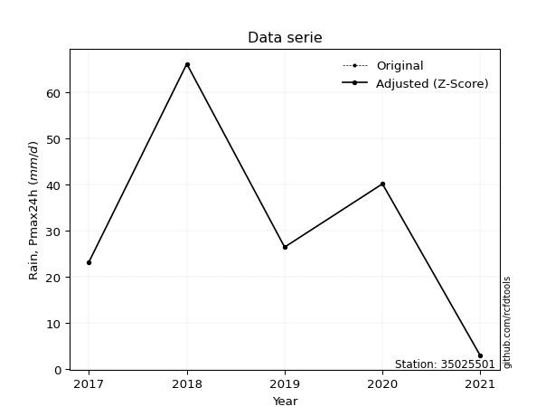</img>

</div>


> The initial value (value_initial) correspond to the initial obtained or null completed value, and value (value) is adjusted only when the initial value is outside the valid range (outlier) definite through the Z-Score value. If Z-Score is active, values out of range or outliers are replaced with the station mean value. A Z-Score (or standard score) measures how many standard deviations a data point is from the mean of a dataset, indicating its relative position; positive scores mean above the mean, negative mean below, and a score of zero is exactly at the mean, allowing for comparison of values from different distributions. It´s calculated using the formula $z=(x–μ)/σ$, where $x$ is the data point, $μ$ is the mean, and $σ$ is the standard deviation, helping identify outliers and understand probability.
>
> <sub>**Note**: In this study, "completing" (filling gaps in) and "extending" (forecasting or lengthening the historical record) rainfall data series are avoided for certain critical analyses because they introduce artificial bias and uncertainty, which can distort the statistics of rare events (extremes), alter day-to-day variability, and compromise the integrity and homogeneity of the original data. Some reasons against Completing/Extending rainfall data are: **Distortion of Extremes and Variability**: The primary issue is that most gap-filling or extension methods rely on averaging or regression with nearby stations, which inherently smooths the data. Rainfall is highly variable in space and time, with a large percentage of zero values and occasional large storms. Infilling methods often underestimate the highest values and overestimate the lowest (zero) values, which severely distorts analyses focused on flood frequency, drought severity, and intensity-duration-frequency (IDF) curves, **Loss of Data Homogeneity**: Infilled or extended data are synthetic estimates, not actual measurements. Combining these estimates with observed data can violate the assumption of data homogeneity, which requires that the data properties do not change over time. Inhomogeneity can lead to incorrect conclusions about long-term trends or changes in climate patterns, **Propagation of Errors**: Errors and biases from the original data (e.g., wind-induced undercatch, instrument errors, site changes) or the data used for imputation can propagate through the analysis, leading to unreliable hydrological models and inaccurate predictions, **Compromised Statistical Integrity**: For statistical analyses, especially those involving the frequency of events, using artificial data can introduce time bias or autocorrelation that doesn´t exist in reality, making it difficult to assess the true probability of events, **Difficulty in Validation**: It is difficult to accurately validate the quality of filled or extended data, especially for past periods where ground-truth measurements are unavailable. The reliability of imputation techniques heavily depends on the density of the surrounding station network and the complexity of the local topography.</sub>


### 4. Active continuous probability distributions from SciPy (44 of 104 available)

A Probability Density Function (PDF) describes the relative likelihood of a continuous random variable falling within a specific range, where the total area under its curve equals 1, and the area over any interval gives the actual probability for that range. Unlike discrete probabilities (like rolling a die), a PDF shows density, not direct probability for a single point (which is zero), with higher points indicating higher likelihood, often visualized as a bell curve for normal distributions.

A log of a probability density function (log-PDF) is simply the logarithm of the PDF´s value, denoted as $log(f(x))$, useful for converting multiplication of probabilities into addition, improving numerical stability with tiny numbers, and connecting to information theory concepts like entropy. Instead of dealing with very small probabilities (e.g., 0.000001), log-PDFs use negative numbers (e.g., $log(0.00001) ≈ -11.51$ that are easier for computers to handle, preventing underflow errors and simplifying complex calculations. In this study, each active probability distribution from SciPy is also evaluated in the $log$ form.

[scipy.stats](https://docs.scipy.org/doc/scipy/reference/stats.html) is a Python´s powerful submodule within the SciPy library for comprehensive statistical analysis, offering over 130 probability distributions (like Normal, Poisson), functions for descriptive stats (mean, variance), hypothesis testing (t-tests, chi-square), random variable generation, and statistical tests, making it essential for data science, modeling, and research. It provides tools to explore, model, and draw conclusions from data efficiently, working seamlessly with NumPy.

<div align="center">

|   id | p_dist             |   n_parameter | fit_method   | label                                                                       | active   | ref                                                                                                        |
|-----:|:-------------------|--------------:|:-------------|:----------------------------------------------------------------------------|:---------|:-----------------------------------------------------------------------------------------------------------|
|    0 | alpha              |             3 | MLE          | Alpha                                                                       | True     | [:mortar_board:](https://docs.scipy.org/doc/scipy/reference/generated/scipy.stats.alpha.html)              |
|    1 | betaprime          |             4 | MLE          | Beta prime                                                                  | True     | [:mortar_board:](https://docs.scipy.org/doc/scipy/reference/generated/scipy.stats.betaprime.html)          |
|    2 | chi2               |             3 | MLE          | Chi²                                                                        | True     | [:mortar_board:](https://docs.scipy.org/doc/scipy/reference/generated/scipy.stats.chi2.html)               |
|    3 | crystalball        |             4 | MLE          | Crystalball                                                                 | True     | [:mortar_board:](https://docs.scipy.org/doc/scipy/reference/generated/scipy.stats.crystalball.html)        |
|    4 | erlang             |             3 | MLE          | Erlang                                                                      | True     | [:mortar_board:](https://docs.scipy.org/doc/scipy/reference/generated/scipy.stats.erlang.html)             |
|    5 | expon              |             2 | MLE          | Exponential                                                                 | True     | [:mortar_board:](https://docs.scipy.org/doc/scipy/reference/generated/scipy.stats.expon.html)              |
|    6 | exponnorm          |             3 | MLE          | Exponentially modified Normal                                               | True     | [:mortar_board:](https://docs.scipy.org/doc/scipy/reference/generated/scipy.stats.exponnorm.html)          |
|    7 | f                  |             4 | MLE          | F                                                                           | True     | [:mortar_board:](https://docs.scipy.org/doc/scipy/reference/generated/scipy.stats.f.html)                  |
|    8 | fatiguelife        |             3 | MLE          | Fatigue-life (Birnbaum-Saunders)                                            | True     | [:mortar_board:](https://docs.scipy.org/doc/scipy/reference/generated/scipy.stats.fatiguelife.html)        |
|    9 | fisk               |             3 | MLE          | Fisk                                                                        | True     | [:mortar_board:](https://docs.scipy.org/doc/scipy/reference/generated/scipy.stats.fisk.html)               |
|   10 | gamma              |             3 | MLE          | Gamma                                                                       | True     | [:mortar_board:](https://docs.scipy.org/doc/scipy/reference/generated/scipy.stats.gamma.html)              |
|   11 | genexpon           |             5 | MLE          | Generalized exponential                                                     | True     | [:mortar_board:](https://docs.scipy.org/doc/scipy/reference/generated/scipy.stats.genexpon.html)           |
|   12 | genlogistic        |             3 | MLE          | Generalized logistic                                                        | True     | [:mortar_board:](https://docs.scipy.org/doc/scipy/reference/generated/scipy.stats.genlogistic.html)        |
|   13 | gibrat             |             2 | MM           | Gibrat                                                                      | True     | [:mortar_board:](https://docs.scipy.org/doc/scipy/reference/generated/scipy.stats.gibrat.html)             |
|   14 | gompertz           |             3 | MLE          | Gompertz (or truncated Gumbel)                                              | True     | [:mortar_board:](https://docs.scipy.org/doc/scipy/reference/generated/scipy.stats.gompertz.html)           |
|   15 | gumbel_l           |             2 | MM           | Gumbel Left Skew                                                            | True     | [:mortar_board:](https://docs.scipy.org/doc/scipy/reference/generated/scipy.stats.gumbel_l.html)           |
|   16 | gumbel_r           |             2 | MM           | Gumbel Right Skew                                                           | True     | [:mortar_board:](https://docs.scipy.org/doc/scipy/reference/generated/scipy.stats.gumbel_r.html)           |
|   17 | halflogistic       |             2 | MM           | Half-logistic                                                               | True     | [:mortar_board:](https://docs.scipy.org/doc/scipy/reference/generated/scipy.stats.halflogistic.html)       |
|   18 | halfnorm           |             2 | MM           | Half Normal                                                                 | True     | [:mortar_board:](https://docs.scipy.org/doc/scipy/reference/generated/scipy.stats.halfnorm.html)           |
|   19 | hypsecant          |             2 | MM           | hyperbolic secant                                                           | True     | [:mortar_board:](https://docs.scipy.org/doc/scipy/reference/generated/scipy.stats.hypsecant.html)          |
|   20 | invgamma           |             3 | MLE          | Inverted gamma                                                              | True     | [:mortar_board:](https://docs.scipy.org/doc/scipy/reference/generated/scipy.stats.invgamma.html)           |
|   21 | invgauss           |             3 | MLE          | Inverse Gaussian                                                            | True     | [:mortar_board:](https://docs.scipy.org/doc/scipy/reference/generated/scipy.stats.invgauss.html)           |
|   22 | invweibull         |             3 | MLE          | Inverted Weibull                                                            | True     | [:mortar_board:](https://docs.scipy.org/doc/scipy/reference/generated/scipy.stats.invweibull.html)         |
|   23 | johnsonsu          |             4 | MLE          | Johnson Su                                                                  | True     | [:mortar_board:](https://docs.scipy.org/doc/scipy/reference/generated/scipy.stats.johnsonsu.html)          |
|   24 | kstwobign          |             2 | MLE          | Limiting distribution of scaled Kolmogorov-Smirnov two-sided test statistic | True     | [:mortar_board:](https://docs.scipy.org/doc/scipy/reference/generated/scipy.stats.kstwobign.html)          |
|   25 | laplace            |             2 | MM           | Laplace                                                                     | True     | [:mortar_board:](https://docs.scipy.org/doc/scipy/reference/generated/scipy.stats.laplace.html)            |
|   26 | laplace_asymmetric |             3 | MLE          | Asymmetric Laplace                                                          | True     | [:mortar_board:](https://docs.scipy.org/doc/scipy/reference/generated/scipy.stats.laplace_asymmetric.html) |
|   27 | loggamma           |             3 | MLE          | Log gamma                                                                   | True     | [:mortar_board:](https://docs.scipy.org/doc/scipy/reference/generated/scipy.stats.loggamma.html)           |
|   28 | logistic           |             2 | MM           | Logistic (or Sech-squared)                                                  | True     | [:mortar_board:](https://docs.scipy.org/doc/scipy/reference/generated/scipy.stats.logistic.html)           |
|   29 | lognorm            |             3 | MLE          | Log Normal                                                                  | True     | [:mortar_board:](https://docs.scipy.org/doc/scipy/reference/generated/scipy.stats.lognorm.html)            |
|   30 | maxwell            |             2 | MM           | Maxwell                                                                     | True     | [:mortar_board:](https://docs.scipy.org/doc/scipy/reference/generated/scipy.stats.maxwell.html)            |
|   31 | mielke             |             4 | MLE          | Mielke Beta-Kappa / Dagum                                                   | True     | [:mortar_board:](https://docs.scipy.org/doc/scipy/reference/generated/scipy.stats.mielke.html)             |
|   32 | moyal              |             2 | MM           | Moyal                                                                       | True     | [:mortar_board:](https://docs.scipy.org/doc/scipy/reference/generated/scipy.stats.moyal.html)              |
|   33 | nakagami           |             3 | MLE          | Nakagami                                                                    | True     | [:mortar_board:](https://docs.scipy.org/doc/scipy/reference/generated/scipy.stats.nakagami.html)           |
|   34 | ncf                |             5 | MLE          | Non-central F distribution                                                  | True     | [:mortar_board:](https://docs.scipy.org/doc/scipy/reference/generated/scipy.stats.ncf.html)                |
|   35 | nct                |             4 | MLE          | Non-central Student’s t                                                     | True     | [:mortar_board:](https://docs.scipy.org/doc/scipy/reference/generated/scipy.stats.nct.html)                |
|   36 | norm               |             2 | MM           | Normal                                                                      | True     | [:mortar_board:](https://docs.scipy.org/doc/scipy/reference/generated/scipy.stats.norm.html)               |
|   37 | pearson3           |             3 | MM           | Pearson type III                                                            | True     | [:mortar_board:](https://docs.scipy.org/doc/scipy/reference/generated/scipy.stats.pearson3.html)           |
|   38 | rayleigh           |             2 | MM           | Rayleigh                                                                    | True     | [:mortar_board:](https://docs.scipy.org/doc/scipy/reference/generated/scipy.stats.rayleigh.html)           |
|   39 | rice               |             3 | MLE          | Rice                                                                        | True     | [:mortar_board:](https://docs.scipy.org/doc/scipy/reference/generated/scipy.stats.rice.html)               |
|   40 | t                  |             3 | MLE          | Student’s t                                                                 | True     | [:mortar_board:](https://docs.scipy.org/doc/scipy/reference/generated/scipy.stats.t.html)                  |
|   41 | truncnorm          |             4 | MLE          | Truncated normal                                                            | True     | [:mortar_board:](https://docs.scipy.org/doc/scipy/reference/generated/scipy.stats.truncnorm.html)          |
|   42 | wald               |             2 | MM           | Wald                                                                        | True     | [:mortar_board:](https://docs.scipy.org/doc/scipy/reference/generated/scipy.stats.wald.html)               |
|   43 | weibull_min        |             3 | MLE          | Weibull minimum                                                             | True     | [:mortar_board:](https://docs.scipy.org/doc/scipy/reference/generated/scipy.stats.weibull_min.html)        |

</div>

> **n_parameter:** # arguments & localization & scale.
>
> **Fit methods:** (MLE) maximum likelihood, (MM) L-moments.
>
>**Inactive** (With the only purpose of prevent loops, zero divisions, infinite values, over high estimated values or horizontal trending for recurrence intervals estimations, the follow distributions were disabled.)**:** foldnorm, gennorm, norminvgauss, powernorm, powerlognorm, skewnorm, genextreme, anglit, arcsine, argus, beta, bradford, burr, burr12, cauchy, cosine, halfcauchy, foldcauchy, skewcauchy, wrapcauchy, dgamma, gengamma, exponweib, exponpow, truncexpon, gausshyper, genhalflogistic, genhyperbolic, geninvgauss, halfgennorm, johnsonsb, kappa4, kappa3, ksone, kstwo, loglaplace, levy, levy_l, levy_stable, ncx2, pareto, genpareto, truncpareto, lomax, powerlaw, rdist, rel_breitwigner, recipinvgauss, semicircular, studentized_range, trapezoid, triang, truncweibull_min, tukeylambda, uniform, loguniform, vonmises, vonmises_line, weibull_max, dweibull, 


## B. Probability (PDF) vs. Empirical (EDF) distributions functions

A continuous probability distribution (CPD) describes probabilities for variables that can take any value within a range (like rain any time), unlike discrete variables with specific outcomes (like temperature). It uses a Probability Density Function (PDF), a curve where the total area under it equals 1, and the probability of the variable falling within an interval (a to b) is found by calculating the area under the curve between those points. A key feature is that the probability of hitting any single exact value is zero, so probabilities are always expressed for ranges, e.g., $P(a ≤ X ≤ b)$.

<div align="center">

Distributions parameters from station values
|    |   station | p_dist                |   n |             loc |           scale | shape                  | shape1                | shape2                 | shape3   |
|---:|----------:|:----------------------|----:|----------------:|----------------:|:-----------------------|:----------------------|:-----------------------|:---------|
|  0 |  35025501 | alpha                 |   5 |    -0.0139009   |     6.62657     | 1.5745807359763112e-09 |                       |                        |          |
|  1 |  35025501 | betaprime             |   5 |    -7.37404     | 17223.1         | 2.9305426376143853     | 1296.1786662121117    |                        |          |
|  2 |  35025501 | chi2                  |   5 |     3           |     4.13026     | 1.277443261978918      |                       |                        |          |
|  3 |  35025501 | crystalball           |   5 |    31.84        |    20.8983      | 3495.4499160049118     | 40.03768314256045     |                        |          |
|  4 |  35025501 | erlang                |   5 |     3           |    58.8076      | 0.32940847833644604    |                       |                        |          |
|  5 |  35025501 | expon                 |   5 |     3           |    28.84        |                        |                       |                        |          |
|  6 |  35025501 | exponnorm             |   5 |    14.4716      |    13.6599      | 1.2714909481367715     |                       |                        |          |
|  7 |  35025501 | f                     |   5 |     3           |    24.5486      | 1.6289194845934007     | 20.22107599135859     |                        |          |
|  8 |  35025501 | fatiguelife           |   5 |     3           |     8.88416e-07 | 4426.31463344098       |                       |                        |          |
|  9 |  35025501 | fisk                  |   5 |   -43.6921      |    72.9688      | 6.0929929638122875     |                       |                        |          |
| 10 |  35025501 | gamma                 |   5 |     3           |    24.2341      | 0.30724000147650676    |                       |                        |          |
| 11 |  35025501 | genexpon              |   5 |     2.99992     |     1.22479     | 0.04466775282700576    | 5.815173345024818e-07 | 4.659994257642769      |          |
| 12 |  35025501 | genlogistic           |   5 |   -69.9902      |    17.7606      | 176.04381713182062     |                       |                        |          |
| 13 |  35025501 | gibrat                |   5 |    15.8973      |     9.66976     |                        |                       |                        |          |
| 14 |  35025501 | gompertz              |   5 |     3           |    44.3055      | 0.8680155102913117     |                       |                        |          |
| 15 |  35025501 | gumbel_l              |   5 |    41.2453      |    16.2943      |                        |                       |                        |          |
| 16 |  35025501 | gumbel_r              |   5 |    22.4347      |    16.2943      |                        |                       |                        |          |
| 17 |  35025501 | halflogistic          |   5 |     7.07069     |    17.8673      |                        |                       |                        |          |
| 18 |  35025501 | halfnorm              |   5 |     4.17888     |    34.6681      |                        |                       |                        |          |
| 19 |  35025501 | hypsecant             |   5 |    31.84        |    13.3043      |                        |                       |                        |          |
| 20 |  35025501 | invgamma              |   5 |   -86.6031      |  3771.85        | 32.83872079841146      |                       |                        |          |
| 21 |  35025501 | invgauss              |   5 |   -46.5191      |  1040.48        | 0.07530797050275631    |                       |                        |          |
| 22 |  35025501 | invweibull            |   5 |     3           |     3.70314     | 0.04561872505034381    |                       |                        |          |
| 23 |  35025501 | johnsonsu             |   5 |   -51.0733      |     7.52924     | -12.116472448103561    | 3.956321048771464     |                        |          |
| 24 |  35025501 | kstwobign             |   5 |   -40.8024      |    83.2365      |                        |                       |                        |          |
| 25 |  35025501 | laplace               |   5 |    31.84        |    14.7773      |                        |                       |                        |          |
| 26 |  35025501 | laplace_asymmetric    |   5 |    23.3         |    14.8819      | 0.7534158209010079     |                       |                        |          |
| 27 |  35025501 | loggamma              |   5 | -5408.33        |   757.998       | 1309.4242092576933     |                       |                        |          |
| 28 |  35025501 | logistic              |   5 |    31.84        |    11.5218      |                        |                       |                        |          |
| 29 |  35025501 | lognorm               |   5 |     3           |     0.0137867   | 15.538292687833138     |                       |                        |          |
| 30 |  35025501 | maxwell               |   5 |   -17.6802      |    31.0322      |                        |                       |                        |          |
| 31 |  35025501 | mielke                |   5 |     3           |    63.5381      | 0.8969326413693149     | 582.2910469463193     |                        |          |
| 32 |  35025501 | moyal                 |   5 |    19.889       |     9.40753     |                        |                       |                        |          |
| 33 |  35025501 | nakagami              |   5 |     3           |    29.5066      | 0.3232173936292764     |                       |                        |          |
| 34 |  35025501 | ncf                   |   5 |     0.0303647   |     1.46235e-05 | 4.476303388000231e-06  | 14.293460992092875    | 8.855697586924762      |          |
| 35 |  35025501 | nct                   |   5 |   -93.0215      |    12.4279      | 29.2056630011991       | 9.791465328687678     |                        |          |
| 36 |  35025501 | norm                  |   5 |    31.84        |    20.8983      |                        |                       |                        |          |
| 37 |  35025501 | pearson3              |   5 |    31.84        |    20.8983      | 0.3590908395171337     |                       |                        |          |
| 38 |  35025501 | rayleigh              |   5 |    -8.13964     |    31.8991      |                        |                       |                        |          |
| 39 |  35025501 | rice                  |   5 |    -7.00893     |    28.0633      | 0.6862420515207819     |                       |                        |          |
| 40 |  35025501 | t                     |   5 |    31.8384      |    20.8989      | 3717148.410168892      |                       |                        |          |
| 41 |  35025501 | truncnorm             |   5 |    31.84        |    20.8983      | -89.70541883272347     | 999.275342450401      |                        |          |
| 42 |  35025501 | wald                  |   5 |    10.9417      |    20.8983      |                        |                       |                        |          |
| 43 |  35025501 | weibull_min           |   5 |     3           |    16.8443      | 0.427258286202401      |                       |                        |          |
| 44 |  35025501 | logalpha              |   5 |   -28.194       |   876.043       | 28.050949591985663     |                       |                        |          |
| 45 |  35025501 | logbetaprime          |   5 |   -27.987       |   389.478       | 893.1789189287334      | 11202.851190828995    |                        |          |
| 46 |  35025501 | logchi2               |   5 |     1.09861     |     1.54121     | 0.27149849307720697    |                       |                        |          |
| 47 |  35025501 | logcrystalball        |   5 |     3.08215     |     1.05682     | 2403.9768053005364     | 8.567224274897058     |                        |          |
| 48 |  35025501 | logerlang             |   5 |   -15.3851      |     0.0650179   | 283.74227786275367     |                       |                        |          |
| 49 |  35025501 | logexpon              |   5 |     1.09861     |     1.98354     |                        |                       |                        |          |
| 50 |  35025501 | logexponnorm          |   5 |     3.08157     |     1.05682     | 0.0005486523326147374  |                       |                        |          |
| 51 |  35025501 | logf                  |   5 | -1326.4         |  1329.48        | 7997451.6682348065     | 5194363.113114899     |                        |          |
| 52 |  35025501 | logfatiguelife        |   5 |  -477.711       |   480.79        | 0.0022046873478519923  |                       |                        |          |
| 53 |  35025501 | logfisk               |   5 |    -4.72852e+07 |     4.72852e+07 | 82645936.66995709      |                       |                        |          |
| 54 |  35025501 | loggamma              |   5 |   -15.2509      |     0.0663628   | 276.03377088274        |                       |                        |          |
| 55 |  35025501 | loggenexpon           |   5 |     1.09134     |     0.170583    | 0.03532651126041187    | 35.41877838232835     | 0.00018920294735876307 |          |
| 56 |  35025501 | loggenlogistic        |   5 |     4.19273     |     3.54822e-06 | 3.192061546747231e-06  |                       |                        |          |
| 57 |  35025501 | loggibrat             |   5 |     2.2759      |     0.489011    |                        |                       |                        |          |
| 58 |  35025501 | loggompertz           |   5 |     1.09861     |     0.832228    | 0.05869218210355749    |                       |                        |          |
| 59 |  35025501 | loggumbel_l           |   5 |     3.55778     |     0.823997    |                        |                       |                        |          |
| 60 |  35025501 | loggumbel_r           |   5 |     2.60653     |     0.823997    |                        |                       |                        |          |
| 61 |  35025501 | loghalflogistic       |   5 |     1.8296      |     0.903527    |                        |                       |                        |          |
| 62 |  35025501 | loghalfnorm           |   5 |     1.68336     |     1.75313     |                        |                       |                        |          |
| 63 |  35025501 | loghypsecant          |   5 |     3.08215     |     0.672791    |                        |                       |                        |          |
| 64 |  35025501 | loginvgamma           |   5 |   -17.5227      |  7061.27        | 344.1102371654879      |                       |                        |          |
| 65 |  35025501 | loginvgauss           |   5 |    -7.88067     |   995.237       | 0.010986692282895151   |                       |                        |          |
| 66 |  35025501 | loginvweibull         |   5 |    -1.0464e+08  |     1.0464e+08  | 87903756.42169099      |                       |                        |          |
| 67 |  35025501 | logjohnsonsu          |   5 |     4.44135     |     0.00828582  | 6.477159482300312      | 1.183451966527405     |                        |          |
| 68 |  35025501 | logkstwobign          |   5 |    -1.6301      |     5.37254     |                        |                       |                        |          |
| 69 |  35025501 | loglaplace            |   5 |     3.08215     |     0.747283    |                        |                       |                        |          |
| 70 |  35025501 | loglaplace_asymmetric |   5 |     3.27714     |     0.707941    | 1.147146320513557      |                       |                        |          |
| 71 |  35025501 | logloggamma           |   5 |     4.19277     |     1.14769e-05 | 1.0345968947527707e-05 |                       |                        |          |
| 72 |  35025501 | loglogistic           |   5 |     3.08215     |     0.582654    |                        |                       |                        |          |
| 73 |  35025501 | loglognorm            |   5 |     1.09861     |     0.00151428  | 14.776119519225361     |                       |                        |          |
| 74 |  35025501 | logmaxwell            |   5 |     0.577938    |     1.56928     |                        |                       |                        |          |
| 75 |  35025501 | logmielke             |   5 |    -5.97548     |    10.169       | 8.153342805434406      | 90504.09388078275     |                        |          |
| 76 |  35025501 | logmoyal              |   5 |     2.4778      |     0.475735    |                        |                       |                        |          |
| 77 |  35025501 | lognakagami           |   5 |     3.14845     |     0.500415    | 0.11279646574081423    |                       |                        |          |
| 78 |  35025501 | logncf                |   5 |    -9.04345     |     0.550823    | 24.12384617187682      | 1277.582598957369     | 506.7499948686411      |          |
| 79 |  35025501 | lognct                |   5 |   -67.425       |     1.03883     | 61902.149602931284     | 67.87086100100862     |                        |          |
| 80 |  35025501 | lognorm               |   5 |     3.08215     |     1.05682     |                        |                       |                        |          |
| 81 |  35025501 | logpearson3           |   5 |     3.08215     |     1.05682     | -1.050213387194973     |                       |                        |          |
| 82 |  35025501 | lograyleigh           |   5 |     1.0604      |     1.61313     |                        |                       |                        |          |
| 83 |  35025501 | logrice               |   5 |     0.307263    |     1.14252     | 2.18043037568365       |                       |                        |          |
| 84 |  35025501 | logt                  |   5 |     3.08215     |     1.05682     | 1185425354.465661      |                       |                        |          |
| 85 |  35025501 | logtruncnorm          |   5 |     0.475974    |     2.75452     | 0.22604192412028098    | 3.393197404252182     |                        |          |
| 86 |  35025501 | logwald               |   5 |     2.02532     |     1.05683     |                        |                       |                        |          |
| 87 |  35025501 | logweibull_min        |   5 |    -4.44133e+07 |     4.44133e+07 | 61678287.4310494       |                       |                        |          |

</div>

> **loc** (Location parameter): This shifts the distribution along the x-axis. For many common distributions, like the normal (Gaussian) distribution, loc represents the mean $μ$. For others, like the uniform distribution, it might represent the minimum value, or for the beta distribution, the left end of the support interval.
>
> **scale** (Scale parameter): This determines the width or spread of the distribution. For the normal distribution, scale represents the standard deviation $σ$. For a uniform distribution, it defines the length of the interval (from $loc$ to $loc + scale$).
>
> **shape** (Shape parameters): Refers to parameters that define the specific form of a probability distribution, distinct from its location (loc) and scale (scale). These parameters are required arguments for most distribution functions. For example, a normal (Gaussian) distribution is fully defined by its location (mean) and scale (standard deviation), so it has no specific shape parameters beyond loc and scale. However, other distributions have intrinsic properties that need specification, as Gamma distribution that takes a shape parameter, often named $a$ or $alpha$.


### 0. Cumulative distribution values - CDF (88 evaluated)

Cumulative Distribution Function (CDF), denoted as $F$<sub>$X$</sub>$(x)$, is a function that gives the probability that a random variable $X$ will take a value less than or equal to a specific value, $x$ (i.e., $(P(X≥x)$. It essentially "accumulates" probabilities from a given point up to the far right (positive infinity), providing a complete picture of the distribution´s probabilities for both discrete (like rain) and continuous (like temperature) variables, helping to find probabilities over ranges or above certain values. Each station is evaluated separately ordering the $x$ values ascending, calculating the CDF and PDF values for the activated distributions and their logarithmic forms.

<div align="center">

CDF ordered by x ascending and calculating $log(f(x))$ separately
|   id |   Station |   date |    x |   count |   mean |    std |    zscore |   Value_initial |   station |   m |     alpha |   alpha_pdf |   betaprime |   betaprime_pdf |        chi2 |        chi2_pdf |   crystalball |   crystalball_pdf |      erlang |     erlang_pdf |    expon |   expon_pdf |   exponnorm |   exponnorm_pdf |           f |       f_pdf |   fatiguelife |   fatiguelife_pdf |      fisk |   fisk_pdf |       gamma |        gamma_pdf |    genexpon |   genexpon_pdf |   genlogistic |   genlogistic_pdf |   gibrat |   gibrat_pdf |    gompertz |   gompertz_pdf |   gumbel_l |   gumbel_l_pdf |   gumbel_r |   gumbel_r_pdf |   halflogistic |   halflogistic_pdf |   halfnorm |   halfnorm_pdf |   hypsecant |   hypsecant_pdf |   invgamma |   invgamma_pdf |   invgauss |   invgauss_pdf |   invweibull |   invweibull_pdf |   johnsonsu |   johnsonsu_pdf |   kstwobign |   kstwobign_pdf |   laplace |   laplace_pdf |   laplace_asymmetric |   laplace_asymmetric_pdf |   loggamma |   loggamma_pdf |   logistic |   logistic_pdf |   lognorm |   lognorm_pdf |   maxwell |   maxwell_pdf |     mielke |   mielke_pdf |     moyal |   moyal_pdf |    nakagami |   nakagami_pdf |       ncf |    ncf_pdf |      nct |    nct_pdf |      norm |   norm_pdf |   pearson3 |   pearson3_pdf |   rayleigh |   rayleigh_pdf |     rice |   rice_pdf |         t |      t_pdf |   truncnorm |   truncnorm_pdf |     wald |   wald_pdf |   weibull_min |   weibull_min_pdf |   logalpha |   logalpha_pdf |   logbetaprime |   logbetaprime_pdf |    logchi2 |   logchi2_pdf |   logcrystalball |   logcrystalball_pdf |   logerlang |   logerlang_pdf |   logexpon |   logexpon_pdf |   logexponnorm |   logexponnorm_pdf |      logf |   logf_pdf |   logfatiguelife |   logfatiguelife_pdf |   logfisk |   logfisk_pdf |   loggenexpon |   loggenexpon_pdf |   loggenlogistic |   loggenlogistic_pdf |   loggibrat |   loggibrat_pdf |   loggompertz |   loggompertz_pdf |   loggumbel_l |   loggumbel_l_pdf |   loggumbel_r |   loggumbel_r_pdf |   loghalflogistic |   loghalflogistic_pdf |   loghalfnorm |   loghalfnorm_pdf |   loghypsecant |   loghypsecant_pdf |   loginvgamma |   loginvgamma_pdf |   loginvgauss |   loginvgauss_pdf |   loginvweibull |   loginvweibull_pdf |   logjohnsonsu |   logjohnsonsu_pdf |   logkstwobign |   logkstwobign_pdf |   loglaplace |   loglaplace_pdf |   loglaplace_asymmetric |   loglaplace_asymmetric_pdf |   logloggamma |   logloggamma_pdf |   loglogistic |   loglogistic_pdf |   loglognorm |   loglognorm_pdf |   logmaxwell |   logmaxwell_pdf |   logmielke |   logmielke_pdf |    logmoyal |   logmoyal_pdf |   lognakagami |   lognakagami_pdf |   logncf |   logncf_pdf |   lognct |   lognct_pdf |   logpearson3 |   logpearson3_pdf |   lograyleigh |   lograyleigh_pdf |   logrice |   logrice_pdf |      logt |   logt_pdf |   logtruncnorm |   logtruncnorm_pdf |   logwald |   logwald_pdf |   logweibull_min |   logweibull_min_pdf |
|-----:|----------:|-------:|-----:|--------:|-------:|-------:|----------:|----------------:|----------:|----:|----------:|------------:|------------:|----------------:|------------:|----------------:|--------------:|------------------:|------------:|---------------:|---------:|------------:|------------:|----------------:|------------:|------------:|--------------:|------------------:|----------:|-----------:|------------:|-----------------:|------------:|---------------:|--------------:|------------------:|---------:|-------------:|------------:|---------------:|-----------:|---------------:|-----------:|---------------:|---------------:|-------------------:|-----------:|---------------:|------------:|----------------:|-----------:|---------------:|-----------:|---------------:|-------------:|-----------------:|------------:|----------------:|------------:|----------------:|----------:|--------------:|---------------------:|-------------------------:|-----------:|---------------:|-----------:|---------------:|----------:|--------------:|----------:|--------------:|-----------:|-------------:|----------:|------------:|------------:|---------------:|----------:|-----------:|---------:|-----------:|----------:|-----------:|-----------:|---------------:|-----------:|---------------:|---------:|-----------:|----------:|-----------:|------------:|----------------:|---------:|-----------:|--------------:|------------------:|-----------:|---------------:|---------------:|-------------------:|-----------:|--------------:|-----------------:|---------------------:|------------:|----------------:|-----------:|---------------:|---------------:|-------------------:|----------:|-----------:|-----------------:|---------------------:|----------:|--------------:|--------------:|------------------:|-----------------:|---------------------:|------------:|----------------:|--------------:|------------------:|--------------:|------------------:|--------------:|------------------:|------------------:|----------------------:|--------------:|------------------:|---------------:|-------------------:|--------------:|------------------:|--------------:|------------------:|----------------:|--------------------:|---------------:|-------------------:|---------------:|-------------------:|-------------:|-----------------:|------------------------:|----------------------------:|--------------:|------------------:|--------------:|------------------:|-------------:|-----------------:|-------------:|-----------------:|------------:|----------------:|------------:|---------------:|--------------:|------------------:|---------:|-------------:|---------:|-------------:|--------------:|------------------:|--------------:|------------------:|----------:|--------------:|----------:|-----------:|---------------:|-------------------:|----------:|--------------:|-----------------:|---------------------:|
|    0 |  35025501 |   2021 |  3   |       5 |  31.84 | 23.365 | -1.23433  |             3   |  35025501 |   1 | 0.0279014 |  0.0519098  |    0.049817 |      0.0113927  | 4.51644e-11 | 64958.8         |     0.0837906 |        0.00736637 | 0.000559355 | 32939.5        | 0        |  0.0346741  |   0.0635146 |      0.00788761 | 1.98524e-13 | 22.7558     |     0.0460768 |       5.08841e+12 | 0.0617884 | 0.00756476 | 0.000642988 | 284750           | 2.83249e-06 |     0.0364697  |      0.056928 |        0.00911193 | 0        |   0          | 3.30094e-13 |     0.0195916  |  0.0912095 |     0.00533421 |  0.0370291 |     0.00749032 |       0        |         0          |   0        |     0          |   0.0725376 |      0.00540514 |  0.0616123 |     0.0084565  |  0.0584373 |     0.0088999  |    0.0048695 |      2.66353e+12 |   0.0599675 |      0.00862879 |    0.055354 |      0.0099959  | 0.0710205 |    0.00480605 |            0.0592279 |               0.00528242 |  0.0333434 |      0.0726654 |  0.0756429 |     0.00606857 |  0.030266 |     0.0648567 | 0.0690116 |    0.00914484 | 4.0984e-16 |    0.827759  | 0.0141361 |  0.0051264  | 1.03609e-11 | 15081.8        | 0.0432396 | 0.0128645  | 0.067835 | 0.00822921 | 0.0837906 | 0.00736637 |   0.073148 |     0.00804561 |  0.0591536 |     0.0102999  | 0.049055 | 0.00956549 | 0.0838092 | 0.00736737 |   0.0837906 |      0.00736637 | 0        | 0          |   1.10945e-07 |       5.33703e+07 |  0.0317518 |      0.0728092 |       0.031834 |          0.0693672 | 0.00686311 |   4.19583e+12 |         0.030266 |            0.0648567 |   0.0327515 |        0.072029 |   0        |       0.504149 |      0.0302669 |          0.0648579 | 0.0304452 |  0.0651128 |        0.0305868 |            0.0654998 | 0.0224025 |     0.0382783 |    0.00151009 |          0.208451 |         0        |             0.055614 |    0        |       0         |   1.09443e-09 |         0.0705242 |     0.0493109 |         0.0583432 |    0.00196181 |         0.0148419 |          0        |              0        |      0        |          0        |      0.0333491 |          0.0494777 |     0.0322363 |         0.0743162 |     0.0334183 |         0.0795342 |       0.0377935 |            0.103997 |      0.0743893 |           0.049804 |      0.0413332 |           0.129739 |    0.0351728 |        0.0470676 |               0.0388591 |                   0.0478494 |     0.0614667 |         0.0554099 |     0.0321608 |         0.0534219 |    0.0227552 |       1.6459e+13 |   0.00939975 |        0.0529741 |   0.0518771 |       0.0597916 | 2.03418e-05 |    0.000407681 |   0           |       0           | 0.034753 |    0.0754177 | 0.030337 |    0.0650391 |     0.0505715 |         0.0626743 |    0.00028056 |         0.0146814 | 0.0257417 |     0.0733434 | 0.0302659 |  0.0648567 |    1.16084e-11 |           0.344137 |  0        |     0         |        0.0329902 |            0.0450505 |
|    1 |  35025501 |   2017 | 23.3 |       5 |  31.84 | 23.365 | -0.365504 |            23.3 |  35025501 |   2 | 0.776232  |  0.00934235 |    0.423283 |      0.0200158  | 0.960474    |     0.00532677  |     0.3414    |        0.0175605  | 0.727135    |     0.00905914 | 0.505339 |  0.0171519  |   0.376875  |      0.0209624  | 0.570771    |  0.0152553  |     0.859914  |       0.00592286  | 0.372691  | 0.0212636  | 0.889589    |      0.00691914  | 0.523053    |     0.0173944  |      0.398942 |        0.0205877  | 0.394675 |   0.0520021  | 0.396186    |     0.0187051  |  0.282821  |     0.0146316  |  0.387407  |     0.0225459  |       0.425315 |         0.022922   |   0.418742 |     0.0197676  |   0.308416  |      0.0197211  |  0.377271  |     0.0200867  |  0.386153  |     0.0201906  |    0.396405  |      0.000824285 |   0.380989  |      0.0201674  |    0.406578 |      0.0200443  | 0.280534  |    0.0189841  |            0.362097  |               0.0322947  |  0.537201  |      0.359162  |  0.322741  |     0.0189709  |  0.525012 |     0.376752  | 0.372783  |    0.0187485  | 0.359365   |    0.0158781 | 0.404172  |  0.02498    | 0.587742    |     0.0166574  | 0.438608  | 0.0195072  | 0.369418 | 0.0195428  | 0.3414    | 0.0175605  |   0.359864 |     0.0188186  |  0.384733  |     0.01901    | 0.371328 | 0.0193844  | 0.341433  | 0.0175607  |   0.3414    |      0.0175605  | 0.439843 | 0.0364509  |   0.66142     |       0.0077176   |  0.53994   |      0.353985  |       0.534598 |          0.367401  | 0.940877   |   0.034356    |         0.525012 |            0.376752  |   0.53883   |        0.361389 |   0.644214 |       0.179369 |      0.525012  |          0.376749  | 0.524695  |  0.375792  |        0.52609   |            0.375504  | 0.451856  |     0.432904  |    0.598649   |          0.27304  |         0        |             0.351609 |    0.718717 |       0.386647  |   0.467624    |         0.440815  |     0.455836  |         0.401853  |    0.59568    |         0.374508  |          0.622964 |              0.338626 |      0.596677 |          0.320975 |      0.531318  |          0.47083   |     0.546829  |         0.354645  |     0.553584  |         0.342445  |       0.556892  |            0.273857 |      0.374597  |           0.346972 |      0.592524  |           0.262753 |    0.542451  |        0.612284  |               0.484941  |                   0.597135  |     0.390079  |         0.351641  |     0.528418  |         0.427685  |    0.687221  |       0.0116928  |   0.556894   |        0.356654  |   0.41306   |       0.369119  | 0.621182    |    0.366772    |   0.000332256 |       1.68783e+11 | 0.530549 |    0.345677  | 0.525313 |    0.376294  |     0.454988  |         0.380741  |    0.56732    |         0.347194  | 0.53366   |     0.365107  | 0.525012  |  0.376752  |    0.596273    |           0.220507 |  0.691997 |     0.343925  |        0.438997  |            0.450334  |
|    2 |  35025501 |   2019 | 26.5 |       5 |  31.84 | 23.365 | -0.228547 |            26.5 |  35025501 |   3 | 0.802643  |  0.00728984 |    0.485878 |      0.0190521  | 0.974253    |     0.00342971  |     0.399159  |        0.0184766  | 0.753989    |     0.00777721 | 0.55729  |  0.0153506  |   0.444362  |      0.0210935  | 0.616435    |  0.0133396  |     0.87737   |       0.0050214   | 0.441178  | 0.0214008  | 0.909311    |      0.00547855  | 0.57559     |     0.0154784  |      0.464052 |        0.0200165  | 0.536694 |   0.0374671  | 0.455173    |     0.0181419  |  0.332735  |     0.0165673  |  0.458775  |     0.0219386  |       0.495793 |         0.0211053  |   0.480329 |     0.0187065  |   0.375537  |      0.0221196  |  0.441692  |     0.0200828  |  0.450523  |     0.0199533  |    0.398854  |      0.000711673 |   0.445502  |      0.0200621  |    0.469733 |      0.0193613  | 0.348362  |    0.0235741  |            0.457503  |               0.0274646  |  0.582963  |      0.351268  |  0.386163  |     0.0205732  |  0.573193 |     0.371123  | 0.433156  |    0.0189158  | 0.409784   |    0.0156404 | 0.481603  |  0.023297   | 0.638372    |     0.0150152  | 0.498832  | 0.0180996  | 0.432462 | 0.0197692  | 0.399159  | 0.0184766  |   0.42097  |     0.0192931  |  0.445452  |     0.0188779  | 0.433438 | 0.0193675  | 0.399193  | 0.0184764  |   0.399159  |      0.0184766  | 0.54315  | 0.0284432  |   0.684277    |       0.00661785  |  0.584952  |      0.344835  |       0.581457 |          0.36001   | 0.945095   |   0.031262    |         0.573193 |            0.371123  |   0.584863  |        0.353232 |   0.666564 |       0.168101 |      0.573193  |          0.37112   | 0.572739  |  0.370198  |        0.574098  |            0.369701  | 0.507938  |     0.436845  |    0.632991   |          0.260528 |         0        |             0.394766 |    0.763193 |       0.308219  |   0.525571    |         0.458528  |     0.509025  |         0.423862  |    0.642014   |         0.345275  |          0.664624 |              0.308942 |      0.636706 |          0.301064 |      0.59099   |          0.45392   |     0.591877  |         0.344732  |     0.596985  |         0.331449  |       0.591319  |            0.260989 |      0.422453  |           0.397843 |      0.625493  |           0.249531 |    0.614835  |        0.515421  |               0.568211  |                   0.69967   |     0.438061  |         0.394895  |     0.582894  |         0.417278  |    0.688679  |       0.0109799  |   0.60193    |        0.342674  |   0.463029  |       0.408018  | 0.66599     |    0.32978     |   0.607698    |       1.05816     | 0.574597 |    0.338203  | 0.573431 |    0.3706    |     0.50534   |         0.401149  |    0.611011   |         0.331373  | 0.580233  |     0.357888  | 0.573194  |  0.371123  |    0.624007    |           0.210505 |  0.732571 |     0.288641  |        0.498995  |            0.48087   |
|    3 |  35025501 |   2020 | 40.2 |       5 |  31.84 | 23.365 |  0.3578   |            40.2 |  35025501 |   4 | 0.869115  |  0.00322538 |    0.707579 |      0.0130911  | 0.995721    |     0.000553246 |     0.655434  |        0.0176218  | 0.835318    |     0.00452776 | 0.724695 |  0.00954595 |   0.702676  |      0.015402   | 0.75749     |  0.00783652 |     0.928117  |       0.00269262  | 0.700561  | 0.0152358  | 0.958549    |      0.00226445  | 0.74249     |     0.00939146 |      0.700885 |        0.0140114  | 0.821627 |   0.0107356  | 0.680779    |     0.0144812  |  0.608536  |     0.0225317  |  0.714535  |     0.0147396  |       0.729236 |         0.0131026  |   0.701208 |     0.0134147  |   0.68802   |      0.0198715  |  0.691114  |     0.0153934  |  0.69434   |     0.0148826  |    0.406529  |      0.000448727 |   0.69281   |      0.0151797  |    0.700111 |      0.0138809  | 0.716028  |    0.0192168  |            0.728869  |               0.0137264  |  0.719639  |      0.298707  |  0.673834  |     0.0190752  |  0.718647 |     0.319269  | 0.676484  |    0.0157087  | 0.618687   |    0.0149172 | 0.734035  |  0.0136001  | 0.803297    |     0.00937408 | 0.70157   | 0.011607   | 0.683532 | 0.0158196  | 0.655434  | 0.0176218  |   0.673783 |     0.0164565  |  0.682794  |     0.0150691  | 0.67896  | 0.0156729  | 0.655458  | 0.0176208  |   0.655434  |      0.0176218  | 0.78945  | 0.0108836  |   0.754108    |       0.00396193  |  0.718487  |      0.29077   |       0.721698 |          0.306428  | 0.956397   |   0.023475    |         0.718647 |            0.319269  |   0.722112  |        0.299426 |   0.729747 |       0.136248 |      0.718646  |          0.319267  | 0.717874  |  0.318721  |        0.718916  |            0.31776   | 0.681378  |     0.379455  |    0.732365   |          0.215602 |         0        |             0.57432  |    0.856469 |       0.15964   |   0.71872     |         0.448538  |     0.692593  |         0.440065  |    0.765486   |         0.248268  |          0.774573 |              0.221375 |      0.74854  |          0.235798 |      0.756206  |          0.32796   |     0.724902  |         0.288548  |     0.724384  |         0.275815  |       0.690585  |            0.214775 |      0.628818  |           0.598369 |      0.720181  |           0.204734 |    0.779473  |        0.295106  |               0.780208  |                   0.356151  |     0.637795  |         0.574947  |     0.740751  |         0.329593  |    0.692853  |       0.00916264 |   0.73226    |        0.279194  |   0.663131  |       0.559163  | 0.780577    |    0.224711    |   0.831319    |       0.304725    | 0.706647 |    0.29031   | 0.718651 |    0.318717  |     0.680814  |         0.428902  |    0.736201   |         0.266971  | 0.71988   |     0.305876  | 0.718648  |  0.319269  |    0.705017    |           0.178434 |  0.825755 |     0.17113   |        0.708531  |            0.499014  |
|    4 |  35025501 |   2018 | 66.2 |       5 |  31.84 | 23.365 |  1.47058  |            66.2 |  35025501 |   5 | 0.920282  |  0.00119993 |    0.919247 |      0.00430334 | 0.999844    |     1.96254e-05 |     0.949928  |        0.00494081 | 0.915177    |     0.00203948 | 0.88824  |  0.00387518 |   0.930698  |      0.00398575 | 0.890669    |  0.00318939 |     0.971642  |       0.000978877 | 0.923782  | 0.00390383 | 0.989253    |      0.000536495 | 0.900234    |     0.00363851 |      0.921014 |        0.00426584 | 0.950432 |   0.00203616 | 0.935838    |     0.00523423 |  0.990197  |     0.00278251 |  0.934113  |     0.00390733 |       0.929497 |         0.00380682 |   0.926385 |     0.00464545 |   0.951979  |      0.00359578 |  0.933444  |     0.00440993 |  0.930415  |     0.00442628 |    0.415364  |      0.000263418 |   0.93226   |      0.00440741 |    0.926615 |      0.00453282 | 0.951117  |    0.00330795 |            0.927302  |               0.00368045 |  0.846209  |      0.206627  |  0.951762  |     0.00398471 |  0.85333  |     0.217335  | 0.937249  |    0.00486733 | 0.995159   |    0.0135185 | 0.932009  |  0.00360488 | 0.952565    |     0.00294902 | 0.891132  | 0.00413109 | 0.935027 | 0.00453357 | 0.949928  | 0.00494081 |   0.941102 |     0.00473253 |  0.933829  |     0.00483423 | 0.937963 | 0.0048329  | 0.949931  | 0.00494042 |   0.949928  |      0.00494081 | 0.936464 | 0.00266299 |   0.827848    |       0.0020476   |  0.841703  |      0.201795  |       0.851008 |          0.209561  | 0.966426   |   0.017153    |         0.85333  |            0.217335  |   0.848646  |        0.20585  |   0.789837 |       0.105953 |      0.853329  |          0.217335  | 0.852451  |  0.217457  |        0.852994  |            0.216516  | 0.836436  |     0.239121  |    0.825971   |          0.160124 |         0.999955 |             0.899582 |    0.914033 |       0.0818734 |   0.905383    |         0.274748  |     0.884777  |         0.302166  |    0.864259   |         0.153011  |          0.863691 |              0.140581 |      0.847666 |          0.1634   |      0.879282  |          0.175158  |     0.846638  |         0.198354  |     0.841176  |         0.191827  |       0.783891  |            0.160339 |      0.948548  |           0.501884 |      0.809286  |           0.153489 |    0.886872  |        0.151386  |               0.902055  |                   0.15871   |     0.999923  |         0.901101  |     0.870567  |         0.193391  |    0.697021  |       0.00763899 |   0.849274   |        0.190041  |   0.999335  |       0.800817  | 0.869015    |    0.136423    |   0.93238     |       0.128931    | 0.831191 |    0.206983  | 0.853118 |    0.217059  |     0.877586  |         0.331592  |    0.8482     |         0.182724  | 0.849438  |     0.210913  | 0.853331  |  0.217335  |    0.784825    |           0.142063 |  0.890901 |     0.0981971 |        0.914956  |            0.291077  |


</div>

An Empirical Distribution Function (EDF) is a step-function estimate of a true cumulative distribution function (CDF) based on observed sample data, representing the proportion of data points less than or equal to a given value. It is calculated by ordering your data and jumping up by $1/n$ (where $n$ is sample size) at each unique data point, allowing analysis without assuming an underlying population distribution, and it gets closer to the true CDF as the sample size grows. For the empirical probability calculations, the parameter $m$ correspond to the order number which means the position of the $x$ values in an ascending order list.

The Kolmogorov-Smirnov (K-S) test is a non-parametric statistical test used to determine if a sample data set comes from a specific theoretical distribution (one-sample) or if two different samples come from the same underlying distribution (two-sample), by comparing their cumulative distribution functions (CDFs). It calculates the maximum vertical difference (D statistic) between these functions, with a small p-value indicating a significant difference and rejection of the null hypothesis (that the data/samples match).


### 1. EDF California (1923)

California´s estimates the true probability distribution of water-related data (like rainfall, streamflow) using observed samples, crucial for risk assessment.

<div align="center">


$P=m/n$


</div>


**1.1. Empirical values**

<div align="center">

|                | 0              | 1                  | 2              | 3                 | 4              |
|:---------------|:---------------|:-------------------|:---------------|:------------------|:---------------|
| date           | 2021           | 2017               | 2019           | 2020              | 2018           |
| x              | 3.0            | 23.3               | 26.5           | 40.2              | 66.2           |
| m              | 1              | 2                  | 3              | 4                 | 5              |
| empirical_dist | edf_california | edf_california     | edf_california | edf_california    | edf_california |
| empirical      | 0.2            | 0.4                | 0.6            | 0.8               | 1.0            |
| empirical_tr   | 1.25           | 1.6666666666666667 | 2.5            | 5.000000000000001 | inf            |

</div>


**1.2. Kolmogorov-Smirnov fit test (sorted by Δ)**


<div align="center">

|                | 0                  | 1                   | 2                   | 3                   | 4                   | 5                   | 6                   | 7                   | 8                   | 9                   | 10                  | 11                  | 12                  | 13                  | 14                    | 15                  | 16                  | 17                 | 18                  | 19                  | 20                  | 21                  | 22                  | 23                  | 24                 | 25                  | 26                  | 27                  | 28                  | 29                  | 30                 | 31                  | 32                 | 33                  | 34                 | 35                  | 36                  | 37                  | 38                 | 39                  | 40                 | 41                 | 42                  | 43                  | 44                 | 45                  | 46                  | 47                  | 48                 | 49                  | 50                  | 51                  | 52                 | 53                  | 54                  | 55                 | 56                 | 57                 | 58                 | 59                 | 60                 | 61                 | 62                  | 63                  | 64                  | 65                  | 66                  | 67                  | 68                  | 69                 | 70                  | 71                 | 72                  | 73                 | 74                 | 75                 | 76                 | 77                 | 78                  | 79                 | 80                 | 81                 | 82                  | 83                 | 84                 | 85                 | 86                 | 87                 |
|:---------------|:-------------------|:--------------------|:--------------------|:--------------------|:--------------------|:--------------------|:--------------------|:--------------------|:--------------------|:--------------------|:--------------------|:--------------------|:--------------------|:--------------------|:----------------------|:--------------------|:--------------------|:-------------------|:--------------------|:--------------------|:--------------------|:--------------------|:--------------------|:--------------------|:-------------------|:--------------------|:--------------------|:--------------------|:--------------------|:--------------------|:-------------------|:--------------------|:-------------------|:--------------------|:-------------------|:--------------------|:--------------------|:--------------------|:-------------------|:--------------------|:-------------------|:-------------------|:--------------------|:--------------------|:-------------------|:--------------------|:--------------------|:--------------------|:-------------------|:--------------------|:--------------------|:--------------------|:-------------------|:--------------------|:--------------------|:-------------------|:-------------------|:-------------------|:-------------------|:-------------------|:-------------------|:-------------------|:--------------------|:--------------------|:--------------------|:--------------------|:--------------------|:--------------------|:--------------------|:-------------------|:--------------------|:-------------------|:--------------------|:-------------------|:-------------------|:-------------------|:-------------------|:-------------------|:--------------------|:-------------------|:-------------------|:-------------------|:--------------------|:-------------------|:-------------------|:-------------------|:-------------------|:-------------------|
| station        | 35025501           | 35025501            | 35025501            | 35025501            | 35025501            | 35025501            | 35025501            | 35025501            | 35025501            | 35025501            | 35025501            | 35025501            | 35025501            | 35025501            | 35025501              | 35025501            | 35025501            | 35025501           | 35025501            | 35025501            | 35025501            | 35025501            | 35025501            | 35025501            | 35025501           | 35025501            | 35025501            | 35025501            | 35025501            | 35025501            | 35025501           | 35025501            | 35025501           | 35025501            | 35025501           | 35025501            | 35025501            | 35025501            | 35025501           | 35025501            | 35025501           | 35025501           | 35025501            | 35025501            | 35025501           | 35025501            | 35025501            | 35025501            | 35025501           | 35025501            | 35025501            | 35025501            | 35025501           | 35025501            | 35025501            | 35025501           | 35025501           | 35025501           | 35025501           | 35025501           | 35025501           | 35025501           | 35025501            | 35025501            | 35025501            | 35025501            | 35025501            | 35025501            | 35025501            | 35025501           | 35025501            | 35025501           | 35025501            | 35025501           | 35025501           | 35025501           | 35025501           | 35025501           | 35025501            | 35025501           | 35025501           | 35025501           | 35025501            | 35025501           | 35025501           | 35025501           | 35025501           | 35025501           |
| empirical_dist | edf_california     | edf_california      | edf_california      | edf_california      | edf_california      | edf_california      | edf_california      | edf_california      | edf_california      | edf_california      | edf_california      | edf_california      | edf_california      | edf_california      | edf_california        | edf_california      | edf_california      | edf_california     | edf_california      | edf_california      | edf_california      | edf_california      | edf_california      | edf_california      | edf_california     | edf_california      | edf_california      | edf_california      | edf_california      | edf_california      | edf_california     | edf_california      | edf_california     | edf_california      | edf_california     | edf_california      | edf_california      | edf_california      | edf_california     | edf_california      | edf_california     | edf_california     | edf_california      | edf_california      | edf_california     | edf_california      | edf_california      | edf_california      | edf_california     | edf_california      | edf_california      | edf_california      | edf_california     | edf_california      | edf_california      | edf_california     | edf_california     | edf_california     | edf_california     | edf_california     | edf_california     | edf_california     | edf_california      | edf_california      | edf_california      | edf_california      | edf_california      | edf_california      | edf_california      | edf_california     | edf_california      | edf_california     | edf_california      | edf_california     | edf_california     | edf_california     | edf_california     | edf_california     | edf_california      | edf_california     | edf_california     | edf_california     | edf_california      | edf_california     | edf_california     | edf_california     | edf_california     | edf_california     |
| p_dist         | laplace_asymmetric | genlogistic         | kstwobign           | logmielke           | logpearson3         | invgauss            | betaprime           | loggumbel_l         | johnsonsu           | rayleigh            | exponnorm           | ncf                 | invgamma            | fisk                | loglaplace_asymmetric | logloggamma         | gumbel_r            | loglaplace         | rice                | loginvgauss         | loghypsecant        | loggamma            | loggamma            | maxwell             | logweibull_min     | logerlang           | nct                 | loginvgamma         | loglogistic         | logbetaprime        | logalpha           | logncf              | logfatiguelife     | logf                | lognct             | logexponnorm        | lognorm             | lognorm             | logcrystalball     | logt                | logrice            | logjohnsonsu       | logfisk             | pearson3            | moyal              | logmaxwell          | logkstwobign        | loggumbel_r         | loggenexpon        | lograyleigh         | genexpon            | loggompertz         | nakagami           | gompertz            | f                   | mielke             | halflogistic       | halfnorm           | expon              | gibrat             | loghalfnorm        | wald               | t                   | crystalball         | truncnorm           | norm                | logistic            | logtruncnorm        | loginvweibull       | logmoyal           | loghalflogistic     | hypsecant          | logexpon            | laplace            | weibull_min        | gumbel_l           | logwald            | loglognorm         | loggibrat           | erlang             | alpha              | lognakagami        | fatiguelife         | gamma              | logchi2            | chi2               | invweibull         | loggenlogistic     |
| delta          | 0.1424970800119547 | 0.14307199543640142 | 0.14464596310501554 | 0.14812292104997918 | 0.14942847903507106 | 0.14947686685832523 | 0.15018300998198136 | 0.15068905080747844 | 0.15449755538866544 | 0.15454800726506468 | 0.15563821296861774 | 0.15676043035873044 | 0.15830810083186886 | 0.15882245449242344 | 0.16114093343442248   | 0.16220481526668018 | 0.16297093571149554 | 0.1648272110178371 | 0.16656185600087087 | 0.16658166117914947 | 0.16665086105906352 | 0.16665663023528182 | 0.16665663023528182 | 0.16684396490630576 | 0.1670098424214761 | 0.16724849152259072 | 0.16753810034408323 | 0.16776373717929316 | 0.16783919130501737 | 0.16816600948776142 | 0.1682482278364881 | 0.16880941131605576 | 0.1694131910522701 | 0.16955481353676352 | 0.1696630387285005 | 0.16973311295553475 | 0.16973399873995443 | 0.16973399873995443 | 0.1697339992157145 | 0.16973406564000598 | 0.1742582900097783 | 0.1775473063723016 | 0.17759753996713123 | 0.17902981418252872 | 0.1858639302438635 | 0.19060025351526766 | 0.19252380943136538 | 0.19803819058375416 | 0.1986485174106808 | 0.19971943998689817 | 0.19999716751151655 | 0.19999999890556727 | 0.1999999999896391 | 0.19999999999966991 | 0.19999999999980148 | 0.1999999999999996 | 0.2                | 0.2                | 0.2                | 0.2                | 0.2                | 0.2                | 0.20080715181857345 | 0.20084052916734002 | 0.20084053665530677 | 0.20084053866659846 | 0.21383657397076783 | 0.21517535990541248 | 0.21610854246299904 | 0.2211823770210679 | 0.22296399688338142 | 0.2244632337673378 | 0.24421405400473062 | 0.2516375251527251 | 0.2614198333012201 | 0.2672654464122724 | 0.2919966044738609 | 0.302978663009946  | 0.31871678647095236 | 0.3271350196316428 | 0.3762321142270346 | 0.399667744072275  | 0.45991435541032943 | 0.489589012938907  | 0.5408765797604617 | 0.5604739576978693 | 0.5846358442104382 | 0.8                |
| deltao         | 0.5865427407550001 | 0.5865427407550001  | 0.5865427407550001  | 0.5865427407550001  | 0.5865427407550001  | 0.5865427407550001  | 0.5865427407550001  | 0.5865427407550001  | 0.5865427407550001  | 0.5865427407550001  | 0.5865427407550001  | 0.5865427407550001  | 0.5865427407550001  | 0.5865427407550001  | 0.5865427407550001    | 0.5865427407550001  | 0.5865427407550001  | 0.5865427407550001 | 0.5865427407550001  | 0.5865427407550001  | 0.5865427407550001  | 0.5865427407550001  | 0.5865427407550001  | 0.5865427407550001  | 0.5865427407550001 | 0.5865427407550001  | 0.5865427407550001  | 0.5865427407550001  | 0.5865427407550001  | 0.5865427407550001  | 0.5865427407550001 | 0.5865427407550001  | 0.5865427407550001 | 0.5865427407550001  | 0.5865427407550001 | 0.5865427407550001  | 0.5865427407550001  | 0.5865427407550001  | 0.5865427407550001 | 0.5865427407550001  | 0.5865427407550001 | 0.5865427407550001 | 0.5865427407550001  | 0.5865427407550001  | 0.5865427407550001 | 0.5865427407550001  | 0.5865427407550001  | 0.5865427407550001  | 0.5865427407550001 | 0.5865427407550001  | 0.5865427407550001  | 0.5865427407550001  | 0.5865427407550001 | 0.5865427407550001  | 0.5865427407550001  | 0.5865427407550001 | 0.5865427407550001 | 0.5865427407550001 | 0.5865427407550001 | 0.5865427407550001 | 0.5865427407550001 | 0.5865427407550001 | 0.5865427407550001  | 0.5865427407550001  | 0.5865427407550001  | 0.5865427407550001  | 0.5865427407550001  | 0.5865427407550001  | 0.5865427407550001  | 0.5865427407550001 | 0.5865427407550001  | 0.5865427407550001 | 0.5865427407550001  | 0.5865427407550001 | 0.5865427407550001 | 0.5865427407550001 | 0.5865427407550001 | 0.5865427407550001 | 0.5865427407550001  | 0.5865427407550001 | 0.5865427407550001 | 0.5865427407550001 | 0.5865427407550001  | 0.5865427407550001 | 0.5865427407550001 | 0.5865427407550001 | 0.5865427407550001 | 0.5865427407550001 |
| eval           | Δo > Δ             | Δo > Δ              | Δo > Δ              | Δo > Δ              | Δo > Δ              | Δo > Δ              | Δo > Δ              | Δo > Δ              | Δo > Δ              | Δo > Δ              | Δo > Δ              | Δo > Δ              | Δo > Δ              | Δo > Δ              | Δo > Δ                | Δo > Δ              | Δo > Δ              | Δo > Δ             | Δo > Δ              | Δo > Δ              | Δo > Δ              | Δo > Δ              | Δo > Δ              | Δo > Δ              | Δo > Δ             | Δo > Δ              | Δo > Δ              | Δo > Δ              | Δo > Δ              | Δo > Δ              | Δo > Δ             | Δo > Δ              | Δo > Δ             | Δo > Δ              | Δo > Δ             | Δo > Δ              | Δo > Δ              | Δo > Δ              | Δo > Δ             | Δo > Δ              | Δo > Δ             | Δo > Δ             | Δo > Δ              | Δo > Δ              | Δo > Δ             | Δo > Δ              | Δo > Δ              | Δo > Δ              | Δo > Δ             | Δo > Δ              | Δo > Δ              | Δo > Δ              | Δo > Δ             | Δo > Δ              | Δo > Δ              | Δo > Δ             | Δo > Δ             | Δo > Δ             | Δo > Δ             | Δo > Δ             | Δo > Δ             | Δo > Δ             | Δo > Δ              | Δo > Δ              | Δo > Δ              | Δo > Δ              | Δo > Δ              | Δo > Δ              | Δo > Δ              | Δo > Δ             | Δo > Δ              | Δo > Δ             | Δo > Δ              | Δo > Δ             | Δo > Δ             | Δo > Δ             | Δo > Δ             | Δo > Δ             | Δo > Δ              | Δo > Δ             | Δo > Δ             | Δo > Δ             | Δo > Δ              | Δo > Δ             | Δo > Δ             | Δo > Δ             | Δo > Δ             | Δo <= Δ            |
| fit            | 1                  | 1                   | 1                   | 1                   | 1                   | 1                   | 1                   | 1                   | 1                   | 1                   | 1                   | 1                   | 1                   | 1                   | 1                     | 1                   | 1                   | 1                  | 1                   | 1                   | 1                   | 1                   | 1                   | 1                   | 1                  | 1                   | 1                   | 1                   | 1                   | 1                   | 1                  | 1                   | 1                  | 1                   | 1                  | 1                   | 1                   | 1                   | 1                  | 1                   | 1                  | 1                  | 1                   | 1                   | 1                  | 1                   | 1                   | 1                   | 1                  | 1                   | 1                   | 1                   | 1                  | 1                   | 1                   | 1                  | 1                  | 1                  | 1                  | 1                  | 1                  | 1                  | 1                   | 1                   | 1                   | 1                   | 1                   | 1                   | 1                   | 1                  | 1                   | 1                  | 1                   | 1                  | 1                  | 1                  | 1                  | 1                  | 1                   | 1                  | 1                  | 1                  | 1                   | 1                  | 1                  | 1                  | 1                  | 0                  |
| n              | 5                  | 5                   | 5                   | 5                   | 5                   | 5                   | 5                   | 5                   | 5                   | 5                   | 5                   | 5                   | 5                   | 5                   | 5                     | 5                   | 5                   | 5                  | 5                   | 5                   | 5                   | 5                   | 5                   | 5                   | 5                  | 5                   | 5                   | 5                   | 5                   | 5                   | 5                  | 5                   | 5                  | 5                   | 5                  | 5                   | 5                   | 5                   | 5                  | 5                   | 5                  | 5                  | 5                   | 5                   | 5                  | 5                   | 5                   | 5                   | 5                  | 5                   | 5                   | 5                   | 5                  | 5                   | 5                   | 5                  | 5                  | 5                  | 5                  | 5                  | 5                  | 5                  | 5                   | 5                   | 5                   | 5                   | 5                   | 5                   | 5                   | 5                  | 5                   | 5                  | 5                   | 5                  | 5                  | 5                  | 5                  | 5                  | 5                   | 5                  | 5                  | 5                  | 5                   | 5                  | 5                  | 5                  | 5                  | 5                  |
| best_fit       | 1                  | 0                   | 0                   | 0                   | 0                   | 0                   | 0                   | 0                   | 0                   | 0                   | 0                   | 0                   | 0                   | 0                   | 0                     | 0                   | 0                   | 0                  | 0                   | 0                   | 0                   | 0                   | 0                   | 0                   | 0                  | 0                   | 0                   | 0                   | 0                   | 0                   | 0                  | 0                   | 0                  | 0                   | 0                  | 0                   | 0                   | 0                   | 0                  | 0                   | 0                  | 0                  | 0                   | 0                   | 0                  | 0                   | 0                   | 0                   | 0                  | 0                   | 0                   | 0                   | 0                  | 0                   | 0                   | 0                  | 0                  | 0                  | 0                  | 0                  | 0                  | 0                  | 0                   | 0                   | 0                   | 0                   | 0                   | 0                   | 0                   | 0                  | 0                   | 0                  | 0                   | 0                  | 0                  | 0                  | 0                  | 0                  | 0                   | 0                  | 0                  | 0                  | 0                   | 0                  | 0                  | 0                  | 0                  | 0                  |
| best_fit_sort  | 1                  | 2                   | 3                   | 4                   | 5                   | 6                   | 7                   | 8                   | 9                   | 10                  | 11                  | 12                  | 13                  | 14                  | 15                    | 16                  | 17                  | 18                 | 19                  | 20                  | 21                  | 22                  | 23                  | 24                  | 25                 | 26                  | 27                  | 28                  | 29                  | 30                  | 31                 | 32                  | 33                 | 34                  | 35                 | 36                  | 37                  | 38                  | 39                 | 40                  | 41                 | 42                 | 43                  | 44                  | 45                 | 46                  | 47                  | 48                  | 49                 | 50                  | 51                  | 52                  | 53                 | 54                  | 55                  | 56                 | 57                 | 58                 | 59                 | 60                 | 61                 | 62                 | 63                  | 64                  | 65                  | 66                  | 67                  | 68                  | 69                  | 70                 | 71                  | 72                 | 73                  | 74                 | 75                 | 76                 | 77                 | 78                 | 79                  | 80                 | 81                 | 82                 | 83                  | 84                 | 85                 | 86                 | 87                 | 88                 |

</div>


**1.3. Best fit**

<div align="center">

|   id |   station | empirical_dist   | p_dist             |    delta |   deltao | eval   |   fit |   n |   best_fit |   best_fit_sort |
|-----:|----------:|:-----------------|:-------------------|---------:|---------:|:-------|------:|----:|-----------:|----------------:|
|    0 |  35025501 | edf_california   | laplace_asymmetric | 0.142497 | 0.586543 | Δo > Δ |     1 |   5 |          1 |               1 |

</div>


<div align="center">

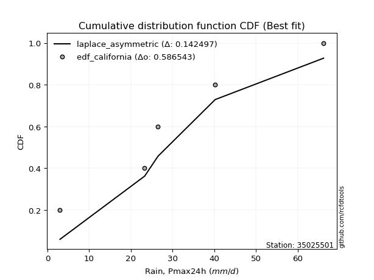</img>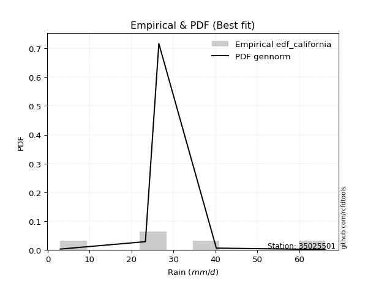</img>

</div>


### 2. EDF Hazen (1930)

Hazen method for plotting positions is a formula used to estimate the empirical cumulative probability distribution of flood events or other hydrological data. This formula often results in biased estimations, particularly when extrapolating to extreme events (high return periods).

<div align="center">


$P=(m-0.5)/n$


</div>


**2.1. Empirical values**

<div align="center">

|                | 0                  | 1                  | 2         | 3                 | 4                  |
|:---------------|:-------------------|:-------------------|:----------|:------------------|:-------------------|
| date           | 2021               | 2017               | 2019      | 2020              | 2018               |
| x              | 3.0                | 23.3               | 26.5      | 40.2              | 66.2               |
| m              | 1                  | 2                  | 3         | 4                 | 5                  |
| empirical_dist | edf_hazen          | edf_hazen          | edf_hazen | edf_hazen         | edf_hazen          |
| empirical      | 0.1                | 0.3                | 0.5       | 0.7               | 0.9                |
| empirical_tr   | 1.1111111111111112 | 1.4285714285714286 | 2.0       | 3.333333333333333 | 10.000000000000002 |

</div>


**2.2. Kolmogorov-Smirnov fit test (sorted by Δ)**


<div align="center">

|                | 0                   | 1                   | 2                   | 3                   | 4                   | 5                   | 6                   | 7                   | 8                   | 9                   | 10                  | 11                  | 12                  | 13                  | 14                  | 15                  | 16                  | 17                  | 18                  | 19                  | 20                  | 21                  | 22                  | 23                  | 24                  | 25                  | 26                  | 27                 | 28                  | 29                 | 30                  | 31                  | 32                  | 33                 | 34                  | 35                  | 36                  | 37                  | 38                 | 39                    | 40                  | 41                 | 42                  | 43                  | 44                  | 45                  | 46                 | 47                  | 48                  | 49                  | 50                  | 51                  | 52                  | 53                 | 54                  | 55                 | 56                 | 57                  | 58                  | 59                 | 60                  | 61                 | 62                 | 63                  | 64                 | 65                 | 66                 | 67                 | 68                  | 69                  | 70                 | 71                 | 72                 | 73                  | 74                  | 75                  | 76                  | 77                  | 78                 | 79                 | 80                  | 81                  | 82                  | 83                 | 84                 | 85                 | 86                 | 87                 |
|:---------------|:--------------------|:--------------------|:--------------------|:--------------------|:--------------------|:--------------------|:--------------------|:--------------------|:--------------------|:--------------------|:--------------------|:--------------------|:--------------------|:--------------------|:--------------------|:--------------------|:--------------------|:--------------------|:--------------------|:--------------------|:--------------------|:--------------------|:--------------------|:--------------------|:--------------------|:--------------------|:--------------------|:-------------------|:--------------------|:-------------------|:--------------------|:--------------------|:--------------------|:-------------------|:--------------------|:--------------------|:--------------------|:--------------------|:-------------------|:----------------------|:--------------------|:-------------------|:--------------------|:--------------------|:--------------------|:--------------------|:-------------------|:--------------------|:--------------------|:--------------------|:--------------------|:--------------------|:--------------------|:-------------------|:--------------------|:-------------------|:-------------------|:--------------------|:--------------------|:-------------------|:--------------------|:-------------------|:-------------------|:--------------------|:-------------------|:-------------------|:-------------------|:-------------------|:--------------------|:--------------------|:-------------------|:-------------------|:-------------------|:--------------------|:--------------------|:--------------------|:--------------------|:--------------------|:-------------------|:-------------------|:--------------------|:--------------------|:--------------------|:-------------------|:-------------------|:-------------------|:-------------------|:-------------------|
| station        | 35025501            | 35025501            | 35025501            | 35025501            | 35025501            | 35025501            | 35025501            | 35025501            | 35025501            | 35025501            | 35025501            | 35025501            | 35025501            | 35025501            | 35025501            | 35025501            | 35025501            | 35025501            | 35025501            | 35025501            | 35025501            | 35025501            | 35025501            | 35025501            | 35025501            | 35025501            | 35025501            | 35025501           | 35025501            | 35025501           | 35025501            | 35025501            | 35025501            | 35025501           | 35025501            | 35025501            | 35025501            | 35025501            | 35025501           | 35025501              | 35025501            | 35025501           | 35025501            | 35025501            | 35025501            | 35025501            | 35025501           | 35025501            | 35025501            | 35025501            | 35025501            | 35025501            | 35025501            | 35025501           | 35025501            | 35025501           | 35025501           | 35025501            | 35025501            | 35025501           | 35025501            | 35025501           | 35025501           | 35025501            | 35025501           | 35025501           | 35025501           | 35025501           | 35025501            | 35025501            | 35025501           | 35025501           | 35025501           | 35025501            | 35025501            | 35025501            | 35025501            | 35025501            | 35025501           | 35025501           | 35025501            | 35025501            | 35025501            | 35025501           | 35025501           | 35025501           | 35025501           | 35025501           |
| empirical_dist | edf_hazen           | edf_hazen           | edf_hazen           | edf_hazen           | edf_hazen           | edf_hazen           | edf_hazen           | edf_hazen           | edf_hazen           | edf_hazen           | edf_hazen           | edf_hazen           | edf_hazen           | edf_hazen           | edf_hazen           | edf_hazen           | edf_hazen           | edf_hazen           | edf_hazen           | edf_hazen           | edf_hazen           | edf_hazen           | edf_hazen           | edf_hazen           | edf_hazen           | edf_hazen           | edf_hazen           | edf_hazen          | edf_hazen           | edf_hazen          | edf_hazen           | edf_hazen           | edf_hazen           | edf_hazen          | edf_hazen           | edf_hazen           | edf_hazen           | edf_hazen           | edf_hazen          | edf_hazen             | edf_hazen           | edf_hazen          | edf_hazen           | edf_hazen           | edf_hazen           | edf_hazen           | edf_hazen          | edf_hazen           | edf_hazen           | edf_hazen           | edf_hazen           | edf_hazen           | edf_hazen           | edf_hazen          | edf_hazen           | edf_hazen          | edf_hazen          | edf_hazen           | edf_hazen           | edf_hazen          | edf_hazen           | edf_hazen          | edf_hazen          | edf_hazen           | edf_hazen          | edf_hazen          | edf_hazen          | edf_hazen          | edf_hazen           | edf_hazen           | edf_hazen          | edf_hazen          | edf_hazen          | edf_hazen           | edf_hazen           | edf_hazen           | edf_hazen           | edf_hazen           | edf_hazen          | edf_hazen          | edf_hazen           | edf_hazen           | edf_hazen           | edf_hazen          | edf_hazen          | edf_hazen          | edf_hazen          | edf_hazen          |
| p_dist         | laplace_asymmetric  | nct                 | rice                | fisk                | maxwell             | exponnorm           | invgamma            | logjohnsonsu        | pearson3            | johnsonsu           | rayleigh            | invgauss            | gumbel_r            | genlogistic         | logloggamma         | gompertz            | mielke              | t                   | crystalball         | truncnorm           | norm                | moyal               | kstwobign           | logmielke           | logistic            | halfnorm            | gibrat              | betaprime          | hypsecant           | halflogistic       | ncf                 | logweibull_min      | wald                | laplace            | logfisk             | logpearson3         | loggumbel_l         | gumbel_l            | loggompertz        | loglaplace_asymmetric | expon               | genexpon           | logf                | logexponnorm        | lognorm             | lognorm             | logcrystalball     | logt                | lognct              | logfatiguelife      | loglogistic         | logncf              | loghypsecant        | logrice            | logbetaprime        | loggamma           | loggamma           | logerlang           | logalpha            | loglaplace         | loginvgamma         | loginvgauss        | loginvweibull      | logmaxwell          | lograyleigh        | f                  | nakagami           | logkstwobign       | loggumbel_r         | logtruncnorm        | loghalfnorm        | loggenexpon        | lognakagami        | logmoyal            | loghalflogistic     | logexpon            | weibull_min         | loglognorm          | logwald            | loggibrat          | erlang              | alpha               | invweibull          | fatiguelife        | gamma              | logchi2            | chi2               | loggenlogistic     |
| delta          | 0.06209656857024709 | 0.06941848780114501 | 0.07132847221165156 | 0.07269087722026085 | 0.07278324718580753 | 0.07687486101923019 | 0.07727124303143507 | 0.07754730637230162 | 0.07902981418252875 | 0.08098884616795943 | 0.08473306719399293 | 0.08615280537821413 | 0.08740731606787683 | 0.09894216953194646 | 0.09992279815392235 | 0.09999999999966991 | 0.09999999999999959 | 0.10080715181857347 | 0.10084052916734004 | 0.10084053665530679 | 0.10084053866659848 | 0.10417196388927324 | 0.10657754809466807 | 0.11305955816626301 | 0.11383657397076785 | 0.11874210541757563 | 0.12162743928634734 | 0.1232827760058085 | 0.12446323376733781 | 0.1253148596792933 | 0.13860805644859076 | 0.13899696954240498 | 0.13984328816980146 | 0.1516375251527251 | 0.15185587100897469 | 0.15498847645657082 | 0.15583558253067858 | 0.16726544641227242 | 0.1676239901759768 | 0.18494094119347887   | 0.20533944303376944 | 0.2230528296515794 | 0.22469537602561035 | 0.22501203048660662 | 0.22501212005527277 | 0.22501212005527277 | 0.2250121324697531 | 0.22501245039462975 | 0.22531342069678667 | 0.22608984424675144 | 0.22841752388623476 | 0.23054889959719987 | 0.23131795887215528 | 0.2336603052900355 | 0.23459847579147314 | 0.2372006504405258 | 0.2372006504405258 | 0.23882994165408472 | 0.23994019581210274 | 0.2424508669794891 | 0.24682947354569024 | 0.2535835711805083 | 0.2568916054007501 | 0.25689406614155214 | 0.2673195592168445 | 0.2707707398385461 | 0.2877416151171835 | 0.2925238094313654 | 0.29567968481086654 | 0.29627343569391934 | 0.296676576996263  | 0.2986485174106808 | 0.299667744072275  | 0.32118237702106794 | 0.32296399688338145 | 0.34421405400473065 | 0.36141983330122013 | 0.38722099481576194 | 0.3919966044738609 | 0.4187167864709524 | 0.42713501963164285 | 0.47623211422703465 | 0.48463584421043826 | 0.5599143554103294 | 0.589589012938907  | 0.6408765797604616 | 0.6604739576978693 | 0.7                |
| deltao         | 0.5865427407550001  | 0.5865427407550001  | 0.5865427407550001  | 0.5865427407550001  | 0.5865427407550001  | 0.5865427407550001  | 0.5865427407550001  | 0.5865427407550001  | 0.5865427407550001  | 0.5865427407550001  | 0.5865427407550001  | 0.5865427407550001  | 0.5865427407550001  | 0.5865427407550001  | 0.5865427407550001  | 0.5865427407550001  | 0.5865427407550001  | 0.5865427407550001  | 0.5865427407550001  | 0.5865427407550001  | 0.5865427407550001  | 0.5865427407550001  | 0.5865427407550001  | 0.5865427407550001  | 0.5865427407550001  | 0.5865427407550001  | 0.5865427407550001  | 0.5865427407550001 | 0.5865427407550001  | 0.5865427407550001 | 0.5865427407550001  | 0.5865427407550001  | 0.5865427407550001  | 0.5865427407550001 | 0.5865427407550001  | 0.5865427407550001  | 0.5865427407550001  | 0.5865427407550001  | 0.5865427407550001 | 0.5865427407550001    | 0.5865427407550001  | 0.5865427407550001 | 0.5865427407550001  | 0.5865427407550001  | 0.5865427407550001  | 0.5865427407550001  | 0.5865427407550001 | 0.5865427407550001  | 0.5865427407550001  | 0.5865427407550001  | 0.5865427407550001  | 0.5865427407550001  | 0.5865427407550001  | 0.5865427407550001 | 0.5865427407550001  | 0.5865427407550001 | 0.5865427407550001 | 0.5865427407550001  | 0.5865427407550001  | 0.5865427407550001 | 0.5865427407550001  | 0.5865427407550001 | 0.5865427407550001 | 0.5865427407550001  | 0.5865427407550001 | 0.5865427407550001 | 0.5865427407550001 | 0.5865427407550001 | 0.5865427407550001  | 0.5865427407550001  | 0.5865427407550001 | 0.5865427407550001 | 0.5865427407550001 | 0.5865427407550001  | 0.5865427407550001  | 0.5865427407550001  | 0.5865427407550001  | 0.5865427407550001  | 0.5865427407550001 | 0.5865427407550001 | 0.5865427407550001  | 0.5865427407550001  | 0.5865427407550001  | 0.5865427407550001 | 0.5865427407550001 | 0.5865427407550001 | 0.5865427407550001 | 0.5865427407550001 |
| eval           | Δo > Δ              | Δo > Δ              | Δo > Δ              | Δo > Δ              | Δo > Δ              | Δo > Δ              | Δo > Δ              | Δo > Δ              | Δo > Δ              | Δo > Δ              | Δo > Δ              | Δo > Δ              | Δo > Δ              | Δo > Δ              | Δo > Δ              | Δo > Δ              | Δo > Δ              | Δo > Δ              | Δo > Δ              | Δo > Δ              | Δo > Δ              | Δo > Δ              | Δo > Δ              | Δo > Δ              | Δo > Δ              | Δo > Δ              | Δo > Δ              | Δo > Δ             | Δo > Δ              | Δo > Δ             | Δo > Δ              | Δo > Δ              | Δo > Δ              | Δo > Δ             | Δo > Δ              | Δo > Δ              | Δo > Δ              | Δo > Δ              | Δo > Δ             | Δo > Δ                | Δo > Δ              | Δo > Δ             | Δo > Δ              | Δo > Δ              | Δo > Δ              | Δo > Δ              | Δo > Δ             | Δo > Δ              | Δo > Δ              | Δo > Δ              | Δo > Δ              | Δo > Δ              | Δo > Δ              | Δo > Δ             | Δo > Δ              | Δo > Δ             | Δo > Δ             | Δo > Δ              | Δo > Δ              | Δo > Δ             | Δo > Δ              | Δo > Δ             | Δo > Δ             | Δo > Δ              | Δo > Δ             | Δo > Δ             | Δo > Δ             | Δo > Δ             | Δo > Δ              | Δo > Δ              | Δo > Δ             | Δo > Δ             | Δo > Δ             | Δo > Δ              | Δo > Δ              | Δo > Δ              | Δo > Δ              | Δo > Δ              | Δo > Δ             | Δo > Δ             | Δo > Δ              | Δo > Δ              | Δo > Δ              | Δo > Δ             | Δo <= Δ            | Δo <= Δ            | Δo <= Δ            | Δo <= Δ            |
| fit            | 1                   | 1                   | 1                   | 1                   | 1                   | 1                   | 1                   | 1                   | 1                   | 1                   | 1                   | 1                   | 1                   | 1                   | 1                   | 1                   | 1                   | 1                   | 1                   | 1                   | 1                   | 1                   | 1                   | 1                   | 1                   | 1                   | 1                   | 1                  | 1                   | 1                  | 1                   | 1                   | 1                   | 1                  | 1                   | 1                   | 1                   | 1                   | 1                  | 1                     | 1                   | 1                  | 1                   | 1                   | 1                   | 1                   | 1                  | 1                   | 1                   | 1                   | 1                   | 1                   | 1                   | 1                  | 1                   | 1                  | 1                  | 1                   | 1                   | 1                  | 1                   | 1                  | 1                  | 1                   | 1                  | 1                  | 1                  | 1                  | 1                   | 1                   | 1                  | 1                  | 1                  | 1                   | 1                   | 1                   | 1                   | 1                   | 1                  | 1                  | 1                   | 1                   | 1                   | 1                  | 0                  | 0                  | 0                  | 0                  |
| n              | 5                   | 5                   | 5                   | 5                   | 5                   | 5                   | 5                   | 5                   | 5                   | 5                   | 5                   | 5                   | 5                   | 5                   | 5                   | 5                   | 5                   | 5                   | 5                   | 5                   | 5                   | 5                   | 5                   | 5                   | 5                   | 5                   | 5                   | 5                  | 5                   | 5                  | 5                   | 5                   | 5                   | 5                  | 5                   | 5                   | 5                   | 5                   | 5                  | 5                     | 5                   | 5                  | 5                   | 5                   | 5                   | 5                   | 5                  | 5                   | 5                   | 5                   | 5                   | 5                   | 5                   | 5                  | 5                   | 5                  | 5                  | 5                   | 5                   | 5                  | 5                   | 5                  | 5                  | 5                   | 5                  | 5                  | 5                  | 5                  | 5                   | 5                   | 5                  | 5                  | 5                  | 5                   | 5                   | 5                   | 5                   | 5                   | 5                  | 5                  | 5                   | 5                   | 5                   | 5                  | 5                  | 5                  | 5                  | 5                  |
| best_fit       | 1                   | 0                   | 0                   | 0                   | 0                   | 0                   | 0                   | 0                   | 0                   | 0                   | 0                   | 0                   | 0                   | 0                   | 0                   | 0                   | 0                   | 0                   | 0                   | 0                   | 0                   | 0                   | 0                   | 0                   | 0                   | 0                   | 0                   | 0                  | 0                   | 0                  | 0                   | 0                   | 0                   | 0                  | 0                   | 0                   | 0                   | 0                   | 0                  | 0                     | 0                   | 0                  | 0                   | 0                   | 0                   | 0                   | 0                  | 0                   | 0                   | 0                   | 0                   | 0                   | 0                   | 0                  | 0                   | 0                  | 0                  | 0                   | 0                   | 0                  | 0                   | 0                  | 0                  | 0                   | 0                  | 0                  | 0                  | 0                  | 0                   | 0                   | 0                  | 0                  | 0                  | 0                   | 0                   | 0                   | 0                   | 0                   | 0                  | 0                  | 0                   | 0                   | 0                   | 0                  | 0                  | 0                  | 0                  | 0                  |
| best_fit_sort  | 1                   | 2                   | 3                   | 4                   | 5                   | 6                   | 7                   | 8                   | 9                   | 10                  | 11                  | 12                  | 13                  | 14                  | 15                  | 16                  | 17                  | 18                  | 19                  | 20                  | 21                  | 22                  | 23                  | 24                  | 25                  | 26                  | 27                  | 28                 | 29                  | 30                 | 31                  | 32                  | 33                  | 34                 | 35                  | 36                  | 37                  | 38                  | 39                 | 40                    | 41                  | 42                 | 43                  | 44                  | 45                  | 46                  | 47                 | 48                  | 49                  | 50                  | 51                  | 52                  | 53                  | 54                 | 55                  | 56                 | 57                 | 58                  | 59                  | 60                 | 61                  | 62                 | 63                 | 64                  | 65                 | 66                 | 67                 | 68                 | 69                  | 70                  | 71                 | 72                 | 73                 | 74                  | 75                  | 76                  | 77                  | 78                  | 79                 | 80                 | 81                  | 82                  | 83                  | 84                 | 85                 | 86                 | 87                 | 88                 |

</div>


**2.3. Best fit**

<div align="center">

|   id |   station | empirical_dist   | p_dist             |     delta |   deltao | eval   |   fit |   n |   best_fit |   best_fit_sort |
|-----:|----------:|:-----------------|:-------------------|----------:|---------:|:-------|------:|----:|-----------:|----------------:|
|    0 |  35025501 | edf_hazen        | laplace_asymmetric | 0.0620966 | 0.586543 | Δo > Δ |     1 |   5 |          1 |               1 |

</div>


<div align="center">

</img>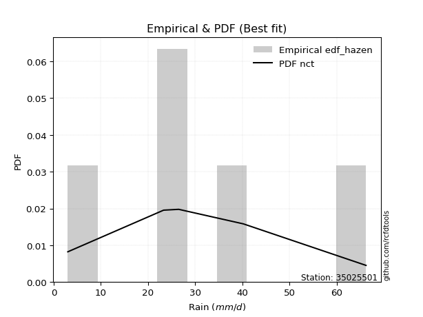</img>

</div>


### 3. EDF Weibull (1939)

Weibull plotting position formula is an empirical method used to estimate the non-exceedance probability or plotting position for a set of observed data, is often recommended or widely used in practice, particularly in flood frequency analysis.

<div align="center">


$P=m/(n+1)$


</div>


**3.1. Empirical values**

<div align="center">

|                | 0                   | 1                  | 2           | 3                  | 4                  |
|:---------------|:--------------------|:-------------------|:------------|:-------------------|:-------------------|
| date           | 2021                | 2017               | 2019        | 2020               | 2018               |
| x              | 3.0                 | 23.3               | 26.5        | 40.2               | 66.2               |
| m              | 1                   | 2                  | 3           | 4                  | 5                  |
| empirical_dist | edf_weibull         | edf_weibull        | edf_weibull | edf_weibull        | edf_weibull        |
| empirical      | 0.16666666666666666 | 0.3333333333333333 | 0.5         | 0.6666666666666666 | 0.8333333333333334 |
| empirical_tr   | 1.2                 | 1.4999999999999998 | 2.0         | 2.9999999999999996 | 6.000000000000002  |

</div>


**3.2. Kolmogorov-Smirnov fit test (sorted by Δ)**


<div align="center">

|                | 0                   | 1                   | 2                   | 3                   | 4                   | 5                   | 6                  | 7                   | 8                   | 9                   | 10                  | 11                 | 12                 | 13                 | 14                  | 15                  | 16                  | 17                  | 18                  | 19                  | 20                 | 21                  | 22                  | 23                  | 24                 | 25                  | 26                  | 27                    | 28                 | 29                  | 30                  | 31                 | 32                  | 33                  | 34                  | 35                  | 36                  | 37                  | 38                  | 39                  | 40                  | 41                  | 42                  | 43                 | 44                  | 45                  | 46                  | 47                  | 48                  | 49                 | 50                  | 51                  | 52                  | 53                  | 54                 | 55                  | 56                  | 57                 | 58                  | 59                  | 60                 | 61                  | 62                 | 63                 | 64                 | 65                  | 66                  | 67                 | 68                 | 69                 | 70                  | 71                 | 72                 | 73                  | 74                 | 75                 | 76                 | 77                 | 78                 | 79                  | 80                  | 81                 | 82                 | 83                 | 84                 | 85                 | 86                 | 87                 |
|:---------------|:--------------------|:--------------------|:--------------------|:--------------------|:--------------------|:--------------------|:-------------------|:--------------------|:--------------------|:--------------------|:--------------------|:-------------------|:-------------------|:-------------------|:--------------------|:--------------------|:--------------------|:--------------------|:--------------------|:--------------------|:-------------------|:--------------------|:--------------------|:--------------------|:-------------------|:--------------------|:--------------------|:----------------------|:-------------------|:--------------------|:--------------------|:-------------------|:--------------------|:--------------------|:--------------------|:--------------------|:--------------------|:--------------------|:--------------------|:--------------------|:--------------------|:--------------------|:--------------------|:-------------------|:--------------------|:--------------------|:--------------------|:--------------------|:--------------------|:-------------------|:--------------------|:--------------------|:--------------------|:--------------------|:-------------------|:--------------------|:--------------------|:-------------------|:--------------------|:--------------------|:-------------------|:--------------------|:-------------------|:-------------------|:-------------------|:--------------------|:--------------------|:-------------------|:-------------------|:-------------------|:--------------------|:-------------------|:-------------------|:--------------------|:-------------------|:-------------------|:-------------------|:-------------------|:-------------------|:--------------------|:--------------------|:-------------------|:-------------------|:-------------------|:-------------------|:-------------------|:-------------------|:-------------------|
| station        | 35025501            | 35025501            | 35025501            | 35025501            | 35025501            | 35025501            | 35025501           | 35025501            | 35025501            | 35025501            | 35025501            | 35025501           | 35025501           | 35025501           | 35025501            | 35025501            | 35025501            | 35025501            | 35025501            | 35025501            | 35025501           | 35025501            | 35025501            | 35025501            | 35025501           | 35025501            | 35025501            | 35025501              | 35025501           | 35025501            | 35025501            | 35025501           | 35025501            | 35025501            | 35025501            | 35025501            | 35025501            | 35025501            | 35025501            | 35025501            | 35025501            | 35025501            | 35025501            | 35025501           | 35025501            | 35025501            | 35025501            | 35025501            | 35025501            | 35025501           | 35025501            | 35025501            | 35025501            | 35025501            | 35025501           | 35025501            | 35025501            | 35025501           | 35025501            | 35025501            | 35025501           | 35025501            | 35025501           | 35025501           | 35025501           | 35025501            | 35025501            | 35025501           | 35025501           | 35025501           | 35025501            | 35025501           | 35025501           | 35025501            | 35025501           | 35025501           | 35025501           | 35025501           | 35025501           | 35025501            | 35025501            | 35025501           | 35025501           | 35025501           | 35025501           | 35025501           | 35025501           | 35025501           |
| empirical_dist | edf_weibull         | edf_weibull         | edf_weibull         | edf_weibull         | edf_weibull         | edf_weibull         | edf_weibull        | edf_weibull         | edf_weibull         | edf_weibull         | edf_weibull         | edf_weibull        | edf_weibull        | edf_weibull        | edf_weibull         | edf_weibull         | edf_weibull         | edf_weibull         | edf_weibull         | edf_weibull         | edf_weibull        | edf_weibull         | edf_weibull         | edf_weibull         | edf_weibull        | edf_weibull         | edf_weibull         | edf_weibull           | edf_weibull        | edf_weibull         | edf_weibull         | edf_weibull        | edf_weibull         | edf_weibull         | edf_weibull         | edf_weibull         | edf_weibull         | edf_weibull         | edf_weibull         | edf_weibull         | edf_weibull         | edf_weibull         | edf_weibull         | edf_weibull        | edf_weibull         | edf_weibull         | edf_weibull         | edf_weibull         | edf_weibull         | edf_weibull        | edf_weibull         | edf_weibull         | edf_weibull         | edf_weibull         | edf_weibull        | edf_weibull         | edf_weibull         | edf_weibull        | edf_weibull         | edf_weibull         | edf_weibull        | edf_weibull         | edf_weibull        | edf_weibull        | edf_weibull        | edf_weibull         | edf_weibull         | edf_weibull        | edf_weibull        | edf_weibull        | edf_weibull         | edf_weibull        | edf_weibull        | edf_weibull         | edf_weibull        | edf_weibull        | edf_weibull        | edf_weibull        | edf_weibull        | edf_weibull         | edf_weibull         | edf_weibull        | edf_weibull        | edf_weibull        | edf_weibull        | edf_weibull        | edf_weibull        | edf_weibull        |
| p_dist         | nct                 | exponnorm           | maxwell             | fisk                | invgamma            | johnsonsu           | laplace_asymmetric | rayleigh            | pearson3            | invgauss            | genlogistic         | kstwobign          | logjohnsonsu       | norm               | truncnorm           | crystalball         | t                   | betaprime           | rice                | logistic            | logpearson3        | loggumbel_l         | ncf                 | hypsecant           | gumbel_r           | logweibull_min      | logfisk             | loglaplace_asymmetric | laplace            | moyal               | logmielke           | logloggamma        | loggompertz         | gompertz            | mielke              | gibrat              | wald                | halflogistic        | halfnorm            | gumbel_l            | expon               | genexpon            | logf                | logexponnorm       | lognorm             | lognorm             | logcrystalball      | logt                | lognct              | logfatiguelife     | loglogistic         | logncf              | loghypsecant        | logrice             | logbetaprime       | loggamma            | loggamma            | logerlang          | logalpha            | loglaplace          | loginvgamma        | loginvgauss         | loginvweibull      | logmaxwell         | lograyleigh        | f                   | nakagami            | logkstwobign       | loggumbel_r        | logtruncnorm       | loghalfnorm         | loggenexpon        | logmoyal           | loghalflogistic     | logexpon           | weibull_min        | lognakagami        | loglognorm         | logwald            | loggibrat           | erlang              | invweibull         | alpha              | fatiguelife        | gamma              | logchi2            | chi2               | loggenlogistic     |
| delta          | 0.10169361551283995 | 0.10315203876197218 | 0.10391527512024523 | 0.10487828348829786 | 0.10505436452426153 | 0.10669917011007157 | 0.1074387620741403 | 0.10751305740477463 | 0.10776886971813715 | 0.10822939875395017 | 0.10973866210306807 | 0.1113126297716822 | 0.1152142934993623 | 0.1165944578813276 | 0.11659445897686027 | 0.11659446469715518 | 0.11659742137345142 | 0.11684967664864801 | 0.11761171155084893 | 0.11842854633961886 | 0.1216551431232375 | 0.12250224919734526 | 0.12342709702539707 | 0.12446323376733781 | 0.1296376023781622 | 0.13367650908814274 | 0.14426420663379788 | 0.15160760786014554   | 0.1516375251527251 | 0.15253059691053014 | 0.16600210804709536 | 0.166589464820589  | 0.16666666557223392 | 0.16666666666633656 | 0.16666666666666624 | 0.16666666666666666 | 0.16666666666666666 | 0.16666666666666666 | 0.16666666666666666 | 0.16726544641227242 | 0.17200610970043612 | 0.18971949631824608 | 0.19136204269227702 | 0.1916786971532733 | 0.19167878672193944 | 0.19167878672193944 | 0.19167879913641978 | 0.19167911706129642 | 0.19198008736345334 | 0.1927565109134181 | 0.19508419055290144 | 0.19721556626386655 | 0.19798462553882196 | 0.20032697195670218 | 0.2012651424581398 | 0.20386731710719247 | 0.20386731710719247 | 0.2054966083207514 | 0.20660686247876942 | 0.20911753364615576 | 0.2134961402123569 | 0.22025023784717496 | 0.2235582720674168 | 0.2235607328082188 | 0.2339862258835112 | 0.23743740650521278 | 0.25440828178385017 | 0.2591904760980321 | 0.2623463514775332 | 0.262940102360586  | 0.26334324366292966 | 0.2653151840773475 | 0.2878490436877346 | 0.28963066355004813 | 0.3108807206713973 | 0.3280864999678868 | 0.3330010774056083 | 0.3538876614824286 | 0.3586632711405276 | 0.38538345313761907 | 0.39380168629830953 | 0.4179691775437716 | 0.4428987808937013 | 0.5265810220769962 | 0.5562556796055738 | 0.6075432464271284 | 0.6271406243645361 | 0.6666666666666666 |
| deltao         | 0.5865427407550001  | 0.5865427407550001  | 0.5865427407550001  | 0.5865427407550001  | 0.5865427407550001  | 0.5865427407550001  | 0.5865427407550001 | 0.5865427407550001  | 0.5865427407550001  | 0.5865427407550001  | 0.5865427407550001  | 0.5865427407550001 | 0.5865427407550001 | 0.5865427407550001 | 0.5865427407550001  | 0.5865427407550001  | 0.5865427407550001  | 0.5865427407550001  | 0.5865427407550001  | 0.5865427407550001  | 0.5865427407550001 | 0.5865427407550001  | 0.5865427407550001  | 0.5865427407550001  | 0.5865427407550001 | 0.5865427407550001  | 0.5865427407550001  | 0.5865427407550001    | 0.5865427407550001 | 0.5865427407550001  | 0.5865427407550001  | 0.5865427407550001 | 0.5865427407550001  | 0.5865427407550001  | 0.5865427407550001  | 0.5865427407550001  | 0.5865427407550001  | 0.5865427407550001  | 0.5865427407550001  | 0.5865427407550001  | 0.5865427407550001  | 0.5865427407550001  | 0.5865427407550001  | 0.5865427407550001 | 0.5865427407550001  | 0.5865427407550001  | 0.5865427407550001  | 0.5865427407550001  | 0.5865427407550001  | 0.5865427407550001 | 0.5865427407550001  | 0.5865427407550001  | 0.5865427407550001  | 0.5865427407550001  | 0.5865427407550001 | 0.5865427407550001  | 0.5865427407550001  | 0.5865427407550001 | 0.5865427407550001  | 0.5865427407550001  | 0.5865427407550001 | 0.5865427407550001  | 0.5865427407550001 | 0.5865427407550001 | 0.5865427407550001 | 0.5865427407550001  | 0.5865427407550001  | 0.5865427407550001 | 0.5865427407550001 | 0.5865427407550001 | 0.5865427407550001  | 0.5865427407550001 | 0.5865427407550001 | 0.5865427407550001  | 0.5865427407550001 | 0.5865427407550001 | 0.5865427407550001 | 0.5865427407550001 | 0.5865427407550001 | 0.5865427407550001  | 0.5865427407550001  | 0.5865427407550001 | 0.5865427407550001 | 0.5865427407550001 | 0.5865427407550001 | 0.5865427407550001 | 0.5865427407550001 | 0.5865427407550001 |
| eval           | Δo > Δ              | Δo > Δ              | Δo > Δ              | Δo > Δ              | Δo > Δ              | Δo > Δ              | Δo > Δ             | Δo > Δ              | Δo > Δ              | Δo > Δ              | Δo > Δ              | Δo > Δ             | Δo > Δ             | Δo > Δ             | Δo > Δ              | Δo > Δ              | Δo > Δ              | Δo > Δ              | Δo > Δ              | Δo > Δ              | Δo > Δ             | Δo > Δ              | Δo > Δ              | Δo > Δ              | Δo > Δ             | Δo > Δ              | Δo > Δ              | Δo > Δ                | Δo > Δ             | Δo > Δ              | Δo > Δ              | Δo > Δ             | Δo > Δ              | Δo > Δ              | Δo > Δ              | Δo > Δ              | Δo > Δ              | Δo > Δ              | Δo > Δ              | Δo > Δ              | Δo > Δ              | Δo > Δ              | Δo > Δ              | Δo > Δ             | Δo > Δ              | Δo > Δ              | Δo > Δ              | Δo > Δ              | Δo > Δ              | Δo > Δ             | Δo > Δ              | Δo > Δ              | Δo > Δ              | Δo > Δ              | Δo > Δ             | Δo > Δ              | Δo > Δ              | Δo > Δ             | Δo > Δ              | Δo > Δ              | Δo > Δ             | Δo > Δ              | Δo > Δ             | Δo > Δ             | Δo > Δ             | Δo > Δ              | Δo > Δ              | Δo > Δ             | Δo > Δ             | Δo > Δ             | Δo > Δ              | Δo > Δ             | Δo > Δ             | Δo > Δ              | Δo > Δ             | Δo > Δ             | Δo > Δ             | Δo > Δ             | Δo > Δ             | Δo > Δ              | Δo > Δ              | Δo > Δ             | Δo > Δ             | Δo > Δ             | Δo > Δ             | Δo <= Δ            | Δo <= Δ            | Δo <= Δ            |
| fit            | 1                   | 1                   | 1                   | 1                   | 1                   | 1                   | 1                  | 1                   | 1                   | 1                   | 1                   | 1                  | 1                  | 1                  | 1                   | 1                   | 1                   | 1                   | 1                   | 1                   | 1                  | 1                   | 1                   | 1                   | 1                  | 1                   | 1                   | 1                     | 1                  | 1                   | 1                   | 1                  | 1                   | 1                   | 1                   | 1                   | 1                   | 1                   | 1                   | 1                   | 1                   | 1                   | 1                   | 1                  | 1                   | 1                   | 1                   | 1                   | 1                   | 1                  | 1                   | 1                   | 1                   | 1                   | 1                  | 1                   | 1                   | 1                  | 1                   | 1                   | 1                  | 1                   | 1                  | 1                  | 1                  | 1                   | 1                   | 1                  | 1                  | 1                  | 1                   | 1                  | 1                  | 1                   | 1                  | 1                  | 1                  | 1                  | 1                  | 1                   | 1                   | 1                  | 1                  | 1                  | 1                  | 0                  | 0                  | 0                  |
| n              | 5                   | 5                   | 5                   | 5                   | 5                   | 5                   | 5                  | 5                   | 5                   | 5                   | 5                   | 5                  | 5                  | 5                  | 5                   | 5                   | 5                   | 5                   | 5                   | 5                   | 5                  | 5                   | 5                   | 5                   | 5                  | 5                   | 5                   | 5                     | 5                  | 5                   | 5                   | 5                  | 5                   | 5                   | 5                   | 5                   | 5                   | 5                   | 5                   | 5                   | 5                   | 5                   | 5                   | 5                  | 5                   | 5                   | 5                   | 5                   | 5                   | 5                  | 5                   | 5                   | 5                   | 5                   | 5                  | 5                   | 5                   | 5                  | 5                   | 5                   | 5                  | 5                   | 5                  | 5                  | 5                  | 5                   | 5                   | 5                  | 5                  | 5                  | 5                   | 5                  | 5                  | 5                   | 5                  | 5                  | 5                  | 5                  | 5                  | 5                   | 5                   | 5                  | 5                  | 5                  | 5                  | 5                  | 5                  | 5                  |
| best_fit       | 1                   | 0                   | 0                   | 0                   | 0                   | 0                   | 0                  | 0                   | 0                   | 0                   | 0                   | 0                  | 0                  | 0                  | 0                   | 0                   | 0                   | 0                   | 0                   | 0                   | 0                  | 0                   | 0                   | 0                   | 0                  | 0                   | 0                   | 0                     | 0                  | 0                   | 0                   | 0                  | 0                   | 0                   | 0                   | 0                   | 0                   | 0                   | 0                   | 0                   | 0                   | 0                   | 0                   | 0                  | 0                   | 0                   | 0                   | 0                   | 0                   | 0                  | 0                   | 0                   | 0                   | 0                   | 0                  | 0                   | 0                   | 0                  | 0                   | 0                   | 0                  | 0                   | 0                  | 0                  | 0                  | 0                   | 0                   | 0                  | 0                  | 0                  | 0                   | 0                  | 0                  | 0                   | 0                  | 0                  | 0                  | 0                  | 0                  | 0                   | 0                   | 0                  | 0                  | 0                  | 0                  | 0                  | 0                  | 0                  |
| best_fit_sort  | 1                   | 2                   | 3                   | 4                   | 5                   | 6                   | 7                  | 8                   | 9                   | 10                  | 11                  | 12                 | 13                 | 14                 | 15                  | 16                  | 17                  | 18                  | 19                  | 20                  | 21                 | 22                  | 23                  | 24                  | 25                 | 26                  | 27                  | 28                    | 29                 | 30                  | 31                  | 32                 | 33                  | 34                  | 35                  | 36                  | 37                  | 38                  | 39                  | 40                  | 41                  | 42                  | 43                  | 44                 | 45                  | 46                  | 47                  | 48                  | 49                  | 50                 | 51                  | 52                  | 53                  | 54                  | 55                 | 56                  | 57                  | 58                 | 59                  | 60                  | 61                 | 62                  | 63                 | 64                 | 65                 | 66                  | 67                  | 68                 | 69                 | 70                 | 71                  | 72                 | 73                 | 74                  | 75                 | 76                 | 77                 | 78                 | 79                 | 80                  | 81                  | 82                 | 83                 | 84                 | 85                 | 86                 | 87                 | 88                 |

</div>


**3.3. Best fit**

<div align="center">

|   id |   station | empirical_dist   | p_dist   |    delta |   deltao | eval   |   fit |   n |   best_fit |   best_fit_sort |
|-----:|----------:|:-----------------|:---------|---------:|---------:|:-------|------:|----:|-----------:|----------------:|
|    0 |  35025501 | edf_weibull      | nct      | 0.101694 | 0.586543 | Δo > Δ |     1 |   5 |          1 |               1 |

</div>


<div align="center">

</img></img>

</div>


### 4. EDF Beard (1943)

The Beard formula (or Beard´s plotting position formula) in hydrology is used to estimate the empirical non-exceedance probability _(P)_ of a flood event (or other extreme hydrological data point) within a given dataset.

<div align="center">


$P=(m-0.31)/(n+0.38)$


</div>


**4.1. Empirical values**

<div align="center">

|                | 0                   | 1                  | 2         | 3                  | 4                  |
|:---------------|:--------------------|:-------------------|:----------|:-------------------|:-------------------|
| date           | 2021                | 2017               | 2019      | 2020               | 2018               |
| x              | 3.0                 | 23.3               | 26.5      | 40.2               | 66.2               |
| m              | 1                   | 2                  | 3         | 4                  | 5                  |
| empirical_dist | edf_beard           | edf_beard          | edf_beard | edf_beard          | edf_beard          |
| empirical      | 0.12825278810408922 | 0.3141263940520446 | 0.5       | 0.6858736059479554 | 0.8717472118959109 |
| empirical_tr   | 1.1471215351812367  | 1.4579945799457996 | 2.0       | 3.183431952662722  | 7.797101449275368  |

</div>


**4.2. Kolmogorov-Smirnov fit test (sorted by Δ)**


<div align="center">

|                | 0                   | 1                   | 2                   | 3                   | 4                   | 5                   | 6                   | 7                  | 8                   | 9                   | 10                  | 11                  | 12                  | 13                  | 14                  | 15                  | 16                  | 17                  | 18                  | 19                  | 20                  | 21                 | 22                  | 23                  | 24                  | 25                  | 26                 | 27                  | 28                 | 29                  | 30                  | 31                  | 32                  | 33                  | 34                 | 35                  | 36                 | 37                  | 38                  | 39                    | 40                 | 41                  | 42                  | 43                  | 44                  | 45                  | 46                  | 47                  | 48                  | 49                 | 50                  | 51                  | 52                  | 53                  | 54                 | 55                  | 56                  | 57                 | 58                 | 59                  | 60                 | 61                  | 62                 | 63                 | 64                 | 65                  | 66                  | 67                 | 68                 | 69                 | 70                  | 71                 | 72                 | 73                 | 74                 | 75                 | 76                 | 77                 | 78                 | 79                  | 80                 | 81                 | 82                 | 83                 | 84                 | 85                 | 86                 | 87                 |
|:---------------|:--------------------|:--------------------|:--------------------|:--------------------|:--------------------|:--------------------|:--------------------|:-------------------|:--------------------|:--------------------|:--------------------|:--------------------|:--------------------|:--------------------|:--------------------|:--------------------|:--------------------|:--------------------|:--------------------|:--------------------|:--------------------|:-------------------|:--------------------|:--------------------|:--------------------|:--------------------|:-------------------|:--------------------|:-------------------|:--------------------|:--------------------|:--------------------|:--------------------|:--------------------|:-------------------|:--------------------|:-------------------|:--------------------|:--------------------|:----------------------|:-------------------|:--------------------|:--------------------|:--------------------|:--------------------|:--------------------|:--------------------|:--------------------|:--------------------|:-------------------|:--------------------|:--------------------|:--------------------|:--------------------|:-------------------|:--------------------|:--------------------|:-------------------|:-------------------|:--------------------|:-------------------|:--------------------|:-------------------|:-------------------|:-------------------|:--------------------|:--------------------|:-------------------|:-------------------|:-------------------|:--------------------|:-------------------|:-------------------|:-------------------|:-------------------|:-------------------|:-------------------|:-------------------|:-------------------|:--------------------|:-------------------|:-------------------|:-------------------|:-------------------|:-------------------|:-------------------|:-------------------|:-------------------|
| station        | 35025501            | 35025501            | 35025501            | 35025501            | 35025501            | 35025501            | 35025501            | 35025501           | 35025501            | 35025501            | 35025501            | 35025501            | 35025501            | 35025501            | 35025501            | 35025501            | 35025501            | 35025501            | 35025501            | 35025501            | 35025501            | 35025501           | 35025501            | 35025501            | 35025501            | 35025501            | 35025501           | 35025501            | 35025501           | 35025501            | 35025501            | 35025501            | 35025501            | 35025501            | 35025501           | 35025501            | 35025501           | 35025501            | 35025501            | 35025501              | 35025501           | 35025501            | 35025501            | 35025501            | 35025501            | 35025501            | 35025501            | 35025501            | 35025501            | 35025501           | 35025501            | 35025501            | 35025501            | 35025501            | 35025501           | 35025501            | 35025501            | 35025501           | 35025501           | 35025501            | 35025501           | 35025501            | 35025501           | 35025501           | 35025501           | 35025501            | 35025501            | 35025501           | 35025501           | 35025501           | 35025501            | 35025501           | 35025501           | 35025501           | 35025501           | 35025501           | 35025501           | 35025501           | 35025501           | 35025501            | 35025501           | 35025501           | 35025501           | 35025501           | 35025501           | 35025501           | 35025501           | 35025501           |
| empirical_dist | edf_beard           | edf_beard           | edf_beard           | edf_beard           | edf_beard           | edf_beard           | edf_beard           | edf_beard          | edf_beard           | edf_beard           | edf_beard           | edf_beard           | edf_beard           | edf_beard           | edf_beard           | edf_beard           | edf_beard           | edf_beard           | edf_beard           | edf_beard           | edf_beard           | edf_beard          | edf_beard           | edf_beard           | edf_beard           | edf_beard           | edf_beard          | edf_beard           | edf_beard          | edf_beard           | edf_beard           | edf_beard           | edf_beard           | edf_beard           | edf_beard          | edf_beard           | edf_beard          | edf_beard           | edf_beard           | edf_beard             | edf_beard          | edf_beard           | edf_beard           | edf_beard           | edf_beard           | edf_beard           | edf_beard           | edf_beard           | edf_beard           | edf_beard          | edf_beard           | edf_beard           | edf_beard           | edf_beard           | edf_beard          | edf_beard           | edf_beard           | edf_beard          | edf_beard          | edf_beard           | edf_beard          | edf_beard           | edf_beard          | edf_beard          | edf_beard          | edf_beard           | edf_beard           | edf_beard          | edf_beard          | edf_beard          | edf_beard           | edf_beard          | edf_beard          | edf_beard          | edf_beard          | edf_beard          | edf_beard          | edf_beard          | edf_beard          | edf_beard           | edf_beard          | edf_beard          | edf_beard          | edf_beard          | edf_beard          | edf_beard          | edf_beard          | edf_beard          |
| p_dist         | exponnorm           | fisk                | invgamma            | maxwell             | nct                 | johnsonsu           | laplace_asymmetric  | rayleigh           | invgauss            | logjohnsonsu        | pearson3            | rice                | genlogistic         | gumbel_r            | kstwobign           | t                   | crystalball         | truncnorm           | norm                | betaprime           | logistic            | moyal              | hypsecant           | ncf                 | logweibull_min      | logmielke           | logloggamma        | gompertz            | mielke             | halflogistic        | wald                | halfnorm            | gibrat              | logfisk             | logpearson3        | loggumbel_l         | laplace            | loggompertz         | gumbel_l            | loglaplace_asymmetric | expon              | genexpon            | logf                | logexponnorm        | lognorm             | lognorm             | logcrystalball      | logt                | lognct              | logfatiguelife     | loglogistic         | logncf              | loghypsecant        | logrice             | logbetaprime       | loggamma            | loggamma            | logerlang          | logalpha           | loglaplace          | loginvgamma        | loginvgauss         | loginvweibull      | logmaxwell         | lograyleigh        | f                   | nakagami            | logkstwobign       | loggumbel_r        | logtruncnorm       | loghalfnorm         | loggenexpon        | logmoyal           | loghalflogistic    | lognakagami        | logexpon           | weibull_min        | loglognorm         | logwald            | loggibrat           | erlang             | invweibull         | alpha              | fatiguelife        | gamma              | logchi2            | chi2               | loggenlogistic     |
| delta          | 0.06473816019939474 | 0.06646440492572042 | 0.06664048596168409 | 0.06684396490630579 | 0.06753810034408325 | 0.06828529154749413 | 0.06902488351156286 | 0.0706066731419483 | 0.07202641132616949 | 0.07754730637230162 | 0.07902981418252875 | 0.07919783298827149 | 0.08481577547990182 | 0.09122372381558475 | 0.09245115404262344 | 0.10080715181857347 | 0.10084052916734004 | 0.10084053665530679 | 0.10084053866659848 | 0.10915638195376387 | 0.11383657397076785 | 0.1141167183479527 | 0.12446323376733781 | 0.12448166239654612 | 0.12487057549036035 | 0.12758822948451787 | 0.1281755862580115 | 0.12825278810375912 | 0.1282527881040888 | 0.12825278810408922 | 0.12825278810408922 | 0.12825278810408922 | 0.13575383333839186 | 0.13772947695693005 | 0.1408620824045262 | 0.14170918847863395 | 0.1516375251527251 | 0.15349759612393216 | 0.16726544641227242 | 0.17081454714143424   | 0.1912130489817248 | 0.20892643559953478 | 0.21056898197356572 | 0.21088563643456198 | 0.21088572600322814 | 0.21088572600322814 | 0.21088573841770847 | 0.21088605634258512 | 0.21118702664474204 | 0.2119634501947068 | 0.21429112983419013 | 0.21642250554515524 | 0.21719156482011065 | 0.21953391123799088 | 0.2204720817394285 | 0.22307425638848116 | 0.22307425638848116 | 0.2247035476020401 | 0.2258138017600581 | 0.22832447292744446 | 0.2327030794936456 | 0.23945717712846365 | 0.2427652113487055 | 0.2427676720895075 | 0.2531931651647999 | 0.25664434578650147 | 0.27361522106513886 | 0.2783974153793208 | 0.2815532907588219 | 0.2821470416418747 | 0.28255018294421835 | 0.2845221233586362 | 0.3070559829690233 | 0.3088376028313368 | 0.3137941381243196 | 0.330087659952686  | 0.3472934392491755 | 0.3730946007637173 | 0.3778702104218163 | 0.40459039241890776 | 0.4130086255795982 | 0.4563830561063491 | 0.46210572017499   | 0.5457879613582848 | 0.5754626188868623 | 0.626750185708417  | 0.6463475636458247 | 0.6858736059479554 |
| deltao         | 0.5865427407550001  | 0.5865427407550001  | 0.5865427407550001  | 0.5865427407550001  | 0.5865427407550001  | 0.5865427407550001  | 0.5865427407550001  | 0.5865427407550001 | 0.5865427407550001  | 0.5865427407550001  | 0.5865427407550001  | 0.5865427407550001  | 0.5865427407550001  | 0.5865427407550001  | 0.5865427407550001  | 0.5865427407550001  | 0.5865427407550001  | 0.5865427407550001  | 0.5865427407550001  | 0.5865427407550001  | 0.5865427407550001  | 0.5865427407550001 | 0.5865427407550001  | 0.5865427407550001  | 0.5865427407550001  | 0.5865427407550001  | 0.5865427407550001 | 0.5865427407550001  | 0.5865427407550001 | 0.5865427407550001  | 0.5865427407550001  | 0.5865427407550001  | 0.5865427407550001  | 0.5865427407550001  | 0.5865427407550001 | 0.5865427407550001  | 0.5865427407550001 | 0.5865427407550001  | 0.5865427407550001  | 0.5865427407550001    | 0.5865427407550001 | 0.5865427407550001  | 0.5865427407550001  | 0.5865427407550001  | 0.5865427407550001  | 0.5865427407550001  | 0.5865427407550001  | 0.5865427407550001  | 0.5865427407550001  | 0.5865427407550001 | 0.5865427407550001  | 0.5865427407550001  | 0.5865427407550001  | 0.5865427407550001  | 0.5865427407550001 | 0.5865427407550001  | 0.5865427407550001  | 0.5865427407550001 | 0.5865427407550001 | 0.5865427407550001  | 0.5865427407550001 | 0.5865427407550001  | 0.5865427407550001 | 0.5865427407550001 | 0.5865427407550001 | 0.5865427407550001  | 0.5865427407550001  | 0.5865427407550001 | 0.5865427407550001 | 0.5865427407550001 | 0.5865427407550001  | 0.5865427407550001 | 0.5865427407550001 | 0.5865427407550001 | 0.5865427407550001 | 0.5865427407550001 | 0.5865427407550001 | 0.5865427407550001 | 0.5865427407550001 | 0.5865427407550001  | 0.5865427407550001 | 0.5865427407550001 | 0.5865427407550001 | 0.5865427407550001 | 0.5865427407550001 | 0.5865427407550001 | 0.5865427407550001 | 0.5865427407550001 |
| eval           | Δo > Δ              | Δo > Δ              | Δo > Δ              | Δo > Δ              | Δo > Δ              | Δo > Δ              | Δo > Δ              | Δo > Δ             | Δo > Δ              | Δo > Δ              | Δo > Δ              | Δo > Δ              | Δo > Δ              | Δo > Δ              | Δo > Δ              | Δo > Δ              | Δo > Δ              | Δo > Δ              | Δo > Δ              | Δo > Δ              | Δo > Δ              | Δo > Δ             | Δo > Δ              | Δo > Δ              | Δo > Δ              | Δo > Δ              | Δo > Δ             | Δo > Δ              | Δo > Δ             | Δo > Δ              | Δo > Δ              | Δo > Δ              | Δo > Δ              | Δo > Δ              | Δo > Δ             | Δo > Δ              | Δo > Δ             | Δo > Δ              | Δo > Δ              | Δo > Δ                | Δo > Δ             | Δo > Δ              | Δo > Δ              | Δo > Δ              | Δo > Δ              | Δo > Δ              | Δo > Δ              | Δo > Δ              | Δo > Δ              | Δo > Δ             | Δo > Δ              | Δo > Δ              | Δo > Δ              | Δo > Δ              | Δo > Δ             | Δo > Δ              | Δo > Δ              | Δo > Δ             | Δo > Δ             | Δo > Δ              | Δo > Δ             | Δo > Δ              | Δo > Δ             | Δo > Δ             | Δo > Δ             | Δo > Δ              | Δo > Δ              | Δo > Δ             | Δo > Δ             | Δo > Δ             | Δo > Δ              | Δo > Δ             | Δo > Δ             | Δo > Δ             | Δo > Δ             | Δo > Δ             | Δo > Δ             | Δo > Δ             | Δo > Δ             | Δo > Δ              | Δo > Δ             | Δo > Δ             | Δo > Δ             | Δo > Δ             | Δo > Δ             | Δo <= Δ            | Δo <= Δ            | Δo <= Δ            |
| fit            | 1                   | 1                   | 1                   | 1                   | 1                   | 1                   | 1                   | 1                  | 1                   | 1                   | 1                   | 1                   | 1                   | 1                   | 1                   | 1                   | 1                   | 1                   | 1                   | 1                   | 1                   | 1                  | 1                   | 1                   | 1                   | 1                   | 1                  | 1                   | 1                  | 1                   | 1                   | 1                   | 1                   | 1                   | 1                  | 1                   | 1                  | 1                   | 1                   | 1                     | 1                  | 1                   | 1                   | 1                   | 1                   | 1                   | 1                   | 1                   | 1                   | 1                  | 1                   | 1                   | 1                   | 1                   | 1                  | 1                   | 1                   | 1                  | 1                  | 1                   | 1                  | 1                   | 1                  | 1                  | 1                  | 1                   | 1                   | 1                  | 1                  | 1                  | 1                   | 1                  | 1                  | 1                  | 1                  | 1                  | 1                  | 1                  | 1                  | 1                   | 1                  | 1                  | 1                  | 1                  | 1                  | 0                  | 0                  | 0                  |
| n              | 5                   | 5                   | 5                   | 5                   | 5                   | 5                   | 5                   | 5                  | 5                   | 5                   | 5                   | 5                   | 5                   | 5                   | 5                   | 5                   | 5                   | 5                   | 5                   | 5                   | 5                   | 5                  | 5                   | 5                   | 5                   | 5                   | 5                  | 5                   | 5                  | 5                   | 5                   | 5                   | 5                   | 5                   | 5                  | 5                   | 5                  | 5                   | 5                   | 5                     | 5                  | 5                   | 5                   | 5                   | 5                   | 5                   | 5                   | 5                   | 5                   | 5                  | 5                   | 5                   | 5                   | 5                   | 5                  | 5                   | 5                   | 5                  | 5                  | 5                   | 5                  | 5                   | 5                  | 5                  | 5                  | 5                   | 5                   | 5                  | 5                  | 5                  | 5                   | 5                  | 5                  | 5                  | 5                  | 5                  | 5                  | 5                  | 5                  | 5                   | 5                  | 5                  | 5                  | 5                  | 5                  | 5                  | 5                  | 5                  |
| best_fit       | 1                   | 0                   | 0                   | 0                   | 0                   | 0                   | 0                   | 0                  | 0                   | 0                   | 0                   | 0                   | 0                   | 0                   | 0                   | 0                   | 0                   | 0                   | 0                   | 0                   | 0                   | 0                  | 0                   | 0                   | 0                   | 0                   | 0                  | 0                   | 0                  | 0                   | 0                   | 0                   | 0                   | 0                   | 0                  | 0                   | 0                  | 0                   | 0                   | 0                     | 0                  | 0                   | 0                   | 0                   | 0                   | 0                   | 0                   | 0                   | 0                   | 0                  | 0                   | 0                   | 0                   | 0                   | 0                  | 0                   | 0                   | 0                  | 0                  | 0                   | 0                  | 0                   | 0                  | 0                  | 0                  | 0                   | 0                   | 0                  | 0                  | 0                  | 0                   | 0                  | 0                  | 0                  | 0                  | 0                  | 0                  | 0                  | 0                  | 0                   | 0                  | 0                  | 0                  | 0                  | 0                  | 0                  | 0                  | 0                  |
| best_fit_sort  | 1                   | 2                   | 3                   | 4                   | 5                   | 6                   | 7                   | 8                  | 9                   | 10                  | 11                  | 12                  | 13                  | 14                  | 15                  | 16                  | 17                  | 18                  | 19                  | 20                  | 21                  | 22                 | 23                  | 24                  | 25                  | 26                  | 27                 | 28                  | 29                 | 30                  | 31                  | 32                  | 33                  | 34                  | 35                 | 36                  | 37                 | 38                  | 39                  | 40                    | 41                 | 42                  | 43                  | 44                  | 45                  | 46                  | 47                  | 48                  | 49                  | 50                 | 51                  | 52                  | 53                  | 54                  | 55                 | 56                  | 57                  | 58                 | 59                 | 60                  | 61                 | 62                  | 63                 | 64                 | 65                 | 66                  | 67                  | 68                 | 69                 | 70                 | 71                  | 72                 | 73                 | 74                 | 75                 | 76                 | 77                 | 78                 | 79                 | 80                  | 81                 | 82                 | 83                 | 84                 | 85                 | 86                 | 87                 | 88                 |

</div>


**4.3. Best fit**

<div align="center">

|   id |   station | empirical_dist   | p_dist    |     delta |   deltao | eval   |   fit |   n |   best_fit |   best_fit_sort |
|-----:|----------:|:-----------------|:----------|----------:|---------:|:-------|------:|----:|-----------:|----------------:|
|    0 |  35025501 | edf_beard        | exponnorm | 0.0647382 | 0.586543 | Δo > Δ |     1 |   5 |          1 |               1 |

</div>


<div align="center">

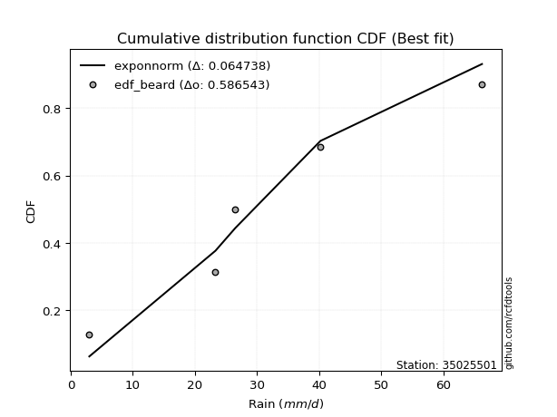</img></img>

</div>


### 5. EDF Chegodayev (1955)

The Chegodayev formula is an empirical plotting position formula used in hydrological frequency analysis to estimate the exceedance probability or return period of a specific event from a set of observed data. It is primarily used for plotting observed data points on probability paper to fit a theoretical distribution, particularly for analyzing extreme events like maximum flood flows or rainfall intensities. The constant _b_ value in the generalized plotting position formula is 0.3.

<div align="center">


$P=(m-b)/(n+1-2b)$


</div>


**5.1. Empirical values**

<div align="center">

|                | 0                   | 1                   | 2              | 3                  | 4                  |
|:---------------|:--------------------|:--------------------|:---------------|:-------------------|:-------------------|
| date           | 2021                | 2017                | 2019           | 2020               | 2018               |
| x              | 3.0                 | 23.3                | 26.5           | 40.2               | 66.2               |
| m              | 1                   | 2                   | 3              | 4                  | 5                  |
| empirical_dist | edf_chegodayev      | edf_chegodayev      | edf_chegodayev | edf_chegodayev     | edf_chegodayev     |
| empirical      | 0.12962962962962962 | 0.31481481481481477 | 0.5            | 0.6851851851851851 | 0.8703703703703703 |
| empirical_tr   | 1.148936170212766   | 1.4594594594594594  | 2.0            | 3.1764705882352935 | 7.714285714285713  |

</div>


**5.2. Kolmogorov-Smirnov fit test (sorted by Δ)**


<div align="center">

|                | 0                   | 1                   | 2                   | 3                   | 4                  | 5                   | 6                   | 7                   | 8                   | 9                   | 10                  | 11                 | 12                  | 13                  | 14                  | 15                  | 16                  | 17                  | 18                  | 19                  | 20                  | 21                 | 22                  | 23                 | 24                  | 25                  | 26                  | 27                  | 28                 | 29                  | 30                  | 31                  | 32                  | 33                 | 34                  | 35                 | 36                 | 37                 | 38                  | 39                    | 40                  | 41                  | 42                  | 43                  | 44                 | 45                 | 46                  | 47                  | 48                 | 49                  | 50                  | 51                 | 52                 | 53                  | 54                  | 55                  | 56                  | 57                  | 58                  | 59                 | 60                  | 61                 | 62                  | 63                  | 64                  | 65                 | 66                 | 67                  | 68                  | 69                  | 70                 | 71                  | 72                  | 73                 | 74                  | 75                  | 76                  | 77                  | 78                  | 79                 | 80                 | 81                 | 82                 | 83                 | 84                 | 85                 | 86                 | 87                 |
|:---------------|:--------------------|:--------------------|:--------------------|:--------------------|:-------------------|:--------------------|:--------------------|:--------------------|:--------------------|:--------------------|:--------------------|:-------------------|:--------------------|:--------------------|:--------------------|:--------------------|:--------------------|:--------------------|:--------------------|:--------------------|:--------------------|:-------------------|:--------------------|:-------------------|:--------------------|:--------------------|:--------------------|:--------------------|:-------------------|:--------------------|:--------------------|:--------------------|:--------------------|:-------------------|:--------------------|:-------------------|:-------------------|:-------------------|:--------------------|:----------------------|:--------------------|:--------------------|:--------------------|:--------------------|:-------------------|:-------------------|:--------------------|:--------------------|:-------------------|:--------------------|:--------------------|:-------------------|:-------------------|:--------------------|:--------------------|:--------------------|:--------------------|:--------------------|:--------------------|:-------------------|:--------------------|:-------------------|:--------------------|:--------------------|:--------------------|:-------------------|:-------------------|:--------------------|:--------------------|:--------------------|:-------------------|:--------------------|:--------------------|:-------------------|:--------------------|:--------------------|:--------------------|:--------------------|:--------------------|:-------------------|:-------------------|:-------------------|:-------------------|:-------------------|:-------------------|:-------------------|:-------------------|:-------------------|
| station        | 35025501            | 35025501            | 35025501            | 35025501            | 35025501           | 35025501            | 35025501            | 35025501            | 35025501            | 35025501            | 35025501            | 35025501           | 35025501            | 35025501            | 35025501            | 35025501            | 35025501            | 35025501            | 35025501            | 35025501            | 35025501            | 35025501           | 35025501            | 35025501           | 35025501            | 35025501            | 35025501            | 35025501            | 35025501           | 35025501            | 35025501            | 35025501            | 35025501            | 35025501           | 35025501            | 35025501           | 35025501           | 35025501           | 35025501            | 35025501              | 35025501            | 35025501            | 35025501            | 35025501            | 35025501           | 35025501           | 35025501            | 35025501            | 35025501           | 35025501            | 35025501            | 35025501           | 35025501           | 35025501            | 35025501            | 35025501            | 35025501            | 35025501            | 35025501            | 35025501           | 35025501            | 35025501           | 35025501            | 35025501            | 35025501            | 35025501           | 35025501           | 35025501            | 35025501            | 35025501            | 35025501           | 35025501            | 35025501            | 35025501           | 35025501            | 35025501            | 35025501            | 35025501            | 35025501            | 35025501           | 35025501           | 35025501           | 35025501           | 35025501           | 35025501           | 35025501           | 35025501           | 35025501           |
| empirical_dist | edf_chegodayev      | edf_chegodayev      | edf_chegodayev      | edf_chegodayev      | edf_chegodayev     | edf_chegodayev      | edf_chegodayev      | edf_chegodayev      | edf_chegodayev      | edf_chegodayev      | edf_chegodayev      | edf_chegodayev     | edf_chegodayev      | edf_chegodayev      | edf_chegodayev      | edf_chegodayev      | edf_chegodayev      | edf_chegodayev      | edf_chegodayev      | edf_chegodayev      | edf_chegodayev      | edf_chegodayev     | edf_chegodayev      | edf_chegodayev     | edf_chegodayev      | edf_chegodayev      | edf_chegodayev      | edf_chegodayev      | edf_chegodayev     | edf_chegodayev      | edf_chegodayev      | edf_chegodayev      | edf_chegodayev      | edf_chegodayev     | edf_chegodayev      | edf_chegodayev     | edf_chegodayev     | edf_chegodayev     | edf_chegodayev      | edf_chegodayev        | edf_chegodayev      | edf_chegodayev      | edf_chegodayev      | edf_chegodayev      | edf_chegodayev     | edf_chegodayev     | edf_chegodayev      | edf_chegodayev      | edf_chegodayev     | edf_chegodayev      | edf_chegodayev      | edf_chegodayev     | edf_chegodayev     | edf_chegodayev      | edf_chegodayev      | edf_chegodayev      | edf_chegodayev      | edf_chegodayev      | edf_chegodayev      | edf_chegodayev     | edf_chegodayev      | edf_chegodayev     | edf_chegodayev      | edf_chegodayev      | edf_chegodayev      | edf_chegodayev     | edf_chegodayev     | edf_chegodayev      | edf_chegodayev      | edf_chegodayev      | edf_chegodayev     | edf_chegodayev      | edf_chegodayev      | edf_chegodayev     | edf_chegodayev      | edf_chegodayev      | edf_chegodayev      | edf_chegodayev      | edf_chegodayev      | edf_chegodayev     | edf_chegodayev     | edf_chegodayev     | edf_chegodayev     | edf_chegodayev     | edf_chegodayev     | edf_chegodayev     | edf_chegodayev     | edf_chegodayev     |
| p_dist         | exponnorm           | maxwell             | nct                 | fisk                | invgamma           | johnsonsu           | laplace_asymmetric  | rayleigh            | invgauss            | logjohnsonsu        | pearson3            | rice               | genlogistic         | kstwobign           | gumbel_r            | t                   | crystalball         | truncnorm           | norm                | betaprime           | logistic            | moyal              | ncf                 | logweibull_min     | hypsecant           | logmielke           | logloggamma         | gompertz            | mielke             | halflogistic        | wald                | halfnorm            | gibrat              | logfisk            | logpearson3         | loggumbel_l        | laplace            | loggompertz        | gumbel_l            | loglaplace_asymmetric | expon               | genexpon            | logf                | logexponnorm        | lognorm            | lognorm            | logcrystalball      | logt                | lognct             | logfatiguelife      | loglogistic         | logncf             | loghypsecant       | logrice             | logbetaprime        | loggamma            | loggamma            | logerlang           | logalpha            | loglaplace         | loginvgamma         | loginvgauss        | loginvweibull       | logmaxwell          | lograyleigh         | f                  | nakagami           | logkstwobign        | loggumbel_r         | logtruncnorm        | loghalfnorm        | loggenexpon         | logmoyal            | loghalflogistic    | lognakagami         | logexpon            | weibull_min         | loglognorm          | logwald             | loggibrat          | erlang             | invweibull         | alpha              | fatiguelife        | gamma              | logchi2            | chi2               | loggenlogistic     |
| delta          | 0.06611500172493515 | 0.06687823808320825 | 0.06753810034408325 | 0.06784124645126083 | 0.0680173274872245 | 0.06966213307303454 | 0.07040172503710326 | 0.07047602036773759 | 0.07133799056339934 | 0.07817725646232532 | 0.07902981418252875 | 0.0805746745138119 | 0.08412735471713167 | 0.09176273327985329 | 0.09260056534112515 | 0.10080715181857347 | 0.10084052916734004 | 0.10084053665530679 | 0.10084053866659848 | 0.10846796119099372 | 0.11383657397076785 | 0.1154935598734931 | 0.12379324163377597 | 0.1241821547275902 | 0.12446323376733781 | 0.12896507101005839 | 0.12955242778355203 | 0.12962962962929953 | 0.1296296296296292 | 0.12962962962962962 | 0.12962962962962962 | 0.12962962962962962 | 0.13644225410116217 | 0.1370410561941599 | 0.14017366164175604 | 0.1410207677158638 | 0.1516375251527251 | 0.152809175361162  | 0.16726544641227242 | 0.1701261263786641    | 0.19052462821895466 | 0.20823801483676463 | 0.20988056121079557 | 0.21019721567179184 | 0.210197305240458  | 0.210197305240458  | 0.21019731765493832 | 0.21019763557981497 | 0.2104986058819719 | 0.21127502943193666 | 0.21360270907141998 | 0.2157340847823851 | 0.2165031440573405 | 0.21884549047522073 | 0.21978366097665836 | 0.22238583562571101 | 0.22238583562571101 | 0.22401512683926994 | 0.22512538099728796 | 0.2276360521646743 | 0.23201465873087546 | 0.2387687563656935 | 0.24207679058593534 | 0.24207925132673735 | 0.25250474440202975 | 0.2559559250237313 | 0.2729268003023687 | 0.27770899461655063 | 0.28086486999605176 | 0.28145862087910456 | 0.2818617621814482 | 0.28383370259586604 | 0.30636756220625316 | 0.3081491820685667 | 0.31448255888708976 | 0.32939923918991587 | 0.34660501848640535 | 0.37240618000094716 | 0.37718178965904614 | 0.4039019716561376 | 0.4123202048168281 | 0.4550062145808086 | 0.4614172994122199 | 0.5450995405955147 | 0.5747741981240923 | 0.6260617649456469 | 0.6456591428830546 | 0.6851851851851851 |
| deltao         | 0.5865427407550001  | 0.5865427407550001  | 0.5865427407550001  | 0.5865427407550001  | 0.5865427407550001 | 0.5865427407550001  | 0.5865427407550001  | 0.5865427407550001  | 0.5865427407550001  | 0.5865427407550001  | 0.5865427407550001  | 0.5865427407550001 | 0.5865427407550001  | 0.5865427407550001  | 0.5865427407550001  | 0.5865427407550001  | 0.5865427407550001  | 0.5865427407550001  | 0.5865427407550001  | 0.5865427407550001  | 0.5865427407550001  | 0.5865427407550001 | 0.5865427407550001  | 0.5865427407550001 | 0.5865427407550001  | 0.5865427407550001  | 0.5865427407550001  | 0.5865427407550001  | 0.5865427407550001 | 0.5865427407550001  | 0.5865427407550001  | 0.5865427407550001  | 0.5865427407550001  | 0.5865427407550001 | 0.5865427407550001  | 0.5865427407550001 | 0.5865427407550001 | 0.5865427407550001 | 0.5865427407550001  | 0.5865427407550001    | 0.5865427407550001  | 0.5865427407550001  | 0.5865427407550001  | 0.5865427407550001  | 0.5865427407550001 | 0.5865427407550001 | 0.5865427407550001  | 0.5865427407550001  | 0.5865427407550001 | 0.5865427407550001  | 0.5865427407550001  | 0.5865427407550001 | 0.5865427407550001 | 0.5865427407550001  | 0.5865427407550001  | 0.5865427407550001  | 0.5865427407550001  | 0.5865427407550001  | 0.5865427407550001  | 0.5865427407550001 | 0.5865427407550001  | 0.5865427407550001 | 0.5865427407550001  | 0.5865427407550001  | 0.5865427407550001  | 0.5865427407550001 | 0.5865427407550001 | 0.5865427407550001  | 0.5865427407550001  | 0.5865427407550001  | 0.5865427407550001 | 0.5865427407550001  | 0.5865427407550001  | 0.5865427407550001 | 0.5865427407550001  | 0.5865427407550001  | 0.5865427407550001  | 0.5865427407550001  | 0.5865427407550001  | 0.5865427407550001 | 0.5865427407550001 | 0.5865427407550001 | 0.5865427407550001 | 0.5865427407550001 | 0.5865427407550001 | 0.5865427407550001 | 0.5865427407550001 | 0.5865427407550001 |
| eval           | Δo > Δ              | Δo > Δ              | Δo > Δ              | Δo > Δ              | Δo > Δ             | Δo > Δ              | Δo > Δ              | Δo > Δ              | Δo > Δ              | Δo > Δ              | Δo > Δ              | Δo > Δ             | Δo > Δ              | Δo > Δ              | Δo > Δ              | Δo > Δ              | Δo > Δ              | Δo > Δ              | Δo > Δ              | Δo > Δ              | Δo > Δ              | Δo > Δ             | Δo > Δ              | Δo > Δ             | Δo > Δ              | Δo > Δ              | Δo > Δ              | Δo > Δ              | Δo > Δ             | Δo > Δ              | Δo > Δ              | Δo > Δ              | Δo > Δ              | Δo > Δ             | Δo > Δ              | Δo > Δ             | Δo > Δ             | Δo > Δ             | Δo > Δ              | Δo > Δ                | Δo > Δ              | Δo > Δ              | Δo > Δ              | Δo > Δ              | Δo > Δ             | Δo > Δ             | Δo > Δ              | Δo > Δ              | Δo > Δ             | Δo > Δ              | Δo > Δ              | Δo > Δ             | Δo > Δ             | Δo > Δ              | Δo > Δ              | Δo > Δ              | Δo > Δ              | Δo > Δ              | Δo > Δ              | Δo > Δ             | Δo > Δ              | Δo > Δ             | Δo > Δ              | Δo > Δ              | Δo > Δ              | Δo > Δ             | Δo > Δ             | Δo > Δ              | Δo > Δ              | Δo > Δ              | Δo > Δ             | Δo > Δ              | Δo > Δ              | Δo > Δ             | Δo > Δ              | Δo > Δ              | Δo > Δ              | Δo > Δ              | Δo > Δ              | Δo > Δ             | Δo > Δ             | Δo > Δ             | Δo > Δ             | Δo > Δ             | Δo > Δ             | Δo <= Δ            | Δo <= Δ            | Δo <= Δ            |
| fit            | 1                   | 1                   | 1                   | 1                   | 1                  | 1                   | 1                   | 1                   | 1                   | 1                   | 1                   | 1                  | 1                   | 1                   | 1                   | 1                   | 1                   | 1                   | 1                   | 1                   | 1                   | 1                  | 1                   | 1                  | 1                   | 1                   | 1                   | 1                   | 1                  | 1                   | 1                   | 1                   | 1                   | 1                  | 1                   | 1                  | 1                  | 1                  | 1                   | 1                     | 1                   | 1                   | 1                   | 1                   | 1                  | 1                  | 1                   | 1                   | 1                  | 1                   | 1                   | 1                  | 1                  | 1                   | 1                   | 1                   | 1                   | 1                   | 1                   | 1                  | 1                   | 1                  | 1                   | 1                   | 1                   | 1                  | 1                  | 1                   | 1                   | 1                   | 1                  | 1                   | 1                   | 1                  | 1                   | 1                   | 1                   | 1                   | 1                   | 1                  | 1                  | 1                  | 1                  | 1                  | 1                  | 0                  | 0                  | 0                  |
| n              | 5                   | 5                   | 5                   | 5                   | 5                  | 5                   | 5                   | 5                   | 5                   | 5                   | 5                   | 5                  | 5                   | 5                   | 5                   | 5                   | 5                   | 5                   | 5                   | 5                   | 5                   | 5                  | 5                   | 5                  | 5                   | 5                   | 5                   | 5                   | 5                  | 5                   | 5                   | 5                   | 5                   | 5                  | 5                   | 5                  | 5                  | 5                  | 5                   | 5                     | 5                   | 5                   | 5                   | 5                   | 5                  | 5                  | 5                   | 5                   | 5                  | 5                   | 5                   | 5                  | 5                  | 5                   | 5                   | 5                   | 5                   | 5                   | 5                   | 5                  | 5                   | 5                  | 5                   | 5                   | 5                   | 5                  | 5                  | 5                   | 5                   | 5                   | 5                  | 5                   | 5                   | 5                  | 5                   | 5                   | 5                   | 5                   | 5                   | 5                  | 5                  | 5                  | 5                  | 5                  | 5                  | 5                  | 5                  | 5                  |
| best_fit       | 1                   | 0                   | 0                   | 0                   | 0                  | 0                   | 0                   | 0                   | 0                   | 0                   | 0                   | 0                  | 0                   | 0                   | 0                   | 0                   | 0                   | 0                   | 0                   | 0                   | 0                   | 0                  | 0                   | 0                  | 0                   | 0                   | 0                   | 0                   | 0                  | 0                   | 0                   | 0                   | 0                   | 0                  | 0                   | 0                  | 0                  | 0                  | 0                   | 0                     | 0                   | 0                   | 0                   | 0                   | 0                  | 0                  | 0                   | 0                   | 0                  | 0                   | 0                   | 0                  | 0                  | 0                   | 0                   | 0                   | 0                   | 0                   | 0                   | 0                  | 0                   | 0                  | 0                   | 0                   | 0                   | 0                  | 0                  | 0                   | 0                   | 0                   | 0                  | 0                   | 0                   | 0                  | 0                   | 0                   | 0                   | 0                   | 0                   | 0                  | 0                  | 0                  | 0                  | 0                  | 0                  | 0                  | 0                  | 0                  |
| best_fit_sort  | 1                   | 2                   | 3                   | 4                   | 5                  | 6                   | 7                   | 8                   | 9                   | 10                  | 11                  | 12                 | 13                  | 14                  | 15                  | 16                  | 17                  | 18                  | 19                  | 20                  | 21                  | 22                 | 23                  | 24                 | 25                  | 26                  | 27                  | 28                  | 29                 | 30                  | 31                  | 32                  | 33                  | 34                 | 35                  | 36                 | 37                 | 38                 | 39                  | 40                    | 41                  | 42                  | 43                  | 44                  | 45                 | 46                 | 47                  | 48                  | 49                 | 50                  | 51                  | 52                 | 53                 | 54                  | 55                  | 56                  | 57                  | 58                  | 59                  | 60                 | 61                  | 62                 | 63                  | 64                  | 65                  | 66                 | 67                 | 68                  | 69                  | 70                  | 71                 | 72                  | 73                  | 74                 | 75                  | 76                  | 77                  | 78                  | 79                  | 80                 | 81                 | 82                 | 83                 | 84                 | 85                 | 86                 | 87                 | 88                 |

</div>


**5.3. Best fit**

<div align="center">

|   id |   station | empirical_dist   | p_dist    |    delta |   deltao | eval   |   fit |   n |   best_fit |   best_fit_sort |
|-----:|----------:|:-----------------|:----------|---------:|---------:|:-------|------:|----:|-----------:|----------------:|
|    0 |  35025501 | edf_chegodayev   | exponnorm | 0.066115 | 0.586543 | Δo > Δ |     1 |   5 |          1 |               1 |

</div>


<div align="center">

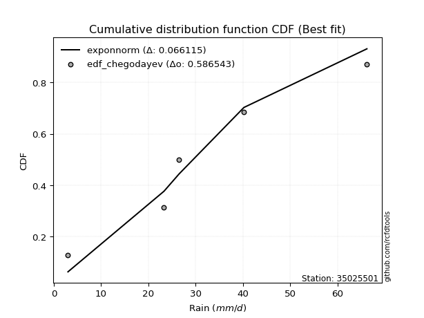</img>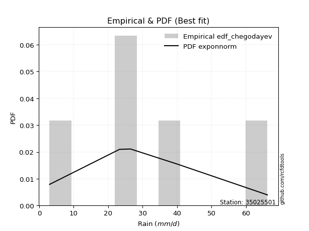</img>

</div>


### 6. EDF Blom (1958)

The Blom formula is a specific "plotting position" formula used in hydrology and statistical analysis to estimate the empirical cumulative probability (or non-exceedance probability) of a data series. It is particularly recommended for data that are approximately normally distributed. The constant _a_ is set to 0.375 (or 3/8).

<div align="center">


$P=(m-a)/(n+1-2a)$


</div>


**6.1. Empirical values**

<div align="center">

|                | 0                   | 1                   | 2        | 3                  | 4                  |
|:---------------|:--------------------|:--------------------|:---------|:-------------------|:-------------------|
| date           | 2021                | 2017                | 2019     | 2020               | 2018               |
| x              | 3.0                 | 23.3                | 26.5     | 40.2               | 66.2               |
| m              | 1                   | 2                   | 3        | 4                  | 5                  |
| empirical_dist | edf_blom            | edf_blom            | edf_blom | edf_blom           | edf_blom           |
| empirical      | 0.11904761904761904 | 0.30952380952380953 | 0.5      | 0.6904761904761905 | 0.8809523809523809 |
| empirical_tr   | 1.135135135135135   | 1.4482758620689655  | 2.0      | 3.230769230769231  | 8.399999999999999  |

</div>


**6.2. Kolmogorov-Smirnov fit test (sorted by Δ)**


<div align="center">

|                | 0                    | 1                  | 2                   | 3                   | 4                   | 5                   | 6                   | 7                   | 8                   | 9                   | 10                  | 11                  | 12                  | 13                  | 14                  | 15                  | 16                  | 17                  | 18                  | 19                  | 20                  | 21                  | 22                 | 23                  | 24                  | 25                  | 26                  | 27                  | 28                  | 29                 | 30                  | 31                  | 32                  | 33                  | 34                  | 35                  | 36                 | 37                  | 38                  | 39                    | 40                 | 41                  | 42                 | 43                  | 44                  | 45                  | 46                  | 47                 | 48                  | 49                 | 50                  | 51                  | 52                  | 53                  | 54                 | 55                  | 56                  | 57                  | 58                 | 59                  | 60                 | 61                  | 62                  | 63                 | 64                 | 65                  | 66                  | 67                  | 68                 | 69                 | 70                  | 71                 | 72                 | 73                 | 74                 | 75                 | 76                 | 77                 | 78                 | 79                  | 80                 | 81                  | 82                 | 83                 | 84                 | 85                 | 86                 | 87                 |
|:---------------|:---------------------|:-------------------|:--------------------|:--------------------|:--------------------|:--------------------|:--------------------|:--------------------|:--------------------|:--------------------|:--------------------|:--------------------|:--------------------|:--------------------|:--------------------|:--------------------|:--------------------|:--------------------|:--------------------|:--------------------|:--------------------|:--------------------|:-------------------|:--------------------|:--------------------|:--------------------|:--------------------|:--------------------|:--------------------|:-------------------|:--------------------|:--------------------|:--------------------|:--------------------|:--------------------|:--------------------|:-------------------|:--------------------|:--------------------|:----------------------|:-------------------|:--------------------|:-------------------|:--------------------|:--------------------|:--------------------|:--------------------|:-------------------|:--------------------|:-------------------|:--------------------|:--------------------|:--------------------|:--------------------|:-------------------|:--------------------|:--------------------|:--------------------|:-------------------|:--------------------|:-------------------|:--------------------|:--------------------|:-------------------|:-------------------|:--------------------|:--------------------|:--------------------|:-------------------|:-------------------|:--------------------|:-------------------|:-------------------|:-------------------|:-------------------|:-------------------|:-------------------|:-------------------|:-------------------|:--------------------|:-------------------|:--------------------|:-------------------|:-------------------|:-------------------|:-------------------|:-------------------|:-------------------|
| station        | 35025501             | 35025501           | 35025501            | 35025501            | 35025501            | 35025501            | 35025501            | 35025501            | 35025501            | 35025501            | 35025501            | 35025501            | 35025501            | 35025501            | 35025501            | 35025501            | 35025501            | 35025501            | 35025501            | 35025501            | 35025501            | 35025501            | 35025501           | 35025501            | 35025501            | 35025501            | 35025501            | 35025501            | 35025501            | 35025501           | 35025501            | 35025501            | 35025501            | 35025501            | 35025501            | 35025501            | 35025501           | 35025501            | 35025501            | 35025501              | 35025501           | 35025501            | 35025501           | 35025501            | 35025501            | 35025501            | 35025501            | 35025501           | 35025501            | 35025501           | 35025501            | 35025501            | 35025501            | 35025501            | 35025501           | 35025501            | 35025501            | 35025501            | 35025501           | 35025501            | 35025501           | 35025501            | 35025501            | 35025501           | 35025501           | 35025501            | 35025501            | 35025501            | 35025501           | 35025501           | 35025501            | 35025501           | 35025501           | 35025501           | 35025501           | 35025501           | 35025501           | 35025501           | 35025501           | 35025501            | 35025501           | 35025501            | 35025501           | 35025501           | 35025501           | 35025501           | 35025501           | 35025501           |
| empirical_dist | edf_blom             | edf_blom           | edf_blom            | edf_blom            | edf_blom            | edf_blom            | edf_blom            | edf_blom            | edf_blom            | edf_blom            | edf_blom            | edf_blom            | edf_blom            | edf_blom            | edf_blom            | edf_blom            | edf_blom            | edf_blom            | edf_blom            | edf_blom            | edf_blom            | edf_blom            | edf_blom           | edf_blom            | edf_blom            | edf_blom            | edf_blom            | edf_blom            | edf_blom            | edf_blom           | edf_blom            | edf_blom            | edf_blom            | edf_blom            | edf_blom            | edf_blom            | edf_blom           | edf_blom            | edf_blom            | edf_blom              | edf_blom           | edf_blom            | edf_blom           | edf_blom            | edf_blom            | edf_blom            | edf_blom            | edf_blom           | edf_blom            | edf_blom           | edf_blom            | edf_blom            | edf_blom            | edf_blom            | edf_blom           | edf_blom            | edf_blom            | edf_blom            | edf_blom           | edf_blom            | edf_blom           | edf_blom            | edf_blom            | edf_blom           | edf_blom           | edf_blom            | edf_blom            | edf_blom            | edf_blom           | edf_blom           | edf_blom            | edf_blom           | edf_blom           | edf_blom           | edf_blom           | edf_blom           | edf_blom           | edf_blom           | edf_blom           | edf_blom            | edf_blom           | edf_blom            | edf_blom           | edf_blom           | edf_blom           | edf_blom           | edf_blom           | edf_blom           |
| p_dist         | laplace_asymmetric   | fisk               | maxwell             | exponnorm           | nct                 | invgamma            | rice                | johnsonsu           | rayleigh            | invgauss            | logjohnsonsu        | pearson3            | gumbel_r            | genlogistic         | kstwobign           | t                   | crystalball         | truncnorm           | norm                | moyal               | betaprime           | logistic            | logmielke          | logloggamma         | gompertz            | mielke              | halfnorm            | halflogistic        | hypsecant           | ncf                | logweibull_min      | wald                | gibrat              | logfisk             | logpearson3         | loggumbel_l         | laplace            | loggompertz         | gumbel_l            | loglaplace_asymmetric | expon              | genexpon            | logf               | logexponnorm        | lognorm             | lognorm             | logcrystalball      | logt               | lognct              | logfatiguelife     | loglogistic         | logncf              | loghypsecant        | logrice             | logbetaprime       | loggamma            | loggamma            | logerlang           | logalpha           | loglaplace          | loginvgamma        | loginvgauss         | loginvweibull       | logmaxwell         | lograyleigh        | f                   | nakagami            | logkstwobign        | loggumbel_r        | logtruncnorm       | loghalfnorm         | loggenexpon        | lognakagami        | logmoyal           | loghalflogistic    | logexpon           | weibull_min        | loglognorm         | logwald            | loggibrat           | erlang             | invweibull          | alpha              | fatiguelife        | gamma              | logchi2            | chi2               | loggenlogistic     |
| delta          | 0.059819714455092675 | 0.0631670676964513 | 0.06684396490630579 | 0.06735105149542064 | 0.06753810034408325 | 0.06774743350762552 | 0.06999266393180131 | 0.07146503664414988 | 0.07520925767018338 | 0.07662899585440458 | 0.07754730637230162 | 0.07902981418252875 | 0.08201855475911457 | 0.08941836000813691 | 0.09705373857085853 | 0.10080715181857347 | 0.10084052916734004 | 0.10084053665530679 | 0.10084053866659848 | 0.10491154929148253 | 0.11375896648199896 | 0.11383657397076785 | 0.1183830604280478 | 0.11897041720154145 | 0.11904761904728894 | 0.11904761904761862 | 0.11904761904761904 | 0.11904761904761904 | 0.12446323376733781 | 0.1290842469247812 | 0.12947316001859543 | 0.13031947864599192 | 0.13115124881015683 | 0.14233206148516514 | 0.14546466693276128 | 0.14631177300686904 | 0.1516375251527251 | 0.15810018065216724 | 0.16726544641227242 | 0.17541713166966932   | 0.1958156335099599 | 0.21352902012776986 | 0.2151715665018008 | 0.21548822096279707 | 0.21548831053146322 | 0.21548831053146322 | 0.21548832294594356 | 0.2154886408708202 | 0.21578961117297712 | 0.2165660347229419 | 0.21889371436242522 | 0.22102509007339033 | 0.22179414934834574 | 0.22413649576622596 | 0.2250746662676636 | 0.22767684091671625 | 0.22767684091671625 | 0.22930613213027518 | 0.2304163862882932 | 0.23292705745567954 | 0.2373056640218807 | 0.24405976165669874 | 0.24736779587694058 | 0.2473702566177426 | 0.257795749693035  | 0.26124693031473656 | 0.27821780559337395 | 0.28299999990755587 | 0.286155875287057  | 0.2867496261701098 | 0.28715276747245344 | 0.2891247078868713 | 0.3091915535960845 | 0.3116585674972584 | 0.3134401873595719 | 0.3346902444809211 | 0.3518960237774106 | 0.3776971852919524 | 0.3824727949500514 | 0.40919297694714285 | 0.4176112101078333 | 0.46558822516281917 | 0.4667083047032251 | 0.5503905458865199 | 0.5800652034150975 | 0.6313527702366521 | 0.6509501481740598 | 0.6904761904761905 |
| deltao         | 0.5865427407550001   | 0.5865427407550001 | 0.5865427407550001  | 0.5865427407550001  | 0.5865427407550001  | 0.5865427407550001  | 0.5865427407550001  | 0.5865427407550001  | 0.5865427407550001  | 0.5865427407550001  | 0.5865427407550001  | 0.5865427407550001  | 0.5865427407550001  | 0.5865427407550001  | 0.5865427407550001  | 0.5865427407550001  | 0.5865427407550001  | 0.5865427407550001  | 0.5865427407550001  | 0.5865427407550001  | 0.5865427407550001  | 0.5865427407550001  | 0.5865427407550001 | 0.5865427407550001  | 0.5865427407550001  | 0.5865427407550001  | 0.5865427407550001  | 0.5865427407550001  | 0.5865427407550001  | 0.5865427407550001 | 0.5865427407550001  | 0.5865427407550001  | 0.5865427407550001  | 0.5865427407550001  | 0.5865427407550001  | 0.5865427407550001  | 0.5865427407550001 | 0.5865427407550001  | 0.5865427407550001  | 0.5865427407550001    | 0.5865427407550001 | 0.5865427407550001  | 0.5865427407550001 | 0.5865427407550001  | 0.5865427407550001  | 0.5865427407550001  | 0.5865427407550001  | 0.5865427407550001 | 0.5865427407550001  | 0.5865427407550001 | 0.5865427407550001  | 0.5865427407550001  | 0.5865427407550001  | 0.5865427407550001  | 0.5865427407550001 | 0.5865427407550001  | 0.5865427407550001  | 0.5865427407550001  | 0.5865427407550001 | 0.5865427407550001  | 0.5865427407550001 | 0.5865427407550001  | 0.5865427407550001  | 0.5865427407550001 | 0.5865427407550001 | 0.5865427407550001  | 0.5865427407550001  | 0.5865427407550001  | 0.5865427407550001 | 0.5865427407550001 | 0.5865427407550001  | 0.5865427407550001 | 0.5865427407550001 | 0.5865427407550001 | 0.5865427407550001 | 0.5865427407550001 | 0.5865427407550001 | 0.5865427407550001 | 0.5865427407550001 | 0.5865427407550001  | 0.5865427407550001 | 0.5865427407550001  | 0.5865427407550001 | 0.5865427407550001 | 0.5865427407550001 | 0.5865427407550001 | 0.5865427407550001 | 0.5865427407550001 |
| eval           | Δo > Δ               | Δo > Δ             | Δo > Δ              | Δo > Δ              | Δo > Δ              | Δo > Δ              | Δo > Δ              | Δo > Δ              | Δo > Δ              | Δo > Δ              | Δo > Δ              | Δo > Δ              | Δo > Δ              | Δo > Δ              | Δo > Δ              | Δo > Δ              | Δo > Δ              | Δo > Δ              | Δo > Δ              | Δo > Δ              | Δo > Δ              | Δo > Δ              | Δo > Δ             | Δo > Δ              | Δo > Δ              | Δo > Δ              | Δo > Δ              | Δo > Δ              | Δo > Δ              | Δo > Δ             | Δo > Δ              | Δo > Δ              | Δo > Δ              | Δo > Δ              | Δo > Δ              | Δo > Δ              | Δo > Δ             | Δo > Δ              | Δo > Δ              | Δo > Δ                | Δo > Δ             | Δo > Δ              | Δo > Δ             | Δo > Δ              | Δo > Δ              | Δo > Δ              | Δo > Δ              | Δo > Δ             | Δo > Δ              | Δo > Δ             | Δo > Δ              | Δo > Δ              | Δo > Δ              | Δo > Δ              | Δo > Δ             | Δo > Δ              | Δo > Δ              | Δo > Δ              | Δo > Δ             | Δo > Δ              | Δo > Δ             | Δo > Δ              | Δo > Δ              | Δo > Δ             | Δo > Δ             | Δo > Δ              | Δo > Δ              | Δo > Δ              | Δo > Δ             | Δo > Δ             | Δo > Δ              | Δo > Δ             | Δo > Δ             | Δo > Δ             | Δo > Δ             | Δo > Δ             | Δo > Δ             | Δo > Δ             | Δo > Δ             | Δo > Δ              | Δo > Δ             | Δo > Δ              | Δo > Δ             | Δo > Δ             | Δo > Δ             | Δo <= Δ            | Δo <= Δ            | Δo <= Δ            |
| fit            | 1                    | 1                  | 1                   | 1                   | 1                   | 1                   | 1                   | 1                   | 1                   | 1                   | 1                   | 1                   | 1                   | 1                   | 1                   | 1                   | 1                   | 1                   | 1                   | 1                   | 1                   | 1                   | 1                  | 1                   | 1                   | 1                   | 1                   | 1                   | 1                   | 1                  | 1                   | 1                   | 1                   | 1                   | 1                   | 1                   | 1                  | 1                   | 1                   | 1                     | 1                  | 1                   | 1                  | 1                   | 1                   | 1                   | 1                   | 1                  | 1                   | 1                  | 1                   | 1                   | 1                   | 1                   | 1                  | 1                   | 1                   | 1                   | 1                  | 1                   | 1                  | 1                   | 1                   | 1                  | 1                  | 1                   | 1                   | 1                   | 1                  | 1                  | 1                   | 1                  | 1                  | 1                  | 1                  | 1                  | 1                  | 1                  | 1                  | 1                   | 1                  | 1                   | 1                  | 1                  | 1                  | 0                  | 0                  | 0                  |
| n              | 5                    | 5                  | 5                   | 5                   | 5                   | 5                   | 5                   | 5                   | 5                   | 5                   | 5                   | 5                   | 5                   | 5                   | 5                   | 5                   | 5                   | 5                   | 5                   | 5                   | 5                   | 5                   | 5                  | 5                   | 5                   | 5                   | 5                   | 5                   | 5                   | 5                  | 5                   | 5                   | 5                   | 5                   | 5                   | 5                   | 5                  | 5                   | 5                   | 5                     | 5                  | 5                   | 5                  | 5                   | 5                   | 5                   | 5                   | 5                  | 5                   | 5                  | 5                   | 5                   | 5                   | 5                   | 5                  | 5                   | 5                   | 5                   | 5                  | 5                   | 5                  | 5                   | 5                   | 5                  | 5                  | 5                   | 5                   | 5                   | 5                  | 5                  | 5                   | 5                  | 5                  | 5                  | 5                  | 5                  | 5                  | 5                  | 5                  | 5                   | 5                  | 5                   | 5                  | 5                  | 5                  | 5                  | 5                  | 5                  |
| best_fit       | 1                    | 0                  | 0                   | 0                   | 0                   | 0                   | 0                   | 0                   | 0                   | 0                   | 0                   | 0                   | 0                   | 0                   | 0                   | 0                   | 0                   | 0                   | 0                   | 0                   | 0                   | 0                   | 0                  | 0                   | 0                   | 0                   | 0                   | 0                   | 0                   | 0                  | 0                   | 0                   | 0                   | 0                   | 0                   | 0                   | 0                  | 0                   | 0                   | 0                     | 0                  | 0                   | 0                  | 0                   | 0                   | 0                   | 0                   | 0                  | 0                   | 0                  | 0                   | 0                   | 0                   | 0                   | 0                  | 0                   | 0                   | 0                   | 0                  | 0                   | 0                  | 0                   | 0                   | 0                  | 0                  | 0                   | 0                   | 0                   | 0                  | 0                  | 0                   | 0                  | 0                  | 0                  | 0                  | 0                  | 0                  | 0                  | 0                  | 0                   | 0                  | 0                   | 0                  | 0                  | 0                  | 0                  | 0                  | 0                  |
| best_fit_sort  | 1                    | 2                  | 3                   | 4                   | 5                   | 6                   | 7                   | 8                   | 9                   | 10                  | 11                  | 12                  | 13                  | 14                  | 15                  | 16                  | 17                  | 18                  | 19                  | 20                  | 21                  | 22                  | 23                 | 24                  | 25                  | 26                  | 27                  | 28                  | 29                  | 30                 | 31                  | 32                  | 33                  | 34                  | 35                  | 36                  | 37                 | 38                  | 39                  | 40                    | 41                 | 42                  | 43                 | 44                  | 45                  | 46                  | 47                  | 48                 | 49                  | 50                 | 51                  | 52                  | 53                  | 54                  | 55                 | 56                  | 57                  | 58                  | 59                 | 60                  | 61                 | 62                  | 63                  | 64                 | 65                 | 66                  | 67                  | 68                  | 69                 | 70                 | 71                  | 72                 | 73                 | 74                 | 75                 | 76                 | 77                 | 78                 | 79                 | 80                  | 81                 | 82                  | 83                 | 84                 | 85                 | 86                 | 87                 | 88                 |

</div>


**6.3. Best fit**

<div align="center">

|   id |   station | empirical_dist   | p_dist             |     delta |   deltao | eval   |   fit |   n |   best_fit |   best_fit_sort |
|-----:|----------:|:-----------------|:-------------------|----------:|---------:|:-------|------:|----:|-----------:|----------------:|
|    0 |  35025501 | edf_blom         | laplace_asymmetric | 0.0598197 | 0.586543 | Δo > Δ |     1 |   5 |          1 |               1 |

</div>


<div align="center">

</img>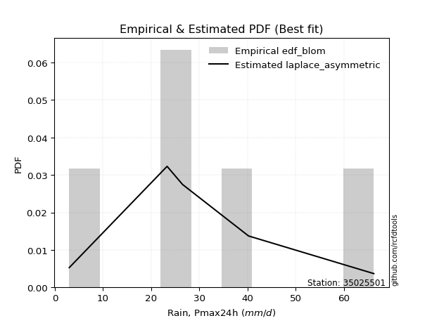</img>

</div>


### 7. EDF Tukey (1962)

In hydrology, the Tukey formula is used as a plotting position formula to estimate the empirical probability or frequency of a flood event (or other hydrological data). The formula parameter is given as _c=0.333_ (or 1/3).

<div align="center">


$P=(m-c)/(n+1-2c)$


</div>


**7.1. Empirical values**

<div align="center">

|                | 0                  | 1                  | 2         | 3         | 4         |
|:---------------|:-------------------|:-------------------|:----------|:----------|:----------|
| date           | 2021               | 2017               | 2019      | 2020      | 2018      |
| x              | 3.0                | 23.3               | 26.5      | 40.2      | 66.2      |
| m              | 1                  | 2                  | 3         | 4         | 5         |
| empirical_dist | edf_tukey          | edf_tukey          | edf_tukey | edf_tukey | edf_tukey |
| empirical      | 0.125              | 0.3125             | 0.5       | 0.6875    | 0.875     |
| empirical_tr   | 1.1428571428571428 | 1.4545454545454546 | 2.0       | 3.2       | 8.0       |

</div>


**7.2. Kolmogorov-Smirnov fit test (sorted by Δ)**


<div align="center">

|                | 0                  | 1                   | 2                   | 3                   | 4                   | 5                   | 6                   | 7                   | 8                   | 9                   | 10                  | 11                  | 12                  | 13                  | 14                  | 15                  | 16                  | 17                  | 18                  | 19                  | 20                  | 21                  | 22                  | 23                  | 24                  | 25                 | 26                  | 27                 | 28                 | 29                  | 30                  | 31                  | 32                 | 33                  | 34                 | 35                  | 36                 | 37                  | 38                  | 39                    | 40                  | 41                 | 42                  | 43                 | 44                  | 45                  | 46                 | 47                  | 48                  | 49                  | 50                  | 51                  | 52                  | 53                 | 54                  | 55                  | 56                  | 57                 | 58                  | 59                  | 60                  | 61                  | 62                 | 63                  | 64                 | 65                 | 66                 | 67                 | 68                 | 69                  | 70                 | 71                 | 72                  | 73                  | 74                 | 75                  | 76                 | 77                  | 78                 | 79                 | 80                  | 81                  | 82                  | 83                 | 84                 | 85                 | 86                 | 87                 |
|:---------------|:-------------------|:--------------------|:--------------------|:--------------------|:--------------------|:--------------------|:--------------------|:--------------------|:--------------------|:--------------------|:--------------------|:--------------------|:--------------------|:--------------------|:--------------------|:--------------------|:--------------------|:--------------------|:--------------------|:--------------------|:--------------------|:--------------------|:--------------------|:--------------------|:--------------------|:-------------------|:--------------------|:-------------------|:-------------------|:--------------------|:--------------------|:--------------------|:-------------------|:--------------------|:-------------------|:--------------------|:-------------------|:--------------------|:--------------------|:----------------------|:--------------------|:-------------------|:--------------------|:-------------------|:--------------------|:--------------------|:-------------------|:--------------------|:--------------------|:--------------------|:--------------------|:--------------------|:--------------------|:-------------------|:--------------------|:--------------------|:--------------------|:-------------------|:--------------------|:--------------------|:--------------------|:--------------------|:-------------------|:--------------------|:-------------------|:-------------------|:-------------------|:-------------------|:-------------------|:--------------------|:-------------------|:-------------------|:--------------------|:--------------------|:-------------------|:--------------------|:-------------------|:--------------------|:-------------------|:-------------------|:--------------------|:--------------------|:--------------------|:-------------------|:-------------------|:-------------------|:-------------------|:-------------------|
| station        | 35025501           | 35025501            | 35025501            | 35025501            | 35025501            | 35025501            | 35025501            | 35025501            | 35025501            | 35025501            | 35025501            | 35025501            | 35025501            | 35025501            | 35025501            | 35025501            | 35025501            | 35025501            | 35025501            | 35025501            | 35025501            | 35025501            | 35025501            | 35025501            | 35025501            | 35025501           | 35025501            | 35025501           | 35025501           | 35025501            | 35025501            | 35025501            | 35025501           | 35025501            | 35025501           | 35025501            | 35025501           | 35025501            | 35025501            | 35025501              | 35025501            | 35025501           | 35025501            | 35025501           | 35025501            | 35025501            | 35025501           | 35025501            | 35025501            | 35025501            | 35025501            | 35025501            | 35025501            | 35025501           | 35025501            | 35025501            | 35025501            | 35025501           | 35025501            | 35025501            | 35025501            | 35025501            | 35025501           | 35025501            | 35025501           | 35025501           | 35025501           | 35025501           | 35025501           | 35025501            | 35025501           | 35025501           | 35025501            | 35025501            | 35025501           | 35025501            | 35025501           | 35025501            | 35025501           | 35025501           | 35025501            | 35025501            | 35025501            | 35025501           | 35025501           | 35025501           | 35025501           | 35025501           |
| empirical_dist | edf_tukey          | edf_tukey           | edf_tukey           | edf_tukey           | edf_tukey           | edf_tukey           | edf_tukey           | edf_tukey           | edf_tukey           | edf_tukey           | edf_tukey           | edf_tukey           | edf_tukey           | edf_tukey           | edf_tukey           | edf_tukey           | edf_tukey           | edf_tukey           | edf_tukey           | edf_tukey           | edf_tukey           | edf_tukey           | edf_tukey           | edf_tukey           | edf_tukey           | edf_tukey          | edf_tukey           | edf_tukey          | edf_tukey          | edf_tukey           | edf_tukey           | edf_tukey           | edf_tukey          | edf_tukey           | edf_tukey          | edf_tukey           | edf_tukey          | edf_tukey           | edf_tukey           | edf_tukey             | edf_tukey           | edf_tukey          | edf_tukey           | edf_tukey          | edf_tukey           | edf_tukey           | edf_tukey          | edf_tukey           | edf_tukey           | edf_tukey           | edf_tukey           | edf_tukey           | edf_tukey           | edf_tukey          | edf_tukey           | edf_tukey           | edf_tukey           | edf_tukey          | edf_tukey           | edf_tukey           | edf_tukey           | edf_tukey           | edf_tukey          | edf_tukey           | edf_tukey          | edf_tukey          | edf_tukey          | edf_tukey          | edf_tukey          | edf_tukey           | edf_tukey          | edf_tukey          | edf_tukey           | edf_tukey           | edf_tukey          | edf_tukey           | edf_tukey          | edf_tukey           | edf_tukey          | edf_tukey          | edf_tukey           | edf_tukey           | edf_tukey           | edf_tukey          | edf_tukey          | edf_tukey          | edf_tukey          | edf_tukey          |
| p_dist         | fisk               | exponnorm           | invgamma            | laplace_asymmetric  | maxwell             | nct                 | johnsonsu           | rayleigh            | invgauss            | rice                | logjohnsonsu        | pearson3            | genlogistic         | gumbel_r            | kstwobign           | t                   | crystalball         | truncnorm           | norm                | betaprime           | moyal               | logistic            | logmielke           | hypsecant           | logloggamma         | gompertz           | mielke              | halflogistic       | halfnorm           | ncf                 | logweibull_min      | wald                | gibrat             | logfisk             | logpearson3        | loggumbel_l         | laplace            | loggompertz         | gumbel_l            | loglaplace_asymmetric | expon               | genexpon           | logf                | logexponnorm       | lognorm             | lognorm             | logcrystalball     | logt                | lognct              | logfatiguelife      | loglogistic         | logncf              | loghypsecant        | logrice            | logbetaprime        | loggamma            | loggamma            | logerlang          | logalpha            | loglaplace          | loginvgamma         | loginvgauss         | loginvweibull      | logmaxwell          | lograyleigh        | f                  | nakagami           | logkstwobign       | loggumbel_r        | logtruncnorm        | loghalfnorm        | loggenexpon        | logmoyal            | loghalflogistic     | lognakagami        | logexpon            | weibull_min        | loglognorm          | logwald            | loggibrat          | erlang              | invweibull          | alpha               | fatiguelife        | gamma              | logchi2            | chi2               | loggenlogistic     |
| delta          | 0.0632116168216312 | 0.06437486101923018 | 0.06477124303143506 | 0.06577209540747364 | 0.06684396490630579 | 0.06753810034408325 | 0.06848884616795942 | 0.07223306719399292 | 0.07365280537821411 | 0.07594504488418227 | 0.07754730637230162 | 0.07902981418252875 | 0.08644216953194644 | 0.08797093571149553 | 0.09407754809466806 | 0.10080715181857347 | 0.10084052916734004 | 0.10084053665530679 | 0.10084053866659848 | 0.11078277600580849 | 0.11086393024386348 | 0.11383657397076785 | 0.12433544138042874 | 0.12446323376733781 | 0.12492279815392238 | 0.1249999999996699 | 0.12499999999999958 | 0.125              | 0.125              | 0.12610805644859074 | 0.12649696954240497 | 0.12734328816980145 | 0.1341274392863473 | 0.13935587100897467 | 0.1424884764565708 | 0.14333558253067857 | 0.1516375251527251 | 0.15512399017597678 | 0.16726544641227242 | 0.17244094119347886   | 0.19283944303376943 | 0.2105528296515794 | 0.21219537602561034 | 0.2125120304866066 | 0.21251212005527276 | 0.21251212005527276 | 0.2125121324697531 | 0.21251245039462974 | 0.21281342069678666 | 0.21358984424675143 | 0.21591752388623475 | 0.21804889959719986 | 0.21881795887215527 | 0.2211603052900355 | 0.22209847579147313 | 0.22470065044052578 | 0.22470065044052578 | 0.2263299416540847 | 0.22744019581210273 | 0.22995086697948908 | 0.23432947354569023 | 0.24108357118050827 | 0.2443916054007501 | 0.24439406614155212 | 0.2548195592168445 | 0.2582707398385461 | 0.2752416151171835 | 0.2800238094313654 | 0.2831796848108665 | 0.28377343569391933 | 0.284176576996263  | 0.2861485174106808 | 0.30868237702106793 | 0.31046399688338144 | 0.312167744072275  | 0.33171405400473064 | 0.3489198333012201 | 0.37472099481576193 | 0.3794966044738609 | 0.4062167864709524 | 0.41463501963164284 | 0.45963584421043824 | 0.46373211422703464 | 0.5474143554103295 | 0.577089012938907  | 0.6283765797604617 | 0.6479739576978694 | 0.6875             |
| deltao         | 0.5865427407550001 | 0.5865427407550001  | 0.5865427407550001  | 0.5865427407550001  | 0.5865427407550001  | 0.5865427407550001  | 0.5865427407550001  | 0.5865427407550001  | 0.5865427407550001  | 0.5865427407550001  | 0.5865427407550001  | 0.5865427407550001  | 0.5865427407550001  | 0.5865427407550001  | 0.5865427407550001  | 0.5865427407550001  | 0.5865427407550001  | 0.5865427407550001  | 0.5865427407550001  | 0.5865427407550001  | 0.5865427407550001  | 0.5865427407550001  | 0.5865427407550001  | 0.5865427407550001  | 0.5865427407550001  | 0.5865427407550001 | 0.5865427407550001  | 0.5865427407550001 | 0.5865427407550001 | 0.5865427407550001  | 0.5865427407550001  | 0.5865427407550001  | 0.5865427407550001 | 0.5865427407550001  | 0.5865427407550001 | 0.5865427407550001  | 0.5865427407550001 | 0.5865427407550001  | 0.5865427407550001  | 0.5865427407550001    | 0.5865427407550001  | 0.5865427407550001 | 0.5865427407550001  | 0.5865427407550001 | 0.5865427407550001  | 0.5865427407550001  | 0.5865427407550001 | 0.5865427407550001  | 0.5865427407550001  | 0.5865427407550001  | 0.5865427407550001  | 0.5865427407550001  | 0.5865427407550001  | 0.5865427407550001 | 0.5865427407550001  | 0.5865427407550001  | 0.5865427407550001  | 0.5865427407550001 | 0.5865427407550001  | 0.5865427407550001  | 0.5865427407550001  | 0.5865427407550001  | 0.5865427407550001 | 0.5865427407550001  | 0.5865427407550001 | 0.5865427407550001 | 0.5865427407550001 | 0.5865427407550001 | 0.5865427407550001 | 0.5865427407550001  | 0.5865427407550001 | 0.5865427407550001 | 0.5865427407550001  | 0.5865427407550001  | 0.5865427407550001 | 0.5865427407550001  | 0.5865427407550001 | 0.5865427407550001  | 0.5865427407550001 | 0.5865427407550001 | 0.5865427407550001  | 0.5865427407550001  | 0.5865427407550001  | 0.5865427407550001 | 0.5865427407550001 | 0.5865427407550001 | 0.5865427407550001 | 0.5865427407550001 |
| eval           | Δo > Δ             | Δo > Δ              | Δo > Δ              | Δo > Δ              | Δo > Δ              | Δo > Δ              | Δo > Δ              | Δo > Δ              | Δo > Δ              | Δo > Δ              | Δo > Δ              | Δo > Δ              | Δo > Δ              | Δo > Δ              | Δo > Δ              | Δo > Δ              | Δo > Δ              | Δo > Δ              | Δo > Δ              | Δo > Δ              | Δo > Δ              | Δo > Δ              | Δo > Δ              | Δo > Δ              | Δo > Δ              | Δo > Δ             | Δo > Δ              | Δo > Δ             | Δo > Δ             | Δo > Δ              | Δo > Δ              | Δo > Δ              | Δo > Δ             | Δo > Δ              | Δo > Δ             | Δo > Δ              | Δo > Δ             | Δo > Δ              | Δo > Δ              | Δo > Δ                | Δo > Δ              | Δo > Δ             | Δo > Δ              | Δo > Δ             | Δo > Δ              | Δo > Δ              | Δo > Δ             | Δo > Δ              | Δo > Δ              | Δo > Δ              | Δo > Δ              | Δo > Δ              | Δo > Δ              | Δo > Δ             | Δo > Δ              | Δo > Δ              | Δo > Δ              | Δo > Δ             | Δo > Δ              | Δo > Δ              | Δo > Δ              | Δo > Δ              | Δo > Δ             | Δo > Δ              | Δo > Δ             | Δo > Δ             | Δo > Δ             | Δo > Δ             | Δo > Δ             | Δo > Δ              | Δo > Δ             | Δo > Δ             | Δo > Δ              | Δo > Δ              | Δo > Δ             | Δo > Δ              | Δo > Δ             | Δo > Δ              | Δo > Δ             | Δo > Δ             | Δo > Δ              | Δo > Δ              | Δo > Δ              | Δo > Δ             | Δo > Δ             | Δo <= Δ            | Δo <= Δ            | Δo <= Δ            |
| fit            | 1                  | 1                   | 1                   | 1                   | 1                   | 1                   | 1                   | 1                   | 1                   | 1                   | 1                   | 1                   | 1                   | 1                   | 1                   | 1                   | 1                   | 1                   | 1                   | 1                   | 1                   | 1                   | 1                   | 1                   | 1                   | 1                  | 1                   | 1                  | 1                  | 1                   | 1                   | 1                   | 1                  | 1                   | 1                  | 1                   | 1                  | 1                   | 1                   | 1                     | 1                   | 1                  | 1                   | 1                  | 1                   | 1                   | 1                  | 1                   | 1                   | 1                   | 1                   | 1                   | 1                   | 1                  | 1                   | 1                   | 1                   | 1                  | 1                   | 1                   | 1                   | 1                   | 1                  | 1                   | 1                  | 1                  | 1                  | 1                  | 1                  | 1                   | 1                  | 1                  | 1                   | 1                   | 1                  | 1                   | 1                  | 1                   | 1                  | 1                  | 1                   | 1                   | 1                   | 1                  | 1                  | 0                  | 0                  | 0                  |
| n              | 5                  | 5                   | 5                   | 5                   | 5                   | 5                   | 5                   | 5                   | 5                   | 5                   | 5                   | 5                   | 5                   | 5                   | 5                   | 5                   | 5                   | 5                   | 5                   | 5                   | 5                   | 5                   | 5                   | 5                   | 5                   | 5                  | 5                   | 5                  | 5                  | 5                   | 5                   | 5                   | 5                  | 5                   | 5                  | 5                   | 5                  | 5                   | 5                   | 5                     | 5                   | 5                  | 5                   | 5                  | 5                   | 5                   | 5                  | 5                   | 5                   | 5                   | 5                   | 5                   | 5                   | 5                  | 5                   | 5                   | 5                   | 5                  | 5                   | 5                   | 5                   | 5                   | 5                  | 5                   | 5                  | 5                  | 5                  | 5                  | 5                  | 5                   | 5                  | 5                  | 5                   | 5                   | 5                  | 5                   | 5                  | 5                   | 5                  | 5                  | 5                   | 5                   | 5                   | 5                  | 5                  | 5                  | 5                  | 5                  |
| best_fit       | 1                  | 0                   | 0                   | 0                   | 0                   | 0                   | 0                   | 0                   | 0                   | 0                   | 0                   | 0                   | 0                   | 0                   | 0                   | 0                   | 0                   | 0                   | 0                   | 0                   | 0                   | 0                   | 0                   | 0                   | 0                   | 0                  | 0                   | 0                  | 0                  | 0                   | 0                   | 0                   | 0                  | 0                   | 0                  | 0                   | 0                  | 0                   | 0                   | 0                     | 0                   | 0                  | 0                   | 0                  | 0                   | 0                   | 0                  | 0                   | 0                   | 0                   | 0                   | 0                   | 0                   | 0                  | 0                   | 0                   | 0                   | 0                  | 0                   | 0                   | 0                   | 0                   | 0                  | 0                   | 0                  | 0                  | 0                  | 0                  | 0                  | 0                   | 0                  | 0                  | 0                   | 0                   | 0                  | 0                   | 0                  | 0                   | 0                  | 0                  | 0                   | 0                   | 0                   | 0                  | 0                  | 0                  | 0                  | 0                  |
| best_fit_sort  | 1                  | 2                   | 3                   | 4                   | 5                   | 6                   | 7                   | 8                   | 9                   | 10                  | 11                  | 12                  | 13                  | 14                  | 15                  | 16                  | 17                  | 18                  | 19                  | 20                  | 21                  | 22                  | 23                  | 24                  | 25                  | 26                 | 27                  | 28                 | 29                 | 30                  | 31                  | 32                  | 33                 | 34                  | 35                 | 36                  | 37                 | 38                  | 39                  | 40                    | 41                  | 42                 | 43                  | 44                 | 45                  | 46                  | 47                 | 48                  | 49                  | 50                  | 51                  | 52                  | 53                  | 54                 | 55                  | 56                  | 57                  | 58                 | 59                  | 60                  | 61                  | 62                  | 63                 | 64                  | 65                 | 66                 | 67                 | 68                 | 69                 | 70                  | 71                 | 72                 | 73                  | 74                  | 75                 | 76                  | 77                 | 78                  | 79                 | 80                 | 81                  | 82                  | 83                  | 84                 | 85                 | 86                 | 87                 | 88                 |

</div>


**7.3. Best fit**

<div align="center">

|   id |   station | empirical_dist   | p_dist   |     delta |   deltao | eval   |   fit |   n |   best_fit |   best_fit_sort |
|-----:|----------:|:-----------------|:---------|----------:|---------:|:-------|------:|----:|-----------:|----------------:|
|    0 |  35025501 | edf_tukey        | fisk     | 0.0632116 | 0.586543 | Δo > Δ |     1 |   5 |          1 |               1 |

</div>


<div align="center">

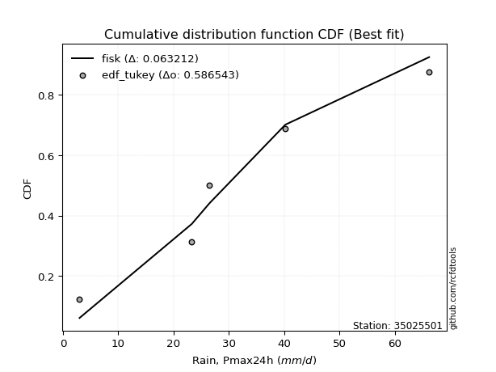</img>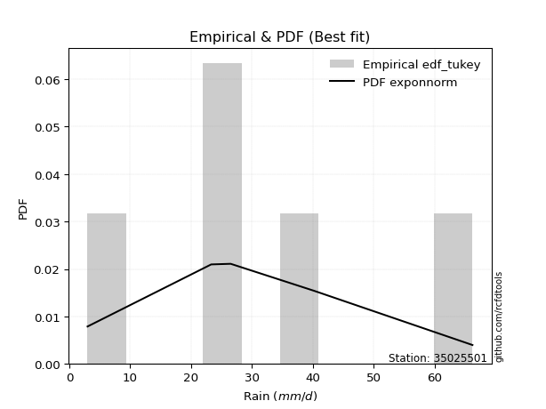</img>

</div>


### 8. EDF Gringorten (1963)

Gringorten plotting position formula is essential for estimating the probability and return periods of extreme events like floods and heavy rainfall. The constant _a=0.44_.

<div align="center">


$P=(m-a)/(n+1-2a)$


</div>


**8.1. Empirical values**

<div align="center">

|                | 0                   | 1                  | 2              | 3                 | 4                  |
|:---------------|:--------------------|:-------------------|:---------------|:------------------|:-------------------|
| date           | 2021                | 2017               | 2019           | 2020              | 2018               |
| x              | 3.0                 | 23.3               | 26.5           | 40.2              | 66.2               |
| m              | 1                   | 2                  | 3              | 4                 | 5                  |
| empirical_dist | edf_gringorten      | edf_gringorten     | edf_gringorten | edf_gringorten    | edf_gringorten     |
| empirical      | 0.10937500000000001 | 0.3046875          | 0.5            | 0.6953125         | 0.8906249999999999 |
| empirical_tr   | 1.1228070175438596  | 1.4382022471910112 | 2.0            | 3.282051282051282 | 9.142857142857133  |

</div>


**8.2. Kolmogorov-Smirnov fit test (sorted by Δ)**


<div align="center">

|                | 0                   | 1                   | 2                   | 3                   | 4                   | 5                   | 6                   | 7                   | 8                   | 9                   | 10                  | 11                  | 12                  | 13                  | 14                  | 15                  | 16                  | 17                  | 18                  | 19                  | 20                  | 21                  | 22                  | 23                 | 24                  | 25                  | 26                  | 27                  | 28                  | 29                 | 30                  | 31                  | 32                  | 33                  | 34                 | 35                  | 36                 | 37                  | 38                  | 39                    | 40                  | 41                 | 42                  | 43                 | 44                  | 45                  | 46                 | 47                  | 48                  | 49                  | 50                  | 51                  | 52                  | 53                 | 54                  | 55                  | 56                  | 57                 | 58                  | 59                  | 60                  | 61                  | 62                 | 63                 | 64                 | 65                 | 66                 | 67                 | 68                 | 69                  | 70                 | 71                 | 72                 | 73                  | 74                  | 75                  | 76                 | 77                  | 78                 | 79                 | 80                  | 81                  | 82                 | 83                 | 84                 | 85                 | 86                 | 87                 |
|:---------------|:--------------------|:--------------------|:--------------------|:--------------------|:--------------------|:--------------------|:--------------------|:--------------------|:--------------------|:--------------------|:--------------------|:--------------------|:--------------------|:--------------------|:--------------------|:--------------------|:--------------------|:--------------------|:--------------------|:--------------------|:--------------------|:--------------------|:--------------------|:-------------------|:--------------------|:--------------------|:--------------------|:--------------------|:--------------------|:-------------------|:--------------------|:--------------------|:--------------------|:--------------------|:-------------------|:--------------------|:-------------------|:--------------------|:--------------------|:----------------------|:--------------------|:-------------------|:--------------------|:-------------------|:--------------------|:--------------------|:-------------------|:--------------------|:--------------------|:--------------------|:--------------------|:--------------------|:--------------------|:-------------------|:--------------------|:--------------------|:--------------------|:-------------------|:--------------------|:--------------------|:--------------------|:--------------------|:-------------------|:-------------------|:-------------------|:-------------------|:-------------------|:-------------------|:-------------------|:--------------------|:-------------------|:-------------------|:-------------------|:--------------------|:--------------------|:--------------------|:-------------------|:--------------------|:-------------------|:-------------------|:--------------------|:--------------------|:-------------------|:-------------------|:-------------------|:-------------------|:-------------------|:-------------------|
| station        | 35025501            | 35025501            | 35025501            | 35025501            | 35025501            | 35025501            | 35025501            | 35025501            | 35025501            | 35025501            | 35025501            | 35025501            | 35025501            | 35025501            | 35025501            | 35025501            | 35025501            | 35025501            | 35025501            | 35025501            | 35025501            | 35025501            | 35025501            | 35025501           | 35025501            | 35025501            | 35025501            | 35025501            | 35025501            | 35025501           | 35025501            | 35025501            | 35025501            | 35025501            | 35025501           | 35025501            | 35025501           | 35025501            | 35025501            | 35025501              | 35025501            | 35025501           | 35025501            | 35025501           | 35025501            | 35025501            | 35025501           | 35025501            | 35025501            | 35025501            | 35025501            | 35025501            | 35025501            | 35025501           | 35025501            | 35025501            | 35025501            | 35025501           | 35025501            | 35025501            | 35025501            | 35025501            | 35025501           | 35025501           | 35025501           | 35025501           | 35025501           | 35025501           | 35025501           | 35025501            | 35025501           | 35025501           | 35025501           | 35025501            | 35025501            | 35025501            | 35025501           | 35025501            | 35025501           | 35025501           | 35025501            | 35025501            | 35025501           | 35025501           | 35025501           | 35025501           | 35025501           | 35025501           |
| empirical_dist | edf_gringorten      | edf_gringorten      | edf_gringorten      | edf_gringorten      | edf_gringorten      | edf_gringorten      | edf_gringorten      | edf_gringorten      | edf_gringorten      | edf_gringorten      | edf_gringorten      | edf_gringorten      | edf_gringorten      | edf_gringorten      | edf_gringorten      | edf_gringorten      | edf_gringorten      | edf_gringorten      | edf_gringorten      | edf_gringorten      | edf_gringorten      | edf_gringorten      | edf_gringorten      | edf_gringorten     | edf_gringorten      | edf_gringorten      | edf_gringorten      | edf_gringorten      | edf_gringorten      | edf_gringorten     | edf_gringorten      | edf_gringorten      | edf_gringorten      | edf_gringorten      | edf_gringorten     | edf_gringorten      | edf_gringorten     | edf_gringorten      | edf_gringorten      | edf_gringorten        | edf_gringorten      | edf_gringorten     | edf_gringorten      | edf_gringorten     | edf_gringorten      | edf_gringorten      | edf_gringorten     | edf_gringorten      | edf_gringorten      | edf_gringorten      | edf_gringorten      | edf_gringorten      | edf_gringorten      | edf_gringorten     | edf_gringorten      | edf_gringorten      | edf_gringorten      | edf_gringorten     | edf_gringorten      | edf_gringorten      | edf_gringorten      | edf_gringorten      | edf_gringorten     | edf_gringorten     | edf_gringorten     | edf_gringorten     | edf_gringorten     | edf_gringorten     | edf_gringorten     | edf_gringorten      | edf_gringorten     | edf_gringorten     | edf_gringorten     | edf_gringorten      | edf_gringorten      | edf_gringorten      | edf_gringorten     | edf_gringorten      | edf_gringorten     | edf_gringorten     | edf_gringorten      | edf_gringorten      | edf_gringorten     | edf_gringorten     | edf_gringorten     | edf_gringorten     | edf_gringorten     | edf_gringorten     |
| p_dist         | laplace_asymmetric  | rice                | nct                 | fisk                | maxwell             | exponnorm           | invgamma            | johnsonsu           | logjohnsonsu        | pearson3            | rayleigh            | invgauss            | gumbel_r            | genlogistic         | moyal               | t                   | crystalball         | truncnorm           | norm                | kstwobign           | logmielke           | logloggamma         | gompertz            | mielke             | logistic            | halfnorm            | betaprime           | halflogistic        | hypsecant           | gibrat             | ncf                 | logweibull_min      | wald                | logfisk             | logpearson3        | loggumbel_l         | laplace            | loggompertz         | gumbel_l            | loglaplace_asymmetric | expon               | genexpon           | logf                | logexponnorm       | lognorm             | lognorm             | logcrystalball     | logt                | lognct              | logfatiguelife      | loglogistic         | logncf              | loghypsecant        | logrice            | logbetaprime        | loggamma            | loggamma            | logerlang          | logalpha            | loglaplace          | loginvgamma         | loginvgauss         | loginvweibull      | logmaxwell         | lograyleigh        | f                  | nakagami           | logkstwobign       | loggumbel_r        | logtruncnorm        | loghalfnorm        | loggenexpon        | lognakagami        | logmoyal            | loghalflogistic     | logexpon            | weibull_min        | loglognorm          | logwald            | loggibrat          | erlang              | alpha               | invweibull         | fatiguelife        | gamma              | logchi2            | chi2               | loggenlogistic     |
| delta          | 0.05740906857024708 | 0.06664097221165155 | 0.06753810034408325 | 0.06800337722026084 | 0.06809574718580752 | 0.07218736101923018 | 0.07258374303143506 | 0.07630134616795942 | 0.07754730637230162 | 0.07902981418252875 | 0.08004556719399292 | 0.08146530537821411 | 0.08271981606787682 | 0.09425466953194644 | 0.09948446388927323 | 0.10080715181857347 | 0.10084052916734004 | 0.10084053665530679 | 0.10084053866659848 | 0.10189004809466806 | 0.10871044138042885 | 0.10929779815392249 | 0.10937499999966992 | 0.1093749999999996 | 0.11383657397076785 | 0.11405460541757562 | 0.11859527600580849 | 0.12062735967929328 | 0.12446323376733781 | 0.1263149392863473 | 0.13392055644859074 | 0.13430946954240497 | 0.13515578816980145 | 0.14716837100897467 | 0.1503009764565708 | 0.15114808253067857 | 0.1516375251527251 | 0.16293649017597678 | 0.16726544641227242 | 0.18025344119347886   | 0.20065194303376943 | 0.2183653296515794 | 0.22000787602561034 | 0.2203245304866066 | 0.22032462005527276 | 0.22032462005527276 | 0.2203246324697531 | 0.22032495039462974 | 0.22062592069678666 | 0.22140234424675143 | 0.22373002388623475 | 0.22586139959719986 | 0.22663045887215527 | 0.2289728052900355 | 0.22991097579147313 | 0.23251315044052578 | 0.23251315044052578 | 0.2341424416540847 | 0.23525269581210273 | 0.23776336697948908 | 0.24214197354569023 | 0.24889607118050827 | 0.2522041054007501 | 0.2522065661415521 | 0.2626320592168445 | 0.2660832398385461 | 0.2830541151171835 | 0.2878363094313654 | 0.2909921848108665 | 0.29158593569391933 | 0.291989076996263  | 0.2939610174106808 | 0.304355244072275  | 0.31649487702106793 | 0.31827649688338144 | 0.33952655400473064 | 0.3567323333012201 | 0.38253349481576193 | 0.3873091044738609 | 0.4140292864709524 | 0.42244751963164284 | 0.47154461422703464 | 0.4752608442104381 | 0.5552268554103295 | 0.584901512938907  | 0.6361890797604617 | 0.6557864576978694 | 0.6953125          |
| deltao         | 0.5865427407550001  | 0.5865427407550001  | 0.5865427407550001  | 0.5865427407550001  | 0.5865427407550001  | 0.5865427407550001  | 0.5865427407550001  | 0.5865427407550001  | 0.5865427407550001  | 0.5865427407550001  | 0.5865427407550001  | 0.5865427407550001  | 0.5865427407550001  | 0.5865427407550001  | 0.5865427407550001  | 0.5865427407550001  | 0.5865427407550001  | 0.5865427407550001  | 0.5865427407550001  | 0.5865427407550001  | 0.5865427407550001  | 0.5865427407550001  | 0.5865427407550001  | 0.5865427407550001 | 0.5865427407550001  | 0.5865427407550001  | 0.5865427407550001  | 0.5865427407550001  | 0.5865427407550001  | 0.5865427407550001 | 0.5865427407550001  | 0.5865427407550001  | 0.5865427407550001  | 0.5865427407550001  | 0.5865427407550001 | 0.5865427407550001  | 0.5865427407550001 | 0.5865427407550001  | 0.5865427407550001  | 0.5865427407550001    | 0.5865427407550001  | 0.5865427407550001 | 0.5865427407550001  | 0.5865427407550001 | 0.5865427407550001  | 0.5865427407550001  | 0.5865427407550001 | 0.5865427407550001  | 0.5865427407550001  | 0.5865427407550001  | 0.5865427407550001  | 0.5865427407550001  | 0.5865427407550001  | 0.5865427407550001 | 0.5865427407550001  | 0.5865427407550001  | 0.5865427407550001  | 0.5865427407550001 | 0.5865427407550001  | 0.5865427407550001  | 0.5865427407550001  | 0.5865427407550001  | 0.5865427407550001 | 0.5865427407550001 | 0.5865427407550001 | 0.5865427407550001 | 0.5865427407550001 | 0.5865427407550001 | 0.5865427407550001 | 0.5865427407550001  | 0.5865427407550001 | 0.5865427407550001 | 0.5865427407550001 | 0.5865427407550001  | 0.5865427407550001  | 0.5865427407550001  | 0.5865427407550001 | 0.5865427407550001  | 0.5865427407550001 | 0.5865427407550001 | 0.5865427407550001  | 0.5865427407550001  | 0.5865427407550001 | 0.5865427407550001 | 0.5865427407550001 | 0.5865427407550001 | 0.5865427407550001 | 0.5865427407550001 |
| eval           | Δo > Δ              | Δo > Δ              | Δo > Δ              | Δo > Δ              | Δo > Δ              | Δo > Δ              | Δo > Δ              | Δo > Δ              | Δo > Δ              | Δo > Δ              | Δo > Δ              | Δo > Δ              | Δo > Δ              | Δo > Δ              | Δo > Δ              | Δo > Δ              | Δo > Δ              | Δo > Δ              | Δo > Δ              | Δo > Δ              | Δo > Δ              | Δo > Δ              | Δo > Δ              | Δo > Δ             | Δo > Δ              | Δo > Δ              | Δo > Δ              | Δo > Δ              | Δo > Δ              | Δo > Δ             | Δo > Δ              | Δo > Δ              | Δo > Δ              | Δo > Δ              | Δo > Δ             | Δo > Δ              | Δo > Δ             | Δo > Δ              | Δo > Δ              | Δo > Δ                | Δo > Δ              | Δo > Δ             | Δo > Δ              | Δo > Δ             | Δo > Δ              | Δo > Δ              | Δo > Δ             | Δo > Δ              | Δo > Δ              | Δo > Δ              | Δo > Δ              | Δo > Δ              | Δo > Δ              | Δo > Δ             | Δo > Δ              | Δo > Δ              | Δo > Δ              | Δo > Δ             | Δo > Δ              | Δo > Δ              | Δo > Δ              | Δo > Δ              | Δo > Δ             | Δo > Δ             | Δo > Δ             | Δo > Δ             | Δo > Δ             | Δo > Δ             | Δo > Δ             | Δo > Δ              | Δo > Δ             | Δo > Δ             | Δo > Δ             | Δo > Δ              | Δo > Δ              | Δo > Δ              | Δo > Δ             | Δo > Δ              | Δo > Δ             | Δo > Δ             | Δo > Δ              | Δo > Δ              | Δo > Δ             | Δo > Δ             | Δo > Δ             | Δo <= Δ            | Δo <= Δ            | Δo <= Δ            |
| fit            | 1                   | 1                   | 1                   | 1                   | 1                   | 1                   | 1                   | 1                   | 1                   | 1                   | 1                   | 1                   | 1                   | 1                   | 1                   | 1                   | 1                   | 1                   | 1                   | 1                   | 1                   | 1                   | 1                   | 1                  | 1                   | 1                   | 1                   | 1                   | 1                   | 1                  | 1                   | 1                   | 1                   | 1                   | 1                  | 1                   | 1                  | 1                   | 1                   | 1                     | 1                   | 1                  | 1                   | 1                  | 1                   | 1                   | 1                  | 1                   | 1                   | 1                   | 1                   | 1                   | 1                   | 1                  | 1                   | 1                   | 1                   | 1                  | 1                   | 1                   | 1                   | 1                   | 1                  | 1                  | 1                  | 1                  | 1                  | 1                  | 1                  | 1                   | 1                  | 1                  | 1                  | 1                   | 1                   | 1                   | 1                  | 1                   | 1                  | 1                  | 1                   | 1                   | 1                  | 1                  | 1                  | 0                  | 0                  | 0                  |
| n              | 5                   | 5                   | 5                   | 5                   | 5                   | 5                   | 5                   | 5                   | 5                   | 5                   | 5                   | 5                   | 5                   | 5                   | 5                   | 5                   | 5                   | 5                   | 5                   | 5                   | 5                   | 5                   | 5                   | 5                  | 5                   | 5                   | 5                   | 5                   | 5                   | 5                  | 5                   | 5                   | 5                   | 5                   | 5                  | 5                   | 5                  | 5                   | 5                   | 5                     | 5                   | 5                  | 5                   | 5                  | 5                   | 5                   | 5                  | 5                   | 5                   | 5                   | 5                   | 5                   | 5                   | 5                  | 5                   | 5                   | 5                   | 5                  | 5                   | 5                   | 5                   | 5                   | 5                  | 5                  | 5                  | 5                  | 5                  | 5                  | 5                  | 5                   | 5                  | 5                  | 5                  | 5                   | 5                   | 5                   | 5                  | 5                   | 5                  | 5                  | 5                   | 5                   | 5                  | 5                  | 5                  | 5                  | 5                  | 5                  |
| best_fit       | 1                   | 0                   | 0                   | 0                   | 0                   | 0                   | 0                   | 0                   | 0                   | 0                   | 0                   | 0                   | 0                   | 0                   | 0                   | 0                   | 0                   | 0                   | 0                   | 0                   | 0                   | 0                   | 0                   | 0                  | 0                   | 0                   | 0                   | 0                   | 0                   | 0                  | 0                   | 0                   | 0                   | 0                   | 0                  | 0                   | 0                  | 0                   | 0                   | 0                     | 0                   | 0                  | 0                   | 0                  | 0                   | 0                   | 0                  | 0                   | 0                   | 0                   | 0                   | 0                   | 0                   | 0                  | 0                   | 0                   | 0                   | 0                  | 0                   | 0                   | 0                   | 0                   | 0                  | 0                  | 0                  | 0                  | 0                  | 0                  | 0                  | 0                   | 0                  | 0                  | 0                  | 0                   | 0                   | 0                   | 0                  | 0                   | 0                  | 0                  | 0                   | 0                   | 0                  | 0                  | 0                  | 0                  | 0                  | 0                  |
| best_fit_sort  | 1                   | 2                   | 3                   | 4                   | 5                   | 6                   | 7                   | 8                   | 9                   | 10                  | 11                  | 12                  | 13                  | 14                  | 15                  | 16                  | 17                  | 18                  | 19                  | 20                  | 21                  | 22                  | 23                  | 24                 | 25                  | 26                  | 27                  | 28                  | 29                  | 30                 | 31                  | 32                  | 33                  | 34                  | 35                 | 36                  | 37                 | 38                  | 39                  | 40                    | 41                  | 42                 | 43                  | 44                 | 45                  | 46                  | 47                 | 48                  | 49                  | 50                  | 51                  | 52                  | 53                  | 54                 | 55                  | 56                  | 57                  | 58                 | 59                  | 60                  | 61                  | 62                  | 63                 | 64                 | 65                 | 66                 | 67                 | 68                 | 69                 | 70                  | 71                 | 72                 | 73                 | 74                  | 75                  | 76                  | 77                 | 78                  | 79                 | 80                 | 81                  | 82                  | 83                 | 84                 | 85                 | 86                 | 87                 | 88                 |

</div>


**8.3. Best fit**

<div align="center">

|   id |   station | empirical_dist   | p_dist             |     delta |   deltao | eval   |   fit |   n |   best_fit |   best_fit_sort |
|-----:|----------:|:-----------------|:-------------------|----------:|---------:|:-------|------:|----:|-----------:|----------------:|
|    0 |  35025501 | edf_gringorten   | laplace_asymmetric | 0.0574091 | 0.586543 | Δo > Δ |     1 |   5 |          1 |               1 |

</div>


<div align="center">

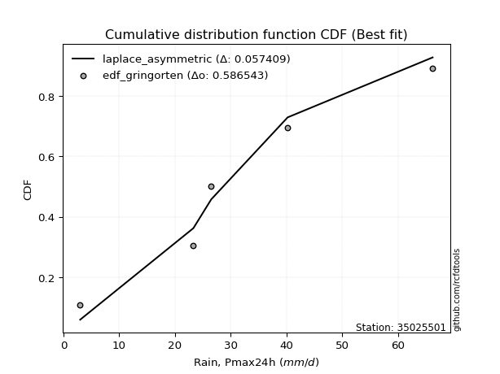</img>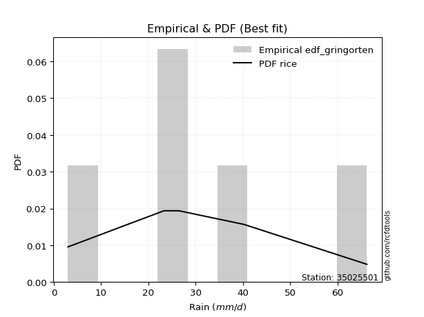</img>

</div>


### 9. EDF Filliben (1975)

The specific values of the constants (0.3175) (often denoted as $alpha$) and (0.365) are derived from a method proposed by James J. Filliben in a 1975 paper. This particular formula is the mean value of the $i$-th order statistic of the normal distribution and is considered a robust and effective plotting position formula for the normal probability plot correlation coefficient test for normality.

<div align="center">


$P=(m-0.3175)/(n+0.365)$


</div>


**9.1. Empirical values**

<div align="center">

|                | 0                   | 1                  | 2            | 3                  | 4                  |
|:---------------|:--------------------|:-------------------|:-------------|:-------------------|:-------------------|
| date           | 2021                | 2017               | 2019         | 2020               | 2018               |
| x              | 3.0                 | 23.3               | 26.5         | 40.2               | 66.2               |
| m              | 1                   | 2                  | 3            | 4                  | 5                  |
| empirical_dist | edf_filliben        | edf_filliben       | edf_filliben | edf_filliben       | edf_filliben       |
| empirical      | 0.12721342031686858 | 0.3136067101584343 | 0.5          | 0.6863932898415657 | 0.8727865796831314 |
| empirical_tr   | 1.1457554725040042  | 1.456890699253225  | 2.0          | 3.188707280832095  | 7.860805860805863  |

</div>


**9.2. Kolmogorov-Smirnov fit test (sorted by Δ)**


<div align="center">

|                | 0                  | 1                   | 2                   | 3                   | 4                   | 5                   | 6                   | 7                   | 8                   | 9                   | 10                  | 11                  | 12                  | 13                  | 14                  | 15                  | 16                  | 17                  | 18                  | 19                  | 20                  | 21                  | 22                  | 23                  | 24                 | 25                 | 26                  | 27                  | 28                  | 29                  | 30                  | 31                  | 32                  | 33                 | 34                  | 35                 | 36                 | 37                 | 38                  | 39                    | 40                  | 41                  | 42                  | 43                  | 44                  | 45                  | 46                 | 47                  | 48                  | 49                  | 50                  | 51                 | 52                 | 53                  | 54                  | 55                 | 56                 | 57                  | 58                  | 59                 | 60                  | 61                 | 62                  | 63                  | 64                  | 65                 | 66                 | 67                 | 68                  | 69                  | 70                 | 71                  | 72                  | 73                  | 74                  | 75                  | 76                  | 77                  | 78                  | 79                 | 80                  | 81                 | 82                  | 83                 | 84                 | 85                 | 86                 | 87                 |
|:---------------|:-------------------|:--------------------|:--------------------|:--------------------|:--------------------|:--------------------|:--------------------|:--------------------|:--------------------|:--------------------|:--------------------|:--------------------|:--------------------|:--------------------|:--------------------|:--------------------|:--------------------|:--------------------|:--------------------|:--------------------|:--------------------|:--------------------|:--------------------|:--------------------|:-------------------|:-------------------|:--------------------|:--------------------|:--------------------|:--------------------|:--------------------|:--------------------|:--------------------|:-------------------|:--------------------|:-------------------|:-------------------|:-------------------|:--------------------|:----------------------|:--------------------|:--------------------|:--------------------|:--------------------|:--------------------|:--------------------|:-------------------|:--------------------|:--------------------|:--------------------|:--------------------|:-------------------|:-------------------|:--------------------|:--------------------|:-------------------|:-------------------|:--------------------|:--------------------|:-------------------|:--------------------|:-------------------|:--------------------|:--------------------|:--------------------|:-------------------|:-------------------|:-------------------|:--------------------|:--------------------|:-------------------|:--------------------|:--------------------|:--------------------|:--------------------|:--------------------|:--------------------|:--------------------|:--------------------|:-------------------|:--------------------|:-------------------|:--------------------|:-------------------|:-------------------|:-------------------|:-------------------|:-------------------|
| station        | 35025501           | 35025501            | 35025501            | 35025501            | 35025501            | 35025501            | 35025501            | 35025501            | 35025501            | 35025501            | 35025501            | 35025501            | 35025501            | 35025501            | 35025501            | 35025501            | 35025501            | 35025501            | 35025501            | 35025501            | 35025501            | 35025501            | 35025501            | 35025501            | 35025501           | 35025501           | 35025501            | 35025501            | 35025501            | 35025501            | 35025501            | 35025501            | 35025501            | 35025501           | 35025501            | 35025501           | 35025501           | 35025501           | 35025501            | 35025501              | 35025501            | 35025501            | 35025501            | 35025501            | 35025501            | 35025501            | 35025501           | 35025501            | 35025501            | 35025501            | 35025501            | 35025501           | 35025501           | 35025501            | 35025501            | 35025501           | 35025501           | 35025501            | 35025501            | 35025501           | 35025501            | 35025501           | 35025501            | 35025501            | 35025501            | 35025501           | 35025501           | 35025501           | 35025501            | 35025501            | 35025501           | 35025501            | 35025501            | 35025501            | 35025501            | 35025501            | 35025501            | 35025501            | 35025501            | 35025501           | 35025501            | 35025501           | 35025501            | 35025501           | 35025501           | 35025501           | 35025501           | 35025501           |
| empirical_dist | edf_filliben       | edf_filliben        | edf_filliben        | edf_filliben        | edf_filliben        | edf_filliben        | edf_filliben        | edf_filliben        | edf_filliben        | edf_filliben        | edf_filliben        | edf_filliben        | edf_filliben        | edf_filliben        | edf_filliben        | edf_filliben        | edf_filliben        | edf_filliben        | edf_filliben        | edf_filliben        | edf_filliben        | edf_filliben        | edf_filliben        | edf_filliben        | edf_filliben       | edf_filliben       | edf_filliben        | edf_filliben        | edf_filliben        | edf_filliben        | edf_filliben        | edf_filliben        | edf_filliben        | edf_filliben       | edf_filliben        | edf_filliben       | edf_filliben       | edf_filliben       | edf_filliben        | edf_filliben          | edf_filliben        | edf_filliben        | edf_filliben        | edf_filliben        | edf_filliben        | edf_filliben        | edf_filliben       | edf_filliben        | edf_filliben        | edf_filliben        | edf_filliben        | edf_filliben       | edf_filliben       | edf_filliben        | edf_filliben        | edf_filliben       | edf_filliben       | edf_filliben        | edf_filliben        | edf_filliben       | edf_filliben        | edf_filliben       | edf_filliben        | edf_filliben        | edf_filliben        | edf_filliben       | edf_filliben       | edf_filliben       | edf_filliben        | edf_filliben        | edf_filliben       | edf_filliben        | edf_filliben        | edf_filliben        | edf_filliben        | edf_filliben        | edf_filliben        | edf_filliben        | edf_filliben        | edf_filliben       | edf_filliben        | edf_filliben       | edf_filliben        | edf_filliben       | edf_filliben       | edf_filliben       | edf_filliben       | edf_filliben       |
| p_dist         | exponnorm          | fisk                | invgamma            | maxwell             | johnsonsu           | nct                 | laplace_asymmetric  | rayleigh            | invgauss            | logjohnsonsu        | rice                | pearson3            | genlogistic         | gumbel_r            | kstwobign           | t                   | crystalball         | truncnorm           | norm                | betaprime           | moyal               | logistic            | hypsecant           | ncf                 | logweibull_min     | logmielke          | logloggamma         | gompertz            | mielke              | halflogistic        | wald                | halfnorm            | gibrat              | logfisk            | logpearson3         | loggumbel_l        | laplace            | loggompertz        | gumbel_l            | loglaplace_asymmetric | expon               | genexpon            | logf                | logexponnorm        | lognorm             | lognorm             | logcrystalball     | logt                | lognct              | logfatiguelife      | loglogistic         | logncf             | loghypsecant       | logrice             | logbetaprime        | loggamma           | loggamma           | logerlang           | logalpha            | loglaplace         | loginvgamma         | loginvgauss        | loginvweibull       | logmaxwell          | lograyleigh         | f                  | nakagami           | logkstwobign       | loggumbel_r         | logtruncnorm        | loghalfnorm        | loggenexpon         | logmoyal            | loghalflogistic     | lognakagami         | logexpon            | weibull_min         | loglognorm          | logwald             | loggibrat          | erlang              | invweibull         | alpha               | fatiguelife        | gamma              | logchi2            | chi2               | loggenlogistic     |
| delta          | 0.0636987924121741 | 0.06542503713849979 | 0.06560111817446346 | 0.06684396490630579 | 0.06738213600952514 | 0.06753810034408325 | 0.06798551572434222 | 0.07112635703555864 | 0.07254609521977984 | 0.07754730637230162 | 0.07815846520105085 | 0.07902981418252875 | 0.08533545937351217 | 0.09018435602836411 | 0.09297083793623379 | 0.10080715181857347 | 0.10084052916734004 | 0.10084053665530679 | 0.10084053866659848 | 0.10967606584737422 | 0.11307735056073207 | 0.11383657397076785 | 0.12446323376733781 | 0.12500134629015647 | 0.1253902593839707 | 0.1265488616972973 | 0.12713621847079093 | 0.12721342031653848 | 0.12721342031686816 | 0.12721342031686858 | 0.12721342031686858 | 0.12721342031686858 | 0.13523414944478163 | 0.1382491608505404 | 0.14138176629813654 | 0.1422288723722443 | 0.1516375251527251 | 0.1540172800175425 | 0.16726544641227242 | 0.17133423103504458   | 0.19173273287533515 | 0.20944611949314512 | 0.21108866586717606 | 0.21140532032817233 | 0.21140540989683848 | 0.21140540989683848 | 0.2114054223113188 | 0.21140574023619546 | 0.21170671053835238 | 0.21248313408831715 | 0.21481081372780048 | 0.2169421894387656 | 0.217711248713721  | 0.22005359513160122 | 0.22099176563303885 | 0.2235939402820915 | 0.2235939402820915 | 0.22522323149565043 | 0.22633348565366845 | 0.2288441568210548 | 0.23322276338725595 | 0.239976861022074  | 0.24328489524231584 | 0.24328735598311785 | 0.25371284905841024 | 0.2571640296801118 | 0.2741349049587492 | 0.2789170992729311 | 0.28207297465243225 | 0.28266672553548505 | 0.2830698668378287 | 0.28504180725224654 | 0.30757566686263366 | 0.30935728672494717 | 0.31327445423070927 | 0.33060734384629636 | 0.34781312314278584 | 0.37361428465732766 | 0.37838989431542663 | 0.4051100763125181 | 0.41352830947320857 | 0.4574224238935697 | 0.46262540406860037 | 0.5463076452518951 | 0.5759823027804727 | 0.6272698696020274 | 0.646867247539435  | 0.6863932898415657 |
| deltao         | 0.5865427407550001 | 0.5865427407550001  | 0.5865427407550001  | 0.5865427407550001  | 0.5865427407550001  | 0.5865427407550001  | 0.5865427407550001  | 0.5865427407550001  | 0.5865427407550001  | 0.5865427407550001  | 0.5865427407550001  | 0.5865427407550001  | 0.5865427407550001  | 0.5865427407550001  | 0.5865427407550001  | 0.5865427407550001  | 0.5865427407550001  | 0.5865427407550001  | 0.5865427407550001  | 0.5865427407550001  | 0.5865427407550001  | 0.5865427407550001  | 0.5865427407550001  | 0.5865427407550001  | 0.5865427407550001 | 0.5865427407550001 | 0.5865427407550001  | 0.5865427407550001  | 0.5865427407550001  | 0.5865427407550001  | 0.5865427407550001  | 0.5865427407550001  | 0.5865427407550001  | 0.5865427407550001 | 0.5865427407550001  | 0.5865427407550001 | 0.5865427407550001 | 0.5865427407550001 | 0.5865427407550001  | 0.5865427407550001    | 0.5865427407550001  | 0.5865427407550001  | 0.5865427407550001  | 0.5865427407550001  | 0.5865427407550001  | 0.5865427407550001  | 0.5865427407550001 | 0.5865427407550001  | 0.5865427407550001  | 0.5865427407550001  | 0.5865427407550001  | 0.5865427407550001 | 0.5865427407550001 | 0.5865427407550001  | 0.5865427407550001  | 0.5865427407550001 | 0.5865427407550001 | 0.5865427407550001  | 0.5865427407550001  | 0.5865427407550001 | 0.5865427407550001  | 0.5865427407550001 | 0.5865427407550001  | 0.5865427407550001  | 0.5865427407550001  | 0.5865427407550001 | 0.5865427407550001 | 0.5865427407550001 | 0.5865427407550001  | 0.5865427407550001  | 0.5865427407550001 | 0.5865427407550001  | 0.5865427407550001  | 0.5865427407550001  | 0.5865427407550001  | 0.5865427407550001  | 0.5865427407550001  | 0.5865427407550001  | 0.5865427407550001  | 0.5865427407550001 | 0.5865427407550001  | 0.5865427407550001 | 0.5865427407550001  | 0.5865427407550001 | 0.5865427407550001 | 0.5865427407550001 | 0.5865427407550001 | 0.5865427407550001 |
| eval           | Δo > Δ             | Δo > Δ              | Δo > Δ              | Δo > Δ              | Δo > Δ              | Δo > Δ              | Δo > Δ              | Δo > Δ              | Δo > Δ              | Δo > Δ              | Δo > Δ              | Δo > Δ              | Δo > Δ              | Δo > Δ              | Δo > Δ              | Δo > Δ              | Δo > Δ              | Δo > Δ              | Δo > Δ              | Δo > Δ              | Δo > Δ              | Δo > Δ              | Δo > Δ              | Δo > Δ              | Δo > Δ             | Δo > Δ             | Δo > Δ              | Δo > Δ              | Δo > Δ              | Δo > Δ              | Δo > Δ              | Δo > Δ              | Δo > Δ              | Δo > Δ             | Δo > Δ              | Δo > Δ             | Δo > Δ             | Δo > Δ             | Δo > Δ              | Δo > Δ                | Δo > Δ              | Δo > Δ              | Δo > Δ              | Δo > Δ              | Δo > Δ              | Δo > Δ              | Δo > Δ             | Δo > Δ              | Δo > Δ              | Δo > Δ              | Δo > Δ              | Δo > Δ             | Δo > Δ             | Δo > Δ              | Δo > Δ              | Δo > Δ             | Δo > Δ             | Δo > Δ              | Δo > Δ              | Δo > Δ             | Δo > Δ              | Δo > Δ             | Δo > Δ              | Δo > Δ              | Δo > Δ              | Δo > Δ             | Δo > Δ             | Δo > Δ             | Δo > Δ              | Δo > Δ              | Δo > Δ             | Δo > Δ              | Δo > Δ              | Δo > Δ              | Δo > Δ              | Δo > Δ              | Δo > Δ              | Δo > Δ              | Δo > Δ              | Δo > Δ             | Δo > Δ              | Δo > Δ             | Δo > Δ              | Δo > Δ             | Δo > Δ             | Δo <= Δ            | Δo <= Δ            | Δo <= Δ            |
| fit            | 1                  | 1                   | 1                   | 1                   | 1                   | 1                   | 1                   | 1                   | 1                   | 1                   | 1                   | 1                   | 1                   | 1                   | 1                   | 1                   | 1                   | 1                   | 1                   | 1                   | 1                   | 1                   | 1                   | 1                   | 1                  | 1                  | 1                   | 1                   | 1                   | 1                   | 1                   | 1                   | 1                   | 1                  | 1                   | 1                  | 1                  | 1                  | 1                   | 1                     | 1                   | 1                   | 1                   | 1                   | 1                   | 1                   | 1                  | 1                   | 1                   | 1                   | 1                   | 1                  | 1                  | 1                   | 1                   | 1                  | 1                  | 1                   | 1                   | 1                  | 1                   | 1                  | 1                   | 1                   | 1                   | 1                  | 1                  | 1                  | 1                   | 1                   | 1                  | 1                   | 1                   | 1                   | 1                   | 1                   | 1                   | 1                   | 1                   | 1                  | 1                   | 1                  | 1                   | 1                  | 1                  | 0                  | 0                  | 0                  |
| n              | 5                  | 5                   | 5                   | 5                   | 5                   | 5                   | 5                   | 5                   | 5                   | 5                   | 5                   | 5                   | 5                   | 5                   | 5                   | 5                   | 5                   | 5                   | 5                   | 5                   | 5                   | 5                   | 5                   | 5                   | 5                  | 5                  | 5                   | 5                   | 5                   | 5                   | 5                   | 5                   | 5                   | 5                  | 5                   | 5                  | 5                  | 5                  | 5                   | 5                     | 5                   | 5                   | 5                   | 5                   | 5                   | 5                   | 5                  | 5                   | 5                   | 5                   | 5                   | 5                  | 5                  | 5                   | 5                   | 5                  | 5                  | 5                   | 5                   | 5                  | 5                   | 5                  | 5                   | 5                   | 5                   | 5                  | 5                  | 5                  | 5                   | 5                   | 5                  | 5                   | 5                   | 5                   | 5                   | 5                   | 5                   | 5                   | 5                   | 5                  | 5                   | 5                  | 5                   | 5                  | 5                  | 5                  | 5                  | 5                  |
| best_fit       | 1                  | 0                   | 0                   | 0                   | 0                   | 0                   | 0                   | 0                   | 0                   | 0                   | 0                   | 0                   | 0                   | 0                   | 0                   | 0                   | 0                   | 0                   | 0                   | 0                   | 0                   | 0                   | 0                   | 0                   | 0                  | 0                  | 0                   | 0                   | 0                   | 0                   | 0                   | 0                   | 0                   | 0                  | 0                   | 0                  | 0                  | 0                  | 0                   | 0                     | 0                   | 0                   | 0                   | 0                   | 0                   | 0                   | 0                  | 0                   | 0                   | 0                   | 0                   | 0                  | 0                  | 0                   | 0                   | 0                  | 0                  | 0                   | 0                   | 0                  | 0                   | 0                  | 0                   | 0                   | 0                   | 0                  | 0                  | 0                  | 0                   | 0                   | 0                  | 0                   | 0                   | 0                   | 0                   | 0                   | 0                   | 0                   | 0                   | 0                  | 0                   | 0                  | 0                   | 0                  | 0                  | 0                  | 0                  | 0                  |
| best_fit_sort  | 1                  | 2                   | 3                   | 4                   | 5                   | 6                   | 7                   | 8                   | 9                   | 10                  | 11                  | 12                  | 13                  | 14                  | 15                  | 16                  | 17                  | 18                  | 19                  | 20                  | 21                  | 22                  | 23                  | 24                  | 25                 | 26                 | 27                  | 28                  | 29                  | 30                  | 31                  | 32                  | 33                  | 34                 | 35                  | 36                 | 37                 | 38                 | 39                  | 40                    | 41                  | 42                  | 43                  | 44                  | 45                  | 46                  | 47                 | 48                  | 49                  | 50                  | 51                  | 52                 | 53                 | 54                  | 55                  | 56                 | 57                 | 58                  | 59                  | 60                 | 61                  | 62                 | 63                  | 64                  | 65                  | 66                 | 67                 | 68                 | 69                  | 70                  | 71                 | 72                  | 73                  | 74                  | 75                  | 76                  | 77                  | 78                  | 79                  | 80                 | 81                  | 82                 | 83                  | 84                 | 85                 | 86                 | 87                 | 88                 |

</div>


**9.3. Best fit**

<div align="center">

|   id |   station | empirical_dist   | p_dist    |     delta |   deltao | eval   |   fit |   n |   best_fit |   best_fit_sort |
|-----:|----------:|:-----------------|:----------|----------:|---------:|:-------|------:|----:|-----------:|----------------:|
|    0 |  35025501 | edf_filliben     | exponnorm | 0.0636988 | 0.586543 | Δo > Δ |     1 |   5 |          1 |               1 |

</div>


<div align="center">

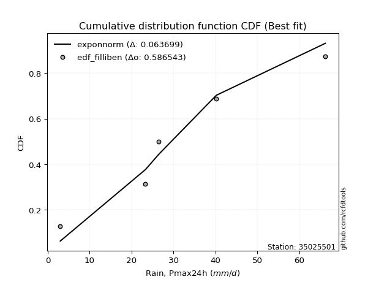</img>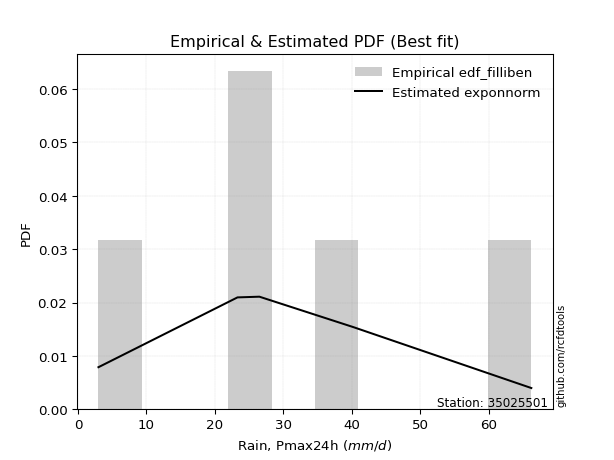</img>

</div>


### 10. EDF Jenkinson (1977)

The Jenkinson formula in hydrology is an empirical plotting position formula used to estimate the non-exceedance probability _(P)_ or return period _(T)_ of a given ordered observation within a sample. It is a widely used method in the frequency analysis of extreme events such as floods and rainfall, as it provides a distribution-free way to plot data. _a≈0.31_ and _b≈0.38_ are constants derived to approximate the median of the probability distribution for the given rank.

<div align="center">


$P=(m-a)/(n+b)$


</div>


**10.1. Empirical values**

<div align="center">

|                | 0                   | 1                  | 2             | 3                  | 4                  |
|:---------------|:--------------------|:-------------------|:--------------|:-------------------|:-------------------|
| date           | 2021                | 2017               | 2019          | 2020               | 2018               |
| x              | 3.0                 | 23.3               | 26.5          | 40.2               | 66.2               |
| m              | 1                   | 2                  | 3             | 4                  | 5                  |
| empirical_dist | edf_jenkinson       | edf_jenkinson      | edf_jenkinson | edf_jenkinson      | edf_jenkinson      |
| empirical      | 0.12825278810408922 | 0.3141263940520446 | 0.5           | 0.6858736059479554 | 0.8717472118959109 |
| empirical_tr   | 1.1471215351812367  | 1.4579945799457996 | 2.0           | 3.183431952662722  | 7.797101449275368  |

</div>


**10.2. Kolmogorov-Smirnov fit test (sorted by Δ)**


<div align="center">

|                | 0                   | 1                   | 2                   | 3                   | 4                   | 5                   | 6                   | 7                  | 8                   | 9                   | 10                  | 11                  | 12                  | 13                  | 14                  | 15                  | 16                  | 17                  | 18                  | 19                  | 20                  | 21                 | 22                  | 23                  | 24                  | 25                  | 26                 | 27                  | 28                 | 29                  | 30                  | 31                  | 32                  | 33                  | 34                 | 35                  | 36                 | 37                  | 38                  | 39                    | 40                 | 41                  | 42                  | 43                  | 44                  | 45                  | 46                  | 47                  | 48                  | 49                 | 50                  | 51                  | 52                  | 53                  | 54                 | 55                  | 56                  | 57                 | 58                 | 59                  | 60                 | 61                  | 62                 | 63                 | 64                 | 65                  | 66                  | 67                 | 68                 | 69                 | 70                  | 71                 | 72                 | 73                 | 74                 | 75                 | 76                 | 77                 | 78                 | 79                  | 80                 | 81                 | 82                 | 83                 | 84                 | 85                 | 86                 | 87                 |
|:---------------|:--------------------|:--------------------|:--------------------|:--------------------|:--------------------|:--------------------|:--------------------|:-------------------|:--------------------|:--------------------|:--------------------|:--------------------|:--------------------|:--------------------|:--------------------|:--------------------|:--------------------|:--------------------|:--------------------|:--------------------|:--------------------|:-------------------|:--------------------|:--------------------|:--------------------|:--------------------|:-------------------|:--------------------|:-------------------|:--------------------|:--------------------|:--------------------|:--------------------|:--------------------|:-------------------|:--------------------|:-------------------|:--------------------|:--------------------|:----------------------|:-------------------|:--------------------|:--------------------|:--------------------|:--------------------|:--------------------|:--------------------|:--------------------|:--------------------|:-------------------|:--------------------|:--------------------|:--------------------|:--------------------|:-------------------|:--------------------|:--------------------|:-------------------|:-------------------|:--------------------|:-------------------|:--------------------|:-------------------|:-------------------|:-------------------|:--------------------|:--------------------|:-------------------|:-------------------|:-------------------|:--------------------|:-------------------|:-------------------|:-------------------|:-------------------|:-------------------|:-------------------|:-------------------|:-------------------|:--------------------|:-------------------|:-------------------|:-------------------|:-------------------|:-------------------|:-------------------|:-------------------|:-------------------|
| station        | 35025501            | 35025501            | 35025501            | 35025501            | 35025501            | 35025501            | 35025501            | 35025501           | 35025501            | 35025501            | 35025501            | 35025501            | 35025501            | 35025501            | 35025501            | 35025501            | 35025501            | 35025501            | 35025501            | 35025501            | 35025501            | 35025501           | 35025501            | 35025501            | 35025501            | 35025501            | 35025501           | 35025501            | 35025501           | 35025501            | 35025501            | 35025501            | 35025501            | 35025501            | 35025501           | 35025501            | 35025501           | 35025501            | 35025501            | 35025501              | 35025501           | 35025501            | 35025501            | 35025501            | 35025501            | 35025501            | 35025501            | 35025501            | 35025501            | 35025501           | 35025501            | 35025501            | 35025501            | 35025501            | 35025501           | 35025501            | 35025501            | 35025501           | 35025501           | 35025501            | 35025501           | 35025501            | 35025501           | 35025501           | 35025501           | 35025501            | 35025501            | 35025501           | 35025501           | 35025501           | 35025501            | 35025501           | 35025501           | 35025501           | 35025501           | 35025501           | 35025501           | 35025501           | 35025501           | 35025501            | 35025501           | 35025501           | 35025501           | 35025501           | 35025501           | 35025501           | 35025501           | 35025501           |
| empirical_dist | edf_jenkinson       | edf_jenkinson       | edf_jenkinson       | edf_jenkinson       | edf_jenkinson       | edf_jenkinson       | edf_jenkinson       | edf_jenkinson      | edf_jenkinson       | edf_jenkinson       | edf_jenkinson       | edf_jenkinson       | edf_jenkinson       | edf_jenkinson       | edf_jenkinson       | edf_jenkinson       | edf_jenkinson       | edf_jenkinson       | edf_jenkinson       | edf_jenkinson       | edf_jenkinson       | edf_jenkinson      | edf_jenkinson       | edf_jenkinson       | edf_jenkinson       | edf_jenkinson       | edf_jenkinson      | edf_jenkinson       | edf_jenkinson      | edf_jenkinson       | edf_jenkinson       | edf_jenkinson       | edf_jenkinson       | edf_jenkinson       | edf_jenkinson      | edf_jenkinson       | edf_jenkinson      | edf_jenkinson       | edf_jenkinson       | edf_jenkinson         | edf_jenkinson      | edf_jenkinson       | edf_jenkinson       | edf_jenkinson       | edf_jenkinson       | edf_jenkinson       | edf_jenkinson       | edf_jenkinson       | edf_jenkinson       | edf_jenkinson      | edf_jenkinson       | edf_jenkinson       | edf_jenkinson       | edf_jenkinson       | edf_jenkinson      | edf_jenkinson       | edf_jenkinson       | edf_jenkinson      | edf_jenkinson      | edf_jenkinson       | edf_jenkinson      | edf_jenkinson       | edf_jenkinson      | edf_jenkinson      | edf_jenkinson      | edf_jenkinson       | edf_jenkinson       | edf_jenkinson      | edf_jenkinson      | edf_jenkinson      | edf_jenkinson       | edf_jenkinson      | edf_jenkinson      | edf_jenkinson      | edf_jenkinson      | edf_jenkinson      | edf_jenkinson      | edf_jenkinson      | edf_jenkinson      | edf_jenkinson       | edf_jenkinson      | edf_jenkinson      | edf_jenkinson      | edf_jenkinson      | edf_jenkinson      | edf_jenkinson      | edf_jenkinson      | edf_jenkinson      |
| p_dist         | exponnorm           | fisk                | invgamma            | maxwell             | nct                 | johnsonsu           | laplace_asymmetric  | rayleigh           | invgauss            | logjohnsonsu        | pearson3            | rice                | genlogistic         | gumbel_r            | kstwobign           | t                   | crystalball         | truncnorm           | norm                | betaprime           | logistic            | moyal              | hypsecant           | ncf                 | logweibull_min      | logmielke           | logloggamma        | gompertz            | mielke             | halflogistic        | wald                | halfnorm            | gibrat              | logfisk             | logpearson3        | loggumbel_l         | laplace            | loggompertz         | gumbel_l            | loglaplace_asymmetric | expon              | genexpon            | logf                | logexponnorm        | lognorm             | lognorm             | logcrystalball      | logt                | lognct              | logfatiguelife     | loglogistic         | logncf              | loghypsecant        | logrice             | logbetaprime       | loggamma            | loggamma            | logerlang          | logalpha           | loglaplace          | loginvgamma        | loginvgauss         | loginvweibull      | logmaxwell         | lograyleigh        | f                   | nakagami            | logkstwobign       | loggumbel_r        | logtruncnorm       | loghalfnorm         | loggenexpon        | logmoyal           | loghalflogistic    | lognakagami        | logexpon           | weibull_min        | loglognorm         | logwald            | loggibrat           | erlang             | invweibull         | alpha              | fatiguelife        | gamma              | logchi2            | chi2               | loggenlogistic     |
| delta          | 0.06473816019939474 | 0.06646440492572042 | 0.06664048596168409 | 0.06684396490630579 | 0.06753810034408325 | 0.06828529154749413 | 0.06902488351156286 | 0.0706066731419483 | 0.07202641132616949 | 0.07754730637230162 | 0.07902981418252875 | 0.07919783298827149 | 0.08481577547990182 | 0.09122372381558475 | 0.09245115404262344 | 0.10080715181857347 | 0.10084052916734004 | 0.10084053665530679 | 0.10084053866659848 | 0.10915638195376387 | 0.11383657397076785 | 0.1141167183479527 | 0.12446323376733781 | 0.12448166239654612 | 0.12487057549036035 | 0.12758822948451787 | 0.1281755862580115 | 0.12825278810375912 | 0.1282527881040888 | 0.12825278810408922 | 0.12825278810408922 | 0.12825278810408922 | 0.13575383333839186 | 0.13772947695693005 | 0.1408620824045262 | 0.14170918847863395 | 0.1516375251527251 | 0.15349759612393216 | 0.16726544641227242 | 0.17081454714143424   | 0.1912130489817248 | 0.20892643559953478 | 0.21056898197356572 | 0.21088563643456198 | 0.21088572600322814 | 0.21088572600322814 | 0.21088573841770847 | 0.21088605634258512 | 0.21118702664474204 | 0.2119634501947068 | 0.21429112983419013 | 0.21642250554515524 | 0.21719156482011065 | 0.21953391123799088 | 0.2204720817394285 | 0.22307425638848116 | 0.22307425638848116 | 0.2247035476020401 | 0.2258138017600581 | 0.22832447292744446 | 0.2327030794936456 | 0.23945717712846365 | 0.2427652113487055 | 0.2427676720895075 | 0.2531931651647999 | 0.25664434578650147 | 0.27361522106513886 | 0.2783974153793208 | 0.2815532907588219 | 0.2821470416418747 | 0.28255018294421835 | 0.2845221233586362 | 0.3070559829690233 | 0.3088376028313368 | 0.3137941381243196 | 0.330087659952686  | 0.3472934392491755 | 0.3730946007637173 | 0.3778702104218163 | 0.40459039241890776 | 0.4130086255795982 | 0.4563830561063491 | 0.46210572017499   | 0.5457879613582848 | 0.5754626188868623 | 0.626750185708417  | 0.6463475636458247 | 0.6858736059479554 |
| deltao         | 0.5865427407550001  | 0.5865427407550001  | 0.5865427407550001  | 0.5865427407550001  | 0.5865427407550001  | 0.5865427407550001  | 0.5865427407550001  | 0.5865427407550001 | 0.5865427407550001  | 0.5865427407550001  | 0.5865427407550001  | 0.5865427407550001  | 0.5865427407550001  | 0.5865427407550001  | 0.5865427407550001  | 0.5865427407550001  | 0.5865427407550001  | 0.5865427407550001  | 0.5865427407550001  | 0.5865427407550001  | 0.5865427407550001  | 0.5865427407550001 | 0.5865427407550001  | 0.5865427407550001  | 0.5865427407550001  | 0.5865427407550001  | 0.5865427407550001 | 0.5865427407550001  | 0.5865427407550001 | 0.5865427407550001  | 0.5865427407550001  | 0.5865427407550001  | 0.5865427407550001  | 0.5865427407550001  | 0.5865427407550001 | 0.5865427407550001  | 0.5865427407550001 | 0.5865427407550001  | 0.5865427407550001  | 0.5865427407550001    | 0.5865427407550001 | 0.5865427407550001  | 0.5865427407550001  | 0.5865427407550001  | 0.5865427407550001  | 0.5865427407550001  | 0.5865427407550001  | 0.5865427407550001  | 0.5865427407550001  | 0.5865427407550001 | 0.5865427407550001  | 0.5865427407550001  | 0.5865427407550001  | 0.5865427407550001  | 0.5865427407550001 | 0.5865427407550001  | 0.5865427407550001  | 0.5865427407550001 | 0.5865427407550001 | 0.5865427407550001  | 0.5865427407550001 | 0.5865427407550001  | 0.5865427407550001 | 0.5865427407550001 | 0.5865427407550001 | 0.5865427407550001  | 0.5865427407550001  | 0.5865427407550001 | 0.5865427407550001 | 0.5865427407550001 | 0.5865427407550001  | 0.5865427407550001 | 0.5865427407550001 | 0.5865427407550001 | 0.5865427407550001 | 0.5865427407550001 | 0.5865427407550001 | 0.5865427407550001 | 0.5865427407550001 | 0.5865427407550001  | 0.5865427407550001 | 0.5865427407550001 | 0.5865427407550001 | 0.5865427407550001 | 0.5865427407550001 | 0.5865427407550001 | 0.5865427407550001 | 0.5865427407550001 |
| eval           | Δo > Δ              | Δo > Δ              | Δo > Δ              | Δo > Δ              | Δo > Δ              | Δo > Δ              | Δo > Δ              | Δo > Δ             | Δo > Δ              | Δo > Δ              | Δo > Δ              | Δo > Δ              | Δo > Δ              | Δo > Δ              | Δo > Δ              | Δo > Δ              | Δo > Δ              | Δo > Δ              | Δo > Δ              | Δo > Δ              | Δo > Δ              | Δo > Δ             | Δo > Δ              | Δo > Δ              | Δo > Δ              | Δo > Δ              | Δo > Δ             | Δo > Δ              | Δo > Δ             | Δo > Δ              | Δo > Δ              | Δo > Δ              | Δo > Δ              | Δo > Δ              | Δo > Δ             | Δo > Δ              | Δo > Δ             | Δo > Δ              | Δo > Δ              | Δo > Δ                | Δo > Δ             | Δo > Δ              | Δo > Δ              | Δo > Δ              | Δo > Δ              | Δo > Δ              | Δo > Δ              | Δo > Δ              | Δo > Δ              | Δo > Δ             | Δo > Δ              | Δo > Δ              | Δo > Δ              | Δo > Δ              | Δo > Δ             | Δo > Δ              | Δo > Δ              | Δo > Δ             | Δo > Δ             | Δo > Δ              | Δo > Δ             | Δo > Δ              | Δo > Δ             | Δo > Δ             | Δo > Δ             | Δo > Δ              | Δo > Δ              | Δo > Δ             | Δo > Δ             | Δo > Δ             | Δo > Δ              | Δo > Δ             | Δo > Δ             | Δo > Δ             | Δo > Δ             | Δo > Δ             | Δo > Δ             | Δo > Δ             | Δo > Δ             | Δo > Δ              | Δo > Δ             | Δo > Δ             | Δo > Δ             | Δo > Δ             | Δo > Δ             | Δo <= Δ            | Δo <= Δ            | Δo <= Δ            |
| fit            | 1                   | 1                   | 1                   | 1                   | 1                   | 1                   | 1                   | 1                  | 1                   | 1                   | 1                   | 1                   | 1                   | 1                   | 1                   | 1                   | 1                   | 1                   | 1                   | 1                   | 1                   | 1                  | 1                   | 1                   | 1                   | 1                   | 1                  | 1                   | 1                  | 1                   | 1                   | 1                   | 1                   | 1                   | 1                  | 1                   | 1                  | 1                   | 1                   | 1                     | 1                  | 1                   | 1                   | 1                   | 1                   | 1                   | 1                   | 1                   | 1                   | 1                  | 1                   | 1                   | 1                   | 1                   | 1                  | 1                   | 1                   | 1                  | 1                  | 1                   | 1                  | 1                   | 1                  | 1                  | 1                  | 1                   | 1                   | 1                  | 1                  | 1                  | 1                   | 1                  | 1                  | 1                  | 1                  | 1                  | 1                  | 1                  | 1                  | 1                   | 1                  | 1                  | 1                  | 1                  | 1                  | 0                  | 0                  | 0                  |
| n              | 5                   | 5                   | 5                   | 5                   | 5                   | 5                   | 5                   | 5                  | 5                   | 5                   | 5                   | 5                   | 5                   | 5                   | 5                   | 5                   | 5                   | 5                   | 5                   | 5                   | 5                   | 5                  | 5                   | 5                   | 5                   | 5                   | 5                  | 5                   | 5                  | 5                   | 5                   | 5                   | 5                   | 5                   | 5                  | 5                   | 5                  | 5                   | 5                   | 5                     | 5                  | 5                   | 5                   | 5                   | 5                   | 5                   | 5                   | 5                   | 5                   | 5                  | 5                   | 5                   | 5                   | 5                   | 5                  | 5                   | 5                   | 5                  | 5                  | 5                   | 5                  | 5                   | 5                  | 5                  | 5                  | 5                   | 5                   | 5                  | 5                  | 5                  | 5                   | 5                  | 5                  | 5                  | 5                  | 5                  | 5                  | 5                  | 5                  | 5                   | 5                  | 5                  | 5                  | 5                  | 5                  | 5                  | 5                  | 5                  |
| best_fit       | 1                   | 0                   | 0                   | 0                   | 0                   | 0                   | 0                   | 0                  | 0                   | 0                   | 0                   | 0                   | 0                   | 0                   | 0                   | 0                   | 0                   | 0                   | 0                   | 0                   | 0                   | 0                  | 0                   | 0                   | 0                   | 0                   | 0                  | 0                   | 0                  | 0                   | 0                   | 0                   | 0                   | 0                   | 0                  | 0                   | 0                  | 0                   | 0                   | 0                     | 0                  | 0                   | 0                   | 0                   | 0                   | 0                   | 0                   | 0                   | 0                   | 0                  | 0                   | 0                   | 0                   | 0                   | 0                  | 0                   | 0                   | 0                  | 0                  | 0                   | 0                  | 0                   | 0                  | 0                  | 0                  | 0                   | 0                   | 0                  | 0                  | 0                  | 0                   | 0                  | 0                  | 0                  | 0                  | 0                  | 0                  | 0                  | 0                  | 0                   | 0                  | 0                  | 0                  | 0                  | 0                  | 0                  | 0                  | 0                  |
| best_fit_sort  | 1                   | 2                   | 3                   | 4                   | 5                   | 6                   | 7                   | 8                  | 9                   | 10                  | 11                  | 12                  | 13                  | 14                  | 15                  | 16                  | 17                  | 18                  | 19                  | 20                  | 21                  | 22                 | 23                  | 24                  | 25                  | 26                  | 27                 | 28                  | 29                 | 30                  | 31                  | 32                  | 33                  | 34                  | 35                 | 36                  | 37                 | 38                  | 39                  | 40                    | 41                 | 42                  | 43                  | 44                  | 45                  | 46                  | 47                  | 48                  | 49                  | 50                 | 51                  | 52                  | 53                  | 54                  | 55                 | 56                  | 57                  | 58                 | 59                 | 60                  | 61                 | 62                  | 63                 | 64                 | 65                 | 66                  | 67                  | 68                 | 69                 | 70                 | 71                  | 72                 | 73                 | 74                 | 75                 | 76                 | 77                 | 78                 | 79                 | 80                  | 81                 | 82                 | 83                 | 84                 | 85                 | 86                 | 87                 | 88                 |

</div>


**10.3. Best fit**

<div align="center">

|   id |   station | empirical_dist   | p_dist    |     delta |   deltao | eval   |   fit |   n |   best_fit |   best_fit_sort |
|-----:|----------:|:-----------------|:----------|----------:|---------:|:-------|------:|----:|-----------:|----------------:|
|    0 |  35025501 | edf_jenkinson    | exponnorm | 0.0647382 | 0.586543 | Δo > Δ |     1 |   5 |          1 |               1 |

</div>


<div align="center">

</img></img>

</div>


### 11. EDF Cunnane (1978)

Cunnane´s work in statistical hydrology has focused on the performance and evaluation of different probability distributions (such as GEV, Gumbel, Lognormal) for flood frequency estimation. _b_ is a constant, typically set to 0.4.

<div align="center">


$P=(m-b)/(n+1-2b)$


</div>


**11.1. Empirical values**

<div align="center">

|                | 0                   | 1                  | 2           | 3                  | 4                  |
|:---------------|:--------------------|:-------------------|:------------|:-------------------|:-------------------|
| date           | 2021                | 2017               | 2019        | 2020               | 2018               |
| x              | 3.0                 | 23.3               | 26.5        | 40.2               | 66.2               |
| m              | 1                   | 2                  | 3           | 4                  | 5                  |
| empirical_dist | edf_cunnane         | edf_cunnane        | edf_cunnane | edf_cunnane        | edf_cunnane        |
| empirical      | 0.11538461538461538 | 0.3076923076923077 | 0.5         | 0.6923076923076923 | 0.8846153846153845 |
| empirical_tr   | 1.1304347826086958  | 1.4444444444444444 | 2.0         | 3.25               | 8.666666666666655  |

</div>


**11.2. Kolmogorov-Smirnov fit test (sorted by Δ)**


<div align="center">

|                | 0                   | 1                   | 2                   | 3                   | 4                   | 5                   | 6                   | 7                  | 8                   | 9                   | 10                 | 11                  | 12                  | 13                  | 14                  | 15                  | 16                  | 17                  | 18                  | 19                  | 20                  | 21                  | 22                 | 23                  | 24                  | 25                  | 26                  | 27                  | 28                  | 29                 | 30                  | 31                  | 32                  | 33                  | 34                 | 35                  | 36                 | 37                  | 38                  | 39                    | 40                  | 41                 | 42                  | 43                 | 44                  | 45                  | 46                  | 47                  | 48                  | 49                  | 50                  | 51                  | 52                  | 53                 | 54                  | 55                  | 56                  | 57                 | 58                  | 59                  | 60                  | 61                  | 62                 | 63                  | 64                 | 65                 | 66                  | 67                 | 68                 | 69                 | 70                  | 71                 | 72                 | 73                 | 74                  | 75                  | 76                 | 77                 | 78                 | 79                 | 80                  | 81                  | 82                 | 83                 | 84                 | 85                 | 86                 | 87                 |
|:---------------|:--------------------|:--------------------|:--------------------|:--------------------|:--------------------|:--------------------|:--------------------|:-------------------|:--------------------|:--------------------|:-------------------|:--------------------|:--------------------|:--------------------|:--------------------|:--------------------|:--------------------|:--------------------|:--------------------|:--------------------|:--------------------|:--------------------|:-------------------|:--------------------|:--------------------|:--------------------|:--------------------|:--------------------|:--------------------|:-------------------|:--------------------|:--------------------|:--------------------|:--------------------|:-------------------|:--------------------|:-------------------|:--------------------|:--------------------|:----------------------|:--------------------|:-------------------|:--------------------|:-------------------|:--------------------|:--------------------|:--------------------|:--------------------|:--------------------|:--------------------|:--------------------|:--------------------|:--------------------|:-------------------|:--------------------|:--------------------|:--------------------|:-------------------|:--------------------|:--------------------|:--------------------|:--------------------|:-------------------|:--------------------|:-------------------|:-------------------|:--------------------|:-------------------|:-------------------|:-------------------|:--------------------|:-------------------|:-------------------|:-------------------|:--------------------|:--------------------|:-------------------|:-------------------|:-------------------|:-------------------|:--------------------|:--------------------|:-------------------|:-------------------|:-------------------|:-------------------|:-------------------|:-------------------|
| station        | 35025501            | 35025501            | 35025501            | 35025501            | 35025501            | 35025501            | 35025501            | 35025501           | 35025501            | 35025501            | 35025501           | 35025501            | 35025501            | 35025501            | 35025501            | 35025501            | 35025501            | 35025501            | 35025501            | 35025501            | 35025501            | 35025501            | 35025501           | 35025501            | 35025501            | 35025501            | 35025501            | 35025501            | 35025501            | 35025501           | 35025501            | 35025501            | 35025501            | 35025501            | 35025501           | 35025501            | 35025501           | 35025501            | 35025501            | 35025501              | 35025501            | 35025501           | 35025501            | 35025501           | 35025501            | 35025501            | 35025501            | 35025501            | 35025501            | 35025501            | 35025501            | 35025501            | 35025501            | 35025501           | 35025501            | 35025501            | 35025501            | 35025501           | 35025501            | 35025501            | 35025501            | 35025501            | 35025501           | 35025501            | 35025501           | 35025501           | 35025501            | 35025501           | 35025501           | 35025501           | 35025501            | 35025501           | 35025501           | 35025501           | 35025501            | 35025501            | 35025501           | 35025501           | 35025501           | 35025501           | 35025501            | 35025501            | 35025501           | 35025501           | 35025501           | 35025501           | 35025501           | 35025501           |
| empirical_dist | edf_cunnane         | edf_cunnane         | edf_cunnane         | edf_cunnane         | edf_cunnane         | edf_cunnane         | edf_cunnane         | edf_cunnane        | edf_cunnane         | edf_cunnane         | edf_cunnane        | edf_cunnane         | edf_cunnane         | edf_cunnane         | edf_cunnane         | edf_cunnane         | edf_cunnane         | edf_cunnane         | edf_cunnane         | edf_cunnane         | edf_cunnane         | edf_cunnane         | edf_cunnane        | edf_cunnane         | edf_cunnane         | edf_cunnane         | edf_cunnane         | edf_cunnane         | edf_cunnane         | edf_cunnane        | edf_cunnane         | edf_cunnane         | edf_cunnane         | edf_cunnane         | edf_cunnane        | edf_cunnane         | edf_cunnane        | edf_cunnane         | edf_cunnane         | edf_cunnane           | edf_cunnane         | edf_cunnane        | edf_cunnane         | edf_cunnane        | edf_cunnane         | edf_cunnane         | edf_cunnane         | edf_cunnane         | edf_cunnane         | edf_cunnane         | edf_cunnane         | edf_cunnane         | edf_cunnane         | edf_cunnane        | edf_cunnane         | edf_cunnane         | edf_cunnane         | edf_cunnane        | edf_cunnane         | edf_cunnane         | edf_cunnane         | edf_cunnane         | edf_cunnane        | edf_cunnane         | edf_cunnane        | edf_cunnane        | edf_cunnane         | edf_cunnane        | edf_cunnane        | edf_cunnane        | edf_cunnane         | edf_cunnane        | edf_cunnane        | edf_cunnane        | edf_cunnane         | edf_cunnane         | edf_cunnane        | edf_cunnane        | edf_cunnane        | edf_cunnane        | edf_cunnane         | edf_cunnane         | edf_cunnane        | edf_cunnane        | edf_cunnane        | edf_cunnane        | edf_cunnane        | edf_cunnane        |
| p_dist         | laplace_asymmetric  | fisk                | rice                | maxwell             | nct                 | exponnorm           | invgamma            | johnsonsu          | rayleigh            | logjohnsonsu        | invgauss           | pearson3            | gumbel_r            | genlogistic         | kstwobign           | t                   | crystalball         | truncnorm           | norm                | moyal               | logistic            | logmielke           | logloggamma        | gompertz            | mielke              | halfnorm            | betaprime           | halflogistic        | hypsecant           | gibrat             | ncf                 | logweibull_min      | wald                | logfisk             | logpearson3        | loggumbel_l         | laplace            | loggompertz         | gumbel_l            | loglaplace_asymmetric | expon               | genexpon           | logf                | logexponnorm       | lognorm             | lognorm             | logcrystalball      | logt                | lognct              | logfatiguelife      | loglogistic         | logncf              | loghypsecant        | logrice            | logbetaprime        | loggamma            | loggamma            | logerlang          | logalpha            | loglaplace          | loginvgamma         | loginvgauss         | loginvweibull      | logmaxwell          | lograyleigh        | f                  | nakagami            | logkstwobign       | loggumbel_r        | logtruncnorm       | loghalfnorm         | loggenexpon        | lognakagami        | logmoyal           | loghalflogistic     | logexpon            | weibull_min        | loglognorm         | logwald            | loggibrat          | erlang              | alpha               | invweibull         | fatiguelife        | gamma              | logchi2            | chi2               | loggenlogistic     |
| delta          | 0.05615671079208901 | 0.06499856952795313 | 0.06656185600087089 | 0.06684396490630579 | 0.06753810034408325 | 0.06918255332692247 | 0.06957893533912735 | 0.0732965384756517 | 0.07704075950168521 | 0.07754730637230162 | 0.0784604976859064 | 0.07902981418252875 | 0.07971500837556911 | 0.09124986183963874 | 0.09888524040236035 | 0.10080715181857347 | 0.10084052916734004 | 0.10084053665530679 | 0.10084053866659848 | 0.10124854562847886 | 0.11383657397076785 | 0.11472005676504426 | 0.1153074135385379 | 0.11538461538428528 | 0.11538461538461496 | 0.11538461538461538 | 0.11559046831350078 | 0.11762255198698557 | 0.12446323376733781 | 0.129319746978655  | 0.13091574875628303 | 0.13130466185009726 | 0.13215098047749374 | 0.14416356331666696 | 0.1472961687642631 | 0.14814327483837086 | 0.1516375251527251 | 0.15993168248366907 | 0.16726544641227242 | 0.17724863350117115   | 0.19764713534146172 | 0.2153605219592717 | 0.21700306833330263 | 0.2173197227942989 | 0.21731981236296505 | 0.21731981236296505 | 0.21731982477744538 | 0.21732014270232203 | 0.21762111300447895 | 0.21839753655444372 | 0.22072521619392704 | 0.22285659190489215 | 0.22362565117984756 | 0.2259679975977278 | 0.22690616809916542 | 0.22950834274821807 | 0.22950834274821807 | 0.231137633961777  | 0.23224788811979502 | 0.23475855928718137 | 0.23913716585338252 | 0.24589126348820056 | 0.2491992977084424 | 0.24920175844924441 | 0.2596272515245368 | 0.2630784321462384 | 0.28004930742487577 | 0.2848315017390577 | 0.2879873771185588 | 0.2885811280016116 | 0.28898426930395527 | 0.2909562097183731 | 0.3073600517645827 | 0.3134900693287602 | 0.31527168919107373 | 0.33652174631242293 | 0.3537275256089124 | 0.3795286871234542 | 0.3843042967815532 | 0.4110244787786447 | 0.41944271193933513 | 0.46853980653472693 | 0.4692512288258227 | 0.5522220477180217 | 0.5818967052465993 | 0.633184272068154  | 0.6527816500055617 | 0.6923076923076923 |
| deltao         | 0.5865427407550001  | 0.5865427407550001  | 0.5865427407550001  | 0.5865427407550001  | 0.5865427407550001  | 0.5865427407550001  | 0.5865427407550001  | 0.5865427407550001 | 0.5865427407550001  | 0.5865427407550001  | 0.5865427407550001 | 0.5865427407550001  | 0.5865427407550001  | 0.5865427407550001  | 0.5865427407550001  | 0.5865427407550001  | 0.5865427407550001  | 0.5865427407550001  | 0.5865427407550001  | 0.5865427407550001  | 0.5865427407550001  | 0.5865427407550001  | 0.5865427407550001 | 0.5865427407550001  | 0.5865427407550001  | 0.5865427407550001  | 0.5865427407550001  | 0.5865427407550001  | 0.5865427407550001  | 0.5865427407550001 | 0.5865427407550001  | 0.5865427407550001  | 0.5865427407550001  | 0.5865427407550001  | 0.5865427407550001 | 0.5865427407550001  | 0.5865427407550001 | 0.5865427407550001  | 0.5865427407550001  | 0.5865427407550001    | 0.5865427407550001  | 0.5865427407550001 | 0.5865427407550001  | 0.5865427407550001 | 0.5865427407550001  | 0.5865427407550001  | 0.5865427407550001  | 0.5865427407550001  | 0.5865427407550001  | 0.5865427407550001  | 0.5865427407550001  | 0.5865427407550001  | 0.5865427407550001  | 0.5865427407550001 | 0.5865427407550001  | 0.5865427407550001  | 0.5865427407550001  | 0.5865427407550001 | 0.5865427407550001  | 0.5865427407550001  | 0.5865427407550001  | 0.5865427407550001  | 0.5865427407550001 | 0.5865427407550001  | 0.5865427407550001 | 0.5865427407550001 | 0.5865427407550001  | 0.5865427407550001 | 0.5865427407550001 | 0.5865427407550001 | 0.5865427407550001  | 0.5865427407550001 | 0.5865427407550001 | 0.5865427407550001 | 0.5865427407550001  | 0.5865427407550001  | 0.5865427407550001 | 0.5865427407550001 | 0.5865427407550001 | 0.5865427407550001 | 0.5865427407550001  | 0.5865427407550001  | 0.5865427407550001 | 0.5865427407550001 | 0.5865427407550001 | 0.5865427407550001 | 0.5865427407550001 | 0.5865427407550001 |
| eval           | Δo > Δ              | Δo > Δ              | Δo > Δ              | Δo > Δ              | Δo > Δ              | Δo > Δ              | Δo > Δ              | Δo > Δ             | Δo > Δ              | Δo > Δ              | Δo > Δ             | Δo > Δ              | Δo > Δ              | Δo > Δ              | Δo > Δ              | Δo > Δ              | Δo > Δ              | Δo > Δ              | Δo > Δ              | Δo > Δ              | Δo > Δ              | Δo > Δ              | Δo > Δ             | Δo > Δ              | Δo > Δ              | Δo > Δ              | Δo > Δ              | Δo > Δ              | Δo > Δ              | Δo > Δ             | Δo > Δ              | Δo > Δ              | Δo > Δ              | Δo > Δ              | Δo > Δ             | Δo > Δ              | Δo > Δ             | Δo > Δ              | Δo > Δ              | Δo > Δ                | Δo > Δ              | Δo > Δ             | Δo > Δ              | Δo > Δ             | Δo > Δ              | Δo > Δ              | Δo > Δ              | Δo > Δ              | Δo > Δ              | Δo > Δ              | Δo > Δ              | Δo > Δ              | Δo > Δ              | Δo > Δ             | Δo > Δ              | Δo > Δ              | Δo > Δ              | Δo > Δ             | Δo > Δ              | Δo > Δ              | Δo > Δ              | Δo > Δ              | Δo > Δ             | Δo > Δ              | Δo > Δ             | Δo > Δ             | Δo > Δ              | Δo > Δ             | Δo > Δ             | Δo > Δ             | Δo > Δ              | Δo > Δ             | Δo > Δ             | Δo > Δ             | Δo > Δ              | Δo > Δ              | Δo > Δ             | Δo > Δ             | Δo > Δ             | Δo > Δ             | Δo > Δ              | Δo > Δ              | Δo > Δ             | Δo > Δ             | Δo > Δ             | Δo <= Δ            | Δo <= Δ            | Δo <= Δ            |
| fit            | 1                   | 1                   | 1                   | 1                   | 1                   | 1                   | 1                   | 1                  | 1                   | 1                   | 1                  | 1                   | 1                   | 1                   | 1                   | 1                   | 1                   | 1                   | 1                   | 1                   | 1                   | 1                   | 1                  | 1                   | 1                   | 1                   | 1                   | 1                   | 1                   | 1                  | 1                   | 1                   | 1                   | 1                   | 1                  | 1                   | 1                  | 1                   | 1                   | 1                     | 1                   | 1                  | 1                   | 1                  | 1                   | 1                   | 1                   | 1                   | 1                   | 1                   | 1                   | 1                   | 1                   | 1                  | 1                   | 1                   | 1                   | 1                  | 1                   | 1                   | 1                   | 1                   | 1                  | 1                   | 1                  | 1                  | 1                   | 1                  | 1                  | 1                  | 1                   | 1                  | 1                  | 1                  | 1                   | 1                   | 1                  | 1                  | 1                  | 1                  | 1                   | 1                   | 1                  | 1                  | 1                  | 0                  | 0                  | 0                  |
| n              | 5                   | 5                   | 5                   | 5                   | 5                   | 5                   | 5                   | 5                  | 5                   | 5                   | 5                  | 5                   | 5                   | 5                   | 5                   | 5                   | 5                   | 5                   | 5                   | 5                   | 5                   | 5                   | 5                  | 5                   | 5                   | 5                   | 5                   | 5                   | 5                   | 5                  | 5                   | 5                   | 5                   | 5                   | 5                  | 5                   | 5                  | 5                   | 5                   | 5                     | 5                   | 5                  | 5                   | 5                  | 5                   | 5                   | 5                   | 5                   | 5                   | 5                   | 5                   | 5                   | 5                   | 5                  | 5                   | 5                   | 5                   | 5                  | 5                   | 5                   | 5                   | 5                   | 5                  | 5                   | 5                  | 5                  | 5                   | 5                  | 5                  | 5                  | 5                   | 5                  | 5                  | 5                  | 5                   | 5                   | 5                  | 5                  | 5                  | 5                  | 5                   | 5                   | 5                  | 5                  | 5                  | 5                  | 5                  | 5                  |
| best_fit       | 1                   | 0                   | 0                   | 0                   | 0                   | 0                   | 0                   | 0                  | 0                   | 0                   | 0                  | 0                   | 0                   | 0                   | 0                   | 0                   | 0                   | 0                   | 0                   | 0                   | 0                   | 0                   | 0                  | 0                   | 0                   | 0                   | 0                   | 0                   | 0                   | 0                  | 0                   | 0                   | 0                   | 0                   | 0                  | 0                   | 0                  | 0                   | 0                   | 0                     | 0                   | 0                  | 0                   | 0                  | 0                   | 0                   | 0                   | 0                   | 0                   | 0                   | 0                   | 0                   | 0                   | 0                  | 0                   | 0                   | 0                   | 0                  | 0                   | 0                   | 0                   | 0                   | 0                  | 0                   | 0                  | 0                  | 0                   | 0                  | 0                  | 0                  | 0                   | 0                  | 0                  | 0                  | 0                   | 0                   | 0                  | 0                  | 0                  | 0                  | 0                   | 0                   | 0                  | 0                  | 0                  | 0                  | 0                  | 0                  |
| best_fit_sort  | 1                   | 2                   | 3                   | 4                   | 5                   | 6                   | 7                   | 8                  | 9                   | 10                  | 11                 | 12                  | 13                  | 14                  | 15                  | 16                  | 17                  | 18                  | 19                  | 20                  | 21                  | 22                  | 23                 | 24                  | 25                  | 26                  | 27                  | 28                  | 29                  | 30                 | 31                  | 32                  | 33                  | 34                  | 35                 | 36                  | 37                 | 38                  | 39                  | 40                    | 41                  | 42                 | 43                  | 44                 | 45                  | 46                  | 47                  | 48                  | 49                  | 50                  | 51                  | 52                  | 53                  | 54                 | 55                  | 56                  | 57                  | 58                 | 59                  | 60                  | 61                  | 62                  | 63                 | 64                  | 65                 | 66                 | 67                  | 68                 | 69                 | 70                 | 71                  | 72                 | 73                 | 74                 | 75                  | 76                  | 77                 | 78                 | 79                 | 80                 | 81                  | 82                  | 83                 | 84                 | 85                 | 86                 | 87                 | 88                 |

</div>


**11.3. Best fit**

<div align="center">

|   id |   station | empirical_dist   | p_dist             |     delta |   deltao | eval   |   fit |   n |   best_fit |   best_fit_sort |
|-----:|----------:|:-----------------|:-------------------|----------:|---------:|:-------|------:|----:|-----------:|----------------:|
|    0 |  35025501 | edf_cunnane      | laplace_asymmetric | 0.0561567 | 0.586543 | Δo > Δ |     1 |   5 |          1 |               1 |

</div>


<div align="center">

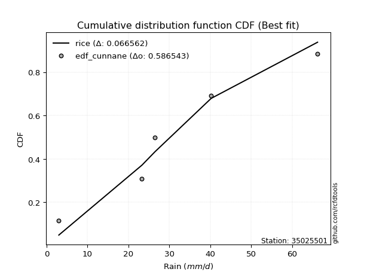</img>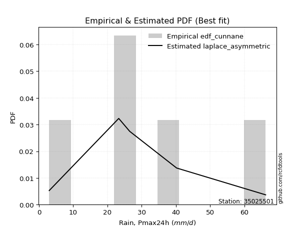</img>

</div>


### 12. EDF Adamowski (1981)

The Adamowski formula in hydrology refers to a specific plotting position formula used for estimating the non-parametric empirical distribution of hydrological events (like flood peaks) to calculate their return periods. This formula provides an alternative to traditional parametric methods (like the Gumbel or Log Pearson Type III distributions). 

<div align="center">


$P=(m-0.25)/(n+0.5)$


</div>


**12.1. Empirical values**

<div align="center">

|                | 0                   | 1                  | 2             | 3                  | 4                  |
|:---------------|:--------------------|:-------------------|:--------------|:-------------------|:-------------------|
| date           | 2021                | 2017               | 2019          | 2020               | 2018               |
| x              | 3.0                 | 23.3               | 26.5          | 40.2               | 66.2               |
| m              | 1                   | 2                  | 3             | 4                  | 5                  |
| empirical_dist | edf_adamowski       | edf_adamowski      | edf_adamowski | edf_adamowski      | edf_adamowski      |
| empirical      | 0.13636363636363635 | 0.3181818181818182 | 0.5           | 0.6818181818181818 | 0.8636363636363636 |
| empirical_tr   | 1.1578947368421053  | 1.4666666666666666 | 2.0           | 3.1428571428571423 | 7.333333333333334  |

</div>


**12.2. Kolmogorov-Smirnov fit test (sorted by Δ)**


<div align="center">

|                | 0                   | 1                   | 2                   | 3                   | 4                   | 5                   | 6                  | 7                   | 8                   | 9                   | 10                  | 11                  | 12                  | 13                  | 14                  | 15                  | 16                  | 17                  | 18                  | 19                  | 20                  | 21                  | 22                  | 23                  | 24                  | 25                 | 26                 | 27                  | 28                  | 29                  | 30                  | 31                  | 32                  | 33                  | 34                 | 35                  | 36                 | 37                 | 38                    | 39                  | 40                  | 41                  | 42                  | 43                  | 44                  | 45                  | 46                 | 47                  | 48                  | 49                  | 50                  | 51                 | 52                 | 53                  | 54                  | 55                 | 56                 | 57                  | 58                  | 59                 | 60                  | 61                 | 62                  | 63                  | 64                  | 65                 | 66                 | 67                 | 68                  | 69                  | 70                 | 71                  | 72                  | 73                  | 74                  | 75                  | 76                  | 77                  | 78                  | 79                 | 80                  | 81                 | 82                  | 83                 | 84                 | 85                 | 86                 | 87                 |
|:---------------|:--------------------|:--------------------|:--------------------|:--------------------|:--------------------|:--------------------|:-------------------|:--------------------|:--------------------|:--------------------|:--------------------|:--------------------|:--------------------|:--------------------|:--------------------|:--------------------|:--------------------|:--------------------|:--------------------|:--------------------|:--------------------|:--------------------|:--------------------|:--------------------|:--------------------|:-------------------|:-------------------|:--------------------|:--------------------|:--------------------|:--------------------|:--------------------|:--------------------|:--------------------|:-------------------|:--------------------|:-------------------|:-------------------|:----------------------|:--------------------|:--------------------|:--------------------|:--------------------|:--------------------|:--------------------|:--------------------|:-------------------|:--------------------|:--------------------|:--------------------|:--------------------|:-------------------|:-------------------|:--------------------|:--------------------|:-------------------|:-------------------|:--------------------|:--------------------|:-------------------|:--------------------|:-------------------|:--------------------|:--------------------|:--------------------|:-------------------|:-------------------|:-------------------|:--------------------|:--------------------|:-------------------|:--------------------|:--------------------|:--------------------|:--------------------|:--------------------|:--------------------|:--------------------|:--------------------|:-------------------|:--------------------|:-------------------|:--------------------|:-------------------|:-------------------|:-------------------|:-------------------|:-------------------|
| station        | 35025501            | 35025501            | 35025501            | 35025501            | 35025501            | 35025501            | 35025501           | 35025501            | 35025501            | 35025501            | 35025501            | 35025501            | 35025501            | 35025501            | 35025501            | 35025501            | 35025501            | 35025501            | 35025501            | 35025501            | 35025501            | 35025501            | 35025501            | 35025501            | 35025501            | 35025501           | 35025501           | 35025501            | 35025501            | 35025501            | 35025501            | 35025501            | 35025501            | 35025501            | 35025501           | 35025501            | 35025501           | 35025501           | 35025501              | 35025501            | 35025501            | 35025501            | 35025501            | 35025501            | 35025501            | 35025501            | 35025501           | 35025501            | 35025501            | 35025501            | 35025501            | 35025501           | 35025501           | 35025501            | 35025501            | 35025501           | 35025501           | 35025501            | 35025501            | 35025501           | 35025501            | 35025501           | 35025501            | 35025501            | 35025501            | 35025501           | 35025501           | 35025501           | 35025501            | 35025501            | 35025501           | 35025501            | 35025501            | 35025501            | 35025501            | 35025501            | 35025501            | 35025501            | 35025501            | 35025501           | 35025501            | 35025501           | 35025501            | 35025501           | 35025501           | 35025501           | 35025501           | 35025501           |
| empirical_dist | edf_adamowski       | edf_adamowski       | edf_adamowski       | edf_adamowski       | edf_adamowski       | edf_adamowski       | edf_adamowski      | edf_adamowski       | edf_adamowski       | edf_adamowski       | edf_adamowski       | edf_adamowski       | edf_adamowski       | edf_adamowski       | edf_adamowski       | edf_adamowski       | edf_adamowski       | edf_adamowski       | edf_adamowski       | edf_adamowski       | edf_adamowski       | edf_adamowski       | edf_adamowski       | edf_adamowski       | edf_adamowski       | edf_adamowski      | edf_adamowski      | edf_adamowski       | edf_adamowski       | edf_adamowski       | edf_adamowski       | edf_adamowski       | edf_adamowski       | edf_adamowski       | edf_adamowski      | edf_adamowski       | edf_adamowski      | edf_adamowski      | edf_adamowski         | edf_adamowski       | edf_adamowski       | edf_adamowski       | edf_adamowski       | edf_adamowski       | edf_adamowski       | edf_adamowski       | edf_adamowski      | edf_adamowski       | edf_adamowski       | edf_adamowski       | edf_adamowski       | edf_adamowski      | edf_adamowski      | edf_adamowski       | edf_adamowski       | edf_adamowski      | edf_adamowski      | edf_adamowski       | edf_adamowski       | edf_adamowski      | edf_adamowski       | edf_adamowski      | edf_adamowski       | edf_adamowski       | edf_adamowski       | edf_adamowski      | edf_adamowski      | edf_adamowski      | edf_adamowski       | edf_adamowski       | edf_adamowski      | edf_adamowski       | edf_adamowski       | edf_adamowski       | edf_adamowski       | edf_adamowski       | edf_adamowski       | edf_adamowski       | edf_adamowski       | edf_adamowski      | edf_adamowski       | edf_adamowski      | edf_adamowski       | edf_adamowski      | edf_adamowski      | edf_adamowski      | edf_adamowski      | edf_adamowski      |
| p_dist         | nct                 | exponnorm           | maxwell             | fisk                | invgamma            | johnsonsu           | laplace_asymmetric | rayleigh            | invgauss            | pearson3            | genlogistic         | logjohnsonsu        | rice                | kstwobign           | gumbel_r            | t                   | crystalball         | truncnorm           | norm                | betaprime           | logistic            | ncf                 | logweibull_min      | moyal               | hypsecant           | logfisk            | logmielke          | logloggamma         | gompertz            | mielke              | halflogistic        | halfnorm            | wald                | logpearson3         | loggumbel_l        | gibrat              | loggompertz        | laplace            | loglaplace_asymmetric | gumbel_l            | expon               | genexpon            | logf                | logexponnorm        | lognorm             | lognorm             | logcrystalball     | logt                | lognct              | logfatiguelife      | loglogistic         | logncf             | loghypsecant       | logrice             | logbetaprime        | loggamma           | loggamma           | logerlang           | logalpha            | loglaplace         | loginvgamma         | loginvgauss        | loginvweibull       | logmaxwell          | lograyleigh         | f                  | nakagami           | logkstwobign       | loggumbel_r         | logtruncnorm        | loghalfnorm        | loggenexpon         | logmoyal            | loghalflogistic     | lognakagami         | logexpon            | weibull_min         | loglognorm          | logwald             | loggibrat          | erlang              | invweibull         | alpha               | fatiguelife        | gamma              | logchi2            | chi2               | loggenlogistic     |
| delta          | 0.07139058520980968 | 0.07284900845894188 | 0.07361224481721496 | 0.07457525318526756 | 0.07475133422123123 | 0.07639613980704127 | 0.07713573177111   | 0.07721002710174432 | 0.07792636845091987 | 0.07902981418252875 | 0.08076035135012827 | 0.08491126319633202 | 0.08730868124781863 | 0.08839572991284989 | 0.09933457207513188 | 0.10080715181857347 | 0.10084052916734004 | 0.10084053665530679 | 0.10084053866659848 | 0.10510095782399032 | 0.11383657397076785 | 0.12042623826677257 | 0.12081515136058679 | 0.12222756660749984 | 0.12446323376733781 | 0.1336740528271565 | 0.1356990777440651 | 0.13628643451755873 | 0.13636363636330626 | 0.13636363636363594 | 0.13636363636363635 | 0.13636363636363635 | 0.13636363636363635 | 0.13680665827475263 | 0.1376537643488604 | 0.13980925746816553 | 0.1494421719941586 | 0.1516375251527251 | 0.16675912301166068   | 0.16726544641227242 | 0.18715762485195125 | 0.20487101146976122 | 0.20651355784379216 | 0.20683021230478843 | 0.20683030187345458 | 0.20683030187345458 | 0.2068303142879349 | 0.20683063221281156 | 0.20713160251496848 | 0.20790802606493325 | 0.21023570570441658 | 0.2123670814153817 | 0.2131361406903371 | 0.21547848710821732 | 0.21641665760965495 | 0.2190188322587076 | 0.2190188322587076 | 0.22064812347226653 | 0.22175837763028455 | 0.2242690487976709 | 0.22864765536387205 | 0.2354017529986901 | 0.23870978721893193 | 0.23871224795973395 | 0.24913774103502634 | 0.2525889216567279 | 0.2695597969353653 | 0.2743419912495472 | 0.27749786662904835 | 0.27809161751210115 | 0.2784947588144448 | 0.28046669922886264 | 0.30300055883924976 | 0.30478217870156327 | 0.31784956225409317 | 0.32603223582291246 | 0.34323801511940194 | 0.36903917663394376 | 0.37381478629204273 | 0.4005349682891342 | 0.40895320144982467 | 0.4482722078468019 | 0.45805029604521647 | 0.5417325372285113 | 0.5714071947570889 | 0.6226947615786436 | 0.6422921395160512 | 0.6818181818181818 |
| deltao         | 0.5865427407550001  | 0.5865427407550001  | 0.5865427407550001  | 0.5865427407550001  | 0.5865427407550001  | 0.5865427407550001  | 0.5865427407550001 | 0.5865427407550001  | 0.5865427407550001  | 0.5865427407550001  | 0.5865427407550001  | 0.5865427407550001  | 0.5865427407550001  | 0.5865427407550001  | 0.5865427407550001  | 0.5865427407550001  | 0.5865427407550001  | 0.5865427407550001  | 0.5865427407550001  | 0.5865427407550001  | 0.5865427407550001  | 0.5865427407550001  | 0.5865427407550001  | 0.5865427407550001  | 0.5865427407550001  | 0.5865427407550001 | 0.5865427407550001 | 0.5865427407550001  | 0.5865427407550001  | 0.5865427407550001  | 0.5865427407550001  | 0.5865427407550001  | 0.5865427407550001  | 0.5865427407550001  | 0.5865427407550001 | 0.5865427407550001  | 0.5865427407550001 | 0.5865427407550001 | 0.5865427407550001    | 0.5865427407550001  | 0.5865427407550001  | 0.5865427407550001  | 0.5865427407550001  | 0.5865427407550001  | 0.5865427407550001  | 0.5865427407550001  | 0.5865427407550001 | 0.5865427407550001  | 0.5865427407550001  | 0.5865427407550001  | 0.5865427407550001  | 0.5865427407550001 | 0.5865427407550001 | 0.5865427407550001  | 0.5865427407550001  | 0.5865427407550001 | 0.5865427407550001 | 0.5865427407550001  | 0.5865427407550001  | 0.5865427407550001 | 0.5865427407550001  | 0.5865427407550001 | 0.5865427407550001  | 0.5865427407550001  | 0.5865427407550001  | 0.5865427407550001 | 0.5865427407550001 | 0.5865427407550001 | 0.5865427407550001  | 0.5865427407550001  | 0.5865427407550001 | 0.5865427407550001  | 0.5865427407550001  | 0.5865427407550001  | 0.5865427407550001  | 0.5865427407550001  | 0.5865427407550001  | 0.5865427407550001  | 0.5865427407550001  | 0.5865427407550001 | 0.5865427407550001  | 0.5865427407550001 | 0.5865427407550001  | 0.5865427407550001 | 0.5865427407550001 | 0.5865427407550001 | 0.5865427407550001 | 0.5865427407550001 |
| eval           | Δo > Δ              | Δo > Δ              | Δo > Δ              | Δo > Δ              | Δo > Δ              | Δo > Δ              | Δo > Δ             | Δo > Δ              | Δo > Δ              | Δo > Δ              | Δo > Δ              | Δo > Δ              | Δo > Δ              | Δo > Δ              | Δo > Δ              | Δo > Δ              | Δo > Δ              | Δo > Δ              | Δo > Δ              | Δo > Δ              | Δo > Δ              | Δo > Δ              | Δo > Δ              | Δo > Δ              | Δo > Δ              | Δo > Δ             | Δo > Δ             | Δo > Δ              | Δo > Δ              | Δo > Δ              | Δo > Δ              | Δo > Δ              | Δo > Δ              | Δo > Δ              | Δo > Δ             | Δo > Δ              | Δo > Δ             | Δo > Δ             | Δo > Δ                | Δo > Δ              | Δo > Δ              | Δo > Δ              | Δo > Δ              | Δo > Δ              | Δo > Δ              | Δo > Δ              | Δo > Δ             | Δo > Δ              | Δo > Δ              | Δo > Δ              | Δo > Δ              | Δo > Δ             | Δo > Δ             | Δo > Δ              | Δo > Δ              | Δo > Δ             | Δo > Δ             | Δo > Δ              | Δo > Δ              | Δo > Δ             | Δo > Δ              | Δo > Δ             | Δo > Δ              | Δo > Δ              | Δo > Δ              | Δo > Δ             | Δo > Δ             | Δo > Δ             | Δo > Δ              | Δo > Δ              | Δo > Δ             | Δo > Δ              | Δo > Δ              | Δo > Δ              | Δo > Δ              | Δo > Δ              | Δo > Δ              | Δo > Δ              | Δo > Δ              | Δo > Δ             | Δo > Δ              | Δo > Δ             | Δo > Δ              | Δo > Δ             | Δo > Δ             | Δo <= Δ            | Δo <= Δ            | Δo <= Δ            |
| fit            | 1                   | 1                   | 1                   | 1                   | 1                   | 1                   | 1                  | 1                   | 1                   | 1                   | 1                   | 1                   | 1                   | 1                   | 1                   | 1                   | 1                   | 1                   | 1                   | 1                   | 1                   | 1                   | 1                   | 1                   | 1                   | 1                  | 1                  | 1                   | 1                   | 1                   | 1                   | 1                   | 1                   | 1                   | 1                  | 1                   | 1                  | 1                  | 1                     | 1                   | 1                   | 1                   | 1                   | 1                   | 1                   | 1                   | 1                  | 1                   | 1                   | 1                   | 1                   | 1                  | 1                  | 1                   | 1                   | 1                  | 1                  | 1                   | 1                   | 1                  | 1                   | 1                  | 1                   | 1                   | 1                   | 1                  | 1                  | 1                  | 1                   | 1                   | 1                  | 1                   | 1                   | 1                   | 1                   | 1                   | 1                   | 1                   | 1                   | 1                  | 1                   | 1                  | 1                   | 1                  | 1                  | 0                  | 0                  | 0                  |
| n              | 5                   | 5                   | 5                   | 5                   | 5                   | 5                   | 5                  | 5                   | 5                   | 5                   | 5                   | 5                   | 5                   | 5                   | 5                   | 5                   | 5                   | 5                   | 5                   | 5                   | 5                   | 5                   | 5                   | 5                   | 5                   | 5                  | 5                  | 5                   | 5                   | 5                   | 5                   | 5                   | 5                   | 5                   | 5                  | 5                   | 5                  | 5                  | 5                     | 5                   | 5                   | 5                   | 5                   | 5                   | 5                   | 5                   | 5                  | 5                   | 5                   | 5                   | 5                   | 5                  | 5                  | 5                   | 5                   | 5                  | 5                  | 5                   | 5                   | 5                  | 5                   | 5                  | 5                   | 5                   | 5                   | 5                  | 5                  | 5                  | 5                   | 5                   | 5                  | 5                   | 5                   | 5                   | 5                   | 5                   | 5                   | 5                   | 5                   | 5                  | 5                   | 5                  | 5                   | 5                  | 5                  | 5                  | 5                  | 5                  |
| best_fit       | 1                   | 0                   | 0                   | 0                   | 0                   | 0                   | 0                  | 0                   | 0                   | 0                   | 0                   | 0                   | 0                   | 0                   | 0                   | 0                   | 0                   | 0                   | 0                   | 0                   | 0                   | 0                   | 0                   | 0                   | 0                   | 0                  | 0                  | 0                   | 0                   | 0                   | 0                   | 0                   | 0                   | 0                   | 0                  | 0                   | 0                  | 0                  | 0                     | 0                   | 0                   | 0                   | 0                   | 0                   | 0                   | 0                   | 0                  | 0                   | 0                   | 0                   | 0                   | 0                  | 0                  | 0                   | 0                   | 0                  | 0                  | 0                   | 0                   | 0                  | 0                   | 0                  | 0                   | 0                   | 0                   | 0                  | 0                  | 0                  | 0                   | 0                   | 0                  | 0                   | 0                   | 0                   | 0                   | 0                   | 0                   | 0                   | 0                   | 0                  | 0                   | 0                  | 0                   | 0                  | 0                  | 0                  | 0                  | 0                  |
| best_fit_sort  | 1                   | 2                   | 3                   | 4                   | 5                   | 6                   | 7                  | 8                   | 9                   | 10                  | 11                  | 12                  | 13                  | 14                  | 15                  | 16                  | 17                  | 18                  | 19                  | 20                  | 21                  | 22                  | 23                  | 24                  | 25                  | 26                 | 27                 | 28                  | 29                  | 30                  | 31                  | 32                  | 33                  | 34                  | 35                 | 36                  | 37                 | 38                 | 39                    | 40                  | 41                  | 42                  | 43                  | 44                  | 45                  | 46                  | 47                 | 48                  | 49                  | 50                  | 51                  | 52                 | 53                 | 54                  | 55                  | 56                 | 57                 | 58                  | 59                  | 60                 | 61                  | 62                 | 63                  | 64                  | 65                  | 66                 | 67                 | 68                 | 69                  | 70                  | 71                 | 72                  | 73                  | 74                  | 75                  | 76                  | 77                  | 78                  | 79                  | 80                 | 81                  | 82                 | 83                  | 84                 | 85                 | 86                 | 87                 | 88                 |

</div>


**12.3. Best fit**

<div align="center">

|   id |   station | empirical_dist   | p_dist   |     delta |   deltao | eval   |   fit |   n |   best_fit |   best_fit_sort |
|-----:|----------:|:-----------------|:---------|----------:|---------:|:-------|------:|----:|-----------:|----------------:|
|    0 |  35025501 | edf_adamowski    | nct      | 0.0713906 | 0.586543 | Δo > Δ |     1 |   5 |          1 |               1 |

</div>


<div align="center">

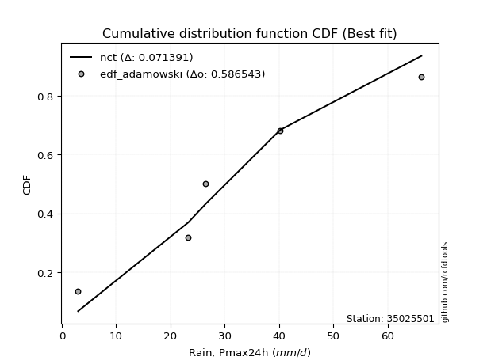</img>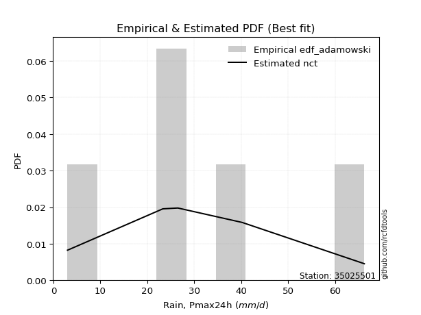</img>

</div>


## C. Best fit & Estimate extreme values for specific return periods - Tr

Best fit in probability distribution analysis means finding the theoretical distribution (like Normal, Poisson, Exponential) that most accurately mirrors your real-world data´s patterns (shape, center, spread) for better predictions, using methods like visual checks (Q-Q plots), goodness-of-fit tests (Kolmogorov-Smirnov, Chi-Squared), and information criteria (AIC) to score and select the simplest, most representative model.


### 1. Best fit (ordered by delta Δ)

<div align="center">

|   id |   station | empirical_dist   | p_dist             |     delta |   deltao | eval   |   fit |   n |   best_fit |   best_fit_sort |
|-----:|----------:|:-----------------|:-------------------|----------:|---------:|:-------|------:|----:|-----------:|----------------:|
|    0 |  35025501 | edf_cunnane      | laplace_asymmetric | 0.0561567 | 0.586543 | Δo > Δ |     1 |   5 |          1 |               1 |
|    1 |  35025501 | edf_gringorten   | laplace_asymmetric | 0.0574091 | 0.586543 | Δo > Δ |     1 |   5 |          1 |               2 |
|    2 |  35025501 | edf_blom         | laplace_asymmetric | 0.0598197 | 0.586543 | Δo > Δ |     1 |   5 |          1 |               3 |
|    3 |  35025501 | edf_hazen        | laplace_asymmetric | 0.0620966 | 0.586543 | Δo > Δ |     1 |   5 |          1 |               4 |
|    4 |  35025501 | edf_tukey        | fisk               | 0.0632116 | 0.586543 | Δo > Δ |     1 |   5 |          1 |               5 |
|    5 |  35025501 | edf_filliben     | exponnorm          | 0.0636988 | 0.586543 | Δo > Δ |     1 |   5 |          1 |               6 |
|    6 |  35025501 | edf_beard        | exponnorm          | 0.0647382 | 0.586543 | Δo > Δ |     1 |   5 |          1 |               7 |
|    7 |  35025501 | edf_jenkinson    | exponnorm          | 0.0647382 | 0.586543 | Δo > Δ |     1 |   5 |          1 |               8 |
|    8 |  35025501 | edf_chegodayev   | exponnorm          | 0.066115  | 0.586543 | Δo > Δ |     1 |   5 |          1 |               9 |
|    9 |  35025501 | edf_adamowski    | nct                | 0.0713906 | 0.586543 | Δo > Δ |     1 |   5 |          1 |              10 |
|   10 |  35025501 | edf_weibull      | nct                | 0.101694  | 0.586543 | Δo > Δ |     1 |   5 |          1 |              11 |
|   11 |  35025501 | edf_california   | laplace_asymmetric | 0.142497  | 0.586543 | Δo > Δ |     1 |   5 |          1 |              12 |

</div>

:file_folder:Tables: [bestfit_35025501.csv](table/bestfit_35025501.csv) | [extreme_35025501.csv](table/extreme_35025501.csv)


### 2. Extreme values

In hydrology, a return period (or recurrence interval $Tr$) is the statistical average time between extreme events like floods or droughts of a specific magnitude, indicating how rare an event is, with a 100-year flood, for example, having a 1% chance of occurring in any given year, not that it happens exactly every century. It is a key tool for infrastructure design (like bridges or dams) and risk assessment, calculated from historical data to determine the probability of future events, although it is important to remember it is statistical average, and events can cluster or be missed.

> risk_rate: assuming the return period as the project useful life.

|   id |      tr |   prob_l |     prob_g |      alpha |   betaprime |     chi2 |   crystalball |    erlang |    expon |   exponnorm |        f |   fatiguelife |     fisk |     gamma |   genexpon |   genlogistic |   gibrat |   gompertz |   gumbel_l |   gumbel_r |   halflogistic |   halfnorm |   hypsecant |   invgamma |   invgauss |      invweibull |   johnsonsu |   kstwobign |   laplace |   laplace_asymmetric |   loggamma |   logistic |   lognorm |   maxwell |   mielke |    moyal |   nakagami |      ncf |      nct |    norm |   pearson3 |   rayleigh |     rice |       t |   truncnorm |     wald |   weibull_min |   logalpha |   logbetaprime |      logchi2 |   logcrystalball |   logerlang |         logexpon |   logexponnorm |     logf |   logfatiguelife |   logfisk |   loggenexpon |   loggenlogistic |   loggibrat |   loggompertz |   loggumbel_l |   loggumbel_r |   loghalflogistic |   loghalfnorm |   loghypsecant |   loginvgamma |   loginvgauss |   loginvweibull |   logjohnsonsu |   logkstwobign |   loglaplace |   loglaplace_asymmetric |   logloggamma |   loglogistic |    loglognorm |   logmaxwell |   logmielke |   logmoyal |   lognakagami |    logncf |   lognct |   logpearson3 |   lograyleigh |   logrice |     logt |   logtruncnorm |    logwald |   logweibull_min |   station |   n |   risk_rate |
|-----:|--------:|---------:|-----------:|-----------:|------------:|---------:|--------------:|----------:|---------:|------------:|---------:|--------------:|---------:|----------:|-----------:|--------------:|---------:|-----------:|-----------:|-----------:|---------------:|-----------:|------------:|-----------:|-----------:|----------------:|------------:|------------:|----------:|---------------------:|-----------:|-----------:|----------:|----------:|---------:|---------:|-----------:|---------:|---------:|--------:|-----------:|-----------:|---------:|--------:|------------:|---------:|--------------:|-----------:|---------------:|-------------:|-----------------:|------------:|-----------------:|---------------:|---------:|-----------------:|----------:|--------------:|-----------------:|------------:|--------------:|--------------:|--------------:|------------------:|--------------:|---------------:|--------------:|--------------:|----------------:|---------------:|---------------:|-------------:|------------------------:|--------------:|--------------:|--------------:|-------------:|------------:|-----------:|--------------:|----------:|---------:|--------------:|--------------:|----------:|---------:|---------------:|-----------:|-----------------:|----------:|----:|------------:|
|    0 |    2    | 0.5      | 0.5        |    9.81067 |     27.2464 |  5.89854 |       31.84   |   8.45639 |  22.9904 |     29.16   |  19.0752 |       3       |  29.2767 |   4.88611 |    22.0057 |       28.3195 |  25.567  |    29.0063 |    35.2733 |    28.4067 |        26.6999 |    27.5621 |     31.84   |    29.4323 |    29.0098 | 11426.7         |     29.2466 |     28.082  |   31.84   |              28.1113 |    21.0178 |    31.84   |   21.8053 |   30.0526 |  32.3368 |  27.2984 |    18.442  |  26.5646 |  29.9371 | 31.84   |    30.5917 |    29.4187 |  29.9704 | 31.8384 |     31.84   |  25.0656 |       10.1434 |    20.8302 |        21.2131 |      3.03526 |          21.8053 |     20.9377 |     11.8639      |        21.8053 |  21.8196 |          21.7384 |   26.0229 |       16.5361 |         inf      |     15.8777 |       25.0525 |       25.9396 |       18.3299 |           16.8143 |       17.5636 |        21.8053 |       20.4416 |       19.9657 |         19.0546 |        31.6433 |        16.7112 |      21.8053 |                 23.8859 |       30.6874 |       21.8053 |   3.00455     |      19.9208 |  0.00254028 |    17.3308 |       24.5941 |   21.3375 |  21.7862 |       26.1487 |       19.2924 |   21.2549 |  21.8052 |        15.501  |    15.4803 |          26.5554 |  35025501 |   5 |    0.75     |
|    1 |    2.33 | 0.570815 | 0.429185   |   11.6762  |     31.1777 |  6.78534 |       35.5693 |  11.465   |  27.3948 |     32.6809 |  23.3029 |       3.55429 |  32.7731 |   6.0034  |    26.1933 |       32.0927 |  27.4562 |    33.1414 |    38.5178 |    31.8624 |        30.2528 |    31.587  |     34.8246 |    33.138  |    32.7649 |     1.1934e+06  |     32.9682 |     31.9708 |   34.0968 |              31.1279 |    25.6025 |    35.1258 |   26.3309 |   33.9271 |  37.0055 |  30.5696 |    22.3003 |  30.7123 |  33.6622 | 35.5693 |    34.3375 |    33.3505 |  33.7998 | 35.5678 |     35.5693 |  27.511  |       14.3843 |    25.4408 |        25.7304 |      3.09501 |          26.3309 |     25.4712 |     16.0615      |        26.3309 |  26.3627 |          26.2659 |   30.6349 |       21.0773 |         inf      |     17.4694 |       29.2206 |       30.5647 |       21.8299 |           20.1237 |       21.5282 |        25.3576 |       24.9412 |       24.5093 |         24.5267 |        36.3305 |        21.4791 |      24.4414 |                 26.5991 |       35.5446 |       25.7468 |   3.06413     |      24.2326 |  0.00254028 |    20.4484 |       25.6827 |   26.2057 |  26.3137 |       31.073  |       23.5362 |   25.8136 |  26.3308 |        20.8063 |    17.5181 |          30.6495 |  35025501 |   5 |    0.729209 |
|    2 |    5    | 0.8      | 0.2        |   26.1422  |     48.3719 | 11.6921  |       49.4284 |  33.3314  |  49.4162 |     47.5715 |  46.2452 |      15.3292  |  47.9192 |  14.484   |    47.13   |       48.4735 |  38.3323 |    49.4666 |    48.9996 |    46.8752 |        46.3291 |    48.6078 |     46.7963 |    48.3726 |    48.4107 |     7.04916e+14 |     48.3617 |     48.4895 |   45.3803 |              46.2104 |    53.9682 |    47.8126 |   53.0689 |   49.1769 |  52.5437 |  45.722  |    39.8505 |  50.4437 |  48.6968 | 49.4284 |    48.9659 |    49.0913 |  49.0221 | 49.4273 |     49.4284 |  41.2001 |       54.3068 |    54.7295 |        53.1249 |      4.55246 |          53.0689 |     53.4144 |     73.0392      |        53.0692 |  53.2447 |          53.0915 |   57.52   |       56.7437 |         inf      |     30.2795 |       48.6283 |       51.9304 |       46.6407 |           45.3702 |       50.9114 |        46.4552 |       53.4515 |       54.3388 |         73.4444 |        52.2882 |        62.3831 |      43.2449 |                 42.6106 |       51.6883 |       48.9051 |   9.7755e+165 |      52.3981 |  0.00254028 |    43.9986 |       36.6087 |   57.4259 |  53.0958 |       53.538  |       52.1719 |   53.5023 |  53.0688 |        73.8789 |    35.005  |          48.7072 |  35025501 |   5 |    0.67232  |
|    3 |   10    | 0.9      | 0.1        |   52.7197  |     62.1511 | 16.529   |       58.6222 |  59.441   |  69.4066 |     59.8155 |  69.2741 |      31.5873  |  60.9605 |  24.8959  |    66.1358 |       61.8074 |  50.7299 |    60.3963 |    54.8353 |    59.1029 |        59.6798 |    61.2028 |     56.3562 |    59.9216 |    60.3839 |     9.8237e+21  |     60.0885 |     61.0664 |   55.6232 |              59.9018 |    89.4727 |    57.156  |   84.4802 |   59.9089 |  59.4961 |  58.9146 |    53.4318 |  68.4459 |  59.8558 | 58.6222 |    59.2967 |    60.3148 |  59.7675 | 58.6214 |     58.6222 |  55.7275 |      121.637  |    92.8997 |        86.5022 |     10.1649  |          84.4802 |     88.2316 |    288.842       |        84.481  |  84.8965 |          84.7268 |   91.4781 |      116.207  |         inf      |     56.6806 |       64.9362 |       69.7569 |       86.5588 |           89.12   |       96.2551 |        75.3334 |       90.479  |       95.0234 |        179.438  |        60.7788 |       140.482  |      72.5922 |                 65.3571 |       58.9028 |       78.4431 | inf           |      90.1596 |  0.00254028 |    85.7384 |       53.6804 |   98.4387 |  84.6115 |       71.0329 |       92.0297 |   87.1303 |  84.4801 |       191.542  |    72.9767 |          63.0369 |  35025501 |   5 |    0.651322 |
|    4 |   15    | 0.933333 | 0.0666667  |   79.2023  |     69.7696 | 19.455   |       63.2101 |  76.3879  |  81.1002 |     66.8742 |  83.6532 |      42.2204  |  68.8313 |  31.7194  |    77.2535 |       69.3288 |  59.2812 |    65.7281 |    57.4782 |    66.0017 |        67.2351 |    67.7572 |     61.8119 |    66.1749 |    66.8721 |     1.05423e+26 |     66.4453 |     67.7433 |   61.6149 |              67.9108 |   115.523  |    62.2468 |  106.541  |   65.4153 |  61.834  |  66.571  |    60.574  |  79.3751 |  65.8307 | 63.2101 |    64.6422 |    66.0977 |  65.2697 | 63.2094 |     63.2101 |  65.0563 |      176.416  |   121.768  |       110.546  |     19.0186  |         106.541  |    113.705  |    645.572       |       106.542  | 107.159  |         107.002  |  117.789  |      168.468  |         inf      |     87.3464 |       74.0904 |       79.7316 |      122.694  |          130.588  |      134.082  |        99.2674 |      118.414  |      126.784  |        297.027  |        64.3173 |       216.164  |      98.2833 |                 83.9391 |       61.3277 |      101.475  | inf           |     119.109  |  0.00254028 |   126.277  |       66.6946 |  129.546  | 106.771  |       80.0816 |      123.291  |  111.239  | 106.54   |       315.172  |   116.968  |          70.8465 |  35025501 |   5 |    0.644736 |
|    5 |   20    | 0.95     | 0.05       |  105.662   |     75.0334 | 21.5623  |       66.2146 |  88.9562  |  89.3969 |     71.8734 |  94.2608 |      50.0929  |  74.6148 |  36.7995  |    85.1416 |       74.5947 |  65.9891 |    69.1562 |    59.1233 |    70.832  |        72.5286 |    72.1271 |     65.6606 |    70.4616 |    71.3142 |     7.00009e+28 |     70.8031 |     72.241  |   65.866  |              73.5933 |   136.727  |    65.7653 |  124.022  |   69.0697 |  63.0065 |  71.9933 |    65.3493 |  87.3744 |  69.9032 | 66.2146 |    68.2122 |    69.9414 |  68.9144 | 66.214  |     66.2146 |  72.0081 |      222.64   |   145.732  |       129.9    |     31.2972  |         124.022  |    134.407  |   1142.26        |       124.024  | 124.816  |         124.683  |  140.276  |      215.761  |         inf      |    122.622  |       80.448  |       86.6482 |      156.642  |          170.67   |      167.24   |       120.596  |      141.566  |      153.669  |        422.718  |        66.3929 |       288.977  |     121.855  |                100.246  |       62.5437 |      121.236  | inf           |     143.286  | 62.1615     |   166.116  |       77.3341 |  155.39   | 124.344  |       86.0064 |      149.743  |  130.572  | 124.022  |       439.291  |   166.243  |          76.1888 |  35025501 |   5 |    0.641514 |
|    6 |   25    | 0.96     | 0.04       |  132.112   |     79.0489 | 23.2116  |       68.4263 |  98.9632  |  95.8324 |     75.7497 | 102.723  |      56.3479  |  79.2389 |  40.8532  |    91.2602 |       78.6507 |  71.5811 |    71.6438 |    60.2939 |    74.5526 |        76.6069 |    75.3784 |     68.6393 |    73.7188 |    74.6843 |     1.04451e+31 |     74.1135 |     75.61   |   69.1635 |              78.0009 |   154.879  |    68.457  |  138.699  |   71.7828 |  63.7111 |  76.1962 |    68.9066 |  93.7385 |  72.9862 | 68.4263 |    70.8754 |    72.7972 |  71.6162 | 68.4258 |     68.4263 |  77.5763 |      262.859  |   166.545  |       146.335  |     47.2546  |         138.699  |    152.107  |   1778.24        |       138.701  | 139.649  |         139.543  |  160.336  |      259.37   |         inf      |    162.699  |       85.31   |       91.9325 |      189.069  |          209.761  |      197.127  |       140.201  |      161.651  |      177.355  |        554.749  |        67.8043 |       359.171  |     143.967  |                115.047  |       63.2745 |      138.914  | inf           |     164.357  | 62.9741     |   205.455  |       86.425  |  177.843  | 139.104  |       90.3331 |      173.008  |  146.939  | 138.699  |       562.208  |   220.311  |          80.234  |  35025501 |   5 |    0.639603 |
|    7 |   50    | 0.98     | 0.02       |  264.32    |     91.2177 | 28.4016  |       74.7598 | 131.207   | 115.823  |     87.7889 | 130.338  |      76.4169  |  94.5171 |  53.9531  |   110.266  |       91.1446 |  91.2931 |    78.5849 |    63.4717 |    86.0141 |        89.173  |    84.8289 |     77.8742 |    83.5509 |    84.8166 |     5.19263e+37 |     84.0973 |     85.5029 |   79.4064 |              91.6924 |   221.942  |    76.6809 |  191.06   |   79.6511 |  65.123  |  89.2437 |    79.2554 | 114.516  |  82.2384 | 74.7598 |    78.6685 |    81.087  |  79.43   | 74.7595 |     74.7598 |  95.7567 |      413.177  |   245.567  |       206.178  |    190.623   |         191.06   |    217.37   |   7032.26        |       191.063  | 192.627  |         192.668  |  241.205  |      443.043  |         inf      |    440.876  |      100.078  |      107.959  |      337.55   |          396.002  |      317.904  |       223.65   |      237.738  |      269.645  |       1281.57   |        71.3384 |       680.171  |     241.667  |                176.462  |       64.7384 |      210.553  | inf           |     244.677  | 64.6083     |   397.436  |      119.663  |  263.064  | 191.814  |      102.381  |      263.105  |  206.175  | 191.06   |      1146.25   |   552.482  |          92.3309 |  35025501 |   5 |    0.63583  |
|    8 |   75    | 0.986667 | 0.0133333  |  396.511   |     98.1623 | 31.4754  |       78.1582 | 150.721   | 127.516  |     94.8312 | 147.453  |      88.5033  | 104.192  |  61.9019  |   121.384  |       98.4063 | 104.607  |    82.1922 |    65.0786 |    92.676  |        96.4776 |    89.9734 |     83.2711 |    89.1538 |    90.5555 |     4.05167e+41 |     89.7775 |     90.946  |   85.398  |              99.7014 |   269.666  |    81.4307 |  226.885  |   83.929  |  65.5943 |  96.8737 |    84.8896 | 127.463  |  87.4788 | 78.1582 |    82.9524 |    85.597  |  83.6639 | 78.158  |     78.1582 | 106.944  |      519.672  |   303.59   |       248.079  |    459.57    |         226.885  |    263.712  |  15717.3         |       226.888  | 228.917  |         229.098  |  305.366  |      593.185  |         inf      |    864.41   |      108.513  |      117.098  |      472.767  |          572.953  |      412.361  |       293.829  |      293.46   |      339.385  |       2085.01   |        72.9511 |       966.487  |     327.196  |                226.632  |       65.2272 |      267.718  | inf           |     303.77   | 65.1558     |   584.571  |      142.907  |  325.565  | 227.915  |      108.534  |      330.505  |  247.34   | 226.884  |      1679.21   |   972.788  |          99.1261 |  35025501 |   5 |    0.634587 |
|    9 |  100    | 0.99     | 0.01       |  528.696   |    103.026  | 33.6701  |       80.4567 | 164.802   | 135.813  |     99.8278 | 160.041  |      97.1999  | 111.427  |  67.6448  |   129.272  |      103.546  | 114.92   |    84.5844 |    66.1297 |    97.391  |       101.648  |    93.4779 |     87.0993 |    93.0809 |    94.5596 |     2.30365e+44 |     93.7537 |     94.6753 |   89.6492 |             105.384  |   307.846  |    84.7842 |  254.85   |   86.8428 |  65.8303 | 102.287  |    88.7266 | 137.042  |  91.1397 | 80.4567 |    85.8907 |    88.6696 |  86.5418 | 80.4565 |     80.4567 | 115.101  |      603.873  |   350.955  |       281.264  |    877.836   |         254.85   |    300.737  |  27809.9         |       254.855  | 257.268  |         257.577  |  360.696  |      723.804  |         inf      |   1456.24   |      114.417  |      123.491  |      600.065  |          744.153  |      492.316  |       356.592  |      338.87   |      397.349  |       2942.41   |        73.9406 |      1229.52   |     405.67   |                270.661  |       65.4716 |      317.195  | inf           |     351.996  | 65.4301     |   768.637  |      161.254  |  376.523  | 256.114  |      112.537  |      386.063  |  279.777  | 254.85   |      2168.78   |  1469.46   |         103.839  |  35025501 |   5 |    0.633968 |
|   10 |  200    | 0.995    | 0.005      | 1057.43    |    114.562  | 38.9973  |       85.6704 | 199.392   | 155.803  |    111.867  | 191.946  |     118.488   | 130.261  |  81.7718  |   148.278  |      115.901  | 142.979  |    89.8676 |    68.4143 |   108.726  |       114.077  |   101.493  |     96.322  |   102.424  |   104.017  |     9.66477e+50 |    103.193  |    103.265  |   99.8921 |             119.075  |   416.553  |    92.8286 |  331.734  |   93.5092 |  66.1883 | 115.329  |    97.4964 | 161.583  |  99.8133 | 85.6704 |    92.6785 |    95.6999 |  93.1075 | 85.6704 |     85.6704 | 135.418  |      837.26   |   489.88   |       374.399  |   4447.47    |         331.734  |    405.96   | 109978           |       331.74   | 335.292  |         336.03   |  537.805  |     1141.84   |         inf      |   6018.52   |      128.402  |      138.615  |     1064.5    |         1395.2    |      738.375  |       568.486  |      471.718  |      571.822  |       6735.14   |        75.9109 |      2140.51   |     680.969  |                415.146  |       65.8386 |      476.428  | inf           |     493.113  | 65.8421     |  1486.45   |      212.381  |  525.619  | 333.713  |      121.061  |      550.883  |  370.112  | 331.733  |      3810.13   |  4105.56   |         114.87   |  35025501 |   5 |    0.633042 |
|   11 |  250    | 0.996    | 0.004      | 1321.79    |    118.228  | 40.7224  |       87.2637 | 210.699   | 162.239  |    115.742  | 202.707  |     125.425   | 136.779  |  86.3943  |   154.396  |      119.873  | 153.047  |    91.4425 |    69.0865 |   112.371  |       118.073  |   103.959  |     99.2908 |   105.405  |   107.013  |     1.30112e+53 |    106.198  |    105.923  |  103.19   |             123.483  |   457.145  |    95.4112 |  359.569  |   95.5613 |  66.2632 | 119.527  |   100.192  | 169.957  | 102.571  | 87.2637 |    94.787  |    97.864  |  95.1235 | 87.2638 |     87.2637 | 142.14   |      921.828  |   543.149  |       408.739  |   7620.16    |         359.569  |    445.188  | 171210           |       359.576  | 363.565  |         364.483  |  611.393  |     1314.03   |         inf      |  10013.9    |      132.838  |      143.408  |     1279.91   |         1707.63   |      836.435  |       660.575  |      522.54   |      640.239  |       8789.55   |        76.4437 |      2541.16   |     804.538  |                476.439  |       65.912  |      542.896  | inf           |     547.035  | 65.9246     |  1838.05   |      231.088  |  582.64   | 361.83   |      123.499  |      614.593  |  403.183  | 359.568  |      4491.23   |  5767.57   |         118.334  |  35025501 |   5 |    0.632858 |
|   12 |  500    | 0.998    | 0.002      | 2643.6     |    129.492  | 46.1074  |       91.9886 | 246.258   | 182.229  |    127.781  | 237.732  |     147.189   | 158.59   | 100.944   |   173.402  |      132.202  | 187.841  |    96.0056 |    71.0135 |   123.681  |       130.476  |   111.311  |    108.513  |   114.614  |   116.193  |     5.28063e+59 |    115.458  |    113.889  |  113.432  |             137.174  |   603.244  |   103.421  |  456.616  |  101.685  |  66.4311 | 132.569  |   108.224  | 197.574  | 111.066  | 91.9887 |   101.134  |   104.321  | 101.125  | 91.9889 |     91.9886 | 163.512  |     1214.83   |   740.387  |       530.74   |  42266.3     |         456.616  |    586.153  | 677071           |       456.626  | 462.235  |         463.868  |  910.02   |     1998.69   |          66.0561 |  58179.5    |      146.434  |      158.086  |     2267.7    |         3197.24   |     1213.1    |      1053.07   |      710.234  |      899.576  |      20083      |        77.8545 |      4249.53   |    1350.52   |                730.773  |       66.0588 |      813.993  | inf           |     745.591  | 66.0897     |  3554.52   |      296.93   |  793.068  | 459.944  |      130.23   |      851.917  |  519.769  | 456.615  |      7056.69   | 16997.2    |         128.852  |  35025501 |   5 |    0.632489 |
|   13 |  750    | 0.998667 | 0.00133333 | 3965.41    |    136.004  | 49.2736  |       94.6134 | 267.326   | 193.923  |    134.823  | 259.387  |     160.048   | 172.533  | 109.572   |   184.52   |      139.409  | 210.851  |    98.4721 |    72.0434 |   130.293  |       137.726  |   115.419  |    113.907  |   119.98   |   121.487  |     3.85416e+63 |    120.834  |    118.365  |  119.424  |             145.183  |   704.435  |   108.1    |  521.431  |  105.11   |  66.5032 | 140.198  |   112.706  | 214.939  | 115.999  | 94.6134 |   104.722  |   107.932  | 104.473  | 94.6137 |     94.6134 | 176.326  |     1408.03   |   881.549  |       613.996  | 117973       |         521.431  |    683.611  |      1.51328e+06 |       521.442  | 528.203  |         530.382  | 1148.06   |     2527.43   |          66.1052 | 186270      |      154.269  |      166.537  |     3168.14   |         4613.27   |     1493.14   |      1383.34   |      844.164  |     1090.14   |      32555      |        78.5389 |      5672.7    |    1828.48   |                938.543  |       66.1078 |     1031.31   | inf           |     886.582  | 66.1448     |  5227.89   |      341.339  |  943.026  | 525.535  |      133.638  |     1022.58   |  598.602  | 521.429  |      8784.95   | 32494.6    |         134.852  |  35025501 |   5 |    0.632366 |
|   14 | 1000    | 0.999    | 0.001      | 5287.22    |    140.594  | 51.5263  |       96.4206 | 282.376   | 202.22   |    139.82   | 275.296  |     169.22    | 182.999  | 115.738   |   192.408  |      144.522  | 228.46   |   100.142  |    72.7365 |   134.984  |       142.869  |   118.255  |    117.735  |   123.782  |   125.215  |     2.11971e+66 |    124.637  |    121.465  |  123.675  |             150.866  |   784.139  |   111.418  |  571.328  |  107.477  |  66.5479 | 145.611  |   115.799  | 227.842  | 119.489  | 96.4206 |   107.217  |   110.427  | 106.783  | 96.4209 |     96.4206 | 185.544  |     1555.12   |   995.106  |       678.965  | 246667       |         571.328  |    760.29   |      2.67756e+06 |       571.34   | 579.021  |         581.654  | 1353.73   |     2972.7    |          66.1297 | 453815      |      159.779  |      172.478  |     4016.18   |         5983.57   |     1723.44   |      1678.75   |      951.691  |     1246.01   |      45859.5    |        78.9729 |      6929.47   |    2267.02   |               1120.88   |       66.1322 |     1219.75   | inf           |     999.325  | 66.1723     |  6873.88   |      375.721  | 1063.29   | 576.06   |      135.845  |     1160.1    |  659.753  | 571.326  |     10043.9    | 51790.9    |         139.047  |  35025501 |   5 |    0.632305 |

<div align="center">

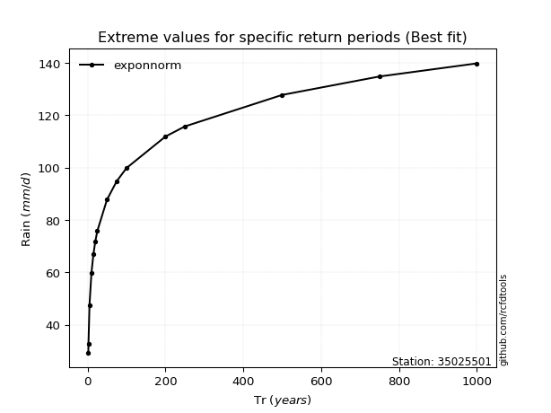</img>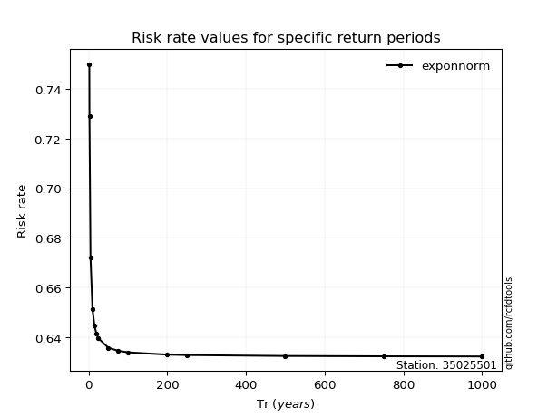</img>

</div>


<sub>**APP DISCLAIMER**: NO WARRANTY - This software is provided by [github.com/rcfdtools](https://github.com/rcfdtools) "as is", without any express or implied warranty, including warranties of merchantability, fitness for a particular purpose, or non-infringement. There is no guarantee that the software will be error-free or operate without interruption. LIMITATION OF LIABILITY - Neither the authors nor copyright holders will be liable for claims or damages arising from the software or its use. You are responsible for determining if the software is appropriate for your use and assume all associated risks, including errors, legal compliance, and data loss. NO PROFESSIONAL ADVICE - The software provides general information and does not offer professional advice. It should not replace consultation with professional advisors.</sub>