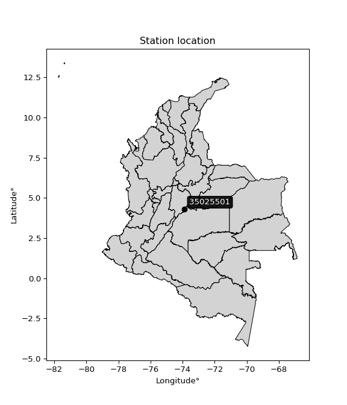

<div align="center">


</div>

# PMP Station (Rain, Pmax24h): 35025501

Probable Maximum Precipitation (PMP) is the greatest amount of rainfall for a specific duration that is meteorologically possible for a given location, acting as a "worst-case" scenario for extreme storms, crucial for designing safety-critical infrastructure like bridges, river deviations, dams, spillways, and nuclear plants to prevent catastrophic failure. PMP is calculated by hydrologists using meteorological data to determine the upper limit of extreme rainfall, often leading to the Probable Maximum Flood (PMF) for flood control design, and is increasingly being studied for climate change impacts. Probable Maximum Precipitation (PMP) is the theoretical upper limit of rainfall, a deterministic estimate for extreme events, while probability distributions (like GEV, Gumbel) describe the likelihood and frequency of various precipitation amounts, including rare ones, showing how often events occur, with PMP representing the extreme end of these distributions, used for critical infrastructure design to ensure safety against the worst conceivable weather, unlike standard statistical forecasts which cover typical probabilities.

The most common probability distributions in hydrology, used for analyzing floods, rainfall, and streamflow, include the Normal, Log-Normal, Gumbel, Gamma (including Log-Pearson Type III), and Generalized Extreme Value (GEV) distributions, often chosen based on the data´s skewness and whether modeling extremes or general conditions, with Gumbel and GEV popular for extreme events like floods, while the Normal distribution serves as a baseline, though often requiring transformations for skewed hydrological data. These distributions help in designing water infrastructure, managing water resources, and forecasting hydrologic events.

> Hydrological data often isn´t perfectly normal (it´s skewed), so different distributions are needed for different applications, such as: **Flood Frequency Analysis**: Using Gumbel, GEV, or Log-Pearson Type III for predicting extreme flood magnitudes and their return periods, **Rainfall Analysis**: Normal for annual totals, but Log-Normal, Weibull, or GEV for intensity or extreme daily rainfall, **Streamflow Modeling**: Gamma and Log-Normal for maximum flows, GEV for minimum flows, and Kappa for daily flows.

<div align="center">

</img>

</div>


## A. General information


### 1. General running parameters

• app_version: _v20260113_. • runtime: _2026-01-17 18:24:04.630693_. • Python version: _3.14.0_. • SciPy version: _1.16.3_. • Pandas version: _2.3.3_. • NumPy version: _2.3.5_. • Stations dataset (station_dataset_file): _dataset/pmax24h_in/automatic_colombia_2003_2025.csv_. • Stations catalog (station_catalog_file): _dataset/CNE.xls_. • Minimum year to eval til year_max (date_min): _1900_. • Maximum year to eval since year_min (date_max): _2025_. • Creates, save and include plots into reports (create_plot): _False_. • Plot only fit distributions with Δo > Δ (plot_only_fit): _True_. • Plot only simple graphs avoiding multiple CDFs and multiple Extreme values plots (plot_only_simple): _True_. • Eval low extreme values, if False, evaluates high extreme values (low_extreme): _False_. • Eval every SciPy distribution as logarithmic (pdist_logarithmic_on): _True_. • Standard deviation normalized (ddof): _1.0_. • Return periods to eval in years (Tr): _[2, 2.33, 5, 10, 15, 20, 25, 50, 75, 100, 200, 250, 500, 750, 1000]_. • Minimum data sample per station, 0 means any (minimum_sample): _5_. • Z-Score maximum threshold to adjust a value, 0 means disable (zscore_max): _3.5_. • Z-Score minimum threshold to adjust a value, 0 means disable (zscore_min): _-2.5_. • Avoid zeros, e.g. rain = 0 (avoid_zeros): _True_. • Avoid null values (avoid_nans): _True_. 

:file_folder:Table: [dataset.csv](../../dataset/pmax24h_in/automatic_colombia_2003_2025.csv)

> Delta Degrees of Freedom (DDOF): is a parameter used in the formulas for calculating variance and standard deviation. When ddof=0, the divisor is $N$ (the total number of observations) and this is used when your data set is the entire population. When ddof=1, the divisor is $N-1$ and this is used when your data set is a sample drawn from a larger population. Using $N-1$ provides an unbiased estimate of the population variance (known as Bessel´s correction).


### 2. Station info and location

|   id |   CODIGO | NOMBRE                     | CATEGORIA               | TECNOLOGIA                | ESTADO   | FECHA_INSTALACION   |   FECHA_SUSPENSION |   ALTITUD |   LATITUD |   LONGITUD | DEPARTAMENTO   | MUNICIPIO   | AREA_OPERATIVA                            | ENTIDAD                                    | AREA_HIDROGRAFICA   | ZONA_HIDROGRAFICA   | SUBZONA_HIDROGRAFICA   |   CORRIENTE | Catalogo   |   Version |
|-----:|---------:|:---------------------------|:------------------------|:--------------------------|:---------|:--------------------|-------------------:|----------:|----------:|-----------:|:---------------|:------------|:------------------------------------------|:-------------------------------------------|:--------------------|:--------------------|:-----------------------|------------:|:-----------|----------:|
|    0 | 35025501 | QUETAME  - AUT  [35025501] | Climatológica Principal | Automática con Telemetría | Activa   | 17/06/2013          |                nan |      1644 |   4.29794 |   -73.8724 | Cundinamarca   | Quetame     | Area Operativa 03 - Meta-Guaviare-Guainía | CENTRO NACIONAL DE INVESTIGACIONES DE CAFE | Orinoco             | Meta                | Río Guayuriba          |         nan | CNE_OE     |  20251226 |

<div align="center">

Dynamic map: [:earth_americas:Google](http://maps.google.com/maps?q=4.297941667,-73.87238889) [:earth_americas:OSM](https://www.openstreetmap.org/#map=18/4.297941667/-73.87238889&layers=P) [:earth_americas:Bing](https://www.bing.com/maps?cp=4.297941667~-73.87238889&lvl=18) [:earth_americas:Apple](https://maps.apple.com/frame?center=4.297941667%2C-73.87238889&span=0.003%2C0.006)

</div>


<div align="center">

```geojson
{
  "type": "Feature",
  "geometry": {
    "type": "Point", 
    "coordinates": [-73.87238889, 4.297941667]
  }, 
  "properties": {
    "Name": "35025501"
  }
}
```

</div>


### 3. Discrete values table and plot

<div align="center">

|               |           0 |          1 |           2 |         3 |          4 |
|:--------------|------------:|-----------:|------------:|----------:|-----------:|
| Date          | 2017        | 2018       | 2019        | 2020      | 2021       |
| Value         |   23.3      |   66.2     |   26.5      |   40.2    |    3       |
| Value_initial |   23.3      |   66.2     |   26.5      |   40.2    |    3       |
| count         |    5        |    5       |    5        |    5      |    5       |
| mean          |   31.84     |   31.84    |   31.84     |   31.84   |   31.84    |
| std           |   23.365    |   23.365   |   23.365    |   23.365  |   23.365   |
| zscore        |   -0.365504 |    1.47058 |   -0.228547 |    0.3578 |   -1.23433 |


</div>


> The initial value (value_initial) correspond to the initial obtained or null completed value, and value (value) is adjusted only when the initial value is outside the valid range (outlier) definite through the Z-Score value. If Z-Score is active, values out of range or outliers are replaced with the station mean value. A Z-Score (or standard score) measures how many standard deviations a data point is from the mean of a dataset, indicating its relative position; positive scores mean above the mean, negative mean below, and a score of zero is exactly at the mean, allowing for comparison of values from different distributions. It´s calculated using the formula $z=(x–μ)/σ$, where $x$ is the data point, $μ$ is the mean, and $σ$ is the standard deviation, helping identify outliers and understand probability.
>
> <sub>**Note**: In this study, "completing" (filling gaps in) and "extending" (forecasting or lengthening the historical record) rainfall data series are avoided for certain critical analyses because they introduce artificial bias and uncertainty, which can distort the statistics of rare events (extremes), alter day-to-day variability, and compromise the integrity and homogeneity of the original data. Some reasons against Completing/Extending rainfall data are: **Distortion of Extremes and Variability**: The primary issue is that most gap-filling or extension methods rely on averaging or regression with nearby stations, which inherently smooths the data. Rainfall is highly variable in space and time, with a large percentage of zero values and occasional large storms. Infilling methods often underestimate the highest values and overestimate the lowest (zero) values, which severely distorts analyses focused on flood frequency, drought severity, and intensity-duration-frequency (IDF) curves, **Loss of Data Homogeneity**: Infilled or extended data are synthetic estimates, not actual measurements. Combining these estimates with observed data can violate the assumption of data homogeneity, which requires that the data properties do not change over time. Inhomogeneity can lead to incorrect conclusions about long-term trends or changes in climate patterns, **Propagation of Errors**: Errors and biases from the original data (e.g., wind-induced undercatch, instrument errors, site changes) or the data used for imputation can propagate through the analysis, leading to unreliable hydrological models and inaccurate predictions, **Compromised Statistical Integrity**: For statistical analyses, especially those involving the frequency of events, using artificial data can introduce time bias or autocorrelation that doesn´t exist in reality, making it difficult to assess the true probability of events, **Difficulty in Validation**: It is difficult to accurately validate the quality of filled or extended data, especially for past periods where ground-truth measurements are unavailable. The reliability of imputation techniques heavily depends on the density of the surrounding station network and the complexity of the local topography.</sub>


### 4. Active continuous probability distributions from SciPy (80 of 104 available)

A Probability Density Function (PDF) describes the relative likelihood of a continuous random variable falling within a specific range, where the total area under its curve equals 1, and the area over any interval gives the actual probability for that range. Unlike discrete probabilities (like rolling a die), a PDF shows density, not direct probability for a single point (which is zero), with higher points indicating higher likelihood, often visualized as a bell curve for normal distributions.

A log of a probability density function (log-PDF) is simply the logarithm of the PDF´s value, denoted as $log(f(x))$, useful for converting multiplication of probabilities into addition, improving numerical stability with tiny numbers, and connecting to information theory concepts like entropy. Instead of dealing with very small probabilities (e.g., 0.000001), log-PDFs use negative numbers (e.g., $log(0.00001) ≈ -11.51$ that are easier for computers to handle, preventing underflow errors and simplifying complex calculations. In this study, each active probability distribution from SciPy is also evaluated in the $log$ form.

[scipy.stats](https://docs.scipy.org/doc/scipy/reference/stats.html) is a Python´s powerful submodule within the SciPy library for comprehensive statistical analysis, offering over 130 probability distributions (like Normal, Poisson), functions for descriptive stats (mean, variance), hypothesis testing (t-tests, chi-square), random variable generation, and statistical tests, making it essential for data science, modeling, and research. It provides tools to explore, model, and draw conclusions from data efficiently, working seamlessly with NumPy.

<div align="center">

|   id | p_dist           |   n_parameter | fit_method   | label                                                                       | active   | ref                                                                                                      |
|-----:|:-----------------|--------------:|:-------------|:----------------------------------------------------------------------------|:---------|:---------------------------------------------------------------------------------------------------------|
|    0 | alpha            |             3 | MLE          | Alpha                                                                       | True     | [:mortar_board:](https://docs.scipy.org/doc/scipy/reference/generated/scipy.stats.alpha.html)            |
|    1 | anglit           |             2 | MM           | Anglit                                                                      | True     | [:mortar_board:](https://docs.scipy.org/doc/scipy/reference/generated/scipy.stats.anglit.html)           |
|    2 | arcsine          |             2 | MM           | Arcsine                                                                     | True     | [:mortar_board:](https://docs.scipy.org/doc/scipy/reference/generated/scipy.stats.arcsine.html)          |
|    3 | argus            |             3 | MLE          | Argus                                                                       | True     | [:mortar_board:](https://docs.scipy.org/doc/scipy/reference/generated/scipy.stats.argus.html)            |
|    4 | beta             |             4 | MLE          | Beta                                                                        | True     | [:mortar_board:](https://docs.scipy.org/doc/scipy/reference/generated/scipy.stats.beta.html)             |
|    5 | betaprime        |             4 | MLE          | Beta prime                                                                  | True     | [:mortar_board:](https://docs.scipy.org/doc/scipy/reference/generated/scipy.stats.betaprime.html)        |
|    6 | bradford         |             3 | MLE          | Bradford                                                                    | True     | [:mortar_board:](https://docs.scipy.org/doc/scipy/reference/generated/scipy.stats.bradford.html)         |
|    7 | burr             |             4 | MLE          | Burr (Type III)                                                             | True     | [:mortar_board:](https://docs.scipy.org/doc/scipy/reference/generated/scipy.stats.burr.html)             |
|    8 | burr12           |             4 | MLE          | Burr (Type III) 12                                                          | True     | [:mortar_board:](https://docs.scipy.org/doc/scipy/reference/generated/scipy.stats.burr12.html)           |
|    9 | cosine           |             2 | MLE          | Cosine                                                                      | True     | [:mortar_board:](https://docs.scipy.org/doc/scipy/reference/generated/scipy.stats.cosine.html)           |
|   10 | crystalball      |             4 | MLE          | Crystalball                                                                 | True     | [:mortar_board:](https://docs.scipy.org/doc/scipy/reference/generated/scipy.stats.crystalball.html)      |
|   11 | dgamma           |             3 | MLE          | Double gamma                                                                | True     | [:mortar_board:](https://docs.scipy.org/doc/scipy/reference/generated/scipy.stats.dgamma.html)           |
|   12 | dweibull         |             3 | MLE          | Double Weibull                                                              | True     | [:mortar_board:](https://docs.scipy.org/doc/scipy/reference/generated/scipy.stats.dweibull.html)         |
|   13 | erlang           |             3 | MLE          | Erlang                                                                      | True     | [:mortar_board:](https://docs.scipy.org/doc/scipy/reference/generated/scipy.stats.erlang.html)           |
|   14 | exponnorm        |             3 | MLE          | Exponentially modified Normal                                               | True     | [:mortar_board:](https://docs.scipy.org/doc/scipy/reference/generated/scipy.stats.exponnorm.html)        |
|   15 | exponpow         |             3 | MLE          | Exponential power                                                           | True     | [:mortar_board:](https://docs.scipy.org/doc/scipy/reference/generated/scipy.stats.exponpow.html)         |
|   16 | exponweib        |             4 | MLE          | Exponentiated Weibull                                                       | True     | [:mortar_board:](https://docs.scipy.org/doc/scipy/reference/generated/scipy.stats.exponweib.html)        |
|   17 | f                |             4 | MLE          | F                                                                           | True     | [:mortar_board:](https://docs.scipy.org/doc/scipy/reference/generated/scipy.stats.f.html)                |
|   18 | fatiguelife      |             3 | MLE          | Fatigue-life (Birnbaum-Saunders)                                            | True     | [:mortar_board:](https://docs.scipy.org/doc/scipy/reference/generated/scipy.stats.fatiguelife.html)      |
|   19 | foldnorm         |             3 | MM           | Fold Normal                                                                 | True     | [:mortar_board:](https://docs.scipy.org/doc/scipy/reference/generated/scipy.stats.foldnorm.html)         |
|   20 | gamma            |             3 | MLE          | Gamma                                                                       | True     | [:mortar_board:](https://docs.scipy.org/doc/scipy/reference/generated/scipy.stats.gamma.html)            |
|   21 | gausshyper       |             6 | MLE          | Gauss hypergeometric                                                        | True     | [:mortar_board:](https://docs.scipy.org/doc/scipy/reference/generated/scipy.stats.gausshyper.html)       |
|   22 | genexpon         |             5 | MLE          | Generalized exponential                                                     | True     | [:mortar_board:](https://docs.scipy.org/doc/scipy/reference/generated/scipy.stats.genexpon.html)         |
|   23 | genextreme       |             3 | MLE          | Generalized exponential                                                     | True     | [:mortar_board:](https://docs.scipy.org/doc/scipy/reference/generated/scipy.stats.genextreme.html)       |
|   24 | gengamma         |             4 | MLE          | Generalized gamma                                                           | True     | [:mortar_board:](https://docs.scipy.org/doc/scipy/reference/generated/scipy.stats.gengamma.html)         |
|   25 | genhalflogistic  |             3 | MLE          | Generalized half-logistic                                                   | True     | [:mortar_board:](https://docs.scipy.org/doc/scipy/reference/generated/scipy.stats.genhalflogistic.html)  |
|   26 | genlogistic      |             3 | MLE          | Generalized logistic                                                        | True     | [:mortar_board:](https://docs.scipy.org/doc/scipy/reference/generated/scipy.stats.genlogistic.html)      |
|   27 | gennorm          |             3 | MLE          | Generalized Normal                                                          | True     | [:mortar_board:](https://docs.scipy.org/doc/scipy/reference/generated/scipy.stats.gennorm.html)          |
|   28 | genpareto        |             3 | MLE          | Generalized Pareto                                                          | True     | [:mortar_board:](https://docs.scipy.org/doc/scipy/reference/generated/scipy.stats.genpareto.html)        |
|   29 | gompertz         |             3 | MLE          | Gompertz (or truncated Gumbel)                                              | True     | [:mortar_board:](https://docs.scipy.org/doc/scipy/reference/generated/scipy.stats.gompertz.html)         |
|   30 | gumbel_l         |             2 | MM           | Gumbel Left Skew                                                            | True     | [:mortar_board:](https://docs.scipy.org/doc/scipy/reference/generated/scipy.stats.gumbel_l.html)         |
|   31 | gumbel_r         |             2 | MM           | Gumbel Right Skew                                                           | True     | [:mortar_board:](https://docs.scipy.org/doc/scipy/reference/generated/scipy.stats.gumbel_r.html)         |
|   32 | halfgennorm      |             3 | MLE          | Upper half of a generalized normal                                          | True     | [:mortar_board:](https://docs.scipy.org/doc/scipy/reference/generated/scipy.stats.halfgennorm.html)      |
|   33 | halflogistic     |             2 | MM           | Half-logistic                                                               | True     | [:mortar_board:](https://docs.scipy.org/doc/scipy/reference/generated/scipy.stats.halflogistic.html)     |
|   34 | halfnorm         |             2 | MM           | Half Normal                                                                 | True     | [:mortar_board:](https://docs.scipy.org/doc/scipy/reference/generated/scipy.stats.halfnorm.html)         |
|   35 | hypsecant        |             2 | MM           | hyperbolic secant                                                           | True     | [:mortar_board:](https://docs.scipy.org/doc/scipy/reference/generated/scipy.stats.hypsecant.html)        |
|   36 | invgamma         |             3 | MLE          | Inverted gamma                                                              | True     | [:mortar_board:](https://docs.scipy.org/doc/scipy/reference/generated/scipy.stats.invgamma.html)         |
|   37 | invgauss         |             3 | MLE          | Inverse Gaussian                                                            | True     | [:mortar_board:](https://docs.scipy.org/doc/scipy/reference/generated/scipy.stats.invgauss.html)         |
|   38 | invweibull       |             3 | MLE          | Inverted Weibull                                                            | True     | [:mortar_board:](https://docs.scipy.org/doc/scipy/reference/generated/scipy.stats.invweibull.html)       |
|   39 | johnsonsb        |             4 | MLE          | Johnson SB                                                                  | True     | [:mortar_board:](https://docs.scipy.org/doc/scipy/reference/generated/scipy.stats.johnsonsb.html)        |
|   40 | johnsonsu        |             4 | MLE          | Johnson Su                                                                  | True     | [:mortar_board:](https://docs.scipy.org/doc/scipy/reference/generated/scipy.stats.johnsonsu.html)        |
|   41 | kappa3           |             3 | MLE          | Kappa 3                                                                     | True     | [:mortar_board:](https://docs.scipy.org/doc/scipy/reference/generated/scipy.stats.kappa3.html)           |
|   42 | kappa4           |             4 | MLE          | Kappa 4                                                                     | True     | [:mortar_board:](https://docs.scipy.org/doc/scipy/reference/generated/scipy.stats.kappa4.html)           |
|   43 | ksone            |             3 | MLE          | Kolmogorov-Smirnov one-sided test statistic distribution                    | True     | [:mortar_board:](https://docs.scipy.org/doc/scipy/reference/generated/scipy.stats.ksone.html)            |
|   44 | kstwobign        |             2 | MLE          | Limiting distribution of scaled Kolmogorov-Smirnov two-sided test statistic | True     | [:mortar_board:](https://docs.scipy.org/doc/scipy/reference/generated/scipy.stats.kstwobign.html)        |
|   45 | laplace          |             2 | MM           | Laplace                                                                     | True     | [:mortar_board:](https://docs.scipy.org/doc/scipy/reference/generated/scipy.stats.laplace.html)          |
|   46 | levy_l           |             2 | MLE          | Left-skewed Levy                                                            | True     | [:mortar_board:](https://docs.scipy.org/doc/scipy/reference/generated/scipy.stats.levy_l.html)           |
|   47 | loggamma         |             3 | MLE          | Log gamma                                                                   | True     | [:mortar_board:](https://docs.scipy.org/doc/scipy/reference/generated/scipy.stats.loggamma.html)         |
|   48 | logistic         |             2 | MM           | Logistic (or Sech-squared)                                                  | True     | [:mortar_board:](https://docs.scipy.org/doc/scipy/reference/generated/scipy.stats.logistic.html)         |
|   49 | loglaplace       |             3 | MLE          | Log-Laplace                                                                 | True     | [:mortar_board:](https://docs.scipy.org/doc/scipy/reference/generated/scipy.stats.loglaplace.html)       |
|   50 | lomax            |             3 | MLE          | Lomax (Pareto of the second kind)                                           | True     | [:mortar_board:](https://docs.scipy.org/doc/scipy/reference/generated/scipy.stats.lomax.html)            |
|   51 | maxwell          |             2 | MM           | Maxwell                                                                     | True     | [:mortar_board:](https://docs.scipy.org/doc/scipy/reference/generated/scipy.stats.maxwell.html)          |
|   52 | mielke           |             4 | MLE          | Mielke Beta-Kappa / Dagum                                                   | True     | [:mortar_board:](https://docs.scipy.org/doc/scipy/reference/generated/scipy.stats.mielke.html)           |
|   53 | moyal            |             2 | MM           | Moyal                                                                       | True     | [:mortar_board:](https://docs.scipy.org/doc/scipy/reference/generated/scipy.stats.moyal.html)            |
|   54 | nakagami         |             3 | MLE          | Nakagami                                                                    | True     | [:mortar_board:](https://docs.scipy.org/doc/scipy/reference/generated/scipy.stats.nakagami.html)         |
|   55 | ncf              |             5 | MLE          | Non-central F distribution                                                  | True     | [:mortar_board:](https://docs.scipy.org/doc/scipy/reference/generated/scipy.stats.ncf.html)              |
|   56 | nct              |             4 | MLE          | Non-central Student’s t                                                     | True     | [:mortar_board:](https://docs.scipy.org/doc/scipy/reference/generated/scipy.stats.nct.html)              |
|   57 | norm             |             2 | MM           | Normal                                                                      | True     | [:mortar_board:](https://docs.scipy.org/doc/scipy/reference/generated/scipy.stats.norm.html)             |
|   58 | pearson3         |             3 | MM           | Pearson type III                                                            | True     | [:mortar_board:](https://docs.scipy.org/doc/scipy/reference/generated/scipy.stats.pearson3.html)         |
|   59 | powerlaw         |             3 | MLE          | Power-function                                                              | True     | [:mortar_board:](https://docs.scipy.org/doc/scipy/reference/generated/scipy.stats.powerlaw.html)         |
|   60 | rayleigh         |             2 | MM           | Rayleigh                                                                    | True     | [:mortar_board:](https://docs.scipy.org/doc/scipy/reference/generated/scipy.stats.rayleigh.html)         |
|   61 | rdist            |             3 | MLE          | R-distributed (symmetric beta)                                              | True     | [:mortar_board:](https://docs.scipy.org/doc/scipy/reference/generated/scipy.stats.rdist.html)            |
|   62 | rice             |             3 | MLE          | Rice                                                                        | True     | [:mortar_board:](https://docs.scipy.org/doc/scipy/reference/generated/scipy.stats.rice.html)             |
|   63 | semicircular     |             2 | MM           | Semicircular                                                                | True     | [:mortar_board:](https://docs.scipy.org/doc/scipy/reference/generated/scipy.stats.semicircular.html)     |
|   64 | skewnorm         |             3 | MLE          | Skew normal                                                                 | True     | [:mortar_board:](https://docs.scipy.org/doc/scipy/reference/generated/scipy.stats.skewnorm.html)         |
|   65 | t                |             3 | MLE          | Student’s t                                                                 | True     | [:mortar_board:](https://docs.scipy.org/doc/scipy/reference/generated/scipy.stats.t.html)                |
|   66 | trapezoid        |             4 | MLE          | Trapezoid                                                                   | True     | [:mortar_board:](https://docs.scipy.org/doc/scipy/reference/generated/scipy.stats.trapezoid.html)        |
|   67 | triang           |             3 | MLE          | Triangular                                                                  | True     | [:mortar_board:](https://docs.scipy.org/doc/scipy/reference/generated/scipy.stats.triang.html)           |
|   68 | truncexpon       |             3 | MLE          | Truncated exponential                                                       | True     | [:mortar_board:](https://docs.scipy.org/doc/scipy/reference/generated/scipy.stats.truncexpon.html)       |
|   69 | truncnorm        |             4 | MLE          | Truncated normal                                                            | True     | [:mortar_board:](https://docs.scipy.org/doc/scipy/reference/generated/scipy.stats.truncnorm.html)        |
|   70 | truncpareto      |             4 | MLE          | Upper truncated Pareto                                                      | True     | [:mortar_board:](https://docs.scipy.org/doc/scipy/reference/generated/scipy.stats.truncpareto.html)      |
|   71 | truncweibull_min |             5 | MLE          | Doubly truncated Weibull minimum                                            | True     | [:mortar_board:](https://docs.scipy.org/doc/scipy/reference/generated/scipy.stats.truncweibull_min.html) |
|   72 | tukeylambda      |             3 | MLE          | Tukey-Lamdba                                                                | True     | [:mortar_board:](https://docs.scipy.org/doc/scipy/reference/generated/scipy.stats.tukeylambda.html)      |
|   73 | uniform          |             2 | MLE          | Uniform                                                                     | True     | [:mortar_board:](https://docs.scipy.org/doc/scipy/reference/generated/scipy.stats.uniform.html)          |
|   74 | vonmises         |             3 | MLE          | Von Mises                                                                   | True     | [:mortar_board:](https://docs.scipy.org/doc/scipy/reference/generated/scipy.stats.vonmises.html)         |
|   75 | vonmises_line    |             3 | MLE          | Von Mises line                                                              | True     | [:mortar_board:](https://docs.scipy.org/doc/scipy/reference/generated/scipy.stats.vonmises_line.html)    |
|   76 | wald             |             2 | MM           | Wald                                                                        | True     | [:mortar_board:](https://docs.scipy.org/doc/scipy/reference/generated/scipy.stats.wald.html)             |
|   77 | weibull_max      |             3 | MLE          | Weibull maximum                                                             | True     | [:mortar_board:](https://docs.scipy.org/doc/scipy/reference/generated/scipy.stats.weibull_max.html)      |
|   78 | weibull_min      |             3 | MLE          | Weibull minimum                                                             | True     | [:mortar_board:](https://docs.scipy.org/doc/scipy/reference/generated/scipy.stats.weibull_min.html)      |
|   79 | wrapcauchy       |             3 | MLE          | Wrapped  Cauchy                                                             | True     | [:mortar_board:](https://docs.scipy.org/doc/scipy/reference/generated/scipy.stats.wrapcauchy.html)       |

</div>

> **n_parameter:** # arguments & localization & scale.
>
> **Fit methods:** (MLE) maximum likelihood, (MM) L-moments.
>
>**Inactive** (With the only purpose of prevent loops, zero divisions, infinite values, over high estimated values or horizontal trending for recurrence intervals estimations, the follow distributions were disabled.)**:** lognorm, norminvgauss, powernorm, powerlognorm, cauchy, halfcauchy, foldcauchy, skewcauchy, chi2, expon, fisk, genhyperbolic, geninvgauss, gibrat, kstwo, laplace_asymmetric, levy, levy_stable, ncx2, pareto, rel_breitwigner, recipinvgauss, studentized_range, loguniform, 


## B. Probability (PDF) vs. Empirical (EDF) distributions functions

A continuous probability distribution (CPD) describes probabilities for variables that can take any value within a range (like rain any time), unlike discrete variables with specific outcomes (like temperature). It uses a Probability Density Function (PDF), a curve where the total area under it equals 1, and the probability of the variable falling within an interval (a to b) is found by calculating the area under the curve between those points. A key feature is that the probability of hitting any single exact value is zero, so probabilities are always expressed for ranges, e.g., $P(a ≤ X ≤ b)$.

<div align="center">

Distributions parameters from station values
|     |   station | p_dist              |   n |             loc |           scale | shape                  | shape1                 | shape2                 | shape3             |
|----:|----------:|:--------------------|----:|----------------:|----------------:|:-----------------------|:-----------------------|:-----------------------|:-------------------|
|   0 |  35025501 | alpha               |   5 |    -0.0139009   |     6.62657     | 1.5745807359763112e-09 |                        |                        |                    |
|   1 |  35025501 | anglit              |   5 |    31.84        |    61.1358      |                        |                        |                        |                    |
|   2 |  35025501 | arcsine             |   5 |     2.28535     |    59.1093      |                        |                        |                        |                    |
|   3 |  35025501 | argus               |   5 |   -14.9691      |    85.7112      | 6.21223358978412e-06   |                        |                        |                    |
|   4 |  35025501 | beta                |   5 |    -3.25105     |    69.451       | 0.9540119877547133     | 0.426832863132179      |                        |                    |
|   5 |  35025501 | betaprime           |   5 |    -7.37404     | 17223.1         | 2.9305426376143853     | 1296.1786662121117     |                        |                    |
|   6 |  35025501 | bradford            |   5 |    -0.337554    |    66.5376      | 0.264900048795618      |                        |                        |                    |
|   7 |  35025501 | burr                |   5 |    -0.534636    |    67.8365      | 240.2385383036243      | 0.003820858539415468   |                        |                    |
|   8 |  35025501 | burr12              |   5 |    -0.883093    |     3.81364     | 247.53977162081463     | 0.0022243369076066595  |                        |                    |
|   9 |  35025501 | cosine              |   5 |    32.909       |    17.4268      |                        |                        |                        |                    |
|  10 |  35025501 | crystalball         |   5 |    31.84        |    20.8983      | 3495.4499160049118     | 40.03768314256045      |                        |                    |
|  11 |  35025501 | dgamma              |   5 |    33.2849      |     7.90378     | 2.198570999428068      |                        |                        |                    |
|  12 |  35025501 | dweibull            |   5 |    33.5151      |    19.5342      | 1.5660847586333315     |                        |                        |                    |
|  13 |  35025501 | erlang              |   5 |     3           |    58.8076      | 0.32940847833644604    |                        |                        |                    |
|  14 |  35025501 | exponnorm           |   5 |    14.4716      |    13.6599      | 1.2714909481367715     |                        |                        |                    |
|  15 |  35025501 | exponpow            |   5 |     3           |    42.0289      | 0.6464057485887448     |                        |                        |                    |
|  16 |  35025501 | exponweib           |   5 |  -326.532       |   179.805       | 802.1480555456928      | 2.862487442337139      |                        |                    |
|  17 |  35025501 | f                   |   5 |     3           |    24.5486      | 1.6289194845934007     | 20.22107599135859      |                        |                    |
|  18 |  35025501 | fatiguelife         |   5 |     3           |     8.88416e-07 | 4426.31463344098       |                        |                        |                    |
|  19 |  35025501 | foldnorm            |   5 |    -5.28823     |    22.7338      | 1.5850250582684282     |                        |                        |                    |
|  20 |  35025501 | gamma               |   5 |     3           |    24.2341      | 0.30724000147650676    |                        |                        |                    |
|  21 |  35025501 | gausshyper          |   5 |    -0.419861    |    66.6199      | 0.9940232572441288     | 0.4754975988051491     | 1.2792483521526608     | 0.6297514557634107 |
|  22 |  35025501 | genexpon            |   5 |     2.99992     |     1.22479     | 0.04466775282700576    | 5.815173345024818e-07  | 4.659994257642769      |                    |
|  23 |  35025501 | genextreme          |   5 |     5.86557     |    15.1907      | -5.300843337207837     |                        |                        |                    |
|  24 |  35025501 | gengamma            |   5 |     3           |     9.73358     | 0.7997156625211018     | 0.633459239898948      |                        |                    |
|  25 |  35025501 | genhalflogistic     |   5 |    -3.31685     |    89.4478      | 1.286706606070861      |                        |                        |                    |
|  26 |  35025501 | genlogistic         |   5 |   -69.9902      |    17.7606      | 176.04381713182062     |                        |                        |                    |
|  27 |  35025501 | gennorm             |   5 |    26.5         |     0.0346941   | 0.25759418329045203    |                        |                        |                    |
|  28 |  35025501 | genpareto           |   5 |    -0.310064    |   117.376       | -1.7647807720187116    |                        |                        |                    |
|  29 |  35025501 | gompertz            |   5 |     3           |    44.3055      | 0.8680155102913117     |                        |                        |                    |
|  30 |  35025501 | gumbel_l            |   5 |    41.2453      |    16.2943      |                        |                        |                        |                    |
|  31 |  35025501 | gumbel_r            |   5 |    22.4347      |    16.2943      |                        |                        |                        |                    |
|  32 |  35025501 | halfgennorm         |   5 |     3           |     2.2174      | 0.40499474835979776    |                        |                        |                    |
|  33 |  35025501 | halflogistic        |   5 |     7.07069     |    17.8673      |                        |                        |                        |                    |
|  34 |  35025501 | halfnorm            |   5 |     4.17888     |    34.6681      |                        |                        |                        |                    |
|  35 |  35025501 | hypsecant           |   5 |    31.84        |    13.3043      |                        |                        |                        |                    |
|  36 |  35025501 | invgamma            |   5 |   -86.6031      |  3771.85        | 32.83872079841146      |                        |                        |                    |
|  37 |  35025501 | invgauss            |   5 |   -46.5191      |  1040.48        | 0.07530797050275631    |                        |                        |                    |
|  38 |  35025501 | invweibull          |   5 |     3           |     3.70314     | 0.04561872505034381    |                        |                        |                    |
|  39 |  35025501 | johnsonsb           |   5 |    -5.91247     |    72.1125      | -0.7327428749502447    | 0.07277858876141731    |                        |                    |
|  40 |  35025501 | johnsonsu           |   5 |   -51.0733      |     7.52924     | -12.116472448103561    | 3.956321048771464      |                        |                    |
|  41 |  35025501 | kappa3              |   5 |     2.99994     |    63.2         | 1377832.9767095596     |                        |                        |                    |
|  42 |  35025501 | kappa4              |   5 |    -4.39428     |    69.7427      | 1.1183820366483805     | 0.9705699051609283     |                        |                    |
|  43 |  35025501 | ksone               |   5 |    -4.35689     |    72.3938      | 1.0                    |                        |                        |                    |
|  44 |  35025501 | kstwobign           |   5 |   -40.8024      |    83.2365      |                        |                        |                        |                    |
|  45 |  35025501 | laplace             |   5 |    31.84        |    14.7773      |                        |                        |                        |                    |
|  46 |  35025501 | levy_l              |   5 |    69.4654      |    12.4878      |                        |                        |                        |                    |
|  47 |  35025501 | loggamma            |   5 | -5408.33        |   757.998       | 1309.4242092576933     |                        |                        |                    |
|  48 |  35025501 | logistic            |   5 |    31.84        |    11.5218      |                        |                        |                        |                    |
|  49 |  35025501 | loglaplace          |   5 |    -0.0719967   |    26.572       | 1.3830285985611446     |                        |                        |                    |
|  50 |  35025501 | lomax               |   5 |     3           |     2.02118e+12 | 48606743066.91584      |                        |                        |                    |
|  51 |  35025501 | maxwell             |   5 |   -17.6802      |    31.0322      |                        |                        |                        |                    |
|  52 |  35025501 | mielke              |   5 |     3           |    63.5381      | 0.8969326413693149     | 582.2910469463193      |                        |                    |
|  53 |  35025501 | moyal               |   5 |    19.889       |     9.40753     |                        |                        |                        |                    |
|  54 |  35025501 | nakagami            |   5 |     3           |    29.5066      | 0.3232173936292764     |                        |                        |                    |
|  55 |  35025501 | ncf                 |   5 |     0.0303647   |     1.46235e-05 | 4.476303388000231e-06  | 14.293460992092875     | 8.855697586924762      |                    |
|  56 |  35025501 | nct                 |   5 |   -93.0215      |    12.4279      | 29.2056630011991       | 9.791465328687678      |                        |                    |
|  57 |  35025501 | norm                |   5 |    31.84        |    20.8983      |                        |                        |                        |                    |
|  58 |  35025501 | pearson3            |   5 |    31.84        |    20.8983      | 0.3590908395171337     |                        |                        |                    |
|  59 |  35025501 | powerlaw            |   5 |     3           |    63.2         | 0.1186189151933126     |                        |                        |                    |
|  60 |  35025501 | rayleigh            |   5 |    -8.13964     |    31.8991      |                        |                        |                        |                    |
|  61 |  35025501 | rdist               |   5 |    -2.4755      |    28.9755      | 1.201545375867525      |                        |                        |                    |
|  62 |  35025501 | rice                |   5 |    -7.00893     |    28.0633      | 0.6862420515207819     |                        |                        |                    |
|  63 |  35025501 | semicircular        |   5 |    31.84        |    41.7966      |                        |                        |                        |                    |
|  64 |  35025501 | skewnorm            |   5 |     7.58568     |    32.0158      | 2.800483660735336      |                        |                        |                    |
|  65 |  35025501 | t                   |   5 |    31.8384      |    20.8989      | 3717148.410168892      |                        |                        |                    |
|  66 |  35025501 | trapezoid           |   5 |    -3.486       |    75.84        | 0.9999999999999999     | 1.0                    |                        |                    |
|  67 |  35025501 | triang              |   5 |   -19.7355      |    85.9359      | 0.9999999999991485     |                        |                        |                    |
|  68 |  35025501 | truncexpon          |   5 |     0.963772    |    73.8708      | 0.8831120774553425     |                        |                        |                    |
|  69 |  35025501 | truncnorm           |   5 |    31.84        |    20.8983      | -89.70541883272347     | 999.275342450401       |                        |                    |
|  70 |  35025501 | truncpareto         |   5 |   -53.1194      |    56.1194      | 6.241574909472451e-08  | 2.126171160562089      |                        |                    |
|  71 |  35025501 | truncweibull_min    |   5 |     0.895919    |    65.787       | 1.0243446122338358     | 2.1138458154393844e-09 | 0.9926599741621851     |                    |
|  72 |  35025501 | tukeylambda         |   5 |    34.6605      |    33.4005      | 1.0549570167209823     |                        |                        |                    |
|  73 |  35025501 | uniform             |   5 |     3           |    63.2         |                        |                        |                        |                    |
|  74 |  35025501 | vonmises            |   5 |     2.95678     |     1           | 1.414852220776286      |                        |                        |                    |
|  75 |  35025501 | vonmises_line       |   5 |    36.1615      |    10.5556      | 0.05538423183342098    |                        |                        |                    |
|  76 |  35025501 | wald                |   5 |    10.9417      |    20.8983      |                        |                        |                        |                    |
|  77 |  35025501 | weibull_max         |   5 |    66.2         |     1.57882     | 0.23669421968732512    |                        |                        |                    |
|  78 |  35025501 | weibull_min         |   5 |     3           |    16.8443      | 0.427258286202401      |                        |                        |                    |
|  79 |  35025501 | wrapcauchy          |   5 |     3           |    10.07        | 0.03972576339828765    |                        |                        |                    |
|  80 |  35025501 | logalpha            |   5 |   -28.194       |   876.043       | 28.050949591985663     |                        |                        |                    |
|  81 |  35025501 | loganglit           |   5 |     3.08215     |     3.09161     |                        |                        |                        |                    |
|  82 |  35025501 | logarcsine          |   5 |     1.58762     |     2.98908     |                        |                        |                        |                    |
|  83 |  35025501 | logargus            |   5 |    -0.212602    |     4.51513     | 2.3049845117178602     |                        |                        |                    |
|  84 |  35025501 | logbeta             |   5 |     0.809436    |     3.38324     | 0.773485340711568      | 0.2820726561642156     |                        |                    |
|  85 |  35025501 | logbetaprime        |   5 |   -27.987       |   389.478       | 893.1789189287334      | 11202.851190828995     |                        |                    |
|  86 |  35025501 | logbradford         |   5 |     1.09857     |     3.09412     | 0.8996648975074828     |                        |                        |                    |
|  87 |  35025501 | logburr             |   5 |     1.09278     |     3.20685     | 112.4839687645096      | 0.006084127398500645   |                        |                    |
|  88 |  35025501 | logburr12           |   5 | -3786.83        |  3799.26        | 6155.729559840309      | 1730773.3430937137     |                        |                    |
|  89 |  35025501 | logcosine           |   5 |     2.92812     |     0.897808    |                        |                        |                        |                    |
|  90 |  35025501 | logcrystalball      |   5 |     3.08215     |     1.05682     | 2403.9768053005364     | 8.567224274897058      |                        |                    |
|  91 |  35025501 | logdgamma           |   5 |     3.27714     |     0.856211    | 0.9176512797041703     |                        |                        |                    |
|  92 |  35025501 | logdweibull         |   5 |     3.27714     |     0.797269    | 0.8996285432277262     |                        |                        |                    |
|  93 |  35025501 | logerlang           |   5 |   -15.3851      |     0.0650179   | 283.74227786275367     |                        |                        |                    |
|  94 |  35025501 | logexponnorm        |   5 |     3.08157     |     1.05682     | 0.0005486523326147374  |                        |                        |                    |
|  95 |  35025501 | logexponpow         |   5 |     1.09861     |     1.28523     | 0.3985729559080611     |                        |                        |                    |
|  96 |  35025501 | logexponweib        |   5 |     1.09861     |     2.48689     | 1.5681962298965084     | 0.09162177314106798    |                        |                    |
|  97 |  35025501 | logf                |   5 | -1326.4         |  1329.48        | 7997451.6682348065     | 5194363.113114899      |                        |                    |
|  98 |  35025501 | logfatiguelife      |   5 |  -477.711       |   480.79        | 0.0022046873478519923  |                        |                        |                    |
|  99 |  35025501 | logfoldnorm         |   5 |    -9.56074     |     0.966716    | 13.09628058336951      |                        |                        |                    |
| 100 |  35025501 | loggamma            |   5 |   -15.2509      |     0.0663628   | 276.03377088274        |                        |                        |                    |
| 101 |  35025501 | loggausshyper       |   5 |     0.93578     |     3.2569      | 1.1287485002768083     | 0.6320667345887188     | 1.1047345141029004     | 1.069624031024155  |
| 102 |  35025501 | loggenexpon         |   5 |     1.09134     |     0.170583    | 0.03532651126041187    | 35.41877838232835      | 0.00018920294735876307 |                    |
| 103 |  35025501 | loggenextreme       |   5 |     3.17139     |     1.17613     | 1.1516146231254487     |                        |                        |                    |
| 104 |  35025501 | loggengamma         |   5 |    -2.19375e+07 |     2.19376e+07 | 0.20019807787985688    | 102162401.45668101     |                        |                    |
| 105 |  35025501 | loggenhalflogistic  |   5 |     0.748844    |     3.61714     | 1.0503224669697255     |                        |                        |                    |
| 106 |  35025501 | loggenlogistic      |   5 |     4.19273     |     3.54822e-06 | 3.192061546747231e-06  |                        |                        |                    |
| 107 |  35025501 | loggennorm          |   5 |     3.27714     |     2.11088e-10 | 0.11049756167418656    |                        |                        |                    |
| 108 |  35025501 | loggenpareto        |   5 |    -0.00226384  |     8.70669     | -2.0755193156891396    |                        |                        |                    |
| 109 |  35025501 | loggompertz         |   5 |     1.09861     |     0.832228    | 0.05869218210355749    |                        |                        |                    |
| 110 |  35025501 | loggumbel_l         |   5 |     3.55778     |     0.823997    |                        |                        |                        |                    |
| 111 |  35025501 | loggumbel_r         |   5 |     2.60653     |     0.823997    |                        |                        |                        |                    |
| 112 |  35025501 | loghalfgennorm      |   5 |     1.09861     |     1.10139     | 0.7261755182478458     |                        |                        |                    |
| 113 |  35025501 | loghalflogistic     |   5 |     1.8296      |     0.903527    |                        |                        |                        |                    |
| 114 |  35025501 | loghalfnorm         |   5 |     1.68336     |     1.75313     |                        |                        |                        |                    |
| 115 |  35025501 | loghypsecant        |   5 |     3.08215     |     0.672791    |                        |                        |                        |                    |
| 116 |  35025501 | loginvgamma         |   5 |   -17.5227      |  7061.27        | 344.1102371654879      |                        |                        |                    |
| 117 |  35025501 | loginvgauss         |   5 |    -7.88067     |   995.237       | 0.010986692282895151   |                        |                        |                    |
| 118 |  35025501 | loginvweibull       |   5 |    -1.0464e+08  |     1.0464e+08  | 87903756.42169099      |                        |                        |                    |
| 119 |  35025501 | logjohnsonsb        |   5 |     1.09857     |     3.09411     | 0.5939784155984973     | 0.08304768540914009    |                        |                    |
| 120 |  35025501 | logjohnsonsu        |   5 |     4.44135     |     0.00828582  | 6.477159482300312      | 1.183451966527405      |                        |                    |
| 121 |  35025501 | logkappa3           |   5 |     1.09861     |     3.09311     | 5183.4644331327        |                        |                        |                    |
| 122 |  35025501 | logkappa4           |   5 |     0.670913    |     3.70294     | 1.1310343870301702     | 1.0503185551849772     |                        |                    |
| 123 |  35025501 | logksone            |   5 |     0.789205    |     3.71288     | 1.0                    |                        |                        |                    |
| 124 |  35025501 | logkstwobign        |   5 |    -1.6301      |     5.37254     |                        |                        |                        |                    |
| 125 |  35025501 | loglaplace          |   5 |     3.08215     |     0.747283    |                        |                        |                        |                    |
| 126 |  35025501 | loglevy_l           |   5 |     4.27144     |     0.30047     |                        |                        |                        |                    |
| 127 |  35025501 | logloggamma         |   5 |     4.19277     |     1.14769e-05 | 1.0345968947527707e-05 |                        |                        |                    |
| 128 |  35025501 | loglogistic         |   5 |     3.08215     |     0.582654    |                        |                        |                        |                    |
| 129 |  35025501 | logloglaplace       |   5 |    -3.43824e+07 |     3.43824e+07 | 47732239.90657427      |                        |                        |                    |
| 130 |  35025501 | loglomax            |   5 |     1.09861     |     7.85766e+11 | 276246888367.6168      |                        |                        |                    |
| 131 |  35025501 | logmaxwell          |   5 |     0.577938    |     1.56928     |                        |                        |                        |                    |
| 132 |  35025501 | logmielke           |   5 |    -5.97548     |    10.169       | 8.153342805434406      | 90504.09388078275      |                        |                    |
| 133 |  35025501 | logmoyal            |   5 |     2.4778      |     0.475735    |                        |                        |                        |                    |
| 134 |  35025501 | lognakagami         |   5 |     3.14845     |     0.500415    | 0.11279646574081423    |                        |                        |                    |
| 135 |  35025501 | logncf              |   5 |    -9.04345     |     0.550823    | 24.12384617187682      | 1277.582598957369      | 506.7499948686411      |                    |
| 136 |  35025501 | lognct              |   5 |   -67.425       |     1.03883     | 61902.149602931284     | 67.87086100100862      |                        |                    |
| 137 |  35025501 | lognorm             |   5 |     3.08215     |     1.05682     |                        |                        |                        |                    |
| 138 |  35025501 | logpearson3         |   5 |     3.08215     |     1.05682     | -1.050213387194973     |                        |                        |                    |
| 139 |  35025501 | logpowerlaw         |   5 |     1.09861     |     3.09407     | 0.13119398917641925    |                        |                        |                    |
| 140 |  35025501 | lograyleigh         |   5 |     1.0604      |     1.61313     |                        |                        |                        |                    |
| 141 |  35025501 | logrdist            |   5 |     1.8428      |     1.85106     | 1.0463944453063112     |                        |                        |                    |
| 142 |  35025501 | logrice             |   5 |     0.307263    |     1.14252     | 2.18043037568365       |                        |                        |                    |
| 143 |  35025501 | logsemicircular     |   5 |     3.08215     |     2.11364     |                        |                        |                        |                    |
| 144 |  35025501 | logskewnorm         |   5 |     4.19268     |     1.53308     | -32554764.627824552    |                        |                        |                    |
| 145 |  35025501 | logt                |   5 |     3.08215     |     1.05682     | 1185425354.465661      |                        |                        |                    |
| 146 |  35025501 | logtrapezoid        |   5 |     0.0930202   |     4.4837      | 1.0                    | 1.0                    |                        |                    |
| 147 |  35025501 | logtriang           |   5 |     0.0961445   |     4.09663     | 0.9999800325031116     |                        |                        |                    |
| 148 |  35025501 | logtruncexpon       |   5 |     1.09861     |     4.72056     | 0.6554459452034165     |                        |                        |                    |
| 149 |  35025501 | logtruncnorm        |   5 |     0.475974    |     2.75452     | 0.22604192412028098    | 3.393197404252182      |                        |                    |
| 150 |  35025501 | logtruncpareto      |   5 |     1.07826     |     0.0203488   | 0.26052448253616234    | 153.05143796492013     |                        |                    |
| 151 |  35025501 | logtruncweibull_min |   5 |     0.965042    |     4.92092     | 1.3117636155754187     | 0.0008848364547125033  | 0.6559018965831365     |                    |
| 152 |  35025501 | logtukeylambda      |   5 |     2.43853     |     1.60561     | 1.1982884580491318     |                        |                        |                    |
| 153 |  35025501 | loguniform          |   5 |     1.09861     |     3.09407     |                        |                        |                        |                    |
| 154 |  35025501 | logvonmises         |   5 |    -2.92189     |     1           | 1.4793733893619256     |                        |                        |                    |
| 155 |  35025501 | logvonmises_line    |   5 |     3.36681     |     0.721989    | 1.092899251376295      |                        |                        |                    |
| 156 |  35025501 | logwald             |   5 |     2.02532     |     1.05683     |                        |                        |                        |                    |
| 157 |  35025501 | logweibull_max      |   5 |     4.19268     |     1.68789     | 0.14201879302663747    |                        |                        |                    |
| 158 |  35025501 | logweibull_min      |   5 |    -4.44133e+07 |     4.44133e+07 | 61678287.4310494       |                        |                        |                    |
| 159 |  35025501 | logwrapcauchy       |   5 |     1.09857     |     0.492442    | 0.41221137083630666    |                        |                        |                    |

</div>

> **loc** (Location parameter): This shifts the distribution along the x-axis. For many common distributions, like the normal (Gaussian) distribution, loc represents the mean $μ$. For others, like the uniform distribution, it might represent the minimum value, or for the beta distribution, the left end of the support interval.
>
> **scale** (Scale parameter): This determines the width or spread of the distribution. For the normal distribution, scale represents the standard deviation $σ$. For a uniform distribution, it defines the length of the interval (from $loc$ to $loc + scale$).
>
> **shape** (Shape parameters): Refers to parameters that define the specific form of a probability distribution, distinct from its location (loc) and scale (scale). These parameters are required arguments for most distribution functions. For example, a normal (Gaussian) distribution is fully defined by its location (mean) and scale (standard deviation), so it has no specific shape parameters beyond loc and scale. However, other distributions have intrinsic properties that need specification, as Gamma distribution that takes a shape parameter, often named $a$ or $alpha$.


### 0. Cumulative distribution values - CDF (160 evaluated)

Cumulative Distribution Function (CDF), denoted as $F$<sub>$X$</sub>$(x)$, is a function that gives the probability that a random variable $X$ will take a value less than or equal to a specific value, $x$ (i.e., $(P(X≥x)$. It essentially "accumulates" probabilities from a given point up to the far right (positive infinity), providing a complete picture of the distribution´s probabilities for both discrete (like rain) and continuous (like temperature) variables, helping to find probabilities over ranges or above certain values. Each station is evaluated separately ordering the $x$ values ascending, calculating the CDF and PDF values for the activated distributions and their logarithmic forms.

<div align="center">

CDF ordered by x ascending and calculating $log(f(x))$ separately
|   id |   Station |   date |    x |   count |   mean |    std |    zscore |   Value_initial |   station |   m |     alpha |   alpha_pdf |    anglit |   anglit_pdf |   arcsine |   arcsine_pdf |     argus |   argus_pdf |      beta |    beta_pdf |   betaprime |   betaprime_pdf |   bradford |   bradford_pdf |      burr |    burr_pdf |    burr12 |   burr12_pdf |    cosine |   cosine_pdf |   crystalball |   crystalball_pdf |    dgamma |   dgamma_pdf |   dweibull |   dweibull_pdf |      erlang |     erlang_pdf |   exponnorm |   exponnorm_pdf |   exponpow |   exponpow_pdf |   exponweib |   exponweib_pdf |           f |       f_pdf |   fatiguelife |   fatiguelife_pdf |   foldnorm |   foldnorm_pdf |       gamma |        gamma_pdf |   gausshyper |   gausshyper_pdf |    genexpon |   genexpon_pdf |   genextreme |   genextreme_pdf |    gengamma |   gengamma_pdf |   genhalflogistic |   genhalflogistic_pdf |   genlogistic |   genlogistic_pdf |   gennorm |   gennorm_pdf |   genpareto |   genpareto_pdf |    gompertz |   gompertz_pdf |   gumbel_l |   gumbel_l_pdf |   gumbel_r |   gumbel_r_pdf |   halfgennorm |   halfgennorm_pdf |   halflogistic |   halflogistic_pdf |   halfnorm |   halfnorm_pdf |   hypsecant |   hypsecant_pdf |   invgamma |   invgamma_pdf |   invgauss |   invgauss_pdf |   invweibull |   invweibull_pdf |   johnsonsb |   johnsonsb_pdf |   johnsonsu |   johnsonsu_pdf |      kappa3 |   kappa3_pdf |      kappa4 |   kappa4_pdf |    ksone |   ksone_pdf |   kstwobign |   kstwobign_pdf |   laplace |   laplace_pdf |   levy_l |   levy_l_pdf |   loggamma |   loggamma_pdf |   logistic |   logistic_pdf |   loglaplace |   loglaplace_pdf |       lomax |   lomax_pdf |   maxwell |   maxwell_pdf |     mielke |   mielke_pdf |     moyal |   moyal_pdf |    nakagami |   nakagami_pdf |       ncf |    ncf_pdf |      nct |    nct_pdf |      norm |   norm_pdf |   pearson3 |   pearson3_pdf |   powerlaw |   powerlaw_pdf |   rayleigh |   rayleigh_pdf |    rdist |     rdist_pdf |     rice |   rice_pdf |   semicircular |   semicircular_pdf |   skewnorm |   skewnorm_pdf |         t |      t_pdf |   trapezoid |   trapezoid_pdf |    triang |   triang_pdf |   truncexpon |   truncexpon_pdf |   truncnorm |   truncnorm_pdf |   truncpareto |   truncpareto_pdf |   truncweibull_min |   truncweibull_min_pdf |   tukeylambda |   tukeylambda_pdf |   uniform |   uniform_pdf |   vonmises |   vonmises_pdf |   vonmises_line |   vonmises_line_pdf |     wald |   wald_pdf |   weibull_max |   weibull_max_pdf |   weibull_min |   weibull_min_pdf |   wrapcauchy |   wrapcauchy_pdf |   logalpha |   logalpha_pdf |   loganglit |   loganglit_pdf |   logarcsine |   logarcsine_pdf |   logargus |   logargus_pdf |   logbeta |   logbeta_pdf |   logbetaprime |   logbetaprime_pdf |   logbradford |   logbradford_pdf |   logburr |   logburr_pdf |   logburr12 |   logburr12_pdf |   logcosine |   logcosine_pdf |   logcrystalball |   logcrystalball_pdf |   logdgamma |   logdgamma_pdf |   logdweibull |   logdweibull_pdf |   logerlang |   logerlang_pdf |   logexponnorm |   logexponnorm_pdf |   logexponpow |   logexponpow_pdf |   logexponweib |   logexponweib_pdf |      logf |   logf_pdf |   logfatiguelife |   logfatiguelife_pdf |   logfoldnorm |   logfoldnorm_pdf |   loggausshyper |   loggausshyper_pdf |   loggenexpon |   loggenexpon_pdf |   loggenextreme |   loggenextreme_pdf |   loggengamma |   loggengamma_pdf |   loggenhalflogistic |   loggenhalflogistic_pdf |   loggenlogistic |   loggenlogistic_pdf |   loggennorm |   loggennorm_pdf |   loggenpareto |   loggenpareto_pdf |   loggompertz |   loggompertz_pdf |   loggumbel_l |   loggumbel_l_pdf |   loggumbel_r |   loggumbel_r_pdf |   loghalfgennorm |   loghalfgennorm_pdf |   loghalflogistic |   loghalflogistic_pdf |   loghalfnorm |   loghalfnorm_pdf |   loghypsecant |   loghypsecant_pdf |   loginvgamma |   loginvgamma_pdf |   loginvgauss |   loginvgauss_pdf |   loginvweibull |   loginvweibull_pdf |   logjohnsonsb |   logjohnsonsb_pdf |   logjohnsonsu |   logjohnsonsu_pdf |   logkappa3 |   logkappa3_pdf |   logkappa4 |   logkappa4_pdf |   logksone |   logksone_pdf |   logkstwobign |   logkstwobign_pdf |   loglevy_l |   loglevy_l_pdf |   logloggamma |   logloggamma_pdf |   loglogistic |   loglogistic_pdf |   logloglaplace |   logloglaplace_pdf |    loglomax |   loglomax_pdf |   logmaxwell |   logmaxwell_pdf |   logmielke |   logmielke_pdf |    logmoyal |   logmoyal_pdf |   lognakagami |   lognakagami_pdf |   logncf |   logncf_pdf |   lognct |   lognct_pdf |   lognorm |   lognorm_pdf |   logpearson3 |   logpearson3_pdf |   logpowerlaw |   logpowerlaw_pdf |   lograyleigh |   lograyleigh_pdf |   logrdist |   logrdist_pdf |   logrice |   logrice_pdf |   logsemicircular |   logsemicircular_pdf |   logskewnorm |   logskewnorm_pdf |      logt |   logt_pdf |   logtrapezoid |   logtrapezoid_pdf |   logtriang |   logtriang_pdf |   logtruncexpon |   logtruncexpon_pdf |   logtruncnorm |   logtruncnorm_pdf |   logtruncpareto |   logtruncpareto_pdf |   logtruncweibull_min |   logtruncweibull_min_pdf |   logtukeylambda |   logtukeylambda_pdf |   loguniform |   loguniform_pdf |   logvonmises |   logvonmises_pdf |   logvonmises_line |   logvonmises_line_pdf |   logwald |   logwald_pdf |   logweibull_max |   logweibull_max_pdf |   logweibull_min |   logweibull_min_pdf |   logwrapcauchy |   logwrapcauchy_pdf |
|-----:|----------:|-------:|-----:|--------:|-------:|-------:|----------:|----------------:|----------:|----:|----------:|------------:|----------:|-------------:|----------:|--------------:|----------:|------------:|----------:|------------:|------------:|----------------:|-----------:|---------------:|----------:|------------:|----------:|-------------:|----------:|-------------:|--------------:|------------------:|----------:|-------------:|-----------:|---------------:|------------:|---------------:|------------:|----------------:|-----------:|---------------:|------------:|----------------:|------------:|------------:|--------------:|------------------:|-----------:|---------------:|------------:|-----------------:|-------------:|-----------------:|------------:|---------------:|-------------:|-----------------:|------------:|---------------:|------------------:|----------------------:|--------------:|------------------:|----------:|--------------:|------------:|----------------:|------------:|---------------:|-----------:|---------------:|-----------:|---------------:|--------------:|------------------:|---------------:|-------------------:|-----------:|---------------:|------------:|----------------:|-----------:|---------------:|-----------:|---------------:|-------------:|-----------------:|------------:|----------------:|------------:|----------------:|------------:|-------------:|------------:|-------------:|---------:|------------:|------------:|----------------:|----------:|--------------:|---------:|-------------:|-----------:|---------------:|-----------:|---------------:|-------------:|-----------------:|------------:|------------:|----------:|--------------:|-----------:|-------------:|----------:|------------:|------------:|---------------:|----------:|-----------:|---------:|-----------:|----------:|-----------:|-----------:|---------------:|-----------:|---------------:|-----------:|---------------:|---------:|--------------:|---------:|-----------:|---------------:|-------------------:|-----------:|---------------:|----------:|-----------:|------------:|----------------:|----------:|-------------:|-------------:|-----------------:|------------:|----------------:|--------------:|------------------:|-------------------:|-----------------------:|--------------:|------------------:|----------:|--------------:|-----------:|---------------:|----------------:|--------------------:|---------:|-----------:|--------------:|------------------:|--------------:|------------------:|-------------:|-----------------:|-----------:|---------------:|------------:|----------------:|-------------:|-----------------:|-----------:|---------------:|----------:|--------------:|---------------:|-------------------:|--------------:|------------------:|----------:|--------------:|------------:|----------------:|------------:|----------------:|-----------------:|---------------------:|------------:|----------------:|--------------:|------------------:|------------:|----------------:|---------------:|-------------------:|--------------:|------------------:|---------------:|-------------------:|----------:|-----------:|-----------------:|---------------------:|--------------:|------------------:|----------------:|--------------------:|--------------:|------------------:|----------------:|--------------------:|--------------:|------------------:|---------------------:|-------------------------:|-----------------:|---------------------:|-------------:|-----------------:|---------------:|-------------------:|--------------:|------------------:|--------------:|------------------:|--------------:|------------------:|-----------------:|---------------------:|------------------:|----------------------:|--------------:|------------------:|---------------:|-------------------:|--------------:|------------------:|--------------:|------------------:|----------------:|--------------------:|---------------:|-------------------:|---------------:|-------------------:|------------:|----------------:|------------:|----------------:|-----------:|---------------:|---------------:|-------------------:|------------:|----------------:|--------------:|------------------:|--------------:|------------------:|----------------:|--------------------:|------------:|---------------:|-------------:|-----------------:|------------:|----------------:|------------:|---------------:|--------------:|------------------:|---------:|-------------:|---------:|-------------:|----------:|--------------:|--------------:|------------------:|--------------:|------------------:|--------------:|------------------:|-----------:|---------------:|----------:|--------------:|------------------:|----------------------:|--------------:|------------------:|----------:|-----------:|---------------:|-------------------:|------------:|----------------:|----------------:|--------------------:|---------------:|-------------------:|-----------------:|---------------------:|----------------------:|--------------------------:|-----------------:|---------------------:|-------------:|-----------------:|--------------:|------------------:|-------------------:|-----------------------:|----------:|--------------:|-----------------:|---------------------:|-----------------:|---------------------:|----------------:|--------------------:|
|    0 |  35025501 |   2021 |  3   |       5 |  31.84 | 23.365 | -1.23433  |             3   |  35025501 |   1 | 0.0279014 |  0.0519098  | 0.0951992 |   0.00960124 | 0.0701422 |     0.0492737 | 0.0651983 |  0.00717486 | 0.0450039 | 0.00706311  |    0.049817 |      0.0113927  |  0.0561719 |      0.0167197 | 0.0664053 | nan         | 0.0099134 |   0.138799   | 0.0693743 |   0.00780894 |     0.0837906 |        0.00736637 | 0.0653269 |   0.00623043 |  0.0669375 |     0.00690795 | 0.000559355 | 32939.5        |   0.0635146 |      0.00788761 |  1.664e-11 | 12110.4        |   0.0615635 |      0.00845818 | 1.98524e-13 | 22.7558     |     0.0460768 |       5.08841e+12 |   0.085536 |     0.0109564  | 0.000642988 | 284750           |     0.037852 |        0.0109327 | 2.83249e-06 |     0.0364697  |   0.00150558 |     13.1089      | 5.66062e-09 |    6.45725e+06 |          0.037002 |            0.00614014 |      0.056928 |        0.00911193 |  0.100608 |    0.00336474 |   0.0285122 |      0.00871023 | 3.30094e-13 |     0.0195916  |  0.0912095 |     0.00533421 |  0.0370291 |     0.00749032 |   9.71833e-13 |        0.140369   |       0        |         0          |   0        |     0          |   0.0725376 |      0.00540514 |  0.0616123 |     0.0084565  |  0.0584373 |     0.0088999  |    0.0048695 |      2.66353e+12 |    0.190704 |     0.00253419  |   0.0599675 |      0.00862879 | 9.16607e-07 |    0.0158226 | 5.42278e-15 |    0.698045  | 0.101623 |   0.0138133 |    0.055354 |      0.0099959  | 0.0710205 |    0.00480605 | 0.335317 |   0.00236843 |  0.0333434 |      0.0726654 |  0.0756429 |     0.00606857 |    0.0351728 |        0.0470676 | 2.03554e-11 |  0.0240487  | 0.0690116 |    0.00914484 | 4.0984e-16 |    0.827759  | 0.0141361 |  0.0051264  | 1.03609e-11 | 15081.8        | 0.0432396 | 0.0128645  | 0.067835 | 0.00822921 | 0.0837906 | 0.00736637 |   0.073148 |     0.00804561 |  0.0092321 |    2.46595e+12 |  0.0591536 |     0.0102999  | 0.568497 |     0.0126317 | 0.049055 | 0.00956549 |      0.0986335 |         0.0110245  |  0.0612014 |     0.00848965 | 0.0838092 | 0.00736737 |  0.00731404 |      0.00225533 | 0.0699935 |   0.00615721 |    0.0463563 |       0.0224535  |   0.0837906 |      0.00736637 |      0        |         0.0236227 |          0.0460539 |             0.0220926  |   7.10543e-15 |         0.0256576 |  0        |     0.0158228 |   0.518062 |      0.417575  |     1.32761e-09 |           0.0142544 | 0        | 0          |      0.091188 |       0.000817868 |   1.10945e-07 |       5.33703e+07 |  1.80728e-10 |        0.0171125 |  0.0317518 |      0.0728092 |   0.0205394 |       0.0917556 |     0        |         0        |  0.0373038 |      0.0621535 | 0.0504602 |   0.139979    |       0.031834 |          0.0693672 |   1.98897e-05 |          0.453129 | 0.0133211 |    nan        |   0.0176352 |       0.0284047 |    0.033566 |       0.0974696 |         0.030266 |            0.0648567 |   0.0336334 |       0.0402539 |     0.0422818 |         0.0431314 |   0.0327515 |        0.072029 |      0.0302669 |          0.0648579 |   5.21767e-07 |       9.36579e+08 |     0.00481437 |        3.06286e+12 | 0.0304452 |  0.0651128 |        0.0305868 |            0.0654998 |     0.0192295 |         0.0484419 |       0.0346265 |            0.235774 |    0.00151009 |          0.208451 |       0.0729324 |           0.0535907 |     0.0595068 |         0.0554791 |            0.0509399 |                 0.153458 |         0        |             0.055614 |    0.0566703 |        0.0164461 |       0.136411 |        0.134478    |   1.09443e-09 |         0.0705242 |     0.0493109 |         0.0583432 |    0.00196181 |         0.0148419 |      5.19706e-10 |            0.741854  |          0        |              0        |      0        |          0        |      0.0333491 |          0.0494777 |     0.0322363 |         0.0743162 |     0.0334183 |         0.0795342 |       0.0377935 |            0.103997 |       0.369172 |      722.019       |      0.0743893 |           0.049804 |  5.3368e-12 |        0.322766 | 7.83081e-15 |       19.1664   |  0.0833333 |       0.269333 |      0.0413332 |           0.129739 |    0.241717 |       0.0369044 |     0.0614667 |         0.0554099 |     0.0321608 |         0.0534219 |       0.0242935 |            0.033726 | 1.22012e-13 |       0.351564 |   0.00939975 |        0.0529741 |   0.0518771 |       0.0597916 | 2.03418e-05 |    0.000407681 |   0           |       0           | 0.034753 |    0.0754177 | 0.030337 |    0.0650391 |  0.030266 |     0.0648567 |     0.0505715 |         0.0626743 |    0.00762066 |       4.50263e+12 |    0.00028056 |         0.0146814 |   0.364299 |     0.192988   | 0.0257417 |     0.0733434 |        0.00908036 |              0.104038 |     0.0435697 |         0.0679048 | 0.0302659 |  0.0648567 |      0.0503004 |           0.100041 |   0.0598819 |        0.119469 |     1.58877e-07 |            0.440607 |    1.16084e-11 |           0.344137 |      1.52012e-16 |           17.5298    |             0.0198509 |                  0.196303 |      7.10543e-15 |             0.621842 |     0        |         0.323199 |       1.02384 |          0.038073 |        6.62912e-10 |              0.0559155 |  0        |     0         |         0.336258 |          0.0168215   |        0.0329902 |            0.0450505 |     2.93034e-05 |            0.776503 |
|    1 |  35025501 |   2017 | 23.3 |       5 |  31.84 | 23.365 | -0.365504 |            23.3 |  35025501 |   2 | 0.776232  |  0.00934235 | 0.362121  |   0.0157228  | 0.406692  |     0.0112501 | 0.28359   |  0.0139835  | 0.197854  | 0.00825183  |    0.423283 |      0.0200158  |  0.382725  |      0.0154846 | 0.382852  |   0.0147444 | 0.638328  |   0.00823471 | 0.328867  |   0.016912   |     0.3414    |        0.0175605  | 0.348691  |   0.0214975  |  0.348038  |     0.0193314  | 0.727135    |     0.00905914 |   0.376875  |      0.0209624  |  0.580112  |     0.0156015  |   0.380005  |      0.0202322  | 0.570771    |  0.0152553  |     0.859914  |       0.00592286  |   0.369406 |     0.0169409  | 0.889589    |      0.00691914  |     0.254395 |        0.0106472 | 0.523053    |     0.0173944  |   0.500979   |      0.00321791  | 0.853745    |    0.00790587  |          0.185402 |            0.00874666 |      0.398942 |        0.0205877  |  0.288061 |    0.0289756  |   0.220001  |      0.0103026  | 0.396186    |     0.0187051  |  0.282821  |     0.0146316  |  0.387407  |     0.0225459  |   0.580333    |        0.0120929  |       0.425315 |         0.022922   |   0.418742 |     0.0197676  |   0.308416  |      0.0197211  |  0.377271  |     0.0200867  |  0.386153  |     0.0201906  |    0.396405  |      0.000824285 |    0.223415 |     0.00125095  |   0.380989  |      0.0201674  | 0.3212      |    0.0158226 | 0.363762    |    0.0159251 | 0.382034 |   0.0138133 |    0.406578 |      0.0200443  | 0.280534  |    0.0189841  | 0.397005 |   0.0039259  |  0.537201  |      0.359162  |  0.322741  |     0.0189709  |    0.542451  |        0.612284  | 0.386263    |  0.0147595  | 0.372783  |    0.0187485  | 0.359365   |    0.0158781 | 0.404172  |  0.02498    | 0.587742    |     0.0166574  | 0.438608  | 0.0195072  | 0.369418 | 0.0195428  | 0.3414    | 0.0175605  |   0.359864 |     0.0188186  |  0.873966  |    0.00510684  |  0.384733  |     0.01901    | 0.877793 |     0.0232724 | 0.371328 | 0.0193844  |      0.370835  |         0.0149101  |  0.385445  |     0.0202235  | 0.341433  | 0.0175607  |  0.124744   |      0.00931411 | 0.250786  |   0.0116549  |    0.444897  |       0.0170584  |   0.3414    |      0.0175605  |      0.409314 |         0.0173476 |          0.448604  |             0.0172964  |   0.323133    |         0.0156051 |  0.321203 |     0.0158228 |   3.92009  |      0.113291  |     0.297768    |           0.0153569 | 0.439843 | 0.0364509  |      0.112479 |       0.00135597  |   0.66142     |       0.0077176   |  0.332054    |        0.0152347 |  0.53994   |      0.353985  |   0.521439  |       0.323158  |     0.514125 |         0.213192 |  0.410937  |      0.38726   | 0.341313  |   0.190147    |       0.534598 |          0.367401  |   0.728597    |          0.283912 | 0.737617  |      0.245565 |   0.391789  |       0.491199  |    0.577727 |       0.349229  |         0.525012 |            0.376752  |   0.415462  |       0.556827  |     0.411895  |         0.558142  |   0.53883   |        0.361389 |      0.525012  |          0.376749  |   0.903197    |       0.0756113   |     0.479248   |        0.0197504   | 0.524695  |  0.375792  |        0.52609   |            0.375504  |     0.520133  |         0.412152  |       0.570652  |            0.285033 |    0.598649   |          0.27304  |       0.360784  |           0.30586   |     0.401834  |         0.372485  |            0.513939  |                 0.335468 |         0        |             0.351609 |    0.208638  |        0.508066  |       0.488293 |        0.236102    |   0.467624    |         0.440815  |     0.455836  |         0.401853  |    0.59568    |         0.374508  |      0.670635    |            0.154335  |          0.622964 |              0.338626 |      0.596677 |          0.320975 |      0.531318  |          0.47083   |     0.546829  |         0.354645  |     0.553584  |         0.342445  |       0.556892  |            0.273857 |       0.742152 |        0.0387709   |      0.374597  |           0.346972 |  0.66162    |        0.322766 | 0.677377    |        0.301204 |  0.635422  |       0.269333 |      0.592524  |           0.262753 |    0.39503  |       0.16075   |     0.390079  |         0.351641  |     0.528418  |         0.427685  |       0.418196  |            0.58057  | 0.513564    |       0.171009 |   0.556894   |        0.356654  |   0.41306   |       0.369119  | 0.621182    |    0.366772    |   0.000332256 |       1.68783e+11 | 0.530549 |    0.345677  | 0.525313 |    0.376294  |  0.525012 |     0.376752  |     0.454988  |         0.380741  |    0.947417   |       0.0606366   |    0.56732    |         0.347194  |   0.755837 |     0.246337   | 0.53366   |     0.365107  |        0.519967   |              0.301048 |     0.495788  |         0.412698  | 0.525012  |  0.376752  |      0.46438   |           0.30397  |   0.555152  |        0.363759 |     0.732631    |            0.285407 |    0.596273    |           0.220507 |      0.958551    |            0.0516786 |             0.666115  |                  0.335341 |      0.755547    |             0.365884 |     0.662507 |         0.323199 |       1.40958 |          0.415434 |        0.393139    |              0.473446  |  0.691997 |     0.343925  |         0.392949 |          0.0499194   |        0.438997  |            0.450334  |     0.5729      |            0.167608 |
|    2 |  35025501 |   2019 | 26.5 |       5 |  31.84 | 23.365 | -0.228547 |            26.5 |  35025501 |   3 | 0.802643  |  0.00728984 | 0.413097  |   0.0161081  | 0.442169  |     0.0109504 | 0.329698  |  0.0148204  | 0.224775  | 0.00858172  |    0.485878 |      0.0190521  |  0.431989  |      0.0153064 | 0.429786  |   0.0145927 | 0.662248  |   0.00679142 | 0.384247  |   0.0176549  |     0.399159  |        0.0184766  | 0.416521  |   0.0202815  |  0.408905  |     0.0183598  | 0.753989    |     0.00777721 |   0.444362  |      0.0210935  |  0.627395  |     0.0139872  |   0.444794  |      0.0201657  | 0.616435    |  0.0133396  |     0.87737   |       0.0050214   |   0.424505 |     0.01745    | 0.909311    |      0.00547855  |     0.288603 |        0.01074   | 0.57559     |     0.0154784  |   0.5105     |      0.0027554   | 0.876342    |    0.00630034  |          0.21432  |            0.00933854 |      0.464052 |        0.0200165  |  0.5      |    0.716083   |   0.253522  |      0.0106546  | 0.455173    |     0.0181419  |  0.332735  |     0.0165673  |  0.458775  |     0.0219386  |   0.616233    |        0.0104112  |       0.495793 |         0.0211053  |   0.480329 |     0.0187065  |   0.375537  |      0.0221196  |  0.441692  |     0.0200828  |  0.450523  |     0.0199533  |    0.398854  |      0.000711673 |    0.22738  |     0.00123052  |   0.445502  |      0.0200621  | 0.371832    |    0.0158226 | 0.414266    |    0.0156462 | 0.426237 |   0.0138133 |    0.469733 |      0.0193613  | 0.348362  |    0.0235741  | 0.410195 |   0.00432874 |  0.582963  |      0.351268  |  0.386163  |     0.0205732  |    0.614835  |        0.515421  | 0.431722    |  0.0136663  | 0.433156  |    0.0189158  | 0.409784   |    0.0156404 | 0.481603  |  0.023297   | 0.638372    |     0.0150152  | 0.498832  | 0.0180996  | 0.432462 | 0.0197692  | 0.399159  | 0.0184766  |   0.42097  |     0.0192931  |  0.889274  |    0.00448871  |  0.445452  |     0.0188779  | 1        | 16761.3       | 0.433438 | 0.0193675  |      0.418886  |         0.0151066  |  0.449796  |     0.0199049  | 0.399193  | 0.0184764  |  0.156329   |      0.0104268  | 0.289468  |   0.0125215  |    0.498318  |       0.0163352  |   0.399159  |      0.0184766  |      0.463696 |         0.0166504 |          0.502719  |             0.0165293  |   0.373023    |         0.015578  |  0.371835 |     0.0158228 |   4.06975  |      0.0989326 |     0.347282    |           0.0155835 | 0.54315  | 0.0284432  |      0.117037 |       0.00149693  |   0.684277    |       0.00661785  |  0.380307    |        0.0149363 |  0.584952  |      0.344835  |   0.562905  |       0.320886  |     0.541648 |         0.214818 |  0.463408  |      0.428607  | 0.366791  |   0.206456    |       0.581457 |          0.36001   |   0.764712    |          0.277408 | 0.768916  |      0.240903 |   0.458181  |       0.539284  |    0.622198 |       0.341313  |         0.573193 |            0.371123  |   0.5       |      10.0445    |     0.5       |        19.165     |   0.584863  |        0.353232 |      0.573193  |          0.37112   |   0.912423    |       0.0679259   |     0.481716   |        0.0186198   | 0.572739  |  0.370198  |        0.574098  |            0.369701  |     0.57284   |         0.40578   |       0.607849  |            0.293407 |    0.632991   |          0.260528 |       0.402747  |           0.347398  |     0.452631  |         0.417593  |            0.558519  |                 0.357763 |         0        |             0.394766 |    0.499994  |     1494.54      |       0.519713 |        0.252754    |   0.525571    |         0.458528  |     0.509025  |         0.423862  |    0.642014   |         0.345275  |      0.689807    |            0.14376   |          0.664624 |              0.308942 |      0.636706 |          0.301064 |      0.59099   |          0.45392   |     0.591877  |         0.344732  |     0.596985  |         0.331449  |       0.591319  |            0.260989 |       0.747286 |        0.0411733   |      0.422453  |           0.397843 |  0.703157   |        0.322766 | 0.716116    |        0.3009   |  0.670083  |       0.269333 |      0.625493  |           0.249531 |    0.417491 |       0.189636  |     0.438061  |         0.394895  |     0.582894  |         0.417278  |       0.5       |            0.694137 | 0.535082    |       0.163451 |   0.60193    |        0.342674  |   0.463029  |       0.408018  | 0.66599     |    0.32978     |   0.607698    |       1.05816     | 0.574597 |    0.338203  | 0.573431 |    0.3706    |  0.573193 |     0.371123  |     0.50534   |         0.401149  |    0.955016   |       0.0575123   |    0.611011   |         0.331373  |   0.789237 |     0.27478    | 0.580233  |     0.357888  |        0.558648   |              0.299912 |     0.550382  |         0.435446  | 0.573194  |  0.371123  |      0.504322  |           0.316773 |   0.602952  |        0.379096 |     0.768864    |            0.277731 |    0.624007    |           0.210505 |      0.964953    |            0.0478956 |             0.709082  |                  0.332331 |      0.802899    |             0.370264 |     0.7041   |         0.323199 |       1.46392 |          0.427294 |        0.455516    |              0.493352  |  0.732571 |     0.288641  |         0.3998   |          0.0568569   |        0.498995  |            0.48087   |     0.595882    |            0.19103  |
|    3 |  35025501 |   2020 | 40.2 |       5 |  31.84 | 23.365 |  0.3578   |            40.2 |  35025501 |   4 | 0.869115  |  0.00322538 | 0.635046  |   0.0157491  | 0.591285  |     0.0112288 | 0.55176   |  0.0172417  | 0.35544   | 0.010749    |    0.707579 |      0.0130911  |  0.636684  |      0.0145876 | 0.626155  |   0.0141098 | 0.729859  |   0.00362054 | 0.631249  |   0.0174778  |     0.655434  |        0.0176218  | 0.586126  |   0.0204098  |  0.585069  |     0.0181287  | 0.835318    |     0.00452776 |   0.702676  |      0.015402   |  0.781222  |     0.00885221 |   0.693501  |      0.015244   | 0.75749     |  0.00783652 |     0.928117  |       0.00269262  |   0.661085 |     0.0161229  | 0.958549    |      0.00226445  |     0.441498 |        0.0117969 | 0.74249     |     0.00939146 |   0.539799   |      0.00168778  | 0.934338    |    0.00278361  |          0.364588 |            0.0129591  |      0.700885 |        0.0140114  |  0.852842 |    0.00674622 |   0.412702  |      0.0127995  | 0.680779    |     0.0144812  |  0.608536  |     0.0225317  |  0.714535  |     0.0147396  |   0.725528    |        0.00611681 |       0.729236 |         0.0131026  |   0.701208 |     0.0134147  |   0.68802   |      0.0198715  |  0.691114  |     0.0153934  |  0.69434   |     0.0148826  |    0.406529  |      0.000448727 |    0.24477  |     0.00137542  |   0.69281   |      0.0151797  | 0.588602    |    0.0158226 | 0.621967    |    0.0147283 | 0.61548  |   0.0138133 |    0.700111 |      0.0138809  | 0.716028  |    0.0192168  | 0.486392 |   0.00719387 |  0.719639  |      0.298707  |  0.673834  |     0.0190752  |    0.779473  |        0.295106  | 0.591234    |  0.00983033 | 0.676484  |    0.0157087  | 0.618687   |    0.0149172 | 0.734035  |  0.0136001  | 0.803297    |     0.00937408 | 0.70157   | 0.011607   | 0.683532 | 0.0158196  | 0.655434  | 0.0176218  |   0.673783 |     0.0164565  |  0.939068  |    0.00299439  |  0.682794  |     0.0150691  | 1        |     0         | 0.67896  | 0.0156729  |      0.62648   |         0.0149236  |  0.691749  |     0.014801   | 0.655458  | 0.0176208  |  0.331809   |      0.0151906  | 0.486427  |   0.0162317  |    0.702584  |       0.01357    |   0.655434  |      0.0176218  |      0.674177 |         0.014206  |          0.708154  |             0.0135437  |   0.586168    |         0.0155633 |  0.588608 |     0.0158228 |   6.31824  |      0.36187   |     0.564223    |           0.0158605 | 0.78945  | 0.0108836  |      0.143595 |       0.00253703  |   0.754108    |       0.00396193  |  0.581521    |        0.0147585 |  0.718487  |      0.29077   |   0.692739  |       0.298458  |     0.634226 |         0.23343  |  0.671232  |      0.56655   | 0.470262  |   0.308192    |       0.721698 |          0.306428  |   0.876227    |          0.258252 | 0.866511  |      0.227986 |   0.700535  |       0.58639   |    0.75562  |       0.293878  |         0.718647 |            0.319269  |   0.713486  |       0.361078  |     0.713783  |         0.344695  |   0.722112  |        0.299426 |      0.718646  |          0.319267  |   0.936431    |       0.0485178   |     0.488835   |        0.0157144   | 0.717874  |  0.318721  |        0.718916  |            0.31776   |     0.730617  |         0.341638  |       0.739078  |            0.345075 |    0.732365   |          0.215602 |       0.584652  |           0.546279  |     0.65939   |         0.571356  |            0.725788  |                 0.45163  |         0        |             0.57432  |    0.864743  |        0.139013  |       0.641548 |        0.346231    |   0.71872     |         0.448538  |     0.692593  |         0.440065  |    0.765486   |         0.248268  |      0.743473    |            0.115092  |          0.774573 |              0.221375 |      0.74854  |          0.235798 |      0.756206  |          0.32796   |     0.724902  |         0.288548  |     0.724384  |         0.275815  |       0.690585  |            0.214775 |       0.767593 |        0.0606221   |      0.628818  |           0.598369 |  0.837661   |        0.322766 | 0.841778    |        0.30324  |  0.78232   |       0.269333 |      0.720181  |           0.204734 |    0.529258 |       0.384095  |     0.637795  |         0.574947  |     0.740751  |         0.329593  |       0.719637  |            0.38922  | 0.59844     |       0.141171 |   0.73226    |        0.279194  |   0.663131  |       0.559163  | 0.780577    |    0.224711    |   0.831319    |       0.304725    | 0.706647 |    0.29031   | 0.718651 |    0.318717  |  0.718647 |     0.319269  |     0.680814  |         0.428902  |    0.9772     |       0.0493989   |    0.736201   |         0.266971  |   1        |     3.7081e+06 | 0.71988   |     0.305876  |        0.681641   |              0.288307 |     0.744903  |         0.493614  | 0.718648  |  0.319269  |      0.644966  |           0.35823  |   0.771277  |        0.428758 |     0.87964     |            0.254265 |    0.705017    |           0.178434 |      0.982823    |            0.0384848 |             0.84509   |                  0.319784 |      0.963158    |             0.411847 |     0.838784 |         0.323199 |       1.63907 |          0.396092 |        0.656894    |              0.445595  |  0.825755 |     0.17113   |         0.431264 |          0.103268    |        0.708531  |            0.499014  |     0.704895    |            0.365754 |
|    4 |  35025501 |   2018 | 66.2 |       5 |  31.84 | 23.365 |  1.47058  |            66.2 |  35025501 |   5 | 0.920282  |  0.00119993 | 0.95093   |   0.00706672 | 1         |     0         | 0.966858  |  0.010647   | 1         | 5.61737e+06 |    0.919247 |      0.00430334 |  1         |      0.0133938 | 0.985007  |   0.0132886 | 0.793777  |   0.00169266 | 0.954108  |   0.00609107 |     0.949928  |        0.00494081 | 0.949301  |   0.0049357  |  0.94673   |     0.00571546 | 0.915177    |     0.00203948 |   0.930698  |      0.00398575 |  0.93114   |     0.00336991 |   0.933195  |      0.00440149 | 0.890669    |  0.00318939 |     0.971642  |       0.000978877 |   0.940567 |     0.00520126 | 0.989253    |      0.000536495 |     1        |   945513         | 0.900234    |     0.00363851 |   0.572413   |      0.000953232 | 0.975486    |    0.000843217 |          1        |           80.2592     |      0.921014 |        0.00426584 |  0.936382 |    0.00154983 |   1         |  69897.4        | 0.935838    |     0.00523423 |  0.990197  |     0.00278251 |  0.934113  |     0.00390733 |   0.835233    |        0.00288888 |       0.929497 |         0.00380682 |   0.926385 |     0.00464545 |   0.951979  |      0.00359578 |  0.933444  |     0.00440993 |  0.930415  |     0.00442628 |    0.415364  |      0.000263418 |    0.970652 |     3.03676e+11 |   0.93226   |      0.00440741 | 0.99999     |    0.0158226 | 0.984434    |    0.0127084 | 0.974626 |   0.0138133 |    0.926615 |      0.00453282 | 0.951117  |    0.00330795 | 0.949485 |   0.0353034  |  0.846209  |      0.206627  |  0.951762  |     0.00398471 |    0.886872  |        0.151386  | 0.781262    |  0.00526035 | 0.937249  |    0.00486733 | 0.995159   |    0.0135185 | 0.932009  |  0.00360488 | 0.952565    |     0.00294902 | 0.891132  | 0.00413109 | 0.935027 | 0.00453357 | 0.949928  | 0.00494081 |   0.941102 |     0.00473253 |  1         |    0.00187688  |  0.933829  |     0.00483423 | 1        |     0         | 0.937963 | 0.0048329  |      0.956176  |         0.00867239 |  0.932869  |     0.0046638  | 0.949931  | 0.00494042 |  0.844295   |      0.0242314  | 0.999989  |   0.023273   |    1         |       0.00954386 |   0.949928  |      0.00494081 |      1        |         0.0111105 |          1         |             0.00916876 |   0.997839    |         0.0174719 |  1        |     0.0158228 |  10.6654   |      0.371576  |     0.955446    |           0.0142888 | 0.936464 | 0.00266299 |      0.999526 |       7.88538e+09 |   0.827848    |       0.0020476   |  0.998771    |        0.0171125 |  0.841703  |      0.201795  |   0.829096  |       0.243514  |     0.766624 |         0.318249 |  0.962568  |      0.479462  | 0.999971  |   2.14035e+10 |       0.851008 |          0.209561  |   0.999999    |          0.238534 | 0.976923  |      0.211028 |   0.933493  |       0.292704  |    0.881233 |       0.205915  |         0.85333  |            0.217335  |   0.845516  |       0.18899   |     0.838888  |         0.17929   |   0.848646  |        0.20585  |      0.853329  |          0.217335  |   0.956467    |       0.0329055   |     0.496023   |        0.0132483   | 0.852451  |  0.217457  |        0.852994  |            0.216516  |     0.870903  |         0.217775  |       1         |       119689        |    0.825971   |          0.160124 |       1         |         107.159     |     0.938169  |         0.406152  |            1         |                 3.10921  |         0.999955 |             0.899582 |    0.906762  |        0.0528452 |       1        |        2.12668e+07 |   0.905383    |         0.274748  |     0.884777  |         0.302166  |    0.864259   |         0.153011  |      0.794126    |            0.0892991 |          0.863691 |              0.140581 |      0.847666 |          0.1634   |      0.879282  |          0.175158  |     0.846638  |         0.198354  |     0.841176  |         0.191827  |       0.783891  |            0.160339 |       0.999866 |        1.25733e+11 |      0.948548  |           0.501884 |  0.998661   |        0.322455 | 0.998515    |        0.374851 |  0.916667  |       0.269333 |      0.809286  |           0.153489 |    0.949212 |       1.46866   |     0.999923  |         0.901101  |     0.870567  |         0.193391  |       0.859727  |            0.194738 | 0.663031    |       0.118463 |   0.849274   |        0.190041  |   0.999335  |       0.800817  | 0.869015    |    0.136423    |   0.93238     |       0.128931    | 0.831191 |    0.206983  | 0.853118 |    0.217059  |  0.85333  |     0.217335  |     0.877586  |         0.331592  |    1          |       0.0424018   |    0.8482     |         0.182724  |   1        |     0          | 0.849438  |     0.210913  |        0.818388   |              0.256273 |     1         |         0.520446  | 0.853331  |  0.217335  |      0.836033  |           0.407855 |   0.999974  |        0.488204 |     0.999999    |            0.228768 |    0.784825    |           0.142063 |      1           |            0.0308841 |             1         |                  0.300761 |      1           |             0        |     1        |         0.323199 |       1.80601 |          0.265129 |        0.834685    |              0.262242  |  0.890901 |     0.0981971 |         0.99326  |          1.07405e+12 |        0.914956  |            0.291077  |     1           |            0.776503 |


</div>

An Empirical Distribution Function (EDF) is a step-function estimate of a true cumulative distribution function (CDF) based on observed sample data, representing the proportion of data points less than or equal to a given value. It is calculated by ordering your data and jumping up by $1/n$ (where $n$ is sample size) at each unique data point, allowing analysis without assuming an underlying population distribution, and it gets closer to the true CDF as the sample size grows. For the empirical probability calculations, the parameter $m$ correspond to the order number which means the position of the $x$ values in an ascending order list.

The Kolmogorov-Smirnov (K-S) test is a non-parametric statistical test used to determine if a sample data set comes from a specific theoretical distribution (one-sample) or if two different samples come from the same underlying distribution (two-sample), by comparing their cumulative distribution functions (CDFs). It calculates the maximum vertical difference (D statistic) between these functions, with a small p-value indicating a significant difference and rejection of the null hypothesis (that the data/samples match).


### 1. EDF California (1923)

California´s estimates the true probability distribution of water-related data (like rainfall, streamflow) using observed samples, crucial for risk assessment.

<div align="center">


$P=m/n$


</div>


**1.1. Empirical values**

<div align="center">

|                | 0              | 1                  | 2              | 3                 | 4              |
|:---------------|:---------------|:-------------------|:---------------|:------------------|:---------------|
| date           | 2021           | 2017               | 2019           | 2020              | 2018           |
| x              | 3.0            | 23.3               | 26.5           | 40.2              | 66.2           |
| m              | 1              | 2                  | 3              | 4                 | 5              |
| empirical_dist | edf_california | edf_california     | edf_california | edf_california    | edf_california |
| empirical      | 0.2            | 0.4                | 0.6            | 0.8               | 1.0            |
| empirical_tr   | 1.25           | 1.6666666666666667 | 2.5            | 5.000000000000001 | inf            |

</div>


**1.2. Kolmogorov-Smirnov fit test (sorted by Δ)**


<div align="center">

|                | 0                   | 1                   | 2                   | 3                  | 4                   | 5                   | 6                   | 7                   | 8                   | 9                   | 10                  | 11                  | 12                  | 13                  | 14                  | 15                 | 16                  | 17                  | 18                  | 19                  | 20                  | 21                  | 22                  | 23                  | 24                 | 25                  | 26                  | 27                 | 28                 | 29                  | 30                  | 31                  | 32                  | 33                  | 34                  | 35                  | 36                 | 37                  | 38                  | 39                  | 40                  | 41                 | 42                  | 43                 | 44                  | 45                 | 46                  | 47                 | 48                  | 49                  | 50                 | 51                  | 52                  | 53                  | 54                 | 55                 | 56                  | 57                 | 58                 | 59                  | 60                  | 61                  | 62                 | 63                  | 64                  | 65                 | 66                  | 67                  | 68                  | 69                 | 70                  | 71                  | 72                 | 73                  | 74                 | 75                  | 76                  | 77                  | 78                  | 79                 | 80                  | 81                  | 82                  | 83                 | 84                 | 85                 | 86                 | 87                 | 88                 | 89                 | 90                  | 91                  | 92                  | 93                  | 94                  | 95                  | 96                  | 97                  | 98                  | 99                 | 100                 | 101                 | 102                | 103                 | 104                | 105                 | 106                | 107                | 108                | 109                | 110                 | 111                | 112                | 113                | 114                 | 115                | 116                 | 117                 | 118                 | 119                | 120                 | 121                 | 122                 | 123                | 124                | 125                 | 126                 | 127                | 128                | 129                | 130                | 131                | 132                 | 133                | 134                | 135                | 136                 | 137                 | 138                | 139                 | 140                | 141                | 142                | 143                | 144                | 145                 | 146                | 147                | 148                | 149                | 150                | 151                | 152                | 153                | 154                | 155                | 156                | 157                | 158                | 159                |
|:---------------|:--------------------|:--------------------|:--------------------|:-------------------|:--------------------|:--------------------|:--------------------|:--------------------|:--------------------|:--------------------|:--------------------|:--------------------|:--------------------|:--------------------|:--------------------|:-------------------|:--------------------|:--------------------|:--------------------|:--------------------|:--------------------|:--------------------|:--------------------|:--------------------|:-------------------|:--------------------|:--------------------|:-------------------|:-------------------|:--------------------|:--------------------|:--------------------|:--------------------|:--------------------|:--------------------|:--------------------|:-------------------|:--------------------|:--------------------|:--------------------|:--------------------|:-------------------|:--------------------|:-------------------|:--------------------|:-------------------|:--------------------|:-------------------|:--------------------|:--------------------|:-------------------|:--------------------|:--------------------|:--------------------|:-------------------|:-------------------|:--------------------|:-------------------|:-------------------|:--------------------|:--------------------|:--------------------|:-------------------|:--------------------|:--------------------|:-------------------|:--------------------|:--------------------|:--------------------|:-------------------|:--------------------|:--------------------|:-------------------|:--------------------|:-------------------|:--------------------|:--------------------|:--------------------|:--------------------|:-------------------|:--------------------|:--------------------|:--------------------|:-------------------|:-------------------|:-------------------|:-------------------|:-------------------|:-------------------|:-------------------|:--------------------|:--------------------|:--------------------|:--------------------|:--------------------|:--------------------|:--------------------|:--------------------|:--------------------|:-------------------|:--------------------|:--------------------|:-------------------|:--------------------|:-------------------|:--------------------|:-------------------|:-------------------|:-------------------|:-------------------|:--------------------|:-------------------|:-------------------|:-------------------|:--------------------|:-------------------|:--------------------|:--------------------|:--------------------|:-------------------|:--------------------|:--------------------|:--------------------|:-------------------|:-------------------|:--------------------|:--------------------|:-------------------|:-------------------|:-------------------|:-------------------|:-------------------|:--------------------|:-------------------|:-------------------|:-------------------|:--------------------|:--------------------|:-------------------|:--------------------|:-------------------|:-------------------|:-------------------|:-------------------|:-------------------|:--------------------|:-------------------|:-------------------|:-------------------|:-------------------|:-------------------|:-------------------|:-------------------|:-------------------|:-------------------|:-------------------|:-------------------|:-------------------|:-------------------|:-------------------|
| station        | 35025501            | 35025501            | 35025501            | 35025501           | 35025501            | 35025501            | 35025501            | 35025501            | 35025501            | 35025501            | 35025501            | 35025501            | 35025501            | 35025501            | 35025501            | 35025501           | 35025501            | 35025501            | 35025501            | 35025501            | 35025501            | 35025501            | 35025501            | 35025501            | 35025501           | 35025501            | 35025501            | 35025501           | 35025501           | 35025501            | 35025501            | 35025501            | 35025501            | 35025501            | 35025501            | 35025501            | 35025501           | 35025501            | 35025501            | 35025501            | 35025501            | 35025501           | 35025501            | 35025501           | 35025501            | 35025501           | 35025501            | 35025501           | 35025501            | 35025501            | 35025501           | 35025501            | 35025501            | 35025501            | 35025501           | 35025501           | 35025501            | 35025501           | 35025501           | 35025501            | 35025501            | 35025501            | 35025501           | 35025501            | 35025501            | 35025501           | 35025501            | 35025501            | 35025501            | 35025501           | 35025501            | 35025501            | 35025501           | 35025501            | 35025501           | 35025501            | 35025501            | 35025501            | 35025501            | 35025501           | 35025501            | 35025501            | 35025501            | 35025501           | 35025501           | 35025501           | 35025501           | 35025501           | 35025501           | 35025501           | 35025501            | 35025501            | 35025501            | 35025501            | 35025501            | 35025501            | 35025501            | 35025501            | 35025501            | 35025501           | 35025501            | 35025501            | 35025501           | 35025501            | 35025501           | 35025501            | 35025501           | 35025501           | 35025501           | 35025501           | 35025501            | 35025501           | 35025501           | 35025501           | 35025501            | 35025501           | 35025501            | 35025501            | 35025501            | 35025501           | 35025501            | 35025501            | 35025501            | 35025501           | 35025501           | 35025501            | 35025501            | 35025501           | 35025501           | 35025501           | 35025501           | 35025501           | 35025501            | 35025501           | 35025501           | 35025501           | 35025501            | 35025501            | 35025501           | 35025501            | 35025501           | 35025501           | 35025501           | 35025501           | 35025501           | 35025501            | 35025501           | 35025501           | 35025501           | 35025501           | 35025501           | 35025501           | 35025501           | 35025501           | 35025501           | 35025501           | 35025501           | 35025501           | 35025501           | 35025501           |
| empirical_dist | edf_california      | edf_california      | edf_california      | edf_california     | edf_california      | edf_california      | edf_california      | edf_california      | edf_california      | edf_california      | edf_california      | edf_california      | edf_california      | edf_california      | edf_california      | edf_california     | edf_california      | edf_california      | edf_california      | edf_california      | edf_california      | edf_california      | edf_california      | edf_california      | edf_california     | edf_california      | edf_california      | edf_california     | edf_california     | edf_california      | edf_california      | edf_california      | edf_california      | edf_california      | edf_california      | edf_california      | edf_california     | edf_california      | edf_california      | edf_california      | edf_california      | edf_california     | edf_california      | edf_california     | edf_california      | edf_california     | edf_california      | edf_california     | edf_california      | edf_california      | edf_california     | edf_california      | edf_california      | edf_california      | edf_california     | edf_california     | edf_california      | edf_california     | edf_california     | edf_california      | edf_california      | edf_california      | edf_california     | edf_california      | edf_california      | edf_california     | edf_california      | edf_california      | edf_california      | edf_california     | edf_california      | edf_california      | edf_california     | edf_california      | edf_california     | edf_california      | edf_california      | edf_california      | edf_california      | edf_california     | edf_california      | edf_california      | edf_california      | edf_california     | edf_california     | edf_california     | edf_california     | edf_california     | edf_california     | edf_california     | edf_california      | edf_california      | edf_california      | edf_california      | edf_california      | edf_california      | edf_california      | edf_california      | edf_california      | edf_california     | edf_california      | edf_california      | edf_california     | edf_california      | edf_california     | edf_california      | edf_california     | edf_california     | edf_california     | edf_california     | edf_california      | edf_california     | edf_california     | edf_california     | edf_california      | edf_california     | edf_california      | edf_california      | edf_california      | edf_california     | edf_california      | edf_california      | edf_california      | edf_california     | edf_california     | edf_california      | edf_california      | edf_california     | edf_california     | edf_california     | edf_california     | edf_california     | edf_california      | edf_california     | edf_california     | edf_california     | edf_california      | edf_california      | edf_california     | edf_california      | edf_california     | edf_california     | edf_california     | edf_california     | edf_california     | edf_california      | edf_california     | edf_california     | edf_california     | edf_california     | edf_california     | edf_california     | edf_california     | edf_california     | edf_california     | edf_california     | edf_california     | edf_california     | edf_california     | edf_california     |
| p_dist         | gennorm             | genlogistic         | kstwobign           | loggengamma        | logmielke           | loggenhalflogistic  | logpearson3         | invgauss            | betaprime           | skewnorm            | loggumbel_l         | truncexpon          | truncweibull_min    | johnsonsu           | rayleigh            | logtriang          | exponweib           | exponnorm           | logskewnorm         | ncf                 | invgamma            | loggenpareto        | logdweibull         | logloggamma         | logargus           | gumbel_r            | logtrapezoid        | loglaplace         | loglaplace         | logdgamma           | rice                | loginvgauss         | loghypsecant        | loggamma            | loggamma            | maxwell             | logweibull_min     | logerlang           | nct                 | loginvgamma         | loglogistic         | bradford           | logbetaprime        | logalpha           | logncf              | logfatiguelife     | logf                | lognct             | logexponnorm        | lognorm             | logcrystalball     | logt                | loggausshyper       | burr                | logrice            | foldnorm           | logloglaplace       | logjohnsonsu       | logcosine          | pearson3            | loganglit           | logfoldnorm         | semicircular       | logburr12           | ksone               | moyal              | anglit              | logmaxwell          | logsemicircular     | loggennorm         | logkstwobign        | loggumbel_r         | loggenexpon        | lograyleigh         | logwrapcauchy      | genexpon            | loggompertz         | logvonmises_line    | exponpow            | nakagami           | halfgennorm         | gompertz            | f                   | kappa4             | mielke             | halfnorm           | loghalfnorm        | truncpareto        | halflogistic       | wald               | t                   | crystalball         | truncnorm           | norm                | arcsine             | logistic            | dgamma              | dweibull            | logtruncnorm        | loggenextreme      | cosine              | loginvweibull       | lomax              | wrapcauchy          | logmoyal           | loghalflogistic     | hypsecant          | tukeylambda        | uniform            | kappa3             | logarcsine          | logksone           | burr12             | laplace            | vonmises_line       | weibull_min        | logkappa3           | loguniform          | logtruncweibull_min | gumbel_l           | argus               | loghalfgennorm      | loglevy_l           | logkappa4          | logwald            | triang              | levy_l              | erlang             | logbradford        | logbeta            | logtruncexpon      | loglomax           | logburr             | logjohnsonsb       | logtukeylambda     | logrdist           | gausshyper          | logweibull_max      | alpha              | genpareto           | lognakagami        | genextreme         | genhalflogistic    | beta               | gengamma           | fatiguelife         | trapezoid          | powerlaw           | rdist              | gamma              | logexponpow        | logexponweib       | logpowerlaw        | johnsonsb          | logtruncpareto     | invweibull         | weibull_max        | loggenlogistic     | logvonmises        | vonmises           |
| delta          | 0.11193872760241841 | 0.14307199543640142 | 0.14464596310501554 | 0.1473691396207621 | 0.14812292104997918 | 0.14906005974544523 | 0.14942847903507106 | 0.14947686685832523 | 0.15018300998198136 | 0.15020357071663565 | 0.15068905080747844 | 0.15364365087058474 | 0.15394613355787695 | 0.15449755538866544 | 0.15454800726506468 | 0.1551520367326934 | 0.15520550666361194 | 0.15563821296861774 | 0.15643028102705497 | 0.15676043035873044 | 0.15830810083186886 | 0.15845161076260206 | 0.16111210377058627 | 0.16220481526668018 | 0.1626961780675959 | 0.16297093571149554 | 0.16396739878233613 | 0.1648272110178371 | 0.1648272110178371 | 0.16636662807228952 | 0.16656185600087087 | 0.16658166117914947 | 0.16665086105906352 | 0.16665663023528182 | 0.16665663023528182 | 0.16684396490630576 | 0.1670098424214761 | 0.16724849152259072 | 0.16753810034408323 | 0.16776373717929316 | 0.16783919130501737 | 0.1680107334895395 | 0.16816600948776142 | 0.1682482278364881 | 0.16880941131605576 | 0.1694131910522701 | 0.16955481353676352 | 0.1696630387285005 | 0.16973311295553475 | 0.16973399873995443 | 0.1697339992157145 | 0.16973406564000598 | 0.17065212480833025 | 0.17384531802578584 | 0.1742582900097783 | 0.1754945234730837 | 0.17570650256319917 | 0.1775473063723016 | 0.1777272494646961 | 0.17902981418252872 | 0.17946057881603406 | 0.18077047896133053 | 0.1811137847231199 | 0.18236477403917967 | 0.18452048132336651 | 0.1858639302438635 | 0.18690289527765136 | 0.19060025351526766 | 0.19091964300173692 | 0.1913623140274027 | 0.19252380943136538 | 0.19803819058375416 | 0.1986485174106808 | 0.19971943998689817 | 0.1999706965657819 | 0.19999716751151655 | 0.19999999890556727 | 0.19999999933708806 | 0.19999999998336002 | 0.1999999999896391 | 0.19999999999902818 | 0.19999999999966991 | 0.19999999999980148 | 0.1999999999999946 | 0.1999999999999996 | 0.2                | 0.2                | 0.2                | 0.2                | 0.2                | 0.20080715181857345 | 0.20084052916734002 | 0.20084053665530677 | 0.20084053866659846 | 0.20871486344670176 | 0.21383657397076783 | 0.21387357510581595 | 0.21493078541224642 | 0.21517535990541248 | 0.215348000726574  | 0.21575270866193386 | 0.21610854246299904 | 0.2187382542865246 | 0.21969250264151313 | 0.2211823770210679 | 0.22296399688338142 | 0.2244632337673378 | 0.2269770106467618 | 0.2281645569620253 | 0.2281676288627778 | 0.23337584526014876 | 0.2354222974536213 | 0.2383283637983925 | 0.2516375251527251 | 0.25271805791509483 | 0.2614198333012201 | 0.26161990657250733 | 0.26250675694434566 | 0.26611489907480146 | 0.2672654464122724 | 0.27030162579749306 | 0.27063549520375085 | 0.27074217024889724 | 0.2773771640830104 | 0.2919966044738609 | 0.31357266182482535 | 0.31360801572291375 | 0.3271350196316428 | 0.3285965788567946 | 0.3297378664983517 | 0.3326309368149707 | 0.3369694771671625 | 0.33761744840855634 | 0.3421521496929587 | 0.3555470037060061 | 0.3558373355068196 | 0.35850232646644203 | 0.36873623010146894 | 0.3762321142270346 | 0.38729801637026534 | 0.399667744072275  | 0.4275872213783336 | 0.435412443730339  | 0.4445596224410049 | 0.4537450134627208 | 0.45991435541032943 | 0.4681911890622496 | 0.4739662368293657 | 0.4777925032157846 | 0.489589012938907  | 0.5031974254627583 | 0.5039767766235832 | 0.5474171537871887 | 0.5552303313622065 | 0.558551497286914  | 0.5846358442104382 | 0.6564052129850241 | 0.8                | 1.0095843129553708 | 9.665431847436825  |
| deltao         | 0.5865427407550001  | 0.5865427407550001  | 0.5865427407550001  | 0.5865427407550001 | 0.5865427407550001  | 0.5865427407550001  | 0.5865427407550001  | 0.5865427407550001  | 0.5865427407550001  | 0.5865427407550001  | 0.5865427407550001  | 0.5865427407550001  | 0.5865427407550001  | 0.5865427407550001  | 0.5865427407550001  | 0.5865427407550001 | 0.5865427407550001  | 0.5865427407550001  | 0.5865427407550001  | 0.5865427407550001  | 0.5865427407550001  | 0.5865427407550001  | 0.5865427407550001  | 0.5865427407550001  | 0.5865427407550001 | 0.5865427407550001  | 0.5865427407550001  | 0.5865427407550001 | 0.5865427407550001 | 0.5865427407550001  | 0.5865427407550001  | 0.5865427407550001  | 0.5865427407550001  | 0.5865427407550001  | 0.5865427407550001  | 0.5865427407550001  | 0.5865427407550001 | 0.5865427407550001  | 0.5865427407550001  | 0.5865427407550001  | 0.5865427407550001  | 0.5865427407550001 | 0.5865427407550001  | 0.5865427407550001 | 0.5865427407550001  | 0.5865427407550001 | 0.5865427407550001  | 0.5865427407550001 | 0.5865427407550001  | 0.5865427407550001  | 0.5865427407550001 | 0.5865427407550001  | 0.5865427407550001  | 0.5865427407550001  | 0.5865427407550001 | 0.5865427407550001 | 0.5865427407550001  | 0.5865427407550001 | 0.5865427407550001 | 0.5865427407550001  | 0.5865427407550001  | 0.5865427407550001  | 0.5865427407550001 | 0.5865427407550001  | 0.5865427407550001  | 0.5865427407550001 | 0.5865427407550001  | 0.5865427407550001  | 0.5865427407550001  | 0.5865427407550001 | 0.5865427407550001  | 0.5865427407550001  | 0.5865427407550001 | 0.5865427407550001  | 0.5865427407550001 | 0.5865427407550001  | 0.5865427407550001  | 0.5865427407550001  | 0.5865427407550001  | 0.5865427407550001 | 0.5865427407550001  | 0.5865427407550001  | 0.5865427407550001  | 0.5865427407550001 | 0.5865427407550001 | 0.5865427407550001 | 0.5865427407550001 | 0.5865427407550001 | 0.5865427407550001 | 0.5865427407550001 | 0.5865427407550001  | 0.5865427407550001  | 0.5865427407550001  | 0.5865427407550001  | 0.5865427407550001  | 0.5865427407550001  | 0.5865427407550001  | 0.5865427407550001  | 0.5865427407550001  | 0.5865427407550001 | 0.5865427407550001  | 0.5865427407550001  | 0.5865427407550001 | 0.5865427407550001  | 0.5865427407550001 | 0.5865427407550001  | 0.5865427407550001 | 0.5865427407550001 | 0.5865427407550001 | 0.5865427407550001 | 0.5865427407550001  | 0.5865427407550001 | 0.5865427407550001 | 0.5865427407550001 | 0.5865427407550001  | 0.5865427407550001 | 0.5865427407550001  | 0.5865427407550001  | 0.5865427407550001  | 0.5865427407550001 | 0.5865427407550001  | 0.5865427407550001  | 0.5865427407550001  | 0.5865427407550001 | 0.5865427407550001 | 0.5865427407550001  | 0.5865427407550001  | 0.5865427407550001 | 0.5865427407550001 | 0.5865427407550001 | 0.5865427407550001 | 0.5865427407550001 | 0.5865427407550001  | 0.5865427407550001 | 0.5865427407550001 | 0.5865427407550001 | 0.5865427407550001  | 0.5865427407550001  | 0.5865427407550001 | 0.5865427407550001  | 0.5865427407550001 | 0.5865427407550001 | 0.5865427407550001 | 0.5865427407550001 | 0.5865427407550001 | 0.5865427407550001  | 0.5865427407550001 | 0.5865427407550001 | 0.5865427407550001 | 0.5865427407550001 | 0.5865427407550001 | 0.5865427407550001 | 0.5865427407550001 | 0.5865427407550001 | 0.5865427407550001 | 0.5865427407550001 | 0.5865427407550001 | 0.5865427407550001 | 0.5865427407550001 | 0.5865427407550001 |
| eval           | Δo > Δ              | Δo > Δ              | Δo > Δ              | Δo > Δ             | Δo > Δ              | Δo > Δ              | Δo > Δ              | Δo > Δ              | Δo > Δ              | Δo > Δ              | Δo > Δ              | Δo > Δ              | Δo > Δ              | Δo > Δ              | Δo > Δ              | Δo > Δ             | Δo > Δ              | Δo > Δ              | Δo > Δ              | Δo > Δ              | Δo > Δ              | Δo > Δ              | Δo > Δ              | Δo > Δ              | Δo > Δ             | Δo > Δ              | Δo > Δ              | Δo > Δ             | Δo > Δ             | Δo > Δ              | Δo > Δ              | Δo > Δ              | Δo > Δ              | Δo > Δ              | Δo > Δ              | Δo > Δ              | Δo > Δ             | Δo > Δ              | Δo > Δ              | Δo > Δ              | Δo > Δ              | Δo > Δ             | Δo > Δ              | Δo > Δ             | Δo > Δ              | Δo > Δ             | Δo > Δ              | Δo > Δ             | Δo > Δ              | Δo > Δ              | Δo > Δ             | Δo > Δ              | Δo > Δ              | Δo > Δ              | Δo > Δ             | Δo > Δ             | Δo > Δ              | Δo > Δ             | Δo > Δ             | Δo > Δ              | Δo > Δ              | Δo > Δ              | Δo > Δ             | Δo > Δ              | Δo > Δ              | Δo > Δ             | Δo > Δ              | Δo > Δ              | Δo > Δ              | Δo > Δ             | Δo > Δ              | Δo > Δ              | Δo > Δ             | Δo > Δ              | Δo > Δ             | Δo > Δ              | Δo > Δ              | Δo > Δ              | Δo > Δ              | Δo > Δ             | Δo > Δ              | Δo > Δ              | Δo > Δ              | Δo > Δ             | Δo > Δ             | Δo > Δ             | Δo > Δ             | Δo > Δ             | Δo > Δ             | Δo > Δ             | Δo > Δ              | Δo > Δ              | Δo > Δ              | Δo > Δ              | Δo > Δ              | Δo > Δ              | Δo > Δ              | Δo > Δ              | Δo > Δ              | Δo > Δ             | Δo > Δ              | Δo > Δ              | Δo > Δ             | Δo > Δ              | Δo > Δ             | Δo > Δ              | Δo > Δ             | Δo > Δ             | Δo > Δ             | Δo > Δ             | Δo > Δ              | Δo > Δ             | Δo > Δ             | Δo > Δ             | Δo > Δ              | Δo > Δ             | Δo > Δ              | Δo > Δ              | Δo > Δ              | Δo > Δ             | Δo > Δ              | Δo > Δ              | Δo > Δ              | Δo > Δ             | Δo > Δ             | Δo > Δ              | Δo > Δ              | Δo > Δ             | Δo > Δ             | Δo > Δ             | Δo > Δ             | Δo > Δ             | Δo > Δ              | Δo > Δ             | Δo > Δ             | Δo > Δ             | Δo > Δ              | Δo > Δ              | Δo > Δ             | Δo > Δ              | Δo > Δ             | Δo > Δ             | Δo > Δ             | Δo > Δ             | Δo > Δ             | Δo > Δ              | Δo > Δ             | Δo > Δ             | Δo > Δ             | Δo > Δ             | Δo > Δ             | Δo > Δ             | Δo > Δ             | Δo > Δ             | Δo > Δ             | Δo > Δ             | Δo <= Δ            | Δo <= Δ            | Δo <= Δ            | Δo <= Δ            |
| fit            | 1                   | 1                   | 1                   | 1                  | 1                   | 1                   | 1                   | 1                   | 1                   | 1                   | 1                   | 1                   | 1                   | 1                   | 1                   | 1                  | 1                   | 1                   | 1                   | 1                   | 1                   | 1                   | 1                   | 1                   | 1                  | 1                   | 1                   | 1                  | 1                  | 1                   | 1                   | 1                   | 1                   | 1                   | 1                   | 1                   | 1                  | 1                   | 1                   | 1                   | 1                   | 1                  | 1                   | 1                  | 1                   | 1                  | 1                   | 1                  | 1                   | 1                   | 1                  | 1                   | 1                   | 1                   | 1                  | 1                  | 1                   | 1                  | 1                  | 1                   | 1                   | 1                   | 1                  | 1                   | 1                   | 1                  | 1                   | 1                   | 1                   | 1                  | 1                   | 1                   | 1                  | 1                   | 1                  | 1                   | 1                   | 1                   | 1                   | 1                  | 1                   | 1                   | 1                   | 1                  | 1                  | 1                  | 1                  | 1                  | 1                  | 1                  | 1                   | 1                   | 1                   | 1                   | 1                   | 1                   | 1                   | 1                   | 1                   | 1                  | 1                   | 1                   | 1                  | 1                   | 1                  | 1                   | 1                  | 1                  | 1                  | 1                  | 1                   | 1                  | 1                  | 1                  | 1                   | 1                  | 1                   | 1                   | 1                   | 1                  | 1                   | 1                   | 1                   | 1                  | 1                  | 1                   | 1                   | 1                  | 1                  | 1                  | 1                  | 1                  | 1                   | 1                  | 1                  | 1                  | 1                   | 1                   | 1                  | 1                   | 1                  | 1                  | 1                  | 1                  | 1                  | 1                   | 1                  | 1                  | 1                  | 1                  | 1                  | 1                  | 1                  | 1                  | 1                  | 1                  | 0                  | 0                  | 0                  | 0                  |
| n              | 5                   | 5                   | 5                   | 5                  | 5                   | 5                   | 5                   | 5                   | 5                   | 5                   | 5                   | 5                   | 5                   | 5                   | 5                   | 5                  | 5                   | 5                   | 5                   | 5                   | 5                   | 5                   | 5                   | 5                   | 5                  | 5                   | 5                   | 5                  | 5                  | 5                   | 5                   | 5                   | 5                   | 5                   | 5                   | 5                   | 5                  | 5                   | 5                   | 5                   | 5                   | 5                  | 5                   | 5                  | 5                   | 5                  | 5                   | 5                  | 5                   | 5                   | 5                  | 5                   | 5                   | 5                   | 5                  | 5                  | 5                   | 5                  | 5                  | 5                   | 5                   | 5                   | 5                  | 5                   | 5                   | 5                  | 5                   | 5                   | 5                   | 5                  | 5                   | 5                   | 5                  | 5                   | 5                  | 5                   | 5                   | 5                   | 5                   | 5                  | 5                   | 5                   | 5                   | 5                  | 5                  | 5                  | 5                  | 5                  | 5                  | 5                  | 5                   | 5                   | 5                   | 5                   | 5                   | 5                   | 5                   | 5                   | 5                   | 5                  | 5                   | 5                   | 5                  | 5                   | 5                  | 5                   | 5                  | 5                  | 5                  | 5                  | 5                   | 5                  | 5                  | 5                  | 5                   | 5                  | 5                   | 5                   | 5                   | 5                  | 5                   | 5                   | 5                   | 5                  | 5                  | 5                   | 5                   | 5                  | 5                  | 5                  | 5                  | 5                  | 5                   | 5                  | 5                  | 5                  | 5                   | 5                   | 5                  | 5                   | 5                  | 5                  | 5                  | 5                  | 5                  | 5                   | 5                  | 5                  | 5                  | 5                  | 5                  | 5                  | 5                  | 5                  | 5                  | 5                  | 5                  | 5                  | 5                  | 5                  |
| best_fit       | 1                   | 0                   | 0                   | 0                  | 0                   | 0                   | 0                   | 0                   | 0                   | 0                   | 0                   | 0                   | 0                   | 0                   | 0                   | 0                  | 0                   | 0                   | 0                   | 0                   | 0                   | 0                   | 0                   | 0                   | 0                  | 0                   | 0                   | 0                  | 0                  | 0                   | 0                   | 0                   | 0                   | 0                   | 0                   | 0                   | 0                  | 0                   | 0                   | 0                   | 0                   | 0                  | 0                   | 0                  | 0                   | 0                  | 0                   | 0                  | 0                   | 0                   | 0                  | 0                   | 0                   | 0                   | 0                  | 0                  | 0                   | 0                  | 0                  | 0                   | 0                   | 0                   | 0                  | 0                   | 0                   | 0                  | 0                   | 0                   | 0                   | 0                  | 0                   | 0                   | 0                  | 0                   | 0                  | 0                   | 0                   | 0                   | 0                   | 0                  | 0                   | 0                   | 0                   | 0                  | 0                  | 0                  | 0                  | 0                  | 0                  | 0                  | 0                   | 0                   | 0                   | 0                   | 0                   | 0                   | 0                   | 0                   | 0                   | 0                  | 0                   | 0                   | 0                  | 0                   | 0                  | 0                   | 0                  | 0                  | 0                  | 0                  | 0                   | 0                  | 0                  | 0                  | 0                   | 0                  | 0                   | 0                   | 0                   | 0                  | 0                   | 0                   | 0                   | 0                  | 0                  | 0                   | 0                   | 0                  | 0                  | 0                  | 0                  | 0                  | 0                   | 0                  | 0                  | 0                  | 0                   | 0                   | 0                  | 0                   | 0                  | 0                  | 0                  | 0                  | 0                  | 0                   | 0                  | 0                  | 0                  | 0                  | 0                  | 0                  | 0                  | 0                  | 0                  | 0                  | 0                  | 0                  | 0                  | 0                  |
| best_fit_sort  | 1                   | 2                   | 3                   | 4                  | 5                   | 6                   | 7                   | 8                   | 9                   | 10                  | 11                  | 12                  | 13                  | 14                  | 15                  | 16                 | 17                  | 18                  | 19                  | 20                  | 21                  | 22                  | 23                  | 24                  | 25                 | 26                  | 27                  | 28                 | 29                 | 30                  | 31                  | 32                  | 33                  | 34                  | 35                  | 36                  | 37                 | 38                  | 39                  | 40                  | 41                  | 42                 | 43                  | 44                 | 45                  | 46                 | 47                  | 48                 | 49                  | 50                  | 51                 | 52                  | 53                  | 54                  | 55                 | 56                 | 57                  | 58                 | 59                 | 60                  | 61                  | 62                  | 63                 | 64                  | 65                  | 66                 | 67                  | 68                  | 69                  | 70                 | 71                  | 72                  | 73                 | 74                  | 75                 | 76                  | 77                  | 78                  | 79                  | 80                 | 81                  | 82                  | 83                  | 84                 | 85                 | 86                 | 87                 | 88                 | 89                 | 90                 | 91                  | 92                  | 93                  | 94                  | 95                  | 96                  | 97                  | 98                  | 99                  | 100                | 101                 | 102                 | 103                | 104                 | 105                | 106                 | 107                | 108                | 109                | 110                | 111                 | 112                | 113                | 114                | 115                 | 116                | 117                 | 118                 | 119                 | 120                | 121                 | 122                 | 123                 | 124                | 125                | 126                 | 127                 | 128                | 129                | 130                | 131                | 132                | 133                 | 134                | 135                | 136                | 137                 | 138                 | 139                | 140                 | 141                | 142                | 143                | 144                | 145                | 146                 | 147                | 148                | 149                | 150                | 151                | 152                | 153                | 154                | 155                | 156                | 157                | 158                | 159                | 160                |

</div>


**1.3. Best fit**

<div align="center">

|   id |   station | empirical_dist   | p_dist   |    delta |   deltao | eval   |   fit |   n |   best_fit |   best_fit_sort |
|-----:|----------:|:-----------------|:---------|---------:|---------:|:-------|------:|----:|-----------:|----------------:|
|    0 |  35025501 | edf_california   | gennorm  | 0.111939 | 0.586543 | Δo > Δ |     1 |   5 |          1 |               1 |

</div>


### 2. EDF Hazen (1930)

Hazen method for plotting positions is a formula used to estimate the empirical cumulative probability distribution of flood events or other hydrological data. This formula often results in biased estimations, particularly when extrapolating to extreme events (high return periods).

<div align="center">


$P=(m-0.5)/n$


</div>


**2.1. Empirical values**

<div align="center">

|                | 0                  | 1                  | 2         | 3                 | 4                  |
|:---------------|:-------------------|:-------------------|:----------|:------------------|:-------------------|
| date           | 2021               | 2017               | 2019      | 2020              | 2018               |
| x              | 3.0                | 23.3               | 26.5      | 40.2              | 66.2               |
| m              | 1                  | 2                  | 3         | 4                 | 5                  |
| empirical_dist | edf_hazen          | edf_hazen          | edf_hazen | edf_hazen         | edf_hazen          |
| empirical      | 0.1                | 0.3                | 0.5       | 0.7               | 0.9                |
| empirical_tr   | 1.1111111111111112 | 1.4285714285714286 | 2.0       | 3.333333333333333 | 10.000000000000002 |

</div>


**2.2. Kolmogorov-Smirnov fit test (sorted by Δ)**


<div align="center">

|                | 0                   | 1                   | 2                   | 3                   | 4                   | 5                   | 6                   | 7                   | 8                   | 9                   | 10                  | 11                  | 12                  | 13                  | 14                  | 15                  | 16                  | 17                  | 18                 | 19                  | 20                  | 21                  | 22                  | 23                  | 24                  | 25                  | 26                  | 27                  | 28                  | 29                  | 30                  | 31                  | 32                  | 33                  | 34                  | 35                  | 36                  | 37                  | 38                  | 39                  | 40                  | 41                  | 42                  | 43                  | 44                  | 45                  | 46                  | 47                  | 48                 | 49                  | 50                 | 51                 | 52                  | 53                  | 54                  | 55                  | 56                  | 57                 | 58                  | 59                 | 60                  | 61                  | 62                  | 63                  | 64                 | 65                  | 66                  | 67                 | 68                  | 69                  | 70                  | 71                  | 72                  | 73                  | 74                  | 75                 | 76                  | 77                  | 78                 | 79                  | 80                  | 81                  | 82                 | 83                  | 84                  | 85                  | 86                  | 87                 | 88                  | 89                  | 90                 | 91                  | 92                  | 93                  | 94                 | 95                 | 96                  | 97                  | 98                 | 99                 | 100                 | 101                | 102                 | 103                | 104                 | 105                 | 106                | 107                 | 108                | 109                | 110                | 111                | 112                 | 113                 | 114                 | 115                | 116                | 117                 | 118                 | 119                | 120                | 121                | 122                 | 123                 | 124                | 125                | 126                 | 127                 | 128                | 129                 | 130                 | 131                | 132                 | 133                | 134                | 135                | 136                | 137                | 138                 | 139                 | 140                | 141                | 142                 | 143                 | 144                 | 145                 | 146                 | 147                 | 148                | 149                | 150                | 151                | 152                | 153                | 154                | 155                | 156                | 157                | 158                | 159                |
|:---------------|:--------------------|:--------------------|:--------------------|:--------------------|:--------------------|:--------------------|:--------------------|:--------------------|:--------------------|:--------------------|:--------------------|:--------------------|:--------------------|:--------------------|:--------------------|:--------------------|:--------------------|:--------------------|:-------------------|:--------------------|:--------------------|:--------------------|:--------------------|:--------------------|:--------------------|:--------------------|:--------------------|:--------------------|:--------------------|:--------------------|:--------------------|:--------------------|:--------------------|:--------------------|:--------------------|:--------------------|:--------------------|:--------------------|:--------------------|:--------------------|:--------------------|:--------------------|:--------------------|:--------------------|:--------------------|:--------------------|:--------------------|:--------------------|:-------------------|:--------------------|:-------------------|:-------------------|:--------------------|:--------------------|:--------------------|:--------------------|:--------------------|:-------------------|:--------------------|:-------------------|:--------------------|:--------------------|:--------------------|:--------------------|:-------------------|:--------------------|:--------------------|:-------------------|:--------------------|:--------------------|:--------------------|:--------------------|:--------------------|:--------------------|:--------------------|:-------------------|:--------------------|:--------------------|:-------------------|:--------------------|:--------------------|:--------------------|:-------------------|:--------------------|:--------------------|:--------------------|:--------------------|:-------------------|:--------------------|:--------------------|:-------------------|:--------------------|:--------------------|:--------------------|:-------------------|:-------------------|:--------------------|:--------------------|:-------------------|:-------------------|:--------------------|:-------------------|:--------------------|:-------------------|:--------------------|:--------------------|:-------------------|:--------------------|:-------------------|:-------------------|:-------------------|:-------------------|:--------------------|:--------------------|:--------------------|:-------------------|:-------------------|:--------------------|:--------------------|:-------------------|:-------------------|:-------------------|:--------------------|:--------------------|:-------------------|:-------------------|:--------------------|:--------------------|:-------------------|:--------------------|:--------------------|:-------------------|:--------------------|:-------------------|:-------------------|:-------------------|:-------------------|:-------------------|:--------------------|:--------------------|:-------------------|:-------------------|:--------------------|:--------------------|:--------------------|:--------------------|:--------------------|:--------------------|:-------------------|:-------------------|:-------------------|:-------------------|:-------------------|:-------------------|:-------------------|:-------------------|:-------------------|:-------------------|:-------------------|:-------------------|
| station        | 35025501            | 35025501            | 35025501            | 35025501            | 35025501            | 35025501            | 35025501            | 35025501            | 35025501            | 35025501            | 35025501            | 35025501            | 35025501            | 35025501            | 35025501            | 35025501            | 35025501            | 35025501            | 35025501           | 35025501            | 35025501            | 35025501            | 35025501            | 35025501            | 35025501            | 35025501            | 35025501            | 35025501            | 35025501            | 35025501            | 35025501            | 35025501            | 35025501            | 35025501            | 35025501            | 35025501            | 35025501            | 35025501            | 35025501            | 35025501            | 35025501            | 35025501            | 35025501            | 35025501            | 35025501            | 35025501            | 35025501            | 35025501            | 35025501           | 35025501            | 35025501           | 35025501           | 35025501            | 35025501            | 35025501            | 35025501            | 35025501            | 35025501           | 35025501            | 35025501           | 35025501            | 35025501            | 35025501            | 35025501            | 35025501           | 35025501            | 35025501            | 35025501           | 35025501            | 35025501            | 35025501            | 35025501            | 35025501            | 35025501            | 35025501            | 35025501           | 35025501            | 35025501            | 35025501           | 35025501            | 35025501            | 35025501            | 35025501           | 35025501            | 35025501            | 35025501            | 35025501            | 35025501           | 35025501            | 35025501            | 35025501           | 35025501            | 35025501            | 35025501            | 35025501           | 35025501           | 35025501            | 35025501            | 35025501           | 35025501           | 35025501            | 35025501           | 35025501            | 35025501           | 35025501            | 35025501            | 35025501           | 35025501            | 35025501           | 35025501           | 35025501           | 35025501           | 35025501            | 35025501            | 35025501            | 35025501           | 35025501           | 35025501            | 35025501            | 35025501           | 35025501           | 35025501           | 35025501            | 35025501            | 35025501           | 35025501           | 35025501            | 35025501            | 35025501           | 35025501            | 35025501            | 35025501           | 35025501            | 35025501           | 35025501           | 35025501           | 35025501           | 35025501           | 35025501            | 35025501            | 35025501           | 35025501           | 35025501            | 35025501            | 35025501            | 35025501            | 35025501            | 35025501            | 35025501           | 35025501           | 35025501           | 35025501           | 35025501           | 35025501           | 35025501           | 35025501           | 35025501           | 35025501           | 35025501           | 35025501           |
| empirical_dist | edf_hazen           | edf_hazen           | edf_hazen           | edf_hazen           | edf_hazen           | edf_hazen           | edf_hazen           | edf_hazen           | edf_hazen           | edf_hazen           | edf_hazen           | edf_hazen           | edf_hazen           | edf_hazen           | edf_hazen           | edf_hazen           | edf_hazen           | edf_hazen           | edf_hazen          | edf_hazen           | edf_hazen           | edf_hazen           | edf_hazen           | edf_hazen           | edf_hazen           | edf_hazen           | edf_hazen           | edf_hazen           | edf_hazen           | edf_hazen           | edf_hazen           | edf_hazen           | edf_hazen           | edf_hazen           | edf_hazen           | edf_hazen           | edf_hazen           | edf_hazen           | edf_hazen           | edf_hazen           | edf_hazen           | edf_hazen           | edf_hazen           | edf_hazen           | edf_hazen           | edf_hazen           | edf_hazen           | edf_hazen           | edf_hazen          | edf_hazen           | edf_hazen          | edf_hazen          | edf_hazen           | edf_hazen           | edf_hazen           | edf_hazen           | edf_hazen           | edf_hazen          | edf_hazen           | edf_hazen          | edf_hazen           | edf_hazen           | edf_hazen           | edf_hazen           | edf_hazen          | edf_hazen           | edf_hazen           | edf_hazen          | edf_hazen           | edf_hazen           | edf_hazen           | edf_hazen           | edf_hazen           | edf_hazen           | edf_hazen           | edf_hazen          | edf_hazen           | edf_hazen           | edf_hazen          | edf_hazen           | edf_hazen           | edf_hazen           | edf_hazen          | edf_hazen           | edf_hazen           | edf_hazen           | edf_hazen           | edf_hazen          | edf_hazen           | edf_hazen           | edf_hazen          | edf_hazen           | edf_hazen           | edf_hazen           | edf_hazen          | edf_hazen          | edf_hazen           | edf_hazen           | edf_hazen          | edf_hazen          | edf_hazen           | edf_hazen          | edf_hazen           | edf_hazen          | edf_hazen           | edf_hazen           | edf_hazen          | edf_hazen           | edf_hazen          | edf_hazen          | edf_hazen          | edf_hazen          | edf_hazen           | edf_hazen           | edf_hazen           | edf_hazen          | edf_hazen          | edf_hazen           | edf_hazen           | edf_hazen          | edf_hazen          | edf_hazen          | edf_hazen           | edf_hazen           | edf_hazen          | edf_hazen          | edf_hazen           | edf_hazen           | edf_hazen          | edf_hazen           | edf_hazen           | edf_hazen          | edf_hazen           | edf_hazen          | edf_hazen          | edf_hazen          | edf_hazen          | edf_hazen          | edf_hazen           | edf_hazen           | edf_hazen          | edf_hazen          | edf_hazen           | edf_hazen           | edf_hazen           | edf_hazen           | edf_hazen           | edf_hazen           | edf_hazen          | edf_hazen          | edf_hazen          | edf_hazen          | edf_hazen          | edf_hazen          | edf_hazen          | edf_hazen          | edf_hazen          | edf_hazen          | edf_hazen          | edf_hazen          |
| p_dist         | nct                 | rice                | maxwell             | foldnorm            | exponnorm           | invgamma            | logjohnsonsu        | pearson3            | exponweib           | johnsonsu           | semicircular        | ksone               | rayleigh            | burr                | skewnorm            | invgauss            | anglit              | gumbel_r            | logburr12          | genlogistic         | logloggamma         | bradford            | logvonmises_line    | gompertz            | kappa4              | mielke              | t                   | crystalball         | truncnorm           | norm                | loggengamma         | moyal               | kstwobign           | arcsine             | truncpareto         | logargus            | logdweibull         | logmielke           | logistic            | dgamma              | dweibull            | loggenextreme       | logdgamma           | cosine              | logloglaplace       | lomax               | halfnorm            | wrapcauchy          | betaprime          | hypsecant           | halflogistic       | tukeylambda        | uniform             | kappa3              | ncf                 | logweibull_min      | wald                | truncexpon         | truncweibull_min    | laplace            | vonmises_line       | gennorm             | logpearson3         | loggumbel_l         | logtrapezoid       | loggennorm          | gumbel_l            | loggompertz        | argus               | loglevy_l           | loggenpareto        | logskewnorm         | triang              | loggenhalflogistic  | logarcsine          | logsemicircular    | logfoldnorm         | loganglit           | genexpon           | logf                | logexponnorm        | lognorm             | logcrystalball     | logt                | lognct              | logfatiguelife      | loglogistic         | logbeta            | logncf              | loghypsecant        | logrice            | logbetaprime        | levy_l              | loglomax            | loggamma           | loggamma           | logerlang           | logalpha            | loglaplace         | loglaplace         | loginvgamma         | loginvgauss        | logtriang           | loginvweibull      | logmaxwell          | gausshyper          | lograyleigh        | logweibull_max      | loggausshyper      | f                  | logwrapcauchy      | logcosine          | exponpow            | halfgennorm         | genpareto           | nakagami           | logkstwobign       | loggumbel_r         | logtruncnorm        | loghalfnorm        | loggenexpon        | lognakagami        | logmoyal            | loghalflogistic     | genextreme         | genhalflogistic    | logksone            | burr12              | beta               | weibull_min         | logkappa3           | loguniform         | logtruncweibull_min | trapezoid          | loghalfgennorm     | logkappa4          | logwald            | logexponweib       | erlang              | logbradford         | logtruncexpon      | logburr            | logjohnsonsb        | johnsonsb           | logtukeylambda      | logrdist            | alpha               | invweibull          | gengamma           | weibull_max        | fatiguelife        | powerlaw           | rdist              | gamma              | logexponpow        | logpowerlaw        | logtruncpareto     | loggenlogistic     | logvonmises        | vonmises           |
| delta          | 0.06941848780114501 | 0.07132847221165156 | 0.07278324718580753 | 0.07549452347308372 | 0.07687486101923019 | 0.07727124303143507 | 0.07754730637230162 | 0.07902981418252875 | 0.08000456613926277 | 0.08098884616795943 | 0.08111378472311992 | 0.08452048132336643 | 0.08473306719399293 | 0.08500736343915627 | 0.08544481654596703 | 0.08615280537821413 | 0.08690289527765138 | 0.08740731606787683 | 0.0917889704177074 | 0.09894216953194646 | 0.09992279815392235 | 0.09999999895130962 | 0.09999999933708807 | 0.09999999999966991 | 0.09999999999999458 | 0.09999999999999959 | 0.10080715181857347 | 0.10084052916734004 | 0.10084053665530679 | 0.10084053866659848 | 0.10183372245457667 | 0.10417196388927324 | 0.10657754809466807 | 0.10871486344670167 | 0.10931448309326014 | 0.11093740162836446 | 0.11189466558296418 | 0.11305955816626301 | 0.11383657397076785 | 0.11387357510581586 | 0.11493078541224633 | 0.11534800072657392 | 0.11546224521289122 | 0.11575270866193388 | 0.11819559719470185 | 0.11873825428652462 | 0.11874210541757563 | 0.11969250264151315 | 0.1232827760058085 | 0.12446323376733781 | 0.1253148596792933 | 0.1269770106467618 | 0.12816455696202533 | 0.12816762886277783 | 0.13860805644859076 | 0.13899696954240498 | 0.13984328816980146 | 0.1448965731853566 | 0.14860416889107642 | 0.1516375251527251 | 0.15271805791509485 | 0.15284221827385125 | 0.15498847645657082 | 0.15583558253067858 | 0.1643795143401327 | 0.16474329307331215 | 0.16726544641227242 | 0.1676239901759768 | 0.17030162579749308 | 0.17074217024889715 | 0.18829268548655237 | 0.19578841453087592 | 0.21357266182482526 | 0.21393901352772499 | 0.21412496184806468 | 0.2199666012868146 | 0.22013330871215914 | 0.22143912022554008 | 0.2230528296515794 | 0.22469537602561035 | 0.22501203048660662 | 0.22501212005527277 | 0.2250121324697531 | 0.22501245039462975 | 0.22531342069678667 | 0.22608984424675144 | 0.22841752388623476 | 0.2297378664983516 | 0.23054889959719987 | 0.23131795887215528 | 0.2336603052900355 | 0.23459847579147314 | 0.23531689532561736 | 0.23696947716716255 | 0.2372006504405258 | 0.2372006504405258 | 0.23882994165408472 | 0.23994019581210274 | 0.2424508669794891 | 0.2424508669794891 | 0.24682947354569024 | 0.2535835711805083 | 0.25515203673269343 | 0.2568916054007501 | 0.25689406614155214 | 0.25850232646644195 | 0.2673195592168445 | 0.26873623010146885 | 0.2706521248083303 | 0.2707707398385461 | 0.2729000592001137 | 0.2777272494646961 | 0.28011220664484665 | 0.28033273266328446 | 0.28729801637026525 | 0.2877416151171835 | 0.2925238094313654 | 0.29567968481086654 | 0.29627343569391934 | 0.296676576996263  | 0.2986485174106808 | 0.299667744072275  | 0.32118237702106794 | 0.32296399688338145 | 0.3275872213783336 | 0.3354124437303389 | 0.33542229745362134 | 0.33832836379839254 | 0.3445596224410048 | 0.36141983330122013 | 0.36161990657250737 | 0.3625067569443457 | 0.3661148990748015  | 0.3681911890622495 | 0.3706354952037509 | 0.3773771640830104 | 0.3919966044738609 | 0.4039767766235832 | 0.42713501963164285 | 0.42859657885679464 | 0.4326309368149707 | 0.4376174484085564 | 0.44215214969295874 | 0.45523033136220636 | 0.45554700370600615 | 0.45583733550681965 | 0.47623211422703465 | 0.48463584421043826 | 0.5537450134627209 | 0.556405212985024  | 0.5599143554103294 | 0.5739662368293657 | 0.5777925032157847 | 0.589589012938907  | 0.6031974254627583 | 0.6474171537871887 | 0.658551497286914  | 0.7                | 1.1095843129553709 | 9.765431847436824  |
| deltao         | 0.5865427407550001  | 0.5865427407550001  | 0.5865427407550001  | 0.5865427407550001  | 0.5865427407550001  | 0.5865427407550001  | 0.5865427407550001  | 0.5865427407550001  | 0.5865427407550001  | 0.5865427407550001  | 0.5865427407550001  | 0.5865427407550001  | 0.5865427407550001  | 0.5865427407550001  | 0.5865427407550001  | 0.5865427407550001  | 0.5865427407550001  | 0.5865427407550001  | 0.5865427407550001 | 0.5865427407550001  | 0.5865427407550001  | 0.5865427407550001  | 0.5865427407550001  | 0.5865427407550001  | 0.5865427407550001  | 0.5865427407550001  | 0.5865427407550001  | 0.5865427407550001  | 0.5865427407550001  | 0.5865427407550001  | 0.5865427407550001  | 0.5865427407550001  | 0.5865427407550001  | 0.5865427407550001  | 0.5865427407550001  | 0.5865427407550001  | 0.5865427407550001  | 0.5865427407550001  | 0.5865427407550001  | 0.5865427407550001  | 0.5865427407550001  | 0.5865427407550001  | 0.5865427407550001  | 0.5865427407550001  | 0.5865427407550001  | 0.5865427407550001  | 0.5865427407550001  | 0.5865427407550001  | 0.5865427407550001 | 0.5865427407550001  | 0.5865427407550001 | 0.5865427407550001 | 0.5865427407550001  | 0.5865427407550001  | 0.5865427407550001  | 0.5865427407550001  | 0.5865427407550001  | 0.5865427407550001 | 0.5865427407550001  | 0.5865427407550001 | 0.5865427407550001  | 0.5865427407550001  | 0.5865427407550001  | 0.5865427407550001  | 0.5865427407550001 | 0.5865427407550001  | 0.5865427407550001  | 0.5865427407550001 | 0.5865427407550001  | 0.5865427407550001  | 0.5865427407550001  | 0.5865427407550001  | 0.5865427407550001  | 0.5865427407550001  | 0.5865427407550001  | 0.5865427407550001 | 0.5865427407550001  | 0.5865427407550001  | 0.5865427407550001 | 0.5865427407550001  | 0.5865427407550001  | 0.5865427407550001  | 0.5865427407550001 | 0.5865427407550001  | 0.5865427407550001  | 0.5865427407550001  | 0.5865427407550001  | 0.5865427407550001 | 0.5865427407550001  | 0.5865427407550001  | 0.5865427407550001 | 0.5865427407550001  | 0.5865427407550001  | 0.5865427407550001  | 0.5865427407550001 | 0.5865427407550001 | 0.5865427407550001  | 0.5865427407550001  | 0.5865427407550001 | 0.5865427407550001 | 0.5865427407550001  | 0.5865427407550001 | 0.5865427407550001  | 0.5865427407550001 | 0.5865427407550001  | 0.5865427407550001  | 0.5865427407550001 | 0.5865427407550001  | 0.5865427407550001 | 0.5865427407550001 | 0.5865427407550001 | 0.5865427407550001 | 0.5865427407550001  | 0.5865427407550001  | 0.5865427407550001  | 0.5865427407550001 | 0.5865427407550001 | 0.5865427407550001  | 0.5865427407550001  | 0.5865427407550001 | 0.5865427407550001 | 0.5865427407550001 | 0.5865427407550001  | 0.5865427407550001  | 0.5865427407550001 | 0.5865427407550001 | 0.5865427407550001  | 0.5865427407550001  | 0.5865427407550001 | 0.5865427407550001  | 0.5865427407550001  | 0.5865427407550001 | 0.5865427407550001  | 0.5865427407550001 | 0.5865427407550001 | 0.5865427407550001 | 0.5865427407550001 | 0.5865427407550001 | 0.5865427407550001  | 0.5865427407550001  | 0.5865427407550001 | 0.5865427407550001 | 0.5865427407550001  | 0.5865427407550001  | 0.5865427407550001  | 0.5865427407550001  | 0.5865427407550001  | 0.5865427407550001  | 0.5865427407550001 | 0.5865427407550001 | 0.5865427407550001 | 0.5865427407550001 | 0.5865427407550001 | 0.5865427407550001 | 0.5865427407550001 | 0.5865427407550001 | 0.5865427407550001 | 0.5865427407550001 | 0.5865427407550001 | 0.5865427407550001 |
| eval           | Δo > Δ              | Δo > Δ              | Δo > Δ              | Δo > Δ              | Δo > Δ              | Δo > Δ              | Δo > Δ              | Δo > Δ              | Δo > Δ              | Δo > Δ              | Δo > Δ              | Δo > Δ              | Δo > Δ              | Δo > Δ              | Δo > Δ              | Δo > Δ              | Δo > Δ              | Δo > Δ              | Δo > Δ             | Δo > Δ              | Δo > Δ              | Δo > Δ              | Δo > Δ              | Δo > Δ              | Δo > Δ              | Δo > Δ              | Δo > Δ              | Δo > Δ              | Δo > Δ              | Δo > Δ              | Δo > Δ              | Δo > Δ              | Δo > Δ              | Δo > Δ              | Δo > Δ              | Δo > Δ              | Δo > Δ              | Δo > Δ              | Δo > Δ              | Δo > Δ              | Δo > Δ              | Δo > Δ              | Δo > Δ              | Δo > Δ              | Δo > Δ              | Δo > Δ              | Δo > Δ              | Δo > Δ              | Δo > Δ             | Δo > Δ              | Δo > Δ             | Δo > Δ             | Δo > Δ              | Δo > Δ              | Δo > Δ              | Δo > Δ              | Δo > Δ              | Δo > Δ             | Δo > Δ              | Δo > Δ             | Δo > Δ              | Δo > Δ              | Δo > Δ              | Δo > Δ              | Δo > Δ             | Δo > Δ              | Δo > Δ              | Δo > Δ             | Δo > Δ              | Δo > Δ              | Δo > Δ              | Δo > Δ              | Δo > Δ              | Δo > Δ              | Δo > Δ              | Δo > Δ             | Δo > Δ              | Δo > Δ              | Δo > Δ             | Δo > Δ              | Δo > Δ              | Δo > Δ              | Δo > Δ             | Δo > Δ              | Δo > Δ              | Δo > Δ              | Δo > Δ              | Δo > Δ             | Δo > Δ              | Δo > Δ              | Δo > Δ             | Δo > Δ              | Δo > Δ              | Δo > Δ              | Δo > Δ             | Δo > Δ             | Δo > Δ              | Δo > Δ              | Δo > Δ             | Δo > Δ             | Δo > Δ              | Δo > Δ             | Δo > Δ              | Δo > Δ             | Δo > Δ              | Δo > Δ              | Δo > Δ             | Δo > Δ              | Δo > Δ             | Δo > Δ             | Δo > Δ             | Δo > Δ             | Δo > Δ              | Δo > Δ              | Δo > Δ              | Δo > Δ             | Δo > Δ             | Δo > Δ              | Δo > Δ              | Δo > Δ             | Δo > Δ             | Δo > Δ             | Δo > Δ              | Δo > Δ              | Δo > Δ             | Δo > Δ             | Δo > Δ              | Δo > Δ              | Δo > Δ             | Δo > Δ              | Δo > Δ              | Δo > Δ             | Δo > Δ              | Δo > Δ             | Δo > Δ             | Δo > Δ             | Δo > Δ             | Δo > Δ             | Δo > Δ              | Δo > Δ              | Δo > Δ             | Δo > Δ             | Δo > Δ              | Δo > Δ              | Δo > Δ              | Δo > Δ              | Δo > Δ              | Δo > Δ              | Δo > Δ             | Δo > Δ             | Δo > Δ             | Δo > Δ             | Δo > Δ             | Δo <= Δ            | Δo <= Δ            | Δo <= Δ            | Δo <= Δ            | Δo <= Δ            | Δo <= Δ            | Δo <= Δ            |
| fit            | 1                   | 1                   | 1                   | 1                   | 1                   | 1                   | 1                   | 1                   | 1                   | 1                   | 1                   | 1                   | 1                   | 1                   | 1                   | 1                   | 1                   | 1                   | 1                  | 1                   | 1                   | 1                   | 1                   | 1                   | 1                   | 1                   | 1                   | 1                   | 1                   | 1                   | 1                   | 1                   | 1                   | 1                   | 1                   | 1                   | 1                   | 1                   | 1                   | 1                   | 1                   | 1                   | 1                   | 1                   | 1                   | 1                   | 1                   | 1                   | 1                  | 1                   | 1                  | 1                  | 1                   | 1                   | 1                   | 1                   | 1                   | 1                  | 1                   | 1                  | 1                   | 1                   | 1                   | 1                   | 1                  | 1                   | 1                   | 1                  | 1                   | 1                   | 1                   | 1                   | 1                   | 1                   | 1                   | 1                  | 1                   | 1                   | 1                  | 1                   | 1                   | 1                   | 1                  | 1                   | 1                   | 1                   | 1                   | 1                  | 1                   | 1                   | 1                  | 1                   | 1                   | 1                   | 1                  | 1                  | 1                   | 1                   | 1                  | 1                  | 1                   | 1                  | 1                   | 1                  | 1                   | 1                   | 1                  | 1                   | 1                  | 1                  | 1                  | 1                  | 1                   | 1                   | 1                   | 1                  | 1                  | 1                   | 1                   | 1                  | 1                  | 1                  | 1                   | 1                   | 1                  | 1                  | 1                   | 1                   | 1                  | 1                   | 1                   | 1                  | 1                   | 1                  | 1                  | 1                  | 1                  | 1                  | 1                   | 1                   | 1                  | 1                  | 1                   | 1                   | 1                   | 1                   | 1                   | 1                   | 1                  | 1                  | 1                  | 1                  | 1                  | 0                  | 0                  | 0                  | 0                  | 0                  | 0                  | 0                  |
| n              | 5                   | 5                   | 5                   | 5                   | 5                   | 5                   | 5                   | 5                   | 5                   | 5                   | 5                   | 5                   | 5                   | 5                   | 5                   | 5                   | 5                   | 5                   | 5                  | 5                   | 5                   | 5                   | 5                   | 5                   | 5                   | 5                   | 5                   | 5                   | 5                   | 5                   | 5                   | 5                   | 5                   | 5                   | 5                   | 5                   | 5                   | 5                   | 5                   | 5                   | 5                   | 5                   | 5                   | 5                   | 5                   | 5                   | 5                   | 5                   | 5                  | 5                   | 5                  | 5                  | 5                   | 5                   | 5                   | 5                   | 5                   | 5                  | 5                   | 5                  | 5                   | 5                   | 5                   | 5                   | 5                  | 5                   | 5                   | 5                  | 5                   | 5                   | 5                   | 5                   | 5                   | 5                   | 5                   | 5                  | 5                   | 5                   | 5                  | 5                   | 5                   | 5                   | 5                  | 5                   | 5                   | 5                   | 5                   | 5                  | 5                   | 5                   | 5                  | 5                   | 5                   | 5                   | 5                  | 5                  | 5                   | 5                   | 5                  | 5                  | 5                   | 5                  | 5                   | 5                  | 5                   | 5                   | 5                  | 5                   | 5                  | 5                  | 5                  | 5                  | 5                   | 5                   | 5                   | 5                  | 5                  | 5                   | 5                   | 5                  | 5                  | 5                  | 5                   | 5                   | 5                  | 5                  | 5                   | 5                   | 5                  | 5                   | 5                   | 5                  | 5                   | 5                  | 5                  | 5                  | 5                  | 5                  | 5                   | 5                   | 5                  | 5                  | 5                   | 5                   | 5                   | 5                   | 5                   | 5                   | 5                  | 5                  | 5                  | 5                  | 5                  | 5                  | 5                  | 5                  | 5                  | 5                  | 5                  | 5                  |
| best_fit       | 1                   | 0                   | 0                   | 0                   | 0                   | 0                   | 0                   | 0                   | 0                   | 0                   | 0                   | 0                   | 0                   | 0                   | 0                   | 0                   | 0                   | 0                   | 0                  | 0                   | 0                   | 0                   | 0                   | 0                   | 0                   | 0                   | 0                   | 0                   | 0                   | 0                   | 0                   | 0                   | 0                   | 0                   | 0                   | 0                   | 0                   | 0                   | 0                   | 0                   | 0                   | 0                   | 0                   | 0                   | 0                   | 0                   | 0                   | 0                   | 0                  | 0                   | 0                  | 0                  | 0                   | 0                   | 0                   | 0                   | 0                   | 0                  | 0                   | 0                  | 0                   | 0                   | 0                   | 0                   | 0                  | 0                   | 0                   | 0                  | 0                   | 0                   | 0                   | 0                   | 0                   | 0                   | 0                   | 0                  | 0                   | 0                   | 0                  | 0                   | 0                   | 0                   | 0                  | 0                   | 0                   | 0                   | 0                   | 0                  | 0                   | 0                   | 0                  | 0                   | 0                   | 0                   | 0                  | 0                  | 0                   | 0                   | 0                  | 0                  | 0                   | 0                  | 0                   | 0                  | 0                   | 0                   | 0                  | 0                   | 0                  | 0                  | 0                  | 0                  | 0                   | 0                   | 0                   | 0                  | 0                  | 0                   | 0                   | 0                  | 0                  | 0                  | 0                   | 0                   | 0                  | 0                  | 0                   | 0                   | 0                  | 0                   | 0                   | 0                  | 0                   | 0                  | 0                  | 0                  | 0                  | 0                  | 0                   | 0                   | 0                  | 0                  | 0                   | 0                   | 0                   | 0                   | 0                   | 0                   | 0                  | 0                  | 0                  | 0                  | 0                  | 0                  | 0                  | 0                  | 0                  | 0                  | 0                  | 0                  |
| best_fit_sort  | 1                   | 2                   | 3                   | 4                   | 5                   | 6                   | 7                   | 8                   | 9                   | 10                  | 11                  | 12                  | 13                  | 14                  | 15                  | 16                  | 17                  | 18                  | 19                 | 20                  | 21                  | 22                  | 23                  | 24                  | 25                  | 26                  | 27                  | 28                  | 29                  | 30                  | 31                  | 32                  | 33                  | 34                  | 35                  | 36                  | 37                  | 38                  | 39                  | 40                  | 41                  | 42                  | 43                  | 44                  | 45                  | 46                  | 47                  | 48                  | 49                 | 50                  | 51                 | 52                 | 53                  | 54                  | 55                  | 56                  | 57                  | 58                 | 59                  | 60                 | 61                  | 62                  | 63                  | 64                  | 65                 | 66                  | 67                  | 68                 | 69                  | 70                  | 71                  | 72                  | 73                  | 74                  | 75                  | 76                 | 77                  | 78                  | 79                 | 80                  | 81                  | 82                  | 83                 | 84                  | 85                  | 86                  | 87                  | 88                 | 89                  | 90                  | 91                 | 92                  | 93                  | 94                  | 95                 | 96                 | 97                  | 98                  | 99                 | 100                | 101                 | 102                | 103                 | 104                | 105                 | 106                 | 107                | 108                 | 109                | 110                | 111                | 112                | 113                 | 114                 | 115                 | 116                | 117                | 118                 | 119                 | 120                | 121                | 122                | 123                 | 124                 | 125                | 126                | 127                 | 128                 | 129                | 130                 | 131                 | 132                | 133                 | 134                | 135                | 136                | 137                | 138                | 139                 | 140                 | 141                | 142                | 143                 | 144                 | 145                 | 146                 | 147                 | 148                 | 149                | 150                | 151                | 152                | 153                | 154                | 155                | 156                | 157                | 158                | 159                | 160                |

</div>


**2.3. Best fit**

<div align="center">

|   id |   station | empirical_dist   | p_dist   |     delta |   deltao | eval   |   fit |   n |   best_fit |   best_fit_sort |
|-----:|----------:|:-----------------|:---------|----------:|---------:|:-------|------:|----:|-----------:|----------------:|
|    0 |  35025501 | edf_hazen        | nct      | 0.0694185 | 0.586543 | Δo > Δ |     1 |   5 |          1 |               1 |

</div>


### 3. EDF Weibull (1939)

Weibull plotting position formula is an empirical method used to estimate the non-exceedance probability or plotting position for a set of observed data, is often recommended or widely used in practice, particularly in flood frequency analysis.

<div align="center">


$P=m/(n+1)$


</div>


**3.1. Empirical values**

<div align="center">

|                | 0                   | 1                  | 2           | 3                  | 4                  |
|:---------------|:--------------------|:-------------------|:------------|:-------------------|:-------------------|
| date           | 2021                | 2017               | 2019        | 2020               | 2018               |
| x              | 3.0                 | 23.3               | 26.5        | 40.2               | 66.2               |
| m              | 1                   | 2                  | 3           | 4                  | 5                  |
| empirical_dist | edf_weibull         | edf_weibull        | edf_weibull | edf_weibull        | edf_weibull        |
| empirical      | 0.16666666666666666 | 0.3333333333333333 | 0.5         | 0.6666666666666666 | 0.8333333333333334 |
| empirical_tr   | 1.2                 | 1.4999999999999998 | 2.0         | 2.9999999999999996 | 6.000000000000002  |

</div>


**3.2. Kolmogorov-Smirnov fit test (sorted by Δ)**


<div align="center">

|                | 0                   | 1                   | 2                   | 3                   | 4                   | 5                   | 6                   | 7                   | 8                   | 9                   | 10                  | 11                  | 12                  | 13                 | 14                  | 15                 | 16                  | 17                 | 18                  | 19                  | 20                  | 21                  | 22                  | 23                  | 24                  | 25                 | 26                 | 27                  | 28                  | 29                  | 30                 | 31                  | 32                  | 33                 | 34                  | 35                  | 36                  | 37                  | 38                  | 39                  | 40                 | 41                 | 42                  | 43                  | 44                  | 45                 | 46                 | 47                  | 48                  | 49                  | 50                  | 51                  | 52                  | 53                 | 54                 | 55                  | 56                  | 57                  | 58                  | 59                  | 60                  | 61                  | 62                  | 63                  | 64                  | 65                  | 66                  | 67                  | 68                  | 69                  | 70                  | 71                  | 72                  | 73                  | 74                  | 75                  | 76                 | 77                  | 78                  | 79                  | 80                 | 81                  | 82                  | 83                  | 84                  | 85                 | 86                  | 87                  | 88                  | 89                  | 90                  | 91                  | 92                 | 93                  | 94                  | 95                 | 96                  | 97                  | 98                  | 99                  | 100                | 101                 | 102                | 103                | 104                | 105                 | 106                | 107                 | 108                 | 109                 | 110                 | 111                | 112                 | 113                 | 114                | 115                 | 116                | 117                | 118                | 119                | 120                 | 121                | 122                | 123                 | 124                | 125                | 126                | 127                 | 128                | 129                 | 130                | 131                 | 132                | 133                 | 134                 | 135                | 136                | 137                | 138                 | 139                | 140                | 141                 | 142                | 143                | 144                 | 145                | 146                | 147                | 148                | 149                | 150                | 151                | 152                | 153                | 154                | 155                | 156                | 157                | 158                | 159                |
|:---------------|:--------------------|:--------------------|:--------------------|:--------------------|:--------------------|:--------------------|:--------------------|:--------------------|:--------------------|:--------------------|:--------------------|:--------------------|:--------------------|:-------------------|:--------------------|:-------------------|:--------------------|:-------------------|:--------------------|:--------------------|:--------------------|:--------------------|:--------------------|:--------------------|:--------------------|:-------------------|:-------------------|:--------------------|:--------------------|:--------------------|:-------------------|:--------------------|:--------------------|:-------------------|:--------------------|:--------------------|:--------------------|:--------------------|:--------------------|:--------------------|:-------------------|:-------------------|:--------------------|:--------------------|:--------------------|:-------------------|:-------------------|:--------------------|:--------------------|:--------------------|:--------------------|:--------------------|:--------------------|:-------------------|:-------------------|:--------------------|:--------------------|:--------------------|:--------------------|:--------------------|:--------------------|:--------------------|:--------------------|:--------------------|:--------------------|:--------------------|:--------------------|:--------------------|:--------------------|:--------------------|:--------------------|:--------------------|:--------------------|:--------------------|:--------------------|:--------------------|:-------------------|:--------------------|:--------------------|:--------------------|:-------------------|:--------------------|:--------------------|:--------------------|:--------------------|:-------------------|:--------------------|:--------------------|:--------------------|:--------------------|:--------------------|:--------------------|:-------------------|:--------------------|:--------------------|:-------------------|:--------------------|:--------------------|:--------------------|:--------------------|:-------------------|:--------------------|:-------------------|:-------------------|:-------------------|:--------------------|:-------------------|:--------------------|:--------------------|:--------------------|:--------------------|:-------------------|:--------------------|:--------------------|:-------------------|:--------------------|:-------------------|:-------------------|:-------------------|:-------------------|:--------------------|:-------------------|:-------------------|:--------------------|:-------------------|:-------------------|:-------------------|:--------------------|:-------------------|:--------------------|:-------------------|:--------------------|:-------------------|:--------------------|:--------------------|:-------------------|:-------------------|:-------------------|:--------------------|:-------------------|:-------------------|:--------------------|:-------------------|:-------------------|:--------------------|:-------------------|:-------------------|:-------------------|:-------------------|:-------------------|:-------------------|:-------------------|:-------------------|:-------------------|:-------------------|:-------------------|:-------------------|:-------------------|:-------------------|:-------------------|
| station        | 35025501            | 35025501            | 35025501            | 35025501            | 35025501            | 35025501            | 35025501            | 35025501            | 35025501            | 35025501            | 35025501            | 35025501            | 35025501            | 35025501           | 35025501            | 35025501           | 35025501            | 35025501           | 35025501            | 35025501            | 35025501            | 35025501            | 35025501            | 35025501            | 35025501            | 35025501           | 35025501           | 35025501            | 35025501            | 35025501            | 35025501           | 35025501            | 35025501            | 35025501           | 35025501            | 35025501            | 35025501            | 35025501            | 35025501            | 35025501            | 35025501           | 35025501           | 35025501            | 35025501            | 35025501            | 35025501           | 35025501           | 35025501            | 35025501            | 35025501            | 35025501            | 35025501            | 35025501            | 35025501           | 35025501           | 35025501            | 35025501            | 35025501            | 35025501            | 35025501            | 35025501            | 35025501            | 35025501            | 35025501            | 35025501            | 35025501            | 35025501            | 35025501            | 35025501            | 35025501            | 35025501            | 35025501            | 35025501            | 35025501            | 35025501            | 35025501            | 35025501           | 35025501            | 35025501            | 35025501            | 35025501           | 35025501            | 35025501            | 35025501            | 35025501            | 35025501           | 35025501            | 35025501            | 35025501            | 35025501            | 35025501            | 35025501            | 35025501           | 35025501            | 35025501            | 35025501           | 35025501            | 35025501            | 35025501            | 35025501            | 35025501           | 35025501            | 35025501           | 35025501           | 35025501           | 35025501            | 35025501           | 35025501            | 35025501            | 35025501            | 35025501            | 35025501           | 35025501            | 35025501            | 35025501           | 35025501            | 35025501           | 35025501           | 35025501           | 35025501           | 35025501            | 35025501           | 35025501           | 35025501            | 35025501           | 35025501           | 35025501           | 35025501            | 35025501           | 35025501            | 35025501           | 35025501            | 35025501           | 35025501            | 35025501            | 35025501           | 35025501           | 35025501           | 35025501            | 35025501           | 35025501           | 35025501            | 35025501           | 35025501           | 35025501            | 35025501           | 35025501           | 35025501           | 35025501           | 35025501           | 35025501           | 35025501           | 35025501           | 35025501           | 35025501           | 35025501           | 35025501           | 35025501           | 35025501           | 35025501           |
| empirical_dist | edf_weibull         | edf_weibull         | edf_weibull         | edf_weibull         | edf_weibull         | edf_weibull         | edf_weibull         | edf_weibull         | edf_weibull         | edf_weibull         | edf_weibull         | edf_weibull         | edf_weibull         | edf_weibull        | edf_weibull         | edf_weibull        | edf_weibull         | edf_weibull        | edf_weibull         | edf_weibull         | edf_weibull         | edf_weibull         | edf_weibull         | edf_weibull         | edf_weibull         | edf_weibull        | edf_weibull        | edf_weibull         | edf_weibull         | edf_weibull         | edf_weibull        | edf_weibull         | edf_weibull         | edf_weibull        | edf_weibull         | edf_weibull         | edf_weibull         | edf_weibull         | edf_weibull         | edf_weibull         | edf_weibull        | edf_weibull        | edf_weibull         | edf_weibull         | edf_weibull         | edf_weibull        | edf_weibull        | edf_weibull         | edf_weibull         | edf_weibull         | edf_weibull         | edf_weibull         | edf_weibull         | edf_weibull        | edf_weibull        | edf_weibull         | edf_weibull         | edf_weibull         | edf_weibull         | edf_weibull         | edf_weibull         | edf_weibull         | edf_weibull         | edf_weibull         | edf_weibull         | edf_weibull         | edf_weibull         | edf_weibull         | edf_weibull         | edf_weibull         | edf_weibull         | edf_weibull         | edf_weibull         | edf_weibull         | edf_weibull         | edf_weibull         | edf_weibull        | edf_weibull         | edf_weibull         | edf_weibull         | edf_weibull        | edf_weibull         | edf_weibull         | edf_weibull         | edf_weibull         | edf_weibull        | edf_weibull         | edf_weibull         | edf_weibull         | edf_weibull         | edf_weibull         | edf_weibull         | edf_weibull        | edf_weibull         | edf_weibull         | edf_weibull        | edf_weibull         | edf_weibull         | edf_weibull         | edf_weibull         | edf_weibull        | edf_weibull         | edf_weibull        | edf_weibull        | edf_weibull        | edf_weibull         | edf_weibull        | edf_weibull         | edf_weibull         | edf_weibull         | edf_weibull         | edf_weibull        | edf_weibull         | edf_weibull         | edf_weibull        | edf_weibull         | edf_weibull        | edf_weibull        | edf_weibull        | edf_weibull        | edf_weibull         | edf_weibull        | edf_weibull        | edf_weibull         | edf_weibull        | edf_weibull        | edf_weibull        | edf_weibull         | edf_weibull        | edf_weibull         | edf_weibull        | edf_weibull         | edf_weibull        | edf_weibull         | edf_weibull         | edf_weibull        | edf_weibull        | edf_weibull        | edf_weibull         | edf_weibull        | edf_weibull        | edf_weibull         | edf_weibull        | edf_weibull        | edf_weibull         | edf_weibull        | edf_weibull        | edf_weibull        | edf_weibull        | edf_weibull        | edf_weibull        | edf_weibull        | edf_weibull        | edf_weibull        | edf_weibull        | edf_weibull        | edf_weibull        | edf_weibull        | edf_weibull        | edf_weibull        |
| p_dist         | nct                 | exponnorm           | maxwell             | invgamma            | exponweib           | skewnorm            | johnsonsu           | loggengamma         | foldnorm            | rayleigh            | pearson3            | invgauss            | genlogistic         | kstwobign          | dweibull            | logjohnsonsu       | dgamma              | norm               | truncnorm           | crystalball         | t                   | betaprime           | anglit              | rice                | logistic            | cosine             | logpearson3        | loggumbel_l         | semicircular        | ncf                 | logdweibull        | hypsecant           | logargus            | gumbel_r           | logtrapezoid        | logdgamma           | logweibull_min      | loglevy_l           | ksone               | logloglaplace       | logburr12          | laplace            | burr                | moyal               | logmielke           | logloggamma        | kappa3             | logskewnorm         | loggenpareto        | truncweibull_min    | vonmises_line       | loggompertz         | bradford            | logvonmises_line   | wrapcauchy         | lomax               | truncexpon          | gompertz            | loggenextreme       | tukeylambda         | kappa4              | mielke              | arcsine             | halfnorm            | halflogistic        | truncpareto         | uniform             | wald                | gumbel_l            | argus               | loglomax            | levy_l              | loggenhalflogistic  | logarcsine          | gennorm             | logsemicircular     | logfoldnorm        | loganglit           | genexpon            | logf                | logexponnorm       | lognorm             | logcrystalball      | logt                | lognct              | logfatiguelife     | loglogistic         | logbeta             | logncf              | loghypsecant        | loggennorm          | logrice             | logbetaprime       | loggamma            | loggamma            | logerlang          | logalpha            | loglaplace          | loglaplace          | triang              | loginvgamma        | loginvgauss         | logtriang          | loginvweibull      | logmaxwell         | gausshyper          | lograyleigh        | logweibull_max      | loggausshyper       | f                   | logwrapcauchy       | logcosine          | exponpow            | halfgennorm         | genpareto          | nakagami            | logkstwobign       | genextreme         | loggumbel_r        | logtruncnorm       | loghalfnorm         | loggenexpon        | logmoyal           | loghalflogistic     | genhalflogistic    | logksone           | burr12             | beta                | weibull_min        | logkappa3           | loguniform         | logtruncweibull_min | lognakagami        | loghalfgennorm      | logexponweib        | trapezoid          | logkappa4          | logwald            | erlang              | logbradford        | logtruncexpon      | logburr             | logjohnsonsb       | invweibull         | johnsonsb           | logtukeylambda     | logrdist           | alpha              | gengamma           | weibull_max        | fatiguelife        | powerlaw           | rdist              | gamma              | logexponpow        | logpowerlaw        | logtruncpareto     | loggenlogistic     | logvonmises        | vonmises           |
| delta          | 0.10169361551283995 | 0.10315203876197218 | 0.10391527512024523 | 0.10505436452426153 | 0.10510321126560249 | 0.10546523532978261 | 0.10669917011007157 | 0.10715985721716664 | 0.10723341545453058 | 0.10751305740477463 | 0.10776886971813715 | 0.10822939875395017 | 0.10973866210306807 | 0.1113126297716822 | 0.11339646375301016 | 0.1152142934993623 | 0.11596802457165023 | 0.1165944578813276 | 0.11659445897686027 | 0.11659446469715518 | 0.11659742137345142 | 0.11684967664864801 | 0.11759640237714697 | 0.11761171155084893 | 0.11842854633961886 | 0.1207745560379333 | 0.1216551431232375 | 0.12250224919734526 | 0.12284307338811196 | 0.12342709702539707 | 0.1243848712542123 | 0.12446323376733781 | 0.12936284473426254 | 0.1296376023781622 | 0.13104618100679938 | 0.13303329473895617 | 0.13367650908814274 | 0.13740883691556383 | 0.14129301376345216 | 0.14237316922986581 | 0.1490314407058463 | 0.1516375251527251 | 0.15167403010582292 | 0.15253059691053014 | 0.16600210804709536 | 0.166589464820589  | 0.1666657500594892 | 0.16666653412614296 | 0.16666664610942084 | 0.16666666073064862 | 0.16666666533905475 | 0.16666666557223392 | 0.16666666561797627 | 0.1666666660037547 | 0.1666666664859388 | 0.16666666664631125 | 0.16666666666246488 | 0.16666666666633656 | 0.16666666666665264 | 0.16666666666665955 | 0.16666666666666125 | 0.16666666666666624 | 0.16666666666666663 | 0.16666666666666666 | 0.16666666666666666 | 0.16666666666666666 | 0.16666666666666666 | 0.16666666666666666 | 0.16726544641227242 | 0.17030162579749308 | 0.18023083682827762 | 0.18027468238958033 | 0.18060568019439166 | 0.18079162851473135 | 0.18617555160718458 | 0.18663326795348129 | 0.1867999753788258 | 0.18810578689220675 | 0.18971949631824608 | 0.19136204269227702 | 0.1916786971532733 | 0.19167878672193944 | 0.19167879913641978 | 0.19167911706129642 | 0.19198008736345334 | 0.1927565109134181 | 0.19508419055290144 | 0.19640453316501827 | 0.19721556626386655 | 0.19798462553882196 | 0.19807662640664547 | 0.20032697195670218 | 0.2012651424581398 | 0.20386731710719247 | 0.20386731710719247 | 0.2054966083207514 | 0.20660686247876942 | 0.20911753364615576 | 0.20911753364615576 | 0.21053193587207958 | 0.2134961402123569 | 0.22025023784717496 | 0.2218187033993601 | 0.2235582720674168 | 0.2235607328082188 | 0.22516899313310862 | 0.2339862258835112 | 0.23540289676813553 | 0.23731879147499696 | 0.23743740650521278 | 0.23956672586678035 | 0.2443939161313628 | 0.24677887331151332 | 0.24699939932995113 | 0.2539646830369319 | 0.25440828178385017 | 0.2591904760980321 | 0.260920554711667  | 0.2623463514775332 | 0.262940102360586  | 0.26334324366292966 | 0.2653151840773475 | 0.2878490436877346 | 0.28963066355004813 | 0.3020791103970056 | 0.302088964120288  | 0.3049950304650592 | 0.31122628910767147 | 0.3280864999678868 | 0.32828657323917404 | 0.3291734236110124 | 0.33278156574146817 | 0.3330010774056083 | 0.33730216187041756 | 0.33731010995691657 | 0.3436706850920881 | 0.3440438307496771 | 0.3586632711405276 | 0.39380168629830953 | 0.3952632455234613 | 0.3992976034816374 | 0.40428411507522305 | 0.4088188163596254 | 0.4179691775437716 | 0.42189699802887304 | 0.4222136703726728 | 0.4225040021734863 | 0.4428987808937013 | 0.5204116801293874 | 0.5230718796516907 | 0.5265810220769962 | 0.5406329034960324 | 0.5444591698824512 | 0.5562556796055738 | 0.5698640921294249 | 0.6140838204538555 | 0.6252181639535808 | 0.6666666666666666 | 1.0762509796220376 | 9.83209851410349   |
| deltao         | 0.5865427407550001  | 0.5865427407550001  | 0.5865427407550001  | 0.5865427407550001  | 0.5865427407550001  | 0.5865427407550001  | 0.5865427407550001  | 0.5865427407550001  | 0.5865427407550001  | 0.5865427407550001  | 0.5865427407550001  | 0.5865427407550001  | 0.5865427407550001  | 0.5865427407550001 | 0.5865427407550001  | 0.5865427407550001 | 0.5865427407550001  | 0.5865427407550001 | 0.5865427407550001  | 0.5865427407550001  | 0.5865427407550001  | 0.5865427407550001  | 0.5865427407550001  | 0.5865427407550001  | 0.5865427407550001  | 0.5865427407550001 | 0.5865427407550001 | 0.5865427407550001  | 0.5865427407550001  | 0.5865427407550001  | 0.5865427407550001 | 0.5865427407550001  | 0.5865427407550001  | 0.5865427407550001 | 0.5865427407550001  | 0.5865427407550001  | 0.5865427407550001  | 0.5865427407550001  | 0.5865427407550001  | 0.5865427407550001  | 0.5865427407550001 | 0.5865427407550001 | 0.5865427407550001  | 0.5865427407550001  | 0.5865427407550001  | 0.5865427407550001 | 0.5865427407550001 | 0.5865427407550001  | 0.5865427407550001  | 0.5865427407550001  | 0.5865427407550001  | 0.5865427407550001  | 0.5865427407550001  | 0.5865427407550001 | 0.5865427407550001 | 0.5865427407550001  | 0.5865427407550001  | 0.5865427407550001  | 0.5865427407550001  | 0.5865427407550001  | 0.5865427407550001  | 0.5865427407550001  | 0.5865427407550001  | 0.5865427407550001  | 0.5865427407550001  | 0.5865427407550001  | 0.5865427407550001  | 0.5865427407550001  | 0.5865427407550001  | 0.5865427407550001  | 0.5865427407550001  | 0.5865427407550001  | 0.5865427407550001  | 0.5865427407550001  | 0.5865427407550001  | 0.5865427407550001  | 0.5865427407550001 | 0.5865427407550001  | 0.5865427407550001  | 0.5865427407550001  | 0.5865427407550001 | 0.5865427407550001  | 0.5865427407550001  | 0.5865427407550001  | 0.5865427407550001  | 0.5865427407550001 | 0.5865427407550001  | 0.5865427407550001  | 0.5865427407550001  | 0.5865427407550001  | 0.5865427407550001  | 0.5865427407550001  | 0.5865427407550001 | 0.5865427407550001  | 0.5865427407550001  | 0.5865427407550001 | 0.5865427407550001  | 0.5865427407550001  | 0.5865427407550001  | 0.5865427407550001  | 0.5865427407550001 | 0.5865427407550001  | 0.5865427407550001 | 0.5865427407550001 | 0.5865427407550001 | 0.5865427407550001  | 0.5865427407550001 | 0.5865427407550001  | 0.5865427407550001  | 0.5865427407550001  | 0.5865427407550001  | 0.5865427407550001 | 0.5865427407550001  | 0.5865427407550001  | 0.5865427407550001 | 0.5865427407550001  | 0.5865427407550001 | 0.5865427407550001 | 0.5865427407550001 | 0.5865427407550001 | 0.5865427407550001  | 0.5865427407550001 | 0.5865427407550001 | 0.5865427407550001  | 0.5865427407550001 | 0.5865427407550001 | 0.5865427407550001 | 0.5865427407550001  | 0.5865427407550001 | 0.5865427407550001  | 0.5865427407550001 | 0.5865427407550001  | 0.5865427407550001 | 0.5865427407550001  | 0.5865427407550001  | 0.5865427407550001 | 0.5865427407550001 | 0.5865427407550001 | 0.5865427407550001  | 0.5865427407550001 | 0.5865427407550001 | 0.5865427407550001  | 0.5865427407550001 | 0.5865427407550001 | 0.5865427407550001  | 0.5865427407550001 | 0.5865427407550001 | 0.5865427407550001 | 0.5865427407550001 | 0.5865427407550001 | 0.5865427407550001 | 0.5865427407550001 | 0.5865427407550001 | 0.5865427407550001 | 0.5865427407550001 | 0.5865427407550001 | 0.5865427407550001 | 0.5865427407550001 | 0.5865427407550001 | 0.5865427407550001 |
| eval           | Δo > Δ              | Δo > Δ              | Δo > Δ              | Δo > Δ              | Δo > Δ              | Δo > Δ              | Δo > Δ              | Δo > Δ              | Δo > Δ              | Δo > Δ              | Δo > Δ              | Δo > Δ              | Δo > Δ              | Δo > Δ             | Δo > Δ              | Δo > Δ             | Δo > Δ              | Δo > Δ             | Δo > Δ              | Δo > Δ              | Δo > Δ              | Δo > Δ              | Δo > Δ              | Δo > Δ              | Δo > Δ              | Δo > Δ             | Δo > Δ             | Δo > Δ              | Δo > Δ              | Δo > Δ              | Δo > Δ             | Δo > Δ              | Δo > Δ              | Δo > Δ             | Δo > Δ              | Δo > Δ              | Δo > Δ              | Δo > Δ              | Δo > Δ              | Δo > Δ              | Δo > Δ             | Δo > Δ             | Δo > Δ              | Δo > Δ              | Δo > Δ              | Δo > Δ             | Δo > Δ             | Δo > Δ              | Δo > Δ              | Δo > Δ              | Δo > Δ              | Δo > Δ              | Δo > Δ              | Δo > Δ             | Δo > Δ             | Δo > Δ              | Δo > Δ              | Δo > Δ              | Δo > Δ              | Δo > Δ              | Δo > Δ              | Δo > Δ              | Δo > Δ              | Δo > Δ              | Δo > Δ              | Δo > Δ              | Δo > Δ              | Δo > Δ              | Δo > Δ              | Δo > Δ              | Δo > Δ              | Δo > Δ              | Δo > Δ              | Δo > Δ              | Δo > Δ              | Δo > Δ              | Δo > Δ             | Δo > Δ              | Δo > Δ              | Δo > Δ              | Δo > Δ             | Δo > Δ              | Δo > Δ              | Δo > Δ              | Δo > Δ              | Δo > Δ             | Δo > Δ              | Δo > Δ              | Δo > Δ              | Δo > Δ              | Δo > Δ              | Δo > Δ              | Δo > Δ             | Δo > Δ              | Δo > Δ              | Δo > Δ             | Δo > Δ              | Δo > Δ              | Δo > Δ              | Δo > Δ              | Δo > Δ             | Δo > Δ              | Δo > Δ             | Δo > Δ             | Δo > Δ             | Δo > Δ              | Δo > Δ             | Δo > Δ              | Δo > Δ              | Δo > Δ              | Δo > Δ              | Δo > Δ             | Δo > Δ              | Δo > Δ              | Δo > Δ             | Δo > Δ              | Δo > Δ             | Δo > Δ             | Δo > Δ             | Δo > Δ             | Δo > Δ              | Δo > Δ             | Δo > Δ             | Δo > Δ              | Δo > Δ             | Δo > Δ             | Δo > Δ             | Δo > Δ              | Δo > Δ             | Δo > Δ              | Δo > Δ             | Δo > Δ              | Δo > Δ             | Δo > Δ              | Δo > Δ              | Δo > Δ             | Δo > Δ             | Δo > Δ             | Δo > Δ              | Δo > Δ             | Δo > Δ             | Δo > Δ              | Δo > Δ             | Δo > Δ             | Δo > Δ              | Δo > Δ             | Δo > Δ             | Δo > Δ             | Δo > Δ             | Δo > Δ             | Δo > Δ             | Δo > Δ             | Δo > Δ             | Δo > Δ             | Δo > Δ             | Δo <= Δ            | Δo <= Δ            | Δo <= Δ            | Δo <= Δ            | Δo <= Δ            |
| fit            | 1                   | 1                   | 1                   | 1                   | 1                   | 1                   | 1                   | 1                   | 1                   | 1                   | 1                   | 1                   | 1                   | 1                  | 1                   | 1                  | 1                   | 1                  | 1                   | 1                   | 1                   | 1                   | 1                   | 1                   | 1                   | 1                  | 1                  | 1                   | 1                   | 1                   | 1                  | 1                   | 1                   | 1                  | 1                   | 1                   | 1                   | 1                   | 1                   | 1                   | 1                  | 1                  | 1                   | 1                   | 1                   | 1                  | 1                  | 1                   | 1                   | 1                   | 1                   | 1                   | 1                   | 1                  | 1                  | 1                   | 1                   | 1                   | 1                   | 1                   | 1                   | 1                   | 1                   | 1                   | 1                   | 1                   | 1                   | 1                   | 1                   | 1                   | 1                   | 1                   | 1                   | 1                   | 1                   | 1                   | 1                  | 1                   | 1                   | 1                   | 1                  | 1                   | 1                   | 1                   | 1                   | 1                  | 1                   | 1                   | 1                   | 1                   | 1                   | 1                   | 1                  | 1                   | 1                   | 1                  | 1                   | 1                   | 1                   | 1                   | 1                  | 1                   | 1                  | 1                  | 1                  | 1                   | 1                  | 1                   | 1                   | 1                   | 1                   | 1                  | 1                   | 1                   | 1                  | 1                   | 1                  | 1                  | 1                  | 1                  | 1                   | 1                  | 1                  | 1                   | 1                  | 1                  | 1                  | 1                   | 1                  | 1                   | 1                  | 1                   | 1                  | 1                   | 1                   | 1                  | 1                  | 1                  | 1                   | 1                  | 1                  | 1                   | 1                  | 1                  | 1                   | 1                  | 1                  | 1                  | 1                  | 1                  | 1                  | 1                  | 1                  | 1                  | 1                  | 0                  | 0                  | 0                  | 0                  | 0                  |
| n              | 5                   | 5                   | 5                   | 5                   | 5                   | 5                   | 5                   | 5                   | 5                   | 5                   | 5                   | 5                   | 5                   | 5                  | 5                   | 5                  | 5                   | 5                  | 5                   | 5                   | 5                   | 5                   | 5                   | 5                   | 5                   | 5                  | 5                  | 5                   | 5                   | 5                   | 5                  | 5                   | 5                   | 5                  | 5                   | 5                   | 5                   | 5                   | 5                   | 5                   | 5                  | 5                  | 5                   | 5                   | 5                   | 5                  | 5                  | 5                   | 5                   | 5                   | 5                   | 5                   | 5                   | 5                  | 5                  | 5                   | 5                   | 5                   | 5                   | 5                   | 5                   | 5                   | 5                   | 5                   | 5                   | 5                   | 5                   | 5                   | 5                   | 5                   | 5                   | 5                   | 5                   | 5                   | 5                   | 5                   | 5                  | 5                   | 5                   | 5                   | 5                  | 5                   | 5                   | 5                   | 5                   | 5                  | 5                   | 5                   | 5                   | 5                   | 5                   | 5                   | 5                  | 5                   | 5                   | 5                  | 5                   | 5                   | 5                   | 5                   | 5                  | 5                   | 5                  | 5                  | 5                  | 5                   | 5                  | 5                   | 5                   | 5                   | 5                   | 5                  | 5                   | 5                   | 5                  | 5                   | 5                  | 5                  | 5                  | 5                  | 5                   | 5                  | 5                  | 5                   | 5                  | 5                  | 5                  | 5                   | 5                  | 5                   | 5                  | 5                   | 5                  | 5                   | 5                   | 5                  | 5                  | 5                  | 5                   | 5                  | 5                  | 5                   | 5                  | 5                  | 5                   | 5                  | 5                  | 5                  | 5                  | 5                  | 5                  | 5                  | 5                  | 5                  | 5                  | 5                  | 5                  | 5                  | 5                  | 5                  |
| best_fit       | 1                   | 0                   | 0                   | 0                   | 0                   | 0                   | 0                   | 0                   | 0                   | 0                   | 0                   | 0                   | 0                   | 0                  | 0                   | 0                  | 0                   | 0                  | 0                   | 0                   | 0                   | 0                   | 0                   | 0                   | 0                   | 0                  | 0                  | 0                   | 0                   | 0                   | 0                  | 0                   | 0                   | 0                  | 0                   | 0                   | 0                   | 0                   | 0                   | 0                   | 0                  | 0                  | 0                   | 0                   | 0                   | 0                  | 0                  | 0                   | 0                   | 0                   | 0                   | 0                   | 0                   | 0                  | 0                  | 0                   | 0                   | 0                   | 0                   | 0                   | 0                   | 0                   | 0                   | 0                   | 0                   | 0                   | 0                   | 0                   | 0                   | 0                   | 0                   | 0                   | 0                   | 0                   | 0                   | 0                   | 0                  | 0                   | 0                   | 0                   | 0                  | 0                   | 0                   | 0                   | 0                   | 0                  | 0                   | 0                   | 0                   | 0                   | 0                   | 0                   | 0                  | 0                   | 0                   | 0                  | 0                   | 0                   | 0                   | 0                   | 0                  | 0                   | 0                  | 0                  | 0                  | 0                   | 0                  | 0                   | 0                   | 0                   | 0                   | 0                  | 0                   | 0                   | 0                  | 0                   | 0                  | 0                  | 0                  | 0                  | 0                   | 0                  | 0                  | 0                   | 0                  | 0                  | 0                  | 0                   | 0                  | 0                   | 0                  | 0                   | 0                  | 0                   | 0                   | 0                  | 0                  | 0                  | 0                   | 0                  | 0                  | 0                   | 0                  | 0                  | 0                   | 0                  | 0                  | 0                  | 0                  | 0                  | 0                  | 0                  | 0                  | 0                  | 0                  | 0                  | 0                  | 0                  | 0                  | 0                  |
| best_fit_sort  | 1                   | 2                   | 3                   | 4                   | 5                   | 6                   | 7                   | 8                   | 9                   | 10                  | 11                  | 12                  | 13                  | 14                 | 15                  | 16                 | 17                  | 18                 | 19                  | 20                  | 21                  | 22                  | 23                  | 24                  | 25                  | 26                 | 27                 | 28                  | 29                  | 30                  | 31                 | 32                  | 33                  | 34                 | 35                  | 36                  | 37                  | 38                  | 39                  | 40                  | 41                 | 42                 | 43                  | 44                  | 45                  | 46                 | 47                 | 48                  | 49                  | 50                  | 51                  | 52                  | 53                  | 54                 | 55                 | 56                  | 57                  | 58                  | 59                  | 60                  | 61                  | 62                  | 63                  | 64                  | 65                  | 66                  | 67                  | 68                  | 69                  | 70                  | 71                  | 72                  | 73                  | 74                  | 75                  | 76                  | 77                 | 78                  | 79                  | 80                  | 81                 | 82                  | 83                  | 84                  | 85                  | 86                 | 87                  | 88                  | 89                  | 90                  | 91                  | 92                  | 93                 | 94                  | 95                  | 96                 | 97                  | 98                  | 99                  | 100                 | 101                | 102                 | 103                | 104                | 105                | 106                 | 107                | 108                 | 109                 | 110                 | 111                 | 112                | 113                 | 114                 | 115                | 116                 | 117                | 118                | 119                | 120                | 121                 | 122                | 123                | 124                 | 125                | 126                | 127                | 128                 | 129                | 130                 | 131                | 132                 | 133                | 134                 | 135                 | 136                | 137                | 138                | 139                 | 140                | 141                | 142                 | 143                | 144                | 145                 | 146                | 147                | 148                | 149                | 150                | 151                | 152                | 153                | 154                | 155                | 156                | 157                | 158                | 159                | 160                |

</div>


**3.3. Best fit**

<div align="center">

|   id |   station | empirical_dist   | p_dist   |    delta |   deltao | eval   |   fit |   n |   best_fit |   best_fit_sort |
|-----:|----------:|:-----------------|:---------|---------:|---------:|:-------|------:|----:|-----------:|----------------:|
|    0 |  35025501 | edf_weibull      | nct      | 0.101694 | 0.586543 | Δo > Δ |     1 |   5 |          1 |               1 |

</div>


### 4. EDF Beard (1943)

The Beard formula (or Beard´s plotting position formula) in hydrology is used to estimate the empirical non-exceedance probability _(P)_ of a flood event (or other extreme hydrological data point) within a given dataset.

<div align="center">


$P=(m-0.31)/(n+0.38)$


</div>


**4.1. Empirical values**

<div align="center">

|                | 0                   | 1                  | 2         | 3                  | 4                  |
|:---------------|:--------------------|:-------------------|:----------|:-------------------|:-------------------|
| date           | 2021                | 2017               | 2019      | 2020               | 2018               |
| x              | 3.0                 | 23.3               | 26.5      | 40.2               | 66.2               |
| m              | 1                   | 2                  | 3         | 4                  | 5                  |
| empirical_dist | edf_beard           | edf_beard          | edf_beard | edf_beard          | edf_beard          |
| empirical      | 0.12825278810408922 | 0.3141263940520446 | 0.5       | 0.6858736059479554 | 0.8717472118959109 |
| empirical_tr   | 1.1471215351812367  | 1.4579945799457996 | 2.0       | 3.183431952662722  | 7.797101449275368  |

</div>


**4.2. Kolmogorov-Smirnov fit test (sorted by Δ)**


<div align="center">

|                | 0                   | 1                   | 2                   | 3                   | 4                   | 5                   | 6                  | 7                  | 8                   | 9                   | 10                  | 11                  | 12                  | 13                  | 14                  | 15                  | 16                  | 17                  | 18                  | 19                  | 20                  | 21                  | 22                 | 23                  | 24                  | 25                  | 26                  | 27                  | 28                  | 29                  | 30                  | 31                  | 32                  | 33                  | 34                 | 35                  | 36                  | 37                  | 38                  | 39                  | 40                 | 41                  | 42                  | 43                  | 44                  | 45                 | 46                  | 47                  | 48                 | 49                 | 50                 | 51                  | 52                  | 53                  | 54                  | 55                  | 56                  | 57                  | 58                  | 59                 | 60                  | 61                  | 62                 | 63                  | 64                  | 65                  | 66                  | 67                  | 68                  | 69                  | 70                  | 71                 | 72                  | 73                  | 74                  | 75                 | 76                  | 77                  | 78                 | 79                  | 80                  | 81                  | 82                  | 83                  | 84                  | 85                  | 86                  | 87                 | 88                  | 89                  | 90                  | 91                  | 92                  | 93                 | 94                  | 95                  | 96                 | 97                 | 98                  | 99                  | 100                | 101                 | 102                | 103                | 104                | 105                 | 106                | 107                 | 108                 | 109                 | 110                 | 111                | 112                | 113                | 114                 | 115                 | 116                | 117                | 118                | 119                 | 120                | 121                 | 122                | 123                | 124                | 125                | 126                | 127                | 128                | 129                | 130                 | 131                 | 132                 | 133                | 134                 | 135                | 136                 | 137                | 138                | 139                | 140                | 141                 | 142                | 143                 | 144                | 145                | 146                | 147                | 148                | 149                | 150                | 151                | 152                | 153                | 154                | 155                | 156                | 157                | 158                | 159                |
|:---------------|:--------------------|:--------------------|:--------------------|:--------------------|:--------------------|:--------------------|:-------------------|:-------------------|:--------------------|:--------------------|:--------------------|:--------------------|:--------------------|:--------------------|:--------------------|:--------------------|:--------------------|:--------------------|:--------------------|:--------------------|:--------------------|:--------------------|:-------------------|:--------------------|:--------------------|:--------------------|:--------------------|:--------------------|:--------------------|:--------------------|:--------------------|:--------------------|:--------------------|:--------------------|:-------------------|:--------------------|:--------------------|:--------------------|:--------------------|:--------------------|:-------------------|:--------------------|:--------------------|:--------------------|:--------------------|:-------------------|:--------------------|:--------------------|:-------------------|:-------------------|:-------------------|:--------------------|:--------------------|:--------------------|:--------------------|:--------------------|:--------------------|:--------------------|:--------------------|:-------------------|:--------------------|:--------------------|:-------------------|:--------------------|:--------------------|:--------------------|:--------------------|:--------------------|:--------------------|:--------------------|:--------------------|:-------------------|:--------------------|:--------------------|:--------------------|:-------------------|:--------------------|:--------------------|:-------------------|:--------------------|:--------------------|:--------------------|:--------------------|:--------------------|:--------------------|:--------------------|:--------------------|:-------------------|:--------------------|:--------------------|:--------------------|:--------------------|:--------------------|:-------------------|:--------------------|:--------------------|:-------------------|:-------------------|:--------------------|:--------------------|:-------------------|:--------------------|:-------------------|:-------------------|:-------------------|:--------------------|:-------------------|:--------------------|:--------------------|:--------------------|:--------------------|:-------------------|:-------------------|:-------------------|:--------------------|:--------------------|:-------------------|:-------------------|:-------------------|:--------------------|:-------------------|:--------------------|:-------------------|:-------------------|:-------------------|:-------------------|:-------------------|:-------------------|:-------------------|:-------------------|:--------------------|:--------------------|:--------------------|:-------------------|:--------------------|:-------------------|:--------------------|:-------------------|:-------------------|:-------------------|:-------------------|:--------------------|:-------------------|:--------------------|:-------------------|:-------------------|:-------------------|:-------------------|:-------------------|:-------------------|:-------------------|:-------------------|:-------------------|:-------------------|:-------------------|:-------------------|:-------------------|:-------------------|:-------------------|:-------------------|
| station        | 35025501            | 35025501            | 35025501            | 35025501            | 35025501            | 35025501            | 35025501           | 35025501           | 35025501            | 35025501            | 35025501            | 35025501            | 35025501            | 35025501            | 35025501            | 35025501            | 35025501            | 35025501            | 35025501            | 35025501            | 35025501            | 35025501            | 35025501           | 35025501            | 35025501            | 35025501            | 35025501            | 35025501            | 35025501            | 35025501            | 35025501            | 35025501            | 35025501            | 35025501            | 35025501           | 35025501            | 35025501            | 35025501            | 35025501            | 35025501            | 35025501           | 35025501            | 35025501            | 35025501            | 35025501            | 35025501           | 35025501            | 35025501            | 35025501           | 35025501           | 35025501           | 35025501            | 35025501            | 35025501            | 35025501            | 35025501            | 35025501            | 35025501            | 35025501            | 35025501           | 35025501            | 35025501            | 35025501           | 35025501            | 35025501            | 35025501            | 35025501            | 35025501            | 35025501            | 35025501            | 35025501            | 35025501           | 35025501            | 35025501            | 35025501            | 35025501           | 35025501            | 35025501            | 35025501           | 35025501            | 35025501            | 35025501            | 35025501            | 35025501            | 35025501            | 35025501            | 35025501            | 35025501           | 35025501            | 35025501            | 35025501            | 35025501            | 35025501            | 35025501           | 35025501            | 35025501            | 35025501           | 35025501           | 35025501            | 35025501            | 35025501           | 35025501            | 35025501           | 35025501           | 35025501           | 35025501            | 35025501           | 35025501            | 35025501            | 35025501            | 35025501            | 35025501           | 35025501           | 35025501           | 35025501            | 35025501            | 35025501           | 35025501           | 35025501           | 35025501            | 35025501           | 35025501            | 35025501           | 35025501           | 35025501           | 35025501           | 35025501           | 35025501           | 35025501           | 35025501           | 35025501            | 35025501            | 35025501            | 35025501           | 35025501            | 35025501           | 35025501            | 35025501           | 35025501           | 35025501           | 35025501           | 35025501            | 35025501           | 35025501            | 35025501           | 35025501           | 35025501           | 35025501           | 35025501           | 35025501           | 35025501           | 35025501           | 35025501           | 35025501           | 35025501           | 35025501           | 35025501           | 35025501           | 35025501           | 35025501           |
| empirical_dist | edf_beard           | edf_beard           | edf_beard           | edf_beard           | edf_beard           | edf_beard           | edf_beard          | edf_beard          | edf_beard           | edf_beard           | edf_beard           | edf_beard           | edf_beard           | edf_beard           | edf_beard           | edf_beard           | edf_beard           | edf_beard           | edf_beard           | edf_beard           | edf_beard           | edf_beard           | edf_beard          | edf_beard           | edf_beard           | edf_beard           | edf_beard           | edf_beard           | edf_beard           | edf_beard           | edf_beard           | edf_beard           | edf_beard           | edf_beard           | edf_beard          | edf_beard           | edf_beard           | edf_beard           | edf_beard           | edf_beard           | edf_beard          | edf_beard           | edf_beard           | edf_beard           | edf_beard           | edf_beard          | edf_beard           | edf_beard           | edf_beard          | edf_beard          | edf_beard          | edf_beard           | edf_beard           | edf_beard           | edf_beard           | edf_beard           | edf_beard           | edf_beard           | edf_beard           | edf_beard          | edf_beard           | edf_beard           | edf_beard          | edf_beard           | edf_beard           | edf_beard           | edf_beard           | edf_beard           | edf_beard           | edf_beard           | edf_beard           | edf_beard          | edf_beard           | edf_beard           | edf_beard           | edf_beard          | edf_beard           | edf_beard           | edf_beard          | edf_beard           | edf_beard           | edf_beard           | edf_beard           | edf_beard           | edf_beard           | edf_beard           | edf_beard           | edf_beard          | edf_beard           | edf_beard           | edf_beard           | edf_beard           | edf_beard           | edf_beard          | edf_beard           | edf_beard           | edf_beard          | edf_beard          | edf_beard           | edf_beard           | edf_beard          | edf_beard           | edf_beard          | edf_beard          | edf_beard          | edf_beard           | edf_beard          | edf_beard           | edf_beard           | edf_beard           | edf_beard           | edf_beard          | edf_beard          | edf_beard          | edf_beard           | edf_beard           | edf_beard          | edf_beard          | edf_beard          | edf_beard           | edf_beard          | edf_beard           | edf_beard          | edf_beard          | edf_beard          | edf_beard          | edf_beard          | edf_beard          | edf_beard          | edf_beard          | edf_beard           | edf_beard           | edf_beard           | edf_beard          | edf_beard           | edf_beard          | edf_beard           | edf_beard          | edf_beard          | edf_beard          | edf_beard          | edf_beard           | edf_beard          | edf_beard           | edf_beard          | edf_beard          | edf_beard          | edf_beard          | edf_beard          | edf_beard          | edf_beard          | edf_beard          | edf_beard          | edf_beard          | edf_beard          | edf_beard          | edf_beard          | edf_beard          | edf_beard          | edf_beard          |
| p_dist         | exponnorm           | invgamma            | exponweib           | maxwell             | nct                 | johnsonsu           | rayleigh           | skewnorm           | invgauss            | foldnorm            | logjohnsonsu        | pearson3            | rice                | semicircular        | genlogistic         | anglit              | loggengamma         | gumbel_r            | kstwobign           | logargus            | logdweibull         | dgamma              | dweibull           | t                   | crystalball         | truncnorm           | norm                | logdgamma           | ksone               | logloglaplace       | betaprime           | logburr12           | burr                | logistic            | moyal              | cosine              | hypsecant           | ncf                 | logweibull_min      | logmielke           | logloggamma        | kappa3              | bradford            | logvonmises_line    | wrapcauchy          | lomax              | gompertz            | loggenextreme       | tukeylambda        | kappa4             | mielke             | arcsine             | truncpareto         | uniform             | wald                | halfnorm            | halflogistic        | truncexpon          | truncweibull_min    | logpearson3        | loggumbel_l         | logtrapezoid        | laplace            | vonmises_line       | loggompertz         | loglevy_l           | gennorm             | gumbel_l            | argus               | loggenpareto        | loggennorm          | logskewnorm        | loggenhalflogistic  | logarcsine          | logsemicircular     | logfoldnorm        | levy_l              | loganglit           | loglomax           | genexpon            | triang              | logf                | logexponnorm        | lognorm             | logcrystalball      | logt                | lognct              | logfatiguelife     | loglogistic         | logbeta             | logncf              | loghypsecant        | logrice             | logbetaprime       | loggamma            | loggamma            | logerlang          | logalpha           | loglaplace          | loglaplace          | loginvgamma        | loginvgauss         | logtriang          | loginvweibull      | logmaxwell         | gausshyper          | lograyleigh        | logweibull_max      | loggausshyper       | f                   | logwrapcauchy       | logcosine          | exponpow           | halfgennorm        | genpareto           | nakagami            | logkstwobign       | loggumbel_r        | logtruncnorm       | loghalfnorm         | loggenexpon        | genextreme          | logmoyal           | loghalflogistic    | lognakagami        | genhalflogistic    | logksone           | burr12             | beta               | weibull_min        | logkappa3           | loguniform          | logtruncweibull_min | trapezoid          | loghalfgennorm      | logkappa4          | logexponweib        | logwald            | erlang             | logbradford        | logtruncexpon      | logburr             | logjohnsonsb       | johnsonsb           | logtukeylambda     | logrdist           | invweibull         | alpha              | gengamma           | weibull_max        | fatiguelife        | powerlaw           | rdist              | gamma              | logexponpow        | logpowerlaw        | logtruncpareto     | loggenlogistic     | logvonmises        | vonmises           |
| delta          | 0.06473816019939474 | 0.06664048596168409 | 0.06668933270302504 | 0.06684396490630579 | 0.06753810034408325 | 0.06828529154749413 | 0.0706066731419483 | 0.0713184224939224 | 0.07202641132616949 | 0.07549452347308372 | 0.07754730637230162 | 0.07902981418252875 | 0.07919783298827149 | 0.08442919482553446 | 0.08481577547990182 | 0.08690289527765138 | 0.08770732840253204 | 0.09122372381558475 | 0.09245115404262344 | 0.09681100757631983 | 0.09776827153091955 | 0.09974718105377134 | 0.1008043913602018 | 0.10080715181857347 | 0.10084052916734004 | 0.10084053665530679 | 0.10084053866659848 | 0.10133585116084659 | 0.10287913520087466 | 0.10406920314265722 | 0.10915638195376387 | 0.11061756214326887 | 0.11326015154324542 | 0.11383657397076785 | 0.1141167183479527 | 0.11575270866193388 | 0.12446323376733781 | 0.12448166239654612 | 0.12487057549036035 | 0.12758822948451787 | 0.1281755862580115 | 0.12825187149691175 | 0.12825278705539878 | 0.12825278744117727 | 0.12825278792336137 | 0.1282527880837338 | 0.12825278810375912 | 0.12825278810407514 | 0.1282527881040821 | 0.1282527881040838 | 0.1282527881040888 | 0.12825278810408913 | 0.12825278810408922 | 0.12825278810408922 | 0.12825278810408922 | 0.12825278810408922 | 0.12825278810408922 | 0.13077017913331196 | 0.13447777483903178 | 0.1408620824045262 | 0.14170918847863395 | 0.15025312028808807 | 0.1516375251527251 | 0.15271805791509485 | 0.15349759612393216 | 0.15661577619685263 | 0.16696861232589577 | 0.16726544641227242 | 0.17030162579749308 | 0.17416629143450774 | 0.17886968712535667 | 0.1816620204788313 | 0.19981261947568035 | 0.19999856779602004 | 0.20584020723476998 | 0.2060069146601145 | 0.20706410722152815 | 0.20731272617349544 | 0.2087166890630734 | 0.20892643559953478 | 0.21053193587207958 | 0.21056898197356572 | 0.21088563643456198 | 0.21088572600322814 | 0.21088573841770847 | 0.21088605634258512 | 0.21118702664474204 | 0.2119634501947068 | 0.21429112983419013 | 0.21561147244630707 | 0.21642250554515524 | 0.21719156482011065 | 0.21953391123799088 | 0.2204720817394285 | 0.22307425638848116 | 0.22307425638848116 | 0.2247035476020401 | 0.2258138017600581 | 0.22832447292744446 | 0.22832447292744446 | 0.2327030794936456 | 0.23945717712846365 | 0.2410256426806488 | 0.2427652113487055 | 0.2427676720895075 | 0.24437593241439742 | 0.2531931651647999 | 0.25460983604942433 | 0.25652573075628565 | 0.25664434578650147 | 0.25877366514806904 | 0.2636008554126515 | 0.265985812592802  | 0.2662063386112398 | 0.27317162231822073 | 0.27361522106513886 | 0.2783974153793208 | 0.2815532907588219 | 0.2821470416418747 | 0.28255018294421835 | 0.2845221233586362 | 0.29933443327424447 | 0.3070559829690233 | 0.3088376028313368 | 0.3137941381243196 | 0.3212860496782944 | 0.3212959034015767 | 0.3242019697463479 | 0.3304332283889603 | 0.3472934392491755 | 0.34749351252046273 | 0.34838036289230107 | 0.35198850502275686 | 0.354064795010205  | 0.35650910115170625 | 0.3632507700309658 | 0.37572398851949407 | 0.3778702104218163 | 0.4130086255795982 | 0.41447018480475   | 0.4185045427629261 | 0.42349105435651174 | 0.4280257556409141 | 0.44110393731016184 | 0.4414206096539615 | 0.441710941454775  | 0.4563830561063491 | 0.46210572017499   | 0.5396186194106762 | 0.5422788189329795 | 0.5457879613582848 | 0.559839842777321  | 0.56366610916374   | 0.5754626188868623 | 0.5890710314107137 | 0.633290759735144  | 0.6444251032348693 | 0.6858736059479554 | 1.0954579189033262 | 9.793684635540913  |
| deltao         | 0.5865427407550001  | 0.5865427407550001  | 0.5865427407550001  | 0.5865427407550001  | 0.5865427407550001  | 0.5865427407550001  | 0.5865427407550001 | 0.5865427407550001 | 0.5865427407550001  | 0.5865427407550001  | 0.5865427407550001  | 0.5865427407550001  | 0.5865427407550001  | 0.5865427407550001  | 0.5865427407550001  | 0.5865427407550001  | 0.5865427407550001  | 0.5865427407550001  | 0.5865427407550001  | 0.5865427407550001  | 0.5865427407550001  | 0.5865427407550001  | 0.5865427407550001 | 0.5865427407550001  | 0.5865427407550001  | 0.5865427407550001  | 0.5865427407550001  | 0.5865427407550001  | 0.5865427407550001  | 0.5865427407550001  | 0.5865427407550001  | 0.5865427407550001  | 0.5865427407550001  | 0.5865427407550001  | 0.5865427407550001 | 0.5865427407550001  | 0.5865427407550001  | 0.5865427407550001  | 0.5865427407550001  | 0.5865427407550001  | 0.5865427407550001 | 0.5865427407550001  | 0.5865427407550001  | 0.5865427407550001  | 0.5865427407550001  | 0.5865427407550001 | 0.5865427407550001  | 0.5865427407550001  | 0.5865427407550001 | 0.5865427407550001 | 0.5865427407550001 | 0.5865427407550001  | 0.5865427407550001  | 0.5865427407550001  | 0.5865427407550001  | 0.5865427407550001  | 0.5865427407550001  | 0.5865427407550001  | 0.5865427407550001  | 0.5865427407550001 | 0.5865427407550001  | 0.5865427407550001  | 0.5865427407550001 | 0.5865427407550001  | 0.5865427407550001  | 0.5865427407550001  | 0.5865427407550001  | 0.5865427407550001  | 0.5865427407550001  | 0.5865427407550001  | 0.5865427407550001  | 0.5865427407550001 | 0.5865427407550001  | 0.5865427407550001  | 0.5865427407550001  | 0.5865427407550001 | 0.5865427407550001  | 0.5865427407550001  | 0.5865427407550001 | 0.5865427407550001  | 0.5865427407550001  | 0.5865427407550001  | 0.5865427407550001  | 0.5865427407550001  | 0.5865427407550001  | 0.5865427407550001  | 0.5865427407550001  | 0.5865427407550001 | 0.5865427407550001  | 0.5865427407550001  | 0.5865427407550001  | 0.5865427407550001  | 0.5865427407550001  | 0.5865427407550001 | 0.5865427407550001  | 0.5865427407550001  | 0.5865427407550001 | 0.5865427407550001 | 0.5865427407550001  | 0.5865427407550001  | 0.5865427407550001 | 0.5865427407550001  | 0.5865427407550001 | 0.5865427407550001 | 0.5865427407550001 | 0.5865427407550001  | 0.5865427407550001 | 0.5865427407550001  | 0.5865427407550001  | 0.5865427407550001  | 0.5865427407550001  | 0.5865427407550001 | 0.5865427407550001 | 0.5865427407550001 | 0.5865427407550001  | 0.5865427407550001  | 0.5865427407550001 | 0.5865427407550001 | 0.5865427407550001 | 0.5865427407550001  | 0.5865427407550001 | 0.5865427407550001  | 0.5865427407550001 | 0.5865427407550001 | 0.5865427407550001 | 0.5865427407550001 | 0.5865427407550001 | 0.5865427407550001 | 0.5865427407550001 | 0.5865427407550001 | 0.5865427407550001  | 0.5865427407550001  | 0.5865427407550001  | 0.5865427407550001 | 0.5865427407550001  | 0.5865427407550001 | 0.5865427407550001  | 0.5865427407550001 | 0.5865427407550001 | 0.5865427407550001 | 0.5865427407550001 | 0.5865427407550001  | 0.5865427407550001 | 0.5865427407550001  | 0.5865427407550001 | 0.5865427407550001 | 0.5865427407550001 | 0.5865427407550001 | 0.5865427407550001 | 0.5865427407550001 | 0.5865427407550001 | 0.5865427407550001 | 0.5865427407550001 | 0.5865427407550001 | 0.5865427407550001 | 0.5865427407550001 | 0.5865427407550001 | 0.5865427407550001 | 0.5865427407550001 | 0.5865427407550001 |
| eval           | Δo > Δ              | Δo > Δ              | Δo > Δ              | Δo > Δ              | Δo > Δ              | Δo > Δ              | Δo > Δ             | Δo > Δ             | Δo > Δ              | Δo > Δ              | Δo > Δ              | Δo > Δ              | Δo > Δ              | Δo > Δ              | Δo > Δ              | Δo > Δ              | Δo > Δ              | Δo > Δ              | Δo > Δ              | Δo > Δ              | Δo > Δ              | Δo > Δ              | Δo > Δ             | Δo > Δ              | Δo > Δ              | Δo > Δ              | Δo > Δ              | Δo > Δ              | Δo > Δ              | Δo > Δ              | Δo > Δ              | Δo > Δ              | Δo > Δ              | Δo > Δ              | Δo > Δ             | Δo > Δ              | Δo > Δ              | Δo > Δ              | Δo > Δ              | Δo > Δ              | Δo > Δ             | Δo > Δ              | Δo > Δ              | Δo > Δ              | Δo > Δ              | Δo > Δ             | Δo > Δ              | Δo > Δ              | Δo > Δ             | Δo > Δ             | Δo > Δ             | Δo > Δ              | Δo > Δ              | Δo > Δ              | Δo > Δ              | Δo > Δ              | Δo > Δ              | Δo > Δ              | Δo > Δ              | Δo > Δ             | Δo > Δ              | Δo > Δ              | Δo > Δ             | Δo > Δ              | Δo > Δ              | Δo > Δ              | Δo > Δ              | Δo > Δ              | Δo > Δ              | Δo > Δ              | Δo > Δ              | Δo > Δ             | Δo > Δ              | Δo > Δ              | Δo > Δ              | Δo > Δ             | Δo > Δ              | Δo > Δ              | Δo > Δ             | Δo > Δ              | Δo > Δ              | Δo > Δ              | Δo > Δ              | Δo > Δ              | Δo > Δ              | Δo > Δ              | Δo > Δ              | Δo > Δ             | Δo > Δ              | Δo > Δ              | Δo > Δ              | Δo > Δ              | Δo > Δ              | Δo > Δ             | Δo > Δ              | Δo > Δ              | Δo > Δ             | Δo > Δ             | Δo > Δ              | Δo > Δ              | Δo > Δ             | Δo > Δ              | Δo > Δ             | Δo > Δ             | Δo > Δ             | Δo > Δ              | Δo > Δ             | Δo > Δ              | Δo > Δ              | Δo > Δ              | Δo > Δ              | Δo > Δ             | Δo > Δ             | Δo > Δ             | Δo > Δ              | Δo > Δ              | Δo > Δ             | Δo > Δ             | Δo > Δ             | Δo > Δ              | Δo > Δ             | Δo > Δ              | Δo > Δ             | Δo > Δ             | Δo > Δ             | Δo > Δ             | Δo > Δ             | Δo > Δ             | Δo > Δ             | Δo > Δ             | Δo > Δ              | Δo > Δ              | Δo > Δ              | Δo > Δ             | Δo > Δ              | Δo > Δ             | Δo > Δ              | Δo > Δ             | Δo > Δ             | Δo > Δ             | Δo > Δ             | Δo > Δ              | Δo > Δ             | Δo > Δ              | Δo > Δ             | Δo > Δ             | Δo > Δ             | Δo > Δ             | Δo > Δ             | Δo > Δ             | Δo > Δ             | Δo > Δ             | Δo > Δ             | Δo > Δ             | Δo <= Δ            | Δo <= Δ            | Δo <= Δ            | Δo <= Δ            | Δo <= Δ            | Δo <= Δ            |
| fit            | 1                   | 1                   | 1                   | 1                   | 1                   | 1                   | 1                  | 1                  | 1                   | 1                   | 1                   | 1                   | 1                   | 1                   | 1                   | 1                   | 1                   | 1                   | 1                   | 1                   | 1                   | 1                   | 1                  | 1                   | 1                   | 1                   | 1                   | 1                   | 1                   | 1                   | 1                   | 1                   | 1                   | 1                   | 1                  | 1                   | 1                   | 1                   | 1                   | 1                   | 1                  | 1                   | 1                   | 1                   | 1                   | 1                  | 1                   | 1                   | 1                  | 1                  | 1                  | 1                   | 1                   | 1                   | 1                   | 1                   | 1                   | 1                   | 1                   | 1                  | 1                   | 1                   | 1                  | 1                   | 1                   | 1                   | 1                   | 1                   | 1                   | 1                   | 1                   | 1                  | 1                   | 1                   | 1                   | 1                  | 1                   | 1                   | 1                  | 1                   | 1                   | 1                   | 1                   | 1                   | 1                   | 1                   | 1                   | 1                  | 1                   | 1                   | 1                   | 1                   | 1                   | 1                  | 1                   | 1                   | 1                  | 1                  | 1                   | 1                   | 1                  | 1                   | 1                  | 1                  | 1                  | 1                   | 1                  | 1                   | 1                   | 1                   | 1                   | 1                  | 1                  | 1                  | 1                   | 1                   | 1                  | 1                  | 1                  | 1                   | 1                  | 1                   | 1                  | 1                  | 1                  | 1                  | 1                  | 1                  | 1                  | 1                  | 1                   | 1                   | 1                   | 1                  | 1                   | 1                  | 1                   | 1                  | 1                  | 1                  | 1                  | 1                   | 1                  | 1                   | 1                  | 1                  | 1                  | 1                  | 1                  | 1                  | 1                  | 1                  | 1                  | 1                  | 0                  | 0                  | 0                  | 0                  | 0                  | 0                  |
| n              | 5                   | 5                   | 5                   | 5                   | 5                   | 5                   | 5                  | 5                  | 5                   | 5                   | 5                   | 5                   | 5                   | 5                   | 5                   | 5                   | 5                   | 5                   | 5                   | 5                   | 5                   | 5                   | 5                  | 5                   | 5                   | 5                   | 5                   | 5                   | 5                   | 5                   | 5                   | 5                   | 5                   | 5                   | 5                  | 5                   | 5                   | 5                   | 5                   | 5                   | 5                  | 5                   | 5                   | 5                   | 5                   | 5                  | 5                   | 5                   | 5                  | 5                  | 5                  | 5                   | 5                   | 5                   | 5                   | 5                   | 5                   | 5                   | 5                   | 5                  | 5                   | 5                   | 5                  | 5                   | 5                   | 5                   | 5                   | 5                   | 5                   | 5                   | 5                   | 5                  | 5                   | 5                   | 5                   | 5                  | 5                   | 5                   | 5                  | 5                   | 5                   | 5                   | 5                   | 5                   | 5                   | 5                   | 5                   | 5                  | 5                   | 5                   | 5                   | 5                   | 5                   | 5                  | 5                   | 5                   | 5                  | 5                  | 5                   | 5                   | 5                  | 5                   | 5                  | 5                  | 5                  | 5                   | 5                  | 5                   | 5                   | 5                   | 5                   | 5                  | 5                  | 5                  | 5                   | 5                   | 5                  | 5                  | 5                  | 5                   | 5                  | 5                   | 5                  | 5                  | 5                  | 5                  | 5                  | 5                  | 5                  | 5                  | 5                   | 5                   | 5                   | 5                  | 5                   | 5                  | 5                   | 5                  | 5                  | 5                  | 5                  | 5                   | 5                  | 5                   | 5                  | 5                  | 5                  | 5                  | 5                  | 5                  | 5                  | 5                  | 5                  | 5                  | 5                  | 5                  | 5                  | 5                  | 5                  | 5                  |
| best_fit       | 1                   | 0                   | 0                   | 0                   | 0                   | 0                   | 0                  | 0                  | 0                   | 0                   | 0                   | 0                   | 0                   | 0                   | 0                   | 0                   | 0                   | 0                   | 0                   | 0                   | 0                   | 0                   | 0                  | 0                   | 0                   | 0                   | 0                   | 0                   | 0                   | 0                   | 0                   | 0                   | 0                   | 0                   | 0                  | 0                   | 0                   | 0                   | 0                   | 0                   | 0                  | 0                   | 0                   | 0                   | 0                   | 0                  | 0                   | 0                   | 0                  | 0                  | 0                  | 0                   | 0                   | 0                   | 0                   | 0                   | 0                   | 0                   | 0                   | 0                  | 0                   | 0                   | 0                  | 0                   | 0                   | 0                   | 0                   | 0                   | 0                   | 0                   | 0                   | 0                  | 0                   | 0                   | 0                   | 0                  | 0                   | 0                   | 0                  | 0                   | 0                   | 0                   | 0                   | 0                   | 0                   | 0                   | 0                   | 0                  | 0                   | 0                   | 0                   | 0                   | 0                   | 0                  | 0                   | 0                   | 0                  | 0                  | 0                   | 0                   | 0                  | 0                   | 0                  | 0                  | 0                  | 0                   | 0                  | 0                   | 0                   | 0                   | 0                   | 0                  | 0                  | 0                  | 0                   | 0                   | 0                  | 0                  | 0                  | 0                   | 0                  | 0                   | 0                  | 0                  | 0                  | 0                  | 0                  | 0                  | 0                  | 0                  | 0                   | 0                   | 0                   | 0                  | 0                   | 0                  | 0                   | 0                  | 0                  | 0                  | 0                  | 0                   | 0                  | 0                   | 0                  | 0                  | 0                  | 0                  | 0                  | 0                  | 0                  | 0                  | 0                  | 0                  | 0                  | 0                  | 0                  | 0                  | 0                  | 0                  |
| best_fit_sort  | 1                   | 2                   | 3                   | 4                   | 5                   | 6                   | 7                  | 8                  | 9                   | 10                  | 11                  | 12                  | 13                  | 14                  | 15                  | 16                  | 17                  | 18                  | 19                  | 20                  | 21                  | 22                  | 23                 | 24                  | 25                  | 26                  | 27                  | 28                  | 29                  | 30                  | 31                  | 32                  | 33                  | 34                  | 35                 | 36                  | 37                  | 38                  | 39                  | 40                  | 41                 | 42                  | 43                  | 44                  | 45                  | 46                 | 47                  | 48                  | 49                 | 50                 | 51                 | 52                  | 53                  | 54                  | 55                  | 56                  | 57                  | 58                  | 59                  | 60                 | 61                  | 62                  | 63                 | 64                  | 65                  | 66                  | 67                  | 68                  | 69                  | 70                  | 71                  | 72                 | 73                  | 74                  | 75                  | 76                 | 77                  | 78                  | 79                 | 80                  | 81                  | 82                  | 83                  | 84                  | 85                  | 86                  | 87                  | 88                 | 89                  | 90                  | 91                  | 92                  | 93                  | 94                 | 95                  | 96                  | 97                 | 98                 | 99                  | 100                 | 101                | 102                 | 103                | 104                | 105                | 106                 | 107                | 108                 | 109                 | 110                 | 111                 | 112                | 113                | 114                | 115                 | 116                 | 117                | 118                | 119                | 120                 | 121                | 122                 | 123                | 124                | 125                | 126                | 127                | 128                | 129                | 130                | 131                 | 132                 | 133                 | 134                | 135                 | 136                | 137                 | 138                | 139                | 140                | 141                | 142                 | 143                | 144                 | 145                | 146                | 147                | 148                | 149                | 150                | 151                | 152                | 153                | 154                | 155                | 156                | 157                | 158                | 159                | 160                |

</div>


**4.3. Best fit**

<div align="center">

|   id |   station | empirical_dist   | p_dist    |     delta |   deltao | eval   |   fit |   n |   best_fit |   best_fit_sort |
|-----:|----------:|:-----------------|:----------|----------:|---------:|:-------|------:|----:|-----------:|----------------:|
|    0 |  35025501 | edf_beard        | exponnorm | 0.0647382 | 0.586543 | Δo > Δ |     1 |   5 |          1 |               1 |

</div>


### 5. EDF Chegodayev (1955)

The Chegodayev formula is an empirical plotting position formula used in hydrological frequency analysis to estimate the exceedance probability or return period of a specific event from a set of observed data. It is primarily used for plotting observed data points on probability paper to fit a theoretical distribution, particularly for analyzing extreme events like maximum flood flows or rainfall intensities. The constant _b_ value in the generalized plotting position formula is 0.3.

<div align="center">


$P=(m-b)/(n+1-2b)$


</div>


**5.1. Empirical values**

<div align="center">

|                | 0                   | 1                   | 2              | 3                  | 4                  |
|:---------------|:--------------------|:--------------------|:---------------|:-------------------|:-------------------|
| date           | 2021                | 2017                | 2019           | 2020               | 2018               |
| x              | 3.0                 | 23.3                | 26.5           | 40.2               | 66.2               |
| m              | 1                   | 2                   | 3              | 4                  | 5                  |
| empirical_dist | edf_chegodayev      | edf_chegodayev      | edf_chegodayev | edf_chegodayev     | edf_chegodayev     |
| empirical      | 0.12962962962962962 | 0.31481481481481477 | 0.5            | 0.6851851851851851 | 0.8703703703703703 |
| empirical_tr   | 1.148936170212766   | 1.4594594594594594  | 2.0            | 3.1764705882352935 | 7.714285714285713  |

</div>


**5.2. Kolmogorov-Smirnov fit test (sorted by Δ)**


<div align="center">

|                | 0                   | 1                   | 2                   | 3                  | 4                   | 5                   | 6                   | 7                   | 8                   | 9                   | 10                  | 11                  | 12                 | 13                  | 14                  | 15                  | 16                  | 17                  | 18                  | 19                  | 20                 | 21                  | 22                  | 23                  | 24                  | 25                  | 26                  | 27                  | 28                  | 29                  | 30                  | 31                  | 32                  | 33                  | 34                 | 35                  | 36                  | 37                 | 38                  | 39                  | 40                  | 41                  | 42                 | 43                  | 44                  | 45                 | 46                  | 47                  | 48                  | 49                 | 50                 | 51                  | 52                  | 53                  | 54                  | 55                  | 56                  | 57                 | 58                  | 59                  | 60                 | 61                  | 62                 | 63                  | 64                 | 65                  | 66                  | 67                  | 68                  | 69                 | 70                  | 71                  | 72                 | 73                 | 74                  | 75                  | 76                  | 77                 | 78                  | 79                  | 80                  | 81                  | 82                 | 83                  | 84                  | 85                 | 86                  | 87                  | 88                  | 89                  | 90                 | 91                 | 92                  | 93                  | 94                  | 95                  | 96                  | 97                  | 98                 | 99                 | 100                 | 101                | 102                 | 103                 | 104                 | 105                | 106                 | 107                | 108                | 109                | 110                | 111                 | 112                 | 113                | 114                | 115                | 116                 | 117                 | 118                 | 119                | 120                 | 121                 | 122                 | 123                | 124                 | 125                 | 126                 | 127                 | 128                 | 129                 | 130                | 131                | 132                 | 133                | 134                | 135                 | 136                 | 137                 | 138                | 139                 | 140                 | 141                | 142                 | 143                 | 144                 | 145                 | 146                | 147                | 148                | 149                | 150                | 151                | 152                | 153                | 154                | 155                | 156                | 157                | 158                | 159                |
|:---------------|:--------------------|:--------------------|:--------------------|:-------------------|:--------------------|:--------------------|:--------------------|:--------------------|:--------------------|:--------------------|:--------------------|:--------------------|:-------------------|:--------------------|:--------------------|:--------------------|:--------------------|:--------------------|:--------------------|:--------------------|:-------------------|:--------------------|:--------------------|:--------------------|:--------------------|:--------------------|:--------------------|:--------------------|:--------------------|:--------------------|:--------------------|:--------------------|:--------------------|:--------------------|:-------------------|:--------------------|:--------------------|:-------------------|:--------------------|:--------------------|:--------------------|:--------------------|:-------------------|:--------------------|:--------------------|:-------------------|:--------------------|:--------------------|:--------------------|:-------------------|:-------------------|:--------------------|:--------------------|:--------------------|:--------------------|:--------------------|:--------------------|:-------------------|:--------------------|:--------------------|:-------------------|:--------------------|:-------------------|:--------------------|:-------------------|:--------------------|:--------------------|:--------------------|:--------------------|:-------------------|:--------------------|:--------------------|:-------------------|:-------------------|:--------------------|:--------------------|:--------------------|:-------------------|:--------------------|:--------------------|:--------------------|:--------------------|:-------------------|:--------------------|:--------------------|:-------------------|:--------------------|:--------------------|:--------------------|:--------------------|:-------------------|:-------------------|:--------------------|:--------------------|:--------------------|:--------------------|:--------------------|:--------------------|:-------------------|:-------------------|:--------------------|:-------------------|:--------------------|:--------------------|:--------------------|:-------------------|:--------------------|:-------------------|:-------------------|:-------------------|:-------------------|:--------------------|:--------------------|:-------------------|:-------------------|:-------------------|:--------------------|:--------------------|:--------------------|:-------------------|:--------------------|:--------------------|:--------------------|:-------------------|:--------------------|:--------------------|:--------------------|:--------------------|:--------------------|:--------------------|:-------------------|:-------------------|:--------------------|:-------------------|:-------------------|:--------------------|:--------------------|:--------------------|:-------------------|:--------------------|:--------------------|:-------------------|:--------------------|:--------------------|:--------------------|:--------------------|:-------------------|:-------------------|:-------------------|:-------------------|:-------------------|:-------------------|:-------------------|:-------------------|:-------------------|:-------------------|:-------------------|:-------------------|:-------------------|:-------------------|
| station        | 35025501            | 35025501            | 35025501            | 35025501           | 35025501            | 35025501            | 35025501            | 35025501            | 35025501            | 35025501            | 35025501            | 35025501            | 35025501           | 35025501            | 35025501            | 35025501            | 35025501            | 35025501            | 35025501            | 35025501            | 35025501           | 35025501            | 35025501            | 35025501            | 35025501            | 35025501            | 35025501            | 35025501            | 35025501            | 35025501            | 35025501            | 35025501            | 35025501            | 35025501            | 35025501           | 35025501            | 35025501            | 35025501           | 35025501            | 35025501            | 35025501            | 35025501            | 35025501           | 35025501            | 35025501            | 35025501           | 35025501            | 35025501            | 35025501            | 35025501           | 35025501           | 35025501            | 35025501            | 35025501            | 35025501            | 35025501            | 35025501            | 35025501           | 35025501            | 35025501            | 35025501           | 35025501            | 35025501           | 35025501            | 35025501           | 35025501            | 35025501            | 35025501            | 35025501            | 35025501           | 35025501            | 35025501            | 35025501           | 35025501           | 35025501            | 35025501            | 35025501            | 35025501           | 35025501            | 35025501            | 35025501            | 35025501            | 35025501           | 35025501            | 35025501            | 35025501           | 35025501            | 35025501            | 35025501            | 35025501            | 35025501           | 35025501           | 35025501            | 35025501            | 35025501            | 35025501            | 35025501            | 35025501            | 35025501           | 35025501           | 35025501            | 35025501           | 35025501            | 35025501            | 35025501            | 35025501           | 35025501            | 35025501           | 35025501           | 35025501           | 35025501           | 35025501            | 35025501            | 35025501           | 35025501           | 35025501           | 35025501            | 35025501            | 35025501            | 35025501           | 35025501            | 35025501            | 35025501            | 35025501           | 35025501            | 35025501            | 35025501            | 35025501            | 35025501            | 35025501            | 35025501           | 35025501           | 35025501            | 35025501           | 35025501           | 35025501            | 35025501            | 35025501            | 35025501           | 35025501            | 35025501            | 35025501           | 35025501            | 35025501            | 35025501            | 35025501            | 35025501           | 35025501           | 35025501           | 35025501           | 35025501           | 35025501           | 35025501           | 35025501           | 35025501           | 35025501           | 35025501           | 35025501           | 35025501           | 35025501           |
| empirical_dist | edf_chegodayev      | edf_chegodayev      | edf_chegodayev      | edf_chegodayev     | edf_chegodayev      | edf_chegodayev      | edf_chegodayev      | edf_chegodayev      | edf_chegodayev      | edf_chegodayev      | edf_chegodayev      | edf_chegodayev      | edf_chegodayev     | edf_chegodayev      | edf_chegodayev      | edf_chegodayev      | edf_chegodayev      | edf_chegodayev      | edf_chegodayev      | edf_chegodayev      | edf_chegodayev     | edf_chegodayev      | edf_chegodayev      | edf_chegodayev      | edf_chegodayev      | edf_chegodayev      | edf_chegodayev      | edf_chegodayev      | edf_chegodayev      | edf_chegodayev      | edf_chegodayev      | edf_chegodayev      | edf_chegodayev      | edf_chegodayev      | edf_chegodayev     | edf_chegodayev      | edf_chegodayev      | edf_chegodayev     | edf_chegodayev      | edf_chegodayev      | edf_chegodayev      | edf_chegodayev      | edf_chegodayev     | edf_chegodayev      | edf_chegodayev      | edf_chegodayev     | edf_chegodayev      | edf_chegodayev      | edf_chegodayev      | edf_chegodayev     | edf_chegodayev     | edf_chegodayev      | edf_chegodayev      | edf_chegodayev      | edf_chegodayev      | edf_chegodayev      | edf_chegodayev      | edf_chegodayev     | edf_chegodayev      | edf_chegodayev      | edf_chegodayev     | edf_chegodayev      | edf_chegodayev     | edf_chegodayev      | edf_chegodayev     | edf_chegodayev      | edf_chegodayev      | edf_chegodayev      | edf_chegodayev      | edf_chegodayev     | edf_chegodayev      | edf_chegodayev      | edf_chegodayev     | edf_chegodayev     | edf_chegodayev      | edf_chegodayev      | edf_chegodayev      | edf_chegodayev     | edf_chegodayev      | edf_chegodayev      | edf_chegodayev      | edf_chegodayev      | edf_chegodayev     | edf_chegodayev      | edf_chegodayev      | edf_chegodayev     | edf_chegodayev      | edf_chegodayev      | edf_chegodayev      | edf_chegodayev      | edf_chegodayev     | edf_chegodayev     | edf_chegodayev      | edf_chegodayev      | edf_chegodayev      | edf_chegodayev      | edf_chegodayev      | edf_chegodayev      | edf_chegodayev     | edf_chegodayev     | edf_chegodayev      | edf_chegodayev     | edf_chegodayev      | edf_chegodayev      | edf_chegodayev      | edf_chegodayev     | edf_chegodayev      | edf_chegodayev     | edf_chegodayev     | edf_chegodayev     | edf_chegodayev     | edf_chegodayev      | edf_chegodayev      | edf_chegodayev     | edf_chegodayev     | edf_chegodayev     | edf_chegodayev      | edf_chegodayev      | edf_chegodayev      | edf_chegodayev     | edf_chegodayev      | edf_chegodayev      | edf_chegodayev      | edf_chegodayev     | edf_chegodayev      | edf_chegodayev      | edf_chegodayev      | edf_chegodayev      | edf_chegodayev      | edf_chegodayev      | edf_chegodayev     | edf_chegodayev     | edf_chegodayev      | edf_chegodayev     | edf_chegodayev     | edf_chegodayev      | edf_chegodayev      | edf_chegodayev      | edf_chegodayev     | edf_chegodayev      | edf_chegodayev      | edf_chegodayev     | edf_chegodayev      | edf_chegodayev      | edf_chegodayev      | edf_chegodayev      | edf_chegodayev     | edf_chegodayev     | edf_chegodayev     | edf_chegodayev     | edf_chegodayev     | edf_chegodayev     | edf_chegodayev     | edf_chegodayev     | edf_chegodayev     | edf_chegodayev     | edf_chegodayev     | edf_chegodayev     | edf_chegodayev     | edf_chegodayev     |
| p_dist         | exponnorm           | maxwell             | nct                 | invgamma           | exponweib           | johnsonsu           | rayleigh            | skewnorm            | invgauss            | foldnorm            | logjohnsonsu        | pearson3            | rice               | genlogistic         | semicircular        | anglit              | loggengamma         | kstwobign           | gumbel_r            | logargus            | logdweibull        | dgamma              | dweibull            | logdgamma           | t                   | crystalball         | truncnorm           | norm                | ksone               | logloglaplace       | betaprime           | logburr12           | logistic            | burr                | moyal              | cosine              | ncf                 | logweibull_min     | hypsecant           | logmielke           | logloggamma         | kappa3              | bradford           | logvonmises_line    | wrapcauchy          | lomax              | gompertz            | loggenextreme       | tukeylambda         | kappa4             | mielke             | halfnorm            | wald                | halflogistic        | truncpareto         | uniform             | arcsine             | truncexpon         | truncweibull_min    | logpearson3         | loggumbel_l        | logtrapezoid        | laplace            | vonmises_line       | loggompertz        | loglevy_l           | gumbel_l            | gennorm             | argus               | loggenpareto       | loggennorm          | logskewnorm         | loggenhalflogistic | logarcsine         | logsemicircular     | logfoldnorm         | levy_l              | loganglit          | loglomax            | genexpon            | logf                | logexponnorm        | lognorm            | logcrystalball      | logt                | lognct             | triang              | logfatiguelife      | loglogistic         | logbeta             | logncf             | loghypsecant       | logrice             | logbetaprime        | loggamma            | loggamma            | logerlang           | logalpha            | loglaplace         | loglaplace         | loginvgamma         | loginvgauss        | logtriang           | loginvweibull       | logmaxwell          | gausshyper         | lograyleigh         | logweibull_max     | loggausshyper      | f                  | logwrapcauchy      | logcosine           | exponpow            | halfgennorm        | genpareto          | nakagami           | logkstwobign        | loggumbel_r         | logtruncnorm        | loghalfnorm        | loggenexpon         | genextreme          | logmoyal            | loghalflogistic    | lognakagami         | genhalflogistic     | logksone            | burr12              | beta                | weibull_min         | logkappa3          | loguniform         | logtruncweibull_min | trapezoid          | loghalfgennorm     | logkappa4           | logexponweib        | logwald             | erlang             | logbradford         | logtruncexpon       | logburr            | logjohnsonsb        | johnsonsb           | logtukeylambda      | logrdist            | invweibull         | alpha              | gengamma           | weibull_max        | fatiguelife        | powerlaw           | rdist              | gamma              | logexponpow        | logpowerlaw        | logtruncpareto     | loggenlogistic     | logvonmises        | vonmises           |
| delta          | 0.06611500172493515 | 0.06687823808320825 | 0.06753810034408325 | 0.0680173274872245 | 0.06806617422856545 | 0.06966213307303454 | 0.07047602036773759 | 0.07063000173115225 | 0.07133799056339934 | 0.07549452347308372 | 0.07817725646232532 | 0.07902981418252875 | 0.0805746745138119 | 0.08412735471713167 | 0.08580603635107498 | 0.08690289527765138 | 0.08701890763976189 | 0.09176273327985329 | 0.09260056534112515 | 0.09612258681354968 | 0.0970798507681494 | 0.09905876029100102 | 0.10011597059743149 | 0.10064743039807644 | 0.10080715181857347 | 0.10084052916734004 | 0.10084053665530679 | 0.10084053866659848 | 0.10425597672641518 | 0.10533613219282878 | 0.10846796119099372 | 0.11199440366880928 | 0.11383657397076785 | 0.11463699306878594 | 0.1154935598734931 | 0.11575270866193388 | 0.12379324163377597 | 0.1241821547275902 | 0.12446323376733781 | 0.12896507101005839 | 0.12955242778355203 | 0.12962871302245216 | 0.1296296285809393 | 0.12962962896671767 | 0.12962962944890177 | 0.1296296296092742 | 0.12962962962929953 | 0.12962962962961566 | 0.12962962962962252 | 0.1296296296296242 | 0.1296296296296292 | 0.12962962962962962 | 0.12962962962962962 | 0.12962962962962962 | 0.12962962962962965 | 0.12962962962962965 | 0.12962962962962965 | 0.1300817583705418 | 0.13378935407626164 | 0.14017366164175604 | 0.1410207677158638 | 0.14956469952531792 | 0.1516375251527251 | 0.15271805791509485 | 0.152809175361162  | 0.15592735543408232 | 0.16726544641227242 | 0.16765703308866609 | 0.17030162579749308 | 0.1734778706717376 | 0.17955810788812698 | 0.18097359971606114 | 0.1991241987129102 | 0.1993101470332499 | 0.20515178647199983 | 0.20531849389734436 | 0.20568726569598775 | 0.2066243054107253 | 0.20733984753753287 | 0.20823801483676463 | 0.20988056121079557 | 0.21019721567179184 | 0.210197305240458  | 0.21019731765493832 | 0.21019763557981497 | 0.2104986058819719 | 0.21053193587207958 | 0.21127502943193666 | 0.21360270907141998 | 0.21492305168353676 | 0.2157340847823851 | 0.2165031440573405 | 0.21884549047522073 | 0.21978366097665836 | 0.22238583562571101 | 0.22238583562571101 | 0.22401512683926994 | 0.22512538099728796 | 0.2276360521646743 | 0.2276360521646743 | 0.23201465873087546 | 0.2387687563656935 | 0.24033722191787865 | 0.24207679058593534 | 0.24207925132673735 | 0.2436875116516271 | 0.25250474440202975 | 0.253921415286654  | 0.2558373099935155 | 0.2559559250237313 | 0.2580852443852989 | 0.26291243464988134 | 0.26529739183003187 | 0.2655179178484697 | 0.2724832015554504 | 0.2729268003023687 | 0.27770899461655063 | 0.28086486999605176 | 0.28145862087910456 | 0.2818617621814482 | 0.28383370259586604 | 0.29795759174870395 | 0.30636756220625316 | 0.3081491820685667 | 0.31448255888708976 | 0.32059762891552407 | 0.32060748263880656 | 0.32351354898357776 | 0.32974480762618996 | 0.34660501848640535 | 0.3468050917576926 | 0.3476919421295309 | 0.3513000842599867  | 0.3533763742474347 | 0.3558206803889361 | 0.36256234926819564 | 0.37434714699395355 | 0.37718178965904614 | 0.4123202048168281 | 0.41378176404197986 | 0.41781612200015594 | 0.4228026335937416 | 0.42733733487814396 | 0.44041551654739153 | 0.44073218889119137 | 0.44102252069200487 | 0.4550062145808086 | 0.4614172994122199 | 0.538930198647906  | 0.5415903981702092 | 0.5450995405955147 | 0.5591514220145509 | 0.5629776884009698 | 0.5747741981240923 | 0.5883826106479435 | 0.632602338972374  | 0.6437366824720993 | 0.6851851851851851 | 1.0947694981405562 | 9.795061477066454  |
| deltao         | 0.5865427407550001  | 0.5865427407550001  | 0.5865427407550001  | 0.5865427407550001 | 0.5865427407550001  | 0.5865427407550001  | 0.5865427407550001  | 0.5865427407550001  | 0.5865427407550001  | 0.5865427407550001  | 0.5865427407550001  | 0.5865427407550001  | 0.5865427407550001 | 0.5865427407550001  | 0.5865427407550001  | 0.5865427407550001  | 0.5865427407550001  | 0.5865427407550001  | 0.5865427407550001  | 0.5865427407550001  | 0.5865427407550001 | 0.5865427407550001  | 0.5865427407550001  | 0.5865427407550001  | 0.5865427407550001  | 0.5865427407550001  | 0.5865427407550001  | 0.5865427407550001  | 0.5865427407550001  | 0.5865427407550001  | 0.5865427407550001  | 0.5865427407550001  | 0.5865427407550001  | 0.5865427407550001  | 0.5865427407550001 | 0.5865427407550001  | 0.5865427407550001  | 0.5865427407550001 | 0.5865427407550001  | 0.5865427407550001  | 0.5865427407550001  | 0.5865427407550001  | 0.5865427407550001 | 0.5865427407550001  | 0.5865427407550001  | 0.5865427407550001 | 0.5865427407550001  | 0.5865427407550001  | 0.5865427407550001  | 0.5865427407550001 | 0.5865427407550001 | 0.5865427407550001  | 0.5865427407550001  | 0.5865427407550001  | 0.5865427407550001  | 0.5865427407550001  | 0.5865427407550001  | 0.5865427407550001 | 0.5865427407550001  | 0.5865427407550001  | 0.5865427407550001 | 0.5865427407550001  | 0.5865427407550001 | 0.5865427407550001  | 0.5865427407550001 | 0.5865427407550001  | 0.5865427407550001  | 0.5865427407550001  | 0.5865427407550001  | 0.5865427407550001 | 0.5865427407550001  | 0.5865427407550001  | 0.5865427407550001 | 0.5865427407550001 | 0.5865427407550001  | 0.5865427407550001  | 0.5865427407550001  | 0.5865427407550001 | 0.5865427407550001  | 0.5865427407550001  | 0.5865427407550001  | 0.5865427407550001  | 0.5865427407550001 | 0.5865427407550001  | 0.5865427407550001  | 0.5865427407550001 | 0.5865427407550001  | 0.5865427407550001  | 0.5865427407550001  | 0.5865427407550001  | 0.5865427407550001 | 0.5865427407550001 | 0.5865427407550001  | 0.5865427407550001  | 0.5865427407550001  | 0.5865427407550001  | 0.5865427407550001  | 0.5865427407550001  | 0.5865427407550001 | 0.5865427407550001 | 0.5865427407550001  | 0.5865427407550001 | 0.5865427407550001  | 0.5865427407550001  | 0.5865427407550001  | 0.5865427407550001 | 0.5865427407550001  | 0.5865427407550001 | 0.5865427407550001 | 0.5865427407550001 | 0.5865427407550001 | 0.5865427407550001  | 0.5865427407550001  | 0.5865427407550001 | 0.5865427407550001 | 0.5865427407550001 | 0.5865427407550001  | 0.5865427407550001  | 0.5865427407550001  | 0.5865427407550001 | 0.5865427407550001  | 0.5865427407550001  | 0.5865427407550001  | 0.5865427407550001 | 0.5865427407550001  | 0.5865427407550001  | 0.5865427407550001  | 0.5865427407550001  | 0.5865427407550001  | 0.5865427407550001  | 0.5865427407550001 | 0.5865427407550001 | 0.5865427407550001  | 0.5865427407550001 | 0.5865427407550001 | 0.5865427407550001  | 0.5865427407550001  | 0.5865427407550001  | 0.5865427407550001 | 0.5865427407550001  | 0.5865427407550001  | 0.5865427407550001 | 0.5865427407550001  | 0.5865427407550001  | 0.5865427407550001  | 0.5865427407550001  | 0.5865427407550001 | 0.5865427407550001 | 0.5865427407550001 | 0.5865427407550001 | 0.5865427407550001 | 0.5865427407550001 | 0.5865427407550001 | 0.5865427407550001 | 0.5865427407550001 | 0.5865427407550001 | 0.5865427407550001 | 0.5865427407550001 | 0.5865427407550001 | 0.5865427407550001 |
| eval           | Δo > Δ              | Δo > Δ              | Δo > Δ              | Δo > Δ             | Δo > Δ              | Δo > Δ              | Δo > Δ              | Δo > Δ              | Δo > Δ              | Δo > Δ              | Δo > Δ              | Δo > Δ              | Δo > Δ             | Δo > Δ              | Δo > Δ              | Δo > Δ              | Δo > Δ              | Δo > Δ              | Δo > Δ              | Δo > Δ              | Δo > Δ             | Δo > Δ              | Δo > Δ              | Δo > Δ              | Δo > Δ              | Δo > Δ              | Δo > Δ              | Δo > Δ              | Δo > Δ              | Δo > Δ              | Δo > Δ              | Δo > Δ              | Δo > Δ              | Δo > Δ              | Δo > Δ             | Δo > Δ              | Δo > Δ              | Δo > Δ             | Δo > Δ              | Δo > Δ              | Δo > Δ              | Δo > Δ              | Δo > Δ             | Δo > Δ              | Δo > Δ              | Δo > Δ             | Δo > Δ              | Δo > Δ              | Δo > Δ              | Δo > Δ             | Δo > Δ             | Δo > Δ              | Δo > Δ              | Δo > Δ              | Δo > Δ              | Δo > Δ              | Δo > Δ              | Δo > Δ             | Δo > Δ              | Δo > Δ              | Δo > Δ             | Δo > Δ              | Δo > Δ             | Δo > Δ              | Δo > Δ             | Δo > Δ              | Δo > Δ              | Δo > Δ              | Δo > Δ              | Δo > Δ             | Δo > Δ              | Δo > Δ              | Δo > Δ             | Δo > Δ             | Δo > Δ              | Δo > Δ              | Δo > Δ              | Δo > Δ             | Δo > Δ              | Δo > Δ              | Δo > Δ              | Δo > Δ              | Δo > Δ             | Δo > Δ              | Δo > Δ              | Δo > Δ             | Δo > Δ              | Δo > Δ              | Δo > Δ              | Δo > Δ              | Δo > Δ             | Δo > Δ             | Δo > Δ              | Δo > Δ              | Δo > Δ              | Δo > Δ              | Δo > Δ              | Δo > Δ              | Δo > Δ             | Δo > Δ             | Δo > Δ              | Δo > Δ             | Δo > Δ              | Δo > Δ              | Δo > Δ              | Δo > Δ             | Δo > Δ              | Δo > Δ             | Δo > Δ             | Δo > Δ             | Δo > Δ             | Δo > Δ              | Δo > Δ              | Δo > Δ             | Δo > Δ             | Δo > Δ             | Δo > Δ              | Δo > Δ              | Δo > Δ              | Δo > Δ             | Δo > Δ              | Δo > Δ              | Δo > Δ              | Δo > Δ             | Δo > Δ              | Δo > Δ              | Δo > Δ              | Δo > Δ              | Δo > Δ              | Δo > Δ              | Δo > Δ             | Δo > Δ             | Δo > Δ              | Δo > Δ             | Δo > Δ             | Δo > Δ              | Δo > Δ              | Δo > Δ              | Δo > Δ             | Δo > Δ              | Δo > Δ              | Δo > Δ             | Δo > Δ              | Δo > Δ              | Δo > Δ              | Δo > Δ              | Δo > Δ             | Δo > Δ             | Δo > Δ             | Δo > Δ             | Δo > Δ             | Δo > Δ             | Δo > Δ             | Δo > Δ             | Δo <= Δ            | Δo <= Δ            | Δo <= Δ            | Δo <= Δ            | Δo <= Δ            | Δo <= Δ            |
| fit            | 1                   | 1                   | 1                   | 1                  | 1                   | 1                   | 1                   | 1                   | 1                   | 1                   | 1                   | 1                   | 1                  | 1                   | 1                   | 1                   | 1                   | 1                   | 1                   | 1                   | 1                  | 1                   | 1                   | 1                   | 1                   | 1                   | 1                   | 1                   | 1                   | 1                   | 1                   | 1                   | 1                   | 1                   | 1                  | 1                   | 1                   | 1                  | 1                   | 1                   | 1                   | 1                   | 1                  | 1                   | 1                   | 1                  | 1                   | 1                   | 1                   | 1                  | 1                  | 1                   | 1                   | 1                   | 1                   | 1                   | 1                   | 1                  | 1                   | 1                   | 1                  | 1                   | 1                  | 1                   | 1                  | 1                   | 1                   | 1                   | 1                   | 1                  | 1                   | 1                   | 1                  | 1                  | 1                   | 1                   | 1                   | 1                  | 1                   | 1                   | 1                   | 1                   | 1                  | 1                   | 1                   | 1                  | 1                   | 1                   | 1                   | 1                   | 1                  | 1                  | 1                   | 1                   | 1                   | 1                   | 1                   | 1                   | 1                  | 1                  | 1                   | 1                  | 1                   | 1                   | 1                   | 1                  | 1                   | 1                  | 1                  | 1                  | 1                  | 1                   | 1                   | 1                  | 1                  | 1                  | 1                   | 1                   | 1                   | 1                  | 1                   | 1                   | 1                   | 1                  | 1                   | 1                   | 1                   | 1                   | 1                   | 1                   | 1                  | 1                  | 1                   | 1                  | 1                  | 1                   | 1                   | 1                   | 1                  | 1                   | 1                   | 1                  | 1                   | 1                   | 1                   | 1                   | 1                  | 1                  | 1                  | 1                  | 1                  | 1                  | 1                  | 1                  | 0                  | 0                  | 0                  | 0                  | 0                  | 0                  |
| n              | 5                   | 5                   | 5                   | 5                  | 5                   | 5                   | 5                   | 5                   | 5                   | 5                   | 5                   | 5                   | 5                  | 5                   | 5                   | 5                   | 5                   | 5                   | 5                   | 5                   | 5                  | 5                   | 5                   | 5                   | 5                   | 5                   | 5                   | 5                   | 5                   | 5                   | 5                   | 5                   | 5                   | 5                   | 5                  | 5                   | 5                   | 5                  | 5                   | 5                   | 5                   | 5                   | 5                  | 5                   | 5                   | 5                  | 5                   | 5                   | 5                   | 5                  | 5                  | 5                   | 5                   | 5                   | 5                   | 5                   | 5                   | 5                  | 5                   | 5                   | 5                  | 5                   | 5                  | 5                   | 5                  | 5                   | 5                   | 5                   | 5                   | 5                  | 5                   | 5                   | 5                  | 5                  | 5                   | 5                   | 5                   | 5                  | 5                   | 5                   | 5                   | 5                   | 5                  | 5                   | 5                   | 5                  | 5                   | 5                   | 5                   | 5                   | 5                  | 5                  | 5                   | 5                   | 5                   | 5                   | 5                   | 5                   | 5                  | 5                  | 5                   | 5                  | 5                   | 5                   | 5                   | 5                  | 5                   | 5                  | 5                  | 5                  | 5                  | 5                   | 5                   | 5                  | 5                  | 5                  | 5                   | 5                   | 5                   | 5                  | 5                   | 5                   | 5                   | 5                  | 5                   | 5                   | 5                   | 5                   | 5                   | 5                   | 5                  | 5                  | 5                   | 5                  | 5                  | 5                   | 5                   | 5                   | 5                  | 5                   | 5                   | 5                  | 5                   | 5                   | 5                   | 5                   | 5                  | 5                  | 5                  | 5                  | 5                  | 5                  | 5                  | 5                  | 5                  | 5                  | 5                  | 5                  | 5                  | 5                  |
| best_fit       | 1                   | 0                   | 0                   | 0                  | 0                   | 0                   | 0                   | 0                   | 0                   | 0                   | 0                   | 0                   | 0                  | 0                   | 0                   | 0                   | 0                   | 0                   | 0                   | 0                   | 0                  | 0                   | 0                   | 0                   | 0                   | 0                   | 0                   | 0                   | 0                   | 0                   | 0                   | 0                   | 0                   | 0                   | 0                  | 0                   | 0                   | 0                  | 0                   | 0                   | 0                   | 0                   | 0                  | 0                   | 0                   | 0                  | 0                   | 0                   | 0                   | 0                  | 0                  | 0                   | 0                   | 0                   | 0                   | 0                   | 0                   | 0                  | 0                   | 0                   | 0                  | 0                   | 0                  | 0                   | 0                  | 0                   | 0                   | 0                   | 0                   | 0                  | 0                   | 0                   | 0                  | 0                  | 0                   | 0                   | 0                   | 0                  | 0                   | 0                   | 0                   | 0                   | 0                  | 0                   | 0                   | 0                  | 0                   | 0                   | 0                   | 0                   | 0                  | 0                  | 0                   | 0                   | 0                   | 0                   | 0                   | 0                   | 0                  | 0                  | 0                   | 0                  | 0                   | 0                   | 0                   | 0                  | 0                   | 0                  | 0                  | 0                  | 0                  | 0                   | 0                   | 0                  | 0                  | 0                  | 0                   | 0                   | 0                   | 0                  | 0                   | 0                   | 0                   | 0                  | 0                   | 0                   | 0                   | 0                   | 0                   | 0                   | 0                  | 0                  | 0                   | 0                  | 0                  | 0                   | 0                   | 0                   | 0                  | 0                   | 0                   | 0                  | 0                   | 0                   | 0                   | 0                   | 0                  | 0                  | 0                  | 0                  | 0                  | 0                  | 0                  | 0                  | 0                  | 0                  | 0                  | 0                  | 0                  | 0                  |
| best_fit_sort  | 1                   | 2                   | 3                   | 4                  | 5                   | 6                   | 7                   | 8                   | 9                   | 10                  | 11                  | 12                  | 13                 | 14                  | 15                  | 16                  | 17                  | 18                  | 19                  | 20                  | 21                 | 22                  | 23                  | 24                  | 25                  | 26                  | 27                  | 28                  | 29                  | 30                  | 31                  | 32                  | 33                  | 34                  | 35                 | 36                  | 37                  | 38                 | 39                  | 40                  | 41                  | 42                  | 43                 | 44                  | 45                  | 46                 | 47                  | 48                  | 49                  | 50                 | 51                 | 52                  | 53                  | 54                  | 55                  | 56                  | 57                  | 58                 | 59                  | 60                  | 61                 | 62                  | 63                 | 64                  | 65                 | 66                  | 67                  | 68                  | 69                  | 70                 | 71                  | 72                  | 73                 | 74                 | 75                  | 76                  | 77                  | 78                 | 79                  | 80                  | 81                  | 82                  | 83                 | 84                  | 85                  | 86                 | 87                  | 88                  | 89                  | 90                  | 91                 | 92                 | 93                  | 94                  | 95                  | 96                  | 97                  | 98                  | 99                 | 100                | 101                 | 102                | 103                 | 104                 | 105                 | 106                | 107                 | 108                | 109                | 110                | 111                | 112                 | 113                 | 114                | 115                | 116                | 117                 | 118                 | 119                 | 120                | 121                 | 122                 | 123                 | 124                | 125                 | 126                 | 127                 | 128                 | 129                 | 130                 | 131                | 132                | 133                 | 134                | 135                | 136                 | 137                 | 138                 | 139                | 140                 | 141                 | 142                | 143                 | 144                 | 145                 | 146                 | 147                | 148                | 149                | 150                | 151                | 152                | 153                | 154                | 155                | 156                | 157                | 158                | 159                | 160                |

</div>


**5.3. Best fit**

<div align="center">

|   id |   station | empirical_dist   | p_dist    |    delta |   deltao | eval   |   fit |   n |   best_fit |   best_fit_sort |
|-----:|----------:|:-----------------|:----------|---------:|---------:|:-------|------:|----:|-----------:|----------------:|
|    0 |  35025501 | edf_chegodayev   | exponnorm | 0.066115 | 0.586543 | Δo > Δ |     1 |   5 |          1 |               1 |

</div>


### 6. EDF Blom (1958)

The Blom formula is a specific "plotting position" formula used in hydrology and statistical analysis to estimate the empirical cumulative probability (or non-exceedance probability) of a data series. It is particularly recommended for data that are approximately normally distributed. The constant _a_ is set to 0.375 (or 3/8).

<div align="center">


$P=(m-a)/(n+1-2a)$


</div>


**6.1. Empirical values**

<div align="center">

|                | 0                   | 1                   | 2        | 3                  | 4                  |
|:---------------|:--------------------|:--------------------|:---------|:-------------------|:-------------------|
| date           | 2021                | 2017                | 2019     | 2020               | 2018               |
| x              | 3.0                 | 23.3                | 26.5     | 40.2               | 66.2               |
| m              | 1                   | 2                   | 3        | 4                  | 5                  |
| empirical_dist | edf_blom            | edf_blom            | edf_blom | edf_blom           | edf_blom           |
| empirical      | 0.11904761904761904 | 0.30952380952380953 | 0.5      | 0.6904761904761905 | 0.8809523809523809 |
| empirical_tr   | 1.135135135135135   | 1.4482758620689655  | 2.0      | 3.230769230769231  | 8.399999999999999  |

</div>


**6.2. Kolmogorov-Smirnov fit test (sorted by Δ)**


<div align="center">

|                | 0                   | 1                   | 2                   | 3                   | 4                   | 5                   | 6                   | 7                   | 8                   | 9                   | 10                  | 11                  | 12                  | 13                  | 14                  | 15                  | 16                  | 17                  | 18                 | 19                  | 20                  | 21                  | 22                  | 23                  | 24                 | 25                  | 26                  | 27                  | 28                  | 29                  | 30                  | 31                  | 32                 | 33                  | 34                  | 35                  | 36                 | 37                  | 38                  | 39                  | 40                  | 41                  | 42                  | 43                  | 44                  | 45                  | 46                  | 47                  | 48                  | 49                  | 50                  | 51                 | 52                  | 53                  | 54                 | 55                  | 56                  | 57                  | 58                  | 59                  | 60                  | 61                 | 62                  | 63                  | 64                  | 65                  | 66                  | 67                  | 68                  | 69                  | 70                  | 71                  | 72                  | 73                  | 74                  | 75                  | 76                 | 77                  | 78                  | 79                 | 80                  | 81                  | 82                  | 83                 | 84                  | 85                  | 86                 | 87                  | 88                  | 89                 | 90                  | 91                  | 92                  | 93                 | 94                  | 95                  | 96                  | 97                 | 98                  | 99                  | 100                | 101                 | 102                | 103                 | 104                | 105                 | 106                | 107                 | 108                 | 109                 | 110                 | 111                | 112                | 113                | 114                 | 115                 | 116                 | 117                | 118                | 119                 | 120                | 121                 | 122                | 123                | 124                | 125                | 126                | 127                | 128                | 129                | 130                | 131                 | 132                 | 133                | 134                 | 135                | 136                | 137                 | 138                | 139                | 140                | 141                 | 142                | 143                | 144                | 145                | 146                 | 147                | 148                | 149                | 150                | 151                | 152                | 153                | 154                | 155                | 156                | 157                | 158                | 159                |
|:---------------|:--------------------|:--------------------|:--------------------|:--------------------|:--------------------|:--------------------|:--------------------|:--------------------|:--------------------|:--------------------|:--------------------|:--------------------|:--------------------|:--------------------|:--------------------|:--------------------|:--------------------|:--------------------|:-------------------|:--------------------|:--------------------|:--------------------|:--------------------|:--------------------|:-------------------|:--------------------|:--------------------|:--------------------|:--------------------|:--------------------|:--------------------|:--------------------|:-------------------|:--------------------|:--------------------|:--------------------|:-------------------|:--------------------|:--------------------|:--------------------|:--------------------|:--------------------|:--------------------|:--------------------|:--------------------|:--------------------|:--------------------|:--------------------|:--------------------|:--------------------|:--------------------|:-------------------|:--------------------|:--------------------|:-------------------|:--------------------|:--------------------|:--------------------|:--------------------|:--------------------|:--------------------|:-------------------|:--------------------|:--------------------|:--------------------|:--------------------|:--------------------|:--------------------|:--------------------|:--------------------|:--------------------|:--------------------|:--------------------|:--------------------|:--------------------|:--------------------|:-------------------|:--------------------|:--------------------|:-------------------|:--------------------|:--------------------|:--------------------|:-------------------|:--------------------|:--------------------|:-------------------|:--------------------|:--------------------|:-------------------|:--------------------|:--------------------|:--------------------|:-------------------|:--------------------|:--------------------|:--------------------|:-------------------|:--------------------|:--------------------|:-------------------|:--------------------|:-------------------|:--------------------|:-------------------|:--------------------|:-------------------|:--------------------|:--------------------|:--------------------|:--------------------|:-------------------|:-------------------|:-------------------|:--------------------|:--------------------|:--------------------|:-------------------|:-------------------|:--------------------|:-------------------|:--------------------|:-------------------|:-------------------|:-------------------|:-------------------|:-------------------|:-------------------|:-------------------|:-------------------|:-------------------|:--------------------|:--------------------|:-------------------|:--------------------|:-------------------|:-------------------|:--------------------|:-------------------|:-------------------|:-------------------|:--------------------|:-------------------|:-------------------|:-------------------|:-------------------|:--------------------|:-------------------|:-------------------|:-------------------|:-------------------|:-------------------|:-------------------|:-------------------|:-------------------|:-------------------|:-------------------|:-------------------|:-------------------|:-------------------|
| station        | 35025501            | 35025501            | 35025501            | 35025501            | 35025501            | 35025501            | 35025501            | 35025501            | 35025501            | 35025501            | 35025501            | 35025501            | 35025501            | 35025501            | 35025501            | 35025501            | 35025501            | 35025501            | 35025501           | 35025501            | 35025501            | 35025501            | 35025501            | 35025501            | 35025501           | 35025501            | 35025501            | 35025501            | 35025501            | 35025501            | 35025501            | 35025501            | 35025501           | 35025501            | 35025501            | 35025501            | 35025501           | 35025501            | 35025501            | 35025501            | 35025501            | 35025501            | 35025501            | 35025501            | 35025501            | 35025501            | 35025501            | 35025501            | 35025501            | 35025501            | 35025501            | 35025501           | 35025501            | 35025501            | 35025501           | 35025501            | 35025501            | 35025501            | 35025501            | 35025501            | 35025501            | 35025501           | 35025501            | 35025501            | 35025501            | 35025501            | 35025501            | 35025501            | 35025501            | 35025501            | 35025501            | 35025501            | 35025501            | 35025501            | 35025501            | 35025501            | 35025501           | 35025501            | 35025501            | 35025501           | 35025501            | 35025501            | 35025501            | 35025501           | 35025501            | 35025501            | 35025501           | 35025501            | 35025501            | 35025501           | 35025501            | 35025501            | 35025501            | 35025501           | 35025501            | 35025501            | 35025501            | 35025501           | 35025501            | 35025501            | 35025501           | 35025501            | 35025501           | 35025501            | 35025501           | 35025501            | 35025501           | 35025501            | 35025501            | 35025501            | 35025501            | 35025501           | 35025501           | 35025501           | 35025501            | 35025501            | 35025501            | 35025501           | 35025501           | 35025501            | 35025501           | 35025501            | 35025501           | 35025501           | 35025501           | 35025501           | 35025501           | 35025501           | 35025501           | 35025501           | 35025501           | 35025501            | 35025501            | 35025501           | 35025501            | 35025501           | 35025501           | 35025501            | 35025501           | 35025501           | 35025501           | 35025501            | 35025501           | 35025501           | 35025501           | 35025501           | 35025501            | 35025501           | 35025501           | 35025501           | 35025501           | 35025501           | 35025501           | 35025501           | 35025501           | 35025501           | 35025501           | 35025501           | 35025501           | 35025501           |
| empirical_dist | edf_blom            | edf_blom            | edf_blom            | edf_blom            | edf_blom            | edf_blom            | edf_blom            | edf_blom            | edf_blom            | edf_blom            | edf_blom            | edf_blom            | edf_blom            | edf_blom            | edf_blom            | edf_blom            | edf_blom            | edf_blom            | edf_blom           | edf_blom            | edf_blom            | edf_blom            | edf_blom            | edf_blom            | edf_blom           | edf_blom            | edf_blom            | edf_blom            | edf_blom            | edf_blom            | edf_blom            | edf_blom            | edf_blom           | edf_blom            | edf_blom            | edf_blom            | edf_blom           | edf_blom            | edf_blom            | edf_blom            | edf_blom            | edf_blom            | edf_blom            | edf_blom            | edf_blom            | edf_blom            | edf_blom            | edf_blom            | edf_blom            | edf_blom            | edf_blom            | edf_blom           | edf_blom            | edf_blom            | edf_blom           | edf_blom            | edf_blom            | edf_blom            | edf_blom            | edf_blom            | edf_blom            | edf_blom           | edf_blom            | edf_blom            | edf_blom            | edf_blom            | edf_blom            | edf_blom            | edf_blom            | edf_blom            | edf_blom            | edf_blom            | edf_blom            | edf_blom            | edf_blom            | edf_blom            | edf_blom           | edf_blom            | edf_blom            | edf_blom           | edf_blom            | edf_blom            | edf_blom            | edf_blom           | edf_blom            | edf_blom            | edf_blom           | edf_blom            | edf_blom            | edf_blom           | edf_blom            | edf_blom            | edf_blom            | edf_blom           | edf_blom            | edf_blom            | edf_blom            | edf_blom           | edf_blom            | edf_blom            | edf_blom           | edf_blom            | edf_blom           | edf_blom            | edf_blom           | edf_blom            | edf_blom           | edf_blom            | edf_blom            | edf_blom            | edf_blom            | edf_blom           | edf_blom           | edf_blom           | edf_blom            | edf_blom            | edf_blom            | edf_blom           | edf_blom           | edf_blom            | edf_blom           | edf_blom            | edf_blom           | edf_blom           | edf_blom           | edf_blom           | edf_blom           | edf_blom           | edf_blom           | edf_blom           | edf_blom           | edf_blom            | edf_blom            | edf_blom           | edf_blom            | edf_blom           | edf_blom           | edf_blom            | edf_blom           | edf_blom           | edf_blom           | edf_blom            | edf_blom           | edf_blom           | edf_blom           | edf_blom           | edf_blom            | edf_blom           | edf_blom           | edf_blom           | edf_blom           | edf_blom           | edf_blom           | edf_blom           | edf_blom           | edf_blom           | edf_blom           | edf_blom           | edf_blom           | edf_blom           |
| p_dist         | maxwell             | exponnorm           | nct                 | invgamma            | rice                | exponweib           | johnsonsu           | rayleigh            | foldnorm            | skewnorm            | invgauss            | logjohnsonsu        | pearson3            | semicircular        | gumbel_r            | anglit              | genlogistic         | loggengamma         | ksone              | kstwobign           | t                   | crystalball         | truncnorm           | norm                | logburr12          | logargus            | logdweibull         | burr                | dgamma              | moyal               | dweibull            | logdgamma           | logloglaplace      | betaprime           | logistic            | cosine              | logmielke          | logloggamma         | bradford            | logvonmises_line    | lomax               | gompertz            | loggenextreme       | kappa4              | mielke              | halfnorm            | halflogistic        | truncpareto         | arcsine             | wrapcauchy          | hypsecant           | tukeylambda        | uniform             | kappa3              | ncf                | logweibull_min      | wald                | truncexpon          | truncweibull_min    | logpearson3         | loggumbel_l         | laplace            | vonmises_line       | logtrapezoid        | loggompertz         | loglevy_l           | gennorm             | gumbel_l            | argus               | loggennorm          | loggenpareto        | logskewnorm         | loggenhalflogistic  | logarcsine          | logsemicircular     | triang              | logfoldnorm        | loganglit           | genexpon            | logf               | logexponnorm        | lognorm             | logcrystalball      | logt               | lognct              | levy_l              | logfatiguelife     | loglomax            | loglogistic         | logbeta            | logncf              | loghypsecant        | logrice             | logbetaprime       | loggamma            | loggamma            | logerlang           | logalpha           | loglaplace          | loglaplace          | loginvgamma        | loginvgauss         | logtriang          | loginvweibull       | logmaxwell         | gausshyper          | lograyleigh        | logweibull_max      | loggausshyper       | f                   | logwrapcauchy       | logcosine          | exponpow           | halfgennorm        | genpareto           | nakagami            | logkstwobign        | loggumbel_r        | logtruncnorm       | loghalfnorm         | loggenexpon        | genextreme          | lognakagami        | logmoyal           | loghalflogistic    | genhalflogistic    | logksone           | burr12             | beta               | weibull_min        | logkappa3          | loguniform          | logtruncweibull_min | trapezoid          | loghalfgennorm      | logkappa4          | logwald            | logexponweib        | erlang             | logbradford        | logtruncexpon      | logburr             | logjohnsonsb       | johnsonsb          | logtukeylambda     | logrdist           | invweibull          | alpha              | gengamma           | weibull_max        | fatiguelife        | powerlaw           | rdist              | gamma              | logexponpow        | logpowerlaw        | logtruncpareto     | loggenlogistic     | logvonmises        | vonmises           |
| delta          | 0.06684396490630579 | 0.06735105149542064 | 0.06753810034408325 | 0.06774743350762552 | 0.06999266393180131 | 0.07048075661545322 | 0.07146503664414988 | 0.07520925767018338 | 0.07549452347308372 | 0.07592100702215748 | 0.07662899585440458 | 0.07754730637230162 | 0.07902981418252875 | 0.08111378472311992 | 0.08201855475911457 | 0.08690289527765138 | 0.08941836000813691 | 0.09230991293076712 | 0.0936739661444046 | 0.09705373857085853 | 0.10080715181857347 | 0.10084052916734004 | 0.10084053665530679 | 0.10084053866659848 | 0.1014123930867987 | 0.10141359210455492 | 0.10237085605915464 | 0.10405498248677536 | 0.10434976558200637 | 0.10491154929148253 | 0.10540697588843684 | 0.10593843568908168 | 0.1086717876708923 | 0.11375896648199896 | 0.11383657397076785 | 0.11575270866193388 | 0.1183830604280478 | 0.11897041720154145 | 0.11904761799892871 | 0.11904761838470711 | 0.11904761902726364 | 0.11904761904728894 | 0.11904761904760508 | 0.11904761904761361 | 0.11904761904761862 | 0.11904761904761904 | 0.11904761904761904 | 0.11904761904761907 | 0.11904761904761907 | 0.11969250264151315 | 0.12446323376733781 | 0.1269770106467618 | 0.12816455696202533 | 0.12816762886277783 | 0.1290842469247812 | 0.12947316001859543 | 0.13031947864599192 | 0.13537276366154705 | 0.13908035936726687 | 0.14546466693276128 | 0.14631177300686904 | 0.1516375251527251 | 0.15271805791509485 | 0.15485570481632316 | 0.15810018065216724 | 0.16121836072508766 | 0.16236602779766074 | 0.16726544641227242 | 0.17030162579749308 | 0.17426710259712164 | 0.17876887596274282 | 0.18626460500706638 | 0.20441520400391544 | 0.20460115232425513 | 0.21044279176300507 | 0.21053193587207958 | 0.2106094991883496 | 0.21191531070173053 | 0.21352902012776986 | 0.2151715665018008 | 0.21548822096279707 | 0.21548831053146322 | 0.21548832294594356 | 0.2154886408708202 | 0.21578961117297712 | 0.21626927627799833 | 0.2165660347229419 | 0.21792185811954345 | 0.21889371436242522 | 0.2202140569745421 | 0.22102509007339033 | 0.22179414934834574 | 0.22413649576622596 | 0.2250746662676636 | 0.22767684091671625 | 0.22767684091671625 | 0.22930613213027518 | 0.2304163862882932 | 0.23292705745567954 | 0.23292705745567954 | 0.2373056640218807 | 0.24405976165669874 | 0.2456282272088839 | 0.24736779587694058 | 0.2473702566177426 | 0.24897851694263246 | 0.257795749693035  | 0.25921242057765936 | 0.26112831528452074 | 0.26124693031473656 | 0.26337624967630413 | 0.2682034399408866 | 0.2705883971210371 | 0.2708089231394749 | 0.27777420684645576 | 0.27821780559337395 | 0.28299999990755587 | 0.286155875287057  | 0.2867496261701098 | 0.28715276747245344 | 0.2891247078868713 | 0.30853960233071454 | 0.3091915535960845 | 0.3116585674972584 | 0.3134401873595719 | 0.3258886342065294 | 0.3258984879298118 | 0.328804554274583  | 0.3350358129171953 | 0.3518960237774106 | 0.3520960970486978 | 0.35298294742053615 | 0.35659108955099195 | 0.35866737953844   | 0.36111168567994134 | 0.3678533545592009 | 0.3824727949500514 | 0.38492915757596413 | 0.4176112101078333 | 0.4190727693329851 | 0.4231071272911612 | 0.42809363888474683 | 0.4326283401691492 | 0.4457065218383969 | 0.4460231941821966 | 0.4463135259830101 | 0.46558822516281917 | 0.4667083047032251 | 0.5442212039389113 | 0.5468814034612145 | 0.5503905458865199 | 0.5644424273055562 | 0.5682686936919751 | 0.5800652034150975 | 0.5936736159389487 | 0.6378933442633792 | 0.6490276877631045 | 0.6904761904761905 | 1.1000605034315614 | 9.784479466484443  |
| deltao         | 0.5865427407550001  | 0.5865427407550001  | 0.5865427407550001  | 0.5865427407550001  | 0.5865427407550001  | 0.5865427407550001  | 0.5865427407550001  | 0.5865427407550001  | 0.5865427407550001  | 0.5865427407550001  | 0.5865427407550001  | 0.5865427407550001  | 0.5865427407550001  | 0.5865427407550001  | 0.5865427407550001  | 0.5865427407550001  | 0.5865427407550001  | 0.5865427407550001  | 0.5865427407550001 | 0.5865427407550001  | 0.5865427407550001  | 0.5865427407550001  | 0.5865427407550001  | 0.5865427407550001  | 0.5865427407550001 | 0.5865427407550001  | 0.5865427407550001  | 0.5865427407550001  | 0.5865427407550001  | 0.5865427407550001  | 0.5865427407550001  | 0.5865427407550001  | 0.5865427407550001 | 0.5865427407550001  | 0.5865427407550001  | 0.5865427407550001  | 0.5865427407550001 | 0.5865427407550001  | 0.5865427407550001  | 0.5865427407550001  | 0.5865427407550001  | 0.5865427407550001  | 0.5865427407550001  | 0.5865427407550001  | 0.5865427407550001  | 0.5865427407550001  | 0.5865427407550001  | 0.5865427407550001  | 0.5865427407550001  | 0.5865427407550001  | 0.5865427407550001  | 0.5865427407550001 | 0.5865427407550001  | 0.5865427407550001  | 0.5865427407550001 | 0.5865427407550001  | 0.5865427407550001  | 0.5865427407550001  | 0.5865427407550001  | 0.5865427407550001  | 0.5865427407550001  | 0.5865427407550001 | 0.5865427407550001  | 0.5865427407550001  | 0.5865427407550001  | 0.5865427407550001  | 0.5865427407550001  | 0.5865427407550001  | 0.5865427407550001  | 0.5865427407550001  | 0.5865427407550001  | 0.5865427407550001  | 0.5865427407550001  | 0.5865427407550001  | 0.5865427407550001  | 0.5865427407550001  | 0.5865427407550001 | 0.5865427407550001  | 0.5865427407550001  | 0.5865427407550001 | 0.5865427407550001  | 0.5865427407550001  | 0.5865427407550001  | 0.5865427407550001 | 0.5865427407550001  | 0.5865427407550001  | 0.5865427407550001 | 0.5865427407550001  | 0.5865427407550001  | 0.5865427407550001 | 0.5865427407550001  | 0.5865427407550001  | 0.5865427407550001  | 0.5865427407550001 | 0.5865427407550001  | 0.5865427407550001  | 0.5865427407550001  | 0.5865427407550001 | 0.5865427407550001  | 0.5865427407550001  | 0.5865427407550001 | 0.5865427407550001  | 0.5865427407550001 | 0.5865427407550001  | 0.5865427407550001 | 0.5865427407550001  | 0.5865427407550001 | 0.5865427407550001  | 0.5865427407550001  | 0.5865427407550001  | 0.5865427407550001  | 0.5865427407550001 | 0.5865427407550001 | 0.5865427407550001 | 0.5865427407550001  | 0.5865427407550001  | 0.5865427407550001  | 0.5865427407550001 | 0.5865427407550001 | 0.5865427407550001  | 0.5865427407550001 | 0.5865427407550001  | 0.5865427407550001 | 0.5865427407550001 | 0.5865427407550001 | 0.5865427407550001 | 0.5865427407550001 | 0.5865427407550001 | 0.5865427407550001 | 0.5865427407550001 | 0.5865427407550001 | 0.5865427407550001  | 0.5865427407550001  | 0.5865427407550001 | 0.5865427407550001  | 0.5865427407550001 | 0.5865427407550001 | 0.5865427407550001  | 0.5865427407550001 | 0.5865427407550001 | 0.5865427407550001 | 0.5865427407550001  | 0.5865427407550001 | 0.5865427407550001 | 0.5865427407550001 | 0.5865427407550001 | 0.5865427407550001  | 0.5865427407550001 | 0.5865427407550001 | 0.5865427407550001 | 0.5865427407550001 | 0.5865427407550001 | 0.5865427407550001 | 0.5865427407550001 | 0.5865427407550001 | 0.5865427407550001 | 0.5865427407550001 | 0.5865427407550001 | 0.5865427407550001 | 0.5865427407550001 |
| eval           | Δo > Δ              | Δo > Δ              | Δo > Δ              | Δo > Δ              | Δo > Δ              | Δo > Δ              | Δo > Δ              | Δo > Δ              | Δo > Δ              | Δo > Δ              | Δo > Δ              | Δo > Δ              | Δo > Δ              | Δo > Δ              | Δo > Δ              | Δo > Δ              | Δo > Δ              | Δo > Δ              | Δo > Δ             | Δo > Δ              | Δo > Δ              | Δo > Δ              | Δo > Δ              | Δo > Δ              | Δo > Δ             | Δo > Δ              | Δo > Δ              | Δo > Δ              | Δo > Δ              | Δo > Δ              | Δo > Δ              | Δo > Δ              | Δo > Δ             | Δo > Δ              | Δo > Δ              | Δo > Δ              | Δo > Δ             | Δo > Δ              | Δo > Δ              | Δo > Δ              | Δo > Δ              | Δo > Δ              | Δo > Δ              | Δo > Δ              | Δo > Δ              | Δo > Δ              | Δo > Δ              | Δo > Δ              | Δo > Δ              | Δo > Δ              | Δo > Δ              | Δo > Δ             | Δo > Δ              | Δo > Δ              | Δo > Δ             | Δo > Δ              | Δo > Δ              | Δo > Δ              | Δo > Δ              | Δo > Δ              | Δo > Δ              | Δo > Δ             | Δo > Δ              | Δo > Δ              | Δo > Δ              | Δo > Δ              | Δo > Δ              | Δo > Δ              | Δo > Δ              | Δo > Δ              | Δo > Δ              | Δo > Δ              | Δo > Δ              | Δo > Δ              | Δo > Δ              | Δo > Δ              | Δo > Δ             | Δo > Δ              | Δo > Δ              | Δo > Δ             | Δo > Δ              | Δo > Δ              | Δo > Δ              | Δo > Δ             | Δo > Δ              | Δo > Δ              | Δo > Δ             | Δo > Δ              | Δo > Δ              | Δo > Δ             | Δo > Δ              | Δo > Δ              | Δo > Δ              | Δo > Δ             | Δo > Δ              | Δo > Δ              | Δo > Δ              | Δo > Δ             | Δo > Δ              | Δo > Δ              | Δo > Δ             | Δo > Δ              | Δo > Δ             | Δo > Δ              | Δo > Δ             | Δo > Δ              | Δo > Δ             | Δo > Δ              | Δo > Δ              | Δo > Δ              | Δo > Δ              | Δo > Δ             | Δo > Δ             | Δo > Δ             | Δo > Δ              | Δo > Δ              | Δo > Δ              | Δo > Δ             | Δo > Δ             | Δo > Δ              | Δo > Δ             | Δo > Δ              | Δo > Δ             | Δo > Δ             | Δo > Δ             | Δo > Δ             | Δo > Δ             | Δo > Δ             | Δo > Δ             | Δo > Δ             | Δo > Δ             | Δo > Δ              | Δo > Δ              | Δo > Δ             | Δo > Δ              | Δo > Δ             | Δo > Δ             | Δo > Δ              | Δo > Δ             | Δo > Δ             | Δo > Δ             | Δo > Δ              | Δo > Δ             | Δo > Δ             | Δo > Δ             | Δo > Δ             | Δo > Δ              | Δo > Δ             | Δo > Δ             | Δo > Δ             | Δo > Δ             | Δo > Δ             | Δo > Δ             | Δo > Δ             | Δo <= Δ            | Δo <= Δ            | Δo <= Δ            | Δo <= Δ            | Δo <= Δ            | Δo <= Δ            |
| fit            | 1                   | 1                   | 1                   | 1                   | 1                   | 1                   | 1                   | 1                   | 1                   | 1                   | 1                   | 1                   | 1                   | 1                   | 1                   | 1                   | 1                   | 1                   | 1                  | 1                   | 1                   | 1                   | 1                   | 1                   | 1                  | 1                   | 1                   | 1                   | 1                   | 1                   | 1                   | 1                   | 1                  | 1                   | 1                   | 1                   | 1                  | 1                   | 1                   | 1                   | 1                   | 1                   | 1                   | 1                   | 1                   | 1                   | 1                   | 1                   | 1                   | 1                   | 1                   | 1                  | 1                   | 1                   | 1                  | 1                   | 1                   | 1                   | 1                   | 1                   | 1                   | 1                  | 1                   | 1                   | 1                   | 1                   | 1                   | 1                   | 1                   | 1                   | 1                   | 1                   | 1                   | 1                   | 1                   | 1                   | 1                  | 1                   | 1                   | 1                  | 1                   | 1                   | 1                   | 1                  | 1                   | 1                   | 1                  | 1                   | 1                   | 1                  | 1                   | 1                   | 1                   | 1                  | 1                   | 1                   | 1                   | 1                  | 1                   | 1                   | 1                  | 1                   | 1                  | 1                   | 1                  | 1                   | 1                  | 1                   | 1                   | 1                   | 1                   | 1                  | 1                  | 1                  | 1                   | 1                   | 1                   | 1                  | 1                  | 1                   | 1                  | 1                   | 1                  | 1                  | 1                  | 1                  | 1                  | 1                  | 1                  | 1                  | 1                  | 1                   | 1                   | 1                  | 1                   | 1                  | 1                  | 1                   | 1                  | 1                  | 1                  | 1                   | 1                  | 1                  | 1                  | 1                  | 1                   | 1                  | 1                  | 1                  | 1                  | 1                  | 1                  | 1                  | 0                  | 0                  | 0                  | 0                  | 0                  | 0                  |
| n              | 5                   | 5                   | 5                   | 5                   | 5                   | 5                   | 5                   | 5                   | 5                   | 5                   | 5                   | 5                   | 5                   | 5                   | 5                   | 5                   | 5                   | 5                   | 5                  | 5                   | 5                   | 5                   | 5                   | 5                   | 5                  | 5                   | 5                   | 5                   | 5                   | 5                   | 5                   | 5                   | 5                  | 5                   | 5                   | 5                   | 5                  | 5                   | 5                   | 5                   | 5                   | 5                   | 5                   | 5                   | 5                   | 5                   | 5                   | 5                   | 5                   | 5                   | 5                   | 5                  | 5                   | 5                   | 5                  | 5                   | 5                   | 5                   | 5                   | 5                   | 5                   | 5                  | 5                   | 5                   | 5                   | 5                   | 5                   | 5                   | 5                   | 5                   | 5                   | 5                   | 5                   | 5                   | 5                   | 5                   | 5                  | 5                   | 5                   | 5                  | 5                   | 5                   | 5                   | 5                  | 5                   | 5                   | 5                  | 5                   | 5                   | 5                  | 5                   | 5                   | 5                   | 5                  | 5                   | 5                   | 5                   | 5                  | 5                   | 5                   | 5                  | 5                   | 5                  | 5                   | 5                  | 5                   | 5                  | 5                   | 5                   | 5                   | 5                   | 5                  | 5                  | 5                  | 5                   | 5                   | 5                   | 5                  | 5                  | 5                   | 5                  | 5                   | 5                  | 5                  | 5                  | 5                  | 5                  | 5                  | 5                  | 5                  | 5                  | 5                   | 5                   | 5                  | 5                   | 5                  | 5                  | 5                   | 5                  | 5                  | 5                  | 5                   | 5                  | 5                  | 5                  | 5                  | 5                   | 5                  | 5                  | 5                  | 5                  | 5                  | 5                  | 5                  | 5                  | 5                  | 5                  | 5                  | 5                  | 5                  |
| best_fit       | 1                   | 0                   | 0                   | 0                   | 0                   | 0                   | 0                   | 0                   | 0                   | 0                   | 0                   | 0                   | 0                   | 0                   | 0                   | 0                   | 0                   | 0                   | 0                  | 0                   | 0                   | 0                   | 0                   | 0                   | 0                  | 0                   | 0                   | 0                   | 0                   | 0                   | 0                   | 0                   | 0                  | 0                   | 0                   | 0                   | 0                  | 0                   | 0                   | 0                   | 0                   | 0                   | 0                   | 0                   | 0                   | 0                   | 0                   | 0                   | 0                   | 0                   | 0                   | 0                  | 0                   | 0                   | 0                  | 0                   | 0                   | 0                   | 0                   | 0                   | 0                   | 0                  | 0                   | 0                   | 0                   | 0                   | 0                   | 0                   | 0                   | 0                   | 0                   | 0                   | 0                   | 0                   | 0                   | 0                   | 0                  | 0                   | 0                   | 0                  | 0                   | 0                   | 0                   | 0                  | 0                   | 0                   | 0                  | 0                   | 0                   | 0                  | 0                   | 0                   | 0                   | 0                  | 0                   | 0                   | 0                   | 0                  | 0                   | 0                   | 0                  | 0                   | 0                  | 0                   | 0                  | 0                   | 0                  | 0                   | 0                   | 0                   | 0                   | 0                  | 0                  | 0                  | 0                   | 0                   | 0                   | 0                  | 0                  | 0                   | 0                  | 0                   | 0                  | 0                  | 0                  | 0                  | 0                  | 0                  | 0                  | 0                  | 0                  | 0                   | 0                   | 0                  | 0                   | 0                  | 0                  | 0                   | 0                  | 0                  | 0                  | 0                   | 0                  | 0                  | 0                  | 0                  | 0                   | 0                  | 0                  | 0                  | 0                  | 0                  | 0                  | 0                  | 0                  | 0                  | 0                  | 0                  | 0                  | 0                  |
| best_fit_sort  | 1                   | 2                   | 3                   | 4                   | 5                   | 6                   | 7                   | 8                   | 9                   | 10                  | 11                  | 12                  | 13                  | 14                  | 15                  | 16                  | 17                  | 18                  | 19                 | 20                  | 21                  | 22                  | 23                  | 24                  | 25                 | 26                  | 27                  | 28                  | 29                  | 30                  | 31                  | 32                  | 33                 | 34                  | 35                  | 36                  | 37                 | 38                  | 39                  | 40                  | 41                  | 42                  | 43                  | 44                  | 45                  | 46                  | 47                  | 48                  | 49                  | 50                  | 51                  | 52                 | 53                  | 54                  | 55                 | 56                  | 57                  | 58                  | 59                  | 60                  | 61                  | 62                 | 63                  | 64                  | 65                  | 66                  | 67                  | 68                  | 69                  | 70                  | 71                  | 72                  | 73                  | 74                  | 75                  | 76                  | 77                 | 78                  | 79                  | 80                 | 81                  | 82                  | 83                  | 84                 | 85                  | 86                  | 87                 | 88                  | 89                  | 90                 | 91                  | 92                  | 93                  | 94                 | 95                  | 96                  | 97                  | 98                 | 99                  | 100                 | 101                | 102                 | 103                | 104                 | 105                | 106                 | 107                | 108                 | 109                 | 110                 | 111                 | 112                | 113                | 114                | 115                 | 116                 | 117                 | 118                | 119                | 120                 | 121                | 122                 | 123                | 124                | 125                | 126                | 127                | 128                | 129                | 130                | 131                | 132                 | 133                 | 134                | 135                 | 136                | 137                | 138                 | 139                | 140                | 141                | 142                 | 143                | 144                | 145                | 146                | 147                 | 148                | 149                | 150                | 151                | 152                | 153                | 154                | 155                | 156                | 157                | 158                | 159                | 160                |

</div>


**6.3. Best fit**

<div align="center">

|   id |   station | empirical_dist   | p_dist   |    delta |   deltao | eval   |   fit |   n |   best_fit |   best_fit_sort |
|-----:|----------:|:-----------------|:---------|---------:|---------:|:-------|------:|----:|-----------:|----------------:|
|    0 |  35025501 | edf_blom         | maxwell  | 0.066844 | 0.586543 | Δo > Δ |     1 |   5 |          1 |               1 |

</div>


### 7. EDF Tukey (1962)

In hydrology, the Tukey formula is used as a plotting position formula to estimate the empirical probability or frequency of a flood event (or other hydrological data). The formula parameter is given as _c=0.333_ (or 1/3).

<div align="center">


$P=(m-c)/(n+1-2c)$


</div>


**7.1. Empirical values**

<div align="center">

|                | 0                  | 1                  | 2         | 3         | 4         |
|:---------------|:-------------------|:-------------------|:----------|:----------|:----------|
| date           | 2021               | 2017               | 2019      | 2020      | 2018      |
| x              | 3.0                | 23.3               | 26.5      | 40.2      | 66.2      |
| m              | 1                  | 2                  | 3         | 4         | 5         |
| empirical_dist | edf_tukey          | edf_tukey          | edf_tukey | edf_tukey | edf_tukey |
| empirical      | 0.125              | 0.3125             | 0.5       | 0.6875    | 0.875     |
| empirical_tr   | 1.1428571428571428 | 1.4545454545454546 | 2.0       | 3.2       | 8.0       |

</div>


**7.2. Kolmogorov-Smirnov fit test (sorted by Δ)**


<div align="center">

|                | 0                   | 1                   | 2                   | 3                   | 4                   | 5                   | 6                   | 7                   | 8                   | 9                   | 10                  | 11                  | 12                  | 13                  | 14                  | 15                  | 16                  | 17                  | 18                  | 19                  | 20                  | 21                  | 22                  | 23                  | 24                  | 25                  | 26                 | 27                  | 28                  | 29                  | 30                  | 31                  | 32                  | 33                  | 34                  | 35                  | 36                  | 37                  | 38                  | 39                  | 40                  | 41                  | 42                 | 43                 | 44                  | 45                  | 46                  | 47                 | 48                 | 49                 | 50                 | 51                  | 52                  | 53                 | 54                  | 55                  | 56                  | 57                  | 58                 | 59                 | 60                  | 61                 | 62                 | 63                  | 64                  | 65                 | 66                 | 67                  | 68                  | 69                  | 70                 | 71                 | 72                  | 73                  | 74                 | 75                  | 76                  | 77                  | 78                  | 79                 | 80                  | 81                  | 82                 | 83                  | 84                 | 85                  | 86                  | 87                  | 88                  | 89                  | 90                  | 91                  | 92                 | 93                  | 94                  | 95                  | 96                 | 97                  | 98                  | 99                  | 100                 | 101                 | 102                 | 103                | 104                 | 105                | 106                | 107                | 108                | 109                | 110                 | 111                | 112                 | 113                 | 114                | 115                | 116                | 117                | 118                 | 119                | 120                | 121                | 122                 | 123                 | 124                | 125                 | 126                 | 127                 | 128                 | 129                | 130                 | 131                | 132                 | 133                 | 134                | 135                | 136                | 137                | 138                 | 139                 | 140                | 141                 | 142                 | 143                | 144                 | 145                 | 146                 | 147                 | 148                | 149                | 150                | 151                | 152                | 153                | 154                | 155                | 156                | 157                | 158                | 159                |
|:---------------|:--------------------|:--------------------|:--------------------|:--------------------|:--------------------|:--------------------|:--------------------|:--------------------|:--------------------|:--------------------|:--------------------|:--------------------|:--------------------|:--------------------|:--------------------|:--------------------|:--------------------|:--------------------|:--------------------|:--------------------|:--------------------|:--------------------|:--------------------|:--------------------|:--------------------|:--------------------|:-------------------|:--------------------|:--------------------|:--------------------|:--------------------|:--------------------|:--------------------|:--------------------|:--------------------|:--------------------|:--------------------|:--------------------|:--------------------|:--------------------|:--------------------|:--------------------|:-------------------|:-------------------|:--------------------|:--------------------|:--------------------|:-------------------|:-------------------|:-------------------|:-------------------|:--------------------|:--------------------|:-------------------|:--------------------|:--------------------|:--------------------|:--------------------|:-------------------|:-------------------|:--------------------|:-------------------|:-------------------|:--------------------|:--------------------|:-------------------|:-------------------|:--------------------|:--------------------|:--------------------|:-------------------|:-------------------|:--------------------|:--------------------|:-------------------|:--------------------|:--------------------|:--------------------|:--------------------|:-------------------|:--------------------|:--------------------|:-------------------|:--------------------|:-------------------|:--------------------|:--------------------|:--------------------|:--------------------|:--------------------|:--------------------|:--------------------|:-------------------|:--------------------|:--------------------|:--------------------|:-------------------|:--------------------|:--------------------|:--------------------|:--------------------|:--------------------|:--------------------|:-------------------|:--------------------|:-------------------|:-------------------|:-------------------|:-------------------|:-------------------|:--------------------|:-------------------|:--------------------|:--------------------|:-------------------|:-------------------|:-------------------|:-------------------|:--------------------|:-------------------|:-------------------|:-------------------|:--------------------|:--------------------|:-------------------|:--------------------|:--------------------|:--------------------|:--------------------|:-------------------|:--------------------|:-------------------|:--------------------|:--------------------|:-------------------|:-------------------|:-------------------|:-------------------|:--------------------|:--------------------|:-------------------|:--------------------|:--------------------|:-------------------|:--------------------|:--------------------|:--------------------|:--------------------|:-------------------|:-------------------|:-------------------|:-------------------|:-------------------|:-------------------|:-------------------|:-------------------|:-------------------|:-------------------|:-------------------|:-------------------|
| station        | 35025501            | 35025501            | 35025501            | 35025501            | 35025501            | 35025501            | 35025501            | 35025501            | 35025501            | 35025501            | 35025501            | 35025501            | 35025501            | 35025501            | 35025501            | 35025501            | 35025501            | 35025501            | 35025501            | 35025501            | 35025501            | 35025501            | 35025501            | 35025501            | 35025501            | 35025501            | 35025501           | 35025501            | 35025501            | 35025501            | 35025501            | 35025501            | 35025501            | 35025501            | 35025501            | 35025501            | 35025501            | 35025501            | 35025501            | 35025501            | 35025501            | 35025501            | 35025501           | 35025501           | 35025501            | 35025501            | 35025501            | 35025501           | 35025501           | 35025501           | 35025501           | 35025501            | 35025501            | 35025501           | 35025501            | 35025501            | 35025501            | 35025501            | 35025501           | 35025501           | 35025501            | 35025501           | 35025501           | 35025501            | 35025501            | 35025501           | 35025501           | 35025501            | 35025501            | 35025501            | 35025501           | 35025501           | 35025501            | 35025501            | 35025501           | 35025501            | 35025501            | 35025501            | 35025501            | 35025501           | 35025501            | 35025501            | 35025501           | 35025501            | 35025501           | 35025501            | 35025501            | 35025501            | 35025501            | 35025501            | 35025501            | 35025501            | 35025501           | 35025501            | 35025501            | 35025501            | 35025501           | 35025501            | 35025501            | 35025501            | 35025501            | 35025501            | 35025501            | 35025501           | 35025501            | 35025501           | 35025501           | 35025501           | 35025501           | 35025501           | 35025501            | 35025501           | 35025501            | 35025501            | 35025501           | 35025501           | 35025501           | 35025501           | 35025501            | 35025501           | 35025501           | 35025501           | 35025501            | 35025501            | 35025501           | 35025501            | 35025501            | 35025501            | 35025501            | 35025501           | 35025501            | 35025501           | 35025501            | 35025501            | 35025501           | 35025501           | 35025501           | 35025501           | 35025501            | 35025501            | 35025501           | 35025501            | 35025501            | 35025501           | 35025501            | 35025501            | 35025501            | 35025501            | 35025501           | 35025501           | 35025501           | 35025501           | 35025501           | 35025501           | 35025501           | 35025501           | 35025501           | 35025501           | 35025501           | 35025501           |
| empirical_dist | edf_tukey           | edf_tukey           | edf_tukey           | edf_tukey           | edf_tukey           | edf_tukey           | edf_tukey           | edf_tukey           | edf_tukey           | edf_tukey           | edf_tukey           | edf_tukey           | edf_tukey           | edf_tukey           | edf_tukey           | edf_tukey           | edf_tukey           | edf_tukey           | edf_tukey           | edf_tukey           | edf_tukey           | edf_tukey           | edf_tukey           | edf_tukey           | edf_tukey           | edf_tukey           | edf_tukey          | edf_tukey           | edf_tukey           | edf_tukey           | edf_tukey           | edf_tukey           | edf_tukey           | edf_tukey           | edf_tukey           | edf_tukey           | edf_tukey           | edf_tukey           | edf_tukey           | edf_tukey           | edf_tukey           | edf_tukey           | edf_tukey          | edf_tukey          | edf_tukey           | edf_tukey           | edf_tukey           | edf_tukey          | edf_tukey          | edf_tukey          | edf_tukey          | edf_tukey           | edf_tukey           | edf_tukey          | edf_tukey           | edf_tukey           | edf_tukey           | edf_tukey           | edf_tukey          | edf_tukey          | edf_tukey           | edf_tukey          | edf_tukey          | edf_tukey           | edf_tukey           | edf_tukey          | edf_tukey          | edf_tukey           | edf_tukey           | edf_tukey           | edf_tukey          | edf_tukey          | edf_tukey           | edf_tukey           | edf_tukey          | edf_tukey           | edf_tukey           | edf_tukey           | edf_tukey           | edf_tukey          | edf_tukey           | edf_tukey           | edf_tukey          | edf_tukey           | edf_tukey          | edf_tukey           | edf_tukey           | edf_tukey           | edf_tukey           | edf_tukey           | edf_tukey           | edf_tukey           | edf_tukey          | edf_tukey           | edf_tukey           | edf_tukey           | edf_tukey          | edf_tukey           | edf_tukey           | edf_tukey           | edf_tukey           | edf_tukey           | edf_tukey           | edf_tukey          | edf_tukey           | edf_tukey          | edf_tukey          | edf_tukey          | edf_tukey          | edf_tukey          | edf_tukey           | edf_tukey          | edf_tukey           | edf_tukey           | edf_tukey          | edf_tukey          | edf_tukey          | edf_tukey          | edf_tukey           | edf_tukey          | edf_tukey          | edf_tukey          | edf_tukey           | edf_tukey           | edf_tukey          | edf_tukey           | edf_tukey           | edf_tukey           | edf_tukey           | edf_tukey          | edf_tukey           | edf_tukey          | edf_tukey           | edf_tukey           | edf_tukey          | edf_tukey          | edf_tukey          | edf_tukey          | edf_tukey           | edf_tukey           | edf_tukey          | edf_tukey           | edf_tukey           | edf_tukey          | edf_tukey           | edf_tukey           | edf_tukey           | edf_tukey           | edf_tukey          | edf_tukey          | edf_tukey          | edf_tukey          | edf_tukey          | edf_tukey          | edf_tukey          | edf_tukey          | edf_tukey          | edf_tukey          | edf_tukey          | edf_tukey          |
| p_dist         | exponnorm           | invgamma            | maxwell             | exponweib           | nct                 | johnsonsu           | rayleigh            | skewnorm            | invgauss            | foldnorm            | rice                | logjohnsonsu        | pearson3            | semicircular        | genlogistic         | anglit              | gumbel_r            | loggengamma         | kstwobign           | logargus            | logdweibull         | ksone               | t                   | crystalball         | truncnorm           | norm                | dgamma             | dweibull            | logdgamma           | logloglaplace       | logburr12           | burr                | betaprime           | moyal               | logistic            | cosine              | logmielke           | hypsecant           | logloggamma         | bradford            | logvonmises_line    | wrapcauchy          | lomax              | gompertz           | loggenextreme       | kappa4              | mielke              | halflogistic       | halfnorm           | arcsine            | truncpareto        | ncf                 | logweibull_min      | tukeylambda        | wald                | uniform             | kappa3              | truncexpon          | truncweibull_min   | logpearson3        | loggumbel_l         | laplace            | logtrapezoid       | vonmises_line       | loggompertz         | loglevy_l          | gennorm            | gumbel_l            | argus               | loggenpareto        | loggennorm         | logskewnorm        | loggenhalflogistic  | logarcsine          | logsemicircular    | logfoldnorm         | loganglit           | levy_l              | triang              | genexpon           | loglomax            | logf                | logexponnorm       | lognorm             | logcrystalball     | logt                | lognct              | logfatiguelife      | loglogistic         | logbeta             | logncf              | loghypsecant        | logrice            | logbetaprime        | loggamma            | loggamma            | logerlang          | logalpha            | loglaplace          | loglaplace          | loginvgamma         | loginvgauss         | logtriang           | loginvweibull      | logmaxwell          | gausshyper         | lograyleigh        | logweibull_max     | loggausshyper      | f                  | logwrapcauchy       | logcosine          | exponpow            | halfgennorm         | genpareto          | nakagami           | logkstwobign       | loggumbel_r        | logtruncnorm        | loghalfnorm        | loggenexpon        | genextreme         | logmoyal            | loghalflogistic     | lognakagami        | genhalflogistic     | logksone            | burr12              | beta                | weibull_min        | logkappa3           | loguniform         | logtruncweibull_min | trapezoid           | loghalfgennorm     | logkappa4          | logexponweib       | logwald            | erlang              | logbradford         | logtruncexpon      | logburr             | logjohnsonsb        | johnsonsb          | logtukeylambda      | logrdist            | invweibull          | alpha               | gengamma           | weibull_max        | fatiguelife        | powerlaw           | rdist              | gamma              | logexponpow        | logpowerlaw        | logtruncpareto     | loggenlogistic     | logvonmises        | vonmises           |
| delta          | 0.06437486101923018 | 0.06477124303143506 | 0.06684396490630579 | 0.06750456613926276 | 0.06753810034408325 | 0.06848884616795942 | 0.07223306719399292 | 0.07294481654596702 | 0.07365280537821411 | 0.07549452347308372 | 0.07594504488418227 | 0.07754730637230162 | 0.07902981418252875 | 0.08117640672144533 | 0.08644216953194644 | 0.08690289527765138 | 0.08797093571149553 | 0.08933372245457666 | 0.09407754809466806 | 0.09843740162836445 | 0.09939466558296417 | 0.09962634709678553 | 0.10080715181857347 | 0.10084052916734004 | 0.10084053665530679 | 0.10084053866659848 | 0.1013735751058159 | 0.10243078541224637 | 0.10296224521289121 | 0.10569559719470184 | 0.10736477403917966 | 0.11000736343915629 | 0.11078277600580849 | 0.11086393024386348 | 0.11383657397076785 | 0.11575270866193388 | 0.12433544138042874 | 0.12446323376733781 | 0.12492279815392238 | 0.12499999895130964 | 0.12499999933708807 | 0.12499999981927214 | 0.1249999999796446 | 0.1249999999996699 | 0.12499999999998601 | 0.12499999999999457 | 0.12499999999999958 | 0.125              | 0.125              | 0.125              | 0.125              | 0.12610805644859074 | 0.12649696954240497 | 0.1269770106467618 | 0.12734328816980145 | 0.12816455696202533 | 0.12816762886277783 | 0.13239657318535658 | 0.1361041688910764 | 0.1424884764565708 | 0.14333558253067857 | 0.1516375251527251 | 0.1518795143401327 | 0.15271805791509485 | 0.15512399017597678 | 0.1582421702488972 | 0.1653422182738512 | 0.16726544641227242 | 0.17030162579749308 | 0.17579268548655236 | 0.1772432930733121 | 0.1832884145308759 | 0.20143901352772497 | 0.20162496184806467 | 0.2074666012868146 | 0.20763330871215913 | 0.20893912022554006 | 0.21031689532561737 | 0.21053193587207958 | 0.2105528296515794 | 0.21196947716716252 | 0.21219537602561034 | 0.2125120304866066 | 0.21251212005527276 | 0.2125121324697531 | 0.21251245039462974 | 0.21281342069678666 | 0.21358984424675143 | 0.21591752388623475 | 0.21723786649835164 | 0.21804889959719986 | 0.21881795887215527 | 0.2211603052900355 | 0.22209847579147313 | 0.22470065044052578 | 0.22470065044052578 | 0.2263299416540847 | 0.22744019581210273 | 0.22995086697948908 | 0.22995086697948908 | 0.23432947354569023 | 0.24108357118050827 | 0.24265203673269342 | 0.2443916054007501 | 0.24439406614155212 | 0.246002326466442  | 0.2548195592168445 | 0.2562362301014689 | 0.2581521248083303 | 0.2582707398385461 | 0.26040005920011366 | 0.2652272494646961 | 0.26761220664484664 | 0.26783273266328445 | 0.2747980163702653 | 0.2752416151171835 | 0.2800238094313654 | 0.2831796848108665 | 0.28377343569391933 | 0.284176576996263  | 0.2861485174106808 | 0.3025872213783336 | 0.30868237702106793 | 0.31046399688338144 | 0.312167744072275  | 0.32291244373033895 | 0.32292229745362133 | 0.32582836379839253 | 0.33205962244100484 | 0.3489198333012201 | 0.34911990657250735 | 0.3500067569443457 | 0.3536148990748015  | 0.35569118906224956 | 0.3581354952037509 | 0.3648771640830104 | 0.3789767766235832 | 0.3794966044738609 | 0.41463501963164284 | 0.41609657885679463 | 0.4201309368149707 | 0.42511744840855636 | 0.42965214969295873 | 0.4427303313622064 | 0.44304700370600614 | 0.44333733550681964 | 0.45963584421043824 | 0.46373211422703464 | 0.5412450134627208 | 0.543905212985024  | 0.5474143554103295 | 0.5614662368293657 | 0.5652925032157846 | 0.577089012938907  | 0.5906974254627583 | 0.6349171537871887 | 0.646051497286914  | 0.6875             | 1.097084312955371  | 9.790431847436825  |
| deltao         | 0.5865427407550001  | 0.5865427407550001  | 0.5865427407550001  | 0.5865427407550001  | 0.5865427407550001  | 0.5865427407550001  | 0.5865427407550001  | 0.5865427407550001  | 0.5865427407550001  | 0.5865427407550001  | 0.5865427407550001  | 0.5865427407550001  | 0.5865427407550001  | 0.5865427407550001  | 0.5865427407550001  | 0.5865427407550001  | 0.5865427407550001  | 0.5865427407550001  | 0.5865427407550001  | 0.5865427407550001  | 0.5865427407550001  | 0.5865427407550001  | 0.5865427407550001  | 0.5865427407550001  | 0.5865427407550001  | 0.5865427407550001  | 0.5865427407550001 | 0.5865427407550001  | 0.5865427407550001  | 0.5865427407550001  | 0.5865427407550001  | 0.5865427407550001  | 0.5865427407550001  | 0.5865427407550001  | 0.5865427407550001  | 0.5865427407550001  | 0.5865427407550001  | 0.5865427407550001  | 0.5865427407550001  | 0.5865427407550001  | 0.5865427407550001  | 0.5865427407550001  | 0.5865427407550001 | 0.5865427407550001 | 0.5865427407550001  | 0.5865427407550001  | 0.5865427407550001  | 0.5865427407550001 | 0.5865427407550001 | 0.5865427407550001 | 0.5865427407550001 | 0.5865427407550001  | 0.5865427407550001  | 0.5865427407550001 | 0.5865427407550001  | 0.5865427407550001  | 0.5865427407550001  | 0.5865427407550001  | 0.5865427407550001 | 0.5865427407550001 | 0.5865427407550001  | 0.5865427407550001 | 0.5865427407550001 | 0.5865427407550001  | 0.5865427407550001  | 0.5865427407550001 | 0.5865427407550001 | 0.5865427407550001  | 0.5865427407550001  | 0.5865427407550001  | 0.5865427407550001 | 0.5865427407550001 | 0.5865427407550001  | 0.5865427407550001  | 0.5865427407550001 | 0.5865427407550001  | 0.5865427407550001  | 0.5865427407550001  | 0.5865427407550001  | 0.5865427407550001 | 0.5865427407550001  | 0.5865427407550001  | 0.5865427407550001 | 0.5865427407550001  | 0.5865427407550001 | 0.5865427407550001  | 0.5865427407550001  | 0.5865427407550001  | 0.5865427407550001  | 0.5865427407550001  | 0.5865427407550001  | 0.5865427407550001  | 0.5865427407550001 | 0.5865427407550001  | 0.5865427407550001  | 0.5865427407550001  | 0.5865427407550001 | 0.5865427407550001  | 0.5865427407550001  | 0.5865427407550001  | 0.5865427407550001  | 0.5865427407550001  | 0.5865427407550001  | 0.5865427407550001 | 0.5865427407550001  | 0.5865427407550001 | 0.5865427407550001 | 0.5865427407550001 | 0.5865427407550001 | 0.5865427407550001 | 0.5865427407550001  | 0.5865427407550001 | 0.5865427407550001  | 0.5865427407550001  | 0.5865427407550001 | 0.5865427407550001 | 0.5865427407550001 | 0.5865427407550001 | 0.5865427407550001  | 0.5865427407550001 | 0.5865427407550001 | 0.5865427407550001 | 0.5865427407550001  | 0.5865427407550001  | 0.5865427407550001 | 0.5865427407550001  | 0.5865427407550001  | 0.5865427407550001  | 0.5865427407550001  | 0.5865427407550001 | 0.5865427407550001  | 0.5865427407550001 | 0.5865427407550001  | 0.5865427407550001  | 0.5865427407550001 | 0.5865427407550001 | 0.5865427407550001 | 0.5865427407550001 | 0.5865427407550001  | 0.5865427407550001  | 0.5865427407550001 | 0.5865427407550001  | 0.5865427407550001  | 0.5865427407550001 | 0.5865427407550001  | 0.5865427407550001  | 0.5865427407550001  | 0.5865427407550001  | 0.5865427407550001 | 0.5865427407550001 | 0.5865427407550001 | 0.5865427407550001 | 0.5865427407550001 | 0.5865427407550001 | 0.5865427407550001 | 0.5865427407550001 | 0.5865427407550001 | 0.5865427407550001 | 0.5865427407550001 | 0.5865427407550001 |
| eval           | Δo > Δ              | Δo > Δ              | Δo > Δ              | Δo > Δ              | Δo > Δ              | Δo > Δ              | Δo > Δ              | Δo > Δ              | Δo > Δ              | Δo > Δ              | Δo > Δ              | Δo > Δ              | Δo > Δ              | Δo > Δ              | Δo > Δ              | Δo > Δ              | Δo > Δ              | Δo > Δ              | Δo > Δ              | Δo > Δ              | Δo > Δ              | Δo > Δ              | Δo > Δ              | Δo > Δ              | Δo > Δ              | Δo > Δ              | Δo > Δ             | Δo > Δ              | Δo > Δ              | Δo > Δ              | Δo > Δ              | Δo > Δ              | Δo > Δ              | Δo > Δ              | Δo > Δ              | Δo > Δ              | Δo > Δ              | Δo > Δ              | Δo > Δ              | Δo > Δ              | Δo > Δ              | Δo > Δ              | Δo > Δ             | Δo > Δ             | Δo > Δ              | Δo > Δ              | Δo > Δ              | Δo > Δ             | Δo > Δ             | Δo > Δ             | Δo > Δ             | Δo > Δ              | Δo > Δ              | Δo > Δ             | Δo > Δ              | Δo > Δ              | Δo > Δ              | Δo > Δ              | Δo > Δ             | Δo > Δ             | Δo > Δ              | Δo > Δ             | Δo > Δ             | Δo > Δ              | Δo > Δ              | Δo > Δ             | Δo > Δ             | Δo > Δ              | Δo > Δ              | Δo > Δ              | Δo > Δ             | Δo > Δ             | Δo > Δ              | Δo > Δ              | Δo > Δ             | Δo > Δ              | Δo > Δ              | Δo > Δ              | Δo > Δ              | Δo > Δ             | Δo > Δ              | Δo > Δ              | Δo > Δ             | Δo > Δ              | Δo > Δ             | Δo > Δ              | Δo > Δ              | Δo > Δ              | Δo > Δ              | Δo > Δ              | Δo > Δ              | Δo > Δ              | Δo > Δ             | Δo > Δ              | Δo > Δ              | Δo > Δ              | Δo > Δ             | Δo > Δ              | Δo > Δ              | Δo > Δ              | Δo > Δ              | Δo > Δ              | Δo > Δ              | Δo > Δ             | Δo > Δ              | Δo > Δ             | Δo > Δ             | Δo > Δ             | Δo > Δ             | Δo > Δ             | Δo > Δ              | Δo > Δ             | Δo > Δ              | Δo > Δ              | Δo > Δ             | Δo > Δ             | Δo > Δ             | Δo > Δ             | Δo > Δ              | Δo > Δ             | Δo > Δ             | Δo > Δ             | Δo > Δ              | Δo > Δ              | Δo > Δ             | Δo > Δ              | Δo > Δ              | Δo > Δ              | Δo > Δ              | Δo > Δ             | Δo > Δ              | Δo > Δ             | Δo > Δ              | Δo > Δ              | Δo > Δ             | Δo > Δ             | Δo > Δ             | Δo > Δ             | Δo > Δ              | Δo > Δ              | Δo > Δ             | Δo > Δ              | Δo > Δ              | Δo > Δ             | Δo > Δ              | Δo > Δ              | Δo > Δ              | Δo > Δ              | Δo > Δ             | Δo > Δ             | Δo > Δ             | Δo > Δ             | Δo > Δ             | Δo > Δ             | Δo <= Δ            | Δo <= Δ            | Δo <= Δ            | Δo <= Δ            | Δo <= Δ            | Δo <= Δ            |
| fit            | 1                   | 1                   | 1                   | 1                   | 1                   | 1                   | 1                   | 1                   | 1                   | 1                   | 1                   | 1                   | 1                   | 1                   | 1                   | 1                   | 1                   | 1                   | 1                   | 1                   | 1                   | 1                   | 1                   | 1                   | 1                   | 1                   | 1                  | 1                   | 1                   | 1                   | 1                   | 1                   | 1                   | 1                   | 1                   | 1                   | 1                   | 1                   | 1                   | 1                   | 1                   | 1                   | 1                  | 1                  | 1                   | 1                   | 1                   | 1                  | 1                  | 1                  | 1                  | 1                   | 1                   | 1                  | 1                   | 1                   | 1                   | 1                   | 1                  | 1                  | 1                   | 1                  | 1                  | 1                   | 1                   | 1                  | 1                  | 1                   | 1                   | 1                   | 1                  | 1                  | 1                   | 1                   | 1                  | 1                   | 1                   | 1                   | 1                   | 1                  | 1                   | 1                   | 1                  | 1                   | 1                  | 1                   | 1                   | 1                   | 1                   | 1                   | 1                   | 1                   | 1                  | 1                   | 1                   | 1                   | 1                  | 1                   | 1                   | 1                   | 1                   | 1                   | 1                   | 1                  | 1                   | 1                  | 1                  | 1                  | 1                  | 1                  | 1                   | 1                  | 1                   | 1                   | 1                  | 1                  | 1                  | 1                  | 1                   | 1                  | 1                  | 1                  | 1                   | 1                   | 1                  | 1                   | 1                   | 1                   | 1                   | 1                  | 1                   | 1                  | 1                   | 1                   | 1                  | 1                  | 1                  | 1                  | 1                   | 1                   | 1                  | 1                   | 1                   | 1                  | 1                   | 1                   | 1                   | 1                   | 1                  | 1                  | 1                  | 1                  | 1                  | 1                  | 0                  | 0                  | 0                  | 0                  | 0                  | 0                  |
| n              | 5                   | 5                   | 5                   | 5                   | 5                   | 5                   | 5                   | 5                   | 5                   | 5                   | 5                   | 5                   | 5                   | 5                   | 5                   | 5                   | 5                   | 5                   | 5                   | 5                   | 5                   | 5                   | 5                   | 5                   | 5                   | 5                   | 5                  | 5                   | 5                   | 5                   | 5                   | 5                   | 5                   | 5                   | 5                   | 5                   | 5                   | 5                   | 5                   | 5                   | 5                   | 5                   | 5                  | 5                  | 5                   | 5                   | 5                   | 5                  | 5                  | 5                  | 5                  | 5                   | 5                   | 5                  | 5                   | 5                   | 5                   | 5                   | 5                  | 5                  | 5                   | 5                  | 5                  | 5                   | 5                   | 5                  | 5                  | 5                   | 5                   | 5                   | 5                  | 5                  | 5                   | 5                   | 5                  | 5                   | 5                   | 5                   | 5                   | 5                  | 5                   | 5                   | 5                  | 5                   | 5                  | 5                   | 5                   | 5                   | 5                   | 5                   | 5                   | 5                   | 5                  | 5                   | 5                   | 5                   | 5                  | 5                   | 5                   | 5                   | 5                   | 5                   | 5                   | 5                  | 5                   | 5                  | 5                  | 5                  | 5                  | 5                  | 5                   | 5                  | 5                   | 5                   | 5                  | 5                  | 5                  | 5                  | 5                   | 5                  | 5                  | 5                  | 5                   | 5                   | 5                  | 5                   | 5                   | 5                   | 5                   | 5                  | 5                   | 5                  | 5                   | 5                   | 5                  | 5                  | 5                  | 5                  | 5                   | 5                   | 5                  | 5                   | 5                   | 5                  | 5                   | 5                   | 5                   | 5                   | 5                  | 5                  | 5                  | 5                  | 5                  | 5                  | 5                  | 5                  | 5                  | 5                  | 5                  | 5                  |
| best_fit       | 1                   | 0                   | 0                   | 0                   | 0                   | 0                   | 0                   | 0                   | 0                   | 0                   | 0                   | 0                   | 0                   | 0                   | 0                   | 0                   | 0                   | 0                   | 0                   | 0                   | 0                   | 0                   | 0                   | 0                   | 0                   | 0                   | 0                  | 0                   | 0                   | 0                   | 0                   | 0                   | 0                   | 0                   | 0                   | 0                   | 0                   | 0                   | 0                   | 0                   | 0                   | 0                   | 0                  | 0                  | 0                   | 0                   | 0                   | 0                  | 0                  | 0                  | 0                  | 0                   | 0                   | 0                  | 0                   | 0                   | 0                   | 0                   | 0                  | 0                  | 0                   | 0                  | 0                  | 0                   | 0                   | 0                  | 0                  | 0                   | 0                   | 0                   | 0                  | 0                  | 0                   | 0                   | 0                  | 0                   | 0                   | 0                   | 0                   | 0                  | 0                   | 0                   | 0                  | 0                   | 0                  | 0                   | 0                   | 0                   | 0                   | 0                   | 0                   | 0                   | 0                  | 0                   | 0                   | 0                   | 0                  | 0                   | 0                   | 0                   | 0                   | 0                   | 0                   | 0                  | 0                   | 0                  | 0                  | 0                  | 0                  | 0                  | 0                   | 0                  | 0                   | 0                   | 0                  | 0                  | 0                  | 0                  | 0                   | 0                  | 0                  | 0                  | 0                   | 0                   | 0                  | 0                   | 0                   | 0                   | 0                   | 0                  | 0                   | 0                  | 0                   | 0                   | 0                  | 0                  | 0                  | 0                  | 0                   | 0                   | 0                  | 0                   | 0                   | 0                  | 0                   | 0                   | 0                   | 0                   | 0                  | 0                  | 0                  | 0                  | 0                  | 0                  | 0                  | 0                  | 0                  | 0                  | 0                  | 0                  |
| best_fit_sort  | 1                   | 2                   | 3                   | 4                   | 5                   | 6                   | 7                   | 8                   | 9                   | 10                  | 11                  | 12                  | 13                  | 14                  | 15                  | 16                  | 17                  | 18                  | 19                  | 20                  | 21                  | 22                  | 23                  | 24                  | 25                  | 26                  | 27                 | 28                  | 29                  | 30                  | 31                  | 32                  | 33                  | 34                  | 35                  | 36                  | 37                  | 38                  | 39                  | 40                  | 41                  | 42                  | 43                 | 44                 | 45                  | 46                  | 47                  | 48                 | 49                 | 50                 | 51                 | 52                  | 53                  | 54                 | 55                  | 56                  | 57                  | 58                  | 59                 | 60                 | 61                  | 62                 | 63                 | 64                  | 65                  | 66                 | 67                 | 68                  | 69                  | 70                  | 71                 | 72                 | 73                  | 74                  | 75                 | 76                  | 77                  | 78                  | 79                  | 80                 | 81                  | 82                  | 83                 | 84                  | 85                 | 86                  | 87                  | 88                  | 89                  | 90                  | 91                  | 92                  | 93                 | 94                  | 95                  | 96                  | 97                 | 98                  | 99                  | 100                 | 101                 | 102                 | 103                 | 104                | 105                 | 106                | 107                | 108                | 109                | 110                | 111                 | 112                | 113                 | 114                 | 115                | 116                | 117                | 118                | 119                 | 120                | 121                | 122                | 123                 | 124                 | 125                | 126                 | 127                 | 128                 | 129                 | 130                | 131                 | 132                | 133                 | 134                 | 135                | 136                | 137                | 138                | 139                 | 140                 | 141                | 142                 | 143                 | 144                | 145                 | 146                 | 147                 | 148                 | 149                | 150                | 151                | 152                | 153                | 154                | 155                | 156                | 157                | 158                | 159                | 160                |

</div>


**7.3. Best fit**

<div align="center">

|   id |   station | empirical_dist   | p_dist    |     delta |   deltao | eval   |   fit |   n |   best_fit |   best_fit_sort |
|-----:|----------:|:-----------------|:----------|----------:|---------:|:-------|------:|----:|-----------:|----------------:|
|    0 |  35025501 | edf_tukey        | exponnorm | 0.0643749 | 0.586543 | Δo > Δ |     1 |   5 |          1 |               1 |

</div>


### 8. EDF Gringorten (1963)

Gringorten plotting position formula is essential for estimating the probability and return periods of extreme events like floods and heavy rainfall. The constant _a=0.44_.

<div align="center">


$P=(m-a)/(n+1-2a)$


</div>


**8.1. Empirical values**

<div align="center">

|                | 0                   | 1                  | 2              | 3                 | 4                  |
|:---------------|:--------------------|:-------------------|:---------------|:------------------|:-------------------|
| date           | 2021                | 2017               | 2019           | 2020              | 2018               |
| x              | 3.0                 | 23.3               | 26.5           | 40.2              | 66.2               |
| m              | 1                   | 2                  | 3              | 4                 | 5                  |
| empirical_dist | edf_gringorten      | edf_gringorten     | edf_gringorten | edf_gringorten    | edf_gringorten     |
| empirical      | 0.10937500000000001 | 0.3046875          | 0.5            | 0.6953125         | 0.8906249999999999 |
| empirical_tr   | 1.1228070175438596  | 1.4382022471910112 | 2.0            | 3.282051282051282 | 9.142857142857133  |

</div>


**8.2. Kolmogorov-Smirnov fit test (sorted by Δ)**


<div align="center">

|                | 0                   | 1                   | 2                   | 3                   | 4                   | 5                   | 6                   | 7                   | 8                   | 9                   | 10                  | 11                  | 12                  | 13                  | 14                  | 15                  | 16                  | 17                  | 18                  | 19                 | 20                  | 21                  | 22                  | 23                  | 24                  | 25                  | 26                  | 27                  | 28                  | 29                  | 30                 | 31                  | 32                  | 33                  | 34                  | 35                  | 36                  | 37                 | 38                  | 39                  | 40                  | 41                  | 42                  | 43                  | 44                  | 45                  | 46                  | 47                  | 48                  | 49                  | 50                  | 51                 | 52                  | 53                  | 54                  | 55                  | 56                  | 57                  | 58                 | 59                 | 60                  | 61                 | 62                  | 63                 | 64                 | 65                  | 66                 | 67                  | 68                 | 69                  | 70                  | 71                 | 72                  | 73                  | 74                  | 75                 | 76                  | 77                  | 78                 | 79                  | 80                 | 81                  | 82                 | 83                  | 84                  | 85                  | 86                  | 87                  | 88                  | 89                  | 90                  | 91                 | 92                 | 93                  | 94                  | 95                  | 96                 | 97                  | 98                  | 99                  | 100                 | 101                 | 102                | 103                | 104                | 105                | 106                | 107                | 108                | 109                | 110                 | 111                | 112                 | 113                 | 114                | 115                | 116                | 117                | 118                 | 119                | 120                | 121                | 122                 | 123                | 124                 | 125                 | 126                 | 127                 | 128                 | 129                | 130                 | 131                | 132                 | 133                 | 134                | 135                | 136                | 137                | 138                 | 139                 | 140                | 141                 | 142                 | 143                | 144                 | 145                 | 146                 | 147                | 148                | 149                | 150                | 151                | 152                | 153                | 154                | 155                | 156                | 157                | 158                | 159                |
|:---------------|:--------------------|:--------------------|:--------------------|:--------------------|:--------------------|:--------------------|:--------------------|:--------------------|:--------------------|:--------------------|:--------------------|:--------------------|:--------------------|:--------------------|:--------------------|:--------------------|:--------------------|:--------------------|:--------------------|:-------------------|:--------------------|:--------------------|:--------------------|:--------------------|:--------------------|:--------------------|:--------------------|:--------------------|:--------------------|:--------------------|:-------------------|:--------------------|:--------------------|:--------------------|:--------------------|:--------------------|:--------------------|:-------------------|:--------------------|:--------------------|:--------------------|:--------------------|:--------------------|:--------------------|:--------------------|:--------------------|:--------------------|:--------------------|:--------------------|:--------------------|:--------------------|:-------------------|:--------------------|:--------------------|:--------------------|:--------------------|:--------------------|:--------------------|:-------------------|:-------------------|:--------------------|:-------------------|:--------------------|:-------------------|:-------------------|:--------------------|:-------------------|:--------------------|:-------------------|:--------------------|:--------------------|:-------------------|:--------------------|:--------------------|:--------------------|:-------------------|:--------------------|:--------------------|:-------------------|:--------------------|:-------------------|:--------------------|:-------------------|:--------------------|:--------------------|:--------------------|:--------------------|:--------------------|:--------------------|:--------------------|:--------------------|:-------------------|:-------------------|:--------------------|:--------------------|:--------------------|:-------------------|:--------------------|:--------------------|:--------------------|:--------------------|:--------------------|:-------------------|:-------------------|:-------------------|:-------------------|:-------------------|:-------------------|:-------------------|:-------------------|:--------------------|:-------------------|:--------------------|:--------------------|:-------------------|:-------------------|:-------------------|:-------------------|:--------------------|:-------------------|:-------------------|:-------------------|:--------------------|:-------------------|:--------------------|:--------------------|:--------------------|:--------------------|:--------------------|:-------------------|:--------------------|:-------------------|:--------------------|:--------------------|:-------------------|:-------------------|:-------------------|:-------------------|:--------------------|:--------------------|:-------------------|:--------------------|:--------------------|:-------------------|:--------------------|:--------------------|:--------------------|:-------------------|:-------------------|:-------------------|:-------------------|:-------------------|:-------------------|:-------------------|:-------------------|:-------------------|:-------------------|:-------------------|:-------------------|:-------------------|
| station        | 35025501            | 35025501            | 35025501            | 35025501            | 35025501            | 35025501            | 35025501            | 35025501            | 35025501            | 35025501            | 35025501            | 35025501            | 35025501            | 35025501            | 35025501            | 35025501            | 35025501            | 35025501            | 35025501            | 35025501           | 35025501            | 35025501            | 35025501            | 35025501            | 35025501            | 35025501            | 35025501            | 35025501            | 35025501            | 35025501            | 35025501           | 35025501            | 35025501            | 35025501            | 35025501            | 35025501            | 35025501            | 35025501           | 35025501            | 35025501            | 35025501            | 35025501            | 35025501            | 35025501            | 35025501            | 35025501            | 35025501            | 35025501            | 35025501            | 35025501            | 35025501            | 35025501           | 35025501            | 35025501            | 35025501            | 35025501            | 35025501            | 35025501            | 35025501           | 35025501           | 35025501            | 35025501           | 35025501            | 35025501           | 35025501           | 35025501            | 35025501           | 35025501            | 35025501           | 35025501            | 35025501            | 35025501           | 35025501            | 35025501            | 35025501            | 35025501           | 35025501            | 35025501            | 35025501           | 35025501            | 35025501           | 35025501            | 35025501           | 35025501            | 35025501            | 35025501            | 35025501            | 35025501            | 35025501            | 35025501            | 35025501            | 35025501           | 35025501           | 35025501            | 35025501            | 35025501            | 35025501           | 35025501            | 35025501            | 35025501            | 35025501            | 35025501            | 35025501           | 35025501           | 35025501           | 35025501           | 35025501           | 35025501           | 35025501           | 35025501           | 35025501            | 35025501           | 35025501            | 35025501            | 35025501           | 35025501           | 35025501           | 35025501           | 35025501            | 35025501           | 35025501           | 35025501           | 35025501            | 35025501           | 35025501            | 35025501            | 35025501            | 35025501            | 35025501            | 35025501           | 35025501            | 35025501           | 35025501            | 35025501            | 35025501           | 35025501           | 35025501           | 35025501           | 35025501            | 35025501            | 35025501           | 35025501            | 35025501            | 35025501           | 35025501            | 35025501            | 35025501            | 35025501           | 35025501           | 35025501           | 35025501           | 35025501           | 35025501           | 35025501           | 35025501           | 35025501           | 35025501           | 35025501           | 35025501           | 35025501           |
| empirical_dist | edf_gringorten      | edf_gringorten      | edf_gringorten      | edf_gringorten      | edf_gringorten      | edf_gringorten      | edf_gringorten      | edf_gringorten      | edf_gringorten      | edf_gringorten      | edf_gringorten      | edf_gringorten      | edf_gringorten      | edf_gringorten      | edf_gringorten      | edf_gringorten      | edf_gringorten      | edf_gringorten      | edf_gringorten      | edf_gringorten     | edf_gringorten      | edf_gringorten      | edf_gringorten      | edf_gringorten      | edf_gringorten      | edf_gringorten      | edf_gringorten      | edf_gringorten      | edf_gringorten      | edf_gringorten      | edf_gringorten     | edf_gringorten      | edf_gringorten      | edf_gringorten      | edf_gringorten      | edf_gringorten      | edf_gringorten      | edf_gringorten     | edf_gringorten      | edf_gringorten      | edf_gringorten      | edf_gringorten      | edf_gringorten      | edf_gringorten      | edf_gringorten      | edf_gringorten      | edf_gringorten      | edf_gringorten      | edf_gringorten      | edf_gringorten      | edf_gringorten      | edf_gringorten     | edf_gringorten      | edf_gringorten      | edf_gringorten      | edf_gringorten      | edf_gringorten      | edf_gringorten      | edf_gringorten     | edf_gringorten     | edf_gringorten      | edf_gringorten     | edf_gringorten      | edf_gringorten     | edf_gringorten     | edf_gringorten      | edf_gringorten     | edf_gringorten      | edf_gringorten     | edf_gringorten      | edf_gringorten      | edf_gringorten     | edf_gringorten      | edf_gringorten      | edf_gringorten      | edf_gringorten     | edf_gringorten      | edf_gringorten      | edf_gringorten     | edf_gringorten      | edf_gringorten     | edf_gringorten      | edf_gringorten     | edf_gringorten      | edf_gringorten      | edf_gringorten      | edf_gringorten      | edf_gringorten      | edf_gringorten      | edf_gringorten      | edf_gringorten      | edf_gringorten     | edf_gringorten     | edf_gringorten      | edf_gringorten      | edf_gringorten      | edf_gringorten     | edf_gringorten      | edf_gringorten      | edf_gringorten      | edf_gringorten      | edf_gringorten      | edf_gringorten     | edf_gringorten     | edf_gringorten     | edf_gringorten     | edf_gringorten     | edf_gringorten     | edf_gringorten     | edf_gringorten     | edf_gringorten      | edf_gringorten     | edf_gringorten      | edf_gringorten      | edf_gringorten     | edf_gringorten     | edf_gringorten     | edf_gringorten     | edf_gringorten      | edf_gringorten     | edf_gringorten     | edf_gringorten     | edf_gringorten      | edf_gringorten     | edf_gringorten      | edf_gringorten      | edf_gringorten      | edf_gringorten      | edf_gringorten      | edf_gringorten     | edf_gringorten      | edf_gringorten     | edf_gringorten      | edf_gringorten      | edf_gringorten     | edf_gringorten     | edf_gringorten     | edf_gringorten     | edf_gringorten      | edf_gringorten      | edf_gringorten     | edf_gringorten      | edf_gringorten      | edf_gringorten     | edf_gringorten      | edf_gringorten      | edf_gringorten      | edf_gringorten     | edf_gringorten     | edf_gringorten     | edf_gringorten     | edf_gringorten     | edf_gringorten     | edf_gringorten     | edf_gringorten     | edf_gringorten     | edf_gringorten     | edf_gringorten     | edf_gringorten     | edf_gringorten     |
| p_dist         | rice                | nct                 | maxwell             | exponnorm           | invgamma            | exponweib           | foldnorm            | johnsonsu           | logjohnsonsu        | pearson3            | rayleigh            | skewnorm            | semicircular        | invgauss            | gumbel_r            | ksone               | anglit              | logburr12           | genlogistic         | burr               | loggengamma         | moyal               | t                   | crystalball         | truncnorm           | norm                | kstwobign           | logargus            | logdweibull         | logmielke           | dgamma             | logloggamma         | bradford            | logvonmises_line    | lomax               | gompertz            | kappa4              | mielke             | truncpareto         | arcsine             | dweibull            | loggenextreme       | logdgamma           | logloglaplace       | logistic            | halfnorm            | cosine              | betaprime           | wrapcauchy          | halflogistic        | hypsecant           | tukeylambda        | uniform             | kappa3              | ncf                 | logweibull_min      | wald                | truncexpon          | truncweibull_min   | logpearson3        | loggumbel_l         | laplace            | vonmises_line       | gennorm            | logtrapezoid       | loggompertz         | loglevy_l          | gumbel_l            | loggennorm         | argus               | loggenpareto        | logskewnorm        | loggenhalflogistic  | logarcsine          | triang              | logsemicircular    | logfoldnorm         | loganglit           | genexpon           | logf                | logexponnorm       | lognorm             | logcrystalball     | logt                | lognct              | logfatiguelife      | loglogistic         | logbeta             | logncf              | levy_l              | loghypsecant        | loglomax           | logrice            | logbetaprime        | loggamma            | loggamma            | logerlang          | logalpha            | loglaplace          | loglaplace          | loginvgamma         | loginvgauss         | logtriang          | loginvweibull      | logmaxwell         | gausshyper         | lograyleigh        | logweibull_max     | loggausshyper      | f                  | logwrapcauchy       | logcosine          | exponpow            | halfgennorm         | genpareto          | nakagami           | logkstwobign       | loggumbel_r        | logtruncnorm        | loghalfnorm        | loggenexpon        | lognakagami        | logmoyal            | genextreme         | loghalflogistic     | genhalflogistic     | logksone            | burr12              | beta                | weibull_min        | logkappa3           | loguniform         | logtruncweibull_min | trapezoid           | loghalfgennorm     | logkappa4          | logwald            | logexponweib       | erlang              | logbradford         | logtruncexpon      | logburr             | logjohnsonsb        | johnsonsb          | logtukeylambda      | logrdist            | alpha               | invweibull         | gengamma           | weibull_max        | fatiguelife        | powerlaw           | rdist              | gamma              | logexponpow        | logpowerlaw        | logtruncpareto     | loggenlogistic     | logvonmises        | vonmises           |
| delta          | 0.06664097221165155 | 0.06753810034408325 | 0.06809574718580752 | 0.07218736101923018 | 0.07258374303143506 | 0.07531706613926276 | 0.07549452347308372 | 0.07630134616795942 | 0.07754730637230162 | 0.07902981418252875 | 0.08004556719399292 | 0.08075731654596702 | 0.08111378472311992 | 0.08146530537821411 | 0.08271981606787682 | 0.08400134709678564 | 0.08690289527765138 | 0.09173977403917967 | 0.09425466953194644 | 0.0943823634391564 | 0.09714622245457666 | 0.09948446388927323 | 0.10080715181857347 | 0.10084052916734004 | 0.10084053665530679 | 0.10084053866659848 | 0.10189004809466806 | 0.10624990162836445 | 0.10720716558296417 | 0.10871044138042885 | 0.1091860751058159 | 0.10929779815392249 | 0.10937499895130975 | 0.10937499933708808 | 0.10937499997964462 | 0.10937499999966992 | 0.10937499999999459 | 0.1093749999999996 | 0.10937500000000011 | 0.10937500000000011 | 0.11024328541224637 | 0.11066050072657396 | 0.11077474521289121 | 0.11350809719470184 | 0.11383657397076785 | 0.11405460541757562 | 0.11575270866193388 | 0.11859527600580849 | 0.11969250264151315 | 0.12062735967929328 | 0.12446323376733781 | 0.1269770106467618 | 0.12816455696202533 | 0.12816762886277783 | 0.13392055644859074 | 0.13430946954240497 | 0.13515578816980145 | 0.14020907318535658 | 0.1439166688910764 | 0.1503009764565708 | 0.15114808253067857 | 0.1516375251527251 | 0.15271805791509485 | 0.1575297182738512 | 0.1596920143401327 | 0.16293649017597678 | 0.1660546702488972 | 0.16726544641227242 | 0.1694307930733121 | 0.17030162579749308 | 0.18360518548655236 | 0.1911009145308759 | 0.20925151352772497 | 0.20943746184806467 | 0.21053193587207958 | 0.2152791012868146 | 0.21544580871215913 | 0.21675162022554006 | 0.2183653296515794 | 0.22000787602561034 | 0.2203245304866066 | 0.22032462005527276 | 0.2203246324697531 | 0.22032495039462974 | 0.22062592069678666 | 0.22140234424675143 | 0.22373002388623475 | 0.22505036649835164 | 0.22586139959719986 | 0.22594189532561737 | 0.22663045887215527 | 0.2275944771671624 | 0.2289728052900355 | 0.22991097579147313 | 0.23251315044052578 | 0.23251315044052578 | 0.2341424416540847 | 0.23525269581210273 | 0.23776336697948908 | 0.23776336697948908 | 0.24214197354569023 | 0.24889607118050827 | 0.2504645367326934 | 0.2522041054007501 | 0.2522065661415521 | 0.253814826466442  | 0.2626320592168445 | 0.2640487301014689 | 0.2659646248083303 | 0.2660832398385461 | 0.26821255920011366 | 0.2730397494646961 | 0.27542470664484664 | 0.27564523266328445 | 0.2826105163702653 | 0.2830541151171835 | 0.2878363094313654 | 0.2909921848108665 | 0.29158593569391933 | 0.291989076996263  | 0.2939610174106808 | 0.304355244072275  | 0.31649487702106793 | 0.3182122213783335 | 0.31827649688338144 | 0.33072494373033895 | 0.33073479745362133 | 0.33364086379839253 | 0.33987212244100484 | 0.3567323333012201 | 0.35693240657250735 | 0.3578192569443457 | 0.3614273990748015  | 0.36350368906224956 | 0.3659479952037509 | 0.3726896640830104 | 0.3873091044738609 | 0.3946017766235831 | 0.42244751963164284 | 0.42390907885679463 | 0.4279434368149707 | 0.43292994840855636 | 0.43746464969295873 | 0.4505428313622064 | 0.45085950370600614 | 0.45114983550681964 | 0.47154461422703464 | 0.4752608442104381 | 0.5490575134627208 | 0.551717712985024  | 0.5552268554103295 | 0.5692787368293657 | 0.5731050032157846 | 0.584901512938907  | 0.5985099254627583 | 0.6427296537871887 | 0.653863997286914  | 0.6953125          | 1.104896812955371  | 9.774806847436825  |
| deltao         | 0.5865427407550001  | 0.5865427407550001  | 0.5865427407550001  | 0.5865427407550001  | 0.5865427407550001  | 0.5865427407550001  | 0.5865427407550001  | 0.5865427407550001  | 0.5865427407550001  | 0.5865427407550001  | 0.5865427407550001  | 0.5865427407550001  | 0.5865427407550001  | 0.5865427407550001  | 0.5865427407550001  | 0.5865427407550001  | 0.5865427407550001  | 0.5865427407550001  | 0.5865427407550001  | 0.5865427407550001 | 0.5865427407550001  | 0.5865427407550001  | 0.5865427407550001  | 0.5865427407550001  | 0.5865427407550001  | 0.5865427407550001  | 0.5865427407550001  | 0.5865427407550001  | 0.5865427407550001  | 0.5865427407550001  | 0.5865427407550001 | 0.5865427407550001  | 0.5865427407550001  | 0.5865427407550001  | 0.5865427407550001  | 0.5865427407550001  | 0.5865427407550001  | 0.5865427407550001 | 0.5865427407550001  | 0.5865427407550001  | 0.5865427407550001  | 0.5865427407550001  | 0.5865427407550001  | 0.5865427407550001  | 0.5865427407550001  | 0.5865427407550001  | 0.5865427407550001  | 0.5865427407550001  | 0.5865427407550001  | 0.5865427407550001  | 0.5865427407550001  | 0.5865427407550001 | 0.5865427407550001  | 0.5865427407550001  | 0.5865427407550001  | 0.5865427407550001  | 0.5865427407550001  | 0.5865427407550001  | 0.5865427407550001 | 0.5865427407550001 | 0.5865427407550001  | 0.5865427407550001 | 0.5865427407550001  | 0.5865427407550001 | 0.5865427407550001 | 0.5865427407550001  | 0.5865427407550001 | 0.5865427407550001  | 0.5865427407550001 | 0.5865427407550001  | 0.5865427407550001  | 0.5865427407550001 | 0.5865427407550001  | 0.5865427407550001  | 0.5865427407550001  | 0.5865427407550001 | 0.5865427407550001  | 0.5865427407550001  | 0.5865427407550001 | 0.5865427407550001  | 0.5865427407550001 | 0.5865427407550001  | 0.5865427407550001 | 0.5865427407550001  | 0.5865427407550001  | 0.5865427407550001  | 0.5865427407550001  | 0.5865427407550001  | 0.5865427407550001  | 0.5865427407550001  | 0.5865427407550001  | 0.5865427407550001 | 0.5865427407550001 | 0.5865427407550001  | 0.5865427407550001  | 0.5865427407550001  | 0.5865427407550001 | 0.5865427407550001  | 0.5865427407550001  | 0.5865427407550001  | 0.5865427407550001  | 0.5865427407550001  | 0.5865427407550001 | 0.5865427407550001 | 0.5865427407550001 | 0.5865427407550001 | 0.5865427407550001 | 0.5865427407550001 | 0.5865427407550001 | 0.5865427407550001 | 0.5865427407550001  | 0.5865427407550001 | 0.5865427407550001  | 0.5865427407550001  | 0.5865427407550001 | 0.5865427407550001 | 0.5865427407550001 | 0.5865427407550001 | 0.5865427407550001  | 0.5865427407550001 | 0.5865427407550001 | 0.5865427407550001 | 0.5865427407550001  | 0.5865427407550001 | 0.5865427407550001  | 0.5865427407550001  | 0.5865427407550001  | 0.5865427407550001  | 0.5865427407550001  | 0.5865427407550001 | 0.5865427407550001  | 0.5865427407550001 | 0.5865427407550001  | 0.5865427407550001  | 0.5865427407550001 | 0.5865427407550001 | 0.5865427407550001 | 0.5865427407550001 | 0.5865427407550001  | 0.5865427407550001  | 0.5865427407550001 | 0.5865427407550001  | 0.5865427407550001  | 0.5865427407550001 | 0.5865427407550001  | 0.5865427407550001  | 0.5865427407550001  | 0.5865427407550001 | 0.5865427407550001 | 0.5865427407550001 | 0.5865427407550001 | 0.5865427407550001 | 0.5865427407550001 | 0.5865427407550001 | 0.5865427407550001 | 0.5865427407550001 | 0.5865427407550001 | 0.5865427407550001 | 0.5865427407550001 | 0.5865427407550001 |
| eval           | Δo > Δ              | Δo > Δ              | Δo > Δ              | Δo > Δ              | Δo > Δ              | Δo > Δ              | Δo > Δ              | Δo > Δ              | Δo > Δ              | Δo > Δ              | Δo > Δ              | Δo > Δ              | Δo > Δ              | Δo > Δ              | Δo > Δ              | Δo > Δ              | Δo > Δ              | Δo > Δ              | Δo > Δ              | Δo > Δ             | Δo > Δ              | Δo > Δ              | Δo > Δ              | Δo > Δ              | Δo > Δ              | Δo > Δ              | Δo > Δ              | Δo > Δ              | Δo > Δ              | Δo > Δ              | Δo > Δ             | Δo > Δ              | Δo > Δ              | Δo > Δ              | Δo > Δ              | Δo > Δ              | Δo > Δ              | Δo > Δ             | Δo > Δ              | Δo > Δ              | Δo > Δ              | Δo > Δ              | Δo > Δ              | Δo > Δ              | Δo > Δ              | Δo > Δ              | Δo > Δ              | Δo > Δ              | Δo > Δ              | Δo > Δ              | Δo > Δ              | Δo > Δ             | Δo > Δ              | Δo > Δ              | Δo > Δ              | Δo > Δ              | Δo > Δ              | Δo > Δ              | Δo > Δ             | Δo > Δ             | Δo > Δ              | Δo > Δ             | Δo > Δ              | Δo > Δ             | Δo > Δ             | Δo > Δ              | Δo > Δ             | Δo > Δ              | Δo > Δ             | Δo > Δ              | Δo > Δ              | Δo > Δ             | Δo > Δ              | Δo > Δ              | Δo > Δ              | Δo > Δ             | Δo > Δ              | Δo > Δ              | Δo > Δ             | Δo > Δ              | Δo > Δ             | Δo > Δ              | Δo > Δ             | Δo > Δ              | Δo > Δ              | Δo > Δ              | Δo > Δ              | Δo > Δ              | Δo > Δ              | Δo > Δ              | Δo > Δ              | Δo > Δ             | Δo > Δ             | Δo > Δ              | Δo > Δ              | Δo > Δ              | Δo > Δ             | Δo > Δ              | Δo > Δ              | Δo > Δ              | Δo > Δ              | Δo > Δ              | Δo > Δ             | Δo > Δ             | Δo > Δ             | Δo > Δ             | Δo > Δ             | Δo > Δ             | Δo > Δ             | Δo > Δ             | Δo > Δ              | Δo > Δ             | Δo > Δ              | Δo > Δ              | Δo > Δ             | Δo > Δ             | Δo > Δ             | Δo > Δ             | Δo > Δ              | Δo > Δ             | Δo > Δ             | Δo > Δ             | Δo > Δ              | Δo > Δ             | Δo > Δ              | Δo > Δ              | Δo > Δ              | Δo > Δ              | Δo > Δ              | Δo > Δ             | Δo > Δ              | Δo > Δ             | Δo > Δ              | Δo > Δ              | Δo > Δ             | Δo > Δ             | Δo > Δ             | Δo > Δ             | Δo > Δ              | Δo > Δ              | Δo > Δ             | Δo > Δ              | Δo > Δ              | Δo > Δ             | Δo > Δ              | Δo > Δ              | Δo > Δ              | Δo > Δ             | Δo > Δ             | Δo > Δ             | Δo > Δ             | Δo > Δ             | Δo > Δ             | Δo > Δ             | Δo <= Δ            | Δo <= Δ            | Δo <= Δ            | Δo <= Δ            | Δo <= Δ            | Δo <= Δ            |
| fit            | 1                   | 1                   | 1                   | 1                   | 1                   | 1                   | 1                   | 1                   | 1                   | 1                   | 1                   | 1                   | 1                   | 1                   | 1                   | 1                   | 1                   | 1                   | 1                   | 1                  | 1                   | 1                   | 1                   | 1                   | 1                   | 1                   | 1                   | 1                   | 1                   | 1                   | 1                  | 1                   | 1                   | 1                   | 1                   | 1                   | 1                   | 1                  | 1                   | 1                   | 1                   | 1                   | 1                   | 1                   | 1                   | 1                   | 1                   | 1                   | 1                   | 1                   | 1                   | 1                  | 1                   | 1                   | 1                   | 1                   | 1                   | 1                   | 1                  | 1                  | 1                   | 1                  | 1                   | 1                  | 1                  | 1                   | 1                  | 1                   | 1                  | 1                   | 1                   | 1                  | 1                   | 1                   | 1                   | 1                  | 1                   | 1                   | 1                  | 1                   | 1                  | 1                   | 1                  | 1                   | 1                   | 1                   | 1                   | 1                   | 1                   | 1                   | 1                   | 1                  | 1                  | 1                   | 1                   | 1                   | 1                  | 1                   | 1                   | 1                   | 1                   | 1                   | 1                  | 1                  | 1                  | 1                  | 1                  | 1                  | 1                  | 1                  | 1                   | 1                  | 1                   | 1                   | 1                  | 1                  | 1                  | 1                  | 1                   | 1                  | 1                  | 1                  | 1                   | 1                  | 1                   | 1                   | 1                   | 1                   | 1                   | 1                  | 1                   | 1                  | 1                   | 1                   | 1                  | 1                  | 1                  | 1                  | 1                   | 1                   | 1                  | 1                   | 1                   | 1                  | 1                   | 1                   | 1                   | 1                  | 1                  | 1                  | 1                  | 1                  | 1                  | 1                  | 0                  | 0                  | 0                  | 0                  | 0                  | 0                  |
| n              | 5                   | 5                   | 5                   | 5                   | 5                   | 5                   | 5                   | 5                   | 5                   | 5                   | 5                   | 5                   | 5                   | 5                   | 5                   | 5                   | 5                   | 5                   | 5                   | 5                  | 5                   | 5                   | 5                   | 5                   | 5                   | 5                   | 5                   | 5                   | 5                   | 5                   | 5                  | 5                   | 5                   | 5                   | 5                   | 5                   | 5                   | 5                  | 5                   | 5                   | 5                   | 5                   | 5                   | 5                   | 5                   | 5                   | 5                   | 5                   | 5                   | 5                   | 5                   | 5                  | 5                   | 5                   | 5                   | 5                   | 5                   | 5                   | 5                  | 5                  | 5                   | 5                  | 5                   | 5                  | 5                  | 5                   | 5                  | 5                   | 5                  | 5                   | 5                   | 5                  | 5                   | 5                   | 5                   | 5                  | 5                   | 5                   | 5                  | 5                   | 5                  | 5                   | 5                  | 5                   | 5                   | 5                   | 5                   | 5                   | 5                   | 5                   | 5                   | 5                  | 5                  | 5                   | 5                   | 5                   | 5                  | 5                   | 5                   | 5                   | 5                   | 5                   | 5                  | 5                  | 5                  | 5                  | 5                  | 5                  | 5                  | 5                  | 5                   | 5                  | 5                   | 5                   | 5                  | 5                  | 5                  | 5                  | 5                   | 5                  | 5                  | 5                  | 5                   | 5                  | 5                   | 5                   | 5                   | 5                   | 5                   | 5                  | 5                   | 5                  | 5                   | 5                   | 5                  | 5                  | 5                  | 5                  | 5                   | 5                   | 5                  | 5                   | 5                   | 5                  | 5                   | 5                   | 5                   | 5                  | 5                  | 5                  | 5                  | 5                  | 5                  | 5                  | 5                  | 5                  | 5                  | 5                  | 5                  | 5                  |
| best_fit       | 1                   | 0                   | 0                   | 0                   | 0                   | 0                   | 0                   | 0                   | 0                   | 0                   | 0                   | 0                   | 0                   | 0                   | 0                   | 0                   | 0                   | 0                   | 0                   | 0                  | 0                   | 0                   | 0                   | 0                   | 0                   | 0                   | 0                   | 0                   | 0                   | 0                   | 0                  | 0                   | 0                   | 0                   | 0                   | 0                   | 0                   | 0                  | 0                   | 0                   | 0                   | 0                   | 0                   | 0                   | 0                   | 0                   | 0                   | 0                   | 0                   | 0                   | 0                   | 0                  | 0                   | 0                   | 0                   | 0                   | 0                   | 0                   | 0                  | 0                  | 0                   | 0                  | 0                   | 0                  | 0                  | 0                   | 0                  | 0                   | 0                  | 0                   | 0                   | 0                  | 0                   | 0                   | 0                   | 0                  | 0                   | 0                   | 0                  | 0                   | 0                  | 0                   | 0                  | 0                   | 0                   | 0                   | 0                   | 0                   | 0                   | 0                   | 0                   | 0                  | 0                  | 0                   | 0                   | 0                   | 0                  | 0                   | 0                   | 0                   | 0                   | 0                   | 0                  | 0                  | 0                  | 0                  | 0                  | 0                  | 0                  | 0                  | 0                   | 0                  | 0                   | 0                   | 0                  | 0                  | 0                  | 0                  | 0                   | 0                  | 0                  | 0                  | 0                   | 0                  | 0                   | 0                   | 0                   | 0                   | 0                   | 0                  | 0                   | 0                  | 0                   | 0                   | 0                  | 0                  | 0                  | 0                  | 0                   | 0                   | 0                  | 0                   | 0                   | 0                  | 0                   | 0                   | 0                   | 0                  | 0                  | 0                  | 0                  | 0                  | 0                  | 0                  | 0                  | 0                  | 0                  | 0                  | 0                  | 0                  |
| best_fit_sort  | 1                   | 2                   | 3                   | 4                   | 5                   | 6                   | 7                   | 8                   | 9                   | 10                  | 11                  | 12                  | 13                  | 14                  | 15                  | 16                  | 17                  | 18                  | 19                  | 20                 | 21                  | 22                  | 23                  | 24                  | 25                  | 26                  | 27                  | 28                  | 29                  | 30                  | 31                 | 32                  | 33                  | 34                  | 35                  | 36                  | 37                  | 38                 | 39                  | 40                  | 41                  | 42                  | 43                  | 44                  | 45                  | 46                  | 47                  | 48                  | 49                  | 50                  | 51                  | 52                 | 53                  | 54                  | 55                  | 56                  | 57                  | 58                  | 59                 | 60                 | 61                  | 62                 | 63                  | 64                 | 65                 | 66                  | 67                 | 68                  | 69                 | 70                  | 71                  | 72                 | 73                  | 74                  | 75                  | 76                 | 77                  | 78                  | 79                 | 80                  | 81                 | 82                  | 83                 | 84                  | 85                  | 86                  | 87                  | 88                  | 89                  | 90                  | 91                  | 92                 | 93                 | 94                  | 95                  | 96                  | 97                 | 98                  | 99                  | 100                 | 101                 | 102                 | 103                | 104                | 105                | 106                | 107                | 108                | 109                | 110                | 111                 | 112                | 113                 | 114                 | 115                | 116                | 117                | 118                | 119                 | 120                | 121                | 122                | 123                 | 124                | 125                 | 126                 | 127                 | 128                 | 129                 | 130                | 131                 | 132                | 133                 | 134                 | 135                | 136                | 137                | 138                | 139                 | 140                 | 141                | 142                 | 143                 | 144                | 145                 | 146                 | 147                 | 148                | 149                | 150                | 151                | 152                | 153                | 154                | 155                | 156                | 157                | 158                | 159                | 160                |

</div>


**8.3. Best fit**

<div align="center">

|   id |   station | empirical_dist   | p_dist   |    delta |   deltao | eval   |   fit |   n |   best_fit |   best_fit_sort |
|-----:|----------:|:-----------------|:---------|---------:|---------:|:-------|------:|----:|-----------:|----------------:|
|    0 |  35025501 | edf_gringorten   | rice     | 0.066641 | 0.586543 | Δo > Δ |     1 |   5 |          1 |               1 |

</div>


### 9. EDF Filliben (1975)

The specific values of the constants (0.3175) (often denoted as $alpha$) and (0.365) are derived from a method proposed by James J. Filliben in a 1975 paper. This particular formula is the mean value of the $i$-th order statistic of the normal distribution and is considered a robust and effective plotting position formula for the normal probability plot correlation coefficient test for normality.

<div align="center">


$P=(m-0.3175)/(n+0.365)$


</div>


**9.1. Empirical values**

<div align="center">

|                | 0                   | 1                  | 2            | 3                  | 4                  |
|:---------------|:--------------------|:-------------------|:-------------|:-------------------|:-------------------|
| date           | 2021                | 2017               | 2019         | 2020               | 2018               |
| x              | 3.0                 | 23.3               | 26.5         | 40.2               | 66.2               |
| m              | 1                   | 2                  | 3            | 4                  | 5                  |
| empirical_dist | edf_filliben        | edf_filliben       | edf_filliben | edf_filliben       | edf_filliben       |
| empirical      | 0.12721342031686858 | 0.3136067101584343 | 0.5          | 0.6863932898415657 | 0.8727865796831314 |
| empirical_tr   | 1.1457554725040042  | 1.456890699253225  | 2.0          | 3.188707280832095  | 7.860805860805863  |

</div>


**9.2. Kolmogorov-Smirnov fit test (sorted by Δ)**


<div align="center">

|                | 0                  | 1                   | 2                   | 3                   | 4                   | 5                   | 6                   | 7                   | 8                   | 9                   | 10                  | 11                  | 12                  | 13                  | 14                  | 15                  | 16                  | 17                  | 18                  | 19                  | 20                 | 21                  | 22                  | 23                  | 24                  | 25                  | 26                  | 27                  | 28                  | 29                  | 30                  | 31                  | 32                  | 33                  | 34                  | 35                  | 36                  | 37                  | 38                 | 39                 | 40                  | 41                 | 42                  | 43                  | 44                  | 45                  | 46                  | 47                  | 48                  | 49                  | 50                  | 51                  | 52                  | 53                  | 54                  | 55                  | 56                  | 57                 | 58                  | 59                  | 60                 | 61                  | 62                 | 63                  | 64                 | 65                  | 66                  | 67                  | 68                  | 69                  | 70                  | 71                  | 72                 | 73                 | 74                  | 75                  | 76                 | 77                 | 78                  | 79                  | 80                  | 81                  | 82                  | 83                  | 84                 | 85                  | 86                  | 87                  | 88                  | 89                 | 90                 | 91                 | 92                  | 93                  | 94                 | 95                 | 96                  | 97                  | 98                 | 99                 | 100                 | 101                | 102                 | 103                 | 104                 | 105                 | 106                 | 107                 | 108                | 109                | 110                | 111                 | 112                 | 113                 | 114                 | 115                | 116                | 117                 | 118                 | 119                | 120                 | 121                 | 122                 | 123                 | 124                 | 125                | 126                 | 127                 | 128                | 129                 | 130                | 131                | 132                 | 133                | 134                | 135                 | 136                 | 137                 | 138                 | 139                 | 140                 | 141                | 142                 | 143                | 144                 | 145                 | 146                | 147                 | 148                | 149                | 150                | 151                | 152                | 153                | 154                | 155                | 156                | 157                | 158                | 159                |
|:---------------|:-------------------|:--------------------|:--------------------|:--------------------|:--------------------|:--------------------|:--------------------|:--------------------|:--------------------|:--------------------|:--------------------|:--------------------|:--------------------|:--------------------|:--------------------|:--------------------|:--------------------|:--------------------|:--------------------|:--------------------|:-------------------|:--------------------|:--------------------|:--------------------|:--------------------|:--------------------|:--------------------|:--------------------|:--------------------|:--------------------|:--------------------|:--------------------|:--------------------|:--------------------|:--------------------|:--------------------|:--------------------|:--------------------|:-------------------|:-------------------|:--------------------|:-------------------|:--------------------|:--------------------|:--------------------|:--------------------|:--------------------|:--------------------|:--------------------|:--------------------|:--------------------|:--------------------|:--------------------|:--------------------|:--------------------|:--------------------|:--------------------|:-------------------|:--------------------|:--------------------|:-------------------|:--------------------|:-------------------|:--------------------|:-------------------|:--------------------|:--------------------|:--------------------|:--------------------|:--------------------|:--------------------|:--------------------|:-------------------|:-------------------|:--------------------|:--------------------|:-------------------|:-------------------|:--------------------|:--------------------|:--------------------|:--------------------|:--------------------|:--------------------|:-------------------|:--------------------|:--------------------|:--------------------|:--------------------|:-------------------|:-------------------|:-------------------|:--------------------|:--------------------|:-------------------|:-------------------|:--------------------|:--------------------|:-------------------|:-------------------|:--------------------|:-------------------|:--------------------|:--------------------|:--------------------|:--------------------|:--------------------|:--------------------|:-------------------|:-------------------|:-------------------|:--------------------|:--------------------|:--------------------|:--------------------|:-------------------|:-------------------|:--------------------|:--------------------|:-------------------|:--------------------|:--------------------|:--------------------|:--------------------|:--------------------|:-------------------|:--------------------|:--------------------|:-------------------|:--------------------|:-------------------|:-------------------|:--------------------|:-------------------|:-------------------|:--------------------|:--------------------|:--------------------|:--------------------|:--------------------|:--------------------|:-------------------|:--------------------|:-------------------|:--------------------|:--------------------|:-------------------|:--------------------|:-------------------|:-------------------|:-------------------|:-------------------|:-------------------|:-------------------|:-------------------|:-------------------|:-------------------|:-------------------|:-------------------|:-------------------|
| station        | 35025501           | 35025501            | 35025501            | 35025501            | 35025501            | 35025501            | 35025501            | 35025501            | 35025501            | 35025501            | 35025501            | 35025501            | 35025501            | 35025501            | 35025501            | 35025501            | 35025501            | 35025501            | 35025501            | 35025501            | 35025501           | 35025501            | 35025501            | 35025501            | 35025501            | 35025501            | 35025501            | 35025501            | 35025501            | 35025501            | 35025501            | 35025501            | 35025501            | 35025501            | 35025501            | 35025501            | 35025501            | 35025501            | 35025501           | 35025501           | 35025501            | 35025501           | 35025501            | 35025501            | 35025501            | 35025501            | 35025501            | 35025501            | 35025501            | 35025501            | 35025501            | 35025501            | 35025501            | 35025501            | 35025501            | 35025501            | 35025501            | 35025501           | 35025501            | 35025501            | 35025501           | 35025501            | 35025501           | 35025501            | 35025501           | 35025501            | 35025501            | 35025501            | 35025501            | 35025501            | 35025501            | 35025501            | 35025501           | 35025501           | 35025501            | 35025501            | 35025501           | 35025501           | 35025501            | 35025501            | 35025501            | 35025501            | 35025501            | 35025501            | 35025501           | 35025501            | 35025501            | 35025501            | 35025501            | 35025501           | 35025501           | 35025501           | 35025501            | 35025501            | 35025501           | 35025501           | 35025501            | 35025501            | 35025501           | 35025501           | 35025501            | 35025501           | 35025501            | 35025501            | 35025501            | 35025501            | 35025501            | 35025501            | 35025501           | 35025501           | 35025501           | 35025501            | 35025501            | 35025501            | 35025501            | 35025501           | 35025501           | 35025501            | 35025501            | 35025501           | 35025501            | 35025501            | 35025501            | 35025501            | 35025501            | 35025501           | 35025501            | 35025501            | 35025501           | 35025501            | 35025501           | 35025501           | 35025501            | 35025501           | 35025501           | 35025501            | 35025501            | 35025501            | 35025501            | 35025501            | 35025501            | 35025501           | 35025501            | 35025501           | 35025501            | 35025501            | 35025501           | 35025501            | 35025501           | 35025501           | 35025501           | 35025501           | 35025501           | 35025501           | 35025501           | 35025501           | 35025501           | 35025501           | 35025501           | 35025501           |
| empirical_dist | edf_filliben       | edf_filliben        | edf_filliben        | edf_filliben        | edf_filliben        | edf_filliben        | edf_filliben        | edf_filliben        | edf_filliben        | edf_filliben        | edf_filliben        | edf_filliben        | edf_filliben        | edf_filliben        | edf_filliben        | edf_filliben        | edf_filliben        | edf_filliben        | edf_filliben        | edf_filliben        | edf_filliben       | edf_filliben        | edf_filliben        | edf_filliben        | edf_filliben        | edf_filliben        | edf_filliben        | edf_filliben        | edf_filliben        | edf_filliben        | edf_filliben        | edf_filliben        | edf_filliben        | edf_filliben        | edf_filliben        | edf_filliben        | edf_filliben        | edf_filliben        | edf_filliben       | edf_filliben       | edf_filliben        | edf_filliben       | edf_filliben        | edf_filliben        | edf_filliben        | edf_filliben        | edf_filliben        | edf_filliben        | edf_filliben        | edf_filliben        | edf_filliben        | edf_filliben        | edf_filliben        | edf_filliben        | edf_filliben        | edf_filliben        | edf_filliben        | edf_filliben       | edf_filliben        | edf_filliben        | edf_filliben       | edf_filliben        | edf_filliben       | edf_filliben        | edf_filliben       | edf_filliben        | edf_filliben        | edf_filliben        | edf_filliben        | edf_filliben        | edf_filliben        | edf_filliben        | edf_filliben       | edf_filliben       | edf_filliben        | edf_filliben        | edf_filliben       | edf_filliben       | edf_filliben        | edf_filliben        | edf_filliben        | edf_filliben        | edf_filliben        | edf_filliben        | edf_filliben       | edf_filliben        | edf_filliben        | edf_filliben        | edf_filliben        | edf_filliben       | edf_filliben       | edf_filliben       | edf_filliben        | edf_filliben        | edf_filliben       | edf_filliben       | edf_filliben        | edf_filliben        | edf_filliben       | edf_filliben       | edf_filliben        | edf_filliben       | edf_filliben        | edf_filliben        | edf_filliben        | edf_filliben        | edf_filliben        | edf_filliben        | edf_filliben       | edf_filliben       | edf_filliben       | edf_filliben        | edf_filliben        | edf_filliben        | edf_filliben        | edf_filliben       | edf_filliben       | edf_filliben        | edf_filliben        | edf_filliben       | edf_filliben        | edf_filliben        | edf_filliben        | edf_filliben        | edf_filliben        | edf_filliben       | edf_filliben        | edf_filliben        | edf_filliben       | edf_filliben        | edf_filliben       | edf_filliben       | edf_filliben        | edf_filliben       | edf_filliben       | edf_filliben        | edf_filliben        | edf_filliben        | edf_filliben        | edf_filliben        | edf_filliben        | edf_filliben       | edf_filliben        | edf_filliben       | edf_filliben        | edf_filliben        | edf_filliben       | edf_filliben        | edf_filliben       | edf_filliben       | edf_filliben       | edf_filliben       | edf_filliben       | edf_filliben       | edf_filliben       | edf_filliben       | edf_filliben       | edf_filliben       | edf_filliben       | edf_filliben       |
| p_dist         | exponnorm          | invgamma            | exponweib           | maxwell             | johnsonsu           | nct                 | rayleigh            | skewnorm            | invgauss            | foldnorm            | logjohnsonsu        | rice                | pearson3            | semicircular        | genlogistic         | anglit              | loggengamma         | gumbel_r            | kstwobign           | logargus            | logdweibull        | dgamma              | t                   | crystalball         | truncnorm           | norm                | dweibull            | ksone               | logdgamma           | logloglaplace       | logburr12           | betaprime           | burr                | moyal               | logistic            | cosine              | hypsecant           | ncf                 | logweibull_min     | logmielke          | logloggamma         | bradford           | logvonmises_line    | wrapcauchy          | lomax               | gompertz            | loggenextreme       | tukeylambda         | kappa4              | mielke              | arcsine             | halfnorm            | wald                | truncpareto         | halflogistic        | uniform             | kappa3              | truncexpon         | truncweibull_min    | logpearson3         | loggumbel_l        | logtrapezoid        | laplace            | vonmises_line       | loggompertz        | loglevy_l           | gennorm             | gumbel_l            | argus               | loggenpareto        | loggennorm          | logskewnorm         | loggenhalflogistic | logarcsine         | logsemicircular     | logfoldnorm         | loganglit          | levy_l             | genexpon            | loglomax            | triang              | logf                | logexponnorm        | lognorm             | logcrystalball     | logt                | lognct              | logfatiguelife      | loglogistic         | logbeta            | logncf             | loghypsecant       | logrice             | logbetaprime        | loggamma           | loggamma           | logerlang           | logalpha            | loglaplace         | loglaplace         | loginvgamma         | loginvgauss        | logtriang           | loginvweibull       | logmaxwell          | gausshyper          | lograyleigh         | logweibull_max      | loggausshyper      | f                  | logwrapcauchy      | logcosine           | exponpow            | halfgennorm         | genpareto           | nakagami           | logkstwobign       | loggumbel_r         | logtruncnorm        | loghalfnorm        | loggenexpon         | genextreme          | logmoyal            | loghalflogistic     | lognakagami         | genhalflogistic    | logksone            | burr12              | beta               | weibull_min         | logkappa3          | loguniform         | logtruncweibull_min | trapezoid          | loghalfgennorm     | logkappa4           | logexponweib        | logwald             | erlang              | logbradford         | logtruncexpon       | logburr            | logjohnsonsb        | johnsonsb          | logtukeylambda      | logrdist            | invweibull         | alpha               | gengamma           | weibull_max        | fatiguelife        | powerlaw           | rdist              | gamma              | logexponpow        | logpowerlaw        | logtruncpareto     | loggenlogistic     | logvonmises        | vonmises           |
| delta          | 0.0636987924121741 | 0.06560111817446346 | 0.06639785598082848 | 0.06684396490630579 | 0.06738213600952514 | 0.06753810034408325 | 0.07112635703555864 | 0.07183810638753274 | 0.07254609521977984 | 0.07549452347308372 | 0.07754730637230162 | 0.07815846520105085 | 0.07902981418252875 | 0.08338982703831388 | 0.08533545937351217 | 0.08690289527765138 | 0.08822701229614238 | 0.09018435602836411 | 0.09297083793623379 | 0.09733069146993018 | 0.0982879554245299 | 0.10026686494738157 | 0.10080715181857347 | 0.10084052916734004 | 0.10084053665530679 | 0.10084053866659848 | 0.10132407525381204 | 0.10183976741365408 | 0.10185553505445694 | 0.10458888703626756 | 0.10957819435604824 | 0.10967606584737422 | 0.11222078375602484 | 0.11307735056073207 | 0.11383657397076785 | 0.11575270866193388 | 0.12446323376733781 | 0.12500134629015647 | 0.1253902593839707 | 0.1265488616972973 | 0.12713621847079093 | 0.1272134192681782 | 0.12721341965395663 | 0.12721342013614073 | 0.12721342029651317 | 0.12721342031653848 | 0.12721342031685456 | 0.12721342031686148 | 0.12721342031686317 | 0.12721342031686816 | 0.12721342031686855 | 0.12721342031686858 | 0.12721342031686858 | 0.12721342031686858 | 0.12721342031686858 | 0.12816455696202533 | 0.12816762886277783 | 0.1312898630269223 | 0.13499745873264213 | 0.14138176629813654 | 0.1422288723722443 | 0.15077280418169842 | 0.1516375251527251 | 0.15271805791509485 | 0.1540172800175425 | 0.15713546009046286 | 0.16644892843228554 | 0.16726544641227242 | 0.17030162579749308 | 0.17468597532811808 | 0.17835000323174643 | 0.18218170437244163 | 0.2003323033692907 | 0.2005182516896304 | 0.20635989112838032 | 0.20652659855372485 | 0.2078324100671058 | 0.2081034750087488 | 0.20944611949314512 | 0.20975605685029397 | 0.21053193587207958 | 0.21108866586717606 | 0.21140532032817233 | 0.21140540989683848 | 0.2114054223113188 | 0.21140574023619546 | 0.21170671053835238 | 0.21248313408831715 | 0.21481081372780048 | 0.2161311563399173 | 0.2169421894387656 | 0.217711248713721  | 0.22005359513160122 | 0.22099176563303885 | 0.2235939402820915 | 0.2235939402820915 | 0.22522323149565043 | 0.22633348565366845 | 0.2288441568210548 | 0.2288441568210548 | 0.23322276338725595 | 0.239976861022074  | 0.24154532657425914 | 0.24328489524231584 | 0.24328735598311785 | 0.24489561630800766 | 0.25371284905841024 | 0.25512951994303457 | 0.257045414649896  | 0.2571640296801118 | 0.2592933490416794 | 0.26412053930626184 | 0.26650549648641236 | 0.26672602250485017 | 0.27369130621183096 | 0.2741349049587492 | 0.2789170992729311 | 0.28207297465243225 | 0.28266672553548505 | 0.2830698668378287 | 0.28504180725224654 | 0.30037380106146505 | 0.30757566686263366 | 0.30935728672494717 | 0.31327445423070927 | 0.3218057335719046 | 0.32181558729518706 | 0.32472165363995825 | 0.3309529122825705 | 0.34781312314278584 | 0.3480131964140731 | 0.3489000467859114 | 0.3525081889163672  | 0.3545844789038152 | 0.3570287850453166 | 0.36377045392457613 | 0.37676335630671465 | 0.37838989431542663 | 0.41352830947320857 | 0.41498986869836035 | 0.41902422665653644 | 0.4240107382501221 | 0.42854543953452445 | 0.4416236212037721 | 0.44194029354757186 | 0.44223062534838536 | 0.4574224238935697 | 0.46262540406860037 | 0.5401383033042866 | 0.5427985028265897 | 0.5463076452518951 | 0.5603595266709314 | 0.5641857930573504 | 0.5759823027804727 | 0.589590715304324  | 0.6338104436287544 | 0.6449447871284797 | 0.6863932898415657 | 1.0959776027969366 | 9.792645267753693  |
| deltao         | 0.5865427407550001 | 0.5865427407550001  | 0.5865427407550001  | 0.5865427407550001  | 0.5865427407550001  | 0.5865427407550001  | 0.5865427407550001  | 0.5865427407550001  | 0.5865427407550001  | 0.5865427407550001  | 0.5865427407550001  | 0.5865427407550001  | 0.5865427407550001  | 0.5865427407550001  | 0.5865427407550001  | 0.5865427407550001  | 0.5865427407550001  | 0.5865427407550001  | 0.5865427407550001  | 0.5865427407550001  | 0.5865427407550001 | 0.5865427407550001  | 0.5865427407550001  | 0.5865427407550001  | 0.5865427407550001  | 0.5865427407550001  | 0.5865427407550001  | 0.5865427407550001  | 0.5865427407550001  | 0.5865427407550001  | 0.5865427407550001  | 0.5865427407550001  | 0.5865427407550001  | 0.5865427407550001  | 0.5865427407550001  | 0.5865427407550001  | 0.5865427407550001  | 0.5865427407550001  | 0.5865427407550001 | 0.5865427407550001 | 0.5865427407550001  | 0.5865427407550001 | 0.5865427407550001  | 0.5865427407550001  | 0.5865427407550001  | 0.5865427407550001  | 0.5865427407550001  | 0.5865427407550001  | 0.5865427407550001  | 0.5865427407550001  | 0.5865427407550001  | 0.5865427407550001  | 0.5865427407550001  | 0.5865427407550001  | 0.5865427407550001  | 0.5865427407550001  | 0.5865427407550001  | 0.5865427407550001 | 0.5865427407550001  | 0.5865427407550001  | 0.5865427407550001 | 0.5865427407550001  | 0.5865427407550001 | 0.5865427407550001  | 0.5865427407550001 | 0.5865427407550001  | 0.5865427407550001  | 0.5865427407550001  | 0.5865427407550001  | 0.5865427407550001  | 0.5865427407550001  | 0.5865427407550001  | 0.5865427407550001 | 0.5865427407550001 | 0.5865427407550001  | 0.5865427407550001  | 0.5865427407550001 | 0.5865427407550001 | 0.5865427407550001  | 0.5865427407550001  | 0.5865427407550001  | 0.5865427407550001  | 0.5865427407550001  | 0.5865427407550001  | 0.5865427407550001 | 0.5865427407550001  | 0.5865427407550001  | 0.5865427407550001  | 0.5865427407550001  | 0.5865427407550001 | 0.5865427407550001 | 0.5865427407550001 | 0.5865427407550001  | 0.5865427407550001  | 0.5865427407550001 | 0.5865427407550001 | 0.5865427407550001  | 0.5865427407550001  | 0.5865427407550001 | 0.5865427407550001 | 0.5865427407550001  | 0.5865427407550001 | 0.5865427407550001  | 0.5865427407550001  | 0.5865427407550001  | 0.5865427407550001  | 0.5865427407550001  | 0.5865427407550001  | 0.5865427407550001 | 0.5865427407550001 | 0.5865427407550001 | 0.5865427407550001  | 0.5865427407550001  | 0.5865427407550001  | 0.5865427407550001  | 0.5865427407550001 | 0.5865427407550001 | 0.5865427407550001  | 0.5865427407550001  | 0.5865427407550001 | 0.5865427407550001  | 0.5865427407550001  | 0.5865427407550001  | 0.5865427407550001  | 0.5865427407550001  | 0.5865427407550001 | 0.5865427407550001  | 0.5865427407550001  | 0.5865427407550001 | 0.5865427407550001  | 0.5865427407550001 | 0.5865427407550001 | 0.5865427407550001  | 0.5865427407550001 | 0.5865427407550001 | 0.5865427407550001  | 0.5865427407550001  | 0.5865427407550001  | 0.5865427407550001  | 0.5865427407550001  | 0.5865427407550001  | 0.5865427407550001 | 0.5865427407550001  | 0.5865427407550001 | 0.5865427407550001  | 0.5865427407550001  | 0.5865427407550001 | 0.5865427407550001  | 0.5865427407550001 | 0.5865427407550001 | 0.5865427407550001 | 0.5865427407550001 | 0.5865427407550001 | 0.5865427407550001 | 0.5865427407550001 | 0.5865427407550001 | 0.5865427407550001 | 0.5865427407550001 | 0.5865427407550001 | 0.5865427407550001 |
| eval           | Δo > Δ             | Δo > Δ              | Δo > Δ              | Δo > Δ              | Δo > Δ              | Δo > Δ              | Δo > Δ              | Δo > Δ              | Δo > Δ              | Δo > Δ              | Δo > Δ              | Δo > Δ              | Δo > Δ              | Δo > Δ              | Δo > Δ              | Δo > Δ              | Δo > Δ              | Δo > Δ              | Δo > Δ              | Δo > Δ              | Δo > Δ             | Δo > Δ              | Δo > Δ              | Δo > Δ              | Δo > Δ              | Δo > Δ              | Δo > Δ              | Δo > Δ              | Δo > Δ              | Δo > Δ              | Δo > Δ              | Δo > Δ              | Δo > Δ              | Δo > Δ              | Δo > Δ              | Δo > Δ              | Δo > Δ              | Δo > Δ              | Δo > Δ             | Δo > Δ             | Δo > Δ              | Δo > Δ             | Δo > Δ              | Δo > Δ              | Δo > Δ              | Δo > Δ              | Δo > Δ              | Δo > Δ              | Δo > Δ              | Δo > Δ              | Δo > Δ              | Δo > Δ              | Δo > Δ              | Δo > Δ              | Δo > Δ              | Δo > Δ              | Δo > Δ              | Δo > Δ             | Δo > Δ              | Δo > Δ              | Δo > Δ             | Δo > Δ              | Δo > Δ             | Δo > Δ              | Δo > Δ             | Δo > Δ              | Δo > Δ              | Δo > Δ              | Δo > Δ              | Δo > Δ              | Δo > Δ              | Δo > Δ              | Δo > Δ             | Δo > Δ             | Δo > Δ              | Δo > Δ              | Δo > Δ             | Δo > Δ             | Δo > Δ              | Δo > Δ              | Δo > Δ              | Δo > Δ              | Δo > Δ              | Δo > Δ              | Δo > Δ             | Δo > Δ              | Δo > Δ              | Δo > Δ              | Δo > Δ              | Δo > Δ             | Δo > Δ             | Δo > Δ             | Δo > Δ              | Δo > Δ              | Δo > Δ             | Δo > Δ             | Δo > Δ              | Δo > Δ              | Δo > Δ             | Δo > Δ             | Δo > Δ              | Δo > Δ             | Δo > Δ              | Δo > Δ              | Δo > Δ              | Δo > Δ              | Δo > Δ              | Δo > Δ              | Δo > Δ             | Δo > Δ             | Δo > Δ             | Δo > Δ              | Δo > Δ              | Δo > Δ              | Δo > Δ              | Δo > Δ             | Δo > Δ             | Δo > Δ              | Δo > Δ              | Δo > Δ             | Δo > Δ              | Δo > Δ              | Δo > Δ              | Δo > Δ              | Δo > Δ              | Δo > Δ             | Δo > Δ              | Δo > Δ              | Δo > Δ             | Δo > Δ              | Δo > Δ             | Δo > Δ             | Δo > Δ              | Δo > Δ             | Δo > Δ             | Δo > Δ              | Δo > Δ              | Δo > Δ              | Δo > Δ              | Δo > Δ              | Δo > Δ              | Δo > Δ             | Δo > Δ              | Δo > Δ             | Δo > Δ              | Δo > Δ              | Δo > Δ             | Δo > Δ              | Δo > Δ             | Δo > Δ             | Δo > Δ             | Δo > Δ             | Δo > Δ             | Δo > Δ             | Δo <= Δ            | Δo <= Δ            | Δo <= Δ            | Δo <= Δ            | Δo <= Δ            | Δo <= Δ            |
| fit            | 1                  | 1                   | 1                   | 1                   | 1                   | 1                   | 1                   | 1                   | 1                   | 1                   | 1                   | 1                   | 1                   | 1                   | 1                   | 1                   | 1                   | 1                   | 1                   | 1                   | 1                  | 1                   | 1                   | 1                   | 1                   | 1                   | 1                   | 1                   | 1                   | 1                   | 1                   | 1                   | 1                   | 1                   | 1                   | 1                   | 1                   | 1                   | 1                  | 1                  | 1                   | 1                  | 1                   | 1                   | 1                   | 1                   | 1                   | 1                   | 1                   | 1                   | 1                   | 1                   | 1                   | 1                   | 1                   | 1                   | 1                   | 1                  | 1                   | 1                   | 1                  | 1                   | 1                  | 1                   | 1                  | 1                   | 1                   | 1                   | 1                   | 1                   | 1                   | 1                   | 1                  | 1                  | 1                   | 1                   | 1                  | 1                  | 1                   | 1                   | 1                   | 1                   | 1                   | 1                   | 1                  | 1                   | 1                   | 1                   | 1                   | 1                  | 1                  | 1                  | 1                   | 1                   | 1                  | 1                  | 1                   | 1                   | 1                  | 1                  | 1                   | 1                  | 1                   | 1                   | 1                   | 1                   | 1                   | 1                   | 1                  | 1                  | 1                  | 1                   | 1                   | 1                   | 1                   | 1                  | 1                  | 1                   | 1                   | 1                  | 1                   | 1                   | 1                   | 1                   | 1                   | 1                  | 1                   | 1                   | 1                  | 1                   | 1                  | 1                  | 1                   | 1                  | 1                  | 1                   | 1                   | 1                   | 1                   | 1                   | 1                   | 1                  | 1                   | 1                  | 1                   | 1                   | 1                  | 1                   | 1                  | 1                  | 1                  | 1                  | 1                  | 1                  | 0                  | 0                  | 0                  | 0                  | 0                  | 0                  |
| n              | 5                  | 5                   | 5                   | 5                   | 5                   | 5                   | 5                   | 5                   | 5                   | 5                   | 5                   | 5                   | 5                   | 5                   | 5                   | 5                   | 5                   | 5                   | 5                   | 5                   | 5                  | 5                   | 5                   | 5                   | 5                   | 5                   | 5                   | 5                   | 5                   | 5                   | 5                   | 5                   | 5                   | 5                   | 5                   | 5                   | 5                   | 5                   | 5                  | 5                  | 5                   | 5                  | 5                   | 5                   | 5                   | 5                   | 5                   | 5                   | 5                   | 5                   | 5                   | 5                   | 5                   | 5                   | 5                   | 5                   | 5                   | 5                  | 5                   | 5                   | 5                  | 5                   | 5                  | 5                   | 5                  | 5                   | 5                   | 5                   | 5                   | 5                   | 5                   | 5                   | 5                  | 5                  | 5                   | 5                   | 5                  | 5                  | 5                   | 5                   | 5                   | 5                   | 5                   | 5                   | 5                  | 5                   | 5                   | 5                   | 5                   | 5                  | 5                  | 5                  | 5                   | 5                   | 5                  | 5                  | 5                   | 5                   | 5                  | 5                  | 5                   | 5                  | 5                   | 5                   | 5                   | 5                   | 5                   | 5                   | 5                  | 5                  | 5                  | 5                   | 5                   | 5                   | 5                   | 5                  | 5                  | 5                   | 5                   | 5                  | 5                   | 5                   | 5                   | 5                   | 5                   | 5                  | 5                   | 5                   | 5                  | 5                   | 5                  | 5                  | 5                   | 5                  | 5                  | 5                   | 5                   | 5                   | 5                   | 5                   | 5                   | 5                  | 5                   | 5                  | 5                   | 5                   | 5                  | 5                   | 5                  | 5                  | 5                  | 5                  | 5                  | 5                  | 5                  | 5                  | 5                  | 5                  | 5                  | 5                  |
| best_fit       | 1                  | 0                   | 0                   | 0                   | 0                   | 0                   | 0                   | 0                   | 0                   | 0                   | 0                   | 0                   | 0                   | 0                   | 0                   | 0                   | 0                   | 0                   | 0                   | 0                   | 0                  | 0                   | 0                   | 0                   | 0                   | 0                   | 0                   | 0                   | 0                   | 0                   | 0                   | 0                   | 0                   | 0                   | 0                   | 0                   | 0                   | 0                   | 0                  | 0                  | 0                   | 0                  | 0                   | 0                   | 0                   | 0                   | 0                   | 0                   | 0                   | 0                   | 0                   | 0                   | 0                   | 0                   | 0                   | 0                   | 0                   | 0                  | 0                   | 0                   | 0                  | 0                   | 0                  | 0                   | 0                  | 0                   | 0                   | 0                   | 0                   | 0                   | 0                   | 0                   | 0                  | 0                  | 0                   | 0                   | 0                  | 0                  | 0                   | 0                   | 0                   | 0                   | 0                   | 0                   | 0                  | 0                   | 0                   | 0                   | 0                   | 0                  | 0                  | 0                  | 0                   | 0                   | 0                  | 0                  | 0                   | 0                   | 0                  | 0                  | 0                   | 0                  | 0                   | 0                   | 0                   | 0                   | 0                   | 0                   | 0                  | 0                  | 0                  | 0                   | 0                   | 0                   | 0                   | 0                  | 0                  | 0                   | 0                   | 0                  | 0                   | 0                   | 0                   | 0                   | 0                   | 0                  | 0                   | 0                   | 0                  | 0                   | 0                  | 0                  | 0                   | 0                  | 0                  | 0                   | 0                   | 0                   | 0                   | 0                   | 0                   | 0                  | 0                   | 0                  | 0                   | 0                   | 0                  | 0                   | 0                  | 0                  | 0                  | 0                  | 0                  | 0                  | 0                  | 0                  | 0                  | 0                  | 0                  | 0                  |
| best_fit_sort  | 1                  | 2                   | 3                   | 4                   | 5                   | 6                   | 7                   | 8                   | 9                   | 10                  | 11                  | 12                  | 13                  | 14                  | 15                  | 16                  | 17                  | 18                  | 19                  | 20                  | 21                 | 22                  | 23                  | 24                  | 25                  | 26                  | 27                  | 28                  | 29                  | 30                  | 31                  | 32                  | 33                  | 34                  | 35                  | 36                  | 37                  | 38                  | 39                 | 40                 | 41                  | 42                 | 43                  | 44                  | 45                  | 46                  | 47                  | 48                  | 49                  | 50                  | 51                  | 52                  | 53                  | 54                  | 55                  | 56                  | 57                  | 58                 | 59                  | 60                  | 61                 | 62                  | 63                 | 64                  | 65                 | 66                  | 67                  | 68                  | 69                  | 70                  | 71                  | 72                  | 73                 | 74                 | 75                  | 76                  | 77                 | 78                 | 79                  | 80                  | 81                  | 82                  | 83                  | 84                  | 85                 | 86                  | 87                  | 88                  | 89                  | 90                 | 91                 | 92                 | 93                  | 94                  | 95                 | 96                 | 97                  | 98                  | 99                 | 100                | 101                 | 102                | 103                 | 104                 | 105                 | 106                 | 107                 | 108                 | 109                | 110                | 111                | 112                 | 113                 | 114                 | 115                 | 116                | 117                | 118                 | 119                 | 120                | 121                 | 122                 | 123                 | 124                 | 125                 | 126                | 127                 | 128                 | 129                | 130                 | 131                | 132                | 133                 | 134                | 135                | 136                 | 137                 | 138                 | 139                 | 140                 | 141                 | 142                | 143                 | 144                | 145                 | 146                 | 147                | 148                 | 149                | 150                | 151                | 152                | 153                | 154                | 155                | 156                | 157                | 158                | 159                | 160                |

</div>


**9.3. Best fit**

<div align="center">

|   id |   station | empirical_dist   | p_dist    |     delta |   deltao | eval   |   fit |   n |   best_fit |   best_fit_sort |
|-----:|----------:|:-----------------|:----------|----------:|---------:|:-------|------:|----:|-----------:|----------------:|
|    0 |  35025501 | edf_filliben     | exponnorm | 0.0636988 | 0.586543 | Δo > Δ |     1 |   5 |          1 |               1 |

</div>


### 10. EDF Jenkinson (1977)

The Jenkinson formula in hydrology is an empirical plotting position formula used to estimate the non-exceedance probability _(P)_ or return period _(T)_ of a given ordered observation within a sample. It is a widely used method in the frequency analysis of extreme events such as floods and rainfall, as it provides a distribution-free way to plot data. _a≈0.31_ and _b≈0.38_ are constants derived to approximate the median of the probability distribution for the given rank.

<div align="center">


$P=(m-a)/(n+b)$


</div>


**10.1. Empirical values**

<div align="center">

|                | 0                   | 1                  | 2             | 3                  | 4                  |
|:---------------|:--------------------|:-------------------|:--------------|:-------------------|:-------------------|
| date           | 2021                | 2017               | 2019          | 2020               | 2018               |
| x              | 3.0                 | 23.3               | 26.5          | 40.2               | 66.2               |
| m              | 1                   | 2                  | 3             | 4                  | 5                  |
| empirical_dist | edf_jenkinson       | edf_jenkinson      | edf_jenkinson | edf_jenkinson      | edf_jenkinson      |
| empirical      | 0.12825278810408922 | 0.3141263940520446 | 0.5           | 0.6858736059479554 | 0.8717472118959109 |
| empirical_tr   | 1.1471215351812367  | 1.4579945799457996 | 2.0           | 3.183431952662722  | 7.797101449275368  |

</div>


**10.2. Kolmogorov-Smirnov fit test (sorted by Δ)**


<div align="center">

|                | 0                   | 1                   | 2                   | 3                   | 4                   | 5                   | 6                  | 7                  | 8                   | 9                   | 10                  | 11                  | 12                  | 13                  | 14                  | 15                  | 16                  | 17                  | 18                  | 19                  | 20                  | 21                  | 22                 | 23                  | 24                  | 25                  | 26                  | 27                  | 28                  | 29                  | 30                  | 31                  | 32                  | 33                  | 34                 | 35                  | 36                  | 37                  | 38                  | 39                  | 40                 | 41                  | 42                  | 43                  | 44                  | 45                 | 46                  | 47                  | 48                 | 49                 | 50                 | 51                  | 52                  | 53                  | 54                  | 55                  | 56                  | 57                  | 58                  | 59                 | 60                  | 61                  | 62                 | 63                  | 64                  | 65                  | 66                  | 67                  | 68                  | 69                  | 70                  | 71                 | 72                  | 73                  | 74                  | 75                 | 76                  | 77                  | 78                 | 79                  | 80                  | 81                  | 82                  | 83                  | 84                  | 85                  | 86                  | 87                 | 88                  | 89                  | 90                  | 91                  | 92                  | 93                 | 94                  | 95                  | 96                 | 97                 | 98                  | 99                  | 100                | 101                 | 102                | 103                | 104                | 105                 | 106                | 107                 | 108                 | 109                 | 110                 | 111                | 112                | 113                | 114                 | 115                 | 116                | 117                | 118                | 119                 | 120                | 121                 | 122                | 123                | 124                | 125                | 126                | 127                | 128                | 129                | 130                 | 131                 | 132                 | 133                | 134                 | 135                | 136                 | 137                | 138                | 139                | 140                | 141                 | 142                | 143                 | 144                | 145                | 146                | 147                | 148                | 149                | 150                | 151                | 152                | 153                | 154                | 155                | 156                | 157                | 158                | 159                |
|:---------------|:--------------------|:--------------------|:--------------------|:--------------------|:--------------------|:--------------------|:-------------------|:-------------------|:--------------------|:--------------------|:--------------------|:--------------------|:--------------------|:--------------------|:--------------------|:--------------------|:--------------------|:--------------------|:--------------------|:--------------------|:--------------------|:--------------------|:-------------------|:--------------------|:--------------------|:--------------------|:--------------------|:--------------------|:--------------------|:--------------------|:--------------------|:--------------------|:--------------------|:--------------------|:-------------------|:--------------------|:--------------------|:--------------------|:--------------------|:--------------------|:-------------------|:--------------------|:--------------------|:--------------------|:--------------------|:-------------------|:--------------------|:--------------------|:-------------------|:-------------------|:-------------------|:--------------------|:--------------------|:--------------------|:--------------------|:--------------------|:--------------------|:--------------------|:--------------------|:-------------------|:--------------------|:--------------------|:-------------------|:--------------------|:--------------------|:--------------------|:--------------------|:--------------------|:--------------------|:--------------------|:--------------------|:-------------------|:--------------------|:--------------------|:--------------------|:-------------------|:--------------------|:--------------------|:-------------------|:--------------------|:--------------------|:--------------------|:--------------------|:--------------------|:--------------------|:--------------------|:--------------------|:-------------------|:--------------------|:--------------------|:--------------------|:--------------------|:--------------------|:-------------------|:--------------------|:--------------------|:-------------------|:-------------------|:--------------------|:--------------------|:-------------------|:--------------------|:-------------------|:-------------------|:-------------------|:--------------------|:-------------------|:--------------------|:--------------------|:--------------------|:--------------------|:-------------------|:-------------------|:-------------------|:--------------------|:--------------------|:-------------------|:-------------------|:-------------------|:--------------------|:-------------------|:--------------------|:-------------------|:-------------------|:-------------------|:-------------------|:-------------------|:-------------------|:-------------------|:-------------------|:--------------------|:--------------------|:--------------------|:-------------------|:--------------------|:-------------------|:--------------------|:-------------------|:-------------------|:-------------------|:-------------------|:--------------------|:-------------------|:--------------------|:-------------------|:-------------------|:-------------------|:-------------------|:-------------------|:-------------------|:-------------------|:-------------------|:-------------------|:-------------------|:-------------------|:-------------------|:-------------------|:-------------------|:-------------------|:-------------------|
| station        | 35025501            | 35025501            | 35025501            | 35025501            | 35025501            | 35025501            | 35025501           | 35025501           | 35025501            | 35025501            | 35025501            | 35025501            | 35025501            | 35025501            | 35025501            | 35025501            | 35025501            | 35025501            | 35025501            | 35025501            | 35025501            | 35025501            | 35025501           | 35025501            | 35025501            | 35025501            | 35025501            | 35025501            | 35025501            | 35025501            | 35025501            | 35025501            | 35025501            | 35025501            | 35025501           | 35025501            | 35025501            | 35025501            | 35025501            | 35025501            | 35025501           | 35025501            | 35025501            | 35025501            | 35025501            | 35025501           | 35025501            | 35025501            | 35025501           | 35025501           | 35025501           | 35025501            | 35025501            | 35025501            | 35025501            | 35025501            | 35025501            | 35025501            | 35025501            | 35025501           | 35025501            | 35025501            | 35025501           | 35025501            | 35025501            | 35025501            | 35025501            | 35025501            | 35025501            | 35025501            | 35025501            | 35025501           | 35025501            | 35025501            | 35025501            | 35025501           | 35025501            | 35025501            | 35025501           | 35025501            | 35025501            | 35025501            | 35025501            | 35025501            | 35025501            | 35025501            | 35025501            | 35025501           | 35025501            | 35025501            | 35025501            | 35025501            | 35025501            | 35025501           | 35025501            | 35025501            | 35025501           | 35025501           | 35025501            | 35025501            | 35025501           | 35025501            | 35025501           | 35025501           | 35025501           | 35025501            | 35025501           | 35025501            | 35025501            | 35025501            | 35025501            | 35025501           | 35025501           | 35025501           | 35025501            | 35025501            | 35025501           | 35025501           | 35025501           | 35025501            | 35025501           | 35025501            | 35025501           | 35025501           | 35025501           | 35025501           | 35025501           | 35025501           | 35025501           | 35025501           | 35025501            | 35025501            | 35025501            | 35025501           | 35025501            | 35025501           | 35025501            | 35025501           | 35025501           | 35025501           | 35025501           | 35025501            | 35025501           | 35025501            | 35025501           | 35025501           | 35025501           | 35025501           | 35025501           | 35025501           | 35025501           | 35025501           | 35025501           | 35025501           | 35025501           | 35025501           | 35025501           | 35025501           | 35025501           | 35025501           |
| empirical_dist | edf_jenkinson       | edf_jenkinson       | edf_jenkinson       | edf_jenkinson       | edf_jenkinson       | edf_jenkinson       | edf_jenkinson      | edf_jenkinson      | edf_jenkinson       | edf_jenkinson       | edf_jenkinson       | edf_jenkinson       | edf_jenkinson       | edf_jenkinson       | edf_jenkinson       | edf_jenkinson       | edf_jenkinson       | edf_jenkinson       | edf_jenkinson       | edf_jenkinson       | edf_jenkinson       | edf_jenkinson       | edf_jenkinson      | edf_jenkinson       | edf_jenkinson       | edf_jenkinson       | edf_jenkinson       | edf_jenkinson       | edf_jenkinson       | edf_jenkinson       | edf_jenkinson       | edf_jenkinson       | edf_jenkinson       | edf_jenkinson       | edf_jenkinson      | edf_jenkinson       | edf_jenkinson       | edf_jenkinson       | edf_jenkinson       | edf_jenkinson       | edf_jenkinson      | edf_jenkinson       | edf_jenkinson       | edf_jenkinson       | edf_jenkinson       | edf_jenkinson      | edf_jenkinson       | edf_jenkinson       | edf_jenkinson      | edf_jenkinson      | edf_jenkinson      | edf_jenkinson       | edf_jenkinson       | edf_jenkinson       | edf_jenkinson       | edf_jenkinson       | edf_jenkinson       | edf_jenkinson       | edf_jenkinson       | edf_jenkinson      | edf_jenkinson       | edf_jenkinson       | edf_jenkinson      | edf_jenkinson       | edf_jenkinson       | edf_jenkinson       | edf_jenkinson       | edf_jenkinson       | edf_jenkinson       | edf_jenkinson       | edf_jenkinson       | edf_jenkinson      | edf_jenkinson       | edf_jenkinson       | edf_jenkinson       | edf_jenkinson      | edf_jenkinson       | edf_jenkinson       | edf_jenkinson      | edf_jenkinson       | edf_jenkinson       | edf_jenkinson       | edf_jenkinson       | edf_jenkinson       | edf_jenkinson       | edf_jenkinson       | edf_jenkinson       | edf_jenkinson      | edf_jenkinson       | edf_jenkinson       | edf_jenkinson       | edf_jenkinson       | edf_jenkinson       | edf_jenkinson      | edf_jenkinson       | edf_jenkinson       | edf_jenkinson      | edf_jenkinson      | edf_jenkinson       | edf_jenkinson       | edf_jenkinson      | edf_jenkinson       | edf_jenkinson      | edf_jenkinson      | edf_jenkinson      | edf_jenkinson       | edf_jenkinson      | edf_jenkinson       | edf_jenkinson       | edf_jenkinson       | edf_jenkinson       | edf_jenkinson      | edf_jenkinson      | edf_jenkinson      | edf_jenkinson       | edf_jenkinson       | edf_jenkinson      | edf_jenkinson      | edf_jenkinson      | edf_jenkinson       | edf_jenkinson      | edf_jenkinson       | edf_jenkinson      | edf_jenkinson      | edf_jenkinson      | edf_jenkinson      | edf_jenkinson      | edf_jenkinson      | edf_jenkinson      | edf_jenkinson      | edf_jenkinson       | edf_jenkinson       | edf_jenkinson       | edf_jenkinson      | edf_jenkinson       | edf_jenkinson      | edf_jenkinson       | edf_jenkinson      | edf_jenkinson      | edf_jenkinson      | edf_jenkinson      | edf_jenkinson       | edf_jenkinson      | edf_jenkinson       | edf_jenkinson      | edf_jenkinson      | edf_jenkinson      | edf_jenkinson      | edf_jenkinson      | edf_jenkinson      | edf_jenkinson      | edf_jenkinson      | edf_jenkinson      | edf_jenkinson      | edf_jenkinson      | edf_jenkinson      | edf_jenkinson      | edf_jenkinson      | edf_jenkinson      | edf_jenkinson      |
| p_dist         | exponnorm           | invgamma            | exponweib           | maxwell             | nct                 | johnsonsu           | rayleigh           | skewnorm           | invgauss            | foldnorm            | logjohnsonsu        | pearson3            | rice                | semicircular        | genlogistic         | anglit              | loggengamma         | gumbel_r            | kstwobign           | logargus            | logdweibull         | dgamma              | dweibull           | t                   | crystalball         | truncnorm           | norm                | logdgamma           | ksone               | logloglaplace       | betaprime           | logburr12           | burr                | logistic            | moyal              | cosine              | hypsecant           | ncf                 | logweibull_min      | logmielke           | logloggamma        | kappa3              | bradford            | logvonmises_line    | wrapcauchy          | lomax              | gompertz            | loggenextreme       | tukeylambda        | kappa4             | mielke             | arcsine             | truncpareto         | uniform             | wald                | halfnorm            | halflogistic        | truncexpon          | truncweibull_min    | logpearson3        | loggumbel_l         | logtrapezoid        | laplace            | vonmises_line       | loggompertz         | loglevy_l           | gennorm             | gumbel_l            | argus               | loggenpareto        | loggennorm          | logskewnorm        | loggenhalflogistic  | logarcsine          | logsemicircular     | logfoldnorm        | levy_l              | loganglit           | loglomax           | genexpon            | triang              | logf                | logexponnorm        | lognorm             | logcrystalball      | logt                | lognct              | logfatiguelife     | loglogistic         | logbeta             | logncf              | loghypsecant        | logrice             | logbetaprime       | loggamma            | loggamma            | logerlang          | logalpha           | loglaplace          | loglaplace          | loginvgamma        | loginvgauss         | logtriang          | loginvweibull      | logmaxwell         | gausshyper          | lograyleigh        | logweibull_max      | loggausshyper       | f                   | logwrapcauchy       | logcosine          | exponpow           | halfgennorm        | genpareto           | nakagami            | logkstwobign       | loggumbel_r        | logtruncnorm       | loghalfnorm         | loggenexpon        | genextreme          | logmoyal           | loghalflogistic    | lognakagami        | genhalflogistic    | logksone           | burr12             | beta               | weibull_min        | logkappa3           | loguniform          | logtruncweibull_min | trapezoid          | loghalfgennorm      | logkappa4          | logexponweib        | logwald            | erlang             | logbradford        | logtruncexpon      | logburr             | logjohnsonsb       | johnsonsb           | logtukeylambda     | logrdist           | invweibull         | alpha              | gengamma           | weibull_max        | fatiguelife        | powerlaw           | rdist              | gamma              | logexponpow        | logpowerlaw        | logtruncpareto     | loggenlogistic     | logvonmises        | vonmises           |
| delta          | 0.06473816019939474 | 0.06664048596168409 | 0.06668933270302504 | 0.06684396490630579 | 0.06753810034408325 | 0.06828529154749413 | 0.0706066731419483 | 0.0713184224939224 | 0.07202641132616949 | 0.07549452347308372 | 0.07754730637230162 | 0.07902981418252875 | 0.07919783298827149 | 0.08442919482553446 | 0.08481577547990182 | 0.08690289527765138 | 0.08770732840253204 | 0.09122372381558475 | 0.09245115404262344 | 0.09681100757631983 | 0.09776827153091955 | 0.09974718105377134 | 0.1008043913602018 | 0.10080715181857347 | 0.10084052916734004 | 0.10084053665530679 | 0.10084053866659848 | 0.10133585116084659 | 0.10287913520087466 | 0.10406920314265722 | 0.10915638195376387 | 0.11061756214326887 | 0.11326015154324542 | 0.11383657397076785 | 0.1141167183479527 | 0.11575270866193388 | 0.12446323376733781 | 0.12448166239654612 | 0.12487057549036035 | 0.12758822948451787 | 0.1281755862580115 | 0.12825187149691175 | 0.12825278705539878 | 0.12825278744117727 | 0.12825278792336137 | 0.1282527880837338 | 0.12825278810375912 | 0.12825278810407514 | 0.1282527881040821 | 0.1282527881040838 | 0.1282527881040888 | 0.12825278810408913 | 0.12825278810408922 | 0.12825278810408922 | 0.12825278810408922 | 0.12825278810408922 | 0.12825278810408922 | 0.13077017913331196 | 0.13447777483903178 | 0.1408620824045262 | 0.14170918847863395 | 0.15025312028808807 | 0.1516375251527251 | 0.15271805791509485 | 0.15349759612393216 | 0.15661577619685263 | 0.16696861232589577 | 0.16726544641227242 | 0.17030162579749308 | 0.17416629143450774 | 0.17886968712535667 | 0.1816620204788313 | 0.19981261947568035 | 0.19999856779602004 | 0.20584020723476998 | 0.2060069146601145 | 0.20706410722152815 | 0.20731272617349544 | 0.2087166890630734 | 0.20892643559953478 | 0.21053193587207958 | 0.21056898197356572 | 0.21088563643456198 | 0.21088572600322814 | 0.21088573841770847 | 0.21088605634258512 | 0.21118702664474204 | 0.2119634501947068 | 0.21429112983419013 | 0.21561147244630707 | 0.21642250554515524 | 0.21719156482011065 | 0.21953391123799088 | 0.2204720817394285 | 0.22307425638848116 | 0.22307425638848116 | 0.2247035476020401 | 0.2258138017600581 | 0.22832447292744446 | 0.22832447292744446 | 0.2327030794936456 | 0.23945717712846365 | 0.2410256426806488 | 0.2427652113487055 | 0.2427676720895075 | 0.24437593241439742 | 0.2531931651647999 | 0.25460983604942433 | 0.25652573075628565 | 0.25664434578650147 | 0.25877366514806904 | 0.2636008554126515 | 0.265985812592802  | 0.2662063386112398 | 0.27317162231822073 | 0.27361522106513886 | 0.2783974153793208 | 0.2815532907588219 | 0.2821470416418747 | 0.28255018294421835 | 0.2845221233586362 | 0.29933443327424447 | 0.3070559829690233 | 0.3088376028313368 | 0.3137941381243196 | 0.3212860496782944 | 0.3212959034015767 | 0.3242019697463479 | 0.3304332283889603 | 0.3472934392491755 | 0.34749351252046273 | 0.34838036289230107 | 0.35198850502275686 | 0.354064795010205  | 0.35650910115170625 | 0.3632507700309658 | 0.37572398851949407 | 0.3778702104218163 | 0.4130086255795982 | 0.41447018480475   | 0.4185045427629261 | 0.42349105435651174 | 0.4280257556409141 | 0.44110393731016184 | 0.4414206096539615 | 0.441710941454775  | 0.4563830561063491 | 0.46210572017499   | 0.5396186194106762 | 0.5422788189329795 | 0.5457879613582848 | 0.559839842777321  | 0.56366610916374   | 0.5754626188868623 | 0.5890710314107137 | 0.633290759735144  | 0.6444251032348693 | 0.6858736059479554 | 1.0954579189033262 | 9.793684635540913  |
| deltao         | 0.5865427407550001  | 0.5865427407550001  | 0.5865427407550001  | 0.5865427407550001  | 0.5865427407550001  | 0.5865427407550001  | 0.5865427407550001 | 0.5865427407550001 | 0.5865427407550001  | 0.5865427407550001  | 0.5865427407550001  | 0.5865427407550001  | 0.5865427407550001  | 0.5865427407550001  | 0.5865427407550001  | 0.5865427407550001  | 0.5865427407550001  | 0.5865427407550001  | 0.5865427407550001  | 0.5865427407550001  | 0.5865427407550001  | 0.5865427407550001  | 0.5865427407550001 | 0.5865427407550001  | 0.5865427407550001  | 0.5865427407550001  | 0.5865427407550001  | 0.5865427407550001  | 0.5865427407550001  | 0.5865427407550001  | 0.5865427407550001  | 0.5865427407550001  | 0.5865427407550001  | 0.5865427407550001  | 0.5865427407550001 | 0.5865427407550001  | 0.5865427407550001  | 0.5865427407550001  | 0.5865427407550001  | 0.5865427407550001  | 0.5865427407550001 | 0.5865427407550001  | 0.5865427407550001  | 0.5865427407550001  | 0.5865427407550001  | 0.5865427407550001 | 0.5865427407550001  | 0.5865427407550001  | 0.5865427407550001 | 0.5865427407550001 | 0.5865427407550001 | 0.5865427407550001  | 0.5865427407550001  | 0.5865427407550001  | 0.5865427407550001  | 0.5865427407550001  | 0.5865427407550001  | 0.5865427407550001  | 0.5865427407550001  | 0.5865427407550001 | 0.5865427407550001  | 0.5865427407550001  | 0.5865427407550001 | 0.5865427407550001  | 0.5865427407550001  | 0.5865427407550001  | 0.5865427407550001  | 0.5865427407550001  | 0.5865427407550001  | 0.5865427407550001  | 0.5865427407550001  | 0.5865427407550001 | 0.5865427407550001  | 0.5865427407550001  | 0.5865427407550001  | 0.5865427407550001 | 0.5865427407550001  | 0.5865427407550001  | 0.5865427407550001 | 0.5865427407550001  | 0.5865427407550001  | 0.5865427407550001  | 0.5865427407550001  | 0.5865427407550001  | 0.5865427407550001  | 0.5865427407550001  | 0.5865427407550001  | 0.5865427407550001 | 0.5865427407550001  | 0.5865427407550001  | 0.5865427407550001  | 0.5865427407550001  | 0.5865427407550001  | 0.5865427407550001 | 0.5865427407550001  | 0.5865427407550001  | 0.5865427407550001 | 0.5865427407550001 | 0.5865427407550001  | 0.5865427407550001  | 0.5865427407550001 | 0.5865427407550001  | 0.5865427407550001 | 0.5865427407550001 | 0.5865427407550001 | 0.5865427407550001  | 0.5865427407550001 | 0.5865427407550001  | 0.5865427407550001  | 0.5865427407550001  | 0.5865427407550001  | 0.5865427407550001 | 0.5865427407550001 | 0.5865427407550001 | 0.5865427407550001  | 0.5865427407550001  | 0.5865427407550001 | 0.5865427407550001 | 0.5865427407550001 | 0.5865427407550001  | 0.5865427407550001 | 0.5865427407550001  | 0.5865427407550001 | 0.5865427407550001 | 0.5865427407550001 | 0.5865427407550001 | 0.5865427407550001 | 0.5865427407550001 | 0.5865427407550001 | 0.5865427407550001 | 0.5865427407550001  | 0.5865427407550001  | 0.5865427407550001  | 0.5865427407550001 | 0.5865427407550001  | 0.5865427407550001 | 0.5865427407550001  | 0.5865427407550001 | 0.5865427407550001 | 0.5865427407550001 | 0.5865427407550001 | 0.5865427407550001  | 0.5865427407550001 | 0.5865427407550001  | 0.5865427407550001 | 0.5865427407550001 | 0.5865427407550001 | 0.5865427407550001 | 0.5865427407550001 | 0.5865427407550001 | 0.5865427407550001 | 0.5865427407550001 | 0.5865427407550001 | 0.5865427407550001 | 0.5865427407550001 | 0.5865427407550001 | 0.5865427407550001 | 0.5865427407550001 | 0.5865427407550001 | 0.5865427407550001 |
| eval           | Δo > Δ              | Δo > Δ              | Δo > Δ              | Δo > Δ              | Δo > Δ              | Δo > Δ              | Δo > Δ             | Δo > Δ             | Δo > Δ              | Δo > Δ              | Δo > Δ              | Δo > Δ              | Δo > Δ              | Δo > Δ              | Δo > Δ              | Δo > Δ              | Δo > Δ              | Δo > Δ              | Δo > Δ              | Δo > Δ              | Δo > Δ              | Δo > Δ              | Δo > Δ             | Δo > Δ              | Δo > Δ              | Δo > Δ              | Δo > Δ              | Δo > Δ              | Δo > Δ              | Δo > Δ              | Δo > Δ              | Δo > Δ              | Δo > Δ              | Δo > Δ              | Δo > Δ             | Δo > Δ              | Δo > Δ              | Δo > Δ              | Δo > Δ              | Δo > Δ              | Δo > Δ             | Δo > Δ              | Δo > Δ              | Δo > Δ              | Δo > Δ              | Δo > Δ             | Δo > Δ              | Δo > Δ              | Δo > Δ             | Δo > Δ             | Δo > Δ             | Δo > Δ              | Δo > Δ              | Δo > Δ              | Δo > Δ              | Δo > Δ              | Δo > Δ              | Δo > Δ              | Δo > Δ              | Δo > Δ             | Δo > Δ              | Δo > Δ              | Δo > Δ             | Δo > Δ              | Δo > Δ              | Δo > Δ              | Δo > Δ              | Δo > Δ              | Δo > Δ              | Δo > Δ              | Δo > Δ              | Δo > Δ             | Δo > Δ              | Δo > Δ              | Δo > Δ              | Δo > Δ             | Δo > Δ              | Δo > Δ              | Δo > Δ             | Δo > Δ              | Δo > Δ              | Δo > Δ              | Δo > Δ              | Δo > Δ              | Δo > Δ              | Δo > Δ              | Δo > Δ              | Δo > Δ             | Δo > Δ              | Δo > Δ              | Δo > Δ              | Δo > Δ              | Δo > Δ              | Δo > Δ             | Δo > Δ              | Δo > Δ              | Δo > Δ             | Δo > Δ             | Δo > Δ              | Δo > Δ              | Δo > Δ             | Δo > Δ              | Δo > Δ             | Δo > Δ             | Δo > Δ             | Δo > Δ              | Δo > Δ             | Δo > Δ              | Δo > Δ              | Δo > Δ              | Δo > Δ              | Δo > Δ             | Δo > Δ             | Δo > Δ             | Δo > Δ              | Δo > Δ              | Δo > Δ             | Δo > Δ             | Δo > Δ             | Δo > Δ              | Δo > Δ             | Δo > Δ              | Δo > Δ             | Δo > Δ             | Δo > Δ             | Δo > Δ             | Δo > Δ             | Δo > Δ             | Δo > Δ             | Δo > Δ             | Δo > Δ              | Δo > Δ              | Δo > Δ              | Δo > Δ             | Δo > Δ              | Δo > Δ             | Δo > Δ              | Δo > Δ             | Δo > Δ             | Δo > Δ             | Δo > Δ             | Δo > Δ              | Δo > Δ             | Δo > Δ              | Δo > Δ             | Δo > Δ             | Δo > Δ             | Δo > Δ             | Δo > Δ             | Δo > Δ             | Δo > Δ             | Δo > Δ             | Δo > Δ             | Δo > Δ             | Δo <= Δ            | Δo <= Δ            | Δo <= Δ            | Δo <= Δ            | Δo <= Δ            | Δo <= Δ            |
| fit            | 1                   | 1                   | 1                   | 1                   | 1                   | 1                   | 1                  | 1                  | 1                   | 1                   | 1                   | 1                   | 1                   | 1                   | 1                   | 1                   | 1                   | 1                   | 1                   | 1                   | 1                   | 1                   | 1                  | 1                   | 1                   | 1                   | 1                   | 1                   | 1                   | 1                   | 1                   | 1                   | 1                   | 1                   | 1                  | 1                   | 1                   | 1                   | 1                   | 1                   | 1                  | 1                   | 1                   | 1                   | 1                   | 1                  | 1                   | 1                   | 1                  | 1                  | 1                  | 1                   | 1                   | 1                   | 1                   | 1                   | 1                   | 1                   | 1                   | 1                  | 1                   | 1                   | 1                  | 1                   | 1                   | 1                   | 1                   | 1                   | 1                   | 1                   | 1                   | 1                  | 1                   | 1                   | 1                   | 1                  | 1                   | 1                   | 1                  | 1                   | 1                   | 1                   | 1                   | 1                   | 1                   | 1                   | 1                   | 1                  | 1                   | 1                   | 1                   | 1                   | 1                   | 1                  | 1                   | 1                   | 1                  | 1                  | 1                   | 1                   | 1                  | 1                   | 1                  | 1                  | 1                  | 1                   | 1                  | 1                   | 1                   | 1                   | 1                   | 1                  | 1                  | 1                  | 1                   | 1                   | 1                  | 1                  | 1                  | 1                   | 1                  | 1                   | 1                  | 1                  | 1                  | 1                  | 1                  | 1                  | 1                  | 1                  | 1                   | 1                   | 1                   | 1                  | 1                   | 1                  | 1                   | 1                  | 1                  | 1                  | 1                  | 1                   | 1                  | 1                   | 1                  | 1                  | 1                  | 1                  | 1                  | 1                  | 1                  | 1                  | 1                  | 1                  | 0                  | 0                  | 0                  | 0                  | 0                  | 0                  |
| n              | 5                   | 5                   | 5                   | 5                   | 5                   | 5                   | 5                  | 5                  | 5                   | 5                   | 5                   | 5                   | 5                   | 5                   | 5                   | 5                   | 5                   | 5                   | 5                   | 5                   | 5                   | 5                   | 5                  | 5                   | 5                   | 5                   | 5                   | 5                   | 5                   | 5                   | 5                   | 5                   | 5                   | 5                   | 5                  | 5                   | 5                   | 5                   | 5                   | 5                   | 5                  | 5                   | 5                   | 5                   | 5                   | 5                  | 5                   | 5                   | 5                  | 5                  | 5                  | 5                   | 5                   | 5                   | 5                   | 5                   | 5                   | 5                   | 5                   | 5                  | 5                   | 5                   | 5                  | 5                   | 5                   | 5                   | 5                   | 5                   | 5                   | 5                   | 5                   | 5                  | 5                   | 5                   | 5                   | 5                  | 5                   | 5                   | 5                  | 5                   | 5                   | 5                   | 5                   | 5                   | 5                   | 5                   | 5                   | 5                  | 5                   | 5                   | 5                   | 5                   | 5                   | 5                  | 5                   | 5                   | 5                  | 5                  | 5                   | 5                   | 5                  | 5                   | 5                  | 5                  | 5                  | 5                   | 5                  | 5                   | 5                   | 5                   | 5                   | 5                  | 5                  | 5                  | 5                   | 5                   | 5                  | 5                  | 5                  | 5                   | 5                  | 5                   | 5                  | 5                  | 5                  | 5                  | 5                  | 5                  | 5                  | 5                  | 5                   | 5                   | 5                   | 5                  | 5                   | 5                  | 5                   | 5                  | 5                  | 5                  | 5                  | 5                   | 5                  | 5                   | 5                  | 5                  | 5                  | 5                  | 5                  | 5                  | 5                  | 5                  | 5                  | 5                  | 5                  | 5                  | 5                  | 5                  | 5                  | 5                  |
| best_fit       | 1                   | 0                   | 0                   | 0                   | 0                   | 0                   | 0                  | 0                  | 0                   | 0                   | 0                   | 0                   | 0                   | 0                   | 0                   | 0                   | 0                   | 0                   | 0                   | 0                   | 0                   | 0                   | 0                  | 0                   | 0                   | 0                   | 0                   | 0                   | 0                   | 0                   | 0                   | 0                   | 0                   | 0                   | 0                  | 0                   | 0                   | 0                   | 0                   | 0                   | 0                  | 0                   | 0                   | 0                   | 0                   | 0                  | 0                   | 0                   | 0                  | 0                  | 0                  | 0                   | 0                   | 0                   | 0                   | 0                   | 0                   | 0                   | 0                   | 0                  | 0                   | 0                   | 0                  | 0                   | 0                   | 0                   | 0                   | 0                   | 0                   | 0                   | 0                   | 0                  | 0                   | 0                   | 0                   | 0                  | 0                   | 0                   | 0                  | 0                   | 0                   | 0                   | 0                   | 0                   | 0                   | 0                   | 0                   | 0                  | 0                   | 0                   | 0                   | 0                   | 0                   | 0                  | 0                   | 0                   | 0                  | 0                  | 0                   | 0                   | 0                  | 0                   | 0                  | 0                  | 0                  | 0                   | 0                  | 0                   | 0                   | 0                   | 0                   | 0                  | 0                  | 0                  | 0                   | 0                   | 0                  | 0                  | 0                  | 0                   | 0                  | 0                   | 0                  | 0                  | 0                  | 0                  | 0                  | 0                  | 0                  | 0                  | 0                   | 0                   | 0                   | 0                  | 0                   | 0                  | 0                   | 0                  | 0                  | 0                  | 0                  | 0                   | 0                  | 0                   | 0                  | 0                  | 0                  | 0                  | 0                  | 0                  | 0                  | 0                  | 0                  | 0                  | 0                  | 0                  | 0                  | 0                  | 0                  | 0                  |
| best_fit_sort  | 1                   | 2                   | 3                   | 4                   | 5                   | 6                   | 7                  | 8                  | 9                   | 10                  | 11                  | 12                  | 13                  | 14                  | 15                  | 16                  | 17                  | 18                  | 19                  | 20                  | 21                  | 22                  | 23                 | 24                  | 25                  | 26                  | 27                  | 28                  | 29                  | 30                  | 31                  | 32                  | 33                  | 34                  | 35                 | 36                  | 37                  | 38                  | 39                  | 40                  | 41                 | 42                  | 43                  | 44                  | 45                  | 46                 | 47                  | 48                  | 49                 | 50                 | 51                 | 52                  | 53                  | 54                  | 55                  | 56                  | 57                  | 58                  | 59                  | 60                 | 61                  | 62                  | 63                 | 64                  | 65                  | 66                  | 67                  | 68                  | 69                  | 70                  | 71                  | 72                 | 73                  | 74                  | 75                  | 76                 | 77                  | 78                  | 79                 | 80                  | 81                  | 82                  | 83                  | 84                  | 85                  | 86                  | 87                  | 88                 | 89                  | 90                  | 91                  | 92                  | 93                  | 94                 | 95                  | 96                  | 97                 | 98                 | 99                  | 100                 | 101                | 102                 | 103                | 104                | 105                | 106                 | 107                | 108                 | 109                 | 110                 | 111                 | 112                | 113                | 114                | 115                 | 116                 | 117                | 118                | 119                | 120                 | 121                | 122                 | 123                | 124                | 125                | 126                | 127                | 128                | 129                | 130                | 131                 | 132                 | 133                 | 134                | 135                 | 136                | 137                 | 138                | 139                | 140                | 141                | 142                 | 143                | 144                 | 145                | 146                | 147                | 148                | 149                | 150                | 151                | 152                | 153                | 154                | 155                | 156                | 157                | 158                | 159                | 160                |

</div>


**10.3. Best fit**

<div align="center">

|   id |   station | empirical_dist   | p_dist    |     delta |   deltao | eval   |   fit |   n |   best_fit |   best_fit_sort |
|-----:|----------:|:-----------------|:----------|----------:|---------:|:-------|------:|----:|-----------:|----------------:|
|    0 |  35025501 | edf_jenkinson    | exponnorm | 0.0647382 | 0.586543 | Δo > Δ |     1 |   5 |          1 |               1 |

</div>


### 11. EDF Cunnane (1978)

Cunnane´s work in statistical hydrology has focused on the performance and evaluation of different probability distributions (such as GEV, Gumbel, Lognormal) for flood frequency estimation. _b_ is a constant, typically set to 0.4.

<div align="center">


$P=(m-b)/(n+1-2b)$


</div>


**11.1. Empirical values**

<div align="center">

|                | 0                   | 1                  | 2           | 3                  | 4                  |
|:---------------|:--------------------|:-------------------|:------------|:-------------------|:-------------------|
| date           | 2021                | 2017               | 2019        | 2020               | 2018               |
| x              | 3.0                 | 23.3               | 26.5        | 40.2               | 66.2               |
| m              | 1                   | 2                  | 3           | 4                  | 5                  |
| empirical_dist | edf_cunnane         | edf_cunnane        | edf_cunnane | edf_cunnane        | edf_cunnane        |
| empirical      | 0.11538461538461538 | 0.3076923076923077 | 0.5         | 0.6923076923076923 | 0.8846153846153845 |
| empirical_tr   | 1.1304347826086958  | 1.4444444444444444 | 2.0         | 3.25               | 8.666666666666655  |

</div>


**11.2. Kolmogorov-Smirnov fit test (sorted by Δ)**


<div align="center">

|                | 0                   | 1                   | 2                   | 3                   | 4                   | 5                   | 6                  | 7                   | 8                   | 9                   | 10                  | 11                 | 12                  | 13                  | 14                  | 15                  | 16                  | 17                  | 18                  | 19                  | 20                  | 21                  | 22                  | 23                  | 24                  | 25                  | 26                  | 27                  | 28                  | 29                 | 30                  | 31                 | 32                  | 33                  | 34                  | 35                 | 36                  | 37                  | 38                  | 39                  | 40                  | 41                  | 42                  | 43                  | 44                  | 45                  | 46                  | 47                  | 48                  | 49                  | 50                  | 51                 | 52                  | 53                  | 54                  | 55                  | 56                  | 57                  | 58                 | 59                 | 60                  | 61                 | 62                  | 63                  | 64                  | 65                  | 66                 | 67                  | 68                  | 69                 | 70                  | 71                 | 72                  | 73                  | 74                  | 75                 | 76                  | 77                  | 78                 | 79                  | 80                 | 81                  | 82                  | 83                  | 84                  | 85                  | 86                 | 87                  | 88                 | 89                  | 90                  | 91                  | 92                 | 93                  | 94                  | 95                  | 96                 | 97                  | 98                  | 99                  | 100                 | 101                 | 102                | 103                | 104                 | 105                | 106                | 107                | 108                 | 109                | 110                 | 111                | 112                 | 113                 | 114                | 115                 | 116                | 117                | 118                | 119                 | 120                | 121                | 122                | 123                | 124                 | 125                 | 126                | 127                | 128                 | 129                | 130                 | 131                | 132                 | 133                 | 134                 | 135                | 136                | 137                 | 138                 | 139                | 140                | 141                 | 142                | 143                | 144                 | 145                 | 146                 | 147                | 148                | 149                | 150                | 151                | 152                | 153                | 154                | 155                | 156                | 157                | 158                | 159                |
|:---------------|:--------------------|:--------------------|:--------------------|:--------------------|:--------------------|:--------------------|:-------------------|:--------------------|:--------------------|:--------------------|:--------------------|:-------------------|:--------------------|:--------------------|:--------------------|:--------------------|:--------------------|:--------------------|:--------------------|:--------------------|:--------------------|:--------------------|:--------------------|:--------------------|:--------------------|:--------------------|:--------------------|:--------------------|:--------------------|:-------------------|:--------------------|:-------------------|:--------------------|:--------------------|:--------------------|:-------------------|:--------------------|:--------------------|:--------------------|:--------------------|:--------------------|:--------------------|:--------------------|:--------------------|:--------------------|:--------------------|:--------------------|:--------------------|:--------------------|:--------------------|:--------------------|:-------------------|:--------------------|:--------------------|:--------------------|:--------------------|:--------------------|:--------------------|:-------------------|:-------------------|:--------------------|:-------------------|:--------------------|:--------------------|:--------------------|:--------------------|:-------------------|:--------------------|:--------------------|:-------------------|:--------------------|:-------------------|:--------------------|:--------------------|:--------------------|:-------------------|:--------------------|:--------------------|:-------------------|:--------------------|:-------------------|:--------------------|:--------------------|:--------------------|:--------------------|:--------------------|:-------------------|:--------------------|:-------------------|:--------------------|:--------------------|:--------------------|:-------------------|:--------------------|:--------------------|:--------------------|:-------------------|:--------------------|:--------------------|:--------------------|:--------------------|:--------------------|:-------------------|:-------------------|:--------------------|:-------------------|:-------------------|:-------------------|:--------------------|:-------------------|:--------------------|:-------------------|:--------------------|:--------------------|:-------------------|:--------------------|:-------------------|:-------------------|:-------------------|:--------------------|:-------------------|:-------------------|:-------------------|:-------------------|:--------------------|:--------------------|:-------------------|:-------------------|:--------------------|:-------------------|:--------------------|:-------------------|:--------------------|:--------------------|:--------------------|:-------------------|:-------------------|:--------------------|:--------------------|:-------------------|:-------------------|:--------------------|:-------------------|:-------------------|:--------------------|:--------------------|:--------------------|:-------------------|:-------------------|:-------------------|:-------------------|:-------------------|:-------------------|:-------------------|:-------------------|:-------------------|:-------------------|:-------------------|:-------------------|:-------------------|
| station        | 35025501            | 35025501            | 35025501            | 35025501            | 35025501            | 35025501            | 35025501           | 35025501            | 35025501            | 35025501            | 35025501            | 35025501           | 35025501            | 35025501            | 35025501            | 35025501            | 35025501            | 35025501            | 35025501            | 35025501            | 35025501            | 35025501            | 35025501            | 35025501            | 35025501            | 35025501            | 35025501            | 35025501            | 35025501            | 35025501           | 35025501            | 35025501           | 35025501            | 35025501            | 35025501            | 35025501           | 35025501            | 35025501            | 35025501            | 35025501            | 35025501            | 35025501            | 35025501            | 35025501            | 35025501            | 35025501            | 35025501            | 35025501            | 35025501            | 35025501            | 35025501            | 35025501           | 35025501            | 35025501            | 35025501            | 35025501            | 35025501            | 35025501            | 35025501           | 35025501           | 35025501            | 35025501           | 35025501            | 35025501            | 35025501            | 35025501            | 35025501           | 35025501            | 35025501            | 35025501           | 35025501            | 35025501           | 35025501            | 35025501            | 35025501            | 35025501           | 35025501            | 35025501            | 35025501           | 35025501            | 35025501           | 35025501            | 35025501            | 35025501            | 35025501            | 35025501            | 35025501           | 35025501            | 35025501           | 35025501            | 35025501            | 35025501            | 35025501           | 35025501            | 35025501            | 35025501            | 35025501           | 35025501            | 35025501            | 35025501            | 35025501            | 35025501            | 35025501           | 35025501           | 35025501            | 35025501           | 35025501           | 35025501           | 35025501            | 35025501           | 35025501            | 35025501           | 35025501            | 35025501            | 35025501           | 35025501            | 35025501           | 35025501           | 35025501           | 35025501            | 35025501           | 35025501           | 35025501           | 35025501           | 35025501            | 35025501            | 35025501           | 35025501           | 35025501            | 35025501           | 35025501            | 35025501           | 35025501            | 35025501            | 35025501            | 35025501           | 35025501           | 35025501            | 35025501            | 35025501           | 35025501           | 35025501            | 35025501           | 35025501           | 35025501            | 35025501            | 35025501            | 35025501           | 35025501           | 35025501           | 35025501           | 35025501           | 35025501           | 35025501           | 35025501           | 35025501           | 35025501           | 35025501           | 35025501           | 35025501           |
| empirical_dist | edf_cunnane         | edf_cunnane         | edf_cunnane         | edf_cunnane         | edf_cunnane         | edf_cunnane         | edf_cunnane        | edf_cunnane         | edf_cunnane         | edf_cunnane         | edf_cunnane         | edf_cunnane        | edf_cunnane         | edf_cunnane         | edf_cunnane         | edf_cunnane         | edf_cunnane         | edf_cunnane         | edf_cunnane         | edf_cunnane         | edf_cunnane         | edf_cunnane         | edf_cunnane         | edf_cunnane         | edf_cunnane         | edf_cunnane         | edf_cunnane         | edf_cunnane         | edf_cunnane         | edf_cunnane        | edf_cunnane         | edf_cunnane        | edf_cunnane         | edf_cunnane         | edf_cunnane         | edf_cunnane        | edf_cunnane         | edf_cunnane         | edf_cunnane         | edf_cunnane         | edf_cunnane         | edf_cunnane         | edf_cunnane         | edf_cunnane         | edf_cunnane         | edf_cunnane         | edf_cunnane         | edf_cunnane         | edf_cunnane         | edf_cunnane         | edf_cunnane         | edf_cunnane        | edf_cunnane         | edf_cunnane         | edf_cunnane         | edf_cunnane         | edf_cunnane         | edf_cunnane         | edf_cunnane        | edf_cunnane        | edf_cunnane         | edf_cunnane        | edf_cunnane         | edf_cunnane         | edf_cunnane         | edf_cunnane         | edf_cunnane        | edf_cunnane         | edf_cunnane         | edf_cunnane        | edf_cunnane         | edf_cunnane        | edf_cunnane         | edf_cunnane         | edf_cunnane         | edf_cunnane        | edf_cunnane         | edf_cunnane         | edf_cunnane        | edf_cunnane         | edf_cunnane        | edf_cunnane         | edf_cunnane         | edf_cunnane         | edf_cunnane         | edf_cunnane         | edf_cunnane        | edf_cunnane         | edf_cunnane        | edf_cunnane         | edf_cunnane         | edf_cunnane         | edf_cunnane        | edf_cunnane         | edf_cunnane         | edf_cunnane         | edf_cunnane        | edf_cunnane         | edf_cunnane         | edf_cunnane         | edf_cunnane         | edf_cunnane         | edf_cunnane        | edf_cunnane        | edf_cunnane         | edf_cunnane        | edf_cunnane        | edf_cunnane        | edf_cunnane         | edf_cunnane        | edf_cunnane         | edf_cunnane        | edf_cunnane         | edf_cunnane         | edf_cunnane        | edf_cunnane         | edf_cunnane        | edf_cunnane        | edf_cunnane        | edf_cunnane         | edf_cunnane        | edf_cunnane        | edf_cunnane        | edf_cunnane        | edf_cunnane         | edf_cunnane         | edf_cunnane        | edf_cunnane        | edf_cunnane         | edf_cunnane        | edf_cunnane         | edf_cunnane        | edf_cunnane         | edf_cunnane         | edf_cunnane         | edf_cunnane        | edf_cunnane        | edf_cunnane         | edf_cunnane         | edf_cunnane        | edf_cunnane        | edf_cunnane         | edf_cunnane        | edf_cunnane        | edf_cunnane         | edf_cunnane         | edf_cunnane         | edf_cunnane        | edf_cunnane        | edf_cunnane        | edf_cunnane        | edf_cunnane        | edf_cunnane        | edf_cunnane        | edf_cunnane        | edf_cunnane        | edf_cunnane        | edf_cunnane        | edf_cunnane        | edf_cunnane        |
| p_dist         | rice                | maxwell             | nct                 | exponnorm           | invgamma            | exponweib           | johnsonsu          | foldnorm            | rayleigh            | logjohnsonsu        | skewnorm            | invgauss           | pearson3            | gumbel_r            | semicircular        | anglit              | ksone               | genlogistic         | loggengamma         | logburr12           | kstwobign           | burr                | t                   | crystalball         | truncnorm           | norm                | moyal               | logargus            | logdweibull         | dgamma             | dweibull            | logdgamma          | logloglaplace       | logistic            | logmielke           | logloggamma        | bradford            | logvonmises_line    | lomax               | gompertz            | loggenextreme       | kappa4              | mielke              | halfnorm            | arcsine             | truncpareto         | betaprime           | cosine              | halflogistic        | wrapcauchy          | hypsecant           | tukeylambda        | uniform             | kappa3              | ncf                 | logweibull_min      | wald                | truncexpon          | truncweibull_min   | logpearson3        | loggumbel_l         | laplace            | vonmises_line       | logtrapezoid        | loggompertz         | gennorm             | loglevy_l          | gumbel_l            | argus               | loggennorm         | loggenpareto        | logskewnorm        | loggenhalflogistic  | logarcsine          | triang              | logsemicircular    | logfoldnorm         | loganglit           | genexpon           | logf                | logexponnorm       | lognorm             | logcrystalball      | logt                | lognct              | logfatiguelife      | levy_l             | loglogistic         | loglomax           | logbeta             | logncf              | loghypsecant        | logrice            | logbetaprime        | loggamma            | loggamma            | logerlang          | logalpha            | loglaplace          | loglaplace          | loginvgamma         | loginvgauss         | logtriang          | loginvweibull      | logmaxwell          | gausshyper         | lograyleigh        | logweibull_max     | loggausshyper       | f                  | logwrapcauchy       | logcosine          | exponpow            | halfgennorm         | genpareto          | nakagami            | logkstwobign       | loggumbel_r        | logtruncnorm       | loghalfnorm         | loggenexpon        | lognakagami        | genextreme         | logmoyal           | loghalflogistic     | genhalflogistic     | logksone           | burr12             | beta                | weibull_min        | logkappa3           | loguniform         | logtruncweibull_min | trapezoid           | loghalfgennorm      | logkappa4          | logwald            | logexponweib        | erlang              | logbradford        | logtruncexpon      | logburr             | logjohnsonsb       | johnsonsb          | logtukeylambda      | logrdist            | alpha               | invweibull         | gengamma           | weibull_max        | fatiguelife        | powerlaw           | rdist              | gamma              | logexponpow        | logpowerlaw        | logtruncpareto     | loggenlogistic     | logvonmises        | vonmises           |
| delta          | 0.06656185600087089 | 0.06684396490630579 | 0.06753810034408325 | 0.06918255332692247 | 0.06957893533912735 | 0.07231225844695505 | 0.0732965384756517 | 0.07549452347308372 | 0.07704075950168521 | 0.07754730637230162 | 0.07775250885365931 | 0.0784604976859064 | 0.07902981418252875 | 0.07971500837556911 | 0.08111378472311992 | 0.08690289527765138 | 0.09001096248140106 | 0.09124986183963874 | 0.09414141476226895 | 0.09774938942379503 | 0.09888524040236035 | 0.10039197882377182 | 0.10080715181857347 | 0.10084052916734004 | 0.10084053665530679 | 0.10084053866659848 | 0.10124854562847886 | 0.10324509393605674 | 0.10420235789065646 | 0.1061812674135082 | 0.10723847771993866 | 0.1077699375205835 | 0.11050328950239413 | 0.11383657397076785 | 0.11472005676504426 | 0.1153074135385379 | 0.11538461433592517 | 0.11538461472170344 | 0.11538461536425998 | 0.11538461538428528 | 0.11538461538460154 | 0.11538461538460995 | 0.11538461538461496 | 0.11538461538461538 | 0.11538461538461553 | 0.11538461538461553 | 0.11559046831350078 | 0.11575270866193388 | 0.11762255198698557 | 0.11969250264151315 | 0.12446323376733781 | 0.1269770106467618 | 0.12816455696202533 | 0.12816762886277783 | 0.13091574875628303 | 0.13130466185009726 | 0.13215098047749374 | 0.13720426549304887 | 0.1409118611987687 | 0.1472961687642631 | 0.14814327483837086 | 0.1516375251527251 | 0.15271805791509485 | 0.15668720664782498 | 0.15993168248366907 | 0.16053452596615891 | 0.1630498625565895 | 0.16726544641227242 | 0.17030162579749308 | 0.1724356007656198 | 0.18060037779424465 | 0.1880961068385682 | 0.20624670583541727 | 0.20643265415575696 | 0.21053193587207958 | 0.2122742935945069 | 0.21244100101985142 | 0.21374681253323236 | 0.2153605219592717 | 0.21700306833330263 | 0.2173197227942989 | 0.21731981236296505 | 0.21731982477744538 | 0.21732014270232203 | 0.21762111300447895 | 0.21839753655444372 | 0.219932279941002  | 0.22072521619392704 | 0.221584861782547  | 0.22204555880604393 | 0.22285659190489215 | 0.22362565117984756 | 0.2259679975977278 | 0.22690616809916542 | 0.22950834274821807 | 0.22950834274821807 | 0.231137633961777  | 0.23224788811979502 | 0.23475855928718137 | 0.23475855928718137 | 0.23913716585338252 | 0.24589126348820056 | 0.2474597290403857 | 0.2491992977084424 | 0.24920175844924441 | 0.2508100187741343 | 0.2596272515245368 | 0.2610439224091612 | 0.26295981711602257 | 0.2630784321462384 | 0.26520775150780596 | 0.2700349417723884 | 0.27241989895253893 | 0.27264042497097674 | 0.2796057086779576 | 0.28004930742487577 | 0.2848315017390577 | 0.2879873771185588 | 0.2885811280016116 | 0.28898426930395527 | 0.2909562097183731 | 0.3073600517645827 | 0.3122026059937181 | 0.3134900693287602 | 0.31527168919107373 | 0.32772013603803124 | 0.3277299897613136 | 0.3306360561060848 | 0.33686731474869713 | 0.3537275256089124 | 0.35392759888019965 | 0.354814449252038  | 0.35842259138249377 | 0.36049888136994185 | 0.36294318751144317 | 0.3696848563907027 | 0.3843042967815532 | 0.38859216123896767 | 0.41944271193933513 | 0.4209042711644869 | 0.424938629122663  | 0.42992514071624865 | 0.434459842000651  | 0.4475380236698987 | 0.44785469601369843 | 0.44814502781451193 | 0.46853980653472693 | 0.4692512288258227 | 0.5460527057704131 | 0.5487129052927163 | 0.5522220477180217 | 0.566273929137058  | 0.5701001955234769 | 0.5818967052465993 | 0.5955051177704506 | 0.639724846094881  | 0.6508591895946063 | 0.6923076923076923 | 1.1018920052630632 | 9.78081646282144   |
| deltao         | 0.5865427407550001  | 0.5865427407550001  | 0.5865427407550001  | 0.5865427407550001  | 0.5865427407550001  | 0.5865427407550001  | 0.5865427407550001 | 0.5865427407550001  | 0.5865427407550001  | 0.5865427407550001  | 0.5865427407550001  | 0.5865427407550001 | 0.5865427407550001  | 0.5865427407550001  | 0.5865427407550001  | 0.5865427407550001  | 0.5865427407550001  | 0.5865427407550001  | 0.5865427407550001  | 0.5865427407550001  | 0.5865427407550001  | 0.5865427407550001  | 0.5865427407550001  | 0.5865427407550001  | 0.5865427407550001  | 0.5865427407550001  | 0.5865427407550001  | 0.5865427407550001  | 0.5865427407550001  | 0.5865427407550001 | 0.5865427407550001  | 0.5865427407550001 | 0.5865427407550001  | 0.5865427407550001  | 0.5865427407550001  | 0.5865427407550001 | 0.5865427407550001  | 0.5865427407550001  | 0.5865427407550001  | 0.5865427407550001  | 0.5865427407550001  | 0.5865427407550001  | 0.5865427407550001  | 0.5865427407550001  | 0.5865427407550001  | 0.5865427407550001  | 0.5865427407550001  | 0.5865427407550001  | 0.5865427407550001  | 0.5865427407550001  | 0.5865427407550001  | 0.5865427407550001 | 0.5865427407550001  | 0.5865427407550001  | 0.5865427407550001  | 0.5865427407550001  | 0.5865427407550001  | 0.5865427407550001  | 0.5865427407550001 | 0.5865427407550001 | 0.5865427407550001  | 0.5865427407550001 | 0.5865427407550001  | 0.5865427407550001  | 0.5865427407550001  | 0.5865427407550001  | 0.5865427407550001 | 0.5865427407550001  | 0.5865427407550001  | 0.5865427407550001 | 0.5865427407550001  | 0.5865427407550001 | 0.5865427407550001  | 0.5865427407550001  | 0.5865427407550001  | 0.5865427407550001 | 0.5865427407550001  | 0.5865427407550001  | 0.5865427407550001 | 0.5865427407550001  | 0.5865427407550001 | 0.5865427407550001  | 0.5865427407550001  | 0.5865427407550001  | 0.5865427407550001  | 0.5865427407550001  | 0.5865427407550001 | 0.5865427407550001  | 0.5865427407550001 | 0.5865427407550001  | 0.5865427407550001  | 0.5865427407550001  | 0.5865427407550001 | 0.5865427407550001  | 0.5865427407550001  | 0.5865427407550001  | 0.5865427407550001 | 0.5865427407550001  | 0.5865427407550001  | 0.5865427407550001  | 0.5865427407550001  | 0.5865427407550001  | 0.5865427407550001 | 0.5865427407550001 | 0.5865427407550001  | 0.5865427407550001 | 0.5865427407550001 | 0.5865427407550001 | 0.5865427407550001  | 0.5865427407550001 | 0.5865427407550001  | 0.5865427407550001 | 0.5865427407550001  | 0.5865427407550001  | 0.5865427407550001 | 0.5865427407550001  | 0.5865427407550001 | 0.5865427407550001 | 0.5865427407550001 | 0.5865427407550001  | 0.5865427407550001 | 0.5865427407550001 | 0.5865427407550001 | 0.5865427407550001 | 0.5865427407550001  | 0.5865427407550001  | 0.5865427407550001 | 0.5865427407550001 | 0.5865427407550001  | 0.5865427407550001 | 0.5865427407550001  | 0.5865427407550001 | 0.5865427407550001  | 0.5865427407550001  | 0.5865427407550001  | 0.5865427407550001 | 0.5865427407550001 | 0.5865427407550001  | 0.5865427407550001  | 0.5865427407550001 | 0.5865427407550001 | 0.5865427407550001  | 0.5865427407550001 | 0.5865427407550001 | 0.5865427407550001  | 0.5865427407550001  | 0.5865427407550001  | 0.5865427407550001 | 0.5865427407550001 | 0.5865427407550001 | 0.5865427407550001 | 0.5865427407550001 | 0.5865427407550001 | 0.5865427407550001 | 0.5865427407550001 | 0.5865427407550001 | 0.5865427407550001 | 0.5865427407550001 | 0.5865427407550001 | 0.5865427407550001 |
| eval           | Δo > Δ              | Δo > Δ              | Δo > Δ              | Δo > Δ              | Δo > Δ              | Δo > Δ              | Δo > Δ             | Δo > Δ              | Δo > Δ              | Δo > Δ              | Δo > Δ              | Δo > Δ             | Δo > Δ              | Δo > Δ              | Δo > Δ              | Δo > Δ              | Δo > Δ              | Δo > Δ              | Δo > Δ              | Δo > Δ              | Δo > Δ              | Δo > Δ              | Δo > Δ              | Δo > Δ              | Δo > Δ              | Δo > Δ              | Δo > Δ              | Δo > Δ              | Δo > Δ              | Δo > Δ             | Δo > Δ              | Δo > Δ             | Δo > Δ              | Δo > Δ              | Δo > Δ              | Δo > Δ             | Δo > Δ              | Δo > Δ              | Δo > Δ              | Δo > Δ              | Δo > Δ              | Δo > Δ              | Δo > Δ              | Δo > Δ              | Δo > Δ              | Δo > Δ              | Δo > Δ              | Δo > Δ              | Δo > Δ              | Δo > Δ              | Δo > Δ              | Δo > Δ             | Δo > Δ              | Δo > Δ              | Δo > Δ              | Δo > Δ              | Δo > Δ              | Δo > Δ              | Δo > Δ             | Δo > Δ             | Δo > Δ              | Δo > Δ             | Δo > Δ              | Δo > Δ              | Δo > Δ              | Δo > Δ              | Δo > Δ             | Δo > Δ              | Δo > Δ              | Δo > Δ             | Δo > Δ              | Δo > Δ             | Δo > Δ              | Δo > Δ              | Δo > Δ              | Δo > Δ             | Δo > Δ              | Δo > Δ              | Δo > Δ             | Δo > Δ              | Δo > Δ             | Δo > Δ              | Δo > Δ              | Δo > Δ              | Δo > Δ              | Δo > Δ              | Δo > Δ             | Δo > Δ              | Δo > Δ             | Δo > Δ              | Δo > Δ              | Δo > Δ              | Δo > Δ             | Δo > Δ              | Δo > Δ              | Δo > Δ              | Δo > Δ             | Δo > Δ              | Δo > Δ              | Δo > Δ              | Δo > Δ              | Δo > Δ              | Δo > Δ             | Δo > Δ             | Δo > Δ              | Δo > Δ             | Δo > Δ             | Δo > Δ             | Δo > Δ              | Δo > Δ             | Δo > Δ              | Δo > Δ             | Δo > Δ              | Δo > Δ              | Δo > Δ             | Δo > Δ              | Δo > Δ             | Δo > Δ             | Δo > Δ             | Δo > Δ              | Δo > Δ             | Δo > Δ             | Δo > Δ             | Δo > Δ             | Δo > Δ              | Δo > Δ              | Δo > Δ             | Δo > Δ             | Δo > Δ              | Δo > Δ             | Δo > Δ              | Δo > Δ             | Δo > Δ              | Δo > Δ              | Δo > Δ              | Δo > Δ             | Δo > Δ             | Δo > Δ              | Δo > Δ              | Δo > Δ             | Δo > Δ             | Δo > Δ              | Δo > Δ             | Δo > Δ             | Δo > Δ              | Δo > Δ              | Δo > Δ              | Δo > Δ             | Δo > Δ             | Δo > Δ             | Δo > Δ             | Δo > Δ             | Δo > Δ             | Δo > Δ             | Δo <= Δ            | Δo <= Δ            | Δo <= Δ            | Δo <= Δ            | Δo <= Δ            | Δo <= Δ            |
| fit            | 1                   | 1                   | 1                   | 1                   | 1                   | 1                   | 1                  | 1                   | 1                   | 1                   | 1                   | 1                  | 1                   | 1                   | 1                   | 1                   | 1                   | 1                   | 1                   | 1                   | 1                   | 1                   | 1                   | 1                   | 1                   | 1                   | 1                   | 1                   | 1                   | 1                  | 1                   | 1                  | 1                   | 1                   | 1                   | 1                  | 1                   | 1                   | 1                   | 1                   | 1                   | 1                   | 1                   | 1                   | 1                   | 1                   | 1                   | 1                   | 1                   | 1                   | 1                   | 1                  | 1                   | 1                   | 1                   | 1                   | 1                   | 1                   | 1                  | 1                  | 1                   | 1                  | 1                   | 1                   | 1                   | 1                   | 1                  | 1                   | 1                   | 1                  | 1                   | 1                  | 1                   | 1                   | 1                   | 1                  | 1                   | 1                   | 1                  | 1                   | 1                  | 1                   | 1                   | 1                   | 1                   | 1                   | 1                  | 1                   | 1                  | 1                   | 1                   | 1                   | 1                  | 1                   | 1                   | 1                   | 1                  | 1                   | 1                   | 1                   | 1                   | 1                   | 1                  | 1                  | 1                   | 1                  | 1                  | 1                  | 1                   | 1                  | 1                   | 1                  | 1                   | 1                   | 1                  | 1                   | 1                  | 1                  | 1                  | 1                   | 1                  | 1                  | 1                  | 1                  | 1                   | 1                   | 1                  | 1                  | 1                   | 1                  | 1                   | 1                  | 1                   | 1                   | 1                   | 1                  | 1                  | 1                   | 1                   | 1                  | 1                  | 1                   | 1                  | 1                  | 1                   | 1                   | 1                   | 1                  | 1                  | 1                  | 1                  | 1                  | 1                  | 1                  | 0                  | 0                  | 0                  | 0                  | 0                  | 0                  |
| n              | 5                   | 5                   | 5                   | 5                   | 5                   | 5                   | 5                  | 5                   | 5                   | 5                   | 5                   | 5                  | 5                   | 5                   | 5                   | 5                   | 5                   | 5                   | 5                   | 5                   | 5                   | 5                   | 5                   | 5                   | 5                   | 5                   | 5                   | 5                   | 5                   | 5                  | 5                   | 5                  | 5                   | 5                   | 5                   | 5                  | 5                   | 5                   | 5                   | 5                   | 5                   | 5                   | 5                   | 5                   | 5                   | 5                   | 5                   | 5                   | 5                   | 5                   | 5                   | 5                  | 5                   | 5                   | 5                   | 5                   | 5                   | 5                   | 5                  | 5                  | 5                   | 5                  | 5                   | 5                   | 5                   | 5                   | 5                  | 5                   | 5                   | 5                  | 5                   | 5                  | 5                   | 5                   | 5                   | 5                  | 5                   | 5                   | 5                  | 5                   | 5                  | 5                   | 5                   | 5                   | 5                   | 5                   | 5                  | 5                   | 5                  | 5                   | 5                   | 5                   | 5                  | 5                   | 5                   | 5                   | 5                  | 5                   | 5                   | 5                   | 5                   | 5                   | 5                  | 5                  | 5                   | 5                  | 5                  | 5                  | 5                   | 5                  | 5                   | 5                  | 5                   | 5                   | 5                  | 5                   | 5                  | 5                  | 5                  | 5                   | 5                  | 5                  | 5                  | 5                  | 5                   | 5                   | 5                  | 5                  | 5                   | 5                  | 5                   | 5                  | 5                   | 5                   | 5                   | 5                  | 5                  | 5                   | 5                   | 5                  | 5                  | 5                   | 5                  | 5                  | 5                   | 5                   | 5                   | 5                  | 5                  | 5                  | 5                  | 5                  | 5                  | 5                  | 5                  | 5                  | 5                  | 5                  | 5                  | 5                  |
| best_fit       | 1                   | 0                   | 0                   | 0                   | 0                   | 0                   | 0                  | 0                   | 0                   | 0                   | 0                   | 0                  | 0                   | 0                   | 0                   | 0                   | 0                   | 0                   | 0                   | 0                   | 0                   | 0                   | 0                   | 0                   | 0                   | 0                   | 0                   | 0                   | 0                   | 0                  | 0                   | 0                  | 0                   | 0                   | 0                   | 0                  | 0                   | 0                   | 0                   | 0                   | 0                   | 0                   | 0                   | 0                   | 0                   | 0                   | 0                   | 0                   | 0                   | 0                   | 0                   | 0                  | 0                   | 0                   | 0                   | 0                   | 0                   | 0                   | 0                  | 0                  | 0                   | 0                  | 0                   | 0                   | 0                   | 0                   | 0                  | 0                   | 0                   | 0                  | 0                   | 0                  | 0                   | 0                   | 0                   | 0                  | 0                   | 0                   | 0                  | 0                   | 0                  | 0                   | 0                   | 0                   | 0                   | 0                   | 0                  | 0                   | 0                  | 0                   | 0                   | 0                   | 0                  | 0                   | 0                   | 0                   | 0                  | 0                   | 0                   | 0                   | 0                   | 0                   | 0                  | 0                  | 0                   | 0                  | 0                  | 0                  | 0                   | 0                  | 0                   | 0                  | 0                   | 0                   | 0                  | 0                   | 0                  | 0                  | 0                  | 0                   | 0                  | 0                  | 0                  | 0                  | 0                   | 0                   | 0                  | 0                  | 0                   | 0                  | 0                   | 0                  | 0                   | 0                   | 0                   | 0                  | 0                  | 0                   | 0                   | 0                  | 0                  | 0                   | 0                  | 0                  | 0                   | 0                   | 0                   | 0                  | 0                  | 0                  | 0                  | 0                  | 0                  | 0                  | 0                  | 0                  | 0                  | 0                  | 0                  | 0                  |
| best_fit_sort  | 1                   | 2                   | 3                   | 4                   | 5                   | 6                   | 7                  | 8                   | 9                   | 10                  | 11                  | 12                 | 13                  | 14                  | 15                  | 16                  | 17                  | 18                  | 19                  | 20                  | 21                  | 22                  | 23                  | 24                  | 25                  | 26                  | 27                  | 28                  | 29                  | 30                 | 31                  | 32                 | 33                  | 34                  | 35                  | 36                 | 37                  | 38                  | 39                  | 40                  | 41                  | 42                  | 43                  | 44                  | 45                  | 46                  | 47                  | 48                  | 49                  | 50                  | 51                  | 52                 | 53                  | 54                  | 55                  | 56                  | 57                  | 58                  | 59                 | 60                 | 61                  | 62                 | 63                  | 64                  | 65                  | 66                  | 67                 | 68                  | 69                  | 70                 | 71                  | 72                 | 73                  | 74                  | 75                  | 76                 | 77                  | 78                  | 79                 | 80                  | 81                 | 82                  | 83                  | 84                  | 85                  | 86                  | 87                 | 88                  | 89                 | 90                  | 91                  | 92                  | 93                 | 94                  | 95                  | 96                  | 97                 | 98                  | 99                  | 100                 | 101                 | 102                 | 103                | 104                | 105                 | 106                | 107                | 108                | 109                 | 110                | 111                 | 112                | 113                 | 114                 | 115                | 116                 | 117                | 118                | 119                | 120                 | 121                | 122                | 123                | 124                | 125                 | 126                 | 127                | 128                | 129                 | 130                | 131                 | 132                | 133                 | 134                 | 135                 | 136                | 137                | 138                 | 139                 | 140                | 141                | 142                 | 143                | 144                | 145                 | 146                 | 147                 | 148                | 149                | 150                | 151                | 152                | 153                | 154                | 155                | 156                | 157                | 158                | 159                | 160                |

</div>


**11.3. Best fit**

<div align="center">

|   id |   station | empirical_dist   | p_dist   |     delta |   deltao | eval   |   fit |   n |   best_fit |   best_fit_sort |
|-----:|----------:|:-----------------|:---------|----------:|---------:|:-------|------:|----:|-----------:|----------------:|
|    0 |  35025501 | edf_cunnane      | rice     | 0.0665619 | 0.586543 | Δo > Δ |     1 |   5 |          1 |               1 |

</div>


### 12. EDF Adamowski (1981)

The Adamowski formula in hydrology refers to a specific plotting position formula used for estimating the non-parametric empirical distribution of hydrological events (like flood peaks) to calculate their return periods. This formula provides an alternative to traditional parametric methods (like the Gumbel or Log Pearson Type III distributions). 

<div align="center">


$P=(m-0.25)/(n+0.5)$


</div>


**12.1. Empirical values**

<div align="center">

|                | 0                   | 1                  | 2             | 3                  | 4                  |
|:---------------|:--------------------|:-------------------|:--------------|:-------------------|:-------------------|
| date           | 2021                | 2017               | 2019          | 2020               | 2018               |
| x              | 3.0                 | 23.3               | 26.5          | 40.2               | 66.2               |
| m              | 1                   | 2                  | 3             | 4                  | 5                  |
| empirical_dist | edf_adamowski       | edf_adamowski      | edf_adamowski | edf_adamowski      | edf_adamowski      |
| empirical      | 0.13636363636363635 | 0.3181818181818182 | 0.5           | 0.6818181818181818 | 0.8636363636363636 |
| empirical_tr   | 1.1578947368421053  | 1.4666666666666666 | 2.0           | 3.1428571428571423 | 7.333333333333334  |

</div>


**12.2. Kolmogorov-Smirnov fit test (sorted by Δ)**


<div align="center">

|                | 0                   | 1                   | 2                   | 3                   | 4                   | 5                  | 6                   | 7                  | 8                   | 9                   | 10                  | 11                  | 12                  | 13                  | 14                  | 15                  | 16                  | 17                  | 18                 | 19                  | 20                  | 21                  | 22                  | 23                  | 24                  | 25                  | 26                  | 27                  | 28                  | 29                  | 30                  | 31                  | 32                  | 33                  | 34                  | 35                  | 36                  | 37                  | 38                  | 39                 | 40                  | 41                 | 42                  | 43                 | 44                 | 45                 | 46                  | 47                 | 48                  | 49                  | 50                  | 51                  | 52                  | 53                  | 54                  | 55                  | 56                  | 57                  | 58                  | 59                  | 60                 | 61                  | 62                 | 63                 | 64                  | 65                  | 66                  | 67                  | 68                  | 69                  | 70                  | 71                  | 72                 | 73                 | 74                  | 75                  | 76                  | 77                  | 78                 | 79                  | 80                  | 81                  | 82                  | 83                 | 84                  | 85                  | 86                  | 87                  | 88                  | 89                 | 90                 | 91                 | 92                  | 93                  | 94                 | 95                 | 96                  | 97                  | 98                 | 99                 | 100                 | 101                | 102                 | 103                 | 104                 | 105                 | 106                 | 107                 | 108                | 109                | 110                | 111                 | 112                 | 113                 | 114                 | 115                | 116                | 117                 | 118                 | 119                | 120                 | 121                 | 122                 | 123                 | 124                | 125                 | 126                 | 127                 | 128                | 129                 | 130                | 131                | 132                 | 133                | 134                | 135                 | 136                 | 137                 | 138                 | 139                 | 140                 | 141                | 142                 | 143                | 144                 | 145                 | 146                | 147                 | 148                | 149                | 150                | 151                | 152                | 153                | 154                | 155                | 156                | 157                | 158                | 159                |
|:---------------|:--------------------|:--------------------|:--------------------|:--------------------|:--------------------|:-------------------|:--------------------|:-------------------|:--------------------|:--------------------|:--------------------|:--------------------|:--------------------|:--------------------|:--------------------|:--------------------|:--------------------|:--------------------|:-------------------|:--------------------|:--------------------|:--------------------|:--------------------|:--------------------|:--------------------|:--------------------|:--------------------|:--------------------|:--------------------|:--------------------|:--------------------|:--------------------|:--------------------|:--------------------|:--------------------|:--------------------|:--------------------|:--------------------|:--------------------|:-------------------|:--------------------|:-------------------|:--------------------|:-------------------|:-------------------|:-------------------|:--------------------|:-------------------|:--------------------|:--------------------|:--------------------|:--------------------|:--------------------|:--------------------|:--------------------|:--------------------|:--------------------|:--------------------|:--------------------|:--------------------|:-------------------|:--------------------|:-------------------|:-------------------|:--------------------|:--------------------|:--------------------|:--------------------|:--------------------|:--------------------|:--------------------|:--------------------|:-------------------|:-------------------|:--------------------|:--------------------|:--------------------|:--------------------|:-------------------|:--------------------|:--------------------|:--------------------|:--------------------|:-------------------|:--------------------|:--------------------|:--------------------|:--------------------|:--------------------|:-------------------|:-------------------|:-------------------|:--------------------|:--------------------|:-------------------|:-------------------|:--------------------|:--------------------|:-------------------|:-------------------|:--------------------|:-------------------|:--------------------|:--------------------|:--------------------|:--------------------|:--------------------|:--------------------|:-------------------|:-------------------|:-------------------|:--------------------|:--------------------|:--------------------|:--------------------|:-------------------|:-------------------|:--------------------|:--------------------|:-------------------|:--------------------|:--------------------|:--------------------|:--------------------|:-------------------|:--------------------|:--------------------|:--------------------|:-------------------|:--------------------|:-------------------|:-------------------|:--------------------|:-------------------|:-------------------|:--------------------|:--------------------|:--------------------|:--------------------|:--------------------|:--------------------|:-------------------|:--------------------|:-------------------|:--------------------|:--------------------|:-------------------|:--------------------|:-------------------|:-------------------|:-------------------|:-------------------|:-------------------|:-------------------|:-------------------|:-------------------|:-------------------|:-------------------|:-------------------|:-------------------|
| station        | 35025501            | 35025501            | 35025501            | 35025501            | 35025501            | 35025501           | 35025501            | 35025501           | 35025501            | 35025501            | 35025501            | 35025501            | 35025501            | 35025501            | 35025501            | 35025501            | 35025501            | 35025501            | 35025501           | 35025501            | 35025501            | 35025501            | 35025501            | 35025501            | 35025501            | 35025501            | 35025501            | 35025501            | 35025501            | 35025501            | 35025501            | 35025501            | 35025501            | 35025501            | 35025501            | 35025501            | 35025501            | 35025501            | 35025501            | 35025501           | 35025501            | 35025501           | 35025501            | 35025501           | 35025501           | 35025501           | 35025501            | 35025501           | 35025501            | 35025501            | 35025501            | 35025501            | 35025501            | 35025501            | 35025501            | 35025501            | 35025501            | 35025501            | 35025501            | 35025501            | 35025501           | 35025501            | 35025501           | 35025501           | 35025501            | 35025501            | 35025501            | 35025501            | 35025501            | 35025501            | 35025501            | 35025501            | 35025501           | 35025501           | 35025501            | 35025501            | 35025501            | 35025501            | 35025501           | 35025501            | 35025501            | 35025501            | 35025501            | 35025501           | 35025501            | 35025501            | 35025501            | 35025501            | 35025501            | 35025501           | 35025501           | 35025501           | 35025501            | 35025501            | 35025501           | 35025501           | 35025501            | 35025501            | 35025501           | 35025501           | 35025501            | 35025501           | 35025501            | 35025501            | 35025501            | 35025501            | 35025501            | 35025501            | 35025501           | 35025501           | 35025501           | 35025501            | 35025501            | 35025501            | 35025501            | 35025501           | 35025501           | 35025501            | 35025501            | 35025501           | 35025501            | 35025501            | 35025501            | 35025501            | 35025501           | 35025501            | 35025501            | 35025501            | 35025501           | 35025501            | 35025501           | 35025501           | 35025501            | 35025501           | 35025501           | 35025501            | 35025501            | 35025501            | 35025501            | 35025501            | 35025501            | 35025501           | 35025501            | 35025501           | 35025501            | 35025501            | 35025501           | 35025501            | 35025501           | 35025501           | 35025501           | 35025501           | 35025501           | 35025501           | 35025501           | 35025501           | 35025501           | 35025501           | 35025501           | 35025501           |
| empirical_dist | edf_adamowski       | edf_adamowski       | edf_adamowski       | edf_adamowski       | edf_adamowski       | edf_adamowski      | edf_adamowski       | edf_adamowski      | edf_adamowski       | edf_adamowski       | edf_adamowski       | edf_adamowski       | edf_adamowski       | edf_adamowski       | edf_adamowski       | edf_adamowski       | edf_adamowski       | edf_adamowski       | edf_adamowski      | edf_adamowski       | edf_adamowski       | edf_adamowski       | edf_adamowski       | edf_adamowski       | edf_adamowski       | edf_adamowski       | edf_adamowski       | edf_adamowski       | edf_adamowski       | edf_adamowski       | edf_adamowski       | edf_adamowski       | edf_adamowski       | edf_adamowski       | edf_adamowski       | edf_adamowski       | edf_adamowski       | edf_adamowski       | edf_adamowski       | edf_adamowski      | edf_adamowski       | edf_adamowski      | edf_adamowski       | edf_adamowski      | edf_adamowski      | edf_adamowski      | edf_adamowski       | edf_adamowski      | edf_adamowski       | edf_adamowski       | edf_adamowski       | edf_adamowski       | edf_adamowski       | edf_adamowski       | edf_adamowski       | edf_adamowski       | edf_adamowski       | edf_adamowski       | edf_adamowski       | edf_adamowski       | edf_adamowski      | edf_adamowski       | edf_adamowski      | edf_adamowski      | edf_adamowski       | edf_adamowski       | edf_adamowski       | edf_adamowski       | edf_adamowski       | edf_adamowski       | edf_adamowski       | edf_adamowski       | edf_adamowski      | edf_adamowski      | edf_adamowski       | edf_adamowski       | edf_adamowski       | edf_adamowski       | edf_adamowski      | edf_adamowski       | edf_adamowski       | edf_adamowski       | edf_adamowski       | edf_adamowski      | edf_adamowski       | edf_adamowski       | edf_adamowski       | edf_adamowski       | edf_adamowski       | edf_adamowski      | edf_adamowski      | edf_adamowski      | edf_adamowski       | edf_adamowski       | edf_adamowski      | edf_adamowski      | edf_adamowski       | edf_adamowski       | edf_adamowski      | edf_adamowski      | edf_adamowski       | edf_adamowski      | edf_adamowski       | edf_adamowski       | edf_adamowski       | edf_adamowski       | edf_adamowski       | edf_adamowski       | edf_adamowski      | edf_adamowski      | edf_adamowski      | edf_adamowski       | edf_adamowski       | edf_adamowski       | edf_adamowski       | edf_adamowski      | edf_adamowski      | edf_adamowski       | edf_adamowski       | edf_adamowski      | edf_adamowski       | edf_adamowski       | edf_adamowski       | edf_adamowski       | edf_adamowski      | edf_adamowski       | edf_adamowski       | edf_adamowski       | edf_adamowski      | edf_adamowski       | edf_adamowski      | edf_adamowski      | edf_adamowski       | edf_adamowski      | edf_adamowski      | edf_adamowski       | edf_adamowski       | edf_adamowski       | edf_adamowski       | edf_adamowski       | edf_adamowski       | edf_adamowski      | edf_adamowski       | edf_adamowski      | edf_adamowski       | edf_adamowski       | edf_adamowski      | edf_adamowski       | edf_adamowski      | edf_adamowski      | edf_adamowski      | edf_adamowski      | edf_adamowski      | edf_adamowski      | edf_adamowski      | edf_adamowski      | edf_adamowski      | edf_adamowski      | edf_adamowski      | edf_adamowski      |
| p_dist         | nct                 | exponnorm           | maxwell             | invgamma            | exponweib           | skewnorm           | johnsonsu           | foldnorm           | rayleigh            | invgauss            | pearson3            | genlogistic         | loggengamma         | logjohnsonsu        | anglit              | rice                | kstwobign           | semicircular        | logdweibull        | dgamma              | dweibull            | logargus            | gumbel_r            | t                   | crystalball         | truncnorm           | norm                | logdgamma           | betaprime           | ksone               | logloglaplace       | logistic            | cosine              | logburr12           | ncf                 | logweibull_min      | burr                | moyal               | hypsecant           | logmielke          | logloggamma         | kappa3             | truncweibull_min    | bradford           | logvonmises_line   | wrapcauchy         | lomax               | truncexpon         | gompertz            | loggenextreme       | tukeylambda         | kappa4              | mielke              | truncpareto         | halfnorm            | arcsine             | halflogistic        | wald                | uniform             | logpearson3         | loggumbel_l        | logtrapezoid        | loggompertz        | laplace            | loglevy_l           | vonmises_line       | gumbel_l            | loggenpareto        | argus               | gennorm             | logskewnorm         | loggennorm          | loggenhalflogistic | logarcsine         | levy_l              | loglomax            | logsemicircular     | logfoldnorm         | loganglit          | genexpon            | logf                | logexponnorm        | lognorm             | logcrystalball     | logt                | lognct              | logfatiguelife      | loglogistic         | triang              | logbeta            | logncf             | loghypsecant       | logrice             | logbetaprime        | loggamma           | loggamma           | logerlang           | logalpha            | loglaplace         | loglaplace         | loginvgamma         | loginvgauss        | logtriang           | loginvweibull       | logmaxwell          | gausshyper          | lograyleigh         | logweibull_max      | loggausshyper      | f                  | logwrapcauchy      | logcosine           | exponpow            | halfgennorm         | genpareto           | nakagami           | logkstwobign       | loggumbel_r         | logtruncnorm        | loghalfnorm        | loggenexpon         | genextreme          | logmoyal            | loghalflogistic     | genhalflogistic    | logksone            | lognakagami         | burr12              | beta               | weibull_min         | logkappa3          | loguniform         | logtruncweibull_min | trapezoid          | loghalfgennorm     | logkappa4           | logexponweib        | logwald             | erlang              | logbradford         | logtruncexpon       | logburr            | logjohnsonsb        | johnsonsb          | logtukeylambda      | logrdist            | invweibull         | alpha               | gengamma           | weibull_max        | fatiguelife        | powerlaw           | rdist              | gamma              | logexponpow        | logpowerlaw        | logtruncpareto     | loggenlogistic     | logvonmises        | vonmises           |
| delta          | 0.07139058520980968 | 0.07284900845894188 | 0.07361224481721496 | 0.07475133422123123 | 0.07480018096257218 | 0.0751622050267523 | 0.07639613980704127 | 0.0769303851515003 | 0.07721002710174432 | 0.07792636845091987 | 0.07902981418252875 | 0.08076035135012827 | 0.08365190427275848 | 0.08491126319633202 | 0.08729337207411669 | 0.08730868124781863 | 0.08839572991284989 | 0.09254004308508168 | 0.094081840951182  | 0.09569175692399767 | 0.09674896723042814 | 0.09905981443123224 | 0.09933457207513188 | 0.10080715181857347 | 0.10084052916734004 | 0.10084053665530679 | 0.10084053866659848 | 0.10273026443592587 | 0.10510095782399032 | 0.11098998346042188 | 0.11207013892683551 | 0.11383657397076785 | 0.11575270866193388 | 0.11872841040281601 | 0.12042623826677257 | 0.12081515136058679 | 0.12137099980279265 | 0.12222756660749984 | 0.12446323376733781 | 0.1356990777440651 | 0.13628643451755873 | 0.1363627197564589 | 0.13636363042761834 | 0.136363635314946  | 0.1363636357007244 | 0.1363636361829085 | 0.13636363634328094 | 0.1363636363594346 | 0.13636363636330626 | 0.13636363636362236 | 0.13636363636362925 | 0.13636363636363094 | 0.13636363636363594 | 0.13636363636363635 | 0.13636363636363635 | 0.13636363636363635 | 0.13636363636363635 | 0.13636363636363635 | 0.13636363636363635 | 0.13680665827475263 | 0.1376537643488604 | 0.14619769615831452 | 0.1494421719941586 | 0.1516375251527251 | 0.15256035206707896 | 0.15271805791509485 | 0.16726544641227242 | 0.17011086730473418 | 0.17030162579749308 | 0.17102403645566944 | 0.17760659634905773 | 0.18292511125513033 | 0.1957571953459068 | 0.1959431436662465 | 0.19895325896198102 | 0.20060584080352617 | 0.20178478310499642 | 0.20195149053034095 | 0.2032573020437219 | 0.20487101146976122 | 0.20651355784379216 | 0.20683021230478843 | 0.20683030187345458 | 0.2068303142879349 | 0.20683063221281156 | 0.20713160251496848 | 0.20790802606493325 | 0.21023570570441658 | 0.21053193587207958 | 0.2115560483165334 | 0.2123670814153817 | 0.2131361406903371 | 0.21547848710821732 | 0.21641665760965495 | 0.2190188322587076 | 0.2190188322587076 | 0.22064812347226653 | 0.22175837763028455 | 0.2242690487976709 | 0.2242690487976709 | 0.22864765536387205 | 0.2354017529986901 | 0.23697021855087524 | 0.23870978721893193 | 0.23871224795973395 | 0.24032050828462376 | 0.24913774103502634 | 0.25055441191965067 | 0.2524703066265121 | 0.2525889216567279 | 0.2547182410182955 | 0.25954543128287794 | 0.26193038846302846 | 0.26215091448146627 | 0.26911619818844706 | 0.2695597969353653 | 0.2743419912495472 | 0.27749786662904835 | 0.27809161751210115 | 0.2784947588144448 | 0.28046669922886264 | 0.29122358501469725 | 0.30300055883924976 | 0.30478217870156327 | 0.3172306255485207 | 0.31724047927180316 | 0.31784956225409317 | 0.32014654561657435 | 0.3263778042591866 | 0.34323801511940194 | 0.3434380883906892 | 0.3443249387625275 | 0.3479330808929833  | 0.3500093708804313 | 0.3524536770219327 | 0.35919534590119223 | 0.36761314025994685 | 0.37381478629204273 | 0.40895320144982467 | 0.41041476067497645 | 0.41444911863315254 | 0.4194356302267382 | 0.42397033151114055 | 0.4370485131803882 | 0.43736518552418796 | 0.43765551732500146 | 0.4482722078468019 | 0.45805029604521647 | 0.5355631952809026 | 0.5382233948032058 | 0.5417325372285113 | 0.5557844186475476 | 0.5596106850339664 | 0.5714071947570889 | 0.58501560728094   | 0.6292353356053706 | 0.6403696791050959 | 0.6818181818181818 | 1.0914024947735528 | 9.801795483800461  |
| deltao         | 0.5865427407550001  | 0.5865427407550001  | 0.5865427407550001  | 0.5865427407550001  | 0.5865427407550001  | 0.5865427407550001 | 0.5865427407550001  | 0.5865427407550001 | 0.5865427407550001  | 0.5865427407550001  | 0.5865427407550001  | 0.5865427407550001  | 0.5865427407550001  | 0.5865427407550001  | 0.5865427407550001  | 0.5865427407550001  | 0.5865427407550001  | 0.5865427407550001  | 0.5865427407550001 | 0.5865427407550001  | 0.5865427407550001  | 0.5865427407550001  | 0.5865427407550001  | 0.5865427407550001  | 0.5865427407550001  | 0.5865427407550001  | 0.5865427407550001  | 0.5865427407550001  | 0.5865427407550001  | 0.5865427407550001  | 0.5865427407550001  | 0.5865427407550001  | 0.5865427407550001  | 0.5865427407550001  | 0.5865427407550001  | 0.5865427407550001  | 0.5865427407550001  | 0.5865427407550001  | 0.5865427407550001  | 0.5865427407550001 | 0.5865427407550001  | 0.5865427407550001 | 0.5865427407550001  | 0.5865427407550001 | 0.5865427407550001 | 0.5865427407550001 | 0.5865427407550001  | 0.5865427407550001 | 0.5865427407550001  | 0.5865427407550001  | 0.5865427407550001  | 0.5865427407550001  | 0.5865427407550001  | 0.5865427407550001  | 0.5865427407550001  | 0.5865427407550001  | 0.5865427407550001  | 0.5865427407550001  | 0.5865427407550001  | 0.5865427407550001  | 0.5865427407550001 | 0.5865427407550001  | 0.5865427407550001 | 0.5865427407550001 | 0.5865427407550001  | 0.5865427407550001  | 0.5865427407550001  | 0.5865427407550001  | 0.5865427407550001  | 0.5865427407550001  | 0.5865427407550001  | 0.5865427407550001  | 0.5865427407550001 | 0.5865427407550001 | 0.5865427407550001  | 0.5865427407550001  | 0.5865427407550001  | 0.5865427407550001  | 0.5865427407550001 | 0.5865427407550001  | 0.5865427407550001  | 0.5865427407550001  | 0.5865427407550001  | 0.5865427407550001 | 0.5865427407550001  | 0.5865427407550001  | 0.5865427407550001  | 0.5865427407550001  | 0.5865427407550001  | 0.5865427407550001 | 0.5865427407550001 | 0.5865427407550001 | 0.5865427407550001  | 0.5865427407550001  | 0.5865427407550001 | 0.5865427407550001 | 0.5865427407550001  | 0.5865427407550001  | 0.5865427407550001 | 0.5865427407550001 | 0.5865427407550001  | 0.5865427407550001 | 0.5865427407550001  | 0.5865427407550001  | 0.5865427407550001  | 0.5865427407550001  | 0.5865427407550001  | 0.5865427407550001  | 0.5865427407550001 | 0.5865427407550001 | 0.5865427407550001 | 0.5865427407550001  | 0.5865427407550001  | 0.5865427407550001  | 0.5865427407550001  | 0.5865427407550001 | 0.5865427407550001 | 0.5865427407550001  | 0.5865427407550001  | 0.5865427407550001 | 0.5865427407550001  | 0.5865427407550001  | 0.5865427407550001  | 0.5865427407550001  | 0.5865427407550001 | 0.5865427407550001  | 0.5865427407550001  | 0.5865427407550001  | 0.5865427407550001 | 0.5865427407550001  | 0.5865427407550001 | 0.5865427407550001 | 0.5865427407550001  | 0.5865427407550001 | 0.5865427407550001 | 0.5865427407550001  | 0.5865427407550001  | 0.5865427407550001  | 0.5865427407550001  | 0.5865427407550001  | 0.5865427407550001  | 0.5865427407550001 | 0.5865427407550001  | 0.5865427407550001 | 0.5865427407550001  | 0.5865427407550001  | 0.5865427407550001 | 0.5865427407550001  | 0.5865427407550001 | 0.5865427407550001 | 0.5865427407550001 | 0.5865427407550001 | 0.5865427407550001 | 0.5865427407550001 | 0.5865427407550001 | 0.5865427407550001 | 0.5865427407550001 | 0.5865427407550001 | 0.5865427407550001 | 0.5865427407550001 |
| eval           | Δo > Δ              | Δo > Δ              | Δo > Δ              | Δo > Δ              | Δo > Δ              | Δo > Δ             | Δo > Δ              | Δo > Δ             | Δo > Δ              | Δo > Δ              | Δo > Δ              | Δo > Δ              | Δo > Δ              | Δo > Δ              | Δo > Δ              | Δo > Δ              | Δo > Δ              | Δo > Δ              | Δo > Δ             | Δo > Δ              | Δo > Δ              | Δo > Δ              | Δo > Δ              | Δo > Δ              | Δo > Δ              | Δo > Δ              | Δo > Δ              | Δo > Δ              | Δo > Δ              | Δo > Δ              | Δo > Δ              | Δo > Δ              | Δo > Δ              | Δo > Δ              | Δo > Δ              | Δo > Δ              | Δo > Δ              | Δo > Δ              | Δo > Δ              | Δo > Δ             | Δo > Δ              | Δo > Δ             | Δo > Δ              | Δo > Δ             | Δo > Δ             | Δo > Δ             | Δo > Δ              | Δo > Δ             | Δo > Δ              | Δo > Δ              | Δo > Δ              | Δo > Δ              | Δo > Δ              | Δo > Δ              | Δo > Δ              | Δo > Δ              | Δo > Δ              | Δo > Δ              | Δo > Δ              | Δo > Δ              | Δo > Δ             | Δo > Δ              | Δo > Δ             | Δo > Δ             | Δo > Δ              | Δo > Δ              | Δo > Δ              | Δo > Δ              | Δo > Δ              | Δo > Δ              | Δo > Δ              | Δo > Δ              | Δo > Δ             | Δo > Δ             | Δo > Δ              | Δo > Δ              | Δo > Δ              | Δo > Δ              | Δo > Δ             | Δo > Δ              | Δo > Δ              | Δo > Δ              | Δo > Δ              | Δo > Δ             | Δo > Δ              | Δo > Δ              | Δo > Δ              | Δo > Δ              | Δo > Δ              | Δo > Δ             | Δo > Δ             | Δo > Δ             | Δo > Δ              | Δo > Δ              | Δo > Δ             | Δo > Δ             | Δo > Δ              | Δo > Δ              | Δo > Δ             | Δo > Δ             | Δo > Δ              | Δo > Δ             | Δo > Δ              | Δo > Δ              | Δo > Δ              | Δo > Δ              | Δo > Δ              | Δo > Δ              | Δo > Δ             | Δo > Δ             | Δo > Δ             | Δo > Δ              | Δo > Δ              | Δo > Δ              | Δo > Δ              | Δo > Δ             | Δo > Δ             | Δo > Δ              | Δo > Δ              | Δo > Δ             | Δo > Δ              | Δo > Δ              | Δo > Δ              | Δo > Δ              | Δo > Δ             | Δo > Δ              | Δo > Δ              | Δo > Δ              | Δo > Δ             | Δo > Δ              | Δo > Δ             | Δo > Δ             | Δo > Δ              | Δo > Δ             | Δo > Δ             | Δo > Δ              | Δo > Δ              | Δo > Δ              | Δo > Δ              | Δo > Δ              | Δo > Δ              | Δo > Δ             | Δo > Δ              | Δo > Δ             | Δo > Δ              | Δo > Δ              | Δo > Δ             | Δo > Δ              | Δo > Δ             | Δo > Δ             | Δo > Δ             | Δo > Δ             | Δo > Δ             | Δo > Δ             | Δo > Δ             | Δo <= Δ            | Δo <= Δ            | Δo <= Δ            | Δo <= Δ            | Δo <= Δ            |
| fit            | 1                   | 1                   | 1                   | 1                   | 1                   | 1                  | 1                   | 1                  | 1                   | 1                   | 1                   | 1                   | 1                   | 1                   | 1                   | 1                   | 1                   | 1                   | 1                  | 1                   | 1                   | 1                   | 1                   | 1                   | 1                   | 1                   | 1                   | 1                   | 1                   | 1                   | 1                   | 1                   | 1                   | 1                   | 1                   | 1                   | 1                   | 1                   | 1                   | 1                  | 1                   | 1                  | 1                   | 1                  | 1                  | 1                  | 1                   | 1                  | 1                   | 1                   | 1                   | 1                   | 1                   | 1                   | 1                   | 1                   | 1                   | 1                   | 1                   | 1                   | 1                  | 1                   | 1                  | 1                  | 1                   | 1                   | 1                   | 1                   | 1                   | 1                   | 1                   | 1                   | 1                  | 1                  | 1                   | 1                   | 1                   | 1                   | 1                  | 1                   | 1                   | 1                   | 1                   | 1                  | 1                   | 1                   | 1                   | 1                   | 1                   | 1                  | 1                  | 1                  | 1                   | 1                   | 1                  | 1                  | 1                   | 1                   | 1                  | 1                  | 1                   | 1                  | 1                   | 1                   | 1                   | 1                   | 1                   | 1                   | 1                  | 1                  | 1                  | 1                   | 1                   | 1                   | 1                   | 1                  | 1                  | 1                   | 1                   | 1                  | 1                   | 1                   | 1                   | 1                   | 1                  | 1                   | 1                   | 1                   | 1                  | 1                   | 1                  | 1                  | 1                   | 1                  | 1                  | 1                   | 1                   | 1                   | 1                   | 1                   | 1                   | 1                  | 1                   | 1                  | 1                   | 1                   | 1                  | 1                   | 1                  | 1                  | 1                  | 1                  | 1                  | 1                  | 1                  | 0                  | 0                  | 0                  | 0                  | 0                  |
| n              | 5                   | 5                   | 5                   | 5                   | 5                   | 5                  | 5                   | 5                  | 5                   | 5                   | 5                   | 5                   | 5                   | 5                   | 5                   | 5                   | 5                   | 5                   | 5                  | 5                   | 5                   | 5                   | 5                   | 5                   | 5                   | 5                   | 5                   | 5                   | 5                   | 5                   | 5                   | 5                   | 5                   | 5                   | 5                   | 5                   | 5                   | 5                   | 5                   | 5                  | 5                   | 5                  | 5                   | 5                  | 5                  | 5                  | 5                   | 5                  | 5                   | 5                   | 5                   | 5                   | 5                   | 5                   | 5                   | 5                   | 5                   | 5                   | 5                   | 5                   | 5                  | 5                   | 5                  | 5                  | 5                   | 5                   | 5                   | 5                   | 5                   | 5                   | 5                   | 5                   | 5                  | 5                  | 5                   | 5                   | 5                   | 5                   | 5                  | 5                   | 5                   | 5                   | 5                   | 5                  | 5                   | 5                   | 5                   | 5                   | 5                   | 5                  | 5                  | 5                  | 5                   | 5                   | 5                  | 5                  | 5                   | 5                   | 5                  | 5                  | 5                   | 5                  | 5                   | 5                   | 5                   | 5                   | 5                   | 5                   | 5                  | 5                  | 5                  | 5                   | 5                   | 5                   | 5                   | 5                  | 5                  | 5                   | 5                   | 5                  | 5                   | 5                   | 5                   | 5                   | 5                  | 5                   | 5                   | 5                   | 5                  | 5                   | 5                  | 5                  | 5                   | 5                  | 5                  | 5                   | 5                   | 5                   | 5                   | 5                   | 5                   | 5                  | 5                   | 5                  | 5                   | 5                   | 5                  | 5                   | 5                  | 5                  | 5                  | 5                  | 5                  | 5                  | 5                  | 5                  | 5                  | 5                  | 5                  | 5                  |
| best_fit       | 1                   | 0                   | 0                   | 0                   | 0                   | 0                  | 0                   | 0                  | 0                   | 0                   | 0                   | 0                   | 0                   | 0                   | 0                   | 0                   | 0                   | 0                   | 0                  | 0                   | 0                   | 0                   | 0                   | 0                   | 0                   | 0                   | 0                   | 0                   | 0                   | 0                   | 0                   | 0                   | 0                   | 0                   | 0                   | 0                   | 0                   | 0                   | 0                   | 0                  | 0                   | 0                  | 0                   | 0                  | 0                  | 0                  | 0                   | 0                  | 0                   | 0                   | 0                   | 0                   | 0                   | 0                   | 0                   | 0                   | 0                   | 0                   | 0                   | 0                   | 0                  | 0                   | 0                  | 0                  | 0                   | 0                   | 0                   | 0                   | 0                   | 0                   | 0                   | 0                   | 0                  | 0                  | 0                   | 0                   | 0                   | 0                   | 0                  | 0                   | 0                   | 0                   | 0                   | 0                  | 0                   | 0                   | 0                   | 0                   | 0                   | 0                  | 0                  | 0                  | 0                   | 0                   | 0                  | 0                  | 0                   | 0                   | 0                  | 0                  | 0                   | 0                  | 0                   | 0                   | 0                   | 0                   | 0                   | 0                   | 0                  | 0                  | 0                  | 0                   | 0                   | 0                   | 0                   | 0                  | 0                  | 0                   | 0                   | 0                  | 0                   | 0                   | 0                   | 0                   | 0                  | 0                   | 0                   | 0                   | 0                  | 0                   | 0                  | 0                  | 0                   | 0                  | 0                  | 0                   | 0                   | 0                   | 0                   | 0                   | 0                   | 0                  | 0                   | 0                  | 0                   | 0                   | 0                  | 0                   | 0                  | 0                  | 0                  | 0                  | 0                  | 0                  | 0                  | 0                  | 0                  | 0                  | 0                  | 0                  |
| best_fit_sort  | 1                   | 2                   | 3                   | 4                   | 5                   | 6                  | 7                   | 8                  | 9                   | 10                  | 11                  | 12                  | 13                  | 14                  | 15                  | 16                  | 17                  | 18                  | 19                 | 20                  | 21                  | 22                  | 23                  | 24                  | 25                  | 26                  | 27                  | 28                  | 29                  | 30                  | 31                  | 32                  | 33                  | 34                  | 35                  | 36                  | 37                  | 38                  | 39                  | 40                 | 41                  | 42                 | 43                  | 44                 | 45                 | 46                 | 47                  | 48                 | 49                  | 50                  | 51                  | 52                  | 53                  | 54                  | 55                  | 56                  | 57                  | 58                  | 59                  | 60                  | 61                 | 62                  | 63                 | 64                 | 65                  | 66                  | 67                  | 68                  | 69                  | 70                  | 71                  | 72                  | 73                 | 74                 | 75                  | 76                  | 77                  | 78                  | 79                 | 80                  | 81                  | 82                  | 83                  | 84                 | 85                  | 86                  | 87                  | 88                  | 89                  | 90                 | 91                 | 92                 | 93                  | 94                  | 95                 | 96                 | 97                  | 98                  | 99                 | 100                | 101                 | 102                | 103                 | 104                 | 105                 | 106                 | 107                 | 108                 | 109                | 110                | 111                | 112                 | 113                 | 114                 | 115                 | 116                | 117                | 118                 | 119                 | 120                | 121                 | 122                 | 123                 | 124                 | 125                | 126                 | 127                 | 128                 | 129                | 130                 | 131                | 132                | 133                 | 134                | 135                | 136                 | 137                 | 138                 | 139                 | 140                 | 141                 | 142                | 143                 | 144                | 145                 | 146                 | 147                | 148                 | 149                | 150                | 151                | 152                | 153                | 154                | 155                | 156                | 157                | 158                | 159                | 160                |

</div>


**12.3. Best fit**

<div align="center">

|   id |   station | empirical_dist   | p_dist   |     delta |   deltao | eval   |   fit |   n |   best_fit |   best_fit_sort |
|-----:|----------:|:-----------------|:---------|----------:|---------:|:-------|------:|----:|-----------:|----------------:|
|    0 |  35025501 | edf_adamowski    | nct      | 0.0713906 | 0.586543 | Δo > Δ |     1 |   5 |          1 |               1 |

</div>


## C. Best fit & Estimate extreme values for specific return periods - Tr

Best fit in probability distribution analysis means finding the theoretical distribution (like Normal, Poisson, Exponential) that most accurately mirrors your real-world data´s patterns (shape, center, spread) for better predictions, using methods like visual checks (Q-Q plots), goodness-of-fit tests (Kolmogorov-Smirnov, Chi-Squared), and information criteria (AIC) to score and select the simplest, most representative model.


### 1. Best fit (ordered by delta Δ)

:file_folder:Table: [bestfit_35025501.csv](table/bestfit_35025501.csv)

<div align="center">

|   id |   station | empirical_dist   | p_dist    |     delta |   deltao | eval   |   fit |   n |   best_fit |   best_fit_sort |
|-----:|----------:|:-----------------|:----------|----------:|---------:|:-------|------:|----:|-----------:|----------------:|
|    0 |  35025501 | edf_filliben     | exponnorm | 0.0636988 | 0.586543 | Δo > Δ |     1 |   5 |          1 |               1 |
|    1 |  35025501 | edf_tukey        | exponnorm | 0.0643749 | 0.586543 | Δo > Δ |     1 |   5 |          1 |               2 |
|    2 |  35025501 | edf_jenkinson    | exponnorm | 0.0647382 | 0.586543 | Δo > Δ |     1 |   5 |          1 |               3 |
|    3 |  35025501 | edf_beard        | exponnorm | 0.0647382 | 0.586543 | Δo > Δ |     1 |   5 |          1 |               4 |
|    4 |  35025501 | edf_chegodayev   | exponnorm | 0.066115  | 0.586543 | Δo > Δ |     1 |   5 |          1 |               5 |
|    5 |  35025501 | edf_cunnane      | rice      | 0.0665619 | 0.586543 | Δo > Δ |     1 |   5 |          1 |               6 |
|    6 |  35025501 | edf_gringorten   | rice      | 0.066641  | 0.586543 | Δo > Δ |     1 |   5 |          1 |               7 |
|    7 |  35025501 | edf_blom         | maxwell   | 0.066844  | 0.586543 | Δo > Δ |     1 |   5 |          1 |               8 |
|    8 |  35025501 | edf_hazen        | nct       | 0.0694185 | 0.586543 | Δo > Δ |     1 |   5 |          1 |               9 |
|    9 |  35025501 | edf_adamowski    | nct       | 0.0713906 | 0.586543 | Δo > Δ |     1 |   5 |          1 |              10 |
|   10 |  35025501 | edf_weibull      | nct       | 0.101694  | 0.586543 | Δo > Δ |     1 |   5 |          1 |              11 |
|   11 |  35025501 | edf_california   | gennorm   | 0.111939  | 0.586543 | Δo > Δ |     1 |   5 |          1 |              12 |

</div>


### 2. Extreme values and % difference analysis

In hydrology, a return period (or recurrence interval $Tr$) is the statistical average time between extreme events like floods or droughts of a specific magnitude, indicating how rare an event is, with a 100-year flood, for example, having a 1% chance of occurring in any given year, not that it happens exactly every century. It is a key tool for infrastructure design (like bridges or dams) and risk assessment, calculated from historical data to determine the probability of future events, although it is important to remember it is statistical average, and events can cluster or be missed.

The extreme value porcentage difference is evaluated as $pdiff = 1 - (ETrBf / ETr) * 100$, where _ETrBf_ correspond to the bestfit extreme value for a specific recurrence interval and _ETr_ correspond to the extreme value for one of the most used PDFsused in hydrology.

> risk_rate: assuming the return period as the project useful life.

:file_folder:Table: [extreme_35025501.csv](table/extreme_35025501.csv), all PDFs.  
:file_folder:Table: [extremepdiff_35025501.csv](table/extremepdiff_35025501.csv), % difference between bestfit and most used PDFs in Hydrology.

<div align="center">

Extreme values table for only best fit PDFs
|   id |      tr |   prob_l |     prob_g |      alpha |   anglit |   arcsine |   argus |    beta |   betaprime |   bradford |    burr |   burr12 |   cosine |   crystalball |   dgamma |   dweibull |    erlang |   exponnorm |   exponpow |   exponweib |        f |   fatiguelife |   foldnorm |     gamma |   gausshyper |   genexpon |       genextreme |   gengamma |   genhalflogistic |   genlogistic |   gennorm |   genpareto |   gompertz |   gumbel_l |   gumbel_r |   halfgennorm |   halflogistic |   halfnorm |   hypsecant |   invgamma |   invgauss |      invweibull |   johnsonsb |   johnsonsu |   kappa3 |   kappa4 |   ksone |   kstwobign |   laplace |   levy_l |   loggamma |   logistic |   loglaplace |    lomax |   maxwell |   mielke |    moyal |   nakagami |      ncf |      nct |    norm |   pearson3 |   powerlaw |   rayleigh |    rdist |     rice |   semicircular |   skewnorm |       t |   trapezoid |   triang |   truncexpon |   truncnorm |   truncpareto |   truncweibull_min |   tukeylambda |   uniform |   vonmises |   vonmises_line |     wald |   weibull_max |   weibull_min |   wrapcauchy |   logalpha |   loganglit |   logarcsine |   logargus |   logbeta |   logbetaprime |   logbradford |   logburr |   logburr12 |   logcosine |   logcrystalball |   logdgamma |   logdweibull |   logerlang |   logexponnorm |   logexponpow |   logexponweib |     logf |   logfatiguelife |   logfoldnorm |   loggausshyper |   loggenexpon |   loggenextreme |   loggengamma |   loggenhalflogistic |   loggenlogistic |       loggennorm |   loggenpareto |   loggompertz |   loggumbel_l |   loggumbel_r |   loghalfgennorm |   loghalflogistic |   loghalfnorm |   loghypsecant |   loginvgamma |   loginvgauss |   loginvweibull |   logjohnsonsb |   logjohnsonsu |   logkappa3 |   logkappa4 |   logksone |   logkstwobign |   loglevy_l |   logloggamma |   loglogistic |   logloglaplace |         loglomax |   logmaxwell |   logmielke |   logmoyal |   lognakagami |    logncf |   lognct |   lognorm |   logpearson3 |   logpowerlaw |   lograyleigh |   logrdist |   logrice |   logsemicircular |   logskewnorm |     logt |   logtrapezoid |   logtriang |   logtruncexpon |   logtruncnorm |   logtruncpareto |   logtruncweibull_min |   logtukeylambda |   loguniform |   logvonmises |   logvonmises_line |    logwald |   logweibull_max |   logweibull_min |   logwrapcauchy |   station |   n |   risk_rate |
|-----:|--------:|---------:|-----------:|-----------:|---------:|----------:|--------:|--------:|------------:|-----------:|--------:|---------:|---------:|--------------:|---------:|-----------:|----------:|------------:|-----------:|------------:|---------:|--------------:|-----------:|----------:|-------------:|-----------:|-----------------:|-----------:|------------------:|--------------:|----------:|------------:|-----------:|-----------:|-----------:|--------------:|---------------:|-----------:|------------:|-----------:|-----------:|----------------:|------------:|------------:|---------:|---------:|--------:|------------:|----------:|---------:|-----------:|-----------:|-------------:|---------:|----------:|---------:|---------:|-----------:|---------:|---------:|--------:|-----------:|-----------:|-----------:|---------:|---------:|---------------:|-----------:|--------:|------------:|---------:|-------------:|------------:|--------------:|-------------------:|--------------:|----------:|-----------:|----------------:|---------:|--------------:|--------------:|-------------:|-----------:|------------:|-------------:|-----------:|----------:|---------------:|--------------:|----------:|------------:|------------:|-----------------:|------------:|--------------:|------------:|---------------:|--------------:|---------------:|---------:|-----------------:|--------------:|----------------:|--------------:|----------------:|--------------:|---------------------:|-----------------:|-----------------:|---------------:|--------------:|--------------:|--------------:|-----------------:|------------------:|--------------:|---------------:|--------------:|--------------:|----------------:|---------------:|---------------:|------------:|------------:|-----------:|---------------:|------------:|--------------:|--------------:|----------------:|-----------------:|-------------:|------------:|-----------:|--------------:|----------:|---------:|----------:|--------------:|--------------:|--------------:|-----------:|----------:|------------------:|--------------:|---------:|---------------:|------------:|----------------:|---------------:|-----------------:|----------------------:|-----------------:|-------------:|--------------:|-------------------:|-----------:|-----------------:|-----------------:|----------------:|----------:|----:|------------:|
|    0 |    2    | 0.5      | 0.5        |    9.81067 |  31.84   |   31.84   | 37.1697 | 51.7646 |     27.2464 |    30.979  | 31.3451 |  12.5464 |  32.909  |       31.84   |  33.2849 |    33.5151 |   8.45639 |     29.16   |    18.5833 |     29.2669 |  19.0752 |       3       |    30.7885 |   4.88611 |      45.0084 |    22.0057 |     22.9981      |    6.26993 |           49.2888 |       28.3195 |   26.5    |     46.628  |    29.0063 |    35.2733 |    28.4067 |       17.5951 |        26.6999 |    27.5621 |     31.84   |    29.4323 |    29.0098 | 11426.7         |     66.1969 |     29.2466 |  2.99994 |  32.0549 | 31.84   |     28.082  |   31.84   |  42.0158 |    21.0178 |    31.84   |      21.8053 |  31.8226 |   30.0526 |  32.3368 |  27.2984 |    18.442  |  26.5646 |  29.9371 | 31.84   |    30.5917 |    3.1832  |    29.4187 | -2.4755  |  29.9704 |        31.84   |    29.0581 | 31.8384 |     50.141  |  41.0304 |      26.603  |     31.84   |       28.7105 |            26.3357 |       34.6605 |   34.6    |    2.95678 |         36.1615 |  25.0656 |       65.8644 |       10.1434 |      34.6359 |    20.8302 |     21.8053 |      21.8053 |    28.7851 |   43.9981 |        21.2131 |       11.0183 |   9.55896 |     28.5877 |     18.6924 |          21.8053 |     26.5    |       26.5    |     20.9377 |        21.8053 |       3.87968 |   90.6904      |  21.8196 |          21.7384 |       22.1901 |         18.0849 |       16.5361 |         33.8874 |       29.5288 |              22.3422 |         inf      |     26.5         |        24.4695 |       25.0525 |       25.9396 |       18.3299 |      9.92257     |           16.8143 |       17.5636 |        21.8053 |       20.4416 |       19.9657 |         19.0546 |        3.00714 |        31.6433 |      3      |     12.9867 |    14.0926 |        16.7112 |     37.0019 |       30.6874 |       21.8053 |         26.5    |     21.5467      |      19.9208 |  0.00254028 |    17.3308 |       24.5941 |   21.3375 |  21.7862 |   21.8053 |       26.1487 |       3.04748 |       19.2924 |    6.31421 |   21.2549 |           21.8053 |       23.5385 |  21.8052 |        26.1402 |     19.9429 |         10.9853 |        15.501  |          3.30252 |               14.2787 |          11.4562 |      14.0926 |     0.053832  |            28.9858 |    15.4803 |          58.2577 |          26.5554 |         14.0923 |  35025501 |   5 |    0.75     |
|    1 |    2.33 | 0.570815 | 0.429185   |   11.6762  |  36.184  |   38.361  | 41.3022 | 56.0838 |     31.1777 |    35.7194 | 36.2939 |  16.8391 |  36.8021 |       35.5693 |  39.4343 |    39.3993 |  11.465   |     32.6809 |    22.7102 |     32.9663 |  23.3029 |       3.55429 |    34.8257 |   6.0034  |      50.356  |    26.1933 |     64.5481      |    7.69842 |           53.1065 |       32.0927 |   26.9264 |     51.2519 |    33.1414 |    38.5178 |    31.8624 |       22.5279 |        30.2528 |    31.587  |     34.8246 |    33.138  |    32.7649 |     1.1934e+06  |     66.1997 |     32.9682 |  2.99994 |  36.7507 | 36.9666 |     31.9708 |   34.0968 |  49.4858 |    25.6025 |    35.1258 |      24.4414 |  38.1731 |   33.9271 |  37.0055 |  30.5696 |    22.3003 |  30.7123 |  33.6622 | 35.5693 |    34.3375 |    3.55961 |    33.3505 |  3.18344 |  33.7998 |        36.499  |    32.8477 | 35.5678 |     53.8129 |  45.1911 |      31.077  |     35.5693 |       33.2005 |            30.7464 |       39.2134 |   39.0755 |    3.12731 |         40.6158 |  27.511  |       66.063  |       14.3843 |      39.4737 |    25.4408 |     27.1621 |      30.3232 |    33.3469 |   52.076  |        25.7304 |       13.7346 |  12.2582  |     32.3166 |     22.844  |          26.3309 |     29.4219 |       29.2499 |     25.4712 |        26.3309 |       4.37106 |    3.31043e+08 |  26.3627 |          26.2659 |       26.3681 |         23.3134 |       21.0773 |         39.1793 |       34.1586 |              27.4184 |         inf      |     26.5556      |        32.0658 |       29.2206 |       30.5647 |       21.8299 |     13.438       |           20.1237 |       21.5282 |        25.3576 |       24.9412 |       24.5093 |         24.5267 |        3.06242 |        36.3305 |      3      |     16.378  |    18.3307 |        21.4791 |     44.2876 |       35.5446 |       25.7468 |         29.5816 |     33.269       |      24.2326 |  0.00254028 |    20.4484 |       25.6827 |   26.2057 |  26.3137 |   26.3309 |       31.073  |       3.13212 |       23.5362 |    9.38375 |   25.8136 |           27.5983 |       27.7616 |  26.3308 |        32.4778 |     24.3179 |         13.6404 |        20.8063 |          3.45419 |               17.5746 |          13.9661 |      17.5447 |     0.0635515 |            33.4538 |    17.5181 |          64.3265 |          30.6495 |         23.0104 |  35025501 |   5 |    0.729209 |
|    2 |    5    | 0.8      | 0.2        |   26.1422  |  51.5105 |   55.7502 | 54.5576 | 64.5022 |     48.3719 |    51.6132 | 52.6624 | inf      |  50.8316 |       49.4284 |  50.9798 |    51.9888 |  33.3314  |     47.5715 |    42.4018 |     48.273  |  46.2452 |      15.3292  |    49.881  |  14.484   |      62.7995 |    47.13   |   8136.63        |   17.8523  |           62.086  |       48.4735 |   34.4118 |     62.3153 |    49.4666 |    48.9996 |    46.8752 |       55.596  |        46.3291 |    48.6078 |     46.7963 |    48.3726 |    48.4107 |     7.04916e+14 |     66.2    |     48.3617 |  2.99994 |  52.579  | 53.5581 |     48.4895 |   45.3803 |  61.8619 |    53.9682 |    47.8126 |      43.2449 |  69.924  |   49.1769 |  52.5437 |  45.722  |    39.8505 |  50.4437 |  48.6968 | 49.4284 |    48.9659 |   12.6323  |    49.0913 | 19.3651  |  49.0221 |        52.3981 |    48.6152 | 49.4273 |     64.3474 |  57.128  |      47.752  |     49.4284 |       49.491  |            47.3467 |       53.8841 |   53.56   |    3.78904 |         55.4959 |  41.2001 |       66.1972 |       54.3068 |      54.3688 |    54.7295 |     58.9612 |      73.0587 |    49.9638 |   65.1357 |        53.1249 |       30.1385 |  30.1858  |     48.0236 |     47.0623 |          53.0689 |     53.6493 |       54.63   |     53.4144 |        53.0692 |       9.54586 |  inf           |  53.2447 |          53.0915 |       50.0616 |         47.4839 |       56.7437 |         55.2099 |       50.9441 |              46.9971 |         inf      |     30.6938      |        57.0591 |       48.6283 |       51.9304 |       46.6407 |     70.7786      |           45.3702 |       50.9114 |        46.4552 |       53.4515 |       54.3388 |         73.4444 |       57.0195  |        52.2882 |      3      |     35.0128 |    42.9274 |        62.3831 |     59.6496 |       51.6883 |       48.9051 |         51.2731 |    291.94        |      52.3981 |  0.00254028 |    43.9986 |       36.6087 |   57.4259 |  53.0958 |   53.0689 |       53.538  |       5.277   |       52.1719 |   27.5372  |   53.5023 |           61.6682 |       44.8929 |  53.0688 |        60.5434 |     42.959  |         29.6839 |        73.8789 |          5.3094  |               34.9491 |          26.2932 |      35.6542 |     0.120887  |            58.61   |    35.005  |          66.1971 |          48.7072 |         49.5738 |  35025501 |   5 |    0.67232  |
|    3 |   10    | 0.9      | 0.1        |   52.7197  |  60.1855 |   59.9481 | 60.9497 | 65.8651 |     62.1511 |    58.8209 | 59.9457 | inf      |  59.3078 |       58.6222 |  59.0106 |    59.9858 |  59.441   |     59.8155 |    58.3442 |     59.9323 |  69.2741 |      31.5873  |    59.8804 |  24.8959  |      65.3978 |    66.1358 | 434377           |   30.8149  |           64.6271 |       61.8074 |   50.1817 |     65.0568 |    60.3963 |    54.8353 |    59.1029 |       97.6755 |        59.6798 |    61.2028 |     56.3562 |    59.9216 |    60.3839 |     9.8237e+21  |     66.2    |     60.0885 |  2.99994 |  59.8191 | 60.7975 |     61.0664 |   55.6232 |  64.8498 |    89.4727 |    57.156  |      72.5922 |  98.7467 |   59.9089 |  59.4961 |  58.9146 |    53.4318 |  68.4459 |  59.8558 | 58.6222 |    59.2967 |   28.9995  |    60.3148 | 24.199   |  59.7675 |        60.5563 |    60.247  | 58.6214 |     68.4621 |  61.7905 |      56.4016 |     58.6222 |       57.5306 |            56.1062 |       60.2007 |   59.88   |    4.29207 |         62.3355 |  55.7275 |       66.1999 |      121.637  |      60.4002 |    92.8997 |     91.4297 |      90.3369 |    58.9677 |   66.1081 |        86.5022 |       44.1073 |  46.6213  |     59.8742 |     72.8318 |          84.4802 |     94.6367 |      102.542  |     88.2316 |        84.481  |      22.3517  |  inf           |  84.8965 |          84.7268 |       76.5958 |         59.1223 |      116.207  |         61.3247 |       60.8876 |              56.6214 |         inf      |     58.8714      |        63.9069 |       64.9362 |       69.7569 |       86.5588 |    379.625       |           89.12   |       96.2551 |        75.3334 |       90.479  |       95.0234 |        179.438  |       66.1481  |        60.7788 |     48.7647 |     48.6521 |    62.2276 |       140.482  |     64.0958 |       58.9028 |       78.4431 |         84.4748 |   2096.78        |      90.1596 |  0.00254028 |    85.7384 |       53.6804 |   98.4387 |  84.6115 |   84.4802 |       71.0329 |      11.9961  |       92.0297 |   36.2631  |   87.1303 |           93.1603 |       54.5999 |  84.4801 |        77.2177 |     53.6516 |         43.5813 |       191.542  |         10.1694  |               47.8102 |          34.2832 |      48.583  |     0.196689  |            90.1367 |    72.9767 |          66.2    |          63.0369 |         57.9911 |  35025501 |   5 |    0.651322 |
|    4 |   15    | 0.933333 | 0.0666667  |   79.2023  |  63.8899 |   60.7488 | 63.3798 | 66.0705 |     69.7696 |    61.2614 | 62.39   | inf      |  63.1687 |       63.2101 |  63.3568 |    64.0695 |  76.3879  |     66.8742 |    66.8599 |     66.2314 |  83.6532 |      42.2204  |    64.871  |  31.7194  |      65.8573 |    77.2535 |      4.09779e+06 |   39.8424  |           65.2871 |       69.3288 |   64.3067 |     65.6411 |    65.7281 |    57.4782 |    66.0017 |      127.678  |        67.2351 |    67.7572 |     61.8119 |    66.1749 |    66.8721 |     1.05423e+26 |     66.2    |     66.4453 |  2.99994 |  62.2955 | 63.2106 |     67.7433 |   61.6149 |  65.7524 |   115.523  |    62.2468 |      98.2833 | 115.607  |   65.4153 |  61.834  |  66.571  |    60.574  |  79.3751 |  65.8307 | 63.2101 |    64.6422 |   38.3278  |    66.0977 | 25.3225  |  65.2697 |        63.7377 |    66.2999 | 63.2094 |     69.7824 |  63.2866 |      59.5255 |     63.2101 |       60.348  |            59.3026 |       62.2796 |   61.9867 |    4.57821 |         64.6545 |  65.0563 |       66.2    |      176.416  |      62.3677 |   121.768  |    110.267  |      94.0696 |    62.5468 |   66.1782 |       110.546  |       50.3548 |  54.1689  |     66.1638 |     88.8603 |         106.541  |    132.385  |      150.53   |    113.705  |       106.542  |      37.7728  |  inf           | 107.159  |         107.002  |       94.7053 |         62.3573 |      168.468  |         63.162  |       65.4308 |              59.8857 |         inf      |    141.069       |        65.2016 |       74.0904 |       79.7316 |      122.694  |   1080.46        |          130.588  |      134.082  |        99.2674 |      118.414  |      126.784  |        297.027  |       66.1963  |        64.3173 |     54.07   |     54.1802 |    70.426  |       216.164  |     65.503  |       61.3277 |      101.475  |        113.128  |   6644.06        |     119.109  |  0.00254028 |   126.277  |       66.6946 |  129.546  | 106.771  |  106.541  |       80.0816 |      18.6773  |      123.291  |   38.3271  |  111.239  |          109.421  |       58.2321 | 106.54   |        83.4863 |     57.6175 |         49.8944 |       315.172  |         15.2585  |               53.2091 |          37.3347 |      53.8611 |     0.259413  |           114.331  |   116.968  |          66.2    |          70.8465 |         60.6897 |  35025501 |   5 |    0.644736 |
|    5 |   20    | 0.95     | 0.05       |  105.662   |  66.069  |   61.0308 | 64.7137 | 66.134  |     75.0334 |    62.4888 | 63.6151 | inf      |  65.5432 |       66.2146 |  66.3425 |    66.7875 |  88.9562  |     71.8734 |    72.5798 |     70.5324 |  94.2608 |      50.0929  |    68.1392 |  36.7995  |      66.0127 |    85.1416 |      1.97242e+07 |   46.8456  |           65.5765 |       74.5947 |   76.86   |     65.8636 |    69.1562 |    59.1233 |    70.832  |      151.414  |        72.5286 |    72.1271 |     65.6606 |    70.4616 |    71.3142 |     7.00009e+28 |     66.2    |     70.8031 |  2.99994 |  63.5506 | 64.4172 |     72.241  |   65.866  |  66.2146 |   136.727  |    65.7653 |     121.855  | 127.569  |   69.0697 |  63.0065 |  71.9933 |    65.3493 |  87.3744 |  69.9032 | 66.2146 |    68.2122 |   44.0128  |    69.9414 | 25.7691  |  68.9144 |        65.5023 |    70.3355 | 66.214  |     70.4337 |  64.0245 |      61.1385 |     66.2146 |       61.7835 |            60.9606 |       63.3106 |   63.04   |    4.78067 |         65.8189 |  72.0081 |       66.2    |      222.64   |      63.3465 |   145.732  |    123.113  |      95.4205 |    64.5466 |   66.1921 |       129.9    |       53.8605 |  58.4444  |     70.4083 |    100.423  |         124.022  |    168.16   |      198.73   |    134.407  |       124.024  |      55.1289  |  inf           | 124.816  |         124.683  |      108.826  |         63.7313 |      215.761  |         64.026  |       68.2633 |              61.5127 |         inf      |    373.09        |        65.6486 |       80.448  |       86.6482 |      156.642  |   2328.4         |          170.67   |      167.24   |       120.596  |      141.566  |      153.669  |        422.718  |       66.1993  |        66.3929 |     56.9354 |     57.1324 |    74.9217 |       288.977  |     66.2356 |       62.5437 |      121.236  |        139.176  |  15059.6         |     143.286  | 62.1615     |   166.116  |       77.3341 |  155.39   | 124.344  |  124.022  |       86.0064 |      24.3233  |      149.743  |   39.1065  |  130.572  |          119.634  |       60.1323 | 124.022  |        86.7636 |     59.6806 |         53.4651 |       439.291  |         19.9054  |               56.1633 |          38.9232 |      56.7115 |     0.315823  |           133.991  |   166.243  |          66.2    |          76.1888 |         62.0443 |  35025501 |   5 |    0.641514 |
|    6 |   25    | 0.96     | 0.04       |  132.112   |  67.5458 |   61.1616 | 65.5738 | 66.1609 |     79.0489 |    63.2275 | 64.3511 | inf      |  67.2083 |       68.4263 |  68.6143 |    68.8119 |  98.9632  |     75.7497 |    76.8476 |     73.7871 | 102.723  |      56.3479  |    70.5452 |  40.8532  |      66.0828 |    91.2602 |      6.61705e+07 |   52.6046  |           65.7352 |       78.6507 |   88.1762 |     65.9731 |    71.6438 |    60.2939 |    74.5526 |      171.241  |        76.6069 |    75.3784 |     68.6393 |    73.7188 |    74.6843 |     1.04451e+31 |     66.2    |     74.1135 |  2.99994 |  64.3106 | 65.1411 |     75.61   |   69.1635 |  66.5047 |   154.879  |    68.457  |     143.967  | 136.848  |   71.7828 |  63.7111 |  76.1962 |    68.9066 |  93.7385 |  72.9862 | 68.4263 |    70.8754 |   47.7979  |    72.7972 | 25.9954  |  71.6162 |        66.647  |    73.3381 | 68.4258 |     70.8217 |  64.4642 |      62.1234 |     68.4263 |       62.6536 |            61.9757 |       63.9254 |   63.672  |    4.93619 |         66.5188 |  77.5763 |       66.2    |      262.859  |      63.9325 |   166.545  |    132.658  |      96.0539 |    65.8493 |   66.1964 |       146.335  |       56.0995 |  61.1896  |     73.5935 |    109.418  |         138.699  |    202.538  |      247.183  |    152.107  |       138.701  |      74.0494  |  inf           | 139.649  |         139.543  |      120.55   |         64.4542 |      259.37   |         64.5222 |       70.2802 |              62.4833 |         inf      |   1036.03        |        65.8525 |       85.31   |       91.9325 |      189.069  |   4282.76        |          209.761  |      197.127  |       140.201  |      161.651  |      177.355  |        554.749  |       66.1998  |        67.8043 |     58.727  |     58.9595 |    77.7557 |       359.171  |     66.6996 |       63.2745 |      138.914  |        163.445  |  28409.7         |     164.357  | 62.9741     |   205.455  |       86.425  |  177.843  | 139.104  |  138.699  |       90.3331 |      28.9428  |      173.008  |   39.4822  |  146.939  |          126.764  |       61.3007 | 138.699  |        88.7771 |     60.9447 |         55.7565 |       562.208  |         23.9681  |               58.0243 |          39.8921 |      58.4936 |     0.367783  |           150.145  |   220.311  |          66.2    |          80.234  |         62.862  |  35025501 |   5 |    0.639603 |
|    7 |   50    | 0.98     | 0.02       |  264.32    |  71.181  |   61.3363 | 67.524  | 66.1923 |     91.2177 |    64.7103 | 65.8265 | inf      |  71.5684 |       74.7598 |  75.4822 |    74.7233 | 131.207   |     87.7889 |    89.263  |     83.5159 | 130.338  |      76.4169  |    77.4349 |  53.9531  |      66.1727 |   110.266  |      2.75417e+09 |   72.2235  |           66.0119 |       91.1446 |  133.123  |     66.1332 |    78.5849 |    63.4717 |    86.0141 |      240.84   |        89.173  |    84.8289 |     77.8742 |    83.5509 |    84.8166 |     5.19263e+37 |     66.2    |     84.0973 |  2.99994 |  65.8525 | 66.589  |     85.5029 |   79.4064 |  67.1579 |   221.942  |    76.6809 |     241.667  | 165.671  |   79.6511 |  65.123  |  89.2437 |    79.2554 | 114.516  |  82.2384 | 74.7598 |    78.6685 |   56.3028  |    81.087  | 26.3406  |  79.43   |        69.2622 |    82.0656 | 74.7595 |     71.5918 |  65.3368 |      64.1336 |     74.7598 |       64.4134 |            64.054  |       65.1426 |   64.936  |    5.38217 |         67.9202 |  95.7567 |       66.2    |      413.177  |      65.1029 |   245.567  |    159.43   |      96.9063 |    68.84   |   66.1997 |       206.178  |       60.9086 |  67.1798  |     82.9856 |    136.976  |         191.06   |    361.671  |      493.234  |    217.37   |       191.063  |     185.619   |  inf           | 192.627  |         192.668  |      161.586  |         65.6109 |      443.043  |         65.4484 |       75.7595 |              64.3976 |         inf      | 203262           |        66.1174 |      100.078  |      107.959  |      337.55   |  30568.7         |          396.002  |      317.904  |       223.65   |      237.738  |      269.645  |       1281.57   |       66.2     |        71.3384 |     62.4811 |     62.7162 |    83.7495 |       680.171  |     67.7562 |       64.7384 |      210.553  |        269.283  | 204045           |     244.677  | 64.6083     |   397.436  |      119.663  |  263.064  | 191.814  |  191.06   |      102.381  |      42.5676  |      263.105  |   40.0077  |  206.175  |          144.687  |       63.704  | 191.06   |        92.9121 |     63.5331 |         60.7069 |      1146.25   |         37.4041  |               61.9595 |          41.8491 |      62.2276 |     0.575698  |           198.703  |   552.482  |          66.2    |          92.3309 |         64.5149 |  35025501 |   5 |    0.63583  |
|    8 |   75    | 0.986667 | 0.0133333  |  396.511   |  72.7808 |   61.3687 | 68.2975 | 66.197  |     98.1623 |    65.2061 | 66.3255 | inf      |  73.6507 |       78.1582 |  79.3966 |    77.9664 | 150.721   |     94.8312 |    96.0029 |     88.9786 | 147.453  |      88.5033  |    81.1317 |  61.9019  |      66.1884 |   121.384  |      2.4055e+10  |   84.8528  |           66.0889 |       98.4063 |  167.074  |     66.1674 |    82.1922 |    65.0786 |    92.676  |      287.269  |        96.4776 |    89.9734 |     83.2711 |    89.1538 |    90.5555 |     4.05167e+41 |     66.2    |     89.7775 |  2.99994 |  66.3761 | 67.0716 |     90.946  |   85.398  |  67.4264 |   269.666  |    81.4307 |     327.196  | 182.531  |   83.929  |  65.5943 |  96.8737 |    84.8896 | 127.463  |  87.4788 | 78.1582 |    82.9524 |   59.438   |    85.597  | 26.4188  |  83.6639 |        70.3069 |    86.8164 | 78.158  |     71.8467 |  65.6257 |      64.816  |     78.1582 |       65.0059 |            64.7616 |       65.5429 |   65.3573 |    5.5904  |         68.3878 | 106.944  |       66.2    |      519.672  |      65.4926 |   303.59   |    172.865  |      97.0652 |    70.0404 |   66.1999 |       248.079  |       62.6163 |  69.4505  |     88.1823 |    152.488  |         226.885  |    508.261  |      744.827  |    263.712  |       226.888  |     317.024   |  inf           | 228.917  |         229.098  |      189.093  |         65.8891 |      593.185  |         65.7296 |       78.5334 |              65.0212 |         inf      |      3.57528e+07 |        66.1644 |      108.513  |      117.098  |      472.767  | 101212           |          572.953  |      412.361  |       293.829  |      293.46   |      339.385  |       2085.01   |       66.2     |        72.9511 |     63.785  |     63.9856 |    85.8483 |       966.487  |     68.1952 |       65.2272 |      267.718  |        360.621  | 646556           |     303.77   | 65.1558     |   584.571  |      142.907  |  325.565  | 227.915  |  226.885  |      108.534  |      48.9975  |      330.505  |   40.1113  |  247.34   |          152.537  |       64.5255 | 226.884  |        94.3231 |     64.4141 |         62.4744 |      1679.21   |         44.5308  |               63.3378 |          42.4993 |      63.5245 |     0.71579   |           221.644  |   972.788  |          66.2    |          99.1261 |         65.0724 |  35025501 |   5 |    0.634587 |
|    9 |  100    | 0.99     | 0.01       |  528.696   |  73.7322 |   61.3801 | 68.7292 | 66.1985 |    103.026  |    65.4543 | 66.5841 | inf      |  74.9557 |       80.4567 |  82.1376 |    80.1881 | 164.802   |     99.8278 |   100.578  |     92.7655 | 160.041  |      97.1999  |    83.632  |  67.6448  |      66.1936 |   129.272  |      1.11522e+11 |   94.3051  |           66.1234 |      103.546  |  194.972  |     66.1804 |    84.5844 |    66.1297 |    97.391  |      322.817  |       101.648  |    93.4779 |     87.0993 |    93.0809 |    94.5596 |     2.30365e+44 |     66.2    |     93.7537 |  2.99994 |  66.6408 | 67.313  |     94.6753 |   89.6492 |  67.5833 |   307.846  |    84.7842 |     405.67   | 194.493  |   86.8428 |  65.8303 | 102.287  |    88.7266 | 137.042  |  91.1397 | 80.4567 |    85.8907 |   61.0658  |    88.6696 | 26.4497  |  86.5418 |        70.8919 |    90.0529 | 80.4565 |     71.9738 |  65.7697 |      65.1596 |     80.4567 |       65.3033 |            65.1183 |       65.7413 |   65.568  |    5.70764 |         68.6216 | 115.101  |       66.2    |      603.873  |      65.6874 |   350.955  |    181.385  |      97.1209 |    70.7139 |   66.2    |       281.264  |       63.4909 |  70.7301  |     91.7562 |    163.093  |         254.85   |    647.293  |     1001.01   |    300.737  |       254.855  |     462.422   |  inf           | 257.268  |         257.577  |      210.306  |         66.0025 |      723.804  |         65.8626 |       80.3496 |              65.3281 |         inf      |      5.06445e+09 |        66.1804 |      114.417  |      123.491  |      600.065  | 241457           |          744.153  |      492.316  |       356.592  |      338.87   |      397.349  |       2942.41   |       66.2     |        73.9406 |     64.4472 |     64.619  |    86.9174 |      1229.52   |     68.4531 |       65.4716 |      317.195  |        443.656  |      1.4655e+06  |     351.996  | 65.4301     |   768.637  |      161.254  |  376.523  | 256.114  |  254.85   |      112.537  |      52.6942  |      386.063  |   40.1488  |  279.777  |          157.117  |       64.9401 | 254.85   |        95.0347 |     64.858  |         63.3815 |      2168.78   |         48.8638  |               64.0399 |          42.8215 |      64.1831 |     0.811426  |           234.653  |  1469.46   |          66.2    |         103.839  |         65.3527 |  35025501 |   5 |    0.633968 |
|   10 |  200    | 0.995    | 0.005      | 1057.43    |  75.5294 |   61.391  | 69.4797 | 66.1997 |    114.562  |    65.8269 | 67.0206 | inf      |  77.6094 |       85.6704 |  88.6403 |    85.3118 | 199.392   |    111.867  |   110.976  |    101.618  | 191.946  |     118.488   |    89.3037 |  81.7718  |      66.1985 |   148.278  |      4.45517e+12 |  118.685   |           66.1687 |      115.901  |  276.521  |     66.1942 |    89.8676 |    68.4143 |   108.726  |      417.504  |       114.077  |   101.493  |     96.322  |   102.424  |   104.017  |     9.66477e+50 |     66.2    |    103.193  |  2.99994 |  67.0434 | 67.6749 |    103.265  |   99.8921 |  67.8806 |   416.553  |    92.8286 |     680.969  | 223.316  |   93.5092 |  66.1883 | 115.329  |    97.4964 | 161.583  |  99.8133 | 85.6704 |    92.6785 |   63.585   |    95.6999 | 26.4841  |  93.1075 |        71.9118 |    97.4551 | 85.6704 |     72.1642 |  65.9854 |      65.678  |     85.6704 |       65.7508 |            65.6569 |       66.0357 |   65.884  |    5.89772 |         68.9723 | 135.418  |       66.2    |      837.26   |      65.9796 |   489.88   |    198.642  |      97.1746 |    71.8903 |   66.2    |       374.399  |       64.8293 |  73.1581  |    100.032  |    186.985  |         331.734  |   1160.35   |     2060.59   |    405.96   |       331.74   |    1136.35    |  inf           | 335.292  |         336.03   |      267.666  |         66.134  |     1141.84   |         66.0483 |       84.3041 |              65.7786 |         inf      |      2.96615e+17 |        66.1953 |      128.402  |      138.615  |     1064.5    |      2.0927e+06  |         1395.2    |      738.375  |       568.486  |      471.718  |      571.822  |       6735.14   |       66.2     |        75.9109 |     65.4533 |     65.5592 |    88.5461 |      2140.51   |     68.9445 |       65.8386 |      476.428  |        730.944  |      1.05256e+07 |     493.113  | 65.8421     |  1486.45   |      212.381  |  525.619  | 333.713  |  331.734  |      121.061  |      58.9503  |      550.883  |   40.1864  |  370.112  |          165.433  |       65.5671 | 331.733  |        96.1101 |     65.5282 |         64.7723 |      3810.13   |         56.5968  |               65.1098 |          43.2973 |      65.1837 |     0.998059  |           256.167  |  4105.56   |          66.2    |         114.87   |         65.7751 |  35025501 |   5 |    0.633042 |
|   11 |  250    | 0.996    | 0.004      | 1321.79    |  75.9868 |   61.3923 | 69.6553 | 66.1998 |    118.228  |    65.9015 | 67.1277 | inf      |  78.3368 |       87.2637 |  90.7078 |    86.9007 | 210.699   |    115.742  |   114.153  |    104.393  | 202.707  |     125.425   |    91.0369 |  86.3943  |      66.1991 |   154.396  |      1.45789e+13 |  127       |           66.1765 |      119.873  |  307.444  |     66.1961 |    91.4425 |    69.0865 |   112.371  |      450.747  |       118.073  |   103.959  |     99.2908 |   105.405  |   107.013  |     1.30112e+53 |     66.2    |    106.198  |  2.99994 |  67.1251 | 67.7473 |    105.923  |  103.19   |  67.9579 |   457.145  |    95.4112 |     804.538  | 232.595  |   95.5613 |  66.2632 | 119.527  |   100.192  | 169.957  | 102.571  | 87.2637 |    94.787  |   64.1002  |    97.864  | 26.4891  |  95.1235 |        72.1511 |    99.7323 | 87.2638 |     72.2022 |  66.0284 |      65.7821 |     87.2637 |       65.8405 |            65.7652 |       66.0939 |   65.9472 |    5.9373  |         69.0425 | 142.14   |       66.2    |      921.828  |      66.0381 |   543.149  |    203.291  |      97.1811 |    72.1667 |   66.2    |       408.739  |       65.1008 |  73.8202  |    102.607  |    194.126  |         359.569  |   1400.59   |     2606.75   |    445.188  |       359.576  |    1512.35    |  inf           | 363.565  |         364.483  |      288.139  |         66.1536 |     1314.03   |         66.0827 |       85.4699 |              65.8666 |         inf      |      9.23919e+20 |        66.1971 |      132.838  |      143.408  |     1279.91   |      4.27273e+06 |         1707.63   |      836.435  |       660.575  |      522.54   |      640.239  |       8789.55   |       66.2     |        76.4437 |     65.6564 |     65.7443 |    88.8754 |      2541.16   |     69.073  |       65.912  |      542.896  |        858.401  |      1.98564e+07 |     547.035  | 65.9246     |  1838.05   |      231.088  |  582.64   | 361.83   |  359.569  |      123.499  |      60.3152  |      614.593  |   40.1911  |  403.183  |          167.447  |       65.6932 | 359.568  |        96.3263 |     65.6628 |         65.0548 |      4491.23   |         58.3517  |               65.3262 |          43.3906 |      65.3857 |     1.0425    |           260.758  |  5767.57   |          66.2    |         118.334  |         65.8598 |  35025501 |   5 |    0.632858 |
|   12 |  500    | 0.998    | 0.002      | 2643.6     |  77.121  |   61.3941 | 70.0591 | 66.2    |    129.492  |    66.0507 | 67.4073 | inf      |  80.2726 |       91.9886 |  97.0637 |    91.6751 | 246.258   |    127.781  |   123.551  |    112.8    | 237.732  |     147.189   |    96.1768 | 100.944   |      66.1998 |   173.402  |      5.77757e+14 |  154.219   |           66.1904 |      132.202  |  419.538  |     66.1989 |    96.0056 |    71.0135 |   123.681  |      562.748  |       130.476  |   111.311  |    108.513  |   114.614  |   116.193  |     5.28063e+59 |     66.2    |    115.458  |  2.99994 |  67.2906 | 67.8921 |    113.889  |  113.432  |  68.1577 |   603.244  |   103.421  |    1350.52   | 261.417  |  101.685  |  66.4311 | 132.569  |   108.224  | 197.574  | 111.066  | 91.9887 |   101.134  |   65.1423  |   104.321  | 26.4965  | 101.125  |        72.702  |   106.522  | 91.9889 |     72.2781 |  66.1145 |      65.9907 |     91.9886 |       66.0201 |            65.9822 |       66.2092 |   66.0736 |    6.01747 |         69.1828 | 163.512  |       66.2    |     1214.83   |      66.1549 |   740.387  |    215.291  |      97.1897 |    72.8037 |   66.2    |       530.74   |       65.6479 |  75.688   |    110.359  |    214.485  |         456.616  |   2514.57   |     5452.01   |    586.153  |       456.626  |    3629.87    |  inf           | 462.235  |         463.868  |      358.53   |         66.1845 |     1998.69   |         66.1473 |       88.8198 |              66.039  |          66.0561 |      1.02562e+36 |        66.1993 |      146.434  |      158.086  |     2267.7    |      4.14381e+07 |         3197.24   |     1213.1    |      1053.07   |      710.234  |      899.576  |      20083      |       66.2     |        77.8545 |     66.0645 |     66.1083 |    89.5379 |      4249.53   |     69.4059 |       66.0588 |      813.993  |       1414.26   |      1.42613e+08 |     745.591  | 66.0897     |  3554.52   |      296.93   |  793.068  | 459.944  |  456.616  |      130.23   |      63.1696  |      851.917  |   40.1976  |  519.769  |          172.178  |       65.9461 | 456.615  |        96.7598 |     65.9328 |         65.6245 |      7056.69   |         62.101   |               65.7615 |          43.5742 |      65.7916 |     1.13899   |           270.224  | 16997.2    |          66.2    |         128.852  |         66.0297 |  35025501 |   5 |    0.632489 |
|   13 |  750    | 0.998667 | 0.00133333 | 3965.41    |  77.6231 |   61.3944 | 70.2213 | 66.2    |    136.004  |    66.1005 | 67.5487 | inf      |  81.2107 |       94.6134 | 100.741  |    94.3672 | 267.326   |    134.823  |   128.75   |    117.579  | 259.387  |     160.048   |    99.0321 | 109.572   |      66.1999 |   184.52   |      4.9653e+15  |  171.084   |           66.1943 |      139.409  |  497.27   |     66.1994 |    98.4721 |    72.0434 |   130.293  |      634.49   |       137.726  |   115.419  |    113.907  |   119.98   |   121.487  |     3.85416e+63 |     66.2    |    120.834  |  2.99994 |  67.3467 | 67.9404 |    118.365  |  119.424  |  68.2525 |   704.435  |   108.1    |    1828.48   | 278.278  |  105.11   |  66.5032 | 140.198  |   112.706  | 214.939  | 115.999  | 94.6134 |   104.722  |   65.4931  |   107.932  | 26.4982  | 104.473  |        72.9238 |   110.315  | 94.6137 |     72.3034 |  66.1432 |      66.0604 |     94.6134 |       66.0801 |            66.0547 |       66.2471 |   66.1157 |    6.04439 |         69.2295 | 176.326  |       66.2    |     1408.03   |      66.1939 |   881.549  |    220.828  |      97.1913 |    73.0603 |   66.2    |       613.996  |       65.8314 |  76.7048  |    114.74   |    225.105  |         521.431  |   3542.53   |     8436.14   |    683.611  |       521.442  |    6003.31    |  inf           | 528.203  |         530.382  |      404.814  |         66.1918 |     2527.43   |         66.1669 |       90.6158 |              66.0948 |          66.1052 |      3.50521e+48 |        66.1997 |      154.269  |      166.537  |     3168.14   |      1.62394e+08 |         4613.27   |     1493.14   |      1383.34   |      844.164  |     1090.14   |      32555      |       66.2     |        78.5389 |     66.2011 |     66.2267 |    89.7598 |      5672.7    |     69.5643 |       66.1078 |     1031.31   |       1893.96   |      4.51896e+08 |     886.582  | 66.1448     |  5227.89   |      341.339  |  943.026  | 525.535  |  521.431  |      133.638  |      64.1596  |     1022.58   |   40.1989  |  598.602  |          174.119  |       66.0306 | 521.429  |        96.9046 |     66.023  |         65.8157 |      8784.95   |         63.4266  |               65.9073 |          43.634  |      65.9275 |     1.17343   |           273.462  | 32494.6    |          66.2    |         134.852  |         66.0864 |  35025501 |   5 |    0.632366 |
|   14 | 1000    | 0.999    | 0.001      | 5287.22    |  77.9224 |   61.3945 | 70.3124 | 66.2    |    140.594  |    66.1253 | 67.6433 | inf      |  81.8025 |       96.4206 | 103.335  |    96.237  | 282.376   |    139.82   |   132.318  |    120.912  | 275.296  |     169.22    |   100.998  | 115.738   |      66.1999 |   192.408  |      2.28355e+16 |  183.46    |           66.1961 |      144.522  |  558.304  |     66.1997 |   100.142  |    72.7365 |   134.984  |      688.225  |       142.869  |   118.255  |    117.735  |   123.782  |   125.215  |     2.11971e+66 |     66.2    |    124.637  |  2.99994 |  67.3751 | 67.9645 |    121.465  |  123.675  |  68.3121 |   784.139  |   111.418  |    2267.02   | 290.24   |  107.477  |  66.5479 | 145.611  |   115.799  | 227.842  | 119.489  | 96.4206 |   107.217  |   65.6692  |   110.427  | 26.4989  | 106.783  |        73.0483 |   112.935  | 96.4209 |     72.3161 |  66.1575 |      66.0953 |     96.4206 |       66.11   |            66.091  |       66.2659 |   66.1368 |    6.05788 |         69.2529 | 185.544  |       66.2    |     1555.12   |      66.2134 |   995.106  |    224.195  |      97.1918 |    73.2046 |   66.2    |       678.965  |       65.9234 |  77.409   |    117.786  |    232.074  |         571.328  |   4518.51   |    11522.4    |    760.29   |       571.34   |    8543.24    |  inf           | 579.021  |         581.654  |      440.109  |         66.1948 |     2972.7    |         66.1763 |       91.8271 |              66.1222 |          66.1297 |      3.51378e+59 |        66.1998 |      159.779  |      172.478  |     4016.18   |      4.34817e+08 |         5983.57   |     1723.44   |      1678.75   |      951.691  |     1246.01   |      45859.5    |       66.2     |        78.9729 |     66.2697 |     66.2849 |    89.8709 |      6929.47   |     69.6641 |       66.1322 |     1219.75   |       2330.05   |      1.02428e+09 |     999.325  | 66.1723     |  6873.88   |      375.721  | 1063.29   | 576.06   |  571.328  |      135.845  |      64.6621  |     1160.1    |   40.1994  |  659.753  |          175.22   |       66.0729 | 571.326  |        96.9771 |     66.0681 |         65.9116 |     10043.9    |         64.1044  |               65.9803 |          43.6634 |      65.9955 |     1.19107   |           275.096  | 51790.9    |          66.2    |         139.047  |         66.1148 |  35025501 |   5 |    0.632305 |


</div>


<sub>**APP DISCLAIMER**: NO WARRANTY - This software is provided by [github.com/rcfdtools](https://github.com/rcfdtools) "as is", without any express or implied warranty, including warranties of merchantability, fitness for a particular purpose, or non-infringement. There is no guarantee that the software will be error-free or operate without interruption. LIMITATION OF LIABILITY - Neither the authors nor copyright holders will be liable for claims or damages arising from the software or its use. You are responsible for determining if the software is appropriate for your use and assume all associated risks, including errors, legal compliance, and data loss. NO PROFESSIONAL ADVICE - The software provides general information and does not offer professional advice. It should not replace consultation with professional advisors.</sub>