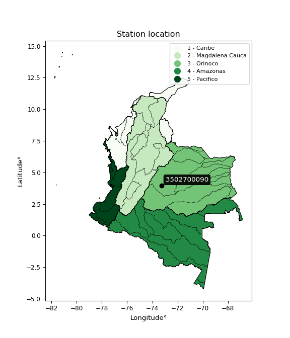

<div align="center">


</div>

# PMax24h Station (Rain, Pmax24h): 3502700090

Maximum Precipitation in 24 hours (PMax24h) is the greatest amount of rainfall for a specific duration that is meteorologically possible for a given location, acting as a "worst-case" scenario for extreme storms, crucial for designing safety-critical infrastructure like bridges, river deviations, dams, spillways, and nuclear plants to prevent catastrophic failure. The PMax24h is related with the Probable Maximum Precipitation (PMP) and it is calculated by hydrologists using meteorological data to determine the upper limit of extreme rainfall, often leading to the Probable Maximum Flood (PMF) for flood control design, and is increasingly being studied for climate change impacts. Probable Maximum Precipitation (PMP) is the theoretical upper limit of rainfall, a deterministic estimate for extreme events, while probability distributions (like GEV, Gumbel) describe the likelihood and frequency of various precipitation amounts, including rare ones, showing how often events occur, with PMP representing the extreme end of these distributions, used for critical infrastructure design to ensure safety against the worst conceivable weather, unlike standard statistical forecasts which cover typical probabilities.

The most common probability distributions in hydrology, used for analyzing floods, rainfall, and streamflow, include the Normal, Log-Normal, Gumbel, Gamma (including Log-Pearson Type III), and Generalized Extreme Value (GEV) distributions, often chosen based on the data´s skewness and whether modeling extremes or general conditions, with Gumbel and GEV popular for extreme events like floods, while the Normal distribution serves as a baseline, though often requiring transformations for skewed hydrological data. These distributions help in designing water infrastructure, managing water resources, and forecasting hydrologic events.

> Hydrological data often isn´t perfectly normal (it´s skewed), so different distributions are needed for different applications, such as: **Flood Frequency Analysis**: Using Gumbel, GEV, or Log-Pearson Type III for predicting extreme flood magnitudes and their return periods, **Rainfall Analysis**: Normal for annual totals, but Log-Normal, Weibull, or GEV for intensity or extreme daily rainfall, **Streamflow Modeling**: Gamma and Log-Normal for maximum flows, GEV for minimum flows, and Kappa for daily flows.

<div align="center">

</img>

</div>


## A. General information


### 1. General running parameters

• app_version: _v20260225_. • runtime: _2026-02-27 14:50:08.749431_. • Python version: _3.14.0_. • SciPy version: _1.16.3_. • Pandas version: _2.3.3_. • NumPy version: _2.3.5_. • Stations dataset (station_dataset_file): _dataset/pmax24h_in/automatic_colombia_2003_2025.csv_. • Stations catalog (station_catalog_file): _dataset/CNE.xls_. • Minimum year to eval til year_max (date_min): _1900_. • Maximum year to eval since year_min (date_max): _2025_. • Creates, save and include plots into reports (create_plot): _False_. • Plot only fit distributions with Δo > Δ (plot_only_fit): _True_. • Plot only simple graphs avoiding multiple CDFs and multiple Extreme values plots (plot_only_simple): _False_. • Eval low extreme values, if False, evaluates high extreme values (low_extreme): _False_. • Eval every SciPy distribution as logarithmic (pdist_logarithmic_on): _True_. • Standard deviation normalized (ddof): _1.0_. • Return periods to eval in years (Tr): _[2, 2.33, 5, 10, 15, 20, 25, 50, 75, 100, 200, 250, 500, 750, 1000]_. • Minimum data sample per station, 0 means any (minimum_sample): _5_. • Z-Score maximum threshold to adjust a value, 0 means disable (zscore_max): _3.5_. • Z-Score minimum threshold to adjust a value, 0 means disable (zscore_min): _-2.5_. • Avoid zeros, e.g. rain = 0 (avoid_zeros): _True_. • Avoid null values (avoid_nans): _True_. 

:file_folder:Table: [dataset.csv](../../dataset/pmax24h_in/automatic_colombia_2003_2025.csv)

> Delta Degrees of Freedom (DDOF): is a parameter used in the formulas for calculating variance and standard deviation. When ddof=0, the divisor is $N$ (the total number of observations) and this is used when your data set is the entire population. When ddof=1, the divisor is $N-1$ and this is used when your data set is a sample drawn from a larger population. Using $N-1$ provides an unbiased estimate of the population variance (known as Bessel´s correction).


### 2. Station info and location

|   id |     CODIGO | NOMBRE                         | CATEGORIA    | TECNOLOGIA                | ESTADO           | FECHA_INSTALACION   |   FECHA_SUSPENSION |   ALTITUD |   LATITUD |   LONGITUD | DEPARTAMENTO   | MUNICIPIO     | AREA_OPERATIVA                            | ENTIDAD                                                     | AREA_HIDROGRAFICA   | ZONA_HIDROGRAFICA   | SUBZONA_HIDROGRAFICA   | CORRIENTE   | Catalogo   |   Version |
|-----:|-----------:|:-------------------------------|:-------------|:--------------------------|:-----------------|:--------------------|-------------------:|----------:|----------:|-----------:|:---------------|:--------------|:------------------------------------------|:------------------------------------------------------------|:--------------------|:--------------------|:-----------------------|:------------|:-----------|----------:|
|    0 | 3502700090 | GUAYURIBA - AUT   [3502700090] | Limnigráfica | Automática con Telemetría | En Mantenimiento | 08/03/2018          |                nan |       230 |   3.95845 |    -73.271 | Meta           | Villavicencio | Area Operativa 03 - Meta-Guaviare-Guainía | INSTITUTO DE HIDROLOGIA METEOROLOGIA Y ESTUDIOS AMBIENTALES | Orinoco             | Meta                | Río Guayuriba          | Guayuriba   | CNE_IDEAM  |  20251226 |

<div align="center">

Dynamic map: [:earth_americas:Google](http://maps.google.com/maps?q=3.958454,-73.27098) [:earth_americas:OSM](https://www.openstreetmap.org/#map=18/3.958454/-73.27098&layers=P) [:earth_americas:Bing](https://www.bing.com/maps?cp=3.958454~-73.27098&lvl=18) [:earth_americas:Apple](https://maps.apple.com/frame?center=3.958454%2C-73.27098&span=0.003%2C0.006)

</div>


<div align="center">

```geojson
{
  "type": "Feature",
  "geometry": {
    "type": "Point", 
    "coordinates": [-73.27098, 3.958454]
  }, 
  "properties": {
    "Name": "3502700090"
  }
}
```

</div>


### 3. Discrete values table and plot

<div align="center">

|               |            0 |           1 |          2 |          3 |           4 |
|:--------------|-------------:|------------:|-----------:|-----------:|------------:|
| Date          | 2019         | 2021        | 2022       | 2023       | 2025        |
| Value         |   55.6       |   51.9      |   97.5     |    0.1     |   79.2      |
| Value_initial |   55.6       |   51.9      |   97.5     |    0.1     |   79.2      |
| count         |    5         |    5        |    5       |    5       |    5        |
| mean          |   56.86      |   56.86     |   56.86    |   56.86    |   56.86     |
| std           |   36.7375    |   36.7375   |   36.7375  |   36.7375  |   36.7375   |
| zscore        |   -0.0342974 |   -0.135012 |    1.10623 |   -1.54502 |    0.608098 |


</div>


> The initial value (value_initial) correspond to the initial obtained or null completed value, and value (value) is adjusted only when the initial value is outside the valid range (outlier) definite through the Z-Score value. If Z-Score is active, values out of range or outliers are replaced with the station mean value. A Z-Score (or standard score) measures how many standard deviations a data point is from the mean of a dataset, indicating its relative position; positive scores mean above the mean, negative mean below, and a score of zero is exactly at the mean, allowing for comparison of values from different distributions. It´s calculated using the formula $z=(x–μ)/σ$, where $x$ is the data point, $μ$ is the mean, and $σ$ is the standard deviation, helping identify outliers and understand probability.
>
> <sub>**Note**: In this study, "completing" (filling gaps in) and "extending" (forecasting or lengthening the historical record) rainfall data series are avoided for certain critical analyses because they introduce artificial bias and uncertainty, which can distort the statistics of rare events (extremes), alter day-to-day variability, and compromise the integrity and homogeneity of the original data. Some reasons against Completing/Extending rainfall data are: **Distortion of Extremes and Variability**: The primary issue is that most gap-filling or extension methods rely on averaging or regression with nearby stations, which inherently smooths the data. Rainfall is highly variable in space and time, with a large percentage of zero values and occasional large storms. Infilling methods often underestimate the highest values and overestimate the lowest (zero) values, which severely distorts analyses focused on flood frequency, drought severity, and intensity-duration-frequency (IDF) curves, **Loss of Data Homogeneity**: Infilled or extended data are synthetic estimates, not actual measurements. Combining these estimates with observed data can violate the assumption of data homogeneity, which requires that the data properties do not change over time. Inhomogeneity can lead to incorrect conclusions about long-term trends or changes in climate patterns, **Propagation of Errors**: Errors and biases from the original data (e.g., wind-induced undercatch, instrument errors, site changes) or the data used for imputation can propagate through the analysis, leading to unreliable hydrological models and inaccurate predictions, **Compromised Statistical Integrity**: For statistical analyses, especially those involving the frequency of events, using artificial data can introduce time bias or autocorrelation that doesn´t exist in reality, making it difficult to assess the true probability of events, **Difficulty in Validation**: It is difficult to accurately validate the quality of filled or extended data, especially for past periods where ground-truth measurements are unavailable. The reliability of imputation techniques heavily depends on the density of the surrounding station network and the complexity of the local topography.</sub>


### 4. Active continuous probability distributions from SciPy (80 of 104 available)

A Probability Density Function (PDF) describes the relative likelihood of a continuous random variable falling within a specific range, where the total area under its curve equals 1, and the area over any interval gives the actual probability for that range. Unlike discrete probabilities (like rolling a die), a PDF shows density, not direct probability for a single point (which is zero), with higher points indicating higher likelihood, often visualized as a bell curve for normal distributions.

A log of a probability density function (log-PDF) is simply the logarithm of the PDF´s value, denoted as $log(f(x))$, useful for converting multiplication of probabilities into addition, improving numerical stability with tiny numbers, and connecting to information theory concepts like entropy. Instead of dealing with very small probabilities (e.g., 0.000001), log-PDFs use negative numbers (e.g., $log(0.00001) ≈ -11.51$ that are easier for computers to handle, preventing underflow errors and simplifying complex calculations. In this study, each active probability distribution from SciPy is also evaluated in the $log$ form.

[scipy.stats](https://docs.scipy.org/doc/scipy/reference/stats.html) is a Python´s powerful submodule within the SciPy library for comprehensive statistical analysis, offering over 130 probability distributions (like Normal, Poisson, etc.), functions for descriptive stats (mean, variance), hypothesis testing (t-tests, chi-square), random variable generation, and statistical tests, making it essential for data science, modeling, and research. It provides tools to explore, model, and draw conclusions from data efficiently, working seamlessly with [NumPy](https://numpy.org/).

<div align="center">

|   id | p_dist           |   n_parameter | fit_method   | label                                                                       | active   | ref                                                                                                      |
|-----:|:-----------------|--------------:|:-------------|:----------------------------------------------------------------------------|:---------|:---------------------------------------------------------------------------------------------------------|
|    0 | alpha            |             3 | MLE          | Alpha                                                                       | True     | [:mortar_board:](https://docs.scipy.org/doc/scipy/reference/generated/scipy.stats.alpha.html)            |
|    1 | anglit           |             2 | MM           | Anglit                                                                      | True     | [:mortar_board:](https://docs.scipy.org/doc/scipy/reference/generated/scipy.stats.anglit.html)           |
|    2 | arcsine          |             2 | MM           | Arcsine                                                                     | True     | [:mortar_board:](https://docs.scipy.org/doc/scipy/reference/generated/scipy.stats.arcsine.html)          |
|    3 | argus            |             3 | MLE          | Argus                                                                       | True     | [:mortar_board:](https://docs.scipy.org/doc/scipy/reference/generated/scipy.stats.argus.html)            |
|    4 | beta             |             4 | MLE          | Beta                                                                        | True     | [:mortar_board:](https://docs.scipy.org/doc/scipy/reference/generated/scipy.stats.beta.html)             |
|    5 | betaprime        |             4 | MLE          | Beta prime                                                                  | True     | [:mortar_board:](https://docs.scipy.org/doc/scipy/reference/generated/scipy.stats.betaprime.html)        |
|    6 | bradford         |             3 | MLE          | Bradford                                                                    | True     | [:mortar_board:](https://docs.scipy.org/doc/scipy/reference/generated/scipy.stats.bradford.html)         |
|    7 | burr             |             4 | MLE          | Burr (Type III)                                                             | True     | [:mortar_board:](https://docs.scipy.org/doc/scipy/reference/generated/scipy.stats.burr.html)             |
|    8 | burr12           |             4 | MLE          | Burr (Type III) 12                                                          | True     | [:mortar_board:](https://docs.scipy.org/doc/scipy/reference/generated/scipy.stats.burr12.html)           |
|    9 | cosine           |             2 | MLE          | Cosine                                                                      | True     | [:mortar_board:](https://docs.scipy.org/doc/scipy/reference/generated/scipy.stats.cosine.html)           |
|   10 | crystalball      |             4 | MLE          | Crystalball                                                                 | True     | [:mortar_board:](https://docs.scipy.org/doc/scipy/reference/generated/scipy.stats.crystalball.html)      |
|   11 | dgamma           |             3 | MLE          | Double gamma                                                                | True     | [:mortar_board:](https://docs.scipy.org/doc/scipy/reference/generated/scipy.stats.dgamma.html)           |
|   12 | dweibull         |             3 | MLE          | Double Weibull                                                              | True     | [:mortar_board:](https://docs.scipy.org/doc/scipy/reference/generated/scipy.stats.dweibull.html)         |
|   13 | erlang           |             3 | MLE          | Erlang                                                                      | True     | [:mortar_board:](https://docs.scipy.org/doc/scipy/reference/generated/scipy.stats.erlang.html)           |
|   14 | exponnorm        |             3 | MLE          | Exponentially modified Normal                                               | True     | [:mortar_board:](https://docs.scipy.org/doc/scipy/reference/generated/scipy.stats.exponnorm.html)        |
|   15 | exponpow         |             3 | MLE          | Exponential power                                                           | True     | [:mortar_board:](https://docs.scipy.org/doc/scipy/reference/generated/scipy.stats.exponpow.html)         |
|   16 | exponweib        |             4 | MLE          | Exponentiated Weibull                                                       | True     | [:mortar_board:](https://docs.scipy.org/doc/scipy/reference/generated/scipy.stats.exponweib.html)        |
|   17 | f                |             4 | MLE          | F                                                                           | True     | [:mortar_board:](https://docs.scipy.org/doc/scipy/reference/generated/scipy.stats.f.html)                |
|   18 | fatiguelife      |             3 | MLE          | Fatigue-life (Birnbaum-Saunders)                                            | True     | [:mortar_board:](https://docs.scipy.org/doc/scipy/reference/generated/scipy.stats.fatiguelife.html)      |
|   19 | foldnorm         |             3 | MM           | Fold Normal                                                                 | True     | [:mortar_board:](https://docs.scipy.org/doc/scipy/reference/generated/scipy.stats.foldnorm.html)         |
|   20 | gamma            |             3 | MLE          | Gamma                                                                       | True     | [:mortar_board:](https://docs.scipy.org/doc/scipy/reference/generated/scipy.stats.gamma.html)            |
|   21 | gausshyper       |             6 | MLE          | Gauss hypergeometric                                                        | True     | [:mortar_board:](https://docs.scipy.org/doc/scipy/reference/generated/scipy.stats.gausshyper.html)       |
|   22 | genexpon         |             5 | MLE          | Generalized exponential                                                     | True     | [:mortar_board:](https://docs.scipy.org/doc/scipy/reference/generated/scipy.stats.genexpon.html)         |
|   23 | genextreme       |             3 | MLE          | Generalized exponential                                                     | True     | [:mortar_board:](https://docs.scipy.org/doc/scipy/reference/generated/scipy.stats.genextreme.html)       |
|   24 | gengamma         |             4 | MLE          | Generalized gamma                                                           | True     | [:mortar_board:](https://docs.scipy.org/doc/scipy/reference/generated/scipy.stats.gengamma.html)         |
|   25 | genhalflogistic  |             3 | MLE          | Generalized half-logistic                                                   | True     | [:mortar_board:](https://docs.scipy.org/doc/scipy/reference/generated/scipy.stats.genhalflogistic.html)  |
|   26 | genlogistic      |             3 | MLE          | Generalized logistic                                                        | True     | [:mortar_board:](https://docs.scipy.org/doc/scipy/reference/generated/scipy.stats.genlogistic.html)      |
|   27 | gennorm          |             3 | MLE          | Generalized Normal                                                          | True     | [:mortar_board:](https://docs.scipy.org/doc/scipy/reference/generated/scipy.stats.gennorm.html)          |
|   28 | genpareto        |             3 | MLE          | Generalized Pareto                                                          | True     | [:mortar_board:](https://docs.scipy.org/doc/scipy/reference/generated/scipy.stats.genpareto.html)        |
|   29 | gompertz         |             3 | MLE          | Gompertz (or truncated Gumbel)                                              | True     | [:mortar_board:](https://docs.scipy.org/doc/scipy/reference/generated/scipy.stats.gompertz.html)         |
|   30 | gumbel_l         |             2 | MM           | Gumbel Left Skew                                                            | True     | [:mortar_board:](https://docs.scipy.org/doc/scipy/reference/generated/scipy.stats.gumbel_l.html)         |
|   31 | gumbel_r         |             2 | MM           | Gumbel Right Skew                                                           | True     | [:mortar_board:](https://docs.scipy.org/doc/scipy/reference/generated/scipy.stats.gumbel_r.html)         |
|   32 | halfgennorm      |             3 | MLE          | Upper half of a generalized normal                                          | True     | [:mortar_board:](https://docs.scipy.org/doc/scipy/reference/generated/scipy.stats.halfgennorm.html)      |
|   33 | halflogistic     |             2 | MM           | Half-logistic                                                               | True     | [:mortar_board:](https://docs.scipy.org/doc/scipy/reference/generated/scipy.stats.halflogistic.html)     |
|   34 | halfnorm         |             2 | MM           | Half Normal                                                                 | True     | [:mortar_board:](https://docs.scipy.org/doc/scipy/reference/generated/scipy.stats.halfnorm.html)         |
|   35 | hypsecant        |             2 | MM           | hyperbolic secant                                                           | True     | [:mortar_board:](https://docs.scipy.org/doc/scipy/reference/generated/scipy.stats.hypsecant.html)        |
|   36 | invgamma         |             3 | MLE          | Inverted gamma                                                              | True     | [:mortar_board:](https://docs.scipy.org/doc/scipy/reference/generated/scipy.stats.invgamma.html)         |
|   37 | invgauss         |             3 | MLE          | Inverse Gaussian                                                            | True     | [:mortar_board:](https://docs.scipy.org/doc/scipy/reference/generated/scipy.stats.invgauss.html)         |
|   38 | invweibull       |             3 | MLE          | Inverted Weibull                                                            | True     | [:mortar_board:](https://docs.scipy.org/doc/scipy/reference/generated/scipy.stats.invweibull.html)       |
|   39 | johnsonsb        |             4 | MLE          | Johnson SB                                                                  | True     | [:mortar_board:](https://docs.scipy.org/doc/scipy/reference/generated/scipy.stats.johnsonsb.html)        |
|   40 | johnsonsu        |             4 | MLE          | Johnson Su                                                                  | True     | [:mortar_board:](https://docs.scipy.org/doc/scipy/reference/generated/scipy.stats.johnsonsu.html)        |
|   41 | kappa3           |             3 | MLE          | Kappa 3                                                                     | True     | [:mortar_board:](https://docs.scipy.org/doc/scipy/reference/generated/scipy.stats.kappa3.html)           |
|   42 | kappa4           |             4 | MLE          | Kappa 4                                                                     | True     | [:mortar_board:](https://docs.scipy.org/doc/scipy/reference/generated/scipy.stats.kappa4.html)           |
|   43 | ksone            |             3 | MLE          | Kolmogorov-Smirnov one-sided test statistic distribution                    | True     | [:mortar_board:](https://docs.scipy.org/doc/scipy/reference/generated/scipy.stats.ksone.html)            |
|   44 | kstwobign        |             2 | MLE          | Limiting distribution of scaled Kolmogorov-Smirnov two-sided test statistic | True     | [:mortar_board:](https://docs.scipy.org/doc/scipy/reference/generated/scipy.stats.kstwobign.html)        |
|   45 | laplace          |             2 | MM           | Laplace                                                                     | True     | [:mortar_board:](https://docs.scipy.org/doc/scipy/reference/generated/scipy.stats.laplace.html)          |
|   46 | levy_l           |             2 | MLE          | Left-skewed Levy                                                            | True     | [:mortar_board:](https://docs.scipy.org/doc/scipy/reference/generated/scipy.stats.levy_l.html)           |
|   47 | loggamma         |             3 | MLE          | Log gamma                                                                   | True     | [:mortar_board:](https://docs.scipy.org/doc/scipy/reference/generated/scipy.stats.loggamma.html)         |
|   48 | logistic         |             2 | MM           | Logistic (or Sech-squared)                                                  | True     | [:mortar_board:](https://docs.scipy.org/doc/scipy/reference/generated/scipy.stats.logistic.html)         |
|   49 | loglaplace       |             3 | MLE          | Log-Laplace                                                                 | True     | [:mortar_board:](https://docs.scipy.org/doc/scipy/reference/generated/scipy.stats.loglaplace.html)       |
|   50 | lomax            |             3 | MLE          | Lomax (Pareto of the second kind)                                           | True     | [:mortar_board:](https://docs.scipy.org/doc/scipy/reference/generated/scipy.stats.lomax.html)            |
|   51 | maxwell          |             2 | MM           | Maxwell                                                                     | True     | [:mortar_board:](https://docs.scipy.org/doc/scipy/reference/generated/scipy.stats.maxwell.html)          |
|   52 | mielke           |             4 | MLE          | Mielke Beta-Kappa / Dagum                                                   | True     | [:mortar_board:](https://docs.scipy.org/doc/scipy/reference/generated/scipy.stats.mielke.html)           |
|   53 | moyal            |             2 | MM           | Moyal                                                                       | True     | [:mortar_board:](https://docs.scipy.org/doc/scipy/reference/generated/scipy.stats.moyal.html)            |
|   54 | nakagami         |             3 | MLE          | Nakagami                                                                    | True     | [:mortar_board:](https://docs.scipy.org/doc/scipy/reference/generated/scipy.stats.nakagami.html)         |
|   55 | ncf              |             5 | MLE          | Non-central F distribution                                                  | True     | [:mortar_board:](https://docs.scipy.org/doc/scipy/reference/generated/scipy.stats.ncf.html)              |
|   56 | nct              |             4 | MLE          | Non-central Student’s t                                                     | True     | [:mortar_board:](https://docs.scipy.org/doc/scipy/reference/generated/scipy.stats.nct.html)              |
|   57 | norm             |             2 | MM           | Normal                                                                      | True     | [:mortar_board:](https://docs.scipy.org/doc/scipy/reference/generated/scipy.stats.norm.html)             |
|   58 | pearson3         |             3 | MM           | Pearson type III                                                            | True     | [:mortar_board:](https://docs.scipy.org/doc/scipy/reference/generated/scipy.stats.pearson3.html)         |
|   59 | powerlaw         |             3 | MLE          | Power-function                                                              | True     | [:mortar_board:](https://docs.scipy.org/doc/scipy/reference/generated/scipy.stats.powerlaw.html)         |
|   60 | rayleigh         |             2 | MM           | Rayleigh                                                                    | True     | [:mortar_board:](https://docs.scipy.org/doc/scipy/reference/generated/scipy.stats.rayleigh.html)         |
|   61 | rdist            |             3 | MLE          | R-distributed (symmetric beta)                                              | True     | [:mortar_board:](https://docs.scipy.org/doc/scipy/reference/generated/scipy.stats.rdist.html)            |
|   62 | rice             |             3 | MLE          | Rice                                                                        | True     | [:mortar_board:](https://docs.scipy.org/doc/scipy/reference/generated/scipy.stats.rice.html)             |
|   63 | semicircular     |             2 | MM           | Semicircular                                                                | True     | [:mortar_board:](https://docs.scipy.org/doc/scipy/reference/generated/scipy.stats.semicircular.html)     |
|   64 | skewnorm         |             3 | MLE          | Skew normal                                                                 | True     | [:mortar_board:](https://docs.scipy.org/doc/scipy/reference/generated/scipy.stats.skewnorm.html)         |
|   65 | t                |             3 | MLE          | Student’s t                                                                 | True     | [:mortar_board:](https://docs.scipy.org/doc/scipy/reference/generated/scipy.stats.t.html)                |
|   66 | trapezoid        |             4 | MLE          | Trapezoid                                                                   | True     | [:mortar_board:](https://docs.scipy.org/doc/scipy/reference/generated/scipy.stats.trapezoid.html)        |
|   67 | triang           |             3 | MLE          | Triangular                                                                  | True     | [:mortar_board:](https://docs.scipy.org/doc/scipy/reference/generated/scipy.stats.triang.html)           |
|   68 | truncexpon       |             3 | MLE          | Truncated exponential                                                       | True     | [:mortar_board:](https://docs.scipy.org/doc/scipy/reference/generated/scipy.stats.truncexpon.html)       |
|   69 | truncnorm        |             4 | MLE          | Truncated normal                                                            | True     | [:mortar_board:](https://docs.scipy.org/doc/scipy/reference/generated/scipy.stats.truncnorm.html)        |
|   70 | truncpareto      |             4 | MLE          | Upper truncated Pareto                                                      | True     | [:mortar_board:](https://docs.scipy.org/doc/scipy/reference/generated/scipy.stats.truncpareto.html)      |
|   71 | truncweibull_min |             5 | MLE          | Doubly truncated Weibull minimum                                            | True     | [:mortar_board:](https://docs.scipy.org/doc/scipy/reference/generated/scipy.stats.truncweibull_min.html) |
|   72 | tukeylambda      |             3 | MLE          | Tukey-Lamdba                                                                | True     | [:mortar_board:](https://docs.scipy.org/doc/scipy/reference/generated/scipy.stats.tukeylambda.html)      |
|   73 | uniform          |             2 | MLE          | Uniform                                                                     | True     | [:mortar_board:](https://docs.scipy.org/doc/scipy/reference/generated/scipy.stats.uniform.html)          |
|   74 | vonmises         |             3 | MLE          | Von Mises                                                                   | True     | [:mortar_board:](https://docs.scipy.org/doc/scipy/reference/generated/scipy.stats.vonmises.html)         |
|   75 | vonmises_line    |             3 | MLE          | Von Mises line                                                              | True     | [:mortar_board:](https://docs.scipy.org/doc/scipy/reference/generated/scipy.stats.vonmises_line.html)    |
|   76 | wald             |             2 | MM           | Wald                                                                        | True     | [:mortar_board:](https://docs.scipy.org/doc/scipy/reference/generated/scipy.stats.wald.html)             |
|   77 | weibull_max      |             3 | MLE          | Weibull maximum                                                             | True     | [:mortar_board:](https://docs.scipy.org/doc/scipy/reference/generated/scipy.stats.weibull_max.html)      |
|   78 | weibull_min      |             3 | MLE          | Weibull minimum                                                             | True     | [:mortar_board:](https://docs.scipy.org/doc/scipy/reference/generated/scipy.stats.weibull_min.html)      |
|   79 | wrapcauchy       |             3 | MLE          | Wrapped  Cauchy                                                             | True     | [:mortar_board:](https://docs.scipy.org/doc/scipy/reference/generated/scipy.stats.wrapcauchy.html)       |

</div>

> **n_parameter:** # arguments & localization & scale.
>
> **Fit methods:** (MLE) maximum likelihood, (MM) L-moments.
>
>**Inactive** (With the only purpose of prevent loops, zero divisions, infinite values, over high estimated values or horizontal trending for recurrence intervals estimations, the follow distributions were disabled.)**:** lognorm, norminvgauss, powernorm, powerlognorm, cauchy, halfcauchy, foldcauchy, skewcauchy, chi2, expon, fisk, genhyperbolic, geninvgauss, gibrat, kstwo, laplace_asymmetric, levy, levy_stable, ncx2, pareto, rel_breitwigner, recipinvgauss, studentized_range, loguniform, 


## B. Probability (PDF) vs. Empirical (EDF) distributions functions

A continuous probability distribution (CPD) describes probabilities for variables that can take any value within a range (like rain any time), unlike discrete variables with specific outcomes (like temperature). It uses a Probability Density Function (PDF), a curve where the total area under it equals 1, and the probability of the variable falling within an interval (a to b) is found by calculating the area under the curve between those points. A key feature is that the probability of hitting any single exact value is zero, so probabilities are always expressed for ranges, e.g., $P(a ≤ X ≤ b)$.

<div align="center">

Distributions parameters from station values
|     |    station | p_dist              |   n |             loc |           scale | shape                  | shape1                | shape2             | shape3             |
|----:|-----------:|:--------------------|----:|----------------:|----------------:|:-----------------------|:----------------------|:-------------------|:-------------------|
|   0 | 3502700090 | alpha               |   5 |  -637.712       | 13918.3         | 20.10106332305309      |                       |                    |                    |
|   1 | 3502700090 | anglit              |   5 |    56.86        |    96.1257      |                        |                       |                    |                    |
|   2 | 3502700090 | arcsine             |   5 |    10.3903      |    92.9393      |                        |                       |                    |                    |
|   3 | 3502700090 | argus               |   5 |   -30.4592      |   132.812       | 1.6211364831105932     |                       |                    |                    |
|   4 | 3502700090 | beta                |   5 |   -28.5065      |   126.007       | 1.5732801880587735     | 0.753264573778371     |                    |                    |
|   5 | 3502700090 | betaprime           |   5 |  -960.962       | 82396.8         | 945.7387699923115      | 76588.3030078704      |                    |                    |
|   6 | 3502700090 | bradford            |   5 |   -13.1023      |   110.602       | 5.911795354753569e-06  |                       |                    |                    |
|   7 | 3502700090 | burr                |   5 |     0.0999345   |   108.266       | 49.5633238442245       | 0.011337201956976191  |                    |                    |
|   8 | 3502700090 | burr12              |   5 |   -68.5887      |  1366.54        | 4.6766482565994405     | 45148.928599955616    |                    |                    |
|   9 | 3502700090 | cosine              |   5 |    54.0175      |    27.4592      |                        |                       |                    |                    |
|  10 | 3502700090 | crystalball         |   5 |    56.86        |    32.859       | 48076.59650836496      | 173.7762645745843     |                    |                    |
|  11 | 3502700090 | dgamma              |   5 |    55.6         |    26.7849      | 0.8384677102660374     |                       |                    |                    |
|  12 | 3502700090 | dweibull            |   5 |    55.6         |    27.6223      | 0.7256011395782285     |                       |                    |                    |
|  13 | 3502700090 | erlang              |   5 |  -535.531       |     1.94862     | 303.8156286509944      |                       |                    |                    |
|  14 | 3502700090 | exponnorm           |   5 |    56.8367      |    32.8591      | 0.0007062297451011517  |                       |                    |                    |
|  15 | 3502700090 | exponpow            |   5 |     0.1         |     3.48395     | 0.14087591705316682    |                       |                    |                    |
|  16 | 3502700090 | exponweib           |   5 |     0.1         |     4.14117     | 2.20236404813141       | 0.3201233502202263    |                    |                    |
|  17 | 3502700090 | f                   |   5 |     0.1         |    85.3019      | 0.9107271740643681     | 8.589678366181545     |                    |                    |
|  18 | 3502700090 | fatiguelife         |   5 |     0.1         |     3.9863e-05  | 958.5189033267834      |                       |                    |                    |
|  19 | 3502700090 | foldnorm            |   5 |   -80.125       |    30.5229      | 4.507020161623391      |                       |                    |                    |
|  20 | 3502700090 | gamma               |   5 |  -454.515       |     2.21691     | 230.65316553147352     |                       |                    |                    |
|  21 | 3502700090 | gausshyper          |   5 |    -8.85728     |   106.357       | 1.2439932693876092     | 0.569718393536695     | 1.2297283774297498 | 1.0150623198159483 |
|  22 | 3502700090 | genexpon            |   5 |    -2.36529     |     2.53634     | 6.314401590780678e-11  | 0.043579776721825156  | 2.550109849333414  |                    |
|  23 | 3502700090 | genextreme          |   5 |    58.096       |    44.8117      | 1.1372375940738286     |                       |                    |                    |
|  24 | 3502700090 | gengamma            |   5 |   -97.6512      |     0.000992468 | 131.12456453873665     | 0.4082190373575836    |                    |                    |
|  25 | 3502700090 | genhalflogistic     |   5 |   -11.7148      |   124.73        | 1.1420600534085048     |                       |                    |                    |
|  26 | 3502700090 | genlogistic         |   5 |    97.5005      |     2.70243e-06 | 6.641650161434489e-08  |                       |                    |                    |
|  27 | 3502700090 | gennorm             |   5 |    55.6         |     0.0186599   | 0.2315195986446707     |                       |                    |                    |
|  28 | 3502700090 | genpareto           |   5 |    -0.851833    |   174.689       | -1.7761653698683202    |                       |                    |                    |
|  29 | 3502700090 | gompertz            |   5 |    51.9         |    24.5549      | 0.5276795198537665     |                       |                    |                    |
|  30 | 3502700090 | gumbel_l            |   5 |    71.6483      |    25.6201      |                        |                       |                    |                    |
|  31 | 3502700090 | gumbel_r            |   5 |    42.0717      |    25.6201      |                        |                       |                    |                    |
|  32 | 3502700090 | halfgennorm         |   5 |     0.1         |     3.23865     | 0.3717008375389348     |                       |                    |                    |
|  33 | 3502700090 | halflogistic        |   5 |    17.9145      |    28.0933      |                        |                       |                    |                    |
|  34 | 3502700090 | halfnorm            |   5 |    13.3676      |    54.5097      |                        |                       |                    |                    |
|  35 | 3502700090 | hypsecant           |   5 |    56.86        |    20.9187      |                        |                       |                    |                    |
|  36 | 3502700090 | invgamma            |   5 |     0.1         |     1.23541e-17 | 0.14880111141758465    |                       |                    |                    |
|  37 | 3502700090 | invgauss            |   5 |  -127.914       |  4452.4         | 0.04123529993744629    |                       |                    |                    |
|  38 | 3502700090 | invweibull          |   5 |     0.1         |     2.56958     | 0.04442738686788231    |                       |                    |                    |
|  39 | 3502700090 | johnsonsb           |   5 |   -16.9219      |   114.422       | -0.2049197813998725    | 0.07094639989718354   |                    |                    |
|  40 | 3502700090 | johnsonsu           |   5 |   124.274       |     1.72259     | 8.276270288081939      | 1.9542685456569084    |                    |                    |
|  41 | 3502700090 | kappa3              |   5 |     0.0989368   |    97.4002      | 110074.9336637409      |                       |                    |                    |
|  42 | 3502700090 | kappa4              |   5 |    -0.0564526   |   105.629       | 1.0010895792647523     | 1.0827447926173517    |                    |                    |
|  43 | 3502700090 | ksone               |   5 |    -0.0534712   |   113.827       | 1.0                    |                       |                    |                    |
|  44 | 3502700090 | kstwobign           |   5 |   -79.6346      |   155.729       |                        |                       |                    |                    |
|  45 | 3502700090 | laplace             |   5 |    56.86        |    23.2348      |                        |                       |                    |                    |
|  46 | 3502700090 | levy_l              |   5 |   100.631       |    11.9413      |                        |                       |                    |                    |
|  47 | 3502700090 | loggamma            |   5 |    97.5025      |     3.64122e-05 | 8.962838101362081e-07  |                       |                    |                    |
|  48 | 3502700090 | logistic            |   5 |    56.86        |    18.1161      |                        |                       |                    |                    |
|  49 | 3502700090 | loglaplace          |   5 |    -0.12119     |    55.7212      | 0.7677052236620451     |                       |                    |                    |
|  50 | 3502700090 | lomax               |   5 |     0.0999921   |     1.34671e+08 | 2311231.0411879485     |                       |                    |                    |
|  51 | 3502700090 | maxwell             |   5 |   -21.0021      |    48.7928      |                        |                       |                    |                    |
|  52 | 3502700090 | mielke              |   5 |     0.1         |    95.1295      | 0.27000466503766174    | 2.828382774424169     |                    |                    |
|  53 | 3502700090 | moyal               |   5 |    38.0691      |    14.7918      |                        |                       |                    |                    |
|  54 | 3502700090 | nakagami            |   5 |     0.1         |    57.1838      | 0.1396879458875996     |                       |                    |                    |
|  55 | 3502700090 | ncf                 |   5 |     0.1         |     7.13487     | 0.38208058499112196    | 6.6330439373566055    | 3.456429298898507  |                    |
|  56 | 3502700090 | nct                 |   5 |     0.0999986   |     2.55639e-06 | 0.1026810749214479     | 2.4026371527539343    |                    |                    |
|  57 | 3502700090 | norm                |   5 |    56.86        |    32.859       |                        |                       |                    |                    |
|  58 | 3502700090 | pearson3            |   5 |    56.86        |    32.859       | -0.590314637763103     |                       |                    |                    |
|  59 | 3502700090 | powerlaw            |   5 |     0.1         |    97.4         | 0.11161446529135291    |                       |                    |                    |
|  60 | 3502700090 | rayleigh            |   5 |    -6.0012      |    50.156       |                        |                       |                    |                    |
|  61 | 3502700090 | rdist               |   5 |    -8.66433     |    60.5643      | 1.02062597698532       |                       |                    |                    |
|  62 | 3502700090 | rice                |   5 |   -21.7367      |    36.1642      | 1.8838572967646132     |                       |                    |                    |
|  63 | 3502700090 | semicircular        |   5 |    56.86        |    65.718       |                        |                       |                    |                    |
|  64 | 3502700090 | skewnorm            |   5 |    97.5         |    52.2653      | -43375164.833150715    |                       |                    |                    |
|  65 | 3502700090 | t                   |   5 |     0.1         |     1.13541e-16 | 0.1598933364106646     |                       |                    |                    |
|  66 | 3502700090 | trapezoid           |   5 |   -37.8833      |   139.409       | 1.0                    | 1.0                   |                    |                    |
|  67 | 3502700090 | triang              |   5 |   -38.6276      |   136.128       | 0.999999348363322      |                       |                    |                    |
|  68 | 3502700090 | truncexpon          |   5 |     0.099991    |   158.385       | 0.614955775458063      |                       |                    |                    |
|  69 | 3502700090 | truncnorm           |   5 |     7.47055     |    57.3416      | -4.2576075639959585    | 1.5700539361669579    |                    |                    |
|  70 | 3502700090 | truncpareto         |   5 |    -0.461657    |     0.561656    | 3.098443199553872e-05  | 174.41574092568504    |                    |                    |
|  71 | 3502700090 | truncweibull_min    |   5 |    -7.5868      |   184.019       | 1.4181615441975897     | 0.0009806551597816159 | 0.5710638723065085 |                    |
|  72 | 3502700090 | tukeylambda         |   5 |    48.8001      |    52.3259      | 1.0744503375574723     |                       |                    |                    |
|  73 | 3502700090 | uniform             |   5 |     0.1         |    97.4         |                        |                       |                    |                    |
|  74 | 3502700090 | vonmises            |   5 |    -2.12217     |     1           | 0.20701626890596675    |                       |                    |                    |
|  75 | 3502700090 | vonmises_line       |   5 |    48.7344      |    15.5226      | 1.6503070585617417e-05 |                       |                    |                    |
|  76 | 3502700090 | wald                |   5 |    24.001       |    32.859       |                        |                       |                    |                    |
|  77 | 3502700090 | weibull_max         |   5 |    97.5         |     1.64823     | 0.23230320237096624    |                       |                    |                    |
|  78 | 3502700090 | weibull_min         |   5 |    -2.73617e+08 |     2.73617e+08 | 10513367.183319896     |                       |                    |                    |
|  79 | 3502700090 | wrapcauchy          |   5 |     0.0999954   |    15.5017      | 0.22048691540029294    |                       |                    |                    |
|  80 | 3502700090 | logalpha            |   5 |   -44.2625      |   753.12        | 16.09945164852475      |                       |                    |                    |
|  81 | 3502700090 | loganglit           |   5 |     2.92335     |     7.67372     |                        |                       |                    |                    |
|  82 | 3502700090 | logarcsine          |   5 |    -0.786313    |     7.41933     |                        |                       |                    |                    |
|  83 | 3502700090 | logargus            |   5 |    -4.9752      |     9.73759     | 3.2586221111552445     |                       |                    |                    |
|  84 | 3502700090 | logbeta             |   5 |    -3.00561     |     7.58546     | 0.03922966649871383    | 0.01057331478583405   |                    |                    |
|  85 | 3502700090 | logbetaprime        |   5 |    -2.30259     |     4.59361     | 0.09941629244625468    | 0.18372114060078198   |                    |                    |
|  86 | 3502700090 | logbradford         |   5 |    -2.30261     |     6.88247     | 1.158040075892903      |                       |                    |                    |
|  87 | 3502700090 | logburr             |   5 |    -2.30259     |     2.97922     | 0.099642551543595      | 1.472869311820273     |                    |                    |
|  88 | 3502700090 | logburr12           |   5 |    -2.30259     |     1.55898     | 0.7775462190391338     | 0.7675221587119234    |                    |                    |
|  89 | 3502700090 | logcosine           |   5 |     2.40649     |     2.25681     |                        |                       |                    |                    |
|  90 | 3502700090 | logcrystalball      |   5 |     2.92335     |     2.62313     | 62.26739119349884      | 62.203001057500714    |                    |                    |
|  91 | 3502700090 | logdgamma           |   5 |     4.01818     |     2.90677     | 0.43777162785185836    |                       |                    |                    |
|  92 | 3502700090 | logdweibull         |   5 |     4.01818     |     1.78592     | 0.7014789435417209     |                       |                    |                    |
|  93 | 3502700090 | logerlang           |   5 |   -39.3434      |     0.178082    | 237.12162814186104     |                       |                    |                    |
|  94 | 3502700090 | logexponnorm        |   5 |     2.92143     |     2.62314     | 0.0007248397064927354  |                       |                    |                    |
|  95 | 3502700090 | logexponpow         |   5 |    -2.30259     |     1.72243     | 0.25042817216199403    |                       |                    |                    |
|  96 | 3502700090 | logexponweib        |   5 |    -2.30259     |     2.03032     | 1.798066185900327      | 0.08447774181292961   |                    |                    |
|  97 | 3502700090 | logf                |   5 |    -2.30259     |     1.12256     | 1.0631374125001332     | 1.0465170082627124    |                    |                    |
|  98 | 3502700090 | logfatiguelife      |   5 |    -2.30259     |     4.62873e-06 | 1089.490293211708      |                       |                    |                    |
|  99 | 3502700090 | logfoldnorm         |   5 |   -11.3696      |     1.89079     | 7.644652811495289      |                       |                    |                    |
| 100 | 3502700090 | loggamma            |   5 |   -38.3662      |     0.183588    | 224.60780963010006     |                       |                    |                    |
| 101 | 3502700090 | loggausshyper       |   5 |    -3.56859     |     8.14844     | 1.285993142390132      | 0.36058184196943555   | 0.9226480651142692 | 1.1785936418012821 |
| 102 | 3502700090 | loggenexpon         |   5 |    -2.30259     |     9.58093e+08 | 108042046.90819731     | 932786255.021658      | 27730638.359108657 |                    |
| 103 | 3502700090 | loggenextreme       |   5 |     1.51491     |     4.39013     | 1.4323689983045802     |                       |                    |                    |
| 104 | 3502700090 | loggengamma         |   5 |    -2.30259     |     1.93394     | 1.579844867694371      | 0.0943247383903147    |                    |                    |
| 105 | 3502700090 | loggenhalflogistic  |   5 |    -2.9048      |     8.33721     | 1.1139078799498208     |                       |                    |                    |
| 106 | 3502700090 | loggenlogistic      |   5 |     4.57995     |     6.58226e-06 | 3.962826695744621e-06  |                       |                    |                    |
| 107 | 3502700090 | loggennorm          |   5 |     3.94932     |     0.13272     | 0.47769942533696885    |                       |                    |                    |
| 108 | 3502700090 | loggenpareto        |   5 |    -2.30259     |     2.92397     | -0.119801815311386     |                       |                    |                    |
| 109 | 3502700090 | loggompertz         |   5 |    -2.30261     |     1.70576     | 0.027492711080279515   |                       |                    |                    |
| 110 | 3502700090 | loggumbel_l         |   5 |     4.1039      |     2.04525     |                        |                       |                    |                    |
| 111 | 3502700090 | loggumbel_r         |   5 |     1.7428      |     2.04525     |                        |                       |                    |                    |
| 112 | 3502700090 | loghalfgennorm      |   5 |    -2.30259     |     1.74978     | 0.5859691039646822     |                       |                    |                    |
| 113 | 3502700090 | loghalflogistic     |   5 |    -0.185643    |     2.24267     |                        |                       |                    |                    |
| 114 | 3502700090 | loghalfnorm         |   5 |    -0.54866     |     4.35152     |                        |                       |                    |                    |
| 115 | 3502700090 | loghypsecant        |   5 |     2.92335     |     1.66994     |                        |                       |                    |                    |
| 116 | 3502700090 | loginvgamma         |   5 |   -49.436       | 18305.5         | 351.1998680423425      |                       |                    |                    |
| 117 | 3502700090 | loginvgauss         |   5 |   -24.9128      |  2456.01        | 0.011304728883197133   |                       |                    |                    |
| 118 | 3502700090 | loginvweibull       |   5 |    -4.02254e+06 |     4.02254e+06 | 1318239.1788080684     |                       |                    |                    |
| 119 | 3502700090 | logjohnsonsb        |   5 |    -6.97789     |    11.5577      | -2.103589075630567     | 0.17747256458565655   |                    |                    |
| 120 | 3502700090 | logjohnsonsu        |   5 |     4.57985     |     1.27307e-16 | 2.4445140700528523     | 0.12125023716941445   |                    |                    |
| 121 | 3502700090 | logkappa3           |   5 |    -2.30259     |     2.24572     | 0.6897235172693506     |                       |                    |                    |
| 122 | 3502700090 | logkappa4           |   5 |    -2.6848      |     8.22988     | 1.0439786542868532     | 1.1328667806690367    |                    |                    |
| 123 | 3502700090 | logksone            |   5 |    -2.99083     |     8.25892     | 1.0                    |                       |                    |                    |
| 124 | 3502700090 | logkstwobign        |   5 |    -9.40307     |    14.0464      |                        |                       |                    |                    |
| 125 | 3502700090 | loglaplace          |   5 |     2.92335     |     1.85484     |                        |                       |                    |                    |
| 126 | 3502700090 | loglevy_l           |   5 |     4.62341     |     0.165478    |                        |                       |                    |                    |
| 127 | 3502700090 | logloggamma         |   5 |     4.57992     |     3.11629e-06 | 1.8759678718017865e-06 |                       |                    |                    |
| 128 | 3502700090 | loglogistic         |   5 |     2.92335     |     1.44621     |                        |                       |                    |                    |
| 129 | 3502700090 | logloglaplace       |   5 |    -2.30259     |     1.71001     | 0.12092003601236084    |                       |                    |                    |
| 130 | 3502700090 | loglomax            |   5 |    -2.30259     |     1.3582      | 0.6902833396820679     |                       |                    |                    |
| 131 | 3502700090 | logmaxwell          |   5 |    -3.29238     |     3.89513     |                        |                       |                    |                    |
| 132 | 3502700090 | logmielke           |   5 |    -2.30259     |     3.146       | 0.12663322253196058    | 0.8161307875054292    |                    |                    |
| 133 | 3502700090 | logmoyal            |   5 |     1.42327     |     1.18083     |                        |                       |                    |                    |
| 134 | 3502700090 | lognakagami         |   5 | -1880.13        |  1883.06        | 128931.3643121575      |                       |                    |                    |
| 135 | 3502700090 | logncf              |   5 |    -2.30259     |     1.04418     | 1.0538633053842394     | 1.1264250495206545    | 1.0459865133285318 |                    |
| 136 | 3502700090 | lognct              |   5 |  -129.362       |     2.59829     | 54998.753900189244     | 50.9114081867024      |                    |                    |
| 137 | 3502700090 | lognorm             |   5 |     2.92335     |     2.62314     |                        |                       |                    |                    |
| 138 | 3502700090 | logpearson3         |   5 |     2.92333     |     2.62318     | -1.4708991266937672    |                       |                    |                    |
| 139 | 3502700090 | logpowerlaw         |   5 |    -2.30259     |     6.88244     | 0.1333640340837648     |                       |                    |                    |
| 140 | 3502700090 | lograyleigh         |   5 |    -2.09482     |     4.00393     |                        |                       |                    |                    |
| 141 | 3502700090 | logrdist            |   5 |    -2.30259     |     4.44641e-16 | 1.6680066620388745     |                       |                    |                    |
| 142 | 3502700090 | logrice             |   5 | -1428.06        |     2.62222     | 545.7143161313732      |                       |                    |                    |
| 143 | 3502700090 | logsemicircular     |   5 |     2.92335     |     5.24627     |                        |                       |                    |                    |
| 144 | 3502700090 | logskewnorm         |   5 |     4.57986     |     3.10232     | -6071774.057391937     |                       |                    |                    |
| 145 | 3502700090 | logt                |   5 |     4.14268     |     0.278621    | 0.7816178191374866     |                       |                    |                    |
| 146 | 3502700090 | logtrapezoid        |   5 |    -4.7208      |    11.129       | 1.0                    | 1.0                   |                    |                    |
| 147 | 3502700090 | logtriang           |   5 |    -3.73266     |     8.31252     | 0.9999999925428731     |                       |                    |                    |
| 148 | 3502700090 | logtruncexpon       |   5 |    -2.30261     |    12.96        | 0.5310554351566497     |                       |                    |                    |
| 149 | 3502700090 | logtruncnorm        |   5 |     2.64723     |     2.88507     | -1.715666568474849     | 5.177693224817365     |                    |                    |
| 150 | 3502700090 | logtruncpareto      |   5 |    -2.35637     |     0.0537866   | 4.7804182905299945e-06 | 128.95817718988928    |                    |                    |
| 151 | 3502700090 | logtruncweibull_min |   5 |  -130.678       |   186.203       | 48.690101270325385     | 0.6894391640281154    | 0.7264013420124762 |                    |
| 152 | 3502700090 | logtukeylambda      |   5 |    -2.30259     |     7.64817e-16 | 1.7222143483766983     |                       |                    |                    |
| 153 | 3502700090 | loguniform          |   5 |    -2.30259     |     6.88244     |                        |                       |                    |                    |
| 154 | 3502700090 | logvonmises         |   5 |    -2.10479     |     1           | 16.225653829148193     |                       |                    |                    |
| 155 | 3502700090 | logvonmises_line    |   5 |     3.71917     |     1.91678     | 1.3792536960135964     |                       |                    |                    |
| 156 | 3502700090 | logwald             |   5 |     0.300242    |     2.62313     |                        |                       |                    |                    |
| 157 | 3502700090 | logweibull_max      |   5 |     4.57985     |     0.755864    | 0.6717772282936387     |                       |                    |                    |
| 158 | 3502700090 | logweibull_min      |   5 |    -2.30259     |     1.32714     | 0.13557313622884679    |                       |                    |                    |
| 159 | 3502700090 | logwrapcauchy       |   5 |    -2.30259     |     1.09537     | 0.525                  |                       |                    |                    |

</div>

> **loc** (Location parameter): This shifts the distribution along the x-axis. For many common distributions, like the normal (Gaussian) distribution, loc represents the mean $μ$. For others, like the uniform distribution, it might represent the minimum value, or for the beta distribution, the left end of the support interval.
>
> **scale** (Scale parameter): This determines the width or spread of the distribution. For the normal distribution, scale represents the standard deviation $σ$. For a uniform distribution, it defines the length of the interval (from $loc$ to $loc + scale$).
>
> **shape** (Shape parameters): Refers to parameters that define the specific form of a probability distribution, distinct from its location (loc) and scale (scale). These parameters are required arguments for most distribution functions. For example, a normal (Gaussian) distribution is fully defined by its location (mean) and scale (standard deviation), so it has no specific shape parameters beyond loc and scale. However, other distributions have intrinsic properties that need specification, as Gamma distribution that takes a shape parameter, often named $a$ or $alpha$.


### 0. Cumulative distribution values - CDF (160 evaluated)

Cumulative Distribution Function (CDF), denoted as $F$<sub>$X$</sub>$(x)$, is a function that gives the probability that a random variable $X$ will take a value less than or equal to a specific value, $x$ (i.e., $(P(X≥x)$. It essentially "accumulates" probabilities from a given point up to the far right (positive infinity), providing a complete picture of the distribution´s probabilities for both discrete (like rain) and continuous (like temperature) variables, helping to find probabilities over ranges or above certain values. Each station is evaluated separately ordering the $x$ values ascending, calculating the CDF and PDF values for the activated distributions and their logarithmic forms.

<div align="center">

CDF ordered by x ascending and calculating $log(f(x))$ separately
|   id |    Station |   date |    x |   count |   mean |     std |     zscore |   Value_initial |    station |   m |     alpha |   alpha_pdf |    anglit |   anglit_pdf |   arcsine |   arcsine_pdf |     argus |   argus_pdf |      beta |    beta_pdf |   betaprime |   betaprime_pdf |   bradford |   bradford_pdf |        burr |     burr_pdf |    burr12 |   burr12_pdf |    cosine |   cosine_pdf |   crystalball |   crystalball_pdf |    dgamma |   dgamma_pdf |   dweibull |   dweibull_pdf |    erlang |   erlang_pdf |   exponnorm |   exponnorm_pdf |   exponpow |   exponpow_pdf |   exponweib |   exponweib_pdf |           f |       f_pdf |   fatiguelife |   fatiguelife_pdf |   foldnorm |   foldnorm_pdf |     gamma |   gamma_pdf |   gausshyper |   gausshyper_pdf |   genexpon |   genexpon_pdf |   genextreme |   genextreme_pdf |   gengamma |   gengamma_pdf |   genhalflogistic |   genhalflogistic_pdf |   genlogistic |   genlogistic_pdf |   gennorm |   gennorm_pdf |   genpareto |   genpareto_pdf |    gompertz |   gompertz_pdf |   gumbel_l |   gumbel_l_pdf |   gumbel_r |   gumbel_r_pdf |   halfgennorm |   halfgennorm_pdf |   halflogistic |   halflogistic_pdf |   halfnorm |   halfnorm_pdf |   hypsecant |   hypsecant_pdf |   invgamma |   invgamma_pdf |   invgauss |   invgauss_pdf |   invweibull |   invweibull_pdf |   johnsonsb |   johnsonsb_pdf |   johnsonsu |   johnsonsu_pdf |     kappa3 |   kappa3_pdf |      kappa4 |   kappa4_pdf |      ksone |   ksone_pdf |   kstwobign |   kstwobign_pdf |   laplace |   laplace_pdf |   levy_l |   levy_l_pdf |   loggamma |   loggamma_pdf |   logistic |   logistic_pdf |   loglaplace |   loglaplace_pdf |       lomax |   lomax_pdf |   maxwell |   maxwell_pdf |      mielke |   mielke_pdf |       moyal |   moyal_pdf |    nakagami |   nakagami_pdf |         ncf |     ncf_pdf |       nct |         nct_pdf |      norm |   norm_pdf |   pearson3 |   pearson3_pdf |   powerlaw |   powerlaw_pdf |   rayleigh |   rayleigh_pdf |    rdist |       rdist_pdf |     rice |   rice_pdf |   semicircular |   semicircular_pdf |   skewnorm |   skewnorm_pdf |        t |       t_pdf |   trapezoid |   trapezoid_pdf |    triang |   triang_pdf |   truncexpon |   truncexpon_pdf |   truncnorm |   truncnorm_pdf |   truncpareto |   truncpareto_pdf |   truncweibull_min |   truncweibull_min_pdf |   tukeylambda |   tukeylambda_pdf |   uniform |   uniform_pdf |   vonmises |   vonmises_pdf |   vonmises_line |   vonmises_line_pdf |     wald |   wald_pdf |   weibull_max |   weibull_max_pdf |   weibull_min |   weibull_min_pdf |   wrapcauchy |   wrapcauchy_pdf |   logalpha |   logalpha_pdf |   loganglit |   loganglit_pdf |   logarcsine |   logarcsine_pdf |   logargus |   logargus_pdf |   logbeta |   logbeta_pdf |   logbetaprime |   logbetaprime_pdf |   logbradford |   logbradford_pdf |    logburr |   logburr_pdf |   logburr12 |   logburr12_pdf |   logcosine |   logcosine_pdf |   logcrystalball |   logcrystalball_pdf |   logdgamma |   logdgamma_pdf |   logdweibull |   logdweibull_pdf |   logerlang |   logerlang_pdf |   logexponnorm |   logexponnorm_pdf |   logexponpow |   logexponpow_pdf |   logexponweib |   logexponweib_pdf |        logf |    logf_pdf |   logfatiguelife |   logfatiguelife_pdf |   logfoldnorm |   logfoldnorm_pdf |   loggausshyper |   loggausshyper_pdf |   loggenexpon |   loggenexpon_pdf |   loggenextreme |   loggenextreme_pdf |   loggengamma |   loggengamma_pdf |   loggenhalflogistic |   loggenhalflogistic_pdf |   loggenlogistic |   loggenlogistic_pdf |   loggennorm |   loggennorm_pdf |   loggenpareto |   loggenpareto_pdf |   loggompertz |   loggompertz_pdf |   loggumbel_l |   loggumbel_l_pdf |   loggumbel_r |   loggumbel_r_pdf |   loghalfgennorm |   loghalfgennorm_pdf |   loghalflogistic |   loghalflogistic_pdf |   loghalfnorm |   loghalfnorm_pdf |   loghypsecant |   loghypsecant_pdf |   loginvgamma |   loginvgamma_pdf |   loginvgauss |   loginvgauss_pdf |   loginvweibull |   loginvweibull_pdf |   logjohnsonsb |   logjohnsonsb_pdf |   logjohnsonsu |   logjohnsonsu_pdf |   logkappa3 |   logkappa3_pdf |   logkappa4 |   logkappa4_pdf |   logksone |   logksone_pdf |   logkstwobign |   logkstwobign_pdf |   loglevy_l |   loglevy_l_pdf |   logloggamma |   logloggamma_pdf |   loglogistic |   loglogistic_pdf |   logloglaplace |   logloglaplace_pdf |    loglomax |   loglomax_pdf |   logmaxwell |   logmaxwell_pdf |   logmielke |   logmielke_pdf |    logmoyal |   logmoyal_pdf |   lognakagami |   lognakagami_pdf |      logncf |   logncf_pdf |    lognct |   lognct_pdf |   lognorm |   lognorm_pdf |   logpearson3 |   logpearson3_pdf |   logpowerlaw |   logpowerlaw_pdf |   lograyleigh |   lograyleigh_pdf |   logrdist |   logrdist_pdf |   logrice |   logrice_pdf |   logsemicircular |   logsemicircular_pdf |   logskewnorm |   logskewnorm_pdf |      logt |   logt_pdf |   logtrapezoid |   logtrapezoid_pdf |   logtriang |   logtriang_pdf |   logtruncexpon |   logtruncexpon_pdf |   logtruncnorm |   logtruncnorm_pdf |   logtruncpareto |   logtruncpareto_pdf |   logtruncweibull_min |   logtruncweibull_min_pdf |   logtukeylambda |   logtukeylambda_pdf |   loguniform |   loguniform_pdf |   logvonmises |   logvonmises_pdf |   logvonmises_line |   logvonmises_line_pdf |   logwald |   logwald_pdf |   logweibull_max |   logweibull_max_pdf |   logweibull_min |   logweibull_min_pdf |   logwrapcauchy |   logwrapcauchy_pdf |
|-----:|-----------:|-------:|-----:|--------:|-------:|--------:|-----------:|----------------:|-----------:|----:|----------:|------------:|----------:|-------------:|----------:|--------------:|----------:|------------:|----------:|------------:|------------:|----------------:|-----------:|---------------:|------------:|-------------:|----------:|-------------:|----------:|-------------:|--------------:|------------------:|----------:|-------------:|-----------:|---------------:|----------:|-------------:|------------:|----------------:|-----------:|---------------:|------------:|----------------:|------------:|------------:|--------------:|------------------:|-----------:|---------------:|----------:|------------:|-------------:|-----------------:|-----------:|---------------:|-------------:|-----------------:|-----------:|---------------:|------------------:|----------------------:|--------------:|------------------:|----------:|--------------:|------------:|----------------:|------------:|---------------:|-----------:|---------------:|-----------:|---------------:|--------------:|------------------:|---------------:|-------------------:|-----------:|---------------:|------------:|----------------:|-----------:|---------------:|-----------:|---------------:|-------------:|-----------------:|------------:|----------------:|------------:|----------------:|-----------:|-------------:|------------:|-------------:|-----------:|------------:|------------:|----------------:|----------:|--------------:|---------:|-------------:|-----------:|---------------:|-----------:|---------------:|-------------:|-----------------:|------------:|------------:|----------:|--------------:|------------:|-------------:|------------:|------------:|------------:|---------------:|------------:|------------:|----------:|----------------:|----------:|-----------:|-----------:|---------------:|-----------:|---------------:|-----------:|---------------:|---------:|----------------:|---------:|-----------:|---------------:|-------------------:|-----------:|---------------:|---------:|------------:|------------:|----------------:|----------:|-------------:|-------------:|-----------------:|------------:|----------------:|--------------:|------------------:|-------------------:|-----------------------:|--------------:|------------------:|----------:|--------------:|-----------:|---------------:|----------------:|--------------------:|---------:|-----------:|--------------:|------------------:|--------------:|------------------:|-------------:|-----------------:|-----------:|---------------:|------------:|----------------:|-------------:|-----------------:|-----------:|---------------:|----------:|--------------:|---------------:|-------------------:|--------------:|------------------:|-----------:|--------------:|------------:|----------------:|------------:|----------------:|-----------------:|---------------------:|------------:|----------------:|--------------:|------------------:|------------:|----------------:|---------------:|-------------------:|--------------:|------------------:|---------------:|-------------------:|------------:|------------:|-----------------:|---------------------:|--------------:|------------------:|----------------:|--------------------:|--------------:|------------------:|----------------:|--------------------:|--------------:|------------------:|---------------------:|-------------------------:|-----------------:|---------------------:|-------------:|-----------------:|---------------:|-------------------:|--------------:|------------------:|--------------:|------------------:|--------------:|------------------:|-----------------:|---------------------:|------------------:|----------------------:|--------------:|------------------:|---------------:|-------------------:|--------------:|------------------:|--------------:|------------------:|----------------:|--------------------:|---------------:|-------------------:|---------------:|-------------------:|------------:|----------------:|------------:|----------------:|-----------:|---------------:|---------------:|-------------------:|------------:|----------------:|--------------:|------------------:|--------------:|------------------:|----------------:|--------------------:|------------:|---------------:|-------------:|-----------------:|------------:|----------------:|------------:|---------------:|--------------:|------------------:|------------:|-------------:|----------:|-------------:|----------:|--------------:|--------------:|------------------:|--------------:|------------------:|--------------:|------------------:|-----------:|---------------:|----------:|--------------:|------------------:|----------------------:|--------------:|------------------:|----------:|-----------:|---------------:|-------------------:|------------:|----------------:|----------------:|--------------------:|---------------:|-------------------:|-----------------:|---------------------:|----------------------:|--------------------------:|-----------------:|---------------------:|-------------:|-----------------:|--------------:|------------------:|-------------------:|-----------------------:|----------:|--------------:|-----------------:|---------------------:|-----------------:|---------------------:|----------------:|--------------------:|
|    0 | 3502700090 |   2023 |  0.1 |       5 |  56.86 | 36.7375 | -1.54502   |             0.1 | 3502700090 |   1 | 0.0426335 |  0.00310472 | 0.0375156 |   0.0039536  |  0        |    0          | 0.0451302 |  0.00301627 | 0.0698026 |  0.00393994 |   0.0430454 |      0.00285516 |   0.119368 |     0.00904142 | 0.000320694 | nan          | 0.0373815 |   0.00249693 | 0.0404546 |   0.0035777  |     0.0420497 |        0.002731   | 0.0471083 |   0.00185972 |  0.0951519 |     0.00206397 | 0.0448666 |   0.00297674 |   0.0420503 |      0.00273103 | 0.00353829 |    3.59176e+13 | 4.78378e-13 |  24302.8        | 2.13287e-09 | 6.99847e+07 |     0.0361292 |       5.30781e+09 |  0.0301452 |     0.00223816 | 0.0418877 |  0.00287442 |    0.0430931 |       0.00582396 |  0.0263493 |     0.0153266  |     0.109033 |       0.00218141 |  0.0227971 |     0.00243542 |         0.0500826 |            0.00448365 |      0        |        0.00224347 | 0.0770367 |    0.00116856 |   0.0054603 |      0.00574883 | 0           |     0          |  0.0594191 |     0.00224893 | 0.00582217 |     0.00116945 |   4.66592e-12 |        0.0748652  |       0        |         0          |   0        |     0          |   0.0421547 |      0.00200929 |  0.0445784 |    4.63525e+15 |  0.0451158 |     0.00373358 |   0.00288006 |      5.39366e+13 |    0.371201 |     0.00185065  |   0.0751463 |      0.00223091 | 1.0915e-05 |    0.0102658 | 0.000396651 |   0.00954943 | 0.00134829 |  0.00878527 |   0.0442605 |      0.0046695  | 0.0434549 |    0.00187025 | 0.269641 |   0.00128882 |  0.0260651 |      0.0240618 |  0.0417615 |     0.00220894 |    0.0298787 |        0.0161085 | 1.36183e-07 |  0.0171621  | 0.0203464 |    0.00278552 | 8.20717e-06 |  1.59678e+11 | 0.000307273 | 0.000144488 | 5.11095e-06 |    1.02889e+11 | 0.000216491 | 2.69945e+09 | 0.0323876 | 29554.3         | 0.0420497 | 0.002731   |  0.0555033 |     0.00259674 | 0.00787929 |    6.33705e+13 | 0.00737139 |     0.00240745 | 0.546879 |      0.00538602 | 0.032933 | 0.00318674 |      0.0295808 |         0.00488254 |   0.062382 |     0.00268904 | 0.5      | 1.59108e+15 |   0.0742341 |      0.00390878 | 0.0809373 |   0.00417982 |   1.2362e-07 |       0.0137453  |    0.476595 |      0.00732654 |   2.49384e-07 |        0.344979   |          0.0301431 |              0.0055578 |   7.10543e-15 |         0.0175582 |  0        |     0.0102669 |   0.878922 |       0.13889  |      0.00134472 |           0.010253  | 0        | 0          |     0.0758124 |       0.000466413 |     0.0606989 |        0.00226002 |  7.42876e-08 |       0.016075   |  0.0322201 |      0.0308763 |   0.0108558 |       0.0270076 |     0        |        0         | 0.00628204 |     0.00559855 |  0.19422  |   0.0118892   |       0.017017 |        3.80953e+12 |   4.38509e-06 |          0.218745 | 0.00457673 |   1.47347e+12 | 6.27837e-13 |    1099.27      |   0.0294583 |       0.0357377 |        0.0231719 |            0.0209036 |   0.0151638 |     0.0062431   |     0.0441561 |         0.0118928 |   0.0254172 |       0.0235919 |      0.0231723 |          0.0209038 |   0.000124784 |       7.03672e+10 |     0.00400679 |        1.33817e+12 | 4.22449e-09 | 5.05665e+06 |        0.0256315 |          5.66757e+10 |    0.00219072 |        0.00364204 |       0.0495002 |         0.0494376   |   2.78469e-12 |         0.112768  |        0.172213 |           0.0307284 |    0.00325032 |       1.07657e+12 |            0.0376339 |                0.0651273 |         0        |           0.00955181 |   0.00775356 |       0.00317328 |    1.03821e-09 |          0.342001  |   4.42168e-07 |         0.0161178 |     0.0426768 |         0.0204146 |   0.000726083 |        0.00256595 |      2.66099e-09 |            0.368037  |          0        |             0         |      0        |         0         |      0.0278302 |          0.0166441 |     0.0264664 |         0.0252098 |     0.0297418 |         0.0282915 |       0.0331106 |           0.0369784 |      0.0149198 |         0.00240298 |      0.0104118 |        0.00048636  | 1.14431e-12 |       0.76303   |  0.00584092 |        0.153316 |  0.0833333 |       0.121081 |      0.0396841 |          0.0483771 |    0.122841 |      0.00879768 |     0.0158723 |        0.00955491 |     0.0262488 |         0.0176736 |       0.0065218 |         1.77581e+12 | 2.03673e-09 |      0.508233  |   0.00428046 |        0.0128069 |  0.00983619 |     2.80482e+12 | 1.27536e-06 |    1.31706e-05 |     0.0230561 |         0.0208429 | 3.10026e-09 |   3.6786e+06 | 0.0233468 |    0.0210285 |  0.023172 |     0.0209036 |     0.0474847 |         0.0208383 |    0.00693107 |       2.08146e+12 |      0        |          0        |     0.9982 |    2.71837e+15 | 0.0231277 |     0.0208773 |       0.000144767 |             0.0106741 |      0.026522 |         0.0219547 | 0.0266485 | 0.00322865 |      0.0472144 |          0.0390491 |   0.0295975 |       0.0413928 |     5.54655e-06 |            0.187275 |    1.38296e-10 |          0.0331678 |      2.68402e-08 |            3.82596   |           9.11094e-07 |                 0.0323751 |      1.51343e-07 |          1.30749e+15 |     0        |         0.145297 |      0.215021 |          1.16186  |        2.63044e-10 |              0.0136169 |  0        |     0         |        0.0121556 |           0.00523233 |       0.00794719 |          2.41648e+12 |        0        |            0.466481 |
|    1 | 3502700090 |   2021 | 51.9 |       5 |  56.86 | 36.7375 | -0.135012  |            51.9 | 3502700090 |   2 | 0.467419  |  0.0116369  | 0.448492  |   0.0103477  |  0.46596  |    0.0068892  | 0.370559  |  0.0101319  | 0.390439  |  0.00859241 |   0.449145  |      0.0119228  |   0.587713 |     0.0090414  | 0.660842    |   0.00716859 | 0.409969  |   0.0120823  | 0.475466  |   0.0115749  |     0.440008  |        0.0120035  | 0.405153  |   0.0199213  |  0.396257  |     0.018071   | 0.453687  |   0.0117261  |   0.44001   |      0.0120035  | 0.963754   |    0.000622496 | 0.781484    |      0.00282886 | 0.558268    | 0.00399288  |     0.882832  |       0.00225791  |  0.427958  |     0.0128566  | 0.450392  |  0.011832   |    0.413348  |       0.0081182  |  0.599606  |     0.00687964 |     0.320771 |       0.00703315 |  0.47073   |     0.0123964  |         0.364775  |            0.00832348 |      0        |        0.00801319 | 0.311324  |    0.0227138  |   0.35128   |      0.00800956 | 3.07193e-07 |     0.0214898  |  0.370378  |     0.0113694  | 0.505912   |     0.0134553  |   0.606952    |        0.00454255 |       0.540506 |         0.0125983  |   0.520366 |     0.0114014  |   0.425223  |      0.0147986  |  0.998185  |    5.21362e-06 |  0.499069  |     0.0109822  |   0.41683    |      0.000312843 |    0.430258 |     0.00101614  |   0.350601  |      0.010005   | 0.531781   |    0.0102658 | 0.504443    |   0.0100411  | 0.456425   |  0.00878527 |   0.526502  |      0.00984118 | 0.403887  |    0.0173828  | 0.379414 |   0.00358522 |  0.659614  |      0.130938  |  0.431977  |     0.0135444  |    0.712427  |        0.155039  | 0.588932    |  0.00705479 | 0.474401  |    0.0119563  | 0.835389    |  0.00369268  | 0.530952    | 0.0138868   | 0.778238    |    0.00379448  | 0.477489    | 0.00530726  | 0.831288  |     0.00033443  | 0.440008  | 0.0120035  |  0.402459  |     0.0114121  | 0.931949   |    0.00200809  | 0.486418   |     0.0118209  | 1        | 175672          | 0.453775 | 0.0117878  |      0.451997  |         0.00965951 |   0.382951 |     0.0104336  | 0.999414 | 1.80798e-06 |   0.414772  |      0.00923941 | 0.442252  |   0.00977053 |   0.607296   |       0.00991103 |    0.829026 |      0.00547171 |   0.878647    |        0.00369989 |          0.502166  |              0.0108086 |   0.531191    |         0.0100629 |  0.531828 |     0.0102669 |   9.07976  |       0.132969 |      0.532457   |           0.0102533 | 0.600385 | 0.0153118  |     0.11503   |       0.00126727  |     0.367612  |        0.0111349  |  0.520368    |       0.00659631 |  0.683808  |      0.115286  |   0.632112  |       0.125684  |     0.589196 |        0.0892883 | 0.63196    |     0.450761   |  0.231575 |   0.0139938   |       0.668743 |        0.00855302  |   0.934461    |          0.106604 | 0.380021   |   0.00429577  | 0.651203    |       0.0248538 |   0.709329  |       0.125197  |        0.652147  |            0.140887  |   0.391125  |     0.680791    |     0.451557  |         0.468743  |   0.657987  |       0.131698  |      0.652149  |          0.140887  |   0.949159    |       0.0111911   |     0.482825   |        0.00643974  | 0.750599    | 0.0186599   |        0.856952  |          0.0192676   |    0.676234   |        0.190054   |       0.611828  |         0.224674    |   0.705935    |         0.0805505 |        0.717796 |           0.26352   |    0.445315   |       0.00659711  |            0.804248  |                0.251429  |         0        |           0.411853   |   0.5        |       1.72479    |    0.915424    |          0.038886  |   0.648826    |         0.221103  |     0.604342  |         0.17937   |   0.71178     |        0.118321   |      0.705405    |            0.0446694 |          0.726787 |             0.105183  |      0.698703 |         0.10747   |      0.684306  |          0.159542  |     0.666001  |         0.126715  |     0.662104  |         0.119304  |       0.644533  |           0.0927748 |      0.0550929 |         0.0331615  |      0.0216212 |        0.00994586  | 0.653928    |       0.0265625 |  0.884084   |        0.162726 |  0.840321  |       0.121081 |      0.673242  |          0.0872762 |    0.379726 |      0.259355   |     0.684126  |        0.411836   |     0.670273  |         0.152818  |       0.572545  |         0.00826754  | 0.69565     |      0.0276064 |   0.673552   |        0.125743  |  0.932317   |     0.00686321  | 0.731491    |    0.109302    |     0.652031  |         0.140933  | 0.671413    |   0.0243133  | 0.652073  |    0.140547  |  0.652147 |     0.140887  |     0.572643  |         0.185615  |    0.987267   |       0.0210601   |      0.67998  |          0.120653 |     1      |    0           | 0.652155  |     0.140935  |       0.6237      |             0.119004  |      0.838942 |         0.251932  | 0.319073  | 0.707464   |      0.606926  |          0.140004  |   0.854047  |       0.222351  |     0.928851    |            0.115605 |    0.659438    |          0.130515  |      0.980388    |            0.0326341 |           0.779145    |                 0.312661  |      1           |          0           |     0.908385 |         0.145297 |      1.18052  |          1.04343  |        0.549278    |              0.212701  |  0.78741  |     0.0877338 |        0.412576  |           0.38916    |       0.708823   |          0.00779061  |        0.758088 |            0.266567 |
|    2 | 3502700090 |   2019 | 55.6 |       5 |  56.86 | 36.7375 | -0.0342974 |            55.6 | 3502700090 |   3 | 0.510352  |  0.0115476  | 0.486894  |   0.0103995  |  0.491368 |    0.00685236 | 0.40922   |  0.0107671  | 0.422983  |  0.00900293 |   0.493429  |      0.0119894  |   0.621166 |     0.00904139 | 0.686965    |   0.00695516 | 0.455421  |   0.0124632  | 0.518339  |   0.0115825  |     0.484706  |        0.0121321  | 0.5       |   5.45152    |  0.5       |   248.998      | 0.497172  |   0.0117561  |   0.484707  |      0.0121321  | 0.965937   |    0.000559269 | 0.791489    |      0.00258512 | 0.572618    | 0.00376767  |     0.89084   |       0.0020739   |  0.475937  |     0.0130465  | 0.494276  |  0.0118653  |    0.443736  |       0.0083125  |  0.624268  |     0.00645589 |     0.348021 |       0.00770895 |  0.516206  |     0.0121601  |         0.396451  |            0.00880654 |      0        |        0.00877602 | 0.5       |    0.681769   |   0.381463  |      0.00831129 | 0.0822365   |     0.0229299  |  0.414046  |     0.0122248  | 0.554459   |     0.0127634  |   0.623158    |        0.00422363 |       0.585455 |         0.0116975  |   0.561524 |     0.0108423  |   0.480839  |      0.015189   |  0.998204  |    4.81634e-06 |  0.539226  |     0.0107078  |   0.417948   |      0.000291874 |    0.434079 |     0.00105119  |   0.389288  |      0.0109093  | 0.569765   |    0.0102658 | 0.541712    |   0.0101055  | 0.488931   |  0.00878527 |   0.562193  |      0.00944494 | 0.473608  |    0.0203835  | 0.393415 |   0.00399562 |  0.668579  |      0.129441  |  0.482619  |     0.0137832  |    0.722908  |        0.149389  | 0.614224    |  0.00662074 | 0.518301  |    0.0117529  | 0.848483    |  0.00338952  | 0.580336    | 0.0127983   | 0.791817    |    0.00354972  | 0.496728    | 0.00509366  | 0.832479  |     0.000309932 | 0.484706  | 0.0121321  |  0.445637  |     0.0119096  | 0.939153   |    0.0018887   | 0.529627   |     0.0115182  | 1        |      0          | 0.497461 | 0.0118041  |      0.487795  |         0.00968536 |   0.422738 |     0.0110705  | 0.999421 | 1.66894e-06 |   0.449662  |      0.00962016 | 0.479141  |   0.0101699  |   0.643542   |       0.00968219 |    0.84876  |      0.00519405 |   0.891874    |        0.0034557  |          0.542309  |              0.010887  |   0.568432    |         0.0100681 |  0.569815 |     0.0102669 |   9.71758  |       0.170595 |      0.570395   |           0.0102533 | 0.652354 | 0.0128646  |     0.119976  |       0.00141048  |     0.410369  |        0.0119681  |  0.545017    |       0.00674649 |  0.691693  |      0.11371   |   0.640745  |       0.125046  |     0.595363 |        0.0898058 | 0.66355    |     0.466522   |  0.23259  |   0.0155426   |       0.669328 |        0.00845389  |   0.941782    |          0.106006 | 0.380316   |   0.00424985  | 0.652903    |       0.0245159 |   0.717903  |       0.123812  |        0.661798  |            0.1394    |   0.5       |     4.49128e+07 |     0.5       |      7269.4       |   0.667005  |       0.130204  |      0.6618    |          0.139399  |   0.949922    |       0.0109745   |     0.483266   |        0.00637157  | 0.751874    | 0.0183828   |        0.858271  |          0.0190427   |    0.689211   |        0.186792   |       0.62786   |         0.241488    |   0.711446    |         0.0795077 |        0.736497 |           0.279991  |    0.445767   |       0.00652835  |            0.821833  |                0.259404  |         0        |           0.429287   |   0.573522   |       0.830619   |    0.918064    |          0.0378153 |   0.664025    |         0.220249  |     0.616707  |         0.179714  |   0.719838    |        0.115698   |      0.70846     |            0.0440668 |          0.73395  |             0.10285   |      0.706044 |         0.105713  |      0.695168  |          0.155891  |     0.674675  |         0.125169  |     0.670271  |         0.117881  |       0.650881  |           0.0915979 |      0.0575454 |         0.0382863  |      0.0223568 |        0.0114852   | 0.655745    |       0.0261979 |  0.895362   |        0.164856 |  0.848659  |       0.121081 |      0.679215  |          0.0861864 |    0.398949 |      0.300628   |     0.713083  |        0.429267   |     0.68071   |         0.150285  |       0.573111  |         0.00816664  | 0.697536    |      0.0271893 |   0.682151   |        0.123983  |  0.932786   |     0.00675324  | 0.738922    |    0.106516    |     0.661686  |         0.139444  | 0.673075    |   0.0239726  | 0.661701  |    0.139065  |  0.661798 |     0.1394    |     0.585505  |         0.187925  |    0.988711   |       0.0208611   |      0.688228 |          0.118883 |     1      |    0           | 0.66181   |     0.139446  |       0.631884    |             0.118675  |      0.856329 |         0.253009  | 0.373896  | 0.885979   |      0.616606  |          0.141116  |   0.869427  |       0.224344  |     0.936791    |            0.114992 |    0.668377    |          0.12908   |      0.982623    |            0.0322816 |           0.800941    |                 0.32038   |      1           |          0           |     0.918391 |         0.145297 |      1.26123  |          1.29511  |        0.563878    |              0.211255  |  0.793348 |     0.0847575 |        0.440804  |           0.431873   |       0.709357   |          0.00770305  |        0.777303 |            0.291822 |
|    3 | 3502700090 |   2025 | 79.2 |       5 |  56.86 | 36.7375 |  0.608098  |            79.2 | 3502700090 |   4 | 0.753897  |  0.0085337  | 0.724126  |   0.00929936 |  0.659633 |    0.00781178 | 0.709057  |  0.0143357  | 0.674054  |  0.012727   |   0.754083  |      0.00932251 |   0.834543 |     0.00904138 | 0.838307    |   0.00595514 | 0.746181  |   0.0110126  | 0.772301  |   0.00932083 |     0.751708  |        0.00963571 | 0.830119  |   0.00702536 |  0.7951    |     0.00561998 | 0.751536  |   0.0090938  |   0.751709  |      0.00963568 | 0.975849   |    0.00031542  | 0.839303    |      0.00159234 | 0.648202    | 0.00273159  |     0.929166  |       0.0012587   |  0.762026  |     0.0101378  | 0.750825  |  0.00915588 |    0.663797  |       0.0109112  |  0.749521  |     0.00430378 |     0.600822 |       0.0147079  |  0.763263  |     0.00831794 |         0.653912  |            0.013694   |      0        |        0.0156744  | 0.857432  |    0.00366915 |   0.612014  |      0.0119366  | 0.659167    |     0.0222648  |  0.738887  |     0.0136855  | 0.79076    |     0.00724586 |   0.704519    |        0.00281782 |       0.797152 |         0.00648818 |   0.772845 |     0.00705892 |   0.789238  |      0.00935507 |  0.998296  |    3.2058e-06  |  0.757277  |     0.00748675 |   0.423682   |      0.000204358 |    0.46524  |     0.0018341   |   0.705845  |      0.0149288  | 0.812039   |    0.0102658 | 0.786797    |   0.0107615  | 0.696263   |  0.00878527 |   0.750769  |      0.00649115 | 0.808838  |    0.00822738 | 0.544607 |   0.0105166  |  0.712902  |      0.120891  |  0.77437   |     0.0096445  |    0.771026  |        0.123447  | 0.742703    |  0.00441576 | 0.761071  |    0.00837213 | 0.910014    |  0.00194949  | 0.803367    | 0.0065105   | 0.860905    |    0.00240088  | 0.602261    | 0.00389807  | 0.838465  |     0.000209692 | 0.751708  | 0.00963571 |  0.736055  |     0.011539   | 0.977039   |    0.00137866  | 0.763742   |     0.00800177 | 1        |      0          | 0.752767 | 0.00913868 |      0.712167  |         0.00911025 |   0.726236 |     0.0143584  | 0.999453 | 1.1065e-06  |   0.705356  |      0.0120488  | 0.749206  |   0.012717   |   0.855833   |       0.00834184 |    0.949796 |      0.0033783  |   0.959939    |        0.00243191 |          0.801519  |              0.0109731 |   0.807378    |         0.0102264 |  0.812115 |     0.0102669 |  13.4307   |       0.191138 |      0.81237    |           0.0102531 | 0.842933 | 0.00485949 |     0.173901  |       0.00386156  |     0.729686  |        0.0135873  |  0.742403    |       0.0110891  |  0.730435  |      0.105193  |   0.684325  |       0.121137  |     0.627698 |        0.0932058 | 0.838972   |     0.509798   |  0.240987 |   0.0396396   |       0.672233 |        0.00797687  |   0.978755    |          0.103033 | 0.381779   |   0.0040287   | 0.661284    |       0.022895  |   0.760351  |       0.115947  |        0.709611  |            0.130576  |   0.716461  |     0.245944    |     0.637363  |         0.230951  |   0.711598  |       0.12165   |      0.709613  |          0.130576  |   0.953619    |       0.00994514  |     0.485461   |        0.00604312  | 0.758139    | 0.0170613   |        0.864811  |          0.017944    |    0.751978   |        0.167356   |       0.74059   |         0.451771    |   0.73863     |         0.0741763 |        0.858297 |           0.440469  |    0.448017   |       0.00619689  |            0.922953  |                0.319919  |         0        |           0.531193   |   0.745081   |       0.303106   |    0.930521    |          0.0327063 |   0.740358    |         0.209439  |     0.680197  |         0.178263  |   0.758425    |        0.102537   |      0.723524    |            0.0411358 |          0.768279 |             0.0913525 |      0.741855 |         0.0967471 |      0.746856  |          0.136108  |     0.717459  |         0.116504  |     0.710611  |         0.110018  |       0.682211  |           0.0854966 |      0.0817048 |         0.131321   |      0.0295923 |        0.0392397   | 0.664698    |       0.0244484 |  0.956546   |        0.184702 |  0.891497  |       0.121081 |      0.708715  |          0.0805838 |    0.58278  |      0.926249   |     0.88234   |        0.531158   |     0.731387  |         0.135845  |       0.575913  |         0.007683    | 0.706796    |      0.025196  |   0.72435    |        0.114442  |  0.93508    |     0.00623017  | 0.774179    |    0.0930248   |     0.709513  |         0.130614  | 0.681262    |   0.02234    | 0.709402  |    0.130276  |  0.709612 |     0.130576  |     0.653875  |         0.19801   |    0.995918   |       0.0198994   |      0.728636 |          0.109463 |     1      |    0           | 0.709639  |     0.130616  |       0.673527    |             0.116629  |      0.946576 |         0.256613  | 0.704789  | 0.622311   |      0.667543  |          0.146829  |   0.95061   |       0.234584  |     0.976924    |            0.111896 |    0.71263     |          0.120861  |      0.993738    |            0.0305841 |           0.921687    |                 0.363074  |      1           |          0           |     0.969796 |         0.145297 |      1.78004  |          1.17744  |        0.636607    |              0.198462  |  0.820867 |     0.0712832 |        0.656967  |           0.891948   |       0.712006   |          0.00728181  |        0.905606 |            0.430511 |
|    4 | 3502700090 |   2022 | 97.5 |       5 |  56.86 | 36.7375 |  1.10623   |            97.5 | 3502700090 |   5 | 0.879008  |  0.00518082 | 0.874171  |   0.00690047 |  0.838843 |    0.0141252  | 0.962396  |  0.0109808  | 1         | 74.7497     |   0.889866  |      0.00550486 |   1        |     0.00904137 | 0.942245    |   0.00540729 | 0.906227  |   0.00624939 | 0.911169  |   0.00572225 |     0.891919  |        0.00565056 | 0.91915   |   0.00323355 |  0.870769  |     0.00302796 | 0.884859  |   0.00547017 |   0.891919  |      0.00565054 | 0.980683   |    0.000220965 | 0.864345    |      0.00117662 | 0.693178    | 0.0022126   |     0.948531  |       0.000883546 |  0.905305  |     0.00552433 | 0.88481   |  0.00548489 |    1         |   35120          |  0.817099  |     0.00314263 |     1        |       1.8791     |  0.882874  |     0.00486966 |         1         |            1.41969    |      0.999987 |        0.0245763  | 0.903549  |    0.00174568 |   1         |  53668.6        | 0.942274    |     0.00794537 |  0.935621  |     0.00689262 | 0.891433   |     0.00399875 |   0.749714    |        0.00216448 |       0.888856 |         0.00373638 |   0.877276 |     0.00444812 |   0.909384  |      0.00427353 |  0.998348  |    2.52409e-06 |  0.868202  |     0.00471208 |   0.427044   |      0.00016574  |    0.991834 |     1.24643e+11 |   0.940372  |      0.00863476 | 0.999904   |    0.0102656 | 1           |   0.156852   | 0.857033   |  0.00878527 |   0.849666  |      0.00438662 | 0.913035  |    0.00374289 | 0.949168 |   0.0369607  |  0.737458  |      0.115304  |  0.904072  |     0.00478724 |    0.795302  |        0.110359  | 0.812052    |  0.00322558 | 0.883345  |    0.00505226 | 0.938907    |  0.00125799  | 0.893297    | 0.00358526  | 0.899073    |    0.00180018  | 0.66663     | 0.00316309  | 0.84188   |     0.000166693 | 0.891919  | 0.00565056 |  0.908033  |     0.00682171 | 1          |    0.00114594  | 0.881067   |     0.00489331 | 1        |      0          | 0.886825 | 0.00549655 |      0.86691   |         0.00761277 |   1        |     0.0152661  | 0.999471 | 8.69195e-07 |   0.94308   |      0.013932   | 0.999999  |   0.0146921  |   1          |       0.00743162 |    1        |      0.00215379 |   1           |        0.0019776  |          0.999999  |              0.010677  |   0.999996    |         0.0136752 |  1        |     0.0102669 |  16.3287   |       0.178832 |      1          |           0.010253  | 0.908359 | 0.00257819 |     0.999365  |       5.18626e+09 |     0.928828  |        0.00722685 |  1           |       0.016075   |  0.751759  |      0.0999452 |   0.709223  |       0.118357  |     0.647343 |        0.0958973 | 0.940573   |     0.446443   |  0.465494 |   6.71075e+12 |       0.673864 |        0.0077195   |   0.999999    |          0.101363 | 0.382604   |   0.00390923  | 0.665952    |       0.0220241 |   0.783925  |       0.110793  |        0.736142  |            0.124593  |   0.759546  |     0.176572    |     0.679335  |         0.1779    |   0.73631   |       0.116047  |      0.736144  |          0.124593  |   0.955629    |       0.00939914  |     0.486698   |        0.00586559  | 0.761612    | 0.0163565   |        0.868478  |          0.0173398   |    0.785432   |        0.154353   |       1         |         4.39505e+08 |   0.753727    |         0.0710775 |        1        |       14911.1       |    0.449287   |       0.00601763  |            1         |               10.2688    |         0.999942 |           0.602011   |   0.797507   |       0.21017    |    0.937034    |          0.0299919 |   0.782766    |         0.197942  |     0.716918  |         0.174675  |   0.778966    |        0.0951357  |      0.731908    |            0.0395332 |          0.786604 |             0.0850002 |      0.761425 |         0.0915551 |      0.773918  |          0.124284  |     0.741105  |         0.110956  |     0.732968  |         0.105051  |       0.69961   |           0.0819031 |      0.999995  |         3.2122e+09 |      0.992748  |        1.91489e+13 | 0.669681    |       0.0235086 |  1          |        9.03274  |  0.916667  |       0.121081 |      0.725126  |          0.0773093 |    0.948713 |      2.67139    |     0.999961  |        0.601964   |     0.758671  |         0.126599  |       0.577483  |         0.00742336  | 0.711922    |      0.0241311 |   0.74753    |        0.108544  |  0.936346   |     0.00595229  | 0.792753    |    0.0857545   |     0.736051  |         0.124626  | 0.685814    |   0.0214641  | 0.735873  |    0.12432   |  0.736142 |     0.124593  |     0.695484  |         0.202025  |    1          |       0.0193774   |      0.750799 |          0.103755 |     1      |    0           | 0.736177  |     0.124628  |       0.69762     |             0.115139  |      0.999999 |         0.25719   | 0.796468  | 0.30542    |      0.698414  |          0.150186  |   1         |       0.240601  |     0.999999    |            0.110115 |    0.7372      |          0.115466  |      1           |            0.0296675 |           0.999999    |                 0.390706  |      1           |          0           |     1        |         0.145297 |      1.94445  |          0.438835 |        0.676749    |              0.187371  |  0.834975 |     0.0645857 |        1         |       70652.8        |       0.713496   |          0.00705461  |        1        |            0.466481 |


</div>

An Empirical Distribution Function (EDF) is a step-function estimate of a true cumulative distribution function (CDF) based on observed sample data, representing the proportion of data points less than or equal to a given value. It is calculated by ordering your data and jumping up by $1/n$ (where $n$ is sample size) at each unique data point, allowing analysis without assuming an underlying population distribution, and it gets closer to the true CDF as the sample size grows. For the empirical probability calculations, the parameter $m$ correspond to the order number which means the position of the $x$ values in an ascending order list.

The Kolmogorov-Smirnov (K-S) test is a non-parametric statistical test used to determine if a sample data set comes from a specific theoretical distribution (one-sample) or if two different samples come from the same underlying distribution (two-sample), by comparing their cumulative distribution functions (CDFs). It calculates the maximum vertical difference (D statistic) between these functions, with a small p-value indicating a significant difference and rejection of the null hypothesis (that the data/samples match).


### 1. EDF California (1923)

California´s estimates the true probability distribution of water-related data (like rainfall, streamflow) using observed samples, crucial for risk assessment.

<div align="center">


$P=m/n$


</div>


**1.1. Empirical values**

<div align="center">

|                | 0              | 1                  | 2              | 3                 | 4              |
|:---------------|:---------------|:-------------------|:---------------|:------------------|:---------------|
| date           | 2023           | 2021               | 2019           | 2025              | 2022           |
| x              | 0.1            | 51.9               | 55.6           | 79.2              | 97.5           |
| m              | 1              | 2                  | 3              | 4                 | 5              |
| empirical_dist | edf_california | edf_california     | edf_california | edf_california    | edf_california |
| empirical      | 0.2            | 0.4                | 0.6            | 0.8               | 1.0            |
| empirical_tr   | 1.25           | 1.6666666666666667 | 2.5            | 5.000000000000001 | inf            |

</div>


**1.2. Kolmogorov-Smirnov fit test (sorted by Δ)**


<div align="center">

|                | 0                   | 1                  | 2                   | 3                  | 4                   | 5                  | 6                   | 7                  | 8                   | 9                  | 10                  | 11                  | 12                  | 13                  | 14                  | 15                  | 16                  | 17                 | 18                  | 19                  | 20                  | 21                  | 22                 | 23                  | 24                 | 25                  | 26                  | 27                  | 28                  | 29                  | 30                  | 31                 | 32                  | 33                  | 34                 | 35                  | 36                  | 37                 | 38                  | 39                  | 40                  | 41                 | 42                  | 43                 | 44                  | 45                 | 46                 | 47                 | 48                 | 49                 | 50                  | 51                  | 52                 | 53                  | 54                  | 55                  | 56                  | 57                  | 58                 | 59                  | 60                 | 61                  | 62                  | 63                  | 64                 | 65                 | 66                 | 67                 | 68                 | 69                 | 70                  | 71                 | 72                  | 73                  | 74                  | 75                 | 76                 | 77                 | 78                 | 79                 | 80                  | 81                 | 82                 | 83                 | 84                 | 85                 | 86                 | 87                  | 88                  | 89                 | 90                 | 91                  | 92                  | 93                 | 94                 | 95                 | 96                  | 97                  | 98                 | 99                  | 100                 | 101                 | 102                | 103                | 104                | 105                 | 106                | 107                | 108                 | 109                | 110                 | 111                | 112                | 113                | 114                | 115                | 116                 | 117                 | 118                 | 119                 | 120                 | 121                 | 122                | 123                | 124                | 125                | 126                 | 127                 | 128                 | 129                 | 130                 | 131                | 132                | 133                | 134                | 135                | 136                | 137                | 138                | 139                | 140                | 141                | 142                | 143                | 144                | 145                | 146                | 147                | 148                | 149                | 150                | 151                | 152                | 153                | 154                | 155                | 156                | 157                | 158                | 159                |
|:---------------|:--------------------|:-------------------|:--------------------|:-------------------|:--------------------|:-------------------|:--------------------|:-------------------|:--------------------|:-------------------|:--------------------|:--------------------|:--------------------|:--------------------|:--------------------|:--------------------|:--------------------|:-------------------|:--------------------|:--------------------|:--------------------|:--------------------|:-------------------|:--------------------|:-------------------|:--------------------|:--------------------|:--------------------|:--------------------|:--------------------|:--------------------|:-------------------|:--------------------|:--------------------|:-------------------|:--------------------|:--------------------|:-------------------|:--------------------|:--------------------|:--------------------|:-------------------|:--------------------|:-------------------|:--------------------|:-------------------|:-------------------|:-------------------|:-------------------|:-------------------|:--------------------|:--------------------|:-------------------|:--------------------|:--------------------|:--------------------|:--------------------|:--------------------|:-------------------|:--------------------|:-------------------|:--------------------|:--------------------|:--------------------|:-------------------|:-------------------|:-------------------|:-------------------|:-------------------|:-------------------|:--------------------|:-------------------|:--------------------|:--------------------|:--------------------|:-------------------|:-------------------|:-------------------|:-------------------|:-------------------|:--------------------|:-------------------|:-------------------|:-------------------|:-------------------|:-------------------|:-------------------|:--------------------|:--------------------|:-------------------|:-------------------|:--------------------|:--------------------|:-------------------|:-------------------|:-------------------|:--------------------|:--------------------|:-------------------|:--------------------|:--------------------|:--------------------|:-------------------|:-------------------|:-------------------|:--------------------|:-------------------|:-------------------|:--------------------|:-------------------|:--------------------|:-------------------|:-------------------|:-------------------|:-------------------|:-------------------|:--------------------|:--------------------|:--------------------|:--------------------|:--------------------|:--------------------|:-------------------|:-------------------|:-------------------|:-------------------|:--------------------|:--------------------|:--------------------|:--------------------|:--------------------|:-------------------|:-------------------|:-------------------|:-------------------|:-------------------|:-------------------|:-------------------|:-------------------|:-------------------|:-------------------|:-------------------|:-------------------|:-------------------|:-------------------|:-------------------|:-------------------|:-------------------|:-------------------|:-------------------|:-------------------|:-------------------|:-------------------|:-------------------|:-------------------|:-------------------|:-------------------|:-------------------|:-------------------|:-------------------|
| station        | 3502700090          | 3502700090         | 3502700090          | 3502700090         | 3502700090          | 3502700090         | 3502700090          | 3502700090         | 3502700090          | 3502700090         | 3502700090          | 3502700090          | 3502700090          | 3502700090          | 3502700090          | 3502700090          | 3502700090          | 3502700090         | 3502700090          | 3502700090          | 3502700090          | 3502700090          | 3502700090         | 3502700090          | 3502700090         | 3502700090          | 3502700090          | 3502700090          | 3502700090          | 3502700090          | 3502700090          | 3502700090         | 3502700090          | 3502700090          | 3502700090         | 3502700090          | 3502700090          | 3502700090         | 3502700090          | 3502700090          | 3502700090          | 3502700090         | 3502700090          | 3502700090         | 3502700090          | 3502700090         | 3502700090         | 3502700090         | 3502700090         | 3502700090         | 3502700090          | 3502700090          | 3502700090         | 3502700090          | 3502700090          | 3502700090          | 3502700090          | 3502700090          | 3502700090         | 3502700090          | 3502700090         | 3502700090          | 3502700090          | 3502700090          | 3502700090         | 3502700090         | 3502700090         | 3502700090         | 3502700090         | 3502700090         | 3502700090          | 3502700090         | 3502700090          | 3502700090          | 3502700090          | 3502700090         | 3502700090         | 3502700090         | 3502700090         | 3502700090         | 3502700090          | 3502700090         | 3502700090         | 3502700090         | 3502700090         | 3502700090         | 3502700090         | 3502700090          | 3502700090          | 3502700090         | 3502700090         | 3502700090          | 3502700090          | 3502700090         | 3502700090         | 3502700090         | 3502700090          | 3502700090          | 3502700090         | 3502700090          | 3502700090          | 3502700090          | 3502700090         | 3502700090         | 3502700090         | 3502700090          | 3502700090         | 3502700090         | 3502700090          | 3502700090         | 3502700090          | 3502700090         | 3502700090         | 3502700090         | 3502700090         | 3502700090         | 3502700090          | 3502700090          | 3502700090          | 3502700090          | 3502700090          | 3502700090          | 3502700090         | 3502700090         | 3502700090         | 3502700090         | 3502700090          | 3502700090          | 3502700090          | 3502700090          | 3502700090          | 3502700090         | 3502700090         | 3502700090         | 3502700090         | 3502700090         | 3502700090         | 3502700090         | 3502700090         | 3502700090         | 3502700090         | 3502700090         | 3502700090         | 3502700090         | 3502700090         | 3502700090         | 3502700090         | 3502700090         | 3502700090         | 3502700090         | 3502700090         | 3502700090         | 3502700090         | 3502700090         | 3502700090         | 3502700090         | 3502700090         | 3502700090         | 3502700090         | 3502700090         |
| empirical_dist | edf_california      | edf_california     | edf_california      | edf_california     | edf_california      | edf_california     | edf_california      | edf_california     | edf_california      | edf_california     | edf_california      | edf_california      | edf_california      | edf_california      | edf_california      | edf_california      | edf_california      | edf_california     | edf_california      | edf_california      | edf_california      | edf_california      | edf_california     | edf_california      | edf_california     | edf_california      | edf_california      | edf_california      | edf_california      | edf_california      | edf_california      | edf_california     | edf_california      | edf_california      | edf_california     | edf_california      | edf_california      | edf_california     | edf_california      | edf_california      | edf_california      | edf_california     | edf_california      | edf_california     | edf_california      | edf_california     | edf_california     | edf_california     | edf_california     | edf_california     | edf_california      | edf_california      | edf_california     | edf_california      | edf_california      | edf_california      | edf_california      | edf_california      | edf_california     | edf_california      | edf_california     | edf_california      | edf_california      | edf_california      | edf_california     | edf_california     | edf_california     | edf_california     | edf_california     | edf_california     | edf_california      | edf_california     | edf_california      | edf_california      | edf_california      | edf_california     | edf_california     | edf_california     | edf_california     | edf_california     | edf_california      | edf_california     | edf_california     | edf_california     | edf_california     | edf_california     | edf_california     | edf_california      | edf_california      | edf_california     | edf_california     | edf_california      | edf_california      | edf_california     | edf_california     | edf_california     | edf_california      | edf_california      | edf_california     | edf_california      | edf_california      | edf_california      | edf_california     | edf_california     | edf_california     | edf_california      | edf_california     | edf_california     | edf_california      | edf_california     | edf_california      | edf_california     | edf_california     | edf_california     | edf_california     | edf_california     | edf_california      | edf_california      | edf_california      | edf_california      | edf_california      | edf_california      | edf_california     | edf_california     | edf_california     | edf_california     | edf_california      | edf_california      | edf_california      | edf_california      | edf_california      | edf_california     | edf_california     | edf_california     | edf_california     | edf_california     | edf_california     | edf_california     | edf_california     | edf_california     | edf_california     | edf_california     | edf_california     | edf_california     | edf_california     | edf_california     | edf_california     | edf_california     | edf_california     | edf_california     | edf_california     | edf_california     | edf_california     | edf_california     | edf_california     | edf_california     | edf_california     | edf_california     | edf_california     | edf_california     |
| p_dist         | triang              | gennorm            | dweibull            | trapezoid          | dgamma              | pearson3           | invgauss            | erlang             | kstwobign           | laplace            | gausshyper          | betaprime           | alpha               | hypsecant           | exponnorm           | norm                | crystalball         | gamma              | logistic            | cosine              | anglit              | burr12              | rice               | foldnorm            | truncweibull_min   | semicircular        | beta                | gengamma            | skewnorm            | maxwell             | gumbel_l            | bradford           | logweibull_max      | weibull_min         | argus              | rayleigh            | gumbel_r            | ksone              | vonmises_line       | kappa4              | genexpon            | moyal              | kappa3              | lomax              | wrapcauchy          | tukeylambda        | arcsine            | halfnorm           | uniform            | halflogistic       | wald                | loggennorm          | genhalflogistic    | truncexpon          | johnsonsu           | loggausshyper       | loglevy_l           | genpareto           | logt               | logargus            | logdgamma          | loggompertz         | halfgennorm         | genextreme          | levy_l             | burr               | loggamma           | loggamma           | logtruncnorm       | logerlang          | logrice             | logexponnorm       | lognorm             | logcrystalball      | lognakagami         | lognct             | loginvgamma        | loginvgauss        | loglogistic        | logmaxwell         | logkstwobign        | logfoldnorm        | lograyleigh        | loggumbel_l        | logalpha           | logloggamma        | loghypsecant       | loganglit           | loglomax            | loghalfnorm        | loginvweibull      | logtrapezoid        | logsemicircular     | logpearson3        | loghalfgennorm     | loggenexpon        | f                   | logweibull_min      | logcosine          | loggumbel_r         | loglaplace          | loglaplace          | logncf             | loggenextreme      | logdweibull        | logvonmises_line    | logbetaprime       | loghalflogistic    | logkappa3           | logmoyal           | ncf                 | logburr12          | johnsonsb          | logf               | logarcsine         | logwrapcauchy      | nakagami            | logtruncweibull_min | exponweib           | logwald             | loggenhalflogistic  | logloglaplace       | truncnorm          | nct                | mielke             | logskewnorm        | logksone            | logtriang           | logfatiguelife      | truncpareto         | fatiguelife         | logkappa4          | loguniform         | logexponweib       | loggenpareto       | gompertz           | logtruncexpon      | powerlaw           | logmielke          | logbradford        | logexponpow        | loggengamma        | logbeta            | exponpow           | invweibull         | logtruncpareto     | logpowerlaw        | invgamma           | t                  | rdist              | logtukeylambda     | logburr            | weibull_max        | logjohnsonsb       | logjohnsonsu       | logrdist           | genlogistic        | loggenlogistic     | logvonmises        | vonmises           |
| delta          | 0.12085868373255892 | 0.1229633144172191 | 0.12923065894849595 | 0.1503377432809761 | 0.15289166263217363 | 0.1543633241718949 | 0.15488415882323692 | 0.1551333930986263 | 0.15573950687012703 | 0.1565451018346072 | 0.15690688950317203 | 0.15695458295035786 | 0.15736648604957187 | 0.15784526377534946 | 0.15794969311580787 | 0.15795029889670797 | 0.15795030294246162 | 0.1581123421725878 | 0.15823847151161427 | 0.15954541391052446 | 0.16248440585640625 | 0.16261853578613816 | 0.1670669867713474 | 0.16985475642026865 | 0.1698568623903261 | 0.17041921269019145 | 0.17701729229341961 | 0.17720291553245834 | 0.17726185573593362 | 0.17965363719277522 | 0.18595352949692234 | 0.1877126090824045 | 0.18784439508730866 | 0.18963056704333325 | 0.1907802435832947 | 0.19262860796566386 | 0.19417782513212734 | 0.1986517149505499 | 0.19865528095405416 | 0.19960334859400714 | 0.19960591052518917 | 0.1996927267055528 | 0.19998908498385615 | 0.199999863816817  | 0.19999992571240233 | 0.1999999999999929 | 0.2                | 0.2                | 0.2                | 0.2                | 0.20038519086706164 | 0.20249260915892586 | 0.2035489697867689 | 0.20729637867113448 | 0.21071246446685465 | 0.21182760037239368 | 0.21722035099689463 | 0.21853749173992687 | 0.2261038920166199 | 0.23196026514047452 | 0.2404536865262934 | 0.24882553118300343 | 0.25028563780234425 | 0.25197900776266674 | 0.2553930157669626 | 0.2608422109784331 | 0.2625419447611801 | 0.2625419447611801 | 0.2628003965180561 | 0.2636901252678726 | 0.26382287388509285 | 0.2638560082049939 | 0.26385763746904645 | 0.26385779109280283 | 0.26394864447525734 | 0.2641272738374806 | 0.2660013192628722 | 0.2670316996261597 | 0.270272876625271  | 0.2735524280307877 | 0.27487384730214903 | 0.276234045785262  | 0.2799802616618974 | 0.2830824271082779 | 0.2838082016399569 | 0.2841264069296585 | 0.2843061599729152 | 0.29077672276229305 | 0.29564972061149397 | 0.2987032552011082 | 0.3003904449377913 | 0.30158630741071224 | 0.30237997422433893 | 0.3045157726475052 | 0.3054049426489399 | 0.3059347142884056 | 0.30682173761615095 | 0.30882344167228726 | 0.309328673433239  | 0.31178032669180966 | 0.31242721660377737 | 0.31242721660377737 | 0.3141857216403897 | 0.3177961633427817 | 0.3206647147045516 | 0.32325112220807317 | 0.3261356912335446 | 0.3267871747564961 | 0.33031857723171676 | 0.3314914919696036 | 0.33336959818907896 | 0.3340480953156201 | 0.3347595542911158 | 0.3505986078321188 | 0.3526573064903984 | 0.3580875843407685 | 0.37823795721883546 | 0.3791448929948489  | 0.38148351987977847 | 0.38740992380944383 | 0.40424752997492375 | 0.42251727605370404 | 0.4290256303570912 | 0.431288371751101  | 0.435388700852972  | 0.4389421986244021 | 0.44032094485795836 | 0.45404667173427793 | 0.45695153663594934 | 0.47864674878328217 | 0.48283242062968423 | 0.4840841716739437 | 0.50838513382955   | 0.5133015567625923 | 0.5154236265347315 | 0.5177634838539983 | 0.5288511520939135 | 0.5319488028619521 | 0.5323168398843503 | 0.5344612889370479 | 0.5491589083206271 | 0.5507134864691108 | 0.5590128082664755 | 0.5637537865207163 | 0.5729562624837905 | 0.5803879874148041 | 0.5872672286462965 | 0.5981850573242804 | 0.5994142757817487 | 0.5999999953706252 | 0.6                | 0.6173958088825848 | 0.6260994518385951 | 0.7182951982316624 | 0.7704076542709906 | 0.7982001691160454 | 0.8                | 0.8                | 0.9800405294664045 | 15.3286820032631   |
| deltao         | 0.5865427407550001  | 0.5865427407550001 | 0.5865427407550001  | 0.5865427407550001 | 0.5865427407550001  | 0.5865427407550001 | 0.5865427407550001  | 0.5865427407550001 | 0.5865427407550001  | 0.5865427407550001 | 0.5865427407550001  | 0.5865427407550001  | 0.5865427407550001  | 0.5865427407550001  | 0.5865427407550001  | 0.5865427407550001  | 0.5865427407550001  | 0.5865427407550001 | 0.5865427407550001  | 0.5865427407550001  | 0.5865427407550001  | 0.5865427407550001  | 0.5865427407550001 | 0.5865427407550001  | 0.5865427407550001 | 0.5865427407550001  | 0.5865427407550001  | 0.5865427407550001  | 0.5865427407550001  | 0.5865427407550001  | 0.5865427407550001  | 0.5865427407550001 | 0.5865427407550001  | 0.5865427407550001  | 0.5865427407550001 | 0.5865427407550001  | 0.5865427407550001  | 0.5865427407550001 | 0.5865427407550001  | 0.5865427407550001  | 0.5865427407550001  | 0.5865427407550001 | 0.5865427407550001  | 0.5865427407550001 | 0.5865427407550001  | 0.5865427407550001 | 0.5865427407550001 | 0.5865427407550001 | 0.5865427407550001 | 0.5865427407550001 | 0.5865427407550001  | 0.5865427407550001  | 0.5865427407550001 | 0.5865427407550001  | 0.5865427407550001  | 0.5865427407550001  | 0.5865427407550001  | 0.5865427407550001  | 0.5865427407550001 | 0.5865427407550001  | 0.5865427407550001 | 0.5865427407550001  | 0.5865427407550001  | 0.5865427407550001  | 0.5865427407550001 | 0.5865427407550001 | 0.5865427407550001 | 0.5865427407550001 | 0.5865427407550001 | 0.5865427407550001 | 0.5865427407550001  | 0.5865427407550001 | 0.5865427407550001  | 0.5865427407550001  | 0.5865427407550001  | 0.5865427407550001 | 0.5865427407550001 | 0.5865427407550001 | 0.5865427407550001 | 0.5865427407550001 | 0.5865427407550001  | 0.5865427407550001 | 0.5865427407550001 | 0.5865427407550001 | 0.5865427407550001 | 0.5865427407550001 | 0.5865427407550001 | 0.5865427407550001  | 0.5865427407550001  | 0.5865427407550001 | 0.5865427407550001 | 0.5865427407550001  | 0.5865427407550001  | 0.5865427407550001 | 0.5865427407550001 | 0.5865427407550001 | 0.5865427407550001  | 0.5865427407550001  | 0.5865427407550001 | 0.5865427407550001  | 0.5865427407550001  | 0.5865427407550001  | 0.5865427407550001 | 0.5865427407550001 | 0.5865427407550001 | 0.5865427407550001  | 0.5865427407550001 | 0.5865427407550001 | 0.5865427407550001  | 0.5865427407550001 | 0.5865427407550001  | 0.5865427407550001 | 0.5865427407550001 | 0.5865427407550001 | 0.5865427407550001 | 0.5865427407550001 | 0.5865427407550001  | 0.5865427407550001  | 0.5865427407550001  | 0.5865427407550001  | 0.5865427407550001  | 0.5865427407550001  | 0.5865427407550001 | 0.5865427407550001 | 0.5865427407550001 | 0.5865427407550001 | 0.5865427407550001  | 0.5865427407550001  | 0.5865427407550001  | 0.5865427407550001  | 0.5865427407550001  | 0.5865427407550001 | 0.5865427407550001 | 0.5865427407550001 | 0.5865427407550001 | 0.5865427407550001 | 0.5865427407550001 | 0.5865427407550001 | 0.5865427407550001 | 0.5865427407550001 | 0.5865427407550001 | 0.5865427407550001 | 0.5865427407550001 | 0.5865427407550001 | 0.5865427407550001 | 0.5865427407550001 | 0.5865427407550001 | 0.5865427407550001 | 0.5865427407550001 | 0.5865427407550001 | 0.5865427407550001 | 0.5865427407550001 | 0.5865427407550001 | 0.5865427407550001 | 0.5865427407550001 | 0.5865427407550001 | 0.5865427407550001 | 0.5865427407550001 | 0.5865427407550001 | 0.5865427407550001 |
| eval           | Δo > Δ              | Δo > Δ             | Δo > Δ              | Δo > Δ             | Δo > Δ              | Δo > Δ             | Δo > Δ              | Δo > Δ             | Δo > Δ              | Δo > Δ             | Δo > Δ              | Δo > Δ              | Δo > Δ              | Δo > Δ              | Δo > Δ              | Δo > Δ              | Δo > Δ              | Δo > Δ             | Δo > Δ              | Δo > Δ              | Δo > Δ              | Δo > Δ              | Δo > Δ             | Δo > Δ              | Δo > Δ             | Δo > Δ              | Δo > Δ              | Δo > Δ              | Δo > Δ              | Δo > Δ              | Δo > Δ              | Δo > Δ             | Δo > Δ              | Δo > Δ              | Δo > Δ             | Δo > Δ              | Δo > Δ              | Δo > Δ             | Δo > Δ              | Δo > Δ              | Δo > Δ              | Δo > Δ             | Δo > Δ              | Δo > Δ             | Δo > Δ              | Δo > Δ             | Δo > Δ             | Δo > Δ             | Δo > Δ             | Δo > Δ             | Δo > Δ              | Δo > Δ              | Δo > Δ             | Δo > Δ              | Δo > Δ              | Δo > Δ              | Δo > Δ              | Δo > Δ              | Δo > Δ             | Δo > Δ              | Δo > Δ             | Δo > Δ              | Δo > Δ              | Δo > Δ              | Δo > Δ             | Δo > Δ             | Δo > Δ             | Δo > Δ             | Δo > Δ             | Δo > Δ             | Δo > Δ              | Δo > Δ             | Δo > Δ              | Δo > Δ              | Δo > Δ              | Δo > Δ             | Δo > Δ             | Δo > Δ             | Δo > Δ             | Δo > Δ             | Δo > Δ              | Δo > Δ             | Δo > Δ             | Δo > Δ             | Δo > Δ             | Δo > Δ             | Δo > Δ             | Δo > Δ              | Δo > Δ              | Δo > Δ             | Δo > Δ             | Δo > Δ              | Δo > Δ              | Δo > Δ             | Δo > Δ             | Δo > Δ             | Δo > Δ              | Δo > Δ              | Δo > Δ             | Δo > Δ              | Δo > Δ              | Δo > Δ              | Δo > Δ             | Δo > Δ             | Δo > Δ             | Δo > Δ              | Δo > Δ             | Δo > Δ             | Δo > Δ              | Δo > Δ             | Δo > Δ              | Δo > Δ             | Δo > Δ             | Δo > Δ             | Δo > Δ             | Δo > Δ             | Δo > Δ              | Δo > Δ              | Δo > Δ              | Δo > Δ              | Δo > Δ              | Δo > Δ              | Δo > Δ             | Δo > Δ             | Δo > Δ             | Δo > Δ             | Δo > Δ              | Δo > Δ              | Δo > Δ              | Δo > Δ              | Δo > Δ              | Δo > Δ             | Δo > Δ             | Δo > Δ             | Δo > Δ             | Δo > Δ             | Δo > Δ             | Δo > Δ             | Δo > Δ             | Δo > Δ             | Δo > Δ             | Δo > Δ             | Δo > Δ             | Δo > Δ             | Δo > Δ             | Δo > Δ             | Δo <= Δ            | Δo <= Δ            | Δo <= Δ            | Δo <= Δ            | Δo <= Δ            | Δo <= Δ            | Δo <= Δ            | Δo <= Δ            | Δo <= Δ            | Δo <= Δ            | Δo <= Δ            | Δo <= Δ            | Δo <= Δ            | Δo <= Δ            |
| fit            | 1                   | 1                  | 1                   | 1                  | 1                   | 1                  | 1                   | 1                  | 1                   | 1                  | 1                   | 1                   | 1                   | 1                   | 1                   | 1                   | 1                   | 1                  | 1                   | 1                   | 1                   | 1                   | 1                  | 1                   | 1                  | 1                   | 1                   | 1                   | 1                   | 1                   | 1                   | 1                  | 1                   | 1                   | 1                  | 1                   | 1                   | 1                  | 1                   | 1                   | 1                   | 1                  | 1                   | 1                  | 1                   | 1                  | 1                  | 1                  | 1                  | 1                  | 1                   | 1                   | 1                  | 1                   | 1                   | 1                   | 1                   | 1                   | 1                  | 1                   | 1                  | 1                   | 1                   | 1                   | 1                  | 1                  | 1                  | 1                  | 1                  | 1                  | 1                   | 1                  | 1                   | 1                   | 1                   | 1                  | 1                  | 1                  | 1                  | 1                  | 1                   | 1                  | 1                  | 1                  | 1                  | 1                  | 1                  | 1                   | 1                   | 1                  | 1                  | 1                   | 1                   | 1                  | 1                  | 1                  | 1                   | 1                   | 1                  | 1                   | 1                   | 1                   | 1                  | 1                  | 1                  | 1                   | 1                  | 1                  | 1                   | 1                  | 1                   | 1                  | 1                  | 1                  | 1                  | 1                  | 1                   | 1                   | 1                   | 1                   | 1                   | 1                   | 1                  | 1                  | 1                  | 1                  | 1                   | 1                   | 1                   | 1                   | 1                   | 1                  | 1                  | 1                  | 1                  | 1                  | 1                  | 1                  | 1                  | 1                  | 1                  | 1                  | 1                  | 1                  | 1                  | 1                  | 0                  | 0                  | 0                  | 0                  | 0                  | 0                  | 0                  | 0                  | 0                  | 0                  | 0                  | 0                  | 0                  | 0                  |
| n              | 5                   | 5                  | 5                   | 5                  | 5                   | 5                  | 5                   | 5                  | 5                   | 5                  | 5                   | 5                   | 5                   | 5                   | 5                   | 5                   | 5                   | 5                  | 5                   | 5                   | 5                   | 5                   | 5                  | 5                   | 5                  | 5                   | 5                   | 5                   | 5                   | 5                   | 5                   | 5                  | 5                   | 5                   | 5                  | 5                   | 5                   | 5                  | 5                   | 5                   | 5                   | 5                  | 5                   | 5                  | 5                   | 5                  | 5                  | 5                  | 5                  | 5                  | 5                   | 5                   | 5                  | 5                   | 5                   | 5                   | 5                   | 5                   | 5                  | 5                   | 5                  | 5                   | 5                   | 5                   | 5                  | 5                  | 5                  | 5                  | 5                  | 5                  | 5                   | 5                  | 5                   | 5                   | 5                   | 5                  | 5                  | 5                  | 5                  | 5                  | 5                   | 5                  | 5                  | 5                  | 5                  | 5                  | 5                  | 5                   | 5                   | 5                  | 5                  | 5                   | 5                   | 5                  | 5                  | 5                  | 5                   | 5                   | 5                  | 5                   | 5                   | 5                   | 5                  | 5                  | 5                  | 5                   | 5                  | 5                  | 5                   | 5                  | 5                   | 5                  | 5                  | 5                  | 5                  | 5                  | 5                   | 5                   | 5                   | 5                   | 5                   | 5                   | 5                  | 5                  | 5                  | 5                  | 5                   | 5                   | 5                   | 5                   | 5                   | 5                  | 5                  | 5                  | 5                  | 5                  | 5                  | 5                  | 5                  | 5                  | 5                  | 5                  | 5                  | 5                  | 5                  | 5                  | 5                  | 5                  | 5                  | 5                  | 5                  | 5                  | 5                  | 5                  | 5                  | 5                  | 5                  | 5                  | 5                  | 5                  |
| best_fit       | 1                   | 0                  | 0                   | 0                  | 0                   | 0                  | 0                   | 0                  | 0                   | 0                  | 0                   | 0                   | 0                   | 0                   | 0                   | 0                   | 0                   | 0                  | 0                   | 0                   | 0                   | 0                   | 0                  | 0                   | 0                  | 0                   | 0                   | 0                   | 0                   | 0                   | 0                   | 0                  | 0                   | 0                   | 0                  | 0                   | 0                   | 0                  | 0                   | 0                   | 0                   | 0                  | 0                   | 0                  | 0                   | 0                  | 0                  | 0                  | 0                  | 0                  | 0                   | 0                   | 0                  | 0                   | 0                   | 0                   | 0                   | 0                   | 0                  | 0                   | 0                  | 0                   | 0                   | 0                   | 0                  | 0                  | 0                  | 0                  | 0                  | 0                  | 0                   | 0                  | 0                   | 0                   | 0                   | 0                  | 0                  | 0                  | 0                  | 0                  | 0                   | 0                  | 0                  | 0                  | 0                  | 0                  | 0                  | 0                   | 0                   | 0                  | 0                  | 0                   | 0                   | 0                  | 0                  | 0                  | 0                   | 0                   | 0                  | 0                   | 0                   | 0                   | 0                  | 0                  | 0                  | 0                   | 0                  | 0                  | 0                   | 0                  | 0                   | 0                  | 0                  | 0                  | 0                  | 0                  | 0                   | 0                   | 0                   | 0                   | 0                   | 0                   | 0                  | 0                  | 0                  | 0                  | 0                   | 0                   | 0                   | 0                   | 0                   | 0                  | 0                  | 0                  | 0                  | 0                  | 0                  | 0                  | 0                  | 0                  | 0                  | 0                  | 0                  | 0                  | 0                  | 0                  | 0                  | 0                  | 0                  | 0                  | 0                  | 0                  | 0                  | 0                  | 0                  | 0                  | 0                  | 0                  | 0                  | 0                  |
| best_fit_sort  | 1                   | 2                  | 3                   | 4                  | 5                   | 6                  | 7                   | 8                  | 9                   | 10                 | 11                  | 12                  | 13                  | 14                  | 15                  | 16                  | 17                  | 18                 | 19                  | 20                  | 21                  | 22                  | 23                 | 24                  | 25                 | 26                  | 27                  | 28                  | 29                  | 30                  | 31                  | 32                 | 33                  | 34                  | 35                 | 36                  | 37                  | 38                 | 39                  | 40                  | 41                  | 42                 | 43                  | 44                 | 45                  | 46                 | 47                 | 48                 | 49                 | 50                 | 51                  | 52                  | 53                 | 54                  | 55                  | 56                  | 57                  | 58                  | 59                 | 60                  | 61                 | 62                  | 63                  | 64                  | 65                 | 66                 | 67                 | 68                 | 69                 | 70                 | 71                  | 72                 | 73                  | 74                  | 75                  | 76                 | 77                 | 78                 | 79                 | 80                 | 81                  | 82                 | 83                 | 84                 | 85                 | 86                 | 87                 | 88                  | 89                  | 90                 | 91                 | 92                  | 93                  | 94                 | 95                 | 96                 | 97                  | 98                  | 99                 | 100                 | 101                 | 102                 | 103                | 104                | 105                | 106                 | 107                | 108                | 109                 | 110                | 111                 | 112                | 113                | 114                | 115                | 116                | 117                 | 118                 | 119                 | 120                 | 121                 | 122                 | 123                | 124                | 125                | 126                | 127                 | 128                 | 129                 | 130                 | 131                 | 132                | 133                | 134                | 135                | 136                | 137                | 138                | 139                | 140                | 141                | 142                | 143                | 144                | 145                | 146                | 147                | 148                | 149                | 150                | 151                | 152                | 153                | 154                | 155                | 156                | 157                | 158                | 159                | 160                |

</div>


**1.3. Best fit**

<div align="center">

|   id |    station | empirical_dist   | p_dist   |    delta |   deltao | eval   |   fit |   n |   best_fit |   best_fit_sort |
|-----:|-----------:|:-----------------|:---------|---------:|---------:|:-------|------:|----:|-----------:|----------------:|
|    0 | 3502700090 | edf_california   | triang   | 0.120859 | 0.586543 | Δo > Δ |     1 |   5 |          1 |               1 |

</div>


### 2. EDF Hazen (1930)

Hazen method for plotting positions is a formula used to estimate the empirical cumulative probability distribution of flood events or other hydrological data. This formula often results in biased estimations, particularly when extrapolating to extreme events (high return periods).

<div align="center">


$P=(m-0.5)/n$


</div>


**2.1. Empirical values**

<div align="center">

|                | 0                  | 1                  | 2         | 3                 | 4                  |
|:---------------|:-------------------|:-------------------|:----------|:------------------|:-------------------|
| date           | 2023               | 2021               | 2019      | 2025              | 2022               |
| x              | 0.1                | 51.9               | 55.6      | 79.2              | 97.5               |
| m              | 1                  | 2                  | 3         | 4                 | 5                  |
| empirical_dist | edf_hazen          | edf_hazen          | edf_hazen | edf_hazen         | edf_hazen          |
| empirical      | 0.1                | 0.3                | 0.5       | 0.7               | 0.9                |
| empirical_tr   | 1.1111111111111112 | 1.4285714285714286 | 2.0       | 3.333333333333333 | 10.000000000000002 |

</div>


**2.2. Kolmogorov-Smirnov fit test (sorted by Δ)**


<div align="center">

|                | 0                   | 1                   | 2                   | 3                   | 4                   | 5                   | 6                   | 7                   | 8                   | 9                   | 10                  | 11                  | 12                  | 13                  | 14                  | 15                  | 16                 | 17                  | 18                  | 19                  | 20                  | 21                  | 22                  | 23                  | 24                  | 25                 | 26                 | 27                 | 28                 | 29                  | 30                 | 31                  | 32                  | 33                  | 34                  | 35                  | 36                  | 37                  | 38                  | 39                  | 40                  | 41                  | 42                  | 43                 | 44                 | 45                  | 46                 | 47                  | 48                 | 49                  | 50                 | 51                  | 52                  | 53                  | 54                  | 55                 | 56                  | 57                 | 58                 | 59                 | 60                  | 61                  | 62                  | 63                 | 64                  | 65                 | 66                  | 67                 | 68                  | 69                  | 70                 | 71                 | 72                  | 73                 | 74                  | 75                  | 76                 | 77                  | 78                 | 79                 | 80                  | 81                 | 82                  | 83                 | 84                  | 85                 | 86                 | 87                  | 88                  | 89                  | 90                 | 91                  | 92                 | 93                  | 94                  | 95                  | 96                 | 97                  | 98                  | 99                 | 100                 | 101                 | 102                 | 103                | 104                | 105                 | 106                | 107                | 108                 | 109                | 110                | 111                | 112                | 113                | 114                 | 115                 | 116                | 117                 | 118                 | 119                | 120                | 121                | 122                | 123                 | 124                | 125                 | 126                | 127                | 128                | 129                | 130                | 131                | 132                | 133                | 134                | 135                | 136                | 137                | 138                | 139                | 140                | 141                | 142                | 143                | 144                | 145                | 146                | 147                | 148                | 149                | 150                | 151                | 152                | 153                | 154                | 155                | 156                | 157                | 158                | 159                |
|:---------------|:--------------------|:--------------------|:--------------------|:--------------------|:--------------------|:--------------------|:--------------------|:--------------------|:--------------------|:--------------------|:--------------------|:--------------------|:--------------------|:--------------------|:--------------------|:--------------------|:-------------------|:--------------------|:--------------------|:--------------------|:--------------------|:--------------------|:--------------------|:--------------------|:--------------------|:-------------------|:-------------------|:-------------------|:-------------------|:--------------------|:-------------------|:--------------------|:--------------------|:--------------------|:--------------------|:--------------------|:--------------------|:--------------------|:--------------------|:--------------------|:--------------------|:--------------------|:--------------------|:-------------------|:-------------------|:--------------------|:-------------------|:--------------------|:-------------------|:--------------------|:-------------------|:--------------------|:--------------------|:--------------------|:--------------------|:-------------------|:--------------------|:-------------------|:-------------------|:-------------------|:--------------------|:--------------------|:--------------------|:-------------------|:--------------------|:-------------------|:--------------------|:-------------------|:--------------------|:--------------------|:-------------------|:-------------------|:--------------------|:-------------------|:--------------------|:--------------------|:-------------------|:--------------------|:-------------------|:-------------------|:--------------------|:-------------------|:--------------------|:-------------------|:--------------------|:-------------------|:-------------------|:--------------------|:--------------------|:--------------------|:-------------------|:--------------------|:-------------------|:--------------------|:--------------------|:--------------------|:-------------------|:--------------------|:--------------------|:-------------------|:--------------------|:--------------------|:--------------------|:-------------------|:-------------------|:--------------------|:-------------------|:-------------------|:--------------------|:-------------------|:-------------------|:-------------------|:-------------------|:-------------------|:--------------------|:--------------------|:-------------------|:--------------------|:--------------------|:-------------------|:-------------------|:-------------------|:-------------------|:--------------------|:-------------------|:--------------------|:-------------------|:-------------------|:-------------------|:-------------------|:-------------------|:-------------------|:-------------------|:-------------------|:-------------------|:-------------------|:-------------------|:-------------------|:-------------------|:-------------------|:-------------------|:-------------------|:-------------------|:-------------------|:-------------------|:-------------------|:-------------------|:-------------------|:-------------------|:-------------------|:-------------------|:-------------------|:-------------------|:-------------------|:-------------------|:-------------------|:-------------------|:-------------------|:-------------------|:-------------------|
| station        | 3502700090          | 3502700090          | 3502700090          | 3502700090          | 3502700090          | 3502700090          | 3502700090          | 3502700090          | 3502700090          | 3502700090          | 3502700090          | 3502700090          | 3502700090          | 3502700090          | 3502700090          | 3502700090          | 3502700090         | 3502700090          | 3502700090          | 3502700090          | 3502700090          | 3502700090          | 3502700090          | 3502700090          | 3502700090          | 3502700090         | 3502700090         | 3502700090         | 3502700090         | 3502700090          | 3502700090         | 3502700090          | 3502700090          | 3502700090          | 3502700090          | 3502700090          | 3502700090          | 3502700090          | 3502700090          | 3502700090          | 3502700090          | 3502700090          | 3502700090          | 3502700090         | 3502700090         | 3502700090          | 3502700090         | 3502700090          | 3502700090         | 3502700090          | 3502700090         | 3502700090          | 3502700090          | 3502700090          | 3502700090          | 3502700090         | 3502700090          | 3502700090         | 3502700090         | 3502700090         | 3502700090          | 3502700090          | 3502700090          | 3502700090         | 3502700090          | 3502700090         | 3502700090          | 3502700090         | 3502700090          | 3502700090          | 3502700090         | 3502700090         | 3502700090          | 3502700090         | 3502700090          | 3502700090          | 3502700090         | 3502700090          | 3502700090         | 3502700090         | 3502700090          | 3502700090         | 3502700090          | 3502700090         | 3502700090          | 3502700090         | 3502700090         | 3502700090          | 3502700090          | 3502700090          | 3502700090         | 3502700090          | 3502700090         | 3502700090          | 3502700090          | 3502700090          | 3502700090         | 3502700090          | 3502700090          | 3502700090         | 3502700090          | 3502700090          | 3502700090          | 3502700090         | 3502700090         | 3502700090          | 3502700090         | 3502700090         | 3502700090          | 3502700090         | 3502700090         | 3502700090         | 3502700090         | 3502700090         | 3502700090          | 3502700090          | 3502700090         | 3502700090          | 3502700090          | 3502700090         | 3502700090         | 3502700090         | 3502700090         | 3502700090          | 3502700090         | 3502700090          | 3502700090         | 3502700090         | 3502700090         | 3502700090         | 3502700090         | 3502700090         | 3502700090         | 3502700090         | 3502700090         | 3502700090         | 3502700090         | 3502700090         | 3502700090         | 3502700090         | 3502700090         | 3502700090         | 3502700090         | 3502700090         | 3502700090         | 3502700090         | 3502700090         | 3502700090         | 3502700090         | 3502700090         | 3502700090         | 3502700090         | 3502700090         | 3502700090         | 3502700090         | 3502700090         | 3502700090         | 3502700090         | 3502700090         | 3502700090         |
| empirical_dist | edf_hazen           | edf_hazen           | edf_hazen           | edf_hazen           | edf_hazen           | edf_hazen           | edf_hazen           | edf_hazen           | edf_hazen           | edf_hazen           | edf_hazen           | edf_hazen           | edf_hazen           | edf_hazen           | edf_hazen           | edf_hazen           | edf_hazen          | edf_hazen           | edf_hazen           | edf_hazen           | edf_hazen           | edf_hazen           | edf_hazen           | edf_hazen           | edf_hazen           | edf_hazen          | edf_hazen          | edf_hazen          | edf_hazen          | edf_hazen           | edf_hazen          | edf_hazen           | edf_hazen           | edf_hazen           | edf_hazen           | edf_hazen           | edf_hazen           | edf_hazen           | edf_hazen           | edf_hazen           | edf_hazen           | edf_hazen           | edf_hazen           | edf_hazen          | edf_hazen          | edf_hazen           | edf_hazen          | edf_hazen           | edf_hazen          | edf_hazen           | edf_hazen          | edf_hazen           | edf_hazen           | edf_hazen           | edf_hazen           | edf_hazen          | edf_hazen           | edf_hazen          | edf_hazen          | edf_hazen          | edf_hazen           | edf_hazen           | edf_hazen           | edf_hazen          | edf_hazen           | edf_hazen          | edf_hazen           | edf_hazen          | edf_hazen           | edf_hazen           | edf_hazen          | edf_hazen          | edf_hazen           | edf_hazen          | edf_hazen           | edf_hazen           | edf_hazen          | edf_hazen           | edf_hazen          | edf_hazen          | edf_hazen           | edf_hazen          | edf_hazen           | edf_hazen          | edf_hazen           | edf_hazen          | edf_hazen          | edf_hazen           | edf_hazen           | edf_hazen           | edf_hazen          | edf_hazen           | edf_hazen          | edf_hazen           | edf_hazen           | edf_hazen           | edf_hazen          | edf_hazen           | edf_hazen           | edf_hazen          | edf_hazen           | edf_hazen           | edf_hazen           | edf_hazen          | edf_hazen          | edf_hazen           | edf_hazen          | edf_hazen          | edf_hazen           | edf_hazen          | edf_hazen          | edf_hazen          | edf_hazen          | edf_hazen          | edf_hazen           | edf_hazen           | edf_hazen          | edf_hazen           | edf_hazen           | edf_hazen          | edf_hazen          | edf_hazen          | edf_hazen          | edf_hazen           | edf_hazen          | edf_hazen           | edf_hazen          | edf_hazen          | edf_hazen          | edf_hazen          | edf_hazen          | edf_hazen          | edf_hazen          | edf_hazen          | edf_hazen          | edf_hazen          | edf_hazen          | edf_hazen          | edf_hazen          | edf_hazen          | edf_hazen          | edf_hazen          | edf_hazen          | edf_hazen          | edf_hazen          | edf_hazen          | edf_hazen          | edf_hazen          | edf_hazen          | edf_hazen          | edf_hazen          | edf_hazen          | edf_hazen          | edf_hazen          | edf_hazen          | edf_hazen          | edf_hazen          | edf_hazen          | edf_hazen          | edf_hazen          |
| p_dist         | gumbel_l            | weibull_min         | argus               | dweibull            | skewnorm            | beta                | pearson3            | genhalflogistic     | laplace             | burr12              | johnsonsu           | logweibull_max      | gausshyper          | trapezoid           | loglevy_l           | genpareto           | hypsecant          | logt                | foldnorm            | dgamma              | logistic            | crystalball         | norm                | exponnorm           | logdgamma           | triang             | anglit             | betaprime          | gamma              | genextreme          | semicircular       | erlang              | rice                | ksone               | gennorm             | arcsine             | alpha               | levy_l              | gengamma            | maxwell             | cosine              | rayleigh            | invgauss            | loggennorm         | truncweibull_min   | kappa4              | gumbel_r           | halfnorm            | wrapcauchy         | logdweibull         | kstwobign          | moyal               | tukeylambda         | kappa3              | uniform             | vonmises_line      | ncf                 | halflogistic       | logvonmises_line   | f                  | johnsonsb           | logpearson3         | bradford            | lomax              | logarcsine          | genexpon           | wald                | loggumbel_l        | logtrapezoid        | halfgennorm         | truncexpon         | loggausshyper      | logloglaplace       | logsemicircular    | logargus            | loganglit           | loginvweibull      | loggompertz         | logburr12          | lognakagami        | lognct              | logcrystalball     | lognorm             | logexponnorm       | logrice             | logkappa3          | logerlang          | logtruncnorm        | loggamma            | loggamma            | burr               | loginvgauss         | loginvgamma        | logbetaprime        | loglogistic         | logncf              | logkstwobign       | logmaxwell          | logfoldnorm         | lograyleigh        | logalpha            | logloggamma         | loghypsecant        | loglomax           | loghalfnorm        | loghalfgennorm      | loggenexpon        | logweibull_min     | logcosine           | loggumbel_r        | loglaplace         | loglaplace         | logexponweib       | gompertz           | loggenextreme       | loghalflogistic     | logmoyal           | logf                | loggengamma         | logwrapcauchy      | logbeta            | invweibull         | nakagami           | logtruncweibull_min | exponweib          | logwald             | loggenhalflogistic | logburr            | weibull_max        | truncnorm          | nct                | mielke             | logskewnorm        | logksone           | logtriang          | logfatiguelife     | truncpareto        | fatiguelife        | logkappa4          | loguniform         | loggenpareto       | logjohnsonsb       | logtruncexpon      | powerlaw           | logmielke          | logbradford        | logexponpow        | exponpow           | logjohnsonsu       | logtruncpareto     | logpowerlaw        | invgamma           | t                  | rdist              | genlogistic        | loggenlogistic     | logtukeylambda     | logrdist           | logvonmises        | vonmises           |
| delta          | 0.08595352949692237 | 0.08963056704333328 | 0.09078024358329473 | 0.09625678168529328 | 0.09999989099458917 | 0.09999999999861175 | 0.10245852198680261 | 0.10354896978676892 | 0.10883815463862001 | 0.10996895056076988 | 0.11071246446685468 | 0.11257605165662976 | 0.11334777467063772 | 0.11477205114908329 | 0.11722035099689454 | 0.11853749173992689 | 0.125223439616718  | 0.12610389201661992 | 0.12795809663698526 | 0.13011916603024076 | 0.13197706440295887 | 0.14000838186661124 | 0.14000838616227113 | 0.14000978388469232 | 0.14045368652629342 | 0.1422515684001544 | 0.1484924417524663 | 0.1491454036906183 | 0.1503920597184195 | 0.15197900776266676 | 0.1519974294752378 | 0.15368678088943877 | 0.15377491245344999 | 0.15642507917274967 | 0.15743246308985137 | 0.16595995953567722 | 0.16741931165746954 | 0.16964054769656287 | 0.17073033261691145 | 0.17440109323165487 | 0.17546558149534502 | 0.18641812530390117 | 0.19906922884248707 | 0.2000000066204511 | 0.2021657423281606 | 0.20444289926809328 | 0.205912230147347  | 0.22036607437496242 | 0.2203681093536099 | 0.22066471470455162 | 0.2265016373316982 | 0.23095166451909926 | 0.23119072232100707 | 0.23178136652528275 | 0.23182751540041063 | 0.2324574406125008 | 0.23336959818907899 | 0.2405057478527392 | 0.2492778794231471 | 0.2582682816863859 | 0.27120134429627585 | 0.27264256858483377 | 0.28771260908240454 | 0.2889323391697856 | 0.28919643908421605 | 0.2996059105251892 | 0.30038519086706167 | 0.3043420665638977 | 0.30692635448720057 | 0.30695167654636507 | 0.3072963786711345 | 0.3118276003723937 | 0.32251727605370406 | 0.3237002889398127 | 0.33196026514047455 | 0.33211157566685595 | 0.3445329197419044 | 0.34882553118300347 | 0.351202842708171  | 0.3520310423919362 | 0.35207298612882115 | 0.3521468329415031 | 0.35214701205132565 | 0.3521488910763953 | 0.35215540228055014 | 0.3539280346644423 | 0.3579865855999547 | 0.35943779772528245 | 0.35961357591989834 | 0.35961357591989834 | 0.3608422109784331 | 0.36210396001001827 | 0.3660013192628722 | 0.36874254765667175 | 0.37027287662527103 | 0.37141284142677206 | 0.3732420287666675 | 0.37355242803078775 | 0.37623404578526204 | 0.3799802616618974 | 0.38380820163995694 | 0.38412640692965855 | 0.38430615997291523 | 0.395649720611494  | 0.3987032552011082 | 0.40540494264893995 | 0.4059347142884056 | 0.4088234416722873 | 0.40932867343323903 | 0.4117803266918097 | 0.4124272166037774 | 0.4124272166037774 | 0.4133015567625922 | 0.4177634838539983 | 0.41779616334278175 | 0.42678717475649613 | 0.4314914919696036 | 0.45059860783211886 | 0.45071348646911075 | 0.4580875843407685 | 0.4590128082664754 | 0.4729562624837905 | 0.4782379572188355 | 0.4791448929948489  | 0.4814835198797785 | 0.48740992380944387 | 0.5042475299749238 | 0.517395808882585  | 0.526099451838595  | 0.5290256303570913 | 0.531288371751101  | 0.5353887008529721 | 0.5389421986244021 | 0.5403209448579585 | 0.554046671734278  | 0.5569515366359494 | 0.5786467487832823 | 0.5828324206296842 | 0.5840841716739438 | 0.6083851338295501 | 0.6154236265347315 | 0.6182951982316623 | 0.6288511520939135 | 0.6319488028619522 | 0.6323168398843504 | 0.634461288937048  | 0.6491589083206271 | 0.6637537865207164 | 0.6704076542709905 | 0.6803879874148042 | 0.6872672286462966 | 0.6981850573242805 | 0.6994142757817488 | 0.6999999953706253 | 0.7                | 0.7                | 0.7                | 0.8982001691160455 | 1.0800405294664046 | 15.4286820032631   |
| deltao         | 0.5865427407550001  | 0.5865427407550001  | 0.5865427407550001  | 0.5865427407550001  | 0.5865427407550001  | 0.5865427407550001  | 0.5865427407550001  | 0.5865427407550001  | 0.5865427407550001  | 0.5865427407550001  | 0.5865427407550001  | 0.5865427407550001  | 0.5865427407550001  | 0.5865427407550001  | 0.5865427407550001  | 0.5865427407550001  | 0.5865427407550001 | 0.5865427407550001  | 0.5865427407550001  | 0.5865427407550001  | 0.5865427407550001  | 0.5865427407550001  | 0.5865427407550001  | 0.5865427407550001  | 0.5865427407550001  | 0.5865427407550001 | 0.5865427407550001 | 0.5865427407550001 | 0.5865427407550001 | 0.5865427407550001  | 0.5865427407550001 | 0.5865427407550001  | 0.5865427407550001  | 0.5865427407550001  | 0.5865427407550001  | 0.5865427407550001  | 0.5865427407550001  | 0.5865427407550001  | 0.5865427407550001  | 0.5865427407550001  | 0.5865427407550001  | 0.5865427407550001  | 0.5865427407550001  | 0.5865427407550001 | 0.5865427407550001 | 0.5865427407550001  | 0.5865427407550001 | 0.5865427407550001  | 0.5865427407550001 | 0.5865427407550001  | 0.5865427407550001 | 0.5865427407550001  | 0.5865427407550001  | 0.5865427407550001  | 0.5865427407550001  | 0.5865427407550001 | 0.5865427407550001  | 0.5865427407550001 | 0.5865427407550001 | 0.5865427407550001 | 0.5865427407550001  | 0.5865427407550001  | 0.5865427407550001  | 0.5865427407550001 | 0.5865427407550001  | 0.5865427407550001 | 0.5865427407550001  | 0.5865427407550001 | 0.5865427407550001  | 0.5865427407550001  | 0.5865427407550001 | 0.5865427407550001 | 0.5865427407550001  | 0.5865427407550001 | 0.5865427407550001  | 0.5865427407550001  | 0.5865427407550001 | 0.5865427407550001  | 0.5865427407550001 | 0.5865427407550001 | 0.5865427407550001  | 0.5865427407550001 | 0.5865427407550001  | 0.5865427407550001 | 0.5865427407550001  | 0.5865427407550001 | 0.5865427407550001 | 0.5865427407550001  | 0.5865427407550001  | 0.5865427407550001  | 0.5865427407550001 | 0.5865427407550001  | 0.5865427407550001 | 0.5865427407550001  | 0.5865427407550001  | 0.5865427407550001  | 0.5865427407550001 | 0.5865427407550001  | 0.5865427407550001  | 0.5865427407550001 | 0.5865427407550001  | 0.5865427407550001  | 0.5865427407550001  | 0.5865427407550001 | 0.5865427407550001 | 0.5865427407550001  | 0.5865427407550001 | 0.5865427407550001 | 0.5865427407550001  | 0.5865427407550001 | 0.5865427407550001 | 0.5865427407550001 | 0.5865427407550001 | 0.5865427407550001 | 0.5865427407550001  | 0.5865427407550001  | 0.5865427407550001 | 0.5865427407550001  | 0.5865427407550001  | 0.5865427407550001 | 0.5865427407550001 | 0.5865427407550001 | 0.5865427407550001 | 0.5865427407550001  | 0.5865427407550001 | 0.5865427407550001  | 0.5865427407550001 | 0.5865427407550001 | 0.5865427407550001 | 0.5865427407550001 | 0.5865427407550001 | 0.5865427407550001 | 0.5865427407550001 | 0.5865427407550001 | 0.5865427407550001 | 0.5865427407550001 | 0.5865427407550001 | 0.5865427407550001 | 0.5865427407550001 | 0.5865427407550001 | 0.5865427407550001 | 0.5865427407550001 | 0.5865427407550001 | 0.5865427407550001 | 0.5865427407550001 | 0.5865427407550001 | 0.5865427407550001 | 0.5865427407550001 | 0.5865427407550001 | 0.5865427407550001 | 0.5865427407550001 | 0.5865427407550001 | 0.5865427407550001 | 0.5865427407550001 | 0.5865427407550001 | 0.5865427407550001 | 0.5865427407550001 | 0.5865427407550001 | 0.5865427407550001 | 0.5865427407550001 |
| eval           | Δo > Δ              | Δo > Δ              | Δo > Δ              | Δo > Δ              | Δo > Δ              | Δo > Δ              | Δo > Δ              | Δo > Δ              | Δo > Δ              | Δo > Δ              | Δo > Δ              | Δo > Δ              | Δo > Δ              | Δo > Δ              | Δo > Δ              | Δo > Δ              | Δo > Δ             | Δo > Δ              | Δo > Δ              | Δo > Δ              | Δo > Δ              | Δo > Δ              | Δo > Δ              | Δo > Δ              | Δo > Δ              | Δo > Δ             | Δo > Δ             | Δo > Δ             | Δo > Δ             | Δo > Δ              | Δo > Δ             | Δo > Δ              | Δo > Δ              | Δo > Δ              | Δo > Δ              | Δo > Δ              | Δo > Δ              | Δo > Δ              | Δo > Δ              | Δo > Δ              | Δo > Δ              | Δo > Δ              | Δo > Δ              | Δo > Δ             | Δo > Δ             | Δo > Δ              | Δo > Δ             | Δo > Δ              | Δo > Δ             | Δo > Δ              | Δo > Δ             | Δo > Δ              | Δo > Δ              | Δo > Δ              | Δo > Δ              | Δo > Δ             | Δo > Δ              | Δo > Δ             | Δo > Δ             | Δo > Δ             | Δo > Δ              | Δo > Δ              | Δo > Δ              | Δo > Δ             | Δo > Δ              | Δo > Δ             | Δo > Δ              | Δo > Δ             | Δo > Δ              | Δo > Δ              | Δo > Δ             | Δo > Δ             | Δo > Δ              | Δo > Δ             | Δo > Δ              | Δo > Δ              | Δo > Δ             | Δo > Δ              | Δo > Δ             | Δo > Δ             | Δo > Δ              | Δo > Δ             | Δo > Δ              | Δo > Δ             | Δo > Δ              | Δo > Δ             | Δo > Δ             | Δo > Δ              | Δo > Δ              | Δo > Δ              | Δo > Δ             | Δo > Δ              | Δo > Δ             | Δo > Δ              | Δo > Δ              | Δo > Δ              | Δo > Δ             | Δo > Δ              | Δo > Δ              | Δo > Δ             | Δo > Δ              | Δo > Δ              | Δo > Δ              | Δo > Δ             | Δo > Δ             | Δo > Δ              | Δo > Δ             | Δo > Δ             | Δo > Δ              | Δo > Δ             | Δo > Δ             | Δo > Δ             | Δo > Δ             | Δo > Δ             | Δo > Δ              | Δo > Δ              | Δo > Δ             | Δo > Δ              | Δo > Δ              | Δo > Δ             | Δo > Δ             | Δo > Δ             | Δo > Δ             | Δo > Δ              | Δo > Δ             | Δo > Δ              | Δo > Δ             | Δo > Δ             | Δo > Δ             | Δo > Δ             | Δo > Δ             | Δo > Δ             | Δo > Δ             | Δo > Δ             | Δo > Δ             | Δo > Δ             | Δo > Δ             | Δo > Δ             | Δo > Δ             | Δo <= Δ            | Δo <= Δ            | Δo <= Δ            | Δo <= Δ            | Δo <= Δ            | Δo <= Δ            | Δo <= Δ            | Δo <= Δ            | Δo <= Δ            | Δo <= Δ            | Δo <= Δ            | Δo <= Δ            | Δo <= Δ            | Δo <= Δ            | Δo <= Δ            | Δo <= Δ            | Δo <= Δ            | Δo <= Δ            | Δo <= Δ            | Δo <= Δ            | Δo <= Δ            |
| fit            | 1                   | 1                   | 1                   | 1                   | 1                   | 1                   | 1                   | 1                   | 1                   | 1                   | 1                   | 1                   | 1                   | 1                   | 1                   | 1                   | 1                  | 1                   | 1                   | 1                   | 1                   | 1                   | 1                   | 1                   | 1                   | 1                  | 1                  | 1                  | 1                  | 1                   | 1                  | 1                   | 1                   | 1                   | 1                   | 1                   | 1                   | 1                   | 1                   | 1                   | 1                   | 1                   | 1                   | 1                  | 1                  | 1                   | 1                  | 1                   | 1                  | 1                   | 1                  | 1                   | 1                   | 1                   | 1                   | 1                  | 1                   | 1                  | 1                  | 1                  | 1                   | 1                   | 1                   | 1                  | 1                   | 1                  | 1                   | 1                  | 1                   | 1                   | 1                  | 1                  | 1                   | 1                  | 1                   | 1                   | 1                  | 1                   | 1                  | 1                  | 1                   | 1                  | 1                   | 1                  | 1                   | 1                  | 1                  | 1                   | 1                   | 1                   | 1                  | 1                   | 1                  | 1                   | 1                   | 1                   | 1                  | 1                   | 1                   | 1                  | 1                   | 1                   | 1                   | 1                  | 1                  | 1                   | 1                  | 1                  | 1                   | 1                  | 1                  | 1                  | 1                  | 1                  | 1                   | 1                   | 1                  | 1                   | 1                   | 1                  | 1                  | 1                  | 1                  | 1                   | 1                  | 1                   | 1                  | 1                  | 1                  | 1                  | 1                  | 1                  | 1                  | 1                  | 1                  | 1                  | 1                  | 1                  | 1                  | 0                  | 0                  | 0                  | 0                  | 0                  | 0                  | 0                  | 0                  | 0                  | 0                  | 0                  | 0                  | 0                  | 0                  | 0                  | 0                  | 0                  | 0                  | 0                  | 0                  | 0                  |
| n              | 5                   | 5                   | 5                   | 5                   | 5                   | 5                   | 5                   | 5                   | 5                   | 5                   | 5                   | 5                   | 5                   | 5                   | 5                   | 5                   | 5                  | 5                   | 5                   | 5                   | 5                   | 5                   | 5                   | 5                   | 5                   | 5                  | 5                  | 5                  | 5                  | 5                   | 5                  | 5                   | 5                   | 5                   | 5                   | 5                   | 5                   | 5                   | 5                   | 5                   | 5                   | 5                   | 5                   | 5                  | 5                  | 5                   | 5                  | 5                   | 5                  | 5                   | 5                  | 5                   | 5                   | 5                   | 5                   | 5                  | 5                   | 5                  | 5                  | 5                  | 5                   | 5                   | 5                   | 5                  | 5                   | 5                  | 5                   | 5                  | 5                   | 5                   | 5                  | 5                  | 5                   | 5                  | 5                   | 5                   | 5                  | 5                   | 5                  | 5                  | 5                   | 5                  | 5                   | 5                  | 5                   | 5                  | 5                  | 5                   | 5                   | 5                   | 5                  | 5                   | 5                  | 5                   | 5                   | 5                   | 5                  | 5                   | 5                   | 5                  | 5                   | 5                   | 5                   | 5                  | 5                  | 5                   | 5                  | 5                  | 5                   | 5                  | 5                  | 5                  | 5                  | 5                  | 5                   | 5                   | 5                  | 5                   | 5                   | 5                  | 5                  | 5                  | 5                  | 5                   | 5                  | 5                   | 5                  | 5                  | 5                  | 5                  | 5                  | 5                  | 5                  | 5                  | 5                  | 5                  | 5                  | 5                  | 5                  | 5                  | 5                  | 5                  | 5                  | 5                  | 5                  | 5                  | 5                  | 5                  | 5                  | 5                  | 5                  | 5                  | 5                  | 5                  | 5                  | 5                  | 5                  | 5                  | 5                  | 5                  |
| best_fit       | 1                   | 0                   | 0                   | 0                   | 0                   | 0                   | 0                   | 0                   | 0                   | 0                   | 0                   | 0                   | 0                   | 0                   | 0                   | 0                   | 0                  | 0                   | 0                   | 0                   | 0                   | 0                   | 0                   | 0                   | 0                   | 0                  | 0                  | 0                  | 0                  | 0                   | 0                  | 0                   | 0                   | 0                   | 0                   | 0                   | 0                   | 0                   | 0                   | 0                   | 0                   | 0                   | 0                   | 0                  | 0                  | 0                   | 0                  | 0                   | 0                  | 0                   | 0                  | 0                   | 0                   | 0                   | 0                   | 0                  | 0                   | 0                  | 0                  | 0                  | 0                   | 0                   | 0                   | 0                  | 0                   | 0                  | 0                   | 0                  | 0                   | 0                   | 0                  | 0                  | 0                   | 0                  | 0                   | 0                   | 0                  | 0                   | 0                  | 0                  | 0                   | 0                  | 0                   | 0                  | 0                   | 0                  | 0                  | 0                   | 0                   | 0                   | 0                  | 0                   | 0                  | 0                   | 0                   | 0                   | 0                  | 0                   | 0                   | 0                  | 0                   | 0                   | 0                   | 0                  | 0                  | 0                   | 0                  | 0                  | 0                   | 0                  | 0                  | 0                  | 0                  | 0                  | 0                   | 0                   | 0                  | 0                   | 0                   | 0                  | 0                  | 0                  | 0                  | 0                   | 0                  | 0                   | 0                  | 0                  | 0                  | 0                  | 0                  | 0                  | 0                  | 0                  | 0                  | 0                  | 0                  | 0                  | 0                  | 0                  | 0                  | 0                  | 0                  | 0                  | 0                  | 0                  | 0                  | 0                  | 0                  | 0                  | 0                  | 0                  | 0                  | 0                  | 0                  | 0                  | 0                  | 0                  | 0                  | 0                  |
| best_fit_sort  | 1                   | 2                   | 3                   | 4                   | 5                   | 6                   | 7                   | 8                   | 9                   | 10                  | 11                  | 12                  | 13                  | 14                  | 15                  | 16                  | 17                 | 18                  | 19                  | 20                  | 21                  | 22                  | 23                  | 24                  | 25                  | 26                 | 27                 | 28                 | 29                 | 30                  | 31                 | 32                  | 33                  | 34                  | 35                  | 36                  | 37                  | 38                  | 39                  | 40                  | 41                  | 42                  | 43                  | 44                 | 45                 | 46                  | 47                 | 48                  | 49                 | 50                  | 51                 | 52                  | 53                  | 54                  | 55                  | 56                 | 57                  | 58                 | 59                 | 60                 | 61                  | 62                  | 63                  | 64                 | 65                  | 66                 | 67                  | 68                 | 69                  | 70                  | 71                 | 72                 | 73                  | 74                 | 75                  | 76                  | 77                 | 78                  | 79                 | 80                 | 81                  | 82                 | 83                  | 84                 | 85                  | 86                 | 87                 | 88                  | 89                  | 90                  | 91                 | 92                  | 93                 | 94                  | 95                  | 96                  | 97                 | 98                  | 99                  | 100                | 101                 | 102                 | 103                 | 104                | 105                | 106                 | 107                | 108                | 109                 | 110                | 111                | 112                | 113                | 114                | 115                 | 116                 | 117                | 118                 | 119                 | 120                | 121                | 122                | 123                | 124                 | 125                | 126                 | 127                | 128                | 129                | 130                | 131                | 132                | 133                | 134                | 135                | 136                | 137                | 138                | 139                | 140                | 141                | 142                | 143                | 144                | 145                | 146                | 147                | 148                | 149                | 150                | 151                | 152                | 153                | 154                | 155                | 156                | 157                | 158                | 159                | 160                |

</div>


**2.3. Best fit**

<div align="center">

|   id |    station | empirical_dist   | p_dist   |     delta |   deltao | eval   |   fit |   n |   best_fit |   best_fit_sort |
|-----:|-----------:|:-----------------|:---------|----------:|---------:|:-------|------:|----:|-----------:|----------------:|
|    0 | 3502700090 | edf_hazen        | gumbel_l | 0.0859535 | 0.586543 | Δo > Δ |     1 |   5 |          1 |               1 |

</div>


### 3. EDF Weibull (1939)

Weibull plotting position formula is an empirical method used to estimate the non-exceedance probability or plotting position for a set of observed data, is often recommended or widely used in practice, particularly in flood frequency analysis.

<div align="center">


$P=m/(n+1)$


</div>


**3.1. Empirical values**

<div align="center">

|                | 0                   | 1                  | 2           | 3                  | 4                  |
|:---------------|:--------------------|:-------------------|:------------|:-------------------|:-------------------|
| date           | 2023                | 2021               | 2019        | 2025               | 2022               |
| x              | 0.1                 | 51.9               | 55.6        | 79.2               | 97.5               |
| m              | 1                   | 2                  | 3           | 4                  | 5                  |
| empirical_dist | edf_weibull         | edf_weibull        | edf_weibull | edf_weibull        | edf_weibull        |
| empirical      | 0.16666666666666666 | 0.3333333333333333 | 0.5         | 0.6666666666666666 | 0.8333333333333334 |
| empirical_tr   | 1.2                 | 1.4999999999999998 | 2.0         | 2.9999999999999996 | 6.000000000000002  |

</div>


**3.2. Kolmogorov-Smirnov fit test (sorted by Δ)**


<div align="center">

|                | 0                   | 1                   | 2                   | 3                   | 4                  | 5                   | 6                   | 7                   | 8                   | 9                   | 10                 | 11                  | 12                  | 13                  | 14                  | 15                  | 16                 | 17                 | 18                 | 19                  | 20                 | 21                 | 22                 | 23                 | 24                 | 25                  | 26                 | 27                  | 28                  | 29                  | 30                 | 31                 | 32                  | 33                  | 34                 | 35                  | 36                  | 37                  | 38                 | 39                  | 40                  | 41                 | 42                  | 43                  | 44                  | 45                  | 46                  | 47                  | 48                 | 49                  | 50                 | 51                  | 52                  | 53                  | 54                  | 55                 | 56                  | 57                  | 58                  | 59                  | 60                  | 61                  | 62                 | 63                 | 64                 | 65                 | 66                 | 67                  | 68                  | 69                  | 70                  | 71                 | 72                 | 73                  | 74                 | 75                 | 76                 | 77                  | 78                  | 79                 | 80                 | 81                 | 82                 | 83                 | 84                 | 85                  | 86                 | 87                 | 88                 | 89                 | 90                 | 91                  | 92                 | 93                 | 94                 | 95                  | 96                 | 97                 | 98                 | 99                 | 100                | 101                | 102                | 103                | 104                | 105                | 106                | 107                | 108                 | 109                | 110                 | 111                | 112                | 113                | 114                | 115                | 116                | 117                 | 118                 | 119                | 120                | 121                 | 122                 | 123                 | 124                | 125                 | 126                 | 127                 | 128                 | 129                | 130                | 131                | 132                | 133                | 134                | 135                | 136                | 137                | 138                | 139                | 140                | 141                | 142                | 143                | 144                | 145                | 146                | 147                | 148                | 149                | 150                | 151                | 152                | 153                | 154                | 155                | 156                | 157                | 158                | 159                |
|:---------------|:--------------------|:--------------------|:--------------------|:--------------------|:-------------------|:--------------------|:--------------------|:--------------------|:--------------------|:--------------------|:-------------------|:--------------------|:--------------------|:--------------------|:--------------------|:--------------------|:-------------------|:-------------------|:-------------------|:--------------------|:-------------------|:-------------------|:-------------------|:-------------------|:-------------------|:--------------------|:-------------------|:--------------------|:--------------------|:--------------------|:-------------------|:-------------------|:--------------------|:--------------------|:-------------------|:--------------------|:--------------------|:--------------------|:-------------------|:--------------------|:--------------------|:-------------------|:--------------------|:--------------------|:--------------------|:--------------------|:--------------------|:--------------------|:-------------------|:--------------------|:-------------------|:--------------------|:--------------------|:--------------------|:--------------------|:-------------------|:--------------------|:--------------------|:--------------------|:--------------------|:--------------------|:--------------------|:-------------------|:-------------------|:-------------------|:-------------------|:-------------------|:--------------------|:--------------------|:--------------------|:--------------------|:-------------------|:-------------------|:--------------------|:-------------------|:-------------------|:-------------------|:--------------------|:--------------------|:-------------------|:-------------------|:-------------------|:-------------------|:-------------------|:-------------------|:--------------------|:-------------------|:-------------------|:-------------------|:-------------------|:-------------------|:--------------------|:-------------------|:-------------------|:-------------------|:--------------------|:-------------------|:-------------------|:-------------------|:-------------------|:-------------------|:-------------------|:-------------------|:-------------------|:-------------------|:-------------------|:-------------------|:-------------------|:--------------------|:-------------------|:--------------------|:-------------------|:-------------------|:-------------------|:-------------------|:-------------------|:-------------------|:--------------------|:--------------------|:-------------------|:-------------------|:--------------------|:--------------------|:--------------------|:-------------------|:--------------------|:--------------------|:--------------------|:--------------------|:-------------------|:-------------------|:-------------------|:-------------------|:-------------------|:-------------------|:-------------------|:-------------------|:-------------------|:-------------------|:-------------------|:-------------------|:-------------------|:-------------------|:-------------------|:-------------------|:-------------------|:-------------------|:-------------------|:-------------------|:-------------------|:-------------------|:-------------------|:-------------------|:-------------------|:-------------------|:-------------------|:-------------------|:-------------------|:-------------------|:-------------------|
| station        | 3502700090          | 3502700090          | 3502700090          | 3502700090          | 3502700090         | 3502700090          | 3502700090          | 3502700090          | 3502700090          | 3502700090          | 3502700090         | 3502700090          | 3502700090          | 3502700090          | 3502700090          | 3502700090          | 3502700090         | 3502700090         | 3502700090         | 3502700090          | 3502700090         | 3502700090         | 3502700090         | 3502700090         | 3502700090         | 3502700090          | 3502700090         | 3502700090          | 3502700090          | 3502700090          | 3502700090         | 3502700090         | 3502700090          | 3502700090          | 3502700090         | 3502700090          | 3502700090          | 3502700090          | 3502700090         | 3502700090          | 3502700090          | 3502700090         | 3502700090          | 3502700090          | 3502700090          | 3502700090          | 3502700090          | 3502700090          | 3502700090         | 3502700090          | 3502700090         | 3502700090          | 3502700090          | 3502700090          | 3502700090          | 3502700090         | 3502700090          | 3502700090          | 3502700090          | 3502700090          | 3502700090          | 3502700090          | 3502700090         | 3502700090         | 3502700090         | 3502700090         | 3502700090         | 3502700090          | 3502700090          | 3502700090          | 3502700090          | 3502700090         | 3502700090         | 3502700090          | 3502700090         | 3502700090         | 3502700090         | 3502700090          | 3502700090          | 3502700090         | 3502700090         | 3502700090         | 3502700090         | 3502700090         | 3502700090         | 3502700090          | 3502700090         | 3502700090         | 3502700090         | 3502700090         | 3502700090         | 3502700090          | 3502700090         | 3502700090         | 3502700090         | 3502700090          | 3502700090         | 3502700090         | 3502700090         | 3502700090         | 3502700090         | 3502700090         | 3502700090         | 3502700090         | 3502700090         | 3502700090         | 3502700090         | 3502700090         | 3502700090          | 3502700090         | 3502700090          | 3502700090         | 3502700090         | 3502700090         | 3502700090         | 3502700090         | 3502700090         | 3502700090          | 3502700090          | 3502700090         | 3502700090         | 3502700090          | 3502700090          | 3502700090          | 3502700090         | 3502700090          | 3502700090          | 3502700090          | 3502700090          | 3502700090         | 3502700090         | 3502700090         | 3502700090         | 3502700090         | 3502700090         | 3502700090         | 3502700090         | 3502700090         | 3502700090         | 3502700090         | 3502700090         | 3502700090         | 3502700090         | 3502700090         | 3502700090         | 3502700090         | 3502700090         | 3502700090         | 3502700090         | 3502700090         | 3502700090         | 3502700090         | 3502700090         | 3502700090         | 3502700090         | 3502700090         | 3502700090         | 3502700090         | 3502700090         | 3502700090         |
| empirical_dist | edf_weibull         | edf_weibull         | edf_weibull         | edf_weibull         | edf_weibull        | edf_weibull         | edf_weibull         | edf_weibull         | edf_weibull         | edf_weibull         | edf_weibull        | edf_weibull         | edf_weibull         | edf_weibull         | edf_weibull         | edf_weibull         | edf_weibull        | edf_weibull        | edf_weibull        | edf_weibull         | edf_weibull        | edf_weibull        | edf_weibull        | edf_weibull        | edf_weibull        | edf_weibull         | edf_weibull        | edf_weibull         | edf_weibull         | edf_weibull         | edf_weibull        | edf_weibull        | edf_weibull         | edf_weibull         | edf_weibull        | edf_weibull         | edf_weibull         | edf_weibull         | edf_weibull        | edf_weibull         | edf_weibull         | edf_weibull        | edf_weibull         | edf_weibull         | edf_weibull         | edf_weibull         | edf_weibull         | edf_weibull         | edf_weibull        | edf_weibull         | edf_weibull        | edf_weibull         | edf_weibull         | edf_weibull         | edf_weibull         | edf_weibull        | edf_weibull         | edf_weibull         | edf_weibull         | edf_weibull         | edf_weibull         | edf_weibull         | edf_weibull        | edf_weibull        | edf_weibull        | edf_weibull        | edf_weibull        | edf_weibull         | edf_weibull         | edf_weibull         | edf_weibull         | edf_weibull        | edf_weibull        | edf_weibull         | edf_weibull        | edf_weibull        | edf_weibull        | edf_weibull         | edf_weibull         | edf_weibull        | edf_weibull        | edf_weibull        | edf_weibull        | edf_weibull        | edf_weibull        | edf_weibull         | edf_weibull        | edf_weibull        | edf_weibull        | edf_weibull        | edf_weibull        | edf_weibull         | edf_weibull        | edf_weibull        | edf_weibull        | edf_weibull         | edf_weibull        | edf_weibull        | edf_weibull        | edf_weibull        | edf_weibull        | edf_weibull        | edf_weibull        | edf_weibull        | edf_weibull        | edf_weibull        | edf_weibull        | edf_weibull        | edf_weibull         | edf_weibull        | edf_weibull         | edf_weibull        | edf_weibull        | edf_weibull        | edf_weibull        | edf_weibull        | edf_weibull        | edf_weibull         | edf_weibull         | edf_weibull        | edf_weibull        | edf_weibull         | edf_weibull         | edf_weibull         | edf_weibull        | edf_weibull         | edf_weibull         | edf_weibull         | edf_weibull         | edf_weibull        | edf_weibull        | edf_weibull        | edf_weibull        | edf_weibull        | edf_weibull        | edf_weibull        | edf_weibull        | edf_weibull        | edf_weibull        | edf_weibull        | edf_weibull        | edf_weibull        | edf_weibull        | edf_weibull        | edf_weibull        | edf_weibull        | edf_weibull        | edf_weibull        | edf_weibull        | edf_weibull        | edf_weibull        | edf_weibull        | edf_weibull        | edf_weibull        | edf_weibull        | edf_weibull        | edf_weibull        | edf_weibull        | edf_weibull        | edf_weibull        |
| p_dist         | weibull_min         | gumbel_l            | trapezoid           | johnsonsu           | pearson3           | loglevy_l           | erlang              | levy_l              | betaprime           | hypsecant           | exponnorm          | norm                | crystalball         | gamma               | logistic            | dweibull            | argus              | anglit             | burr12             | rice                | alpha              | foldnorm           | semicircular       | logt               | cosine             | laplace             | gengamma           | maxwell             | logdgamma           | logdweibull         | rayleigh           | dgamma             | ksone               | invgauss            | triang             | skewnorm            | genpareto           | logweibull_max      | beta               | gausshyper          | genhalflogistic     | genextreme         | arcsine             | loggennorm          | ncf                 | truncweibull_min    | kappa4              | gumbel_r            | halfnorm           | wrapcauchy          | gennorm            | kstwobign           | moyal               | tukeylambda         | kappa3              | uniform            | vonmises_line       | johnsonsb           | halflogistic        | logvonmises_line    | f                   | logpearson3         | bradford           | lomax              | logloglaplace      | logarcsine         | genexpon           | wald                | loggumbel_l         | logtrapezoid        | halfgennorm         | truncexpon         | loggausshyper      | logsemicircular     | logargus           | loganglit          | loginvweibull      | loggompertz         | logburr12           | lognakagami        | lognct             | logcrystalball     | lognorm            | logexponnorm       | logrice            | logkappa3           | logerlang          | logtruncnorm       | loggamma           | loggamma           | burr               | loginvgauss         | loginvgamma        | logbetaprime       | loglogistic        | logncf              | logkstwobign       | logmaxwell         | logfoldnorm        | logexponweib       | lograyleigh        | logalpha           | logloggamma        | loghypsecant       | loglomax           | loghalfnorm        | loghalfgennorm     | loggenexpon        | logweibull_min      | logcosine          | loggumbel_r         | loglaplace         | loglaplace         | loggengamma        | loggenextreme      | loghalflogistic    | logmoyal           | invweibull          | logf                | gompertz           | logwrapcauchy      | logbeta             | nakagami            | logtruncweibull_min | exponweib          | logburr             | logwald             | loggenhalflogistic  | weibull_max         | truncnorm          | nct                | mielke             | logskewnorm        | logksone           | logtriang          | logfatiguelife     | truncpareto        | fatiguelife        | logkappa4          | loguniform         | loggenpareto       | logjohnsonsb       | logtruncexpon      | powerlaw           | logmielke          | logbradford        | logexponpow        | exponpow           | logjohnsonsu       | logtruncpareto     | logpowerlaw        | invgamma           | t                  | rdist              | genlogistic        | loggenlogistic     | logtukeylambda     | logrdist           | logvonmises        | vonmises           |
| delta          | 0.10596777118735023 | 0.10724755310939758 | 0.10974687513894554 | 0.11071246446685468 | 0.1111633942173138 | 0.11537964675203172 | 0.12180005976529296 | 0.12205968243362919 | 0.12362124961702449 | 0.12451193044201611 | 0.1246163597824745 | 0.12461696556337462 | 0.12461696960912827 | 0.12477900883925444 | 0.12490513817828092 | 0.12843341198274483 | 0.1290630327488712 | 0.1291510725230729 | 0.1292852024528048 | 0.13373365343801405 | 0.1340859783241362 | 0.1365214230869353 | 0.1370858793568581 | 0.140018159532403  | 0.1421322481620117 | 0.14217148797195334 | 0.143869582199125  | 0.14632030385944186 | 0.15150286313827913 | 0.15399804803788497 | 0.1592952746323305 | 0.1634524993635741 | 0.16531838161721654 | 0.16573589550915374 | 0.1666659615834969 | 0.16666655766125582 | 0.16666666562579724 | 0.16666666657325435 | 0.1666666666652784 | 0.16666666666591312 | 0.16666666666662722 | 0.1666666666666573 | 0.16666666666666666 | 0.16666667328711776 | 0.16670293152241233 | 0.16883240899482727 | 0.17110956593475996 | 0.17257889681401367 | 0.1870327410416291 | 0.18703477602027657 | 0.1907657964231847 | 0.19316830399836488 | 0.19761833118576594 | 0.19785738898767374 | 0.19844803319194942 | 0.1984941820670773 | 0.19912410727916746 | 0.20453467762960917 | 0.20717241451940588 | 0.21594454608981378 | 0.22493494835305256 | 0.23930923525150044 | 0.2543792757490712 | 0.2555990058364523 | 0.2558506093870374 | 0.2558631057508827 | 0.2662725771918559 | 0.26705185753372834 | 0.27100873323056435 | 0.27359302115386724 | 0.27361834321303174 | 0.2739630453378012 | 0.2784942670390604 | 0.29036695560647935 | 0.2986269318071412 | 0.2987782423335226 | 0.3111995864085711 | 0.31549219784967014 | 0.31786950937483766 | 0.3186977090586029 | 0.3187396527954878 | 0.3188134996081698 | 0.3188136787179923 | 0.318815557743062  | 0.3188220689472168 | 0.32059470133110896 | 0.3246532522666214 | 0.3261044643919491 | 0.326280242586565  | 0.326280242586565  | 0.3275088776450998 | 0.32877062667668494 | 0.3326679859295389 | 0.3354092143233384 | 0.3369395432919377 | 0.33807950809343873 | 0.3399086954333342 | 0.3402190946974544 | 0.3429007124519287 | 0.3466348900959256 | 0.3466469283285641 | 0.3504748683066236 | 0.3507930735963252 | 0.3509728266395819 | 0.3623163872781607 | 0.3653699218677749 | 0.3720716093156066 | 0.3726013809550723 | 0.37549010833895397 | 0.3759953400999057 | 0.37844699335847637 | 0.3790938832704441 | 0.3790938832704441 | 0.3840468198024441 | 0.3844628300094484 | 0.3934538414231628 | 0.3981581586362703 | 0.40628959581712387 | 0.41726527449878553 | 0.4177634838539983 | 0.4247542510074352 | 0.42567947493314207 | 0.44490462388550217 | 0.4458115596615156  | 0.4481501865464452 | 0.45072914221591825 | 0.45407659047611054 | 0.47091419664159045 | 0.49276611850526164 | 0.4956922970237579 | 0.4979550384177677 | 0.5020553675196386 | 0.5056088652910689 | 0.506987611524625  | 0.5207133384009446 | 0.523618203302616  | 0.5453134154499488 | 0.549499087296351  | 0.5507508383406103 | 0.5750518004962166 | 0.5820902932013983 | 0.584961864898329  | 0.5955178187605803 | 0.5986154695286188 | 0.598983506551017  | 0.6011279556037146 | 0.6158255749872938 | 0.6304204531873829 | 0.6370743209376571 | 0.6470546540814708 | 0.6539338953129632 | 0.664851723990947  | 0.6660809424484153 | 0.6666666620372919 | 0.6666666666666666 | 0.6666666666666666 | 0.6666666666666667 | 0.8315335024493788 | 1.113373862799738  | 15.495348669929767 |
| deltao         | 0.5865427407550001  | 0.5865427407550001  | 0.5865427407550001  | 0.5865427407550001  | 0.5865427407550001 | 0.5865427407550001  | 0.5865427407550001  | 0.5865427407550001  | 0.5865427407550001  | 0.5865427407550001  | 0.5865427407550001 | 0.5865427407550001  | 0.5865427407550001  | 0.5865427407550001  | 0.5865427407550001  | 0.5865427407550001  | 0.5865427407550001 | 0.5865427407550001 | 0.5865427407550001 | 0.5865427407550001  | 0.5865427407550001 | 0.5865427407550001 | 0.5865427407550001 | 0.5865427407550001 | 0.5865427407550001 | 0.5865427407550001  | 0.5865427407550001 | 0.5865427407550001  | 0.5865427407550001  | 0.5865427407550001  | 0.5865427407550001 | 0.5865427407550001 | 0.5865427407550001  | 0.5865427407550001  | 0.5865427407550001 | 0.5865427407550001  | 0.5865427407550001  | 0.5865427407550001  | 0.5865427407550001 | 0.5865427407550001  | 0.5865427407550001  | 0.5865427407550001 | 0.5865427407550001  | 0.5865427407550001  | 0.5865427407550001  | 0.5865427407550001  | 0.5865427407550001  | 0.5865427407550001  | 0.5865427407550001 | 0.5865427407550001  | 0.5865427407550001 | 0.5865427407550001  | 0.5865427407550001  | 0.5865427407550001  | 0.5865427407550001  | 0.5865427407550001 | 0.5865427407550001  | 0.5865427407550001  | 0.5865427407550001  | 0.5865427407550001  | 0.5865427407550001  | 0.5865427407550001  | 0.5865427407550001 | 0.5865427407550001 | 0.5865427407550001 | 0.5865427407550001 | 0.5865427407550001 | 0.5865427407550001  | 0.5865427407550001  | 0.5865427407550001  | 0.5865427407550001  | 0.5865427407550001 | 0.5865427407550001 | 0.5865427407550001  | 0.5865427407550001 | 0.5865427407550001 | 0.5865427407550001 | 0.5865427407550001  | 0.5865427407550001  | 0.5865427407550001 | 0.5865427407550001 | 0.5865427407550001 | 0.5865427407550001 | 0.5865427407550001 | 0.5865427407550001 | 0.5865427407550001  | 0.5865427407550001 | 0.5865427407550001 | 0.5865427407550001 | 0.5865427407550001 | 0.5865427407550001 | 0.5865427407550001  | 0.5865427407550001 | 0.5865427407550001 | 0.5865427407550001 | 0.5865427407550001  | 0.5865427407550001 | 0.5865427407550001 | 0.5865427407550001 | 0.5865427407550001 | 0.5865427407550001 | 0.5865427407550001 | 0.5865427407550001 | 0.5865427407550001 | 0.5865427407550001 | 0.5865427407550001 | 0.5865427407550001 | 0.5865427407550001 | 0.5865427407550001  | 0.5865427407550001 | 0.5865427407550001  | 0.5865427407550001 | 0.5865427407550001 | 0.5865427407550001 | 0.5865427407550001 | 0.5865427407550001 | 0.5865427407550001 | 0.5865427407550001  | 0.5865427407550001  | 0.5865427407550001 | 0.5865427407550001 | 0.5865427407550001  | 0.5865427407550001  | 0.5865427407550001  | 0.5865427407550001 | 0.5865427407550001  | 0.5865427407550001  | 0.5865427407550001  | 0.5865427407550001  | 0.5865427407550001 | 0.5865427407550001 | 0.5865427407550001 | 0.5865427407550001 | 0.5865427407550001 | 0.5865427407550001 | 0.5865427407550001 | 0.5865427407550001 | 0.5865427407550001 | 0.5865427407550001 | 0.5865427407550001 | 0.5865427407550001 | 0.5865427407550001 | 0.5865427407550001 | 0.5865427407550001 | 0.5865427407550001 | 0.5865427407550001 | 0.5865427407550001 | 0.5865427407550001 | 0.5865427407550001 | 0.5865427407550001 | 0.5865427407550001 | 0.5865427407550001 | 0.5865427407550001 | 0.5865427407550001 | 0.5865427407550001 | 0.5865427407550001 | 0.5865427407550001 | 0.5865427407550001 | 0.5865427407550001 | 0.5865427407550001 |
| eval           | Δo > Δ              | Δo > Δ              | Δo > Δ              | Δo > Δ              | Δo > Δ             | Δo > Δ              | Δo > Δ              | Δo > Δ              | Δo > Δ              | Δo > Δ              | Δo > Δ             | Δo > Δ              | Δo > Δ              | Δo > Δ              | Δo > Δ              | Δo > Δ              | Δo > Δ             | Δo > Δ             | Δo > Δ             | Δo > Δ              | Δo > Δ             | Δo > Δ             | Δo > Δ             | Δo > Δ             | Δo > Δ             | Δo > Δ              | Δo > Δ             | Δo > Δ              | Δo > Δ              | Δo > Δ              | Δo > Δ             | Δo > Δ             | Δo > Δ              | Δo > Δ              | Δo > Δ             | Δo > Δ              | Δo > Δ              | Δo > Δ              | Δo > Δ             | Δo > Δ              | Δo > Δ              | Δo > Δ             | Δo > Δ              | Δo > Δ              | Δo > Δ              | Δo > Δ              | Δo > Δ              | Δo > Δ              | Δo > Δ             | Δo > Δ              | Δo > Δ             | Δo > Δ              | Δo > Δ              | Δo > Δ              | Δo > Δ              | Δo > Δ             | Δo > Δ              | Δo > Δ              | Δo > Δ              | Δo > Δ              | Δo > Δ              | Δo > Δ              | Δo > Δ             | Δo > Δ             | Δo > Δ             | Δo > Δ             | Δo > Δ             | Δo > Δ              | Δo > Δ              | Δo > Δ              | Δo > Δ              | Δo > Δ             | Δo > Δ             | Δo > Δ              | Δo > Δ             | Δo > Δ             | Δo > Δ             | Δo > Δ              | Δo > Δ              | Δo > Δ             | Δo > Δ             | Δo > Δ             | Δo > Δ             | Δo > Δ             | Δo > Δ             | Δo > Δ              | Δo > Δ             | Δo > Δ             | Δo > Δ             | Δo > Δ             | Δo > Δ             | Δo > Δ              | Δo > Δ             | Δo > Δ             | Δo > Δ             | Δo > Δ              | Δo > Δ             | Δo > Δ             | Δo > Δ             | Δo > Δ             | Δo > Δ             | Δo > Δ             | Δo > Δ             | Δo > Δ             | Δo > Δ             | Δo > Δ             | Δo > Δ             | Δo > Δ             | Δo > Δ              | Δo > Δ             | Δo > Δ              | Δo > Δ             | Δo > Δ             | Δo > Δ             | Δo > Δ             | Δo > Δ             | Δo > Δ             | Δo > Δ              | Δo > Δ              | Δo > Δ             | Δo > Δ             | Δo > Δ              | Δo > Δ              | Δo > Δ              | Δo > Δ             | Δo > Δ              | Δo > Δ              | Δo > Δ              | Δo > Δ              | Δo > Δ             | Δo > Δ             | Δo > Δ             | Δo > Δ             | Δo > Δ             | Δo > Δ             | Δo > Δ             | Δo > Δ             | Δo > Δ             | Δo > Δ             | Δo > Δ             | Δo > Δ             | Δo > Δ             | Δo <= Δ            | Δo <= Δ            | Δo <= Δ            | Δo <= Δ            | Δo <= Δ            | Δo <= Δ            | Δo <= Δ            | Δo <= Δ            | Δo <= Δ            | Δo <= Δ            | Δo <= Δ            | Δo <= Δ            | Δo <= Δ            | Δo <= Δ            | Δo <= Δ            | Δo <= Δ            | Δo <= Δ            | Δo <= Δ            |
| fit            | 1                   | 1                   | 1                   | 1                   | 1                  | 1                   | 1                   | 1                   | 1                   | 1                   | 1                  | 1                   | 1                   | 1                   | 1                   | 1                   | 1                  | 1                  | 1                  | 1                   | 1                  | 1                  | 1                  | 1                  | 1                  | 1                   | 1                  | 1                   | 1                   | 1                   | 1                  | 1                  | 1                   | 1                   | 1                  | 1                   | 1                   | 1                   | 1                  | 1                   | 1                   | 1                  | 1                   | 1                   | 1                   | 1                   | 1                   | 1                   | 1                  | 1                   | 1                  | 1                   | 1                   | 1                   | 1                   | 1                  | 1                   | 1                   | 1                   | 1                   | 1                   | 1                   | 1                  | 1                  | 1                  | 1                  | 1                  | 1                   | 1                   | 1                   | 1                   | 1                  | 1                  | 1                   | 1                  | 1                  | 1                  | 1                   | 1                   | 1                  | 1                  | 1                  | 1                  | 1                  | 1                  | 1                   | 1                  | 1                  | 1                  | 1                  | 1                  | 1                   | 1                  | 1                  | 1                  | 1                   | 1                  | 1                  | 1                  | 1                  | 1                  | 1                  | 1                  | 1                  | 1                  | 1                  | 1                  | 1                  | 1                   | 1                  | 1                   | 1                  | 1                  | 1                  | 1                  | 1                  | 1                  | 1                   | 1                   | 1                  | 1                  | 1                   | 1                   | 1                   | 1                  | 1                   | 1                   | 1                   | 1                   | 1                  | 1                  | 1                  | 1                  | 1                  | 1                  | 1                  | 1                  | 1                  | 1                  | 1                  | 1                  | 1                  | 0                  | 0                  | 0                  | 0                  | 0                  | 0                  | 0                  | 0                  | 0                  | 0                  | 0                  | 0                  | 0                  | 0                  | 0                  | 0                  | 0                  | 0                  |
| n              | 5                   | 5                   | 5                   | 5                   | 5                  | 5                   | 5                   | 5                   | 5                   | 5                   | 5                  | 5                   | 5                   | 5                   | 5                   | 5                   | 5                  | 5                  | 5                  | 5                   | 5                  | 5                  | 5                  | 5                  | 5                  | 5                   | 5                  | 5                   | 5                   | 5                   | 5                  | 5                  | 5                   | 5                   | 5                  | 5                   | 5                   | 5                   | 5                  | 5                   | 5                   | 5                  | 5                   | 5                   | 5                   | 5                   | 5                   | 5                   | 5                  | 5                   | 5                  | 5                   | 5                   | 5                   | 5                   | 5                  | 5                   | 5                   | 5                   | 5                   | 5                   | 5                   | 5                  | 5                  | 5                  | 5                  | 5                  | 5                   | 5                   | 5                   | 5                   | 5                  | 5                  | 5                   | 5                  | 5                  | 5                  | 5                   | 5                   | 5                  | 5                  | 5                  | 5                  | 5                  | 5                  | 5                   | 5                  | 5                  | 5                  | 5                  | 5                  | 5                   | 5                  | 5                  | 5                  | 5                   | 5                  | 5                  | 5                  | 5                  | 5                  | 5                  | 5                  | 5                  | 5                  | 5                  | 5                  | 5                  | 5                   | 5                  | 5                   | 5                  | 5                  | 5                  | 5                  | 5                  | 5                  | 5                   | 5                   | 5                  | 5                  | 5                   | 5                   | 5                   | 5                  | 5                   | 5                   | 5                   | 5                   | 5                  | 5                  | 5                  | 5                  | 5                  | 5                  | 5                  | 5                  | 5                  | 5                  | 5                  | 5                  | 5                  | 5                  | 5                  | 5                  | 5                  | 5                  | 5                  | 5                  | 5                  | 5                  | 5                  | 5                  | 5                  | 5                  | 5                  | 5                  | 5                  | 5                  | 5                  |
| best_fit       | 1                   | 0                   | 0                   | 0                   | 0                  | 0                   | 0                   | 0                   | 0                   | 0                   | 0                  | 0                   | 0                   | 0                   | 0                   | 0                   | 0                  | 0                  | 0                  | 0                   | 0                  | 0                  | 0                  | 0                  | 0                  | 0                   | 0                  | 0                   | 0                   | 0                   | 0                  | 0                  | 0                   | 0                   | 0                  | 0                   | 0                   | 0                   | 0                  | 0                   | 0                   | 0                  | 0                   | 0                   | 0                   | 0                   | 0                   | 0                   | 0                  | 0                   | 0                  | 0                   | 0                   | 0                   | 0                   | 0                  | 0                   | 0                   | 0                   | 0                   | 0                   | 0                   | 0                  | 0                  | 0                  | 0                  | 0                  | 0                   | 0                   | 0                   | 0                   | 0                  | 0                  | 0                   | 0                  | 0                  | 0                  | 0                   | 0                   | 0                  | 0                  | 0                  | 0                  | 0                  | 0                  | 0                   | 0                  | 0                  | 0                  | 0                  | 0                  | 0                   | 0                  | 0                  | 0                  | 0                   | 0                  | 0                  | 0                  | 0                  | 0                  | 0                  | 0                  | 0                  | 0                  | 0                  | 0                  | 0                  | 0                   | 0                  | 0                   | 0                  | 0                  | 0                  | 0                  | 0                  | 0                  | 0                   | 0                   | 0                  | 0                  | 0                   | 0                   | 0                   | 0                  | 0                   | 0                   | 0                   | 0                   | 0                  | 0                  | 0                  | 0                  | 0                  | 0                  | 0                  | 0                  | 0                  | 0                  | 0                  | 0                  | 0                  | 0                  | 0                  | 0                  | 0                  | 0                  | 0                  | 0                  | 0                  | 0                  | 0                  | 0                  | 0                  | 0                  | 0                  | 0                  | 0                  | 0                  | 0                  |
| best_fit_sort  | 1                   | 2                   | 3                   | 4                   | 5                  | 6                   | 7                   | 8                   | 9                   | 10                  | 11                 | 12                  | 13                  | 14                  | 15                  | 16                  | 17                 | 18                 | 19                 | 20                  | 21                 | 22                 | 23                 | 24                 | 25                 | 26                  | 27                 | 28                  | 29                  | 30                  | 31                 | 32                 | 33                  | 34                  | 35                 | 36                  | 37                  | 38                  | 39                 | 40                  | 41                  | 42                 | 43                  | 44                  | 45                  | 46                  | 47                  | 48                  | 49                 | 50                  | 51                 | 52                  | 53                  | 54                  | 55                  | 56                 | 57                  | 58                  | 59                  | 60                  | 61                  | 62                  | 63                 | 64                 | 65                 | 66                 | 67                 | 68                  | 69                  | 70                  | 71                  | 72                 | 73                 | 74                  | 75                 | 76                 | 77                 | 78                  | 79                  | 80                 | 81                 | 82                 | 83                 | 84                 | 85                 | 86                  | 87                 | 88                 | 89                 | 90                 | 91                 | 92                  | 93                 | 94                 | 95                 | 96                  | 97                 | 98                 | 99                 | 100                | 101                | 102                | 103                | 104                | 105                | 106                | 107                | 108                | 109                 | 110                | 111                 | 112                | 113                | 114                | 115                | 116                | 117                | 118                 | 119                 | 120                | 121                | 122                 | 123                 | 124                 | 125                | 126                 | 127                 | 128                 | 129                 | 130                | 131                | 132                | 133                | 134                | 135                | 136                | 137                | 138                | 139                | 140                | 141                | 142                | 143                | 144                | 145                | 146                | 147                | 148                | 149                | 150                | 151                | 152                | 153                | 154                | 155                | 156                | 157                | 158                | 159                | 160                |

</div>


**3.3. Best fit**

<div align="center">

|   id |    station | empirical_dist   | p_dist      |    delta |   deltao | eval   |   fit |   n |   best_fit |   best_fit_sort |
|-----:|-----------:|:-----------------|:------------|---------:|---------:|:-------|------:|----:|-----------:|----------------:|
|    0 | 3502700090 | edf_weibull      | weibull_min | 0.105968 | 0.586543 | Δo > Δ |     1 |   5 |          1 |               1 |

</div>


### 4. EDF Beard (1943)

The Beard formula (or Beard´s plotting position formula) in hydrology is used to estimate the empirical non-exceedance probability _(P)_ of a flood event (or other extreme hydrological data point) within a given dataset.

<div align="center">


$P=(m-0.31)/(n+0.38)$


</div>


**4.1. Empirical values**

<div align="center">

|                | 0                   | 1                  | 2         | 3                  | 4                  |
|:---------------|:--------------------|:-------------------|:----------|:-------------------|:-------------------|
| date           | 2023                | 2021               | 2019      | 2025               | 2022               |
| x              | 0.1                 | 51.9               | 55.6      | 79.2               | 97.5               |
| m              | 1                   | 2                  | 3         | 4                  | 5                  |
| empirical_dist | edf_beard           | edf_beard          | edf_beard | edf_beard          | edf_beard          |
| empirical      | 0.12825278810408922 | 0.3141263940520446 | 0.5       | 0.6858736059479554 | 0.8717472118959109 |
| empirical_tr   | 1.1471215351812367  | 1.4579945799457996 | 2.0       | 3.183431952662722  | 7.797101449275368  |

</div>


**4.2. Kolmogorov-Smirnov fit test (sorted by Δ)**


<div align="center">

|                | 0                   | 1                   | 2                   | 3                   | 4                   | 5                   | 6                   | 7                   | 8                   | 9                   | 10                  | 11                  | 12                  | 13                  | 14                 | 15                 | 16                  | 17                  | 18                 | 19                  | 20                  | 21                  | 22                 | 23                  | 24                  | 25                  | 26                  | 27                  | 28                  | 29                  | 30                  | 31                  | 32                  | 33                  | 34                  | 35                  | 36                 | 37                  | 38                  | 39                 | 40                 | 41                  | 42                  | 43                  | 44                  | 45                  | 46                  | 47                  | 48                  | 49                  | 50                  | 51                  | 52                  | 53                  | 54                  | 55                 | 56                  | 57                  | 58                  | 59                 | 60                  | 61                  | 62                 | 63                 | 64                 | 65                  | 66                  | 67                  | 68                  | 69                  | 70                 | 71                 | 72                 | 73                  | 74                 | 75                 | 76                 | 77                  | 78                  | 79                 | 80                 | 81                 | 82                 | 83                  | 84                 | 85                  | 86                 | 87                 | 88                 | 89                 | 90                 | 91                  | 92                 | 93                 | 94                 | 95                 | 96                 | 97                 | 98                 | 99                 | 100                | 101                | 102                | 103                 | 104                | 105                 | 106                | 107                | 108                 | 109                | 110                 | 111                 | 112                 | 113                | 114                | 115                | 116                | 117                | 118                | 119                | 120                 | 121                 | 122                 | 123                 | 124                 | 125                 | 126                 | 127                 | 128                | 129                | 130                | 131                | 132                | 133                | 134                | 135                | 136                | 137                | 138                | 139                | 140                | 141                | 142                | 143                | 144                | 145                | 146                | 147                | 148                | 149                | 150                | 151                | 152                | 153                | 154                | 155                | 156                | 157                | 158                | 159                |
|:---------------|:--------------------|:--------------------|:--------------------|:--------------------|:--------------------|:--------------------|:--------------------|:--------------------|:--------------------|:--------------------|:--------------------|:--------------------|:--------------------|:--------------------|:-------------------|:-------------------|:--------------------|:--------------------|:-------------------|:--------------------|:--------------------|:--------------------|:-------------------|:--------------------|:--------------------|:--------------------|:--------------------|:--------------------|:--------------------|:--------------------|:--------------------|:--------------------|:--------------------|:--------------------|:--------------------|:--------------------|:-------------------|:--------------------|:--------------------|:-------------------|:-------------------|:--------------------|:--------------------|:--------------------|:--------------------|:--------------------|:--------------------|:--------------------|:--------------------|:--------------------|:--------------------|:--------------------|:--------------------|:--------------------|:--------------------|:-------------------|:--------------------|:--------------------|:--------------------|:-------------------|:--------------------|:--------------------|:-------------------|:-------------------|:-------------------|:--------------------|:--------------------|:--------------------|:--------------------|:--------------------|:-------------------|:-------------------|:-------------------|:--------------------|:-------------------|:-------------------|:-------------------|:--------------------|:--------------------|:-------------------|:-------------------|:-------------------|:-------------------|:--------------------|:-------------------|:--------------------|:-------------------|:-------------------|:-------------------|:-------------------|:-------------------|:--------------------|:-------------------|:-------------------|:-------------------|:-------------------|:-------------------|:-------------------|:-------------------|:-------------------|:-------------------|:-------------------|:-------------------|:--------------------|:-------------------|:--------------------|:-------------------|:-------------------|:--------------------|:-------------------|:--------------------|:--------------------|:--------------------|:-------------------|:-------------------|:-------------------|:-------------------|:-------------------|:-------------------|:-------------------|:--------------------|:--------------------|:--------------------|:--------------------|:--------------------|:--------------------|:--------------------|:--------------------|:-------------------|:-------------------|:-------------------|:-------------------|:-------------------|:-------------------|:-------------------|:-------------------|:-------------------|:-------------------|:-------------------|:-------------------|:-------------------|:-------------------|:-------------------|:-------------------|:-------------------|:-------------------|:-------------------|:-------------------|:-------------------|:-------------------|:-------------------|:-------------------|:-------------------|:-------------------|:-------------------|:-------------------|:-------------------|:-------------------|:-------------------|:-------------------|
| station        | 3502700090          | 3502700090          | 3502700090          | 3502700090          | 3502700090          | 3502700090          | 3502700090          | 3502700090          | 3502700090          | 3502700090          | 3502700090          | 3502700090          | 3502700090          | 3502700090          | 3502700090         | 3502700090         | 3502700090          | 3502700090          | 3502700090         | 3502700090          | 3502700090          | 3502700090          | 3502700090         | 3502700090          | 3502700090          | 3502700090          | 3502700090          | 3502700090          | 3502700090          | 3502700090          | 3502700090          | 3502700090          | 3502700090          | 3502700090          | 3502700090          | 3502700090          | 3502700090         | 3502700090          | 3502700090          | 3502700090         | 3502700090         | 3502700090          | 3502700090          | 3502700090          | 3502700090          | 3502700090          | 3502700090          | 3502700090          | 3502700090          | 3502700090          | 3502700090          | 3502700090          | 3502700090          | 3502700090          | 3502700090          | 3502700090         | 3502700090          | 3502700090          | 3502700090          | 3502700090         | 3502700090          | 3502700090          | 3502700090         | 3502700090         | 3502700090         | 3502700090          | 3502700090          | 3502700090          | 3502700090          | 3502700090          | 3502700090         | 3502700090         | 3502700090         | 3502700090          | 3502700090         | 3502700090         | 3502700090         | 3502700090          | 3502700090          | 3502700090         | 3502700090         | 3502700090         | 3502700090         | 3502700090          | 3502700090         | 3502700090          | 3502700090         | 3502700090         | 3502700090         | 3502700090         | 3502700090         | 3502700090          | 3502700090         | 3502700090         | 3502700090         | 3502700090         | 3502700090         | 3502700090         | 3502700090         | 3502700090         | 3502700090         | 3502700090         | 3502700090         | 3502700090          | 3502700090         | 3502700090          | 3502700090         | 3502700090         | 3502700090          | 3502700090         | 3502700090          | 3502700090          | 3502700090          | 3502700090         | 3502700090         | 3502700090         | 3502700090         | 3502700090         | 3502700090         | 3502700090         | 3502700090          | 3502700090          | 3502700090          | 3502700090          | 3502700090          | 3502700090          | 3502700090          | 3502700090          | 3502700090         | 3502700090         | 3502700090         | 3502700090         | 3502700090         | 3502700090         | 3502700090         | 3502700090         | 3502700090         | 3502700090         | 3502700090         | 3502700090         | 3502700090         | 3502700090         | 3502700090         | 3502700090         | 3502700090         | 3502700090         | 3502700090         | 3502700090         | 3502700090         | 3502700090         | 3502700090         | 3502700090         | 3502700090         | 3502700090         | 3502700090         | 3502700090         | 3502700090         | 3502700090         | 3502700090         | 3502700090         |
| empirical_dist | edf_beard           | edf_beard           | edf_beard           | edf_beard           | edf_beard           | edf_beard           | edf_beard           | edf_beard           | edf_beard           | edf_beard           | edf_beard           | edf_beard           | edf_beard           | edf_beard           | edf_beard          | edf_beard          | edf_beard           | edf_beard           | edf_beard          | edf_beard           | edf_beard           | edf_beard           | edf_beard          | edf_beard           | edf_beard           | edf_beard           | edf_beard           | edf_beard           | edf_beard           | edf_beard           | edf_beard           | edf_beard           | edf_beard           | edf_beard           | edf_beard           | edf_beard           | edf_beard          | edf_beard           | edf_beard           | edf_beard          | edf_beard          | edf_beard           | edf_beard           | edf_beard           | edf_beard           | edf_beard           | edf_beard           | edf_beard           | edf_beard           | edf_beard           | edf_beard           | edf_beard           | edf_beard           | edf_beard           | edf_beard           | edf_beard          | edf_beard           | edf_beard           | edf_beard           | edf_beard          | edf_beard           | edf_beard           | edf_beard          | edf_beard          | edf_beard          | edf_beard           | edf_beard           | edf_beard           | edf_beard           | edf_beard           | edf_beard          | edf_beard          | edf_beard          | edf_beard           | edf_beard          | edf_beard          | edf_beard          | edf_beard           | edf_beard           | edf_beard          | edf_beard          | edf_beard          | edf_beard          | edf_beard           | edf_beard          | edf_beard           | edf_beard          | edf_beard          | edf_beard          | edf_beard          | edf_beard          | edf_beard           | edf_beard          | edf_beard          | edf_beard          | edf_beard          | edf_beard          | edf_beard          | edf_beard          | edf_beard          | edf_beard          | edf_beard          | edf_beard          | edf_beard           | edf_beard          | edf_beard           | edf_beard          | edf_beard          | edf_beard           | edf_beard          | edf_beard           | edf_beard           | edf_beard           | edf_beard          | edf_beard          | edf_beard          | edf_beard          | edf_beard          | edf_beard          | edf_beard          | edf_beard           | edf_beard           | edf_beard           | edf_beard           | edf_beard           | edf_beard           | edf_beard           | edf_beard           | edf_beard          | edf_beard          | edf_beard          | edf_beard          | edf_beard          | edf_beard          | edf_beard          | edf_beard          | edf_beard          | edf_beard          | edf_beard          | edf_beard          | edf_beard          | edf_beard          | edf_beard          | edf_beard          | edf_beard          | edf_beard          | edf_beard          | edf_beard          | edf_beard          | edf_beard          | edf_beard          | edf_beard          | edf_beard          | edf_beard          | edf_beard          | edf_beard          | edf_beard          | edf_beard          | edf_beard          | edf_beard          |
| p_dist         | gumbel_l            | pearson3            | weibull_min         | argus               | burr12              | trapezoid           | loglevy_l           | dweibull            | johnsonsu           | hypsecant           | logdgamma           | foldnorm            | logistic            | laplace             | crystalball        | norm               | exponnorm           | logt                | triang             | skewnorm            | genpareto           | logweibull_max      | beta               | gausshyper          | genhalflogistic     | anglit              | betaprime           | gamma               | semicircular        | erlang              | rice                | levy_l              | ksone               | dgamma              | arcsine             | genextreme          | alpha              | gengamma            | maxwell             | cosine             | gennorm            | rayleigh            | invgauss            | loggennorm          | truncweibull_min    | kappa4              | gumbel_r            | logdweibull         | ncf                 | halfnorm            | wrapcauchy          | kstwobign           | moyal               | tukeylambda         | kappa3              | uniform            | vonmises_line       | halflogistic        | logvonmises_line    | johnsonsb          | f                   | logpearson3         | bradford           | lomax              | logarcsine         | genexpon            | wald                | loggumbel_l         | logtrapezoid        | halfgennorm         | truncexpon         | logloglaplace      | loggausshyper      | logsemicircular     | logargus           | loganglit          | loginvweibull      | loggompertz         | logburr12           | lognakagami        | lognct             | logcrystalball     | lognorm            | logexponnorm        | logrice            | logkappa3           | logerlang          | logtruncnorm       | loggamma           | loggamma           | burr               | loginvgauss         | loginvgamma        | logbetaprime       | loglogistic        | logncf             | logkstwobign       | logmaxwell         | logfoldnorm        | lograyleigh        | logalpha           | logloggamma        | loghypsecant       | loglomax            | loghalfnorm        | logexponweib        | loghalfgennorm     | loggenexpon        | logweibull_min      | logcosine          | loggumbel_r         | loglaplace          | loglaplace          | loggenextreme      | loghalflogistic    | logmoyal           | gompertz           | loggengamma        | logf               | logwrapcauchy      | invweibull          | logbeta             | nakagami            | logtruncweibull_min | exponweib           | logwald             | logburr             | loggenhalflogistic  | weibull_max        | truncnorm          | nct                | mielke             | logskewnorm        | logksone           | logtriang          | logfatiguelife     | truncpareto        | fatiguelife        | logkappa4          | loguniform         | loggenpareto       | logjohnsonsb       | logtruncexpon      | powerlaw           | logmielke          | logbradford        | logexponpow        | exponpow           | logjohnsonsu       | logtruncpareto     | logpowerlaw        | invgamma           | t                  | rdist              | logtukeylambda     | genlogistic        | loggenlogistic     | logrdist           | logvonmises        | vonmises           |
| delta          | 0.08595352949692237 | 0.08833212793475798 | 0.08963056704333328 | 0.09078024358329473 | 0.09584255650872525 | 0.10064565709703865 | 0.10309395694485002 | 0.10922647270145602 | 0.11071246446685468 | 0.11109704556467337 | 0.11308898457570168 | 0.11383170258494063 | 0.11785067035091423 | 0.12296454869066453 | 0.1258819878145666 | 0.1258819921102265 | 0.12588338983264769 | 0.12610389201661992 | 0.1282520830209194 | 0.12825267909867832 | 0.12825278706321974 | 0.12825278801067685 | 0.1282527881027009 | 0.12825278810333562 | 0.12825278810404972 | 0.13436604770042165 | 0.13501900963857366 | 0.13626566566637488 | 0.13787103542319318 | 0.13956038683739413 | 0.13964851840140535 | 0.14138775959247366 | 0.14229868512070504 | 0.14424556008228528 | 0.15183356548363258 | 0.15197900776266676 | 0.1532929176054249 | 0.15660393856486682 | 0.16027469917961024 | 0.1613391874433004 | 0.1715588571418959 | 0.17229173125185654 | 0.18494283479044243 | 0.18587361256840645 | 0.18803934827611596 | 0.19031650521604865 | 0.19178583609530236 | 0.19241192660046247 | 0.20511681008498983 | 0.20623968032291778 | 0.20624171530156526 | 0.21237524327965357 | 0.21682527046705463 | 0.21706432826896244 | 0.21765497247323812 | 0.217701121348366  | 0.21833104656045615 | 0.22637935380069457 | 0.23515148537110248 | 0.2429485561921866 | 0.24414188763434125 | 0.25851617453278913 | 0.2735862150303599 | 0.274805945117741  | 0.2750700450321714 | 0.28547951647314457 | 0.28625879681501704 | 0.29021567251185304 | 0.29279996043515594 | 0.29282528249432044 | 0.2931699846190899 | 0.2942644879496149 | 0.2977012063203491 | 0.30957389488776804 | 0.3178338710884299 | 0.3179851816148113 | 0.3304065256898598 | 0.33469913713095883 | 0.33707644865612635 | 0.3379046483398916 | 0.3379465920767765 | 0.3380204388894585 | 0.338020617999281  | 0.33802249702435067 | 0.3380290082285055 | 0.33980164061239765 | 0.3438601915479101 | 0.3453114036732378 | 0.3454871818678537 | 0.3454871818678537 | 0.3467158169263885 | 0.34797756595797363 | 0.3518749252108276 | 0.3546161536046271 | 0.3561464825732264 | 0.3572864473747274 | 0.3591156347146229 | 0.3594260339787431 | 0.3621076517332174 | 0.3658538676098528 | 0.3696818075879123 | 0.3700000128776139 | 0.3701797659208706 | 0.38152332655944937 | 0.3845768611490636 | 0.38504876865850307 | 0.3912785485968953 | 0.391808320236361  | 0.39469704762024266 | 0.3952022793811944 | 0.39765393263976506 | 0.39830082255173277 | 0.39830082255173277 | 0.4036697692907371 | 0.4126607807044515 | 0.417365097917559  | 0.4177634838539983 | 0.4224606983650216 | 0.4364722137800742 | 0.4439611902887239 | 0.44470347437970137 | 0.44488641421443087 | 0.46411156316679086 | 0.4650184989428043  | 0.46735712582773387 | 0.47328352975739924 | 0.48914302077849575 | 0.49012113592287915 | 0.5119730577865504 | 0.5148992363050466 | 0.5171619776990564 | 0.5212623068009274 | 0.5248158045723574 | 0.5261945508059138 | 0.5399202776822334 | 0.5428251425839048 | 0.5645203547312376 | 0.5687060265776396 | 0.5699577776218991 | 0.5942587397775054 | 0.6012972324826868 | 0.6041688041796178 | 0.6147247580418689 | 0.6178224088099076 | 0.6181904458323058 | 0.6203348948850034 | 0.6350325142685824 | 0.6496273924686717 | 0.656281260218946  | 0.6662615933627596 | 0.673140834594252  | 0.6840586632722359 | 0.6852878817297041 | 0.6858736013185807 | 0.6858736059479553 | 0.6858736059479554 | 0.6858736059479554 | 0.8699473810119562 | 1.0941669235184492 | 15.456934791367189 |
| deltao         | 0.5865427407550001  | 0.5865427407550001  | 0.5865427407550001  | 0.5865427407550001  | 0.5865427407550001  | 0.5865427407550001  | 0.5865427407550001  | 0.5865427407550001  | 0.5865427407550001  | 0.5865427407550001  | 0.5865427407550001  | 0.5865427407550001  | 0.5865427407550001  | 0.5865427407550001  | 0.5865427407550001 | 0.5865427407550001 | 0.5865427407550001  | 0.5865427407550001  | 0.5865427407550001 | 0.5865427407550001  | 0.5865427407550001  | 0.5865427407550001  | 0.5865427407550001 | 0.5865427407550001  | 0.5865427407550001  | 0.5865427407550001  | 0.5865427407550001  | 0.5865427407550001  | 0.5865427407550001  | 0.5865427407550001  | 0.5865427407550001  | 0.5865427407550001  | 0.5865427407550001  | 0.5865427407550001  | 0.5865427407550001  | 0.5865427407550001  | 0.5865427407550001 | 0.5865427407550001  | 0.5865427407550001  | 0.5865427407550001 | 0.5865427407550001 | 0.5865427407550001  | 0.5865427407550001  | 0.5865427407550001  | 0.5865427407550001  | 0.5865427407550001  | 0.5865427407550001  | 0.5865427407550001  | 0.5865427407550001  | 0.5865427407550001  | 0.5865427407550001  | 0.5865427407550001  | 0.5865427407550001  | 0.5865427407550001  | 0.5865427407550001  | 0.5865427407550001 | 0.5865427407550001  | 0.5865427407550001  | 0.5865427407550001  | 0.5865427407550001 | 0.5865427407550001  | 0.5865427407550001  | 0.5865427407550001 | 0.5865427407550001 | 0.5865427407550001 | 0.5865427407550001  | 0.5865427407550001  | 0.5865427407550001  | 0.5865427407550001  | 0.5865427407550001  | 0.5865427407550001 | 0.5865427407550001 | 0.5865427407550001 | 0.5865427407550001  | 0.5865427407550001 | 0.5865427407550001 | 0.5865427407550001 | 0.5865427407550001  | 0.5865427407550001  | 0.5865427407550001 | 0.5865427407550001 | 0.5865427407550001 | 0.5865427407550001 | 0.5865427407550001  | 0.5865427407550001 | 0.5865427407550001  | 0.5865427407550001 | 0.5865427407550001 | 0.5865427407550001 | 0.5865427407550001 | 0.5865427407550001 | 0.5865427407550001  | 0.5865427407550001 | 0.5865427407550001 | 0.5865427407550001 | 0.5865427407550001 | 0.5865427407550001 | 0.5865427407550001 | 0.5865427407550001 | 0.5865427407550001 | 0.5865427407550001 | 0.5865427407550001 | 0.5865427407550001 | 0.5865427407550001  | 0.5865427407550001 | 0.5865427407550001  | 0.5865427407550001 | 0.5865427407550001 | 0.5865427407550001  | 0.5865427407550001 | 0.5865427407550001  | 0.5865427407550001  | 0.5865427407550001  | 0.5865427407550001 | 0.5865427407550001 | 0.5865427407550001 | 0.5865427407550001 | 0.5865427407550001 | 0.5865427407550001 | 0.5865427407550001 | 0.5865427407550001  | 0.5865427407550001  | 0.5865427407550001  | 0.5865427407550001  | 0.5865427407550001  | 0.5865427407550001  | 0.5865427407550001  | 0.5865427407550001  | 0.5865427407550001 | 0.5865427407550001 | 0.5865427407550001 | 0.5865427407550001 | 0.5865427407550001 | 0.5865427407550001 | 0.5865427407550001 | 0.5865427407550001 | 0.5865427407550001 | 0.5865427407550001 | 0.5865427407550001 | 0.5865427407550001 | 0.5865427407550001 | 0.5865427407550001 | 0.5865427407550001 | 0.5865427407550001 | 0.5865427407550001 | 0.5865427407550001 | 0.5865427407550001 | 0.5865427407550001 | 0.5865427407550001 | 0.5865427407550001 | 0.5865427407550001 | 0.5865427407550001 | 0.5865427407550001 | 0.5865427407550001 | 0.5865427407550001 | 0.5865427407550001 | 0.5865427407550001 | 0.5865427407550001 | 0.5865427407550001 | 0.5865427407550001 |
| eval           | Δo > Δ              | Δo > Δ              | Δo > Δ              | Δo > Δ              | Δo > Δ              | Δo > Δ              | Δo > Δ              | Δo > Δ              | Δo > Δ              | Δo > Δ              | Δo > Δ              | Δo > Δ              | Δo > Δ              | Δo > Δ              | Δo > Δ             | Δo > Δ             | Δo > Δ              | Δo > Δ              | Δo > Δ             | Δo > Δ              | Δo > Δ              | Δo > Δ              | Δo > Δ             | Δo > Δ              | Δo > Δ              | Δo > Δ              | Δo > Δ              | Δo > Δ              | Δo > Δ              | Δo > Δ              | Δo > Δ              | Δo > Δ              | Δo > Δ              | Δo > Δ              | Δo > Δ              | Δo > Δ              | Δo > Δ             | Δo > Δ              | Δo > Δ              | Δo > Δ             | Δo > Δ             | Δo > Δ              | Δo > Δ              | Δo > Δ              | Δo > Δ              | Δo > Δ              | Δo > Δ              | Δo > Δ              | Δo > Δ              | Δo > Δ              | Δo > Δ              | Δo > Δ              | Δo > Δ              | Δo > Δ              | Δo > Δ              | Δo > Δ             | Δo > Δ              | Δo > Δ              | Δo > Δ              | Δo > Δ             | Δo > Δ              | Δo > Δ              | Δo > Δ             | Δo > Δ             | Δo > Δ             | Δo > Δ              | Δo > Δ              | Δo > Δ              | Δo > Δ              | Δo > Δ              | Δo > Δ             | Δo > Δ             | Δo > Δ             | Δo > Δ              | Δo > Δ             | Δo > Δ             | Δo > Δ             | Δo > Δ              | Δo > Δ              | Δo > Δ             | Δo > Δ             | Δo > Δ             | Δo > Δ             | Δo > Δ              | Δo > Δ             | Δo > Δ              | Δo > Δ             | Δo > Δ             | Δo > Δ             | Δo > Δ             | Δo > Δ             | Δo > Δ              | Δo > Δ             | Δo > Δ             | Δo > Δ             | Δo > Δ             | Δo > Δ             | Δo > Δ             | Δo > Δ             | Δo > Δ             | Δo > Δ             | Δo > Δ             | Δo > Δ             | Δo > Δ              | Δo > Δ             | Δo > Δ              | Δo > Δ             | Δo > Δ             | Δo > Δ              | Δo > Δ             | Δo > Δ              | Δo > Δ              | Δo > Δ              | Δo > Δ             | Δo > Δ             | Δo > Δ             | Δo > Δ             | Δo > Δ             | Δo > Δ             | Δo > Δ             | Δo > Δ              | Δo > Δ              | Δo > Δ              | Δo > Δ              | Δo > Δ              | Δo > Δ              | Δo > Δ              | Δo > Δ              | Δo > Δ             | Δo > Δ             | Δo > Δ             | Δo > Δ             | Δo > Δ             | Δo > Δ             | Δo > Δ             | Δo > Δ             | Δo > Δ             | Δo > Δ             | Δo > Δ             | Δo <= Δ            | Δo <= Δ            | Δo <= Δ            | Δo <= Δ            | Δo <= Δ            | Δo <= Δ            | Δo <= Δ            | Δo <= Δ            | Δo <= Δ            | Δo <= Δ            | Δo <= Δ            | Δo <= Δ            | Δo <= Δ            | Δo <= Δ            | Δo <= Δ            | Δo <= Δ            | Δo <= Δ            | Δo <= Δ            | Δo <= Δ            | Δo <= Δ            | Δo <= Δ            |
| fit            | 1                   | 1                   | 1                   | 1                   | 1                   | 1                   | 1                   | 1                   | 1                   | 1                   | 1                   | 1                   | 1                   | 1                   | 1                  | 1                  | 1                   | 1                   | 1                  | 1                   | 1                   | 1                   | 1                  | 1                   | 1                   | 1                   | 1                   | 1                   | 1                   | 1                   | 1                   | 1                   | 1                   | 1                   | 1                   | 1                   | 1                  | 1                   | 1                   | 1                  | 1                  | 1                   | 1                   | 1                   | 1                   | 1                   | 1                   | 1                   | 1                   | 1                   | 1                   | 1                   | 1                   | 1                   | 1                   | 1                  | 1                   | 1                   | 1                   | 1                  | 1                   | 1                   | 1                  | 1                  | 1                  | 1                   | 1                   | 1                   | 1                   | 1                   | 1                  | 1                  | 1                  | 1                   | 1                  | 1                  | 1                  | 1                   | 1                   | 1                  | 1                  | 1                  | 1                  | 1                   | 1                  | 1                   | 1                  | 1                  | 1                  | 1                  | 1                  | 1                   | 1                  | 1                  | 1                  | 1                  | 1                  | 1                  | 1                  | 1                  | 1                  | 1                  | 1                  | 1                   | 1                  | 1                   | 1                  | 1                  | 1                   | 1                  | 1                   | 1                   | 1                   | 1                  | 1                  | 1                  | 1                  | 1                  | 1                  | 1                  | 1                   | 1                   | 1                   | 1                   | 1                   | 1                   | 1                   | 1                   | 1                  | 1                  | 1                  | 1                  | 1                  | 1                  | 1                  | 1                  | 1                  | 1                  | 1                  | 0                  | 0                  | 0                  | 0                  | 0                  | 0                  | 0                  | 0                  | 0                  | 0                  | 0                  | 0                  | 0                  | 0                  | 0                  | 0                  | 0                  | 0                  | 0                  | 0                  | 0                  |
| n              | 5                   | 5                   | 5                   | 5                   | 5                   | 5                   | 5                   | 5                   | 5                   | 5                   | 5                   | 5                   | 5                   | 5                   | 5                  | 5                  | 5                   | 5                   | 5                  | 5                   | 5                   | 5                   | 5                  | 5                   | 5                   | 5                   | 5                   | 5                   | 5                   | 5                   | 5                   | 5                   | 5                   | 5                   | 5                   | 5                   | 5                  | 5                   | 5                   | 5                  | 5                  | 5                   | 5                   | 5                   | 5                   | 5                   | 5                   | 5                   | 5                   | 5                   | 5                   | 5                   | 5                   | 5                   | 5                   | 5                  | 5                   | 5                   | 5                   | 5                  | 5                   | 5                   | 5                  | 5                  | 5                  | 5                   | 5                   | 5                   | 5                   | 5                   | 5                  | 5                  | 5                  | 5                   | 5                  | 5                  | 5                  | 5                   | 5                   | 5                  | 5                  | 5                  | 5                  | 5                   | 5                  | 5                   | 5                  | 5                  | 5                  | 5                  | 5                  | 5                   | 5                  | 5                  | 5                  | 5                  | 5                  | 5                  | 5                  | 5                  | 5                  | 5                  | 5                  | 5                   | 5                  | 5                   | 5                  | 5                  | 5                   | 5                  | 5                   | 5                   | 5                   | 5                  | 5                  | 5                  | 5                  | 5                  | 5                  | 5                  | 5                   | 5                   | 5                   | 5                   | 5                   | 5                   | 5                   | 5                   | 5                  | 5                  | 5                  | 5                  | 5                  | 5                  | 5                  | 5                  | 5                  | 5                  | 5                  | 5                  | 5                  | 5                  | 5                  | 5                  | 5                  | 5                  | 5                  | 5                  | 5                  | 5                  | 5                  | 5                  | 5                  | 5                  | 5                  | 5                  | 5                  | 5                  | 5                  | 5                  |
| best_fit       | 1                   | 0                   | 0                   | 0                   | 0                   | 0                   | 0                   | 0                   | 0                   | 0                   | 0                   | 0                   | 0                   | 0                   | 0                  | 0                  | 0                   | 0                   | 0                  | 0                   | 0                   | 0                   | 0                  | 0                   | 0                   | 0                   | 0                   | 0                   | 0                   | 0                   | 0                   | 0                   | 0                   | 0                   | 0                   | 0                   | 0                  | 0                   | 0                   | 0                  | 0                  | 0                   | 0                   | 0                   | 0                   | 0                   | 0                   | 0                   | 0                   | 0                   | 0                   | 0                   | 0                   | 0                   | 0                   | 0                  | 0                   | 0                   | 0                   | 0                  | 0                   | 0                   | 0                  | 0                  | 0                  | 0                   | 0                   | 0                   | 0                   | 0                   | 0                  | 0                  | 0                  | 0                   | 0                  | 0                  | 0                  | 0                   | 0                   | 0                  | 0                  | 0                  | 0                  | 0                   | 0                  | 0                   | 0                  | 0                  | 0                  | 0                  | 0                  | 0                   | 0                  | 0                  | 0                  | 0                  | 0                  | 0                  | 0                  | 0                  | 0                  | 0                  | 0                  | 0                   | 0                  | 0                   | 0                  | 0                  | 0                   | 0                  | 0                   | 0                   | 0                   | 0                  | 0                  | 0                  | 0                  | 0                  | 0                  | 0                  | 0                   | 0                   | 0                   | 0                   | 0                   | 0                   | 0                   | 0                   | 0                  | 0                  | 0                  | 0                  | 0                  | 0                  | 0                  | 0                  | 0                  | 0                  | 0                  | 0                  | 0                  | 0                  | 0                  | 0                  | 0                  | 0                  | 0                  | 0                  | 0                  | 0                  | 0                  | 0                  | 0                  | 0                  | 0                  | 0                  | 0                  | 0                  | 0                  | 0                  |
| best_fit_sort  | 1                   | 2                   | 3                   | 4                   | 5                   | 6                   | 7                   | 8                   | 9                   | 10                  | 11                  | 12                  | 13                  | 14                  | 15                 | 16                 | 17                  | 18                  | 19                 | 20                  | 21                  | 22                  | 23                 | 24                  | 25                  | 26                  | 27                  | 28                  | 29                  | 30                  | 31                  | 32                  | 33                  | 34                  | 35                  | 36                  | 37                 | 38                  | 39                  | 40                 | 41                 | 42                  | 43                  | 44                  | 45                  | 46                  | 47                  | 48                  | 49                  | 50                  | 51                  | 52                  | 53                  | 54                  | 55                  | 56                 | 57                  | 58                  | 59                  | 60                 | 61                  | 62                  | 63                 | 64                 | 65                 | 66                  | 67                  | 68                  | 69                  | 70                  | 71                 | 72                 | 73                 | 74                  | 75                 | 76                 | 77                 | 78                  | 79                  | 80                 | 81                 | 82                 | 83                 | 84                  | 85                 | 86                  | 87                 | 88                 | 89                 | 90                 | 91                 | 92                  | 93                 | 94                 | 95                 | 96                 | 97                 | 98                 | 99                 | 100                | 101                | 102                | 103                | 104                 | 105                | 106                 | 107                | 108                | 109                 | 110                | 111                 | 112                 | 113                 | 114                | 115                | 116                | 117                | 118                | 119                | 120                | 121                 | 122                 | 123                 | 124                 | 125                 | 126                 | 127                 | 128                 | 129                | 130                | 131                | 132                | 133                | 134                | 135                | 136                | 137                | 138                | 139                | 140                | 141                | 142                | 143                | 144                | 145                | 146                | 147                | 148                | 149                | 150                | 151                | 152                | 153                | 154                | 155                | 156                | 157                | 158                | 159                | 160                |

</div>


**4.3. Best fit**

<div align="center">

|   id |    station | empirical_dist   | p_dist   |     delta |   deltao | eval   |   fit |   n |   best_fit |   best_fit_sort |
|-----:|-----------:|:-----------------|:---------|----------:|---------:|:-------|------:|----:|-----------:|----------------:|
|    0 | 3502700090 | edf_beard        | gumbel_l | 0.0859535 | 0.586543 | Δo > Δ |     1 |   5 |          1 |               1 |

</div>


### 5. EDF Chegodayev (1955)

The Chegodayev formula is an empirical plotting position formula used in hydrological frequency analysis to estimate the exceedance probability or return period of a specific event from a set of observed data. It is primarily used for plotting observed data points on probability paper to fit a theoretical distribution, particularly for analyzing extreme events like maximum flood flows or rainfall intensities. The constant _b_ value in the generalized plotting position formula is 0.3.

<div align="center">


$P=(m-b)/(n+1-2b)$


</div>


**5.1. Empirical values**

<div align="center">

|                | 0                   | 1                   | 2              | 3                  | 4                  |
|:---------------|:--------------------|:--------------------|:---------------|:-------------------|:-------------------|
| date           | 2023                | 2021                | 2019           | 2025               | 2022               |
| x              | 0.1                 | 51.9                | 55.6           | 79.2               | 97.5               |
| m              | 1                   | 2                   | 3              | 4                  | 5                  |
| empirical_dist | edf_chegodayev      | edf_chegodayev      | edf_chegodayev | edf_chegodayev     | edf_chegodayev     |
| empirical      | 0.12962962962962962 | 0.31481481481481477 | 0.5            | 0.6851851851851851 | 0.8703703703703703 |
| empirical_tr   | 1.148936170212766   | 1.4594594594594594  | 2.0            | 3.1764705882352935 | 7.714285714285713  |

</div>


**5.2. Kolmogorov-Smirnov fit test (sorted by Δ)**


<div align="center">

|                | 0                   | 1                   | 2                   | 3                   | 4                  | 5                  | 6                  | 7                   | 8                   | 9                   | 10                  | 11                  | 12                  | 13                  | 14                  | 15                  | 16                  | 17                  | 18                 | 19                  | 20                  | 21                  | 22                  | 23                  | 24                  | 25                 | 26                 | 27                  | 28                  | 29                 | 30                 | 31                  | 32                 | 33                 | 34                  | 35                  | 36                  | 37                  | 38                 | 39                  | 40                 | 41                 | 42                 | 43                 | 44                 | 45                 | 46                  | 47                  | 48                 | 49                  | 50                  | 51                  | 52                  | 53                 | 54                  | 55                  | 56                 | 57                  | 58                  | 59                 | 60                 | 61                 | 62                  | 63                  | 64                  | 65                 | 66                 | 67                 | 68                 | 69                 | 70                  | 71                 | 72                  | 73                 | 74                 | 75                  | 76                  | 77                 | 78                 | 79                  | 80                  | 81                  | 82                  | 83                 | 84                  | 85                 | 86                  | 87                  | 88                  | 89                  | 90                  | 91                 | 92                  | 93                  | 94                  | 95                 | 96                  | 97                 | 98                  | 99                  | 100                 | 101                 | 102                 | 103                | 104                 | 105                 | 106                 | 107                | 108                | 109                 | 110                | 111                | 112                | 113                 | 114                 | 115                 | 116                | 117                | 118                | 119                 | 120                 | 121                 | 122                | 123                 | 124                | 125                | 126                 | 127                | 128                | 129                | 130                | 131                | 132                | 133                | 134                | 135                | 136                | 137                | 138                | 139                | 140                | 141                | 142                | 143                | 144                | 145                | 146                | 147                | 148                | 149                | 150                | 151                | 152                | 153                | 154                | 155                | 156                | 157                | 158                | 159                |
|:---------------|:--------------------|:--------------------|:--------------------|:--------------------|:-------------------|:-------------------|:-------------------|:--------------------|:--------------------|:--------------------|:--------------------|:--------------------|:--------------------|:--------------------|:--------------------|:--------------------|:--------------------|:--------------------|:-------------------|:--------------------|:--------------------|:--------------------|:--------------------|:--------------------|:--------------------|:-------------------|:-------------------|:--------------------|:--------------------|:-------------------|:-------------------|:--------------------|:-------------------|:-------------------|:--------------------|:--------------------|:--------------------|:--------------------|:-------------------|:--------------------|:-------------------|:-------------------|:-------------------|:-------------------|:-------------------|:-------------------|:--------------------|:--------------------|:-------------------|:--------------------|:--------------------|:--------------------|:--------------------|:-------------------|:--------------------|:--------------------|:-------------------|:--------------------|:--------------------|:-------------------|:-------------------|:-------------------|:--------------------|:--------------------|:--------------------|:-------------------|:-------------------|:-------------------|:-------------------|:-------------------|:--------------------|:-------------------|:--------------------|:-------------------|:-------------------|:--------------------|:--------------------|:-------------------|:-------------------|:--------------------|:--------------------|:--------------------|:--------------------|:-------------------|:--------------------|:-------------------|:--------------------|:--------------------|:--------------------|:--------------------|:--------------------|:-------------------|:--------------------|:--------------------|:--------------------|:-------------------|:--------------------|:-------------------|:--------------------|:--------------------|:--------------------|:--------------------|:--------------------|:-------------------|:--------------------|:--------------------|:--------------------|:-------------------|:-------------------|:--------------------|:-------------------|:-------------------|:-------------------|:--------------------|:--------------------|:--------------------|:-------------------|:-------------------|:-------------------|:--------------------|:--------------------|:--------------------|:-------------------|:--------------------|:-------------------|:-------------------|:--------------------|:-------------------|:-------------------|:-------------------|:-------------------|:-------------------|:-------------------|:-------------------|:-------------------|:-------------------|:-------------------|:-------------------|:-------------------|:-------------------|:-------------------|:-------------------|:-------------------|:-------------------|:-------------------|:-------------------|:-------------------|:-------------------|:-------------------|:-------------------|:-------------------|:-------------------|:-------------------|:-------------------|:-------------------|:-------------------|:-------------------|:-------------------|:-------------------|:-------------------|
| station        | 3502700090          | 3502700090          | 3502700090          | 3502700090          | 3502700090         | 3502700090         | 3502700090         | 3502700090          | 3502700090          | 3502700090          | 3502700090          | 3502700090          | 3502700090          | 3502700090          | 3502700090          | 3502700090          | 3502700090          | 3502700090          | 3502700090         | 3502700090          | 3502700090          | 3502700090          | 3502700090          | 3502700090          | 3502700090          | 3502700090         | 3502700090         | 3502700090          | 3502700090          | 3502700090         | 3502700090         | 3502700090          | 3502700090         | 3502700090         | 3502700090          | 3502700090          | 3502700090          | 3502700090          | 3502700090         | 3502700090          | 3502700090         | 3502700090         | 3502700090         | 3502700090         | 3502700090         | 3502700090         | 3502700090          | 3502700090          | 3502700090         | 3502700090          | 3502700090          | 3502700090          | 3502700090          | 3502700090         | 3502700090          | 3502700090          | 3502700090         | 3502700090          | 3502700090          | 3502700090         | 3502700090         | 3502700090         | 3502700090          | 3502700090          | 3502700090          | 3502700090         | 3502700090         | 3502700090         | 3502700090         | 3502700090         | 3502700090          | 3502700090         | 3502700090          | 3502700090         | 3502700090         | 3502700090          | 3502700090          | 3502700090         | 3502700090         | 3502700090          | 3502700090          | 3502700090          | 3502700090          | 3502700090         | 3502700090          | 3502700090         | 3502700090          | 3502700090          | 3502700090          | 3502700090          | 3502700090          | 3502700090         | 3502700090          | 3502700090          | 3502700090          | 3502700090         | 3502700090          | 3502700090         | 3502700090          | 3502700090          | 3502700090          | 3502700090          | 3502700090          | 3502700090         | 3502700090          | 3502700090          | 3502700090          | 3502700090         | 3502700090         | 3502700090          | 3502700090         | 3502700090         | 3502700090         | 3502700090          | 3502700090          | 3502700090          | 3502700090         | 3502700090         | 3502700090         | 3502700090          | 3502700090          | 3502700090          | 3502700090         | 3502700090          | 3502700090         | 3502700090         | 3502700090          | 3502700090         | 3502700090         | 3502700090         | 3502700090         | 3502700090         | 3502700090         | 3502700090         | 3502700090         | 3502700090         | 3502700090         | 3502700090         | 3502700090         | 3502700090         | 3502700090         | 3502700090         | 3502700090         | 3502700090         | 3502700090         | 3502700090         | 3502700090         | 3502700090         | 3502700090         | 3502700090         | 3502700090         | 3502700090         | 3502700090         | 3502700090         | 3502700090         | 3502700090         | 3502700090         | 3502700090         | 3502700090         | 3502700090         |
| empirical_dist | edf_chegodayev      | edf_chegodayev      | edf_chegodayev      | edf_chegodayev      | edf_chegodayev     | edf_chegodayev     | edf_chegodayev     | edf_chegodayev      | edf_chegodayev      | edf_chegodayev      | edf_chegodayev      | edf_chegodayev      | edf_chegodayev      | edf_chegodayev      | edf_chegodayev      | edf_chegodayev      | edf_chegodayev      | edf_chegodayev      | edf_chegodayev     | edf_chegodayev      | edf_chegodayev      | edf_chegodayev      | edf_chegodayev      | edf_chegodayev      | edf_chegodayev      | edf_chegodayev     | edf_chegodayev     | edf_chegodayev      | edf_chegodayev      | edf_chegodayev     | edf_chegodayev     | edf_chegodayev      | edf_chegodayev     | edf_chegodayev     | edf_chegodayev      | edf_chegodayev      | edf_chegodayev      | edf_chegodayev      | edf_chegodayev     | edf_chegodayev      | edf_chegodayev     | edf_chegodayev     | edf_chegodayev     | edf_chegodayev     | edf_chegodayev     | edf_chegodayev     | edf_chegodayev      | edf_chegodayev      | edf_chegodayev     | edf_chegodayev      | edf_chegodayev      | edf_chegodayev      | edf_chegodayev      | edf_chegodayev     | edf_chegodayev      | edf_chegodayev      | edf_chegodayev     | edf_chegodayev      | edf_chegodayev      | edf_chegodayev     | edf_chegodayev     | edf_chegodayev     | edf_chegodayev      | edf_chegodayev      | edf_chegodayev      | edf_chegodayev     | edf_chegodayev     | edf_chegodayev     | edf_chegodayev     | edf_chegodayev     | edf_chegodayev      | edf_chegodayev     | edf_chegodayev      | edf_chegodayev     | edf_chegodayev     | edf_chegodayev      | edf_chegodayev      | edf_chegodayev     | edf_chegodayev     | edf_chegodayev      | edf_chegodayev      | edf_chegodayev      | edf_chegodayev      | edf_chegodayev     | edf_chegodayev      | edf_chegodayev     | edf_chegodayev      | edf_chegodayev      | edf_chegodayev      | edf_chegodayev      | edf_chegodayev      | edf_chegodayev     | edf_chegodayev      | edf_chegodayev      | edf_chegodayev      | edf_chegodayev     | edf_chegodayev      | edf_chegodayev     | edf_chegodayev      | edf_chegodayev      | edf_chegodayev      | edf_chegodayev      | edf_chegodayev      | edf_chegodayev     | edf_chegodayev      | edf_chegodayev      | edf_chegodayev      | edf_chegodayev     | edf_chegodayev     | edf_chegodayev      | edf_chegodayev     | edf_chegodayev     | edf_chegodayev     | edf_chegodayev      | edf_chegodayev      | edf_chegodayev      | edf_chegodayev     | edf_chegodayev     | edf_chegodayev     | edf_chegodayev      | edf_chegodayev      | edf_chegodayev      | edf_chegodayev     | edf_chegodayev      | edf_chegodayev     | edf_chegodayev     | edf_chegodayev      | edf_chegodayev     | edf_chegodayev     | edf_chegodayev     | edf_chegodayev     | edf_chegodayev     | edf_chegodayev     | edf_chegodayev     | edf_chegodayev     | edf_chegodayev     | edf_chegodayev     | edf_chegodayev     | edf_chegodayev     | edf_chegodayev     | edf_chegodayev     | edf_chegodayev     | edf_chegodayev     | edf_chegodayev     | edf_chegodayev     | edf_chegodayev     | edf_chegodayev     | edf_chegodayev     | edf_chegodayev     | edf_chegodayev     | edf_chegodayev     | edf_chegodayev     | edf_chegodayev     | edf_chegodayev     | edf_chegodayev     | edf_chegodayev     | edf_chegodayev     | edf_chegodayev     | edf_chegodayev     | edf_chegodayev     |
| p_dist         | gumbel_l            | pearson3            | weibull_min         | argus               | burr12             | trapezoid          | loglevy_l          | dweibull            | hypsecant           | johnsonsu           | foldnorm            | logdgamma           | logistic            | laplace             | crystalball         | norm                | exponnorm           | logt                | triang             | skewnorm            | genpareto           | logweibull_max      | beta                | gausshyper          | genhalflogistic     | anglit             | betaprime          | gamma               | semicircular        | erlang             | rice               | levy_l              | ksone              | dgamma             | arcsine             | genextreme          | alpha               | gengamma            | maxwell            | cosine              | rayleigh           | gennorm            | invgauss           | loggennorm         | truncweibull_min   | kappa4             | logdweibull         | gumbel_r            | ncf                | halfnorm            | wrapcauchy          | kstwobign           | moyal               | tukeylambda        | kappa3              | uniform             | vonmises_line      | halflogistic        | logvonmises_line    | johnsonsb          | f                  | logpearson3        | bradford            | lomax               | logarcsine          | genexpon           | wald               | loggumbel_l        | logtrapezoid       | halfgennorm        | truncexpon          | logloglaplace      | loggausshyper       | logsemicircular    | logargus           | loganglit           | loginvweibull       | loggompertz        | logburr12          | lognakagami         | lognct              | logcrystalball      | lognorm             | logexponnorm       | logrice             | logkappa3          | logerlang           | logtruncnorm        | loggamma            | loggamma            | burr                | loginvgauss        | loginvgamma         | logbetaprime        | loglogistic         | logncf             | logkstwobign        | logmaxwell         | logfoldnorm         | lograyleigh         | logalpha            | logloggamma         | loghypsecant        | loglomax           | logexponweib        | loghalfnorm         | loghalfgennorm      | loggenexpon        | logweibull_min     | logcosine           | loggumbel_r        | loglaplace         | loglaplace         | loggenextreme       | loghalflogistic     | logmoyal            | gompertz           | loggengamma        | logf               | logwrapcauchy       | invweibull          | logbeta             | nakagami           | logtruncweibull_min | exponweib          | logwald            | logburr             | loggenhalflogistic | weibull_max        | truncnorm          | nct                | mielke             | logskewnorm        | logksone           | logtriang          | logfatiguelife     | truncpareto        | fatiguelife        | logkappa4          | loguniform         | loggenpareto       | logjohnsonsb       | logtruncexpon      | powerlaw           | logmielke          | logbradford        | logexponpow        | exponpow           | logjohnsonsu       | logtruncpareto     | logpowerlaw        | invgamma           | t                  | rdist              | genlogistic        | loggenlogistic     | logtukeylambda     | logrdist           | logvonmises        | vonmises           |
| delta          | 0.08595352949692237 | 0.08764370717198783 | 0.08963056704333328 | 0.09202599571183423 | 0.0951541357459551 | 0.0999572363342685 | 0.1024055361820797 | 0.10991489346422634 | 0.11040862480190322 | 0.11071246446685468 | 0.11314328182217048 | 0.11446582610124209 | 0.11716224958814409 | 0.12365296945343485 | 0.12519356705179646 | 0.12519357134745634 | 0.12519496906987754 | 0.12610389201661992 | 0.1296289245464599 | 0.12962952062421884 | 0.12962962858876026 | 0.12962962953621737 | 0.12962962962824143 | 0.12962962962887614 | 0.12962962962959024 | 0.1336776269376515 | 0.1343305888758035 | 0.13557724490360473 | 0.13718261466042303 | 0.138871966074624  | 0.1389600976386352 | 0.14057820095214768 | 0.1416102643579349 | 0.1449339808450556 | 0.15114514472086243 | 0.15197900776266676 | 0.15260449684265476 | 0.15591551780209667 | 0.1595862784168401 | 0.16065076668053024 | 0.1716033104890864 | 0.1722472779046662 | 0.1842544140276723 | 0.1851851918056363 | 0.1873509275133458 | 0.1896280844532785 | 0.19103508507492195 | 0.19109741533253222 | 0.2037399685594493 | 0.20555125956014764 | 0.20555329453879512 | 0.21168682251688342 | 0.21613684970428448 | 0.2163759075061923 | 0.21696655171046797 | 0.21701270058559585 | 0.217642625797686  | 0.22569093303792442 | 0.23446306460833233 | 0.2415717146666462 | 0.2434534668715711 | 0.257827753770019  | 0.27289779426758976 | 0.27411752435497083 | 0.27438162426940127 | 0.2847910957103744 | 0.2855703760522469 | 0.2895272517490829 | 0.2921115396723858 | 0.2921368617315503 | 0.29248156385631974 | 0.2928876464240744 | 0.29701278555757893 | 0.3088854741249979 | 0.3171454503256598 | 0.31729676085204117 | 0.32971810492708964 | 0.3340107163681887 | 0.3363880278933562 | 0.33721622757712144 | 0.33725817131400637 | 0.33733201812668834 | 0.33733219723651087 | 0.3373340762615805 | 0.33734058746573536 | 0.3391132198496275 | 0.34317177078513994 | 0.34462298291046767 | 0.34479876110508356 | 0.34479876110508356 | 0.34602739616361833 | 0.3472891451952035 | 0.35118650444805743 | 0.35392773284185697 | 0.35545806181045625 | 0.3565980266119573 | 0.35842721395185273 | 0.358737613215973  | 0.36141923097044726 | 0.36516544684708263 | 0.36899338682514216 | 0.36931159211484377 | 0.36949134515810045 | 0.3808349057966792 | 0.38367192713296255 | 0.38388844038629344 | 0.39059012783412517 | 0.3911198994735908 | 0.3940086268574725 | 0.39451385861842425 | 0.3969655118769949 | 0.3976124017889626 | 0.3976124017889626 | 0.40298134852796696 | 0.41197235994168135 | 0.41667667715478884 | 0.4177634838539983 | 0.4210838568394811 | 0.4357837930173041 | 0.44327276952595374 | 0.44332663285416085 | 0.44419799345166056 | 0.4634231424040207 | 0.46433007818003413 | 0.4666687050649637 | 0.4725951089946291 | 0.48776617925295523 | 0.489432715160109  | 0.5112846370237801 | 0.5142108155422764 | 0.5164735569362863 | 0.5205738860381572 | 0.5241273838095873 | 0.5255061300431436 | 0.5392318569194632 | 0.5421367218211346 | 0.5638319339684674 | 0.5680176058148695 | 0.5692693568591289 | 0.5935703190147352 | 0.6006088117199168 | 0.6034803834168475 | 0.6140363372790988 | 0.6171339880471374 | 0.6175020250695356 | 0.6196464741222332 | 0.6343440935058123 | 0.6489389717059015 | 0.6555928394561756 | 0.6655731725999894 | 0.6724524138314818 | 0.6833702425094657 | 0.6845994609669339 | 0.6851851805558105 | 0.6851851851851851 | 0.6851851851851851 | 0.6851851851851852 | 0.8685705394864158 | 1.0948553442812194 | 15.45831163289273  |
| deltao         | 0.5865427407550001  | 0.5865427407550001  | 0.5865427407550001  | 0.5865427407550001  | 0.5865427407550001 | 0.5865427407550001 | 0.5865427407550001 | 0.5865427407550001  | 0.5865427407550001  | 0.5865427407550001  | 0.5865427407550001  | 0.5865427407550001  | 0.5865427407550001  | 0.5865427407550001  | 0.5865427407550001  | 0.5865427407550001  | 0.5865427407550001  | 0.5865427407550001  | 0.5865427407550001 | 0.5865427407550001  | 0.5865427407550001  | 0.5865427407550001  | 0.5865427407550001  | 0.5865427407550001  | 0.5865427407550001  | 0.5865427407550001 | 0.5865427407550001 | 0.5865427407550001  | 0.5865427407550001  | 0.5865427407550001 | 0.5865427407550001 | 0.5865427407550001  | 0.5865427407550001 | 0.5865427407550001 | 0.5865427407550001  | 0.5865427407550001  | 0.5865427407550001  | 0.5865427407550001  | 0.5865427407550001 | 0.5865427407550001  | 0.5865427407550001 | 0.5865427407550001 | 0.5865427407550001 | 0.5865427407550001 | 0.5865427407550001 | 0.5865427407550001 | 0.5865427407550001  | 0.5865427407550001  | 0.5865427407550001 | 0.5865427407550001  | 0.5865427407550001  | 0.5865427407550001  | 0.5865427407550001  | 0.5865427407550001 | 0.5865427407550001  | 0.5865427407550001  | 0.5865427407550001 | 0.5865427407550001  | 0.5865427407550001  | 0.5865427407550001 | 0.5865427407550001 | 0.5865427407550001 | 0.5865427407550001  | 0.5865427407550001  | 0.5865427407550001  | 0.5865427407550001 | 0.5865427407550001 | 0.5865427407550001 | 0.5865427407550001 | 0.5865427407550001 | 0.5865427407550001  | 0.5865427407550001 | 0.5865427407550001  | 0.5865427407550001 | 0.5865427407550001 | 0.5865427407550001  | 0.5865427407550001  | 0.5865427407550001 | 0.5865427407550001 | 0.5865427407550001  | 0.5865427407550001  | 0.5865427407550001  | 0.5865427407550001  | 0.5865427407550001 | 0.5865427407550001  | 0.5865427407550001 | 0.5865427407550001  | 0.5865427407550001  | 0.5865427407550001  | 0.5865427407550001  | 0.5865427407550001  | 0.5865427407550001 | 0.5865427407550001  | 0.5865427407550001  | 0.5865427407550001  | 0.5865427407550001 | 0.5865427407550001  | 0.5865427407550001 | 0.5865427407550001  | 0.5865427407550001  | 0.5865427407550001  | 0.5865427407550001  | 0.5865427407550001  | 0.5865427407550001 | 0.5865427407550001  | 0.5865427407550001  | 0.5865427407550001  | 0.5865427407550001 | 0.5865427407550001 | 0.5865427407550001  | 0.5865427407550001 | 0.5865427407550001 | 0.5865427407550001 | 0.5865427407550001  | 0.5865427407550001  | 0.5865427407550001  | 0.5865427407550001 | 0.5865427407550001 | 0.5865427407550001 | 0.5865427407550001  | 0.5865427407550001  | 0.5865427407550001  | 0.5865427407550001 | 0.5865427407550001  | 0.5865427407550001 | 0.5865427407550001 | 0.5865427407550001  | 0.5865427407550001 | 0.5865427407550001 | 0.5865427407550001 | 0.5865427407550001 | 0.5865427407550001 | 0.5865427407550001 | 0.5865427407550001 | 0.5865427407550001 | 0.5865427407550001 | 0.5865427407550001 | 0.5865427407550001 | 0.5865427407550001 | 0.5865427407550001 | 0.5865427407550001 | 0.5865427407550001 | 0.5865427407550001 | 0.5865427407550001 | 0.5865427407550001 | 0.5865427407550001 | 0.5865427407550001 | 0.5865427407550001 | 0.5865427407550001 | 0.5865427407550001 | 0.5865427407550001 | 0.5865427407550001 | 0.5865427407550001 | 0.5865427407550001 | 0.5865427407550001 | 0.5865427407550001 | 0.5865427407550001 | 0.5865427407550001 | 0.5865427407550001 | 0.5865427407550001 |
| eval           | Δo > Δ              | Δo > Δ              | Δo > Δ              | Δo > Δ              | Δo > Δ             | Δo > Δ             | Δo > Δ             | Δo > Δ              | Δo > Δ              | Δo > Δ              | Δo > Δ              | Δo > Δ              | Δo > Δ              | Δo > Δ              | Δo > Δ              | Δo > Δ              | Δo > Δ              | Δo > Δ              | Δo > Δ             | Δo > Δ              | Δo > Δ              | Δo > Δ              | Δo > Δ              | Δo > Δ              | Δo > Δ              | Δo > Δ             | Δo > Δ             | Δo > Δ              | Δo > Δ              | Δo > Δ             | Δo > Δ             | Δo > Δ              | Δo > Δ             | Δo > Δ             | Δo > Δ              | Δo > Δ              | Δo > Δ              | Δo > Δ              | Δo > Δ             | Δo > Δ              | Δo > Δ             | Δo > Δ             | Δo > Δ             | Δo > Δ             | Δo > Δ             | Δo > Δ             | Δo > Δ              | Δo > Δ              | Δo > Δ             | Δo > Δ              | Δo > Δ              | Δo > Δ              | Δo > Δ              | Δo > Δ             | Δo > Δ              | Δo > Δ              | Δo > Δ             | Δo > Δ              | Δo > Δ              | Δo > Δ             | Δo > Δ             | Δo > Δ             | Δo > Δ              | Δo > Δ              | Δo > Δ              | Δo > Δ             | Δo > Δ             | Δo > Δ             | Δo > Δ             | Δo > Δ             | Δo > Δ              | Δo > Δ             | Δo > Δ              | Δo > Δ             | Δo > Δ             | Δo > Δ              | Δo > Δ              | Δo > Δ             | Δo > Δ             | Δo > Δ              | Δo > Δ              | Δo > Δ              | Δo > Δ              | Δo > Δ             | Δo > Δ              | Δo > Δ             | Δo > Δ              | Δo > Δ              | Δo > Δ              | Δo > Δ              | Δo > Δ              | Δo > Δ             | Δo > Δ              | Δo > Δ              | Δo > Δ              | Δo > Δ             | Δo > Δ              | Δo > Δ             | Δo > Δ              | Δo > Δ              | Δo > Δ              | Δo > Δ              | Δo > Δ              | Δo > Δ             | Δo > Δ              | Δo > Δ              | Δo > Δ              | Δo > Δ             | Δo > Δ             | Δo > Δ              | Δo > Δ             | Δo > Δ             | Δo > Δ             | Δo > Δ              | Δo > Δ              | Δo > Δ              | Δo > Δ             | Δo > Δ             | Δo > Δ             | Δo > Δ              | Δo > Δ              | Δo > Δ              | Δo > Δ             | Δo > Δ              | Δo > Δ             | Δo > Δ             | Δo > Δ              | Δo > Δ             | Δo > Δ             | Δo > Δ             | Δo > Δ             | Δo > Δ             | Δo > Δ             | Δo > Δ             | Δo > Δ             | Δo > Δ             | Δo > Δ             | Δo > Δ             | Δo > Δ             | Δo <= Δ            | Δo <= Δ            | Δo <= Δ            | Δo <= Δ            | Δo <= Δ            | Δo <= Δ            | Δo <= Δ            | Δo <= Δ            | Δo <= Δ            | Δo <= Δ            | Δo <= Δ            | Δo <= Δ            | Δo <= Δ            | Δo <= Δ            | Δo <= Δ            | Δo <= Δ            | Δo <= Δ            | Δo <= Δ            | Δo <= Δ            | Δo <= Δ            | Δo <= Δ            |
| fit            | 1                   | 1                   | 1                   | 1                   | 1                  | 1                  | 1                  | 1                   | 1                   | 1                   | 1                   | 1                   | 1                   | 1                   | 1                   | 1                   | 1                   | 1                   | 1                  | 1                   | 1                   | 1                   | 1                   | 1                   | 1                   | 1                  | 1                  | 1                   | 1                   | 1                  | 1                  | 1                   | 1                  | 1                  | 1                   | 1                   | 1                   | 1                   | 1                  | 1                   | 1                  | 1                  | 1                  | 1                  | 1                  | 1                  | 1                   | 1                   | 1                  | 1                   | 1                   | 1                   | 1                   | 1                  | 1                   | 1                   | 1                  | 1                   | 1                   | 1                  | 1                  | 1                  | 1                   | 1                   | 1                   | 1                  | 1                  | 1                  | 1                  | 1                  | 1                   | 1                  | 1                   | 1                  | 1                  | 1                   | 1                   | 1                  | 1                  | 1                   | 1                   | 1                   | 1                   | 1                  | 1                   | 1                  | 1                   | 1                   | 1                   | 1                   | 1                   | 1                  | 1                   | 1                   | 1                   | 1                  | 1                   | 1                  | 1                   | 1                   | 1                   | 1                   | 1                   | 1                  | 1                   | 1                   | 1                   | 1                  | 1                  | 1                   | 1                  | 1                  | 1                  | 1                   | 1                   | 1                   | 1                  | 1                  | 1                  | 1                   | 1                   | 1                   | 1                  | 1                   | 1                  | 1                  | 1                   | 1                  | 1                  | 1                  | 1                  | 1                  | 1                  | 1                  | 1                  | 1                  | 1                  | 1                  | 1                  | 0                  | 0                  | 0                  | 0                  | 0                  | 0                  | 0                  | 0                  | 0                  | 0                  | 0                  | 0                  | 0                  | 0                  | 0                  | 0                  | 0                  | 0                  | 0                  | 0                  | 0                  |
| n              | 5                   | 5                   | 5                   | 5                   | 5                  | 5                  | 5                  | 5                   | 5                   | 5                   | 5                   | 5                   | 5                   | 5                   | 5                   | 5                   | 5                   | 5                   | 5                  | 5                   | 5                   | 5                   | 5                   | 5                   | 5                   | 5                  | 5                  | 5                   | 5                   | 5                  | 5                  | 5                   | 5                  | 5                  | 5                   | 5                   | 5                   | 5                   | 5                  | 5                   | 5                  | 5                  | 5                  | 5                  | 5                  | 5                  | 5                   | 5                   | 5                  | 5                   | 5                   | 5                   | 5                   | 5                  | 5                   | 5                   | 5                  | 5                   | 5                   | 5                  | 5                  | 5                  | 5                   | 5                   | 5                   | 5                  | 5                  | 5                  | 5                  | 5                  | 5                   | 5                  | 5                   | 5                  | 5                  | 5                   | 5                   | 5                  | 5                  | 5                   | 5                   | 5                   | 5                   | 5                  | 5                   | 5                  | 5                   | 5                   | 5                   | 5                   | 5                   | 5                  | 5                   | 5                   | 5                   | 5                  | 5                   | 5                  | 5                   | 5                   | 5                   | 5                   | 5                   | 5                  | 5                   | 5                   | 5                   | 5                  | 5                  | 5                   | 5                  | 5                  | 5                  | 5                   | 5                   | 5                   | 5                  | 5                  | 5                  | 5                   | 5                   | 5                   | 5                  | 5                   | 5                  | 5                  | 5                   | 5                  | 5                  | 5                  | 5                  | 5                  | 5                  | 5                  | 5                  | 5                  | 5                  | 5                  | 5                  | 5                  | 5                  | 5                  | 5                  | 5                  | 5                  | 5                  | 5                  | 5                  | 5                  | 5                  | 5                  | 5                  | 5                  | 5                  | 5                  | 5                  | 5                  | 5                  | 5                  | 5                  |
| best_fit       | 1                   | 0                   | 0                   | 0                   | 0                  | 0                  | 0                  | 0                   | 0                   | 0                   | 0                   | 0                   | 0                   | 0                   | 0                   | 0                   | 0                   | 0                   | 0                  | 0                   | 0                   | 0                   | 0                   | 0                   | 0                   | 0                  | 0                  | 0                   | 0                   | 0                  | 0                  | 0                   | 0                  | 0                  | 0                   | 0                   | 0                   | 0                   | 0                  | 0                   | 0                  | 0                  | 0                  | 0                  | 0                  | 0                  | 0                   | 0                   | 0                  | 0                   | 0                   | 0                   | 0                   | 0                  | 0                   | 0                   | 0                  | 0                   | 0                   | 0                  | 0                  | 0                  | 0                   | 0                   | 0                   | 0                  | 0                  | 0                  | 0                  | 0                  | 0                   | 0                  | 0                   | 0                  | 0                  | 0                   | 0                   | 0                  | 0                  | 0                   | 0                   | 0                   | 0                   | 0                  | 0                   | 0                  | 0                   | 0                   | 0                   | 0                   | 0                   | 0                  | 0                   | 0                   | 0                   | 0                  | 0                   | 0                  | 0                   | 0                   | 0                   | 0                   | 0                   | 0                  | 0                   | 0                   | 0                   | 0                  | 0                  | 0                   | 0                  | 0                  | 0                  | 0                   | 0                   | 0                   | 0                  | 0                  | 0                  | 0                   | 0                   | 0                   | 0                  | 0                   | 0                  | 0                  | 0                   | 0                  | 0                  | 0                  | 0                  | 0                  | 0                  | 0                  | 0                  | 0                  | 0                  | 0                  | 0                  | 0                  | 0                  | 0                  | 0                  | 0                  | 0                  | 0                  | 0                  | 0                  | 0                  | 0                  | 0                  | 0                  | 0                  | 0                  | 0                  | 0                  | 0                  | 0                  | 0                  | 0                  |
| best_fit_sort  | 1                   | 2                   | 3                   | 4                   | 5                  | 6                  | 7                  | 8                   | 9                   | 10                  | 11                  | 12                  | 13                  | 14                  | 15                  | 16                  | 17                  | 18                  | 19                 | 20                  | 21                  | 22                  | 23                  | 24                  | 25                  | 26                 | 27                 | 28                  | 29                  | 30                 | 31                 | 32                  | 33                 | 34                 | 35                  | 36                  | 37                  | 38                  | 39                 | 40                  | 41                 | 42                 | 43                 | 44                 | 45                 | 46                 | 47                  | 48                  | 49                 | 50                  | 51                  | 52                  | 53                  | 54                 | 55                  | 56                  | 57                 | 58                  | 59                  | 60                 | 61                 | 62                 | 63                  | 64                  | 65                  | 66                 | 67                 | 68                 | 69                 | 70                 | 71                  | 72                 | 73                  | 74                 | 75                 | 76                  | 77                  | 78                 | 79                 | 80                  | 81                  | 82                  | 83                  | 84                 | 85                  | 86                 | 87                  | 88                  | 89                  | 90                  | 91                  | 92                 | 93                  | 94                  | 95                  | 96                 | 97                  | 98                 | 99                  | 100                 | 101                 | 102                 | 103                 | 104                | 105                 | 106                 | 107                 | 108                | 109                | 110                 | 111                | 112                | 113                | 114                 | 115                 | 116                 | 117                | 118                | 119                | 120                 | 121                 | 122                 | 123                | 124                 | 125                | 126                | 127                 | 128                | 129                | 130                | 131                | 132                | 133                | 134                | 135                | 136                | 137                | 138                | 139                | 140                | 141                | 142                | 143                | 144                | 145                | 146                | 147                | 148                | 149                | 150                | 151                | 152                | 153                | 154                | 155                | 156                | 157                | 158                | 159                | 160                |

</div>


**5.3. Best fit**

<div align="center">

|   id |    station | empirical_dist   | p_dist   |     delta |   deltao | eval   |   fit |   n |   best_fit |   best_fit_sort |
|-----:|-----------:|:-----------------|:---------|----------:|---------:|:-------|------:|----:|-----------:|----------------:|
|    0 | 3502700090 | edf_chegodayev   | gumbel_l | 0.0859535 | 0.586543 | Δo > Δ |     1 |   5 |          1 |               1 |

</div>


### 6. EDF Blom (1958)

The Blom formula is a specific "plotting position" formula used in hydrology and statistical analysis to estimate the empirical cumulative probability (or non-exceedance probability) of a data series. It is particularly recommended for data that are approximately normally distributed. The constant _a_ is set to 0.375 (or 3/8).

<div align="center">


$P=(m-a)/(n+1-2a)$


</div>


**6.1. Empirical values**

<div align="center">

|                | 0                   | 1                   | 2        | 3                  | 4                  |
|:---------------|:--------------------|:--------------------|:---------|:-------------------|:-------------------|
| date           | 2023                | 2021                | 2019     | 2025               | 2022               |
| x              | 0.1                 | 51.9                | 55.6     | 79.2               | 97.5               |
| m              | 1                   | 2                   | 3        | 4                  | 5                  |
| empirical_dist | edf_blom            | edf_blom            | edf_blom | edf_blom           | edf_blom           |
| empirical      | 0.11904761904761904 | 0.30952380952380953 | 0.5      | 0.6904761904761905 | 0.8809523809523809 |
| empirical_tr   | 1.135135135135135   | 1.4482758620689655  | 2.0      | 3.230769230769231  | 8.399999999999999  |

</div>


**6.2. Kolmogorov-Smirnov fit test (sorted by Δ)**


<div align="center">

|                | 0                   | 1                   | 2                   | 3                   | 4                   | 5                   | 6                   | 7                   | 8                   | 9                   | 10                 | 11                  | 12                  | 13                  | 14                  | 15                  | 16                  | 17                  | 18                  | 19                  | 20                  | 21                 | 22                  | 23                  | 24                  | 25                  | 26                  | 27                  | 28                  | 29                  | 30                  | 31                  | 32                  | 33                  | 34                  | 35                  | 36                 | 37                 | 38                  | 39                  | 40                  | 41                  | 42                  | 43                  | 44                  | 45                  | 46                  | 47                  | 48                  | 49                  | 50                 | 51                  | 52                  | 53                  | 54                 | 55                 | 56                  | 57                  | 58                  | 59                  | 60                  | 61                 | 62                 | 63                  | 64                 | 65                  | 66                 | 67                 | 68                 | 69                 | 70                 | 71                  | 72                  | 73                  | 74                 | 75                 | 76                 | 77                 | 78                  | 79                 | 80                 | 81                 | 82                 | 83                  | 84                 | 85                  | 86                 | 87                 | 88                 | 89                 | 90                  | 91                 | 92                  | 93                 | 94                 | 95                 | 96                  | 97                 | 98                 | 99                  | 100                | 101                | 102                | 103                 | 104                | 105                 | 106                | 107                 | 108                 | 109                | 110                 | 111                 | 112                 | 113                | 114                | 115                | 116                | 117                 | 118                | 119                 | 120                | 121                 | 122                 | 123                 | 124                 | 125                | 126                 | 127                | 128                | 129                | 130                | 131                | 132                | 133                | 134                | 135                | 136                | 137                | 138                | 139                | 140                | 141                | 142                | 143                | 144                | 145                | 146                | 147                | 148                | 149                | 150                | 151                | 152                | 153                | 154                | 155                | 156                | 157                | 158                | 159                |
|:---------------|:--------------------|:--------------------|:--------------------|:--------------------|:--------------------|:--------------------|:--------------------|:--------------------|:--------------------|:--------------------|:-------------------|:--------------------|:--------------------|:--------------------|:--------------------|:--------------------|:--------------------|:--------------------|:--------------------|:--------------------|:--------------------|:-------------------|:--------------------|:--------------------|:--------------------|:--------------------|:--------------------|:--------------------|:--------------------|:--------------------|:--------------------|:--------------------|:--------------------|:--------------------|:--------------------|:--------------------|:-------------------|:-------------------|:--------------------|:--------------------|:--------------------|:--------------------|:--------------------|:--------------------|:--------------------|:--------------------|:--------------------|:--------------------|:--------------------|:--------------------|:-------------------|:--------------------|:--------------------|:--------------------|:-------------------|:-------------------|:--------------------|:--------------------|:--------------------|:--------------------|:--------------------|:-------------------|:-------------------|:--------------------|:-------------------|:--------------------|:-------------------|:-------------------|:-------------------|:-------------------|:-------------------|:--------------------|:--------------------|:--------------------|:-------------------|:-------------------|:-------------------|:-------------------|:--------------------|:-------------------|:-------------------|:-------------------|:-------------------|:--------------------|:-------------------|:--------------------|:-------------------|:-------------------|:-------------------|:-------------------|:--------------------|:-------------------|:--------------------|:-------------------|:-------------------|:-------------------|:--------------------|:-------------------|:-------------------|:--------------------|:-------------------|:-------------------|:-------------------|:--------------------|:-------------------|:--------------------|:-------------------|:--------------------|:--------------------|:-------------------|:--------------------|:--------------------|:--------------------|:-------------------|:-------------------|:-------------------|:-------------------|:--------------------|:-------------------|:--------------------|:-------------------|:--------------------|:--------------------|:--------------------|:--------------------|:-------------------|:--------------------|:-------------------|:-------------------|:-------------------|:-------------------|:-------------------|:-------------------|:-------------------|:-------------------|:-------------------|:-------------------|:-------------------|:-------------------|:-------------------|:-------------------|:-------------------|:-------------------|:-------------------|:-------------------|:-------------------|:-------------------|:-------------------|:-------------------|:-------------------|:-------------------|:-------------------|:-------------------|:-------------------|:-------------------|:-------------------|:-------------------|:-------------------|:-------------------|:-------------------|
| station        | 3502700090          | 3502700090          | 3502700090          | 3502700090          | 3502700090          | 3502700090          | 3502700090          | 3502700090          | 3502700090          | 3502700090          | 3502700090         | 3502700090          | 3502700090          | 3502700090          | 3502700090          | 3502700090          | 3502700090          | 3502700090          | 3502700090          | 3502700090          | 3502700090          | 3502700090         | 3502700090          | 3502700090          | 3502700090          | 3502700090          | 3502700090          | 3502700090          | 3502700090          | 3502700090          | 3502700090          | 3502700090          | 3502700090          | 3502700090          | 3502700090          | 3502700090          | 3502700090         | 3502700090         | 3502700090          | 3502700090          | 3502700090          | 3502700090          | 3502700090          | 3502700090          | 3502700090          | 3502700090          | 3502700090          | 3502700090          | 3502700090          | 3502700090          | 3502700090         | 3502700090          | 3502700090          | 3502700090          | 3502700090         | 3502700090         | 3502700090          | 3502700090          | 3502700090          | 3502700090          | 3502700090          | 3502700090         | 3502700090         | 3502700090          | 3502700090         | 3502700090          | 3502700090         | 3502700090         | 3502700090         | 3502700090         | 3502700090         | 3502700090          | 3502700090          | 3502700090          | 3502700090         | 3502700090         | 3502700090         | 3502700090         | 3502700090          | 3502700090         | 3502700090         | 3502700090         | 3502700090         | 3502700090          | 3502700090         | 3502700090          | 3502700090         | 3502700090         | 3502700090         | 3502700090         | 3502700090          | 3502700090         | 3502700090          | 3502700090         | 3502700090         | 3502700090         | 3502700090          | 3502700090         | 3502700090         | 3502700090          | 3502700090         | 3502700090         | 3502700090         | 3502700090          | 3502700090         | 3502700090          | 3502700090         | 3502700090          | 3502700090          | 3502700090         | 3502700090          | 3502700090          | 3502700090          | 3502700090         | 3502700090         | 3502700090         | 3502700090         | 3502700090          | 3502700090         | 3502700090          | 3502700090         | 3502700090          | 3502700090          | 3502700090          | 3502700090          | 3502700090         | 3502700090          | 3502700090         | 3502700090         | 3502700090         | 3502700090         | 3502700090         | 3502700090         | 3502700090         | 3502700090         | 3502700090         | 3502700090         | 3502700090         | 3502700090         | 3502700090         | 3502700090         | 3502700090         | 3502700090         | 3502700090         | 3502700090         | 3502700090         | 3502700090         | 3502700090         | 3502700090         | 3502700090         | 3502700090         | 3502700090         | 3502700090         | 3502700090         | 3502700090         | 3502700090         | 3502700090         | 3502700090         | 3502700090         | 3502700090         |
| empirical_dist | edf_blom            | edf_blom            | edf_blom            | edf_blom            | edf_blom            | edf_blom            | edf_blom            | edf_blom            | edf_blom            | edf_blom            | edf_blom           | edf_blom            | edf_blom            | edf_blom            | edf_blom            | edf_blom            | edf_blom            | edf_blom            | edf_blom            | edf_blom            | edf_blom            | edf_blom           | edf_blom            | edf_blom            | edf_blom            | edf_blom            | edf_blom            | edf_blom            | edf_blom            | edf_blom            | edf_blom            | edf_blom            | edf_blom            | edf_blom            | edf_blom            | edf_blom            | edf_blom           | edf_blom           | edf_blom            | edf_blom            | edf_blom            | edf_blom            | edf_blom            | edf_blom            | edf_blom            | edf_blom            | edf_blom            | edf_blom            | edf_blom            | edf_blom            | edf_blom           | edf_blom            | edf_blom            | edf_blom            | edf_blom           | edf_blom           | edf_blom            | edf_blom            | edf_blom            | edf_blom            | edf_blom            | edf_blom           | edf_blom           | edf_blom            | edf_blom           | edf_blom            | edf_blom           | edf_blom           | edf_blom           | edf_blom           | edf_blom           | edf_blom            | edf_blom            | edf_blom            | edf_blom           | edf_blom           | edf_blom           | edf_blom           | edf_blom            | edf_blom           | edf_blom           | edf_blom           | edf_blom           | edf_blom            | edf_blom           | edf_blom            | edf_blom           | edf_blom           | edf_blom           | edf_blom           | edf_blom            | edf_blom           | edf_blom            | edf_blom           | edf_blom           | edf_blom           | edf_blom            | edf_blom           | edf_blom           | edf_blom            | edf_blom           | edf_blom           | edf_blom           | edf_blom            | edf_blom           | edf_blom            | edf_blom           | edf_blom            | edf_blom            | edf_blom           | edf_blom            | edf_blom            | edf_blom            | edf_blom           | edf_blom           | edf_blom           | edf_blom           | edf_blom            | edf_blom           | edf_blom            | edf_blom           | edf_blom            | edf_blom            | edf_blom            | edf_blom            | edf_blom           | edf_blom            | edf_blom           | edf_blom           | edf_blom           | edf_blom           | edf_blom           | edf_blom           | edf_blom           | edf_blom           | edf_blom           | edf_blom           | edf_blom           | edf_blom           | edf_blom           | edf_blom           | edf_blom           | edf_blom           | edf_blom           | edf_blom           | edf_blom           | edf_blom           | edf_blom           | edf_blom           | edf_blom           | edf_blom           | edf_blom           | edf_blom           | edf_blom           | edf_blom           | edf_blom           | edf_blom           | edf_blom           | edf_blom           | edf_blom           |
| p_dist         | gumbel_l            | weibull_min         | argus               | pearson3            | burr12              | dweibull            | trapezoid           | loglevy_l           | johnsonsu           | hypsecant           | laplace            | foldnorm            | skewnorm            | genpareto           | logweibull_max      | beta                | gausshyper          | genhalflogistic     | logdgamma           | logistic            | logt                | crystalball        | norm                | exponnorm           | triang              | anglit              | betaprime           | dgamma              | gamma               | semicircular        | erlang              | rice                | ksone               | levy_l              | genextreme          | arcsine             | alpha              | gengamma           | maxwell             | cosine              | gennorm             | rayleigh            | invgauss            | loggennorm          | truncweibull_min    | kappa4              | gumbel_r            | logdweibull         | halfnorm            | wrapcauchy          | ncf                | kstwobign           | moyal               | tukeylambda         | kappa3             | uniform            | vonmises_line       | halflogistic        | logvonmises_line    | f                   | johnsonsb           | logpearson3        | bradford           | lomax               | logarcsine         | genexpon            | wald               | loggumbel_l        | logtrapezoid       | halfgennorm        | truncexpon         | loggausshyper       | logloglaplace       | logsemicircular     | logargus           | loganglit          | loginvweibull      | loggompertz        | logburr12           | lognakagami        | lognct             | logcrystalball     | lognorm            | logexponnorm        | logrice            | logkappa3           | logerlang          | logtruncnorm       | loggamma           | loggamma           | burr                | loginvgauss        | loginvgamma         | logbetaprime       | loglogistic        | logncf             | logkstwobign        | logmaxwell         | logfoldnorm        | lograyleigh         | logalpha           | logloggamma        | loghypsecant       | loglomax            | loghalfnorm        | logexponweib        | loghalfgennorm     | loggenexpon         | logweibull_min      | logcosine          | loggumbel_r         | loglaplace          | loglaplace          | loggenextreme      | loghalflogistic    | gompertz           | logmoyal           | loggengamma         | logf               | logwrapcauchy       | logbeta            | invweibull          | nakagami            | logtruncweibull_min | exponweib           | logwald            | loggenhalflogistic  | logburr            | weibull_max        | truncnorm          | nct                | mielke             | logskewnorm        | logksone           | logtriang          | logfatiguelife     | truncpareto        | fatiguelife        | logkappa4          | loguniform         | loggenpareto       | logjohnsonsb       | logtruncexpon      | powerlaw           | logmielke          | logbradford        | logexponpow        | exponpow           | logjohnsonsu       | logtruncpareto     | logpowerlaw        | invgamma           | t                  | rdist              | genlogistic        | loggenlogistic     | logtukeylambda     | logrdist           | logvonmises        | vonmises           |
| delta          | 0.08595352949692237 | 0.08963056704333328 | 0.09078024358329473 | 0.09293471246299306 | 0.10044514103696034 | 0.10462388817322099 | 0.10524824162527374 | 0.10769654147308505 | 0.11071246446685468 | 0.11569963009290846 | 0.1183619641624295 | 0.11843428711317572 | 0.11904751004220826 | 0.11904761800674968 | 0.11904761895420679 | 0.11904761904623085 | 0.11904761904686556 | 0.11904761904757966 | 0.12140606747867433 | 0.12245325487914932 | 0.12610389201661992 | 0.1304845723428017 | 0.13048457663846158 | 0.13048597436088277 | 0.13272775887634486 | 0.13896863222865674 | 0.13962159416680875 | 0.13964297555405025 | 0.14086825019460997 | 0.14247361995142827 | 0.14416297136562922 | 0.14425110292964044 | 0.14690126964894012 | 0.15059292864894383 | 0.15197900776266676 | 0.15643615001186767 | 0.15789550213366   | 0.1612065230931019 | 0.16487728370784532 | 0.16594177197153548 | 0.16695627261366086 | 0.17689431578009163 | 0.18954541931867752 | 0.19047619709664154 | 0.19264193280435105 | 0.19491908974428374 | 0.19638842062353745 | 0.20161709565693253 | 0.21084226485115287 | 0.21084429982980035 | 0.2143219791414599 | 0.21697782780788866 | 0.22142785499528972 | 0.22166691279719752 | 0.2222575570014732 | 0.2223037058766011 | 0.22293363108869124 | 0.23098193832892966 | 0.23975406989933756 | 0.24874447216257634 | 0.25215372524865676 | 0.2631187590610242 | 0.278188799558595  | 0.27940852964597607 | 0.2796726295604065 | 0.29008210100137966 | 0.2908613813432521 | 0.2948182570400881 | 0.297402544963391  | 0.2974278670225555 | 0.297772569147325  | 0.30230379084858416 | 0.30346965700608497 | 0.31417647941600313 | 0.322436455616665  | 0.3225877661430464 | 0.3350091102180949 | 0.3393017216591939 | 0.34167903318436144 | 0.3425072328681267 | 0.3425491766050116 | 0.3426230234176936 | 0.3426232025275161 | 0.34262508155258575 | 0.3426315927567406 | 0.34440422514063274 | 0.3484627760761452 | 0.3499139882014729 | 0.3500897663960888 | 0.3500897663960888 | 0.35131840145462356 | 0.3525801504862087 | 0.35647750973906267 | 0.3592187381328622 | 0.3607490671014615 | 0.3618890319029625 | 0.36371821924285797 | 0.3640286185069782 | 0.3667102362614525 | 0.37045645213808787 | 0.3742843921161474 | 0.374602597405849  | 0.3747823504491057 | 0.38612591108768446 | 0.3891794456772987 | 0.39425393771497313 | 0.3958811331251304 | 0.39641090476459606 | 0.39929963214847775 | 0.3998048639094295 | 0.40225651716800015 | 0.40290340707996786 | 0.40290340707996786 | 0.4082723538189722 | 0.4172633652326866 | 0.4177634838539983 | 0.4219676824457941 | 0.43166586742149166 | 0.4410747983083093 | 0.44856377481695897 | 0.4494889987426659 | 0.45390864343617143 | 0.46871414769502595 | 0.46962108347103937 | 0.47195971035596895 | 0.4778861142856343 | 0.49472372045111423 | 0.4983481898349658 | 0.5165756423147855 | 0.5195018208332817 | 0.5217645622272915 | 0.5258648913291625 | 0.5294183891005926 | 0.5307971353341489 | 0.5445228622104684 | 0.5474277271121398 | 0.5691229392594727 | 0.5733086111058747 | 0.5745603621501342 | 0.5988613243057405 | 0.605899817010922  | 0.6087713887078529 | 0.619327342570104  | 0.6224249933381426 | 0.6227930303605408 | 0.6249374794132384 | 0.6396350987968176 | 0.6542299769969068 | 0.660883844747181  | 0.6708641778909946 | 0.677743419122487  | 0.6886612478004709 | 0.6898904662579392 | 0.6904761858468157 | 0.6904761904761905 | 0.6904761904761905 | 0.6904761904761905 | 0.8791525500684264 | 1.089564338990214  | 15.44772962231072  |
| deltao         | 0.5865427407550001  | 0.5865427407550001  | 0.5865427407550001  | 0.5865427407550001  | 0.5865427407550001  | 0.5865427407550001  | 0.5865427407550001  | 0.5865427407550001  | 0.5865427407550001  | 0.5865427407550001  | 0.5865427407550001 | 0.5865427407550001  | 0.5865427407550001  | 0.5865427407550001  | 0.5865427407550001  | 0.5865427407550001  | 0.5865427407550001  | 0.5865427407550001  | 0.5865427407550001  | 0.5865427407550001  | 0.5865427407550001  | 0.5865427407550001 | 0.5865427407550001  | 0.5865427407550001  | 0.5865427407550001  | 0.5865427407550001  | 0.5865427407550001  | 0.5865427407550001  | 0.5865427407550001  | 0.5865427407550001  | 0.5865427407550001  | 0.5865427407550001  | 0.5865427407550001  | 0.5865427407550001  | 0.5865427407550001  | 0.5865427407550001  | 0.5865427407550001 | 0.5865427407550001 | 0.5865427407550001  | 0.5865427407550001  | 0.5865427407550001  | 0.5865427407550001  | 0.5865427407550001  | 0.5865427407550001  | 0.5865427407550001  | 0.5865427407550001  | 0.5865427407550001  | 0.5865427407550001  | 0.5865427407550001  | 0.5865427407550001  | 0.5865427407550001 | 0.5865427407550001  | 0.5865427407550001  | 0.5865427407550001  | 0.5865427407550001 | 0.5865427407550001 | 0.5865427407550001  | 0.5865427407550001  | 0.5865427407550001  | 0.5865427407550001  | 0.5865427407550001  | 0.5865427407550001 | 0.5865427407550001 | 0.5865427407550001  | 0.5865427407550001 | 0.5865427407550001  | 0.5865427407550001 | 0.5865427407550001 | 0.5865427407550001 | 0.5865427407550001 | 0.5865427407550001 | 0.5865427407550001  | 0.5865427407550001  | 0.5865427407550001  | 0.5865427407550001 | 0.5865427407550001 | 0.5865427407550001 | 0.5865427407550001 | 0.5865427407550001  | 0.5865427407550001 | 0.5865427407550001 | 0.5865427407550001 | 0.5865427407550001 | 0.5865427407550001  | 0.5865427407550001 | 0.5865427407550001  | 0.5865427407550001 | 0.5865427407550001 | 0.5865427407550001 | 0.5865427407550001 | 0.5865427407550001  | 0.5865427407550001 | 0.5865427407550001  | 0.5865427407550001 | 0.5865427407550001 | 0.5865427407550001 | 0.5865427407550001  | 0.5865427407550001 | 0.5865427407550001 | 0.5865427407550001  | 0.5865427407550001 | 0.5865427407550001 | 0.5865427407550001 | 0.5865427407550001  | 0.5865427407550001 | 0.5865427407550001  | 0.5865427407550001 | 0.5865427407550001  | 0.5865427407550001  | 0.5865427407550001 | 0.5865427407550001  | 0.5865427407550001  | 0.5865427407550001  | 0.5865427407550001 | 0.5865427407550001 | 0.5865427407550001 | 0.5865427407550001 | 0.5865427407550001  | 0.5865427407550001 | 0.5865427407550001  | 0.5865427407550001 | 0.5865427407550001  | 0.5865427407550001  | 0.5865427407550001  | 0.5865427407550001  | 0.5865427407550001 | 0.5865427407550001  | 0.5865427407550001 | 0.5865427407550001 | 0.5865427407550001 | 0.5865427407550001 | 0.5865427407550001 | 0.5865427407550001 | 0.5865427407550001 | 0.5865427407550001 | 0.5865427407550001 | 0.5865427407550001 | 0.5865427407550001 | 0.5865427407550001 | 0.5865427407550001 | 0.5865427407550001 | 0.5865427407550001 | 0.5865427407550001 | 0.5865427407550001 | 0.5865427407550001 | 0.5865427407550001 | 0.5865427407550001 | 0.5865427407550001 | 0.5865427407550001 | 0.5865427407550001 | 0.5865427407550001 | 0.5865427407550001 | 0.5865427407550001 | 0.5865427407550001 | 0.5865427407550001 | 0.5865427407550001 | 0.5865427407550001 | 0.5865427407550001 | 0.5865427407550001 | 0.5865427407550001 |
| eval           | Δo > Δ              | Δo > Δ              | Δo > Δ              | Δo > Δ              | Δo > Δ              | Δo > Δ              | Δo > Δ              | Δo > Δ              | Δo > Δ              | Δo > Δ              | Δo > Δ             | Δo > Δ              | Δo > Δ              | Δo > Δ              | Δo > Δ              | Δo > Δ              | Δo > Δ              | Δo > Δ              | Δo > Δ              | Δo > Δ              | Δo > Δ              | Δo > Δ             | Δo > Δ              | Δo > Δ              | Δo > Δ              | Δo > Δ              | Δo > Δ              | Δo > Δ              | Δo > Δ              | Δo > Δ              | Δo > Δ              | Δo > Δ              | Δo > Δ              | Δo > Δ              | Δo > Δ              | Δo > Δ              | Δo > Δ             | Δo > Δ             | Δo > Δ              | Δo > Δ              | Δo > Δ              | Δo > Δ              | Δo > Δ              | Δo > Δ              | Δo > Δ              | Δo > Δ              | Δo > Δ              | Δo > Δ              | Δo > Δ              | Δo > Δ              | Δo > Δ             | Δo > Δ              | Δo > Δ              | Δo > Δ              | Δo > Δ             | Δo > Δ             | Δo > Δ              | Δo > Δ              | Δo > Δ              | Δo > Δ              | Δo > Δ              | Δo > Δ             | Δo > Δ             | Δo > Δ              | Δo > Δ             | Δo > Δ              | Δo > Δ             | Δo > Δ             | Δo > Δ             | Δo > Δ             | Δo > Δ             | Δo > Δ              | Δo > Δ              | Δo > Δ              | Δo > Δ             | Δo > Δ             | Δo > Δ             | Δo > Δ             | Δo > Δ              | Δo > Δ             | Δo > Δ             | Δo > Δ             | Δo > Δ             | Δo > Δ              | Δo > Δ             | Δo > Δ              | Δo > Δ             | Δo > Δ             | Δo > Δ             | Δo > Δ             | Δo > Δ              | Δo > Δ             | Δo > Δ              | Δo > Δ             | Δo > Δ             | Δo > Δ             | Δo > Δ              | Δo > Δ             | Δo > Δ             | Δo > Δ              | Δo > Δ             | Δo > Δ             | Δo > Δ             | Δo > Δ              | Δo > Δ             | Δo > Δ              | Δo > Δ             | Δo > Δ              | Δo > Δ              | Δo > Δ             | Δo > Δ              | Δo > Δ              | Δo > Δ              | Δo > Δ             | Δo > Δ             | Δo > Δ             | Δo > Δ             | Δo > Δ              | Δo > Δ             | Δo > Δ              | Δo > Δ             | Δo > Δ              | Δo > Δ              | Δo > Δ              | Δo > Δ              | Δo > Δ             | Δo > Δ              | Δo > Δ             | Δo > Δ             | Δo > Δ             | Δo > Δ             | Δo > Δ             | Δo > Δ             | Δo > Δ             | Δo > Δ             | Δo > Δ             | Δo > Δ             | Δo > Δ             | Δo > Δ             | Δo <= Δ            | Δo <= Δ            | Δo <= Δ            | Δo <= Δ            | Δo <= Δ            | Δo <= Δ            | Δo <= Δ            | Δo <= Δ            | Δo <= Δ            | Δo <= Δ            | Δo <= Δ            | Δo <= Δ            | Δo <= Δ            | Δo <= Δ            | Δo <= Δ            | Δo <= Δ            | Δo <= Δ            | Δo <= Δ            | Δo <= Δ            | Δo <= Δ            | Δo <= Δ            |
| fit            | 1                   | 1                   | 1                   | 1                   | 1                   | 1                   | 1                   | 1                   | 1                   | 1                   | 1                  | 1                   | 1                   | 1                   | 1                   | 1                   | 1                   | 1                   | 1                   | 1                   | 1                   | 1                  | 1                   | 1                   | 1                   | 1                   | 1                   | 1                   | 1                   | 1                   | 1                   | 1                   | 1                   | 1                   | 1                   | 1                   | 1                  | 1                  | 1                   | 1                   | 1                   | 1                   | 1                   | 1                   | 1                   | 1                   | 1                   | 1                   | 1                   | 1                   | 1                  | 1                   | 1                   | 1                   | 1                  | 1                  | 1                   | 1                   | 1                   | 1                   | 1                   | 1                  | 1                  | 1                   | 1                  | 1                   | 1                  | 1                  | 1                  | 1                  | 1                  | 1                   | 1                   | 1                   | 1                  | 1                  | 1                  | 1                  | 1                   | 1                  | 1                  | 1                  | 1                  | 1                   | 1                  | 1                   | 1                  | 1                  | 1                  | 1                  | 1                   | 1                  | 1                   | 1                  | 1                  | 1                  | 1                   | 1                  | 1                  | 1                   | 1                  | 1                  | 1                  | 1                   | 1                  | 1                   | 1                  | 1                   | 1                   | 1                  | 1                   | 1                   | 1                   | 1                  | 1                  | 1                  | 1                  | 1                   | 1                  | 1                   | 1                  | 1                   | 1                   | 1                   | 1                   | 1                  | 1                   | 1                  | 1                  | 1                  | 1                  | 1                  | 1                  | 1                  | 1                  | 1                  | 1                  | 1                  | 1                  | 0                  | 0                  | 0                  | 0                  | 0                  | 0                  | 0                  | 0                  | 0                  | 0                  | 0                  | 0                  | 0                  | 0                  | 0                  | 0                  | 0                  | 0                  | 0                  | 0                  | 0                  |
| n              | 5                   | 5                   | 5                   | 5                   | 5                   | 5                   | 5                   | 5                   | 5                   | 5                   | 5                  | 5                   | 5                   | 5                   | 5                   | 5                   | 5                   | 5                   | 5                   | 5                   | 5                   | 5                  | 5                   | 5                   | 5                   | 5                   | 5                   | 5                   | 5                   | 5                   | 5                   | 5                   | 5                   | 5                   | 5                   | 5                   | 5                  | 5                  | 5                   | 5                   | 5                   | 5                   | 5                   | 5                   | 5                   | 5                   | 5                   | 5                   | 5                   | 5                   | 5                  | 5                   | 5                   | 5                   | 5                  | 5                  | 5                   | 5                   | 5                   | 5                   | 5                   | 5                  | 5                  | 5                   | 5                  | 5                   | 5                  | 5                  | 5                  | 5                  | 5                  | 5                   | 5                   | 5                   | 5                  | 5                  | 5                  | 5                  | 5                   | 5                  | 5                  | 5                  | 5                  | 5                   | 5                  | 5                   | 5                  | 5                  | 5                  | 5                  | 5                   | 5                  | 5                   | 5                  | 5                  | 5                  | 5                   | 5                  | 5                  | 5                   | 5                  | 5                  | 5                  | 5                   | 5                  | 5                   | 5                  | 5                   | 5                   | 5                  | 5                   | 5                   | 5                   | 5                  | 5                  | 5                  | 5                  | 5                   | 5                  | 5                   | 5                  | 5                   | 5                   | 5                   | 5                   | 5                  | 5                   | 5                  | 5                  | 5                  | 5                  | 5                  | 5                  | 5                  | 5                  | 5                  | 5                  | 5                  | 5                  | 5                  | 5                  | 5                  | 5                  | 5                  | 5                  | 5                  | 5                  | 5                  | 5                  | 5                  | 5                  | 5                  | 5                  | 5                  | 5                  | 5                  | 5                  | 5                  | 5                  | 5                  |
| best_fit       | 1                   | 0                   | 0                   | 0                   | 0                   | 0                   | 0                   | 0                   | 0                   | 0                   | 0                  | 0                   | 0                   | 0                   | 0                   | 0                   | 0                   | 0                   | 0                   | 0                   | 0                   | 0                  | 0                   | 0                   | 0                   | 0                   | 0                   | 0                   | 0                   | 0                   | 0                   | 0                   | 0                   | 0                   | 0                   | 0                   | 0                  | 0                  | 0                   | 0                   | 0                   | 0                   | 0                   | 0                   | 0                   | 0                   | 0                   | 0                   | 0                   | 0                   | 0                  | 0                   | 0                   | 0                   | 0                  | 0                  | 0                   | 0                   | 0                   | 0                   | 0                   | 0                  | 0                  | 0                   | 0                  | 0                   | 0                  | 0                  | 0                  | 0                  | 0                  | 0                   | 0                   | 0                   | 0                  | 0                  | 0                  | 0                  | 0                   | 0                  | 0                  | 0                  | 0                  | 0                   | 0                  | 0                   | 0                  | 0                  | 0                  | 0                  | 0                   | 0                  | 0                   | 0                  | 0                  | 0                  | 0                   | 0                  | 0                  | 0                   | 0                  | 0                  | 0                  | 0                   | 0                  | 0                   | 0                  | 0                   | 0                   | 0                  | 0                   | 0                   | 0                   | 0                  | 0                  | 0                  | 0                  | 0                   | 0                  | 0                   | 0                  | 0                   | 0                   | 0                   | 0                   | 0                  | 0                   | 0                  | 0                  | 0                  | 0                  | 0                  | 0                  | 0                  | 0                  | 0                  | 0                  | 0                  | 0                  | 0                  | 0                  | 0                  | 0                  | 0                  | 0                  | 0                  | 0                  | 0                  | 0                  | 0                  | 0                  | 0                  | 0                  | 0                  | 0                  | 0                  | 0                  | 0                  | 0                  | 0                  |
| best_fit_sort  | 1                   | 2                   | 3                   | 4                   | 5                   | 6                   | 7                   | 8                   | 9                   | 10                  | 11                 | 12                  | 13                  | 14                  | 15                  | 16                  | 17                  | 18                  | 19                  | 20                  | 21                  | 22                 | 23                  | 24                  | 25                  | 26                  | 27                  | 28                  | 29                  | 30                  | 31                  | 32                  | 33                  | 34                  | 35                  | 36                  | 37                 | 38                 | 39                  | 40                  | 41                  | 42                  | 43                  | 44                  | 45                  | 46                  | 47                  | 48                  | 49                  | 50                  | 51                 | 52                  | 53                  | 54                  | 55                 | 56                 | 57                  | 58                  | 59                  | 60                  | 61                  | 62                 | 63                 | 64                  | 65                 | 66                  | 67                 | 68                 | 69                 | 70                 | 71                 | 72                  | 73                  | 74                  | 75                 | 76                 | 77                 | 78                 | 79                  | 80                 | 81                 | 82                 | 83                 | 84                  | 85                 | 86                  | 87                 | 88                 | 89                 | 90                 | 91                  | 92                 | 93                  | 94                 | 95                 | 96                 | 97                  | 98                 | 99                 | 100                 | 101                | 102                | 103                | 104                 | 105                | 106                 | 107                | 108                 | 109                 | 110                | 111                 | 112                 | 113                 | 114                | 115                | 116                | 117                | 118                 | 119                | 120                 | 121                | 122                 | 123                 | 124                 | 125                 | 126                | 127                 | 128                | 129                | 130                | 131                | 132                | 133                | 134                | 135                | 136                | 137                | 138                | 139                | 140                | 141                | 142                | 143                | 144                | 145                | 146                | 147                | 148                | 149                | 150                | 151                | 152                | 153                | 154                | 155                | 156                | 157                | 158                | 159                | 160                |

</div>


**6.3. Best fit**

<div align="center">

|   id |    station | empirical_dist   | p_dist   |     delta |   deltao | eval   |   fit |   n |   best_fit |   best_fit_sort |
|-----:|-----------:|:-----------------|:---------|----------:|---------:|:-------|------:|----:|-----------:|----------------:|
|    0 | 3502700090 | edf_blom         | gumbel_l | 0.0859535 | 0.586543 | Δo > Δ |     1 |   5 |          1 |               1 |

</div>


### 7. EDF Tukey (1962)

In hydrology, the Tukey formula is used as a plotting position formula to estimate the empirical probability or frequency of a flood event (or other hydrological data). The formula parameter is given as _c=0.333_ (or 1/3).

<div align="center">


$P=(m-c)/(n+1-2c)$


</div>


**7.1. Empirical values**

<div align="center">

|                | 0                  | 1                  | 2         | 3         | 4         |
|:---------------|:-------------------|:-------------------|:----------|:----------|:----------|
| date           | 2023               | 2021               | 2019      | 2025      | 2022      |
| x              | 0.1                | 51.9               | 55.6      | 79.2      | 97.5      |
| m              | 1                  | 2                  | 3         | 4         | 5         |
| empirical_dist | edf_tukey          | edf_tukey          | edf_tukey | edf_tukey | edf_tukey |
| empirical      | 0.125              | 0.3125             | 0.5       | 0.6875    | 0.875     |
| empirical_tr   | 1.1428571428571428 | 1.4545454545454546 | 2.0       | 3.2       | 8.0       |

</div>


**7.2. Kolmogorov-Smirnov fit test (sorted by Δ)**


<div align="center">

|                | 0                   | 1                   | 2                  | 3                   | 4                   | 5                   | 6                   | 7                   | 8                   | 9                   | 10                 | 11                  | 12                  | 13                  | 14                  | 15                  | 16                  | 17                  | 18                  | 19                  | 20                  | 21                  | 22                  | 23                 | 24                 | 25                  | 26                  | 27                 | 28                 | 29                  | 30                  | 31                  | 32                  | 33                  | 34                  | 35                 | 36                  | 37                  | 38                  | 39                 | 40                  | 41                  | 42                  | 43                  | 44                  | 45                  | 46                 | 47                 | 48                 | 49                 | 50                  | 51                 | 52                  | 53                  | 54                  | 55                  | 56                  | 57                 | 58                 | 59                  | 60                  | 61                  | 62                 | 63                 | 64                  | 65                 | 66                  | 67                  | 68                  | 69                  | 70                 | 71                  | 72                 | 73                  | 74                  | 75                  | 76                 | 77                  | 78                  | 79                 | 80                  | 81                 | 82                  | 83                 | 84                  | 85                  | 86                 | 87                  | 88                  | 89                  | 90                 | 91                  | 92                 | 93                  | 94                 | 95                  | 96                 | 97                  | 98                  | 99                 | 100                | 101                 | 102                | 103                | 104                | 105                | 106                 | 107                | 108                | 109                | 110                | 111                | 112                | 113                 | 114                | 115                | 116                | 117                | 118                 | 119                | 120                 | 121                | 122                | 123                 | 124                | 125                 | 126                 | 127                | 128                | 129                | 130                | 131                | 132                | 133                | 134                | 135                | 136                | 137                | 138                | 139                | 140                | 141                | 142                | 143                | 144                | 145                | 146                | 147                | 148                | 149                | 150                | 151                | 152                | 153                | 154                | 155                | 156                | 157                | 158                | 159                |
|:---------------|:--------------------|:--------------------|:-------------------|:--------------------|:--------------------|:--------------------|:--------------------|:--------------------|:--------------------|:--------------------|:-------------------|:--------------------|:--------------------|:--------------------|:--------------------|:--------------------|:--------------------|:--------------------|:--------------------|:--------------------|:--------------------|:--------------------|:--------------------|:-------------------|:-------------------|:--------------------|:--------------------|:-------------------|:-------------------|:--------------------|:--------------------|:--------------------|:--------------------|:--------------------|:--------------------|:-------------------|:--------------------|:--------------------|:--------------------|:-------------------|:--------------------|:--------------------|:--------------------|:--------------------|:--------------------|:--------------------|:-------------------|:-------------------|:-------------------|:-------------------|:--------------------|:-------------------|:--------------------|:--------------------|:--------------------|:--------------------|:--------------------|:-------------------|:-------------------|:--------------------|:--------------------|:--------------------|:-------------------|:-------------------|:--------------------|:-------------------|:--------------------|:--------------------|:--------------------|:--------------------|:-------------------|:--------------------|:-------------------|:--------------------|:--------------------|:--------------------|:-------------------|:--------------------|:--------------------|:-------------------|:--------------------|:-------------------|:--------------------|:-------------------|:--------------------|:--------------------|:-------------------|:--------------------|:--------------------|:--------------------|:-------------------|:--------------------|:-------------------|:--------------------|:-------------------|:--------------------|:-------------------|:--------------------|:--------------------|:-------------------|:-------------------|:--------------------|:-------------------|:-------------------|:-------------------|:-------------------|:--------------------|:-------------------|:-------------------|:-------------------|:-------------------|:-------------------|:-------------------|:--------------------|:-------------------|:-------------------|:-------------------|:-------------------|:--------------------|:-------------------|:--------------------|:-------------------|:-------------------|:--------------------|:-------------------|:--------------------|:--------------------|:-------------------|:-------------------|:-------------------|:-------------------|:-------------------|:-------------------|:-------------------|:-------------------|:-------------------|:-------------------|:-------------------|:-------------------|:-------------------|:-------------------|:-------------------|:-------------------|:-------------------|:-------------------|:-------------------|:-------------------|:-------------------|:-------------------|:-------------------|:-------------------|:-------------------|:-------------------|:-------------------|:-------------------|:-------------------|:-------------------|:-------------------|:-------------------|:-------------------|
| station        | 3502700090          | 3502700090          | 3502700090         | 3502700090          | 3502700090          | 3502700090          | 3502700090          | 3502700090          | 3502700090          | 3502700090          | 3502700090         | 3502700090          | 3502700090          | 3502700090          | 3502700090          | 3502700090          | 3502700090          | 3502700090          | 3502700090          | 3502700090          | 3502700090          | 3502700090          | 3502700090          | 3502700090         | 3502700090         | 3502700090          | 3502700090          | 3502700090         | 3502700090         | 3502700090          | 3502700090          | 3502700090          | 3502700090          | 3502700090          | 3502700090          | 3502700090         | 3502700090          | 3502700090          | 3502700090          | 3502700090         | 3502700090          | 3502700090          | 3502700090          | 3502700090          | 3502700090          | 3502700090          | 3502700090         | 3502700090         | 3502700090         | 3502700090         | 3502700090          | 3502700090         | 3502700090          | 3502700090          | 3502700090          | 3502700090          | 3502700090          | 3502700090         | 3502700090         | 3502700090          | 3502700090          | 3502700090          | 3502700090         | 3502700090         | 3502700090          | 3502700090         | 3502700090          | 3502700090          | 3502700090          | 3502700090          | 3502700090         | 3502700090          | 3502700090         | 3502700090          | 3502700090          | 3502700090          | 3502700090         | 3502700090          | 3502700090          | 3502700090         | 3502700090          | 3502700090         | 3502700090          | 3502700090         | 3502700090          | 3502700090          | 3502700090         | 3502700090          | 3502700090          | 3502700090          | 3502700090         | 3502700090          | 3502700090         | 3502700090          | 3502700090         | 3502700090          | 3502700090         | 3502700090          | 3502700090          | 3502700090         | 3502700090         | 3502700090          | 3502700090         | 3502700090         | 3502700090         | 3502700090         | 3502700090          | 3502700090         | 3502700090         | 3502700090         | 3502700090         | 3502700090         | 3502700090         | 3502700090          | 3502700090         | 3502700090         | 3502700090         | 3502700090         | 3502700090          | 3502700090         | 3502700090          | 3502700090         | 3502700090         | 3502700090          | 3502700090         | 3502700090          | 3502700090          | 3502700090         | 3502700090         | 3502700090         | 3502700090         | 3502700090         | 3502700090         | 3502700090         | 3502700090         | 3502700090         | 3502700090         | 3502700090         | 3502700090         | 3502700090         | 3502700090         | 3502700090         | 3502700090         | 3502700090         | 3502700090         | 3502700090         | 3502700090         | 3502700090         | 3502700090         | 3502700090         | 3502700090         | 3502700090         | 3502700090         | 3502700090         | 3502700090         | 3502700090         | 3502700090         | 3502700090         | 3502700090         | 3502700090         |
| empirical_dist | edf_tukey           | edf_tukey           | edf_tukey          | edf_tukey           | edf_tukey           | edf_tukey           | edf_tukey           | edf_tukey           | edf_tukey           | edf_tukey           | edf_tukey          | edf_tukey           | edf_tukey           | edf_tukey           | edf_tukey           | edf_tukey           | edf_tukey           | edf_tukey           | edf_tukey           | edf_tukey           | edf_tukey           | edf_tukey           | edf_tukey           | edf_tukey          | edf_tukey          | edf_tukey           | edf_tukey           | edf_tukey          | edf_tukey          | edf_tukey           | edf_tukey           | edf_tukey           | edf_tukey           | edf_tukey           | edf_tukey           | edf_tukey          | edf_tukey           | edf_tukey           | edf_tukey           | edf_tukey          | edf_tukey           | edf_tukey           | edf_tukey           | edf_tukey           | edf_tukey           | edf_tukey           | edf_tukey          | edf_tukey          | edf_tukey          | edf_tukey          | edf_tukey           | edf_tukey          | edf_tukey           | edf_tukey           | edf_tukey           | edf_tukey           | edf_tukey           | edf_tukey          | edf_tukey          | edf_tukey           | edf_tukey           | edf_tukey           | edf_tukey          | edf_tukey          | edf_tukey           | edf_tukey          | edf_tukey           | edf_tukey           | edf_tukey           | edf_tukey           | edf_tukey          | edf_tukey           | edf_tukey          | edf_tukey           | edf_tukey           | edf_tukey           | edf_tukey          | edf_tukey           | edf_tukey           | edf_tukey          | edf_tukey           | edf_tukey          | edf_tukey           | edf_tukey          | edf_tukey           | edf_tukey           | edf_tukey          | edf_tukey           | edf_tukey           | edf_tukey           | edf_tukey          | edf_tukey           | edf_tukey          | edf_tukey           | edf_tukey          | edf_tukey           | edf_tukey          | edf_tukey           | edf_tukey           | edf_tukey          | edf_tukey          | edf_tukey           | edf_tukey          | edf_tukey          | edf_tukey          | edf_tukey          | edf_tukey           | edf_tukey          | edf_tukey          | edf_tukey          | edf_tukey          | edf_tukey          | edf_tukey          | edf_tukey           | edf_tukey          | edf_tukey          | edf_tukey          | edf_tukey          | edf_tukey           | edf_tukey          | edf_tukey           | edf_tukey          | edf_tukey          | edf_tukey           | edf_tukey          | edf_tukey           | edf_tukey           | edf_tukey          | edf_tukey          | edf_tukey          | edf_tukey          | edf_tukey          | edf_tukey          | edf_tukey          | edf_tukey          | edf_tukey          | edf_tukey          | edf_tukey          | edf_tukey          | edf_tukey          | edf_tukey          | edf_tukey          | edf_tukey          | edf_tukey          | edf_tukey          | edf_tukey          | edf_tukey          | edf_tukey          | edf_tukey          | edf_tukey          | edf_tukey          | edf_tukey          | edf_tukey          | edf_tukey          | edf_tukey          | edf_tukey          | edf_tukey          | edf_tukey          | edf_tukey          | edf_tukey          |
| p_dist         | gumbel_l            | weibull_min         | pearson3           | argus               | burr12              | trapezoid           | loglevy_l           | dweibull            | johnsonsu           | hypsecant           | logdgamma          | foldnorm            | logistic            | laplace             | skewnorm            | genpareto           | logweibull_max      | beta                | gausshyper          | genhalflogistic     | logt                | crystalball         | norm                | exponnorm          | triang             | anglit              | betaprime           | gamma              | semicircular       | erlang              | rice                | dgamma              | ksone               | levy_l              | genextreme          | arcsine            | alpha               | gengamma            | maxwell             | cosine             | gennorm             | rayleigh            | invgauss            | loggennorm          | truncweibull_min    | kappa4              | gumbel_r           | logdweibull        | halfnorm           | wrapcauchy         | ncf                 | kstwobign          | moyal               | tukeylambda         | kappa3              | uniform             | vonmises_line       | halflogistic       | logvonmises_line   | f                   | johnsonsb           | logpearson3         | bradford           | lomax              | logarcsine          | genexpon           | wald                | loggumbel_l         | logtrapezoid        | halfgennorm         | truncexpon         | logloglaplace       | loggausshyper      | logsemicircular     | logargus            | loganglit           | loginvweibull      | loggompertz         | logburr12           | lognakagami        | lognct              | logcrystalball     | lognorm             | logexponnorm       | logrice             | logkappa3           | logerlang          | logtruncnorm        | loggamma            | loggamma            | burr               | loginvgauss         | loginvgamma        | logbetaprime        | loglogistic        | logncf              | logkstwobign       | logmaxwell          | logfoldnorm         | lograyleigh        | logalpha           | logloggamma         | loghypsecant       | loglomax           | loghalfnorm        | logexponweib       | loghalfgennorm      | loggenexpon        | logweibull_min     | logcosine          | loggumbel_r        | loglaplace         | loglaplace         | loggenextreme       | loghalflogistic    | gompertz           | logmoyal           | loggengamma        | logf                | logwrapcauchy      | logbeta             | invweibull         | nakagami           | logtruncweibull_min | exponweib          | logwald             | loggenhalflogistic  | logburr            | weibull_max        | truncnorm          | nct                | mielke             | logskewnorm        | logksone           | logtriang          | logfatiguelife     | truncpareto        | fatiguelife        | logkappa4          | loguniform         | loggenpareto       | logjohnsonsb       | logtruncexpon      | powerlaw           | logmielke          | logbradford        | logexponpow        | exponpow           | logjohnsonsu       | logtruncpareto     | logpowerlaw        | invgamma           | t                  | rdist              | genlogistic        | loggenlogistic     | logtukeylambda     | logrdist           | logvonmises        | vonmises           |
| delta          | 0.08595352949692237 | 0.08963056704333328 | 0.0899585219868026 | 0.09078024358329473 | 0.09746895056076987 | 0.10227205114908328 | 0.10472035099689458 | 0.10760007864941146 | 0.11071246446685468 | 0.11272343961671799 | 0.1154536865262934 | 0.11545809663698525 | 0.11947706440295885 | 0.12133815463861997 | 0.12499989099458919 | 0.12499999895913061 | 0.12499999990658772 | 0.12499999999861178 | 0.12499999999924649 | 0.12499999999996059 | 0.12610389201661992 | 0.12750838186661123 | 0.12750838616227111 | 0.1275097838846923 | 0.1297515684001544 | 0.13599244175246628 | 0.13664540369061828 | 0.1378920597184195 | 0.1394974294752378 | 0.14118678088943876 | 0.14127491245344997 | 0.14261916603024072 | 0.14392507917274966 | 0.14464054769656287 | 0.15197900776266676 | 0.1534599595356772 | 0.15491931165746953 | 0.15823033261691144 | 0.16190109323165486 | 0.162965581495345  | 0.16993246308985133 | 0.17391812530390116 | 0.18656922884248706 | 0.18750000662045108 | 0.18966574232816058 | 0.19194289926809327 | 0.193412230147347  | 0.1956647147045516 | 0.2078660743749624 | 0.2078681093536099 | 0.20836959818907896 | 0.2140016373316982 | 0.21845166451909925 | 0.21869072232100706 | 0.21928136652528274 | 0.21932751540041062 | 0.21995744061250078 | 0.2280057478527392 | 0.2367778794231471 | 0.24576828168638587 | 0.24620134429627583 | 0.26014256858483376 | 0.2752126090824045 | 0.2764323391697856 | 0.27669643908421604 | 0.2871059105251892 | 0.28788519086706166 | 0.29184206656389766 | 0.29442635448720056 | 0.29445167654636506 | 0.2947963786711345 | 0.29751727605370404 | 0.2993276003723937 | 0.31120028893981266 | 0.31946026514047454 | 0.31961157566685594 | 0.3320329197419044 | 0.33632553118300346 | 0.33870284270817097 | 0.3395310423919362 | 0.33957298612882114 | 0.3396468329415031 | 0.33964701205132564 | 0.3396488910763953 | 0.33965540228055013 | 0.34142803466444227 | 0.3454865855999547 | 0.34693779772528244 | 0.34711357591989833 | 0.34711357591989833 | 0.3483422109784331 | 0.34960396001001826 | 0.3535013192628722 | 0.35624254765667174 | 0.357772876625271  | 0.35891284142677204 | 0.3607420287666675 | 0.36105242803078774 | 0.36373404578526203 | 0.3674802616618974 | 0.3713082016399569 | 0.37162640692965854 | 0.3718061599729152 | 0.383149720611494  | 0.3862032552011082 | 0.3883015567625922 | 0.39290494264893994 | 0.3934347142884056 | 0.3963234416722873 | 0.396828673433239  | 0.3992803266918097 | 0.3999272166037774 | 0.3999272166037774 | 0.40529616334278173 | 0.4142871747564961 | 0.4177634838539983 | 0.4189914919696036 | 0.4257134864691107 | 0.43809860783211885 | 0.4455875843407685 | 0.44651280826647544 | 0.4479562624837905 | 0.4657379572188355 | 0.4666448929948489  | 0.4689835198797785 | 0.47490992380944386 | 0.49174752997492377 | 0.4923958088825849 | 0.513599451838595  | 0.5165256303570912 | 0.518788371751101  | 0.522888700852972  | 0.5264421986244021 | 0.5278209448579584 | 0.541546671734278  | 0.5444515366359494 | 0.5661467487832822 | 0.5703324206296843 | 0.5715841716739437 | 0.59588513382955   | 0.6029236265347315 | 0.6057951982316624 | 0.6163511520939136 | 0.6194488028619521 | 0.6198168398843503 | 0.6219612889370479 | 0.6366589083206271 | 0.6512537865207163 | 0.6579076542709905 | 0.6678879874148042 | 0.6747672286462966 | 0.6856850573242804 | 0.6869142757817487 | 0.6874999953706252 | 0.6875             | 0.6875             | 0.6875             | 0.8732001691160455 | 1.0925405294664046 | 15.4536820032631   |
| deltao         | 0.5865427407550001  | 0.5865427407550001  | 0.5865427407550001 | 0.5865427407550001  | 0.5865427407550001  | 0.5865427407550001  | 0.5865427407550001  | 0.5865427407550001  | 0.5865427407550001  | 0.5865427407550001  | 0.5865427407550001 | 0.5865427407550001  | 0.5865427407550001  | 0.5865427407550001  | 0.5865427407550001  | 0.5865427407550001  | 0.5865427407550001  | 0.5865427407550001  | 0.5865427407550001  | 0.5865427407550001  | 0.5865427407550001  | 0.5865427407550001  | 0.5865427407550001  | 0.5865427407550001 | 0.5865427407550001 | 0.5865427407550001  | 0.5865427407550001  | 0.5865427407550001 | 0.5865427407550001 | 0.5865427407550001  | 0.5865427407550001  | 0.5865427407550001  | 0.5865427407550001  | 0.5865427407550001  | 0.5865427407550001  | 0.5865427407550001 | 0.5865427407550001  | 0.5865427407550001  | 0.5865427407550001  | 0.5865427407550001 | 0.5865427407550001  | 0.5865427407550001  | 0.5865427407550001  | 0.5865427407550001  | 0.5865427407550001  | 0.5865427407550001  | 0.5865427407550001 | 0.5865427407550001 | 0.5865427407550001 | 0.5865427407550001 | 0.5865427407550001  | 0.5865427407550001 | 0.5865427407550001  | 0.5865427407550001  | 0.5865427407550001  | 0.5865427407550001  | 0.5865427407550001  | 0.5865427407550001 | 0.5865427407550001 | 0.5865427407550001  | 0.5865427407550001  | 0.5865427407550001  | 0.5865427407550001 | 0.5865427407550001 | 0.5865427407550001  | 0.5865427407550001 | 0.5865427407550001  | 0.5865427407550001  | 0.5865427407550001  | 0.5865427407550001  | 0.5865427407550001 | 0.5865427407550001  | 0.5865427407550001 | 0.5865427407550001  | 0.5865427407550001  | 0.5865427407550001  | 0.5865427407550001 | 0.5865427407550001  | 0.5865427407550001  | 0.5865427407550001 | 0.5865427407550001  | 0.5865427407550001 | 0.5865427407550001  | 0.5865427407550001 | 0.5865427407550001  | 0.5865427407550001  | 0.5865427407550001 | 0.5865427407550001  | 0.5865427407550001  | 0.5865427407550001  | 0.5865427407550001 | 0.5865427407550001  | 0.5865427407550001 | 0.5865427407550001  | 0.5865427407550001 | 0.5865427407550001  | 0.5865427407550001 | 0.5865427407550001  | 0.5865427407550001  | 0.5865427407550001 | 0.5865427407550001 | 0.5865427407550001  | 0.5865427407550001 | 0.5865427407550001 | 0.5865427407550001 | 0.5865427407550001 | 0.5865427407550001  | 0.5865427407550001 | 0.5865427407550001 | 0.5865427407550001 | 0.5865427407550001 | 0.5865427407550001 | 0.5865427407550001 | 0.5865427407550001  | 0.5865427407550001 | 0.5865427407550001 | 0.5865427407550001 | 0.5865427407550001 | 0.5865427407550001  | 0.5865427407550001 | 0.5865427407550001  | 0.5865427407550001 | 0.5865427407550001 | 0.5865427407550001  | 0.5865427407550001 | 0.5865427407550001  | 0.5865427407550001  | 0.5865427407550001 | 0.5865427407550001 | 0.5865427407550001 | 0.5865427407550001 | 0.5865427407550001 | 0.5865427407550001 | 0.5865427407550001 | 0.5865427407550001 | 0.5865427407550001 | 0.5865427407550001 | 0.5865427407550001 | 0.5865427407550001 | 0.5865427407550001 | 0.5865427407550001 | 0.5865427407550001 | 0.5865427407550001 | 0.5865427407550001 | 0.5865427407550001 | 0.5865427407550001 | 0.5865427407550001 | 0.5865427407550001 | 0.5865427407550001 | 0.5865427407550001 | 0.5865427407550001 | 0.5865427407550001 | 0.5865427407550001 | 0.5865427407550001 | 0.5865427407550001 | 0.5865427407550001 | 0.5865427407550001 | 0.5865427407550001 | 0.5865427407550001 | 0.5865427407550001 |
| eval           | Δo > Δ              | Δo > Δ              | Δo > Δ             | Δo > Δ              | Δo > Δ              | Δo > Δ              | Δo > Δ              | Δo > Δ              | Δo > Δ              | Δo > Δ              | Δo > Δ             | Δo > Δ              | Δo > Δ              | Δo > Δ              | Δo > Δ              | Δo > Δ              | Δo > Δ              | Δo > Δ              | Δo > Δ              | Δo > Δ              | Δo > Δ              | Δo > Δ              | Δo > Δ              | Δo > Δ             | Δo > Δ             | Δo > Δ              | Δo > Δ              | Δo > Δ             | Δo > Δ             | Δo > Δ              | Δo > Δ              | Δo > Δ              | Δo > Δ              | Δo > Δ              | Δo > Δ              | Δo > Δ             | Δo > Δ              | Δo > Δ              | Δo > Δ              | Δo > Δ             | Δo > Δ              | Δo > Δ              | Δo > Δ              | Δo > Δ              | Δo > Δ              | Δo > Δ              | Δo > Δ             | Δo > Δ             | Δo > Δ             | Δo > Δ             | Δo > Δ              | Δo > Δ             | Δo > Δ              | Δo > Δ              | Δo > Δ              | Δo > Δ              | Δo > Δ              | Δo > Δ             | Δo > Δ             | Δo > Δ              | Δo > Δ              | Δo > Δ              | Δo > Δ             | Δo > Δ             | Δo > Δ              | Δo > Δ             | Δo > Δ              | Δo > Δ              | Δo > Δ              | Δo > Δ              | Δo > Δ             | Δo > Δ              | Δo > Δ             | Δo > Δ              | Δo > Δ              | Δo > Δ              | Δo > Δ             | Δo > Δ              | Δo > Δ              | Δo > Δ             | Δo > Δ              | Δo > Δ             | Δo > Δ              | Δo > Δ             | Δo > Δ              | Δo > Δ              | Δo > Δ             | Δo > Δ              | Δo > Δ              | Δo > Δ              | Δo > Δ             | Δo > Δ              | Δo > Δ             | Δo > Δ              | Δo > Δ             | Δo > Δ              | Δo > Δ             | Δo > Δ              | Δo > Δ              | Δo > Δ             | Δo > Δ             | Δo > Δ              | Δo > Δ             | Δo > Δ             | Δo > Δ             | Δo > Δ             | Δo > Δ              | Δo > Δ             | Δo > Δ             | Δo > Δ             | Δo > Δ             | Δo > Δ             | Δo > Δ             | Δo > Δ              | Δo > Δ             | Δo > Δ             | Δo > Δ             | Δo > Δ             | Δo > Δ              | Δo > Δ             | Δo > Δ              | Δo > Δ             | Δo > Δ             | Δo > Δ              | Δo > Δ             | Δo > Δ              | Δo > Δ              | Δo > Δ             | Δo > Δ             | Δo > Δ             | Δo > Δ             | Δo > Δ             | Δo > Δ             | Δo > Δ             | Δo > Δ             | Δo > Δ             | Δo > Δ             | Δo > Δ             | Δo > Δ             | Δo <= Δ            | Δo <= Δ            | Δo <= Δ            | Δo <= Δ            | Δo <= Δ            | Δo <= Δ            | Δo <= Δ            | Δo <= Δ            | Δo <= Δ            | Δo <= Δ            | Δo <= Δ            | Δo <= Δ            | Δo <= Δ            | Δo <= Δ            | Δo <= Δ            | Δo <= Δ            | Δo <= Δ            | Δo <= Δ            | Δo <= Δ            | Δo <= Δ            | Δo <= Δ            |
| fit            | 1                   | 1                   | 1                  | 1                   | 1                   | 1                   | 1                   | 1                   | 1                   | 1                   | 1                  | 1                   | 1                   | 1                   | 1                   | 1                   | 1                   | 1                   | 1                   | 1                   | 1                   | 1                   | 1                   | 1                  | 1                  | 1                   | 1                   | 1                  | 1                  | 1                   | 1                   | 1                   | 1                   | 1                   | 1                   | 1                  | 1                   | 1                   | 1                   | 1                  | 1                   | 1                   | 1                   | 1                   | 1                   | 1                   | 1                  | 1                  | 1                  | 1                  | 1                   | 1                  | 1                   | 1                   | 1                   | 1                   | 1                   | 1                  | 1                  | 1                   | 1                   | 1                   | 1                  | 1                  | 1                   | 1                  | 1                   | 1                   | 1                   | 1                   | 1                  | 1                   | 1                  | 1                   | 1                   | 1                   | 1                  | 1                   | 1                   | 1                  | 1                   | 1                  | 1                   | 1                  | 1                   | 1                   | 1                  | 1                   | 1                   | 1                   | 1                  | 1                   | 1                  | 1                   | 1                  | 1                   | 1                  | 1                   | 1                   | 1                  | 1                  | 1                   | 1                  | 1                  | 1                  | 1                  | 1                   | 1                  | 1                  | 1                  | 1                  | 1                  | 1                  | 1                   | 1                  | 1                  | 1                  | 1                  | 1                   | 1                  | 1                   | 1                  | 1                  | 1                   | 1                  | 1                   | 1                   | 1                  | 1                  | 1                  | 1                  | 1                  | 1                  | 1                  | 1                  | 1                  | 1                  | 1                  | 1                  | 0                  | 0                  | 0                  | 0                  | 0                  | 0                  | 0                  | 0                  | 0                  | 0                  | 0                  | 0                  | 0                  | 0                  | 0                  | 0                  | 0                  | 0                  | 0                  | 0                  | 0                  |
| n              | 5                   | 5                   | 5                  | 5                   | 5                   | 5                   | 5                   | 5                   | 5                   | 5                   | 5                  | 5                   | 5                   | 5                   | 5                   | 5                   | 5                   | 5                   | 5                   | 5                   | 5                   | 5                   | 5                   | 5                  | 5                  | 5                   | 5                   | 5                  | 5                  | 5                   | 5                   | 5                   | 5                   | 5                   | 5                   | 5                  | 5                   | 5                   | 5                   | 5                  | 5                   | 5                   | 5                   | 5                   | 5                   | 5                   | 5                  | 5                  | 5                  | 5                  | 5                   | 5                  | 5                   | 5                   | 5                   | 5                   | 5                   | 5                  | 5                  | 5                   | 5                   | 5                   | 5                  | 5                  | 5                   | 5                  | 5                   | 5                   | 5                   | 5                   | 5                  | 5                   | 5                  | 5                   | 5                   | 5                   | 5                  | 5                   | 5                   | 5                  | 5                   | 5                  | 5                   | 5                  | 5                   | 5                   | 5                  | 5                   | 5                   | 5                   | 5                  | 5                   | 5                  | 5                   | 5                  | 5                   | 5                  | 5                   | 5                   | 5                  | 5                  | 5                   | 5                  | 5                  | 5                  | 5                  | 5                   | 5                  | 5                  | 5                  | 5                  | 5                  | 5                  | 5                   | 5                  | 5                  | 5                  | 5                  | 5                   | 5                  | 5                   | 5                  | 5                  | 5                   | 5                  | 5                   | 5                   | 5                  | 5                  | 5                  | 5                  | 5                  | 5                  | 5                  | 5                  | 5                  | 5                  | 5                  | 5                  | 5                  | 5                  | 5                  | 5                  | 5                  | 5                  | 5                  | 5                  | 5                  | 5                  | 5                  | 5                  | 5                  | 5                  | 5                  | 5                  | 5                  | 5                  | 5                  | 5                  | 5                  |
| best_fit       | 1                   | 0                   | 0                  | 0                   | 0                   | 0                   | 0                   | 0                   | 0                   | 0                   | 0                  | 0                   | 0                   | 0                   | 0                   | 0                   | 0                   | 0                   | 0                   | 0                   | 0                   | 0                   | 0                   | 0                  | 0                  | 0                   | 0                   | 0                  | 0                  | 0                   | 0                   | 0                   | 0                   | 0                   | 0                   | 0                  | 0                   | 0                   | 0                   | 0                  | 0                   | 0                   | 0                   | 0                   | 0                   | 0                   | 0                  | 0                  | 0                  | 0                  | 0                   | 0                  | 0                   | 0                   | 0                   | 0                   | 0                   | 0                  | 0                  | 0                   | 0                   | 0                   | 0                  | 0                  | 0                   | 0                  | 0                   | 0                   | 0                   | 0                   | 0                  | 0                   | 0                  | 0                   | 0                   | 0                   | 0                  | 0                   | 0                   | 0                  | 0                   | 0                  | 0                   | 0                  | 0                   | 0                   | 0                  | 0                   | 0                   | 0                   | 0                  | 0                   | 0                  | 0                   | 0                  | 0                   | 0                  | 0                   | 0                   | 0                  | 0                  | 0                   | 0                  | 0                  | 0                  | 0                  | 0                   | 0                  | 0                  | 0                  | 0                  | 0                  | 0                  | 0                   | 0                  | 0                  | 0                  | 0                  | 0                   | 0                  | 0                   | 0                  | 0                  | 0                   | 0                  | 0                   | 0                   | 0                  | 0                  | 0                  | 0                  | 0                  | 0                  | 0                  | 0                  | 0                  | 0                  | 0                  | 0                  | 0                  | 0                  | 0                  | 0                  | 0                  | 0                  | 0                  | 0                  | 0                  | 0                  | 0                  | 0                  | 0                  | 0                  | 0                  | 0                  | 0                  | 0                  | 0                  | 0                  | 0                  |
| best_fit_sort  | 1                   | 2                   | 3                  | 4                   | 5                   | 6                   | 7                   | 8                   | 9                   | 10                  | 11                 | 12                  | 13                  | 14                  | 15                  | 16                  | 17                  | 18                  | 19                  | 20                  | 21                  | 22                  | 23                  | 24                 | 25                 | 26                  | 27                  | 28                 | 29                 | 30                  | 31                  | 32                  | 33                  | 34                  | 35                  | 36                 | 37                  | 38                  | 39                  | 40                 | 41                  | 42                  | 43                  | 44                  | 45                  | 46                  | 47                 | 48                 | 49                 | 50                 | 51                  | 52                 | 53                  | 54                  | 55                  | 56                  | 57                  | 58                 | 59                 | 60                  | 61                  | 62                  | 63                 | 64                 | 65                  | 66                 | 67                  | 68                  | 69                  | 70                  | 71                 | 72                  | 73                 | 74                  | 75                  | 76                  | 77                 | 78                  | 79                  | 80                 | 81                  | 82                 | 83                  | 84                 | 85                  | 86                  | 87                 | 88                  | 89                  | 90                  | 91                 | 92                  | 93                 | 94                  | 95                 | 96                  | 97                 | 98                  | 99                  | 100                | 101                | 102                 | 103                | 104                | 105                | 106                | 107                 | 108                | 109                | 110                | 111                | 112                | 113                | 114                 | 115                | 116                | 117                | 118                | 119                 | 120                | 121                 | 122                | 123                | 124                 | 125                | 126                 | 127                 | 128                | 129                | 130                | 131                | 132                | 133                | 134                | 135                | 136                | 137                | 138                | 139                | 140                | 141                | 142                | 143                | 144                | 145                | 146                | 147                | 148                | 149                | 150                | 151                | 152                | 153                | 154                | 155                | 156                | 157                | 158                | 159                | 160                |

</div>


**7.3. Best fit**

<div align="center">

|   id |    station | empirical_dist   | p_dist   |     delta |   deltao | eval   |   fit |   n |   best_fit |   best_fit_sort |
|-----:|-----------:|:-----------------|:---------|----------:|---------:|:-------|------:|----:|-----------:|----------------:|
|    0 | 3502700090 | edf_tukey        | gumbel_l | 0.0859535 | 0.586543 | Δo > Δ |     1 |   5 |          1 |               1 |

</div>


### 8. EDF Gringorten (1963)

Gringorten plotting position formula is essential for estimating the probability and return periods of extreme events like floods and heavy rainfall. The constant _a=0.44_.

<div align="center">


$P=(m-a)/(n+1-2a)$


</div>


**8.1. Empirical values**

<div align="center">

|                | 0                   | 1                  | 2              | 3                 | 4                  |
|:---------------|:--------------------|:-------------------|:---------------|:------------------|:-------------------|
| date           | 2023                | 2021               | 2019           | 2025              | 2022               |
| x              | 0.1                 | 51.9               | 55.6           | 79.2              | 97.5               |
| m              | 1                   | 2                  | 3              | 4                 | 5                  |
| empirical_dist | edf_gringorten      | edf_gringorten     | edf_gringorten | edf_gringorten    | edf_gringorten     |
| empirical      | 0.10937500000000001 | 0.3046875          | 0.5            | 0.6953125         | 0.8906249999999999 |
| empirical_tr   | 1.1228070175438596  | 1.4382022471910112 | 2.0            | 3.282051282051282 | 9.142857142857133  |

</div>


**8.2. Kolmogorov-Smirnov fit test (sorted by Δ)**


<div align="center">

|                | 0                   | 1                   | 2                   | 3                  | 4                   | 5                   | 6                  | 7                   | 8                   | 9                  | 10                 | 11                  | 12                  | 13                  | 14                  | 15                  | 16                  | 17                  | 18                  | 19                  | 20                 | 21                  | 22                  | 23                  | 24                 | 25                 | 26                  | 27                  | 28                 | 29                 | 30                  | 31                  | 32                  | 33                  | 34                  | 35                 | 36                  | 37                  | 38                  | 39                  | 40                 | 41                  | 42                  | 43                  | 44                  | 45                  | 46                 | 47                 | 48                 | 49                 | 50                 | 51                  | 52                  | 53                  | 54                  | 55                  | 56                  | 57                 | 58                 | 59                  | 60                 | 61                  | 62                 | 63                 | 64                  | 65                 | 66                  | 67                  | 68                  | 69                  | 70                 | 71                 | 72                 | 73                  | 74                  | 75                  | 76                 | 77                  | 78                  | 79                 | 80                  | 81                 | 82                  | 83                 | 84                  | 85                  | 86                 | 87                  | 88                  | 89                  | 90                 | 91                  | 92                 | 93                  | 94                 | 95                  | 96                 | 97                  | 98                  | 99                 | 100                | 101                 | 102                | 103                | 104                | 105                 | 106                | 107                | 108                | 109                | 110                | 111                | 112                | 113                 | 114                | 115                | 116                | 117                | 118                 | 119                | 120                 | 121                | 122                | 123                 | 124                | 125                 | 126                 | 127                | 128                | 129                | 130                | 131                | 132                | 133                | 134                | 135                | 136                | 137                | 138                | 139                | 140                | 141                | 142                | 143                | 144                | 145                | 146                | 147                | 148                | 149                | 150                | 151                | 152                | 153                | 154                | 155                | 156                | 157                | 158                | 159                |
|:---------------|:--------------------|:--------------------|:--------------------|:-------------------|:--------------------|:--------------------|:-------------------|:--------------------|:--------------------|:-------------------|:-------------------|:--------------------|:--------------------|:--------------------|:--------------------|:--------------------|:--------------------|:--------------------|:--------------------|:--------------------|:-------------------|:--------------------|:--------------------|:--------------------|:-------------------|:-------------------|:--------------------|:--------------------|:-------------------|:-------------------|:--------------------|:--------------------|:--------------------|:--------------------|:--------------------|:-------------------|:--------------------|:--------------------|:--------------------|:--------------------|:-------------------|:--------------------|:--------------------|:--------------------|:--------------------|:--------------------|:-------------------|:-------------------|:-------------------|:-------------------|:-------------------|:--------------------|:--------------------|:--------------------|:--------------------|:--------------------|:--------------------|:-------------------|:-------------------|:--------------------|:-------------------|:--------------------|:-------------------|:-------------------|:--------------------|:-------------------|:--------------------|:--------------------|:--------------------|:--------------------|:-------------------|:-------------------|:-------------------|:--------------------|:--------------------|:--------------------|:-------------------|:--------------------|:--------------------|:-------------------|:--------------------|:-------------------|:--------------------|:-------------------|:--------------------|:--------------------|:-------------------|:--------------------|:--------------------|:--------------------|:-------------------|:--------------------|:-------------------|:--------------------|:-------------------|:--------------------|:-------------------|:--------------------|:--------------------|:-------------------|:-------------------|:--------------------|:-------------------|:-------------------|:-------------------|:--------------------|:-------------------|:-------------------|:-------------------|:-------------------|:-------------------|:-------------------|:-------------------|:--------------------|:-------------------|:-------------------|:-------------------|:-------------------|:--------------------|:-------------------|:--------------------|:-------------------|:-------------------|:--------------------|:-------------------|:--------------------|:--------------------|:-------------------|:-------------------|:-------------------|:-------------------|:-------------------|:-------------------|:-------------------|:-------------------|:-------------------|:-------------------|:-------------------|:-------------------|:-------------------|:-------------------|:-------------------|:-------------------|:-------------------|:-------------------|:-------------------|:-------------------|:-------------------|:-------------------|:-------------------|:-------------------|:-------------------|:-------------------|:-------------------|:-------------------|:-------------------|:-------------------|:-------------------|:-------------------|:-------------------|
| station        | 3502700090          | 3502700090          | 3502700090          | 3502700090         | 3502700090          | 3502700090          | 3502700090         | 3502700090          | 3502700090          | 3502700090         | 3502700090         | 3502700090          | 3502700090          | 3502700090          | 3502700090          | 3502700090          | 3502700090          | 3502700090          | 3502700090          | 3502700090          | 3502700090         | 3502700090          | 3502700090          | 3502700090          | 3502700090         | 3502700090         | 3502700090          | 3502700090          | 3502700090         | 3502700090         | 3502700090          | 3502700090          | 3502700090          | 3502700090          | 3502700090          | 3502700090         | 3502700090          | 3502700090          | 3502700090          | 3502700090          | 3502700090         | 3502700090          | 3502700090          | 3502700090          | 3502700090          | 3502700090          | 3502700090         | 3502700090         | 3502700090         | 3502700090         | 3502700090         | 3502700090          | 3502700090          | 3502700090          | 3502700090          | 3502700090          | 3502700090          | 3502700090         | 3502700090         | 3502700090          | 3502700090         | 3502700090          | 3502700090         | 3502700090         | 3502700090          | 3502700090         | 3502700090          | 3502700090          | 3502700090          | 3502700090          | 3502700090         | 3502700090         | 3502700090         | 3502700090          | 3502700090          | 3502700090          | 3502700090         | 3502700090          | 3502700090          | 3502700090         | 3502700090          | 3502700090         | 3502700090          | 3502700090         | 3502700090          | 3502700090          | 3502700090         | 3502700090          | 3502700090          | 3502700090          | 3502700090         | 3502700090          | 3502700090         | 3502700090          | 3502700090         | 3502700090          | 3502700090         | 3502700090          | 3502700090          | 3502700090         | 3502700090         | 3502700090          | 3502700090         | 3502700090         | 3502700090         | 3502700090          | 3502700090         | 3502700090         | 3502700090         | 3502700090         | 3502700090         | 3502700090         | 3502700090         | 3502700090          | 3502700090         | 3502700090         | 3502700090         | 3502700090         | 3502700090          | 3502700090         | 3502700090          | 3502700090         | 3502700090         | 3502700090          | 3502700090         | 3502700090          | 3502700090          | 3502700090         | 3502700090         | 3502700090         | 3502700090         | 3502700090         | 3502700090         | 3502700090         | 3502700090         | 3502700090         | 3502700090         | 3502700090         | 3502700090         | 3502700090         | 3502700090         | 3502700090         | 3502700090         | 3502700090         | 3502700090         | 3502700090         | 3502700090         | 3502700090         | 3502700090         | 3502700090         | 3502700090         | 3502700090         | 3502700090         | 3502700090         | 3502700090         | 3502700090         | 3502700090         | 3502700090         | 3502700090         | 3502700090         |
| empirical_dist | edf_gringorten      | edf_gringorten      | edf_gringorten      | edf_gringorten     | edf_gringorten      | edf_gringorten      | edf_gringorten     | edf_gringorten      | edf_gringorten      | edf_gringorten     | edf_gringorten     | edf_gringorten      | edf_gringorten      | edf_gringorten      | edf_gringorten      | edf_gringorten      | edf_gringorten      | edf_gringorten      | edf_gringorten      | edf_gringorten      | edf_gringorten     | edf_gringorten      | edf_gringorten      | edf_gringorten      | edf_gringorten     | edf_gringorten     | edf_gringorten      | edf_gringorten      | edf_gringorten     | edf_gringorten     | edf_gringorten      | edf_gringorten      | edf_gringorten      | edf_gringorten      | edf_gringorten      | edf_gringorten     | edf_gringorten      | edf_gringorten      | edf_gringorten      | edf_gringorten      | edf_gringorten     | edf_gringorten      | edf_gringorten      | edf_gringorten      | edf_gringorten      | edf_gringorten      | edf_gringorten     | edf_gringorten     | edf_gringorten     | edf_gringorten     | edf_gringorten     | edf_gringorten      | edf_gringorten      | edf_gringorten      | edf_gringorten      | edf_gringorten      | edf_gringorten      | edf_gringorten     | edf_gringorten     | edf_gringorten      | edf_gringorten     | edf_gringorten      | edf_gringorten     | edf_gringorten     | edf_gringorten      | edf_gringorten     | edf_gringorten      | edf_gringorten      | edf_gringorten      | edf_gringorten      | edf_gringorten     | edf_gringorten     | edf_gringorten     | edf_gringorten      | edf_gringorten      | edf_gringorten      | edf_gringorten     | edf_gringorten      | edf_gringorten      | edf_gringorten     | edf_gringorten      | edf_gringorten     | edf_gringorten      | edf_gringorten     | edf_gringorten      | edf_gringorten      | edf_gringorten     | edf_gringorten      | edf_gringorten      | edf_gringorten      | edf_gringorten     | edf_gringorten      | edf_gringorten     | edf_gringorten      | edf_gringorten     | edf_gringorten      | edf_gringorten     | edf_gringorten      | edf_gringorten      | edf_gringorten     | edf_gringorten     | edf_gringorten      | edf_gringorten     | edf_gringorten     | edf_gringorten     | edf_gringorten      | edf_gringorten     | edf_gringorten     | edf_gringorten     | edf_gringorten     | edf_gringorten     | edf_gringorten     | edf_gringorten     | edf_gringorten      | edf_gringorten     | edf_gringorten     | edf_gringorten     | edf_gringorten     | edf_gringorten      | edf_gringorten     | edf_gringorten      | edf_gringorten     | edf_gringorten     | edf_gringorten      | edf_gringorten     | edf_gringorten      | edf_gringorten      | edf_gringorten     | edf_gringorten     | edf_gringorten     | edf_gringorten     | edf_gringorten     | edf_gringorten     | edf_gringorten     | edf_gringorten     | edf_gringorten     | edf_gringorten     | edf_gringorten     | edf_gringorten     | edf_gringorten     | edf_gringorten     | edf_gringorten     | edf_gringorten     | edf_gringorten     | edf_gringorten     | edf_gringorten     | edf_gringorten     | edf_gringorten     | edf_gringorten     | edf_gringorten     | edf_gringorten     | edf_gringorten     | edf_gringorten     | edf_gringorten     | edf_gringorten     | edf_gringorten     | edf_gringorten     | edf_gringorten     | edf_gringorten     | edf_gringorten     |
| p_dist         | gumbel_l            | weibull_min         | argus               | pearson3           | dweibull            | burr12              | skewnorm           | logweibull_max      | beta                | gausshyper         | genhalflogistic    | trapezoid           | johnsonsu           | loglevy_l           | laplace             | genpareto           | hypsecant           | foldnorm            | logt                | logistic            | logdgamma          | dgamma              | crystalball         | norm                | exponnorm          | triang             | anglit              | betaprime           | gamma              | semicircular       | erlang              | rice                | ksone               | genextreme          | levy_l              | arcsine            | gennorm             | alpha               | gengamma            | maxwell             | cosine             | rayleigh            | invgauss            | loggennorm          | truncweibull_min    | kappa4              | gumbel_r           | logdweibull        | halfnorm           | wrapcauchy         | kstwobign          | ncf                 | moyal               | tukeylambda         | kappa3              | uniform             | vonmises_line       | halflogistic       | logvonmises_line   | f                   | johnsonsb          | logpearson3         | bradford           | lomax              | logarcsine          | genexpon           | wald                | loggumbel_l         | logtrapezoid        | halfgennorm         | truncexpon         | loggausshyper      | logloglaplace      | logsemicircular     | logargus            | loganglit           | loginvweibull      | loggompertz         | logburr12           | lognakagami        | lognct              | logcrystalball     | lognorm             | logexponnorm       | logrice             | logkappa3           | logerlang          | logtruncnorm        | loggamma            | loggamma            | burr               | loginvgauss         | loginvgamma        | logbetaprime        | loglogistic        | logncf              | logkstwobign       | logmaxwell          | logfoldnorm         | lograyleigh        | logalpha           | logloggamma         | loghypsecant       | loglomax           | loghalfnorm        | loghalfgennorm      | loggenexpon        | logexponweib       | logweibull_min     | logcosine          | loggumbel_r        | loglaplace         | loglaplace         | loggenextreme       | gompertz           | loghalflogistic    | logmoyal           | loggengamma        | logf                | logwrapcauchy      | logbeta             | invweibull         | nakagami           | logtruncweibull_min | exponweib          | logwald             | loggenhalflogistic  | logburr            | weibull_max        | truncnorm          | nct                | mielke             | logskewnorm        | logksone           | logtriang          | logfatiguelife     | truncpareto        | fatiguelife        | logkappa4          | loguniform         | loggenpareto       | logjohnsonsb       | logtruncexpon      | powerlaw           | logmielke          | logbradford        | logexponpow        | exponpow           | logjohnsonsu       | logtruncpareto     | logpowerlaw        | invgamma           | t                  | rdist              | genlogistic        | loggenlogistic     | logtukeylambda     | logrdist           | logvonmises        | vonmises           |
| delta          | 0.08595352949692237 | 0.08963056704333328 | 0.09078024358329473 | 0.0977710219868026 | 0.09978757864941146 | 0.10528145056076987 | 0.1093748909945893 | 0.10937499990658783 | 0.10937499999861189 | 0.1093749999992466 | 0.1093749999999607 | 0.11008455114908328 | 0.11071246446685468 | 0.11253285099689458 | 0.11352565463861997 | 0.11853749173992689 | 0.12053593961671799 | 0.12327059663698525 | 0.12610389201661992 | 0.12728956440295885 | 0.1310786865262933 | 0.13480666603024072 | 0.13532088186661123 | 0.13532088616227111 | 0.1353222838846923 | 0.1375640684001544 | 0.14380494175246628 | 0.14445790369061828 | 0.1457045597184195 | 0.1473099294752378 | 0.14899928088943876 | 0.14908741245344997 | 0.15173757917274966 | 0.15197900776266676 | 0.16026554769656287 | 0.1612724595356772 | 0.16211996308985133 | 0.16273181165746953 | 0.16604283261691144 | 0.16971359323165486 | 0.170778081495345  | 0.18173062530390116 | 0.19438172884248706 | 0.19531250662045108 | 0.19747824232816058 | 0.19975539926809327 | 0.201224730147347  | 0.2112897147045515 | 0.2156785743749624 | 0.2156806093536099 | 0.2218141373316982 | 0.22399459818907885 | 0.22626416451909925 | 0.22650322232100706 | 0.22709386652528274 | 0.22714001540041062 | 0.22776994061250078 | 0.2358182478527392 | 0.2445903794231471 | 0.25358078168638587 | 0.2618263442962758 | 0.26795506858483376 | 0.2830251090824045 | 0.2842448391697856 | 0.28450893908421604 | 0.2949184105251892 | 0.29569769086706166 | 0.29965456656389766 | 0.30223885448720056 | 0.30226417654636506 | 0.3026088786711345 | 0.3071401003723937 | 0.3131422760537039 | 0.31901278893981266 | 0.32727276514047454 | 0.32742407566685594 | 0.3398454197419044 | 0.34413803118300346 | 0.34651534270817097 | 0.3473435423919362 | 0.34738548612882114 | 0.3474593329415031 | 0.34745951205132564 | 0.3474613910763953 | 0.34746790228055013 | 0.34924053466444227 | 0.3532990855999547 | 0.35475029772528244 | 0.35492607591989833 | 0.35492607591989833 | 0.3561547109784331 | 0.35741646001001826 | 0.3613138192628722 | 0.36405504765667174 | 0.365585376625271  | 0.36672534142677204 | 0.3685545287666675 | 0.36886492803078774 | 0.37154654578526203 | 0.3752927616618974 | 0.3791207016399569 | 0.37943890692965854 | 0.3796186599729152 | 0.390962220611494  | 0.3940157552011082 | 0.40071744264893994 | 0.4012472142884056 | 0.4039265567625921 | 0.4041359416722873 | 0.404641173433239  | 0.4070928266918097 | 0.4077397166037774 | 0.4077397166037774 | 0.41310866334278173 | 0.4177634838539983 | 0.4220996747564961 | 0.4268039919696036 | 0.4413384864691106 | 0.44591110783211885 | 0.4534000843407685 | 0.45432530826647544 | 0.4635812624837904 | 0.4735504572188355 | 0.4744573929948489  | 0.4767960198797785 | 0.48272242380944386 | 0.49956002997492377 | 0.5080208088825848 | 0.521411951838595  | 0.5243381303570912 | 0.526600871751101  | 0.530701200852972  | 0.5342546986244021 | 0.5356334448579584 | 0.549359171734278  | 0.5522640366359494 | 0.5739592487832822 | 0.5781449206296843 | 0.5793966716739437 | 0.60369763382955   | 0.6107361265347315 | 0.6136076982316624 | 0.6241636520939136 | 0.6272613028619521 | 0.6276293398843503 | 0.6297737889370479 | 0.6444714083206271 | 0.6590662865207163 | 0.6657201542709905 | 0.6757004874148042 | 0.6825797286462966 | 0.6934975573242804 | 0.6947267757817487 | 0.6953124953706252 | 0.6953125          | 0.6953125          | 0.6953125          | 0.8888251691160455 | 1.0847280294664046 | 15.4380570032631   |
| deltao         | 0.5865427407550001  | 0.5865427407550001  | 0.5865427407550001  | 0.5865427407550001 | 0.5865427407550001  | 0.5865427407550001  | 0.5865427407550001 | 0.5865427407550001  | 0.5865427407550001  | 0.5865427407550001 | 0.5865427407550001 | 0.5865427407550001  | 0.5865427407550001  | 0.5865427407550001  | 0.5865427407550001  | 0.5865427407550001  | 0.5865427407550001  | 0.5865427407550001  | 0.5865427407550001  | 0.5865427407550001  | 0.5865427407550001 | 0.5865427407550001  | 0.5865427407550001  | 0.5865427407550001  | 0.5865427407550001 | 0.5865427407550001 | 0.5865427407550001  | 0.5865427407550001  | 0.5865427407550001 | 0.5865427407550001 | 0.5865427407550001  | 0.5865427407550001  | 0.5865427407550001  | 0.5865427407550001  | 0.5865427407550001  | 0.5865427407550001 | 0.5865427407550001  | 0.5865427407550001  | 0.5865427407550001  | 0.5865427407550001  | 0.5865427407550001 | 0.5865427407550001  | 0.5865427407550001  | 0.5865427407550001  | 0.5865427407550001  | 0.5865427407550001  | 0.5865427407550001 | 0.5865427407550001 | 0.5865427407550001 | 0.5865427407550001 | 0.5865427407550001 | 0.5865427407550001  | 0.5865427407550001  | 0.5865427407550001  | 0.5865427407550001  | 0.5865427407550001  | 0.5865427407550001  | 0.5865427407550001 | 0.5865427407550001 | 0.5865427407550001  | 0.5865427407550001 | 0.5865427407550001  | 0.5865427407550001 | 0.5865427407550001 | 0.5865427407550001  | 0.5865427407550001 | 0.5865427407550001  | 0.5865427407550001  | 0.5865427407550001  | 0.5865427407550001  | 0.5865427407550001 | 0.5865427407550001 | 0.5865427407550001 | 0.5865427407550001  | 0.5865427407550001  | 0.5865427407550001  | 0.5865427407550001 | 0.5865427407550001  | 0.5865427407550001  | 0.5865427407550001 | 0.5865427407550001  | 0.5865427407550001 | 0.5865427407550001  | 0.5865427407550001 | 0.5865427407550001  | 0.5865427407550001  | 0.5865427407550001 | 0.5865427407550001  | 0.5865427407550001  | 0.5865427407550001  | 0.5865427407550001 | 0.5865427407550001  | 0.5865427407550001 | 0.5865427407550001  | 0.5865427407550001 | 0.5865427407550001  | 0.5865427407550001 | 0.5865427407550001  | 0.5865427407550001  | 0.5865427407550001 | 0.5865427407550001 | 0.5865427407550001  | 0.5865427407550001 | 0.5865427407550001 | 0.5865427407550001 | 0.5865427407550001  | 0.5865427407550001 | 0.5865427407550001 | 0.5865427407550001 | 0.5865427407550001 | 0.5865427407550001 | 0.5865427407550001 | 0.5865427407550001 | 0.5865427407550001  | 0.5865427407550001 | 0.5865427407550001 | 0.5865427407550001 | 0.5865427407550001 | 0.5865427407550001  | 0.5865427407550001 | 0.5865427407550001  | 0.5865427407550001 | 0.5865427407550001 | 0.5865427407550001  | 0.5865427407550001 | 0.5865427407550001  | 0.5865427407550001  | 0.5865427407550001 | 0.5865427407550001 | 0.5865427407550001 | 0.5865427407550001 | 0.5865427407550001 | 0.5865427407550001 | 0.5865427407550001 | 0.5865427407550001 | 0.5865427407550001 | 0.5865427407550001 | 0.5865427407550001 | 0.5865427407550001 | 0.5865427407550001 | 0.5865427407550001 | 0.5865427407550001 | 0.5865427407550001 | 0.5865427407550001 | 0.5865427407550001 | 0.5865427407550001 | 0.5865427407550001 | 0.5865427407550001 | 0.5865427407550001 | 0.5865427407550001 | 0.5865427407550001 | 0.5865427407550001 | 0.5865427407550001 | 0.5865427407550001 | 0.5865427407550001 | 0.5865427407550001 | 0.5865427407550001 | 0.5865427407550001 | 0.5865427407550001 | 0.5865427407550001 |
| eval           | Δo > Δ              | Δo > Δ              | Δo > Δ              | Δo > Δ             | Δo > Δ              | Δo > Δ              | Δo > Δ             | Δo > Δ              | Δo > Δ              | Δo > Δ             | Δo > Δ             | Δo > Δ              | Δo > Δ              | Δo > Δ              | Δo > Δ              | Δo > Δ              | Δo > Δ              | Δo > Δ              | Δo > Δ              | Δo > Δ              | Δo > Δ             | Δo > Δ              | Δo > Δ              | Δo > Δ              | Δo > Δ             | Δo > Δ             | Δo > Δ              | Δo > Δ              | Δo > Δ             | Δo > Δ             | Δo > Δ              | Δo > Δ              | Δo > Δ              | Δo > Δ              | Δo > Δ              | Δo > Δ             | Δo > Δ              | Δo > Δ              | Δo > Δ              | Δo > Δ              | Δo > Δ             | Δo > Δ              | Δo > Δ              | Δo > Δ              | Δo > Δ              | Δo > Δ              | Δo > Δ             | Δo > Δ             | Δo > Δ             | Δo > Δ             | Δo > Δ             | Δo > Δ              | Δo > Δ              | Δo > Δ              | Δo > Δ              | Δo > Δ              | Δo > Δ              | Δo > Δ             | Δo > Δ             | Δo > Δ              | Δo > Δ             | Δo > Δ              | Δo > Δ             | Δo > Δ             | Δo > Δ              | Δo > Δ             | Δo > Δ              | Δo > Δ              | Δo > Δ              | Δo > Δ              | Δo > Δ             | Δo > Δ             | Δo > Δ             | Δo > Δ              | Δo > Δ              | Δo > Δ              | Δo > Δ             | Δo > Δ              | Δo > Δ              | Δo > Δ             | Δo > Δ              | Δo > Δ             | Δo > Δ              | Δo > Δ             | Δo > Δ              | Δo > Δ              | Δo > Δ             | Δo > Δ              | Δo > Δ              | Δo > Δ              | Δo > Δ             | Δo > Δ              | Δo > Δ             | Δo > Δ              | Δo > Δ             | Δo > Δ              | Δo > Δ             | Δo > Δ              | Δo > Δ              | Δo > Δ             | Δo > Δ             | Δo > Δ              | Δo > Δ             | Δo > Δ             | Δo > Δ             | Δo > Δ              | Δo > Δ             | Δo > Δ             | Δo > Δ             | Δo > Δ             | Δo > Δ             | Δo > Δ             | Δo > Δ             | Δo > Δ              | Δo > Δ             | Δo > Δ             | Δo > Δ             | Δo > Δ             | Δo > Δ              | Δo > Δ             | Δo > Δ              | Δo > Δ             | Δo > Δ             | Δo > Δ              | Δo > Δ             | Δo > Δ              | Δo > Δ              | Δo > Δ             | Δo > Δ             | Δo > Δ             | Δo > Δ             | Δo > Δ             | Δo > Δ             | Δo > Δ             | Δo > Δ             | Δo > Δ             | Δo > Δ             | Δo > Δ             | Δo > Δ             | Δo <= Δ            | Δo <= Δ            | Δo <= Δ            | Δo <= Δ            | Δo <= Δ            | Δo <= Δ            | Δo <= Δ            | Δo <= Δ            | Δo <= Δ            | Δo <= Δ            | Δo <= Δ            | Δo <= Δ            | Δo <= Δ            | Δo <= Δ            | Δo <= Δ            | Δo <= Δ            | Δo <= Δ            | Δo <= Δ            | Δo <= Δ            | Δo <= Δ            | Δo <= Δ            |
| fit            | 1                   | 1                   | 1                   | 1                  | 1                   | 1                   | 1                  | 1                   | 1                   | 1                  | 1                  | 1                   | 1                   | 1                   | 1                   | 1                   | 1                   | 1                   | 1                   | 1                   | 1                  | 1                   | 1                   | 1                   | 1                  | 1                  | 1                   | 1                   | 1                  | 1                  | 1                   | 1                   | 1                   | 1                   | 1                   | 1                  | 1                   | 1                   | 1                   | 1                   | 1                  | 1                   | 1                   | 1                   | 1                   | 1                   | 1                  | 1                  | 1                  | 1                  | 1                  | 1                   | 1                   | 1                   | 1                   | 1                   | 1                   | 1                  | 1                  | 1                   | 1                  | 1                   | 1                  | 1                  | 1                   | 1                  | 1                   | 1                   | 1                   | 1                   | 1                  | 1                  | 1                  | 1                   | 1                   | 1                   | 1                  | 1                   | 1                   | 1                  | 1                   | 1                  | 1                   | 1                  | 1                   | 1                   | 1                  | 1                   | 1                   | 1                   | 1                  | 1                   | 1                  | 1                   | 1                  | 1                   | 1                  | 1                   | 1                   | 1                  | 1                  | 1                   | 1                  | 1                  | 1                  | 1                   | 1                  | 1                  | 1                  | 1                  | 1                  | 1                  | 1                  | 1                   | 1                  | 1                  | 1                  | 1                  | 1                   | 1                  | 1                   | 1                  | 1                  | 1                   | 1                  | 1                   | 1                   | 1                  | 1                  | 1                  | 1                  | 1                  | 1                  | 1                  | 1                  | 1                  | 1                  | 1                  | 1                  | 0                  | 0                  | 0                  | 0                  | 0                  | 0                  | 0                  | 0                  | 0                  | 0                  | 0                  | 0                  | 0                  | 0                  | 0                  | 0                  | 0                  | 0                  | 0                  | 0                  | 0                  |
| n              | 5                   | 5                   | 5                   | 5                  | 5                   | 5                   | 5                  | 5                   | 5                   | 5                  | 5                  | 5                   | 5                   | 5                   | 5                   | 5                   | 5                   | 5                   | 5                   | 5                   | 5                  | 5                   | 5                   | 5                   | 5                  | 5                  | 5                   | 5                   | 5                  | 5                  | 5                   | 5                   | 5                   | 5                   | 5                   | 5                  | 5                   | 5                   | 5                   | 5                   | 5                  | 5                   | 5                   | 5                   | 5                   | 5                   | 5                  | 5                  | 5                  | 5                  | 5                  | 5                   | 5                   | 5                   | 5                   | 5                   | 5                   | 5                  | 5                  | 5                   | 5                  | 5                   | 5                  | 5                  | 5                   | 5                  | 5                   | 5                   | 5                   | 5                   | 5                  | 5                  | 5                  | 5                   | 5                   | 5                   | 5                  | 5                   | 5                   | 5                  | 5                   | 5                  | 5                   | 5                  | 5                   | 5                   | 5                  | 5                   | 5                   | 5                   | 5                  | 5                   | 5                  | 5                   | 5                  | 5                   | 5                  | 5                   | 5                   | 5                  | 5                  | 5                   | 5                  | 5                  | 5                  | 5                   | 5                  | 5                  | 5                  | 5                  | 5                  | 5                  | 5                  | 5                   | 5                  | 5                  | 5                  | 5                  | 5                   | 5                  | 5                   | 5                  | 5                  | 5                   | 5                  | 5                   | 5                   | 5                  | 5                  | 5                  | 5                  | 5                  | 5                  | 5                  | 5                  | 5                  | 5                  | 5                  | 5                  | 5                  | 5                  | 5                  | 5                  | 5                  | 5                  | 5                  | 5                  | 5                  | 5                  | 5                  | 5                  | 5                  | 5                  | 5                  | 5                  | 5                  | 5                  | 5                  | 5                  | 5                  |
| best_fit       | 1                   | 0                   | 0                   | 0                  | 0                   | 0                   | 0                  | 0                   | 0                   | 0                  | 0                  | 0                   | 0                   | 0                   | 0                   | 0                   | 0                   | 0                   | 0                   | 0                   | 0                  | 0                   | 0                   | 0                   | 0                  | 0                  | 0                   | 0                   | 0                  | 0                  | 0                   | 0                   | 0                   | 0                   | 0                   | 0                  | 0                   | 0                   | 0                   | 0                   | 0                  | 0                   | 0                   | 0                   | 0                   | 0                   | 0                  | 0                  | 0                  | 0                  | 0                  | 0                   | 0                   | 0                   | 0                   | 0                   | 0                   | 0                  | 0                  | 0                   | 0                  | 0                   | 0                  | 0                  | 0                   | 0                  | 0                   | 0                   | 0                   | 0                   | 0                  | 0                  | 0                  | 0                   | 0                   | 0                   | 0                  | 0                   | 0                   | 0                  | 0                   | 0                  | 0                   | 0                  | 0                   | 0                   | 0                  | 0                   | 0                   | 0                   | 0                  | 0                   | 0                  | 0                   | 0                  | 0                   | 0                  | 0                   | 0                   | 0                  | 0                  | 0                   | 0                  | 0                  | 0                  | 0                   | 0                  | 0                  | 0                  | 0                  | 0                  | 0                  | 0                  | 0                   | 0                  | 0                  | 0                  | 0                  | 0                   | 0                  | 0                   | 0                  | 0                  | 0                   | 0                  | 0                   | 0                   | 0                  | 0                  | 0                  | 0                  | 0                  | 0                  | 0                  | 0                  | 0                  | 0                  | 0                  | 0                  | 0                  | 0                  | 0                  | 0                  | 0                  | 0                  | 0                  | 0                  | 0                  | 0                  | 0                  | 0                  | 0                  | 0                  | 0                  | 0                  | 0                  | 0                  | 0                  | 0                  | 0                  |
| best_fit_sort  | 1                   | 2                   | 3                   | 4                  | 5                   | 6                   | 7                  | 8                   | 9                   | 10                 | 11                 | 12                  | 13                  | 14                  | 15                  | 16                  | 17                  | 18                  | 19                  | 20                  | 21                 | 22                  | 23                  | 24                  | 25                 | 26                 | 27                  | 28                  | 29                 | 30                 | 31                  | 32                  | 33                  | 34                  | 35                  | 36                 | 37                  | 38                  | 39                  | 40                  | 41                 | 42                  | 43                  | 44                  | 45                  | 46                  | 47                 | 48                 | 49                 | 50                 | 51                 | 52                  | 53                  | 54                  | 55                  | 56                  | 57                  | 58                 | 59                 | 60                  | 61                 | 62                  | 63                 | 64                 | 65                  | 66                 | 67                  | 68                  | 69                  | 70                  | 71                 | 72                 | 73                 | 74                  | 75                  | 76                  | 77                 | 78                  | 79                  | 80                 | 81                  | 82                 | 83                  | 84                 | 85                  | 86                  | 87                 | 88                  | 89                  | 90                  | 91                 | 92                  | 93                 | 94                  | 95                 | 96                  | 97                 | 98                  | 99                  | 100                | 101                | 102                 | 103                | 104                | 105                | 106                 | 107                | 108                | 109                | 110                | 111                | 112                | 113                | 114                 | 115                | 116                | 117                | 118                | 119                 | 120                | 121                 | 122                | 123                | 124                 | 125                | 126                 | 127                 | 128                | 129                | 130                | 131                | 132                | 133                | 134                | 135                | 136                | 137                | 138                | 139                | 140                | 141                | 142                | 143                | 144                | 145                | 146                | 147                | 148                | 149                | 150                | 151                | 152                | 153                | 154                | 155                | 156                | 157                | 158                | 159                | 160                |

</div>


**8.3. Best fit**

<div align="center">

|   id |    station | empirical_dist   | p_dist   |     delta |   deltao | eval   |   fit |   n |   best_fit |   best_fit_sort |
|-----:|-----------:|:-----------------|:---------|----------:|---------:|:-------|------:|----:|-----------:|----------------:|
|    0 | 3502700090 | edf_gringorten   | gumbel_l | 0.0859535 | 0.586543 | Δo > Δ |     1 |   5 |          1 |               1 |

</div>


### 9. EDF Filliben (1975)

The specific values of the constants (0.3175) (often denoted as $alpha$) and (0.365) are derived from a method proposed by James J. Filliben in a 1975 paper. This particular formula is the mean value of the $i$-th order statistic of the normal distribution and is considered a robust and effective plotting position formula for the normal probability plot correlation coefficient test for normality.

<div align="center">


$P=(m-0.3175)/(n+0.365)$


</div>


**9.1. Empirical values**

<div align="center">

|                | 0                   | 1                  | 2            | 3                  | 4                  |
|:---------------|:--------------------|:-------------------|:-------------|:-------------------|:-------------------|
| date           | 2023                | 2021               | 2019         | 2025               | 2022               |
| x              | 0.1                 | 51.9               | 55.6         | 79.2               | 97.5               |
| m              | 1                   | 2                  | 3            | 4                  | 5                  |
| empirical_dist | edf_filliben        | edf_filliben       | edf_filliben | edf_filliben       | edf_filliben       |
| empirical      | 0.12721342031686858 | 0.3136067101584343 | 0.5          | 0.6863932898415657 | 0.8727865796831314 |
| empirical_tr   | 1.1457554725040042  | 1.456890699253225  | 2.0          | 3.188707280832095  | 7.860805860805863  |

</div>


**9.2. Kolmogorov-Smirnov fit test (sorted by Δ)**


<div align="center">

|                | 0                   | 1                   | 2                   | 3                   | 4                  | 5                  | 6                   | 7                   | 8                   | 9                   | 10                  | 11                  | 12                  | 13                 | 14                  | 15                  | 16                  | 17                  | 18                  | 19                  | 20                  | 21                  | 22                  | 23                  | 24                  | 25                 | 26                 | 27                  | 28                  | 29                  | 30                 | 31                 | 32                  | 33                  | 34                  | 35                  | 36                  | 37                  | 38                  | 39                  | 40                  | 41                  | 42                  | 43                 | 44                 | 45                 | 46                 | 47                  | 48                 | 49                  | 50                 | 51                  | 52                  | 53                  | 54                  | 55                  | 56                 | 57                  | 58                  | 59                  | 60                 | 61                 | 62                  | 63                 | 64                  | 65                 | 66                 | 67                 | 68                 | 69                 | 70                  | 71                 | 72                 | 73                 | 74                  | 75                  | 76                  | 77                 | 78                 | 79                  | 80                  | 81                  | 82                  | 83                 | 84                  | 85                 | 86                  | 87                  | 88                  | 89                  | 90                 | 91                 | 92                  | 93                  | 94                  | 95                  | 96                 | 97                  | 98                  | 99                 | 100                 | 101                 | 102                 | 103                | 104                 | 105                 | 106                 | 107                | 108                | 109                 | 110                | 111                | 112                | 113                 | 114                 | 115                | 116                 | 117                 | 118                 | 119                 | 120                | 121                 | 122                | 123                 | 124                | 125                | 126                 | 127                | 128                | 129                | 130                | 131                | 132                | 133                | 134                | 135                | 136                | 137                | 138                | 139                | 140                | 141                | 142                | 143                | 144                | 145                | 146                | 147                | 148                | 149                | 150                | 151                | 152                | 153                | 154                | 155                | 156                | 157                | 158                | 159                |
|:---------------|:--------------------|:--------------------|:--------------------|:--------------------|:-------------------|:-------------------|:--------------------|:--------------------|:--------------------|:--------------------|:--------------------|:--------------------|:--------------------|:-------------------|:--------------------|:--------------------|:--------------------|:--------------------|:--------------------|:--------------------|:--------------------|:--------------------|:--------------------|:--------------------|:--------------------|:-------------------|:-------------------|:--------------------|:--------------------|:--------------------|:-------------------|:-------------------|:--------------------|:--------------------|:--------------------|:--------------------|:--------------------|:--------------------|:--------------------|:--------------------|:--------------------|:--------------------|:--------------------|:-------------------|:-------------------|:-------------------|:-------------------|:--------------------|:-------------------|:--------------------|:-------------------|:--------------------|:--------------------|:--------------------|:--------------------|:--------------------|:-------------------|:--------------------|:--------------------|:--------------------|:-------------------|:-------------------|:--------------------|:-------------------|:--------------------|:-------------------|:-------------------|:-------------------|:-------------------|:-------------------|:--------------------|:-------------------|:-------------------|:-------------------|:--------------------|:--------------------|:--------------------|:-------------------|:-------------------|:--------------------|:--------------------|:--------------------|:--------------------|:-------------------|:--------------------|:-------------------|:--------------------|:--------------------|:--------------------|:--------------------|:-------------------|:-------------------|:--------------------|:--------------------|:--------------------|:--------------------|:-------------------|:--------------------|:--------------------|:-------------------|:--------------------|:--------------------|:--------------------|:-------------------|:--------------------|:--------------------|:--------------------|:-------------------|:-------------------|:--------------------|:-------------------|:-------------------|:-------------------|:--------------------|:--------------------|:-------------------|:--------------------|:--------------------|:--------------------|:--------------------|:-------------------|:--------------------|:-------------------|:--------------------|:-------------------|:-------------------|:--------------------|:-------------------|:-------------------|:-------------------|:-------------------|:-------------------|:-------------------|:-------------------|:-------------------|:-------------------|:-------------------|:-------------------|:-------------------|:-------------------|:-------------------|:-------------------|:-------------------|:-------------------|:-------------------|:-------------------|:-------------------|:-------------------|:-------------------|:-------------------|:-------------------|:-------------------|:-------------------|:-------------------|:-------------------|:-------------------|:-------------------|:-------------------|:-------------------|:-------------------|
| station        | 3502700090          | 3502700090          | 3502700090          | 3502700090          | 3502700090         | 3502700090         | 3502700090          | 3502700090          | 3502700090          | 3502700090          | 3502700090          | 3502700090          | 3502700090          | 3502700090         | 3502700090          | 3502700090          | 3502700090          | 3502700090          | 3502700090          | 3502700090          | 3502700090          | 3502700090          | 3502700090          | 3502700090          | 3502700090          | 3502700090         | 3502700090         | 3502700090          | 3502700090          | 3502700090          | 3502700090         | 3502700090         | 3502700090          | 3502700090          | 3502700090          | 3502700090          | 3502700090          | 3502700090          | 3502700090          | 3502700090          | 3502700090          | 3502700090          | 3502700090          | 3502700090         | 3502700090         | 3502700090         | 3502700090         | 3502700090          | 3502700090         | 3502700090          | 3502700090         | 3502700090          | 3502700090          | 3502700090          | 3502700090          | 3502700090          | 3502700090         | 3502700090          | 3502700090          | 3502700090          | 3502700090         | 3502700090         | 3502700090          | 3502700090         | 3502700090          | 3502700090         | 3502700090         | 3502700090         | 3502700090         | 3502700090         | 3502700090          | 3502700090         | 3502700090         | 3502700090         | 3502700090          | 3502700090          | 3502700090          | 3502700090         | 3502700090         | 3502700090          | 3502700090          | 3502700090          | 3502700090          | 3502700090         | 3502700090          | 3502700090         | 3502700090          | 3502700090          | 3502700090          | 3502700090          | 3502700090         | 3502700090         | 3502700090          | 3502700090          | 3502700090          | 3502700090          | 3502700090         | 3502700090          | 3502700090          | 3502700090         | 3502700090          | 3502700090          | 3502700090          | 3502700090         | 3502700090          | 3502700090          | 3502700090          | 3502700090         | 3502700090         | 3502700090          | 3502700090         | 3502700090         | 3502700090         | 3502700090          | 3502700090          | 3502700090         | 3502700090          | 3502700090          | 3502700090          | 3502700090          | 3502700090         | 3502700090          | 3502700090         | 3502700090          | 3502700090         | 3502700090         | 3502700090          | 3502700090         | 3502700090         | 3502700090         | 3502700090         | 3502700090         | 3502700090         | 3502700090         | 3502700090         | 3502700090         | 3502700090         | 3502700090         | 3502700090         | 3502700090         | 3502700090         | 3502700090         | 3502700090         | 3502700090         | 3502700090         | 3502700090         | 3502700090         | 3502700090         | 3502700090         | 3502700090         | 3502700090         | 3502700090         | 3502700090         | 3502700090         | 3502700090         | 3502700090         | 3502700090         | 3502700090         | 3502700090         | 3502700090         |
| empirical_dist | edf_filliben        | edf_filliben        | edf_filliben        | edf_filliben        | edf_filliben       | edf_filliben       | edf_filliben        | edf_filliben        | edf_filliben        | edf_filliben        | edf_filliben        | edf_filliben        | edf_filliben        | edf_filliben       | edf_filliben        | edf_filliben        | edf_filliben        | edf_filliben        | edf_filliben        | edf_filliben        | edf_filliben        | edf_filliben        | edf_filliben        | edf_filliben        | edf_filliben        | edf_filliben       | edf_filliben       | edf_filliben        | edf_filliben        | edf_filliben        | edf_filliben       | edf_filliben       | edf_filliben        | edf_filliben        | edf_filliben        | edf_filliben        | edf_filliben        | edf_filliben        | edf_filliben        | edf_filliben        | edf_filliben        | edf_filliben        | edf_filliben        | edf_filliben       | edf_filliben       | edf_filliben       | edf_filliben       | edf_filliben        | edf_filliben       | edf_filliben        | edf_filliben       | edf_filliben        | edf_filliben        | edf_filliben        | edf_filliben        | edf_filliben        | edf_filliben       | edf_filliben        | edf_filliben        | edf_filliben        | edf_filliben       | edf_filliben       | edf_filliben        | edf_filliben       | edf_filliben        | edf_filliben       | edf_filliben       | edf_filliben       | edf_filliben       | edf_filliben       | edf_filliben        | edf_filliben       | edf_filliben       | edf_filliben       | edf_filliben        | edf_filliben        | edf_filliben        | edf_filliben       | edf_filliben       | edf_filliben        | edf_filliben        | edf_filliben        | edf_filliben        | edf_filliben       | edf_filliben        | edf_filliben       | edf_filliben        | edf_filliben        | edf_filliben        | edf_filliben        | edf_filliben       | edf_filliben       | edf_filliben        | edf_filliben        | edf_filliben        | edf_filliben        | edf_filliben       | edf_filliben        | edf_filliben        | edf_filliben       | edf_filliben        | edf_filliben        | edf_filliben        | edf_filliben       | edf_filliben        | edf_filliben        | edf_filliben        | edf_filliben       | edf_filliben       | edf_filliben        | edf_filliben       | edf_filliben       | edf_filliben       | edf_filliben        | edf_filliben        | edf_filliben       | edf_filliben        | edf_filliben        | edf_filliben        | edf_filliben        | edf_filliben       | edf_filliben        | edf_filliben       | edf_filliben        | edf_filliben       | edf_filliben       | edf_filliben        | edf_filliben       | edf_filliben       | edf_filliben       | edf_filliben       | edf_filliben       | edf_filliben       | edf_filliben       | edf_filliben       | edf_filliben       | edf_filliben       | edf_filliben       | edf_filliben       | edf_filliben       | edf_filliben       | edf_filliben       | edf_filliben       | edf_filliben       | edf_filliben       | edf_filliben       | edf_filliben       | edf_filliben       | edf_filliben       | edf_filliben       | edf_filliben       | edf_filliben       | edf_filliben       | edf_filliben       | edf_filliben       | edf_filliben       | edf_filliben       | edf_filliben       | edf_filliben       | edf_filliben       |
| p_dist         | gumbel_l            | pearson3            | weibull_min         | argus               | burr12             | trapezoid          | loglevy_l           | dweibull            | johnsonsu           | hypsecant           | logdgamma           | foldnorm            | logistic            | laplace            | logt                | crystalball         | norm                | exponnorm           | skewnorm            | genpareto           | logweibull_max      | beta                | gausshyper          | genhalflogistic     | triang              | anglit             | betaprime          | gamma               | semicircular        | erlang              | rice               | levy_l             | ksone               | dgamma              | genextreme          | arcsine             | alpha               | gengamma            | maxwell             | cosine              | gennorm             | rayleigh            | invgauss            | loggennorm         | truncweibull_min   | kappa4             | gumbel_r           | logdweibull         | ncf                | halfnorm            | wrapcauchy         | kstwobign           | moyal               | tukeylambda         | kappa3              | uniform             | vonmises_line      | halflogistic        | logvonmises_line    | johnsonsb           | f                  | logpearson3        | bradford            | lomax              | logarcsine          | genexpon           | wald               | loggumbel_l        | logtrapezoid       | halfgennorm        | truncexpon          | logloglaplace      | loggausshyper      | logsemicircular    | logargus            | loganglit           | loginvweibull       | loggompertz        | logburr12          | lognakagami         | lognct              | logcrystalball      | lognorm             | logexponnorm       | logrice             | logkappa3          | logerlang           | logtruncnorm        | loggamma            | loggamma            | burr               | loginvgauss        | loginvgamma         | logbetaprime        | loglogistic         | logncf              | logkstwobign       | logmaxwell          | logfoldnorm         | lograyleigh        | logalpha            | logloggamma         | loghypsecant        | loglomax           | loghalfnorm         | logexponweib        | loghalfgennorm      | loggenexpon        | logweibull_min     | logcosine           | loggumbel_r        | loglaplace         | loglaplace         | loggenextreme       | loghalflogistic     | gompertz           | logmoyal            | loggengamma         | logf                | logwrapcauchy       | logbeta            | invweibull          | nakagami           | logtruncweibull_min | exponweib          | logwald            | logburr             | loggenhalflogistic | weibull_max        | truncnorm          | nct                | mielke             | logskewnorm        | logksone           | logtriang          | logfatiguelife     | truncpareto        | fatiguelife        | logkappa4          | loguniform         | loggenpareto       | logjohnsonsb       | logtruncexpon      | powerlaw           | logmielke          | logbradford        | logexponpow        | exponpow           | logjohnsonsu       | logtruncpareto     | logpowerlaw        | invgamma           | t                  | rdist              | genlogistic        | loggenlogistic     | logtukeylambda     | logrdist           | logvonmises        | vonmises           |
| delta          | 0.08595352949692237 | 0.08885181182836832 | 0.08963056704333328 | 0.09078024358329473 | 0.0963622404023356 | 0.101165340990649  | 0.10361364083846025 | 0.10870678880784579 | 0.11071246446685468 | 0.11161672945828371 | 0.11324026620942484 | 0.11435138647855098 | 0.11837035424452458 | 0.1224448647970543 | 0.12610389201661992 | 0.12640167170817695 | 0.12640167600383684 | 0.12640307372625803 | 0.12721331131145774 | 0.12721341927599916 | 0.12721342022345627 | 0.12721342031548033 | 0.12721342031611504 | 0.12721342031682914 | 0.12864485824172012 | 0.134885731594032  | 0.135538693532184  | 0.13678534955998523 | 0.13839071931680352 | 0.14008007073100448 | 0.1401682022950157 | 0.1424271273796943 | 0.14281836901431538 | 0.14372587618867505 | 0.15197900776266676 | 0.15235324937724293 | 0.15381260149903525 | 0.15712362245847716 | 0.16079438307322058 | 0.16185887133691074 | 0.17103917324828566 | 0.17281141514546688 | 0.18546251868405278 | 0.1863932964620168 | 0.1885590321697263 | 0.190836189109659  | 0.1923055199889127 | 0.19345129438768305 | 0.2061561778722104 | 0.20675936421652813 | 0.2067613991951756 | 0.21289492717326391 | 0.21734495436066498 | 0.21758401216257278 | 0.21817465636684846 | 0.21822080524197635 | 0.2188507304540665 | 0.22689903769430492 | 0.23567116926471282 | 0.24398792397940725 | 0.2446615715279516 | 0.2590358584263995 | 0.27410589892397025 | 0.2753256290113513 | 0.27558972892578176 | 0.2859992003667549 | 0.2867784807086274 | 0.2907353564054634 | 0.2933196443287663 | 0.2933449663879308 | 0.29368966851270023 | 0.2953038557368355 | 0.2982208902139594 | 0.3100935787813784 | 0.31835355498204027 | 0.31850486550842166 | 0.33092620958347013 | 0.3352188210245692 | 0.3375961325497367 | 0.33842433223350193 | 0.33846627597038687 | 0.33854012278306883 | 0.33854030189289136 | 0.338542180917961  | 0.33854869212211586 | 0.340321324506008  | 0.34437987544152043 | 0.34583108756684816 | 0.34600686576146406 | 0.34600686576146406 | 0.3472355008199988 | 0.348497249851584  | 0.35239460910443793 | 0.35513583749823746 | 0.35666616646683674 | 0.35780613126833777 | 0.3596353186082332 | 0.35994571787235347 | 0.36262733562682775 | 0.3663735515034631 | 0.37020149148152265 | 0.37051969677122426 | 0.37069944981448094 | 0.3820430104530597 | 0.38509654504267393 | 0.38608813644572365 | 0.39179823249050566 | 0.3923280041299713 | 0.395216731513853  | 0.39572196327480474 | 0.3981736165333754 | 0.3988205064453431 | 0.3988205064453431 | 0.40418945318434746 | 0.41318046459806185 | 0.4177634838539983 | 0.41788478181116934 | 0.42350006615224217 | 0.43699189767368457 | 0.44448087418233423 | 0.4454060981080411 | 0.44574284216692195 | 0.4646312470604012 | 0.4655381828364146  | 0.4678768097213442 | 0.4738032136510096 | 0.49018238856571633 | 0.4906408198164895 | 0.5124927416801607 | 0.515418920198657  | 0.5176816615926667 | 0.5217819906945378 | 0.5253354884659678 | 0.5267142346995242 | 0.5404399615758437 | 0.5433448264775151 | 0.565040038624848  | 0.5692257104712499 | 0.5704774615155095 | 0.5947784236711158 | 0.6018169163762972 | 0.6046884880732281 | 0.6152444419354792 | 0.6183420927035179 | 0.6187101297259161 | 0.6208545787786137 | 0.6355521981621928 | 0.6501470763622821 | 0.6568009441125562 | 0.6667812772563699 | 0.6736605184878623 | 0.6845783471658462 | 0.6858075656233145 | 0.686393285212191  | 0.6863932898415657 | 0.6863932898415657 | 0.6863932898415657 | 0.8709867487991769 | 1.093647239624839  | 15.45589542357997  |
| deltao         | 0.5865427407550001  | 0.5865427407550001  | 0.5865427407550001  | 0.5865427407550001  | 0.5865427407550001 | 0.5865427407550001 | 0.5865427407550001  | 0.5865427407550001  | 0.5865427407550001  | 0.5865427407550001  | 0.5865427407550001  | 0.5865427407550001  | 0.5865427407550001  | 0.5865427407550001 | 0.5865427407550001  | 0.5865427407550001  | 0.5865427407550001  | 0.5865427407550001  | 0.5865427407550001  | 0.5865427407550001  | 0.5865427407550001  | 0.5865427407550001  | 0.5865427407550001  | 0.5865427407550001  | 0.5865427407550001  | 0.5865427407550001 | 0.5865427407550001 | 0.5865427407550001  | 0.5865427407550001  | 0.5865427407550001  | 0.5865427407550001 | 0.5865427407550001 | 0.5865427407550001  | 0.5865427407550001  | 0.5865427407550001  | 0.5865427407550001  | 0.5865427407550001  | 0.5865427407550001  | 0.5865427407550001  | 0.5865427407550001  | 0.5865427407550001  | 0.5865427407550001  | 0.5865427407550001  | 0.5865427407550001 | 0.5865427407550001 | 0.5865427407550001 | 0.5865427407550001 | 0.5865427407550001  | 0.5865427407550001 | 0.5865427407550001  | 0.5865427407550001 | 0.5865427407550001  | 0.5865427407550001  | 0.5865427407550001  | 0.5865427407550001  | 0.5865427407550001  | 0.5865427407550001 | 0.5865427407550001  | 0.5865427407550001  | 0.5865427407550001  | 0.5865427407550001 | 0.5865427407550001 | 0.5865427407550001  | 0.5865427407550001 | 0.5865427407550001  | 0.5865427407550001 | 0.5865427407550001 | 0.5865427407550001 | 0.5865427407550001 | 0.5865427407550001 | 0.5865427407550001  | 0.5865427407550001 | 0.5865427407550001 | 0.5865427407550001 | 0.5865427407550001  | 0.5865427407550001  | 0.5865427407550001  | 0.5865427407550001 | 0.5865427407550001 | 0.5865427407550001  | 0.5865427407550001  | 0.5865427407550001  | 0.5865427407550001  | 0.5865427407550001 | 0.5865427407550001  | 0.5865427407550001 | 0.5865427407550001  | 0.5865427407550001  | 0.5865427407550001  | 0.5865427407550001  | 0.5865427407550001 | 0.5865427407550001 | 0.5865427407550001  | 0.5865427407550001  | 0.5865427407550001  | 0.5865427407550001  | 0.5865427407550001 | 0.5865427407550001  | 0.5865427407550001  | 0.5865427407550001 | 0.5865427407550001  | 0.5865427407550001  | 0.5865427407550001  | 0.5865427407550001 | 0.5865427407550001  | 0.5865427407550001  | 0.5865427407550001  | 0.5865427407550001 | 0.5865427407550001 | 0.5865427407550001  | 0.5865427407550001 | 0.5865427407550001 | 0.5865427407550001 | 0.5865427407550001  | 0.5865427407550001  | 0.5865427407550001 | 0.5865427407550001  | 0.5865427407550001  | 0.5865427407550001  | 0.5865427407550001  | 0.5865427407550001 | 0.5865427407550001  | 0.5865427407550001 | 0.5865427407550001  | 0.5865427407550001 | 0.5865427407550001 | 0.5865427407550001  | 0.5865427407550001 | 0.5865427407550001 | 0.5865427407550001 | 0.5865427407550001 | 0.5865427407550001 | 0.5865427407550001 | 0.5865427407550001 | 0.5865427407550001 | 0.5865427407550001 | 0.5865427407550001 | 0.5865427407550001 | 0.5865427407550001 | 0.5865427407550001 | 0.5865427407550001 | 0.5865427407550001 | 0.5865427407550001 | 0.5865427407550001 | 0.5865427407550001 | 0.5865427407550001 | 0.5865427407550001 | 0.5865427407550001 | 0.5865427407550001 | 0.5865427407550001 | 0.5865427407550001 | 0.5865427407550001 | 0.5865427407550001 | 0.5865427407550001 | 0.5865427407550001 | 0.5865427407550001 | 0.5865427407550001 | 0.5865427407550001 | 0.5865427407550001 | 0.5865427407550001 |
| eval           | Δo > Δ              | Δo > Δ              | Δo > Δ              | Δo > Δ              | Δo > Δ             | Δo > Δ             | Δo > Δ              | Δo > Δ              | Δo > Δ              | Δo > Δ              | Δo > Δ              | Δo > Δ              | Δo > Δ              | Δo > Δ             | Δo > Δ              | Δo > Δ              | Δo > Δ              | Δo > Δ              | Δo > Δ              | Δo > Δ              | Δo > Δ              | Δo > Δ              | Δo > Δ              | Δo > Δ              | Δo > Δ              | Δo > Δ             | Δo > Δ             | Δo > Δ              | Δo > Δ              | Δo > Δ              | Δo > Δ             | Δo > Δ             | Δo > Δ              | Δo > Δ              | Δo > Δ              | Δo > Δ              | Δo > Δ              | Δo > Δ              | Δo > Δ              | Δo > Δ              | Δo > Δ              | Δo > Δ              | Δo > Δ              | Δo > Δ             | Δo > Δ             | Δo > Δ             | Δo > Δ             | Δo > Δ              | Δo > Δ             | Δo > Δ              | Δo > Δ             | Δo > Δ              | Δo > Δ              | Δo > Δ              | Δo > Δ              | Δo > Δ              | Δo > Δ             | Δo > Δ              | Δo > Δ              | Δo > Δ              | Δo > Δ             | Δo > Δ             | Δo > Δ              | Δo > Δ             | Δo > Δ              | Δo > Δ             | Δo > Δ             | Δo > Δ             | Δo > Δ             | Δo > Δ             | Δo > Δ              | Δo > Δ             | Δo > Δ             | Δo > Δ             | Δo > Δ              | Δo > Δ              | Δo > Δ              | Δo > Δ             | Δo > Δ             | Δo > Δ              | Δo > Δ              | Δo > Δ              | Δo > Δ              | Δo > Δ             | Δo > Δ              | Δo > Δ             | Δo > Δ              | Δo > Δ              | Δo > Δ              | Δo > Δ              | Δo > Δ             | Δo > Δ             | Δo > Δ              | Δo > Δ              | Δo > Δ              | Δo > Δ              | Δo > Δ             | Δo > Δ              | Δo > Δ              | Δo > Δ             | Δo > Δ              | Δo > Δ              | Δo > Δ              | Δo > Δ             | Δo > Δ              | Δo > Δ              | Δo > Δ              | Δo > Δ             | Δo > Δ             | Δo > Δ              | Δo > Δ             | Δo > Δ             | Δo > Δ             | Δo > Δ              | Δo > Δ              | Δo > Δ             | Δo > Δ              | Δo > Δ              | Δo > Δ              | Δo > Δ              | Δo > Δ             | Δo > Δ              | Δo > Δ             | Δo > Δ              | Δo > Δ             | Δo > Δ             | Δo > Δ              | Δo > Δ             | Δo > Δ             | Δo > Δ             | Δo > Δ             | Δo > Δ             | Δo > Δ             | Δo > Δ             | Δo > Δ             | Δo > Δ             | Δo > Δ             | Δo > Δ             | Δo > Δ             | Δo <= Δ            | Δo <= Δ            | Δo <= Δ            | Δo <= Δ            | Δo <= Δ            | Δo <= Δ            | Δo <= Δ            | Δo <= Δ            | Δo <= Δ            | Δo <= Δ            | Δo <= Δ            | Δo <= Δ            | Δo <= Δ            | Δo <= Δ            | Δo <= Δ            | Δo <= Δ            | Δo <= Δ            | Δo <= Δ            | Δo <= Δ            | Δo <= Δ            | Δo <= Δ            |
| fit            | 1                   | 1                   | 1                   | 1                   | 1                  | 1                  | 1                   | 1                   | 1                   | 1                   | 1                   | 1                   | 1                   | 1                  | 1                   | 1                   | 1                   | 1                   | 1                   | 1                   | 1                   | 1                   | 1                   | 1                   | 1                   | 1                  | 1                  | 1                   | 1                   | 1                   | 1                  | 1                  | 1                   | 1                   | 1                   | 1                   | 1                   | 1                   | 1                   | 1                   | 1                   | 1                   | 1                   | 1                  | 1                  | 1                  | 1                  | 1                   | 1                  | 1                   | 1                  | 1                   | 1                   | 1                   | 1                   | 1                   | 1                  | 1                   | 1                   | 1                   | 1                  | 1                  | 1                   | 1                  | 1                   | 1                  | 1                  | 1                  | 1                  | 1                  | 1                   | 1                  | 1                  | 1                  | 1                   | 1                   | 1                   | 1                  | 1                  | 1                   | 1                   | 1                   | 1                   | 1                  | 1                   | 1                  | 1                   | 1                   | 1                   | 1                   | 1                  | 1                  | 1                   | 1                   | 1                   | 1                   | 1                  | 1                   | 1                   | 1                  | 1                   | 1                   | 1                   | 1                  | 1                   | 1                   | 1                   | 1                  | 1                  | 1                   | 1                  | 1                  | 1                  | 1                   | 1                   | 1                  | 1                   | 1                   | 1                   | 1                   | 1                  | 1                   | 1                  | 1                   | 1                  | 1                  | 1                   | 1                  | 1                  | 1                  | 1                  | 1                  | 1                  | 1                  | 1                  | 1                  | 1                  | 1                  | 1                  | 0                  | 0                  | 0                  | 0                  | 0                  | 0                  | 0                  | 0                  | 0                  | 0                  | 0                  | 0                  | 0                  | 0                  | 0                  | 0                  | 0                  | 0                  | 0                  | 0                  | 0                  |
| n              | 5                   | 5                   | 5                   | 5                   | 5                  | 5                  | 5                   | 5                   | 5                   | 5                   | 5                   | 5                   | 5                   | 5                  | 5                   | 5                   | 5                   | 5                   | 5                   | 5                   | 5                   | 5                   | 5                   | 5                   | 5                   | 5                  | 5                  | 5                   | 5                   | 5                   | 5                  | 5                  | 5                   | 5                   | 5                   | 5                   | 5                   | 5                   | 5                   | 5                   | 5                   | 5                   | 5                   | 5                  | 5                  | 5                  | 5                  | 5                   | 5                  | 5                   | 5                  | 5                   | 5                   | 5                   | 5                   | 5                   | 5                  | 5                   | 5                   | 5                   | 5                  | 5                  | 5                   | 5                  | 5                   | 5                  | 5                  | 5                  | 5                  | 5                  | 5                   | 5                  | 5                  | 5                  | 5                   | 5                   | 5                   | 5                  | 5                  | 5                   | 5                   | 5                   | 5                   | 5                  | 5                   | 5                  | 5                   | 5                   | 5                   | 5                   | 5                  | 5                  | 5                   | 5                   | 5                   | 5                   | 5                  | 5                   | 5                   | 5                  | 5                   | 5                   | 5                   | 5                  | 5                   | 5                   | 5                   | 5                  | 5                  | 5                   | 5                  | 5                  | 5                  | 5                   | 5                   | 5                  | 5                   | 5                   | 5                   | 5                   | 5                  | 5                   | 5                  | 5                   | 5                  | 5                  | 5                   | 5                  | 5                  | 5                  | 5                  | 5                  | 5                  | 5                  | 5                  | 5                  | 5                  | 5                  | 5                  | 5                  | 5                  | 5                  | 5                  | 5                  | 5                  | 5                  | 5                  | 5                  | 5                  | 5                  | 5                  | 5                  | 5                  | 5                  | 5                  | 5                  | 5                  | 5                  | 5                  | 5                  |
| best_fit       | 1                   | 0                   | 0                   | 0                   | 0                  | 0                  | 0                   | 0                   | 0                   | 0                   | 0                   | 0                   | 0                   | 0                  | 0                   | 0                   | 0                   | 0                   | 0                   | 0                   | 0                   | 0                   | 0                   | 0                   | 0                   | 0                  | 0                  | 0                   | 0                   | 0                   | 0                  | 0                  | 0                   | 0                   | 0                   | 0                   | 0                   | 0                   | 0                   | 0                   | 0                   | 0                   | 0                   | 0                  | 0                  | 0                  | 0                  | 0                   | 0                  | 0                   | 0                  | 0                   | 0                   | 0                   | 0                   | 0                   | 0                  | 0                   | 0                   | 0                   | 0                  | 0                  | 0                   | 0                  | 0                   | 0                  | 0                  | 0                  | 0                  | 0                  | 0                   | 0                  | 0                  | 0                  | 0                   | 0                   | 0                   | 0                  | 0                  | 0                   | 0                   | 0                   | 0                   | 0                  | 0                   | 0                  | 0                   | 0                   | 0                   | 0                   | 0                  | 0                  | 0                   | 0                   | 0                   | 0                   | 0                  | 0                   | 0                   | 0                  | 0                   | 0                   | 0                   | 0                  | 0                   | 0                   | 0                   | 0                  | 0                  | 0                   | 0                  | 0                  | 0                  | 0                   | 0                   | 0                  | 0                   | 0                   | 0                   | 0                   | 0                  | 0                   | 0                  | 0                   | 0                  | 0                  | 0                   | 0                  | 0                  | 0                  | 0                  | 0                  | 0                  | 0                  | 0                  | 0                  | 0                  | 0                  | 0                  | 0                  | 0                  | 0                  | 0                  | 0                  | 0                  | 0                  | 0                  | 0                  | 0                  | 0                  | 0                  | 0                  | 0                  | 0                  | 0                  | 0                  | 0                  | 0                  | 0                  | 0                  |
| best_fit_sort  | 1                   | 2                   | 3                   | 4                   | 5                  | 6                  | 7                   | 8                   | 9                   | 10                  | 11                  | 12                  | 13                  | 14                 | 15                  | 16                  | 17                  | 18                  | 19                  | 20                  | 21                  | 22                  | 23                  | 24                  | 25                  | 26                 | 27                 | 28                  | 29                  | 30                  | 31                 | 32                 | 33                  | 34                  | 35                  | 36                  | 37                  | 38                  | 39                  | 40                  | 41                  | 42                  | 43                  | 44                 | 45                 | 46                 | 47                 | 48                  | 49                 | 50                  | 51                 | 52                  | 53                  | 54                  | 55                  | 56                  | 57                 | 58                  | 59                  | 60                  | 61                 | 62                 | 63                  | 64                 | 65                  | 66                 | 67                 | 68                 | 69                 | 70                 | 71                  | 72                 | 73                 | 74                 | 75                  | 76                  | 77                  | 78                 | 79                 | 80                  | 81                  | 82                  | 83                  | 84                 | 85                  | 86                 | 87                  | 88                  | 89                  | 90                  | 91                 | 92                 | 93                  | 94                  | 95                  | 96                  | 97                 | 98                  | 99                  | 100                | 101                 | 102                 | 103                 | 104                | 105                 | 106                 | 107                 | 108                | 109                | 110                 | 111                | 112                | 113                | 114                 | 115                 | 116                | 117                 | 118                 | 119                 | 120                 | 121                | 122                 | 123                | 124                 | 125                | 126                | 127                 | 128                | 129                | 130                | 131                | 132                | 133                | 134                | 135                | 136                | 137                | 138                | 139                | 140                | 141                | 142                | 143                | 144                | 145                | 146                | 147                | 148                | 149                | 150                | 151                | 152                | 153                | 154                | 155                | 156                | 157                | 158                | 159                | 160                |

</div>


**9.3. Best fit**

<div align="center">

|   id |    station | empirical_dist   | p_dist   |     delta |   deltao | eval   |   fit |   n |   best_fit |   best_fit_sort |
|-----:|-----------:|:-----------------|:---------|----------:|---------:|:-------|------:|----:|-----------:|----------------:|
|    0 | 3502700090 | edf_filliben     | gumbel_l | 0.0859535 | 0.586543 | Δo > Δ |     1 |   5 |          1 |               1 |

</div>


### 10. EDF Jenkinson (1977)

The Jenkinson formula in hydrology is an empirical plotting position formula used to estimate the non-exceedance probability _(P)_ or return period _(T)_ of a given ordered observation within a sample. It is a widely used method in the frequency analysis of extreme events such as floods and rainfall, as it provides a distribution-free way to plot data. _a≈0.31_ and _b≈0.38_ are constants derived to approximate the median of the probability distribution for the given rank.

<div align="center">


$P=(m-a)/(n+b)$


</div>


**10.1. Empirical values**

<div align="center">

|                | 0                   | 1                  | 2             | 3                  | 4                  |
|:---------------|:--------------------|:-------------------|:--------------|:-------------------|:-------------------|
| date           | 2023                | 2021               | 2019          | 2025               | 2022               |
| x              | 0.1                 | 51.9               | 55.6          | 79.2               | 97.5               |
| m              | 1                   | 2                  | 3             | 4                  | 5                  |
| empirical_dist | edf_jenkinson       | edf_jenkinson      | edf_jenkinson | edf_jenkinson      | edf_jenkinson      |
| empirical      | 0.12825278810408922 | 0.3141263940520446 | 0.5           | 0.6858736059479554 | 0.8717472118959109 |
| empirical_tr   | 1.1471215351812367  | 1.4579945799457996 | 2.0           | 3.183431952662722  | 7.797101449275368  |

</div>


**10.2. Kolmogorov-Smirnov fit test (sorted by Δ)**


<div align="center">

|                | 0                   | 1                   | 2                   | 3                   | 4                   | 5                   | 6                   | 7                   | 8                   | 9                   | 10                  | 11                  | 12                  | 13                  | 14                 | 15                 | 16                  | 17                  | 18                 | 19                  | 20                  | 21                  | 22                 | 23                  | 24                  | 25                  | 26                  | 27                  | 28                  | 29                  | 30                  | 31                  | 32                  | 33                  | 34                  | 35                  | 36                 | 37                  | 38                  | 39                 | 40                 | 41                  | 42                  | 43                  | 44                  | 45                  | 46                  | 47                  | 48                  | 49                  | 50                  | 51                  | 52                  | 53                  | 54                  | 55                 | 56                  | 57                  | 58                  | 59                 | 60                  | 61                  | 62                 | 63                 | 64                 | 65                  | 66                  | 67                  | 68                  | 69                  | 70                 | 71                 | 72                 | 73                  | 74                 | 75                 | 76                 | 77                  | 78                  | 79                 | 80                 | 81                 | 82                 | 83                  | 84                 | 85                  | 86                 | 87                 | 88                 | 89                 | 90                 | 91                  | 92                 | 93                 | 94                 | 95                 | 96                 | 97                 | 98                 | 99                 | 100                | 101                | 102                | 103                 | 104                | 105                 | 106                | 107                | 108                 | 109                | 110                 | 111                 | 112                 | 113                | 114                | 115                | 116                | 117                | 118                | 119                | 120                 | 121                 | 122                 | 123                 | 124                 | 125                 | 126                 | 127                 | 128                | 129                | 130                | 131                | 132                | 133                | 134                | 135                | 136                | 137                | 138                | 139                | 140                | 141                | 142                | 143                | 144                | 145                | 146                | 147                | 148                | 149                | 150                | 151                | 152                | 153                | 154                | 155                | 156                | 157                | 158                | 159                |
|:---------------|:--------------------|:--------------------|:--------------------|:--------------------|:--------------------|:--------------------|:--------------------|:--------------------|:--------------------|:--------------------|:--------------------|:--------------------|:--------------------|:--------------------|:-------------------|:-------------------|:--------------------|:--------------------|:-------------------|:--------------------|:--------------------|:--------------------|:-------------------|:--------------------|:--------------------|:--------------------|:--------------------|:--------------------|:--------------------|:--------------------|:--------------------|:--------------------|:--------------------|:--------------------|:--------------------|:--------------------|:-------------------|:--------------------|:--------------------|:-------------------|:-------------------|:--------------------|:--------------------|:--------------------|:--------------------|:--------------------|:--------------------|:--------------------|:--------------------|:--------------------|:--------------------|:--------------------|:--------------------|:--------------------|:--------------------|:-------------------|:--------------------|:--------------------|:--------------------|:-------------------|:--------------------|:--------------------|:-------------------|:-------------------|:-------------------|:--------------------|:--------------------|:--------------------|:--------------------|:--------------------|:-------------------|:-------------------|:-------------------|:--------------------|:-------------------|:-------------------|:-------------------|:--------------------|:--------------------|:-------------------|:-------------------|:-------------------|:-------------------|:--------------------|:-------------------|:--------------------|:-------------------|:-------------------|:-------------------|:-------------------|:-------------------|:--------------------|:-------------------|:-------------------|:-------------------|:-------------------|:-------------------|:-------------------|:-------------------|:-------------------|:-------------------|:-------------------|:-------------------|:--------------------|:-------------------|:--------------------|:-------------------|:-------------------|:--------------------|:-------------------|:--------------------|:--------------------|:--------------------|:-------------------|:-------------------|:-------------------|:-------------------|:-------------------|:-------------------|:-------------------|:--------------------|:--------------------|:--------------------|:--------------------|:--------------------|:--------------------|:--------------------|:--------------------|:-------------------|:-------------------|:-------------------|:-------------------|:-------------------|:-------------------|:-------------------|:-------------------|:-------------------|:-------------------|:-------------------|:-------------------|:-------------------|:-------------------|:-------------------|:-------------------|:-------------------|:-------------------|:-------------------|:-------------------|:-------------------|:-------------------|:-------------------|:-------------------|:-------------------|:-------------------|:-------------------|:-------------------|:-------------------|:-------------------|:-------------------|:-------------------|
| station        | 3502700090          | 3502700090          | 3502700090          | 3502700090          | 3502700090          | 3502700090          | 3502700090          | 3502700090          | 3502700090          | 3502700090          | 3502700090          | 3502700090          | 3502700090          | 3502700090          | 3502700090         | 3502700090         | 3502700090          | 3502700090          | 3502700090         | 3502700090          | 3502700090          | 3502700090          | 3502700090         | 3502700090          | 3502700090          | 3502700090          | 3502700090          | 3502700090          | 3502700090          | 3502700090          | 3502700090          | 3502700090          | 3502700090          | 3502700090          | 3502700090          | 3502700090          | 3502700090         | 3502700090          | 3502700090          | 3502700090         | 3502700090         | 3502700090          | 3502700090          | 3502700090          | 3502700090          | 3502700090          | 3502700090          | 3502700090          | 3502700090          | 3502700090          | 3502700090          | 3502700090          | 3502700090          | 3502700090          | 3502700090          | 3502700090         | 3502700090          | 3502700090          | 3502700090          | 3502700090         | 3502700090          | 3502700090          | 3502700090         | 3502700090         | 3502700090         | 3502700090          | 3502700090          | 3502700090          | 3502700090          | 3502700090          | 3502700090         | 3502700090         | 3502700090         | 3502700090          | 3502700090         | 3502700090         | 3502700090         | 3502700090          | 3502700090          | 3502700090         | 3502700090         | 3502700090         | 3502700090         | 3502700090          | 3502700090         | 3502700090          | 3502700090         | 3502700090         | 3502700090         | 3502700090         | 3502700090         | 3502700090          | 3502700090         | 3502700090         | 3502700090         | 3502700090         | 3502700090         | 3502700090         | 3502700090         | 3502700090         | 3502700090         | 3502700090         | 3502700090         | 3502700090          | 3502700090         | 3502700090          | 3502700090         | 3502700090         | 3502700090          | 3502700090         | 3502700090          | 3502700090          | 3502700090          | 3502700090         | 3502700090         | 3502700090         | 3502700090         | 3502700090         | 3502700090         | 3502700090         | 3502700090          | 3502700090          | 3502700090          | 3502700090          | 3502700090          | 3502700090          | 3502700090          | 3502700090          | 3502700090         | 3502700090         | 3502700090         | 3502700090         | 3502700090         | 3502700090         | 3502700090         | 3502700090         | 3502700090         | 3502700090         | 3502700090         | 3502700090         | 3502700090         | 3502700090         | 3502700090         | 3502700090         | 3502700090         | 3502700090         | 3502700090         | 3502700090         | 3502700090         | 3502700090         | 3502700090         | 3502700090         | 3502700090         | 3502700090         | 3502700090         | 3502700090         | 3502700090         | 3502700090         | 3502700090         | 3502700090         |
| empirical_dist | edf_jenkinson       | edf_jenkinson       | edf_jenkinson       | edf_jenkinson       | edf_jenkinson       | edf_jenkinson       | edf_jenkinson       | edf_jenkinson       | edf_jenkinson       | edf_jenkinson       | edf_jenkinson       | edf_jenkinson       | edf_jenkinson       | edf_jenkinson       | edf_jenkinson      | edf_jenkinson      | edf_jenkinson       | edf_jenkinson       | edf_jenkinson      | edf_jenkinson       | edf_jenkinson       | edf_jenkinson       | edf_jenkinson      | edf_jenkinson       | edf_jenkinson       | edf_jenkinson       | edf_jenkinson       | edf_jenkinson       | edf_jenkinson       | edf_jenkinson       | edf_jenkinson       | edf_jenkinson       | edf_jenkinson       | edf_jenkinson       | edf_jenkinson       | edf_jenkinson       | edf_jenkinson      | edf_jenkinson       | edf_jenkinson       | edf_jenkinson      | edf_jenkinson      | edf_jenkinson       | edf_jenkinson       | edf_jenkinson       | edf_jenkinson       | edf_jenkinson       | edf_jenkinson       | edf_jenkinson       | edf_jenkinson       | edf_jenkinson       | edf_jenkinson       | edf_jenkinson       | edf_jenkinson       | edf_jenkinson       | edf_jenkinson       | edf_jenkinson      | edf_jenkinson       | edf_jenkinson       | edf_jenkinson       | edf_jenkinson      | edf_jenkinson       | edf_jenkinson       | edf_jenkinson      | edf_jenkinson      | edf_jenkinson      | edf_jenkinson       | edf_jenkinson       | edf_jenkinson       | edf_jenkinson       | edf_jenkinson       | edf_jenkinson      | edf_jenkinson      | edf_jenkinson      | edf_jenkinson       | edf_jenkinson      | edf_jenkinson      | edf_jenkinson      | edf_jenkinson       | edf_jenkinson       | edf_jenkinson      | edf_jenkinson      | edf_jenkinson      | edf_jenkinson      | edf_jenkinson       | edf_jenkinson      | edf_jenkinson       | edf_jenkinson      | edf_jenkinson      | edf_jenkinson      | edf_jenkinson      | edf_jenkinson      | edf_jenkinson       | edf_jenkinson      | edf_jenkinson      | edf_jenkinson      | edf_jenkinson      | edf_jenkinson      | edf_jenkinson      | edf_jenkinson      | edf_jenkinson      | edf_jenkinson      | edf_jenkinson      | edf_jenkinson      | edf_jenkinson       | edf_jenkinson      | edf_jenkinson       | edf_jenkinson      | edf_jenkinson      | edf_jenkinson       | edf_jenkinson      | edf_jenkinson       | edf_jenkinson       | edf_jenkinson       | edf_jenkinson      | edf_jenkinson      | edf_jenkinson      | edf_jenkinson      | edf_jenkinson      | edf_jenkinson      | edf_jenkinson      | edf_jenkinson       | edf_jenkinson       | edf_jenkinson       | edf_jenkinson       | edf_jenkinson       | edf_jenkinson       | edf_jenkinson       | edf_jenkinson       | edf_jenkinson      | edf_jenkinson      | edf_jenkinson      | edf_jenkinson      | edf_jenkinson      | edf_jenkinson      | edf_jenkinson      | edf_jenkinson      | edf_jenkinson      | edf_jenkinson      | edf_jenkinson      | edf_jenkinson      | edf_jenkinson      | edf_jenkinson      | edf_jenkinson      | edf_jenkinson      | edf_jenkinson      | edf_jenkinson      | edf_jenkinson      | edf_jenkinson      | edf_jenkinson      | edf_jenkinson      | edf_jenkinson      | edf_jenkinson      | edf_jenkinson      | edf_jenkinson      | edf_jenkinson      | edf_jenkinson      | edf_jenkinson      | edf_jenkinson      | edf_jenkinson      | edf_jenkinson      |
| p_dist         | gumbel_l            | pearson3            | weibull_min         | argus               | burr12              | trapezoid           | loglevy_l           | dweibull            | johnsonsu           | hypsecant           | logdgamma           | foldnorm            | logistic            | laplace             | crystalball        | norm               | exponnorm           | logt                | triang             | skewnorm            | genpareto           | logweibull_max      | beta               | gausshyper          | genhalflogistic     | anglit              | betaprime           | gamma               | semicircular        | erlang              | rice                | levy_l              | ksone               | dgamma              | arcsine             | genextreme          | alpha              | gengamma            | maxwell             | cosine             | gennorm            | rayleigh            | invgauss            | loggennorm          | truncweibull_min    | kappa4              | gumbel_r            | logdweibull         | ncf                 | halfnorm            | wrapcauchy          | kstwobign           | moyal               | tukeylambda         | kappa3              | uniform            | vonmises_line       | halflogistic        | logvonmises_line    | johnsonsb          | f                   | logpearson3         | bradford           | lomax              | logarcsine         | genexpon            | wald                | loggumbel_l         | logtrapezoid        | halfgennorm         | truncexpon         | logloglaplace      | loggausshyper      | logsemicircular     | logargus           | loganglit          | loginvweibull      | loggompertz         | logburr12           | lognakagami        | lognct             | logcrystalball     | lognorm            | logexponnorm        | logrice            | logkappa3           | logerlang          | logtruncnorm       | loggamma           | loggamma           | burr               | loginvgauss         | loginvgamma        | logbetaprime       | loglogistic        | logncf             | logkstwobign       | logmaxwell         | logfoldnorm        | lograyleigh        | logalpha           | logloggamma        | loghypsecant       | loglomax            | loghalfnorm        | logexponweib        | loghalfgennorm     | loggenexpon        | logweibull_min      | logcosine          | loggumbel_r         | loglaplace          | loglaplace          | loggenextreme      | loghalflogistic    | logmoyal           | gompertz           | loggengamma        | logf               | logwrapcauchy      | invweibull          | logbeta             | nakagami            | logtruncweibull_min | exponweib           | logwald             | logburr             | loggenhalflogistic  | weibull_max        | truncnorm          | nct                | mielke             | logskewnorm        | logksone           | logtriang          | logfatiguelife     | truncpareto        | fatiguelife        | logkappa4          | loguniform         | loggenpareto       | logjohnsonsb       | logtruncexpon      | powerlaw           | logmielke          | logbradford        | logexponpow        | exponpow           | logjohnsonsu       | logtruncpareto     | logpowerlaw        | invgamma           | t                  | rdist              | logtukeylambda     | genlogistic        | loggenlogistic     | logrdist           | logvonmises        | vonmises           |
| delta          | 0.08595352949692237 | 0.08833212793475798 | 0.08963056704333328 | 0.09078024358329473 | 0.09584255650872525 | 0.10064565709703865 | 0.10309395694485002 | 0.10922647270145602 | 0.11071246446685468 | 0.11109704556467337 | 0.11308898457570168 | 0.11383170258494063 | 0.11785067035091423 | 0.12296454869066453 | 0.1258819878145666 | 0.1258819921102265 | 0.12588338983264769 | 0.12610389201661992 | 0.1282520830209194 | 0.12825267909867832 | 0.12825278706321974 | 0.12825278801067685 | 0.1282527881027009 | 0.12825278810333562 | 0.12825278810404972 | 0.13436604770042165 | 0.13501900963857366 | 0.13626566566637488 | 0.13787103542319318 | 0.13956038683739413 | 0.13964851840140535 | 0.14138775959247366 | 0.14229868512070504 | 0.14424556008228528 | 0.15183356548363258 | 0.15197900776266676 | 0.1532929176054249 | 0.15660393856486682 | 0.16027469917961024 | 0.1613391874433004 | 0.1715588571418959 | 0.17229173125185654 | 0.18494283479044243 | 0.18587361256840645 | 0.18803934827611596 | 0.19031650521604865 | 0.19178583609530236 | 0.19241192660046247 | 0.20511681008498983 | 0.20623968032291778 | 0.20624171530156526 | 0.21237524327965357 | 0.21682527046705463 | 0.21706432826896244 | 0.21765497247323812 | 0.217701121348366  | 0.21833104656045615 | 0.22637935380069457 | 0.23515148537110248 | 0.2429485561921866 | 0.24414188763434125 | 0.25851617453278913 | 0.2735862150303599 | 0.274805945117741  | 0.2750700450321714 | 0.28547951647314457 | 0.28625879681501704 | 0.29021567251185304 | 0.29279996043515594 | 0.29282528249432044 | 0.2931699846190899 | 0.2942644879496149 | 0.2977012063203491 | 0.30957389488776804 | 0.3178338710884299 | 0.3179851816148113 | 0.3304065256898598 | 0.33469913713095883 | 0.33707644865612635 | 0.3379046483398916 | 0.3379465920767765 | 0.3380204388894585 | 0.338020617999281  | 0.33802249702435067 | 0.3380290082285055 | 0.33980164061239765 | 0.3438601915479101 | 0.3453114036732378 | 0.3454871818678537 | 0.3454871818678537 | 0.3467158169263885 | 0.34797756595797363 | 0.3518749252108276 | 0.3546161536046271 | 0.3561464825732264 | 0.3572864473747274 | 0.3591156347146229 | 0.3594260339787431 | 0.3621076517332174 | 0.3658538676098528 | 0.3696818075879123 | 0.3700000128776139 | 0.3701797659208706 | 0.38152332655944937 | 0.3845768611490636 | 0.38504876865850307 | 0.3912785485968953 | 0.391808320236361  | 0.39469704762024266 | 0.3952022793811944 | 0.39765393263976506 | 0.39830082255173277 | 0.39830082255173277 | 0.4036697692907371 | 0.4126607807044515 | 0.417365097917559  | 0.4177634838539983 | 0.4224606983650216 | 0.4364722137800742 | 0.4439611902887239 | 0.44470347437970137 | 0.44488641421443087 | 0.46411156316679086 | 0.4650184989428043  | 0.46735712582773387 | 0.47328352975739924 | 0.48914302077849575 | 0.49012113592287915 | 0.5119730577865504 | 0.5148992363050466 | 0.5171619776990564 | 0.5212623068009274 | 0.5248158045723574 | 0.5261945508059138 | 0.5399202776822334 | 0.5428251425839048 | 0.5645203547312376 | 0.5687060265776396 | 0.5699577776218991 | 0.5942587397775054 | 0.6012972324826868 | 0.6041688041796178 | 0.6147247580418689 | 0.6178224088099076 | 0.6181904458323058 | 0.6203348948850034 | 0.6350325142685824 | 0.6496273924686717 | 0.656281260218946  | 0.6662615933627596 | 0.673140834594252  | 0.6840586632722359 | 0.6852878817297041 | 0.6858736013185807 | 0.6858736059479553 | 0.6858736059479554 | 0.6858736059479554 | 0.8699473810119562 | 1.0941669235184492 | 15.456934791367189 |
| deltao         | 0.5865427407550001  | 0.5865427407550001  | 0.5865427407550001  | 0.5865427407550001  | 0.5865427407550001  | 0.5865427407550001  | 0.5865427407550001  | 0.5865427407550001  | 0.5865427407550001  | 0.5865427407550001  | 0.5865427407550001  | 0.5865427407550001  | 0.5865427407550001  | 0.5865427407550001  | 0.5865427407550001 | 0.5865427407550001 | 0.5865427407550001  | 0.5865427407550001  | 0.5865427407550001 | 0.5865427407550001  | 0.5865427407550001  | 0.5865427407550001  | 0.5865427407550001 | 0.5865427407550001  | 0.5865427407550001  | 0.5865427407550001  | 0.5865427407550001  | 0.5865427407550001  | 0.5865427407550001  | 0.5865427407550001  | 0.5865427407550001  | 0.5865427407550001  | 0.5865427407550001  | 0.5865427407550001  | 0.5865427407550001  | 0.5865427407550001  | 0.5865427407550001 | 0.5865427407550001  | 0.5865427407550001  | 0.5865427407550001 | 0.5865427407550001 | 0.5865427407550001  | 0.5865427407550001  | 0.5865427407550001  | 0.5865427407550001  | 0.5865427407550001  | 0.5865427407550001  | 0.5865427407550001  | 0.5865427407550001  | 0.5865427407550001  | 0.5865427407550001  | 0.5865427407550001  | 0.5865427407550001  | 0.5865427407550001  | 0.5865427407550001  | 0.5865427407550001 | 0.5865427407550001  | 0.5865427407550001  | 0.5865427407550001  | 0.5865427407550001 | 0.5865427407550001  | 0.5865427407550001  | 0.5865427407550001 | 0.5865427407550001 | 0.5865427407550001 | 0.5865427407550001  | 0.5865427407550001  | 0.5865427407550001  | 0.5865427407550001  | 0.5865427407550001  | 0.5865427407550001 | 0.5865427407550001 | 0.5865427407550001 | 0.5865427407550001  | 0.5865427407550001 | 0.5865427407550001 | 0.5865427407550001 | 0.5865427407550001  | 0.5865427407550001  | 0.5865427407550001 | 0.5865427407550001 | 0.5865427407550001 | 0.5865427407550001 | 0.5865427407550001  | 0.5865427407550001 | 0.5865427407550001  | 0.5865427407550001 | 0.5865427407550001 | 0.5865427407550001 | 0.5865427407550001 | 0.5865427407550001 | 0.5865427407550001  | 0.5865427407550001 | 0.5865427407550001 | 0.5865427407550001 | 0.5865427407550001 | 0.5865427407550001 | 0.5865427407550001 | 0.5865427407550001 | 0.5865427407550001 | 0.5865427407550001 | 0.5865427407550001 | 0.5865427407550001 | 0.5865427407550001  | 0.5865427407550001 | 0.5865427407550001  | 0.5865427407550001 | 0.5865427407550001 | 0.5865427407550001  | 0.5865427407550001 | 0.5865427407550001  | 0.5865427407550001  | 0.5865427407550001  | 0.5865427407550001 | 0.5865427407550001 | 0.5865427407550001 | 0.5865427407550001 | 0.5865427407550001 | 0.5865427407550001 | 0.5865427407550001 | 0.5865427407550001  | 0.5865427407550001  | 0.5865427407550001  | 0.5865427407550001  | 0.5865427407550001  | 0.5865427407550001  | 0.5865427407550001  | 0.5865427407550001  | 0.5865427407550001 | 0.5865427407550001 | 0.5865427407550001 | 0.5865427407550001 | 0.5865427407550001 | 0.5865427407550001 | 0.5865427407550001 | 0.5865427407550001 | 0.5865427407550001 | 0.5865427407550001 | 0.5865427407550001 | 0.5865427407550001 | 0.5865427407550001 | 0.5865427407550001 | 0.5865427407550001 | 0.5865427407550001 | 0.5865427407550001 | 0.5865427407550001 | 0.5865427407550001 | 0.5865427407550001 | 0.5865427407550001 | 0.5865427407550001 | 0.5865427407550001 | 0.5865427407550001 | 0.5865427407550001 | 0.5865427407550001 | 0.5865427407550001 | 0.5865427407550001 | 0.5865427407550001 | 0.5865427407550001 | 0.5865427407550001 | 0.5865427407550001 |
| eval           | Δo > Δ              | Δo > Δ              | Δo > Δ              | Δo > Δ              | Δo > Δ              | Δo > Δ              | Δo > Δ              | Δo > Δ              | Δo > Δ              | Δo > Δ              | Δo > Δ              | Δo > Δ              | Δo > Δ              | Δo > Δ              | Δo > Δ             | Δo > Δ             | Δo > Δ              | Δo > Δ              | Δo > Δ             | Δo > Δ              | Δo > Δ              | Δo > Δ              | Δo > Δ             | Δo > Δ              | Δo > Δ              | Δo > Δ              | Δo > Δ              | Δo > Δ              | Δo > Δ              | Δo > Δ              | Δo > Δ              | Δo > Δ              | Δo > Δ              | Δo > Δ              | Δo > Δ              | Δo > Δ              | Δo > Δ             | Δo > Δ              | Δo > Δ              | Δo > Δ             | Δo > Δ             | Δo > Δ              | Δo > Δ              | Δo > Δ              | Δo > Δ              | Δo > Δ              | Δo > Δ              | Δo > Δ              | Δo > Δ              | Δo > Δ              | Δo > Δ              | Δo > Δ              | Δo > Δ              | Δo > Δ              | Δo > Δ              | Δo > Δ             | Δo > Δ              | Δo > Δ              | Δo > Δ              | Δo > Δ             | Δo > Δ              | Δo > Δ              | Δo > Δ             | Δo > Δ             | Δo > Δ             | Δo > Δ              | Δo > Δ              | Δo > Δ              | Δo > Δ              | Δo > Δ              | Δo > Δ             | Δo > Δ             | Δo > Δ             | Δo > Δ              | Δo > Δ             | Δo > Δ             | Δo > Δ             | Δo > Δ              | Δo > Δ              | Δo > Δ             | Δo > Δ             | Δo > Δ             | Δo > Δ             | Δo > Δ              | Δo > Δ             | Δo > Δ              | Δo > Δ             | Δo > Δ             | Δo > Δ             | Δo > Δ             | Δo > Δ             | Δo > Δ              | Δo > Δ             | Δo > Δ             | Δo > Δ             | Δo > Δ             | Δo > Δ             | Δo > Δ             | Δo > Δ             | Δo > Δ             | Δo > Δ             | Δo > Δ             | Δo > Δ             | Δo > Δ              | Δo > Δ             | Δo > Δ              | Δo > Δ             | Δo > Δ             | Δo > Δ              | Δo > Δ             | Δo > Δ              | Δo > Δ              | Δo > Δ              | Δo > Δ             | Δo > Δ             | Δo > Δ             | Δo > Δ             | Δo > Δ             | Δo > Δ             | Δo > Δ             | Δo > Δ              | Δo > Δ              | Δo > Δ              | Δo > Δ              | Δo > Δ              | Δo > Δ              | Δo > Δ              | Δo > Δ              | Δo > Δ             | Δo > Δ             | Δo > Δ             | Δo > Δ             | Δo > Δ             | Δo > Δ             | Δo > Δ             | Δo > Δ             | Δo > Δ             | Δo > Δ             | Δo > Δ             | Δo <= Δ            | Δo <= Δ            | Δo <= Δ            | Δo <= Δ            | Δo <= Δ            | Δo <= Δ            | Δo <= Δ            | Δo <= Δ            | Δo <= Δ            | Δo <= Δ            | Δo <= Δ            | Δo <= Δ            | Δo <= Δ            | Δo <= Δ            | Δo <= Δ            | Δo <= Δ            | Δo <= Δ            | Δo <= Δ            | Δo <= Δ            | Δo <= Δ            | Δo <= Δ            |
| fit            | 1                   | 1                   | 1                   | 1                   | 1                   | 1                   | 1                   | 1                   | 1                   | 1                   | 1                   | 1                   | 1                   | 1                   | 1                  | 1                  | 1                   | 1                   | 1                  | 1                   | 1                   | 1                   | 1                  | 1                   | 1                   | 1                   | 1                   | 1                   | 1                   | 1                   | 1                   | 1                   | 1                   | 1                   | 1                   | 1                   | 1                  | 1                   | 1                   | 1                  | 1                  | 1                   | 1                   | 1                   | 1                   | 1                   | 1                   | 1                   | 1                   | 1                   | 1                   | 1                   | 1                   | 1                   | 1                   | 1                  | 1                   | 1                   | 1                   | 1                  | 1                   | 1                   | 1                  | 1                  | 1                  | 1                   | 1                   | 1                   | 1                   | 1                   | 1                  | 1                  | 1                  | 1                   | 1                  | 1                  | 1                  | 1                   | 1                   | 1                  | 1                  | 1                  | 1                  | 1                   | 1                  | 1                   | 1                  | 1                  | 1                  | 1                  | 1                  | 1                   | 1                  | 1                  | 1                  | 1                  | 1                  | 1                  | 1                  | 1                  | 1                  | 1                  | 1                  | 1                   | 1                  | 1                   | 1                  | 1                  | 1                   | 1                  | 1                   | 1                   | 1                   | 1                  | 1                  | 1                  | 1                  | 1                  | 1                  | 1                  | 1                   | 1                   | 1                   | 1                   | 1                   | 1                   | 1                   | 1                   | 1                  | 1                  | 1                  | 1                  | 1                  | 1                  | 1                  | 1                  | 1                  | 1                  | 1                  | 0                  | 0                  | 0                  | 0                  | 0                  | 0                  | 0                  | 0                  | 0                  | 0                  | 0                  | 0                  | 0                  | 0                  | 0                  | 0                  | 0                  | 0                  | 0                  | 0                  | 0                  |
| n              | 5                   | 5                   | 5                   | 5                   | 5                   | 5                   | 5                   | 5                   | 5                   | 5                   | 5                   | 5                   | 5                   | 5                   | 5                  | 5                  | 5                   | 5                   | 5                  | 5                   | 5                   | 5                   | 5                  | 5                   | 5                   | 5                   | 5                   | 5                   | 5                   | 5                   | 5                   | 5                   | 5                   | 5                   | 5                   | 5                   | 5                  | 5                   | 5                   | 5                  | 5                  | 5                   | 5                   | 5                   | 5                   | 5                   | 5                   | 5                   | 5                   | 5                   | 5                   | 5                   | 5                   | 5                   | 5                   | 5                  | 5                   | 5                   | 5                   | 5                  | 5                   | 5                   | 5                  | 5                  | 5                  | 5                   | 5                   | 5                   | 5                   | 5                   | 5                  | 5                  | 5                  | 5                   | 5                  | 5                  | 5                  | 5                   | 5                   | 5                  | 5                  | 5                  | 5                  | 5                   | 5                  | 5                   | 5                  | 5                  | 5                  | 5                  | 5                  | 5                   | 5                  | 5                  | 5                  | 5                  | 5                  | 5                  | 5                  | 5                  | 5                  | 5                  | 5                  | 5                   | 5                  | 5                   | 5                  | 5                  | 5                   | 5                  | 5                   | 5                   | 5                   | 5                  | 5                  | 5                  | 5                  | 5                  | 5                  | 5                  | 5                   | 5                   | 5                   | 5                   | 5                   | 5                   | 5                   | 5                   | 5                  | 5                  | 5                  | 5                  | 5                  | 5                  | 5                  | 5                  | 5                  | 5                  | 5                  | 5                  | 5                  | 5                  | 5                  | 5                  | 5                  | 5                  | 5                  | 5                  | 5                  | 5                  | 5                  | 5                  | 5                  | 5                  | 5                  | 5                  | 5                  | 5                  | 5                  | 5                  |
| best_fit       | 1                   | 0                   | 0                   | 0                   | 0                   | 0                   | 0                   | 0                   | 0                   | 0                   | 0                   | 0                   | 0                   | 0                   | 0                  | 0                  | 0                   | 0                   | 0                  | 0                   | 0                   | 0                   | 0                  | 0                   | 0                   | 0                   | 0                   | 0                   | 0                   | 0                   | 0                   | 0                   | 0                   | 0                   | 0                   | 0                   | 0                  | 0                   | 0                   | 0                  | 0                  | 0                   | 0                   | 0                   | 0                   | 0                   | 0                   | 0                   | 0                   | 0                   | 0                   | 0                   | 0                   | 0                   | 0                   | 0                  | 0                   | 0                   | 0                   | 0                  | 0                   | 0                   | 0                  | 0                  | 0                  | 0                   | 0                   | 0                   | 0                   | 0                   | 0                  | 0                  | 0                  | 0                   | 0                  | 0                  | 0                  | 0                   | 0                   | 0                  | 0                  | 0                  | 0                  | 0                   | 0                  | 0                   | 0                  | 0                  | 0                  | 0                  | 0                  | 0                   | 0                  | 0                  | 0                  | 0                  | 0                  | 0                  | 0                  | 0                  | 0                  | 0                  | 0                  | 0                   | 0                  | 0                   | 0                  | 0                  | 0                   | 0                  | 0                   | 0                   | 0                   | 0                  | 0                  | 0                  | 0                  | 0                  | 0                  | 0                  | 0                   | 0                   | 0                   | 0                   | 0                   | 0                   | 0                   | 0                   | 0                  | 0                  | 0                  | 0                  | 0                  | 0                  | 0                  | 0                  | 0                  | 0                  | 0                  | 0                  | 0                  | 0                  | 0                  | 0                  | 0                  | 0                  | 0                  | 0                  | 0                  | 0                  | 0                  | 0                  | 0                  | 0                  | 0                  | 0                  | 0                  | 0                  | 0                  | 0                  |
| best_fit_sort  | 1                   | 2                   | 3                   | 4                   | 5                   | 6                   | 7                   | 8                   | 9                   | 10                  | 11                  | 12                  | 13                  | 14                  | 15                 | 16                 | 17                  | 18                  | 19                 | 20                  | 21                  | 22                  | 23                 | 24                  | 25                  | 26                  | 27                  | 28                  | 29                  | 30                  | 31                  | 32                  | 33                  | 34                  | 35                  | 36                  | 37                 | 38                  | 39                  | 40                 | 41                 | 42                  | 43                  | 44                  | 45                  | 46                  | 47                  | 48                  | 49                  | 50                  | 51                  | 52                  | 53                  | 54                  | 55                  | 56                 | 57                  | 58                  | 59                  | 60                 | 61                  | 62                  | 63                 | 64                 | 65                 | 66                  | 67                  | 68                  | 69                  | 70                  | 71                 | 72                 | 73                 | 74                  | 75                 | 76                 | 77                 | 78                  | 79                  | 80                 | 81                 | 82                 | 83                 | 84                  | 85                 | 86                  | 87                 | 88                 | 89                 | 90                 | 91                 | 92                  | 93                 | 94                 | 95                 | 96                 | 97                 | 98                 | 99                 | 100                | 101                | 102                | 103                | 104                 | 105                | 106                 | 107                | 108                | 109                 | 110                | 111                 | 112                 | 113                 | 114                | 115                | 116                | 117                | 118                | 119                | 120                | 121                 | 122                 | 123                 | 124                 | 125                 | 126                 | 127                 | 128                 | 129                | 130                | 131                | 132                | 133                | 134                | 135                | 136                | 137                | 138                | 139                | 140                | 141                | 142                | 143                | 144                | 145                | 146                | 147                | 148                | 149                | 150                | 151                | 152                | 153                | 154                | 155                | 156                | 157                | 158                | 159                | 160                |

</div>


**10.3. Best fit**

<div align="center">

|   id |    station | empirical_dist   | p_dist   |     delta |   deltao | eval   |   fit |   n |   best_fit |   best_fit_sort |
|-----:|-----------:|:-----------------|:---------|----------:|---------:|:-------|------:|----:|-----------:|----------------:|
|    0 | 3502700090 | edf_jenkinson    | gumbel_l | 0.0859535 | 0.586543 | Δo > Δ |     1 |   5 |          1 |               1 |

</div>


### 11. EDF Cunnane (1978)

Cunnane´s work in statistical hydrology has focused on the performance and evaluation of different probability distributions (such as GEV, Gumbel, Lognormal) for flood frequency estimation. _b_ is a constant, typically set to 0.4.

<div align="center">


$P=(m-b)/(n+1-2b)$


</div>


**11.1. Empirical values**

<div align="center">

|                | 0                   | 1                  | 2           | 3                  | 4                  |
|:---------------|:--------------------|:-------------------|:------------|:-------------------|:-------------------|
| date           | 2023                | 2021               | 2019        | 2025               | 2022               |
| x              | 0.1                 | 51.9               | 55.6        | 79.2               | 97.5               |
| m              | 1                   | 2                  | 3           | 4                  | 5                  |
| empirical_dist | edf_cunnane         | edf_cunnane        | edf_cunnane | edf_cunnane        | edf_cunnane        |
| empirical      | 0.11538461538461538 | 0.3076923076923077 | 0.5         | 0.6923076923076923 | 0.8846153846153845 |
| empirical_tr   | 1.1304347826086958  | 1.4444444444444444 | 2.0         | 3.25               | 8.666666666666655  |

</div>


**11.2. Kolmogorov-Smirnov fit test (sorted by Δ)**


<div align="center">

|                | 0                   | 1                   | 2                   | 3                   | 4                   | 5                   | 6                   | 7                   | 8                   | 9                   | 10                  | 11                 | 12                  | 13                  | 14                  | 15                  | 16                  | 17                  | 18                  | 19                  | 20                  | 21                  | 22                 | 23                 | 24                  | 25                  | 26                  | 27                  | 28                 | 29                 | 30                  | 31                  | 32                  | 33                  | 34                 | 35                 | 36                  | 37                  | 38                  | 39                  | 40                 | 41                  | 42                  | 43                  | 44                  | 45                  | 46                  | 47                  | 48                 | 49                  | 50                  | 51                  | 52                  | 53                  | 54                  | 55                 | 56                  | 57                  | 58                 | 59                  | 60                  | 61                  | 62                 | 63                 | 64                  | 65                 | 66                  | 67                  | 68                  | 69                  | 70                 | 71                 | 72                 | 73                  | 74                  | 75                  | 76                 | 77                  | 78                  | 79                 | 80                  | 81                 | 82                 | 83                 | 84                 | 85                  | 86                 | 87                  | 88                 | 89                 | 90                 | 91                  | 92                 | 93                  | 94                 | 95                  | 96                 | 97                  | 98                 | 99                 | 100                | 101                | 102                | 103                | 104                | 105                | 106                | 107                | 108                 | 109                | 110                | 111                | 112                | 113                | 114                | 115                | 116                | 117                | 118                 | 119                | 120                | 121                 | 122                | 123                 | 124                | 125                 | 126                 | 127                | 128                | 129                | 130                | 131                | 132                | 133                | 134                | 135                | 136                | 137                | 138                | 139                | 140                | 141                | 142                | 143                | 144                | 145                | 146                | 147                | 148                | 149                | 150                | 151                | 152                | 153                | 154                | 155                | 156                | 157                | 158                | 159                |
|:---------------|:--------------------|:--------------------|:--------------------|:--------------------|:--------------------|:--------------------|:--------------------|:--------------------|:--------------------|:--------------------|:--------------------|:-------------------|:--------------------|:--------------------|:--------------------|:--------------------|:--------------------|:--------------------|:--------------------|:--------------------|:--------------------|:--------------------|:-------------------|:-------------------|:--------------------|:--------------------|:--------------------|:--------------------|:-------------------|:-------------------|:--------------------|:--------------------|:--------------------|:--------------------|:-------------------|:-------------------|:--------------------|:--------------------|:--------------------|:--------------------|:-------------------|:--------------------|:--------------------|:--------------------|:--------------------|:--------------------|:--------------------|:--------------------|:-------------------|:--------------------|:--------------------|:--------------------|:--------------------|:--------------------|:--------------------|:-------------------|:--------------------|:--------------------|:-------------------|:--------------------|:--------------------|:--------------------|:-------------------|:-------------------|:--------------------|:-------------------|:--------------------|:--------------------|:--------------------|:--------------------|:-------------------|:-------------------|:-------------------|:--------------------|:--------------------|:--------------------|:-------------------|:--------------------|:--------------------|:-------------------|:--------------------|:-------------------|:-------------------|:-------------------|:-------------------|:--------------------|:-------------------|:--------------------|:-------------------|:-------------------|:-------------------|:--------------------|:-------------------|:--------------------|:-------------------|:--------------------|:-------------------|:--------------------|:-------------------|:-------------------|:-------------------|:-------------------|:-------------------|:-------------------|:-------------------|:-------------------|:-------------------|:-------------------|:--------------------|:-------------------|:-------------------|:-------------------|:-------------------|:-------------------|:-------------------|:-------------------|:-------------------|:-------------------|:--------------------|:-------------------|:-------------------|:--------------------|:-------------------|:--------------------|:-------------------|:--------------------|:--------------------|:-------------------|:-------------------|:-------------------|:-------------------|:-------------------|:-------------------|:-------------------|:-------------------|:-------------------|:-------------------|:-------------------|:-------------------|:-------------------|:-------------------|:-------------------|:-------------------|:-------------------|:-------------------|:-------------------|:-------------------|:-------------------|:-------------------|:-------------------|:-------------------|:-------------------|:-------------------|:-------------------|:-------------------|:-------------------|:-------------------|:-------------------|:-------------------|:-------------------|
| station        | 3502700090          | 3502700090          | 3502700090          | 3502700090          | 3502700090          | 3502700090          | 3502700090          | 3502700090          | 3502700090          | 3502700090          | 3502700090          | 3502700090         | 3502700090          | 3502700090          | 3502700090          | 3502700090          | 3502700090          | 3502700090          | 3502700090          | 3502700090          | 3502700090          | 3502700090          | 3502700090         | 3502700090         | 3502700090          | 3502700090          | 3502700090          | 3502700090          | 3502700090         | 3502700090         | 3502700090          | 3502700090          | 3502700090          | 3502700090          | 3502700090         | 3502700090         | 3502700090          | 3502700090          | 3502700090          | 3502700090          | 3502700090         | 3502700090          | 3502700090          | 3502700090          | 3502700090          | 3502700090          | 3502700090          | 3502700090          | 3502700090         | 3502700090          | 3502700090          | 3502700090          | 3502700090          | 3502700090          | 3502700090          | 3502700090         | 3502700090          | 3502700090          | 3502700090         | 3502700090          | 3502700090          | 3502700090          | 3502700090         | 3502700090         | 3502700090          | 3502700090         | 3502700090          | 3502700090          | 3502700090          | 3502700090          | 3502700090         | 3502700090         | 3502700090         | 3502700090          | 3502700090          | 3502700090          | 3502700090         | 3502700090          | 3502700090          | 3502700090         | 3502700090          | 3502700090         | 3502700090         | 3502700090         | 3502700090         | 3502700090          | 3502700090         | 3502700090          | 3502700090         | 3502700090         | 3502700090         | 3502700090          | 3502700090         | 3502700090          | 3502700090         | 3502700090          | 3502700090         | 3502700090          | 3502700090         | 3502700090         | 3502700090         | 3502700090         | 3502700090         | 3502700090         | 3502700090         | 3502700090         | 3502700090         | 3502700090         | 3502700090          | 3502700090         | 3502700090         | 3502700090         | 3502700090         | 3502700090         | 3502700090         | 3502700090         | 3502700090         | 3502700090         | 3502700090          | 3502700090         | 3502700090         | 3502700090          | 3502700090         | 3502700090          | 3502700090         | 3502700090          | 3502700090          | 3502700090         | 3502700090         | 3502700090         | 3502700090         | 3502700090         | 3502700090         | 3502700090         | 3502700090         | 3502700090         | 3502700090         | 3502700090         | 3502700090         | 3502700090         | 3502700090         | 3502700090         | 3502700090         | 3502700090         | 3502700090         | 3502700090         | 3502700090         | 3502700090         | 3502700090         | 3502700090         | 3502700090         | 3502700090         | 3502700090         | 3502700090         | 3502700090         | 3502700090         | 3502700090         | 3502700090         | 3502700090         | 3502700090         |
| empirical_dist | edf_cunnane         | edf_cunnane         | edf_cunnane         | edf_cunnane         | edf_cunnane         | edf_cunnane         | edf_cunnane         | edf_cunnane         | edf_cunnane         | edf_cunnane         | edf_cunnane         | edf_cunnane        | edf_cunnane         | edf_cunnane         | edf_cunnane         | edf_cunnane         | edf_cunnane         | edf_cunnane         | edf_cunnane         | edf_cunnane         | edf_cunnane         | edf_cunnane         | edf_cunnane        | edf_cunnane        | edf_cunnane         | edf_cunnane         | edf_cunnane         | edf_cunnane         | edf_cunnane        | edf_cunnane        | edf_cunnane         | edf_cunnane         | edf_cunnane         | edf_cunnane         | edf_cunnane        | edf_cunnane        | edf_cunnane         | edf_cunnane         | edf_cunnane         | edf_cunnane         | edf_cunnane        | edf_cunnane         | edf_cunnane         | edf_cunnane         | edf_cunnane         | edf_cunnane         | edf_cunnane         | edf_cunnane         | edf_cunnane        | edf_cunnane         | edf_cunnane         | edf_cunnane         | edf_cunnane         | edf_cunnane         | edf_cunnane         | edf_cunnane        | edf_cunnane         | edf_cunnane         | edf_cunnane        | edf_cunnane         | edf_cunnane         | edf_cunnane         | edf_cunnane        | edf_cunnane        | edf_cunnane         | edf_cunnane        | edf_cunnane         | edf_cunnane         | edf_cunnane         | edf_cunnane         | edf_cunnane        | edf_cunnane        | edf_cunnane        | edf_cunnane         | edf_cunnane         | edf_cunnane         | edf_cunnane        | edf_cunnane         | edf_cunnane         | edf_cunnane        | edf_cunnane         | edf_cunnane        | edf_cunnane        | edf_cunnane        | edf_cunnane        | edf_cunnane         | edf_cunnane        | edf_cunnane         | edf_cunnane        | edf_cunnane        | edf_cunnane        | edf_cunnane         | edf_cunnane        | edf_cunnane         | edf_cunnane        | edf_cunnane         | edf_cunnane        | edf_cunnane         | edf_cunnane        | edf_cunnane        | edf_cunnane        | edf_cunnane        | edf_cunnane        | edf_cunnane        | edf_cunnane        | edf_cunnane        | edf_cunnane        | edf_cunnane        | edf_cunnane         | edf_cunnane        | edf_cunnane        | edf_cunnane        | edf_cunnane        | edf_cunnane        | edf_cunnane        | edf_cunnane        | edf_cunnane        | edf_cunnane        | edf_cunnane         | edf_cunnane        | edf_cunnane        | edf_cunnane         | edf_cunnane        | edf_cunnane         | edf_cunnane        | edf_cunnane         | edf_cunnane         | edf_cunnane        | edf_cunnane        | edf_cunnane        | edf_cunnane        | edf_cunnane        | edf_cunnane        | edf_cunnane        | edf_cunnane        | edf_cunnane        | edf_cunnane        | edf_cunnane        | edf_cunnane        | edf_cunnane        | edf_cunnane        | edf_cunnane        | edf_cunnane        | edf_cunnane        | edf_cunnane        | edf_cunnane        | edf_cunnane        | edf_cunnane        | edf_cunnane        | edf_cunnane        | edf_cunnane        | edf_cunnane        | edf_cunnane        | edf_cunnane        | edf_cunnane        | edf_cunnane        | edf_cunnane        | edf_cunnane        | edf_cunnane        | edf_cunnane        |
| p_dist         | gumbel_l            | weibull_min         | argus               | pearson3            | burr12              | dweibull            | trapezoid           | loglevy_l           | johnsonsu           | skewnorm            | logweibull_max      | beta               | gausshyper          | genhalflogistic     | laplace             | hypsecant           | genpareto           | foldnorm            | logistic            | logdgamma           | logt                | crystalball         | norm               | exponnorm          | triang              | dgamma              | anglit              | betaprime           | gamma              | semicircular       | erlang              | rice                | ksone               | genextreme          | levy_l             | arcsine            | alpha               | gengamma            | gennorm             | maxwell             | cosine             | rayleigh            | invgauss            | loggennorm          | truncweibull_min    | kappa4              | gumbel_r            | logdweibull         | halfnorm           | wrapcauchy          | ncf                 | kstwobign           | moyal               | tukeylambda         | kappa3              | uniform            | vonmises_line       | halflogistic        | logvonmises_line   | f                   | johnsonsb           | logpearson3         | bradford           | lomax              | logarcsine          | genexpon           | wald                | loggumbel_l         | logtrapezoid        | halfgennorm         | truncexpon         | loggausshyper      | logloglaplace      | logsemicircular     | logargus            | loganglit           | loginvweibull      | loggompertz         | logburr12           | lognakagami        | lognct              | logcrystalball     | lognorm            | logexponnorm       | logrice            | logkappa3           | logerlang          | logtruncnorm        | loggamma           | loggamma           | burr               | loginvgauss         | loginvgamma        | logbetaprime        | loglogistic        | logncf              | logkstwobign       | logmaxwell          | logfoldnorm        | lograyleigh        | logalpha           | logloggamma        | loghypsecant       | loglomax           | loghalfnorm        | loghalfgennorm     | logexponweib       | loggenexpon        | logweibull_min      | logcosine          | loggumbel_r        | loglaplace         | loglaplace         | loggenextreme      | gompertz           | loghalflogistic    | logmoyal           | loggengamma        | logf                | logwrapcauchy      | logbeta            | invweibull          | nakagami           | logtruncweibull_min | exponweib          | logwald             | loggenhalflogistic  | logburr            | weibull_max        | truncnorm          | nct                | mielke             | logskewnorm        | logksone           | logtriang          | logfatiguelife     | truncpareto        | fatiguelife        | logkappa4          | loguniform         | loggenpareto       | logjohnsonsb       | logtruncexpon      | powerlaw           | logmielke          | logbradford        | logexponpow        | exponpow           | logjohnsonsu       | logtruncpareto     | logpowerlaw        | invgamma           | t                  | rdist              | genlogistic        | loggenlogistic     | logtukeylambda     | logrdist           | logvonmises        | vonmises           |
| delta          | 0.08595352949692237 | 0.08963056704333328 | 0.09078024358329473 | 0.09476621429449489 | 0.10227664286846216 | 0.10279238634171917 | 0.10707974345677557 | 0.10952804330458688 | 0.11071246446685468 | 0.11538450637920472 | 0.11538461529120325 | 0.1153846153832273 | 0.11538461538386202 | 0.11538461538457612 | 0.11653046233092768 | 0.11753113192441028 | 0.11853749173992689 | 0.12026578894467754 | 0.12428475671065115 | 0.12506907114167787 | 0.12610389201661992 | 0.13231607417430352 | 0.1323160784699634 | 0.1323174761923846 | 0.13455926070784668 | 0.13781147372254843 | 0.14080013406015857 | 0.14145309599831057 | 0.1426997520261118 | 0.1443051217829301 | 0.14599447319713105 | 0.14608260476114227 | 0.14873277148044195 | 0.15197900776266676 | 0.1542559323119475 | 0.1582676518433695 | 0.15972700396516182 | 0.16303802492460373 | 0.16512477078215904 | 0.16670878553934715 | 0.1677732738030373 | 0.17872581761159345 | 0.19137692115017935 | 0.19230769892814337 | 0.19447343463585287 | 0.19675059157578556 | 0.19821992245503928 | 0.20528009931993607 | 0.2126737666826547 | 0.21267580166130218 | 0.21798498280446343 | 0.21880932963939048 | 0.22325935682679154 | 0.22349841462869935 | 0.22408905883297503 | 0.2241352077081029 | 0.22476513292019307 | 0.23281344016043148 | 0.2415855717308394 | 0.25057597399407816 | 0.25581672891166046 | 0.26495026089252605 | 0.2800203013900968 | 0.2812400314774779 | 0.28150413139190833 | 0.2919136028328815 | 0.29269288317475395 | 0.29664975887158995 | 0.29923404679489285 | 0.29925936885405735 | 0.2996040709788268 | 0.304135292680086  | 0.3071326606690885 | 0.31600798124750495 | 0.32426795744816683 | 0.32441926797454823 | 0.3368406120495967 | 0.34113322349069575 | 0.34351053501586326 | 0.3443387346996285 | 0.34438067843651343 | 0.3444545252491954 | 0.3444547043590179 | 0.3444565833840876 | 0.3444630945882424 | 0.34623572697213456 | 0.350294277907647  | 0.35174549003297473 | 0.3519212682275906 | 0.3519212682275906 | 0.3531499032861254 | 0.35441165231771055 | 0.3583090115705645 | 0.36105023996436403 | 0.3625805689329633 | 0.36372053373446434 | 0.3655497210743598 | 0.36586012033848003 | 0.3685417380929543 | 0.3722879539695897 | 0.3761158939476492 | 0.3764340992373508 | 0.3766138522806075 | 0.3879574129191863 | 0.3910109475088005 | 0.3977126349566322 | 0.3979169413779767 | 0.3982424065960979 | 0.40113113397997957 | 0.4016363657409313 | 0.404088018999502  | 0.4047349089114697 | 0.4047349089114697 | 0.410103855650474  | 0.4177634838539983 | 0.4190948670641884 | 0.4237991842772959 | 0.4353288710844952 | 0.44290630013981114 | 0.4503952766484608 | 0.4513205005741677 | 0.45757164709917497 | 0.4705456495265278 | 0.4714525853025412  | 0.4737912121874708 | 0.47971761611713615 | 0.49655522228261606 | 0.5020111934979694 | 0.5184071441462873 | 0.5213333226647835 | 0.5235960640587933 | 0.5276963931606643 | 0.5312498909320944 | 0.5326286371656507 | 0.5463543640419702 | 0.5492592289436417 | 0.5709544410909745 | 0.5751401129373765 | 0.576391863981636  | 0.6006928261372423 | 0.6077313188424238 | 0.6106028905393547 | 0.6211588444016058 | 0.6242564951696444 | 0.6246245321920426 | 0.6267689812447402 | 0.6414666006283194 | 0.6560614788284086 | 0.6627153465786828 | 0.6726956797224964 | 0.6795749209539889 | 0.6904927496319727 | 0.691721968089441  | 0.6923076876783175 | 0.6923076923076923 | 0.6923076923076923 | 0.6923076923076923 | 0.8828155537314301 | 1.0877328371587123 | 15.444066618647716 |
| deltao         | 0.5865427407550001  | 0.5865427407550001  | 0.5865427407550001  | 0.5865427407550001  | 0.5865427407550001  | 0.5865427407550001  | 0.5865427407550001  | 0.5865427407550001  | 0.5865427407550001  | 0.5865427407550001  | 0.5865427407550001  | 0.5865427407550001 | 0.5865427407550001  | 0.5865427407550001  | 0.5865427407550001  | 0.5865427407550001  | 0.5865427407550001  | 0.5865427407550001  | 0.5865427407550001  | 0.5865427407550001  | 0.5865427407550001  | 0.5865427407550001  | 0.5865427407550001 | 0.5865427407550001 | 0.5865427407550001  | 0.5865427407550001  | 0.5865427407550001  | 0.5865427407550001  | 0.5865427407550001 | 0.5865427407550001 | 0.5865427407550001  | 0.5865427407550001  | 0.5865427407550001  | 0.5865427407550001  | 0.5865427407550001 | 0.5865427407550001 | 0.5865427407550001  | 0.5865427407550001  | 0.5865427407550001  | 0.5865427407550001  | 0.5865427407550001 | 0.5865427407550001  | 0.5865427407550001  | 0.5865427407550001  | 0.5865427407550001  | 0.5865427407550001  | 0.5865427407550001  | 0.5865427407550001  | 0.5865427407550001 | 0.5865427407550001  | 0.5865427407550001  | 0.5865427407550001  | 0.5865427407550001  | 0.5865427407550001  | 0.5865427407550001  | 0.5865427407550001 | 0.5865427407550001  | 0.5865427407550001  | 0.5865427407550001 | 0.5865427407550001  | 0.5865427407550001  | 0.5865427407550001  | 0.5865427407550001 | 0.5865427407550001 | 0.5865427407550001  | 0.5865427407550001 | 0.5865427407550001  | 0.5865427407550001  | 0.5865427407550001  | 0.5865427407550001  | 0.5865427407550001 | 0.5865427407550001 | 0.5865427407550001 | 0.5865427407550001  | 0.5865427407550001  | 0.5865427407550001  | 0.5865427407550001 | 0.5865427407550001  | 0.5865427407550001  | 0.5865427407550001 | 0.5865427407550001  | 0.5865427407550001 | 0.5865427407550001 | 0.5865427407550001 | 0.5865427407550001 | 0.5865427407550001  | 0.5865427407550001 | 0.5865427407550001  | 0.5865427407550001 | 0.5865427407550001 | 0.5865427407550001 | 0.5865427407550001  | 0.5865427407550001 | 0.5865427407550001  | 0.5865427407550001 | 0.5865427407550001  | 0.5865427407550001 | 0.5865427407550001  | 0.5865427407550001 | 0.5865427407550001 | 0.5865427407550001 | 0.5865427407550001 | 0.5865427407550001 | 0.5865427407550001 | 0.5865427407550001 | 0.5865427407550001 | 0.5865427407550001 | 0.5865427407550001 | 0.5865427407550001  | 0.5865427407550001 | 0.5865427407550001 | 0.5865427407550001 | 0.5865427407550001 | 0.5865427407550001 | 0.5865427407550001 | 0.5865427407550001 | 0.5865427407550001 | 0.5865427407550001 | 0.5865427407550001  | 0.5865427407550001 | 0.5865427407550001 | 0.5865427407550001  | 0.5865427407550001 | 0.5865427407550001  | 0.5865427407550001 | 0.5865427407550001  | 0.5865427407550001  | 0.5865427407550001 | 0.5865427407550001 | 0.5865427407550001 | 0.5865427407550001 | 0.5865427407550001 | 0.5865427407550001 | 0.5865427407550001 | 0.5865427407550001 | 0.5865427407550001 | 0.5865427407550001 | 0.5865427407550001 | 0.5865427407550001 | 0.5865427407550001 | 0.5865427407550001 | 0.5865427407550001 | 0.5865427407550001 | 0.5865427407550001 | 0.5865427407550001 | 0.5865427407550001 | 0.5865427407550001 | 0.5865427407550001 | 0.5865427407550001 | 0.5865427407550001 | 0.5865427407550001 | 0.5865427407550001 | 0.5865427407550001 | 0.5865427407550001 | 0.5865427407550001 | 0.5865427407550001 | 0.5865427407550001 | 0.5865427407550001 | 0.5865427407550001 | 0.5865427407550001 |
| eval           | Δo > Δ              | Δo > Δ              | Δo > Δ              | Δo > Δ              | Δo > Δ              | Δo > Δ              | Δo > Δ              | Δo > Δ              | Δo > Δ              | Δo > Δ              | Δo > Δ              | Δo > Δ             | Δo > Δ              | Δo > Δ              | Δo > Δ              | Δo > Δ              | Δo > Δ              | Δo > Δ              | Δo > Δ              | Δo > Δ              | Δo > Δ              | Δo > Δ              | Δo > Δ             | Δo > Δ             | Δo > Δ              | Δo > Δ              | Δo > Δ              | Δo > Δ              | Δo > Δ             | Δo > Δ             | Δo > Δ              | Δo > Δ              | Δo > Δ              | Δo > Δ              | Δo > Δ             | Δo > Δ             | Δo > Δ              | Δo > Δ              | Δo > Δ              | Δo > Δ              | Δo > Δ             | Δo > Δ              | Δo > Δ              | Δo > Δ              | Δo > Δ              | Δo > Δ              | Δo > Δ              | Δo > Δ              | Δo > Δ             | Δo > Δ              | Δo > Δ              | Δo > Δ              | Δo > Δ              | Δo > Δ              | Δo > Δ              | Δo > Δ             | Δo > Δ              | Δo > Δ              | Δo > Δ             | Δo > Δ              | Δo > Δ              | Δo > Δ              | Δo > Δ             | Δo > Δ             | Δo > Δ              | Δo > Δ             | Δo > Δ              | Δo > Δ              | Δo > Δ              | Δo > Δ              | Δo > Δ             | Δo > Δ             | Δo > Δ             | Δo > Δ              | Δo > Δ              | Δo > Δ              | Δo > Δ             | Δo > Δ              | Δo > Δ              | Δo > Δ             | Δo > Δ              | Δo > Δ             | Δo > Δ             | Δo > Δ             | Δo > Δ             | Δo > Δ              | Δo > Δ             | Δo > Δ              | Δo > Δ             | Δo > Δ             | Δo > Δ             | Δo > Δ              | Δo > Δ             | Δo > Δ              | Δo > Δ             | Δo > Δ              | Δo > Δ             | Δo > Δ              | Δo > Δ             | Δo > Δ             | Δo > Δ             | Δo > Δ             | Δo > Δ             | Δo > Δ             | Δo > Δ             | Δo > Δ             | Δo > Δ             | Δo > Δ             | Δo > Δ              | Δo > Δ             | Δo > Δ             | Δo > Δ             | Δo > Δ             | Δo > Δ             | Δo > Δ             | Δo > Δ             | Δo > Δ             | Δo > Δ             | Δo > Δ              | Δo > Δ             | Δo > Δ             | Δo > Δ              | Δo > Δ             | Δo > Δ              | Δo > Δ             | Δo > Δ              | Δo > Δ              | Δo > Δ             | Δo > Δ             | Δo > Δ             | Δo > Δ             | Δo > Δ             | Δo > Δ             | Δo > Δ             | Δo > Δ             | Δo > Δ             | Δo > Δ             | Δo > Δ             | Δo > Δ             | Δo <= Δ            | Δo <= Δ            | Δo <= Δ            | Δo <= Δ            | Δo <= Δ            | Δo <= Δ            | Δo <= Δ            | Δo <= Δ            | Δo <= Δ            | Δo <= Δ            | Δo <= Δ            | Δo <= Δ            | Δo <= Δ            | Δo <= Δ            | Δo <= Δ            | Δo <= Δ            | Δo <= Δ            | Δo <= Δ            | Δo <= Δ            | Δo <= Δ            | Δo <= Δ            |
| fit            | 1                   | 1                   | 1                   | 1                   | 1                   | 1                   | 1                   | 1                   | 1                   | 1                   | 1                   | 1                  | 1                   | 1                   | 1                   | 1                   | 1                   | 1                   | 1                   | 1                   | 1                   | 1                   | 1                  | 1                  | 1                   | 1                   | 1                   | 1                   | 1                  | 1                  | 1                   | 1                   | 1                   | 1                   | 1                  | 1                  | 1                   | 1                   | 1                   | 1                   | 1                  | 1                   | 1                   | 1                   | 1                   | 1                   | 1                   | 1                   | 1                  | 1                   | 1                   | 1                   | 1                   | 1                   | 1                   | 1                  | 1                   | 1                   | 1                  | 1                   | 1                   | 1                   | 1                  | 1                  | 1                   | 1                  | 1                   | 1                   | 1                   | 1                   | 1                  | 1                  | 1                  | 1                   | 1                   | 1                   | 1                  | 1                   | 1                   | 1                  | 1                   | 1                  | 1                  | 1                  | 1                  | 1                   | 1                  | 1                   | 1                  | 1                  | 1                  | 1                   | 1                  | 1                   | 1                  | 1                   | 1                  | 1                   | 1                  | 1                  | 1                  | 1                  | 1                  | 1                  | 1                  | 1                  | 1                  | 1                  | 1                   | 1                  | 1                  | 1                  | 1                  | 1                  | 1                  | 1                  | 1                  | 1                  | 1                   | 1                  | 1                  | 1                   | 1                  | 1                   | 1                  | 1                   | 1                   | 1                  | 1                  | 1                  | 1                  | 1                  | 1                  | 1                  | 1                  | 1                  | 1                  | 1                  | 1                  | 0                  | 0                  | 0                  | 0                  | 0                  | 0                  | 0                  | 0                  | 0                  | 0                  | 0                  | 0                  | 0                  | 0                  | 0                  | 0                  | 0                  | 0                  | 0                  | 0                  | 0                  |
| n              | 5                   | 5                   | 5                   | 5                   | 5                   | 5                   | 5                   | 5                   | 5                   | 5                   | 5                   | 5                  | 5                   | 5                   | 5                   | 5                   | 5                   | 5                   | 5                   | 5                   | 5                   | 5                   | 5                  | 5                  | 5                   | 5                   | 5                   | 5                   | 5                  | 5                  | 5                   | 5                   | 5                   | 5                   | 5                  | 5                  | 5                   | 5                   | 5                   | 5                   | 5                  | 5                   | 5                   | 5                   | 5                   | 5                   | 5                   | 5                   | 5                  | 5                   | 5                   | 5                   | 5                   | 5                   | 5                   | 5                  | 5                   | 5                   | 5                  | 5                   | 5                   | 5                   | 5                  | 5                  | 5                   | 5                  | 5                   | 5                   | 5                   | 5                   | 5                  | 5                  | 5                  | 5                   | 5                   | 5                   | 5                  | 5                   | 5                   | 5                  | 5                   | 5                  | 5                  | 5                  | 5                  | 5                   | 5                  | 5                   | 5                  | 5                  | 5                  | 5                   | 5                  | 5                   | 5                  | 5                   | 5                  | 5                   | 5                  | 5                  | 5                  | 5                  | 5                  | 5                  | 5                  | 5                  | 5                  | 5                  | 5                   | 5                  | 5                  | 5                  | 5                  | 5                  | 5                  | 5                  | 5                  | 5                  | 5                   | 5                  | 5                  | 5                   | 5                  | 5                   | 5                  | 5                   | 5                   | 5                  | 5                  | 5                  | 5                  | 5                  | 5                  | 5                  | 5                  | 5                  | 5                  | 5                  | 5                  | 5                  | 5                  | 5                  | 5                  | 5                  | 5                  | 5                  | 5                  | 5                  | 5                  | 5                  | 5                  | 5                  | 5                  | 5                  | 5                  | 5                  | 5                  | 5                  | 5                  | 5                  |
| best_fit       | 1                   | 0                   | 0                   | 0                   | 0                   | 0                   | 0                   | 0                   | 0                   | 0                   | 0                   | 0                  | 0                   | 0                   | 0                   | 0                   | 0                   | 0                   | 0                   | 0                   | 0                   | 0                   | 0                  | 0                  | 0                   | 0                   | 0                   | 0                   | 0                  | 0                  | 0                   | 0                   | 0                   | 0                   | 0                  | 0                  | 0                   | 0                   | 0                   | 0                   | 0                  | 0                   | 0                   | 0                   | 0                   | 0                   | 0                   | 0                   | 0                  | 0                   | 0                   | 0                   | 0                   | 0                   | 0                   | 0                  | 0                   | 0                   | 0                  | 0                   | 0                   | 0                   | 0                  | 0                  | 0                   | 0                  | 0                   | 0                   | 0                   | 0                   | 0                  | 0                  | 0                  | 0                   | 0                   | 0                   | 0                  | 0                   | 0                   | 0                  | 0                   | 0                  | 0                  | 0                  | 0                  | 0                   | 0                  | 0                   | 0                  | 0                  | 0                  | 0                   | 0                  | 0                   | 0                  | 0                   | 0                  | 0                   | 0                  | 0                  | 0                  | 0                  | 0                  | 0                  | 0                  | 0                  | 0                  | 0                  | 0                   | 0                  | 0                  | 0                  | 0                  | 0                  | 0                  | 0                  | 0                  | 0                  | 0                   | 0                  | 0                  | 0                   | 0                  | 0                   | 0                  | 0                   | 0                   | 0                  | 0                  | 0                  | 0                  | 0                  | 0                  | 0                  | 0                  | 0                  | 0                  | 0                  | 0                  | 0                  | 0                  | 0                  | 0                  | 0                  | 0                  | 0                  | 0                  | 0                  | 0                  | 0                  | 0                  | 0                  | 0                  | 0                  | 0                  | 0                  | 0                  | 0                  | 0                  | 0                  |
| best_fit_sort  | 1                   | 2                   | 3                   | 4                   | 5                   | 6                   | 7                   | 8                   | 9                   | 10                  | 11                  | 12                 | 13                  | 14                  | 15                  | 16                  | 17                  | 18                  | 19                  | 20                  | 21                  | 22                  | 23                 | 24                 | 25                  | 26                  | 27                  | 28                  | 29                 | 30                 | 31                  | 32                  | 33                  | 34                  | 35                 | 36                 | 37                  | 38                  | 39                  | 40                  | 41                 | 42                  | 43                  | 44                  | 45                  | 46                  | 47                  | 48                  | 49                 | 50                  | 51                  | 52                  | 53                  | 54                  | 55                  | 56                 | 57                  | 58                  | 59                 | 60                  | 61                  | 62                  | 63                 | 64                 | 65                  | 66                 | 67                  | 68                  | 69                  | 70                  | 71                 | 72                 | 73                 | 74                  | 75                  | 76                  | 77                 | 78                  | 79                  | 80                 | 81                  | 82                 | 83                 | 84                 | 85                 | 86                  | 87                 | 88                  | 89                 | 90                 | 91                 | 92                  | 93                 | 94                  | 95                 | 96                  | 97                 | 98                  | 99                 | 100                | 101                | 102                | 103                | 104                | 105                | 106                | 107                | 108                | 109                 | 110                | 111                | 112                | 113                | 114                | 115                | 116                | 117                | 118                | 119                 | 120                | 121                | 122                 | 123                | 124                 | 125                | 126                 | 127                 | 128                | 129                | 130                | 131                | 132                | 133                | 134                | 135                | 136                | 137                | 138                | 139                | 140                | 141                | 142                | 143                | 144                | 145                | 146                | 147                | 148                | 149                | 150                | 151                | 152                | 153                | 154                | 155                | 156                | 157                | 158                | 159                | 160                |

</div>


**11.3. Best fit**

<div align="center">

|   id |    station | empirical_dist   | p_dist   |     delta |   deltao | eval   |   fit |   n |   best_fit |   best_fit_sort |
|-----:|-----------:|:-----------------|:---------|----------:|---------:|:-------|------:|----:|-----------:|----------------:|
|    0 | 3502700090 | edf_cunnane      | gumbel_l | 0.0859535 | 0.586543 | Δo > Δ |     1 |   5 |          1 |               1 |

</div>


### 12. EDF Adamowski (1981)

The Adamowski formula in hydrology refers to a specific plotting position formula used for estimating the non-parametric empirical distribution of hydrological events (like flood peaks) to calculate their return periods. This formula provides an alternative to traditional parametric methods (like the Gumbel or Log Pearson Type III distributions). 

<div align="center">


$P=(m-0.25)/(n+0.5)$


</div>


**12.1. Empirical values**

<div align="center">

|                | 0                   | 1                  | 2             | 3                  | 4                  |
|:---------------|:--------------------|:-------------------|:--------------|:-------------------|:-------------------|
| date           | 2023                | 2021               | 2019          | 2025               | 2022               |
| x              | 0.1                 | 51.9               | 55.6          | 79.2               | 97.5               |
| m              | 1                   | 2                  | 3             | 4                  | 5                  |
| empirical_dist | edf_adamowski       | edf_adamowski      | edf_adamowski | edf_adamowski      | edf_adamowski      |
| empirical      | 0.13636363636363635 | 0.3181818181818182 | 0.5           | 0.6818181818181818 | 0.8636363636363636 |
| empirical_tr   | 1.1578947368421053  | 1.4666666666666666 | 2.0           | 3.1428571428571423 | 7.333333333333334  |

</div>


**12.2. Kolmogorov-Smirnov fit test (sorted by Δ)**


<div align="center">

|                | 0                   | 1                   | 2                   | 3                  | 4                   | 5                  | 6                   | 7                   | 8                   | 9                   | 10                  | 11                  | 12                  | 13                  | 14                  | 15                  | 16                  | 17                 | 18                 | 19                 | 20                  | 21                  | 22                  | 23                 | 24                  | 25                  | 26                  | 27                  | 28                  | 29                  | 30                  | 31                  | 32                  | 33                  | 34                  | 35                  | 36                  | 37                  | 38                  | 39                  | 40                  | 41                  | 42                  | 43                 | 44                 | 45                  | 46                 | 47                 | 48                 | 49                  | 50                 | 51                  | 52                  | 53                  | 54                  | 55                  | 56                 | 57                  | 58                  | 59                  | 60                 | 61                 | 62                  | 63                 | 64                  | 65                 | 66                 | 67                 | 68                 | 69                 | 70                 | 71                  | 72                 | 73                 | 74                  | 75                  | 76                  | 77                 | 78                 | 79                  | 80                  | 81                  | 82                  | 83                 | 84                  | 85                 | 86                  | 87                  | 88                  | 89                  | 90                 | 91                 | 92                 | 93                  | 94                  | 95                  | 96                 | 97                  | 98                  | 99                 | 100                 | 101                 | 102                 | 103                 | 104                | 105                 | 106                 | 107                | 108                | 109                 | 110                | 111                | 112                | 113                 | 114                 | 115                 | 116                 | 117                | 118                 | 119                 | 120                 | 121                | 122                | 123                 | 124                | 125                | 126                 | 127                | 128                | 129                | 130                | 131                | 132                | 133                | 134                | 135                | 136                | 137                | 138                | 139                | 140                | 141                | 142                | 143                | 144                | 145                | 146                | 147                | 148                | 149                | 150                | 151                | 152                | 153                | 154                | 155                | 156                | 157                | 158                | 159                |
|:---------------|:--------------------|:--------------------|:--------------------|:-------------------|:--------------------|:-------------------|:--------------------|:--------------------|:--------------------|:--------------------|:--------------------|:--------------------|:--------------------|:--------------------|:--------------------|:--------------------|:--------------------|:-------------------|:-------------------|:-------------------|:--------------------|:--------------------|:--------------------|:-------------------|:--------------------|:--------------------|:--------------------|:--------------------|:--------------------|:--------------------|:--------------------|:--------------------|:--------------------|:--------------------|:--------------------|:--------------------|:--------------------|:--------------------|:--------------------|:--------------------|:--------------------|:--------------------|:--------------------|:-------------------|:-------------------|:--------------------|:-------------------|:-------------------|:-------------------|:--------------------|:-------------------|:--------------------|:--------------------|:--------------------|:--------------------|:--------------------|:-------------------|:--------------------|:--------------------|:--------------------|:-------------------|:-------------------|:--------------------|:-------------------|:--------------------|:-------------------|:-------------------|:-------------------|:-------------------|:-------------------|:-------------------|:--------------------|:-------------------|:-------------------|:--------------------|:--------------------|:--------------------|:-------------------|:-------------------|:--------------------|:--------------------|:--------------------|:--------------------|:-------------------|:--------------------|:-------------------|:--------------------|:--------------------|:--------------------|:--------------------|:-------------------|:-------------------|:-------------------|:--------------------|:--------------------|:--------------------|:-------------------|:--------------------|:--------------------|:-------------------|:--------------------|:--------------------|:--------------------|:--------------------|:-------------------|:--------------------|:--------------------|:-------------------|:-------------------|:--------------------|:-------------------|:-------------------|:-------------------|:--------------------|:--------------------|:--------------------|:--------------------|:-------------------|:--------------------|:--------------------|:--------------------|:-------------------|:-------------------|:--------------------|:-------------------|:-------------------|:--------------------|:-------------------|:-------------------|:-------------------|:-------------------|:-------------------|:-------------------|:-------------------|:-------------------|:-------------------|:-------------------|:-------------------|:-------------------|:-------------------|:-------------------|:-------------------|:-------------------|:-------------------|:-------------------|:-------------------|:-------------------|:-------------------|:-------------------|:-------------------|:-------------------|:-------------------|:-------------------|:-------------------|:-------------------|:-------------------|:-------------------|:-------------------|:-------------------|:-------------------|
| station        | 3502700090          | 3502700090          | 3502700090          | 3502700090         | 3502700090          | 3502700090         | 3502700090          | 3502700090          | 3502700090          | 3502700090          | 3502700090          | 3502700090          | 3502700090          | 3502700090          | 3502700090          | 3502700090          | 3502700090          | 3502700090         | 3502700090         | 3502700090         | 3502700090          | 3502700090          | 3502700090          | 3502700090         | 3502700090          | 3502700090          | 3502700090          | 3502700090          | 3502700090          | 3502700090          | 3502700090          | 3502700090          | 3502700090          | 3502700090          | 3502700090          | 3502700090          | 3502700090          | 3502700090          | 3502700090          | 3502700090          | 3502700090          | 3502700090          | 3502700090          | 3502700090         | 3502700090         | 3502700090          | 3502700090         | 3502700090         | 3502700090         | 3502700090          | 3502700090         | 3502700090          | 3502700090          | 3502700090          | 3502700090          | 3502700090          | 3502700090         | 3502700090          | 3502700090          | 3502700090          | 3502700090         | 3502700090         | 3502700090          | 3502700090         | 3502700090          | 3502700090         | 3502700090         | 3502700090         | 3502700090         | 3502700090         | 3502700090         | 3502700090          | 3502700090         | 3502700090         | 3502700090          | 3502700090          | 3502700090          | 3502700090         | 3502700090         | 3502700090          | 3502700090          | 3502700090          | 3502700090          | 3502700090         | 3502700090          | 3502700090         | 3502700090          | 3502700090          | 3502700090          | 3502700090          | 3502700090         | 3502700090         | 3502700090         | 3502700090          | 3502700090          | 3502700090          | 3502700090         | 3502700090          | 3502700090          | 3502700090         | 3502700090          | 3502700090          | 3502700090          | 3502700090          | 3502700090         | 3502700090          | 3502700090          | 3502700090         | 3502700090         | 3502700090          | 3502700090         | 3502700090         | 3502700090         | 3502700090          | 3502700090          | 3502700090          | 3502700090          | 3502700090         | 3502700090          | 3502700090          | 3502700090          | 3502700090         | 3502700090         | 3502700090          | 3502700090         | 3502700090         | 3502700090          | 3502700090         | 3502700090         | 3502700090         | 3502700090         | 3502700090         | 3502700090         | 3502700090         | 3502700090         | 3502700090         | 3502700090         | 3502700090         | 3502700090         | 3502700090         | 3502700090         | 3502700090         | 3502700090         | 3502700090         | 3502700090         | 3502700090         | 3502700090         | 3502700090         | 3502700090         | 3502700090         | 3502700090         | 3502700090         | 3502700090         | 3502700090         | 3502700090         | 3502700090         | 3502700090         | 3502700090         | 3502700090         | 3502700090         |
| empirical_dist | edf_adamowski       | edf_adamowski       | edf_adamowski       | edf_adamowski      | edf_adamowski       | edf_adamowski      | edf_adamowski       | edf_adamowski       | edf_adamowski       | edf_adamowski       | edf_adamowski       | edf_adamowski       | edf_adamowski       | edf_adamowski       | edf_adamowski       | edf_adamowski       | edf_adamowski       | edf_adamowski      | edf_adamowski      | edf_adamowski      | edf_adamowski       | edf_adamowski       | edf_adamowski       | edf_adamowski      | edf_adamowski       | edf_adamowski       | edf_adamowski       | edf_adamowski       | edf_adamowski       | edf_adamowski       | edf_adamowski       | edf_adamowski       | edf_adamowski       | edf_adamowski       | edf_adamowski       | edf_adamowski       | edf_adamowski       | edf_adamowski       | edf_adamowski       | edf_adamowski       | edf_adamowski       | edf_adamowski       | edf_adamowski       | edf_adamowski      | edf_adamowski      | edf_adamowski       | edf_adamowski      | edf_adamowski      | edf_adamowski      | edf_adamowski       | edf_adamowski      | edf_adamowski       | edf_adamowski       | edf_adamowski       | edf_adamowski       | edf_adamowski       | edf_adamowski      | edf_adamowski       | edf_adamowski       | edf_adamowski       | edf_adamowski      | edf_adamowski      | edf_adamowski       | edf_adamowski      | edf_adamowski       | edf_adamowski      | edf_adamowski      | edf_adamowski      | edf_adamowski      | edf_adamowski      | edf_adamowski      | edf_adamowski       | edf_adamowski      | edf_adamowski      | edf_adamowski       | edf_adamowski       | edf_adamowski       | edf_adamowski      | edf_adamowski      | edf_adamowski       | edf_adamowski       | edf_adamowski       | edf_adamowski       | edf_adamowski      | edf_adamowski       | edf_adamowski      | edf_adamowski       | edf_adamowski       | edf_adamowski       | edf_adamowski       | edf_adamowski      | edf_adamowski      | edf_adamowski      | edf_adamowski       | edf_adamowski       | edf_adamowski       | edf_adamowski      | edf_adamowski       | edf_adamowski       | edf_adamowski      | edf_adamowski       | edf_adamowski       | edf_adamowski       | edf_adamowski       | edf_adamowski      | edf_adamowski       | edf_adamowski       | edf_adamowski      | edf_adamowski      | edf_adamowski       | edf_adamowski      | edf_adamowski      | edf_adamowski      | edf_adamowski       | edf_adamowski       | edf_adamowski       | edf_adamowski       | edf_adamowski      | edf_adamowski       | edf_adamowski       | edf_adamowski       | edf_adamowski      | edf_adamowski      | edf_adamowski       | edf_adamowski      | edf_adamowski      | edf_adamowski       | edf_adamowski      | edf_adamowski      | edf_adamowski      | edf_adamowski      | edf_adamowski      | edf_adamowski      | edf_adamowski      | edf_adamowski      | edf_adamowski      | edf_adamowski      | edf_adamowski      | edf_adamowski      | edf_adamowski      | edf_adamowski      | edf_adamowski      | edf_adamowski      | edf_adamowski      | edf_adamowski      | edf_adamowski      | edf_adamowski      | edf_adamowski      | edf_adamowski      | edf_adamowski      | edf_adamowski      | edf_adamowski      | edf_adamowski      | edf_adamowski      | edf_adamowski      | edf_adamowski      | edf_adamowski      | edf_adamowski      | edf_adamowski      | edf_adamowski      |
| p_dist         | pearson3            | gumbel_l            | weibull_min         | trapezoid          | argus               | burr12             | loglevy_l           | hypsecant           | foldnorm            | johnsonsu           | dweibull            | logistic            | logdgamma           | crystalball         | norm                | exponnorm           | logt                | laplace            | anglit             | betaprime          | gamma               | semicircular        | erlang              | rice               | triang              | skewnorm            | genpareto           | logweibull_max      | beta                | gausshyper          | genhalflogistic     | levy_l              | ksone               | arcsine             | dgamma              | alpha               | genextreme          | gengamma            | maxwell             | cosine              | rayleigh            | gennorm             | invgauss            | loggennorm         | truncweibull_min   | logdweibull         | kappa4             | gumbel_r           | ncf                | halfnorm            | wrapcauchy         | kstwobign           | moyal               | tukeylambda         | kappa3              | uniform             | vonmises_line      | halflogistic        | logvonmises_line    | johnsonsb           | f                  | logpearson3        | bradford            | lomax              | logarcsine          | genexpon           | wald               | logloglaplace      | loggumbel_l        | logtrapezoid       | halfgennorm        | truncexpon          | loggausshyper      | logsemicircular    | logargus            | loganglit           | loginvweibull       | loggompertz        | logburr12          | lognakagami         | lognct              | logcrystalball      | lognorm             | logexponnorm       | logrice             | logkappa3          | logerlang           | logtruncnorm        | loggamma            | loggamma            | burr               | loginvgauss        | loginvgamma        | logbetaprime        | loglogistic         | logncf              | logkstwobign       | logmaxwell          | logfoldnorm         | lograyleigh        | logalpha            | logloggamma         | loghypsecant        | logexponweib        | loglomax           | loghalfnorm         | loghalfgennorm      | loggenexpon        | logweibull_min     | logcosine           | loggumbel_r        | loglaplace         | loglaplace         | loggenextreme       | loghalflogistic     | logmoyal            | loggengamma         | gompertz           | logf                | invweibull          | logwrapcauchy       | logbeta            | nakagami           | logtruncweibull_min | exponweib          | logwald            | logburr             | loggenhalflogistic | weibull_max        | truncnorm          | nct                | mielke             | logskewnorm        | logksone           | logtriang          | logfatiguelife     | truncpareto        | fatiguelife        | logkappa4          | loguniform         | loggenpareto       | logjohnsonsb       | logtruncexpon      | powerlaw           | logmielke          | logbradford        | logexponpow        | exponpow           | logjohnsonsu       | logtruncpareto     | logpowerlaw        | invgamma           | t                  | rdist              | genlogistic        | loggenlogistic     | logtukeylambda     | logrdist           | logvonmises        | vonmises           |
| delta          | 0.08427670380498442 | 0.08595352949692237 | 0.08963056704333328 | 0.0965902329672651 | 0.09876000244584093 | 0.0989821721497745 | 0.10105102972102364 | 0.10741979635332821 | 0.10977627845516708 | 0.11071246446685468 | 0.11328189683122969 | 0.11379524622114068 | 0.12119983283524882 | 0.12182656368479305 | 0.12182656798045294 | 0.12182796570287413 | 0.12610389201661992 | 0.1270199728204382 | 0.1303106235706481 | 0.1309635855088001 | 0.13221024153660133 | 0.13381561129341962 | 0.13550496270762058 | 0.1355930942716318 | 0.13636293128046661 | 0.13636352735822554 | 0.13636363532276696 | 0.13636363627022408 | 0.13636363636224813 | 0.13636363636288285 | 0.13636363636359694 | 0.13721119758514433 | 0.13824326099093148 | 0.14777814135385903 | 0.14830098421205895 | 0.14923749347565135 | 0.15197900776266676 | 0.15254851443509326 | 0.15621927504983668 | 0.15728376331352684 | 0.16823630712208298 | 0.17561428127166956 | 0.18088741066066888 | 0.1818181884386329 | 0.1839839241463424 | 0.18430107834091525 | 0.1862610810862751 | 0.1877304119655288 | 0.1970059618254426 | 0.20218425619314423 | 0.2021862911717917 | 0.20831981914988001 | 0.21276984633728108 | 0.21300890413918888 | 0.21359954834346456 | 0.21364569721859245 | 0.2142756224306826 | 0.22232392967092102 | 0.23109606124132892 | 0.23483770793263947 | 0.2400864635045677 | 0.2544607504030156 | 0.26953079090058635 | 0.2707505209879674 | 0.27101462090239786 | 0.281424092343371  | 0.2822033726852435 | 0.2861536396900677 | 0.2861602483820795 | 0.2887445363053824 | 0.2887698583645469 | 0.28911456048931633 | 0.2936457821905755 | 0.3055184707579945 | 0.31377844695865637 | 0.31392975748503776 | 0.32635110156008623 | 0.3306437130011853 | 0.3330210245263528 | 0.33384922421011803 | 0.33389116794700296 | 0.33396501475968493 | 0.33396519386950746 | 0.3339670728945771 | 0.33397358409873196 | 0.3357462164826241 | 0.33980476741813653 | 0.34125597954346426 | 0.34143175773808015 | 0.34143175773808015 | 0.3426603927966149 | 0.3439221418282001 | 0.347819501081054  | 0.35056072947485356 | 0.35209105844345284 | 0.35323102324495387 | 0.3550602105848493 | 0.35537060984896957 | 0.35805222760344385 | 0.3617984434800792 | 0.36562638345813875 | 0.36594458874784036 | 0.36612434179109704 | 0.37693792039895585 | 0.3774679024296758 | 0.38052143701929003 | 0.38722312446712176 | 0.3877528961065874 | 0.3906416234904691 | 0.39114685525142084 | 0.3935985085099915 | 0.3942453984219592 | 0.3942453984219592 | 0.39961434516096356 | 0.40860535657467795 | 0.41330967378778544 | 0.41434985010547437 | 0.4177634838539983 | 0.43241678965030067 | 0.43659262612015415 | 0.43990576615895033 | 0.4408309900846572 | 0.4600561390370173 | 0.4609630748130307  | 0.4633017016979603 | 0.4692281056276257 | 0.48103217251894853 | 0.4860657117931056 | 0.5079176336567768 | 0.510843812175273  | 0.5131065535692829 | 0.5172068826711538 | 0.520760380442584  | 0.5221391266761402 | 0.5358648535524597 | 0.5387697184541311 | 0.560464930601464  | 0.5646506024478661 | 0.5659023534921255 | 0.5902033156477318 | 0.5972418083529134 | 0.6001133800498442 | 0.6106693339120954 | 0.6137669846801339 | 0.6141350217025321 | 0.6162794707552297 | 0.630977090138809  | 0.6455719683388981 | 0.6522258360891723 | 0.6622061692329859 | 0.6690854104644783 | 0.6800032391424622 | 0.6812324575999305 | 0.681818177188807  | 0.6818181818181818 | 0.6818181818181818 | 0.6818181818181819 | 0.8618365327524091 | 1.098222347648223  | 15.465045639626737 |
| deltao         | 0.5865427407550001  | 0.5865427407550001  | 0.5865427407550001  | 0.5865427407550001 | 0.5865427407550001  | 0.5865427407550001 | 0.5865427407550001  | 0.5865427407550001  | 0.5865427407550001  | 0.5865427407550001  | 0.5865427407550001  | 0.5865427407550001  | 0.5865427407550001  | 0.5865427407550001  | 0.5865427407550001  | 0.5865427407550001  | 0.5865427407550001  | 0.5865427407550001 | 0.5865427407550001 | 0.5865427407550001 | 0.5865427407550001  | 0.5865427407550001  | 0.5865427407550001  | 0.5865427407550001 | 0.5865427407550001  | 0.5865427407550001  | 0.5865427407550001  | 0.5865427407550001  | 0.5865427407550001  | 0.5865427407550001  | 0.5865427407550001  | 0.5865427407550001  | 0.5865427407550001  | 0.5865427407550001  | 0.5865427407550001  | 0.5865427407550001  | 0.5865427407550001  | 0.5865427407550001  | 0.5865427407550001  | 0.5865427407550001  | 0.5865427407550001  | 0.5865427407550001  | 0.5865427407550001  | 0.5865427407550001 | 0.5865427407550001 | 0.5865427407550001  | 0.5865427407550001 | 0.5865427407550001 | 0.5865427407550001 | 0.5865427407550001  | 0.5865427407550001 | 0.5865427407550001  | 0.5865427407550001  | 0.5865427407550001  | 0.5865427407550001  | 0.5865427407550001  | 0.5865427407550001 | 0.5865427407550001  | 0.5865427407550001  | 0.5865427407550001  | 0.5865427407550001 | 0.5865427407550001 | 0.5865427407550001  | 0.5865427407550001 | 0.5865427407550001  | 0.5865427407550001 | 0.5865427407550001 | 0.5865427407550001 | 0.5865427407550001 | 0.5865427407550001 | 0.5865427407550001 | 0.5865427407550001  | 0.5865427407550001 | 0.5865427407550001 | 0.5865427407550001  | 0.5865427407550001  | 0.5865427407550001  | 0.5865427407550001 | 0.5865427407550001 | 0.5865427407550001  | 0.5865427407550001  | 0.5865427407550001  | 0.5865427407550001  | 0.5865427407550001 | 0.5865427407550001  | 0.5865427407550001 | 0.5865427407550001  | 0.5865427407550001  | 0.5865427407550001  | 0.5865427407550001  | 0.5865427407550001 | 0.5865427407550001 | 0.5865427407550001 | 0.5865427407550001  | 0.5865427407550001  | 0.5865427407550001  | 0.5865427407550001 | 0.5865427407550001  | 0.5865427407550001  | 0.5865427407550001 | 0.5865427407550001  | 0.5865427407550001  | 0.5865427407550001  | 0.5865427407550001  | 0.5865427407550001 | 0.5865427407550001  | 0.5865427407550001  | 0.5865427407550001 | 0.5865427407550001 | 0.5865427407550001  | 0.5865427407550001 | 0.5865427407550001 | 0.5865427407550001 | 0.5865427407550001  | 0.5865427407550001  | 0.5865427407550001  | 0.5865427407550001  | 0.5865427407550001 | 0.5865427407550001  | 0.5865427407550001  | 0.5865427407550001  | 0.5865427407550001 | 0.5865427407550001 | 0.5865427407550001  | 0.5865427407550001 | 0.5865427407550001 | 0.5865427407550001  | 0.5865427407550001 | 0.5865427407550001 | 0.5865427407550001 | 0.5865427407550001 | 0.5865427407550001 | 0.5865427407550001 | 0.5865427407550001 | 0.5865427407550001 | 0.5865427407550001 | 0.5865427407550001 | 0.5865427407550001 | 0.5865427407550001 | 0.5865427407550001 | 0.5865427407550001 | 0.5865427407550001 | 0.5865427407550001 | 0.5865427407550001 | 0.5865427407550001 | 0.5865427407550001 | 0.5865427407550001 | 0.5865427407550001 | 0.5865427407550001 | 0.5865427407550001 | 0.5865427407550001 | 0.5865427407550001 | 0.5865427407550001 | 0.5865427407550001 | 0.5865427407550001 | 0.5865427407550001 | 0.5865427407550001 | 0.5865427407550001 | 0.5865427407550001 | 0.5865427407550001 |
| eval           | Δo > Δ              | Δo > Δ              | Δo > Δ              | Δo > Δ             | Δo > Δ              | Δo > Δ             | Δo > Δ              | Δo > Δ              | Δo > Δ              | Δo > Δ              | Δo > Δ              | Δo > Δ              | Δo > Δ              | Δo > Δ              | Δo > Δ              | Δo > Δ              | Δo > Δ              | Δo > Δ             | Δo > Δ             | Δo > Δ             | Δo > Δ              | Δo > Δ              | Δo > Δ              | Δo > Δ             | Δo > Δ              | Δo > Δ              | Δo > Δ              | Δo > Δ              | Δo > Δ              | Δo > Δ              | Δo > Δ              | Δo > Δ              | Δo > Δ              | Δo > Δ              | Δo > Δ              | Δo > Δ              | Δo > Δ              | Δo > Δ              | Δo > Δ              | Δo > Δ              | Δo > Δ              | Δo > Δ              | Δo > Δ              | Δo > Δ             | Δo > Δ             | Δo > Δ              | Δo > Δ             | Δo > Δ             | Δo > Δ             | Δo > Δ              | Δo > Δ             | Δo > Δ              | Δo > Δ              | Δo > Δ              | Δo > Δ              | Δo > Δ              | Δo > Δ             | Δo > Δ              | Δo > Δ              | Δo > Δ              | Δo > Δ             | Δo > Δ             | Δo > Δ              | Δo > Δ             | Δo > Δ              | Δo > Δ             | Δo > Δ             | Δo > Δ             | Δo > Δ             | Δo > Δ             | Δo > Δ             | Δo > Δ              | Δo > Δ             | Δo > Δ             | Δo > Δ              | Δo > Δ              | Δo > Δ              | Δo > Δ             | Δo > Δ             | Δo > Δ              | Δo > Δ              | Δo > Δ              | Δo > Δ              | Δo > Δ             | Δo > Δ              | Δo > Δ             | Δo > Δ              | Δo > Δ              | Δo > Δ              | Δo > Δ              | Δo > Δ             | Δo > Δ             | Δo > Δ             | Δo > Δ              | Δo > Δ              | Δo > Δ              | Δo > Δ             | Δo > Δ              | Δo > Δ              | Δo > Δ             | Δo > Δ              | Δo > Δ              | Δo > Δ              | Δo > Δ              | Δo > Δ             | Δo > Δ              | Δo > Δ              | Δo > Δ             | Δo > Δ             | Δo > Δ              | Δo > Δ             | Δo > Δ             | Δo > Δ             | Δo > Δ              | Δo > Δ              | Δo > Δ              | Δo > Δ              | Δo > Δ             | Δo > Δ              | Δo > Δ              | Δo > Δ              | Δo > Δ             | Δo > Δ             | Δo > Δ              | Δo > Δ             | Δo > Δ             | Δo > Δ              | Δo > Δ             | Δo > Δ             | Δo > Δ             | Δo > Δ             | Δo > Δ             | Δo > Δ             | Δo > Δ             | Δo > Δ             | Δo > Δ             | Δo > Δ             | Δo > Δ             | Δo > Δ             | Δo <= Δ            | Δo <= Δ            | Δo <= Δ            | Δo <= Δ            | Δo <= Δ            | Δo <= Δ            | Δo <= Δ            | Δo <= Δ            | Δo <= Δ            | Δo <= Δ            | Δo <= Δ            | Δo <= Δ            | Δo <= Δ            | Δo <= Δ            | Δo <= Δ            | Δo <= Δ            | Δo <= Δ            | Δo <= Δ            | Δo <= Δ            | Δo <= Δ            | Δo <= Δ            |
| fit            | 1                   | 1                   | 1                   | 1                  | 1                   | 1                  | 1                   | 1                   | 1                   | 1                   | 1                   | 1                   | 1                   | 1                   | 1                   | 1                   | 1                   | 1                  | 1                  | 1                  | 1                   | 1                   | 1                   | 1                  | 1                   | 1                   | 1                   | 1                   | 1                   | 1                   | 1                   | 1                   | 1                   | 1                   | 1                   | 1                   | 1                   | 1                   | 1                   | 1                   | 1                   | 1                   | 1                   | 1                  | 1                  | 1                   | 1                  | 1                  | 1                  | 1                   | 1                  | 1                   | 1                   | 1                   | 1                   | 1                   | 1                  | 1                   | 1                   | 1                   | 1                  | 1                  | 1                   | 1                  | 1                   | 1                  | 1                  | 1                  | 1                  | 1                  | 1                  | 1                   | 1                  | 1                  | 1                   | 1                   | 1                   | 1                  | 1                  | 1                   | 1                   | 1                   | 1                   | 1                  | 1                   | 1                  | 1                   | 1                   | 1                   | 1                   | 1                  | 1                  | 1                  | 1                   | 1                   | 1                   | 1                  | 1                   | 1                   | 1                  | 1                   | 1                   | 1                   | 1                   | 1                  | 1                   | 1                   | 1                  | 1                  | 1                   | 1                  | 1                  | 1                  | 1                   | 1                   | 1                   | 1                   | 1                  | 1                   | 1                   | 1                   | 1                  | 1                  | 1                   | 1                  | 1                  | 1                   | 1                  | 1                  | 1                  | 1                  | 1                  | 1                  | 1                  | 1                  | 1                  | 1                  | 1                  | 1                  | 0                  | 0                  | 0                  | 0                  | 0                  | 0                  | 0                  | 0                  | 0                  | 0                  | 0                  | 0                  | 0                  | 0                  | 0                  | 0                  | 0                  | 0                  | 0                  | 0                  | 0                  |
| n              | 5                   | 5                   | 5                   | 5                  | 5                   | 5                  | 5                   | 5                   | 5                   | 5                   | 5                   | 5                   | 5                   | 5                   | 5                   | 5                   | 5                   | 5                  | 5                  | 5                  | 5                   | 5                   | 5                   | 5                  | 5                   | 5                   | 5                   | 5                   | 5                   | 5                   | 5                   | 5                   | 5                   | 5                   | 5                   | 5                   | 5                   | 5                   | 5                   | 5                   | 5                   | 5                   | 5                   | 5                  | 5                  | 5                   | 5                  | 5                  | 5                  | 5                   | 5                  | 5                   | 5                   | 5                   | 5                   | 5                   | 5                  | 5                   | 5                   | 5                   | 5                  | 5                  | 5                   | 5                  | 5                   | 5                  | 5                  | 5                  | 5                  | 5                  | 5                  | 5                   | 5                  | 5                  | 5                   | 5                   | 5                   | 5                  | 5                  | 5                   | 5                   | 5                   | 5                   | 5                  | 5                   | 5                  | 5                   | 5                   | 5                   | 5                   | 5                  | 5                  | 5                  | 5                   | 5                   | 5                   | 5                  | 5                   | 5                   | 5                  | 5                   | 5                   | 5                   | 5                   | 5                  | 5                   | 5                   | 5                  | 5                  | 5                   | 5                  | 5                  | 5                  | 5                   | 5                   | 5                   | 5                   | 5                  | 5                   | 5                   | 5                   | 5                  | 5                  | 5                   | 5                  | 5                  | 5                   | 5                  | 5                  | 5                  | 5                  | 5                  | 5                  | 5                  | 5                  | 5                  | 5                  | 5                  | 5                  | 5                  | 5                  | 5                  | 5                  | 5                  | 5                  | 5                  | 5                  | 5                  | 5                  | 5                  | 5                  | 5                  | 5                  | 5                  | 5                  | 5                  | 5                  | 5                  | 5                  | 5                  |
| best_fit       | 1                   | 0                   | 0                   | 0                  | 0                   | 0                  | 0                   | 0                   | 0                   | 0                   | 0                   | 0                   | 0                   | 0                   | 0                   | 0                   | 0                   | 0                  | 0                  | 0                  | 0                   | 0                   | 0                   | 0                  | 0                   | 0                   | 0                   | 0                   | 0                   | 0                   | 0                   | 0                   | 0                   | 0                   | 0                   | 0                   | 0                   | 0                   | 0                   | 0                   | 0                   | 0                   | 0                   | 0                  | 0                  | 0                   | 0                  | 0                  | 0                  | 0                   | 0                  | 0                   | 0                   | 0                   | 0                   | 0                   | 0                  | 0                   | 0                   | 0                   | 0                  | 0                  | 0                   | 0                  | 0                   | 0                  | 0                  | 0                  | 0                  | 0                  | 0                  | 0                   | 0                  | 0                  | 0                   | 0                   | 0                   | 0                  | 0                  | 0                   | 0                   | 0                   | 0                   | 0                  | 0                   | 0                  | 0                   | 0                   | 0                   | 0                   | 0                  | 0                  | 0                  | 0                   | 0                   | 0                   | 0                  | 0                   | 0                   | 0                  | 0                   | 0                   | 0                   | 0                   | 0                  | 0                   | 0                   | 0                  | 0                  | 0                   | 0                  | 0                  | 0                  | 0                   | 0                   | 0                   | 0                   | 0                  | 0                   | 0                   | 0                   | 0                  | 0                  | 0                   | 0                  | 0                  | 0                   | 0                  | 0                  | 0                  | 0                  | 0                  | 0                  | 0                  | 0                  | 0                  | 0                  | 0                  | 0                  | 0                  | 0                  | 0                  | 0                  | 0                  | 0                  | 0                  | 0                  | 0                  | 0                  | 0                  | 0                  | 0                  | 0                  | 0                  | 0                  | 0                  | 0                  | 0                  | 0                  | 0                  |
| best_fit_sort  | 1                   | 2                   | 3                   | 4                  | 5                   | 6                  | 7                   | 8                   | 9                   | 10                  | 11                  | 12                  | 13                  | 14                  | 15                  | 16                  | 17                  | 18                 | 19                 | 20                 | 21                  | 22                  | 23                  | 24                 | 25                  | 26                  | 27                  | 28                  | 29                  | 30                  | 31                  | 32                  | 33                  | 34                  | 35                  | 36                  | 37                  | 38                  | 39                  | 40                  | 41                  | 42                  | 43                  | 44                 | 45                 | 46                  | 47                 | 48                 | 49                 | 50                  | 51                 | 52                  | 53                  | 54                  | 55                  | 56                  | 57                 | 58                  | 59                  | 60                  | 61                 | 62                 | 63                  | 64                 | 65                  | 66                 | 67                 | 68                 | 69                 | 70                 | 71                 | 72                  | 73                 | 74                 | 75                  | 76                  | 77                  | 78                 | 79                 | 80                  | 81                  | 82                  | 83                  | 84                 | 85                  | 86                 | 87                  | 88                  | 89                  | 90                  | 91                 | 92                 | 93                 | 94                  | 95                  | 96                  | 97                 | 98                  | 99                  | 100                | 101                 | 102                 | 103                 | 104                 | 105                | 106                 | 107                 | 108                | 109                | 110                 | 111                | 112                | 113                | 114                 | 115                 | 116                 | 117                 | 118                | 119                 | 120                 | 121                 | 122                | 123                | 124                 | 125                | 126                | 127                 | 128                | 129                | 130                | 131                | 132                | 133                | 134                | 135                | 136                | 137                | 138                | 139                | 140                | 141                | 142                | 143                | 144                | 145                | 146                | 147                | 148                | 149                | 150                | 151                | 152                | 153                | 154                | 155                | 156                | 157                | 158                | 159                | 160                |

</div>


**12.3. Best fit**

<div align="center">

|   id |    station | empirical_dist   | p_dist   |     delta |   deltao | eval   |   fit |   n |   best_fit |   best_fit_sort |
|-----:|-----------:|:-----------------|:---------|----------:|---------:|:-------|------:|----:|-----------:|----------------:|
|    0 | 3502700090 | edf_adamowski    | pearson3 | 0.0842767 | 0.586543 | Δo > Δ |     1 |   5 |          1 |               1 |

</div>


## C. Best fit & Estimate extreme values for specific return periods - Tr

Best fit in probability distribution analysis means finding the theoretical distribution (like Normal, Poisson, Exponential, etc.) that most accurately mirrors your real-world data´s patterns (shape, center, spread) for better predictions, using methods like visual checks (Q-Q plots), goodness-of-fit tests (Kolmogorov-Smirnov, Chi-Squared), and information criteria (AIC) to score and select the simplest, most representative model.


### 1. Best fit (ordered by delta Δ)

:file_folder:Table: [bestfit_3502700090.csv](table/bestfit_3502700090.csv)

<div align="center">

|   id |    station | empirical_dist   | p_dist      |     delta |   deltao | eval   |   fit |   n |   best_fit |   best_fit_sort |
|-----:|-----------:|:-----------------|:------------|----------:|---------:|:-------|------:|----:|-----------:|----------------:|
|    0 | 3502700090 | edf_adamowski    | pearson3    | 0.0842767 | 0.586543 | Δo > Δ |     1 |   5 |          1 |               1 |
|    1 | 3502700090 | edf_cunnane      | gumbel_l    | 0.0859535 | 0.586543 | Δo > Δ |     1 |   5 |          1 |               2 |
|    2 | 3502700090 | edf_jenkinson    | gumbel_l    | 0.0859535 | 0.586543 | Δo > Δ |     1 |   5 |          1 |               3 |
|    3 | 3502700090 | edf_filliben     | gumbel_l    | 0.0859535 | 0.586543 | Δo > Δ |     1 |   5 |          1 |               4 |
|    4 | 3502700090 | edf_gringorten   | gumbel_l    | 0.0859535 | 0.586543 | Δo > Δ |     1 |   5 |          1 |               5 |
|    5 | 3502700090 | edf_tukey        | gumbel_l    | 0.0859535 | 0.586543 | Δo > Δ |     1 |   5 |          1 |               6 |
|    6 | 3502700090 | edf_blom         | gumbel_l    | 0.0859535 | 0.586543 | Δo > Δ |     1 |   5 |          1 |               7 |
|    7 | 3502700090 | edf_chegodayev   | gumbel_l    | 0.0859535 | 0.586543 | Δo > Δ |     1 |   5 |          1 |               8 |
|    8 | 3502700090 | edf_beard        | gumbel_l    | 0.0859535 | 0.586543 | Δo > Δ |     1 |   5 |          1 |               9 |
|    9 | 3502700090 | edf_hazen        | gumbel_l    | 0.0859535 | 0.586543 | Δo > Δ |     1 |   5 |          1 |              10 |
|   10 | 3502700090 | edf_weibull      | weibull_min | 0.105968  | 0.586543 | Δo > Δ |     1 |   5 |          1 |              11 |
|   11 | 3502700090 | edf_california   | triang      | 0.120859  | 0.586543 | Δo > Δ |     1 |   5 |          1 |              12 |

</div>


### 2. Extreme values and % difference analysis

In hydrology, a return period (or recurrence interval $Tr$) is the statistical average time between extreme events like floods or droughts of a specific magnitude, indicating how rare an event is, with a 100-year flood, for example, having a 1% chance of occurring in any given year, not that it happens exactly every century. It is a key tool for infrastructure design (like bridges or dams) and risk assessment, calculated from historical data to determine the probability of future events, although it is important to remember it is statistical average, and events can cluster or be missed.

The extreme value porcentage difference is evaluated as $pdiff = 1 - (ETrBf / ETr) * 100$, where _ETrBf_ correspond to the bestfit extreme value for a specific recurrence interval and _ETr_ correspond to the extreme value for one of the most used PDFsused in hydrology.

> risk_rate: assuming the return period as the project useful life.

:file_folder:Table: [extreme_3502700090.csv](table/extreme_3502700090.csv), all PDFs.  
:file_folder:Table: [extremepdiff_3502700090.csv](table/extremepdiff_3502700090.csv), % difference between bestfit and most used PDFs in Hydrology.

<div align="center">

Extreme values table for only best fit PDFs
|   id |      tr |   prob_l |     prob_g |    alpha |   anglit |   arcsine |    argus |    beta |   betaprime |   bradford |     burr |   burr12 |   cosine |   crystalball |   dgamma |   dweibull |   erlang |   exponnorm |   exponpow |   exponweib |         f |   fatiguelife |   foldnorm |    gamma |   gausshyper |   genexpon |   genextreme |   gengamma |   genhalflogistic |   genlogistic |   gennorm |   genpareto |   gompertz |   gumbel_l |   gumbel_r |   halfgennorm |   halflogistic |   halfnorm |   hypsecant |    invgamma |   invgauss |     invweibull |   johnsonsb |   johnsonsu |     kappa3 |   kappa4 |    ksone |   kstwobign |   laplace |   levy_l |    loggamma |   logistic |       loglaplace |    lomax |   maxwell |    mielke |    moyal |   nakagami |       ncf |              nct |     norm |   pearson3 |   powerlaw |   rayleigh |    rdist |     rice |   semicircular |   skewnorm |        t |   trapezoid |   triang |   truncexpon |   truncnorm |   truncpareto |   truncweibull_min |   tukeylambda |   uniform |   vonmises |   vonmises_line |     wald |   weibull_max |   weibull_min |   wrapcauchy |    logalpha |   loganglit |   logarcsine |   logargus |   logbeta |   logbetaprime |   logbradford |        logburr |      logburr12 |   logcosine |   logcrystalball |        logdgamma |      logdweibull |   logerlang |   logexponnorm |      logexponpow |   logexponweib |           logf |   logfatiguelife |   logfoldnorm |   loggausshyper |      loggenexpon |   loggenextreme |   loggengamma |   loggenhalflogistic |   loggenlogistic |       loggennorm |   loggenpareto |   loggompertz |   loggumbel_l |      loggumbel_r |   loghalfgennorm |   loghalflogistic |   loghalfnorm |   loghypsecant |   loginvgamma |   loginvgauss |    loginvweibull |   logjohnsonsb |   logjohnsonsu |      logkappa3 |   logkappa4 |   logksone |     logkstwobign |   loglevy_l |   logloggamma |   loglogistic |   logloglaplace |         loglomax |   logmaxwell |        logmielke |         logmoyal |   lognakagami |         logncf |     lognct |    lognorm |   logpearson3 |   logpowerlaw |   lograyleigh |   logrdist |   logrice |   logsemicircular |   logskewnorm |             logt |   logtrapezoid |   logtriang |   logtruncexpon |   logtruncnorm |   logtruncpareto |   logtruncweibull_min |   logtukeylambda |   loguniform |   logvonmises |   logvonmises_line |          logwald |   logweibull_max |   logweibull_min |   logwrapcauchy |    station |   n |   risk_rate |
|-----:|--------:|---------:|-----------:|---------:|---------:|----------:|---------:|--------:|------------:|-----------:|---------:|---------:|---------:|--------------:|---------:|-----------:|---------:|------------:|-----------:|------------:|----------:|--------------:|-----------:|---------:|-------------:|-----------:|-------------:|-----------:|------------------:|--------------:|----------:|------------:|-----------:|-----------:|-----------:|--------------:|---------------:|-----------:|------------:|------------:|-----------:|---------------:|------------:|------------:|-----------:|---------:|---------:|------------:|----------:|---------:|------------:|-----------:|-----------------:|---------:|----------:|----------:|---------:|-----------:|----------:|-----------------:|---------:|-----------:|-----------:|-----------:|---------:|---------:|---------------:|-----------:|---------:|------------:|---------:|-------------:|------------:|--------------:|-------------------:|--------------:|----------:|-----------:|----------------:|---------:|--------------:|--------------:|-------------:|------------:|------------:|-------------:|-----------:|----------:|---------------:|--------------:|---------------:|---------------:|------------:|-----------------:|-----------------:|-----------------:|------------:|---------------:|-----------------:|---------------:|---------------:|-----------------:|--------------:|----------------:|-----------------:|----------------:|--------------:|---------------------:|-----------------:|-----------------:|---------------:|--------------:|--------------:|-----------------:|-----------------:|------------------:|--------------:|---------------:|--------------:|--------------:|-----------------:|---------------:|---------------:|---------------:|------------:|-----------:|-----------------:|------------:|--------------:|--------------:|----------------:|-----------------:|-------------:|-----------------:|-----------------:|--------------:|---------------:|-----------:|-----------:|--------------:|--------------:|--------------:|-----------:|----------:|------------------:|--------------:|-----------------:|---------------:|------------:|----------------:|---------------:|-----------------:|----------------------:|-----------------:|-------------:|--------------:|-------------------:|-----------------:|-----------------:|-----------------:|----------------:|-----------:|----:|------------:|
|    0 |    2    | 0.5      | 0.5        |  54.7049 |  56.86   |   56.86   |  63.5274 | 63.7141 |     56.1481 |    42.1988 |  31.633  |  59.1413 |  54.0175 |       56.86   |  55.6    |    55.6    |  55.8406 |     56.8599 |   0.136724 |     9.70978 |   38.874  |       0.10004 |    57.4422 |  56.0825 |      62.2057 |    38.9704 |      71.5271 |    54.273  |           66.3556 |           inf |   55.6    |     68.7854 |    72.4965 |    62.2582 |    51.4618 |       32.9297 |        48.7781 |    50.1338 |     56.86   |    0.1      |    51.9848 | 9832.61        |     91.4664 |     64.8059 |  0.0989368 |  51.4574 |  56.86   |     49.2423 |   56.86   |  74.3829 |     16.5761 |    56.86   |     18.6035      |  40.4882 |   54.0497 |   7.40326 |  49.7191 |    10.2409 |   56.2446 |      0.101315    |  56.86   |    60.0756 |   0.295662 |    53.053  | -8.66433 |  55.8151 |        56.86   |    62.2476 | 0.1      |     60.6937 |  57.6292 |      41.428  |     3.28482 |       6.95518 |            51.6996 |       48.8001 |   48.8    |  -2.12217  |         48.7344 |  46.2085 |       97.1597 |       62.67   |      48.8    |     12.3885 |     18.6035 |      18.6035 |    37.6559 |      97.5 |    0.130152    |       1.62404 |   2.69676e+213 |   1.28398      |     11.0949 |          18.6035 |     55.6         |     55.6         |     16.8501 |        18.6032 |      0.114228    | 1411.11        |    0.311588    |      0.1         |       21.8644 |         27.7345 |      6.11759     |         15.9066 |   7.74048e+08 |              10.788  |         inf      |     51.9         |       0.699274 |       26.2789 |       28.6252 |     12.0904      |      2.13084     |       9.75893     |       10.8742 |        18.6035 |       15.4306 |       14.8179 |     12.8994      |        97.492  |           97.5 |   1.43626      |     3.73306 |    3.1225  |      9.21968     |     70.7869 |       30.8299 |       18.6035 |        0.552903 |     1.04764      |      14.8649 |     0.101348     |     10.5201      |       18.6244 |   0.959955     |    18.5692 |    18.6035 |       34.5266 |      0.10388  |       13.7281 |        0.1 |    18.609 |           18.6035 |       12.0296 |     62.9716      |        23.3036 |     8.54352 |         1.98778 |        16.4973 |         0.174544 |               17.7338 |              0.1 |      3.1225  |      0.121872 |            41.2302 |      7.9491      |          62.9177 |     0.109296     |          3.1225 | 3502700090 |   5 |    0.75     |
|    1 |    2.33 | 0.570815 | 0.429185   |  60.907  |  63.6902 |   67.1132 |  69.1483 | 70.4624 |     62.099  |    50.0311 |  40.0154 |  64.6973 |  60.1519 |       62.7237 |  58.1525 |    57.6727 |  61.9185 |     62.7236 |   0.207924 |    14.574   |   55.1233 |       1.26637 |    62.889  |  62.1092 |      70.0046 |    47.8587 |      77.0931 |    60.1756 |           72.6828 |           inf |   56.1903 |     75.6074 |    75.3908 |    67.3597 |    56.8952 |       44.5372 |        54.3644 |    56.4623 |     61.5527 |    0.1      |    58.589  |    1.16354e+06 |     96.9874 |     69.9979 |  0.0989368 |  58.4723 |  64.9207 |     56.5179 |   60.4084 |  81.5259 |     27.1256 |    62.0263 |     24.6955      |  49.387  |   60.1417 |  12.037   |  54.8624 |    16.4424 |   71.4834 |      0.105823    |  62.7237 |    65.7373 |   0.741067 |    59.2351 |  4.51652 |  61.8707 |        64.1855 |    67.8734 | 0.1      |     67.4434 |  64.22   |      48.2613 |    12.8826  |      10.2279  |            58.213  |       55.8367 |   55.6974 |  -1.75484  |         55.641  |  50.0534 |       97.3634 |       67.8523 |      59.3536 |     20.9281 |     32.0918 |      42.1764 |    45.0751 |      97.5 |    0.282772    |       2.64768 | inf            |   4.5939       |     18.3689 |          29.709  |     57.0369      |     62.8515      |     27.528  |        29.7086 |      0.127628    |    9.83058e+21 |    0.576524    |      0.119121    |       30.639  |         42.52   |     11.8736      |         25.5776 |   1.85356e+48 |              16.707  |         inf      |     55.4206      |       1.05077  |       36.4751 |       43.0147 |     18.6558      |      5.02706     |      15.2433      |       18.0221 |        27.0576 |       25.445  |       25.1264 |     24.6388      |        97.4971 |           97.5 |   4.89338      |     6.22401 |    5.60407 |     17.7713      |     78.1523 |       38.4178 |       28.1002 |       42.2666   |     2.62367      |      24.1752 |     0.103961     |     15.8613      |       29.7376 |   2.93963      |    29.6849 |    29.709  |       51.3912 |      0.110824 |       22.4876 |        0.1 |    29.713 |           33.3861 |       16.7987 |     67.3122      |        39.9423 |    12.7769  |         3.22921 |        27.0763 |         0.224317 |               24.2662 |              0.1 |      5.08358 |      0.127438 |            57.4598 |     10.8049      |          70.8389 |     0.147122     |         12.3634 | 3502700090 |   5 |    0.729209 |
|    2 |    5    | 0.8      | 0.2        |  84.9629 |  87.7885 |   94.4547 |  85.469  | 88.1645 |     84.42   |    75.3795 |  72.8825 |  84.3519 |  82.258  |       84.5148 |  75.2769 |    80.087  |  84.8698 |     84.5148 |   2.69087  |    59.0258  |  162.983  |      26.0422  |    83.1309 |  84.9207 |      89.9617 |    92.2984 |      90.3431 |    83.8814 |           88.6186 |           inf |   68.1468 |     91.8598 |    86.2456 |    83.8405 |    80.5003 |      125.082  |        79.6417 |    83.2245 |     80.3763 |    0.1      |    85.3038 |    1.18125e+15 |     97.5    |     85.6261 |  0.0989368 |  80.4237 |  91.0081 |     87.4232 |   78.1499 |  93.3603 |    175.064  |    81.9743 |    101.791       |  93.8786 |   84.1193 |  43.2508  |  78.6871 |    57.9533 |  154.481  |      9.98034     |  84.5148 |    85.0253 |  13.2917   |    83.9848 | 39.9694  |  84.685  |        89.1842 |    84.2588 | 0.1      |     86.8079 |  83.1287 |      72.6444 |    46.7701  |      34.4291  |            79.0616 |       78.4782 |   78.02   |  -0.440581 |         77.9936 |  71.5771 |       97.4974 |       84.5939 |      84.0301 |    163.548  |    219.724  |     374.104  |    73.3769 |      97.5 |    2.73189e+47 |      15.6589  | inf            |   3.05474e+07  |    113.014  |         169.192  |    127.548       |    269.035       |    176.378  |       169.19   |      0.429775    |  inf           | 2042.33        |      4.89956     |      107.36   |         88.1106 |    196.647       |         68.1893 | inf           |              51.0274 |         inf      |     98.6744      |       7.22454  |      106.51   |      160.325  |    122.799       |    771.947       |     114.664       |      152.633  |       121.59   |      172.823  |      195.548  |    409.847       |        97.4999 |           97.5 |   4.62589e+06  |    30.3532  |   37.2001  |    288.637       |     92.0799 |       67.3053 |      138.134  |      inf        | 30349.7          |     163.933  |     0.212294     |    106.251       |      169.312  |   2.48644e+06  |   169.823  |   169.192  |      162.962  |      0.363813 |      162.183  |        0.1 |   169.113 |          245.621  |       44.429  |     98.6547      |       187.41   |    40.5395  |        17.8158  |       175.109  |         1.30738  |               55.4369 |              0.1 |     24.6152  |      0.150502 |           208.583  |     60.2338      |          89.9094 |     1.91363e+18  |         59.8773 | 3502700090 |   5 |    0.67232  |
|    3 |   10    | 0.9      | 0.1        | 101.856  | 101.428  |  101.055  |  92.4998 | 93.8362 |     99.4067 |    86.4398 |  89.8555 |  96.5249 |  95.6138 |       98.9705 |  92.2028 |   108.822  | 100.414  |     98.9705 |  12.417    |   136.894   |  293.521  |      60.2512  |    96.5588 | 100.416  |      95.2401 |   132.639  |      94.4515 |   101.249  |           93.7167 |           inf |   95.533  |     95.8533 |    93.1433 |    93.0163 |    99.7263 |      231.583  |       100.633  |   103.028  |     95.4075 |    0.1      |   105.032  |    2.55889e+22 |     97.5    |     93.4253 |  0.0989368 |  89.4372 | 102.391  |    110.954  |   94.255  |  96.2174 |    621.538  |    96.6652 |    368.188       | 134.267  |  100.994  |  74.3535  |  99.4302 |    98.0172 |  244.407  |   8442.59        |  98.9705 |    96.3521 |  37.9965   |   101.632  | 48.7561  | 100.006  |       102.011  |    90.9323 | 0.1      |     94.3717 |  90.5144 |      84.5851 |    66.319   |      58.0014  |            88.2173 |       88.185  |   87.76   |   0.253605 |         87.7468 |  94.4189 |       97.4999 |       93.9149 |      91.1561 |    708.075  |    652.786  |     633.622  |    89.4383 |      97.5 |  inf           |      37.7242  | inf            |   1.1051e+29   |    338.724  |         536.482  |    441.667       |   1877.58        |    622.631  |       536.475  |      3.32732     |  inf           |    1.30724e+16 |    829.678       |      246.659  |         96.0642 |   1626.55        |         86.2977 | inf           |              73.5651 |         inf      |    217.763       |      35.9201   |      194.514  |      333.52   |    569.844       | 190137           |     612.632       |      741.708  |       403.67   |      648.433  |      826.565  |   4046.79        |        97.5    |           97.5 |   1.44598e+23  |    57.1819  |   84.962   |   2410.43        |     95.7987 |       81.8507 |      446.303  |      inf        |     9.64286e+14  |     630.509  |     2.59855      |    556.533       |      536.928  |   5.85684e+25  |   540.424  |   536.481  |      273.686  |      2.27255  |      663.467  |        0.1 |   536.014 |          683.887  |       66.0237 |    203.127       |       342.79   |    63.6425  |        40.5333  |       611.93   |         6.75425  |               74.56   |              0.1 |     48.9896  |      0.168189 |           556.948  |    373.041       |          94.9481 |     4.65704e+269 |         78.1704 | 3502700090 |   5 |    0.651322 |
|    4 |   15    | 0.933333 | 0.0666667  | 110.585  | 107.253  |  102.314  |  95.044  | 95.3698 |    106.939  |    90.1265 |  95.8609 | 102.352  | 101.698  |      106.184  | 102.336  |   128.139  | 108.266  |    106.184  |  23.8524   |   203.56    |  383.733  |      82.6245  |   103.26   | 108.258  |      96.3879 |   156.237  |      95.6164 |   110.438  |           95.1658 |           inf |  121.159  |     96.6986 |    96.4309 |    97.1717 |   110.573  |      309.261  |       112.513  |   113.334  |    103.986  |    0.1      |   115.512  |    3.52207e+26 |     97.5    |     96.7086 |  0.0989368 |  92.3021 | 106.185  |    123.445  |  103.676  |  97.0806 |   1180.29   |   104.669  |    781.07        | 157.892  |  109.651  |  93.2888  | 111.469  |   120.151  |  305.475  | 437930           | 106.184  |   101.584  |  52.5936   |   110.724  | 50.473   | 107.691  |       107.014  |    93.1279 | 0.1      |     96.7986 |  92.8842 |      88.7742 |    74.564   |      68.9778  |            91.2945 |       91.3669 |   91.0067 |   0.503385 |         90.9978 | 109.087  |       97.5    |       98.1362 |      93.3166 |   1520.62   |   1039.22   |     700.61   |    95.9498 |      97.5 |  inf           |      51.354   | inf            |   8.1542e+59   |    558.464  |         954.227  |   1019.66        |   7090.66        |   1178.67   |       954.214  |     15.9337      |  inf           |    3.43415e+36 |  23798.8         |      373.568  |         97.0312 |   4973.4         |         91.2224 | inf           |              81.7758 |         inf      |    384.685       |      86.4484   |      255.739  |      464.721  |   1354.64        |      6.89747e+06 |    1581.44        |     1688.61   |       800.626  |     1274.57   |     1739.51   |  14729.7         |        97.5    |           97.5 |   2.90992e+44  |    69.5795  |  111.888   |   7437.52        |     96.9514 |       86.9479 |      845.544  |      inf        |     1.70454e+28  |    1258.52   |    60.3436       |   1454.98        |      955.163  |   4.15835e+54  |   963.139  |   954.226  |      333.216  |      6.05035  |     1371.05   |        0.1 |   953.203 |         1019.55   |       75.2142 |    458.487       |       416.072  |    73.5518  |        53.9549  |      1145.04   |        14.3021   |               81.7669 |              0.1 |     61.6223  |      0.177843 |           973.5    |   1203.07        |          96.1328 |   inf            |         84.354  | 3502700090 |   5 |    0.644736 |
|    5 |   20    | 0.95     | 0.05       | 116.414  | 110.679  |  102.758  |  96.4119 | 96.0486 |    111.891  |    91.9699 |  98.9425 | 106.082  | 105.439  |      110.908  | 109.592  |   142.787  | 113.443  |    110.908  |  35.3088   |   261.907   |  454.183  |      99.1892  |   107.648  | 113.433  |      96.8282 |   172.981  |      96.1555 |   116.652  |           95.8359 |           inf |  144.482  |     97.0192 |    98.5223 |    99.7583 |   118.168  |      371.501  |       120.836  |   120.205  |    110.037  |    0.1      |   122.612  |    2.78383e+29 |     97.5    |     98.6676 |  0.0989368 |  93.6932 | 108.082  |    131.86   |  110.36   |  97.5225 |   1802.21   |   110.202  |   1331.78        | 174.655  |  115.397  | 107.4     | 119.994  |   135.14   |  353.27   |      7.21389e+06 | 110.908  |   104.863  |  61.6142   |   116.768  | 51.0866  | 112.735  |       109.788  |    94.2226 | 0.1      |     97.9958 |  94.0532 |      90.911  |    79.2605  |      75.2161  |            92.8391 |       92.9407 |   92.63   |   0.630876 |         92.6234 | 120.017  |       97.5    |      100.764  |      94.3744 |   2540.17   |   1366.14   |     725.851  |    99.6183 |      97.5 |  inf           |      60.0967  | inf            |   6.92781e+98  |    759.518  |        1391.34   |   1907.13        |  19585.7         |   1795.87   |      1391.32   |     55.9965      |  inf           |    1.94306e+64 | 285601           |      490.26   |         97.2886 |  10558.7         |         93.3472 | inf           |              85.9199 |         inf      |    602.959       |     157.167    |      303.3    |      571.306  |   2483.91        |      1.03029e+08 |    3073.34        |     2922.42   |      1297.88   |     1995.84   |     2857.6    |  36395.6         |        97.5    |           97.5 |   3.17072e+69  |    76.4166  |  128.4     |  15887.7         |     97.5471 |       89.5423 |     1315.05   |      inf        |     4.4712e+43   |    1991      |  2028.78         |   2873.71        |     1392.89   |   1.24168e+92  |  1406.25   |  1391.34   |      371.708  |     10.8308   |     2221.17   |        0.1 |  1389.67  |         1272.34   |       80.2638 |   1117.18        |       457.799  |    78.9942  |        62.3999  |      1726.95   |        21.8377   |               85.533  |              0.1 |     69.1121  |      0.184494 |          1443.28   |   2879.05        |          96.6184 |   inf            |         87.5197 | 3502700090 |   5 |    0.641514 |
|    6 |   25    | 0.96     | 0.04       | 120.764  | 113.001  |  102.963  |  97.2835 | 96.4218 |    115.547  |    93.0759 | 100.836  | 108.787  | 108.063  |      114.386  | 115.25   |   154.641  | 117.272  |    114.386  |  46.3676   |   314.097   |  512.67   |     112.35    |   110.878  | 117.262  |      97.0457 |   185.967  |      96.463  |   121.328  |           96.2177 |           inf |  165.848  |     97.1765 |   100.03   |   101.599  |   124.018  |      423.945  |       127.248  |   125.317  |    114.721  |    0.1      |   127.96   |    4.75053e+31 |     97.5    |    100.021  |  0.0989368 |  94.5103 | 109.22   |    138.163  |  115.545  |  97.8    |   2465.13   |   114.434  |   2014.57        | 187.657  |  119.663  | 118.884   | 126.603  |   146.365  |  393.17   |      6.3382e+07  | 114.386  |   107.204  |  67.6647   |   121.258  | 51.3743  | 116.454  |       111.588  |    94.8787 | 0.1      |     98.7091 |  94.7497 |      92.207  |    82.3262  |      79.2251  |            93.7679 |       93.8775 |   93.604  |   0.708012 |         93.5987 | 128.773  |       97.5    |      102.633  |      95.0039 |   3730.43   |   1644.36   |     737.868  |   102.019  |      97.5 |  inf           |      66.1056  | inf            |   1.20039e+145 |    942.296  |        1836.54   |   3145.61        |  44762.8         |   2452.45   |      1836.51   |    160.177       |  inf           |    1.53488e+99 |      2.05699e+06 |      598.869  |         97.3861 |  18564.6         |         94.4876 | inf           |              88.3938 |         inf      |    876.683       |     246.406    |      342.473  |      661.733  |   3962.38        |      9.14566e+08 |    5127.78        |     4395.22   |      1886.28   |     2784.89   |     4137.29   |  73055.1         |        97.5    |           97.5 |   4.86191e+97  |    80.6869  |  139.455   |  28052.2         |     97.9228 |       91.1134 |     1843.61   |      inf        |     8.2311e+60   |    2798.76   | 89216.5          |   4870.27        |     1838.78   |   4.40739e+137 |  1858.13   |  1836.53   |      399.222  |     15.8802   |     3178.75   |        0.1 |  1834.15  |         1468.94   |       83.4512 |   2900.67        |       484.623  |    82.4264  |        68.1425  |      2337.55   |        28.632    |               87.8457 |              0.1 |     74.0363  |      0.189565 |          1950.02   |   5791.42        |          96.8716 |   inf            |         89.4513 | 3502700090 |   5 |    0.639603 |
|    7 |   50    | 0.98     | 0.02       | 133.501  | 118.717  |  103.238  |  99.2297 | 97.0711 |    126.061  |    95.288  | 104.932  | 116.34   | 114.933  |      124.344  | 132.953  |   193.944  | 128.317  |    124.344  |  94.4943   |   519.473   |  717.273  |     154.578   |   120.129  | 128.322  |      97.3653 |   226.309  |      97.034  |   135.207  |           96.9257 |           inf |  253.045  |     97.4056 |   104.198  |   106.595  |   142.04   |      610.757  |       147.006  |   140.176  |    129.241  |    0.100005 |   143.861  |    3.57097e+38 |     97.5    |    103.514  |  0.0989368 |  96.0884 | 111.497  |    156.672  |  131.65   |  98.4246 |   6092.27   |   127.365  |   7286.93        | 228.045  |  132.035  | 158.673   | 147.118  |   179.149  |  535.067  |      5.41583e+10 | 124.344  |   113.57   |  81.3736   |   134.293  | 51.7647  | 127.125  |       115.7    |    96.1898 | 0.1      |    100.125  |  96.1319 |      94.8314 |    89.1989  |      87.8913  |            95.6305 |       95.7267 |   95.552  |   0.86333  |         95.5494 | 157.358  |       97.5    |      107.709  |      96.2549 |  11577.1    |   2595.14   |     754.229  |   107.565  |      97.5 |  inf           |      80.1632  | inf            | inf            |   1657.34   |        4066.8    |  15861.1         | 709539           |   6031.23   |      4066.75   |   6109.84        |  inf           |  inf           |      1.15982e+09 |     1062.17   |         97.4833 |  97749.8         |         96.3891 | inf           |              93.229  |         inf      |   3228.48        |     924.768    |      476.417  |      986.075  |  16701.3         |      1.28079e+12 |   24827.3         |    14392.9    |      6012.08   |     7334.72   |    12205.2    | 624920           |        97.5    |           97.5 |   3.00823e+275 |    89.4336  |  164.501   | 148938           |     98.7741 |       94.2883 |     5175.75   |      inf        |     1.0558e+169  |    7514.26   |     2.10882e+14  |  25049.7         |     4073.38   | inf            |  4127.47   |  4066.79   |      471.583  |     37.0545   |     8998.15   |        0.1 |  4060.38  |         2039.68   |       90.2049 | 693693           |       542.599  |    89.6854  |        81.4096  |      5567.94   |        51.2872   |               92.5915 |              0.1 |     84.962   |      0.204974 |          4561.65   |  56733           |          97.279  |   inf            |         93.4033 | 3502700090 |   5 |    0.63583  |
|    8 |   75    | 0.986667 | 0.0133333  | 140.513  | 121.233  |  103.289  |  99.9902 | 97.2498 |    131.73   |    96.0253 | 106.593  | 120.281  | 118.214  |      129.687  | 143.379  |   218.519  | 134.295  |    129.688  | 133.409    |   673.575   |  854.446  |     180.009   |   125.092  | 134.315  |      97.4339 |   249.907  |      97.2073 |   142.96   |           97.1399 |           inf |  320.745  |     97.454  |   106.344  |   109.122  |   152.514  |      737.332  |       158.492  |   148.265  |    137.727  |    0.100078 |   152.758  |    3.54327e+42 |     97.5    |    105.178  |  0.0989368 |  96.59   | 112.256  |    166.856  |  141.071  |  98.6813 |   9947.09   |   134.833  |  15458.4         | 251.671  |  138.761  | 185.718   | 159.114  |   197.017  |  632.553  |      2.8093e+12  | 129.687  |   116.784  |  86.4634   |   141.384  | 51.8389  | 132.863  |       117.343  |    96.6266 | 0.1      |    100.593  |  96.5895 |      95.716  |    91.7722  |      90.9846  |            96.2529 |       96.3321 |   96.2013 |   0.915313 |         96.1996 | 174.948  |       97.5    |      110.276  |      96.6703 |  21694.8    |   3172.28   |     757.302  |   109.804  |      97.5 |  inf           |      85.5411  | inf            | inf            |   2170.3    |        6230.23   |  42295.2         |      4.05118e+06 |   9820.03   |      6230.16   |  64829           |  inf           |  inf           |      5.26338e+10 |     1444.53   |         97.4946 | 244722           |         96.8799 | inf           |              94.7692 |         inf      |   7630.67        |    1907.94     |      563.066  |     1206.44   |  38539.2         |      1.21223e+14 |   62103.7         |    27452.8    |     11836.4    |    12443.4    |    22109.8    |      2.1759e+06  |        97.5    |           97.5 | inf            |    92.3229  |  173.812   | 373179           |     99.1261 |       95.3562 |     9394.99   |      inf        |     2.46805e+305 |   12855.3    |     9.7252e+24   |  65272.3         |     6241.93   | inf            |  6334.37   |  6230.23   |      505.309  |     50.4437   |    15849      |        0.1 |  6219.49  |         2325.48   |       92.5742 |      3.89436e+08 |       563.282  |    92.2267  |        86.4302  |      8874.91   |        63.0974   |               94.2095 |              0.1 |     88.9511  |      0.213823 |          6724.53   | 231038           |          97.3797 |   inf            |         94.7512 | 3502700090 |   5 |    0.634587 |
|    9 |  100    | 0.99     | 0.01       | 145.328  | 122.728  |  103.307  | 100.412  | 97.3292 |    135.576  |    96.394  | 107.593  | 122.905  | 120.27   |      133.301  | 150.8    |   236.604  | 138.358  |    133.302  | 166.274    |   799.843   |  960.365  |     198.308   |   128.449  | 138.391  |      97.4601 |   266.65   |      97.2894 |   148.33   |           97.2413 |           inf |  377.275  |     97.4724 |   107.761  |   110.775  |   159.928  |      835.126  |       166.621  |   153.775  |    143.746  |    0.100542 |   158.922  |    2.38813e+45 |     97.5    |    106.227  |  0.0989368 |  96.8336 | 112.635  |    173.833  |  147.755  |  98.8313 |  13884.4    |   140.106  |  26357.6         | 268.434  |  143.343  | 207.028   | 167.626  |   209.176  |  709.193  |      4.62768e+13 | 133.301  |   118.881  |  89.1129   |   146.215  | 51.8652  | 136.748  |       118.263  |    96.8449 | 0.100001 |    100.827  |  96.8177 |      96.1601 |    93.1252  |      92.5717  |            96.5644 |       96.6316 |   96.526  |   0.941329 |         96.5247 | 187.773  |       97.5    |      111.955  |      96.8778 |  33457.1    |   3574.63   |     758.381  |   111.063  |      97.5 |  inf           |      88.3749  | inf            | inf            |   2569.93   |        8313.82   |  85847.4         |      1.46875e+07 |  13680.5    |      8313.72   | 379123           |  inf           |  inf           |      8.19301e+11 |     1778.45   |         97.4976 | 459824           |         97.0899 | inf           |              95.5139 |         inf      |  14668.6         |    3123.51     |      628.134  |     1376.59   |  69651.1         |      3.50192e+15 |  118836           |    42621.6    |     19138.4    |    17855.3    |    33227.4    |      5.26157e+06 |        97.5    |           97.5 | inf            |    93.7342  |  178.664   | 700220           |     99.3324 |       95.892  |    14312.1    |      inf        |   inf            |   18532      |     3.54798e+36  | 128769           |     8331.04   | inf            |  8463.23   |  8313.81   |      525.823  |     59.1604   |    23307.4    |        0.1 |  8298.65  |         2502.67   |       93.7819 |      4.09715e+11 |       573.89   |    93.521   |        89.0647  |     12166.8    |        70.1647   |               95.0253 |              0.1 |     91.0153  |      0.220058 |          8346.17   | 643160           |          97.4218 |   inf            |         95.4315 | 3502700090 |   5 |    0.633968 |
|   10 |  200    | 0.995    | 0.005      | 156.475  | 125.554  |  103.324  | 101.141  | 97.432  |    144.334  |    96.947  | 109.656  | 128.733  | 124.451  |      141.499  | 168.749  |   282.233  | 147.634  |    141.499  | 264.548    |  1167.78    | 1247.93   |     243.1     |   136.064  | 147.705  |      97.4882 |   306.991  |      97.4045 |   160.892  |           97.3831 |           inf |  546.145  |     97.492  |   110.871  |   114.367  |   177.751  |     1098.82   |       186.164  |   166.378  |    158.247  |    0.157101 |   173.356  |    1.50808e+52 |     97.5    |    108.4    | 97.0223    |  97.1854 | 113.204  |    189.903  |  163.86   |  99.1156 |  29752.9    |   152.754  |  95338.3         | 308.822  |  153.824  | 267.242   | 188.132  |   236.912  |  923.249  |      3.95424e+16 | 141.499  |   123.409  |  93.2226   |   157.269  | 51.8911  | 145.573  |       119.866  |    97.1725 | 0.100078 |    101.177  |  97.1593 |      96.8286 |    95.2487  |      95.004   |            97.032  |       97.0746 |   97.013  |   0.980371 |         97.0124 | 219.719  |       97.5    |      115.604  |      97.1889 |  91743.9    |   4479.23   |     759.423  |   113.268  |      97.5 |  inf           |      92.8172  | inf            | inf            |   3623.81   |       15996.1    | 488445           |      3.8586e+08  |  29181.8    |     15995.9    |      3.49813e+07 |  inf           |  inf           |      6.78697e+14 |     2850.4    |         97.4996 |      1.97938e+06 |         97.3484 | inf           |              96.5798 |         inf      |  81998.3         |    9574.83     |      796.791  |     1833.77   | 288964           |      1.81038e+19 |  565591           |   116565      |     60904.9    |    40950.9    |    85114.7    |      4.39573e+07 |        97.5    |           97.5 | inf            |    95.7642  |  186.196   |      2.98366e+06 |     99.7244 |       96.6978 |    39284.3    |      inf        |   inf            |   42788.2    |     7.04283e+88  | 661850           |    16037.1    | inf            | 16331.1    | 15996.1    |      565.301  |     75.6392   |    56329      |        0.1 | 15963.2   |         2844.47   |       95.6231 |      4.17404e+25 |       590.143  |    95.4923  |        93.1799  |     24897.4    |        82.5456   |               96.2576 |              0.1 |     94.2019  |      0.234997 |         11810.8    |      8.23871e+06 |          97.4722 |   inf            |         96.4604 | 3502700090 |   5 |    0.633042 |
|   11 |  250    | 0.996    | 0.004      | 159.945  | 126.273  |  103.326  | 101.31   | 97.4494 |    147.02   |    97.0576 | 110.256  | 130.481  | 125.598  |      144.004  | 174.545  |   297.505  | 150.485  |    144.004  | 302.178    |  1306.96    | 1351.14   |     257.697   |   138.391  | 150.57   |      97.492  |   319.978  |      97.426  |   164.84   |           97.4094 |           inf |  611.337  |     97.4946 |   111.794  |   115.424  |   183.481  |     1192.37   |       192.447  |   170.255  |    162.915  |    0.355809 |   177.893  |    2.3155e+54  |     97.5    |    109.011  | 97.1197    |  97.2529 | 113.318  |    194.877  |  169.045  |  99.1896 |  37615.6    |   156.815  | 144218           | 321.824  |  157.051  | 289.766   | 194.733  |   245.42   | 1002.15   |      3.47423e+17 | 144.004  |   124.731  |  94.0645   |   160.672  | 51.8942  | 148.273  |       120.242  |    97.238  | 0.100313 |    101.247  |  97.2275 |      96.9627 |    95.6882  |      95.4981  |            97.1256 |       97.1619 |   97.1104 |   0.988181 |         97.1099 | 230.287  |       97.5    |      116.677  |      97.2512 | 125805      |   4743.92   |     759.548  |   113.787  |      97.5 |  inf           |      93.7342  | inf            | inf            |   3981.79   |       19537.4    | 862041           |      1.15832e+09 |  36840.2    |     19537.2    |      1.61359e+08 |  inf           |  inf           |      6.0636e+15  |     3292.4    |         97.4998 |      3.11645e+06 |         97.3899 | inf           |              96.782  |         inf      | 149086           |   13469.2      |      854.575  |     1995.2    | 456557           |      3.23726e+20 |  933959           |   158851      |     88408      |    52937.6    |   113988      |      8.69788e+07 |        97.5    |           97.5 | inf            |    96.1492  |  187.74    |      4.67272e+06 |     99.8267 |       96.8593 |    54325.3    |      inf        |   inf            |   55359.1    |     4.41274e+117 |      1.12106e+06 |    19590.8    | inf            | 19965      | 19537.4    |      575.454  |     79.5265   |    73909.8    |        0.1 | 19496     |         2931.19   |       95.9956 |      3.10132e+33 |       593.444  |    95.8909  |        94.0273  |     30990.7    |        85.3132   |               96.5053 |              0.1 |     94.8525  |      0.239797 |         12692.2    |      1.91542e+07 |          97.4801 |   inf            |         96.6675 | 3502700090 |   5 |    0.632858 |
|   12 |  500    | 0.998    | 0.002      | 170.416  | 128.057  |  103.329  | 101.699  | 97.4798 |    155.01   |    97.2788 | 112.018  | 135.58   | 128.648  |      151.434  | 192.592  |   346.628  | 158.987  |    151.434  | 438.498    |  1810.33    | 1708.93   |     303.49    |   145.292  | 159.12   |      97.4976 |   360.319  |      97.4664 |   176.851  |           97.459  |           inf |  851.858  |     97.4984 |   114.458  |   118.454  |   201.265  |     1510.72   |       211.948  |   181.815  |    177.415  |   27.0743   |   191.702  |    1.41325e+61 |     97.5    |    110.69   | 97.3146    |  97.3833 | 113.546  |    209.781  |  185.15   |  99.3806 |  75729.7    |   169.408  | 521652           | 362.213  |  166.679  | 371.725   | 215.239  |   270.704  | 1283.79   |      2.96864e+20 | 151.434  |   128.486  |  95.7685   |   170.824  | 51.8985  | 156.287  |       121.109  |    97.369  | 0.123919 |    101.386  |  97.3639 |      97.2311 |    96.583   |      96.4939  |            97.3128 |       97.3343 |   97.3052 |   1.0038   |         97.305  | 263.892  |       97.5    |      119.755  |      97.3756 | 327816      |   5469.7    |     759.715  |   114.985  |      97.5 |  inf           |      95.5977  | inf            | inf            |   5116.28   |       35353.7    |      5.1406e+06  |      4.03816e+10 |  73840.6    |     35353.2    |      2.25904e+10 |  inf           |  inf           |      5.83709e+18 |     5048.59   |         97.5    |      1.22283e+07 |         97.4593 | inf           |              97.168  |          97.1857 |      1.0932e+06  |   36749.7      |     1044.6    |     2541.15   |      1.88828e+06 |      3.73475e+24 |       4.43011e+06 |   399733      |    281320      |   114329      |   274578      |      7.2331e+08  |        97.5    |           97.5 | inf            |    96.8816  |  190.867   |      1.79227e+07 |    100.091  |       97.1826 |   148462      |      inf        |   inf            |  119398      |     8.94607e+278 |      5.76183e+06 |    35469      | inf            | 36229.7    | 35353.6    |      600.681  |     87.9974   |   166221      |        0.1 | 35271.4   |         3141.06   |       96.745  |      5.35498e+78 |       600.095  |    96.6925  |        95.747   |     59332.1    |        91.1738   |               97.0019 |              0.1 |     96.1671  |      0.254731 |         14680.1    |      2.80102e+08 |          97.4929 |   inf            |         97.0829 | 3502700090 |   5 |    0.632489 |
|   13 |  750    | 0.998667 | 0.00133333 | 176.353  | 128.846  |  103.329  | 101.855  | 97.4882 |    159.465  |    97.3526 | 113.007  | 138.358  | 130.126  |      155.561  | 203.175  |   376.484  | 163.74   |    155.561  | 532.22     |  2158.43    | 1947.08   |     330.547   |   149.126  | 163.904  |      97.4988 |   383.917  |      97.4788 |   183.726  |           97.4742 |           inf | 1021.86   |     97.4992 |   115.892  |   120.073  |   211.661  |     1716.91   |       223.348  |   188.273  |    185.897  |  411.582    |   199.605  |    1.30935e+65 |     97.5    |    111.543  | 97.3795    |  97.4248 | 113.622  |    218.154  |  194.571  |  99.4713 | 112024      |   176.766  |      1.10663e+06 | 385.838  |  172.064  | 429.59    | 227.234  |   284.774  | 1477.85   |      1.5399e+22  | 155.561  |   130.468  |  96.3426   |   176.501  | 51.8993  | 160.743  |       121.457  |    97.4127 | 0.402034 |    101.433  |  97.4093 |      97.3207 |    96.8861  |      96.8281  |            97.3752 |       97.3909 |   97.3701 |   1.00901  |         97.37   | 284.04   |       97.5    |      121.4    |      97.4171 | 566097      |   5825.53   |     759.746  |   115.468  |      97.5 |  inf           |      96.2277  | inf            | inf            |   5777.16   |       49149.2    |      1.47949e+07 |      3.53269e+11 | 108952      |     49148.6    |      4.58478e+11 |  inf           |  inf           |      3.38024e+20 |     6401.84   |         97.5    |      2.64822e+07 |         97.4772 | inf           |              97.2886 |          97.2936 |      3.85426e+06 |   63673.7      |     1162.97   |     2891.82   |      4.33027e+06 |      1.16484e+27 |       1.10066e+07 |   669374      |    553686      |   176345      |   451259      |      2.49519e+09 |        97.5    |           97.5 | inf            |    97.1089  |  191.921   |      3.81406e+07 |    100.217  |       97.2905 |   267116      |      inf        |   inf            |  183526      |   inf            |      1.50116e+07 |    49325.4    | inf            | 50449.1    | 49149.1    |      611.817  |     91.0438   |   261526      |        0.1 | 49029.1   |         3229.71   |       96.9961 |      1.085e+131  |       602.327  |    96.961   |        96.3278  |     85120.6    |        93.2289   |               97.1678 |              0.1 |     96.6094  |      0.263507 |         15414.6    |      1.39911e+09 |          97.4961 |   inf            |         97.2217 | 3502700090 |   5 |    0.632366 |
|   14 | 1000    | 0.999    | 0.001      | 180.491  | 129.317  |  103.329  | 101.942  | 97.492  |    162.539  |    97.3894 | 113.699  | 140.249  | 131.059  |      158.402  | 210.694  |   398.144  | 167.025  |    158.402  | 605.104    |  2431.25    | 2130.38   |     349.847   |   151.765  | 167.212  |      97.4993 |   400.66   |      97.4847 |   188.544  |           97.4814 |           inf | 1156.88   |     97.4995 |   116.861  |   121.163  |   219.036  |     1872.38   |       231.435  |   192.733  |    191.915  | 2844.48     |   205.144  |    8.52881e+67 |     97.5    |    112.099  | 97.412     |  97.4449 | 113.66   |    223.954  |  201.255  |  99.5282 | 146859      |   181.984  |      1.88687e+06 | 402.601  |  175.786  | 475.896   | 235.745  |   294.467  | 1630.62   |      2.53663e+23 | 158.402  |   131.789  |  96.6308   |   180.425  | 51.8996  | 163.814  |       121.653  |    97.4345 | 1.92576  |    101.456  |  97.432  |      97.3655 |    97.0386  |      96.9957  |            97.4064 |       97.4189 |   97.4026 |   1.01161  |         97.4025 | 298.533  |       97.5    |      122.507  |      97.4378 | 829674      |   6048.51   |     759.757  |   115.74   |      97.5 |  inf           |      96.5444  | inf            | inf            |   6237.31   |       61663.4    |      3.14732e+07 |      1.71143e+12 | 142575      |     61662.8    |      4.06838e+12 |  inf           |  inf           |      6.11449e+21 |     7539      |         97.5    |      4.53276e+07 |         97.4849 | inf           |              97.3465 |          97.3475 |      9.83018e+06 |   92561.2      |     1250.13   |     3154.68   |      7.80178e+06 |      7.7164e+28  |       2.099e+07   |   955642      |    895168      |   238217      |   637544      |      6.0058e+09  |        97.5    |           97.5 | inf            |    97.2175  |  192.45    |      6.43593e+07 |    100.296  |       97.3444 |   405132      |      inf        |   inf            |  247023      |   inf            |      2.96135e+07 |    61899      | inf            | 63366.8    | 61663.4    |      618.422  |     92.6115   |   357711      |        0.1 | 61508     |         3280.61   |       97.1219 |      3.4383e+188 |       603.446  |    97.0955  |        96.6196  |    109137      |        94.2763   |               97.2508 |              0.1 |     96.8313  |      0.269762 |         15796      |      4.4497e+09  |          97.4975 |   inf            |         97.2912 | 3502700090 |   5 |    0.632305 |


</div>


<sub>**APP DISCLAIMER**: NO WARRANTY - This software is provided by [github.com/rcfdtools](https://github.com/rcfdtools) "as is", without any express or implied warranty, including warranties of merchantability, fitness for a particular purpose, or non-infringement. There is no guarantee that the software will be error-free or operate without interruption. LIMITATION OF LIABILITY - Neither the authors nor copyright holders will be liable for claims or damages arising from the software or its use. You are responsible for determining if the software is appropriate for your use and assume all associated risks, including errors, legal compliance, and data loss. NO PROFESSIONAL ADVICE - The software provides general information and does not offer professional advice. It should not replace consultation with professional advisors.</sub>