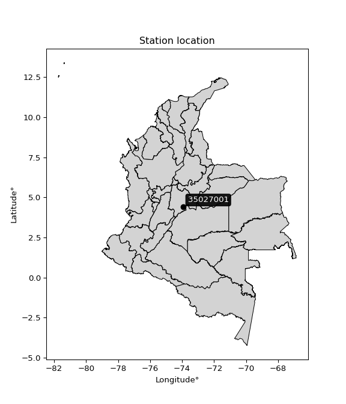

<div align="center">


</div>

# PMP Station (Rain, Pmax24h): 35027001

Probable Maximum Precipitation (PMP) is the greatest amount of rainfall for a specific duration that is meteorologically possible for a given location, acting as a "worst-case" scenario for extreme storms, crucial for designing safety-critical infrastructure like bridges, river deviations, dams, spillways, and nuclear plants to prevent catastrophic failure. PMP is calculated by hydrologists using meteorological data to determine the upper limit of extreme rainfall, often leading to the Probable Maximum Flood (PMF) for flood control design, and is increasingly being studied for climate change impacts.

<div align="center">

</img>

</div>


## A. General information


### 1. General running parameters

• app_version: _v20260103_. • runtime: _2026-01-03 07:24:50.581521_. • Python version: _3.14.0_. • SciPy version: _1.16.3_. • Pandas version: _2.3.3_. • NumPy version: _2.3.5_. • Stations dataset (station_dataset_file): _dataset/pmax24h_in/automatic_colombia_2003_2024.csv_. • Stations catalog (station_catalog_file): _dataset/CNE.xls_. • Minimum year to eval til year_max (date_min): _1900_. • Maximum year to eval since year_min (date_max): _2024_. • Creates, save and include plots into reports (create_plot): _False_. • Plot only fit distributions with Δo > Δ (plot_only_fit): _True_. • Eval low extreme values, if False, evaluates high extreme values (low_extreme): _False_. • Eval every SciPy distribution as logarithmic (pdist_logarithmic_on): _True_. • Standard deviation normalized (ddof): _1.0_. • Return periods to eval in years (Tr): _[2, 2.33, 5, 10, 15, 20, 25, 50, 75, 100, 200, 250, 500, 750, 1000]_. • Minimum data sample per station, 0 means any (minimum_sample): _5_. • Z-Score maximum threshold to adjust a value, 0 means disable (zscore_max): _3.5_. • Z-Score minimum threshold to adjust a value, 0 means disable (zscore_min): _-2.5_. • Avoid zeros, e.g. rain = 0 (avoid_zeros): _True_. • Avoid null values (avoid_nans): _True_. [:file_folder:Dataset file.](../../dataset/pmax24h_in/automatic_colombia_2003_2024.csv)

> Delta Degrees of Freedom (DDOF): is a parameter used in the formulas for calculating variance and standard deviation. When ddof=0, the divisor is $N$ (the total number of observations) and this is used when your data set is the entire population. When ddof=1, the divisor is $N-1$ and this is used when your data set is a sample drawn from a larger population. Using $N-1$ provides an unbiased estimate of the population variance (known as Bessel´s correction).


### 2. Station info and location

|   id |   CODIGO | NOMBRE                     | CATEGORIA               | TECNOLOGIA                | ESTADO   | FECHA_INSTALACION   |   FECHA_SUSPENSION |   ALTITUD |   LATITUD |   LONGITUD | DEPARTAMENTO   | MUNICIPIO   | AREA_OPERATIVA                            | ENTIDAD                                                     | AREA_HIDROGRAFICA   | ZONA_HIDROGRAFICA   | SUBZONA_HIDROGRAFICA   |   CORRIENTE | Catalogo   |   Version |
|-----:|---------:|:---------------------------|:------------------------|:--------------------------|:---------|:--------------------|-------------------:|----------:|----------:|-----------:|:---------------|:------------|:------------------------------------------|:------------------------------------------------------------|:--------------------|:--------------------|:-----------------------|------------:|:-----------|----------:|
|    0 | 35027001 | PLAZA DE FERIAS [35027001] | Climatológica Ordinaria | Automática con Telemetría | Activa   | 21/07/2012          |                nan |      1670 |   4.40339 |   -73.9406 | Cundinamarca   | Cáqueza     | Area Operativa 11 - Cundinamarca-Amazonas | INSTITUTO DE HIDROLOGIA METEOROLOGIA Y ESTUDIOS AMBIENTALES | Orinoco             | Meta                | Río Guayuriba          |         nan | CNE_IDEAM  |  20251226 |

<div align="center">

Dynamic map: [:earth_americas:Google](http://maps.google.com/maps?q=4.403389,-73.940556) [:earth_americas:OSM](https://www.openstreetmap.org/#map=18/4.403389/-73.940556&layers=P) [:earth_americas:Bing](https://www.bing.com/maps?cp=4.403389~-73.940556&lvl=18) [:earth_americas:Apple](https://maps.apple.com/frame?center=4.403389%2C-73.940556&span=0.003%2C0.006)

</div>


<div align="center">

```geojson
{
  "type": "Feature",
  "geometry": {
    "type": "Point", 
    "coordinates": [-73.940556, 4.403389]
  }, 
  "properties": {
    "Name": "35027001"
  }
}
```

</div>


### 3. Discrete values table and plot

<div align="center">

|               |           0 |           1 |           2 |           3 |           4 |          5 |          6 |           7 |
|:--------------|------------:|------------:|------------:|------------:|------------:|-----------:|-----------:|------------:|
| Date          | 2017        | 2018        | 2019        | 2020        | 2021        | 2022       | 2023       | 2024        |
| Value         |   40.9      |   32.9      |   65.4      |   34.2      |   27        |   15.1     |   84.9     |   46.8      |
| Value_initial |   40.9      |   32.9      |   65.4      |   34.2      |   27        |   15.1     |   84.9     |   46.8      |
| count         |    8        |    8        |    8        |    8        |    8        |    8       |    8       |    8        |
| mean          |   43.4      |   43.4      |   43.4      |   43.4      |   43.4      |   43.4     |   43.4     |   43.4      |
| std           |   22.3249   |   22.3249   |   22.3249   |   22.3249   |   22.3249   |   22.3249  |   22.3249  |   22.3249   |
| zscore        |   -0.111983 |   -0.470327 |    0.985448 |   -0.412096 |   -0.734607 |   -1.26764 |    1.85891 |    0.152296 |


</div>


> The initial value (value_initial) correspond to the initial obtained or null completed value, and value (value) is adjusted only when the initial value is outside the valid range definite through the Z-Score value. If Z-Score is active, values out of range or outliers are replaced with the station mean value


### 4. Active continuous probability distributions from SciPy (44 of 104 available)

A Probability Density Function (PDF) describes the relative likelihood of a continuous random variable falling within a specific range, where the total area under its curve equals 1, and the area over any interval gives the actual probability for that range. Unlike discrete probabilities (like rolling a die), a PDF shows density, not direct probability for a single point (which is zero), with higher points indicating higher likelihood, often visualized as a bell curve for normal distributions.

A log of a probability density function (log-PDF) is simply the logarithm of the PDF´s value, denoted as $log(f(x))$, useful for converting multiplication of probabilities into addition, improving numerical stability with tiny numbers, and connecting to information theory concepts like entropy. Instead of dealing with very small probabilities (e.g., 0.000001), log-PDFs use negative numbers (e.g., $log(0.00001) ≈ -11.51$ that are easier for computers to handle, preventing underflow errors and simplifying complex calculations. In this study, each active probability distribution from SciPy is also evaluated in the $log$ form.

[scipy.stats](https://docs.scipy.org/doc/scipy/reference/stats.html) is a Python´s powerful submodule within the SciPy library for comprehensive statistical analysis, offering over 130 probability distributions (like Normal, Poisson), functions for descriptive stats (mean, variance), hypothesis testing (t-tests, chi-square), random variable generation, and statistical tests, making it essential for data science, modeling, and research. It provides tools to explore, model, and draw conclusions from data efficiently, working seamlessly with NumPy.

<div align="center">

|   id | p_dist             |   n_parameter | fit_method   | label                                                                       | active   | ref                                                                                                        |
|-----:|:-------------------|--------------:|:-------------|:----------------------------------------------------------------------------|:---------|:-----------------------------------------------------------------------------------------------------------|
|    0 | alpha              |             3 | MLE          | Alpha                                                                       | True     | [:mortar_board:](https://docs.scipy.org/doc/scipy/reference/generated/scipy.stats.alpha.html)              |
|    1 | betaprime          |             4 | MLE          | Beta prime                                                                  | True     | [:mortar_board:](https://docs.scipy.org/doc/scipy/reference/generated/scipy.stats.betaprime.html)          |
|    2 | chi2               |             3 | MLE          | Chi²                                                                        | True     | [:mortar_board:](https://docs.scipy.org/doc/scipy/reference/generated/scipy.stats.chi2.html)               |
|    3 | crystalball        |             4 | MLE          | Crystalball                                                                 | True     | [:mortar_board:](https://docs.scipy.org/doc/scipy/reference/generated/scipy.stats.crystalball.html)        |
|    4 | erlang             |             3 | MLE          | Erlang                                                                      | True     | [:mortar_board:](https://docs.scipy.org/doc/scipy/reference/generated/scipy.stats.erlang.html)             |
|    5 | expon              |             2 | MLE          | Exponential                                                                 | True     | [:mortar_board:](https://docs.scipy.org/doc/scipy/reference/generated/scipy.stats.expon.html)              |
|    6 | exponnorm          |             3 | MLE          | Exponentially modified Normal                                               | True     | [:mortar_board:](https://docs.scipy.org/doc/scipy/reference/generated/scipy.stats.exponnorm.html)          |
|    7 | f                  |             4 | MLE          | F                                                                           | True     | [:mortar_board:](https://docs.scipy.org/doc/scipy/reference/generated/scipy.stats.f.html)                  |
|    8 | fatiguelife        |             3 | MLE          | Fatigue-life (Birnbaum-Saunders)                                            | True     | [:mortar_board:](https://docs.scipy.org/doc/scipy/reference/generated/scipy.stats.fatiguelife.html)        |
|    9 | fisk               |             3 | MLE          | Fisk                                                                        | True     | [:mortar_board:](https://docs.scipy.org/doc/scipy/reference/generated/scipy.stats.fisk.html)               |
|   10 | gamma              |             3 | MLE          | Gamma                                                                       | True     | [:mortar_board:](https://docs.scipy.org/doc/scipy/reference/generated/scipy.stats.gamma.html)              |
|   11 | genexpon           |             5 | MLE          | Generalized exponential                                                     | True     | [:mortar_board:](https://docs.scipy.org/doc/scipy/reference/generated/scipy.stats.genexpon.html)           |
|   12 | genlogistic        |             3 | MLE          | Generalized logistic                                                        | True     | [:mortar_board:](https://docs.scipy.org/doc/scipy/reference/generated/scipy.stats.genlogistic.html)        |
|   13 | gibrat             |             2 | MM           | Gibrat                                                                      | True     | [:mortar_board:](https://docs.scipy.org/doc/scipy/reference/generated/scipy.stats.gibrat.html)             |
|   14 | gompertz           |             3 | MLE          | Gompertz (or truncated Gumbel)                                              | True     | [:mortar_board:](https://docs.scipy.org/doc/scipy/reference/generated/scipy.stats.gompertz.html)           |
|   15 | gumbel_l           |             2 | MM           | Gumbel Left Skew                                                            | True     | [:mortar_board:](https://docs.scipy.org/doc/scipy/reference/generated/scipy.stats.gumbel_l.html)           |
|   16 | gumbel_r           |             2 | MM           | Gumbel Right Skew                                                           | True     | [:mortar_board:](https://docs.scipy.org/doc/scipy/reference/generated/scipy.stats.gumbel_r.html)           |
|   17 | halflogistic       |             2 | MM           | Half-logistic                                                               | True     | [:mortar_board:](https://docs.scipy.org/doc/scipy/reference/generated/scipy.stats.halflogistic.html)       |
|   18 | halfnorm           |             2 | MM           | Half Normal                                                                 | True     | [:mortar_board:](https://docs.scipy.org/doc/scipy/reference/generated/scipy.stats.halfnorm.html)           |
|   19 | hypsecant          |             2 | MM           | hyperbolic secant                                                           | True     | [:mortar_board:](https://docs.scipy.org/doc/scipy/reference/generated/scipy.stats.hypsecant.html)          |
|   20 | invgamma           |             3 | MLE          | Inverted gamma                                                              | True     | [:mortar_board:](https://docs.scipy.org/doc/scipy/reference/generated/scipy.stats.invgamma.html)           |
|   21 | invgauss           |             3 | MLE          | Inverse Gaussian                                                            | True     | [:mortar_board:](https://docs.scipy.org/doc/scipy/reference/generated/scipy.stats.invgauss.html)           |
|   22 | invweibull         |             3 | MLE          | Inverted Weibull                                                            | True     | [:mortar_board:](https://docs.scipy.org/doc/scipy/reference/generated/scipy.stats.invweibull.html)         |
|   23 | johnsonsu          |             4 | MLE          | Johnson Su                                                                  | True     | [:mortar_board:](https://docs.scipy.org/doc/scipy/reference/generated/scipy.stats.johnsonsu.html)          |
|   24 | kstwobign          |             2 | MLE          | Limiting distribution of scaled Kolmogorov-Smirnov two-sided test statistic | True     | [:mortar_board:](https://docs.scipy.org/doc/scipy/reference/generated/scipy.stats.kstwobign.html)          |
|   25 | laplace            |             2 | MM           | Laplace                                                                     | True     | [:mortar_board:](https://docs.scipy.org/doc/scipy/reference/generated/scipy.stats.laplace.html)            |
|   26 | laplace_asymmetric |             3 | MLE          | Asymmetric Laplace                                                          | True     | [:mortar_board:](https://docs.scipy.org/doc/scipy/reference/generated/scipy.stats.laplace_asymmetric.html) |
|   27 | loggamma           |             3 | MLE          | Log gamma                                                                   | True     | [:mortar_board:](https://docs.scipy.org/doc/scipy/reference/generated/scipy.stats.loggamma.html)           |
|   28 | logistic           |             2 | MM           | Logistic (or Sech-squared)                                                  | True     | [:mortar_board:](https://docs.scipy.org/doc/scipy/reference/generated/scipy.stats.logistic.html)           |
|   29 | lognorm            |             3 | MLE          | Log Normal                                                                  | True     | [:mortar_board:](https://docs.scipy.org/doc/scipy/reference/generated/scipy.stats.lognorm.html)            |
|   30 | maxwell            |             2 | MM           | Maxwell                                                                     | True     | [:mortar_board:](https://docs.scipy.org/doc/scipy/reference/generated/scipy.stats.maxwell.html)            |
|   31 | mielke             |             4 | MLE          | Mielke Beta-Kappa / Dagum                                                   | True     | [:mortar_board:](https://docs.scipy.org/doc/scipy/reference/generated/scipy.stats.mielke.html)             |
|   32 | moyal              |             2 | MM           | Moyal                                                                       | True     | [:mortar_board:](https://docs.scipy.org/doc/scipy/reference/generated/scipy.stats.moyal.html)              |
|   33 | nakagami           |             3 | MLE          | Nakagami                                                                    | True     | [:mortar_board:](https://docs.scipy.org/doc/scipy/reference/generated/scipy.stats.nakagami.html)           |
|   34 | ncf                |             5 | MLE          | Non-central F distribution                                                  | True     | [:mortar_board:](https://docs.scipy.org/doc/scipy/reference/generated/scipy.stats.ncf.html)                |
|   35 | nct                |             4 | MLE          | Non-central Student’s t                                                     | True     | [:mortar_board:](https://docs.scipy.org/doc/scipy/reference/generated/scipy.stats.nct.html)                |
|   36 | norm               |             2 | MM           | Normal                                                                      | True     | [:mortar_board:](https://docs.scipy.org/doc/scipy/reference/generated/scipy.stats.norm.html)               |
|   37 | pearson3           |             3 | MM           | Pearson type III                                                            | True     | [:mortar_board:](https://docs.scipy.org/doc/scipy/reference/generated/scipy.stats.pearson3.html)           |
|   38 | rayleigh           |             2 | MM           | Rayleigh                                                                    | True     | [:mortar_board:](https://docs.scipy.org/doc/scipy/reference/generated/scipy.stats.rayleigh.html)           |
|   39 | rice               |             3 | MLE          | Rice                                                                        | True     | [:mortar_board:](https://docs.scipy.org/doc/scipy/reference/generated/scipy.stats.rice.html)               |
|   40 | t                  |             3 | MLE          | Student’s t                                                                 | True     | [:mortar_board:](https://docs.scipy.org/doc/scipy/reference/generated/scipy.stats.t.html)                  |
|   41 | truncnorm          |             4 | MLE          | Truncated normal                                                            | True     | [:mortar_board:](https://docs.scipy.org/doc/scipy/reference/generated/scipy.stats.truncnorm.html)          |
|   42 | wald               |             2 | MM           | Wald                                                                        | True     | [:mortar_board:](https://docs.scipy.org/doc/scipy/reference/generated/scipy.stats.wald.html)               |
|   43 | weibull_min        |             3 | MLE          | Weibull minimum                                                             | True     | [:mortar_board:](https://docs.scipy.org/doc/scipy/reference/generated/scipy.stats.weibull_min.html)        |

</div>

> **n_parameter:** # arguments & localization & scale.
>
> **Fit methods:** (MLE) maximum likelihood, (MM) L-moments.
>
>**Inactive** (With the only purpose of prevent loops, zero divisions, infinite values, over high estimated values or horizontal trending for recurrence intervals estimations, the follow distributions were disabled.)**:** foldnorm, gennorm, norminvgauss, powernorm, powerlognorm, skewnorm, genextreme, anglit, arcsine, argus, beta, bradford, burr, burr12, cauchy, cosine, halfcauchy, foldcauchy, skewcauchy, wrapcauchy, dgamma, gengamma, exponweib, exponpow, truncexpon, gausshyper, genhalflogistic, genhyperbolic, geninvgauss, halfgennorm, johnsonsb, kappa4, kappa3, ksone, kstwo, loglaplace, levy, levy_l, levy_stable, ncx2, pareto, genpareto, truncpareto, lomax, powerlaw, rdist, rel_breitwigner, recipinvgauss, semicircular, studentized_range, trapezoid, triang, truncweibull_min, tukeylambda, uniform, loguniform, vonmises, vonmises_line, weibull_max, dweibull, 


## B. Probability distributions vs. Empirical distributions

A continuous probability distribution (CPD) describes probabilities for variables that can take any value within a range (like rain any time), unlike discrete variables with specific outcomes (like temperature). It uses a Probability Density Function (PDF), a curve where the total area under it equals 1, and the probability of the variable falling within an interval (a to b) is found by calculating the area under the curve between those points. A key feature is that the probability of hitting any single exact value is zero, so probabilities are always expressed for ranges, e.g., $P(a ≤ X ≤ b)$.

<div align="center">

Distributions parameters from station values
|    |   station | p_dist                |   n |             loc |          scale | shape                  | shape1               | shape2                 | shape3   |
|---:|----------:|:----------------------|----:|----------------:|---------------:|:-----------------------|:---------------------|:-----------------------|:---------|
|  0 |  35027001 | alpha                 |   8 |   -56.5331      |  495.391       | 5.161159443694822      |                      |                        |          |
|  1 |  35027001 | betaprime             |   8 |     6.92795     |  320.147       | 3.1988400955844254     | 29.41524191344277    |                        |          |
|  2 |  35027001 | chi2                  |   8 |    10.9376      |    7.96954     | 4.073314607503324      |                      |                        |          |
|  3 |  35027001 | crystalball           |   8 |    43.4         |   20.883       | 1750.9600976537172     | 5678.896490550484    |                        |          |
|  4 |  35027001 | erlang                |   8 |    10.9376      |   15.9391      | 2.036656549515883      |                      |                        |          |
|  5 |  35027001 | expon                 |   8 |    15.1         |   28.3         |                        |                      |                        |          |
|  6 |  35027001 | exponnorm             |   8 |    22.718       |    8.70413     | 2.3761040590915883     |                      |                        |          |
|  7 |  35027001 | f                     |   8 |    11.055       |   32.3084      | 4.019425863744024      | 1019.5579905075342   |                        |          |
|  8 |  35027001 | fatiguelife           |   8 |    15.1         |    0.00013246  | 396.9176633354339      |                      |                        |          |
|  9 |  35027001 | fisk                  |   8 |    -0.0446256   |   38.9391      | 3.506565082258156      |                      |                        |          |
| 10 |  35027001 | gamma                 |   8 |    10.9376      |   15.939       | 2.0366603448393006     |                      |                        |          |
| 11 |  35027001 | genexpon              |   8 |    15.1         |    1.61822     | 0.05272029902100332    | 0.005040263619950649 | 1.4763562853737078     |          |
| 12 |  35027001 | genlogistic           |   8 |   -68.8077      |   16.2131      | 560.5966899250147      |                      |                        |          |
| 13 |  35027001 | gibrat                |   8 |    27.4689      |    9.66271     |                        |                      |                        |          |
| 14 |  35027001 | gompertz              |   8 |    15.1         |   53.6615      | 1.191123023574555      |                      |                        |          |
| 15 |  35027001 | gumbel_l              |   8 |    52.7985      |   16.2824      |                        |                      |                        |          |
| 16 |  35027001 | gumbel_r              |   8 |    34.0015      |   16.2824      |                        |                      |                        |          |
| 17 |  35027001 | halflogistic          |   8 |    18.6488      |   17.8542      |                        |                      |                        |          |
| 18 |  35027001 | halfnorm              |   8 |    15.7591      |   34.6428      |                        |                      |                        |          |
| 19 |  35027001 | hypsecant             |   8 |    43.4         |   13.2945      |                        |                      |                        |          |
| 20 |  35027001 | invgamma              |   8 |   -21.3416      |  620.866       | 10.574184956736957     |                      |                        |          |
| 21 |  35027001 | invgauss              |   8 |    -6.29762     |  258.642       | 0.1921484851047094     |                      |                        |          |
| 22 |  35027001 | invweibull            |   8 |    15.1         |    1.62676     | 0.05230949883496802    |                      |                        |          |
| 23 |  35027001 | johnsonsu             |   8 |    -5.26115     |    2.65484     | -8.147721064121914     | 2.3209636453736024   |                        |          |
| 24 |  35027001 | kstwobign             |   8 |   -24.2018      |   77.7633      |                        |                      |                        |          |
| 25 |  35027001 | laplace               |   8 |    43.4         |   14.7665      |                        |                      |                        |          |
| 26 |  35027001 | laplace_asymmetric    |   8 |    32.9         |   13.546       | 0.6849108789136136     |                      |                        |          |
| 27 |  35027001 | loggamma              |   8 | -7749.17        | 1012.09        | 2207.651784725509      |                      |                        |          |
| 28 |  35027001 | logistic              |   8 |    43.4         |   11.5134      |                        |                      |                        |          |
| 29 |  35027001 | lognorm               |   8 |    15.1         |    0.259615    | 12.33911340127728      |                      |                        |          |
| 30 |  35027001 | maxwell               |   8 |    -6.08396     |   31.0095      |                        |                      |                        |          |
| 31 |  35027001 | mielke                |   8 |    -0.239954    |   41.3474      | 3.244445164926346      | 3.698174926898284    |                        |          |
| 32 |  35027001 | moyal                 |   8 |    31.4578      |    9.40066     |                        |                      |                        |          |
| 33 |  35027001 | nakagami              |   8 |    27           |   29.6744      | 0.3252877101168994     |                      |                        |          |
| 34 |  35027001 | ncf                   |   8 |    -0.212006    |    4.34684e-07 | 4.1195460325654193e-07 | 17.111410279245167   | 36.76540400994039      |          |
| 35 |  35027001 | nct                   |   8 |   -26.7959      |    7.21871     | 7.934355564012883      | 8.785721142944503    |                        |          |
| 36 |  35027001 | norm                  |   8 |    43.4         |   20.883       |                        |                      |                        |          |
| 37 |  35027001 | pearson3              |   8 |    43.4         |   20.8831      | 0.7292638271119218     |                      |                        |          |
| 38 |  35027001 | rayleigh              |   8 |     3.44959     |   31.8758      |                        |                      |                        |          |
| 39 |  35027001 | rice                  |   8 |     6.84653     |   29.7679      | 0.00040931105948168334 |                      |                        |          |
| 40 |  35027001 | t                     |   8 |    43.3997      |   20.8827      | 48644.328843676216     |                      |                        |          |
| 41 |  35027001 | truncnorm             |   8 |    43.4         |   20.883       | -243.69285646482388    | 1198.954330693828    |                        |          |
| 42 |  35027001 | wald                  |   8 |    22.5171      |   20.883       |                        |                      |                        |          |
| 43 |  35027001 | weibull_min           |   8 |    13.3017      |   32.6782      | 1.3645105654956304     |                      |                        |          |
| 44 |  35027001 | logalpha              |   8 |    -7.98161     |  264.424       | 22.773619114937375     |                      |                        |          |
| 45 |  35027001 | logbetaprime          |   8 |    -5.3853      |  136.089       | 344.90019999951323     | 5193.683570266656    |                        |          |
| 46 |  35027001 | logchi2               |   8 |     2.71469     |    0.950142    | 1.0552154482799698     |                      |                        |          |
| 47 |  35027001 | logcrystalball        |   8 |     3.65191     |    0.498568    | 97.99098819135276      | 499.817667737698     |                        |          |
| 48 |  35027001 | logerlang             |   8 |    -6.12127     |    0.0259879   | 376.01339515700977     |                      |                        |          |
| 49 |  35027001 | logexpon              |   8 |     2.71469     |    0.93721     |                        |                      |                        |          |
| 50 |  35027001 | logexponnorm          |   8 |     3.65135     |    0.498568    | 0.0011224538376164907  |                      |                        |          |
| 51 |  35027001 | logf                  |   8 |  -156.94        |  160.593       | 491274.5832572903      | 356682.45121427916   |                        |          |
| 52 |  35027001 | logfatiguelife        |   8 |  -120.926       |  124.577       | 0.003994400598054331   |                      |                        |          |
| 53 |  35027001 | logfisk               |   8 |    -1.57161e+07 |    1.57161e+07 | 55006246.30375699      |                      |                        |          |
| 54 |  35027001 | loggamma              |   8 |    -5.72791     |    0.0269276   | 348.30182802171885     |                      |                        |          |
| 55 |  35027001 | loggenexpon           |   8 |     2.71451     |    0.00518269  | 0.0017904747401789288  | 1.1037992038383728   | 2.9073899661481324e-05 |          |
| 56 |  35027001 | loggenlogistic        |   8 |     3.72115     |    0.270932    | 0.866234537058846      |                      |                        |          |
| 57 |  35027001 | loggibrat             |   8 |     3.27154     |    0.230701    |                        |                      |                        |          |
| 58 |  35027001 | loggompertz           |   8 |     2.71469     |    0.588088    | 0.17132674106460788    |                      |                        |          |
| 59 |  35027001 | loggumbel_l           |   8 |     3.87629     |    0.388732    |                        |                      |                        |          |
| 60 |  35027001 | loggumbel_r           |   8 |     3.42752     |    0.388732    |                        |                      |                        |          |
| 61 |  35027001 | loghalflogistic       |   8 |     3.06101     |    0.426246    |                        |                      |                        |          |
| 62 |  35027001 | loghalfnorm           |   8 |     2.99197     |    0.827104    |                        |                      |                        |          |
| 63 |  35027001 | loghypsecant          |   8 |     3.6519      |    0.317398    |                        |                      |                        |          |
| 64 |  35027001 | loginvgamma           |   8 |    -6.48325     | 4055.29        | 401.26603567589177     |                      |                        |          |
| 65 |  35027001 | loginvgauss           |   8 |    -1.09411     |  404.829       | 0.01170285239069872    |                      |                        |          |
| 66 |  35027001 | loginvweibull         |   8 |    -6.18531e+07 |    6.18531e+07 | 120011478.96876118     |                      |                        |          |
| 67 |  35027001 | logjohnsonsu          |   8 |     7.65173     |    1.31275     | 15.435494120382693     | 8.45100137537797     |                        |          |
| 68 |  35027001 | logkstwobign          |   8 |     1.60147     |    2.34929     |                        |                      |                        |          |
| 69 |  35027001 | loglaplace            |   8 |     3.6519      |    0.352541    |                        |                      |                        |          |
| 70 |  35027001 | loglaplace_asymmetric |   8 |     3.53223     |    0.378828    | 0.8544121971180221     |                      |                        |          |
| 71 |  35027001 | logloggamma           |   8 |     0.0777513   |    1.56541     | 10.30381371488518      |                      |                        |          |
| 72 |  35027001 | loglogistic           |   8 |     3.6519      |    0.274875    |                        |                      |                        |          |
| 73 |  35027001 | loglognorm            |   8 |     2.71469     |    0.0121303   | 11.698218190000881     |                      |                        |          |
| 74 |  35027001 | logmaxwell            |   8 |     2.47051     |    0.740331    |                        |                      |                        |          |
| 75 |  35027001 | logmielke             |   8 |    -0.0529008   |    3.9302      | 9.206808324030753      | 16.38574442370966    |                        |          |
| 76 |  35027001 | logmoyal              |   8 |     3.36679     |    0.224435    |                        |                      |                        |          |
| 77 |  35027001 | lognakagami           |   8 |     3.29584     |    0.631147    | 0.2743188774196297     |                      |                        |          |
| 78 |  35027001 | logncf                |   8 |    -3.84625     |    7.48377     | 527.5670692570181      | 711.372774397299     | 1.3253893243506163e-05 |          |
| 79 |  35027001 | lognct                |   8 |   -17.1925      |    0.465144    | 6577.888392366785      | 44.8078720985739     |                        |          |
| 80 |  35027001 | lognorm               |   8 |     3.6519      |    0.498568    |                        |                      |                        |          |
| 81 |  35027001 | logpearson3           |   8 |     3.6519      |    0.498569    | -0.228572096185915     |                      |                        |          |
| 82 |  35027001 | lograyleigh           |   8 |     2.69811     |    0.761014    |                        |                      |                        |          |
| 83 |  35027001 | logrice               |   8 |     2.4208      |    0.542974    | 1.9959814448043192     |                      |                        |          |
| 84 |  35027001 | logt                  |   8 |     3.65191     |    0.498569    | 208838810.1507411      |                      |                        |          |
| 85 |  35027001 | logtruncnorm          |   8 |    -0.15987     |    1.39931     | 2.469480510000107      | 3.2943952586236103   |                        |          |
| 86 |  35027001 | logwald               |   8 |     3.15328     |    0.498619    |                        |                      |                        |          |
| 87 |  35027001 | logweibull_min        |   8 |     1.73024     |    2.10997     | 4.438853507760001      |                      |                        |          |

</div>

> **loc** (Location parameter): This shifts the distribution along the x-axis. For many common distributions, like the normal (Gaussian) distribution, loc represents the mean $μ$. For others, like the uniform distribution, it might represent the minimum value, or for the beta distribution, the left end of the support interval.
>
> **scale** (Scale parameter): This determines the width or spread of the distribution. For the normal distribution, scale represents the standard deviation $σ$. For a uniform distribution, it defines the length of the interval (from $loc$ to $loc + scale$).
>
> **shape** (Shape parameters): Refers to parameters that define the specific form of a probability distribution, distinct from its location (loc) and scale (scale). These parameters are required arguments for most distribution functions. For example, a normal (Gaussian) distribution is fully defined by its location (mean) and scale (standard deviation), so it has no specific shape parameters beyond loc and scale. However, other distributions have intrinsic properties that need specification, as Gamma distribution that takes a shape parameter, often named $a$ or $alpha$.


### 0. Cumulative distribution values - CDF (88 evaluated)

Cumulative Distribution Function (CDF), denoted as $F$<sub>$X$</sub>$(x)$, is a function that gives the probability that a random variable $X$ will take a value less than or equal to a specific value, $x$ (i.e., $(P(X≥x)$. It essentially "accumulates" probabilities from a given point up to the far right (positive infinity), providing a complete picture of the distribution´s probabilities for both discrete (like rain) and continuous (like temperature) variables, helping to find probabilities over ranges or above certain values. Each station is evaluated separately ordering the $x$ values ascending, calculating the CDF and PDF values for the activated distributions and their logarithmic forms.

<div align="center">

CDF ordered by x ascending and calculating $log(f(x))$ separately
|   id |   Station |   date |    x |   count |   mean |     std |    zscore |   Value_initial |   station |   m |     alpha |   alpha_pdf |   betaprime |   betaprime_pdf |      chi2 |   chi2_pdf |   crystalball |   crystalball_pdf |   erlang |   erlang_pdf |    expon |   expon_pdf |   exponnorm |   exponnorm_pdf |         f |      f_pdf |   fatiguelife |   fatiguelife_pdf |      fisk |   fisk_pdf |     gamma |   gamma_pdf |    genexpon |   genexpon_pdf |   genlogistic |   genlogistic_pdf |   gibrat |   gibrat_pdf |   gompertz |   gompertz_pdf |   gumbel_l |   gumbel_l_pdf |   gumbel_r |   gumbel_r_pdf |   halflogistic |   halflogistic_pdf |   halfnorm |   halfnorm_pdf |   hypsecant |   hypsecant_pdf |   invgamma |   invgamma_pdf |   invgauss |   invgauss_pdf |   invweibull |   invweibull_pdf |   johnsonsu |   johnsonsu_pdf |   kstwobign |   kstwobign_pdf |   laplace |   laplace_pdf |   laplace_asymmetric |   laplace_asymmetric_pdf |   loggamma |   loggamma_pdf |   logistic |   logistic_pdf |   lognorm |   lognorm_pdf |   maxwell |   maxwell_pdf |    mielke |   mielke_pdf |    moyal |   moyal_pdf |    nakagami |   nakagami_pdf |       ncf |    ncf_pdf |      nct |    nct_pdf |      norm |   norm_pdf |   pearson3 |   pearson3_pdf |   rayleigh |   rayleigh_pdf |      rice |   rice_pdf |         t |      t_pdf |   truncnorm |   truncnorm_pdf |      wald |   wald_pdf |   weibull_min |   weibull_min_pdf |   logalpha |   logalpha_pdf |   logbetaprime |   logbetaprime_pdf |    logchi2 |   logchi2_pdf |   logcrystalball |   logcrystalball_pdf |   logerlang |   logerlang_pdf |   logexpon |   logexpon_pdf |   logexponnorm |   logexponnorm_pdf |      logf |   logf_pdf |   logfatiguelife |   logfatiguelife_pdf |   logfisk |   logfisk_pdf |   loggenexpon |   loggenexpon_pdf |   loggenlogistic |   loggenlogistic_pdf |   loggibrat |   loggibrat_pdf |   loggompertz |   loggompertz_pdf |   loggumbel_l |   loggumbel_l_pdf |   loggumbel_r |   loggumbel_r_pdf |   loghalflogistic |   loghalflogistic_pdf |   loghalfnorm |   loghalfnorm_pdf |   loghypsecant |   loghypsecant_pdf |   loginvgamma |   loginvgamma_pdf |   loginvgauss |   loginvgauss_pdf |   loginvweibull |   loginvweibull_pdf |   logjohnsonsu |   logjohnsonsu_pdf |   logkstwobign |   logkstwobign_pdf |   loglaplace |   loglaplace_pdf |   loglaplace_asymmetric |   loglaplace_asymmetric_pdf |   logloggamma |   logloggamma_pdf |   loglogistic |   loglogistic_pdf |   loglognorm |   loglognorm_pdf |   logmaxwell |   logmaxwell_pdf |   logmielke |   logmielke_pdf |    logmoyal |   logmoyal_pdf |   lognakagami |   lognakagami_pdf |    logncf |   logncf_pdf |   lognct |   lognct_pdf |   logpearson3 |   logpearson3_pdf |   lograyleigh |   lograyleigh_pdf |   logrice |   logrice_pdf |      logt |   logt_pdf |   logtruncnorm |   logtruncnorm_pdf |   logwald |   logwald_pdf |   logweibull_min |   logweibull_min_pdf |
|-----:|----------:|-------:|-----:|--------:|-------:|--------:|----------:|----------------:|----------:|----:|----------:|------------:|------------:|----------------:|----------:|-----------:|--------------:|------------------:|---------:|-------------:|---------:|------------:|------------:|----------------:|----------:|-----------:|--------------:|------------------:|----------:|-----------:|----------:|------------:|------------:|---------------:|--------------:|------------------:|---------:|-------------:|-----------:|---------------:|-----------:|---------------:|-----------:|---------------:|---------------:|-------------------:|-----------:|---------------:|------------:|----------------:|-----------:|---------------:|-----------:|---------------:|-------------:|-----------------:|------------:|----------------:|------------:|----------------:|----------:|--------------:|---------------------:|-------------------------:|-----------:|---------------:|-----------:|---------------:|----------:|--------------:|----------:|--------------:|----------:|-------------:|---------:|------------:|------------:|---------------:|----------:|-----------:|---------:|-----------:|----------:|-----------:|-----------:|---------------:|-----------:|---------------:|----------:|-----------:|----------:|-----------:|------------:|----------------:|----------:|-----------:|--------------:|------------------:|-----------:|---------------:|---------------:|-------------------:|-----------:|--------------:|-----------------:|---------------------:|------------:|----------------:|-----------:|---------------:|---------------:|-------------------:|----------:|-----------:|-----------------:|---------------------:|----------:|--------------:|--------------:|------------------:|-----------------:|---------------------:|------------:|----------------:|--------------:|------------------:|--------------:|------------------:|--------------:|------------------:|------------------:|----------------------:|--------------:|------------------:|---------------:|-------------------:|--------------:|------------------:|--------------:|------------------:|----------------:|--------------------:|---------------:|-------------------:|---------------:|-------------------:|-------------:|-----------------:|------------------------:|----------------------------:|--------------:|------------------:|--------------:|------------------:|-------------:|-----------------:|-------------:|-----------------:|------------:|----------------:|------------:|---------------:|--------------:|------------------:|----------:|-------------:|---------:|-------------:|--------------:|------------------:|--------------:|------------------:|----------:|--------------:|----------:|-----------:|---------------:|-------------------:|----------:|--------------:|-----------------:|---------------------:|
|    0 |  35027001 |   2022 | 15.1 |       8 |   43.4 | 22.3249 | -1.26764  |            15.1 |  35027001 |   1 | 0.0396709 |  0.00826381 |    0.031331 |      0.00997591 | 0.0263818 | 0.0118225  |     0.0876819 |        0.00762658 | 0.026382 |   0.0118226  | 0        |  0.0353357  |   0.0367977 |      0.00744268 | 0.0262498 | 0.0119709  |     0.0833653 |       2.41135e+08 | 0.0351808 | 0.00785915 | 0.0263821 |  0.0118226  | 5.78698e-08 |     0.0325792  |     0.0423863 |        0.00824046 | 0        |   0          | 5.6657e-12 |     0.022197   |  0.0940198 |    0.00549393  |  0.0410623 |     0.00805152 |       0        |         0          |   0        |     0          |   0.0753985 |      0.0056185  |   0.037279 |     0.0085428  |  0.0347548 |     0.0091326  |   0.00232883 |      4.15749e+11 |   0.0358686 |      0.00891142 |   0.0396156 |      0.0087289  | 0.0735606 |    0.00498158 |            0.0468809 |               0.00505302 |  0.0279988 |       0.137163 |  0.0788552 |     0.00630891 | 0.0300674 |      0.136729 | 0.0738532 |    0.00950893 | 0.0391966 |   0.00808362 | 0.016987 |  0.00586623 | 0           |     0          | 0.0324056 | 0.00859956 | 0.039349 | 0.00842323 | 0.0876819 | 0.00762658 |  0.0604547 |     0.00912642 |   0.064611 |     0.0107253  | 0.0377075 | 0.00896288 | 0.0876837 | 0.00762657 |   0.0876819 |      0.00762658 | 0         | 0          |     0.0189405 |        0.0142348  |  0.0257422 |       0.138428 |      0.0273204 |           0.135362 | 6.3774e-09 |   7.57678e+06 |        0.0300674 |             0.136729 |   0.0285498 |        0.138602 |   0        |       1.067    |      0.0300674 |           0.136729 | 0.0297861 |   0.136224 |        0.0294851 |             0.135809 | 0.0351846 |      0.118813 |   6.27324e-05 |          0.345667 |        0.0392137 |             0.122394 |   0         |       0         |   4.62579e-09 |          0.291328 |     0.0491322 |          0.123234 |    0.00191669 |         0.0308517 |          0        |              0        |      0        |          0        |      0.0331976 |           0.104403 |     0.0266174 |          0.138442 |     0.0243992 |          0.140022 |       0.0220995 |            0.163463 |      0.0389993 |           0.139647 |      0.0217401 |           0.195071 |    0.0350286 |        0.0993604 |               0.0337561 |                    0.10429  |     0.0384629 |          0.139199 |     0.0319972 |          0.112682 |   0.00408798 |       2.3253e+12 |   0.00923803 |         0.111041 |    0.039529 |        0.13108  | 1.91244e-05 |    0.000817472 |   0           |        0          | 0.0537961 |     0.203419 | 0.029745 |     0.136831 |     0.0361397 |          0.139845 |     0.0002373 |         0.0286216 |  0.021366 |      0.154326 | 0.0300672 |   0.136728 |    0           |           0        |  0        |      0        |         0.033346 |             0.14782  |
|    1 |  35027001 |   2021 | 27   |       8 |   43.4 | 22.3249 | -0.734607 |            27   |  35027001 |   2 | 0.220852  |  0.0210679  |    0.242213 |      0.0225308  | 0.257056  | 0.0227214  |     0.216131  |        0.0140344  | 0.257056 |   0.0227214  | 0.343278 |  0.0232057  |   0.219315  |      0.0226916  | 0.258587  | 0.0227648  |     0.774917  |       0.00951797  | 0.21786   | 0.0220934  | 0.257057  |  0.0227214  | 0.343835    |     0.023421   |     0.21883   |        0.0204806  | 0        |   0          | 0.256006   |     0.0206145  |  0.185404  |    0.0102591   |  0.214968  |     0.0202957  |       0.229699 |         0.026527   |   0.254426 |     0.0218507  |   0.180422  |      0.012856   |   0.225314 |     0.021508   |  0.232718  |     0.0218757  |   0.406106   |      0.00160867  |   0.230113  |      0.0217777  |   0.22116   |      0.020264   | 0.164677  |    0.0111521  |            0.169058  |               0.0182218  |  0.24259   |       0.638413 |  0.193969  |     0.0135794  | 0.237558  |      0.620053 | 0.232156  |    0.0165775  | 0.217866  |   0.0213808  | 0.204953 |  0.0240895  | 3.40159e-11 |  6229.02       | 0.229981  | 0.0224809  | 0.224249 | 0.0213397  | 0.216131  | 0.0140344  |  0.22634   |     0.018038   |   0.238851 |     0.0176419  | 0.204813  | 0.0180852  | 0.216133  | 0.0140345  |   0.216131  |      0.0140344  | 0.0773692 | 0.0456668  |     0.263121  |        0.0224119  |  0.250311  |       0.66113  |      0.241148  |           0.638088 | 0.544881   |   0.403278    |        0.237557  |             0.620052 |   0.243437  |        0.637164 |   0.462097 |       0.573941 |      0.237557  |           0.620052 | 0.237064  |   0.619514 |        0.237472  |             0.622899 | 0.218004  |      0.596673 |   0.331347    |          0.694655 |        0.217931  |             0.576762 |   0.0121972 |       1.30391   |   0.250927    |          0.586235 |     0.201208  |          0.461636 |    0.245808   |         0.887293  |          0.268702 |              1.08834  |      0.28667  |          0.901718 |      0.200439  |           0.590592 |     0.248444  |          0.65591  |     0.257242  |          0.680759 |       0.290991  |            0.696978 |      0.228391  |           0.561842 |      0.324324  |           0.716558 |    0.182109  |        0.51656   |               0.203285  |                    0.628054 |     0.228758  |          0.565788 |     0.214943  |          0.613889 |   0.629587   |       0.0555587  |   0.257242   |         0.719524 |    0.220155 |        0.564336 | 0.241497    |    1.04853     |   3.78016e-09 |        4.6701e+06 | 0.28428   |     0.58264  | 0.238335 |     0.622843 |     0.231633  |          0.580177 |     0.265414  |         0.758151  |  0.247808 |      0.643907 | 0.237556  |   0.620049 |    0.000275295 |           2.15394  |  0.15062  |      2.14541  |         0.233497 |             0.577896 |
|    2 |  35027001 |   2018 | 32.9 |       8 |   43.4 | 22.3249 | -0.470327 |            32.9 |  35027001 |   3 | 0.352686  |  0.023005   |    0.37706  |      0.0226638  | 0.389198  | 0.0217033  |     0.307552  |        0.0168353  | 0.389198 |   0.0217033  | 0.466862 |  0.0188388  |   0.362706  |      0.0249614  | 0.390709  | 0.0216607  |     0.822142  |       0.00675636  | 0.357508  | 0.0244484  | 0.389199  |  0.0217033  | 0.468439    |     0.0189735  |     0.347706  |        0.0226342  | 0.282264 |   0.062222   | 0.374075   |     0.0193587  |  0.255182  |    0.0134768   |  0.343011  |     0.0225408  |       0.379178 |         0.0239782  |   0.379252 |     0.0203782  |   0.271278  |      0.0180233  |   0.358222 |     0.0229334  |  0.365462  |     0.0225637  |   0.413806   |      0.00107301  |   0.363253  |      0.0227689  |   0.346369  |      0.0216917  | 0.24556   |    0.0166295  |            0.319312  |               0.0344169  |  0.383078  |       0.768071 |  0.286595  |     0.0177583  | 0.375328  |      0.760778 | 0.336171  |    0.0184517  | 0.353976  |   0.0240461  | 0.354364 |  0.0255962  | 0.270559    |     0.0295455  | 0.367016  | 0.0233172  | 0.356895 | 0.023      | 0.307552  | 0.0168353  |  0.339638  |     0.0200251  |   0.34741  |     0.0189151  | 0.318191  | 0.0200462  | 0.307555  | 0.0168355  |   0.307552  |      0.0168353  | 0.362507  | 0.0422583  |     0.392112  |        0.0210672  |  0.393703  |       0.772514 |      0.38162   |           0.768154 | 0.615424   |   0.316505    |        0.375328  |             0.760778 |   0.38357   |        0.765877 |   0.564366 |       0.46482  |      0.375327  |           0.760777 | 0.374666  |   0.759575 |        0.375823  |             0.763523 | 0.357643  |      0.804068 |   0.467972    |          0.677865 |        0.353909  |             0.79042  |   0.484542  |       1.79625   |   0.376718    |          0.682628 |     0.311694  |          0.661375 |    0.430006   |         0.933564  |          0.467837 |              0.916289 |      0.455709 |          0.802689 |      0.347327  |           0.889711 |     0.39145   |          0.774446 |     0.403597  |          0.781524 |       0.431158  |            0.703783 |      0.355995  |           0.722239 |      0.464536  |           0.688523 |    0.319005  |        0.904874  |               0.374357  |                    1.15658  |     0.357179  |          0.726154 |     0.359766  |          0.837961 |   0.638998   |       0.0411046  |   0.408552   |         0.792116 |    0.352813 |        0.772522 | 0.450786    |    1.00871     |   0.40895     |        1.1115     | 0.407122  |     0.64981  | 0.376506 |     0.761734 |     0.362419  |          0.734191 |     0.420823  |         0.795405  |  0.387832 |      0.758909 | 0.375325  |   0.760775 |    0.35857     |           1.5046   |  0.504249 |      1.31849  |         0.362841 |             0.722987 |
|    3 |  35027001 |   2020 | 34.2 |       8 |   43.4 | 22.3249 | -0.412096 |            34.2 |  35027001 |   4 | 0.382579  |  0.0229589  |    0.406317 |      0.0223292  | 0.417113  | 0.0212322  |     0.32977   |        0.0173369  | 0.417113 |   0.0212322  | 0.490799 |  0.017993   |   0.395029  |      0.0247274  | 0.41856   | 0.0211767  |     0.830638  |       0.00632235  | 0.389244  | 0.0243433  | 0.417114  |  0.0212322  | 0.492541    |     0.0181132  |     0.377166  |        0.0226634  | 0.358851 |   0.0555188  | 0.399037   |     0.0190424  |  0.273199  |    0.0142438   |  0.372363  |     0.022592   |       0.409912 |         0.023299   |   0.405494 |     0.0199892  |   0.295456  |      0.0191674  |   0.387959 |     0.0227914  |  0.394645  |     0.0223146  |   0.415152   |      0.000999535 |   0.392731  |      0.0225599  |   0.374549  |      0.0216423  | 0.268158  |    0.0181599  |            0.362616  |               0.0322274  |  0.413118  |       0.781497 |  0.310225  |     0.0185858  | 0.405147  |      0.777451 | 0.360311  |    0.0186749  | 0.385265  |   0.0240575  | 0.387432 |  0.0252466  | 0.307509    |     0.0273868  | 0.397157  | 0.0230307  | 0.386742 | 0.0228942  | 0.32977   | 0.0173369  |  0.365786  |     0.0201872  |   0.372064 |     0.0190039  | 0.344384  | 0.0202379  | 0.329773  | 0.0173371  |   0.32977   |      0.0173369  | 0.414908  | 0.0383835  |     0.419204  |        0.0206051  |  0.423823  |       0.781188 |      0.411664  |           0.781606 | 0.627427   |   0.303082    |        0.405147  |             0.777451 |   0.413523  |        0.779233 |   0.582012 |       0.445992 |      0.405147  |           0.777451 | 0.404436  |   0.776113 |        0.405744  |             0.779978 | 0.389367  |      0.832159 |   0.494056    |          0.667952 |        0.385172  |             0.822132 |   0.548624  |       1.51899   |   0.403471    |          0.697829 |     0.338125  |          0.702647 |    0.465855   |         0.915432  |          0.502583 |              0.876736 |      0.486367 |          0.77935  |      0.382724  |           0.935572 |     0.421678  |          0.784788 |     0.434013  |          0.787407 |       0.458249  |            0.693822 |      0.384471  |           0.74685  |      0.490956  |           0.674635 |    0.356072  |        1.01001   |               0.421972  |                    1.30369  |     0.385801  |          0.750446 |     0.392839  |          0.867727 |   0.640552   |       0.039098   |   0.439274   |         0.792645 |    0.38341  |        0.805848 | 0.489106    |    0.967954    |   0.450051    |        1.0134     | 0.432416  |     0.655106 | 0.406352 |     0.777869 |     0.39131   |          0.756258 |     0.451553  |         0.789901  |  0.417478 |      0.770405 | 0.405145  |   0.777448 |    0.414813    |           1.39912  |  0.552257 |      1.16271  |         0.391282 |             0.744333 |
|    4 |  35027001 |   2017 | 40.9 |       8 |   43.4 | 22.3249 | -0.111983 |            40.9 |  35027001 |   5 | 0.530583  |  0.0207571  |    0.547027 |      0.0194131  | 0.549433  | 0.0181297  |     0.452355  |        0.0189673  | 0.549432 |   0.0181297  | 0.598144 |  0.0141999  |   0.549667  |      0.0208865  | 0.550365  | 0.0180392  |     0.866909  |       0.00463305  | 0.543912  | 0.0212453  | 0.549433  |  0.0181297  | 0.600478    |     0.0142605  |     0.524559  |        0.0208628  | 0.629036 |   0.0281352  | 0.52066    |     0.0172085  |  0.382172  |    0.018272    |  0.519631  |     0.0208918  |       0.553307 |         0.019431   |   0.531989 |     0.0176996  |   0.440492  |      0.0235257  |   0.533714 |     0.0203175  |  0.536257  |     0.0196502  |   0.420886   |      0.00073848  |   0.536279  |      0.0199427  |   0.514999  |      0.019939   | 0.422127  |    0.0285868  |            0.545768  |               0.0229668  |  0.554559  |       0.783003 |  0.445928  |     0.0214599  | 0.547279  |      0.79455  | 0.48665   |    0.0187438  | 0.539937  |   0.0214887  | 0.545052 |  0.0213852  | 0.465832    |     0.0206555  | 0.542364  | 0.0199703  | 0.533517 | 0.0204875  | 0.452355  | 0.0189673  |  0.500339  |     0.0196103  |   0.498513 |     0.0184839  | 0.480209  | 0.0199753  | 0.45236   | 0.0189675  |   0.452355  |      0.0189673  | 0.615721  | 0.0229429  |     0.548014  |        0.0177459  |  0.56327   |       0.761851 |      0.553126  |           0.783121 | 0.67679    |   0.251231    |        0.547279  |             0.79455  |   0.554566  |        0.780959 |   0.654649 |       0.368489 |      0.547279  |           0.79455  | 0.546287  |   0.792836 |        0.548196  |             0.795474 | 0.543933  |      0.868243 |   0.608021    |          0.600854 |        0.539779  |             0.878857 |   0.740444  |       0.737234  |   0.532911    |          0.740688 |     0.479966  |          0.874715 |    0.617475   |         0.76581   |          0.642616 |              0.688623 |      0.615423 |          0.661017 |      0.559054  |           0.985663 |     0.562399  |          0.77201  |     0.573418  |          0.755529 |       0.576094  |            0.616436 |      0.525117  |           0.810106 |      0.604498  |           0.590239 |    0.577321  |        1.19895   |               0.613891  |                    0.870834 |     0.52687   |          0.810916 |     0.553658  |          0.89903  |   0.646858   |       0.0318789  |   0.577848   |         0.743275 |    0.536434 |        0.879023 | 0.6424      |    0.74104     |   0.60287     |        0.725192   | 0.549525  |     0.644693 | 0.548323 |     0.792376 |     0.532351  |          0.804556 |     0.587684  |         0.721208  |  0.556498 |      0.768565 | 0.547276  |   0.794549 |    0.626745    |           0.990377 |  0.711559 |      0.67186  |         0.530285 |             0.795341 |
|    5 |  35027001 |   2024 | 46.8 |       8 |   43.4 | 22.3249 |  0.152296 |            46.8 |  35027001 |   6 | 0.643205  |  0.0173032  |    0.651918 |      0.0161054  | 0.647415  | 0.0150854  |     0.564667  |        0.0188522  | 0.647415 |   0.0150854  | 0.673766 |  0.0115277  |   0.659393  |      0.0163319  | 0.647803  | 0.0149949  |     0.891118  |       0.00362872  | 0.656591  | 0.0168783  | 0.647416  |  0.0150854  | 0.676346    |     0.0115524  |     0.638608  |        0.0176573  | 0.755984 |   0.0162269  | 0.616816   |     0.0153552  |  0.499346  |    0.0212728   |  0.634036  |     0.017743   |       0.65748  |         0.0158987  |   0.629763 |     0.0154165  |   0.580533  |      0.0231807  |   0.643741 |     0.0168941  |  0.64275   |     0.0163944  |   0.424807   |      0.000600133 |   0.644242  |      0.0165883  |   0.625033  |      0.0172531  | 0.602833  |    0.0268965  |            0.662929  |               0.0170429  |  0.656492  |       0.721939 |  0.573295  |     0.0212472  | 0.651388  |      0.741847 | 0.594041  |    0.0174802  | 0.654699  |   0.0172928  | 0.658353 |  0.0170177  | 0.576277    |     0.0169609  | 0.64957   | 0.01633    | 0.644418 | 0.0170105  | 0.564667  | 0.0188522  |  0.610654  |     0.0176085  |   0.603377 |     0.0169219  | 0.593717  | 0.0183184  | 0.564673  | 0.0188523  |   0.564667  |      0.0188522  | 0.72585   | 0.0150627  |     0.64456   |        0.0149764  |  0.66163   |       0.691323 |      0.655077  |           0.722104 | 0.708503   |   0.220422    |        0.651388  |             0.741848 |   0.656262  |        0.720506 |   0.700899 |       0.31914  |      0.651388  |           0.741848 | 0.650172  |   0.740318 |        0.652334  |             0.741374 | 0.65652   |      0.789254 |   0.684593    |          0.533957 |        0.654569  |             0.809699 |   0.819142  |       0.458236  |   0.63263     |          0.732576 |     0.603376  |          0.943541 |    0.711143   |         0.623607  |          0.726222 |              0.554377 |      0.698122 |          0.566144 |      0.683446  |           0.840885 |     0.662303  |          0.703561 |     0.670442  |          0.678421 |       0.654029  |            0.538818 |      0.633629  |           0.790015 |      0.679046  |           0.515492 |    0.711591  |        0.818086  |               0.715084  |                    0.642604 |     0.635299  |          0.787953 |     0.669449  |          0.805045 |   0.650878   |       0.0279651  |   0.672875   |         0.662294 |    0.652057 |        0.820451 | 0.730902    |    0.576235    |   0.690663    |        0.584066   | 0.633853  |     0.602551 | 0.652037 |     0.738301 |     0.639357  |          0.773725 |     0.679331  |         0.635514  |  0.656634 |      0.710293 | 0.651385  |   0.741848 |    0.743735    |           0.755251 |  0.786932 |      0.462814 |         0.636508 |             0.771796 |
|    6 |  35027001 |   2019 | 65.4 |       8 |   43.4 | 22.3249 |  0.985448 |            65.4 |  35027001 |   7 | 0.863974  |  0.00727204 |    0.862188 |      0.00722931 | 0.849241  | 0.00724217 |     0.853941  |        0.0109678  | 0.84924  |   0.00724218 | 0.83092  |  0.00597455 |   0.861263  |      0.00670812 | 0.848454  | 0.00721033 |     0.939733  |       0.00184481  | 0.860641  | 0.00642636 | 0.849241  |  0.00724216 | 0.833371    |     0.00594762 |     0.867245  |        0.00761789 | 0.914265 |   0.00412894 | 0.842776   |     0.00891051 |  0.885626  |    0.0152308   |  0.864689  |     0.0077208  |       0.864085 |         0.00709516 |   0.848124 |     0.00825005 |   0.879774  |      0.00882974 |   0.861205 |     0.00729614 |  0.857668  |     0.0074216  |   0.433575   |      0.00037681  |   0.859513  |      0.00732294 |   0.859493  |      0.00831902 | 0.887298  |    0.0076323  |            0.86839   |               0.00665444 |  0.853645  |       0.439974 |  0.871111  |     0.00975183 | 0.855489  |      0.456115 | 0.849809  |    0.00959258 | 0.864194  |   0.00654685 | 0.869398 |  0.00688405 | 0.812163    |     0.00902114 | 0.858105  | 0.00700992 | 0.862046 | 0.007236   | 0.853941  | 0.0109678  |  0.855658  |     0.00875415 |   0.848714 |     0.00922404 | 0.85551   | 0.0095476  | 0.853946  | 0.0109675  |   0.853941  |      0.0109678  | 0.891179  | 0.00495471 |     0.848889  |        0.00747914 |  0.848977  |       0.418696 |      0.852389  |           0.440878 | 0.772106   |   0.163534    |        0.855489  |             0.456115 |   0.853235  |        0.440205 |   0.79071  |       0.223312 |      0.855489  |           0.456115 | 0.854062  |   0.45661  |        0.855921  |             0.454142 | 0.860453  |      0.420257 |   0.832511    |          0.350023 |        0.864208  |             0.428418 |   0.914844  |       0.171426  |   0.85048     |          0.526712 |     0.887772  |          0.631456 |    0.865778   |         0.320996  |          0.86509  |              0.295157 |      0.849284 |          0.343537 |      0.881019  |           0.366195 |     0.853012  |          0.424421 |     0.852758  |          0.404724 |       0.80106   |            0.344768 |      0.858359  |           0.510874 |      0.820557  |           0.334677 |    0.888373  |        0.316634  |               0.866053  |                    0.302106 |     0.858557  |          0.505765 |     0.872486  |          0.404745 |   0.659041   |       0.0213911  |   0.851163   |         0.399159 |    0.864475 |        0.42926  | 0.87037     |    0.286239    |   0.841982    |        0.338622   | 0.807063  |     0.421153 | 0.854942 |     0.453481 |     0.857216  |          0.493166 |     0.850016  |         0.383907  |  0.852013 |      0.440588 | 0.855487  |   0.456119 |    0.925295    |           0.370134 |  0.891868 |      0.205976 |         0.856591 |             0.504535 |
|    7 |  35027001 |   2023 | 84.9 |       8 |   43.4 | 22.3249 |  1.85891  |            84.9 |  35027001 |   8 | 0.951392  |  0.00249725 |    0.951852 |      0.00264607 | 0.942865  | 0.00292641 |     0.976553  |        0.0026519  | 0.942865 |   0.00292642 | 0.915113 |  0.00299955 |   0.94596   |      0.00261293 | 0.941923  | 0.00293526 |     0.966291  |       0.000981518 | 0.939067  | 0.00236207 | 0.942866  |  0.00292641 | 0.916925    |     0.00296525 |     0.958116  |        0.00252841 | 0.962651 |   0.00141894 | 0.958527   |     0.00338035 |  0.99924   |    0.000335358 |  0.957055  |     0.00258002 |       0.952246 |         0.00261079 |   0.954047 |     0.00314311 |   0.971951  |      0.00210706 |   0.950328 |     0.00259621 |  0.95005   |     0.00274064 |   0.439775   |      0.000270744 |   0.949854  |      0.00265997 |   0.960979  |      0.00281596 | 0.96991   |    0.00203772 |            0.950899  |               0.00248265 |  0.939247  |       0.226817 |  0.973519  |     0.0022391  | 0.943366  |      0.228337 | 0.965029  |    0.00299238 | 0.943009  |   0.00232495 | 0.953525 |  0.00246913 | 0.933517    |     0.0039055  | 0.945147  | 0.0026152  | 0.950027 | 0.00255481 | 0.976553  | 0.0026519  |  0.960764  |     0.0028374  |   0.961789 |     0.00306309 | 0.967859  | 0.00283111 | 0.976553  | 0.00265179 |   0.976553  |      0.0026519  | 0.952683  | 0.00191044 |     0.945859  |        0.00300892 |  0.931723  |       0.22567  |      0.938311  |           0.228287 | 0.810469   |   0.131934    |        0.943366  |             0.228337 |   0.93897   |        0.227464 |   0.841574 |       0.16904  |      0.943366  |           0.228337 | 0.942267  |   0.230147 |        0.943383  |             0.227281 | 0.938911  |      0.20075  |   0.906753    |          0.223682 |        0.943046  |             0.197358 |   0.947767  |       0.0912741 |   0.952989    |          0.2581   |     0.986156  |          0.152424 |    0.928992   |         0.176022  |          0.924528 |              0.170381 |      0.920313 |          0.207711 |      0.947214  |           0.165548 |     0.936152  |          0.223429 |     0.932712  |          0.218442 |       0.874858  |            0.226939 |      0.954255  |           0.234033 |      0.892446  |           0.221272 |    0.946752  |        0.15104   |               0.925642  |                    0.167708 |     0.953554  |          0.232723 |     0.946468  |          0.184324 |   0.664163   |       0.0180527  |   0.930846   |         0.220771 |    0.942556 |        0.192962 | 0.927297    |    0.161519    |   0.912483    |        0.209214   | 0.89656   |     0.268174 | 0.942493 |     0.228417 |     0.950739  |          0.233701 |     0.927485  |         0.218287  |  0.938342 |      0.230552 | 0.943365  |   0.22834  |    0.998273    |           0.203983 |  0.932985 |      0.118594 |         0.952326 |             0.237543 |


</div>

An Empirical Distribution Function (EDF) is a step-function estimate of a true cumulative distribution function (CDF) based on observed sample data, representing the proportion of data points less than or equal to a given value. It is calculated by ordering your data and jumping up by $1/n$ (where $n$ is sample size) at each unique data point, allowing analysis without assuming an underlying population distribution, and it gets closer to the true CDF as the sample size grows. For the empirical probability calculations, the parameter $m$ correspond to the order number which means the position of the $x$ values in an ascending order list.


### 1. Empirical - EDF California (1923)

California´s estimates the true probability distribution of water-related data (like rainfall, streamflow) using observed samples, crucial for risk assessment.

<div align="center">


$P=m/n$


</div>


**1.1. Empirical values**

<div align="center">

|                | 0                  | 1                  | 2              | 3              | 4                  | 5              | 6              | 7              |
|:---------------|:-------------------|:-------------------|:---------------|:---------------|:-------------------|:---------------|:---------------|:---------------|
| date           | 2022               | 2021               | 2018           | 2020           | 2017               | 2024           | 2019           | 2023           |
| x              | 15.1               | 27.0               | 32.9           | 34.2           | 40.9               | 46.8           | 65.4           | 84.9           |
| m              | 1                  | 2                  | 3              | 4              | 5                  | 6              | 7              | 8              |
| empirical_dist | edf_california     | edf_california     | edf_california | edf_california | edf_california     | edf_california | edf_california | edf_california |
| empirical      | 0.125              | 0.25               | 0.375          | 0.5            | 0.625              | 0.75           | 0.875          | 1.0            |
| empirical_tr   | 1.1428571428571428 | 1.3333333333333333 | 1.6            | 2.0            | 2.6666666666666665 | 4.0            | 8.0            | inf            |

</div>


**1.2. Kolmogorov-Smirnov fit test (sorted by Δ)**


<div align="center">

|                | 0                     | 1                   | 2                   | 3                   | 4                   | 5                   | 6                   | 7                   | 8                   | 9                   | 10                  | 11                 | 12                  | 13                  | 14                  | 15                  | 16                 | 17                  | 18                  | 19                  | 20                 | 21                  | 22                 | 23                  | 24                  | 25                  | 26                  | 27                  | 28                 | 29                  | 30                  | 31                  | 32                  | 33                 | 34                  | 35                  | 36                 | 37                  | 38                  | 39                  | 40                  | 41                  | 42                  | 43                 | 44                  | 45                  | 46                  | 47                  | 48                  | 49                  | 50                  | 51                  | 52                 | 53                 | 54                 | 55                 | 56                 | 57                 | 58                  | 59                 | 60                  | 61                 | 62                 | 63                 | 64                  | 65                 | 66                  | 67                 | 68                  | 69                 | 70                  | 71                  | 72                  | 73                 | 74                  | 75                 | 76                  | 77                  | 78                 | 79                  | 80                  | 81                  | 82                 | 83                 | 84                  | 85                  | 86                 | 87                 |
|:---------------|:----------------------|:--------------------|:--------------------|:--------------------|:--------------------|:--------------------|:--------------------|:--------------------|:--------------------|:--------------------|:--------------------|:-------------------|:--------------------|:--------------------|:--------------------|:--------------------|:-------------------|:--------------------|:--------------------|:--------------------|:-------------------|:--------------------|:-------------------|:--------------------|:--------------------|:--------------------|:--------------------|:--------------------|:-------------------|:--------------------|:--------------------|:--------------------|:--------------------|:-------------------|:--------------------|:--------------------|:-------------------|:--------------------|:--------------------|:--------------------|:--------------------|:--------------------|:--------------------|:-------------------|:--------------------|:--------------------|:--------------------|:--------------------|:--------------------|:--------------------|:--------------------|:--------------------|:-------------------|:-------------------|:-------------------|:-------------------|:-------------------|:-------------------|:--------------------|:-------------------|:--------------------|:-------------------|:-------------------|:-------------------|:--------------------|:-------------------|:--------------------|:-------------------|:--------------------|:-------------------|:--------------------|:--------------------|:--------------------|:-------------------|:--------------------|:-------------------|:--------------------|:--------------------|:-------------------|:--------------------|:--------------------|:--------------------|:-------------------|:-------------------|:--------------------|:--------------------|:-------------------|:-------------------|
| station        | 35027001              | 35027001            | 35027001            | 35027001            | 35027001            | 35027001            | 35027001            | 35027001            | 35027001            | 35027001            | 35027001            | 35027001           | 35027001            | 35027001            | 35027001            | 35027001            | 35027001           | 35027001            | 35027001            | 35027001            | 35027001           | 35027001            | 35027001           | 35027001            | 35027001            | 35027001            | 35027001            | 35027001            | 35027001           | 35027001            | 35027001            | 35027001            | 35027001            | 35027001           | 35027001            | 35027001            | 35027001           | 35027001            | 35027001            | 35027001            | 35027001            | 35027001            | 35027001            | 35027001           | 35027001            | 35027001            | 35027001            | 35027001            | 35027001            | 35027001            | 35027001            | 35027001            | 35027001           | 35027001           | 35027001           | 35027001           | 35027001           | 35027001           | 35027001            | 35027001           | 35027001            | 35027001           | 35027001           | 35027001           | 35027001            | 35027001           | 35027001            | 35027001           | 35027001            | 35027001           | 35027001            | 35027001            | 35027001            | 35027001           | 35027001            | 35027001           | 35027001            | 35027001            | 35027001           | 35027001            | 35027001            | 35027001            | 35027001           | 35027001           | 35027001            | 35027001            | 35027001           | 35027001           |
| empirical_dist | edf_california        | edf_california      | edf_california      | edf_california      | edf_california      | edf_california      | edf_california      | edf_california      | edf_california      | edf_california      | edf_california      | edf_california     | edf_california      | edf_california      | edf_california      | edf_california      | edf_california     | edf_california      | edf_california      | edf_california      | edf_california     | edf_california      | edf_california     | edf_california      | edf_california      | edf_california      | edf_california      | edf_california      | edf_california     | edf_california      | edf_california      | edf_california      | edf_california      | edf_california     | edf_california      | edf_california      | edf_california     | edf_california      | edf_california      | edf_california      | edf_california      | edf_california      | edf_california      | edf_california     | edf_california      | edf_california      | edf_california      | edf_california      | edf_california      | edf_california      | edf_california      | edf_california      | edf_california     | edf_california     | edf_california     | edf_california     | edf_california     | edf_california     | edf_california      | edf_california     | edf_california      | edf_california     | edf_california     | edf_california     | edf_california      | edf_california     | edf_california      | edf_california     | edf_california      | edf_california     | edf_california      | edf_california      | edf_california      | edf_california     | edf_california      | edf_california     | edf_california      | edf_california      | edf_california     | edf_california      | edf_california      | edf_california      | edf_california     | edf_california     | edf_california      | edf_california      | edf_california     | edf_california     |
| p_dist         | loglaplace_asymmetric | logerlang           | loggamma            | loggamma            | logfatiguelife      | logbetaprime        | lognct              | betaprime           | loginvgamma         | lognorm             | lognorm             | logcrystalball     | logexponnorm        | logt                | logalpha            | logf                | loginvgauss        | f                   | gamma               | chi2                | erlang             | ncf                 | logrice            | exponnorm           | weibull_min         | loglogistic         | invgauss            | johnsonsu           | logkstwobign       | logfisk             | logpearson3         | fisk                | invgamma            | moyal              | nct                 | logweibull_min      | logloggamma        | mielke              | loggenlogistic      | logmaxwell          | logncf              | logjohnsonsu        | logmielke           | loghypsecant       | alpha               | genlogistic         | loggumbel_r         | lograyleigh         | loggenexpon         | logmoyal            | genexpon            | loggompertz         | expon              | halflogistic       | loghalfnorm        | loghalflogistic    | halfnorm           | loginvweibull      | kstwobign           | gumbel_r           | logwald             | gompertz           | laplace_asymmetric | pearson3           | loglaplace          | rayleigh           | maxwell             | rice               | loggumbel_l         | wald               | t                   | truncnorm           | crystalball         | norm               | logistic            | hypsecant          | logexpon            | laplace             | loggibrat          | logtruncnorm        | lognakagami         | nakagami            | gibrat             | gumbel_l           | logchi2             | loglognorm          | fatiguelife        | invweibull         |
| delta          | 0.09124390021776349   | 0.09645016312381807 | 0.09700115764516733 | 0.09700115764516733 | 0.09766593314764094 | 0.09767960095371495 | 0.09796312608089441 | 0.09808226407524345 | 0.09838258685798408 | 0.09861194498977066 | 0.09861194498977066 | 0.0986121667707105 | 0.09861246412885483 | 0.09861497400691865 | 0.09925780498706645 | 0.09982802251083445 | 0.1006007554676271 | 0.10219679007000315 | 0.10258398766645604 | 0.10258456382974523 | 0.1025848888032963 | 0.10284322077528396 | 0.1036340412066634 | 0.10497126213261665 | 0.10605951680845183 | 0.10716126259658998 | 0.10724954628935601 | 0.10726931508266596 | 0.1075535576761657 | 0.11063348880391688 | 0.11064279723799253 | 0.11075558313743766 | 0.11204116024884636 | 0.1125680942405779 | 0.11325781922397754 | 0.11349150752528825 | 0.1147007691979367 | 0.11473461248096523 | 0.11482770478867077 | 0.11576196868661738 | 0.11614741296416364 | 0.11637053839126144 | 0.11658973683751739 | 0.1172760019932188 | 0.11742110407299766 | 0.12283414377343893 | 0.12308331026590347 | 0.12476269967758839 | 0.12493726757538798 | 0.12498087561691286 | 0.12499994213018936 | 0.12499999537421068 | 0.125              | 0.125              | 0.125              | 0.125              | 0.125              | 0.1251418614097407 | 0.12545148188706934 | 0.1276366290619536 | 0.12924870839717018 | 0.1331840052803157 | 0.1373843417070718 | 0.1393458545789299 | 0.14392840333610968 | 0.1466225626403489 | 0.15595943213555963 | 0.1562831632785021 | 0.16187508240879606 | 0.172630846647948  | 0.18532710255035878 | 0.18533327394705623 | 0.18533330555868766 | 0.1853333091900662 | 0.18977519632327444 | 0.2045440153792077 | 0.21209677283578976 | 0.23184185002901675 | 0.2378028264786304 | 0.24972470487076506 | 0.24999999621983854 | 0.24999999996598404 | 0.25               | 0.2506543142939669 | 0.29488124044652064 | 0.37958665005789505 | 0.5249169427482019 | 0.5602247363904796 |
| deltao         | 0.4472608134160001    | 0.4472608134160001  | 0.4472608134160001  | 0.4472608134160001  | 0.4472608134160001  | 0.4472608134160001  | 0.4472608134160001  | 0.4472608134160001  | 0.4472608134160001  | 0.4472608134160001  | 0.4472608134160001  | 0.4472608134160001 | 0.4472608134160001  | 0.4472608134160001  | 0.4472608134160001  | 0.4472608134160001  | 0.4472608134160001 | 0.4472608134160001  | 0.4472608134160001  | 0.4472608134160001  | 0.4472608134160001 | 0.4472608134160001  | 0.4472608134160001 | 0.4472608134160001  | 0.4472608134160001  | 0.4472608134160001  | 0.4472608134160001  | 0.4472608134160001  | 0.4472608134160001 | 0.4472608134160001  | 0.4472608134160001  | 0.4472608134160001  | 0.4472608134160001  | 0.4472608134160001 | 0.4472608134160001  | 0.4472608134160001  | 0.4472608134160001 | 0.4472608134160001  | 0.4472608134160001  | 0.4472608134160001  | 0.4472608134160001  | 0.4472608134160001  | 0.4472608134160001  | 0.4472608134160001 | 0.4472608134160001  | 0.4472608134160001  | 0.4472608134160001  | 0.4472608134160001  | 0.4472608134160001  | 0.4472608134160001  | 0.4472608134160001  | 0.4472608134160001  | 0.4472608134160001 | 0.4472608134160001 | 0.4472608134160001 | 0.4472608134160001 | 0.4472608134160001 | 0.4472608134160001 | 0.4472608134160001  | 0.4472608134160001 | 0.4472608134160001  | 0.4472608134160001 | 0.4472608134160001 | 0.4472608134160001 | 0.4472608134160001  | 0.4472608134160001 | 0.4472608134160001  | 0.4472608134160001 | 0.4472608134160001  | 0.4472608134160001 | 0.4472608134160001  | 0.4472608134160001  | 0.4472608134160001  | 0.4472608134160001 | 0.4472608134160001  | 0.4472608134160001 | 0.4472608134160001  | 0.4472608134160001  | 0.4472608134160001 | 0.4472608134160001  | 0.4472608134160001  | 0.4472608134160001  | 0.4472608134160001 | 0.4472608134160001 | 0.4472608134160001  | 0.4472608134160001  | 0.4472608134160001 | 0.4472608134160001 |
| eval           | Δo > Δ                | Δo > Δ              | Δo > Δ              | Δo > Δ              | Δo > Δ              | Δo > Δ              | Δo > Δ              | Δo > Δ              | Δo > Δ              | Δo > Δ              | Δo > Δ              | Δo > Δ             | Δo > Δ              | Δo > Δ              | Δo > Δ              | Δo > Δ              | Δo > Δ             | Δo > Δ              | Δo > Δ              | Δo > Δ              | Δo > Δ             | Δo > Δ              | Δo > Δ             | Δo > Δ              | Δo > Δ              | Δo > Δ              | Δo > Δ              | Δo > Δ              | Δo > Δ             | Δo > Δ              | Δo > Δ              | Δo > Δ              | Δo > Δ              | Δo > Δ             | Δo > Δ              | Δo > Δ              | Δo > Δ             | Δo > Δ              | Δo > Δ              | Δo > Δ              | Δo > Δ              | Δo > Δ              | Δo > Δ              | Δo > Δ             | Δo > Δ              | Δo > Δ              | Δo > Δ              | Δo > Δ              | Δo > Δ              | Δo > Δ              | Δo > Δ              | Δo > Δ              | Δo > Δ             | Δo > Δ             | Δo > Δ             | Δo > Δ             | Δo > Δ             | Δo > Δ             | Δo > Δ              | Δo > Δ             | Δo > Δ              | Δo > Δ             | Δo > Δ             | Δo > Δ             | Δo > Δ              | Δo > Δ             | Δo > Δ              | Δo > Δ             | Δo > Δ              | Δo > Δ             | Δo > Δ              | Δo > Δ              | Δo > Δ              | Δo > Δ             | Δo > Δ              | Δo > Δ             | Δo > Δ              | Δo > Δ              | Δo > Δ             | Δo > Δ              | Δo > Δ              | Δo > Δ              | Δo > Δ             | Δo > Δ             | Δo > Δ              | Δo > Δ              | Δo <= Δ            | Δo <= Δ            |
| fit            | 1                     | 1                   | 1                   | 1                   | 1                   | 1                   | 1                   | 1                   | 1                   | 1                   | 1                   | 1                  | 1                   | 1                   | 1                   | 1                   | 1                  | 1                   | 1                   | 1                   | 1                  | 1                   | 1                  | 1                   | 1                   | 1                   | 1                   | 1                   | 1                  | 1                   | 1                   | 1                   | 1                   | 1                  | 1                   | 1                   | 1                  | 1                   | 1                   | 1                   | 1                   | 1                   | 1                   | 1                  | 1                   | 1                   | 1                   | 1                   | 1                   | 1                   | 1                   | 1                   | 1                  | 1                  | 1                  | 1                  | 1                  | 1                  | 1                   | 1                  | 1                   | 1                  | 1                  | 1                  | 1                   | 1                  | 1                   | 1                  | 1                   | 1                  | 1                   | 1                   | 1                   | 1                  | 1                   | 1                  | 1                   | 1                   | 1                  | 1                   | 1                   | 1                   | 1                  | 1                  | 1                   | 1                   | 0                  | 0                  |
| n              | 8                     | 8                   | 8                   | 8                   | 8                   | 8                   | 8                   | 8                   | 8                   | 8                   | 8                   | 8                  | 8                   | 8                   | 8                   | 8                   | 8                  | 8                   | 8                   | 8                   | 8                  | 8                   | 8                  | 8                   | 8                   | 8                   | 8                   | 8                   | 8                  | 8                   | 8                   | 8                   | 8                   | 8                  | 8                   | 8                   | 8                  | 8                   | 8                   | 8                   | 8                   | 8                   | 8                   | 8                  | 8                   | 8                   | 8                   | 8                   | 8                   | 8                   | 8                   | 8                   | 8                  | 8                  | 8                  | 8                  | 8                  | 8                  | 8                   | 8                  | 8                   | 8                  | 8                  | 8                  | 8                   | 8                  | 8                   | 8                  | 8                   | 8                  | 8                   | 8                   | 8                   | 8                  | 8                   | 8                  | 8                   | 8                   | 8                  | 8                   | 8                   | 8                   | 8                  | 8                  | 8                   | 8                   | 8                  | 8                  |
| best_fit       | 1                     | 0                   | 0                   | 0                   | 0                   | 0                   | 0                   | 0                   | 0                   | 0                   | 0                   | 0                  | 0                   | 0                   | 0                   | 0                   | 0                  | 0                   | 0                   | 0                   | 0                  | 0                   | 0                  | 0                   | 0                   | 0                   | 0                   | 0                   | 0                  | 0                   | 0                   | 0                   | 0                   | 0                  | 0                   | 0                   | 0                  | 0                   | 0                   | 0                   | 0                   | 0                   | 0                   | 0                  | 0                   | 0                   | 0                   | 0                   | 0                   | 0                   | 0                   | 0                   | 0                  | 0                  | 0                  | 0                  | 0                  | 0                  | 0                   | 0                  | 0                   | 0                  | 0                  | 0                  | 0                   | 0                  | 0                   | 0                  | 0                   | 0                  | 0                   | 0                   | 0                   | 0                  | 0                   | 0                  | 0                   | 0                   | 0                  | 0                   | 0                   | 0                   | 0                  | 0                  | 0                   | 0                   | 0                  | 0                  |
| best_fit_sort  | 1                     | 2                   | 3                   | 4                   | 5                   | 6                   | 7                   | 8                   | 9                   | 10                  | 11                  | 12                 | 13                  | 14                  | 15                  | 16                  | 17                 | 18                  | 19                  | 20                  | 21                 | 22                  | 23                 | 24                  | 25                  | 26                  | 27                  | 28                  | 29                 | 30                  | 31                  | 32                  | 33                  | 34                 | 35                  | 36                  | 37                 | 38                  | 39                  | 40                  | 41                  | 42                  | 43                  | 44                 | 45                  | 46                  | 47                  | 48                  | 49                  | 50                  | 51                  | 52                  | 53                 | 54                 | 55                 | 56                 | 57                 | 58                 | 59                  | 60                 | 61                  | 62                 | 63                 | 64                 | 65                  | 66                 | 67                  | 68                 | 69                  | 70                 | 71                  | 72                  | 73                  | 74                 | 75                  | 76                 | 77                  | 78                  | 79                 | 80                  | 81                  | 82                  | 83                 | 84                 | 85                  | 86                  | 87                 | 88                 |

</div>


**1.3. Best fit**

<div align="center">

|   id |   station | empirical_dist   | p_dist                |     delta |   deltao | eval   |   fit |   n |   best_fit |   best_fit_sort |
|-----:|----------:|:-----------------|:----------------------|----------:|---------:|:-------|------:|----:|-----------:|----------------:|
|    0 |  35027001 | edf_california   | loglaplace_asymmetric | 0.0912439 | 0.447261 | Δo > Δ |     1 |   8 |          1 |               1 |

</div>


### 2. Empirical - EDF Hazen (1930)

Hazen method for plotting positions is a formula used to estimate the empirical cumulative probability distribution of flood events or other hydrological data. This formula often results in biased estimations, particularly when extrapolating to extreme events (high return periods).

<div align="center">


$P=(m-0.5)/n$


</div>


**2.1. Empirical values**

<div align="center">

|                | 0                  | 1                  | 2                  | 3                  | 4                  | 5         | 6                 | 7         |
|:---------------|:-------------------|:-------------------|:-------------------|:-------------------|:-------------------|:----------|:------------------|:----------|
| date           | 2022               | 2021               | 2018               | 2020               | 2017               | 2024      | 2019              | 2023      |
| x              | 15.1               | 27.0               | 32.9               | 34.2               | 40.9               | 46.8      | 65.4              | 84.9      |
| m              | 1                  | 2                  | 3                  | 4                  | 5                  | 6         | 7                 | 8         |
| empirical_dist | edf_hazen          | edf_hazen          | edf_hazen          | edf_hazen          | edf_hazen          | edf_hazen | edf_hazen         | edf_hazen |
| empirical      | 0.0625             | 0.1875             | 0.3125             | 0.4375             | 0.5625             | 0.6875    | 0.8125            | 0.9375    |
| empirical_tr   | 1.0666666666666667 | 1.2307692307692308 | 1.4545454545454546 | 1.7777777777777777 | 2.2857142857142856 | 3.2       | 5.333333333333333 | 16.0      |

</div>


**2.2. Kolmogorov-Smirnov fit test (sorted by Δ)**


<div align="center">

|                | 0                   | 1                   | 2                   | 3                   | 4                    | 5                    | 6                   | 7                   | 8                  | 9                    | 10                  | 11                  | 12                   | 13                  | 14                  | 15                  | 16                   | 17                   | 18                  | 19                    | 20                   | 21                  | 22                  | 23                  | 24                  | 25                  | 26                  | 27                  | 28                  | 29                  | 30                  | 31                  | 32                  | 33                  | 34                  | 35                  | 36                  | 37                  | 38                  | 39                  | 40                  | 41                  | 42                  | 43                 | 44                  | 45                 | 46                  | 47                  | 48                 | 49                  | 50                  | 51                 | 52                 | 53                  | 54                  | 55                  | 56                  | 57                  | 58                  | 59                 | 60                  | 61                 | 62                  | 63                  | 64                  | 65                  | 66                  | 67                  | 68                 | 69                  | 70                 | 71                  | 72                 | 73                  | 74                  | 75                  | 76                  | 77                  | 78                  | 79                  | 80                 | 81                 | 82                  | 83                  | 84                  | 85                  | 86                  | 87                 |
|:---------------|:--------------------|:--------------------|:--------------------|:--------------------|:---------------------|:---------------------|:--------------------|:--------------------|:-------------------|:---------------------|:--------------------|:--------------------|:---------------------|:--------------------|:--------------------|:--------------------|:---------------------|:---------------------|:--------------------|:----------------------|:---------------------|:--------------------|:--------------------|:--------------------|:--------------------|:--------------------|:--------------------|:--------------------|:--------------------|:--------------------|:--------------------|:--------------------|:--------------------|:--------------------|:--------------------|:--------------------|:--------------------|:--------------------|:--------------------|:--------------------|:--------------------|:--------------------|:--------------------|:-------------------|:--------------------|:-------------------|:--------------------|:--------------------|:-------------------|:--------------------|:--------------------|:-------------------|:-------------------|:--------------------|:--------------------|:--------------------|:--------------------|:--------------------|:--------------------|:-------------------|:--------------------|:-------------------|:--------------------|:--------------------|:--------------------|:--------------------|:--------------------|:--------------------|:-------------------|:--------------------|:-------------------|:--------------------|:-------------------|:--------------------|:--------------------|:--------------------|:--------------------|:--------------------|:--------------------|:--------------------|:-------------------|:-------------------|:--------------------|:--------------------|:--------------------|:--------------------|:--------------------|:-------------------|
| station        | 35027001            | 35027001            | 35027001            | 35027001            | 35027001             | 35027001             | 35027001            | 35027001            | 35027001           | 35027001             | 35027001            | 35027001            | 35027001             | 35027001            | 35027001            | 35027001            | 35027001             | 35027001             | 35027001            | 35027001              | 35027001             | 35027001            | 35027001            | 35027001            | 35027001            | 35027001            | 35027001            | 35027001            | 35027001            | 35027001            | 35027001            | 35027001            | 35027001            | 35027001            | 35027001            | 35027001            | 35027001            | 35027001            | 35027001            | 35027001            | 35027001            | 35027001            | 35027001            | 35027001           | 35027001            | 35027001           | 35027001            | 35027001            | 35027001           | 35027001            | 35027001            | 35027001           | 35027001           | 35027001            | 35027001            | 35027001            | 35027001            | 35027001            | 35027001            | 35027001           | 35027001            | 35027001           | 35027001            | 35027001            | 35027001            | 35027001            | 35027001            | 35027001            | 35027001           | 35027001            | 35027001           | 35027001            | 35027001           | 35027001            | 35027001            | 35027001            | 35027001            | 35027001            | 35027001            | 35027001            | 35027001           | 35027001           | 35027001            | 35027001            | 35027001            | 35027001            | 35027001            | 35027001           |
| empirical_dist | edf_hazen           | edf_hazen           | edf_hazen           | edf_hazen           | edf_hazen            | edf_hazen            | edf_hazen           | edf_hazen           | edf_hazen          | edf_hazen            | edf_hazen           | edf_hazen           | edf_hazen            | edf_hazen           | edf_hazen           | edf_hazen           | edf_hazen            | edf_hazen            | edf_hazen           | edf_hazen             | edf_hazen            | edf_hazen           | edf_hazen           | edf_hazen           | edf_hazen           | edf_hazen           | edf_hazen           | edf_hazen           | edf_hazen           | edf_hazen           | edf_hazen           | edf_hazen           | edf_hazen           | edf_hazen           | edf_hazen           | edf_hazen           | edf_hazen           | edf_hazen           | edf_hazen           | edf_hazen           | edf_hazen           | edf_hazen           | edf_hazen           | edf_hazen          | edf_hazen           | edf_hazen          | edf_hazen           | edf_hazen           | edf_hazen          | edf_hazen           | edf_hazen           | edf_hazen          | edf_hazen          | edf_hazen           | edf_hazen           | edf_hazen           | edf_hazen           | edf_hazen           | edf_hazen           | edf_hazen          | edf_hazen           | edf_hazen          | edf_hazen           | edf_hazen           | edf_hazen           | edf_hazen           | edf_hazen           | edf_hazen           | edf_hazen          | edf_hazen           | edf_hazen          | edf_hazen           | edf_hazen          | edf_hazen           | edf_hazen           | edf_hazen           | edf_hazen           | edf_hazen           | edf_hazen           | edf_hazen           | edf_hazen          | edf_hazen          | edf_hazen           | edf_hazen           | edf_hazen           | edf_hazen           | edf_hazen           | edf_hazen          |
| p_dist         | logfisk             | fisk                | invgamma            | logpearson3         | exponnorm            | johnsonsu            | nct                 | logweibull_min      | logloggamma        | mielke               | loggenlogistic      | invgauss            | logjohnsonsu         | logmielke           | ncf                 | alpha               | moyal                | loglogistic          | genlogistic         | loglaplace_asymmetric | logf                 | logt                | logexponnorm        | logcrystalball      | lognorm             | lognorm             | kstwobign           | logfatiguelife      | lognct              | loggompertz         | betaprime           | gumbel_r            | halflogistic        | halfnorm            | loghypsecant        | logbetaprime        | loggamma            | loggamma            | gompertz            | logerlang           | laplace_asymmetric  | logrice             | erlang              | chi2               | gamma               | pearson3           | f                   | loginvgamma         | weibull_min        | logalpha            | loglaplace          | rayleigh           | loginvgauss        | maxwell             | rice                | logmaxwell          | logncf              | loggumbel_l         | lograyleigh         | wald               | loggumbel_r         | loginvweibull      | t                   | truncnorm           | crystalball         | norm                | logistic            | logmoyal            | hypsecant          | loghalfnorm         | logkstwobign       | loghalflogistic     | loggenexpon        | expon               | genexpon            | laplace             | loggibrat           | logtruncnorm        | lognakagami         | nakagami            | gibrat             | gumbel_l           | logwald             | logexpon            | logchi2             | loglognorm          | invweibull          | fatiguelife        |
| delta          | 0.04813348880391688 | 0.04825558313743766 | 0.04954116024884636 | 0.04991910276586775 | 0.050205889141681226 | 0.050753116681867105 | 0.05075781922397754 | 0.05099150752528825 | 0.0522007691979367 | 0.052234612480965226 | 0.05232770478867077 | 0.05296188489755921 | 0.053870538391261436 | 0.05408973683751739 | 0.05451589212561453 | 0.05492110407299766 | 0.056898107360985994 | 0.059985775928016793 | 0.06033414377343893 | 0.06185728445770655   | 0.062166072448914256 | 0.06282536390262483 | 0.06282749095861939 | 0.06282777640451481 | 0.06282798744689072 | 0.06282798744689072 | 0.06295148188706934 | 0.06332278736650193 | 0.06400570384367804 | 0.06421755750235919 | 0.06456043048123439 | 0.06513662906195361 | 0.06667772887270002 | 0.06692645703849853 | 0.06851896901197474 | 0.06912003828540303 | 0.07057831440281553 | 0.07057831440281553 | 0.07068400528031571 | 0.07107008652869101 | 0.07488434170707181 | 0.07533232062070899 | 0.07669812030956269 | 0.0766981758329548 | 0.07669877931384256 | 0.0768458545789299 | 0.07820941290309552 | 0.07895006732196458 | 0.0796120362932699 | 0.08120296997220583 | 0.08142840333610968 | 0.0841225626403489 | 0.0910972319651373 | 0.09345943213555963 | 0.09378316327850211 | 0.09605233952021197 | 0.09678013444623484 | 0.09937508240879606 | 0.10832278377448235 | 0.110130846647948  | 0.11750571698279022 | 0.1186579817056605 | 0.12282710255035878 | 0.12283327394705623 | 0.12283330555868766 | 0.12283330919006619 | 0.12727519632327444 | 0.13828572434808406 | 0.1420440153792077 | 0.14320905771911518 | 0.1520355868889286 | 0.15533710075700696 | 0.155472396331653  | 0.15577814062899814 | 0.15633504528591707 | 0.16934185002901675 | 0.17794425111685008 | 0.18722470487076506 | 0.18749999621983854 | 0.18749999996598404 | 0.1875             | 0.1881543142939669 | 0.19174870839717018 | 0.27459677283578976 | 0.35738124044652064 | 0.44208665005789505 | 0.49772473639047965 | 0.5874169427482019 |
| deltao         | 0.4472608134160001  | 0.4472608134160001  | 0.4472608134160001  | 0.4472608134160001  | 0.4472608134160001   | 0.4472608134160001   | 0.4472608134160001  | 0.4472608134160001  | 0.4472608134160001 | 0.4472608134160001   | 0.4472608134160001  | 0.4472608134160001  | 0.4472608134160001   | 0.4472608134160001  | 0.4472608134160001  | 0.4472608134160001  | 0.4472608134160001   | 0.4472608134160001   | 0.4472608134160001  | 0.4472608134160001    | 0.4472608134160001   | 0.4472608134160001  | 0.4472608134160001  | 0.4472608134160001  | 0.4472608134160001  | 0.4472608134160001  | 0.4472608134160001  | 0.4472608134160001  | 0.4472608134160001  | 0.4472608134160001  | 0.4472608134160001  | 0.4472608134160001  | 0.4472608134160001  | 0.4472608134160001  | 0.4472608134160001  | 0.4472608134160001  | 0.4472608134160001  | 0.4472608134160001  | 0.4472608134160001  | 0.4472608134160001  | 0.4472608134160001  | 0.4472608134160001  | 0.4472608134160001  | 0.4472608134160001 | 0.4472608134160001  | 0.4472608134160001 | 0.4472608134160001  | 0.4472608134160001  | 0.4472608134160001 | 0.4472608134160001  | 0.4472608134160001  | 0.4472608134160001 | 0.4472608134160001 | 0.4472608134160001  | 0.4472608134160001  | 0.4472608134160001  | 0.4472608134160001  | 0.4472608134160001  | 0.4472608134160001  | 0.4472608134160001 | 0.4472608134160001  | 0.4472608134160001 | 0.4472608134160001  | 0.4472608134160001  | 0.4472608134160001  | 0.4472608134160001  | 0.4472608134160001  | 0.4472608134160001  | 0.4472608134160001 | 0.4472608134160001  | 0.4472608134160001 | 0.4472608134160001  | 0.4472608134160001 | 0.4472608134160001  | 0.4472608134160001  | 0.4472608134160001  | 0.4472608134160001  | 0.4472608134160001  | 0.4472608134160001  | 0.4472608134160001  | 0.4472608134160001 | 0.4472608134160001 | 0.4472608134160001  | 0.4472608134160001  | 0.4472608134160001  | 0.4472608134160001  | 0.4472608134160001  | 0.4472608134160001 |
| eval           | Δo > Δ              | Δo > Δ              | Δo > Δ              | Δo > Δ              | Δo > Δ               | Δo > Δ               | Δo > Δ              | Δo > Δ              | Δo > Δ             | Δo > Δ               | Δo > Δ              | Δo > Δ              | Δo > Δ               | Δo > Δ              | Δo > Δ              | Δo > Δ              | Δo > Δ               | Δo > Δ               | Δo > Δ              | Δo > Δ                | Δo > Δ               | Δo > Δ              | Δo > Δ              | Δo > Δ              | Δo > Δ              | Δo > Δ              | Δo > Δ              | Δo > Δ              | Δo > Δ              | Δo > Δ              | Δo > Δ              | Δo > Δ              | Δo > Δ              | Δo > Δ              | Δo > Δ              | Δo > Δ              | Δo > Δ              | Δo > Δ              | Δo > Δ              | Δo > Δ              | Δo > Δ              | Δo > Δ              | Δo > Δ              | Δo > Δ             | Δo > Δ              | Δo > Δ             | Δo > Δ              | Δo > Δ              | Δo > Δ             | Δo > Δ              | Δo > Δ              | Δo > Δ             | Δo > Δ             | Δo > Δ              | Δo > Δ              | Δo > Δ              | Δo > Δ              | Δo > Δ              | Δo > Δ              | Δo > Δ             | Δo > Δ              | Δo > Δ             | Δo > Δ              | Δo > Δ              | Δo > Δ              | Δo > Δ              | Δo > Δ              | Δo > Δ              | Δo > Δ             | Δo > Δ              | Δo > Δ             | Δo > Δ              | Δo > Δ             | Δo > Δ              | Δo > Δ              | Δo > Δ              | Δo > Δ              | Δo > Δ              | Δo > Δ              | Δo > Δ              | Δo > Δ             | Δo > Δ             | Δo > Δ              | Δo > Δ              | Δo > Δ              | Δo > Δ              | Δo <= Δ             | Δo <= Δ            |
| fit            | 1                   | 1                   | 1                   | 1                   | 1                    | 1                    | 1                   | 1                   | 1                  | 1                    | 1                   | 1                   | 1                    | 1                   | 1                   | 1                   | 1                    | 1                    | 1                   | 1                     | 1                    | 1                   | 1                   | 1                   | 1                   | 1                   | 1                   | 1                   | 1                   | 1                   | 1                   | 1                   | 1                   | 1                   | 1                   | 1                   | 1                   | 1                   | 1                   | 1                   | 1                   | 1                   | 1                   | 1                  | 1                   | 1                  | 1                   | 1                   | 1                  | 1                   | 1                   | 1                  | 1                  | 1                   | 1                   | 1                   | 1                   | 1                   | 1                   | 1                  | 1                   | 1                  | 1                   | 1                   | 1                   | 1                   | 1                   | 1                   | 1                  | 1                   | 1                  | 1                   | 1                  | 1                   | 1                   | 1                   | 1                   | 1                   | 1                   | 1                   | 1                  | 1                  | 1                   | 1                   | 1                   | 1                   | 0                   | 0                  |
| n              | 8                   | 8                   | 8                   | 8                   | 8                    | 8                    | 8                   | 8                   | 8                  | 8                    | 8                   | 8                   | 8                    | 8                   | 8                   | 8                   | 8                    | 8                    | 8                   | 8                     | 8                    | 8                   | 8                   | 8                   | 8                   | 8                   | 8                   | 8                   | 8                   | 8                   | 8                   | 8                   | 8                   | 8                   | 8                   | 8                   | 8                   | 8                   | 8                   | 8                   | 8                   | 8                   | 8                   | 8                  | 8                   | 8                  | 8                   | 8                   | 8                  | 8                   | 8                   | 8                  | 8                  | 8                   | 8                   | 8                   | 8                   | 8                   | 8                   | 8                  | 8                   | 8                  | 8                   | 8                   | 8                   | 8                   | 8                   | 8                   | 8                  | 8                   | 8                  | 8                   | 8                  | 8                   | 8                   | 8                   | 8                   | 8                   | 8                   | 8                   | 8                  | 8                  | 8                   | 8                   | 8                   | 8                   | 8                   | 8                  |
| best_fit       | 1                   | 0                   | 0                   | 0                   | 0                    | 0                    | 0                   | 0                   | 0                  | 0                    | 0                   | 0                   | 0                    | 0                   | 0                   | 0                   | 0                    | 0                    | 0                   | 0                     | 0                    | 0                   | 0                   | 0                   | 0                   | 0                   | 0                   | 0                   | 0                   | 0                   | 0                   | 0                   | 0                   | 0                   | 0                   | 0                   | 0                   | 0                   | 0                   | 0                   | 0                   | 0                   | 0                   | 0                  | 0                   | 0                  | 0                   | 0                   | 0                  | 0                   | 0                   | 0                  | 0                  | 0                   | 0                   | 0                   | 0                   | 0                   | 0                   | 0                  | 0                   | 0                  | 0                   | 0                   | 0                   | 0                   | 0                   | 0                   | 0                  | 0                   | 0                  | 0                   | 0                  | 0                   | 0                   | 0                   | 0                   | 0                   | 0                   | 0                   | 0                  | 0                  | 0                   | 0                   | 0                   | 0                   | 0                   | 0                  |
| best_fit_sort  | 1                   | 2                   | 3                   | 4                   | 5                    | 6                    | 7                   | 8                   | 9                  | 10                   | 11                  | 12                  | 13                   | 14                  | 15                  | 16                  | 17                   | 18                   | 19                  | 20                    | 21                   | 22                  | 23                  | 24                  | 25                  | 26                  | 27                  | 28                  | 29                  | 30                  | 31                  | 32                  | 33                  | 34                  | 35                  | 36                  | 37                  | 38                  | 39                  | 40                  | 41                  | 42                  | 43                  | 44                 | 45                  | 46                 | 47                  | 48                  | 49                 | 50                  | 51                  | 52                 | 53                 | 54                  | 55                  | 56                  | 57                  | 58                  | 59                  | 60                 | 61                  | 62                 | 63                  | 64                  | 65                  | 66                  | 67                  | 68                  | 69                 | 70                  | 71                 | 72                  | 73                 | 74                  | 75                  | 76                  | 77                  | 78                  | 79                  | 80                  | 81                 | 82                 | 83                  | 84                  | 85                  | 86                  | 87                  | 88                 |

</div>


**2.3. Best fit**

<div align="center">

|   id |   station | empirical_dist   | p_dist   |     delta |   deltao | eval   |   fit |   n |   best_fit |   best_fit_sort |
|-----:|----------:|:-----------------|:---------|----------:|---------:|:-------|------:|----:|-----------:|----------------:|
|    0 |  35027001 | edf_hazen        | logfisk  | 0.0481335 | 0.447261 | Δo > Δ |     1 |   8 |          1 |               1 |

</div>


### 3. Empirical - EDF Weibull (1939)

Weibull plotting position formula is an empirical method used to estimate the non-exceedance probability or plotting position for a set of observed data, is often recommended or widely used in practice, particularly in flood frequency analysis.

<div align="center">


$P=m/(n+1)$


</div>


**3.1. Empirical values**

<div align="center">

|                | 0                  | 1                  | 2                  | 3                  | 4                  | 5                  | 6                  | 7                  |
|:---------------|:-------------------|:-------------------|:-------------------|:-------------------|:-------------------|:-------------------|:-------------------|:-------------------|
| date           | 2022               | 2021               | 2018               | 2020               | 2017               | 2024               | 2019               | 2023               |
| x              | 15.1               | 27.0               | 32.9               | 34.2               | 40.9               | 46.8               | 65.4               | 84.9               |
| m              | 1                  | 2                  | 3                  | 4                  | 5                  | 6                  | 7                  | 8                  |
| empirical_dist | edf_weibull        | edf_weibull        | edf_weibull        | edf_weibull        | edf_weibull        | edf_weibull        | edf_weibull        | edf_weibull        |
| empirical      | 0.1111111111111111 | 0.2222222222222222 | 0.3333333333333333 | 0.4444444444444444 | 0.5555555555555556 | 0.6666666666666666 | 0.7777777777777778 | 0.8888888888888888 |
| empirical_tr   | 1.125              | 1.2857142857142856 | 1.4999999999999998 | 1.7999999999999998 | 2.25               | 2.9999999999999996 | 4.5                | 8.999999999999996  |

</div>


**3.2. Kolmogorov-Smirnov fit test (sorted by Δ)**


<div align="center">

|                | 0                   | 1                   | 2                   | 3                   | 4                   | 5                   | 6                   | 7                   | 8                   | 9                   | 10                  | 11                  | 12                  | 13                  | 14                  | 15                  | 16                  | 17                  | 18                  | 19                  | 20                 | 21                  | 22                  | 23                  | 24                 | 25                  | 26                  | 27                  | 28                  | 29                  | 30                  | 31                  | 32                  | 33                 | 34                  | 35                  | 36                  | 37                 | 38                  | 39                  | 40                  | 41                  | 42                    | 43                  | 44                  | 45                 | 46                  | 47                 | 48                 | 49                  | 50                  | 51                  | 52                  | 53                  | 54                 | 55                  | 56                 | 57                  | 58                 | 59                 | 60                 | 61                  | 62                  | 63                  | 64                  | 65                  | 66                  | 67                  | 68                 | 69                  | 70                  | 71                  | 72                  | 73                  | 74                 | 75                  | 76                  | 77                  | 78                  | 79                  | 80                  | 81                  | 82                 | 83                  | 84                  | 85                  | 86                 | 87                 |
|:---------------|:--------------------|:--------------------|:--------------------|:--------------------|:--------------------|:--------------------|:--------------------|:--------------------|:--------------------|:--------------------|:--------------------|:--------------------|:--------------------|:--------------------|:--------------------|:--------------------|:--------------------|:--------------------|:--------------------|:--------------------|:-------------------|:--------------------|:--------------------|:--------------------|:-------------------|:--------------------|:--------------------|:--------------------|:--------------------|:--------------------|:--------------------|:--------------------|:--------------------|:-------------------|:--------------------|:--------------------|:--------------------|:-------------------|:--------------------|:--------------------|:--------------------|:--------------------|:----------------------|:--------------------|:--------------------|:-------------------|:--------------------|:-------------------|:-------------------|:--------------------|:--------------------|:--------------------|:--------------------|:--------------------|:-------------------|:--------------------|:-------------------|:--------------------|:-------------------|:-------------------|:-------------------|:--------------------|:--------------------|:--------------------|:--------------------|:--------------------|:--------------------|:--------------------|:-------------------|:--------------------|:--------------------|:--------------------|:--------------------|:--------------------|:-------------------|:--------------------|:--------------------|:--------------------|:--------------------|:--------------------|:--------------------|:--------------------|:-------------------|:--------------------|:--------------------|:--------------------|:-------------------|:-------------------|
| station        | 35027001            | 35027001            | 35027001            | 35027001            | 35027001            | 35027001            | 35027001            | 35027001            | 35027001            | 35027001            | 35027001            | 35027001            | 35027001            | 35027001            | 35027001            | 35027001            | 35027001            | 35027001            | 35027001            | 35027001            | 35027001           | 35027001            | 35027001            | 35027001            | 35027001           | 35027001            | 35027001            | 35027001            | 35027001            | 35027001            | 35027001            | 35027001            | 35027001            | 35027001           | 35027001            | 35027001            | 35027001            | 35027001           | 35027001            | 35027001            | 35027001            | 35027001            | 35027001              | 35027001            | 35027001            | 35027001           | 35027001            | 35027001           | 35027001           | 35027001            | 35027001            | 35027001            | 35027001            | 35027001            | 35027001           | 35027001            | 35027001           | 35027001            | 35027001           | 35027001           | 35027001           | 35027001            | 35027001            | 35027001            | 35027001            | 35027001            | 35027001            | 35027001            | 35027001           | 35027001            | 35027001            | 35027001            | 35027001            | 35027001            | 35027001           | 35027001            | 35027001            | 35027001            | 35027001            | 35027001            | 35027001            | 35027001            | 35027001           | 35027001            | 35027001            | 35027001            | 35027001           | 35027001           |
| empirical_dist | edf_weibull         | edf_weibull         | edf_weibull         | edf_weibull         | edf_weibull         | edf_weibull         | edf_weibull         | edf_weibull         | edf_weibull         | edf_weibull         | edf_weibull         | edf_weibull         | edf_weibull         | edf_weibull         | edf_weibull         | edf_weibull         | edf_weibull         | edf_weibull         | edf_weibull         | edf_weibull         | edf_weibull        | edf_weibull         | edf_weibull         | edf_weibull         | edf_weibull        | edf_weibull         | edf_weibull         | edf_weibull         | edf_weibull         | edf_weibull         | edf_weibull         | edf_weibull         | edf_weibull         | edf_weibull        | edf_weibull         | edf_weibull         | edf_weibull         | edf_weibull        | edf_weibull         | edf_weibull         | edf_weibull         | edf_weibull         | edf_weibull           | edf_weibull         | edf_weibull         | edf_weibull        | edf_weibull         | edf_weibull        | edf_weibull        | edf_weibull         | edf_weibull         | edf_weibull         | edf_weibull         | edf_weibull         | edf_weibull        | edf_weibull         | edf_weibull        | edf_weibull         | edf_weibull        | edf_weibull        | edf_weibull        | edf_weibull         | edf_weibull         | edf_weibull         | edf_weibull         | edf_weibull         | edf_weibull         | edf_weibull         | edf_weibull        | edf_weibull         | edf_weibull         | edf_weibull         | edf_weibull         | edf_weibull         | edf_weibull        | edf_weibull         | edf_weibull         | edf_weibull         | edf_weibull         | edf_weibull         | edf_weibull         | edf_weibull         | edf_weibull        | edf_weibull         | edf_weibull         | edf_weibull         | edf_weibull        | edf_weibull        |
| p_dist         | rayleigh            | logncf              | pearson3            | logweibull_min      | logpearson3         | invgauss            | ncf                 | logjohnsonsu        | logloggamma         | lognorm             | lognorm             | logcrystalball      | logexponnorm        | logt                | logf                | lognct              | logfatiguelife      | kstwobign           | johnsonsu           | logerlang           | logfisk            | fisk                | loggamma            | loggamma            | invgamma           | exponnorm           | logbetaprime        | maxwell             | nct                 | betaprime           | loginvgamma         | gamma               | erlang              | chi2               | f                   | logalpha            | alpha               | mielke             | loggenlogistic      | logmielke           | loginvgauss         | gumbel_r            | loglaplace_asymmetric | genlogistic         | logrice             | laplace_asymmetric | weibull_min         | moyal              | loglogistic        | loginvweibull       | rice                | logmaxwell          | loghypsecant        | loggumbel_r         | loggumbel_l        | loglaplace          | lograyleigh        | loggompertz         | gompertz           | halfnorm           | halflogistic       | t                   | truncnorm           | norm                | crystalball         | logmoyal            | loghalfnorm         | logkstwobign        | expon              | logistic            | loghalflogistic     | loggenexpon         | genexpon            | wald                | hypsecant          | logwald             | gumbel_l            | laplace             | loggibrat           | logtruncnorm        | lognakagami         | nakagami            | gibrat             | logexpon            | logchi2             | loglognorm          | invweibull         | fatiguelife        |
| delta          | 0.07290002781532678 | 0.07378899795685007 | 0.07865820660276895 | 0.07881363318501533 | 0.07943869005895043 | 0.07989020888281795 | 0.08032705242534444 | 0.08058162714691985 | 0.08077882504975498 | 0.08104366471713563 | 0.08104366471713563 | 0.08104369613362579 | 0.08104373980376403 | 0.08104394397059647 | 0.08132501763443264 | 0.08136610447680742 | 0.08162605425795635 | 0.08171523603661679 | 0.08173506920171725 | 0.08256127423492918 | 0.0826751953173176 | 0.08286323644877636 | 0.08311226875627843 | 0.08311226875627843 | 0.0834272418810661 | 0.08348484509269916 | 0.08379071206482605 | 0.08413334569904624 | 0.08426792635390534 | 0.08441060927504052 | 0.08449369796909519 | 0.08472901217049911 | 0.08472909554089375 | 0.0847293191090105 | 0.08486135167531057 | 0.08536891609817755 | 0.08619594822312393 | 0.0864160778595986 | 0.08642996830691396 | 0.08669683597489808 | 0.08671186657873821 | 0.08691114052241711 | 0.08827488069588463   | 0.08946719151405547 | 0.08974515231777451 | 0.0906124836580845 | 0.09217062791956293 | 0.0941241022751361 | 0.094707998150239  | 0.09782464837232718 | 0.10005997430953406 | 0.10187307979772849 | 0.10324119123419695 | 0.10919442137701457 | 0.1099946701828931 | 0.11059568516367557 | 0.1108738107886995 | 0.11111110648532178 | 0.1111111111054454 | 0.1111111111111111 | 0.1111111111111111 | 0.11467145034405613 | 0.11467484487758323 | 0.11467488603452347 | 0.11467488753411204 | 0.11745239101475075 | 0.12237572438578187 | 0.13120225355559528 | 0.1335288204819593 | 0.13421964076771886 | 0.13450376742367365 | 0.13463906299831968 | 0.13510537560334052 | 0.14485306887017022 | 0.1489884598236521 | 0.17091537506383686 | 0.17338365219189944 | 0.17628629447346117 | 0.21002504870085262 | 0.22194692709298727 | 0.22222221844206075 | 0.22222222218820625 | 0.2222222222222222 | 0.23987455061356755 | 0.32265901822429843 | 0.40736442783567284 | 0.4491136252793685 | 0.5526947205259797 |
| deltao         | 0.4472608134160001  | 0.4472608134160001  | 0.4472608134160001  | 0.4472608134160001  | 0.4472608134160001  | 0.4472608134160001  | 0.4472608134160001  | 0.4472608134160001  | 0.4472608134160001  | 0.4472608134160001  | 0.4472608134160001  | 0.4472608134160001  | 0.4472608134160001  | 0.4472608134160001  | 0.4472608134160001  | 0.4472608134160001  | 0.4472608134160001  | 0.4472608134160001  | 0.4472608134160001  | 0.4472608134160001  | 0.4472608134160001 | 0.4472608134160001  | 0.4472608134160001  | 0.4472608134160001  | 0.4472608134160001 | 0.4472608134160001  | 0.4472608134160001  | 0.4472608134160001  | 0.4472608134160001  | 0.4472608134160001  | 0.4472608134160001  | 0.4472608134160001  | 0.4472608134160001  | 0.4472608134160001 | 0.4472608134160001  | 0.4472608134160001  | 0.4472608134160001  | 0.4472608134160001 | 0.4472608134160001  | 0.4472608134160001  | 0.4472608134160001  | 0.4472608134160001  | 0.4472608134160001    | 0.4472608134160001  | 0.4472608134160001  | 0.4472608134160001 | 0.4472608134160001  | 0.4472608134160001 | 0.4472608134160001 | 0.4472608134160001  | 0.4472608134160001  | 0.4472608134160001  | 0.4472608134160001  | 0.4472608134160001  | 0.4472608134160001 | 0.4472608134160001  | 0.4472608134160001 | 0.4472608134160001  | 0.4472608134160001 | 0.4472608134160001 | 0.4472608134160001 | 0.4472608134160001  | 0.4472608134160001  | 0.4472608134160001  | 0.4472608134160001  | 0.4472608134160001  | 0.4472608134160001  | 0.4472608134160001  | 0.4472608134160001 | 0.4472608134160001  | 0.4472608134160001  | 0.4472608134160001  | 0.4472608134160001  | 0.4472608134160001  | 0.4472608134160001 | 0.4472608134160001  | 0.4472608134160001  | 0.4472608134160001  | 0.4472608134160001  | 0.4472608134160001  | 0.4472608134160001  | 0.4472608134160001  | 0.4472608134160001 | 0.4472608134160001  | 0.4472608134160001  | 0.4472608134160001  | 0.4472608134160001 | 0.4472608134160001 |
| eval           | Δo > Δ              | Δo > Δ              | Δo > Δ              | Δo > Δ              | Δo > Δ              | Δo > Δ              | Δo > Δ              | Δo > Δ              | Δo > Δ              | Δo > Δ              | Δo > Δ              | Δo > Δ              | Δo > Δ              | Δo > Δ              | Δo > Δ              | Δo > Δ              | Δo > Δ              | Δo > Δ              | Δo > Δ              | Δo > Δ              | Δo > Δ             | Δo > Δ              | Δo > Δ              | Δo > Δ              | Δo > Δ             | Δo > Δ              | Δo > Δ              | Δo > Δ              | Δo > Δ              | Δo > Δ              | Δo > Δ              | Δo > Δ              | Δo > Δ              | Δo > Δ             | Δo > Δ              | Δo > Δ              | Δo > Δ              | Δo > Δ             | Δo > Δ              | Δo > Δ              | Δo > Δ              | Δo > Δ              | Δo > Δ                | Δo > Δ              | Δo > Δ              | Δo > Δ             | Δo > Δ              | Δo > Δ             | Δo > Δ             | Δo > Δ              | Δo > Δ              | Δo > Δ              | Δo > Δ              | Δo > Δ              | Δo > Δ             | Δo > Δ              | Δo > Δ             | Δo > Δ              | Δo > Δ             | Δo > Δ             | Δo > Δ             | Δo > Δ              | Δo > Δ              | Δo > Δ              | Δo > Δ              | Δo > Δ              | Δo > Δ              | Δo > Δ              | Δo > Δ             | Δo > Δ              | Δo > Δ              | Δo > Δ              | Δo > Δ              | Δo > Δ              | Δo > Δ             | Δo > Δ              | Δo > Δ              | Δo > Δ              | Δo > Δ              | Δo > Δ              | Δo > Δ              | Δo > Δ              | Δo > Δ             | Δo > Δ              | Δo > Δ              | Δo > Δ              | Δo <= Δ            | Δo <= Δ            |
| fit            | 1                   | 1                   | 1                   | 1                   | 1                   | 1                   | 1                   | 1                   | 1                   | 1                   | 1                   | 1                   | 1                   | 1                   | 1                   | 1                   | 1                   | 1                   | 1                   | 1                   | 1                  | 1                   | 1                   | 1                   | 1                  | 1                   | 1                   | 1                   | 1                   | 1                   | 1                   | 1                   | 1                   | 1                  | 1                   | 1                   | 1                   | 1                  | 1                   | 1                   | 1                   | 1                   | 1                     | 1                   | 1                   | 1                  | 1                   | 1                  | 1                  | 1                   | 1                   | 1                   | 1                   | 1                   | 1                  | 1                   | 1                  | 1                   | 1                  | 1                  | 1                  | 1                   | 1                   | 1                   | 1                   | 1                   | 1                   | 1                   | 1                  | 1                   | 1                   | 1                   | 1                   | 1                   | 1                  | 1                   | 1                   | 1                   | 1                   | 1                   | 1                   | 1                   | 1                  | 1                   | 1                   | 1                   | 0                  | 0                  |
| n              | 8                   | 8                   | 8                   | 8                   | 8                   | 8                   | 8                   | 8                   | 8                   | 8                   | 8                   | 8                   | 8                   | 8                   | 8                   | 8                   | 8                   | 8                   | 8                   | 8                   | 8                  | 8                   | 8                   | 8                   | 8                  | 8                   | 8                   | 8                   | 8                   | 8                   | 8                   | 8                   | 8                   | 8                  | 8                   | 8                   | 8                   | 8                  | 8                   | 8                   | 8                   | 8                   | 8                     | 8                   | 8                   | 8                  | 8                   | 8                  | 8                  | 8                   | 8                   | 8                   | 8                   | 8                   | 8                  | 8                   | 8                  | 8                   | 8                  | 8                  | 8                  | 8                   | 8                   | 8                   | 8                   | 8                   | 8                   | 8                   | 8                  | 8                   | 8                   | 8                   | 8                   | 8                   | 8                  | 8                   | 8                   | 8                   | 8                   | 8                   | 8                   | 8                   | 8                  | 8                   | 8                   | 8                   | 8                  | 8                  |
| best_fit       | 1                   | 0                   | 0                   | 0                   | 0                   | 0                   | 0                   | 0                   | 0                   | 0                   | 0                   | 0                   | 0                   | 0                   | 0                   | 0                   | 0                   | 0                   | 0                   | 0                   | 0                  | 0                   | 0                   | 0                   | 0                  | 0                   | 0                   | 0                   | 0                   | 0                   | 0                   | 0                   | 0                   | 0                  | 0                   | 0                   | 0                   | 0                  | 0                   | 0                   | 0                   | 0                   | 0                     | 0                   | 0                   | 0                  | 0                   | 0                  | 0                  | 0                   | 0                   | 0                   | 0                   | 0                   | 0                  | 0                   | 0                  | 0                   | 0                  | 0                  | 0                  | 0                   | 0                   | 0                   | 0                   | 0                   | 0                   | 0                   | 0                  | 0                   | 0                   | 0                   | 0                   | 0                   | 0                  | 0                   | 0                   | 0                   | 0                   | 0                   | 0                   | 0                   | 0                  | 0                   | 0                   | 0                   | 0                  | 0                  |
| best_fit_sort  | 1                   | 2                   | 3                   | 4                   | 5                   | 6                   | 7                   | 8                   | 9                   | 10                  | 11                  | 12                  | 13                  | 14                  | 15                  | 16                  | 17                  | 18                  | 19                  | 20                  | 21                 | 22                  | 23                  | 24                  | 25                 | 26                  | 27                  | 28                  | 29                  | 30                  | 31                  | 32                  | 33                  | 34                 | 35                  | 36                  | 37                  | 38                 | 39                  | 40                  | 41                  | 42                  | 43                    | 44                  | 45                  | 46                 | 47                  | 48                 | 49                 | 50                  | 51                  | 52                  | 53                  | 54                  | 55                 | 56                  | 57                 | 58                  | 59                 | 60                 | 61                 | 62                  | 63                  | 64                  | 65                  | 66                  | 67                  | 68                  | 69                 | 70                  | 71                  | 72                  | 73                  | 74                  | 75                 | 76                  | 77                  | 78                  | 79                  | 80                  | 81                  | 82                  | 83                 | 84                  | 85                  | 86                  | 87                 | 88                 |

</div>


**3.3. Best fit**

<div align="center">

|   id |   station | empirical_dist   | p_dist   |   delta |   deltao | eval   |   fit |   n |   best_fit |   best_fit_sort |
|-----:|----------:|:-----------------|:---------|--------:|---------:|:-------|------:|----:|-----------:|----------------:|
|    0 |  35027001 | edf_weibull      | rayleigh |  0.0729 | 0.447261 | Δo > Δ |     1 |   8 |          1 |               1 |

</div>


### 4. Empirical - EDF Beard (1943)

The Beard formula (or Beard´s plotting position formula) in hydrology is used to estimate the empirical non-exceedance probability _(P)_ of a flood event (or other extreme hydrological data point) within a given dataset.

<div align="center">


$P=(m-0.31)/(n+0.38)$


</div>


**4.1. Empirical values**

<div align="center">

|                | 0                   | 1                   | 2                  | 3                   | 4                  | 5                  | 6                  | 7                  |
|:---------------|:--------------------|:--------------------|:-------------------|:--------------------|:-------------------|:-------------------|:-------------------|:-------------------|
| date           | 2022                | 2021                | 2018               | 2020                | 2017               | 2024               | 2019               | 2023               |
| x              | 15.1                | 27.0                | 32.9               | 34.2                | 40.9               | 46.8               | 65.4               | 84.9               |
| m              | 1                   | 2                   | 3                  | 4                   | 5                  | 6                  | 7                  | 8                  |
| empirical_dist | edf_beard           | edf_beard           | edf_beard          | edf_beard           | edf_beard          | edf_beard          | edf_beard          | edf_beard          |
| empirical      | 0.08233890214797135 | 0.20167064439140808 | 0.3210023866348448 | 0.44033412887828155 | 0.5596658711217184 | 0.6789976133651551 | 0.7983293556085919 | 0.9176610978520287 |
| empirical_tr   | 1.0897269180754225  | 1.2526158445440956  | 1.4727592267135323 | 1.7867803837953091  | 2.2710027100271004 | 3.115241635687732  | 4.958579881656804  | 12.144927536231886 |

</div>


**4.2. Kolmogorov-Smirnov fit test (sorted by Δ)**


<div align="center">

|                | 0                   | 1                    | 2                    | 3                   | 4                   | 5                   | 6                   | 7                   | 8                   | 9                   | 10                   | 11                   | 12                  | 13                   | 14                  | 15                   | 16                  | 17                  | 18                   | 19                   | 20                 | 21                  | 22                  | 23                  | 24                  | 25                  | 26                  | 27                  | 28                  | 29                  | 30                  | 31                    | 32                  | 33                  | 34                  | 35                  | 36                 | 37                 | 38                  | 39                  | 40                  | 41                  | 42                  | 43                  | 44                  | 45                  | 46                  | 47                  | 48                  | 49                  | 50                  | 51                  | 52                 | 53                  | 54                  | 55                 | 56                  | 57                  | 58                 | 59                 | 60                  | 61                  | 62                 | 63                  | 64                  | 65                  | 66                  | 67                 | 68                  | 69                  | 70                  | 71                 | 72                  | 73                  | 74                  | 75                 | 76                  | 77                  | 78                 | 79                  | 80                  | 81                  | 82                  | 83                 | 84                  | 85                  | 86                 | 87                 |
|:---------------|:--------------------|:---------------------|:---------------------|:--------------------|:--------------------|:--------------------|:--------------------|:--------------------|:--------------------|:--------------------|:---------------------|:---------------------|:--------------------|:---------------------|:--------------------|:---------------------|:--------------------|:--------------------|:---------------------|:---------------------|:-------------------|:--------------------|:--------------------|:--------------------|:--------------------|:--------------------|:--------------------|:--------------------|:--------------------|:--------------------|:--------------------|:----------------------|:--------------------|:--------------------|:--------------------|:--------------------|:-------------------|:-------------------|:--------------------|:--------------------|:--------------------|:--------------------|:--------------------|:--------------------|:--------------------|:--------------------|:--------------------|:--------------------|:--------------------|:--------------------|:--------------------|:--------------------|:-------------------|:--------------------|:--------------------|:-------------------|:--------------------|:--------------------|:-------------------|:-------------------|:--------------------|:--------------------|:-------------------|:--------------------|:--------------------|:--------------------|:--------------------|:-------------------|:--------------------|:--------------------|:--------------------|:-------------------|:--------------------|:--------------------|:--------------------|:-------------------|:--------------------|:--------------------|:-------------------|:--------------------|:--------------------|:--------------------|:--------------------|:-------------------|:--------------------|:--------------------|:-------------------|:-------------------|
| station        | 35027001            | 35027001             | 35027001             | 35027001            | 35027001            | 35027001            | 35027001            | 35027001            | 35027001            | 35027001            | 35027001             | 35027001             | 35027001            | 35027001             | 35027001            | 35027001             | 35027001            | 35027001            | 35027001             | 35027001             | 35027001           | 35027001            | 35027001            | 35027001            | 35027001            | 35027001            | 35027001            | 35027001            | 35027001            | 35027001            | 35027001            | 35027001              | 35027001            | 35027001            | 35027001            | 35027001            | 35027001           | 35027001           | 35027001            | 35027001            | 35027001            | 35027001            | 35027001            | 35027001            | 35027001            | 35027001            | 35027001            | 35027001            | 35027001            | 35027001            | 35027001            | 35027001            | 35027001           | 35027001            | 35027001            | 35027001           | 35027001            | 35027001            | 35027001           | 35027001           | 35027001            | 35027001            | 35027001           | 35027001            | 35027001            | 35027001            | 35027001            | 35027001           | 35027001            | 35027001            | 35027001            | 35027001           | 35027001            | 35027001            | 35027001            | 35027001           | 35027001            | 35027001            | 35027001           | 35027001            | 35027001            | 35027001            | 35027001            | 35027001           | 35027001            | 35027001            | 35027001           | 35027001           |
| empirical_dist | edf_beard           | edf_beard            | edf_beard            | edf_beard           | edf_beard           | edf_beard           | edf_beard           | edf_beard           | edf_beard           | edf_beard           | edf_beard            | edf_beard            | edf_beard           | edf_beard            | edf_beard           | edf_beard            | edf_beard           | edf_beard           | edf_beard            | edf_beard            | edf_beard          | edf_beard           | edf_beard           | edf_beard           | edf_beard           | edf_beard           | edf_beard           | edf_beard           | edf_beard           | edf_beard           | edf_beard           | edf_beard             | edf_beard           | edf_beard           | edf_beard           | edf_beard           | edf_beard          | edf_beard          | edf_beard           | edf_beard           | edf_beard           | edf_beard           | edf_beard           | edf_beard           | edf_beard           | edf_beard           | edf_beard           | edf_beard           | edf_beard           | edf_beard           | edf_beard           | edf_beard           | edf_beard          | edf_beard           | edf_beard           | edf_beard          | edf_beard           | edf_beard           | edf_beard          | edf_beard          | edf_beard           | edf_beard           | edf_beard          | edf_beard           | edf_beard           | edf_beard           | edf_beard           | edf_beard          | edf_beard           | edf_beard           | edf_beard           | edf_beard          | edf_beard           | edf_beard           | edf_beard           | edf_beard          | edf_beard           | edf_beard           | edf_beard          | edf_beard           | edf_beard           | edf_beard           | edf_beard           | edf_beard          | edf_beard           | edf_beard           | edf_beard          | edf_beard          |
| p_dist         | logf                | lognct               | logt                 | logexponnorm        | logcrystalball      | lognorm             | lognorm             | logfatiguelife      | logweibull_min      | logpearson3         | invgauss             | ncf                  | logjohnsonsu        | logloggamma          | logbetaprime        | johnsonsu            | loggamma            | loggamma            | logfisk              | fisk                 | logerlang          | invgamma            | exponnorm           | nct                 | betaprime           | alpha               | kstwobign           | mielke              | loggenlogistic      | logmielke           | logrice             | loglaplace_asymmetric | gumbel_r            | erlang              | chi2                | gamma               | genlogistic        | f                  | loginvgamma         | moyal               | weibull_min         | logalpha            | loglogistic         | pearson3            | rayleigh            | laplace_asymmetric  | loggompertz         | gompertz            | halflogistic        | halfnorm            | loginvgauss         | loghypsecant        | maxwell            | logncf              | logmaxwell          | loglaplace         | rice                | lograyleigh         | loggumbel_l        | loggumbel_r        | loginvweibull       | t                   | truncnorm          | crystalball         | norm                | wald                | logmoyal            | logistic           | loghalfnorm         | logkstwobign        | hypsecant           | expon              | loghalflogistic     | loggenexpon         | genexpon            | laplace            | gumbel_l            | logwald             | loggibrat          | logtruncnorm        | lognakagami         | nakagami            | gibrat              | logexpon           | logchi2             | loglognorm          | invweibull         | fatiguelife        |
| delta          | 0.05573311083855015 | 0.056612199438448196 | 0.057157788232499285 | 0.05715958598978821 | 0.05715978001718669 | 0.05715992571159123 | 0.05715992571159123 | 0.05759210718283747 | 0.05826205535420126 | 0.05888711222813636 | 0.059338631052003876 | 0.059775474594530364 | 0.06003004931610578 | 0.060227247218940905 | 0.06061765165055821 | 0.061183491370903176 | 0.06207592776797072 | 0.06207592776797072 | 0.062123617486503524 | 0.062311658617962284 | 0.0625676998938462 | 0.06287566405025202 | 0.06293326726188508 | 0.06371634852309127 | 0.06385903144422644 | 0.06564437039230986 | 0.06578561076535089 | 0.06586450002878452 | 0.06587839047609989 | 0.06614525814408401 | 0.06682993398586418 | 0.06772330286507056   | 0.06797075794023516 | 0.06819573367471787 | 0.06819578919810998 | 0.06819639267899774 | 0.0689156136832414 | 0.0697070262682507 | 0.07044768068711976 | 0.07106875175239413 | 0.07110964965842509 | 0.07270058333736101 | 0.07415642031942493 | 0.07454789103660608 | 0.07562017600550397 | 0.07771847058535336 | 0.08233889752218203 | 0.08233890214230564 | 0.08233890214797135 | 0.08233890214797135 | 0.08259484533029249 | 0.08268961340338288 | 0.0849570455007147 | 0.08611994465533857 | 0.08754995288536715 | 0.0900441073328615 | 0.09594965874337119 | 0.09982039713963753 | 0.1022092112870776 | 0.1090033303479454 | 0.11015559507081568 | 0.11432471591551385 | 0.1143308873122113 | 0.11433091892384273 | 0.11433092255522126 | 0.12430149103935609 | 0.12978333771323924 | 0.130109325201556  | 0.13470667108427037 | 0.14353320025408378 | 0.14487814425748924 | 0.1458597671804478 | 0.14683471412216215 | 0.14697000969680818 | 0.14743632230182901 | 0.1721759789072983 | 0.17965192765912197 | 0.18324632176232536 | 0.1894734708700385 | 0.20139534926217315 | 0.20167064061124662 | 0.20167064435739213 | 0.20167064439140808 | 0.2604261284443817 | 0.34321059605511256 | 0.42791600566648696 | 0.4778858342425083 | 0.5732462983567939 |
| deltao         | 0.4472608134160001  | 0.4472608134160001   | 0.4472608134160001   | 0.4472608134160001  | 0.4472608134160001  | 0.4472608134160001  | 0.4472608134160001  | 0.4472608134160001  | 0.4472608134160001  | 0.4472608134160001  | 0.4472608134160001   | 0.4472608134160001   | 0.4472608134160001  | 0.4472608134160001   | 0.4472608134160001  | 0.4472608134160001   | 0.4472608134160001  | 0.4472608134160001  | 0.4472608134160001   | 0.4472608134160001   | 0.4472608134160001 | 0.4472608134160001  | 0.4472608134160001  | 0.4472608134160001  | 0.4472608134160001  | 0.4472608134160001  | 0.4472608134160001  | 0.4472608134160001  | 0.4472608134160001  | 0.4472608134160001  | 0.4472608134160001  | 0.4472608134160001    | 0.4472608134160001  | 0.4472608134160001  | 0.4472608134160001  | 0.4472608134160001  | 0.4472608134160001 | 0.4472608134160001 | 0.4472608134160001  | 0.4472608134160001  | 0.4472608134160001  | 0.4472608134160001  | 0.4472608134160001  | 0.4472608134160001  | 0.4472608134160001  | 0.4472608134160001  | 0.4472608134160001  | 0.4472608134160001  | 0.4472608134160001  | 0.4472608134160001  | 0.4472608134160001  | 0.4472608134160001  | 0.4472608134160001 | 0.4472608134160001  | 0.4472608134160001  | 0.4472608134160001 | 0.4472608134160001  | 0.4472608134160001  | 0.4472608134160001 | 0.4472608134160001 | 0.4472608134160001  | 0.4472608134160001  | 0.4472608134160001 | 0.4472608134160001  | 0.4472608134160001  | 0.4472608134160001  | 0.4472608134160001  | 0.4472608134160001 | 0.4472608134160001  | 0.4472608134160001  | 0.4472608134160001  | 0.4472608134160001 | 0.4472608134160001  | 0.4472608134160001  | 0.4472608134160001  | 0.4472608134160001 | 0.4472608134160001  | 0.4472608134160001  | 0.4472608134160001 | 0.4472608134160001  | 0.4472608134160001  | 0.4472608134160001  | 0.4472608134160001  | 0.4472608134160001 | 0.4472608134160001  | 0.4472608134160001  | 0.4472608134160001 | 0.4472608134160001 |
| eval           | Δo > Δ              | Δo > Δ               | Δo > Δ               | Δo > Δ              | Δo > Δ              | Δo > Δ              | Δo > Δ              | Δo > Δ              | Δo > Δ              | Δo > Δ              | Δo > Δ               | Δo > Δ               | Δo > Δ              | Δo > Δ               | Δo > Δ              | Δo > Δ               | Δo > Δ              | Δo > Δ              | Δo > Δ               | Δo > Δ               | Δo > Δ             | Δo > Δ              | Δo > Δ              | Δo > Δ              | Δo > Δ              | Δo > Δ              | Δo > Δ              | Δo > Δ              | Δo > Δ              | Δo > Δ              | Δo > Δ              | Δo > Δ                | Δo > Δ              | Δo > Δ              | Δo > Δ              | Δo > Δ              | Δo > Δ             | Δo > Δ             | Δo > Δ              | Δo > Δ              | Δo > Δ              | Δo > Δ              | Δo > Δ              | Δo > Δ              | Δo > Δ              | Δo > Δ              | Δo > Δ              | Δo > Δ              | Δo > Δ              | Δo > Δ              | Δo > Δ              | Δo > Δ              | Δo > Δ             | Δo > Δ              | Δo > Δ              | Δo > Δ             | Δo > Δ              | Δo > Δ              | Δo > Δ             | Δo > Δ             | Δo > Δ              | Δo > Δ              | Δo > Δ             | Δo > Δ              | Δo > Δ              | Δo > Δ              | Δo > Δ              | Δo > Δ             | Δo > Δ              | Δo > Δ              | Δo > Δ              | Δo > Δ             | Δo > Δ              | Δo > Δ              | Δo > Δ              | Δo > Δ             | Δo > Δ              | Δo > Δ              | Δo > Δ             | Δo > Δ              | Δo > Δ              | Δo > Δ              | Δo > Δ              | Δo > Δ             | Δo > Δ              | Δo > Δ              | Δo <= Δ            | Δo <= Δ            |
| fit            | 1                   | 1                    | 1                    | 1                   | 1                   | 1                   | 1                   | 1                   | 1                   | 1                   | 1                    | 1                    | 1                   | 1                    | 1                   | 1                    | 1                   | 1                   | 1                    | 1                    | 1                  | 1                   | 1                   | 1                   | 1                   | 1                   | 1                   | 1                   | 1                   | 1                   | 1                   | 1                     | 1                   | 1                   | 1                   | 1                   | 1                  | 1                  | 1                   | 1                   | 1                   | 1                   | 1                   | 1                   | 1                   | 1                   | 1                   | 1                   | 1                   | 1                   | 1                   | 1                   | 1                  | 1                   | 1                   | 1                  | 1                   | 1                   | 1                  | 1                  | 1                   | 1                   | 1                  | 1                   | 1                   | 1                   | 1                   | 1                  | 1                   | 1                   | 1                   | 1                  | 1                   | 1                   | 1                   | 1                  | 1                   | 1                   | 1                  | 1                   | 1                   | 1                   | 1                   | 1                  | 1                   | 1                   | 0                  | 0                  |
| n              | 8                   | 8                    | 8                    | 8                   | 8                   | 8                   | 8                   | 8                   | 8                   | 8                   | 8                    | 8                    | 8                   | 8                    | 8                   | 8                    | 8                   | 8                   | 8                    | 8                    | 8                  | 8                   | 8                   | 8                   | 8                   | 8                   | 8                   | 8                   | 8                   | 8                   | 8                   | 8                     | 8                   | 8                   | 8                   | 8                   | 8                  | 8                  | 8                   | 8                   | 8                   | 8                   | 8                   | 8                   | 8                   | 8                   | 8                   | 8                   | 8                   | 8                   | 8                   | 8                   | 8                  | 8                   | 8                   | 8                  | 8                   | 8                   | 8                  | 8                  | 8                   | 8                   | 8                  | 8                   | 8                   | 8                   | 8                   | 8                  | 8                   | 8                   | 8                   | 8                  | 8                   | 8                   | 8                   | 8                  | 8                   | 8                   | 8                  | 8                   | 8                   | 8                   | 8                   | 8                  | 8                   | 8                   | 8                  | 8                  |
| best_fit       | 1                   | 0                    | 0                    | 0                   | 0                   | 0                   | 0                   | 0                   | 0                   | 0                   | 0                    | 0                    | 0                   | 0                    | 0                   | 0                    | 0                   | 0                   | 0                    | 0                    | 0                  | 0                   | 0                   | 0                   | 0                   | 0                   | 0                   | 0                   | 0                   | 0                   | 0                   | 0                     | 0                   | 0                   | 0                   | 0                   | 0                  | 0                  | 0                   | 0                   | 0                   | 0                   | 0                   | 0                   | 0                   | 0                   | 0                   | 0                   | 0                   | 0                   | 0                   | 0                   | 0                  | 0                   | 0                   | 0                  | 0                   | 0                   | 0                  | 0                  | 0                   | 0                   | 0                  | 0                   | 0                   | 0                   | 0                   | 0                  | 0                   | 0                   | 0                   | 0                  | 0                   | 0                   | 0                   | 0                  | 0                   | 0                   | 0                  | 0                   | 0                   | 0                   | 0                   | 0                  | 0                   | 0                   | 0                  | 0                  |
| best_fit_sort  | 1                   | 2                    | 3                    | 4                   | 5                   | 6                   | 7                   | 8                   | 9                   | 10                  | 11                   | 12                   | 13                  | 14                   | 15                  | 16                   | 17                  | 18                  | 19                   | 20                   | 21                 | 22                  | 23                  | 24                  | 25                  | 26                  | 27                  | 28                  | 29                  | 30                  | 31                  | 32                    | 33                  | 34                  | 35                  | 36                  | 37                 | 38                 | 39                  | 40                  | 41                  | 42                  | 43                  | 44                  | 45                  | 46                  | 47                  | 48                  | 49                  | 50                  | 51                  | 52                  | 53                 | 54                  | 55                  | 56                 | 57                  | 58                  | 59                 | 60                 | 61                  | 62                  | 63                 | 64                  | 65                  | 66                  | 67                  | 68                 | 69                  | 70                  | 71                  | 72                 | 73                  | 74                  | 75                  | 76                 | 77                  | 78                  | 79                 | 80                  | 81                  | 82                  | 83                  | 84                 | 85                  | 86                  | 87                 | 88                 |

</div>


**4.3. Best fit**

<div align="center">

|   id |   station | empirical_dist   | p_dist   |     delta |   deltao | eval   |   fit |   n |   best_fit |   best_fit_sort |
|-----:|----------:|:-----------------|:---------|----------:|---------:|:-------|------:|----:|-----------:|----------------:|
|    0 |  35027001 | edf_beard        | logf     | 0.0557331 | 0.447261 | Δo > Δ |     1 |   8 |          1 |               1 |

</div>


### 5. Empirical - EDF Chegodayev (1955)

The Chegodayev formula is an empirical plotting position formula used in hydrological frequency analysis to estimate the exceedance probability or return period of a specific event from a set of observed data. It is primarily used for plotting observed data points on probability paper to fit a theoretical distribution, particularly for analyzing extreme events like maximum flood flows or rainfall intensities. The constant _b_ value in the generalized plotting position formula is 0.3.

<div align="center">


$P=(m-b)/(n+1-2b)$


</div>


**5.1. Empirical values**

<div align="center">

|                | 0                   | 1                   | 2                   | 3                   | 4                  | 5                  | 6                  | 7                  |
|:---------------|:--------------------|:--------------------|:--------------------|:--------------------|:-------------------|:-------------------|:-------------------|:-------------------|
| date           | 2022                | 2021                | 2018                | 2020                | 2017               | 2024               | 2019               | 2023               |
| x              | 15.1                | 27.0                | 32.9                | 34.2                | 40.9               | 46.8               | 65.4               | 84.9               |
| m              | 1                   | 2                   | 3                   | 4                   | 5                  | 6                  | 7                  | 8                  |
| empirical_dist | edf_chegodayev      | edf_chegodayev      | edf_chegodayev      | edf_chegodayev      | edf_chegodayev     | edf_chegodayev     | edf_chegodayev     | edf_chegodayev     |
| empirical      | 0.08333333333333333 | 0.20238095238095236 | 0.32142857142857145 | 0.44047619047619047 | 0.5595238095238095 | 0.6785714285714286 | 0.7976190476190476 | 0.9166666666666666 |
| empirical_tr   | 1.090909090909091   | 1.253731343283582   | 1.4736842105263157  | 1.7872340425531914  | 2.27027027027027   | 3.1111111111111116 | 4.941176470588234  | 11.999999999999995 |

</div>


**5.2. Kolmogorov-Smirnov fit test (sorted by Δ)**


<div align="center">

|                | 0                   | 1                  | 2                    | 3                   | 4                   | 5                   | 6                   | 7                   | 8                   | 9                   | 10                  | 11                  | 12                   | 13                  | 14                   | 15                  | 16                  | 17                  | 18                  | 19                  | 20                  | 21                  | 22                  | 23                  | 24                  | 25                 | 26                  | 27                  | 28                  | 29                  | 30                  | 31                  | 32                  | 33                 | 34                  | 35                    | 36                  | 37                 | 38                  | 39                  | 40                  | 41                  | 42                 | 43                  | 44                 | 45                  | 46                  | 47                  | 48                  | 49                  | 50                  | 51                  | 52                  | 53                  | 54                  | 55                 | 56                 | 57                  | 58                  | 59                  | 60                  | 61                  | 62                  | 63                  | 64                  | 65                  | 66                 | 67                 | 68                  | 69                  | 70                  | 71                  | 72                 | 73                  | 74                  | 75                  | 76                 | 77                  | 78                  | 79                  | 80                 | 81                 | 82                  | 83                  | 84                 | 85                 | 86                 | 87                 |
|:---------------|:--------------------|:-------------------|:---------------------|:--------------------|:--------------------|:--------------------|:--------------------|:--------------------|:--------------------|:--------------------|:--------------------|:--------------------|:---------------------|:--------------------|:---------------------|:--------------------|:--------------------|:--------------------|:--------------------|:--------------------|:--------------------|:--------------------|:--------------------|:--------------------|:--------------------|:-------------------|:--------------------|:--------------------|:--------------------|:--------------------|:--------------------|:--------------------|:--------------------|:-------------------|:--------------------|:----------------------|:--------------------|:-------------------|:--------------------|:--------------------|:--------------------|:--------------------|:-------------------|:--------------------|:-------------------|:--------------------|:--------------------|:--------------------|:--------------------|:--------------------|:--------------------|:--------------------|:--------------------|:--------------------|:--------------------|:-------------------|:-------------------|:--------------------|:--------------------|:--------------------|:--------------------|:--------------------|:--------------------|:--------------------|:--------------------|:--------------------|:-------------------|:-------------------|:--------------------|:--------------------|:--------------------|:--------------------|:-------------------|:--------------------|:--------------------|:--------------------|:-------------------|:--------------------|:--------------------|:--------------------|:-------------------|:-------------------|:--------------------|:--------------------|:-------------------|:-------------------|:-------------------|:-------------------|
| station        | 35027001            | 35027001           | 35027001             | 35027001            | 35027001            | 35027001            | 35027001            | 35027001            | 35027001            | 35027001            | 35027001            | 35027001            | 35027001             | 35027001            | 35027001             | 35027001            | 35027001            | 35027001            | 35027001            | 35027001            | 35027001            | 35027001            | 35027001            | 35027001            | 35027001            | 35027001           | 35027001            | 35027001            | 35027001            | 35027001            | 35027001            | 35027001            | 35027001            | 35027001           | 35027001            | 35027001              | 35027001            | 35027001           | 35027001            | 35027001            | 35027001            | 35027001            | 35027001           | 35027001            | 35027001           | 35027001            | 35027001            | 35027001            | 35027001            | 35027001            | 35027001            | 35027001            | 35027001            | 35027001            | 35027001            | 35027001           | 35027001           | 35027001            | 35027001            | 35027001            | 35027001            | 35027001            | 35027001            | 35027001            | 35027001            | 35027001            | 35027001           | 35027001           | 35027001            | 35027001            | 35027001            | 35027001            | 35027001           | 35027001            | 35027001            | 35027001            | 35027001           | 35027001            | 35027001            | 35027001            | 35027001           | 35027001           | 35027001            | 35027001            | 35027001           | 35027001           | 35027001           | 35027001           |
| empirical_dist | edf_chegodayev      | edf_chegodayev     | edf_chegodayev       | edf_chegodayev      | edf_chegodayev      | edf_chegodayev      | edf_chegodayev      | edf_chegodayev      | edf_chegodayev      | edf_chegodayev      | edf_chegodayev      | edf_chegodayev      | edf_chegodayev       | edf_chegodayev      | edf_chegodayev       | edf_chegodayev      | edf_chegodayev      | edf_chegodayev      | edf_chegodayev      | edf_chegodayev      | edf_chegodayev      | edf_chegodayev      | edf_chegodayev      | edf_chegodayev      | edf_chegodayev      | edf_chegodayev     | edf_chegodayev      | edf_chegodayev      | edf_chegodayev      | edf_chegodayev      | edf_chegodayev      | edf_chegodayev      | edf_chegodayev      | edf_chegodayev     | edf_chegodayev      | edf_chegodayev        | edf_chegodayev      | edf_chegodayev     | edf_chegodayev      | edf_chegodayev      | edf_chegodayev      | edf_chegodayev      | edf_chegodayev     | edf_chegodayev      | edf_chegodayev     | edf_chegodayev      | edf_chegodayev      | edf_chegodayev      | edf_chegodayev      | edf_chegodayev      | edf_chegodayev      | edf_chegodayev      | edf_chegodayev      | edf_chegodayev      | edf_chegodayev      | edf_chegodayev     | edf_chegodayev     | edf_chegodayev      | edf_chegodayev      | edf_chegodayev      | edf_chegodayev      | edf_chegodayev      | edf_chegodayev      | edf_chegodayev      | edf_chegodayev      | edf_chegodayev      | edf_chegodayev     | edf_chegodayev     | edf_chegodayev      | edf_chegodayev      | edf_chegodayev      | edf_chegodayev      | edf_chegodayev     | edf_chegodayev      | edf_chegodayev      | edf_chegodayev      | edf_chegodayev     | edf_chegodayev      | edf_chegodayev      | edf_chegodayev      | edf_chegodayev     | edf_chegodayev     | edf_chegodayev      | edf_chegodayev      | edf_chegodayev     | edf_chegodayev     | edf_chegodayev     | edf_chegodayev     |
| p_dist         | logf                | lognct             | logt                 | logexponnorm        | logcrystalball      | lognorm             | lognorm             | logfatiguelife      | logweibull_min      | logpearson3         | invgauss            | logbetaprime        | ncf                  | logjohnsonsu        | logloggamma          | loggamma            | loggamma            | johnsonsu           | logerlang           | logfisk             | fisk                | invgamma            | exponnorm           | nct                 | betaprime           | kstwobign          | alpha               | logrice             | mielke              | loggenlogistic      | logmielke           | erlang              | chi2                | gamma              | gumbel_r            | loglaplace_asymmetric | f                   | genlogistic        | loginvgamma         | weibull_min         | moyal               | logalpha            | pearson3           | loglogistic         | rayleigh           | laplace_asymmetric  | loginvgauss         | loggompertz         | gompertz            | halflogistic        | halfnorm            | loghypsecant        | maxwell             | logncf              | logmaxwell          | loglaplace         | rice               | lograyleigh         | loggumbel_l         | loggumbel_r         | loginvweibull       | t                   | truncnorm           | crystalball         | norm                | wald                | logmoyal           | logistic           | loghalfnorm         | logkstwobign        | hypsecant           | expon               | loghalflogistic    | loggenexpon         | genexpon            | laplace             | gumbel_l           | logwald             | loggibrat           | logtruncnorm        | lognakagami        | nakagami           | gibrat              | logexpon            | logchi2            | loglognorm         | invweibull         | fatiguelife        |
| delta          | 0.05644341882809445 | 0.0573225074279925 | 0.057868096222043586 | 0.05786989397933251 | 0.05787008800673099 | 0.05787023370113553 | 0.05787023370113553 | 0.05830241517238177 | 0.05897236334374556 | 0.05959742021768066 | 0.06004893904154818 | 0.06019146685683158 | 0.060485782584074665 | 0.06074035730565008 | 0.060937555208485206 | 0.06164974297424408 | 0.06164974297424408 | 0.06189379936044748 | 0.06214151510011956 | 0.06283392547604782 | 0.06302196660750659 | 0.06358597203979632 | 0.06364357525142939 | 0.06442665651263557 | 0.06456933943377074 | 0.0659276723632598 | 0.06635467838185416 | 0.06640374919213754 | 0.06657480801832882 | 0.06658869846564419 | 0.06685556613362831 | 0.06776954888099124 | 0.06776960440438334 | 0.0677702078852711 | 0.06811281953814408 | 0.06843361085461486   | 0.06928084147452407 | 0.0696259216727857 | 0.07002149589339313 | 0.07068346486469845 | 0.07177905974193843 | 0.07227439854363438 | 0.074689952634515  | 0.07486672830896923 | 0.0751939912117775 | 0.07786053218326228 | 0.08216866053656585 | 0.08333332870754401 | 0.08333333332766762 | 0.08333333333333333 | 0.08333333333333333 | 0.08339992139292718 | 0.08453086070698823 | 0.08569375986161193 | 0.08712376809164052 | 0.0907544153224058 | 0.0960917203412801 | 0.09939421234591089 | 0.10235127288498652 | 0.10857714555421877 | 0.10972941027708905 | 0.11389853112178738 | 0.11390470251848483 | 0.11390473413011626 | 0.11390473776149479 | 0.12501179902890036 | 0.1293571529195126 | 0.1302513867994649 | 0.13428048629054373 | 0.14310701546035715 | 0.14502020585539815 | 0.14543358238672116 | 0.1464085293284355 | 0.14654382490308154 | 0.14701013750810238 | 0.17231804050520722 | 0.1792257428653955 | 0.18282013696859872 | 0.19018377885958276 | 0.20210565725171742 | 0.2023809486007909 | 0.2023809523469364 | 0.20238095238095236 | 0.25971582045483743 | 0.3425002880655683 | 0.4272056976769427 | 0.4768914030571463 | 0.5725359903672496 |
| deltao         | 0.4472608134160001  | 0.4472608134160001 | 0.4472608134160001   | 0.4472608134160001  | 0.4472608134160001  | 0.4472608134160001  | 0.4472608134160001  | 0.4472608134160001  | 0.4472608134160001  | 0.4472608134160001  | 0.4472608134160001  | 0.4472608134160001  | 0.4472608134160001   | 0.4472608134160001  | 0.4472608134160001   | 0.4472608134160001  | 0.4472608134160001  | 0.4472608134160001  | 0.4472608134160001  | 0.4472608134160001  | 0.4472608134160001  | 0.4472608134160001  | 0.4472608134160001  | 0.4472608134160001  | 0.4472608134160001  | 0.4472608134160001 | 0.4472608134160001  | 0.4472608134160001  | 0.4472608134160001  | 0.4472608134160001  | 0.4472608134160001  | 0.4472608134160001  | 0.4472608134160001  | 0.4472608134160001 | 0.4472608134160001  | 0.4472608134160001    | 0.4472608134160001  | 0.4472608134160001 | 0.4472608134160001  | 0.4472608134160001  | 0.4472608134160001  | 0.4472608134160001  | 0.4472608134160001 | 0.4472608134160001  | 0.4472608134160001 | 0.4472608134160001  | 0.4472608134160001  | 0.4472608134160001  | 0.4472608134160001  | 0.4472608134160001  | 0.4472608134160001  | 0.4472608134160001  | 0.4472608134160001  | 0.4472608134160001  | 0.4472608134160001  | 0.4472608134160001 | 0.4472608134160001 | 0.4472608134160001  | 0.4472608134160001  | 0.4472608134160001  | 0.4472608134160001  | 0.4472608134160001  | 0.4472608134160001  | 0.4472608134160001  | 0.4472608134160001  | 0.4472608134160001  | 0.4472608134160001 | 0.4472608134160001 | 0.4472608134160001  | 0.4472608134160001  | 0.4472608134160001  | 0.4472608134160001  | 0.4472608134160001 | 0.4472608134160001  | 0.4472608134160001  | 0.4472608134160001  | 0.4472608134160001 | 0.4472608134160001  | 0.4472608134160001  | 0.4472608134160001  | 0.4472608134160001 | 0.4472608134160001 | 0.4472608134160001  | 0.4472608134160001  | 0.4472608134160001 | 0.4472608134160001 | 0.4472608134160001 | 0.4472608134160001 |
| eval           | Δo > Δ              | Δo > Δ             | Δo > Δ               | Δo > Δ              | Δo > Δ              | Δo > Δ              | Δo > Δ              | Δo > Δ              | Δo > Δ              | Δo > Δ              | Δo > Δ              | Δo > Δ              | Δo > Δ               | Δo > Δ              | Δo > Δ               | Δo > Δ              | Δo > Δ              | Δo > Δ              | Δo > Δ              | Δo > Δ              | Δo > Δ              | Δo > Δ              | Δo > Δ              | Δo > Δ              | Δo > Δ              | Δo > Δ             | Δo > Δ              | Δo > Δ              | Δo > Δ              | Δo > Δ              | Δo > Δ              | Δo > Δ              | Δo > Δ              | Δo > Δ             | Δo > Δ              | Δo > Δ                | Δo > Δ              | Δo > Δ             | Δo > Δ              | Δo > Δ              | Δo > Δ              | Δo > Δ              | Δo > Δ             | Δo > Δ              | Δo > Δ             | Δo > Δ              | Δo > Δ              | Δo > Δ              | Δo > Δ              | Δo > Δ              | Δo > Δ              | Δo > Δ              | Δo > Δ              | Δo > Δ              | Δo > Δ              | Δo > Δ             | Δo > Δ             | Δo > Δ              | Δo > Δ              | Δo > Δ              | Δo > Δ              | Δo > Δ              | Δo > Δ              | Δo > Δ              | Δo > Δ              | Δo > Δ              | Δo > Δ             | Δo > Δ             | Δo > Δ              | Δo > Δ              | Δo > Δ              | Δo > Δ              | Δo > Δ             | Δo > Δ              | Δo > Δ              | Δo > Δ              | Δo > Δ             | Δo > Δ              | Δo > Δ              | Δo > Δ              | Δo > Δ             | Δo > Δ             | Δo > Δ              | Δo > Δ              | Δo > Δ             | Δo > Δ             | Δo <= Δ            | Δo <= Δ            |
| fit            | 1                   | 1                  | 1                    | 1                   | 1                   | 1                   | 1                   | 1                   | 1                   | 1                   | 1                   | 1                   | 1                    | 1                   | 1                    | 1                   | 1                   | 1                   | 1                   | 1                   | 1                   | 1                   | 1                   | 1                   | 1                   | 1                  | 1                   | 1                   | 1                   | 1                   | 1                   | 1                   | 1                   | 1                  | 1                   | 1                     | 1                   | 1                  | 1                   | 1                   | 1                   | 1                   | 1                  | 1                   | 1                  | 1                   | 1                   | 1                   | 1                   | 1                   | 1                   | 1                   | 1                   | 1                   | 1                   | 1                  | 1                  | 1                   | 1                   | 1                   | 1                   | 1                   | 1                   | 1                   | 1                   | 1                   | 1                  | 1                  | 1                   | 1                   | 1                   | 1                   | 1                  | 1                   | 1                   | 1                   | 1                  | 1                   | 1                   | 1                   | 1                  | 1                  | 1                   | 1                   | 1                  | 1                  | 0                  | 0                  |
| n              | 8                   | 8                  | 8                    | 8                   | 8                   | 8                   | 8                   | 8                   | 8                   | 8                   | 8                   | 8                   | 8                    | 8                   | 8                    | 8                   | 8                   | 8                   | 8                   | 8                   | 8                   | 8                   | 8                   | 8                   | 8                   | 8                  | 8                   | 8                   | 8                   | 8                   | 8                   | 8                   | 8                   | 8                  | 8                   | 8                     | 8                   | 8                  | 8                   | 8                   | 8                   | 8                   | 8                  | 8                   | 8                  | 8                   | 8                   | 8                   | 8                   | 8                   | 8                   | 8                   | 8                   | 8                   | 8                   | 8                  | 8                  | 8                   | 8                   | 8                   | 8                   | 8                   | 8                   | 8                   | 8                   | 8                   | 8                  | 8                  | 8                   | 8                   | 8                   | 8                   | 8                  | 8                   | 8                   | 8                   | 8                  | 8                   | 8                   | 8                   | 8                  | 8                  | 8                   | 8                   | 8                  | 8                  | 8                  | 8                  |
| best_fit       | 1                   | 0                  | 0                    | 0                   | 0                   | 0                   | 0                   | 0                   | 0                   | 0                   | 0                   | 0                   | 0                    | 0                   | 0                    | 0                   | 0                   | 0                   | 0                   | 0                   | 0                   | 0                   | 0                   | 0                   | 0                   | 0                  | 0                   | 0                   | 0                   | 0                   | 0                   | 0                   | 0                   | 0                  | 0                   | 0                     | 0                   | 0                  | 0                   | 0                   | 0                   | 0                   | 0                  | 0                   | 0                  | 0                   | 0                   | 0                   | 0                   | 0                   | 0                   | 0                   | 0                   | 0                   | 0                   | 0                  | 0                  | 0                   | 0                   | 0                   | 0                   | 0                   | 0                   | 0                   | 0                   | 0                   | 0                  | 0                  | 0                   | 0                   | 0                   | 0                   | 0                  | 0                   | 0                   | 0                   | 0                  | 0                   | 0                   | 0                   | 0                  | 0                  | 0                   | 0                   | 0                  | 0                  | 0                  | 0                  |
| best_fit_sort  | 1                   | 2                  | 3                    | 4                   | 5                   | 6                   | 7                   | 8                   | 9                   | 10                  | 11                  | 12                  | 13                   | 14                  | 15                   | 16                  | 17                  | 18                  | 19                  | 20                  | 21                  | 22                  | 23                  | 24                  | 25                  | 26                 | 27                  | 28                  | 29                  | 30                  | 31                  | 32                  | 33                  | 34                 | 35                  | 36                    | 37                  | 38                 | 39                  | 40                  | 41                  | 42                  | 43                 | 44                  | 45                 | 46                  | 47                  | 48                  | 49                  | 50                  | 51                  | 52                  | 53                  | 54                  | 55                  | 56                 | 57                 | 58                  | 59                  | 60                  | 61                  | 62                  | 63                  | 64                  | 65                  | 66                  | 67                 | 68                 | 69                  | 70                  | 71                  | 72                  | 73                 | 74                  | 75                  | 76                  | 77                 | 78                  | 79                  | 80                  | 81                 | 82                 | 83                  | 84                  | 85                 | 86                 | 87                 | 88                 |

</div>


**5.3. Best fit**

<div align="center">

|   id |   station | empirical_dist   | p_dist   |     delta |   deltao | eval   |   fit |   n |   best_fit |   best_fit_sort |
|-----:|----------:|:-----------------|:---------|----------:|---------:|:-------|------:|----:|-----------:|----------------:|
|    0 |  35027001 | edf_chegodayev   | logf     | 0.0564434 | 0.447261 | Δo > Δ |     1 |   8 |          1 |               1 |

</div>


### 6. Empirical - EDF Blom (1958)

The Blom formula is a specific "plotting position" formula used in hydrology and statistical analysis to estimate the empirical cumulative probability (or non-exceedance probability) of a data series. It is particularly recommended for data that are approximately normally distributed. The constant _a_ is set to 0.375 (or 3/8).

<div align="center">


$P=(m-a)/(n+1-2a)$


</div>


**6.1. Empirical values**

<div align="center">

|                | 0                   | 1                   | 2                  | 3                  | 4                  | 5                  | 6                 | 7                  |
|:---------------|:--------------------|:--------------------|:-------------------|:-------------------|:-------------------|:-------------------|:------------------|:-------------------|
| date           | 2022                | 2021                | 2018               | 2020               | 2017               | 2024               | 2019              | 2023               |
| x              | 15.1                | 27.0                | 32.9               | 34.2               | 40.9               | 46.8               | 65.4              | 84.9               |
| m              | 1                   | 2                   | 3                  | 4                  | 5                  | 6                  | 7                 | 8                  |
| empirical_dist | edf_blom            | edf_blom            | edf_blom           | edf_blom           | edf_blom           | edf_blom           | edf_blom          | edf_blom           |
| empirical      | 0.07575757575757576 | 0.19696969696969696 | 0.3181818181818182 | 0.4393939393939394 | 0.5606060606060606 | 0.6818181818181818 | 0.803030303030303 | 0.9242424242424242 |
| empirical_tr   | 1.0819672131147542  | 1.2452830188679247  | 1.4666666666666666 | 1.783783783783784  | 2.275862068965517  | 3.1428571428571423 | 5.076923076923076 | 13.199999999999992 |

</div>


**6.2. Kolmogorov-Smirnov fit test (sorted by Δ)**


<div align="center">

|                | 0                   | 1                   | 2                    | 3                   | 4                   | 5                   | 6                    | 7                   | 8                    | 9                    | 10                   | 11                   | 12                   | 13                 | 14                  | 15                   | 16                 | 17                  | 18                   | 19                  | 20                  | 21                  | 22                 | 23                  | 24                   | 25                    | 26                  | 27                  | 28                  | 29                  | 30                  | 31                  | 32                  | 33                 | 34                  | 35                  | 36                  | 37                  | 38                  | 39                  | 40                 | 41                  | 42                  | 43                  | 44                  | 45                  | 46                  | 47                  | 48                 | 49                  | 50                  | 51                  | 52                  | 53                 | 54                 | 55                 | 56                  | 57                  | 58                  | 59                  | 60                  | 61                  | 62                 | 63                  | 64                  | 65                  | 66                  | 67                  | 68                 | 69                  | 70                  | 71                  | 72                  | 73                  | 74                  | 75                  | 76                  | 77                  | 78                 | 79                  | 80                 | 81                 | 82                  | 83                 | 84                 | 85                 | 86                  | 87                 |
|:---------------|:--------------------|:--------------------|:---------------------|:--------------------|:--------------------|:--------------------|:---------------------|:--------------------|:---------------------|:---------------------|:---------------------|:---------------------|:---------------------|:-------------------|:--------------------|:---------------------|:-------------------|:--------------------|:---------------------|:--------------------|:--------------------|:--------------------|:-------------------|:--------------------|:---------------------|:----------------------|:--------------------|:--------------------|:--------------------|:--------------------|:--------------------|:--------------------|:--------------------|:-------------------|:--------------------|:--------------------|:--------------------|:--------------------|:--------------------|:--------------------|:-------------------|:--------------------|:--------------------|:--------------------|:--------------------|:--------------------|:--------------------|:--------------------|:-------------------|:--------------------|:--------------------|:--------------------|:--------------------|:-------------------|:-------------------|:-------------------|:--------------------|:--------------------|:--------------------|:--------------------|:--------------------|:--------------------|:-------------------|:--------------------|:--------------------|:--------------------|:--------------------|:--------------------|:-------------------|:--------------------|:--------------------|:--------------------|:--------------------|:--------------------|:--------------------|:--------------------|:--------------------|:--------------------|:-------------------|:--------------------|:-------------------|:-------------------|:--------------------|:-------------------|:-------------------|:-------------------|:--------------------|:-------------------|
| station        | 35027001            | 35027001            | 35027001             | 35027001            | 35027001            | 35027001            | 35027001             | 35027001            | 35027001             | 35027001             | 35027001             | 35027001             | 35027001             | 35027001           | 35027001            | 35027001             | 35027001           | 35027001            | 35027001             | 35027001            | 35027001            | 35027001            | 35027001           | 35027001            | 35027001             | 35027001              | 35027001            | 35027001            | 35027001            | 35027001            | 35027001            | 35027001            | 35027001            | 35027001           | 35027001            | 35027001            | 35027001            | 35027001            | 35027001            | 35027001            | 35027001           | 35027001            | 35027001            | 35027001            | 35027001            | 35027001            | 35027001            | 35027001            | 35027001           | 35027001            | 35027001            | 35027001            | 35027001            | 35027001           | 35027001           | 35027001           | 35027001            | 35027001            | 35027001            | 35027001            | 35027001            | 35027001            | 35027001           | 35027001            | 35027001            | 35027001            | 35027001            | 35027001            | 35027001           | 35027001            | 35027001            | 35027001            | 35027001            | 35027001            | 35027001            | 35027001            | 35027001            | 35027001            | 35027001           | 35027001            | 35027001           | 35027001           | 35027001            | 35027001           | 35027001           | 35027001           | 35027001            | 35027001           |
| empirical_dist | edf_blom            | edf_blom            | edf_blom             | edf_blom            | edf_blom            | edf_blom            | edf_blom             | edf_blom            | edf_blom             | edf_blom             | edf_blom             | edf_blom             | edf_blom             | edf_blom           | edf_blom            | edf_blom             | edf_blom           | edf_blom            | edf_blom             | edf_blom            | edf_blom            | edf_blom            | edf_blom           | edf_blom            | edf_blom             | edf_blom              | edf_blom            | edf_blom            | edf_blom            | edf_blom            | edf_blom            | edf_blom            | edf_blom            | edf_blom           | edf_blom            | edf_blom            | edf_blom            | edf_blom            | edf_blom            | edf_blom            | edf_blom           | edf_blom            | edf_blom            | edf_blom            | edf_blom            | edf_blom            | edf_blom            | edf_blom            | edf_blom           | edf_blom            | edf_blom            | edf_blom            | edf_blom            | edf_blom           | edf_blom           | edf_blom           | edf_blom            | edf_blom            | edf_blom            | edf_blom            | edf_blom            | edf_blom            | edf_blom           | edf_blom            | edf_blom            | edf_blom            | edf_blom            | edf_blom            | edf_blom           | edf_blom            | edf_blom            | edf_blom            | edf_blom            | edf_blom            | edf_blom            | edf_blom            | edf_blom            | edf_blom            | edf_blom           | edf_blom            | edf_blom           | edf_blom           | edf_blom            | edf_blom           | edf_blom           | edf_blom           | edf_blom            | edf_blom           |
| p_dist         | logweibull_min      | logpearson3         | invgauss             | ncf                 | logjohnsonsu        | logloggamma         | johnsonsu            | logf                | logt                 | logexponnorm         | logcrystalball       | lognorm              | lognorm              | logfisk            | fisk                | logfatiguelife       | invgamma           | exponnorm           | lognct               | nct                 | betaprime           | alpha               | mielke             | loggenlogistic      | logmielke            | loglaplace_asymmetric | logbetaprime        | genlogistic         | kstwobign           | loggamma            | loggamma            | logerlang           | moyal               | gumbel_r           | loglogistic         | logrice             | erlang              | chi2                | gamma               | f                   | loginvgamma        | pearson3            | weibull_min         | logalpha            | loggompertz         | gompertz            | halflogistic        | halfnorm            | laplace_asymmetric | loghypsecant        | rayleigh            | loglaplace          | loginvgauss         | maxwell            | logncf             | logmaxwell         | rice                | loggumbel_l         | lograyleigh         | loggumbel_r         | loginvweibull       | t                   | truncnorm          | crystalball         | norm                | wald                | logistic            | logmoyal            | loghalfnorm        | hypsecant           | logkstwobign        | expon               | loghalflogistic     | loggenexpon         | genexpon            | laplace             | gumbel_l            | loggibrat           | logwald            | logtruncnorm        | lognakagami        | nakagami           | gibrat              | logexpon           | logchi2            | loglognorm         | invweibull          | fatiguelife        |
| delta          | 0.05356110793249014 | 0.05418616480642524 | 0.054637683630292755 | 0.05507452717281924 | 0.05532910189439466 | 0.05552629979722978 | 0.056482543949192054 | 0.05648425426709608 | 0.057143545720806654 | 0.057145672776801215 | 0.057145958222696636 | 0.057146169265072544 | 0.057146169265072544 | 0.0574226700647924 | 0.05761071119625116 | 0.057640969184683755 | 0.0581747166285409 | 0.05823231984017396 | 0.058323885661859864 | 0.05901540110138015 | 0.05915808402251532 | 0.06094342297059874 | 0.0611635526070734 | 0.06117744305438877 | 0.061444310722372886 | 0.06302235544335943   | 0.06343822010358485 | 0.06421466626153027 | 0.06484542128100873 | 0.06489649622099736 | 0.06489649622099736 | 0.06538826834687284 | 0.06636780433068301 | 0.067030568455893  | 0.06945547289771381 | 0.06965050243889082 | 0.07101630212774451 | 0.07101635765113662 | 0.07101696113202438 | 0.07252759472127734 | 0.0732682491401464 | 0.07360770155226393 | 0.07393021811145173 | 0.07552115179038765 | 0.07575757113178644 | 0.07575757575191006 | 0.07575757575757576 | 0.07575757575757576 | 0.0767782811010112 | 0.07798866598167176 | 0.07844074445853066 | 0.08534315991115038 | 0.08541541378331913 | 0.0877776139537414 | 0.0889405131083652 | 0.0903705213383938 | 0.09500946925902903 | 0.10126902180273545 | 0.10264096559266417 | 0.11182389880097204 | 0.11297616352384232 | 0.11714528436854055 | 0.117151455765238  | 0.11715148737686942 | 0.11715149100824795 | 0.11960054361764497 | 0.12916913571721383 | 0.13260390616626588 | 0.137527239537297  | 0.14393795477314708 | 0.14635376870711042 | 0.14868033563347444 | 0.14965528257518879 | 0.14979057814983482 | 0.15025689075485565 | 0.17123578942295614 | 0.18247249611214866 | 0.18477252344832737 | 0.186066890215352  | 0.19669440184046202 | 0.1969696931895355 | 0.196969696935681  | 0.19696969696969696 | 0.2651270758660928 | 0.3479115434768237 | 0.4326169530881981 | 0.48446716063290385 | 0.5779472457785049 |
| deltao         | 0.4472608134160001  | 0.4472608134160001  | 0.4472608134160001   | 0.4472608134160001  | 0.4472608134160001  | 0.4472608134160001  | 0.4472608134160001   | 0.4472608134160001  | 0.4472608134160001   | 0.4472608134160001   | 0.4472608134160001   | 0.4472608134160001   | 0.4472608134160001   | 0.4472608134160001 | 0.4472608134160001  | 0.4472608134160001   | 0.4472608134160001 | 0.4472608134160001  | 0.4472608134160001   | 0.4472608134160001  | 0.4472608134160001  | 0.4472608134160001  | 0.4472608134160001 | 0.4472608134160001  | 0.4472608134160001   | 0.4472608134160001    | 0.4472608134160001  | 0.4472608134160001  | 0.4472608134160001  | 0.4472608134160001  | 0.4472608134160001  | 0.4472608134160001  | 0.4472608134160001  | 0.4472608134160001 | 0.4472608134160001  | 0.4472608134160001  | 0.4472608134160001  | 0.4472608134160001  | 0.4472608134160001  | 0.4472608134160001  | 0.4472608134160001 | 0.4472608134160001  | 0.4472608134160001  | 0.4472608134160001  | 0.4472608134160001  | 0.4472608134160001  | 0.4472608134160001  | 0.4472608134160001  | 0.4472608134160001 | 0.4472608134160001  | 0.4472608134160001  | 0.4472608134160001  | 0.4472608134160001  | 0.4472608134160001 | 0.4472608134160001 | 0.4472608134160001 | 0.4472608134160001  | 0.4472608134160001  | 0.4472608134160001  | 0.4472608134160001  | 0.4472608134160001  | 0.4472608134160001  | 0.4472608134160001 | 0.4472608134160001  | 0.4472608134160001  | 0.4472608134160001  | 0.4472608134160001  | 0.4472608134160001  | 0.4472608134160001 | 0.4472608134160001  | 0.4472608134160001  | 0.4472608134160001  | 0.4472608134160001  | 0.4472608134160001  | 0.4472608134160001  | 0.4472608134160001  | 0.4472608134160001  | 0.4472608134160001  | 0.4472608134160001 | 0.4472608134160001  | 0.4472608134160001 | 0.4472608134160001 | 0.4472608134160001  | 0.4472608134160001 | 0.4472608134160001 | 0.4472608134160001 | 0.4472608134160001  | 0.4472608134160001 |
| eval           | Δo > Δ              | Δo > Δ              | Δo > Δ               | Δo > Δ              | Δo > Δ              | Δo > Δ              | Δo > Δ               | Δo > Δ              | Δo > Δ               | Δo > Δ               | Δo > Δ               | Δo > Δ               | Δo > Δ               | Δo > Δ             | Δo > Δ              | Δo > Δ               | Δo > Δ             | Δo > Δ              | Δo > Δ               | Δo > Δ              | Δo > Δ              | Δo > Δ              | Δo > Δ             | Δo > Δ              | Δo > Δ               | Δo > Δ                | Δo > Δ              | Δo > Δ              | Δo > Δ              | Δo > Δ              | Δo > Δ              | Δo > Δ              | Δo > Δ              | Δo > Δ             | Δo > Δ              | Δo > Δ              | Δo > Δ              | Δo > Δ              | Δo > Δ              | Δo > Δ              | Δo > Δ             | Δo > Δ              | Δo > Δ              | Δo > Δ              | Δo > Δ              | Δo > Δ              | Δo > Δ              | Δo > Δ              | Δo > Δ             | Δo > Δ              | Δo > Δ              | Δo > Δ              | Δo > Δ              | Δo > Δ             | Δo > Δ             | Δo > Δ             | Δo > Δ              | Δo > Δ              | Δo > Δ              | Δo > Δ              | Δo > Δ              | Δo > Δ              | Δo > Δ             | Δo > Δ              | Δo > Δ              | Δo > Δ              | Δo > Δ              | Δo > Δ              | Δo > Δ             | Δo > Δ              | Δo > Δ              | Δo > Δ              | Δo > Δ              | Δo > Δ              | Δo > Δ              | Δo > Δ              | Δo > Δ              | Δo > Δ              | Δo > Δ             | Δo > Δ              | Δo > Δ             | Δo > Δ             | Δo > Δ              | Δo > Δ             | Δo > Δ             | Δo > Δ             | Δo <= Δ             | Δo <= Δ            |
| fit            | 1                   | 1                   | 1                    | 1                   | 1                   | 1                   | 1                    | 1                   | 1                    | 1                    | 1                    | 1                    | 1                    | 1                  | 1                   | 1                    | 1                  | 1                   | 1                    | 1                   | 1                   | 1                   | 1                  | 1                   | 1                    | 1                     | 1                   | 1                   | 1                   | 1                   | 1                   | 1                   | 1                   | 1                  | 1                   | 1                   | 1                   | 1                   | 1                   | 1                   | 1                  | 1                   | 1                   | 1                   | 1                   | 1                   | 1                   | 1                   | 1                  | 1                   | 1                   | 1                   | 1                   | 1                  | 1                  | 1                  | 1                   | 1                   | 1                   | 1                   | 1                   | 1                   | 1                  | 1                   | 1                   | 1                   | 1                   | 1                   | 1                  | 1                   | 1                   | 1                   | 1                   | 1                   | 1                   | 1                   | 1                   | 1                   | 1                  | 1                   | 1                  | 1                  | 1                   | 1                  | 1                  | 1                  | 0                   | 0                  |
| n              | 8                   | 8                   | 8                    | 8                   | 8                   | 8                   | 8                    | 8                   | 8                    | 8                    | 8                    | 8                    | 8                    | 8                  | 8                   | 8                    | 8                  | 8                   | 8                    | 8                   | 8                   | 8                   | 8                  | 8                   | 8                    | 8                     | 8                   | 8                   | 8                   | 8                   | 8                   | 8                   | 8                   | 8                  | 8                   | 8                   | 8                   | 8                   | 8                   | 8                   | 8                  | 8                   | 8                   | 8                   | 8                   | 8                   | 8                   | 8                   | 8                  | 8                   | 8                   | 8                   | 8                   | 8                  | 8                  | 8                  | 8                   | 8                   | 8                   | 8                   | 8                   | 8                   | 8                  | 8                   | 8                   | 8                   | 8                   | 8                   | 8                  | 8                   | 8                   | 8                   | 8                   | 8                   | 8                   | 8                   | 8                   | 8                   | 8                  | 8                   | 8                  | 8                  | 8                   | 8                  | 8                  | 8                  | 8                   | 8                  |
| best_fit       | 1                   | 0                   | 0                    | 0                   | 0                   | 0                   | 0                    | 0                   | 0                    | 0                    | 0                    | 0                    | 0                    | 0                  | 0                   | 0                    | 0                  | 0                   | 0                    | 0                   | 0                   | 0                   | 0                  | 0                   | 0                    | 0                     | 0                   | 0                   | 0                   | 0                   | 0                   | 0                   | 0                   | 0                  | 0                   | 0                   | 0                   | 0                   | 0                   | 0                   | 0                  | 0                   | 0                   | 0                   | 0                   | 0                   | 0                   | 0                   | 0                  | 0                   | 0                   | 0                   | 0                   | 0                  | 0                  | 0                  | 0                   | 0                   | 0                   | 0                   | 0                   | 0                   | 0                  | 0                   | 0                   | 0                   | 0                   | 0                   | 0                  | 0                   | 0                   | 0                   | 0                   | 0                   | 0                   | 0                   | 0                   | 0                   | 0                  | 0                   | 0                  | 0                  | 0                   | 0                  | 0                  | 0                  | 0                   | 0                  |
| best_fit_sort  | 1                   | 2                   | 3                    | 4                   | 5                   | 6                   | 7                    | 8                   | 9                    | 10                   | 11                   | 12                   | 13                   | 14                 | 15                  | 16                   | 17                 | 18                  | 19                   | 20                  | 21                  | 22                  | 23                 | 24                  | 25                   | 26                    | 27                  | 28                  | 29                  | 30                  | 31                  | 32                  | 33                  | 34                 | 35                  | 36                  | 37                  | 38                  | 39                  | 40                  | 41                 | 42                  | 43                  | 44                  | 45                  | 46                  | 47                  | 48                  | 49                 | 50                  | 51                  | 52                  | 53                  | 54                 | 55                 | 56                 | 57                  | 58                  | 59                  | 60                  | 61                  | 62                  | 63                 | 64                  | 65                  | 66                  | 67                  | 68                  | 69                 | 70                  | 71                  | 72                  | 73                  | 74                  | 75                  | 76                  | 77                  | 78                  | 79                 | 80                  | 81                 | 82                 | 83                  | 84                 | 85                 | 86                 | 87                  | 88                 |

</div>


**6.3. Best fit**

<div align="center">

|   id |   station | empirical_dist   | p_dist         |     delta |   deltao | eval   |   fit |   n |   best_fit |   best_fit_sort |
|-----:|----------:|:-----------------|:---------------|----------:|---------:|:-------|------:|----:|-----------:|----------------:|
|    0 |  35027001 | edf_blom         | logweibull_min | 0.0535611 | 0.447261 | Δo > Δ |     1 |   8 |          1 |               1 |

</div>


### 7. Empirical - EDF Tukey (1962)

In hydrology, the Tukey formula is used as a plotting position formula to estimate the empirical probability or frequency of a flood event (or other hydrological data). The formula parameter is given as _c=0.333_ (or 1/3).

<div align="center">


$P=(m-c)/(n+1-2c)$


</div>


**7.1. Empirical values**

<div align="center">

|                | 0                  | 1         | 2                  | 3                  | 4                 | 5                  | 6                 | 7                  |
|:---------------|:-------------------|:----------|:-------------------|:-------------------|:------------------|:-------------------|:------------------|:-------------------|
| date           | 2022               | 2021      | 2018               | 2020               | 2017              | 2024               | 2019              | 2023               |
| x              | 15.1               | 27.0      | 32.9               | 34.2               | 40.9              | 46.8               | 65.4              | 84.9               |
| m              | 1                  | 2         | 3                  | 4                  | 5                 | 6                  | 7                 | 8                  |
| empirical_dist | edf_tukey          | edf_tukey | edf_tukey          | edf_tukey          | edf_tukey         | edf_tukey          | edf_tukey         | edf_tukey          |
| empirical      | 0.08               | 0.2       | 0.32               | 0.44               | 0.56              | 0.68               | 0.8               | 0.92               |
| empirical_tr   | 1.0869565217391304 | 1.25      | 1.4705882352941178 | 1.7857142857142856 | 2.272727272727273 | 3.1250000000000004 | 5.000000000000001 | 12.500000000000007 |

</div>


**7.2. Kolmogorov-Smirnov fit test (sorted by Δ)**


<div align="center">

|                | 0                   | 1                  | 2                    | 3                   | 4                   | 5                   | 6                   | 7                    | 8                    | 9                   | 10                   | 11                  | 12                 | 13                  | 14                  | 15                  | 16                 | 17                  | 18                 | 19                  | 20                  | 21                  | 22                  | 23                  | 24                 | 25                  | 26                  | 27                  | 28                  | 29                  | 30                    | 31                  | 32                  | 33                  | 34                  | 35                  | 36                  | 37                  | 38                  | 39                  | 40                 | 41                  | 42                  | 43                  | 44                  | 45                  | 46                  | 47                 | 48                 | 49                 | 50                 | 51                 | 52                  | 53                  | 54                  | 55                  | 56                  | 57                  | 58                  | 59                  | 60                  | 61                  | 62                  | 63                 | 64                  | 65                  | 66                  | 67                  | 68                  | 69                 | 70                 | 71                 | 72                  | 73                 | 74                  | 75                  | 76                  | 77                  | 78                  | 79                  | 80                  | 81                  | 82                 | 83                  | 84                  | 85                  | 86                 | 87                 |
|:---------------|:--------------------|:-------------------|:---------------------|:--------------------|:--------------------|:--------------------|:--------------------|:---------------------|:---------------------|:--------------------|:---------------------|:--------------------|:-------------------|:--------------------|:--------------------|:--------------------|:-------------------|:--------------------|:-------------------|:--------------------|:--------------------|:--------------------|:--------------------|:--------------------|:-------------------|:--------------------|:--------------------|:--------------------|:--------------------|:--------------------|:----------------------|:--------------------|:--------------------|:--------------------|:--------------------|:--------------------|:--------------------|:--------------------|:--------------------|:--------------------|:-------------------|:--------------------|:--------------------|:--------------------|:--------------------|:--------------------|:--------------------|:-------------------|:-------------------|:-------------------|:-------------------|:-------------------|:--------------------|:--------------------|:--------------------|:--------------------|:--------------------|:--------------------|:--------------------|:--------------------|:--------------------|:--------------------|:--------------------|:-------------------|:--------------------|:--------------------|:--------------------|:--------------------|:--------------------|:-------------------|:-------------------|:-------------------|:--------------------|:-------------------|:--------------------|:--------------------|:--------------------|:--------------------|:--------------------|:--------------------|:--------------------|:--------------------|:-------------------|:--------------------|:--------------------|:--------------------|:-------------------|:-------------------|
| station        | 35027001            | 35027001           | 35027001             | 35027001            | 35027001            | 35027001            | 35027001            | 35027001             | 35027001             | 35027001            | 35027001             | 35027001            | 35027001           | 35027001            | 35027001            | 35027001            | 35027001           | 35027001            | 35027001           | 35027001            | 35027001            | 35027001            | 35027001            | 35027001            | 35027001           | 35027001            | 35027001            | 35027001            | 35027001            | 35027001            | 35027001              | 35027001            | 35027001            | 35027001            | 35027001            | 35027001            | 35027001            | 35027001            | 35027001            | 35027001            | 35027001           | 35027001            | 35027001            | 35027001            | 35027001            | 35027001            | 35027001            | 35027001           | 35027001           | 35027001           | 35027001           | 35027001           | 35027001            | 35027001            | 35027001            | 35027001            | 35027001            | 35027001            | 35027001            | 35027001            | 35027001            | 35027001            | 35027001            | 35027001           | 35027001            | 35027001            | 35027001            | 35027001            | 35027001            | 35027001           | 35027001           | 35027001           | 35027001            | 35027001           | 35027001            | 35027001            | 35027001            | 35027001            | 35027001            | 35027001            | 35027001            | 35027001            | 35027001           | 35027001            | 35027001            | 35027001            | 35027001           | 35027001           |
| empirical_dist | edf_tukey           | edf_tukey          | edf_tukey            | edf_tukey           | edf_tukey           | edf_tukey           | edf_tukey           | edf_tukey            | edf_tukey            | edf_tukey           | edf_tukey            | edf_tukey           | edf_tukey          | edf_tukey           | edf_tukey           | edf_tukey           | edf_tukey          | edf_tukey           | edf_tukey          | edf_tukey           | edf_tukey           | edf_tukey           | edf_tukey           | edf_tukey           | edf_tukey          | edf_tukey           | edf_tukey           | edf_tukey           | edf_tukey           | edf_tukey           | edf_tukey             | edf_tukey           | edf_tukey           | edf_tukey           | edf_tukey           | edf_tukey           | edf_tukey           | edf_tukey           | edf_tukey           | edf_tukey           | edf_tukey          | edf_tukey           | edf_tukey           | edf_tukey           | edf_tukey           | edf_tukey           | edf_tukey           | edf_tukey          | edf_tukey          | edf_tukey          | edf_tukey          | edf_tukey          | edf_tukey           | edf_tukey           | edf_tukey           | edf_tukey           | edf_tukey           | edf_tukey           | edf_tukey           | edf_tukey           | edf_tukey           | edf_tukey           | edf_tukey           | edf_tukey          | edf_tukey           | edf_tukey           | edf_tukey           | edf_tukey           | edf_tukey           | edf_tukey          | edf_tukey          | edf_tukey          | edf_tukey           | edf_tukey          | edf_tukey           | edf_tukey           | edf_tukey           | edf_tukey           | edf_tukey           | edf_tukey           | edf_tukey           | edf_tukey           | edf_tukey          | edf_tukey           | edf_tukey           | edf_tukey           | edf_tukey          | edf_tukey          |
| p_dist         | logf                | logt               | logexponnorm         | logcrystalball      | lognorm             | lognorm             | logfatiguelife      | lognct               | logweibull_min       | logpearson3         | invgauss             | ncf                 | logjohnsonsu       | logloggamma         | johnsonsu           | logfisk             | fisk               | invgamma            | exponnorm          | logbetaprime        | nct                 | betaprime           | loggamma            | loggamma            | logerlang          | alpha               | mielke              | loggenlogistic      | logmielke           | kstwobign           | loglaplace_asymmetric | genlogistic         | gumbel_r            | logrice             | erlang              | chi2                | gamma               | moyal               | f                   | loginvgamma         | weibull_min        | loglogistic         | logalpha            | pearson3            | rayleigh            | laplace_asymmetric  | loggompertz         | gompertz           | halflogistic       | halfnorm           | loghypsecant       | loginvgauss        | maxwell             | logncf              | loglaplace          | logmaxwell          | rice                | lograyleigh         | loggumbel_l         | loggumbel_r         | loginvweibull       | t                   | truncnorm           | crystalball        | norm                | wald                | logistic            | logmoyal            | loghalfnorm         | logkstwobign       | hypsecant          | expon              | loghalflogistic     | loggenexpon        | genexpon            | laplace             | gumbel_l            | logwald             | loggibrat           | logtruncnorm        | lognakagami         | nakagami            | gibrat             | logexpon            | logchi2             | loglognorm          | invweibull         | fatiguelife        |
| delta          | 0.05466607244891425 | 0.0554871438410911 | 0.055488941598380026 | 0.05548913562577851 | 0.05548928132018305 | 0.05548928132018305 | 0.05592146279142929 | 0.056505703843678035 | 0.056591410962793076 | 0.05721646783672818 | 0.057667986660595694 | 0.05810483020312218 | 0.0583594049246976 | 0.05855660282753272 | 0.05951284697949499 | 0.06045297309509534 | 0.0606410142265541 | 0.06120501965884384 | 0.0612626228704769 | 0.06162003828540302 | 0.06204570413168309 | 0.06218838705281826 | 0.06307831440281553 | 0.06307831440281553 | 0.063570086528691  | 0.06397372600090168 | 0.06419385563737634 | 0.06420774608469171 | 0.06447461375267582 | 0.06545148188706934 | 0.06605265847366237   | 0.06724496929183321 | 0.06763662906195361 | 0.06783232062070899 | 0.06919812030956268 | 0.06919817583295479 | 0.06919877931384255 | 0.06939810736098595 | 0.07070941290309551 | 0.07145006732196457 | 0.0721120362932699 | 0.07248577592801675 | 0.07370296997220582 | 0.07421376215832454 | 0.07662256264034895 | 0.07738434170707181 | 0.07999999537421068 | 0.0799999999943343 | 0.08               | 0.08               | 0.0810189690119747 | 0.0835972319651373 | 0.08595943213555968 | 0.08712233129018337 | 0.08837346294145332 | 0.08855233952021196 | 0.09561552986508964 | 0.10082278377448234 | 0.10187508240879606 | 0.11000571698279021 | 0.11115798170566049 | 0.11532710255035883 | 0.11533327394705628 | 0.1153333055586877 | 0.11533330919006624 | 0.12263084664794802 | 0.12977519632327444 | 0.13078572434808405 | 0.13570905771911518 | 0.1445355868889286 | 0.1445440153792077 | 0.1468621538152926 | 0.14783710075700696 | 0.147972396331653  | 0.14843870893667382 | 0.17184185002901675 | 0.18065431429396694 | 0.18424870839717017 | 0.18780282647863042 | 0.19972470487076507 | 0.19999999621983855 | 0.19999999996598405 | 0.2                | 0.26209677283578975 | 0.34488124044652063 | 0.42958665005789504 | 0.4802247363904797 | 0.5749169427482019 |
| deltao         | 0.4472608134160001  | 0.4472608134160001 | 0.4472608134160001   | 0.4472608134160001  | 0.4472608134160001  | 0.4472608134160001  | 0.4472608134160001  | 0.4472608134160001   | 0.4472608134160001   | 0.4472608134160001  | 0.4472608134160001   | 0.4472608134160001  | 0.4472608134160001 | 0.4472608134160001  | 0.4472608134160001  | 0.4472608134160001  | 0.4472608134160001 | 0.4472608134160001  | 0.4472608134160001 | 0.4472608134160001  | 0.4472608134160001  | 0.4472608134160001  | 0.4472608134160001  | 0.4472608134160001  | 0.4472608134160001 | 0.4472608134160001  | 0.4472608134160001  | 0.4472608134160001  | 0.4472608134160001  | 0.4472608134160001  | 0.4472608134160001    | 0.4472608134160001  | 0.4472608134160001  | 0.4472608134160001  | 0.4472608134160001  | 0.4472608134160001  | 0.4472608134160001  | 0.4472608134160001  | 0.4472608134160001  | 0.4472608134160001  | 0.4472608134160001 | 0.4472608134160001  | 0.4472608134160001  | 0.4472608134160001  | 0.4472608134160001  | 0.4472608134160001  | 0.4472608134160001  | 0.4472608134160001 | 0.4472608134160001 | 0.4472608134160001 | 0.4472608134160001 | 0.4472608134160001 | 0.4472608134160001  | 0.4472608134160001  | 0.4472608134160001  | 0.4472608134160001  | 0.4472608134160001  | 0.4472608134160001  | 0.4472608134160001  | 0.4472608134160001  | 0.4472608134160001  | 0.4472608134160001  | 0.4472608134160001  | 0.4472608134160001 | 0.4472608134160001  | 0.4472608134160001  | 0.4472608134160001  | 0.4472608134160001  | 0.4472608134160001  | 0.4472608134160001 | 0.4472608134160001 | 0.4472608134160001 | 0.4472608134160001  | 0.4472608134160001 | 0.4472608134160001  | 0.4472608134160001  | 0.4472608134160001  | 0.4472608134160001  | 0.4472608134160001  | 0.4472608134160001  | 0.4472608134160001  | 0.4472608134160001  | 0.4472608134160001 | 0.4472608134160001  | 0.4472608134160001  | 0.4472608134160001  | 0.4472608134160001 | 0.4472608134160001 |
| eval           | Δo > Δ              | Δo > Δ             | Δo > Δ               | Δo > Δ              | Δo > Δ              | Δo > Δ              | Δo > Δ              | Δo > Δ               | Δo > Δ               | Δo > Δ              | Δo > Δ               | Δo > Δ              | Δo > Δ             | Δo > Δ              | Δo > Δ              | Δo > Δ              | Δo > Δ             | Δo > Δ              | Δo > Δ             | Δo > Δ              | Δo > Δ              | Δo > Δ              | Δo > Δ              | Δo > Δ              | Δo > Δ             | Δo > Δ              | Δo > Δ              | Δo > Δ              | Δo > Δ              | Δo > Δ              | Δo > Δ                | Δo > Δ              | Δo > Δ              | Δo > Δ              | Δo > Δ              | Δo > Δ              | Δo > Δ              | Δo > Δ              | Δo > Δ              | Δo > Δ              | Δo > Δ             | Δo > Δ              | Δo > Δ              | Δo > Δ              | Δo > Δ              | Δo > Δ              | Δo > Δ              | Δo > Δ             | Δo > Δ             | Δo > Δ             | Δo > Δ             | Δo > Δ             | Δo > Δ              | Δo > Δ              | Δo > Δ              | Δo > Δ              | Δo > Δ              | Δo > Δ              | Δo > Δ              | Δo > Δ              | Δo > Δ              | Δo > Δ              | Δo > Δ              | Δo > Δ             | Δo > Δ              | Δo > Δ              | Δo > Δ              | Δo > Δ              | Δo > Δ              | Δo > Δ             | Δo > Δ             | Δo > Δ             | Δo > Δ              | Δo > Δ             | Δo > Δ              | Δo > Δ              | Δo > Δ              | Δo > Δ              | Δo > Δ              | Δo > Δ              | Δo > Δ              | Δo > Δ              | Δo > Δ             | Δo > Δ              | Δo > Δ              | Δo > Δ              | Δo <= Δ            | Δo <= Δ            |
| fit            | 1                   | 1                  | 1                    | 1                   | 1                   | 1                   | 1                   | 1                    | 1                    | 1                   | 1                    | 1                   | 1                  | 1                   | 1                   | 1                   | 1                  | 1                   | 1                  | 1                   | 1                   | 1                   | 1                   | 1                   | 1                  | 1                   | 1                   | 1                   | 1                   | 1                   | 1                     | 1                   | 1                   | 1                   | 1                   | 1                   | 1                   | 1                   | 1                   | 1                   | 1                  | 1                   | 1                   | 1                   | 1                   | 1                   | 1                   | 1                  | 1                  | 1                  | 1                  | 1                  | 1                   | 1                   | 1                   | 1                   | 1                   | 1                   | 1                   | 1                   | 1                   | 1                   | 1                   | 1                  | 1                   | 1                   | 1                   | 1                   | 1                   | 1                  | 1                  | 1                  | 1                   | 1                  | 1                   | 1                   | 1                   | 1                   | 1                   | 1                   | 1                   | 1                   | 1                  | 1                   | 1                   | 1                   | 0                  | 0                  |
| n              | 8                   | 8                  | 8                    | 8                   | 8                   | 8                   | 8                   | 8                    | 8                    | 8                   | 8                    | 8                   | 8                  | 8                   | 8                   | 8                   | 8                  | 8                   | 8                  | 8                   | 8                   | 8                   | 8                   | 8                   | 8                  | 8                   | 8                   | 8                   | 8                   | 8                   | 8                     | 8                   | 8                   | 8                   | 8                   | 8                   | 8                   | 8                   | 8                   | 8                   | 8                  | 8                   | 8                   | 8                   | 8                   | 8                   | 8                   | 8                  | 8                  | 8                  | 8                  | 8                  | 8                   | 8                   | 8                   | 8                   | 8                   | 8                   | 8                   | 8                   | 8                   | 8                   | 8                   | 8                  | 8                   | 8                   | 8                   | 8                   | 8                   | 8                  | 8                  | 8                  | 8                   | 8                  | 8                   | 8                   | 8                   | 8                   | 8                   | 8                   | 8                   | 8                   | 8                  | 8                   | 8                   | 8                   | 8                  | 8                  |
| best_fit       | 1                   | 0                  | 0                    | 0                   | 0                   | 0                   | 0                   | 0                    | 0                    | 0                   | 0                    | 0                   | 0                  | 0                   | 0                   | 0                   | 0                  | 0                   | 0                  | 0                   | 0                   | 0                   | 0                   | 0                   | 0                  | 0                   | 0                   | 0                   | 0                   | 0                   | 0                     | 0                   | 0                   | 0                   | 0                   | 0                   | 0                   | 0                   | 0                   | 0                   | 0                  | 0                   | 0                   | 0                   | 0                   | 0                   | 0                   | 0                  | 0                  | 0                  | 0                  | 0                  | 0                   | 0                   | 0                   | 0                   | 0                   | 0                   | 0                   | 0                   | 0                   | 0                   | 0                   | 0                  | 0                   | 0                   | 0                   | 0                   | 0                   | 0                  | 0                  | 0                  | 0                   | 0                  | 0                   | 0                   | 0                   | 0                   | 0                   | 0                   | 0                   | 0                   | 0                  | 0                   | 0                   | 0                   | 0                  | 0                  |
| best_fit_sort  | 1                   | 2                  | 3                    | 4                   | 5                   | 6                   | 7                   | 8                    | 9                    | 10                  | 11                   | 12                  | 13                 | 14                  | 15                  | 16                  | 17                 | 18                  | 19                 | 20                  | 21                  | 22                  | 23                  | 24                  | 25                 | 26                  | 27                  | 28                  | 29                  | 30                  | 31                    | 32                  | 33                  | 34                  | 35                  | 36                  | 37                  | 38                  | 39                  | 40                  | 41                 | 42                  | 43                  | 44                  | 45                  | 46                  | 47                  | 48                 | 49                 | 50                 | 51                 | 52                 | 53                  | 54                  | 55                  | 56                  | 57                  | 58                  | 59                  | 60                  | 61                  | 62                  | 63                  | 64                 | 65                  | 66                  | 67                  | 68                  | 69                  | 70                 | 71                 | 72                 | 73                  | 74                 | 75                  | 76                  | 77                  | 78                  | 79                  | 80                  | 81                  | 82                  | 83                 | 84                  | 85                  | 86                  | 87                 | 88                 |

</div>


**7.3. Best fit**

<div align="center">

|   id |   station | empirical_dist   | p_dist   |     delta |   deltao | eval   |   fit |   n |   best_fit |   best_fit_sort |
|-----:|----------:|:-----------------|:---------|----------:|---------:|:-------|------:|----:|-----------:|----------------:|
|    0 |  35027001 | edf_tukey        | logf     | 0.0546661 | 0.447261 | Δo > Δ |     1 |   8 |          1 |               1 |

</div>


### 8. Empirical - EDF Gringorten (1963)

Gringorten plotting position formula is essential for estimating the probability and return periods of extreme events like floods and heavy rainfall. The constant _a=0.44_.

<div align="center">


$P=(m-a)/(n+1-2a)$


</div>


**8.1. Empirical values**

<div align="center">

|                | 0                   | 1                   | 2                  | 3                  | 4                  | 5                  | 6                  | 7                  |
|:---------------|:--------------------|:--------------------|:-------------------|:-------------------|:-------------------|:-------------------|:-------------------|:-------------------|
| date           | 2022                | 2021                | 2018               | 2020               | 2017               | 2024               | 2019               | 2023               |
| x              | 15.1                | 27.0                | 32.9               | 34.2               | 40.9               | 46.8               | 65.4               | 84.9               |
| m              | 1                   | 2                   | 3                  | 4                  | 5                  | 6                  | 7                  | 8                  |
| empirical_dist | edf_gringorten      | edf_gringorten      | edf_gringorten     | edf_gringorten     | edf_gringorten     | edf_gringorten     | edf_gringorten     | edf_gringorten     |
| empirical      | 0.06896551724137932 | 0.19211822660098524 | 0.3152709359605912 | 0.4384236453201971 | 0.5615763546798029 | 0.6847290640394089 | 0.8078817733990148 | 0.9310344827586208 |
| empirical_tr   | 1.0740740740740742  | 1.2378048780487805  | 1.460431654676259  | 1.780701754385965  | 2.2808988764044944 | 3.1718750000000004 | 5.205128205128205  | 14.500000000000018 |

</div>


**8.2. Kolmogorov-Smirnov fit test (sorted by Δ)**


<div align="center">

|                | 0                   | 1                   | 2                    | 3                   | 4                   | 5                    | 6                  | 7                    | 8                    | 9                    | 10                  | 11                  | 12                  | 13                   | 14                  | 15                  | 16                    | 17                   | 18                  | 19                 | 20                  | 21                  | 22                  | 23                  | 24                  | 25                  | 26                   | 27                   | 28                  | 29                 | 30                  | 31                  | 32                  | 33                  | 34                  | 35                 | 36                  | 37                  | 38                  | 39                 | 40                  | 41                 | 42                 | 43                  | 44                  | 45                  | 46                  | 47                  | 48                  | 49                  | 50                  | 51                 | 52                  | 53                  | 54                  | 55                  | 56                  | 57                  | 58                  | 59                  | 60                  | 61                 | 62                 | 63                  | 64                  | 65                 | 66                  | 67                  | 68                 | 69                 | 70                 | 71                  | 72                  | 73                 | 74                  | 75                  | 76                  | 77                  | 78                  | 79                 | 80                  | 81                  | 82                  | 83                  | 84                  | 85                  | 86                 | 87                 |
|:---------------|:--------------------|:--------------------|:---------------------|:--------------------|:--------------------|:---------------------|:-------------------|:---------------------|:---------------------|:---------------------|:--------------------|:--------------------|:--------------------|:---------------------|:--------------------|:--------------------|:----------------------|:---------------------|:--------------------|:-------------------|:--------------------|:--------------------|:--------------------|:--------------------|:--------------------|:--------------------|:---------------------|:---------------------|:--------------------|:-------------------|:--------------------|:--------------------|:--------------------|:--------------------|:--------------------|:-------------------|:--------------------|:--------------------|:--------------------|:-------------------|:--------------------|:-------------------|:-------------------|:--------------------|:--------------------|:--------------------|:--------------------|:--------------------|:--------------------|:--------------------|:--------------------|:-------------------|:--------------------|:--------------------|:--------------------|:--------------------|:--------------------|:--------------------|:--------------------|:--------------------|:--------------------|:-------------------|:-------------------|:--------------------|:--------------------|:-------------------|:--------------------|:--------------------|:-------------------|:-------------------|:-------------------|:--------------------|:--------------------|:-------------------|:--------------------|:--------------------|:--------------------|:--------------------|:--------------------|:-------------------|:--------------------|:--------------------|:--------------------|:--------------------|:--------------------|:--------------------|:-------------------|:-------------------|
| station        | 35027001            | 35027001            | 35027001             | 35027001            | 35027001            | 35027001             | 35027001           | 35027001             | 35027001             | 35027001             | 35027001            | 35027001            | 35027001            | 35027001             | 35027001            | 35027001            | 35027001              | 35027001             | 35027001            | 35027001           | 35027001            | 35027001            | 35027001            | 35027001            | 35027001            | 35027001            | 35027001             | 35027001             | 35027001            | 35027001           | 35027001            | 35027001            | 35027001            | 35027001            | 35027001            | 35027001           | 35027001            | 35027001            | 35027001            | 35027001           | 35027001            | 35027001           | 35027001           | 35027001            | 35027001            | 35027001            | 35027001            | 35027001            | 35027001            | 35027001            | 35027001            | 35027001           | 35027001            | 35027001            | 35027001            | 35027001            | 35027001            | 35027001            | 35027001            | 35027001            | 35027001            | 35027001           | 35027001           | 35027001            | 35027001            | 35027001           | 35027001            | 35027001            | 35027001           | 35027001           | 35027001           | 35027001            | 35027001            | 35027001           | 35027001            | 35027001            | 35027001            | 35027001            | 35027001            | 35027001           | 35027001            | 35027001            | 35027001            | 35027001            | 35027001            | 35027001            | 35027001           | 35027001           |
| empirical_dist | edf_gringorten      | edf_gringorten      | edf_gringorten       | edf_gringorten      | edf_gringorten      | edf_gringorten       | edf_gringorten     | edf_gringorten       | edf_gringorten       | edf_gringorten       | edf_gringorten      | edf_gringorten      | edf_gringorten      | edf_gringorten       | edf_gringorten      | edf_gringorten      | edf_gringorten        | edf_gringorten       | edf_gringorten      | edf_gringorten     | edf_gringorten      | edf_gringorten      | edf_gringorten      | edf_gringorten      | edf_gringorten      | edf_gringorten      | edf_gringorten       | edf_gringorten       | edf_gringorten      | edf_gringorten     | edf_gringorten      | edf_gringorten      | edf_gringorten      | edf_gringorten      | edf_gringorten      | edf_gringorten     | edf_gringorten      | edf_gringorten      | edf_gringorten      | edf_gringorten     | edf_gringorten      | edf_gringorten     | edf_gringorten     | edf_gringorten      | edf_gringorten      | edf_gringorten      | edf_gringorten      | edf_gringorten      | edf_gringorten      | edf_gringorten      | edf_gringorten      | edf_gringorten     | edf_gringorten      | edf_gringorten      | edf_gringorten      | edf_gringorten      | edf_gringorten      | edf_gringorten      | edf_gringorten      | edf_gringorten      | edf_gringorten      | edf_gringorten     | edf_gringorten     | edf_gringorten      | edf_gringorten      | edf_gringorten     | edf_gringorten      | edf_gringorten      | edf_gringorten     | edf_gringorten     | edf_gringorten     | edf_gringorten      | edf_gringorten      | edf_gringorten     | edf_gringorten      | edf_gringorten      | edf_gringorten      | edf_gringorten      | edf_gringorten      | edf_gringorten     | edf_gringorten      | edf_gringorten      | edf_gringorten      | edf_gringorten      | edf_gringorten      | edf_gringorten      | edf_gringorten     | edf_gringorten     |
| p_dist         | logweibull_min      | logpearson3         | invgauss             | johnsonsu           | ncf                 | logfisk              | logloggamma        | fisk                 | invgamma             | exponnorm            | logjohnsonsu        | nct                 | alpha               | mielke               | loggenlogistic      | logmielke           | loglaplace_asymmetric | logf                 | logt                | logexponnorm       | logcrystalball      | lognorm             | lognorm             | logfatiguelife      | lognct              | genlogistic         | moyal                | betaprime            | kstwobign           | loglogistic        | gumbel_r            | logbetaprime        | loggamma            | loggamma            | logerlang           | loggompertz        | gompertz            | halflogistic        | halfnorm            | logrice            | loghypsecant        | erlang             | chi2               | gamma               | pearson3            | f                   | laplace_asymmetric  | loginvgamma         | weibull_min         | logalpha            | rayleigh            | loglaplace         | loginvgauss         | maxwell             | logncf              | logmaxwell          | rice                | loggumbel_l         | lograyleigh         | loggumbel_r         | wald                | loginvweibull      | t                  | truncnorm           | crystalball         | norm               | logistic            | logmoyal            | loghalfnorm        | hypsecant          | logkstwobign       | expon               | loghalflogistic     | loggenexpon        | genexpon            | laplace             | loggibrat           | gumbel_l            | logwald             | logtruncnorm       | lognakagami         | nakagami            | gibrat              | logexpon            | logchi2             | loglognorm          | invweibull         | fatiguelife        |
| delta          | 0.04870963756377833 | 0.04933469443771343 | 0.050190948936968016 | 0.05163107358048025 | 0.05174495616502334 | 0.052571199696080595 | 0.0526224779827561 | 0.052759240827539355 | 0.053323246259829093 | 0.053380849471462155 | 0.05395267175934365 | 0.05416393073266834 | 0.05609195260188693 | 0.056312082238361594 | 0.05632597268567696 | 0.05659284035366108 | 0.05908634849711536   | 0.059395136488323064 | 0.06005442794203364 | 0.0600565549980282 | 0.06005684044392362 | 0.06005705148629953 | 0.06005705148629953 | 0.06055185140591074 | 0.06123476788308685 | 0.06125778909363605 | 0.061516333961971204 | 0.061789494520643196 | 0.06387512720726646 | 0.064604002529002  | 0.06606027438215073 | 0.06634910232481184 | 0.06780737844222434 | 0.06780737844222434 | 0.06829915056809982 | 0.06896551261559   | 0.06896551723571362 | 0.06896551724137932 | 0.06896551724137932 | 0.0725613846601178 | 0.07313719561295995 | 0.0739271843489715 | 0.0739272398723636 | 0.07392784335325137 | 0.07407491861833881 | 0.07543847694250433 | 0.07580798702726893 | 0.07617913136137339 | 0.07684110033267871 | 0.07843203401161464 | 0.08135162667975782 | 0.0823520486563068 | 0.08832629600454611 | 0.09068849617496855 | 0.09216190784524961 | 0.09328140355962078 | 0.09403917518528676 | 0.10029872772899318 | 0.10555184781389115 | 0.11473478102219903 | 0.11474907324893324 | 0.1158870457450693 | 0.1200561665897677 | 0.12006233798646515 | 0.12006236959809657 | 0.1200623732294751 | 0.12819884164347156 | 0.13551478838749287 | 0.140438121758524  | 0.1429676606994048 | 0.1492646509283374 | 0.15159121785470142 | 0.15256616479641577 | 0.1527014603710618 | 0.15316777297608264 | 0.17026549534921387 | 0.17992105307961564 | 0.18538337833337581 | 0.18897777243657898 | 0.1918429314717503 | 0.19211822282082378 | 0.19211822656696928 | 0.19211822660098524 | 0.26997854623480455 | 0.35276301384553543 | 0.43746842345690984 | 0.4912592191491004 | 0.5827987161472167 |
| deltao         | 0.4472608134160001  | 0.4472608134160001  | 0.4472608134160001   | 0.4472608134160001  | 0.4472608134160001  | 0.4472608134160001   | 0.4472608134160001 | 0.4472608134160001   | 0.4472608134160001   | 0.4472608134160001   | 0.4472608134160001  | 0.4472608134160001  | 0.4472608134160001  | 0.4472608134160001   | 0.4472608134160001  | 0.4472608134160001  | 0.4472608134160001    | 0.4472608134160001   | 0.4472608134160001  | 0.4472608134160001 | 0.4472608134160001  | 0.4472608134160001  | 0.4472608134160001  | 0.4472608134160001  | 0.4472608134160001  | 0.4472608134160001  | 0.4472608134160001   | 0.4472608134160001   | 0.4472608134160001  | 0.4472608134160001 | 0.4472608134160001  | 0.4472608134160001  | 0.4472608134160001  | 0.4472608134160001  | 0.4472608134160001  | 0.4472608134160001 | 0.4472608134160001  | 0.4472608134160001  | 0.4472608134160001  | 0.4472608134160001 | 0.4472608134160001  | 0.4472608134160001 | 0.4472608134160001 | 0.4472608134160001  | 0.4472608134160001  | 0.4472608134160001  | 0.4472608134160001  | 0.4472608134160001  | 0.4472608134160001  | 0.4472608134160001  | 0.4472608134160001  | 0.4472608134160001 | 0.4472608134160001  | 0.4472608134160001  | 0.4472608134160001  | 0.4472608134160001  | 0.4472608134160001  | 0.4472608134160001  | 0.4472608134160001  | 0.4472608134160001  | 0.4472608134160001  | 0.4472608134160001 | 0.4472608134160001 | 0.4472608134160001  | 0.4472608134160001  | 0.4472608134160001 | 0.4472608134160001  | 0.4472608134160001  | 0.4472608134160001 | 0.4472608134160001 | 0.4472608134160001 | 0.4472608134160001  | 0.4472608134160001  | 0.4472608134160001 | 0.4472608134160001  | 0.4472608134160001  | 0.4472608134160001  | 0.4472608134160001  | 0.4472608134160001  | 0.4472608134160001 | 0.4472608134160001  | 0.4472608134160001  | 0.4472608134160001  | 0.4472608134160001  | 0.4472608134160001  | 0.4472608134160001  | 0.4472608134160001 | 0.4472608134160001 |
| eval           | Δo > Δ              | Δo > Δ              | Δo > Δ               | Δo > Δ              | Δo > Δ              | Δo > Δ               | Δo > Δ             | Δo > Δ               | Δo > Δ               | Δo > Δ               | Δo > Δ              | Δo > Δ              | Δo > Δ              | Δo > Δ               | Δo > Δ              | Δo > Δ              | Δo > Δ                | Δo > Δ               | Δo > Δ              | Δo > Δ             | Δo > Δ              | Δo > Δ              | Δo > Δ              | Δo > Δ              | Δo > Δ              | Δo > Δ              | Δo > Δ               | Δo > Δ               | Δo > Δ              | Δo > Δ             | Δo > Δ              | Δo > Δ              | Δo > Δ              | Δo > Δ              | Δo > Δ              | Δo > Δ             | Δo > Δ              | Δo > Δ              | Δo > Δ              | Δo > Δ             | Δo > Δ              | Δo > Δ             | Δo > Δ             | Δo > Δ              | Δo > Δ              | Δo > Δ              | Δo > Δ              | Δo > Δ              | Δo > Δ              | Δo > Δ              | Δo > Δ              | Δo > Δ             | Δo > Δ              | Δo > Δ              | Δo > Δ              | Δo > Δ              | Δo > Δ              | Δo > Δ              | Δo > Δ              | Δo > Δ              | Δo > Δ              | Δo > Δ             | Δo > Δ             | Δo > Δ              | Δo > Δ              | Δo > Δ             | Δo > Δ              | Δo > Δ              | Δo > Δ             | Δo > Δ             | Δo > Δ             | Δo > Δ              | Δo > Δ              | Δo > Δ             | Δo > Δ              | Δo > Δ              | Δo > Δ              | Δo > Δ              | Δo > Δ              | Δo > Δ             | Δo > Δ              | Δo > Δ              | Δo > Δ              | Δo > Δ              | Δo > Δ              | Δo > Δ              | Δo <= Δ            | Δo <= Δ            |
| fit            | 1                   | 1                   | 1                    | 1                   | 1                   | 1                    | 1                  | 1                    | 1                    | 1                    | 1                   | 1                   | 1                   | 1                    | 1                   | 1                   | 1                     | 1                    | 1                   | 1                  | 1                   | 1                   | 1                   | 1                   | 1                   | 1                   | 1                    | 1                    | 1                   | 1                  | 1                   | 1                   | 1                   | 1                   | 1                   | 1                  | 1                   | 1                   | 1                   | 1                  | 1                   | 1                  | 1                  | 1                   | 1                   | 1                   | 1                   | 1                   | 1                   | 1                   | 1                   | 1                  | 1                   | 1                   | 1                   | 1                   | 1                   | 1                   | 1                   | 1                   | 1                   | 1                  | 1                  | 1                   | 1                   | 1                  | 1                   | 1                   | 1                  | 1                  | 1                  | 1                   | 1                   | 1                  | 1                   | 1                   | 1                   | 1                   | 1                   | 1                  | 1                   | 1                   | 1                   | 1                   | 1                   | 1                   | 0                  | 0                  |
| n              | 8                   | 8                   | 8                    | 8                   | 8                   | 8                    | 8                  | 8                    | 8                    | 8                    | 8                   | 8                   | 8                   | 8                    | 8                   | 8                   | 8                     | 8                    | 8                   | 8                  | 8                   | 8                   | 8                   | 8                   | 8                   | 8                   | 8                    | 8                    | 8                   | 8                  | 8                   | 8                   | 8                   | 8                   | 8                   | 8                  | 8                   | 8                   | 8                   | 8                  | 8                   | 8                  | 8                  | 8                   | 8                   | 8                   | 8                   | 8                   | 8                   | 8                   | 8                   | 8                  | 8                   | 8                   | 8                   | 8                   | 8                   | 8                   | 8                   | 8                   | 8                   | 8                  | 8                  | 8                   | 8                   | 8                  | 8                   | 8                   | 8                  | 8                  | 8                  | 8                   | 8                   | 8                  | 8                   | 8                   | 8                   | 8                   | 8                   | 8                  | 8                   | 8                   | 8                   | 8                   | 8                   | 8                   | 8                  | 8                  |
| best_fit       | 1                   | 0                   | 0                    | 0                   | 0                   | 0                    | 0                  | 0                    | 0                    | 0                    | 0                   | 0                   | 0                   | 0                    | 0                   | 0                   | 0                     | 0                    | 0                   | 0                  | 0                   | 0                   | 0                   | 0                   | 0                   | 0                   | 0                    | 0                    | 0                   | 0                  | 0                   | 0                   | 0                   | 0                   | 0                   | 0                  | 0                   | 0                   | 0                   | 0                  | 0                   | 0                  | 0                  | 0                   | 0                   | 0                   | 0                   | 0                   | 0                   | 0                   | 0                   | 0                  | 0                   | 0                   | 0                   | 0                   | 0                   | 0                   | 0                   | 0                   | 0                   | 0                  | 0                  | 0                   | 0                   | 0                  | 0                   | 0                   | 0                  | 0                  | 0                  | 0                   | 0                   | 0                  | 0                   | 0                   | 0                   | 0                   | 0                   | 0                  | 0                   | 0                   | 0                   | 0                   | 0                   | 0                   | 0                  | 0                  |
| best_fit_sort  | 1                   | 2                   | 3                    | 4                   | 5                   | 6                    | 7                  | 8                    | 9                    | 10                   | 11                  | 12                  | 13                  | 14                   | 15                  | 16                  | 17                    | 18                   | 19                  | 20                 | 21                  | 22                  | 23                  | 24                  | 25                  | 26                  | 27                   | 28                   | 29                  | 30                 | 31                  | 32                  | 33                  | 34                  | 35                  | 36                 | 37                  | 38                  | 39                  | 40                 | 41                  | 42                 | 43                 | 44                  | 45                  | 46                  | 47                  | 48                  | 49                  | 50                  | 51                  | 52                 | 53                  | 54                  | 55                  | 56                  | 57                  | 58                  | 59                  | 60                  | 61                  | 62                 | 63                 | 64                  | 65                  | 66                 | 67                  | 68                  | 69                 | 70                 | 71                 | 72                  | 73                  | 74                 | 75                  | 76                  | 77                  | 78                  | 79                  | 80                 | 81                  | 82                  | 83                  | 84                  | 85                  | 86                  | 87                 | 88                 |

</div>


**8.3. Best fit**

<div align="center">

|   id |   station | empirical_dist   | p_dist         |     delta |   deltao | eval   |   fit |   n |   best_fit |   best_fit_sort |
|-----:|----------:|:-----------------|:---------------|----------:|---------:|:-------|------:|----:|-----------:|----------------:|
|    0 |  35027001 | edf_gringorten   | logweibull_min | 0.0487096 | 0.447261 | Δo > Δ |     1 |   8 |          1 |               1 |

</div>


### 9. Empirical - EDF Filliben (1975)

The specific values of the constants (0.3175) (often denoted as $alpha$) and (0.365) are derived from a method proposed by James J. Filliben in a 1975 paper. This particular formula is the mean value of the $i$-th order statistic of the normal distribution and is considered a robust and effective plotting position formula for the normal probability plot correlation coefficient test for normality.

<div align="center">


$P=(m-0.3175)/(n+0.365)$


</div>


**9.1. Empirical values**

<div align="center">

|                | 0                  | 1                   | 2                  | 3                   | 4                  | 5                  | 6                  | 7                  |
|:---------------|:-------------------|:--------------------|:-------------------|:--------------------|:-------------------|:-------------------|:-------------------|:-------------------|
| date           | 2022               | 2021                | 2018               | 2020                | 2017               | 2024               | 2019               | 2023               |
| x              | 15.1               | 27.0                | 32.9               | 34.2                | 40.9               | 46.8               | 65.4               | 84.9               |
| m              | 1                  | 2                   | 3                  | 4                   | 5                  | 6                  | 7                  | 8                  |
| empirical_dist | edf_filliben       | edf_filliben        | edf_filliben       | edf_filliben        | edf_filliben       | edf_filliben       | edf_filliben       | edf_filliben       |
| empirical      | 0.0815899581589958 | 0.20113568439928273 | 0.3206814106395696 | 0.44022713687985654 | 0.5597728631201434 | 0.6793185893604303 | 0.7988643156007172 | 0.9184100418410042 |
| empirical_tr   | 1.0888382687927107 | 1.2517770295548074  | 1.4720633523977125 | 1.7864388681260008  | 2.271554650373387  | 3.118359739049394  | 4.971768202080237  | 12.256410256410254 |

</div>


**9.2. Kolmogorov-Smirnov fit test (sorted by Δ)**


<div align="center">

|                | 0                    | 1                   | 2                  | 3                    | 4                    | 5                   | 6                   | 7                   | 8                    | 9                   | 10                  | 11                  | 12                 | 13                  | 14                  | 15                  | 16                  | 17                 | 18                  | 19                   | 20                   | 21                 | 22                  | 23                  | 24                  | 25                  | 26                  | 27                  | 28                  | 29                  | 30                  | 31                    | 32                  | 33                  | 34                  | 35                  | 36                  | 37                 | 38                  | 39                  | 40                  | 41                  | 42                  | 43                  | 44                  | 45                  | 46                  | 47                 | 48                 | 49                 | 50                 | 51                  | 52                  | 53                  | 54                  | 55                  | 56                  | 57                  | 58                 | 59                 | 60                  | 61                 | 62                  | 63                  | 64                  | 65                  | 66                  | 67                  | 68                  | 69                  | 70                  | 71                 | 72                  | 73                  | 74                 | 75                 | 76                  | 77                  | 78                  | 79                 | 80                  | 81                  | 82                  | 83                 | 84                 | 85                 | 86                 | 87                 |
|:---------------|:---------------------|:--------------------|:-------------------|:---------------------|:---------------------|:--------------------|:--------------------|:--------------------|:---------------------|:--------------------|:--------------------|:--------------------|:-------------------|:--------------------|:--------------------|:--------------------|:--------------------|:-------------------|:--------------------|:---------------------|:---------------------|:-------------------|:--------------------|:--------------------|:--------------------|:--------------------|:--------------------|:--------------------|:--------------------|:--------------------|:--------------------|:----------------------|:--------------------|:--------------------|:--------------------|:--------------------|:--------------------|:-------------------|:--------------------|:--------------------|:--------------------|:--------------------|:--------------------|:--------------------|:--------------------|:--------------------|:--------------------|:-------------------|:-------------------|:-------------------|:-------------------|:--------------------|:--------------------|:--------------------|:--------------------|:--------------------|:--------------------|:--------------------|:-------------------|:-------------------|:--------------------|:-------------------|:--------------------|:--------------------|:--------------------|:--------------------|:--------------------|:--------------------|:--------------------|:--------------------|:--------------------|:-------------------|:--------------------|:--------------------|:-------------------|:-------------------|:--------------------|:--------------------|:--------------------|:-------------------|:--------------------|:--------------------|:--------------------|:-------------------|:-------------------|:-------------------|:-------------------|:-------------------|
| station        | 35027001             | 35027001            | 35027001           | 35027001             | 35027001             | 35027001            | 35027001            | 35027001            | 35027001             | 35027001            | 35027001            | 35027001            | 35027001           | 35027001            | 35027001            | 35027001            | 35027001            | 35027001           | 35027001            | 35027001             | 35027001             | 35027001           | 35027001            | 35027001            | 35027001            | 35027001            | 35027001            | 35027001            | 35027001            | 35027001            | 35027001            | 35027001              | 35027001            | 35027001            | 35027001            | 35027001            | 35027001            | 35027001           | 35027001            | 35027001            | 35027001            | 35027001            | 35027001            | 35027001            | 35027001            | 35027001            | 35027001            | 35027001           | 35027001           | 35027001           | 35027001           | 35027001            | 35027001            | 35027001            | 35027001            | 35027001            | 35027001            | 35027001            | 35027001           | 35027001           | 35027001            | 35027001           | 35027001            | 35027001            | 35027001            | 35027001            | 35027001            | 35027001            | 35027001            | 35027001            | 35027001            | 35027001           | 35027001            | 35027001            | 35027001           | 35027001           | 35027001            | 35027001            | 35027001            | 35027001           | 35027001            | 35027001            | 35027001            | 35027001           | 35027001           | 35027001           | 35027001           | 35027001           |
| empirical_dist | edf_filliben         | edf_filliben        | edf_filliben       | edf_filliben         | edf_filliben         | edf_filliben        | edf_filliben        | edf_filliben        | edf_filliben         | edf_filliben        | edf_filliben        | edf_filliben        | edf_filliben       | edf_filliben        | edf_filliben        | edf_filliben        | edf_filliben        | edf_filliben       | edf_filliben        | edf_filliben         | edf_filliben         | edf_filliben       | edf_filliben        | edf_filliben        | edf_filliben        | edf_filliben        | edf_filliben        | edf_filliben        | edf_filliben        | edf_filliben        | edf_filliben        | edf_filliben          | edf_filliben        | edf_filliben        | edf_filliben        | edf_filliben        | edf_filliben        | edf_filliben       | edf_filliben        | edf_filliben        | edf_filliben        | edf_filliben        | edf_filliben        | edf_filliben        | edf_filliben        | edf_filliben        | edf_filliben        | edf_filliben       | edf_filliben       | edf_filliben       | edf_filliben       | edf_filliben        | edf_filliben        | edf_filliben        | edf_filliben        | edf_filliben        | edf_filliben        | edf_filliben        | edf_filliben       | edf_filliben       | edf_filliben        | edf_filliben       | edf_filliben        | edf_filliben        | edf_filliben        | edf_filliben        | edf_filliben        | edf_filliben        | edf_filliben        | edf_filliben        | edf_filliben        | edf_filliben       | edf_filliben        | edf_filliben        | edf_filliben       | edf_filliben       | edf_filliben        | edf_filliben        | edf_filliben        | edf_filliben       | edf_filliben        | edf_filliben        | edf_filliben        | edf_filliben       | edf_filliben       | edf_filliben       | edf_filliben       | edf_filliben       |
| p_dist         | logf                 | lognct              | logt               | logexponnorm         | logcrystalball       | lognorm             | lognorm             | logfatiguelife      | logweibull_min       | logpearson3         | invgauss            | ncf                 | logjohnsonsu       | logloggamma         | johnsonsu           | logbetaprime        | logfisk             | fisk               | invgamma            | loggamma             | loggamma             | exponnorm          | logerlang           | nct                 | betaprime           | alpha               | mielke              | loggenlogistic      | logmielke           | kstwobign           | logrice             | loglaplace_asymmetric | gumbel_r            | genlogistic         | erlang              | chi2                | gamma               | f                  | moyal               | loginvgamma         | weibull_min         | logalpha            | loglogistic         | pearson3            | rayleigh            | laplace_asymmetric  | loggompertz         | gompertz           | halflogistic       | halfnorm           | loghypsecant       | loginvgauss         | maxwell             | logncf              | logmaxwell          | loglaplace          | rice                | lograyleigh         | loggumbel_l        | loggumbel_r        | loginvweibull       | t                  | truncnorm           | crystalball         | norm                | wald                | logistic            | logmoyal            | loghalfnorm         | logkstwobign        | hypsecant           | expon              | loghalflogistic     | loggenexpon         | genexpon           | laplace            | gumbel_l            | logwald             | loggibrat           | logtruncnorm       | lognakagami         | nakagami            | gibrat              | logexpon           | logchi2            | loglognorm         | invweibull         | fatiguelife        |
| delta          | 0.055198150846424765 | 0.05607723944632281 | 0.0566228282403739 | 0.056624625997662825 | 0.056624820025061307 | 0.05662496571946585 | 0.05662496571946585 | 0.05705714719071209 | 0.057727095362075875 | 0.05835215223601098 | 0.05880367105987849 | 0.05924051460240498 | 0.0594950893239804 | 0.05969228722681552 | 0.06064853137877779 | 0.06093862764583341 | 0.06158865749437814 | 0.0617766986258369 | 0.06234070405812664 | 0.062396903763245914 | 0.062396903763245914 | 0.0623983072697597 | 0.06288867588912139 | 0.06318138853096589 | 0.06332407145210106 | 0.06510941040018448 | 0.06532954003665914 | 0.06534343048397451 | 0.06561029815195862 | 0.06567861876692588 | 0.06715090998113937 | 0.06718834287294517   | 0.06786376594181015 | 0.06838065369111601 | 0.06851670966999307 | 0.06851676519338518 | 0.06851736867427294 | 0.0700280022635259 | 0.07053379176026875 | 0.07076865668239496 | 0.07143062565370029 | 0.07302155933263621 | 0.07362146032729955 | 0.07444089903818107 | 0.07594115200077922 | 0.07761147858692835 | 0.08158995353320649 | 0.0815899581533301 | 0.0815899581589958 | 0.0815899581589958 | 0.0821546534112575 | 0.08291582132556768 | 0.08527802149598995 | 0.08644092065061376 | 0.08787092888064235 | 0.08950914734073612 | 0.09584266674494618 | 0.10014137313491273 | 0.1021022192886526 | 0.1093243063432206 | 0.11047657106609088 | 0.1146456919107891 | 0.11465186330748656 | 0.11465189491911798 | 0.11465189855049651 | 0.12376653104723073 | 0.13000233320313098 | 0.13010431370851444 | 0.13502764707954557 | 0.14385417624935898 | 0.14477115225906423 | 0.146180743175723  | 0.14715569011743734 | 0.14729098569208338 | 0.1477572982971042 | 0.1720689869088733 | 0.17997290365439722 | 0.18356729775760056 | 0.18893851087791314 | 0.2008603892700478 | 0.20113568061912127 | 0.20113568436526677 | 0.20113568439928273 | 0.260961088436507  | 0.3437455560472379 | 0.4284509656586123 | 0.4786347782314838 | 0.5737812583489191 |
| deltao         | 0.4472608134160001   | 0.4472608134160001  | 0.4472608134160001 | 0.4472608134160001   | 0.4472608134160001   | 0.4472608134160001  | 0.4472608134160001  | 0.4472608134160001  | 0.4472608134160001   | 0.4472608134160001  | 0.4472608134160001  | 0.4472608134160001  | 0.4472608134160001 | 0.4472608134160001  | 0.4472608134160001  | 0.4472608134160001  | 0.4472608134160001  | 0.4472608134160001 | 0.4472608134160001  | 0.4472608134160001   | 0.4472608134160001   | 0.4472608134160001 | 0.4472608134160001  | 0.4472608134160001  | 0.4472608134160001  | 0.4472608134160001  | 0.4472608134160001  | 0.4472608134160001  | 0.4472608134160001  | 0.4472608134160001  | 0.4472608134160001  | 0.4472608134160001    | 0.4472608134160001  | 0.4472608134160001  | 0.4472608134160001  | 0.4472608134160001  | 0.4472608134160001  | 0.4472608134160001 | 0.4472608134160001  | 0.4472608134160001  | 0.4472608134160001  | 0.4472608134160001  | 0.4472608134160001  | 0.4472608134160001  | 0.4472608134160001  | 0.4472608134160001  | 0.4472608134160001  | 0.4472608134160001 | 0.4472608134160001 | 0.4472608134160001 | 0.4472608134160001 | 0.4472608134160001  | 0.4472608134160001  | 0.4472608134160001  | 0.4472608134160001  | 0.4472608134160001  | 0.4472608134160001  | 0.4472608134160001  | 0.4472608134160001 | 0.4472608134160001 | 0.4472608134160001  | 0.4472608134160001 | 0.4472608134160001  | 0.4472608134160001  | 0.4472608134160001  | 0.4472608134160001  | 0.4472608134160001  | 0.4472608134160001  | 0.4472608134160001  | 0.4472608134160001  | 0.4472608134160001  | 0.4472608134160001 | 0.4472608134160001  | 0.4472608134160001  | 0.4472608134160001 | 0.4472608134160001 | 0.4472608134160001  | 0.4472608134160001  | 0.4472608134160001  | 0.4472608134160001 | 0.4472608134160001  | 0.4472608134160001  | 0.4472608134160001  | 0.4472608134160001 | 0.4472608134160001 | 0.4472608134160001 | 0.4472608134160001 | 0.4472608134160001 |
| eval           | Δo > Δ               | Δo > Δ              | Δo > Δ             | Δo > Δ               | Δo > Δ               | Δo > Δ              | Δo > Δ              | Δo > Δ              | Δo > Δ               | Δo > Δ              | Δo > Δ              | Δo > Δ              | Δo > Δ             | Δo > Δ              | Δo > Δ              | Δo > Δ              | Δo > Δ              | Δo > Δ             | Δo > Δ              | Δo > Δ               | Δo > Δ               | Δo > Δ             | Δo > Δ              | Δo > Δ              | Δo > Δ              | Δo > Δ              | Δo > Δ              | Δo > Δ              | Δo > Δ              | Δo > Δ              | Δo > Δ              | Δo > Δ                | Δo > Δ              | Δo > Δ              | Δo > Δ              | Δo > Δ              | Δo > Δ              | Δo > Δ             | Δo > Δ              | Δo > Δ              | Δo > Δ              | Δo > Δ              | Δo > Δ              | Δo > Δ              | Δo > Δ              | Δo > Δ              | Δo > Δ              | Δo > Δ             | Δo > Δ             | Δo > Δ             | Δo > Δ             | Δo > Δ              | Δo > Δ              | Δo > Δ              | Δo > Δ              | Δo > Δ              | Δo > Δ              | Δo > Δ              | Δo > Δ             | Δo > Δ             | Δo > Δ              | Δo > Δ             | Δo > Δ              | Δo > Δ              | Δo > Δ              | Δo > Δ              | Δo > Δ              | Δo > Δ              | Δo > Δ              | Δo > Δ              | Δo > Δ              | Δo > Δ             | Δo > Δ              | Δo > Δ              | Δo > Δ             | Δo > Δ             | Δo > Δ              | Δo > Δ              | Δo > Δ              | Δo > Δ             | Δo > Δ              | Δo > Δ              | Δo > Δ              | Δo > Δ             | Δo > Δ             | Δo > Δ             | Δo <= Δ            | Δo <= Δ            |
| fit            | 1                    | 1                   | 1                  | 1                    | 1                    | 1                   | 1                   | 1                   | 1                    | 1                   | 1                   | 1                   | 1                  | 1                   | 1                   | 1                   | 1                   | 1                  | 1                   | 1                    | 1                    | 1                  | 1                   | 1                   | 1                   | 1                   | 1                   | 1                   | 1                   | 1                   | 1                   | 1                     | 1                   | 1                   | 1                   | 1                   | 1                   | 1                  | 1                   | 1                   | 1                   | 1                   | 1                   | 1                   | 1                   | 1                   | 1                   | 1                  | 1                  | 1                  | 1                  | 1                   | 1                   | 1                   | 1                   | 1                   | 1                   | 1                   | 1                  | 1                  | 1                   | 1                  | 1                   | 1                   | 1                   | 1                   | 1                   | 1                   | 1                   | 1                   | 1                   | 1                  | 1                   | 1                   | 1                  | 1                  | 1                   | 1                   | 1                   | 1                  | 1                   | 1                   | 1                   | 1                  | 1                  | 1                  | 0                  | 0                  |
| n              | 8                    | 8                   | 8                  | 8                    | 8                    | 8                   | 8                   | 8                   | 8                    | 8                   | 8                   | 8                   | 8                  | 8                   | 8                   | 8                   | 8                   | 8                  | 8                   | 8                    | 8                    | 8                  | 8                   | 8                   | 8                   | 8                   | 8                   | 8                   | 8                   | 8                   | 8                   | 8                     | 8                   | 8                   | 8                   | 8                   | 8                   | 8                  | 8                   | 8                   | 8                   | 8                   | 8                   | 8                   | 8                   | 8                   | 8                   | 8                  | 8                  | 8                  | 8                  | 8                   | 8                   | 8                   | 8                   | 8                   | 8                   | 8                   | 8                  | 8                  | 8                   | 8                  | 8                   | 8                   | 8                   | 8                   | 8                   | 8                   | 8                   | 8                   | 8                   | 8                  | 8                   | 8                   | 8                  | 8                  | 8                   | 8                   | 8                   | 8                  | 8                   | 8                   | 8                   | 8                  | 8                  | 8                  | 8                  | 8                  |
| best_fit       | 1                    | 0                   | 0                  | 0                    | 0                    | 0                   | 0                   | 0                   | 0                    | 0                   | 0                   | 0                   | 0                  | 0                   | 0                   | 0                   | 0                   | 0                  | 0                   | 0                    | 0                    | 0                  | 0                   | 0                   | 0                   | 0                   | 0                   | 0                   | 0                   | 0                   | 0                   | 0                     | 0                   | 0                   | 0                   | 0                   | 0                   | 0                  | 0                   | 0                   | 0                   | 0                   | 0                   | 0                   | 0                   | 0                   | 0                   | 0                  | 0                  | 0                  | 0                  | 0                   | 0                   | 0                   | 0                   | 0                   | 0                   | 0                   | 0                  | 0                  | 0                   | 0                  | 0                   | 0                   | 0                   | 0                   | 0                   | 0                   | 0                   | 0                   | 0                   | 0                  | 0                   | 0                   | 0                  | 0                  | 0                   | 0                   | 0                   | 0                  | 0                   | 0                   | 0                   | 0                  | 0                  | 0                  | 0                  | 0                  |
| best_fit_sort  | 1                    | 2                   | 3                  | 4                    | 5                    | 6                   | 7                   | 8                   | 9                    | 10                  | 11                  | 12                  | 13                 | 14                  | 15                  | 16                  | 17                  | 18                 | 19                  | 20                   | 21                   | 22                 | 23                  | 24                  | 25                  | 26                  | 27                  | 28                  | 29                  | 30                  | 31                  | 32                    | 33                  | 34                  | 35                  | 36                  | 37                  | 38                 | 39                  | 40                  | 41                  | 42                  | 43                  | 44                  | 45                  | 46                  | 47                  | 48                 | 49                 | 50                 | 51                 | 52                  | 53                  | 54                  | 55                  | 56                  | 57                  | 58                  | 59                 | 60                 | 61                  | 62                 | 63                  | 64                  | 65                  | 66                  | 67                  | 68                  | 69                  | 70                  | 71                  | 72                 | 73                  | 74                  | 75                 | 76                 | 77                  | 78                  | 79                  | 80                 | 81                  | 82                  | 83                  | 84                 | 85                 | 86                 | 87                 | 88                 |

</div>


**9.3. Best fit**

<div align="center">

|   id |   station | empirical_dist   | p_dist   |     delta |   deltao | eval   |   fit |   n |   best_fit |   best_fit_sort |
|-----:|----------:|:-----------------|:---------|----------:|---------:|:-------|------:|----:|-----------:|----------------:|
|    0 |  35027001 | edf_filliben     | logf     | 0.0551982 | 0.447261 | Δo > Δ |     1 |   8 |          1 |               1 |

</div>


### 10. Empirical - EDF Jenkinson (1977)

The Jenkinson formula in hydrology is an empirical plotting position formula used to estimate the non-exceedance probability _(P)_ or return period _(T)_ of a given ordered observation within a sample. It is a widely used method in the frequency analysis of extreme events such as floods and rainfall, as it provides a distribution-free way to plot data. _a≈0.31_ and _b≈0.38_ are constants derived to approximate the median of the probability distribution for the given rank.

<div align="center">


$P=(m-a)/(n+b)$


</div>


**10.1. Empirical values**

<div align="center">

|                | 0                   | 1                   | 2                  | 3                   | 4                  | 5                  | 6                  | 7                  |
|:---------------|:--------------------|:--------------------|:-------------------|:--------------------|:-------------------|:-------------------|:-------------------|:-------------------|
| date           | 2022                | 2021                | 2018               | 2020                | 2017               | 2024               | 2019               | 2023               |
| x              | 15.1                | 27.0                | 32.9               | 34.2                | 40.9               | 46.8               | 65.4               | 84.9               |
| m              | 1                   | 2                   | 3                  | 4                   | 5                  | 6                  | 7                  | 8                  |
| empirical_dist | edf_jenkinson       | edf_jenkinson       | edf_jenkinson      | edf_jenkinson       | edf_jenkinson      | edf_jenkinson      | edf_jenkinson      | edf_jenkinson      |
| empirical      | 0.08233890214797135 | 0.20167064439140808 | 0.3210023866348448 | 0.44033412887828155 | 0.5596658711217184 | 0.6789976133651551 | 0.7983293556085919 | 0.9176610978520287 |
| empirical_tr   | 1.0897269180754225  | 1.2526158445440956  | 1.4727592267135323 | 1.7867803837953091  | 2.2710027100271004 | 3.115241635687732  | 4.958579881656804  | 12.144927536231886 |

</div>


**10.2. Kolmogorov-Smirnov fit test (sorted by Δ)**


<div align="center">

|                | 0                   | 1                    | 2                    | 3                   | 4                   | 5                   | 6                   | 7                   | 8                   | 9                   | 10                   | 11                   | 12                  | 13                   | 14                  | 15                   | 16                  | 17                  | 18                   | 19                   | 20                 | 21                  | 22                  | 23                  | 24                  | 25                  | 26                  | 27                  | 28                  | 29                  | 30                  | 31                    | 32                  | 33                  | 34                  | 35                  | 36                 | 37                 | 38                  | 39                  | 40                  | 41                  | 42                  | 43                  | 44                  | 45                  | 46                  | 47                  | 48                  | 49                  | 50                  | 51                  | 52                 | 53                  | 54                  | 55                 | 56                  | 57                  | 58                 | 59                 | 60                  | 61                  | 62                 | 63                  | 64                  | 65                  | 66                  | 67                 | 68                  | 69                  | 70                  | 71                 | 72                  | 73                  | 74                  | 75                 | 76                  | 77                  | 78                 | 79                  | 80                  | 81                  | 82                  | 83                 | 84                  | 85                  | 86                 | 87                 |
|:---------------|:--------------------|:---------------------|:---------------------|:--------------------|:--------------------|:--------------------|:--------------------|:--------------------|:--------------------|:--------------------|:---------------------|:---------------------|:--------------------|:---------------------|:--------------------|:---------------------|:--------------------|:--------------------|:---------------------|:---------------------|:-------------------|:--------------------|:--------------------|:--------------------|:--------------------|:--------------------|:--------------------|:--------------------|:--------------------|:--------------------|:--------------------|:----------------------|:--------------------|:--------------------|:--------------------|:--------------------|:-------------------|:-------------------|:--------------------|:--------------------|:--------------------|:--------------------|:--------------------|:--------------------|:--------------------|:--------------------|:--------------------|:--------------------|:--------------------|:--------------------|:--------------------|:--------------------|:-------------------|:--------------------|:--------------------|:-------------------|:--------------------|:--------------------|:-------------------|:-------------------|:--------------------|:--------------------|:-------------------|:--------------------|:--------------------|:--------------------|:--------------------|:-------------------|:--------------------|:--------------------|:--------------------|:-------------------|:--------------------|:--------------------|:--------------------|:-------------------|:--------------------|:--------------------|:-------------------|:--------------------|:--------------------|:--------------------|:--------------------|:-------------------|:--------------------|:--------------------|:-------------------|:-------------------|
| station        | 35027001            | 35027001             | 35027001             | 35027001            | 35027001            | 35027001            | 35027001            | 35027001            | 35027001            | 35027001            | 35027001             | 35027001             | 35027001            | 35027001             | 35027001            | 35027001             | 35027001            | 35027001            | 35027001             | 35027001             | 35027001           | 35027001            | 35027001            | 35027001            | 35027001            | 35027001            | 35027001            | 35027001            | 35027001            | 35027001            | 35027001            | 35027001              | 35027001            | 35027001            | 35027001            | 35027001            | 35027001           | 35027001           | 35027001            | 35027001            | 35027001            | 35027001            | 35027001            | 35027001            | 35027001            | 35027001            | 35027001            | 35027001            | 35027001            | 35027001            | 35027001            | 35027001            | 35027001           | 35027001            | 35027001            | 35027001           | 35027001            | 35027001            | 35027001           | 35027001           | 35027001            | 35027001            | 35027001           | 35027001            | 35027001            | 35027001            | 35027001            | 35027001           | 35027001            | 35027001            | 35027001            | 35027001           | 35027001            | 35027001            | 35027001            | 35027001           | 35027001            | 35027001            | 35027001           | 35027001            | 35027001            | 35027001            | 35027001            | 35027001           | 35027001            | 35027001            | 35027001           | 35027001           |
| empirical_dist | edf_jenkinson       | edf_jenkinson        | edf_jenkinson        | edf_jenkinson       | edf_jenkinson       | edf_jenkinson       | edf_jenkinson       | edf_jenkinson       | edf_jenkinson       | edf_jenkinson       | edf_jenkinson        | edf_jenkinson        | edf_jenkinson       | edf_jenkinson        | edf_jenkinson       | edf_jenkinson        | edf_jenkinson       | edf_jenkinson       | edf_jenkinson        | edf_jenkinson        | edf_jenkinson      | edf_jenkinson       | edf_jenkinson       | edf_jenkinson       | edf_jenkinson       | edf_jenkinson       | edf_jenkinson       | edf_jenkinson       | edf_jenkinson       | edf_jenkinson       | edf_jenkinson       | edf_jenkinson         | edf_jenkinson       | edf_jenkinson       | edf_jenkinson       | edf_jenkinson       | edf_jenkinson      | edf_jenkinson      | edf_jenkinson       | edf_jenkinson       | edf_jenkinson       | edf_jenkinson       | edf_jenkinson       | edf_jenkinson       | edf_jenkinson       | edf_jenkinson       | edf_jenkinson       | edf_jenkinson       | edf_jenkinson       | edf_jenkinson       | edf_jenkinson       | edf_jenkinson       | edf_jenkinson      | edf_jenkinson       | edf_jenkinson       | edf_jenkinson      | edf_jenkinson       | edf_jenkinson       | edf_jenkinson      | edf_jenkinson      | edf_jenkinson       | edf_jenkinson       | edf_jenkinson      | edf_jenkinson       | edf_jenkinson       | edf_jenkinson       | edf_jenkinson       | edf_jenkinson      | edf_jenkinson       | edf_jenkinson       | edf_jenkinson       | edf_jenkinson      | edf_jenkinson       | edf_jenkinson       | edf_jenkinson       | edf_jenkinson      | edf_jenkinson       | edf_jenkinson       | edf_jenkinson      | edf_jenkinson       | edf_jenkinson       | edf_jenkinson       | edf_jenkinson       | edf_jenkinson      | edf_jenkinson       | edf_jenkinson       | edf_jenkinson      | edf_jenkinson      |
| p_dist         | logf                | lognct               | logt                 | logexponnorm        | logcrystalball      | lognorm             | lognorm             | logfatiguelife      | logweibull_min      | logpearson3         | invgauss             | ncf                  | logjohnsonsu        | logloggamma          | logbetaprime        | johnsonsu            | loggamma            | loggamma            | logfisk              | fisk                 | logerlang          | invgamma            | exponnorm           | nct                 | betaprime           | alpha               | kstwobign           | mielke              | loggenlogistic      | logmielke           | logrice             | loglaplace_asymmetric | gumbel_r            | erlang              | chi2                | gamma               | genlogistic        | f                  | loginvgamma         | moyal               | weibull_min         | logalpha            | loglogistic         | pearson3            | rayleigh            | laplace_asymmetric  | loggompertz         | gompertz            | halflogistic        | halfnorm            | loginvgauss         | loghypsecant        | maxwell            | logncf              | logmaxwell          | loglaplace         | rice                | lograyleigh         | loggumbel_l        | loggumbel_r        | loginvweibull       | t                   | truncnorm          | crystalball         | norm                | wald                | logmoyal            | logistic           | loghalfnorm         | logkstwobign        | hypsecant           | expon              | loghalflogistic     | loggenexpon         | genexpon            | laplace            | gumbel_l            | logwald             | loggibrat          | logtruncnorm        | lognakagami         | nakagami            | gibrat              | logexpon           | logchi2             | loglognorm          | invweibull         | fatiguelife        |
| delta          | 0.05573311083855015 | 0.056612199438448196 | 0.057157788232499285 | 0.05715958598978821 | 0.05715978001718669 | 0.05715992571159123 | 0.05715992571159123 | 0.05759210718283747 | 0.05826205535420126 | 0.05888711222813636 | 0.059338631052003876 | 0.059775474594530364 | 0.06003004931610578 | 0.060227247218940905 | 0.06061765165055821 | 0.061183491370903176 | 0.06207592776797072 | 0.06207592776797072 | 0.062123617486503524 | 0.062311658617962284 | 0.0625676998938462 | 0.06287566405025202 | 0.06293326726188508 | 0.06371634852309127 | 0.06385903144422644 | 0.06564437039230986 | 0.06578561076535089 | 0.06586450002878452 | 0.06587839047609989 | 0.06614525814408401 | 0.06682993398586418 | 0.06772330286507056   | 0.06797075794023516 | 0.06819573367471787 | 0.06819578919810998 | 0.06819639267899774 | 0.0689156136832414 | 0.0697070262682507 | 0.07044768068711976 | 0.07106875175239413 | 0.07110964965842509 | 0.07270058333736101 | 0.07415642031942493 | 0.07454789103660608 | 0.07562017600550397 | 0.07771847058535336 | 0.08233889752218203 | 0.08233890214230564 | 0.08233890214797135 | 0.08233890214797135 | 0.08259484533029249 | 0.08268961340338288 | 0.0849570455007147 | 0.08611994465533857 | 0.08754995288536715 | 0.0900441073328615 | 0.09594965874337119 | 0.09982039713963753 | 0.1022092112870776 | 0.1090033303479454 | 0.11015559507081568 | 0.11432471591551385 | 0.1143308873122113 | 0.11433091892384273 | 0.11433092255522126 | 0.12430149103935609 | 0.12978333771323924 | 0.130109325201556  | 0.13470667108427037 | 0.14353320025408378 | 0.14487814425748924 | 0.1458597671804478 | 0.14683471412216215 | 0.14697000969680818 | 0.14743632230182901 | 0.1721759789072983 | 0.17965192765912197 | 0.18324632176232536 | 0.1894734708700385 | 0.20139534926217315 | 0.20167064061124662 | 0.20167064435739213 | 0.20167064439140808 | 0.2604261284443817 | 0.34321059605511256 | 0.42791600566648696 | 0.4778858342425083 | 0.5732462983567939 |
| deltao         | 0.4472608134160001  | 0.4472608134160001   | 0.4472608134160001   | 0.4472608134160001  | 0.4472608134160001  | 0.4472608134160001  | 0.4472608134160001  | 0.4472608134160001  | 0.4472608134160001  | 0.4472608134160001  | 0.4472608134160001   | 0.4472608134160001   | 0.4472608134160001  | 0.4472608134160001   | 0.4472608134160001  | 0.4472608134160001   | 0.4472608134160001  | 0.4472608134160001  | 0.4472608134160001   | 0.4472608134160001   | 0.4472608134160001 | 0.4472608134160001  | 0.4472608134160001  | 0.4472608134160001  | 0.4472608134160001  | 0.4472608134160001  | 0.4472608134160001  | 0.4472608134160001  | 0.4472608134160001  | 0.4472608134160001  | 0.4472608134160001  | 0.4472608134160001    | 0.4472608134160001  | 0.4472608134160001  | 0.4472608134160001  | 0.4472608134160001  | 0.4472608134160001 | 0.4472608134160001 | 0.4472608134160001  | 0.4472608134160001  | 0.4472608134160001  | 0.4472608134160001  | 0.4472608134160001  | 0.4472608134160001  | 0.4472608134160001  | 0.4472608134160001  | 0.4472608134160001  | 0.4472608134160001  | 0.4472608134160001  | 0.4472608134160001  | 0.4472608134160001  | 0.4472608134160001  | 0.4472608134160001 | 0.4472608134160001  | 0.4472608134160001  | 0.4472608134160001 | 0.4472608134160001  | 0.4472608134160001  | 0.4472608134160001 | 0.4472608134160001 | 0.4472608134160001  | 0.4472608134160001  | 0.4472608134160001 | 0.4472608134160001  | 0.4472608134160001  | 0.4472608134160001  | 0.4472608134160001  | 0.4472608134160001 | 0.4472608134160001  | 0.4472608134160001  | 0.4472608134160001  | 0.4472608134160001 | 0.4472608134160001  | 0.4472608134160001  | 0.4472608134160001  | 0.4472608134160001 | 0.4472608134160001  | 0.4472608134160001  | 0.4472608134160001 | 0.4472608134160001  | 0.4472608134160001  | 0.4472608134160001  | 0.4472608134160001  | 0.4472608134160001 | 0.4472608134160001  | 0.4472608134160001  | 0.4472608134160001 | 0.4472608134160001 |
| eval           | Δo > Δ              | Δo > Δ               | Δo > Δ               | Δo > Δ              | Δo > Δ              | Δo > Δ              | Δo > Δ              | Δo > Δ              | Δo > Δ              | Δo > Δ              | Δo > Δ               | Δo > Δ               | Δo > Δ              | Δo > Δ               | Δo > Δ              | Δo > Δ               | Δo > Δ              | Δo > Δ              | Δo > Δ               | Δo > Δ               | Δo > Δ             | Δo > Δ              | Δo > Δ              | Δo > Δ              | Δo > Δ              | Δo > Δ              | Δo > Δ              | Δo > Δ              | Δo > Δ              | Δo > Δ              | Δo > Δ              | Δo > Δ                | Δo > Δ              | Δo > Δ              | Δo > Δ              | Δo > Δ              | Δo > Δ             | Δo > Δ             | Δo > Δ              | Δo > Δ              | Δo > Δ              | Δo > Δ              | Δo > Δ              | Δo > Δ              | Δo > Δ              | Δo > Δ              | Δo > Δ              | Δo > Δ              | Δo > Δ              | Δo > Δ              | Δo > Δ              | Δo > Δ              | Δo > Δ             | Δo > Δ              | Δo > Δ              | Δo > Δ             | Δo > Δ              | Δo > Δ              | Δo > Δ             | Δo > Δ             | Δo > Δ              | Δo > Δ              | Δo > Δ             | Δo > Δ              | Δo > Δ              | Δo > Δ              | Δo > Δ              | Δo > Δ             | Δo > Δ              | Δo > Δ              | Δo > Δ              | Δo > Δ             | Δo > Δ              | Δo > Δ              | Δo > Δ              | Δo > Δ             | Δo > Δ              | Δo > Δ              | Δo > Δ             | Δo > Δ              | Δo > Δ              | Δo > Δ              | Δo > Δ              | Δo > Δ             | Δo > Δ              | Δo > Δ              | Δo <= Δ            | Δo <= Δ            |
| fit            | 1                   | 1                    | 1                    | 1                   | 1                   | 1                   | 1                   | 1                   | 1                   | 1                   | 1                    | 1                    | 1                   | 1                    | 1                   | 1                    | 1                   | 1                   | 1                    | 1                    | 1                  | 1                   | 1                   | 1                   | 1                   | 1                   | 1                   | 1                   | 1                   | 1                   | 1                   | 1                     | 1                   | 1                   | 1                   | 1                   | 1                  | 1                  | 1                   | 1                   | 1                   | 1                   | 1                   | 1                   | 1                   | 1                   | 1                   | 1                   | 1                   | 1                   | 1                   | 1                   | 1                  | 1                   | 1                   | 1                  | 1                   | 1                   | 1                  | 1                  | 1                   | 1                   | 1                  | 1                   | 1                   | 1                   | 1                   | 1                  | 1                   | 1                   | 1                   | 1                  | 1                   | 1                   | 1                   | 1                  | 1                   | 1                   | 1                  | 1                   | 1                   | 1                   | 1                   | 1                  | 1                   | 1                   | 0                  | 0                  |
| n              | 8                   | 8                    | 8                    | 8                   | 8                   | 8                   | 8                   | 8                   | 8                   | 8                   | 8                    | 8                    | 8                   | 8                    | 8                   | 8                    | 8                   | 8                   | 8                    | 8                    | 8                  | 8                   | 8                   | 8                   | 8                   | 8                   | 8                   | 8                   | 8                   | 8                   | 8                   | 8                     | 8                   | 8                   | 8                   | 8                   | 8                  | 8                  | 8                   | 8                   | 8                   | 8                   | 8                   | 8                   | 8                   | 8                   | 8                   | 8                   | 8                   | 8                   | 8                   | 8                   | 8                  | 8                   | 8                   | 8                  | 8                   | 8                   | 8                  | 8                  | 8                   | 8                   | 8                  | 8                   | 8                   | 8                   | 8                   | 8                  | 8                   | 8                   | 8                   | 8                  | 8                   | 8                   | 8                   | 8                  | 8                   | 8                   | 8                  | 8                   | 8                   | 8                   | 8                   | 8                  | 8                   | 8                   | 8                  | 8                  |
| best_fit       | 1                   | 0                    | 0                    | 0                   | 0                   | 0                   | 0                   | 0                   | 0                   | 0                   | 0                    | 0                    | 0                   | 0                    | 0                   | 0                    | 0                   | 0                   | 0                    | 0                    | 0                  | 0                   | 0                   | 0                   | 0                   | 0                   | 0                   | 0                   | 0                   | 0                   | 0                   | 0                     | 0                   | 0                   | 0                   | 0                   | 0                  | 0                  | 0                   | 0                   | 0                   | 0                   | 0                   | 0                   | 0                   | 0                   | 0                   | 0                   | 0                   | 0                   | 0                   | 0                   | 0                  | 0                   | 0                   | 0                  | 0                   | 0                   | 0                  | 0                  | 0                   | 0                   | 0                  | 0                   | 0                   | 0                   | 0                   | 0                  | 0                   | 0                   | 0                   | 0                  | 0                   | 0                   | 0                   | 0                  | 0                   | 0                   | 0                  | 0                   | 0                   | 0                   | 0                   | 0                  | 0                   | 0                   | 0                  | 0                  |
| best_fit_sort  | 1                   | 2                    | 3                    | 4                   | 5                   | 6                   | 7                   | 8                   | 9                   | 10                  | 11                   | 12                   | 13                  | 14                   | 15                  | 16                   | 17                  | 18                  | 19                   | 20                   | 21                 | 22                  | 23                  | 24                  | 25                  | 26                  | 27                  | 28                  | 29                  | 30                  | 31                  | 32                    | 33                  | 34                  | 35                  | 36                  | 37                 | 38                 | 39                  | 40                  | 41                  | 42                  | 43                  | 44                  | 45                  | 46                  | 47                  | 48                  | 49                  | 50                  | 51                  | 52                  | 53                 | 54                  | 55                  | 56                 | 57                  | 58                  | 59                 | 60                 | 61                  | 62                  | 63                 | 64                  | 65                  | 66                  | 67                  | 68                 | 69                  | 70                  | 71                  | 72                 | 73                  | 74                  | 75                  | 76                 | 77                  | 78                  | 79                 | 80                  | 81                  | 82                  | 83                  | 84                 | 85                  | 86                  | 87                 | 88                 |

</div>


**10.3. Best fit**

<div align="center">

|   id |   station | empirical_dist   | p_dist   |     delta |   deltao | eval   |   fit |   n |   best_fit |   best_fit_sort |
|-----:|----------:|:-----------------|:---------|----------:|---------:|:-------|------:|----:|-----------:|----------------:|
|    0 |  35027001 | edf_jenkinson    | logf     | 0.0557331 | 0.447261 | Δo > Δ |     1 |   8 |          1 |               1 |

</div>


### 11. Empirical - EDF Cunnane (1978)

Cunnane´s work in statistical hydrology has focused on the performance and evaluation of different probability distributions (such as GEV, Gumbel, Lognormal) for flood frequency estimation. _b_ is a constant, typically set to 0.4.

<div align="center">


$P=(m-b)/(n+1-2b)$


</div>


**11.1. Empirical values**

<div align="center">

|                | 0                   | 1                   | 2                  | 3                  | 4                  | 5                  | 6                  | 7                  |
|:---------------|:--------------------|:--------------------|:-------------------|:-------------------|:-------------------|:-------------------|:-------------------|:-------------------|
| date           | 2022                | 2021                | 2018               | 2020               | 2017               | 2024               | 2019               | 2023               |
| x              | 15.1                | 27.0                | 32.9               | 34.2               | 40.9               | 46.8               | 65.4               | 84.9               |
| m              | 1                   | 2                   | 3                  | 4                  | 5                  | 6                  | 7                  | 8                  |
| empirical_dist | edf_cunnane         | edf_cunnane         | edf_cunnane        | edf_cunnane        | edf_cunnane        | edf_cunnane        | edf_cunnane        | edf_cunnane        |
| empirical      | 0.07317073170731708 | 0.19512195121951223 | 0.3170731707317074 | 0.4390243902439025 | 0.5609756097560976 | 0.6829268292682927 | 0.8048780487804879 | 0.926829268292683  |
| empirical_tr   | 1.0789473684210527  | 1.2424242424242424  | 1.4642857142857144 | 1.782608695652174  | 2.277777777777778  | 3.153846153846154  | 5.125000000000001  | 13.666666666666675 |

</div>


**11.2. Kolmogorov-Smirnov fit test (sorted by Δ)**


<div align="center">

|                | 0                   | 1                   | 2                    | 3                   | 4                   | 5                   | 6                    | 7                   | 8                   | 9                   | 10                  | 11                  | 12                  | 13                   | 14                   | 15                   | 16                   | 17                   | 18                   | 19                  | 20                  | 21                 | 22                   | 23                   | 24                  | 25                    | 26                 | 27                  | 28                  | 29                  | 30                  | 31                  | 32                  | 33                 | 34                  | 35                  | 36                  | 37                  | 38                  | 39                  | 40                  | 41                  | 42                  | 43                  | 44                  | 45                 | 46                  | 47                  | 48                 | 49                  | 50                  | 51                  | 52                  | 53                  | 54                 | 55                 | 56                  | 57                  | 58                  | 59                  | 60                  | 61                  | 62                  | 63                  | 64                  | 65                  | 66                  | 67                  | 68                 | 69                  | 70                  | 71                  | 72                 | 73                  | 74                  | 75                  | 76                  | 77                  | 78                 | 79                 | 80                  | 81                  | 82                  | 83                 | 84                 | 85                 | 86                 | 87                 |
|:---------------|:--------------------|:--------------------|:---------------------|:--------------------|:--------------------|:--------------------|:---------------------|:--------------------|:--------------------|:--------------------|:--------------------|:--------------------|:--------------------|:---------------------|:---------------------|:---------------------|:---------------------|:---------------------|:---------------------|:--------------------|:--------------------|:-------------------|:---------------------|:---------------------|:--------------------|:----------------------|:-------------------|:--------------------|:--------------------|:--------------------|:--------------------|:--------------------|:--------------------|:-------------------|:--------------------|:--------------------|:--------------------|:--------------------|:--------------------|:--------------------|:--------------------|:--------------------|:--------------------|:--------------------|:--------------------|:-------------------|:--------------------|:--------------------|:-------------------|:--------------------|:--------------------|:--------------------|:--------------------|:--------------------|:-------------------|:-------------------|:--------------------|:--------------------|:--------------------|:--------------------|:--------------------|:--------------------|:--------------------|:--------------------|:--------------------|:--------------------|:--------------------|:--------------------|:-------------------|:--------------------|:--------------------|:--------------------|:-------------------|:--------------------|:--------------------|:--------------------|:--------------------|:--------------------|:-------------------|:-------------------|:--------------------|:--------------------|:--------------------|:-------------------|:-------------------|:-------------------|:-------------------|:-------------------|
| station        | 35027001            | 35027001            | 35027001             | 35027001            | 35027001            | 35027001            | 35027001             | 35027001            | 35027001            | 35027001            | 35027001            | 35027001            | 35027001            | 35027001             | 35027001             | 35027001             | 35027001             | 35027001             | 35027001             | 35027001            | 35027001            | 35027001           | 35027001             | 35027001             | 35027001            | 35027001              | 35027001           | 35027001            | 35027001            | 35027001            | 35027001            | 35027001            | 35027001            | 35027001           | 35027001            | 35027001            | 35027001            | 35027001            | 35027001            | 35027001            | 35027001            | 35027001            | 35027001            | 35027001            | 35027001            | 35027001           | 35027001            | 35027001            | 35027001           | 35027001            | 35027001            | 35027001            | 35027001            | 35027001            | 35027001           | 35027001           | 35027001            | 35027001            | 35027001            | 35027001            | 35027001            | 35027001            | 35027001            | 35027001            | 35027001            | 35027001            | 35027001            | 35027001            | 35027001           | 35027001            | 35027001            | 35027001            | 35027001           | 35027001            | 35027001            | 35027001            | 35027001            | 35027001            | 35027001           | 35027001           | 35027001            | 35027001            | 35027001            | 35027001           | 35027001           | 35027001           | 35027001           | 35027001           |
| empirical_dist | edf_cunnane         | edf_cunnane         | edf_cunnane          | edf_cunnane         | edf_cunnane         | edf_cunnane         | edf_cunnane          | edf_cunnane         | edf_cunnane         | edf_cunnane         | edf_cunnane         | edf_cunnane         | edf_cunnane         | edf_cunnane          | edf_cunnane          | edf_cunnane          | edf_cunnane          | edf_cunnane          | edf_cunnane          | edf_cunnane         | edf_cunnane         | edf_cunnane        | edf_cunnane          | edf_cunnane          | edf_cunnane         | edf_cunnane           | edf_cunnane        | edf_cunnane         | edf_cunnane         | edf_cunnane         | edf_cunnane         | edf_cunnane         | edf_cunnane         | edf_cunnane        | edf_cunnane         | edf_cunnane         | edf_cunnane         | edf_cunnane         | edf_cunnane         | edf_cunnane         | edf_cunnane         | edf_cunnane         | edf_cunnane         | edf_cunnane         | edf_cunnane         | edf_cunnane        | edf_cunnane         | edf_cunnane         | edf_cunnane        | edf_cunnane         | edf_cunnane         | edf_cunnane         | edf_cunnane         | edf_cunnane         | edf_cunnane        | edf_cunnane        | edf_cunnane         | edf_cunnane         | edf_cunnane         | edf_cunnane         | edf_cunnane         | edf_cunnane         | edf_cunnane         | edf_cunnane         | edf_cunnane         | edf_cunnane         | edf_cunnane         | edf_cunnane         | edf_cunnane        | edf_cunnane         | edf_cunnane         | edf_cunnane         | edf_cunnane        | edf_cunnane         | edf_cunnane         | edf_cunnane         | edf_cunnane         | edf_cunnane         | edf_cunnane        | edf_cunnane        | edf_cunnane         | edf_cunnane         | edf_cunnane         | edf_cunnane        | edf_cunnane        | edf_cunnane        | edf_cunnane        | edf_cunnane        |
| p_dist         | logweibull_min      | logpearson3         | invgauss             | ncf                 | logloggamma         | logjohnsonsu        | johnsonsu            | logfisk             | fisk                | invgamma            | exponnorm           | nct                 | logf                | logt                 | logexponnorm         | logcrystalball       | lognorm              | lognorm              | logfatiguelife       | alpha               | mielke              | loggenlogistic     | lognct               | logmielke            | betaprime           | loglaplace_asymmetric | genlogistic        | kstwobign           | moyal               | logbetaprime        | loggamma            | loggamma            | logerlang           | gumbel_r           | loglogistic         | logrice             | erlang              | chi2                | gamma               | loggompertz         | gompertz            | halflogistic        | halfnorm            | pearson3            | f                   | loginvgamma        | weibull_min         | loghypsecant        | laplace_asymmetric | logalpha            | rayleigh            | loglaplace          | loginvgauss         | maxwell             | logncf             | logmaxwell         | rice                | loggumbel_l         | lograyleigh         | loggumbel_r         | loginvweibull       | wald                | t                   | truncnorm           | crystalball         | norm                | logistic            | logmoyal            | loghalfnorm        | hypsecant           | logkstwobign        | expon               | loghalflogistic    | loggenexpon         | genexpon            | laplace             | loggibrat           | gumbel_l            | logwald            | logtruncnorm       | lognakagami         | nakagami            | gibrat              | logexpon           | logchi2            | loglognorm         | invweibull         | fatiguelife        |
| delta          | 0.05171336218230527 | 0.05233841905624037 | 0.052789937880107884 | 0.05322678142263437 | 0.05367855404704491 | 0.05455341668304903 | 0.054634798199007184 | 0.05557492431460753 | 0.05576296544606629 | 0.05632697087835603 | 0.05638457408998909 | 0.05716765535119528 | 0.05759290171720688 | 0.058252193170917455 | 0.058254320226912015 | 0.058254605672807436 | 0.058254816715183344 | 0.058254816715183344 | 0.058749616634794555 | 0.05909567722041387 | 0.05931580685688853 | 0.0593296973042039 | 0.059432533111970665 | 0.059596564972188015 | 0.05998725974952701 | 0.061174609693174564  | 0.0623669205113454 | 0.06447587213097183 | 0.06452005858049814 | 0.06454686755369565 | 0.06600514367110816 | 0.06600514367110816 | 0.06649691579698364 | 0.0666610193058561 | 0.06760772714752894 | 0.07075914988900162 | 0.07212494957785531 | 0.07212500510124742 | 0.07212560858213518 | 0.07317072708152776 | 0.07317073170165138 | 0.07317073170731708 | 0.07317073170731708 | 0.07323815240222703 | 0.07363624217138814 | 0.0743768965902572 | 0.07503886556156253 | 0.07614092023148689 | 0.0764087319509743 | 0.07662979924049845 | 0.07954939190864163 | 0.08349541416096551 | 0.08652406123342993 | 0.08888626140385236 | 0.090049160558476  | 0.0914791687885046 | 0.09463992010899214 | 0.10089947265269855 | 0.10374961304277497 | 0.11293254625108284 | 0.11408481097395312 | 0.11775279786746023 | 0.11825393181865151 | 0.11826010321534897 | 0.11826013482698039 | 0.11826013845835892 | 0.12879958656717694 | 0.13371255361637668 | 0.1386358869874078 | 0.14356840562311018 | 0.14746241615722122 | 0.14978898308358524 | 0.1507639300252996 | 0.15089922559994562 | 0.15136553820496645 | 0.17086624027291925 | 0.18292477769814264 | 0.18358114356225963 | 0.1871755376654628 | 0.1948466560902773 | 0.19512194743935077 | 0.19512195118549627 | 0.19512195121951223 | 0.2669748216162775 | 0.3497592892270084 | 0.4344646988383828 | 0.4870540046831626 | 0.5797949915286896 |
| deltao         | 0.4472608134160001  | 0.4472608134160001  | 0.4472608134160001   | 0.4472608134160001  | 0.4472608134160001  | 0.4472608134160001  | 0.4472608134160001   | 0.4472608134160001  | 0.4472608134160001  | 0.4472608134160001  | 0.4472608134160001  | 0.4472608134160001  | 0.4472608134160001  | 0.4472608134160001   | 0.4472608134160001   | 0.4472608134160001   | 0.4472608134160001   | 0.4472608134160001   | 0.4472608134160001   | 0.4472608134160001  | 0.4472608134160001  | 0.4472608134160001 | 0.4472608134160001   | 0.4472608134160001   | 0.4472608134160001  | 0.4472608134160001    | 0.4472608134160001 | 0.4472608134160001  | 0.4472608134160001  | 0.4472608134160001  | 0.4472608134160001  | 0.4472608134160001  | 0.4472608134160001  | 0.4472608134160001 | 0.4472608134160001  | 0.4472608134160001  | 0.4472608134160001  | 0.4472608134160001  | 0.4472608134160001  | 0.4472608134160001  | 0.4472608134160001  | 0.4472608134160001  | 0.4472608134160001  | 0.4472608134160001  | 0.4472608134160001  | 0.4472608134160001 | 0.4472608134160001  | 0.4472608134160001  | 0.4472608134160001 | 0.4472608134160001  | 0.4472608134160001  | 0.4472608134160001  | 0.4472608134160001  | 0.4472608134160001  | 0.4472608134160001 | 0.4472608134160001 | 0.4472608134160001  | 0.4472608134160001  | 0.4472608134160001  | 0.4472608134160001  | 0.4472608134160001  | 0.4472608134160001  | 0.4472608134160001  | 0.4472608134160001  | 0.4472608134160001  | 0.4472608134160001  | 0.4472608134160001  | 0.4472608134160001  | 0.4472608134160001 | 0.4472608134160001  | 0.4472608134160001  | 0.4472608134160001  | 0.4472608134160001 | 0.4472608134160001  | 0.4472608134160001  | 0.4472608134160001  | 0.4472608134160001  | 0.4472608134160001  | 0.4472608134160001 | 0.4472608134160001 | 0.4472608134160001  | 0.4472608134160001  | 0.4472608134160001  | 0.4472608134160001 | 0.4472608134160001 | 0.4472608134160001 | 0.4472608134160001 | 0.4472608134160001 |
| eval           | Δo > Δ              | Δo > Δ              | Δo > Δ               | Δo > Δ              | Δo > Δ              | Δo > Δ              | Δo > Δ               | Δo > Δ              | Δo > Δ              | Δo > Δ              | Δo > Δ              | Δo > Δ              | Δo > Δ              | Δo > Δ               | Δo > Δ               | Δo > Δ               | Δo > Δ               | Δo > Δ               | Δo > Δ               | Δo > Δ              | Δo > Δ              | Δo > Δ             | Δo > Δ               | Δo > Δ               | Δo > Δ              | Δo > Δ                | Δo > Δ             | Δo > Δ              | Δo > Δ              | Δo > Δ              | Δo > Δ              | Δo > Δ              | Δo > Δ              | Δo > Δ             | Δo > Δ              | Δo > Δ              | Δo > Δ              | Δo > Δ              | Δo > Δ              | Δo > Δ              | Δo > Δ              | Δo > Δ              | Δo > Δ              | Δo > Δ              | Δo > Δ              | Δo > Δ             | Δo > Δ              | Δo > Δ              | Δo > Δ             | Δo > Δ              | Δo > Δ              | Δo > Δ              | Δo > Δ              | Δo > Δ              | Δo > Δ             | Δo > Δ             | Δo > Δ              | Δo > Δ              | Δo > Δ              | Δo > Δ              | Δo > Δ              | Δo > Δ              | Δo > Δ              | Δo > Δ              | Δo > Δ              | Δo > Δ              | Δo > Δ              | Δo > Δ              | Δo > Δ             | Δo > Δ              | Δo > Δ              | Δo > Δ              | Δo > Δ             | Δo > Δ              | Δo > Δ              | Δo > Δ              | Δo > Δ              | Δo > Δ              | Δo > Δ             | Δo > Δ             | Δo > Δ              | Δo > Δ              | Δo > Δ              | Δo > Δ             | Δo > Δ             | Δo > Δ             | Δo <= Δ            | Δo <= Δ            |
| fit            | 1                   | 1                   | 1                    | 1                   | 1                   | 1                   | 1                    | 1                   | 1                   | 1                   | 1                   | 1                   | 1                   | 1                    | 1                    | 1                    | 1                    | 1                    | 1                    | 1                   | 1                   | 1                  | 1                    | 1                    | 1                   | 1                     | 1                  | 1                   | 1                   | 1                   | 1                   | 1                   | 1                   | 1                  | 1                   | 1                   | 1                   | 1                   | 1                   | 1                   | 1                   | 1                   | 1                   | 1                   | 1                   | 1                  | 1                   | 1                   | 1                  | 1                   | 1                   | 1                   | 1                   | 1                   | 1                  | 1                  | 1                   | 1                   | 1                   | 1                   | 1                   | 1                   | 1                   | 1                   | 1                   | 1                   | 1                   | 1                   | 1                  | 1                   | 1                   | 1                   | 1                  | 1                   | 1                   | 1                   | 1                   | 1                   | 1                  | 1                  | 1                   | 1                   | 1                   | 1                  | 1                  | 1                  | 0                  | 0                  |
| n              | 8                   | 8                   | 8                    | 8                   | 8                   | 8                   | 8                    | 8                   | 8                   | 8                   | 8                   | 8                   | 8                   | 8                    | 8                    | 8                    | 8                    | 8                    | 8                    | 8                   | 8                   | 8                  | 8                    | 8                    | 8                   | 8                     | 8                  | 8                   | 8                   | 8                   | 8                   | 8                   | 8                   | 8                  | 8                   | 8                   | 8                   | 8                   | 8                   | 8                   | 8                   | 8                   | 8                   | 8                   | 8                   | 8                  | 8                   | 8                   | 8                  | 8                   | 8                   | 8                   | 8                   | 8                   | 8                  | 8                  | 8                   | 8                   | 8                   | 8                   | 8                   | 8                   | 8                   | 8                   | 8                   | 8                   | 8                   | 8                   | 8                  | 8                   | 8                   | 8                   | 8                  | 8                   | 8                   | 8                   | 8                   | 8                   | 8                  | 8                  | 8                   | 8                   | 8                   | 8                  | 8                  | 8                  | 8                  | 8                  |
| best_fit       | 1                   | 0                   | 0                    | 0                   | 0                   | 0                   | 0                    | 0                   | 0                   | 0                   | 0                   | 0                   | 0                   | 0                    | 0                    | 0                    | 0                    | 0                    | 0                    | 0                   | 0                   | 0                  | 0                    | 0                    | 0                   | 0                     | 0                  | 0                   | 0                   | 0                   | 0                   | 0                   | 0                   | 0                  | 0                   | 0                   | 0                   | 0                   | 0                   | 0                   | 0                   | 0                   | 0                   | 0                   | 0                   | 0                  | 0                   | 0                   | 0                  | 0                   | 0                   | 0                   | 0                   | 0                   | 0                  | 0                  | 0                   | 0                   | 0                   | 0                   | 0                   | 0                   | 0                   | 0                   | 0                   | 0                   | 0                   | 0                   | 0                  | 0                   | 0                   | 0                   | 0                  | 0                   | 0                   | 0                   | 0                   | 0                   | 0                  | 0                  | 0                   | 0                   | 0                   | 0                  | 0                  | 0                  | 0                  | 0                  |
| best_fit_sort  | 1                   | 2                   | 3                    | 4                   | 5                   | 6                   | 7                    | 8                   | 9                   | 10                  | 11                  | 12                  | 13                  | 14                   | 15                   | 16                   | 17                   | 18                   | 19                   | 20                  | 21                  | 22                 | 23                   | 24                   | 25                  | 26                    | 27                 | 28                  | 29                  | 30                  | 31                  | 32                  | 33                  | 34                 | 35                  | 36                  | 37                  | 38                  | 39                  | 40                  | 41                  | 42                  | 43                  | 44                  | 45                  | 46                 | 47                  | 48                  | 49                 | 50                  | 51                  | 52                  | 53                  | 54                  | 55                 | 56                 | 57                  | 58                  | 59                  | 60                  | 61                  | 62                  | 63                  | 64                  | 65                  | 66                  | 67                  | 68                  | 69                 | 70                  | 71                  | 72                  | 73                 | 74                  | 75                  | 76                  | 77                  | 78                  | 79                 | 80                 | 81                  | 82                  | 83                  | 84                 | 85                 | 86                 | 87                 | 88                 |

</div>


**11.3. Best fit**

<div align="center">

|   id |   station | empirical_dist   | p_dist         |     delta |   deltao | eval   |   fit |   n |   best_fit |   best_fit_sort |
|-----:|----------:|:-----------------|:---------------|----------:|---------:|:-------|------:|----:|-----------:|----------------:|
|    0 |  35027001 | edf_cunnane      | logweibull_min | 0.0517134 | 0.447261 | Δo > Δ |     1 |   8 |          1 |               1 |

</div>


### 12. Empirical - EDF Adamowski (1981)

The Adamowski formula in hydrology refers to a specific plotting position formula used for estimating the non-parametric empirical distribution of hydrological events (like flood peaks) to calculate their return periods. This formula provides an alternative to traditional parametric methods (like the Gumbel or Log Pearson Type III distributions). 

<div align="center">


$P=(m-0.25)/(n+0.5)$


</div>


**12.1. Empirical values**

<div align="center">

|                | 0                   | 1                   | 2                  | 3                  | 4                  | 5                  | 6                  | 7                  |
|:---------------|:--------------------|:--------------------|:-------------------|:-------------------|:-------------------|:-------------------|:-------------------|:-------------------|
| date           | 2022                | 2021                | 2018               | 2020               | 2017               | 2024               | 2019               | 2023               |
| x              | 15.1                | 27.0                | 32.9               | 34.2               | 40.9               | 46.8               | 65.4               | 84.9               |
| m              | 1                   | 2                   | 3                  | 4                  | 5                  | 6                  | 7                  | 8                  |
| empirical_dist | edf_adamowski       | edf_adamowski       | edf_adamowski      | edf_adamowski      | edf_adamowski      | edf_adamowski      | edf_adamowski      | edf_adamowski      |
| empirical      | 0.08823529411764706 | 0.20588235294117646 | 0.3235294117647059 | 0.4411764705882353 | 0.5588235294117647 | 0.6764705882352942 | 0.7941176470588235 | 0.9117647058823529 |
| empirical_tr   | 1.096774193548387   | 1.259259259259259   | 1.4782608695652173 | 1.7894736842105263 | 2.2666666666666666 | 3.0909090909090913 | 4.857142857142856  | 11.33333333333333  |

</div>


**12.2. Kolmogorov-Smirnov fit test (sorted by Δ)**


<div align="center">

|                | 0                    | 1                    | 2                   | 3                   | 4                    | 5                  | 6                   | 7                   | 8                   | 9                   | 10                  | 11                  | 12                  | 13                  | 14                  | 15                  | 16                  | 17                  | 18                  | 19                  | 20                 | 21                  | 22                 | 23                  | 24                  | 25                  | 26                 | 27                  | 28                  | 29                  | 30                  | 31                  | 32                 | 33                  | 34                 | 35                  | 36                  | 37                  | 38                  | 39                    | 40                  | 41                  | 42                  | 43                  | 44                  | 45                  | 46                 | 47                  | 48                  | 49                  | 50                  | 51                  | 52                  | 53                  | 54                  | 55                  | 56                  | 57                  | 58                  | 59                  | 60                 | 61                  | 62                  | 63                  | 64                  | 65                  | 66                  | 67                  | 68                  | 69                 | 70                  | 71                  | 72                 | 73                  | 74                  | 75                  | 76                  | 77                  | 78                  | 79                  | 80                 | 81                 | 82                  | 83                 | 84                 | 85                 | 86                  | 87                 |
|:---------------|:---------------------|:---------------------|:--------------------|:--------------------|:---------------------|:-------------------|:--------------------|:--------------------|:--------------------|:--------------------|:--------------------|:--------------------|:--------------------|:--------------------|:--------------------|:--------------------|:--------------------|:--------------------|:--------------------|:--------------------|:-------------------|:--------------------|:-------------------|:--------------------|:--------------------|:--------------------|:-------------------|:--------------------|:--------------------|:--------------------|:--------------------|:--------------------|:-------------------|:--------------------|:-------------------|:--------------------|:--------------------|:--------------------|:--------------------|:----------------------|:--------------------|:--------------------|:--------------------|:--------------------|:--------------------|:--------------------|:-------------------|:--------------------|:--------------------|:--------------------|:--------------------|:--------------------|:--------------------|:--------------------|:--------------------|:--------------------|:--------------------|:--------------------|:--------------------|:--------------------|:-------------------|:--------------------|:--------------------|:--------------------|:--------------------|:--------------------|:--------------------|:--------------------|:--------------------|:-------------------|:--------------------|:--------------------|:-------------------|:--------------------|:--------------------|:--------------------|:--------------------|:--------------------|:--------------------|:--------------------|:-------------------|:-------------------|:--------------------|:-------------------|:-------------------|:-------------------|:--------------------|:-------------------|
| station        | 35027001             | 35027001             | 35027001            | 35027001            | 35027001             | 35027001           | 35027001            | 35027001            | 35027001            | 35027001            | 35027001            | 35027001            | 35027001            | 35027001            | 35027001            | 35027001            | 35027001            | 35027001            | 35027001            | 35027001            | 35027001           | 35027001            | 35027001           | 35027001            | 35027001            | 35027001            | 35027001           | 35027001            | 35027001            | 35027001            | 35027001            | 35027001            | 35027001           | 35027001            | 35027001           | 35027001            | 35027001            | 35027001            | 35027001            | 35027001              | 35027001            | 35027001            | 35027001            | 35027001            | 35027001            | 35027001            | 35027001           | 35027001            | 35027001            | 35027001            | 35027001            | 35027001            | 35027001            | 35027001            | 35027001            | 35027001            | 35027001            | 35027001            | 35027001            | 35027001            | 35027001           | 35027001            | 35027001            | 35027001            | 35027001            | 35027001            | 35027001            | 35027001            | 35027001            | 35027001           | 35027001            | 35027001            | 35027001           | 35027001            | 35027001            | 35027001            | 35027001            | 35027001            | 35027001            | 35027001            | 35027001           | 35027001           | 35027001            | 35027001           | 35027001           | 35027001           | 35027001            | 35027001           |
| empirical_dist | edf_adamowski        | edf_adamowski        | edf_adamowski       | edf_adamowski       | edf_adamowski        | edf_adamowski      | edf_adamowski       | edf_adamowski       | edf_adamowski       | edf_adamowski       | edf_adamowski       | edf_adamowski       | edf_adamowski       | edf_adamowski       | edf_adamowski       | edf_adamowski       | edf_adamowski       | edf_adamowski       | edf_adamowski       | edf_adamowski       | edf_adamowski      | edf_adamowski       | edf_adamowski      | edf_adamowski       | edf_adamowski       | edf_adamowski       | edf_adamowski      | edf_adamowski       | edf_adamowski       | edf_adamowski       | edf_adamowski       | edf_adamowski       | edf_adamowski      | edf_adamowski       | edf_adamowski      | edf_adamowski       | edf_adamowski       | edf_adamowski       | edf_adamowski       | edf_adamowski         | edf_adamowski       | edf_adamowski       | edf_adamowski       | edf_adamowski       | edf_adamowski       | edf_adamowski       | edf_adamowski      | edf_adamowski       | edf_adamowski       | edf_adamowski       | edf_adamowski       | edf_adamowski       | edf_adamowski       | edf_adamowski       | edf_adamowski       | edf_adamowski       | edf_adamowski       | edf_adamowski       | edf_adamowski       | edf_adamowski       | edf_adamowski      | edf_adamowski       | edf_adamowski       | edf_adamowski       | edf_adamowski       | edf_adamowski       | edf_adamowski       | edf_adamowski       | edf_adamowski       | edf_adamowski      | edf_adamowski       | edf_adamowski       | edf_adamowski      | edf_adamowski       | edf_adamowski       | edf_adamowski       | edf_adamowski       | edf_adamowski       | edf_adamowski       | edf_adamowski       | edf_adamowski      | edf_adamowski      | edf_adamowski       | edf_adamowski      | edf_adamowski      | edf_adamowski      | edf_adamowski       | edf_adamowski      |
| p_dist         | logf                 | logerlang            | loggamma            | loggamma            | lognct               | logbetaprime       | logt                | logexponnorm        | logcrystalball      | lognorm             | lognorm             | logfatiguelife      | logweibull_min      | logpearson3         | invgauss            | ncf                 | logjohnsonsu        | logloggamma         | johnsonsu           | erlang              | chi2               | gamma               | logfisk            | fisk                | kstwobign           | logrice             | invgamma           | exponnorm           | f                   | loginvgamma         | nct                 | betaprime           | weibull_min        | alpha               | mielke             | loggenlogistic      | logalpha            | logmielke           | gumbel_r            | loglaplace_asymmetric | rayleigh            | genlogistic         | moyal               | pearson3            | loglogistic         | laplace_asymmetric  | loginvgauss        | maxwell             | logncf              | logmaxwell          | loghypsecant        | loggompertz         | gompertz            | halflogistic        | halfnorm            | loglaplace          | rice                | lograyleigh         | loggumbel_l         | loggumbel_r         | loginvweibull      | t                   | truncnorm           | crystalball         | norm                | logmoyal            | wald                | logistic            | loghalfnorm         | logkstwobign       | expon               | loghalflogistic     | loggenexpon        | genexpon            | hypsecant           | laplace             | gumbel_l            | logwald             | loggibrat           | logtruncnorm        | lognakagami        | nakagami           | gibrat              | logexpon           | logchi2            | loglognorm         | invweibull          | fatiguelife        |
| delta          | 0.059944819388318527 | 0.060040674763985113 | 0.06023645176281439 | 0.06023645176281439 | 0.060823907988216575 | 0.060914895071362  | 0.06136949678226766 | 0.06137129453955659 | 0.06137148856695507 | 0.06137163426135961 | 0.06137163426135961 | 0.06180381573260585 | 0.06247376390396964 | 0.06309882077790474 | 0.06355033960177225 | 0.06398718314429874 | 0.06424175786587416 | 0.06443895576870928 | 0.06539519992067155 | 0.06566870854485679 | 0.0656687640682489 | 0.06566936754913666 | 0.0663353260362719 | 0.06652336716773066 | 0.06662795247530462 | 0.06686933532431047 | 0.0670873726000204 | 0.06714497581165346 | 0.06718000113838962 | 0.06792065555725868 | 0.06792805707285965 | 0.06807073999399482 | 0.0692948109260989 | 0.06985607894207824 | 0.0700762085785529 | 0.07009009902586827 | 0.07017355820749993 | 0.07035696669385239 | 0.07057127124137141 | 0.07193501141483893   | 0.07309315087564305 | 0.07312732223300977 | 0.07528046030216251 | 0.07539023274655982 | 0.07836812886919331 | 0.07856081229530709 | 0.0800678202004314 | 0.08243002037085378 | 0.08359291952547748 | 0.08502292775550607 | 0.08690132195315126 | 0.08823528949185774 | 0.08823529411198136 | 0.08823529411764706 | 0.08823529411764706 | 0.09425581588262988 | 0.09679200045332492 | 0.09729337200977645 | 0.10305155299703134 | 0.10647630521808432 | 0.1076285699409546 | 0.11179769078565294 | 0.11180386218235039 | 0.11180389379398181 | 0.11180389742536034 | 0.12725631258337816 | 0.12851319958912447 | 0.13095166691150972 | 0.13217964595440929 | 0.1410061751242227 | 0.14333274205058671 | 0.14430768899230106 | 0.1444429845669471 | 0.14490929717196793 | 0.14572048596744297 | 0.17301832061725203 | 0.17712490252926105 | 0.18071929663246428 | 0.19368517941980687 | 0.20560705781194152 | 0.205882349161015  | 0.2058823529071605 | 0.20588235294117646 | 0.2562144198946133 | 0.3389988875053442 | 0.4237042971167186 | 0.47198944227283257 | 0.5690345898070255 |
| deltao         | 0.4472608134160001   | 0.4472608134160001   | 0.4472608134160001  | 0.4472608134160001  | 0.4472608134160001   | 0.4472608134160001 | 0.4472608134160001  | 0.4472608134160001  | 0.4472608134160001  | 0.4472608134160001  | 0.4472608134160001  | 0.4472608134160001  | 0.4472608134160001  | 0.4472608134160001  | 0.4472608134160001  | 0.4472608134160001  | 0.4472608134160001  | 0.4472608134160001  | 0.4472608134160001  | 0.4472608134160001  | 0.4472608134160001 | 0.4472608134160001  | 0.4472608134160001 | 0.4472608134160001  | 0.4472608134160001  | 0.4472608134160001  | 0.4472608134160001 | 0.4472608134160001  | 0.4472608134160001  | 0.4472608134160001  | 0.4472608134160001  | 0.4472608134160001  | 0.4472608134160001 | 0.4472608134160001  | 0.4472608134160001 | 0.4472608134160001  | 0.4472608134160001  | 0.4472608134160001  | 0.4472608134160001  | 0.4472608134160001    | 0.4472608134160001  | 0.4472608134160001  | 0.4472608134160001  | 0.4472608134160001  | 0.4472608134160001  | 0.4472608134160001  | 0.4472608134160001 | 0.4472608134160001  | 0.4472608134160001  | 0.4472608134160001  | 0.4472608134160001  | 0.4472608134160001  | 0.4472608134160001  | 0.4472608134160001  | 0.4472608134160001  | 0.4472608134160001  | 0.4472608134160001  | 0.4472608134160001  | 0.4472608134160001  | 0.4472608134160001  | 0.4472608134160001 | 0.4472608134160001  | 0.4472608134160001  | 0.4472608134160001  | 0.4472608134160001  | 0.4472608134160001  | 0.4472608134160001  | 0.4472608134160001  | 0.4472608134160001  | 0.4472608134160001 | 0.4472608134160001  | 0.4472608134160001  | 0.4472608134160001 | 0.4472608134160001  | 0.4472608134160001  | 0.4472608134160001  | 0.4472608134160001  | 0.4472608134160001  | 0.4472608134160001  | 0.4472608134160001  | 0.4472608134160001 | 0.4472608134160001 | 0.4472608134160001  | 0.4472608134160001 | 0.4472608134160001 | 0.4472608134160001 | 0.4472608134160001  | 0.4472608134160001 |
| eval           | Δo > Δ               | Δo > Δ               | Δo > Δ              | Δo > Δ              | Δo > Δ               | Δo > Δ             | Δo > Δ              | Δo > Δ              | Δo > Δ              | Δo > Δ              | Δo > Δ              | Δo > Δ              | Δo > Δ              | Δo > Δ              | Δo > Δ              | Δo > Δ              | Δo > Δ              | Δo > Δ              | Δo > Δ              | Δo > Δ              | Δo > Δ             | Δo > Δ              | Δo > Δ             | Δo > Δ              | Δo > Δ              | Δo > Δ              | Δo > Δ             | Δo > Δ              | Δo > Δ              | Δo > Δ              | Δo > Δ              | Δo > Δ              | Δo > Δ             | Δo > Δ              | Δo > Δ             | Δo > Δ              | Δo > Δ              | Δo > Δ              | Δo > Δ              | Δo > Δ                | Δo > Δ              | Δo > Δ              | Δo > Δ              | Δo > Δ              | Δo > Δ              | Δo > Δ              | Δo > Δ             | Δo > Δ              | Δo > Δ              | Δo > Δ              | Δo > Δ              | Δo > Δ              | Δo > Δ              | Δo > Δ              | Δo > Δ              | Δo > Δ              | Δo > Δ              | Δo > Δ              | Δo > Δ              | Δo > Δ              | Δo > Δ             | Δo > Δ              | Δo > Δ              | Δo > Δ              | Δo > Δ              | Δo > Δ              | Δo > Δ              | Δo > Δ              | Δo > Δ              | Δo > Δ             | Δo > Δ              | Δo > Δ              | Δo > Δ             | Δo > Δ              | Δo > Δ              | Δo > Δ              | Δo > Δ              | Δo > Δ              | Δo > Δ              | Δo > Δ              | Δo > Δ             | Δo > Δ             | Δo > Δ              | Δo > Δ             | Δo > Δ             | Δo > Δ             | Δo <= Δ             | Δo <= Δ            |
| fit            | 1                    | 1                    | 1                   | 1                   | 1                    | 1                  | 1                   | 1                   | 1                   | 1                   | 1                   | 1                   | 1                   | 1                   | 1                   | 1                   | 1                   | 1                   | 1                   | 1                   | 1                  | 1                   | 1                  | 1                   | 1                   | 1                   | 1                  | 1                   | 1                   | 1                   | 1                   | 1                   | 1                  | 1                   | 1                  | 1                   | 1                   | 1                   | 1                   | 1                     | 1                   | 1                   | 1                   | 1                   | 1                   | 1                   | 1                  | 1                   | 1                   | 1                   | 1                   | 1                   | 1                   | 1                   | 1                   | 1                   | 1                   | 1                   | 1                   | 1                   | 1                  | 1                   | 1                   | 1                   | 1                   | 1                   | 1                   | 1                   | 1                   | 1                  | 1                   | 1                   | 1                  | 1                   | 1                   | 1                   | 1                   | 1                   | 1                   | 1                   | 1                  | 1                  | 1                   | 1                  | 1                  | 1                  | 0                   | 0                  |
| n              | 8                    | 8                    | 8                   | 8                   | 8                    | 8                  | 8                   | 8                   | 8                   | 8                   | 8                   | 8                   | 8                   | 8                   | 8                   | 8                   | 8                   | 8                   | 8                   | 8                   | 8                  | 8                   | 8                  | 8                   | 8                   | 8                   | 8                  | 8                   | 8                   | 8                   | 8                   | 8                   | 8                  | 8                   | 8                  | 8                   | 8                   | 8                   | 8                   | 8                     | 8                   | 8                   | 8                   | 8                   | 8                   | 8                   | 8                  | 8                   | 8                   | 8                   | 8                   | 8                   | 8                   | 8                   | 8                   | 8                   | 8                   | 8                   | 8                   | 8                   | 8                  | 8                   | 8                   | 8                   | 8                   | 8                   | 8                   | 8                   | 8                   | 8                  | 8                   | 8                   | 8                  | 8                   | 8                   | 8                   | 8                   | 8                   | 8                   | 8                   | 8                  | 8                  | 8                   | 8                  | 8                  | 8                  | 8                   | 8                  |
| best_fit       | 1                    | 0                    | 0                   | 0                   | 0                    | 0                  | 0                   | 0                   | 0                   | 0                   | 0                   | 0                   | 0                   | 0                   | 0                   | 0                   | 0                   | 0                   | 0                   | 0                   | 0                  | 0                   | 0                  | 0                   | 0                   | 0                   | 0                  | 0                   | 0                   | 0                   | 0                   | 0                   | 0                  | 0                   | 0                  | 0                   | 0                   | 0                   | 0                   | 0                     | 0                   | 0                   | 0                   | 0                   | 0                   | 0                   | 0                  | 0                   | 0                   | 0                   | 0                   | 0                   | 0                   | 0                   | 0                   | 0                   | 0                   | 0                   | 0                   | 0                   | 0                  | 0                   | 0                   | 0                   | 0                   | 0                   | 0                   | 0                   | 0                   | 0                  | 0                   | 0                   | 0                  | 0                   | 0                   | 0                   | 0                   | 0                   | 0                   | 0                   | 0                  | 0                  | 0                   | 0                  | 0                  | 0                  | 0                   | 0                  |
| best_fit_sort  | 1                    | 2                    | 3                   | 4                   | 5                    | 6                  | 7                   | 8                   | 9                   | 10                  | 11                  | 12                  | 13                  | 14                  | 15                  | 16                  | 17                  | 18                  | 19                  | 20                  | 21                 | 22                  | 23                 | 24                  | 25                  | 26                  | 27                 | 28                  | 29                  | 30                  | 31                  | 32                  | 33                 | 34                  | 35                 | 36                  | 37                  | 38                  | 39                  | 40                    | 41                  | 42                  | 43                  | 44                  | 45                  | 46                  | 47                 | 48                  | 49                  | 50                  | 51                  | 52                  | 53                  | 54                  | 55                  | 56                  | 57                  | 58                  | 59                  | 60                  | 61                 | 62                  | 63                  | 64                  | 65                  | 66                  | 67                  | 68                  | 69                  | 70                 | 71                  | 72                  | 73                 | 74                  | 75                  | 76                  | 77                  | 78                  | 79                  | 80                  | 81                 | 82                 | 83                  | 84                 | 85                 | 86                 | 87                  | 88                 |

</div>


**12.3. Best fit**

<div align="center">

|   id |   station | empirical_dist   | p_dist   |     delta |   deltao | eval   |   fit |   n |   best_fit |   best_fit_sort |
|-----:|----------:|:-----------------|:---------|----------:|---------:|:-------|------:|----:|-----------:|----------------:|
|    0 |  35027001 | edf_adamowski    | logf     | 0.0599448 | 0.447261 | Δo > Δ |     1 |   8 |          1 |               1 |

</div>


## C. Best fit & Estimate extreme values for specific return periods - Tr

Best fit in probability distribution analysis means finding the theoretical distribution (like Normal, Poisson, Exponential) that most accurately mirrors your real-world data´s patterns (shape, center, spread) for better predictions, using methods like visual checks (Q-Q plots), goodness-of-fit tests (Kolmogorov-Smirnov, Chi-Squared), and information criteria (AIC) to score and select the simplest, most representative model.


### 1. Best fit (ordered by delta Δ)

<div align="center">

|   id |   station | empirical_dist   | p_dist                |     delta |   deltao | eval   |   fit |   n |   best_fit |   best_fit_sort |
|-----:|----------:|:-----------------|:----------------------|----------:|---------:|:-------|------:|----:|-----------:|----------------:|
|    0 |  35027001 | edf_hazen        | logfisk               | 0.0481335 | 0.447261 | Δo > Δ |     1 |   8 |          1 |               1 |
|    1 |  35027001 | edf_gringorten   | logweibull_min        | 0.0487096 | 0.447261 | Δo > Δ |     1 |   8 |          1 |               2 |
|    2 |  35027001 | edf_cunnane      | logweibull_min        | 0.0517134 | 0.447261 | Δo > Δ |     1 |   8 |          1 |               3 |
|    3 |  35027001 | edf_blom         | logweibull_min        | 0.0535611 | 0.447261 | Δo > Δ |     1 |   8 |          1 |               4 |
|    4 |  35027001 | edf_tukey        | logf                  | 0.0546661 | 0.447261 | Δo > Δ |     1 |   8 |          1 |               5 |
|    5 |  35027001 | edf_filliben     | logf                  | 0.0551982 | 0.447261 | Δo > Δ |     1 |   8 |          1 |               6 |
|    6 |  35027001 | edf_beard        | logf                  | 0.0557331 | 0.447261 | Δo > Δ |     1 |   8 |          1 |               7 |
|    7 |  35027001 | edf_jenkinson    | logf                  | 0.0557331 | 0.447261 | Δo > Δ |     1 |   8 |          1 |               8 |
|    8 |  35027001 | edf_chegodayev   | logf                  | 0.0564434 | 0.447261 | Δo > Δ |     1 |   8 |          1 |               9 |
|    9 |  35027001 | edf_adamowski    | logf                  | 0.0599448 | 0.447261 | Δo > Δ |     1 |   8 |          1 |              10 |
|   10 |  35027001 | edf_weibull      | rayleigh              | 0.0729    | 0.447261 | Δo > Δ |     1 |   8 |          1 |              11 |
|   11 |  35027001 | edf_california   | loglaplace_asymmetric | 0.0912439 | 0.447261 | Δo > Δ |     1 |   8 |          1 |              12 |

</div>

:file_folder:Tables: [bestfit_35027001.csv](table/bestfit_35027001.csv) | [extreme_35027001.csv](table/extreme_35027001.csv)


### 2. Extreme values

In hydrology, a return period (or recurrence interval $Tr$) is the statistical average time between extreme events like floods or droughts of a specific magnitude, indicating how rare an event is, with a 100-year flood, for example, having a 1% chance of occurring in any given year, not that it happens exactly every century. It is a key tool for infrastructure design (like bridges or dams) and risk assessment, calculated from historical data to determine the probability of future events, although it is important to remember it is statistical average, and events can cluster or be missed.

> risk_rate: assuming the return period as the project useful life.

|   id |      tr |   prob_l |     prob_g |    alpha |   betaprime |     chi2 |   crystalball |   erlang |    expon |   exponnorm |        f |   fatiguelife |     fisk |    gamma |   genexpon |   genlogistic |   gibrat |   gompertz |   gumbel_l |   gumbel_r |   halflogistic |   halfnorm |   hypsecant |   invgamma |   invgauss |       invweibull |   johnsonsu |   kstwobign |   laplace |   laplace_asymmetric |   loggamma |   logistic |   lognorm |   maxwell |   mielke |    moyal |   nakagami |      ncf |      nct |     norm |   pearson3 |   rayleigh |     rice |        t |   truncnorm |     wald |   weibull_min |   logalpha |   logbetaprime |     logchi2 |   logcrystalball |   logerlang |   logexpon |   logexponnorm |     logf |   logfatiguelife |   logfisk |   loggenexpon |   loggenlogistic |   loggibrat |   loggompertz |   loggumbel_l |   loggumbel_r |   loghalflogistic |   loghalfnorm |   loghypsecant |   loginvgamma |   loginvgauss |   loginvweibull |   logjohnsonsu |   logkstwobign |   loglaplace |   loglaplace_asymmetric |   logloggamma |   loglogistic |     loglognorm |   logmaxwell |   logmielke |   logmoyal |   lognakagami |   logncf |   lognct |   logpearson3 |   lograyleigh |   logrice |     logt |   logtruncnorm |   logwald |   logweibull_min |   station |   n |   risk_rate |
|-----:|--------:|---------:|-----------:|---------:|------------:|---------:|--------------:|---------:|---------:|------------:|---------:|--------------:|---------:|---------:|-----------:|--------------:|---------:|-----------:|-----------:|-----------:|---------------:|-----------:|------------:|-----------:|-----------:|-----------------:|------------:|------------:|----------:|---------------------:|-----------:|-----------:|----------:|----------:|---------:|---------:|-----------:|---------:|---------:|---------:|-----------:|-----------:|---------:|---------:|------------:|---------:|--------------:|-----------:|---------------:|------------:|-----------------:|------------:|-----------:|---------------:|---------:|-----------------:|----------:|--------------:|-----------------:|------------:|--------------:|--------------:|--------------:|------------------:|--------------:|---------------:|--------------:|--------------:|----------------:|---------------:|---------------:|-------------:|------------------------:|--------------:|--------------:|---------------:|-------------:|------------:|-----------:|--------------:|---------:|---------:|--------------:|--------------:|----------:|---------:|---------------:|----------:|-----------------:|----------:|----:|------------:|
|    0 |    2    | 0.5      | 0.5        |  39.4514 |     38.5509 |  38.2693 |       43.4    |  38.2693 |  34.7161 |     38.6142 |  38.2094 |       15.1001 |  38.8945 |  38.2693 |    34.6149 |       39.7371 |  37.1316 |    39.7115 |    46.8307 |    39.9693 |        38.2637 |    39.1253 |     43.4    |    39.2734 |    39.0961 |   1810.91        |     39.1209 |     40.1531 |   43.4    |              39.0013 |    38.1703 |    43.4    |   38.548  |   41.614  |  39.0868 |  38.8617 |    42.6038 |  38.8388 |  39.2958 |  43.4    |    40.8827 |    40.9805 |  41.8956 |  43.3997 |     43.4    |  36.6306 |       38.2824 |    37.6886 |        38.2396 |     24.3461 |          38.548  |     38.1628 |    28.9138 |        38.5481 |  38.5911 |          38.5075 |   38.8921 |       34.5063 |          39.0935 |     33.1898 |       39.1165 |       41.8383 |       35.5165 |           34.0996 |       34.8078 |        38.548  |       37.765  |       37.189  |         36.3537 |        39.6486 |        34.6634 |      38.548  |                 36.4712 |       39.5643 |       38.548  |  15.2843       |      36.9389 |     39.2385 |    34.5897 |       36.0282 |  37.9046 |  38.4926 |       39.2866 |       36.3844 |   38.0268 |  38.5482 |        36.4858 |   32.7947 |          39.3693 |  35027001 |   8 |    0.75     |
|    1 |    2.33 | 0.570815 | 0.429185   |  42.889  |     42.1469 |  42.0998 |       47.1266 |  42.0998 |  39.0381 |     41.9321 |  42.0526 |       15.7648 |  42.1937 |  42.0997 |    38.8935 |       43.1774 |  39.0193 |    43.8935 |    50.0729 |    43.4224 |        41.814  |    43.1472 |     46.3824 |    42.7726 |    42.702  | 103528           |     42.674  |     43.7862 |   45.6552 |              42.0218 |    41.7614 |    46.6834 |   42.1348 |   45.4856 |  42.3694 |  42.1305 |    46.4797 |  42.3561 |  42.7668 |  47.1266 |    44.5933 |    44.9094 |  45.5647 |  47.1263 |     47.1266 |  39.0742 |       42.2072 |    41.3081 |        41.8384 |     28.8761 |          42.1348 |     41.7633 |    33.3631 |        42.1349 |  42.1908 |          42.0846 |   42.1937 |       38.4959 |          42.377  |     34.7199 |       43.0437 |       45.2054 |       38.5686 |           37.1158 |       38.316  |        41.3928 |       41.3494 |       40.7595 |         40.5525 |        43.272  |        38.6847 |      40.6804 |                 39.0263 |       43.1777 |       41.6913 |  16.652        |      40.516  |     42.5363 |    37.3972 |       39.1927 |  42.2815 |  42.0826 |       42.9065 |       39.9625 |   41.6717 |  42.135  |        38.7674 |   34.765  |          43.0395 |  35027001 |   8 |    0.729209 |
|    2 |    5    | 0.8      | 0.2        |  58.1531 |     58.1851 |  59.4348 |       60.9756 |  59.4348 |  60.6471 |     57.8356 |  59.4928 |       29.8817 |  57.7758 |  59.4347 |    60.2857 |       58.1202 |  49.8876 |    60.9765 |    60.547  |    58.4242 |        57.8785 |    60.1556 |     58.3454 |    58.3926 |    58.7787 |      4.61772e+12 |     58.5491 |     59.2188 |   56.9304 |              57.1235 |    58.6247 |    59.361  |   58.6455 |   60.7242 |  57.5658 |  57.2719 |    64.0845 |  58.4436 |  58.2807 |  60.9756 |    59.8374 |    60.6387 |  60.2538 |  60.9752 |     60.9756 |  52.7532 |       59.6168 |    58.8457 |        58.77   |     78.6141 |          58.6455 |     58.6694 |    68.2431 |        58.6455 |  58.7963 |          58.5778 |   57.7934 |       59.9486 |          57.5688 |     45.0061 |       59.8321 |       58.0485 |       55.1798 |           54.4653 |       57.5092 |        55.0762 |       58.4798 |       58.2169 |         65.1998 |        59.0044 |        61.6624 |      53.2467 |                 54.7504 |       58.9336 |       56.4278 |   4.00346e+100 |      58.2946 |     57.5945 |    53.6825 |       58.4411 |  64.3252 |  58.6673 |       58.9143 |       58.1757 |   58.7905 |  58.6457 |        50.7422 |   48.1935 |          59.0854 |  35027001 |   8 |    0.67232  |
|    3 |   10    | 0.9      | 0.1        |  71.1579 |     71.4488 |  73.8038 |       70.1627 |  73.8038 |  80.2632 |     72.1715 |  73.9972 |       49.3736 |  72.82   |  73.8037 |    79.7049 |       70.2886 |  62.2761 |    72.8434 |    66.3785 |    70.6429 |        71.2195 |    72.7413 |     67.8982 |    71.6145 |    72.0883 |      7.84832e+18 |     71.8769 |     70.9687 |   67.1658 |              70.8324 |    73.7411 |    68.6975 |   73.0282 |   71.4483 |  71.9083 |  70.4548 |    77.6963 |  72.5016 |  71.5307 |  70.1627 |    71.2591 |    71.854  |  70.7274 |  70.1623 |     70.1626 |  67.27   |       73.5178 |    75.3173 |        73.9907 |    220.702  |          73.0282 |     73.8212 |   130.673  |        73.0283 |  73.3054 |          72.981  |   72.8622 |       82.4435 |          71.9015 |     60.4961 |       72.5938 |       66.7198 |       73.8704 |           74.893  |       77.6672 |        69.185  |       74.2405 |       74.8029 |         95.9878 |        71.598  |        87.9395 |      67.9857 |                 74.4488 |       71.6382 |       70.5179 | inf            |      75.3046 |     71.8652 |    73.5393 |       80.241  |  86.0104 |  73.1901 |       72.0534 |       76.0374 |   74.0497 |  73.0286 |        61.3667 |   68.1586 |          71.977  |  35027001 |   8 |    0.651322 |
|    4 |   15    | 0.933333 | 0.0666667  |  78.8169 |     78.9534 |  81.8759 |       74.7472 |  81.876  |  91.7378 |     80.5573 |  82.1619 |       62.1217 |  82.6045 |  81.8758 |    91.0644 |       77.1535 |  70.8212 |    78.7355 |    69.0195 |    77.5367 |        78.7692 |    79.2909 |     73.35   |    79.2931 |    79.6144 |      2.56973e+22 |     79.5337 |     77.2065 |   73.1531 |              78.8515 |    82.7942 |    73.7845 |   81.4752 |   76.9507 |  81.1218 |  78.1056 |    84.8531 |  80.8323 |  79.3024 |  74.7472 |    77.362  |    77.6326 |  76.1239 |  74.7469 |     74.7472 |  76.5919 |       81.1184 |    85.514  |        83.1245 |    416.577  |          81.4752 |     82.8936 |   191.083  |        81.4753 |  81.8441 |          81.4549 |   82.666  |       97.2062 |          81.1086 |     74.1875 |       79.3712 |       71.062  |       87.086  |           89.6848 |       90.8134 |        78.8022 |       83.8541 |       85.1427 |        119.394  |        78.5822 |       106.176  |      78.4327 |                 89.1113 |       78.7232 |       79.624  | inf            |      85.8762 |     81.2132 |    88.2768 |       94.8872 |  99.8041 |  81.7501 |       79.4575 |       87.2857 |   83.1305 |  81.4756 |        66.872  |   85.1502 |          79.1309 |  35027001 |   8 |    0.644736 |
|    5 |   20    | 0.95     | 0.05       |  84.3509 |     84.2128 |  87.496  |       77.7495 |  87.496  |  99.8792 |     86.5071 |  87.8529 |       71.56   |  90.125  |  87.4959 |    99.1242 |       81.96   |  77.5242 |    82.5554 |    70.6633 |    82.3635 |        84.0588 |    83.6576 |     77.1959 |    84.7739 |    84.8819 |      7.43152e+24 |     84.9549 |     81.4085 |   77.4012 |              84.5412 |    89.3597 |    77.3005 |   87.5296 |   80.6025 |  88.1558 |  83.524  |    89.6381 |  86.8487 |  84.8894 |  77.7495 |    81.5065 |    81.4735 |  79.7108 |  77.7493 |     77.7495 |  83.5387 |       86.3264 |    93.0615 |        89.7565 |    660.469  |          87.5296 |     89.472  |   250.216  |        87.5296 |  87.9716 |          87.5352 |   90.2028 |      108.471  |          88.1381 |     87.0629 |       83.9431 |       73.9064 |       97.7226 |          101.757  |      100.792  |        86.3804 |       90.9048 |       92.8261 |        139.103  |        83.4206 |       120.548  |      86.8047 |                101.234  |       83.6485 |       86.5964 | inf            |      93.6993 |     88.4779 |   100.468  |      106.16   | 110.168  |  87.8988 |       84.6335 |       95.6682 |   89.6865 |  87.53   |        70.3011 |  100.513  |          84.0874 |  35027001 |   8 |    0.641514 |
|    6 |   25    | 0.96     | 0.04       |  88.7227 |     88.2669 |  91.8042 |       79.9596 |  91.8043 | 106.194  |     91.1222 |  92.2191 |       79.0592 |  96.337  |  91.8041 |   105.376  |       85.6622 |  83.1121 |    85.3417 |    71.8331 |    86.0814 |        88.1342 |    86.9066 |     80.1724 |    89.0587 |    88.9365 |      5.84575e+26 |     89.1656 |     84.556  |   80.6962 |              88.9545 |    94.546  |    79.9902 |   92.2721 |   83.3136 |  93.9389 |  87.7238 |    93.2024 |  91.5913 |  89.2817 |  79.9596 |    84.6331 |    84.3272 |  82.3758 |  79.9595 |     79.9596 |  89.1028 |       90.2743 |    99.1132 |        95.0001 |    948.856  |          92.2721 |     94.6681 |   308.419  |        92.2721 |  92.7755 |          92.3016 |   96.4291 |      117.686  |          93.9179 |     99.4888 |       87.3725 |       75.9996 |      106.793  |          112.154  |      108.922  |        92.742  |       96.5202 |       99.0033 |        156.476  |        87.1195 |       132.573  |      93.9091 |                111.762  |       87.4235 |       92.3396 | inf            |      99.9645 |     94.5428 |   111.064  |      115.426  | 118.563  |  92.7227 |       88.6158 |      102.413  |   94.8477 |  92.2726 |        72.6561 |  114.794  |          87.877  |  35027001 |   8 |    0.639603 |
|    7 |   50    | 0.98     | 0.02       | 102.889  |    100.78   | 104.955  |       86.2885 | 104.956  | 125.81   |    105.458  | 105.565  |      103.12   | 118.095  | 104.955  |   124.795  |       97.0669 | 102.81   |    93.1754 |    75.0086 |    97.5345 |       100.691  |    96.3502 |     89.4006 |   102.636  |   101.407  |      4.04376e+32 |    102.342  |     93.7984 |   90.9316 |             102.663  |   111.25   |    88.2081 |  107.323  |   91.1762 | 114.034  | 100.762  |   103.572  | 106.836  | 103.349  |  86.2885 |    93.9445 |    92.611  |  90.1118 |  86.2886 |     86.2885 | 107.27   |      102.101  |   119.132  |       111.915  |   2988.11   |         107.323  |    111.4    |   590.567  |       107.323  | 108.044  |         107.449  |  118.243  |      149.159  |         114.005  |    159.228  |       97.4735 |       81.9852 |      140.377  |          151.359  |      136.469  |       115.6    |      114.871  |      119.529  |        224.849  |        98.3743 |       175.275  |     119.904  |                151.973  |       98.9627 |      112.356  | inf            |     120.606  |    116.319  |   151.62   |      147.255  | 146.811  | 108.074  |      100.862  |      124.809  |  111.363  | 107.323  |        78.2675 |  177.134  |          99.4108 |  35027001 |   8 |    0.63583  |
|    8 |   75    | 0.986667 | 0.0133333  | 111.693  |    108.079  | 112.516  |       89.6843 | 112.516  | 137.285  |    113.844  | 113.251  |      117.61   | 132.833  | 112.516  |   136.154  |      103.696  | 116.114  |    97.2781 |    76.6143 |   104.192  |       107.99   |   101.491  |     94.7935 |   110.816  |   108.641  |      1.00273e+36 |    110.153  |     98.8836 |   96.9189 |             110.683  |   121.483  |    92.9544 |  116.386  |   95.4509 | 127.525  | 108.386  |   109.217  | 116.171  | 111.939  |  89.6843 |    99.162  |    97.1177 |  94.3205 |  89.6847 |     89.6843 | 118.449  |      108.756  |   131.787  |       122.296  |   5917.83   |         116.386  |    121.648  |   863.582  |       116.386  | 117.255  |         116.586  |  133.024  |      169.714  |         127.494  |    218.759  |      103.054  |       85.1893 |      164.558  |          180.173  |      154.29   |       131.485  |      126.307  |      132.565  |        277.59   |       104.83   |       204.38   |     138.329  |                181.903  |      105.618  |      125.837  | inf            |     133.565  |    131.587  |   181.891  |      168.134  | 164.997  | 117.348  |      107.971  |      138.987  |  121.401  | 116.387  |        80.4839 |  231.327  |         106.029  |  35027001 |   8 |    0.634587 |
|    9 |  100    | 0.99     | 0.01       | 118.219  |    113.26   | 117.832  |       91.9811 | 117.832  | 145.426  |    119.793  | 118.659  |      128.037  | 144.333  | 117.832  |   144.214  |      108.387  | 126.42   |   100.01   |    77.6646 |   108.903  |       113.157  |   104.993  |     98.6189 |   116.745  |   113.756  |      2.53286e+38 |    115.756  |    102.368  |  101.167  |             116.372  |   128.969  |    96.3055 |  122.946  |   98.3626 | 137.996  | 113.795  |   113.061  | 123.005  | 118.22   |  91.9811 |   102.779  |   100.188  |  97.1878 |  91.9817 |     91.9811 | 126.6    |      113.377  |   141.228  |       129.899  |   9652.92   |         122.946  |    129.142  |  1130.83   |       122.946  | 123.93   |         123.206  |  144.559  |      185.328  |         137.965  |    279.787  |      106.889  |       87.3524 |      184.15   |          203.823  |      167.745  |       144.059  |      134.761  |      142.317  |        322.236  |       109.366  |       227.065  |     153.094  |                206.65   |      110.31   |      136.318  | inf            |     143.18   |    143.807  |   206.965  |      184.02   | 178.709  | 124.074  |      113.001  |      149.558  |  128.706  | 122.947  |        81.6734 |  281.025  |         110.682  |  35027001 |   8 |    0.633968 |
|   10 |  200    | 0.995    | 0.005      | 135.082  |    125.787  | 130.502  |       97.1911 | 130.502  | 165.042  |    134.129  | 131.565  |      153.558  | 176.142  | 130.501  |   163.633  |      119.666  | 154.458  |   106.071  |    79.9476 |   120.23   |       125.577  |   113.002  |    107.835  |   131.516  |   126.038  |      1.51107e+44 |    129.492  |    110.392  |  111.402  |             130.081  |   147.825  |   104.344  |  139.231  |  105.024  | 166.736  | 126.828  |   121.848  | 140.267  | 134.071  |  97.1911 |   111.252  |   107.213  | 103.748  |  97.192  |     97.1911 | 146.902  |      124.207  |   165.688  |       149.081  |  31779.6    |         139.231  |    148.017  |  2165.34   |       139.231  | 140.521  |         139.661  |  176.473  |      226.709  |         166.712  |    546.461  |      115.755  |       92.2456 |      241.332  |          274.177  |      203.096  |       179.512  |      156.381  |      167.673  |        461.196  |       120.173  |       289.36   |     195.472  |                281      |      121.543  |      165.158  | inf            |     167.862  |    179.053  |   282.503  |      226.181  | 214.738  | 140.815  |      125.098  |      176.868  |  146.969  | 139.231  |        83.5731 |  456.324  |         121.775  |  35027001 |   8 |    0.633042 |
|   11 |  250    | 0.996    | 0.004      | 140.905  |    129.839  | 134.544  |       98.7832 | 134.544  | 171.357  |    138.744  | 135.688  |      161.876  | 187.772  | 134.544  |   169.885  |      123.292  | 164.519  |   107.885  |    80.6193 |   123.872  |       129.57   |   115.467  |    110.802  |   136.43   |   129.984  |      1.08662e+46 |    133.992  |    112.876  |  114.697  |             134.494  |   154.155  |   106.925  |  144.625  |  107.075  | 177.173  | 131.023  |   124.55   | 146.082  | 139.41   |  98.7832 |   113.915  |   109.376  | 105.768  |  98.7843 |     98.7832 | 153.619  |      127.611  |   174.114  |       155.53   |  46791.5    |         144.625  |    154.353  |  2669.01   |       144.625  | 146.025  |         145.119  |  188.144  |      241.23   |         177.153  |    694.823  |      118.509  |       93.7368 |      263.252  |          301.6    |      215.402  |       192.688  |      163.74   |      176.433  |        517.541  |       123.622  |       311.906  |     211.47   |                310.223  |      125.144  |      175.654  | inf            |     176.284  |    192.48   |   312.265  |      240.983  | 227.3    | 146.375  |      128.991  |      186.24   |  153.058  | 144.626  |        83.9711 |  535.7    |         125.318  |  35027001 |   8 |    0.632858 |
|   12 |  500    | 0.998    | 0.002      | 160.457  |    142.508  | 147.005  |      103.505  | 147.005  | 190.973  |    153.08   | 148.412  |      187.968  | 228.952  | 147.004  |   189.304  |      134.546  | 199.287  |   113.159  |    82.5449 |   135.174  |       141.964  |   122.813  |    120.017  |   152.24   |   142.224  |      6.29778e+51 |    148.243  |    120.318  |  124.933  |             148.203  |   174.678  |   114.928  |  161.882  |  113.194  | 213.87   | 144.055  |   132.597  | 165.018  | 156.804  | 103.505  |   122.021  |   115.828  | 111.794  | 103.506  |    103.505  | 174.975  |      137.96   |   202.158  |       176.47   | 156948      |         161.882  |    174.886  |  5110.69   |       161.882  | 163.655  |         162.603  |  229.482  |      290.352  |         213.876  |   1593.62   |      126.794  |       98.1467 |      344.795  |          405.443  |      256.701  |       240.106  |      187.934  |      205.668  |        740.146  |       134.262  |       390.545  |     270.007  |                421.836  |      136.304  |      212.639  | inf            |     204.014  |    242.379  |   426.233  |      291.052  | 269.585  | 164.205  |      141.095  |      217.256  |  172.656  | 161.883  |        84.7865 |  892.034  |         136.261  |  35027001 |   8 |    0.632489 |
|   13 |  750    | 0.998667 | 0.00133333 | 173.088  |    149.987  | 154.235  |      106.128  | 154.235  | 202.448  |    161.465  | 155.805  |      203.385  | 257.071  | 154.235  |   200.664  |      141.126  | 222.281  |   116.019  |    83.574  |   141.781  |       149.209  |   126.918  |    125.407  |   161.897  |   149.379  |      1.47331e+55 |    156.78   |    124.499  |  130.92   |             156.222  |   187.314  |   119.604  |  172.342  |  116.616  | 238.726  | 151.679  |   137.088  | 176.752  | 167.594  | 106.128  |   126.658  |   119.436  | 115.163  | 106.129  |    106.128  | 187.78   |      143.87   |   219.969  |       189.385  | 320223      |         172.343  |    187.525  |  7473.32   |       172.343  | 174.359  |         173.217  |  257.717  |      322.081  |         238.757  |   2759.33   |      131.468  |      100.588  |      403.711  |          482.003  |      283.129  |       273.082  |      203.077  |      224.286  |        912.323  |       140.443  |       443.126  |     311.497  |                504.915  |      142.821  |      237.753  | inf            |     221.383  |    278.58   |   511.316  |      323.371  | 296.778  | 175.046  |      148.19   |      236.801  |  184.619  | 172.344  |        85.0642 | 1211.05   |         142.628  |  35027001 |   8 |    0.632366 |
|   14 | 1000    | 0.999    | 0.001      | 182.675  |    155.329  | 159.342  |      107.933  | 159.342  | 210.589  |    167.415  | 161.031  |      214.382  | 279.082  | 159.341  |   208.723  |      145.792  | 239.876  |   117.96   |    84.2666 |   146.468  |       154.348  |   129.752  |    129.232  |   168.945  |   154.455  |      3.61518e+57 |    162.932  |    127.396  |  135.168  |             161.912  |   196.574  |   122.92   |  179.935  |  118.982  | 258.082  | 157.087  |   140.188  | 185.392  | 175.547  | 107.933  |   129.907  |   121.93   | 117.492  | 107.935  |    107.933  | 196.991  |      148.005  |   233.281  |       198.86   | 532182      |         179.935  |    196.786  |  9786.05   |       179.935  | 182.136  |         180.929  |  279.822  |      346.019  |         258.135  |   4200.05   |      134.715  |      102.265  |      451.508  |          544.923  |      302.952  |       299.191  |      214.291  |      238.226  |       1058.23   |       144.814  |       483.65   |     344.746  |                573.606  |      147.444  |      257.34   | inf            |     234.245  |    308.129  |   581.795  |      347.74   | 317.255  | 182.929  |      153.233  |      251.325  |  193.338  | 179.936  |        85.2042 | 1508.96   |         147.134  |  35027001 |   8 |    0.632305 |

<sub>**APP DISCLAIMER**: NO WARRANTY - This software is provided by [github.com/rcfdtools](https://github.com/rcfdtools) "as is", without any express or implied warranty, including warranties of merchantability, fitness for a particular purpose, or non-infringement. There is no guarantee that the software will be error-free or operate without interruption. LIMITATION OF LIABILITY - Neither the authors nor copyright holders will be liable for claims or damages arising from the software or its use. You are responsible for determining if the software is appropriate for your use and assume all associated risks, including errors, legal compliance, and data loss. NO PROFESSIONAL ADVICE - The software provides general information and does not offer professional advice. It should not replace consultation with professional advisors.</sub>