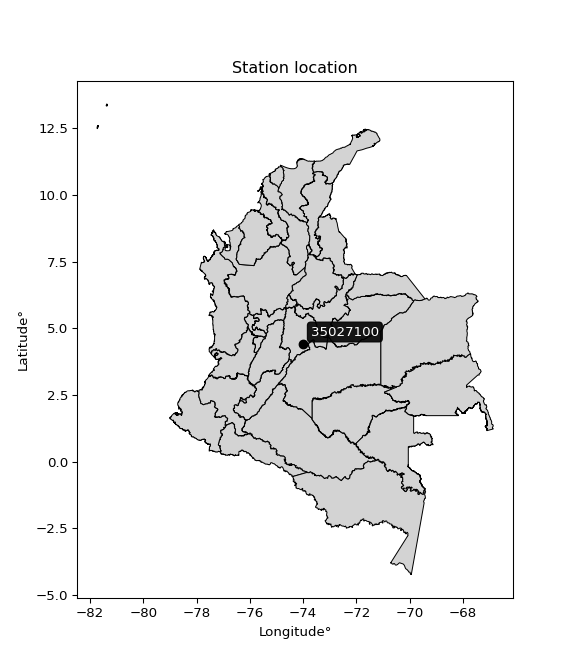

<div align="center">


</div>

# Station (rain, Pmax24h): 35027100

Probable Maximum Precipitation (PMP) is the greatest amount of rainfall for a specific duration that is meteorologically possible for a given location, acting as a "worst-case" scenario for extreme storms, crucial for designing safety-critical infrastructure like bridges, river deviations, dams, spillways, and nuclear plants to prevent catastrophic failure. PMP is calculated by hydrologists using meteorological data to determine the upper limit of extreme rainfall, often leading to the Probable Maximum Flood (PMF) for flood control design, and is increasingly being studied for climate change impacts.

<div align="center">

</img>

</div>


## A. General information


### 1. General running parameters

• app_version: _v20251226_. • runtime: _2025-12-26 15:38:16.554582_. • Python version: _3.14.0_. • SciPy version: _1.16.3_. • Pandas version: _2.3.3_. • NumPy version: _2.3.5_. • Stations dataset (station_dataset_file): _dataset/pmax24h_in/automatic_colombia_2003_2024.csv_. • Stations catalog (station_catalog_file): _dataset/CNE_IDEAM.xls_. • Minimum year to eval til year_max (date_min): _2003_. • Maximum year to eval since year_min (date_max): _2024_. • Creates, save and include plots into reports (create_plot): _False_. • Plot only fit distributions with Δo > Δ (plot_only_fit): _True_. • Eval low extreme values, if False, evaluates high extreme values (low_extreme): _False_. • Eval every SciPy distribution as logarithmic (pdist_logarithmic_on): _True_. • Standard deviation normalized (ddof): _1.0_. • Return periods to eval in years (Tr): _[2, 2.33, 5, 10, 15, 20, 25, 50, 75, 100, 200, 250, 500, 750, 1000]_. • Minimum data sample per station, 0 means any (minimum_sample): _5_. • Z-Score threshold to adjust a value, 0 means disable (zscore): _3.5_. • Avoid zeros, e.g. rain = 0 (avoid_zeros): _True_. • Avoid null values (avoid_nans): _True_. [:file_folder:Dataset file.](../../dataset/pmax24h_in/automatic_colombia_2003_2024.csv)


### 2. Station info and location

|   id |   CODIGO | NOMBRE            | CATEGORIA    | TECNOLOGIA                              | ESTADO           | FECHA_INSTALACION   |   FECHA_SUSPENSION |   ALTITUD |   LATITUD |   LONGITUD | DEPARTAMENTO   | MUNICIPIO   | AREA_OPERATIVA                            | ENTIDAD                                                     | AREA_HIDROGRAFICA   | ZONA_HIDROGRAFICA   | SUBZONA_HIDROGRAFICA   | CORRIENTE   | OBSERVACION                                                                                                                                                                                                                                                                                                                                                                                                                                                                                                                                                                                                   |   SUBRED | Catalogo   |
|-----:|---------:|:------------------|:-------------|:----------------------------------------|:-----------------|:--------------------|-------------------:|----------:|----------:|-----------:|:---------------|:------------|:------------------------------------------|:------------------------------------------------------------|:--------------------|:--------------------|:-----------------------|:------------|:--------------------------------------------------------------------------------------------------------------------------------------------------------------------------------------------------------------------------------------------------------------------------------------------------------------------------------------------------------------------------------------------------------------------------------------------------------------------------------------------------------------------------------------------------------------------------------------------------------------|---------:|:-----------|
|    0 | 35027100 | CARAZA [35027100] | Limnigráfica | Automática con Telemetría, Convencional | En Mantenimiento | 15/01/1970          |                nan |       220 |   4.42917 |   -74.0102 | Cundinamarca   | Chipaque    | Area Operativa 11 - Cundinamarca-Amazonas | INSTITUTO DE HIDROLOGIA METEOROLOGIA Y ESTUDIOS AMBIENTALES | Orinoco             | Meta                | Río Guayuriba          | Une         | 27/04/2022$Migracion$Cambio de tecnología por instalación o repotenciación de estaciones proyecto Fondo de Adaptación|24/04/2024$Histórico$Cambio de estado por solicitud del coordinador del AO y por cambio de sistema de transmisión|18/06/2025$mvelez$La estación fue actualizada en su estado luego de la reunión con el grupo de automatización 17/06/2025 se realiza el cambio bajo el memorando 20253180105293. |27/06/2025$mvelez$La estación fue actualizada en sus coordenadas luego de la reunión con el grupo de automatización 17/06/2025 se realiza el cambio bajo el memorando 20253180105293 |      nan | CNE_IDEAM  |

<div align="center">

Map location in: [:earth_americas:Google](http://maps.google.com/maps?q=4.429173,-74.010245) [:earth_americas:OSM](https://www.openstreetmap.org/#map=18/4.429173/-74.010245&layers=P) [:earth_americas:Bing](https://www.bing.com/maps?cp=4.429173~-74.010245&lvl=18) [:earth_americas:Apple](https://maps.apple.com/frame?center=4.429173%2C-74.010245&span=0.003%2C0.006)

</div>


<div align="center">

```geojson
{
  "type": "Feature",
  "geometry": {
    "type": "Point", 
    "coordinates": [-74.010245, 4.429173]
  }, 
  "properties": {
    "Name": "35027100"
  }
}
```

</div>


### 3. Discrete values table and plot

|               |          0 |            1 |           2 |           3 |           4 |          5 |
|:--------------|-----------:|-------------:|------------:|------------:|------------:|-----------:|
| Date          | 2019       | 2020         | 2021        | 2022        | 2023        | 2024       |
| Value         |   81.6     |   30         |   26.8      |   11.6      |   15.2      |   19.4     |
| Value_initial |   81.6     |   30         |   26.8      |   11.6      |   15.2      |   19.4     |
| count         |    6       |    6         |    6        |    6        |    6        |    6       |
| mean          |   30.7667  |   30.7667    |   30.7667   |   30.7667   |   30.7667   |   30.7667  |
| std           |   25.8427  |   25.8427    |   25.8427   |   25.8427   |   25.8427   |   25.8427  |
| zscore        |    1.96703 |   -0.0296666 |   -0.153493 |   -0.741666 |   -0.602362 |   -0.43984 |
> If Z-Score is active, values out of range or outliers are replaced with the station mean value.


### 4. Active continuous probability distributions from SciPy (45 of 104 available)

[scipy.stats](https://docs.scipy.org/doc/scipy/reference/stats.html) is a Python´s powerful submodule within the SciPy library for comprehensive statistical analysis, offering over 130 probability distributions (like Normal, Poisson), functions for descriptive stats (mean, variance), hypothesis testing (t-tests, chi-square), random variable generation, and statistical tests, making it essential for data science, modeling, and research. It provides tools to explore, model, and draw conclusions from data efficiently, working seamlessly with NumPy.

<div align="center">

|   id | p_dist             |   n_parameter | fit_method   | label                                                                       | active   | ref                                                                                                        |
|-----:|:-------------------|--------------:|:-------------|:----------------------------------------------------------------------------|:---------|:-----------------------------------------------------------------------------------------------------------|
|    0 | alpha              |             3 | MLE          | Alpha                                                                       | True     | [:mortar_board:](https://docs.scipy.org/doc/scipy/reference/generated/scipy.stats.alpha.html)              |
|    1 | betaprime          |             4 | MLE          | Beta prime                                                                  | True     | [:mortar_board:](https://docs.scipy.org/doc/scipy/reference/generated/scipy.stats.betaprime.html)          |
|    2 | chi2               |             3 | MLE          | Chi²                                                                        | True     | [:mortar_board:](https://docs.scipy.org/doc/scipy/reference/generated/scipy.stats.chi2.html)               |
|    3 | crystalball        |             4 | MLE          | Crystalball                                                                 | True     | [:mortar_board:](https://docs.scipy.org/doc/scipy/reference/generated/scipy.stats.crystalball.html)        |
|    4 | erlang             |             3 | MLE          | Erlang                                                                      | True     | [:mortar_board:](https://docs.scipy.org/doc/scipy/reference/generated/scipy.stats.erlang.html)             |
|    5 | expon              |             2 | MLE          | Exponential                                                                 | True     | [:mortar_board:](https://docs.scipy.org/doc/scipy/reference/generated/scipy.stats.expon.html)              |
|    6 | exponnorm          |             3 | MLE          | Exponentially modified Normal                                               | True     | [:mortar_board:](https://docs.scipy.org/doc/scipy/reference/generated/scipy.stats.exponnorm.html)          |
|    7 | f                  |             4 | MLE          | F                                                                           | True     | [:mortar_board:](https://docs.scipy.org/doc/scipy/reference/generated/scipy.stats.f.html)                  |
|    8 | fatiguelife        |             3 | MLE          | Fatigue-life (Birnbaum-Saunders)                                            | True     | [:mortar_board:](https://docs.scipy.org/doc/scipy/reference/generated/scipy.stats.fatiguelife.html)        |
|    9 | fisk               |             3 | MLE          | Fisk                                                                        | True     | [:mortar_board:](https://docs.scipy.org/doc/scipy/reference/generated/scipy.stats.fisk.html)               |
|   10 | gamma              |             3 | MLE          | Gamma                                                                       | True     | [:mortar_board:](https://docs.scipy.org/doc/scipy/reference/generated/scipy.stats.gamma.html)              |
|   11 | genexpon           |             5 | MLE          | Generalized exponential                                                     | True     | [:mortar_board:](https://docs.scipy.org/doc/scipy/reference/generated/scipy.stats.genexpon.html)           |
|   12 | genlogistic        |             3 | MLE          | Generalized logistic                                                        | True     | [:mortar_board:](https://docs.scipy.org/doc/scipy/reference/generated/scipy.stats.genlogistic.html)        |
|   13 | gibrat             |             2 | MM           | Gibrat                                                                      | True     | [:mortar_board:](https://docs.scipy.org/doc/scipy/reference/generated/scipy.stats.gibrat.html)             |
|   14 | gompertz           |             3 | MLE          | Gompertz (or truncated Gumbel)                                              | True     | [:mortar_board:](https://docs.scipy.org/doc/scipy/reference/generated/scipy.stats.gompertz.html)           |
|   15 | gumbel_l           |             2 | MM           | Gumbel Left Skew                                                            | True     | [:mortar_board:](https://docs.scipy.org/doc/scipy/reference/generated/scipy.stats.gumbel_l.html)           |
|   16 | gumbel_r           |             2 | MM           | Gumbel Right Skew                                                           | True     | [:mortar_board:](https://docs.scipy.org/doc/scipy/reference/generated/scipy.stats.gumbel_r.html)           |
|   17 | halflogistic       |             2 | MM           | Half-logistic                                                               | True     | [:mortar_board:](https://docs.scipy.org/doc/scipy/reference/generated/scipy.stats.halflogistic.html)       |
|   18 | halfnorm           |             2 | MM           | Half Normal                                                                 | True     | [:mortar_board:](https://docs.scipy.org/doc/scipy/reference/generated/scipy.stats.halfnorm.html)           |
|   19 | hypsecant          |             2 | MM           | hyperbolic secant                                                           | True     | [:mortar_board:](https://docs.scipy.org/doc/scipy/reference/generated/scipy.stats.hypsecant.html)          |
|   20 | invgamma           |             3 | MLE          | Inverted gamma                                                              | True     | [:mortar_board:](https://docs.scipy.org/doc/scipy/reference/generated/scipy.stats.invgamma.html)           |
|   21 | invgauss           |             3 | MLE          | Inverse Gaussian                                                            | True     | [:mortar_board:](https://docs.scipy.org/doc/scipy/reference/generated/scipy.stats.invgauss.html)           |
|   22 | invweibull         |             3 | MLE          | Inverted Weibull                                                            | True     | [:mortar_board:](https://docs.scipy.org/doc/scipy/reference/generated/scipy.stats.invweibull.html)         |
|   23 | johnsonsu          |             4 | MLE          | Johnson Su                                                                  | True     | [:mortar_board:](https://docs.scipy.org/doc/scipy/reference/generated/scipy.stats.johnsonsu.html)          |
|   24 | kstwobign          |             2 | MLE          | Limiting distribution of scaled Kolmogorov-Smirnov two-sided test statistic | True     | [:mortar_board:](https://docs.scipy.org/doc/scipy/reference/generated/scipy.stats.kstwobign.html)          |
|   25 | laplace            |             2 | MM           | Laplace                                                                     | True     | [:mortar_board:](https://docs.scipy.org/doc/scipy/reference/generated/scipy.stats.laplace.html)            |
|   26 | laplace_asymmetric |             3 | MLE          | Asymmetric Laplace                                                          | True     | [:mortar_board:](https://docs.scipy.org/doc/scipy/reference/generated/scipy.stats.laplace_asymmetric.html) |
|   27 | loggamma           |             3 | MLE          | Log gamma                                                                   | True     | [:mortar_board:](https://docs.scipy.org/doc/scipy/reference/generated/scipy.stats.loggamma.html)           |
|   28 | logistic           |             2 | MM           | Logistic (or Sech-squared)                                                  | True     | [:mortar_board:](https://docs.scipy.org/doc/scipy/reference/generated/scipy.stats.logistic.html)           |
|   29 | lognorm            |             3 | MLE          | Log Normal                                                                  | True     | [:mortar_board:](https://docs.scipy.org/doc/scipy/reference/generated/scipy.stats.lognorm.html)            |
|   30 | maxwell            |             2 | MM           | Maxwell                                                                     | True     | [:mortar_board:](https://docs.scipy.org/doc/scipy/reference/generated/scipy.stats.maxwell.html)            |
|   31 | mielke             |             4 | MLE          | Mielke Beta-Kappa / Dagum                                                   | True     | [:mortar_board:](https://docs.scipy.org/doc/scipy/reference/generated/scipy.stats.mielke.html)             |
|   32 | moyal              |             2 | MM           | Moyal                                                                       | True     | [:mortar_board:](https://docs.scipy.org/doc/scipy/reference/generated/scipy.stats.moyal.html)              |
|   33 | nakagami           |             3 | MLE          | Nakagami                                                                    | True     | [:mortar_board:](https://docs.scipy.org/doc/scipy/reference/generated/scipy.stats.nakagami.html)           |
|   34 | ncf                |             5 | MLE          | Non-central F distribution                                                  | True     | [:mortar_board:](https://docs.scipy.org/doc/scipy/reference/generated/scipy.stats.ncf.html)                |
|   35 | nct                |             4 | MLE          | Non-central Student’s t                                                     | True     | [:mortar_board:](https://docs.scipy.org/doc/scipy/reference/generated/scipy.stats.nct.html)                |
|   36 | norm               |             2 | MM           | Normal                                                                      | True     | [:mortar_board:](https://docs.scipy.org/doc/scipy/reference/generated/scipy.stats.norm.html)               |
|   37 | pareto             |             3 | MLE          | Pareto                                                                      | True     | [:mortar_board:](https://docs.scipy.org/doc/scipy/reference/generated/scipy.stats.pareto.html)             |
|   38 | pearson3           |             3 | MM           | Pearson type III                                                            | True     | [:mortar_board:](https://docs.scipy.org/doc/scipy/reference/generated/scipy.stats.pearson3.html)           |
|   39 | rayleigh           |             2 | MM           | Rayleigh                                                                    | True     | [:mortar_board:](https://docs.scipy.org/doc/scipy/reference/generated/scipy.stats.rayleigh.html)           |
|   40 | rice               |             3 | MLE          | Rice                                                                        | True     | [:mortar_board:](https://docs.scipy.org/doc/scipy/reference/generated/scipy.stats.rice.html)               |
|   41 | t                  |             3 | MLE          | Student’s t                                                                 | True     | [:mortar_board:](https://docs.scipy.org/doc/scipy/reference/generated/scipy.stats.t.html)                  |
|   42 | truncnorm          |             4 | MLE          | Truncated normal                                                            | True     | [:mortar_board:](https://docs.scipy.org/doc/scipy/reference/generated/scipy.stats.truncnorm.html)          |
|   43 | wald               |             2 | MM           | Wald                                                                        | True     | [:mortar_board:](https://docs.scipy.org/doc/scipy/reference/generated/scipy.stats.wald.html)               |
|   44 | weibull_min        |             3 | MLE          | Weibull minimum                                                             | True     | [:mortar_board:](https://docs.scipy.org/doc/scipy/reference/generated/scipy.stats.weibull_min.html)        |

</div>

> **n_parameter:** # arguments & localization & scale.
>
> **Fit methods:** (MLE) maximum likelihood, (MM) L-moments.
>
>**Inactive:** foldnorm, gennorm, norminvgauss, powernorm, powerlognorm, skewnorm, genextreme, anglit, arcsine, argus, beta, bradford, burr, burr12, cauchy, cosine, halfcauchy, foldcauchy, skewcauchy, wrapcauchy, dgamma, gengamma, exponweib, exponpow, truncexpon, gausshyper, genhalflogistic, genhyperbolic, geninvgauss, halfgennorm, johnsonsb, kappa4, kappa3, ksone, kstwo, loglaplace, levy, levy_l, levy_stable, ncx2, genpareto, truncpareto, lomax, powerlaw, rdist, rel_breitwigner, recipinvgauss, semicircular, studentized_range, trapezoid, triang, truncweibull_min, tukeylambda, uniform, loguniform, vonmises, vonmises_line, weibull_max, dweibull, 


## B. Probability distributions vs. Empirical distributions

A continuous probability distribution (CPD) describes probabilities for variables that can take any value within a range (like rain any time), unlike discrete variables with specific outcomes (like temperature). It uses a Probability Density Function (PDF), a curve where the total area under it equals 1, and the probability of the variable falling within an interval (a to b) is found by calculating the area under the curve between those points. A key feature is that the probability of hitting any single exact value is zero, so probabilities are always expressed for ranges, e.g., $P(a ≤ X ≤ b)$.

<div align="center">

Distributions parameters
|    |   station | p_dist                |   n |             loc |         scale | shape                  | shape1                 | shape2             | shape3   |
|---:|----------:|:----------------------|----:|----------------:|--------------:|:-----------------------|:-----------------------|:-------------------|:---------|
|  0 |  35027100 | alpha                 |   6 |     7.04155     |   8.98426     | 1.384481409290384e-07  |                        |                    |          |
|  1 |  35027100 | betaprime             |   6 |     2.97485     |   3.72193     | 15.262040273550703     | 3.1715647094289627     |                    |          |
|  2 |  35027100 | chi2                  |   6 |    11.6         |   6.76853     | 1.206851863233604      |                        |                    |          |
|  3 |  35027100 | crystalball           |   6 |    30.7667      |  23.5911      | 3371.834451376466      | 89.485327979945        |                    |          |
|  4 |  35027100 | erlang                |   6 |    11.6         |  39.4033      | 0.33908121670122393    |                        |                    |          |
|  5 |  35027100 | expon                 |   6 |    11.6         |  19.1667      |                        |                        |                    |          |
|  6 |  35027100 | exponnorm             |   6 |    11.5771      |   0.00696389  | 2726.2855847023975     |                        |                    |          |
|  7 |  35027100 | f                     |   6 |    11.6         |  14.3074      | 0.6140179612975429     | 4.217417655029854      |                    |          |
|  8 |  35027100 | fatiguelife           |   6 |    11.6         |   4.97992e-06 | 1874.9541412422477     |                        |                    |          |
|  9 |  35027100 | fisk                  |   6 |    11.6         |   5.79498     | 0.9453743203917933     |                        |                    |          |
| 10 |  35027100 | gamma                 |   6 |    11.6         |  23.0542      | 0.6425491120532159     |                        |                    |          |
| 11 |  35027100 | genexpon              |   6 |    11.6         |   7.9639      | 0.41551195806556596    | 1.3887884499385773e-10 | 2.4076028598600345 |          |
| 12 |  35027100 | genlogistic           |   6 |   -84.3978      |  13.3312      | 2772.176097324739      |                        |                    |          |
| 13 |  35027100 | gibrat                |   6 |    12.7696      |  10.9157      |                        |                        |                    |          |
| 14 |  35027100 | gompertz              |   6 |    11.6         |  76.0761      | 2.4925057980665732     |                        |                    |          |
| 15 |  35027100 | gumbel_l              |   6 |    41.3839      |  18.3939      |                        |                        |                    |          |
| 16 |  35027100 | gumbel_r              |   6 |    20.1494      |  18.3939      |                        |                        |                    |          |
| 17 |  35027100 | halflogistic          |   6 |     2.80576     |  20.1695      |                        |                        |                    |          |
| 18 |  35027100 | halfnorm              |   6 |    -0.458673    |  39.1352      |                        |                        |                    |          |
| 19 |  35027100 | hypsecant             |   6 |    30.7667      |  15.0185      |                        |                        |                    |          |
| 20 |  35027100 | invgamma              |   6 |     7.67525     |  15.351       | 1.4931060744293767     |                        |                    |          |
| 21 |  35027100 | invgauss              |   6 |     9.42214     |  10.5014      | 2.0325449537593556     |                        |                    |          |
| 22 |  35027100 | invweibull            |   6 |     7.09054     |  10.2979      | 1.3296781183621214     |                        |                    |          |
| 23 |  35027100 | johnsonsu             |   6 |    11.6         |   3.47843e-11 | -3.9911654848986746    | 0.18182336554813033    |                    |          |
| 24 |  35027100 | kstwobign             |   6 |   -30.0299      |  70.9641      |                        |                        |                    |          |
| 25 |  35027100 | laplace               |   6 |    30.7667      |  16.6814      |                        |                        |                    |          |
| 26 |  35027100 | laplace_asymmetric    |   6 |    11.6         |   0.000941131 | 4.9102746291133944e-05 |                        |                    |          |
| 27 |  35027100 | loggamma              |   6 | -7052.66        | 961.574       | 1582.9367867019491     |                        |                    |          |
| 28 |  35027100 | logistic              |   6 |    30.7667      |  13.0064      |                        |                        |                    |          |
| 29 |  35027100 | lognorm               |   6 |    11.6         |   0.0314979   | 13.672509472515411     |                        |                    |          |
| 30 |  35027100 | maxwell               |   6 |   -25.1343      |  35.0307      |                        |                        |                    |          |
| 31 |  35027100 | mielke                |   6 |     6.13617     |   0.809795    | 72.0261520561863       | 1.465192181270706      |                    |          |
| 32 |  35027100 | moyal                 |   6 |    17.2758      |  10.6197      |                        |                        |                    |          |
| 33 |  35027100 | nakagami              |   6 |    11.6         |  42.2264      | 0.3000059805867861     |                        |                    |          |
| 34 |  35027100 | ncf                   |   6 |     0.29842     |  20.5887      | 366.0902225293032      | 6.396492015226245      | 1.4522278060451486 |          |
| 35 |  35027100 | nct                   |   6 |     1.23197     |   0.118492    | 1.9289726048767455     | 144.13098689936766     |                    |          |
| 36 |  35027100 | norm                  |   6 |    30.7667      |  23.5911      |                        |                        |                    |          |
| 37 |  35027100 | pareto                |   6 |    -2.14748e+09 |   2.14748e+09 | 112042625.90595083     |                        |                    |          |
| 38 |  35027100 | pearson3              |   6 |    30.7667      |  23.5911      | 1.5107205145796851     |                        |                    |          |
| 39 |  35027100 | rayleigh              |   6 |   -14.3644      |  36.0094      |                        |                        |                    |          |
| 40 |  35027100 | rice                  |   6 |    -3.54429     |  29.443       | 0.0002764143670140112  |                        |                    |          |
| 41 |  35027100 | t                     |   6 |    20.895       |   7.99916     | 1.3514551882033747     |                        |                    |          |
| 42 |  35027100 | truncnorm             |   6 | -3073.03        | 260.58        | 11.837518749672146     | 1238.6976404962334     |                    |          |
| 43 |  35027100 | wald                  |   6 |     7.17559     |  23.5911      |                        |                        |                    |          |
| 44 |  35027100 | weibull_min           |   6 |    11.6         |  25.6926      | 0.6073641713427481     |                        |                    |          |
| 45 |  35027100 | logalpha              |   6 |     0.721471    |  10.2634      | 4.37621244464176       |                        |                    |          |
| 46 |  35027100 | logbetaprime          |   6 |    -0.992227    |   1.02947     | 255.05882336322884     | 63.75465024508932      |                    |          |
| 47 |  35027100 | logchi2               |   6 |     2.45101     |   0.946864    | 1.0718659274593496     |                        |                    |          |
| 48 |  35027100 | logcrystalball        |   6 |     3.20483     |   0.624206    | 58.14998620123327      | 554.5383031283604      |                    |          |
| 49 |  35027100 | logerlang             |   6 |     2.45101     |   0.488813    | 0.21774943857136062    |                        |                    |          |
| 50 |  35027100 | logexpon              |   6 |     2.45101     |   0.753829    |                        |                        |                    |          |
| 51 |  35027100 | logexponnorm          |   6 |     2.45        |   0.000313619 | 2402.151984822427      |                        |                    |          |
| 52 |  35027100 | logf                  |   6 |     1.69066     |   1.2957      | 498.36966803164455     | 13.386279196246715     |                    |          |
| 53 |  35027100 | logfatiguelife        |   6 |     2.14811     |   0.868286    | 0.6564777311526564     |                        |                    |          |
| 54 |  35027100 | logfisk               |   6 |     2.16998     |   0.875679    | 2.6163484940687356     |                        |                    |          |
| 55 |  35027100 | loggamma              |   6 |     2.45101     |   1.34203     | 0.15693619706730783    |                        |                    |          |
| 56 |  35027100 | loggenexpon           |   6 |     2.451       | 270.615       | 290.6762215203164      | 376.0294292185142      | 91.2708241417343   |          |
| 57 |  35027100 | loggenlogistic        |   6 |    -0.165742    |   0.472468    | 688.06411050455        |                        |                    |          |
| 58 |  35027100 | loggibrat             |   6 |     2.72866     |   0.288814    |                        |                        |                    |          |
| 59 |  35027100 | loggompertz           |   6 |     2.45101     |   2.41457     | 2.4040112577632726     |                        |                    |          |
| 60 |  35027100 | loggumbel_l           |   6 |     3.48576     |   0.486691    |                        |                        |                    |          |
| 61 |  35027100 | loggumbel_r           |   6 |     2.92391     |   0.486691    |                        |                        |                    |          |
| 62 |  35027100 | loghalflogistic       |   6 |     2.46504     |   0.533647    |                        |                        |                    |          |
| 63 |  35027100 | loghalfnorm           |   6 |     2.37863     |   1.03549     |                        |                        |                    |          |
| 64 |  35027100 | loghypsecant          |   6 |     3.20483     |   0.397382    |                        |                        |                    |          |
| 65 |  35027100 | loginvgamma           |   6 |     1.67361     |   8.76597     | 6.690914243209374      |                        |                    |          |
| 66 |  35027100 | loginvgauss           |   6 |     2.06255     |   3.09644     | 0.3689024962884839     |                        |                    |          |
| 67 |  35027100 | loginvweibull         |   6 |    -0.851153    |   3.74193     | 8.369280024948829      |                        |                    |          |
| 68 |  35027100 | logjohnsonsu          |   6 |     2.0939      |   0.0235512   | -7.459995544303737     | 1.7021786753748502     |                    |          |
| 69 |  35027100 | logkstwobign          |   6 |     1.24384     |   2.25584     |                        |                        |                    |          |
| 70 |  35027100 | loglaplace            |   6 |     3.20483     |   0.44138     |                        |                        |                    |          |
| 71 |  35027100 | loglaplace_asymmetric |   6 |     2.96527     |   0.445347    | 0.7665846501674856     |                        |                    |          |
| 72 |  35027100 | logloggamma           |   6 |  -218.903       |  29.0476      | 2093.574055690012      |                        |                    |          |
| 73 |  35027100 | loglogistic           |   6 |     3.20483     |   0.344143    |                        |                        |                    |          |
| 74 |  35027100 | loglognorm            |   6 |     2.45101     |   0.00213915  | 13.073851797768784     |                        |                    |          |
| 75 |  35027100 | logmaxwell            |   6 |     1.72573     |   0.926892    |                        |                        |                    |          |
| 76 |  35027100 | logmielke             |   6 |    -0.738103    |   1.98013     | 1132.8434958633752     | 8.141534732175089      |                    |          |
| 77 |  35027100 | logmoyal              |   6 |     2.84787     |   0.280991    |                        |                        |                    |          |
| 78 |  35027100 | lognakagami           |   6 |     2.45101     |   1.45971     | 0.06805155685052278    |                        |                    |          |
| 79 |  35027100 | logncf                |   6 |     1.2626      |   1.82528     | 118.96216486607779     | 28.91086723490902      | 3.935994752110559  |          |
| 80 |  35027100 | lognct                |   6 |     1.2898      |   0.0199593   | 5.890160793415478      | 83.38802370912944      |                    |          |
| 81 |  35027100 | lognorm               |   6 |     3.20483     |   0.624206    |                        |                        |                    |          |
| 82 |  35027100 | logpareto             |   6 |     2.44894     |   0.00206874  | 0.20416601651743735    |                        |                    |          |
| 83 |  35027100 | logpearson3           |   6 |     3.20483     |   0.624206    | 0.800448359014996      |                        |                    |          |
| 84 |  35027100 | lograyleigh           |   6 |     2.01069     |   0.952787    |                        |                        |                    |          |
| 85 |  35027100 | logrice               |   6 |     2.15036     |   0.866474    | 0.0002600255211643646  |                        |                    |          |
| 86 |  35027100 | logt                  |   6 |     3.20483     |   0.624206    | 5798186406.815945      |                        |                    |          |
| 87 |  35027100 | logtruncnorm          |   6 |    -0.19484     |   1.33967     | 2.358455937268191      | 3.431182505335218      |                    |          |
| 88 |  35027100 | logwald               |   6 |     2.58066     |   0.624181    |                        |                        |                    |          |
| 89 |  35027100 | logweibull_min        |   6 |     2.45101     |   0.785235    | 0.16954937321661334    |                        |                    |          |

</div>

> **loc** (Location parameter): This shifts the distribution along the x-axis. For many common distributions, like the normal (Gaussian) distribution, loc represents the mean $μ$. For others, like the uniform distribution, it might represent the minimum value, or for the beta distribution, the left end of the support interval.
>
> **scale** (Scale parameter): This determines the width or spread of the distribution. For the normal distribution, scale represents the standard deviation $σ$. For a uniform distribution, it defines the length of the interval (from $loc$ to $loc + scale$).
>
> **shape** (Shape parameters): Refers to parameters that define the specific form of a probability distribution, distinct from its location (loc) and scale (scale). These parameters are required arguments for most distribution functions. For example, a normal (Gaussian) distribution is fully defined by its location (mean) and scale (standard deviation), so it has no specific shape parameters beyond loc and scale. However, other distributions have intrinsic properties that need specification, as Gamma distribution that takes a shape parameter, often named $a$ or $alpha$.


### 0. Cumulative distribution values - CDF (90 evaluated)

> Ordered by x ascending and calculating $log(f(x))$ separately. 

|   id |   Station |   date |    x |   count |    mean |     std |     zscore |   Value_initial |   station |   m |     alpha |   alpha_pdf |   betaprime |   betaprime_pdf |        chi2 |        chi2_pdf |   crystalball |   crystalball_pdf |      erlang |   erlang_pdf |    expon |   expon_pdf |   exponnorm |   exponnorm_pdf |           f |       f_pdf |   fatiguelife |   fatiguelife_pdf |        fisk |   fisk_pdf |       gamma |      gamma_pdf |    genexpon |   genexpon_pdf |   genlogistic |   genlogistic_pdf |    gibrat |   gibrat_pdf |    gompertz |   gompertz_pdf |   gumbel_l |   gumbel_l_pdf |   gumbel_r |   gumbel_r_pdf |   halflogistic |   halflogistic_pdf |   halfnorm |   halfnorm_pdf |   hypsecant |   hypsecant_pdf |   invgamma |   invgamma_pdf |   invgauss |   invgauss_pdf |   invweibull |   invweibull_pdf |   johnsonsu |    johnsonsu_pdf |   kstwobign |   kstwobign_pdf |   laplace |   laplace_pdf |   laplace_asymmetric |   laplace_asymmetric_pdf |   loggamma |   loggamma_pdf |   logistic |   logistic_pdf |   lognorm |   lognorm_pdf |   maxwell |   maxwell_pdf |    mielke |   mielke_pdf |    moyal |   moyal_pdf |    nakagami |   nakagami_pdf |       ncf |    ncf_pdf |       nct |    nct_pdf |     norm |   norm_pdf |   pareto |   pareto_pdf |   pearson3 |   pearson3_pdf |   rayleigh |   rayleigh_pdf |     rice |   rice_pdf |        t |       t_pdf |   truncnorm |   truncnorm_pdf |      wald |   wald_pdf |   weibull_min |   weibull_min_pdf |   logalpha |   logalpha_pdf |   logbetaprime |   logbetaprime_pdf |     logchi2 |   logchi2_pdf |   logcrystalball |   logcrystalball_pdf |   logerlang |   logerlang_pdf |   logexpon |   logexpon_pdf |   logexponnorm |   logexponnorm_pdf |     logf |   logf_pdf |   logfatiguelife |   logfatiguelife_pdf |   logfisk |   logfisk_pdf |   loggenexpon |   loggenexpon_pdf |   loggenlogistic |   loggenlogistic_pdf |   loggibrat |   loggibrat_pdf |   loggompertz |   loggompertz_pdf |   loggumbel_l |   loggumbel_l_pdf |   loggumbel_r |   loggumbel_r_pdf |   loghalflogistic |   loghalflogistic_pdf |   loghalfnorm |   loghalfnorm_pdf |   loghypsecant |   loghypsecant_pdf |   loginvgamma |   loginvgamma_pdf |   loginvgauss |   loginvgauss_pdf |   loginvweibull |   loginvweibull_pdf |   logjohnsonsu |   logjohnsonsu_pdf |   logkstwobign |   logkstwobign_pdf |   loglaplace |   loglaplace_pdf |   loglaplace_asymmetric |   loglaplace_asymmetric_pdf |   logloggamma |   logloggamma_pdf |   loglogistic |   loglogistic_pdf |   loglognorm |   loglognorm_pdf |   logmaxwell |   logmaxwell_pdf |   logmielke |   logmielke_pdf |   logmoyal |   logmoyal_pdf |   lognakagami |   lognakagami_pdf |    logncf |   logncf_pdf |    lognct |   lognct_pdf |   logpareto |   logpareto_pdf |   logpearson3 |   logpearson3_pdf |   lograyleigh |   lograyleigh_pdf |   logrice |   logrice_pdf |     logt |   logt_pdf |   logtruncnorm |   logtruncnorm_pdf |   logwald |   logwald_pdf |   logweibull_min |   logweibull_min_pdf |
|-----:|----------:|-------:|-----:|--------:|--------:|--------:|-----------:|----------------:|----------:|----:|----------:|------------:|------------:|----------------:|------------:|----------------:|--------------:|------------------:|------------:|-------------:|---------:|------------:|------------:|----------------:|------------:|------------:|--------------:|------------------:|------------:|-----------:|------------:|---------------:|------------:|---------------:|--------------:|------------------:|----------:|-------------:|------------:|---------------:|-----------:|---------------:|-----------:|---------------:|---------------:|-------------------:|-----------:|---------------:|------------:|----------------:|-----------:|---------------:|-----------:|---------------:|-------------:|-----------------:|------------:|-----------------:|------------:|----------------:|----------:|--------------:|---------------------:|-------------------------:|-----------:|---------------:|-----------:|---------------:|----------:|--------------:|----------:|--------------:|----------:|-------------:|---------:|------------:|------------:|---------------:|----------:|-----------:|----------:|-----------:|---------:|-----------:|---------:|-------------:|-----------:|---------------:|-----------:|---------------:|---------:|-----------:|---------:|------------:|------------:|----------------:|----------:|-----------:|--------------:|------------------:|-----------:|---------------:|---------------:|-------------------:|------------:|--------------:|-----------------:|---------------------:|------------:|----------------:|-----------:|---------------:|---------------:|-------------------:|---------:|-----------:|-----------------:|---------------------:|----------:|--------------:|--------------:|------------------:|-----------------:|---------------------:|------------:|----------------:|--------------:|------------------:|--------------:|------------------:|--------------:|------------------:|------------------:|----------------------:|--------------:|------------------:|---------------:|-------------------:|--------------:|------------------:|--------------:|------------------:|----------------:|--------------------:|---------------:|-------------------:|---------------:|-------------------:|-------------:|-----------------:|------------------------:|----------------------------:|--------------:|------------------:|--------------:|------------------:|-------------:|-----------------:|-------------:|-----------------:|------------:|----------------:|-----------:|---------------:|--------------:|------------------:|----------:|-------------:|----------:|-------------:|------------:|----------------:|--------------:|------------------:|--------------:|------------------:|----------:|--------------:|---------:|-----------:|---------------:|-------------------:|----------:|--------------:|-----------------:|---------------------:|
|    0 |  35027100 |   2022 | 11.6 |       6 | 30.7667 | 25.8427 | -0.741666  |            11.6 |  35027100 |   1 | 0.0487353 |  0.0494641  |   0.0822751 |      0.03229    | 2.91811e-10 | 99127.7         |      0.208266 |        0.012157   | 3.21261e-06 |  6.13241e+08 | 0        |  0.0521739  |  0.00120718 |      0.052582   | 6.23736e-05 | 2.46684e+07 |     0.0500714 |       1.61982e+11 | 2.15732e-15 | 1.14812    | 4.92834e-11 | 17826.9        | 1.29924e-10 |     0.0521744  |      0.126579 |       0.0196177   | 0         |   0          | 1.10515e-12 |     0.0327633  |   0.179672 |    0.00883267  |   0.203581 |     0.0176166  |       0.214619 |         0.023648   |   0.242016 |     0.0194427  |    0.173269 |      0.0109756  |  0.0492904 |     0.0441039  |  0.0450782 |     0.0575706  |    0.0498791 |       0.0440955  | 5.78015e-05 | 955534           |    0.118529 |      0.0175666  |  0.158479 |    0.00950036 |          2.50205e-09 |                0.0521742 |   0.003997 |     1.4125e+12 |   0.186392 |     0.0116596  |  0.113589 |      0.308237 |  0.222836 |    0.0144529  | 0.0544894 |   0.0412834  | 0.191437 |  0.0209068  | 1.15955e-10 | 39166.8        | 0.0875065 | 0.0302322  | 0.0683918 | 0.0348688  | 0.208266 | 0.012157   | 0        |   0.0521739  |   0.206484 |     0.0231179  |   0.228913 |     0.0154401  | 0.123907 | 0.0153051  | 0.205225 | 0.0185733   | 0.000290971 |       0.045734  | 0.0528725 | 0.035829   |   1.53048e-10 |    52329.4        |  0.0596197 |      0.406691  |      0.0920075 |          0.35415   | 4.73234e-09 |   5.71105e+06 |         0.113589 |             0.308237 | 0.000580636 |     2.84702e+11 |   0        |      1.32656   |     0.00133013 |           1.3247   | 0.054609 |  0.439472  |        0.0465369 |            0.559215  | 0.0486325 |     0.430747  |   3.57141e-07 |          1.07413  |        0.0671678 |            0.383169  |    0        |       0         |   4.00766e-11 |          0.995626 |      0.11246  |         0.217561  |     0.0711937 |         0.386526  |          0        |             0         |     0.0557223 |          0.768656 |      0.0947986 |          0.235047  |     0.0546083 |         0.439476  |     0.0487128 |         0.511099  |       0.0580018 |           0.418564  |      0.0494385 |           0.486144 |      0.0630396 |          0.397737  |    0.0906239 |        0.205319  |                0.082065 |                   0.240381  |      0.117431 |          0.30762  |      0.100611 |         0.262939  |    0.0127512 |      5.67011e+12 |     0.106384 |         0.388066 |   0.0581981 |        0.418244 |  0.0427381 |      0.369287  |    0.00667031 |        2.0443e+12 | 0.0446278 |     0.293297 | 0.0566028 |    0.428807  |    0        |      98.6909    |      0.089058 |          0.404214 |      0.101279 |          0.435908 | 0.0584212 |      0.377055 | 0.11359  |   0.308238 |     0          |          0         | 0         |      0        |       0.00259553 |          9.89665e+11 |
|    1 |  35027100 |   2023 | 15.2 |       6 | 30.7667 | 25.8427 | -0.602362  |            15.2 |  35027100 |   2 | 0.270801  |  0.058732   |   0.22086   |      0.0418122  | 0.456569    |     0.0646296   |      0.254674 |        0.0136024  | 0.486625    |  0.0427976   | 0.171241 |  0.0432396  |  0.173724   |      0.0435214  | 0.472996    | 0.0377371   |     0.674895  |       0.0226712   | 0.389348    | 0.0624357  | 0.317686    |     0.0515039  | 0.171243    |     0.0432399  |      0.20641  |       0.0244238   | 0.0665271 |   0.0531185  | 0.113774    |     0.0304427  |   0.214054 |    0.0102919   |   0.270155 |     0.019222   |       0.297935 |         0.0225894  |   0.31093  |     0.0188195  |    0.216993 |      0.013355   |  0.251068  |     0.0565463  |  0.27871   |     0.0574069  |    0.253112  |       0.0570204  | 0.772291    |      0.0152503   |    0.188703 |      0.0211686  |  0.196652 |    0.0117887  |          0.171242    |                0.0432398 |   0.813832 |     0.396606   |   0.232037 |     0.0137006  |  0.219275 |      0.473454 |  0.276964 |    0.015562   | 0.244738  |   0.0548972  | 0.270172 |  0.0225537  | 0.17714     |     0.0294744  | 0.214951  | 0.0383423  | 0.224793  | 0.0471608  | 0.254674 | 0.0136024  | 0.171241 |   0.0432396  |   0.289835 |     0.0229912  |   0.286117 |     0.0162766  | 0.183435 | 0.0176561  | 0.289557 | 0.0288378   | 0.152171    |       0.0388305 | 0.208639  | 0.0449472  |   0.261488    |        0.0377673  |  0.224847  |      0.76937   |      0.219401  |          0.579681  | 0.377803    |   0.682017    |         0.219274 |             0.473454 | 0.879695    |     0.445833    |   0.301316 |      0.926847  |     0.302401   |           0.925984 | 0.233471 |  0.812213  |        0.261998  |            0.884153  | 0.229603  |     0.839432  |   0.264304    |          0.879305 |        0.217542  |            0.701556  |    0        |       0         |   0.247796    |          0.83762  |      0.187705 |         0.346975  |     0.219512  |         0.683917  |          0.235585 |             0.884948  |     0.259295  |          0.72948  |      0.18331   |          0.436216  |     0.233476  |         0.812241  |     0.250629  |         0.861716  |       0.229031  |           0.790831  |      0.244372  |           0.851123 |      0.215689  |          0.693747  |    0.167184  |        0.378775  |                0.181133 |                   0.530566  |      0.22207  |          0.466269 |      0.197016 |         0.459695  |    0.644359  |      0.105421    |     0.235865 |         0.557798 |   0.229078  |        0.790311 |  0.210346  |      0.811561  |    0.685929   |        0.344642   | 0.17002   |     0.61936  | 0.23134   |    0.801191  |    0.630782 |       0.276774  |      0.230972 |          0.624252 |      0.242794 |          0.59272  | 0.195142  |      0.612065 | 0.219275 |   0.473454 |     0          |          0         | 0.0876949 |      1.57774  |       0.565945   |          0.227238    |
|    2 |  35027100 |   2024 | 19.4 |       6 | 30.7667 | 25.8427 | -0.43984   |            19.4 |  35027100 |   3 | 0.467243  |  0.0360358  |   0.391499  |      0.0379229  | 0.655192    |     0.0348755   |      0.314967 |        0.0150574  | 0.6164      |  0.0230779   | 0.334327 |  0.0347308  |  0.337707   |      0.0348841  | 0.586401    | 0.02003     |     0.747771  |       0.013661    | 0.569767    | 0.0297105  | 0.48814     |     0.0325605  | 0.33433     |     0.034731   |      0.316144 |       0.027303    | 0.309049  |   0.0531375  | 0.235944    |     0.0277358  |   0.261143 |    0.0121571   |   0.352895 |     0.0199833  |       0.389634 |         0.0210264  |   0.388153 |     0.017925   |    0.27926  |      0.0162992  |  0.451742  |     0.0388669  |  0.46925   |     0.0353317  |    0.454394  |       0.038717   | 0.81246     |      0.00627512  |    0.283026 |      0.023393   |  0.252955 |    0.0151639  |          0.334328    |                0.0347309 |   0.880718 |     0.19226    |   0.294438 |     0.0159724  |  0.350569 |      0.593743 |  0.344274 |    0.0164071  | 0.444567  |   0.0394841  | 0.365558 |  0.0225726  | 0.281183    |     0.0214602  | 0.373269  | 0.0357182  | 0.410023  | 0.0393759  | 0.314967 | 0.0150574  | 0.334327 |   0.0347308  |   0.384035 |     0.0217192  |   0.355705 |     0.0167769  | 0.261871 | 0.0195363  | 0.43793  | 0.0406968   | 0.300623    |       0.0320744 | 0.380734  | 0.0362374  |   0.384178    |        0.0232471  |  0.421568  |      0.797499  |      0.37686   |          0.690144  | 0.511068    |   0.444838    |         0.350569 |             0.593743 | 0.946567    |     0.163635    |   0.4945   |      0.670576  |     0.495387   |           0.669817 | 0.434085 |  0.7885    |        0.463168  |            0.740843  | 0.437351  |     0.809534  |   0.457155    |          0.703202 |        0.402304  |            0.774813  |    0.420994 |       1.65287   |   0.434831    |          0.696262 |      0.290504 |         0.500316  |     0.39911   |         0.753229  |          0.437139 |             0.757907  |     0.42897   |          0.656292 |      0.318775  |          0.674665  |     0.434095  |         0.788506  |     0.452253  |         0.759011  |       0.428312  |           0.796412  |      0.446922  |           0.772124 |      0.394837  |          0.742497  |    0.290573  |        0.658328  |                0.370139 |                   1.08419   |      0.35103  |          0.582407 |      0.332676 |         0.645089  |    0.662515  |      0.0543417   |     0.382539 |         0.629549 |   0         |      nan        |  0.417094  |      0.8289    |    0.748397   |        0.196506   | 0.340913  |     0.746628 | 0.43142   |    0.793655  |    0.675983 |       0.12812   |      0.39367  |          0.686317 |      0.394611 |          0.636583 | 0.357422  |      0.697473 | 0.35057  |   0.593743 |     0.00114018 |          2.07719   | 0.458392  |      1.1725   |       0.605744   |          0.120982    |
|    3 |  35027100 |   2021 | 26.8 |       6 | 30.7667 | 25.8427 | -0.153493  |            26.8 |  35027100 |   4 | 0.649322  |  0.0165585  |   0.6194    |      0.023886   | 0.829398    |     0.0154956   |      0.433236 |        0.0166734  | 0.740111    |  0.0123065   | 0.547534 |  0.0236069  |  0.551487   |      0.0236239  | 0.693717    | 0.0107185   |     0.824278  |       0.00792174  | 0.713333    | 0.0127183  | 0.670251    |     0.0186088  | 0.547538    |     0.023607   |      0.516294 |       0.0255993   | 0.5991    |   0.0275524  | 0.423764    |     0.0230547  |   0.363993 |    0.0156477   |   0.498284 |     0.0188703  |       0.533349 |         0.0177381  |   0.513901 |     0.0159965  |    0.416889 |      0.0204761  |  0.655672  |     0.0190471  |  0.654517  |     0.0176607  |    0.655852  |       0.018664   | 0.843346    |      0.00287043  |    0.457201 |      0.0229073  |  0.394184 |    0.0236302  |          0.547536    |                0.0236069 |   0.925608 |     0.100186   |   0.424341 |     0.0187811  |  0.553251 |      0.633418 |  0.46764  |    0.0166813  | 0.653742  |   0.0196176  | 0.52306  |  0.0195653  | 0.416865    |     0.0159698  | 0.593659  | 0.023773   | 0.632911  | 0.0220734  | 0.433236 | 0.0166734  | 0.547534 |   0.0236069  |   0.532269 |     0.0181968  |   0.479729 |     0.0165166  | 0.41203  | 0.0205811  | 0.716427 | 0.0281584   | 0.502092    |       0.0228887 | 0.591616  | 0.0219134  |   0.51665     |        0.0140414  |  0.647253  |      0.578581  |      0.597284  |          0.640086  | 0.628626    |   0.299113    |         0.553251 |             0.633418 | 0.978904    |     0.057697    |   0.670724 |      0.436805  |     0.671389   |           0.436194 | 0.652169 |  0.550602  |        0.661443  |            0.493222  | 0.654789  |     0.52878   |   0.649837    |          0.495841 |        0.631507  |            0.614164  |    0.745917 |       0.572592  |   0.630859    |          0.519884 |      0.486568 |         0.703265  |     0.623207  |         0.605517  |          0.647768 |             0.543802  |     0.620375  |          0.523809 |      0.566452  |          0.783626  |     0.652175  |         0.550585  |     0.657637  |         0.513744  |       0.650851  |           0.565136  |      0.656638  |           0.523992 |      0.615966  |          0.603698  |    0.586245  |        0.937412  |                0.638851 |                   0.621653  |      0.55011  |          0.623978 |      0.560411 |         0.715838  |    0.676031  |      0.0328321   |     0.583425 |         0.590717 | nan         |      nan        |  0.647938  |      0.584122  |    0.799038   |        0.127173   | 0.572187  |     0.648216 | 0.652122  |    0.55873   |    0.70659  |       0.07136   |      0.604444 |          0.593422 |      0.593093 |          0.57271  | 0.57791   |      0.639813 | 0.553252 |   0.633417 |     0.508757   |          1.14222   | 0.716559  |      0.525191 |       0.636132   |          0.0744808   |
|    4 |  35027100 |   2020 | 30   |       6 | 30.7667 | 25.8427 | -0.0296666 |            30   |  35027100 |   5 | 0.695556  |  0.0125975  |   0.687756  |      0.0190079  | 0.87194     |     0.0113407   |      0.487037 |        0.0169018  | 0.775604    |  0.0100006   | 0.617107 |  0.019977   |  0.621056   |      0.0199596  | 0.72474     | 0.00877927  |     0.847365  |       0.00657116  | 0.748804    | 0.00966421 | 0.723979    |     0.0151279  | 0.617111    |     0.019977   |      0.594511 |       0.0231881   | 0.675973  |   0.0208627  | 0.494395    |     0.0210979  |   0.416399 |    0.0170867   |   0.556908 |     0.0177227  |       0.587698 |         0.0162277  |   0.563604 |     0.0150604  |    0.483758 |      0.0211669  |  0.708964  |     0.0145306  |  0.704566  |     0.0138449  |    0.70798   |       0.0141905  | 0.851536    |      0.00228823  |    0.52846  |      0.0215517  |  0.47754  |    0.0286271  |          0.617109    |                0.019977  |   0.935886 |     0.0828018  |   0.485268 |     0.0192046  |  0.62346  |      0.608265 |  0.520558 |    0.0163508  | 0.708585  |   0.0149347  | 0.58279  |  0.0177458  | 0.465583    |     0.0145296  | 0.66236   | 0.0192968  | 0.695214  | 0.0171056  | 0.487037 | 0.0169018  | 0.617107 |   0.019977   |   0.587832 |     0.0165303  |   0.531838 |     0.0160177  | 0.477431 | 0.0202208  | 0.791203 | 0.0190249   | 0.570235    |       0.0197762 | 0.654815  | 0.0177602  |   0.558009    |        0.0119119  |  0.70754   |      0.491179  |      0.666392  |          0.583016  | 0.660428    |   0.265766    |         0.62346  |             0.608266 | 0.984442    |     0.0414962   |   0.716485 |      0.376101  |     0.717084   |           0.37554  | 0.709486 |  0.466925  |        0.712923  |            0.421118  | 0.70921   |     0.438243  |   0.702189    |          0.433355 |        0.696245  |            0.533393  |    0.801022 |       0.414994  |   0.686263    |          0.462985 |      0.568509 |         0.745179  |     0.687251  |         0.529611  |          0.704977 |             0.471292  |     0.676611  |          0.473187 |      0.651255  |          0.712273  |     0.709491  |         0.466906  |     0.711233  |         0.438024  |       0.709678  |           0.479008  |      0.711192  |           0.444767 |      0.68024   |          0.535481  |    0.679551  |        0.726015  |                0.702583 |                   0.511949  |      0.61939  |          0.601345 |      0.638899 |         0.670382  |    0.679497  |      0.0288059   |     0.647807 |         0.549033 | nan         |      nan        |  0.708709  |      0.494659  |    0.81257    |        0.113289   | 0.641421  |     0.578074 | 0.710267  |    0.473393  |    0.714046 |       0.0613089 |      0.668157 |          0.535117 |      0.65525  |          0.528062 | 0.647247  |      0.587707 | 0.623461 |   0.608265 |     0.624338   |          0.9144    | 0.76887   |      0.408383 |       0.644012   |          0.0656086   |
|    5 |  35027100 |   2019 | 81.6 |       6 | 30.7667 | 25.8427 |  1.96703   |            81.6 |  35027100 |   6 | 0.904087  |  0.00128019 |   0.968783  |      0.00101592 | 0.998126    |     0.000147601 |      0.98441  |        0.00165936 | 0.965479    |  0.00111631  | 0.974065 |  0.00135311 |  0.974984   |      0.00131765 | 0.909014    | 0.00143588  |     0.977229  |       0.000771741 | 0.913363    | 0.0010687  | 0.978913    |     0.00100073 | 0.974066    |     0.00135308 |      0.989218 |       0.000804436 | 0.967221  |   0.00106367 | 0.97678     |     0.00190924 |   0.999864 |    6.58196e-05 |   0.965211 |     0.00185802 |       0.960575 |         0.00191614 |   0.963989 |     0.00226291 |    0.978435 |      0.00143481 |  0.936052  |     0.00118661 |  0.94479   |     0.00139551 |    0.930553  |       0.00119527 | 0.900776    |      0.000453266 |    0.985818 |      0.00125744 |  0.976257 |    0.00142334 |          0.974066    |                0.0013531 |   0.979706 |     0.0214213  |   0.980321 |     0.00148326 |  0.972421 |      0.10164  |  0.97425  |    0.00203856 | 0.938055  |   0.00116391 | 0.961408 |  0.00181558 | 0.890407    |     0.00395221 | 0.963317  | 0.00117111 | 0.951642  | 0.00113533 | 0.98441  | 0.00165936 | 0.974065 |   0.00135311 |   0.960318 |     0.00192581 |   0.971306 |     0.00212359 | 0.984722 | 0.00150056 | 0.977389 | 0.000495255 | 0.960775    |       0.0018346 | 0.958867  | 0.00144585 |   0.840888    |        0.00253767 |  0.943808  |      0.0857361 |      0.96746   |          0.0910263 | 0.835109    |   0.112213    |         0.972421 |             0.10164  | 0.998719    |     0.0030521   |   0.924821 |      0.0997291 |     0.925042   |           0.099498 | 0.940068 |  0.0893912 |        0.934304  |            0.0964252 | 0.920402  |     0.0858836 |   0.940394    |          0.103954 |        0.957375  |            0.0882642 |    0.960515 |       0.0509635 |   0.949655    |          0.112444 |      0.998596 |         0.0189522 |     0.953139  |         0.0939925 |          0.948304 |             0.0943688 |     0.949281  |          0.114242 |      0.968714  |          0.0786029 |     0.940062  |         0.0893899 |     0.937347  |         0.0948622 |       0.943183  |           0.0879011 |      0.93628   |           0.092076 |      0.9603    |          0.0985451 |    0.966796  |        0.0752276 |                0.946871 |                   0.0914523 |      0.970793 |          0.106264 |      0.970061 |         0.0843914 |    0.698926  |      0.0136545   |     0.960442 |         0.111113 | nan         |      nan        |  0.949792  |      0.0892225 |    0.891046   |        0.0554671  | 0.94311   |     0.110804 | 0.941687  |    0.0878605 |    0.753048 |       0.0258177 |      0.955342 |          0.103705 |      0.957109 |          0.112973 | 0.965813  |      0.102521 | 0.972421 |   0.10164  |     1          |          0.0931666 | 0.949814  |      0.068287 |       0.688649   |          0.0315746   |

An Empirical Distribution Function (EDF) is a step-function estimate of a true cumulative distribution function (CDF) based on observed sample data, representing the proportion of data points less than or equal to a given value. It is calculated by ordering your data and jumping up by $1/n$ (where $n$ is sample size) at each unique data point, allowing analysis without assuming an underlying population distribution, and it gets closer to the true CDF as the sample size grows.


### 1. Empirical - EDF California (1923)

California´s estimates the true probability distribution of water-related data (like rainfall, streamflow) using observed samples, crucial for risk assessment.

<div align="center">


$P=m/n$


</div>


**1.1. Empirical values**

<div align="center">

|                | 0                   | 1                  | 2              | 3                  | 4                  | 5              |
|:---------------|:--------------------|:-------------------|:---------------|:-------------------|:-------------------|:---------------|
| date           | 2022                | 2023               | 2024           | 2021               | 2020               | 2019           |
| x              | 11.6                | 15.2               | 19.4           | 26.8               | 30.0               | 81.6           |
| m              | 1                   | 2                  | 3              | 4                  | 5                  | 6              |
| empirical_dist | edf_california      | edf_california     | edf_california | edf_california     | edf_california     | edf_california |
| empirical      | 0.16666666666666666 | 0.3333333333333333 | 0.5            | 0.6666666666666666 | 0.8333333333333334 | 1.0            |
| empirical_tr   | 1.2                 | 1.4999999999999998 | 2.0            | 2.9999999999999996 | 6.000000000000002  | inf            |

</div>


**1.2. Kolmogorov-Smirnov fit test (sorted by Δ)**


<div align="center">

|                | 0                   | 1                   | 2                   | 3                   | 4                  | 5                   | 6                   | 7                  | 8                   | 9                   | 10                  | 11                  | 12                 | 13                 | 14                  | 15                  | 16                  | 17                  | 18                  | 19                  | 20                    | 21                 | 22                  | 23                 | 24                  | 25                  | 26                 | 27                  | 28                | 29                  | 30                  | 31                 | 32                  | 33                  | 34                  | 35                 | 36                  | 37                 | 38                  | 39                  | 40                  | 41                  | 42                 | 43                  | 44                  | 45                  | 46                 | 47                 | 48                  | 49                  | 50                 | 51                  | 52                  | 53                  | 54                  | 55                  | 56                  | 57                 | 58                 | 59                  | 60                 | 61                  | 62                  | 63                  | 64                  | 65                 | 66                | 67                  | 68                 | 69                 | 70                  | 71                  | 72                 | 73                 | 74                 | 75                 | 76                  | 77                 | 78                  | 79                 | 80                 | 81                 | 82                 | 83                 | 84                  | 85                | 86                | 87                  | 88             | 89                 |
|:---------------|:--------------------|:--------------------|:--------------------|:--------------------|:-------------------|:--------------------|:--------------------|:-------------------|:--------------------|:--------------------|:--------------------|:--------------------|:-------------------|:-------------------|:--------------------|:--------------------|:--------------------|:--------------------|:--------------------|:--------------------|:----------------------|:-------------------|:--------------------|:-------------------|:--------------------|:--------------------|:-------------------|:--------------------|:------------------|:--------------------|:--------------------|:-------------------|:--------------------|:--------------------|:--------------------|:-------------------|:--------------------|:-------------------|:--------------------|:--------------------|:--------------------|:--------------------|:-------------------|:--------------------|:--------------------|:--------------------|:-------------------|:-------------------|:--------------------|:--------------------|:-------------------|:--------------------|:--------------------|:--------------------|:--------------------|:--------------------|:--------------------|:-------------------|:-------------------|:--------------------|:-------------------|:--------------------|:--------------------|:--------------------|:--------------------|:-------------------|:------------------|:--------------------|:-------------------|:-------------------|:--------------------|:--------------------|:-------------------|:-------------------|:-------------------|:-------------------|:--------------------|:-------------------|:--------------------|:-------------------|:-------------------|:-------------------|:-------------------|:-------------------|:--------------------|:------------------|:------------------|:--------------------|:---------------|:-------------------|
| station        | 35027100            | 35027100            | 35027100            | 35027100            | 35027100           | 35027100            | 35027100            | 35027100           | 35027100            | 35027100            | 35027100            | 35027100            | 35027100           | 35027100           | 35027100            | 35027100            | 35027100            | 35027100            | 35027100            | 35027100            | 35027100              | 35027100           | 35027100            | 35027100           | 35027100            | 35027100            | 35027100           | 35027100            | 35027100          | 35027100            | 35027100            | 35027100           | 35027100            | 35027100            | 35027100            | 35027100           | 35027100            | 35027100           | 35027100            | 35027100            | 35027100            | 35027100            | 35027100           | 35027100            | 35027100            | 35027100            | 35027100           | 35027100           | 35027100            | 35027100            | 35027100           | 35027100            | 35027100            | 35027100            | 35027100            | 35027100            | 35027100            | 35027100           | 35027100           | 35027100            | 35027100           | 35027100            | 35027100            | 35027100            | 35027100            | 35027100           | 35027100          | 35027100            | 35027100           | 35027100           | 35027100            | 35027100            | 35027100           | 35027100           | 35027100           | 35027100           | 35027100            | 35027100           | 35027100            | 35027100           | 35027100           | 35027100           | 35027100           | 35027100           | 35027100            | 35027100          | 35027100          | 35027100            | 35027100       | 35027100           |
| empirical_dist | edf_california      | edf_california      | edf_california      | edf_california      | edf_california     | edf_california      | edf_california      | edf_california     | edf_california      | edf_california      | edf_california      | edf_california      | edf_california     | edf_california     | edf_california      | edf_california      | edf_california      | edf_california      | edf_california      | edf_california      | edf_california        | edf_california     | edf_california      | edf_california     | edf_california      | edf_california      | edf_california     | edf_california      | edf_california    | edf_california      | edf_california      | edf_california     | edf_california      | edf_california      | edf_california      | edf_california     | edf_california      | edf_california     | edf_california      | edf_california      | edf_california      | edf_california      | edf_california     | edf_california      | edf_california      | edf_california      | edf_california     | edf_california     | edf_california      | edf_california      | edf_california     | edf_california      | edf_california      | edf_california      | edf_california      | edf_california      | edf_california      | edf_california     | edf_california     | edf_california      | edf_california     | edf_california      | edf_california      | edf_california      | edf_california      | edf_california     | edf_california    | edf_california      | edf_california     | edf_california     | edf_california      | edf_california      | edf_california     | edf_california     | edf_california     | edf_california     | edf_california      | edf_california     | edf_california      | edf_california     | edf_california     | edf_california     | edf_california     | edf_california     | edf_california      | edf_california    | edf_california    | edf_california      | edf_california | edf_california     |
| p_dist         | t                   | logfatiguelife      | loginvgauss         | logjohnsonsu        | lognct             | loginvweibull       | loginvgamma         | logf               | logfisk             | invgamma            | logmoyal            | mielke              | invweibull         | logalpha           | invgauss            | loggenlogistic      | alpha               | nct                 | betaprime           | loggumbel_r         | loglaplace_asymmetric | logkstwobign       | loghalfnorm         | logpearson3        | logexponnorm        | f                   | erlang             | loggenexpon         | chi2              | gamma               | loggompertz         | fisk               | logexpon            | loghalflogistic     | logbetaprime        | ncf                | logchi2             | lograyleigh        | wald                | loghypsecant        | logmaxwell          | logrice             | logncf             | loglogistic         | loglaplace          | logt                | lognorm            | lognorm            | logcrystalball      | exponnorm           | logloggamma        | genexpon            | laplace_asymmetric  | pareto              | expon               | genlogistic         | pearson3            | halflogistic       | logwald            | moyal               | truncnorm          | loggumbel_l         | gibrat              | halfnorm            | weibull_min         | gumbel_r           | logpareto         | rayleigh            | kstwobign          | loglognorm         | logweibull_min      | maxwell             | loggibrat          | gompertz           | fatiguelife        | crystalball        | norm                | logistic           | hypsecant           | lognakagami        | laplace            | rice               | nakagami           | gumbel_l           | johnsonsu           | loggamma          | loggamma          | logtruncnorm        | logmielke      | logerlang          |
| delta          | 0.06207039457847452 | 0.12041052488043769 | 0.12210073335822991 | 0.12214142088967228 | 0.1230659953360973 | 0.12365500338461655 | 0.12384229438672156 | 0.1238470092156736 | 0.12412380937361989 | 0.12436904317723407 | 0.12462465741597273 | 0.12474845237351384 | 0.1253535584655161 | 0.1257931393629551 | 0.12876707903271345 | 0.13708801726305353 | 0.13777767563054666 | 0.13811907426961556 | 0.14557757031120355 | 0.14608191710301865 | 0.15220024791350062   | 0.1530929823563073 | 0.15672227586523124 | 0.1651761382426039 | 0.16533653486839142 | 0.16660429306024235 | 0.1666634540568404 | 0.16666630952554184 | 0.166666666374856 | 0.16666666661738327 | 0.16666666662659005 | 0.1666666666666645 | 0.16666666666666666 | 0.16666666666666666 | 0.16694095584434765 | 0.1709733985707883 | 0.17290573633949824 | 0.1780832791315884 | 0.17851860626999172 | 0.18207863697075732 | 0.18552599364945843 | 0.18608590920651313 | 0.1919125484320754 | 0.19443447666995262 | 0.20942708267040078 | 0.20987219684037461 | 0.2098729760979925 | 0.2098729760979925 | 0.20987303061840368 | 0.21227751785224702 | 0.2139430730753794 | 0.21622248496372987 | 0.21622430683656735 | 0.21622621637673622 | 0.21622621930844532 | 0.23882225296315596 | 0.24550085266370347 | 0.2456357015766114 | 0.2456384799801961 | 0.25054335716969967 | 0.2630979848206847 | 0.26482466439744534 | 0.26680626135147145 | 0.26972884847260137 | 0.27532405678395244 | 0.2764257396217479 | 0.297448303195098 | 0.30149535681544826 | 0.3048728561234334 | 0.3110256165737468 | 0.31135114102188943 | 0.31277545109831173 | 0.3333333333333333 | 0.3389388117583989 | 0.3415615593364493 | 0.3462959423513205 | 0.34629594315688284 | 0.3480653552071386 | 0.34957536257354543 | 0.3525956684366757 | 0.3557929377326138 | 0.3559026853935484 | 0.3677505228465406 | 0.4169338601542657 | 0.43895753197629367 | 0.480499133940451 | 0.480499133940451 | 0.49885981964388354 | 0.5            | 0.5463616589514697 |
| deltao         | 0.530385761606      | 0.530385761606      | 0.530385761606      | 0.530385761606      | 0.530385761606     | 0.530385761606      | 0.530385761606      | 0.530385761606     | 0.530385761606      | 0.530385761606      | 0.530385761606      | 0.530385761606      | 0.530385761606     | 0.530385761606     | 0.530385761606      | 0.530385761606      | 0.530385761606      | 0.530385761606      | 0.530385761606      | 0.530385761606      | 0.530385761606        | 0.530385761606     | 0.530385761606      | 0.530385761606     | 0.530385761606      | 0.530385761606      | 0.530385761606     | 0.530385761606      | 0.530385761606    | 0.530385761606      | 0.530385761606      | 0.530385761606     | 0.530385761606      | 0.530385761606      | 0.530385761606      | 0.530385761606     | 0.530385761606      | 0.530385761606     | 0.530385761606      | 0.530385761606      | 0.530385761606      | 0.530385761606      | 0.530385761606     | 0.530385761606      | 0.530385761606      | 0.530385761606      | 0.530385761606     | 0.530385761606     | 0.530385761606      | 0.530385761606      | 0.530385761606     | 0.530385761606      | 0.530385761606      | 0.530385761606      | 0.530385761606      | 0.530385761606      | 0.530385761606      | 0.530385761606     | 0.530385761606     | 0.530385761606      | 0.530385761606     | 0.530385761606      | 0.530385761606      | 0.530385761606      | 0.530385761606      | 0.530385761606     | 0.530385761606    | 0.530385761606      | 0.530385761606     | 0.530385761606     | 0.530385761606      | 0.530385761606      | 0.530385761606     | 0.530385761606     | 0.530385761606     | 0.530385761606     | 0.530385761606      | 0.530385761606     | 0.530385761606      | 0.530385761606     | 0.530385761606     | 0.530385761606     | 0.530385761606     | 0.530385761606     | 0.530385761606      | 0.530385761606    | 0.530385761606    | 0.530385761606      | 0.530385761606 | 0.530385761606     |
| eval           | Δo > Δ              | Δo > Δ              | Δo > Δ              | Δo > Δ              | Δo > Δ             | Δo > Δ              | Δo > Δ              | Δo > Δ             | Δo > Δ              | Δo > Δ              | Δo > Δ              | Δo > Δ              | Δo > Δ             | Δo > Δ             | Δo > Δ              | Δo > Δ              | Δo > Δ              | Δo > Δ              | Δo > Δ              | Δo > Δ              | Δo > Δ                | Δo > Δ             | Δo > Δ              | Δo > Δ             | Δo > Δ              | Δo > Δ              | Δo > Δ             | Δo > Δ              | Δo > Δ            | Δo > Δ              | Δo > Δ              | Δo > Δ             | Δo > Δ              | Δo > Δ              | Δo > Δ              | Δo > Δ             | Δo > Δ              | Δo > Δ             | Δo > Δ              | Δo > Δ              | Δo > Δ              | Δo > Δ              | Δo > Δ             | Δo > Δ              | Δo > Δ              | Δo > Δ              | Δo > Δ             | Δo > Δ             | Δo > Δ              | Δo > Δ              | Δo > Δ             | Δo > Δ              | Δo > Δ              | Δo > Δ              | Δo > Δ              | Δo > Δ              | Δo > Δ              | Δo > Δ             | Δo > Δ             | Δo > Δ              | Δo > Δ             | Δo > Δ              | Δo > Δ              | Δo > Δ              | Δo > Δ              | Δo > Δ             | Δo > Δ            | Δo > Δ              | Δo > Δ             | Δo > Δ             | Δo > Δ              | Δo > Δ              | Δo > Δ             | Δo > Δ             | Δo > Δ             | Δo > Δ             | Δo > Δ              | Δo > Δ             | Δo > Δ              | Δo > Δ             | Δo > Δ             | Δo > Δ             | Δo > Δ             | Δo > Δ             | Δo > Δ              | Δo > Δ            | Δo > Δ            | Δo > Δ              | Δo > Δ         | Δo <= Δ            |
| fit            | 1                   | 1                   | 1                   | 1                   | 1                  | 1                   | 1                   | 1                  | 1                   | 1                   | 1                   | 1                   | 1                  | 1                  | 1                   | 1                   | 1                   | 1                   | 1                   | 1                   | 1                     | 1                  | 1                   | 1                  | 1                   | 1                   | 1                  | 1                   | 1                 | 1                   | 1                   | 1                  | 1                   | 1                   | 1                   | 1                  | 1                   | 1                  | 1                   | 1                   | 1                   | 1                   | 1                  | 1                   | 1                   | 1                   | 1                  | 1                  | 1                   | 1                   | 1                  | 1                   | 1                   | 1                   | 1                   | 1                   | 1                   | 1                  | 1                  | 1                   | 1                  | 1                   | 1                   | 1                   | 1                   | 1                  | 1                 | 1                   | 1                  | 1                  | 1                   | 1                   | 1                  | 1                  | 1                  | 1                  | 1                   | 1                  | 1                   | 1                  | 1                  | 1                  | 1                  | 1                  | 1                   | 1                 | 1                 | 1                   | 1              | 0                  |
| n              | 6                   | 6                   | 6                   | 6                   | 6                  | 6                   | 6                   | 6                  | 6                   | 6                   | 6                   | 6                   | 6                  | 6                  | 6                   | 6                   | 6                   | 6                   | 6                   | 6                   | 6                     | 6                  | 6                   | 6                  | 6                   | 6                   | 6                  | 6                   | 6                 | 6                   | 6                   | 6                  | 6                   | 6                   | 6                   | 6                  | 6                   | 6                  | 6                   | 6                   | 6                   | 6                   | 6                  | 6                   | 6                   | 6                   | 6                  | 6                  | 6                   | 6                   | 6                  | 6                   | 6                   | 6                   | 6                   | 6                   | 6                   | 6                  | 6                  | 6                   | 6                  | 6                   | 6                   | 6                   | 6                   | 6                  | 6                 | 6                   | 6                  | 6                  | 6                   | 6                   | 6                  | 6                  | 6                  | 6                  | 6                   | 6                  | 6                   | 6                  | 6                  | 6                  | 6                  | 6                  | 6                   | 6                 | 6                 | 6                   | 6              | 6                  |
| best_fit       | 1                   | 0                   | 0                   | 0                   | 0                  | 0                   | 0                   | 0                  | 0                   | 0                   | 0                   | 0                   | 0                  | 0                  | 0                   | 0                   | 0                   | 0                   | 0                   | 0                   | 0                     | 0                  | 0                   | 0                  | 0                   | 0                   | 0                  | 0                   | 0                 | 0                   | 0                   | 0                  | 0                   | 0                   | 0                   | 0                  | 0                   | 0                  | 0                   | 0                   | 0                   | 0                   | 0                  | 0                   | 0                   | 0                   | 0                  | 0                  | 0                   | 0                   | 0                  | 0                   | 0                   | 0                   | 0                   | 0                   | 0                   | 0                  | 0                  | 0                   | 0                  | 0                   | 0                   | 0                   | 0                   | 0                  | 0                 | 0                   | 0                  | 0                  | 0                   | 0                   | 0                  | 0                  | 0                  | 0                  | 0                   | 0                  | 0                   | 0                  | 0                  | 0                  | 0                  | 0                  | 0                   | 0                 | 0                 | 0                   | 0              | 0                  |
| best_fit_sort  | 1                   | 2                   | 3                   | 4                   | 5                  | 6                   | 7                   | 8                  | 9                   | 10                  | 11                  | 12                  | 13                 | 14                 | 15                  | 16                  | 17                  | 18                  | 19                  | 20                  | 21                    | 22                 | 23                  | 24                 | 25                  | 26                  | 27                 | 28                  | 29                | 30                  | 31                  | 32                 | 33                  | 34                  | 35                  | 36                 | 37                  | 38                 | 39                  | 40                  | 41                  | 42                  | 43                 | 44                  | 45                  | 46                  | 47                 | 48                 | 49                  | 50                  | 51                 | 52                  | 53                  | 54                  | 55                  | 56                  | 57                  | 58                 | 59                 | 60                  | 61                 | 62                  | 63                  | 64                  | 65                  | 66                 | 67                | 68                  | 69                 | 70                 | 71                  | 72                  | 73                 | 74                 | 75                 | 76                 | 77                  | 78                 | 79                  | 80                 | 81                 | 82                 | 83                 | 84                 | 85                  | 86                | 87                | 88                  | 89             | 90                 |

</div>


**1.3. Best fit**

<div align="center">

|   id |   station | empirical_dist   | p_dist   |     delta |   deltao | eval   |   fit |   n |   best_fit |   best_fit_sort |
|-----:|----------:|:-----------------|:---------|----------:|---------:|:-------|------:|----:|-----------:|----------------:|
|    0 |  35027100 | edf_california   | t        | 0.0620704 | 0.530386 | Δo > Δ |     1 |   6 |          1 |               1 |

</div>


### 2. Empirical - EDF Hazen (1930)

Hazen method for plotting positions is a formula used to estimate the empirical cumulative probability distribution of flood events or other hydrological data. This formula often results in biased estimations, particularly when extrapolating to extreme events (high return periods).

<div align="center">


$P=(m-0.5)/n$


</div>


**2.1. Empirical values**

<div align="center">

|                | 0                   | 1                  | 2                  | 3                  | 4         | 5                  |
|:---------------|:--------------------|:-------------------|:-------------------|:-------------------|:----------|:-------------------|
| date           | 2022                | 2023               | 2024               | 2021               | 2020      | 2019               |
| x              | 11.6                | 15.2               | 19.4               | 26.8               | 30.0      | 81.6               |
| m              | 1                   | 2                  | 3                  | 4                  | 5         | 6                  |
| empirical_dist | edf_hazen           | edf_hazen          | edf_hazen          | edf_hazen          | edf_hazen | edf_hazen          |
| empirical      | 0.08333333333333333 | 0.25               | 0.4166666666666667 | 0.5833333333333334 | 0.75      | 0.9166666666666666 |
| empirical_tr   | 1.090909090909091   | 1.3333333333333333 | 1.7142857142857144 | 2.4000000000000004 | 4.0       | 11.999999999999995 |

</div>


**2.2. Kolmogorov-Smirnov fit test (sorted by Δ)**


<div align="center">

|                | 0                   | 1                   | 2                   | 3                   | 4                   | 5                  | 6                   | 7                   | 8                  | 9                   | 10                  | 11                    | 12                  | 13                  | 14                  | 15                  | 16                  | 17                  | 18                  | 19                  | 20                  | 21                  | 22                  | 23                  | 24                  | 25                  | 26                  | 27                 | 28                  | 29                  | 30                  | 31                  | 32                  | 33                  | 34                  | 35                  | 36                  | 37                  | 38                  | 39                  | 40                  | 41                  | 42                 | 43                | 44                  | 45                  | 46                 | 47                  | 48                  | 49                  | 50                 | 51                  | 52                 | 53                 | 54                  | 55                 | 56                 | 57                  | 58                  | 59                 | 60                | 61                  | 62                 | 63                 | 64                  | 65                  | 66                  | 67                  | 68                  | 69             | 70                  | 71                 | 72                  | 73                  | 74                  | 75                 | 76                  | 77                 | 78                 | 79                  | 80                  | 81                 | 82                 | 83                 | 84                  | 85                  | 86                | 87                 | 88                 | 89                 |
|:---------------|:--------------------|:--------------------|:--------------------|:--------------------|:--------------------|:-------------------|:--------------------|:--------------------|:-------------------|:--------------------|:--------------------|:----------------------|:--------------------|:--------------------|:--------------------|:--------------------|:--------------------|:--------------------|:--------------------|:--------------------|:--------------------|:--------------------|:--------------------|:--------------------|:--------------------|:--------------------|:--------------------|:-------------------|:--------------------|:--------------------|:--------------------|:--------------------|:--------------------|:--------------------|:--------------------|:--------------------|:--------------------|:--------------------|:--------------------|:--------------------|:--------------------|:--------------------|:-------------------|:------------------|:--------------------|:--------------------|:-------------------|:--------------------|:--------------------|:--------------------|:-------------------|:--------------------|:-------------------|:-------------------|:--------------------|:-------------------|:-------------------|:--------------------|:--------------------|:-------------------|:------------------|:--------------------|:-------------------|:-------------------|:--------------------|:--------------------|:--------------------|:--------------------|:--------------------|:---------------|:--------------------|:-------------------|:--------------------|:--------------------|:--------------------|:-------------------|:--------------------|:-------------------|:-------------------|:--------------------|:--------------------|:-------------------|:-------------------|:-------------------|:--------------------|:--------------------|:------------------|:-------------------|:-------------------|:-------------------|
| station        | 35027100            | 35027100            | 35027100            | 35027100            | 35027100            | 35027100           | 35027100            | 35027100            | 35027100           | 35027100            | 35027100            | 35027100              | 35027100            | 35027100            | 35027100            | 35027100            | 35027100            | 35027100            | 35027100            | 35027100            | 35027100            | 35027100            | 35027100            | 35027100            | 35027100            | 35027100            | 35027100            | 35027100           | 35027100            | 35027100            | 35027100            | 35027100            | 35027100            | 35027100            | 35027100            | 35027100            | 35027100            | 35027100            | 35027100            | 35027100            | 35027100            | 35027100            | 35027100           | 35027100          | 35027100            | 35027100            | 35027100           | 35027100            | 35027100            | 35027100            | 35027100           | 35027100            | 35027100           | 35027100           | 35027100            | 35027100           | 35027100           | 35027100            | 35027100            | 35027100           | 35027100          | 35027100            | 35027100           | 35027100           | 35027100            | 35027100            | 35027100            | 35027100            | 35027100            | 35027100       | 35027100            | 35027100           | 35027100            | 35027100            | 35027100            | 35027100           | 35027100            | 35027100           | 35027100           | 35027100            | 35027100            | 35027100           | 35027100           | 35027100           | 35027100            | 35027100            | 35027100          | 35027100           | 35027100           | 35027100           |
| empirical_dist | edf_hazen           | edf_hazen           | edf_hazen           | edf_hazen           | edf_hazen           | edf_hazen          | edf_hazen           | edf_hazen           | edf_hazen          | edf_hazen           | edf_hazen           | edf_hazen             | edf_hazen           | edf_hazen           | edf_hazen           | edf_hazen           | edf_hazen           | edf_hazen           | edf_hazen           | edf_hazen           | edf_hazen           | edf_hazen           | edf_hazen           | edf_hazen           | edf_hazen           | edf_hazen           | edf_hazen           | edf_hazen          | edf_hazen           | edf_hazen           | edf_hazen           | edf_hazen           | edf_hazen           | edf_hazen           | edf_hazen           | edf_hazen           | edf_hazen           | edf_hazen           | edf_hazen           | edf_hazen           | edf_hazen           | edf_hazen           | edf_hazen          | edf_hazen         | edf_hazen           | edf_hazen           | edf_hazen          | edf_hazen           | edf_hazen           | edf_hazen           | edf_hazen          | edf_hazen           | edf_hazen          | edf_hazen          | edf_hazen           | edf_hazen          | edf_hazen          | edf_hazen           | edf_hazen           | edf_hazen          | edf_hazen         | edf_hazen           | edf_hazen          | edf_hazen          | edf_hazen           | edf_hazen           | edf_hazen           | edf_hazen           | edf_hazen           | edf_hazen      | edf_hazen           | edf_hazen          | edf_hazen           | edf_hazen           | edf_hazen           | edf_hazen          | edf_hazen           | edf_hazen          | edf_hazen          | edf_hazen           | edf_hazen           | edf_hazen          | edf_hazen          | edf_hazen          | edf_hazen           | edf_hazen           | edf_hazen         | edf_hazen          | edf_hazen          | edf_hazen          |
| p_dist         | loggenlogistic      | nct                 | betaprime           | loggumbel_r         | logalpha            | logmoyal           | alpha               | loginvweibull       | lognct             | logf                | loginvgamma         | loglaplace_asymmetric | logkstwobign        | mielke              | invgauss            | logfisk             | invgamma            | invweibull          | logjohnsonsu        | loghalfnorm         | loginvgauss         | logfatiguelife      | logpearson3         | loggenexpon         | loggompertz         | loghalflogistic     | logbetaprime        | gamma              | logexpon            | ncf                 | logexponnorm        | lograyleigh         | wald                | loghypsecant        | logmaxwell          | logrice             | logncf              | loglogistic         | loglaplace          | logt                | lognorm             | lognorm             | logcrystalball     | logchi2           | exponnorm           | logloggamma         | genexpon           | laplace_asymmetric  | pareto              | expon               | t                  | fisk                | genlogistic        | pearson3           | halflogistic        | logwald            | moyal              | truncnorm           | loggumbel_l         | gibrat             | halfnorm          | weibull_min         | gumbel_r           | rayleigh           | kstwobign           | f                   | maxwell             | erlang              | chi2                | loggibrat      | gompertz            | crystalball        | norm                | logistic            | hypsecant           | laplace            | rice                | nakagami           | logweibull_min     | gumbel_l            | logpareto           | loglognorm         | logtruncnorm       | logmielke          | fatiguelife         | lognakagami         | johnsonsu         | loggamma           | loggamma           | logerlang          |
| delta          | 0.05375468392972016 | 0.05478574093628219 | 0.06224423697787018 | 0.06274858376968528 | 0.06391923200962368 | 0.0646043502704664 | 0.06598845737369774 | 0.06751781888629915 | 0.0687886516058569 | 0.06883520890325334 | 0.06884200243906924 | 0.0688669145801673    | 0.06975964902297394 | 0.07040888911882703 | 0.07118404032619385 | 0.07145566221449795 | 0.07233906296088988 | 0.07251826555165064 | 0.07330474957120103 | 0.07338894253189787 | 0.07430336447008334 | 0.07810994056688358 | 0.08184280490927054 | 0.08333297619220852 | 0.08333333329325672 | 0.08333333333333333 | 0.08360762251101428 | 0.0869178764460724 | 0.08739046410556262 | 0.08764006523745493 | 0.08805573558444302 | 0.09474994579825502 | 0.09518527293665835 | 0.09874530363742395 | 0.10219266031612506 | 0.10275257587317976 | 0.10857921509874202 | 0.11110114333661925 | 0.12609374933706746 | 0.12653886350704124 | 0.12653964276465912 | 0.12653964276465912 | 0.1265396972850703 | 0.127803405083537 | 0.12894418451891365 | 0.13060973974204604 | 0.1328891516303965 | 0.13289097350323398 | 0.13289288304340285 | 0.13289288597511195 | 0.1330941434627747 | 0.15310018732561698 | 0.1554889196298226 | 0.1621675193303701 | 0.16230236824327804 | 0.1623051466468628 | 0.1672100238363663 | 0.17976465148735132 | 0.18149133106411197 | 0.1834729280181381 | 0.186395515139268 | 0.19199072345061907 | 0.1930924062884145 | 0.2181620234821149 | 0.22153952279010003 | 0.22299639986412428 | 0.22944211776497836 | 0.23662545537076785 | 0.24606507825904422 | 0.25           | 0.25560547842506554 | 0.2629626090179871 | 0.26296260982354946 | 0.26473202187380523 | 0.26624202924021206 | 0.2724596043992804 | 0.27256935206021504 | 0.2844171895132072 | 0.3159449169034998 | 0.33360052682093233 | 0.38078163652843133 | 0.3943589499070801 | 0.4155264863105502 | 0.4166666666666667 | 0.42489489266978264 | 0.43592900177000904 | 0.522290865309627 | 0.5638324672737843 | 0.5638324672737843 | 0.6296949922848031 |
| deltao         | 0.530385761606      | 0.530385761606      | 0.530385761606      | 0.530385761606      | 0.530385761606      | 0.530385761606     | 0.530385761606      | 0.530385761606      | 0.530385761606     | 0.530385761606      | 0.530385761606      | 0.530385761606        | 0.530385761606      | 0.530385761606      | 0.530385761606      | 0.530385761606      | 0.530385761606      | 0.530385761606      | 0.530385761606      | 0.530385761606      | 0.530385761606      | 0.530385761606      | 0.530385761606      | 0.530385761606      | 0.530385761606      | 0.530385761606      | 0.530385761606      | 0.530385761606     | 0.530385761606      | 0.530385761606      | 0.530385761606      | 0.530385761606      | 0.530385761606      | 0.530385761606      | 0.530385761606      | 0.530385761606      | 0.530385761606      | 0.530385761606      | 0.530385761606      | 0.530385761606      | 0.530385761606      | 0.530385761606      | 0.530385761606     | 0.530385761606    | 0.530385761606      | 0.530385761606      | 0.530385761606     | 0.530385761606      | 0.530385761606      | 0.530385761606      | 0.530385761606     | 0.530385761606      | 0.530385761606     | 0.530385761606     | 0.530385761606      | 0.530385761606     | 0.530385761606     | 0.530385761606      | 0.530385761606      | 0.530385761606     | 0.530385761606    | 0.530385761606      | 0.530385761606     | 0.530385761606     | 0.530385761606      | 0.530385761606      | 0.530385761606      | 0.530385761606      | 0.530385761606      | 0.530385761606 | 0.530385761606      | 0.530385761606     | 0.530385761606      | 0.530385761606      | 0.530385761606      | 0.530385761606     | 0.530385761606      | 0.530385761606     | 0.530385761606     | 0.530385761606      | 0.530385761606      | 0.530385761606     | 0.530385761606     | 0.530385761606     | 0.530385761606      | 0.530385761606      | 0.530385761606    | 0.530385761606     | 0.530385761606     | 0.530385761606     |
| eval           | Δo > Δ              | Δo > Δ              | Δo > Δ              | Δo > Δ              | Δo > Δ              | Δo > Δ             | Δo > Δ              | Δo > Δ              | Δo > Δ             | Δo > Δ              | Δo > Δ              | Δo > Δ                | Δo > Δ              | Δo > Δ              | Δo > Δ              | Δo > Δ              | Δo > Δ              | Δo > Δ              | Δo > Δ              | Δo > Δ              | Δo > Δ              | Δo > Δ              | Δo > Δ              | Δo > Δ              | Δo > Δ              | Δo > Δ              | Δo > Δ              | Δo > Δ             | Δo > Δ              | Δo > Δ              | Δo > Δ              | Δo > Δ              | Δo > Δ              | Δo > Δ              | Δo > Δ              | Δo > Δ              | Δo > Δ              | Δo > Δ              | Δo > Δ              | Δo > Δ              | Δo > Δ              | Δo > Δ              | Δo > Δ             | Δo > Δ            | Δo > Δ              | Δo > Δ              | Δo > Δ             | Δo > Δ              | Δo > Δ              | Δo > Δ              | Δo > Δ             | Δo > Δ              | Δo > Δ             | Δo > Δ             | Δo > Δ              | Δo > Δ             | Δo > Δ             | Δo > Δ              | Δo > Δ              | Δo > Δ             | Δo > Δ            | Δo > Δ              | Δo > Δ             | Δo > Δ             | Δo > Δ              | Δo > Δ              | Δo > Δ              | Δo > Δ              | Δo > Δ              | Δo > Δ         | Δo > Δ              | Δo > Δ             | Δo > Δ              | Δo > Δ              | Δo > Δ              | Δo > Δ             | Δo > Δ              | Δo > Δ             | Δo > Δ             | Δo > Δ              | Δo > Δ              | Δo > Δ             | Δo > Δ             | Δo > Δ             | Δo > Δ              | Δo > Δ              | Δo > Δ            | Δo <= Δ            | Δo <= Δ            | Δo <= Δ            |
| fit            | 1                   | 1                   | 1                   | 1                   | 1                   | 1                  | 1                   | 1                   | 1                  | 1                   | 1                   | 1                     | 1                   | 1                   | 1                   | 1                   | 1                   | 1                   | 1                   | 1                   | 1                   | 1                   | 1                   | 1                   | 1                   | 1                   | 1                   | 1                  | 1                   | 1                   | 1                   | 1                   | 1                   | 1                   | 1                   | 1                   | 1                   | 1                   | 1                   | 1                   | 1                   | 1                   | 1                  | 1                 | 1                   | 1                   | 1                  | 1                   | 1                   | 1                   | 1                  | 1                   | 1                  | 1                  | 1                   | 1                  | 1                  | 1                   | 1                   | 1                  | 1                 | 1                   | 1                  | 1                  | 1                   | 1                   | 1                   | 1                   | 1                   | 1              | 1                   | 1                  | 1                   | 1                   | 1                   | 1                  | 1                   | 1                  | 1                  | 1                   | 1                   | 1                  | 1                  | 1                  | 1                   | 1                   | 1                 | 0                  | 0                  | 0                  |
| n              | 6                   | 6                   | 6                   | 6                   | 6                   | 6                  | 6                   | 6                   | 6                  | 6                   | 6                   | 6                     | 6                   | 6                   | 6                   | 6                   | 6                   | 6                   | 6                   | 6                   | 6                   | 6                   | 6                   | 6                   | 6                   | 6                   | 6                   | 6                  | 6                   | 6                   | 6                   | 6                   | 6                   | 6                   | 6                   | 6                   | 6                   | 6                   | 6                   | 6                   | 6                   | 6                   | 6                  | 6                 | 6                   | 6                   | 6                  | 6                   | 6                   | 6                   | 6                  | 6                   | 6                  | 6                  | 6                   | 6                  | 6                  | 6                   | 6                   | 6                  | 6                 | 6                   | 6                  | 6                  | 6                   | 6                   | 6                   | 6                   | 6                   | 6              | 6                   | 6                  | 6                   | 6                   | 6                   | 6                  | 6                   | 6                  | 6                  | 6                   | 6                   | 6                  | 6                  | 6                  | 6                   | 6                   | 6                 | 6                  | 6                  | 6                  |
| best_fit       | 1                   | 0                   | 0                   | 0                   | 0                   | 0                  | 0                   | 0                   | 0                  | 0                   | 0                   | 0                     | 0                   | 0                   | 0                   | 0                   | 0                   | 0                   | 0                   | 0                   | 0                   | 0                   | 0                   | 0                   | 0                   | 0                   | 0                   | 0                  | 0                   | 0                   | 0                   | 0                   | 0                   | 0                   | 0                   | 0                   | 0                   | 0                   | 0                   | 0                   | 0                   | 0                   | 0                  | 0                 | 0                   | 0                   | 0                  | 0                   | 0                   | 0                   | 0                  | 0                   | 0                  | 0                  | 0                   | 0                  | 0                  | 0                   | 0                   | 0                  | 0                 | 0                   | 0                  | 0                  | 0                   | 0                   | 0                   | 0                   | 0                   | 0              | 0                   | 0                  | 0                   | 0                   | 0                   | 0                  | 0                   | 0                  | 0                  | 0                   | 0                   | 0                  | 0                  | 0                  | 0                   | 0                   | 0                 | 0                  | 0                  | 0                  |
| best_fit_sort  | 1                   | 2                   | 3                   | 4                   | 5                   | 6                  | 7                   | 8                   | 9                  | 10                  | 11                  | 12                    | 13                  | 14                  | 15                  | 16                  | 17                  | 18                  | 19                  | 20                  | 21                  | 22                  | 23                  | 24                  | 25                  | 26                  | 27                  | 28                 | 29                  | 30                  | 31                  | 32                  | 33                  | 34                  | 35                  | 36                  | 37                  | 38                  | 39                  | 40                  | 41                  | 42                  | 43                 | 44                | 45                  | 46                  | 47                 | 48                  | 49                  | 50                  | 51                 | 52                  | 53                 | 54                 | 55                  | 56                 | 57                 | 58                  | 59                  | 60                 | 61                | 62                  | 63                 | 64                 | 65                  | 66                  | 67                  | 68                  | 69                  | 70             | 71                  | 72                 | 73                  | 74                  | 75                  | 76                 | 77                  | 78                 | 79                 | 80                  | 81                  | 82                 | 83                 | 84                 | 85                  | 86                  | 87                | 88                 | 89                 | 90                 |

</div>


**2.3. Best fit**

<div align="center">

|   id |   station | empirical_dist   | p_dist         |     delta |   deltao | eval   |   fit |   n |   best_fit |   best_fit_sort |
|-----:|----------:|:-----------------|:---------------|----------:|---------:|:-------|------:|----:|-----------:|----------------:|
|    0 |  35027100 | edf_hazen        | loggenlogistic | 0.0537547 | 0.530386 | Δo > Δ |     1 |   6 |          1 |               1 |

</div>


### 3. Empirical - EDF Weibull (1939)

Weibull plotting position formula is an empirical method used to estimate the non-exceedance probability or plotting position for a set of observed data, is often recommended or widely used in practice, particularly in flood frequency analysis.

<div align="center">


$P=m/(n+1)$


</div>


**3.1. Empirical values**

<div align="center">

|                | 0                   | 1                  | 2                   | 3                  | 4                  | 5                  |
|:---------------|:--------------------|:-------------------|:--------------------|:-------------------|:-------------------|:-------------------|
| date           | 2022                | 2023               | 2024                | 2021               | 2020               | 2019               |
| x              | 11.6                | 15.2               | 19.4                | 26.8               | 30.0               | 81.6               |
| m              | 1                   | 2                  | 3                   | 4                  | 5                  | 6                  |
| empirical_dist | edf_weibull         | edf_weibull        | edf_weibull         | edf_weibull        | edf_weibull        | edf_weibull        |
| empirical      | 0.14285714285714285 | 0.2857142857142857 | 0.42857142857142855 | 0.5714285714285714 | 0.7142857142857143 | 0.8571428571428571 |
| empirical_tr   | 1.1666666666666665  | 1.4                | 1.75                | 2.333333333333333  | 3.5                | 6.999999999999997  |

</div>


**3.2. Kolmogorov-Smirnov fit test (sorted by Δ)**


<div align="center">

|                | 0                   | 1                   | 2                   | 3                   | 4                  | 5                   | 6                   | 7                  | 8                   | 9                  | 10                  | 11                  | 12                  | 13                 | 14                  | 15                  | 16                 | 17                  | 18                  | 19                 | 20                  | 21                 | 22                  | 23                  | 24                    | 25                  | 26                  | 27                  | 28                  | 29                  | 30                  | 31                 | 32                  | 33                  | 34                  | 35                  | 36                  | 37                 | 38                  | 39                 | 40                  | 41                  | 42                 | 43                 | 44                  | 45                 | 46                  | 47                  | 48                  | 49                  | 50                  | 51                  | 52                  | 53                  | 54                  | 55                  | 56                  | 57                  | 58                 | 59                  | 60                 | 61                 | 62                  | 63                  | 64                  | 65                 | 66                  | 67                 | 68                  | 69                  | 70                  | 71                  | 72                  | 73                 | 74                  | 75                  | 76                 | 77                 | 78                 | 79                  | 80                  | 81                 | 82                  | 83                  | 84                 | 85                  | 86                 | 87                 | 88                 | 89                 |
|:---------------|:--------------------|:--------------------|:--------------------|:--------------------|:-------------------|:--------------------|:--------------------|:-------------------|:--------------------|:-------------------|:--------------------|:--------------------|:--------------------|:-------------------|:--------------------|:--------------------|:-------------------|:--------------------|:--------------------|:-------------------|:--------------------|:-------------------|:--------------------|:--------------------|:----------------------|:--------------------|:--------------------|:--------------------|:--------------------|:--------------------|:--------------------|:-------------------|:--------------------|:--------------------|:--------------------|:--------------------|:--------------------|:-------------------|:--------------------|:-------------------|:--------------------|:--------------------|:-------------------|:-------------------|:--------------------|:-------------------|:--------------------|:--------------------|:--------------------|:--------------------|:--------------------|:--------------------|:--------------------|:--------------------|:--------------------|:--------------------|:--------------------|:--------------------|:-------------------|:--------------------|:-------------------|:-------------------|:--------------------|:--------------------|:--------------------|:-------------------|:--------------------|:-------------------|:--------------------|:--------------------|:--------------------|:--------------------|:--------------------|:-------------------|:--------------------|:--------------------|:-------------------|:-------------------|:-------------------|:--------------------|:--------------------|:-------------------|:--------------------|:--------------------|:-------------------|:--------------------|:-------------------|:-------------------|:-------------------|:-------------------|
| station        | 35027100            | 35027100            | 35027100            | 35027100            | 35027100           | 35027100            | 35027100            | 35027100           | 35027100            | 35027100           | 35027100            | 35027100            | 35027100            | 35027100           | 35027100            | 35027100            | 35027100           | 35027100            | 35027100            | 35027100           | 35027100            | 35027100           | 35027100            | 35027100            | 35027100              | 35027100            | 35027100            | 35027100            | 35027100            | 35027100            | 35027100            | 35027100           | 35027100            | 35027100            | 35027100            | 35027100            | 35027100            | 35027100           | 35027100            | 35027100           | 35027100            | 35027100            | 35027100           | 35027100           | 35027100            | 35027100           | 35027100            | 35027100            | 35027100            | 35027100            | 35027100            | 35027100            | 35027100            | 35027100            | 35027100            | 35027100            | 35027100            | 35027100            | 35027100           | 35027100            | 35027100           | 35027100           | 35027100            | 35027100            | 35027100            | 35027100           | 35027100            | 35027100           | 35027100            | 35027100            | 35027100            | 35027100            | 35027100            | 35027100           | 35027100            | 35027100            | 35027100           | 35027100           | 35027100           | 35027100            | 35027100            | 35027100           | 35027100            | 35027100            | 35027100           | 35027100            | 35027100           | 35027100           | 35027100           | 35027100           |
| empirical_dist | edf_weibull         | edf_weibull         | edf_weibull         | edf_weibull         | edf_weibull        | edf_weibull         | edf_weibull         | edf_weibull        | edf_weibull         | edf_weibull        | edf_weibull         | edf_weibull         | edf_weibull         | edf_weibull        | edf_weibull         | edf_weibull         | edf_weibull        | edf_weibull         | edf_weibull         | edf_weibull        | edf_weibull         | edf_weibull        | edf_weibull         | edf_weibull         | edf_weibull           | edf_weibull         | edf_weibull         | edf_weibull         | edf_weibull         | edf_weibull         | edf_weibull         | edf_weibull        | edf_weibull         | edf_weibull         | edf_weibull         | edf_weibull         | edf_weibull         | edf_weibull        | edf_weibull         | edf_weibull        | edf_weibull         | edf_weibull         | edf_weibull        | edf_weibull        | edf_weibull         | edf_weibull        | edf_weibull         | edf_weibull         | edf_weibull         | edf_weibull         | edf_weibull         | edf_weibull         | edf_weibull         | edf_weibull         | edf_weibull         | edf_weibull         | edf_weibull         | edf_weibull         | edf_weibull        | edf_weibull         | edf_weibull        | edf_weibull        | edf_weibull         | edf_weibull         | edf_weibull         | edf_weibull        | edf_weibull         | edf_weibull        | edf_weibull         | edf_weibull         | edf_weibull         | edf_weibull         | edf_weibull         | edf_weibull        | edf_weibull         | edf_weibull         | edf_weibull        | edf_weibull        | edf_weibull        | edf_weibull         | edf_weibull         | edf_weibull        | edf_weibull         | edf_weibull         | edf_weibull        | edf_weibull         | edf_weibull        | edf_weibull        | edf_weibull        | edf_weibull        |
| p_dist         | loginvweibull       | lognct              | logalpha            | logf                | loginvgamma        | mielke              | loghalfnorm         | invweibull         | logjohnsonsu        | invgamma           | alpha               | loginvgauss         | logfisk             | nct                | loggumbel_r         | logfatiguelife      | invgauss           | logpearson3         | lograyleigh         | logmoyal           | loggenlogistic      | wald               | logkstwobign        | logmaxwell          | loglaplace_asymmetric | ncf                 | logrice             | logbetaprime        | loghypsecant        | betaprime           | loglogistic         | logloggamma        | lognorm             | lognorm             | logcrystalball      | logt                | logncf              | pearson3           | halflogistic        | moyal              | genlogistic         | loglaplace          | logexponnorm       | exponnorm          | loggenexpon         | logchi2            | laplace_asymmetric  | genexpon            | gamma               | loggompertz         | fisk                | pareto              | logexpon            | expon               | loghalflogistic     | truncnorm           | t                   | loggumbel_l         | halfnorm           | weibull_min         | gumbel_r           | rayleigh           | kstwobign           | f                   | maxwell             | logwald            | erlang              | gibrat             | gompertz            | crystalball         | norm                | logistic            | hypsecant           | laplace            | rice                | nakagami            | chi2               | logweibull_min     | loggibrat          | gumbel_l            | logpareto           | loglognorm         | fatiguelife         | lognakagami         | logtruncnorm       | logmielke           | johnsonsu          | loggamma           | loggamma           | logerlang          |
| delta          | 0.08604043579789633 | 0.08625433065011734 | 0.08666546471471182 | 0.08824818889987474 | 0.0882488431107239 | 0.08836773569542099 | 0.09213836748319759 | 0.0929780617789067 | 0.09341864630708917 | 0.0935667481252597 | 0.09412187686300594 | 0.09414437880745094 | 0.09422464817784393 | 0.0944994292835093 | 0.09599629470646998 | 0.09632028044416363 | 0.0977789390409081 | 0.09819930177623581 | 0.09996661924377181 | 0.1001190692952719 | 0.10023216588424888 | 0.1017236721855247 | 0.10315719384361399 | 0.10329865017578521 | 0.104581200294453     | 0.10617434194278375 | 0.10867051192183708 | 0.11031705487093346 | 0.11157144273113606 | 0.11163973799658611 | 0.11291811008502228 | 0.1136505717495393 | 0.11527816328653895 | 0.11527816328653895 | 0.11527818032248316 | 0.11527822560299583 | 0.11569397305324908 | 0.1264532336160844 | 0.12658808252899234 | 0.1314957381220806 | 0.13207465948836516 | 0.13799851124182932 | 0.1415270110588676 | 0.1416499671798776 | 0.14285678571601804 | 0.1428571381248046 | 0.14285714035509484 | 0.14285714272721906 | 0.14285714280785947 | 0.14285714281706624 | 0.14285714285714068 | 0.14285714285714285 | 0.14285714285714285 | 0.14285714285714285 | 0.14285714285714285 | 0.14405036577306563 | 0.14499890536753668 | 0.14577704534982627 | 0.1506812294249823 | 0.15627643773633337 | 0.1573781205741288 | 0.1824477377678292 | 0.18582523707581433 | 0.18728211414983859 | 0.19372783205069266 | 0.1980194323611485 | 0.20091116965648215 | 0.2191872137324238 | 0.21989119271077984 | 0.22724832330370143 | 0.22724832410926377 | 0.22901773615951954 | 0.23052774352592637 | 0.2367453186849947 | 0.23685506634592934 | 0.24870290379892152 | 0.2579698401638062 | 0.2802306311892141 | 0.2857142857142857 | 0.29788624110664663 | 0.34506735081414563 | 0.3586446641927944 | 0.38918060695549694 | 0.40021471605572334 | 0.4274312482153121 | 0.42857142857142855 | 0.4865765795953413 | 0.5281181815594986 | 0.5281181815594986 | 0.5939807065705174 |
| deltao         | 0.530385761606      | 0.530385761606      | 0.530385761606      | 0.530385761606      | 0.530385761606     | 0.530385761606      | 0.530385761606      | 0.530385761606     | 0.530385761606      | 0.530385761606     | 0.530385761606      | 0.530385761606      | 0.530385761606      | 0.530385761606     | 0.530385761606      | 0.530385761606      | 0.530385761606     | 0.530385761606      | 0.530385761606      | 0.530385761606     | 0.530385761606      | 0.530385761606     | 0.530385761606      | 0.530385761606      | 0.530385761606        | 0.530385761606      | 0.530385761606      | 0.530385761606      | 0.530385761606      | 0.530385761606      | 0.530385761606      | 0.530385761606     | 0.530385761606      | 0.530385761606      | 0.530385761606      | 0.530385761606      | 0.530385761606      | 0.530385761606     | 0.530385761606      | 0.530385761606     | 0.530385761606      | 0.530385761606      | 0.530385761606     | 0.530385761606     | 0.530385761606      | 0.530385761606     | 0.530385761606      | 0.530385761606      | 0.530385761606      | 0.530385761606      | 0.530385761606      | 0.530385761606      | 0.530385761606      | 0.530385761606      | 0.530385761606      | 0.530385761606      | 0.530385761606      | 0.530385761606      | 0.530385761606     | 0.530385761606      | 0.530385761606     | 0.530385761606     | 0.530385761606      | 0.530385761606      | 0.530385761606      | 0.530385761606     | 0.530385761606      | 0.530385761606     | 0.530385761606      | 0.530385761606      | 0.530385761606      | 0.530385761606      | 0.530385761606      | 0.530385761606     | 0.530385761606      | 0.530385761606      | 0.530385761606     | 0.530385761606     | 0.530385761606     | 0.530385761606      | 0.530385761606      | 0.530385761606     | 0.530385761606      | 0.530385761606      | 0.530385761606     | 0.530385761606      | 0.530385761606     | 0.530385761606     | 0.530385761606     | 0.530385761606     |
| eval           | Δo > Δ              | Δo > Δ              | Δo > Δ              | Δo > Δ              | Δo > Δ             | Δo > Δ              | Δo > Δ              | Δo > Δ             | Δo > Δ              | Δo > Δ             | Δo > Δ              | Δo > Δ              | Δo > Δ              | Δo > Δ             | Δo > Δ              | Δo > Δ              | Δo > Δ             | Δo > Δ              | Δo > Δ              | Δo > Δ             | Δo > Δ              | Δo > Δ             | Δo > Δ              | Δo > Δ              | Δo > Δ                | Δo > Δ              | Δo > Δ              | Δo > Δ              | Δo > Δ              | Δo > Δ              | Δo > Δ              | Δo > Δ             | Δo > Δ              | Δo > Δ              | Δo > Δ              | Δo > Δ              | Δo > Δ              | Δo > Δ             | Δo > Δ              | Δo > Δ             | Δo > Δ              | Δo > Δ              | Δo > Δ             | Δo > Δ             | Δo > Δ              | Δo > Δ             | Δo > Δ              | Δo > Δ              | Δo > Δ              | Δo > Δ              | Δo > Δ              | Δo > Δ              | Δo > Δ              | Δo > Δ              | Δo > Δ              | Δo > Δ              | Δo > Δ              | Δo > Δ              | Δo > Δ             | Δo > Δ              | Δo > Δ             | Δo > Δ             | Δo > Δ              | Δo > Δ              | Δo > Δ              | Δo > Δ             | Δo > Δ              | Δo > Δ             | Δo > Δ              | Δo > Δ              | Δo > Δ              | Δo > Δ              | Δo > Δ              | Δo > Δ             | Δo > Δ              | Δo > Δ              | Δo > Δ             | Δo > Δ             | Δo > Δ             | Δo > Δ              | Δo > Δ              | Δo > Δ             | Δo > Δ              | Δo > Δ              | Δo > Δ             | Δo > Δ              | Δo > Δ             | Δo > Δ             | Δo > Δ             | Δo <= Δ            |
| fit            | 1                   | 1                   | 1                   | 1                   | 1                  | 1                   | 1                   | 1                  | 1                   | 1                  | 1                   | 1                   | 1                   | 1                  | 1                   | 1                   | 1                  | 1                   | 1                   | 1                  | 1                   | 1                  | 1                   | 1                   | 1                     | 1                   | 1                   | 1                   | 1                   | 1                   | 1                   | 1                  | 1                   | 1                   | 1                   | 1                   | 1                   | 1                  | 1                   | 1                  | 1                   | 1                   | 1                  | 1                  | 1                   | 1                  | 1                   | 1                   | 1                   | 1                   | 1                   | 1                   | 1                   | 1                   | 1                   | 1                   | 1                   | 1                   | 1                  | 1                   | 1                  | 1                  | 1                   | 1                   | 1                   | 1                  | 1                   | 1                  | 1                   | 1                   | 1                   | 1                   | 1                   | 1                  | 1                   | 1                   | 1                  | 1                  | 1                  | 1                   | 1                   | 1                  | 1                   | 1                   | 1                  | 1                   | 1                  | 1                  | 1                  | 0                  |
| n              | 6                   | 6                   | 6                   | 6                   | 6                  | 6                   | 6                   | 6                  | 6                   | 6                  | 6                   | 6                   | 6                   | 6                  | 6                   | 6                   | 6                  | 6                   | 6                   | 6                  | 6                   | 6                  | 6                   | 6                   | 6                     | 6                   | 6                   | 6                   | 6                   | 6                   | 6                   | 6                  | 6                   | 6                   | 6                   | 6                   | 6                   | 6                  | 6                   | 6                  | 6                   | 6                   | 6                  | 6                  | 6                   | 6                  | 6                   | 6                   | 6                   | 6                   | 6                   | 6                   | 6                   | 6                   | 6                   | 6                   | 6                   | 6                   | 6                  | 6                   | 6                  | 6                  | 6                   | 6                   | 6                   | 6                  | 6                   | 6                  | 6                   | 6                   | 6                   | 6                   | 6                   | 6                  | 6                   | 6                   | 6                  | 6                  | 6                  | 6                   | 6                   | 6                  | 6                   | 6                   | 6                  | 6                   | 6                  | 6                  | 6                  | 6                  |
| best_fit       | 1                   | 0                   | 0                   | 0                   | 0                  | 0                   | 0                   | 0                  | 0                   | 0                  | 0                   | 0                   | 0                   | 0                  | 0                   | 0                   | 0                  | 0                   | 0                   | 0                  | 0                   | 0                  | 0                   | 0                   | 0                     | 0                   | 0                   | 0                   | 0                   | 0                   | 0                   | 0                  | 0                   | 0                   | 0                   | 0                   | 0                   | 0                  | 0                   | 0                  | 0                   | 0                   | 0                  | 0                  | 0                   | 0                  | 0                   | 0                   | 0                   | 0                   | 0                   | 0                   | 0                   | 0                   | 0                   | 0                   | 0                   | 0                   | 0                  | 0                   | 0                  | 0                  | 0                   | 0                   | 0                   | 0                  | 0                   | 0                  | 0                   | 0                   | 0                   | 0                   | 0                   | 0                  | 0                   | 0                   | 0                  | 0                  | 0                  | 0                   | 0                   | 0                  | 0                   | 0                   | 0                  | 0                   | 0                  | 0                  | 0                  | 0                  |
| best_fit_sort  | 1                   | 2                   | 3                   | 4                   | 5                  | 6                   | 7                   | 8                  | 9                   | 10                 | 11                  | 12                  | 13                  | 14                 | 15                  | 16                  | 17                 | 18                  | 19                  | 20                 | 21                  | 22                 | 23                  | 24                  | 25                    | 26                  | 27                  | 28                  | 29                  | 30                  | 31                  | 32                 | 33                  | 34                  | 35                  | 36                  | 37                  | 38                 | 39                  | 40                 | 41                  | 42                  | 43                 | 44                 | 45                  | 46                 | 47                  | 48                  | 49                  | 50                  | 51                  | 52                  | 53                  | 54                  | 55                  | 56                  | 57                  | 58                  | 59                 | 60                  | 61                 | 62                 | 63                  | 64                  | 65                  | 66                 | 67                  | 68                 | 69                  | 70                  | 71                  | 72                  | 73                  | 74                 | 75                  | 76                  | 77                 | 78                 | 79                 | 80                  | 81                  | 82                 | 83                  | 84                  | 85                 | 86                  | 87                 | 88                 | 89                 | 90                 |

</div>


**3.3. Best fit**

<div align="center">

|   id |   station | empirical_dist   | p_dist        |     delta |   deltao | eval   |   fit |   n |   best_fit |   best_fit_sort |
|-----:|----------:|:-----------------|:--------------|----------:|---------:|:-------|------:|----:|-----------:|----------------:|
|    0 |  35027100 | edf_weibull      | loginvweibull | 0.0860404 | 0.530386 | Δo > Δ |     1 |   6 |          1 |               1 |

</div>


### 4. Empirical - EDF Beard (1943)

The Beard formula (or Beard´s plotting position formula) in hydrology is used to estimate the empirical non-exceedance probability _(P)_ of a flood event (or other extreme hydrological data point) within a given dataset.

<div align="center">


$P=(m-0.31)/(n+0.38)$


</div>


**4.1. Empirical values**

<div align="center">

|                | 0                   | 1                   | 2                  | 3                  | 4                  | 5                  |
|:---------------|:--------------------|:--------------------|:-------------------|:-------------------|:-------------------|:-------------------|
| date           | 2022                | 2023                | 2024               | 2021               | 2020               | 2019               |
| x              | 11.6                | 15.2                | 19.4               | 26.8               | 30.0               | 81.6               |
| m              | 1                   | 2                   | 3                  | 4                  | 5                  | 6                  |
| empirical_dist | edf_beard           | edf_beard           | edf_beard          | edf_beard          | edf_beard          | edf_beard          |
| empirical      | 0.10815047021943573 | 0.26489028213166144 | 0.4216300940438871 | 0.5783699059561128 | 0.7351097178683387 | 0.8918495297805643 |
| empirical_tr   | 1.1212653778558874  | 1.3603411513859276  | 1.7289972899728996 | 2.3717472118959106 | 3.7751479289940844 | 9.246376811594207  |

</div>


**4.2. Kolmogorov-Smirnov fit test (sorted by Δ)**


<div align="center">

|                | 0                    | 1                   | 2                   | 3                   | 4                   | 5                   | 6                   | 7                   | 8                   | 9                  | 10                  | 11                  | 12                 | 13                  | 14                  | 15                  | 16                 | 17                 | 18                 | 19                  | 20                 | 21                  | 22                 | 23                 | 24                  | 25                  | 26                    | 27                  | 28                  | 29                  | 30                  | 31                 | 32                 | 33                  | 34                  | 35                  | 36                  | 37                  | 38                  | 39                 | 40                 | 41                  | 42                  | 43                  | 44                  | 45                  | 46                  | 47                  | 48                  | 49                 | 50                  | 51                  | 52                  | 53                 | 54                  | 55                  | 56               | 57                  | 58                  | 59                  | 60                  | 61                  | 62                  | 63                  | 64                 | 65                  | 66                  | 67                 | 68                 | 69                 | 70                  | 71                 | 72                 | 73                  | 74                 | 75                 | 76                  | 77                 | 78                  | 79                | 80                 | 81                  | 82                 | 83                  | 84                 | 85                 | 86                 | 87                 | 88                 | 89                 |
|:---------------|:---------------------|:--------------------|:--------------------|:--------------------|:--------------------|:--------------------|:--------------------|:--------------------|:--------------------|:-------------------|:--------------------|:--------------------|:-------------------|:--------------------|:--------------------|:--------------------|:-------------------|:-------------------|:-------------------|:--------------------|:-------------------|:--------------------|:-------------------|:-------------------|:--------------------|:--------------------|:----------------------|:--------------------|:--------------------|:--------------------|:--------------------|:-------------------|:-------------------|:--------------------|:--------------------|:--------------------|:--------------------|:--------------------|:--------------------|:-------------------|:-------------------|:--------------------|:--------------------|:--------------------|:--------------------|:--------------------|:--------------------|:--------------------|:--------------------|:-------------------|:--------------------|:--------------------|:--------------------|:-------------------|:--------------------|:--------------------|:-----------------|:--------------------|:--------------------|:--------------------|:--------------------|:--------------------|:--------------------|:--------------------|:-------------------|:--------------------|:--------------------|:-------------------|:-------------------|:-------------------|:--------------------|:-------------------|:-------------------|:--------------------|:-------------------|:-------------------|:--------------------|:-------------------|:--------------------|:------------------|:-------------------|:--------------------|:-------------------|:--------------------|:-------------------|:-------------------|:-------------------|:-------------------|:-------------------|:-------------------|
| station        | 35027100             | 35027100            | 35027100            | 35027100            | 35027100            | 35027100            | 35027100            | 35027100            | 35027100            | 35027100           | 35027100            | 35027100            | 35027100           | 35027100            | 35027100            | 35027100            | 35027100           | 35027100           | 35027100           | 35027100            | 35027100           | 35027100            | 35027100           | 35027100           | 35027100            | 35027100            | 35027100              | 35027100            | 35027100            | 35027100            | 35027100            | 35027100           | 35027100           | 35027100            | 35027100            | 35027100            | 35027100            | 35027100            | 35027100            | 35027100           | 35027100           | 35027100            | 35027100            | 35027100            | 35027100            | 35027100            | 35027100            | 35027100            | 35027100            | 35027100           | 35027100            | 35027100            | 35027100            | 35027100           | 35027100            | 35027100            | 35027100         | 35027100            | 35027100            | 35027100            | 35027100            | 35027100            | 35027100            | 35027100            | 35027100           | 35027100            | 35027100            | 35027100           | 35027100           | 35027100           | 35027100            | 35027100           | 35027100           | 35027100            | 35027100           | 35027100           | 35027100            | 35027100           | 35027100            | 35027100          | 35027100           | 35027100            | 35027100           | 35027100            | 35027100           | 35027100           | 35027100           | 35027100           | 35027100           | 35027100           |
| empirical_dist | edf_beard            | edf_beard           | edf_beard           | edf_beard           | edf_beard           | edf_beard           | edf_beard           | edf_beard           | edf_beard           | edf_beard          | edf_beard           | edf_beard           | edf_beard          | edf_beard           | edf_beard           | edf_beard           | edf_beard          | edf_beard          | edf_beard          | edf_beard           | edf_beard          | edf_beard           | edf_beard          | edf_beard          | edf_beard           | edf_beard           | edf_beard             | edf_beard           | edf_beard           | edf_beard           | edf_beard           | edf_beard          | edf_beard          | edf_beard           | edf_beard           | edf_beard           | edf_beard           | edf_beard           | edf_beard           | edf_beard          | edf_beard          | edf_beard           | edf_beard           | edf_beard           | edf_beard           | edf_beard           | edf_beard           | edf_beard           | edf_beard           | edf_beard          | edf_beard           | edf_beard           | edf_beard           | edf_beard          | edf_beard           | edf_beard           | edf_beard        | edf_beard           | edf_beard           | edf_beard           | edf_beard           | edf_beard           | edf_beard           | edf_beard           | edf_beard          | edf_beard           | edf_beard           | edf_beard          | edf_beard          | edf_beard          | edf_beard           | edf_beard          | edf_beard          | edf_beard           | edf_beard          | edf_beard          | edf_beard           | edf_beard          | edf_beard           | edf_beard         | edf_beard          | edf_beard           | edf_beard          | edf_beard           | edf_beard          | edf_beard          | edf_beard          | edf_beard          | edf_beard          | edf_beard          |
| p_dist         | loghalfnorm          | nct                 | loggumbel_r         | loggenlogistic      | logpearson3         | logkstwobign        | logalpha            | logmoyal            | alpha               | loginvweibull      | ncf                 | lognct              | logf               | loginvgamma         | mielke              | logbetaprime        | invgauss           | logfisk            | betaprime          | invgamma            | invweibull         | logjohnsonsu        | loginvgauss        | lograyleigh        | wald                | logfatiguelife      | loglaplace_asymmetric | logmaxwell          | logrice             | logncf              | loglogistic         | loghypsecant       | logexponnorm       | loggenexpon         | gamma               | loggompertz         | logexpon            | loghalflogistic     | logt                | lognorm            | lognorm            | logcrystalball      | logchi2             | exponnorm           | logloggamma         | genexpon            | laplace_asymmetric  | pareto              | expon               | loglaplace         | t                   | genlogistic         | pearson3            | halflogistic       | fisk                | moyal               | truncnorm        | loggumbel_l         | halfnorm            | weibull_min         | logwald             | gumbel_r            | gibrat              | rayleigh            | kstwobign          | f                   | maxwell             | erlang             | gompertz           | crystalball        | norm                | logistic           | chi2               | hypsecant           | laplace            | rice               | loggibrat           | nakagami           | logweibull_min      | gumbel_l          | logpareto          | loglognorm          | fatiguelife        | logtruncnorm        | lognakagami        | logmielke          | johnsonsu          | loggamma           | loggamma           | logerlang          |
| delta          | 0.058498660400236546 | 0.05979275664580208 | 0.06128962206876276 | 0.06552549324654167 | 0.06695252277760921 | 0.06845052120590678 | 0.06888265938684424 | 0.06956777764768696 | 0.07095188475091829 | 0.0724812462635197 | 0.07274978310579361 | 0.07375207898307745 | 0.0737986362804739 | 0.07380542981628979 | 0.07537231649604759 | 0.07561038223322625 | 0.0761474677034144 | 0.0764190895917185 | 0.0769330653588789 | 0.07730249033811043 | 0.0774816929288712 | 0.07826817694842159 | 0.0792667918473039 | 0.0798596636665937 | 0.08029499080499702 | 0.08307336794410414 | 0.08375719671182874   | 0.08730237818446374 | 0.08786229374151844 | 0.09486996947062482 | 0.09621086120495792 | 0.1028553192665666 | 0.1068203384211605 | 0.10815011307831092 | 0.10815047017015235 | 0.10815047017935912 | 0.10815047021943573 | 0.10815047021943573 | 0.11164858137537992 | 0.1116493606329978 | 0.1116493606329978 | 0.11164941515340898 | 0.11291312295187556 | 0.11405390238725233 | 0.11571945761038471 | 0.11799886949873517 | 0.11800069137157265 | 0.11800260091174153 | 0.11800260384345063 | 0.1310571767142879 | 0.13805757083999526 | 0.14059863749816126 | 0.14727723719870878 | 0.1474120861116167 | 0.14813675994839653 | 0.15231974170470497 | 0.16487436935569 | 0.16660104893245065 | 0.17150523300760667 | 0.17710044131895775 | 0.17719542877852423 | 0.17820212415675318 | 0.19836321014979955 | 0.20327174135045356 | 0.2066492406584387 | 0.20810611773246285 | 0.21455183563331703 | 0.2217351732391064 | 0.2407151962934042 | 0.2480723268863258 | 0.24807232769188814 | 0.2498417397421439 | 0.2510285056362648 | 0.25135174710855074 | 0.2575693222676191 | 0.2576790699285537 | 0.26489028213166144 | 0.2695269073815459 | 0.30105463477183836 | 0.318710244689271 | 0.3658913543967699 | 0.37946866777541866 | 0.4100046105381212 | 0.42048991368777067 | 0.4210387196383476 | 0.4216300940438871 | 0.5074005831779655 | 0.5489421851421229 | 0.5489421851421229 | 0.6148047101531416 |
| deltao         | 0.530385761606       | 0.530385761606      | 0.530385761606      | 0.530385761606      | 0.530385761606      | 0.530385761606      | 0.530385761606      | 0.530385761606      | 0.530385761606      | 0.530385761606     | 0.530385761606      | 0.530385761606      | 0.530385761606     | 0.530385761606      | 0.530385761606      | 0.530385761606      | 0.530385761606     | 0.530385761606     | 0.530385761606     | 0.530385761606      | 0.530385761606     | 0.530385761606      | 0.530385761606     | 0.530385761606     | 0.530385761606      | 0.530385761606      | 0.530385761606        | 0.530385761606      | 0.530385761606      | 0.530385761606      | 0.530385761606      | 0.530385761606     | 0.530385761606     | 0.530385761606      | 0.530385761606      | 0.530385761606      | 0.530385761606      | 0.530385761606      | 0.530385761606      | 0.530385761606     | 0.530385761606     | 0.530385761606      | 0.530385761606      | 0.530385761606      | 0.530385761606      | 0.530385761606      | 0.530385761606      | 0.530385761606      | 0.530385761606      | 0.530385761606     | 0.530385761606      | 0.530385761606      | 0.530385761606      | 0.530385761606     | 0.530385761606      | 0.530385761606      | 0.530385761606   | 0.530385761606      | 0.530385761606      | 0.530385761606      | 0.530385761606      | 0.530385761606      | 0.530385761606      | 0.530385761606      | 0.530385761606     | 0.530385761606      | 0.530385761606      | 0.530385761606     | 0.530385761606     | 0.530385761606     | 0.530385761606      | 0.530385761606     | 0.530385761606     | 0.530385761606      | 0.530385761606     | 0.530385761606     | 0.530385761606      | 0.530385761606     | 0.530385761606      | 0.530385761606    | 0.530385761606     | 0.530385761606      | 0.530385761606     | 0.530385761606      | 0.530385761606     | 0.530385761606     | 0.530385761606     | 0.530385761606     | 0.530385761606     | 0.530385761606     |
| eval           | Δo > Δ               | Δo > Δ              | Δo > Δ              | Δo > Δ              | Δo > Δ              | Δo > Δ              | Δo > Δ              | Δo > Δ              | Δo > Δ              | Δo > Δ             | Δo > Δ              | Δo > Δ              | Δo > Δ             | Δo > Δ              | Δo > Δ              | Δo > Δ              | Δo > Δ             | Δo > Δ             | Δo > Δ             | Δo > Δ              | Δo > Δ             | Δo > Δ              | Δo > Δ             | Δo > Δ             | Δo > Δ              | Δo > Δ              | Δo > Δ                | Δo > Δ              | Δo > Δ              | Δo > Δ              | Δo > Δ              | Δo > Δ             | Δo > Δ             | Δo > Δ              | Δo > Δ              | Δo > Δ              | Δo > Δ              | Δo > Δ              | Δo > Δ              | Δo > Δ             | Δo > Δ             | Δo > Δ              | Δo > Δ              | Δo > Δ              | Δo > Δ              | Δo > Δ              | Δo > Δ              | Δo > Δ              | Δo > Δ              | Δo > Δ             | Δo > Δ              | Δo > Δ              | Δo > Δ              | Δo > Δ             | Δo > Δ              | Δo > Δ              | Δo > Δ           | Δo > Δ              | Δo > Δ              | Δo > Δ              | Δo > Δ              | Δo > Δ              | Δo > Δ              | Δo > Δ              | Δo > Δ             | Δo > Δ              | Δo > Δ              | Δo > Δ             | Δo > Δ             | Δo > Δ             | Δo > Δ              | Δo > Δ             | Δo > Δ             | Δo > Δ              | Δo > Δ             | Δo > Δ             | Δo > Δ              | Δo > Δ             | Δo > Δ              | Δo > Δ            | Δo > Δ             | Δo > Δ              | Δo > Δ             | Δo > Δ              | Δo > Δ             | Δo > Δ             | Δo > Δ             | Δo <= Δ            | Δo <= Δ            | Δo <= Δ            |
| fit            | 1                    | 1                   | 1                   | 1                   | 1                   | 1                   | 1                   | 1                   | 1                   | 1                  | 1                   | 1                   | 1                  | 1                   | 1                   | 1                   | 1                  | 1                  | 1                  | 1                   | 1                  | 1                   | 1                  | 1                  | 1                   | 1                   | 1                     | 1                   | 1                   | 1                   | 1                   | 1                  | 1                  | 1                   | 1                   | 1                   | 1                   | 1                   | 1                   | 1                  | 1                  | 1                   | 1                   | 1                   | 1                   | 1                   | 1                   | 1                   | 1                   | 1                  | 1                   | 1                   | 1                   | 1                  | 1                   | 1                   | 1                | 1                   | 1                   | 1                   | 1                   | 1                   | 1                   | 1                   | 1                  | 1                   | 1                   | 1                  | 1                  | 1                  | 1                   | 1                  | 1                  | 1                   | 1                  | 1                  | 1                   | 1                  | 1                   | 1                 | 1                  | 1                   | 1                  | 1                   | 1                  | 1                  | 1                  | 0                  | 0                  | 0                  |
| n              | 6                    | 6                   | 6                   | 6                   | 6                   | 6                   | 6                   | 6                   | 6                   | 6                  | 6                   | 6                   | 6                  | 6                   | 6                   | 6                   | 6                  | 6                  | 6                  | 6                   | 6                  | 6                   | 6                  | 6                  | 6                   | 6                   | 6                     | 6                   | 6                   | 6                   | 6                   | 6                  | 6                  | 6                   | 6                   | 6                   | 6                   | 6                   | 6                   | 6                  | 6                  | 6                   | 6                   | 6                   | 6                   | 6                   | 6                   | 6                   | 6                   | 6                  | 6                   | 6                   | 6                   | 6                  | 6                   | 6                   | 6                | 6                   | 6                   | 6                   | 6                   | 6                   | 6                   | 6                   | 6                  | 6                   | 6                   | 6                  | 6                  | 6                  | 6                   | 6                  | 6                  | 6                   | 6                  | 6                  | 6                   | 6                  | 6                   | 6                 | 6                  | 6                   | 6                  | 6                   | 6                  | 6                  | 6                  | 6                  | 6                  | 6                  |
| best_fit       | 1                    | 0                   | 0                   | 0                   | 0                   | 0                   | 0                   | 0                   | 0                   | 0                  | 0                   | 0                   | 0                  | 0                   | 0                   | 0                   | 0                  | 0                  | 0                  | 0                   | 0                  | 0                   | 0                  | 0                  | 0                   | 0                   | 0                     | 0                   | 0                   | 0                   | 0                   | 0                  | 0                  | 0                   | 0                   | 0                   | 0                   | 0                   | 0                   | 0                  | 0                  | 0                   | 0                   | 0                   | 0                   | 0                   | 0                   | 0                   | 0                   | 0                  | 0                   | 0                   | 0                   | 0                  | 0                   | 0                   | 0                | 0                   | 0                   | 0                   | 0                   | 0                   | 0                   | 0                   | 0                  | 0                   | 0                   | 0                  | 0                  | 0                  | 0                   | 0                  | 0                  | 0                   | 0                  | 0                  | 0                   | 0                  | 0                   | 0                 | 0                  | 0                   | 0                  | 0                   | 0                  | 0                  | 0                  | 0                  | 0                  | 0                  |
| best_fit_sort  | 1                    | 2                   | 3                   | 4                   | 5                   | 6                   | 7                   | 8                   | 9                   | 10                 | 11                  | 12                  | 13                 | 14                  | 15                  | 16                  | 17                 | 18                 | 19                 | 20                  | 21                 | 22                  | 23                 | 24                 | 25                  | 26                  | 27                    | 28                  | 29                  | 30                  | 31                  | 32                 | 33                 | 34                  | 35                  | 36                  | 37                  | 38                  | 39                  | 40                 | 41                 | 42                  | 43                  | 44                  | 45                  | 46                  | 47                  | 48                  | 49                  | 50                 | 51                  | 52                  | 53                  | 54                 | 55                  | 56                  | 57               | 58                  | 59                  | 60                  | 61                  | 62                  | 63                  | 64                  | 65                 | 66                  | 67                  | 68                 | 69                 | 70                 | 71                  | 72                 | 73                 | 74                  | 75                 | 76                 | 77                  | 78                 | 79                  | 80                | 81                 | 82                  | 83                 | 84                  | 85                 | 86                 | 87                 | 88                 | 89                 | 90                 |

</div>


**4.3. Best fit**

<div align="center">

|   id |   station | empirical_dist   | p_dist      |     delta |   deltao | eval   |   fit |   n |   best_fit |   best_fit_sort |
|-----:|----------:|:-----------------|:------------|----------:|---------:|:-------|------:|----:|-----------:|----------------:|
|    0 |  35027100 | edf_beard        | loghalfnorm | 0.0584987 | 0.530386 | Δo > Δ |     1 |   6 |          1 |               1 |

</div>


### 5. Empirical - EDF Chegodayev (1955)

The Chegodayev formula is an empirical plotting position formula used in hydrological frequency analysis to estimate the exceedance probability or return period of a specific event from a set of observed data. It is primarily used for plotting observed data points on probability paper to fit a theoretical distribution, particularly for analyzing extreme events like maximum flood flows or rainfall intensities. The constant _b_ value in the generalized plotting position formula is 0.3.

<div align="center">


$P=(m-b)/(n+1-2b)$


</div>


**5.1. Empirical values**

<div align="center">

|                | 0                   | 1                  | 2                  | 3                  | 4                 | 5                 |
|:---------------|:--------------------|:-------------------|:-------------------|:-------------------|:------------------|:------------------|
| date           | 2022                | 2023               | 2024               | 2021               | 2020              | 2019              |
| x              | 11.6                | 15.2               | 19.4               | 26.8               | 30.0              | 81.6              |
| m              | 1                   | 2                  | 3                  | 4                  | 5                 | 6                 |
| empirical_dist | edf_chegodayev      | edf_chegodayev     | edf_chegodayev     | edf_chegodayev     | edf_chegodayev    | edf_chegodayev    |
| empirical      | 0.10937499999999999 | 0.265625           | 0.421875           | 0.578125           | 0.734375          | 0.890625          |
| empirical_tr   | 1.1228070175438596  | 1.3617021276595744 | 1.7297297297297298 | 2.3703703703703702 | 3.764705882352941 | 9.142857142857142 |

</div>


**5.2. Kolmogorov-Smirnov fit test (sorted by Δ)**


<div align="center">

|                | 0                   | 1                   | 2                   | 3                   | 4                   | 5                   | 6                   | 7                   | 8                   | 9                   | 10                  | 11                  | 12                  | 13                  | 14                 | 15                  | 16                  | 17                  | 18                  | 19                  | 20                 | 21                 | 22                  | 23                  | 24                  | 25                  | 26                    | 27                  | 28                  | 29                  | 30                  | 31                  | 32                  | 33                  | 34                 | 35                  | 36                  | 37                  | 38                  | 39                  | 40                  | 41                  | 42                  | 43                  | 44                  | 45                 | 46                  | 47                  | 48                  | 49                  | 50                  | 51                 | 52                 | 53                  | 54                  | 55                 | 56                  | 57                  | 58                | 59                  | 60                 | 61                 | 62                 | 63                 | 64                  | 65                  | 66                  | 67                  | 68                  | 69                  | 70                  | 71                  | 72                  | 73                 | 74                 | 75                  | 76             | 77                 | 78                 | 79                  | 80                  | 81                 | 82                  | 83                  | 84                  | 85             | 86                | 87                 | 88                 | 89                 |
|:---------------|:--------------------|:--------------------|:--------------------|:--------------------|:--------------------|:--------------------|:--------------------|:--------------------|:--------------------|:--------------------|:--------------------|:--------------------|:--------------------|:--------------------|:-------------------|:--------------------|:--------------------|:--------------------|:--------------------|:--------------------|:-------------------|:-------------------|:--------------------|:--------------------|:--------------------|:--------------------|:----------------------|:--------------------|:--------------------|:--------------------|:--------------------|:--------------------|:--------------------|:--------------------|:-------------------|:--------------------|:--------------------|:--------------------|:--------------------|:--------------------|:--------------------|:--------------------|:--------------------|:--------------------|:--------------------|:-------------------|:--------------------|:--------------------|:--------------------|:--------------------|:--------------------|:-------------------|:-------------------|:--------------------|:--------------------|:-------------------|:--------------------|:--------------------|:------------------|:--------------------|:-------------------|:-------------------|:-------------------|:-------------------|:--------------------|:--------------------|:--------------------|:--------------------|:--------------------|:--------------------|:--------------------|:--------------------|:--------------------|:-------------------|:-------------------|:--------------------|:---------------|:-------------------|:-------------------|:--------------------|:--------------------|:-------------------|:--------------------|:--------------------|:--------------------|:---------------|:------------------|:-------------------|:-------------------|:-------------------|
| station        | 35027100            | 35027100            | 35027100            | 35027100            | 35027100            | 35027100            | 35027100            | 35027100            | 35027100            | 35027100            | 35027100            | 35027100            | 35027100            | 35027100            | 35027100           | 35027100            | 35027100            | 35027100            | 35027100            | 35027100            | 35027100           | 35027100           | 35027100            | 35027100            | 35027100            | 35027100            | 35027100              | 35027100            | 35027100            | 35027100            | 35027100            | 35027100            | 35027100            | 35027100            | 35027100           | 35027100            | 35027100            | 35027100            | 35027100            | 35027100            | 35027100            | 35027100            | 35027100            | 35027100            | 35027100            | 35027100           | 35027100            | 35027100            | 35027100            | 35027100            | 35027100            | 35027100           | 35027100           | 35027100            | 35027100            | 35027100           | 35027100            | 35027100            | 35027100          | 35027100            | 35027100           | 35027100           | 35027100           | 35027100           | 35027100            | 35027100            | 35027100            | 35027100            | 35027100            | 35027100            | 35027100            | 35027100            | 35027100            | 35027100           | 35027100           | 35027100            | 35027100       | 35027100           | 35027100           | 35027100            | 35027100            | 35027100           | 35027100            | 35027100            | 35027100            | 35027100       | 35027100          | 35027100           | 35027100           | 35027100           |
| empirical_dist | edf_chegodayev      | edf_chegodayev      | edf_chegodayev      | edf_chegodayev      | edf_chegodayev      | edf_chegodayev      | edf_chegodayev      | edf_chegodayev      | edf_chegodayev      | edf_chegodayev      | edf_chegodayev      | edf_chegodayev      | edf_chegodayev      | edf_chegodayev      | edf_chegodayev     | edf_chegodayev      | edf_chegodayev      | edf_chegodayev      | edf_chegodayev      | edf_chegodayev      | edf_chegodayev     | edf_chegodayev     | edf_chegodayev      | edf_chegodayev      | edf_chegodayev      | edf_chegodayev      | edf_chegodayev        | edf_chegodayev      | edf_chegodayev      | edf_chegodayev      | edf_chegodayev      | edf_chegodayev      | edf_chegodayev      | edf_chegodayev      | edf_chegodayev     | edf_chegodayev      | edf_chegodayev      | edf_chegodayev      | edf_chegodayev      | edf_chegodayev      | edf_chegodayev      | edf_chegodayev      | edf_chegodayev      | edf_chegodayev      | edf_chegodayev      | edf_chegodayev     | edf_chegodayev      | edf_chegodayev      | edf_chegodayev      | edf_chegodayev      | edf_chegodayev      | edf_chegodayev     | edf_chegodayev     | edf_chegodayev      | edf_chegodayev      | edf_chegodayev     | edf_chegodayev      | edf_chegodayev      | edf_chegodayev    | edf_chegodayev      | edf_chegodayev     | edf_chegodayev     | edf_chegodayev     | edf_chegodayev     | edf_chegodayev      | edf_chegodayev      | edf_chegodayev      | edf_chegodayev      | edf_chegodayev      | edf_chegodayev      | edf_chegodayev      | edf_chegodayev      | edf_chegodayev      | edf_chegodayev     | edf_chegodayev     | edf_chegodayev      | edf_chegodayev | edf_chegodayev     | edf_chegodayev     | edf_chegodayev      | edf_chegodayev      | edf_chegodayev     | edf_chegodayev      | edf_chegodayev      | edf_chegodayev      | edf_chegodayev | edf_chegodayev    | edf_chegodayev     | edf_chegodayev     | edf_chegodayev     |
| p_dist         | loghalfnorm         | nct                 | loggumbel_r         | logpearson3         | loggenlogistic      | logalpha            | logkstwobign        | logmoyal            | alpha               | ncf                 | loginvweibull       | lognct              | logf                | loginvgamma         | mielke             | invgauss            | logfisk             | logbetaprime        | invgamma            | invweibull          | betaprime          | logjohnsonsu       | lograyleigh         | loginvgauss         | wald                | logfatiguelife      | loglaplace_asymmetric | logmaxwell          | logrice             | loglogistic         | logncf              | loghypsecant        | logexponnorm        | loggenexpon         | gamma              | loggompertz         | logexpon            | loghalflogistic     | logt                | lognorm             | lognorm             | logcrystalball      | logchi2             | exponnorm           | logloggamma         | genexpon           | laplace_asymmetric  | pareto              | expon               | loglaplace          | t                   | genlogistic        | pearson3           | halflogistic        | fisk                | moyal              | truncnorm           | loggumbel_l         | halfnorm          | weibull_min         | gumbel_r           | logwald            | gibrat             | rayleigh           | kstwobign           | f                   | maxwell             | erlang              | gompertz            | crystalball         | norm                | logistic            | hypsecant           | chi2               | laplace            | rice                | loggibrat      | nakagami           | logweibull_min     | gumbel_l            | logpareto           | loglognorm         | fatiguelife         | lognakagami         | logtruncnorm        | logmielke      | johnsonsu         | loggamma           | loggamma           | logerlang          |
| delta          | 0.05865622462605469 | 0.06101728642636639 | 0.06251415184932707 | 0.06621780490927054 | 0.06675002302710598 | 0.06912756534295705 | 0.06967505098647109 | 0.06981268360379977 | 0.07119679070703111 | 0.07269219908564084 | 0.07272615221963252 | 0.07399698493919027 | 0.07404354223658671 | 0.07405033577240261 | 0.0756172224521604 | 0.07639237365952722 | 0.07666399554783132 | 0.07683491201379056 | 0.07754739629422325 | 0.07772659888498401 | 0.0781575951394432 | 0.0785130829045344 | 0.07912494579825502 | 0.07951169780341671 | 0.07956027293665835 | 0.08331827390021695 | 0.0844919145801673    | 0.08656766031612506 | 0.08712757587317976 | 0.09547614333661925 | 0.09560468733896338 | 0.10310022522267948 | 0.10804486820172475 | 0.10937464285887517 | 0.1093749999507166 | 0.10937499995992338 | 0.10937499999999999 | 0.10937499999999999 | 0.11091386350704124 | 0.11091464276465912 | 0.11091464276465912 | 0.11091469728507031 | 0.11217840508353699 | 0.11331918451891365 | 0.11498473974204604 | 0.1172641516303965 | 0.11726597350323398 | 0.11726788304340285 | 0.11726788597511195 | 0.13130208267040078 | 0.13830247679610808 | 0.1398639196298226 | 0.1465425193303701 | 0.14667736824327804 | 0.14789185399228366 | 0.1515850238363663 | 0.16413965148735132 | 0.16586633106411197 | 0.170770515139268 | 0.17636572345061907 | 0.1774674062884145 | 0.1779301466468628 | 0.1990979280181381 | 0.2025370234821149 | 0.20591452279010003 | 0.20737139986412428 | 0.21381711776497836 | 0.22100045537076785 | 0.23998047842506554 | 0.24733760901798713 | 0.24733760982354946 | 0.24910702187380523 | 0.25061702924021206 | 0.2512734115923776 | 0.2568346043992804 | 0.25694435206021504 | 0.265625       | 0.2687921895132072 | 0.3003199169034998 | 0.31797552682093233 | 0.36515663652843133 | 0.3787339499070801 | 0.40926989266978264 | 0.42030400177000904 | 0.42073481964388354 | 0.421875       | 0.506665865309627 | 0.5482074672737843 | 0.5482074672737843 | 0.6140699922848031 |
| deltao         | 0.530385761606      | 0.530385761606      | 0.530385761606      | 0.530385761606      | 0.530385761606      | 0.530385761606      | 0.530385761606      | 0.530385761606      | 0.530385761606      | 0.530385761606      | 0.530385761606      | 0.530385761606      | 0.530385761606      | 0.530385761606      | 0.530385761606     | 0.530385761606      | 0.530385761606      | 0.530385761606      | 0.530385761606      | 0.530385761606      | 0.530385761606     | 0.530385761606     | 0.530385761606      | 0.530385761606      | 0.530385761606      | 0.530385761606      | 0.530385761606        | 0.530385761606      | 0.530385761606      | 0.530385761606      | 0.530385761606      | 0.530385761606      | 0.530385761606      | 0.530385761606      | 0.530385761606     | 0.530385761606      | 0.530385761606      | 0.530385761606      | 0.530385761606      | 0.530385761606      | 0.530385761606      | 0.530385761606      | 0.530385761606      | 0.530385761606      | 0.530385761606      | 0.530385761606     | 0.530385761606      | 0.530385761606      | 0.530385761606      | 0.530385761606      | 0.530385761606      | 0.530385761606     | 0.530385761606     | 0.530385761606      | 0.530385761606      | 0.530385761606     | 0.530385761606      | 0.530385761606      | 0.530385761606    | 0.530385761606      | 0.530385761606     | 0.530385761606     | 0.530385761606     | 0.530385761606     | 0.530385761606      | 0.530385761606      | 0.530385761606      | 0.530385761606      | 0.530385761606      | 0.530385761606      | 0.530385761606      | 0.530385761606      | 0.530385761606      | 0.530385761606     | 0.530385761606     | 0.530385761606      | 0.530385761606 | 0.530385761606     | 0.530385761606     | 0.530385761606      | 0.530385761606      | 0.530385761606     | 0.530385761606      | 0.530385761606      | 0.530385761606      | 0.530385761606 | 0.530385761606    | 0.530385761606     | 0.530385761606     | 0.530385761606     |
| eval           | Δo > Δ              | Δo > Δ              | Δo > Δ              | Δo > Δ              | Δo > Δ              | Δo > Δ              | Δo > Δ              | Δo > Δ              | Δo > Δ              | Δo > Δ              | Δo > Δ              | Δo > Δ              | Δo > Δ              | Δo > Δ              | Δo > Δ             | Δo > Δ              | Δo > Δ              | Δo > Δ              | Δo > Δ              | Δo > Δ              | Δo > Δ             | Δo > Δ             | Δo > Δ              | Δo > Δ              | Δo > Δ              | Δo > Δ              | Δo > Δ                | Δo > Δ              | Δo > Δ              | Δo > Δ              | Δo > Δ              | Δo > Δ              | Δo > Δ              | Δo > Δ              | Δo > Δ             | Δo > Δ              | Δo > Δ              | Δo > Δ              | Δo > Δ              | Δo > Δ              | Δo > Δ              | Δo > Δ              | Δo > Δ              | Δo > Δ              | Δo > Δ              | Δo > Δ             | Δo > Δ              | Δo > Δ              | Δo > Δ              | Δo > Δ              | Δo > Δ              | Δo > Δ             | Δo > Δ             | Δo > Δ              | Δo > Δ              | Δo > Δ             | Δo > Δ              | Δo > Δ              | Δo > Δ            | Δo > Δ              | Δo > Δ             | Δo > Δ             | Δo > Δ             | Δo > Δ             | Δo > Δ              | Δo > Δ              | Δo > Δ              | Δo > Δ              | Δo > Δ              | Δo > Δ              | Δo > Δ              | Δo > Δ              | Δo > Δ              | Δo > Δ             | Δo > Δ             | Δo > Δ              | Δo > Δ         | Δo > Δ             | Δo > Δ             | Δo > Δ              | Δo > Δ              | Δo > Δ             | Δo > Δ              | Δo > Δ              | Δo > Δ              | Δo > Δ         | Δo > Δ            | Δo <= Δ            | Δo <= Δ            | Δo <= Δ            |
| fit            | 1                   | 1                   | 1                   | 1                   | 1                   | 1                   | 1                   | 1                   | 1                   | 1                   | 1                   | 1                   | 1                   | 1                   | 1                  | 1                   | 1                   | 1                   | 1                   | 1                   | 1                  | 1                  | 1                   | 1                   | 1                   | 1                   | 1                     | 1                   | 1                   | 1                   | 1                   | 1                   | 1                   | 1                   | 1                  | 1                   | 1                   | 1                   | 1                   | 1                   | 1                   | 1                   | 1                   | 1                   | 1                   | 1                  | 1                   | 1                   | 1                   | 1                   | 1                   | 1                  | 1                  | 1                   | 1                   | 1                  | 1                   | 1                   | 1                 | 1                   | 1                  | 1                  | 1                  | 1                  | 1                   | 1                   | 1                   | 1                   | 1                   | 1                   | 1                   | 1                   | 1                   | 1                  | 1                  | 1                   | 1              | 1                  | 1                  | 1                   | 1                   | 1                  | 1                   | 1                   | 1                   | 1              | 1                 | 0                  | 0                  | 0                  |
| n              | 6                   | 6                   | 6                   | 6                   | 6                   | 6                   | 6                   | 6                   | 6                   | 6                   | 6                   | 6                   | 6                   | 6                   | 6                  | 6                   | 6                   | 6                   | 6                   | 6                   | 6                  | 6                  | 6                   | 6                   | 6                   | 6                   | 6                     | 6                   | 6                   | 6                   | 6                   | 6                   | 6                   | 6                   | 6                  | 6                   | 6                   | 6                   | 6                   | 6                   | 6                   | 6                   | 6                   | 6                   | 6                   | 6                  | 6                   | 6                   | 6                   | 6                   | 6                   | 6                  | 6                  | 6                   | 6                   | 6                  | 6                   | 6                   | 6                 | 6                   | 6                  | 6                  | 6                  | 6                  | 6                   | 6                   | 6                   | 6                   | 6                   | 6                   | 6                   | 6                   | 6                   | 6                  | 6                  | 6                   | 6              | 6                  | 6                  | 6                   | 6                   | 6                  | 6                   | 6                   | 6                   | 6              | 6                 | 6                  | 6                  | 6                  |
| best_fit       | 1                   | 0                   | 0                   | 0                   | 0                   | 0                   | 0                   | 0                   | 0                   | 0                   | 0                   | 0                   | 0                   | 0                   | 0                  | 0                   | 0                   | 0                   | 0                   | 0                   | 0                  | 0                  | 0                   | 0                   | 0                   | 0                   | 0                     | 0                   | 0                   | 0                   | 0                   | 0                   | 0                   | 0                   | 0                  | 0                   | 0                   | 0                   | 0                   | 0                   | 0                   | 0                   | 0                   | 0                   | 0                   | 0                  | 0                   | 0                   | 0                   | 0                   | 0                   | 0                  | 0                  | 0                   | 0                   | 0                  | 0                   | 0                   | 0                 | 0                   | 0                  | 0                  | 0                  | 0                  | 0                   | 0                   | 0                   | 0                   | 0                   | 0                   | 0                   | 0                   | 0                   | 0                  | 0                  | 0                   | 0              | 0                  | 0                  | 0                   | 0                   | 0                  | 0                   | 0                   | 0                   | 0              | 0                 | 0                  | 0                  | 0                  |
| best_fit_sort  | 1                   | 2                   | 3                   | 4                   | 5                   | 6                   | 7                   | 8                   | 9                   | 10                  | 11                  | 12                  | 13                  | 14                  | 15                 | 16                  | 17                  | 18                  | 19                  | 20                  | 21                 | 22                 | 23                  | 24                  | 25                  | 26                  | 27                    | 28                  | 29                  | 30                  | 31                  | 32                  | 33                  | 34                  | 35                 | 36                  | 37                  | 38                  | 39                  | 40                  | 41                  | 42                  | 43                  | 44                  | 45                  | 46                 | 47                  | 48                  | 49                  | 50                  | 51                  | 52                 | 53                 | 54                  | 55                  | 56                 | 57                  | 58                  | 59                | 60                  | 61                 | 62                 | 63                 | 64                 | 65                  | 66                  | 67                  | 68                  | 69                  | 70                  | 71                  | 72                  | 73                  | 74                 | 75                 | 76                  | 77             | 78                 | 79                 | 80                  | 81                  | 82                 | 83                  | 84                  | 85                  | 86             | 87                | 88                 | 89                 | 90                 |

</div>


**5.3. Best fit**

<div align="center">

|   id |   station | empirical_dist   | p_dist      |     delta |   deltao | eval   |   fit |   n |   best_fit |   best_fit_sort |
|-----:|----------:|:-----------------|:------------|----------:|---------:|:-------|------:|----:|-----------:|----------------:|
|    0 |  35027100 | edf_chegodayev   | loghalfnorm | 0.0586562 | 0.530386 | Δo > Δ |     1 |   6 |          1 |               1 |

</div>


### 6. Empirical - EDF Blom (1958)

The Blom formula is a specific "plotting position" formula used in hydrology and statistical analysis to estimate the empirical cumulative probability (or non-exceedance probability) of a data series. It is particularly recommended for data that are approximately normally distributed. The constant _a_ is set to 0.375 (or 3/8).

<div align="center">


$P=(m-a)/(n+1-2a)$


</div>


**6.1. Empirical values**

<div align="center">

|                | 0                  | 1                  | 2                  | 3                 | 4                 | 5                  |
|:---------------|:-------------------|:-------------------|:-------------------|:------------------|:------------------|:-------------------|
| date           | 2022               | 2023               | 2024               | 2021              | 2020              | 2019               |
| x              | 11.6               | 15.2               | 19.4               | 26.8              | 30.0              | 81.6               |
| m              | 1                  | 2                  | 3                  | 4                 | 5                 | 6                  |
| empirical_dist | edf_blom           | edf_blom           | edf_blom           | edf_blom          | edf_blom          | edf_blom           |
| empirical      | 0.1                | 0.26               | 0.42               | 0.58              | 0.74              | 0.9                |
| empirical_tr   | 1.1111111111111112 | 1.3513513513513513 | 1.7241379310344827 | 2.380952380952381 | 3.846153846153846 | 10.000000000000002 |

</div>


**6.2. Kolmogorov-Smirnov fit test (sorted by Δ)**


<div align="center">

|                | 0                   | 1                   | 2                    | 3                    | 4                   | 5                  | 6                   | 7                   | 8                   | 9                   | 10                  | 11                  | 12                  | 13                  | 14                  | 15                  | 16                  | 17                  | 18                  | 19                  | 20                  | 21                  | 22                  | 23                    | 24                | 25                  | 26                  | 27                  | 28                  | 29                  | 30                  | 31                  | 32                  | 33                 | 34             | 35              | 36                  | 37                  | 38                  | 39                  | 40                  | 41                 | 42                  | 43                  | 44                  | 45                  | 46                  | 47                  | 48                  | 49                  | 50                  | 51                  | 52                  | 53                 | 54                  | 55                  | 56                  | 57                  | 58                 | 59                | 60                  | 61                 | 62                  | 63                  | 64                  | 65                  | 66                  | 67                  | 68                  | 69                  | 70                 | 71                  | 72                 | 73                  | 74             | 75                 | 76                  | 77                 | 78                 | 79                 | 80                 | 81                 | 82                  | 83                 | 84             | 85                  | 86                | 87                 | 88                 | 89                 |
|:---------------|:--------------------|:--------------------|:---------------------|:---------------------|:--------------------|:-------------------|:--------------------|:--------------------|:--------------------|:--------------------|:--------------------|:--------------------|:--------------------|:--------------------|:--------------------|:--------------------|:--------------------|:--------------------|:--------------------|:--------------------|:--------------------|:--------------------|:--------------------|:----------------------|:------------------|:--------------------|:--------------------|:--------------------|:--------------------|:--------------------|:--------------------|:--------------------|:--------------------|:-------------------|:---------------|:----------------|:--------------------|:--------------------|:--------------------|:--------------------|:--------------------|:-------------------|:--------------------|:--------------------|:--------------------|:--------------------|:--------------------|:--------------------|:--------------------|:--------------------|:--------------------|:--------------------|:--------------------|:-------------------|:--------------------|:--------------------|:--------------------|:--------------------|:-------------------|:------------------|:--------------------|:-------------------|:--------------------|:--------------------|:--------------------|:--------------------|:--------------------|:--------------------|:--------------------|:--------------------|:-------------------|:--------------------|:-------------------|:--------------------|:---------------|:-------------------|:--------------------|:-------------------|:-------------------|:-------------------|:-------------------|:-------------------|:--------------------|:-------------------|:---------------|:--------------------|:------------------|:-------------------|:-------------------|:-------------------|
| station        | 35027100            | 35027100            | 35027100             | 35027100             | 35027100            | 35027100           | 35027100            | 35027100            | 35027100            | 35027100            | 35027100            | 35027100            | 35027100            | 35027100            | 35027100            | 35027100            | 35027100            | 35027100            | 35027100            | 35027100            | 35027100            | 35027100            | 35027100            | 35027100              | 35027100          | 35027100            | 35027100            | 35027100            | 35027100            | 35027100            | 35027100            | 35027100            | 35027100            | 35027100           | 35027100       | 35027100        | 35027100            | 35027100            | 35027100            | 35027100            | 35027100            | 35027100           | 35027100            | 35027100            | 35027100            | 35027100            | 35027100            | 35027100            | 35027100            | 35027100            | 35027100            | 35027100            | 35027100            | 35027100           | 35027100            | 35027100            | 35027100            | 35027100            | 35027100           | 35027100          | 35027100            | 35027100           | 35027100            | 35027100            | 35027100            | 35027100            | 35027100            | 35027100            | 35027100            | 35027100            | 35027100           | 35027100            | 35027100           | 35027100            | 35027100       | 35027100           | 35027100            | 35027100           | 35027100           | 35027100           | 35027100           | 35027100           | 35027100            | 35027100           | 35027100       | 35027100            | 35027100          | 35027100           | 35027100           | 35027100           |
| empirical_dist | edf_blom            | edf_blom            | edf_blom             | edf_blom             | edf_blom            | edf_blom           | edf_blom            | edf_blom            | edf_blom            | edf_blom            | edf_blom            | edf_blom            | edf_blom            | edf_blom            | edf_blom            | edf_blom            | edf_blom            | edf_blom            | edf_blom            | edf_blom            | edf_blom            | edf_blom            | edf_blom            | edf_blom              | edf_blom          | edf_blom            | edf_blom            | edf_blom            | edf_blom            | edf_blom            | edf_blom            | edf_blom            | edf_blom            | edf_blom           | edf_blom       | edf_blom        | edf_blom            | edf_blom            | edf_blom            | edf_blom            | edf_blom            | edf_blom           | edf_blom            | edf_blom            | edf_blom            | edf_blom            | edf_blom            | edf_blom            | edf_blom            | edf_blom            | edf_blom            | edf_blom            | edf_blom            | edf_blom           | edf_blom            | edf_blom            | edf_blom            | edf_blom            | edf_blom           | edf_blom          | edf_blom            | edf_blom           | edf_blom            | edf_blom            | edf_blom            | edf_blom            | edf_blom            | edf_blom            | edf_blom            | edf_blom            | edf_blom           | edf_blom            | edf_blom           | edf_blom            | edf_blom       | edf_blom           | edf_blom            | edf_blom           | edf_blom           | edf_blom           | edf_blom           | edf_blom           | edf_blom            | edf_blom           | edf_blom       | edf_blom            | edf_blom          | edf_blom           | edf_blom           | edf_blom           |
| p_dist         | nct                 | loggumbel_r         | loggenlogistic       | logkstwobign         | loghalfnorm         | logalpha           | logmoyal            | betaprime           | alpha               | loginvweibull       | logpearson3         | lognct              | logf                | loginvgamma         | logbetaprime        | mielke              | invgauss            | logfisk             | invgamma            | invweibull          | logjohnsonsu        | loginvgauss         | ncf                 | loglaplace_asymmetric | logfatiguelife    | lograyleigh         | wald                | logmaxwell          | logrice             | logncf              | logexponnorm        | loggenexpon         | gamma               | loggompertz        | logexpon       | loghalflogistic | loglogistic         | loghypsecant        | logt                | lognorm             | lognorm             | logcrystalball     | logchi2             | exponnorm           | logloggamma         | genexpon            | laplace_asymmetric  | pareto              | expon               | loglaplace          | t                   | genlogistic         | fisk                | pearson3           | halflogistic        | moyal               | truncnorm           | loggumbel_l         | logwald            | halfnorm          | weibull_min         | gumbel_r           | gibrat              | rayleigh            | kstwobign           | f                   | maxwell             | erlang              | gompertz            | chi2                | crystalball        | norm                | logistic           | hypsecant           | loggibrat      | laplace            | rice                | nakagami           | logweibull_min     | gumbel_l           | logpareto          | loglognorm         | fatiguelife         | logtruncnorm       | logmielke      | lognakagami         | johnsonsu         | loggamma           | loggamma           | logerlang          |
| delta          | 0.05291066619255669 | 0.05313915184932705 | 0.057375023027105954 | 0.060300050986471065 | 0.06338894253189786 | 0.0672525653429571 | 0.06793768360379981 | 0.06878259513944318 | 0.06932179070703115 | 0.07085115221963256 | 0.07184280490927053 | 0.07212198493919031 | 0.07216854223658675 | 0.07217533577240265 | 0.07360762251101427 | 0.07374222245216044 | 0.07451737365952726 | 0.07478899554783136 | 0.07567239629422329 | 0.07585159888498405 | 0.07663808290453444 | 0.07763669780341675 | 0.07764006523745492 | 0.07886691458016731   | 0.081443273900217 | 0.08474994579825501 | 0.08518527293665834 | 0.09219266031612505 | 0.09275257587317975 | 0.09857921509874201 | 0.09866986820172477 | 0.09999964285887519 | 0.09999999995071662 | 0.0999999999599234 | 0.1            | 0.1             | 0.10110114333661924 | 0.10122522522267946 | 0.11653886350704123 | 0.11653964276465911 | 0.11653964276465911 | 0.1165396972850703 | 0.11780340508353698 | 0.11894418451891364 | 0.12060973974204603 | 0.12288915163039649 | 0.12289097350323397 | 0.12289288304340285 | 0.12289288597511194 | 0.12942708267040076 | 0.13642747679610812 | 0.14548891962982258 | 0.14976685399228368 | 0.1521675193303701 | 0.15230236824327803 | 0.15721002383636629 | 0.16976465148735131 | 0.17149133106411196 | 0.1723051466468628 | 0.176395515139268 | 0.18199072345061906 | 0.1830924062884145 | 0.19347292801813812 | 0.20816202348211488 | 0.21153952279010002 | 0.21299639986412428 | 0.21944211776497835 | 0.22662545537076784 | 0.24560547842506553 | 0.24939841159237763 | 0.2529626090179871 | 0.25296260982354946 | 0.2547320218738052 | 0.25624202924021205 | 0.26           | 0.2624596043992804 | 0.26256935206021503 | 0.2744171895132072 | 0.3059449169034998 | 0.3236005268209323 | 0.3707816365284313 | 0.3843589499070801 | 0.41489489266978263 | 0.4188598196438835 | 0.42           | 0.42592900177000903 | 0.512290865309627 | 0.5538324672737843 | 0.5538324672737843 | 0.6196949922848031 |
| deltao         | 0.530385761606      | 0.530385761606      | 0.530385761606       | 0.530385761606       | 0.530385761606      | 0.530385761606     | 0.530385761606      | 0.530385761606      | 0.530385761606      | 0.530385761606      | 0.530385761606      | 0.530385761606      | 0.530385761606      | 0.530385761606      | 0.530385761606      | 0.530385761606      | 0.530385761606      | 0.530385761606      | 0.530385761606      | 0.530385761606      | 0.530385761606      | 0.530385761606      | 0.530385761606      | 0.530385761606        | 0.530385761606    | 0.530385761606      | 0.530385761606      | 0.530385761606      | 0.530385761606      | 0.530385761606      | 0.530385761606      | 0.530385761606      | 0.530385761606      | 0.530385761606     | 0.530385761606 | 0.530385761606  | 0.530385761606      | 0.530385761606      | 0.530385761606      | 0.530385761606      | 0.530385761606      | 0.530385761606     | 0.530385761606      | 0.530385761606      | 0.530385761606      | 0.530385761606      | 0.530385761606      | 0.530385761606      | 0.530385761606      | 0.530385761606      | 0.530385761606      | 0.530385761606      | 0.530385761606      | 0.530385761606     | 0.530385761606      | 0.530385761606      | 0.530385761606      | 0.530385761606      | 0.530385761606     | 0.530385761606    | 0.530385761606      | 0.530385761606     | 0.530385761606      | 0.530385761606      | 0.530385761606      | 0.530385761606      | 0.530385761606      | 0.530385761606      | 0.530385761606      | 0.530385761606      | 0.530385761606     | 0.530385761606      | 0.530385761606     | 0.530385761606      | 0.530385761606 | 0.530385761606     | 0.530385761606      | 0.530385761606     | 0.530385761606     | 0.530385761606     | 0.530385761606     | 0.530385761606     | 0.530385761606      | 0.530385761606     | 0.530385761606 | 0.530385761606      | 0.530385761606    | 0.530385761606     | 0.530385761606     | 0.530385761606     |
| eval           | Δo > Δ              | Δo > Δ              | Δo > Δ               | Δo > Δ               | Δo > Δ              | Δo > Δ             | Δo > Δ              | Δo > Δ              | Δo > Δ              | Δo > Δ              | Δo > Δ              | Δo > Δ              | Δo > Δ              | Δo > Δ              | Δo > Δ              | Δo > Δ              | Δo > Δ              | Δo > Δ              | Δo > Δ              | Δo > Δ              | Δo > Δ              | Δo > Δ              | Δo > Δ              | Δo > Δ                | Δo > Δ            | Δo > Δ              | Δo > Δ              | Δo > Δ              | Δo > Δ              | Δo > Δ              | Δo > Δ              | Δo > Δ              | Δo > Δ              | Δo > Δ             | Δo > Δ         | Δo > Δ          | Δo > Δ              | Δo > Δ              | Δo > Δ              | Δo > Δ              | Δo > Δ              | Δo > Δ             | Δo > Δ              | Δo > Δ              | Δo > Δ              | Δo > Δ              | Δo > Δ              | Δo > Δ              | Δo > Δ              | Δo > Δ              | Δo > Δ              | Δo > Δ              | Δo > Δ              | Δo > Δ             | Δo > Δ              | Δo > Δ              | Δo > Δ              | Δo > Δ              | Δo > Δ             | Δo > Δ            | Δo > Δ              | Δo > Δ             | Δo > Δ              | Δo > Δ              | Δo > Δ              | Δo > Δ              | Δo > Δ              | Δo > Δ              | Δo > Δ              | Δo > Δ              | Δo > Δ             | Δo > Δ              | Δo > Δ             | Δo > Δ              | Δo > Δ         | Δo > Δ             | Δo > Δ              | Δo > Δ             | Δo > Δ             | Δo > Δ             | Δo > Δ             | Δo > Δ             | Δo > Δ              | Δo > Δ             | Δo > Δ         | Δo > Δ              | Δo > Δ            | Δo <= Δ            | Δo <= Δ            | Δo <= Δ            |
| fit            | 1                   | 1                   | 1                    | 1                    | 1                   | 1                  | 1                   | 1                   | 1                   | 1                   | 1                   | 1                   | 1                   | 1                   | 1                   | 1                   | 1                   | 1                   | 1                   | 1                   | 1                   | 1                   | 1                   | 1                     | 1                 | 1                   | 1                   | 1                   | 1                   | 1                   | 1                   | 1                   | 1                   | 1                  | 1              | 1               | 1                   | 1                   | 1                   | 1                   | 1                   | 1                  | 1                   | 1                   | 1                   | 1                   | 1                   | 1                   | 1                   | 1                   | 1                   | 1                   | 1                   | 1                  | 1                   | 1                   | 1                   | 1                   | 1                  | 1                 | 1                   | 1                  | 1                   | 1                   | 1                   | 1                   | 1                   | 1                   | 1                   | 1                   | 1                  | 1                   | 1                  | 1                   | 1              | 1                  | 1                   | 1                  | 1                  | 1                  | 1                  | 1                  | 1                   | 1                  | 1              | 1                   | 1                 | 0                  | 0                  | 0                  |
| n              | 6                   | 6                   | 6                    | 6                    | 6                   | 6                  | 6                   | 6                   | 6                   | 6                   | 6                   | 6                   | 6                   | 6                   | 6                   | 6                   | 6                   | 6                   | 6                   | 6                   | 6                   | 6                   | 6                   | 6                     | 6                 | 6                   | 6                   | 6                   | 6                   | 6                   | 6                   | 6                   | 6                   | 6                  | 6              | 6               | 6                   | 6                   | 6                   | 6                   | 6                   | 6                  | 6                   | 6                   | 6                   | 6                   | 6                   | 6                   | 6                   | 6                   | 6                   | 6                   | 6                   | 6                  | 6                   | 6                   | 6                   | 6                   | 6                  | 6                 | 6                   | 6                  | 6                   | 6                   | 6                   | 6                   | 6                   | 6                   | 6                   | 6                   | 6                  | 6                   | 6                  | 6                   | 6              | 6                  | 6                   | 6                  | 6                  | 6                  | 6                  | 6                  | 6                   | 6                  | 6              | 6                   | 6                 | 6                  | 6                  | 6                  |
| best_fit       | 1                   | 0                   | 0                    | 0                    | 0                   | 0                  | 0                   | 0                   | 0                   | 0                   | 0                   | 0                   | 0                   | 0                   | 0                   | 0                   | 0                   | 0                   | 0                   | 0                   | 0                   | 0                   | 0                   | 0                     | 0                 | 0                   | 0                   | 0                   | 0                   | 0                   | 0                   | 0                   | 0                   | 0                  | 0              | 0               | 0                   | 0                   | 0                   | 0                   | 0                   | 0                  | 0                   | 0                   | 0                   | 0                   | 0                   | 0                   | 0                   | 0                   | 0                   | 0                   | 0                   | 0                  | 0                   | 0                   | 0                   | 0                   | 0                  | 0                 | 0                   | 0                  | 0                   | 0                   | 0                   | 0                   | 0                   | 0                   | 0                   | 0                   | 0                  | 0                   | 0                  | 0                   | 0              | 0                  | 0                   | 0                  | 0                  | 0                  | 0                  | 0                  | 0                   | 0                  | 0              | 0                   | 0                 | 0                  | 0                  | 0                  |
| best_fit_sort  | 1                   | 2                   | 3                    | 4                    | 5                   | 6                  | 7                   | 8                   | 9                   | 10                  | 11                  | 12                  | 13                  | 14                  | 15                  | 16                  | 17                  | 18                  | 19                  | 20                  | 21                  | 22                  | 23                  | 24                    | 25                | 26                  | 27                  | 28                  | 29                  | 30                  | 31                  | 32                  | 33                  | 34                 | 35             | 36              | 37                  | 38                  | 39                  | 40                  | 41                  | 42                 | 43                  | 44                  | 45                  | 46                  | 47                  | 48                  | 49                  | 50                  | 51                  | 52                  | 53                  | 54                 | 55                  | 56                  | 57                  | 58                  | 59                 | 60                | 61                  | 62                 | 63                  | 64                  | 65                  | 66                  | 67                  | 68                  | 69                  | 70                  | 71                 | 72                  | 73                 | 74                  | 75             | 76                 | 77                  | 78                 | 79                 | 80                 | 81                 | 82                 | 83                  | 84                 | 85             | 86                  | 87                | 88                 | 89                 | 90                 |

</div>


**6.3. Best fit**

<div align="center">

|   id |   station | empirical_dist   | p_dist   |     delta |   deltao | eval   |   fit |   n |   best_fit |   best_fit_sort |
|-----:|----------:|:-----------------|:---------|----------:|---------:|:-------|------:|----:|-----------:|----------------:|
|    0 |  35027100 | edf_blom         | nct      | 0.0529107 | 0.530386 | Δo > Δ |     1 |   6 |          1 |               1 |

</div>


### 7. Empirical - EDF Tukey (1962)

In hydrology, the Tukey formula is used as a plotting position formula to estimate the empirical probability or frequency of a flood event (or other hydrological data). The formula parameter is given as _c=0.333_ (or 1/3).

<div align="center">


$P=(m-c)/(n+1-2c)$


</div>


**7.1. Empirical values**

<div align="center">

|                | 0                   | 1                  | 2                   | 3                  | 4                  | 5                  |
|:---------------|:--------------------|:-------------------|:--------------------|:-------------------|:-------------------|:-------------------|
| date           | 2022                | 2023               | 2024                | 2021               | 2020               | 2019               |
| x              | 11.6                | 15.2               | 19.4                | 26.8               | 30.0               | 81.6               |
| m              | 1                   | 2                  | 3                   | 4                  | 5                  | 6                  |
| empirical_dist | edf_tukey           | edf_tukey          | edf_tukey           | edf_tukey          | edf_tukey          | edf_tukey          |
| empirical      | 0.10526315789473684 | 0.2631578947368421 | 0.42105263157894735 | 0.5789473684210527 | 0.7368421052631579 | 0.8947368421052632 |
| empirical_tr   | 1.1176470588235294  | 1.357142857142857  | 1.7272727272727273  | 2.375              | 3.7999999999999994 | 9.5                |

</div>


**7.2. Kolmogorov-Smirnov fit test (sorted by Δ)**


<div align="center">

|                | 0                   | 1                   | 2                    | 3                   | 4                   | 5                  | 6                   | 7                   | 8                   | 9                   | 10                 | 11                  | 12                  | 13                  | 14                  | 15                  | 16                  | 17                  | 18                  | 19                  | 20                  | 21                  | 22                  | 23                  | 24                    | 25                 | 26                 | 27                  | 28                  | 29                  | 30                 | 31                  | 32                 | 33                  | 34                  | 35                  | 36                  | 37                  | 38                 | 39                  | 40                  | 41                  | 42                 | 43                 | 44                  | 45                  | 46                  | 47                  | 48                 | 49                  | 50                  | 51                  | 52                  | 53                  | 54                 | 55                  | 56                  | 57                  | 58                  | 59                 | 60                  | 61                  | 62                 | 63                  | 64                  | 65                 | 66                 | 67                  | 68                 | 69                  | 70                  | 71                  | 72                 | 73                 | 74                  | 75                 | 76                 | 77                  | 78                 | 79                 | 80                  | 81                | 82                  | 83                 | 84                  | 85                  | 86                | 87                 | 88                 | 89                 |
|:---------------|:--------------------|:--------------------|:---------------------|:--------------------|:--------------------|:-------------------|:--------------------|:--------------------|:--------------------|:--------------------|:-------------------|:--------------------|:--------------------|:--------------------|:--------------------|:--------------------|:--------------------|:--------------------|:--------------------|:--------------------|:--------------------|:--------------------|:--------------------|:--------------------|:----------------------|:-------------------|:-------------------|:--------------------|:--------------------|:--------------------|:-------------------|:--------------------|:-------------------|:--------------------|:--------------------|:--------------------|:--------------------|:--------------------|:-------------------|:--------------------|:--------------------|:--------------------|:-------------------|:-------------------|:--------------------|:--------------------|:--------------------|:--------------------|:-------------------|:--------------------|:--------------------|:--------------------|:--------------------|:--------------------|:-------------------|:--------------------|:--------------------|:--------------------|:--------------------|:-------------------|:--------------------|:--------------------|:-------------------|:--------------------|:--------------------|:-------------------|:-------------------|:--------------------|:-------------------|:--------------------|:--------------------|:--------------------|:-------------------|:-------------------|:--------------------|:-------------------|:-------------------|:--------------------|:-------------------|:-------------------|:--------------------|:------------------|:--------------------|:-------------------|:--------------------|:--------------------|:------------------|:-------------------|:-------------------|:-------------------|
| station        | 35027100            | 35027100            | 35027100             | 35027100            | 35027100            | 35027100           | 35027100            | 35027100            | 35027100            | 35027100            | 35027100           | 35027100            | 35027100            | 35027100            | 35027100            | 35027100            | 35027100            | 35027100            | 35027100            | 35027100            | 35027100            | 35027100            | 35027100            | 35027100            | 35027100              | 35027100           | 35027100           | 35027100            | 35027100            | 35027100            | 35027100           | 35027100            | 35027100           | 35027100            | 35027100            | 35027100            | 35027100            | 35027100            | 35027100           | 35027100            | 35027100            | 35027100            | 35027100           | 35027100           | 35027100            | 35027100            | 35027100            | 35027100            | 35027100           | 35027100            | 35027100            | 35027100            | 35027100            | 35027100            | 35027100           | 35027100            | 35027100            | 35027100            | 35027100            | 35027100           | 35027100            | 35027100            | 35027100           | 35027100            | 35027100            | 35027100           | 35027100           | 35027100            | 35027100           | 35027100            | 35027100            | 35027100            | 35027100           | 35027100           | 35027100            | 35027100           | 35027100           | 35027100            | 35027100           | 35027100           | 35027100            | 35027100          | 35027100            | 35027100           | 35027100            | 35027100            | 35027100          | 35027100           | 35027100           | 35027100           |
| empirical_dist | edf_tukey           | edf_tukey           | edf_tukey            | edf_tukey           | edf_tukey           | edf_tukey          | edf_tukey           | edf_tukey           | edf_tukey           | edf_tukey           | edf_tukey          | edf_tukey           | edf_tukey           | edf_tukey           | edf_tukey           | edf_tukey           | edf_tukey           | edf_tukey           | edf_tukey           | edf_tukey           | edf_tukey           | edf_tukey           | edf_tukey           | edf_tukey           | edf_tukey             | edf_tukey          | edf_tukey          | edf_tukey           | edf_tukey           | edf_tukey           | edf_tukey          | edf_tukey           | edf_tukey          | edf_tukey           | edf_tukey           | edf_tukey           | edf_tukey           | edf_tukey           | edf_tukey          | edf_tukey           | edf_tukey           | edf_tukey           | edf_tukey          | edf_tukey          | edf_tukey           | edf_tukey           | edf_tukey           | edf_tukey           | edf_tukey          | edf_tukey           | edf_tukey           | edf_tukey           | edf_tukey           | edf_tukey           | edf_tukey          | edf_tukey           | edf_tukey           | edf_tukey           | edf_tukey           | edf_tukey          | edf_tukey           | edf_tukey           | edf_tukey          | edf_tukey           | edf_tukey           | edf_tukey          | edf_tukey          | edf_tukey           | edf_tukey          | edf_tukey           | edf_tukey           | edf_tukey           | edf_tukey          | edf_tukey          | edf_tukey           | edf_tukey          | edf_tukey          | edf_tukey           | edf_tukey          | edf_tukey          | edf_tukey           | edf_tukey         | edf_tukey           | edf_tukey          | edf_tukey           | edf_tukey           | edf_tukey         | edf_tukey          | edf_tukey          | edf_tukey          |
| p_dist         | nct                 | loggumbel_r         | loghalfnorm          | loggenlogistic      | logkstwobign        | logalpha           | logpearson3         | logmoyal            | alpha               | loginvweibull       | logbetaprime       | lognct              | logf                | loginvgamma         | betaprime           | ncf                 | mielke              | invgauss            | logfisk             | invgamma            | invweibull          | logjohnsonsu        | loginvgauss         | lograyleigh         | loglaplace_asymmetric | wald               | logfatiguelife     | logmaxwell          | logrice             | logncf              | loglogistic        | loghypsecant        | logexponnorm       | loggenexpon         | gamma               | loggompertz         | logexpon            | loghalflogistic     | logt               | lognorm             | lognorm             | logcrystalball      | logchi2            | exponnorm          | logloggamma         | genexpon            | laplace_asymmetric  | pareto              | expon              | loglaplace          | t                   | genlogistic         | fisk                | pearson3            | halflogistic       | moyal               | truncnorm           | loggumbel_l         | halfnorm            | logwald            | weibull_min         | gumbel_r            | gibrat             | rayleigh            | kstwobign           | f                  | maxwell            | erlang              | gompertz           | crystalball         | norm                | chi2                | logistic           | hypsecant          | laplace             | rice               | loggibrat          | nakagami            | logweibull_min     | gumbel_l           | logpareto           | loglognorm        | fatiguelife         | logtruncnorm       | logmielke           | lognakagami         | johnsonsu         | loggamma           | loggamma           | logerlang          |
| delta          | 0.05690544432110323 | 0.05840230974406391 | 0.060231047795055725 | 0.06263818092184281 | 0.06556320888120792 | 0.0683051969219044 | 0.06868491017242839 | 0.06899031518274712 | 0.07037442228597846 | 0.07190378379857987 | 0.0727230699085274 | 0.07317461651813761 | 0.07322117381553406 | 0.07322796735134995 | 0.07404575303418004 | 0.07448217050061279 | 0.07479485403110775 | 0.07557000523847457 | 0.07584162712677867 | 0.07672502787317059 | 0.07690423046393136 | 0.07769071448348175 | 0.07868932938236406 | 0.08159205106141287 | 0.0820248093170094    | 0.0820273781998162 | 0.0824959054791643 | 0.08903476557928292 | 0.08959468113633762 | 0.09542132036189988 | 0.0979432485997771 | 0.10227785680162682 | 0.1039330260964616 | 0.10526280075361202 | 0.10526315784545345 | 0.10526315785466023 | 0.10526315789473684 | 0.10526315789473684 | 0.1133809687701991 | 0.11338174802781698 | 0.11338174802781698 | 0.11338180254822816 | 0.1146455103466949 | 0.1157862897820715 | 0.11745184500520389 | 0.11973125689355435 | 0.11973307876639183 | 0.11973498830656071 | 0.1197349912382698 | 0.13047971424934812 | 0.13748010837505542 | 0.14233102489298044 | 0.14871422241333632 | 0.14900962459352796 | 0.1491444735064359 | 0.15405212909952415 | 0.16660675675050918 | 0.16833343632726983 | 0.17323762040242585 | 0.1754630413837049 | 0.17883282871377693 | 0.17993451155157236 | 0.1966308227549802 | 0.20500412874527274 | 0.20838162805325788 | 0.2098385051272822 | 0.2162842230281362 | 0.22346756063392575 | 0.2424475836882234 | 0.24980471428114498 | 0.24980471508670732 | 0.25045104317132494 | 0.2515741271369631 | 0.2530841345033699 | 0.25930170966243826 | 0.2594114573233729 | 0.2631578947368421 | 0.27125929477636507 | 0.3027870221666577 | 0.3204426320840902 | 0.36762374179158924 | 0.381201055170238 | 0.41173699793294055 | 0.4199124512228309 | 0.42105263157894735 | 0.42277110703316695 | 0.509132970572785 | 0.5506745725369422 | 0.5506745725369422 | 0.6165370975479609 |
| deltao         | 0.530385761606      | 0.530385761606      | 0.530385761606       | 0.530385761606      | 0.530385761606      | 0.530385761606     | 0.530385761606      | 0.530385761606      | 0.530385761606      | 0.530385761606      | 0.530385761606     | 0.530385761606      | 0.530385761606      | 0.530385761606      | 0.530385761606      | 0.530385761606      | 0.530385761606      | 0.530385761606      | 0.530385761606      | 0.530385761606      | 0.530385761606      | 0.530385761606      | 0.530385761606      | 0.530385761606      | 0.530385761606        | 0.530385761606     | 0.530385761606     | 0.530385761606      | 0.530385761606      | 0.530385761606      | 0.530385761606     | 0.530385761606      | 0.530385761606     | 0.530385761606      | 0.530385761606      | 0.530385761606      | 0.530385761606      | 0.530385761606      | 0.530385761606     | 0.530385761606      | 0.530385761606      | 0.530385761606      | 0.530385761606     | 0.530385761606     | 0.530385761606      | 0.530385761606      | 0.530385761606      | 0.530385761606      | 0.530385761606     | 0.530385761606      | 0.530385761606      | 0.530385761606      | 0.530385761606      | 0.530385761606      | 0.530385761606     | 0.530385761606      | 0.530385761606      | 0.530385761606      | 0.530385761606      | 0.530385761606     | 0.530385761606      | 0.530385761606      | 0.530385761606     | 0.530385761606      | 0.530385761606      | 0.530385761606     | 0.530385761606     | 0.530385761606      | 0.530385761606     | 0.530385761606      | 0.530385761606      | 0.530385761606      | 0.530385761606     | 0.530385761606     | 0.530385761606      | 0.530385761606     | 0.530385761606     | 0.530385761606      | 0.530385761606     | 0.530385761606     | 0.530385761606      | 0.530385761606    | 0.530385761606      | 0.530385761606     | 0.530385761606      | 0.530385761606      | 0.530385761606    | 0.530385761606     | 0.530385761606     | 0.530385761606     |
| eval           | Δo > Δ              | Δo > Δ              | Δo > Δ               | Δo > Δ              | Δo > Δ              | Δo > Δ             | Δo > Δ              | Δo > Δ              | Δo > Δ              | Δo > Δ              | Δo > Δ             | Δo > Δ              | Δo > Δ              | Δo > Δ              | Δo > Δ              | Δo > Δ              | Δo > Δ              | Δo > Δ              | Δo > Δ              | Δo > Δ              | Δo > Δ              | Δo > Δ              | Δo > Δ              | Δo > Δ              | Δo > Δ                | Δo > Δ             | Δo > Δ             | Δo > Δ              | Δo > Δ              | Δo > Δ              | Δo > Δ             | Δo > Δ              | Δo > Δ             | Δo > Δ              | Δo > Δ              | Δo > Δ              | Δo > Δ              | Δo > Δ              | Δo > Δ             | Δo > Δ              | Δo > Δ              | Δo > Δ              | Δo > Δ             | Δo > Δ             | Δo > Δ              | Δo > Δ              | Δo > Δ              | Δo > Δ              | Δo > Δ             | Δo > Δ              | Δo > Δ              | Δo > Δ              | Δo > Δ              | Δo > Δ              | Δo > Δ             | Δo > Δ              | Δo > Δ              | Δo > Δ              | Δo > Δ              | Δo > Δ             | Δo > Δ              | Δo > Δ              | Δo > Δ             | Δo > Δ              | Δo > Δ              | Δo > Δ             | Δo > Δ             | Δo > Δ              | Δo > Δ             | Δo > Δ              | Δo > Δ              | Δo > Δ              | Δo > Δ             | Δo > Δ             | Δo > Δ              | Δo > Δ             | Δo > Δ             | Δo > Δ              | Δo > Δ             | Δo > Δ             | Δo > Δ              | Δo > Δ            | Δo > Δ              | Δo > Δ             | Δo > Δ              | Δo > Δ              | Δo > Δ            | Δo <= Δ            | Δo <= Δ            | Δo <= Δ            |
| fit            | 1                   | 1                   | 1                    | 1                   | 1                   | 1                  | 1                   | 1                   | 1                   | 1                   | 1                  | 1                   | 1                   | 1                   | 1                   | 1                   | 1                   | 1                   | 1                   | 1                   | 1                   | 1                   | 1                   | 1                   | 1                     | 1                  | 1                  | 1                   | 1                   | 1                   | 1                  | 1                   | 1                  | 1                   | 1                   | 1                   | 1                   | 1                   | 1                  | 1                   | 1                   | 1                   | 1                  | 1                  | 1                   | 1                   | 1                   | 1                   | 1                  | 1                   | 1                   | 1                   | 1                   | 1                   | 1                  | 1                   | 1                   | 1                   | 1                   | 1                  | 1                   | 1                   | 1                  | 1                   | 1                   | 1                  | 1                  | 1                   | 1                  | 1                   | 1                   | 1                   | 1                  | 1                  | 1                   | 1                  | 1                  | 1                   | 1                  | 1                  | 1                   | 1                 | 1                   | 1                  | 1                   | 1                   | 1                 | 0                  | 0                  | 0                  |
| n              | 6                   | 6                   | 6                    | 6                   | 6                   | 6                  | 6                   | 6                   | 6                   | 6                   | 6                  | 6                   | 6                   | 6                   | 6                   | 6                   | 6                   | 6                   | 6                   | 6                   | 6                   | 6                   | 6                   | 6                   | 6                     | 6                  | 6                  | 6                   | 6                   | 6                   | 6                  | 6                   | 6                  | 6                   | 6                   | 6                   | 6                   | 6                   | 6                  | 6                   | 6                   | 6                   | 6                  | 6                  | 6                   | 6                   | 6                   | 6                   | 6                  | 6                   | 6                   | 6                   | 6                   | 6                   | 6                  | 6                   | 6                   | 6                   | 6                   | 6                  | 6                   | 6                   | 6                  | 6                   | 6                   | 6                  | 6                  | 6                   | 6                  | 6                   | 6                   | 6                   | 6                  | 6                  | 6                   | 6                  | 6                  | 6                   | 6                  | 6                  | 6                   | 6                 | 6                   | 6                  | 6                   | 6                   | 6                 | 6                  | 6                  | 6                  |
| best_fit       | 1                   | 0                   | 0                    | 0                   | 0                   | 0                  | 0                   | 0                   | 0                   | 0                   | 0                  | 0                   | 0                   | 0                   | 0                   | 0                   | 0                   | 0                   | 0                   | 0                   | 0                   | 0                   | 0                   | 0                   | 0                     | 0                  | 0                  | 0                   | 0                   | 0                   | 0                  | 0                   | 0                  | 0                   | 0                   | 0                   | 0                   | 0                   | 0                  | 0                   | 0                   | 0                   | 0                  | 0                  | 0                   | 0                   | 0                   | 0                   | 0                  | 0                   | 0                   | 0                   | 0                   | 0                   | 0                  | 0                   | 0                   | 0                   | 0                   | 0                  | 0                   | 0                   | 0                  | 0                   | 0                   | 0                  | 0                  | 0                   | 0                  | 0                   | 0                   | 0                   | 0                  | 0                  | 0                   | 0                  | 0                  | 0                   | 0                  | 0                  | 0                   | 0                 | 0                   | 0                  | 0                   | 0                   | 0                 | 0                  | 0                  | 0                  |
| best_fit_sort  | 1                   | 2                   | 3                    | 4                   | 5                   | 6                  | 7                   | 8                   | 9                   | 10                  | 11                 | 12                  | 13                  | 14                  | 15                  | 16                  | 17                  | 18                  | 19                  | 20                  | 21                  | 22                  | 23                  | 24                  | 25                    | 26                 | 27                 | 28                  | 29                  | 30                  | 31                 | 32                  | 33                 | 34                  | 35                  | 36                  | 37                  | 38                  | 39                 | 40                  | 41                  | 42                  | 43                 | 44                 | 45                  | 46                  | 47                  | 48                  | 49                 | 50                  | 51                  | 52                  | 53                  | 54                  | 55                 | 56                  | 57                  | 58                  | 59                  | 60                 | 61                  | 62                  | 63                 | 64                  | 65                  | 66                 | 67                 | 68                  | 69                 | 70                  | 71                  | 72                  | 73                 | 74                 | 75                  | 76                 | 77                 | 78                  | 79                 | 80                 | 81                  | 82                | 83                  | 84                 | 85                  | 86                  | 87                | 88                 | 89                 | 90                 |

</div>


**7.3. Best fit**

<div align="center">

|   id |   station | empirical_dist   | p_dist   |     delta |   deltao | eval   |   fit |   n |   best_fit |   best_fit_sort |
|-----:|----------:|:-----------------|:---------|----------:|---------:|:-------|------:|----:|-----------:|----------------:|
|    0 |  35027100 | edf_tukey        | nct      | 0.0569054 | 0.530386 | Δo > Δ |     1 |   6 |          1 |               1 |

</div>


### 8. Empirical - EDF Gringorten (1963)

Gringorten plotting position formula is essential for estimating the probability and return periods of extreme events like floods and heavy rainfall. The constant _a=0.44_.

<div align="center">


$P=(m-a)/(n+1-2a)$


</div>


**8.1. Empirical values**

<div align="center">

|                | 0                   | 1                  | 2                   | 3                  | 4                  | 5                  |
|:---------------|:--------------------|:-------------------|:--------------------|:-------------------|:-------------------|:-------------------|
| date           | 2022                | 2023               | 2024                | 2021               | 2020               | 2019               |
| x              | 11.6                | 15.2               | 19.4                | 26.8               | 30.0               | 81.6               |
| m              | 1                   | 2                  | 3                   | 4                  | 5                  | 6                  |
| empirical_dist | edf_gringorten      | edf_gringorten     | edf_gringorten      | edf_gringorten     | edf_gringorten     | edf_gringorten     |
| empirical      | 0.09150326797385622 | 0.2549019607843137 | 0.41830065359477125 | 0.5816993464052288 | 0.7450980392156862 | 0.9084967320261437 |
| empirical_tr   | 1.1007194244604317  | 1.3421052631578947 | 1.7191011235955058  | 2.3906250000000004 | 3.9230769230769216 | 10.928571428571415 |

</div>


**8.2. Kolmogorov-Smirnov fit test (sorted by Δ)**


<div align="center">

|                | 0                   | 1                   | 2                    | 3                   | 4                   | 5                   | 6                   | 7                   | 8                   | 9                   | 10                  | 11                  | 12                  | 13                 | 14                  | 15                  | 16                    | 17                  | 18                  | 19                 | 20                  | 21                  | 22                  | 23                  | 24                  | 25                 | 26                  | 27                  | 28                 | 29                  | 30                  | 31                  | 32                  | 33                  | 34                  | 35                  | 36                 | 37                  | 38                  | 39                 | 40                 | 41                  | 42                  | 43                  | 44                  | 45                  | 46                  | 47                  | 48                  | 49                  | 50                  | 51                  | 52                 | 53                  | 54                  | 55                  | 56                 | 57                 | 58                  | 59                  | 60                  | 61                 | 62                  | 63                  | 64                 | 65                  | 66                  | 67                  | 68                 | 69                 | 70                 | 71                 | 72                  | 73                 | 74                  | 75                 | 76                 | 77                 | 78                 | 79                 | 80                 | 81                 | 82                 | 83                  | 84                  | 85                  | 86                 | 87                 | 88                 | 89                 |
|:---------------|:--------------------|:--------------------|:---------------------|:--------------------|:--------------------|:--------------------|:--------------------|:--------------------|:--------------------|:--------------------|:--------------------|:--------------------|:--------------------|:-------------------|:--------------------|:--------------------|:----------------------|:--------------------|:--------------------|:-------------------|:--------------------|:--------------------|:--------------------|:--------------------|:--------------------|:-------------------|:--------------------|:--------------------|:-------------------|:--------------------|:--------------------|:--------------------|:--------------------|:--------------------|:--------------------|:--------------------|:-------------------|:--------------------|:--------------------|:-------------------|:-------------------|:--------------------|:--------------------|:--------------------|:--------------------|:--------------------|:--------------------|:--------------------|:--------------------|:--------------------|:--------------------|:--------------------|:-------------------|:--------------------|:--------------------|:--------------------|:-------------------|:-------------------|:--------------------|:--------------------|:--------------------|:-------------------|:--------------------|:--------------------|:-------------------|:--------------------|:--------------------|:--------------------|:-------------------|:-------------------|:-------------------|:-------------------|:--------------------|:-------------------|:--------------------|:-------------------|:-------------------|:-------------------|:-------------------|:-------------------|:-------------------|:-------------------|:-------------------|:--------------------|:--------------------|:--------------------|:-------------------|:-------------------|:-------------------|:-------------------|
| station        | 35027100            | 35027100            | 35027100             | 35027100            | 35027100            | 35027100            | 35027100            | 35027100            | 35027100            | 35027100            | 35027100            | 35027100            | 35027100            | 35027100           | 35027100            | 35027100            | 35027100              | 35027100            | 35027100            | 35027100           | 35027100            | 35027100            | 35027100            | 35027100            | 35027100            | 35027100           | 35027100            | 35027100            | 35027100           | 35027100            | 35027100            | 35027100            | 35027100            | 35027100            | 35027100            | 35027100            | 35027100           | 35027100            | 35027100            | 35027100           | 35027100           | 35027100            | 35027100            | 35027100            | 35027100            | 35027100            | 35027100            | 35027100            | 35027100            | 35027100            | 35027100            | 35027100            | 35027100           | 35027100            | 35027100            | 35027100            | 35027100           | 35027100           | 35027100            | 35027100            | 35027100            | 35027100           | 35027100            | 35027100            | 35027100           | 35027100            | 35027100            | 35027100            | 35027100           | 35027100           | 35027100           | 35027100           | 35027100            | 35027100           | 35027100            | 35027100           | 35027100           | 35027100           | 35027100           | 35027100           | 35027100           | 35027100           | 35027100           | 35027100            | 35027100            | 35027100            | 35027100           | 35027100           | 35027100           | 35027100           |
| empirical_dist | edf_gringorten      | edf_gringorten      | edf_gringorten       | edf_gringorten      | edf_gringorten      | edf_gringorten      | edf_gringorten      | edf_gringorten      | edf_gringorten      | edf_gringorten      | edf_gringorten      | edf_gringorten      | edf_gringorten      | edf_gringorten     | edf_gringorten      | edf_gringorten      | edf_gringorten        | edf_gringorten      | edf_gringorten      | edf_gringorten     | edf_gringorten      | edf_gringorten      | edf_gringorten      | edf_gringorten      | edf_gringorten      | edf_gringorten     | edf_gringorten      | edf_gringorten      | edf_gringorten     | edf_gringorten      | edf_gringorten      | edf_gringorten      | edf_gringorten      | edf_gringorten      | edf_gringorten      | edf_gringorten      | edf_gringorten     | edf_gringorten      | edf_gringorten      | edf_gringorten     | edf_gringorten     | edf_gringorten      | edf_gringorten      | edf_gringorten      | edf_gringorten      | edf_gringorten      | edf_gringorten      | edf_gringorten      | edf_gringorten      | edf_gringorten      | edf_gringorten      | edf_gringorten      | edf_gringorten     | edf_gringorten      | edf_gringorten      | edf_gringorten      | edf_gringorten     | edf_gringorten     | edf_gringorten      | edf_gringorten      | edf_gringorten      | edf_gringorten     | edf_gringorten      | edf_gringorten      | edf_gringorten     | edf_gringorten      | edf_gringorten      | edf_gringorten      | edf_gringorten     | edf_gringorten     | edf_gringorten     | edf_gringorten     | edf_gringorten      | edf_gringorten     | edf_gringorten      | edf_gringorten     | edf_gringorten     | edf_gringorten     | edf_gringorten     | edf_gringorten     | edf_gringorten     | edf_gringorten     | edf_gringorten     | edf_gringorten      | edf_gringorten      | edf_gringorten      | edf_gringorten     | edf_gringorten     | edf_gringorten     | edf_gringorten     |
| p_dist         | loggenlogistic      | nct                 | loggumbel_r          | betaprime           | logkstwobign        | logalpha            | logmoyal            | alpha               | loghalfnorm         | loginvweibull       | lognct              | logf                | loginvgamma         | mielke             | invgauss            | logfisk             | loglaplace_asymmetric | invgamma            | invweibull          | logjohnsonsu       | loginvgauss         | logpearson3         | logbetaprime        | logfatiguelife      | ncf                 | lograyleigh        | logexponnorm        | wald                | loggenexpon        | gamma               | loggompertz         | loghalflogistic     | logexpon            | logmaxwell          | logrice             | loghypsecant        | logncf             | loglogistic         | logt                | lognorm            | lognorm            | logcrystalball      | logchi2             | exponnorm           | logloggamma         | loglaplace          | genexpon            | laplace_asymmetric  | pareto              | expon               | t                   | genlogistic         | fisk               | pearson3            | halflogistic        | moyal               | logwald            | truncnorm          | loggumbel_l         | halfnorm            | weibull_min         | gumbel_r           | gibrat              | rayleigh            | kstwobign          | f                   | maxwell             | erlang              | chi2               | gompertz           | loggibrat          | crystalball        | norm                | logistic           | hypsecant           | laplace            | rice               | nakagami           | logweibull_min     | gumbel_l           | logpareto          | loglognorm         | logtruncnorm       | logmielke           | fatiguelife         | lognakagami         | johnsonsu          | loggamma           | loggamma           | logerlang          |
| delta          | 0.04980773678688033 | 0.05121131978732785 | 0.057846622985371465 | 0.06028586311329953 | 0.06485768823866012 | 0.06555321893772825 | 0.06623833719857097 | 0.06762244430180231 | 0.06848698174758405 | 0.06915180581440372 | 0.07042263853396147 | 0.07046919583135791 | 0.07047598936717381 | 0.0720428760469316 | 0.07281802725429842 | 0.07308964914260252 | 0.07376887536448101   | 0.07397304988899445 | 0.07415225247975521 | 0.0749387364993056 | 0.07593735139818791 | 0.07694084412495672 | 0.07870566172670046 | 0.07974392749498815 | 0.08273810445314111 | 0.0898479850139412 | 0.09017313617558098 | 0.09028331215234453 | 0.0915029108327314 | 0.09150326792457283 | 0.09150326793377961 | 0.09150326797385622 | 0.09150326797385622 | 0.09729069953181124 | 0.09785061508886594 | 0.09952587881745073 | 0.1036772543144282 | 0.10619918255230543 | 0.12163690272272742 | 0.1216376819803453 | 0.1216376819803453 | 0.12163773650075649 | 0.12290144429922328 | 0.12404222373459983 | 0.12570777895773222 | 0.12772773626517203 | 0.12798719084608268 | 0.12798901271892016 | 0.12799092225908903 | 0.12799092519079813 | 0.13472813039087927 | 0.15058695884550877 | 0.1514662003975124 | 0.15726555854605628 | 0.15740040745896422 | 0.16230806305205248 | 0.1672071074311765 | 0.1748626907030375 | 0.17658937027979815 | 0.18149355435495418 | 0.18708876266630525 | 0.1881904455041007 | 0.18837488880245182 | 0.21326006269780107 | 0.2166375620057862 | 0.21809443907981058 | 0.22454015698066454 | 0.23172349458645414 | 0.2476990651871488 | 0.2507035176407517 | 0.2549019607843137 | 0.2580606482336733 | 0.25806064903923565 | 0.2598300610894914 | 0.26134006845589824 | 0.2675576436149666 | 0.2676673912759012 | 0.2795152287288934 | 0.3110429561191861 | 0.3286985660366185 | 0.3758796757441176 | 0.3894569891227664 | 0.4171604732386548 | 0.41830065359477125 | 0.41999293188546893 | 0.43102704098569533 | 0.5173889045253133 | 0.5589305064894706 | 0.5589305064894706 | 0.6247930315004894 |
| deltao         | 0.530385761606      | 0.530385761606      | 0.530385761606       | 0.530385761606      | 0.530385761606      | 0.530385761606      | 0.530385761606      | 0.530385761606      | 0.530385761606      | 0.530385761606      | 0.530385761606      | 0.530385761606      | 0.530385761606      | 0.530385761606     | 0.530385761606      | 0.530385761606      | 0.530385761606        | 0.530385761606      | 0.530385761606      | 0.530385761606     | 0.530385761606      | 0.530385761606      | 0.530385761606      | 0.530385761606      | 0.530385761606      | 0.530385761606     | 0.530385761606      | 0.530385761606      | 0.530385761606     | 0.530385761606      | 0.530385761606      | 0.530385761606      | 0.530385761606      | 0.530385761606      | 0.530385761606      | 0.530385761606      | 0.530385761606     | 0.530385761606      | 0.530385761606      | 0.530385761606     | 0.530385761606     | 0.530385761606      | 0.530385761606      | 0.530385761606      | 0.530385761606      | 0.530385761606      | 0.530385761606      | 0.530385761606      | 0.530385761606      | 0.530385761606      | 0.530385761606      | 0.530385761606      | 0.530385761606     | 0.530385761606      | 0.530385761606      | 0.530385761606      | 0.530385761606     | 0.530385761606     | 0.530385761606      | 0.530385761606      | 0.530385761606      | 0.530385761606     | 0.530385761606      | 0.530385761606      | 0.530385761606     | 0.530385761606      | 0.530385761606      | 0.530385761606      | 0.530385761606     | 0.530385761606     | 0.530385761606     | 0.530385761606     | 0.530385761606      | 0.530385761606     | 0.530385761606      | 0.530385761606     | 0.530385761606     | 0.530385761606     | 0.530385761606     | 0.530385761606     | 0.530385761606     | 0.530385761606     | 0.530385761606     | 0.530385761606      | 0.530385761606      | 0.530385761606      | 0.530385761606     | 0.530385761606     | 0.530385761606     | 0.530385761606     |
| eval           | Δo > Δ              | Δo > Δ              | Δo > Δ               | Δo > Δ              | Δo > Δ              | Δo > Δ              | Δo > Δ              | Δo > Δ              | Δo > Δ              | Δo > Δ              | Δo > Δ              | Δo > Δ              | Δo > Δ              | Δo > Δ             | Δo > Δ              | Δo > Δ              | Δo > Δ                | Δo > Δ              | Δo > Δ              | Δo > Δ             | Δo > Δ              | Δo > Δ              | Δo > Δ              | Δo > Δ              | Δo > Δ              | Δo > Δ             | Δo > Δ              | Δo > Δ              | Δo > Δ             | Δo > Δ              | Δo > Δ              | Δo > Δ              | Δo > Δ              | Δo > Δ              | Δo > Δ              | Δo > Δ              | Δo > Δ             | Δo > Δ              | Δo > Δ              | Δo > Δ             | Δo > Δ             | Δo > Δ              | Δo > Δ              | Δo > Δ              | Δo > Δ              | Δo > Δ              | Δo > Δ              | Δo > Δ              | Δo > Δ              | Δo > Δ              | Δo > Δ              | Δo > Δ              | Δo > Δ             | Δo > Δ              | Δo > Δ              | Δo > Δ              | Δo > Δ             | Δo > Δ             | Δo > Δ              | Δo > Δ              | Δo > Δ              | Δo > Δ             | Δo > Δ              | Δo > Δ              | Δo > Δ             | Δo > Δ              | Δo > Δ              | Δo > Δ              | Δo > Δ             | Δo > Δ             | Δo > Δ             | Δo > Δ             | Δo > Δ              | Δo > Δ             | Δo > Δ              | Δo > Δ             | Δo > Δ             | Δo > Δ             | Δo > Δ             | Δo > Δ             | Δo > Δ             | Δo > Δ             | Δo > Δ             | Δo > Δ              | Δo > Δ              | Δo > Δ              | Δo > Δ             | Δo <= Δ            | Δo <= Δ            | Δo <= Δ            |
| fit            | 1                   | 1                   | 1                    | 1                   | 1                   | 1                   | 1                   | 1                   | 1                   | 1                   | 1                   | 1                   | 1                   | 1                  | 1                   | 1                   | 1                     | 1                   | 1                   | 1                  | 1                   | 1                   | 1                   | 1                   | 1                   | 1                  | 1                   | 1                   | 1                  | 1                   | 1                   | 1                   | 1                   | 1                   | 1                   | 1                   | 1                  | 1                   | 1                   | 1                  | 1                  | 1                   | 1                   | 1                   | 1                   | 1                   | 1                   | 1                   | 1                   | 1                   | 1                   | 1                   | 1                  | 1                   | 1                   | 1                   | 1                  | 1                  | 1                   | 1                   | 1                   | 1                  | 1                   | 1                   | 1                  | 1                   | 1                   | 1                   | 1                  | 1                  | 1                  | 1                  | 1                   | 1                  | 1                   | 1                  | 1                  | 1                  | 1                  | 1                  | 1                  | 1                  | 1                  | 1                   | 1                   | 1                   | 1                  | 0                  | 0                  | 0                  |
| n              | 6                   | 6                   | 6                    | 6                   | 6                   | 6                   | 6                   | 6                   | 6                   | 6                   | 6                   | 6                   | 6                   | 6                  | 6                   | 6                   | 6                     | 6                   | 6                   | 6                  | 6                   | 6                   | 6                   | 6                   | 6                   | 6                  | 6                   | 6                   | 6                  | 6                   | 6                   | 6                   | 6                   | 6                   | 6                   | 6                   | 6                  | 6                   | 6                   | 6                  | 6                  | 6                   | 6                   | 6                   | 6                   | 6                   | 6                   | 6                   | 6                   | 6                   | 6                   | 6                   | 6                  | 6                   | 6                   | 6                   | 6                  | 6                  | 6                   | 6                   | 6                   | 6                  | 6                   | 6                   | 6                  | 6                   | 6                   | 6                   | 6                  | 6                  | 6                  | 6                  | 6                   | 6                  | 6                   | 6                  | 6                  | 6                  | 6                  | 6                  | 6                  | 6                  | 6                  | 6                   | 6                   | 6                   | 6                  | 6                  | 6                  | 6                  |
| best_fit       | 1                   | 0                   | 0                    | 0                   | 0                   | 0                   | 0                   | 0                   | 0                   | 0                   | 0                   | 0                   | 0                   | 0                  | 0                   | 0                   | 0                     | 0                   | 0                   | 0                  | 0                   | 0                   | 0                   | 0                   | 0                   | 0                  | 0                   | 0                   | 0                  | 0                   | 0                   | 0                   | 0                   | 0                   | 0                   | 0                   | 0                  | 0                   | 0                   | 0                  | 0                  | 0                   | 0                   | 0                   | 0                   | 0                   | 0                   | 0                   | 0                   | 0                   | 0                   | 0                   | 0                  | 0                   | 0                   | 0                   | 0                  | 0                  | 0                   | 0                   | 0                   | 0                  | 0                   | 0                   | 0                  | 0                   | 0                   | 0                   | 0                  | 0                  | 0                  | 0                  | 0                   | 0                  | 0                   | 0                  | 0                  | 0                  | 0                  | 0                  | 0                  | 0                  | 0                  | 0                   | 0                   | 0                   | 0                  | 0                  | 0                  | 0                  |
| best_fit_sort  | 1                   | 2                   | 3                    | 4                   | 5                   | 6                   | 7                   | 8                   | 9                   | 10                  | 11                  | 12                  | 13                  | 14                 | 15                  | 16                  | 17                    | 18                  | 19                  | 20                 | 21                  | 22                  | 23                  | 24                  | 25                  | 26                 | 27                  | 28                  | 29                 | 30                  | 31                  | 32                  | 33                  | 34                  | 35                  | 36                  | 37                 | 38                  | 39                  | 40                 | 41                 | 42                  | 43                  | 44                  | 45                  | 46                  | 47                  | 48                  | 49                  | 50                  | 51                  | 52                  | 53                 | 54                  | 55                  | 56                  | 57                 | 58                 | 59                  | 60                  | 61                  | 62                 | 63                  | 64                  | 65                 | 66                  | 67                  | 68                  | 69                 | 70                 | 71                 | 72                 | 73                  | 74                 | 75                  | 76                 | 77                 | 78                 | 79                 | 80                 | 81                 | 82                 | 83                 | 84                  | 85                  | 86                  | 87                 | 88                 | 89                 | 90                 |

</div>


**8.3. Best fit**

<div align="center">

|   id |   station | empirical_dist   | p_dist         |     delta |   deltao | eval   |   fit |   n |   best_fit |   best_fit_sort |
|-----:|----------:|:-----------------|:---------------|----------:|---------:|:-------|------:|----:|-----------:|----------------:|
|    0 |  35027100 | edf_gringorten   | loggenlogistic | 0.0498077 | 0.530386 | Δo > Δ |     1 |   6 |          1 |               1 |

</div>


### 9. Empirical - EDF Filliben (1975)

The specific values of the constants (0.3175) (often denoted as $alpha$) and (0.365) are derived from a method proposed by James J. Filliben in a 1975 paper. This particular formula is the mean value of the $i$-th order statistic of the normal distribution and is considered a robust and effective plotting position formula for the normal probability plot correlation coefficient test for normality.

<div align="center">


$P=(m-0.3175)/(n+0.365)$


</div>


**9.1. Empirical values**

<div align="center">

|                | 0                   | 1                   | 2                  | 3                  | 4                  | 5                  |
|:---------------|:--------------------|:--------------------|:-------------------|:-------------------|:-------------------|:-------------------|
| date           | 2022                | 2023                | 2024               | 2021               | 2020               | 2019               |
| x              | 11.6                | 15.2                | 19.4               | 26.8               | 30.0               | 81.6               |
| m              | 1                   | 2                   | 3                  | 4                  | 5                  | 6                  |
| empirical_dist | edf_filliben        | edf_filliben        | edf_filliben       | edf_filliben       | edf_filliben       | edf_filliben       |
| empirical      | 0.10722702278083267 | 0.26433621366849963 | 0.4214454045561665 | 0.5785545954438335 | 0.7356637863315004 | 0.8927729772191673 |
| empirical_tr   | 1.1201055873295205  | 1.3593166043780034  | 1.7284453496266123 | 2.3727865796831313 | 3.783060921248143  | 9.326007326007321  |

</div>


**9.2. Kolmogorov-Smirnov fit test (sorted by Δ)**


<div align="center">

|                | 0                   | 1                    | 2                   | 3                   | 4                   | 5                   | 6                   | 7                  | 8                   | 9                   | 10                  | 11                 | 12                  | 13                  | 14                 | 15                  | 16                  | 17                  | 18                  | 19                  | 20                  | 21                  | 22                  | 23                  | 24                  | 25                  | 26                    | 27                  | 28                  | 29                  | 30                  | 31                | 32                  | 33                  | 34                  | 35                  | 36                  | 37                  | 38                  | 39                  | 40                  | 41                  | 42                  | 43                  | 44                  | 45                  | 46                 | 47                  | 48                  | 49                 | 50                 | 51                | 52                  | 53                  | 54                  | 55                  | 56                  | 57                 | 58                  | 59                  | 60                 | 61                  | 62                  | 63                 | 64                  | 65                  | 66                  | 67                  | 68                  | 69                  | 70                 | 71                  | 72                 | 73                 | 74                  | 75                  | 76                  | 77                  | 78                  | 79                  | 80                 | 81                  | 82                | 83                  | 84                 | 85                 | 86                 | 87                 | 88                 | 89                 |
|:---------------|:--------------------|:---------------------|:--------------------|:--------------------|:--------------------|:--------------------|:--------------------|:-------------------|:--------------------|:--------------------|:--------------------|:-------------------|:--------------------|:--------------------|:-------------------|:--------------------|:--------------------|:--------------------|:--------------------|:--------------------|:--------------------|:--------------------|:--------------------|:--------------------|:--------------------|:--------------------|:----------------------|:--------------------|:--------------------|:--------------------|:--------------------|:------------------|:--------------------|:--------------------|:--------------------|:--------------------|:--------------------|:--------------------|:--------------------|:--------------------|:--------------------|:--------------------|:--------------------|:--------------------|:--------------------|:--------------------|:-------------------|:--------------------|:--------------------|:-------------------|:-------------------|:------------------|:--------------------|:--------------------|:--------------------|:--------------------|:--------------------|:-------------------|:--------------------|:--------------------|:-------------------|:--------------------|:--------------------|:-------------------|:--------------------|:--------------------|:--------------------|:--------------------|:--------------------|:--------------------|:-------------------|:--------------------|:-------------------|:-------------------|:--------------------|:--------------------|:--------------------|:--------------------|:--------------------|:--------------------|:-------------------|:--------------------|:------------------|:--------------------|:-------------------|:-------------------|:-------------------|:-------------------|:-------------------|:-------------------|
| station        | 35027100            | 35027100             | 35027100            | 35027100            | 35027100            | 35027100            | 35027100            | 35027100           | 35027100            | 35027100            | 35027100            | 35027100           | 35027100            | 35027100            | 35027100           | 35027100            | 35027100            | 35027100            | 35027100            | 35027100            | 35027100            | 35027100            | 35027100            | 35027100            | 35027100            | 35027100            | 35027100              | 35027100            | 35027100            | 35027100            | 35027100            | 35027100          | 35027100            | 35027100            | 35027100            | 35027100            | 35027100            | 35027100            | 35027100            | 35027100            | 35027100            | 35027100            | 35027100            | 35027100            | 35027100            | 35027100            | 35027100           | 35027100            | 35027100            | 35027100           | 35027100           | 35027100          | 35027100            | 35027100            | 35027100            | 35027100            | 35027100            | 35027100           | 35027100            | 35027100            | 35027100           | 35027100            | 35027100            | 35027100           | 35027100            | 35027100            | 35027100            | 35027100            | 35027100            | 35027100            | 35027100           | 35027100            | 35027100           | 35027100           | 35027100            | 35027100            | 35027100            | 35027100            | 35027100            | 35027100            | 35027100           | 35027100            | 35027100          | 35027100            | 35027100           | 35027100           | 35027100           | 35027100           | 35027100           | 35027100           |
| empirical_dist | edf_filliben        | edf_filliben         | edf_filliben        | edf_filliben        | edf_filliben        | edf_filliben        | edf_filliben        | edf_filliben       | edf_filliben        | edf_filliben        | edf_filliben        | edf_filliben       | edf_filliben        | edf_filliben        | edf_filliben       | edf_filliben        | edf_filliben        | edf_filliben        | edf_filliben        | edf_filliben        | edf_filliben        | edf_filliben        | edf_filliben        | edf_filliben        | edf_filliben        | edf_filliben        | edf_filliben          | edf_filliben        | edf_filliben        | edf_filliben        | edf_filliben        | edf_filliben      | edf_filliben        | edf_filliben        | edf_filliben        | edf_filliben        | edf_filliben        | edf_filliben        | edf_filliben        | edf_filliben        | edf_filliben        | edf_filliben        | edf_filliben        | edf_filliben        | edf_filliben        | edf_filliben        | edf_filliben       | edf_filliben        | edf_filliben        | edf_filliben       | edf_filliben       | edf_filliben      | edf_filliben        | edf_filliben        | edf_filliben        | edf_filliben        | edf_filliben        | edf_filliben       | edf_filliben        | edf_filliben        | edf_filliben       | edf_filliben        | edf_filliben        | edf_filliben       | edf_filliben        | edf_filliben        | edf_filliben        | edf_filliben        | edf_filliben        | edf_filliben        | edf_filliben       | edf_filliben        | edf_filliben       | edf_filliben       | edf_filliben        | edf_filliben        | edf_filliben        | edf_filliben        | edf_filliben        | edf_filliben        | edf_filliben       | edf_filliben        | edf_filliben      | edf_filliben        | edf_filliben       | edf_filliben       | edf_filliben       | edf_filliben       | edf_filliben       | edf_filliben       |
| p_dist         | nct                 | loghalfnorm          | loggumbel_r         | loggenlogistic      | logpearson3         | logkstwobign        | logalpha            | logmoyal           | alpha               | loginvweibull       | ncf                 | lognct             | logf                | loginvgamma         | logbetaprime       | mielke              | invgauss            | betaprime           | logfisk             | invgamma            | invweibull          | logjohnsonsu        | loginvgauss         | lograyleigh         | wald                | logfatiguelife      | loglaplace_asymmetric | logmaxwell          | logrice             | logncf              | loglogistic         | loghypsecant      | logexponnorm        | loggenexpon         | gamma               | loggompertz         | logexpon            | loghalflogistic     | logt                | lognorm             | lognorm             | logcrystalball      | logchi2             | exponnorm           | logloggamma         | genexpon            | laplace_asymmetric | pareto              | expon               | loglaplace         | t                  | genlogistic       | pearson3            | halflogistic        | fisk                | moyal               | truncnorm           | loggumbel_l        | halfnorm            | logwald             | weibull_min        | gumbel_r            | gibrat              | rayleigh           | kstwobign           | f                   | maxwell             | erlang              | gompertz            | crystalball         | norm               | logistic            | chi2               | hypsecant          | laplace             | rice                | loggibrat           | nakagami            | logweibull_min      | gumbel_l            | logpareto          | loglognorm          | fatiguelife       | logtruncnorm        | logmielke          | lognakagami        | johnsonsu          | loggamma           | loggamma           | logerlang          |
| delta          | 0.05886930920719913 | 0.059052728863398296 | 0.06036617463015981 | 0.06460204580793871 | 0.06750659124077096 | 0.06752707376730382 | 0.06869796989912358 | 0.0693830881599663 | 0.07076719526319764 | 0.07229655677579905 | 0.07330385156895536 | 0.0735673894953568 | 0.07361394679275324 | 0.07362074032856913 | 0.0746869347946233 | 0.07518762700832693 | 0.07596277821569375 | 0.07600961792027594 | 0.07623440010399785 | 0.07711780085038977 | 0.07729700344115054 | 0.07808348746070093 | 0.07908210235958324 | 0.08041373212975544 | 0.08084905926815877 | 0.08288867845638348 | 0.08320312824866694   | 0.08785644664762549 | 0.08841636220468019 | 0.09431590100746301 | 0.09676492966811967 | 0.102670629778846 | 0.10589689098255743 | 0.10722666563970785 | 0.10722702273154928 | 0.10722702274075606 | 0.10722702278083267 | 0.10722702278083267 | 0.11220264983854167 | 0.11220342909615955 | 0.11220342909615955 | 0.11220348361657073 | 0.11346719141503736 | 0.11460797085041408 | 0.11627352607354646 | 0.11855293796189692 | 0.1185547598347344 | 0.11855666937490328 | 0.11855667230661238 | 0.1308724872265673 | 0.1378728813522746 | 0.141152705961323 | 0.14783130566187053 | 0.14796615457477846 | 0.14832144943611714 | 0.15287381016786672 | 0.16542843781885175 | 0.1671551173956124 | 0.17205930147076842 | 0.17664136031536243 | 0.1776545097821195 | 0.17875619261991493 | 0.19780914168663774 | 0.2038258098136153 | 0.20720330912160045 | 0.20866018619562465 | 0.21510590409647878 | 0.22228924170226821 | 0.24126926475656596 | 0.24862639534948755 | 0.2486263961550499 | 0.25039580820530566 | 0.2508438161485441 | 0.2519058155717125 | 0.25812339073078083 | 0.25823313839171547 | 0.26433621366849963 | 0.27008097584470764 | 0.30160870323500016 | 0.31926431315243275 | 0.3664454228599317 | 0.38002273623858046 | 0.410558679001283 | 0.42030522420005006 | 0.4214454045561665 | 0.4215927881015094 | 0.5079546516411273 | 0.5494962536052848 | 0.5494962536052848 | 0.6153587786163035 |
| deltao         | 0.530385761606      | 0.530385761606       | 0.530385761606      | 0.530385761606      | 0.530385761606      | 0.530385761606      | 0.530385761606      | 0.530385761606     | 0.530385761606      | 0.530385761606      | 0.530385761606      | 0.530385761606     | 0.530385761606      | 0.530385761606      | 0.530385761606     | 0.530385761606      | 0.530385761606      | 0.530385761606      | 0.530385761606      | 0.530385761606      | 0.530385761606      | 0.530385761606      | 0.530385761606      | 0.530385761606      | 0.530385761606      | 0.530385761606      | 0.530385761606        | 0.530385761606      | 0.530385761606      | 0.530385761606      | 0.530385761606      | 0.530385761606    | 0.530385761606      | 0.530385761606      | 0.530385761606      | 0.530385761606      | 0.530385761606      | 0.530385761606      | 0.530385761606      | 0.530385761606      | 0.530385761606      | 0.530385761606      | 0.530385761606      | 0.530385761606      | 0.530385761606      | 0.530385761606      | 0.530385761606     | 0.530385761606      | 0.530385761606      | 0.530385761606     | 0.530385761606     | 0.530385761606    | 0.530385761606      | 0.530385761606      | 0.530385761606      | 0.530385761606      | 0.530385761606      | 0.530385761606     | 0.530385761606      | 0.530385761606      | 0.530385761606     | 0.530385761606      | 0.530385761606      | 0.530385761606     | 0.530385761606      | 0.530385761606      | 0.530385761606      | 0.530385761606      | 0.530385761606      | 0.530385761606      | 0.530385761606     | 0.530385761606      | 0.530385761606     | 0.530385761606     | 0.530385761606      | 0.530385761606      | 0.530385761606      | 0.530385761606      | 0.530385761606      | 0.530385761606      | 0.530385761606     | 0.530385761606      | 0.530385761606    | 0.530385761606      | 0.530385761606     | 0.530385761606     | 0.530385761606     | 0.530385761606     | 0.530385761606     | 0.530385761606     |
| eval           | Δo > Δ              | Δo > Δ               | Δo > Δ              | Δo > Δ              | Δo > Δ              | Δo > Δ              | Δo > Δ              | Δo > Δ             | Δo > Δ              | Δo > Δ              | Δo > Δ              | Δo > Δ             | Δo > Δ              | Δo > Δ              | Δo > Δ             | Δo > Δ              | Δo > Δ              | Δo > Δ              | Δo > Δ              | Δo > Δ              | Δo > Δ              | Δo > Δ              | Δo > Δ              | Δo > Δ              | Δo > Δ              | Δo > Δ              | Δo > Δ                | Δo > Δ              | Δo > Δ              | Δo > Δ              | Δo > Δ              | Δo > Δ            | Δo > Δ              | Δo > Δ              | Δo > Δ              | Δo > Δ              | Δo > Δ              | Δo > Δ              | Δo > Δ              | Δo > Δ              | Δo > Δ              | Δo > Δ              | Δo > Δ              | Δo > Δ              | Δo > Δ              | Δo > Δ              | Δo > Δ             | Δo > Δ              | Δo > Δ              | Δo > Δ             | Δo > Δ             | Δo > Δ            | Δo > Δ              | Δo > Δ              | Δo > Δ              | Δo > Δ              | Δo > Δ              | Δo > Δ             | Δo > Δ              | Δo > Δ              | Δo > Δ             | Δo > Δ              | Δo > Δ              | Δo > Δ             | Δo > Δ              | Δo > Δ              | Δo > Δ              | Δo > Δ              | Δo > Δ              | Δo > Δ              | Δo > Δ             | Δo > Δ              | Δo > Δ             | Δo > Δ             | Δo > Δ              | Δo > Δ              | Δo > Δ              | Δo > Δ              | Δo > Δ              | Δo > Δ              | Δo > Δ             | Δo > Δ              | Δo > Δ            | Δo > Δ              | Δo > Δ             | Δo > Δ             | Δo > Δ             | Δo <= Δ            | Δo <= Δ            | Δo <= Δ            |
| fit            | 1                   | 1                    | 1                   | 1                   | 1                   | 1                   | 1                   | 1                  | 1                   | 1                   | 1                   | 1                  | 1                   | 1                   | 1                  | 1                   | 1                   | 1                   | 1                   | 1                   | 1                   | 1                   | 1                   | 1                   | 1                   | 1                   | 1                     | 1                   | 1                   | 1                   | 1                   | 1                 | 1                   | 1                   | 1                   | 1                   | 1                   | 1                   | 1                   | 1                   | 1                   | 1                   | 1                   | 1                   | 1                   | 1                   | 1                  | 1                   | 1                   | 1                  | 1                  | 1                 | 1                   | 1                   | 1                   | 1                   | 1                   | 1                  | 1                   | 1                   | 1                  | 1                   | 1                   | 1                  | 1                   | 1                   | 1                   | 1                   | 1                   | 1                   | 1                  | 1                   | 1                  | 1                  | 1                   | 1                   | 1                   | 1                   | 1                   | 1                   | 1                  | 1                   | 1                 | 1                   | 1                  | 1                  | 1                  | 0                  | 0                  | 0                  |
| n              | 6                   | 6                    | 6                   | 6                   | 6                   | 6                   | 6                   | 6                  | 6                   | 6                   | 6                   | 6                  | 6                   | 6                   | 6                  | 6                   | 6                   | 6                   | 6                   | 6                   | 6                   | 6                   | 6                   | 6                   | 6                   | 6                   | 6                     | 6                   | 6                   | 6                   | 6                   | 6                 | 6                   | 6                   | 6                   | 6                   | 6                   | 6                   | 6                   | 6                   | 6                   | 6                   | 6                   | 6                   | 6                   | 6                   | 6                  | 6                   | 6                   | 6                  | 6                  | 6                 | 6                   | 6                   | 6                   | 6                   | 6                   | 6                  | 6                   | 6                   | 6                  | 6                   | 6                   | 6                  | 6                   | 6                   | 6                   | 6                   | 6                   | 6                   | 6                  | 6                   | 6                  | 6                  | 6                   | 6                   | 6                   | 6                   | 6                   | 6                   | 6                  | 6                   | 6                 | 6                   | 6                  | 6                  | 6                  | 6                  | 6                  | 6                  |
| best_fit       | 1                   | 0                    | 0                   | 0                   | 0                   | 0                   | 0                   | 0                  | 0                   | 0                   | 0                   | 0                  | 0                   | 0                   | 0                  | 0                   | 0                   | 0                   | 0                   | 0                   | 0                   | 0                   | 0                   | 0                   | 0                   | 0                   | 0                     | 0                   | 0                   | 0                   | 0                   | 0                 | 0                   | 0                   | 0                   | 0                   | 0                   | 0                   | 0                   | 0                   | 0                   | 0                   | 0                   | 0                   | 0                   | 0                   | 0                  | 0                   | 0                   | 0                  | 0                  | 0                 | 0                   | 0                   | 0                   | 0                   | 0                   | 0                  | 0                   | 0                   | 0                  | 0                   | 0                   | 0                  | 0                   | 0                   | 0                   | 0                   | 0                   | 0                   | 0                  | 0                   | 0                  | 0                  | 0                   | 0                   | 0                   | 0                   | 0                   | 0                   | 0                  | 0                   | 0                 | 0                   | 0                  | 0                  | 0                  | 0                  | 0                  | 0                  |
| best_fit_sort  | 1                   | 2                    | 3                   | 4                   | 5                   | 6                   | 7                   | 8                  | 9                   | 10                  | 11                  | 12                 | 13                  | 14                  | 15                 | 16                  | 17                  | 18                  | 19                  | 20                  | 21                  | 22                  | 23                  | 24                  | 25                  | 26                  | 27                    | 28                  | 29                  | 30                  | 31                  | 32                | 33                  | 34                  | 35                  | 36                  | 37                  | 38                  | 39                  | 40                  | 41                  | 42                  | 43                  | 44                  | 45                  | 46                  | 47                 | 48                  | 49                  | 50                 | 51                 | 52                | 53                  | 54                  | 55                  | 56                  | 57                  | 58                 | 59                  | 60                  | 61                 | 62                  | 63                  | 64                 | 65                  | 66                  | 67                  | 68                  | 69                  | 70                  | 71                 | 72                  | 73                 | 74                 | 75                  | 76                  | 77                  | 78                  | 79                  | 80                  | 81                 | 82                  | 83                | 84                  | 85                 | 86                 | 87                 | 88                 | 89                 | 90                 |

</div>


**9.3. Best fit**

<div align="center">

|   id |   station | empirical_dist   | p_dist   |     delta |   deltao | eval   |   fit |   n |   best_fit |   best_fit_sort |
|-----:|----------:|:-----------------|:---------|----------:|---------:|:-------|------:|----:|-----------:|----------------:|
|    0 |  35027100 | edf_filliben     | nct      | 0.0588693 | 0.530386 | Δo > Δ |     1 |   6 |          1 |               1 |

</div>


### 10. Empirical - EDF Jenkinson (1977)

The Jenkinson formula in hydrology is an empirical plotting position formula used to estimate the non-exceedance probability _(P)_ or return period _(T)_ of a given ordered observation within a sample. It is a widely used method in the frequency analysis of extreme events such as floods and rainfall, as it provides a distribution-free way to plot data. _a≈0.31_ and _b≈0.38_ are constants derived to approximate the median of the probability distribution for the given rank.

<div align="center">


$P=(m-a)/(n+b)$


</div>


**10.1. Empirical values**

<div align="center">

|                | 0                   | 1                   | 2                  | 3                  | 4                  | 5                  |
|:---------------|:--------------------|:--------------------|:-------------------|:-------------------|:-------------------|:-------------------|
| date           | 2022                | 2023                | 2024               | 2021               | 2020               | 2019               |
| x              | 11.6                | 15.2                | 19.4               | 26.8               | 30.0               | 81.6               |
| m              | 1                   | 2                   | 3                  | 4                  | 5                  | 6                  |
| empirical_dist | edf_jenkinson       | edf_jenkinson       | edf_jenkinson      | edf_jenkinson      | edf_jenkinson      | edf_jenkinson      |
| empirical      | 0.10815047021943573 | 0.26489028213166144 | 0.4216300940438871 | 0.5783699059561128 | 0.7351097178683387 | 0.8918495297805643 |
| empirical_tr   | 1.1212653778558874  | 1.3603411513859276  | 1.7289972899728996 | 2.3717472118959106 | 3.7751479289940844 | 9.246376811594207  |

</div>


**10.2. Kolmogorov-Smirnov fit test (sorted by Δ)**


<div align="center">

|                | 0                    | 1                   | 2                   | 3                   | 4                   | 5                   | 6                   | 7                   | 8                   | 9                  | 10                  | 11                  | 12                 | 13                  | 14                  | 15                  | 16                 | 17                 | 18                 | 19                  | 20                 | 21                  | 22                 | 23                 | 24                  | 25                  | 26                    | 27                  | 28                  | 29                  | 30                  | 31                 | 32                 | 33                  | 34                  | 35                  | 36                  | 37                  | 38                  | 39                 | 40                 | 41                  | 42                  | 43                  | 44                  | 45                  | 46                  | 47                  | 48                  | 49                 | 50                  | 51                  | 52                  | 53                 | 54                  | 55                  | 56               | 57                  | 58                  | 59                  | 60                  | 61                  | 62                  | 63                  | 64                 | 65                  | 66                  | 67                 | 68                 | 69                 | 70                  | 71                 | 72                 | 73                  | 74                 | 75                 | 76                  | 77                 | 78                  | 79                | 80                 | 81                  | 82                 | 83                  | 84                 | 85                 | 86                 | 87                 | 88                 | 89                 |
|:---------------|:---------------------|:--------------------|:--------------------|:--------------------|:--------------------|:--------------------|:--------------------|:--------------------|:--------------------|:-------------------|:--------------------|:--------------------|:-------------------|:--------------------|:--------------------|:--------------------|:-------------------|:-------------------|:-------------------|:--------------------|:-------------------|:--------------------|:-------------------|:-------------------|:--------------------|:--------------------|:----------------------|:--------------------|:--------------------|:--------------------|:--------------------|:-------------------|:-------------------|:--------------------|:--------------------|:--------------------|:--------------------|:--------------------|:--------------------|:-------------------|:-------------------|:--------------------|:--------------------|:--------------------|:--------------------|:--------------------|:--------------------|:--------------------|:--------------------|:-------------------|:--------------------|:--------------------|:--------------------|:-------------------|:--------------------|:--------------------|:-----------------|:--------------------|:--------------------|:--------------------|:--------------------|:--------------------|:--------------------|:--------------------|:-------------------|:--------------------|:--------------------|:-------------------|:-------------------|:-------------------|:--------------------|:-------------------|:-------------------|:--------------------|:-------------------|:-------------------|:--------------------|:-------------------|:--------------------|:------------------|:-------------------|:--------------------|:-------------------|:--------------------|:-------------------|:-------------------|:-------------------|:-------------------|:-------------------|:-------------------|
| station        | 35027100             | 35027100            | 35027100            | 35027100            | 35027100            | 35027100            | 35027100            | 35027100            | 35027100            | 35027100           | 35027100            | 35027100            | 35027100           | 35027100            | 35027100            | 35027100            | 35027100           | 35027100           | 35027100           | 35027100            | 35027100           | 35027100            | 35027100           | 35027100           | 35027100            | 35027100            | 35027100              | 35027100            | 35027100            | 35027100            | 35027100            | 35027100           | 35027100           | 35027100            | 35027100            | 35027100            | 35027100            | 35027100            | 35027100            | 35027100           | 35027100           | 35027100            | 35027100            | 35027100            | 35027100            | 35027100            | 35027100            | 35027100            | 35027100            | 35027100           | 35027100            | 35027100            | 35027100            | 35027100           | 35027100            | 35027100            | 35027100         | 35027100            | 35027100            | 35027100            | 35027100            | 35027100            | 35027100            | 35027100            | 35027100           | 35027100            | 35027100            | 35027100           | 35027100           | 35027100           | 35027100            | 35027100           | 35027100           | 35027100            | 35027100           | 35027100           | 35027100            | 35027100           | 35027100            | 35027100          | 35027100           | 35027100            | 35027100           | 35027100            | 35027100           | 35027100           | 35027100           | 35027100           | 35027100           | 35027100           |
| empirical_dist | edf_jenkinson        | edf_jenkinson       | edf_jenkinson       | edf_jenkinson       | edf_jenkinson       | edf_jenkinson       | edf_jenkinson       | edf_jenkinson       | edf_jenkinson       | edf_jenkinson      | edf_jenkinson       | edf_jenkinson       | edf_jenkinson      | edf_jenkinson       | edf_jenkinson       | edf_jenkinson       | edf_jenkinson      | edf_jenkinson      | edf_jenkinson      | edf_jenkinson       | edf_jenkinson      | edf_jenkinson       | edf_jenkinson      | edf_jenkinson      | edf_jenkinson       | edf_jenkinson       | edf_jenkinson         | edf_jenkinson       | edf_jenkinson       | edf_jenkinson       | edf_jenkinson       | edf_jenkinson      | edf_jenkinson      | edf_jenkinson       | edf_jenkinson       | edf_jenkinson       | edf_jenkinson       | edf_jenkinson       | edf_jenkinson       | edf_jenkinson      | edf_jenkinson      | edf_jenkinson       | edf_jenkinson       | edf_jenkinson       | edf_jenkinson       | edf_jenkinson       | edf_jenkinson       | edf_jenkinson       | edf_jenkinson       | edf_jenkinson      | edf_jenkinson       | edf_jenkinson       | edf_jenkinson       | edf_jenkinson      | edf_jenkinson       | edf_jenkinson       | edf_jenkinson    | edf_jenkinson       | edf_jenkinson       | edf_jenkinson       | edf_jenkinson       | edf_jenkinson       | edf_jenkinson       | edf_jenkinson       | edf_jenkinson      | edf_jenkinson       | edf_jenkinson       | edf_jenkinson      | edf_jenkinson      | edf_jenkinson      | edf_jenkinson       | edf_jenkinson      | edf_jenkinson      | edf_jenkinson       | edf_jenkinson      | edf_jenkinson      | edf_jenkinson       | edf_jenkinson      | edf_jenkinson       | edf_jenkinson     | edf_jenkinson      | edf_jenkinson       | edf_jenkinson      | edf_jenkinson       | edf_jenkinson      | edf_jenkinson      | edf_jenkinson      | edf_jenkinson      | edf_jenkinson      | edf_jenkinson      |
| p_dist         | loghalfnorm          | nct                 | loggumbel_r         | loggenlogistic      | logpearson3         | logkstwobign        | logalpha            | logmoyal            | alpha               | loginvweibull      | ncf                 | lognct              | logf               | loginvgamma         | mielke              | logbetaprime        | invgauss           | logfisk            | betaprime          | invgamma            | invweibull         | logjohnsonsu        | loginvgauss        | lograyleigh        | wald                | logfatiguelife      | loglaplace_asymmetric | logmaxwell          | logrice             | logncf              | loglogistic         | loghypsecant       | logexponnorm       | loggenexpon         | gamma               | loggompertz         | logexpon            | loghalflogistic     | logt                | lognorm            | lognorm            | logcrystalball      | logchi2             | exponnorm           | logloggamma         | genexpon            | laplace_asymmetric  | pareto              | expon               | loglaplace         | t                   | genlogistic         | pearson3            | halflogistic       | fisk                | moyal               | truncnorm        | loggumbel_l         | halfnorm            | weibull_min         | logwald             | gumbel_r            | gibrat              | rayleigh            | kstwobign          | f                   | maxwell             | erlang             | gompertz           | crystalball        | norm                | logistic           | chi2               | hypsecant           | laplace            | rice               | loggibrat           | nakagami           | logweibull_min      | gumbel_l          | logpareto          | loglognorm          | fatiguelife        | logtruncnorm        | lognakagami        | logmielke          | johnsonsu          | loggamma           | loggamma           | logerlang          |
| delta          | 0.058498660400236546 | 0.05979275664580208 | 0.06128962206876276 | 0.06552549324654167 | 0.06695252277760921 | 0.06845052120590678 | 0.06888265938684424 | 0.06956777764768696 | 0.07095188475091829 | 0.0724812462635197 | 0.07274978310579361 | 0.07375207898307745 | 0.0737986362804739 | 0.07380542981628979 | 0.07537231649604759 | 0.07561038223322625 | 0.0761474677034144 | 0.0764190895917185 | 0.0769330653588789 | 0.07730249033811043 | 0.0774816929288712 | 0.07826817694842159 | 0.0792667918473039 | 0.0798596636665937 | 0.08029499080499702 | 0.08307336794410414 | 0.08375719671182874   | 0.08730237818446374 | 0.08786229374151844 | 0.09486996947062482 | 0.09621086120495792 | 0.1028553192665666 | 0.1068203384211605 | 0.10815011307831092 | 0.10815047017015235 | 0.10815047017935912 | 0.10815047021943573 | 0.10815047021943573 | 0.11164858137537992 | 0.1116493606329978 | 0.1116493606329978 | 0.11164941515340898 | 0.11291312295187556 | 0.11405390238725233 | 0.11571945761038471 | 0.11799886949873517 | 0.11800069137157265 | 0.11800260091174153 | 0.11800260384345063 | 0.1310571767142879 | 0.13805757083999526 | 0.14059863749816126 | 0.14727723719870878 | 0.1474120861116167 | 0.14813675994839653 | 0.15231974170470497 | 0.16487436935569 | 0.16660104893245065 | 0.17150523300760667 | 0.17710044131895775 | 0.17719542877852423 | 0.17820212415675318 | 0.19836321014979955 | 0.20327174135045356 | 0.2066492406584387 | 0.20810611773246285 | 0.21455183563331703 | 0.2217351732391064 | 0.2407151962934042 | 0.2480723268863258 | 0.24807232769188814 | 0.2498417397421439 | 0.2510285056362648 | 0.25135174710855074 | 0.2575693222676191 | 0.2576790699285537 | 0.26489028213166144 | 0.2695269073815459 | 0.30105463477183836 | 0.318710244689271 | 0.3658913543967699 | 0.37946866777541866 | 0.4100046105381212 | 0.42048991368777067 | 0.4210387196383476 | 0.4216300940438871 | 0.5074005831779655 | 0.5489421851421229 | 0.5489421851421229 | 0.6148047101531416 |
| deltao         | 0.530385761606       | 0.530385761606      | 0.530385761606      | 0.530385761606      | 0.530385761606      | 0.530385761606      | 0.530385761606      | 0.530385761606      | 0.530385761606      | 0.530385761606     | 0.530385761606      | 0.530385761606      | 0.530385761606     | 0.530385761606      | 0.530385761606      | 0.530385761606      | 0.530385761606     | 0.530385761606     | 0.530385761606     | 0.530385761606      | 0.530385761606     | 0.530385761606      | 0.530385761606     | 0.530385761606     | 0.530385761606      | 0.530385761606      | 0.530385761606        | 0.530385761606      | 0.530385761606      | 0.530385761606      | 0.530385761606      | 0.530385761606     | 0.530385761606     | 0.530385761606      | 0.530385761606      | 0.530385761606      | 0.530385761606      | 0.530385761606      | 0.530385761606      | 0.530385761606     | 0.530385761606     | 0.530385761606      | 0.530385761606      | 0.530385761606      | 0.530385761606      | 0.530385761606      | 0.530385761606      | 0.530385761606      | 0.530385761606      | 0.530385761606     | 0.530385761606      | 0.530385761606      | 0.530385761606      | 0.530385761606     | 0.530385761606      | 0.530385761606      | 0.530385761606   | 0.530385761606      | 0.530385761606      | 0.530385761606      | 0.530385761606      | 0.530385761606      | 0.530385761606      | 0.530385761606      | 0.530385761606     | 0.530385761606      | 0.530385761606      | 0.530385761606     | 0.530385761606     | 0.530385761606     | 0.530385761606      | 0.530385761606     | 0.530385761606     | 0.530385761606      | 0.530385761606     | 0.530385761606     | 0.530385761606      | 0.530385761606     | 0.530385761606      | 0.530385761606    | 0.530385761606     | 0.530385761606      | 0.530385761606     | 0.530385761606      | 0.530385761606     | 0.530385761606     | 0.530385761606     | 0.530385761606     | 0.530385761606     | 0.530385761606     |
| eval           | Δo > Δ               | Δo > Δ              | Δo > Δ              | Δo > Δ              | Δo > Δ              | Δo > Δ              | Δo > Δ              | Δo > Δ              | Δo > Δ              | Δo > Δ             | Δo > Δ              | Δo > Δ              | Δo > Δ             | Δo > Δ              | Δo > Δ              | Δo > Δ              | Δo > Δ             | Δo > Δ             | Δo > Δ             | Δo > Δ              | Δo > Δ             | Δo > Δ              | Δo > Δ             | Δo > Δ             | Δo > Δ              | Δo > Δ              | Δo > Δ                | Δo > Δ              | Δo > Δ              | Δo > Δ              | Δo > Δ              | Δo > Δ             | Δo > Δ             | Δo > Δ              | Δo > Δ              | Δo > Δ              | Δo > Δ              | Δo > Δ              | Δo > Δ              | Δo > Δ             | Δo > Δ             | Δo > Δ              | Δo > Δ              | Δo > Δ              | Δo > Δ              | Δo > Δ              | Δo > Δ              | Δo > Δ              | Δo > Δ              | Δo > Δ             | Δo > Δ              | Δo > Δ              | Δo > Δ              | Δo > Δ             | Δo > Δ              | Δo > Δ              | Δo > Δ           | Δo > Δ              | Δo > Δ              | Δo > Δ              | Δo > Δ              | Δo > Δ              | Δo > Δ              | Δo > Δ              | Δo > Δ             | Δo > Δ              | Δo > Δ              | Δo > Δ             | Δo > Δ             | Δo > Δ             | Δo > Δ              | Δo > Δ             | Δo > Δ             | Δo > Δ              | Δo > Δ             | Δo > Δ             | Δo > Δ              | Δo > Δ             | Δo > Δ              | Δo > Δ            | Δo > Δ             | Δo > Δ              | Δo > Δ             | Δo > Δ              | Δo > Δ             | Δo > Δ             | Δo > Δ             | Δo <= Δ            | Δo <= Δ            | Δo <= Δ            |
| fit            | 1                    | 1                   | 1                   | 1                   | 1                   | 1                   | 1                   | 1                   | 1                   | 1                  | 1                   | 1                   | 1                  | 1                   | 1                   | 1                   | 1                  | 1                  | 1                  | 1                   | 1                  | 1                   | 1                  | 1                  | 1                   | 1                   | 1                     | 1                   | 1                   | 1                   | 1                   | 1                  | 1                  | 1                   | 1                   | 1                   | 1                   | 1                   | 1                   | 1                  | 1                  | 1                   | 1                   | 1                   | 1                   | 1                   | 1                   | 1                   | 1                   | 1                  | 1                   | 1                   | 1                   | 1                  | 1                   | 1                   | 1                | 1                   | 1                   | 1                   | 1                   | 1                   | 1                   | 1                   | 1                  | 1                   | 1                   | 1                  | 1                  | 1                  | 1                   | 1                  | 1                  | 1                   | 1                  | 1                  | 1                   | 1                  | 1                   | 1                 | 1                  | 1                   | 1                  | 1                   | 1                  | 1                  | 1                  | 0                  | 0                  | 0                  |
| n              | 6                    | 6                   | 6                   | 6                   | 6                   | 6                   | 6                   | 6                   | 6                   | 6                  | 6                   | 6                   | 6                  | 6                   | 6                   | 6                   | 6                  | 6                  | 6                  | 6                   | 6                  | 6                   | 6                  | 6                  | 6                   | 6                   | 6                     | 6                   | 6                   | 6                   | 6                   | 6                  | 6                  | 6                   | 6                   | 6                   | 6                   | 6                   | 6                   | 6                  | 6                  | 6                   | 6                   | 6                   | 6                   | 6                   | 6                   | 6                   | 6                   | 6                  | 6                   | 6                   | 6                   | 6                  | 6                   | 6                   | 6                | 6                   | 6                   | 6                   | 6                   | 6                   | 6                   | 6                   | 6                  | 6                   | 6                   | 6                  | 6                  | 6                  | 6                   | 6                  | 6                  | 6                   | 6                  | 6                  | 6                   | 6                  | 6                   | 6                 | 6                  | 6                   | 6                  | 6                   | 6                  | 6                  | 6                  | 6                  | 6                  | 6                  |
| best_fit       | 1                    | 0                   | 0                   | 0                   | 0                   | 0                   | 0                   | 0                   | 0                   | 0                  | 0                   | 0                   | 0                  | 0                   | 0                   | 0                   | 0                  | 0                  | 0                  | 0                   | 0                  | 0                   | 0                  | 0                  | 0                   | 0                   | 0                     | 0                   | 0                   | 0                   | 0                   | 0                  | 0                  | 0                   | 0                   | 0                   | 0                   | 0                   | 0                   | 0                  | 0                  | 0                   | 0                   | 0                   | 0                   | 0                   | 0                   | 0                   | 0                   | 0                  | 0                   | 0                   | 0                   | 0                  | 0                   | 0                   | 0                | 0                   | 0                   | 0                   | 0                   | 0                   | 0                   | 0                   | 0                  | 0                   | 0                   | 0                  | 0                  | 0                  | 0                   | 0                  | 0                  | 0                   | 0                  | 0                  | 0                   | 0                  | 0                   | 0                 | 0                  | 0                   | 0                  | 0                   | 0                  | 0                  | 0                  | 0                  | 0                  | 0                  |
| best_fit_sort  | 1                    | 2                   | 3                   | 4                   | 5                   | 6                   | 7                   | 8                   | 9                   | 10                 | 11                  | 12                  | 13                 | 14                  | 15                  | 16                  | 17                 | 18                 | 19                 | 20                  | 21                 | 22                  | 23                 | 24                 | 25                  | 26                  | 27                    | 28                  | 29                  | 30                  | 31                  | 32                 | 33                 | 34                  | 35                  | 36                  | 37                  | 38                  | 39                  | 40                 | 41                 | 42                  | 43                  | 44                  | 45                  | 46                  | 47                  | 48                  | 49                  | 50                 | 51                  | 52                  | 53                  | 54                 | 55                  | 56                  | 57               | 58                  | 59                  | 60                  | 61                  | 62                  | 63                  | 64                  | 65                 | 66                  | 67                  | 68                 | 69                 | 70                 | 71                  | 72                 | 73                 | 74                  | 75                 | 76                 | 77                  | 78                 | 79                  | 80                | 81                 | 82                  | 83                 | 84                  | 85                 | 86                 | 87                 | 88                 | 89                 | 90                 |

</div>


**10.3. Best fit**

<div align="center">

|   id |   station | empirical_dist   | p_dist      |     delta |   deltao | eval   |   fit |   n |   best_fit |   best_fit_sort |
|-----:|----------:|:-----------------|:------------|----------:|---------:|:-------|------:|----:|-----------:|----------------:|
|    0 |  35027100 | edf_jenkinson    | loghalfnorm | 0.0584987 | 0.530386 | Δo > Δ |     1 |   6 |          1 |               1 |

</div>


### 11. Empirical - EDF Cunnane (1978)

Cunnane´s work in statistical hydrology has focused on the performance and evaluation of different probability distributions (such as GEV, Gumbel, Lognormal) for flood frequency estimation. _b_ is a constant, typically set to 0.4.

<div align="center">


$P=(m-b)/(n+1-2b)$


</div>


**11.1. Empirical values**

<div align="center">

|                | 0                  | 1                   | 2                   | 3                  | 4                  | 5                  |
|:---------------|:-------------------|:--------------------|:--------------------|:-------------------|:-------------------|:-------------------|
| date           | 2022               | 2023                | 2024                | 2021               | 2020               | 2019               |
| x              | 11.6               | 15.2                | 19.4                | 26.8               | 30.0               | 81.6               |
| m              | 1                  | 2                   | 3                   | 4                  | 5                  | 6                  |
| empirical_dist | edf_cunnane        | edf_cunnane         | edf_cunnane         | edf_cunnane        | edf_cunnane        | edf_cunnane        |
| empirical      | 0.0967741935483871 | 0.25806451612903225 | 0.41935483870967744 | 0.5806451612903226 | 0.7419354838709676 | 0.9032258064516128 |
| empirical_tr   | 1.1071428571428572 | 1.3478260869565217  | 1.7222222222222225  | 2.384615384615385  | 3.8749999999999982 | 10.333333333333318 |

</div>


**11.2. Kolmogorov-Smirnov fit test (sorted by Δ)**


<div align="center">

|                | 0                   | 1                   | 2                   | 3                   | 4                   | 5                   | 6                   | 7                   | 8                   | 9                  | 10                  | 11                  | 12                  | 13                  | 14                  | 15                 | 16                 | 17                  | 18                  | 19                  | 20                  | 21                    | 22                 | 23                  | 24                  | 25                  | 26                  | 27                 | 28                 | 29                  | 30                  | 31                  | 32                  | 33                 | 34                 | 35                  | 36                  | 37                  | 38                  | 39                  | 40                  | 41                  | 42                  | 43                  | 44                  | 45                  | 46                  | 47                  | 48                  | 49                 | 50                  | 51                  | 52                  | 53                  | 54                  | 55                  | 56                  | 57                  | 58                 | 59                  | 60                 | 61                  | 62                  | 63                  | 64                  | 65                  | 66                | 67                 | 68                  | 69                  | 70                  | 71                 | 72                 | 73                  | 74                 | 75                  | 76                 | 77                  | 78                  | 79                  | 80                 | 81                  | 82                 | 83                | 84                  | 85                 | 86                 | 87                 | 88                 | 89                 |
|:---------------|:--------------------|:--------------------|:--------------------|:--------------------|:--------------------|:--------------------|:--------------------|:--------------------|:--------------------|:-------------------|:--------------------|:--------------------|:--------------------|:--------------------|:--------------------|:-------------------|:-------------------|:--------------------|:--------------------|:--------------------|:--------------------|:----------------------|:-------------------|:--------------------|:--------------------|:--------------------|:--------------------|:-------------------|:-------------------|:--------------------|:--------------------|:--------------------|:--------------------|:-------------------|:-------------------|:--------------------|:--------------------|:--------------------|:--------------------|:--------------------|:--------------------|:--------------------|:--------------------|:--------------------|:--------------------|:--------------------|:--------------------|:--------------------|:--------------------|:-------------------|:--------------------|:--------------------|:--------------------|:--------------------|:--------------------|:--------------------|:--------------------|:--------------------|:-------------------|:--------------------|:-------------------|:--------------------|:--------------------|:--------------------|:--------------------|:--------------------|:------------------|:-------------------|:--------------------|:--------------------|:--------------------|:-------------------|:-------------------|:--------------------|:-------------------|:--------------------|:-------------------|:--------------------|:--------------------|:--------------------|:-------------------|:--------------------|:-------------------|:------------------|:--------------------|:-------------------|:-------------------|:-------------------|:-------------------|:-------------------|
| station        | 35027100            | 35027100            | 35027100            | 35027100            | 35027100            | 35027100            | 35027100            | 35027100            | 35027100            | 35027100           | 35027100            | 35027100            | 35027100            | 35027100            | 35027100            | 35027100           | 35027100           | 35027100            | 35027100            | 35027100            | 35027100            | 35027100              | 35027100           | 35027100            | 35027100            | 35027100            | 35027100            | 35027100           | 35027100           | 35027100            | 35027100            | 35027100            | 35027100            | 35027100           | 35027100           | 35027100            | 35027100            | 35027100            | 35027100            | 35027100            | 35027100            | 35027100            | 35027100            | 35027100            | 35027100            | 35027100            | 35027100            | 35027100            | 35027100            | 35027100           | 35027100            | 35027100            | 35027100            | 35027100            | 35027100            | 35027100            | 35027100            | 35027100            | 35027100           | 35027100            | 35027100           | 35027100            | 35027100            | 35027100            | 35027100            | 35027100            | 35027100          | 35027100           | 35027100            | 35027100            | 35027100            | 35027100           | 35027100           | 35027100            | 35027100           | 35027100            | 35027100           | 35027100            | 35027100            | 35027100            | 35027100           | 35027100            | 35027100           | 35027100          | 35027100            | 35027100           | 35027100           | 35027100           | 35027100           | 35027100           |
| empirical_dist | edf_cunnane         | edf_cunnane         | edf_cunnane         | edf_cunnane         | edf_cunnane         | edf_cunnane         | edf_cunnane         | edf_cunnane         | edf_cunnane         | edf_cunnane        | edf_cunnane         | edf_cunnane         | edf_cunnane         | edf_cunnane         | edf_cunnane         | edf_cunnane        | edf_cunnane        | edf_cunnane         | edf_cunnane         | edf_cunnane         | edf_cunnane         | edf_cunnane           | edf_cunnane        | edf_cunnane         | edf_cunnane         | edf_cunnane         | edf_cunnane         | edf_cunnane        | edf_cunnane        | edf_cunnane         | edf_cunnane         | edf_cunnane         | edf_cunnane         | edf_cunnane        | edf_cunnane        | edf_cunnane         | edf_cunnane         | edf_cunnane         | edf_cunnane         | edf_cunnane         | edf_cunnane         | edf_cunnane         | edf_cunnane         | edf_cunnane         | edf_cunnane         | edf_cunnane         | edf_cunnane         | edf_cunnane         | edf_cunnane         | edf_cunnane        | edf_cunnane         | edf_cunnane         | edf_cunnane         | edf_cunnane         | edf_cunnane         | edf_cunnane         | edf_cunnane         | edf_cunnane         | edf_cunnane        | edf_cunnane         | edf_cunnane        | edf_cunnane         | edf_cunnane         | edf_cunnane         | edf_cunnane         | edf_cunnane         | edf_cunnane       | edf_cunnane        | edf_cunnane         | edf_cunnane         | edf_cunnane         | edf_cunnane        | edf_cunnane        | edf_cunnane         | edf_cunnane        | edf_cunnane         | edf_cunnane        | edf_cunnane         | edf_cunnane         | edf_cunnane         | edf_cunnane        | edf_cunnane         | edf_cunnane        | edf_cunnane       | edf_cunnane         | edf_cunnane        | edf_cunnane        | edf_cunnane        | edf_cunnane        | edf_cunnane        |
| p_dist         | nct                 | loggenlogistic      | loggumbel_r         | logkstwobign        | loghalfnorm         | betaprime           | logalpha            | logmoyal            | alpha               | loginvweibull      | lognct              | logf                | loginvgamma         | mielke              | logpearson3         | invgauss           | logfisk            | invgamma            | invweibull          | logbetaprime        | logjohnsonsu        | loglaplace_asymmetric | loginvgauss        | ncf                 | logfatiguelife      | lograyleigh         | wald                | logmaxwell         | logrice            | logexponnorm        | loggenexpon         | gamma               | loggompertz         | loghalflogistic    | logexpon           | logncf              | loghypsecant        | loglogistic         | logt                | lognorm             | lognorm             | logcrystalball      | logchi2             | exponnorm           | logloggamma         | genexpon            | laplace_asymmetric  | pareto              | expon               | loglaplace         | t                   | genlogistic         | fisk                | pearson3            | halflogistic        | moyal               | logwald             | truncnorm           | loggumbel_l        | halfnorm            | weibull_min        | gumbel_r            | gibrat              | rayleigh            | kstwobign           | f                   | maxwell           | erlang             | gompertz            | chi2                | crystalball         | norm               | logistic           | loggibrat           | hypsecant          | laplace             | rice               | nakagami            | logweibull_min      | gumbel_l            | logpareto          | loglognorm          | fatiguelife        | logtruncnorm      | logmielke           | lognakagami        | johnsonsu          | loggamma           | loggamma           | logerlang          |
| delta          | 0.05226550490223403 | 0.05414921657549321 | 0.05468406764065292 | 0.06169513289394157 | 0.06532442640286551 | 0.06555678868783044 | 0.06660740405263443 | 0.06729252231347715 | 0.06867662941670849 | 0.0702059909293099 | 0.07147682364886765 | 0.07152338094626409 | 0.07153017448207999 | 0.07309706116183778 | 0.07377828878023818 | 0.0738722123692046 | 0.0741438342575087 | 0.07502723500390063 | 0.07520643759466139 | 0.07554310638198192 | 0.07599292161421178 | 0.07693143070919956   | 0.0769915365130941 | 0.07957554910842257 | 0.08079811260989433 | 0.08668542966922266 | 0.08712075680762599 | 0.0941281441870927 | 0.0946880597441474 | 0.09544406175011186 | 0.09677383640726228 | 0.09677419349910371 | 0.09677419350831049 | 0.0967741935483871 | 0.0967741935483871 | 0.10051469896970966 | 0.10058006393235691 | 0.10303662720758688 | 0.11847434737800888 | 0.11847512663562676 | 0.11847512663562676 | 0.11847518115603795 | 0.11973888895450474 | 0.12087966838988129 | 0.12254522361301368 | 0.12482463550136413 | 0.12482645737420162 | 0.12482836691437049 | 0.12482836984607959 | 0.1287819213800782 | 0.13578231550578546 | 0.14742440350079022 | 0.15041201528260623 | 0.15410300320133774 | 0.15423785211424568 | 0.15914550770733393 | 0.17036966277589505 | 0.17170013535831896 | 0.1734268149350796 | 0.17833099901023564 | 0.1839262073215867 | 0.18502789015938215 | 0.19153744414717036 | 0.21009750735308252 | 0.21347500666106767 | 0.21493188373509203 | 0.221377601635946 | 0.2285609392417356 | 0.24754096229603317 | 0.24875325030205497 | 0.25489809288895476 | 0.2548980936945171 | 0.2566675057447729 | 0.25806451612903225 | 0.2581775131111797 | 0.26439508827024805 | 0.2645048359311827 | 0.27635267338417485 | 0.30788040077446754 | 0.32553601069189997 | 0.3727171203993991 | 0.38629443377804784 | 0.4168303765407504 | 0.418214658353561 | 0.41935483870967744 | 0.4278644856409768 | 0.5142263491805947 | 0.5557679511447521 | 0.5557679511447521 | 0.6216304761557708 |
| deltao         | 0.530385761606      | 0.530385761606      | 0.530385761606      | 0.530385761606      | 0.530385761606      | 0.530385761606      | 0.530385761606      | 0.530385761606      | 0.530385761606      | 0.530385761606     | 0.530385761606      | 0.530385761606      | 0.530385761606      | 0.530385761606      | 0.530385761606      | 0.530385761606     | 0.530385761606     | 0.530385761606      | 0.530385761606      | 0.530385761606      | 0.530385761606      | 0.530385761606        | 0.530385761606     | 0.530385761606      | 0.530385761606      | 0.530385761606      | 0.530385761606      | 0.530385761606     | 0.530385761606     | 0.530385761606      | 0.530385761606      | 0.530385761606      | 0.530385761606      | 0.530385761606     | 0.530385761606     | 0.530385761606      | 0.530385761606      | 0.530385761606      | 0.530385761606      | 0.530385761606      | 0.530385761606      | 0.530385761606      | 0.530385761606      | 0.530385761606      | 0.530385761606      | 0.530385761606      | 0.530385761606      | 0.530385761606      | 0.530385761606      | 0.530385761606     | 0.530385761606      | 0.530385761606      | 0.530385761606      | 0.530385761606      | 0.530385761606      | 0.530385761606      | 0.530385761606      | 0.530385761606      | 0.530385761606     | 0.530385761606      | 0.530385761606     | 0.530385761606      | 0.530385761606      | 0.530385761606      | 0.530385761606      | 0.530385761606      | 0.530385761606    | 0.530385761606     | 0.530385761606      | 0.530385761606      | 0.530385761606      | 0.530385761606     | 0.530385761606     | 0.530385761606      | 0.530385761606     | 0.530385761606      | 0.530385761606     | 0.530385761606      | 0.530385761606      | 0.530385761606      | 0.530385761606     | 0.530385761606      | 0.530385761606     | 0.530385761606    | 0.530385761606      | 0.530385761606     | 0.530385761606     | 0.530385761606     | 0.530385761606     | 0.530385761606     |
| eval           | Δo > Δ              | Δo > Δ              | Δo > Δ              | Δo > Δ              | Δo > Δ              | Δo > Δ              | Δo > Δ              | Δo > Δ              | Δo > Δ              | Δo > Δ             | Δo > Δ              | Δo > Δ              | Δo > Δ              | Δo > Δ              | Δo > Δ              | Δo > Δ             | Δo > Δ             | Δo > Δ              | Δo > Δ              | Δo > Δ              | Δo > Δ              | Δo > Δ                | Δo > Δ             | Δo > Δ              | Δo > Δ              | Δo > Δ              | Δo > Δ              | Δo > Δ             | Δo > Δ             | Δo > Δ              | Δo > Δ              | Δo > Δ              | Δo > Δ              | Δo > Δ             | Δo > Δ             | Δo > Δ              | Δo > Δ              | Δo > Δ              | Δo > Δ              | Δo > Δ              | Δo > Δ              | Δo > Δ              | Δo > Δ              | Δo > Δ              | Δo > Δ              | Δo > Δ              | Δo > Δ              | Δo > Δ              | Δo > Δ              | Δo > Δ             | Δo > Δ              | Δo > Δ              | Δo > Δ              | Δo > Δ              | Δo > Δ              | Δo > Δ              | Δo > Δ              | Δo > Δ              | Δo > Δ             | Δo > Δ              | Δo > Δ             | Δo > Δ              | Δo > Δ              | Δo > Δ              | Δo > Δ              | Δo > Δ              | Δo > Δ            | Δo > Δ             | Δo > Δ              | Δo > Δ              | Δo > Δ              | Δo > Δ             | Δo > Δ             | Δo > Δ              | Δo > Δ             | Δo > Δ              | Δo > Δ             | Δo > Δ              | Δo > Δ              | Δo > Δ              | Δo > Δ             | Δo > Δ              | Δo > Δ             | Δo > Δ            | Δo > Δ              | Δo > Δ             | Δo > Δ             | Δo <= Δ            | Δo <= Δ            | Δo <= Δ            |
| fit            | 1                   | 1                   | 1                   | 1                   | 1                   | 1                   | 1                   | 1                   | 1                   | 1                  | 1                   | 1                   | 1                   | 1                   | 1                   | 1                  | 1                  | 1                   | 1                   | 1                   | 1                   | 1                     | 1                  | 1                   | 1                   | 1                   | 1                   | 1                  | 1                  | 1                   | 1                   | 1                   | 1                   | 1                  | 1                  | 1                   | 1                   | 1                   | 1                   | 1                   | 1                   | 1                   | 1                   | 1                   | 1                   | 1                   | 1                   | 1                   | 1                   | 1                  | 1                   | 1                   | 1                   | 1                   | 1                   | 1                   | 1                   | 1                   | 1                  | 1                   | 1                  | 1                   | 1                   | 1                   | 1                   | 1                   | 1                 | 1                  | 1                   | 1                   | 1                   | 1                  | 1                  | 1                   | 1                  | 1                   | 1                  | 1                   | 1                   | 1                   | 1                  | 1                   | 1                  | 1                 | 1                   | 1                  | 1                  | 0                  | 0                  | 0                  |
| n              | 6                   | 6                   | 6                   | 6                   | 6                   | 6                   | 6                   | 6                   | 6                   | 6                  | 6                   | 6                   | 6                   | 6                   | 6                   | 6                  | 6                  | 6                   | 6                   | 6                   | 6                   | 6                     | 6                  | 6                   | 6                   | 6                   | 6                   | 6                  | 6                  | 6                   | 6                   | 6                   | 6                   | 6                  | 6                  | 6                   | 6                   | 6                   | 6                   | 6                   | 6                   | 6                   | 6                   | 6                   | 6                   | 6                   | 6                   | 6                   | 6                   | 6                  | 6                   | 6                   | 6                   | 6                   | 6                   | 6                   | 6                   | 6                   | 6                  | 6                   | 6                  | 6                   | 6                   | 6                   | 6                   | 6                   | 6                 | 6                  | 6                   | 6                   | 6                   | 6                  | 6                  | 6                   | 6                  | 6                   | 6                  | 6                   | 6                   | 6                   | 6                  | 6                   | 6                  | 6                 | 6                   | 6                  | 6                  | 6                  | 6                  | 6                  |
| best_fit       | 1                   | 0                   | 0                   | 0                   | 0                   | 0                   | 0                   | 0                   | 0                   | 0                  | 0                   | 0                   | 0                   | 0                   | 0                   | 0                  | 0                  | 0                   | 0                   | 0                   | 0                   | 0                     | 0                  | 0                   | 0                   | 0                   | 0                   | 0                  | 0                  | 0                   | 0                   | 0                   | 0                   | 0                  | 0                  | 0                   | 0                   | 0                   | 0                   | 0                   | 0                   | 0                   | 0                   | 0                   | 0                   | 0                   | 0                   | 0                   | 0                   | 0                  | 0                   | 0                   | 0                   | 0                   | 0                   | 0                   | 0                   | 0                   | 0                  | 0                   | 0                  | 0                   | 0                   | 0                   | 0                   | 0                   | 0                 | 0                  | 0                   | 0                   | 0                   | 0                  | 0                  | 0                   | 0                  | 0                   | 0                  | 0                   | 0                   | 0                   | 0                  | 0                   | 0                  | 0                 | 0                   | 0                  | 0                  | 0                  | 0                  | 0                  |
| best_fit_sort  | 1                   | 2                   | 3                   | 4                   | 5                   | 6                   | 7                   | 8                   | 9                   | 10                 | 11                  | 12                  | 13                  | 14                  | 15                  | 16                 | 17                 | 18                  | 19                  | 20                  | 21                  | 22                    | 23                 | 24                  | 25                  | 26                  | 27                  | 28                 | 29                 | 30                  | 31                  | 32                  | 33                  | 34                 | 35                 | 36                  | 37                  | 38                  | 39                  | 40                  | 41                  | 42                  | 43                  | 44                  | 45                  | 46                  | 47                  | 48                  | 49                  | 50                 | 51                  | 52                  | 53                  | 54                  | 55                  | 56                  | 57                  | 58                  | 59                 | 60                  | 61                 | 62                  | 63                  | 64                  | 65                  | 66                  | 67                | 68                 | 69                  | 70                  | 71                  | 72                 | 73                 | 74                  | 75                 | 76                  | 77                 | 78                  | 79                  | 80                  | 81                 | 82                  | 83                 | 84                | 85                  | 86                 | 87                 | 88                 | 89                 | 90                 |

</div>


**11.3. Best fit**

<div align="center">

|   id |   station | empirical_dist   | p_dist   |     delta |   deltao | eval   |   fit |   n |   best_fit |   best_fit_sort |
|-----:|----------:|:-----------------|:---------|----------:|---------:|:-------|------:|----:|-----------:|----------------:|
|    0 |  35027100 | edf_cunnane      | nct      | 0.0522655 | 0.530386 | Δo > Δ |     1 |   6 |          1 |               1 |

</div>


### 12. Empirical - EDF Adamowski (1981)

The Adamowski formula in hydrology refers to a specific plotting position formula used for estimating the non-parametric empirical distribution of hydrological events (like flood peaks) to calculate their return periods. This formula provides an alternative to traditional parametric methods (like the Gumbel or Log Pearson Type III distributions). 

<div align="center">


$P=(m-0.25)/(n+0.5)$


</div>


**12.1. Empirical values**

<div align="center">

|                | 0                   | 1                  | 2                  | 3                  | 4                  | 5                  |
|:---------------|:--------------------|:-------------------|:-------------------|:-------------------|:-------------------|:-------------------|
| date           | 2022                | 2023               | 2024               | 2021               | 2020               | 2019               |
| x              | 11.6                | 15.2               | 19.4               | 26.8               | 30.0               | 81.6               |
| m              | 1                   | 2                  | 3                  | 4                  | 5                  | 6                  |
| empirical_dist | edf_adamowski       | edf_adamowski      | edf_adamowski      | edf_adamowski      | edf_adamowski      | edf_adamowski      |
| empirical      | 0.11538461538461539 | 0.2692307692307692 | 0.4230769230769231 | 0.5769230769230769 | 0.7307692307692307 | 0.8846153846153846 |
| empirical_tr   | 1.1304347826086958  | 1.3684210526315788 | 1.7333333333333334 | 2.3636363636363633 | 3.7142857142857135 | 8.666666666666664  |

</div>


**12.2. Kolmogorov-Smirnov fit test (sorted by Δ)**


<div align="center">

|                | 0                  | 1                   | 2                   | 3                   | 4                   | 5                   | 6                   | 7                  | 8                   | 9                  | 10                  | 11                  | 12                  | 13                 | 14                  | 15                  | 16                  | 17                  | 18                  | 19                  | 20                  | 21                  | 22                  | 23                  | 24                  | 25                  | 26                  | 27                  | 28                    | 29                  | 30                 | 31                  | 32                  | 33                  | 34                  | 35                  | 36                  | 37                  | 38                  | 39                  | 40                  | 41                  | 42                  | 43                  | 44                  | 45                  | 46                  | 47                  | 48                  | 49                  | 50                 | 51                 | 52                  | 53                  | 54                 | 55                  | 56                  | 57                 | 58                  | 59                 | 60                  | 61                  | 62                 | 63                  | 64                  | 65                  | 66                  | 67                  | 68                  | 69                  | 70                 | 71                  | 72                 | 73                 | 74                  | 75                  | 76                  | 77                 | 78                 | 79                  | 80                 | 81                 | 82                 | 83                 | 84                 | 85                 | 86                 | 87                 | 88                 | 89                 |
|:---------------|:-------------------|:--------------------|:--------------------|:--------------------|:--------------------|:--------------------|:--------------------|:-------------------|:--------------------|:-------------------|:--------------------|:--------------------|:--------------------|:-------------------|:--------------------|:--------------------|:--------------------|:--------------------|:--------------------|:--------------------|:--------------------|:--------------------|:--------------------|:--------------------|:--------------------|:--------------------|:--------------------|:--------------------|:----------------------|:--------------------|:-------------------|:--------------------|:--------------------|:--------------------|:--------------------|:--------------------|:--------------------|:--------------------|:--------------------|:--------------------|:--------------------|:--------------------|:--------------------|:--------------------|:--------------------|:--------------------|:--------------------|:--------------------|:--------------------|:--------------------|:-------------------|:-------------------|:--------------------|:--------------------|:-------------------|:--------------------|:--------------------|:-------------------|:--------------------|:-------------------|:--------------------|:--------------------|:-------------------|:--------------------|:--------------------|:--------------------|:--------------------|:--------------------|:--------------------|:--------------------|:-------------------|:--------------------|:-------------------|:-------------------|:--------------------|:--------------------|:--------------------|:-------------------|:-------------------|:--------------------|:-------------------|:-------------------|:-------------------|:-------------------|:-------------------|:-------------------|:-------------------|:-------------------|:-------------------|:-------------------|
| station        | 35027100           | 35027100            | 35027100            | 35027100            | 35027100            | 35027100            | 35027100            | 35027100           | 35027100            | 35027100           | 35027100            | 35027100            | 35027100            | 35027100           | 35027100            | 35027100            | 35027100            | 35027100            | 35027100            | 35027100            | 35027100            | 35027100            | 35027100            | 35027100            | 35027100            | 35027100            | 35027100            | 35027100            | 35027100              | 35027100            | 35027100           | 35027100            | 35027100            | 35027100            | 35027100            | 35027100            | 35027100            | 35027100            | 35027100            | 35027100            | 35027100            | 35027100            | 35027100            | 35027100            | 35027100            | 35027100            | 35027100            | 35027100            | 35027100            | 35027100            | 35027100           | 35027100           | 35027100            | 35027100            | 35027100           | 35027100            | 35027100            | 35027100           | 35027100            | 35027100           | 35027100            | 35027100            | 35027100           | 35027100            | 35027100            | 35027100            | 35027100            | 35027100            | 35027100            | 35027100            | 35027100           | 35027100            | 35027100           | 35027100           | 35027100            | 35027100            | 35027100            | 35027100           | 35027100           | 35027100            | 35027100           | 35027100           | 35027100           | 35027100           | 35027100           | 35027100           | 35027100           | 35027100           | 35027100           | 35027100           |
| empirical_dist | edf_adamowski      | edf_adamowski       | edf_adamowski       | edf_adamowski       | edf_adamowski       | edf_adamowski       | edf_adamowski       | edf_adamowski      | edf_adamowski       | edf_adamowski      | edf_adamowski       | edf_adamowski       | edf_adamowski       | edf_adamowski      | edf_adamowski       | edf_adamowski       | edf_adamowski       | edf_adamowski       | edf_adamowski       | edf_adamowski       | edf_adamowski       | edf_adamowski       | edf_adamowski       | edf_adamowski       | edf_adamowski       | edf_adamowski       | edf_adamowski       | edf_adamowski       | edf_adamowski         | edf_adamowski       | edf_adamowski      | edf_adamowski       | edf_adamowski       | edf_adamowski       | edf_adamowski       | edf_adamowski       | edf_adamowski       | edf_adamowski       | edf_adamowski       | edf_adamowski       | edf_adamowski       | edf_adamowski       | edf_adamowski       | edf_adamowski       | edf_adamowski       | edf_adamowski       | edf_adamowski       | edf_adamowski       | edf_adamowski       | edf_adamowski       | edf_adamowski      | edf_adamowski      | edf_adamowski       | edf_adamowski       | edf_adamowski      | edf_adamowski       | edf_adamowski       | edf_adamowski      | edf_adamowski       | edf_adamowski      | edf_adamowski       | edf_adamowski       | edf_adamowski      | edf_adamowski       | edf_adamowski       | edf_adamowski       | edf_adamowski       | edf_adamowski       | edf_adamowski       | edf_adamowski       | edf_adamowski      | edf_adamowski       | edf_adamowski      | edf_adamowski      | edf_adamowski       | edf_adamowski       | edf_adamowski       | edf_adamowski      | edf_adamowski      | edf_adamowski       | edf_adamowski      | edf_adamowski      | edf_adamowski      | edf_adamowski      | edf_adamowski      | edf_adamowski      | edf_adamowski      | edf_adamowski      | edf_adamowski      | edf_adamowski      |
| p_dist         | loghalfnorm        | nct                 | loggumbel_r         | logalpha            | logpearson3         | alpha               | logmoyal            | loggenlogistic     | loginvweibull       | lognct             | logf                | loginvgamma         | lograyleigh         | logkstwobign       | wald                | mielke              | invgauss            | logfisk             | ncf                 | invgamma            | invweibull          | logjohnsonsu        | loginvgauss         | logbetaprime        | logmaxwell          | logrice             | betaprime           | logfatiguelife      | loglaplace_asymmetric | loglogistic         | logncf             | loghypsecant        | logt                | lognorm             | lognorm             | logcrystalball      | logloggamma         | logexponnorm        | exponnorm           | loggenexpon         | logchi2             | laplace_asymmetric  | genexpon            | gamma               | loggompertz         | loghalflogistic     | pareto              | expon               | logexpon            | loglaplace          | genlogistic        | t                  | pearson3            | halflogistic        | fisk               | moyal               | truncnorm           | loggumbel_l        | halfnorm            | weibull_min        | gumbel_r            | logwald             | rayleigh           | kstwobign           | gibrat              | f                   | maxwell             | erlang              | gompertz            | crystalball         | norm               | logistic            | hypsecant          | chi2               | laplace             | rice                | nakagami            | loggibrat          | logweibull_min     | gumbel_l            | logpareto          | loglognorm         | fatiguelife        | lognakagami        | logtruncnorm       | logmielke          | johnsonsu          | loggamma           | loggamma           | logerlang          |
| delta          | 0.0646658400106701 | 0.06702690181098181 | 0.06852376723394249 | 0.07032948841988018 | 0.07072677430370833 | 0.07239871378395424 | 0.07264654182274444 | 0.0727596384117214 | 0.07392807529655565 | 0.0751989080161134 | 0.07524546531350984 | 0.07525225884932574 | 0.07551917656748575 | 0.0756846663710865 | 0.07595450370588908 | 0.07681914552908353 | 0.07759429673645035 | 0.07786591862475445 | 0.07870181447025626 | 0.07874931937114638 | 0.07892852196190714 | 0.07971500598145753 | 0.08071362088033984 | 0.08284452739840598 | 0.08296189108535579 | 0.08352180664241049 | 0.08416721052405862 | 0.08452019697714008 | 0.08809768381093652   | 0.09187037410584997 | 0.0992104565697326 | 0.10430214829960255 | 0.10730809427627197 | 0.10730887353388985 | 0.10730887353388985 | 0.10730892805430103 | 0.11137897051127676 | 0.11405448358634016 | 0.11417743970735014 | 0.11538425824349058 | 0.11538461065227715 | 0.11538461288256738 | 0.11538461525469161 | 0.11538461533533201 | 0.11538461534453878 | 0.11538461538461539 | 0.11538461538461539 | 0.11538461538461539 | 0.11538461538461539 | 0.13250400574732385 | 0.1362581503990533 | 0.1395043998730312 | 0.14293675009960083 | 0.14307159901250877 | 0.1466899309153606 | 0.14797925460559702 | 0.16053388225658205 | 0.1622605618333427 | 0.16716474590849872 | 0.1727599542198498 | 0.17386163705764524 | 0.18153591587763201 | 0.1989312542513456 | 0.20230875355933076 | 0.20270369724890733 | 0.20376563063335507 | 0.21021134853420909 | 0.21739468613999863 | 0.23637470919429626 | 0.24373183978721785 | 0.2437318405927802 | 0.24550125264303596 | 0.2470112600094428 | 0.2524753346693007 | 0.25322883516851113 | 0.25333858282944577 | 0.26518642028243794 | 0.2692307692307692 | 0.2967141476727306 | 0.31436975759016306 | 0.3615508672976621 | 0.3751281806763109 | 0.4056641234390134 | 0.4166982325392398 | 0.4219367427208066 | 0.4230769230769231 | 0.5030600960788578 | 0.5446016980430151 | 0.5446016980430151 | 0.6104642230540338 |
| deltao         | 0.530385761606     | 0.530385761606      | 0.530385761606      | 0.530385761606      | 0.530385761606      | 0.530385761606      | 0.530385761606      | 0.530385761606     | 0.530385761606      | 0.530385761606     | 0.530385761606      | 0.530385761606      | 0.530385761606      | 0.530385761606     | 0.530385761606      | 0.530385761606      | 0.530385761606      | 0.530385761606      | 0.530385761606      | 0.530385761606      | 0.530385761606      | 0.530385761606      | 0.530385761606      | 0.530385761606      | 0.530385761606      | 0.530385761606      | 0.530385761606      | 0.530385761606      | 0.530385761606        | 0.530385761606      | 0.530385761606     | 0.530385761606      | 0.530385761606      | 0.530385761606      | 0.530385761606      | 0.530385761606      | 0.530385761606      | 0.530385761606      | 0.530385761606      | 0.530385761606      | 0.530385761606      | 0.530385761606      | 0.530385761606      | 0.530385761606      | 0.530385761606      | 0.530385761606      | 0.530385761606      | 0.530385761606      | 0.530385761606      | 0.530385761606      | 0.530385761606     | 0.530385761606     | 0.530385761606      | 0.530385761606      | 0.530385761606     | 0.530385761606      | 0.530385761606      | 0.530385761606     | 0.530385761606      | 0.530385761606     | 0.530385761606      | 0.530385761606      | 0.530385761606     | 0.530385761606      | 0.530385761606      | 0.530385761606      | 0.530385761606      | 0.530385761606      | 0.530385761606      | 0.530385761606      | 0.530385761606     | 0.530385761606      | 0.530385761606     | 0.530385761606     | 0.530385761606      | 0.530385761606      | 0.530385761606      | 0.530385761606     | 0.530385761606     | 0.530385761606      | 0.530385761606     | 0.530385761606     | 0.530385761606     | 0.530385761606     | 0.530385761606     | 0.530385761606     | 0.530385761606     | 0.530385761606     | 0.530385761606     | 0.530385761606     |
| eval           | Δo > Δ             | Δo > Δ              | Δo > Δ              | Δo > Δ              | Δo > Δ              | Δo > Δ              | Δo > Δ              | Δo > Δ             | Δo > Δ              | Δo > Δ             | Δo > Δ              | Δo > Δ              | Δo > Δ              | Δo > Δ             | Δo > Δ              | Δo > Δ              | Δo > Δ              | Δo > Δ              | Δo > Δ              | Δo > Δ              | Δo > Δ              | Δo > Δ              | Δo > Δ              | Δo > Δ              | Δo > Δ              | Δo > Δ              | Δo > Δ              | Δo > Δ              | Δo > Δ                | Δo > Δ              | Δo > Δ             | Δo > Δ              | Δo > Δ              | Δo > Δ              | Δo > Δ              | Δo > Δ              | Δo > Δ              | Δo > Δ              | Δo > Δ              | Δo > Δ              | Δo > Δ              | Δo > Δ              | Δo > Δ              | Δo > Δ              | Δo > Δ              | Δo > Δ              | Δo > Δ              | Δo > Δ              | Δo > Δ              | Δo > Δ              | Δo > Δ             | Δo > Δ             | Δo > Δ              | Δo > Δ              | Δo > Δ             | Δo > Δ              | Δo > Δ              | Δo > Δ             | Δo > Δ              | Δo > Δ             | Δo > Δ              | Δo > Δ              | Δo > Δ             | Δo > Δ              | Δo > Δ              | Δo > Δ              | Δo > Δ              | Δo > Δ              | Δo > Δ              | Δo > Δ              | Δo > Δ             | Δo > Δ              | Δo > Δ             | Δo > Δ             | Δo > Δ              | Δo > Δ              | Δo > Δ              | Δo > Δ             | Δo > Δ             | Δo > Δ              | Δo > Δ             | Δo > Δ             | Δo > Δ             | Δo > Δ             | Δo > Δ             | Δo > Δ             | Δo > Δ             | Δo <= Δ            | Δo <= Δ            | Δo <= Δ            |
| fit            | 1                  | 1                   | 1                   | 1                   | 1                   | 1                   | 1                   | 1                  | 1                   | 1                  | 1                   | 1                   | 1                   | 1                  | 1                   | 1                   | 1                   | 1                   | 1                   | 1                   | 1                   | 1                   | 1                   | 1                   | 1                   | 1                   | 1                   | 1                   | 1                     | 1                   | 1                  | 1                   | 1                   | 1                   | 1                   | 1                   | 1                   | 1                   | 1                   | 1                   | 1                   | 1                   | 1                   | 1                   | 1                   | 1                   | 1                   | 1                   | 1                   | 1                   | 1                  | 1                  | 1                   | 1                   | 1                  | 1                   | 1                   | 1                  | 1                   | 1                  | 1                   | 1                   | 1                  | 1                   | 1                   | 1                   | 1                   | 1                   | 1                   | 1                   | 1                  | 1                   | 1                  | 1                  | 1                   | 1                   | 1                   | 1                  | 1                  | 1                   | 1                  | 1                  | 1                  | 1                  | 1                  | 1                  | 1                  | 0                  | 0                  | 0                  |
| n              | 6                  | 6                   | 6                   | 6                   | 6                   | 6                   | 6                   | 6                  | 6                   | 6                  | 6                   | 6                   | 6                   | 6                  | 6                   | 6                   | 6                   | 6                   | 6                   | 6                   | 6                   | 6                   | 6                   | 6                   | 6                   | 6                   | 6                   | 6                   | 6                     | 6                   | 6                  | 6                   | 6                   | 6                   | 6                   | 6                   | 6                   | 6                   | 6                   | 6                   | 6                   | 6                   | 6                   | 6                   | 6                   | 6                   | 6                   | 6                   | 6                   | 6                   | 6                  | 6                  | 6                   | 6                   | 6                  | 6                   | 6                   | 6                  | 6                   | 6                  | 6                   | 6                   | 6                  | 6                   | 6                   | 6                   | 6                   | 6                   | 6                   | 6                   | 6                  | 6                   | 6                  | 6                  | 6                   | 6                   | 6                   | 6                  | 6                  | 6                   | 6                  | 6                  | 6                  | 6                  | 6                  | 6                  | 6                  | 6                  | 6                  | 6                  |
| best_fit       | 1                  | 0                   | 0                   | 0                   | 0                   | 0                   | 0                   | 0                  | 0                   | 0                  | 0                   | 0                   | 0                   | 0                  | 0                   | 0                   | 0                   | 0                   | 0                   | 0                   | 0                   | 0                   | 0                   | 0                   | 0                   | 0                   | 0                   | 0                   | 0                     | 0                   | 0                  | 0                   | 0                   | 0                   | 0                   | 0                   | 0                   | 0                   | 0                   | 0                   | 0                   | 0                   | 0                   | 0                   | 0                   | 0                   | 0                   | 0                   | 0                   | 0                   | 0                  | 0                  | 0                   | 0                   | 0                  | 0                   | 0                   | 0                  | 0                   | 0                  | 0                   | 0                   | 0                  | 0                   | 0                   | 0                   | 0                   | 0                   | 0                   | 0                   | 0                  | 0                   | 0                  | 0                  | 0                   | 0                   | 0                   | 0                  | 0                  | 0                   | 0                  | 0                  | 0                  | 0                  | 0                  | 0                  | 0                  | 0                  | 0                  | 0                  |
| best_fit_sort  | 1                  | 2                   | 3                   | 4                   | 5                   | 6                   | 7                   | 8                  | 9                   | 10                 | 11                  | 12                  | 13                  | 14                 | 15                  | 16                  | 17                  | 18                  | 19                  | 20                  | 21                  | 22                  | 23                  | 24                  | 25                  | 26                  | 27                  | 28                  | 29                    | 30                  | 31                 | 32                  | 33                  | 34                  | 35                  | 36                  | 37                  | 38                  | 39                  | 40                  | 41                  | 42                  | 43                  | 44                  | 45                  | 46                  | 47                  | 48                  | 49                  | 50                  | 51                 | 52                 | 53                  | 54                  | 55                 | 56                  | 57                  | 58                 | 59                  | 60                 | 61                  | 62                  | 63                 | 64                  | 65                  | 66                  | 67                  | 68                  | 69                  | 70                  | 71                 | 72                  | 73                 | 74                 | 75                  | 76                  | 77                  | 78                 | 79                 | 80                  | 81                 | 82                 | 83                 | 84                 | 85                 | 86                 | 87                 | 88                 | 89                 | 90                 |

</div>


**12.3. Best fit**

<div align="center">

|   id |   station | empirical_dist   | p_dist      |     delta |   deltao | eval   |   fit |   n |   best_fit |   best_fit_sort |
|-----:|----------:|:-----------------|:------------|----------:|---------:|:-------|------:|----:|-----------:|----------------:|
|    0 |  35027100 | edf_adamowski    | loghalfnorm | 0.0646658 | 0.530386 | Δo > Δ |     1 |   6 |          1 |               1 |

</div>


## C. Best fit & Estimate extreme values for specific return periods - Tr


### 1. Best fit (ordered by delta Δ)

<div align="center">

|   id |   station | empirical_dist   | p_dist         |     delta |   deltao | eval   |   fit |   n |   best_fit |   best_fit_sort |
|-----:|----------:|:-----------------|:---------------|----------:|---------:|:-------|------:|----:|-----------:|----------------:|
|    0 |  35027100 | edf_gringorten   | loggenlogistic | 0.0498077 | 0.530386 | Δo > Δ |     1 |   6 |          1 |               1 |
|    1 |  35027100 | edf_cunnane      | nct            | 0.0522655 | 0.530386 | Δo > Δ |     1 |   6 |          1 |               2 |
|    2 |  35027100 | edf_blom         | nct            | 0.0529107 | 0.530386 | Δo > Δ |     1 |   6 |          1 |               3 |
|    3 |  35027100 | edf_hazen        | loggenlogistic | 0.0537547 | 0.530386 | Δo > Δ |     1 |   6 |          1 |               4 |
|    4 |  35027100 | edf_tukey        | nct            | 0.0569054 | 0.530386 | Δo > Δ |     1 |   6 |          1 |               5 |
|    5 |  35027100 | edf_jenkinson    | loghalfnorm    | 0.0584987 | 0.530386 | Δo > Δ |     1 |   6 |          1 |               6 |
|    6 |  35027100 | edf_beard        | loghalfnorm    | 0.0584987 | 0.530386 | Δo > Δ |     1 |   6 |          1 |               7 |
|    7 |  35027100 | edf_chegodayev   | loghalfnorm    | 0.0586562 | 0.530386 | Δo > Δ |     1 |   6 |          1 |               8 |
|    8 |  35027100 | edf_filliben     | nct            | 0.0588693 | 0.530386 | Δo > Δ |     1 |   6 |          1 |               9 |
|    9 |  35027100 | edf_california   | t              | 0.0620704 | 0.530386 | Δo > Δ |     1 |   6 |          1 |              10 |
|   10 |  35027100 | edf_adamowski    | loghalfnorm    | 0.0646658 | 0.530386 | Δo > Δ |     1 |   6 |          1 |              11 |
|   11 |  35027100 | edf_weibull      | loginvweibull  | 0.0860404 | 0.530386 | Δo > Δ |     1 |   6 |          1 |              12 |

</div>

:file_folder:Tables: [bestfit_35027100.csv](table/bestfit_35027100.csv) | [extreme_35027100.csv](table/extreme_35027100.csv)


### 2. Extreme values

In hydrology, a return period (or recurrence interval $Tr$) is the statistical average time between extreme events like floods or droughts of a specific magnitude, indicating how rare an event is, with a 100-year flood, for example, having a 1% chance of occurring in any given year, not that it happens exactly every century. It is a key tool for infrastructure design (like bridges or dams) and risk assessment, calculated from historical data to determine the probability of future events, although it is important to remember it is statistical average, and events can cluster or be missed.

> risk_rate: assuming the return period as the project useful life.

|   id |      tr |   prob_l |     prob_g |     alpha |   betaprime |    chi2 |   crystalball |   erlang |    expon |   exponnorm |         f |   fatiguelife |      fisk |    gamma |   genexpon |   genlogistic |   gibrat |   gompertz |   gumbel_l |   gumbel_r |   halflogistic |   halfnorm |   hypsecant |   invgamma |   invgauss |   invweibull |        johnsonsu |   kstwobign |   laplace |   laplace_asymmetric |   loggamma |   logistic |   lognorm |   maxwell |    mielke |    moyal |   nakagami |      ncf |      nct |     norm |   pareto |   pearson3 |   rayleigh |     rice |        t |   truncnorm |     wald |   weibull_min |   logalpha |   logbetaprime |     logchi2 |   logcrystalball |   logerlang |   logexpon |   logexponnorm |      logf |   logfatiguelife |         logfisk |   loggenexpon |   loggenlogistic |   loggibrat |   loggompertz |   loggumbel_l |   loggumbel_r |   loghalflogistic |   loghalfnorm |   loghypsecant |   loginvgamma |   loginvgauss |   loginvweibull |   logjohnsonsu |   logkstwobign |   loglaplace |   loglaplace_asymmetric |   logloggamma |   loglogistic |   loglognorm |   logmaxwell |   logmielke |   logmoyal |   lognakagami |   logncf |    lognct |      logpareto |   logpearson3 |   lograyleigh |   logrice |     logt |   logtruncnorm |   logwald |   logweibull_min |   station |   n |   risk_rate |
|-----:|--------:|---------:|-----------:|----------:|------------:|--------:|--------------:|---------:|---------:|------------:|----------:|--------------:|----------:|---------:|-----------:|--------------:|---------:|-----------:|-----------:|-----------:|---------------:|-----------:|------------:|-----------:|-----------:|-------------:|-----------------:|------------:|----------:|---------------------:|-----------:|-----------:|----------:|----------:|----------:|---------:|-----------:|---------:|---------:|---------:|---------:|-----------:|-----------:|---------:|---------:|------------:|---------:|--------------:|-----------:|---------------:|------------:|-----------------:|------------:|-----------:|---------------:|----------:|-----------------:|----------------:|--------------:|-----------------:|------------:|--------------:|--------------:|--------------:|------------------:|--------------:|---------------:|--------------:|--------------:|----------------:|---------------:|---------------:|-------------:|------------------------:|--------------:|--------------:|-------------:|-------------:|------------:|-----------:|--------------:|---------:|----------:|---------------:|--------------:|--------------:|----------:|---------:|---------------:|----------:|-----------------:|----------:|----:|------------:|
|    0 |    2    | 0.5      | 0.5        |   20.3616 |     22.5025 | 15.9156 |       30.7667 |  15.5229 |  24.8853 |     24.7368 |   15.9735 |       11.6    |   17.395  |  19.7702 |    24.8852 |       26.1684 |  23.6854 |    30.2667 |    34.6423 |    26.891  |        24.9643 |    25.9376 |     30.7667 |    20.7268 |    20.3139 |      20.6567 |     11.6594      |     28.6981 |   30.7667 |              24.8853 |    11.7204 |    30.7667 |   24.6514 |   28.749  |   20.9082 |  25.6398 |    32.4488 |  23.2762 |  21.8958 |  30.7667 |  24.8853 |    25.0691 |    28.0334 |  31.1222 |  20.895  |     26.7088 |  23.1194 |       25.6518 |    21.4716 |        23.1624 |     18.9315 |          24.6514 |     11.7599 |    19.5606 |        19.5347 |   21.1528 |          20.4176 |     21.0238     |       20.6588 |          22.0704 |     20.4396 |       21.3858 |       27.3135 |       22.2488 |           21.1431 |       21.6945 |        24.6514 |       21.1525 |       20.7021 |         21.291  |        20.8292 |        22.437  |      24.6514 |                 22.1848 |       24.7415 |       24.6514 |  11.6248     |      23.3699 |     21.2939 |    21.5243 |       11.911  |  24.0897 |   21.2126 |   12.3125      |       22.7007 |       22.9315 |   23.8206 |  24.6514 |        26.5968 |   20.1359 |    12.6976       |  35027100 |   6 |    0.75     |
|    1 |    2.33 | 0.570815 | 0.429185   |   22.891  |     24.8982 | 17.2967 |       34.9765 |  17.6238 |  27.8125 |     27.6363 |   18.6547 |       12.1575 |   19.4354 |  22.2582 |    27.8123 |       28.996  |  25.8179 |    33.8291 |    38.3049 |    30.7919 |        28.975  |    30.4811 |     34.1358 |    23.0631 |    22.8164 |      23.0025 |     11.7584      |     32.0135 |   33.3143 |              27.8124 |    11.8845 |    34.4758 |   27.5561 |   33.1227 |   23.2246 |  29.3325 |    38.0328 |  25.8673 |  24.2663 |  34.9765 |  27.8125 |    28.9867 |    32.4718 |  34.7513 |  22.6059 |     30.0294 |  25.8799 |       31.1036 |    23.7227 |        25.7285 |     22.5004 |          27.5561 |     11.9015 |    21.9473 |        21.9166 |   23.4198 |          22.7428 |     23.2546     |       23.1496 |          24.3976 |     21.626  |       24.0215 |       30.093  |       24.6679 |           23.5101 |       24.4658 |        26.9499 |       23.4195 |       23.0129 |         23.5379 |        23.1168 |        24.9308 |      26.3704 |                 24.2431 |       27.7075 |       27.1934 |  11.8587     |      26.2371 |     23.5433 |    23.7335 |       12.4413 |  26.7434 |   23.4628 |   13.1873      |       25.3542 |       25.7891 |   26.5055 |  27.5561 |        28.3843 |   21.6616 |    15.5425       |  35027100 |   6 |    0.729209 |
|    2 |    5    | 0.8      | 0.2        |   42.5038 |     37.6635 | 25.0643 |       50.6214 |  32.6366 |  42.4476 |     42.1331 |   41.3512 |       24.0005 |   36.7131 |  36.0016 |    42.4472 |       41.2795 |  38.0955 |    49.499  |    50.1373 |    47.7392 |        47.1227 |    49.6951 |     47.6502 |    38.4765 |    39.2026 |      38.907  |     17.6773      |     46.0968 |   46.0517 |              42.4474 |    14.7117 |    48.7974 |   41.6865 |   50.3374 |   38.2593 |  46.4374 |    63.8924 |  39.6366 |  38.2061 |  50.6214 |  42.4476 |    47.0187 |    50.2409 |  49.2801 |  30.4765 |     46.5791 |  41.3328 |       67.8456 |    37.5305 |        39.1462 |     61.6712 |          41.6865 |     13.4263 |    39.0267 |        38.9581 |   37.7959 |          38.3451 |     38.7638     |       39.1266 |          37.7094 |     29.9265 |       39.985  |       41.156  |       38.6256 |           38      |       40.6772 |        38.5348 |       37.7958 |       38.1628 |         37.5342 |        38.0645 |        39.0089 |      36.9389 |                 37.778  |       42.1478 |       39.7225 |   7.3944e+56 |      41.3745 |     37.5781 |    37.3179 |       27.0043 |  42.1056 |   37.5846 | 2792.76        |       40.1089 |       41.2689 |   40.6467 |  41.6865 |        38.2933 |   32.6029 |     5.13479e+06  |  35027100 |   6 |    0.67232  |
|    3 |   10    | 0.9      | 0.1        |   78.5374 |     51.4045 | 32.8181 |       60.9998 |  50.3662 |  55.7329 |     55.2929 |   75.764  |       40.3525 |   70.8152 |  49.5321 |    55.7324 |       51.2839 |  52.0906 |    61.3769 |    56.725  |    61.5424 |        62.1937 |    63.9129 |     58.4418 |    60.7576 |    59.8367 |      63.0346 |     79.914       |     56.8194 |   57.6144 |              55.7327 |    21.7394 |    59.3447 |   54.8601 |   62.4523 |   59.7906 |  61.3299 |    84.1184 |  54.4121 |  55.669  |  60.9998 |  55.7329 |    62.2109 |    62.9105 |  59.6394 |  39.7496 |     61.5278 |  57.7321 |      113.033  |    56.7082 |        53.1707 |    173.638  |          54.8601 |     16.001  |    65.8092 |        65.6723 |   58.3644 |          61.3247 |     66.5517     |       60.2514 |          53.7585 |     43.338  |       58.7434 |       48.9929 |       55.6533 |           56.6185 |       59.2558 |        51.2698 |       58.3661 |       60.0027 |         57.121  |        60.0452 |        54.8522 |      50.1595 |                 56.5096 |       55.6087 |       52.5094 | inf          |      57.0094 |     57.2875 |    55.3412 |       96.6421 |  60.9708 |   57.5999 |    1.25147e+72 |       56.7714 |       57.7049 |   55.1348 |  54.86   |        48.2327 |   50.3147 |     5.54731e+47  |  35027100 |   6 |    0.651322 |
|    4 |   15    | 0.933333 | 0.0666667  |  114.442  |     60.7633 | 37.5316 |       66.1789 |  61.8299 |  63.5043 |     62.9909 |  103.02   |       51.0471 |  106.094  |  57.713  |    63.5038 |       56.9282 |  61.7437 |    67.5522 |    59.7084 |    69.3301 |        70.7225 |    71.3119 |     64.6005 |    79.3871 |    74.3099 |      84.0104 |    240.096       |     62.5118 |   64.3781 |              63.504  |    29.1113 |    65.0914 |   62.9172 |   68.6682 |   77.7851 |  69.9728 |    94.7805 |  64.4566 |  68.9727 |  66.1789 |  63.5043 |    70.8101 |    69.4385 |  64.977  |  47.2785 |     70.2397 |  68.2629 |      144.083  |    73.0492 |        62.5144 |    328.017  |          62.9172 |     18.0725 |    89.3366 |        89.1338 |   76.0058 |          80.7888 |     96.6476     |       76.5044 |          65.664  |     55.9489 |       71.716  |       53.0171 |       68.3881 |           70.9512 |       72.0698 |        60.3437 |       76.0101 |       78.3236 |         73.6437 |        79.0909 |        65.7326 |      59.9896 |                 71.5192 |       63.836  |       61.1326 | inf          |      67.2008 |     73.969  |    69.561  |      216.698  |  75.2119 |   74.71   |  inf           |       68.4249 |       68.5846 |   64.5126 |  62.9172 |        54.069  |   66.4817 |     3.69507e+122 |  35027100 |   6 |    0.644736 |
|    5 |   20    | 0.95     | 0.05       |  150.316  |     68.1114 | 40.9333 |       69.5705 |  70.3185 |  69.0182 |     68.4527 |  126.146  |       58.9651 |  142.125  |  63.6034 |    69.0176 |       60.8802 |  69.3159 |    71.6483 |    61.5655 |    74.7829 |        76.6981 |    76.2448 |     68.9452 |    96.0092 |    85.5673 |     103.221  |    515.42        |     66.3464 |   69.177  |              69.0179 |    36.589  |    69.0633 |   68.8246 |   72.7935 |   93.8627 |  76.0938 |   101.914  |  72.3342 |  80.1892 |  69.5705 |  69.0182 |    76.8188 |    73.7775 |  68.5247 |  54.018  |     76.4065 |  76.1105 |      168.041  |    88.147  |        69.7476 |    520.224  |          68.8246 |     19.8276 |   110.972  |       110.705  |   92.2447 |          98.3086 |    130.105      |       90.1887 |          75.5365 |     68.3599 |       81.8517 |       55.6873 |       79.0022 |           83.104  |       82.1181 |        67.6951 |       92.2521 |       94.7439 |         88.6714 |        96.6652 |        74.2539 |      68.1117 |                 84.529  |       69.8644 |       67.9071 | inf          |      74.9514 |     89.179  |    81.7907 |      382.029  |  87.1879 |   90.4495 |  inf           |       77.7038 |       76.9283 |   71.6122 |  68.8245 |        58.0442 |   81.8232 |     2.84924e+221 |  35027100 |   6 |    0.641514 |
|    6 |   25    | 0.96     | 0.04       |  186.176  |     74.2623 | 43.5992 |       72.0672 |  77.0712 |  73.2951 |     72.6892 |  146.541  |       65.2563 |  178.715  |  68.2131 |    73.2945 |       63.9243 |  75.6285 |    74.6802 |    62.887  |    78.9829 |        81.302  |    79.9151 |     72.3076 |   111.288  |    94.8267 |     121.231  |    913.299       |     69.2186 |   72.8994 |              73.2948 |    44.1373 |    72.1018 |   73.5247 |   75.8561 |  108.665  |  80.8383 |   107.229  |  78.9232 |  90.0852 |  72.0672 |  73.2951 |    81.4355 |    77.0013 |  71.1606 |  60.2634 |     81.1817 |  82.3962 |      187.685  |   102.56   |        75.739  |    747.458  |          73.5247 |     21.3693 |   131.3    |       130.971  |  107.634  |         114.523  |    167.396      |      102.217  |          84.1418 |     80.7864 |       90.2591 |       57.6689 |       88.2882 |           93.8692 |       90.493  |        73.9938 |      107.645  |      109.905  |        102.773  |       113.316  |        81.3527 |      75.1616 |                 96.2289 |       74.6585 |       73.5921 | inf          |      81.2779 |    103.481  |    92.7306 |      587.888  |  97.7528 |  105.369  |  inf           |       85.543  |       83.7782 |   77.3884 |  73.5247 |        60.9649 |   96.6282 |   inf            |  35027100 |   6 |    0.639603 |
|    7 |   50    | 0.98     | 0.02       |  365.424  |     96.2571 | 52.0031 |       79.2168 |  98.8032 |  86.5804 |     85.8489 |  226.296  |       85.4412 |  367.159  |  82.7161 |    86.5797 |       73.3016 |  97.8805 |    83.3943 |    66.4742 |    91.9212 |        95.4872 |    90.5833 |     82.7325 |   176.267  |   126.253  |     200.815  |   4786.27        |     77.653  |   84.4621 |              86.5801 |    82.7369 |    81.3854 |   88.8363 |   84.7383 |  171.866  |  95.567  |   122.695  | 102.452  | 129.099  |  79.2168 |  86.5804 |    95.5765 |    86.3593 |  78.8122 |  87.4594 |     95.9693 | 102.919  |      254.357  |   170.787  |        96.7511 |   2353.3    |          88.8363 |     27.3293 |   221.406  |       220.779  |  178.419  |         184.45   |    422.315      |      149.06   |         117.313  |    145.556  |      119.506  |       63.4107 |      124.331  |          136.622  |      120.007  |        97.4967 |      178.452  |      175.109  |        166.223  |       189.417  |       106.368  |     102.062  |                143.942  |       90.2601 |       94.0828 | inf          |     102.811  |    168.125  |   136.922  |     2105.29   | 139.596  |  174.172  |  inf           |      113.992  |      107.316  |   96.9324 |  88.8363 |        68.7409 |  166.313  |   inf            |  35027100 |   6 |    0.63583  |
|    8 |   75    | 0.986667 | 0.0133333  |  544.647  |    111.47   | 56.9887 |       83.0531 | 111.942  |  94.3519 |     93.5469 |  287.023  |       97.5975 |  561.511  |  91.3042 |    94.351  |       78.752  | 112.91   |    88.0643 |    68.2882 |    99.4415 |       103.733  |    96.3907 |     88.8247 |   230.835  |   146.302  |     270.554  |  11689.2         |     82.2935 |   91.2258 |              94.3514 |   122.584  |    86.7472 |   98.3271 |   89.5674 |  225.218  | 104.18   |   131.115  | 118.701  | 159.248  |  83.0531 |  94.3519 |   103.734  |    91.4504 |  82.9749 | 111.026  |    104.588  | 115.548  |      297.155  |   238.17   |       110.959  |   4658.4    |          98.3271 |     31.7971 |   300.561  |       299.653  |  244.793  |         244.148  |    818.259      |      184.581  |         142.311  |    216.634  |      138.879  |       66.5285 |      151.704  |          169.93   |      139.939  |       114.55   |      244.853  |      230.717  |        224.064  |       259.754  |       123.276  |     122.064  |                182.175  |       99.9179 |      108.424  | inf          |     116.824  |    227.388  |   171.968  |     4237.78   | 172.305  |  239.04   |  inf           |      133.956  |      122.792  |  109.565  |  98.3271 |        72.222  |  232.296  |   inf            |  35027100 |   6 |    0.634587 |
|    9 |  100    | 0.99     | 0.01       |  723.863  |    123.484  | 60.5514 |       85.6477 | 121.417  |  99.8658 |     99.0087 |  337.883  |      106.344  |  759.768  |  97.4355 |    99.8649 |       82.6096 | 124.552  |    91.2121 |    69.4747 |   104.764  |       109.569  |   100.347  |     93.1463 |   279.586  |   161.184  |     334.606  |  21394.2         |     85.473  |   96.0247 |              99.8653 |   163.505  |    90.5328 |  105.315  |   92.8567 |  273.06   | 110.291  |   136.849  | 131.52   | 184.798  |  85.6477 |  99.8658 |   109.481  |    94.9189 |  85.8109 | 132.551  |    110.689  | 124.756  |      329.152  |   307.287  |       122.017  |   7595.11   |         105.315  |     35.4988 |   373.349  |       372.17   |  309.538  |         298.09   |   1395.58       |      214.239  |         163.16   |    294.786  |      153.668  |       68.6502 |      174.646  |          198.304  |      155.381  |       128.427  |      309.63   |      280.988  |        279.294  |       327.365  |       136.387  |     138.59   |                215.314  |      107.022  |      119.846  | inf          |     127.447  |    284.21   |   202.147  |     6823.46   | 200.349  |  302.663  |  inf           |      149.845  |      134.594  |  119.102  | 105.315  |        74.2121 |  296.377  |   inf            |  35027100 |   6 |    0.633968 |
|   10 |  200    | 0.995    | 0.005      | 1440.71   |    157.262  | 69.2075 |       91.5333 | 144.681  | 113.151  |    112.168  |  493.417  |      127.755  | 1577.41   | 112.316  |   113.15   |       91.8837 | 156.227  |    98.3008 |    72.0537 |   117.56   |       123.6    |   109.395  |    103.557  |   443.914  |   199.023  |     559.735  |  84337.1         |     92.7961 |  107.587  |             113.151  |   335.708  |    99.6137 |  123.061  |  100.382  |  435.279  | 125.013  |   149.953  | 167.512  | 264.455  |  91.5333 | 113.151  |   123.206  |   102.855  |  92.3    | 207.663  |    125.342  | 147.691  |      411.61   |   614.509  |       152.459  |  24968.9    |         123.061  |     46.6361 |   629.564  |       627.373  |  566.201  |         483.228  |   6581.77       |      304.388  |         226.651  |    681.51   |      192.963  |       73.4984 |      245.018  |          287.446  |      197.412  |       169.157  |      566.451  |      453.948  |        489.901  |       586.803  |       172.136  |     188.192  |                322.074  |      125.04   |      152.397  | inf          |     155.527  |    502.473  |   298.432  |    20196.2    | 289.921  |  557.937  |  inf           |      194.946  |      166.044  |  144.163  | 123.061  |        77.5973 |  543.736  |   inf            |  35027100 |   6 |    0.633042 |
|   11 |  250    | 0.996    | 0.004      | 1799.13   |    169.788  | 72.0128 |       93.3318 | 152.282  | 117.428  |    116.405  |  555.462  |      134.733  | 1996.36   | 117.135  |   117.427  |       94.8651 | 167.592  |   100.449  |    72.8125 |   121.674  |       128.111  |   112.179  |    106.909  |   515.235  |   211.738  |     660.962  | 128263           |     95.0624 |  111.31   |             117.427  |   425.941  |   102.529  |  129.059  |  102.699  |  506.05   | 129.753  |   153.98   | 180.843  | 296.799  |  93.3318 | 117.428  |   127.594  |   105.298  |  94.2974 | 241.247  |    130.045  | 155.279  |      439.723  |   790.343  |       163.535  |  36743.3    |         129.059  |     51.0166 |   744.893  |       742.222  |  696.329  |         564.875  |  11901.2        |      340.116  |         251.912  |    920.587  |      206.738  |       74.989  |      273.193  |          323.883  |      212.501  |       184.843  |      696.674  |      530.468  |        592.89   |       713.932  |       184.995  |     207.671  |                366.653  |      131.123  |      164.618  | inf          |     165.358  |    609.914  |   338.304  |    28152.1    | 327.254  |  688.989  |  inf           |      211.791  |      177.131  |  152.891  | 129.059  |        78.3425 |  664.623  |   inf            |  35027100 |   6 |    0.632858 |
|   12 |  500    | 0.998    | 0.002      | 3591.24   |    214.784  | 80.7752 |       98.6656 | 176.18   | 130.713  |    129.565  |  796.108  |      156.622  | 4152.12   | 132.175  |   130.712  |      104.119  | 206.868  |   106.76   |    74.9877 |   134.442  |       142.112  |   120.478  |    117.319  |   818.76   |   252.676  |    1109.17   | 444741           |    101.854  |  122.872  |             130.713  |   906.985  |   111.571  |  148.621  |  109.611  |  809.02   | 144.475  |   165.976  | 228.67   | 424.773  |  98.6656 | 130.713  |   141.14   |   112.587  | 100.257  | 389.054  |    144.611  | 179.405  |      531.753  |  1935.83   |       202.542  | 123006      |         148.621  |     67.7577 |  1256.08   |      1251.17   | 1381.65   |         918.936  | 106940          |      477.462  |         349.689  |   2602.48   |      253.129  |       79.4317 |      382.993  |          469.099  |      264.686  |       243.46   |     1382.6    |      864.022  |       1108.51   |      1348.49   |       229.574  |     281.997  |                548.452  |      150.932  |      209.109  | inf          |     198.544  |   1152.63   |   499.438  |    75349.9    | 480.476  | 1393.07   |  inf           |      272.664  |      214.81   |  182.203  | 148.621  |        79.9124 | 1258.35   |   inf            |  35027100 |   6 |    0.632489 |
|   13 |  750    | 0.998667 | 0.00133333 | 5383.34   |    246.017  | 85.9304 |      101.629  | 190.333  | 138.485  |    137.263  |  978.324  |      169.555  | 6374.1    | 141.018  |   138.483  |      109.529  | 232.844  |   110.223  |    76.1503 |   141.906  |       150.297  |   125.115  |    123.408  |  1073.75   |   277.525  |    1502.48   | 887352           |    105.67   |  129.636  |             138.484  |  1425.21   |   116.853  |  160.741  |  113.477  | 1065.23   | 153.087  |   172.669  | 261.82   | 523.92   | 101.629  | 138.485  |   149.013  |   116.663  | 103.59   | 517.919  |    153.102  | 193.87   |      588.797  |  3612.39   |       229.004  | 250653      |         160.741  |     80.231  |  1705.15   |      1698.16   | 2130.38   |        1222.86   | 519284          |      580.237  |         423.592  |   5174.44   |      282.846  |       81.913  |      466.62   |          582.522  |      299.233  |       286.025  |     2132.15   |     1152.37   |       1638.21   |      1994.73   |       259.177  |     337.262  |                694.126  |      163.185  |      240.477  | inf          |     219.93   |   1716.11   |   627.252  |   130088      | 605.108  | 2182.57   |  inf           |      315.149  |      239.272  |  200.978  | 160.741  |        80.4611 | 1845.11   |   inf            |  35027100 |   6 |    0.632366 |
|   14 | 1000    | 0.999    | 0.001      | 7175.44   |    270.72   | 89.5996 |      103.669  | 200.443  | 143.999  |    142.725  | 1130.62   |      178.781  | 8640.17   | 147.309  |   143.997  |      113.366  | 252.721  |   112.587  |    76.9328 |   147.201  |       156.102  |   128.317  |    127.729  |  1301.6    |   295.515  |    1863.91   |      1.42771e+06 |    108.313  |  134.435  |             143.998  |  1971.4    |   120.599  |  169.656  |  116.15   | 1295.15   | 159.197  |   177.288  | 288.015  | 608.026  | 103.669  | 143.999  |   154.58   |   119.48   | 105.893  | 635.85   |    159.112  | 204.276  |      630.672  |  5951.4    |       249.63   | 416166      |         169.656  |     90.5535 |  2118.09   |      2109.12   | 2942.01   |        1498.34   |      1.8657e+06 |      665.394  |         485.301  |   8755.33   |      305.111  |       83.6265 |      536.791  |          679.241  |      325.69   |       320.665  |     2944.77   |     1415.16   |       2186.66   |      2657.45   |       281.896  |     382.925  |                820.392  |      172.188  |      265.534  | inf          |     236.043  |   2304.03   |   737.319  |   189360      | 714.761  | 3056.27   |  inf           |      348.839  |      257.786  |  215.072  | 169.656  |        80.7405 | 2429.9    |   inf            |  35027100 |   6 |    0.632305 |

<sub>**APP DISCLAIMER**: NO WARRANTY - This software is provided by [github.com/rcfdtools](https://github.com/rcfdtools) "as is", without any express or implied warranty, including warranties of merchantability, fitness for a particular purpose, or non-infringement. There is no guarantee that the software will be error-free or operate without interruption. LIMITATION OF LIABILITY - Neither the authors nor copyright holders will be liable for claims or damages arising from the software or its use. You are responsible for determining if the software is appropriate for your use and assume all associated risks, including errors, legal compliance, and data loss. NO PROFESSIONAL ADVICE - The software provides general information and does not offer professional advice. It should not replace consultation with professional advisors.</sub>