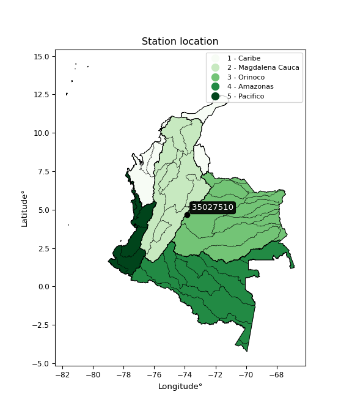

<div align="center">


</div>

# PMax24h Station (Rain): 35027510

Maximum Precipitation in 24 hours (PMax24h) is the greatest amount of rainfall for a specific duration that is meteorologically possible for a given location, acting as a "worst-case" scenario for extreme storms, crucial for designing safety-critical infrastructure like bridges, river deviations, dams, spillways, and nuclear plants to prevent catastrophic failure. The PMax24h is related with the Probable Maximum Precipitation (PMP) and it is calculated by hydrologists using meteorological data to determine the upper limit of extreme rainfall, often leading to the Probable Maximum Flood (PMF) for flood control design, and is increasingly being studied for climate change impacts. Probable Maximum Precipitation (PMP) is the theoretical upper limit of rainfall, a deterministic estimate for extreme events, while probability distributions (like GEV, Gumbel) describe the likelihood and frequency of various precipitation amounts, including rare ones, showing how often events occur, with PMP representing the extreme end of these distributions, used for critical infrastructure design to ensure safety against the worst conceivable weather, unlike standard statistical forecasts which cover typical probabilities.

The most common probability distributions in hydrology, used for analyzing floods, rainfall, and streamflow, include the Normal, Log-Normal, Gumbel, Gamma (including Log-Pearson Type III), and Generalized Extreme Value (GEV) distributions, often chosen based on the data´s skewness and whether modeling extremes or general conditions, with Gumbel and GEV popular for extreme events like floods, while the Normal distribution serves as a baseline, though often requiring transformations for skewed hydrological data. These distributions help in designing water infrastructure, managing water resources, and forecasting hydrologic events.

> Hydrological data often isn´t perfectly normal (it´s skewed), so different distributions are needed for different applications, such as: **Flood Frequency Analysis**: Using Gumbel, GEV, or Log-Pearson Type III for predicting extreme flood magnitudes and their return periods, **Rainfall Analysis**: Normal for annual totals, but Log-Normal, Weibull, or GEV for intensity or extreme daily rainfall, **Streamflow Modeling**: Gamma and Log-Normal for maximum flows, GEV for minimum flows, and Kappa for daily flows.

<div align="center">

</img>

</div>


## A. General information


### 1. General running parameters

• app_version: _v20260225_. • runtime: _2026-02-28 16:54:07.457399_. • Python version: _3.14.0_. • SciPy version: _1.16.3_. • Pandas version: _2.3.3_. • NumPy version: _2.3.5_. • Stations dataset (station_dataset_file): _dataset/pmax24h_in/automatic_colombia_2003_2025.csv_. • Stations catalog (station_catalog_file): _dataset/CNE.xls_. • Minimum year to eval til year_max (date_min): _1900_. • Maximum year to eval since year_min (date_max): _2025_. • Creates, save and include plots into reports (create_plot): _False_. • Plot only fit distributions with Δo > Δ (plot_only_fit): _True_. • Plot only simple graphs avoiding multiple CDFs and multiple Extreme values plots (plot_only_simple): _False_. • Eval low extreme values, if False, evaluates high extreme values (low_extreme): _False_. • Eval every SciPy distribution as logarithmic (pdist_logarithmic_on): _True_. • Standard deviation normalized (ddof): _1.0_. • Return periods to eval in years (Tr): _[2, 2.33, 5, 10, 15, 20, 25, 50, 75, 100, 200, 250, 500, 750, 1000]_. • Minimum data sample per station, 0 means any (minimum_sample): _5_. • Z-Score maximum threshold to adjust a value, 0 means disable (zscore_max): _3.5_. • Z-Score minimum threshold to adjust a value, 0 means disable (zscore_min): _-2.5_. • Avoid zeros, e.g. rain = 0 (avoid_zeros): _True_. • Avoid null values (avoid_nans): _True_. 

:file_folder:Table: [dataset.csv](../../dataset/pmax24h_in/automatic_colombia_2003_2025.csv)

> Delta Degrees of Freedom (DDOF): is a parameter used in the formulas for calculating variance and standard deviation. When ddof=0, the divisor is $N$ (the total number of observations) and this is used when your data set is the entire population. When ddof=1, the divisor is $N-1$ and this is used when your data set is a sample drawn from a larger population. Using $N-1$ provides an unbiased estimate of the population variance (known as Bessel´s correction).


### 2. Station info and location

|   id |   CODIGO | NOMBRE                    | CATEGORIA    | TECNOLOGIA                              | ESTADO           | FECHA_INSTALACION   | FECHA_SUSPENSION   |   ALTITUD |   LATITUD |   LONGITUD | DEPARTAMENTO   | MUNICIPIO   | AREA_OPERATIVA                            | ENTIDAD                                                     | AREA_HIDROGRAFICA   | ZONA_HIDROGRAFICA   | SUBZONA_HIDROGRAFICA   | CORRIENTE   | Catalogo   |   Version |
|-----:|---------:|:--------------------------|:-------------|:----------------------------------------|:-----------------|:--------------------|:-------------------|----------:|----------:|-----------:|:---------------|:------------|:------------------------------------------|:------------------------------------------------------------|:--------------------|:--------------------|:-----------------------|:------------|:-----------|----------:|
|    0 | 35027510 | CALOSTROS BAJO [35027510] | Limnigráfica | Automática con Telemetría, Convencional | En Mantenimiento | 24/05/2008          | 11/08/2025         |      2943 |    4.6645 |   -73.8631 | Cundinamarca   | La Calera   | Area Operativa 11 - Cundinamarca-Amazonas | INSTITUTO DE HIDROLOGIA METEOROLOGIA Y ESTUDIOS AMBIENTALES | Orinoco             | Meta                | Río Guayuriba          | Calostros   | CNE_IDEAM  |  20251226 |

<div align="center">

Dynamic map: [:earth_americas:Google](http://maps.google.com/maps?q=4.6645,-73.863083) [:earth_americas:OSM](https://www.openstreetmap.org/#map=18/4.6645/-73.863083&layers=P) [:earth_americas:Bing](https://www.bing.com/maps?cp=4.6645~-73.863083&lvl=18) [:earth_americas:Apple](https://maps.apple.com/frame?center=4.6645%2C-73.863083&span=0.003%2C0.006)

</div>


<div align="center">

```geojson
{
  "type": "Feature",
  "geometry": {
    "type": "Point", 
    "coordinates": [-73.863083, 4.6645]
  }, 
  "properties": {
    "Name": "35027510"
  }
}
```

</div>


### 3. Discrete values table and plot

<div align="center">

|               |           0 |           1 |          2 |           3 |           4 |           5 |           6 |           7 |
|:--------------|------------:|------------:|-----------:|------------:|------------:|------------:|------------:|------------:|
| Date          | 2017        | 2018        | 2019       | 2020        | 2021        | 2022        | 2023        | 2025        |
| Value         |   62.5      |   17.1      |  159       |   21.4      |   25.4      |    1        |    8.8      |    1        |
| Value_initial |   62.5      |   17.1      |  159       |   21.4      |   25.4      |    1        |    8.8      |    1        |
| count         |    8        |    8        |    8       |    8        |    8        |    8        |    8        |    8        |
| mean          |   37.025    |   37.025    |   37.025   |   37.025    |   37.025    |   37.025    |   37.025    |   37.025    |
| std           |   53.0437   |   53.0437   |   53.0437  |   53.0437   |   53.0437   |   53.0437   |   53.0437   |   53.0437   |
| zscore        |    0.480265 |   -0.375634 |    2.29952 |   -0.294569 |   -0.219159 |   -0.679157 |   -0.532109 |   -0.679157 |


</div>


> The initial value (value_initial) correspond to the initial obtained or null completed value, and value (value) is adjusted only when the initial value is outside the valid range (outlier) definite through the Z-Score value. If Z-Score is active, values out of range or outliers are replaced with the station mean value. A Z-Score (or standard score) measures how many standard deviations a data point is from the mean of a dataset, indicating its relative position; positive scores mean above the mean, negative mean below, and a score of zero is exactly at the mean, allowing for comparison of values from different distributions. It´s calculated using the formula $z=(x–μ)/σ$, where $x$ is the data point, $μ$ is the mean, and $σ$ is the standard deviation, helping identify outliers and understand probability.
>
> <sub>**Note**: In this study, "completing" (filling gaps in) and "extending" (forecasting or lengthening the historical record) rainfall data series are avoided for certain critical analyses because they introduce artificial bias and uncertainty, which can distort the statistics of rare events (extremes), alter day-to-day variability, and compromise the integrity and homogeneity of the original data. Some reasons against Completing/Extending rainfall data are: **Distortion of Extremes and Variability**: The primary issue is that most gap-filling or extension methods rely on averaging or regression with nearby stations, which inherently smooths the data. Rainfall is highly variable in space and time, with a large percentage of zero values and occasional large storms. Infilling methods often underestimate the highest values and overestimate the lowest (zero) values, which severely distorts analyses focused on flood frequency, drought severity, and intensity-duration-frequency (IDF) curves, **Loss of Data Homogeneity**: Infilled or extended data are synthetic estimates, not actual measurements. Combining these estimates with observed data can violate the assumption of data homogeneity, which requires that the data properties do not change over time. Inhomogeneity can lead to incorrect conclusions about long-term trends or changes in climate patterns, **Propagation of Errors**: Errors and biases from the original data (e.g., wind-induced undercatch, instrument errors, site changes) or the data used for imputation can propagate through the analysis, leading to unreliable hydrological models and inaccurate predictions, **Compromised Statistical Integrity**: For statistical analyses, especially those involving the frequency of events, using artificial data can introduce time bias or autocorrelation that doesn´t exist in reality, making it difficult to assess the true probability of events, **Difficulty in Validation**: It is difficult to accurately validate the quality of filled or extended data, especially for past periods where ground-truth measurements are unavailable. The reliability of imputation techniques heavily depends on the density of the surrounding station network and the complexity of the local topography.</sub>


### 4. Active continuous probability distributions from SciPy (80 of 104 available)

A Probability Density Function (PDF) describes the relative likelihood of a continuous random variable falling within a specific range, where the total area under its curve equals 1, and the area over any interval gives the actual probability for that range. Unlike discrete probabilities (like rolling a die), a PDF shows density, not direct probability for a single point (which is zero), with higher points indicating higher likelihood, often visualized as a bell curve for normal distributions.

A log of a probability density function (log-PDF) is simply the logarithm of the PDF´s value, denoted as $log(f(x))$, useful for converting multiplication of probabilities into addition, improving numerical stability with tiny numbers, and connecting to information theory concepts like entropy. Instead of dealing with very small probabilities (e.g., 0.000001), log-PDFs use negative numbers (e.g., $log(0.00001) ≈ -11.51$ that are easier for computers to handle, preventing underflow errors and simplifying complex calculations. In this study, each active probability distribution from SciPy is also evaluated in the $log$ form.

[scipy.stats](https://docs.scipy.org/doc/scipy/reference/stats.html) is a Python´s powerful submodule within the SciPy library for comprehensive statistical analysis, offering over 130 probability distributions (like Normal, Poisson, etc.), functions for descriptive stats (mean, variance), hypothesis testing (t-tests, chi-square), random variable generation, and statistical tests, making it essential for data science, modeling, and research. It provides tools to explore, model, and draw conclusions from data efficiently, working seamlessly with [NumPy](https://numpy.org/).

<div align="center">

|   id | p_dist           |   n_parameter | fit_method   | label                                                                       | active   | ref                                                                                                      |
|-----:|:-----------------|--------------:|:-------------|:----------------------------------------------------------------------------|:---------|:---------------------------------------------------------------------------------------------------------|
|    0 | alpha            |             3 | MLE          | Alpha                                                                       | True     | [:mortar_board:](https://docs.scipy.org/doc/scipy/reference/generated/scipy.stats.alpha.html)            |
|    1 | anglit           |             2 | MM           | Anglit                                                                      | True     | [:mortar_board:](https://docs.scipy.org/doc/scipy/reference/generated/scipy.stats.anglit.html)           |
|    2 | arcsine          |             2 | MM           | Arcsine                                                                     | True     | [:mortar_board:](https://docs.scipy.org/doc/scipy/reference/generated/scipy.stats.arcsine.html)          |
|    3 | argus            |             3 | MLE          | Argus                                                                       | True     | [:mortar_board:](https://docs.scipy.org/doc/scipy/reference/generated/scipy.stats.argus.html)            |
|    4 | beta             |             4 | MLE          | Beta                                                                        | True     | [:mortar_board:](https://docs.scipy.org/doc/scipy/reference/generated/scipy.stats.beta.html)             |
|    5 | betaprime        |             4 | MLE          | Beta prime                                                                  | True     | [:mortar_board:](https://docs.scipy.org/doc/scipy/reference/generated/scipy.stats.betaprime.html)        |
|    6 | bradford         |             3 | MLE          | Bradford                                                                    | True     | [:mortar_board:](https://docs.scipy.org/doc/scipy/reference/generated/scipy.stats.bradford.html)         |
|    7 | burr             |             4 | MLE          | Burr (Type III)                                                             | True     | [:mortar_board:](https://docs.scipy.org/doc/scipy/reference/generated/scipy.stats.burr.html)             |
|    8 | burr12           |             4 | MLE          | Burr (Type III) 12                                                          | True     | [:mortar_board:](https://docs.scipy.org/doc/scipy/reference/generated/scipy.stats.burr12.html)           |
|    9 | cosine           |             2 | MLE          | Cosine                                                                      | True     | [:mortar_board:](https://docs.scipy.org/doc/scipy/reference/generated/scipy.stats.cosine.html)           |
|   10 | crystalball      |             4 | MLE          | Crystalball                                                                 | True     | [:mortar_board:](https://docs.scipy.org/doc/scipy/reference/generated/scipy.stats.crystalball.html)      |
|   11 | dgamma           |             3 | MLE          | Double gamma                                                                | True     | [:mortar_board:](https://docs.scipy.org/doc/scipy/reference/generated/scipy.stats.dgamma.html)           |
|   12 | dweibull         |             3 | MLE          | Double Weibull                                                              | True     | [:mortar_board:](https://docs.scipy.org/doc/scipy/reference/generated/scipy.stats.dweibull.html)         |
|   13 | erlang           |             3 | MLE          | Erlang                                                                      | True     | [:mortar_board:](https://docs.scipy.org/doc/scipy/reference/generated/scipy.stats.erlang.html)           |
|   14 | exponnorm        |             3 | MLE          | Exponentially modified Normal                                               | True     | [:mortar_board:](https://docs.scipy.org/doc/scipy/reference/generated/scipy.stats.exponnorm.html)        |
|   15 | exponpow         |             3 | MLE          | Exponential power                                                           | True     | [:mortar_board:](https://docs.scipy.org/doc/scipy/reference/generated/scipy.stats.exponpow.html)         |
|   16 | exponweib        |             4 | MLE          | Exponentiated Weibull                                                       | True     | [:mortar_board:](https://docs.scipy.org/doc/scipy/reference/generated/scipy.stats.exponweib.html)        |
|   17 | f                |             4 | MLE          | F                                                                           | True     | [:mortar_board:](https://docs.scipy.org/doc/scipy/reference/generated/scipy.stats.f.html)                |
|   18 | fatiguelife      |             3 | MLE          | Fatigue-life (Birnbaum-Saunders)                                            | True     | [:mortar_board:](https://docs.scipy.org/doc/scipy/reference/generated/scipy.stats.fatiguelife.html)      |
|   19 | foldnorm         |             3 | MM           | Fold Normal                                                                 | True     | [:mortar_board:](https://docs.scipy.org/doc/scipy/reference/generated/scipy.stats.foldnorm.html)         |
|   20 | gamma            |             3 | MLE          | Gamma                                                                       | True     | [:mortar_board:](https://docs.scipy.org/doc/scipy/reference/generated/scipy.stats.gamma.html)            |
|   21 | gausshyper       |             6 | MLE          | Gauss hypergeometric                                                        | True     | [:mortar_board:](https://docs.scipy.org/doc/scipy/reference/generated/scipy.stats.gausshyper.html)       |
|   22 | genexpon         |             5 | MLE          | Generalized exponential                                                     | True     | [:mortar_board:](https://docs.scipy.org/doc/scipy/reference/generated/scipy.stats.genexpon.html)         |
|   23 | genextreme       |             3 | MLE          | Generalized exponential                                                     | True     | [:mortar_board:](https://docs.scipy.org/doc/scipy/reference/generated/scipy.stats.genextreme.html)       |
|   24 | gengamma         |             4 | MLE          | Generalized gamma                                                           | True     | [:mortar_board:](https://docs.scipy.org/doc/scipy/reference/generated/scipy.stats.gengamma.html)         |
|   25 | genhalflogistic  |             3 | MLE          | Generalized half-logistic                                                   | True     | [:mortar_board:](https://docs.scipy.org/doc/scipy/reference/generated/scipy.stats.genhalflogistic.html)  |
|   26 | genlogistic      |             3 | MLE          | Generalized logistic                                                        | True     | [:mortar_board:](https://docs.scipy.org/doc/scipy/reference/generated/scipy.stats.genlogistic.html)      |
|   27 | gennorm          |             3 | MLE          | Generalized Normal                                                          | True     | [:mortar_board:](https://docs.scipy.org/doc/scipy/reference/generated/scipy.stats.gennorm.html)          |
|   28 | genpareto        |             3 | MLE          | Generalized Pareto                                                          | True     | [:mortar_board:](https://docs.scipy.org/doc/scipy/reference/generated/scipy.stats.genpareto.html)        |
|   29 | gompertz         |             3 | MLE          | Gompertz (or truncated Gumbel)                                              | True     | [:mortar_board:](https://docs.scipy.org/doc/scipy/reference/generated/scipy.stats.gompertz.html)         |
|   30 | gumbel_l         |             2 | MM           | Gumbel Left Skew                                                            | True     | [:mortar_board:](https://docs.scipy.org/doc/scipy/reference/generated/scipy.stats.gumbel_l.html)         |
|   31 | gumbel_r         |             2 | MM           | Gumbel Right Skew                                                           | True     | [:mortar_board:](https://docs.scipy.org/doc/scipy/reference/generated/scipy.stats.gumbel_r.html)         |
|   32 | halfgennorm      |             3 | MLE          | Upper half of a generalized normal                                          | True     | [:mortar_board:](https://docs.scipy.org/doc/scipy/reference/generated/scipy.stats.halfgennorm.html)      |
|   33 | halflogistic     |             2 | MM           | Half-logistic                                                               | True     | [:mortar_board:](https://docs.scipy.org/doc/scipy/reference/generated/scipy.stats.halflogistic.html)     |
|   34 | halfnorm         |             2 | MM           | Half Normal                                                                 | True     | [:mortar_board:](https://docs.scipy.org/doc/scipy/reference/generated/scipy.stats.halfnorm.html)         |
|   35 | hypsecant        |             2 | MM           | hyperbolic secant                                                           | True     | [:mortar_board:](https://docs.scipy.org/doc/scipy/reference/generated/scipy.stats.hypsecant.html)        |
|   36 | invgamma         |             3 | MLE          | Inverted gamma                                                              | True     | [:mortar_board:](https://docs.scipy.org/doc/scipy/reference/generated/scipy.stats.invgamma.html)         |
|   37 | invgauss         |             3 | MLE          | Inverse Gaussian                                                            | True     | [:mortar_board:](https://docs.scipy.org/doc/scipy/reference/generated/scipy.stats.invgauss.html)         |
|   38 | invweibull       |             3 | MLE          | Inverted Weibull                                                            | True     | [:mortar_board:](https://docs.scipy.org/doc/scipy/reference/generated/scipy.stats.invweibull.html)       |
|   39 | johnsonsb        |             4 | MLE          | Johnson SB                                                                  | True     | [:mortar_board:](https://docs.scipy.org/doc/scipy/reference/generated/scipy.stats.johnsonsb.html)        |
|   40 | johnsonsu        |             4 | MLE          | Johnson Su                                                                  | True     | [:mortar_board:](https://docs.scipy.org/doc/scipy/reference/generated/scipy.stats.johnsonsu.html)        |
|   41 | kappa3           |             3 | MLE          | Kappa 3                                                                     | True     | [:mortar_board:](https://docs.scipy.org/doc/scipy/reference/generated/scipy.stats.kappa3.html)           |
|   42 | kappa4           |             4 | MLE          | Kappa 4                                                                     | True     | [:mortar_board:](https://docs.scipy.org/doc/scipy/reference/generated/scipy.stats.kappa4.html)           |
|   43 | ksone            |             3 | MLE          | Kolmogorov-Smirnov one-sided test statistic distribution                    | True     | [:mortar_board:](https://docs.scipy.org/doc/scipy/reference/generated/scipy.stats.ksone.html)            |
|   44 | kstwobign        |             2 | MLE          | Limiting distribution of scaled Kolmogorov-Smirnov two-sided test statistic | True     | [:mortar_board:](https://docs.scipy.org/doc/scipy/reference/generated/scipy.stats.kstwobign.html)        |
|   45 | laplace          |             2 | MM           | Laplace                                                                     | True     | [:mortar_board:](https://docs.scipy.org/doc/scipy/reference/generated/scipy.stats.laplace.html)          |
|   46 | levy_l           |             2 | MLE          | Left-skewed Levy                                                            | True     | [:mortar_board:](https://docs.scipy.org/doc/scipy/reference/generated/scipy.stats.levy_l.html)           |
|   47 | loggamma         |             3 | MLE          | Log gamma                                                                   | True     | [:mortar_board:](https://docs.scipy.org/doc/scipy/reference/generated/scipy.stats.loggamma.html)         |
|   48 | logistic         |             2 | MM           | Logistic (or Sech-squared)                                                  | True     | [:mortar_board:](https://docs.scipy.org/doc/scipy/reference/generated/scipy.stats.logistic.html)         |
|   49 | loglaplace       |             3 | MLE          | Log-Laplace                                                                 | True     | [:mortar_board:](https://docs.scipy.org/doc/scipy/reference/generated/scipy.stats.loglaplace.html)       |
|   50 | lomax            |             3 | MLE          | Lomax (Pareto of the second kind)                                           | True     | [:mortar_board:](https://docs.scipy.org/doc/scipy/reference/generated/scipy.stats.lomax.html)            |
|   51 | maxwell          |             2 | MM           | Maxwell                                                                     | True     | [:mortar_board:](https://docs.scipy.org/doc/scipy/reference/generated/scipy.stats.maxwell.html)          |
|   52 | mielke           |             4 | MLE          | Mielke Beta-Kappa / Dagum                                                   | True     | [:mortar_board:](https://docs.scipy.org/doc/scipy/reference/generated/scipy.stats.mielke.html)           |
|   53 | moyal            |             2 | MM           | Moyal                                                                       | True     | [:mortar_board:](https://docs.scipy.org/doc/scipy/reference/generated/scipy.stats.moyal.html)            |
|   54 | nakagami         |             3 | MLE          | Nakagami                                                                    | True     | [:mortar_board:](https://docs.scipy.org/doc/scipy/reference/generated/scipy.stats.nakagami.html)         |
|   55 | ncf              |             5 | MLE          | Non-central F distribution                                                  | True     | [:mortar_board:](https://docs.scipy.org/doc/scipy/reference/generated/scipy.stats.ncf.html)              |
|   56 | nct              |             4 | MLE          | Non-central Student’s t                                                     | True     | [:mortar_board:](https://docs.scipy.org/doc/scipy/reference/generated/scipy.stats.nct.html)              |
|   57 | norm             |             2 | MM           | Normal                                                                      | True     | [:mortar_board:](https://docs.scipy.org/doc/scipy/reference/generated/scipy.stats.norm.html)             |
|   58 | pearson3         |             3 | MM           | Pearson type III                                                            | True     | [:mortar_board:](https://docs.scipy.org/doc/scipy/reference/generated/scipy.stats.pearson3.html)         |
|   59 | powerlaw         |             3 | MLE          | Power-function                                                              | True     | [:mortar_board:](https://docs.scipy.org/doc/scipy/reference/generated/scipy.stats.powerlaw.html)         |
|   60 | rayleigh         |             2 | MM           | Rayleigh                                                                    | True     | [:mortar_board:](https://docs.scipy.org/doc/scipy/reference/generated/scipy.stats.rayleigh.html)         |
|   61 | rdist            |             3 | MLE          | R-distributed (symmetric beta)                                              | True     | [:mortar_board:](https://docs.scipy.org/doc/scipy/reference/generated/scipy.stats.rdist.html)            |
|   62 | rice             |             3 | MLE          | Rice                                                                        | True     | [:mortar_board:](https://docs.scipy.org/doc/scipy/reference/generated/scipy.stats.rice.html)             |
|   63 | semicircular     |             2 | MM           | Semicircular                                                                | True     | [:mortar_board:](https://docs.scipy.org/doc/scipy/reference/generated/scipy.stats.semicircular.html)     |
|   64 | skewnorm         |             3 | MLE          | Skew normal                                                                 | True     | [:mortar_board:](https://docs.scipy.org/doc/scipy/reference/generated/scipy.stats.skewnorm.html)         |
|   65 | t                |             3 | MLE          | Student’s t                                                                 | True     | [:mortar_board:](https://docs.scipy.org/doc/scipy/reference/generated/scipy.stats.t.html)                |
|   66 | trapezoid        |             4 | MLE          | Trapezoid                                                                   | True     | [:mortar_board:](https://docs.scipy.org/doc/scipy/reference/generated/scipy.stats.trapezoid.html)        |
|   67 | triang           |             3 | MLE          | Triangular                                                                  | True     | [:mortar_board:](https://docs.scipy.org/doc/scipy/reference/generated/scipy.stats.triang.html)           |
|   68 | truncexpon       |             3 | MLE          | Truncated exponential                                                       | True     | [:mortar_board:](https://docs.scipy.org/doc/scipy/reference/generated/scipy.stats.truncexpon.html)       |
|   69 | truncnorm        |             4 | MLE          | Truncated normal                                                            | True     | [:mortar_board:](https://docs.scipy.org/doc/scipy/reference/generated/scipy.stats.truncnorm.html)        |
|   70 | truncpareto      |             4 | MLE          | Upper truncated Pareto                                                      | True     | [:mortar_board:](https://docs.scipy.org/doc/scipy/reference/generated/scipy.stats.truncpareto.html)      |
|   71 | truncweibull_min |             5 | MLE          | Doubly truncated Weibull minimum                                            | True     | [:mortar_board:](https://docs.scipy.org/doc/scipy/reference/generated/scipy.stats.truncweibull_min.html) |
|   72 | tukeylambda      |             3 | MLE          | Tukey-Lamdba                                                                | True     | [:mortar_board:](https://docs.scipy.org/doc/scipy/reference/generated/scipy.stats.tukeylambda.html)      |
|   73 | uniform          |             2 | MLE          | Uniform                                                                     | True     | [:mortar_board:](https://docs.scipy.org/doc/scipy/reference/generated/scipy.stats.uniform.html)          |
|   74 | vonmises         |             3 | MLE          | Von Mises                                                                   | True     | [:mortar_board:](https://docs.scipy.org/doc/scipy/reference/generated/scipy.stats.vonmises.html)         |
|   75 | vonmises_line    |             3 | MLE          | Von Mises line                                                              | True     | [:mortar_board:](https://docs.scipy.org/doc/scipy/reference/generated/scipy.stats.vonmises_line.html)    |
|   76 | wald             |             2 | MM           | Wald                                                                        | True     | [:mortar_board:](https://docs.scipy.org/doc/scipy/reference/generated/scipy.stats.wald.html)             |
|   77 | weibull_max      |             3 | MLE          | Weibull maximum                                                             | True     | [:mortar_board:](https://docs.scipy.org/doc/scipy/reference/generated/scipy.stats.weibull_max.html)      |
|   78 | weibull_min      |             3 | MLE          | Weibull minimum                                                             | True     | [:mortar_board:](https://docs.scipy.org/doc/scipy/reference/generated/scipy.stats.weibull_min.html)      |
|   79 | wrapcauchy       |             3 | MLE          | Wrapped  Cauchy                                                             | True     | [:mortar_board:](https://docs.scipy.org/doc/scipy/reference/generated/scipy.stats.wrapcauchy.html)       |

</div>

> **n_parameter:** # arguments & localization & scale.
>
> **Fit methods:** (MLE) maximum likelihood, (MM) L-moments.
>
>**Inactive** (With the only purpose of prevent loops, zero divisions, infinite values, over high estimated values or horizontal trending for recurrence intervals estimations, the follow distributions were disabled.)**:** lognorm, norminvgauss, powernorm, powerlognorm, cauchy, halfcauchy, foldcauchy, skewcauchy, chi2, expon, fisk, genhyperbolic, geninvgauss, gibrat, kstwo, laplace_asymmetric, levy, levy_stable, ncx2, pareto, rel_breitwigner, recipinvgauss, studentized_range, loguniform, 


## B. Probability (PDF) vs. Empirical (EDF) distributions functions

A continuous probability distribution (CPD) describes probabilities for variables that can take any value within a range (like rain any time), unlike discrete variables with specific outcomes (like temperature). It uses a Probability Density Function (PDF), a curve where the total area under it equals 1, and the probability of the variable falling within an interval (a to b) is found by calculating the area under the curve between those points. A key feature is that the probability of hitting any single exact value is zero, so probabilities are always expressed for ranges, e.g., $P(a ≤ X ≤ b)$.

<div align="center">

Distributions parameters from station values
|     |   station | p_dist              |   n |               loc |            scale | shape                  | shape1                 | shape2                 | shape3             |
|----:|----------:|:--------------------|----:|------------------:|-----------------:|:-----------------------|:-----------------------|:-----------------------|:-------------------|
|   0 |  35027510 | alpha               |   8 |     -6.80474      |     13.9403      | 2.1627163321106047e-06 |                        |                        |                    |
|   1 |  35027510 | anglit              |   8 |     37.025        |    145.152       |                        |                        |                        |                    |
|   2 |  35027510 | arcsine             |   8 |    -33.1452       |    140.34        |                        |                        |                        |                    |
|   3 |  35027510 | argus               |   8 |    -41.7667       |    203.672       | 3.1060791538233854e-11 |                        |                        |                    |
|   4 |  35027510 | beta                |   8 |    -13.7439       |    172.744       | 0.14673230664273085    | 0.35255339817931225    |                        |                    |
|   5 |  35027510 | betaprime           |   8 |      1            |    245.626       | 0.3257010396938449     | 3.5291872629719148     |                        |                    |
|   6 |  35027510 | bradford            |   8 |     -1.16106      |    160.161       | 3.5790503660048287     |                        |                        |                    |
|   7 |  35027510 | burr                |   8 |      1            |     38.5193      | 1.7396301014853075     | 0.20152999409239866    |                        |                    |
|   8 |  35027510 | burr12              |   8 |      1            |    667.519       | 0.7581168268453775     | 17.76322057551868      |                        |                    |
|   9 |  35027510 | cosine              |   8 |     49.5781       |     46.3301      |                        |                        |                        |                    |
|  10 |  35027510 | crystalball         |   8 |     37.025        |     49.6178      | 26402.724922875524     | 1458.502110988219      |                        |                    |
|  11 |  35027510 | dgamma              |   8 |     21.4          |     45.6931      | 0.7137209649745504     |                        |                        |                    |
|  12 |  35027510 | dweibull            |   8 |     21.4          |     48.355       | 0.8611533576849628     |                        |                        |                    |
|  13 |  35027510 | erlang              |   8 |      1            |     48.7606      | 0.6976343676911219     |                        |                        |                    |
|  14 |  35027510 | exponnorm           |   8 |      0.954636     |      0.0138685   | 2581.1652719250687     |                        |                        |                    |
|  15 |  35027510 | exponpow            |   8 |      1            |    114.89        | 0.4019411373445104     |                        |                        |                    |
|  16 |  35027510 | exponweib           |   8 |      1            |     60.8554      | 0.45069969927613285    | 1.0197342583726683     |                        |                    |
|  17 |  35027510 | f                   |   8 |      1            |     66.4827      | 0.8189098367430926     | 12.329221416979877     |                        |                    |
|  18 |  35027510 | fatiguelife         |   8 |      1            |      2.86988e-05 | 854.2655925215067      |                        |                        |                    |
|  19 |  35027510 | foldnorm            |   8 |    -33.128        |     87.6359      | 0.0011730235474535834  |                        |                        |                    |
|  20 |  35027510 | gamma               |   8 |      1            |     66.2857      | 0.15924663164677538    |                        |                        |                    |
|  21 |  35027510 | gausshyper          |   8 |      1            |    195.843       | 0.5258326493880664     | 1.1063780142380921     | 1.9609763158576503     | 1.7497857607952028 |
|  22 |  35027510 | genexpon            |   8 |      1            |     60.0964      | 1.6681862694675107     | 4.9996449974016164e-12 | 2.0701072095196005     |                    |
|  23 |  35027510 | genextreme          |   8 |      3.33182      |     18.9328      | -8.119318043406665     |                        |                        |                    |
|  24 |  35027510 | gengamma            |   8 |      1            |     55.6309      | 0.475556257495302      | 1.3259001955488705     |                        |                    |
|  25 |  35027510 | genhalflogistic     |   8 |    -15.2785       |    181.427       | 1.0410166391425584     |                        |                        |                    |
|  26 |  35027510 | genlogistic         |   8 |   -189.377        |     26.5596      | 2436.8137295652077     |                        |                        |                    |
|  27 |  35027510 | gennorm             |   8 |     17.1          |      0.594954    | 0.3396190034600388     |                        |                        |                    |
|  28 |  35027510 | genpareto           |   8 |      1            |     14.5367      | 0.7845973376181297     |                        |                        |                    |
|  29 |  35027510 | gompertz            |   8 |      0.999487     | 373879           | 10216.262537760613     |                        |                        |                    |
|  30 |  35027510 | gumbel_l            |   8 |     59.3557       |     38.6868      |                        |                        |                        |                    |
|  31 |  35027510 | gumbel_r            |   8 |     14.6943       |     38.6868      |                        |                        |                        |                    |
|  32 |  35027510 | halfgennorm         |   8 |      0.979654     |      7.44843e-05 | 0.1573147536651866     |                        |                        |                    |
|  33 |  35027510 | halflogistic        |   8 |    -21.7836       |     42.4215      |                        |                        |                        |                    |
|  34 |  35027510 | halfnorm            |   8 |    -28.6495       |     82.3108      |                        |                        |                        |                    |
|  35 |  35027510 | hypsecant           |   8 |     37.025        |     31.5877      |                        |                        |                        |                    |
|  36 |  35027510 | invgamma            |   8 |     -2.9619       |     10.1922      | 0.9395010484335973     |                        |                        |                    |
|  37 |  35027510 | invgauss            |   8 |     -1.34858      |      8.89792     | 4.3126384107743165     |                        |                        |                    |
|  38 |  35027510 | invweibull          |   8 |      1            |      2.62914     | 0.041533466190769794   |                        |                        |                    |
|  39 |  35027510 | johnsonsb           |   8 |      1            |    686.646       | 1.3513188138961016     | 0.09988124090675497    |                        |                    |
|  40 |  35027510 | johnsonsu           |   8 |      1            |      2.45037e-10 | -1.406486308854962     | 0.14291555850046744    |                        |                    |
|  41 |  35027510 | kappa3              |   8 |      1            |      1.41526     | 0.007052135664253006   |                        |                        |                    |
|  42 |  35027510 | kappa4              |   8 |    -14.2236       |    177.162       | 1.0941040750862308     | 1.0210037454827394     |                        |                    |
|  43 |  35027510 | ksone               |   8 |    -14.8          |    189.6         | 1.0                    |                        |                        |                    |
|  44 |  35027510 | kstwobign           |   8 |    -87.122        |    145.442       |                        |                        |                        |                    |
|  45 |  35027510 | laplace             |   8 |     37.025        |     35.0851      |                        |                        |                        |                    |
|  46 |  35027510 | levy_l              |   8 |    173.883        |     70.5044      |                        |                        |                        |                    |
|  47 |  35027510 | loggamma            |   8 | -17849.2          |   2344.89        | 2054.6183718857        |                        |                        |                    |
|  48 |  35027510 | logistic            |   8 |     37.025        |     27.3557      |                        |                        |                        |                    |
|  49 |  35027510 | loglaplace          |   8 |      1            |     22.322       | 0.39961724283519917    |                        |                        |                    |
|  50 |  35027510 | lomax               |   8 |      1            |     18.535       | 1.2746244631575825     |                        |                        |                    |
|  51 |  35027510 | maxwell             |   8 |    -80.5484       |     73.6782      |                        |                        |                        |                    |
|  52 |  35027510 | mielke              |   8 |      1            |     49.1107      | 0.6861285134440929     | 2.7088035675935433     |                        |                    |
|  53 |  35027510 | moyal               |   8 |      8.65035      |     22.3359      |                        |                        |                        |                    |
|  54 |  35027510 | nakagami            |   8 |      1            |     90.7778      | 0.17761592207052654    |                        |                        |                    |
|  55 |  35027510 | ncf                 |   8 |      1            |     19.8188      | 1.0770314826492187     | 2.267705197213485      | 1.1344491746122551     |                    |
|  56 |  35027510 | nct                 |   8 |      0.722531     |      0.20888     | 0.27513374811401076    | 3.0352556039632654     |                        |                    |
|  57 |  35027510 | norm                |   8 |     37.025        |     49.6178      |                        |                        |                        |                    |
|  58 |  35027510 | pearson3            |   8 |     37.025        |     49.6178      | 1.7416116094579204     |                        |                        |                    |
|  59 |  35027510 | powerlaw            |   8 |      1            |    158           | 0.08533363538537077    |                        |                        |                    |
|  60 |  35027510 | rayleigh            |   8 |    -57.8968       |     75.7366      |                        |                        |                        |                    |
|  61 |  35027510 | rdist               |   8 |    -14.1348       |     76.6348      | 1.1885837189636854     |                        |                        |                    |
|  62 |  35027510 | rice                |   8 |    -33.6605       |     61.0671      | 0.00019467315929109442 |                        |                        |                    |
|  63 |  35027510 | semicircular        |   8 |     37.025        |     99.2356      |                        |                        |                        |                    |
|  64 |  35027510 | skewnorm            |   8 |      0.999975     |     61.326       | 13144948.319487303     |                        |                        |                    |
|  65 |  35027510 | t                   |   8 |     15.0049       |     12.2003      | 1.0757269606431807     |                        |                        |                    |
|  66 |  35027510 | trapezoid           |   8 |    -15.54         |    189.6         | 1.0                    | 1.0                    |                        |                    |
|  67 |  35027510 | triang              |   8 |   -107.243        |    266.243       | 0.9999999988818442     |                        |                        |                    |
|  68 |  35027510 | truncexpon          |   8 |      0.997651     |    124.59        | 1.268178450104215      |                        |                        |                    |
|  69 |  35027510 | truncnorm           |   8 |   -149.794        |     88.1079      | 1.7114642202765247     | 305.3613089221377      |                        |                    |
|  70 |  35027510 | truncpareto         |   8 |     -0.188589     |      1.18859     | 0.0007901172969950175  | 133.93070333133562     |                        |                    |
|  71 |  35027510 | truncweibull_min    |   8 |     -1.81983      |    198.214       | 0.00853165251772886    | 0.003908564482553478   | 0.8113461817988035     |                    |
|  72 |  35027510 | tukeylambda         |   8 |     -2.77224      |     68.2676      | 1.0458900086428584     |                        |                        |                    |
|  73 |  35027510 | uniform             |   8 |      1            |    158           |                        |                        |                        |                    |
|  74 |  35027510 | vonmises            |   8 |      1.2749       |      1           | 0.760834392389436      |                        |                        |                    |
|  75 |  35027510 | vonmises_line       |   8 |     25.3394       |     42.5455      | 1.7556190881369025     |                        |                        |                    |
|  76 |  35027510 | wald                |   8 |    -12.5928       |     49.6178      |                        |                        |                        |                    |
|  77 |  35027510 | weibull_max         |   8 |    159            |      1.73505     | 0.2203125731210298     |                        |                        |                    |
|  78 |  35027510 | weibull_min         |   8 |      1            |     30.1668      | 0.8531103846021161     |                        |                        |                    |
|  79 |  35027510 | wrapcauchy          |   8 |      0.999998     |     25.1472      | 0.7057632795649229     |                        |                        |                    |
|  80 |  35027510 | logalpha            |   8 |    -31.4457       |    657.768       | 19.39213833101539      |                        |                        |                    |
|  81 |  35027510 | loganglit           |   8 |      2.56451      |      4.94057     |                        |                        |                        |                    |
|  82 |  35027510 | logarcsine          |   8 |      0.176111     |      4.77679     |                        |                        |                        |                    |
|  83 |  35027510 | logargus            |   8 |     -1.37195      |      6.70634     | 0.4806158424802033     |                        |                        |                    |
|  84 |  35027510 | logbeta             |   8 |     -1.00335      |      6.07225     | 1.7837265685809136     | 0.47842729852744836    |                        |                    |
|  85 |  35027510 | logbetaprime        |   8 |   -223.376        |   3240.06        | 19040.15947756079      | 273041.63340588915     |                        |                    |
|  86 |  35027510 | logbradford         |   8 |     -0.0785483    |      5.15613     | 1.6258195985898333e-05 |                        |                        |                    |
|  87 |  35027510 | logburr             |   8 |     -3.28626e-31  |      2.04946     | 1.1179539215340273     | 0.5543099184634889     |                        |                    |
|  88 |  35027510 | logburr12           |   8 |     -4.8707e-30   |      2.3874      | 0.27821832506771293    | 1.655977067940875      |                        |                    |
|  89 |  35027510 | logcosine           |   8 |      2.49115      |      1.39232     |                        |                        |                        |                    |
|  90 |  35027510 | logcrystalball      |   8 |      2.5645       |      1.68885     | 243.74096168697622     | 33.842167907094634     |                        |                    |
|  91 |  35027510 | logdgamma           |   8 |      3.06339      |      1.29599     | 0.8432590092583341     |                        |                        |                    |
|  92 |  35027510 | logdweibull         |   8 |      3.06339      |      1.30106     | 0.889688513594         |                        |                        |                    |
|  93 |  35027510 | logerlang           |   8 |    -24.6374       |      0.107973    | 251.8831740564312      |                        |                        |                    |
|  94 |  35027510 | logexponnorm        |   8 |      2.56309      |      1.68886     | 0.0008431488302411365  |                        |                        |                    |
|  95 |  35027510 | logexponpow         |   8 |     -2.43252e-27  |      3.24855     | 0.5401643097182289     |                        |                        |                    |
|  96 |  35027510 | logexponweib        |   8 |     -1.5964e-30   |      3.57285     | 0.10574977586376025    | 2.3857407496681984     |                        |                    |
|  97 |  35027510 | logf                |   8 |     -1.21549e-30  |      1.3372      | 1.4239375961256542     | 1.2312941669166668     |                        |                    |
|  98 |  35027510 | logfatiguelife      |   8 |     -3.40945e-13  |      1.07925e-06 | 1343.7377075169316     |                        |                        |                    |
|  99 |  35027510 | logfoldnorm         |   8 |    -10.1244       |      1.61365     | 7.874712552011223      |                        |                        |                    |
| 100 |  35027510 | loggamma            |   8 |    -22.5777       |      0.117168    | 214.6191305228615      |                        |                        |                    |
| 101 |  35027510 | loggausshyper       |   8 |     -0.0415512    |      5.11046     | 1.0515887522779357     | 0.8510627275523439     | 1.0060805935974515     | 1.1621729152855584 |
| 102 |  35027510 | loggenexpon         |   8 |     -0.000448489  |      0.0218764   | 0.004852707752392655   | 3.846178624920454      | 1.1337148939543422e-05 |                    |
| 103 |  35027510 | loggenextreme       |   8 |      2.22314      |      1.88145     | 0.5814842700393841     |                        |                        |                    |
| 104 |  35027510 | loggengamma         |   8 |     -2.40314e-30  |      2.81157     | 0.8703834977913949     | 0.7355038582714264     |                        |                    |
| 105 |  35027510 | loggenhalflogistic  |   8 |     -0.527925     |      5.89894     | 1.0539792383669306     |                        |                        |                    |
| 106 |  35027510 | loggenlogistic      |   8 |      3.80517      |      0.615826    | 0.3971324723389542     |                        |                        |                    |
| 107 |  35027510 | loggennorm          |   8 |      3.06339      |      0.0178326   | 0.31457509561584085    |                        |                        |                    |
| 108 |  35027510 | loggenpareto        |   8 |     -4.33677e-08  |      3.05047     | -0.5220215973162681    |                        |                        |                    |
| 109 |  35027510 | loggompertz         |   8 |     -1.87784e-07  |      2.17894     | 0.3098423204524068     |                        |                        |                    |
| 110 |  35027510 | loggumbel_l         |   8 |      3.32458      |      1.31679     |                        |                        |                        |                    |
| 111 |  35027510 | loggumbel_r         |   8 |      1.80443      |      1.31679     |                        |                        |                        |                    |
| 112 |  35027510 | loghalfgennorm      |   8 |     -4.89833e-11  |      1.25661     | 0.6798763455417769     |                        |                        |                    |
| 113 |  35027510 | loghalflogistic     |   8 |      0.562813     |      1.44391     |                        |                        |                        |                    |
| 114 |  35027510 | loghalfnorm         |   8 |      0.329141     |      2.80161     |                        |                        |                        |                    |
| 115 |  35027510 | loghypsecant        |   8 |      2.56451      |      1.07516     |                        |                        |                        |                    |
| 116 |  35027510 | loginvgamma         |   8 |    -24.8064       |   6776.22        | 248.5586319885739      |                        |                        |                    |
| 117 |  35027510 | loginvgauss         |   8 |     -9.40196      |    533.579       | 0.022349624570944637   |                        |                        |                    |
| 118 |  35027510 | loginvweibull       |   8 |     -9.81753e+07  |      9.81753e+07 | 59288271.431972645     |                        |                        |                    |
| 119 |  35027510 | logjohnsonsb        |   8 |     -0.473588     |      5.54249     | -0.8487717219644685    | 0.1349541550660208     |                        |                    |
| 120 |  35027510 | logjohnsonsu        |   8 |      8.8859       |      0.633972    | 11.037744817110656     | 3.7296500064356093     |                        |                    |
| 121 |  35027510 | logkappa3           |   8 |     -0.038754     |      5.03065     | 144.39713943291054     |                        |                        |                    |
| 122 |  35027510 | logkappa4           |   8 |     -0.317819     |      5.76199     | 1.058493052681408      | 1.066141517817095      |                        |                    |
| 123 |  35027510 | logksone            |   8 |     -0.360673     |      5.85036     | 1.0                    |                        |                        |                    |
| 124 |  35027510 | logkstwobign        |   8 |     -4.01782      |      7.50145     |                        |                        |                        |                    |
| 125 |  35027510 | loglaplace          |   8 |      2.56451      |      1.1942      |                        |                        |                        |                    |
| 126 |  35027510 | loglevy_l           |   8 |      5.3141       |      1.15094     |                        |                        |                        |                    |
| 127 |  35027510 | logloggamma         |   8 |      1.89897      |      2.05741     | 1.85320747483165       |                        |                        |                    |
| 128 |  35027510 | loglogistic         |   8 |      2.56451      |      0.931113    |                        |                        |                        |                    |
| 129 |  35027510 | logloglaplace       |   8 |     -1.266e-28    |      2.49882     | 0.5684123584866653     |                        |                        |                    |
| 130 |  35027510 | loglomax            |   8 |     -3.12516e-09  |      1.5887      | 1.123612459596964      |                        |                        |                    |
| 131 |  35027510 | logmaxwell          |   8 |     -1.43737      |      2.5078      |                        |                        |                        |                    |
| 132 |  35027510 | logmielke           |   8 |     -3.62213e-30  |      1.44273     | 0.2588861280326708     | 0.6262517316443305     |                        |                    |
| 133 |  35027510 | logmoyal            |   8 |      1.59871      |      0.760251    |                        |                        |                        |                    |
| 134 |  35027510 | lognakagami         |   8 |     -6.96529e-30  |      1.98126     | 0.17100228916211924    |                        |                        |                    |
| 135 |  35027510 | logncf              |   8 |     -1.14867e-30  |      1.21818     | 1.4517005145856952     | 1.298686758428008      | 0.9851414545689235     |                    |
| 136 |  35027510 | lognct              |   8 |    -89.5894       |      1.65625     | 37571.6394886519       | 55.638865655860215     |                        |                    |
| 137 |  35027510 | lognorm             |   8 |      2.56451      |      1.68885     |                        |                        |                        |                    |
| 138 |  35027510 | logpearson3         |   8 |      2.5645       |      1.68886     | -0.3571173614161286    |                        |                        |                    |
| 139 |  35027510 | logpowerlaw         |   8 |     -2.22507e-308 |      5.0689      | 0.005623422002764265   |                        |                        |                    |
| 140 |  35027510 | lograyleigh         |   8 |     -0.666368     |      2.57786     |                        |                        |                        |                    |
| 141 |  35027510 | logrdist            |   8 |      0.511033     |      2.72372     | 1.062007311144225      |                        |                        |                    |
| 142 |  35027510 | logrice             |   8 |     -1.09461      |      1.91507     | 1.5583768502145694     |                        |                        |                    |
| 143 |  35027510 | logsemicircular     |   8 |      2.56451      |      3.3777      |                        |                        |                        |                    |
| 144 |  35027510 | logskewnorm         |   8 |      4.5775       |      2.62762     | -3.143448352463043     |                        |                        |                    |
| 145 |  35027510 | logt                |   8 |      2.56451      |      1.68885     | 687713499582.2117      |                        |                        |                    |
| 146 |  35027510 | logtrapezoid        |   8 |     -0.532235     |      6.08269     | 1.0                    | 1.0                    |                        |                    |
| 147 |  35027510 | logtriang           |   8 |     -1.7862       |      6.85702     | 0.9999999998447162     |                        |                        |                    |
| 148 |  35027510 | logtruncexpon       |   8 |     -1.32927e-05  |      7.82664     | 0.6476507983957789     |                        |                        |                    |
| 149 |  35027510 | logtruncnorm        |   8 |     -0.0045141    |      3.07242     | 0.001469234064320861   | 4.843324555041807      |                        |                    |
| 150 |  35027510 | logtruncpareto      |   8 |     -0.104464     |      0.095798    | 1.1689810184293175e-05 | 54.00294866961511      |                        |                    |
| 151 |  35027510 | logtruncweibull_min |   8 |     -2.58109e-09  |      6.86219     | 0.8418278764217091     | 2.834820161166402e-10  | 0.7388827221210175     |                    |
| 152 |  35027510 | logtukeylambda      |   8 |      2.54261      |      2.7714      | 1.0899840676421895     |                        |                        |                    |
| 153 |  35027510 | loguniform          |   8 |      0            |      5.0689      |                        |                        |                        |                    |
| 154 |  35027510 | logvonmises         |   8 |     -2.76903      |      1           | 0.472153271783225      |                        |                        |                    |
| 155 |  35027510 | logvonmises_line    |   8 |      2.66434      |      0.848084    | 0.9404174666977803     |                        |                        |                    |
| 156 |  35027510 | logwald             |   8 |      0.87569      |      1.68883     |                        |                        |                        |                    |
| 157 |  35027510 | logweibull_max      |   8 |      5.0689       |      1.30306     | 0.7048666846144906     |                        |                        |                    |
| 158 |  35027510 | logweibull_min      |   8 |     -7.26795      |     10.5316      | 7.0196271315936905     |                        |                        |                    |
| 159 |  35027510 | logwrapcauchy       |   8 |     -4.75368e-06  |      0.806742    | 0.0315149565459725     |                        |                        |                    |

</div>

> **loc** (Location parameter): This shifts the distribution along the x-axis. For many common distributions, like the normal (Gaussian) distribution, loc represents the mean $μ$. For others, like the uniform distribution, it might represent the minimum value, or for the beta distribution, the left end of the support interval.
>
> **scale** (Scale parameter): This determines the width or spread of the distribution. For the normal distribution, scale represents the standard deviation $σ$. For a uniform distribution, it defines the length of the interval (from $loc$ to $loc + scale$).
>
> **shape** (Shape parameters): Refers to parameters that define the specific form of a probability distribution, distinct from its location (loc) and scale (scale). These parameters are required arguments for most distribution functions. For example, a normal (Gaussian) distribution is fully defined by its location (mean) and scale (standard deviation), so it has no specific shape parameters beyond loc and scale. However, other distributions have intrinsic properties that need specification, as Gamma distribution that takes a shape parameter, often named $a$ or $alpha$.


### 0. Cumulative distribution values - CDF (160 evaluated)

Cumulative Distribution Function (CDF), denoted as $F$<sub>$X$</sub>$(x)$, is a function that gives the probability that a random variable $X$ will take a value less than or equal to a specific value, $x$ (i.e., $(P(X≥x)$. It essentially "accumulates" probabilities from a given point up to the far right (positive infinity), providing a complete picture of the distribution´s probabilities for both discrete (like rain) and continuous (like temperature) variables, helping to find probabilities over ranges or above certain values. Each station is evaluated separately ordering the $x$ values ascending, calculating the CDF and PDF values for the activated distributions and their logarithmic forms.

<div align="center">

CDF ordered by x ascending and calculating $log(f(x))$ separately
|   id |   Station |   date |     x |   count |   mean |     std |    zscore |   Value_initial |   station |   m |     alpha |   alpha_pdf |   anglit |   anglit_pdf |   arcsine |   arcsine_pdf |     argus |   argus_pdf |     beta |    beta_pdf |   betaprime |   betaprime_pdf |   bradford |   bradford_pdf |        burr |    burr_pdf |      burr12 |    burr12_pdf |   cosine |   cosine_pdf |   crystalball |   crystalball_pdf |   dgamma |    dgamma_pdf |   dweibull |   dweibull_pdf |      erlang |     erlang_pdf |   exponnorm |   exponnorm_pdf |    exponpow |   exponpow_pdf |   exponweib |   exponweib_pdf |           f |       f_pdf |   fatiguelife |   fatiguelife_pdf |   foldnorm |   foldnorm_pdf |      gamma |   gamma_pdf |   gausshyper |   gausshyper_pdf |    genexpon |   genexpon_pdf |   genextreme |   genextreme_pdf |    gengamma |    gengamma_pdf |   genhalflogistic |   genhalflogistic_pdf |   genlogistic |   genlogistic_pdf |   gennorm |   gennorm_pdf |   genpareto |   genpareto_pdf |    gompertz |   gompertz_pdf |   gumbel_l |   gumbel_l_pdf |   gumbel_r |   gumbel_r_pdf |   halfgennorm |   halfgennorm_pdf |   halflogistic |   halflogistic_pdf |   halfnorm |   halfnorm_pdf |   hypsecant |   hypsecant_pdf |   invgamma |   invgamma_pdf |   invgauss |   invgauss_pdf |   invweibull |   invweibull_pdf |   johnsonsb |   johnsonsb_pdf |   johnsonsu |   johnsonsu_pdf |   kappa3 |   kappa3_pdf |      kappa4 |   kappa4_pdf |     ksone |   ksone_pdf |   kstwobign |   kstwobign_pdf |   laplace |   laplace_pdf |   levy_l |   levy_l_pdf |   loggamma |   loggamma_pdf |   logistic |   logistic_pdf |   loglaplace |   loglaplace_pdf |       lomax |   lomax_pdf |   maxwell |   maxwell_pdf |      mielke |    mielke_pdf |    moyal |   moyal_pdf |    nakagami |   nakagami_pdf |         ncf |       ncf_pdf |       nct |     nct_pdf |     norm |    norm_pdf |   pearson3 |   pearson3_pdf |   powerlaw |   powerlaw_pdf |   rayleigh |   rayleigh_pdf |    rdist |     rdist_pdf |     rice |    rice_pdf |   semicircular |   semicircular_pdf |   skewnorm |   skewnorm_pdf |        t |       t_pdf |   trapezoid |   trapezoid_pdf |   triang |   triang_pdf |   truncexpon |   truncexpon_pdf |   truncnorm |   truncnorm_pdf |   truncpareto |   truncpareto_pdf |   truncweibull_min |   truncweibull_min_pdf |   tukeylambda |   tukeylambda_pdf |   uniform |   uniform_pdf |   vonmises |   vonmises_pdf |   vonmises_line |   vonmises_line_pdf |     wald |    wald_pdf |   weibull_max |   weibull_max_pdf |   weibull_min |   weibull_min_pdf |   wrapcauchy |   wrapcauchy_pdf |   logalpha |   logalpha_pdf |   loganglit |   loganglit_pdf |   logarcsine |   logarcsine_pdf |   logargus |   logargus_pdf |   logbeta |   logbeta_pdf |   logbetaprime |   logbetaprime_pdf |   logbradford |   logbradford_pdf |     logburr |   logburr_pdf |   logburr12 |   logburr12_pdf |   logcosine |   logcosine_pdf |   logcrystalball |   logcrystalball_pdf |   logdgamma |   logdgamma_pdf |   logdweibull |   logdweibull_pdf |   logerlang |   logerlang_pdf |   logexponnorm |   logexponnorm_pdf |   logexponpow |   logexponpow_pdf |   logexponweib |   logexponweib_pdf |       logf |    logf_pdf |   logfatiguelife |   logfatiguelife_pdf |   logfoldnorm |   logfoldnorm_pdf |   loggausshyper |   loggausshyper_pdf |   loggenexpon |   loggenexpon_pdf |   loggenextreme |   loggenextreme_pdf |   loggengamma |   loggengamma_pdf |   loggenhalflogistic |   loggenhalflogistic_pdf |   loggenlogistic |   loggenlogistic_pdf |   loggennorm |   loggennorm_pdf |   loggenpareto |   loggenpareto_pdf |   loggompertz |   loggompertz_pdf |   loggumbel_l |   loggumbel_l_pdf |   loggumbel_r |   loggumbel_r_pdf |   loghalfgennorm |   loghalfgennorm_pdf |   loghalflogistic |   loghalflogistic_pdf |   loghalfnorm |   loghalfnorm_pdf |   loghypsecant |   loghypsecant_pdf |   loginvgamma |   loginvgamma_pdf |   loginvgauss |   loginvgauss_pdf |   loginvweibull |   loginvweibull_pdf |   logjohnsonsb |   logjohnsonsb_pdf |   logjohnsonsu |   logjohnsonsu_pdf |   logkappa3 |   logkappa3_pdf |   logkappa4 |   logkappa4_pdf |   logksone |   logksone_pdf |   logkstwobign |   logkstwobign_pdf |   loglevy_l |   loglevy_l_pdf |   logloggamma |   logloggamma_pdf |   loglogistic |   loglogistic_pdf |   logloglaplace |   logloglaplace_pdf |    loglomax |   loglomax_pdf |   logmaxwell |   logmaxwell_pdf |   logmielke |   logmielke_pdf |   logmoyal |   logmoyal_pdf |   lognakagami |   lognakagami_pdf |      logncf |   logncf_pdf |    lognct |   lognct_pdf |   lognorm |   lognorm_pdf |   logpearson3 |   logpearson3_pdf |   logpowerlaw |   logpowerlaw_pdf |   lograyleigh |   lograyleigh_pdf |   logrdist |   logrdist_pdf |   logrice |   logrice_pdf |   logsemicircular |   logsemicircular_pdf |   logskewnorm |   logskewnorm_pdf |      logt |   logt_pdf |   logtrapezoid |   logtrapezoid_pdf |   logtriang |   logtriang_pdf |   logtruncexpon |   logtruncexpon_pdf |   logtruncnorm |   logtruncnorm_pdf |   logtruncpareto |   logtruncpareto_pdf |   logtruncweibull_min |   logtruncweibull_min_pdf |   logtukeylambda |   logtukeylambda_pdf |   loguniform |   loguniform_pdf |   logvonmises |   logvonmises_pdf |   logvonmises_line |   logvonmises_line_pdf |   logwald |   logwald_pdf |   logweibull_max |   logweibull_max_pdf |   logweibull_min |   logweibull_min_pdf |   logwrapcauchy |   logwrapcauchy_pdf |
|-----:|----------:|-------:|------:|--------:|-------:|--------:|----------:|----------------:|----------:|----:|----------:|------------:|---------:|-------------:|----------:|--------------:|----------:|------------:|---------:|------------:|------------:|----------------:|-----------:|---------------:|------------:|------------:|------------:|--------------:|---------:|-------------:|--------------:|------------------:|---------:|--------------:|-----------:|---------------:|------------:|---------------:|------------:|----------------:|------------:|---------------:|------------:|----------------:|------------:|------------:|--------------:|------------------:|-----------:|---------------:|-----------:|------------:|-------------:|-----------------:|------------:|---------------:|-------------:|-----------------:|------------:|----------------:|------------------:|----------------------:|--------------:|------------------:|----------:|--------------:|------------:|----------------:|------------:|---------------:|-----------:|---------------:|-----------:|---------------:|--------------:|------------------:|---------------:|-------------------:|-----------:|---------------:|------------:|----------------:|-----------:|---------------:|-----------:|---------------:|-------------:|-----------------:|------------:|----------------:|------------:|----------------:|---------:|-------------:|------------:|-------------:|----------:|------------:|------------:|----------------:|----------:|--------------:|---------:|-------------:|-----------:|---------------:|-----------:|---------------:|-------------:|-----------------:|------------:|------------:|----------:|--------------:|------------:|--------------:|---------:|------------:|------------:|---------------:|------------:|--------------:|----------:|------------:|---------:|------------:|-----------:|---------------:|-----------:|---------------:|-----------:|---------------:|---------:|--------------:|---------:|------------:|---------------:|-------------------:|-----------:|---------------:|---------:|------------:|------------:|----------------:|---------:|-------------:|-------------:|-----------------:|------------:|----------------:|--------------:|------------------:|-------------------:|-----------------------:|--------------:|------------------:|----------:|--------------:|-----------:|---------------:|----------------:|--------------------:|---------:|------------:|--------------:|------------------:|--------------:|------------------:|-------------:|-----------------:|-----------:|---------------:|------------:|----------------:|-------------:|-----------------:|-----------:|---------------:|----------:|--------------:|---------------:|-------------------:|--------------:|------------------:|------------:|--------------:|------------:|----------------:|------------:|----------------:|-----------------:|---------------------:|------------:|----------------:|--------------:|------------------:|------------:|----------------:|---------------:|-------------------:|--------------:|------------------:|---------------:|-------------------:|-----------:|------------:|-----------------:|---------------------:|--------------:|------------------:|----------------:|--------------------:|--------------:|------------------:|----------------:|--------------------:|--------------:|------------------:|---------------------:|-------------------------:|-----------------:|---------------------:|-------------:|-----------------:|---------------:|-------------------:|--------------:|------------------:|--------------:|------------------:|--------------:|------------------:|-----------------:|---------------------:|------------------:|----------------------:|--------------:|------------------:|---------------:|-------------------:|--------------:|------------------:|--------------:|------------------:|----------------:|--------------------:|---------------:|-------------------:|---------------:|-------------------:|------------:|----------------:|------------:|----------------:|-----------:|---------------:|---------------:|-------------------:|------------:|----------------:|--------------:|------------------:|--------------:|------------------:|----------------:|--------------------:|------------:|---------------:|-------------:|-----------------:|------------:|----------------:|-----------:|---------------:|--------------:|------------------:|------------:|-------------:|----------:|-------------:|----------:|--------------:|--------------:|------------------:|--------------:|------------------:|--------------:|------------------:|-----------:|---------------:|----------:|--------------:|------------------:|----------------------:|--------------:|------------------:|----------:|-----------:|---------------:|-------------------:|------------:|----------------:|----------------:|--------------------:|---------------:|-------------------:|-----------------:|---------------------:|----------------------:|--------------------------:|-----------------:|---------------------:|-------------:|-----------------:|--------------:|------------------:|-------------------:|-----------------------:|----------:|--------------:|-----------------:|---------------------:|-----------------:|---------------------:|----------------:|--------------------:|
|    0 |  35027510 |   2025 |   1   |       8 | 37.025 | 53.0437 | -0.679157 |             1   |  35027510 |   1 | 0.0740783 | 0.0370458   | 0.261879 |   0.00605789 |  0.328388 |    0.00528607 | 0.0654019 |  0.00302394 | 0.527875 | 0.00552522  | 1.73161e-06 |     5.07994e+09 |  0.0309976 |     0.0140107  | 3.30475e-05 | 1.81659e+06 | 1.02992e-13 | 703.285       | 0.195185 |  0.00514892  |      0.233904 |       0.00617737  | 0.24153  |   0.00690794  |   0.31076  |    0.00623887  | 8.78428e-13 | 2759.9         |  0.00126645 |     0.0278851   | 7.58715e-08 |    1.37341e+08 | 7.03582e-09 |     2.91259e+07 | 4.03499e-08 | 1.48812e+08 |     0.0748589 |       5.37232e+09 |   0.303041 |     0.00843969 | 0.00158755 | 2.27713e+12 |  4.96577e-10 |      2.37309e+06 | 2.94103e-13 |     0.0277585  |  0.000397897 |   2969.67        | 7.80224e-12 | 44312.1         |         0.0470632 |            0.00303314 |      0.152919 |       0.0108077   |  0.197881 |   0.0070026   | 4.19843e-13 |     0.0687916   | 1.40253e-05 |    0.0273246   |   0.198493 |    0.00458405  |   0.240574 |    0.00885967  |     0.0250077 |       0.844551    |       0.262265 |        0.0109758   |   0.281313 |    0.00908463  |    0.196971 |     0.00584527  |   0.068182 |    0.045069    |  0.0647277 |    0.0622694   |   0.00833538 |      1.49279e+13 |  0.00148704 |     4.3554e+12  |   0.0842548 |     8.82757e+07 | 0        | 9.10919e+304 | 2.61618e-15 |   0.133262   | 0.0833333 |  0.00527426 |    0.143611 |     0.0093239   |  0.179077 |   0.00510409  | 0.47692  |   0.00120181 |  0.0632804 |      0.0777475 |   0.211333 |    0.00609274  |    0.0583897 |        0.0488944 | 4.08551e-12 | 0.0687686   |  0.252997 |    0.00719016 | 1.01089e-10 | 521.923       | 0.235308 | 0.0104818   | 3.44913e-07 |     1.1036e+09 | 1.30539e-06 | 576.843       | 0.0732171 | 0.47745     | 0.233904 | 0.00617737  |   0.249846 |    0.012645    |  0.0282434 |    2.17084e+13 |   0.260937 |    0.00758859  | 0.571106 |    0.00474913 | 0.148771 | 0.00791166  |       0.274073 |         0.00597758 |   0        |    0.0130105   | 0.222811 | 0.0115341   |  0.00761017 |     0.000920214 | 0.165289 |   0.00305403 |  2.62298e-05 |       0.0111683  | 6.01754e-09 |     0.0240647   |   8.68232e-10 |        0.172127   |           0.242018 |             0.0664482  |      0.528522 |        0.00756137 | 0         |    0.00632911 |   0.419354 |      0.287824  |        0.250981 |         0.00847113  | 0.137868 | 0.0214249   |     0.0670783 |       0.000252716 |   1.33897e-15 |       10.2889     |   5.6011e-08 |       0.0366904  |  0.0635705 |      0.0828981 |   0.0692689 |        0.102786 |     0        |         0        |  0.0594268 |      0.0859098 | 0.0159336 |   0.0293358   |      0.0645091 |          0.0750352 |     0.0152341 |          0.193946 | 8.25267e-20 |   1.55621e+11 |   9.092e-09 |     5.19342e+20 |   0.0598648 |       0.0895406 |        0.0644455 |            0.0745792 |   0.0349761 |       0.0283419 |     0.0586924 |         0.0365172 |   0.0640289 |       0.0781249 |      0.0644454 |          0.0745788 |    2.2269e-15 |       4.94505e+11 |    2.20284e-08 |        3.48132e+21 | 3.0576e-22 | 1.79097e+08 |        0.0927436 |          3.22417e+11 |     0.0547473 |         0.0686877 |      0.00840056 |            0.211752 |   9.94899e-05 |         0.221843  |       0.0855888 |           0.0662832 |   5.92417e-20 |       1.57813e+10 |            0.0469661 |                0.0933824 |        0.0858896 |            0.0552738 |    0.0707445 |        0.023878  |    1.42167e-08 |           0.327818 |   2.67027e-08 |         0.142199  |     0.0769556 |         0.056133  |      0.019514 |         0.0583382 |      2.99242e-11 |            0.610905  |          0        |             0         |      0        |         0         |      0.0584469 |          0.0540564 |     0.0626482 |         0.0808208 |     0.0637316 |         0.0897277 |       0.0619988 |           0.104111  |       0.121265 |        0.0627916   |      0.0808661 |          0.0627494 |   0.0074428 |        0.192052 | 8.45419e-16 |        1.32654  |  0.0616497 |        0.17093 |      0.0634688 |          0.120072  |    0.358343 |       0.0313517 |     0.0799896 |         0.062388  |     0.0598479 |         0.0604289 |      4.1264e-17 |         1.85268e+11 | 2.21027e-09 |      0.707252  |    0.0454197 |        0.0886871 | 2.17227e-08 |      1.5526e+21 | 0.00421296 |      0.0250163 |   6.73972e-11 |       3.30929e+18 | 7.47116e-23 |  4.72108e+07 | 0.0644766 |    0.0747152 | 0.0644455 |     0.0745792 |     0.0724381 |         0.0696045 |     0.0184491 |      4.66264e+303 |     0.0328582 |         0.0969805 |   0.437401 |    0.123879    | 0.0492093 |     0.090952  |         0.0682851 |              0.122662 |     0.0814963 |         0.0665851 | 0.0644455 |  0.0745792 |     0.00765625 |          0.0287702 |   0.0678566 |       0.0759785 |      3.5626e-06 |            0.268012 |    1.04548e-09 |          0.259998  |         0.021711 |            2.39979   |           4.57308e-09 |                  7.04062  |      7.10543e-15 |             0.342564 |     0        |         0.197281 |      0.964615 |         0.0970417 |        1.14183e-10 |              0.0593993 |  0        |     0         |         0.073891 |            0.0267682 |        0.0713308 |            0.0663759 |     9.98846e-07 |            0.21012  |
|    1 |  35027510 |   2022 |   1   |       8 | 37.025 | 53.0437 | -0.679157 |             1   |  35027510 |   2 | 0.0740783 | 0.0370458   | 0.261879 |   0.00605789 |  0.328388 |    0.00528607 | 0.0654019 |  0.00302394 | 0.527875 | 0.00552522  | 1.73161e-06 |     5.07994e+09 |  0.0309976 |     0.0140107  | 3.30475e-05 | 1.81659e+06 | 1.02992e-13 | 703.285       | 0.195185 |  0.00514892  |      0.233904 |       0.00617737  | 0.24153  |   0.00690794  |   0.31076  |    0.00623887  | 8.78428e-13 | 2759.9         |  0.00126645 |     0.0278851   | 7.58715e-08 |    1.37341e+08 | 7.03582e-09 |     2.91259e+07 | 4.03499e-08 | 1.48812e+08 |     0.0748589 |       5.37232e+09 |   0.303041 |     0.00843969 | 0.00158755 | 2.27713e+12 |  4.96577e-10 |      2.37309e+06 | 2.94103e-13 |     0.0277585  |  0.000397897 |   2969.67        | 7.80224e-12 | 44312.1         |         0.0470632 |            0.00303314 |      0.152919 |       0.0108077   |  0.197881 |   0.0070026   | 4.19843e-13 |     0.0687916   | 1.40253e-05 |    0.0273246   |   0.198493 |    0.00458405  |   0.240574 |    0.00885967  |     0.0250077 |       0.844551    |       0.262265 |        0.0109758   |   0.281313 |    0.00908463  |    0.196971 |     0.00584527  |   0.068182 |    0.045069    |  0.0647277 |    0.0622694   |   0.00833538 |      1.49279e+13 |  0.00148704 |     4.3554e+12  |   0.0842548 |     8.82757e+07 | 0        | 9.10919e+304 | 2.61618e-15 |   0.133262   | 0.0833333 |  0.00527426 |    0.143611 |     0.0093239   |  0.179077 |   0.00510409  | 0.47692  |   0.00120181 |  0.0632804 |      0.0777475 |   0.211333 |    0.00609274  |    0.0583897 |        0.0488944 | 4.08551e-12 | 0.0687686   |  0.252997 |    0.00719016 | 1.01089e-10 | 521.923       | 0.235308 | 0.0104818   | 3.44913e-07 |     1.1036e+09 | 1.30539e-06 | 576.843       | 0.0732171 | 0.47745     | 0.233904 | 0.00617737  |   0.249846 |    0.012645    |  0.0282434 |    2.17084e+13 |   0.260937 |    0.00758859  | 0.571106 |    0.00474913 | 0.148771 | 0.00791166  |       0.274073 |         0.00597758 |   0        |    0.0130105   | 0.222811 | 0.0115341   |  0.00761017 |     0.000920214 | 0.165289 |   0.00305403 |  2.62298e-05 |       0.0111683  | 6.01754e-09 |     0.0240647   |   8.68232e-10 |        0.172127   |           0.242018 |             0.0664482  |      0.528522 |        0.00756137 | 0         |    0.00632911 |   0.419354 |      0.287824  |        0.250981 |         0.00847113  | 0.137868 | 0.0214249   |     0.0670783 |       0.000252716 |   1.33897e-15 |       10.2889     |   5.6011e-08 |       0.0366904  |  0.0635705 |      0.0828981 |   0.0692689 |        0.102786 |     0        |         0        |  0.0594268 |      0.0859098 | 0.0159336 |   0.0293358   |      0.0645091 |          0.0750352 |     0.0152341 |          0.193946 | 8.25267e-20 |   1.55621e+11 |   9.092e-09 |     5.19342e+20 |   0.0598648 |       0.0895406 |        0.0644455 |            0.0745792 |   0.0349761 |       0.0283419 |     0.0586924 |         0.0365172 |   0.0640289 |       0.0781249 |      0.0644454 |          0.0745788 |    2.2269e-15 |       4.94505e+11 |    2.20284e-08 |        3.48132e+21 | 3.0576e-22 | 1.79097e+08 |        0.0927436 |          3.22417e+11 |     0.0547473 |         0.0686877 |      0.00840056 |            0.211752 |   9.94899e-05 |         0.221843  |       0.0855888 |           0.0662832 |   5.92417e-20 |       1.57813e+10 |            0.0469661 |                0.0933824 |        0.0858896 |            0.0552738 |    0.0707445 |        0.023878  |    1.42167e-08 |           0.327818 |   2.67027e-08 |         0.142199  |     0.0769556 |         0.056133  |      0.019514 |         0.0583382 |      2.99242e-11 |            0.610905  |          0        |             0         |      0        |         0         |      0.0584469 |          0.0540564 |     0.0626482 |         0.0808208 |     0.0637316 |         0.0897277 |       0.0619988 |           0.104111  |       0.121265 |        0.0627916   |      0.0808661 |          0.0627494 |   0.0074428 |        0.192052 | 8.45419e-16 |        1.32654  |  0.0616497 |        0.17093 |      0.0634688 |          0.120072  |    0.358343 |       0.0313517 |     0.0799896 |         0.062388  |     0.0598479 |         0.0604289 |      4.1264e-17 |         1.85268e+11 | 2.21027e-09 |      0.707252  |    0.0454197 |        0.0886871 | 2.17227e-08 |      1.5526e+21 | 0.00421296 |      0.0250163 |   6.73972e-11 |       3.30929e+18 | 7.47116e-23 |  4.72108e+07 | 0.0644766 |    0.0747152 | 0.0644455 |     0.0745792 |     0.0724381 |         0.0696045 |     0.0184491 |      4.66264e+303 |     0.0328582 |         0.0969805 |   0.437401 |    0.123879    | 0.0492093 |     0.090952  |         0.0682851 |              0.122662 |     0.0814963 |         0.0665851 | 0.0644455 |  0.0745792 |     0.00765625 |          0.0287702 |   0.0678566 |       0.0759785 |      3.5626e-06 |            0.268012 |    1.04548e-09 |          0.259998  |         0.021711 |            2.39979   |           4.57308e-09 |                  7.04062  |      7.10543e-15 |             0.342564 |     0        |         0.197281 |      0.964615 |         0.0970417 |        1.14183e-10 |              0.0593993 |  0        |     0         |         0.073891 |            0.0267682 |        0.0713308 |            0.0663759 |     9.98846e-07 |            0.21012  |
|    2 |  35027510 |   2023 |   8.8 |       8 | 37.025 | 53.0437 | -0.532109 |             8.8 |  35027510 |   3 | 0.371677  | 0.0306481   | 0.310413 |   0.00637488 |  0.368233 |    0.00495476 | 0.0910211 |  0.00354248 | 0.564118 | 0.003974    | 0.516104    |     0.0196707   |  0.132092  |     0.0120132  | 0.564366    | 0.0238824   | 0.450483    |   0.0314445   | 0.237234 |  0.00562357  |      0.28473  |       0.00683921  | 0.304305 |   0.0094057   |   0.365234 |    0.00783984  | 0.287389    |    0.023366    |  0.19681    |     0.0224375   | 0.33224     |    0.0163855   | 0.378465    |     0.0209558   | 0.31434     | 0.0159129   |     0.729158  |       0.012955    |   0.367659 |     0.00811994 | 0.752744   | 0.0138796   |  0.345221    |      0.0212772   | 0.194681    |     0.0223545  |  0.422395    |      0.00574802  | 0.319513    |     0.0245612   |         0.0712931 |            0.00318148 |      0.246572 |       0.0129944   |  0.271777 |   0.0129864   | 0.360979    |     0.0309355   | 0.191966    |    0.02208     |   0.237145 |    0.0053376   |   0.312054 |    0.00939367  |     0.522338  |       0.019911    |       0.345631 |        0.0103785   |   0.350874 |    0.00874043  |    0.247272 |     0.00706421  |   0.392498 |    0.0300765   |  0.433453  |    0.0290366   |   0.38449    |      0.00195692  |  0.817326   |     0.00343024  |   0.984175  |     0.000726516 | 0.373585 | 0.000331415  | 0.0626659   |   0.00734692 | 0.124473  |  0.00527426 |    0.222878 |     0.010857    |  0.223662 |   0.00637484  | 0.486578 |   0.00127563 |  0.417619  |      0.229822  |   0.26274  |    0.00708106  |    0.360768  |        0.302101  | 0.360902    | 0.0309326   |  0.310928 |    0.00763412 | 0.282473    |   0.0246788   | 0.318932 | 0.0108332   | 0.332738    |     0.0151369  | 0.248298    |   0.0167915   | 0.602218  | 0.0135374   | 0.28473  | 0.00683921  |   0.344903 |    0.0116768   |  0.773582  |    0.00846315  |   0.321428 |    0.00789022  | 0.608526 |    0.00485442 | 0.21473  | 0.00894109  |       0.321402 |         0.00615028 |   0.10121  |    0.0129057   | 0.34781  | 0.0211511   |  0.0164803  |     0.00135417  | 0.189969 |   0.00327411 |  0.0844682   |       0.0104905  | 0.173958    |     0.0206005   |   0.413591    |        0.0227246  |           0.490528 |             0.0176497  |      0.587516 |        0.00756599 | 0.0493671 |    0.00632911 |   1.81057  |      0.176942  |        0.322527 |         0.00982768  | 0.301366 | 0.0195143   |     0.069119  |       0.000270889 |   0.270498    |        0.0251646  |   0.234376   |       0.0206355  |  0.431558  |      0.228729  |   0.421439  |        0.199892 |     0.447823 |         0.135084 |  0.376841  |      0.197925  | 0.147433  |   0.0969994   |      0.409883  |          0.229811  |     0.437016  |          0.193944 | 0.693408    |   0.0955172   |   0.675829  |     0.0338923   |   0.427975  |       0.225679  |        0.408743  |            0.230014  |   0.212555  |       0.184267  |     0.245245  |         0.174907  |   0.419051  |       0.230148  |      0.408741  |          0.230012  |    0.709736   |       0.129846    |    0.868477    |        0.0861246   | 0.575171   | 0.0849812   |        0.854608  |          0.0554583   |     0.400233  |         0.239459  |      0.461086   |            0.189215 |   0.502412    |         0.208939  |       0.358488  |           0.192585  |   0.624255    |       0.114636    |            0.303042  |                0.148861  |        0.340072  |            0.2048    |    0.187457  |        0.121589  |    0.59003     |           0.214061 |   0.411855    |         0.226904  |     0.341382  |         0.208876  |      0.470078 |         0.269474  |      0.603511    |            0.14302   |          0.506629 |             0.2574    |      0.489955 |         0.229243  |      0.387057  |          0.277617  |     0.426746  |         0.229938  |     0.450423  |         0.229393  |       0.47342   |           0.213788  |       0.194688 |        0.0268797   |      0.360947  |          0.207178  |   0.425109  |        0.192052 | 0.428105    |        0.189514 |  0.43338   |        0.17093 |      0.496761  |          0.210228  |    0.455146 |       0.0640571 |     0.362013  |         0.209802  |     0.396855  |         0.25707   |      0.462041   |         0.120763    | 0.620548    |      0.113289  |    0.442935  |        0.233931  | 0.789131    |      0.0409671  | 0.493566   |      0.284207  |   0.800446    |       0.105446    | 0.48626     |  0.0932099   | 0.409111  |    0.229979  | 0.408743  |     0.230013  |     0.38704   |         0.22048   |     0.995253  |      0.0025735    |     0.4552    |         0.23292   |   0.717004 |    0.15164     | 0.427342  |     0.22958   |         0.426704  |              0.187218 |     0.360405  |         0.199493  | 0.408743  |  0.230013  |     0.198053   |          0.146327  |   0.33368   |       0.168484  |      0.508892   |            0.202992 |    0.521301    |          0.202172  |         0.794517 |            0.109987  |           0.586261    |                  0.186534 |      0.429343    |             0.192184 |     0.429038 |         0.197281 |      1.21392  |         0.167869  |        0.318623    |              0.334528  |  0.55756  |     0.338238  |         0.172908 |            0.0739055 |        0.371741  |            0.217083  |     0.433245    |            0.186305 |
|    3 |  35027510 |   2018 |  17.1 |       8 | 37.025 | 53.0437 | -0.375634 |            17.1 |  35027510 |   4 | 0.559786  | 0.0164209   | 0.364448 |   0.00663133 |  0.408354 |    0.00473099 | 0.12265   |  0.00407555 | 0.593364 | 0.00315535  | 0.634591    |     0.0106573   |  0.224925  |     0.0104308  | 0.707667    | 0.0126388   | 0.641079    |   0.0168275   | 0.285776 |  0.00606041  |      0.344    |       0.00741747  | 0.402298 |   0.0153442   |   0.441497 |    0.0110025   | 0.445925    |    0.0158305   |  0.363027   |     0.0177941   | 0.436981    |    0.0100449   | 0.512763    |     0.0128323   | 0.416479    | 0.00982859  |     0.809695  |       0.00739631  |   0.433453 |     0.00772549 | 0.831404   | 0.00665863  |  0.482516    |      0.0131677   | 0.3604      |     0.0177543  |  0.454651    |      0.00274147  | 0.486232    |     0.0166786   |         0.0983976 |            0.003352   |      0.359008 |       0.0138441   |  0.5      |   0.150063    | 0.54936     |     0.0165868   | 0.355935    |    0.0175998   |   0.284992 |    0.00619998  |   0.390741 |    0.00949117  |     0.634664  |       0.00947171  |       0.428699 |        0.00962033  |   0.421662 |    0.00830615  |    0.311342 |     0.00835832  |   0.571316 |    0.0152814   |  0.600706  |    0.0140726   |   0.395542   |      0.000946407 |  0.836169   |     0.00156971  |   0.987851  |     0.000280241 | 0.375458 | 0.00016055   | 0.121596    |   0.00691068 | 0.168249  |  0.00527426 |    0.316525 |     0.0115562   |  0.283356 |   0.00807624  | 0.49752  |   0.00136277 |  0.57128   |      0.227043  |   0.325553 |    0.00802641  |    0.602702  |        0.33269   | 0.549276    | 0.0165874   |  0.375557 |    0.0079037  | 0.459661    |   0.0186786   | 0.407862 | 0.0104956   | 0.430155    |     0.00944606 | 0.360675    |   0.0111531   | 0.672489  | 0.00550086  | 0.344    | 0.00741747  |   0.436779 |    0.0104472   |  0.822931  |    0.00436172  |   0.387545 |    0.00800765  | 0.649497 |    0.00503053 | 0.292111 | 0.00963556  |       0.373041 |         0.00628459 |   0.207089 |    0.0125698   | 0.554903 | 0.0257196   |  0.0296363  |     0.00181595  | 0.218116 |   0.00350829 |  0.168703    |       0.00981445 | 0.331009    |     0.0173105   |   0.547162    |        0.0118087  |           0.598777 |             0.00990798 |      0.650353 |        0.00757653 | 0.101899  |    0.00632911 |   3.00759  |      0.0650049 |        0.408693 |         0.0108415   | 0.445203 | 0.0151788   |     0.0714561 |       0.00029274  |   0.443043    |        0.0172725  |   0.347284   |       0.00867614 |  0.581873  |      0.218527  |   0.555461  |        0.201157 |     0.536675 |         0.134163 |  0.515665  |      0.218368  | 0.221939  |   0.128957    |      0.565329  |          0.2322    |     0.565858  |          0.193944 | 0.746481    |   0.0667888   |   0.69524   |     0.025324    |   0.579129  |       0.225068  |        0.564575  |            0.23312   |   0.388309  |       0.38175   |     0.405575  |         0.336689  |   0.572923  |       0.227325  |      0.564573  |          0.233119  |    0.784334   |       0.0966795   |    0.9166      |        0.0601729   | 0.623267   | 0.0618198   |        0.886287  |          0.0409314   |     0.563146  |         0.244127  |      0.583903   |            0.181081 |   0.631021    |         0.17724   |       0.498835  |           0.22775   |   0.690618    |       0.0870542   |            0.410799  |                0.176846  |        0.497503  |            0.265521  |    0.329998  |        0.404486  |    0.720385    |           0.178279 |   0.564142    |         0.228093  |     0.499243  |         0.263018  |      0.63395  |         0.219431  |      0.685877    |            0.107178  |          0.657404 |             0.196625  |      0.629689 |         0.190654  |      0.58042   |          0.28666   |     0.57869   |         0.222009  |     0.598588  |         0.211908  |       0.606136  |           0.183262  |       0.213204 |        0.0294434   |      0.512336  |          0.244607  |   0.552695  |        0.192052 | 0.553982    |        0.189701 |  0.546933  |        0.17093 |      0.626409  |          0.178439  |    0.504714 |       0.0871145 |     0.515146  |         0.246846  |     0.573192  |         0.262742  |      0.534997   |         0.0930983   | 0.683895    |      0.0802161 |    0.593956  |        0.216164  | 0.8121      |      0.0292934  | 0.658271   |      0.210471  |   0.860338    |       0.0765309   | 0.539995    |  0.070303    | 0.564847  |    0.232875  | 0.564575  |     0.23312   |     0.541604  |         0.239388  |     0.996746  |      0.00197428   |     0.603295  |         0.209262  |   0.835955 |    0.225327    | 0.579045  |     0.222184  |         0.551694  |              0.187853 |     0.506939  |         0.239385  | 0.564575  |  0.23312   |     0.30719    |          0.182238  |   0.454995  |       0.196742  |      0.638181   |            0.186473 |    0.644891    |          0.169419  |         0.858638 |            0.0851636 |           0.701876    |                  0.162525 |      0.55694     |             0.192128 |     0.560097 |         0.197281 |      1.34248  |         0.217782  |        0.56763     |              0.381925  |  0.725775 |     0.186319  |         0.232161 |            0.10717   |        0.527208  |            0.24598   |     0.556504    |            0.186003 |
|    4 |  35027510 |   2020 |  21.4 |       8 | 37.025 | 53.0437 | -0.294569 |            21.4 |  35027510 |   5 | 0.621128  | 0.0123743   | 0.393184 |   0.00673029 |  0.428522 |    0.00465308 | 0.140753  |  0.00434297 | 0.606314 | 0.00287963  | 0.675545    |     0.00853184  |  0.268313  |     0.00976442 | 0.755436    | 0.00975436  | 0.704563    |   0.0129378   | 0.312261 |  0.00625446  |      0.376416 |       0.00765136  | 0.5      | 350.537       |   0.5      |    1.40588     | 0.508748    |    0.0134931   |  0.435125   |     0.01578     | 0.476604    |    0.00848103  | 0.563138    |     0.0107195   | 0.455284    | 0.00831256  |     0.838163  |       0.00592966  |   0.466197 |     0.00750223 | 0.856471   | 0.00511421  |  0.53422     |      0.011003    | 0.432363    |     0.0157567  |  0.465066    |      0.00214958  | 0.552465    |     0.0142312   |         0.113012  |            0.00344597 |      0.418401 |       0.0137236   |  0.662366 |   0.0211959   | 0.611815    |     0.0127097   | 0.427338    |    0.0156489   |   0.312641 |    0.00666092  |   0.43134  |    0.00937518  |     0.670342  |       0.00729021  |       0.469153 |        0.00919223  |   0.456849 |    0.00805744  |    0.348601 |     0.0089585   |   0.628256 |    0.0114692   |  0.653237  |    0.010618    |   0.399148   |      0.000746354 |  0.842099   |     0.00121719  |   0.988879  |     0.000204826 | 0.37607  | 0.000126705  | 0.151008    |   0.00677551 | 0.190928  |  0.00527426 |    0.366352 |     0.0115854   |  0.320301 |   0.00912927  | 0.503485 |   0.00141184 |  0.621336  |      0.218697  |   0.360965 |    0.00843221  |    0.670739  |        0.275717  | 0.611736    | 0.0127107   |  0.409685 |    0.0079603  | 0.535145    |   0.016474    | 0.452227 | 0.0101217   | 0.467653    |     0.00808158 | 0.404987    |   0.00953716  | 0.692834  | 0.0040866   | 0.376416 | 0.00765136  |   0.480298 |    0.00979438  |  0.839723  |    0.00351258  |   0.42196  |    0.00799101  | 0.671387 |    0.00515535 | 0.334008 | 0.00983321  |       0.400178 |         0.00633521 |   0.260601 |    0.0123103   | 0.656189 | 0.0208893   |  0.0379592  |     0.00205518  | 0.233463 |   0.00362961 |  0.210185    |       0.0094815  | 0.40208     |     0.0157632   |   0.592505    |        0.00945501 |           0.637168 |             0.00807343 |      0.682948 |        0.00758464 | 0.129114  |    0.00632911 |   3.81645  |      0.172686  |        0.455976 |         0.0111193   | 0.5061   | 0.0131891   |     0.0727414 |       0.000305242 |   0.511413    |        0.0146344  |   0.378417   |       0.00603769 |  0.629827  |      0.208578  |   0.600292  |        0.198292 |     0.566982 |         0.13628  |  0.565168  |      0.222768  | 0.252349  |   0.142487    |      0.616685  |          0.225064  |     0.609362  |          0.193944 | 0.760673    |   0.0599369   |   0.700687  |     0.0232881   |   0.628997  |       0.219099  |        0.616156  |            0.226136  |   0.5       |      91.5315    |     0.5       |        17.3812    |   0.623036  |       0.218926  |      0.616153  |          0.226136  |    0.805003   |       0.0877661   |    0.929287    |        0.0530593   | 0.636493   | 0.0562497   |        0.895041  |          0.0372005   |     0.617133  |         0.236496  |      0.624294   |            0.179122 |   0.669469    |         0.165517  |       0.550874  |           0.235816  |   0.709331    |       0.0799364   |            0.451728  |                0.188275  |        0.558501  |            0.277085  |    0.5       |        3.71435   |    0.759005    |           0.166053 |   0.614834    |         0.223421  |     0.559604  |         0.274273  |      0.680861 |         0.198756  |      0.708838    |            0.0977237 |          0.699286 |             0.176949  |      0.670914 |         0.176889  |      0.642668  |          0.266816  |     0.627475  |         0.212469  |     0.644872  |         0.200396  |       0.645826  |           0.170525  |       0.219997 |        0.0312219   |      0.567933  |          0.250352  |   0.595774  |        0.192052 | 0.596578    |        0.190117 |  0.585274  |        0.17093 |      0.665065  |          0.166172  |    0.525452 |       0.0981558 |     0.57117   |         0.251867  |     0.630834  |         0.250112  |      0.554668   |         0.0826313   | 0.700969    |      0.0722244 |    0.641204  |        0.204743  | 0.818357    |      0.0265742  | 0.702731   |      0.186198  |   0.876614    |       0.0687159   | 0.555106    |  0.0645662   | 0.616367  |    0.225844  | 0.616156  |     0.226136  |     0.595196  |         0.237713  |     0.997172  |      0.00183049   |     0.648897  |         0.197059  |   0.895539 |    0.326897    | 0.627946  |     0.213343  |         0.593686  |              0.18641  |     0.561692  |         0.248189  | 0.616155  |  0.226136  |     0.349429   |          0.194363  |   0.500196  |       0.206284  |      0.679416   |            0.181205 |    0.681606    |          0.157928  |         0.877048 |            0.0791332 |           0.737547    |                  0.155611 |      0.600059    |             0.192347 |     0.60435  |         0.197281 |      1.39282  |         0.230418  |        0.650296    |              0.351749  |  0.763912 |     0.154915  |         0.257904 |            0.122838  |        0.582677  |            0.247793  |     0.598384    |            0.18753  |
|    5 |  35027510 |   2021 |  25.4 |       8 | 37.025 | 53.0437 | -0.219159 |            25.4 |  35027510 |   6 | 0.665114  | 0.00976528  | 0.420254 |   0.00680115 |  0.447022 |    0.00459982 | 0.158612  |  0.00458576 | 0.617413 | 0.00267724  | 0.706745    |     0.00713878  |  0.306254  |     0.00921671 | 0.7904      | 0.00782193  | 0.750874    |   0.0103476   | 0.337604 |  0.00641322  |      0.40738  |       0.00782263  | 0.593036 |   0.0157684   |   0.555174 |    0.0111973   | 0.559167    |    0.0117753   |  0.494846   |     0.0141117   | 0.508328    |    0.00742963  | 0.602986    |     0.00926787  | 0.486393    | 0.00728877  |     0.859788  |       0.00492807  |   0.495773 |     0.00728457 | 0.874874   | 0.00414185  |  0.575117    |      0.00951065  | 0.492017    |     0.0141008  |  0.472897    |      0.00178759  | 0.605629    |     0.0124091   |         0.126977  |            0.00353709 |      0.472597 |       0.0133347   |  0.728223 |   0.0129864   | 0.657313    |     0.0101745   | 0.486634    |    0.0140287   |   0.340145 |    0.00709092  |   0.46848  |    0.00918221  |     0.696646  |       0.00594121  |       0.5051   |        0.00877945  |   0.488595 |    0.0078136   |    0.385413 |     0.00943111  |   0.669033 |    0.00905948  |  0.691161  |    0.00847177  |   0.401873   |      0.000623606 |  0.846516   |     0.00100481  |   0.989606  |     0.000161464 | 0.376533 | 0.000105931  | 0.177904    |   0.00667584 | 0.212025  |  0.00527426 |    0.412462 |     0.0114454   |  0.358981 |   0.0102317   | 0.509228 |   0.00146015 |  0.658107  |      0.210197  |   0.395331 |    0.00873837  |    0.714752  |        0.238861  | 0.657238    | 0.0101757   |  0.441548 |    0.00796329 | 0.597249    |   0.0145996   | 0.491879 | 0.00969361  | 0.498075    |     0.00717269 | 0.440736    |   0.00838135  | 0.70742   | 0.00326172  | 0.40738  | 0.00782263  |   0.518272 |    0.00919501  |  0.852652  |    0.00298196  |   0.453818 |    0.00793147  | 0.692284 |    0.00529817 | 0.373547 | 0.00992137  |       0.425594 |         0.00637106 |   0.309277 |    0.0120204   | 0.728752 | 0.0154879   |  0.046625   |     0.00227772  | 0.248207 |   0.00374247 |  0.247509    |       0.00918193 | 0.462411    |     0.0144174   |   0.627199    |        0.00797594 |           0.666963 |             0.00688719 |      0.713305 |        0.0075941  | 0.15443   |    0.00632911 |   4.23446  |      0.207734  |        0.500679 |         0.0112032   | 0.555557 | 0.0115774   |     0.073987  |       0.000317692 |   0.565882    |        0.0126654  |   0.39934    |       0.00453458 |  0.664791  |      0.19929   |   0.634003  |        0.195001 |     0.590542 |         0.138853 |  0.603553  |      0.225072  | 0.277749  |   0.154189    |      0.654605  |          0.21719   |     0.642596  |          0.193944 | 0.770546    |   0.0553775   |   0.704559  |     0.0219282   |   0.666016  |       0.2127    |        0.654266  |            0.218332  |   0.590632  |       0.414816  |     0.575931  |         0.362656  |   0.659842  |       0.210371  |      0.654263  |          0.218332  |    0.819504   |       0.0815552   |    0.937945    |        0.048055    | 0.645807   | 0.0525243   |        0.901194  |          0.0346446   |     0.65695   |         0.227842  |      0.654882   |            0.177935 |   0.697053    |         0.156426  |       0.591676  |           0.240106  |   0.722603    |       0.075049    |            0.4848    |                0.197854  |        0.60632   |            0.280082  |    0.646597  |        0.484322  |    0.786655    |           0.156657 |   0.652674    |         0.217955  |     0.607044  |         0.278741  |      0.713558 |         0.182884  |      0.725016    |            0.0911997 |          0.728367 |             0.162572  |      0.70032  |         0.166328  |      0.686702  |          0.246575  |     0.663122  |         0.20334   |     0.67836   |         0.190295  |       0.674191  |           0.160514  |       0.225495 |        0.0330226   |      0.610971  |          0.251464  |   0.628684  |        0.192052 | 0.629193    |        0.190569 |  0.614565  |        0.17093 |      0.692726  |          0.156663  |    0.543112 |       0.108231  |     0.614406  |         0.252216  |     0.67257   |         0.236512  |      0.568235   |         0.07587     | 0.71288     |      0.0668841 |    0.675443  |        0.194712  | 0.822753    |      0.0247727  | 0.733133   |      0.168816  |   0.887915    |       0.0632536   | 0.565831    |  0.0606752   | 0.654425  |    0.218016  | 0.654266  |     0.218332  |     0.635601  |         0.23344   |     0.997477  |      0.00173406   |     0.681795  |         0.1868    |   1        |    1.39571e+06 | 0.663791  |     0.204781  |         0.625492  |              0.184729 |     0.604594  |         0.252068  | 0.654266  |  0.218332  |     0.383528   |          0.203626  |   0.536169  |       0.213573  |      0.710129   |            0.17728  |    0.707915    |          0.149141  |         0.890254 |            0.0750723 |           0.763784    |                  0.150651 |      0.63304     |             0.192603 |     0.638156 |         0.197281 |      1.43292  |         0.237163  |        0.707736    |              0.317445  |  0.788726 |     0.135242  |         0.280135 |            0.136991  |        0.625013  |            0.245832  |     0.630655    |            0.18919  |
|    6 |  35027510 |   2017 |  62.5 |       8 | 37.025 | 53.0437 |  0.480265 |            62.5 |  35027510 |   7 | 0.840586  | 0.00226934  | 0.671924 |   0.00646926 |  0.618263 |    0.00486842 | 0.366106  |  0.00647754 | 0.697855 | 0.00187112  | 0.857867    |     0.00233009  |  0.581563  |     0.00606259 | 0.928745    | 0.00162566  | 0.932654    |   0.00207797  | 0.588206 |  0.00673773  |      0.696173 |       0.00704744  | 0.862229 |   0.00359347  |   0.790392 |    0.00381813  | 0.824942    |    0.00416045  |  0.820808   |     0.00500581  | 0.69175     |    0.00341137  | 0.815532    |     0.00352463  | 0.666365    | 0.00334256  |     0.9567    |       0.00128018  |   0.724813 |     0.00501994 | 0.954738   | 0.00108785  |  0.794688    |      0.00372888  | 0.818618    |     0.0050349  |  0.512586    |      0.000686017 | 0.877462    |     0.00393512  |         0.276521  |            0.00459662 |      0.830747 |       0.00579979  |  0.909177 |   0.00192076  | 0.845072    |     0.00246742  | 0.813745    |    0.00509025  |   0.661987 |    0.00947694  |   0.747793 |    0.00561768  |     0.818103  |       0.00187441  |       0.758812 |        0.00499988  |   0.731871 |    0.00525045  |    0.732698 |     0.00750213  |   0.834261 |    0.00219292  |  0.852276  |    0.00226199  |   0.415913   |      0.000246413 |  0.868579   |     0.000380213 |   0.992736  |     4.67901e-05 | 0.378922 | 4.20215e-05  | 0.415261    |   0.00620529 | 0.4077    |  0.00527426 |    0.759541 |     0.00676751  |  0.758102 |   0.00689461  | 0.57374  |   0.00207654 |  0.820399  |      0.146624  |   0.717329 |    0.00741228  |    0.865795  |        0.11238   | 0.84503     | 0.00246802  |  0.712551 |    0.00619933 | 0.895857    |   0.00352014  | 0.764516 | 0.00511565  | 0.684695    |     0.00368965 | 0.641436    |   0.00352075  | 0.772699  | 0.0010123   | 0.696173 | 0.00704744  |   0.769471 |    0.00471398  |  0.922639  |    0.0012802   |   0.717347 |    0.00593275  | 1        | 7911.35       | 0.710556 | 0.00746357  |       0.661615 |         0.00620025 |   0.684061 |    0.0078689   | 0.926855 | 0.00158194  |  0.169417   |     0.00434181  | 0.40647  |   0.00478922 |  0.54212     |       0.00681728 | 0.816362    |     0.00571174  |   0.810008    |        0.00325336 |           0.82818  |             0.0029149  |      1        |        0.0119651  | 0.389241  |    0.00632911 |  10.1329   |      0.134657  |        0.841634 |         0.00597771  | 0.813427 | 0.0039583   |     0.0885862 |       0.000490198 |   0.840568    |        0.00406079 |   0.480108   |       0.00123056 |  0.817412  |      0.137558  |   0.79692   |        0.162852 |     0.728438 |         0.176909 |  0.805345  |      0.216281  | 0.455077  |   0.255009    |      0.823191  |          0.152453  |     0.817226  |          0.193943 | 0.811932    |   0.0381205   |   0.721743  |     0.0166834   |   0.835127  |       0.157771  |        0.823819  |            0.153285  |   0.818454  |       0.155354  |     0.784485  |         0.150559  |   0.822115  |       0.146386  |      0.823816  |          0.153286  |    0.88049    |       0.0555658   |    0.971073    |        0.026863    | 0.686098   | 0.0382027   |        0.927401  |          0.0243207   |     0.832014  |         0.155625  |      0.814194   |            0.178194 |   0.816583    |         0.109726  |       0.806561  |           0.225288  |   0.780594    |       0.0551639   |            0.69082   |                0.265596  |        0.832806  |            0.198256  |    0.832606  |        0.0987914 |    0.905183    |           0.106318 |   0.827466    |         0.163671  |     0.842877  |         0.220833  |      0.843385 |         0.109095  |      0.79429     |            0.0645514 |          0.844609 |             0.0992566 |      0.825699 |         0.113181  |      0.854851  |          0.130373  |     0.819118  |         0.140549  |     0.822588  |         0.12908   |       0.795424  |           0.109945  |       0.263264 |        0.0567411   |      0.822349  |          0.20251   |   0.801612  |        0.192052 | 0.802688    |        0.195798 |  0.768473  |        0.17093 |      0.81179   |          0.108803  |    0.676875 |       0.205217  |     0.824191  |         0.19842   |     0.843811  |         0.141544  |      0.624487   |         0.0516173   | 0.763111    |      0.0465019 |    0.823579  |        0.133037  | 0.841716    |      0.0179624  | 0.850413   |      0.0972194 |   0.933882    |       0.0403051   | 0.612991    |  0.0452817   | 0.823701  |    0.153035  | 0.823819  |     0.153285  |     0.822962  |         0.173552  |     0.998856  |      0.00135835   |     0.823537  |         0.127501  |   1        |    0           | 0.822036  |     0.143529  |         0.784989  |              0.16686  |     0.82136   |         0.210062  | 0.823819  |  0.153285  |     0.588789   |          0.252298  |   0.745717  |       0.251873  |      0.860915   |            0.158015 |    0.821931    |          0.104896  |         0.950102 |            0.0591282 |           0.888941    |                  0.128277 |      0.807605    |             0.195771 |     0.815791 |         0.197281 |      1.64565  |         0.221163  |        0.903235    |              0.130533  |  0.877475 |     0.0704154 |         0.453556 |            0.270701  |        0.825757  |            0.187419  |     0.806489    |            0.201999 |
|    7 |  35027510 |   2019 | 159   |       8 | 37.025 | 53.0437 |  2.29952  |           159   |  35027510 |   8 | 0.932996  | 0.000403165 | 1        |   0          |  1        |    0          | 0.995233  |  0.00244365 | 0.999999 | 1.36472e+07 | 0.958818    |     0.000430156 |  1         |     0.00320749 | 0.983542    | 0.00017251  | 0.994129    |   0.000125684 | 0.987799 |  0.000992607 |      0.99302  |       0.000391751 | 0.98693  |   0.000307671 |   0.957326 |    0.000657262 | 0.980397    |    0.000432257 |  0.987906   |     0.000337844 | 0.879517    |    0.00108563  | 0.967372    |     0.000568607 | 0.85071     | 0.00108111  |     0.99699   |       7.97715e-05 |   0.971645 |     0.00082332 | 0.99404    | 0.00011476  |  0.974752    |      0.000874931 | 0.987548    |     0.00034566 |  0.551581    |      0.000255815 | 0.995674    |     0.000160821 |         1         |            0.0468758  |      0.995111 |       0.000183615 |  0.978531 |   0.000244821 | 0.943476    |     0.000408106 | 0.986677    |    0.000364199 |   0.999998 |    6.67395e-07 |   0.976295 |    0.000605421 |     0.9084    |       0.000479049 |       0.972193 |        0.000646384 |   0.977379 |    0.000720933 |    0.986609 |     0.000423793 |   0.926049 |    0.000415207 |  0.949895  |    0.000442802 |   0.430174   |      9.53903e-05 |  0.890781   |     0.000153608 |   0.995042  |     1.29807e-05 | 0.381361 | 1.63533e-05  | 0.998068    |   0.00643746 | 0.916667  |  0.00527426 |    0.993488 |     0.000303057 |  0.984543 |   0.000440557 | 0.970486 |   0.00546124 |  0.924133  |      0.0781078 |   0.988557 |    0.000413526 |    0.938596  |        0.0514184 | 0.943461    | 0.000408225 |  0.985712 |    0.00057981 | 0.989584    |   0.000174013 | 0.972447 | 0.000616542 | 0.900522    |     0.00127203 | 0.819571    |   0.000961864 | 0.824537  | 0.000305006 | 0.99302  | 0.000391751 |   0.97017  |    0.000646686 |  1         |    0.000540086 |   0.98344  |    0.000626186 | 1        |    0          | 0.993103 | 0.000356308 |       1        |         0          |   0.990016 |    0.000470882 | 0.977319 | 0.000168561 |  0.847448   |     0.00971065  | 1        |   0.00751192 |  1           |       0.00314219 | 0.994746    |     0.000223973 |   1           |        0.00128023 |           1        |             0.00116587 |      1        |        0          | 1         |    0.00632911 |  25.6817   |      0.254132  |        1        |         0.000334527 | 0.967908 | 0.000521826 |     0.999082  |       7.10945e+09 |   0.983538    |        0.00036502 |   0.999836   |       0.0366904  |  0.915942  |      0.0761281 |   0.924426  |        0.106998 |     1        |         0        |  0.976964  |      0.127071  | 1         |   2.29488e+07 |      0.929953  |          0.0787047 |     0.998318  |          0.193942 | 0.84214     |   0.0274393   |   0.735614  |     0.0132692   |   0.94759   |       0.0826525 |        0.93095   |            0.0786707 |   0.916992  |       0.0685121 |     0.884991  |         0.0749796 |   0.925448  |       0.0775382 |      0.930948  |          0.0786719 |    0.923218   |       0.0371125   |    0.988931    |        0.0125849   | 0.717171   | 0.0290353   |        0.946606  |          0.0172869   |     0.938318  |         0.0754357 |      1          |           27.0206   |   0.899159    |         0.0688847 |       0.974073  |           0.112879  |   0.825255    |       0.041368    |            1         |                2.22518   |        0.953137  |            0.0699729 |    0.894603  |        0.0448217 |    0.979159    |           0.051536 |   0.942903    |         0.0831413 |     0.976739  |         0.0664375 |      0.919599 |         0.0585353 |      0.845447    |            0.0462381 |          0.915481 |             0.056061  |      0.909316 |         0.0680796 |      0.938213  |          0.0571076 |     0.919271  |         0.0766291 |     0.915288  |         0.0722666 |       0.877892  |           0.0690437 |       0.99998  |        1.88656e+10 |      0.958325  |          0.0858751 |   0.980529  |        0.180748 | 0.995303    |        0.24748  |  0.928076  |        0.17093 |      0.893716  |          0.0686199 |    0.969733 |       0.337195  |     0.956488  |         0.0838034 |     0.936415  |         0.063947  |      0.665524   |         0.0375072   | 0.800104    |      0.0337366 |    0.919015  |        0.0739796 | 0.856338    |      0.0136818  | 0.918715   |      0.0532739 |   0.963504    |       0.0242428   | 0.650156    |  0.035029    | 0.930708  |    0.0786562 | 0.93095   |     0.0786707 |     0.94268   |         0.0836866 |     1         |      0.0011094    |     0.915829  |         0.0726436 |   1        |    0           | 0.924249  |     0.0776362 |         0.924227  |              0.12647  |     0.959272  |         0.0830446 | 0.930949  |  0.0786708 |     0.847934   |          0.302772  |   0.999443  |       0.291591  |      0.999998   |            0.140244 |    0.901204    |          0.0665073 |         1        |            0.0484561 |           0.99984     |                  0.10994  |      0.996216    |             0.224804 |     1        |         0.197281 |      1.82048  |         0.151787  |        0.984341    |              0.0620569 |  0.926722 |     0.0387761 |         1        |        16190.9       |        0.951975  |            0.0829632 |     1           |            0.21012  |


</div>

An Empirical Distribution Function (EDF) is a step-function estimate of a true cumulative distribution function (CDF) based on observed sample data, representing the proportion of data points less than or equal to a given value. It is calculated by ordering your data and jumping up by $1/n$ (where $n$ is sample size) at each unique data point, allowing analysis without assuming an underlying population distribution, and it gets closer to the true CDF as the sample size grows. For the empirical probability calculations, the parameter $m$ correspond to the order number which means the position of the $x$ values in an ascending order list.

The Kolmogorov-Smirnov (K-S) test is a non-parametric statistical test used to determine if a sample data set comes from a specific theoretical distribution (one-sample) or if two different samples come from the same underlying distribution (two-sample), by comparing their cumulative distribution functions (CDFs). It calculates the maximum vertical difference (D statistic) between these functions, with a small p-value indicating a significant difference and rejection of the null hypothesis (that the data/samples match).


### 1. EDF California (1923)

California´s estimates the true probability distribution of water-related data (like rainfall, streamflow) using observed samples, crucial for risk assessment.

<div align="center">


$P=m/n$


</div>


**1.1. Empirical values**

<div align="center">

|                | 0                  | 1                  | 2              | 3              | 4                  | 5              | 6              | 7              |
|:---------------|:-------------------|:-------------------|:---------------|:---------------|:-------------------|:---------------|:---------------|:---------------|
| date           | 2025               | 2022               | 2023           | 2018           | 2020               | 2021           | 2017           | 2019           |
| x              | 1.0                | 1.0                | 8.8            | 17.1           | 21.4               | 25.4           | 62.5           | 159.0          |
| m              | 1                  | 2                  | 3              | 4              | 5                  | 6              | 7              | 8              |
| empirical_dist | edf_california     | edf_california     | edf_california | edf_california | edf_california     | edf_california | edf_california | edf_california |
| empirical      | 0.125              | 0.25               | 0.375          | 0.5            | 0.625              | 0.75           | 0.875          | 1.0            |
| empirical_tr   | 1.1428571428571428 | 1.3333333333333333 | 1.6            | 2.0            | 2.6666666666666665 | 4.0            | 8.0            | inf            |

</div>


**1.2. Kolmogorov-Smirnov fit test (sorted by Δ)**


<div align="center">

|                | 0                   | 1                   | 2                  | 3                   | 4                  | 5                   | 6                  | 7                   | 8                   | 9                   | 10                  | 11                  | 12                  | 13                  | 14                  | 15                  | 16                 | 17                  | 18                  | 19                 | 20                 | 21                  | 22                  | 23                  | 24                  | 25                 | 26                 | 27                  | 28                  | 29                 | 30                 | 31                  | 32                  | 33                  | 34                  | 35                  | 36                 | 37                  | 38                 | 39                 | 40                  | 41                 | 42                  | 43                  | 44                 | 45                  | 46                 | 47                  | 48                  | 49                  | 50                  | 51                  | 52                  | 53                  | 54                 | 55                 | 56                  | 57                  | 58                  | 59                 | 60                  | 61                  | 62                  | 63                  | 64                  | 65                  | 66                 | 67                  | 68                  | 69                  | 70                  | 71                  | 72                  | 73                 | 74                 | 75                  | 76                  | 77                 | 78                  | 79                  | 80                 | 81                 | 82                  | 83                  | 84                 | 85                 | 86                 | 87                 | 88                 | 89                 | 90                 | 91                 | 92                 | 93                  | 94                 | 95                 | 96                 | 97                 | 98                  | 99                 | 100                 | 101                | 102                 | 103                 | 104                | 105                 | 106                 | 107                 | 108                 | 109                 | 110                | 111                | 112                 | 113                 | 114                | 115                | 116                 | 117                 | 118                 | 119                 | 120                 | 121                 | 122                 | 123                 | 124                 | 125                | 126                 | 127                | 128                | 129                | 130                 | 131                 | 132                | 133                | 134                 | 135                 | 136                 | 137                | 138                | 139                | 140                 | 141                | 142                 | 143                | 144                | 145                | 146                | 147                | 148                | 149                | 150                | 151                | 152                | 153                | 154                | 155                | 156                | 157                | 158                | 159                |
|:---------------|:--------------------|:--------------------|:-------------------|:--------------------|:-------------------|:--------------------|:-------------------|:--------------------|:--------------------|:--------------------|:--------------------|:--------------------|:--------------------|:--------------------|:--------------------|:--------------------|:-------------------|:--------------------|:--------------------|:-------------------|:-------------------|:--------------------|:--------------------|:--------------------|:--------------------|:-------------------|:-------------------|:--------------------|:--------------------|:-------------------|:-------------------|:--------------------|:--------------------|:--------------------|:--------------------|:--------------------|:-------------------|:--------------------|:-------------------|:-------------------|:--------------------|:-------------------|:--------------------|:--------------------|:-------------------|:--------------------|:-------------------|:--------------------|:--------------------|:--------------------|:--------------------|:--------------------|:--------------------|:--------------------|:-------------------|:-------------------|:--------------------|:--------------------|:--------------------|:-------------------|:--------------------|:--------------------|:--------------------|:--------------------|:--------------------|:--------------------|:-------------------|:--------------------|:--------------------|:--------------------|:--------------------|:--------------------|:--------------------|:-------------------|:-------------------|:--------------------|:--------------------|:-------------------|:--------------------|:--------------------|:-------------------|:-------------------|:--------------------|:--------------------|:-------------------|:-------------------|:-------------------|:-------------------|:-------------------|:-------------------|:-------------------|:-------------------|:-------------------|:--------------------|:-------------------|:-------------------|:-------------------|:-------------------|:--------------------|:-------------------|:--------------------|:-------------------|:--------------------|:--------------------|:-------------------|:--------------------|:--------------------|:--------------------|:--------------------|:--------------------|:-------------------|:-------------------|:--------------------|:--------------------|:-------------------|:-------------------|:--------------------|:--------------------|:--------------------|:--------------------|:--------------------|:--------------------|:--------------------|:--------------------|:--------------------|:-------------------|:--------------------|:-------------------|:-------------------|:-------------------|:--------------------|:--------------------|:-------------------|:-------------------|:--------------------|:--------------------|:--------------------|:-------------------|:-------------------|:-------------------|:--------------------|:-------------------|:--------------------|:-------------------|:-------------------|:-------------------|:-------------------|:-------------------|:-------------------|:-------------------|:-------------------|:-------------------|:-------------------|:-------------------|:-------------------|:-------------------|:-------------------|:-------------------|:-------------------|:-------------------|
| station        | 35027510            | 35027510            | 35027510           | 35027510            | 35027510           | 35027510            | 35027510           | 35027510            | 35027510            | 35027510            | 35027510            | 35027510            | 35027510            | 35027510            | 35027510            | 35027510            | 35027510           | 35027510            | 35027510            | 35027510           | 35027510           | 35027510            | 35027510            | 35027510            | 35027510            | 35027510           | 35027510           | 35027510            | 35027510            | 35027510           | 35027510           | 35027510            | 35027510            | 35027510            | 35027510            | 35027510            | 35027510           | 35027510            | 35027510           | 35027510           | 35027510            | 35027510           | 35027510            | 35027510            | 35027510           | 35027510            | 35027510           | 35027510            | 35027510            | 35027510            | 35027510            | 35027510            | 35027510            | 35027510            | 35027510           | 35027510           | 35027510            | 35027510            | 35027510            | 35027510           | 35027510            | 35027510            | 35027510            | 35027510            | 35027510            | 35027510            | 35027510           | 35027510            | 35027510            | 35027510            | 35027510            | 35027510            | 35027510            | 35027510           | 35027510           | 35027510            | 35027510            | 35027510           | 35027510            | 35027510            | 35027510           | 35027510           | 35027510            | 35027510            | 35027510           | 35027510           | 35027510           | 35027510           | 35027510           | 35027510           | 35027510           | 35027510           | 35027510           | 35027510            | 35027510           | 35027510           | 35027510           | 35027510           | 35027510            | 35027510           | 35027510            | 35027510           | 35027510            | 35027510            | 35027510           | 35027510            | 35027510            | 35027510            | 35027510            | 35027510            | 35027510           | 35027510           | 35027510            | 35027510            | 35027510           | 35027510           | 35027510            | 35027510            | 35027510            | 35027510            | 35027510            | 35027510            | 35027510            | 35027510            | 35027510            | 35027510           | 35027510            | 35027510           | 35027510           | 35027510           | 35027510            | 35027510            | 35027510           | 35027510           | 35027510            | 35027510            | 35027510            | 35027510           | 35027510           | 35027510           | 35027510            | 35027510           | 35027510            | 35027510           | 35027510           | 35027510           | 35027510           | 35027510           | 35027510           | 35027510           | 35027510           | 35027510           | 35027510           | 35027510           | 35027510           | 35027510           | 35027510           | 35027510           | 35027510           | 35027510           |
| empirical_dist | edf_california      | edf_california      | edf_california     | edf_california      | edf_california     | edf_california      | edf_california     | edf_california      | edf_california      | edf_california      | edf_california      | edf_california      | edf_california      | edf_california      | edf_california      | edf_california      | edf_california     | edf_california      | edf_california      | edf_california     | edf_california     | edf_california      | edf_california      | edf_california      | edf_california      | edf_california     | edf_california     | edf_california      | edf_california      | edf_california     | edf_california     | edf_california      | edf_california      | edf_california      | edf_california      | edf_california      | edf_california     | edf_california      | edf_california     | edf_california     | edf_california      | edf_california     | edf_california      | edf_california      | edf_california     | edf_california      | edf_california     | edf_california      | edf_california      | edf_california      | edf_california      | edf_california      | edf_california      | edf_california      | edf_california     | edf_california     | edf_california      | edf_california      | edf_california      | edf_california     | edf_california      | edf_california      | edf_california      | edf_california      | edf_california      | edf_california      | edf_california     | edf_california      | edf_california      | edf_california      | edf_california      | edf_california      | edf_california      | edf_california     | edf_california     | edf_california      | edf_california      | edf_california     | edf_california      | edf_california      | edf_california     | edf_california     | edf_california      | edf_california      | edf_california     | edf_california     | edf_california     | edf_california     | edf_california     | edf_california     | edf_california     | edf_california     | edf_california     | edf_california      | edf_california     | edf_california     | edf_california     | edf_california     | edf_california      | edf_california     | edf_california      | edf_california     | edf_california      | edf_california      | edf_california     | edf_california      | edf_california      | edf_california      | edf_california      | edf_california      | edf_california     | edf_california     | edf_california      | edf_california      | edf_california     | edf_california     | edf_california      | edf_california      | edf_california      | edf_california      | edf_california      | edf_california      | edf_california      | edf_california      | edf_california      | edf_california     | edf_california      | edf_california     | edf_california     | edf_california     | edf_california      | edf_california      | edf_california     | edf_california     | edf_california      | edf_california      | edf_california      | edf_california     | edf_california     | edf_california     | edf_california      | edf_california     | edf_california      | edf_california     | edf_california     | edf_california     | edf_california     | edf_california     | edf_california     | edf_california     | edf_california     | edf_california     | edf_california     | edf_california     | edf_california     | edf_california     | edf_california     | edf_california     | edf_california     | edf_california     |
| p_dist         | t                   | gennorm             | truncweibull_min   | dgamma              | loggenlogistic     | loggenextreme       | logskewnorm        | logjohnsonsu        | logloggamma         | loggumbel_l         | alpha               | logpearson3         | logweibull_min      | loganglit           | logsemicircular     | invgamma            | invgauss           | logbetaprime        | lognct              | lognorm            | logcrystalball     | logt                | logexponnorm        | logerlang           | loginvgauss         | logalpha           | logkstwobign       | loggamma            | loggamma            | loginvgamma        | loggennorm         | loginvweibull       | logksone            | logcosine           | loglogistic         | logargus            | logdweibull        | loghypsecant        | loglaplace         | loglaplace         | wald                | dweibull           | logfoldnorm         | logrice             | logmaxwell         | logtriang           | logdgamma          | lograyleigh         | halfgennorm         | nct                 | loggumbel_r         | pearson3            | loglevy_l           | logbradford         | loggausshyper      | logkappa3          | halflogistic        | logmoyal            | vonmises_line       | loggenexpon        | burr                | logtruncexpon       | betaprime           | logwrapcauchy       | exponpow            | loggompertz         | loggenpareto       | exponweib           | logtruncweibull_min | loglomax            | logtruncnorm        | truncpareto         | gausshyper          | logvonmises_line   | mielke             | loghalfgennorm      | gengamma            | lomax              | erlang              | genpareto           | burr12             | logtukeylambda     | weibull_min         | logkappa4           | logarcsine         | loggengamma        | loghalfnorm        | loghalflogistic    | loguniform         | logwald            | nakagami           | foldnorm           | exponnorm          | genexpon            | moyal              | halfnorm           | gompertz           | f                  | loggenhalflogistic  | genlogistic        | gumbel_r            | logf               | truncnorm           | rayleigh            | logburr12          | arcsine             | maxwell             | ncf                 | logburr             | semicircular        | anglit             | logloglaplace      | logexponpow         | kstwobign           | logrdist           | norm               | crystalball         | logncf              | levy_l              | fatiguelife         | logistic            | hypsecant           | logtrapezoid        | rice                | gamma               | laplace            | wrapcauchy          | powerlaw           | beta               | tukeylambda        | gumbel_l            | cosine              | logmielke          | logtruncpareto     | lognakagami         | skewnorm            | johnsonsb           | bradford           | rdist              | genextreme         | logweibull_max      | logbeta            | logfatiguelife      | logexponweib       | triang             | truncexpon         | ksone              | invweibull         | kappa4             | argus              | uniform            | johnsonsu          | logjohnsonsb       | kappa3             | logpowerlaw        | genhalflogistic    | trapezoid          | weibull_max        | logvonmises        | vonmises           |
| delta          | 0.09781144920309873 | 0.10322265439360195 | 0.1170181733524617 | 0.15696388323756183 | 0.1641104067564768 | 0.16441124031488943 | 0.1685036724555357 | 0.16913392171947117 | 0.17001035692860933 | 0.17304437961335561 | 0.17592167825470742 | 0.17756189769191422 | 0.17866922324283696 | 0.18073109023812745 | 0.18171494725277199 | 0.18181802958571697 | 0.1852723132867456 | 0.18549085447218794 | 0.18552339936380613 | 0.1855545226484031 | 0.1855545379867911 | 0.18555453836216584 | 0.18555460912535734 | 0.18597114887449934 | 0.18626838981565963 | 0.1864295107053292 | 0.1865312346677636 | 0.18671956782161098 | 0.18671956782161098 | 0.1873518094143412 | 0.1875429366642942 | 0.18800121958760718 | 0.18835026370343028 | 0.19013518391743833 | 0.19015213428202501 | 0.19057318430489345 | 0.1913076405144909 | 0.19155307001168287 | 0.1916103207499259 | 0.1916103207499259 | 0.19444292053185475 | 0.1948263885935544 | 0.19525271033065555 | 0.20079074053491844 | 0.2045802996467802 | 0.21383065765158593 | 0.2150238932948171 | 0.21714181372968588 | 0.22499231856770832 | 0.22721819698983303 | 0.23048599711100903 | 0.23172751014173487 | 0.23334312131243573 | 0.23476590387271976 | 0.241599437030679  | 0.2425572029105142 | 0.24490013358179463 | 0.24578703923370193 | 0.24932133084392583 | 0.2499005100567235 | 0.24996695247020578 | 0.24999643739900282 | 0.24999826839008787 | 0.24999900115408435 | 0.24999992412853714 | 0.24999997329727544 | 0.2499999857832878 | 0.24999999296418243 | 0.2499999954269231  | 0.24999999778972623 | 0.24999999895451996 | 0.24999999913176832 | 0.24999999950342272 | 0.2499999998858167 | 0.2499999998989107 | 0.24999999997007583 | 0.24999999999219777 | 0.2499999999959145 | 0.24999999999912156 | 0.24999999999958017 | 0.249999999999897  | 0.2499999999999929 | 0.24999999999999867 | 0.24999999999999917 | 0.25               | 0.25               | 0.25               | 0.25               | 0.25               | 0.25               | 0.2519252410504963 | 0.2542268378901994 | 0.2551538386493889 | 0.25798299605804975 | 0.2581213351665238 | 0.261404955738601  | 0.2633659810194642 | 0.2636072100764329 | 0.26519995371317884 | 0.2774034744412862 | 0.28152019429113306 | 0.2828285083233315 | 0.28758863001691976 | 0.29618155544295244 | 0.3008290886228272 | 0.30297822592295826 | 0.30845231164140324 | 0.30926434243355716 | 0.31840779142297104 | 0.32440625543296536 | 0.3297464123211958 | 0.3344762100850358 | 0.33473566698213486 | 0.33753797964064114 | 0.3420042310568533 | 0.3426204178930605 | 0.34262043591431984 | 0.34984392855576574 | 0.35192027250522195 | 0.35415793434490184 | 0.35466872277580913 | 0.36458721691047846 | 0.36647213877073914 | 0.37645258771160767 | 0.37774385621063356 | 0.3910185356482802 | 0.39489208924574765 | 0.3985818530410393 | 0.4028746637851537 | 0.4035219814376987 | 0.40985460269372004 | 0.41239628879223056 | 0.4141311053137179 | 0.4195172891184811 | 0.42544644029096945 | 0.44072293522173006 | 0.44232613660676234 | 0.44374566853833   | 0.4461058327130153 | 0.4484194090016207 | 0.46986485527245114 | 0.4722510506524283 | 0.47960779398602615 | 0.4934774389575741 | 0.501793228259605  | 0.502491334136261  | 0.5379746835443038 | 0.5698256960013125 | 0.5720958915958642 | 0.5913880172453282 | 0.5955696202531646 | 0.609175171260777  | 0.6117360433728348 | 0.6186393363210272 | 0.6202527073873656 | 0.6230233119413542 | 0.7055826612544286 | 0.7864137914331277 | 0.8424807792614963 | 24.681714129564494 |
| deltao         | 0.4472608134160001  | 0.4472608134160001  | 0.4472608134160001 | 0.4472608134160001  | 0.4472608134160001 | 0.4472608134160001  | 0.4472608134160001 | 0.4472608134160001  | 0.4472608134160001  | 0.4472608134160001  | 0.4472608134160001  | 0.4472608134160001  | 0.4472608134160001  | 0.4472608134160001  | 0.4472608134160001  | 0.4472608134160001  | 0.4472608134160001 | 0.4472608134160001  | 0.4472608134160001  | 0.4472608134160001 | 0.4472608134160001 | 0.4472608134160001  | 0.4472608134160001  | 0.4472608134160001  | 0.4472608134160001  | 0.4472608134160001 | 0.4472608134160001 | 0.4472608134160001  | 0.4472608134160001  | 0.4472608134160001 | 0.4472608134160001 | 0.4472608134160001  | 0.4472608134160001  | 0.4472608134160001  | 0.4472608134160001  | 0.4472608134160001  | 0.4472608134160001 | 0.4472608134160001  | 0.4472608134160001 | 0.4472608134160001 | 0.4472608134160001  | 0.4472608134160001 | 0.4472608134160001  | 0.4472608134160001  | 0.4472608134160001 | 0.4472608134160001  | 0.4472608134160001 | 0.4472608134160001  | 0.4472608134160001  | 0.4472608134160001  | 0.4472608134160001  | 0.4472608134160001  | 0.4472608134160001  | 0.4472608134160001  | 0.4472608134160001 | 0.4472608134160001 | 0.4472608134160001  | 0.4472608134160001  | 0.4472608134160001  | 0.4472608134160001 | 0.4472608134160001  | 0.4472608134160001  | 0.4472608134160001  | 0.4472608134160001  | 0.4472608134160001  | 0.4472608134160001  | 0.4472608134160001 | 0.4472608134160001  | 0.4472608134160001  | 0.4472608134160001  | 0.4472608134160001  | 0.4472608134160001  | 0.4472608134160001  | 0.4472608134160001 | 0.4472608134160001 | 0.4472608134160001  | 0.4472608134160001  | 0.4472608134160001 | 0.4472608134160001  | 0.4472608134160001  | 0.4472608134160001 | 0.4472608134160001 | 0.4472608134160001  | 0.4472608134160001  | 0.4472608134160001 | 0.4472608134160001 | 0.4472608134160001 | 0.4472608134160001 | 0.4472608134160001 | 0.4472608134160001 | 0.4472608134160001 | 0.4472608134160001 | 0.4472608134160001 | 0.4472608134160001  | 0.4472608134160001 | 0.4472608134160001 | 0.4472608134160001 | 0.4472608134160001 | 0.4472608134160001  | 0.4472608134160001 | 0.4472608134160001  | 0.4472608134160001 | 0.4472608134160001  | 0.4472608134160001  | 0.4472608134160001 | 0.4472608134160001  | 0.4472608134160001  | 0.4472608134160001  | 0.4472608134160001  | 0.4472608134160001  | 0.4472608134160001 | 0.4472608134160001 | 0.4472608134160001  | 0.4472608134160001  | 0.4472608134160001 | 0.4472608134160001 | 0.4472608134160001  | 0.4472608134160001  | 0.4472608134160001  | 0.4472608134160001  | 0.4472608134160001  | 0.4472608134160001  | 0.4472608134160001  | 0.4472608134160001  | 0.4472608134160001  | 0.4472608134160001 | 0.4472608134160001  | 0.4472608134160001 | 0.4472608134160001 | 0.4472608134160001 | 0.4472608134160001  | 0.4472608134160001  | 0.4472608134160001 | 0.4472608134160001 | 0.4472608134160001  | 0.4472608134160001  | 0.4472608134160001  | 0.4472608134160001 | 0.4472608134160001 | 0.4472608134160001 | 0.4472608134160001  | 0.4472608134160001 | 0.4472608134160001  | 0.4472608134160001 | 0.4472608134160001 | 0.4472608134160001 | 0.4472608134160001 | 0.4472608134160001 | 0.4472608134160001 | 0.4472608134160001 | 0.4472608134160001 | 0.4472608134160001 | 0.4472608134160001 | 0.4472608134160001 | 0.4472608134160001 | 0.4472608134160001 | 0.4472608134160001 | 0.4472608134160001 | 0.4472608134160001 | 0.4472608134160001 |
| eval           | Δo > Δ              | Δo > Δ              | Δo > Δ             | Δo > Δ              | Δo > Δ             | Δo > Δ              | Δo > Δ             | Δo > Δ              | Δo > Δ              | Δo > Δ              | Δo > Δ              | Δo > Δ              | Δo > Δ              | Δo > Δ              | Δo > Δ              | Δo > Δ              | Δo > Δ             | Δo > Δ              | Δo > Δ              | Δo > Δ             | Δo > Δ             | Δo > Δ              | Δo > Δ              | Δo > Δ              | Δo > Δ              | Δo > Δ             | Δo > Δ             | Δo > Δ              | Δo > Δ              | Δo > Δ             | Δo > Δ             | Δo > Δ              | Δo > Δ              | Δo > Δ              | Δo > Δ              | Δo > Δ              | Δo > Δ             | Δo > Δ              | Δo > Δ             | Δo > Δ             | Δo > Δ              | Δo > Δ             | Δo > Δ              | Δo > Δ              | Δo > Δ             | Δo > Δ              | Δo > Δ             | Δo > Δ              | Δo > Δ              | Δo > Δ              | Δo > Δ              | Δo > Δ              | Δo > Δ              | Δo > Δ              | Δo > Δ             | Δo > Δ             | Δo > Δ              | Δo > Δ              | Δo > Δ              | Δo > Δ             | Δo > Δ              | Δo > Δ              | Δo > Δ              | Δo > Δ              | Δo > Δ              | Δo > Δ              | Δo > Δ             | Δo > Δ              | Δo > Δ              | Δo > Δ              | Δo > Δ              | Δo > Δ              | Δo > Δ              | Δo > Δ             | Δo > Δ             | Δo > Δ              | Δo > Δ              | Δo > Δ             | Δo > Δ              | Δo > Δ              | Δo > Δ             | Δo > Δ             | Δo > Δ              | Δo > Δ              | Δo > Δ             | Δo > Δ             | Δo > Δ             | Δo > Δ             | Δo > Δ             | Δo > Δ             | Δo > Δ             | Δo > Δ             | Δo > Δ             | Δo > Δ              | Δo > Δ             | Δo > Δ             | Δo > Δ             | Δo > Δ             | Δo > Δ              | Δo > Δ             | Δo > Δ              | Δo > Δ             | Δo > Δ              | Δo > Δ              | Δo > Δ             | Δo > Δ              | Δo > Δ              | Δo > Δ              | Δo > Δ              | Δo > Δ              | Δo > Δ             | Δo > Δ             | Δo > Δ              | Δo > Δ              | Δo > Δ             | Δo > Δ             | Δo > Δ              | Δo > Δ              | Δo > Δ              | Δo > Δ              | Δo > Δ              | Δo > Δ              | Δo > Δ              | Δo > Δ              | Δo > Δ              | Δo > Δ             | Δo > Δ              | Δo > Δ             | Δo > Δ             | Δo > Δ             | Δo > Δ              | Δo > Δ              | Δo > Δ             | Δo > Δ             | Δo > Δ              | Δo > Δ              | Δo > Δ              | Δo > Δ             | Δo > Δ             | Δo <= Δ            | Δo <= Δ             | Δo <= Δ            | Δo <= Δ             | Δo <= Δ            | Δo <= Δ            | Δo <= Δ            | Δo <= Δ            | Δo <= Δ            | Δo <= Δ            | Δo <= Δ            | Δo <= Δ            | Δo <= Δ            | Δo <= Δ            | Δo <= Δ            | Δo <= Δ            | Δo <= Δ            | Δo <= Δ            | Δo <= Δ            | Δo <= Δ            | Δo <= Δ            |
| fit            | 1                   | 1                   | 1                  | 1                   | 1                  | 1                   | 1                  | 1                   | 1                   | 1                   | 1                   | 1                   | 1                   | 1                   | 1                   | 1                   | 1                  | 1                   | 1                   | 1                  | 1                  | 1                   | 1                   | 1                   | 1                   | 1                  | 1                  | 1                   | 1                   | 1                  | 1                  | 1                   | 1                   | 1                   | 1                   | 1                   | 1                  | 1                   | 1                  | 1                  | 1                   | 1                  | 1                   | 1                   | 1                  | 1                   | 1                  | 1                   | 1                   | 1                   | 1                   | 1                   | 1                   | 1                   | 1                  | 1                  | 1                   | 1                   | 1                   | 1                  | 1                   | 1                   | 1                   | 1                   | 1                   | 1                   | 1                  | 1                   | 1                   | 1                   | 1                   | 1                   | 1                   | 1                  | 1                  | 1                   | 1                   | 1                  | 1                   | 1                   | 1                  | 1                  | 1                   | 1                   | 1                  | 1                  | 1                  | 1                  | 1                  | 1                  | 1                  | 1                  | 1                  | 1                   | 1                  | 1                  | 1                  | 1                  | 1                   | 1                  | 1                   | 1                  | 1                   | 1                   | 1                  | 1                   | 1                   | 1                   | 1                   | 1                   | 1                  | 1                  | 1                   | 1                   | 1                  | 1                  | 1                   | 1                   | 1                   | 1                   | 1                   | 1                   | 1                   | 1                   | 1                   | 1                  | 1                   | 1                  | 1                  | 1                  | 1                   | 1                   | 1                  | 1                  | 1                   | 1                   | 1                   | 1                  | 1                  | 0                  | 0                   | 0                  | 0                   | 0                  | 0                  | 0                  | 0                  | 0                  | 0                  | 0                  | 0                  | 0                  | 0                  | 0                  | 0                  | 0                  | 0                  | 0                  | 0                  | 0                  |
| n              | 8                   | 8                   | 8                  | 8                   | 8                  | 8                   | 8                  | 8                   | 8                   | 8                   | 8                   | 8                   | 8                   | 8                   | 8                   | 8                   | 8                  | 8                   | 8                   | 8                  | 8                  | 8                   | 8                   | 8                   | 8                   | 8                  | 8                  | 8                   | 8                   | 8                  | 8                  | 8                   | 8                   | 8                   | 8                   | 8                   | 8                  | 8                   | 8                  | 8                  | 8                   | 8                  | 8                   | 8                   | 8                  | 8                   | 8                  | 8                   | 8                   | 8                   | 8                   | 8                   | 8                   | 8                   | 8                  | 8                  | 8                   | 8                   | 8                   | 8                  | 8                   | 8                   | 8                   | 8                   | 8                   | 8                   | 8                  | 8                   | 8                   | 8                   | 8                   | 8                   | 8                   | 8                  | 8                  | 8                   | 8                   | 8                  | 8                   | 8                   | 8                  | 8                  | 8                   | 8                   | 8                  | 8                  | 8                  | 8                  | 8                  | 8                  | 8                  | 8                  | 8                  | 8                   | 8                  | 8                  | 8                  | 8                  | 8                   | 8                  | 8                   | 8                  | 8                   | 8                   | 8                  | 8                   | 8                   | 8                   | 8                   | 8                   | 8                  | 8                  | 8                   | 8                   | 8                  | 8                  | 8                   | 8                   | 8                   | 8                   | 8                   | 8                   | 8                   | 8                   | 8                   | 8                  | 8                   | 8                  | 8                  | 8                  | 8                   | 8                   | 8                  | 8                  | 8                   | 8                   | 8                   | 8                  | 8                  | 8                  | 8                   | 8                  | 8                   | 8                  | 8                  | 8                  | 8                  | 8                  | 8                  | 8                  | 8                  | 8                  | 8                  | 8                  | 8                  | 8                  | 8                  | 8                  | 8                  | 8                  |
| best_fit       | 1                   | 0                   | 0                  | 0                   | 0                  | 0                   | 0                  | 0                   | 0                   | 0                   | 0                   | 0                   | 0                   | 0                   | 0                   | 0                   | 0                  | 0                   | 0                   | 0                  | 0                  | 0                   | 0                   | 0                   | 0                   | 0                  | 0                  | 0                   | 0                   | 0                  | 0                  | 0                   | 0                   | 0                   | 0                   | 0                   | 0                  | 0                   | 0                  | 0                  | 0                   | 0                  | 0                   | 0                   | 0                  | 0                   | 0                  | 0                   | 0                   | 0                   | 0                   | 0                   | 0                   | 0                   | 0                  | 0                  | 0                   | 0                   | 0                   | 0                  | 0                   | 0                   | 0                   | 0                   | 0                   | 0                   | 0                  | 0                   | 0                   | 0                   | 0                   | 0                   | 0                   | 0                  | 0                  | 0                   | 0                   | 0                  | 0                   | 0                   | 0                  | 0                  | 0                   | 0                   | 0                  | 0                  | 0                  | 0                  | 0                  | 0                  | 0                  | 0                  | 0                  | 0                   | 0                  | 0                  | 0                  | 0                  | 0                   | 0                  | 0                   | 0                  | 0                   | 0                   | 0                  | 0                   | 0                   | 0                   | 0                   | 0                   | 0                  | 0                  | 0                   | 0                   | 0                  | 0                  | 0                   | 0                   | 0                   | 0                   | 0                   | 0                   | 0                   | 0                   | 0                   | 0                  | 0                   | 0                  | 0                  | 0                  | 0                   | 0                   | 0                  | 0                  | 0                   | 0                   | 0                   | 0                  | 0                  | 0                  | 0                   | 0                  | 0                   | 0                  | 0                  | 0                  | 0                  | 0                  | 0                  | 0                  | 0                  | 0                  | 0                  | 0                  | 0                  | 0                  | 0                  | 0                  | 0                  | 0                  |
| best_fit_sort  | 1                   | 2                   | 3                  | 4                   | 5                  | 6                   | 7                  | 8                   | 9                   | 10                  | 11                  | 12                  | 13                  | 14                  | 15                  | 16                  | 17                 | 18                  | 19                  | 20                 | 21                 | 22                  | 23                  | 24                  | 25                  | 26                 | 27                 | 28                  | 29                  | 30                 | 31                 | 32                  | 33                  | 34                  | 35                  | 36                  | 37                 | 38                  | 39                 | 40                 | 41                  | 42                 | 43                  | 44                  | 45                 | 46                  | 47                 | 48                  | 49                  | 50                  | 51                  | 52                  | 53                  | 54                  | 55                 | 56                 | 57                  | 58                  | 59                  | 60                 | 61                  | 62                  | 63                  | 64                  | 65                  | 66                  | 67                 | 68                  | 69                  | 70                  | 71                  | 72                  | 73                  | 74                 | 75                 | 76                  | 77                  | 78                 | 79                  | 80                  | 81                 | 82                 | 83                  | 84                  | 85                 | 86                 | 87                 | 88                 | 89                 | 90                 | 91                 | 92                 | 93                 | 94                  | 95                 | 96                 | 97                 | 98                 | 99                  | 100                | 101                 | 102                | 103                 | 104                 | 105                | 106                 | 107                 | 108                 | 109                 | 110                 | 111                | 112                | 113                 | 114                 | 115                | 116                | 117                 | 118                 | 119                 | 120                 | 121                 | 122                 | 123                 | 124                 | 125                 | 126                | 127                 | 128                | 129                | 130                | 131                 | 132                 | 133                | 134                | 135                 | 136                 | 137                 | 138                | 139                | 140                | 141                 | 142                | 143                 | 144                | 145                | 146                | 147                | 148                | 149                | 150                | 151                | 152                | 153                | 154                | 155                | 156                | 157                | 158                | 159                | 160                |

</div>


**1.3. Best fit**

<div align="center">

|   id |   station | empirical_dist   | p_dist   |     delta |   deltao | eval   |   fit |   n |   best_fit |   best_fit_sort |
|-----:|----------:|:-----------------|:---------|----------:|---------:|:-------|------:|----:|-----------:|----------------:|
|    0 |  35027510 | edf_california   | t        | 0.0978114 | 0.447261 | Δo > Δ |     1 |   8 |          1 |               1 |

</div>


### 2. EDF Hazen (1930)

Hazen method for plotting positions is a formula used to estimate the empirical cumulative probability distribution of flood events or other hydrological data. This formula often results in biased estimations, particularly when extrapolating to extreme events (high return periods).

<div align="center">


$P=(m-0.5)/n$


</div>


**2.1. Empirical values**

<div align="center">

|                | 0                  | 1                  | 2                  | 3                  | 4                  | 5         | 6                 | 7         |
|:---------------|:-------------------|:-------------------|:-------------------|:-------------------|:-------------------|:----------|:------------------|:----------|
| date           | 2025               | 2022               | 2023               | 2018               | 2020               | 2021      | 2017              | 2019      |
| x              | 1.0                | 1.0                | 8.8                | 17.1               | 21.4               | 25.4      | 62.5              | 159.0     |
| m              | 1                  | 2                  | 3                  | 4                  | 5                  | 6         | 7                 | 8         |
| empirical_dist | edf_hazen          | edf_hazen          | edf_hazen          | edf_hazen          | edf_hazen          | edf_hazen | edf_hazen         | edf_hazen |
| empirical      | 0.0625             | 0.1875             | 0.3125             | 0.4375             | 0.5625             | 0.6875    | 0.8125            | 0.9375    |
| empirical_tr   | 1.0666666666666667 | 1.2307692307692308 | 1.4545454545454546 | 1.7777777777777777 | 2.2857142857142856 | 3.2       | 5.333333333333333 | 16.0      |

</div>


**2.2. Kolmogorov-Smirnov fit test (sorted by Δ)**


<div align="center">

|                | 0                   | 1                   | 2                  | 3                   | 4                   | 5                   | 6                   | 7                   | 8                   | 9                   | 10                  | 11                 | 12                  | 13                  | 14                  | 15                  | 16                  | 17                 | 18                  | 19                  | 20                 | 21                  | 22                  | 23                 | 24                 | 25                  | 26                 | 27                  | 28                 | 29                 | 30                  | 31                  | 32                  | 33                 | 34                  | 35                 | 36                  | 37                  | 38                  | 39                  | 40                  | 41                  | 42                  | 43                  | 44                  | 45                 | 46                 | 47                 | 48                 | 49                 | 50                  | 51                  | 52                  | 53                  | 54                  | 55                  | 56                 | 57                 | 58                  | 59                 | 60                  | 61                  | 62                 | 63                  | 64                  | 65                 | 66                 | 67                  | 68                  | 69                 | 70                  | 71                 | 72                  | 73                  | 74                 | 75                  | 76                 | 77                  | 78                  | 79                 | 80                  | 81                  | 82                 | 83                  | 84                 | 85                 | 86                 | 87                  | 88                  | 89                 | 90                  | 91                  | 92                 | 93                  | 94                  | 95                  | 96                  | 97                 | 98                 | 99                 | 100                 | 101                | 102                 | 103                 | 104                | 105                 | 106                | 107                 | 108                 | 109                 | 110                | 111                 | 112                 | 113                 | 114                 | 115                 | 116                 | 117                 | 118                | 119                 | 120                 | 121                 | 122                | 123                 | 124                 | 125                | 126                | 127                 | 128                | 129                 | 130                | 131                 | 132                 | 133                 | 134                | 135                 | 136                | 137                | 138                | 139                | 140                | 141                | 142                 | 143                | 144                | 145                | 146                | 147                | 148                | 149                | 150                | 151                | 152                | 153                | 154                | 155                | 156                | 157                | 158                | 159                |
|:---------------|:--------------------|:--------------------|:-------------------|:--------------------|:--------------------|:--------------------|:--------------------|:--------------------|:--------------------|:--------------------|:--------------------|:-------------------|:--------------------|:--------------------|:--------------------|:--------------------|:--------------------|:-------------------|:--------------------|:--------------------|:-------------------|:--------------------|:--------------------|:-------------------|:-------------------|:--------------------|:-------------------|:--------------------|:-------------------|:-------------------|:--------------------|:--------------------|:--------------------|:-------------------|:--------------------|:-------------------|:--------------------|:--------------------|:--------------------|:--------------------|:--------------------|:--------------------|:--------------------|:--------------------|:--------------------|:-------------------|:-------------------|:-------------------|:-------------------|:-------------------|:--------------------|:--------------------|:--------------------|:--------------------|:--------------------|:--------------------|:-------------------|:-------------------|:--------------------|:-------------------|:--------------------|:--------------------|:-------------------|:--------------------|:--------------------|:-------------------|:-------------------|:--------------------|:--------------------|:-------------------|:--------------------|:-------------------|:--------------------|:--------------------|:-------------------|:--------------------|:-------------------|:--------------------|:--------------------|:-------------------|:--------------------|:--------------------|:-------------------|:--------------------|:-------------------|:-------------------|:-------------------|:--------------------|:--------------------|:-------------------|:--------------------|:--------------------|:-------------------|:--------------------|:--------------------|:--------------------|:--------------------|:-------------------|:-------------------|:-------------------|:--------------------|:-------------------|:--------------------|:--------------------|:-------------------|:--------------------|:-------------------|:--------------------|:--------------------|:--------------------|:-------------------|:--------------------|:--------------------|:--------------------|:--------------------|:--------------------|:--------------------|:--------------------|:-------------------|:--------------------|:--------------------|:--------------------|:-------------------|:--------------------|:--------------------|:-------------------|:-------------------|:--------------------|:-------------------|:--------------------|:-------------------|:--------------------|:--------------------|:--------------------|:-------------------|:--------------------|:-------------------|:-------------------|:-------------------|:-------------------|:-------------------|:-------------------|:--------------------|:-------------------|:-------------------|:-------------------|:-------------------|:-------------------|:-------------------|:-------------------|:-------------------|:-------------------|:-------------------|:-------------------|:-------------------|:-------------------|:-------------------|:-------------------|:-------------------|:-------------------|
| station        | 35027510            | 35027510            | 35027510           | 35027510            | 35027510            | 35027510            | 35027510            | 35027510            | 35027510            | 35027510            | 35027510            | 35027510           | 35027510            | 35027510            | 35027510            | 35027510            | 35027510            | 35027510           | 35027510            | 35027510            | 35027510           | 35027510            | 35027510            | 35027510           | 35027510           | 35027510            | 35027510           | 35027510            | 35027510           | 35027510           | 35027510            | 35027510            | 35027510            | 35027510           | 35027510            | 35027510           | 35027510            | 35027510            | 35027510            | 35027510            | 35027510            | 35027510            | 35027510            | 35027510            | 35027510            | 35027510           | 35027510           | 35027510           | 35027510           | 35027510           | 35027510            | 35027510            | 35027510            | 35027510            | 35027510            | 35027510            | 35027510           | 35027510           | 35027510            | 35027510           | 35027510            | 35027510            | 35027510           | 35027510            | 35027510            | 35027510           | 35027510           | 35027510            | 35027510            | 35027510           | 35027510            | 35027510           | 35027510            | 35027510            | 35027510           | 35027510            | 35027510           | 35027510            | 35027510            | 35027510           | 35027510            | 35027510            | 35027510           | 35027510            | 35027510           | 35027510           | 35027510           | 35027510            | 35027510            | 35027510           | 35027510            | 35027510            | 35027510           | 35027510            | 35027510            | 35027510            | 35027510            | 35027510           | 35027510           | 35027510           | 35027510            | 35027510           | 35027510            | 35027510            | 35027510           | 35027510            | 35027510           | 35027510            | 35027510            | 35027510            | 35027510           | 35027510            | 35027510            | 35027510            | 35027510            | 35027510            | 35027510            | 35027510            | 35027510           | 35027510            | 35027510            | 35027510            | 35027510           | 35027510            | 35027510            | 35027510           | 35027510           | 35027510            | 35027510           | 35027510            | 35027510           | 35027510            | 35027510            | 35027510            | 35027510           | 35027510            | 35027510           | 35027510           | 35027510           | 35027510           | 35027510           | 35027510           | 35027510            | 35027510           | 35027510           | 35027510           | 35027510           | 35027510           | 35027510           | 35027510           | 35027510           | 35027510           | 35027510           | 35027510           | 35027510           | 35027510           | 35027510           | 35027510           | 35027510           | 35027510           |
| empirical_dist | edf_hazen           | edf_hazen           | edf_hazen          | edf_hazen           | edf_hazen           | edf_hazen           | edf_hazen           | edf_hazen           | edf_hazen           | edf_hazen           | edf_hazen           | edf_hazen          | edf_hazen           | edf_hazen           | edf_hazen           | edf_hazen           | edf_hazen           | edf_hazen          | edf_hazen           | edf_hazen           | edf_hazen          | edf_hazen           | edf_hazen           | edf_hazen          | edf_hazen          | edf_hazen           | edf_hazen          | edf_hazen           | edf_hazen          | edf_hazen          | edf_hazen           | edf_hazen           | edf_hazen           | edf_hazen          | edf_hazen           | edf_hazen          | edf_hazen           | edf_hazen           | edf_hazen           | edf_hazen           | edf_hazen           | edf_hazen           | edf_hazen           | edf_hazen           | edf_hazen           | edf_hazen          | edf_hazen          | edf_hazen          | edf_hazen          | edf_hazen          | edf_hazen           | edf_hazen           | edf_hazen           | edf_hazen           | edf_hazen           | edf_hazen           | edf_hazen          | edf_hazen          | edf_hazen           | edf_hazen          | edf_hazen           | edf_hazen           | edf_hazen          | edf_hazen           | edf_hazen           | edf_hazen          | edf_hazen          | edf_hazen           | edf_hazen           | edf_hazen          | edf_hazen           | edf_hazen          | edf_hazen           | edf_hazen           | edf_hazen          | edf_hazen           | edf_hazen          | edf_hazen           | edf_hazen           | edf_hazen          | edf_hazen           | edf_hazen           | edf_hazen          | edf_hazen           | edf_hazen          | edf_hazen          | edf_hazen          | edf_hazen           | edf_hazen           | edf_hazen          | edf_hazen           | edf_hazen           | edf_hazen          | edf_hazen           | edf_hazen           | edf_hazen           | edf_hazen           | edf_hazen          | edf_hazen          | edf_hazen          | edf_hazen           | edf_hazen          | edf_hazen           | edf_hazen           | edf_hazen          | edf_hazen           | edf_hazen          | edf_hazen           | edf_hazen           | edf_hazen           | edf_hazen          | edf_hazen           | edf_hazen           | edf_hazen           | edf_hazen           | edf_hazen           | edf_hazen           | edf_hazen           | edf_hazen          | edf_hazen           | edf_hazen           | edf_hazen           | edf_hazen          | edf_hazen           | edf_hazen           | edf_hazen          | edf_hazen          | edf_hazen           | edf_hazen          | edf_hazen           | edf_hazen          | edf_hazen           | edf_hazen           | edf_hazen           | edf_hazen          | edf_hazen           | edf_hazen          | edf_hazen          | edf_hazen          | edf_hazen          | edf_hazen          | edf_hazen          | edf_hazen           | edf_hazen          | edf_hazen          | edf_hazen          | edf_hazen          | edf_hazen          | edf_hazen          | edf_hazen          | edf_hazen          | edf_hazen          | edf_hazen          | edf_hazen          | edf_hazen          | edf_hazen          | edf_hazen          | edf_hazen          | edf_hazen          | edf_hazen          |
| p_dist         | loggenlogistic      | loggenextreme       | logskewnorm        | logjohnsonsu        | logloggamma         | loggumbel_l         | logpearson3         | logweibull_min      | loganglit           | logsemicircular     | alpha               | loggennorm         | logksone            | logexponnorm        | logt                | lognorm             | logcrystalball      | lognct             | logbetaprime        | logargus            | logdweibull        | wald                | logfoldnorm         | loggamma           | loggamma           | invgamma            | gennorm            | logerlang           | loglogistic        | loginvgamma        | logrice             | logcosine           | loghypsecant        | logalpha           | logtriang           | logdgamma          | logmaxwell          | t                   | loginvgauss         | invgauss            | loglaplace          | loglaplace          | lograyleigh         | loginvweibull       | logbradford         | dgamma             | loggausshyper      | truncweibull_min   | logkappa3          | pearson3           | logwrapcauchy       | exponpow            | loggompertz         | exponweib           | truncpareto         | gausshyper          | logvonmises_line   | mielke             | gengamma            | lomax              | erlang              | genpareto           | logtukeylambda     | weibull_min         | logkappa4           | loguniform         | logarcsine         | vonmises_line       | logkstwobign        | nakagami           | loghalfnorm         | exponnorm          | loggenexpon         | genexpon            | moyal              | loggumbel_r         | halflogistic       | logtruncexpon       | gompertz            | f                  | loggenhalflogistic  | burr12              | betaprime          | logtruncnorm        | halfgennorm        | genlogistic        | halfnorm           | gumbel_r            | loghalflogistic     | logmoyal           | truncnorm           | rayleigh            | foldnorm           | maxwell             | ncf                 | dweibull            | semicircular        | logf               | arcsine            | anglit             | burr                | logloglaplace      | logtruncweibull_min | kstwobign           | norm               | crystalball         | loggenpareto       | logncf              | logwald             | nct                 | loghalfgennorm     | logistic            | loglevy_l           | hypsecant           | logtrapezoid        | loglomax            | loggengamma         | rice                | laplace            | wrapcauchy          | gumbel_l            | cosine              | logburr12          | skewnorm            | logburr             | bradford           | genextreme         | logexponpow         | logrdist           | logweibull_max      | logbeta            | levy_l              | fatiguelife         | triang              | truncexpon         | gamma               | powerlaw           | beta               | tukeylambda        | ksone              | logmielke          | logtruncpareto     | lognakagami         | johnsonsb          | invweibull         | rdist              | kappa4             | argus              | uniform            | logfatiguelife     | logjohnsonsb       | logexponweib       | kappa3             | genhalflogistic    | trapezoid          | johnsonsu          | logpowerlaw        | weibull_max        | logvonmises        | vonmises           |
| delta          | 0.10161040675647681 | 0.10191124031488943 | 0.1060036724555357 | 0.10663392171947117 | 0.10751035692860932 | 0.11054437961335563 | 0.11506189769191422 | 0.11616922324283695 | 0.11823109023812746 | 0.11921494725277199 | 0.12228599558986575 | 0.1250429366642942 | 0.12585026370343028 | 0.12707253116475137 | 0.12707527921972162 | 0.12707536760375882 | 0.12707545176524693 | 0.1273474221515356 | 0.12782904822137475 | 0.12807318430489345 | 0.1288076405144909 | 0.13194292053185475 | 0.13275271033065555 | 0.1337802334912951 | 0.1337802334912951 | 0.13381562004815106 | 0.1353810023781753 | 0.13542261779950637 | 0.1356921776768697 | 0.1411899730847923 | 0.14154522460262364 | 0.14162897051817203 | 0.14292045139906273 | 0.1443732178595042 | 0.15133065765158593 | 0.1525238932948171 | 0.15645588870019733 | 0.16031144920309873 | 0.16108844201402361 | 0.16320576642812745 | 0.16520245233511277 | 0.16520245233511277 | 0.16579546251446886 | 0.16863557233834325 | 0.17226590387271976 | 0.1790299454401394 | 0.179099437030679  | 0.1795181733524617 | 0.1800572029105142 | 0.1873458492802769 | 0.18749900115408435 | 0.18749992412853714 | 0.18749997329727544 | 0.18749999296418243 | 0.18749999913176832 | 0.18749999950342272 | 0.1874999998858167 | 0.1874999998989107 | 0.18749999999219777 | 0.1874999999959145 | 0.18749999999912156 | 0.18749999999958017 | 0.1874999999999929 | 0.18749999999999867 | 0.18749999999999917 | 0.1875             | 0.1875             | 0.18848145319115223 | 0.18890908998310874 | 0.1894252410504963 | 0.19218883124223596 | 0.1926538386493889 | 0.19352118902075577 | 0.19548299605804975 | 0.1956213351665238 | 0.19644964012059685 | 0.1997648382866516 | 0.20068096160729854 | 0.20086598101946418 | 0.2011072100764329 | 0.20269995371317884 | 0.20357924173824293 | 0.2036044098881835 | 0.20880131435883154 | 0.2098381900301226 | 0.2149034744412862 | 0.2188131007091474 | 0.21902019429113306 | 0.21990373811015496 | 0.2207706341410115 | 0.22508863001691976 | 0.23368155544295244 | 0.2405414281202123 | 0.24595231164140324 | 0.24676434243355716 | 0.24825997849016057 | 0.26190625543296536 | 0.2626708516065539 | 0.2658876427938029 | 0.2672464123211958 | 0.27016674759300663 | 0.2719762100850358 | 0.2737611218086212  | 0.27503797964064114 | 0.2801204178930605 | 0.28012043591431984 | 0.2828846849808454 | 0.28734392855576574 | 0.28827451978975605 | 0.28971819698983303 | 0.2910110603196434 | 0.29216872277580913 | 0.29584312131243573 | 0.30208721691047846 | 0.30397213877073914 | 0.30804758751989214 | 0.31175509222712783 | 0.31395258771160767 | 0.3285185356482802 | 0.33239208924574765 | 0.34735460269372004 | 0.34989628879223056 | 0.3633290886228272 | 0.37822293522173006 | 0.38090779142297104 | 0.38124566853833   | 0.3859194090016207 | 0.39723566698213486 | 0.4045042310568533 | 0.40736485527245114 | 0.4097510506524283 | 0.41442027250522195 | 0.41665793434490184 | 0.43929322825960504 | 0.439991334136261  | 0.44024385621063356 | 0.4610818530410393 | 0.4653746637851537 | 0.4660219814376987 | 0.4754746835443038 | 0.4766311053137179 | 0.4820172891184811 | 0.48794644029096945 | 0.5048261366067623 | 0.5073256960013125 | 0.5086058327130153 | 0.5095958915958642 | 0.5288880172453282 | 0.5330696202531646 | 0.5421077939860262 | 0.5492360433728348 | 0.5559774389575741 | 0.5561393363210272 | 0.5605233119413542 | 0.6430826612544286 | 0.671675171260777  | 0.6827527073873656 | 0.7239137914331277 | 0.9049807792614963 | 24.744214129564494 |
| deltao         | 0.4472608134160001  | 0.4472608134160001  | 0.4472608134160001 | 0.4472608134160001  | 0.4472608134160001  | 0.4472608134160001  | 0.4472608134160001  | 0.4472608134160001  | 0.4472608134160001  | 0.4472608134160001  | 0.4472608134160001  | 0.4472608134160001 | 0.4472608134160001  | 0.4472608134160001  | 0.4472608134160001  | 0.4472608134160001  | 0.4472608134160001  | 0.4472608134160001 | 0.4472608134160001  | 0.4472608134160001  | 0.4472608134160001 | 0.4472608134160001  | 0.4472608134160001  | 0.4472608134160001 | 0.4472608134160001 | 0.4472608134160001  | 0.4472608134160001 | 0.4472608134160001  | 0.4472608134160001 | 0.4472608134160001 | 0.4472608134160001  | 0.4472608134160001  | 0.4472608134160001  | 0.4472608134160001 | 0.4472608134160001  | 0.4472608134160001 | 0.4472608134160001  | 0.4472608134160001  | 0.4472608134160001  | 0.4472608134160001  | 0.4472608134160001  | 0.4472608134160001  | 0.4472608134160001  | 0.4472608134160001  | 0.4472608134160001  | 0.4472608134160001 | 0.4472608134160001 | 0.4472608134160001 | 0.4472608134160001 | 0.4472608134160001 | 0.4472608134160001  | 0.4472608134160001  | 0.4472608134160001  | 0.4472608134160001  | 0.4472608134160001  | 0.4472608134160001  | 0.4472608134160001 | 0.4472608134160001 | 0.4472608134160001  | 0.4472608134160001 | 0.4472608134160001  | 0.4472608134160001  | 0.4472608134160001 | 0.4472608134160001  | 0.4472608134160001  | 0.4472608134160001 | 0.4472608134160001 | 0.4472608134160001  | 0.4472608134160001  | 0.4472608134160001 | 0.4472608134160001  | 0.4472608134160001 | 0.4472608134160001  | 0.4472608134160001  | 0.4472608134160001 | 0.4472608134160001  | 0.4472608134160001 | 0.4472608134160001  | 0.4472608134160001  | 0.4472608134160001 | 0.4472608134160001  | 0.4472608134160001  | 0.4472608134160001 | 0.4472608134160001  | 0.4472608134160001 | 0.4472608134160001 | 0.4472608134160001 | 0.4472608134160001  | 0.4472608134160001  | 0.4472608134160001 | 0.4472608134160001  | 0.4472608134160001  | 0.4472608134160001 | 0.4472608134160001  | 0.4472608134160001  | 0.4472608134160001  | 0.4472608134160001  | 0.4472608134160001 | 0.4472608134160001 | 0.4472608134160001 | 0.4472608134160001  | 0.4472608134160001 | 0.4472608134160001  | 0.4472608134160001  | 0.4472608134160001 | 0.4472608134160001  | 0.4472608134160001 | 0.4472608134160001  | 0.4472608134160001  | 0.4472608134160001  | 0.4472608134160001 | 0.4472608134160001  | 0.4472608134160001  | 0.4472608134160001  | 0.4472608134160001  | 0.4472608134160001  | 0.4472608134160001  | 0.4472608134160001  | 0.4472608134160001 | 0.4472608134160001  | 0.4472608134160001  | 0.4472608134160001  | 0.4472608134160001 | 0.4472608134160001  | 0.4472608134160001  | 0.4472608134160001 | 0.4472608134160001 | 0.4472608134160001  | 0.4472608134160001 | 0.4472608134160001  | 0.4472608134160001 | 0.4472608134160001  | 0.4472608134160001  | 0.4472608134160001  | 0.4472608134160001 | 0.4472608134160001  | 0.4472608134160001 | 0.4472608134160001 | 0.4472608134160001 | 0.4472608134160001 | 0.4472608134160001 | 0.4472608134160001 | 0.4472608134160001  | 0.4472608134160001 | 0.4472608134160001 | 0.4472608134160001 | 0.4472608134160001 | 0.4472608134160001 | 0.4472608134160001 | 0.4472608134160001 | 0.4472608134160001 | 0.4472608134160001 | 0.4472608134160001 | 0.4472608134160001 | 0.4472608134160001 | 0.4472608134160001 | 0.4472608134160001 | 0.4472608134160001 | 0.4472608134160001 | 0.4472608134160001 |
| eval           | Δo > Δ              | Δo > Δ              | Δo > Δ             | Δo > Δ              | Δo > Δ              | Δo > Δ              | Δo > Δ              | Δo > Δ              | Δo > Δ              | Δo > Δ              | Δo > Δ              | Δo > Δ             | Δo > Δ              | Δo > Δ              | Δo > Δ              | Δo > Δ              | Δo > Δ              | Δo > Δ             | Δo > Δ              | Δo > Δ              | Δo > Δ             | Δo > Δ              | Δo > Δ              | Δo > Δ             | Δo > Δ             | Δo > Δ              | Δo > Δ             | Δo > Δ              | Δo > Δ             | Δo > Δ             | Δo > Δ              | Δo > Δ              | Δo > Δ              | Δo > Δ             | Δo > Δ              | Δo > Δ             | Δo > Δ              | Δo > Δ              | Δo > Δ              | Δo > Δ              | Δo > Δ              | Δo > Δ              | Δo > Δ              | Δo > Δ              | Δo > Δ              | Δo > Δ             | Δo > Δ             | Δo > Δ             | Δo > Δ             | Δo > Δ             | Δo > Δ              | Δo > Δ              | Δo > Δ              | Δo > Δ              | Δo > Δ              | Δo > Δ              | Δo > Δ             | Δo > Δ             | Δo > Δ              | Δo > Δ             | Δo > Δ              | Δo > Δ              | Δo > Δ             | Δo > Δ              | Δo > Δ              | Δo > Δ             | Δo > Δ             | Δo > Δ              | Δo > Δ              | Δo > Δ             | Δo > Δ              | Δo > Δ             | Δo > Δ              | Δo > Δ              | Δo > Δ             | Δo > Δ              | Δo > Δ             | Δo > Δ              | Δo > Δ              | Δo > Δ             | Δo > Δ              | Δo > Δ              | Δo > Δ             | Δo > Δ              | Δo > Δ             | Δo > Δ             | Δo > Δ             | Δo > Δ              | Δo > Δ              | Δo > Δ             | Δo > Δ              | Δo > Δ              | Δo > Δ             | Δo > Δ              | Δo > Δ              | Δo > Δ              | Δo > Δ              | Δo > Δ             | Δo > Δ             | Δo > Δ             | Δo > Δ              | Δo > Δ             | Δo > Δ              | Δo > Δ              | Δo > Δ             | Δo > Δ              | Δo > Δ             | Δo > Δ              | Δo > Δ              | Δo > Δ              | Δo > Δ             | Δo > Δ              | Δo > Δ              | Δo > Δ              | Δo > Δ              | Δo > Δ              | Δo > Δ              | Δo > Δ              | Δo > Δ             | Δo > Δ              | Δo > Δ              | Δo > Δ              | Δo > Δ             | Δo > Δ              | Δo > Δ              | Δo > Δ             | Δo > Δ             | Δo > Δ              | Δo > Δ             | Δo > Δ              | Δo > Δ             | Δo > Δ              | Δo > Δ              | Δo > Δ              | Δo > Δ             | Δo > Δ              | Δo <= Δ            | Δo <= Δ            | Δo <= Δ            | Δo <= Δ            | Δo <= Δ            | Δo <= Δ            | Δo <= Δ             | Δo <= Δ            | Δo <= Δ            | Δo <= Δ            | Δo <= Δ            | Δo <= Δ            | Δo <= Δ            | Δo <= Δ            | Δo <= Δ            | Δo <= Δ            | Δo <= Δ            | Δo <= Δ            | Δo <= Δ            | Δo <= Δ            | Δo <= Δ            | Δo <= Δ            | Δo <= Δ            | Δo <= Δ            |
| fit            | 1                   | 1                   | 1                  | 1                   | 1                   | 1                   | 1                   | 1                   | 1                   | 1                   | 1                   | 1                  | 1                   | 1                   | 1                   | 1                   | 1                   | 1                  | 1                   | 1                   | 1                  | 1                   | 1                   | 1                  | 1                  | 1                   | 1                  | 1                   | 1                  | 1                  | 1                   | 1                   | 1                   | 1                  | 1                   | 1                  | 1                   | 1                   | 1                   | 1                   | 1                   | 1                   | 1                   | 1                   | 1                   | 1                  | 1                  | 1                  | 1                  | 1                  | 1                   | 1                   | 1                   | 1                   | 1                   | 1                   | 1                  | 1                  | 1                   | 1                  | 1                   | 1                   | 1                  | 1                   | 1                   | 1                  | 1                  | 1                   | 1                   | 1                  | 1                   | 1                  | 1                   | 1                   | 1                  | 1                   | 1                  | 1                   | 1                   | 1                  | 1                   | 1                   | 1                  | 1                   | 1                  | 1                  | 1                  | 1                   | 1                   | 1                  | 1                   | 1                   | 1                  | 1                   | 1                   | 1                   | 1                   | 1                  | 1                  | 1                  | 1                   | 1                  | 1                   | 1                   | 1                  | 1                   | 1                  | 1                   | 1                   | 1                   | 1                  | 1                   | 1                   | 1                   | 1                   | 1                   | 1                   | 1                   | 1                  | 1                   | 1                   | 1                   | 1                  | 1                   | 1                   | 1                  | 1                  | 1                   | 1                  | 1                   | 1                  | 1                   | 1                   | 1                   | 1                  | 1                   | 0                  | 0                  | 0                  | 0                  | 0                  | 0                  | 0                   | 0                  | 0                  | 0                  | 0                  | 0                  | 0                  | 0                  | 0                  | 0                  | 0                  | 0                  | 0                  | 0                  | 0                  | 0                  | 0                  | 0                  |
| n              | 8                   | 8                   | 8                  | 8                   | 8                   | 8                   | 8                   | 8                   | 8                   | 8                   | 8                   | 8                  | 8                   | 8                   | 8                   | 8                   | 8                   | 8                  | 8                   | 8                   | 8                  | 8                   | 8                   | 8                  | 8                  | 8                   | 8                  | 8                   | 8                  | 8                  | 8                   | 8                   | 8                   | 8                  | 8                   | 8                  | 8                   | 8                   | 8                   | 8                   | 8                   | 8                   | 8                   | 8                   | 8                   | 8                  | 8                  | 8                  | 8                  | 8                  | 8                   | 8                   | 8                   | 8                   | 8                   | 8                   | 8                  | 8                  | 8                   | 8                  | 8                   | 8                   | 8                  | 8                   | 8                   | 8                  | 8                  | 8                   | 8                   | 8                  | 8                   | 8                  | 8                   | 8                   | 8                  | 8                   | 8                  | 8                   | 8                   | 8                  | 8                   | 8                   | 8                  | 8                   | 8                  | 8                  | 8                  | 8                   | 8                   | 8                  | 8                   | 8                   | 8                  | 8                   | 8                   | 8                   | 8                   | 8                  | 8                  | 8                  | 8                   | 8                  | 8                   | 8                   | 8                  | 8                   | 8                  | 8                   | 8                   | 8                   | 8                  | 8                   | 8                   | 8                   | 8                   | 8                   | 8                   | 8                   | 8                  | 8                   | 8                   | 8                   | 8                  | 8                   | 8                   | 8                  | 8                  | 8                   | 8                  | 8                   | 8                  | 8                   | 8                   | 8                   | 8                  | 8                   | 8                  | 8                  | 8                  | 8                  | 8                  | 8                  | 8                   | 8                  | 8                  | 8                  | 8                  | 8                  | 8                  | 8                  | 8                  | 8                  | 8                  | 8                  | 8                  | 8                  | 8                  | 8                  | 8                  | 8                  |
| best_fit       | 1                   | 0                   | 0                  | 0                   | 0                   | 0                   | 0                   | 0                   | 0                   | 0                   | 0                   | 0                  | 0                   | 0                   | 0                   | 0                   | 0                   | 0                  | 0                   | 0                   | 0                  | 0                   | 0                   | 0                  | 0                  | 0                   | 0                  | 0                   | 0                  | 0                  | 0                   | 0                   | 0                   | 0                  | 0                   | 0                  | 0                   | 0                   | 0                   | 0                   | 0                   | 0                   | 0                   | 0                   | 0                   | 0                  | 0                  | 0                  | 0                  | 0                  | 0                   | 0                   | 0                   | 0                   | 0                   | 0                   | 0                  | 0                  | 0                   | 0                  | 0                   | 0                   | 0                  | 0                   | 0                   | 0                  | 0                  | 0                   | 0                   | 0                  | 0                   | 0                  | 0                   | 0                   | 0                  | 0                   | 0                  | 0                   | 0                   | 0                  | 0                   | 0                   | 0                  | 0                   | 0                  | 0                  | 0                  | 0                   | 0                   | 0                  | 0                   | 0                   | 0                  | 0                   | 0                   | 0                   | 0                   | 0                  | 0                  | 0                  | 0                   | 0                  | 0                   | 0                   | 0                  | 0                   | 0                  | 0                   | 0                   | 0                   | 0                  | 0                   | 0                   | 0                   | 0                   | 0                   | 0                   | 0                   | 0                  | 0                   | 0                   | 0                   | 0                  | 0                   | 0                   | 0                  | 0                  | 0                   | 0                  | 0                   | 0                  | 0                   | 0                   | 0                   | 0                  | 0                   | 0                  | 0                  | 0                  | 0                  | 0                  | 0                  | 0                   | 0                  | 0                  | 0                  | 0                  | 0                  | 0                  | 0                  | 0                  | 0                  | 0                  | 0                  | 0                  | 0                  | 0                  | 0                  | 0                  | 0                  |
| best_fit_sort  | 1                   | 2                   | 3                  | 4                   | 5                   | 6                   | 7                   | 8                   | 9                   | 10                  | 11                  | 12                 | 13                  | 14                  | 15                  | 16                  | 17                  | 18                 | 19                  | 20                  | 21                 | 22                  | 23                  | 24                 | 25                 | 26                  | 27                 | 28                  | 29                 | 30                 | 31                  | 32                  | 33                  | 34                 | 35                  | 36                 | 37                  | 38                  | 39                  | 40                  | 41                  | 42                  | 43                  | 44                  | 45                  | 46                 | 47                 | 48                 | 49                 | 50                 | 51                  | 52                  | 53                  | 54                  | 55                  | 56                  | 57                 | 58                 | 59                  | 60                 | 61                  | 62                  | 63                 | 64                  | 65                  | 66                 | 67                 | 68                  | 69                  | 70                 | 71                  | 72                 | 73                  | 74                  | 75                 | 76                  | 77                 | 78                  | 79                  | 80                 | 81                  | 82                  | 83                 | 84                  | 85                 | 86                 | 87                 | 88                  | 89                  | 90                 | 91                  | 92                  | 93                 | 94                  | 95                  | 96                  | 97                  | 98                 | 99                 | 100                | 101                 | 102                | 103                 | 104                 | 105                | 106                 | 107                | 108                 | 109                 | 110                 | 111                | 112                 | 113                 | 114                 | 115                 | 116                 | 117                 | 118                 | 119                | 120                 | 121                 | 122                 | 123                | 124                 | 125                 | 126                | 127                | 128                 | 129                | 130                 | 131                | 132                 | 133                 | 134                 | 135                | 136                 | 137                | 138                | 139                | 140                | 141                | 142                | 143                 | 144                | 145                | 146                | 147                | 148                | 149                | 150                | 151                | 152                | 153                | 154                | 155                | 156                | 157                | 158                | 159                | 160                |

</div>


**2.3. Best fit**

<div align="center">

|   id |   station | empirical_dist   | p_dist         |   delta |   deltao | eval   |   fit |   n |   best_fit |   best_fit_sort |
|-----:|----------:|:-----------------|:---------------|--------:|---------:|:-------|------:|----:|-----------:|----------------:|
|    0 |  35027510 | edf_hazen        | loggenlogistic | 0.10161 | 0.447261 | Δo > Δ |     1 |   8 |          1 |               1 |

</div>


### 3. EDF Weibull (1939)

Weibull plotting position formula is an empirical method used to estimate the non-exceedance probability or plotting position for a set of observed data, is often recommended or widely used in practice, particularly in flood frequency analysis.

<div align="center">


$P=m/(n+1)$


</div>


**3.1. Empirical values**

<div align="center">

|                | 0                  | 1                  | 2                  | 3                  | 4                  | 5                  | 6                  | 7                  |
|:---------------|:-------------------|:-------------------|:-------------------|:-------------------|:-------------------|:-------------------|:-------------------|:-------------------|
| date           | 2025               | 2022               | 2023               | 2018               | 2020               | 2021               | 2017               | 2019               |
| x              | 1.0                | 1.0                | 8.8                | 17.1               | 21.4               | 25.4               | 62.5               | 159.0              |
| m              | 1                  | 2                  | 3                  | 4                  | 5                  | 6                  | 7                  | 8                  |
| empirical_dist | edf_weibull        | edf_weibull        | edf_weibull        | edf_weibull        | edf_weibull        | edf_weibull        | edf_weibull        | edf_weibull        |
| empirical      | 0.1111111111111111 | 0.2222222222222222 | 0.3333333333333333 | 0.4444444444444444 | 0.5555555555555556 | 0.6666666666666666 | 0.7777777777777778 | 0.8888888888888888 |
| empirical_tr   | 1.125              | 1.2857142857142856 | 1.4999999999999998 | 1.7999999999999998 | 2.25               | 2.9999999999999996 | 4.5                | 8.999999999999996  |

</div>


**3.2. Kolmogorov-Smirnov fit test (sorted by Δ)**


<div align="center">

|                | 0                   | 1                  | 2                   | 3                   | 4                   | 5                   | 6                   | 7                   | 8                   | 9                   | 10                 | 11                  | 12                  | 13                  | 14                  | 15                  | 16                 | 17                  | 18                  | 19                  | 20                 | 21                  | 22                  | 23                  | 24                  | 25                  | 26                  | 27                  | 28                  | 29                  | 30                 | 31                 | 32                  | 33                 | 34                  | 35                  | 36                  | 37                  | 38                  | 39                 | 40                  | 41                 | 42                 | 43                  | 44                  | 45                  | 46                  | 47                  | 48                  | 49                  | 50                  | 51                  | 52                 | 53                  | 54                  | 55                  | 56                 | 57                  | 58                  | 59                  | 60                  | 61                 | 62                 | 63                  | 64                  | 65                 | 66                  | 67                  | 68                  | 69                  | 70                  | 71                  | 72                  | 73                 | 74                  | 75                  | 76                 | 77                  | 78                  | 79                  | 80                 | 81                 | 82                  | 83                 | 84                  | 85                  | 86                 | 87                 | 88                 | 89                  | 90                  | 91                 | 92                 | 93                 | 94                 | 95                  | 96                  | 97                 | 98                  | 99                 | 100                | 101                | 102                 | 103                 | 104                 | 105                 | 106                | 107                | 108                | 109                | 110                 | 111                | 112                | 113                | 114                 | 115                | 116                | 117                | 118                 | 119                 | 120                 | 121                | 122                 | 123                | 124                | 125                 | 126                | 127                 | 128                 | 129                | 130                | 131                 | 132                | 133                | 134                | 135                 | 136                 | 137                 | 138                | 139                | 140                 | 141                 | 142                | 143                 | 144                 | 145                 | 146                | 147                | 148                | 149                | 150                | 151                | 152                | 153                | 154                | 155                | 156                | 157                | 158                | 159                |
|:---------------|:--------------------|:-------------------|:--------------------|:--------------------|:--------------------|:--------------------|:--------------------|:--------------------|:--------------------|:--------------------|:-------------------|:--------------------|:--------------------|:--------------------|:--------------------|:--------------------|:-------------------|:--------------------|:--------------------|:--------------------|:-------------------|:--------------------|:--------------------|:--------------------|:--------------------|:--------------------|:--------------------|:--------------------|:--------------------|:--------------------|:-------------------|:-------------------|:--------------------|:-------------------|:--------------------|:--------------------|:--------------------|:--------------------|:--------------------|:-------------------|:--------------------|:-------------------|:-------------------|:--------------------|:--------------------|:--------------------|:--------------------|:--------------------|:--------------------|:--------------------|:--------------------|:--------------------|:-------------------|:--------------------|:--------------------|:--------------------|:-------------------|:--------------------|:--------------------|:--------------------|:--------------------|:-------------------|:-------------------|:--------------------|:--------------------|:-------------------|:--------------------|:--------------------|:--------------------|:--------------------|:--------------------|:--------------------|:--------------------|:-------------------|:--------------------|:--------------------|:-------------------|:--------------------|:--------------------|:--------------------|:-------------------|:-------------------|:--------------------|:-------------------|:--------------------|:--------------------|:-------------------|:-------------------|:-------------------|:--------------------|:--------------------|:-------------------|:-------------------|:-------------------|:-------------------|:--------------------|:--------------------|:-------------------|:--------------------|:-------------------|:-------------------|:-------------------|:--------------------|:--------------------|:--------------------|:--------------------|:-------------------|:-------------------|:-------------------|:-------------------|:--------------------|:-------------------|:-------------------|:-------------------|:--------------------|:-------------------|:-------------------|:-------------------|:--------------------|:--------------------|:--------------------|:-------------------|:--------------------|:-------------------|:-------------------|:--------------------|:-------------------|:--------------------|:--------------------|:-------------------|:-------------------|:--------------------|:-------------------|:-------------------|:-------------------|:--------------------|:--------------------|:--------------------|:-------------------|:-------------------|:--------------------|:--------------------|:-------------------|:--------------------|:--------------------|:--------------------|:-------------------|:-------------------|:-------------------|:-------------------|:-------------------|:-------------------|:-------------------|:-------------------|:-------------------|:-------------------|:-------------------|:-------------------|:-------------------|:-------------------|
| station        | 35027510            | 35027510           | 35027510            | 35027510            | 35027510            | 35027510            | 35027510            | 35027510            | 35027510            | 35027510            | 35027510           | 35027510            | 35027510            | 35027510            | 35027510            | 35027510            | 35027510           | 35027510            | 35027510            | 35027510            | 35027510           | 35027510            | 35027510            | 35027510            | 35027510            | 35027510            | 35027510            | 35027510            | 35027510            | 35027510            | 35027510           | 35027510           | 35027510            | 35027510           | 35027510            | 35027510            | 35027510            | 35027510            | 35027510            | 35027510           | 35027510            | 35027510           | 35027510           | 35027510            | 35027510            | 35027510            | 35027510            | 35027510            | 35027510            | 35027510            | 35027510            | 35027510            | 35027510           | 35027510            | 35027510            | 35027510            | 35027510           | 35027510            | 35027510            | 35027510            | 35027510            | 35027510           | 35027510           | 35027510            | 35027510            | 35027510           | 35027510            | 35027510            | 35027510            | 35027510            | 35027510            | 35027510            | 35027510            | 35027510           | 35027510            | 35027510            | 35027510           | 35027510            | 35027510            | 35027510            | 35027510           | 35027510           | 35027510            | 35027510           | 35027510            | 35027510            | 35027510           | 35027510           | 35027510           | 35027510            | 35027510            | 35027510           | 35027510           | 35027510           | 35027510           | 35027510            | 35027510            | 35027510           | 35027510            | 35027510           | 35027510           | 35027510           | 35027510            | 35027510            | 35027510            | 35027510            | 35027510           | 35027510           | 35027510           | 35027510           | 35027510            | 35027510           | 35027510           | 35027510           | 35027510            | 35027510           | 35027510           | 35027510           | 35027510            | 35027510            | 35027510            | 35027510           | 35027510            | 35027510           | 35027510           | 35027510            | 35027510           | 35027510            | 35027510            | 35027510           | 35027510           | 35027510            | 35027510           | 35027510           | 35027510           | 35027510            | 35027510            | 35027510            | 35027510           | 35027510           | 35027510            | 35027510            | 35027510           | 35027510            | 35027510            | 35027510            | 35027510           | 35027510           | 35027510           | 35027510           | 35027510           | 35027510           | 35027510           | 35027510           | 35027510           | 35027510           | 35027510           | 35027510           | 35027510           | 35027510           |
| empirical_dist | edf_weibull         | edf_weibull        | edf_weibull         | edf_weibull         | edf_weibull         | edf_weibull         | edf_weibull         | edf_weibull         | edf_weibull         | edf_weibull         | edf_weibull        | edf_weibull         | edf_weibull         | edf_weibull         | edf_weibull         | edf_weibull         | edf_weibull        | edf_weibull         | edf_weibull         | edf_weibull         | edf_weibull        | edf_weibull         | edf_weibull         | edf_weibull         | edf_weibull         | edf_weibull         | edf_weibull         | edf_weibull         | edf_weibull         | edf_weibull         | edf_weibull        | edf_weibull        | edf_weibull         | edf_weibull        | edf_weibull         | edf_weibull         | edf_weibull         | edf_weibull         | edf_weibull         | edf_weibull        | edf_weibull         | edf_weibull        | edf_weibull        | edf_weibull         | edf_weibull         | edf_weibull         | edf_weibull         | edf_weibull         | edf_weibull         | edf_weibull         | edf_weibull         | edf_weibull         | edf_weibull        | edf_weibull         | edf_weibull         | edf_weibull         | edf_weibull        | edf_weibull         | edf_weibull         | edf_weibull         | edf_weibull         | edf_weibull        | edf_weibull        | edf_weibull         | edf_weibull         | edf_weibull        | edf_weibull         | edf_weibull         | edf_weibull         | edf_weibull         | edf_weibull         | edf_weibull         | edf_weibull         | edf_weibull        | edf_weibull         | edf_weibull         | edf_weibull        | edf_weibull         | edf_weibull         | edf_weibull         | edf_weibull        | edf_weibull        | edf_weibull         | edf_weibull        | edf_weibull         | edf_weibull         | edf_weibull        | edf_weibull        | edf_weibull        | edf_weibull         | edf_weibull         | edf_weibull        | edf_weibull        | edf_weibull        | edf_weibull        | edf_weibull         | edf_weibull         | edf_weibull        | edf_weibull         | edf_weibull        | edf_weibull        | edf_weibull        | edf_weibull         | edf_weibull         | edf_weibull         | edf_weibull         | edf_weibull        | edf_weibull        | edf_weibull        | edf_weibull        | edf_weibull         | edf_weibull        | edf_weibull        | edf_weibull        | edf_weibull         | edf_weibull        | edf_weibull        | edf_weibull        | edf_weibull         | edf_weibull         | edf_weibull         | edf_weibull        | edf_weibull         | edf_weibull        | edf_weibull        | edf_weibull         | edf_weibull        | edf_weibull         | edf_weibull         | edf_weibull        | edf_weibull        | edf_weibull         | edf_weibull        | edf_weibull        | edf_weibull        | edf_weibull         | edf_weibull         | edf_weibull         | edf_weibull        | edf_weibull        | edf_weibull         | edf_weibull         | edf_weibull        | edf_weibull         | edf_weibull         | edf_weibull         | edf_weibull        | edf_weibull        | edf_weibull        | edf_weibull        | edf_weibull        | edf_weibull        | edf_weibull        | edf_weibull        | edf_weibull        | edf_weibull        | edf_weibull        | edf_weibull        | edf_weibull        | edf_weibull        |
| p_dist         | wald                | dgamma             | gennorm             | loggenlogistic      | loggenextreme       | logskewnorm         | logjohnsonsu        | logloggamma         | loggumbel_l         | alpha               | pearson3           | t                   | logpearson3         | logweibull_min      | loggennorm          | loganglit           | logsemicircular    | invgamma            | logtriang           | truncweibull_min    | invgauss           | logbetaprime        | lognct              | lognorm             | logcrystalball      | logt                | logexponnorm        | logerlang           | loginvgauss         | logalpha            | loggamma           | loggamma           | loginvgamma         | logksone           | halflogistic        | loginvweibull       | logcosine           | loglogistic         | logargus            | logdweibull        | loghypsecant        | loglaplace         | loglaplace         | vonmises_line       | logfoldnorm         | logrice             | moyal               | logmaxwell          | halfnorm            | loggenhalflogistic  | logkstwobign        | logdgamma           | lograyleigh        | foldnorm            | genlogistic         | halfgennorm         | gumbel_r           | dweibull            | loggumbel_r         | logbradford         | rayleigh            | loggausshyper      | logkappa3          | logmoyal            | arcsine             | exponnorm          | loggenexpon         | gompertz            | logtruncexpon       | betaprime           | logwrapcauchy       | nakagami            | exponpow            | f                  | loggompertz         | exponweib           | truncnorm          | logtruncnorm        | truncpareto         | gausshyper          | logvonmises_line   | mielke             | gengamma            | lomax              | erlang              | genpareto           | genexpon           | burr12             | logtukeylambda     | weibull_min         | logkappa4           | loghalfnorm        | loghalflogistic    | loguniform         | logarcsine         | logloglaplace       | maxwell             | ncf                | logncf              | semicircular       | logf               | anglit             | loglevy_l           | kstwobign           | logtruncweibull_min | norm                | crystalball        | burr               | nct                | loghalfgennorm     | logistic            | loggenpareto       | hypsecant          | logwald            | logtrapezoid        | loglomax           | loggengamma        | rice               | wrapcauchy          | laplace             | gumbel_l            | cosine             | genextreme          | logburr12          | skewnorm           | logburr             | bradford           | levy_l              | logexponpow         | logweibull_max     | logbeta            | logrdist            | fatiguelife        | beta               | tukeylambda        | triang              | truncexpon          | gamma               | powerlaw           | ksone              | logmielke           | invweibull          | rdist              | logtruncpareto      | lognakagami         | johnsonsb           | kappa4             | kappa3             | argus              | uniform            | logjohnsonsb       | logfatiguelife     | logexponweib       | genhalflogistic    | trapezoid          | johnsonsu          | logpowerlaw        | weibull_max        | logvonmises        | vonmises           |
| delta          | 0.11110958719852138 | 0.1304188343290283 | 0.13139916801331408 | 0.13633262897869902 | 0.13663346253711164 | 0.14072589467775792 | 0.14135614394169338 | 0.14223257915083154 | 0.14526660183557782 | 0.14814390047692963 | 0.1483941768084015 | 0.14907674457608144 | 0.14978411991413643 | 0.15089144546505917 | 0.15147770837423874 | 0.15295331246034966 | 0.1539371694749942 | 0.15404025180793918 | 0.15436564921920007 | 0.15719474449019344 | 0.1574945355089678 | 0.15771307669441015 | 0.15774562158602834 | 0.15777674487062532 | 0.15777676020901332 | 0.15777676058438805 | 0.15777683134757955 | 0.15819337109672155 | 0.15849061203788184 | 0.15865173292755141 | 0.1589417900438332 | 0.1589417900438332 | 0.15957403163656342 | 0.1605724859256525 | 0.16156680024846126 | 0.16169112789389883 | 0.16235740613966054 | 0.16237435650424722 | 0.16279540652711566 | 0.1635298627367131 | 0.16377529223390508 | 0.1638325429721481 | 0.1638325429721481 | 0.16598799751059246 | 0.16747493255287776 | 0.17301296275714065 | 0.17478800183319043 | 0.17680252186900242 | 0.17807162240526764 | 0.18186662037984547 | 0.18196464553866432 | 0.18724611551703932 | 0.1893640359519081 | 0.19193031700910118 | 0.19407014110795284 | 0.19721454078993053 | 0.1981868609577997 | 0.19964886737904947 | 0.20270821933323124 | 0.20698812609494197 | 0.21284822210961907 | 0.2138216592529012 | 0.2147794251327364 | 0.21800926145592414 | 0.21964489258962488 | 0.2209557712592246 | 0.22212273227894572 | 0.22220819690751675 | 0.22221865962122503 | 0.22222049061231008 | 0.22222122337630656 | 0.22222187730919768 | 0.22222214635075935 | 0.2222221818722749 | 0.22222219551949765 | 0.22222221518640464 | 0.2222222162046802 | 0.22222222117674217 | 0.22222222135399053 | 0.22222222172564493 | 0.2222222221080389 | 0.2222222221211329 | 0.22222222221441998 | 0.2222222222181367 | 0.22222222222134377 | 0.22222222222180238 | 0.2222222222219281 | 0.2222222222221192 | 0.2222222222222151 | 0.22222222222222088 | 0.22222222222222138 | 0.2222222222222222 | 0.2222222222222222 | 0.2222222222222222 | 0.2222222222222222 | 0.22336509897392465 | 0.22511897830806987 | 0.2259310091002238 | 0.23873281744465458 | 0.241072922099632  | 0.2418375182732206 | 0.2464130789878624 | 0.24723201020132463 | 0.25420464630730777 | 0.25743124854281263 | 0.25928708455972715 | 0.2592871025809865 | 0.2632223031485622 | 0.2688848636564997 | 0.2701777269863101 | 0.27133538944247576 | 0.275940240536401  | 0.2812538835771451 | 0.2813300753453116 | 0.28313880543740577 | 0.2872142541865588 | 0.2909217588937945 | 0.2931192543782743 | 0.29766986702352544 | 0.30768520231494684 | 0.32652126936038667 | 0.3290629554588972 | 0.33730829789050953 | 0.3424957552894939 | 0.3573896018883967 | 0.36007445808963773 | 0.3604123352049966 | 0.36580916139411085 | 0.37640233364880155 | 0.3865315219391178 | 0.3889177173190949 | 0.39151091054785736 | 0.3958246010115685 | 0.4167635526740426 | 0.4174108703265876 | 0.41845989492627167 | 0.41915800080292764 | 0.41941052287730024 | 0.440248519707706  | 0.4546413502109704 | 0.45579777198038457 | 0.45871458489020134 | 0.4599947216019042 | 0.46118395578514776 | 0.46711310695763614 | 0.48399280327342903 | 0.4887625582625308 | 0.507528225209916  | 0.5080546839119948 | 0.5122362869198311 | 0.5145138211506126 | 0.5212744606526929 | 0.5351441056242408 | 0.5396899786080208 | 0.620041648863252  | 0.6508418379274437 | 0.6619193740540323 | 0.6891915692109054 | 0.931588665766754  | 24.792825240675604 |
| deltao         | 0.4472608134160001  | 0.4472608134160001 | 0.4472608134160001  | 0.4472608134160001  | 0.4472608134160001  | 0.4472608134160001  | 0.4472608134160001  | 0.4472608134160001  | 0.4472608134160001  | 0.4472608134160001  | 0.4472608134160001 | 0.4472608134160001  | 0.4472608134160001  | 0.4472608134160001  | 0.4472608134160001  | 0.4472608134160001  | 0.4472608134160001 | 0.4472608134160001  | 0.4472608134160001  | 0.4472608134160001  | 0.4472608134160001 | 0.4472608134160001  | 0.4472608134160001  | 0.4472608134160001  | 0.4472608134160001  | 0.4472608134160001  | 0.4472608134160001  | 0.4472608134160001  | 0.4472608134160001  | 0.4472608134160001  | 0.4472608134160001 | 0.4472608134160001 | 0.4472608134160001  | 0.4472608134160001 | 0.4472608134160001  | 0.4472608134160001  | 0.4472608134160001  | 0.4472608134160001  | 0.4472608134160001  | 0.4472608134160001 | 0.4472608134160001  | 0.4472608134160001 | 0.4472608134160001 | 0.4472608134160001  | 0.4472608134160001  | 0.4472608134160001  | 0.4472608134160001  | 0.4472608134160001  | 0.4472608134160001  | 0.4472608134160001  | 0.4472608134160001  | 0.4472608134160001  | 0.4472608134160001 | 0.4472608134160001  | 0.4472608134160001  | 0.4472608134160001  | 0.4472608134160001 | 0.4472608134160001  | 0.4472608134160001  | 0.4472608134160001  | 0.4472608134160001  | 0.4472608134160001 | 0.4472608134160001 | 0.4472608134160001  | 0.4472608134160001  | 0.4472608134160001 | 0.4472608134160001  | 0.4472608134160001  | 0.4472608134160001  | 0.4472608134160001  | 0.4472608134160001  | 0.4472608134160001  | 0.4472608134160001  | 0.4472608134160001 | 0.4472608134160001  | 0.4472608134160001  | 0.4472608134160001 | 0.4472608134160001  | 0.4472608134160001  | 0.4472608134160001  | 0.4472608134160001 | 0.4472608134160001 | 0.4472608134160001  | 0.4472608134160001 | 0.4472608134160001  | 0.4472608134160001  | 0.4472608134160001 | 0.4472608134160001 | 0.4472608134160001 | 0.4472608134160001  | 0.4472608134160001  | 0.4472608134160001 | 0.4472608134160001 | 0.4472608134160001 | 0.4472608134160001 | 0.4472608134160001  | 0.4472608134160001  | 0.4472608134160001 | 0.4472608134160001  | 0.4472608134160001 | 0.4472608134160001 | 0.4472608134160001 | 0.4472608134160001  | 0.4472608134160001  | 0.4472608134160001  | 0.4472608134160001  | 0.4472608134160001 | 0.4472608134160001 | 0.4472608134160001 | 0.4472608134160001 | 0.4472608134160001  | 0.4472608134160001 | 0.4472608134160001 | 0.4472608134160001 | 0.4472608134160001  | 0.4472608134160001 | 0.4472608134160001 | 0.4472608134160001 | 0.4472608134160001  | 0.4472608134160001  | 0.4472608134160001  | 0.4472608134160001 | 0.4472608134160001  | 0.4472608134160001 | 0.4472608134160001 | 0.4472608134160001  | 0.4472608134160001 | 0.4472608134160001  | 0.4472608134160001  | 0.4472608134160001 | 0.4472608134160001 | 0.4472608134160001  | 0.4472608134160001 | 0.4472608134160001 | 0.4472608134160001 | 0.4472608134160001  | 0.4472608134160001  | 0.4472608134160001  | 0.4472608134160001 | 0.4472608134160001 | 0.4472608134160001  | 0.4472608134160001  | 0.4472608134160001 | 0.4472608134160001  | 0.4472608134160001  | 0.4472608134160001  | 0.4472608134160001 | 0.4472608134160001 | 0.4472608134160001 | 0.4472608134160001 | 0.4472608134160001 | 0.4472608134160001 | 0.4472608134160001 | 0.4472608134160001 | 0.4472608134160001 | 0.4472608134160001 | 0.4472608134160001 | 0.4472608134160001 | 0.4472608134160001 | 0.4472608134160001 |
| eval           | Δo > Δ              | Δo > Δ             | Δo > Δ              | Δo > Δ              | Δo > Δ              | Δo > Δ              | Δo > Δ              | Δo > Δ              | Δo > Δ              | Δo > Δ              | Δo > Δ             | Δo > Δ              | Δo > Δ              | Δo > Δ              | Δo > Δ              | Δo > Δ              | Δo > Δ             | Δo > Δ              | Δo > Δ              | Δo > Δ              | Δo > Δ             | Δo > Δ              | Δo > Δ              | Δo > Δ              | Δo > Δ              | Δo > Δ              | Δo > Δ              | Δo > Δ              | Δo > Δ              | Δo > Δ              | Δo > Δ             | Δo > Δ             | Δo > Δ              | Δo > Δ             | Δo > Δ              | Δo > Δ              | Δo > Δ              | Δo > Δ              | Δo > Δ              | Δo > Δ             | Δo > Δ              | Δo > Δ             | Δo > Δ             | Δo > Δ              | Δo > Δ              | Δo > Δ              | Δo > Δ              | Δo > Δ              | Δo > Δ              | Δo > Δ              | Δo > Δ              | Δo > Δ              | Δo > Δ             | Δo > Δ              | Δo > Δ              | Δo > Δ              | Δo > Δ             | Δo > Δ              | Δo > Δ              | Δo > Δ              | Δo > Δ              | Δo > Δ             | Δo > Δ             | Δo > Δ              | Δo > Δ              | Δo > Δ             | Δo > Δ              | Δo > Δ              | Δo > Δ              | Δo > Δ              | Δo > Δ              | Δo > Δ              | Δo > Δ              | Δo > Δ             | Δo > Δ              | Δo > Δ              | Δo > Δ             | Δo > Δ              | Δo > Δ              | Δo > Δ              | Δo > Δ             | Δo > Δ             | Δo > Δ              | Δo > Δ             | Δo > Δ              | Δo > Δ              | Δo > Δ             | Δo > Δ             | Δo > Δ             | Δo > Δ              | Δo > Δ              | Δo > Δ             | Δo > Δ             | Δo > Δ             | Δo > Δ             | Δo > Δ              | Δo > Δ              | Δo > Δ             | Δo > Δ              | Δo > Δ             | Δo > Δ             | Δo > Δ             | Δo > Δ              | Δo > Δ              | Δo > Δ              | Δo > Δ              | Δo > Δ             | Δo > Δ             | Δo > Δ             | Δo > Δ             | Δo > Δ              | Δo > Δ             | Δo > Δ             | Δo > Δ             | Δo > Δ              | Δo > Δ             | Δo > Δ             | Δo > Δ             | Δo > Δ              | Δo > Δ              | Δo > Δ              | Δo > Δ             | Δo > Δ              | Δo > Δ             | Δo > Δ             | Δo > Δ              | Δo > Δ             | Δo > Δ              | Δo > Δ              | Δo > Δ             | Δo > Δ             | Δo > Δ              | Δo > Δ             | Δo > Δ             | Δo > Δ             | Δo > Δ              | Δo > Δ              | Δo > Δ              | Δo > Δ             | Δo <= Δ            | Δo <= Δ             | Δo <= Δ             | Δo <= Δ            | Δo <= Δ             | Δo <= Δ             | Δo <= Δ             | Δo <= Δ            | Δo <= Δ            | Δo <= Δ            | Δo <= Δ            | Δo <= Δ            | Δo <= Δ            | Δo <= Δ            | Δo <= Δ            | Δo <= Δ            | Δo <= Δ            | Δo <= Δ            | Δo <= Δ            | Δo <= Δ            | Δo <= Δ            |
| fit            | 1                   | 1                  | 1                   | 1                   | 1                   | 1                   | 1                   | 1                   | 1                   | 1                   | 1                  | 1                   | 1                   | 1                   | 1                   | 1                   | 1                  | 1                   | 1                   | 1                   | 1                  | 1                   | 1                   | 1                   | 1                   | 1                   | 1                   | 1                   | 1                   | 1                   | 1                  | 1                  | 1                   | 1                  | 1                   | 1                   | 1                   | 1                   | 1                   | 1                  | 1                   | 1                  | 1                  | 1                   | 1                   | 1                   | 1                   | 1                   | 1                   | 1                   | 1                   | 1                   | 1                  | 1                   | 1                   | 1                   | 1                  | 1                   | 1                   | 1                   | 1                   | 1                  | 1                  | 1                   | 1                   | 1                  | 1                   | 1                   | 1                   | 1                   | 1                   | 1                   | 1                   | 1                  | 1                   | 1                   | 1                  | 1                   | 1                   | 1                   | 1                  | 1                  | 1                   | 1                  | 1                   | 1                   | 1                  | 1                  | 1                  | 1                   | 1                   | 1                  | 1                  | 1                  | 1                  | 1                   | 1                   | 1                  | 1                   | 1                  | 1                  | 1                  | 1                   | 1                   | 1                   | 1                   | 1                  | 1                  | 1                  | 1                  | 1                   | 1                  | 1                  | 1                  | 1                   | 1                  | 1                  | 1                  | 1                   | 1                   | 1                   | 1                  | 1                   | 1                  | 1                  | 1                   | 1                  | 1                   | 1                   | 1                  | 1                  | 1                   | 1                  | 1                  | 1                  | 1                   | 1                   | 1                   | 1                  | 0                  | 0                   | 0                   | 0                  | 0                   | 0                   | 0                   | 0                  | 0                  | 0                  | 0                  | 0                  | 0                  | 0                  | 0                  | 0                  | 0                  | 0                  | 0                  | 0                  | 0                  |
| n              | 8                   | 8                  | 8                   | 8                   | 8                   | 8                   | 8                   | 8                   | 8                   | 8                   | 8                  | 8                   | 8                   | 8                   | 8                   | 8                   | 8                  | 8                   | 8                   | 8                   | 8                  | 8                   | 8                   | 8                   | 8                   | 8                   | 8                   | 8                   | 8                   | 8                   | 8                  | 8                  | 8                   | 8                  | 8                   | 8                   | 8                   | 8                   | 8                   | 8                  | 8                   | 8                  | 8                  | 8                   | 8                   | 8                   | 8                   | 8                   | 8                   | 8                   | 8                   | 8                   | 8                  | 8                   | 8                   | 8                   | 8                  | 8                   | 8                   | 8                   | 8                   | 8                  | 8                  | 8                   | 8                   | 8                  | 8                   | 8                   | 8                   | 8                   | 8                   | 8                   | 8                   | 8                  | 8                   | 8                   | 8                  | 8                   | 8                   | 8                   | 8                  | 8                  | 8                   | 8                  | 8                   | 8                   | 8                  | 8                  | 8                  | 8                   | 8                   | 8                  | 8                  | 8                  | 8                  | 8                   | 8                   | 8                  | 8                   | 8                  | 8                  | 8                  | 8                   | 8                   | 8                   | 8                   | 8                  | 8                  | 8                  | 8                  | 8                   | 8                  | 8                  | 8                  | 8                   | 8                  | 8                  | 8                  | 8                   | 8                   | 8                   | 8                  | 8                   | 8                  | 8                  | 8                   | 8                  | 8                   | 8                   | 8                  | 8                  | 8                   | 8                  | 8                  | 8                  | 8                   | 8                   | 8                   | 8                  | 8                  | 8                   | 8                   | 8                  | 8                   | 8                   | 8                   | 8                  | 8                  | 8                  | 8                  | 8                  | 8                  | 8                  | 8                  | 8                  | 8                  | 8                  | 8                  | 8                  | 8                  |
| best_fit       | 1                   | 0                  | 0                   | 0                   | 0                   | 0                   | 0                   | 0                   | 0                   | 0                   | 0                  | 0                   | 0                   | 0                   | 0                   | 0                   | 0                  | 0                   | 0                   | 0                   | 0                  | 0                   | 0                   | 0                   | 0                   | 0                   | 0                   | 0                   | 0                   | 0                   | 0                  | 0                  | 0                   | 0                  | 0                   | 0                   | 0                   | 0                   | 0                   | 0                  | 0                   | 0                  | 0                  | 0                   | 0                   | 0                   | 0                   | 0                   | 0                   | 0                   | 0                   | 0                   | 0                  | 0                   | 0                   | 0                   | 0                  | 0                   | 0                   | 0                   | 0                   | 0                  | 0                  | 0                   | 0                   | 0                  | 0                   | 0                   | 0                   | 0                   | 0                   | 0                   | 0                   | 0                  | 0                   | 0                   | 0                  | 0                   | 0                   | 0                   | 0                  | 0                  | 0                   | 0                  | 0                   | 0                   | 0                  | 0                  | 0                  | 0                   | 0                   | 0                  | 0                  | 0                  | 0                  | 0                   | 0                   | 0                  | 0                   | 0                  | 0                  | 0                  | 0                   | 0                   | 0                   | 0                   | 0                  | 0                  | 0                  | 0                  | 0                   | 0                  | 0                  | 0                  | 0                   | 0                  | 0                  | 0                  | 0                   | 0                   | 0                   | 0                  | 0                   | 0                  | 0                  | 0                   | 0                  | 0                   | 0                   | 0                  | 0                  | 0                   | 0                  | 0                  | 0                  | 0                   | 0                   | 0                   | 0                  | 0                  | 0                   | 0                   | 0                  | 0                   | 0                   | 0                   | 0                  | 0                  | 0                  | 0                  | 0                  | 0                  | 0                  | 0                  | 0                  | 0                  | 0                  | 0                  | 0                  | 0                  |
| best_fit_sort  | 1                   | 2                  | 3                   | 4                   | 5                   | 6                   | 7                   | 8                   | 9                   | 10                  | 11                 | 12                  | 13                  | 14                  | 15                  | 16                  | 17                 | 18                  | 19                  | 20                  | 21                 | 22                  | 23                  | 24                  | 25                  | 26                  | 27                  | 28                  | 29                  | 30                  | 31                 | 32                 | 33                  | 34                 | 35                  | 36                  | 37                  | 38                  | 39                  | 40                 | 41                  | 42                 | 43                 | 44                  | 45                  | 46                  | 47                  | 48                  | 49                  | 50                  | 51                  | 52                  | 53                 | 54                  | 55                  | 56                  | 57                 | 58                  | 59                  | 60                  | 61                  | 62                 | 63                 | 64                  | 65                  | 66                 | 67                  | 68                  | 69                  | 70                  | 71                  | 72                  | 73                  | 74                 | 75                  | 76                  | 77                 | 78                  | 79                  | 80                  | 81                 | 82                 | 83                  | 84                 | 85                  | 86                  | 87                 | 88                 | 89                 | 90                  | 91                  | 92                 | 93                 | 94                 | 95                 | 96                  | 97                  | 98                 | 99                  | 100                | 101                | 102                | 103                 | 104                 | 105                 | 106                 | 107                | 108                | 109                | 110                | 111                 | 112                | 113                | 114                | 115                 | 116                | 117                | 118                | 119                 | 120                 | 121                 | 122                | 123                 | 124                | 125                | 126                 | 127                | 128                 | 129                 | 130                | 131                | 132                 | 133                | 134                | 135                | 136                 | 137                 | 138                 | 139                | 140                | 141                 | 142                 | 143                | 144                 | 145                 | 146                 | 147                | 148                | 149                | 150                | 151                | 152                | 153                | 154                | 155                | 156                | 157                | 158                | 159                | 160                |

</div>


**3.3. Best fit**

<div align="center">

|   id |   station | empirical_dist   | p_dist   |   delta |   deltao | eval   |   fit |   n |   best_fit |   best_fit_sort |
|-----:|----------:|:-----------------|:---------|--------:|---------:|:-------|------:|----:|-----------:|----------------:|
|    0 |  35027510 | edf_weibull      | wald     | 0.11111 | 0.447261 | Δo > Δ |     1 |   8 |          1 |               1 |

</div>


### 4. EDF Beard (1943)

The Beard formula (or Beard´s plotting position formula) in hydrology is used to estimate the empirical non-exceedance probability _(P)_ of a flood event (or other extreme hydrological data point) within a given dataset.

<div align="center">


$P=(m-0.31)/(n+0.38)$


</div>


**4.1. Empirical values**

<div align="center">

|                | 0                   | 1                   | 2                  | 3                   | 4                  | 5                  | 6                  | 7                  |
|:---------------|:--------------------|:--------------------|:-------------------|:--------------------|:-------------------|:-------------------|:-------------------|:-------------------|
| date           | 2025                | 2022                | 2023               | 2018                | 2020               | 2021               | 2017               | 2019               |
| x              | 1.0                 | 1.0                 | 8.8                | 17.1                | 21.4               | 25.4               | 62.5               | 159.0              |
| m              | 1                   | 2                   | 3                  | 4                   | 5                  | 6                  | 7                  | 8                  |
| empirical_dist | edf_beard           | edf_beard           | edf_beard          | edf_beard           | edf_beard          | edf_beard          | edf_beard          | edf_beard          |
| empirical      | 0.08233890214797135 | 0.20167064439140808 | 0.3210023866348448 | 0.44033412887828155 | 0.5596658711217184 | 0.6789976133651551 | 0.7983293556085919 | 0.9176610978520287 |
| empirical_tr   | 1.0897269180754225  | 1.2526158445440956  | 1.4727592267135323 | 1.7867803837953091  | 2.2710027100271004 | 3.115241635687732  | 4.958579881656804  | 12.144927536231886 |

</div>


**4.2. Kolmogorov-Smirnov fit test (sorted by Δ)**


<div align="center">

|                | 0                   | 1                  | 2                   | 3                   | 4                   | 5                  | 6                   | 7                   | 8                  | 9                  | 10                  | 11                  | 12                  | 13                  | 14                 | 15                  | 16                 | 17                 | 18                 | 19                  | 20                  | 21                  | 22                  | 23                  | 24                 | 25                  | 26                  | 27                  | 28                  | 29                 | 30                  | 31                 | 32                  | 33                  | 34                  | 35                  | 36                 | 37                  | 38                  | 39                 | 40                  | 41                  | 42                 | 43                 | 44                  | 45                  | 46                  | 47                 | 48                  | 49                  | 50                  | 51                  | 52                  | 53                 | 54                 | 55                  | 56                  | 57                  | 58                 | 59                 | 60                  | 61                 | 62                  | 63                  | 64                  | 65                  | 66                  | 67                  | 68                  | 69                 | 70                 | 71                  | 72                  | 73                  | 74                  | 75                  | 76                  | 77                  | 78                  | 79                  | 80                  | 81                  | 82                  | 83                  | 84                  | 85                  | 86                  | 87                  | 88                  | 89                 | 90                  | 91                  | 92                 | 93                  | 94                  | 95                  | 96                  | 97                  | 98                  | 99                 | 100                 | 101                 | 102                | 103                | 104                | 105                | 106                | 107                | 108                 | 109                | 110                | 111                | 112                | 113                 | 114                | 115                | 116                | 117                 | 118                | 119                | 120                | 121                 | 122                | 123                 | 124                 | 125                | 126                 | 127                 | 128                | 129                | 130                | 131                 | 132                | 133                | 134                | 135                 | 136                 | 137                 | 138                | 139                 | 140                 | 141                 | 142                 | 143                 | 144                 | 145                | 146                | 147                | 148                | 149                | 150                | 151                | 152                | 153                | 154                | 155                | 156                | 157                | 158                | 159                |
|:---------------|:--------------------|:-------------------|:--------------------|:--------------------|:--------------------|:-------------------|:--------------------|:--------------------|:-------------------|:-------------------|:--------------------|:--------------------|:--------------------|:--------------------|:-------------------|:--------------------|:-------------------|:-------------------|:-------------------|:--------------------|:--------------------|:--------------------|:--------------------|:--------------------|:-------------------|:--------------------|:--------------------|:--------------------|:--------------------|:-------------------|:--------------------|:-------------------|:--------------------|:--------------------|:--------------------|:--------------------|:-------------------|:--------------------|:--------------------|:-------------------|:--------------------|:--------------------|:-------------------|:-------------------|:--------------------|:--------------------|:--------------------|:-------------------|:--------------------|:--------------------|:--------------------|:--------------------|:--------------------|:-------------------|:-------------------|:--------------------|:--------------------|:--------------------|:-------------------|:-------------------|:--------------------|:-------------------|:--------------------|:--------------------|:--------------------|:--------------------|:--------------------|:--------------------|:--------------------|:-------------------|:-------------------|:--------------------|:--------------------|:--------------------|:--------------------|:--------------------|:--------------------|:--------------------|:--------------------|:--------------------|:--------------------|:--------------------|:--------------------|:--------------------|:--------------------|:--------------------|:--------------------|:--------------------|:--------------------|:-------------------|:--------------------|:--------------------|:-------------------|:--------------------|:--------------------|:--------------------|:--------------------|:--------------------|:--------------------|:-------------------|:--------------------|:--------------------|:-------------------|:-------------------|:-------------------|:-------------------|:-------------------|:-------------------|:--------------------|:-------------------|:-------------------|:-------------------|:-------------------|:--------------------|:-------------------|:-------------------|:-------------------|:--------------------|:-------------------|:-------------------|:-------------------|:--------------------|:-------------------|:--------------------|:--------------------|:-------------------|:--------------------|:--------------------|:-------------------|:-------------------|:-------------------|:--------------------|:-------------------|:-------------------|:-------------------|:--------------------|:--------------------|:--------------------|:-------------------|:--------------------|:--------------------|:--------------------|:--------------------|:--------------------|:--------------------|:-------------------|:-------------------|:-------------------|:-------------------|:-------------------|:-------------------|:-------------------|:-------------------|:-------------------|:-------------------|:-------------------|:-------------------|:-------------------|:-------------------|:-------------------|
| station        | 35027510            | 35027510           | 35027510            | 35027510            | 35027510            | 35027510           | 35027510            | 35027510            | 35027510           | 35027510           | 35027510            | 35027510            | 35027510            | 35027510            | 35027510           | 35027510            | 35027510           | 35027510           | 35027510           | 35027510            | 35027510            | 35027510            | 35027510            | 35027510            | 35027510           | 35027510            | 35027510            | 35027510            | 35027510            | 35027510           | 35027510            | 35027510           | 35027510            | 35027510            | 35027510            | 35027510            | 35027510           | 35027510            | 35027510            | 35027510           | 35027510            | 35027510            | 35027510           | 35027510           | 35027510            | 35027510            | 35027510            | 35027510           | 35027510            | 35027510            | 35027510            | 35027510            | 35027510            | 35027510           | 35027510           | 35027510            | 35027510            | 35027510            | 35027510           | 35027510           | 35027510            | 35027510           | 35027510            | 35027510            | 35027510            | 35027510            | 35027510            | 35027510            | 35027510            | 35027510           | 35027510           | 35027510            | 35027510            | 35027510            | 35027510            | 35027510            | 35027510            | 35027510            | 35027510            | 35027510            | 35027510            | 35027510            | 35027510            | 35027510            | 35027510            | 35027510            | 35027510            | 35027510            | 35027510            | 35027510           | 35027510            | 35027510            | 35027510           | 35027510            | 35027510            | 35027510            | 35027510            | 35027510            | 35027510            | 35027510           | 35027510            | 35027510            | 35027510           | 35027510           | 35027510           | 35027510           | 35027510           | 35027510           | 35027510            | 35027510           | 35027510           | 35027510           | 35027510           | 35027510            | 35027510           | 35027510           | 35027510           | 35027510            | 35027510           | 35027510           | 35027510           | 35027510            | 35027510           | 35027510            | 35027510            | 35027510           | 35027510            | 35027510            | 35027510           | 35027510           | 35027510           | 35027510            | 35027510           | 35027510           | 35027510           | 35027510            | 35027510            | 35027510            | 35027510           | 35027510            | 35027510            | 35027510            | 35027510            | 35027510            | 35027510            | 35027510           | 35027510           | 35027510           | 35027510           | 35027510           | 35027510           | 35027510           | 35027510           | 35027510           | 35027510           | 35027510           | 35027510           | 35027510           | 35027510           | 35027510           |
| empirical_dist | edf_beard           | edf_beard          | edf_beard           | edf_beard           | edf_beard           | edf_beard          | edf_beard           | edf_beard           | edf_beard          | edf_beard          | edf_beard           | edf_beard           | edf_beard           | edf_beard           | edf_beard          | edf_beard           | edf_beard          | edf_beard          | edf_beard          | edf_beard           | edf_beard           | edf_beard           | edf_beard           | edf_beard           | edf_beard          | edf_beard           | edf_beard           | edf_beard           | edf_beard           | edf_beard          | edf_beard           | edf_beard          | edf_beard           | edf_beard           | edf_beard           | edf_beard           | edf_beard          | edf_beard           | edf_beard           | edf_beard          | edf_beard           | edf_beard           | edf_beard          | edf_beard          | edf_beard           | edf_beard           | edf_beard           | edf_beard          | edf_beard           | edf_beard           | edf_beard           | edf_beard           | edf_beard           | edf_beard          | edf_beard          | edf_beard           | edf_beard           | edf_beard           | edf_beard          | edf_beard          | edf_beard           | edf_beard          | edf_beard           | edf_beard           | edf_beard           | edf_beard           | edf_beard           | edf_beard           | edf_beard           | edf_beard          | edf_beard          | edf_beard           | edf_beard           | edf_beard           | edf_beard           | edf_beard           | edf_beard           | edf_beard           | edf_beard           | edf_beard           | edf_beard           | edf_beard           | edf_beard           | edf_beard           | edf_beard           | edf_beard           | edf_beard           | edf_beard           | edf_beard           | edf_beard          | edf_beard           | edf_beard           | edf_beard          | edf_beard           | edf_beard           | edf_beard           | edf_beard           | edf_beard           | edf_beard           | edf_beard          | edf_beard           | edf_beard           | edf_beard          | edf_beard          | edf_beard          | edf_beard          | edf_beard          | edf_beard          | edf_beard           | edf_beard          | edf_beard          | edf_beard          | edf_beard          | edf_beard           | edf_beard          | edf_beard          | edf_beard          | edf_beard           | edf_beard          | edf_beard          | edf_beard          | edf_beard           | edf_beard          | edf_beard           | edf_beard           | edf_beard          | edf_beard           | edf_beard           | edf_beard          | edf_beard          | edf_beard          | edf_beard           | edf_beard          | edf_beard          | edf_beard          | edf_beard           | edf_beard           | edf_beard           | edf_beard          | edf_beard           | edf_beard           | edf_beard           | edf_beard           | edf_beard           | edf_beard           | edf_beard          | edf_beard          | edf_beard          | edf_beard          | edf_beard          | edf_beard          | edf_beard          | edf_beard          | edf_beard          | edf_beard          | edf_beard          | edf_beard          | edf_beard          | edf_beard          | edf_beard          |
| p_dist         | gennorm             | loggenlogistic     | loggenextreme       | logskewnorm         | logjohnsonsu        | logloggamma        | wald                | loggumbel_l         | alpha              | logpearson3        | logweibull_min      | loganglit           | logsemicircular     | invgamma            | loggennorm         | logbetaprime        | lognct             | lognorm            | logcrystalball     | logt                | logexponnorm        | logerlang           | loggamma            | loggamma            | loginvgamma        | logksone            | t                   | logalpha            | logcosine           | loglogistic        | logargus            | logtriang          | logdweibull         | loghypsecant        | logfoldnorm         | logrice             | logmaxwell         | loginvgauss         | dgamma              | invgauss           | loglaplace          | loglaplace          | loginvweibull      | logdgamma          | pearson3            | lograyleigh         | truncweibull_min    | vonmises_line      | halflogistic        | logkstwobign        | logbradford         | moyal               | loggausshyper       | loggumbel_r        | loggenhalflogistic | logkappa3           | halfnorm            | exponnorm           | halfgennorm        | loggenexpon        | gompertz            | logtruncexpon      | betaprime           | logwrapcauchy       | nakagami            | exponpow            | f                   | loggompertz         | exponweib           | truncpareto        | gausshyper         | logvonmises_line    | mielke              | gengamma            | lomax               | erlang              | genpareto           | genexpon            | burr12              | logtukeylambda      | weibull_min         | logkappa4           | logarcsine          | loghalfnorm         | loguniform          | logtruncnorm        | genlogistic         | gumbel_r            | truncnorm           | loghalflogistic    | logmoyal            | foldnorm            | rayleigh           | dweibull            | maxwell             | ncf                 | arcsine             | logloglaplace       | semicircular        | logf               | anglit              | logtruncweibull_min | kstwobign          | burr               | logncf             | norm               | crystalball        | loglevy_l          | loggenpareto        | nct                | loghalfgennorm     | logistic           | logwald            | hypsecant           | logtrapezoid       | loglomax           | loggengamma        | rice                | wrapcauchy         | laplace            | gumbel_l           | cosine              | logburr12          | genextreme          | skewnorm            | logburr            | bradford            | logexponpow         | levy_l             | logrdist           | logweibull_max     | logbeta             | fatiguelife        | triang             | truncexpon         | gamma               | beta                | tukeylambda         | powerlaw           | ksone               | logmielke           | logtruncpareto      | lognakagami         | invweibull          | rdist               | johnsonsb          | kappa4             | argus              | uniform            | logfatiguelife     | logjohnsonsb       | kappa3             | logexponweib       | genhalflogistic    | trapezoid          | johnsonsu          | logpowerlaw        | weibull_max        | logvonmises        | vonmises           |
| delta          | 0.11554210023020395 | 0.1157810511478849 | 0.11608188470629752 | 0.12017431684694378 | 0.12080456611087925 | 0.1216810013200174 | 0.12344053389700982 | 0.12471502400476371 | 0.1275923226461155 | 0.1292325420833223 | 0.13033986763424504 | 0.13240173462953553 | 0.13338559164418007 | 0.13348867397712505 | 0.133545323299139  | 0.13716149886359602 | 0.1371940437552142 | 0.1372251670398112 | 0.1372251823781992 | 0.13722518275357393 | 0.13722525351676543 | 0.13764179326590742 | 0.13839021221301906 | 0.13839021221301906 | 0.1390224538057493 | 0.14002090809483836 | 0.14047254705512738 | 0.14153908898122264 | 0.14180582830884642 | 0.1418227786734331 | 0.14224382869630153 | 0.142828271016741  | 0.14297828490589898 | 0.14322371440309095 | 0.14692335472206364 | 0.15246138492632652 | 0.1562509440381883 | 0.15825431313574206 | 0.15919104329216804 | 0.1603716375498459 | 0.16236832345683122 | 0.16236832345683122 | 0.1658014434600617 | 0.1666945376862252 | 0.16750694713230554 | 0.16881245812109397 | 0.16952569118868194 | 0.1783189442090809 | 0.17992593613868024 | 0.18607496110482719 | 0.18643654826412784 | 0.18711894853167887 | 0.19327008142208707 | 0.1936155112423153 | 0.1941975670783339 | 0.19422784730192227 | 0.19897419856117604 | 0.20040419342841048 | 0.2013358033952778 | 0.2015711544481316 | 0.20165661907670263 | 0.2016670817904109 | 0.20166891278149596 | 0.20166964554549244 | 0.20167029947838355 | 0.20167056851994522 | 0.20167060404146078 | 0.20167061768868352 | 0.20167063735559052 | 0.2016706435231764 | 0.2016706438948308 | 0.20167064427722478 | 0.20167064429031878 | 0.20167064438360585 | 0.20167064438732257 | 0.20167064439052965 | 0.20167064439098825 | 0.20167064439111398 | 0.20167064439130508 | 0.20167064439140098 | 0.20167064439140675 | 0.20167064439140725 | 0.20167064439140808 | 0.20167064439140808 | 0.20167064439140808 | 0.20455653689358527 | 0.20640108780644129 | 0.21051780765628814 | 0.21658624338207483 | 0.2170696092318734 | 0.21793650526272995 | 0.22070252597224094 | 0.2251791688081075 | 0.22842107634218922 | 0.23744992500655832 | 0.23826195579871223 | 0.24604874064583154 | 0.25213730793706446 | 0.25340386879812044 | 0.2541684649717091 | 0.25874402568635085 | 0.2652587351737764  | 0.2665355930057962 | 0.2673326187147251 | 0.2675050264077944 | 0.2716180312582156 | 0.2716180492794749 | 0.2760042191644644 | 0.28005055610256385 | 0.2812158103549882 | 0.2825086736847986 | 0.2836663361409642 | 0.2854403909114745 | 0.29358483027563353 | 0.2954697521358942 | 0.2995452008850473 | 0.303252705592283  | 0.30545020107676274 | 0.3182214448543395 | 0.3200161490134353 | 0.3388522160588751 | 0.34139390215738563 | 0.3548267019879824 | 0.36608050685364935 | 0.36972054858688513 | 0.3724054047881262 | 0.37274328190348505 | 0.38873328034729004 | 0.3945813703572506 | 0.3960018444220085 | 0.3988624686376062 | 0.40124866401758336 | 0.408155547710057  | 0.4307908416247601 | 0.4314889475014161 | 0.43174146957578874 | 0.44553576163718234 | 0.44618307928972734 | 0.4525794664061945 | 0.46697229690945885 | 0.46812871867887307 | 0.47351490248363626 | 0.47944405365612464 | 0.48748679385334115 | 0.48876693056504394 | 0.4963237499719175 | 0.5010935049610192 | 0.5203856306104833 | 0.5245672336183196 | 0.5336054073511813 | 0.5350653989814267 | 0.5363004341730557 | 0.5474750523227293 | 0.5520209253065093 | 0.6323725955617404 | 0.6631727846259322 | 0.6742503207525208 | 0.7097431470417195 | 0.9028164568036142 | 24.764053031712464 |
| deltao         | 0.4472608134160001  | 0.4472608134160001 | 0.4472608134160001  | 0.4472608134160001  | 0.4472608134160001  | 0.4472608134160001 | 0.4472608134160001  | 0.4472608134160001  | 0.4472608134160001 | 0.4472608134160001 | 0.4472608134160001  | 0.4472608134160001  | 0.4472608134160001  | 0.4472608134160001  | 0.4472608134160001 | 0.4472608134160001  | 0.4472608134160001 | 0.4472608134160001 | 0.4472608134160001 | 0.4472608134160001  | 0.4472608134160001  | 0.4472608134160001  | 0.4472608134160001  | 0.4472608134160001  | 0.4472608134160001 | 0.4472608134160001  | 0.4472608134160001  | 0.4472608134160001  | 0.4472608134160001  | 0.4472608134160001 | 0.4472608134160001  | 0.4472608134160001 | 0.4472608134160001  | 0.4472608134160001  | 0.4472608134160001  | 0.4472608134160001  | 0.4472608134160001 | 0.4472608134160001  | 0.4472608134160001  | 0.4472608134160001 | 0.4472608134160001  | 0.4472608134160001  | 0.4472608134160001 | 0.4472608134160001 | 0.4472608134160001  | 0.4472608134160001  | 0.4472608134160001  | 0.4472608134160001 | 0.4472608134160001  | 0.4472608134160001  | 0.4472608134160001  | 0.4472608134160001  | 0.4472608134160001  | 0.4472608134160001 | 0.4472608134160001 | 0.4472608134160001  | 0.4472608134160001  | 0.4472608134160001  | 0.4472608134160001 | 0.4472608134160001 | 0.4472608134160001  | 0.4472608134160001 | 0.4472608134160001  | 0.4472608134160001  | 0.4472608134160001  | 0.4472608134160001  | 0.4472608134160001  | 0.4472608134160001  | 0.4472608134160001  | 0.4472608134160001 | 0.4472608134160001 | 0.4472608134160001  | 0.4472608134160001  | 0.4472608134160001  | 0.4472608134160001  | 0.4472608134160001  | 0.4472608134160001  | 0.4472608134160001  | 0.4472608134160001  | 0.4472608134160001  | 0.4472608134160001  | 0.4472608134160001  | 0.4472608134160001  | 0.4472608134160001  | 0.4472608134160001  | 0.4472608134160001  | 0.4472608134160001  | 0.4472608134160001  | 0.4472608134160001  | 0.4472608134160001 | 0.4472608134160001  | 0.4472608134160001  | 0.4472608134160001 | 0.4472608134160001  | 0.4472608134160001  | 0.4472608134160001  | 0.4472608134160001  | 0.4472608134160001  | 0.4472608134160001  | 0.4472608134160001 | 0.4472608134160001  | 0.4472608134160001  | 0.4472608134160001 | 0.4472608134160001 | 0.4472608134160001 | 0.4472608134160001 | 0.4472608134160001 | 0.4472608134160001 | 0.4472608134160001  | 0.4472608134160001 | 0.4472608134160001 | 0.4472608134160001 | 0.4472608134160001 | 0.4472608134160001  | 0.4472608134160001 | 0.4472608134160001 | 0.4472608134160001 | 0.4472608134160001  | 0.4472608134160001 | 0.4472608134160001 | 0.4472608134160001 | 0.4472608134160001  | 0.4472608134160001 | 0.4472608134160001  | 0.4472608134160001  | 0.4472608134160001 | 0.4472608134160001  | 0.4472608134160001  | 0.4472608134160001 | 0.4472608134160001 | 0.4472608134160001 | 0.4472608134160001  | 0.4472608134160001 | 0.4472608134160001 | 0.4472608134160001 | 0.4472608134160001  | 0.4472608134160001  | 0.4472608134160001  | 0.4472608134160001 | 0.4472608134160001  | 0.4472608134160001  | 0.4472608134160001  | 0.4472608134160001  | 0.4472608134160001  | 0.4472608134160001  | 0.4472608134160001 | 0.4472608134160001 | 0.4472608134160001 | 0.4472608134160001 | 0.4472608134160001 | 0.4472608134160001 | 0.4472608134160001 | 0.4472608134160001 | 0.4472608134160001 | 0.4472608134160001 | 0.4472608134160001 | 0.4472608134160001 | 0.4472608134160001 | 0.4472608134160001 | 0.4472608134160001 |
| eval           | Δo > Δ              | Δo > Δ             | Δo > Δ              | Δo > Δ              | Δo > Δ              | Δo > Δ             | Δo > Δ              | Δo > Δ              | Δo > Δ             | Δo > Δ             | Δo > Δ              | Δo > Δ              | Δo > Δ              | Δo > Δ              | Δo > Δ             | Δo > Δ              | Δo > Δ             | Δo > Δ             | Δo > Δ             | Δo > Δ              | Δo > Δ              | Δo > Δ              | Δo > Δ              | Δo > Δ              | Δo > Δ             | Δo > Δ              | Δo > Δ              | Δo > Δ              | Δo > Δ              | Δo > Δ             | Δo > Δ              | Δo > Δ             | Δo > Δ              | Δo > Δ              | Δo > Δ              | Δo > Δ              | Δo > Δ             | Δo > Δ              | Δo > Δ              | Δo > Δ             | Δo > Δ              | Δo > Δ              | Δo > Δ             | Δo > Δ             | Δo > Δ              | Δo > Δ              | Δo > Δ              | Δo > Δ             | Δo > Δ              | Δo > Δ              | Δo > Δ              | Δo > Δ              | Δo > Δ              | Δo > Δ             | Δo > Δ             | Δo > Δ              | Δo > Δ              | Δo > Δ              | Δo > Δ             | Δo > Δ             | Δo > Δ              | Δo > Δ             | Δo > Δ              | Δo > Δ              | Δo > Δ              | Δo > Δ              | Δo > Δ              | Δo > Δ              | Δo > Δ              | Δo > Δ             | Δo > Δ             | Δo > Δ              | Δo > Δ              | Δo > Δ              | Δo > Δ              | Δo > Δ              | Δo > Δ              | Δo > Δ              | Δo > Δ              | Δo > Δ              | Δo > Δ              | Δo > Δ              | Δo > Δ              | Δo > Δ              | Δo > Δ              | Δo > Δ              | Δo > Δ              | Δo > Δ              | Δo > Δ              | Δo > Δ             | Δo > Δ              | Δo > Δ              | Δo > Δ             | Δo > Δ              | Δo > Δ              | Δo > Δ              | Δo > Δ              | Δo > Δ              | Δo > Δ              | Δo > Δ             | Δo > Δ              | Δo > Δ              | Δo > Δ             | Δo > Δ             | Δo > Δ             | Δo > Δ             | Δo > Δ             | Δo > Δ             | Δo > Δ              | Δo > Δ             | Δo > Δ             | Δo > Δ             | Δo > Δ             | Δo > Δ              | Δo > Δ             | Δo > Δ             | Δo > Δ             | Δo > Δ              | Δo > Δ             | Δo > Δ             | Δo > Δ             | Δo > Δ              | Δo > Δ             | Δo > Δ              | Δo > Δ              | Δo > Δ             | Δo > Δ              | Δo > Δ              | Δo > Δ             | Δo > Δ             | Δo > Δ             | Δo > Δ              | Δo > Δ             | Δo > Δ             | Δo > Δ             | Δo > Δ              | Δo > Δ              | Δo > Δ              | Δo <= Δ            | Δo <= Δ             | Δo <= Δ             | Δo <= Δ             | Δo <= Δ             | Δo <= Δ             | Δo <= Δ             | Δo <= Δ            | Δo <= Δ            | Δo <= Δ            | Δo <= Δ            | Δo <= Δ            | Δo <= Δ            | Δo <= Δ            | Δo <= Δ            | Δo <= Δ            | Δo <= Δ            | Δo <= Δ            | Δo <= Δ            | Δo <= Δ            | Δo <= Δ            | Δo <= Δ            |
| fit            | 1                   | 1                  | 1                   | 1                   | 1                   | 1                  | 1                   | 1                   | 1                  | 1                  | 1                   | 1                   | 1                   | 1                   | 1                  | 1                   | 1                  | 1                  | 1                  | 1                   | 1                   | 1                   | 1                   | 1                   | 1                  | 1                   | 1                   | 1                   | 1                   | 1                  | 1                   | 1                  | 1                   | 1                   | 1                   | 1                   | 1                  | 1                   | 1                   | 1                  | 1                   | 1                   | 1                  | 1                  | 1                   | 1                   | 1                   | 1                  | 1                   | 1                   | 1                   | 1                   | 1                   | 1                  | 1                  | 1                   | 1                   | 1                   | 1                  | 1                  | 1                   | 1                  | 1                   | 1                   | 1                   | 1                   | 1                   | 1                   | 1                   | 1                  | 1                  | 1                   | 1                   | 1                   | 1                   | 1                   | 1                   | 1                   | 1                   | 1                   | 1                   | 1                   | 1                   | 1                   | 1                   | 1                   | 1                   | 1                   | 1                   | 1                  | 1                   | 1                   | 1                  | 1                   | 1                   | 1                   | 1                   | 1                   | 1                   | 1                  | 1                   | 1                   | 1                  | 1                  | 1                  | 1                  | 1                  | 1                  | 1                   | 1                  | 1                  | 1                  | 1                  | 1                   | 1                  | 1                  | 1                  | 1                   | 1                  | 1                  | 1                  | 1                   | 1                  | 1                   | 1                   | 1                  | 1                   | 1                   | 1                  | 1                  | 1                  | 1                   | 1                  | 1                  | 1                  | 1                   | 1                   | 1                   | 0                  | 0                   | 0                   | 0                   | 0                   | 0                   | 0                   | 0                  | 0                  | 0                  | 0                  | 0                  | 0                  | 0                  | 0                  | 0                  | 0                  | 0                  | 0                  | 0                  | 0                  | 0                  |
| n              | 8                   | 8                  | 8                   | 8                   | 8                   | 8                  | 8                   | 8                   | 8                  | 8                  | 8                   | 8                   | 8                   | 8                   | 8                  | 8                   | 8                  | 8                  | 8                  | 8                   | 8                   | 8                   | 8                   | 8                   | 8                  | 8                   | 8                   | 8                   | 8                   | 8                  | 8                   | 8                  | 8                   | 8                   | 8                   | 8                   | 8                  | 8                   | 8                   | 8                  | 8                   | 8                   | 8                  | 8                  | 8                   | 8                   | 8                   | 8                  | 8                   | 8                   | 8                   | 8                   | 8                   | 8                  | 8                  | 8                   | 8                   | 8                   | 8                  | 8                  | 8                   | 8                  | 8                   | 8                   | 8                   | 8                   | 8                   | 8                   | 8                   | 8                  | 8                  | 8                   | 8                   | 8                   | 8                   | 8                   | 8                   | 8                   | 8                   | 8                   | 8                   | 8                   | 8                   | 8                   | 8                   | 8                   | 8                   | 8                   | 8                   | 8                  | 8                   | 8                   | 8                  | 8                   | 8                   | 8                   | 8                   | 8                   | 8                   | 8                  | 8                   | 8                   | 8                  | 8                  | 8                  | 8                  | 8                  | 8                  | 8                   | 8                  | 8                  | 8                  | 8                  | 8                   | 8                  | 8                  | 8                  | 8                   | 8                  | 8                  | 8                  | 8                   | 8                  | 8                   | 8                   | 8                  | 8                   | 8                   | 8                  | 8                  | 8                  | 8                   | 8                  | 8                  | 8                  | 8                   | 8                   | 8                   | 8                  | 8                   | 8                   | 8                   | 8                   | 8                   | 8                   | 8                  | 8                  | 8                  | 8                  | 8                  | 8                  | 8                  | 8                  | 8                  | 8                  | 8                  | 8                  | 8                  | 8                  | 8                  |
| best_fit       | 1                   | 0                  | 0                   | 0                   | 0                   | 0                  | 0                   | 0                   | 0                  | 0                  | 0                   | 0                   | 0                   | 0                   | 0                  | 0                   | 0                  | 0                  | 0                  | 0                   | 0                   | 0                   | 0                   | 0                   | 0                  | 0                   | 0                   | 0                   | 0                   | 0                  | 0                   | 0                  | 0                   | 0                   | 0                   | 0                   | 0                  | 0                   | 0                   | 0                  | 0                   | 0                   | 0                  | 0                  | 0                   | 0                   | 0                   | 0                  | 0                   | 0                   | 0                   | 0                   | 0                   | 0                  | 0                  | 0                   | 0                   | 0                   | 0                  | 0                  | 0                   | 0                  | 0                   | 0                   | 0                   | 0                   | 0                   | 0                   | 0                   | 0                  | 0                  | 0                   | 0                   | 0                   | 0                   | 0                   | 0                   | 0                   | 0                   | 0                   | 0                   | 0                   | 0                   | 0                   | 0                   | 0                   | 0                   | 0                   | 0                   | 0                  | 0                   | 0                   | 0                  | 0                   | 0                   | 0                   | 0                   | 0                   | 0                   | 0                  | 0                   | 0                   | 0                  | 0                  | 0                  | 0                  | 0                  | 0                  | 0                   | 0                  | 0                  | 0                  | 0                  | 0                   | 0                  | 0                  | 0                  | 0                   | 0                  | 0                  | 0                  | 0                   | 0                  | 0                   | 0                   | 0                  | 0                   | 0                   | 0                  | 0                  | 0                  | 0                   | 0                  | 0                  | 0                  | 0                   | 0                   | 0                   | 0                  | 0                   | 0                   | 0                   | 0                   | 0                   | 0                   | 0                  | 0                  | 0                  | 0                  | 0                  | 0                  | 0                  | 0                  | 0                  | 0                  | 0                  | 0                  | 0                  | 0                  | 0                  |
| best_fit_sort  | 1                   | 2                  | 3                   | 4                   | 5                   | 6                  | 7                   | 8                   | 9                  | 10                 | 11                  | 12                  | 13                  | 14                  | 15                 | 16                  | 17                 | 18                 | 19                 | 20                  | 21                  | 22                  | 23                  | 24                  | 25                 | 26                  | 27                  | 28                  | 29                  | 30                 | 31                  | 32                 | 33                  | 34                  | 35                  | 36                  | 37                 | 38                  | 39                  | 40                 | 41                  | 42                  | 43                 | 44                 | 45                  | 46                  | 47                  | 48                 | 49                  | 50                  | 51                  | 52                  | 53                  | 54                 | 55                 | 56                  | 57                  | 58                  | 59                 | 60                 | 61                  | 62                 | 63                  | 64                  | 65                  | 66                  | 67                  | 68                  | 69                  | 70                 | 71                 | 72                  | 73                  | 74                  | 75                  | 76                  | 77                  | 78                  | 79                  | 80                  | 81                  | 82                  | 83                  | 84                  | 85                  | 86                  | 87                  | 88                  | 89                  | 90                 | 91                  | 92                  | 93                 | 94                  | 95                  | 96                  | 97                  | 98                  | 99                  | 100                | 101                 | 102                 | 103                | 104                | 105                | 106                | 107                | 108                | 109                 | 110                | 111                | 112                | 113                | 114                 | 115                | 116                | 117                | 118                 | 119                | 120                | 121                | 122                 | 123                | 124                 | 125                 | 126                | 127                 | 128                 | 129                | 130                | 131                | 132                 | 133                | 134                | 135                | 136                 | 137                 | 138                 | 139                | 140                 | 141                 | 142                 | 143                 | 144                 | 145                 | 146                | 147                | 148                | 149                | 150                | 151                | 152                | 153                | 154                | 155                | 156                | 157                | 158                | 159                | 160                |

</div>


**4.3. Best fit**

<div align="center">

|   id |   station | empirical_dist   | p_dist   |    delta |   deltao | eval   |   fit |   n |   best_fit |   best_fit_sort |
|-----:|----------:|:-----------------|:---------|---------:|---------:|:-------|------:|----:|-----------:|----------------:|
|    0 |  35027510 | edf_beard        | gennorm  | 0.115542 | 0.447261 | Δo > Δ |     1 |   8 |          1 |               1 |

</div>


### 5. EDF Chegodayev (1955)

The Chegodayev formula is an empirical plotting position formula used in hydrological frequency analysis to estimate the exceedance probability or return period of a specific event from a set of observed data. It is primarily used for plotting observed data points on probability paper to fit a theoretical distribution, particularly for analyzing extreme events like maximum flood flows or rainfall intensities. The constant _b_ value in the generalized plotting position formula is 0.3.

<div align="center">


$P=(m-b)/(n+1-2b)$


</div>


**5.1. Empirical values**

<div align="center">

|                | 0                   | 1                   | 2                   | 3                   | 4                  | 5                  | 6                  | 7                  |
|:---------------|:--------------------|:--------------------|:--------------------|:--------------------|:-------------------|:-------------------|:-------------------|:-------------------|
| date           | 2025                | 2022                | 2023                | 2018                | 2020               | 2021               | 2017               | 2019               |
| x              | 1.0                 | 1.0                 | 8.8                 | 17.1                | 21.4               | 25.4               | 62.5               | 159.0              |
| m              | 1                   | 2                   | 3                   | 4                   | 5                  | 6                  | 7                  | 8                  |
| empirical_dist | edf_chegodayev      | edf_chegodayev      | edf_chegodayev      | edf_chegodayev      | edf_chegodayev     | edf_chegodayev     | edf_chegodayev     | edf_chegodayev     |
| empirical      | 0.08333333333333333 | 0.20238095238095236 | 0.32142857142857145 | 0.44047619047619047 | 0.5595238095238095 | 0.6785714285714286 | 0.7976190476190476 | 0.9166666666666666 |
| empirical_tr   | 1.090909090909091   | 1.253731343283582   | 1.4736842105263157  | 1.7872340425531914  | 2.27027027027027   | 3.1111111111111116 | 4.941176470588234  | 11.999999999999995 |

</div>


**5.2. Kolmogorov-Smirnov fit test (sorted by Δ)**


<div align="center">

|                | 0                   | 1                   | 2                   | 3                   | 4                   | 5                   | 6                   | 7                  | 8                   | 9                   | 10                 | 11                  | 12                  | 13                  | 14                 | 15                  | 16                  | 17                  | 18                  | 19                  | 20                 | 21                 | 22                  | 23                  | 24                  | 25                 | 26                  | 27                  | 28                  | 29                 | 30                  | 31                 | 32                  | 33                  | 34                 | 35                 | 36                  | 37                  | 38                  | 39                 | 40                 | 41                 | 42                 | 43                  | 44                  | 45                 | 46                  | 47                  | 48                  | 49                  | 50                 | 51                 | 52                  | 53                  | 54                  | 55                  | 56                  | 57                  | 58                  | 59                  | 60                 | 61                  | 62                  | 63                 | 64                  | 65                 | 66                  | 67                 | 68                 | 69                  | 70                  | 71                  | 72                  | 73                  | 74                  | 75                  | 76                  | 77                  | 78                  | 79                  | 80                  | 81                  | 82                  | 83                  | 84                  | 85                  | 86                  | 87                  | 88                  | 89                 | 90                  | 91                  | 92                  | 93                  | 94                  | 95                  | 96                  | 97                  | 98                  | 99                  | 100                | 101                 | 102                 | 103                 | 104                 | 105                 | 106                 | 107                | 108                 | 109                | 110                 | 111                 | 112                | 113                 | 114                 | 115                | 116                | 117                 | 118                | 119                | 120                 | 121                 | 122                 | 123                | 124                 | 125                | 126                | 127                | 128                 | 129                 | 130                 | 131                | 132                | 133                 | 134                | 135                | 136                 | 137                 | 138                 | 139                | 140                 | 141                | 142                | 143                 | 144                | 145                | 146                | 147                | 148                | 149                | 150                | 151                | 152                | 153                | 154                | 155                | 156                | 157                | 158                | 159                |
|:---------------|:--------------------|:--------------------|:--------------------|:--------------------|:--------------------|:--------------------|:--------------------|:-------------------|:--------------------|:--------------------|:-------------------|:--------------------|:--------------------|:--------------------|:-------------------|:--------------------|:--------------------|:--------------------|:--------------------|:--------------------|:-------------------|:-------------------|:--------------------|:--------------------|:--------------------|:-------------------|:--------------------|:--------------------|:--------------------|:-------------------|:--------------------|:-------------------|:--------------------|:--------------------|:-------------------|:-------------------|:--------------------|:--------------------|:--------------------|:-------------------|:-------------------|:-------------------|:-------------------|:--------------------|:--------------------|:-------------------|:--------------------|:--------------------|:--------------------|:--------------------|:-------------------|:-------------------|:--------------------|:--------------------|:--------------------|:--------------------|:--------------------|:--------------------|:--------------------|:--------------------|:-------------------|:--------------------|:--------------------|:-------------------|:--------------------|:-------------------|:--------------------|:-------------------|:-------------------|:--------------------|:--------------------|:--------------------|:--------------------|:--------------------|:--------------------|:--------------------|:--------------------|:--------------------|:--------------------|:--------------------|:--------------------|:--------------------|:--------------------|:--------------------|:--------------------|:--------------------|:--------------------|:--------------------|:--------------------|:-------------------|:--------------------|:--------------------|:--------------------|:--------------------|:--------------------|:--------------------|:--------------------|:--------------------|:--------------------|:--------------------|:-------------------|:--------------------|:--------------------|:--------------------|:--------------------|:--------------------|:--------------------|:-------------------|:--------------------|:-------------------|:--------------------|:--------------------|:-------------------|:--------------------|:--------------------|:-------------------|:-------------------|:--------------------|:-------------------|:-------------------|:--------------------|:--------------------|:--------------------|:-------------------|:--------------------|:-------------------|:-------------------|:-------------------|:--------------------|:--------------------|:--------------------|:-------------------|:-------------------|:--------------------|:-------------------|:-------------------|:--------------------|:--------------------|:--------------------|:-------------------|:--------------------|:-------------------|:-------------------|:--------------------|:-------------------|:-------------------|:-------------------|:-------------------|:-------------------|:-------------------|:-------------------|:-------------------|:-------------------|:-------------------|:-------------------|:-------------------|:-------------------|:-------------------|:-------------------|:-------------------|
| station        | 35027510            | 35027510            | 35027510            | 35027510            | 35027510            | 35027510            | 35027510            | 35027510           | 35027510            | 35027510            | 35027510           | 35027510            | 35027510            | 35027510            | 35027510           | 35027510            | 35027510            | 35027510            | 35027510            | 35027510            | 35027510           | 35027510           | 35027510            | 35027510            | 35027510            | 35027510           | 35027510            | 35027510            | 35027510            | 35027510           | 35027510            | 35027510           | 35027510            | 35027510            | 35027510           | 35027510           | 35027510            | 35027510            | 35027510            | 35027510           | 35027510           | 35027510           | 35027510           | 35027510            | 35027510            | 35027510           | 35027510            | 35027510            | 35027510            | 35027510            | 35027510           | 35027510           | 35027510            | 35027510            | 35027510            | 35027510            | 35027510            | 35027510            | 35027510            | 35027510            | 35027510           | 35027510            | 35027510            | 35027510           | 35027510            | 35027510           | 35027510            | 35027510           | 35027510           | 35027510            | 35027510            | 35027510            | 35027510            | 35027510            | 35027510            | 35027510            | 35027510            | 35027510            | 35027510            | 35027510            | 35027510            | 35027510            | 35027510            | 35027510            | 35027510            | 35027510            | 35027510            | 35027510            | 35027510            | 35027510           | 35027510            | 35027510            | 35027510            | 35027510            | 35027510            | 35027510            | 35027510            | 35027510            | 35027510            | 35027510            | 35027510           | 35027510            | 35027510            | 35027510            | 35027510            | 35027510            | 35027510            | 35027510           | 35027510            | 35027510           | 35027510            | 35027510            | 35027510           | 35027510            | 35027510            | 35027510           | 35027510           | 35027510            | 35027510           | 35027510           | 35027510            | 35027510            | 35027510            | 35027510           | 35027510            | 35027510           | 35027510           | 35027510           | 35027510            | 35027510            | 35027510            | 35027510           | 35027510           | 35027510            | 35027510           | 35027510           | 35027510            | 35027510            | 35027510            | 35027510           | 35027510            | 35027510           | 35027510           | 35027510            | 35027510           | 35027510           | 35027510           | 35027510           | 35027510           | 35027510           | 35027510           | 35027510           | 35027510           | 35027510           | 35027510           | 35027510           | 35027510           | 35027510           | 35027510           | 35027510           |
| empirical_dist | edf_chegodayev      | edf_chegodayev      | edf_chegodayev      | edf_chegodayev      | edf_chegodayev      | edf_chegodayev      | edf_chegodayev      | edf_chegodayev     | edf_chegodayev      | edf_chegodayev      | edf_chegodayev     | edf_chegodayev      | edf_chegodayev      | edf_chegodayev      | edf_chegodayev     | edf_chegodayev      | edf_chegodayev      | edf_chegodayev      | edf_chegodayev      | edf_chegodayev      | edf_chegodayev     | edf_chegodayev     | edf_chegodayev      | edf_chegodayev      | edf_chegodayev      | edf_chegodayev     | edf_chegodayev      | edf_chegodayev      | edf_chegodayev      | edf_chegodayev     | edf_chegodayev      | edf_chegodayev     | edf_chegodayev      | edf_chegodayev      | edf_chegodayev     | edf_chegodayev     | edf_chegodayev      | edf_chegodayev      | edf_chegodayev      | edf_chegodayev     | edf_chegodayev     | edf_chegodayev     | edf_chegodayev     | edf_chegodayev      | edf_chegodayev      | edf_chegodayev     | edf_chegodayev      | edf_chegodayev      | edf_chegodayev      | edf_chegodayev      | edf_chegodayev     | edf_chegodayev     | edf_chegodayev      | edf_chegodayev      | edf_chegodayev      | edf_chegodayev      | edf_chegodayev      | edf_chegodayev      | edf_chegodayev      | edf_chegodayev      | edf_chegodayev     | edf_chegodayev      | edf_chegodayev      | edf_chegodayev     | edf_chegodayev      | edf_chegodayev     | edf_chegodayev      | edf_chegodayev     | edf_chegodayev     | edf_chegodayev      | edf_chegodayev      | edf_chegodayev      | edf_chegodayev      | edf_chegodayev      | edf_chegodayev      | edf_chegodayev      | edf_chegodayev      | edf_chegodayev      | edf_chegodayev      | edf_chegodayev      | edf_chegodayev      | edf_chegodayev      | edf_chegodayev      | edf_chegodayev      | edf_chegodayev      | edf_chegodayev      | edf_chegodayev      | edf_chegodayev      | edf_chegodayev      | edf_chegodayev     | edf_chegodayev      | edf_chegodayev      | edf_chegodayev      | edf_chegodayev      | edf_chegodayev      | edf_chegodayev      | edf_chegodayev      | edf_chegodayev      | edf_chegodayev      | edf_chegodayev      | edf_chegodayev     | edf_chegodayev      | edf_chegodayev      | edf_chegodayev      | edf_chegodayev      | edf_chegodayev      | edf_chegodayev      | edf_chegodayev     | edf_chegodayev      | edf_chegodayev     | edf_chegodayev      | edf_chegodayev      | edf_chegodayev     | edf_chegodayev      | edf_chegodayev      | edf_chegodayev     | edf_chegodayev     | edf_chegodayev      | edf_chegodayev     | edf_chegodayev     | edf_chegodayev      | edf_chegodayev      | edf_chegodayev      | edf_chegodayev     | edf_chegodayev      | edf_chegodayev     | edf_chegodayev     | edf_chegodayev     | edf_chegodayev      | edf_chegodayev      | edf_chegodayev      | edf_chegodayev     | edf_chegodayev     | edf_chegodayev      | edf_chegodayev     | edf_chegodayev     | edf_chegodayev      | edf_chegodayev      | edf_chegodayev      | edf_chegodayev     | edf_chegodayev      | edf_chegodayev     | edf_chegodayev     | edf_chegodayev      | edf_chegodayev     | edf_chegodayev     | edf_chegodayev     | edf_chegodayev     | edf_chegodayev     | edf_chegodayev     | edf_chegodayev     | edf_chegodayev     | edf_chegodayev     | edf_chegodayev     | edf_chegodayev     | edf_chegodayev     | edf_chegodayev     | edf_chegodayev     | edf_chegodayev     | edf_chegodayev     |
| p_dist         | gennorm             | loggenlogistic      | loggenextreme       | logskewnorm         | logjohnsonsu        | logloggamma         | wald                | loggumbel_l        | alpha               | logpearson3         | logweibull_min     | loganglit           | loggennorm          | logsemicircular     | invgamma           | logbetaprime        | lognct              | lognorm             | logcrystalball      | logt                | logexponnorm       | logerlang          | loggamma            | loggamma            | t                   | loginvgamma        | logksone            | logalpha            | logtriang           | logcosine          | loglogistic         | logargus           | logdweibull         | loghypsecant        | logfoldnorm        | logrice            | logmaxwell          | loginvgauss         | dgamma              | invgauss           | loglaplace         | loglaplace         | loginvweibull      | pearson3            | logdgamma           | truncweibull_min   | lograyleigh         | vonmises_line       | halflogistic        | logkstwobign        | moyal              | logbradford        | loggumbel_r         | loggenhalflogistic  | loggausshyper       | logkappa3           | halfnorm            | halfgennorm         | exponnorm           | loggenexpon         | gompertz           | logtruncexpon       | betaprime           | logwrapcauchy      | nakagami            | exponpow           | f                   | loggompertz        | exponweib          | truncpareto         | gausshyper          | logvonmises_line    | mielke              | gengamma            | lomax               | erlang              | genpareto           | genexpon            | burr12              | logtukeylambda      | weibull_min         | logkappa4           | logarcsine          | loghalfnorm         | loguniform          | logtruncnorm        | genlogistic         | gumbel_r            | truncnorm           | loghalflogistic    | logmoyal            | foldnorm            | rayleigh            | dweibull            | maxwell             | ncf                 | arcsine             | logloglaplace       | semicircular        | logf                | anglit             | logtruncweibull_min | kstwobign           | logncf              | burr                | norm                | crystalball         | loglevy_l          | loggenpareto        | nct                | loghalfgennorm      | logistic            | logwald            | hypsecant           | logtrapezoid        | loglomax           | loggengamma        | rice                | wrapcauchy         | laplace            | gumbel_l            | cosine              | logburr12           | genextreme         | skewnorm            | logburr            | bradford           | logexponpow        | levy_l              | logrdist            | logweibull_max      | logbeta            | fatiguelife        | triang              | truncexpon         | gamma              | beta                | tukeylambda         | powerlaw            | ksone              | logmielke           | logtruncpareto     | lognakagami        | invweibull          | rdist              | johnsonsb          | kappa4             | argus              | uniform            | logfatiguelife     | logjohnsonsb       | kappa3             | logexponweib       | genhalflogistic    | trapezoid          | johnsonsu          | logpowerlaw        | weibull_max        | logvonmises        | vonmises           |
| delta          | 0.11454766904484197 | 0.11649135913742917 | 0.11679219269584179 | 0.12088462483648806 | 0.12151487410042353 | 0.12239130930956167 | 0.12301434910328335 | 0.125425331994308  | 0.12830263063565978 | 0.12994285007286657 | 0.1310501756237893 | 0.13311204261907983 | 0.13397150809286565 | 0.13409589963372434 | 0.1341989819666693 | 0.13787180685314027 | 0.13790435174475846 | 0.13793547502935544 | 0.13793549036774344 | 0.13793549074311817 | 0.1379355615063097 | 0.1383521012554517 | 0.13910052020256333 | 0.13910052020256333 | 0.13947811586976538 | 0.1397327617952936 | 0.14073121608438266 | 0.14139702738331372 | 0.14240208622301453 | 0.1425161362983907 | 0.14253308666297737 | 0.1429541366858458 | 0.14368859289544325 | 0.14393402239263522 | 0.1476336627116079 | 0.1531716929158708 | 0.15696125202773256 | 0.15811225153783315 | 0.15819661210680608 | 0.160229575951937  | 0.1622262618589223 | 0.1622262618589223 | 0.1656593818621528 | 0.16651251594694355 | 0.16740484567576946 | 0.1690995063949553 | 0.16952276611063824 | 0.17789275941535443 | 0.17893150495331828 | 0.18593289950691827 | 0.1866927637379524 | 0.1871468562536721 | 0.19347344964440638 | 0.19377138228460744 | 0.19398038941163134 | 0.19493815529146655 | 0.19797976737581408 | 0.20090961860155115 | 0.20111450141795476 | 0.20228146243767586 | 0.2023669270662469 | 0.20237738977995517 | 0.20237922077104023 | 0.2023799535350367 | 0.20238060746792783 | 0.2023808765094895 | 0.20238091203100506 | 0.2023809256782278 | 0.2023809453451348 | 0.20238095151272067 | 0.20238095188437508 | 0.20238095226676905 | 0.20238095227986305 | 0.20238095237315012 | 0.20238095237686685 | 0.20238095238007392 | 0.20238095238053253 | 0.20238095238065826 | 0.20238095238084935 | 0.20238095238094525 | 0.20238095238095102 | 0.20238095238095152 | 0.20238095238095236 | 0.20238095238095236 | 0.20238095238095236 | 0.20441447529567636 | 0.20597490301271482 | 0.21009162286256167 | 0.21616005858834836 | 0.2169275476339645 | 0.21779444366482104 | 0.21970809478687897 | 0.22475298401438104 | 0.22742664515682726 | 0.23702374021283185 | 0.23783577100498576 | 0.24505430946046958 | 0.25114287675170244 | 0.25297768400439397 | 0.25374228017798245 | 0.2583178408926244 | 0.26483255038004977 | 0.26610940821206974 | 0.26651059522243237 | 0.26719055711681616 | 0.27119184646448913 | 0.27119186448574845 | 0.2750097879791024 | 0.27990849450465494 | 0.2807896255612616 | 0.28208248889107196 | 0.28324015134723773 | 0.2852983293135656 | 0.29315864548190707 | 0.29504356734216775 | 0.2991190160913207 | 0.3028265207985564 | 0.30502401628303627 | 0.3175111368647952 | 0.3195899642197088 | 0.33842603126514864 | 0.34096771736365916 | 0.35440051719425575 | 0.3650860756682873 | 0.36929436379315866 | 0.3719792199943996 | 0.3723170971097586 | 0.3883070955535634 | 0.39358693917188864 | 0.39557565962828184 | 0.39843628384387975 | 0.4008224792238569 | 0.4077293629163304 | 0.43036465683103364 | 0.4310627627076896 | 0.4313152847820621 | 0.44454133045182037 | 0.44518864810436537 | 0.45215328161246787 | 0.4665461121157324 | 0.46770253388514643 | 0.4730887176899096 | 0.479017868862398  | 0.48649236266797913 | 0.487772499379682  | 0.4958975651781909 | 0.5006673201672928 | 0.5199594458167568 | 0.5241410488245932 | 0.5331792225574548 | 0.5343550909918824 | 0.5353060029876937 | 0.5470488675290026 | 0.5515947405127828 | 0.6319464107680139 | 0.6627465998322055 | 0.6738241359587942 | 0.7090328390521752 | 0.9038108879889762 | 24.765047462897826 |
| deltao         | 0.4472608134160001  | 0.4472608134160001  | 0.4472608134160001  | 0.4472608134160001  | 0.4472608134160001  | 0.4472608134160001  | 0.4472608134160001  | 0.4472608134160001 | 0.4472608134160001  | 0.4472608134160001  | 0.4472608134160001 | 0.4472608134160001  | 0.4472608134160001  | 0.4472608134160001  | 0.4472608134160001 | 0.4472608134160001  | 0.4472608134160001  | 0.4472608134160001  | 0.4472608134160001  | 0.4472608134160001  | 0.4472608134160001 | 0.4472608134160001 | 0.4472608134160001  | 0.4472608134160001  | 0.4472608134160001  | 0.4472608134160001 | 0.4472608134160001  | 0.4472608134160001  | 0.4472608134160001  | 0.4472608134160001 | 0.4472608134160001  | 0.4472608134160001 | 0.4472608134160001  | 0.4472608134160001  | 0.4472608134160001 | 0.4472608134160001 | 0.4472608134160001  | 0.4472608134160001  | 0.4472608134160001  | 0.4472608134160001 | 0.4472608134160001 | 0.4472608134160001 | 0.4472608134160001 | 0.4472608134160001  | 0.4472608134160001  | 0.4472608134160001 | 0.4472608134160001  | 0.4472608134160001  | 0.4472608134160001  | 0.4472608134160001  | 0.4472608134160001 | 0.4472608134160001 | 0.4472608134160001  | 0.4472608134160001  | 0.4472608134160001  | 0.4472608134160001  | 0.4472608134160001  | 0.4472608134160001  | 0.4472608134160001  | 0.4472608134160001  | 0.4472608134160001 | 0.4472608134160001  | 0.4472608134160001  | 0.4472608134160001 | 0.4472608134160001  | 0.4472608134160001 | 0.4472608134160001  | 0.4472608134160001 | 0.4472608134160001 | 0.4472608134160001  | 0.4472608134160001  | 0.4472608134160001  | 0.4472608134160001  | 0.4472608134160001  | 0.4472608134160001  | 0.4472608134160001  | 0.4472608134160001  | 0.4472608134160001  | 0.4472608134160001  | 0.4472608134160001  | 0.4472608134160001  | 0.4472608134160001  | 0.4472608134160001  | 0.4472608134160001  | 0.4472608134160001  | 0.4472608134160001  | 0.4472608134160001  | 0.4472608134160001  | 0.4472608134160001  | 0.4472608134160001 | 0.4472608134160001  | 0.4472608134160001  | 0.4472608134160001  | 0.4472608134160001  | 0.4472608134160001  | 0.4472608134160001  | 0.4472608134160001  | 0.4472608134160001  | 0.4472608134160001  | 0.4472608134160001  | 0.4472608134160001 | 0.4472608134160001  | 0.4472608134160001  | 0.4472608134160001  | 0.4472608134160001  | 0.4472608134160001  | 0.4472608134160001  | 0.4472608134160001 | 0.4472608134160001  | 0.4472608134160001 | 0.4472608134160001  | 0.4472608134160001  | 0.4472608134160001 | 0.4472608134160001  | 0.4472608134160001  | 0.4472608134160001 | 0.4472608134160001 | 0.4472608134160001  | 0.4472608134160001 | 0.4472608134160001 | 0.4472608134160001  | 0.4472608134160001  | 0.4472608134160001  | 0.4472608134160001 | 0.4472608134160001  | 0.4472608134160001 | 0.4472608134160001 | 0.4472608134160001 | 0.4472608134160001  | 0.4472608134160001  | 0.4472608134160001  | 0.4472608134160001 | 0.4472608134160001 | 0.4472608134160001  | 0.4472608134160001 | 0.4472608134160001 | 0.4472608134160001  | 0.4472608134160001  | 0.4472608134160001  | 0.4472608134160001 | 0.4472608134160001  | 0.4472608134160001 | 0.4472608134160001 | 0.4472608134160001  | 0.4472608134160001 | 0.4472608134160001 | 0.4472608134160001 | 0.4472608134160001 | 0.4472608134160001 | 0.4472608134160001 | 0.4472608134160001 | 0.4472608134160001 | 0.4472608134160001 | 0.4472608134160001 | 0.4472608134160001 | 0.4472608134160001 | 0.4472608134160001 | 0.4472608134160001 | 0.4472608134160001 | 0.4472608134160001 |
| eval           | Δo > Δ              | Δo > Δ              | Δo > Δ              | Δo > Δ              | Δo > Δ              | Δo > Δ              | Δo > Δ              | Δo > Δ             | Δo > Δ              | Δo > Δ              | Δo > Δ             | Δo > Δ              | Δo > Δ              | Δo > Δ              | Δo > Δ             | Δo > Δ              | Δo > Δ              | Δo > Δ              | Δo > Δ              | Δo > Δ              | Δo > Δ             | Δo > Δ             | Δo > Δ              | Δo > Δ              | Δo > Δ              | Δo > Δ             | Δo > Δ              | Δo > Δ              | Δo > Δ              | Δo > Δ             | Δo > Δ              | Δo > Δ             | Δo > Δ              | Δo > Δ              | Δo > Δ             | Δo > Δ             | Δo > Δ              | Δo > Δ              | Δo > Δ              | Δo > Δ             | Δo > Δ             | Δo > Δ             | Δo > Δ             | Δo > Δ              | Δo > Δ              | Δo > Δ             | Δo > Δ              | Δo > Δ              | Δo > Δ              | Δo > Δ              | Δo > Δ             | Δo > Δ             | Δo > Δ              | Δo > Δ              | Δo > Δ              | Δo > Δ              | Δo > Δ              | Δo > Δ              | Δo > Δ              | Δo > Δ              | Δo > Δ             | Δo > Δ              | Δo > Δ              | Δo > Δ             | Δo > Δ              | Δo > Δ             | Δo > Δ              | Δo > Δ             | Δo > Δ             | Δo > Δ              | Δo > Δ              | Δo > Δ              | Δo > Δ              | Δo > Δ              | Δo > Δ              | Δo > Δ              | Δo > Δ              | Δo > Δ              | Δo > Δ              | Δo > Δ              | Δo > Δ              | Δo > Δ              | Δo > Δ              | Δo > Δ              | Δo > Δ              | Δo > Δ              | Δo > Δ              | Δo > Δ              | Δo > Δ              | Δo > Δ             | Δo > Δ              | Δo > Δ              | Δo > Δ              | Δo > Δ              | Δo > Δ              | Δo > Δ              | Δo > Δ              | Δo > Δ              | Δo > Δ              | Δo > Δ              | Δo > Δ             | Δo > Δ              | Δo > Δ              | Δo > Δ              | Δo > Δ              | Δo > Δ              | Δo > Δ              | Δo > Δ             | Δo > Δ              | Δo > Δ             | Δo > Δ              | Δo > Δ              | Δo > Δ             | Δo > Δ              | Δo > Δ              | Δo > Δ             | Δo > Δ             | Δo > Δ              | Δo > Δ             | Δo > Δ             | Δo > Δ              | Δo > Δ              | Δo > Δ              | Δo > Δ             | Δo > Δ              | Δo > Δ             | Δo > Δ             | Δo > Δ             | Δo > Δ              | Δo > Δ              | Δo > Δ              | Δo > Δ             | Δo > Δ             | Δo > Δ              | Δo > Δ             | Δo > Δ             | Δo > Δ              | Δo > Δ              | Δo <= Δ             | Δo <= Δ            | Δo <= Δ             | Δo <= Δ            | Δo <= Δ            | Δo <= Δ             | Δo <= Δ            | Δo <= Δ            | Δo <= Δ            | Δo <= Δ            | Δo <= Δ            | Δo <= Δ            | Δo <= Δ            | Δo <= Δ            | Δo <= Δ            | Δo <= Δ            | Δo <= Δ            | Δo <= Δ            | Δo <= Δ            | Δo <= Δ            | Δo <= Δ            | Δo <= Δ            |
| fit            | 1                   | 1                   | 1                   | 1                   | 1                   | 1                   | 1                   | 1                  | 1                   | 1                   | 1                  | 1                   | 1                   | 1                   | 1                  | 1                   | 1                   | 1                   | 1                   | 1                   | 1                  | 1                  | 1                   | 1                   | 1                   | 1                  | 1                   | 1                   | 1                   | 1                  | 1                   | 1                  | 1                   | 1                   | 1                  | 1                  | 1                   | 1                   | 1                   | 1                  | 1                  | 1                  | 1                  | 1                   | 1                   | 1                  | 1                   | 1                   | 1                   | 1                   | 1                  | 1                  | 1                   | 1                   | 1                   | 1                   | 1                   | 1                   | 1                   | 1                   | 1                  | 1                   | 1                   | 1                  | 1                   | 1                  | 1                   | 1                  | 1                  | 1                   | 1                   | 1                   | 1                   | 1                   | 1                   | 1                   | 1                   | 1                   | 1                   | 1                   | 1                   | 1                   | 1                   | 1                   | 1                   | 1                   | 1                   | 1                   | 1                   | 1                  | 1                   | 1                   | 1                   | 1                   | 1                   | 1                   | 1                   | 1                   | 1                   | 1                   | 1                  | 1                   | 1                   | 1                   | 1                   | 1                   | 1                   | 1                  | 1                   | 1                  | 1                   | 1                   | 1                  | 1                   | 1                   | 1                  | 1                  | 1                   | 1                  | 1                  | 1                   | 1                   | 1                   | 1                  | 1                   | 1                  | 1                  | 1                  | 1                   | 1                   | 1                   | 1                  | 1                  | 1                   | 1                  | 1                  | 1                   | 1                   | 0                   | 0                  | 0                   | 0                  | 0                  | 0                   | 0                  | 0                  | 0                  | 0                  | 0                  | 0                  | 0                  | 0                  | 0                  | 0                  | 0                  | 0                  | 0                  | 0                  | 0                  | 0                  |
| n              | 8                   | 8                   | 8                   | 8                   | 8                   | 8                   | 8                   | 8                  | 8                   | 8                   | 8                  | 8                   | 8                   | 8                   | 8                  | 8                   | 8                   | 8                   | 8                   | 8                   | 8                  | 8                  | 8                   | 8                   | 8                   | 8                  | 8                   | 8                   | 8                   | 8                  | 8                   | 8                  | 8                   | 8                   | 8                  | 8                  | 8                   | 8                   | 8                   | 8                  | 8                  | 8                  | 8                  | 8                   | 8                   | 8                  | 8                   | 8                   | 8                   | 8                   | 8                  | 8                  | 8                   | 8                   | 8                   | 8                   | 8                   | 8                   | 8                   | 8                   | 8                  | 8                   | 8                   | 8                  | 8                   | 8                  | 8                   | 8                  | 8                  | 8                   | 8                   | 8                   | 8                   | 8                   | 8                   | 8                   | 8                   | 8                   | 8                   | 8                   | 8                   | 8                   | 8                   | 8                   | 8                   | 8                   | 8                   | 8                   | 8                   | 8                  | 8                   | 8                   | 8                   | 8                   | 8                   | 8                   | 8                   | 8                   | 8                   | 8                   | 8                  | 8                   | 8                   | 8                   | 8                   | 8                   | 8                   | 8                  | 8                   | 8                  | 8                   | 8                   | 8                  | 8                   | 8                   | 8                  | 8                  | 8                   | 8                  | 8                  | 8                   | 8                   | 8                   | 8                  | 8                   | 8                  | 8                  | 8                  | 8                   | 8                   | 8                   | 8                  | 8                  | 8                   | 8                  | 8                  | 8                   | 8                   | 8                   | 8                  | 8                   | 8                  | 8                  | 8                   | 8                  | 8                  | 8                  | 8                  | 8                  | 8                  | 8                  | 8                  | 8                  | 8                  | 8                  | 8                  | 8                  | 8                  | 8                  | 8                  |
| best_fit       | 1                   | 0                   | 0                   | 0                   | 0                   | 0                   | 0                   | 0                  | 0                   | 0                   | 0                  | 0                   | 0                   | 0                   | 0                  | 0                   | 0                   | 0                   | 0                   | 0                   | 0                  | 0                  | 0                   | 0                   | 0                   | 0                  | 0                   | 0                   | 0                   | 0                  | 0                   | 0                  | 0                   | 0                   | 0                  | 0                  | 0                   | 0                   | 0                   | 0                  | 0                  | 0                  | 0                  | 0                   | 0                   | 0                  | 0                   | 0                   | 0                   | 0                   | 0                  | 0                  | 0                   | 0                   | 0                   | 0                   | 0                   | 0                   | 0                   | 0                   | 0                  | 0                   | 0                   | 0                  | 0                   | 0                  | 0                   | 0                  | 0                  | 0                   | 0                   | 0                   | 0                   | 0                   | 0                   | 0                   | 0                   | 0                   | 0                   | 0                   | 0                   | 0                   | 0                   | 0                   | 0                   | 0                   | 0                   | 0                   | 0                   | 0                  | 0                   | 0                   | 0                   | 0                   | 0                   | 0                   | 0                   | 0                   | 0                   | 0                   | 0                  | 0                   | 0                   | 0                   | 0                   | 0                   | 0                   | 0                  | 0                   | 0                  | 0                   | 0                   | 0                  | 0                   | 0                   | 0                  | 0                  | 0                   | 0                  | 0                  | 0                   | 0                   | 0                   | 0                  | 0                   | 0                  | 0                  | 0                  | 0                   | 0                   | 0                   | 0                  | 0                  | 0                   | 0                  | 0                  | 0                   | 0                   | 0                   | 0                  | 0                   | 0                  | 0                  | 0                   | 0                  | 0                  | 0                  | 0                  | 0                  | 0                  | 0                  | 0                  | 0                  | 0                  | 0                  | 0                  | 0                  | 0                  | 0                  | 0                  |
| best_fit_sort  | 1                   | 2                   | 3                   | 4                   | 5                   | 6                   | 7                   | 8                  | 9                   | 10                  | 11                 | 12                  | 13                  | 14                  | 15                 | 16                  | 17                  | 18                  | 19                  | 20                  | 21                 | 22                 | 23                  | 24                  | 25                  | 26                 | 27                  | 28                  | 29                  | 30                 | 31                  | 32                 | 33                  | 34                  | 35                 | 36                 | 37                  | 38                  | 39                  | 40                 | 41                 | 42                 | 43                 | 44                  | 45                  | 46                 | 47                  | 48                  | 49                  | 50                  | 51                 | 52                 | 53                  | 54                  | 55                  | 56                  | 57                  | 58                  | 59                  | 60                  | 61                 | 62                  | 63                  | 64                 | 65                  | 66                 | 67                  | 68                 | 69                 | 70                  | 71                  | 72                  | 73                  | 74                  | 75                  | 76                  | 77                  | 78                  | 79                  | 80                  | 81                  | 82                  | 83                  | 84                  | 85                  | 86                  | 87                  | 88                  | 89                  | 90                 | 91                  | 92                  | 93                  | 94                  | 95                  | 96                  | 97                  | 98                  | 99                  | 100                 | 101                | 102                 | 103                 | 104                 | 105                 | 106                 | 107                 | 108                | 109                 | 110                | 111                 | 112                 | 113                | 114                 | 115                 | 116                | 117                | 118                 | 119                | 120                | 121                 | 122                 | 123                 | 124                | 125                 | 126                | 127                | 128                | 129                 | 130                 | 131                 | 132                | 133                | 134                 | 135                | 136                | 137                 | 138                 | 139                 | 140                | 141                 | 142                | 143                | 144                 | 145                | 146                | 147                | 148                | 149                | 150                | 151                | 152                | 153                | 154                | 155                | 156                | 157                | 158                | 159                | 160                |

</div>


**5.3. Best fit**

<div align="center">

|   id |   station | empirical_dist   | p_dist   |    delta |   deltao | eval   |   fit |   n |   best_fit |   best_fit_sort |
|-----:|----------:|:-----------------|:---------|---------:|---------:|:-------|------:|----:|-----------:|----------------:|
|    0 |  35027510 | edf_chegodayev   | gennorm  | 0.114548 | 0.447261 | Δo > Δ |     1 |   8 |          1 |               1 |

</div>


### 6. EDF Blom (1958)

The Blom formula is a specific "plotting position" formula used in hydrology and statistical analysis to estimate the empirical cumulative probability (or non-exceedance probability) of a data series. It is particularly recommended for data that are approximately normally distributed. The constant _a_ is set to 0.375 (or 3/8).

<div align="center">


$P=(m-a)/(n+1-2a)$


</div>


**6.1. Empirical values**

<div align="center">

|                | 0                   | 1                   | 2                  | 3                  | 4                  | 5                  | 6                 | 7                  |
|:---------------|:--------------------|:--------------------|:-------------------|:-------------------|:-------------------|:-------------------|:------------------|:-------------------|
| date           | 2025                | 2022                | 2023               | 2018               | 2020               | 2021               | 2017              | 2019               |
| x              | 1.0                 | 1.0                 | 8.8                | 17.1               | 21.4               | 25.4               | 62.5              | 159.0              |
| m              | 1                   | 2                   | 3                  | 4                  | 5                  | 6                  | 7                 | 8                  |
| empirical_dist | edf_blom            | edf_blom            | edf_blom           | edf_blom           | edf_blom           | edf_blom           | edf_blom          | edf_blom           |
| empirical      | 0.07575757575757576 | 0.19696969696969696 | 0.3181818181818182 | 0.4393939393939394 | 0.5606060606060606 | 0.6818181818181818 | 0.803030303030303 | 0.9242424242424242 |
| empirical_tr   | 1.0819672131147542  | 1.2452830188679247  | 1.4666666666666666 | 1.783783783783784  | 2.275862068965517  | 3.1428571428571423 | 5.076923076923076 | 13.199999999999992 |

</div>


**6.2. Kolmogorov-Smirnov fit test (sorted by Δ)**


<div align="center">

|                | 0                   | 1                  | 2                   | 3                   | 4                   | 5                   | 6                   | 7                   | 8                   | 9                   | 10                 | 11                 | 12                  | 13                  | 14                  | 15                 | 16                 | 17                  | 18                  | 19                 | 20                 | 21                  | 22                  | 23                  | 24                  | 25                  | 26                 | 27                  | 28                  | 29                  | 30                  | 31                  | 32                 | 33                 | 34                  | 35                 | 36                  | 37                  | 38                  | 39                  | 40                  | 41                  | 42                  | 43                  | 44                  | 45                  | 46                  | 47                 | 48                  | 49                  | 50                  | 51                  | 52                  | 53                  | 54                  | 55                  | 56                  | 57                 | 58                  | 59                  | 60                 | 61                  | 62                 | 63                 | 64                  | 65                  | 66                  | 67                  | 68                  | 69                  | 70                  | 71                  | 72                  | 73                  | 74                  | 75                  | 76                  | 77                  | 78                  | 79                 | 80                  | 81                  | 82                  | 83                  | 84                  | 85                  | 86                  | 87                  | 88                  | 89                 | 90                  | 91                  | 92                 | 93                  | 94                 | 95                  | 96                  | 97                  | 98                 | 99                 | 100                 | 101                 | 102                 | 103                | 104                 | 105                | 106                | 107                | 108                | 109                 | 110                 | 111                 | 112                | 113                 | 114                | 115                 | 116                 | 117                 | 118                | 119                 | 120                | 121                | 122                | 123                 | 124                | 125                 | 126                 | 127                | 128                | 129                | 130                | 131                 | 132                 | 133                | 134                | 135                | 136                 | 137                 | 138                 | 139                 | 140                | 141                | 142                | 143                | 144                 | 145                 | 146                | 147                | 148                | 149                | 150                | 151                | 152                | 153                | 154                | 155                | 156                | 157                | 158                | 159                |
|:---------------|:--------------------|:-------------------|:--------------------|:--------------------|:--------------------|:--------------------|:--------------------|:--------------------|:--------------------|:--------------------|:-------------------|:-------------------|:--------------------|:--------------------|:--------------------|:-------------------|:-------------------|:--------------------|:--------------------|:-------------------|:-------------------|:--------------------|:--------------------|:--------------------|:--------------------|:--------------------|:-------------------|:--------------------|:--------------------|:--------------------|:--------------------|:--------------------|:-------------------|:-------------------|:--------------------|:-------------------|:--------------------|:--------------------|:--------------------|:--------------------|:--------------------|:--------------------|:--------------------|:--------------------|:--------------------|:--------------------|:--------------------|:-------------------|:--------------------|:--------------------|:--------------------|:--------------------|:--------------------|:--------------------|:--------------------|:--------------------|:--------------------|:-------------------|:--------------------|:--------------------|:-------------------|:--------------------|:-------------------|:-------------------|:--------------------|:--------------------|:--------------------|:--------------------|:--------------------|:--------------------|:--------------------|:--------------------|:--------------------|:--------------------|:--------------------|:--------------------|:--------------------|:--------------------|:--------------------|:-------------------|:--------------------|:--------------------|:--------------------|:--------------------|:--------------------|:--------------------|:--------------------|:--------------------|:--------------------|:-------------------|:--------------------|:--------------------|:-------------------|:--------------------|:-------------------|:--------------------|:--------------------|:--------------------|:-------------------|:-------------------|:--------------------|:--------------------|:--------------------|:-------------------|:--------------------|:-------------------|:-------------------|:-------------------|:-------------------|:--------------------|:--------------------|:--------------------|:-------------------|:--------------------|:-------------------|:--------------------|:--------------------|:--------------------|:-------------------|:--------------------|:-------------------|:-------------------|:-------------------|:--------------------|:-------------------|:--------------------|:--------------------|:-------------------|:-------------------|:-------------------|:-------------------|:--------------------|:--------------------|:-------------------|:-------------------|:-------------------|:--------------------|:--------------------|:--------------------|:--------------------|:-------------------|:-------------------|:-------------------|:-------------------|:--------------------|:--------------------|:-------------------|:-------------------|:-------------------|:-------------------|:-------------------|:-------------------|:-------------------|:-------------------|:-------------------|:-------------------|:-------------------|:-------------------|:-------------------|:-------------------|
| station        | 35027510            | 35027510           | 35027510            | 35027510            | 35027510            | 35027510            | 35027510            | 35027510            | 35027510            | 35027510            | 35027510           | 35027510           | 35027510            | 35027510            | 35027510            | 35027510           | 35027510           | 35027510            | 35027510            | 35027510           | 35027510           | 35027510            | 35027510            | 35027510            | 35027510            | 35027510            | 35027510           | 35027510            | 35027510            | 35027510            | 35027510            | 35027510            | 35027510           | 35027510           | 35027510            | 35027510           | 35027510            | 35027510            | 35027510            | 35027510            | 35027510            | 35027510            | 35027510            | 35027510            | 35027510            | 35027510            | 35027510            | 35027510           | 35027510            | 35027510            | 35027510            | 35027510            | 35027510            | 35027510            | 35027510            | 35027510            | 35027510            | 35027510           | 35027510            | 35027510            | 35027510           | 35027510            | 35027510           | 35027510           | 35027510            | 35027510            | 35027510            | 35027510            | 35027510            | 35027510            | 35027510            | 35027510            | 35027510            | 35027510            | 35027510            | 35027510            | 35027510            | 35027510            | 35027510            | 35027510           | 35027510            | 35027510            | 35027510            | 35027510            | 35027510            | 35027510            | 35027510            | 35027510            | 35027510            | 35027510           | 35027510            | 35027510            | 35027510           | 35027510            | 35027510           | 35027510            | 35027510            | 35027510            | 35027510           | 35027510           | 35027510            | 35027510            | 35027510            | 35027510           | 35027510            | 35027510           | 35027510           | 35027510           | 35027510           | 35027510            | 35027510            | 35027510            | 35027510           | 35027510            | 35027510           | 35027510            | 35027510            | 35027510            | 35027510           | 35027510            | 35027510           | 35027510           | 35027510           | 35027510            | 35027510           | 35027510            | 35027510            | 35027510           | 35027510           | 35027510           | 35027510           | 35027510            | 35027510            | 35027510           | 35027510           | 35027510           | 35027510            | 35027510            | 35027510            | 35027510            | 35027510           | 35027510           | 35027510           | 35027510           | 35027510            | 35027510            | 35027510           | 35027510           | 35027510           | 35027510           | 35027510           | 35027510           | 35027510           | 35027510           | 35027510           | 35027510           | 35027510           | 35027510           | 35027510           | 35027510           |
| empirical_dist | edf_blom            | edf_blom           | edf_blom            | edf_blom            | edf_blom            | edf_blom            | edf_blom            | edf_blom            | edf_blom            | edf_blom            | edf_blom           | edf_blom           | edf_blom            | edf_blom            | edf_blom            | edf_blom           | edf_blom           | edf_blom            | edf_blom            | edf_blom           | edf_blom           | edf_blom            | edf_blom            | edf_blom            | edf_blom            | edf_blom            | edf_blom           | edf_blom            | edf_blom            | edf_blom            | edf_blom            | edf_blom            | edf_blom           | edf_blom           | edf_blom            | edf_blom           | edf_blom            | edf_blom            | edf_blom            | edf_blom            | edf_blom            | edf_blom            | edf_blom            | edf_blom            | edf_blom            | edf_blom            | edf_blom            | edf_blom           | edf_blom            | edf_blom            | edf_blom            | edf_blom            | edf_blom            | edf_blom            | edf_blom            | edf_blom            | edf_blom            | edf_blom           | edf_blom            | edf_blom            | edf_blom           | edf_blom            | edf_blom           | edf_blom           | edf_blom            | edf_blom            | edf_blom            | edf_blom            | edf_blom            | edf_blom            | edf_blom            | edf_blom            | edf_blom            | edf_blom            | edf_blom            | edf_blom            | edf_blom            | edf_blom            | edf_blom            | edf_blom           | edf_blom            | edf_blom            | edf_blom            | edf_blom            | edf_blom            | edf_blom            | edf_blom            | edf_blom            | edf_blom            | edf_blom           | edf_blom            | edf_blom            | edf_blom           | edf_blom            | edf_blom           | edf_blom            | edf_blom            | edf_blom            | edf_blom           | edf_blom           | edf_blom            | edf_blom            | edf_blom            | edf_blom           | edf_blom            | edf_blom           | edf_blom           | edf_blom           | edf_blom           | edf_blom            | edf_blom            | edf_blom            | edf_blom           | edf_blom            | edf_blom           | edf_blom            | edf_blom            | edf_blom            | edf_blom           | edf_blom            | edf_blom           | edf_blom           | edf_blom           | edf_blom            | edf_blom           | edf_blom            | edf_blom            | edf_blom           | edf_blom           | edf_blom           | edf_blom           | edf_blom            | edf_blom            | edf_blom           | edf_blom           | edf_blom           | edf_blom            | edf_blom            | edf_blom            | edf_blom            | edf_blom           | edf_blom           | edf_blom           | edf_blom           | edf_blom            | edf_blom            | edf_blom           | edf_blom           | edf_blom           | edf_blom           | edf_blom           | edf_blom           | edf_blom           | edf_blom           | edf_blom           | edf_blom           | edf_blom           | edf_blom           | edf_blom           | edf_blom           |
| p_dist         | loggenlogistic      | loggenextreme      | logskewnorm         | logjohnsonsu        | logloggamma         | loggumbel_l         | gennorm             | alpha               | logpearson3         | logweibull_min      | wald               | loganglit          | logsemicircular     | loggennorm          | invgamma            | logbetaprime       | lognct             | lognorm             | logcrystalball      | logt               | logexponnorm       | logerlang           | loggamma            | loggamma            | logksone            | loglogistic         | logargus           | logdweibull         | loginvgamma         | logcosine           | loghypsecant        | logfoldnorm         | logalpha           | logtriang          | t                   | logrice            | logmaxwell          | loginvgauss         | invgauss            | logdgamma           | loglaplace          | loglaplace          | lograyleigh         | dgamma              | loginvweibull       | truncweibull_min    | pearson3            | vonmises_line      | logbradford         | halflogistic        | logkstwobign        | loggausshyper       | logkappa3           | moyal               | loggumbel_r         | exponnorm           | loggenexpon         | gompertz           | logwrapcauchy       | nakagami            | exponpow           | f                   | loggompertz        | exponweib          | truncpareto         | gausshyper          | logvonmises_line    | mielke              | gengamma            | lomax               | erlang              | genpareto           | genexpon            | logtukeylambda      | weibull_min         | logkappa4           | loguniform          | logarcsine          | loghalfnorm         | loggenhalflogistic | betaprime           | logtruncexpon       | burr12              | halfgennorm         | logtruncnorm        | halfnorm            | genlogistic         | gumbel_r            | loghalflogistic     | logmoyal           | truncnorm           | foldnorm            | rayleigh           | dweibull            | maxwell            | ncf                 | arcsine             | semicircular        | logf               | logloglaplace      | anglit              | logtruncweibull_min | burr                | kstwobign          | logncf              | norm               | crystalball        | loggenpareto       | loglevy_l          | nct                 | loghalfgennorm      | logwald             | logistic           | hypsecant           | logtrapezoid       | loglomax            | loggengamma         | rice                | laplace            | wrapcauchy          | gumbel_l           | cosine             | logburr12          | skewnorm            | genextreme         | logburr             | bradford            | logexponpow        | logrdist           | levy_l             | logweibull_max     | logbeta             | fatiguelife         | triang             | truncexpon         | gamma              | beta                | tukeylambda         | powerlaw            | ksone               | logmielke          | logtruncpareto     | lognakagami        | invweibull         | rdist               | johnsonsb           | kappa4             | argus              | uniform            | logfatiguelife     | logjohnsonsb       | kappa3             | logexponweib       | genhalflogistic    | trapezoid          | johnsonsu          | logpowerlaw        | weibull_max        | logvonmises        | vonmises           |
| delta          | 0.11108010372617377 | 0.1113809372845864 | 0.11547336942523266 | 0.11610361868916813 | 0.11698005389830628 | 0.12001407658305259 | 0.12212342662059954 | 0.12289137522440438 | 0.12453159466161118 | 0.12563892021253392 | 0.1262611023500365 | 0.1277007872078244 | 0.12868464422246895 | 0.13072475484611237 | 0.13192168065421167 | 0.1324605514418849 | 0.1324930963335031 | 0.13252421961810007 | 0.13252423495648807 | 0.1325242353318628 | 0.1325243060950543 | 0.13352867840556698 | 0.13368926479130794 | 0.13368926479130794 | 0.13531996067312724 | 0.13712183125172198 | 0.1375428812745904 | 0.13827733748418786 | 0.13929603369085292 | 0.13973503112423263 | 0.14102651200512334 | 0.14222240730035252 | 0.1424792784655648 | 0.1456488394697677 | 0.14705387344552295 | 0.1477604375046154 | 0.15456194930625794 | 0.15919450262008422 | 0.16131182703418806 | 0.16199359026451407 | 0.16330851294117338 | 0.16330851294117338 | 0.16411151069938285 | 0.16577236968256365 | 0.16674163294440386 | 0.17234625964170858 | 0.17408827352270112 | 0.1811395126621076 | 0.18173560084241672 | 0.18650726252907585 | 0.18701515058916934 | 0.18856913400037595 | 0.18952689988021115 | 0.18993951698470557 | 0.19455570072665745 | 0.19570324600669936 | 0.19687020702642047 | 0.1969556716549915 | 0.19696869812378132 | 0.19696935205667243 | 0.1969696210982341 | 0.19696965661974966 | 0.1969696702669724 | 0.1969696899338794 | 0.19696969610146528 | 0.19696969647311968 | 0.19696969685551366 | 0.19696969686860766 | 0.19696969696189473 | 0.19696969696561145 | 0.19696969696881853 | 0.19696969696927713 | 0.19696969696940286 | 0.19696969696968986 | 0.19696969696969563 | 0.19696969696969613 | 0.19696969696969696 | 0.19696969696969696 | 0.19696969696969696 | 0.1970181355313606 | 0.19792259170636534 | 0.19878702221335914 | 0.20168530234430354 | 0.20415637184830443 | 0.20549672637792743 | 0.20555552495157164 | 0.20922165625946798 | 0.21333837610931483 | 0.21800979871621556 | 0.2188766947470721 | 0.21940681183510152 | 0.22728385236263654 | 0.2279997372611342 | 0.23500240273258483 | 0.240270493459585  | 0.24108252425173893 | 0.25263006703622715 | 0.25622443725114713 | 0.2569890334247357 | 0.25871863432746   | 0.26156459413937755 | 0.26807930362680304 | 0.26827280819906724 | 0.2693561614588229 | 0.27408635279818994 | 0.2744385997112423 | 0.2744386177325016 | 0.280990745586906  | 0.28258554555486   | 0.28403637880801486 | 0.28532924213782523 | 0.28638058039581665 | 0.2864869045939909 | 0.29640539872866023 | 0.2982903205889209 | 0.30236576933807396 | 0.30607327404530965 | 0.30827076952978943 | 0.322836717466462  | 0.32292239227605063 | 0.3416727845119018 | 0.3442144706104123 | 0.357647270441009  | 0.37254111703991183 | 0.3726618332440449 | 0.37522597324115287 | 0.37556385035651174 | 0.3915538488003167 | 0.3988224128750351 | 0.4011626967476462 | 0.4016830370906329 | 0.40406923247061005 | 0.41097611616308366 | 0.4336114100777868 | 0.4343095159544428 | 0.4345620380288154 | 0.45211708802757794 | 0.45276440568012294 | 0.45540003485922115 | 0.46979286536248555 | 0.4709492871318997 | 0.4763354709366629 | 0.4822646221091513 | 0.4940681202437367 | 0.49534825695543955 | 0.49914431842494417 | 0.5039140734140459 | 0.52320619906351   | 0.5273878020713463 | 0.536425975804208  | 0.5397663464031378 | 0.5428817605634513 | 0.5502956207757559 | 0.554841493759536  | 0.6351931640147671 | 0.6659933530789588 | 0.6770708892055475 | 0.7144440944634307 | 0.9030868398675569 | 24.757471705322068 |
| deltao         | 0.4472608134160001  | 0.4472608134160001 | 0.4472608134160001  | 0.4472608134160001  | 0.4472608134160001  | 0.4472608134160001  | 0.4472608134160001  | 0.4472608134160001  | 0.4472608134160001  | 0.4472608134160001  | 0.4472608134160001 | 0.4472608134160001 | 0.4472608134160001  | 0.4472608134160001  | 0.4472608134160001  | 0.4472608134160001 | 0.4472608134160001 | 0.4472608134160001  | 0.4472608134160001  | 0.4472608134160001 | 0.4472608134160001 | 0.4472608134160001  | 0.4472608134160001  | 0.4472608134160001  | 0.4472608134160001  | 0.4472608134160001  | 0.4472608134160001 | 0.4472608134160001  | 0.4472608134160001  | 0.4472608134160001  | 0.4472608134160001  | 0.4472608134160001  | 0.4472608134160001 | 0.4472608134160001 | 0.4472608134160001  | 0.4472608134160001 | 0.4472608134160001  | 0.4472608134160001  | 0.4472608134160001  | 0.4472608134160001  | 0.4472608134160001  | 0.4472608134160001  | 0.4472608134160001  | 0.4472608134160001  | 0.4472608134160001  | 0.4472608134160001  | 0.4472608134160001  | 0.4472608134160001 | 0.4472608134160001  | 0.4472608134160001  | 0.4472608134160001  | 0.4472608134160001  | 0.4472608134160001  | 0.4472608134160001  | 0.4472608134160001  | 0.4472608134160001  | 0.4472608134160001  | 0.4472608134160001 | 0.4472608134160001  | 0.4472608134160001  | 0.4472608134160001 | 0.4472608134160001  | 0.4472608134160001 | 0.4472608134160001 | 0.4472608134160001  | 0.4472608134160001  | 0.4472608134160001  | 0.4472608134160001  | 0.4472608134160001  | 0.4472608134160001  | 0.4472608134160001  | 0.4472608134160001  | 0.4472608134160001  | 0.4472608134160001  | 0.4472608134160001  | 0.4472608134160001  | 0.4472608134160001  | 0.4472608134160001  | 0.4472608134160001  | 0.4472608134160001 | 0.4472608134160001  | 0.4472608134160001  | 0.4472608134160001  | 0.4472608134160001  | 0.4472608134160001  | 0.4472608134160001  | 0.4472608134160001  | 0.4472608134160001  | 0.4472608134160001  | 0.4472608134160001 | 0.4472608134160001  | 0.4472608134160001  | 0.4472608134160001 | 0.4472608134160001  | 0.4472608134160001 | 0.4472608134160001  | 0.4472608134160001  | 0.4472608134160001  | 0.4472608134160001 | 0.4472608134160001 | 0.4472608134160001  | 0.4472608134160001  | 0.4472608134160001  | 0.4472608134160001 | 0.4472608134160001  | 0.4472608134160001 | 0.4472608134160001 | 0.4472608134160001 | 0.4472608134160001 | 0.4472608134160001  | 0.4472608134160001  | 0.4472608134160001  | 0.4472608134160001 | 0.4472608134160001  | 0.4472608134160001 | 0.4472608134160001  | 0.4472608134160001  | 0.4472608134160001  | 0.4472608134160001 | 0.4472608134160001  | 0.4472608134160001 | 0.4472608134160001 | 0.4472608134160001 | 0.4472608134160001  | 0.4472608134160001 | 0.4472608134160001  | 0.4472608134160001  | 0.4472608134160001 | 0.4472608134160001 | 0.4472608134160001 | 0.4472608134160001 | 0.4472608134160001  | 0.4472608134160001  | 0.4472608134160001 | 0.4472608134160001 | 0.4472608134160001 | 0.4472608134160001  | 0.4472608134160001  | 0.4472608134160001  | 0.4472608134160001  | 0.4472608134160001 | 0.4472608134160001 | 0.4472608134160001 | 0.4472608134160001 | 0.4472608134160001  | 0.4472608134160001  | 0.4472608134160001 | 0.4472608134160001 | 0.4472608134160001 | 0.4472608134160001 | 0.4472608134160001 | 0.4472608134160001 | 0.4472608134160001 | 0.4472608134160001 | 0.4472608134160001 | 0.4472608134160001 | 0.4472608134160001 | 0.4472608134160001 | 0.4472608134160001 | 0.4472608134160001 |
| eval           | Δo > Δ              | Δo > Δ             | Δo > Δ              | Δo > Δ              | Δo > Δ              | Δo > Δ              | Δo > Δ              | Δo > Δ              | Δo > Δ              | Δo > Δ              | Δo > Δ             | Δo > Δ             | Δo > Δ              | Δo > Δ              | Δo > Δ              | Δo > Δ             | Δo > Δ             | Δo > Δ              | Δo > Δ              | Δo > Δ             | Δo > Δ             | Δo > Δ              | Δo > Δ              | Δo > Δ              | Δo > Δ              | Δo > Δ              | Δo > Δ             | Δo > Δ              | Δo > Δ              | Δo > Δ              | Δo > Δ              | Δo > Δ              | Δo > Δ             | Δo > Δ             | Δo > Δ              | Δo > Δ             | Δo > Δ              | Δo > Δ              | Δo > Δ              | Δo > Δ              | Δo > Δ              | Δo > Δ              | Δo > Δ              | Δo > Δ              | Δo > Δ              | Δo > Δ              | Δo > Δ              | Δo > Δ             | Δo > Δ              | Δo > Δ              | Δo > Δ              | Δo > Δ              | Δo > Δ              | Δo > Δ              | Δo > Δ              | Δo > Δ              | Δo > Δ              | Δo > Δ             | Δo > Δ              | Δo > Δ              | Δo > Δ             | Δo > Δ              | Δo > Δ             | Δo > Δ             | Δo > Δ              | Δo > Δ              | Δo > Δ              | Δo > Δ              | Δo > Δ              | Δo > Δ              | Δo > Δ              | Δo > Δ              | Δo > Δ              | Δo > Δ              | Δo > Δ              | Δo > Δ              | Δo > Δ              | Δo > Δ              | Δo > Δ              | Δo > Δ             | Δo > Δ              | Δo > Δ              | Δo > Δ              | Δo > Δ              | Δo > Δ              | Δo > Δ              | Δo > Δ              | Δo > Δ              | Δo > Δ              | Δo > Δ             | Δo > Δ              | Δo > Δ              | Δo > Δ             | Δo > Δ              | Δo > Δ             | Δo > Δ              | Δo > Δ              | Δo > Δ              | Δo > Δ             | Δo > Δ             | Δo > Δ              | Δo > Δ              | Δo > Δ              | Δo > Δ             | Δo > Δ              | Δo > Δ             | Δo > Δ             | Δo > Δ             | Δo > Δ             | Δo > Δ              | Δo > Δ              | Δo > Δ              | Δo > Δ             | Δo > Δ              | Δo > Δ             | Δo > Δ              | Δo > Δ              | Δo > Δ              | Δo > Δ             | Δo > Δ              | Δo > Δ             | Δo > Δ             | Δo > Δ             | Δo > Δ              | Δo > Δ             | Δo > Δ              | Δo > Δ              | Δo > Δ             | Δo > Δ             | Δo > Δ             | Δo > Δ             | Δo > Δ              | Δo > Δ              | Δo > Δ             | Δo > Δ             | Δo > Δ             | Δo <= Δ             | Δo <= Δ             | Δo <= Δ             | Δo <= Δ             | Δo <= Δ            | Δo <= Δ            | Δo <= Δ            | Δo <= Δ            | Δo <= Δ             | Δo <= Δ             | Δo <= Δ            | Δo <= Δ            | Δo <= Δ            | Δo <= Δ            | Δo <= Δ            | Δo <= Δ            | Δo <= Δ            | Δo <= Δ            | Δo <= Δ            | Δo <= Δ            | Δo <= Δ            | Δo <= Δ            | Δo <= Δ            | Δo <= Δ            |
| fit            | 1                   | 1                  | 1                   | 1                   | 1                   | 1                   | 1                   | 1                   | 1                   | 1                   | 1                  | 1                  | 1                   | 1                   | 1                   | 1                  | 1                  | 1                   | 1                   | 1                  | 1                  | 1                   | 1                   | 1                   | 1                   | 1                   | 1                  | 1                   | 1                   | 1                   | 1                   | 1                   | 1                  | 1                  | 1                   | 1                  | 1                   | 1                   | 1                   | 1                   | 1                   | 1                   | 1                   | 1                   | 1                   | 1                   | 1                   | 1                  | 1                   | 1                   | 1                   | 1                   | 1                   | 1                   | 1                   | 1                   | 1                   | 1                  | 1                   | 1                   | 1                  | 1                   | 1                  | 1                  | 1                   | 1                   | 1                   | 1                   | 1                   | 1                   | 1                   | 1                   | 1                   | 1                   | 1                   | 1                   | 1                   | 1                   | 1                   | 1                  | 1                   | 1                   | 1                   | 1                   | 1                   | 1                   | 1                   | 1                   | 1                   | 1                  | 1                   | 1                   | 1                  | 1                   | 1                  | 1                   | 1                   | 1                   | 1                  | 1                  | 1                   | 1                   | 1                   | 1                  | 1                   | 1                  | 1                  | 1                  | 1                  | 1                   | 1                   | 1                   | 1                  | 1                   | 1                  | 1                   | 1                   | 1                   | 1                  | 1                   | 1                  | 1                  | 1                  | 1                   | 1                  | 1                   | 1                   | 1                  | 1                  | 1                  | 1                  | 1                   | 1                   | 1                  | 1                  | 1                  | 0                   | 0                   | 0                   | 0                   | 0                  | 0                  | 0                  | 0                  | 0                   | 0                   | 0                  | 0                  | 0                  | 0                  | 0                  | 0                  | 0                  | 0                  | 0                  | 0                  | 0                  | 0                  | 0                  | 0                  |
| n              | 8                   | 8                  | 8                   | 8                   | 8                   | 8                   | 8                   | 8                   | 8                   | 8                   | 8                  | 8                  | 8                   | 8                   | 8                   | 8                  | 8                  | 8                   | 8                   | 8                  | 8                  | 8                   | 8                   | 8                   | 8                   | 8                   | 8                  | 8                   | 8                   | 8                   | 8                   | 8                   | 8                  | 8                  | 8                   | 8                  | 8                   | 8                   | 8                   | 8                   | 8                   | 8                   | 8                   | 8                   | 8                   | 8                   | 8                   | 8                  | 8                   | 8                   | 8                   | 8                   | 8                   | 8                   | 8                   | 8                   | 8                   | 8                  | 8                   | 8                   | 8                  | 8                   | 8                  | 8                  | 8                   | 8                   | 8                   | 8                   | 8                   | 8                   | 8                   | 8                   | 8                   | 8                   | 8                   | 8                   | 8                   | 8                   | 8                   | 8                  | 8                   | 8                   | 8                   | 8                   | 8                   | 8                   | 8                   | 8                   | 8                   | 8                  | 8                   | 8                   | 8                  | 8                   | 8                  | 8                   | 8                   | 8                   | 8                  | 8                  | 8                   | 8                   | 8                   | 8                  | 8                   | 8                  | 8                  | 8                  | 8                  | 8                   | 8                   | 8                   | 8                  | 8                   | 8                  | 8                   | 8                   | 8                   | 8                  | 8                   | 8                  | 8                  | 8                  | 8                   | 8                  | 8                   | 8                   | 8                  | 8                  | 8                  | 8                  | 8                   | 8                   | 8                  | 8                  | 8                  | 8                   | 8                   | 8                   | 8                   | 8                  | 8                  | 8                  | 8                  | 8                   | 8                   | 8                  | 8                  | 8                  | 8                  | 8                  | 8                  | 8                  | 8                  | 8                  | 8                  | 8                  | 8                  | 8                  | 8                  |
| best_fit       | 1                   | 0                  | 0                   | 0                   | 0                   | 0                   | 0                   | 0                   | 0                   | 0                   | 0                  | 0                  | 0                   | 0                   | 0                   | 0                  | 0                  | 0                   | 0                   | 0                  | 0                  | 0                   | 0                   | 0                   | 0                   | 0                   | 0                  | 0                   | 0                   | 0                   | 0                   | 0                   | 0                  | 0                  | 0                   | 0                  | 0                   | 0                   | 0                   | 0                   | 0                   | 0                   | 0                   | 0                   | 0                   | 0                   | 0                   | 0                  | 0                   | 0                   | 0                   | 0                   | 0                   | 0                   | 0                   | 0                   | 0                   | 0                  | 0                   | 0                   | 0                  | 0                   | 0                  | 0                  | 0                   | 0                   | 0                   | 0                   | 0                   | 0                   | 0                   | 0                   | 0                   | 0                   | 0                   | 0                   | 0                   | 0                   | 0                   | 0                  | 0                   | 0                   | 0                   | 0                   | 0                   | 0                   | 0                   | 0                   | 0                   | 0                  | 0                   | 0                   | 0                  | 0                   | 0                  | 0                   | 0                   | 0                   | 0                  | 0                  | 0                   | 0                   | 0                   | 0                  | 0                   | 0                  | 0                  | 0                  | 0                  | 0                   | 0                   | 0                   | 0                  | 0                   | 0                  | 0                   | 0                   | 0                   | 0                  | 0                   | 0                  | 0                  | 0                  | 0                   | 0                  | 0                   | 0                   | 0                  | 0                  | 0                  | 0                  | 0                   | 0                   | 0                  | 0                  | 0                  | 0                   | 0                   | 0                   | 0                   | 0                  | 0                  | 0                  | 0                  | 0                   | 0                   | 0                  | 0                  | 0                  | 0                  | 0                  | 0                  | 0                  | 0                  | 0                  | 0                  | 0                  | 0                  | 0                  | 0                  |
| best_fit_sort  | 1                   | 2                  | 3                   | 4                   | 5                   | 6                   | 7                   | 8                   | 9                   | 10                  | 11                 | 12                 | 13                  | 14                  | 15                  | 16                 | 17                 | 18                  | 19                  | 20                 | 21                 | 22                  | 23                  | 24                  | 25                  | 26                  | 27                 | 28                  | 29                  | 30                  | 31                  | 32                  | 33                 | 34                 | 35                  | 36                 | 37                  | 38                  | 39                  | 40                  | 41                  | 42                  | 43                  | 44                  | 45                  | 46                  | 47                  | 48                 | 49                  | 50                  | 51                  | 52                  | 53                  | 54                  | 55                  | 56                  | 57                  | 58                 | 59                  | 60                  | 61                 | 62                  | 63                 | 64                 | 65                  | 66                  | 67                  | 68                  | 69                  | 70                  | 71                  | 72                  | 73                  | 74                  | 75                  | 76                  | 77                  | 78                  | 79                  | 80                 | 81                  | 82                  | 83                  | 84                  | 85                  | 86                  | 87                  | 88                  | 89                  | 90                 | 91                  | 92                  | 93                 | 94                  | 95                 | 96                  | 97                  | 98                  | 99                 | 100                | 101                 | 102                 | 103                 | 104                | 105                 | 106                | 107                | 108                | 109                | 110                 | 111                 | 112                 | 113                | 114                 | 115                | 116                 | 117                 | 118                 | 119                | 120                 | 121                | 122                | 123                | 124                 | 125                | 126                 | 127                 | 128                | 129                | 130                | 131                | 132                 | 133                 | 134                | 135                | 136                | 137                 | 138                 | 139                 | 140                 | 141                | 142                | 143                | 144                | 145                 | 146                 | 147                | 148                | 149                | 150                | 151                | 152                | 153                | 154                | 155                | 156                | 157                | 158                | 159                | 160                |

</div>


**6.3. Best fit**

<div align="center">

|   id |   station | empirical_dist   | p_dist         |   delta |   deltao | eval   |   fit |   n |   best_fit |   best_fit_sort |
|-----:|----------:|:-----------------|:---------------|--------:|---------:|:-------|------:|----:|-----------:|----------------:|
|    0 |  35027510 | edf_blom         | loggenlogistic | 0.11108 | 0.447261 | Δo > Δ |     1 |   8 |          1 |               1 |

</div>


### 7. EDF Tukey (1962)

In hydrology, the Tukey formula is used as a plotting position formula to estimate the empirical probability or frequency of a flood event (or other hydrological data). The formula parameter is given as _c=0.333_ (or 1/3).

<div align="center">


$P=(m-c)/(n+1-2c)$


</div>


**7.1. Empirical values**

<div align="center">

|                | 0                  | 1         | 2                  | 3                  | 4                 | 5                  | 6                 | 7                  |
|:---------------|:-------------------|:----------|:-------------------|:-------------------|:------------------|:-------------------|:------------------|:-------------------|
| date           | 2025               | 2022      | 2023               | 2018               | 2020              | 2021               | 2017              | 2019               |
| x              | 1.0                | 1.0       | 8.8                | 17.1               | 21.4              | 25.4               | 62.5              | 159.0              |
| m              | 1                  | 2         | 3                  | 4                  | 5                 | 6                  | 7                 | 8                  |
| empirical_dist | edf_tukey          | edf_tukey | edf_tukey          | edf_tukey          | edf_tukey         | edf_tukey          | edf_tukey         | edf_tukey          |
| empirical      | 0.08               | 0.2       | 0.32               | 0.44               | 0.56              | 0.68               | 0.8               | 0.92               |
| empirical_tr   | 1.0869565217391304 | 1.25      | 1.4705882352941178 | 1.7857142857142856 | 2.272727272727273 | 3.1250000000000004 | 5.000000000000001 | 12.500000000000007 |

</div>


**7.2. Kolmogorov-Smirnov fit test (sorted by Δ)**


<div align="center">

|                | 0                   | 1                   | 2                  | 3                   | 4                   | 5                   | 6                   | 7                  | 8                   | 9                   | 10                  | 11                  | 12                 | 13                  | 14                 | 15                  | 16                  | 17                  | 18                  | 19                  | 20                  | 21                  | 22                 | 23                 | 24                 | 25                 | 26                  | 27                  | 28                  | 29                 | 30                  | 31                  | 32                  | 33                  | 34                  | 35                  | 36                  | 37                 | 38                  | 39                  | 40                  | 41                  | 42                  | 43                  | 44                 | 45                 | 46                  | 47                  | 48                  | 49                  | 50                  | 51                  | 52                 | 53                 | 54                  | 55                 | 56                 | 57                  | 58                  | 59                  | 60                  | 61                  | 62                  | 63                  | 64                 | 65                  | 66                  | 67                  | 68                  | 69                 | 70                 | 71                  | 72                 | 73                  | 74                  | 75                 | 76                 | 77                  | 78                  | 79                 | 80                 | 81                 | 82                  | 83                  | 84                 | 85                  | 86                  | 87                 | 88                  | 89                 | 90                 | 91                  | 92                 | 93                  | 94                 | 95                 | 96                  | 97                 | 98                  | 99                 | 100                 | 101                 | 102                | 103                | 104                | 105                | 106                | 107                | 108                | 109                | 110                | 111                | 112                 | 113                | 114                | 115                 | 116                | 117                | 118                | 119                 | 120                | 121                | 122                | 123                 | 124                | 125                 | 126                | 127                 | 128                 | 129                | 130                | 131                 | 132                 | 133                | 134                 | 135                 | 136                 | 137                 | 138                | 139                | 140                | 141                 | 142                 | 143                 | 144                | 145                 | 146                | 147                | 148                | 149                | 150                | 151                | 152                | 153                | 154                | 155                | 156                | 157                | 158                | 159                |
|:---------------|:--------------------|:--------------------|:-------------------|:--------------------|:--------------------|:--------------------|:--------------------|:-------------------|:--------------------|:--------------------|:--------------------|:--------------------|:-------------------|:--------------------|:-------------------|:--------------------|:--------------------|:--------------------|:--------------------|:--------------------|:--------------------|:--------------------|:-------------------|:-------------------|:-------------------|:-------------------|:--------------------|:--------------------|:--------------------|:-------------------|:--------------------|:--------------------|:--------------------|:--------------------|:--------------------|:--------------------|:--------------------|:-------------------|:--------------------|:--------------------|:--------------------|:--------------------|:--------------------|:--------------------|:-------------------|:-------------------|:--------------------|:--------------------|:--------------------|:--------------------|:--------------------|:--------------------|:-------------------|:-------------------|:--------------------|:-------------------|:-------------------|:--------------------|:--------------------|:--------------------|:--------------------|:--------------------|:--------------------|:--------------------|:-------------------|:--------------------|:--------------------|:--------------------|:--------------------|:-------------------|:-------------------|:--------------------|:-------------------|:--------------------|:--------------------|:-------------------|:-------------------|:--------------------|:--------------------|:-------------------|:-------------------|:-------------------|:--------------------|:--------------------|:-------------------|:--------------------|:--------------------|:-------------------|:--------------------|:-------------------|:-------------------|:--------------------|:-------------------|:--------------------|:-------------------|:-------------------|:--------------------|:-------------------|:--------------------|:-------------------|:--------------------|:--------------------|:-------------------|:-------------------|:-------------------|:-------------------|:-------------------|:-------------------|:-------------------|:-------------------|:-------------------|:-------------------|:--------------------|:-------------------|:-------------------|:--------------------|:-------------------|:-------------------|:-------------------|:--------------------|:-------------------|:-------------------|:-------------------|:--------------------|:-------------------|:--------------------|:-------------------|:--------------------|:--------------------|:-------------------|:-------------------|:--------------------|:--------------------|:-------------------|:--------------------|:--------------------|:--------------------|:--------------------|:-------------------|:-------------------|:-------------------|:--------------------|:--------------------|:--------------------|:-------------------|:--------------------|:-------------------|:-------------------|:-------------------|:-------------------|:-------------------|:-------------------|:-------------------|:-------------------|:-------------------|:-------------------|:-------------------|:-------------------|:-------------------|:-------------------|
| station        | 35027510            | 35027510            | 35027510           | 35027510            | 35027510            | 35027510            | 35027510            | 35027510           | 35027510            | 35027510            | 35027510            | 35027510            | 35027510           | 35027510            | 35027510           | 35027510            | 35027510            | 35027510            | 35027510            | 35027510            | 35027510            | 35027510            | 35027510           | 35027510           | 35027510           | 35027510           | 35027510            | 35027510            | 35027510            | 35027510           | 35027510            | 35027510            | 35027510            | 35027510            | 35027510            | 35027510            | 35027510            | 35027510           | 35027510            | 35027510            | 35027510            | 35027510            | 35027510            | 35027510            | 35027510           | 35027510           | 35027510            | 35027510            | 35027510            | 35027510            | 35027510            | 35027510            | 35027510           | 35027510           | 35027510            | 35027510           | 35027510           | 35027510            | 35027510            | 35027510            | 35027510            | 35027510            | 35027510            | 35027510            | 35027510           | 35027510            | 35027510            | 35027510            | 35027510            | 35027510           | 35027510           | 35027510            | 35027510           | 35027510            | 35027510            | 35027510           | 35027510           | 35027510            | 35027510            | 35027510           | 35027510           | 35027510           | 35027510            | 35027510            | 35027510           | 35027510            | 35027510            | 35027510           | 35027510            | 35027510           | 35027510           | 35027510            | 35027510           | 35027510            | 35027510           | 35027510           | 35027510            | 35027510           | 35027510            | 35027510           | 35027510            | 35027510            | 35027510           | 35027510           | 35027510           | 35027510           | 35027510           | 35027510           | 35027510           | 35027510           | 35027510           | 35027510           | 35027510            | 35027510           | 35027510           | 35027510            | 35027510           | 35027510           | 35027510           | 35027510            | 35027510           | 35027510           | 35027510           | 35027510            | 35027510           | 35027510            | 35027510           | 35027510            | 35027510            | 35027510           | 35027510           | 35027510            | 35027510            | 35027510           | 35027510            | 35027510            | 35027510            | 35027510            | 35027510           | 35027510           | 35027510           | 35027510            | 35027510            | 35027510            | 35027510           | 35027510            | 35027510           | 35027510           | 35027510           | 35027510           | 35027510           | 35027510           | 35027510           | 35027510           | 35027510           | 35027510           | 35027510           | 35027510           | 35027510           | 35027510           |
| empirical_dist | edf_tukey           | edf_tukey           | edf_tukey          | edf_tukey           | edf_tukey           | edf_tukey           | edf_tukey           | edf_tukey          | edf_tukey           | edf_tukey           | edf_tukey           | edf_tukey           | edf_tukey          | edf_tukey           | edf_tukey          | edf_tukey           | edf_tukey           | edf_tukey           | edf_tukey           | edf_tukey           | edf_tukey           | edf_tukey           | edf_tukey          | edf_tukey          | edf_tukey          | edf_tukey          | edf_tukey           | edf_tukey           | edf_tukey           | edf_tukey          | edf_tukey           | edf_tukey           | edf_tukey           | edf_tukey           | edf_tukey           | edf_tukey           | edf_tukey           | edf_tukey          | edf_tukey           | edf_tukey           | edf_tukey           | edf_tukey           | edf_tukey           | edf_tukey           | edf_tukey          | edf_tukey          | edf_tukey           | edf_tukey           | edf_tukey           | edf_tukey           | edf_tukey           | edf_tukey           | edf_tukey          | edf_tukey          | edf_tukey           | edf_tukey          | edf_tukey          | edf_tukey           | edf_tukey           | edf_tukey           | edf_tukey           | edf_tukey           | edf_tukey           | edf_tukey           | edf_tukey          | edf_tukey           | edf_tukey           | edf_tukey           | edf_tukey           | edf_tukey          | edf_tukey          | edf_tukey           | edf_tukey          | edf_tukey           | edf_tukey           | edf_tukey          | edf_tukey          | edf_tukey           | edf_tukey           | edf_tukey          | edf_tukey          | edf_tukey          | edf_tukey           | edf_tukey           | edf_tukey          | edf_tukey           | edf_tukey           | edf_tukey          | edf_tukey           | edf_tukey          | edf_tukey          | edf_tukey           | edf_tukey          | edf_tukey           | edf_tukey          | edf_tukey          | edf_tukey           | edf_tukey          | edf_tukey           | edf_tukey          | edf_tukey           | edf_tukey           | edf_tukey          | edf_tukey          | edf_tukey          | edf_tukey          | edf_tukey          | edf_tukey          | edf_tukey          | edf_tukey          | edf_tukey          | edf_tukey          | edf_tukey           | edf_tukey          | edf_tukey          | edf_tukey           | edf_tukey          | edf_tukey          | edf_tukey          | edf_tukey           | edf_tukey          | edf_tukey          | edf_tukey          | edf_tukey           | edf_tukey          | edf_tukey           | edf_tukey          | edf_tukey           | edf_tukey           | edf_tukey          | edf_tukey          | edf_tukey           | edf_tukey           | edf_tukey          | edf_tukey           | edf_tukey           | edf_tukey           | edf_tukey           | edf_tukey          | edf_tukey          | edf_tukey          | edf_tukey           | edf_tukey           | edf_tukey           | edf_tukey          | edf_tukey           | edf_tukey          | edf_tukey          | edf_tukey          | edf_tukey          | edf_tukey          | edf_tukey          | edf_tukey          | edf_tukey          | edf_tukey          | edf_tukey          | edf_tukey          | edf_tukey          | edf_tukey          | edf_tukey          |
| p_dist         | loggenlogistic      | loggenextreme       | gennorm            | logskewnorm         | logjohnsonsu        | logloggamma         | loggumbel_l         | wald               | alpha               | logpearson3         | logweibull_min      | loganglit           | logsemicircular    | invgamma            | loggennorm         | logbetaprime        | lognct              | lognorm             | logcrystalball      | logt                | logexponnorm        | logerlang           | loggamma           | loggamma           | logksone           | loginvgamma        | logcosine           | loglogistic         | logargus            | logdweibull        | loghypsecant        | logalpha            | t                   | logtriang           | logfoldnorm         | logrice             | logmaxwell          | loginvgauss        | invgauss            | dgamma              | loglaplace          | loglaplace          | logdgamma           | loginvweibull       | lograyleigh        | pearson3           | truncweibull_min    | vonmises_line       | halflogistic        | logbradford         | logkstwobign        | moyal               | loggausshyper      | logkappa3          | loggumbel_r         | loggenhalflogistic | exponnorm          | loggenexpon         | gompertz            | logtruncexpon       | betaprime           | logwrapcauchy       | nakagami            | exponpow            | f                  | loggompertz         | exponweib           | truncpareto         | gausshyper          | logvonmises_line   | mielke             | gengamma            | lomax              | erlang              | genpareto           | genexpon           | logtukeylambda     | weibull_min         | logkappa4           | loguniform         | logarcsine         | loghalfnorm        | burr12              | halfnorm            | halfgennorm        | logtruncnorm        | genlogistic         | gumbel_r           | loghalflogistic     | truncnorm          | logmoyal           | foldnorm            | rayleigh           | dweibull            | maxwell            | ncf                | arcsine             | semicircular       | logloglaplace       | logf               | anglit              | logtruncweibull_min | kstwobign          | burr               | logncf             | norm               | crystalball        | loglevy_l          | loggenpareto       | nct                | loghalfgennorm     | logistic           | logwald             | hypsecant          | logtrapezoid       | loglomax            | loggengamma        | rice               | wrapcauchy         | laplace             | gumbel_l           | cosine             | logburr12          | genextreme          | skewnorm           | logburr             | bradford           | logexponpow         | levy_l              | logrdist           | logweibull_max     | logbeta             | fatiguelife         | triang             | truncexpon          | gamma               | beta                | tukeylambda         | powerlaw           | ksone              | logmielke          | logtruncpareto      | lognakagami         | invweibull          | rdist              | johnsonsb           | kappa4             | argus              | uniform            | logfatiguelife     | logjohnsonsb       | kappa3             | logexponweib       | genhalflogistic    | trapezoid          | johnsonsu          | logpowerlaw        | weibull_max        | logvonmises        | vonmises           |
| delta          | 0.11411040675647682 | 0.11441124031488945 | 0.1178810023781753 | 0.11850367245553571 | 0.11913392171947118 | 0.12001035692860933 | 0.12304437961335564 | 0.1244429205318548 | 0.12592167825470743 | 0.12756189769191423 | 0.12866922324283697 | 0.13073109023812746 | 0.131714947252772  | 0.13181802958571698 | 0.1325429366642942 | 0.13549085447218795 | 0.13552339936380614 | 0.13555452264840312 | 0.13555453798679112 | 0.13555453836216586 | 0.13555460912535736 | 0.13597114887449935 | 0.136719567821611  | 0.136719567821611  | 0.1383502637034303 | 0.1386899730847923 | 0.14013518391743834 | 0.14015213428202503 | 0.14057318430489346 | 0.1413076405144909 | 0.14155307001168288 | 0.14187321785950419 | 0.14281144920309874 | 0.14383065765158598 | 0.14525271033065557 | 0.15079074053491845 | 0.15458029964678022 | 0.1585884420140236 | 0.16070576642812745 | 0.16152994544013938 | 0.16270245233511277 | 0.16270245233511277 | 0.16502389329481712 | 0.16613557233834325 | 0.1671418137296859 | 0.1698458492802769 | 0.17052807782352675 | 0.17932133084392587 | 0.18226483828665158 | 0.18476590387271977 | 0.18640908998310873 | 0.18812133516652385 | 0.191599437030679  | 0.1925572029105142 | 0.19394964012059684 | 0.1951999537131789 | 0.1987335490370024 | 0.19990051005672352 | 0.19998597468529455 | 0.19999643739900283 | 0.19999826839008789 | 0.19999900115408437 | 0.19999965508697548 | 0.19999992412853715 | 0.1999999596500527 | 0.19999997329727545 | 0.19999999296418244 | 0.19999999913176833 | 0.19999999950342273 | 0.1999999998858167 | 0.1999999998989107 | 0.19999999999219778 | 0.1999999999959145 | 0.19999999999912157 | 0.19999999999958018 | 0.1999999999997059 | 0.1999999999999929 | 0.19999999999999868 | 0.19999999999999918 | 0.2                | 0.2                | 0.2                | 0.20107924173824293 | 0.20131310070914737 | 0.2023381900301226 | 0.20489066577186682 | 0.20740347444128626 | 0.2115201942911331 | 0.21740373811015495 | 0.2175886300169198 | 0.2182706341410115 | 0.22304142812021227 | 0.2261815554429525 | 0.23075997849016056 | 0.2384523116414033 | 0.2392643424335572 | 0.24838764279380288 | 0.2544062554329654 | 0.25447621008503585 | 0.2551708516065539 | 0.25974641232119583 | 0.2662611218086212  | 0.2675379796406412 | 0.2676667475930066 | 0.2698439285557658 | 0.2726204178930606 | 0.2726204359143199 | 0.2783431213124357 | 0.2803846849808454 | 0.282218196989833  | 0.2835110603196434 | 0.2846687227758092 | 0.28577451978975604 | 0.2945872169104785 | 0.2964721387707392 | 0.30054758751989213 | 0.3042550922271278 | 0.3064525877116077 | 0.3198920892457477 | 0.32101853564828026 | 0.3398546026937201 | 0.3423962887922306 | 0.3558290886228272 | 0.36841940900162073 | 0.3707229352217301 | 0.37340779142297104 | 0.37374566853833   | 0.38973566698213485 | 0.39692027250522194 | 0.3970042310568533 | 0.3998648552724512 | 0.40225105065242833 | 0.40915793434490183 | 0.4317932282596051 | 0.43249133413626106 | 0.43274385621063355 | 0.44787466378515367 | 0.44852198143769867 | 0.4535818530410393 | 0.4679746835443038 | 0.4691311053137179 | 0.47451728911848107 | 0.48044644029096945 | 0.48982569600131254 | 0.4911058327130153 | 0.49732613660676234 | 0.5020958915958642 | 0.5213880172453282 | 0.5255696202531646 | 0.5346077939860261 | 0.5367360433728349 | 0.5386393363210271 | 0.5484774389575742 | 0.5530233119413542 | 0.6333749821965854 | 0.6641751712607771 | 0.6752527073873655 | 0.7114137914331278 | 0.9024807792614964 | 24.761714129564492 |
| deltao         | 0.4472608134160001  | 0.4472608134160001  | 0.4472608134160001 | 0.4472608134160001  | 0.4472608134160001  | 0.4472608134160001  | 0.4472608134160001  | 0.4472608134160001 | 0.4472608134160001  | 0.4472608134160001  | 0.4472608134160001  | 0.4472608134160001  | 0.4472608134160001 | 0.4472608134160001  | 0.4472608134160001 | 0.4472608134160001  | 0.4472608134160001  | 0.4472608134160001  | 0.4472608134160001  | 0.4472608134160001  | 0.4472608134160001  | 0.4472608134160001  | 0.4472608134160001 | 0.4472608134160001 | 0.4472608134160001 | 0.4472608134160001 | 0.4472608134160001  | 0.4472608134160001  | 0.4472608134160001  | 0.4472608134160001 | 0.4472608134160001  | 0.4472608134160001  | 0.4472608134160001  | 0.4472608134160001  | 0.4472608134160001  | 0.4472608134160001  | 0.4472608134160001  | 0.4472608134160001 | 0.4472608134160001  | 0.4472608134160001  | 0.4472608134160001  | 0.4472608134160001  | 0.4472608134160001  | 0.4472608134160001  | 0.4472608134160001 | 0.4472608134160001 | 0.4472608134160001  | 0.4472608134160001  | 0.4472608134160001  | 0.4472608134160001  | 0.4472608134160001  | 0.4472608134160001  | 0.4472608134160001 | 0.4472608134160001 | 0.4472608134160001  | 0.4472608134160001 | 0.4472608134160001 | 0.4472608134160001  | 0.4472608134160001  | 0.4472608134160001  | 0.4472608134160001  | 0.4472608134160001  | 0.4472608134160001  | 0.4472608134160001  | 0.4472608134160001 | 0.4472608134160001  | 0.4472608134160001  | 0.4472608134160001  | 0.4472608134160001  | 0.4472608134160001 | 0.4472608134160001 | 0.4472608134160001  | 0.4472608134160001 | 0.4472608134160001  | 0.4472608134160001  | 0.4472608134160001 | 0.4472608134160001 | 0.4472608134160001  | 0.4472608134160001  | 0.4472608134160001 | 0.4472608134160001 | 0.4472608134160001 | 0.4472608134160001  | 0.4472608134160001  | 0.4472608134160001 | 0.4472608134160001  | 0.4472608134160001  | 0.4472608134160001 | 0.4472608134160001  | 0.4472608134160001 | 0.4472608134160001 | 0.4472608134160001  | 0.4472608134160001 | 0.4472608134160001  | 0.4472608134160001 | 0.4472608134160001 | 0.4472608134160001  | 0.4472608134160001 | 0.4472608134160001  | 0.4472608134160001 | 0.4472608134160001  | 0.4472608134160001  | 0.4472608134160001 | 0.4472608134160001 | 0.4472608134160001 | 0.4472608134160001 | 0.4472608134160001 | 0.4472608134160001 | 0.4472608134160001 | 0.4472608134160001 | 0.4472608134160001 | 0.4472608134160001 | 0.4472608134160001  | 0.4472608134160001 | 0.4472608134160001 | 0.4472608134160001  | 0.4472608134160001 | 0.4472608134160001 | 0.4472608134160001 | 0.4472608134160001  | 0.4472608134160001 | 0.4472608134160001 | 0.4472608134160001 | 0.4472608134160001  | 0.4472608134160001 | 0.4472608134160001  | 0.4472608134160001 | 0.4472608134160001  | 0.4472608134160001  | 0.4472608134160001 | 0.4472608134160001 | 0.4472608134160001  | 0.4472608134160001  | 0.4472608134160001 | 0.4472608134160001  | 0.4472608134160001  | 0.4472608134160001  | 0.4472608134160001  | 0.4472608134160001 | 0.4472608134160001 | 0.4472608134160001 | 0.4472608134160001  | 0.4472608134160001  | 0.4472608134160001  | 0.4472608134160001 | 0.4472608134160001  | 0.4472608134160001 | 0.4472608134160001 | 0.4472608134160001 | 0.4472608134160001 | 0.4472608134160001 | 0.4472608134160001 | 0.4472608134160001 | 0.4472608134160001 | 0.4472608134160001 | 0.4472608134160001 | 0.4472608134160001 | 0.4472608134160001 | 0.4472608134160001 | 0.4472608134160001 |
| eval           | Δo > Δ              | Δo > Δ              | Δo > Δ             | Δo > Δ              | Δo > Δ              | Δo > Δ              | Δo > Δ              | Δo > Δ             | Δo > Δ              | Δo > Δ              | Δo > Δ              | Δo > Δ              | Δo > Δ             | Δo > Δ              | Δo > Δ             | Δo > Δ              | Δo > Δ              | Δo > Δ              | Δo > Δ              | Δo > Δ              | Δo > Δ              | Δo > Δ              | Δo > Δ             | Δo > Δ             | Δo > Δ             | Δo > Δ             | Δo > Δ              | Δo > Δ              | Δo > Δ              | Δo > Δ             | Δo > Δ              | Δo > Δ              | Δo > Δ              | Δo > Δ              | Δo > Δ              | Δo > Δ              | Δo > Δ              | Δo > Δ             | Δo > Δ              | Δo > Δ              | Δo > Δ              | Δo > Δ              | Δo > Δ              | Δo > Δ              | Δo > Δ             | Δo > Δ             | Δo > Δ              | Δo > Δ              | Δo > Δ              | Δo > Δ              | Δo > Δ              | Δo > Δ              | Δo > Δ             | Δo > Δ             | Δo > Δ              | Δo > Δ             | Δo > Δ             | Δo > Δ              | Δo > Δ              | Δo > Δ              | Δo > Δ              | Δo > Δ              | Δo > Δ              | Δo > Δ              | Δo > Δ             | Δo > Δ              | Δo > Δ              | Δo > Δ              | Δo > Δ              | Δo > Δ             | Δo > Δ             | Δo > Δ              | Δo > Δ             | Δo > Δ              | Δo > Δ              | Δo > Δ             | Δo > Δ             | Δo > Δ              | Δo > Δ              | Δo > Δ             | Δo > Δ             | Δo > Δ             | Δo > Δ              | Δo > Δ              | Δo > Δ             | Δo > Δ              | Δo > Δ              | Δo > Δ             | Δo > Δ              | Δo > Δ             | Δo > Δ             | Δo > Δ              | Δo > Δ             | Δo > Δ              | Δo > Δ             | Δo > Δ             | Δo > Δ              | Δo > Δ             | Δo > Δ              | Δo > Δ             | Δo > Δ              | Δo > Δ              | Δo > Δ             | Δo > Δ             | Δo > Δ             | Δo > Δ             | Δo > Δ             | Δo > Δ             | Δo > Δ             | Δo > Δ             | Δo > Δ             | Δo > Δ             | Δo > Δ              | Δo > Δ             | Δo > Δ             | Δo > Δ              | Δo > Δ             | Δo > Δ             | Δo > Δ             | Δo > Δ              | Δo > Δ             | Δo > Δ             | Δo > Δ             | Δo > Δ              | Δo > Δ             | Δo > Δ              | Δo > Δ             | Δo > Δ              | Δo > Δ              | Δo > Δ             | Δo > Δ             | Δo > Δ              | Δo > Δ              | Δo > Δ             | Δo > Δ              | Δo > Δ              | Δo <= Δ             | Δo <= Δ             | Δo <= Δ            | Δo <= Δ            | Δo <= Δ            | Δo <= Δ             | Δo <= Δ             | Δo <= Δ             | Δo <= Δ            | Δo <= Δ             | Δo <= Δ            | Δo <= Δ            | Δo <= Δ            | Δo <= Δ            | Δo <= Δ            | Δo <= Δ            | Δo <= Δ            | Δo <= Δ            | Δo <= Δ            | Δo <= Δ            | Δo <= Δ            | Δo <= Δ            | Δo <= Δ            | Δo <= Δ            |
| fit            | 1                   | 1                   | 1                  | 1                   | 1                   | 1                   | 1                   | 1                  | 1                   | 1                   | 1                   | 1                   | 1                  | 1                   | 1                  | 1                   | 1                   | 1                   | 1                   | 1                   | 1                   | 1                   | 1                  | 1                  | 1                  | 1                  | 1                   | 1                   | 1                   | 1                  | 1                   | 1                   | 1                   | 1                   | 1                   | 1                   | 1                   | 1                  | 1                   | 1                   | 1                   | 1                   | 1                   | 1                   | 1                  | 1                  | 1                   | 1                   | 1                   | 1                   | 1                   | 1                   | 1                  | 1                  | 1                   | 1                  | 1                  | 1                   | 1                   | 1                   | 1                   | 1                   | 1                   | 1                   | 1                  | 1                   | 1                   | 1                   | 1                   | 1                  | 1                  | 1                   | 1                  | 1                   | 1                   | 1                  | 1                  | 1                   | 1                   | 1                  | 1                  | 1                  | 1                   | 1                   | 1                  | 1                   | 1                   | 1                  | 1                   | 1                  | 1                  | 1                   | 1                  | 1                   | 1                  | 1                  | 1                   | 1                  | 1                   | 1                  | 1                   | 1                   | 1                  | 1                  | 1                  | 1                  | 1                  | 1                  | 1                  | 1                  | 1                  | 1                  | 1                   | 1                  | 1                  | 1                   | 1                  | 1                  | 1                  | 1                   | 1                  | 1                  | 1                  | 1                   | 1                  | 1                   | 1                  | 1                   | 1                   | 1                  | 1                  | 1                   | 1                   | 1                  | 1                   | 1                   | 0                   | 0                   | 0                  | 0                  | 0                  | 0                   | 0                   | 0                   | 0                  | 0                   | 0                  | 0                  | 0                  | 0                  | 0                  | 0                  | 0                  | 0                  | 0                  | 0                  | 0                  | 0                  | 0                  | 0                  |
| n              | 8                   | 8                   | 8                  | 8                   | 8                   | 8                   | 8                   | 8                  | 8                   | 8                   | 8                   | 8                   | 8                  | 8                   | 8                  | 8                   | 8                   | 8                   | 8                   | 8                   | 8                   | 8                   | 8                  | 8                  | 8                  | 8                  | 8                   | 8                   | 8                   | 8                  | 8                   | 8                   | 8                   | 8                   | 8                   | 8                   | 8                   | 8                  | 8                   | 8                   | 8                   | 8                   | 8                   | 8                   | 8                  | 8                  | 8                   | 8                   | 8                   | 8                   | 8                   | 8                   | 8                  | 8                  | 8                   | 8                  | 8                  | 8                   | 8                   | 8                   | 8                   | 8                   | 8                   | 8                   | 8                  | 8                   | 8                   | 8                   | 8                   | 8                  | 8                  | 8                   | 8                  | 8                   | 8                   | 8                  | 8                  | 8                   | 8                   | 8                  | 8                  | 8                  | 8                   | 8                   | 8                  | 8                   | 8                   | 8                  | 8                   | 8                  | 8                  | 8                   | 8                  | 8                   | 8                  | 8                  | 8                   | 8                  | 8                   | 8                  | 8                   | 8                   | 8                  | 8                  | 8                  | 8                  | 8                  | 8                  | 8                  | 8                  | 8                  | 8                  | 8                   | 8                  | 8                  | 8                   | 8                  | 8                  | 8                  | 8                   | 8                  | 8                  | 8                  | 8                   | 8                  | 8                   | 8                  | 8                   | 8                   | 8                  | 8                  | 8                   | 8                   | 8                  | 8                   | 8                   | 8                   | 8                   | 8                  | 8                  | 8                  | 8                   | 8                   | 8                   | 8                  | 8                   | 8                  | 8                  | 8                  | 8                  | 8                  | 8                  | 8                  | 8                  | 8                  | 8                  | 8                  | 8                  | 8                  | 8                  |
| best_fit       | 1                   | 0                   | 0                  | 0                   | 0                   | 0                   | 0                   | 0                  | 0                   | 0                   | 0                   | 0                   | 0                  | 0                   | 0                  | 0                   | 0                   | 0                   | 0                   | 0                   | 0                   | 0                   | 0                  | 0                  | 0                  | 0                  | 0                   | 0                   | 0                   | 0                  | 0                   | 0                   | 0                   | 0                   | 0                   | 0                   | 0                   | 0                  | 0                   | 0                   | 0                   | 0                   | 0                   | 0                   | 0                  | 0                  | 0                   | 0                   | 0                   | 0                   | 0                   | 0                   | 0                  | 0                  | 0                   | 0                  | 0                  | 0                   | 0                   | 0                   | 0                   | 0                   | 0                   | 0                   | 0                  | 0                   | 0                   | 0                   | 0                   | 0                  | 0                  | 0                   | 0                  | 0                   | 0                   | 0                  | 0                  | 0                   | 0                   | 0                  | 0                  | 0                  | 0                   | 0                   | 0                  | 0                   | 0                   | 0                  | 0                   | 0                  | 0                  | 0                   | 0                  | 0                   | 0                  | 0                  | 0                   | 0                  | 0                   | 0                  | 0                   | 0                   | 0                  | 0                  | 0                  | 0                  | 0                  | 0                  | 0                  | 0                  | 0                  | 0                  | 0                   | 0                  | 0                  | 0                   | 0                  | 0                  | 0                  | 0                   | 0                  | 0                  | 0                  | 0                   | 0                  | 0                   | 0                  | 0                   | 0                   | 0                  | 0                  | 0                   | 0                   | 0                  | 0                   | 0                   | 0                   | 0                   | 0                  | 0                  | 0                  | 0                   | 0                   | 0                   | 0                  | 0                   | 0                  | 0                  | 0                  | 0                  | 0                  | 0                  | 0                  | 0                  | 0                  | 0                  | 0                  | 0                  | 0                  | 0                  |
| best_fit_sort  | 1                   | 2                   | 3                  | 4                   | 5                   | 6                   | 7                   | 8                  | 9                   | 10                  | 11                  | 12                  | 13                 | 14                  | 15                 | 16                  | 17                  | 18                  | 19                  | 20                  | 21                  | 22                  | 23                 | 24                 | 25                 | 26                 | 27                  | 28                  | 29                  | 30                 | 31                  | 32                  | 33                  | 34                  | 35                  | 36                  | 37                  | 38                 | 39                  | 40                  | 41                  | 42                  | 43                  | 44                  | 45                 | 46                 | 47                  | 48                  | 49                  | 50                  | 51                  | 52                  | 53                 | 54                 | 55                  | 56                 | 57                 | 58                  | 59                  | 60                  | 61                  | 62                  | 63                  | 64                  | 65                 | 66                  | 67                  | 68                  | 69                  | 70                 | 71                 | 72                  | 73                 | 74                  | 75                  | 76                 | 77                 | 78                  | 79                  | 80                 | 81                 | 82                 | 83                  | 84                  | 85                 | 86                  | 87                  | 88                 | 89                  | 90                 | 91                 | 92                  | 93                 | 94                  | 95                 | 96                 | 97                  | 98                 | 99                  | 100                | 101                 | 102                 | 103                | 104                | 105                | 106                | 107                | 108                | 109                | 110                | 111                | 112                | 113                 | 114                | 115                | 116                 | 117                | 118                | 119                | 120                 | 121                | 122                | 123                | 124                 | 125                | 126                 | 127                | 128                 | 129                 | 130                | 131                | 132                 | 133                 | 134                | 135                 | 136                 | 137                 | 138                 | 139                | 140                | 141                | 142                 | 143                 | 144                 | 145                | 146                 | 147                | 148                | 149                | 150                | 151                | 152                | 153                | 154                | 155                | 156                | 157                | 158                | 159                | 160                |

</div>


**7.3. Best fit**

<div align="center">

|   id |   station | empirical_dist   | p_dist         |   delta |   deltao | eval   |   fit |   n |   best_fit |   best_fit_sort |
|-----:|----------:|:-----------------|:---------------|--------:|---------:|:-------|------:|----:|-----------:|----------------:|
|    0 |  35027510 | edf_tukey        | loggenlogistic | 0.11411 | 0.447261 | Δo > Δ |     1 |   8 |          1 |               1 |

</div>


### 8. EDF Gringorten (1963)

Gringorten plotting position formula is essential for estimating the probability and return periods of extreme events like floods and heavy rainfall. The constant _a=0.44_.

<div align="center">


$P=(m-a)/(n+1-2a)$


</div>


**8.1. Empirical values**

<div align="center">

|                | 0                   | 1                   | 2                  | 3                  | 4                  | 5                  | 6                  | 7                  |
|:---------------|:--------------------|:--------------------|:-------------------|:-------------------|:-------------------|:-------------------|:-------------------|:-------------------|
| date           | 2025                | 2022                | 2023               | 2018               | 2020               | 2021               | 2017               | 2019               |
| x              | 1.0                 | 1.0                 | 8.8                | 17.1               | 21.4               | 25.4               | 62.5               | 159.0              |
| m              | 1                   | 2                   | 3                  | 4                  | 5                  | 6                  | 7                  | 8                  |
| empirical_dist | edf_gringorten      | edf_gringorten      | edf_gringorten     | edf_gringorten     | edf_gringorten     | edf_gringorten     | edf_gringorten     | edf_gringorten     |
| empirical      | 0.06896551724137932 | 0.19211822660098524 | 0.3152709359605912 | 0.4384236453201971 | 0.5615763546798029 | 0.6847290640394089 | 0.8078817733990148 | 0.9310344827586208 |
| empirical_tr   | 1.0740740740740742  | 1.2378048780487805  | 1.460431654676259  | 1.780701754385965  | 2.2808988764044944 | 3.1718750000000004 | 5.205128205128205  | 14.500000000000018 |

</div>


**8.2. Kolmogorov-Smirnov fit test (sorted by Δ)**


<div align="center">

|                | 0                   | 1                   | 2                   | 3                  | 4                   | 5                   | 6                   | 7                   | 8                   | 9                  | 10                  | 11                  | 12                  | 13                  | 14                  | 15                  | 16                  | 17                 | 18                  | 19                  | 20                  | 21                 | 22                  | 23                  | 24                  | 25                  | 26                  | 27                  | 28                 | 29                 | 30                 | 31                 | 32                  | 33                  | 34                  | 35                  | 36                 | 37                  | 38                 | 39                  | 40                  | 41                  | 42                  | 43                  | 44                  | 45                  | 46                 | 47                  | 48                  | 49                  | 50                  | 51                  | 52                  | 53                 | 54                 | 55                  | 56                  | 57                  | 58                  | 59                  | 60                  | 61                  | 62                 | 63                  | 64                 | 65                 | 66                  | 67                 | 68                 | 69                  | 70                  | 71                  | 72                  | 73                  | 74                  | 75                  | 76                  | 77                 | 78                  | 79                  | 80                  | 81                  | 82                 | 83                 | 84                  | 85                  | 86                  | 87                  | 88                  | 89                  | 90                  | 91                  | 92                  | 93                  | 94                  | 95                  | 96                 | 97                  | 98                 | 99                 | 100                | 101                | 102                 | 103                 | 104                 | 105                 | 106                | 107                | 108                 | 109                | 110                | 111                | 112                 | 113                | 114                 | 115                 | 116                 | 117                | 118                | 119                 | 120                 | 121                | 122                | 123                | 124                 | 125                | 126                 | 127                 | 128                | 129                 | 130                | 131                | 132                 | 133                 | 134                 | 135                 | 136                 | 137                 | 138                 | 139                | 140                | 141                | 142                 | 143                | 144                | 145                | 146                | 147                | 148                | 149                | 150                | 151                | 152                | 153                | 154                | 155                | 156                | 157                | 158                | 159                |
|:---------------|:--------------------|:--------------------|:--------------------|:-------------------|:--------------------|:--------------------|:--------------------|:--------------------|:--------------------|:-------------------|:--------------------|:--------------------|:--------------------|:--------------------|:--------------------|:--------------------|:--------------------|:-------------------|:--------------------|:--------------------|:--------------------|:-------------------|:--------------------|:--------------------|:--------------------|:--------------------|:--------------------|:--------------------|:-------------------|:-------------------|:-------------------|:-------------------|:--------------------|:--------------------|:--------------------|:--------------------|:-------------------|:--------------------|:-------------------|:--------------------|:--------------------|:--------------------|:--------------------|:--------------------|:--------------------|:--------------------|:-------------------|:--------------------|:--------------------|:--------------------|:--------------------|:--------------------|:--------------------|:-------------------|:-------------------|:--------------------|:--------------------|:--------------------|:--------------------|:--------------------|:--------------------|:--------------------|:-------------------|:--------------------|:-------------------|:-------------------|:--------------------|:-------------------|:-------------------|:--------------------|:--------------------|:--------------------|:--------------------|:--------------------|:--------------------|:--------------------|:--------------------|:-------------------|:--------------------|:--------------------|:--------------------|:--------------------|:-------------------|:-------------------|:--------------------|:--------------------|:--------------------|:--------------------|:--------------------|:--------------------|:--------------------|:--------------------|:--------------------|:--------------------|:--------------------|:--------------------|:-------------------|:--------------------|:-------------------|:-------------------|:-------------------|:-------------------|:--------------------|:--------------------|:--------------------|:--------------------|:-------------------|:-------------------|:--------------------|:-------------------|:-------------------|:-------------------|:--------------------|:-------------------|:--------------------|:--------------------|:--------------------|:-------------------|:-------------------|:--------------------|:--------------------|:-------------------|:-------------------|:-------------------|:--------------------|:-------------------|:--------------------|:--------------------|:-------------------|:--------------------|:-------------------|:-------------------|:--------------------|:--------------------|:--------------------|:--------------------|:--------------------|:--------------------|:--------------------|:-------------------|:-------------------|:-------------------|:--------------------|:-------------------|:-------------------|:-------------------|:-------------------|:-------------------|:-------------------|:-------------------|:-------------------|:-------------------|:-------------------|:-------------------|:-------------------|:-------------------|:-------------------|:-------------------|:-------------------|:-------------------|
| station        | 35027510            | 35027510            | 35027510            | 35027510           | 35027510            | 35027510            | 35027510            | 35027510            | 35027510            | 35027510           | 35027510            | 35027510            | 35027510            | 35027510            | 35027510            | 35027510            | 35027510            | 35027510           | 35027510            | 35027510            | 35027510            | 35027510           | 35027510            | 35027510            | 35027510            | 35027510            | 35027510            | 35027510            | 35027510           | 35027510           | 35027510           | 35027510           | 35027510            | 35027510            | 35027510            | 35027510            | 35027510           | 35027510            | 35027510           | 35027510            | 35027510            | 35027510            | 35027510            | 35027510            | 35027510            | 35027510            | 35027510           | 35027510            | 35027510            | 35027510            | 35027510            | 35027510            | 35027510            | 35027510           | 35027510           | 35027510            | 35027510            | 35027510            | 35027510            | 35027510            | 35027510            | 35027510            | 35027510           | 35027510            | 35027510           | 35027510           | 35027510            | 35027510           | 35027510           | 35027510            | 35027510            | 35027510            | 35027510            | 35027510            | 35027510            | 35027510            | 35027510            | 35027510           | 35027510            | 35027510            | 35027510            | 35027510            | 35027510           | 35027510           | 35027510            | 35027510            | 35027510            | 35027510            | 35027510            | 35027510            | 35027510            | 35027510            | 35027510            | 35027510            | 35027510            | 35027510            | 35027510           | 35027510            | 35027510           | 35027510           | 35027510           | 35027510           | 35027510            | 35027510            | 35027510            | 35027510            | 35027510           | 35027510           | 35027510            | 35027510           | 35027510           | 35027510           | 35027510            | 35027510           | 35027510            | 35027510            | 35027510            | 35027510           | 35027510           | 35027510            | 35027510            | 35027510           | 35027510           | 35027510           | 35027510            | 35027510           | 35027510            | 35027510            | 35027510           | 35027510            | 35027510           | 35027510           | 35027510            | 35027510            | 35027510            | 35027510            | 35027510            | 35027510            | 35027510            | 35027510           | 35027510           | 35027510           | 35027510            | 35027510           | 35027510           | 35027510           | 35027510           | 35027510           | 35027510           | 35027510           | 35027510           | 35027510           | 35027510           | 35027510           | 35027510           | 35027510           | 35027510           | 35027510           | 35027510           | 35027510           |
| empirical_dist | edf_gringorten      | edf_gringorten      | edf_gringorten      | edf_gringorten     | edf_gringorten      | edf_gringorten      | edf_gringorten      | edf_gringorten      | edf_gringorten      | edf_gringorten     | edf_gringorten      | edf_gringorten      | edf_gringorten      | edf_gringorten      | edf_gringorten      | edf_gringorten      | edf_gringorten      | edf_gringorten     | edf_gringorten      | edf_gringorten      | edf_gringorten      | edf_gringorten     | edf_gringorten      | edf_gringorten      | edf_gringorten      | edf_gringorten      | edf_gringorten      | edf_gringorten      | edf_gringorten     | edf_gringorten     | edf_gringorten     | edf_gringorten     | edf_gringorten      | edf_gringorten      | edf_gringorten      | edf_gringorten      | edf_gringorten     | edf_gringorten      | edf_gringorten     | edf_gringorten      | edf_gringorten      | edf_gringorten      | edf_gringorten      | edf_gringorten      | edf_gringorten      | edf_gringorten      | edf_gringorten     | edf_gringorten      | edf_gringorten      | edf_gringorten      | edf_gringorten      | edf_gringorten      | edf_gringorten      | edf_gringorten     | edf_gringorten     | edf_gringorten      | edf_gringorten      | edf_gringorten      | edf_gringorten      | edf_gringorten      | edf_gringorten      | edf_gringorten      | edf_gringorten     | edf_gringorten      | edf_gringorten     | edf_gringorten     | edf_gringorten      | edf_gringorten     | edf_gringorten     | edf_gringorten      | edf_gringorten      | edf_gringorten      | edf_gringorten      | edf_gringorten      | edf_gringorten      | edf_gringorten      | edf_gringorten      | edf_gringorten     | edf_gringorten      | edf_gringorten      | edf_gringorten      | edf_gringorten      | edf_gringorten     | edf_gringorten     | edf_gringorten      | edf_gringorten      | edf_gringorten      | edf_gringorten      | edf_gringorten      | edf_gringorten      | edf_gringorten      | edf_gringorten      | edf_gringorten      | edf_gringorten      | edf_gringorten      | edf_gringorten      | edf_gringorten     | edf_gringorten      | edf_gringorten     | edf_gringorten     | edf_gringorten     | edf_gringorten     | edf_gringorten      | edf_gringorten      | edf_gringorten      | edf_gringorten      | edf_gringorten     | edf_gringorten     | edf_gringorten      | edf_gringorten     | edf_gringorten     | edf_gringorten     | edf_gringorten      | edf_gringorten     | edf_gringorten      | edf_gringorten      | edf_gringorten      | edf_gringorten     | edf_gringorten     | edf_gringorten      | edf_gringorten      | edf_gringorten     | edf_gringorten     | edf_gringorten     | edf_gringorten      | edf_gringorten     | edf_gringorten      | edf_gringorten      | edf_gringorten     | edf_gringorten      | edf_gringorten     | edf_gringorten     | edf_gringorten      | edf_gringorten      | edf_gringorten      | edf_gringorten      | edf_gringorten      | edf_gringorten      | edf_gringorten      | edf_gringorten     | edf_gringorten     | edf_gringorten     | edf_gringorten      | edf_gringorten     | edf_gringorten     | edf_gringorten     | edf_gringorten     | edf_gringorten     | edf_gringorten     | edf_gringorten     | edf_gringorten     | edf_gringorten     | edf_gringorten     | edf_gringorten     | edf_gringorten     | edf_gringorten     | edf_gringorten     | edf_gringorten     | edf_gringorten     | edf_gringorten     |
| p_dist         | loggenlogistic      | loggenextreme       | logskewnorm         | logjohnsonsu       | logloggamma         | loggumbel_l         | logpearson3         | logweibull_min      | alpha               | loganglit          | logsemicircular     | logbetaprime        | lognct              | lognorm             | logcrystalball      | logt                | logexponnorm        | loggennorm         | gennorm             | wald                | logksone            | logargus           | loggamma            | loggamma            | invgamma            | logdweibull         | logerlang           | loglogistic         | logfoldnorm        | loginvgamma        | logcosine          | loghypsecant       | logrice             | logalpha            | logtriang           | t                   | logmaxwell         | logdgamma           | loginvgauss        | invgauss            | loglaplace          | loglaplace          | lograyleigh         | loginvweibull       | dgamma              | truncweibull_min    | logbradford        | pearson3            | loggausshyper       | vonmises_line       | logkappa3           | logkstwobign        | exponnorm           | logwrapcauchy      | nakagami           | exponpow            | loggompertz         | exponweib           | truncpareto         | gausshyper          | logvonmises_line    | mielke              | gengamma           | lomax               | erlang             | genpareto          | logtukeylambda      | weibull_min        | logkappa4          | loguniform          | loghalfnorm         | logarcsine          | loggenexpon         | genexpon            | moyal               | halflogistic        | loggumbel_r         | gompertz           | f                   | logtruncexpon       | loggenhalflogistic  | betaprime           | burr12             | logtruncnorm       | halfgennorm         | genlogistic         | halfnorm            | gumbel_r            | loghalflogistic     | logmoyal            | truncnorm           | rayleigh            | foldnorm            | dweibull            | maxwell             | ncf                 | semicircular       | arcsine             | logf               | anglit             | logloglaplace      | burr               | logtruncweibull_min | kstwobign           | norm                | crystalball         | logncf             | loggenpareto       | nct                 | logwald            | loghalfgennorm     | loglevy_l          | logistic            | hypsecant          | logtrapezoid        | loglomax            | loggengamma         | rice               | laplace            | wrapcauchy          | gumbel_l            | cosine             | logburr12          | skewnorm           | logburr             | bradford           | genextreme          | logexponpow         | logrdist           | logweibull_max      | logbeta            | levy_l             | fatiguelife         | triang              | truncexpon          | gamma               | powerlaw            | beta                | tukeylambda         | ksone              | logmielke          | logtruncpareto     | lognakagami         | invweibull         | johnsonsb          | rdist              | kappa4             | argus              | uniform            | logfatiguelife     | logjohnsonsb       | kappa3             | logexponweib       | genhalflogistic    | trapezoid          | johnsonsu          | logpowerlaw        | weibull_max        | logvonmises        | vonmises           |
| delta          | 0.10622863335746205 | 0.10652946691587467 | 0.11062189905652094 | 0.1112521483204564 | 0.11212858352959455 | 0.11516260621434087 | 0.11968012429289945 | 0.12078744984382218 | 0.12136235026966863 | 0.1228493168391127 | 0.12383317385375722 | 0.12760908107317315 | 0.12764162596479134 | 0.12767274924938832 | 0.12767276458777632 | 0.12767276496315105 | 0.12767283572634258 | 0.1278138726248854 | 0.12891548513679596 | 0.12917198457126366 | 0.13046849030441554 | 0.1326914109058787 | 0.13285658817109797 | 0.13285658817109797 | 0.13289197472795394 | 0.13342586711547613 | 0.13449897247930925 | 0.13476853235667258 | 0.1373709369316408 | 0.1402663277645952 | 0.1407053251979749 | 0.1419968060788656 | 0.14290896713590368 | 0.14344957253930707 | 0.14855972169099485 | 0.15384593196171942 | 0.1555322433800002 | 0.15714211989580235 | 0.1601647966938265 | 0.16228212110793033 | 0.16427880701491565 | 0.16427880701491565 | 0.16487181719427174 | 0.16771192701814613 | 0.17256442819876006 | 0.17525714186293556 | 0.176884130473705  | 0.18088033203889758 | 0.18371766363166422 | 0.18405039488333474 | 0.18467542951149943 | 0.18798544466291162 | 0.19085177563798764 | 0.1921172277550696 | 0.1921178816879607 | 0.19211815072952237 | 0.19211819989826068 | 0.19211821956516767 | 0.19211822573275356 | 0.19211822610440796 | 0.19211822648680194 | 0.19211822649989593 | 0.192118226593183  | 0.19211822659689973 | 0.1921182266001068 | 0.1921182266005654 | 0.19211822660097813 | 0.1921182266009839 | 0.1921182266009844 | 0.19211822660098524 | 0.19211822660098524 | 0.19211822660098524 | 0.19259754370055865 | 0.19271206009745867 | 0.19285039920593272 | 0.19329932104527225 | 0.19552599480039973 | 0.1980950450588731 | 0.19833627411584182 | 0.19975731628710142 | 0.19992901775258776 | 0.20083347392759232 | 0.2026555964180458 | 0.2064670204516697 | 0.20706725406953141 | 0.21213253848069513 | 0.21234758346776805 | 0.21624925833054198 | 0.21898009278995784 | 0.21984698882081438 | 0.22231769405632867 | 0.23091061948236136 | 0.23407591087883295 | 0.24179446124878123 | 0.24318137568081216 | 0.24399340647296608 | 0.2591353194723743 | 0.25942212555242355 | 0.2598999156459627 | 0.2644754763606047 | 0.2655106928436566 | 0.2692431022728095 | 0.27099018584803003 | 0.27226704368005006 | 0.27734948193246944 | 0.27734949995372876 | 0.2808784113143865 | 0.2819610396606483 | 0.28694726102924184 | 0.2873508744695589 | 0.2882401243590522 | 0.2893776040710564 | 0.28939778681521805 | 0.2993162809498874 | 0.30120120281014806 | 0.30527665155930095 | 0.30898415626653664 | 0.3111816517510166 | 0.3257475996876891 | 0.32777386264476244 | 0.34458366673312896 | 0.3471253528316395 | 0.360558152662236  | 0.375451999261139  | 0.37813685546237985 | 0.3784747325777389 | 0.37945389176024147 | 0.39446473102154367 | 0.4017332950962621 | 0.40459391931186006 | 0.4069801146918372 | 0.4079547552638426 | 0.41388699838431064 | 0.43652229229901396 | 0.43722039817566993 | 0.43747292025004236 | 0.45831091708044813 | 0.45890914654377435 | 0.45955646419631935 | 0.4727037475837127 | 0.4738601693531267 | 0.4792463531578899 | 0.48517550433037826 | 0.5008601787599333 | 0.5020552006461712 | 0.502140315471636  | 0.5068249556352731 | 0.5261170812847371 | 0.5302986842925734 | 0.539336858025435  | 0.5446178167718496 | 0.549673819079648  | 0.5532065029969829 | 0.5577523759807631 | 0.6384644346534434 | 0.6689042353001858 | 0.6799817714267744 | 0.7192955648321424 | 0.9040571339412993 | 24.750679646805875 |
| deltao         | 0.4472608134160001  | 0.4472608134160001  | 0.4472608134160001  | 0.4472608134160001 | 0.4472608134160001  | 0.4472608134160001  | 0.4472608134160001  | 0.4472608134160001  | 0.4472608134160001  | 0.4472608134160001 | 0.4472608134160001  | 0.4472608134160001  | 0.4472608134160001  | 0.4472608134160001  | 0.4472608134160001  | 0.4472608134160001  | 0.4472608134160001  | 0.4472608134160001 | 0.4472608134160001  | 0.4472608134160001  | 0.4472608134160001  | 0.4472608134160001 | 0.4472608134160001  | 0.4472608134160001  | 0.4472608134160001  | 0.4472608134160001  | 0.4472608134160001  | 0.4472608134160001  | 0.4472608134160001 | 0.4472608134160001 | 0.4472608134160001 | 0.4472608134160001 | 0.4472608134160001  | 0.4472608134160001  | 0.4472608134160001  | 0.4472608134160001  | 0.4472608134160001 | 0.4472608134160001  | 0.4472608134160001 | 0.4472608134160001  | 0.4472608134160001  | 0.4472608134160001  | 0.4472608134160001  | 0.4472608134160001  | 0.4472608134160001  | 0.4472608134160001  | 0.4472608134160001 | 0.4472608134160001  | 0.4472608134160001  | 0.4472608134160001  | 0.4472608134160001  | 0.4472608134160001  | 0.4472608134160001  | 0.4472608134160001 | 0.4472608134160001 | 0.4472608134160001  | 0.4472608134160001  | 0.4472608134160001  | 0.4472608134160001  | 0.4472608134160001  | 0.4472608134160001  | 0.4472608134160001  | 0.4472608134160001 | 0.4472608134160001  | 0.4472608134160001 | 0.4472608134160001 | 0.4472608134160001  | 0.4472608134160001 | 0.4472608134160001 | 0.4472608134160001  | 0.4472608134160001  | 0.4472608134160001  | 0.4472608134160001  | 0.4472608134160001  | 0.4472608134160001  | 0.4472608134160001  | 0.4472608134160001  | 0.4472608134160001 | 0.4472608134160001  | 0.4472608134160001  | 0.4472608134160001  | 0.4472608134160001  | 0.4472608134160001 | 0.4472608134160001 | 0.4472608134160001  | 0.4472608134160001  | 0.4472608134160001  | 0.4472608134160001  | 0.4472608134160001  | 0.4472608134160001  | 0.4472608134160001  | 0.4472608134160001  | 0.4472608134160001  | 0.4472608134160001  | 0.4472608134160001  | 0.4472608134160001  | 0.4472608134160001 | 0.4472608134160001  | 0.4472608134160001 | 0.4472608134160001 | 0.4472608134160001 | 0.4472608134160001 | 0.4472608134160001  | 0.4472608134160001  | 0.4472608134160001  | 0.4472608134160001  | 0.4472608134160001 | 0.4472608134160001 | 0.4472608134160001  | 0.4472608134160001 | 0.4472608134160001 | 0.4472608134160001 | 0.4472608134160001  | 0.4472608134160001 | 0.4472608134160001  | 0.4472608134160001  | 0.4472608134160001  | 0.4472608134160001 | 0.4472608134160001 | 0.4472608134160001  | 0.4472608134160001  | 0.4472608134160001 | 0.4472608134160001 | 0.4472608134160001 | 0.4472608134160001  | 0.4472608134160001 | 0.4472608134160001  | 0.4472608134160001  | 0.4472608134160001 | 0.4472608134160001  | 0.4472608134160001 | 0.4472608134160001 | 0.4472608134160001  | 0.4472608134160001  | 0.4472608134160001  | 0.4472608134160001  | 0.4472608134160001  | 0.4472608134160001  | 0.4472608134160001  | 0.4472608134160001 | 0.4472608134160001 | 0.4472608134160001 | 0.4472608134160001  | 0.4472608134160001 | 0.4472608134160001 | 0.4472608134160001 | 0.4472608134160001 | 0.4472608134160001 | 0.4472608134160001 | 0.4472608134160001 | 0.4472608134160001 | 0.4472608134160001 | 0.4472608134160001 | 0.4472608134160001 | 0.4472608134160001 | 0.4472608134160001 | 0.4472608134160001 | 0.4472608134160001 | 0.4472608134160001 | 0.4472608134160001 |
| eval           | Δo > Δ              | Δo > Δ              | Δo > Δ              | Δo > Δ             | Δo > Δ              | Δo > Δ              | Δo > Δ              | Δo > Δ              | Δo > Δ              | Δo > Δ             | Δo > Δ              | Δo > Δ              | Δo > Δ              | Δo > Δ              | Δo > Δ              | Δo > Δ              | Δo > Δ              | Δo > Δ             | Δo > Δ              | Δo > Δ              | Δo > Δ              | Δo > Δ             | Δo > Δ              | Δo > Δ              | Δo > Δ              | Δo > Δ              | Δo > Δ              | Δo > Δ              | Δo > Δ             | Δo > Δ             | Δo > Δ             | Δo > Δ             | Δo > Δ              | Δo > Δ              | Δo > Δ              | Δo > Δ              | Δo > Δ             | Δo > Δ              | Δo > Δ             | Δo > Δ              | Δo > Δ              | Δo > Δ              | Δo > Δ              | Δo > Δ              | Δo > Δ              | Δo > Δ              | Δo > Δ             | Δo > Δ              | Δo > Δ              | Δo > Δ              | Δo > Δ              | Δo > Δ              | Δo > Δ              | Δo > Δ             | Δo > Δ             | Δo > Δ              | Δo > Δ              | Δo > Δ              | Δo > Δ              | Δo > Δ              | Δo > Δ              | Δo > Δ              | Δo > Δ             | Δo > Δ              | Δo > Δ             | Δo > Δ             | Δo > Δ              | Δo > Δ             | Δo > Δ             | Δo > Δ              | Δo > Δ              | Δo > Δ              | Δo > Δ              | Δo > Δ              | Δo > Δ              | Δo > Δ              | Δo > Δ              | Δo > Δ             | Δo > Δ              | Δo > Δ              | Δo > Δ              | Δo > Δ              | Δo > Δ             | Δo > Δ             | Δo > Δ              | Δo > Δ              | Δo > Δ              | Δo > Δ              | Δo > Δ              | Δo > Δ              | Δo > Δ              | Δo > Δ              | Δo > Δ              | Δo > Δ              | Δo > Δ              | Δo > Δ              | Δo > Δ             | Δo > Δ              | Δo > Δ             | Δo > Δ             | Δo > Δ             | Δo > Δ             | Δo > Δ              | Δo > Δ              | Δo > Δ              | Δo > Δ              | Δo > Δ             | Δo > Δ             | Δo > Δ              | Δo > Δ             | Δo > Δ             | Δo > Δ             | Δo > Δ              | Δo > Δ             | Δo > Δ              | Δo > Δ              | Δo > Δ              | Δo > Δ             | Δo > Δ             | Δo > Δ              | Δo > Δ              | Δo > Δ             | Δo > Δ             | Δo > Δ             | Δo > Δ              | Δo > Δ             | Δo > Δ              | Δo > Δ              | Δo > Δ             | Δo > Δ              | Δo > Δ             | Δo > Δ             | Δo > Δ              | Δo > Δ              | Δo > Δ              | Δo > Δ              | Δo <= Δ             | Δo <= Δ             | Δo <= Δ             | Δo <= Δ            | Δo <= Δ            | Δo <= Δ            | Δo <= Δ             | Δo <= Δ            | Δo <= Δ            | Δo <= Δ            | Δo <= Δ            | Δo <= Δ            | Δo <= Δ            | Δo <= Δ            | Δo <= Δ            | Δo <= Δ            | Δo <= Δ            | Δo <= Δ            | Δo <= Δ            | Δo <= Δ            | Δo <= Δ            | Δo <= Δ            | Δo <= Δ            | Δo <= Δ            |
| fit            | 1                   | 1                   | 1                   | 1                  | 1                   | 1                   | 1                   | 1                   | 1                   | 1                  | 1                   | 1                   | 1                   | 1                   | 1                   | 1                   | 1                   | 1                  | 1                   | 1                   | 1                   | 1                  | 1                   | 1                   | 1                   | 1                   | 1                   | 1                   | 1                  | 1                  | 1                  | 1                  | 1                   | 1                   | 1                   | 1                   | 1                  | 1                   | 1                  | 1                   | 1                   | 1                   | 1                   | 1                   | 1                   | 1                   | 1                  | 1                   | 1                   | 1                   | 1                   | 1                   | 1                   | 1                  | 1                  | 1                   | 1                   | 1                   | 1                   | 1                   | 1                   | 1                   | 1                  | 1                   | 1                  | 1                  | 1                   | 1                  | 1                  | 1                   | 1                   | 1                   | 1                   | 1                   | 1                   | 1                   | 1                   | 1                  | 1                   | 1                   | 1                   | 1                   | 1                  | 1                  | 1                   | 1                   | 1                   | 1                   | 1                   | 1                   | 1                   | 1                   | 1                   | 1                   | 1                   | 1                   | 1                  | 1                   | 1                  | 1                  | 1                  | 1                  | 1                   | 1                   | 1                   | 1                   | 1                  | 1                  | 1                   | 1                  | 1                  | 1                  | 1                   | 1                  | 1                   | 1                   | 1                   | 1                  | 1                  | 1                   | 1                   | 1                  | 1                  | 1                  | 1                   | 1                  | 1                   | 1                   | 1                  | 1                   | 1                  | 1                  | 1                   | 1                   | 1                   | 1                   | 0                   | 0                   | 0                   | 0                  | 0                  | 0                  | 0                   | 0                  | 0                  | 0                  | 0                  | 0                  | 0                  | 0                  | 0                  | 0                  | 0                  | 0                  | 0                  | 0                  | 0                  | 0                  | 0                  | 0                  |
| n              | 8                   | 8                   | 8                   | 8                  | 8                   | 8                   | 8                   | 8                   | 8                   | 8                  | 8                   | 8                   | 8                   | 8                   | 8                   | 8                   | 8                   | 8                  | 8                   | 8                   | 8                   | 8                  | 8                   | 8                   | 8                   | 8                   | 8                   | 8                   | 8                  | 8                  | 8                  | 8                  | 8                   | 8                   | 8                   | 8                   | 8                  | 8                   | 8                  | 8                   | 8                   | 8                   | 8                   | 8                   | 8                   | 8                   | 8                  | 8                   | 8                   | 8                   | 8                   | 8                   | 8                   | 8                  | 8                  | 8                   | 8                   | 8                   | 8                   | 8                   | 8                   | 8                   | 8                  | 8                   | 8                  | 8                  | 8                   | 8                  | 8                  | 8                   | 8                   | 8                   | 8                   | 8                   | 8                   | 8                   | 8                   | 8                  | 8                   | 8                   | 8                   | 8                   | 8                  | 8                  | 8                   | 8                   | 8                   | 8                   | 8                   | 8                   | 8                   | 8                   | 8                   | 8                   | 8                   | 8                   | 8                  | 8                   | 8                  | 8                  | 8                  | 8                  | 8                   | 8                   | 8                   | 8                   | 8                  | 8                  | 8                   | 8                  | 8                  | 8                  | 8                   | 8                  | 8                   | 8                   | 8                   | 8                  | 8                  | 8                   | 8                   | 8                  | 8                  | 8                  | 8                   | 8                  | 8                   | 8                   | 8                  | 8                   | 8                  | 8                  | 8                   | 8                   | 8                   | 8                   | 8                   | 8                   | 8                   | 8                  | 8                  | 8                  | 8                   | 8                  | 8                  | 8                  | 8                  | 8                  | 8                  | 8                  | 8                  | 8                  | 8                  | 8                  | 8                  | 8                  | 8                  | 8                  | 8                  | 8                  |
| best_fit       | 1                   | 0                   | 0                   | 0                  | 0                   | 0                   | 0                   | 0                   | 0                   | 0                  | 0                   | 0                   | 0                   | 0                   | 0                   | 0                   | 0                   | 0                  | 0                   | 0                   | 0                   | 0                  | 0                   | 0                   | 0                   | 0                   | 0                   | 0                   | 0                  | 0                  | 0                  | 0                  | 0                   | 0                   | 0                   | 0                   | 0                  | 0                   | 0                  | 0                   | 0                   | 0                   | 0                   | 0                   | 0                   | 0                   | 0                  | 0                   | 0                   | 0                   | 0                   | 0                   | 0                   | 0                  | 0                  | 0                   | 0                   | 0                   | 0                   | 0                   | 0                   | 0                   | 0                  | 0                   | 0                  | 0                  | 0                   | 0                  | 0                  | 0                   | 0                   | 0                   | 0                   | 0                   | 0                   | 0                   | 0                   | 0                  | 0                   | 0                   | 0                   | 0                   | 0                  | 0                  | 0                   | 0                   | 0                   | 0                   | 0                   | 0                   | 0                   | 0                   | 0                   | 0                   | 0                   | 0                   | 0                  | 0                   | 0                  | 0                  | 0                  | 0                  | 0                   | 0                   | 0                   | 0                   | 0                  | 0                  | 0                   | 0                  | 0                  | 0                  | 0                   | 0                  | 0                   | 0                   | 0                   | 0                  | 0                  | 0                   | 0                   | 0                  | 0                  | 0                  | 0                   | 0                  | 0                   | 0                   | 0                  | 0                   | 0                  | 0                  | 0                   | 0                   | 0                   | 0                   | 0                   | 0                   | 0                   | 0                  | 0                  | 0                  | 0                   | 0                  | 0                  | 0                  | 0                  | 0                  | 0                  | 0                  | 0                  | 0                  | 0                  | 0                  | 0                  | 0                  | 0                  | 0                  | 0                  | 0                  |
| best_fit_sort  | 1                   | 2                   | 3                   | 4                  | 5                   | 6                   | 7                   | 8                   | 9                   | 10                 | 11                  | 12                  | 13                  | 14                  | 15                  | 16                  | 17                  | 18                 | 19                  | 20                  | 21                  | 22                 | 23                  | 24                  | 25                  | 26                  | 27                  | 28                  | 29                 | 30                 | 31                 | 32                 | 33                  | 34                  | 35                  | 36                  | 37                 | 38                  | 39                 | 40                  | 41                  | 42                  | 43                  | 44                  | 45                  | 46                  | 47                 | 48                  | 49                  | 50                  | 51                  | 52                  | 53                  | 54                 | 55                 | 56                  | 57                  | 58                  | 59                  | 60                  | 61                  | 62                  | 63                 | 64                  | 65                 | 66                 | 67                  | 68                 | 69                 | 70                  | 71                  | 72                  | 73                  | 74                  | 75                  | 76                  | 77                  | 78                 | 79                  | 80                  | 81                  | 82                  | 83                 | 84                 | 85                  | 86                  | 87                  | 88                  | 89                  | 90                  | 91                  | 92                  | 93                  | 94                  | 95                  | 96                  | 97                 | 98                  | 99                 | 100                | 101                | 102                | 103                 | 104                 | 105                 | 106                 | 107                | 108                | 109                 | 110                | 111                | 112                | 113                 | 114                | 115                 | 116                 | 117                 | 118                | 119                | 120                 | 121                 | 122                | 123                | 124                | 125                 | 126                | 127                 | 128                 | 129                | 130                 | 131                | 132                | 133                 | 134                 | 135                 | 136                 | 137                 | 138                 | 139                 | 140                | 141                | 142                | 143                 | 144                | 145                | 146                | 147                | 148                | 149                | 150                | 151                | 152                | 153                | 154                | 155                | 156                | 157                | 158                | 159                | 160                |

</div>


**8.3. Best fit**

<div align="center">

|   id |   station | empirical_dist   | p_dist         |    delta |   deltao | eval   |   fit |   n |   best_fit |   best_fit_sort |
|-----:|----------:|:-----------------|:---------------|---------:|---------:|:-------|------:|----:|-----------:|----------------:|
|    0 |  35027510 | edf_gringorten   | loggenlogistic | 0.106229 | 0.447261 | Δo > Δ |     1 |   8 |          1 |               1 |

</div>


### 9. EDF Filliben (1975)

The specific values of the constants (0.3175) (often denoted as $alpha$) and (0.365) are derived from a method proposed by James J. Filliben in a 1975 paper. This particular formula is the mean value of the $i$-th order statistic of the normal distribution and is considered a robust and effective plotting position formula for the normal probability plot correlation coefficient test for normality.

<div align="center">


$P=(m-0.3175)/(n+0.365)$


</div>


**9.1. Empirical values**

<div align="center">

|                | 0                  | 1                   | 2                  | 3                   | 4                  | 5                  | 6                  | 7                  |
|:---------------|:-------------------|:--------------------|:-------------------|:--------------------|:-------------------|:-------------------|:-------------------|:-------------------|
| date           | 2025               | 2022                | 2023               | 2018                | 2020               | 2021               | 2017               | 2019               |
| x              | 1.0                | 1.0                 | 8.8                | 17.1                | 21.4               | 25.4               | 62.5               | 159.0              |
| m              | 1                  | 2                   | 3                  | 4                   | 5                  | 6                  | 7                  | 8                  |
| empirical_dist | edf_filliben       | edf_filliben        | edf_filliben       | edf_filliben        | edf_filliben       | edf_filliben       | edf_filliben       | edf_filliben       |
| empirical      | 0.0815899581589958 | 0.20113568439928273 | 0.3206814106395696 | 0.44022713687985654 | 0.5597728631201434 | 0.6793185893604303 | 0.7988643156007172 | 0.9184100418410042 |
| empirical_tr   | 1.0888382687927107 | 1.2517770295548074  | 1.4720633523977125 | 1.7864388681260008  | 2.271554650373387  | 3.118359739049394  | 4.971768202080237  | 12.256410256410254 |

</div>


**9.2. Kolmogorov-Smirnov fit test (sorted by Δ)**


<div align="center">

|                | 0                   | 1                   | 2                   | 3                   | 4                  | 5                   | 6                   | 7                   | 8                   | 9                   | 10                  | 11                 | 12                 | 13                  | 14                  | 15                  | 16                  | 17                 | 18                 | 19                  | 20                  | 21                  | 22                 | 23                 | 24                  | 25                  | 26                  | 27                  | 28                  | 29                  | 30                  | 31                  | 32                 | 33                  | 34                  | 35                  | 36                  | 37                  | 38                 | 39                 | 40                  | 41                  | 42                 | 43                  | 44                 | 45                 | 46                  | 47                  | 48                  | 49                  | 50                 | 51                  | 52                  | 53                  | 54                 | 55                  | 56                  | 57                  | 58                  | 59                  | 60                  | 61                 | 62                  | 63                 | 64                  | 65                  | 66                  | 67                  | 68                  | 69                  | 70                  | 71                  | 72                 | 73                  | 74                 | 75                 | 76                  | 77                  | 78                  | 79                 | 80                 | 81                  | 82                  | 83                  | 84                 | 85                  | 86                  | 87                 | 88                  | 89                  | 90                  | 91                  | 92                  | 93                  | 94                  | 95                  | 96                  | 97                 | 98                 | 99                 | 100                | 101                 | 102                 | 103                | 104                | 105                 | 106                 | 107                | 108                 | 109                | 110                | 111                 | 112                | 113                | 114                 | 115                | 116                | 117                | 118                | 119                 | 120                 | 121                | 122                | 123                 | 124                | 125                | 126                | 127                 | 128                | 129                 | 130                 | 131                | 132                | 133                 | 134                 | 135                 | 136                 | 137                 | 138                | 139                | 140                 | 141                 | 142                 | 143                 | 144                 | 145                | 146                | 147                | 148                | 149                | 150                | 151                | 152                | 153                | 154                | 155                | 156                | 157                | 158                | 159                |
|:---------------|:--------------------|:--------------------|:--------------------|:--------------------|:-------------------|:--------------------|:--------------------|:--------------------|:--------------------|:--------------------|:--------------------|:-------------------|:-------------------|:--------------------|:--------------------|:--------------------|:--------------------|:-------------------|:-------------------|:--------------------|:--------------------|:--------------------|:-------------------|:-------------------|:--------------------|:--------------------|:--------------------|:--------------------|:--------------------|:--------------------|:--------------------|:--------------------|:-------------------|:--------------------|:--------------------|:--------------------|:--------------------|:--------------------|:-------------------|:-------------------|:--------------------|:--------------------|:-------------------|:--------------------|:-------------------|:-------------------|:--------------------|:--------------------|:--------------------|:--------------------|:-------------------|:--------------------|:--------------------|:--------------------|:-------------------|:--------------------|:--------------------|:--------------------|:--------------------|:--------------------|:--------------------|:-------------------|:--------------------|:-------------------|:--------------------|:--------------------|:--------------------|:--------------------|:--------------------|:--------------------|:--------------------|:--------------------|:-------------------|:--------------------|:-------------------|:-------------------|:--------------------|:--------------------|:--------------------|:-------------------|:-------------------|:--------------------|:--------------------|:--------------------|:-------------------|:--------------------|:--------------------|:-------------------|:--------------------|:--------------------|:--------------------|:--------------------|:--------------------|:--------------------|:--------------------|:--------------------|:--------------------|:-------------------|:-------------------|:-------------------|:-------------------|:--------------------|:--------------------|:-------------------|:-------------------|:--------------------|:--------------------|:-------------------|:--------------------|:-------------------|:-------------------|:--------------------|:-------------------|:-------------------|:--------------------|:-------------------|:-------------------|:-------------------|:-------------------|:--------------------|:--------------------|:-------------------|:-------------------|:--------------------|:-------------------|:-------------------|:-------------------|:--------------------|:-------------------|:--------------------|:--------------------|:-------------------|:-------------------|:--------------------|:--------------------|:--------------------|:--------------------|:--------------------|:-------------------|:-------------------|:--------------------|:--------------------|:--------------------|:--------------------|:--------------------|:-------------------|:-------------------|:-------------------|:-------------------|:-------------------|:-------------------|:-------------------|:-------------------|:-------------------|:-------------------|:-------------------|:-------------------|:-------------------|:-------------------|:-------------------|
| station        | 35027510            | 35027510            | 35027510            | 35027510            | 35027510           | 35027510            | 35027510            | 35027510            | 35027510            | 35027510            | 35027510            | 35027510           | 35027510           | 35027510            | 35027510            | 35027510            | 35027510            | 35027510           | 35027510           | 35027510            | 35027510            | 35027510            | 35027510           | 35027510           | 35027510            | 35027510            | 35027510            | 35027510            | 35027510            | 35027510            | 35027510            | 35027510            | 35027510           | 35027510            | 35027510            | 35027510            | 35027510            | 35027510            | 35027510           | 35027510           | 35027510            | 35027510            | 35027510           | 35027510            | 35027510           | 35027510           | 35027510            | 35027510            | 35027510            | 35027510            | 35027510           | 35027510            | 35027510            | 35027510            | 35027510           | 35027510            | 35027510            | 35027510            | 35027510            | 35027510            | 35027510            | 35027510           | 35027510            | 35027510           | 35027510            | 35027510            | 35027510            | 35027510            | 35027510            | 35027510            | 35027510            | 35027510            | 35027510           | 35027510            | 35027510           | 35027510           | 35027510            | 35027510            | 35027510            | 35027510           | 35027510           | 35027510            | 35027510            | 35027510            | 35027510           | 35027510            | 35027510            | 35027510           | 35027510            | 35027510            | 35027510            | 35027510            | 35027510            | 35027510            | 35027510            | 35027510            | 35027510            | 35027510           | 35027510           | 35027510           | 35027510           | 35027510            | 35027510            | 35027510           | 35027510           | 35027510            | 35027510            | 35027510           | 35027510            | 35027510           | 35027510           | 35027510            | 35027510           | 35027510           | 35027510            | 35027510           | 35027510           | 35027510           | 35027510           | 35027510            | 35027510            | 35027510           | 35027510           | 35027510            | 35027510           | 35027510           | 35027510           | 35027510            | 35027510           | 35027510            | 35027510            | 35027510           | 35027510           | 35027510            | 35027510            | 35027510            | 35027510            | 35027510            | 35027510           | 35027510           | 35027510            | 35027510            | 35027510            | 35027510            | 35027510            | 35027510           | 35027510           | 35027510           | 35027510           | 35027510           | 35027510           | 35027510           | 35027510           | 35027510           | 35027510           | 35027510           | 35027510           | 35027510           | 35027510           | 35027510           |
| empirical_dist | edf_filliben        | edf_filliben        | edf_filliben        | edf_filliben        | edf_filliben       | edf_filliben        | edf_filliben        | edf_filliben        | edf_filliben        | edf_filliben        | edf_filliben        | edf_filliben       | edf_filliben       | edf_filliben        | edf_filliben        | edf_filliben        | edf_filliben        | edf_filliben       | edf_filliben       | edf_filliben        | edf_filliben        | edf_filliben        | edf_filliben       | edf_filliben       | edf_filliben        | edf_filliben        | edf_filliben        | edf_filliben        | edf_filliben        | edf_filliben        | edf_filliben        | edf_filliben        | edf_filliben       | edf_filliben        | edf_filliben        | edf_filliben        | edf_filliben        | edf_filliben        | edf_filliben       | edf_filliben       | edf_filliben        | edf_filliben        | edf_filliben       | edf_filliben        | edf_filliben       | edf_filliben       | edf_filliben        | edf_filliben        | edf_filliben        | edf_filliben        | edf_filliben       | edf_filliben        | edf_filliben        | edf_filliben        | edf_filliben       | edf_filliben        | edf_filliben        | edf_filliben        | edf_filliben        | edf_filliben        | edf_filliben        | edf_filliben       | edf_filliben        | edf_filliben       | edf_filliben        | edf_filliben        | edf_filliben        | edf_filliben        | edf_filliben        | edf_filliben        | edf_filliben        | edf_filliben        | edf_filliben       | edf_filliben        | edf_filliben       | edf_filliben       | edf_filliben        | edf_filliben        | edf_filliben        | edf_filliben       | edf_filliben       | edf_filliben        | edf_filliben        | edf_filliben        | edf_filliben       | edf_filliben        | edf_filliben        | edf_filliben       | edf_filliben        | edf_filliben        | edf_filliben        | edf_filliben        | edf_filliben        | edf_filliben        | edf_filliben        | edf_filliben        | edf_filliben        | edf_filliben       | edf_filliben       | edf_filliben       | edf_filliben       | edf_filliben        | edf_filliben        | edf_filliben       | edf_filliben       | edf_filliben        | edf_filliben        | edf_filliben       | edf_filliben        | edf_filliben       | edf_filliben       | edf_filliben        | edf_filliben       | edf_filliben       | edf_filliben        | edf_filliben       | edf_filliben       | edf_filliben       | edf_filliben       | edf_filliben        | edf_filliben        | edf_filliben       | edf_filliben       | edf_filliben        | edf_filliben       | edf_filliben       | edf_filliben       | edf_filliben        | edf_filliben       | edf_filliben        | edf_filliben        | edf_filliben       | edf_filliben       | edf_filliben        | edf_filliben        | edf_filliben        | edf_filliben        | edf_filliben        | edf_filliben       | edf_filliben       | edf_filliben        | edf_filliben        | edf_filliben        | edf_filliben        | edf_filliben        | edf_filliben       | edf_filliben       | edf_filliben       | edf_filliben       | edf_filliben       | edf_filliben       | edf_filliben       | edf_filliben       | edf_filliben       | edf_filliben       | edf_filliben       | edf_filliben       | edf_filliben       | edf_filliben       | edf_filliben       |
| p_dist         | loggenlogistic      | loggenextreme       | gennorm             | logskewnorm         | logjohnsonsu       | logloggamma         | wald                | loggumbel_l         | alpha               | logpearson3         | logweibull_min      | loganglit          | logsemicircular    | invgamma            | loggennorm          | logbetaprime        | lognct              | lognorm            | logcrystalball     | logt                | logexponnorm        | logerlang           | loggamma           | loggamma           | loginvgamma         | logksone            | t                   | logcosine           | loglogistic         | logalpha            | logargus            | logdweibull         | loghypsecant       | logtriang           | logfoldnorm         | logrice             | logmaxwell          | loginvgauss         | dgamma             | invgauss           | loglaplace          | loglaplace          | loginvweibull      | logdgamma           | pearson3           | lograyleigh        | truncweibull_min    | vonmises_line       | halflogistic        | logbradford         | logkstwobign       | moyal               | loggausshyper       | logkappa3           | loggumbel_r        | loggenhalflogistic  | halfnorm            | exponnorm           | loggenexpon         | gompertz            | logtruncexpon       | betaprime          | logwrapcauchy       | nakagami           | exponpow            | f                   | loggompertz         | exponweib           | truncpareto         | gausshyper          | logvonmises_line    | mielke              | gengamma           | lomax               | erlang             | genpareto          | genexpon            | burr12              | logtukeylambda      | weibull_min        | logkappa4          | loghalfnorm         | logarcsine          | loguniform          | halfgennorm        | logtruncnorm        | genlogistic         | gumbel_r           | truncnorm           | loghalflogistic     | logmoyal            | foldnorm            | rayleigh            | dweibull            | maxwell             | ncf                 | arcsine             | logloglaplace      | semicircular       | logf               | anglit             | logtruncweibull_min | kstwobign           | burr               | logncf             | norm                | crystalball         | loglevy_l          | loggenpareto        | nct                | loghalfgennorm     | logistic            | logwald            | hypsecant          | logtrapezoid        | loglomax           | loggengamma        | rice               | wrapcauchy         | laplace             | gumbel_l            | cosine             | logburr12          | genextreme          | skewnorm           | logburr            | bradford           | logexponpow         | levy_l             | logrdist            | logweibull_max      | logbeta            | fatiguelife        | triang              | truncexpon          | gamma               | beta                | tukeylambda         | powerlaw           | ksone              | logmielke           | logtruncpareto      | lognakagami         | invweibull          | rdist               | johnsonsb          | kappa4             | argus              | uniform            | logfatiguelife     | logjohnsonsb       | kappa3             | logexponweib       | genhalflogistic    | trapezoid          | johnsonsu          | logpowerlaw        | weibull_max        | logvonmises        | vonmises           |
| delta          | 0.11524609115575954 | 0.11554692471417216 | 0.11629104421917949 | 0.11963935685481843 | 0.1202696061187539 | 0.12114604132789204 | 0.12376150989228507 | 0.12418006401263836 | 0.12705736265399015 | 0.12869758209119694 | 0.12980490764211966 | 0.1318667746374102 | 0.1328506316520547 | 0.13295371398499967 | 0.13322434730386382 | 0.13662653887147064 | 0.13665908376308883 | 0.1366902070476858 | 0.1366902223860738 | 0.13669022276144854 | 0.13669029352464007 | 0.13710683327378206 | 0.1378552522208937 | 0.1378552522208937 | 0.13848749381362396 | 0.13948594810271303 | 0.14122149104410292 | 0.14127086831672106 | 0.14128781868130774 | 0.14164608097964765 | 0.14170886870417618 | 0.14244332491377362 | 0.1426887544109656 | 0.14314924701201626 | 0.14638839472993828 | 0.15192642493420117 | 0.15571598404606293 | 0.15836130513416707 | 0.1599399872811436 | 0.1604786295482709 | 0.16247531545525623 | 0.16247531545525623 | 0.1659084354584867 | 0.16615957769409984 | 0.1682558911212811 | 0.1682774981289686 | 0.16984666718395713 | 0.17863992020435615 | 0.18067488012765578 | 0.18590158827200248 | 0.1861819531032522 | 0.18743992452695413 | 0.19273512142996171 | 0.19369288730979692 | 0.1937225032407403 | 0.19451854307360916 | 0.19972314255015158 | 0.19986923343628513 | 0.20103619445600623 | 0.20112165908457727 | 0.20113212179828555 | 0.2011339527893706 | 0.20113468555336708 | 0.2011353394862582 | 0.20113560852781986 | 0.20113564404933543 | 0.20113565769655817 | 0.20113567736346516 | 0.20113568353105105 | 0.20113568390270545 | 0.20113568428509943 | 0.20113568429819342 | 0.2011356843914805 | 0.20113568439519722 | 0.2011356843984043 | 0.2011356843988629 | 0.20113568439898863 | 0.20113568439917973 | 0.20113568439927562 | 0.2011356843992814 | 0.2011356843992819 | 0.20113568439928273 | 0.20113568439928273 | 0.20113568439928273 | 0.201656779390553  | 0.20466352889201028 | 0.20672206380171654 | 0.2108387836515634 | 0.21690721937735008 | 0.21717660123029842 | 0.21804349726115496 | 0.22145146996121648 | 0.22550014480338276 | 0.22917002033116476 | 0.23777090100183357 | 0.23858293179398748 | 0.24679768463480709 | 0.25288625192604   | 0.2537248447933957 | 0.2544894409669843 | 0.2590650016816261 | 0.2655797111690516  | 0.26685656900107146 | 0.2674396107131501 | 0.2682539703967699 | 0.27193900725349085 | 0.27193902527475017 | 0.2767531631534399 | 0.28015754810098886 | 0.2815367863502634 | 0.2828296496800738 | 0.28398731213623946 | 0.2855473829098995 | 0.2939058062709088 | 0.29579072813116947 | 0.2998661768803225 | 0.3035736815875582 | 0.305771177072038  | 0.3187564048464649 | 0.32033712500871053 | 0.33917319205415036 | 0.3417148781526609 | 0.3551476779832576 | 0.36682945084262486 | 0.3700415245821604 | 0.3727263807834014 | 0.3730642578987603 | 0.38905425634256524 | 0.3953303143462261 | 0.39632282041728367 | 0.39918344463288147 | 0.4015696400128586 | 0.4084765237053322 | 0.43111181762003536 | 0.43180992349669134 | 0.43206244557106394 | 0.44628470562615785 | 0.44693202327870285 | 0.4529004424014697 | 0.4672932729047341 | 0.46844969467414826 | 0.47383587847891145 | 0.47976502965139983 | 0.48823573784231666 | 0.48951587455401946 | 0.4966447259671927 | 0.5014144809562945 | 0.5207066066057585 | 0.524888209613595  | 0.5339263833464565 | 0.5356003589735521 | 0.5370493781620314 | 0.5477960283180046 | 0.5523419013017845 | 0.6326935715570157 | 0.6634937606212075 | 0.6745712967477959 | 0.7102781070338449 | 0.9022536423816399 | 24.76330408772349  |
| deltao         | 0.4472608134160001  | 0.4472608134160001  | 0.4472608134160001  | 0.4472608134160001  | 0.4472608134160001 | 0.4472608134160001  | 0.4472608134160001  | 0.4472608134160001  | 0.4472608134160001  | 0.4472608134160001  | 0.4472608134160001  | 0.4472608134160001 | 0.4472608134160001 | 0.4472608134160001  | 0.4472608134160001  | 0.4472608134160001  | 0.4472608134160001  | 0.4472608134160001 | 0.4472608134160001 | 0.4472608134160001  | 0.4472608134160001  | 0.4472608134160001  | 0.4472608134160001 | 0.4472608134160001 | 0.4472608134160001  | 0.4472608134160001  | 0.4472608134160001  | 0.4472608134160001  | 0.4472608134160001  | 0.4472608134160001  | 0.4472608134160001  | 0.4472608134160001  | 0.4472608134160001 | 0.4472608134160001  | 0.4472608134160001  | 0.4472608134160001  | 0.4472608134160001  | 0.4472608134160001  | 0.4472608134160001 | 0.4472608134160001 | 0.4472608134160001  | 0.4472608134160001  | 0.4472608134160001 | 0.4472608134160001  | 0.4472608134160001 | 0.4472608134160001 | 0.4472608134160001  | 0.4472608134160001  | 0.4472608134160001  | 0.4472608134160001  | 0.4472608134160001 | 0.4472608134160001  | 0.4472608134160001  | 0.4472608134160001  | 0.4472608134160001 | 0.4472608134160001  | 0.4472608134160001  | 0.4472608134160001  | 0.4472608134160001  | 0.4472608134160001  | 0.4472608134160001  | 0.4472608134160001 | 0.4472608134160001  | 0.4472608134160001 | 0.4472608134160001  | 0.4472608134160001  | 0.4472608134160001  | 0.4472608134160001  | 0.4472608134160001  | 0.4472608134160001  | 0.4472608134160001  | 0.4472608134160001  | 0.4472608134160001 | 0.4472608134160001  | 0.4472608134160001 | 0.4472608134160001 | 0.4472608134160001  | 0.4472608134160001  | 0.4472608134160001  | 0.4472608134160001 | 0.4472608134160001 | 0.4472608134160001  | 0.4472608134160001  | 0.4472608134160001  | 0.4472608134160001 | 0.4472608134160001  | 0.4472608134160001  | 0.4472608134160001 | 0.4472608134160001  | 0.4472608134160001  | 0.4472608134160001  | 0.4472608134160001  | 0.4472608134160001  | 0.4472608134160001  | 0.4472608134160001  | 0.4472608134160001  | 0.4472608134160001  | 0.4472608134160001 | 0.4472608134160001 | 0.4472608134160001 | 0.4472608134160001 | 0.4472608134160001  | 0.4472608134160001  | 0.4472608134160001 | 0.4472608134160001 | 0.4472608134160001  | 0.4472608134160001  | 0.4472608134160001 | 0.4472608134160001  | 0.4472608134160001 | 0.4472608134160001 | 0.4472608134160001  | 0.4472608134160001 | 0.4472608134160001 | 0.4472608134160001  | 0.4472608134160001 | 0.4472608134160001 | 0.4472608134160001 | 0.4472608134160001 | 0.4472608134160001  | 0.4472608134160001  | 0.4472608134160001 | 0.4472608134160001 | 0.4472608134160001  | 0.4472608134160001 | 0.4472608134160001 | 0.4472608134160001 | 0.4472608134160001  | 0.4472608134160001 | 0.4472608134160001  | 0.4472608134160001  | 0.4472608134160001 | 0.4472608134160001 | 0.4472608134160001  | 0.4472608134160001  | 0.4472608134160001  | 0.4472608134160001  | 0.4472608134160001  | 0.4472608134160001 | 0.4472608134160001 | 0.4472608134160001  | 0.4472608134160001  | 0.4472608134160001  | 0.4472608134160001  | 0.4472608134160001  | 0.4472608134160001 | 0.4472608134160001 | 0.4472608134160001 | 0.4472608134160001 | 0.4472608134160001 | 0.4472608134160001 | 0.4472608134160001 | 0.4472608134160001 | 0.4472608134160001 | 0.4472608134160001 | 0.4472608134160001 | 0.4472608134160001 | 0.4472608134160001 | 0.4472608134160001 | 0.4472608134160001 |
| eval           | Δo > Δ              | Δo > Δ              | Δo > Δ              | Δo > Δ              | Δo > Δ             | Δo > Δ              | Δo > Δ              | Δo > Δ              | Δo > Δ              | Δo > Δ              | Δo > Δ              | Δo > Δ             | Δo > Δ             | Δo > Δ              | Δo > Δ              | Δo > Δ              | Δo > Δ              | Δo > Δ             | Δo > Δ             | Δo > Δ              | Δo > Δ              | Δo > Δ              | Δo > Δ             | Δo > Δ             | Δo > Δ              | Δo > Δ              | Δo > Δ              | Δo > Δ              | Δo > Δ              | Δo > Δ              | Δo > Δ              | Δo > Δ              | Δo > Δ             | Δo > Δ              | Δo > Δ              | Δo > Δ              | Δo > Δ              | Δo > Δ              | Δo > Δ             | Δo > Δ             | Δo > Δ              | Δo > Δ              | Δo > Δ             | Δo > Δ              | Δo > Δ             | Δo > Δ             | Δo > Δ              | Δo > Δ              | Δo > Δ              | Δo > Δ              | Δo > Δ             | Δo > Δ              | Δo > Δ              | Δo > Δ              | Δo > Δ             | Δo > Δ              | Δo > Δ              | Δo > Δ              | Δo > Δ              | Δo > Δ              | Δo > Δ              | Δo > Δ             | Δo > Δ              | Δo > Δ             | Δo > Δ              | Δo > Δ              | Δo > Δ              | Δo > Δ              | Δo > Δ              | Δo > Δ              | Δo > Δ              | Δo > Δ              | Δo > Δ             | Δo > Δ              | Δo > Δ             | Δo > Δ             | Δo > Δ              | Δo > Δ              | Δo > Δ              | Δo > Δ             | Δo > Δ             | Δo > Δ              | Δo > Δ              | Δo > Δ              | Δo > Δ             | Δo > Δ              | Δo > Δ              | Δo > Δ             | Δo > Δ              | Δo > Δ              | Δo > Δ              | Δo > Δ              | Δo > Δ              | Δo > Δ              | Δo > Δ              | Δo > Δ              | Δo > Δ              | Δo > Δ             | Δo > Δ             | Δo > Δ             | Δo > Δ             | Δo > Δ              | Δo > Δ              | Δo > Δ             | Δo > Δ             | Δo > Δ              | Δo > Δ              | Δo > Δ             | Δo > Δ              | Δo > Δ             | Δo > Δ             | Δo > Δ              | Δo > Δ             | Δo > Δ             | Δo > Δ              | Δo > Δ             | Δo > Δ             | Δo > Δ             | Δo > Δ             | Δo > Δ              | Δo > Δ              | Δo > Δ             | Δo > Δ             | Δo > Δ              | Δo > Δ             | Δo > Δ             | Δo > Δ             | Δo > Δ              | Δo > Δ             | Δo > Δ              | Δo > Δ              | Δo > Δ             | Δo > Δ             | Δo > Δ              | Δo > Δ              | Δo > Δ              | Δo > Δ              | Δo > Δ              | Δo <= Δ            | Δo <= Δ            | Δo <= Δ             | Δo <= Δ             | Δo <= Δ             | Δo <= Δ             | Δo <= Δ             | Δo <= Δ            | Δo <= Δ            | Δo <= Δ            | Δo <= Δ            | Δo <= Δ            | Δo <= Δ            | Δo <= Δ            | Δo <= Δ            | Δo <= Δ            | Δo <= Δ            | Δo <= Δ            | Δo <= Δ            | Δo <= Δ            | Δo <= Δ            | Δo <= Δ            |
| fit            | 1                   | 1                   | 1                   | 1                   | 1                  | 1                   | 1                   | 1                   | 1                   | 1                   | 1                   | 1                  | 1                  | 1                   | 1                   | 1                   | 1                   | 1                  | 1                  | 1                   | 1                   | 1                   | 1                  | 1                  | 1                   | 1                   | 1                   | 1                   | 1                   | 1                   | 1                   | 1                   | 1                  | 1                   | 1                   | 1                   | 1                   | 1                   | 1                  | 1                  | 1                   | 1                   | 1                  | 1                   | 1                  | 1                  | 1                   | 1                   | 1                   | 1                   | 1                  | 1                   | 1                   | 1                   | 1                  | 1                   | 1                   | 1                   | 1                   | 1                   | 1                   | 1                  | 1                   | 1                  | 1                   | 1                   | 1                   | 1                   | 1                   | 1                   | 1                   | 1                   | 1                  | 1                   | 1                  | 1                  | 1                   | 1                   | 1                   | 1                  | 1                  | 1                   | 1                   | 1                   | 1                  | 1                   | 1                   | 1                  | 1                   | 1                   | 1                   | 1                   | 1                   | 1                   | 1                   | 1                   | 1                   | 1                  | 1                  | 1                  | 1                  | 1                   | 1                   | 1                  | 1                  | 1                   | 1                   | 1                  | 1                   | 1                  | 1                  | 1                   | 1                  | 1                  | 1                   | 1                  | 1                  | 1                  | 1                  | 1                   | 1                   | 1                  | 1                  | 1                   | 1                  | 1                  | 1                  | 1                   | 1                  | 1                   | 1                   | 1                  | 1                  | 1                   | 1                   | 1                   | 1                   | 1                   | 0                  | 0                  | 0                   | 0                   | 0                   | 0                   | 0                   | 0                  | 0                  | 0                  | 0                  | 0                  | 0                  | 0                  | 0                  | 0                  | 0                  | 0                  | 0                  | 0                  | 0                  | 0                  |
| n              | 8                   | 8                   | 8                   | 8                   | 8                  | 8                   | 8                   | 8                   | 8                   | 8                   | 8                   | 8                  | 8                  | 8                   | 8                   | 8                   | 8                   | 8                  | 8                  | 8                   | 8                   | 8                   | 8                  | 8                  | 8                   | 8                   | 8                   | 8                   | 8                   | 8                   | 8                   | 8                   | 8                  | 8                   | 8                   | 8                   | 8                   | 8                   | 8                  | 8                  | 8                   | 8                   | 8                  | 8                   | 8                  | 8                  | 8                   | 8                   | 8                   | 8                   | 8                  | 8                   | 8                   | 8                   | 8                  | 8                   | 8                   | 8                   | 8                   | 8                   | 8                   | 8                  | 8                   | 8                  | 8                   | 8                   | 8                   | 8                   | 8                   | 8                   | 8                   | 8                   | 8                  | 8                   | 8                  | 8                  | 8                   | 8                   | 8                   | 8                  | 8                  | 8                   | 8                   | 8                   | 8                  | 8                   | 8                   | 8                  | 8                   | 8                   | 8                   | 8                   | 8                   | 8                   | 8                   | 8                   | 8                   | 8                  | 8                  | 8                  | 8                  | 8                   | 8                   | 8                  | 8                  | 8                   | 8                   | 8                  | 8                   | 8                  | 8                  | 8                   | 8                  | 8                  | 8                   | 8                  | 8                  | 8                  | 8                  | 8                   | 8                   | 8                  | 8                  | 8                   | 8                  | 8                  | 8                  | 8                   | 8                  | 8                   | 8                   | 8                  | 8                  | 8                   | 8                   | 8                   | 8                   | 8                   | 8                  | 8                  | 8                   | 8                   | 8                   | 8                   | 8                   | 8                  | 8                  | 8                  | 8                  | 8                  | 8                  | 8                  | 8                  | 8                  | 8                  | 8                  | 8                  | 8                  | 8                  | 8                  |
| best_fit       | 1                   | 0                   | 0                   | 0                   | 0                  | 0                   | 0                   | 0                   | 0                   | 0                   | 0                   | 0                  | 0                  | 0                   | 0                   | 0                   | 0                   | 0                  | 0                  | 0                   | 0                   | 0                   | 0                  | 0                  | 0                   | 0                   | 0                   | 0                   | 0                   | 0                   | 0                   | 0                   | 0                  | 0                   | 0                   | 0                   | 0                   | 0                   | 0                  | 0                  | 0                   | 0                   | 0                  | 0                   | 0                  | 0                  | 0                   | 0                   | 0                   | 0                   | 0                  | 0                   | 0                   | 0                   | 0                  | 0                   | 0                   | 0                   | 0                   | 0                   | 0                   | 0                  | 0                   | 0                  | 0                   | 0                   | 0                   | 0                   | 0                   | 0                   | 0                   | 0                   | 0                  | 0                   | 0                  | 0                  | 0                   | 0                   | 0                   | 0                  | 0                  | 0                   | 0                   | 0                   | 0                  | 0                   | 0                   | 0                  | 0                   | 0                   | 0                   | 0                   | 0                   | 0                   | 0                   | 0                   | 0                   | 0                  | 0                  | 0                  | 0                  | 0                   | 0                   | 0                  | 0                  | 0                   | 0                   | 0                  | 0                   | 0                  | 0                  | 0                   | 0                  | 0                  | 0                   | 0                  | 0                  | 0                  | 0                  | 0                   | 0                   | 0                  | 0                  | 0                   | 0                  | 0                  | 0                  | 0                   | 0                  | 0                   | 0                   | 0                  | 0                  | 0                   | 0                   | 0                   | 0                   | 0                   | 0                  | 0                  | 0                   | 0                   | 0                   | 0                   | 0                   | 0                  | 0                  | 0                  | 0                  | 0                  | 0                  | 0                  | 0                  | 0                  | 0                  | 0                  | 0                  | 0                  | 0                  | 0                  |
| best_fit_sort  | 1                   | 2                   | 3                   | 4                   | 5                  | 6                   | 7                   | 8                   | 9                   | 10                  | 11                  | 12                 | 13                 | 14                  | 15                  | 16                  | 17                  | 18                 | 19                 | 20                  | 21                  | 22                  | 23                 | 24                 | 25                  | 26                  | 27                  | 28                  | 29                  | 30                  | 31                  | 32                  | 33                 | 34                  | 35                  | 36                  | 37                  | 38                  | 39                 | 40                 | 41                  | 42                  | 43                 | 44                  | 45                 | 46                 | 47                  | 48                  | 49                  | 50                  | 51                 | 52                  | 53                  | 54                  | 55                 | 56                  | 57                  | 58                  | 59                  | 60                  | 61                  | 62                 | 63                  | 64                 | 65                  | 66                  | 67                  | 68                  | 69                  | 70                  | 71                  | 72                  | 73                 | 74                  | 75                 | 76                 | 77                  | 78                  | 79                  | 80                 | 81                 | 82                  | 83                  | 84                  | 85                 | 86                  | 87                  | 88                 | 89                  | 90                  | 91                  | 92                  | 93                  | 94                  | 95                  | 96                  | 97                  | 98                 | 99                 | 100                | 101                | 102                 | 103                 | 104                | 105                | 106                 | 107                 | 108                | 109                 | 110                | 111                | 112                 | 113                | 114                | 115                 | 116                | 117                | 118                | 119                | 120                 | 121                 | 122                | 123                | 124                 | 125                | 126                | 127                | 128                 | 129                | 130                 | 131                 | 132                | 133                | 134                 | 135                 | 136                 | 137                 | 138                 | 139                | 140                | 141                 | 142                 | 143                 | 144                 | 145                 | 146                | 147                | 148                | 149                | 150                | 151                | 152                | 153                | 154                | 155                | 156                | 157                | 158                | 159                | 160                |

</div>


**9.3. Best fit**

<div align="center">

|   id |   station | empirical_dist   | p_dist         |    delta |   deltao | eval   |   fit |   n |   best_fit |   best_fit_sort |
|-----:|----------:|:-----------------|:---------------|---------:|---------:|:-------|------:|----:|-----------:|----------------:|
|    0 |  35027510 | edf_filliben     | loggenlogistic | 0.115246 | 0.447261 | Δo > Δ |     1 |   8 |          1 |               1 |

</div>


### 10. EDF Jenkinson (1977)

The Jenkinson formula in hydrology is an empirical plotting position formula used to estimate the non-exceedance probability _(P)_ or return period _(T)_ of a given ordered observation within a sample. It is a widely used method in the frequency analysis of extreme events such as floods and rainfall, as it provides a distribution-free way to plot data. _a≈0.31_ and _b≈0.38_ are constants derived to approximate the median of the probability distribution for the given rank.

<div align="center">


$P=(m-a)/(n+b)$


</div>


**10.1. Empirical values**

<div align="center">

|                | 0                   | 1                   | 2                  | 3                   | 4                  | 5                  | 6                  | 7                  |
|:---------------|:--------------------|:--------------------|:-------------------|:--------------------|:-------------------|:-------------------|:-------------------|:-------------------|
| date           | 2025                | 2022                | 2023               | 2018                | 2020               | 2021               | 2017               | 2019               |
| x              | 1.0                 | 1.0                 | 8.8                | 17.1                | 21.4               | 25.4               | 62.5               | 159.0              |
| m              | 1                   | 2                   | 3                  | 4                   | 5                  | 6                  | 7                  | 8                  |
| empirical_dist | edf_jenkinson       | edf_jenkinson       | edf_jenkinson      | edf_jenkinson       | edf_jenkinson      | edf_jenkinson      | edf_jenkinson      | edf_jenkinson      |
| empirical      | 0.08233890214797135 | 0.20167064439140808 | 0.3210023866348448 | 0.44033412887828155 | 0.5596658711217184 | 0.6789976133651551 | 0.7983293556085919 | 0.9176610978520287 |
| empirical_tr   | 1.0897269180754225  | 1.2526158445440956  | 1.4727592267135323 | 1.7867803837953091  | 2.2710027100271004 | 3.115241635687732  | 4.958579881656804  | 12.144927536231886 |

</div>


**10.2. Kolmogorov-Smirnov fit test (sorted by Δ)**


<div align="center">

|                | 0                   | 1                  | 2                   | 3                   | 4                   | 5                  | 6                   | 7                   | 8                  | 9                  | 10                  | 11                  | 12                  | 13                  | 14                 | 15                  | 16                 | 17                 | 18                 | 19                  | 20                  | 21                  | 22                  | 23                  | 24                 | 25                  | 26                  | 27                  | 28                  | 29                 | 30                  | 31                 | 32                  | 33                  | 34                  | 35                  | 36                 | 37                  | 38                  | 39                 | 40                  | 41                  | 42                 | 43                 | 44                  | 45                  | 46                  | 47                 | 48                  | 49                  | 50                  | 51                  | 52                  | 53                 | 54                 | 55                  | 56                  | 57                  | 58                 | 59                 | 60                  | 61                 | 62                  | 63                  | 64                  | 65                  | 66                  | 67                  | 68                  | 69                 | 70                 | 71                  | 72                  | 73                  | 74                  | 75                  | 76                  | 77                  | 78                  | 79                  | 80                  | 81                  | 82                  | 83                  | 84                  | 85                  | 86                  | 87                  | 88                  | 89                 | 90                  | 91                  | 92                 | 93                  | 94                  | 95                  | 96                  | 97                  | 98                  | 99                 | 100                 | 101                 | 102                | 103                | 104                | 105                | 106                | 107                | 108                 | 109                | 110                | 111                | 112                | 113                 | 114                | 115                | 116                | 117                 | 118                | 119                | 120                | 121                 | 122                | 123                 | 124                 | 125                | 126                 | 127                 | 128                | 129                | 130                | 131                 | 132                | 133                | 134                | 135                 | 136                 | 137                 | 138                | 139                 | 140                 | 141                 | 142                 | 143                 | 144                 | 145                | 146                | 147                | 148                | 149                | 150                | 151                | 152                | 153                | 154                | 155                | 156                | 157                | 158                | 159                |
|:---------------|:--------------------|:-------------------|:--------------------|:--------------------|:--------------------|:-------------------|:--------------------|:--------------------|:-------------------|:-------------------|:--------------------|:--------------------|:--------------------|:--------------------|:-------------------|:--------------------|:-------------------|:-------------------|:-------------------|:--------------------|:--------------------|:--------------------|:--------------------|:--------------------|:-------------------|:--------------------|:--------------------|:--------------------|:--------------------|:-------------------|:--------------------|:-------------------|:--------------------|:--------------------|:--------------------|:--------------------|:-------------------|:--------------------|:--------------------|:-------------------|:--------------------|:--------------------|:-------------------|:-------------------|:--------------------|:--------------------|:--------------------|:-------------------|:--------------------|:--------------------|:--------------------|:--------------------|:--------------------|:-------------------|:-------------------|:--------------------|:--------------------|:--------------------|:-------------------|:-------------------|:--------------------|:-------------------|:--------------------|:--------------------|:--------------------|:--------------------|:--------------------|:--------------------|:--------------------|:-------------------|:-------------------|:--------------------|:--------------------|:--------------------|:--------------------|:--------------------|:--------------------|:--------------------|:--------------------|:--------------------|:--------------------|:--------------------|:--------------------|:--------------------|:--------------------|:--------------------|:--------------------|:--------------------|:--------------------|:-------------------|:--------------------|:--------------------|:-------------------|:--------------------|:--------------------|:--------------------|:--------------------|:--------------------|:--------------------|:-------------------|:--------------------|:--------------------|:-------------------|:-------------------|:-------------------|:-------------------|:-------------------|:-------------------|:--------------------|:-------------------|:-------------------|:-------------------|:-------------------|:--------------------|:-------------------|:-------------------|:-------------------|:--------------------|:-------------------|:-------------------|:-------------------|:--------------------|:-------------------|:--------------------|:--------------------|:-------------------|:--------------------|:--------------------|:-------------------|:-------------------|:-------------------|:--------------------|:-------------------|:-------------------|:-------------------|:--------------------|:--------------------|:--------------------|:-------------------|:--------------------|:--------------------|:--------------------|:--------------------|:--------------------|:--------------------|:-------------------|:-------------------|:-------------------|:-------------------|:-------------------|:-------------------|:-------------------|:-------------------|:-------------------|:-------------------|:-------------------|:-------------------|:-------------------|:-------------------|:-------------------|
| station        | 35027510            | 35027510           | 35027510            | 35027510            | 35027510            | 35027510           | 35027510            | 35027510            | 35027510           | 35027510           | 35027510            | 35027510            | 35027510            | 35027510            | 35027510           | 35027510            | 35027510           | 35027510           | 35027510           | 35027510            | 35027510            | 35027510            | 35027510            | 35027510            | 35027510           | 35027510            | 35027510            | 35027510            | 35027510            | 35027510           | 35027510            | 35027510           | 35027510            | 35027510            | 35027510            | 35027510            | 35027510           | 35027510            | 35027510            | 35027510           | 35027510            | 35027510            | 35027510           | 35027510           | 35027510            | 35027510            | 35027510            | 35027510           | 35027510            | 35027510            | 35027510            | 35027510            | 35027510            | 35027510           | 35027510           | 35027510            | 35027510            | 35027510            | 35027510           | 35027510           | 35027510            | 35027510           | 35027510            | 35027510            | 35027510            | 35027510            | 35027510            | 35027510            | 35027510            | 35027510           | 35027510           | 35027510            | 35027510            | 35027510            | 35027510            | 35027510            | 35027510            | 35027510            | 35027510            | 35027510            | 35027510            | 35027510            | 35027510            | 35027510            | 35027510            | 35027510            | 35027510            | 35027510            | 35027510            | 35027510           | 35027510            | 35027510            | 35027510           | 35027510            | 35027510            | 35027510            | 35027510            | 35027510            | 35027510            | 35027510           | 35027510            | 35027510            | 35027510           | 35027510           | 35027510           | 35027510           | 35027510           | 35027510           | 35027510            | 35027510           | 35027510           | 35027510           | 35027510           | 35027510            | 35027510           | 35027510           | 35027510           | 35027510            | 35027510           | 35027510           | 35027510           | 35027510            | 35027510           | 35027510            | 35027510            | 35027510           | 35027510            | 35027510            | 35027510           | 35027510           | 35027510           | 35027510            | 35027510           | 35027510           | 35027510           | 35027510            | 35027510            | 35027510            | 35027510           | 35027510            | 35027510            | 35027510            | 35027510            | 35027510            | 35027510            | 35027510           | 35027510           | 35027510           | 35027510           | 35027510           | 35027510           | 35027510           | 35027510           | 35027510           | 35027510           | 35027510           | 35027510           | 35027510           | 35027510           | 35027510           |
| empirical_dist | edf_jenkinson       | edf_jenkinson      | edf_jenkinson       | edf_jenkinson       | edf_jenkinson       | edf_jenkinson      | edf_jenkinson       | edf_jenkinson       | edf_jenkinson      | edf_jenkinson      | edf_jenkinson       | edf_jenkinson       | edf_jenkinson       | edf_jenkinson       | edf_jenkinson      | edf_jenkinson       | edf_jenkinson      | edf_jenkinson      | edf_jenkinson      | edf_jenkinson       | edf_jenkinson       | edf_jenkinson       | edf_jenkinson       | edf_jenkinson       | edf_jenkinson      | edf_jenkinson       | edf_jenkinson       | edf_jenkinson       | edf_jenkinson       | edf_jenkinson      | edf_jenkinson       | edf_jenkinson      | edf_jenkinson       | edf_jenkinson       | edf_jenkinson       | edf_jenkinson       | edf_jenkinson      | edf_jenkinson       | edf_jenkinson       | edf_jenkinson      | edf_jenkinson       | edf_jenkinson       | edf_jenkinson      | edf_jenkinson      | edf_jenkinson       | edf_jenkinson       | edf_jenkinson       | edf_jenkinson      | edf_jenkinson       | edf_jenkinson       | edf_jenkinson       | edf_jenkinson       | edf_jenkinson       | edf_jenkinson      | edf_jenkinson      | edf_jenkinson       | edf_jenkinson       | edf_jenkinson       | edf_jenkinson      | edf_jenkinson      | edf_jenkinson       | edf_jenkinson      | edf_jenkinson       | edf_jenkinson       | edf_jenkinson       | edf_jenkinson       | edf_jenkinson       | edf_jenkinson       | edf_jenkinson       | edf_jenkinson      | edf_jenkinson      | edf_jenkinson       | edf_jenkinson       | edf_jenkinson       | edf_jenkinson       | edf_jenkinson       | edf_jenkinson       | edf_jenkinson       | edf_jenkinson       | edf_jenkinson       | edf_jenkinson       | edf_jenkinson       | edf_jenkinson       | edf_jenkinson       | edf_jenkinson       | edf_jenkinson       | edf_jenkinson       | edf_jenkinson       | edf_jenkinson       | edf_jenkinson      | edf_jenkinson       | edf_jenkinson       | edf_jenkinson      | edf_jenkinson       | edf_jenkinson       | edf_jenkinson       | edf_jenkinson       | edf_jenkinson       | edf_jenkinson       | edf_jenkinson      | edf_jenkinson       | edf_jenkinson       | edf_jenkinson      | edf_jenkinson      | edf_jenkinson      | edf_jenkinson      | edf_jenkinson      | edf_jenkinson      | edf_jenkinson       | edf_jenkinson      | edf_jenkinson      | edf_jenkinson      | edf_jenkinson      | edf_jenkinson       | edf_jenkinson      | edf_jenkinson      | edf_jenkinson      | edf_jenkinson       | edf_jenkinson      | edf_jenkinson      | edf_jenkinson      | edf_jenkinson       | edf_jenkinson      | edf_jenkinson       | edf_jenkinson       | edf_jenkinson      | edf_jenkinson       | edf_jenkinson       | edf_jenkinson      | edf_jenkinson      | edf_jenkinson      | edf_jenkinson       | edf_jenkinson      | edf_jenkinson      | edf_jenkinson      | edf_jenkinson       | edf_jenkinson       | edf_jenkinson       | edf_jenkinson      | edf_jenkinson       | edf_jenkinson       | edf_jenkinson       | edf_jenkinson       | edf_jenkinson       | edf_jenkinson       | edf_jenkinson      | edf_jenkinson      | edf_jenkinson      | edf_jenkinson      | edf_jenkinson      | edf_jenkinson      | edf_jenkinson      | edf_jenkinson      | edf_jenkinson      | edf_jenkinson      | edf_jenkinson      | edf_jenkinson      | edf_jenkinson      | edf_jenkinson      | edf_jenkinson      |
| p_dist         | gennorm             | loggenlogistic     | loggenextreme       | logskewnorm         | logjohnsonsu        | logloggamma        | wald                | loggumbel_l         | alpha              | logpearson3        | logweibull_min      | loganglit           | logsemicircular     | invgamma            | loggennorm         | logbetaprime        | lognct             | lognorm            | logcrystalball     | logt                | logexponnorm        | logerlang           | loggamma            | loggamma            | loginvgamma        | logksone            | t                   | logalpha            | logcosine           | loglogistic        | logargus            | logtriang          | logdweibull         | loghypsecant        | logfoldnorm         | logrice             | logmaxwell         | loginvgauss         | dgamma              | invgauss           | loglaplace          | loglaplace          | loginvweibull      | logdgamma          | pearson3            | lograyleigh         | truncweibull_min    | vonmises_line      | halflogistic        | logkstwobign        | logbradford         | moyal               | loggausshyper       | loggumbel_r        | loggenhalflogistic | logkappa3           | halfnorm            | exponnorm           | halfgennorm        | loggenexpon        | gompertz            | logtruncexpon      | betaprime           | logwrapcauchy       | nakagami            | exponpow            | f                   | loggompertz         | exponweib           | truncpareto        | gausshyper         | logvonmises_line    | mielke              | gengamma            | lomax               | erlang              | genpareto           | genexpon            | burr12              | logtukeylambda      | weibull_min         | logkappa4           | logarcsine          | loghalfnorm         | loguniform          | logtruncnorm        | genlogistic         | gumbel_r            | truncnorm           | loghalflogistic    | logmoyal            | foldnorm            | rayleigh           | dweibull            | maxwell             | ncf                 | arcsine             | logloglaplace       | semicircular        | logf               | anglit              | logtruncweibull_min | kstwobign          | burr               | logncf             | norm               | crystalball        | loglevy_l          | loggenpareto        | nct                | loghalfgennorm     | logistic           | logwald            | hypsecant           | logtrapezoid       | loglomax           | loggengamma        | rice                | wrapcauchy         | laplace            | gumbel_l           | cosine              | logburr12          | genextreme          | skewnorm            | logburr            | bradford            | logexponpow         | levy_l             | logrdist           | logweibull_max     | logbeta             | fatiguelife        | triang             | truncexpon         | gamma               | beta                | tukeylambda         | powerlaw           | ksone               | logmielke           | logtruncpareto      | lognakagami         | invweibull          | rdist               | johnsonsb          | kappa4             | argus              | uniform            | logfatiguelife     | logjohnsonsb       | kappa3             | logexponweib       | genhalflogistic    | trapezoid          | johnsonsu          | logpowerlaw        | weibull_max        | logvonmises        | vonmises           |
| delta          | 0.11554210023020395 | 0.1157810511478849 | 0.11608188470629752 | 0.12017431684694378 | 0.12080456611087925 | 0.1216810013200174 | 0.12344053389700982 | 0.12471502400476371 | 0.1275923226461155 | 0.1292325420833223 | 0.13033986763424504 | 0.13240173462953553 | 0.13338559164418007 | 0.13348867397712505 | 0.133545323299139  | 0.13716149886359602 | 0.1371940437552142 | 0.1372251670398112 | 0.1372251823781992 | 0.13722518275357393 | 0.13722525351676543 | 0.13764179326590742 | 0.13839021221301906 | 0.13839021221301906 | 0.1390224538057493 | 0.14002090809483836 | 0.14047254705512738 | 0.14153908898122264 | 0.14180582830884642 | 0.1418227786734331 | 0.14224382869630153 | 0.142828271016741  | 0.14297828490589898 | 0.14322371440309095 | 0.14692335472206364 | 0.15246138492632652 | 0.1562509440381883 | 0.15825431313574206 | 0.15919104329216804 | 0.1603716375498459 | 0.16236832345683122 | 0.16236832345683122 | 0.1658014434600617 | 0.1666945376862252 | 0.16750694713230554 | 0.16881245812109397 | 0.16952569118868194 | 0.1783189442090809 | 0.17992593613868024 | 0.18607496110482719 | 0.18643654826412784 | 0.18711894853167887 | 0.19327008142208707 | 0.1936155112423153 | 0.1941975670783339 | 0.19422784730192227 | 0.19897419856117604 | 0.20040419342841048 | 0.2013358033952778 | 0.2015711544481316 | 0.20165661907670263 | 0.2016670817904109 | 0.20166891278149596 | 0.20166964554549244 | 0.20167029947838355 | 0.20167056851994522 | 0.20167060404146078 | 0.20167061768868352 | 0.20167063735559052 | 0.2016706435231764 | 0.2016706438948308 | 0.20167064427722478 | 0.20167064429031878 | 0.20167064438360585 | 0.20167064438732257 | 0.20167064439052965 | 0.20167064439098825 | 0.20167064439111398 | 0.20167064439130508 | 0.20167064439140098 | 0.20167064439140675 | 0.20167064439140725 | 0.20167064439140808 | 0.20167064439140808 | 0.20167064439140808 | 0.20455653689358527 | 0.20640108780644129 | 0.21051780765628814 | 0.21658624338207483 | 0.2170696092318734 | 0.21793650526272995 | 0.22070252597224094 | 0.2251791688081075 | 0.22842107634218922 | 0.23744992500655832 | 0.23826195579871223 | 0.24604874064583154 | 0.25213730793706446 | 0.25340386879812044 | 0.2541684649717091 | 0.25874402568635085 | 0.2652587351737764  | 0.2665355930057962 | 0.2673326187147251 | 0.2675050264077944 | 0.2716180312582156 | 0.2716180492794749 | 0.2760042191644644 | 0.28005055610256385 | 0.2812158103549882 | 0.2825086736847986 | 0.2836663361409642 | 0.2854403909114745 | 0.29358483027563353 | 0.2954697521358942 | 0.2995452008850473 | 0.303252705592283  | 0.30545020107676274 | 0.3182214448543395 | 0.3200161490134353 | 0.3388522160588751 | 0.34139390215738563 | 0.3548267019879824 | 0.36608050685364935 | 0.36972054858688513 | 0.3724054047881262 | 0.37274328190348505 | 0.38873328034729004 | 0.3945813703572506 | 0.3960018444220085 | 0.3988624686376062 | 0.40124866401758336 | 0.408155547710057  | 0.4307908416247601 | 0.4314889475014161 | 0.43174146957578874 | 0.44553576163718234 | 0.44618307928972734 | 0.4525794664061945 | 0.46697229690945885 | 0.46812871867887307 | 0.47351490248363626 | 0.47944405365612464 | 0.48748679385334115 | 0.48876693056504394 | 0.4963237499719175 | 0.5010935049610192 | 0.5203856306104833 | 0.5245672336183196 | 0.5336054073511813 | 0.5350653989814267 | 0.5363004341730557 | 0.5474750523227293 | 0.5520209253065093 | 0.6323725955617404 | 0.6631727846259322 | 0.6742503207525208 | 0.7097431470417195 | 0.9028164568036142 | 24.764053031712464 |
| deltao         | 0.4472608134160001  | 0.4472608134160001 | 0.4472608134160001  | 0.4472608134160001  | 0.4472608134160001  | 0.4472608134160001 | 0.4472608134160001  | 0.4472608134160001  | 0.4472608134160001 | 0.4472608134160001 | 0.4472608134160001  | 0.4472608134160001  | 0.4472608134160001  | 0.4472608134160001  | 0.4472608134160001 | 0.4472608134160001  | 0.4472608134160001 | 0.4472608134160001 | 0.4472608134160001 | 0.4472608134160001  | 0.4472608134160001  | 0.4472608134160001  | 0.4472608134160001  | 0.4472608134160001  | 0.4472608134160001 | 0.4472608134160001  | 0.4472608134160001  | 0.4472608134160001  | 0.4472608134160001  | 0.4472608134160001 | 0.4472608134160001  | 0.4472608134160001 | 0.4472608134160001  | 0.4472608134160001  | 0.4472608134160001  | 0.4472608134160001  | 0.4472608134160001 | 0.4472608134160001  | 0.4472608134160001  | 0.4472608134160001 | 0.4472608134160001  | 0.4472608134160001  | 0.4472608134160001 | 0.4472608134160001 | 0.4472608134160001  | 0.4472608134160001  | 0.4472608134160001  | 0.4472608134160001 | 0.4472608134160001  | 0.4472608134160001  | 0.4472608134160001  | 0.4472608134160001  | 0.4472608134160001  | 0.4472608134160001 | 0.4472608134160001 | 0.4472608134160001  | 0.4472608134160001  | 0.4472608134160001  | 0.4472608134160001 | 0.4472608134160001 | 0.4472608134160001  | 0.4472608134160001 | 0.4472608134160001  | 0.4472608134160001  | 0.4472608134160001  | 0.4472608134160001  | 0.4472608134160001  | 0.4472608134160001  | 0.4472608134160001  | 0.4472608134160001 | 0.4472608134160001 | 0.4472608134160001  | 0.4472608134160001  | 0.4472608134160001  | 0.4472608134160001  | 0.4472608134160001  | 0.4472608134160001  | 0.4472608134160001  | 0.4472608134160001  | 0.4472608134160001  | 0.4472608134160001  | 0.4472608134160001  | 0.4472608134160001  | 0.4472608134160001  | 0.4472608134160001  | 0.4472608134160001  | 0.4472608134160001  | 0.4472608134160001  | 0.4472608134160001  | 0.4472608134160001 | 0.4472608134160001  | 0.4472608134160001  | 0.4472608134160001 | 0.4472608134160001  | 0.4472608134160001  | 0.4472608134160001  | 0.4472608134160001  | 0.4472608134160001  | 0.4472608134160001  | 0.4472608134160001 | 0.4472608134160001  | 0.4472608134160001  | 0.4472608134160001 | 0.4472608134160001 | 0.4472608134160001 | 0.4472608134160001 | 0.4472608134160001 | 0.4472608134160001 | 0.4472608134160001  | 0.4472608134160001 | 0.4472608134160001 | 0.4472608134160001 | 0.4472608134160001 | 0.4472608134160001  | 0.4472608134160001 | 0.4472608134160001 | 0.4472608134160001 | 0.4472608134160001  | 0.4472608134160001 | 0.4472608134160001 | 0.4472608134160001 | 0.4472608134160001  | 0.4472608134160001 | 0.4472608134160001  | 0.4472608134160001  | 0.4472608134160001 | 0.4472608134160001  | 0.4472608134160001  | 0.4472608134160001 | 0.4472608134160001 | 0.4472608134160001 | 0.4472608134160001  | 0.4472608134160001 | 0.4472608134160001 | 0.4472608134160001 | 0.4472608134160001  | 0.4472608134160001  | 0.4472608134160001  | 0.4472608134160001 | 0.4472608134160001  | 0.4472608134160001  | 0.4472608134160001  | 0.4472608134160001  | 0.4472608134160001  | 0.4472608134160001  | 0.4472608134160001 | 0.4472608134160001 | 0.4472608134160001 | 0.4472608134160001 | 0.4472608134160001 | 0.4472608134160001 | 0.4472608134160001 | 0.4472608134160001 | 0.4472608134160001 | 0.4472608134160001 | 0.4472608134160001 | 0.4472608134160001 | 0.4472608134160001 | 0.4472608134160001 | 0.4472608134160001 |
| eval           | Δo > Δ              | Δo > Δ             | Δo > Δ              | Δo > Δ              | Δo > Δ              | Δo > Δ             | Δo > Δ              | Δo > Δ              | Δo > Δ             | Δo > Δ             | Δo > Δ              | Δo > Δ              | Δo > Δ              | Δo > Δ              | Δo > Δ             | Δo > Δ              | Δo > Δ             | Δo > Δ             | Δo > Δ             | Δo > Δ              | Δo > Δ              | Δo > Δ              | Δo > Δ              | Δo > Δ              | Δo > Δ             | Δo > Δ              | Δo > Δ              | Δo > Δ              | Δo > Δ              | Δo > Δ             | Δo > Δ              | Δo > Δ             | Δo > Δ              | Δo > Δ              | Δo > Δ              | Δo > Δ              | Δo > Δ             | Δo > Δ              | Δo > Δ              | Δo > Δ             | Δo > Δ              | Δo > Δ              | Δo > Δ             | Δo > Δ             | Δo > Δ              | Δo > Δ              | Δo > Δ              | Δo > Δ             | Δo > Δ              | Δo > Δ              | Δo > Δ              | Δo > Δ              | Δo > Δ              | Δo > Δ             | Δo > Δ             | Δo > Δ              | Δo > Δ              | Δo > Δ              | Δo > Δ             | Δo > Δ             | Δo > Δ              | Δo > Δ             | Δo > Δ              | Δo > Δ              | Δo > Δ              | Δo > Δ              | Δo > Δ              | Δo > Δ              | Δo > Δ              | Δo > Δ             | Δo > Δ             | Δo > Δ              | Δo > Δ              | Δo > Δ              | Δo > Δ              | Δo > Δ              | Δo > Δ              | Δo > Δ              | Δo > Δ              | Δo > Δ              | Δo > Δ              | Δo > Δ              | Δo > Δ              | Δo > Δ              | Δo > Δ              | Δo > Δ              | Δo > Δ              | Δo > Δ              | Δo > Δ              | Δo > Δ             | Δo > Δ              | Δo > Δ              | Δo > Δ             | Δo > Δ              | Δo > Δ              | Δo > Δ              | Δo > Δ              | Δo > Δ              | Δo > Δ              | Δo > Δ             | Δo > Δ              | Δo > Δ              | Δo > Δ             | Δo > Δ             | Δo > Δ             | Δo > Δ             | Δo > Δ             | Δo > Δ             | Δo > Δ              | Δo > Δ             | Δo > Δ             | Δo > Δ             | Δo > Δ             | Δo > Δ              | Δo > Δ             | Δo > Δ             | Δo > Δ             | Δo > Δ              | Δo > Δ             | Δo > Δ             | Δo > Δ             | Δo > Δ              | Δo > Δ             | Δo > Δ              | Δo > Δ              | Δo > Δ             | Δo > Δ              | Δo > Δ              | Δo > Δ             | Δo > Δ             | Δo > Δ             | Δo > Δ              | Δo > Δ             | Δo > Δ             | Δo > Δ             | Δo > Δ              | Δo > Δ              | Δo > Δ              | Δo <= Δ            | Δo <= Δ             | Δo <= Δ             | Δo <= Δ             | Δo <= Δ             | Δo <= Δ             | Δo <= Δ             | Δo <= Δ            | Δo <= Δ            | Δo <= Δ            | Δo <= Δ            | Δo <= Δ            | Δo <= Δ            | Δo <= Δ            | Δo <= Δ            | Δo <= Δ            | Δo <= Δ            | Δo <= Δ            | Δo <= Δ            | Δo <= Δ            | Δo <= Δ            | Δo <= Δ            |
| fit            | 1                   | 1                  | 1                   | 1                   | 1                   | 1                  | 1                   | 1                   | 1                  | 1                  | 1                   | 1                   | 1                   | 1                   | 1                  | 1                   | 1                  | 1                  | 1                  | 1                   | 1                   | 1                   | 1                   | 1                   | 1                  | 1                   | 1                   | 1                   | 1                   | 1                  | 1                   | 1                  | 1                   | 1                   | 1                   | 1                   | 1                  | 1                   | 1                   | 1                  | 1                   | 1                   | 1                  | 1                  | 1                   | 1                   | 1                   | 1                  | 1                   | 1                   | 1                   | 1                   | 1                   | 1                  | 1                  | 1                   | 1                   | 1                   | 1                  | 1                  | 1                   | 1                  | 1                   | 1                   | 1                   | 1                   | 1                   | 1                   | 1                   | 1                  | 1                  | 1                   | 1                   | 1                   | 1                   | 1                   | 1                   | 1                   | 1                   | 1                   | 1                   | 1                   | 1                   | 1                   | 1                   | 1                   | 1                   | 1                   | 1                   | 1                  | 1                   | 1                   | 1                  | 1                   | 1                   | 1                   | 1                   | 1                   | 1                   | 1                  | 1                   | 1                   | 1                  | 1                  | 1                  | 1                  | 1                  | 1                  | 1                   | 1                  | 1                  | 1                  | 1                  | 1                   | 1                  | 1                  | 1                  | 1                   | 1                  | 1                  | 1                  | 1                   | 1                  | 1                   | 1                   | 1                  | 1                   | 1                   | 1                  | 1                  | 1                  | 1                   | 1                  | 1                  | 1                  | 1                   | 1                   | 1                   | 0                  | 0                   | 0                   | 0                   | 0                   | 0                   | 0                   | 0                  | 0                  | 0                  | 0                  | 0                  | 0                  | 0                  | 0                  | 0                  | 0                  | 0                  | 0                  | 0                  | 0                  | 0                  |
| n              | 8                   | 8                  | 8                   | 8                   | 8                   | 8                  | 8                   | 8                   | 8                  | 8                  | 8                   | 8                   | 8                   | 8                   | 8                  | 8                   | 8                  | 8                  | 8                  | 8                   | 8                   | 8                   | 8                   | 8                   | 8                  | 8                   | 8                   | 8                   | 8                   | 8                  | 8                   | 8                  | 8                   | 8                   | 8                   | 8                   | 8                  | 8                   | 8                   | 8                  | 8                   | 8                   | 8                  | 8                  | 8                   | 8                   | 8                   | 8                  | 8                   | 8                   | 8                   | 8                   | 8                   | 8                  | 8                  | 8                   | 8                   | 8                   | 8                  | 8                  | 8                   | 8                  | 8                   | 8                   | 8                   | 8                   | 8                   | 8                   | 8                   | 8                  | 8                  | 8                   | 8                   | 8                   | 8                   | 8                   | 8                   | 8                   | 8                   | 8                   | 8                   | 8                   | 8                   | 8                   | 8                   | 8                   | 8                   | 8                   | 8                   | 8                  | 8                   | 8                   | 8                  | 8                   | 8                   | 8                   | 8                   | 8                   | 8                   | 8                  | 8                   | 8                   | 8                  | 8                  | 8                  | 8                  | 8                  | 8                  | 8                   | 8                  | 8                  | 8                  | 8                  | 8                   | 8                  | 8                  | 8                  | 8                   | 8                  | 8                  | 8                  | 8                   | 8                  | 8                   | 8                   | 8                  | 8                   | 8                   | 8                  | 8                  | 8                  | 8                   | 8                  | 8                  | 8                  | 8                   | 8                   | 8                   | 8                  | 8                   | 8                   | 8                   | 8                   | 8                   | 8                   | 8                  | 8                  | 8                  | 8                  | 8                  | 8                  | 8                  | 8                  | 8                  | 8                  | 8                  | 8                  | 8                  | 8                  | 8                  |
| best_fit       | 1                   | 0                  | 0                   | 0                   | 0                   | 0                  | 0                   | 0                   | 0                  | 0                  | 0                   | 0                   | 0                   | 0                   | 0                  | 0                   | 0                  | 0                  | 0                  | 0                   | 0                   | 0                   | 0                   | 0                   | 0                  | 0                   | 0                   | 0                   | 0                   | 0                  | 0                   | 0                  | 0                   | 0                   | 0                   | 0                   | 0                  | 0                   | 0                   | 0                  | 0                   | 0                   | 0                  | 0                  | 0                   | 0                   | 0                   | 0                  | 0                   | 0                   | 0                   | 0                   | 0                   | 0                  | 0                  | 0                   | 0                   | 0                   | 0                  | 0                  | 0                   | 0                  | 0                   | 0                   | 0                   | 0                   | 0                   | 0                   | 0                   | 0                  | 0                  | 0                   | 0                   | 0                   | 0                   | 0                   | 0                   | 0                   | 0                   | 0                   | 0                   | 0                   | 0                   | 0                   | 0                   | 0                   | 0                   | 0                   | 0                   | 0                  | 0                   | 0                   | 0                  | 0                   | 0                   | 0                   | 0                   | 0                   | 0                   | 0                  | 0                   | 0                   | 0                  | 0                  | 0                  | 0                  | 0                  | 0                  | 0                   | 0                  | 0                  | 0                  | 0                  | 0                   | 0                  | 0                  | 0                  | 0                   | 0                  | 0                  | 0                  | 0                   | 0                  | 0                   | 0                   | 0                  | 0                   | 0                   | 0                  | 0                  | 0                  | 0                   | 0                  | 0                  | 0                  | 0                   | 0                   | 0                   | 0                  | 0                   | 0                   | 0                   | 0                   | 0                   | 0                   | 0                  | 0                  | 0                  | 0                  | 0                  | 0                  | 0                  | 0                  | 0                  | 0                  | 0                  | 0                  | 0                  | 0                  | 0                  |
| best_fit_sort  | 1                   | 2                  | 3                   | 4                   | 5                   | 6                  | 7                   | 8                   | 9                  | 10                 | 11                  | 12                  | 13                  | 14                  | 15                 | 16                  | 17                 | 18                 | 19                 | 20                  | 21                  | 22                  | 23                  | 24                  | 25                 | 26                  | 27                  | 28                  | 29                  | 30                 | 31                  | 32                 | 33                  | 34                  | 35                  | 36                  | 37                 | 38                  | 39                  | 40                 | 41                  | 42                  | 43                 | 44                 | 45                  | 46                  | 47                  | 48                 | 49                  | 50                  | 51                  | 52                  | 53                  | 54                 | 55                 | 56                  | 57                  | 58                  | 59                 | 60                 | 61                  | 62                 | 63                  | 64                  | 65                  | 66                  | 67                  | 68                  | 69                  | 70                 | 71                 | 72                  | 73                  | 74                  | 75                  | 76                  | 77                  | 78                  | 79                  | 80                  | 81                  | 82                  | 83                  | 84                  | 85                  | 86                  | 87                  | 88                  | 89                  | 90                 | 91                  | 92                  | 93                 | 94                  | 95                  | 96                  | 97                  | 98                  | 99                  | 100                | 101                 | 102                 | 103                | 104                | 105                | 106                | 107                | 108                | 109                 | 110                | 111                | 112                | 113                | 114                 | 115                | 116                | 117                | 118                 | 119                | 120                | 121                | 122                 | 123                | 124                 | 125                 | 126                | 127                 | 128                 | 129                | 130                | 131                | 132                 | 133                | 134                | 135                | 136                 | 137                 | 138                 | 139                | 140                 | 141                 | 142                 | 143                 | 144                 | 145                 | 146                | 147                | 148                | 149                | 150                | 151                | 152                | 153                | 154                | 155                | 156                | 157                | 158                | 159                | 160                |

</div>


**10.3. Best fit**

<div align="center">

|   id |   station | empirical_dist   | p_dist   |    delta |   deltao | eval   |   fit |   n |   best_fit |   best_fit_sort |
|-----:|----------:|:-----------------|:---------|---------:|---------:|:-------|------:|----:|-----------:|----------------:|
|    0 |  35027510 | edf_jenkinson    | gennorm  | 0.115542 | 0.447261 | Δo > Δ |     1 |   8 |          1 |               1 |

</div>


### 11. EDF Cunnane (1978)

Cunnane´s work in statistical hydrology has focused on the performance and evaluation of different probability distributions (such as GEV, Gumbel, Lognormal) for flood frequency estimation. _b_ is a constant, typically set to 0.4.

<div align="center">


$P=(m-b)/(n+1-2b)$


</div>


**11.1. Empirical values**

<div align="center">

|                | 0                   | 1                   | 2                  | 3                  | 4                  | 5                  | 6                  | 7                  |
|:---------------|:--------------------|:--------------------|:-------------------|:-------------------|:-------------------|:-------------------|:-------------------|:-------------------|
| date           | 2025                | 2022                | 2023               | 2018               | 2020               | 2021               | 2017               | 2019               |
| x              | 1.0                 | 1.0                 | 8.8                | 17.1               | 21.4               | 25.4               | 62.5               | 159.0              |
| m              | 1                   | 2                   | 3                  | 4                  | 5                  | 6                  | 7                  | 8                  |
| empirical_dist | edf_cunnane         | edf_cunnane         | edf_cunnane        | edf_cunnane        | edf_cunnane        | edf_cunnane        | edf_cunnane        | edf_cunnane        |
| empirical      | 0.07317073170731708 | 0.19512195121951223 | 0.3170731707317074 | 0.4390243902439025 | 0.5609756097560976 | 0.6829268292682927 | 0.8048780487804879 | 0.926829268292683  |
| empirical_tr   | 1.0789473684210527  | 1.2424242424242424  | 1.4642857142857144 | 1.782608695652174  | 2.277777777777778  | 3.153846153846154  | 5.125000000000001  | 13.666666666666675 |

</div>


**11.2. Kolmogorov-Smirnov fit test (sorted by Δ)**


<div align="center">

|                | 0                   | 1                   | 2                   | 3                  | 4                   | 5                   | 6                   | 7                   | 8                   | 9                   | 10                 | 11                  | 12                  | 13                  | 14                  | 15                  | 16                 | 17                  | 18                  | 19                  | 20                 | 21                 | 22                  | 23                  | 24                  | 25                  | 26                  | 27                  | 28                 | 29                  | 30                  | 31                  | 32                 | 33                  | 34                  | 35                  | 36                  | 37                  | 38                  | 39                  | 40                  | 41                  | 42                  | 43                  | 44                 | 45                  | 46                 | 47                  | 48                  | 49                  | 50                  | 51                  | 52                 | 53                  | 54                  | 55                  | 56                  | 57                  | 58                 | 59                  | 60                  | 61                  | 62                  | 63                  | 64                  | 65                  | 66                 | 67                  | 68                 | 69                 | 70                  | 71                  | 72                 | 73                 | 74                  | 75                  | 76                  | 77                 | 78                  | 79                  | 80                  | 81                  | 82                  | 83                  | 84                  | 85                 | 86                  | 87                 | 88                  | 89                 | 90                 | 91                  | 92                 | 93                 | 94                  | 95                 | 96                 | 97                 | 98                 | 99                 | 100                | 101                 | 102                 | 103                | 104                 | 105                | 106                | 107                | 108                 | 109                 | 110                 | 111                 | 112                 | 113                | 114                | 115                 | 116                 | 117                | 118                 | 119                | 120                | 121                | 122                | 123                | 124                 | 125                 | 126                | 127                | 128                | 129                | 130                 | 131                | 132                 | 133                | 134                 | 135                | 136                | 137                | 138                 | 139                | 140                | 141                | 142                | 143                 | 144                | 145                | 146                | 147                | 148                | 149                | 150                | 151                | 152                | 153                | 154                | 155                | 156                | 157                | 158                | 159                |
|:---------------|:--------------------|:--------------------|:--------------------|:-------------------|:--------------------|:--------------------|:--------------------|:--------------------|:--------------------|:--------------------|:-------------------|:--------------------|:--------------------|:--------------------|:--------------------|:--------------------|:-------------------|:--------------------|:--------------------|:--------------------|:-------------------|:-------------------|:--------------------|:--------------------|:--------------------|:--------------------|:--------------------|:--------------------|:-------------------|:--------------------|:--------------------|:--------------------|:-------------------|:--------------------|:--------------------|:--------------------|:--------------------|:--------------------|:--------------------|:--------------------|:--------------------|:--------------------|:--------------------|:--------------------|:-------------------|:--------------------|:-------------------|:--------------------|:--------------------|:--------------------|:--------------------|:--------------------|:-------------------|:--------------------|:--------------------|:--------------------|:--------------------|:--------------------|:-------------------|:--------------------|:--------------------|:--------------------|:--------------------|:--------------------|:--------------------|:--------------------|:-------------------|:--------------------|:-------------------|:-------------------|:--------------------|:--------------------|:-------------------|:-------------------|:--------------------|:--------------------|:--------------------|:-------------------|:--------------------|:--------------------|:--------------------|:--------------------|:--------------------|:--------------------|:--------------------|:-------------------|:--------------------|:-------------------|:--------------------|:-------------------|:-------------------|:--------------------|:-------------------|:-------------------|:--------------------|:-------------------|:-------------------|:-------------------|:-------------------|:-------------------|:-------------------|:--------------------|:--------------------|:-------------------|:--------------------|:-------------------|:-------------------|:-------------------|:--------------------|:--------------------|:--------------------|:--------------------|:--------------------|:-------------------|:-------------------|:--------------------|:--------------------|:-------------------|:--------------------|:-------------------|:-------------------|:-------------------|:-------------------|:-------------------|:--------------------|:--------------------|:-------------------|:-------------------|:-------------------|:-------------------|:--------------------|:-------------------|:--------------------|:-------------------|:--------------------|:-------------------|:-------------------|:-------------------|:--------------------|:-------------------|:-------------------|:-------------------|:-------------------|:--------------------|:-------------------|:-------------------|:-------------------|:-------------------|:-------------------|:-------------------|:-------------------|:-------------------|:-------------------|:-------------------|:-------------------|:-------------------|:-------------------|:-------------------|:-------------------|:-------------------|
| station        | 35027510            | 35027510            | 35027510            | 35027510           | 35027510            | 35027510            | 35027510            | 35027510            | 35027510            | 35027510            | 35027510           | 35027510            | 35027510            | 35027510            | 35027510            | 35027510            | 35027510           | 35027510            | 35027510            | 35027510            | 35027510           | 35027510           | 35027510            | 35027510            | 35027510            | 35027510            | 35027510            | 35027510            | 35027510           | 35027510            | 35027510            | 35027510            | 35027510           | 35027510            | 35027510            | 35027510            | 35027510            | 35027510            | 35027510            | 35027510            | 35027510            | 35027510            | 35027510            | 35027510            | 35027510           | 35027510            | 35027510           | 35027510            | 35027510            | 35027510            | 35027510            | 35027510            | 35027510           | 35027510            | 35027510            | 35027510            | 35027510            | 35027510            | 35027510           | 35027510            | 35027510            | 35027510            | 35027510            | 35027510            | 35027510            | 35027510            | 35027510           | 35027510            | 35027510           | 35027510           | 35027510            | 35027510            | 35027510           | 35027510           | 35027510            | 35027510            | 35027510            | 35027510           | 35027510            | 35027510            | 35027510            | 35027510            | 35027510            | 35027510            | 35027510            | 35027510           | 35027510            | 35027510           | 35027510            | 35027510           | 35027510           | 35027510            | 35027510           | 35027510           | 35027510            | 35027510           | 35027510           | 35027510           | 35027510           | 35027510           | 35027510           | 35027510            | 35027510            | 35027510           | 35027510            | 35027510           | 35027510           | 35027510           | 35027510            | 35027510            | 35027510            | 35027510            | 35027510            | 35027510           | 35027510           | 35027510            | 35027510            | 35027510           | 35027510            | 35027510           | 35027510           | 35027510           | 35027510           | 35027510           | 35027510            | 35027510            | 35027510           | 35027510           | 35027510           | 35027510           | 35027510            | 35027510           | 35027510            | 35027510           | 35027510            | 35027510           | 35027510           | 35027510           | 35027510            | 35027510           | 35027510           | 35027510           | 35027510           | 35027510            | 35027510           | 35027510           | 35027510           | 35027510           | 35027510           | 35027510           | 35027510           | 35027510           | 35027510           | 35027510           | 35027510           | 35027510           | 35027510           | 35027510           | 35027510           | 35027510           |
| empirical_dist | edf_cunnane         | edf_cunnane         | edf_cunnane         | edf_cunnane        | edf_cunnane         | edf_cunnane         | edf_cunnane         | edf_cunnane         | edf_cunnane         | edf_cunnane         | edf_cunnane        | edf_cunnane         | edf_cunnane         | edf_cunnane         | edf_cunnane         | edf_cunnane         | edf_cunnane        | edf_cunnane         | edf_cunnane         | edf_cunnane         | edf_cunnane        | edf_cunnane        | edf_cunnane         | edf_cunnane         | edf_cunnane         | edf_cunnane         | edf_cunnane         | edf_cunnane         | edf_cunnane        | edf_cunnane         | edf_cunnane         | edf_cunnane         | edf_cunnane        | edf_cunnane         | edf_cunnane         | edf_cunnane         | edf_cunnane         | edf_cunnane         | edf_cunnane         | edf_cunnane         | edf_cunnane         | edf_cunnane         | edf_cunnane         | edf_cunnane         | edf_cunnane        | edf_cunnane         | edf_cunnane        | edf_cunnane         | edf_cunnane         | edf_cunnane         | edf_cunnane         | edf_cunnane         | edf_cunnane        | edf_cunnane         | edf_cunnane         | edf_cunnane         | edf_cunnane         | edf_cunnane         | edf_cunnane        | edf_cunnane         | edf_cunnane         | edf_cunnane         | edf_cunnane         | edf_cunnane         | edf_cunnane         | edf_cunnane         | edf_cunnane        | edf_cunnane         | edf_cunnane        | edf_cunnane        | edf_cunnane         | edf_cunnane         | edf_cunnane        | edf_cunnane        | edf_cunnane         | edf_cunnane         | edf_cunnane         | edf_cunnane        | edf_cunnane         | edf_cunnane         | edf_cunnane         | edf_cunnane         | edf_cunnane         | edf_cunnane         | edf_cunnane         | edf_cunnane        | edf_cunnane         | edf_cunnane        | edf_cunnane         | edf_cunnane        | edf_cunnane        | edf_cunnane         | edf_cunnane        | edf_cunnane        | edf_cunnane         | edf_cunnane        | edf_cunnane        | edf_cunnane        | edf_cunnane        | edf_cunnane        | edf_cunnane        | edf_cunnane         | edf_cunnane         | edf_cunnane        | edf_cunnane         | edf_cunnane        | edf_cunnane        | edf_cunnane        | edf_cunnane         | edf_cunnane         | edf_cunnane         | edf_cunnane         | edf_cunnane         | edf_cunnane        | edf_cunnane        | edf_cunnane         | edf_cunnane         | edf_cunnane        | edf_cunnane         | edf_cunnane        | edf_cunnane        | edf_cunnane        | edf_cunnane        | edf_cunnane        | edf_cunnane         | edf_cunnane         | edf_cunnane        | edf_cunnane        | edf_cunnane        | edf_cunnane        | edf_cunnane         | edf_cunnane        | edf_cunnane         | edf_cunnane        | edf_cunnane         | edf_cunnane        | edf_cunnane        | edf_cunnane        | edf_cunnane         | edf_cunnane        | edf_cunnane        | edf_cunnane        | edf_cunnane        | edf_cunnane         | edf_cunnane        | edf_cunnane        | edf_cunnane        | edf_cunnane        | edf_cunnane        | edf_cunnane        | edf_cunnane        | edf_cunnane        | edf_cunnane        | edf_cunnane        | edf_cunnane        | edf_cunnane        | edf_cunnane        | edf_cunnane        | edf_cunnane        | edf_cunnane        |
| p_dist         | loggenlogistic      | loggenextreme       | logskewnorm         | logjohnsonsu       | logloggamma         | loggumbel_l         | alpha               | logpearson3         | logweibull_min      | gennorm             | loganglit          | logsemicircular     | wald                | loggennorm          | logbetaprime        | lognct              | lognorm            | logcrystalball      | logt                | logexponnorm        | loggamma           | loggamma           | invgamma            | logksone            | logerlang           | loglogistic         | logargus            | logdweibull         | loginvgamma        | logcosine           | logfoldnorm         | loghypsecant        | logalpha           | logrice             | logtriang           | t                   | logmaxwell          | loginvgauss         | logdgamma           | invgauss            | loglaplace          | loglaplace          | lograyleigh         | loginvweibull       | dgamma             | truncweibull_min    | pearson3           | logbradford         | vonmises_line       | loggausshyper       | logkstwobign        | logkappa3           | halflogistic       | moyal               | exponnorm           | loggumbel_r         | loggenexpon         | logwrapcauchy       | nakagami           | exponpow            | loggompertz         | exponweib           | truncpareto         | gausshyper          | logvonmises_line    | mielke              | gengamma           | lomax               | erlang             | genpareto          | genexpon            | logtukeylambda      | weibull_min        | logkappa4          | loguniform          | logarcsine          | loghalfnorm         | gompertz           | f                   | loggenhalflogistic  | betaprime           | logtruncexpon       | burr12              | halfgennorm         | logtruncnorm        | halfnorm           | genlogistic         | gumbel_r           | loghalflogistic     | logmoyal           | truncnorm          | rayleigh            | foldnorm           | dweibull           | maxwell             | ncf                | arcsine            | semicircular       | logf               | logloglaplace      | anglit             | burr                | logtruncweibull_min | kstwobign          | norm                | crystalball        | logncf             | loggenpareto       | nct                 | loglevy_l           | loghalfgennorm      | logwald             | logistic            | hypsecant          | logtrapezoid       | loglomax            | loggengamma         | rice               | laplace             | wrapcauchy         | gumbel_l           | cosine             | logburr12          | skewnorm           | genextreme          | logburr             | bradford           | logexponpow        | logrdist           | logweibull_max     | levy_l              | logbeta            | fatiguelife         | triang             | truncexpon          | gamma              | beta               | tukeylambda        | powerlaw            | ksone              | logmielke          | logtruncpareto     | lognakagami        | invweibull          | rdist              | johnsonsb          | kappa4             | argus              | uniform            | logfatiguelife     | logjohnsonsb       | kappa3             | logexponweib       | genhalflogistic    | trapezoid          | johnsonsu          | logpowerlaw        | weibull_max        | logvonmises        | vonmises           |
| delta          | 0.10923235797598904 | 0.10953319153440166 | 0.11362562367504793 | 0.1142558729389834 | 0.11513230814812155 | 0.11816633083286786 | 0.12104362947421965 | 0.12268384891142645 | 0.12379117446234918 | 0.12471027067085821 | 0.1258530414576397 | 0.12683689847228422 | 0.12736974980014748 | 0.12961610739600157 | 0.13061280569170014 | 0.13064535058331833 | 0.1306764738679153 | 0.13067648920630331 | 0.13067648958167805 | 0.13067656034486957 | 0.1322558432473926 | 0.1322558432473926 | 0.13229122980424857 | 0.13347221492294253 | 0.13389822755560388 | 0.13527408550153724 | 0.13569513552440568 | 0.13642959173400313 | 0.1396655828408898 | 0.14010458027426953 | 0.14037466155016778 | 0.14139606115516024 | 0.1428488276156017 | 0.14591269175443067 | 0.14675748691987867 | 0.14964071749578164 | 0.15493149845629484 | 0.15956405177012112 | 0.16014584451432934 | 0.16168137618422496 | 0.16367806209121027 | 0.16367806209121027 | 0.16427107227056637 | 0.16711118209444076 | 0.1683592137328223 | 0.17345490709181938 | 0.1766751175729598 | 0.17988785509223199 | 0.18224816011221856 | 0.18672138825019122 | 0.18738469973920624 | 0.18767915413002642 | 0.1890941065793345 | 0.19104816443481654 | 0.19385550025651463 | 0.19492524987669435 | 0.19502246127623574 | 0.19512095237359658 | 0.1951216063064877 | 0.19512187534804937 | 0.19512192451678767 | 0.19512194418369466 | 0.19512195035128055 | 0.19512195072293495 | 0.19512195110532893 | 0.19512195111842293 | 0.19512195121171   | 0.19512195121542672 | 0.1951219512186338 | 0.1951219512190924 | 0.19512195121921813 | 0.19512195121950512 | 0.1951219512195109 | 0.1951219512195114 | 0.19512195121951223 | 0.19512195121951223 | 0.19512195121951223 | 0.1962928102877569 | 0.19653403934472563 | 0.19812678298147157 | 0.19903123915647614 | 0.19915657136339604 | 0.20205485149434044 | 0.20526501929841523 | 0.20586627552796433 | 0.2081423690018303 | 0.21033030370957895 | 0.2144470235594258 | 0.21837934786625246 | 0.219246243897109  | 0.2205154592852125 | 0.22910838471124517 | 0.2298706964128952 | 0.2375892467828435 | 0.24137914090969598 | 0.2421911717018499 | 0.2552169110864858 | 0.2573330847012581 | 0.2580976808748465 | 0.2613054783777188 | 0.2626732415894885 | 0.26864235734910413 | 0.26918795107691385 | 0.2704648089089339 | 0.27554724716135326 | 0.2755472651826126 | 0.2766731968484487 | 0.2813602947369429 | 0.28514502625812566 | 0.28517238960511865 | 0.28643788958793603 | 0.28675012954585355 | 0.28759555204410187 | 0.2975140461787712 | 0.2993989680390319 | 0.30347441678818476 | 0.30718192149542045 | 0.3093794169799004 | 0.32394536491657294 | 0.3247701380262355 | 0.3427814319620128 | 0.3453231180605233 | 0.3587559178911198 | 0.3736497644900228 | 0.37524867729430367 | 0.37633462069126367 | 0.3766724978066227 | 0.3926624962504275 | 0.3999310603251459 | 0.4027916845407439 | 0.40374954079790487 | 0.405177879920721  | 0.41208476361319446 | 0.4347200575278978 | 0.43541816340455375 | 0.4356706854789262 | 0.4547039320778366 | 0.4553512497303816 | 0.45650868230933195 | 0.4709015128125965 | 0.4720579345820105 | 0.4774441183867737 | 0.4833732695592621 | 0.49665496429399547 | 0.4979351010056982 | 0.500252965875055  | 0.5050227208641569 | 0.5243148465136209 | 0.5284964495214572 | 0.5375346232543188 | 0.5416140921533227 | 0.54546860461371   | 0.5514042682258667 | 0.5559501412096469 | 0.6363018114648781 | 0.6671020005290696 | 0.6781795366556582 | 0.7162918402136156 | 0.9034563890175938 | 24.75488486127181  |
| deltao         | 0.4472608134160001  | 0.4472608134160001  | 0.4472608134160001  | 0.4472608134160001 | 0.4472608134160001  | 0.4472608134160001  | 0.4472608134160001  | 0.4472608134160001  | 0.4472608134160001  | 0.4472608134160001  | 0.4472608134160001 | 0.4472608134160001  | 0.4472608134160001  | 0.4472608134160001  | 0.4472608134160001  | 0.4472608134160001  | 0.4472608134160001 | 0.4472608134160001  | 0.4472608134160001  | 0.4472608134160001  | 0.4472608134160001 | 0.4472608134160001 | 0.4472608134160001  | 0.4472608134160001  | 0.4472608134160001  | 0.4472608134160001  | 0.4472608134160001  | 0.4472608134160001  | 0.4472608134160001 | 0.4472608134160001  | 0.4472608134160001  | 0.4472608134160001  | 0.4472608134160001 | 0.4472608134160001  | 0.4472608134160001  | 0.4472608134160001  | 0.4472608134160001  | 0.4472608134160001  | 0.4472608134160001  | 0.4472608134160001  | 0.4472608134160001  | 0.4472608134160001  | 0.4472608134160001  | 0.4472608134160001  | 0.4472608134160001 | 0.4472608134160001  | 0.4472608134160001 | 0.4472608134160001  | 0.4472608134160001  | 0.4472608134160001  | 0.4472608134160001  | 0.4472608134160001  | 0.4472608134160001 | 0.4472608134160001  | 0.4472608134160001  | 0.4472608134160001  | 0.4472608134160001  | 0.4472608134160001  | 0.4472608134160001 | 0.4472608134160001  | 0.4472608134160001  | 0.4472608134160001  | 0.4472608134160001  | 0.4472608134160001  | 0.4472608134160001  | 0.4472608134160001  | 0.4472608134160001 | 0.4472608134160001  | 0.4472608134160001 | 0.4472608134160001 | 0.4472608134160001  | 0.4472608134160001  | 0.4472608134160001 | 0.4472608134160001 | 0.4472608134160001  | 0.4472608134160001  | 0.4472608134160001  | 0.4472608134160001 | 0.4472608134160001  | 0.4472608134160001  | 0.4472608134160001  | 0.4472608134160001  | 0.4472608134160001  | 0.4472608134160001  | 0.4472608134160001  | 0.4472608134160001 | 0.4472608134160001  | 0.4472608134160001 | 0.4472608134160001  | 0.4472608134160001 | 0.4472608134160001 | 0.4472608134160001  | 0.4472608134160001 | 0.4472608134160001 | 0.4472608134160001  | 0.4472608134160001 | 0.4472608134160001 | 0.4472608134160001 | 0.4472608134160001 | 0.4472608134160001 | 0.4472608134160001 | 0.4472608134160001  | 0.4472608134160001  | 0.4472608134160001 | 0.4472608134160001  | 0.4472608134160001 | 0.4472608134160001 | 0.4472608134160001 | 0.4472608134160001  | 0.4472608134160001  | 0.4472608134160001  | 0.4472608134160001  | 0.4472608134160001  | 0.4472608134160001 | 0.4472608134160001 | 0.4472608134160001  | 0.4472608134160001  | 0.4472608134160001 | 0.4472608134160001  | 0.4472608134160001 | 0.4472608134160001 | 0.4472608134160001 | 0.4472608134160001 | 0.4472608134160001 | 0.4472608134160001  | 0.4472608134160001  | 0.4472608134160001 | 0.4472608134160001 | 0.4472608134160001 | 0.4472608134160001 | 0.4472608134160001  | 0.4472608134160001 | 0.4472608134160001  | 0.4472608134160001 | 0.4472608134160001  | 0.4472608134160001 | 0.4472608134160001 | 0.4472608134160001 | 0.4472608134160001  | 0.4472608134160001 | 0.4472608134160001 | 0.4472608134160001 | 0.4472608134160001 | 0.4472608134160001  | 0.4472608134160001 | 0.4472608134160001 | 0.4472608134160001 | 0.4472608134160001 | 0.4472608134160001 | 0.4472608134160001 | 0.4472608134160001 | 0.4472608134160001 | 0.4472608134160001 | 0.4472608134160001 | 0.4472608134160001 | 0.4472608134160001 | 0.4472608134160001 | 0.4472608134160001 | 0.4472608134160001 | 0.4472608134160001 |
| eval           | Δo > Δ              | Δo > Δ              | Δo > Δ              | Δo > Δ             | Δo > Δ              | Δo > Δ              | Δo > Δ              | Δo > Δ              | Δo > Δ              | Δo > Δ              | Δo > Δ             | Δo > Δ              | Δo > Δ              | Δo > Δ              | Δo > Δ              | Δo > Δ              | Δo > Δ             | Δo > Δ              | Δo > Δ              | Δo > Δ              | Δo > Δ             | Δo > Δ             | Δo > Δ              | Δo > Δ              | Δo > Δ              | Δo > Δ              | Δo > Δ              | Δo > Δ              | Δo > Δ             | Δo > Δ              | Δo > Δ              | Δo > Δ              | Δo > Δ             | Δo > Δ              | Δo > Δ              | Δo > Δ              | Δo > Δ              | Δo > Δ              | Δo > Δ              | Δo > Δ              | Δo > Δ              | Δo > Δ              | Δo > Δ              | Δo > Δ              | Δo > Δ             | Δo > Δ              | Δo > Δ             | Δo > Δ              | Δo > Δ              | Δo > Δ              | Δo > Δ              | Δo > Δ              | Δo > Δ             | Δo > Δ              | Δo > Δ              | Δo > Δ              | Δo > Δ              | Δo > Δ              | Δo > Δ             | Δo > Δ              | Δo > Δ              | Δo > Δ              | Δo > Δ              | Δo > Δ              | Δo > Δ              | Δo > Δ              | Δo > Δ             | Δo > Δ              | Δo > Δ             | Δo > Δ             | Δo > Δ              | Δo > Δ              | Δo > Δ             | Δo > Δ             | Δo > Δ              | Δo > Δ              | Δo > Δ              | Δo > Δ             | Δo > Δ              | Δo > Δ              | Δo > Δ              | Δo > Δ              | Δo > Δ              | Δo > Δ              | Δo > Δ              | Δo > Δ             | Δo > Δ              | Δo > Δ             | Δo > Δ              | Δo > Δ             | Δo > Δ             | Δo > Δ              | Δo > Δ             | Δo > Δ             | Δo > Δ              | Δo > Δ             | Δo > Δ             | Δo > Δ             | Δo > Δ             | Δo > Δ             | Δo > Δ             | Δo > Δ              | Δo > Δ              | Δo > Δ             | Δo > Δ              | Δo > Δ             | Δo > Δ             | Δo > Δ             | Δo > Δ              | Δo > Δ              | Δo > Δ              | Δo > Δ              | Δo > Δ              | Δo > Δ             | Δo > Δ             | Δo > Δ              | Δo > Δ              | Δo > Δ             | Δo > Δ              | Δo > Δ             | Δo > Δ             | Δo > Δ             | Δo > Δ             | Δo > Δ             | Δo > Δ              | Δo > Δ              | Δo > Δ             | Δo > Δ             | Δo > Δ             | Δo > Δ             | Δo > Δ              | Δo > Δ             | Δo > Δ              | Δo > Δ             | Δo > Δ              | Δo > Δ             | Δo <= Δ            | Δo <= Δ            | Δo <= Δ             | Δo <= Δ            | Δo <= Δ            | Δo <= Δ            | Δo <= Δ            | Δo <= Δ             | Δo <= Δ            | Δo <= Δ            | Δo <= Δ            | Δo <= Δ            | Δo <= Δ            | Δo <= Δ            | Δo <= Δ            | Δo <= Δ            | Δo <= Δ            | Δo <= Δ            | Δo <= Δ            | Δo <= Δ            | Δo <= Δ            | Δo <= Δ            | Δo <= Δ            | Δo <= Δ            |
| fit            | 1                   | 1                   | 1                   | 1                  | 1                   | 1                   | 1                   | 1                   | 1                   | 1                   | 1                  | 1                   | 1                   | 1                   | 1                   | 1                   | 1                  | 1                   | 1                   | 1                   | 1                  | 1                  | 1                   | 1                   | 1                   | 1                   | 1                   | 1                   | 1                  | 1                   | 1                   | 1                   | 1                  | 1                   | 1                   | 1                   | 1                   | 1                   | 1                   | 1                   | 1                   | 1                   | 1                   | 1                   | 1                  | 1                   | 1                  | 1                   | 1                   | 1                   | 1                   | 1                   | 1                  | 1                   | 1                   | 1                   | 1                   | 1                   | 1                  | 1                   | 1                   | 1                   | 1                   | 1                   | 1                   | 1                   | 1                  | 1                   | 1                  | 1                  | 1                   | 1                   | 1                  | 1                  | 1                   | 1                   | 1                   | 1                  | 1                   | 1                   | 1                   | 1                   | 1                   | 1                   | 1                   | 1                  | 1                   | 1                  | 1                   | 1                  | 1                  | 1                   | 1                  | 1                  | 1                   | 1                  | 1                  | 1                  | 1                  | 1                  | 1                  | 1                   | 1                   | 1                  | 1                   | 1                  | 1                  | 1                  | 1                   | 1                   | 1                   | 1                   | 1                   | 1                  | 1                  | 1                   | 1                   | 1                  | 1                   | 1                  | 1                  | 1                  | 1                  | 1                  | 1                   | 1                   | 1                  | 1                  | 1                  | 1                  | 1                   | 1                  | 1                   | 1                  | 1                   | 1                  | 0                  | 0                  | 0                   | 0                  | 0                  | 0                  | 0                  | 0                   | 0                  | 0                  | 0                  | 0                  | 0                  | 0                  | 0                  | 0                  | 0                  | 0                  | 0                  | 0                  | 0                  | 0                  | 0                  | 0                  |
| n              | 8                   | 8                   | 8                   | 8                  | 8                   | 8                   | 8                   | 8                   | 8                   | 8                   | 8                  | 8                   | 8                   | 8                   | 8                   | 8                   | 8                  | 8                   | 8                   | 8                   | 8                  | 8                  | 8                   | 8                   | 8                   | 8                   | 8                   | 8                   | 8                  | 8                   | 8                   | 8                   | 8                  | 8                   | 8                   | 8                   | 8                   | 8                   | 8                   | 8                   | 8                   | 8                   | 8                   | 8                   | 8                  | 8                   | 8                  | 8                   | 8                   | 8                   | 8                   | 8                   | 8                  | 8                   | 8                   | 8                   | 8                   | 8                   | 8                  | 8                   | 8                   | 8                   | 8                   | 8                   | 8                   | 8                   | 8                  | 8                   | 8                  | 8                  | 8                   | 8                   | 8                  | 8                  | 8                   | 8                   | 8                   | 8                  | 8                   | 8                   | 8                   | 8                   | 8                   | 8                   | 8                   | 8                  | 8                   | 8                  | 8                   | 8                  | 8                  | 8                   | 8                  | 8                  | 8                   | 8                  | 8                  | 8                  | 8                  | 8                  | 8                  | 8                   | 8                   | 8                  | 8                   | 8                  | 8                  | 8                  | 8                   | 8                   | 8                   | 8                   | 8                   | 8                  | 8                  | 8                   | 8                   | 8                  | 8                   | 8                  | 8                  | 8                  | 8                  | 8                  | 8                   | 8                   | 8                  | 8                  | 8                  | 8                  | 8                   | 8                  | 8                   | 8                  | 8                   | 8                  | 8                  | 8                  | 8                   | 8                  | 8                  | 8                  | 8                  | 8                   | 8                  | 8                  | 8                  | 8                  | 8                  | 8                  | 8                  | 8                  | 8                  | 8                  | 8                  | 8                  | 8                  | 8                  | 8                  | 8                  |
| best_fit       | 1                   | 0                   | 0                   | 0                  | 0                   | 0                   | 0                   | 0                   | 0                   | 0                   | 0                  | 0                   | 0                   | 0                   | 0                   | 0                   | 0                  | 0                   | 0                   | 0                   | 0                  | 0                  | 0                   | 0                   | 0                   | 0                   | 0                   | 0                   | 0                  | 0                   | 0                   | 0                   | 0                  | 0                   | 0                   | 0                   | 0                   | 0                   | 0                   | 0                   | 0                   | 0                   | 0                   | 0                   | 0                  | 0                   | 0                  | 0                   | 0                   | 0                   | 0                   | 0                   | 0                  | 0                   | 0                   | 0                   | 0                   | 0                   | 0                  | 0                   | 0                   | 0                   | 0                   | 0                   | 0                   | 0                   | 0                  | 0                   | 0                  | 0                  | 0                   | 0                   | 0                  | 0                  | 0                   | 0                   | 0                   | 0                  | 0                   | 0                   | 0                   | 0                   | 0                   | 0                   | 0                   | 0                  | 0                   | 0                  | 0                   | 0                  | 0                  | 0                   | 0                  | 0                  | 0                   | 0                  | 0                  | 0                  | 0                  | 0                  | 0                  | 0                   | 0                   | 0                  | 0                   | 0                  | 0                  | 0                  | 0                   | 0                   | 0                   | 0                   | 0                   | 0                  | 0                  | 0                   | 0                   | 0                  | 0                   | 0                  | 0                  | 0                  | 0                  | 0                  | 0                   | 0                   | 0                  | 0                  | 0                  | 0                  | 0                   | 0                  | 0                   | 0                  | 0                   | 0                  | 0                  | 0                  | 0                   | 0                  | 0                  | 0                  | 0                  | 0                   | 0                  | 0                  | 0                  | 0                  | 0                  | 0                  | 0                  | 0                  | 0                  | 0                  | 0                  | 0                  | 0                  | 0                  | 0                  | 0                  |
| best_fit_sort  | 1                   | 2                   | 3                   | 4                  | 5                   | 6                   | 7                   | 8                   | 9                   | 10                  | 11                 | 12                  | 13                  | 14                  | 15                  | 16                  | 17                 | 18                  | 19                  | 20                  | 21                 | 22                 | 23                  | 24                  | 25                  | 26                  | 27                  | 28                  | 29                 | 30                  | 31                  | 32                  | 33                 | 34                  | 35                  | 36                  | 37                  | 38                  | 39                  | 40                  | 41                  | 42                  | 43                  | 44                  | 45                 | 46                  | 47                 | 48                  | 49                  | 50                  | 51                  | 52                  | 53                 | 54                  | 55                  | 56                  | 57                  | 58                  | 59                 | 60                  | 61                  | 62                  | 63                  | 64                  | 65                  | 66                  | 67                 | 68                  | 69                 | 70                 | 71                  | 72                  | 73                 | 74                 | 75                  | 76                  | 77                  | 78                 | 79                  | 80                  | 81                  | 82                  | 83                  | 84                  | 85                  | 86                 | 87                  | 88                 | 89                  | 90                 | 91                 | 92                  | 93                 | 94                 | 95                  | 96                 | 97                 | 98                 | 99                 | 100                | 101                | 102                 | 103                 | 104                | 105                 | 106                | 107                | 108                | 109                 | 110                 | 111                 | 112                 | 113                 | 114                | 115                | 116                 | 117                 | 118                | 119                 | 120                | 121                | 122                | 123                | 124                | 125                 | 126                 | 127                | 128                | 129                | 130                | 131                 | 132                | 133                 | 134                | 135                 | 136                | 137                | 138                | 139                 | 140                | 141                | 142                | 143                | 144                 | 145                | 146                | 147                | 148                | 149                | 150                | 151                | 152                | 153                | 154                | 155                | 156                | 157                | 158                | 159                | 160                |

</div>


**11.3. Best fit**

<div align="center">

|   id |   station | empirical_dist   | p_dist         |    delta |   deltao | eval   |   fit |   n |   best_fit |   best_fit_sort |
|-----:|----------:|:-----------------|:---------------|---------:|---------:|:-------|------:|----:|-----------:|----------------:|
|    0 |  35027510 | edf_cunnane      | loggenlogistic | 0.109232 | 0.447261 | Δo > Δ |     1 |   8 |          1 |               1 |

</div>


### 12. EDF Adamowski (1981)

The Adamowski formula in hydrology refers to a specific plotting position formula used for estimating the non-parametric empirical distribution of hydrological events (like flood peaks) to calculate their return periods. This formula provides an alternative to traditional parametric methods (like the Gumbel or Log Pearson Type III distributions). 

<div align="center">


$P=(m-0.25)/(n+0.5)$


</div>


**12.1. Empirical values**

<div align="center">

|                | 0                   | 1                   | 2                  | 3                  | 4                  | 5                  | 6                  | 7                  |
|:---------------|:--------------------|:--------------------|:-------------------|:-------------------|:-------------------|:-------------------|:-------------------|:-------------------|
| date           | 2025                | 2022                | 2023               | 2018               | 2020               | 2021               | 2017               | 2019               |
| x              | 1.0                 | 1.0                 | 8.8                | 17.1               | 21.4               | 25.4               | 62.5               | 159.0              |
| m              | 1                   | 2                   | 3                  | 4                  | 5                  | 6                  | 7                  | 8                  |
| empirical_dist | edf_adamowski       | edf_adamowski       | edf_adamowski      | edf_adamowski      | edf_adamowski      | edf_adamowski      | edf_adamowski      | edf_adamowski      |
| empirical      | 0.08823529411764706 | 0.20588235294117646 | 0.3235294117647059 | 0.4411764705882353 | 0.5588235294117647 | 0.6764705882352942 | 0.7941176470588235 | 0.9117647058823529 |
| empirical_tr   | 1.096774193548387   | 1.259259259259259   | 1.4782608695652173 | 1.7894736842105263 | 2.2666666666666666 | 3.0909090909090913 | 4.857142857142856  | 11.33333333333333  |

</div>


**12.2. Kolmogorov-Smirnov fit test (sorted by Δ)**


<div align="center">

|                | 0                   | 1                   | 2                  | 3                  | 4                   | 5                   | 6                  | 7                   | 8                   | 9                   | 10                  | 11                  | 12                 | 13                 | 14                  | 15                  | 16                 | 17                 | 18                 | 19                  | 20                  | 21                 | 22                 | 23                 | 24                  | 25                  | 26                  | 27                  | 28                  | 29                 | 30                  | 31                 | 32                  | 33                  | 34                  | 35                  | 36                 | 37                  | 38                  | 39                  | 40                 | 41                 | 42                  | 43                  | 44                  | 45                  | 46                  | 47                 | 48                  | 49                  | 50                  | 51                  | 52                 | 53                  | 54                 | 55                  | 56                  | 57                 | 58                  | 59                  | 60                  | 61                 | 62                  | 63                  | 64                  | 65                  | 66                 | 67                  | 68                 | 69                 | 70                  | 71                  | 72                  | 73                  | 74                  | 75                  | 76                  | 77                  | 78                  | 79                  | 80                  | 81                  | 82                  | 83                  | 84                  | 85                  | 86                  | 87                  | 88                 | 89                 | 90                  | 91                  | 92                 | 93                 | 94                 | 95                  | 96                 | 97                  | 98                 | 99                 | 100                 | 101                 | 102                 | 103                | 104                 | 105                | 106                | 107                 | 108                 | 109                | 110                | 111                | 112                 | 113                | 114                | 115                 | 116                 | 117                | 118                 | 119                 | 120                | 121                | 122                | 123                | 124                | 125                 | 126                 | 127                 | 128                | 129                | 130                | 131                 | 132                 | 133                | 134                 | 135                 | 136                | 137                | 138                | 139                 | 140                | 141                | 142                 | 143                | 144                | 145                 | 146                | 147                | 148                | 149                | 150                | 151                | 152                | 153                | 154                | 155                | 156                | 157                | 158                | 159                |
|:---------------|:--------------------|:--------------------|:-------------------|:-------------------|:--------------------|:--------------------|:-------------------|:--------------------|:--------------------|:--------------------|:--------------------|:--------------------|:-------------------|:-------------------|:--------------------|:--------------------|:-------------------|:-------------------|:-------------------|:--------------------|:--------------------|:-------------------|:-------------------|:-------------------|:--------------------|:--------------------|:--------------------|:--------------------|:--------------------|:-------------------|:--------------------|:-------------------|:--------------------|:--------------------|:--------------------|:--------------------|:-------------------|:--------------------|:--------------------|:--------------------|:-------------------|:-------------------|:--------------------|:--------------------|:--------------------|:--------------------|:--------------------|:-------------------|:--------------------|:--------------------|:--------------------|:--------------------|:-------------------|:--------------------|:-------------------|:--------------------|:--------------------|:-------------------|:--------------------|:--------------------|:--------------------|:-------------------|:--------------------|:--------------------|:--------------------|:--------------------|:-------------------|:--------------------|:-------------------|:-------------------|:--------------------|:--------------------|:--------------------|:--------------------|:--------------------|:--------------------|:--------------------|:--------------------|:--------------------|:--------------------|:--------------------|:--------------------|:--------------------|:--------------------|:--------------------|:--------------------|:--------------------|:--------------------|:-------------------|:-------------------|:--------------------|:--------------------|:-------------------|:-------------------|:-------------------|:--------------------|:-------------------|:--------------------|:-------------------|:-------------------|:--------------------|:--------------------|:--------------------|:-------------------|:--------------------|:-------------------|:-------------------|:--------------------|:--------------------|:-------------------|:-------------------|:-------------------|:--------------------|:-------------------|:-------------------|:--------------------|:--------------------|:-------------------|:--------------------|:--------------------|:-------------------|:-------------------|:-------------------|:-------------------|:-------------------|:--------------------|:--------------------|:--------------------|:-------------------|:-------------------|:-------------------|:--------------------|:--------------------|:-------------------|:--------------------|:--------------------|:-------------------|:-------------------|:-------------------|:--------------------|:-------------------|:-------------------|:--------------------|:-------------------|:-------------------|:--------------------|:-------------------|:-------------------|:-------------------|:-------------------|:-------------------|:-------------------|:-------------------|:-------------------|:-------------------|:-------------------|:-------------------|:-------------------|:-------------------|:-------------------|
| station        | 35027510            | 35027510            | 35027510           | 35027510           | 35027510            | 35027510            | 35027510           | 35027510            | 35027510            | 35027510            | 35027510            | 35027510            | 35027510           | 35027510           | 35027510            | 35027510            | 35027510           | 35027510           | 35027510           | 35027510            | 35027510            | 35027510           | 35027510           | 35027510           | 35027510            | 35027510            | 35027510            | 35027510            | 35027510            | 35027510           | 35027510            | 35027510           | 35027510            | 35027510            | 35027510            | 35027510            | 35027510           | 35027510            | 35027510            | 35027510            | 35027510           | 35027510           | 35027510            | 35027510            | 35027510            | 35027510            | 35027510            | 35027510           | 35027510            | 35027510            | 35027510            | 35027510            | 35027510           | 35027510            | 35027510           | 35027510            | 35027510            | 35027510           | 35027510            | 35027510            | 35027510            | 35027510           | 35027510            | 35027510            | 35027510            | 35027510            | 35027510           | 35027510            | 35027510           | 35027510           | 35027510            | 35027510            | 35027510            | 35027510            | 35027510            | 35027510            | 35027510            | 35027510            | 35027510            | 35027510            | 35027510            | 35027510            | 35027510            | 35027510            | 35027510            | 35027510            | 35027510            | 35027510            | 35027510           | 35027510           | 35027510            | 35027510            | 35027510           | 35027510           | 35027510           | 35027510            | 35027510           | 35027510            | 35027510           | 35027510           | 35027510            | 35027510            | 35027510            | 35027510           | 35027510            | 35027510           | 35027510           | 35027510            | 35027510            | 35027510           | 35027510           | 35027510           | 35027510            | 35027510           | 35027510           | 35027510            | 35027510            | 35027510           | 35027510            | 35027510            | 35027510           | 35027510           | 35027510           | 35027510           | 35027510           | 35027510            | 35027510            | 35027510            | 35027510           | 35027510           | 35027510           | 35027510            | 35027510            | 35027510           | 35027510            | 35027510            | 35027510           | 35027510           | 35027510           | 35027510            | 35027510           | 35027510           | 35027510            | 35027510           | 35027510           | 35027510            | 35027510           | 35027510           | 35027510           | 35027510           | 35027510           | 35027510           | 35027510           | 35027510           | 35027510           | 35027510           | 35027510           | 35027510           | 35027510           | 35027510           |
| empirical_dist | edf_adamowski       | edf_adamowski       | edf_adamowski      | edf_adamowski      | edf_adamowski       | edf_adamowski       | edf_adamowski      | edf_adamowski       | edf_adamowski       | edf_adamowski       | edf_adamowski       | edf_adamowski       | edf_adamowski      | edf_adamowski      | edf_adamowski       | edf_adamowski       | edf_adamowski      | edf_adamowski      | edf_adamowski      | edf_adamowski       | edf_adamowski       | edf_adamowski      | edf_adamowski      | edf_adamowski      | edf_adamowski       | edf_adamowski       | edf_adamowski       | edf_adamowski       | edf_adamowski       | edf_adamowski      | edf_adamowski       | edf_adamowski      | edf_adamowski       | edf_adamowski       | edf_adamowski       | edf_adamowski       | edf_adamowski      | edf_adamowski       | edf_adamowski       | edf_adamowski       | edf_adamowski      | edf_adamowski      | edf_adamowski       | edf_adamowski       | edf_adamowski       | edf_adamowski       | edf_adamowski       | edf_adamowski      | edf_adamowski       | edf_adamowski       | edf_adamowski       | edf_adamowski       | edf_adamowski      | edf_adamowski       | edf_adamowski      | edf_adamowski       | edf_adamowski       | edf_adamowski      | edf_adamowski       | edf_adamowski       | edf_adamowski       | edf_adamowski      | edf_adamowski       | edf_adamowski       | edf_adamowski       | edf_adamowski       | edf_adamowski      | edf_adamowski       | edf_adamowski      | edf_adamowski      | edf_adamowski       | edf_adamowski       | edf_adamowski       | edf_adamowski       | edf_adamowski       | edf_adamowski       | edf_adamowski       | edf_adamowski       | edf_adamowski       | edf_adamowski       | edf_adamowski       | edf_adamowski       | edf_adamowski       | edf_adamowski       | edf_adamowski       | edf_adamowski       | edf_adamowski       | edf_adamowski       | edf_adamowski      | edf_adamowski      | edf_adamowski       | edf_adamowski       | edf_adamowski      | edf_adamowski      | edf_adamowski      | edf_adamowski       | edf_adamowski      | edf_adamowski       | edf_adamowski      | edf_adamowski      | edf_adamowski       | edf_adamowski       | edf_adamowski       | edf_adamowski      | edf_adamowski       | edf_adamowski      | edf_adamowski      | edf_adamowski       | edf_adamowski       | edf_adamowski      | edf_adamowski      | edf_adamowski      | edf_adamowski       | edf_adamowski      | edf_adamowski      | edf_adamowski       | edf_adamowski       | edf_adamowski      | edf_adamowski       | edf_adamowski       | edf_adamowski      | edf_adamowski      | edf_adamowski      | edf_adamowski      | edf_adamowski      | edf_adamowski       | edf_adamowski       | edf_adamowski       | edf_adamowski      | edf_adamowski      | edf_adamowski      | edf_adamowski       | edf_adamowski       | edf_adamowski      | edf_adamowski       | edf_adamowski       | edf_adamowski      | edf_adamowski      | edf_adamowski      | edf_adamowski       | edf_adamowski      | edf_adamowski      | edf_adamowski       | edf_adamowski      | edf_adamowski      | edf_adamowski       | edf_adamowski      | edf_adamowski      | edf_adamowski      | edf_adamowski      | edf_adamowski      | edf_adamowski      | edf_adamowski      | edf_adamowski      | edf_adamowski      | edf_adamowski      | edf_adamowski      | edf_adamowski      | edf_adamowski      | edf_adamowski      |
| p_dist         | gennorm             | loggenlogistic      | loggenextreme      | wald               | logskewnorm         | logjohnsonsu        | logloggamma        | loggumbel_l         | alpha               | logpearson3         | logweibull_min      | t                   | loggennorm         | loganglit          | logsemicircular     | invgamma            | logtriang          | logbetaprime       | lognct             | lognorm             | logcrystalball      | logt               | logexponnorm       | logerlang          | logalpha            | loggamma            | loggamma            | loginvgamma         | logksone            | logcosine          | loglogistic         | logargus           | logdweibull         | loghypsecant        | logfoldnorm         | dgamma              | logrice            | loginvgauss         | invgauss            | logmaxwell          | loglaplace         | loglaplace         | pearson3            | loginvweibull       | truncweibull_min    | logdgamma           | lograyleigh         | halflogistic       | vonmises_line       | moyal               | logkstwobign        | logbradford         | loggenhalflogistic | loggumbel_r         | halfnorm           | loggausshyper       | logkappa3           | halfgennorm        | genlogistic         | exponnorm           | loggenexpon         | gompertz           | logtruncexpon       | betaprime           | logwrapcauchy       | nakagami            | exponpow           | f                   | loggompertz        | exponweib          | logtruncnorm        | truncpareto         | gausshyper          | logvonmises_line    | mielke              | gengamma            | lomax               | erlang              | genpareto           | genexpon            | burr12              | logtukeylambda      | weibull_min         | logkappa4           | logarcsine          | loghalfnorm         | loguniform          | gumbel_r            | truncnorm          | foldnorm           | loghalflogistic     | logmoyal            | dweibull           | rayleigh           | maxwell            | ncf                 | arcsine            | logloglaplace       | semicircular       | logf               | anglit              | logncf              | logtruncweibull_min | kstwobign          | burr                | norm               | crystalball        | loglevy_l           | nct                 | loggenpareto       | loghalfgennorm     | logistic           | logwald             | hypsecant          | logtrapezoid       | loglomax            | loggengamma         | rice               | wrapcauchy          | laplace             | gumbel_l           | cosine             | logburr12          | genextreme         | skewnorm           | logburr             | bradford            | logexponpow         | levy_l             | logrdist           | logweibull_max     | logbeta             | fatiguelife         | triang             | truncexpon          | gamma               | beta               | tukeylambda        | powerlaw           | ksone               | logmielke          | logtruncpareto     | lognakagami         | invweibull         | rdist              | johnsonsb           | kappa4             | argus              | uniform            | kappa3             | logjohnsonsb       | logfatiguelife     | logexponweib       | genhalflogistic    | trapezoid          | johnsonsu          | logpowerlaw        | weibull_max        | logvonmises        | vonmises           |
| delta          | 0.11505929873226839 | 0.11999275969765327 | 0.1202935932560659 | 0.1209135087671489 | 0.12438602539671216 | 0.12501627466064763 | 0.1258927098697858 | 0.12892673255453208 | 0.13180403119588388 | 0.13344425063309068 | 0.13455157618401342 | 0.13457615508545168 | 0.1360723484290001 | 0.1366134431793039 | 0.13759730019394845 | 0.13770038252689343 | 0.1403012458868801 | 0.1413732074133644 | 0.1414057523049826 | 0.14143687558957957 | 0.14143689092796757 | 0.1414368913033423 | 0.1414369620665338 | 0.1418535018156758 | 0.14231186364650567 | 0.14260192076278744 | 0.14260192076278744 | 0.14323416235551767 | 0.14423261664460674 | 0.1460175368586148 | 0.14603448722320148 | 0.1464555372460699 | 0.14718999345566736 | 0.14743542295285933 | 0.15113506327183202 | 0.15329465132249231 | 0.1566730934760949 | 0.15741197142578833 | 0.15952929583989217 | 0.16046265258795667 | 0.1615259817468775 | 0.1615259817468775 | 0.16161055516262984 | 0.16495910175010797 | 0.16699866605882085 | 0.17090624623599357 | 0.17302416667086234 | 0.1740295441690045 | 0.17579191907921998 | 0.18459192340181796 | 0.18523261939487345 | 0.19064825681389622 | 0.191670541948473  | 0.19277316953236157 | 0.1930778065915003 | 0.19748178997185545 | 0.19843955585169065 | 0.1988087782654167 | 0.20387406267658037 | 0.20461590197817886 | 0.20578286299789997 | 0.205868327626471  | 0.20587879034017928 | 0.20588062133126434 | 0.20588135409526082 | 0.20588200802815193 | 0.2058822770697136 | 0.20588231259122916 | 0.2058823262384519 | 0.2058823459053589 | 0.20588235189569642 | 0.20588235207294478 | 0.20588235244459918 | 0.20588235282699316 | 0.20588235284008716 | 0.20588235293337423 | 0.20588235293709095 | 0.20588235294029802 | 0.20588235294075663 | 0.20588235294088236 | 0.20588235294107346 | 0.20588235294116936 | 0.20588235294117513 | 0.20588235294117563 | 0.20588235294117646 | 0.20588235294117646 | 0.20588235294117646 | 0.20799078252642722 | 0.2140592182522139 | 0.2148061340025652 | 0.21622726752191967 | 0.21709416355277622 | 0.2225246843725135 | 0.2226521436782466 | 0.2349228998766974 | 0.23573493066885132 | 0.2401523486761558 | 0.24624091596738873 | 0.2508768436682595 | 0.251641439841848  | 0.25621700055648994 | 0.26160863443811866 | 0.2627317100439153  | 0.2640085678759353 | 0.26649027700477135 | 0.2690910061283547 | 0.269091024149614  | 0.27010782719478865 | 0.27868878522512713 | 0.2792082143926101 | 0.2799816485549375 | 0.2811393110111033 | 0.28459804920152076 | 0.2910578051457726 | 0.2929427270060333 | 0.29701817575518624 | 0.30072568046242193 | 0.3029231759469018 | 0.31400973630457113 | 0.31748912388357436 | 0.3363251909290142 | 0.3388668770275247 | 0.3522996768581213 | 0.3601841148839736 | 0.3671935234570242 | 0.36987837965826514 | 0.37021625677362413 | 0.38620625521742896 | 0.3886849783875749 | 0.3947788844040665 | 0.3963354435077453 | 0.39872163888772244 | 0.40562852258019594 | 0.4282638164948992 | 0.42896192237155517 | 0.42921444444592766 | 0.4396393696675066 | 0.4402866873200516 | 0.4500524412763334 | 0.46444527177959793 | 0.465601693549012  | 0.4709878773537752 | 0.47691702852626355 | 0.4815904018836654 | 0.4828705385953682 | 0.49379672484205644 | 0.4985664798311583 | 0.5178586054806223 | 0.5220402084884588 | 0.53040404220338   | 0.5308536904316583 | 0.5310783822213203 | 0.5449480271928682 | 0.5494939001766483 | 0.6298455704318795 | 0.6606457594960711 | 0.6717232956226598 | 0.7055314384919511 | 0.90871284877329   | 24.769949423682142 |
| deltao         | 0.4472608134160001  | 0.4472608134160001  | 0.4472608134160001 | 0.4472608134160001 | 0.4472608134160001  | 0.4472608134160001  | 0.4472608134160001 | 0.4472608134160001  | 0.4472608134160001  | 0.4472608134160001  | 0.4472608134160001  | 0.4472608134160001  | 0.4472608134160001 | 0.4472608134160001 | 0.4472608134160001  | 0.4472608134160001  | 0.4472608134160001 | 0.4472608134160001 | 0.4472608134160001 | 0.4472608134160001  | 0.4472608134160001  | 0.4472608134160001 | 0.4472608134160001 | 0.4472608134160001 | 0.4472608134160001  | 0.4472608134160001  | 0.4472608134160001  | 0.4472608134160001  | 0.4472608134160001  | 0.4472608134160001 | 0.4472608134160001  | 0.4472608134160001 | 0.4472608134160001  | 0.4472608134160001  | 0.4472608134160001  | 0.4472608134160001  | 0.4472608134160001 | 0.4472608134160001  | 0.4472608134160001  | 0.4472608134160001  | 0.4472608134160001 | 0.4472608134160001 | 0.4472608134160001  | 0.4472608134160001  | 0.4472608134160001  | 0.4472608134160001  | 0.4472608134160001  | 0.4472608134160001 | 0.4472608134160001  | 0.4472608134160001  | 0.4472608134160001  | 0.4472608134160001  | 0.4472608134160001 | 0.4472608134160001  | 0.4472608134160001 | 0.4472608134160001  | 0.4472608134160001  | 0.4472608134160001 | 0.4472608134160001  | 0.4472608134160001  | 0.4472608134160001  | 0.4472608134160001 | 0.4472608134160001  | 0.4472608134160001  | 0.4472608134160001  | 0.4472608134160001  | 0.4472608134160001 | 0.4472608134160001  | 0.4472608134160001 | 0.4472608134160001 | 0.4472608134160001  | 0.4472608134160001  | 0.4472608134160001  | 0.4472608134160001  | 0.4472608134160001  | 0.4472608134160001  | 0.4472608134160001  | 0.4472608134160001  | 0.4472608134160001  | 0.4472608134160001  | 0.4472608134160001  | 0.4472608134160001  | 0.4472608134160001  | 0.4472608134160001  | 0.4472608134160001  | 0.4472608134160001  | 0.4472608134160001  | 0.4472608134160001  | 0.4472608134160001 | 0.4472608134160001 | 0.4472608134160001  | 0.4472608134160001  | 0.4472608134160001 | 0.4472608134160001 | 0.4472608134160001 | 0.4472608134160001  | 0.4472608134160001 | 0.4472608134160001  | 0.4472608134160001 | 0.4472608134160001 | 0.4472608134160001  | 0.4472608134160001  | 0.4472608134160001  | 0.4472608134160001 | 0.4472608134160001  | 0.4472608134160001 | 0.4472608134160001 | 0.4472608134160001  | 0.4472608134160001  | 0.4472608134160001 | 0.4472608134160001 | 0.4472608134160001 | 0.4472608134160001  | 0.4472608134160001 | 0.4472608134160001 | 0.4472608134160001  | 0.4472608134160001  | 0.4472608134160001 | 0.4472608134160001  | 0.4472608134160001  | 0.4472608134160001 | 0.4472608134160001 | 0.4472608134160001 | 0.4472608134160001 | 0.4472608134160001 | 0.4472608134160001  | 0.4472608134160001  | 0.4472608134160001  | 0.4472608134160001 | 0.4472608134160001 | 0.4472608134160001 | 0.4472608134160001  | 0.4472608134160001  | 0.4472608134160001 | 0.4472608134160001  | 0.4472608134160001  | 0.4472608134160001 | 0.4472608134160001 | 0.4472608134160001 | 0.4472608134160001  | 0.4472608134160001 | 0.4472608134160001 | 0.4472608134160001  | 0.4472608134160001 | 0.4472608134160001 | 0.4472608134160001  | 0.4472608134160001 | 0.4472608134160001 | 0.4472608134160001 | 0.4472608134160001 | 0.4472608134160001 | 0.4472608134160001 | 0.4472608134160001 | 0.4472608134160001 | 0.4472608134160001 | 0.4472608134160001 | 0.4472608134160001 | 0.4472608134160001 | 0.4472608134160001 | 0.4472608134160001 |
| eval           | Δo > Δ              | Δo > Δ              | Δo > Δ             | Δo > Δ             | Δo > Δ              | Δo > Δ              | Δo > Δ             | Δo > Δ              | Δo > Δ              | Δo > Δ              | Δo > Δ              | Δo > Δ              | Δo > Δ             | Δo > Δ             | Δo > Δ              | Δo > Δ              | Δo > Δ             | Δo > Δ             | Δo > Δ             | Δo > Δ              | Δo > Δ              | Δo > Δ             | Δo > Δ             | Δo > Δ             | Δo > Δ              | Δo > Δ              | Δo > Δ              | Δo > Δ              | Δo > Δ              | Δo > Δ             | Δo > Δ              | Δo > Δ             | Δo > Δ              | Δo > Δ              | Δo > Δ              | Δo > Δ              | Δo > Δ             | Δo > Δ              | Δo > Δ              | Δo > Δ              | Δo > Δ             | Δo > Δ             | Δo > Δ              | Δo > Δ              | Δo > Δ              | Δo > Δ              | Δo > Δ              | Δo > Δ             | Δo > Δ              | Δo > Δ              | Δo > Δ              | Δo > Δ              | Δo > Δ             | Δo > Δ              | Δo > Δ             | Δo > Δ              | Δo > Δ              | Δo > Δ             | Δo > Δ              | Δo > Δ              | Δo > Δ              | Δo > Δ             | Δo > Δ              | Δo > Δ              | Δo > Δ              | Δo > Δ              | Δo > Δ             | Δo > Δ              | Δo > Δ             | Δo > Δ             | Δo > Δ              | Δo > Δ              | Δo > Δ              | Δo > Δ              | Δo > Δ              | Δo > Δ              | Δo > Δ              | Δo > Δ              | Δo > Δ              | Δo > Δ              | Δo > Δ              | Δo > Δ              | Δo > Δ              | Δo > Δ              | Δo > Δ              | Δo > Δ              | Δo > Δ              | Δo > Δ              | Δo > Δ             | Δo > Δ             | Δo > Δ              | Δo > Δ              | Δo > Δ             | Δo > Δ             | Δo > Δ             | Δo > Δ              | Δo > Δ             | Δo > Δ              | Δo > Δ             | Δo > Δ             | Δo > Δ              | Δo > Δ              | Δo > Δ              | Δo > Δ             | Δo > Δ              | Δo > Δ             | Δo > Δ             | Δo > Δ              | Δo > Δ              | Δo > Δ             | Δo > Δ             | Δo > Δ             | Δo > Δ              | Δo > Δ             | Δo > Δ             | Δo > Δ              | Δo > Δ              | Δo > Δ             | Δo > Δ              | Δo > Δ              | Δo > Δ             | Δo > Δ             | Δo > Δ             | Δo > Δ             | Δo > Δ             | Δo > Δ              | Δo > Δ              | Δo > Δ              | Δo > Δ             | Δo > Δ             | Δo > Δ             | Δo > Δ              | Δo > Δ              | Δo > Δ             | Δo > Δ              | Δo > Δ              | Δo > Δ             | Δo > Δ             | Δo <= Δ            | Δo <= Δ             | Δo <= Δ            | Δo <= Δ            | Δo <= Δ             | Δo <= Δ            | Δo <= Δ            | Δo <= Δ             | Δo <= Δ            | Δo <= Δ            | Δo <= Δ            | Δo <= Δ            | Δo <= Δ            | Δo <= Δ            | Δo <= Δ            | Δo <= Δ            | Δo <= Δ            | Δo <= Δ            | Δo <= Δ            | Δo <= Δ            | Δo <= Δ            | Δo <= Δ            |
| fit            | 1                   | 1                   | 1                  | 1                  | 1                   | 1                   | 1                  | 1                   | 1                   | 1                   | 1                   | 1                   | 1                  | 1                  | 1                   | 1                   | 1                  | 1                  | 1                  | 1                   | 1                   | 1                  | 1                  | 1                  | 1                   | 1                   | 1                   | 1                   | 1                   | 1                  | 1                   | 1                  | 1                   | 1                   | 1                   | 1                   | 1                  | 1                   | 1                   | 1                   | 1                  | 1                  | 1                   | 1                   | 1                   | 1                   | 1                   | 1                  | 1                   | 1                   | 1                   | 1                   | 1                  | 1                   | 1                  | 1                   | 1                   | 1                  | 1                   | 1                   | 1                   | 1                  | 1                   | 1                   | 1                   | 1                   | 1                  | 1                   | 1                  | 1                  | 1                   | 1                   | 1                   | 1                   | 1                   | 1                   | 1                   | 1                   | 1                   | 1                   | 1                   | 1                   | 1                   | 1                   | 1                   | 1                   | 1                   | 1                   | 1                  | 1                  | 1                   | 1                   | 1                  | 1                  | 1                  | 1                   | 1                  | 1                   | 1                  | 1                  | 1                   | 1                   | 1                   | 1                  | 1                   | 1                  | 1                  | 1                   | 1                   | 1                  | 1                  | 1                  | 1                   | 1                  | 1                  | 1                   | 1                   | 1                  | 1                   | 1                   | 1                  | 1                  | 1                  | 1                  | 1                  | 1                   | 1                   | 1                   | 1                  | 1                  | 1                  | 1                   | 1                   | 1                  | 1                   | 1                   | 1                  | 1                  | 0                  | 0                   | 0                  | 0                  | 0                   | 0                  | 0                  | 0                   | 0                  | 0                  | 0                  | 0                  | 0                  | 0                  | 0                  | 0                  | 0                  | 0                  | 0                  | 0                  | 0                  | 0                  |
| n              | 8                   | 8                   | 8                  | 8                  | 8                   | 8                   | 8                  | 8                   | 8                   | 8                   | 8                   | 8                   | 8                  | 8                  | 8                   | 8                   | 8                  | 8                  | 8                  | 8                   | 8                   | 8                  | 8                  | 8                  | 8                   | 8                   | 8                   | 8                   | 8                   | 8                  | 8                   | 8                  | 8                   | 8                   | 8                   | 8                   | 8                  | 8                   | 8                   | 8                   | 8                  | 8                  | 8                   | 8                   | 8                   | 8                   | 8                   | 8                  | 8                   | 8                   | 8                   | 8                   | 8                  | 8                   | 8                  | 8                   | 8                   | 8                  | 8                   | 8                   | 8                   | 8                  | 8                   | 8                   | 8                   | 8                   | 8                  | 8                   | 8                  | 8                  | 8                   | 8                   | 8                   | 8                   | 8                   | 8                   | 8                   | 8                   | 8                   | 8                   | 8                   | 8                   | 8                   | 8                   | 8                   | 8                   | 8                   | 8                   | 8                  | 8                  | 8                   | 8                   | 8                  | 8                  | 8                  | 8                   | 8                  | 8                   | 8                  | 8                  | 8                   | 8                   | 8                   | 8                  | 8                   | 8                  | 8                  | 8                   | 8                   | 8                  | 8                  | 8                  | 8                   | 8                  | 8                  | 8                   | 8                   | 8                  | 8                   | 8                   | 8                  | 8                  | 8                  | 8                  | 8                  | 8                   | 8                   | 8                   | 8                  | 8                  | 8                  | 8                   | 8                   | 8                  | 8                   | 8                   | 8                  | 8                  | 8                  | 8                   | 8                  | 8                  | 8                   | 8                  | 8                  | 8                   | 8                  | 8                  | 8                  | 8                  | 8                  | 8                  | 8                  | 8                  | 8                  | 8                  | 8                  | 8                  | 8                  | 8                  |
| best_fit       | 1                   | 0                   | 0                  | 0                  | 0                   | 0                   | 0                  | 0                   | 0                   | 0                   | 0                   | 0                   | 0                  | 0                  | 0                   | 0                   | 0                  | 0                  | 0                  | 0                   | 0                   | 0                  | 0                  | 0                  | 0                   | 0                   | 0                   | 0                   | 0                   | 0                  | 0                   | 0                  | 0                   | 0                   | 0                   | 0                   | 0                  | 0                   | 0                   | 0                   | 0                  | 0                  | 0                   | 0                   | 0                   | 0                   | 0                   | 0                  | 0                   | 0                   | 0                   | 0                   | 0                  | 0                   | 0                  | 0                   | 0                   | 0                  | 0                   | 0                   | 0                   | 0                  | 0                   | 0                   | 0                   | 0                   | 0                  | 0                   | 0                  | 0                  | 0                   | 0                   | 0                   | 0                   | 0                   | 0                   | 0                   | 0                   | 0                   | 0                   | 0                   | 0                   | 0                   | 0                   | 0                   | 0                   | 0                   | 0                   | 0                  | 0                  | 0                   | 0                   | 0                  | 0                  | 0                  | 0                   | 0                  | 0                   | 0                  | 0                  | 0                   | 0                   | 0                   | 0                  | 0                   | 0                  | 0                  | 0                   | 0                   | 0                  | 0                  | 0                  | 0                   | 0                  | 0                  | 0                   | 0                   | 0                  | 0                   | 0                   | 0                  | 0                  | 0                  | 0                  | 0                  | 0                   | 0                   | 0                   | 0                  | 0                  | 0                  | 0                   | 0                   | 0                  | 0                   | 0                   | 0                  | 0                  | 0                  | 0                   | 0                  | 0                  | 0                   | 0                  | 0                  | 0                   | 0                  | 0                  | 0                  | 0                  | 0                  | 0                  | 0                  | 0                  | 0                  | 0                  | 0                  | 0                  | 0                  | 0                  |
| best_fit_sort  | 1                   | 2                   | 3                  | 4                  | 5                   | 6                   | 7                  | 8                   | 9                   | 10                  | 11                  | 12                  | 13                 | 14                 | 15                  | 16                  | 17                 | 18                 | 19                 | 20                  | 21                  | 22                 | 23                 | 24                 | 25                  | 26                  | 27                  | 28                  | 29                  | 30                 | 31                  | 32                 | 33                  | 34                  | 35                  | 36                  | 37                 | 38                  | 39                  | 40                  | 41                 | 42                 | 43                  | 44                  | 45                  | 46                  | 47                  | 48                 | 49                  | 50                  | 51                  | 52                  | 53                 | 54                  | 55                 | 56                  | 57                  | 58                 | 59                  | 60                  | 61                  | 62                 | 63                  | 64                  | 65                  | 66                  | 67                 | 68                  | 69                 | 70                 | 71                  | 72                  | 73                  | 74                  | 75                  | 76                  | 77                  | 78                  | 79                  | 80                  | 81                  | 82                  | 83                  | 84                  | 85                  | 86                  | 87                  | 88                  | 89                 | 90                 | 91                  | 92                  | 93                 | 94                 | 95                 | 96                  | 97                 | 98                  | 99                 | 100                | 101                 | 102                 | 103                 | 104                | 105                 | 106                | 107                | 108                 | 109                 | 110                | 111                | 112                | 113                 | 114                | 115                | 116                 | 117                 | 118                | 119                 | 120                 | 121                | 122                | 123                | 124                | 125                | 126                 | 127                 | 128                 | 129                | 130                | 131                | 132                 | 133                 | 134                | 135                 | 136                 | 137                | 138                | 139                | 140                 | 141                | 142                | 143                 | 144                | 145                | 146                 | 147                | 148                | 149                | 150                | 151                | 152                | 153                | 154                | 155                | 156                | 157                | 158                | 159                | 160                |

</div>


**12.3. Best fit**

<div align="center">

|   id |   station | empirical_dist   | p_dist   |    delta |   deltao | eval   |   fit |   n |   best_fit |   best_fit_sort |
|-----:|----------:|:-----------------|:---------|---------:|---------:|:-------|------:|----:|-----------:|----------------:|
|    0 |  35027510 | edf_adamowski    | gennorm  | 0.115059 | 0.447261 | Δo > Δ |     1 |   8 |          1 |               1 |

</div>


## C. Best fit & Estimate extreme values for specific return periods - Tr

Best fit in probability distribution analysis means finding the theoretical distribution (like Normal, Poisson, Exponential, etc.) that most accurately mirrors your real-world data´s patterns (shape, center, spread) for better predictions, using methods like visual checks (Q-Q plots), goodness-of-fit tests (Kolmogorov-Smirnov, Chi-Squared), and information criteria (AIC) to score and select the simplest, most representative model.


### 1. Best fit (ordered by delta Δ)

:file_folder:Table: [bestfit_35027510.csv](table/bestfit_35027510.csv)

<div align="center">

|   id |   station | empirical_dist   | p_dist         |     delta |   deltao | eval   |   fit |   n |   best_fit |   best_fit_sort |
|-----:|----------:|:-----------------|:---------------|----------:|---------:|:-------|------:|----:|-----------:|----------------:|
|    0 |  35027510 | edf_california   | t              | 0.0978114 | 0.447261 | Δo > Δ |     1 |   8 |          1 |               1 |
|    1 |  35027510 | edf_hazen        | loggenlogistic | 0.10161   | 0.447261 | Δo > Δ |     1 |   8 |          1 |               2 |
|    2 |  35027510 | edf_gringorten   | loggenlogistic | 0.106229  | 0.447261 | Δo > Δ |     1 |   8 |          1 |               3 |
|    3 |  35027510 | edf_cunnane      | loggenlogistic | 0.109232  | 0.447261 | Δo > Δ |     1 |   8 |          1 |               4 |
|    4 |  35027510 | edf_blom         | loggenlogistic | 0.11108   | 0.447261 | Δo > Δ |     1 |   8 |          1 |               5 |
|    5 |  35027510 | edf_weibull      | wald           | 0.11111   | 0.447261 | Δo > Δ |     1 |   8 |          1 |               6 |
|    6 |  35027510 | edf_tukey        | loggenlogistic | 0.11411   | 0.447261 | Δo > Δ |     1 |   8 |          1 |               7 |
|    7 |  35027510 | edf_chegodayev   | gennorm        | 0.114548  | 0.447261 | Δo > Δ |     1 |   8 |          1 |               8 |
|    8 |  35027510 | edf_adamowski    | gennorm        | 0.115059  | 0.447261 | Δo > Δ |     1 |   8 |          1 |               9 |
|    9 |  35027510 | edf_filliben     | loggenlogistic | 0.115246  | 0.447261 | Δo > Δ |     1 |   8 |          1 |              10 |
|   10 |  35027510 | edf_jenkinson    | gennorm        | 0.115542  | 0.447261 | Δo > Δ |     1 |   8 |          1 |              11 |
|   11 |  35027510 | edf_beard        | gennorm        | 0.115542  | 0.447261 | Δo > Δ |     1 |   8 |          1 |              12 |

</div>


### 2. Extreme values and % difference analysis

In hydrology, a return period (or recurrence interval $Tr$) is the statistical average time between extreme events like floods or droughts of a specific magnitude, indicating how rare an event is, with a 100-year flood, for example, having a 1% chance of occurring in any given year, not that it happens exactly every century. It is a key tool for infrastructure design (like bridges or dams) and risk assessment, calculated from historical data to determine the probability of future events, although it is important to remember it is statistical average, and events can cluster or be missed.

The extreme value porcentage difference is evaluated as $pdiff = 1 - (ETrBf / ETr) * 100$, where _ETrBf_ correspond to the bestfit extreme value for a specific recurrence interval and _ETr_ correspond to the extreme value for one of the most used PDFsused in hydrology.

> risk_rate: assuming the return period as the project useful life.

:file_folder:Table: [extreme_35027510.csv](table/extreme_35027510.csv), all PDFs.  
:file_folder:Table: [extremepdiff_35027510.csv](table/extremepdiff_35027510.csv), % difference between bestfit and most used PDFs in Hydrology.

<div align="center">

Extreme values table for only best fit PDFs
|   id |      tr |   prob_l |     prob_g |      alpha |   anglit |   arcsine |    argus |      beta |   betaprime |   bradford |      burr |   burr12 |   cosine |   crystalball |   dgamma |   dweibull |   erlang |   exponnorm |   exponpow |   exponweib |         f |   fatiguelife |   foldnorm |     gamma |   gausshyper |   genexpon |       genextreme |   gengamma |   genhalflogistic |   genlogistic |   gennorm |   genpareto |   gompertz |   gumbel_l |   gumbel_r |   halfgennorm |   halflogistic |   halfnorm |   hypsecant |   invgamma |   invgauss |      invweibull |   johnsonsb |   johnsonsu |         kappa3 |   kappa4 |    ksone |   kstwobign |   laplace |   levy_l |   loggamma |   logistic |   loglaplace |     lomax |   maxwell |   mielke |    moyal |   nakagami |        ncf |              nct |     norm |   pearson3 |   powerlaw |   rayleigh |      rdist |     rice |   semicircular |   skewnorm |         t |   trapezoid |   triang |   truncexpon |   truncnorm |   truncpareto |   truncweibull_min |   tukeylambda |   uniform |   vonmises |   vonmises_line |     wald |   weibull_max |   weibull_min |   wrapcauchy |   logalpha |   loganglit |   logarcsine |   logargus |   logbeta |   logbetaprime |   logbradford |           logburr |      logburr12 |   logcosine |   logcrystalball |   logdgamma |   logdweibull |   logerlang |   logexponnorm |   logexponpow |   logexponweib |            logf |   logfatiguelife |   logfoldnorm |   loggausshyper |   loggenexpon |   loggenextreme |      loggengamma |   loggenhalflogistic |   loggenlogistic |       loggennorm |   loggenpareto |   loggompertz |   loggumbel_l |   loggumbel_r |   loghalfgennorm |   loghalflogistic |   loghalfnorm |   loghypsecant |   loginvgamma |   loginvgauss |   loginvweibull |   logjohnsonsb |   logjohnsonsu |   logkappa3 |   logkappa4 |   logksone |   logkstwobign |   loglevy_l |   logloggamma |   loglogistic |    logloglaplace |         loglomax |   logmaxwell |        logmielke |     logmoyal |   lognakagami |         logncf |    lognct |   lognorm |   logpearson3 |   logpowerlaw |   lograyleigh |   logrdist |   logrice |   logsemicircular |   logskewnorm |      logt |   logtrapezoid |   logtriang |   logtruncexpon |   logtruncnorm |   logtruncpareto |   logtruncweibull_min |   logtukeylambda |   loguniform |   logvonmises |   logvonmises_line |          logwald |   logweibull_max |   logweibull_min |   logwrapcauchy |   station |   n |   risk_rate |
|-----:|--------:|---------:|-----------:|-----------:|---------:|----------:|---------:|----------:|------------:|-----------:|----------:|---------:|---------:|--------------:|---------:|-----------:|---------:|------------:|-----------:|------------:|----------:|--------------:|-----------:|----------:|-------------:|-----------:|-----------------:|-----------:|------------------:|--------------:|----------:|------------:|-----------:|-----------:|-----------:|--------------:|---------------:|-----------:|------------:|-----------:|-----------:|----------------:|------------:|------------:|---------------:|---------:|---------:|------------:|----------:|---------:|-----------:|-----------:|-------------:|----------:|----------:|---------:|---------:|-----------:|-----------:|-----------------:|---------:|-----------:|-----------:|-----------:|-----------:|---------:|---------------:|-----------:|----------:|------------:|---------:|-------------:|------------:|--------------:|-------------------:|--------------:|----------:|-----------:|----------------:|---------:|--------------:|--------------:|-------------:|-----------:|------------:|-------------:|-----------:|----------:|---------------:|--------------:|------------------:|---------------:|------------:|-----------------:|------------:|--------------:|------------:|---------------:|--------------:|---------------:|----------------:|-----------------:|--------------:|----------------:|--------------:|----------------:|-----------------:|---------------------:|-----------------:|-----------------:|---------------:|--------------:|--------------:|--------------:|-----------------:|------------------:|--------------:|---------------:|--------------:|--------------:|----------------:|---------------:|---------------:|------------:|------------:|-----------:|---------------:|------------:|--------------:|--------------:|-----------------:|-----------------:|-------------:|-----------------:|-------------:|--------------:|---------------:|----------:|----------:|--------------:|--------------:|--------------:|-----------:|----------:|------------------:|--------------:|----------:|---------------:|------------:|----------------:|---------------:|-----------------:|----------------------:|-----------------:|-------------:|--------------:|-------------------:|-----------------:|-----------------:|-----------------:|----------------:|----------:|----:|------------:|
|    0 |    2    | 0.5      | 0.5        |    13.8631 |  37.025  |   37.025  |  82.1287 |  -3.40023 |     8.01452 |    49.8477 |   6.4347  |  10.4957 |  49.5781 |       37.025  |  21.4    |    21.4    |  20.759  |     25.7671 |    24.2983 |     16.1276 |   27.3212 |       1.00003 |    25.9815 |   1.54496 |      18.4687 |    25.9706 |     46.7176      |    17.9389 |           103.467 |       27.4768 |   17.1    |     14.3882 |    26.3654 |    45.1764 |    28.8736 |       7.75224 |        24.8211 |    26.8683 |     37.025  |    13.0958 |    11.4131 | 17876.3         |     1.00091 |     1       |   3.7271e+22   |  76.2586 |  80      |     33.2421 |   37.025  |  18.9062 |    12.5504 |    37.025  |      12.9942 |   14.3924 |   32.7814 |  19.3307 |  26.242  |    25.6694 |    33.3197 |      4.23374     |  37.025  |    23.4437 |    1.04688 |    31.2763 | -14.1348   |  38.2404 |        37.025  |    42.3637 |   15.0049 |     118.527 |  81.0191 |      56.4698 |     28.0874 |       13.5342 |            9.35045 |      -2.77224 |   80      |    1.2749  |         25.3394 |  20.941  |       158.671 |       20.6313 |      80.0022 |    11.8658 |     12.9942 |      12.9942 |    15.9119 |   73.7496 |        12.9407 |       12.1765 |      2.4734       |   1.25516      |     12.0752 |          12.9942 |     21.4    |       21.4    |     12.4673 |        12.9944 |       2.6938  |        1.25743 |     4.31139     |      1           |       13.2314 |         10.8267 |       8.69911 |         17.1877 |      3.68471     |              27.4047 |          17.2614 |     21.4         |        5.89518 |       12.9299 |       17.1493 |       9.84588 |      4.71967     |           8.57726 |       9.19628 |        12.9942 |       12.0878 |       10.9329 |          9.9778 |        157.376 |        16.2559 |     12.9968 |     12.862  |    12.9942 |        8.93684 |     16.1871 |       16.078  |       12.9942 |     12.1681      |     3.87837      |      11.2466 |     1.148        |      9.00232 |       1.66075 |  10.2509       |   12.9761 |   12.9942 |       14.3654 |       1       |       10.6849 |    1.66701 |   12.065  |           12.9942 |       16.61   |   12.9942 |        43.3312 |     21.3796 |         8.42385 |        7.92982 |          1.82122 |               5.669   |          12.7128 |      12.6095 |     0.0627226 |            14.3584 |      7.5163      |          73.2726 |          15.301  |         12.6095 |  35027510 |   8 |    0.75     |
|    1 |    2.33 | 0.570815 | 0.429185   |    17.7877 |  47.3387 |   52.5075 |  91.9484 |  10.5334  |    12.0121  |    60.7416 |   9.07368 |  13.4186 |  59.9283 |       45.8793 |  24.0842 |    26.8545 |  26.4056 |     31.234  |    34.9946 |     22.1262 |   39.2976 |       1.667   |    36.1559 |   2.2637  |      24.9512 |    31.4724 |    256.799       |    22.7195 |           113.851 |       33.1101 |   18.2675 |     18.4511 |    31.954  |    52.8798 |    37.0781 |      11.6489  |        33.2567 |    36.4244 |     44.1111 |    17.0673 |    15.126  |     2.94998e+06 |     1.00546 |     1.00001 |   4.57593e+35  |  87.8917 |  93.4266 |     40.0372 |   42.3832 |  61.0808 |    17.065  |    44.8263 |      15.594  |   18.4565 |   41.9804 |  23.638  |  34.0087 |    37.0429 |    45.6101 |      6.84881     |  45.8793 |    31.4001 |    1.22136 |    40.6114 |   0.938852 |  45.7674 |        48.0866 |    49.4836 |   17.7243 |     127.707 |  93.9097 |      66.7819 |     33.6523 |       19.2238 |           14.4783  |       6.59247 |   91.1888 |    1.51577 |         31.7018 |  26.7468 |       158.874 |       25.7922 |     126.239  |    16.2597 |     18.459  |      22.0098 |    21.9489 |   91.9964 |        17.5094 |       17.5427 |      3.4643       |   1.74327      |     16.4809 |          17.5645 |     24.2618 |       25.048  |     16.9423 |        17.5648 |       3.71604 |        1.47333 |     8.36611     |      1.06402     |       17.6467 |         15.9099 |      12.3597  |         23.2784 |      5.76977     |              38.212  |          22.3701 |     22.5842      |        8.05241 |       17.6082 |       22.2905 |      13.0177  |      7.0806      |          11.43    |      12.7313  |        16.5386 |       16.5057 |       15.0256 |         14.1758 |        158.565 |        21.6477 |     18.792  |     18.6861 |    19.6642 |       12.6879  |     32.2231 |       21.3699 |       16.9461 |     26.2862      |     5.95391      |      15.3816 |     1.30497      |     11.7263  |       2.12008 |  27.6081       |   17.5445 |   17.5645 |       19.32   |       1       |       14.6813 |    2.96904 |   16.4798 |           18.935  |       22.1995 |   17.5645 |        58.1703 |     29.7977 |        12.012   |       11.3265  |          2.29171 |               8.10675 |          18.3805 |      18.0548 |     0.0842594 |            17.2433 |      9.15854     |          89.6112 |          20.3999 |         18.466  |  35027510 |   8 |    0.729209 |
|    2 |    5    | 0.8      | 0.2        |    48.2197 |  83.7277 |   93.7938 | 123.447  | 117.966   |    43.2179  |   105.24   |  26.669   |  30.8563 |  97.2265 |       78.7844 |  48.5404 |    65.0871 |  56.9226 |     58.5674 |   104.562  |     58.2932 |  120.43   |      15.8349  |    79.182  |  13.0432  |      63.9449 |    58.98   | 453677           |    47.0825 |           141.305 |       57.5827 |   32.9003 |     47.9704 |    59.8946 |    77.7661 |    72.7223 |      53.7694  |        71.4258 |    76.836  |     72.5351 |    49.6219 |    44.6547 |     1.27036e+16 |     5.1484  |     1.00083 |   2.97699e+92  | 126.088  | 136.88   |     68.901  |   69.1731 | 130.954  |    54.6463 |    74.9481 |      38.8124 |   47.9837 |   78.1871 |  44.2239 |  69.9844 |   101.691  |   140.536  |     99.0802      |  78.7844 |    69.4203 |   12.561   |    77.984  |  43.8841   |  75.9013 |        85.8352 |    79.5924 |   31.1653 |     154.043 | 130.892  |     107.583  |     59.7415 |       59.498  |           53.5239  |      36.7885  |  127.4    |    2.45831 |         56.1796 |  59.2482 |       158.998 |       53.6974 |     152.734  |    55.2878 |     63.6969 |      89.7255 |    60.9773 |  142.917  |        53.9947 |       57.1881 |     46.5134       |   1.5008e+06   |     50.5566 |          53.8326 |     55.8381 |       69.5946 |     54.0447 |        53.8335 |      20.2281  |        4.55129 | 14832.2         |      3.97623     |       51.453  |         57.7057 |      53.9928  |         60.7127 |     90.7678      |              91.5225 |          53.4674 |     47.2271      |       27.6949  |       53.1755 |       51.9988 |      43.796   |     68.3807      |          41.9055  |      50.3778  |        43.5179 |       54.8033 |       52.8613 |         65.1831 |        158.997 |        56.1299 |     61.9777 |     61.6476 |    75.1595 |       56.2247  |    100.818  |       55.5292 |       47.2429 | 275503           |   158.509        |      52.7493 |    11.7225       |     39.899   |       8.76286 |   1.12058e+06  |   53.858  |   53.8326 |       54.9902 |       1       |       52.3858 |   14.3827  |   53.9119 |           68.434  |       56.5982 |   53.8326 |       135.407  |     77.2385 |        42.8993  |       51.1617  |          9.25487 |              32.4814  |          60.1173 |      57.6923 |     0.26052   |            35.3412 |     27.6861      |         136.147  |          54.7311 |         60.5217 |  35027510 |   8 |    0.67232  |
|    3 |   10    | 0.9      | 0.1        |   104.13   | 104.324  |  103.761  | 138.636  | 152.373   |    85.5882  |   130.079  |  48.8071  |  50.157  | 119.761  |      100.613  |  74.9713 |   105.431  |  86.457  |     83.3798 |   179.855  |     95.5956 |  217.574  |      35.3972  |   111.02   |  32.5322  |     101.914  |    83.9506 |      2.00856e+08 |    68.799  |           150.871 |       77.5144 |   58.0667 |     95.3    |    85.2565 |    91.6217 |   101.754  |     142.862   |       103.124  |   106.74   |     95.2326 |   113.024  |    91.3197 |     8.92828e+23 |   229.066   |     1.01806 |   5.16683e+138 | 142.843  | 155.84   |     90.8771 |   93.4923 | 147.823  |   120.56   |    97.1317 |      88.8095 |   95.3242 |  103.668  |  63.7063 | 101.307  |   158.59   |   304.278  |   1222.33        | 100.613  |   102.585  |   46.9662  |   104.631  |  56.57     |  97.3873 |       105.205  |   101.872  |   49.8545 |     164.33  | 145.337  |     130.658  |     81.37   |       97.2774 |           92.5227  |      49.8167  |  143.2    |    3.15138 |         74.3497 |  93.7398 |       159     |       81.1885 |     156.189  |   130.827  |    128.405  |     125.965  |    99.207  |  155.095  |       114.221  |       95.7712 |   4027.84         |   7.35944e+54  |     99.5141 |         113.166  |    126.966  |      197.282  |    118.747  |       113.168  |      91.4384  |       13.2256  |     5.15186e+13 |     24.5457      |      104.644  |        100.105  |     160.959   |         97.9494 |   1954.87        |             123.671  |          93.5786 |    180.29        |       59.5631  |      104.108  |       83.3315 |     117.648   |    715.026       |         123.264   |     139.405   |        94.2291 |      126.262  |      130.519  |        225.841  |        159     |        96.8424 |    104.32   |    101.911  |   134.915  |      174.655   |    132.78   |       96.9211 |      100.521  |      2.6091e+18  | 46312.2          |     125.566  | 32775.6          |    115.871   |      31.0403  |   5.86855e+18  |  113.409  |  113.166  |      105.011  |       1       |      129.754  |   21.6887  |  120.156  |          132.311  |       96.0304 |  113.166  |       188.351  |    112.049  |        80.3592  |      156.162   |         28.9951  |              68.1709  |          99.7517 |      95.7762 |     0.540745  |            60.9904 |     89.5608      |         150.716  |          98.7289 |         98.6083 |  35027510 |   8 |    0.651322 |
|    4 |   15    | 0.933333 | 0.0666667  |   159.842  | 113.12   |  105.662  | 144.411  | 156.866   |   116.359   |   139.235  |  65.4664  |  62.8291 | 130.025  |      111.506  |  91.1771 |   130.482  | 104.194  |     97.8942 |   226.145  |    118.283  |  283.214  |      48.1913  |   127.589  |  47.0494  |     122.152  |    98.5575 |      6.24903e+09 |    81.1829 |           153.766 |       88.7595 |   78.3616 |    137.56   |   100.092  |    97.8966 |   118.133  |     228.824   |       121.062  |   122.301  |    108.186  |   178.527  |   128.462  |     2.3872e+28  |   562.328   |     1.0839  |   6.23154e+164 | 148.401  | 162.16   |    102.544  |  107.718  | 152.919  |   179.966  |   109.218  |     144.128  |  137.592  |  116.741  |  76.398  | 119.485  |   189.38   |   458.21   |   5333.49        | 111.506  |   121.654  |   71.3926  |   118.361  |  59.4877   | 108.458  |       112.758  |   113.467  |   66.9701 |     167.631 | 149.972  |     139.408  |     93.287  |      114.591  |          110.879   |      54.113   |  148.467  |    3.49132 |         84.5625 | 115.889  |       159     |       97.9799 |     157.161  |   204.29   |    173.218  |     134.385  |   119.238  |  157.317  |       166.116  |      113.731  | 266572            |   6.86977e+169 |    135.473  |         163.959  |    207.54   |      373.453  |    176.819  |       163.963  |     212.563   |       23.1354  |     7.51878e+26 |     80.7198      |      149.129  |        118.976  |     284.889   |        118.539  |  14366.6         |             135.367  |         125.056  |    547.568       |       83.2723  |      142.566  |      103.173  |     205.451   |   3147.3         |         226.988   |     236.763   |       146.441  |      193.81   |      209.389  |        455.28   |        159     |       124.257  |    124.093  |    119.837  |   163.966  |      318.794   |    144.299  |      125.508  |      151.679  |      3.83617e+37 |     9.84133e+06  |     195.943  |     3.52893e+09  |    215.124   |      61.6576  |   3.79362e+35  |  164.479  |  163.959  |      143.048  |       1.00002 |      207.052  |   23.5892  |  179.788  |          171.1    |      122.735  |  163.959  |       209.39   |    126.255  |       100.226   |      279.116   |         47.5054  |              89.2818  |         117.704  |     113.406  |     0.732261  |            81.4388 |    190.338       |         154.402  |         130.271  |        115.709  |  35027510 |   8 |    0.644736 |
|    5 |   20    | 0.95     | 0.05       |   215.504  | 118.293  |  106.331  | 147.58   | 158.052   |   141       |   143.99   |  79.496   |  72.4154 | 136.338  |      118.639  | 102.889  |   148.767  | 116.927  |    108.192  |   259.449  |    134.594  |  333.585  |      57.6637  |   138.635  |  58.3992  |     134.911  |   108.921  |      6.93623e+10 |    89.8227 |           155.155 |       96.633  |   95.4036 |    176.83   |   110.617  |   101.802  |   129.602  |     309.598   |       133.63   |   132.677  |    117.324  |   245.462  |   159.238  |     3.00362e+31 |   653.131   |     1.22944 |   1.13349e+183 | 151.167  | 165.32   |    110.403  |  117.811  | 155.529  |   234.444  |   117.572  |     203.212  |  176.87   |  125.418  |  86.2532 | 132.359  |   210.121  |   606.085  |  15173.1         | 118.639  |   135.077  |   87.6177  |   127.487  |  60.64     | 115.816  |       116.948  |   121.197  |   83.4583 |     169.259 | 152.259  |     144.025  |    101.456  |      124.37   |          121.356   |      56.2462  |  151.1    |    3.69292 |         91.8486 | 132.394  |       159     |      110.163  |     157.631  |   275.165  |    206.573  |     137.482  |   131.869  |  158.076  |       212.343  |      123.937  |      1.50293e+07  | inf            |    163.773  |         209.018  |    295.032  |      593.224  |    229.929  |       209.022  |     379.411   |       33.3308  |     1.35031e+43 |    194.876       |      188.068  |        129.178  |     417.35    |        132.088  |  63957.4         |             141.337  |         152.229  |   1411.6         |      101.527   |      173.851  |      117.842  |     303.555   |   9418.32        |         348.167   |     337.039   |       199.867  |      257.746  |      287.652  |        743.815  |        159     |       145.169  |    135.346  |    129.724  |   180.759  |      478.134   |    150.579  |      147.709  |      201.565  |      2.21542e+62 |     1.71761e+09  |     263.262  |     7.47773e+15  |    333.424   |      97.9275  |   5.69826e+55  |  209.834  |  209.018  |      174.294  |       1.00055 |      282.475  |   24.3285  |  234.293  |          197.325  |      143.384  |  209.018  |       220.618  |    133.913  |       112.199   |      411.094   |         62.3922  |             102.656   |         127.724  |     123.403  |     0.862038  |            97.8493 |    333.816       |         155.965  |         155.313  |        125.3    |  35027510 |   8 |    0.641514 |
|    6 |   25    | 0.96     | 0.04       |   271.147  | 121.8    |  106.642  | 149.624  | 158.496   |   161.802   |   146.901  |  91.9042  |  80.1865 | 140.765  |      123.89   | 112.07   |   163.21   | 126.874  |    116.18   |   285.415  |    147.329  |  374.825  |      65.1899  |   146.854  |  67.7033  |     143.755  |   116.96   |      4.42881e+11 |    96.4425 |           155.968 |      102.698  |  110.191  |    214.019  |   118.781  |   104.582  |   138.436  |     385.566   |       143.313  |   140.396  |    124.396  |   313.488  |   185.569  |     7.33281e+33 |   675.277   |     1.48114 |   1.31396e+197 | 152.82   | 167.216  |    116.29   |  125.64   | 157.167  |   285.131  |   123.963  |     265.265  |  214.065  |  131.859  |  94.4833 | 142.338  |   225.617  |   749.611  |  34142.3         | 123.89   |   145.437  |   98.9262  |   134.268  |  61.221    | 121.283  |       119.666  |   126.948  |   99.5653 |     170.229 | 153.621  |     146.879  |    107.643  |      130.633  |          128.104   |      57.5195  |  152.68   |    3.82479 |         97.5709 | 145.615  |       159     |      119.755  |     157.909  |   343.682  |    232.757  |     138.943  |   140.7    |  158.42   |       254.438  |      130.495  |      7.56786e+08  | inf            |    187.076  |         249.923  |    388.125  |      853.682  |    279.245  |       249.929  |     588.221   |       43.4977  |     1.41926e+62 |    392.545       |      223.09   |        135.463  |     554.826   |        141.882  | 212309           |             144.941  |         176.67   |   3237.38        |      116.144   |      200.444  |      129.535  |     410.033   |  22581.6         |         484.088   |     438.319   |       254.261  |      318.665  |      364.902  |       1085.61   |        159     |       162.177  |    142.59   |    135.939  |   191.65   |      647.754   |    154.659  |      166.014  |      250.544  |      2.09078e+92 |     2.60195e+11  |     327.798  |     2.15403e+23  |    468.278   |     138.378   |   7.46404e+78  |  251.043  |  249.924  |      201.086  |       1.00357 |      355.802  |   24.6904  |  284.832  |          216.451  |      160.409  |  249.924  |       227.592  |    138.694  |       120.154   |      548.347   |         74.1368  |             111.8     |         134.08   |     129.82   |     0.953746  |           110.996  |    523.518       |         156.799  |         176.287  |        131.423  |  35027510 |   8 |    0.639603 |
|    7 |   50    | 0.98     | 0.02       |   549.273  | 130.43   |  107.057  | 154.258  | 158.929   |   236.659   |   152.859  | 141.372   | 106.177  | 152.356  |      138.928  | 141.002  |   209.334  | 158.091  |    140.993  |   366.164  |    187.161  |  515.234  |      89.3374  |   170.744  |  98.8437  |     165.247  |   141.931  |      1.33849e+14 |   116.573  |           157.542 |      121.38   |  165.294  |    381.337  |   144.138  |   112.127  |   165.648  |     712.449   |       173.148  |   162.834  |    146.322  |   664.609  |   280.233  |     1.66117e+41 |   687.041   |     5.01078 |   2.76117e+240 | 156.1    | 171.008  |    133.576  |  149.96   | 160.855  |   501.912  |   143.489  |     606.972  |  381.407  |  150.541  | 124.074  | 173.316  |   270.8    |  1426.77   | 424039           | 138.928  |   177.39   |  125.692   |   153.95   |  62.101    | 137.153  |       125.875  |   143.666  |  176.948  |     172.154 | 156.324  |     152.792  |    126.105  |      144.12   |          142.729   |      60.0444  |  155.84   |    4.11086 |        115.652  | 188.779  |       159     |      150.256  |     158.459  |   659.471  |    312.238  |     140.919  |   162.926  |  158.864  |       427.311  |      144.67   |      8.70509e+16  | inf            |    265.038  |         416.957  |    915.26   |     2709.63   |    489.373  |       416.968  |    2165.56    |       91.5209  |     2.9522e+192 |   3712.64        |      363.803  |        148.061  |    1273.36    |        168.024  |      1.09153e+07 |             152.138  |         276.897  |  75205.1         |      161.641   |      296.282  |      167.462  |    1035.33    | 388078           |        1336.45    |     940.738   |       536.286  |      591.513  |      735.413  |       3479.57   |        159     |       219.052  |    158.536  |    148.906  |   215.439  |     1579.85    |    164.256  |      228.86   |      486.983  |    inf           |     5.53366e+21  |     619.097  |     4.93474e+74  |   1344.09    |     379.323   |   3.45417e+230 |  419.58   |  416.957  |      299.425  |       1.14973 |      695.272  |   25.2054  |  499.15   |          267.389  |      219.185  |  416.958  |       242.092  |    148.695  |       138.047   |     1266.83    |        106.933   |             133.087   |         147.536  |     143.671  |     1.17401   |           148.387  |   2275.07        |         158.185  |         250.279  |        144.562  |  35027510 |   8 |    0.63583  |
|    8 |   75    | 0.986667 | 0.0133333  |   827.361  | 134.229  |  107.134  | 156.096  | 158.978   |   288.408   |   154.885  | 180.31    | 122.677  | 157.892  |      146.996  | 158.152  |   237.093  | 176.532  |    155.507  |   413.127  |    210.563  |  606.304  |     103.88    |   183.748  | 118.311   |     174.025  |   156.538  |      3.70062e+15 |   128.066  |           158.047 |      132.239  |  204.29   |    530.731  |   158.971  |   115.942  |   181.465  |     981.97    |       190.491  |   175.048  |    159.135  |  1027.73   |   343.86   |     3.12972e+45 |   687.527   |    13.5136  |   4.17501e+265 | 157.182  | 172.272  |    143.087  |  164.185  | 162.37   |   681.91   |   154.766  |     985.047  |  530.82   |  160.697  | 144.841  | 191.431  |   295.411  |  2063.26   |      1.85108e+06 | 146.996  |   195.95   |  136.003   |   164.658  |  62.2983   | 145.787  |       128.355  |   152.766  |  251.342  |     172.792 | 157.219  |     154.827  |    136.43   |      148.919  |          147.961   |      60.8762  |  156.893  |    4.21141 |        125.849  | 215.341  |       159     |      168.547  |     158.641  |   944.459  |    355.333  |     141.288  |   172.665  |  158.942  |       564.559  |      149.729  |      3.58017e+24  | inf            |    313.01   |         548.734  |   1516.72   |     5405.45   |    663.127  |       548.748  |    4464.7     |      134.587   |   inf           |  14366.5         |      472.962  |        152.106  |    2005.44    |        180.352  |      1.25519e+08 |             154.506  |         358.066  | 724107           |      186.795   |      361.812  |      190.684  |    1773.73    |      2.22946e+06 |        2411.69    |    1425.67    |       829.483  |      829.999  |     1084.26   |       6847.71   |        159     |       254.926  |    164.723  |    153.327  |   224.007  |     2580.2     |    168.371  |      269.782  |      714.853  |    inf           |     3.10097e+31  |     874.778  |     2.45312e+145 |   2490.08    |     656.99    | inf            |  552.773  |  548.734  |      368.204  |       1.59339 |     1001.02   |   25.3091  |  675.076  |          290.943  |      257.931  |  548.735  |       247.093  |    152.162  |       144.664   |     1998.4     |        121.624   |             141.205   |         152.216  |     148.609  |     1.25968   |           165.108  |   5618.62        |         158.543  |         299.927  |        149.223  |  35027510 |   8 |    0.634587 |
|    9 |  100    | 0.99     | 0.01       |  1105.44   | 136.488  |  107.161  | 157.122  | 158.99    |   329.119   |   155.906  | 213.791   | 134.965  | 161.362  |      152.453  | 170.398  |   257.099  | 189.682  |    165.805  |   446.22   |    227.185  |  675.11   |     114.344   |   192.607  | 132.569   |     178.86   |   166.901  |      3.87816e+16 |   136.103  |           158.295 |      139.924  |  235.139  |    669.56   |   169.495  |   118.437  |   192.66   |    1215.92    |       202.766  |   183.369  |    168.225  |  1398.88   |   392.315  |     3.32086e+48 |   687.607   |    28.0152  |   2.76362e+283 | 157.719  | 172.904  |    149.603  |  174.279  | 163.256  |   839.995  |   162.728  |    1388.86   |  669.663  |  167.616  | 161.455  | 204.284  |   312.161  |  2674.68   |      5.26657e+06 | 152.453  |   209.071  |  141.445   |   171.953  |  62.3757   | 151.669  |       129.744  |   158.965  |  323.927  |     173.11  | 157.665  |     155.857  |    143.564  |      151.378  |          150.647   |      61.2891  |  157.42   |    4.26232 |        132.411  | 234.707  |       159     |      181.706  |     158.732  |  1208.85   |    383.728  |     141.418  |   178.346  |  158.968  |       681.684  |      152.325  |      7.84487e+31  | inf            |    347.409  |         660.741  |   2172.91   |     8875.61   |    815.326  |       660.759  |    7340.01    |      173.709   |   inf           |  38036.2         |      564.811  |        154.049  |    2734.86    |        187.874  |      7.51667e+08 |             155.675  |         429.038  |      4.42321e+06 |      203.481   |      412.628  |      207.588  |    2596.38    |      7.98931e+06 |        3662.46    |    1892.43    |      1130.23   |     1046.6    |     1416.78   |      11057.1    |        159     |       281.443  |    168.28   |    155.534  |   228.419  |     3610.93    |    170.823  |      300.664  |      937.373  |    inf           |     7.61913e+40  |    1107.04   |     1.98638e+232 |   3856.53    |     954.815   | inf            |  666.11   |  660.742  |      422.339  |       2.3365  |     1283.15   |   25.3471  |  828.276  |          305.029  |      287.489  |  660.742  |       249.625  |    153.921  |       148.107   |     2726.08    |        129.879   |             145.479   |         154.58   |     151.141  |     1.30501   |           174.398  |  10861.7         |         158.697  |         338.082  |        151.61   |  35027510 |   8 |    0.633968 |
|   10 |  200    | 0.995    | 0.005      |  2217.73   | 140.755  |  107.186  | 158.905  | 158.999   |   442.596   |   157.447  | 320.716   | 166.58   | 168.417  |      164.832  | 200.124  |   306.255  | 221.553  |    190.617  |   524.956  |    267.249  |  856.01   |     139.958   |   212.869  | 168.167   |     186.885  |   191.872  |      1.10067e+19 |   155.096  |           158.658 |      158.401  |  320.843  |   1166.06   |   194.849  |   123.862  |   219.573  |    1955.37    |       232.277  |   202.4    |    190.121  |  2934.45   |   519.085  |     6.24376e+55 |   687.643   |   155.788   | inf            | 158.518  | 173.852  |    164.612  |  198.598  | 164.935  |  1352.86   |   181.827  |    3177.96   | 1166.2    |  183.443  | 209.204  | 235.249  |   350.394  |  4974.41   |      6.54109e+07 | 164.832  |   240.546  |  149.986   |   188.645  |  62.4613   | 165.128  |       132.166  |   173.144  |  603.666  |     173.585 | 158.334  |     157.419  |    160.161  |      155.142  |          154.768   |      61.9028  |  158.21   |    4.33923 |        144.553  | 282.946  |       159     |      213.986  |     158.868  |  2141.45   |    443.712  |     141.543  |   188.661  |  158.992  |      1045.87   |      156.303  |      4.64229e+59  | inf            |    429.454  |        1006.97   |   5183.46   |    29853.1    |   1307.16   |      1007      |   23102.9     |      304.777   |   inf           | 412334           |      844.771  |        156.786  |    5572.92    |        202.341  |      6.726e+10   |             157.394  |         661.077  |      7.21991e+08 |      238.859   |      550.05   |      249.681  |    6489.36    |      1.94428e+08 |       10000.2     |    3616.85    |      2381.49   |     1785.97   |     2638.06   |      34988.5    |        159     |       348.647  |    175.209  |    158.805  |   235.199  |     7830.88    |    175.568  |      381.337  |     1795.74   |    inf           |     2.23519e+76  |    1897.28   |   inf            |  11064.3     |    2241.16    | inf            | 1017.01   | 1006.97   |      571.936  |       7.99429 |     2264.74   |   25.3856  | 1318.33   |          331.235  |      366.172  | 1006.97   |       253.465  |    156.593  |       153.445   |     5545.67    |        143.559   |             152.175   |         158.138  |     155.021  |     1.37623   |           189.544  |  56099.6         |         158.887  |         440.275  |        155.261  |  35027510 |   8 |    0.633042 |
|   11 |  250    | 0.996    | 0.004      |  2773.87   | 141.841  |  107.19   | 159.323  | 158.999   |   484.281   |   157.757  | 365.101   | 177.369  | 170.35   |      168.615  | 209.749  |   322.345  | 231.862  |    198.605  |   549.966  |    280.142  |  919.04   |     148.306   |   219.102  | 179.943   |     188.642  |   199.911  |      6.76501e+19 |   161.106  |           158.729 |      164.341  |  351.991  |   1392.52   |   203.011  |   125.458  |   228.225  |    2255.01    |       241.764  |   208.254  |    197.17   |  3723.35   |   562.601  |     1.36143e+58 |   687.645   |   264.887   | inf            | 158.676  | 174.042  |    169.257  |  206.427  | 165.371  |  1566.54   |   187.959  |    4148.38   | 1392.67   |  188.316  | 227.289  | 245.217  |   362.13   |  6068.05   |      1.4719e+08  | 168.615  |   250.643  |  151.751   |   193.783  |  62.4734   | 169.271  |       132.734  |   177.506  |  739.402  |     173.68  | 158.467  |     157.733  |    165.341  |      155.906  |          155.605   |      62.0243  |  158.368  |    4.35467 |        147.306  | 298.904  |       159     |      224.538  |     158.895  |  2559.02   |    460.42   |     141.558  |   191.157  |  158.995  |      1192.16   |      157.111  |      8.70657e+72  | inf            |    455.153  |        1145.34   |   6863.16   |    44336.3    |   1511.4    |      1145.38   |   32940.4     |      360.318   |   inf           | 896548           |      955.363  |        157.293  |    6941.74    |        206.046  |      3.00977e+11 |             157.73   |         759.285  |      4.69662e+09 |      248.714   |      598.859  |      263.619  |    8711.62    |      5.61957e+08 |       13811.8     |    4414.42    |      3027.23   |     2107.81   |     3203.34   |      50670.9    |        159     |       371.202  |    177.142  |    159.446  |   236.579  |     9950.71    |    176.824  |      409.183  |     2212.5    |    inf           |     1.87884e+93  |    2239.51   |   inf            |  15533.9     |    2912.05    | inf            | 1157.46   | 1145.34   |      626.101  |      12.0045  |     2697.56   |   25.3906  | 1519.85   |          337.702  |      393.86   | 1145.34   |       254.238  |    157.132  |       154.539   |     6899.65    |        146.499   |             153.557   |         158.847  |     155.809  |     1.39095   |           192.75   |  96574.1         |         158.918  |         476.334  |        156.002  |  35027510 |   8 |    0.632858 |
|   12 |  500    | 0.998    | 0.002      |  5554.55   | 144.533  |  107.194  | 160.282  | 159       |   632.303   |   158.377  | 545.202   | 212.816  | 175.497  |      179.833  | 239.788  |   373.073  | 264.011  |    223.418  |   626.514  |    320.157  | 1130.88   |     174.492   |   237.687  | 217.325   |     192.389  |   224.881  |      1.89654e+22 |   179.477  |           158.869 |      182.777  |  460.352  |   2411.44   |   228.363  |   130.033  |   255.079  |    3417.75    |       271.211  |   225.71   |    219.065  |  7795.59   |   705.038  |     2.46812e+65 |   687.646   |  1284.72    | inf            | 158.989  | 174.421  |    183.177  |  230.746  | 166.5    |  2426.74   |   206.975  |    9492.22   | 2411.62   |  202.854  | 293.813  | 276.181  |   397.034  | 11227.9    |      1.82811e+09 | 179.833  |   281.914  |  155.336   |   209.113  |  62.4917   | 181.632  |       134.042  |   190.512  | 1394.91   |     173.87  | 158.734  |     158.365  |    180.969  |      157.445  |          157.294   |      62.2653  |  158.684  |    4.38557 |        153.055  | 349.648  |       159     |      257.776  |     158.95   |  4382.35   |    504.615  |     141.578  |   197.022  |  158.999  |      1758.25   |      158.74   |      8.58063e+135 | inf            |    531.285  |        1677.89   |  16446.9    |   153623      |   2330.58   |      1677.95   |   95185.7     |      585.383   |   inf           |      1.02509e+07 |     1375.98   |        158.242  |   13384.8     |        215.183  |      3.6755e+13  |             158.388  |        1166.09   |      3.40234e+12 |      274.696   |      764.909  |      308.04   |   21730.3     |      1.67886e+10 |       37630.6     |    7996.6     |      6378.3    |     3468.28   |     5763.97   |     159939      |        159     |       443.834  |    182.677  |    160.701  |   239.363  |    20400.9     |    180.111  |      501.485  |     4226.56   |    inf           |     2.75413e+173 |    3673.41   |   inf            |  44565.4     |    6344.73    | inf            | 1698.78   | 1677.89   |      813.975  |      34.8338  |     4545.6    |   25.3974  | 2318.68   |          353.077  |      487.683  | 1677.9    |       255.792  |    158.215  |       156.753   |    13232.8     |        152.597   |             156.364   |         160.255  |     157.396  |     1.42087   |           199.339  | 543188           |         158.969  |         598.461  |        157.494  |  35027510 |   8 |    0.632489 |
|   13 |  750    | 0.998667 | 0.00133333 |  8335.24   | 145.726  |  107.195  | 160.668  | 159       |   733.586   |   158.585  | 688.829   | 234.936  | 177.991  |      186.065  | 257.444  |   403.236  | 282.894  |    237.932  |   670.464  |    343.536  | 1266.81   |     189.964   |   248.07   | 239.673   |     193.738  |   239.488  |      5.1154e+23  |   190.028  |           158.914 |      193.555  |  532.203  |   3321.22   |   243.193  |   132.478  |   270.778  |    4286.99    |       288.426  |   235.462  |    231.873  | 12007.2    |   792.884  |     4.32116e+69 |   687.646   |  3092.27    | inf            | 159.093  | 174.547  |    190.996  |  244.972  | 167.035  |  3100.27   |   218.085  |   15404.8    | 3321.39   |  210.986  | 341.301  | 294.294  |   416.476  | 16077.8    |      7.98035e+09 | 186.065  |   300.148  |  156.549   |   217.686  |  62.4958   | 188.544  |       134.568  |   197.777  | 2026.64   |     173.934 | 158.822  |     158.576  |    189.813  |      157.962  |          157.86    |      62.3448  |  158.789  |    4.39588 |        155.024  | 380.072  |       159     |      277.522  |     158.968  |  5946.73   |    525.512  |     141.582  |   199.428  |  159      |      2182.27   |      159.286  |      3.35014e+195 | inf            |    572.636  |        2074.36   |  27456.8    |   320738      |   2969.4    |      2074.43   |  172423       |      761.413   |   inf           |      4.32497e+07 |     1685.12   |        158.529  |   19336.6     |        219.166  |      6.75429e+14 |             158.6    |        1497.91   |      2.8224e+14  |      286.902   |      872.294  |      334.774  |   37079.4     |      1.31057e+11 |       67610       |   11144.4     |      9863.52   |     4593.68   |     8049.25   |     313172      |        159     |       487.968  |    185.734  |    161.105  |   240.299  |    30535.8     |    181.691  |      559.535  |     6169.05   |    inf           |     1.28817e+249 |    4844.76   |   inf            |  82555.3     |    9789.71    | inf            | 2102.46   | 2074.36   |      938.158  |      54.504   |     6085.77   |   25.3988  | 2932.82   |          359.461  |      548.344  | 2074.37   |       256.312  |    158.577  |       157.498   |    19037.4     |        154.697   |             157.313   |         160.718  |     157.929  |     1.43099   |           201.588  |      1.52998e+06 |         158.983  |         677.175  |        157.994  |  35027510 |   8 |    0.632366 |
|   14 | 1000    | 0.999    | 0.001      | 11115.9    | 146.436  |  107.195  | 160.884  | 159       |   812.92    |   158.688  | 812.986   | 251.264  | 179.564  |      190.356  | 270.004  |   424.841  | 296.322  |    248.23   |   701.272  |    360.109  | 1369.01   |     201.001   |   255.24   | 255.713   |     194.441  |   249.852  |      5.29524e+24 |   197.433  |           158.936 |      201.2    |  587.119  |   4166.65   |   253.714  |   134.124  |   281.914  |    5001.92    |       300.637  |   242.196  |    240.96   | 16311.8    |   857.001  |     4.4207e+72  |   687.646   |  5662.27    | inf            | 159.144  | 174.61   |    196.414  |  255.065  | 167.371  |  3672.53   |   225.964  |   21719.9    | 4166.8    |  216.606  | 379.546  | 307.145  |   429.877  | 20736.9    |      2.27051e+10 | 190.356  |   313.063  |  157.158   |   223.61   |  62.4974   | 193.321  |       134.864  |   202.795  | 2643.43   |     173.965 | 158.867  |     158.682  |    195.965  |      158.221  |          158.145   |      62.3842  |  158.842  |    4.40103 |        156.015  | 401.957  |       159     |      291.659  |     158.977  |  7357.67   |    538.376  |     141.583  |   200.791  |  159      |      2532.48   |      159.56   |      1.02762e+253 | inf            |    600.36   |        2400.54   |  39515.7    |   542799      |   3510.75   |      2400.62   |  259940       |      910.191   |   inf           |      1.20772e+08 |     1937.45   |        158.664  |   24940.7     |        221.506  |      5.56113e+15 |             158.705  |        1788.89   |      8.46505e+15 |      294.376   |      953.132  |      354.062  |   54168.5     |      5.79949e+11 |      102451       |   14015.5     |     13438.8    |     5584.59   |    10162.5    |     504416      |        159     |       519.952  |    187.864  |    161.303  |   240.768  |    40379.2     |    182.691  |      602.534  |     8066.5    |    inf           |   inf            |    5866.13   |   inf            | 127854       |   13200.8     | inf            | 2434.94   | 2400.55   |     1032.89   |      69.5979  |     7445.4    |   25.3993  | 3448.24   |          363.098  |      594.117  | 2400.55   |       256.572  |    158.758  |       157.873   |    24471.5     |        155.76    |             157.79    |         160.948  |     158.196  |     1.43608   |           202.722  |      3.2225e+06  |         158.989  |         736.364  |        158.245  |  35027510 |   8 |    0.632305 |


</div>


<sub>**APP DISCLAIMER**: NO WARRANTY - This software is provided by [github.com/rcfdtools](https://github.com/rcfdtools) "as is", without any express or implied warranty, including warranties of merchantability, fitness for a particular purpose, or non-infringement. There is no guarantee that the software will be error-free or operate without interruption. LIMITATION OF LIABILITY - Neither the authors nor copyright holders will be liable for claims or damages arising from the software or its use. You are responsible for determining if the software is appropriate for your use and assume all associated risks, including errors, legal compliance, and data loss. NO PROFESSIONAL ADVICE - The software provides general information and does not offer professional advice. It should not replace consultation with professional advisors.</sub>