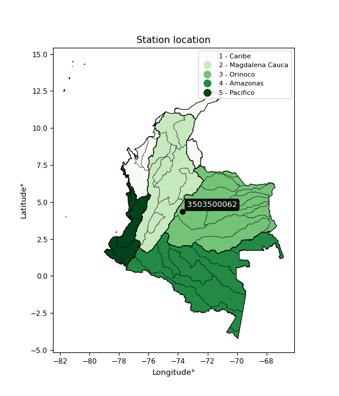

<div align="center">


</div>

# PMax24h Station (Rain): 3503500062

Maximum Precipitation in 24 hours (PMax24h) is the greatest amount of rainfall for a specific duration that is meteorologically possible for a given location, acting as a "worst-case" scenario for extreme storms, crucial for designing safety-critical infrastructure like bridges, river deviations, dams, spillways, and nuclear plants to prevent catastrophic failure. The PMax24h is related with the Probable Maximum Precipitation (PMP) and it is calculated by hydrologists using meteorological data to determine the upper limit of extreme rainfall, often leading to the Probable Maximum Flood (PMF) for flood control design, and is increasingly being studied for climate change impacts. Probable Maximum Precipitation (PMP) is the theoretical upper limit of rainfall, a deterministic estimate for extreme events, while probability distributions (like GEV, Gumbel) describe the likelihood and frequency of various precipitation amounts, including rare ones, showing how often events occur, with PMP representing the extreme end of these distributions, used for critical infrastructure design to ensure safety against the worst conceivable weather, unlike standard statistical forecasts which cover typical probabilities.

The most common probability distributions in hydrology, used for analyzing floods, rainfall, and streamflow, include the Normal, Log-Normal, Gumbel, Gamma (including Log-Pearson Type III), and Generalized Extreme Value (GEV) distributions, often chosen based on the data´s skewness and whether modeling extremes or general conditions, with Gumbel and GEV popular for extreme events like floods, while the Normal distribution serves as a baseline, though often requiring transformations for skewed hydrological data. These distributions help in designing water infrastructure, managing water resources, and forecasting hydrologic events.

> Hydrological data often isn´t perfectly normal (it´s skewed), so different distributions are needed for different applications, such as: **Flood Frequency Analysis**: Using Gumbel, GEV, or Log-Pearson Type III for predicting extreme flood magnitudes and their return periods, **Rainfall Analysis**: Normal for annual totals, but Log-Normal, Weibull, or GEV for intensity or extreme daily rainfall, **Streamflow Modeling**: Gamma and Log-Normal for maximum flows, GEV for minimum flows, and Kappa for daily flows.

<div align="center">

</img>

</div>


## A. General information


### 1. General running parameters

• app_version: _v20260225_. • runtime: _2026-02-28 16:54:07.457399_. • Python version: _3.14.0_. • SciPy version: _1.16.3_. • Pandas version: _2.3.3_. • NumPy version: _2.3.5_. • Stations dataset (station_dataset_file): _dataset/pmax24h_in/automatic_colombia_2003_2025.csv_. • Stations catalog (station_catalog_file): _dataset/CNE.xls_. • Minimum year to eval til year_max (date_min): _1900_. • Maximum year to eval since year_min (date_max): _2025_. • Creates, save and include plots into reports (create_plot): _False_. • Plot only fit distributions with Δo > Δ (plot_only_fit): _True_. • Plot only simple graphs avoiding multiple CDFs and multiple Extreme values plots (plot_only_simple): _False_. • Eval low extreme values, if False, evaluates high extreme values (low_extreme): _False_. • Eval every SciPy distribution as logarithmic (pdist_logarithmic_on): _True_. • Standard deviation normalized (ddof): _1.0_. • Return periods to eval in years (Tr): _[2, 2.33, 5, 10, 15, 20, 25, 50, 75, 100, 200, 250, 500, 750, 1000]_. • Minimum data sample per station, 0 means any (minimum_sample): _5_. • Z-Score maximum threshold to adjust a value, 0 means disable (zscore_max): _3.5_. • Z-Score minimum threshold to adjust a value, 0 means disable (zscore_min): _-2.5_. • Avoid zeros, e.g. rain = 0 (avoid_zeros): _True_. • Avoid null values (avoid_nans): _True_. 

:file_folder:Table: [dataset.csv](../../dataset/pmax24h_in/automatic_colombia_2003_2025.csv)

> Delta Degrees of Freedom (DDOF): is a parameter used in the formulas for calculating variance and standard deviation. When ddof=0, the divisor is $N$ (the total number of observations) and this is used when your data set is the entire population. When ddof=1, the divisor is $N-1$ and this is used when your data set is a sample drawn from a larger population. Using $N-1$ provides an unbiased estimate of the population variance (known as Bessel´s correction).


### 2. Station info and location

|   id |     CODIGO | NOMBRE                         | CATEGORIA               | TECNOLOGIA                | ESTADO           | FECHA_INSTALACION   |   FECHA_SUSPENSION |   ALTITUD |   LATITUD |   LONGITUD | DEPARTAMENTO   | MUNICIPIO   | AREA_OPERATIVA                            | ENTIDAD                                                     | AREA_HIDROGRAFICA   | ZONA_HIDROGRAFICA   | SUBZONA_HIDROGRAFICA   |   CORRIENTE | Catalogo   |   Version |
|-----:|-----------:|:-------------------------------|:------------------------|:--------------------------|:-----------------|:--------------------|-------------------:|----------:|----------:|-----------:|:---------------|:------------|:------------------------------------------|:------------------------------------------------------------|:--------------------|:--------------------|:-----------------------|------------:|:-----------|----------:|
|    0 | 3503500062 | EL CALVARIO - AUT [3503500062] | Climatológica Principal | Automática con Telemetría | En Mantenimiento | 13/04/2018          |                nan |      2000 |   4.35045 |   -73.7117 | Meta           | El Calvario | Area Operativa 03 - Meta-Guaviare-Guainía | INSTITUTO DE HIDROLOGIA METEOROLOGIA Y ESTUDIOS AMBIENTALES | Orinoco             | Meta                | Río Guatiquía          |         nan | CNE_IDEAM  |  20251226 |

<div align="center">

Dynamic map: [:earth_americas:Google](http://maps.google.com/maps?q=4.35045,-73.711673) [:earth_americas:OSM](https://www.openstreetmap.org/#map=18/4.35045/-73.711673&layers=P) [:earth_americas:Bing](https://www.bing.com/maps?cp=4.35045~-73.711673&lvl=18) [:earth_americas:Apple](https://maps.apple.com/frame?center=4.35045%2C-73.711673&span=0.003%2C0.006)

</div>


<div align="center">

```geojson
{
  "type": "Feature",
  "geometry": {
    "type": "Point", 
    "coordinates": [-73.711673, 4.35045]
  }, 
  "properties": {
    "Name": "3503500062"
  }
}
```

</div>


### 3. Discrete values table and plot

<div align="center">

|               |          0 |          1 |           2 |           3 |          4 |           5 |
|:--------------|-----------:|-----------:|------------:|------------:|-----------:|------------:|
| Date          | 2019       | 2020       | 2021        | 2022        | 2023       | 2025        |
| Value         |  143.4     |   84.4     |   27.6      |   25.1      |   24.9     |   27.8      |
| Value_initial |  143.4     |   84.4     |   27.6      |   25.1      |   24.9     |   27.8      |
| count         |    6       |    6       |    6        |    6        |    6       |    6        |
| mean          |   55.5333  |   55.5333  |   55.5333   |   55.5333   |   55.5333  |   55.5333   |
| std           |   48.9241  |   48.9241  |   48.9241   |   48.9241   |   48.9241  |   48.9241   |
| zscore        |    1.79598 |    0.59003 |   -0.570953 |   -0.622052 |   -0.62614 |   -0.566865 |


</div>


> The initial value (value_initial) correspond to the initial obtained or null completed value, and value (value) is adjusted only when the initial value is outside the valid range (outlier) definite through the Z-Score value. If Z-Score is active, values out of range or outliers are replaced with the station mean value. A Z-Score (or standard score) measures how many standard deviations a data point is from the mean of a dataset, indicating its relative position; positive scores mean above the mean, negative mean below, and a score of zero is exactly at the mean, allowing for comparison of values from different distributions. It´s calculated using the formula $z=(x–μ)/σ$, where $x$ is the data point, $μ$ is the mean, and $σ$ is the standard deviation, helping identify outliers and understand probability.
>
> <sub>**Note**: In this study, "completing" (filling gaps in) and "extending" (forecasting or lengthening the historical record) rainfall data series are avoided for certain critical analyses because they introduce artificial bias and uncertainty, which can distort the statistics of rare events (extremes), alter day-to-day variability, and compromise the integrity and homogeneity of the original data. Some reasons against Completing/Extending rainfall data are: **Distortion of Extremes and Variability**: The primary issue is that most gap-filling or extension methods rely on averaging or regression with nearby stations, which inherently smooths the data. Rainfall is highly variable in space and time, with a large percentage of zero values and occasional large storms. Infilling methods often underestimate the highest values and overestimate the lowest (zero) values, which severely distorts analyses focused on flood frequency, drought severity, and intensity-duration-frequency (IDF) curves, **Loss of Data Homogeneity**: Infilled or extended data are synthetic estimates, not actual measurements. Combining these estimates with observed data can violate the assumption of data homogeneity, which requires that the data properties do not change over time. Inhomogeneity can lead to incorrect conclusions about long-term trends or changes in climate patterns, **Propagation of Errors**: Errors and biases from the original data (e.g., wind-induced undercatch, instrument errors, site changes) or the data used for imputation can propagate through the analysis, leading to unreliable hydrological models and inaccurate predictions, **Compromised Statistical Integrity**: For statistical analyses, especially those involving the frequency of events, using artificial data can introduce time bias or autocorrelation that doesn´t exist in reality, making it difficult to assess the true probability of events, **Difficulty in Validation**: It is difficult to accurately validate the quality of filled or extended data, especially for past periods where ground-truth measurements are unavailable. The reliability of imputation techniques heavily depends on the density of the surrounding station network and the complexity of the local topography.</sub>


### 4. Active continuous probability distributions from SciPy (80 of 104 available)

A Probability Density Function (PDF) describes the relative likelihood of a continuous random variable falling within a specific range, where the total area under its curve equals 1, and the area over any interval gives the actual probability for that range. Unlike discrete probabilities (like rolling a die), a PDF shows density, not direct probability for a single point (which is zero), with higher points indicating higher likelihood, often visualized as a bell curve for normal distributions.

A log of a probability density function (log-PDF) is simply the logarithm of the PDF´s value, denoted as $log(f(x))$, useful for converting multiplication of probabilities into addition, improving numerical stability with tiny numbers, and connecting to information theory concepts like entropy. Instead of dealing with very small probabilities (e.g., 0.000001), log-PDFs use negative numbers (e.g., $log(0.00001) ≈ -11.51$ that are easier for computers to handle, preventing underflow errors and simplifying complex calculations. In this study, each active probability distribution from SciPy is also evaluated in the $log$ form.

[scipy.stats](https://docs.scipy.org/doc/scipy/reference/stats.html) is a Python´s powerful submodule within the SciPy library for comprehensive statistical analysis, offering over 130 probability distributions (like Normal, Poisson, etc.), functions for descriptive stats (mean, variance), hypothesis testing (t-tests, chi-square), random variable generation, and statistical tests, making it essential for data science, modeling, and research. It provides tools to explore, model, and draw conclusions from data efficiently, working seamlessly with [NumPy](https://numpy.org/).

<div align="center">

|   id | p_dist           |   n_parameter | fit_method   | label                                                                       | active   | ref                                                                                                      |
|-----:|:-----------------|--------------:|:-------------|:----------------------------------------------------------------------------|:---------|:---------------------------------------------------------------------------------------------------------|
|    0 | alpha            |             3 | MLE          | Alpha                                                                       | True     | [:mortar_board:](https://docs.scipy.org/doc/scipy/reference/generated/scipy.stats.alpha.html)            |
|    1 | anglit           |             2 | MM           | Anglit                                                                      | True     | [:mortar_board:](https://docs.scipy.org/doc/scipy/reference/generated/scipy.stats.anglit.html)           |
|    2 | arcsine          |             2 | MM           | Arcsine                                                                     | True     | [:mortar_board:](https://docs.scipy.org/doc/scipy/reference/generated/scipy.stats.arcsine.html)          |
|    3 | argus            |             3 | MLE          | Argus                                                                       | True     | [:mortar_board:](https://docs.scipy.org/doc/scipy/reference/generated/scipy.stats.argus.html)            |
|    4 | beta             |             4 | MLE          | Beta                                                                        | True     | [:mortar_board:](https://docs.scipy.org/doc/scipy/reference/generated/scipy.stats.beta.html)             |
|    5 | betaprime        |             4 | MLE          | Beta prime                                                                  | True     | [:mortar_board:](https://docs.scipy.org/doc/scipy/reference/generated/scipy.stats.betaprime.html)        |
|    6 | bradford         |             3 | MLE          | Bradford                                                                    | True     | [:mortar_board:](https://docs.scipy.org/doc/scipy/reference/generated/scipy.stats.bradford.html)         |
|    7 | burr             |             4 | MLE          | Burr (Type III)                                                             | True     | [:mortar_board:](https://docs.scipy.org/doc/scipy/reference/generated/scipy.stats.burr.html)             |
|    8 | burr12           |             4 | MLE          | Burr (Type III) 12                                                          | True     | [:mortar_board:](https://docs.scipy.org/doc/scipy/reference/generated/scipy.stats.burr12.html)           |
|    9 | cosine           |             2 | MLE          | Cosine                                                                      | True     | [:mortar_board:](https://docs.scipy.org/doc/scipy/reference/generated/scipy.stats.cosine.html)           |
|   10 | crystalball      |             4 | MLE          | Crystalball                                                                 | True     | [:mortar_board:](https://docs.scipy.org/doc/scipy/reference/generated/scipy.stats.crystalball.html)      |
|   11 | dgamma           |             3 | MLE          | Double gamma                                                                | True     | [:mortar_board:](https://docs.scipy.org/doc/scipy/reference/generated/scipy.stats.dgamma.html)           |
|   12 | dweibull         |             3 | MLE          | Double Weibull                                                              | True     | [:mortar_board:](https://docs.scipy.org/doc/scipy/reference/generated/scipy.stats.dweibull.html)         |
|   13 | erlang           |             3 | MLE          | Erlang                                                                      | True     | [:mortar_board:](https://docs.scipy.org/doc/scipy/reference/generated/scipy.stats.erlang.html)           |
|   14 | exponnorm        |             3 | MLE          | Exponentially modified Normal                                               | True     | [:mortar_board:](https://docs.scipy.org/doc/scipy/reference/generated/scipy.stats.exponnorm.html)        |
|   15 | exponpow         |             3 | MLE          | Exponential power                                                           | True     | [:mortar_board:](https://docs.scipy.org/doc/scipy/reference/generated/scipy.stats.exponpow.html)         |
|   16 | exponweib        |             4 | MLE          | Exponentiated Weibull                                                       | True     | [:mortar_board:](https://docs.scipy.org/doc/scipy/reference/generated/scipy.stats.exponweib.html)        |
|   17 | f                |             4 | MLE          | F                                                                           | True     | [:mortar_board:](https://docs.scipy.org/doc/scipy/reference/generated/scipy.stats.f.html)                |
|   18 | fatiguelife      |             3 | MLE          | Fatigue-life (Birnbaum-Saunders)                                            | True     | [:mortar_board:](https://docs.scipy.org/doc/scipy/reference/generated/scipy.stats.fatiguelife.html)      |
|   19 | foldnorm         |             3 | MM           | Fold Normal                                                                 | True     | [:mortar_board:](https://docs.scipy.org/doc/scipy/reference/generated/scipy.stats.foldnorm.html)         |
|   20 | gamma            |             3 | MLE          | Gamma                                                                       | True     | [:mortar_board:](https://docs.scipy.org/doc/scipy/reference/generated/scipy.stats.gamma.html)            |
|   21 | gausshyper       |             6 | MLE          | Gauss hypergeometric                                                        | True     | [:mortar_board:](https://docs.scipy.org/doc/scipy/reference/generated/scipy.stats.gausshyper.html)       |
|   22 | genexpon         |             5 | MLE          | Generalized exponential                                                     | True     | [:mortar_board:](https://docs.scipy.org/doc/scipy/reference/generated/scipy.stats.genexpon.html)         |
|   23 | genextreme       |             3 | MLE          | Generalized exponential                                                     | True     | [:mortar_board:](https://docs.scipy.org/doc/scipy/reference/generated/scipy.stats.genextreme.html)       |
|   24 | gengamma         |             4 | MLE          | Generalized gamma                                                           | True     | [:mortar_board:](https://docs.scipy.org/doc/scipy/reference/generated/scipy.stats.gengamma.html)         |
|   25 | genhalflogistic  |             3 | MLE          | Generalized half-logistic                                                   | True     | [:mortar_board:](https://docs.scipy.org/doc/scipy/reference/generated/scipy.stats.genhalflogistic.html)  |
|   26 | genlogistic      |             3 | MLE          | Generalized logistic                                                        | True     | [:mortar_board:](https://docs.scipy.org/doc/scipy/reference/generated/scipy.stats.genlogistic.html)      |
|   27 | gennorm          |             3 | MLE          | Generalized Normal                                                          | True     | [:mortar_board:](https://docs.scipy.org/doc/scipy/reference/generated/scipy.stats.gennorm.html)          |
|   28 | genpareto        |             3 | MLE          | Generalized Pareto                                                          | True     | [:mortar_board:](https://docs.scipy.org/doc/scipy/reference/generated/scipy.stats.genpareto.html)        |
|   29 | gompertz         |             3 | MLE          | Gompertz (or truncated Gumbel)                                              | True     | [:mortar_board:](https://docs.scipy.org/doc/scipy/reference/generated/scipy.stats.gompertz.html)         |
|   30 | gumbel_l         |             2 | MM           | Gumbel Left Skew                                                            | True     | [:mortar_board:](https://docs.scipy.org/doc/scipy/reference/generated/scipy.stats.gumbel_l.html)         |
|   31 | gumbel_r         |             2 | MM           | Gumbel Right Skew                                                           | True     | [:mortar_board:](https://docs.scipy.org/doc/scipy/reference/generated/scipy.stats.gumbel_r.html)         |
|   32 | halfgennorm      |             3 | MLE          | Upper half of a generalized normal                                          | True     | [:mortar_board:](https://docs.scipy.org/doc/scipy/reference/generated/scipy.stats.halfgennorm.html)      |
|   33 | halflogistic     |             2 | MM           | Half-logistic                                                               | True     | [:mortar_board:](https://docs.scipy.org/doc/scipy/reference/generated/scipy.stats.halflogistic.html)     |
|   34 | halfnorm         |             2 | MM           | Half Normal                                                                 | True     | [:mortar_board:](https://docs.scipy.org/doc/scipy/reference/generated/scipy.stats.halfnorm.html)         |
|   35 | hypsecant        |             2 | MM           | hyperbolic secant                                                           | True     | [:mortar_board:](https://docs.scipy.org/doc/scipy/reference/generated/scipy.stats.hypsecant.html)        |
|   36 | invgamma         |             3 | MLE          | Inverted gamma                                                              | True     | [:mortar_board:](https://docs.scipy.org/doc/scipy/reference/generated/scipy.stats.invgamma.html)         |
|   37 | invgauss         |             3 | MLE          | Inverse Gaussian                                                            | True     | [:mortar_board:](https://docs.scipy.org/doc/scipy/reference/generated/scipy.stats.invgauss.html)         |
|   38 | invweibull       |             3 | MLE          | Inverted Weibull                                                            | True     | [:mortar_board:](https://docs.scipy.org/doc/scipy/reference/generated/scipy.stats.invweibull.html)       |
|   39 | johnsonsb        |             4 | MLE          | Johnson SB                                                                  | True     | [:mortar_board:](https://docs.scipy.org/doc/scipy/reference/generated/scipy.stats.johnsonsb.html)        |
|   40 | johnsonsu        |             4 | MLE          | Johnson Su                                                                  | True     | [:mortar_board:](https://docs.scipy.org/doc/scipy/reference/generated/scipy.stats.johnsonsu.html)        |
|   41 | kappa3           |             3 | MLE          | Kappa 3                                                                     | True     | [:mortar_board:](https://docs.scipy.org/doc/scipy/reference/generated/scipy.stats.kappa3.html)           |
|   42 | kappa4           |             4 | MLE          | Kappa 4                                                                     | True     | [:mortar_board:](https://docs.scipy.org/doc/scipy/reference/generated/scipy.stats.kappa4.html)           |
|   43 | ksone            |             3 | MLE          | Kolmogorov-Smirnov one-sided test statistic distribution                    | True     | [:mortar_board:](https://docs.scipy.org/doc/scipy/reference/generated/scipy.stats.ksone.html)            |
|   44 | kstwobign        |             2 | MLE          | Limiting distribution of scaled Kolmogorov-Smirnov two-sided test statistic | True     | [:mortar_board:](https://docs.scipy.org/doc/scipy/reference/generated/scipy.stats.kstwobign.html)        |
|   45 | laplace          |             2 | MM           | Laplace                                                                     | True     | [:mortar_board:](https://docs.scipy.org/doc/scipy/reference/generated/scipy.stats.laplace.html)          |
|   46 | levy_l           |             2 | MLE          | Left-skewed Levy                                                            | True     | [:mortar_board:](https://docs.scipy.org/doc/scipy/reference/generated/scipy.stats.levy_l.html)           |
|   47 | loggamma         |             3 | MLE          | Log gamma                                                                   | True     | [:mortar_board:](https://docs.scipy.org/doc/scipy/reference/generated/scipy.stats.loggamma.html)         |
|   48 | logistic         |             2 | MM           | Logistic (or Sech-squared)                                                  | True     | [:mortar_board:](https://docs.scipy.org/doc/scipy/reference/generated/scipy.stats.logistic.html)         |
|   49 | loglaplace       |             3 | MLE          | Log-Laplace                                                                 | True     | [:mortar_board:](https://docs.scipy.org/doc/scipy/reference/generated/scipy.stats.loglaplace.html)       |
|   50 | lomax            |             3 | MLE          | Lomax (Pareto of the second kind)                                           | True     | [:mortar_board:](https://docs.scipy.org/doc/scipy/reference/generated/scipy.stats.lomax.html)            |
|   51 | maxwell          |             2 | MM           | Maxwell                                                                     | True     | [:mortar_board:](https://docs.scipy.org/doc/scipy/reference/generated/scipy.stats.maxwell.html)          |
|   52 | mielke           |             4 | MLE          | Mielke Beta-Kappa / Dagum                                                   | True     | [:mortar_board:](https://docs.scipy.org/doc/scipy/reference/generated/scipy.stats.mielke.html)           |
|   53 | moyal            |             2 | MM           | Moyal                                                                       | True     | [:mortar_board:](https://docs.scipy.org/doc/scipy/reference/generated/scipy.stats.moyal.html)            |
|   54 | nakagami         |             3 | MLE          | Nakagami                                                                    | True     | [:mortar_board:](https://docs.scipy.org/doc/scipy/reference/generated/scipy.stats.nakagami.html)         |
|   55 | ncf              |             5 | MLE          | Non-central F distribution                                                  | True     | [:mortar_board:](https://docs.scipy.org/doc/scipy/reference/generated/scipy.stats.ncf.html)              |
|   56 | nct              |             4 | MLE          | Non-central Student’s t                                                     | True     | [:mortar_board:](https://docs.scipy.org/doc/scipy/reference/generated/scipy.stats.nct.html)              |
|   57 | norm             |             2 | MM           | Normal                                                                      | True     | [:mortar_board:](https://docs.scipy.org/doc/scipy/reference/generated/scipy.stats.norm.html)             |
|   58 | pearson3         |             3 | MM           | Pearson type III                                                            | True     | [:mortar_board:](https://docs.scipy.org/doc/scipy/reference/generated/scipy.stats.pearson3.html)         |
|   59 | powerlaw         |             3 | MLE          | Power-function                                                              | True     | [:mortar_board:](https://docs.scipy.org/doc/scipy/reference/generated/scipy.stats.powerlaw.html)         |
|   60 | rayleigh         |             2 | MM           | Rayleigh                                                                    | True     | [:mortar_board:](https://docs.scipy.org/doc/scipy/reference/generated/scipy.stats.rayleigh.html)         |
|   61 | rdist            |             3 | MLE          | R-distributed (symmetric beta)                                              | True     | [:mortar_board:](https://docs.scipy.org/doc/scipy/reference/generated/scipy.stats.rdist.html)            |
|   62 | rice             |             3 | MLE          | Rice                                                                        | True     | [:mortar_board:](https://docs.scipy.org/doc/scipy/reference/generated/scipy.stats.rice.html)             |
|   63 | semicircular     |             2 | MM           | Semicircular                                                                | True     | [:mortar_board:](https://docs.scipy.org/doc/scipy/reference/generated/scipy.stats.semicircular.html)     |
|   64 | skewnorm         |             3 | MLE          | Skew normal                                                                 | True     | [:mortar_board:](https://docs.scipy.org/doc/scipy/reference/generated/scipy.stats.skewnorm.html)         |
|   65 | t                |             3 | MLE          | Student’s t                                                                 | True     | [:mortar_board:](https://docs.scipy.org/doc/scipy/reference/generated/scipy.stats.t.html)                |
|   66 | trapezoid        |             4 | MLE          | Trapezoid                                                                   | True     | [:mortar_board:](https://docs.scipy.org/doc/scipy/reference/generated/scipy.stats.trapezoid.html)        |
|   67 | triang           |             3 | MLE          | Triangular                                                                  | True     | [:mortar_board:](https://docs.scipy.org/doc/scipy/reference/generated/scipy.stats.triang.html)           |
|   68 | truncexpon       |             3 | MLE          | Truncated exponential                                                       | True     | [:mortar_board:](https://docs.scipy.org/doc/scipy/reference/generated/scipy.stats.truncexpon.html)       |
|   69 | truncnorm        |             4 | MLE          | Truncated normal                                                            | True     | [:mortar_board:](https://docs.scipy.org/doc/scipy/reference/generated/scipy.stats.truncnorm.html)        |
|   70 | truncpareto      |             4 | MLE          | Upper truncated Pareto                                                      | True     | [:mortar_board:](https://docs.scipy.org/doc/scipy/reference/generated/scipy.stats.truncpareto.html)      |
|   71 | truncweibull_min |             5 | MLE          | Doubly truncated Weibull minimum                                            | True     | [:mortar_board:](https://docs.scipy.org/doc/scipy/reference/generated/scipy.stats.truncweibull_min.html) |
|   72 | tukeylambda      |             3 | MLE          | Tukey-Lamdba                                                                | True     | [:mortar_board:](https://docs.scipy.org/doc/scipy/reference/generated/scipy.stats.tukeylambda.html)      |
|   73 | uniform          |             2 | MLE          | Uniform                                                                     | True     | [:mortar_board:](https://docs.scipy.org/doc/scipy/reference/generated/scipy.stats.uniform.html)          |
|   74 | vonmises         |             3 | MLE          | Von Mises                                                                   | True     | [:mortar_board:](https://docs.scipy.org/doc/scipy/reference/generated/scipy.stats.vonmises.html)         |
|   75 | vonmises_line    |             3 | MLE          | Von Mises line                                                              | True     | [:mortar_board:](https://docs.scipy.org/doc/scipy/reference/generated/scipy.stats.vonmises_line.html)    |
|   76 | wald             |             2 | MM           | Wald                                                                        | True     | [:mortar_board:](https://docs.scipy.org/doc/scipy/reference/generated/scipy.stats.wald.html)             |
|   77 | weibull_max      |             3 | MLE          | Weibull maximum                                                             | True     | [:mortar_board:](https://docs.scipy.org/doc/scipy/reference/generated/scipy.stats.weibull_max.html)      |
|   78 | weibull_min      |             3 | MLE          | Weibull minimum                                                             | True     | [:mortar_board:](https://docs.scipy.org/doc/scipy/reference/generated/scipy.stats.weibull_min.html)      |
|   79 | wrapcauchy       |             3 | MLE          | Wrapped  Cauchy                                                             | True     | [:mortar_board:](https://docs.scipy.org/doc/scipy/reference/generated/scipy.stats.wrapcauchy.html)       |

</div>

> **n_parameter:** # arguments & localization & scale.
>
> **Fit methods:** (MLE) maximum likelihood, (MM) L-moments.
>
>**Inactive** (With the only purpose of prevent loops, zero divisions, infinite values, over high estimated values or horizontal trending for recurrence intervals estimations, the follow distributions were disabled.)**:** lognorm, norminvgauss, powernorm, powerlognorm, cauchy, halfcauchy, foldcauchy, skewcauchy, chi2, expon, fisk, genhyperbolic, geninvgauss, gibrat, kstwo, laplace_asymmetric, levy, levy_stable, ncx2, pareto, rel_breitwigner, recipinvgauss, studentized_range, loguniform, 


## B. Probability (PDF) vs. Empirical (EDF) distributions functions

A continuous probability distribution (CPD) describes probabilities for variables that can take any value within a range (like rain any time), unlike discrete variables with specific outcomes (like temperature). It uses a Probability Density Function (PDF), a curve where the total area under it equals 1, and the probability of the variable falling within an interval (a to b) is found by calculating the area under the curve between those points. A key feature is that the probability of hitting any single exact value is zero, so probabilities are always expressed for ranges, e.g., $P(a ≤ X ≤ b)$.

<div align="center">

Distributions parameters from station values
|     |    station | p_dist              |   n |              loc |           scale | shape                  | shape1                 | shape2                 | shape3             |
|----:|-----------:|:--------------------|----:|-----------------:|----------------:|:-----------------------|:-----------------------|:-----------------------|:-------------------|
|   0 | 3503500062 | alpha               |   6 |     23.4195      |     2.55298     | 0.001752211090102004   |                        |                        |                    |
|   1 | 3503500062 | anglit              |   6 |     55.5333      |   130.652       |                        |                        |                        |                    |
|   2 | 3503500062 | arcsine             |   6 |     -7.62738     |   126.321       |                        |                        |                        |                    |
|   3 | 3503500062 | argus               |   6 |    -42.035       |   193.913       | 1.2589434908011559e-06 |                        |                        |                    |
|   4 | 3503500062 | beta                |   6 |     24.9         |   119.584       | 0.1349293825722356     | 0.3635957456519489     |                        |                    |
|   5 | 3503500062 | betaprime           |   6 |     24.8194      |     0.000377675 | 466.00131378572564     | 0.329662234962083      |                        |                    |
|   6 | 3503500062 | bradford            |   6 |     24.9         |   273.929       | 82.97682592395557      |                        |                        |                    |
|   7 | 3503500062 | burr                |   6 |     22.4853      |     0.00472949  | 1.2540266032064311     | 4985.474058156722      |                        |                    |
|   8 | 3503500062 | burr12              |   6 |     -2.18114     |    26.8493      | 419.8666907242745      | 0.004609836822446414   |                        |                    |
|   9 | 3503500062 | cosine              |   6 |     62.8255      |    37.9022      |                        |                        |                        |                    |
|  10 | 3503500062 | crystalball         |   6 |     55.5333      |    44.6614      | 4184.201947104024      | 1136.745675495697      |                        |                    |
|  11 | 3503500062 | dgamma              |   6 |     61.4643      |     6.57031     | 6.223153284749085      |                        |                        |                    |
|  12 | 3503500062 | dweibull            |   6 |     24.9         |    49.3184      | 0.43977259245270883    |                        |                        |                    |
|  13 | 3503500062 | erlang              |   6 |     24.9         |    28.2323      | 0.4696742699704184     |                        |                        |                    |
|  14 | 3503500062 | exponnorm           |   6 |     24.8565      |     0.0132704   | 2303.310048973026      |                        |                        |                    |
|  15 | 3503500062 | exponpow            |   6 |     24.9         |    58.0052      | 0.3435469987275267     |                        |                        |                    |
|  16 | 3503500062 | exponweib           |   6 |     24.9         |    23.0779      | 1.4129647402414074     | 0.5531732055861648     |                        |                    |
|  17 | 3503500062 | f                   |   6 |     24.9         |     1.76471e-05 | 3816.225027448221      | 0.2886002141283822     |                        |                    |
|  18 | 3503500062 | fatiguelife         |   6 |     24.9         |     6.7902e-06  | 1783.462849763103      |                        |                        |                    |
|  19 | 3503500062 | foldnorm            |   6 |     -4.54781     |    74.9474      | 0.05817643518516295    |                        |                        |                    |
|  20 | 3503500062 | gamma               |   6 |     24.9         |    29.6169      | 0.3180713404498017     |                        |                        |                    |
|  21 | 3503500062 | gausshyper          |   6 |     24.9         |   127.709       | 0.4037285545735262     | 1.1495280577223999     | 0.9535686336526059     | 1.0507937333644275 |
|  22 | 3503500062 | genexpon            |   6 |     24.9         |    27.8582      | 0.909410452659607      | 3.7328932304706075e-10 | 0.19109734044449223    |                    |
|  23 | 3503500062 | genextreme          |   6 |     25.2698      |     2.26613     | -6.1277611670840315    |                        |                        |                    |
|  24 | 3503500062 | gengamma            |   6 |     24.9         |    31.9833      | 1.1924244562636466     | 0.38426679315417145    |                        |                    |
|  25 | 3503500062 | genhalflogistic     |   6 |     13.5479      |   133.94        | 1.0314812572288725     |                        |                        |                    |
|  26 | 3503500062 | genlogistic         |   6 |   -157.856       |    27.2203      | 1258.1631244252312     |                        |                        |                    |
|  27 | 3503500062 | gennorm             |   6 |     27.8         |     0.506558    | 0.3636725717292818     |                        |                        |                    |
|  28 | 3503500062 | genpareto           |   6 |     10.8907      |   155.828       | -1.1759754121915222    |                        |                        |                    |
|  29 | 3503500062 | gompertz            |   6 |     24.9         |     1.44032e+09 | 43642622.96785974      |                        |                        |                    |
|  30 | 3503500062 | gumbel_l            |   6 |     75.6333      |    34.8223      |                        |                        |                        |                    |
|  31 | 3503500062 | gumbel_r            |   6 |     35.4333      |    34.8223      |                        |                        |                        |                    |
|  32 | 3503500062 | halfgennorm         |   6 |     24.9         |     1.66193     | 0.4526073079978551     |                        |                        |                    |
|  33 | 3503500062 | halflogistic        |   6 |      2.59922     |    38.1839      |                        |                        |                        |                    |
|  34 | 3503500062 | halfnorm            |   6 |     -3.58083     |    74.0886      |                        |                        |                        |                    |
|  35 | 3503500062 | hypsecant           |   6 |     55.5333      |    28.4323      |                        |                        |                        |                    |
|  36 | 3503500062 | invgamma            |   6 |     24.9         |     3.83136e-08 | 0.17160533820926108    |                        |                        |                    |
|  37 | 3503500062 | invgauss            |   6 |     24.7311      |     0.656674    | 46.90640534041653      |                        |                        |                    |
|  38 | 3503500062 | invweibull          |   6 |     24.9         |     1.30892     | 0.07797344757019906    |                        |                        |                    |
|  39 | 3503500062 | johnsonsb           |   6 |     24.9         |  1079.36        | 1.9908496847568093     | 0.1095139597745586     |                        |                    |
|  40 | 3503500062 | johnsonsu           |   6 |     24.9         |     1.43861e-14 | -1.5515289254951337    | 0.10199777359313644    |                        |                    |
|  41 | 3503500062 | kappa3              |   6 |     24.8726      |     2.60182     | 0.36156020006493694    |                        |                        |                    |
|  42 | 3503500062 | kappa4              |   6 |     12.8024      |   131.1         | 1.1016599287995197     | 1.0003613209768107     |                        |                    |
|  43 | 3503500062 | ksone               |   6 |     13.05        |   142.2         | 1.0                    |                        |                        |                    |
|  44 | 3503500062 | kstwobign           |   6 |    -62.8183      |   136.952       |                        |                        |                        |                    |
|  45 | 3503500062 | laplace             |   6 |     55.5333      |    31.5804      |                        |                        |                        |                    |
|  46 | 3503500062 | levy_l              |   6 |    153.023       |    39.9808      |                        |                        |                        |                    |
|  47 | 3503500062 | loggamma            |   6 | -12600.4         |  1739.91        | 1442.8627567181811     |                        |                        |                    |
|  48 | 3503500062 | logistic            |   6 |     55.5333      |    24.6231      |                        |                        |                        |                    |
|  49 | 3503500062 | loglaplace          |   6 |     -0.0750922   |    27.6751      | 2.0227796654775982     |                        |                        |                    |
|  50 | 3503500062 | lomax               |   6 |     24.9         |   487.131       | 18.391847750596963     |                        |                        |                    |
|  51 | 3503500062 | maxwell             |   6 |    -50.2954      |    66.3183      |                        |                        |                        |                    |
|  52 | 3503500062 | mielke              |   6 |      8.03584     |     0.521675    | 1148.1686100744248     | 1.7472190865279522     |                        |                    |
|  53 | 3503500062 | moyal               |   6 |     29.9931      |    20.1047      |                        |                        |                        |                    |
|  54 | 3503500062 | nakagami            |   6 |     24.9         |    75.385       | 0.13867788326845765    |                        |                        |                    |
|  55 | 3503500062 | ncf                 |   6 |     -0.0410722   |     2.21851e-07 | 4.9536790711220626e-08 | 4.886426580825198      | 8.794694610562228      |                    |
|  56 | 3503500062 | nct                 |   6 |     -0.0171911   |     0.360134    | 1.9756989573832606     | 87.89592961135011      |                        |                    |
|  57 | 3503500062 | norm                |   6 |     55.5333      |    44.6614      |                        |                        |                        |                    |
|  58 | 3503500062 | pearson3            |   6 |     55.5333      |    44.6614      | 1.1269775344383        |                        |                        |                    |
|  59 | 3503500062 | powerlaw            |   6 |     24.9         |   118.5         | 0.11404431275788329    |                        |                        |                    |
|  60 | 3503500062 | rayleigh            |   6 |    -29.9065      |    68.1711      |                        |                        |                        |                    |
|  61 | 3503500062 | rdist               |   6 |     14.17        |    70.23        | 1.0313312128929644     |                        |                        |                    |
|  62 | 3503500062 | rice                |   6 |    -10.9394      |    56.6272      | 0.00047643357863423814 |                        |                        |                    |
|  63 | 3503500062 | semicircular        |   6 |     55.5333      |    89.3228      |                        |                        |                        |                    |
|  64 | 3503500062 | skewnorm            |   6 |     24.9         |    54.156       | 8135635.710276861      |                        |                        |                    |
|  65 | 3503500062 | t                   |   6 |     55.5334      |    44.6613      | 3555497.0627988745     |                        |                        |                    |
|  66 | 3503500062 | trapezoid           |   6 |     13.05        |   142.2         | 1.0                    | 1.0                    |                        |                    |
|  67 | 3503500062 | triang              |   6 |    -57.6576      |   201.059       | 0.9999929210031839     |                        |                        |                    |
|  68 | 3503500062 | truncexpon          |   6 |     24.9         |    99.1019      | 1.1957393481077156     |                        |                        |                    |
|  69 | 3503500062 | truncnorm           |   6 | -27517.7         |  1098.77        | 25.066746282265907     | 77.4633367529804       |                        |                    |
|  70 | 3503500062 | truncpareto         |   6 |     -4.29497e+09 |     4.29497e+09 | 140205623.77565408     | 1.0000000275904313     |                        |                    |
|  71 | 3503500062 | truncweibull_min    |   6 |     24.8994      |   142.846       | 0.9427310441787337     | 4.089124764337395e-06  | 0.829568523556292      |                    |
|  72 | 3503500062 | tukeylambda         |   6 |     55.3568      |    39.688       | 1.3030921893250529     |                        |                        |                    |
|  73 | 3503500062 | uniform             |   6 |     24.9         |   118.5         |                        |                        |                        |                    |
|  74 | 3503500062 | vonmises            |   6 |      2.04117     |     1           | 0.12404977864807713    |                        |                        |                    |
|  75 | 3503500062 | vonmises_line       |   6 |     43.8657      |    31.6828      | 1.0039735548048485     |                        |                        |                    |
|  76 | 3503500062 | wald                |   6 |     10.872       |    44.6614      |                        |                        |                        |                    |
|  77 | 3503500062 | weibull_max         |   6 |    143.4         |     1.66916     | 0.1889421082815847     |                        |                        |                    |
|  78 | 3503500062 | weibull_min         |   6 |     24.9         |    50.0765      | 0.7286775351380017     |                        |                        |                    |
|  79 | 3503500062 | wrapcauchy          |   6 |     24.9         |    18.8599      | 0.9675647800514446     |                        |                        |                    |
|  80 | 3503500062 | logalpha            |   6 |      3.15637     |     0.0995878   | 0.00018062583424416194 |                        |                        |                    |
|  81 | 3503500062 | loganglit           |   6 |      3.74697     |     2.02654     |                        |                        |                        |                    |
|  82 | 3503500062 | logarcsine          |   6 |      2.76729     |     1.95935     |                        |                        |                        |                    |
|  83 | 3503500062 | logargus            |   6 |      2.30448     |     2.79038     | 4.798661843463312e-05  |                        |                        |                    |
|  84 | 3503500062 | logbeta             |   6 |      3.21487     |     1.98034     | 0.0921987948533059     | 0.1965233086345809     |                        |                    |
|  85 | 3503500062 | logbetaprime        |   6 |      3.21487     |   299.081       | 0.5697279212995345     | 942.1050257333043      |                        |                    |
|  86 | 3503500062 | logbradford         |   6 |      3.21487     |     1.75079     | 1.1233352187120738     |                        |                        |                    |
|  87 | 3503500062 | logburr             |   6 |      3.02841     |     0.0376799   | 1.4579753404134284     | 16.91111278568787      |                        |                    |
|  88 | 3503500062 | logburr12           |   6 |      2.93193     |     0.271529    | 172.53821094695093     | 0.010729639139924124   |                        |                    |
|  89 | 3503500062 | logcosine           |   6 |      3.83043     |     0.563942    |                        |                        |                        |                    |
|  90 | 3503500062 | logcrystalball      |   6 |      3.74697     |     0.69274     | 78.70208675312364      | 1277.6151191932995     |                        |                    |
|  91 | 3503500062 | logdgamma           |   6 |      3.31782     |     0.591451    | 0.4647371744544654     |                        |                        |                    |
|  92 | 3503500062 | logdweibull         |   6 |      3.32504     |     0.642985    | 0.5792536711290579     |                        |                        |                    |
|  93 | 3503500062 | logerlang           |   6 |      3.21487     |     0.345885    | 0.32371019493899317    |                        |                        |                    |
|  94 | 3503500062 | logexponnorm        |   6 |      3.21449     |     0.000111678 | 4736.991840231682      |                        |                        |                    |
|  95 | 3503500062 | logexponpow         |   6 |      3.21487     |     1.30339     | 0.3521301534489366     |                        |                        |                    |
|  96 | 3503500062 | logexponweib        |   6 |      3.21487     |     0.746037    | 0.9351893958956555     | 0.5473124400667463     |                        |                    |
|  97 | 3503500062 | logf                |   6 |      3.21487     |     2.80626e-08 | 4010.28320651738       | 0.25549667299014484    |                        |                    |
|  98 | 3503500062 | logfatiguelife      |   6 |      3.21487     |     4.2866e-08  | 3189.0460923841283     |                        |                        |                    |
|  99 | 3503500062 | logfoldnorm         |   6 |      2.79043     |     0.944419    | 0.750909032647908      |                        |                        |                    |
| 100 | 3503500062 | loggamma            |   6 |      3.21487     |     0.33982     | 0.40796479790529494    |                        |                        |                    |
| 101 | 3503500062 | loggausshyper       |   6 |      3.19436     |     1.77128     | 0.30578100154100785    | 0.6137916477827896     | 0.5188637825524147     | 1.1802436288282458 |
| 102 | 3503500062 | loggenexpon         |   6 |      3.21472     |     1.29741     | 2.088457460916538      | 0.0008843343250125918  | 3.5479932614246182e-06 |                    |
| 103 | 3503500062 | loggenextreme       |   6 |      3.24271     |     0.184664    | -6.63339607921972      |                        |                        |                    |
| 104 | 3503500062 | loggengamma         |   6 |      3.21487     |     0.977935    | 0.582507659748976      | 0.881516586526027      |                        |                    |
| 105 | 3503500062 | loggenhalflogistic  |   6 |      2.90861     |     2.13808     | 1.0394005938760944     |                        |                        |                    |
| 106 | 3503500062 | loggenlogistic      |   6 |      0.00871679  |     0.451454    | 1991.0614306216194     |                        |                        |                    |
| 107 | 3503500062 | loggennorm          |   6 |      3.31782     |     0.000364027 | 0.24356658291169386    |                        |                        |                    |
| 108 | 3503500062 | loggenpareto        |   6 |     -0.188184    |     9.12713     | -1.7709433075123382    |                        |                        |                    |
| 109 | 3503500062 | loggompertz         |   6 |      3.21487     |     2.7086e+11  | 500729219074.5895      |                        |                        |                    |
| 110 | 3503500062 | loggumbel_l         |   6 |      4.05874     |     0.540127    |                        |                        |                        |                    |
| 111 | 3503500062 | loggumbel_r         |   6 |      3.4352      |     0.540127    |                        |                        |                        |                    |
| 112 | 3503500062 | loghalfgennorm      |   6 |      3.21487     |     0.690441    | 0.9931241374157136     |                        |                        |                    |
| 113 | 3503500062 | loghalflogistic     |   6 |      2.92591     |     0.592268    |                        |                        |                        |                    |
| 114 | 3503500062 | loghalfnorm         |   6 |      2.83005     |     1.14918     |                        |                        |                        |                    |
| 115 | 3503500062 | loghypsecant        |   6 |      3.74697     |     0.441012    |                        |                        |                        |                    |
| 116 | 3503500062 | loginvgamma         |   6 |      3.21487     |     2.30027e-06 | 0.18539985647857476    |                        |                        |                    |
| 117 | 3503500062 | loginvgauss         |   6 |      3.20769     |     0.0281717   | 19.142587156456543     |                        |                        |                    |
| 118 | 3503500062 | loginvweibull       |   6 |      3.21487     |     0.132314    | 0.0618341940466656     |                        |                        |                    |
| 119 | 3503500062 | logjohnsonsb        |   6 |      3.21487     |     4.71924     | 1.9724738557921149     | 0.1150651551997731     |                        |                    |
| 120 | 3503500062 | logjohnsonsu        |   6 | 127565           | 38641           | 362541.80064988346     | 189850.38811811502     |                        |                    |
| 121 | 3503500062 | logkappa3           |   6 |      3.21487     |     1.24833     | 7.29160970010869       |                        |                        |                    |
| 122 | 3503500062 | logkappa4           |   6 |      3.06492     |     2.0217      | 1.080105536463872      | 1.0636478500583264     |                        |                    |
| 123 | 3503500062 | logksone            |   6 |      3.03979     |     2.10092     | 1.0                    |                        |                        |                    |
| 124 | 3503500062 | logkstwobign        |   6 |      1.84321     |     2.19139     |                        |                        |                        |                    |
| 125 | 3503500062 | loglaplace          |   6 |      3.74697     |     0.489841    |                        |                        |                        |                    |
| 126 | 3503500062 | loglevy_l           |   6 |      5.08601     |     0.497983    |                        |                        |                        |                    |
| 127 | 3503500062 | logloggamma         |   6 |   -255.805       |    33.6197      | 2254.6242014471136     |                        |                        |                    |
| 128 | 3503500062 | loglogistic         |   6 |      3.74697     |     0.381928    |                        |                        |                        |                    |
| 129 | 3503500062 | logloglaplace       |   6 |      3.21487     |     0.152389    | 0.45937670185642643    |                        |                        |                    |
| 130 | 3503500062 | loglomax            |   6 |      3.21487     |    11.981       | 24.231280243505054     |                        |                        |                    |
| 131 | 3503500062 | logmaxwell          |   6 |      2.10546     |     1.02866     |                        |                        |                        |                    |
| 132 | 3503500062 | logmielke           |   6 |      3.18444     |     0.00434207  | 7.381955949236783      | 0.7558820803837212     |                        |                    |
| 133 | 3503500062 | logmoyal            |   6 |      3.35081     |     0.311843    |                        |                        |                        |                    |
| 134 | 3503500062 | lognakagami         |   6 |      3.21487     |     1.24203     | 0.18933690811370218    |                        |                        |                    |
| 135 | 3503500062 | logncf              |   6 |     -0.638619    |     4.32416     | 216.0605966470231      | 147.0339087404654      | 0.004015520668128703   |                    |
| 136 | 3503500062 | lognct              |   6 |     -0.0859427   |     0.0545687   | 19.446814926156467     | 67.39307293792808      |                        |                    |
| 137 | 3503500062 | lognorm             |   6 |      3.74697     |     0.69274     |                        |                        |                        |                    |
| 138 | 3503500062 | logpearson3         |   6 |      3.74697     |     0.692739    | 0.8461533553945013     |                        |                        |                    |
| 139 | 3503500062 | logpowerlaw         |   6 |      3.21487     |     1.75077     | 0.12696008465633318    |                        |                        |                    |
| 140 | 3503500062 | lograyleigh         |   6 |      2.42171     |     1.0574      |                        |                        |                        |                    |
| 141 | 3503500062 | logrdist            |   6 |      4.18537     |     0.970498    | 1.045431152857991      |                        |                        |                    |
| 142 | 3503500062 | logrice             |   6 |      2.68793     |     0.894829    | 0.0008079055801095678  |                        |                        |                    |
| 143 | 3503500062 | logsemicircular     |   6 |      3.74697     |     1.38548     |                        |                        |                        |                    |
| 144 | 3503500062 | logskewnorm         |   6 |      3.21487     |     0.873462    | 43642585.68349543      |                        |                        |                    |
| 145 | 3503500062 | logt                |   6 |      3.74697     |     0.692741    | 5711911893.991344      |                        |                        |                    |
| 146 | 3503500062 | logtrapezoid        |   6 |      3.03979     |     2.10092     | 1.0                    | 1.0                    |                        |                    |
| 147 | 3503500062 | logtriang           |   6 |      2.10287     |     2.86277     | 0.9999999647363043     |                        |                        |                    |
| 148 | 3503500062 | logtruncexpon       |   6 |      3.21487     |     2.38007     | 0.7356017667871572     |                        |                        |                    |
| 149 | 3503500062 | logtruncnorm        |   6 |     -4.62481     |     2.16914     | 3.6141946509381064     | 5.861314859264301      |                        |                    |
| 150 | 3503500062 | logtruncpareto      |   6 |      3.21105     |     0.00381765  | 1.8440987169954059e-07 | 459.61819775234557     |                        |                    |
| 151 | 3503500062 | logtruncweibull_min |   6 |      3.21487     |     1.9151      | 0.576087207614723      | 1.1247057030862492e-16 | 0.9580725635039455     |                    |
| 152 | 3503500062 | logtukeylambda      |   6 |      4.09023     |     0.971248    | 1.1094794252880966     |                        |                        |                    |
| 153 | 3503500062 | loguniform          |   6 |      3.21487     |     1.75077     |                        |                        |                        |                    |
| 154 | 3503500062 | logvonmises         |   6 |     -2.59173     |     1           | 2.6347675406969318     |                        |                        |                    |
| 155 | 3503500062 | logvonmises_line    |   6 |      4.09003     |     0.278714    | 0.0005008226289984509  |                        |                        |                    |
| 156 | 3503500062 | logwald             |   6 |      3.05423     |     0.69274     |                        |                        |                        |                    |
| 157 | 3503500062 | logweibull_max      |   6 |      4.96564     |     1.12399     | 0.9772422512187195     |                        |                        |                    |
| 158 | 3503500062 | logweibull_min      |   6 |      3.21487     |     0.76454     | 0.543937355351886      |                        |                        |                    |
| 159 | 3503500062 | logwrapcauchy       |   6 |      3.21487     |     0.278813    | 0.9189584257665702     |                        |                        |                    |

</div>

> **loc** (Location parameter): This shifts the distribution along the x-axis. For many common distributions, like the normal (Gaussian) distribution, loc represents the mean $μ$. For others, like the uniform distribution, it might represent the minimum value, or for the beta distribution, the left end of the support interval.
>
> **scale** (Scale parameter): This determines the width or spread of the distribution. For the normal distribution, scale represents the standard deviation $σ$. For a uniform distribution, it defines the length of the interval (from $loc$ to $loc + scale$).
>
> **shape** (Shape parameters): Refers to parameters that define the specific form of a probability distribution, distinct from its location (loc) and scale (scale). These parameters are required arguments for most distribution functions. For example, a normal (Gaussian) distribution is fully defined by its location (mean) and scale (standard deviation), so it has no specific shape parameters beyond loc and scale. However, other distributions have intrinsic properties that need specification, as Gamma distribution that takes a shape parameter, often named $a$ or $alpha$.


### 0. Cumulative distribution values - CDF (160 evaluated)

Cumulative Distribution Function (CDF), denoted as $F$<sub>$X$</sub>$(x)$, is a function that gives the probability that a random variable $X$ will take a value less than or equal to a specific value, $x$ (i.e., $(P(X≥x)$. It essentially "accumulates" probabilities from a given point up to the far right (positive infinity), providing a complete picture of the distribution´s probabilities for both discrete (like rain) and continuous (like temperature) variables, helping to find probabilities over ranges or above certain values. Each station is evaluated separately ordering the $x$ values ascending, calculating the CDF and PDF values for the activated distributions and their logarithmic forms.

<div align="center">

CDF ordered by x ascending and calculating $log(f(x))$ separately
|   id |    Station |   date |     x |   count |    mean |     std |    zscore |   Value_initial |    station |   m |     alpha |   alpha_pdf |   anglit |   anglit_pdf |   arcsine |   arcsine_pdf |    argus |   argus_pdf |       beta |   beta_pdf |   betaprime |   betaprime_pdf |    bradford |   bradford_pdf |     burr |    burr_pdf |    burr12 |   burr12_pdf |   cosine |   cosine_pdf |   crystalball |   crystalball_pdf |   dgamma |   dgamma_pdf |   dweibull |   dweibull_pdf |     erlang |   erlang_pdf |   exponnorm |   exponnorm_pdf |    exponpow |   exponpow_pdf |   exponweib |   exponweib_pdf |         f |           f_pdf |   fatiguelife |   fatiguelife_pdf |   foldnorm |   foldnorm_pdf |       gamma |   gamma_pdf |   gausshyper |   gausshyper_pdf |    genexpon |   genexpon_pdf |   genextreme |   genextreme_pdf |    gengamma |   gengamma_pdf |   genhalflogistic |   genhalflogistic_pdf |   genlogistic |   genlogistic_pdf |   gennorm |   gennorm_pdf |   genpareto |   genpareto_pdf |    gompertz |   gompertz_pdf |   gumbel_l |   gumbel_l_pdf |   gumbel_r |   gumbel_r_pdf |   halfgennorm |   halfgennorm_pdf |   halflogistic |   halflogistic_pdf |   halfnorm |   halfnorm_pdf |   hypsecant |   hypsecant_pdf |   invgamma |   invgamma_pdf |   invgauss |   invgauss_pdf |   invweibull |   invweibull_pdf |   johnsonsb |   johnsonsb_pdf |   johnsonsu |   johnsonsu_pdf |    kappa3 |   kappa3_pdf |      kappa4 |   kappa4_pdf |     ksone |   ksone_pdf |   kstwobign |   kstwobign_pdf |   laplace |   laplace_pdf |   levy_l |   levy_l_pdf |    loggamma |   loggamma_pdf |   logistic |   logistic_pdf |   loglaplace |   loglaplace_pdf |       lomax |   lomax_pdf |   maxwell |   maxwell_pdf |   mielke |   mielke_pdf |    moyal |   moyal_pdf |    nakagami |   nakagami_pdf |      ncf |    ncf_pdf |      nct |     nct_pdf |     norm |   norm_pdf |   pearson3 |   pearson3_pdf |   powerlaw |   powerlaw_pdf |   rayleigh |   rayleigh_pdf |    rdist |       rdist_pdf |     rice |   rice_pdf |   semicircular |   semicircular_pdf |   skewnorm |   skewnorm_pdf |        t |      t_pdf |   trapezoid |   trapezoid_pdf |   triang |   triang_pdf |   truncexpon |   truncexpon_pdf |   truncnorm |   truncnorm_pdf |   truncpareto |   truncpareto_pdf |   truncweibull_min |   truncweibull_min_pdf |   tukeylambda |   tukeylambda_pdf |    uniform |   uniform_pdf |   vonmises |   vonmises_pdf |   vonmises_line |   vonmises_line_pdf |     wald |    wald_pdf |   weibull_max |   weibull_max_pdf |   weibull_min |   weibull_min_pdf |   wrapcauchy |   wrapcauchy_pdf |   logalpha |   logalpha_pdf |   loganglit |   loganglit_pdf |   logarcsine |   logarcsine_pdf |   logargus |   logargus_pdf |   logbeta |   logbeta_pdf |   logbetaprime |   logbetaprime_pdf |   logbradford |   logbradford_pdf |   logburr |   logburr_pdf |   logburr12 |   logburr12_pdf |   logcosine |   logcosine_pdf |   logcrystalball |   logcrystalball_pdf |   logdgamma |   logdgamma_pdf |   logdweibull |   logdweibull_pdf |   logerlang |   logerlang_pdf |   logexponnorm |   logexponnorm_pdf |   logexponpow |   logexponpow_pdf |   logexponweib |   logexponweib_pdf |      logf |   logf_pdf |   logfatiguelife |   logfatiguelife_pdf |   logfoldnorm |   logfoldnorm_pdf |   loggausshyper |   loggausshyper_pdf |   loggenexpon |   loggenexpon_pdf |   loggenextreme |   loggenextreme_pdf |   loggengamma |   loggengamma_pdf |   loggenhalflogistic |   loggenhalflogistic_pdf |   loggenlogistic |   loggenlogistic_pdf |   loggennorm |   loggennorm_pdf |   loggenpareto |   loggenpareto_pdf |   loggompertz |   loggompertz_pdf |   loggumbel_l |   loggumbel_l_pdf |   loggumbel_r |   loggumbel_r_pdf |   loghalfgennorm |   loghalfgennorm_pdf |   loghalflogistic |   loghalflogistic_pdf |   loghalfnorm |   loghalfnorm_pdf |   loghypsecant |   loghypsecant_pdf |   loginvgamma |   loginvgamma_pdf |   loginvgauss |   loginvgauss_pdf |   loginvweibull |   loginvweibull_pdf |   logjohnsonsb |   logjohnsonsb_pdf |   logjohnsonsu |   logjohnsonsu_pdf |   logkappa3 |   logkappa3_pdf |   logkappa4 |   logkappa4_pdf |   logksone |   logksone_pdf |   logkstwobign |   logkstwobign_pdf |   loglevy_l |   loglevy_l_pdf |   logloggamma |   logloggamma_pdf |   loglogistic |   loglogistic_pdf |   logloglaplace |   logloglaplace_pdf |    loglomax |   loglomax_pdf |   logmaxwell |   logmaxwell_pdf |   logmielke |   logmielke_pdf |   logmoyal |   logmoyal_pdf |   lognakagami |   lognakagami_pdf |   logncf |   logncf_pdf |   lognct |   lognct_pdf |   lognorm |   lognorm_pdf |   logpearson3 |   logpearson3_pdf |   logpowerlaw |   logpowerlaw_pdf |   lograyleigh |   lograyleigh_pdf |    logrdist |   logrdist_pdf |   logrice |   logrice_pdf |   logsemicircular |   logsemicircular_pdf |   logskewnorm |   logskewnorm_pdf |     logt |   logt_pdf |   logtrapezoid |   logtrapezoid_pdf |   logtriang |   logtriang_pdf |   logtruncexpon |   logtruncexpon_pdf |   logtruncnorm |   logtruncnorm_pdf |   logtruncpareto |   logtruncpareto_pdf |   logtruncweibull_min |   logtruncweibull_min_pdf |   logtukeylambda |   logtukeylambda_pdf |   loguniform |   loguniform_pdf |   logvonmises |   logvonmises_pdf |   logvonmises_line |   logvonmises_line_pdf |   logwald |   logwald_pdf |   logweibull_max |   logweibull_max_pdf |   logweibull_min |   logweibull_min_pdf |   logwrapcauchy |   logwrapcauchy_pdf |
|-----:|-----------:|-------:|------:|--------:|--------:|--------:|----------:|----------------:|-----------:|----:|----------:|------------:|---------:|-------------:|----------:|--------------:|---------:|------------:|-----------:|-----------:|------------:|----------------:|------------:|---------------:|---------:|------------:|----------:|-------------:|---------:|-------------:|--------------:|------------------:|---------:|-------------:|-----------:|---------------:|-----------:|-------------:|------------:|----------------:|------------:|---------------:|------------:|----------------:|----------:|----------------:|--------------:|------------------:|-----------:|---------------:|------------:|------------:|-------------:|-----------------:|------------:|---------------:|-------------:|-----------------:|------------:|---------------:|------------------:|----------------------:|--------------:|------------------:|----------:|--------------:|------------:|----------------:|------------:|---------------:|-----------:|---------------:|-----------:|---------------:|--------------:|------------------:|---------------:|-------------------:|-----------:|---------------:|------------:|----------------:|-----------:|---------------:|-----------:|---------------:|-------------:|-----------------:|------------:|----------------:|------------:|----------------:|----------:|-------------:|------------:|-------------:|----------:|------------:|------------:|----------------:|----------:|--------------:|---------:|-------------:|------------:|---------------:|-----------:|---------------:|-------------:|-----------------:|------------:|------------:|----------:|--------------:|---------:|-------------:|---------:|------------:|------------:|---------------:|---------:|-----------:|---------:|------------:|---------:|-----------:|-----------:|---------------:|-----------:|---------------:|-----------:|---------------:|---------:|----------------:|---------:|-----------:|---------------:|-------------------:|-----------:|---------------:|---------:|-----------:|------------:|----------------:|---------:|-------------:|-------------:|-----------------:|------------:|----------------:|--------------:|------------------:|-------------------:|-----------------------:|--------------:|------------------:|-----------:|--------------:|-----------:|---------------:|----------------:|--------------------:|---------:|------------:|--------------:|------------------:|--------------:|------------------:|-------------:|-----------------:|-----------:|---------------:|------------:|----------------:|-------------:|-----------------:|-----------:|---------------:|----------:|--------------:|---------------:|-------------------:|--------------:|------------------:|----------:|--------------:|------------:|----------------:|------------:|----------------:|-----------------:|---------------------:|------------:|----------------:|--------------:|------------------:|------------:|----------------:|---------------:|-------------------:|--------------:|------------------:|---------------:|-------------------:|----------:|-----------:|-----------------:|---------------------:|--------------:|------------------:|----------------:|--------------------:|--------------:|------------------:|----------------:|--------------------:|--------------:|------------------:|---------------------:|-------------------------:|-----------------:|---------------------:|-------------:|-----------------:|---------------:|-------------------:|--------------:|------------------:|--------------:|------------------:|--------------:|------------------:|-----------------:|---------------------:|------------------:|----------------------:|--------------:|------------------:|---------------:|-------------------:|--------------:|------------------:|--------------:|------------------:|----------------:|--------------------:|---------------:|-------------------:|---------------:|-------------------:|------------:|----------------:|------------:|----------------:|-----------:|---------------:|---------------:|-------------------:|------------:|----------------:|--------------:|------------------:|--------------:|------------------:|----------------:|--------------------:|------------:|---------------:|-------------:|-----------------:|------------:|----------------:|-----------:|---------------:|--------------:|------------------:|---------:|-------------:|---------:|-------------:|----------:|--------------:|--------------:|------------------:|--------------:|------------------:|--------------:|------------------:|------------:|---------------:|----------:|--------------:|------------------:|----------------------:|--------------:|------------------:|---------:|-----------:|---------------:|-------------------:|------------:|----------------:|----------------:|--------------------:|---------------:|-------------------:|-----------------:|---------------------:|----------------------:|--------------------------:|-----------------:|---------------------:|-------------:|-----------------:|--------------:|------------------:|-------------------:|-----------------------:|----------:|--------------:|-----------------:|---------------------:|-----------------:|---------------------:|----------------:|--------------------:|
|    0 | 3503500062 |   2023 |  24.9 |       6 | 55.5333 | 48.9241 | -0.62614  |            24.9 | 3503500062 |   1 | 0.0848328 | 0.210462    | 0.274034 |   0.00682768 |  0.338817 |    0.00576286 | 0.17329  |  0.00501201 | 0.00455882 | 1.7314e+11 |   0.0201243 |     0.669537    | 2.18607e-14 |     0.0683694  | 0.134949 | 0.140337    | 0.0166273 |  0.0684325   | 0.206771 |   0.0064657  |      0.246387 |        0.00706022 | 0.277524 |  0.0129345   |   0.5      |    4.92755e+06 | 3.8445e-08 |  5.08248e+06 |  0.0014208  |     0.0326524   | 2.69218e-06 |    2.60334e+08 | 4.37138e-13 |     96.1725     | 0.0515552 | 20931           |     0.0399789 |       1.08296e+11 |   0.305126 |     0.00984099 | 9.64318e-06 | 8.63346e+08 |  2.68591e-07 |      3.05226e+07 | 7.13331e-10 |    0.0326443   |   0.00127392 |    418.806       | 4.45908e-08 |    5.75107e+06 |         0.0443164 |            0.0040826  |      0.217346 |       0.0121794   |  0.324042 |   0.0338543   |   0.0906441 |      0.00652555 | 2.52035e-09 |    0.0303007   |   0.207809 |    0.00529956  |   0.258407 |     0.0100419  |     0         |       0.245904    |       0.283991 |         0.0120384  |   0.29933  |     0.0100023  |    0.208916 |      0.00683155 |  0.0444148 |    1.77693e+06 |  0.0496682 |    0.680923    |   1.1559e-06 |      3.46812e+08 |  0.00781044 |     6.61579e+11 |   0.0603875 |     8.48854e+11 | 0.0539088 |  1.28092     | 3.29368e-15 |   0.226299   | 0.0833333 |  0.00703235 |    0.193443 |     0.0110582   |  0.189539 |   0.00600181  | 0.423575 |   0.00148811 | 9.55185e-07 |    8.77486e+08 |   0.223725 |     0.00705322 |     0.168737 |         0.344473 | 9.64017e-09 | 0.0377554   |  0.267451 |    0.00813301 |      nan |          nan | 0.25636  |  0.0118269  | 2.40449e-05 |    1.87716e+09 | 0.332087 | 0.0135418  | 0.199527 | 0.0256477   | 0.246387 | 0.00706022 |   0.272192 |     0.0102824  |  0.0130505 |    4.1893e+11  |   0.27615  |     0.00853649 | 0.54987  |      0.00468334 | 0.181501 | 0.00914808 |       0.286029 |         0.00669494 |  0         |     0.0147331  | 0.246387 | 0.00706022 |  0.00694444 |      0.00117206 | 0.168605 |   0.00408454 |   1.0071e-07 |       0.0144664  | 4.30079e-06 |      0.0228496  |   3.17962e-08 |       0.0333408   |         2.3632e-09 |             0.023661   |   9.23706e-14 |         0.0251937 | 0          |    0.00843882 |    4.12336 |       0.146324 |        0.306462 |          0.00907766 | 0.180848 | 0.0239957   |      0.106719 |       0.000380738 |   1.70818e-12 |      350.355      |  1.30037e-06 |       0.51191    |  0.0887086 |      5.45266   |    0.249338 |        0.426963 |     0.317235 |         0.386968 |   0.155341 |       0.331575 | 0.0251659 |   5.22478e+12 |    3.86779e-09 |        4.96204e+06 |   1.96187e-06 |          0.852095 |  0.208439 |     2.44093   |   0.0733509 |       6.05816   |    0.185054 |        0.412358 |         0.221212 |             0.428771 |    0.262622 |     0.950276    |      0.348866 |         0.660204  |  1.6907e-05 |      1.2324e+10 |    0.000707763 |          1.88821   |   3.57594e-06 |       2.83546e+09 |    1.61093e-08 |        1.85669e+07 | 0.0594737 | 1.1945e+07 |        0.0376454 |           5.4751e+13 |      0.266514 |          0.609186 |        0.237304 |            3.53073  |   0.000231004 |         1.60934   |     0.000775846 |       14125.5       |   1.48389e-08 |       1.71578e+07 |            0.0773934 |                 0.273117 |         0.194147 |            0.70462   |     0.232001 |        0.934406  |       0.456467 |           0.175304 |   3.36598e-14 |         1.84866   |      0.189126 |         0.314729  |      0.22231  |          0.618897 |      2.01925e-08 |             1.44409  |          0.239218 |              0.795902 |      0.262271 |          0.656449 |       0.185098 |          0.396455  |     0.0388618 |    32649.2        |     0.0501735 |        16.3003    |     0.000388859 |         4.25155e+11 |      0.0114927 |        7.79501e+12 |       0.224415 |           0.42656  | 1.24755e-09 |        0.610015 | 0.000378568 |        0.934392 |  0.0833333 |       0.475981 |       0.171795 |          0.663535  |    0.394066 |       0.0962866 |      0.221643 |          0.41769  |      0.198899 |         0.417195  |     3.38087e-05 |      121796         | 4.28396e-11 |      2.02248   |     0.238146 |         0.504347 |    0.132925 |       6.02004   |   0.213666 |      0.73424   |   1.12102e-06 |       9.55894e+08 | 0.219633 |     0.510326 | 0.21179  |    0.583861  |  0.221212 |      0.428771 |      0.23389  |          0.574764 |     0.0104703 |       2.99335e+12 |      0.245217 |          0.53543  | 2.96393e-09 |    7.18949e+06 |  0.159183 |      0.553322 |          0.261655 |              0.424256 |    0          |          0.913473 | 0.221212 |   0.42877  |     0.00694444 |          0.0793302 |    0.150882 |        0.27137  |      2.0188e-06 |            0.806775 |    1.42377e-11 |          1.77918   |      2.98546e-08 |           42.7283    |           5.38402e-10 |               2.04897e+06 |      3.79719e-05 |             0.775232 |   0          |         0.571177 |       1.23656 |         0.453119  |        0.000251539 |               0.570747 | 0.0942263 |     1.44523   |         0.21395  |             0.184151 |      5.15951e-09 |          6.31957e+06 |     2.29173e-07 |          13.5165    |
|    1 | 3503500062 |   2022 |  25.1 |       6 | 55.5333 | 48.9241 | -0.622052 |            25.1 | 3503500062 |   2 | 0.128979  | 0.227774    | 0.275401 |   0.00683824 |  0.339969 |    0.00575136 | 0.174294 |  0.00502495 | 0.326775   | 0.220665   |   0.166514  |     0.601997    | 0.0132757   |     0.064464   | 0.163216 | 0.141869    | 0.0304192 |  0.0687043   | 0.208066 |   0.00648432 |      0.247802 |        0.00708187 | 0.280113 |  0.0129577   |   0.542454 |    0.0892701   | 0.110179   |  0.257497    |  0.00793335 |     0.0324566   | 0.142074    |    0.242305    | 0.0232341   |      0.0875567  | 0.789702  |     0.151726    |     0.53833   |       0.0955353   |   0.307093 |     0.00983067 | 0.227585    | 0.360091    |  0.0955706   |      0.192675    | 0.00650759  |    0.0324319   |   0.331041   |      0.298612    | 0.0825226   |    0.177044    |         0.0451335 |            0.0040892  |      0.219787 |       0.0122261   |  0.330978 |   0.0355327   |   0.0919494 |      0.0065272  | 0.00604182  |    0.0301176   |   0.208871 |    0.00532294  |   0.260417 |     0.010062   |     0.0379131 |       0.167573    |       0.286397 |         0.0120205  |   0.301329 |     0.00999188 |    0.210286 |      0.00686966 |  0.924055  |    0.0651629   |  0.186038  |    0.605197    |   0.31419    |      0.141816    |  0.853085   |     0.125932    |   0.945856  |     0.0560326   | 0.176369  |  0.361357    | 0.00303053  |   0.0137544  | 0.0847398 |  0.00703235 |    0.195659 |     0.0110986   |  0.190743 |   0.00603994  | 0.423873 |   0.00149124 | 0.24264     |   12.168       |   0.225139 |     0.00708486 |     0.171516 |         0.350145 | 0.00752112  | 0.0374561   |  0.26908  |    0.00814838 |      nan |          nan | 0.258727 |  0.0118435  | 0.156601    |    0.217171    | 0.334791 | 0.013499   | 0.204661 | 0.025686    | 0.247802 | 0.00708187 |   0.274249 |     0.0102914  |  0.482826  |    0.275318    |   0.277859 |     0.00854742 | 0.550807 |      0.00468538 | 0.183333 | 0.00917854 |       0.287369 |         0.00670075 |  0.0029471 |     0.014733   | 0.247801 | 0.00708187 |  0.00718083 |      0.00119184 | 0.169423 |   0.00409443 |   0.00289047 |       0.0144373  | 0.00456381  |      0.0227456  |   0.00664646  |       0.0331238   |         0.00358518 |             0.0169017  |   0.00439184  |         0.0211443 | 0.00168776 |    0.00843882 |    4.15292 |       0.14934  |        0.308281 |          0.00910998 | 0.185645 | 0.0239694   |      0.106795 |       0.000381533 |   0.017714    |        0.0639638  |  0.0990576   |       0.463927   |  0.134274  |      5.8555    |    0.252761 |        0.428903 |     0.320321 |         0.384574 |   0.158004 |       0.334137 | 0.419841  |   4.85301     |    0.136647    |        9.57602     |   0.00680132  |          0.847743 |  0.227889 |     2.41961   |   0.119962  |       5.59981   |    0.188367 |        0.415897 |         0.224658 |             0.432563 |    0.270442 |     1.00584     |      0.354272 |         0.692043  |  0.328549   |     13.0637     |    0.0157058   |          1.86061   |   0.16558     |       7.21683     |    0.0944047   |        5.79117     | 0.835755  | 2.62274    |        0.553878  |           3.34683    |      0.271383 |          0.608117 |        0.262384 |            2.80649  |   0.0130232   |         1.58874   |     0.299149    |           6.80293   |   0.0945639   |       6.01442     |            0.0795829 |                 0.274276 |         0.199816 |            0.712466  |     0.239769 |        1.00936   |       0.457871 |           0.175654 |   0.0146805   |         1.82152   |      0.191659 |         0.318428  |      0.227279 |          0.62343  |      0.0114839   |             1.42694  |          0.245574 |              0.7933   |      0.267517 |          0.654904 |       0.188294 |          0.40249   |     0.760896  |        5.53846    |     0.182325  |        14.9027    |     0.304389    |         2.79841     |      0.892245  |        2.66925     |       0.227842 |           0.430229 | 0.00488015  |        0.610015 | 0.00671435  |        0.742348 |  0.0871412 |       0.475981 |       0.177133 |          0.670834  |    0.394839 |       0.0968521 |      0.224999 |          0.421311 |      0.202258 |         0.422461  |     0.129131    |           7.41494   | 0.0160444   |      1.9887    |     0.242193 |         0.507359 |    0.179328 |       5.55851   |   0.21956  |      0.739217  |   0.117266    |       5.55061     | 0.223733 |     0.514626 | 0.216482 |    0.588958  |  0.224658 |      0.432563 |      0.238502 |          0.578098 |     0.50454   |       8.00702     |      0.24951  |          0.537754 | 0.0367479   |    2.40419     |  0.163631 |      0.558751 |          0.265054 |              0.42535  |    0.00730782 |          0.913435 | 0.224657 |   0.432562 |     0.00759359 |          0.0829551 |    0.153061 |        0.273322 |      0.00644542 |            0.804068 |    0.0141391   |          1.75561   |      0.184321    |           13.8032    |           0.0669413   |               4.71852     |      0.00548927  |             0.657887 |   0.00456944 |         0.571177 |       1.24021 |         0.457488  |        0.00481754  |               0.570747 | 0.105932  |     1.47976   |         0.215429 |             0.185443 |      0.0803126   |          5.2352      |     0.104246    |          12.1204    |
|    2 | 3503500062 |   2021 |  27.6 |       6 | 55.5333 | 48.9241 | -0.570953 |            27.6 | 3503500062 |   3 | 0.54181   | 0.0966954   | 0.292657 |   0.00696478 |  0.354178 |    0.00561908 | 0.187057 |  0.00518508 | 0.465006   | 0.0235377  |   0.556447  |     0.050132    | 0.134896    |     0.0376097  | 0.457704 | 0.0876965   | 0.181753  |  0.053179    | 0.224563 |   0.00671154 |      0.265839 |        0.0073457  | 0.312717 |  0.013068    |   0.621623 |    0.0171772   | 0.363806   |  0.0592747   |  0.0858452  |     0.0299076   | 0.341058    |    0.0414225   | 0.151501    |      0.0375054  | 0.855546  |     0.00772025  |     0.638169  |       0.0245385   |   0.331504 |     0.00969686 | 0.510463    | 0.0560978   |  0.27157     |      0.039915    | 0.084367    |    0.0298902   |   0.485323   |      0.0212064   | 0.239299    |    0.0338445   |         0.0554609 |            0.00417313 |      0.251021 |       0.0127396   |  0.473247 |   0.1094      |   0.108293  |      0.0065481  | 0.0785548   |    0.0279204   |   0.222548 |    0.00562027  |   0.285857 |     0.0102799  |     0.293664  |       0.0707617   |       0.316159 |         0.0117856  |   0.326142 |     0.0098566  |    0.228061 |      0.00735234 |  0.951412  |    0.00308813  |  0.645771  |    0.0605535   |   0.388638   |      0.0106074   |  0.909068   |     0.00665388  |   0.969356  |     0.00261609  | 0.431207  |  0.0414594   | 0.0321771   |   0.0108178  | 0.102321  |  0.00703235 |    0.223986 |     0.0115453   |  0.206457 |   0.00653751  | 0.427651 |   0.00153127 | 0.636942    |    2.02767     |   0.243343 |     0.00747783 |     0.208202 |         0.42504  | 0.0966618   | 0.0339179   |  0.289679 |    0.00832692 |      nan |          nan | 0.288543 |  0.0119912  | 0.322323    |    0.0331052   | 0.367844 | 0.0129347  | 0.268787 | 0.0254005   | 0.265839 | 0.0073457  |   0.300092 |     0.010374   |  0.649679  |    0.0274416   |   0.299386 |     0.00866952 | 0.562555 |      0.00471437 | 0.206734 | 0.009534   |       0.304208 |         0.00676971 |  0.0397633 |     0.0147148  | 0.265838 | 0.0073457  |  0.0104695  |      0.00143911 | 0.179814 |   0.00421812 |   0.0385322  |       0.0140776  | 0.0598365   |      0.0214845  |   0.086167    |       0.0305279   |         0.0412976  |             0.014251   |   0.0521133   |         0.0180965 | 0.0227848  |    0.00843882 |    4.57619 |       0.177504 |        0.331546 |          0.00949684 | 0.244675 | 0.0231163   |      0.107762 |       0.000391713 |   0.112263    |        0.0285296  |  0.428069    |       0.0258316  |  0.537381  |      2.52026   |    0.29451  |        0.449852 |     0.355667 |         0.361439 |   0.191148 |       0.363779 | 0.533126  |   0.49659     |    0.52792     |        2.36506     |   0.0849478   |          0.799298 |  0.42993  |     1.78346   |   0.478295  |       2.50288   |    0.229778 |        0.455656 |         0.267795 |             0.475339 |    0.5      |     3.81454e+07 |      0.464223 |         2.76504   |  0.704829   |      1.76396    |    0.177421    |          1.55492   |   0.396741    |       1.27068     |    0.311164    |        1.30014     | 0.881491  | 0.147059   |        0.686499  |           0.836711   |      0.328471 |          0.593925 |        0.409715 |            1.00489  |   0.152909    |         1.36357   |     0.439963    |           0.52898   |   0.335859    |       1.53456     |            0.106297  |                 0.28863  |         0.271167 |            0.783608  |     0.5      |       48.7512    |       0.474752 |           0.17999  |   0.173302    |         1.52828   |      0.224047 |         0.364415  |      0.288592 |          0.664001 |      0.137946    |             1.24162  |          0.319288 |              0.758149 |      0.32876  |          0.634498 |       0.230023 |          0.477354  |     0.851092  |        0.268159   |     0.644779  |         1.68961   |     0.362171    |         0.220935    |      0.937592  |        0.140364    |       0.270689 |           0.471567 | 0.0627998   |        0.610015 | 0.0688568   |        0.618132 |  0.132335  |       0.475981 |       0.244267 |          0.737001  |    0.404368 |       0.104008  |      0.266979 |          0.4623   |      0.245337 |         0.484768  |     0.417562    |           1.86326   | 0.187241    |      1.62978   |     0.291895 |         0.537969 |    0.492968 |       1.90622   |   0.291732 |      0.773691  |   0.308482    |       1.13345     | 0.274827 |     0.559739 | 0.274929 |    0.63885   |  0.267795 |      0.475339 |      0.294971 |          0.608611 |     0.697849  |       0.860619    |      0.301691 |          0.559665 | 0.140849    |    0.727527    |  0.219443 |      0.614022 |          0.306009 |              0.436895 |    0.0938231  |          0.907151 | 0.267794 |   0.475338 |     0.0175124  |          0.125978  |    0.180112 |        0.296493 |      0.0812873  |            0.772623 |    0.168255    |          1.49705   |      0.543358    |            1.52785   |           0.271902    |               1.3847      |      0.0637575   |             0.594245 |   0.0588015  |         0.571177 |       1.28602 |         0.506727  |        0.0590094   |               0.570766 | 0.250802  |     1.48179   |         0.233788 |             0.201503 |      0.285382    |          1.26869     |     0.429206    |           0.680577  |
|    3 | 3503500062 |   2025 |  27.8 |       6 | 55.5333 | 48.9241 | -0.566865 |            27.8 | 3503500062 |   4 | 0.560421  | 0.0895405   | 0.294051 |   0.00697446 |  0.3553   |    0.00560935 | 0.188095 |  0.00519776 | 0.469572   | 0.0221509  |   0.56604   |     0.0459041   | 0.142296    |     0.0363967  | 0.474814 | 0.0834402   | 0.192285  |  0.0521443   | 0.225907 |   0.00672926 |      0.26731  |        0.00736623 | 0.31533  |  0.0130614   |   0.624975 |    0.0163569   | 0.375396   |  0.0566675   |  0.0918072  |     0.0297126   | 0.349134    |    0.0393796   | 0.158888    |      0.0363853  | 0.857028  |     0.00711408  |     0.642978  |       0.0235678   |   0.333442 |     0.00968577 | 0.521374    | 0.0530701   |  0.279376    |      0.0381822   | 0.0903255   |    0.0296957   |   0.489407   |      0.0196793   | 0.245901    |    0.0322105   |         0.0562962 |            0.00417996 |      0.253573 |       0.012775    |  0.5      |   0.223165    |   0.109603  |      0.00654979 | 0.084122    |    0.0277518   |   0.223675 |    0.00564445  |   0.287915 |     0.0102945  |     0.307529  |       0.0679229   |       0.318514 |         0.0117661  |   0.328112 |     0.00984537 |    0.229536 |      0.00739137 |  0.952004  |    0.00284011  |  0.657326  |    0.0551375   |   0.390684   |      0.0098727   |  0.910346   |     0.00613139  |   0.969857  |     0.00240261  | 0.439207  |  0.0386055   | 0.0343335   |   0.0107467  | 0.103727  |  0.00703235 |    0.226298 |     0.0115764   |  0.207769 |   0.00657905  | 0.427957 |   0.00153455 | 0.651138    |    1.90696     |   0.244842 |     0.00750898 |     0.211294 |         0.431351 | 0.103419    | 0.0336505   |  0.291346 |    0.0083401  |      nan |          nan | 0.290942 |  0.0119985  | 0.328774    |    0.0314382   | 0.370426 | 0.0128877  | 0.273859 | 0.0253275   | 0.26731  | 0.00736623 |   0.302168 |     0.0103782  |  0.654995  |    0.0257581   |   0.30112  |     0.00867813 | 0.563498 |      0.00471697 | 0.208643 | 0.00956041 |       0.305563 |         0.00677495 |  0.042706  |     0.014712   | 0.267309 | 0.00736623 |  0.0107593  |      0.00145889 | 0.180658 |   0.00422802 |   0.0413449  |       0.0140492  | 0.0641236   |      0.0213867  |   0.0922526   |       0.0303292   |         0.0441396  |             0.0141694  |   0.0557231   |         0.0180029 | 0.0244726  |    0.00843882 |    4.61149 |       0.17531  |        0.333448 |          0.00952628 | 0.249289 | 0.0230173   |      0.10784  |       0.000392548 |   0.117896    |        0.0278042  |  0.432896    |       0.0225486  |  0.554939  |      2.34619   |    0.297763 |        0.451286 |     0.358272 |         0.360015 |   0.193783 |       0.365973 | 0.536607  |   0.468402    |    0.544558    |        2.24541     |   0.0907064   |          0.79584  |  0.442617 |     1.73116   |   0.495896  |       2.37402   |    0.233078 |        0.458492 |         0.271238 |             0.478393 |    0.572583 |     4.63308     |      0.5      |    678754         |  0.717146   |      1.65011    |    0.188571    |          1.53384   |   0.405692    |       1.20994     |    0.320339    |        1.24233     | 0.882512  | 0.136236   |        0.692413  |           0.802157   |      0.332755 |          0.592733 |        0.416826 |            0.965424 |   0.162697    |         1.34781   |     0.443651    |           0.493388  |   0.34671     |       1.47226     |            0.108385  |                 0.289769 |         0.276839 |            0.787312  |     0.570883 |        6.15061   |       0.476053 |           0.180335 |   0.184263    |         1.50802   |      0.226691 |         0.36806   |      0.293394 |          0.666086 |      0.146863    |             1.22862  |          0.324751 |              0.755178 |      0.333335 |          0.632796 |       0.23349  |          0.483224  |     0.852952  |        0.247456   |     0.656453  |         1.54769   |     0.363713    |         0.206467    |      0.938566  |        0.129767    |       0.274105 |           0.474513 | 0.0672043   |        0.610015 | 0.0733091   |        0.615199 |  0.135771  |       0.475981 |       0.249601 |          0.740502  |    0.405121 |       0.104588  |      0.270328 |          0.465238 |      0.248854 |         0.489426  |     0.430769    |           1.79621   | 0.19892     |      1.6054    |     0.295786 |         0.539897 |    0.506304 |       1.78957   |   0.297322 |      0.774577  |   0.316493    |       1.0865      | 0.27888  |     0.562684 | 0.279553 |    0.641808  |  0.271238 |      0.478393 |      0.299372 |          0.610252 |     0.703881  |       0.811166    |      0.305737 |          0.560906 | 0.146022    |    0.705691    |  0.223889 |      0.617523 |          0.309166 |              0.437668 |    0.10037    |          0.906236 | 0.271237 |   0.478391 |     0.0184338  |          0.129249  |    0.182259 |        0.298255 |      0.0868573  |            0.770283 |    0.178998    |          1.47891   |      0.554033    |            1.43107   |           0.28172     |               1.33556     |      0.0680421   |             0.592607 |   0.0629256  |         0.571177 |       1.28969 |         0.510225  |        0.0631305   |               0.570769 | 0.261445  |     1.466     |         0.235247 |             0.202781 |      0.294344    |          1.21464     |     0.433816    |           0.599056  |
|    4 | 3503500062 |   2020 |  84.4 |       6 | 55.5333 | 48.9241 |  0.59003  |            84.4 | 3503500062 |   5 | 0.966651  | 0.000546574 | 0.713822 |   0.00691872 |  0.651089 |    0.00566607 | 0.564132 |  0.00764822 | 0.73952    | 0.00247605 |   0.836088  |     0.000904917 | 0.664855    |     0.00359397 | 0.966311 | 0.000670706 | 0.896293  |  0.00231836  | 0.676373 |   0.00773609 |      0.740972 |        0.00724873 | 0.559898 |  0.00900886  |   0.831224 |    0.00135477  | 0.963525   |  0.00153748  |  0.857446   |     0.00466382  | 0.824874    |    0.00279719  | 0.74927     |      0.00376713 | 0.907549  |     0.000224214 |     0.951522  |       0.00140345  |   0.763903 |     0.00526782 | 0.976419    | 0.00100026  |  0.834724    |      0.00402704  | 0.856631    |    0.00468017  |   0.646342   |      0.000773669 | 0.646718    |    0.002621    |         0.364782  |            0.00712267 |      0.842304 |       0.00531006  |  0.967293 |   0.000861449 |   0.497439  |      0.00724334 | 0.835179    |    0.00499421  |   0.723703 |    0.0102059   |   0.782645 |     0.00550818 |     0.948799  |       0.00157578  |       0.789891 |         0.00492448 |   0.764973 |     0.00532075 |    0.778716 |      0.00717093 |  0.971422  |    8.24233e-05 |  0.934661  |    0.000698014 |   0.475878   |      0.000463102 |  0.953489   |     0.000189606 |   0.985624  |     6.25909e-05 | 0.737116  |  0.00129296  | 0.533087    |   0.00813381 | 0.501758  |  0.00703235 |    0.80189  |     0.00620185  |  0.799555 |   0.00634713  | 0.554711 |   0.00331603 | 0.99477     |    0.0174847   |   0.763568 |     0.00733181 |     0.87741  |         0.250264 | 0.879907    | 0.00404061  |  0.751735 |    0.00630932 |      nan |          nan | 0.796067 |  0.00495986 | 0.752215    |    0.00324962  | 0.781523 | 0.00351199 | 0.866423 | 0.00291278  | 0.740972 | 0.00724873 |   0.777955 |     0.00538622 |  0.924438  |    0.00177188  |   0.754819 |     0.00603054 | 1        | 126283          | 0.757636 | 0.00720596 |       0.702099 |         0.00674474 |  0.728092  |     0.00805705 | 0.740972 | 0.00724874 |  0.251761   |      0.00705708 | 0.499212 |   0.0070283  |   0.647155   |       0.00793624 | 0.743602    |      0.00587123 |   0.87491     |       0.00478006  |         0.624774   |             0.00788919 |   0.971648    |         0.0189314 | 0.50211    |    0.00843882 |   13.6205  |       0.174634 |        0.848242 |          0.00528495 | 0.837468 | 0.00372473  |      0.140672 |       0.000883556 |   0.678216    |        0.00446836 |  0.500035    |       0.00013912 |  0.937955  |      0.0484057 |    0.814234 |        0.383824 |     0.748106 |         0.456789 |   0.73099  |       0.530051 | 0.709149  |   0.108831    |    0.992921    |        0.0242701   |   0.76817     |          0.47784  |  0.917541 |     0.0816061 |   0.957937  |       0.0517881 |    0.810625 |        0.416962 |         0.839895 |             0.351382 |    0.976687 |     0.0476768   |      0.873248 |         0.090733  |  0.996093   |      0.0130829  |    0.900559    |          0.187973  |   0.809283    |       0.142839    |    0.745036    |        0.151287    | 0.913593  | 0.00904271 |        0.952871  |           0.0674254  |      0.832834 |          0.277398 |        0.833014 |            0.239071 |   0.859872    |         0.225565  |     0.568048    |           0.0396744 |   0.854677    |       0.156719    |            0.573218  |                 0.609324 |         0.896041 |            0.217863  |     0.957156 |        0.0414844 |       0.723165 |           0.294905 |   0.895301    |         0.193554  |      0.865887 |         0.498851  |      0.854784 |          0.248314 |      0.826305    |             0.248179 |          0.855005 |              0.227064 |      0.837615 |          0.261642 |       0.868323 |          0.290137  |     0.905854  |        0.0142989  |     0.920626  |         0.0483013 |     0.418271    |         0.0184675   |      0.967938  |        0.00914079  |       0.836799 |           0.351077 | 0.733476    |        0.538172 | 0.694834    |        0.549713 |  0.664363  |       0.475981 |       0.878267 |          0.262681  |    0.61842  |       0.365977  |      0.831079 |          0.35832  |      0.858509 |         0.318047  |     0.807756    |           0.0723456 | 0.904727    |      0.174871  |     0.837552 |         0.30597  |    0.874467 |       0.0703844 |   0.86057  |      0.221269  |   0.765245    |       0.203349    | 0.851033 |     0.298608 | 0.862513 |    0.264118  |  0.839895 |      0.351382 |      0.845786 |          0.270876 |     0.955247  |       0.0993514   |      0.836939 |          0.293698 | 0.585541    |    0.349487    |  0.851501 |      0.324111 |          0.80285  |              0.398723 |    0.837749   |          0.344018 | 0.839894 |   0.351383 |     0.441378   |          0.632448  |    0.663964 |        0.569266 |      0.770444   |            0.48307  |    0.901953    |          0.19867   |      0.941321    |            0.133213  |           0.862978    |               0.270169    |      0.692279    |             0.559723 |   0.697236   |         0.571177 |       1.86451 |         0.302886  |        0.697386    |               0.571125 | 0.884817  |     0.15964   |         0.618948 |             0.547424 |      0.724683    |          0.158236    |     0.50956     |           0.0362737 |
|    5 | 3503500062 |   2019 | 143.4 |       6 | 55.5333 | 48.9241 |  1.79598  |           143.4 | 3503500062 |   6 | 0.983047  | 0.000141278 | 0.987313 |   0.00171324 |  1        |    0          | 0.974987 |  0.00432669 | 0.947929   | 0.0175617  |   0.869314  |     0.000362911 | 0.814366    |     0.00185307 | 0.985305 | 0.000151278 | 0.962069  |  0.000504299 | 0.973601 |   0.00198621 |      0.975431 |        0.00128966 | 0.990755 |  0.000876989 |   0.885079 |    0.000627095 | 0.996632   |  0.000131991 |  0.979314   |     0.000676774 | 0.924983    |    0.000997963 | 0.882834    |      0.00132721 | 0.916298  |     0.000101926 |     0.990419  |       0.000253749 |   0.951241 |     0.00152453 | 0.99779     | 8.52937e-05 |  0.988329    |      0.00151261  | 0.979107    |    0.000682031 |   0.677045   |      0.000363648 | 0.751416    |    0.00122821  |         1         |            0.0458206  |      0.980547 |       0.000707648 |  0.990732 |   0.000165764 |   1         |      1.56615    | 0.972419    |    0.000835719 |   0.999089 |    0.000183132 |   0.955972 |     0.00123611 |     0.988878  |       0.000248293 |       0.951151 |         0.00124806 |   0.952728 |     0.00150511 |    0.971064 |      0.00101633 |  0.974608  |    3.67709e-05 |  0.958723  |    0.000244513 |   0.494724   |      0.000229094 |  0.960935   |     8.77553e-05 |   0.988     |     2.68843e-05 | 0.78615   |  0.000552616 | 0.996518    |   0.00764608 | 0.916667  |  0.00703235 |    0.97854  |     0.000943794 |  0.969053 |   0.000979957 | 0.958482 |   0.0105848  | 0.999083    |    0.00296822  |   0.972574 |     0.00108327 |     0.958458 |         0.084808 | 0.981768    | 0.000553658 |  0.963769 |    0.00144184 |      nan |          nan | 0.952489 |  0.00118019 | 0.884911    |    0.00152868  | 0.903121 | 0.00114822 | 0.950991 | 0.000658925 | 0.975431 | 0.00128966 |   0.954232 |     0.00131705 |  1         |    0.000962399 |   0.9605   |     0.00147302 | 1        |      0          | 0.975627 | 0.00117311 |       0.998754 |         0.00128165 |  0.97134   |     0.00134467 | 0.975431 | 0.00128967 |  0.840278   |      0.0128926  | 0.999993 |   0.00994733 |   1          |       0.00437581 | 0.933695    |      0.00152153 |   1           |       0.000696594 |         1          |             0.00508099 |   1           |         0         | 1          |    0.00843882 |   22.9982  |       0.140049 |        1        |          0.00145127 | 0.951883 | 0.000910268 |      0.9975   |       1.65988e+10 |   0.846371    |        0.00176961 |  0.999964    |       0.51191    |  0.95611   |      0.0242339 |    0.966509 |        0.177558 |     1        |         0        |   0.972786 |       0.30841  | 0.781736  |   0.205178    |    0.998821    |        0.00394166  |   0.999995    |          0.401302 |  0.947386 |     0.0384755 |   0.97595   |       0.0218926 |    0.964224 |        0.16145  |         0.960729 |             0.12255  |    0.991887 |     0.0158073   |      0.910507 |         0.0543621 |  0.999313   |      0.00221424 |    0.963491    |          0.0690138 |   0.869037    |       0.0886338   |    0.808895    |        0.0960172   | 0.917483  | 0.00602102 |        0.977465  |           0.0306538  |      0.938578 |          0.130599 |        1        |       118759        |   0.940302    |         0.0960961 |     0.585304    |           0.0269946 |   0.915874    |       0.0834271   |            1         |                 3.76528  |         0.966641 |            0.0726462 |     0.972696 |        0.0205819 |       1        |      966417        |   0.960702    |         0.0726487 |      0.995301 |         0.0466318 |      0.942888 |          0.102659 |      0.918497    |             0.116243 |          0.938099 |              0.10128  |      0.936881 |          0.123492 |       0.959895 |          0.0906976 |     0.911943  |        0.00932491 |     0.939917  |         0.0275762 |     0.426389    |         0.0128366   |      0.972044  |        0.00670442  |       0.958755 |           0.125838 | 0.93606     |        0.204415 | 1           |        4.4565   |  0.916667  |       0.475981 |       0.965518 |          0.0896813 |    0.958045 |       0.851892  |      0.956743 |          0.131234 |      0.960488 |         0.0993657 |     0.837106    |           0.042741  | 0.963297    |      0.0647659 |     0.948092 |         0.125638 |    0.902243 |       0.039181  |   0.940149 |      0.0957832 |   0.853279    |       0.133959    | 0.95418  |     0.111069 | 0.952946 |    0.0988432 |  0.960729 |      0.12255  |      0.943358 |          0.11383  |     1         |       0.0725167   |      0.944647 |          0.125942 | 0.80433     |    0.555475    |  0.960818 |      0.111455 |          0.975383 |              0.218585 |    0.954973   |          0.12254  | 0.960728 |   0.12255  |     0.840278   |          0.872632  |    1        |        0.698623 |      0.999995   |            0.386623 |    0.967454    |          0.0694818 |      0.999993    |            0.0929686 |           0.984064    |               0.194033    |      1           |             1.00131  |   1          |         0.571177 |       1.96234 |         0.0941684 |        0.999998    |               0.570747 | 0.942516  |     0.0717142 |         1        |             1.91838  |      0.791823    |          0.101503    |     0.985667    |          13.4892    |


</div>

An Empirical Distribution Function (EDF) is a step-function estimate of a true cumulative distribution function (CDF) based on observed sample data, representing the proportion of data points less than or equal to a given value. It is calculated by ordering your data and jumping up by $1/n$ (where $n$ is sample size) at each unique data point, allowing analysis without assuming an underlying population distribution, and it gets closer to the true CDF as the sample size grows. For the empirical probability calculations, the parameter $m$ correspond to the order number which means the position of the $x$ values in an ascending order list.

The Kolmogorov-Smirnov (K-S) test is a non-parametric statistical test used to determine if a sample data set comes from a specific theoretical distribution (one-sample) or if two different samples come from the same underlying distribution (two-sample), by comparing their cumulative distribution functions (CDFs). It calculates the maximum vertical difference (D statistic) between these functions, with a small p-value indicating a significant difference and rejection of the null hypothesis (that the data/samples match).


### 1. EDF California (1923)

California´s estimates the true probability distribution of water-related data (like rainfall, streamflow) using observed samples, crucial for risk assessment.

<div align="center">


$P=m/n$


</div>


**1.1. Empirical values**

<div align="center">

|                | 0                   | 1                  | 2              | 3                  | 4                  | 5              |
|:---------------|:--------------------|:-------------------|:---------------|:-------------------|:-------------------|:---------------|
| date           | 2023                | 2022               | 2021           | 2025               | 2020               | 2019           |
| x              | 24.9                | 25.1               | 27.6           | 27.8               | 84.4               | 143.4          |
| m              | 1                   | 2                  | 3              | 4                  | 5                  | 6              |
| empirical_dist | edf_california      | edf_california     | edf_california | edf_california     | edf_california     | edf_california |
| empirical      | 0.16666666666666666 | 0.3333333333333333 | 0.5            | 0.6666666666666666 | 0.8333333333333334 | 1.0            |
| empirical_tr   | 1.2                 | 1.4999999999999998 | 2.0            | 2.9999999999999996 | 6.000000000000002  | inf            |

</div>


**1.2. Kolmogorov-Smirnov fit test (sorted by Δ)**


<div align="center">

|                | 0                   | 1                   | 2                  | 3                   | 4                   | 5                   | 6                  | 7                  | 8                  | 9                   | 10                 | 11                 | 12                  | 13                  | 14                 | 15                 | 16                  | 17                  | 18                 | 19                  | 20                 | 21                  | 22                  | 23                 | 24                  | 25                 | 26                  | 27                  | 28                 | 29                 | 30                  | 31                 | 32                  | 33                 | 34                  | 35                 | 36                  | 37                 | 38                 | 39                  | 40                 | 41                 | 42                 | 43                 | 44                | 45                  | 46                  | 47                  | 48                 | 49                 | 50                 | 51                 | 52                 | 53                 | 54                 | 55                  | 56                 | 57                 | 58                 | 59                 | 60                 | 61                  | 62                 | 63                | 64                 | 65                  | 66                 | 67                 | 68                 | 69                  | 70                  | 71                 | 72                  | 73                 | 74                 | 75                 | 76                 | 77                 | 78                  | 79                  | 80                  | 81                  | 82                 | 83                 | 84                 | 85                  | 86                 | 87                  | 88                  | 89                 | 90                  | 91                 | 92                 | 93                  | 94                 | 95                 | 96                 | 97                  | 98                 | 99                 | 100                | 101                | 102                | 103                | 104                 | 105                 | 106                | 107                | 108                 | 109               | 110                 | 111                 | 112                | 113                | 114                | 115                | 116                | 117               | 118                | 119                | 120                | 121                | 122                | 123                | 124                | 125                | 126                | 127                | 128                | 129                | 130                | 131                | 132                | 133                | 134                | 135                | 136                | 137                | 138                | 139                | 140                | 141                | 142                | 143                | 144                | 145                | 146                | 147                | 148                | 149                | 150                | 151                | 152               | 153                | 154                | 155                | 156                | 157                | 158                | 159            |
|:---------------|:--------------------|:--------------------|:-------------------|:--------------------|:--------------------|:--------------------|:-------------------|:-------------------|:-------------------|:--------------------|:-------------------|:-------------------|:--------------------|:--------------------|:-------------------|:-------------------|:--------------------|:--------------------|:-------------------|:--------------------|:-------------------|:--------------------|:--------------------|:-------------------|:--------------------|:-------------------|:--------------------|:--------------------|:-------------------|:-------------------|:--------------------|:-------------------|:--------------------|:-------------------|:--------------------|:-------------------|:--------------------|:-------------------|:-------------------|:--------------------|:-------------------|:-------------------|:-------------------|:-------------------|:------------------|:--------------------|:--------------------|:--------------------|:-------------------|:-------------------|:-------------------|:-------------------|:-------------------|:-------------------|:-------------------|:--------------------|:-------------------|:-------------------|:-------------------|:-------------------|:-------------------|:--------------------|:-------------------|:------------------|:-------------------|:--------------------|:-------------------|:-------------------|:-------------------|:--------------------|:--------------------|:-------------------|:--------------------|:-------------------|:-------------------|:-------------------|:-------------------|:-------------------|:--------------------|:--------------------|:--------------------|:--------------------|:-------------------|:-------------------|:-------------------|:--------------------|:-------------------|:--------------------|:--------------------|:-------------------|:--------------------|:-------------------|:-------------------|:--------------------|:-------------------|:-------------------|:-------------------|:--------------------|:-------------------|:-------------------|:-------------------|:-------------------|:-------------------|:-------------------|:--------------------|:--------------------|:-------------------|:-------------------|:--------------------|:------------------|:--------------------|:--------------------|:-------------------|:-------------------|:-------------------|:-------------------|:-------------------|:------------------|:-------------------|:-------------------|:-------------------|:-------------------|:-------------------|:-------------------|:-------------------|:-------------------|:-------------------|:-------------------|:-------------------|:-------------------|:-------------------|:-------------------|:-------------------|:-------------------|:-------------------|:-------------------|:-------------------|:-------------------|:-------------------|:-------------------|:-------------------|:-------------------|:-------------------|:-------------------|:-------------------|:-------------------|:-------------------|:-------------------|:-------------------|:-------------------|:-------------------|:-------------------|:------------------|:-------------------|:-------------------|:-------------------|:-------------------|:-------------------|:-------------------|:---------------|
| station        | 3503500062          | 3503500062          | 3503500062         | 3503500062          | 3503500062          | 3503500062          | 3503500062         | 3503500062         | 3503500062         | 3503500062          | 3503500062         | 3503500062         | 3503500062          | 3503500062          | 3503500062         | 3503500062         | 3503500062          | 3503500062          | 3503500062         | 3503500062          | 3503500062         | 3503500062          | 3503500062          | 3503500062         | 3503500062          | 3503500062         | 3503500062          | 3503500062          | 3503500062         | 3503500062         | 3503500062          | 3503500062         | 3503500062          | 3503500062         | 3503500062          | 3503500062         | 3503500062          | 3503500062         | 3503500062         | 3503500062          | 3503500062         | 3503500062         | 3503500062         | 3503500062         | 3503500062        | 3503500062          | 3503500062          | 3503500062          | 3503500062         | 3503500062         | 3503500062         | 3503500062         | 3503500062         | 3503500062         | 3503500062         | 3503500062          | 3503500062         | 3503500062         | 3503500062         | 3503500062         | 3503500062         | 3503500062          | 3503500062         | 3503500062        | 3503500062         | 3503500062          | 3503500062         | 3503500062         | 3503500062         | 3503500062          | 3503500062          | 3503500062         | 3503500062          | 3503500062         | 3503500062         | 3503500062         | 3503500062         | 3503500062         | 3503500062          | 3503500062          | 3503500062          | 3503500062          | 3503500062         | 3503500062         | 3503500062         | 3503500062          | 3503500062         | 3503500062          | 3503500062          | 3503500062         | 3503500062          | 3503500062         | 3503500062         | 3503500062          | 3503500062         | 3503500062         | 3503500062         | 3503500062          | 3503500062         | 3503500062         | 3503500062         | 3503500062         | 3503500062         | 3503500062         | 3503500062          | 3503500062          | 3503500062         | 3503500062         | 3503500062          | 3503500062        | 3503500062          | 3503500062          | 3503500062         | 3503500062         | 3503500062         | 3503500062         | 3503500062         | 3503500062        | 3503500062         | 3503500062         | 3503500062         | 3503500062         | 3503500062         | 3503500062         | 3503500062         | 3503500062         | 3503500062         | 3503500062         | 3503500062         | 3503500062         | 3503500062         | 3503500062         | 3503500062         | 3503500062         | 3503500062         | 3503500062         | 3503500062         | 3503500062         | 3503500062         | 3503500062         | 3503500062         | 3503500062         | 3503500062         | 3503500062         | 3503500062         | 3503500062         | 3503500062         | 3503500062         | 3503500062         | 3503500062         | 3503500062         | 3503500062         | 3503500062        | 3503500062         | 3503500062         | 3503500062         | 3503500062         | 3503500062         | 3503500062         | 3503500062     |
| empirical_dist | edf_california      | edf_california      | edf_california     | edf_california      | edf_california      | edf_california      | edf_california     | edf_california     | edf_california     | edf_california      | edf_california     | edf_california     | edf_california      | edf_california      | edf_california     | edf_california     | edf_california      | edf_california      | edf_california     | edf_california      | edf_california     | edf_california      | edf_california      | edf_california     | edf_california      | edf_california     | edf_california      | edf_california      | edf_california     | edf_california     | edf_california      | edf_california     | edf_california      | edf_california     | edf_california      | edf_california     | edf_california      | edf_california     | edf_california     | edf_california      | edf_california     | edf_california     | edf_california     | edf_california     | edf_california    | edf_california      | edf_california      | edf_california      | edf_california     | edf_california     | edf_california     | edf_california     | edf_california     | edf_california     | edf_california     | edf_california      | edf_california     | edf_california     | edf_california     | edf_california     | edf_california     | edf_california      | edf_california     | edf_california    | edf_california     | edf_california      | edf_california     | edf_california     | edf_california     | edf_california      | edf_california      | edf_california     | edf_california      | edf_california     | edf_california     | edf_california     | edf_california     | edf_california     | edf_california      | edf_california      | edf_california      | edf_california      | edf_california     | edf_california     | edf_california     | edf_california      | edf_california     | edf_california      | edf_california      | edf_california     | edf_california      | edf_california     | edf_california     | edf_california      | edf_california     | edf_california     | edf_california     | edf_california      | edf_california     | edf_california     | edf_california     | edf_california     | edf_california     | edf_california     | edf_california      | edf_california      | edf_california     | edf_california     | edf_california      | edf_california    | edf_california      | edf_california      | edf_california     | edf_california     | edf_california     | edf_california     | edf_california     | edf_california    | edf_california     | edf_california     | edf_california     | edf_california     | edf_california     | edf_california     | edf_california     | edf_california     | edf_california     | edf_california     | edf_california     | edf_california     | edf_california     | edf_california     | edf_california     | edf_california     | edf_california     | edf_california     | edf_california     | edf_california     | edf_california     | edf_california     | edf_california     | edf_california     | edf_california     | edf_california     | edf_california     | edf_california     | edf_california     | edf_california     | edf_california     | edf_california     | edf_california     | edf_california     | edf_california    | edf_california     | edf_california     | edf_california     | edf_california     | edf_california     | edf_california     | edf_california |
| p_dist         | loggennorm          | logdgamma           | invgauss           | loginvgauss         | powerlaw            | logmielke           | gamma              | loggamma           | loggamma           | logtruncpareto      | gennorm            | betaprime          | logdweibull         | burr                | logbetaprime       | beta               | logpowerlaw         | logalpha            | alpha              | logerlang           | fatiguelife        | logburr12           | logbeta             | logfatiguelife     | logburr             | kappa3             | logloglaplace       | loggausshyper       | logexponpow        | loglevy_l          | levy_l              | loggenpareto       | erlang              | ncf                | logarcsine          | arcsine            | exponpow            | loggengamma        | genextreme         | logwrapcauchy       | vonmises_line      | foldnorm           | wrapcauchy         | loghalfnorm        | dweibull          | logfoldnorm         | nakagami            | halfnorm            | loghalflogistic    | logexponweib       | halflogistic       | lognakagami        | dgamma             | logsemicircular    | halfgennorm        | lograyleigh         | semicircular       | pearson3           | rayleigh           | logpearson3        | loganglit          | logmoyal            | logmaxwell         | logweibull_min    | anglit             | loggumbel_r         | maxwell            | moyal              | gumbel_r           | rdist               | logtruncweibull_min | lognct             | gausshyper          | logncf             | loggenlogistic     | logjohnsonsu       | nct                | lognorm            | logcrystalball      | logt                | logloggamma         | norm                | crystalball        | t                  | logwald            | genlogistic         | loggenextreme      | logkstwobign        | wald                | loglogistic        | gengamma            | logistic           | loginvgamma        | logweibull_max      | loghypsecant       | logcosine          | hypsecant          | loggumbel_l         | kstwobign          | cosine             | logrice            | gumbel_l           | loglaplace         | loglaplace         | f                   | rice                | laplace            | loglomax           | logargus            | burr12            | logexponnorm        | argus               | loggompertz        | logtriang          | triang             | logtruncnorm       | logf               | loggenexpon       | invweibull         | exponweib          | johnsonsb          | loghalfgennorm     | logrdist           | bradford           | logksone           | weibull_min        | genpareto          | loggenhalflogistic | logjohnsonsb       | ksone              | lomax              | logskewnorm        | loginvweibull      | truncpareto        | exponnorm          | logbradford        | genexpon           | logtruncexpon      | gompertz           | invgamma           | logkappa4          | logtukeylambda     | logkappa3          | truncnorm          | logvonmises_line   | loguniform         | genhalflogistic    | tukeylambda        | johnsonsu          | truncweibull_min   | skewnorm           | truncexpon         | kappa4            | uniform            | logtrapezoid       | trapezoid          | weibull_max        | logvonmises        | vonmises           | mielke         |
| delta          | 0.12382235724611035 | 0.14335338747729132 | 0.1472948683743366 | 0.15100845868630466 | 0.15361614761231554 | 0.16036297304277936 | 0.1666570234845388 | 0.1666657114816457 | 0.1666657114816457 | 0.16666663681205995 | 0.1666666666383947 | 0.1668195539526637 | 0.18219886634379343 | 0.19185233497813753 | 0.1966868139616308 | 0.1970951644332996 | 0.19784903087181194 | 0.19905931824589698 | 0.2043547151152993 | 0.20482882138325575 | 0.2049963342116476 | 0.21337124638014554 | 0.21826376727732966 | 0.2205444589262368 | 0.22404927723160273 | 0.2274592462375732 | 0.23589738755534745 | 0.24984089334375642 | 0.2609743445673752 | 0.2615460943869382 | 0.27862222943644166 | 0.2898005930580223 | 0.29127063770427514 | 0.2962404809037953 | 0.30839501257926005 | 0.3113662895745599 | 0.31753282502626656 | 0.3199564478583546 | 0.3229552956721745 | 0.32377351492969353 | 0.3332182582171175 | 0.3332244216552043 | 0.3332985591735994 | 0.3333320150599378 | 0.333333373140707 | 0.33391179569856116 | 0.33789311078898693 | 0.33855481548057015 | 0.3419154922619434 | 0.3463277878927457 | 0.3481528083144701 | 0.3501734478602699 | 0.3513366923042047 | 0.3575007565628827 | 0.3591378604686303 | 0.36092980590971646 | 0.3611038945116978 | 0.3644990037983555 | 0.3655463505716071 | 0.3672951134398644 | 0.3689035393795886 | 0.36934514228515936 | 0.3708807973909452 | 0.372322579548547 | 0.3726157955427653 | 0.37327235301204753 | 0.3753209806053303 | 0.3757242883979498 | 0.3787517522223724 | 0.38320335420964646 | 0.3849467344808534  | 0.3871137659118691 | 0.38729032592847823 | 0.3877871088832131 | 0.3898280644534617 | 0.3925619880772918 | 0.3928071840764387 | 0.3954286324402174 | 0.39542869530811575 | 0.39542950375025854 | 0.39633892816640054 | 0.39935666161317585 | 0.3993566721712843 | 0.3993574591562872 | 0.4052218994390876 | 0.41309416007202004 | 0.4146955686080499 | 0.41706563694752175 | 0.41737783381767474 | 0.4178131371727962 | 0.42076572176908694 | 0.4218245392156751 | 0.4275627049482485 | 0.43141950298611226 | 0.4331762585973385 | 0.4335884958686413 | 0.4371308291681877 | 0.43997582638052724 | 0.4403685759648277 | 0.4407600417876198 | 0.4427780076939758 | 0.4429918071249682 | 0.4553730247186268 | 0.4553730247186268 | 0.45636877564885076 | 0.45802360487640353 | 0.4588979970903355 | 0.4677465163613318 | 0.47288368889544463 | 0.474381596132417 | 0.47809547281215736 | 0.47857139325040354 | 0.4824032429194049 | 0.4844072255113837 | 0.4860085494983559 | 0.4876683697804719 | 0.5024214280466233 | 0.503969327583211 | 0.5052755571728518 | 0.5077784847614433 | 0.5197513606341528 | 0.5198032822153289 | 0.5206447926265849 | 0.5243711166718171 | 0.5308953539588134 | 0.5487708026998033 | 0.5570634363348731 | 0.5582812055559235 | 0.5589121287974212 | 0.5629395218002813 | 0.5632481094780241 | 0.5662970082576834 | 0.5736112302704346 | 0.5744140240670292 | 0.5748594186219786 | 0.5759602305956328 | 0.5763411279877975 | 0.5798093175437853 | 0.5825447005352571 | 0.5907216198467251 | 0.5933575532881219 | 0.5986245500408552 | 0.5994623961976075 | 0.6025430946757319 | 0.6035361787993445 | 0.6037410914172427 | 0.6103704438623411 | 0.6109435194311198 | 0.6125228119473698 | 0.6225270630307912 | 0.6239606378137491 | 0.6253217817355851 | 0.632333165571952 | 0.6421940928270041 | 0.6482328173122529 | 0.6559073460845345 | 0.6926612519569468 | 1.0698960401902846 | 21.998201777392165 | nan            |
| deltao         | 0.530385761606      | 0.530385761606      | 0.530385761606     | 0.530385761606      | 0.530385761606      | 0.530385761606      | 0.530385761606     | 0.530385761606     | 0.530385761606     | 0.530385761606      | 0.530385761606     | 0.530385761606     | 0.530385761606      | 0.530385761606      | 0.530385761606     | 0.530385761606     | 0.530385761606      | 0.530385761606      | 0.530385761606     | 0.530385761606      | 0.530385761606     | 0.530385761606      | 0.530385761606      | 0.530385761606     | 0.530385761606      | 0.530385761606     | 0.530385761606      | 0.530385761606      | 0.530385761606     | 0.530385761606     | 0.530385761606      | 0.530385761606     | 0.530385761606      | 0.530385761606     | 0.530385761606      | 0.530385761606     | 0.530385761606      | 0.530385761606     | 0.530385761606     | 0.530385761606      | 0.530385761606     | 0.530385761606     | 0.530385761606     | 0.530385761606     | 0.530385761606    | 0.530385761606      | 0.530385761606      | 0.530385761606      | 0.530385761606     | 0.530385761606     | 0.530385761606     | 0.530385761606     | 0.530385761606     | 0.530385761606     | 0.530385761606     | 0.530385761606      | 0.530385761606     | 0.530385761606     | 0.530385761606     | 0.530385761606     | 0.530385761606     | 0.530385761606      | 0.530385761606     | 0.530385761606    | 0.530385761606     | 0.530385761606      | 0.530385761606     | 0.530385761606     | 0.530385761606     | 0.530385761606      | 0.530385761606      | 0.530385761606     | 0.530385761606      | 0.530385761606     | 0.530385761606     | 0.530385761606     | 0.530385761606     | 0.530385761606     | 0.530385761606      | 0.530385761606      | 0.530385761606      | 0.530385761606      | 0.530385761606     | 0.530385761606     | 0.530385761606     | 0.530385761606      | 0.530385761606     | 0.530385761606      | 0.530385761606      | 0.530385761606     | 0.530385761606      | 0.530385761606     | 0.530385761606     | 0.530385761606      | 0.530385761606     | 0.530385761606     | 0.530385761606     | 0.530385761606      | 0.530385761606     | 0.530385761606     | 0.530385761606     | 0.530385761606     | 0.530385761606     | 0.530385761606     | 0.530385761606      | 0.530385761606      | 0.530385761606     | 0.530385761606     | 0.530385761606      | 0.530385761606    | 0.530385761606      | 0.530385761606      | 0.530385761606     | 0.530385761606     | 0.530385761606     | 0.530385761606     | 0.530385761606     | 0.530385761606    | 0.530385761606     | 0.530385761606     | 0.530385761606     | 0.530385761606     | 0.530385761606     | 0.530385761606     | 0.530385761606     | 0.530385761606     | 0.530385761606     | 0.530385761606     | 0.530385761606     | 0.530385761606     | 0.530385761606     | 0.530385761606     | 0.530385761606     | 0.530385761606     | 0.530385761606     | 0.530385761606     | 0.530385761606     | 0.530385761606     | 0.530385761606     | 0.530385761606     | 0.530385761606     | 0.530385761606     | 0.530385761606     | 0.530385761606     | 0.530385761606     | 0.530385761606     | 0.530385761606     | 0.530385761606     | 0.530385761606     | 0.530385761606     | 0.530385761606     | 0.530385761606     | 0.530385761606    | 0.530385761606     | 0.530385761606     | 0.530385761606     | 0.530385761606     | 0.530385761606     | 0.530385761606     | 0.530385761606 |
| eval           | Δo > Δ              | Δo > Δ              | Δo > Δ             | Δo > Δ              | Δo > Δ              | Δo > Δ              | Δo > Δ             | Δo > Δ             | Δo > Δ             | Δo > Δ              | Δo > Δ             | Δo > Δ             | Δo > Δ              | Δo > Δ              | Δo > Δ             | Δo > Δ             | Δo > Δ              | Δo > Δ              | Δo > Δ             | Δo > Δ              | Δo > Δ             | Δo > Δ              | Δo > Δ              | Δo > Δ             | Δo > Δ              | Δo > Δ             | Δo > Δ              | Δo > Δ              | Δo > Δ             | Δo > Δ             | Δo > Δ              | Δo > Δ             | Δo > Δ              | Δo > Δ             | Δo > Δ              | Δo > Δ             | Δo > Δ              | Δo > Δ             | Δo > Δ             | Δo > Δ              | Δo > Δ             | Δo > Δ             | Δo > Δ             | Δo > Δ             | Δo > Δ            | Δo > Δ              | Δo > Δ              | Δo > Δ              | Δo > Δ             | Δo > Δ             | Δo > Δ             | Δo > Δ             | Δo > Δ             | Δo > Δ             | Δo > Δ             | Δo > Δ              | Δo > Δ             | Δo > Δ             | Δo > Δ             | Δo > Δ             | Δo > Δ             | Δo > Δ              | Δo > Δ             | Δo > Δ            | Δo > Δ             | Δo > Δ              | Δo > Δ             | Δo > Δ             | Δo > Δ             | Δo > Δ              | Δo > Δ              | Δo > Δ             | Δo > Δ              | Δo > Δ             | Δo > Δ             | Δo > Δ             | Δo > Δ             | Δo > Δ             | Δo > Δ              | Δo > Δ              | Δo > Δ              | Δo > Δ              | Δo > Δ             | Δo > Δ             | Δo > Δ             | Δo > Δ              | Δo > Δ             | Δo > Δ              | Δo > Δ              | Δo > Δ             | Δo > Δ              | Δo > Δ             | Δo > Δ             | Δo > Δ              | Δo > Δ             | Δo > Δ             | Δo > Δ             | Δo > Δ              | Δo > Δ             | Δo > Δ             | Δo > Δ             | Δo > Δ             | Δo > Δ             | Δo > Δ             | Δo > Δ              | Δo > Δ              | Δo > Δ             | Δo > Δ             | Δo > Δ              | Δo > Δ            | Δo > Δ              | Δo > Δ              | Δo > Δ             | Δo > Δ             | Δo > Δ             | Δo > Δ             | Δo > Δ             | Δo > Δ            | Δo > Δ             | Δo > Δ             | Δo > Δ             | Δo > Δ             | Δo > Δ             | Δo > Δ             | Δo <= Δ            | Δo <= Δ            | Δo <= Δ            | Δo <= Δ            | Δo <= Δ            | Δo <= Δ            | Δo <= Δ            | Δo <= Δ            | Δo <= Δ            | Δo <= Δ            | Δo <= Δ            | Δo <= Δ            | Δo <= Δ            | Δo <= Δ            | Δo <= Δ            | Δo <= Δ            | Δo <= Δ            | Δo <= Δ            | Δo <= Δ            | Δo <= Δ            | Δo <= Δ            | Δo <= Δ            | Δo <= Δ            | Δo <= Δ            | Δo <= Δ            | Δo <= Δ            | Δo <= Δ            | Δo <= Δ            | Δo <= Δ           | Δo <= Δ            | Δo <= Δ            | Δo <= Δ            | Δo <= Δ            | Δo <= Δ            | Δo <= Δ            | Δo <= Δ        |
| fit            | 1                   | 1                   | 1                  | 1                   | 1                   | 1                   | 1                  | 1                  | 1                  | 1                   | 1                  | 1                  | 1                   | 1                   | 1                  | 1                  | 1                   | 1                   | 1                  | 1                   | 1                  | 1                   | 1                   | 1                  | 1                   | 1                  | 1                   | 1                   | 1                  | 1                  | 1                   | 1                  | 1                   | 1                  | 1                   | 1                  | 1                   | 1                  | 1                  | 1                   | 1                  | 1                  | 1                  | 1                  | 1                 | 1                   | 1                   | 1                   | 1                  | 1                  | 1                  | 1                  | 1                  | 1                  | 1                  | 1                   | 1                  | 1                  | 1                  | 1                  | 1                  | 1                   | 1                  | 1                 | 1                  | 1                   | 1                  | 1                  | 1                  | 1                   | 1                   | 1                  | 1                   | 1                  | 1                  | 1                  | 1                  | 1                  | 1                   | 1                   | 1                   | 1                   | 1                  | 1                  | 1                  | 1                   | 1                  | 1                   | 1                   | 1                  | 1                   | 1                  | 1                  | 1                   | 1                  | 1                  | 1                  | 1                   | 1                  | 1                  | 1                  | 1                  | 1                  | 1                  | 1                   | 1                   | 1                  | 1                  | 1                   | 1                 | 1                   | 1                   | 1                  | 1                  | 1                  | 1                  | 1                  | 1                 | 1                  | 1                  | 1                  | 1                  | 1                  | 1                  | 0                  | 0                  | 0                  | 0                  | 0                  | 0                  | 0                  | 0                  | 0                  | 0                  | 0                  | 0                  | 0                  | 0                  | 0                  | 0                  | 0                  | 0                  | 0                  | 0                  | 0                  | 0                  | 0                  | 0                  | 0                  | 0                  | 0                  | 0                  | 0                 | 0                  | 0                  | 0                  | 0                  | 0                  | 0                  | 0              |
| n              | 6                   | 6                   | 6                  | 6                   | 6                   | 6                   | 6                  | 6                  | 6                  | 6                   | 6                  | 6                  | 6                   | 6                   | 6                  | 6                  | 6                   | 6                   | 6                  | 6                   | 6                  | 6                   | 6                   | 6                  | 6                   | 6                  | 6                   | 6                   | 6                  | 6                  | 6                   | 6                  | 6                   | 6                  | 6                   | 6                  | 6                   | 6                  | 6                  | 6                   | 6                  | 6                  | 6                  | 6                  | 6                 | 6                   | 6                   | 6                   | 6                  | 6                  | 6                  | 6                  | 6                  | 6                  | 6                  | 6                   | 6                  | 6                  | 6                  | 6                  | 6                  | 6                   | 6                  | 6                 | 6                  | 6                   | 6                  | 6                  | 6                  | 6                   | 6                   | 6                  | 6                   | 6                  | 6                  | 6                  | 6                  | 6                  | 6                   | 6                   | 6                   | 6                   | 6                  | 6                  | 6                  | 6                   | 6                  | 6                   | 6                   | 6                  | 6                   | 6                  | 6                  | 6                   | 6                  | 6                  | 6                  | 6                   | 6                  | 6                  | 6                  | 6                  | 6                  | 6                  | 6                   | 6                   | 6                  | 6                  | 6                   | 6                 | 6                   | 6                   | 6                  | 6                  | 6                  | 6                  | 6                  | 6                 | 6                  | 6                  | 6                  | 6                  | 6                  | 6                  | 6                  | 6                  | 6                  | 6                  | 6                  | 6                  | 6                  | 6                  | 6                  | 6                  | 6                  | 6                  | 6                  | 6                  | 6                  | 6                  | 6                  | 6                  | 6                  | 6                  | 6                  | 6                  | 6                  | 6                  | 6                  | 6                  | 6                  | 6                  | 6                 | 6                  | 6                  | 6                  | 6                  | 6                  | 6                  | 6              |
| best_fit       | 1                   | 0                   | 0                  | 0                   | 0                   | 0                   | 0                  | 0                  | 0                  | 0                   | 0                  | 0                  | 0                   | 0                   | 0                  | 0                  | 0                   | 0                   | 0                  | 0                   | 0                  | 0                   | 0                   | 0                  | 0                   | 0                  | 0                   | 0                   | 0                  | 0                  | 0                   | 0                  | 0                   | 0                  | 0                   | 0                  | 0                   | 0                  | 0                  | 0                   | 0                  | 0                  | 0                  | 0                  | 0                 | 0                   | 0                   | 0                   | 0                  | 0                  | 0                  | 0                  | 0                  | 0                  | 0                  | 0                   | 0                  | 0                  | 0                  | 0                  | 0                  | 0                   | 0                  | 0                 | 0                  | 0                   | 0                  | 0                  | 0                  | 0                   | 0                   | 0                  | 0                   | 0                  | 0                  | 0                  | 0                  | 0                  | 0                   | 0                   | 0                   | 0                   | 0                  | 0                  | 0                  | 0                   | 0                  | 0                   | 0                   | 0                  | 0                   | 0                  | 0                  | 0                   | 0                  | 0                  | 0                  | 0                   | 0                  | 0                  | 0                  | 0                  | 0                  | 0                  | 0                   | 0                   | 0                  | 0                  | 0                   | 0                 | 0                   | 0                   | 0                  | 0                  | 0                  | 0                  | 0                  | 0                 | 0                  | 0                  | 0                  | 0                  | 0                  | 0                  | 0                  | 0                  | 0                  | 0                  | 0                  | 0                  | 0                  | 0                  | 0                  | 0                  | 0                  | 0                  | 0                  | 0                  | 0                  | 0                  | 0                  | 0                  | 0                  | 0                  | 0                  | 0                  | 0                  | 0                  | 0                  | 0                  | 0                  | 0                  | 0                 | 0                  | 0                  | 0                  | 0                  | 0                  | 0                  | 0              |
| best_fit_sort  | 1                   | 2                   | 3                  | 4                   | 5                   | 6                   | 7                  | 8                  | 9                  | 10                  | 11                 | 12                 | 13                  | 14                  | 15                 | 16                 | 17                  | 18                  | 19                 | 20                  | 21                 | 22                  | 23                  | 24                 | 25                  | 26                 | 27                  | 28                  | 29                 | 30                 | 31                  | 32                 | 33                  | 34                 | 35                  | 36                 | 37                  | 38                 | 39                 | 40                  | 41                 | 42                 | 43                 | 44                 | 45                | 46                  | 47                  | 48                  | 49                 | 50                 | 51                 | 52                 | 53                 | 54                 | 55                 | 56                  | 57                 | 58                 | 59                 | 60                 | 61                 | 62                  | 63                 | 64                | 65                 | 66                  | 67                 | 68                 | 69                 | 70                  | 71                  | 72                 | 73                  | 74                 | 75                 | 76                 | 77                 | 78                 | 79                  | 80                  | 81                  | 82                  | 83                 | 84                 | 85                 | 86                  | 87                 | 88                  | 89                  | 90                 | 91                  | 92                 | 93                 | 94                  | 95                 | 96                 | 97                 | 98                  | 99                 | 100                | 101                | 102                | 103                | 104                | 105                 | 106                 | 107                | 108                | 109                 | 110               | 111                 | 112                 | 113                | 114                | 115                | 116                | 117                | 118               | 119                | 120                | 121                | 122                | 123                | 124                | 125                | 126                | 127                | 128                | 129                | 130                | 131                | 132                | 133                | 134                | 135                | 136                | 137                | 138                | 139                | 140                | 141                | 142                | 143                | 144                | 145                | 146                | 147                | 148                | 149                | 150                | 151                | 152                | 153               | 154                | 155                | 156                | 157                | 158                | 159                | 160            |

</div>


**1.3. Best fit**

<div align="center">

|   id |    station | empirical_dist   | p_dist     |    delta |   deltao | eval   |   fit |   n |   best_fit |   best_fit_sort |
|-----:|-----------:|:-----------------|:-----------|---------:|---------:|:-------|------:|----:|-----------:|----------------:|
|    0 | 3503500062 | edf_california   | loggennorm | 0.123822 | 0.530386 | Δo > Δ |     1 |   6 |          1 |               1 |

</div>


### 2. EDF Hazen (1930)

Hazen method for plotting positions is a formula used to estimate the empirical cumulative probability distribution of flood events or other hydrological data. This formula often results in biased estimations, particularly when extrapolating to extreme events (high return periods).

<div align="center">


$P=(m-0.5)/n$


</div>


**2.1. Empirical values**

<div align="center">

|                | 0                   | 1                  | 2                  | 3                  | 4         | 5                  |
|:---------------|:--------------------|:-------------------|:-------------------|:-------------------|:----------|:-------------------|
| date           | 2023                | 2022               | 2021               | 2025               | 2020      | 2019               |
| x              | 24.9                | 25.1               | 27.6               | 27.8               | 84.4      | 143.4              |
| m              | 1                   | 2                  | 3                  | 4                  | 5         | 6                  |
| empirical_dist | edf_hazen           | edf_hazen          | edf_hazen          | edf_hazen          | edf_hazen | edf_hazen          |
| empirical      | 0.08333333333333333 | 0.25               | 0.4166666666666667 | 0.5833333333333334 | 0.75      | 0.9166666666666666 |
| empirical_tr   | 1.090909090909091   | 1.3333333333333333 | 1.7142857142857144 | 2.4000000000000004 | 4.0       | 11.999999999999995 |

</div>


**2.2. Kolmogorov-Smirnov fit test (sorted by Δ)**


<div align="center">

|                | 0                   | 1                  | 2                   | 3                   | 4                  | 5                   | 6                   | 7                | 8                   | 9                   | 10                 | 11                  | 12                  | 13                 | 14                  | 15                  | 16                  | 17                 | 18                  | 19                  | 20                  | 21                  | 22                 | 23                  | 24                  | 25                  | 26                  | 27                  | 28                 | 29                 | 30                  | 31                  | 32                | 33                  | 34                  | 35                 | 36                  | 37                 | 38                  | 39                  | 40                  | 41                  | 42                  | 43                 | 44                  | 45                  | 46                | 47                 | 48                 | 49                 | 50                  | 51                  | 52                 | 53                 | 54                 | 55                  | 56                  | 57                 | 58                 | 59                  | 60                  | 61                  | 62                  | 63                  | 64                  | 65                 | 66                 | 67                  | 68                  | 69                 | 70                  | 71                  | 72                  | 73                  | 74                 | 75                 | 76                 | 77                 | 78                  | 79                 | 80                  | 81                 | 82                  | 83                 | 84                 | 85                  | 86                 | 87                  | 88                 | 89                | 90                  | 91                  | 92                 | 93                | 94                  | 95                  | 96                  | 97                  | 98                 | 99                 | 100                | 101                | 102                 | 103                 | 104                | 105                | 106                | 107                | 108                 | 109                 | 110                 | 111                 | 112                | 113                 | 114                 | 115              | 116                 | 117                 | 118                 | 119                | 120                 | 121                | 122                | 123                | 124                 | 125                | 126                | 127                | 128               | 129                | 130                | 131                 | 132               | 133                 | 134                | 135                | 136               | 137                | 138                | 139                | 140                | 141                | 142                | 143                | 144                | 145                | 146                | 147                | 148                | 149                | 150                | 151                | 152                | 153                | 154                | 155                | 156               | 157               | 158                | 159            |
|:---------------|:--------------------|:-------------------|:--------------------|:--------------------|:-------------------|:--------------------|:--------------------|:-----------------|:--------------------|:--------------------|:-------------------|:--------------------|:--------------------|:-------------------|:--------------------|:--------------------|:--------------------|:-------------------|:--------------------|:--------------------|:--------------------|:--------------------|:-------------------|:--------------------|:--------------------|:--------------------|:--------------------|:--------------------|:-------------------|:-------------------|:--------------------|:--------------------|:------------------|:--------------------|:--------------------|:-------------------|:--------------------|:-------------------|:--------------------|:--------------------|:--------------------|:--------------------|:--------------------|:-------------------|:--------------------|:--------------------|:------------------|:-------------------|:-------------------|:-------------------|:--------------------|:--------------------|:-------------------|:-------------------|:-------------------|:--------------------|:--------------------|:-------------------|:-------------------|:--------------------|:--------------------|:--------------------|:--------------------|:--------------------|:--------------------|:-------------------|:-------------------|:--------------------|:--------------------|:-------------------|:--------------------|:--------------------|:--------------------|:--------------------|:-------------------|:-------------------|:-------------------|:-------------------|:--------------------|:-------------------|:--------------------|:-------------------|:--------------------|:-------------------|:-------------------|:--------------------|:-------------------|:--------------------|:-------------------|:------------------|:--------------------|:--------------------|:-------------------|:------------------|:--------------------|:--------------------|:--------------------|:--------------------|:-------------------|:-------------------|:-------------------|:-------------------|:--------------------|:--------------------|:-------------------|:-------------------|:-------------------|:-------------------|:--------------------|:--------------------|:--------------------|:--------------------|:-------------------|:--------------------|:--------------------|:-----------------|:--------------------|:--------------------|:--------------------|:-------------------|:--------------------|:-------------------|:-------------------|:-------------------|:--------------------|:-------------------|:-------------------|:-------------------|:------------------|:-------------------|:-------------------|:--------------------|:------------------|:--------------------|:-------------------|:-------------------|:------------------|:-------------------|:-------------------|:-------------------|:-------------------|:-------------------|:-------------------|:-------------------|:-------------------|:-------------------|:-------------------|:-------------------|:-------------------|:-------------------|:-------------------|:-------------------|:-------------------|:-------------------|:-------------------|:-------------------|:------------------|:------------------|:-------------------|:---------------|
| station        | 3503500062          | 3503500062         | 3503500062          | 3503500062          | 3503500062         | 3503500062          | 3503500062          | 3503500062       | 3503500062          | 3503500062          | 3503500062         | 3503500062          | 3503500062          | 3503500062         | 3503500062          | 3503500062          | 3503500062          | 3503500062         | 3503500062          | 3503500062          | 3503500062          | 3503500062          | 3503500062         | 3503500062          | 3503500062          | 3503500062          | 3503500062          | 3503500062          | 3503500062         | 3503500062         | 3503500062          | 3503500062          | 3503500062        | 3503500062          | 3503500062          | 3503500062         | 3503500062          | 3503500062         | 3503500062          | 3503500062          | 3503500062          | 3503500062          | 3503500062          | 3503500062         | 3503500062          | 3503500062          | 3503500062        | 3503500062         | 3503500062         | 3503500062         | 3503500062          | 3503500062          | 3503500062         | 3503500062         | 3503500062         | 3503500062          | 3503500062          | 3503500062         | 3503500062         | 3503500062          | 3503500062          | 3503500062          | 3503500062          | 3503500062          | 3503500062          | 3503500062         | 3503500062         | 3503500062          | 3503500062          | 3503500062         | 3503500062          | 3503500062          | 3503500062          | 3503500062          | 3503500062         | 3503500062         | 3503500062         | 3503500062         | 3503500062          | 3503500062         | 3503500062          | 3503500062         | 3503500062          | 3503500062         | 3503500062         | 3503500062          | 3503500062         | 3503500062          | 3503500062         | 3503500062        | 3503500062          | 3503500062          | 3503500062         | 3503500062        | 3503500062          | 3503500062          | 3503500062          | 3503500062          | 3503500062         | 3503500062         | 3503500062         | 3503500062         | 3503500062          | 3503500062          | 3503500062         | 3503500062         | 3503500062         | 3503500062         | 3503500062          | 3503500062          | 3503500062          | 3503500062          | 3503500062         | 3503500062          | 3503500062          | 3503500062       | 3503500062          | 3503500062          | 3503500062          | 3503500062         | 3503500062          | 3503500062         | 3503500062         | 3503500062         | 3503500062          | 3503500062         | 3503500062         | 3503500062         | 3503500062        | 3503500062         | 3503500062         | 3503500062          | 3503500062        | 3503500062          | 3503500062         | 3503500062         | 3503500062        | 3503500062         | 3503500062         | 3503500062         | 3503500062         | 3503500062         | 3503500062         | 3503500062         | 3503500062         | 3503500062         | 3503500062         | 3503500062         | 3503500062         | 3503500062         | 3503500062         | 3503500062         | 3503500062         | 3503500062         | 3503500062         | 3503500062         | 3503500062        | 3503500062        | 3503500062         | 3503500062     |
| empirical_dist | edf_hazen           | edf_hazen          | edf_hazen           | edf_hazen           | edf_hazen          | edf_hazen           | edf_hazen           | edf_hazen        | edf_hazen           | edf_hazen           | edf_hazen          | edf_hazen           | edf_hazen           | edf_hazen          | edf_hazen           | edf_hazen           | edf_hazen           | edf_hazen          | edf_hazen           | edf_hazen           | edf_hazen           | edf_hazen           | edf_hazen          | edf_hazen           | edf_hazen           | edf_hazen           | edf_hazen           | edf_hazen           | edf_hazen          | edf_hazen          | edf_hazen           | edf_hazen           | edf_hazen         | edf_hazen           | edf_hazen           | edf_hazen          | edf_hazen           | edf_hazen          | edf_hazen           | edf_hazen           | edf_hazen           | edf_hazen           | edf_hazen           | edf_hazen          | edf_hazen           | edf_hazen           | edf_hazen         | edf_hazen          | edf_hazen          | edf_hazen          | edf_hazen           | edf_hazen           | edf_hazen          | edf_hazen          | edf_hazen          | edf_hazen           | edf_hazen           | edf_hazen          | edf_hazen          | edf_hazen           | edf_hazen           | edf_hazen           | edf_hazen           | edf_hazen           | edf_hazen           | edf_hazen          | edf_hazen          | edf_hazen           | edf_hazen           | edf_hazen          | edf_hazen           | edf_hazen           | edf_hazen           | edf_hazen           | edf_hazen          | edf_hazen          | edf_hazen          | edf_hazen          | edf_hazen           | edf_hazen          | edf_hazen           | edf_hazen          | edf_hazen           | edf_hazen          | edf_hazen          | edf_hazen           | edf_hazen          | edf_hazen           | edf_hazen          | edf_hazen         | edf_hazen           | edf_hazen           | edf_hazen          | edf_hazen         | edf_hazen           | edf_hazen           | edf_hazen           | edf_hazen           | edf_hazen          | edf_hazen          | edf_hazen          | edf_hazen          | edf_hazen           | edf_hazen           | edf_hazen          | edf_hazen          | edf_hazen          | edf_hazen          | edf_hazen           | edf_hazen           | edf_hazen           | edf_hazen           | edf_hazen          | edf_hazen           | edf_hazen           | edf_hazen        | edf_hazen           | edf_hazen           | edf_hazen           | edf_hazen          | edf_hazen           | edf_hazen          | edf_hazen          | edf_hazen          | edf_hazen           | edf_hazen          | edf_hazen          | edf_hazen          | edf_hazen         | edf_hazen          | edf_hazen          | edf_hazen           | edf_hazen         | edf_hazen           | edf_hazen          | edf_hazen          | edf_hazen         | edf_hazen          | edf_hazen          | edf_hazen          | edf_hazen          | edf_hazen          | edf_hazen          | edf_hazen          | edf_hazen          | edf_hazen          | edf_hazen          | edf_hazen          | edf_hazen          | edf_hazen          | edf_hazen          | edf_hazen          | edf_hazen          | edf_hazen          | edf_hazen          | edf_hazen          | edf_hazen         | edf_hazen         | edf_hazen          | edf_hazen      |
| p_dist         | beta                | logmielke          | betaprime           | kappa3              | logloglaplace      | loggausshyper       | logburr             | logbeta          | logexponpow         | logalpha            | logtruncpareto     | loggennorm          | logburr12           | erlang             | burr                | alpha               | gamma               | logdgamma          | loginvgauss         | invgauss            | powerlaw            | logarcsine          | exponpow           | loggengamma         | genextreme          | logwrapcauchy       | gennorm             | logbetaprime        | loggamma           | loggamma           | ncf                 | vonmises_line       | foldnorm          | wrapcauchy          | loghalfnorm         | logfoldnorm        | nakagami            | halfnorm           | arcsine             | loghalflogistic     | logexponweib        | halflogistic        | logdweibull         | lognakagami        | dgamma              | logsemicircular     | halfgennorm       | lograyleigh        | semicircular       | pearson3           | logpowerlaw         | rayleigh            | logpearson3        | loganglit          | logmoyal           | logmaxwell          | logerlang           | fatiguelife        | logweibull_min     | anglit              | loggumbel_r         | maxwell             | moyal               | gumbel_r            | logtruncweibull_min | lognct             | logfatiguelife     | gausshyper          | logncf              | loggenlogistic     | logjohnsonsu        | nct                 | loglevy_l           | lognorm             | logcrystalball     | logt               | logloggamma        | norm               | crystalball         | t                  | logwald             | genlogistic        | loggenextreme       | logkstwobign       | wald               | loglogistic         | gengamma           | logistic            | levy_l             | logweibull_max    | loghypsecant        | logcosine           | hypsecant          | loggumbel_l       | kstwobign           | cosine              | logrice             | gumbel_l            | loglaplace         | loglaplace         | loggenpareto       | rice               | laplace             | loglomax            | logargus           | burr12             | logexponnorm       | argus              | loggompertz         | logtriang           | triang              | logtruncnorm        | dweibull           | loggenexpon         | invweibull          | exponweib        | loghalfgennorm      | logrdist            | bradford            | logksone           | weibull_min         | rdist              | genpareto          | loggenhalflogistic | ksone               | lomax              | logskewnorm        | loginvweibull      | truncpareto       | exponnorm          | logbradford        | genexpon            | logtruncexpon     | gompertz            | logkappa4          | loginvgamma        | logtukeylambda    | logkappa3          | truncnorm          | logvonmises_line   | loguniform         | genhalflogistic    | tukeylambda        | truncweibull_min   | f                  | skewnorm           | truncexpon         | kappa4             | uniform            | logtrapezoid       | trapezoid          | logf               | johnsonsb          | weibull_max        | logjohnsonsb       | invgamma           | johnsonsu         | logvonmises       | vonmises           | mielke         |
| delta          | 0.11376183109996635 | 0.1244671933613174 | 0.13978025229227714 | 0.14412591290423993 | 0.1525640542220142 | 0.16650756001042316 | 0.16754075561217718 | 0.16984073337651 | 0.17764101123404197 | 0.18795458407611865 | 0.1913205427042841 | 0.20715569057944372 | 0.20793681547424403 | 0.2135252363115301 | 0.21631136823770514 | 0.21665139893456908 | 0.22641898750824285 | 0.2266867208106247 | 0.22811202249304724 | 0.22910476115237283 | 0.23301228981099703 | 0.23390193230691703 | 0.2341994916929333 | 0.23662311452502133 | 0.23962196233884114 | 0.24044018159636016 | 0.24070818962474577 | 0.24292096492292758 | 0.2447703101158878 | 0.2447703101158878 | 0.24875404403329915 | 0.24988492488378422 | 0.249891088321871 | 0.24996522584026604 | 0.24999868172660455 | 0.2505784623652279 | 0.25455977745565367 | 0.2552214821472369 | 0.25548402545422094 | 0.25858215892861014 | 0.26299445455941245 | 0.26481947498113684 | 0.26553219967712677 | 0.2668401145269366 | 0.26800335897087146 | 0.27416742322954946 | 0.275804527135297 | 0.2775964725763832 | 0.2777705611783645 | 0.2811656704650222 | 0.28118236420514525 | 0.28221301723827386 | 0.2839617801065311 | 0.2855702060462553 | 0.2860118089518261 | 0.28754746405761195 | 0.28816215471658907 | 0.2883296675449809 | 0.2889892462152137 | 0.28928246220943205 | 0.28993901967871427 | 0.29198764727199705 | 0.29239095506461654 | 0.29541841888903914 | 0.30161340114752017 | 0.3037804325785358 | 0.3038777922595701 | 0.30395699259514497 | 0.30445377554987985 | 0.3064947311201284 | 0.30922865474395855 | 0.30947385074310546 | 0.31073271141410225 | 0.31209529910688416 | 0.3120953619747825 | 0.3120961704169253 | 0.3130055948330673 | 0.3160233282798426 | 0.31602333883795103 | 0.3160241258229539 | 0.32188856610575434 | 0.3297608267386868 | 0.33136223527471653 | 0.3337323036141885 | 0.3340445004843415 | 0.33447980383946296 | 0.3374323884357537 | 0.33849120588234183 | 0.3402418546927694 | 0.348086169652779 | 0.34984292526400523 | 0.35025516253530803 | 0.3537974958348544 | 0.356642493047194 | 0.35703524263149444 | 0.35742670845428653 | 0.35944467436064254 | 0.35965847379163496 | 0.3720396913852935 | 0.3720396913852935 | 0.3731339263913557 | 0.3746902715430703 | 0.37556466375700226 | 0.38441318302799854 | 0.3895503555621114 | 0.3910482627990837 | 0.3947621394788241 | 0.3952380599170703 | 0.39906990958607164 | 0.40107389217805045 | 0.40267521616502266 | 0.40433503644713864 | 0.4166667064740403 | 0.42063599424987774 | 0.42194222383951835 | 0.42444515142811 | 0.43646994888199564 | 0.43731145929325166 | 0.44103778333848387 | 0.4475620206254801 | 0.46543746936647007 | 0.4665366875429798 | 0.4737301030015398 | 0.4749478722225902 | 0.47960618846694797 | 0.4799147761446908 | 0.4829636749243501 | 0.4902778969371012 | 0.491080690733696 | 0.4915260852886454 | 0.4926268972622996 | 0.49300779465446426 | 0.496475984210452 | 0.49921136720192383 | 0.5100242199547886 | 0.5108960382815818 | 0.515291216707522 | 0.5161290628642743 | 0.5192097613423986 | 0.5202028454660113 | 0.5204077580839095 | 0.5270371105290078 | 0.5276101860977865 | 0.5391937296974579 | 0.5397021089821841 | 0.5406273044804158 | 0.5419884484022518 | 0.5489998322386187 | 0.5588607594936709 | 0.5648994839789196 | 0.5725740127512012 | 0.5857547613799565 | 0.6030846939674862 | 0.6093279186236136 | 0.6422454621307546 | 0.6740549531800585 | 0.695856145280703 | 1.153229373523618 | 22.081535110725497 | nan            |
| deltao         | 0.530385761606      | 0.530385761606     | 0.530385761606      | 0.530385761606      | 0.530385761606     | 0.530385761606      | 0.530385761606      | 0.530385761606   | 0.530385761606      | 0.530385761606      | 0.530385761606     | 0.530385761606      | 0.530385761606      | 0.530385761606     | 0.530385761606      | 0.530385761606      | 0.530385761606      | 0.530385761606     | 0.530385761606      | 0.530385761606      | 0.530385761606      | 0.530385761606      | 0.530385761606     | 0.530385761606      | 0.530385761606      | 0.530385761606      | 0.530385761606      | 0.530385761606      | 0.530385761606     | 0.530385761606     | 0.530385761606      | 0.530385761606      | 0.530385761606    | 0.530385761606      | 0.530385761606      | 0.530385761606     | 0.530385761606      | 0.530385761606     | 0.530385761606      | 0.530385761606      | 0.530385761606      | 0.530385761606      | 0.530385761606      | 0.530385761606     | 0.530385761606      | 0.530385761606      | 0.530385761606    | 0.530385761606     | 0.530385761606     | 0.530385761606     | 0.530385761606      | 0.530385761606      | 0.530385761606     | 0.530385761606     | 0.530385761606     | 0.530385761606      | 0.530385761606      | 0.530385761606     | 0.530385761606     | 0.530385761606      | 0.530385761606      | 0.530385761606      | 0.530385761606      | 0.530385761606      | 0.530385761606      | 0.530385761606     | 0.530385761606     | 0.530385761606      | 0.530385761606      | 0.530385761606     | 0.530385761606      | 0.530385761606      | 0.530385761606      | 0.530385761606      | 0.530385761606     | 0.530385761606     | 0.530385761606     | 0.530385761606     | 0.530385761606      | 0.530385761606     | 0.530385761606      | 0.530385761606     | 0.530385761606      | 0.530385761606     | 0.530385761606     | 0.530385761606      | 0.530385761606     | 0.530385761606      | 0.530385761606     | 0.530385761606    | 0.530385761606      | 0.530385761606      | 0.530385761606     | 0.530385761606    | 0.530385761606      | 0.530385761606      | 0.530385761606      | 0.530385761606      | 0.530385761606     | 0.530385761606     | 0.530385761606     | 0.530385761606     | 0.530385761606      | 0.530385761606      | 0.530385761606     | 0.530385761606     | 0.530385761606     | 0.530385761606     | 0.530385761606      | 0.530385761606      | 0.530385761606      | 0.530385761606      | 0.530385761606     | 0.530385761606      | 0.530385761606      | 0.530385761606   | 0.530385761606      | 0.530385761606      | 0.530385761606      | 0.530385761606     | 0.530385761606      | 0.530385761606     | 0.530385761606     | 0.530385761606     | 0.530385761606      | 0.530385761606     | 0.530385761606     | 0.530385761606     | 0.530385761606    | 0.530385761606     | 0.530385761606     | 0.530385761606      | 0.530385761606    | 0.530385761606      | 0.530385761606     | 0.530385761606     | 0.530385761606    | 0.530385761606     | 0.530385761606     | 0.530385761606     | 0.530385761606     | 0.530385761606     | 0.530385761606     | 0.530385761606     | 0.530385761606     | 0.530385761606     | 0.530385761606     | 0.530385761606     | 0.530385761606     | 0.530385761606     | 0.530385761606     | 0.530385761606     | 0.530385761606     | 0.530385761606     | 0.530385761606     | 0.530385761606     | 0.530385761606    | 0.530385761606    | 0.530385761606     | 0.530385761606 |
| eval           | Δo > Δ              | Δo > Δ             | Δo > Δ              | Δo > Δ              | Δo > Δ             | Δo > Δ              | Δo > Δ              | Δo > Δ           | Δo > Δ              | Δo > Δ              | Δo > Δ             | Δo > Δ              | Δo > Δ              | Δo > Δ             | Δo > Δ              | Δo > Δ              | Δo > Δ              | Δo > Δ             | Δo > Δ              | Δo > Δ              | Δo > Δ              | Δo > Δ              | Δo > Δ             | Δo > Δ              | Δo > Δ              | Δo > Δ              | Δo > Δ              | Δo > Δ              | Δo > Δ             | Δo > Δ             | Δo > Δ              | Δo > Δ              | Δo > Δ            | Δo > Δ              | Δo > Δ              | Δo > Δ             | Δo > Δ              | Δo > Δ             | Δo > Δ              | Δo > Δ              | Δo > Δ              | Δo > Δ              | Δo > Δ              | Δo > Δ             | Δo > Δ              | Δo > Δ              | Δo > Δ            | Δo > Δ             | Δo > Δ             | Δo > Δ             | Δo > Δ              | Δo > Δ              | Δo > Δ             | Δo > Δ             | Δo > Δ             | Δo > Δ              | Δo > Δ              | Δo > Δ             | Δo > Δ             | Δo > Δ              | Δo > Δ              | Δo > Δ              | Δo > Δ              | Δo > Δ              | Δo > Δ              | Δo > Δ             | Δo > Δ             | Δo > Δ              | Δo > Δ              | Δo > Δ             | Δo > Δ              | Δo > Δ              | Δo > Δ              | Δo > Δ              | Δo > Δ             | Δo > Δ             | Δo > Δ             | Δo > Δ             | Δo > Δ              | Δo > Δ             | Δo > Δ              | Δo > Δ             | Δo > Δ              | Δo > Δ             | Δo > Δ             | Δo > Δ              | Δo > Δ             | Δo > Δ              | Δo > Δ             | Δo > Δ            | Δo > Δ              | Δo > Δ              | Δo > Δ             | Δo > Δ            | Δo > Δ              | Δo > Δ              | Δo > Δ              | Δo > Δ              | Δo > Δ             | Δo > Δ             | Δo > Δ             | Δo > Δ             | Δo > Δ              | Δo > Δ              | Δo > Δ             | Δo > Δ             | Δo > Δ             | Δo > Δ             | Δo > Δ              | Δo > Δ              | Δo > Δ              | Δo > Δ              | Δo > Δ             | Δo > Δ              | Δo > Δ              | Δo > Δ           | Δo > Δ              | Δo > Δ              | Δo > Δ              | Δo > Δ             | Δo > Δ              | Δo > Δ             | Δo > Δ             | Δo > Δ             | Δo > Δ              | Δo > Δ             | Δo > Δ             | Δo > Δ             | Δo > Δ            | Δo > Δ             | Δo > Δ             | Δo > Δ              | Δo > Δ            | Δo > Δ              | Δo > Δ             | Δo > Δ             | Δo > Δ            | Δo > Δ             | Δo > Δ             | Δo > Δ             | Δo > Δ             | Δo > Δ             | Δo > Δ             | Δo <= Δ            | Δo <= Δ            | Δo <= Δ            | Δo <= Δ            | Δo <= Δ            | Δo <= Δ            | Δo <= Δ            | Δo <= Δ            | Δo <= Δ            | Δo <= Δ            | Δo <= Δ            | Δo <= Δ            | Δo <= Δ            | Δo <= Δ           | Δo <= Δ           | Δo <= Δ            | Δo <= Δ        |
| fit            | 1                   | 1                  | 1                   | 1                   | 1                  | 1                   | 1                   | 1                | 1                   | 1                   | 1                  | 1                   | 1                   | 1                  | 1                   | 1                   | 1                   | 1                  | 1                   | 1                   | 1                   | 1                   | 1                  | 1                   | 1                   | 1                   | 1                   | 1                   | 1                  | 1                  | 1                   | 1                   | 1                 | 1                   | 1                   | 1                  | 1                   | 1                  | 1                   | 1                   | 1                   | 1                   | 1                   | 1                  | 1                   | 1                   | 1                 | 1                  | 1                  | 1                  | 1                   | 1                   | 1                  | 1                  | 1                  | 1                   | 1                   | 1                  | 1                  | 1                   | 1                   | 1                   | 1                   | 1                   | 1                   | 1                  | 1                  | 1                   | 1                   | 1                  | 1                   | 1                   | 1                   | 1                   | 1                  | 1                  | 1                  | 1                  | 1                   | 1                  | 1                   | 1                  | 1                   | 1                  | 1                  | 1                   | 1                  | 1                   | 1                  | 1                 | 1                   | 1                   | 1                  | 1                 | 1                   | 1                   | 1                   | 1                   | 1                  | 1                  | 1                  | 1                  | 1                   | 1                   | 1                  | 1                  | 1                  | 1                  | 1                   | 1                   | 1                   | 1                   | 1                  | 1                   | 1                   | 1                | 1                   | 1                   | 1                   | 1                  | 1                   | 1                  | 1                  | 1                  | 1                   | 1                  | 1                  | 1                  | 1                 | 1                  | 1                  | 1                   | 1                 | 1                   | 1                  | 1                  | 1                 | 1                  | 1                  | 1                  | 1                  | 1                  | 1                  | 0                  | 0                  | 0                  | 0                  | 0                  | 0                  | 0                  | 0                  | 0                  | 0                  | 0                  | 0                  | 0                  | 0                 | 0                 | 0                  | 0              |
| n              | 6                   | 6                  | 6                   | 6                   | 6                  | 6                   | 6                   | 6                | 6                   | 6                   | 6                  | 6                   | 6                   | 6                  | 6                   | 6                   | 6                   | 6                  | 6                   | 6                   | 6                   | 6                   | 6                  | 6                   | 6                   | 6                   | 6                   | 6                   | 6                  | 6                  | 6                   | 6                   | 6                 | 6                   | 6                   | 6                  | 6                   | 6                  | 6                   | 6                   | 6                   | 6                   | 6                   | 6                  | 6                   | 6                   | 6                 | 6                  | 6                  | 6                  | 6                   | 6                   | 6                  | 6                  | 6                  | 6                   | 6                   | 6                  | 6                  | 6                   | 6                   | 6                   | 6                   | 6                   | 6                   | 6                  | 6                  | 6                   | 6                   | 6                  | 6                   | 6                   | 6                   | 6                   | 6                  | 6                  | 6                  | 6                  | 6                   | 6                  | 6                   | 6                  | 6                   | 6                  | 6                  | 6                   | 6                  | 6                   | 6                  | 6                 | 6                   | 6                   | 6                  | 6                 | 6                   | 6                   | 6                   | 6                   | 6                  | 6                  | 6                  | 6                  | 6                   | 6                   | 6                  | 6                  | 6                  | 6                  | 6                   | 6                   | 6                   | 6                   | 6                  | 6                   | 6                   | 6                | 6                   | 6                   | 6                   | 6                  | 6                   | 6                  | 6                  | 6                  | 6                   | 6                  | 6                  | 6                  | 6                 | 6                  | 6                  | 6                   | 6                 | 6                   | 6                  | 6                  | 6                 | 6                  | 6                  | 6                  | 6                  | 6                  | 6                  | 6                  | 6                  | 6                  | 6                  | 6                  | 6                  | 6                  | 6                  | 6                  | 6                  | 6                  | 6                  | 6                  | 6                 | 6                 | 6                  | 6              |
| best_fit       | 1                   | 0                  | 0                   | 0                   | 0                  | 0                   | 0                   | 0                | 0                   | 0                   | 0                  | 0                   | 0                   | 0                  | 0                   | 0                   | 0                   | 0                  | 0                   | 0                   | 0                   | 0                   | 0                  | 0                   | 0                   | 0                   | 0                   | 0                   | 0                  | 0                  | 0                   | 0                   | 0                 | 0                   | 0                   | 0                  | 0                   | 0                  | 0                   | 0                   | 0                   | 0                   | 0                   | 0                  | 0                   | 0                   | 0                 | 0                  | 0                  | 0                  | 0                   | 0                   | 0                  | 0                  | 0                  | 0                   | 0                   | 0                  | 0                  | 0                   | 0                   | 0                   | 0                   | 0                   | 0                   | 0                  | 0                  | 0                   | 0                   | 0                  | 0                   | 0                   | 0                   | 0                   | 0                  | 0                  | 0                  | 0                  | 0                   | 0                  | 0                   | 0                  | 0                   | 0                  | 0                  | 0                   | 0                  | 0                   | 0                  | 0                 | 0                   | 0                   | 0                  | 0                 | 0                   | 0                   | 0                   | 0                   | 0                  | 0                  | 0                  | 0                  | 0                   | 0                   | 0                  | 0                  | 0                  | 0                  | 0                   | 0                   | 0                   | 0                   | 0                  | 0                   | 0                   | 0                | 0                   | 0                   | 0                   | 0                  | 0                   | 0                  | 0                  | 0                  | 0                   | 0                  | 0                  | 0                  | 0                 | 0                  | 0                  | 0                   | 0                 | 0                   | 0                  | 0                  | 0                 | 0                  | 0                  | 0                  | 0                  | 0                  | 0                  | 0                  | 0                  | 0                  | 0                  | 0                  | 0                  | 0                  | 0                  | 0                  | 0                  | 0                  | 0                  | 0                  | 0                 | 0                 | 0                  | 0              |
| best_fit_sort  | 1                   | 2                  | 3                   | 4                   | 5                  | 6                   | 7                   | 8                | 9                   | 10                  | 11                 | 12                  | 13                  | 14                 | 15                  | 16                  | 17                  | 18                 | 19                  | 20                  | 21                  | 22                  | 23                 | 24                  | 25                  | 26                  | 27                  | 28                  | 29                 | 30                 | 31                  | 32                  | 33                | 34                  | 35                  | 36                 | 37                  | 38                 | 39                  | 40                  | 41                  | 42                  | 43                  | 44                 | 45                  | 46                  | 47                | 48                 | 49                 | 50                 | 51                  | 52                  | 53                 | 54                 | 55                 | 56                  | 57                  | 58                 | 59                 | 60                  | 61                  | 62                  | 63                  | 64                  | 65                  | 66                 | 67                 | 68                  | 69                  | 70                 | 71                  | 72                  | 73                  | 74                  | 75                 | 76                 | 77                 | 78                 | 79                  | 80                 | 81                  | 82                 | 83                  | 84                 | 85                 | 86                  | 87                 | 88                  | 89                 | 90                | 91                  | 92                  | 93                 | 94                | 95                  | 96                  | 97                  | 98                  | 99                 | 100                | 101                | 102                | 103                 | 104                 | 105                | 106                | 107                | 108                | 109                 | 110                 | 111                 | 112                 | 113                | 114                 | 115                 | 116              | 117                 | 118                 | 119                 | 120                | 121                 | 122                | 123                | 124                | 125                 | 126                | 127                | 128                | 129               | 130                | 131                | 132                 | 133               | 134                 | 135                | 136                | 137               | 138                | 139                | 140                | 141                | 142                | 143                | 144                | 145                | 146                | 147                | 148                | 149                | 150                | 151                | 152                | 153                | 154                | 155                | 156                | 157               | 158               | 159                | 160            |

</div>


**2.3. Best fit**

<div align="center">

|   id |    station | empirical_dist   | p_dist   |    delta |   deltao | eval   |   fit |   n |   best_fit |   best_fit_sort |
|-----:|-----------:|:-----------------|:---------|---------:|---------:|:-------|------:|----:|-----------:|----------------:|
|    0 | 3503500062 | edf_hazen        | beta     | 0.113762 | 0.530386 | Δo > Δ |     1 |   6 |          1 |               1 |

</div>


### 3. EDF Weibull (1939)

Weibull plotting position formula is an empirical method used to estimate the non-exceedance probability or plotting position for a set of observed data, is often recommended or widely used in practice, particularly in flood frequency analysis.

<div align="center">


$P=m/(n+1)$


</div>


**3.1. Empirical values**

<div align="center">

|                | 0                   | 1                  | 2                   | 3                  | 4                  | 5                  |
|:---------------|:--------------------|:-------------------|:--------------------|:-------------------|:-------------------|:-------------------|
| date           | 2023                | 2022               | 2021                | 2025               | 2020               | 2019               |
| x              | 24.9                | 25.1               | 27.6                | 27.8               | 84.4               | 143.4              |
| m              | 1                   | 2                  | 3                   | 4                  | 5                  | 6                  |
| empirical_dist | edf_weibull         | edf_weibull        | edf_weibull         | edf_weibull        | edf_weibull        | edf_weibull        |
| empirical      | 0.14285714285714285 | 0.2857142857142857 | 0.42857142857142855 | 0.5714285714285714 | 0.7142857142857143 | 0.8571428571428571 |
| empirical_tr   | 1.1666666666666665  | 1.4                | 1.75                | 2.333333333333333  | 3.5                | 6.999999999999997  |

</div>


**3.2. Kolmogorov-Smirnov fit test (sorted by Δ)**


<div align="center">

|                | 0                   | 1                   | 2                  | 3                   | 4                  | 5                   | 6                  | 7                | 8                  | 9                   | 10                  | 11                  | 12                  | 13                  | 14                  | 15                  | 16                  | 17                  | 18                  | 19                  | 20                  | 21                  | 22                 | 23                  | 24                  | 25                  | 26                  | 27                 | 28                  | 29                  | 30                  | 31                  | 32                  | 33                 | 34                 | 35                  | 36                 | 37                 | 38                  | 39                 | 40                  | 41                 | 42                  | 43                 | 44                 | 45                  | 46                  | 47                  | 48                 | 49                  | 50                 | 51                 | 52                | 53                  | 54                  | 55                 | 56                  | 57                  | 58                  | 59                 | 60                 | 61                 | 62                 | 63                 | 64                  | 65                 | 66                  | 67                  | 68                  | 69                  | 70                | 71                 | 72                  | 73                 | 74                 | 75                 | 76                 | 77                 | 78                 | 79                 | 80                  | 81                  | 82                  | 83                  | 84                 | 85                 | 86                 | 87                | 88                 | 89                  | 90                | 91                  | 92                  | 93                  | 94                | 95                  | 96                  | 97                  | 98                | 99                  | 100                 | 101                 | 102                | 103                | 104                | 105                 | 106                | 107                 | 108                 | 109                | 110                 | 111                | 112                | 113                 | 114                 | 115                 | 116                 | 117                 | 118                | 119                | 120                | 121                 | 122                | 123                | 124                 | 125               | 126                 | 127                 | 128                | 129               | 130                | 131                | 132                | 133                 | 134                 | 135                | 136              | 137                | 138                | 139                | 140                | 141                | 142                | 143                | 144               | 145                | 146                | 147                | 148                | 149                | 150                | 151                | 152                | 153                | 154                | 155                | 156                | 157                | 158                | 159            |
|:---------------|:--------------------|:--------------------|:-------------------|:--------------------|:-------------------|:--------------------|:-------------------|:-----------------|:-------------------|:--------------------|:--------------------|:--------------------|:--------------------|:--------------------|:--------------------|:--------------------|:--------------------|:--------------------|:--------------------|:--------------------|:--------------------|:--------------------|:-------------------|:--------------------|:--------------------|:--------------------|:--------------------|:-------------------|:--------------------|:--------------------|:--------------------|:--------------------|:--------------------|:-------------------|:-------------------|:--------------------|:-------------------|:-------------------|:--------------------|:-------------------|:--------------------|:-------------------|:--------------------|:-------------------|:-------------------|:--------------------|:--------------------|:--------------------|:-------------------|:--------------------|:-------------------|:-------------------|:------------------|:--------------------|:--------------------|:-------------------|:--------------------|:--------------------|:--------------------|:-------------------|:-------------------|:-------------------|:-------------------|:-------------------|:--------------------|:-------------------|:--------------------|:--------------------|:--------------------|:--------------------|:------------------|:-------------------|:--------------------|:-------------------|:-------------------|:-------------------|:-------------------|:-------------------|:-------------------|:-------------------|:--------------------|:--------------------|:--------------------|:--------------------|:-------------------|:-------------------|:-------------------|:------------------|:-------------------|:--------------------|:------------------|:--------------------|:--------------------|:--------------------|:------------------|:--------------------|:--------------------|:--------------------|:------------------|:--------------------|:--------------------|:--------------------|:-------------------|:-------------------|:-------------------|:--------------------|:-------------------|:--------------------|:--------------------|:-------------------|:--------------------|:-------------------|:-------------------|:--------------------|:--------------------|:--------------------|:--------------------|:--------------------|:-------------------|:-------------------|:-------------------|:--------------------|:-------------------|:-------------------|:--------------------|:------------------|:--------------------|:--------------------|:-------------------|:------------------|:-------------------|:-------------------|:-------------------|:--------------------|:--------------------|:-------------------|:-----------------|:-------------------|:-------------------|:-------------------|:-------------------|:-------------------|:-------------------|:-------------------|:------------------|:-------------------|:-------------------|:-------------------|:-------------------|:-------------------|:-------------------|:-------------------|:-------------------|:-------------------|:-------------------|:-------------------|:-------------------|:-------------------|:-------------------|:---------------|
| station        | 3503500062          | 3503500062          | 3503500062         | 3503500062          | 3503500062         | 3503500062          | 3503500062         | 3503500062       | 3503500062         | 3503500062          | 3503500062          | 3503500062          | 3503500062          | 3503500062          | 3503500062          | 3503500062          | 3503500062          | 3503500062          | 3503500062          | 3503500062          | 3503500062          | 3503500062          | 3503500062         | 3503500062          | 3503500062          | 3503500062          | 3503500062          | 3503500062         | 3503500062          | 3503500062          | 3503500062          | 3503500062          | 3503500062          | 3503500062         | 3503500062         | 3503500062          | 3503500062         | 3503500062         | 3503500062          | 3503500062         | 3503500062          | 3503500062         | 3503500062          | 3503500062         | 3503500062         | 3503500062          | 3503500062          | 3503500062          | 3503500062         | 3503500062          | 3503500062         | 3503500062         | 3503500062        | 3503500062          | 3503500062          | 3503500062         | 3503500062          | 3503500062          | 3503500062          | 3503500062         | 3503500062         | 3503500062         | 3503500062         | 3503500062         | 3503500062          | 3503500062         | 3503500062          | 3503500062          | 3503500062          | 3503500062          | 3503500062        | 3503500062         | 3503500062          | 3503500062         | 3503500062         | 3503500062         | 3503500062         | 3503500062         | 3503500062         | 3503500062         | 3503500062          | 3503500062          | 3503500062          | 3503500062          | 3503500062         | 3503500062         | 3503500062         | 3503500062        | 3503500062         | 3503500062          | 3503500062        | 3503500062          | 3503500062          | 3503500062          | 3503500062        | 3503500062          | 3503500062          | 3503500062          | 3503500062        | 3503500062          | 3503500062          | 3503500062          | 3503500062         | 3503500062         | 3503500062         | 3503500062          | 3503500062         | 3503500062          | 3503500062          | 3503500062         | 3503500062          | 3503500062         | 3503500062         | 3503500062          | 3503500062          | 3503500062          | 3503500062          | 3503500062          | 3503500062         | 3503500062         | 3503500062         | 3503500062          | 3503500062         | 3503500062         | 3503500062          | 3503500062        | 3503500062          | 3503500062          | 3503500062         | 3503500062        | 3503500062         | 3503500062         | 3503500062         | 3503500062          | 3503500062          | 3503500062         | 3503500062       | 3503500062         | 3503500062         | 3503500062         | 3503500062         | 3503500062         | 3503500062         | 3503500062         | 3503500062        | 3503500062         | 3503500062         | 3503500062         | 3503500062         | 3503500062         | 3503500062         | 3503500062         | 3503500062         | 3503500062         | 3503500062         | 3503500062         | 3503500062         | 3503500062         | 3503500062         | 3503500062     |
| empirical_dist | edf_weibull         | edf_weibull         | edf_weibull        | edf_weibull         | edf_weibull        | edf_weibull         | edf_weibull        | edf_weibull      | edf_weibull        | edf_weibull         | edf_weibull         | edf_weibull         | edf_weibull         | edf_weibull         | edf_weibull         | edf_weibull         | edf_weibull         | edf_weibull         | edf_weibull         | edf_weibull         | edf_weibull         | edf_weibull         | edf_weibull        | edf_weibull         | edf_weibull         | edf_weibull         | edf_weibull         | edf_weibull        | edf_weibull         | edf_weibull         | edf_weibull         | edf_weibull         | edf_weibull         | edf_weibull        | edf_weibull        | edf_weibull         | edf_weibull        | edf_weibull        | edf_weibull         | edf_weibull        | edf_weibull         | edf_weibull        | edf_weibull         | edf_weibull        | edf_weibull        | edf_weibull         | edf_weibull         | edf_weibull         | edf_weibull        | edf_weibull         | edf_weibull        | edf_weibull        | edf_weibull       | edf_weibull         | edf_weibull         | edf_weibull        | edf_weibull         | edf_weibull         | edf_weibull         | edf_weibull        | edf_weibull        | edf_weibull        | edf_weibull        | edf_weibull        | edf_weibull         | edf_weibull        | edf_weibull         | edf_weibull         | edf_weibull         | edf_weibull         | edf_weibull       | edf_weibull        | edf_weibull         | edf_weibull        | edf_weibull        | edf_weibull        | edf_weibull        | edf_weibull        | edf_weibull        | edf_weibull        | edf_weibull         | edf_weibull         | edf_weibull         | edf_weibull         | edf_weibull        | edf_weibull        | edf_weibull        | edf_weibull       | edf_weibull        | edf_weibull         | edf_weibull       | edf_weibull         | edf_weibull         | edf_weibull         | edf_weibull       | edf_weibull         | edf_weibull         | edf_weibull         | edf_weibull       | edf_weibull         | edf_weibull         | edf_weibull         | edf_weibull        | edf_weibull        | edf_weibull        | edf_weibull         | edf_weibull        | edf_weibull         | edf_weibull         | edf_weibull        | edf_weibull         | edf_weibull        | edf_weibull        | edf_weibull         | edf_weibull         | edf_weibull         | edf_weibull         | edf_weibull         | edf_weibull        | edf_weibull        | edf_weibull        | edf_weibull         | edf_weibull        | edf_weibull        | edf_weibull         | edf_weibull       | edf_weibull         | edf_weibull         | edf_weibull        | edf_weibull       | edf_weibull        | edf_weibull        | edf_weibull        | edf_weibull         | edf_weibull         | edf_weibull        | edf_weibull      | edf_weibull        | edf_weibull        | edf_weibull        | edf_weibull        | edf_weibull        | edf_weibull        | edf_weibull        | edf_weibull       | edf_weibull        | edf_weibull        | edf_weibull        | edf_weibull        | edf_weibull        | edf_weibull        | edf_weibull        | edf_weibull        | edf_weibull        | edf_weibull        | edf_weibull        | edf_weibull        | edf_weibull        | edf_weibull        | edf_weibull    |
| p_dist         | betaprime           | kappa3              | logbeta            | beta                | loggausshyper      | logloglaplace       | logmielke          | logexponpow      | genextreme         | ncf                 | logburr             | logwrapcauchy       | logdweibull         | logarcsine          | wrapcauchy          | arcsine             | loginvgauss         | invgauss            | powerlaw            | exponpow            | logalpha            | loggengamma         | logtruncpareto     | vonmises_line       | foldnorm            | loghalfnorm         | logfoldnorm         | nakagami           | loggennorm          | halfnorm            | logburr12           | loghalflogistic     | erlang              | logexponweib       | loglevy_l          | burr                | alpha              | fatiguelife        | halflogistic        | gennorm            | lognakagami         | dgamma             | gamma               | logsemicircular    | logdgamma          | halfgennorm         | lograyleigh         | semicircular        | logfatiguelife     | pearson3            | logpowerlaw        | rayleigh           | loggenextreme     | logpearson3         | loganglit           | logmoyal           | logmaxwell          | logweibull_min      | anglit              | loggumbel_r        | logbetaprime       | maxwell            | loggamma           | loggamma           | moyal               | levy_l             | logerlang           | gumbel_r            | logtruncweibull_min | lognct              | gausshyper        | logncf             | loggenlogistic      | logjohnsonsu       | nct                | lognorm            | logcrystalball     | logt               | logloggamma        | norm               | crystalball         | t                   | logwald             | loggenpareto        | genlogistic        | logkstwobign       | wald               | loglogistic       | gengamma           | logistic            | logweibull_max    | loghypsecant        | logcosine           | hypsecant           | loggumbel_l       | kstwobign           | cosine              | logrice             | gumbel_l          | dweibull            | loglaplace          | loglaplace          | invweibull         | rice               | laplace            | loglomax            | logargus           | burr12              | logexponnorm        | argus              | loggompertz         | logtriang          | triang             | logtruncnorm        | rdist               | loggenexpon         | exponweib           | loghalfgennorm      | logrdist           | bradford           | loginvweibull      | logksone            | weibull_min        | genpareto          | loggenhalflogistic  | ksone             | lomax               | logskewnorm         | loginvgamma        | truncpareto       | exponnorm          | logbradford        | genexpon           | logtruncexpon       | gompertz            | logkappa4          | logtukeylambda   | f                  | logkappa3          | truncnorm          | logvonmises_line   | loguniform         | genhalflogistic    | tukeylambda        | truncweibull_min  | skewnorm           | truncexpon         | kappa4             | uniform            | logf               | logtrapezoid       | trapezoid          | johnsonsb          | weibull_max        | logjohnsonsb       | invgamma           | johnsonsu          | logvonmises        | vonmises           | mielke         |
| delta          | 0.12787549038751528 | 0.13222115099947795 | 0.1341264476622243 | 0.13829832722696297 | 0.1546027981056612 | 0.15658308416581074 | 0.1601814790756031 | 0.16573624932928 | 0.1800981528150316 | 0.20100238566570006 | 0.20325504132646288 | 0.20472589588207446 | 0.20600839015331723 | 0.21315691734116482 | 0.21425094012598034 | 0.21612819433646469 | 0.21620726058828538 | 0.22037493083044646 | 0.22110752790623517 | 0.22229472978817133 | 0.22366886979040435 | 0.22471835262025935 | 0.2270348284185698 | 0.23798016297902225 | 0.23798632641710904 | 0.23809391982184258 | 0.23867370046046593 | 0.2426550155508917 | 0.24286997629372942 | 0.24331672024247492 | 0.24365110118852973 | 0.24667739702384817 | 0.24923952202581579 | 0.2510896926546505 | 0.2512089018902927 | 0.25202565395199084 | 0.2523656846488548 | 0.2526153818306952 | 0.25291471307637486 | 0.2530074877003563 | 0.25493535262217465 | 0.2560985970661095 | 0.26213327322252855 | 0.2622626613247875 | 0.2624010065249104 | 0.26389976523053504 | 0.26569171067162123 | 0.26586579927360254 | 0.2681635065452844 | 0.26926090856026025 | 0.2692776023003834 | 0.2703082553335119 | 0.271838425750907 | 0.27205701820176914 | 0.27366544414149335 | 0.2741070470470641 | 0.27564270215284997 | 0.27708448431045174 | 0.27737770030467007 | 0.2780342577739523 | 0.2786352506372133 | 0.2800828853672351 | 0.2804845958301735 | 0.2804845958301735 | 0.28048619315985457 | 0.2807180451689599 | 0.28180746085640607 | 0.28351365698427716 | 0.2897086392427582  | 0.29187567067377385 | 0.292052230690383 | 0.2925490136451179 | 0.29458996921536645 | 0.2973238928391966 | 0.2975690888383435 | 0.3001905372021222 | 0.3001906000700205 | 0.3001914085121633 | 0.3011008329283053 | 0.3041185663750806 | 0.30411857693318906 | 0.30411936391819194 | 0.30998380420099236 | 0.31361011686754614 | 0.3178560648339248 | 0.3218275417094265 | 0.3221397385795795 | 0.322575041934701 | 0.3255276265309917 | 0.32658644397757985 | 0.336181407748017 | 0.33793816335924326 | 0.33835040063054606 | 0.34189273393009245 | 0.344737731142432 | 0.34513048072673247 | 0.34552194654952456 | 0.34753991245588056 | 0.347753711886873 | 0.35714289695023077 | 0.36013492948053155 | 0.36013492948053155 | 0.3624184143157088 | 0.3627855096383083 | 0.3636599018522403 | 0.37250842112323657 | 0.3776455936573494 | 0.37914350089432175 | 0.38285737757406213 | 0.3833332980123083 | 0.38716514768130966 | 0.3891691302732885 | 0.3907704542602607 | 0.39243027454237667 | 0.40701287801917024 | 0.40873123234511577 | 0.41254038952334804 | 0.42456518697723367 | 0.4254066973884897 | 0.4291330214337219 | 0.4307540874132917 | 0.43565725872071814 | 0.4535327074617081 | 0.4618253410967778 | 0.46304311031782824 | 0.467701426562186 | 0.46801001423992883 | 0.47105891301958813 | 0.4751817525672961 | 0.479175928828934 | 0.4796213233838834 | 0.4807221353575376 | 0.4811030327497023 | 0.48457122230569005 | 0.48730660529716185 | 0.4981194580500266 | 0.50338645480276 | 0.5039878232678984 | 0.5042243009595122 | 0.5073049994376366 | 0.5082980835612493 | 0.5085029961791475 | 0.5151323486242458 | 0.5157054241930246 | 0.527288967792696 | 0.5287225425756539 | 0.5300836864974898 | 0.5370950703338567 | 0.5469559975889089 | 0.5500404756656708 | 0.5529947220741577 | 0.5606692508464393 | 0.5673704082532005 | 0.5736136329093278 | 0.6065311764164689 | 0.6383406674657728 | 0.6601418595664174 | 1.1502228945599708 | 22.141058920249307 | nan            |
| deltao         | 0.530385761606      | 0.530385761606      | 0.530385761606     | 0.530385761606      | 0.530385761606     | 0.530385761606      | 0.530385761606     | 0.530385761606   | 0.530385761606     | 0.530385761606      | 0.530385761606      | 0.530385761606      | 0.530385761606      | 0.530385761606      | 0.530385761606      | 0.530385761606      | 0.530385761606      | 0.530385761606      | 0.530385761606      | 0.530385761606      | 0.530385761606      | 0.530385761606      | 0.530385761606     | 0.530385761606      | 0.530385761606      | 0.530385761606      | 0.530385761606      | 0.530385761606     | 0.530385761606      | 0.530385761606      | 0.530385761606      | 0.530385761606      | 0.530385761606      | 0.530385761606     | 0.530385761606     | 0.530385761606      | 0.530385761606     | 0.530385761606     | 0.530385761606      | 0.530385761606     | 0.530385761606      | 0.530385761606     | 0.530385761606      | 0.530385761606     | 0.530385761606     | 0.530385761606      | 0.530385761606      | 0.530385761606      | 0.530385761606     | 0.530385761606      | 0.530385761606     | 0.530385761606     | 0.530385761606    | 0.530385761606      | 0.530385761606      | 0.530385761606     | 0.530385761606      | 0.530385761606      | 0.530385761606      | 0.530385761606     | 0.530385761606     | 0.530385761606     | 0.530385761606     | 0.530385761606     | 0.530385761606      | 0.530385761606     | 0.530385761606      | 0.530385761606      | 0.530385761606      | 0.530385761606      | 0.530385761606    | 0.530385761606     | 0.530385761606      | 0.530385761606     | 0.530385761606     | 0.530385761606     | 0.530385761606     | 0.530385761606     | 0.530385761606     | 0.530385761606     | 0.530385761606      | 0.530385761606      | 0.530385761606      | 0.530385761606      | 0.530385761606     | 0.530385761606     | 0.530385761606     | 0.530385761606    | 0.530385761606     | 0.530385761606      | 0.530385761606    | 0.530385761606      | 0.530385761606      | 0.530385761606      | 0.530385761606    | 0.530385761606      | 0.530385761606      | 0.530385761606      | 0.530385761606    | 0.530385761606      | 0.530385761606      | 0.530385761606      | 0.530385761606     | 0.530385761606     | 0.530385761606     | 0.530385761606      | 0.530385761606     | 0.530385761606      | 0.530385761606      | 0.530385761606     | 0.530385761606      | 0.530385761606     | 0.530385761606     | 0.530385761606      | 0.530385761606      | 0.530385761606      | 0.530385761606      | 0.530385761606      | 0.530385761606     | 0.530385761606     | 0.530385761606     | 0.530385761606      | 0.530385761606     | 0.530385761606     | 0.530385761606      | 0.530385761606    | 0.530385761606      | 0.530385761606      | 0.530385761606     | 0.530385761606    | 0.530385761606     | 0.530385761606     | 0.530385761606     | 0.530385761606      | 0.530385761606      | 0.530385761606     | 0.530385761606   | 0.530385761606     | 0.530385761606     | 0.530385761606     | 0.530385761606     | 0.530385761606     | 0.530385761606     | 0.530385761606     | 0.530385761606    | 0.530385761606     | 0.530385761606     | 0.530385761606     | 0.530385761606     | 0.530385761606     | 0.530385761606     | 0.530385761606     | 0.530385761606     | 0.530385761606     | 0.530385761606     | 0.530385761606     | 0.530385761606     | 0.530385761606     | 0.530385761606     | 0.530385761606 |
| eval           | Δo > Δ              | Δo > Δ              | Δo > Δ             | Δo > Δ              | Δo > Δ             | Δo > Δ              | Δo > Δ             | Δo > Δ           | Δo > Δ             | Δo > Δ              | Δo > Δ              | Δo > Δ              | Δo > Δ              | Δo > Δ              | Δo > Δ              | Δo > Δ              | Δo > Δ              | Δo > Δ              | Δo > Δ              | Δo > Δ              | Δo > Δ              | Δo > Δ              | Δo > Δ             | Δo > Δ              | Δo > Δ              | Δo > Δ              | Δo > Δ              | Δo > Δ             | Δo > Δ              | Δo > Δ              | Δo > Δ              | Δo > Δ              | Δo > Δ              | Δo > Δ             | Δo > Δ             | Δo > Δ              | Δo > Δ             | Δo > Δ             | Δo > Δ              | Δo > Δ             | Δo > Δ              | Δo > Δ             | Δo > Δ              | Δo > Δ             | Δo > Δ             | Δo > Δ              | Δo > Δ              | Δo > Δ              | Δo > Δ             | Δo > Δ              | Δo > Δ             | Δo > Δ             | Δo > Δ            | Δo > Δ              | Δo > Δ              | Δo > Δ             | Δo > Δ              | Δo > Δ              | Δo > Δ              | Δo > Δ             | Δo > Δ             | Δo > Δ             | Δo > Δ             | Δo > Δ             | Δo > Δ              | Δo > Δ             | Δo > Δ              | Δo > Δ              | Δo > Δ              | Δo > Δ              | Δo > Δ            | Δo > Δ             | Δo > Δ              | Δo > Δ             | Δo > Δ             | Δo > Δ             | Δo > Δ             | Δo > Δ             | Δo > Δ             | Δo > Δ             | Δo > Δ              | Δo > Δ              | Δo > Δ              | Δo > Δ              | Δo > Δ             | Δo > Δ             | Δo > Δ             | Δo > Δ            | Δo > Δ             | Δo > Δ              | Δo > Δ            | Δo > Δ              | Δo > Δ              | Δo > Δ              | Δo > Δ            | Δo > Δ              | Δo > Δ              | Δo > Δ              | Δo > Δ            | Δo > Δ              | Δo > Δ              | Δo > Δ              | Δo > Δ             | Δo > Δ             | Δo > Δ             | Δo > Δ              | Δo > Δ             | Δo > Δ              | Δo > Δ              | Δo > Δ             | Δo > Δ              | Δo > Δ             | Δo > Δ             | Δo > Δ              | Δo > Δ              | Δo > Δ              | Δo > Δ              | Δo > Δ              | Δo > Δ             | Δo > Δ             | Δo > Δ             | Δo > Δ              | Δo > Δ             | Δo > Δ             | Δo > Δ              | Δo > Δ            | Δo > Δ              | Δo > Δ              | Δo > Δ             | Δo > Δ            | Δo > Δ             | Δo > Δ             | Δo > Δ             | Δo > Δ              | Δo > Δ              | Δo > Δ             | Δo > Δ           | Δo > Δ             | Δo > Δ             | Δo > Δ             | Δo > Δ             | Δo > Δ             | Δo > Δ             | Δo > Δ             | Δo > Δ            | Δo > Δ             | Δo > Δ             | Δo <= Δ            | Δo <= Δ            | Δo <= Δ            | Δo <= Δ            | Δo <= Δ            | Δo <= Δ            | Δo <= Δ            | Δo <= Δ            | Δo <= Δ            | Δo <= Δ            | Δo <= Δ            | Δo <= Δ            | Δo <= Δ        |
| fit            | 1                   | 1                   | 1                  | 1                   | 1                  | 1                   | 1                  | 1                | 1                  | 1                   | 1                   | 1                   | 1                   | 1                   | 1                   | 1                   | 1                   | 1                   | 1                   | 1                   | 1                   | 1                   | 1                  | 1                   | 1                   | 1                   | 1                   | 1                  | 1                   | 1                   | 1                   | 1                   | 1                   | 1                  | 1                  | 1                   | 1                  | 1                  | 1                   | 1                  | 1                   | 1                  | 1                   | 1                  | 1                  | 1                   | 1                   | 1                   | 1                  | 1                   | 1                  | 1                  | 1                 | 1                   | 1                   | 1                  | 1                   | 1                   | 1                   | 1                  | 1                  | 1                  | 1                  | 1                  | 1                   | 1                  | 1                   | 1                   | 1                   | 1                   | 1                 | 1                  | 1                   | 1                  | 1                  | 1                  | 1                  | 1                  | 1                  | 1                  | 1                   | 1                   | 1                   | 1                   | 1                  | 1                  | 1                  | 1                 | 1                  | 1                   | 1                 | 1                   | 1                   | 1                   | 1                 | 1                   | 1                   | 1                   | 1                 | 1                   | 1                   | 1                   | 1                  | 1                  | 1                  | 1                   | 1                  | 1                   | 1                   | 1                  | 1                   | 1                  | 1                  | 1                   | 1                   | 1                   | 1                   | 1                   | 1                  | 1                  | 1                  | 1                   | 1                  | 1                  | 1                   | 1                 | 1                   | 1                   | 1                  | 1                 | 1                  | 1                  | 1                  | 1                   | 1                   | 1                  | 1                | 1                  | 1                  | 1                  | 1                  | 1                  | 1                  | 1                  | 1                 | 1                  | 1                  | 0                  | 0                  | 0                  | 0                  | 0                  | 0                  | 0                  | 0                  | 0                  | 0                  | 0                  | 0                  | 0              |
| n              | 6                   | 6                   | 6                  | 6                   | 6                  | 6                   | 6                  | 6                | 6                  | 6                   | 6                   | 6                   | 6                   | 6                   | 6                   | 6                   | 6                   | 6                   | 6                   | 6                   | 6                   | 6                   | 6                  | 6                   | 6                   | 6                   | 6                   | 6                  | 6                   | 6                   | 6                   | 6                   | 6                   | 6                  | 6                  | 6                   | 6                  | 6                  | 6                   | 6                  | 6                   | 6                  | 6                   | 6                  | 6                  | 6                   | 6                   | 6                   | 6                  | 6                   | 6                  | 6                  | 6                 | 6                   | 6                   | 6                  | 6                   | 6                   | 6                   | 6                  | 6                  | 6                  | 6                  | 6                  | 6                   | 6                  | 6                   | 6                   | 6                   | 6                   | 6                 | 6                  | 6                   | 6                  | 6                  | 6                  | 6                  | 6                  | 6                  | 6                  | 6                   | 6                   | 6                   | 6                   | 6                  | 6                  | 6                  | 6                 | 6                  | 6                   | 6                 | 6                   | 6                   | 6                   | 6                 | 6                   | 6                   | 6                   | 6                 | 6                   | 6                   | 6                   | 6                  | 6                  | 6                  | 6                   | 6                  | 6                   | 6                   | 6                  | 6                   | 6                  | 6                  | 6                   | 6                   | 6                   | 6                   | 6                   | 6                  | 6                  | 6                  | 6                   | 6                  | 6                  | 6                   | 6                 | 6                   | 6                   | 6                  | 6                 | 6                  | 6                  | 6                  | 6                   | 6                   | 6                  | 6                | 6                  | 6                  | 6                  | 6                  | 6                  | 6                  | 6                  | 6                 | 6                  | 6                  | 6                  | 6                  | 6                  | 6                  | 6                  | 6                  | 6                  | 6                  | 6                  | 6                  | 6                  | 6                  | 6              |
| best_fit       | 1                   | 0                   | 0                  | 0                   | 0                  | 0                   | 0                  | 0                | 0                  | 0                   | 0                   | 0                   | 0                   | 0                   | 0                   | 0                   | 0                   | 0                   | 0                   | 0                   | 0                   | 0                   | 0                  | 0                   | 0                   | 0                   | 0                   | 0                  | 0                   | 0                   | 0                   | 0                   | 0                   | 0                  | 0                  | 0                   | 0                  | 0                  | 0                   | 0                  | 0                   | 0                  | 0                   | 0                  | 0                  | 0                   | 0                   | 0                   | 0                  | 0                   | 0                  | 0                  | 0                 | 0                   | 0                   | 0                  | 0                   | 0                   | 0                   | 0                  | 0                  | 0                  | 0                  | 0                  | 0                   | 0                  | 0                   | 0                   | 0                   | 0                   | 0                 | 0                  | 0                   | 0                  | 0                  | 0                  | 0                  | 0                  | 0                  | 0                  | 0                   | 0                   | 0                   | 0                   | 0                  | 0                  | 0                  | 0                 | 0                  | 0                   | 0                 | 0                   | 0                   | 0                   | 0                 | 0                   | 0                   | 0                   | 0                 | 0                   | 0                   | 0                   | 0                  | 0                  | 0                  | 0                   | 0                  | 0                   | 0                   | 0                  | 0                   | 0                  | 0                  | 0                   | 0                   | 0                   | 0                   | 0                   | 0                  | 0                  | 0                  | 0                   | 0                  | 0                  | 0                   | 0                 | 0                   | 0                   | 0                  | 0                 | 0                  | 0                  | 0                  | 0                   | 0                   | 0                  | 0                | 0                  | 0                  | 0                  | 0                  | 0                  | 0                  | 0                  | 0                 | 0                  | 0                  | 0                  | 0                  | 0                  | 0                  | 0                  | 0                  | 0                  | 0                  | 0                  | 0                  | 0                  | 0                  | 0              |
| best_fit_sort  | 1                   | 2                   | 3                  | 4                   | 5                  | 6                   | 7                  | 8                | 9                  | 10                  | 11                  | 12                  | 13                  | 14                  | 15                  | 16                  | 17                  | 18                  | 19                  | 20                  | 21                  | 22                  | 23                 | 24                  | 25                  | 26                  | 27                  | 28                 | 29                  | 30                  | 31                  | 32                  | 33                  | 34                 | 35                 | 36                  | 37                 | 38                 | 39                  | 40                 | 41                  | 42                 | 43                  | 44                 | 45                 | 46                  | 47                  | 48                  | 49                 | 50                  | 51                 | 52                 | 53                | 54                  | 55                  | 56                 | 57                  | 58                  | 59                  | 60                 | 61                 | 62                 | 63                 | 64                 | 65                  | 66                 | 67                  | 68                  | 69                  | 70                  | 71                | 72                 | 73                  | 74                 | 75                 | 76                 | 77                 | 78                 | 79                 | 80                 | 81                  | 82                  | 83                  | 84                  | 85                 | 86                 | 87                 | 88                | 89                 | 90                  | 91                | 92                  | 93                  | 94                  | 95                | 96                  | 97                  | 98                  | 99                | 100                 | 101                 | 102                 | 103                | 104                | 105                | 106                 | 107                | 108                 | 109                 | 110                | 111                 | 112                | 113                | 114                 | 115                 | 116                 | 117                 | 118                 | 119                | 120                | 121                | 122                 | 123                | 124                | 125                 | 126               | 127                 | 128                 | 129                | 130               | 131                | 132                | 133                | 134                 | 135                 | 136                | 137              | 138                | 139                | 140                | 141                | 142                | 143                | 144                | 145               | 146                | 147                | 148                | 149                | 150                | 151                | 152                | 153                | 154                | 155                | 156                | 157                | 158                | 159                | 160            |

</div>


**3.3. Best fit**

<div align="center">

|   id |    station | empirical_dist   | p_dist    |    delta |   deltao | eval   |   fit |   n |   best_fit |   best_fit_sort |
|-----:|-----------:|:-----------------|:----------|---------:|---------:|:-------|------:|----:|-----------:|----------------:|
|    0 | 3503500062 | edf_weibull      | betaprime | 0.127875 | 0.530386 | Δo > Δ |     1 |   6 |          1 |               1 |

</div>


### 4. EDF Beard (1943)

The Beard formula (or Beard´s plotting position formula) in hydrology is used to estimate the empirical non-exceedance probability _(P)_ of a flood event (or other extreme hydrological data point) within a given dataset.

<div align="center">


$P=(m-0.31)/(n+0.38)$


</div>


**4.1. Empirical values**

<div align="center">

|                | 0                   | 1                   | 2                  | 3                  | 4                  | 5                  |
|:---------------|:--------------------|:--------------------|:-------------------|:-------------------|:-------------------|:-------------------|
| date           | 2023                | 2022                | 2021               | 2025               | 2020               | 2019               |
| x              | 24.9                | 25.1                | 27.6               | 27.8               | 84.4               | 143.4              |
| m              | 1                   | 2                   | 3                  | 4                  | 5                  | 6                  |
| empirical_dist | edf_beard           | edf_beard           | edf_beard          | edf_beard          | edf_beard          | edf_beard          |
| empirical      | 0.10815047021943573 | 0.26489028213166144 | 0.4216300940438871 | 0.5783699059561128 | 0.7351097178683387 | 0.8918495297805643 |
| empirical_tr   | 1.1212653778558874  | 1.3603411513859276  | 1.7289972899728996 | 2.3717472118959106 | 3.7751479289940844 | 9.246376811594207  |

</div>


**4.2. Kolmogorov-Smirnov fit test (sorted by Δ)**


<div align="center">

|                | 0                  | 1                  | 2                   | 3                   | 4                   | 5                   | 6                  | 7                   | 8                  | 9                   | 10                  | 11                  | 12                  | 13                  | 14                  | 15                 | 16                  | 17                  | 18                  | 19                 | 20                 | 21                  | 22                 | 23                  | 24                 | 25                  | 26                  | 27                 | 28                  | 29                  | 30                | 31                  | 32                  | 33                | 34                  | 35                  | 36                  | 37                 | 38                 | 39                 | 40                 | 41                 | 42                 | 43                  | 44                 | 45                 | 46                  | 47                  | 48                  | 49                  | 50                  | 51                 | 52                 | 53                  | 54                 | 55                  | 56                 | 57                 | 58                  | 59                 | 60                 | 61                 | 62                 | 63                | 64                 | 65                 | 66                  | 67                  | 68                 | 69                 | 70                 | 71                | 72                 | 73                 | 74                 | 75                  | 76                 | 77                 | 78                  | 79                 | 80                  | 81                | 82                 | 83                  | 84                  | 85                 | 86                 | 87                  | 88                 | 89                  | 90                 | 91                 | 92                  | 93                 | 94                 | 95                 | 96                | 97                | 98                 | 99                  | 100                 | 101                | 102                | 103               | 104                | 105                 | 106                 | 107                 | 108                | 109                | 110                | 111                 | 112                | 113                | 114                | 115                 | 116                | 117                | 118                | 119                 | 120                 | 121                | 122                | 123                 | 124                 | 125                | 126                 | 127                 | 128                | 129                 | 130               | 131                | 132                | 133                | 134                | 135                | 136                | 137                | 138               | 139                | 140                | 141                | 142               | 143                | 144                | 145                | 146                | 147                | 148                | 149                | 150                | 151                | 152                | 153                | 154                | 155               | 156                | 157                | 158              | 159            |
|:---------------|:-------------------|:-------------------|:--------------------|:--------------------|:--------------------|:--------------------|:-------------------|:--------------------|:-------------------|:--------------------|:--------------------|:--------------------|:--------------------|:--------------------|:--------------------|:-------------------|:--------------------|:--------------------|:--------------------|:-------------------|:-------------------|:--------------------|:-------------------|:--------------------|:-------------------|:--------------------|:--------------------|:-------------------|:--------------------|:--------------------|:------------------|:--------------------|:--------------------|:------------------|:--------------------|:--------------------|:--------------------|:-------------------|:-------------------|:-------------------|:-------------------|:-------------------|:-------------------|:--------------------|:-------------------|:-------------------|:--------------------|:--------------------|:--------------------|:--------------------|:--------------------|:-------------------|:-------------------|:--------------------|:-------------------|:--------------------|:-------------------|:-------------------|:--------------------|:-------------------|:-------------------|:-------------------|:-------------------|:------------------|:-------------------|:-------------------|:--------------------|:--------------------|:-------------------|:-------------------|:-------------------|:------------------|:-------------------|:-------------------|:-------------------|:--------------------|:-------------------|:-------------------|:--------------------|:-------------------|:--------------------|:------------------|:-------------------|:--------------------|:--------------------|:-------------------|:-------------------|:--------------------|:-------------------|:--------------------|:-------------------|:-------------------|:--------------------|:-------------------|:-------------------|:-------------------|:------------------|:------------------|:-------------------|:--------------------|:--------------------|:-------------------|:-------------------|:------------------|:-------------------|:--------------------|:--------------------|:--------------------|:-------------------|:-------------------|:-------------------|:--------------------|:-------------------|:-------------------|:-------------------|:--------------------|:-------------------|:-------------------|:-------------------|:--------------------|:--------------------|:-------------------|:-------------------|:--------------------|:--------------------|:-------------------|:--------------------|:--------------------|:-------------------|:--------------------|:------------------|:-------------------|:-------------------|:-------------------|:-------------------|:-------------------|:-------------------|:-------------------|:------------------|:-------------------|:-------------------|:-------------------|:------------------|:-------------------|:-------------------|:-------------------|:-------------------|:-------------------|:-------------------|:-------------------|:-------------------|:-------------------|:-------------------|:-------------------|:-------------------|:------------------|:-------------------|:-------------------|:-----------------|:---------------|
| station        | 3503500062         | 3503500062         | 3503500062          | 3503500062          | 3503500062          | 3503500062          | 3503500062         | 3503500062          | 3503500062         | 3503500062          | 3503500062          | 3503500062          | 3503500062          | 3503500062          | 3503500062          | 3503500062         | 3503500062          | 3503500062          | 3503500062          | 3503500062         | 3503500062         | 3503500062          | 3503500062         | 3503500062          | 3503500062         | 3503500062          | 3503500062          | 3503500062         | 3503500062          | 3503500062          | 3503500062        | 3503500062          | 3503500062          | 3503500062        | 3503500062          | 3503500062          | 3503500062          | 3503500062         | 3503500062         | 3503500062         | 3503500062         | 3503500062         | 3503500062         | 3503500062          | 3503500062         | 3503500062         | 3503500062          | 3503500062          | 3503500062          | 3503500062          | 3503500062          | 3503500062         | 3503500062         | 3503500062          | 3503500062         | 3503500062          | 3503500062         | 3503500062         | 3503500062          | 3503500062         | 3503500062         | 3503500062         | 3503500062         | 3503500062        | 3503500062         | 3503500062         | 3503500062          | 3503500062          | 3503500062         | 3503500062         | 3503500062         | 3503500062        | 3503500062         | 3503500062         | 3503500062         | 3503500062          | 3503500062         | 3503500062         | 3503500062          | 3503500062         | 3503500062          | 3503500062        | 3503500062         | 3503500062          | 3503500062          | 3503500062         | 3503500062         | 3503500062          | 3503500062         | 3503500062          | 3503500062         | 3503500062         | 3503500062          | 3503500062         | 3503500062         | 3503500062         | 3503500062        | 3503500062        | 3503500062         | 3503500062          | 3503500062          | 3503500062         | 3503500062         | 3503500062        | 3503500062         | 3503500062          | 3503500062          | 3503500062          | 3503500062         | 3503500062         | 3503500062         | 3503500062          | 3503500062         | 3503500062         | 3503500062         | 3503500062          | 3503500062         | 3503500062         | 3503500062         | 3503500062          | 3503500062          | 3503500062         | 3503500062         | 3503500062          | 3503500062          | 3503500062         | 3503500062          | 3503500062          | 3503500062         | 3503500062          | 3503500062        | 3503500062         | 3503500062         | 3503500062         | 3503500062         | 3503500062         | 3503500062         | 3503500062         | 3503500062        | 3503500062         | 3503500062         | 3503500062         | 3503500062        | 3503500062         | 3503500062         | 3503500062         | 3503500062         | 3503500062         | 3503500062         | 3503500062         | 3503500062         | 3503500062         | 3503500062         | 3503500062         | 3503500062         | 3503500062        | 3503500062         | 3503500062         | 3503500062       | 3503500062     |
| empirical_dist | edf_beard          | edf_beard          | edf_beard           | edf_beard           | edf_beard           | edf_beard           | edf_beard          | edf_beard           | edf_beard          | edf_beard           | edf_beard           | edf_beard           | edf_beard           | edf_beard           | edf_beard           | edf_beard          | edf_beard           | edf_beard           | edf_beard           | edf_beard          | edf_beard          | edf_beard           | edf_beard          | edf_beard           | edf_beard          | edf_beard           | edf_beard           | edf_beard          | edf_beard           | edf_beard           | edf_beard         | edf_beard           | edf_beard           | edf_beard         | edf_beard           | edf_beard           | edf_beard           | edf_beard          | edf_beard          | edf_beard          | edf_beard          | edf_beard          | edf_beard          | edf_beard           | edf_beard          | edf_beard          | edf_beard           | edf_beard           | edf_beard           | edf_beard           | edf_beard           | edf_beard          | edf_beard          | edf_beard           | edf_beard          | edf_beard           | edf_beard          | edf_beard          | edf_beard           | edf_beard          | edf_beard          | edf_beard          | edf_beard          | edf_beard         | edf_beard          | edf_beard          | edf_beard           | edf_beard           | edf_beard          | edf_beard          | edf_beard          | edf_beard         | edf_beard          | edf_beard          | edf_beard          | edf_beard           | edf_beard          | edf_beard          | edf_beard           | edf_beard          | edf_beard           | edf_beard         | edf_beard          | edf_beard           | edf_beard           | edf_beard          | edf_beard          | edf_beard           | edf_beard          | edf_beard           | edf_beard          | edf_beard          | edf_beard           | edf_beard          | edf_beard          | edf_beard          | edf_beard         | edf_beard         | edf_beard          | edf_beard           | edf_beard           | edf_beard          | edf_beard          | edf_beard         | edf_beard          | edf_beard           | edf_beard           | edf_beard           | edf_beard          | edf_beard          | edf_beard          | edf_beard           | edf_beard          | edf_beard          | edf_beard          | edf_beard           | edf_beard          | edf_beard          | edf_beard          | edf_beard           | edf_beard           | edf_beard          | edf_beard          | edf_beard           | edf_beard           | edf_beard          | edf_beard           | edf_beard           | edf_beard          | edf_beard           | edf_beard         | edf_beard          | edf_beard          | edf_beard          | edf_beard          | edf_beard          | edf_beard          | edf_beard          | edf_beard         | edf_beard          | edf_beard          | edf_beard          | edf_beard         | edf_beard          | edf_beard          | edf_beard          | edf_beard          | edf_beard          | edf_beard          | edf_beard          | edf_beard          | edf_beard          | edf_beard          | edf_beard          | edf_beard          | edf_beard         | edf_beard          | edf_beard          | edf_beard        | edf_beard      |
| p_dist         | beta               | betaprime          | kappa3              | logmielke           | logloglaplace       | logbeta             | loggausshyper      | logexponpow         | logburr            | logalpha            | logtruncpareto      | genextreme          | logarcsine          | loggennorm          | logburr12           | loginvgauss        | ncf                 | invgauss            | logwrapcauchy       | powerlaw           | erlang             | exponpow            | arcsine            | burr                | alpha              | loggengamma         | gennorm             | wrapcauchy         | logdweibull         | gamma               | logdgamma         | vonmises_line       | foldnorm            | loghalfnorm       | logfoldnorm         | nakagami            | halfnorm            | loghalflogistic    | logbetaprime       | logexponweib       | loggamma           | loggamma           | halflogistic       | lognakagami         | dgamma             | logsemicircular    | halfgennorm         | lograyleigh         | semicircular        | fatiguelife         | pearson3            | logpowerlaw        | rayleigh           | logpearson3         | loganglit          | logmoyal            | logmaxwell         | logerlang          | logweibull_min      | anglit             | loggumbel_r        | loglevy_l          | maxwell            | moyal             | logfatiguelife     | gumbel_r           | logtruncweibull_min | lognct              | gausshyper         | logncf             | loggenlogistic     | logjohnsonsu      | nct                | loggenextreme      | lognorm            | logcrystalball      | logt               | logloggamma        | norm                | crystalball        | t                   | levy_l            | logwald            | genlogistic         | logkstwobign        | wald               | loglogistic        | gengamma            | logistic           | logweibull_max      | loghypsecant       | logcosine          | loggenpareto        | hypsecant          | loggumbel_l        | kstwobign          | cosine            | logrice           | gumbel_l           | loglaplace          | loglaplace          | rice               | laplace            | loglomax          | logargus           | burr12              | logexponnorm        | argus               | dweibull           | loggompertz        | logtriang          | invweibull          | triang             | logtruncnorm       | loggenexpon        | exponweib           | loghalfgennorm     | logrdist           | bradford           | rdist               | logksone            | weibull_min        | loginvweibull      | genpareto           | loggenhalflogistic  | ksone              | lomax               | logskewnorm         | truncpareto        | exponnorm           | logbradford       | genexpon           | logtruncexpon      | gompertz           | loginvgamma        | logkappa4          | logtukeylambda     | logkappa3          | truncnorm         | logvonmises_line   | loguniform         | genhalflogistic    | tukeylambda       | f                  | truncweibull_min   | skewnorm           | truncexpon         | kappa4             | uniform            | logtrapezoid       | trapezoid          | logf               | johnsonsb          | weibull_max        | logjohnsonsb       | invgamma          | johnsonsu          | logvonmises        | vonmises         | mielke         |
| delta          | 0.1087984037227458 | 0.1348168249150567 | 0.13916248552701938 | 0.13935747549297872 | 0.14760062684479364 | 0.15495045124484857 | 0.1615441326332026 | 0.17267758385682141 | 0.1824310377438385 | 0.20284486620777997 | 0.20621082483594544 | 0.21480482545273882 | 0.22009825186870624 | 0.22204597271110504 | 0.22282709760590536 | 0.2231485951158268 | 0.22393690714719672 | 0.22414133377515238 | 0.22554989946469883 | 0.2280488624337766 | 0.2284155184431914 | 0.22923606431571275 | 0.2306668885681185 | 0.23120165036936646 | 0.2315416810662304 | 0.23165968714780077 | 0.23218348411773193 | 0.2350749437086047 | 0.24071506279102434 | 0.24130926963990418 | 0.241577002942286 | 0.24492149750656367 | 0.24492766094465046 | 0.245035254349384 | 0.24561503498800735 | 0.24959635007843312 | 0.25025805477001634 | 0.2536187315513896 | 0.2578112470545889 | 0.2580310271821919 | 0.2596605922475491 | 0.2596605922475491 | 0.2598560476039163 | 0.26187668714971607 | 0.2630399315936509 | 0.2692039958523289 | 0.27084109975807646 | 0.27263304519916265 | 0.27280713380114396 | 0.27343938541331947 | 0.27620224308780167 | 0.2762189368279248 | 0.2772495898610533 | 0.27899835272931056 | 0.2806067786690348 | 0.28104838157460554 | 0.2825840366803914 | 0.2831987273393686 | 0.28402581883799316 | 0.2843190348322115 | 0.2849755923014937 | 0.2859155745279998 | 0.2870242198947765 | 0.287427527687396 | 0.2889875101279087 | 0.2904549915118186 | 0.2966499737702996  | 0.29881700520131527 | 0.2989935652179244 | 0.2994903481726593 | 0.3015313037429079 | 0.304265227366738 | 0.3045104233658849 | 0.3065450983886142 | 0.3071318717296636 | 0.30713193459756194 | 0.3071327430397047 | 0.3080421674558467 | 0.31105990090262203 | 0.3110599114607305 | 0.31106069844573336 | 0.315424717806667 | 0.3169251387285338 | 0.32479739936146623 | 0.32876887623696793 | 0.3290810731071209 | 0.3295163764622424 | 0.33246896105853313 | 0.3335277785051213 | 0.34312274227555845 | 0.3448794978867847 | 0.3452917351580875 | 0.34831678950525324 | 0.3488340684576339 | 0.3516790656699734 | 0.3520718152542739 | 0.352463281077066 | 0.354481246983422 | 0.3546950464144144 | 0.36707626400807297 | 0.36707626400807297 | 0.3697268441658497 | 0.3706012363797817 | 0.379449755650778 | 0.3845869281848908 | 0.38608483542186317 | 0.38979871210160355 | 0.39027463253984973 | 0.3918495695879379 | 0.3941064822088511 | 0.3961104648008299 | 0.39712508695341603 | 0.3977117887878021 | 0.3993716090699181 | 0.4156725668726572 | 0.41948172405088946 | 0.4315065215047751 | 0.4323480319160311 | 0.4360743559612633 | 0.44171955065687735 | 0.44259859324825956 | 0.4604740419892495 | 0.4654607600509989 | 0.46876667562431923 | 0.46998444484536966 | 0.4746427610897274 | 0.47495134876747025 | 0.47800024754712955 | 0.4861172633564754 | 0.48656265791142483 | 0.487663469885079 | 0.4880443672772437 | 0.4915125568332315 | 0.4942479398247033 | 0.4960057561499204 | 0.5050607925775681 | 0.5103277893303014 | 0.5111656354870537 | 0.514246333965178 | 0.5152394180887907 | 0.5154443307066889 | 0.5220736831517873 | 0.522646758720566 | 0.5248118268505226 | 0.5342303023202374 | 0.5356638771031953 | 0.5370250210250312 | 0.5440364048613981 | 0.5538973321164503 | 0.5599360566016991 | 0.5676105853739807 | 0.5708644792482951 | 0.5881944118358248 | 0.5944376364919521 | 0.6273551799990932 | 0.659164671048397 | 0.6809658631490416 | 1.1293988909773467 | 22.1063522476116 | nan            |
| deltao         | 0.530385761606     | 0.530385761606     | 0.530385761606      | 0.530385761606      | 0.530385761606      | 0.530385761606      | 0.530385761606     | 0.530385761606      | 0.530385761606     | 0.530385761606      | 0.530385761606      | 0.530385761606      | 0.530385761606      | 0.530385761606      | 0.530385761606      | 0.530385761606     | 0.530385761606      | 0.530385761606      | 0.530385761606      | 0.530385761606     | 0.530385761606     | 0.530385761606      | 0.530385761606     | 0.530385761606      | 0.530385761606     | 0.530385761606      | 0.530385761606      | 0.530385761606     | 0.530385761606      | 0.530385761606      | 0.530385761606    | 0.530385761606      | 0.530385761606      | 0.530385761606    | 0.530385761606      | 0.530385761606      | 0.530385761606      | 0.530385761606     | 0.530385761606     | 0.530385761606     | 0.530385761606     | 0.530385761606     | 0.530385761606     | 0.530385761606      | 0.530385761606     | 0.530385761606     | 0.530385761606      | 0.530385761606      | 0.530385761606      | 0.530385761606      | 0.530385761606      | 0.530385761606     | 0.530385761606     | 0.530385761606      | 0.530385761606     | 0.530385761606      | 0.530385761606     | 0.530385761606     | 0.530385761606      | 0.530385761606     | 0.530385761606     | 0.530385761606     | 0.530385761606     | 0.530385761606    | 0.530385761606     | 0.530385761606     | 0.530385761606      | 0.530385761606      | 0.530385761606     | 0.530385761606     | 0.530385761606     | 0.530385761606    | 0.530385761606     | 0.530385761606     | 0.530385761606     | 0.530385761606      | 0.530385761606     | 0.530385761606     | 0.530385761606      | 0.530385761606     | 0.530385761606      | 0.530385761606    | 0.530385761606     | 0.530385761606      | 0.530385761606      | 0.530385761606     | 0.530385761606     | 0.530385761606      | 0.530385761606     | 0.530385761606      | 0.530385761606     | 0.530385761606     | 0.530385761606      | 0.530385761606     | 0.530385761606     | 0.530385761606     | 0.530385761606    | 0.530385761606    | 0.530385761606     | 0.530385761606      | 0.530385761606      | 0.530385761606     | 0.530385761606     | 0.530385761606    | 0.530385761606     | 0.530385761606      | 0.530385761606      | 0.530385761606      | 0.530385761606     | 0.530385761606     | 0.530385761606     | 0.530385761606      | 0.530385761606     | 0.530385761606     | 0.530385761606     | 0.530385761606      | 0.530385761606     | 0.530385761606     | 0.530385761606     | 0.530385761606      | 0.530385761606      | 0.530385761606     | 0.530385761606     | 0.530385761606      | 0.530385761606      | 0.530385761606     | 0.530385761606      | 0.530385761606      | 0.530385761606     | 0.530385761606      | 0.530385761606    | 0.530385761606     | 0.530385761606     | 0.530385761606     | 0.530385761606     | 0.530385761606     | 0.530385761606     | 0.530385761606     | 0.530385761606    | 0.530385761606     | 0.530385761606     | 0.530385761606     | 0.530385761606    | 0.530385761606     | 0.530385761606     | 0.530385761606     | 0.530385761606     | 0.530385761606     | 0.530385761606     | 0.530385761606     | 0.530385761606     | 0.530385761606     | 0.530385761606     | 0.530385761606     | 0.530385761606     | 0.530385761606    | 0.530385761606     | 0.530385761606     | 0.530385761606   | 0.530385761606 |
| eval           | Δo > Δ             | Δo > Δ             | Δo > Δ              | Δo > Δ              | Δo > Δ              | Δo > Δ              | Δo > Δ             | Δo > Δ              | Δo > Δ             | Δo > Δ              | Δo > Δ              | Δo > Δ              | Δo > Δ              | Δo > Δ              | Δo > Δ              | Δo > Δ             | Δo > Δ              | Δo > Δ              | Δo > Δ              | Δo > Δ             | Δo > Δ             | Δo > Δ              | Δo > Δ             | Δo > Δ              | Δo > Δ             | Δo > Δ              | Δo > Δ              | Δo > Δ             | Δo > Δ              | Δo > Δ              | Δo > Δ            | Δo > Δ              | Δo > Δ              | Δo > Δ            | Δo > Δ              | Δo > Δ              | Δo > Δ              | Δo > Δ             | Δo > Δ             | Δo > Δ             | Δo > Δ             | Δo > Δ             | Δo > Δ             | Δo > Δ              | Δo > Δ             | Δo > Δ             | Δo > Δ              | Δo > Δ              | Δo > Δ              | Δo > Δ              | Δo > Δ              | Δo > Δ             | Δo > Δ             | Δo > Δ              | Δo > Δ             | Δo > Δ              | Δo > Δ             | Δo > Δ             | Δo > Δ              | Δo > Δ             | Δo > Δ             | Δo > Δ             | Δo > Δ             | Δo > Δ            | Δo > Δ             | Δo > Δ             | Δo > Δ              | Δo > Δ              | Δo > Δ             | Δo > Δ             | Δo > Δ             | Δo > Δ            | Δo > Δ             | Δo > Δ             | Δo > Δ             | Δo > Δ              | Δo > Δ             | Δo > Δ             | Δo > Δ              | Δo > Δ             | Δo > Δ              | Δo > Δ            | Δo > Δ             | Δo > Δ              | Δo > Δ              | Δo > Δ             | Δo > Δ             | Δo > Δ              | Δo > Δ             | Δo > Δ              | Δo > Δ             | Δo > Δ             | Δo > Δ              | Δo > Δ             | Δo > Δ             | Δo > Δ             | Δo > Δ            | Δo > Δ            | Δo > Δ             | Δo > Δ              | Δo > Δ              | Δo > Δ             | Δo > Δ             | Δo > Δ            | Δo > Δ             | Δo > Δ              | Δo > Δ              | Δo > Δ              | Δo > Δ             | Δo > Δ             | Δo > Δ             | Δo > Δ              | Δo > Δ             | Δo > Δ             | Δo > Δ             | Δo > Δ              | Δo > Δ             | Δo > Δ             | Δo > Δ             | Δo > Δ              | Δo > Δ              | Δo > Δ             | Δo > Δ             | Δo > Δ              | Δo > Δ              | Δo > Δ             | Δo > Δ              | Δo > Δ              | Δo > Δ             | Δo > Δ              | Δo > Δ            | Δo > Δ             | Δo > Δ             | Δo > Δ             | Δo > Δ             | Δo > Δ             | Δo > Δ             | Δo > Δ             | Δo > Δ            | Δo > Δ             | Δo > Δ             | Δo > Δ             | Δo > Δ            | Δo > Δ             | Δo <= Δ            | Δo <= Δ            | Δo <= Δ            | Δo <= Δ            | Δo <= Δ            | Δo <= Δ            | Δo <= Δ            | Δo <= Δ            | Δo <= Δ            | Δo <= Δ            | Δo <= Δ            | Δo <= Δ           | Δo <= Δ            | Δo <= Δ            | Δo <= Δ          | Δo <= Δ        |
| fit            | 1                  | 1                  | 1                   | 1                   | 1                   | 1                   | 1                  | 1                   | 1                  | 1                   | 1                   | 1                   | 1                   | 1                   | 1                   | 1                  | 1                   | 1                   | 1                   | 1                  | 1                  | 1                   | 1                  | 1                   | 1                  | 1                   | 1                   | 1                  | 1                   | 1                   | 1                 | 1                   | 1                   | 1                 | 1                   | 1                   | 1                   | 1                  | 1                  | 1                  | 1                  | 1                  | 1                  | 1                   | 1                  | 1                  | 1                   | 1                   | 1                   | 1                   | 1                   | 1                  | 1                  | 1                   | 1                  | 1                   | 1                  | 1                  | 1                   | 1                  | 1                  | 1                  | 1                  | 1                 | 1                  | 1                  | 1                   | 1                   | 1                  | 1                  | 1                  | 1                 | 1                  | 1                  | 1                  | 1                   | 1                  | 1                  | 1                   | 1                  | 1                   | 1                 | 1                  | 1                   | 1                   | 1                  | 1                  | 1                   | 1                  | 1                   | 1                  | 1                  | 1                   | 1                  | 1                  | 1                  | 1                 | 1                 | 1                  | 1                   | 1                   | 1                  | 1                  | 1                 | 1                  | 1                   | 1                   | 1                   | 1                  | 1                  | 1                  | 1                   | 1                  | 1                  | 1                  | 1                   | 1                  | 1                  | 1                  | 1                   | 1                   | 1                  | 1                  | 1                   | 1                   | 1                  | 1                   | 1                   | 1                  | 1                   | 1                 | 1                  | 1                  | 1                  | 1                  | 1                  | 1                  | 1                  | 1                 | 1                  | 1                  | 1                  | 1                 | 1                  | 0                  | 0                  | 0                  | 0                  | 0                  | 0                  | 0                  | 0                  | 0                  | 0                  | 0                  | 0                 | 0                  | 0                  | 0                | 0              |
| n              | 6                  | 6                  | 6                   | 6                   | 6                   | 6                   | 6                  | 6                   | 6                  | 6                   | 6                   | 6                   | 6                   | 6                   | 6                   | 6                  | 6                   | 6                   | 6                   | 6                  | 6                  | 6                   | 6                  | 6                   | 6                  | 6                   | 6                   | 6                  | 6                   | 6                   | 6                 | 6                   | 6                   | 6                 | 6                   | 6                   | 6                   | 6                  | 6                  | 6                  | 6                  | 6                  | 6                  | 6                   | 6                  | 6                  | 6                   | 6                   | 6                   | 6                   | 6                   | 6                  | 6                  | 6                   | 6                  | 6                   | 6                  | 6                  | 6                   | 6                  | 6                  | 6                  | 6                  | 6                 | 6                  | 6                  | 6                   | 6                   | 6                  | 6                  | 6                  | 6                 | 6                  | 6                  | 6                  | 6                   | 6                  | 6                  | 6                   | 6                  | 6                   | 6                 | 6                  | 6                   | 6                   | 6                  | 6                  | 6                   | 6                  | 6                   | 6                  | 6                  | 6                   | 6                  | 6                  | 6                  | 6                 | 6                 | 6                  | 6                   | 6                   | 6                  | 6                  | 6                 | 6                  | 6                   | 6                   | 6                   | 6                  | 6                  | 6                  | 6                   | 6                  | 6                  | 6                  | 6                   | 6                  | 6                  | 6                  | 6                   | 6                   | 6                  | 6                  | 6                   | 6                   | 6                  | 6                   | 6                   | 6                  | 6                   | 6                 | 6                  | 6                  | 6                  | 6                  | 6                  | 6                  | 6                  | 6                 | 6                  | 6                  | 6                  | 6                 | 6                  | 6                  | 6                  | 6                  | 6                  | 6                  | 6                  | 6                  | 6                  | 6                  | 6                  | 6                  | 6                 | 6                  | 6                  | 6                | 6              |
| best_fit       | 1                  | 0                  | 0                   | 0                   | 0                   | 0                   | 0                  | 0                   | 0                  | 0                   | 0                   | 0                   | 0                   | 0                   | 0                   | 0                  | 0                   | 0                   | 0                   | 0                  | 0                  | 0                   | 0                  | 0                   | 0                  | 0                   | 0                   | 0                  | 0                   | 0                   | 0                 | 0                   | 0                   | 0                 | 0                   | 0                   | 0                   | 0                  | 0                  | 0                  | 0                  | 0                  | 0                  | 0                   | 0                  | 0                  | 0                   | 0                   | 0                   | 0                   | 0                   | 0                  | 0                  | 0                   | 0                  | 0                   | 0                  | 0                  | 0                   | 0                  | 0                  | 0                  | 0                  | 0                 | 0                  | 0                  | 0                   | 0                   | 0                  | 0                  | 0                  | 0                 | 0                  | 0                  | 0                  | 0                   | 0                  | 0                  | 0                   | 0                  | 0                   | 0                 | 0                  | 0                   | 0                   | 0                  | 0                  | 0                   | 0                  | 0                   | 0                  | 0                  | 0                   | 0                  | 0                  | 0                  | 0                 | 0                 | 0                  | 0                   | 0                   | 0                  | 0                  | 0                 | 0                  | 0                   | 0                   | 0                   | 0                  | 0                  | 0                  | 0                   | 0                  | 0                  | 0                  | 0                   | 0                  | 0                  | 0                  | 0                   | 0                   | 0                  | 0                  | 0                   | 0                   | 0                  | 0                   | 0                   | 0                  | 0                   | 0                 | 0                  | 0                  | 0                  | 0                  | 0                  | 0                  | 0                  | 0                 | 0                  | 0                  | 0                  | 0                 | 0                  | 0                  | 0                  | 0                  | 0                  | 0                  | 0                  | 0                  | 0                  | 0                  | 0                  | 0                  | 0                 | 0                  | 0                  | 0                | 0              |
| best_fit_sort  | 1                  | 2                  | 3                   | 4                   | 5                   | 6                   | 7                  | 8                   | 9                  | 10                  | 11                  | 12                  | 13                  | 14                  | 15                  | 16                 | 17                  | 18                  | 19                  | 20                 | 21                 | 22                  | 23                 | 24                  | 25                 | 26                  | 27                  | 28                 | 29                  | 30                  | 31                | 32                  | 33                  | 34                | 35                  | 36                  | 37                  | 38                 | 39                 | 40                 | 41                 | 42                 | 43                 | 44                  | 45                 | 46                 | 47                  | 48                  | 49                  | 50                  | 51                  | 52                 | 53                 | 54                  | 55                 | 56                  | 57                 | 58                 | 59                  | 60                 | 61                 | 62                 | 63                 | 64                | 65                 | 66                 | 67                  | 68                  | 69                 | 70                 | 71                 | 72                | 73                 | 74                 | 75                 | 76                  | 77                 | 78                 | 79                  | 80                 | 81                  | 82                | 83                 | 84                  | 85                  | 86                 | 87                 | 88                  | 89                 | 90                  | 91                 | 92                 | 93                  | 94                 | 95                 | 96                 | 97                | 98                | 99                 | 100                 | 101                 | 102                | 103                | 104               | 105                | 106                 | 107                 | 108                 | 109                | 110                | 111                | 112                 | 113                | 114                | 115                | 116                 | 117                | 118                | 119                | 120                 | 121                 | 122                | 123                | 124                 | 125                 | 126                | 127                 | 128                 | 129                | 130                 | 131               | 132                | 133                | 134                | 135                | 136                | 137                | 138                | 139               | 140                | 141                | 142                | 143               | 144                | 145                | 146                | 147                | 148                | 149                | 150                | 151                | 152                | 153                | 154                | 155                | 156               | 157                | 158                | 159              | 160            |

</div>


**4.3. Best fit**

<div align="center">

|   id |    station | empirical_dist   | p_dist   |    delta |   deltao | eval   |   fit |   n |   best_fit |   best_fit_sort |
|-----:|-----------:|:-----------------|:---------|---------:|---------:|:-------|------:|----:|-----------:|----------------:|
|    0 | 3503500062 | edf_beard        | beta     | 0.108798 | 0.530386 | Δo > Δ |     1 |   6 |          1 |               1 |

</div>


### 5. EDF Chegodayev (1955)

The Chegodayev formula is an empirical plotting position formula used in hydrological frequency analysis to estimate the exceedance probability or return period of a specific event from a set of observed data. It is primarily used for plotting observed data points on probability paper to fit a theoretical distribution, particularly for analyzing extreme events like maximum flood flows or rainfall intensities. The constant _b_ value in the generalized plotting position formula is 0.3.

<div align="center">


$P=(m-b)/(n+1-2b)$


</div>


**5.1. Empirical values**

<div align="center">

|                | 0                   | 1                  | 2                  | 3                  | 4                 | 5                 |
|:---------------|:--------------------|:-------------------|:-------------------|:-------------------|:------------------|:------------------|
| date           | 2023                | 2022               | 2021               | 2025               | 2020              | 2019              |
| x              | 24.9                | 25.1               | 27.6               | 27.8               | 84.4              | 143.4             |
| m              | 1                   | 2                  | 3                  | 4                  | 5                 | 6                 |
| empirical_dist | edf_chegodayev      | edf_chegodayev     | edf_chegodayev     | edf_chegodayev     | edf_chegodayev    | edf_chegodayev    |
| empirical      | 0.10937499999999999 | 0.265625           | 0.421875           | 0.578125           | 0.734375          | 0.890625          |
| empirical_tr   | 1.1228070175438596  | 1.3617021276595744 | 1.7297297297297298 | 2.3703703703703702 | 3.764705882352941 | 9.142857142857142 |

</div>


**5.2. Kolmogorov-Smirnov fit test (sorted by Δ)**


<div align="center">

|                | 0                   | 1                   | 2                   | 3                  | 4                   | 5                | 6                  | 7                  | 8                   | 9                   | 10                 | 11                 | 12                  | 13                  | 14                  | 15                  | 16                  | 17                 | 18                  | 19                  | 20                  | 21                 | 22                  | 23                  | 24                  | 25                  | 26                 | 27                  | 28                  | 29                  | 30                 | 31                  | 32                  | 33                  | 34                  | 35                 | 36                 | 37                  | 38                 | 39                 | 40                  | 41                 | 42                 | 43                  | 44                 | 45                 | 46                  | 47                  | 48                  | 49                 | 50                  | 51                  | 52                 | 53                  | 54                  | 55                 | 56                 | 57                  | 58                  | 59                 | 60                  | 61                 | 62                 | 63                  | 64                 | 65                  | 66                  | 67                  | 68                 | 69                 | 70                  | 71                 | 72                 | 73                 | 74                 | 75                 | 76                 | 77                 | 78                 | 79                  | 80                  | 81                 | 82                  | 83                 | 84                 | 85                 | 86                 | 87                 | 88                  | 89                  | 90                  | 91                  | 92                | 93                  | 94                 | 95                 | 96                  | 97                  | 98                 | 99                  | 100                 | 101                | 102                | 103                 | 104               | 105                 | 106                 | 107                | 108                | 109                 | 110                | 111                | 112                | 113                 | 114                | 115                 | 116                 | 117                | 118                | 119                | 120                 | 121                | 122                | 123                | 124                 | 125                | 126                 | 127                 | 128                | 129               | 130                | 131                | 132                 | 133                 | 134                | 135                | 136                | 137                | 138                | 139                | 140                | 141                | 142                | 143                | 144                | 145                | 146                | 147                | 148                | 149                | 150                | 151                | 152                | 153                | 154                | 155                | 156               | 157                | 158                | 159            |
|:---------------|:--------------------|:--------------------|:--------------------|:-------------------|:--------------------|:-----------------|:-------------------|:-------------------|:--------------------|:--------------------|:-------------------|:-------------------|:--------------------|:--------------------|:--------------------|:--------------------|:--------------------|:-------------------|:--------------------|:--------------------|:--------------------|:-------------------|:--------------------|:--------------------|:--------------------|:--------------------|:-------------------|:--------------------|:--------------------|:--------------------|:-------------------|:--------------------|:--------------------|:--------------------|:--------------------|:-------------------|:-------------------|:--------------------|:-------------------|:-------------------|:--------------------|:-------------------|:-------------------|:--------------------|:-------------------|:-------------------|:--------------------|:--------------------|:--------------------|:-------------------|:--------------------|:--------------------|:-------------------|:--------------------|:--------------------|:-------------------|:-------------------|:--------------------|:--------------------|:-------------------|:--------------------|:-------------------|:-------------------|:--------------------|:-------------------|:--------------------|:--------------------|:--------------------|:-------------------|:-------------------|:--------------------|:-------------------|:-------------------|:-------------------|:-------------------|:-------------------|:-------------------|:-------------------|:-------------------|:--------------------|:--------------------|:-------------------|:--------------------|:-------------------|:-------------------|:-------------------|:-------------------|:-------------------|:--------------------|:--------------------|:--------------------|:--------------------|:------------------|:--------------------|:-------------------|:-------------------|:--------------------|:--------------------|:-------------------|:--------------------|:--------------------|:-------------------|:-------------------|:--------------------|:------------------|:--------------------|:--------------------|:-------------------|:-------------------|:--------------------|:-------------------|:-------------------|:-------------------|:--------------------|:-------------------|:--------------------|:--------------------|:-------------------|:-------------------|:-------------------|:--------------------|:-------------------|:-------------------|:-------------------|:--------------------|:-------------------|:--------------------|:--------------------|:-------------------|:------------------|:-------------------|:-------------------|:--------------------|:--------------------|:-------------------|:-------------------|:-------------------|:-------------------|:-------------------|:-------------------|:-------------------|:-------------------|:-------------------|:-------------------|:-------------------|:-------------------|:-------------------|:-------------------|:-------------------|:-------------------|:-------------------|:-------------------|:-------------------|:-------------------|:-------------------|:-------------------|:------------------|:-------------------|:-------------------|:---------------|
| station        | 3503500062          | 3503500062          | 3503500062          | 3503500062         | 3503500062          | 3503500062       | 3503500062         | 3503500062         | 3503500062          | 3503500062          | 3503500062         | 3503500062         | 3503500062          | 3503500062          | 3503500062          | 3503500062          | 3503500062          | 3503500062         | 3503500062          | 3503500062          | 3503500062          | 3503500062         | 3503500062          | 3503500062          | 3503500062          | 3503500062          | 3503500062         | 3503500062          | 3503500062          | 3503500062          | 3503500062         | 3503500062          | 3503500062          | 3503500062          | 3503500062          | 3503500062         | 3503500062         | 3503500062          | 3503500062         | 3503500062         | 3503500062          | 3503500062         | 3503500062         | 3503500062          | 3503500062         | 3503500062         | 3503500062          | 3503500062          | 3503500062          | 3503500062         | 3503500062          | 3503500062          | 3503500062         | 3503500062          | 3503500062          | 3503500062         | 3503500062         | 3503500062          | 3503500062          | 3503500062         | 3503500062          | 3503500062         | 3503500062         | 3503500062          | 3503500062         | 3503500062          | 3503500062          | 3503500062          | 3503500062         | 3503500062         | 3503500062          | 3503500062         | 3503500062         | 3503500062         | 3503500062         | 3503500062         | 3503500062         | 3503500062         | 3503500062         | 3503500062          | 3503500062          | 3503500062         | 3503500062          | 3503500062         | 3503500062         | 3503500062         | 3503500062         | 3503500062         | 3503500062          | 3503500062          | 3503500062          | 3503500062          | 3503500062        | 3503500062          | 3503500062         | 3503500062         | 3503500062          | 3503500062          | 3503500062         | 3503500062          | 3503500062          | 3503500062         | 3503500062         | 3503500062          | 3503500062        | 3503500062          | 3503500062          | 3503500062         | 3503500062         | 3503500062          | 3503500062         | 3503500062         | 3503500062         | 3503500062          | 3503500062         | 3503500062          | 3503500062          | 3503500062         | 3503500062         | 3503500062         | 3503500062          | 3503500062         | 3503500062         | 3503500062         | 3503500062          | 3503500062         | 3503500062          | 3503500062          | 3503500062         | 3503500062        | 3503500062         | 3503500062         | 3503500062          | 3503500062          | 3503500062         | 3503500062         | 3503500062         | 3503500062         | 3503500062         | 3503500062         | 3503500062         | 3503500062         | 3503500062         | 3503500062         | 3503500062         | 3503500062         | 3503500062         | 3503500062         | 3503500062         | 3503500062         | 3503500062         | 3503500062         | 3503500062         | 3503500062         | 3503500062         | 3503500062         | 3503500062        | 3503500062         | 3503500062         | 3503500062     |
| empirical_dist | edf_chegodayev      | edf_chegodayev      | edf_chegodayev      | edf_chegodayev     | edf_chegodayev      | edf_chegodayev   | edf_chegodayev     | edf_chegodayev     | edf_chegodayev      | edf_chegodayev      | edf_chegodayev     | edf_chegodayev     | edf_chegodayev      | edf_chegodayev      | edf_chegodayev      | edf_chegodayev      | edf_chegodayev      | edf_chegodayev     | edf_chegodayev      | edf_chegodayev      | edf_chegodayev      | edf_chegodayev     | edf_chegodayev      | edf_chegodayev      | edf_chegodayev      | edf_chegodayev      | edf_chegodayev     | edf_chegodayev      | edf_chegodayev      | edf_chegodayev      | edf_chegodayev     | edf_chegodayev      | edf_chegodayev      | edf_chegodayev      | edf_chegodayev      | edf_chegodayev     | edf_chegodayev     | edf_chegodayev      | edf_chegodayev     | edf_chegodayev     | edf_chegodayev      | edf_chegodayev     | edf_chegodayev     | edf_chegodayev      | edf_chegodayev     | edf_chegodayev     | edf_chegodayev      | edf_chegodayev      | edf_chegodayev      | edf_chegodayev     | edf_chegodayev      | edf_chegodayev      | edf_chegodayev     | edf_chegodayev      | edf_chegodayev      | edf_chegodayev     | edf_chegodayev     | edf_chegodayev      | edf_chegodayev      | edf_chegodayev     | edf_chegodayev      | edf_chegodayev     | edf_chegodayev     | edf_chegodayev      | edf_chegodayev     | edf_chegodayev      | edf_chegodayev      | edf_chegodayev      | edf_chegodayev     | edf_chegodayev     | edf_chegodayev      | edf_chegodayev     | edf_chegodayev     | edf_chegodayev     | edf_chegodayev     | edf_chegodayev     | edf_chegodayev     | edf_chegodayev     | edf_chegodayev     | edf_chegodayev      | edf_chegodayev      | edf_chegodayev     | edf_chegodayev      | edf_chegodayev     | edf_chegodayev     | edf_chegodayev     | edf_chegodayev     | edf_chegodayev     | edf_chegodayev      | edf_chegodayev      | edf_chegodayev      | edf_chegodayev      | edf_chegodayev    | edf_chegodayev      | edf_chegodayev     | edf_chegodayev     | edf_chegodayev      | edf_chegodayev      | edf_chegodayev     | edf_chegodayev      | edf_chegodayev      | edf_chegodayev     | edf_chegodayev     | edf_chegodayev      | edf_chegodayev    | edf_chegodayev      | edf_chegodayev      | edf_chegodayev     | edf_chegodayev     | edf_chegodayev      | edf_chegodayev     | edf_chegodayev     | edf_chegodayev     | edf_chegodayev      | edf_chegodayev     | edf_chegodayev      | edf_chegodayev      | edf_chegodayev     | edf_chegodayev     | edf_chegodayev     | edf_chegodayev      | edf_chegodayev     | edf_chegodayev     | edf_chegodayev     | edf_chegodayev      | edf_chegodayev     | edf_chegodayev      | edf_chegodayev      | edf_chegodayev     | edf_chegodayev    | edf_chegodayev     | edf_chegodayev     | edf_chegodayev      | edf_chegodayev      | edf_chegodayev     | edf_chegodayev     | edf_chegodayev     | edf_chegodayev     | edf_chegodayev     | edf_chegodayev     | edf_chegodayev     | edf_chegodayev     | edf_chegodayev     | edf_chegodayev     | edf_chegodayev     | edf_chegodayev     | edf_chegodayev     | edf_chegodayev     | edf_chegodayev     | edf_chegodayev     | edf_chegodayev     | edf_chegodayev     | edf_chegodayev     | edf_chegodayev     | edf_chegodayev     | edf_chegodayev     | edf_chegodayev    | edf_chegodayev     | edf_chegodayev     | edf_chegodayev |
| p_dist         | beta                | betaprime           | kappa3              | logmielke          | logloglaplace       | logbeta          | loggausshyper      | logexponpow        | logburr             | logalpha            | logtruncpareto     | genextreme         | logarcsine          | ncf                 | loggennorm          | loginvgauss         | logburr12           | invgauss           | logwrapcauchy       | powerlaw            | exponpow            | erlang             | arcsine             | loggengamma         | burr                | alpha               | gennorm            | wrapcauchy          | logdweibull         | gamma               | logdgamma          | vonmises_line       | foldnorm            | loghalfnorm         | logfoldnorm         | nakagami           | halfnorm           | loghalflogistic     | logexponweib       | logbetaprime       | halflogistic        | loggamma           | loggamma           | lognakagami         | dgamma             | logsemicircular    | halfgennorm         | lograyleigh         | semicircular        | fatiguelife        | pearson3            | logpowerlaw         | rayleigh           | logpearson3         | loganglit           | logmoyal           | logmaxwell         | logerlang           | logweibull_min      | anglit             | loglevy_l           | loggumbel_r        | maxwell            | moyal               | logfatiguelife     | gumbel_r            | logtruncweibull_min | lognct              | gausshyper         | logncf             | loggenlogistic      | logjohnsonsu       | nct                | loggenextreme      | lognorm            | logcrystalball     | logt               | logloggamma        | norm               | crystalball         | t                   | levy_l             | logwald             | genlogistic        | logkstwobign       | wald               | loglogistic        | gengamma           | logistic            | logweibull_max      | loghypsecant        | logcosine           | loggenpareto      | hypsecant           | loggumbel_l        | kstwobign          | cosine              | logrice             | gumbel_l           | loglaplace          | loglaplace          | rice               | laplace            | loglomax            | logargus          | burr12              | logexponnorm        | argus              | dweibull           | loggompertz         | logtriang          | invweibull         | triang             | logtruncnorm        | loggenexpon        | exponweib           | loghalfgennorm      | logrdist           | bradford           | rdist              | logksone            | weibull_min        | loginvweibull      | genpareto          | loggenhalflogistic  | ksone              | lomax               | logskewnorm         | truncpareto        | exponnorm         | logbradford        | genexpon           | logtruncexpon       | gompertz            | loginvgamma        | logkappa4          | logtukeylambda     | logkappa3          | truncnorm          | logvonmises_line   | loguniform         | genhalflogistic    | tukeylambda        | f                  | truncweibull_min   | skewnorm           | truncexpon         | kappa4             | uniform            | logtrapezoid       | trapezoid          | logf               | johnsonsb          | weibull_max        | logjohnsonsb       | invgamma           | johnsonsu         | logvonmises        | vonmises           | mielke         |
| delta          | 0.10855349776663298 | 0.13457191895894383 | 0.13891757957090656 | 0.1400921933613174 | 0.14735572088868082 | 0.15421573337651 | 0.1612992266770898 | 0.1724326779007086 | 0.18316575561217718 | 0.20357958407611865 | 0.2069455427042841 | 0.2135802956721745 | 0.21985334591259342 | 0.22271237736663246 | 0.22278069057944372 | 0.22290368915971392 | 0.22356181547424403 | 0.2238964278190395 | 0.22481518159636016 | 0.22780395647766372 | 0.22899115835959993 | 0.2291502363115301 | 0.22944235878755426 | 0.23141478119168796 | 0.23193636823770514 | 0.23227639893456908 | 0.2329182019860706 | 0.23434022584026604 | 0.23949053301046008 | 0.24204398750824285 | 0.2423117208106247 | 0.24467659155045085 | 0.24468275498853764 | 0.24479034839327118 | 0.24537012903189453 | 0.2493514441223203 | 0.2500131488139035 | 0.25337382559527677 | 0.2577861212260791 | 0.2585459649229276 | 0.25961114164780347 | 0.2603953101158878 | 0.2603953101158878 | 0.26163178119360325 | 0.2627950256375381 | 0.2689590898962161 | 0.27059619380196365 | 0.27238813924304983 | 0.27256222784503115 | 0.2727046675449809 | 0.27595733713168885 | 0.27597403087181194 | 0.2770046839049405 | 0.27875344677319774 | 0.28036187271292196 | 0.2808034756184927 | 0.2823391307242786 | 0.28295382138325575 | 0.28378091288188034 | 0.2840741288760987 | 0.28469104474743556 | 0.2847306863453809 | 0.2867793139386637 | 0.28718262173128317 | 0.2882527922595701 | 0.29021008555570577 | 0.2964050678141868  | 0.29857209924520245 | 0.2987486592618116 | 0.2992454422165465 | 0.30128639778679506 | 0.3040203214106252 | 0.3042655174097721 | 0.3053205686080499 | 0.3068869657735508 | 0.3068870286414491 | 0.3068878370835919 | 0.3077972614997339 | 0.3108149949465092 | 0.31081500550461766 | 0.31081579248962055 | 0.3142001880261027 | 0.31668023277242097 | 0.3245524934053534 | 0.3285239702808551 | 0.3288361671510081 | 0.3292714705061296 | 0.3322240551024203 | 0.33328287254900846 | 0.34287783631944563 | 0.34463459193067186 | 0.34504682920197466 | 0.347092259724689 | 0.34858916250152105 | 0.3514341597138606 | 0.3518269092981611 | 0.35221837512095316 | 0.35423634102730917 | 0.3544501404583016 | 0.36683135805196015 | 0.36683135805196015 | 0.3694819382097369 | 0.3703563304236689 | 0.37920484969466517 | 0.384342022228778 | 0.38583992946575035 | 0.38955380614549073 | 0.3900297265837369 | 0.3906250398073736 | 0.39386157625273827 | 0.3958655588447171 | 0.3959005571728517 | 0.3974668828316893 | 0.39912670311380527 | 0.4154276609165444 | 0.41923681809477664 | 0.43126161554866227 | 0.4321031259599183 | 0.4358294500051505 | 0.4404950208763131 | 0.44235368729214675 | 0.4602291360331367 | 0.4642362302704346 | 0.4685217696682064 | 0.46973953888925685 | 0.4743978551336146 | 0.47470644281135743 | 0.47775534159101674 | 0.4858723574003626 | 0.486317751955312 | 0.4874185639289662 | 0.4877994613211309 | 0.49126765087711866 | 0.49400303386859046 | 0.4952710382815818 | 0.5048158866214553 | 0.5100828833741886 | 0.5109207295309408 | 0.5140014280090652 | 0.5149945121326779 | 0.5151994247505761 | 0.5218287771956744 | 0.5224018527644532 | 0.5240771089821841 | 0.5339853963641246 | 0.5354189711470825 | 0.5367801150689184 | 0.5437914989052853 | 0.5536524261603375 | 0.5596911506455863 | 0.5673656794178679 | 0.5701297613799565 | 0.5874596939674862 | 0.5937029186236136 | 0.6266204621307546 | 0.6584299531800585 | 0.680231145280703 | 1.1301336088456853 | 22.107576777392165 | nan            |
| deltao         | 0.530385761606      | 0.530385761606      | 0.530385761606      | 0.530385761606     | 0.530385761606      | 0.530385761606   | 0.530385761606     | 0.530385761606     | 0.530385761606      | 0.530385761606      | 0.530385761606     | 0.530385761606     | 0.530385761606      | 0.530385761606      | 0.530385761606      | 0.530385761606      | 0.530385761606      | 0.530385761606     | 0.530385761606      | 0.530385761606      | 0.530385761606      | 0.530385761606     | 0.530385761606      | 0.530385761606      | 0.530385761606      | 0.530385761606      | 0.530385761606     | 0.530385761606      | 0.530385761606      | 0.530385761606      | 0.530385761606     | 0.530385761606      | 0.530385761606      | 0.530385761606      | 0.530385761606      | 0.530385761606     | 0.530385761606     | 0.530385761606      | 0.530385761606     | 0.530385761606     | 0.530385761606      | 0.530385761606     | 0.530385761606     | 0.530385761606      | 0.530385761606     | 0.530385761606     | 0.530385761606      | 0.530385761606      | 0.530385761606      | 0.530385761606     | 0.530385761606      | 0.530385761606      | 0.530385761606     | 0.530385761606      | 0.530385761606      | 0.530385761606     | 0.530385761606     | 0.530385761606      | 0.530385761606      | 0.530385761606     | 0.530385761606      | 0.530385761606     | 0.530385761606     | 0.530385761606      | 0.530385761606     | 0.530385761606      | 0.530385761606      | 0.530385761606      | 0.530385761606     | 0.530385761606     | 0.530385761606      | 0.530385761606     | 0.530385761606     | 0.530385761606     | 0.530385761606     | 0.530385761606     | 0.530385761606     | 0.530385761606     | 0.530385761606     | 0.530385761606      | 0.530385761606      | 0.530385761606     | 0.530385761606      | 0.530385761606     | 0.530385761606     | 0.530385761606     | 0.530385761606     | 0.530385761606     | 0.530385761606      | 0.530385761606      | 0.530385761606      | 0.530385761606      | 0.530385761606    | 0.530385761606      | 0.530385761606     | 0.530385761606     | 0.530385761606      | 0.530385761606      | 0.530385761606     | 0.530385761606      | 0.530385761606      | 0.530385761606     | 0.530385761606     | 0.530385761606      | 0.530385761606    | 0.530385761606      | 0.530385761606      | 0.530385761606     | 0.530385761606     | 0.530385761606      | 0.530385761606     | 0.530385761606     | 0.530385761606     | 0.530385761606      | 0.530385761606     | 0.530385761606      | 0.530385761606      | 0.530385761606     | 0.530385761606     | 0.530385761606     | 0.530385761606      | 0.530385761606     | 0.530385761606     | 0.530385761606     | 0.530385761606      | 0.530385761606     | 0.530385761606      | 0.530385761606      | 0.530385761606     | 0.530385761606    | 0.530385761606     | 0.530385761606     | 0.530385761606      | 0.530385761606      | 0.530385761606     | 0.530385761606     | 0.530385761606     | 0.530385761606     | 0.530385761606     | 0.530385761606     | 0.530385761606     | 0.530385761606     | 0.530385761606     | 0.530385761606     | 0.530385761606     | 0.530385761606     | 0.530385761606     | 0.530385761606     | 0.530385761606     | 0.530385761606     | 0.530385761606     | 0.530385761606     | 0.530385761606     | 0.530385761606     | 0.530385761606     | 0.530385761606     | 0.530385761606    | 0.530385761606     | 0.530385761606     | 0.530385761606 |
| eval           | Δo > Δ              | Δo > Δ              | Δo > Δ              | Δo > Δ             | Δo > Δ              | Δo > Δ           | Δo > Δ             | Δo > Δ             | Δo > Δ              | Δo > Δ              | Δo > Δ             | Δo > Δ             | Δo > Δ              | Δo > Δ              | Δo > Δ              | Δo > Δ              | Δo > Δ              | Δo > Δ             | Δo > Δ              | Δo > Δ              | Δo > Δ              | Δo > Δ             | Δo > Δ              | Δo > Δ              | Δo > Δ              | Δo > Δ              | Δo > Δ             | Δo > Δ              | Δo > Δ              | Δo > Δ              | Δo > Δ             | Δo > Δ              | Δo > Δ              | Δo > Δ              | Δo > Δ              | Δo > Δ             | Δo > Δ             | Δo > Δ              | Δo > Δ             | Δo > Δ             | Δo > Δ              | Δo > Δ             | Δo > Δ             | Δo > Δ              | Δo > Δ             | Δo > Δ             | Δo > Δ              | Δo > Δ              | Δo > Δ              | Δo > Δ             | Δo > Δ              | Δo > Δ              | Δo > Δ             | Δo > Δ              | Δo > Δ              | Δo > Δ             | Δo > Δ             | Δo > Δ              | Δo > Δ              | Δo > Δ             | Δo > Δ              | Δo > Δ             | Δo > Δ             | Δo > Δ              | Δo > Δ             | Δo > Δ              | Δo > Δ              | Δo > Δ              | Δo > Δ             | Δo > Δ             | Δo > Δ              | Δo > Δ             | Δo > Δ             | Δo > Δ             | Δo > Δ             | Δo > Δ             | Δo > Δ             | Δo > Δ             | Δo > Δ             | Δo > Δ              | Δo > Δ              | Δo > Δ             | Δo > Δ              | Δo > Δ             | Δo > Δ             | Δo > Δ             | Δo > Δ             | Δo > Δ             | Δo > Δ              | Δo > Δ              | Δo > Δ              | Δo > Δ              | Δo > Δ            | Δo > Δ              | Δo > Δ             | Δo > Δ             | Δo > Δ              | Δo > Δ              | Δo > Δ             | Δo > Δ              | Δo > Δ              | Δo > Δ             | Δo > Δ             | Δo > Δ              | Δo > Δ            | Δo > Δ              | Δo > Δ              | Δo > Δ             | Δo > Δ             | Δo > Δ              | Δo > Δ             | Δo > Δ             | Δo > Δ             | Δo > Δ              | Δo > Δ             | Δo > Δ              | Δo > Δ              | Δo > Δ             | Δo > Δ             | Δo > Δ             | Δo > Δ              | Δo > Δ             | Δo > Δ             | Δo > Δ             | Δo > Δ              | Δo > Δ             | Δo > Δ              | Δo > Δ              | Δo > Δ             | Δo > Δ            | Δo > Δ             | Δo > Δ             | Δo > Δ              | Δo > Δ              | Δo > Δ             | Δo > Δ             | Δo > Δ             | Δo > Δ             | Δo > Δ             | Δo > Δ             | Δo > Δ             | Δo > Δ             | Δo > Δ             | Δo > Δ             | Δo <= Δ            | Δo <= Δ            | Δo <= Δ            | Δo <= Δ            | Δo <= Δ            | Δo <= Δ            | Δo <= Δ            | Δo <= Δ            | Δo <= Δ            | Δo <= Δ            | Δo <= Δ            | Δo <= Δ            | Δo <= Δ           | Δo <= Δ            | Δo <= Δ            | Δo <= Δ        |
| fit            | 1                   | 1                   | 1                   | 1                  | 1                   | 1                | 1                  | 1                  | 1                   | 1                   | 1                  | 1                  | 1                   | 1                   | 1                   | 1                   | 1                   | 1                  | 1                   | 1                   | 1                   | 1                  | 1                   | 1                   | 1                   | 1                   | 1                  | 1                   | 1                   | 1                   | 1                  | 1                   | 1                   | 1                   | 1                   | 1                  | 1                  | 1                   | 1                  | 1                  | 1                   | 1                  | 1                  | 1                   | 1                  | 1                  | 1                   | 1                   | 1                   | 1                  | 1                   | 1                   | 1                  | 1                   | 1                   | 1                  | 1                  | 1                   | 1                   | 1                  | 1                   | 1                  | 1                  | 1                   | 1                  | 1                   | 1                   | 1                   | 1                  | 1                  | 1                   | 1                  | 1                  | 1                  | 1                  | 1                  | 1                  | 1                  | 1                  | 1                   | 1                   | 1                  | 1                   | 1                  | 1                  | 1                  | 1                  | 1                  | 1                   | 1                   | 1                   | 1                   | 1                 | 1                   | 1                  | 1                  | 1                   | 1                   | 1                  | 1                   | 1                   | 1                  | 1                  | 1                   | 1                 | 1                   | 1                   | 1                  | 1                  | 1                   | 1                  | 1                  | 1                  | 1                   | 1                  | 1                   | 1                   | 1                  | 1                  | 1                  | 1                   | 1                  | 1                  | 1                  | 1                   | 1                  | 1                   | 1                   | 1                  | 1                 | 1                  | 1                  | 1                   | 1                   | 1                  | 1                  | 1                  | 1                  | 1                  | 1                  | 1                  | 1                  | 1                  | 1                  | 0                  | 0                  | 0                  | 0                  | 0                  | 0                  | 0                  | 0                  | 0                  | 0                  | 0                  | 0                  | 0                 | 0                  | 0                  | 0              |
| n              | 6                   | 6                   | 6                   | 6                  | 6                   | 6                | 6                  | 6                  | 6                   | 6                   | 6                  | 6                  | 6                   | 6                   | 6                   | 6                   | 6                   | 6                  | 6                   | 6                   | 6                   | 6                  | 6                   | 6                   | 6                   | 6                   | 6                  | 6                   | 6                   | 6                   | 6                  | 6                   | 6                   | 6                   | 6                   | 6                  | 6                  | 6                   | 6                  | 6                  | 6                   | 6                  | 6                  | 6                   | 6                  | 6                  | 6                   | 6                   | 6                   | 6                  | 6                   | 6                   | 6                  | 6                   | 6                   | 6                  | 6                  | 6                   | 6                   | 6                  | 6                   | 6                  | 6                  | 6                   | 6                  | 6                   | 6                   | 6                   | 6                  | 6                  | 6                   | 6                  | 6                  | 6                  | 6                  | 6                  | 6                  | 6                  | 6                  | 6                   | 6                   | 6                  | 6                   | 6                  | 6                  | 6                  | 6                  | 6                  | 6                   | 6                   | 6                   | 6                   | 6                 | 6                   | 6                  | 6                  | 6                   | 6                   | 6                  | 6                   | 6                   | 6                  | 6                  | 6                   | 6                 | 6                   | 6                   | 6                  | 6                  | 6                   | 6                  | 6                  | 6                  | 6                   | 6                  | 6                   | 6                   | 6                  | 6                  | 6                  | 6                   | 6                  | 6                  | 6                  | 6                   | 6                  | 6                   | 6                   | 6                  | 6                 | 6                  | 6                  | 6                   | 6                   | 6                  | 6                  | 6                  | 6                  | 6                  | 6                  | 6                  | 6                  | 6                  | 6                  | 6                  | 6                  | 6                  | 6                  | 6                  | 6                  | 6                  | 6                  | 6                  | 6                  | 6                  | 6                  | 6                 | 6                  | 6                  | 6              |
| best_fit       | 1                   | 0                   | 0                   | 0                  | 0                   | 0                | 0                  | 0                  | 0                   | 0                   | 0                  | 0                  | 0                   | 0                   | 0                   | 0                   | 0                   | 0                  | 0                   | 0                   | 0                   | 0                  | 0                   | 0                   | 0                   | 0                   | 0                  | 0                   | 0                   | 0                   | 0                  | 0                   | 0                   | 0                   | 0                   | 0                  | 0                  | 0                   | 0                  | 0                  | 0                   | 0                  | 0                  | 0                   | 0                  | 0                  | 0                   | 0                   | 0                   | 0                  | 0                   | 0                   | 0                  | 0                   | 0                   | 0                  | 0                  | 0                   | 0                   | 0                  | 0                   | 0                  | 0                  | 0                   | 0                  | 0                   | 0                   | 0                   | 0                  | 0                  | 0                   | 0                  | 0                  | 0                  | 0                  | 0                  | 0                  | 0                  | 0                  | 0                   | 0                   | 0                  | 0                   | 0                  | 0                  | 0                  | 0                  | 0                  | 0                   | 0                   | 0                   | 0                   | 0                 | 0                   | 0                  | 0                  | 0                   | 0                   | 0                  | 0                   | 0                   | 0                  | 0                  | 0                   | 0                 | 0                   | 0                   | 0                  | 0                  | 0                   | 0                  | 0                  | 0                  | 0                   | 0                  | 0                   | 0                   | 0                  | 0                  | 0                  | 0                   | 0                  | 0                  | 0                  | 0                   | 0                  | 0                   | 0                   | 0                  | 0                 | 0                  | 0                  | 0                   | 0                   | 0                  | 0                  | 0                  | 0                  | 0                  | 0                  | 0                  | 0                  | 0                  | 0                  | 0                  | 0                  | 0                  | 0                  | 0                  | 0                  | 0                  | 0                  | 0                  | 0                  | 0                  | 0                  | 0                 | 0                  | 0                  | 0              |
| best_fit_sort  | 1                   | 2                   | 3                   | 4                  | 5                   | 6                | 7                  | 8                  | 9                   | 10                  | 11                 | 12                 | 13                  | 14                  | 15                  | 16                  | 17                  | 18                 | 19                  | 20                  | 21                  | 22                 | 23                  | 24                  | 25                  | 26                  | 27                 | 28                  | 29                  | 30                  | 31                 | 32                  | 33                  | 34                  | 35                  | 36                 | 37                 | 38                  | 39                 | 40                 | 41                  | 42                 | 43                 | 44                  | 45                 | 46                 | 47                  | 48                  | 49                  | 50                 | 51                  | 52                  | 53                 | 54                  | 55                  | 56                 | 57                 | 58                  | 59                  | 60                 | 61                  | 62                 | 63                 | 64                  | 65                 | 66                  | 67                  | 68                  | 69                 | 70                 | 71                  | 72                 | 73                 | 74                 | 75                 | 76                 | 77                 | 78                 | 79                 | 80                  | 81                  | 82                 | 83                  | 84                 | 85                 | 86                 | 87                 | 88                 | 89                  | 90                  | 91                  | 92                  | 93                | 94                  | 95                 | 96                 | 97                  | 98                  | 99                 | 100                 | 101                 | 102                | 103                | 104                 | 105               | 106                 | 107                 | 108                | 109                | 110                 | 111                | 112                | 113                | 114                 | 115                | 116                 | 117                 | 118                | 119                | 120                | 121                 | 122                | 123                | 124                | 125                 | 126                | 127                 | 128                 | 129                | 130               | 131                | 132                | 133                 | 134                 | 135                | 136                | 137                | 138                | 139                | 140                | 141                | 142                | 143                | 144                | 145                | 146                | 147                | 148                | 149                | 150                | 151                | 152                | 153                | 154                | 155                | 156                | 157               | 158                | 159                | 160            |

</div>


**5.3. Best fit**

<div align="center">

|   id |    station | empirical_dist   | p_dist   |    delta |   deltao | eval   |   fit |   n |   best_fit |   best_fit_sort |
|-----:|-----------:|:-----------------|:---------|---------:|---------:|:-------|------:|----:|-----------:|----------------:|
|    0 | 3503500062 | edf_chegodayev   | beta     | 0.108553 | 0.530386 | Δo > Δ |     1 |   6 |          1 |               1 |

</div>


### 6. EDF Blom (1958)

The Blom formula is a specific "plotting position" formula used in hydrology and statistical analysis to estimate the empirical cumulative probability (or non-exceedance probability) of a data series. It is particularly recommended for data that are approximately normally distributed. The constant _a_ is set to 0.375 (or 3/8).

<div align="center">


$P=(m-a)/(n+1-2a)$


</div>


**6.1. Empirical values**

<div align="center">

|                | 0                  | 1                  | 2                  | 3                 | 4                 | 5                  |
|:---------------|:-------------------|:-------------------|:-------------------|:------------------|:------------------|:-------------------|
| date           | 2023               | 2022               | 2021               | 2025              | 2020              | 2019               |
| x              | 24.9               | 25.1               | 27.6               | 27.8              | 84.4              | 143.4              |
| m              | 1                  | 2                  | 3                  | 4                 | 5                 | 6                  |
| empirical_dist | edf_blom           | edf_blom           | edf_blom           | edf_blom          | edf_blom          | edf_blom           |
| empirical      | 0.1                | 0.26               | 0.42               | 0.58              | 0.74              | 0.9                |
| empirical_tr   | 1.1111111111111112 | 1.3513513513513513 | 1.7241379310344827 | 2.380952380952381 | 3.846153846153846 | 10.000000000000002 |

</div>


**6.2. Kolmogorov-Smirnov fit test (sorted by Δ)**


<div align="center">

|                | 0                   | 1                  | 2                   | 3                   | 4                   | 5                | 6                   | 7                   | 8                  | 9                   | 10                  | 11                  | 12                  | 13                  | 14                  | 15                 | 16                  | 17                  | 18                  | 19                 | 20                  | 21                  | 22                  | 23                 | 24                  | 25                  | 26                  | 27                 | 28                  | 29                  | 30                 | 31                 | 32                  | 33                 | 34                  | 35                  | 36                 | 37                 | 38                 | 39                 | 40                  | 41                  | 42                 | 43                 | 44                  | 45                  | 46                 | 47                 | 48                 | 49                 | 50                  | 51                 | 52                  | 53                 | 54                 | 55                 | 56                  | 57                  | 58                 | 59                  | 60                  | 61                  | 62                  | 63                 | 64                 | 65                 | 66                  | 67                 | 68                  | 69                  | 70                | 71                  | 72                  | 73                  | 74                 | 75                  | 76                  | 77                 | 78                 | 79                 | 80                 | 81                 | 82                  | 83                 | 84                 | 85                  | 86                  | 87                 | 88                 | 89                 | 90                 | 91                 | 92                | 93                  | 94                  | 95                 | 96                 | 97                  | 98                  | 99                 | 100                | 101                 | 102                 | 103                 | 104                 | 105                | 106                | 107                | 108                | 109                 | 110                 | 111                 | 112                 | 113                 | 114                 | 115                | 116                 | 117                 | 118                 | 119                | 120                | 121                 | 122                 | 123                | 124                | 125                 | 126                | 127                | 128                 | 129               | 130                 | 131                 | 132                | 133                | 134                | 135                | 136                | 137                | 138                | 139                | 140                | 141                | 142                | 143                | 144                | 145                | 146                | 147                | 148                | 149                | 150                | 151                | 152                | 153                | 154                | 155                | 156               | 157                | 158                | 159            |
|:---------------|:--------------------|:-------------------|:--------------------|:--------------------|:--------------------|:-----------------|:--------------------|:--------------------|:-------------------|:--------------------|:--------------------|:--------------------|:--------------------|:--------------------|:--------------------|:-------------------|:--------------------|:--------------------|:--------------------|:-------------------|:--------------------|:--------------------|:--------------------|:-------------------|:--------------------|:--------------------|:--------------------|:-------------------|:--------------------|:--------------------|:-------------------|:-------------------|:--------------------|:-------------------|:--------------------|:--------------------|:-------------------|:-------------------|:-------------------|:-------------------|:--------------------|:--------------------|:-------------------|:-------------------|:--------------------|:--------------------|:-------------------|:-------------------|:-------------------|:-------------------|:--------------------|:-------------------|:--------------------|:-------------------|:-------------------|:-------------------|:--------------------|:--------------------|:-------------------|:--------------------|:--------------------|:--------------------|:--------------------|:-------------------|:-------------------|:-------------------|:--------------------|:-------------------|:--------------------|:--------------------|:------------------|:--------------------|:--------------------|:--------------------|:-------------------|:--------------------|:--------------------|:-------------------|:-------------------|:-------------------|:-------------------|:-------------------|:--------------------|:-------------------|:-------------------|:--------------------|:--------------------|:-------------------|:-------------------|:-------------------|:-------------------|:-------------------|:------------------|:--------------------|:--------------------|:-------------------|:-------------------|:--------------------|:--------------------|:-------------------|:-------------------|:--------------------|:--------------------|:--------------------|:--------------------|:-------------------|:-------------------|:-------------------|:-------------------|:--------------------|:--------------------|:--------------------|:--------------------|:--------------------|:--------------------|:-------------------|:--------------------|:--------------------|:--------------------|:-------------------|:-------------------|:--------------------|:--------------------|:-------------------|:-------------------|:--------------------|:-------------------|:-------------------|:--------------------|:------------------|:--------------------|:--------------------|:-------------------|:-------------------|:-------------------|:-------------------|:-------------------|:-------------------|:-------------------|:-------------------|:-------------------|:-------------------|:-------------------|:-------------------|:-------------------|:-------------------|:-------------------|:-------------------|:-------------------|:-------------------|:-------------------|:-------------------|:-------------------|:-------------------|:-------------------|:-------------------|:------------------|:-------------------|:-------------------|:---------------|
| station        | 3503500062          | 3503500062         | 3503500062          | 3503500062          | 3503500062          | 3503500062       | 3503500062          | 3503500062          | 3503500062         | 3503500062          | 3503500062          | 3503500062          | 3503500062          | 3503500062          | 3503500062          | 3503500062         | 3503500062          | 3503500062          | 3503500062          | 3503500062         | 3503500062          | 3503500062          | 3503500062          | 3503500062         | 3503500062          | 3503500062          | 3503500062          | 3503500062         | 3503500062          | 3503500062          | 3503500062         | 3503500062         | 3503500062          | 3503500062         | 3503500062          | 3503500062          | 3503500062         | 3503500062         | 3503500062         | 3503500062         | 3503500062          | 3503500062          | 3503500062         | 3503500062         | 3503500062          | 3503500062          | 3503500062         | 3503500062         | 3503500062         | 3503500062         | 3503500062          | 3503500062         | 3503500062          | 3503500062         | 3503500062         | 3503500062         | 3503500062          | 3503500062          | 3503500062         | 3503500062          | 3503500062          | 3503500062          | 3503500062          | 3503500062         | 3503500062         | 3503500062         | 3503500062          | 3503500062         | 3503500062          | 3503500062          | 3503500062        | 3503500062          | 3503500062          | 3503500062          | 3503500062         | 3503500062          | 3503500062          | 3503500062         | 3503500062         | 3503500062         | 3503500062         | 3503500062         | 3503500062          | 3503500062         | 3503500062         | 3503500062          | 3503500062          | 3503500062         | 3503500062         | 3503500062         | 3503500062         | 3503500062         | 3503500062        | 3503500062          | 3503500062          | 3503500062         | 3503500062         | 3503500062          | 3503500062          | 3503500062         | 3503500062         | 3503500062          | 3503500062          | 3503500062          | 3503500062          | 3503500062         | 3503500062         | 3503500062         | 3503500062         | 3503500062          | 3503500062          | 3503500062          | 3503500062          | 3503500062          | 3503500062          | 3503500062         | 3503500062          | 3503500062          | 3503500062          | 3503500062         | 3503500062         | 3503500062          | 3503500062          | 3503500062         | 3503500062         | 3503500062          | 3503500062         | 3503500062         | 3503500062          | 3503500062        | 3503500062          | 3503500062          | 3503500062         | 3503500062         | 3503500062         | 3503500062         | 3503500062         | 3503500062         | 3503500062         | 3503500062         | 3503500062         | 3503500062         | 3503500062         | 3503500062         | 3503500062         | 3503500062         | 3503500062         | 3503500062         | 3503500062         | 3503500062         | 3503500062         | 3503500062         | 3503500062         | 3503500062         | 3503500062         | 3503500062         | 3503500062        | 3503500062         | 3503500062         | 3503500062     |
| empirical_dist | edf_blom            | edf_blom           | edf_blom            | edf_blom            | edf_blom            | edf_blom         | edf_blom            | edf_blom            | edf_blom           | edf_blom            | edf_blom            | edf_blom            | edf_blom            | edf_blom            | edf_blom            | edf_blom           | edf_blom            | edf_blom            | edf_blom            | edf_blom           | edf_blom            | edf_blom            | edf_blom            | edf_blom           | edf_blom            | edf_blom            | edf_blom            | edf_blom           | edf_blom            | edf_blom            | edf_blom           | edf_blom           | edf_blom            | edf_blom           | edf_blom            | edf_blom            | edf_blom           | edf_blom           | edf_blom           | edf_blom           | edf_blom            | edf_blom            | edf_blom           | edf_blom           | edf_blom            | edf_blom            | edf_blom           | edf_blom           | edf_blom           | edf_blom           | edf_blom            | edf_blom           | edf_blom            | edf_blom           | edf_blom           | edf_blom           | edf_blom            | edf_blom            | edf_blom           | edf_blom            | edf_blom            | edf_blom            | edf_blom            | edf_blom           | edf_blom           | edf_blom           | edf_blom            | edf_blom           | edf_blom            | edf_blom            | edf_blom          | edf_blom            | edf_blom            | edf_blom            | edf_blom           | edf_blom            | edf_blom            | edf_blom           | edf_blom           | edf_blom           | edf_blom           | edf_blom           | edf_blom            | edf_blom           | edf_blom           | edf_blom            | edf_blom            | edf_blom           | edf_blom           | edf_blom           | edf_blom           | edf_blom           | edf_blom          | edf_blom            | edf_blom            | edf_blom           | edf_blom           | edf_blom            | edf_blom            | edf_blom           | edf_blom           | edf_blom            | edf_blom            | edf_blom            | edf_blom            | edf_blom           | edf_blom           | edf_blom           | edf_blom           | edf_blom            | edf_blom            | edf_blom            | edf_blom            | edf_blom            | edf_blom            | edf_blom           | edf_blom            | edf_blom            | edf_blom            | edf_blom           | edf_blom           | edf_blom            | edf_blom            | edf_blom           | edf_blom           | edf_blom            | edf_blom           | edf_blom           | edf_blom            | edf_blom          | edf_blom            | edf_blom            | edf_blom           | edf_blom           | edf_blom           | edf_blom           | edf_blom           | edf_blom           | edf_blom           | edf_blom           | edf_blom           | edf_blom           | edf_blom           | edf_blom           | edf_blom           | edf_blom           | edf_blom           | edf_blom           | edf_blom           | edf_blom           | edf_blom           | edf_blom           | edf_blom           | edf_blom           | edf_blom           | edf_blom           | edf_blom          | edf_blom           | edf_blom           | edf_blom       |
| p_dist         | beta                | logmielke          | betaprime           | kappa3              | logloglaplace       | logbeta          | loggausshyper       | logexponpow         | logburr            | logalpha            | logtruncpareto      | loggennorm          | logburr12           | logarcsine          | genextreme          | erlang             | loginvgauss         | invgauss            | burr                | alpha              | gennorm             | powerlaw            | logwrapcauchy       | exponpow           | ncf                 | loggengamma         | gamma               | logdgamma          | arcsine             | wrapcauchy          | vonmises_line      | foldnorm           | loghalfnorm         | logfoldnorm        | logdweibull         | nakagami            | halfnorm           | logbetaprime       | loggamma           | loggamma           | loghalflogistic     | logexponweib        | halflogistic       | lognakagami        | dgamma              | logsemicircular     | halfgennorm        | lograyleigh        | semicircular       | pearson3           | logpowerlaw         | fatiguelife        | rayleigh            | logpearson3        | loganglit          | logmoyal           | logmaxwell          | logerlang           | logweibull_min     | anglit              | loggumbel_r         | maxwell             | moyal               | gumbel_r           | logfatiguelife     | loglevy_l          | logtruncweibull_min | lognct             | gausshyper          | logncf              | loggenlogistic    | logjohnsonsu        | nct                 | lognorm             | logcrystalball     | logt                | logloggamma         | norm               | crystalball        | t                  | loggenextreme      | logwald            | levy_l              | genlogistic        | logkstwobign       | wald                | loglogistic         | gengamma           | logistic           | logweibull_max     | loghypsecant       | logcosine          | hypsecant         | loggumbel_l         | kstwobign           | cosine             | logrice            | gumbel_l            | loggenpareto        | loglaplace         | loglaplace         | rice                | laplace             | loglomax            | logargus            | burr12             | logexponnorm       | argus              | loggompertz        | logtriang           | triang              | dweibull            | logtruncnorm        | invweibull          | loggenexpon         | exponweib          | loghalfgennorm      | logrdist            | bradford            | logksone           | rdist              | weibull_min         | genpareto           | loggenhalflogistic | loginvweibull      | ksone               | lomax              | logskewnorm        | truncpareto         | exponnorm         | logbradford         | genexpon            | logtruncexpon      | gompertz           | loginvgamma        | logkappa4          | logtukeylambda     | logkappa3          | truncnorm          | logvonmises_line   | loguniform         | genhalflogistic    | tukeylambda        | f                  | truncweibull_min   | skewnorm           | truncexpon         | kappa4             | uniform            | logtrapezoid       | trapezoid          | logf               | johnsonsb          | weibull_max        | logjohnsonsb       | invgamma           | johnsonsu         | logvonmises        | vonmises           | mielke         |
| delta          | 0.11042849776663294 | 0.1344671933613174 | 0.13644691895894384 | 0.14079257957090652 | 0.14923072088868078 | 0.15984073337651 | 0.16317422667708975 | 0.17430767790070856 | 0.1775407556121772 | 0.19795458407611866 | 0.20132054270428412 | 0.21715569057944373 | 0.21793681547424404 | 0.22172834591259338 | 0.22295529567217454 | 0.2235252363115301 | 0.22477868915971394 | 0.22577142781903953 | 0.22631136823770515 | 0.2266513989345691 | 0.22729320198607061 | 0.22967895647766373 | 0.23044018159636015 | 0.2308661583595999 | 0.23208737736663246 | 0.23328978119168792 | 0.23641898750824286 | 0.2366867208106247 | 0.23881735878755425 | 0.23996522584026603 | 0.2465515915504508 | 0.2465577549885376 | 0.24666534839327114 | 0.2472451290318945 | 0.24886553301046008 | 0.25122644412232026 | 0.2518881488139035 | 0.2529209649229276 | 0.2547703101158878 | 0.2547703101158878 | 0.25524882559527673 | 0.25966112122607904 | 0.2614861416478034 | 0.2635067811936032 | 0.26467002563753805 | 0.27083408989621605 | 0.2724711938019636 | 0.2742631392430498 | 0.2744372278450311 | 0.2778323371316888 | 0.27784903087181195 | 0.2783296675449809 | 0.27887968390494045 | 0.2806284467731977 | 0.2822368727129219 | 0.2826784756184927 | 0.28421413072427854 | 0.28482882138325577 | 0.2856559128818803 | 0.28594912887609863 | 0.28660568634538086 | 0.28865431393866364 | 0.28905762173128313 | 0.2920850855557057 | 0.2938777922595701 | 0.2940660447474356 | 0.29828006781418676 | 0.3004470992452024 | 0.30062365926181156 | 0.30112044221654644 | 0.303161397786795 | 0.30589532141062514 | 0.30614051740977205 | 0.30876196577355075 | 0.3087620286414491 | 0.30876283708359187 | 0.30967226149973387 | 0.3126899949465092 | 0.3126900055046176 | 0.3126907924896205 | 0.3146955686080499 | 0.3185552327724209 | 0.32357518802610274 | 0.3264274934053534 | 0.3303989702808551 | 0.33071116715100807 | 0.33114647050612955 | 0.3340990551024203 | 0.3351578725490084 | 0.3447528363194456 | 0.3465095919306718 | 0.3469218292019746 | 0.350464162501521 | 0.35330915971386057 | 0.35370190929816103 | 0.3540933751209531 | 0.3561113410273091 | 0.35632514045830155 | 0.35646725972468896 | 0.3687063580519601 | 0.3687063580519601 | 0.37135693820973686 | 0.37223133042366885 | 0.38107984969466513 | 0.38621702222877796 | 0.3877149294657503 | 0.3914288061454907 | 0.3919047265837369 | 0.3957365762527382 | 0.39774055884471704 | 0.39934188283168925 | 0.40000003980737364 | 0.40100170311380523 | 0.40527555717285174 | 0.41730266091654433 | 0.4211118180947766 | 0.43313661554866223 | 0.43397812595991825 | 0.43770445000515046 | 0.4442286872921467 | 0.4498700208763131 | 0.46210413603313666 | 0.47039676966820637 | 0.4716145388892568 | 0.4736112302704346 | 0.47627285513361456 | 0.4765814428113574 | 0.4796303415910167 | 0.48774735740036257 | 0.488192751955312 | 0.48929356392896617 | 0.48967446132113085 | 0.4931426508771186 | 0.4958780338685904 | 0.5008960382815818 | 0.5066908866214552 | 0.5119578833741886 | 0.5127957295309409 | 0.5158764280090652 | 0.5168695121326778 | 0.5170744247505761 | 0.5237037771956744 | 0.5242768527644531 | 0.5297021089821841 | 0.5358603963641245 | 0.5372939711470824 | 0.5386551150689184 | 0.5456664989052853 | 0.5555274261603375 | 0.5615661506455862 | 0.5692406794178678 | 0.5757547613799565 | 0.5930846939674862 | 0.5993279186236136 | 0.6322454621307546 | 0.6640549531800585 | 0.685856145280703 | 1.1365627068569513 | 22.098201777392166 | nan            |
| deltao         | 0.530385761606      | 0.530385761606     | 0.530385761606      | 0.530385761606      | 0.530385761606      | 0.530385761606   | 0.530385761606      | 0.530385761606      | 0.530385761606     | 0.530385761606      | 0.530385761606      | 0.530385761606      | 0.530385761606      | 0.530385761606      | 0.530385761606      | 0.530385761606     | 0.530385761606      | 0.530385761606      | 0.530385761606      | 0.530385761606     | 0.530385761606      | 0.530385761606      | 0.530385761606      | 0.530385761606     | 0.530385761606      | 0.530385761606      | 0.530385761606      | 0.530385761606     | 0.530385761606      | 0.530385761606      | 0.530385761606     | 0.530385761606     | 0.530385761606      | 0.530385761606     | 0.530385761606      | 0.530385761606      | 0.530385761606     | 0.530385761606     | 0.530385761606     | 0.530385761606     | 0.530385761606      | 0.530385761606      | 0.530385761606     | 0.530385761606     | 0.530385761606      | 0.530385761606      | 0.530385761606     | 0.530385761606     | 0.530385761606     | 0.530385761606     | 0.530385761606      | 0.530385761606     | 0.530385761606      | 0.530385761606     | 0.530385761606     | 0.530385761606     | 0.530385761606      | 0.530385761606      | 0.530385761606     | 0.530385761606      | 0.530385761606      | 0.530385761606      | 0.530385761606      | 0.530385761606     | 0.530385761606     | 0.530385761606     | 0.530385761606      | 0.530385761606     | 0.530385761606      | 0.530385761606      | 0.530385761606    | 0.530385761606      | 0.530385761606      | 0.530385761606      | 0.530385761606     | 0.530385761606      | 0.530385761606      | 0.530385761606     | 0.530385761606     | 0.530385761606     | 0.530385761606     | 0.530385761606     | 0.530385761606      | 0.530385761606     | 0.530385761606     | 0.530385761606      | 0.530385761606      | 0.530385761606     | 0.530385761606     | 0.530385761606     | 0.530385761606     | 0.530385761606     | 0.530385761606    | 0.530385761606      | 0.530385761606      | 0.530385761606     | 0.530385761606     | 0.530385761606      | 0.530385761606      | 0.530385761606     | 0.530385761606     | 0.530385761606      | 0.530385761606      | 0.530385761606      | 0.530385761606      | 0.530385761606     | 0.530385761606     | 0.530385761606     | 0.530385761606     | 0.530385761606      | 0.530385761606      | 0.530385761606      | 0.530385761606      | 0.530385761606      | 0.530385761606      | 0.530385761606     | 0.530385761606      | 0.530385761606      | 0.530385761606      | 0.530385761606     | 0.530385761606     | 0.530385761606      | 0.530385761606      | 0.530385761606     | 0.530385761606     | 0.530385761606      | 0.530385761606     | 0.530385761606     | 0.530385761606      | 0.530385761606    | 0.530385761606      | 0.530385761606      | 0.530385761606     | 0.530385761606     | 0.530385761606     | 0.530385761606     | 0.530385761606     | 0.530385761606     | 0.530385761606     | 0.530385761606     | 0.530385761606     | 0.530385761606     | 0.530385761606     | 0.530385761606     | 0.530385761606     | 0.530385761606     | 0.530385761606     | 0.530385761606     | 0.530385761606     | 0.530385761606     | 0.530385761606     | 0.530385761606     | 0.530385761606     | 0.530385761606     | 0.530385761606     | 0.530385761606     | 0.530385761606    | 0.530385761606     | 0.530385761606     | 0.530385761606 |
| eval           | Δo > Δ              | Δo > Δ             | Δo > Δ              | Δo > Δ              | Δo > Δ              | Δo > Δ           | Δo > Δ              | Δo > Δ              | Δo > Δ             | Δo > Δ              | Δo > Δ              | Δo > Δ              | Δo > Δ              | Δo > Δ              | Δo > Δ              | Δo > Δ             | Δo > Δ              | Δo > Δ              | Δo > Δ              | Δo > Δ             | Δo > Δ              | Δo > Δ              | Δo > Δ              | Δo > Δ             | Δo > Δ              | Δo > Δ              | Δo > Δ              | Δo > Δ             | Δo > Δ              | Δo > Δ              | Δo > Δ             | Δo > Δ             | Δo > Δ              | Δo > Δ             | Δo > Δ              | Δo > Δ              | Δo > Δ             | Δo > Δ             | Δo > Δ             | Δo > Δ             | Δo > Δ              | Δo > Δ              | Δo > Δ             | Δo > Δ             | Δo > Δ              | Δo > Δ              | Δo > Δ             | Δo > Δ             | Δo > Δ             | Δo > Δ             | Δo > Δ              | Δo > Δ             | Δo > Δ              | Δo > Δ             | Δo > Δ             | Δo > Δ             | Δo > Δ              | Δo > Δ              | Δo > Δ             | Δo > Δ              | Δo > Δ              | Δo > Δ              | Δo > Δ              | Δo > Δ             | Δo > Δ             | Δo > Δ             | Δo > Δ              | Δo > Δ             | Δo > Δ              | Δo > Δ              | Δo > Δ            | Δo > Δ              | Δo > Δ              | Δo > Δ              | Δo > Δ             | Δo > Δ              | Δo > Δ              | Δo > Δ             | Δo > Δ             | Δo > Δ             | Δo > Δ             | Δo > Δ             | Δo > Δ              | Δo > Δ             | Δo > Δ             | Δo > Δ              | Δo > Δ              | Δo > Δ             | Δo > Δ             | Δo > Δ             | Δo > Δ             | Δo > Δ             | Δo > Δ            | Δo > Δ              | Δo > Δ              | Δo > Δ             | Δo > Δ             | Δo > Δ              | Δo > Δ              | Δo > Δ             | Δo > Δ             | Δo > Δ              | Δo > Δ              | Δo > Δ              | Δo > Δ              | Δo > Δ             | Δo > Δ             | Δo > Δ             | Δo > Δ             | Δo > Δ              | Δo > Δ              | Δo > Δ              | Δo > Δ              | Δo > Δ              | Δo > Δ              | Δo > Δ             | Δo > Δ              | Δo > Δ              | Δo > Δ              | Δo > Δ             | Δo > Δ             | Δo > Δ              | Δo > Δ              | Δo > Δ             | Δo > Δ             | Δo > Δ              | Δo > Δ             | Δo > Δ             | Δo > Δ              | Δo > Δ            | Δo > Δ              | Δo > Δ              | Δo > Δ             | Δo > Δ             | Δo > Δ             | Δo > Δ             | Δo > Δ             | Δo > Δ             | Δo > Δ             | Δo > Δ             | Δo > Δ             | Δo > Δ             | Δo > Δ             | Δo > Δ             | Δo <= Δ            | Δo <= Δ            | Δo <= Δ            | Δo <= Δ            | Δo <= Δ            | Δo <= Δ            | Δo <= Δ            | Δo <= Δ            | Δo <= Δ            | Δo <= Δ            | Δo <= Δ            | Δo <= Δ            | Δo <= Δ           | Δo <= Δ            | Δo <= Δ            | Δo <= Δ        |
| fit            | 1                   | 1                  | 1                   | 1                   | 1                   | 1                | 1                   | 1                   | 1                  | 1                   | 1                   | 1                   | 1                   | 1                   | 1                   | 1                  | 1                   | 1                   | 1                   | 1                  | 1                   | 1                   | 1                   | 1                  | 1                   | 1                   | 1                   | 1                  | 1                   | 1                   | 1                  | 1                  | 1                   | 1                  | 1                   | 1                   | 1                  | 1                  | 1                  | 1                  | 1                   | 1                   | 1                  | 1                  | 1                   | 1                   | 1                  | 1                  | 1                  | 1                  | 1                   | 1                  | 1                   | 1                  | 1                  | 1                  | 1                   | 1                   | 1                  | 1                   | 1                   | 1                   | 1                   | 1                  | 1                  | 1                  | 1                   | 1                  | 1                   | 1                   | 1                 | 1                   | 1                   | 1                   | 1                  | 1                   | 1                   | 1                  | 1                  | 1                  | 1                  | 1                  | 1                   | 1                  | 1                  | 1                   | 1                   | 1                  | 1                  | 1                  | 1                  | 1                  | 1                 | 1                   | 1                   | 1                  | 1                  | 1                   | 1                   | 1                  | 1                  | 1                   | 1                   | 1                   | 1                   | 1                  | 1                  | 1                  | 1                  | 1                   | 1                   | 1                   | 1                   | 1                   | 1                   | 1                  | 1                   | 1                   | 1                   | 1                  | 1                  | 1                   | 1                   | 1                  | 1                  | 1                   | 1                  | 1                  | 1                   | 1                 | 1                   | 1                   | 1                  | 1                  | 1                  | 1                  | 1                  | 1                  | 1                  | 1                  | 1                  | 1                  | 1                  | 1                  | 0                  | 0                  | 0                  | 0                  | 0                  | 0                  | 0                  | 0                  | 0                  | 0                  | 0                  | 0                  | 0                 | 0                  | 0                  | 0              |
| n              | 6                   | 6                  | 6                   | 6                   | 6                   | 6                | 6                   | 6                   | 6                  | 6                   | 6                   | 6                   | 6                   | 6                   | 6                   | 6                  | 6                   | 6                   | 6                   | 6                  | 6                   | 6                   | 6                   | 6                  | 6                   | 6                   | 6                   | 6                  | 6                   | 6                   | 6                  | 6                  | 6                   | 6                  | 6                   | 6                   | 6                  | 6                  | 6                  | 6                  | 6                   | 6                   | 6                  | 6                  | 6                   | 6                   | 6                  | 6                  | 6                  | 6                  | 6                   | 6                  | 6                   | 6                  | 6                  | 6                  | 6                   | 6                   | 6                  | 6                   | 6                   | 6                   | 6                   | 6                  | 6                  | 6                  | 6                   | 6                  | 6                   | 6                   | 6                 | 6                   | 6                   | 6                   | 6                  | 6                   | 6                   | 6                  | 6                  | 6                  | 6                  | 6                  | 6                   | 6                  | 6                  | 6                   | 6                   | 6                  | 6                  | 6                  | 6                  | 6                  | 6                 | 6                   | 6                   | 6                  | 6                  | 6                   | 6                   | 6                  | 6                  | 6                   | 6                   | 6                   | 6                   | 6                  | 6                  | 6                  | 6                  | 6                   | 6                   | 6                   | 6                   | 6                   | 6                   | 6                  | 6                   | 6                   | 6                   | 6                  | 6                  | 6                   | 6                   | 6                  | 6                  | 6                   | 6                  | 6                  | 6                   | 6                 | 6                   | 6                   | 6                  | 6                  | 6                  | 6                  | 6                  | 6                  | 6                  | 6                  | 6                  | 6                  | 6                  | 6                  | 6                  | 6                  | 6                  | 6                  | 6                  | 6                  | 6                  | 6                  | 6                  | 6                  | 6                  | 6                  | 6                 | 6                  | 6                  | 6              |
| best_fit       | 1                   | 0                  | 0                   | 0                   | 0                   | 0                | 0                   | 0                   | 0                  | 0                   | 0                   | 0                   | 0                   | 0                   | 0                   | 0                  | 0                   | 0                   | 0                   | 0                  | 0                   | 0                   | 0                   | 0                  | 0                   | 0                   | 0                   | 0                  | 0                   | 0                   | 0                  | 0                  | 0                   | 0                  | 0                   | 0                   | 0                  | 0                  | 0                  | 0                  | 0                   | 0                   | 0                  | 0                  | 0                   | 0                   | 0                  | 0                  | 0                  | 0                  | 0                   | 0                  | 0                   | 0                  | 0                  | 0                  | 0                   | 0                   | 0                  | 0                   | 0                   | 0                   | 0                   | 0                  | 0                  | 0                  | 0                   | 0                  | 0                   | 0                   | 0                 | 0                   | 0                   | 0                   | 0                  | 0                   | 0                   | 0                  | 0                  | 0                  | 0                  | 0                  | 0                   | 0                  | 0                  | 0                   | 0                   | 0                  | 0                  | 0                  | 0                  | 0                  | 0                 | 0                   | 0                   | 0                  | 0                  | 0                   | 0                   | 0                  | 0                  | 0                   | 0                   | 0                   | 0                   | 0                  | 0                  | 0                  | 0                  | 0                   | 0                   | 0                   | 0                   | 0                   | 0                   | 0                  | 0                   | 0                   | 0                   | 0                  | 0                  | 0                   | 0                   | 0                  | 0                  | 0                   | 0                  | 0                  | 0                   | 0                 | 0                   | 0                   | 0                  | 0                  | 0                  | 0                  | 0                  | 0                  | 0                  | 0                  | 0                  | 0                  | 0                  | 0                  | 0                  | 0                  | 0                  | 0                  | 0                  | 0                  | 0                  | 0                  | 0                  | 0                  | 0                  | 0                  | 0                 | 0                  | 0                  | 0              |
| best_fit_sort  | 1                   | 2                  | 3                   | 4                   | 5                   | 6                | 7                   | 8                   | 9                  | 10                  | 11                  | 12                  | 13                  | 14                  | 15                  | 16                 | 17                  | 18                  | 19                  | 20                 | 21                  | 22                  | 23                  | 24                 | 25                  | 26                  | 27                  | 28                 | 29                  | 30                  | 31                 | 32                 | 33                  | 34                 | 35                  | 36                  | 37                 | 38                 | 39                 | 40                 | 41                  | 42                  | 43                 | 44                 | 45                  | 46                  | 47                 | 48                 | 49                 | 50                 | 51                  | 52                 | 53                  | 54                 | 55                 | 56                 | 57                  | 58                  | 59                 | 60                  | 61                  | 62                  | 63                  | 64                 | 65                 | 66                 | 67                  | 68                 | 69                  | 70                  | 71                | 72                  | 73                  | 74                  | 75                 | 76                  | 77                  | 78                 | 79                 | 80                 | 81                 | 82                 | 83                  | 84                 | 85                 | 86                  | 87                  | 88                 | 89                 | 90                 | 91                 | 92                 | 93                | 94                  | 95                  | 96                 | 97                 | 98                  | 99                  | 100                | 101                | 102                 | 103                 | 104                 | 105                 | 106                | 107                | 108                | 109                | 110                 | 111                 | 112                 | 113                 | 114                 | 115                 | 116                | 117                 | 118                 | 119                 | 120                | 121                | 122                 | 123                 | 124                | 125                | 126                 | 127                | 128                | 129                 | 130               | 131                 | 132                 | 133                | 134                | 135                | 136                | 137                | 138                | 139                | 140                | 141                | 142                | 143                | 144                | 145                | 146                | 147                | 148                | 149                | 150                | 151                | 152                | 153                | 154                | 155                | 156                | 157               | 158                | 159                | 160            |

</div>


**6.3. Best fit**

<div align="center">

|   id |    station | empirical_dist   | p_dist   |    delta |   deltao | eval   |   fit |   n |   best_fit |   best_fit_sort |
|-----:|-----------:|:-----------------|:---------|---------:|---------:|:-------|------:|----:|-----------:|----------------:|
|    0 | 3503500062 | edf_blom         | beta     | 0.110428 | 0.530386 | Δo > Δ |     1 |   6 |          1 |               1 |

</div>


### 7. EDF Tukey (1962)

In hydrology, the Tukey formula is used as a plotting position formula to estimate the empirical probability or frequency of a flood event (or other hydrological data). The formula parameter is given as _c=0.333_ (or 1/3).

<div align="center">


$P=(m-c)/(n+1-2c)$


</div>


**7.1. Empirical values**

<div align="center">

|                | 0                   | 1                  | 2                   | 3                  | 4                  | 5                  |
|:---------------|:--------------------|:-------------------|:--------------------|:-------------------|:-------------------|:-------------------|
| date           | 2023                | 2022               | 2021                | 2025               | 2020               | 2019               |
| x              | 24.9                | 25.1               | 27.6                | 27.8               | 84.4               | 143.4              |
| m              | 1                   | 2                  | 3                   | 4                  | 5                  | 6                  |
| empirical_dist | edf_tukey           | edf_tukey          | edf_tukey           | edf_tukey          | edf_tukey          | edf_tukey          |
| empirical      | 0.10526315789473684 | 0.2631578947368421 | 0.42105263157894735 | 0.5789473684210527 | 0.7368421052631579 | 0.8947368421052632 |
| empirical_tr   | 1.1176470588235294  | 1.357142857142857  | 1.7272727272727273  | 2.375              | 3.7999999999999994 | 9.5                |

</div>


**7.2. Kolmogorov-Smirnov fit test (sorted by Δ)**


<div align="center">

|                | 0                   | 1                   | 2                   | 3                  | 4                   | 5                   | 6                   | 7                   | 8                   | 9                  | 10                  | 11                  | 12                  | 13                  | 14                  | 15                  | 16                  | 17                  | 18                  | 19                | 20                  | 21                  | 22                  | 23                 | 24                  | 25                 | 26                  | 27                 | 28                | 29                  | 30                  | 31                 | 32                 | 33                  | 34                 | 35                  | 36                 | 37                 | 38                  | 39                  | 40                  | 41                  | 42                 | 43                 | 44                  | 45                  | 46                 | 47                 | 48                 | 49                 | 50                 | 51                 | 52                  | 53                 | 54                 | 55                 | 56                  | 57                 | 58                | 59                  | 60                  | 61                  | 62                 | 63                 | 64                  | 65                 | 66                  | 67                 | 68                  | 69                  | 70                 | 71                  | 72                  | 73                  | 74                 | 75                  | 76                  | 77                  | 78                  | 79                 | 80                 | 81                 | 82                 | 83                  | 84                  | 85                  | 86                  | 87                  | 88                 | 89                 | 90                 | 91                 | 92                 | 93                  | 94                  | 95                 | 96                 | 97                 | 98                  | 99                 | 100                | 101                 | 102                 | 103                | 104                 | 105               | 106                | 107                 | 108                | 109                | 110                 | 111                 | 112                | 113                | 114               | 115                | 116                | 117                 | 118                 | 119                | 120                 | 121                 | 122                 | 123                 | 124                | 125                 | 126                | 127                | 128                 | 129                 | 130                 | 131                 | 132                | 133                | 134                | 135                | 136                | 137                | 138                | 139                | 140                | 141                | 142                | 143               | 144                | 145                | 146                | 147               | 148                | 149                | 150                | 151                | 152                | 153                | 154                | 155                | 156               | 157                | 158              | 159            |
|:---------------|:--------------------|:--------------------|:--------------------|:-------------------|:--------------------|:--------------------|:--------------------|:--------------------|:--------------------|:-------------------|:--------------------|:--------------------|:--------------------|:--------------------|:--------------------|:--------------------|:--------------------|:--------------------|:--------------------|:------------------|:--------------------|:--------------------|:--------------------|:-------------------|:--------------------|:-------------------|:--------------------|:-------------------|:------------------|:--------------------|:--------------------|:-------------------|:-------------------|:--------------------|:-------------------|:--------------------|:-------------------|:-------------------|:--------------------|:--------------------|:--------------------|:--------------------|:-------------------|:-------------------|:--------------------|:--------------------|:-------------------|:-------------------|:-------------------|:-------------------|:-------------------|:-------------------|:--------------------|:-------------------|:-------------------|:-------------------|:--------------------|:-------------------|:------------------|:--------------------|:--------------------|:--------------------|:-------------------|:-------------------|:--------------------|:-------------------|:--------------------|:-------------------|:--------------------|:--------------------|:-------------------|:--------------------|:--------------------|:--------------------|:-------------------|:--------------------|:--------------------|:--------------------|:--------------------|:-------------------|:-------------------|:-------------------|:-------------------|:--------------------|:--------------------|:--------------------|:--------------------|:--------------------|:-------------------|:-------------------|:-------------------|:-------------------|:-------------------|:--------------------|:--------------------|:-------------------|:-------------------|:-------------------|:--------------------|:-------------------|:-------------------|:--------------------|:--------------------|:-------------------|:--------------------|:------------------|:-------------------|:--------------------|:-------------------|:-------------------|:--------------------|:--------------------|:-------------------|:-------------------|:------------------|:-------------------|:-------------------|:--------------------|:--------------------|:-------------------|:--------------------|:--------------------|:--------------------|:--------------------|:-------------------|:--------------------|:-------------------|:-------------------|:--------------------|:--------------------|:--------------------|:--------------------|:-------------------|:-------------------|:-------------------|:-------------------|:-------------------|:-------------------|:-------------------|:-------------------|:-------------------|:-------------------|:-------------------|:------------------|:-------------------|:-------------------|:-------------------|:------------------|:-------------------|:-------------------|:-------------------|:-------------------|:-------------------|:-------------------|:-------------------|:-------------------|:------------------|:-------------------|:-----------------|:---------------|
| station        | 3503500062          | 3503500062          | 3503500062          | 3503500062         | 3503500062          | 3503500062          | 3503500062          | 3503500062          | 3503500062          | 3503500062         | 3503500062          | 3503500062          | 3503500062          | 3503500062          | 3503500062          | 3503500062          | 3503500062          | 3503500062          | 3503500062          | 3503500062        | 3503500062          | 3503500062          | 3503500062          | 3503500062         | 3503500062          | 3503500062         | 3503500062          | 3503500062         | 3503500062        | 3503500062          | 3503500062          | 3503500062         | 3503500062         | 3503500062          | 3503500062         | 3503500062          | 3503500062         | 3503500062         | 3503500062          | 3503500062          | 3503500062          | 3503500062          | 3503500062         | 3503500062         | 3503500062          | 3503500062          | 3503500062         | 3503500062         | 3503500062         | 3503500062         | 3503500062         | 3503500062         | 3503500062          | 3503500062         | 3503500062         | 3503500062         | 3503500062          | 3503500062         | 3503500062        | 3503500062          | 3503500062          | 3503500062          | 3503500062         | 3503500062         | 3503500062          | 3503500062         | 3503500062          | 3503500062         | 3503500062          | 3503500062          | 3503500062         | 3503500062          | 3503500062          | 3503500062          | 3503500062         | 3503500062          | 3503500062          | 3503500062          | 3503500062          | 3503500062         | 3503500062         | 3503500062         | 3503500062         | 3503500062          | 3503500062          | 3503500062          | 3503500062          | 3503500062          | 3503500062         | 3503500062         | 3503500062         | 3503500062         | 3503500062         | 3503500062          | 3503500062          | 3503500062         | 3503500062         | 3503500062         | 3503500062          | 3503500062         | 3503500062         | 3503500062          | 3503500062          | 3503500062         | 3503500062          | 3503500062        | 3503500062         | 3503500062          | 3503500062         | 3503500062         | 3503500062          | 3503500062          | 3503500062         | 3503500062         | 3503500062        | 3503500062         | 3503500062         | 3503500062          | 3503500062          | 3503500062         | 3503500062          | 3503500062          | 3503500062          | 3503500062          | 3503500062         | 3503500062          | 3503500062         | 3503500062         | 3503500062          | 3503500062          | 3503500062          | 3503500062          | 3503500062         | 3503500062         | 3503500062         | 3503500062         | 3503500062         | 3503500062         | 3503500062         | 3503500062         | 3503500062         | 3503500062         | 3503500062         | 3503500062        | 3503500062         | 3503500062         | 3503500062         | 3503500062        | 3503500062         | 3503500062         | 3503500062         | 3503500062         | 3503500062         | 3503500062         | 3503500062         | 3503500062         | 3503500062        | 3503500062         | 3503500062       | 3503500062     |
| empirical_dist | edf_tukey           | edf_tukey           | edf_tukey           | edf_tukey          | edf_tukey           | edf_tukey           | edf_tukey           | edf_tukey           | edf_tukey           | edf_tukey          | edf_tukey           | edf_tukey           | edf_tukey           | edf_tukey           | edf_tukey           | edf_tukey           | edf_tukey           | edf_tukey           | edf_tukey           | edf_tukey         | edf_tukey           | edf_tukey           | edf_tukey           | edf_tukey          | edf_tukey           | edf_tukey          | edf_tukey           | edf_tukey          | edf_tukey         | edf_tukey           | edf_tukey           | edf_tukey          | edf_tukey          | edf_tukey           | edf_tukey          | edf_tukey           | edf_tukey          | edf_tukey          | edf_tukey           | edf_tukey           | edf_tukey           | edf_tukey           | edf_tukey          | edf_tukey          | edf_tukey           | edf_tukey           | edf_tukey          | edf_tukey          | edf_tukey          | edf_tukey          | edf_tukey          | edf_tukey          | edf_tukey           | edf_tukey          | edf_tukey          | edf_tukey          | edf_tukey           | edf_tukey          | edf_tukey         | edf_tukey           | edf_tukey           | edf_tukey           | edf_tukey          | edf_tukey          | edf_tukey           | edf_tukey          | edf_tukey           | edf_tukey          | edf_tukey           | edf_tukey           | edf_tukey          | edf_tukey           | edf_tukey           | edf_tukey           | edf_tukey          | edf_tukey           | edf_tukey           | edf_tukey           | edf_tukey           | edf_tukey          | edf_tukey          | edf_tukey          | edf_tukey          | edf_tukey           | edf_tukey           | edf_tukey           | edf_tukey           | edf_tukey           | edf_tukey          | edf_tukey          | edf_tukey          | edf_tukey          | edf_tukey          | edf_tukey           | edf_tukey           | edf_tukey          | edf_tukey          | edf_tukey          | edf_tukey           | edf_tukey          | edf_tukey          | edf_tukey           | edf_tukey           | edf_tukey          | edf_tukey           | edf_tukey         | edf_tukey          | edf_tukey           | edf_tukey          | edf_tukey          | edf_tukey           | edf_tukey           | edf_tukey          | edf_tukey          | edf_tukey         | edf_tukey          | edf_tukey          | edf_tukey           | edf_tukey           | edf_tukey          | edf_tukey           | edf_tukey           | edf_tukey           | edf_tukey           | edf_tukey          | edf_tukey           | edf_tukey          | edf_tukey          | edf_tukey           | edf_tukey           | edf_tukey           | edf_tukey           | edf_tukey          | edf_tukey          | edf_tukey          | edf_tukey          | edf_tukey          | edf_tukey          | edf_tukey          | edf_tukey          | edf_tukey          | edf_tukey          | edf_tukey          | edf_tukey         | edf_tukey          | edf_tukey          | edf_tukey          | edf_tukey         | edf_tukey          | edf_tukey          | edf_tukey          | edf_tukey          | edf_tukey          | edf_tukey          | edf_tukey          | edf_tukey          | edf_tukey         | edf_tukey          | edf_tukey        | edf_tukey      |
| p_dist         | beta                | betaprime           | logmielke           | kappa3             | logloglaplace       | logbeta             | loggausshyper       | logexponpow         | logburr             | logalpha           | logtruncpareto      | genextreme          | loggennorm          | logarcsine          | logburr12           | loginvgauss         | invgauss            | erlang              | ncf                 | logwrapcauchy     | powerlaw            | burr                | alpha               | exponpow           | gennorm             | loggengamma        | arcsine             | wrapcauchy         | gamma             | logdgamma           | logdweibull         | vonmises_line      | foldnorm           | loghalfnorm         | logfoldnorm        | nakagami            | halfnorm           | loghalflogistic    | logbetaprime        | loggamma            | loggamma            | logexponweib        | halflogistic       | lognakagami        | dgamma              | logsemicircular     | halfgennorm        | lograyleigh        | semicircular       | fatiguelife        | pearson3           | logpowerlaw        | rayleigh            | logpearson3        | loganglit          | logmoyal           | logmaxwell          | logerlang          | logweibull_min    | anglit              | loggumbel_r         | maxwell             | moyal              | loglevy_l          | logfatiguelife      | gumbel_r           | logtruncweibull_min | lognct             | gausshyper          | logncf              | loggenlogistic     | logjohnsonsu        | nct                 | lognorm             | logcrystalball     | logt                | logloggamma         | loggenextreme       | norm                | crystalball        | t                  | logwald            | levy_l             | genlogistic         | logkstwobign        | wald                | loglogistic         | gengamma            | logistic           | logweibull_max     | loghypsecant       | logcosine          | hypsecant          | loggenpareto        | loggumbel_l         | kstwobign          | cosine             | logrice            | gumbel_l            | loglaplace         | loglaplace         | rice                | laplace             | loglomax           | logargus            | burr12            | logexponnorm       | argus               | loggompertz        | dweibull           | logtriang           | triang              | logtruncnorm       | invweibull         | loggenexpon       | exponweib          | loghalfgennorm     | logrdist            | bradford            | logksone           | rdist               | weibull_min         | loginvweibull       | genpareto           | loggenhalflogistic | ksone               | lomax              | logskewnorm        | truncpareto         | exponnorm           | logbradford         | genexpon            | logtruncexpon      | gompertz           | loginvgamma        | logkappa4          | logtukeylambda     | logkappa3          | truncnorm          | logvonmises_line   | loguniform         | genhalflogistic    | tukeylambda        | f                 | truncweibull_min   | skewnorm           | truncexpon         | kappa4            | uniform            | logtrapezoid       | trapezoid          | logf               | johnsonsb          | weibull_max        | logjohnsonsb       | invgamma           | johnsonsu         | logvonmises        | vonmises         | mielke         |
| delta          | 0.10937586618768563 | 0.13539428737999648 | 0.13762508809815954 | 0.1397399479919592 | 0.14817808930973347 | 0.15668283863966792 | 0.16212159509814245 | 0.17325504632176125 | 0.18069865034901933 | 0.2011124788129608 | 0.20447843744112626 | 0.21769213777743768 | 0.22031358531628586 | 0.22067571433364608 | 0.22109471021108618 | 0.22372605758076658 | 0.22471879624009217 | 0.22668313104837223 | 0.22682421947189563 | 0.227282286859518 | 0.22862632489871637 | 0.22946926297454728 | 0.22980929367141123 | 0.2298135267806526 | 0.23045109672291275 | 0.2322371496127406 | 0.23355420089281742 | 0.2368073311034239 | 0.239576882245085 | 0.23984461554746683 | 0.24360237511572325 | 0.2454989599715035 | 0.2455051234095903 | 0.24561271681432384 | 0.2461924974529472 | 0.25017381254337295 | 0.2508355172349562 | 0.2541961940163294 | 0.25607885965976973 | 0.25792820485272994 | 0.25792820485272994 | 0.25860848964713173 | 0.2604335100688561 | 0.2624541496146559 | 0.26361739405859075 | 0.26978145831726874 | 0.2714185622230163 | 0.2732105076641025 | 0.2733845962660838 | 0.2751717728081388 | 0.2767797055527415 | 0.2767963992928646 | 0.27782705232599314 | 0.2795758151942504 | 0.2811842411339746 | 0.2816258440395454 | 0.28316149914533123 | 0.2837761898043084 | 0.284603281302933 | 0.28489649729715133 | 0.28555305476643356 | 0.28760168235971634 | 0.2880049901523358 | 0.2888028868526987 | 0.29071989752272803 | 0.2910324539767584 | 0.29722743623523945 | 0.2993944676662551 | 0.29957102768286425 | 0.30006781063759913 | 0.3021087662078477 | 0.30484268983167784 | 0.30508788583082475 | 0.30770933419460345 | 0.3077093970625018 | 0.30771020550464456 | 0.30861962992078656 | 0.30943241071331307 | 0.31163736336756187 | 0.3116373739256703 | 0.3116381609106732 | 0.3175026011934736 | 0.3183120301313659 | 0.32537486182640607 | 0.32934633870190777 | 0.32965853557206076 | 0.33009383892718225 | 0.33304642352347297 | 0.3341052409700611 | 0.3437002047404983 | 0.3454569603517245 | 0.3458691976230273 | 0.3494115309225737 | 0.35120410182995215 | 0.35225652813491326 | 0.3526492777192137 | 0.3530407435420058 | 0.3550587094483618 | 0.35527250887935424 | 0.3676537264730128 | 0.3676537264730128 | 0.37030430663078956 | 0.37117869884472154 | 0.3800272181157178 | 0.38516439064983066 | 0.386662297886803 | 0.3903761745665434 | 0.39085209500478957 | 0.3946839446737909 | 0.3947368819126368 | 0.39668792726576974 | 0.39828925125274195 | 0.3999490715348579 | 0.4000123992781149 | 0.416250029337597 | 0.4200591865158293 | 0.4320839839697149 | 0.43292549438097094 | 0.43665181842620315 | 0.4431760557131994 | 0.44460686298157626 | 0.46105150445418935 | 0.46834807237569775 | 0.46934413808925907 | 0.4705619073103095 | 0.47522022355466725 | 0.4755288112324101 | 0.4785777100120694 | 0.48669472582141526 | 0.48714012037636467 | 0.48824093235001886 | 0.48862182974218354 | 0.4920900192981713 | 0.4948254022896431 | 0.4977381435447397 | 0.5056382550425079 | 0.5109052517952413 | 0.5117430979519935 | 0.5148237964301179 | 0.5158168805537305 | 0.5160217931716288 | 0.5226511456167271 | 0.5232242211855058 | 0.526544214245342 | 0.5348077647851772 | 0.5362413395681351 | 0.5376024834899711 | 0.544613867326338 | 0.5544747945813902 | 0.5605135190666389 | 0.5681880478389205 | 0.5725968666431145 | 0.5899267992306441 | 0.5961700238867713 | 0.6290875673939125 | 0.6608970584432163 | 0.682698250543861 | 1.1312995489622146 | 22.1034649352869 | nan            |
| deltao         | 0.530385761606      | 0.530385761606      | 0.530385761606      | 0.530385761606     | 0.530385761606      | 0.530385761606      | 0.530385761606      | 0.530385761606      | 0.530385761606      | 0.530385761606     | 0.530385761606      | 0.530385761606      | 0.530385761606      | 0.530385761606      | 0.530385761606      | 0.530385761606      | 0.530385761606      | 0.530385761606      | 0.530385761606      | 0.530385761606    | 0.530385761606      | 0.530385761606      | 0.530385761606      | 0.530385761606     | 0.530385761606      | 0.530385761606     | 0.530385761606      | 0.530385761606     | 0.530385761606    | 0.530385761606      | 0.530385761606      | 0.530385761606     | 0.530385761606     | 0.530385761606      | 0.530385761606     | 0.530385761606      | 0.530385761606     | 0.530385761606     | 0.530385761606      | 0.530385761606      | 0.530385761606      | 0.530385761606      | 0.530385761606     | 0.530385761606     | 0.530385761606      | 0.530385761606      | 0.530385761606     | 0.530385761606     | 0.530385761606     | 0.530385761606     | 0.530385761606     | 0.530385761606     | 0.530385761606      | 0.530385761606     | 0.530385761606     | 0.530385761606     | 0.530385761606      | 0.530385761606     | 0.530385761606    | 0.530385761606      | 0.530385761606      | 0.530385761606      | 0.530385761606     | 0.530385761606     | 0.530385761606      | 0.530385761606     | 0.530385761606      | 0.530385761606     | 0.530385761606      | 0.530385761606      | 0.530385761606     | 0.530385761606      | 0.530385761606      | 0.530385761606      | 0.530385761606     | 0.530385761606      | 0.530385761606      | 0.530385761606      | 0.530385761606      | 0.530385761606     | 0.530385761606     | 0.530385761606     | 0.530385761606     | 0.530385761606      | 0.530385761606      | 0.530385761606      | 0.530385761606      | 0.530385761606      | 0.530385761606     | 0.530385761606     | 0.530385761606     | 0.530385761606     | 0.530385761606     | 0.530385761606      | 0.530385761606      | 0.530385761606     | 0.530385761606     | 0.530385761606     | 0.530385761606      | 0.530385761606     | 0.530385761606     | 0.530385761606      | 0.530385761606      | 0.530385761606     | 0.530385761606      | 0.530385761606    | 0.530385761606     | 0.530385761606      | 0.530385761606     | 0.530385761606     | 0.530385761606      | 0.530385761606      | 0.530385761606     | 0.530385761606     | 0.530385761606    | 0.530385761606     | 0.530385761606     | 0.530385761606      | 0.530385761606      | 0.530385761606     | 0.530385761606      | 0.530385761606      | 0.530385761606      | 0.530385761606      | 0.530385761606     | 0.530385761606      | 0.530385761606     | 0.530385761606     | 0.530385761606      | 0.530385761606      | 0.530385761606      | 0.530385761606      | 0.530385761606     | 0.530385761606     | 0.530385761606     | 0.530385761606     | 0.530385761606     | 0.530385761606     | 0.530385761606     | 0.530385761606     | 0.530385761606     | 0.530385761606     | 0.530385761606     | 0.530385761606    | 0.530385761606     | 0.530385761606     | 0.530385761606     | 0.530385761606    | 0.530385761606     | 0.530385761606     | 0.530385761606     | 0.530385761606     | 0.530385761606     | 0.530385761606     | 0.530385761606     | 0.530385761606     | 0.530385761606    | 0.530385761606     | 0.530385761606   | 0.530385761606 |
| eval           | Δo > Δ              | Δo > Δ              | Δo > Δ              | Δo > Δ             | Δo > Δ              | Δo > Δ              | Δo > Δ              | Δo > Δ              | Δo > Δ              | Δo > Δ             | Δo > Δ              | Δo > Δ              | Δo > Δ              | Δo > Δ              | Δo > Δ              | Δo > Δ              | Δo > Δ              | Δo > Δ              | Δo > Δ              | Δo > Δ            | Δo > Δ              | Δo > Δ              | Δo > Δ              | Δo > Δ             | Δo > Δ              | Δo > Δ             | Δo > Δ              | Δo > Δ             | Δo > Δ            | Δo > Δ              | Δo > Δ              | Δo > Δ             | Δo > Δ             | Δo > Δ              | Δo > Δ             | Δo > Δ              | Δo > Δ             | Δo > Δ             | Δo > Δ              | Δo > Δ              | Δo > Δ              | Δo > Δ              | Δo > Δ             | Δo > Δ             | Δo > Δ              | Δo > Δ              | Δo > Δ             | Δo > Δ             | Δo > Δ             | Δo > Δ             | Δo > Δ             | Δo > Δ             | Δo > Δ              | Δo > Δ             | Δo > Δ             | Δo > Δ             | Δo > Δ              | Δo > Δ             | Δo > Δ            | Δo > Δ              | Δo > Δ              | Δo > Δ              | Δo > Δ             | Δo > Δ             | Δo > Δ              | Δo > Δ             | Δo > Δ              | Δo > Δ             | Δo > Δ              | Δo > Δ              | Δo > Δ             | Δo > Δ              | Δo > Δ              | Δo > Δ              | Δo > Δ             | Δo > Δ              | Δo > Δ              | Δo > Δ              | Δo > Δ              | Δo > Δ             | Δo > Δ             | Δo > Δ             | Δo > Δ             | Δo > Δ              | Δo > Δ              | Δo > Δ              | Δo > Δ              | Δo > Δ              | Δo > Δ             | Δo > Δ             | Δo > Δ             | Δo > Δ             | Δo > Δ             | Δo > Δ              | Δo > Δ              | Δo > Δ             | Δo > Δ             | Δo > Δ             | Δo > Δ              | Δo > Δ             | Δo > Δ             | Δo > Δ              | Δo > Δ              | Δo > Δ             | Δo > Δ              | Δo > Δ            | Δo > Δ             | Δo > Δ              | Δo > Δ             | Δo > Δ             | Δo > Δ              | Δo > Δ              | Δo > Δ             | Δo > Δ             | Δo > Δ            | Δo > Δ             | Δo > Δ             | Δo > Δ              | Δo > Δ              | Δo > Δ             | Δo > Δ              | Δo > Δ              | Δo > Δ              | Δo > Δ              | Δo > Δ             | Δo > Δ              | Δo > Δ             | Δo > Δ             | Δo > Δ              | Δo > Δ              | Δo > Δ              | Δo > Δ              | Δo > Δ             | Δo > Δ             | Δo > Δ             | Δo > Δ             | Δo > Δ             | Δo > Δ             | Δo > Δ             | Δo > Δ             | Δo > Δ             | Δo > Δ             | Δo > Δ             | Δo > Δ            | Δo <= Δ            | Δo <= Δ            | Δo <= Δ            | Δo <= Δ           | Δo <= Δ            | Δo <= Δ            | Δo <= Δ            | Δo <= Δ            | Δo <= Δ            | Δo <= Δ            | Δo <= Δ            | Δo <= Δ            | Δo <= Δ           | Δo <= Δ            | Δo <= Δ          | Δo <= Δ        |
| fit            | 1                   | 1                   | 1                   | 1                  | 1                   | 1                   | 1                   | 1                   | 1                   | 1                  | 1                   | 1                   | 1                   | 1                   | 1                   | 1                   | 1                   | 1                   | 1                   | 1                 | 1                   | 1                   | 1                   | 1                  | 1                   | 1                  | 1                   | 1                  | 1                 | 1                   | 1                   | 1                  | 1                  | 1                   | 1                  | 1                   | 1                  | 1                  | 1                   | 1                   | 1                   | 1                   | 1                  | 1                  | 1                   | 1                   | 1                  | 1                  | 1                  | 1                  | 1                  | 1                  | 1                   | 1                  | 1                  | 1                  | 1                   | 1                  | 1                 | 1                   | 1                   | 1                   | 1                  | 1                  | 1                   | 1                  | 1                   | 1                  | 1                   | 1                   | 1                  | 1                   | 1                   | 1                   | 1                  | 1                   | 1                   | 1                   | 1                   | 1                  | 1                  | 1                  | 1                  | 1                   | 1                   | 1                   | 1                   | 1                   | 1                  | 1                  | 1                  | 1                  | 1                  | 1                   | 1                   | 1                  | 1                  | 1                  | 1                   | 1                  | 1                  | 1                   | 1                   | 1                  | 1                   | 1                 | 1                  | 1                   | 1                  | 1                  | 1                   | 1                   | 1                  | 1                  | 1                 | 1                  | 1                  | 1                   | 1                   | 1                  | 1                   | 1                   | 1                   | 1                   | 1                  | 1                   | 1                  | 1                  | 1                   | 1                   | 1                   | 1                   | 1                  | 1                  | 1                  | 1                  | 1                  | 1                  | 1                  | 1                  | 1                  | 1                  | 1                  | 1                 | 0                  | 0                  | 0                  | 0                 | 0                  | 0                  | 0                  | 0                  | 0                  | 0                  | 0                  | 0                  | 0                 | 0                  | 0                | 0              |
| n              | 6                   | 6                   | 6                   | 6                  | 6                   | 6                   | 6                   | 6                   | 6                   | 6                  | 6                   | 6                   | 6                   | 6                   | 6                   | 6                   | 6                   | 6                   | 6                   | 6                 | 6                   | 6                   | 6                   | 6                  | 6                   | 6                  | 6                   | 6                  | 6                 | 6                   | 6                   | 6                  | 6                  | 6                   | 6                  | 6                   | 6                  | 6                  | 6                   | 6                   | 6                   | 6                   | 6                  | 6                  | 6                   | 6                   | 6                  | 6                  | 6                  | 6                  | 6                  | 6                  | 6                   | 6                  | 6                  | 6                  | 6                   | 6                  | 6                 | 6                   | 6                   | 6                   | 6                  | 6                  | 6                   | 6                  | 6                   | 6                  | 6                   | 6                   | 6                  | 6                   | 6                   | 6                   | 6                  | 6                   | 6                   | 6                   | 6                   | 6                  | 6                  | 6                  | 6                  | 6                   | 6                   | 6                   | 6                   | 6                   | 6                  | 6                  | 6                  | 6                  | 6                  | 6                   | 6                   | 6                  | 6                  | 6                  | 6                   | 6                  | 6                  | 6                   | 6                   | 6                  | 6                   | 6                 | 6                  | 6                   | 6                  | 6                  | 6                   | 6                   | 6                  | 6                  | 6                 | 6                  | 6                  | 6                   | 6                   | 6                  | 6                   | 6                   | 6                   | 6                   | 6                  | 6                   | 6                  | 6                  | 6                   | 6                   | 6                   | 6                   | 6                  | 6                  | 6                  | 6                  | 6                  | 6                  | 6                  | 6                  | 6                  | 6                  | 6                  | 6                 | 6                  | 6                  | 6                  | 6                 | 6                  | 6                  | 6                  | 6                  | 6                  | 6                  | 6                  | 6                  | 6                 | 6                  | 6                | 6              |
| best_fit       | 1                   | 0                   | 0                   | 0                  | 0                   | 0                   | 0                   | 0                   | 0                   | 0                  | 0                   | 0                   | 0                   | 0                   | 0                   | 0                   | 0                   | 0                   | 0                   | 0                 | 0                   | 0                   | 0                   | 0                  | 0                   | 0                  | 0                   | 0                  | 0                 | 0                   | 0                   | 0                  | 0                  | 0                   | 0                  | 0                   | 0                  | 0                  | 0                   | 0                   | 0                   | 0                   | 0                  | 0                  | 0                   | 0                   | 0                  | 0                  | 0                  | 0                  | 0                  | 0                  | 0                   | 0                  | 0                  | 0                  | 0                   | 0                  | 0                 | 0                   | 0                   | 0                   | 0                  | 0                  | 0                   | 0                  | 0                   | 0                  | 0                   | 0                   | 0                  | 0                   | 0                   | 0                   | 0                  | 0                   | 0                   | 0                   | 0                   | 0                  | 0                  | 0                  | 0                  | 0                   | 0                   | 0                   | 0                   | 0                   | 0                  | 0                  | 0                  | 0                  | 0                  | 0                   | 0                   | 0                  | 0                  | 0                  | 0                   | 0                  | 0                  | 0                   | 0                   | 0                  | 0                   | 0                 | 0                  | 0                   | 0                  | 0                  | 0                   | 0                   | 0                  | 0                  | 0                 | 0                  | 0                  | 0                   | 0                   | 0                  | 0                   | 0                   | 0                   | 0                   | 0                  | 0                   | 0                  | 0                  | 0                   | 0                   | 0                   | 0                   | 0                  | 0                  | 0                  | 0                  | 0                  | 0                  | 0                  | 0                  | 0                  | 0                  | 0                  | 0                 | 0                  | 0                  | 0                  | 0                 | 0                  | 0                  | 0                  | 0                  | 0                  | 0                  | 0                  | 0                  | 0                 | 0                  | 0                | 0              |
| best_fit_sort  | 1                   | 2                   | 3                   | 4                  | 5                   | 6                   | 7                   | 8                   | 9                   | 10                 | 11                  | 12                  | 13                  | 14                  | 15                  | 16                  | 17                  | 18                  | 19                  | 20                | 21                  | 22                  | 23                  | 24                 | 25                  | 26                 | 27                  | 28                 | 29                | 30                  | 31                  | 32                 | 33                 | 34                  | 35                 | 36                  | 37                 | 38                 | 39                  | 40                  | 41                  | 42                  | 43                 | 44                 | 45                  | 46                  | 47                 | 48                 | 49                 | 50                 | 51                 | 52                 | 53                  | 54                 | 55                 | 56                 | 57                  | 58                 | 59                | 60                  | 61                  | 62                  | 63                 | 64                 | 65                  | 66                 | 67                  | 68                 | 69                  | 70                  | 71                 | 72                  | 73                  | 74                  | 75                 | 76                  | 77                  | 78                  | 79                  | 80                 | 81                 | 82                 | 83                 | 84                  | 85                  | 86                  | 87                  | 88                  | 89                 | 90                 | 91                 | 92                 | 93                 | 94                  | 95                  | 96                 | 97                 | 98                 | 99                  | 100                | 101                | 102                 | 103                 | 104                | 105                 | 106               | 107                | 108                 | 109                | 110                | 111                 | 112                 | 113                | 114                | 115               | 116                | 117                | 118                 | 119                 | 120                | 121                 | 122                 | 123                 | 124                 | 125                | 126                 | 127                | 128                | 129                 | 130                 | 131                 | 132                 | 133                | 134                | 135                | 136                | 137                | 138                | 139                | 140                | 141                | 142                | 143                | 144               | 145                | 146                | 147                | 148               | 149                | 150                | 151                | 152                | 153                | 154                | 155                | 156                | 157               | 158                | 159              | 160            |

</div>


**7.3. Best fit**

<div align="center">

|   id |    station | empirical_dist   | p_dist   |    delta |   deltao | eval   |   fit |   n |   best_fit |   best_fit_sort |
|-----:|-----------:|:-----------------|:---------|---------:|---------:|:-------|------:|----:|-----------:|----------------:|
|    0 | 3503500062 | edf_tukey        | beta     | 0.109376 | 0.530386 | Δo > Δ |     1 |   6 |          1 |               1 |

</div>


### 8. EDF Gringorten (1963)

Gringorten plotting position formula is essential for estimating the probability and return periods of extreme events like floods and heavy rainfall. The constant _a=0.44_.

<div align="center">


$P=(m-a)/(n+1-2a)$


</div>


**8.1. Empirical values**

<div align="center">

|                | 0                   | 1                  | 2                   | 3                  | 4                  | 5                  |
|:---------------|:--------------------|:-------------------|:--------------------|:-------------------|:-------------------|:-------------------|
| date           | 2023                | 2022               | 2021                | 2025               | 2020               | 2019               |
| x              | 24.9                | 25.1               | 27.6                | 27.8               | 84.4               | 143.4              |
| m              | 1                   | 2                  | 3                   | 4                  | 5                  | 6                  |
| empirical_dist | edf_gringorten      | edf_gringorten     | edf_gringorten      | edf_gringorten     | edf_gringorten     | edf_gringorten     |
| empirical      | 0.09150326797385622 | 0.2549019607843137 | 0.41830065359477125 | 0.5816993464052288 | 0.7450980392156862 | 0.9084967320261437 |
| empirical_tr   | 1.1007194244604317  | 1.3421052631578947 | 1.7191011235955058  | 2.3906250000000004 | 3.9230769230769216 | 10.928571428571415 |

</div>


**8.2. Kolmogorov-Smirnov fit test (sorted by Δ)**


<div align="center">

|                | 0                   | 1                   | 2                   | 3                   | 4                   | 5                  | 6                  | 7                 | 8                  | 9                   | 10                  | 11                  | 12                  | 13                 | 14                  | 15                 | 16                  | 17                  | 18                  | 19                  | 20                  | 21                  | 22                 | 23                  | 24                  | 25                  | 26                  | 27                  | 28                  | 29                  | 30                 | 31                  | 32                  | 33                  | 34                  | 35                 | 36                 | 37                 | 38                 | 39                  | 40                  | 41                 | 42                  | 43                  | 44                 | 45                 | 46                  | 47                  | 48                  | 49                  | 50                 | 51                 | 52                  | 53                 | 54                  | 55                 | 56                 | 57                 | 58                  | 59                 | 60                 | 61                 | 62                | 63                  | 64                 | 65                  | 66                  | 67                 | 68                  | 69                 | 70                  | 71                | 72                 | 73                 | 74                 | 75                 | 76                 | 77                | 78                  | 79                  | 80                  | 81                 | 82                 | 83                 | 84                 | 85                 | 86                 | 87                 | 88                  | 89                  | 90                  | 91                  | 92                  | 93                 | 94                 | 95                  | 96                  | 97                 | 98                 | 99                  | 100                 | 101                | 102                | 103                 | 104                | 105                 | 106                 | 107                | 108                 | 109                | 110                | 111                 | 112                | 113                | 114                | 115                 | 116                 | 117                | 118                | 119                 | 120                | 121                | 122                | 123                 | 124                | 125                 | 126                 | 127                 | 128                | 129                | 130               | 131                | 132                 | 133                 | 134                | 135                | 136                | 137                | 138               | 139                | 140                | 141                | 142               | 143                | 144                | 145                | 146                | 147                | 148                | 149                | 150                | 151                | 152                | 153                | 154                | 155                | 156                | 157               | 158               | 159            |
|:---------------|:--------------------|:--------------------|:--------------------|:--------------------|:--------------------|:-------------------|:-------------------|:------------------|:-------------------|:--------------------|:--------------------|:--------------------|:--------------------|:-------------------|:--------------------|:-------------------|:--------------------|:--------------------|:--------------------|:--------------------|:--------------------|:--------------------|:-------------------|:--------------------|:--------------------|:--------------------|:--------------------|:--------------------|:--------------------|:--------------------|:-------------------|:--------------------|:--------------------|:--------------------|:--------------------|:-------------------|:-------------------|:-------------------|:-------------------|:--------------------|:--------------------|:-------------------|:--------------------|:--------------------|:-------------------|:-------------------|:--------------------|:--------------------|:--------------------|:--------------------|:-------------------|:-------------------|:--------------------|:-------------------|:--------------------|:-------------------|:-------------------|:-------------------|:--------------------|:-------------------|:-------------------|:-------------------|:------------------|:--------------------|:-------------------|:--------------------|:--------------------|:-------------------|:--------------------|:-------------------|:--------------------|:------------------|:-------------------|:-------------------|:-------------------|:-------------------|:-------------------|:------------------|:--------------------|:--------------------|:--------------------|:-------------------|:-------------------|:-------------------|:-------------------|:-------------------|:-------------------|:-------------------|:--------------------|:--------------------|:--------------------|:--------------------|:--------------------|:-------------------|:-------------------|:--------------------|:--------------------|:-------------------|:-------------------|:--------------------|:--------------------|:-------------------|:-------------------|:--------------------|:-------------------|:--------------------|:--------------------|:-------------------|:--------------------|:-------------------|:-------------------|:--------------------|:-------------------|:-------------------|:-------------------|:--------------------|:--------------------|:-------------------|:-------------------|:--------------------|:-------------------|:-------------------|:-------------------|:--------------------|:-------------------|:--------------------|:--------------------|:--------------------|:-------------------|:-------------------|:------------------|:-------------------|:--------------------|:--------------------|:-------------------|:-------------------|:-------------------|:-------------------|:------------------|:-------------------|:-------------------|:-------------------|:------------------|:-------------------|:-------------------|:-------------------|:-------------------|:-------------------|:-------------------|:-------------------|:-------------------|:-------------------|:-------------------|:-------------------|:-------------------|:-------------------|:-------------------|:------------------|:------------------|:---------------|
| station        | 3503500062          | 3503500062          | 3503500062          | 3503500062          | 3503500062          | 3503500062         | 3503500062         | 3503500062        | 3503500062         | 3503500062          | 3503500062          | 3503500062          | 3503500062          | 3503500062         | 3503500062          | 3503500062         | 3503500062          | 3503500062          | 3503500062          | 3503500062          | 3503500062          | 3503500062          | 3503500062         | 3503500062          | 3503500062          | 3503500062          | 3503500062          | 3503500062          | 3503500062          | 3503500062          | 3503500062         | 3503500062          | 3503500062          | 3503500062          | 3503500062          | 3503500062         | 3503500062         | 3503500062         | 3503500062         | 3503500062          | 3503500062          | 3503500062         | 3503500062          | 3503500062          | 3503500062         | 3503500062         | 3503500062          | 3503500062          | 3503500062          | 3503500062          | 3503500062         | 3503500062         | 3503500062          | 3503500062         | 3503500062          | 3503500062         | 3503500062         | 3503500062         | 3503500062          | 3503500062         | 3503500062         | 3503500062         | 3503500062        | 3503500062          | 3503500062         | 3503500062          | 3503500062          | 3503500062         | 3503500062          | 3503500062         | 3503500062          | 3503500062        | 3503500062         | 3503500062         | 3503500062         | 3503500062         | 3503500062         | 3503500062        | 3503500062          | 3503500062          | 3503500062          | 3503500062         | 3503500062         | 3503500062         | 3503500062         | 3503500062         | 3503500062         | 3503500062         | 3503500062          | 3503500062          | 3503500062          | 3503500062          | 3503500062          | 3503500062         | 3503500062         | 3503500062          | 3503500062          | 3503500062         | 3503500062         | 3503500062          | 3503500062          | 3503500062         | 3503500062         | 3503500062          | 3503500062         | 3503500062          | 3503500062          | 3503500062         | 3503500062          | 3503500062         | 3503500062         | 3503500062          | 3503500062         | 3503500062         | 3503500062         | 3503500062          | 3503500062          | 3503500062         | 3503500062         | 3503500062          | 3503500062         | 3503500062         | 3503500062         | 3503500062          | 3503500062         | 3503500062          | 3503500062          | 3503500062          | 3503500062         | 3503500062         | 3503500062        | 3503500062         | 3503500062          | 3503500062          | 3503500062         | 3503500062         | 3503500062         | 3503500062         | 3503500062        | 3503500062         | 3503500062         | 3503500062         | 3503500062        | 3503500062         | 3503500062         | 3503500062         | 3503500062         | 3503500062         | 3503500062         | 3503500062         | 3503500062         | 3503500062         | 3503500062         | 3503500062         | 3503500062         | 3503500062         | 3503500062         | 3503500062        | 3503500062        | 3503500062     |
| empirical_dist | edf_gringorten      | edf_gringorten      | edf_gringorten      | edf_gringorten      | edf_gringorten      | edf_gringorten     | edf_gringorten     | edf_gringorten    | edf_gringorten     | edf_gringorten      | edf_gringorten      | edf_gringorten      | edf_gringorten      | edf_gringorten     | edf_gringorten      | edf_gringorten     | edf_gringorten      | edf_gringorten      | edf_gringorten      | edf_gringorten      | edf_gringorten      | edf_gringorten      | edf_gringorten     | edf_gringorten      | edf_gringorten      | edf_gringorten      | edf_gringorten      | edf_gringorten      | edf_gringorten      | edf_gringorten      | edf_gringorten     | edf_gringorten      | edf_gringorten      | edf_gringorten      | edf_gringorten      | edf_gringorten     | edf_gringorten     | edf_gringorten     | edf_gringorten     | edf_gringorten      | edf_gringorten      | edf_gringorten     | edf_gringorten      | edf_gringorten      | edf_gringorten     | edf_gringorten     | edf_gringorten      | edf_gringorten      | edf_gringorten      | edf_gringorten      | edf_gringorten     | edf_gringorten     | edf_gringorten      | edf_gringorten     | edf_gringorten      | edf_gringorten     | edf_gringorten     | edf_gringorten     | edf_gringorten      | edf_gringorten     | edf_gringorten     | edf_gringorten     | edf_gringorten    | edf_gringorten      | edf_gringorten     | edf_gringorten      | edf_gringorten      | edf_gringorten     | edf_gringorten      | edf_gringorten     | edf_gringorten      | edf_gringorten    | edf_gringorten     | edf_gringorten     | edf_gringorten     | edf_gringorten     | edf_gringorten     | edf_gringorten    | edf_gringorten      | edf_gringorten      | edf_gringorten      | edf_gringorten     | edf_gringorten     | edf_gringorten     | edf_gringorten     | edf_gringorten     | edf_gringorten     | edf_gringorten     | edf_gringorten      | edf_gringorten      | edf_gringorten      | edf_gringorten      | edf_gringorten      | edf_gringorten     | edf_gringorten     | edf_gringorten      | edf_gringorten      | edf_gringorten     | edf_gringorten     | edf_gringorten      | edf_gringorten      | edf_gringorten     | edf_gringorten     | edf_gringorten      | edf_gringorten     | edf_gringorten      | edf_gringorten      | edf_gringorten     | edf_gringorten      | edf_gringorten     | edf_gringorten     | edf_gringorten      | edf_gringorten     | edf_gringorten     | edf_gringorten     | edf_gringorten      | edf_gringorten      | edf_gringorten     | edf_gringorten     | edf_gringorten      | edf_gringorten     | edf_gringorten     | edf_gringorten     | edf_gringorten      | edf_gringorten     | edf_gringorten      | edf_gringorten      | edf_gringorten      | edf_gringorten     | edf_gringorten     | edf_gringorten    | edf_gringorten     | edf_gringorten      | edf_gringorten      | edf_gringorten     | edf_gringorten     | edf_gringorten     | edf_gringorten     | edf_gringorten    | edf_gringorten     | edf_gringorten     | edf_gringorten     | edf_gringorten    | edf_gringorten     | edf_gringorten     | edf_gringorten     | edf_gringorten     | edf_gringorten     | edf_gringorten     | edf_gringorten     | edf_gringorten     | edf_gringorten     | edf_gringorten     | edf_gringorten     | edf_gringorten     | edf_gringorten     | edf_gringorten     | edf_gringorten    | edf_gringorten    | edf_gringorten |
| p_dist         | beta                | logmielke           | betaprime           | kappa3              | logloglaplace       | loggausshyper      | logbeta            | logburr           | logexponpow        | logalpha            | logtruncpareto      | loggennorm          | logburr12           | erlang             | burr                | alpha              | logarcsine          | loginvgauss         | invgauss            | gamma               | powerlaw            | genextreme          | logdgamma          | gennorm             | exponpow            | loggengamma         | logwrapcauchy       | ncf                 | wrapcauchy          | arcsine             | logbetaprime       | vonmises_line       | foldnorm            | loghalfnorm         | logfoldnorm         | loggamma           | loggamma           | nakagami           | halfnorm           | loghalflogistic     | logdweibull         | logexponweib       | halflogistic        | lognakagami         | dgamma             | logsemicircular    | halfgennorm         | lograyleigh         | semicircular        | pearson3            | logpowerlaw        | rayleigh           | logpearson3         | fatiguelife        | loganglit           | logmoyal           | logmaxwell         | logerlang          | logweibull_min      | anglit             | loggumbel_r        | maxwell            | moyal             | gumbel_r            | logfatiguelife     | logtruncweibull_min | lognct              | gausshyper         | loglevy_l           | logncf             | loggenlogistic      | logjohnsonsu      | nct                | lognorm            | logcrystalball     | logt               | logloggamma        | norm              | crystalball         | t                   | logwald             | loggenextreme      | genlogistic        | levy_l             | logkstwobign       | wald               | loglogistic        | gengamma           | logistic            | logweibull_max      | loghypsecant        | logcosine           | hypsecant           | loggumbel_l        | kstwobign          | cosine              | logrice             | gumbel_l           | loggenpareto       | loglaplace          | loglaplace          | rice               | laplace            | loglomax            | logargus           | burr12              | logexponnorm        | argus              | loggompertz         | logtriang          | triang             | logtruncnorm        | dweibull           | invweibull         | loggenexpon        | exponweib           | loghalfgennorm      | logrdist           | bradford           | logksone            | rdist              | weibull_min        | genpareto          | loggenhalflogistic  | ksone              | lomax               | logskewnorm         | loginvweibull       | truncpareto        | exponnorm          | logbradford       | genexpon           | logtruncexpon       | gompertz            | loginvgamma        | logkappa4          | logtukeylambda     | logkappa3          | truncnorm         | logvonmises_line   | loguniform         | genhalflogistic    | tukeylambda       | f                  | truncweibull_min   | skewnorm           | truncexpon         | kappa4             | uniform            | logtrapezoid       | trapezoid          | logf               | johnsonsb          | weibull_max        | logjohnsonsb       | invgamma           | johnsonsu          | logvonmises       | vonmises          | mielke         |
| delta          | 0.11212784417186178 | 0.12936915414563122 | 0.13814626536417257 | 0.14249192597613536 | 0.15093006729390962 | 0.1648735730823186 | 0.1649387725921963 | 0.172442716396491 | 0.1760070243059374 | 0.19285654486043247 | 0.19622250348859793 | 0.21205765136375754 | 0.21283877625855785 | 0.2184271970958439 | 0.22121332902201896 | 0.2215533597188829 | 0.22573199766639412 | 0.22647803556494267 | 0.22747077422426826 | 0.23132094829255667 | 0.23137830288289246 | 0.23145202769831819 | 0.2315886815949385 | 0.23253825498422287 | 0.23256550476482873 | 0.23498912759691676 | 0.23553822081204634 | 0.24058410939277625 | 0.24506326505595222 | 0.24731409081369804 | 0.2478229257072414 | 0.24825093795567965 | 0.24825710139376644 | 0.24836469479849999 | 0.24894447543712334 | 0.2496722709002016 | 0.2496722709002016 | 0.2529257905275491 | 0.2535874952191323 | 0.25694817200050557 | 0.25736226503660387 | 0.2613604676313079 | 0.26318548805303227 | 0.26520612759883205 | 0.2663693720427669 | 0.2725334363014449 | 0.27417054020719245 | 0.27596248564827863 | 0.27613657425025995 | 0.27953168353691765 | 0.2795483772770407 | 0.2805790303101693 | 0.28232779317842654 | 0.2834277067606672 | 0.28393621911815076 | 0.2843778220237215 | 0.2859134771295074 | 0.2865281677884845 | 0.28735525928710914 | 0.2876484752813275 | 0.2883050327506097 | 0.2903536603438925 | 0.290756968136512 | 0.29378443196093457 | 0.2989758314752564 | 0.2999794142194156  | 0.30214644565043125 | 0.3023230056670404 | 0.30256277677357934 | 0.3028197886217753 | 0.30486074419202386 | 0.307594667815854 | 0.3078398638150009 | 0.3104613121787796 | 0.3104613750466779 | 0.3104621834888207 | 0.3113716079049627 | 0.314389341351738 | 0.31438935190984646 | 0.31439013889484935 | 0.32025457917764977 | 0.3231923006341936 | 0.3281268398105822 | 0.3320719200522465 | 0.3320983166860839 | 0.3324105135562369 | 0.3328458169113584 | 0.3357984015076491 | 0.33685721895423726 | 0.34645218272467443 | 0.34820893833590066 | 0.34862117560720346 | 0.35216350890674986 | 0.3550085061190894 | 0.3554012557033899 | 0.35579272152618197 | 0.35781068743253797 | 0.3580244868635304 | 0.3649639917508328 | 0.37040570445718896 | 0.37040570445718896 | 0.3730562846149657 | 0.3739306768288977 | 0.38277919609989397 | 0.3879163686340068 | 0.38941427587097915 | 0.39312815255071953 | 0.3936040729889657 | 0.39743592265796707 | 0.3994399052499459 | 0.4010412292369181 | 0.40270104951903407 | 0.4084967718335174 | 0.4137722891989954 | 0.4190020073217732 | 0.42281116450000544 | 0.43483596195389107 | 0.4356774723651471 | 0.4394037964103793 | 0.44592803369737555 | 0.4583667529024569 | 0.4638034824383655 | 0.4720961160734352 | 0.47331388529448565 | 0.4779722015388434 | 0.47828078921658623 | 0.48132968799624554 | 0.48210796229657826 | 0.4894467038055914 | 0.4898920983605408 | 0.490992910334195 | 0.4913738077263597 | 0.49484199728234746 | 0.49757738027381926 | 0.5059940774972681 | 0.5083902330266841 | 0.5136572297794174 | 0.5144950759361697 | 0.517575774414294 | 0.5185688585379067 | 0.5187737711558049 | 0.5254031236009032 | 0.525976199169682 | 0.5348001481978704 | 0.5375597427693534 | 0.5389933175523113 | 0.5403544614741472 | 0.5473658453105141 | 0.5572267725655663 | 0.5632654970508151 | 0.5709400258230967 | 0.5808528005956428 | 0.5981827331831725 | 0.6044259578392996 | 0.6373435013464409 | 0.6691529923957448 | 0.6909541844963893 | 1.145059438883095 | 22.08970504536602 | nan            |
| deltao         | 0.530385761606      | 0.530385761606      | 0.530385761606      | 0.530385761606      | 0.530385761606      | 0.530385761606     | 0.530385761606     | 0.530385761606    | 0.530385761606     | 0.530385761606      | 0.530385761606      | 0.530385761606      | 0.530385761606      | 0.530385761606     | 0.530385761606      | 0.530385761606     | 0.530385761606      | 0.530385761606      | 0.530385761606      | 0.530385761606      | 0.530385761606      | 0.530385761606      | 0.530385761606     | 0.530385761606      | 0.530385761606      | 0.530385761606      | 0.530385761606      | 0.530385761606      | 0.530385761606      | 0.530385761606      | 0.530385761606     | 0.530385761606      | 0.530385761606      | 0.530385761606      | 0.530385761606      | 0.530385761606     | 0.530385761606     | 0.530385761606     | 0.530385761606     | 0.530385761606      | 0.530385761606      | 0.530385761606     | 0.530385761606      | 0.530385761606      | 0.530385761606     | 0.530385761606     | 0.530385761606      | 0.530385761606      | 0.530385761606      | 0.530385761606      | 0.530385761606     | 0.530385761606     | 0.530385761606      | 0.530385761606     | 0.530385761606      | 0.530385761606     | 0.530385761606     | 0.530385761606     | 0.530385761606      | 0.530385761606     | 0.530385761606     | 0.530385761606     | 0.530385761606    | 0.530385761606      | 0.530385761606     | 0.530385761606      | 0.530385761606      | 0.530385761606     | 0.530385761606      | 0.530385761606     | 0.530385761606      | 0.530385761606    | 0.530385761606     | 0.530385761606     | 0.530385761606     | 0.530385761606     | 0.530385761606     | 0.530385761606    | 0.530385761606      | 0.530385761606      | 0.530385761606      | 0.530385761606     | 0.530385761606     | 0.530385761606     | 0.530385761606     | 0.530385761606     | 0.530385761606     | 0.530385761606     | 0.530385761606      | 0.530385761606      | 0.530385761606      | 0.530385761606      | 0.530385761606      | 0.530385761606     | 0.530385761606     | 0.530385761606      | 0.530385761606      | 0.530385761606     | 0.530385761606     | 0.530385761606      | 0.530385761606      | 0.530385761606     | 0.530385761606     | 0.530385761606      | 0.530385761606     | 0.530385761606      | 0.530385761606      | 0.530385761606     | 0.530385761606      | 0.530385761606     | 0.530385761606     | 0.530385761606      | 0.530385761606     | 0.530385761606     | 0.530385761606     | 0.530385761606      | 0.530385761606      | 0.530385761606     | 0.530385761606     | 0.530385761606      | 0.530385761606     | 0.530385761606     | 0.530385761606     | 0.530385761606      | 0.530385761606     | 0.530385761606      | 0.530385761606      | 0.530385761606      | 0.530385761606     | 0.530385761606     | 0.530385761606    | 0.530385761606     | 0.530385761606      | 0.530385761606      | 0.530385761606     | 0.530385761606     | 0.530385761606     | 0.530385761606     | 0.530385761606    | 0.530385761606     | 0.530385761606     | 0.530385761606     | 0.530385761606    | 0.530385761606     | 0.530385761606     | 0.530385761606     | 0.530385761606     | 0.530385761606     | 0.530385761606     | 0.530385761606     | 0.530385761606     | 0.530385761606     | 0.530385761606     | 0.530385761606     | 0.530385761606     | 0.530385761606     | 0.530385761606     | 0.530385761606    | 0.530385761606    | 0.530385761606 |
| eval           | Δo > Δ              | Δo > Δ              | Δo > Δ              | Δo > Δ              | Δo > Δ              | Δo > Δ             | Δo > Δ             | Δo > Δ            | Δo > Δ             | Δo > Δ              | Δo > Δ              | Δo > Δ              | Δo > Δ              | Δo > Δ             | Δo > Δ              | Δo > Δ             | Δo > Δ              | Δo > Δ              | Δo > Δ              | Δo > Δ              | Δo > Δ              | Δo > Δ              | Δo > Δ             | Δo > Δ              | Δo > Δ              | Δo > Δ              | Δo > Δ              | Δo > Δ              | Δo > Δ              | Δo > Δ              | Δo > Δ             | Δo > Δ              | Δo > Δ              | Δo > Δ              | Δo > Δ              | Δo > Δ             | Δo > Δ             | Δo > Δ             | Δo > Δ             | Δo > Δ              | Δo > Δ              | Δo > Δ             | Δo > Δ              | Δo > Δ              | Δo > Δ             | Δo > Δ             | Δo > Δ              | Δo > Δ              | Δo > Δ              | Δo > Δ              | Δo > Δ             | Δo > Δ             | Δo > Δ              | Δo > Δ             | Δo > Δ              | Δo > Δ             | Δo > Δ             | Δo > Δ             | Δo > Δ              | Δo > Δ             | Δo > Δ             | Δo > Δ             | Δo > Δ            | Δo > Δ              | Δo > Δ             | Δo > Δ              | Δo > Δ              | Δo > Δ             | Δo > Δ              | Δo > Δ             | Δo > Δ              | Δo > Δ            | Δo > Δ             | Δo > Δ             | Δo > Δ             | Δo > Δ             | Δo > Δ             | Δo > Δ            | Δo > Δ              | Δo > Δ              | Δo > Δ              | Δo > Δ             | Δo > Δ             | Δo > Δ             | Δo > Δ             | Δo > Δ             | Δo > Δ             | Δo > Δ             | Δo > Δ              | Δo > Δ              | Δo > Δ              | Δo > Δ              | Δo > Δ              | Δo > Δ             | Δo > Δ             | Δo > Δ              | Δo > Δ              | Δo > Δ             | Δo > Δ             | Δo > Δ              | Δo > Δ              | Δo > Δ             | Δo > Δ             | Δo > Δ              | Δo > Δ             | Δo > Δ              | Δo > Δ              | Δo > Δ             | Δo > Δ              | Δo > Δ             | Δo > Δ             | Δo > Δ              | Δo > Δ             | Δo > Δ             | Δo > Δ             | Δo > Δ              | Δo > Δ              | Δo > Δ             | Δo > Δ             | Δo > Δ              | Δo > Δ             | Δo > Δ             | Δo > Δ             | Δo > Δ              | Δo > Δ             | Δo > Δ              | Δo > Δ              | Δo > Δ              | Δo > Δ             | Δo > Δ             | Δo > Δ            | Δo > Δ             | Δo > Δ              | Δo > Δ              | Δo > Δ             | Δo > Δ             | Δo > Δ             | Δo > Δ             | Δo > Δ            | Δo > Δ             | Δo > Δ             | Δo > Δ             | Δo > Δ            | Δo <= Δ            | Δo <= Δ            | Δo <= Δ            | Δo <= Δ            | Δo <= Δ            | Δo <= Δ            | Δo <= Δ            | Δo <= Δ            | Δo <= Δ            | Δo <= Δ            | Δo <= Δ            | Δo <= Δ            | Δo <= Δ            | Δo <= Δ            | Δo <= Δ           | Δo <= Δ           | Δo <= Δ        |
| fit            | 1                   | 1                   | 1                   | 1                   | 1                   | 1                  | 1                  | 1                 | 1                  | 1                   | 1                   | 1                   | 1                   | 1                  | 1                   | 1                  | 1                   | 1                   | 1                   | 1                   | 1                   | 1                   | 1                  | 1                   | 1                   | 1                   | 1                   | 1                   | 1                   | 1                   | 1                  | 1                   | 1                   | 1                   | 1                   | 1                  | 1                  | 1                  | 1                  | 1                   | 1                   | 1                  | 1                   | 1                   | 1                  | 1                  | 1                   | 1                   | 1                   | 1                   | 1                  | 1                  | 1                   | 1                  | 1                   | 1                  | 1                  | 1                  | 1                   | 1                  | 1                  | 1                  | 1                 | 1                   | 1                  | 1                   | 1                   | 1                  | 1                   | 1                  | 1                   | 1                 | 1                  | 1                  | 1                  | 1                  | 1                  | 1                 | 1                   | 1                   | 1                   | 1                  | 1                  | 1                  | 1                  | 1                  | 1                  | 1                  | 1                   | 1                   | 1                   | 1                   | 1                   | 1                  | 1                  | 1                   | 1                   | 1                  | 1                  | 1                   | 1                   | 1                  | 1                  | 1                   | 1                  | 1                   | 1                   | 1                  | 1                   | 1                  | 1                  | 1                   | 1                  | 1                  | 1                  | 1                   | 1                   | 1                  | 1                  | 1                   | 1                  | 1                  | 1                  | 1                   | 1                  | 1                   | 1                   | 1                   | 1                  | 1                  | 1                 | 1                  | 1                   | 1                   | 1                  | 1                  | 1                  | 1                  | 1                 | 1                  | 1                  | 1                  | 1                 | 0                  | 0                  | 0                  | 0                  | 0                  | 0                  | 0                  | 0                  | 0                  | 0                  | 0                  | 0                  | 0                  | 0                  | 0                 | 0                 | 0              |
| n              | 6                   | 6                   | 6                   | 6                   | 6                   | 6                  | 6                  | 6                 | 6                  | 6                   | 6                   | 6                   | 6                   | 6                  | 6                   | 6                  | 6                   | 6                   | 6                   | 6                   | 6                   | 6                   | 6                  | 6                   | 6                   | 6                   | 6                   | 6                   | 6                   | 6                   | 6                  | 6                   | 6                   | 6                   | 6                   | 6                  | 6                  | 6                  | 6                  | 6                   | 6                   | 6                  | 6                   | 6                   | 6                  | 6                  | 6                   | 6                   | 6                   | 6                   | 6                  | 6                  | 6                   | 6                  | 6                   | 6                  | 6                  | 6                  | 6                   | 6                  | 6                  | 6                  | 6                 | 6                   | 6                  | 6                   | 6                   | 6                  | 6                   | 6                  | 6                   | 6                 | 6                  | 6                  | 6                  | 6                  | 6                  | 6                 | 6                   | 6                   | 6                   | 6                  | 6                  | 6                  | 6                  | 6                  | 6                  | 6                  | 6                   | 6                   | 6                   | 6                   | 6                   | 6                  | 6                  | 6                   | 6                   | 6                  | 6                  | 6                   | 6                   | 6                  | 6                  | 6                   | 6                  | 6                   | 6                   | 6                  | 6                   | 6                  | 6                  | 6                   | 6                  | 6                  | 6                  | 6                   | 6                   | 6                  | 6                  | 6                   | 6                  | 6                  | 6                  | 6                   | 6                  | 6                   | 6                   | 6                   | 6                  | 6                  | 6                 | 6                  | 6                   | 6                   | 6                  | 6                  | 6                  | 6                  | 6                 | 6                  | 6                  | 6                  | 6                 | 6                  | 6                  | 6                  | 6                  | 6                  | 6                  | 6                  | 6                  | 6                  | 6                  | 6                  | 6                  | 6                  | 6                  | 6                 | 6                 | 6              |
| best_fit       | 1                   | 0                   | 0                   | 0                   | 0                   | 0                  | 0                  | 0                 | 0                  | 0                   | 0                   | 0                   | 0                   | 0                  | 0                   | 0                  | 0                   | 0                   | 0                   | 0                   | 0                   | 0                   | 0                  | 0                   | 0                   | 0                   | 0                   | 0                   | 0                   | 0                   | 0                  | 0                   | 0                   | 0                   | 0                   | 0                  | 0                  | 0                  | 0                  | 0                   | 0                   | 0                  | 0                   | 0                   | 0                  | 0                  | 0                   | 0                   | 0                   | 0                   | 0                  | 0                  | 0                   | 0                  | 0                   | 0                  | 0                  | 0                  | 0                   | 0                  | 0                  | 0                  | 0                 | 0                   | 0                  | 0                   | 0                   | 0                  | 0                   | 0                  | 0                   | 0                 | 0                  | 0                  | 0                  | 0                  | 0                  | 0                 | 0                   | 0                   | 0                   | 0                  | 0                  | 0                  | 0                  | 0                  | 0                  | 0                  | 0                   | 0                   | 0                   | 0                   | 0                   | 0                  | 0                  | 0                   | 0                   | 0                  | 0                  | 0                   | 0                   | 0                  | 0                  | 0                   | 0                  | 0                   | 0                   | 0                  | 0                   | 0                  | 0                  | 0                   | 0                  | 0                  | 0                  | 0                   | 0                   | 0                  | 0                  | 0                   | 0                  | 0                  | 0                  | 0                   | 0                  | 0                   | 0                   | 0                   | 0                  | 0                  | 0                 | 0                  | 0                   | 0                   | 0                  | 0                  | 0                  | 0                  | 0                 | 0                  | 0                  | 0                  | 0                 | 0                  | 0                  | 0                  | 0                  | 0                  | 0                  | 0                  | 0                  | 0                  | 0                  | 0                  | 0                  | 0                  | 0                  | 0                 | 0                 | 0              |
| best_fit_sort  | 1                   | 2                   | 3                   | 4                   | 5                   | 6                  | 7                  | 8                 | 9                  | 10                  | 11                  | 12                  | 13                  | 14                 | 15                  | 16                 | 17                  | 18                  | 19                  | 20                  | 21                  | 22                  | 23                 | 24                  | 25                  | 26                  | 27                  | 28                  | 29                  | 30                  | 31                 | 32                  | 33                  | 34                  | 35                  | 36                 | 37                 | 38                 | 39                 | 40                  | 41                  | 42                 | 43                  | 44                  | 45                 | 46                 | 47                  | 48                  | 49                  | 50                  | 51                 | 52                 | 53                  | 54                 | 55                  | 56                 | 57                 | 58                 | 59                  | 60                 | 61                 | 62                 | 63                | 64                  | 65                 | 66                  | 67                  | 68                 | 69                  | 70                 | 71                  | 72                | 73                 | 74                 | 75                 | 76                 | 77                 | 78                | 79                  | 80                  | 81                  | 82                 | 83                 | 84                 | 85                 | 86                 | 87                 | 88                 | 89                  | 90                  | 91                  | 92                  | 93                  | 94                 | 95                 | 96                  | 97                  | 98                 | 99                 | 100                 | 101                 | 102                | 103                | 104                 | 105                | 106                 | 107                 | 108                | 109                 | 110                | 111                | 112                 | 113                | 114                | 115                | 116                 | 117                 | 118                | 119                | 120                 | 121                | 122                | 123                | 124                 | 125                | 126                 | 127                 | 128                 | 129                | 130                | 131               | 132                | 133                 | 134                 | 135                | 136                | 137                | 138                | 139               | 140                | 141                | 142                | 143               | 144                | 145                | 146                | 147                | 148                | 149                | 150                | 151                | 152                | 153                | 154                | 155                | 156                | 157                | 158               | 159               | 160            |

</div>


**8.3. Best fit**

<div align="center">

|   id |    station | empirical_dist   | p_dist   |    delta |   deltao | eval   |   fit |   n |   best_fit |   best_fit_sort |
|-----:|-----------:|:-----------------|:---------|---------:|---------:|:-------|------:|----:|-----------:|----------------:|
|    0 | 3503500062 | edf_gringorten   | beta     | 0.112128 | 0.530386 | Δo > Δ |     1 |   6 |          1 |               1 |

</div>


### 9. EDF Filliben (1975)

The specific values of the constants (0.3175) (often denoted as $alpha$) and (0.365) are derived from a method proposed by James J. Filliben in a 1975 paper. This particular formula is the mean value of the $i$-th order statistic of the normal distribution and is considered a robust and effective plotting position formula for the normal probability plot correlation coefficient test for normality.

<div align="center">


$P=(m-0.3175)/(n+0.365)$


</div>


**9.1. Empirical values**

<div align="center">

|                | 0                   | 1                   | 2                  | 3                  | 4                  | 5                  |
|:---------------|:--------------------|:--------------------|:-------------------|:-------------------|:-------------------|:-------------------|
| date           | 2023                | 2022                | 2021               | 2025               | 2020               | 2019               |
| x              | 24.9                | 25.1                | 27.6               | 27.8               | 84.4               | 143.4              |
| m              | 1                   | 2                   | 3                  | 4                  | 5                  | 6                  |
| empirical_dist | edf_filliben        | edf_filliben        | edf_filliben       | edf_filliben       | edf_filliben       | edf_filliben       |
| empirical      | 0.10722702278083267 | 0.26433621366849963 | 0.4214454045561665 | 0.5785545954438335 | 0.7356637863315004 | 0.8927729772191673 |
| empirical_tr   | 1.1201055873295205  | 1.3593166043780034  | 1.7284453496266123 | 2.3727865796831313 | 3.783060921248143  | 9.326007326007321  |

</div>


**9.2. Kolmogorov-Smirnov fit test (sorted by Δ)**


<div align="center">

|                | 0                   | 1                  | 2                   | 3                   | 4                  | 5                   | 6                   | 7                   | 8                   | 9                   | 10                 | 11                  | 12                 | 13                 | 14                 | 15                 | 16                | 17                  | 18                  | 19                  | 20                 | 21                 | 22                 | 23                  | 24                  | 25                  | 26                  | 27                  | 28                  | 29                  | 30                 | 31                  | 32                  | 33                  | 34                | 35                  | 36                | 37                  | 38                  | 39                  | 40                  | 41                  | 42                  | 43                 | 44                  | 45                  | 46                 | 47                 | 48                 | 49                 | 50                 | 51                 | 52                  | 53                 | 54                  | 55                 | 56                  | 57                  | 58                 | 59                  | 60                 | 61                 | 62                  | 63                  | 64                 | 65                  | 66                  | 67                 | 68                 | 69                  | 70                  | 71                  | 72                  | 73                  | 74                 | 75                 | 76                  | 77                 | 78                 | 79                  | 80                | 81                  | 82                  | 83                 | 84                 | 85                 | 86                  | 87                 | 88                  | 89                 | 90                  | 91                  | 92                  | 93                 | 94                 | 95                  | 96                  | 97                  | 98                  | 99                  | 100                 | 101                | 102                 | 103                 | 104                | 105                 | 106                | 107                | 108                 | 109                 | 110                 | 111                 | 112               | 113                 | 114                 | 115                | 116                 | 117                 | 118               | 119                | 120                | 121                | 122                 | 123                | 124                | 125                | 126                | 127                | 128                | 129                | 130                | 131                 | 132                 | 133                 | 134                | 135                | 136                | 137                | 138                | 139                | 140                | 141                | 142                | 143                | 144               | 145               | 146                | 147                | 148               | 149                | 150                | 151                | 152                | 153                | 154               | 155                | 156                | 157                | 158                | 159            |
|:---------------|:--------------------|:-------------------|:--------------------|:--------------------|:-------------------|:--------------------|:--------------------|:--------------------|:--------------------|:--------------------|:-------------------|:--------------------|:-------------------|:-------------------|:-------------------|:-------------------|:------------------|:--------------------|:--------------------|:--------------------|:-------------------|:-------------------|:-------------------|:--------------------|:--------------------|:--------------------|:--------------------|:--------------------|:--------------------|:--------------------|:-------------------|:--------------------|:--------------------|:--------------------|:------------------|:--------------------|:------------------|:--------------------|:--------------------|:--------------------|:--------------------|:--------------------|:--------------------|:-------------------|:--------------------|:--------------------|:-------------------|:-------------------|:-------------------|:-------------------|:-------------------|:-------------------|:--------------------|:-------------------|:--------------------|:-------------------|:--------------------|:--------------------|:-------------------|:--------------------|:-------------------|:-------------------|:--------------------|:--------------------|:-------------------|:--------------------|:--------------------|:-------------------|:-------------------|:--------------------|:--------------------|:--------------------|:--------------------|:--------------------|:-------------------|:-------------------|:--------------------|:-------------------|:-------------------|:--------------------|:------------------|:--------------------|:--------------------|:-------------------|:-------------------|:-------------------|:--------------------|:-------------------|:--------------------|:-------------------|:--------------------|:--------------------|:--------------------|:-------------------|:-------------------|:--------------------|:--------------------|:--------------------|:--------------------|:--------------------|:--------------------|:-------------------|:--------------------|:--------------------|:-------------------|:--------------------|:-------------------|:-------------------|:--------------------|:--------------------|:--------------------|:--------------------|:------------------|:--------------------|:--------------------|:-------------------|:--------------------|:--------------------|:------------------|:-------------------|:-------------------|:-------------------|:--------------------|:-------------------|:-------------------|:-------------------|:-------------------|:-------------------|:-------------------|:-------------------|:-------------------|:--------------------|:--------------------|:--------------------|:-------------------|:-------------------|:-------------------|:-------------------|:-------------------|:-------------------|:-------------------|:-------------------|:-------------------|:-------------------|:------------------|:------------------|:-------------------|:-------------------|:------------------|:-------------------|:-------------------|:-------------------|:-------------------|:-------------------|:------------------|:-------------------|:-------------------|:-------------------|:-------------------|:---------------|
| station        | 3503500062          | 3503500062         | 3503500062          | 3503500062          | 3503500062         | 3503500062          | 3503500062          | 3503500062          | 3503500062          | 3503500062          | 3503500062         | 3503500062          | 3503500062         | 3503500062         | 3503500062         | 3503500062         | 3503500062        | 3503500062          | 3503500062          | 3503500062          | 3503500062         | 3503500062         | 3503500062         | 3503500062          | 3503500062          | 3503500062          | 3503500062          | 3503500062          | 3503500062          | 3503500062          | 3503500062         | 3503500062          | 3503500062          | 3503500062          | 3503500062        | 3503500062          | 3503500062        | 3503500062          | 3503500062          | 3503500062          | 3503500062          | 3503500062          | 3503500062          | 3503500062         | 3503500062          | 3503500062          | 3503500062         | 3503500062         | 3503500062         | 3503500062         | 3503500062         | 3503500062         | 3503500062          | 3503500062         | 3503500062          | 3503500062         | 3503500062          | 3503500062          | 3503500062         | 3503500062          | 3503500062         | 3503500062         | 3503500062          | 3503500062          | 3503500062         | 3503500062          | 3503500062          | 3503500062         | 3503500062         | 3503500062          | 3503500062          | 3503500062          | 3503500062          | 3503500062          | 3503500062         | 3503500062         | 3503500062          | 3503500062         | 3503500062         | 3503500062          | 3503500062        | 3503500062          | 3503500062          | 3503500062         | 3503500062         | 3503500062         | 3503500062          | 3503500062         | 3503500062          | 3503500062         | 3503500062          | 3503500062          | 3503500062          | 3503500062         | 3503500062         | 3503500062          | 3503500062          | 3503500062          | 3503500062          | 3503500062          | 3503500062          | 3503500062         | 3503500062          | 3503500062          | 3503500062         | 3503500062          | 3503500062         | 3503500062         | 3503500062          | 3503500062          | 3503500062          | 3503500062          | 3503500062        | 3503500062          | 3503500062          | 3503500062         | 3503500062          | 3503500062          | 3503500062        | 3503500062         | 3503500062         | 3503500062         | 3503500062          | 3503500062         | 3503500062         | 3503500062         | 3503500062         | 3503500062         | 3503500062         | 3503500062         | 3503500062         | 3503500062          | 3503500062          | 3503500062          | 3503500062         | 3503500062         | 3503500062         | 3503500062         | 3503500062         | 3503500062         | 3503500062         | 3503500062         | 3503500062         | 3503500062         | 3503500062        | 3503500062        | 3503500062         | 3503500062         | 3503500062        | 3503500062         | 3503500062         | 3503500062         | 3503500062         | 3503500062         | 3503500062        | 3503500062         | 3503500062         | 3503500062         | 3503500062         | 3503500062     |
| empirical_dist | edf_filliben        | edf_filliben       | edf_filliben        | edf_filliben        | edf_filliben       | edf_filliben        | edf_filliben        | edf_filliben        | edf_filliben        | edf_filliben        | edf_filliben       | edf_filliben        | edf_filliben       | edf_filliben       | edf_filliben       | edf_filliben       | edf_filliben      | edf_filliben        | edf_filliben        | edf_filliben        | edf_filliben       | edf_filliben       | edf_filliben       | edf_filliben        | edf_filliben        | edf_filliben        | edf_filliben        | edf_filliben        | edf_filliben        | edf_filliben        | edf_filliben       | edf_filliben        | edf_filliben        | edf_filliben        | edf_filliben      | edf_filliben        | edf_filliben      | edf_filliben        | edf_filliben        | edf_filliben        | edf_filliben        | edf_filliben        | edf_filliben        | edf_filliben       | edf_filliben        | edf_filliben        | edf_filliben       | edf_filliben       | edf_filliben       | edf_filliben       | edf_filliben       | edf_filliben       | edf_filliben        | edf_filliben       | edf_filliben        | edf_filliben       | edf_filliben        | edf_filliben        | edf_filliben       | edf_filliben        | edf_filliben       | edf_filliben       | edf_filliben        | edf_filliben        | edf_filliben       | edf_filliben        | edf_filliben        | edf_filliben       | edf_filliben       | edf_filliben        | edf_filliben        | edf_filliben        | edf_filliben        | edf_filliben        | edf_filliben       | edf_filliben       | edf_filliben        | edf_filliben       | edf_filliben       | edf_filliben        | edf_filliben      | edf_filliben        | edf_filliben        | edf_filliben       | edf_filliben       | edf_filliben       | edf_filliben        | edf_filliben       | edf_filliben        | edf_filliben       | edf_filliben        | edf_filliben        | edf_filliben        | edf_filliben       | edf_filliben       | edf_filliben        | edf_filliben        | edf_filliben        | edf_filliben        | edf_filliben        | edf_filliben        | edf_filliben       | edf_filliben        | edf_filliben        | edf_filliben       | edf_filliben        | edf_filliben       | edf_filliben       | edf_filliben        | edf_filliben        | edf_filliben        | edf_filliben        | edf_filliben      | edf_filliben        | edf_filliben        | edf_filliben       | edf_filliben        | edf_filliben        | edf_filliben      | edf_filliben       | edf_filliben       | edf_filliben       | edf_filliben        | edf_filliben       | edf_filliben       | edf_filliben       | edf_filliben       | edf_filliben       | edf_filliben       | edf_filliben       | edf_filliben       | edf_filliben        | edf_filliben        | edf_filliben        | edf_filliben       | edf_filliben       | edf_filliben       | edf_filliben       | edf_filliben       | edf_filliben       | edf_filliben       | edf_filliben       | edf_filliben       | edf_filliben       | edf_filliben      | edf_filliben      | edf_filliben       | edf_filliben       | edf_filliben      | edf_filliben       | edf_filliben       | edf_filliben       | edf_filliben       | edf_filliben       | edf_filliben      | edf_filliben       | edf_filliben       | edf_filliben       | edf_filliben       | edf_filliben   |
| p_dist         | beta                | betaprime          | logmielke           | kappa3              | logloglaplace      | logbeta             | loggausshyper       | logexponpow         | logburr             | logalpha            | logtruncpareto     | genextreme          | logarcsine         | loggennorm         | logburr12          | loginvgauss        | invgauss          | ncf                 | logwrapcauchy       | erlang              | powerlaw           | exponpow           | burr               | alpha               | arcsine             | gennorm             | loggengamma         | wrapcauchy          | gamma               | logdgamma           | logdweibull        | vonmises_line       | foldnorm            | loghalfnorm         | logfoldnorm       | nakagami            | halfnorm          | loghalflogistic     | logbetaprime        | logexponweib        | loggamma            | loggamma            | halflogistic        | lognakagami        | dgamma              | logsemicircular     | halfgennorm        | lograyleigh        | semicircular       | fatiguelife        | pearson3           | logpowerlaw        | rayleigh            | logpearson3        | loganglit           | logmoyal           | logmaxwell          | logerlang           | logweibull_min     | anglit              | loggumbel_r        | loglevy_l          | maxwell             | moyal               | logfatiguelife     | gumbel_r            | logtruncweibull_min | lognct             | gausshyper         | logncf              | loggenlogistic      | logjohnsonsu        | nct                 | lognorm             | logcrystalball     | logt               | loggenextreme       | logloggamma        | norm               | crystalball         | t                 | levy_l              | logwald             | genlogistic        | logkstwobign       | wald               | loglogistic         | gengamma           | logistic            | logweibull_max     | loghypsecant        | logcosine           | hypsecant           | loggenpareto       | loggumbel_l        | kstwobign           | cosine              | logrice             | gumbel_l            | loglaplace          | loglaplace          | rice               | laplace             | loglomax            | logargus           | burr12              | logexponnorm       | argus              | dweibull            | loggompertz         | logtriang           | triang              | invweibull        | logtruncnorm        | loggenexpon         | exponweib          | loghalfgennorm      | logrdist            | bradford          | rdist              | logksone           | weibull_min        | loginvweibull       | genpareto          | loggenhalflogistic | ksone              | lomax              | logskewnorm        | truncpareto        | exponnorm          | logbradford        | genexpon            | logtruncexpon       | gompertz            | loginvgamma        | logkappa4          | logtukeylambda     | logkappa3          | truncnorm          | logvonmises_line   | loguniform         | genhalflogistic    | tukeylambda        | f                  | truncweibull_min  | skewnorm          | truncexpon         | kappa4             | uniform           | logtrapezoid       | trapezoid          | logf               | johnsonsb          | weibull_max        | logjohnsonsb      | invgamma           | johnsonsu          | logvonmises        | vonmises           | mielke         |
| delta          | 0.10898309321046645 | 0.1350015144027773 | 0.13880340702981697 | 0.13934717501474003 | 0.1477853163325143 | 0.15550451970801038 | 0.16172882212092327 | 0.17286227334454207 | 0.18187696928067676 | 0.20229079774461822 | 0.2056567563727837 | 0.21572827289134178 | 0.2202829413564269 | 0.2214919042479433 | 0.2222730291427436 | 0.2233332846035474 | 0.224326023262873 | 0.22486035458579978 | 0.22610396792786058 | 0.22786144998002966 | 0.2282335519214972 | 0.2294207538034334 | 0.2306475819062047 | 0.23098761260306866 | 0.23159033600672158 | 0.23162941565457018 | 0.23184437663552143 | 0.23562901217176646 | 0.24075520117674243 | 0.24102293447912426 | 0.2416385102296274 | 0.24510618699428433 | 0.24511235043237112 | 0.24521994383710466 | 0.245799724475728 | 0.24978103956615377 | 0.250442744257737 | 0.25380342103911024 | 0.25725717859142716 | 0.25821571666991255 | 0.25910652378438737 | 0.25910652378438737 | 0.26004073709163694 | 0.2620613766374367 | 0.26322462108137157 | 0.26938868534004956 | 0.2710257892457971 | 0.2728177346868833 | 0.2729918232888646 | 0.2739934538764813 | 0.2763869325755223 | 0.2764036263156454 | 0.27743427934877396 | 0.2791830422170312 | 0.28079146815675543 | 0.2812330710623262 | 0.28276872616811205 | 0.28338341682708923 | 0.2842105083257138 | 0.28450372431993215 | 0.2851602817892144 | 0.2868390219666029 | 0.28720890938249716 | 0.28761221717511665 | 0.2895415785910705 | 0.29063968099953924 | 0.29683466325802027 | 0.2990016946890359 | 0.2991782547056451 | 0.29967503766037995 | 0.30171599323062853 | 0.30444991685445866 | 0.30469511285360557 | 0.30731656121738427 | 0.3073166240852826 | 0.3073174325274254 | 0.30746854582721717 | 0.3082268569435674 | 0.3112445903903427 | 0.31124460094845113 | 0.311245387933454 | 0.31634816524527004 | 0.31710982821625444 | 0.3249820888491869 | 0.3289535657246886 | 0.3292657625948416 | 0.32970106594996307 | 0.3326536505462538 | 0.33371246799284193 | 0.3433074317632791 | 0.34506418737450534 | 0.34547642464580813 | 0.34901875794535453 | 0.3492402369438563 | 0.3518637551576941 | 0.35225650474199455 | 0.35264797056478664 | 0.35466593647114264 | 0.35487973590213506 | 0.36726095349579363 | 0.36726095349579363 | 0.3699115336535704 | 0.37078592586750236 | 0.37963444513849864 | 0.3847716176726115 | 0.38626952490958383 | 0.3899834015893242 | 0.3904593220275704 | 0.39277301702654094 | 0.39429117169657174 | 0.39629515428855056 | 0.39789647827552277 | 0.398048534392019 | 0.39955629855763874 | 0.41585725636037785 | 0.4196664135386101 | 0.43169121099249574 | 0.43253272140375176 | 0.436259045448984 | 0.4426429980954804 | 0.4427832827359802 | 0.4606587314769702 | 0.46638420748960185 | 0.4689513651120399 | 0.4701691343330903 | 0.4748274505774481 | 0.4751360382551909 | 0.4781849370348502 | 0.4863019528441961 | 0.4867473473991455 | 0.4878481593727997 | 0.48822905676496436 | 0.49169724632095213 | 0.49443262931242393 | 0.4965598246130822 | 0.5052454820652887 | 0.5105124788180221 | 0.5113503249747744 | 0.5144310234528987 | 0.5154241075765114 | 0.5156290201944096 | 0.5222583726395079 | 0.5228314482082866 | 0.5253658953136844 | 0.534414991807958 | 0.535848566590916 | 0.5372097105127519 | 0.5442210943491188 | 0.554082021604171 | 0.5601207460894198 | 0.5677952748617013 | 0.5714185477114568 | 0.5887484802989866 | 0.5949917049551139 | 0.627909248462255 | 0.6597187395115589 | 0.6815199316122034 | 1.1293356840761186 | 22.105428800172998 | nan            |
| deltao         | 0.530385761606      | 0.530385761606     | 0.530385761606      | 0.530385761606      | 0.530385761606     | 0.530385761606      | 0.530385761606      | 0.530385761606      | 0.530385761606      | 0.530385761606      | 0.530385761606     | 0.530385761606      | 0.530385761606     | 0.530385761606     | 0.530385761606     | 0.530385761606     | 0.530385761606    | 0.530385761606      | 0.530385761606      | 0.530385761606      | 0.530385761606     | 0.530385761606     | 0.530385761606     | 0.530385761606      | 0.530385761606      | 0.530385761606      | 0.530385761606      | 0.530385761606      | 0.530385761606      | 0.530385761606      | 0.530385761606     | 0.530385761606      | 0.530385761606      | 0.530385761606      | 0.530385761606    | 0.530385761606      | 0.530385761606    | 0.530385761606      | 0.530385761606      | 0.530385761606      | 0.530385761606      | 0.530385761606      | 0.530385761606      | 0.530385761606     | 0.530385761606      | 0.530385761606      | 0.530385761606     | 0.530385761606     | 0.530385761606     | 0.530385761606     | 0.530385761606     | 0.530385761606     | 0.530385761606      | 0.530385761606     | 0.530385761606      | 0.530385761606     | 0.530385761606      | 0.530385761606      | 0.530385761606     | 0.530385761606      | 0.530385761606     | 0.530385761606     | 0.530385761606      | 0.530385761606      | 0.530385761606     | 0.530385761606      | 0.530385761606      | 0.530385761606     | 0.530385761606     | 0.530385761606      | 0.530385761606      | 0.530385761606      | 0.530385761606      | 0.530385761606      | 0.530385761606     | 0.530385761606     | 0.530385761606      | 0.530385761606     | 0.530385761606     | 0.530385761606      | 0.530385761606    | 0.530385761606      | 0.530385761606      | 0.530385761606     | 0.530385761606     | 0.530385761606     | 0.530385761606      | 0.530385761606     | 0.530385761606      | 0.530385761606     | 0.530385761606      | 0.530385761606      | 0.530385761606      | 0.530385761606     | 0.530385761606     | 0.530385761606      | 0.530385761606      | 0.530385761606      | 0.530385761606      | 0.530385761606      | 0.530385761606      | 0.530385761606     | 0.530385761606      | 0.530385761606      | 0.530385761606     | 0.530385761606      | 0.530385761606     | 0.530385761606     | 0.530385761606      | 0.530385761606      | 0.530385761606      | 0.530385761606      | 0.530385761606    | 0.530385761606      | 0.530385761606      | 0.530385761606     | 0.530385761606      | 0.530385761606      | 0.530385761606    | 0.530385761606     | 0.530385761606     | 0.530385761606     | 0.530385761606      | 0.530385761606     | 0.530385761606     | 0.530385761606     | 0.530385761606     | 0.530385761606     | 0.530385761606     | 0.530385761606     | 0.530385761606     | 0.530385761606      | 0.530385761606      | 0.530385761606      | 0.530385761606     | 0.530385761606     | 0.530385761606     | 0.530385761606     | 0.530385761606     | 0.530385761606     | 0.530385761606     | 0.530385761606     | 0.530385761606     | 0.530385761606     | 0.530385761606    | 0.530385761606    | 0.530385761606     | 0.530385761606     | 0.530385761606    | 0.530385761606     | 0.530385761606     | 0.530385761606     | 0.530385761606     | 0.530385761606     | 0.530385761606    | 0.530385761606     | 0.530385761606     | 0.530385761606     | 0.530385761606     | 0.530385761606 |
| eval           | Δo > Δ              | Δo > Δ             | Δo > Δ              | Δo > Δ              | Δo > Δ             | Δo > Δ              | Δo > Δ              | Δo > Δ              | Δo > Δ              | Δo > Δ              | Δo > Δ             | Δo > Δ              | Δo > Δ             | Δo > Δ             | Δo > Δ             | Δo > Δ             | Δo > Δ            | Δo > Δ              | Δo > Δ              | Δo > Δ              | Δo > Δ             | Δo > Δ             | Δo > Δ             | Δo > Δ              | Δo > Δ              | Δo > Δ              | Δo > Δ              | Δo > Δ              | Δo > Δ              | Δo > Δ              | Δo > Δ             | Δo > Δ              | Δo > Δ              | Δo > Δ              | Δo > Δ            | Δo > Δ              | Δo > Δ            | Δo > Δ              | Δo > Δ              | Δo > Δ              | Δo > Δ              | Δo > Δ              | Δo > Δ              | Δo > Δ             | Δo > Δ              | Δo > Δ              | Δo > Δ             | Δo > Δ             | Δo > Δ             | Δo > Δ             | Δo > Δ             | Δo > Δ             | Δo > Δ              | Δo > Δ             | Δo > Δ              | Δo > Δ             | Δo > Δ              | Δo > Δ              | Δo > Δ             | Δo > Δ              | Δo > Δ             | Δo > Δ             | Δo > Δ              | Δo > Δ              | Δo > Δ             | Δo > Δ              | Δo > Δ              | Δo > Δ             | Δo > Δ             | Δo > Δ              | Δo > Δ              | Δo > Δ              | Δo > Δ              | Δo > Δ              | Δo > Δ             | Δo > Δ             | Δo > Δ              | Δo > Δ             | Δo > Δ             | Δo > Δ              | Δo > Δ            | Δo > Δ              | Δo > Δ              | Δo > Δ             | Δo > Δ             | Δo > Δ             | Δo > Δ              | Δo > Δ             | Δo > Δ              | Δo > Δ             | Δo > Δ              | Δo > Δ              | Δo > Δ              | Δo > Δ             | Δo > Δ             | Δo > Δ              | Δo > Δ              | Δo > Δ              | Δo > Δ              | Δo > Δ              | Δo > Δ              | Δo > Δ             | Δo > Δ              | Δo > Δ              | Δo > Δ             | Δo > Δ              | Δo > Δ             | Δo > Δ             | Δo > Δ              | Δo > Δ              | Δo > Δ              | Δo > Δ              | Δo > Δ            | Δo > Δ              | Δo > Δ              | Δo > Δ             | Δo > Δ              | Δo > Δ              | Δo > Δ            | Δo > Δ             | Δo > Δ             | Δo > Δ             | Δo > Δ              | Δo > Δ             | Δo > Δ             | Δo > Δ             | Δo > Δ             | Δo > Δ             | Δo > Δ             | Δo > Δ             | Δo > Δ             | Δo > Δ              | Δo > Δ              | Δo > Δ              | Δo > Δ             | Δo > Δ             | Δo > Δ             | Δo > Δ             | Δo > Δ             | Δo > Δ             | Δo > Δ             | Δo > Δ             | Δo > Δ             | Δo > Δ             | Δo <= Δ           | Δo <= Δ           | Δo <= Δ            | Δo <= Δ            | Δo <= Δ           | Δo <= Δ            | Δo <= Δ            | Δo <= Δ            | Δo <= Δ            | Δo <= Δ            | Δo <= Δ           | Δo <= Δ            | Δo <= Δ            | Δo <= Δ            | Δo <= Δ            | Δo <= Δ        |
| fit            | 1                   | 1                  | 1                   | 1                   | 1                  | 1                   | 1                   | 1                   | 1                   | 1                   | 1                  | 1                   | 1                  | 1                  | 1                  | 1                  | 1                 | 1                   | 1                   | 1                   | 1                  | 1                  | 1                  | 1                   | 1                   | 1                   | 1                   | 1                   | 1                   | 1                   | 1                  | 1                   | 1                   | 1                   | 1                 | 1                   | 1                 | 1                   | 1                   | 1                   | 1                   | 1                   | 1                   | 1                  | 1                   | 1                   | 1                  | 1                  | 1                  | 1                  | 1                  | 1                  | 1                   | 1                  | 1                   | 1                  | 1                   | 1                   | 1                  | 1                   | 1                  | 1                  | 1                   | 1                   | 1                  | 1                   | 1                   | 1                  | 1                  | 1                   | 1                   | 1                   | 1                   | 1                   | 1                  | 1                  | 1                   | 1                  | 1                  | 1                   | 1                 | 1                   | 1                   | 1                  | 1                  | 1                  | 1                   | 1                  | 1                   | 1                  | 1                   | 1                   | 1                   | 1                  | 1                  | 1                   | 1                   | 1                   | 1                   | 1                   | 1                   | 1                  | 1                   | 1                   | 1                  | 1                   | 1                  | 1                  | 1                   | 1                   | 1                   | 1                   | 1                 | 1                   | 1                   | 1                  | 1                   | 1                   | 1                 | 1                  | 1                  | 1                  | 1                   | 1                  | 1                  | 1                  | 1                  | 1                  | 1                  | 1                  | 1                  | 1                   | 1                   | 1                   | 1                  | 1                  | 1                  | 1                  | 1                  | 1                  | 1                  | 1                  | 1                  | 1                  | 0                 | 0                 | 0                  | 0                  | 0                 | 0                  | 0                  | 0                  | 0                  | 0                  | 0                 | 0                  | 0                  | 0                  | 0                  | 0              |
| n              | 6                   | 6                  | 6                   | 6                   | 6                  | 6                   | 6                   | 6                   | 6                   | 6                   | 6                  | 6                   | 6                  | 6                  | 6                  | 6                  | 6                 | 6                   | 6                   | 6                   | 6                  | 6                  | 6                  | 6                   | 6                   | 6                   | 6                   | 6                   | 6                   | 6                   | 6                  | 6                   | 6                   | 6                   | 6                 | 6                   | 6                 | 6                   | 6                   | 6                   | 6                   | 6                   | 6                   | 6                  | 6                   | 6                   | 6                  | 6                  | 6                  | 6                  | 6                  | 6                  | 6                   | 6                  | 6                   | 6                  | 6                   | 6                   | 6                  | 6                   | 6                  | 6                  | 6                   | 6                   | 6                  | 6                   | 6                   | 6                  | 6                  | 6                   | 6                   | 6                   | 6                   | 6                   | 6                  | 6                  | 6                   | 6                  | 6                  | 6                   | 6                 | 6                   | 6                   | 6                  | 6                  | 6                  | 6                   | 6                  | 6                   | 6                  | 6                   | 6                   | 6                   | 6                  | 6                  | 6                   | 6                   | 6                   | 6                   | 6                   | 6                   | 6                  | 6                   | 6                   | 6                  | 6                   | 6                  | 6                  | 6                   | 6                   | 6                   | 6                   | 6                 | 6                   | 6                   | 6                  | 6                   | 6                   | 6                 | 6                  | 6                  | 6                  | 6                   | 6                  | 6                  | 6                  | 6                  | 6                  | 6                  | 6                  | 6                  | 6                   | 6                   | 6                   | 6                  | 6                  | 6                  | 6                  | 6                  | 6                  | 6                  | 6                  | 6                  | 6                  | 6                 | 6                 | 6                  | 6                  | 6                 | 6                  | 6                  | 6                  | 6                  | 6                  | 6                 | 6                  | 6                  | 6                  | 6                  | 6              |
| best_fit       | 1                   | 0                  | 0                   | 0                   | 0                  | 0                   | 0                   | 0                   | 0                   | 0                   | 0                  | 0                   | 0                  | 0                  | 0                  | 0                  | 0                 | 0                   | 0                   | 0                   | 0                  | 0                  | 0                  | 0                   | 0                   | 0                   | 0                   | 0                   | 0                   | 0                   | 0                  | 0                   | 0                   | 0                   | 0                 | 0                   | 0                 | 0                   | 0                   | 0                   | 0                   | 0                   | 0                   | 0                  | 0                   | 0                   | 0                  | 0                  | 0                  | 0                  | 0                  | 0                  | 0                   | 0                  | 0                   | 0                  | 0                   | 0                   | 0                  | 0                   | 0                  | 0                  | 0                   | 0                   | 0                  | 0                   | 0                   | 0                  | 0                  | 0                   | 0                   | 0                   | 0                   | 0                   | 0                  | 0                  | 0                   | 0                  | 0                  | 0                   | 0                 | 0                   | 0                   | 0                  | 0                  | 0                  | 0                   | 0                  | 0                   | 0                  | 0                   | 0                   | 0                   | 0                  | 0                  | 0                   | 0                   | 0                   | 0                   | 0                   | 0                   | 0                  | 0                   | 0                   | 0                  | 0                   | 0                  | 0                  | 0                   | 0                   | 0                   | 0                   | 0                 | 0                   | 0                   | 0                  | 0                   | 0                   | 0                 | 0                  | 0                  | 0                  | 0                   | 0                  | 0                  | 0                  | 0                  | 0                  | 0                  | 0                  | 0                  | 0                   | 0                   | 0                   | 0                  | 0                  | 0                  | 0                  | 0                  | 0                  | 0                  | 0                  | 0                  | 0                  | 0                 | 0                 | 0                  | 0                  | 0                 | 0                  | 0                  | 0                  | 0                  | 0                  | 0                 | 0                  | 0                  | 0                  | 0                  | 0              |
| best_fit_sort  | 1                   | 2                  | 3                   | 4                   | 5                  | 6                   | 7                   | 8                   | 9                   | 10                  | 11                 | 12                  | 13                 | 14                 | 15                 | 16                 | 17                | 18                  | 19                  | 20                  | 21                 | 22                 | 23                 | 24                  | 25                  | 26                  | 27                  | 28                  | 29                  | 30                  | 31                 | 32                  | 33                  | 34                  | 35                | 36                  | 37                | 38                  | 39                  | 40                  | 41                  | 42                  | 43                  | 44                 | 45                  | 46                  | 47                 | 48                 | 49                 | 50                 | 51                 | 52                 | 53                  | 54                 | 55                  | 56                 | 57                  | 58                  | 59                 | 60                  | 61                 | 62                 | 63                  | 64                  | 65                 | 66                  | 67                  | 68                 | 69                 | 70                  | 71                  | 72                  | 73                  | 74                  | 75                 | 76                 | 77                  | 78                 | 79                 | 80                  | 81                | 82                  | 83                  | 84                 | 85                 | 86                 | 87                  | 88                 | 89                  | 90                 | 91                  | 92                  | 93                  | 94                 | 95                 | 96                  | 97                  | 98                  | 99                  | 100                 | 101                 | 102                | 103                 | 104                 | 105                | 106                 | 107                | 108                | 109                 | 110                 | 111                 | 112                 | 113               | 114                 | 115                 | 116                | 117                 | 118                 | 119               | 120                | 121                | 122                | 123                 | 124                | 125                | 126                | 127                | 128                | 129                | 130                | 131                | 132                 | 133                 | 134                 | 135                | 136                | 137                | 138                | 139                | 140                | 141                | 142                | 143                | 144                | 145               | 146               | 147                | 148                | 149               | 150                | 151                | 152                | 153                | 154                | 155               | 156                | 157                | 158                | 159                | 160            |

</div>


**9.3. Best fit**

<div align="center">

|   id |    station | empirical_dist   | p_dist   |    delta |   deltao | eval   |   fit |   n |   best_fit |   best_fit_sort |
|-----:|-----------:|:-----------------|:---------|---------:|---------:|:-------|------:|----:|-----------:|----------------:|
|    0 | 3503500062 | edf_filliben     | beta     | 0.108983 | 0.530386 | Δo > Δ |     1 |   6 |          1 |               1 |

</div>


### 10. EDF Jenkinson (1977)

The Jenkinson formula in hydrology is an empirical plotting position formula used to estimate the non-exceedance probability _(P)_ or return period _(T)_ of a given ordered observation within a sample. It is a widely used method in the frequency analysis of extreme events such as floods and rainfall, as it provides a distribution-free way to plot data. _a≈0.31_ and _b≈0.38_ are constants derived to approximate the median of the probability distribution for the given rank.

<div align="center">


$P=(m-a)/(n+b)$


</div>


**10.1. Empirical values**

<div align="center">

|                | 0                   | 1                   | 2                  | 3                  | 4                  | 5                  |
|:---------------|:--------------------|:--------------------|:-------------------|:-------------------|:-------------------|:-------------------|
| date           | 2023                | 2022                | 2021               | 2025               | 2020               | 2019               |
| x              | 24.9                | 25.1                | 27.6               | 27.8               | 84.4               | 143.4              |
| m              | 1                   | 2                   | 3                  | 4                  | 5                  | 6                  |
| empirical_dist | edf_jenkinson       | edf_jenkinson       | edf_jenkinson      | edf_jenkinson      | edf_jenkinson      | edf_jenkinson      |
| empirical      | 0.10815047021943573 | 0.26489028213166144 | 0.4216300940438871 | 0.5783699059561128 | 0.7351097178683387 | 0.8918495297805643 |
| empirical_tr   | 1.1212653778558874  | 1.3603411513859276  | 1.7289972899728996 | 2.3717472118959106 | 3.7751479289940844 | 9.246376811594207  |

</div>


**10.2. Kolmogorov-Smirnov fit test (sorted by Δ)**


<div align="center">

|                | 0                  | 1                  | 2                   | 3                   | 4                   | 5                   | 6                  | 7                   | 8                  | 9                   | 10                  | 11                  | 12                  | 13                  | 14                  | 15                 | 16                  | 17                  | 18                  | 19                 | 20                 | 21                  | 22                 | 23                  | 24                 | 25                  | 26                  | 27                 | 28                  | 29                  | 30                | 31                  | 32                  | 33                | 34                  | 35                  | 36                  | 37                 | 38                 | 39                 | 40                 | 41                 | 42                 | 43                  | 44                 | 45                 | 46                  | 47                  | 48                  | 49                  | 50                  | 51                 | 52                 | 53                  | 54                 | 55                  | 56                 | 57                 | 58                  | 59                 | 60                 | 61                 | 62                 | 63                | 64                 | 65                 | 66                  | 67                  | 68                 | 69                 | 70                 | 71                | 72                 | 73                 | 74                 | 75                  | 76                 | 77                 | 78                  | 79                 | 80                  | 81                | 82                 | 83                  | 84                  | 85                 | 86                 | 87                  | 88                 | 89                  | 90                 | 91                 | 92                  | 93                 | 94                 | 95                 | 96                | 97                | 98                 | 99                  | 100                 | 101                | 102                | 103               | 104                | 105                 | 106                 | 107                 | 108                | 109                | 110                | 111                 | 112                | 113                | 114                | 115                 | 116                | 117                | 118                | 119                 | 120                 | 121                | 122                | 123                 | 124                 | 125                | 126                 | 127                 | 128                | 129                 | 130               | 131                | 132                | 133                | 134                | 135                | 136                | 137                | 138               | 139                | 140                | 141                | 142               | 143                | 144                | 145                | 146                | 147                | 148                | 149                | 150                | 151                | 152                | 153                | 154                | 155               | 156                | 157                | 158              | 159            |
|:---------------|:-------------------|:-------------------|:--------------------|:--------------------|:--------------------|:--------------------|:-------------------|:--------------------|:-------------------|:--------------------|:--------------------|:--------------------|:--------------------|:--------------------|:--------------------|:-------------------|:--------------------|:--------------------|:--------------------|:-------------------|:-------------------|:--------------------|:-------------------|:--------------------|:-------------------|:--------------------|:--------------------|:-------------------|:--------------------|:--------------------|:------------------|:--------------------|:--------------------|:------------------|:--------------------|:--------------------|:--------------------|:-------------------|:-------------------|:-------------------|:-------------------|:-------------------|:-------------------|:--------------------|:-------------------|:-------------------|:--------------------|:--------------------|:--------------------|:--------------------|:--------------------|:-------------------|:-------------------|:--------------------|:-------------------|:--------------------|:-------------------|:-------------------|:--------------------|:-------------------|:-------------------|:-------------------|:-------------------|:------------------|:-------------------|:-------------------|:--------------------|:--------------------|:-------------------|:-------------------|:-------------------|:------------------|:-------------------|:-------------------|:-------------------|:--------------------|:-------------------|:-------------------|:--------------------|:-------------------|:--------------------|:------------------|:-------------------|:--------------------|:--------------------|:-------------------|:-------------------|:--------------------|:-------------------|:--------------------|:-------------------|:-------------------|:--------------------|:-------------------|:-------------------|:-------------------|:------------------|:------------------|:-------------------|:--------------------|:--------------------|:-------------------|:-------------------|:------------------|:-------------------|:--------------------|:--------------------|:--------------------|:-------------------|:-------------------|:-------------------|:--------------------|:-------------------|:-------------------|:-------------------|:--------------------|:-------------------|:-------------------|:-------------------|:--------------------|:--------------------|:-------------------|:-------------------|:--------------------|:--------------------|:-------------------|:--------------------|:--------------------|:-------------------|:--------------------|:------------------|:-------------------|:-------------------|:-------------------|:-------------------|:-------------------|:-------------------|:-------------------|:------------------|:-------------------|:-------------------|:-------------------|:------------------|:-------------------|:-------------------|:-------------------|:-------------------|:-------------------|:-------------------|:-------------------|:-------------------|:-------------------|:-------------------|:-------------------|:-------------------|:------------------|:-------------------|:-------------------|:-----------------|:---------------|
| station        | 3503500062         | 3503500062         | 3503500062          | 3503500062          | 3503500062          | 3503500062          | 3503500062         | 3503500062          | 3503500062         | 3503500062          | 3503500062          | 3503500062          | 3503500062          | 3503500062          | 3503500062          | 3503500062         | 3503500062          | 3503500062          | 3503500062          | 3503500062         | 3503500062         | 3503500062          | 3503500062         | 3503500062          | 3503500062         | 3503500062          | 3503500062          | 3503500062         | 3503500062          | 3503500062          | 3503500062        | 3503500062          | 3503500062          | 3503500062        | 3503500062          | 3503500062          | 3503500062          | 3503500062         | 3503500062         | 3503500062         | 3503500062         | 3503500062         | 3503500062         | 3503500062          | 3503500062         | 3503500062         | 3503500062          | 3503500062          | 3503500062          | 3503500062          | 3503500062          | 3503500062         | 3503500062         | 3503500062          | 3503500062         | 3503500062          | 3503500062         | 3503500062         | 3503500062          | 3503500062         | 3503500062         | 3503500062         | 3503500062         | 3503500062        | 3503500062         | 3503500062         | 3503500062          | 3503500062          | 3503500062         | 3503500062         | 3503500062         | 3503500062        | 3503500062         | 3503500062         | 3503500062         | 3503500062          | 3503500062         | 3503500062         | 3503500062          | 3503500062         | 3503500062          | 3503500062        | 3503500062         | 3503500062          | 3503500062          | 3503500062         | 3503500062         | 3503500062          | 3503500062         | 3503500062          | 3503500062         | 3503500062         | 3503500062          | 3503500062         | 3503500062         | 3503500062         | 3503500062        | 3503500062        | 3503500062         | 3503500062          | 3503500062          | 3503500062         | 3503500062         | 3503500062        | 3503500062         | 3503500062          | 3503500062          | 3503500062          | 3503500062         | 3503500062         | 3503500062         | 3503500062          | 3503500062         | 3503500062         | 3503500062         | 3503500062          | 3503500062         | 3503500062         | 3503500062         | 3503500062          | 3503500062          | 3503500062         | 3503500062         | 3503500062          | 3503500062          | 3503500062         | 3503500062          | 3503500062          | 3503500062         | 3503500062          | 3503500062        | 3503500062         | 3503500062         | 3503500062         | 3503500062         | 3503500062         | 3503500062         | 3503500062         | 3503500062        | 3503500062         | 3503500062         | 3503500062         | 3503500062        | 3503500062         | 3503500062         | 3503500062         | 3503500062         | 3503500062         | 3503500062         | 3503500062         | 3503500062         | 3503500062         | 3503500062         | 3503500062         | 3503500062         | 3503500062        | 3503500062         | 3503500062         | 3503500062       | 3503500062     |
| empirical_dist | edf_jenkinson      | edf_jenkinson      | edf_jenkinson       | edf_jenkinson       | edf_jenkinson       | edf_jenkinson       | edf_jenkinson      | edf_jenkinson       | edf_jenkinson      | edf_jenkinson       | edf_jenkinson       | edf_jenkinson       | edf_jenkinson       | edf_jenkinson       | edf_jenkinson       | edf_jenkinson      | edf_jenkinson       | edf_jenkinson       | edf_jenkinson       | edf_jenkinson      | edf_jenkinson      | edf_jenkinson       | edf_jenkinson      | edf_jenkinson       | edf_jenkinson      | edf_jenkinson       | edf_jenkinson       | edf_jenkinson      | edf_jenkinson       | edf_jenkinson       | edf_jenkinson     | edf_jenkinson       | edf_jenkinson       | edf_jenkinson     | edf_jenkinson       | edf_jenkinson       | edf_jenkinson       | edf_jenkinson      | edf_jenkinson      | edf_jenkinson      | edf_jenkinson      | edf_jenkinson      | edf_jenkinson      | edf_jenkinson       | edf_jenkinson      | edf_jenkinson      | edf_jenkinson       | edf_jenkinson       | edf_jenkinson       | edf_jenkinson       | edf_jenkinson       | edf_jenkinson      | edf_jenkinson      | edf_jenkinson       | edf_jenkinson      | edf_jenkinson       | edf_jenkinson      | edf_jenkinson      | edf_jenkinson       | edf_jenkinson      | edf_jenkinson      | edf_jenkinson      | edf_jenkinson      | edf_jenkinson     | edf_jenkinson      | edf_jenkinson      | edf_jenkinson       | edf_jenkinson       | edf_jenkinson      | edf_jenkinson      | edf_jenkinson      | edf_jenkinson     | edf_jenkinson      | edf_jenkinson      | edf_jenkinson      | edf_jenkinson       | edf_jenkinson      | edf_jenkinson      | edf_jenkinson       | edf_jenkinson      | edf_jenkinson       | edf_jenkinson     | edf_jenkinson      | edf_jenkinson       | edf_jenkinson       | edf_jenkinson      | edf_jenkinson      | edf_jenkinson       | edf_jenkinson      | edf_jenkinson       | edf_jenkinson      | edf_jenkinson      | edf_jenkinson       | edf_jenkinson      | edf_jenkinson      | edf_jenkinson      | edf_jenkinson     | edf_jenkinson     | edf_jenkinson      | edf_jenkinson       | edf_jenkinson       | edf_jenkinson      | edf_jenkinson      | edf_jenkinson     | edf_jenkinson      | edf_jenkinson       | edf_jenkinson       | edf_jenkinson       | edf_jenkinson      | edf_jenkinson      | edf_jenkinson      | edf_jenkinson       | edf_jenkinson      | edf_jenkinson      | edf_jenkinson      | edf_jenkinson       | edf_jenkinson      | edf_jenkinson      | edf_jenkinson      | edf_jenkinson       | edf_jenkinson       | edf_jenkinson      | edf_jenkinson      | edf_jenkinson       | edf_jenkinson       | edf_jenkinson      | edf_jenkinson       | edf_jenkinson       | edf_jenkinson      | edf_jenkinson       | edf_jenkinson     | edf_jenkinson      | edf_jenkinson      | edf_jenkinson      | edf_jenkinson      | edf_jenkinson      | edf_jenkinson      | edf_jenkinson      | edf_jenkinson     | edf_jenkinson      | edf_jenkinson      | edf_jenkinson      | edf_jenkinson     | edf_jenkinson      | edf_jenkinson      | edf_jenkinson      | edf_jenkinson      | edf_jenkinson      | edf_jenkinson      | edf_jenkinson      | edf_jenkinson      | edf_jenkinson      | edf_jenkinson      | edf_jenkinson      | edf_jenkinson      | edf_jenkinson     | edf_jenkinson      | edf_jenkinson      | edf_jenkinson    | edf_jenkinson  |
| p_dist         | beta               | betaprime          | kappa3              | logmielke           | logloglaplace       | logbeta             | loggausshyper      | logexponpow         | logburr            | logalpha            | logtruncpareto      | genextreme          | logarcsine          | loggennorm          | logburr12           | loginvgauss        | ncf                 | invgauss            | logwrapcauchy       | powerlaw           | erlang             | exponpow            | arcsine            | burr                | alpha              | loggengamma         | gennorm             | wrapcauchy         | logdweibull         | gamma               | logdgamma         | vonmises_line       | foldnorm            | loghalfnorm       | logfoldnorm         | nakagami            | halfnorm            | loghalflogistic    | logbetaprime       | logexponweib       | loggamma           | loggamma           | halflogistic       | lognakagami         | dgamma             | logsemicircular    | halfgennorm         | lograyleigh         | semicircular        | fatiguelife         | pearson3            | logpowerlaw        | rayleigh           | logpearson3         | loganglit          | logmoyal            | logmaxwell         | logerlang          | logweibull_min      | anglit             | loggumbel_r        | loglevy_l          | maxwell            | moyal             | logfatiguelife     | gumbel_r           | logtruncweibull_min | lognct              | gausshyper         | logncf             | loggenlogistic     | logjohnsonsu      | nct                | loggenextreme      | lognorm            | logcrystalball      | logt               | logloggamma        | norm                | crystalball        | t                   | levy_l            | logwald            | genlogistic         | logkstwobign        | wald               | loglogistic        | gengamma            | logistic           | logweibull_max      | loghypsecant       | logcosine          | loggenpareto        | hypsecant          | loggumbel_l        | kstwobign          | cosine            | logrice           | gumbel_l           | loglaplace          | loglaplace          | rice               | laplace            | loglomax          | logargus           | burr12              | logexponnorm        | argus               | dweibull           | loggompertz        | logtriang          | invweibull          | triang             | logtruncnorm       | loggenexpon        | exponweib           | loghalfgennorm     | logrdist           | bradford           | rdist               | logksone            | weibull_min        | loginvweibull      | genpareto           | loggenhalflogistic  | ksone              | lomax               | logskewnorm         | truncpareto        | exponnorm           | logbradford       | genexpon           | logtruncexpon      | gompertz           | loginvgamma        | logkappa4          | logtukeylambda     | logkappa3          | truncnorm         | logvonmises_line   | loguniform         | genhalflogistic    | tukeylambda       | f                  | truncweibull_min   | skewnorm           | truncexpon         | kappa4             | uniform            | logtrapezoid       | trapezoid          | logf               | johnsonsb          | weibull_max        | logjohnsonsb       | invgamma          | johnsonsu          | logvonmises        | vonmises         | mielke         |
| delta          | 0.1087984037227458 | 0.1348168249150567 | 0.13916248552701938 | 0.13935747549297872 | 0.14760062684479364 | 0.15495045124484857 | 0.1615441326332026 | 0.17267758385682141 | 0.1824310377438385 | 0.20284486620777997 | 0.20621082483594544 | 0.21480482545273882 | 0.22009825186870624 | 0.22204597271110504 | 0.22282709760590536 | 0.2231485951158268 | 0.22393690714719672 | 0.22414133377515238 | 0.22554989946469883 | 0.2280488624337766 | 0.2284155184431914 | 0.22923606431571275 | 0.2306668885681185 | 0.23120165036936646 | 0.2315416810662304 | 0.23165968714780077 | 0.23218348411773193 | 0.2350749437086047 | 0.24071506279102434 | 0.24130926963990418 | 0.241577002942286 | 0.24492149750656367 | 0.24492766094465046 | 0.245035254349384 | 0.24561503498800735 | 0.24959635007843312 | 0.25025805477001634 | 0.2536187315513896 | 0.2578112470545889 | 0.2580310271821919 | 0.2596605922475491 | 0.2596605922475491 | 0.2598560476039163 | 0.26187668714971607 | 0.2630399315936509 | 0.2692039958523289 | 0.27084109975807646 | 0.27263304519916265 | 0.27280713380114396 | 0.27343938541331947 | 0.27620224308780167 | 0.2762189368279248 | 0.2772495898610533 | 0.27899835272931056 | 0.2806067786690348 | 0.28104838157460554 | 0.2825840366803914 | 0.2831987273393686 | 0.28402581883799316 | 0.2843190348322115 | 0.2849755923014937 | 0.2859155745279998 | 0.2870242198947765 | 0.287427527687396 | 0.2889875101279087 | 0.2904549915118186 | 0.2966499737702996  | 0.29881700520131527 | 0.2989935652179244 | 0.2994903481726593 | 0.3015313037429079 | 0.304265227366738 | 0.3045104233658849 | 0.3065450983886142 | 0.3071318717296636 | 0.30713193459756194 | 0.3071327430397047 | 0.3080421674558467 | 0.31105990090262203 | 0.3110599114607305 | 0.31106069844573336 | 0.315424717806667 | 0.3169251387285338 | 0.32479739936146623 | 0.32876887623696793 | 0.3290810731071209 | 0.3295163764622424 | 0.33246896105853313 | 0.3335277785051213 | 0.34312274227555845 | 0.3448794978867847 | 0.3452917351580875 | 0.34831678950525324 | 0.3488340684576339 | 0.3516790656699734 | 0.3520718152542739 | 0.352463281077066 | 0.354481246983422 | 0.3546950464144144 | 0.36707626400807297 | 0.36707626400807297 | 0.3697268441658497 | 0.3706012363797817 | 0.379449755650778 | 0.3845869281848908 | 0.38608483542186317 | 0.38979871210160355 | 0.39027463253984973 | 0.3918495695879379 | 0.3941064822088511 | 0.3961104648008299 | 0.39712508695341603 | 0.3977117887878021 | 0.3993716090699181 | 0.4156725668726572 | 0.41948172405088946 | 0.4315065215047751 | 0.4323480319160311 | 0.4360743559612633 | 0.44171955065687735 | 0.44259859324825956 | 0.4604740419892495 | 0.4654607600509989 | 0.46876667562431923 | 0.46998444484536966 | 0.4746427610897274 | 0.47495134876747025 | 0.47800024754712955 | 0.4861172633564754 | 0.48656265791142483 | 0.487663469885079 | 0.4880443672772437 | 0.4915125568332315 | 0.4942479398247033 | 0.4960057561499204 | 0.5050607925775681 | 0.5103277893303014 | 0.5111656354870537 | 0.514246333965178 | 0.5152394180887907 | 0.5154443307066889 | 0.5220736831517873 | 0.522646758720566 | 0.5248118268505226 | 0.5342303023202374 | 0.5356638771031953 | 0.5370250210250312 | 0.5440364048613981 | 0.5538973321164503 | 0.5599360566016991 | 0.5676105853739807 | 0.5708644792482951 | 0.5881944118358248 | 0.5944376364919521 | 0.6273551799990932 | 0.659164671048397 | 0.6809658631490416 | 1.1293988909773467 | 22.1063522476116 | nan            |
| deltao         | 0.530385761606     | 0.530385761606     | 0.530385761606      | 0.530385761606      | 0.530385761606      | 0.530385761606      | 0.530385761606     | 0.530385761606      | 0.530385761606     | 0.530385761606      | 0.530385761606      | 0.530385761606      | 0.530385761606      | 0.530385761606      | 0.530385761606      | 0.530385761606     | 0.530385761606      | 0.530385761606      | 0.530385761606      | 0.530385761606     | 0.530385761606     | 0.530385761606      | 0.530385761606     | 0.530385761606      | 0.530385761606     | 0.530385761606      | 0.530385761606      | 0.530385761606     | 0.530385761606      | 0.530385761606      | 0.530385761606    | 0.530385761606      | 0.530385761606      | 0.530385761606    | 0.530385761606      | 0.530385761606      | 0.530385761606      | 0.530385761606     | 0.530385761606     | 0.530385761606     | 0.530385761606     | 0.530385761606     | 0.530385761606     | 0.530385761606      | 0.530385761606     | 0.530385761606     | 0.530385761606      | 0.530385761606      | 0.530385761606      | 0.530385761606      | 0.530385761606      | 0.530385761606     | 0.530385761606     | 0.530385761606      | 0.530385761606     | 0.530385761606      | 0.530385761606     | 0.530385761606     | 0.530385761606      | 0.530385761606     | 0.530385761606     | 0.530385761606     | 0.530385761606     | 0.530385761606    | 0.530385761606     | 0.530385761606     | 0.530385761606      | 0.530385761606      | 0.530385761606     | 0.530385761606     | 0.530385761606     | 0.530385761606    | 0.530385761606     | 0.530385761606     | 0.530385761606     | 0.530385761606      | 0.530385761606     | 0.530385761606     | 0.530385761606      | 0.530385761606     | 0.530385761606      | 0.530385761606    | 0.530385761606     | 0.530385761606      | 0.530385761606      | 0.530385761606     | 0.530385761606     | 0.530385761606      | 0.530385761606     | 0.530385761606      | 0.530385761606     | 0.530385761606     | 0.530385761606      | 0.530385761606     | 0.530385761606     | 0.530385761606     | 0.530385761606    | 0.530385761606    | 0.530385761606     | 0.530385761606      | 0.530385761606      | 0.530385761606     | 0.530385761606     | 0.530385761606    | 0.530385761606     | 0.530385761606      | 0.530385761606      | 0.530385761606      | 0.530385761606     | 0.530385761606     | 0.530385761606     | 0.530385761606      | 0.530385761606     | 0.530385761606     | 0.530385761606     | 0.530385761606      | 0.530385761606     | 0.530385761606     | 0.530385761606     | 0.530385761606      | 0.530385761606      | 0.530385761606     | 0.530385761606     | 0.530385761606      | 0.530385761606      | 0.530385761606     | 0.530385761606      | 0.530385761606      | 0.530385761606     | 0.530385761606      | 0.530385761606    | 0.530385761606     | 0.530385761606     | 0.530385761606     | 0.530385761606     | 0.530385761606     | 0.530385761606     | 0.530385761606     | 0.530385761606    | 0.530385761606     | 0.530385761606     | 0.530385761606     | 0.530385761606    | 0.530385761606     | 0.530385761606     | 0.530385761606     | 0.530385761606     | 0.530385761606     | 0.530385761606     | 0.530385761606     | 0.530385761606     | 0.530385761606     | 0.530385761606     | 0.530385761606     | 0.530385761606     | 0.530385761606    | 0.530385761606     | 0.530385761606     | 0.530385761606   | 0.530385761606 |
| eval           | Δo > Δ             | Δo > Δ             | Δo > Δ              | Δo > Δ              | Δo > Δ              | Δo > Δ              | Δo > Δ             | Δo > Δ              | Δo > Δ             | Δo > Δ              | Δo > Δ              | Δo > Δ              | Δo > Δ              | Δo > Δ              | Δo > Δ              | Δo > Δ             | Δo > Δ              | Δo > Δ              | Δo > Δ              | Δo > Δ             | Δo > Δ             | Δo > Δ              | Δo > Δ             | Δo > Δ              | Δo > Δ             | Δo > Δ              | Δo > Δ              | Δo > Δ             | Δo > Δ              | Δo > Δ              | Δo > Δ            | Δo > Δ              | Δo > Δ              | Δo > Δ            | Δo > Δ              | Δo > Δ              | Δo > Δ              | Δo > Δ             | Δo > Δ             | Δo > Δ             | Δo > Δ             | Δo > Δ             | Δo > Δ             | Δo > Δ              | Δo > Δ             | Δo > Δ             | Δo > Δ              | Δo > Δ              | Δo > Δ              | Δo > Δ              | Δo > Δ              | Δo > Δ             | Δo > Δ             | Δo > Δ              | Δo > Δ             | Δo > Δ              | Δo > Δ             | Δo > Δ             | Δo > Δ              | Δo > Δ             | Δo > Δ             | Δo > Δ             | Δo > Δ             | Δo > Δ            | Δo > Δ             | Δo > Δ             | Δo > Δ              | Δo > Δ              | Δo > Δ             | Δo > Δ             | Δo > Δ             | Δo > Δ            | Δo > Δ             | Δo > Δ             | Δo > Δ             | Δo > Δ              | Δo > Δ             | Δo > Δ             | Δo > Δ              | Δo > Δ             | Δo > Δ              | Δo > Δ            | Δo > Δ             | Δo > Δ              | Δo > Δ              | Δo > Δ             | Δo > Δ             | Δo > Δ              | Δo > Δ             | Δo > Δ              | Δo > Δ             | Δo > Δ             | Δo > Δ              | Δo > Δ             | Δo > Δ             | Δo > Δ             | Δo > Δ            | Δo > Δ            | Δo > Δ             | Δo > Δ              | Δo > Δ              | Δo > Δ             | Δo > Δ             | Δo > Δ            | Δo > Δ             | Δo > Δ              | Δo > Δ              | Δo > Δ              | Δo > Δ             | Δo > Δ             | Δo > Δ             | Δo > Δ              | Δo > Δ             | Δo > Δ             | Δo > Δ             | Δo > Δ              | Δo > Δ             | Δo > Δ             | Δo > Δ             | Δo > Δ              | Δo > Δ              | Δo > Δ             | Δo > Δ             | Δo > Δ              | Δo > Δ              | Δo > Δ             | Δo > Δ              | Δo > Δ              | Δo > Δ             | Δo > Δ              | Δo > Δ            | Δo > Δ             | Δo > Δ             | Δo > Δ             | Δo > Δ             | Δo > Δ             | Δo > Δ             | Δo > Δ             | Δo > Δ            | Δo > Δ             | Δo > Δ             | Δo > Δ             | Δo > Δ            | Δo > Δ             | Δo <= Δ            | Δo <= Δ            | Δo <= Δ            | Δo <= Δ            | Δo <= Δ            | Δo <= Δ            | Δo <= Δ            | Δo <= Δ            | Δo <= Δ            | Δo <= Δ            | Δo <= Δ            | Δo <= Δ           | Δo <= Δ            | Δo <= Δ            | Δo <= Δ          | Δo <= Δ        |
| fit            | 1                  | 1                  | 1                   | 1                   | 1                   | 1                   | 1                  | 1                   | 1                  | 1                   | 1                   | 1                   | 1                   | 1                   | 1                   | 1                  | 1                   | 1                   | 1                   | 1                  | 1                  | 1                   | 1                  | 1                   | 1                  | 1                   | 1                   | 1                  | 1                   | 1                   | 1                 | 1                   | 1                   | 1                 | 1                   | 1                   | 1                   | 1                  | 1                  | 1                  | 1                  | 1                  | 1                  | 1                   | 1                  | 1                  | 1                   | 1                   | 1                   | 1                   | 1                   | 1                  | 1                  | 1                   | 1                  | 1                   | 1                  | 1                  | 1                   | 1                  | 1                  | 1                  | 1                  | 1                 | 1                  | 1                  | 1                   | 1                   | 1                  | 1                  | 1                  | 1                 | 1                  | 1                  | 1                  | 1                   | 1                  | 1                  | 1                   | 1                  | 1                   | 1                 | 1                  | 1                   | 1                   | 1                  | 1                  | 1                   | 1                  | 1                   | 1                  | 1                  | 1                   | 1                  | 1                  | 1                  | 1                 | 1                 | 1                  | 1                   | 1                   | 1                  | 1                  | 1                 | 1                  | 1                   | 1                   | 1                   | 1                  | 1                  | 1                  | 1                   | 1                  | 1                  | 1                  | 1                   | 1                  | 1                  | 1                  | 1                   | 1                   | 1                  | 1                  | 1                   | 1                   | 1                  | 1                   | 1                   | 1                  | 1                   | 1                 | 1                  | 1                  | 1                  | 1                  | 1                  | 1                  | 1                  | 1                 | 1                  | 1                  | 1                  | 1                 | 1                  | 0                  | 0                  | 0                  | 0                  | 0                  | 0                  | 0                  | 0                  | 0                  | 0                  | 0                  | 0                 | 0                  | 0                  | 0                | 0              |
| n              | 6                  | 6                  | 6                   | 6                   | 6                   | 6                   | 6                  | 6                   | 6                  | 6                   | 6                   | 6                   | 6                   | 6                   | 6                   | 6                  | 6                   | 6                   | 6                   | 6                  | 6                  | 6                   | 6                  | 6                   | 6                  | 6                   | 6                   | 6                  | 6                   | 6                   | 6                 | 6                   | 6                   | 6                 | 6                   | 6                   | 6                   | 6                  | 6                  | 6                  | 6                  | 6                  | 6                  | 6                   | 6                  | 6                  | 6                   | 6                   | 6                   | 6                   | 6                   | 6                  | 6                  | 6                   | 6                  | 6                   | 6                  | 6                  | 6                   | 6                  | 6                  | 6                  | 6                  | 6                 | 6                  | 6                  | 6                   | 6                   | 6                  | 6                  | 6                  | 6                 | 6                  | 6                  | 6                  | 6                   | 6                  | 6                  | 6                   | 6                  | 6                   | 6                 | 6                  | 6                   | 6                   | 6                  | 6                  | 6                   | 6                  | 6                   | 6                  | 6                  | 6                   | 6                  | 6                  | 6                  | 6                 | 6                 | 6                  | 6                   | 6                   | 6                  | 6                  | 6                 | 6                  | 6                   | 6                   | 6                   | 6                  | 6                  | 6                  | 6                   | 6                  | 6                  | 6                  | 6                   | 6                  | 6                  | 6                  | 6                   | 6                   | 6                  | 6                  | 6                   | 6                   | 6                  | 6                   | 6                   | 6                  | 6                   | 6                 | 6                  | 6                  | 6                  | 6                  | 6                  | 6                  | 6                  | 6                 | 6                  | 6                  | 6                  | 6                 | 6                  | 6                  | 6                  | 6                  | 6                  | 6                  | 6                  | 6                  | 6                  | 6                  | 6                  | 6                  | 6                 | 6                  | 6                  | 6                | 6              |
| best_fit       | 1                  | 0                  | 0                   | 0                   | 0                   | 0                   | 0                  | 0                   | 0                  | 0                   | 0                   | 0                   | 0                   | 0                   | 0                   | 0                  | 0                   | 0                   | 0                   | 0                  | 0                  | 0                   | 0                  | 0                   | 0                  | 0                   | 0                   | 0                  | 0                   | 0                   | 0                 | 0                   | 0                   | 0                 | 0                   | 0                   | 0                   | 0                  | 0                  | 0                  | 0                  | 0                  | 0                  | 0                   | 0                  | 0                  | 0                   | 0                   | 0                   | 0                   | 0                   | 0                  | 0                  | 0                   | 0                  | 0                   | 0                  | 0                  | 0                   | 0                  | 0                  | 0                  | 0                  | 0                 | 0                  | 0                  | 0                   | 0                   | 0                  | 0                  | 0                  | 0                 | 0                  | 0                  | 0                  | 0                   | 0                  | 0                  | 0                   | 0                  | 0                   | 0                 | 0                  | 0                   | 0                   | 0                  | 0                  | 0                   | 0                  | 0                   | 0                  | 0                  | 0                   | 0                  | 0                  | 0                  | 0                 | 0                 | 0                  | 0                   | 0                   | 0                  | 0                  | 0                 | 0                  | 0                   | 0                   | 0                   | 0                  | 0                  | 0                  | 0                   | 0                  | 0                  | 0                  | 0                   | 0                  | 0                  | 0                  | 0                   | 0                   | 0                  | 0                  | 0                   | 0                   | 0                  | 0                   | 0                   | 0                  | 0                   | 0                 | 0                  | 0                  | 0                  | 0                  | 0                  | 0                  | 0                  | 0                 | 0                  | 0                  | 0                  | 0                 | 0                  | 0                  | 0                  | 0                  | 0                  | 0                  | 0                  | 0                  | 0                  | 0                  | 0                  | 0                  | 0                 | 0                  | 0                  | 0                | 0              |
| best_fit_sort  | 1                  | 2                  | 3                   | 4                   | 5                   | 6                   | 7                  | 8                   | 9                  | 10                  | 11                  | 12                  | 13                  | 14                  | 15                  | 16                 | 17                  | 18                  | 19                  | 20                 | 21                 | 22                  | 23                 | 24                  | 25                 | 26                  | 27                  | 28                 | 29                  | 30                  | 31                | 32                  | 33                  | 34                | 35                  | 36                  | 37                  | 38                 | 39                 | 40                 | 41                 | 42                 | 43                 | 44                  | 45                 | 46                 | 47                  | 48                  | 49                  | 50                  | 51                  | 52                 | 53                 | 54                  | 55                 | 56                  | 57                 | 58                 | 59                  | 60                 | 61                 | 62                 | 63                 | 64                | 65                 | 66                 | 67                  | 68                  | 69                 | 70                 | 71                 | 72                | 73                 | 74                 | 75                 | 76                  | 77                 | 78                 | 79                  | 80                 | 81                  | 82                | 83                 | 84                  | 85                  | 86                 | 87                 | 88                  | 89                 | 90                  | 91                 | 92                 | 93                  | 94                 | 95                 | 96                 | 97                | 98                | 99                 | 100                 | 101                 | 102                | 103                | 104               | 105                | 106                 | 107                 | 108                 | 109                | 110                | 111                | 112                 | 113                | 114                | 115                | 116                 | 117                | 118                | 119                | 120                 | 121                 | 122                | 123                | 124                 | 125                 | 126                | 127                 | 128                 | 129                | 130                 | 131               | 132                | 133                | 134                | 135                | 136                | 137                | 138                | 139               | 140                | 141                | 142                | 143               | 144                | 145                | 146                | 147                | 148                | 149                | 150                | 151                | 152                | 153                | 154                | 155                | 156               | 157                | 158                | 159              | 160            |

</div>


**10.3. Best fit**

<div align="center">

|   id |    station | empirical_dist   | p_dist   |    delta |   deltao | eval   |   fit |   n |   best_fit |   best_fit_sort |
|-----:|-----------:|:-----------------|:---------|---------:|---------:|:-------|------:|----:|-----------:|----------------:|
|    0 | 3503500062 | edf_jenkinson    | beta     | 0.108798 | 0.530386 | Δo > Δ |     1 |   6 |          1 |               1 |

</div>


### 11. EDF Cunnane (1978)

Cunnane´s work in statistical hydrology has focused on the performance and evaluation of different probability distributions (such as GEV, Gumbel, Lognormal) for flood frequency estimation. _b_ is a constant, typically set to 0.4.

<div align="center">


$P=(m-b)/(n+1-2b)$


</div>


**11.1. Empirical values**

<div align="center">

|                | 0                  | 1                   | 2                   | 3                  | 4                  | 5                  |
|:---------------|:-------------------|:--------------------|:--------------------|:-------------------|:-------------------|:-------------------|
| date           | 2023               | 2022                | 2021                | 2025               | 2020               | 2019               |
| x              | 24.9               | 25.1                | 27.6                | 27.8               | 84.4               | 143.4              |
| m              | 1                  | 2                   | 3                   | 4                  | 5                  | 6                  |
| empirical_dist | edf_cunnane        | edf_cunnane         | edf_cunnane         | edf_cunnane        | edf_cunnane        | edf_cunnane        |
| empirical      | 0.0967741935483871 | 0.25806451612903225 | 0.41935483870967744 | 0.5806451612903226 | 0.7419354838709676 | 0.9032258064516128 |
| empirical_tr   | 1.1071428571428572 | 1.3478260869565217  | 1.7222222222222225  | 2.384615384615385  | 3.8749999999999982 | 10.333333333333318 |

</div>


**11.2. Kolmogorov-Smirnov fit test (sorted by Δ)**


<div align="center">

|                | 0                  | 1                   | 2                  | 3                   | 4                   | 5                   | 6                  | 7                   | 8                   | 9                 | 10                  | 11                  | 12                 | 13                  | 14                  | 15                 | 16                  | 17                 | 18                  | 19                  | 20                | 21                  | 22                  | 23                 | 24                  | 25                  | 26                  | 27                  | 28                  | 29                  | 30                  | 31                  | 32                 | 33                  | 34                  | 35                 | 36                  | 37                  | 38                  | 39                  | 40                 | 41                 | 42                 | 43                 | 44                 | 45                 | 46                  | 47                  | 48                  | 49                  | 50                 | 51                 | 52                  | 53                  | 54                 | 55                  | 56                 | 57                 | 58                  | 59                 | 60                 | 61                 | 62                 | 63                 | 64                  | 65                  | 66                  | 67                  | 68                 | 69                 | 70                 | 71                 | 72                 | 73                 | 74                  | 75                  | 76                  | 77                  | 78                 | 79                  | 80                  | 81                 | 82                 | 83                  | 84                  | 85                 | 86                 | 87                  | 88                 | 89                  | 90                 | 91                 | 92                 | 93                 | 94                 | 95                 | 96                 | 97                 | 98                 | 99                 | 100                | 101                | 102                | 103                | 104                | 105               | 106                 | 107                 | 108                | 109                | 110                | 111                | 112                | 113                | 114               | 115                 | 116                | 117                | 118                | 119                 | 120                 | 121                | 122                 | 123                 | 124                 | 125                | 126                 | 127                 | 128                 | 129                 | 130                 | 131                | 132                | 133                | 134                | 135                | 136                | 137                | 138                | 139                | 140                | 141                | 142                | 143                | 144                | 145                | 146               | 147               | 148                | 149                | 150                | 151                | 152               | 153                | 154                | 155                | 156                | 157                | 158                | 159            |
|:---------------|:-------------------|:--------------------|:-------------------|:--------------------|:--------------------|:--------------------|:-------------------|:--------------------|:--------------------|:------------------|:--------------------|:--------------------|:-------------------|:--------------------|:--------------------|:-------------------|:--------------------|:-------------------|:--------------------|:--------------------|:------------------|:--------------------|:--------------------|:-------------------|:--------------------|:--------------------|:--------------------|:--------------------|:--------------------|:--------------------|:--------------------|:--------------------|:-------------------|:--------------------|:--------------------|:-------------------|:--------------------|:--------------------|:--------------------|:--------------------|:-------------------|:-------------------|:-------------------|:-------------------|:-------------------|:-------------------|:--------------------|:--------------------|:--------------------|:--------------------|:-------------------|:-------------------|:--------------------|:--------------------|:-------------------|:--------------------|:-------------------|:-------------------|:--------------------|:-------------------|:-------------------|:-------------------|:-------------------|:-------------------|:--------------------|:--------------------|:--------------------|:--------------------|:-------------------|:-------------------|:-------------------|:-------------------|:-------------------|:-------------------|:--------------------|:--------------------|:--------------------|:--------------------|:-------------------|:--------------------|:--------------------|:-------------------|:-------------------|:--------------------|:--------------------|:-------------------|:-------------------|:--------------------|:-------------------|:--------------------|:-------------------|:-------------------|:-------------------|:-------------------|:-------------------|:-------------------|:-------------------|:-------------------|:-------------------|:-------------------|:-------------------|:-------------------|:-------------------|:-------------------|:-------------------|:------------------|:--------------------|:--------------------|:-------------------|:-------------------|:-------------------|:-------------------|:-------------------|:-------------------|:------------------|:--------------------|:-------------------|:-------------------|:-------------------|:--------------------|:--------------------|:-------------------|:--------------------|:--------------------|:--------------------|:-------------------|:--------------------|:--------------------|:--------------------|:--------------------|:--------------------|:-------------------|:-------------------|:-------------------|:-------------------|:-------------------|:-------------------|:-------------------|:-------------------|:-------------------|:-------------------|:-------------------|:-------------------|:-------------------|:-------------------|:-------------------|:------------------|:------------------|:-------------------|:-------------------|:-------------------|:-------------------|:------------------|:-------------------|:-------------------|:-------------------|:-------------------|:-------------------|:-------------------|:---------------|
| station        | 3503500062         | 3503500062          | 3503500062         | 3503500062          | 3503500062          | 3503500062          | 3503500062         | 3503500062          | 3503500062          | 3503500062        | 3503500062          | 3503500062          | 3503500062         | 3503500062          | 3503500062          | 3503500062         | 3503500062          | 3503500062         | 3503500062          | 3503500062          | 3503500062        | 3503500062          | 3503500062          | 3503500062         | 3503500062          | 3503500062          | 3503500062          | 3503500062          | 3503500062          | 3503500062          | 3503500062          | 3503500062          | 3503500062         | 3503500062          | 3503500062          | 3503500062         | 3503500062          | 3503500062          | 3503500062          | 3503500062          | 3503500062         | 3503500062         | 3503500062         | 3503500062         | 3503500062         | 3503500062         | 3503500062          | 3503500062          | 3503500062          | 3503500062          | 3503500062         | 3503500062         | 3503500062          | 3503500062          | 3503500062         | 3503500062          | 3503500062         | 3503500062         | 3503500062          | 3503500062         | 3503500062         | 3503500062         | 3503500062         | 3503500062         | 3503500062          | 3503500062          | 3503500062          | 3503500062          | 3503500062         | 3503500062         | 3503500062         | 3503500062         | 3503500062         | 3503500062         | 3503500062          | 3503500062          | 3503500062          | 3503500062          | 3503500062         | 3503500062          | 3503500062          | 3503500062         | 3503500062         | 3503500062          | 3503500062          | 3503500062         | 3503500062         | 3503500062          | 3503500062         | 3503500062          | 3503500062         | 3503500062         | 3503500062         | 3503500062         | 3503500062         | 3503500062         | 3503500062         | 3503500062         | 3503500062         | 3503500062         | 3503500062         | 3503500062         | 3503500062         | 3503500062         | 3503500062         | 3503500062        | 3503500062          | 3503500062          | 3503500062         | 3503500062         | 3503500062         | 3503500062         | 3503500062         | 3503500062         | 3503500062        | 3503500062          | 3503500062         | 3503500062         | 3503500062         | 3503500062          | 3503500062          | 3503500062         | 3503500062          | 3503500062          | 3503500062          | 3503500062         | 3503500062          | 3503500062          | 3503500062          | 3503500062          | 3503500062          | 3503500062         | 3503500062         | 3503500062         | 3503500062         | 3503500062         | 3503500062         | 3503500062         | 3503500062         | 3503500062         | 3503500062         | 3503500062         | 3503500062         | 3503500062         | 3503500062         | 3503500062         | 3503500062        | 3503500062        | 3503500062         | 3503500062         | 3503500062         | 3503500062         | 3503500062        | 3503500062         | 3503500062         | 3503500062         | 3503500062         | 3503500062         | 3503500062         | 3503500062     |
| empirical_dist | edf_cunnane        | edf_cunnane         | edf_cunnane        | edf_cunnane         | edf_cunnane         | edf_cunnane         | edf_cunnane        | edf_cunnane         | edf_cunnane         | edf_cunnane       | edf_cunnane         | edf_cunnane         | edf_cunnane        | edf_cunnane         | edf_cunnane         | edf_cunnane        | edf_cunnane         | edf_cunnane        | edf_cunnane         | edf_cunnane         | edf_cunnane       | edf_cunnane         | edf_cunnane         | edf_cunnane        | edf_cunnane         | edf_cunnane         | edf_cunnane         | edf_cunnane         | edf_cunnane         | edf_cunnane         | edf_cunnane         | edf_cunnane         | edf_cunnane        | edf_cunnane         | edf_cunnane         | edf_cunnane        | edf_cunnane         | edf_cunnane         | edf_cunnane         | edf_cunnane         | edf_cunnane        | edf_cunnane        | edf_cunnane        | edf_cunnane        | edf_cunnane        | edf_cunnane        | edf_cunnane         | edf_cunnane         | edf_cunnane         | edf_cunnane         | edf_cunnane        | edf_cunnane        | edf_cunnane         | edf_cunnane         | edf_cunnane        | edf_cunnane         | edf_cunnane        | edf_cunnane        | edf_cunnane         | edf_cunnane        | edf_cunnane        | edf_cunnane        | edf_cunnane        | edf_cunnane        | edf_cunnane         | edf_cunnane         | edf_cunnane         | edf_cunnane         | edf_cunnane        | edf_cunnane        | edf_cunnane        | edf_cunnane        | edf_cunnane        | edf_cunnane        | edf_cunnane         | edf_cunnane         | edf_cunnane         | edf_cunnane         | edf_cunnane        | edf_cunnane         | edf_cunnane         | edf_cunnane        | edf_cunnane        | edf_cunnane         | edf_cunnane         | edf_cunnane        | edf_cunnane        | edf_cunnane         | edf_cunnane        | edf_cunnane         | edf_cunnane        | edf_cunnane        | edf_cunnane        | edf_cunnane        | edf_cunnane        | edf_cunnane        | edf_cunnane        | edf_cunnane        | edf_cunnane        | edf_cunnane        | edf_cunnane        | edf_cunnane        | edf_cunnane        | edf_cunnane        | edf_cunnane        | edf_cunnane       | edf_cunnane         | edf_cunnane         | edf_cunnane        | edf_cunnane        | edf_cunnane        | edf_cunnane        | edf_cunnane        | edf_cunnane        | edf_cunnane       | edf_cunnane         | edf_cunnane        | edf_cunnane        | edf_cunnane        | edf_cunnane         | edf_cunnane         | edf_cunnane        | edf_cunnane         | edf_cunnane         | edf_cunnane         | edf_cunnane        | edf_cunnane         | edf_cunnane         | edf_cunnane         | edf_cunnane         | edf_cunnane         | edf_cunnane        | edf_cunnane        | edf_cunnane        | edf_cunnane        | edf_cunnane        | edf_cunnane        | edf_cunnane        | edf_cunnane        | edf_cunnane        | edf_cunnane        | edf_cunnane        | edf_cunnane        | edf_cunnane        | edf_cunnane        | edf_cunnane        | edf_cunnane       | edf_cunnane       | edf_cunnane        | edf_cunnane        | edf_cunnane        | edf_cunnane        | edf_cunnane       | edf_cunnane        | edf_cunnane        | edf_cunnane        | edf_cunnane        | edf_cunnane        | edf_cunnane        | edf_cunnane    |
| p_dist         | beta               | logmielke           | betaprime          | kappa3              | logloglaplace       | logbeta             | loggausshyper      | logexponpow         | logburr             | logalpha          | logtruncpareto      | loggennorm          | logburr12          | erlang              | logarcsine          | burr               | alpha               | loginvgauss        | genextreme          | invgauss            | gennorm           | powerlaw            | exponpow            | logwrapcauchy      | loggengamma         | gamma               | logdgamma           | ncf                 | wrapcauchy          | arcsine             | vonmises_line       | foldnorm            | loghalfnorm        | logfoldnorm         | logbetaprime        | nakagami           | logdweibull         | halfnorm            | loggamma            | loggamma            | loghalflogistic    | logexponweib       | halflogistic       | lognakagami        | dgamma             | logsemicircular    | halfgennorm         | lograyleigh         | semicircular        | pearson3            | logpowerlaw        | rayleigh           | fatiguelife         | logpearson3         | loganglit          | logmoyal            | logmaxwell         | logerlang          | logweibull_min      | anglit             | loggumbel_r        | maxwell            | moyal              | gumbel_r           | logfatiguelife      | loglevy_l           | logtruncweibull_min | lognct              | gausshyper         | logncf             | loggenlogistic     | logjohnsonsu       | nct                | lognorm            | logcrystalball      | logt                | logloggamma         | norm                | crystalball        | t                   | loggenextreme       | logwald            | levy_l             | genlogistic         | logkstwobign        | wald               | loglogistic        | gengamma            | logistic           | logweibull_max      | loghypsecant       | logcosine          | hypsecant          | loggumbel_l        | kstwobign          | cosine             | logrice            | gumbel_l           | loggenpareto       | loglaplace         | loglaplace         | rice               | laplace            | loglomax           | logargus           | burr12            | logexponnorm        | argus               | loggompertz        | logtriang          | triang             | logtruncnorm       | dweibull           | invweibull         | loggenexpon       | exponweib           | loghalfgennorm     | logrdist           | bradford           | logksone            | rdist               | weibull_min        | genpareto           | loggenhalflogistic  | loginvweibull       | ksone              | lomax               | logskewnorm         | truncpareto         | exponnorm           | logbradford         | genexpon           | logtruncexpon      | gompertz           | loginvgamma        | logkappa4          | logtukeylambda     | logkappa3          | truncnorm          | logvonmises_line   | loguniform         | genhalflogistic    | tukeylambda        | f                  | truncweibull_min   | skewnorm           | truncexpon        | kappa4            | uniform            | logtrapezoid       | trapezoid          | logf               | johnsonsb         | weibull_max        | logjohnsonsb       | invgamma           | johnsonsu          | logvonmises        | vonmises           | mielke         |
| delta          | 0.1110736590569556 | 0.13253170949034976 | 0.1370920802492664 | 0.14143774086122918 | 0.14987588217900344 | 0.16177621724747776 | 0.1638193879674124 | 0.17495283919103122 | 0.17560527174120955 | 0.196019100205151 | 0.19938505883331648 | 0.21522020670847608 | 0.2160013316032764 | 0.22158975244056245 | 0.22237350720291604 | 0.2243758843667375 | 0.22471591506360145 | 0.2254238504500365 | 0.22618110212378728 | 0.22641658910936208 | 0.227267329409692 | 0.23032411776798628 | 0.23151131964992255 | 0.2323756654673278 | 0.23393494248201058 | 0.23448350363727521 | 0.23475123693965705 | 0.23531318381824537 | 0.24190070971123367 | 0.24204316523916716 | 0.24719675284077347 | 0.24720291627886026 | 0.2473105096835938 | 0.24789029032221715 | 0.25098548105195995 | 0.2518716054126429 | 0.25209133946207296 | 0.25253331010422614 | 0.25283482624492015 | 0.25283482624492015 | 0.2558939868855994 | 0.2603062825164017 | 0.2621313029381261 | 0.2641519424839259 | 0.2653151869278607 | 0.2714792511865387 | 0.27311635509228627 | 0.27490830053337245 | 0.27508238913535377 | 0.27847749842201147 | 0.2784941921621345 | 0.2795248451952631 | 0.28026515141594865 | 0.28127360806352036 | 0.2828820340032446 | 0.28332363690881535 | 0.2848592920146012 | 0.2854739826735783 | 0.28630107417220296 | 0.2865942901664213 | 0.2872508476357035 | 0.2892994752289863 | 0.2897027830216058 | 0.2927302468460284 | 0.29581327613053787 | 0.29729185119904844 | 0.2989252291045094  | 0.30109226053552507 | 0.3012688205521342 | 0.3017656035068691 | 0.3038065590771177 | 0.3065404827009478 | 0.3067856787000947 | 0.3094071270638734 | 0.30940718993177174 | 0.30940799837391453 | 0.31031742279005653 | 0.31333515623683184 | 0.3133351667949403 | 0.31333595377994317 | 0.31792137505966267 | 0.3192003940627436 | 0.3268009944777156 | 0.32707265469567603 | 0.33104413157117774 | 0.3313563284413307 | 0.3317916317964522 | 0.33474421639274293 | 0.3358030338393311 | 0.34539799760976825 | 0.3471547532209945 | 0.3475669904922973 | 0.3511093237918437 | 0.3539543210041832 | 0.3543470705884837 | 0.3547385364112758 | 0.3567565023176318 | 0.3569703017486242 | 0.3596930661763019 | 0.3693515193422828 | 0.3693515193422828 | 0.3720020995000595 | 0.3728764917139915 | 0.3817250109849878 | 0.3868621835191006 | 0.388360090756073 | 0.39207396743581335 | 0.39254988787405953 | 0.3963817375430609 | 0.3983857201350397 | 0.3999870441220119 | 0.4016468644041279 | 0.4032258462589865 | 0.4085013636244645 | 0.417947822206867 | 0.42175697938509926 | 0.4337817768389849 | 0.4346232872502409 | 0.4383496112954731 | 0.44487384858246937 | 0.45309582732792597 | 0.4627492973234593 | 0.47104193095852903 | 0.47225970017957947 | 0.47683703672204736 | 0.4769180164239372 | 0.47722660410168005 | 0.48027550288133936 | 0.48839251869068523 | 0.48883791324563464 | 0.48993872521928883 | 0.4903196226114535 | 0.4937878121674413 | 0.4965231951589131 | 0.5028315221525496 | 0.5073360479117779 | 0.5126030446645112 | 0.5134408908212635 | 0.5165215892993879 | 0.5175146734230005 | 0.5177195860408987 | 0.5243489384859971 | 0.5249220140547758 | 0.5316375928531518 | 0.5365055576544472 | 0.5379391324374051 | 0.539300276359241 | 0.546311660195608 | 0.5561725874506601 | 0.5622113119359089 | 0.5698858407081905 | 0.5776902452509243 | 0.595020177838454 | 0.6012634024945811 | 0.6341809460017224 | 0.6659904370510262 | 0.6877916291516708 | 1.1397885133085643 | 22.094975970940553 | nan            |
| deltao         | 0.530385761606     | 0.530385761606      | 0.530385761606     | 0.530385761606      | 0.530385761606      | 0.530385761606      | 0.530385761606     | 0.530385761606      | 0.530385761606      | 0.530385761606    | 0.530385761606      | 0.530385761606      | 0.530385761606     | 0.530385761606      | 0.530385761606      | 0.530385761606     | 0.530385761606      | 0.530385761606     | 0.530385761606      | 0.530385761606      | 0.530385761606    | 0.530385761606      | 0.530385761606      | 0.530385761606     | 0.530385761606      | 0.530385761606      | 0.530385761606      | 0.530385761606      | 0.530385761606      | 0.530385761606      | 0.530385761606      | 0.530385761606      | 0.530385761606     | 0.530385761606      | 0.530385761606      | 0.530385761606     | 0.530385761606      | 0.530385761606      | 0.530385761606      | 0.530385761606      | 0.530385761606     | 0.530385761606     | 0.530385761606     | 0.530385761606     | 0.530385761606     | 0.530385761606     | 0.530385761606      | 0.530385761606      | 0.530385761606      | 0.530385761606      | 0.530385761606     | 0.530385761606     | 0.530385761606      | 0.530385761606      | 0.530385761606     | 0.530385761606      | 0.530385761606     | 0.530385761606     | 0.530385761606      | 0.530385761606     | 0.530385761606     | 0.530385761606     | 0.530385761606     | 0.530385761606     | 0.530385761606      | 0.530385761606      | 0.530385761606      | 0.530385761606      | 0.530385761606     | 0.530385761606     | 0.530385761606     | 0.530385761606     | 0.530385761606     | 0.530385761606     | 0.530385761606      | 0.530385761606      | 0.530385761606      | 0.530385761606      | 0.530385761606     | 0.530385761606      | 0.530385761606      | 0.530385761606     | 0.530385761606     | 0.530385761606      | 0.530385761606      | 0.530385761606     | 0.530385761606     | 0.530385761606      | 0.530385761606     | 0.530385761606      | 0.530385761606     | 0.530385761606     | 0.530385761606     | 0.530385761606     | 0.530385761606     | 0.530385761606     | 0.530385761606     | 0.530385761606     | 0.530385761606     | 0.530385761606     | 0.530385761606     | 0.530385761606     | 0.530385761606     | 0.530385761606     | 0.530385761606     | 0.530385761606    | 0.530385761606      | 0.530385761606      | 0.530385761606     | 0.530385761606     | 0.530385761606     | 0.530385761606     | 0.530385761606     | 0.530385761606     | 0.530385761606    | 0.530385761606      | 0.530385761606     | 0.530385761606     | 0.530385761606     | 0.530385761606      | 0.530385761606      | 0.530385761606     | 0.530385761606      | 0.530385761606      | 0.530385761606      | 0.530385761606     | 0.530385761606      | 0.530385761606      | 0.530385761606      | 0.530385761606      | 0.530385761606      | 0.530385761606     | 0.530385761606     | 0.530385761606     | 0.530385761606     | 0.530385761606     | 0.530385761606     | 0.530385761606     | 0.530385761606     | 0.530385761606     | 0.530385761606     | 0.530385761606     | 0.530385761606     | 0.530385761606     | 0.530385761606     | 0.530385761606     | 0.530385761606    | 0.530385761606    | 0.530385761606     | 0.530385761606     | 0.530385761606     | 0.530385761606     | 0.530385761606    | 0.530385761606     | 0.530385761606     | 0.530385761606     | 0.530385761606     | 0.530385761606     | 0.530385761606     | 0.530385761606 |
| eval           | Δo > Δ             | Δo > Δ              | Δo > Δ             | Δo > Δ              | Δo > Δ              | Δo > Δ              | Δo > Δ             | Δo > Δ              | Δo > Δ              | Δo > Δ            | Δo > Δ              | Δo > Δ              | Δo > Δ             | Δo > Δ              | Δo > Δ              | Δo > Δ             | Δo > Δ              | Δo > Δ             | Δo > Δ              | Δo > Δ              | Δo > Δ            | Δo > Δ              | Δo > Δ              | Δo > Δ             | Δo > Δ              | Δo > Δ              | Δo > Δ              | Δo > Δ              | Δo > Δ              | Δo > Δ              | Δo > Δ              | Δo > Δ              | Δo > Δ             | Δo > Δ              | Δo > Δ              | Δo > Δ             | Δo > Δ              | Δo > Δ              | Δo > Δ              | Δo > Δ              | Δo > Δ             | Δo > Δ             | Δo > Δ             | Δo > Δ             | Δo > Δ             | Δo > Δ             | Δo > Δ              | Δo > Δ              | Δo > Δ              | Δo > Δ              | Δo > Δ             | Δo > Δ             | Δo > Δ              | Δo > Δ              | Δo > Δ             | Δo > Δ              | Δo > Δ             | Δo > Δ             | Δo > Δ              | Δo > Δ             | Δo > Δ             | Δo > Δ             | Δo > Δ             | Δo > Δ             | Δo > Δ              | Δo > Δ              | Δo > Δ              | Δo > Δ              | Δo > Δ             | Δo > Δ             | Δo > Δ             | Δo > Δ             | Δo > Δ             | Δo > Δ             | Δo > Δ              | Δo > Δ              | Δo > Δ              | Δo > Δ              | Δo > Δ             | Δo > Δ              | Δo > Δ              | Δo > Δ             | Δo > Δ             | Δo > Δ              | Δo > Δ              | Δo > Δ             | Δo > Δ             | Δo > Δ              | Δo > Δ             | Δo > Δ              | Δo > Δ             | Δo > Δ             | Δo > Δ             | Δo > Δ             | Δo > Δ             | Δo > Δ             | Δo > Δ             | Δo > Δ             | Δo > Δ             | Δo > Δ             | Δo > Δ             | Δo > Δ             | Δo > Δ             | Δo > Δ             | Δo > Δ             | Δo > Δ            | Δo > Δ              | Δo > Δ              | Δo > Δ             | Δo > Δ             | Δo > Δ             | Δo > Δ             | Δo > Δ             | Δo > Δ             | Δo > Δ            | Δo > Δ              | Δo > Δ             | Δo > Δ             | Δo > Δ             | Δo > Δ              | Δo > Δ              | Δo > Δ             | Δo > Δ              | Δo > Δ              | Δo > Δ              | Δo > Δ             | Δo > Δ              | Δo > Δ              | Δo > Δ              | Δo > Δ              | Δo > Δ              | Δo > Δ             | Δo > Δ             | Δo > Δ             | Δo > Δ             | Δo > Δ             | Δo > Δ             | Δo > Δ             | Δo > Δ             | Δo > Δ             | Δo > Δ             | Δo > Δ             | Δo > Δ             | Δo <= Δ            | Δo <= Δ            | Δo <= Δ            | Δo <= Δ           | Δo <= Δ           | Δo <= Δ            | Δo <= Δ            | Δo <= Δ            | Δo <= Δ            | Δo <= Δ           | Δo <= Δ            | Δo <= Δ            | Δo <= Δ            | Δo <= Δ            | Δo <= Δ            | Δo <= Δ            | Δo <= Δ        |
| fit            | 1                  | 1                   | 1                  | 1                   | 1                   | 1                   | 1                  | 1                   | 1                   | 1                 | 1                   | 1                   | 1                  | 1                   | 1                   | 1                  | 1                   | 1                  | 1                   | 1                   | 1                 | 1                   | 1                   | 1                  | 1                   | 1                   | 1                   | 1                   | 1                   | 1                   | 1                   | 1                   | 1                  | 1                   | 1                   | 1                  | 1                   | 1                   | 1                   | 1                   | 1                  | 1                  | 1                  | 1                  | 1                  | 1                  | 1                   | 1                   | 1                   | 1                   | 1                  | 1                  | 1                   | 1                   | 1                  | 1                   | 1                  | 1                  | 1                   | 1                  | 1                  | 1                  | 1                  | 1                  | 1                   | 1                   | 1                   | 1                   | 1                  | 1                  | 1                  | 1                  | 1                  | 1                  | 1                   | 1                   | 1                   | 1                   | 1                  | 1                   | 1                   | 1                  | 1                  | 1                   | 1                   | 1                  | 1                  | 1                   | 1                  | 1                   | 1                  | 1                  | 1                  | 1                  | 1                  | 1                  | 1                  | 1                  | 1                  | 1                  | 1                  | 1                  | 1                  | 1                  | 1                  | 1                 | 1                   | 1                   | 1                  | 1                  | 1                  | 1                  | 1                  | 1                  | 1                 | 1                   | 1                  | 1                  | 1                  | 1                   | 1                   | 1                  | 1                   | 1                   | 1                   | 1                  | 1                   | 1                   | 1                   | 1                   | 1                   | 1                  | 1                  | 1                  | 1                  | 1                  | 1                  | 1                  | 1                  | 1                  | 1                  | 1                  | 1                  | 0                  | 0                  | 0                  | 0                 | 0                 | 0                  | 0                  | 0                  | 0                  | 0                 | 0                  | 0                  | 0                  | 0                  | 0                  | 0                  | 0              |
| n              | 6                  | 6                   | 6                  | 6                   | 6                   | 6                   | 6                  | 6                   | 6                   | 6                 | 6                   | 6                   | 6                  | 6                   | 6                   | 6                  | 6                   | 6                  | 6                   | 6                   | 6                 | 6                   | 6                   | 6                  | 6                   | 6                   | 6                   | 6                   | 6                   | 6                   | 6                   | 6                   | 6                  | 6                   | 6                   | 6                  | 6                   | 6                   | 6                   | 6                   | 6                  | 6                  | 6                  | 6                  | 6                  | 6                  | 6                   | 6                   | 6                   | 6                   | 6                  | 6                  | 6                   | 6                   | 6                  | 6                   | 6                  | 6                  | 6                   | 6                  | 6                  | 6                  | 6                  | 6                  | 6                   | 6                   | 6                   | 6                   | 6                  | 6                  | 6                  | 6                  | 6                  | 6                  | 6                   | 6                   | 6                   | 6                   | 6                  | 6                   | 6                   | 6                  | 6                  | 6                   | 6                   | 6                  | 6                  | 6                   | 6                  | 6                   | 6                  | 6                  | 6                  | 6                  | 6                  | 6                  | 6                  | 6                  | 6                  | 6                  | 6                  | 6                  | 6                  | 6                  | 6                  | 6                 | 6                   | 6                   | 6                  | 6                  | 6                  | 6                  | 6                  | 6                  | 6                 | 6                   | 6                  | 6                  | 6                  | 6                   | 6                   | 6                  | 6                   | 6                   | 6                   | 6                  | 6                   | 6                   | 6                   | 6                   | 6                   | 6                  | 6                  | 6                  | 6                  | 6                  | 6                  | 6                  | 6                  | 6                  | 6                  | 6                  | 6                  | 6                  | 6                  | 6                  | 6                 | 6                 | 6                  | 6                  | 6                  | 6                  | 6                 | 6                  | 6                  | 6                  | 6                  | 6                  | 6                  | 6              |
| best_fit       | 1                  | 0                   | 0                  | 0                   | 0                   | 0                   | 0                  | 0                   | 0                   | 0                 | 0                   | 0                   | 0                  | 0                   | 0                   | 0                  | 0                   | 0                  | 0                   | 0                   | 0                 | 0                   | 0                   | 0                  | 0                   | 0                   | 0                   | 0                   | 0                   | 0                   | 0                   | 0                   | 0                  | 0                   | 0                   | 0                  | 0                   | 0                   | 0                   | 0                   | 0                  | 0                  | 0                  | 0                  | 0                  | 0                  | 0                   | 0                   | 0                   | 0                   | 0                  | 0                  | 0                   | 0                   | 0                  | 0                   | 0                  | 0                  | 0                   | 0                  | 0                  | 0                  | 0                  | 0                  | 0                   | 0                   | 0                   | 0                   | 0                  | 0                  | 0                  | 0                  | 0                  | 0                  | 0                   | 0                   | 0                   | 0                   | 0                  | 0                   | 0                   | 0                  | 0                  | 0                   | 0                   | 0                  | 0                  | 0                   | 0                  | 0                   | 0                  | 0                  | 0                  | 0                  | 0                  | 0                  | 0                  | 0                  | 0                  | 0                  | 0                  | 0                  | 0                  | 0                  | 0                  | 0                 | 0                   | 0                   | 0                  | 0                  | 0                  | 0                  | 0                  | 0                  | 0                 | 0                   | 0                  | 0                  | 0                  | 0                   | 0                   | 0                  | 0                   | 0                   | 0                   | 0                  | 0                   | 0                   | 0                   | 0                   | 0                   | 0                  | 0                  | 0                  | 0                  | 0                  | 0                  | 0                  | 0                  | 0                  | 0                  | 0                  | 0                  | 0                  | 0                  | 0                  | 0                 | 0                 | 0                  | 0                  | 0                  | 0                  | 0                 | 0                  | 0                  | 0                  | 0                  | 0                  | 0                  | 0              |
| best_fit_sort  | 1                  | 2                   | 3                  | 4                   | 5                   | 6                   | 7                  | 8                   | 9                   | 10                | 11                  | 12                  | 13                 | 14                  | 15                  | 16                 | 17                  | 18                 | 19                  | 20                  | 21                | 22                  | 23                  | 24                 | 25                  | 26                  | 27                  | 28                  | 29                  | 30                  | 31                  | 32                  | 33                 | 34                  | 35                  | 36                 | 37                  | 38                  | 39                  | 40                  | 41                 | 42                 | 43                 | 44                 | 45                 | 46                 | 47                  | 48                  | 49                  | 50                  | 51                 | 52                 | 53                  | 54                  | 55                 | 56                  | 57                 | 58                 | 59                  | 60                 | 61                 | 62                 | 63                 | 64                 | 65                  | 66                  | 67                  | 68                  | 69                 | 70                 | 71                 | 72                 | 73                 | 74                 | 75                  | 76                  | 77                  | 78                  | 79                 | 80                  | 81                  | 82                 | 83                 | 84                  | 85                  | 86                 | 87                 | 88                  | 89                 | 90                  | 91                 | 92                 | 93                 | 94                 | 95                 | 96                 | 97                 | 98                 | 99                 | 100                | 101                | 102                | 103                | 104                | 105                | 106               | 107                 | 108                 | 109                | 110                | 111                | 112                | 113                | 114                | 115               | 116                 | 117                | 118                | 119                | 120                 | 121                 | 122                | 123                 | 124                 | 125                 | 126                | 127                 | 128                 | 129                 | 130                 | 131                 | 132                | 133                | 134                | 135                | 136                | 137                | 138                | 139                | 140                | 141                | 142                | 143                | 144                | 145                | 146                | 147               | 148               | 149                | 150                | 151                | 152                | 153               | 154                | 155                | 156                | 157                | 158                | 159                | 160            |

</div>


**11.3. Best fit**

<div align="center">

|   id |    station | empirical_dist   | p_dist   |    delta |   deltao | eval   |   fit |   n |   best_fit |   best_fit_sort |
|-----:|-----------:|:-----------------|:---------|---------:|---------:|:-------|------:|----:|-----------:|----------------:|
|    0 | 3503500062 | edf_cunnane      | beta     | 0.111074 | 0.530386 | Δo > Δ |     1 |   6 |          1 |               1 |

</div>


### 12. EDF Adamowski (1981)

The Adamowski formula in hydrology refers to a specific plotting position formula used for estimating the non-parametric empirical distribution of hydrological events (like flood peaks) to calculate their return periods. This formula provides an alternative to traditional parametric methods (like the Gumbel or Log Pearson Type III distributions). 

<div align="center">


$P=(m-0.25)/(n+0.5)$


</div>


**12.1. Empirical values**

<div align="center">

|                | 0                   | 1                  | 2                  | 3                  | 4                  | 5                  |
|:---------------|:--------------------|:-------------------|:-------------------|:-------------------|:-------------------|:-------------------|
| date           | 2023                | 2022               | 2021               | 2025               | 2020               | 2019               |
| x              | 24.9                | 25.1               | 27.6               | 27.8               | 84.4               | 143.4              |
| m              | 1                   | 2                  | 3                  | 4                  | 5                  | 6                  |
| empirical_dist | edf_adamowski       | edf_adamowski      | edf_adamowski      | edf_adamowski      | edf_adamowski      | edf_adamowski      |
| empirical      | 0.11538461538461539 | 0.2692307692307692 | 0.4230769230769231 | 0.5769230769230769 | 0.7307692307692307 | 0.8846153846153846 |
| empirical_tr   | 1.1304347826086958  | 1.3684210526315788 | 1.7333333333333334 | 2.3636363636363633 | 3.7142857142857135 | 8.666666666666664  |

</div>


**12.2. Kolmogorov-Smirnov fit test (sorted by Δ)**


<div align="center">

|                | 0                  | 1                   | 2                   | 3                   | 4                  | 5                  | 6                   | 7                   | 8                   | 9                   | 10                 | 11                 | 12                  | 13                 | 14                  | 15                  | 16                  | 17                  | 18                | 19                  | 20                 | 21                 | 22                  | 23                  | 24                  | 25                 | 26                 | 27                  | 28                  | 29                  | 30                  | 31                  | 32                 | 33                  | 34                  | 35                  | 36                 | 37                  | 38                  | 39                  | 40                 | 41                  | 42                  | 43                  | 44                  | 45                  | 46                 | 47                 | 48                 | 49                | 50                 | 51                  | 52                  | 53                 | 54                  | 55                 | 56                 | 57                  | 58                 | 59                 | 60                  | 61                 | 62                 | 63                  | 64                  | 65                  | 66                  | 67                 | 68                  | 69                  | 70                 | 71                  | 72                  | 73                  | 74                  | 75                | 76                 | 77                 | 78                 | 79                 | 80                  | 81                 | 82                  | 83                 | 84                | 85                | 86                  | 87                 | 88                  | 89                 | 90                 | 91                  | 92                  | 93                 | 94                 | 95                  | 96                  | 97                  | 98                  | 99                | 100               | 101                | 102                 | 103                 | 104                | 105                | 106                | 107                | 108                | 109                | 110                 | 111                 | 112                 | 113                 | 114                 | 115                | 116                 | 117                 | 118                | 119                 | 120                | 121                | 122                 | 123                | 124                | 125                 | 126                | 127                | 128                | 129                | 130                | 131                 | 132                | 133                | 134                 | 135                | 136                | 137                | 138                | 139                | 140               | 141                | 142                | 143              | 144                | 145                | 146                | 147                | 148                | 149                | 150                | 151                | 152                | 153                | 154                | 155                | 156                | 157                | 158               | 159            |
|:---------------|:-------------------|:--------------------|:--------------------|:--------------------|:-------------------|:-------------------|:--------------------|:--------------------|:--------------------|:--------------------|:-------------------|:-------------------|:--------------------|:-------------------|:--------------------|:--------------------|:--------------------|:--------------------|:------------------|:--------------------|:-------------------|:-------------------|:--------------------|:--------------------|:--------------------|:-------------------|:-------------------|:--------------------|:--------------------|:--------------------|:--------------------|:--------------------|:-------------------|:--------------------|:--------------------|:--------------------|:-------------------|:--------------------|:--------------------|:--------------------|:-------------------|:--------------------|:--------------------|:--------------------|:--------------------|:--------------------|:-------------------|:-------------------|:-------------------|:------------------|:-------------------|:--------------------|:--------------------|:-------------------|:--------------------|:-------------------|:-------------------|:--------------------|:-------------------|:-------------------|:--------------------|:-------------------|:-------------------|:--------------------|:--------------------|:--------------------|:--------------------|:-------------------|:--------------------|:--------------------|:-------------------|:--------------------|:--------------------|:--------------------|:--------------------|:------------------|:-------------------|:-------------------|:-------------------|:-------------------|:--------------------|:-------------------|:--------------------|:-------------------|:------------------|:------------------|:--------------------|:-------------------|:--------------------|:-------------------|:-------------------|:--------------------|:--------------------|:-------------------|:-------------------|:--------------------|:--------------------|:--------------------|:--------------------|:------------------|:------------------|:-------------------|:--------------------|:--------------------|:-------------------|:-------------------|:-------------------|:-------------------|:-------------------|:-------------------|:--------------------|:--------------------|:--------------------|:--------------------|:--------------------|:-------------------|:--------------------|:--------------------|:-------------------|:--------------------|:-------------------|:-------------------|:--------------------|:-------------------|:-------------------|:--------------------|:-------------------|:-------------------|:-------------------|:-------------------|:-------------------|:--------------------|:-------------------|:-------------------|:--------------------|:-------------------|:-------------------|:-------------------|:-------------------|:-------------------|:------------------|:-------------------|:-------------------|:-----------------|:-------------------|:-------------------|:-------------------|:-------------------|:-------------------|:-------------------|:-------------------|:-------------------|:-------------------|:-------------------|:-------------------|:-------------------|:-------------------|:-------------------|:------------------|:---------------|
| station        | 3503500062         | 3503500062          | 3503500062          | 3503500062          | 3503500062         | 3503500062         | 3503500062          | 3503500062          | 3503500062          | 3503500062          | 3503500062         | 3503500062         | 3503500062          | 3503500062         | 3503500062          | 3503500062          | 3503500062          | 3503500062          | 3503500062        | 3503500062          | 3503500062         | 3503500062         | 3503500062          | 3503500062          | 3503500062          | 3503500062         | 3503500062         | 3503500062          | 3503500062          | 3503500062          | 3503500062          | 3503500062          | 3503500062         | 3503500062          | 3503500062          | 3503500062          | 3503500062         | 3503500062          | 3503500062          | 3503500062          | 3503500062         | 3503500062          | 3503500062          | 3503500062          | 3503500062          | 3503500062          | 3503500062         | 3503500062         | 3503500062         | 3503500062        | 3503500062         | 3503500062          | 3503500062          | 3503500062         | 3503500062          | 3503500062         | 3503500062         | 3503500062          | 3503500062         | 3503500062         | 3503500062          | 3503500062         | 3503500062         | 3503500062          | 3503500062          | 3503500062          | 3503500062          | 3503500062         | 3503500062          | 3503500062          | 3503500062         | 3503500062          | 3503500062          | 3503500062          | 3503500062          | 3503500062        | 3503500062         | 3503500062         | 3503500062         | 3503500062         | 3503500062          | 3503500062         | 3503500062          | 3503500062         | 3503500062        | 3503500062        | 3503500062          | 3503500062         | 3503500062          | 3503500062         | 3503500062         | 3503500062          | 3503500062          | 3503500062         | 3503500062         | 3503500062          | 3503500062          | 3503500062          | 3503500062          | 3503500062        | 3503500062        | 3503500062         | 3503500062          | 3503500062          | 3503500062         | 3503500062         | 3503500062         | 3503500062         | 3503500062         | 3503500062         | 3503500062          | 3503500062          | 3503500062          | 3503500062          | 3503500062          | 3503500062         | 3503500062          | 3503500062          | 3503500062         | 3503500062          | 3503500062         | 3503500062         | 3503500062          | 3503500062         | 3503500062         | 3503500062          | 3503500062         | 3503500062         | 3503500062         | 3503500062         | 3503500062         | 3503500062          | 3503500062         | 3503500062         | 3503500062          | 3503500062         | 3503500062         | 3503500062         | 3503500062         | 3503500062         | 3503500062        | 3503500062         | 3503500062         | 3503500062       | 3503500062         | 3503500062         | 3503500062         | 3503500062         | 3503500062         | 3503500062         | 3503500062         | 3503500062         | 3503500062         | 3503500062         | 3503500062         | 3503500062         | 3503500062         | 3503500062         | 3503500062        | 3503500062     |
| empirical_dist | edf_adamowski      | edf_adamowski       | edf_adamowski       | edf_adamowski       | edf_adamowski      | edf_adamowski      | edf_adamowski       | edf_adamowski       | edf_adamowski       | edf_adamowski       | edf_adamowski      | edf_adamowski      | edf_adamowski       | edf_adamowski      | edf_adamowski       | edf_adamowski       | edf_adamowski       | edf_adamowski       | edf_adamowski     | edf_adamowski       | edf_adamowski      | edf_adamowski      | edf_adamowski       | edf_adamowski       | edf_adamowski       | edf_adamowski      | edf_adamowski      | edf_adamowski       | edf_adamowski       | edf_adamowski       | edf_adamowski       | edf_adamowski       | edf_adamowski      | edf_adamowski       | edf_adamowski       | edf_adamowski       | edf_adamowski      | edf_adamowski       | edf_adamowski       | edf_adamowski       | edf_adamowski      | edf_adamowski       | edf_adamowski       | edf_adamowski       | edf_adamowski       | edf_adamowski       | edf_adamowski      | edf_adamowski      | edf_adamowski      | edf_adamowski     | edf_adamowski      | edf_adamowski       | edf_adamowski       | edf_adamowski      | edf_adamowski       | edf_adamowski      | edf_adamowski      | edf_adamowski       | edf_adamowski      | edf_adamowski      | edf_adamowski       | edf_adamowski      | edf_adamowski      | edf_adamowski       | edf_adamowski       | edf_adamowski       | edf_adamowski       | edf_adamowski      | edf_adamowski       | edf_adamowski       | edf_adamowski      | edf_adamowski       | edf_adamowski       | edf_adamowski       | edf_adamowski       | edf_adamowski     | edf_adamowski      | edf_adamowski      | edf_adamowski      | edf_adamowski      | edf_adamowski       | edf_adamowski      | edf_adamowski       | edf_adamowski      | edf_adamowski     | edf_adamowski     | edf_adamowski       | edf_adamowski      | edf_adamowski       | edf_adamowski      | edf_adamowski      | edf_adamowski       | edf_adamowski       | edf_adamowski      | edf_adamowski      | edf_adamowski       | edf_adamowski       | edf_adamowski       | edf_adamowski       | edf_adamowski     | edf_adamowski     | edf_adamowski      | edf_adamowski       | edf_adamowski       | edf_adamowski      | edf_adamowski      | edf_adamowski      | edf_adamowski      | edf_adamowski      | edf_adamowski      | edf_adamowski       | edf_adamowski       | edf_adamowski       | edf_adamowski       | edf_adamowski       | edf_adamowski      | edf_adamowski       | edf_adamowski       | edf_adamowski      | edf_adamowski       | edf_adamowski      | edf_adamowski      | edf_adamowski       | edf_adamowski      | edf_adamowski      | edf_adamowski       | edf_adamowski      | edf_adamowski      | edf_adamowski      | edf_adamowski      | edf_adamowski      | edf_adamowski       | edf_adamowski      | edf_adamowski      | edf_adamowski       | edf_adamowski      | edf_adamowski      | edf_adamowski      | edf_adamowski      | edf_adamowski      | edf_adamowski     | edf_adamowski      | edf_adamowski      | edf_adamowski    | edf_adamowski      | edf_adamowski      | edf_adamowski      | edf_adamowski      | edf_adamowski      | edf_adamowski      | edf_adamowski      | edf_adamowski      | edf_adamowski      | edf_adamowski      | edf_adamowski      | edf_adamowski      | edf_adamowski      | edf_adamowski      | edf_adamowski     | edf_adamowski  |
| p_dist         | beta               | betaprime           | kappa3              | logmielke           | logloglaplace      | logbeta            | loggausshyper       | logexponpow         | logburr             | logalpha            | genextreme         | logtruncpareto     | ncf                 | logarcsine         | logwrapcauchy       | loginvgauss         | invgauss            | arcsine             | loggennorm        | powerlaw            | logburr12          | exponpow           | loggengamma         | wrapcauchy          | erlang              | logdweibull        | burr               | alpha               | gennorm             | vonmises_line       | foldnorm            | loghalfnorm         | logfoldnorm        | gamma               | logdgamma           | nakagami            | halfnorm           | loghalflogistic     | logexponweib        | halflogistic        | lognakagami        | dgamma              | logbetaprime        | loggamma            | loggamma            | logsemicircular     | fatiguelife        | halfgennorm        | lograyleigh        | semicircular      | pearson3           | logpowerlaw         | rayleigh            | logpearson3        | loglevy_l           | loganglit          | logmoyal           | logmaxwell          | logerlang          | logweibull_min     | anglit              | loggumbel_r        | logfatiguelife     | maxwell             | moyal               | gumbel_r            | logtruncweibull_min | lognct             | gausshyper          | logncf              | loggenextreme      | loggenlogistic      | logjohnsonsu        | nct                 | lognorm             | logcrystalball    | logt               | logloggamma        | levy_l             | norm               | crystalball         | t                  | logwald             | genlogistic        | logkstwobign      | wald              | loglogistic         | gengamma           | logistic            | loggenpareto       | logweibull_max     | loghypsecant        | logcosine           | hypsecant          | loggumbel_l        | kstwobign           | cosine              | logrice             | gumbel_l            | loglaplace        | loglaplace        | rice               | laplace             | loglomax            | logargus           | dweibull           | burr12             | logexponnorm       | argus              | invweibull         | loggompertz         | logtriang           | triang              | logtruncnorm        | loggenexpon         | exponweib          | loghalfgennorm      | logrdist            | rdist              | bradford            | logksone           | loginvweibull      | weibull_min         | genpareto          | loggenhalflogistic | ksone               | lomax              | logskewnorm        | truncpareto        | exponnorm          | logbradford        | genexpon            | logtruncexpon      | loginvgamma        | gompertz            | logkappa4          | logtukeylambda     | logkappa3          | truncnorm          | logvonmises_line   | loguniform        | f                  | genhalflogistic    | tukeylambda      | truncweibull_min   | skewnorm           | truncexpon         | kappa4             | uniform            | logtrapezoid       | trapezoid          | logf               | johnsonsb          | weibull_max        | logjohnsonsb       | invgamma           | johnsonsu          | logvonmises        | vonmises          | mielke         |
| delta          | 0.1108257997544355 | 0.13336999588202075 | 0.13771565649398343 | 0.14369796259208667 | 0.1461537978117577 | 0.1506099641457408 | 0.16009730360016666 | 0.17123075482378547 | 0.18677152484294646 | 0.20718535330688792 | 0.2075706802875591 | 0.2105513119350534 | 0.21670276198201707 | 0.2186514228356703 | 0.22120941236559089 | 0.22170176608279085 | 0.22269450474211644 | 0.22343274340293887 | 0.226386459810213 | 0.22660203340074064 | 0.2271675847050133 | 0.2277892352826768 | 0.23021285811476483 | 0.23073445660949676 | 0.23275600554229936 | 0.2334809176258447 | 0.2355421374684744 | 0.23588216816533836 | 0.23652397121683988 | 0.24347466847352772 | 0.24348083191161451 | 0.24358842531634806 | 0.2441682059549714 | 0.24564975673901213 | 0.24591749004139396 | 0.24814952104539717 | 0.2488112257369804 | 0.25217190251835364 | 0.25658419814915595 | 0.25840921857088034 | 0.2604298581166801 | 0.26159310256061497 | 0.26215173415369686 | 0.26400107934665706 | 0.26400107934665706 | 0.26775716681929296 | 0.2690988983142117 | 0.2693942707250405 | 0.2711862161661267 | 0.271360304768108 | 0.2747554140547657 | 0.27477210779488886 | 0.27580276082801736 | 0.2775515236962746 | 0.27868142936282014 | 0.2791599496359988 | 0.2796015525415696 | 0.28113720764735545 | 0.2817518983063327 | 0.2825789898049572 | 0.28287220579917555 | 0.2835287632684578 | 0.2846470230288009 | 0.28557739086174055 | 0.28598069865436004 | 0.28900816247878264 | 0.29520314473726367 | 0.2973701761682793 | 0.29754673618488847 | 0.29804351913962335 | 0.2993109532234345 | 0.30008447470987193 | 0.30281839833370205 | 0.30306359433284896 | 0.30568504269662766 | 0.305685105564526 | 0.3056859140066688 | 0.3065953384228108 | 0.3081905726414873 | 0.3096130718695861 | 0.30961308242769453 | 0.3096138694126974 | 0.31547830969549784 | 0.3233505703284303 | 0.327322047203932 | 0.327634244074085 | 0.32806954742920647 | 0.3310221320254972 | 0.33208094947208533 | 0.3410826443400736 | 0.3416759132425225 | 0.34343266885374873 | 0.34384490612505153 | 0.3473872394245979 | 0.3502322366369375 | 0.35062498622123794 | 0.35101645204403004 | 0.35303441795038604 | 0.35324821738137846 | 0.365629434975037 | 0.365629434975037 | 0.3682800151328138 | 0.36915440734674576 | 0.37800292661774204 | 0.3831400991518549 | 0.3846154244227582 | 0.3846380063888272 | 0.3883518830685676 | 0.3888278035068138 | 0.3898909417882363 | 0.39265965317581514 | 0.39466363576779395 | 0.39626495975476617 | 0.39792478003688214 | 0.41422573783962124 | 0.4180348950178535 | 0.43005969247173914 | 0.43090120288299516 | 0.4344854054916977 | 0.43462752692822737 | 0.4411517642152236 | 0.4582266148858192 | 0.45902721295621357 | 0.4673198465912833 | 0.4685376158123337 | 0.47319593205669147 | 0.4735045197344343 | 0.4765534185140936 | 0.4846704343234395 | 0.4851158288783889 | 0.4862166408520431 | 0.48659753824420776 | 0.4900657278001955 | 0.4916652690508126 | 0.49280111079166733 | 0.5036139635445321 | 0.5088809602972655 | 0.5097188064540177 | 0.5127995049321421 | 0.5137925890557548 | 0.513997501673653 | 0.5204713397514149 | 0.5206268541187513 | 0.52119992968753 | 0.5327834732872014 | 0.5342170480701594 | 0.5355781919919953 | 0.5425895758283622 | 0.5524505030834144 | 0.5584892275686631 | 0.5661637563409447 | 0.5665239921491874 | 0.5838539247367169 | 0.5900971493928442 | 0.6230146928999853 | 0.6548241839492892 | 0.6766253760499339 | 1.1337393780764544 | 22.11358639277678 | nan            |
| deltao         | 0.530385761606     | 0.530385761606      | 0.530385761606      | 0.530385761606      | 0.530385761606     | 0.530385761606     | 0.530385761606      | 0.530385761606      | 0.530385761606      | 0.530385761606      | 0.530385761606     | 0.530385761606     | 0.530385761606      | 0.530385761606     | 0.530385761606      | 0.530385761606      | 0.530385761606      | 0.530385761606      | 0.530385761606    | 0.530385761606      | 0.530385761606     | 0.530385761606     | 0.530385761606      | 0.530385761606      | 0.530385761606      | 0.530385761606     | 0.530385761606     | 0.530385761606      | 0.530385761606      | 0.530385761606      | 0.530385761606      | 0.530385761606      | 0.530385761606     | 0.530385761606      | 0.530385761606      | 0.530385761606      | 0.530385761606     | 0.530385761606      | 0.530385761606      | 0.530385761606      | 0.530385761606     | 0.530385761606      | 0.530385761606      | 0.530385761606      | 0.530385761606      | 0.530385761606      | 0.530385761606     | 0.530385761606     | 0.530385761606     | 0.530385761606    | 0.530385761606     | 0.530385761606      | 0.530385761606      | 0.530385761606     | 0.530385761606      | 0.530385761606     | 0.530385761606     | 0.530385761606      | 0.530385761606     | 0.530385761606     | 0.530385761606      | 0.530385761606     | 0.530385761606     | 0.530385761606      | 0.530385761606      | 0.530385761606      | 0.530385761606      | 0.530385761606     | 0.530385761606      | 0.530385761606      | 0.530385761606     | 0.530385761606      | 0.530385761606      | 0.530385761606      | 0.530385761606      | 0.530385761606    | 0.530385761606     | 0.530385761606     | 0.530385761606     | 0.530385761606     | 0.530385761606      | 0.530385761606     | 0.530385761606      | 0.530385761606     | 0.530385761606    | 0.530385761606    | 0.530385761606      | 0.530385761606     | 0.530385761606      | 0.530385761606     | 0.530385761606     | 0.530385761606      | 0.530385761606      | 0.530385761606     | 0.530385761606     | 0.530385761606      | 0.530385761606      | 0.530385761606      | 0.530385761606      | 0.530385761606    | 0.530385761606    | 0.530385761606     | 0.530385761606      | 0.530385761606      | 0.530385761606     | 0.530385761606     | 0.530385761606     | 0.530385761606     | 0.530385761606     | 0.530385761606     | 0.530385761606      | 0.530385761606      | 0.530385761606      | 0.530385761606      | 0.530385761606      | 0.530385761606     | 0.530385761606      | 0.530385761606      | 0.530385761606     | 0.530385761606      | 0.530385761606     | 0.530385761606     | 0.530385761606      | 0.530385761606     | 0.530385761606     | 0.530385761606      | 0.530385761606     | 0.530385761606     | 0.530385761606     | 0.530385761606     | 0.530385761606     | 0.530385761606      | 0.530385761606     | 0.530385761606     | 0.530385761606      | 0.530385761606     | 0.530385761606     | 0.530385761606     | 0.530385761606     | 0.530385761606     | 0.530385761606    | 0.530385761606     | 0.530385761606     | 0.530385761606   | 0.530385761606     | 0.530385761606     | 0.530385761606     | 0.530385761606     | 0.530385761606     | 0.530385761606     | 0.530385761606     | 0.530385761606     | 0.530385761606     | 0.530385761606     | 0.530385761606     | 0.530385761606     | 0.530385761606     | 0.530385761606     | 0.530385761606    | 0.530385761606 |
| eval           | Δo > Δ             | Δo > Δ              | Δo > Δ              | Δo > Δ              | Δo > Δ             | Δo > Δ             | Δo > Δ              | Δo > Δ              | Δo > Δ              | Δo > Δ              | Δo > Δ             | Δo > Δ             | Δo > Δ              | Δo > Δ             | Δo > Δ              | Δo > Δ              | Δo > Δ              | Δo > Δ              | Δo > Δ            | Δo > Δ              | Δo > Δ             | Δo > Δ             | Δo > Δ              | Δo > Δ              | Δo > Δ              | Δo > Δ             | Δo > Δ             | Δo > Δ              | Δo > Δ              | Δo > Δ              | Δo > Δ              | Δo > Δ              | Δo > Δ             | Δo > Δ              | Δo > Δ              | Δo > Δ              | Δo > Δ             | Δo > Δ              | Δo > Δ              | Δo > Δ              | Δo > Δ             | Δo > Δ              | Δo > Δ              | Δo > Δ              | Δo > Δ              | Δo > Δ              | Δo > Δ             | Δo > Δ             | Δo > Δ             | Δo > Δ            | Δo > Δ             | Δo > Δ              | Δo > Δ              | Δo > Δ             | Δo > Δ              | Δo > Δ             | Δo > Δ             | Δo > Δ              | Δo > Δ             | Δo > Δ             | Δo > Δ              | Δo > Δ             | Δo > Δ             | Δo > Δ              | Δo > Δ              | Δo > Δ              | Δo > Δ              | Δo > Δ             | Δo > Δ              | Δo > Δ              | Δo > Δ             | Δo > Δ              | Δo > Δ              | Δo > Δ              | Δo > Δ              | Δo > Δ            | Δo > Δ             | Δo > Δ             | Δo > Δ             | Δo > Δ             | Δo > Δ              | Δo > Δ             | Δo > Δ              | Δo > Δ             | Δo > Δ            | Δo > Δ            | Δo > Δ              | Δo > Δ             | Δo > Δ              | Δo > Δ             | Δo > Δ             | Δo > Δ              | Δo > Δ              | Δo > Δ             | Δo > Δ             | Δo > Δ              | Δo > Δ              | Δo > Δ              | Δo > Δ              | Δo > Δ            | Δo > Δ            | Δo > Δ             | Δo > Δ              | Δo > Δ              | Δo > Δ             | Δo > Δ             | Δo > Δ             | Δo > Δ             | Δo > Δ             | Δo > Δ             | Δo > Δ              | Δo > Δ              | Δo > Δ              | Δo > Δ              | Δo > Δ              | Δo > Δ             | Δo > Δ              | Δo > Δ              | Δo > Δ             | Δo > Δ              | Δo > Δ             | Δo > Δ             | Δo > Δ              | Δo > Δ             | Δo > Δ             | Δo > Δ              | Δo > Δ             | Δo > Δ             | Δo > Δ             | Δo > Δ             | Δo > Δ             | Δo > Δ              | Δo > Δ             | Δo > Δ             | Δo > Δ              | Δo > Δ             | Δo > Δ             | Δo > Δ             | Δo > Δ             | Δo > Δ             | Δo > Δ            | Δo > Δ             | Δo > Δ             | Δo > Δ           | Δo <= Δ            | Δo <= Δ            | Δo <= Δ            | Δo <= Δ            | Δo <= Δ            | Δo <= Δ            | Δo <= Δ            | Δo <= Δ            | Δo <= Δ            | Δo <= Δ            | Δo <= Δ            | Δo <= Δ            | Δo <= Δ            | Δo <= Δ            | Δo <= Δ           | Δo <= Δ        |
| fit            | 1                  | 1                   | 1                   | 1                   | 1                  | 1                  | 1                   | 1                   | 1                   | 1                   | 1                  | 1                  | 1                   | 1                  | 1                   | 1                   | 1                   | 1                   | 1                 | 1                   | 1                  | 1                  | 1                   | 1                   | 1                   | 1                  | 1                  | 1                   | 1                   | 1                   | 1                   | 1                   | 1                  | 1                   | 1                   | 1                   | 1                  | 1                   | 1                   | 1                   | 1                  | 1                   | 1                   | 1                   | 1                   | 1                   | 1                  | 1                  | 1                  | 1                 | 1                  | 1                   | 1                   | 1                  | 1                   | 1                  | 1                  | 1                   | 1                  | 1                  | 1                   | 1                  | 1                  | 1                   | 1                   | 1                   | 1                   | 1                  | 1                   | 1                   | 1                  | 1                   | 1                   | 1                   | 1                   | 1                 | 1                  | 1                  | 1                  | 1                  | 1                   | 1                  | 1                   | 1                  | 1                 | 1                 | 1                   | 1                  | 1                   | 1                  | 1                  | 1                   | 1                   | 1                  | 1                  | 1                   | 1                   | 1                   | 1                   | 1                 | 1                 | 1                  | 1                   | 1                   | 1                  | 1                  | 1                  | 1                  | 1                  | 1                  | 1                   | 1                   | 1                   | 1                   | 1                   | 1                  | 1                   | 1                   | 1                  | 1                   | 1                  | 1                  | 1                   | 1                  | 1                  | 1                   | 1                  | 1                  | 1                  | 1                  | 1                  | 1                   | 1                  | 1                  | 1                   | 1                  | 1                  | 1                  | 1                  | 1                  | 1                 | 1                  | 1                  | 1                | 0                  | 0                  | 0                  | 0                  | 0                  | 0                  | 0                  | 0                  | 0                  | 0                  | 0                  | 0                  | 0                  | 0                  | 0                 | 0              |
| n              | 6                  | 6                   | 6                   | 6                   | 6                  | 6                  | 6                   | 6                   | 6                   | 6                   | 6                  | 6                  | 6                   | 6                  | 6                   | 6                   | 6                   | 6                   | 6                 | 6                   | 6                  | 6                  | 6                   | 6                   | 6                   | 6                  | 6                  | 6                   | 6                   | 6                   | 6                   | 6                   | 6                  | 6                   | 6                   | 6                   | 6                  | 6                   | 6                   | 6                   | 6                  | 6                   | 6                   | 6                   | 6                   | 6                   | 6                  | 6                  | 6                  | 6                 | 6                  | 6                   | 6                   | 6                  | 6                   | 6                  | 6                  | 6                   | 6                  | 6                  | 6                   | 6                  | 6                  | 6                   | 6                   | 6                   | 6                   | 6                  | 6                   | 6                   | 6                  | 6                   | 6                   | 6                   | 6                   | 6                 | 6                  | 6                  | 6                  | 6                  | 6                   | 6                  | 6                   | 6                  | 6                 | 6                 | 6                   | 6                  | 6                   | 6                  | 6                  | 6                   | 6                   | 6                  | 6                  | 6                   | 6                   | 6                   | 6                   | 6                 | 6                 | 6                  | 6                   | 6                   | 6                  | 6                  | 6                  | 6                  | 6                  | 6                  | 6                   | 6                   | 6                   | 6                   | 6                   | 6                  | 6                   | 6                   | 6                  | 6                   | 6                  | 6                  | 6                   | 6                  | 6                  | 6                   | 6                  | 6                  | 6                  | 6                  | 6                  | 6                   | 6                  | 6                  | 6                   | 6                  | 6                  | 6                  | 6                  | 6                  | 6                 | 6                  | 6                  | 6                | 6                  | 6                  | 6                  | 6                  | 6                  | 6                  | 6                  | 6                  | 6                  | 6                  | 6                  | 6                  | 6                  | 6                  | 6                 | 6              |
| best_fit       | 1                  | 0                   | 0                   | 0                   | 0                  | 0                  | 0                   | 0                   | 0                   | 0                   | 0                  | 0                  | 0                   | 0                  | 0                   | 0                   | 0                   | 0                   | 0                 | 0                   | 0                  | 0                  | 0                   | 0                   | 0                   | 0                  | 0                  | 0                   | 0                   | 0                   | 0                   | 0                   | 0                  | 0                   | 0                   | 0                   | 0                  | 0                   | 0                   | 0                   | 0                  | 0                   | 0                   | 0                   | 0                   | 0                   | 0                  | 0                  | 0                  | 0                 | 0                  | 0                   | 0                   | 0                  | 0                   | 0                  | 0                  | 0                   | 0                  | 0                  | 0                   | 0                  | 0                  | 0                   | 0                   | 0                   | 0                   | 0                  | 0                   | 0                   | 0                  | 0                   | 0                   | 0                   | 0                   | 0                 | 0                  | 0                  | 0                  | 0                  | 0                   | 0                  | 0                   | 0                  | 0                 | 0                 | 0                   | 0                  | 0                   | 0                  | 0                  | 0                   | 0                   | 0                  | 0                  | 0                   | 0                   | 0                   | 0                   | 0                 | 0                 | 0                  | 0                   | 0                   | 0                  | 0                  | 0                  | 0                  | 0                  | 0                  | 0                   | 0                   | 0                   | 0                   | 0                   | 0                  | 0                   | 0                   | 0                  | 0                   | 0                  | 0                  | 0                   | 0                  | 0                  | 0                   | 0                  | 0                  | 0                  | 0                  | 0                  | 0                   | 0                  | 0                  | 0                   | 0                  | 0                  | 0                  | 0                  | 0                  | 0                 | 0                  | 0                  | 0                | 0                  | 0                  | 0                  | 0                  | 0                  | 0                  | 0                  | 0                  | 0                  | 0                  | 0                  | 0                  | 0                  | 0                  | 0                 | 0              |
| best_fit_sort  | 1                  | 2                   | 3                   | 4                   | 5                  | 6                  | 7                   | 8                   | 9                   | 10                  | 11                 | 12                 | 13                  | 14                 | 15                  | 16                  | 17                  | 18                  | 19                | 20                  | 21                 | 22                 | 23                  | 24                  | 25                  | 26                 | 27                 | 28                  | 29                  | 30                  | 31                  | 32                  | 33                 | 34                  | 35                  | 36                  | 37                 | 38                  | 39                  | 40                  | 41                 | 42                  | 43                  | 44                  | 45                  | 46                  | 47                 | 48                 | 49                 | 50                | 51                 | 52                  | 53                  | 54                 | 55                  | 56                 | 57                 | 58                  | 59                 | 60                 | 61                  | 62                 | 63                 | 64                  | 65                  | 66                  | 67                  | 68                 | 69                  | 70                  | 71                 | 72                  | 73                  | 74                  | 75                  | 76                | 77                 | 78                 | 79                 | 80                 | 81                  | 82                 | 83                  | 84                 | 85                | 86                | 87                  | 88                 | 89                  | 90                 | 91                 | 92                  | 93                  | 94                 | 95                 | 96                  | 97                  | 98                  | 99                  | 100               | 101               | 102                | 103                 | 104                 | 105                | 106                | 107                | 108                | 109                | 110                | 111                 | 112                 | 113                 | 114                 | 115                 | 116                | 117                 | 118                 | 119                | 120                 | 121                | 122                | 123                 | 124                | 125                | 126                 | 127                | 128                | 129                | 130                | 131                | 132                 | 133                | 134                | 135                 | 136                | 137                | 138                | 139                | 140                | 141               | 142                | 143                | 144              | 145                | 146                | 147                | 148                | 149                | 150                | 151                | 152                | 153                | 154                | 155                | 156                | 157                | 158                | 159               | 160            |

</div>


**12.3. Best fit**

<div align="center">

|   id |    station | empirical_dist   | p_dist   |    delta |   deltao | eval   |   fit |   n |   best_fit |   best_fit_sort |
|-----:|-----------:|:-----------------|:---------|---------:|---------:|:-------|------:|----:|-----------:|----------------:|
|    0 | 3503500062 | edf_adamowski    | beta     | 0.110826 | 0.530386 | Δo > Δ |     1 |   6 |          1 |               1 |

</div>


## C. Best fit & Estimate extreme values for specific return periods - Tr

Best fit in probability distribution analysis means finding the theoretical distribution (like Normal, Poisson, Exponential, etc.) that most accurately mirrors your real-world data´s patterns (shape, center, spread) for better predictions, using methods like visual checks (Q-Q plots), goodness-of-fit tests (Kolmogorov-Smirnov, Chi-Squared), and information criteria (AIC) to score and select the simplest, most representative model.


### 1. Best fit (ordered by delta Δ)

:file_folder:Table: [bestfit_3503500062.csv](table/bestfit_3503500062.csv)

<div align="center">

|   id |    station | empirical_dist   | p_dist     |    delta |   deltao | eval   |   fit |   n |   best_fit |   best_fit_sort |
|-----:|-----------:|:-----------------|:-----------|---------:|---------:|:-------|------:|----:|-----------:|----------------:|
|    0 | 3503500062 | edf_chegodayev   | beta       | 0.108553 | 0.530386 | Δo > Δ |     1 |   6 |          1 |               1 |
|    1 | 3503500062 | edf_jenkinson    | beta       | 0.108798 | 0.530386 | Δo > Δ |     1 |   6 |          1 |               2 |
|    2 | 3503500062 | edf_beard        | beta       | 0.108798 | 0.530386 | Δo > Δ |     1 |   6 |          1 |               3 |
|    3 | 3503500062 | edf_filliben     | beta       | 0.108983 | 0.530386 | Δo > Δ |     1 |   6 |          1 |               4 |
|    4 | 3503500062 | edf_tukey        | beta       | 0.109376 | 0.530386 | Δo > Δ |     1 |   6 |          1 |               5 |
|    5 | 3503500062 | edf_blom         | beta       | 0.110428 | 0.530386 | Δo > Δ |     1 |   6 |          1 |               6 |
|    6 | 3503500062 | edf_adamowski    | beta       | 0.110826 | 0.530386 | Δo > Δ |     1 |   6 |          1 |               7 |
|    7 | 3503500062 | edf_cunnane      | beta       | 0.111074 | 0.530386 | Δo > Δ |     1 |   6 |          1 |               8 |
|    8 | 3503500062 | edf_gringorten   | beta       | 0.112128 | 0.530386 | Δo > Δ |     1 |   6 |          1 |               9 |
|    9 | 3503500062 | edf_hazen        | beta       | 0.113762 | 0.530386 | Δo > Δ |     1 |   6 |          1 |              10 |
|   10 | 3503500062 | edf_california   | loggennorm | 0.123822 | 0.530386 | Δo > Δ |     1 |   6 |          1 |              11 |
|   11 | 3503500062 | edf_weibull      | betaprime  | 0.127875 | 0.530386 | Δo > Δ |     1 |   6 |          1 |              12 |

</div>


### 2. Extreme values and % difference analysis

In hydrology, a return period (or recurrence interval $Tr$) is the statistical average time between extreme events like floods or droughts of a specific magnitude, indicating how rare an event is, with a 100-year flood, for example, having a 1% chance of occurring in any given year, not that it happens exactly every century. It is a key tool for infrastructure design (like bridges or dams) and risk assessment, calculated from historical data to determine the probability of future events, although it is important to remember it is statistical average, and events can cluster or be missed.

The extreme value porcentage difference is evaluated as $pdiff = 1 - (ETrBf / ETr) * 100$, where _ETrBf_ correspond to the bestfit extreme value for a specific recurrence interval and _ETr_ correspond to the extreme value for one of the most used PDFsused in hydrology.

> risk_rate: assuming the return period as the project useful life.

:file_folder:Table: [extreme_3503500062.csv](table/extreme_3503500062.csv), all PDFs.  
:file_folder:Table: [extremepdiff_3503500062.csv](table/extremepdiff_3503500062.csv), % difference between bestfit and most used PDFs in Hydrology.

<div align="center">

Extreme values table for only best fit PDFs
|   id |      tr |   prob_l |     prob_g |     alpha |   anglit |   arcsine |    argus |     beta |        betaprime |   bradford |      burr |   burr12 |   cosine |   crystalball |   dgamma |   dweibull |   erlang |   exponnorm |   exponpow |   exponweib |               f |   fatiguelife |   foldnorm |    gamma |   gausshyper |   genexpon |       genextreme |   gengamma |   genhalflogistic |   genlogistic |   gennorm |   genpareto |   gompertz |   gumbel_l |   gumbel_r |   halfgennorm |   halflogistic |   halfnorm |   hypsecant |        invgamma |   invgauss |     invweibull |   johnsonsb |   johnsonsu |           kappa3 |   kappa4 |   ksone |   kstwobign |   laplace |   levy_l |   loggamma |   logistic |   loglaplace |    lomax |   maxwell |    mielke |    moyal |   nakagami |       ncf |       nct |     norm |   pearson3 |   powerlaw |   rayleigh |   rdist |     rice |   semicircular |   skewnorm |        t |   trapezoid |   triang |   truncexpon |   truncnorm |   truncpareto |   truncweibull_min |   tukeylambda |   uniform |   vonmises |   vonmises_line |     wald |   weibull_max |   weibull_min |   wrapcauchy |        logalpha |   loganglit |   logarcsine |   logargus |   logbeta |   logbetaprime |   logbradford |          logburr |        logburr12 |   logcosine |   logcrystalball |   logdgamma |      logdweibull |   logerlang |   logexponnorm |   logexponpow |     logexponweib |              logf |   logfatiguelife |   logfoldnorm |   loggausshyper |   loggenexpon |   loggenextreme |   loggengamma |   loggenhalflogistic |   loggenlogistic |       loggennorm |   loggenpareto |   loggompertz |   loggumbel_l |   loggumbel_r |   loghalfgennorm |   loghalflogistic |   loghalfnorm |   loghypsecant |     loginvgamma |      loginvgauss |   loginvweibull |   logjohnsonsb |   logjohnsonsu |   logkappa3 |   logkappa4 |   logksone |   logkstwobign |   loglevy_l |   logloggamma |   loglogistic |   logloglaplace |   loglomax |   logmaxwell |        logmielke |   logmoyal |   lognakagami |   logncf |   lognct |   lognorm |   logpearson3 |   logpowerlaw |   lograyleigh |   logrdist |   logrice |   logsemicircular |   logskewnorm |     logt |   logtrapezoid |   logtriang |   logtruncexpon |   logtruncnorm |   logtruncpareto |   logtruncweibull_min |   logtukeylambda |   loguniform |   logvonmises |   logvonmises_line |   logwald |   logweibull_max |   logweibull_min |   logwrapcauchy |    station |   n |   risk_rate |
|-----:|--------:|---------:|-----------:|----------:|---------:|----------:|---------:|---------:|-----------------:|-----------:|----------:|---------:|---------:|--------------:|---------:|-----------:|---------:|------------:|-----------:|------------:|----------------:|--------------:|-----------:|---------:|-------------:|-----------:|-----------------:|-----------:|------------------:|--------------:|----------:|------------:|-----------:|-----------:|-----------:|--------------:|---------------:|-----------:|------------:|----------------:|-----------:|---------------:|------------:|------------:|-----------------:|---------:|--------:|------------:|----------:|---------:|-----------:|-----------:|-------------:|---------:|----------:|----------:|---------:|-----------:|----------:|----------:|---------:|-----------:|-----------:|-----------:|--------:|---------:|---------------:|-----------:|---------:|------------:|---------:|-------------:|------------:|--------------:|-------------------:|--------------:|----------:|-----------:|----------------:|---------:|--------------:|--------------:|-------------:|----------------:|------------:|-------------:|-----------:|----------:|---------------:|--------------:|-----------------:|-----------------:|------------:|-----------------:|------------:|-----------------:|------------:|---------------:|--------------:|-----------------:|------------------:|-----------------:|--------------:|----------------:|--------------:|----------------:|--------------:|---------------------:|-----------------:|-----------------:|---------------:|--------------:|--------------:|--------------:|-----------------:|------------------:|--------------:|---------------:|----------------:|-----------------:|----------------:|---------------:|---------------:|------------:|------------:|-----------:|---------------:|------------:|--------------:|--------------:|----------------:|-----------:|-------------:|-----------------:|-----------:|--------------:|---------:|---------:|----------:|--------------:|--------------:|--------------:|-----------:|----------:|------------------:|--------------:|---------:|---------------:|------------:|----------------:|---------------:|-----------------:|----------------------:|-----------------:|-------------:|--------------:|-------------------:|----------:|-----------------:|-----------------:|----------------:|-----------:|----:|------------:|
|    0 |    2    | 0.5      | 0.5        |   27.2009 |  55.5333 |   55.5333 |  75.9239 |  29.4812 |     26.7111      |    51.8512 |   28.1137 |  36.2304 |  62.8255 |       55.5333 |  61.4643 |    24.9    |  30.5948 |     46.0432 |    33.8686 |     45.8333 |    24.9005      |       24.9    |    46.089  |  27.4184 |      37.9468 |    46.1333 |     28.3943      |    47.8677 |           101.587 |       46.395  |   27.8    |     84.7535 |    47.7756 |    62.8705 |    48.1962 |       31.6556 |        44.5485 |    46.3912 |     55.5333 |    24.9         |    26.1063 |  168.881       |     24.9    |     24.9    |     29.906       |  80.3452 |  84.15  |     50.5192 |   55.5333 |  65.1408 |    26.2141 |    55.5333 |      42.3922 |  43.6092 |   51.7136 |   34.4006 |  45.8275 |    38.0712 |   39.0535 |   38.0955 |  55.5333 |    47.3209 |    25.1717 |    50.3589 | 14.17   |  55.7339 |        55.5333 |    61.4276 |  55.5334 |     113.601 |  84.5121 |      67.4025 |     55.2183 |       45.5    |            69.5109 |       55.3568 |   84.15   |    2.04117 |         43.8657 |  41.056  |       143.16  |       55.1824 |       84.15  |    27.2214      |     42.3922 |      42.3923 |    54.7015 |   26.2382 |        27.2896 |       50.7741 |     28.81        |     27.8484      |     46.0822 |          42.3923 |     27.6    |     27.8         |     25.6772 |        35.9159 |       30.7465 |     34.8788      |     24.9          |          24.9    |       37.4011 |         30.9718 |       38.2954 |   34.1742       |       31.9568 |              74.3667 |          36.7278 |     27.6         |        31.6735 |       36.2273 |       47.502  |       37.8321 |          40.3214 |           35.7511 |       36.7876 |        42.3922 |    24.9036      |     26.1255      |     8.99652e+22 |        24.9    |        42.376  |     56.5565 |     59.1243 |    59.755  |        38.7353 |     54.13   |       42.9136 |       42.3922 |   28.9989       |    35.2526 |      39.9536 |    27.7037       |    36.4674 |       36.0835 |  40.1211 |  38.6968 |   42.3922 |       38.4892 |       25.0862 |       39.1228 |    65.7175 |   42.1618 |           42.3922 |       44.8808 |  42.3923 |        92.3299 |     62.001  |         51.0485 |        36.4604 |          26.9207 |               35.1998 |          59.7536 |      59.755  |     0.0748903 |            59.7419 |   33.8659 |          66.2325 |     36.767       |         59.7867 | 3503500062 |   6 |    0.75     |
|    1 |    2.33 | 0.570815 | 0.429185   |   27.9187 |  64.8168 |   69.4693 |  85.2731 |  36.697  |     27.9064      |    63.0007 |   29.1509 |  39.384  |  71.2929 |       63.5032 |  85.562  |    25.5875 |  32.8426 |     50.7113 |    38.8541 |     53.0486 |    24.9014      |       25.5878 |    54.805  |  28.8576 |      43.6258 |    50.8117 |     37.716       |    61.4737 |           109.341 |       52.1692 |   28.5056 |     94.3945 |    52.8158 |    69.8044 |    55.5811 |       33.8113 |        52.1414 |    54.9927 |     61.9116 |    24.9         |    26.6535 | 2210.24        |     24.9001 |     24.9    |     34.5654      |  89.0547 |  94.22  |     56.9176 |   60.3563 |  89.0566 |    26.8252 |    62.5553 |      45.6852 |  47.8271 |   59.9937 |   37.8047 |  52.8183 |    46.1977 |   46.679  |   42.3959 |  63.5032 |    55.0573 |    25.7681 |    58.7615 | 29.3478 |  62.7137 |        65.49   |    67.715  |  63.5033 |     120.485 |  94.2466 |      75.2195 |     61.8939 |       49.9722 |            77.74   |       59.9095 |   92.5416 |    2.43699 |         50.4646 |  46.2819 |       143.322 |       64.6986 |      140.656 |    27.9953      |     48.9579 |      52.6215 |    62.5787 |   30.6317 |        28.1411 |       57.4995 |     30.3803      |     28.8102      |     52.2695 |          47.9705 |     27.7895 |     28.506       |     26.124  |        38.9381 |       34.4497 |     40.7341      |     24.9001       |          25.2481 |       42.9428 |         35.3411 |       42.1066 |   90.6936       |       35.1446 |              84.0673 |          40.4186 |     27.7997      |        45.3017 |       39.3472 |       52.8957 |       42.4237 |          44.8529 |           40.2196 |       42.0383 |        46.8007 |    24.9084      |     26.6726      |   inf           |        24.9    |        48.0319 |     63.6106 |     67.2984 |    69.3406 |        42.9112 |     72.9136 |       48.6897 |       47.2703 |   30.7951       |    38.1104 |      45.429  |    29.0098       |    40.6441 |       42.3115 |  45.1783 |  43.2717 |   47.9705 |       43.5002 |       25.4322 |       44.5689 |    80.8994 |   47.0781 |           49.4718 |       49.6708 |  47.9706 |       102.216  |     71.2188 |         57.6573 |        39.573  |          28.1455 |               39.4297 |          67.8767 |      67.6424 |     0.0842045 |            67.6256 |   36.7253 |          77.0046 |     43.6798      |        129.513  | 3503500062 |   6 |    0.729209 |
|    2 |    5    | 0.8      | 0.2        |   33.4844 |  97.5708 |  106.631  | 115.262  | 108.956  |     57.3398      |   135.889  |   36.3827 |  59.487  | 101.806  |       93.1213 | 104.347  |    65.3274 |  46.6062 |     74.0505 |    76.2715 |    100.199  |    25.1832      |       40.1984 |    91.6637 |  39.5432 |      76.3835 |    74.2023 |   3653.19        |   192.366  |           129.936 |       77.2523 |   36.6996 |    123.435  |    78.0155 |    92.2048 |    87.6647 |       47.66   |        86.4978 |    91.3676 |     87.4963 |    24.9007      |    33.4363 |    2.95964e+08 |     24.9299 |     24.9001 |    172.164       | 117.944  | 126.81  |     84.0964 |   84.4701 | 128.68   |    31.1593 |    89.6682 |      66.407  |  69.4487 |   92.5837 |   58.4835 |  85.2003 |   100.915  |   89.9839 |   67.499  |  93.1213 |    88.6712 |    41.6479 |    92.4009 | 70.3486 |  90.6566 |        99.4678 |    94.3036 |  93.1214 |     140.238 | 122.174  |     105.815  |     95.2462 |       71.7437 |           108.773  |       74.3889 |  119.7    |    3.80537 |         76.3138 |  75.5366 |       143.399 |      121.12   |      142.948 |    34.7927      |     81.37   |      93.6477 |    96.3479 |  154.962  |        33.5538 |       90.2861 |     42.8802      |     35.8606      |     82.3037 |          75.9436 |     33.2561 |     48.325       |     29.6529 |        58.3182 |       79.2509 |    131.128       |     24.9427       |          33.9084 |       75.5225 |         73.5841 |       67.6642 |    4.30366e+254 |       63.3506 |             116.284  |          61.2692 |     31.8588      |       106.44   |       59.4695 |       74.8716 |       69.7805 |          76.4697 |           68.5288 |       73.9056 |        69.5984 |    25.4276      |     33.5801      |   inf           |        24.9063 |        76.5119 |     96.1834 |    102.067  |   112.228  |        66.2891 |    119.438  |       77.7401 |       71.983  |   76.3143       |    56.6938 |      75.3129 |    45.5451       |    67.1634 |      101.429  |  72.474  |  69.0552 |   75.9436 |       72.5153 |       33.6767 |       75.0996 |   142.277  |   73.2125 |           83.7998 |       76.2681 |  75.9438 |       136.854  |    105.997  |         89.797  |        58.9863 |          41.5102 |               68.0745 |         102.192  |     101.037  |     0.131336  |           101.015  |   57.8143 |         112.554  |    155.82        |        141.118  | 3503500062 |   6 |    0.67232  |
|    3 |   10    | 0.9      | 0.1        |   43.7095 | 116.11   |  115.603  | 129.724  | 138.143  |    292.031       |   199.601  |   47.7681 |  86.0436 | 120.241  |      112.769  | 115.132  |   170.434  |  61.2354 |     95.2372 |   122.255  |    157.731  |    59.4373      |       60.3718 |   118.938  |  52.4789 |     103.291  |    95.4356 | 360420           |   420.56   |           137.171 |       97.6804 |   50.14   |    134.564  |   100.891  |   104.676  |   113.796  |       64.46   |       115.029  |   118.284  |    107.926  |    24.9402      |    54.5467 |    4.47662e+12 |     26.5583 |     24.9083 |   1270.52        | 130.83   | 141.03  |    104.79   |  106.36   | 138.246  |    36.7847 |   109.636  |      93.2547 |  89.8689 |  115.519  |   85.5519 | 113.394  |   153.899  |  140.741  |   98.6222 | 112.769  |   115.419  |    71.9428 |   116.386  | 80.6449 | 110.581  |       116.902  |   113.979  | 112.769  |     147.953 | 133.083  |     122.836  |    125.488  |       90.1576 |           124.994  |       80.3908 |  131.55   |    4.47591 |         96.0799 | 106.583  |       143.4   |      182.197  |      143.198 |    51.8716      |    108.48   |     107.629  |   118.636  |  179.553  |        40.0933 |      112.799  |     70.2968      |     48.1245      |    108.279  |         103.002  |     43.2703 |    119.965       |     34.5319 |        84.15   |      215.944  |    644.697       |     36.74         |          50.9507 |      112.605  |        110.863  |      104.08   |  inf            |      120.702  |             130.221  |          85.9764 |     43.0002      |       131.408  |       86.5229 |       90.8509 |      104.656  |         124.246  |          106.677  |      112.201  |        95.5483 |    60.1318      |     60.3702      |   inf           |        25.1909 |       104.199  |    124.201  |    121.778  |   138.466  |        92.309  |    134.552  |      105.908  |       98.1156 | 3940.76         |    82.2047 |     107.49   |   135.626        |   104.005  |      215.705  | 102.147  |  99.3032 |  103.002  |      107.085  |       53.4308 |      108.946  |   164.344  |  100.304  |          109.822  |      104.751  | 103.002  |       153.378  |    123.808  |        112.181  |        83.582  |          64.1711 |               97.4703 |         121.635  |     120.369  |     0.179893  |           120.354  |   93.5776 |         128.158  |    860.407       |        142.458  | 3503500062 |   6 |    0.651322 |
|    4 |   15    | 0.933333 | 0.0666667  |   53.8981 | 124.027  |  117.314  | 135.222  | 142.357  |    939.279       |   227.929  |   57.9219 | 106.604  | 128.639  |      122.574  | 120.605  |   267.479  |  70.3426 |    107.631  |   152.341  |    197.516  |   598.489       |       73.5656 |   133.132  |  60.9152 |     115.641  |   107.856  |      4.8252e+06  |   610.682  |           139.373 |      109.205  |   60.7188 |    137.915  |   114.272  |   110.324  |   128.54   |       76.1047 |       131.176  |   132.291  |    119.586  |    25.3274      |    82.5434 |    1.02119e+15 |     37.0899 |     24.9715 |   4116.44        | 135.157  | 145.77  |    115.775  |  119.165  | 141.135  |    40.8535 |   120.515  |     113.744  | 102.176  |  127.287  |  106.808  | 129.756  |   183.193  |  177.363  |  122.162  | 122.574  |   130.155  |    89.6121 |   128.745  | 82.6814 | 120.846  |       123.701  |   124.217  | 122.574  |     150.428 | 136.583  |     129.228  |    143.163  |       99.9967 |           130.861  |       82.3013 |  135.5    |    4.70892 |        106.765  | 126.519  |       143.4   |      221.412  |      143.268 |    77.2239      |    122.653  |     110.524  |   128.403  |  180.297  |        44.7039 |      121.952  |    106.322       |     60.6071      |    122.689  |         119.92   |     51.5405 |    239.862       |     38.1294 |       104.282  |      413.262  |   2041.49        | 271697            |          66.498  |      137.934  |        124.798  |      133.894  |  inf            |      181.924  |             134.763  |         104.086  |     56.5984      |       137.42   |      107.742  |       99.1691 |      131.547  |         165.101  |          137.037  |      139.429  |       114.489  | 64153.6         |    115.598       |   inf           |        26.898  |       121.562  |    141.536  |    128.933  |   148.51   |       110.049  |    139.483  |      123.533  |      116.151  |    5.16075e+06  |   102.671  |     129.015  |   499.185        |   134.053  |      323.903  | 122.402  | 121.291  |  119.92   |      132.14   |       68.8301 |      131.966  |   169.175  |  117.969  |          122.036  |      123.559  | 119.921  |       159.091  |    130.134  |        121.41   |       101.916  |          79.6031 |              112.395  |         128.733  |     127.602  |     0.212858  |           127.592  |  127.488  |         133.323  |   2945.82        |        142.835  | 3503500062 |   6 |    0.644736 |
|    5 |   20    | 0.95     | 0.05       |   64.0777 | 128.684  |  117.916  | 138.239  | 143.514  |   2213.54        |   243.742  |   67.372  | 124.036  | 133.803  |      128.995  | 124.257  |   353.488  |  76.9822 |    116.424  |   174.664  |    228.409  |  4236.3         |       83.334  |   142.595  |  67.1839 |     122.807  |   116.669  |      2.96772e+07 |   773.447  |           140.433 |      117.275  |   69.4872 |    139.489  |   123.767  |   113.84   |   138.862  |       85.1733 |       142.488  |   141.63   |    127.811  |    27.1849      |   114.527  |    4.57329e+16 |     68.855  |     25.1929 |   9396.72        | 137.327  | 148.14  |    123.175  |  128.25   | 142.615  |    44.1222 |   128.035  |     130.957  | 111.073  |  135.096  |  125.073  | 141.344  |   203.035  |  207.151  |  141.919  | 128.995  |   140.317  |   100.477  |   136.959  | 83.4146 | 127.669  |       127.472  |   131.044  | 128.995  |     151.649 | 138.31   |     132.586  |    155.696  |      106.428  |           133.891  |       83.2302 |  137.475  |    4.82667 |        113.702  | 141.376  |       143.4   |      250.616  |      143.302 |   114.927       |    131.841  |     111.562  |   134.102  |  180.381  |        48.3669 |      126.897  |    153.934       |     73.8127      |    132.488  |         132.479  |     58.7099 |    419.241       |     41.0402 |       121.424  |      667.264  |   5089.13        |      6.04131e+39  |          80.9915 |      157.66   |        131.249  |      160.095  |  inf            |      246.312  |             137      |         118.991  |     72.4735      |       139.777  |      125.883  |      104.727  |      154.39   |         202.027  |          163.321  |      161.162  |       130.068  |     3.12051e+17 |    221.863       |   inf           |        32.2524 |       134.472  |    154.767  |    132.591  |   153.802  |       123.883  |    142.078  |      136.619  |      130.52   |    2.19342e+11  |   120.487  |     145.629  |  2148.84         |   160.449  |      425.804  | 138.302  | 139.308  |  132.479  |      152.524  |       80.1377 |      149.898  |   170.965  |  131.4    |          129.387  |      137.94   | 132.479  |       161.987  |    133.373  |        126.433  |       117.041  |          90.2413 |              121.302  |         132.38   |     131.381  |     0.239076  |           131.373  |  160.527  |         135.889  |   7798.3         |        143.018  | 3503500062 |   6 |    0.641514 |
|    6 |   25    | 0.96     | 0.04       |   74.2537 | 131.84   |  118.196  | 140.185  | 143.958  |   4331.79        |   253.805  |   76.3366 | 139.46   | 137.424  |      133.721  | 126.988  |   430.406  |  82.2166 |    123.244  |   192.414  |    253.871  | 19795.2         |       91.0954 |   149.635  |  72.1805 |     127.52   |   123.505  |      1.20252e+08 |   916.525  |           141.056 |      123.49   |   77.0294 |    140.392  |   131.131  |   116.342  |   146.814  |       92.6671 |       151.204  |   148.579  |    134.176  |    33.2866      |   148.803  |    8.55117e+17 |    133.247  |     25.7267 |  17741.4         | 138.63   | 149.562 |    128.718  |  135.297  | 143.544  |    46.8931 |   133.787  |     146.083  | 118.072  |  140.894  |  141.414  | 150.326  |   217.894  |  232.734  |  159.293  | 133.721  |   148.06   |   107.744  |   143.062  | 83.7602 | 132.739  |       129.919  |   136.123  | 133.721  |     152.377 | 139.339  |     134.656  |    165.414  |      111.055  |           135.742  |       83.7766 |  138.66   |    4.89762 |        118.554  | 153.276  |       143.4   |      274.004  |      143.322 |   171.014       |    138.455  |     112.047  |   137.91   |  180.398  |        51.451  |      129.99   |    216.477       |     87.9683      |    139.823  |         142.556  |     65.1321 |    670.648       |     43.5173 |       136.638  |      975.443  |  10904.8         |      3.69853e+221 |          94.7277 |      174.015  |        134.762  |      183.899  |  inf            |      313.456  |             138.328  |         131.912  |     90.7368      |       140.949  |      142.033  |      108.871  |      174.655  |         236.285  |          186.963  |      179.502  |       143.566  |     1.08446e+55 |    418.073       |   inf           |        45.3469 |       144.844  |    165.752  |    134.801  |   157.068  |       135.373  |    143.731  |      147.12   |      142.701  |    3.63628e+17  |   136.588  |     159.333  | 10507.9          |   184.434  |      522.309  | 151.6    | 154.882  |  142.556  |      170.014  |       88.6095 |      164.782  |   171.822  |  142.36   |          134.391  |      149.716  | 142.557  |       163.738  |    135.341  |        129.59   |       130.136  |          97.9184 |              127.2    |         134.593  |     133.701  |     0.261413  |           133.695  |  193.068  |         137.421  |  17555.3         |        143.126  | 3503500062 |   6 |    0.639603 |
|    7 |   50    | 0.98     | 0.02       |  125.118  | 139.608  |  118.569  | 144.597  | 144.406  |  35288.7         |   275.321  |  116.848  | inf      | 146.908  |      147.257  | 135.028  |   728.748  |  98.856  |    144.431  |   249.307  |    341.163  |     2.41077e+06 |      115.997  |   170.1    |  88.3036 |     138.214  |   144.738  |      8.95423e+09 |  1460.95   |           142.265 |      142.638  |  104.731  |    142.069  |   154.007  |   123.133  |   171.308  |      118.502  |       178.059  |   168.775  |    153.912  |   501.097       |   328.911  |    7.07667e+21 |    715.436  |     41.0346 | 125273           | 141.241  | 152.406 |    144.996  |  157.187  | 145.635  |    56.967  |   151.362  |     205.142  | 140.359  |  157.71   |  207.529  | 178.21   |   261.299  |  328.59   |  227.372  | 147.257  |   171.48   |   124.162  |   160.778  | 84.233  | 147.455  |       135.508  |   150.886  | 147.257  |     153.821 | 141.38   |     138.932  |    195.58   |      123.143  |           139.518  |       84.8362 |  141.03   |    5.04002 |        130.025  | 192.129  |       143.4   |      350.448  |      143.361 |  1246.84        |    156.186  |     112.698  |   146.95   |  180.406  |        62.548  |      136.481  |    930.39        |    177.443       |    161.011  |         175.859  |     91.0005 |   3509.42        |     52.5691 |       197.161  |     3273.96   | 155781           |    inf            |         156.593  |      231.097  |        140.507  |      282.872  |  inf            |      682.421  |             140.935  |         181.216  |    224.357       |       142.678  |      206.646  |      120.965  |      255.377  |         384.507  |          283.568  |      245.538  |       194.984  |   inf           |   6745.22        |   inf           |       586.887  |       179.185  |    205.389  |    139.216  |   163.808  |       175.649  |    147.524  |      181.818  |      187.421  |    3.06831e+74  |   203.168  |     206.813  |     1.21216e+08  |   284.233  |      947.366  | 199.029  | 214.125  |  175.859  |      235.278  |      110.839  |      216.895  |   173.012  |  179.631  |          146.561  |      189.966  | 175.859  |       167.268  |    139.333  |        136.248  |       179.692  |         117.125  |              140.445  |         139.049  |     138.466  |     0.345877  |           138.462  |  352.725  |         140.457  | 296932           |        143.34   | 3503500062 |   6 |    0.63583  |
|    8 |   75    | 0.986667 | 0.0133333  |  175.975  | 143.027  |  118.639  | 146.347  | 144.459  | 120664           |   282.927  |  153.22   | inf      | 151.436  |      154.519  | 139.49   |   946.709  | 108.804  |    156.825  |   283.429  |    397.873  |     4.00373e+07 |      130.994  |   181.241  |  98.0742 |     142.316  |   157.159  |      1.09665e+11 |  1854.13   |           142.656 |      153.767  |  124.044  |    142.574  |   167.388  |   126.567  |   185.545  |      135.409  |       193.669  |   179.769  |    165.446  |  5082.3         |   501.168  |    1.33969e+24 |    982.155  |    104.36   | 389372           | 142.112  | 153.354 |    153.951  |  169.991  | 146.495  |    64.0306 |   161.513  |     250.214  | 153.791  |  166.852  |  260.124  | 194.516  |   284.955  |  398.488  |  279.626  | 154.519  |   184.818  |   130.242  |   170.417  | 84.3239 | 155.461  |       137.74   |   158.922  | 154.519  |     154.299 | 142.056  |     140.399  |    213.21   |      128.53   |           140.8    |       85.1758 |  141.82   |    5.08758 |        134.338  | 216.037  |       143.4   |      397.629  |      143.374 |  9087.96        |    164.692  |     112.819  |   150.698  |  180.406  |        70.25   |      138.739  |   3192.72        |    307.59        |    172.234  |         196.828  |    111.387  |  10539.8         |     58.943  |       244.33   |     6743.08   | 901714           |    inf            |         211.952  |      269.218  |        141.893  |      363.901  |  inf            |     1095.06   |             141.784  |         217.95   |    448.93        |       143.047  |      257.324  |      127.583  |      318.483  |         511.336  |          361.256  |      291.192  |       233.18   |   inf           |  63245.9         |   inf           |      1682.71   |       200.855  |    233.768  |    140.667  |   166.119  |       202.713  |    149.112  |      203.658  |      219.38   |    1.19315e+178 |   257.654  |     238.322  |     7.88297e+12  |   366.03   |     1310.24   | 231.692  | 258.225  |  196.828  |      282.521  |      120.3    |      251.87   |   173.246  |  203.857  |          151.726  |      216.255  | 196.829  |       168.454  |    140.68   |        138.575  |       216.042  |         124.96   |              145.344  |         140.53   |     140.091  |     0.410165  |           140.089  |  511.082  |         141.456  |      1.9186e+06  |        143.411  | 3503500062 |   6 |    0.634587 |
|    9 |  100    | 0.99     | 0.01       |  226.83   | 145.06   |  118.663  | 147.324  | 144.473  | 288746           |   286.815  |  187.152  | inf      | 154.275  |      159.431  | 142.571  |  1121.56   | 115.94   |    165.618  |   307.879  |    440.594  |     2.93961e+08 |      141.785  |   188.83   | 105.129  |     144.521  |   165.971  |      6.45867e+11 |  2168.61   |           142.848 |      161.643  |  139.191  |    142.811  |   176.882  |   128.813  |   195.621  |      148.208  |       204.718  |   187.259  |    173.627  | 27063.6         |   658.994  |    5.47903e+25 |   1056.08   |    258.49   | 868277           | 142.548  | 153.828 |    160.087  |  179.076  | 146.997  |    69.6443 |   168.679  |     288.079  | 163.503  |  173.079  |  305.531  | 206.084  |   301.053  |  455.555  |  323.721  | 159.431  |   194.148  |   133.404  |   176.983  | 84.3564 | 160.916  |       138.991  |   164.396  | 159.431  |     154.537 | 142.393  |     141.141  |    225.712  |      131.627  |           141.446  |       85.3419 |  142.215  |    5.11137 |        136.563  | 233.469  |       143.4   |      432.129  |      143.381 | 66235.8         |    169.969  |     112.861  |   152.831  |  180.406  |        76.3358 |      139.886  |   9658.17        |    492.244       |    179.664  |         212.41   |    128.856  |  24339.9         |     64.0186 |       284.493  |    11299.6    |      3.42173e+06 |    inf            |         263.532  |      298.544  |        142.454  |      435.109  |  inf            |     1542.38   |             142.202  |         248.365  |    797.59        |       143.188  |      300.651  |      132.106  |      372.36   |         626.018  |          428.789  |      327.063  |       264.73   |   inf           | 408355           |   inf           |      2266.15   |       216.978  |    256.975  |    141.382  |   167.286  |       223.625  |    150.048  |      219.883  |      245.174  |  inf            |   305.704  |     262.489  |     1.86494e+18  |   437.97   |     1633.84   | 257.395  | 294.791  |  212.41   |      320.853  |      125.51   |      278.875  |   173.33   |  222.207  |          154.697  |      236.218  | 212.411  |       169.048  |    141.357  |        139.76   |       245.736  |         129.202  |              147.893  |         141.266  |     140.911  |     0.46527   |           140.91   |  669.753  |         141.952  |      7.91177e+06 |        143.446  | 3503500062 |   6 |    0.633968 |
|   10 |  200    | 0.995    | 0.005      |  430.246  | 148.901  |  118.686  | 149.022  | 144.483  |      2.3639e+06  |   292.755  |  309.251  | inf      | 160.046  |      170.573  | 149.756  |  1614.05   | 133.355  |    186.805  |   367.27   |    551.861  |     3.5845e+10  |      168.2    |   206.187  | 122.471  |     148.118  |   187.205  |      4.58646e+13 |  3054.09   |           143.13  |      180.579  |  180.792  |    143.139  |   199.758  |   133.696  |   219.846  |      181.793  |       231.281  |   204.388  |    193.337  |     1.5353e+06  |  1170.04   |    4.10572e+29 |   1099.11   |   2720.88   |      5.96142e+06 | 143.201  | 154.539 |    174.22   |  200.966  | 147.949  |    85.5421 |   185.871  |     404.547  | 187.535  |  187.326  |  451.029  | 233.956  |   337.775  |  623.941  |  460.325  | 170.573  |   216.246  |   138.304  |   192.007  | 84.3886 | 173.396  |       141.17   |   176.918  | 170.573  |     154.894 | 142.897  |     142.264  |    255.812  |      136.951  |           142.419  |       85.5848 |  142.808  |    5.14706 |        139.962  | 276.888  |       143.4   |      518.533  |      143.39  |     1.86863e+08 |    180.402  |     112.902  |   156.61   |  180.406  |        93.4378 |      141.629  | 414708           |   2170.43        |    195.774  |         252.484  |    184.192  | 220464           |     78.4266 |       410.508  |    39426      |      1.14127e+08 |    inf            |         449.142  |      377.564  |        143.093  |      669.28   |  inf            |     3596.09   |             142.817  |         340.005  |   4361.43        |       143.338  |      437.421  |      142.499  |      542.186  |        1019.66   |          647.41   |      426.601  |       359.396  |   inf           |      9.01329e+07 |   inf           |      2722.53   |       258.513  |    326.742  |    142.431  |   169.053  |       280.371  |    151.837  |      261.582  |      320.098  |  inf            |   465.475  |     327.402  |     6.13258e+43  |   674.835  |     2704.26   | 329.235  | 405.558  |  252.484  |      432.702  |      134.003  |      352.062  |   173.415  |  270.649  |          160.016  |      289.081  | 252.485  |       169.942  |    142.376  |        141.564  |       333.036  |         136.012  |              151.85   |         142.356  |     142.15   |     0.643504  |           142.15   | 1313.42   |         142.688  |      3.28168e+08 |        143.499  | 3503500062 |   6 |    0.633042 |
|   11 |  250    | 0.996    | 0.004      |  531.953  | 149.879  |  118.689  | 149.419  | 144.483  |      4.65152e+06 |   293.959  |  365.237  | inf      | 161.628  |      173.978  | 152.008  |  1794.57   | 139.018  |    193.625  |   386.467  |    590.154  |     1.68273e+11 |      176.808  |   211.527  | 128.142  |     148.899  |   194.04   |      1.80574e+14 |  3379.29   |           143.186 |      186.667  |  195.765  |    143.199  |   207.122  |   135.132  |   227.634  |      193.433  |       239.821  |   209.658  |    199.681  |     5.63526e+06 |  1374.33   |    7.22843e+30 |   1101.69   |   5717.87   |      1.10714e+07 | 143.332  | 154.681 |    178.594  |  208.013  | 148.197  |    91.4696 |   191.39   |     451.273  | 195.467  |  191.711  |  511.521  | 242.928  |   349.038  |  689.099  |  515.491  | 173.978  |   223.26   |   139.308  |   196.632  | 84.3926 | 177.238  |       141.682  |   180.77   | 173.978  |     154.965 | 142.998  |     142.49   |    265.495  |      138.137  |           142.615  |       85.6321 |  142.926  |    5.1542  |        140.647  | 291.253  |       143.4   |      547.286  |      143.392 |     9.92491e+09 |    183.159  |     112.907  |   157.508  |  180.406  |        99.7723 |      141.982  |      2.14357e+06 |   3988.82        |    200.437  |         266.177  |    206.972  | 473403           |     83.8083 |       461.943  |    58978.4    |      3.85096e+08 |    inf            |         534.375  |      405.679  |        143.186  |      768.796  |  inf            |     4750.21   |             142.938  |         376.127  |   8356.53        |       143.358  |      493.539  |      145.71   |      611.8    |        1193.16   |          739.103  |      462.936  |       396.564  |   inf           |      6.60505e+08 |   inf           |      2755.34   |       272.727  |    354.495  |    142.635  |   169.408  |       300.695  |    152.307  |      275.822  |      348.708  |  inf            |   534.318  |     350.448  |     2.4629e+58   |   775.604  |     3156.69   | 355.719  | 449.538  |  266.177  |      475.497  |      135.806  |      378.245  |   173.426  |  287.588  |          161.29   |      307.61   | 266.178  |       170.121  |    142.581  |        141.929  |       366.597  |         137.443  |              152.661  |         142.571  |     142.399  |     0.717653  |           142.399  | 1641.23   |         142.833  |      1.19423e+09 |        143.51   | 3503500062 |   6 |    0.632858 |
|   12 |  500    | 0.998    | 0.002      | 1040.49   | 152.303  |  118.693  | 150.333  | 144.484  |      3.80838e+07 |   296.384  |  618.666  | inf      | 165.839  |      184.076  | 158.848  |  2425.76   | 156.757  |    214.812  |   446.126  |    716.662  |     2.05189e+13 |      203.813  |   227.447  | 145.987  |     150.565  |   215.273  |      1.27047e+16 |  4520.89   |           143.295 |      205.562  |  247.377  |    143.311  |   229.998  |   139.25   |   251.806  |      232.172  |       266.326  |   225.37   |    219.389  |     3.19972e+08 |  2126.87   |    5.31252e+34 |   1103.93   |  52266      |      7.55837e+07 | 143.594  | 154.966 |    191.701  |  229.903  | 148.836  |   112.865  |   208.507  |     633.719  | 220.727  |  204.798  |  757.114  | 270.8    |   382.511  |  933.893  |  732.482  | 184.076  |   244.783  |   141.338  |   210.431  | 84.3981 | 188.7    |       142.859  |   192.254  | 184.076  |     155.108 | 143.2    |     142.944  |    295.552  |      140.656  |           143.007  |       85.725  |  143.163  |    5.16848 |        142.022  | 336.927  |       143.4   |      639.333  |      143.396 |     4.19479e+18 |    190.176  |     112.913  |   159.593  |  180.406  |       122.487  |      142.689  |      2.45545e+09 |  45485.5         |    213.395  |         311.309  |    298.497  |      5.99586e+06 |    103.266  |       666.559  |   205537      |      2.19648e+10 |    inf            |         921.665  |      502.036  |        143.331  |     1182.55   |  inf            |    11461.2    |             143.175  |         514.556  |  90175.4         |       143.388  |      718.055  |      155.321  |      890.101  |        1944.38   |         1114.94   |      590.693  |       538.361  |   inf           |      6.49492e+11 |   inf           |      2785.85   |       319.64   |    463.54   |    143.033  |   170.122  |       370.861  |    153.525  |      322.719  |      454.743  |  inf            |   826.86   |     429.317  |     1.63899e+144 |  1195.06   |     5001.4    | 450.211  | 620.079  |  311.308  |      634.066  |      139.525  |      468.521  |   173.44   |  344.695  |          164.263  |      370.209  | 311.31   |       170.479  |    142.99   |        142.663  |       491.201  |         140.377  |              154.303  |         142.995  |     142.899  |     0.994296  |           142.899  | 3333.09   |         143.121  |      8.75922e+10 |        143.531  | 3503500062 |   6 |    0.632489 |
|   13 |  750    | 0.998667 | 0.00133333 | 1549.02   | 153.376  |  118.694  | 150.7    | 144.484  |      1.30286e+08 |   297.196  |  846.46   | inf      | 167.879  |      189.685  | 162.753  |  2845.54   | 167.224  |    227.205  |   480.957  |    795.897  |     3.40774e+14 |      219.768  |   236.341  | 156.563  |     151.169  |   227.694  |      1.5272e+17  |  5284.67   |           143.331 |      216.608  |  281.253  |    143.345  |   243.379  |   141.451  |   265.937  |      256.651  |       281.821  |   234.148  |    230.918  |     3.39823e+09 |  2643.84   |    9.67183e+36 |   1104.15   | 178999      |      2.32277e+08 | 143.681  | 155.06  |    199.064  |  242.708  | 149.14   |   127.793  |   218.507  |     772.954  | 235.951  |  212.117  |  952.954  | 287.103  |   401.137  | 1112.75   |  899.487  | 189.685  |   257.211  |   142.022  |   218.148  | 84.3991 | 195.11   |       143.333  |   198.671  | 189.685  |     155.155 | 143.267  |     143.096  |    313.119  |      141.543  |           143.138  |       85.7553 |  143.242  |    5.17324 |        142.481  | 364.313  |       143.4   |      695.007  |      143.397 |     1.77289e+27 |    193.368  |     112.915  |   160.438  |  180.406  |       138.216  |      142.926  |      9.58729e+11 | 306619           |    219.973  |         339.607  |    370.684  |      2.96453e+07 |    116.865  |       826.027  |   425157      |      2.81152e+11 |    inf            |        1271.87   |      565.165  |        143.364  |     1521.3    |  inf            |    19387.3    |             143.253  |         618.009  | 477069           |       143.394  |      894.152  |      160.715  |     1108.23   |        2587.67   |         1417.86   |      676.847  |       643.772  |   inf           |      5.69597e+13 |   inf           |      2789.18   |       349.105  |    548.545  |    143.162  |   170.36   |       417.234  |    154.106  |      352.097  |      531.044  |  inf            |  1073.74   |     480.932  |     5.30085e+245 |  1538.91   |     6463.07   | 515.254  | 749.738  |  339.607  |      747.922  |      140.799  |      528.092  |   173.443  |  381.438  |          165.475  |      410.572  | 339.609  |       170.599  |    143.127  |        142.908  |       580.562  |         141.376  |              154.856  |         143.133  |     143.066  |     1.16487   |           143.066  | 5097.1    |         143.216  |      1.3144e+12  |        143.538  | 3503500062 |   6 |    0.632366 |
|   14 | 1000    | 0.999    | 0.001      | 2057.55   | 154.015  |  118.694  | 150.906  | 144.484  |      3.11807e+08 |   297.604  | 1059.06   | inf      | 169.166  |      193.547  | 165.486  |  3166.52   | 174.685  |    235.998  |   505.606  |    854.428  |     2.50203e+15 |      231.15   |   242.484  | 164.121  |     151.487  |   236.507  |      8.91117e+17 |  5871.3    |           143.349 |      224.443  |  306.988  |    143.361  |   252.873  |   142.933  |   275.96   |      274.836  |       292.812  |   240.21   |    239.097  |     1.81682e+10 |  3041.76   |    3.87938e+38 |   1104.21   | 417839      |      5.1503e+08  | 143.725  | 155.108 |    204.165  |  251.793  | 149.33   |   139.636  |   225.599  |     889.926  | 246.957  |  217.176  | 1122.18   | 298.671  |   413.969  | 1258.88   | 1040.56   | 193.547  |   265.964  |   142.365  |   223.48   | 84.3995 | 199.539  |       143.599  |   203.102  | 193.547  |     155.179 | 143.3    |     143.172  |    325.577  |      141.997  |           143.203  |       85.7702 |  143.281  |    5.17562 |        142.711  | 384.012  |       143.4   |      735.291  |      143.398 |     7.49291e+35 |    195.295  |     112.915  |   160.914  |  180.406  |       150.637  |      143.045  |      2.04145e+14 |      1.56654e+06 |    224.226  |         360.573  |    432.653  |      9.68112e+07 |    127.665  |       961.809  |   710525      |      1.86142e+12 |    inf            |        1600.34   |      613.198  |        143.378  |     1818.99   |  inf            |    28272      |             143.291  |         703.771  |      1.77845e+06 |       143.396  |     1044.71   |      164.451  |     1294.65   |        3169.62   |         1681.41   |      743.577  |       730.856  |   inf           |      1.62314e+15 |   inf           |      2790.07   |       370.955  |    621.619  |    143.225  |   170.479  |       452.72   |    154.473  |      373.848  |      592.794  |  inf            |  1295.89   |     520.19   |   inf            |  1841.35   |     7712.68   | 566.408  | 858.697  |  360.573  |      839.836  |      141.443  |      573.628  |   173.444  |  409.093  |          166.159  |      440.988  | 360.574  |       170.658  |    143.195  |        143.032  |       652.438  |         141.881  |              155.134  |         143.202  |     143.149  |     1.27532   |           143.149  | 6918.66   |         143.263  |      9.79347e+12 |        143.542  | 3503500062 |   6 |    0.632305 |


</div>


<sub>**APP DISCLAIMER**: NO WARRANTY - This software is provided by [github.com/rcfdtools](https://github.com/rcfdtools) "as is", without any express or implied warranty, including warranties of merchantability, fitness for a particular purpose, or non-infringement. There is no guarantee that the software will be error-free or operate without interruption. LIMITATION OF LIABILITY - Neither the authors nor copyright holders will be liable for claims or damages arising from the software or its use. You are responsible for determining if the software is appropriate for your use and assume all associated risks, including errors, legal compliance, and data loss. NO PROFESSIONAL ADVICE - The software provides general information and does not offer professional advice. It should not replace consultation with professional advisors.</sub>