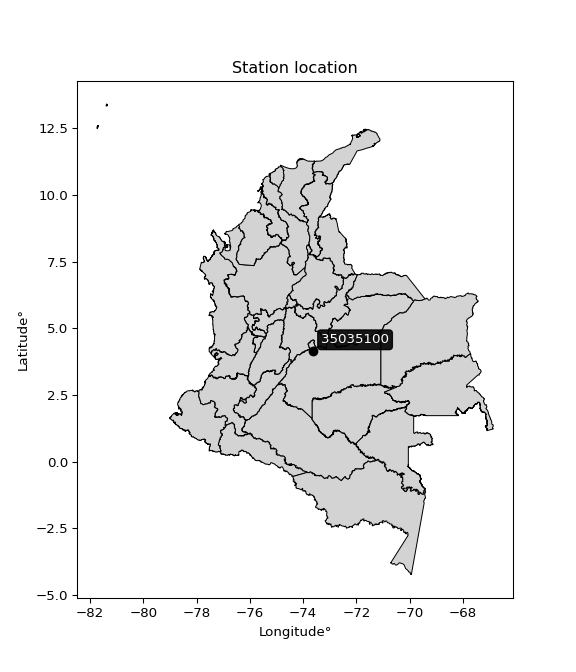

<div align="center">


</div>

# PMP Station (Rain, Pmax24h): 35035100

Probable Maximum Precipitation (PMP) is the greatest amount of rainfall for a specific duration that is meteorologically possible for a given location, acting as a "worst-case" scenario for extreme storms, crucial for designing safety-critical infrastructure like bridges, river deviations, dams, spillways, and nuclear plants to prevent catastrophic failure. PMP is calculated by hydrologists using meteorological data to determine the upper limit of extreme rainfall, often leading to the Probable Maximum Flood (PMF) for flood control design, and is increasingly being studied for climate change impacts. Probable Maximum Precipitation (PMP) is the theoretical upper limit of rainfall, a deterministic estimate for extreme events, while probability distributions (like GEV, Gumbel) describe the likelihood and frequency of various precipitation amounts, including rare ones, showing how often events occur, with PMP representing the extreme end of these distributions, used for critical infrastructure design to ensure safety against the worst conceivable weather, unlike standard statistical forecasts which cover typical probabilities.

The most common probability distributions in hydrology, used for analyzing floods, rainfall, and streamflow, include the Normal, Log-Normal, Gumbel, Gamma (including Log-Pearson Type III), and Generalized Extreme Value (GEV) distributions, often chosen based on the data´s skewness and whether modeling extremes or general conditions, with Gumbel and GEV popular for extreme events like floods, while the Normal distribution serves as a baseline, though often requiring transformations for skewed hydrological data. These distributions help in designing water infrastructure, managing water resources, and forecasting hydrologic events.

> Hydrological data often isn´t perfectly normal (it´s skewed), so different distributions are needed for different applications, such as: **Flood Frequency Analysis**: Using Gumbel, GEV, or Log-Pearson Type III for predicting extreme flood magnitudes and their return periods, **Rainfall Analysis**: Normal for annual totals, but Log-Normal, Weibull, or GEV for intensity or extreme daily rainfall, **Streamflow Modeling**: Gamma and Log-Normal for maximum flows, GEV for minimum flows, and Kappa for daily flows.

<div align="center">

</img>

</div>


## A. General information


### 1. General running parameters

• app_version: _v20260108_. • runtime: _2026-01-08 13:24:42.400241_. • Python version: _3.14.0_. • SciPy version: _1.16.3_. • Pandas version: _2.3.3_. • NumPy version: _2.3.5_. • Stations dataset (station_dataset_file): _dataset/pmax24h_in/automatic_colombia_2003_2024.csv_. • Stations catalog (station_catalog_file): _dataset/CNE.xls_. • Minimum year to eval til year_max (date_min): _1900_. • Maximum year to eval since year_min (date_max): _2024_. • Creates, save and include plots into reports (create_plot): _False_. • Plot only fit distributions with Δo > Δ (plot_only_fit): _True_. • Plot only simple graphs avoiding multiple CDFs and multiple Extreme values plots (plot_only_simple): _True_. • Eval low extreme values, if False, evaluates high extreme values (low_extreme): _False_. • Eval every SciPy distribution as logarithmic (pdist_logarithmic_on): _True_. • Standard deviation normalized (ddof): _1.0_. • Return periods to eval in years (Tr): _[2, 2.33, 5, 10, 15, 20, 25, 50, 75, 100, 200, 250, 500, 750, 1000]_. • Minimum data sample per station, 0 means any (minimum_sample): _5_. • Z-Score maximum threshold to adjust a value, 0 means disable (zscore_max): _3.5_. • Z-Score minimum threshold to adjust a value, 0 means disable (zscore_min): _-2.5_. • Avoid zeros, e.g. rain = 0 (avoid_zeros): _True_. • Avoid null values (avoid_nans): _True_. 

:file_folder:Table: [dataset.csv](../../dataset/pmax24h_in/automatic_colombia_2003_2024.csv)

> Delta Degrees of Freedom (DDOF): is a parameter used in the formulas for calculating variance and standard deviation. When ddof=0, the divisor is $N$ (the total number of observations) and this is used when your data set is the entire population. When ddof=1, the divisor is $N-1$ and this is used when your data set is a sample drawn from a larger population. Using $N-1$ provides an unbiased estimate of the population variance (known as Bessel´s correction).


### 2. Station info and location

|   id |   CODIGO | NOMBRE                              | CATEGORIA               | TECNOLOGIA                              | ESTADO           | FECHA_INSTALACION   |   FECHA_SUSPENSION |   ALTITUD |   LATITUD |   LONGITUD | DEPARTAMENTO   | MUNICIPIO     | AREA_OPERATIVA                            | ENTIDAD                                                     | AREA_HIDROGRAFICA   | ZONA_HIDROGRAFICA   | SUBZONA_HIDROGRAFICA   |   CORRIENTE | Catalogo   |   Version |
|-----:|---------:|:------------------------------------|:------------------------|:----------------------------------------|:-----------------|:--------------------|-------------------:|----------:|----------:|-----------:|:---------------|:--------------|:------------------------------------------|:------------------------------------------------------------|:--------------------|:--------------------|:-----------------------|------------:|:-----------|----------:|
|    0 | 35035100 | ICA VILLAVICENCIO  - AUT [35035100] | Climatológica Principal | Automática con Telemetría, Convencional | En Mantenimiento | 22/03/2007          |                nan |       432 |   4.13722 |    -73.625 | Meta           | Villavicencio | Area Operativa 03 - Meta-Guaviare-Guainía | INSTITUTO DE HIDROLOGIA METEOROLOGIA Y ESTUDIOS AMBIENTALES | Orinoco             | Meta                | Río Guatiquía          |         nan | CNE_IDEAM  |  20251226 |

<div align="center">

Dynamic map: [:earth_americas:Google](http://maps.google.com/maps?q=4.137225,-73.624998) [:earth_americas:OSM](https://www.openstreetmap.org/#map=18/4.137225/-73.624998&layers=P) [:earth_americas:Bing](https://www.bing.com/maps?cp=4.137225~-73.624998&lvl=18) [:earth_americas:Apple](https://maps.apple.com/frame?center=4.137225%2C-73.624998&span=0.003%2C0.006)

</div>


<div align="center">

```geojson
{
  "type": "Feature",
  "geometry": {
    "type": "Point", 
    "coordinates": [-73.624998, 4.137225]
  }, 
  "properties": {
    "Name": "35035100"
  }
}
```

</div>


### 3. Discrete values table and plot

<div align="center">

|               |           0 |          1 |           2 |          3 |           4 |           5 |           6 |         7 |
|:--------------|------------:|-----------:|------------:|-----------:|------------:|------------:|------------:|----------:|
| Date          | 2017        | 2018       | 2019        | 2020       | 2021        | 2022        | 2023        | 2024      |
| Value         |  121.4      |  110.7     |  127.2      |  123.7     |  176.9      |  120.6      |  115.4      |  226.6    |
| Value_initial |  121.4      |  110.7     |  127.2      |  123.7     |  176.9      |  120.6      |  115.4      |  226.6    |
| count         |    8        |    8       |    8        |    8       |    8        |    8        |    8        |    8      |
| mean          |  140.312    |  140.312   |  140.312    |  140.312   |  140.312    |  140.312    |  140.312    |  140.312  |
| std           |   40.4897   |   40.4897  |   40.4897   |   40.4897  |   40.4897   |   40.4897   |   40.4897   |   40.4897 |
| zscore        |   -0.467095 |   -0.73136 |   -0.323848 |   -0.41029 |    0.903626 |   -0.486853 |   -0.615281 |    2.1311 |


</div>


> The initial value (value_initial) correspond to the initial obtained or null completed value, and value (value) is adjusted only when the initial value is outside the valid range (outlier) definite through the Z-Score value. If Z-Score is active, values out of range or outliers are replaced with the station mean value. A Z-Score (or standard score) measures how many standard deviations a data point is from the mean of a dataset, indicating its relative position; positive scores mean above the mean, negative mean below, and a score of zero is exactly at the mean, allowing for comparison of values from different distributions. It´s calculated using the formula $z=(x–μ)/σ$, where $x$ is the data point, $μ$ is the mean, and $σ$ is the standard deviation, helping identify outliers and understand probability.
>
> <sub>**Note**: In this study, "completing" (filling gaps in) and "extending" (forecasting or lengthening the historical record) rainfall data series are avoided for certain critical analyses because they introduce artificial bias and uncertainty, which can distort the statistics of rare events (extremes), alter day-to-day variability, and compromise the integrity and homogeneity of the original data. Some reasons against Completing/Extending rainfall data are: **Distortion of Extremes and Variability**: The primary issue is that most gap-filling or extension methods rely on averaging or regression with nearby stations, which inherently smooths the data. Rainfall is highly variable in space and time, with a large percentage of zero values and occasional large storms. Infilling methods often underestimate the highest values and overestimate the lowest (zero) values, which severely distorts analyses focused on flood frequency, drought severity, and intensity-duration-frequency (IDF) curves, **Loss of Data Homogeneity**: Infilled or extended data are synthetic estimates, not actual measurements. Combining these estimates with observed data can violate the assumption of data homogeneity, which requires that the data properties do not change over time. Inhomogeneity can lead to incorrect conclusions about long-term trends or changes in climate patterns, **Propagation of Errors**: Errors and biases from the original data (e.g., wind-induced undercatch, instrument errors, site changes) or the data used for imputation can propagate through the analysis, leading to unreliable hydrological models and inaccurate predictions, **Compromised Statistical Integrity**: For statistical analyses, especially those involving the frequency of events, using artificial data can introduce time bias or autocorrelation that doesn´t exist in reality, making it difficult to assess the true probability of events, **Difficulty in Validation**: It is difficult to accurately validate the quality of filled or extended data, especially for past periods where ground-truth measurements are unavailable. The reliability of imputation techniques heavily depends on the density of the surrounding station network and the complexity of the local topography.</sub>


### 4. Active continuous probability distributions from SciPy (43 of 104 available)

A Probability Density Function (PDF) describes the relative likelihood of a continuous random variable falling within a specific range, where the total area under its curve equals 1, and the area over any interval gives the actual probability for that range. Unlike discrete probabilities (like rolling a die), a PDF shows density, not direct probability for a single point (which is zero), with higher points indicating higher likelihood, often visualized as a bell curve for normal distributions.

A log of a probability density function (log-PDF) is simply the logarithm of the PDF´s value, denoted as $log(f(x))$, useful for converting multiplication of probabilities into addition, improving numerical stability with tiny numbers, and connecting to information theory concepts like entropy. Instead of dealing with very small probabilities (e.g., 0.000001), log-PDFs use negative numbers (e.g., $log(0.00001) ≈ -11.51$ that are easier for computers to handle, preventing underflow errors and simplifying complex calculations. In this study, each active probability distribution from SciPy is also evaluated in the $log$ form.

[scipy.stats](https://docs.scipy.org/doc/scipy/reference/stats.html) is a Python´s powerful submodule within the SciPy library for comprehensive statistical analysis, offering over 130 probability distributions (like Normal, Poisson), functions for descriptive stats (mean, variance), hypothesis testing (t-tests, chi-square), random variable generation, and statistical tests, making it essential for data science, modeling, and research. It provides tools to explore, model, and draw conclusions from data efficiently, working seamlessly with NumPy.

<div align="center">

|   id | p_dist             |   n_parameter | fit_method   | label                                                                       | active   | ref                                                                                                        |
|-----:|:-------------------|--------------:|:-------------|:----------------------------------------------------------------------------|:---------|:-----------------------------------------------------------------------------------------------------------|
|    0 | alpha              |             3 | MLE          | Alpha                                                                       | True     | [:mortar_board:](https://docs.scipy.org/doc/scipy/reference/generated/scipy.stats.alpha.html)              |
|    1 | betaprime          |             4 | MLE          | Beta prime                                                                  | True     | [:mortar_board:](https://docs.scipy.org/doc/scipy/reference/generated/scipy.stats.betaprime.html)          |
|    2 | chi2               |             3 | MLE          | Chi²                                                                        | True     | [:mortar_board:](https://docs.scipy.org/doc/scipy/reference/generated/scipy.stats.chi2.html)               |
|    3 | crystalball        |             4 | MLE          | Crystalball                                                                 | True     | [:mortar_board:](https://docs.scipy.org/doc/scipy/reference/generated/scipy.stats.crystalball.html)        |
|    4 | erlang             |             3 | MLE          | Erlang                                                                      | True     | [:mortar_board:](https://docs.scipy.org/doc/scipy/reference/generated/scipy.stats.erlang.html)             |
|    5 | expon              |             2 | MLE          | Exponential                                                                 | True     | [:mortar_board:](https://docs.scipy.org/doc/scipy/reference/generated/scipy.stats.expon.html)              |
|    6 | exponnorm          |             3 | MLE          | Exponentially modified Normal                                               | True     | [:mortar_board:](https://docs.scipy.org/doc/scipy/reference/generated/scipy.stats.exponnorm.html)          |
|    7 | f                  |             4 | MLE          | F                                                                           | True     | [:mortar_board:](https://docs.scipy.org/doc/scipy/reference/generated/scipy.stats.f.html)                  |
|    8 | fatiguelife        |             3 | MLE          | Fatigue-life (Birnbaum-Saunders)                                            | True     | [:mortar_board:](https://docs.scipy.org/doc/scipy/reference/generated/scipy.stats.fatiguelife.html)        |
|    9 | fisk               |             3 | MLE          | Fisk                                                                        | True     | [:mortar_board:](https://docs.scipy.org/doc/scipy/reference/generated/scipy.stats.fisk.html)               |
|   10 | gamma              |             3 | MLE          | Gamma                                                                       | True     | [:mortar_board:](https://docs.scipy.org/doc/scipy/reference/generated/scipy.stats.gamma.html)              |
|   11 | genexpon           |             5 | MLE          | Generalized exponential                                                     | True     | [:mortar_board:](https://docs.scipy.org/doc/scipy/reference/generated/scipy.stats.genexpon.html)           |
|   12 | genlogistic        |             3 | MLE          | Generalized logistic                                                        | True     | [:mortar_board:](https://docs.scipy.org/doc/scipy/reference/generated/scipy.stats.genlogistic.html)        |
|   13 | gibrat             |             2 | MM           | Gibrat                                                                      | True     | [:mortar_board:](https://docs.scipy.org/doc/scipy/reference/generated/scipy.stats.gibrat.html)             |
|   14 | gompertz           |             3 | MLE          | Gompertz (or truncated Gumbel)                                              | True     | [:mortar_board:](https://docs.scipy.org/doc/scipy/reference/generated/scipy.stats.gompertz.html)           |
|   15 | gumbel_l           |             2 | MM           | Gumbel Left Skew                                                            | True     | [:mortar_board:](https://docs.scipy.org/doc/scipy/reference/generated/scipy.stats.gumbel_l.html)           |
|   16 | gumbel_r           |             2 | MM           | Gumbel Right Skew                                                           | True     | [:mortar_board:](https://docs.scipy.org/doc/scipy/reference/generated/scipy.stats.gumbel_r.html)           |
|   17 | halflogistic       |             2 | MM           | Half-logistic                                                               | True     | [:mortar_board:](https://docs.scipy.org/doc/scipy/reference/generated/scipy.stats.halflogistic.html)       |
|   18 | halfnorm           |             2 | MM           | Half Normal                                                                 | True     | [:mortar_board:](https://docs.scipy.org/doc/scipy/reference/generated/scipy.stats.halfnorm.html)           |
|   19 | hypsecant          |             2 | MM           | hyperbolic secant                                                           | True     | [:mortar_board:](https://docs.scipy.org/doc/scipy/reference/generated/scipy.stats.hypsecant.html)          |
|   20 | invgamma           |             3 | MLE          | Inverted gamma                                                              | True     | [:mortar_board:](https://docs.scipy.org/doc/scipy/reference/generated/scipy.stats.invgamma.html)           |
|   21 | invgauss           |             3 | MLE          | Inverse Gaussian                                                            | True     | [:mortar_board:](https://docs.scipy.org/doc/scipy/reference/generated/scipy.stats.invgauss.html)           |
|   22 | invweibull         |             3 | MLE          | Inverted Weibull                                                            | True     | [:mortar_board:](https://docs.scipy.org/doc/scipy/reference/generated/scipy.stats.invweibull.html)         |
|   23 | kstwobign          |             2 | MLE          | Limiting distribution of scaled Kolmogorov-Smirnov two-sided test statistic | True     | [:mortar_board:](https://docs.scipy.org/doc/scipy/reference/generated/scipy.stats.kstwobign.html)          |
|   24 | laplace            |             2 | MM           | Laplace                                                                     | True     | [:mortar_board:](https://docs.scipy.org/doc/scipy/reference/generated/scipy.stats.laplace.html)            |
|   25 | laplace_asymmetric |             3 | MLE          | Asymmetric Laplace                                                          | True     | [:mortar_board:](https://docs.scipy.org/doc/scipy/reference/generated/scipy.stats.laplace_asymmetric.html) |
|   26 | loggamma           |             3 | MLE          | Log gamma                                                                   | True     | [:mortar_board:](https://docs.scipy.org/doc/scipy/reference/generated/scipy.stats.loggamma.html)           |
|   27 | logistic           |             2 | MM           | Logistic (or Sech-squared)                                                  | True     | [:mortar_board:](https://docs.scipy.org/doc/scipy/reference/generated/scipy.stats.logistic.html)           |
|   28 | lognorm            |             3 | MLE          | Log Normal                                                                  | True     | [:mortar_board:](https://docs.scipy.org/doc/scipy/reference/generated/scipy.stats.lognorm.html)            |
|   29 | maxwell            |             2 | MM           | Maxwell                                                                     | True     | [:mortar_board:](https://docs.scipy.org/doc/scipy/reference/generated/scipy.stats.maxwell.html)            |
|   30 | mielke             |             4 | MLE          | Mielke Beta-Kappa / Dagum                                                   | True     | [:mortar_board:](https://docs.scipy.org/doc/scipy/reference/generated/scipy.stats.mielke.html)             |
|   31 | moyal              |             2 | MM           | Moyal                                                                       | True     | [:mortar_board:](https://docs.scipy.org/doc/scipy/reference/generated/scipy.stats.moyal.html)              |
|   32 | nakagami           |             3 | MLE          | Nakagami                                                                    | True     | [:mortar_board:](https://docs.scipy.org/doc/scipy/reference/generated/scipy.stats.nakagami.html)           |
|   33 | ncf                |             5 | MLE          | Non-central F distribution                                                  | True     | [:mortar_board:](https://docs.scipy.org/doc/scipy/reference/generated/scipy.stats.ncf.html)                |
|   34 | nct                |             4 | MLE          | Non-central Student’s t                                                     | True     | [:mortar_board:](https://docs.scipy.org/doc/scipy/reference/generated/scipy.stats.nct.html)                |
|   35 | norm               |             2 | MM           | Normal                                                                      | True     | [:mortar_board:](https://docs.scipy.org/doc/scipy/reference/generated/scipy.stats.norm.html)               |
|   36 | pearson3           |             3 | MM           | Pearson type III                                                            | True     | [:mortar_board:](https://docs.scipy.org/doc/scipy/reference/generated/scipy.stats.pearson3.html)           |
|   37 | rayleigh           |             2 | MM           | Rayleigh                                                                    | True     | [:mortar_board:](https://docs.scipy.org/doc/scipy/reference/generated/scipy.stats.rayleigh.html)           |
|   38 | rice               |             3 | MLE          | Rice                                                                        | True     | [:mortar_board:](https://docs.scipy.org/doc/scipy/reference/generated/scipy.stats.rice.html)               |
|   39 | t                  |             3 | MLE          | Student’s t                                                                 | True     | [:mortar_board:](https://docs.scipy.org/doc/scipy/reference/generated/scipy.stats.t.html)                  |
|   40 | truncnorm          |             4 | MLE          | Truncated normal                                                            | True     | [:mortar_board:](https://docs.scipy.org/doc/scipy/reference/generated/scipy.stats.truncnorm.html)          |
|   41 | wald               |             2 | MM           | Wald                                                                        | True     | [:mortar_board:](https://docs.scipy.org/doc/scipy/reference/generated/scipy.stats.wald.html)               |
|   42 | weibull_min        |             3 | MLE          | Weibull minimum                                                             | True     | [:mortar_board:](https://docs.scipy.org/doc/scipy/reference/generated/scipy.stats.weibull_min.html)        |

</div>

> **n_parameter:** # arguments & localization & scale.
>
> **Fit methods:** (MLE) maximum likelihood, (MM) L-moments.
>
>**Inactive** (With the only purpose of prevent loops, zero divisions, infinite values, over high estimated values or horizontal trending for recurrence intervals estimations, the follow distributions were disabled.)**:** foldnorm, gennorm, norminvgauss, powernorm, powerlognorm, skewnorm, genextreme, anglit, arcsine, argus, beta, bradford, burr, burr12, cauchy, cosine, halfcauchy, foldcauchy, skewcauchy, wrapcauchy, dgamma, gengamma, exponweib, exponpow, truncexpon, gausshyper, genhalflogistic, genhyperbolic, geninvgauss, halfgennorm, johnsonsb, johnsonsu, kappa4, kappa3, ksone, kstwo, loglaplace, levy, levy_l, levy_stable, ncx2, pareto, genpareto, truncpareto, lomax, powerlaw, rdist, rel_breitwigner, recipinvgauss, semicircular, studentized_range, trapezoid, triang, truncweibull_min, tukeylambda, uniform, loguniform, vonmises, vonmises_line, weibull_max, dweibull, 


## B. Probability (PDF) vs. Empirical (EDF) distributions functions

A continuous probability distribution (CPD) describes probabilities for variables that can take any value within a range (like rain any time), unlike discrete variables with specific outcomes (like temperature). It uses a Probability Density Function (PDF), a curve where the total area under it equals 1, and the probability of the variable falling within an interval (a to b) is found by calculating the area under the curve between those points. A key feature is that the probability of hitting any single exact value is zero, so probabilities are always expressed for ranges, e.g., $P(a ≤ X ≤ b)$.

<div align="center">

Distributions parameters from station values
|    |   station | p_dist                |   n |             loc |            scale | shape                  | shape1                 | shape2                | shape3   |
|---:|----------:|:----------------------|----:|----------------:|-----------------:|:-----------------------|:-----------------------|:----------------------|:---------|
|  0 |  35035100 | alpha                 |   8 |     102.298     |     23.1547      | 0.8365672098961594     |                        |                       |          |
|  1 |  35035100 | betaprime             |   8 |      -1.49429   |      6.26301     | 460.6759632998779      | 21.465429353634924     |                       |          |
|  2 |  35035100 | chi2                  |   8 |     110.7       |      1.53394     | 0.19530881860967012    |                        |                       |          |
|  3 |  35035100 | crystalball           |   8 |     140.312     |     37.8746      | 12660.675013223406     | 2390.25649126904       |                       |          |
|  4 |  35035100 | erlang                |   8 |     110.7       |     41.4821      | 0.5060464587967388     |                        |                       |          |
|  5 |  35035100 | expon                 |   8 |     110.7       |     29.6125      |                        |                        |                       |          |
|  6 |  35035100 | exponnorm             |   8 |     110.653     |      0.0159347   | 1849.277560588047      |                        |                       |          |
|  7 |  35035100 | f                     |   8 |     106.214     |     13.4871      | 747.4328214861227      | 2.7440165940875163     |                       |          |
|  8 |  35035100 | fatiguelife           |   8 |     108.964     |     15.5155      | 1.429981952164098      |                        |                       |          |
|  9 |  35035100 | fisk                  |   8 |      -0.322478  |    130.123       | 8.0387690097796        |                        |                       |          |
| 10 |  35035100 | gamma                 |   8 |     110.7       |     26.3768      | 0.8254775260103338     |                        |                       |          |
| 11 |  35035100 | genexpon              |   8 |     110.7       |      3.50767e+12 | 122153758163.41907     | 24286779374.7396       | 14722434075.975708    |          |
| 12 |  35035100 | genlogistic           |   8 |     -36.8603    |     21.1989      | 2065.2331094524993     |                        |                       |          |
| 13 |  35035100 | gibrat                |   8 |     111.419     |     17.5248      |                        |                        |                       |          |
| 14 |  35035100 | gompertz              |   8 |     110.7       |      6.14144e+12 | 216229448493.02573     |                        |                       |          |
| 15 |  35035100 | gumbel_l              |   8 |     157.358     |     29.5307      |                        |                        |                       |          |
| 16 |  35035100 | gumbel_r              |   8 |     123.267     |     29.5307      |                        |                        |                       |          |
| 17 |  35035100 | halflogistic          |   8 |      95.4223    |     32.3814      |                        |                        |                       |          |
| 18 |  35035100 | halfnorm              |   8 |      90.1814    |     62.8301      |                        |                        |                       |          |
| 19 |  35035100 | hypsecant             |   8 |     140.312     |     24.1117      |                        |                        |                       |          |
| 20 |  35035100 | invgamma              |   8 |     106.186     |     18.5471      | 1.3732572145011532     |                        |                       |          |
| 21 |  35035100 | invgauss              |   8 |     107.912     |     14.9156      | 2.172269672551238      |                        |                       |          |
| 22 |  35035100 | invweibull            |   8 |     105.403     |     13.7126      | 1.2795668034077403     |                        |                       |          |
| 23 |  35035100 | kstwobign             |   8 |      43.8929    |    112.354       |                        |                        |                       |          |
| 24 |  35035100 | laplace               |   8 |     140.312     |     26.7814      |                        |                        |                       |          |
| 25 |  35035100 | laplace_asymmetric    |   8 |     110.7       |      0.000331573 | 1.1197061211091335e-05 |                        |                       |          |
| 26 |  35035100 | loggamma              |   8 |  -17865.4       |   2232.78        | 3178.896618663788      |                        |                       |          |
| 27 |  35035100 | logistic              |   8 |     140.312     |     20.8814      |                        |                        |                       |          |
| 28 |  35035100 | lognorm               |   8 |     110.7       |      0.241693    | 11.556269202540534     |                        |                       |          |
| 29 |  35035100 | maxwell               |   8 |      50.5656    |     56.2405      |                        |                        |                       |          |
| 30 |  35035100 | mielke                |   8 |      -2.62081   |     64.2114      | 1008.0565016109394     | 7.2973075310244315     |                       |          |
| 31 |  35035100 | moyal                 |   8 |     118.653     |     17.0496      |                        |                        |                       |          |
| 32 |  35035100 | nakagami              |   8 |     110.7       |     62.7938      | 0.07838055004923153    |                        |                       |          |
| 33 |  35035100 | ncf                   |   8 |      -3.59149   |      0.000468186 | 0.0024865463000398975  | 46.523757388205624     | 728.399177157246      |          |
| 34 |  35035100 | nct                   |   8 |      -0.498075  |      1.68508     | 11.646291859144895     | 77.54797273707294      |                       |          |
| 35 |  35035100 | norm                  |   8 |     140.312     |     37.8746      |                        |                        |                       |          |
| 36 |  35035100 | pearson3              |   8 |     140.313     |     37.8746      | 1.4465991469295414     |                        |                       |          |
| 37 |  35035100 | rayleigh              |   8 |      67.8562    |     57.8118      |                        |                        |                       |          |
| 38 |  35035100 | rice                  |   8 |      85.4802    |     47.1225      | 0.0002690303623324379  |                        |                       |          |
| 39 |  35035100 | t                     |   8 |     121.513     |      3.9426      | 0.6415000051298267     |                        |                       |          |
| 40 |  35035100 | truncnorm             |   8 | -464214         |   4194.45        | 110.69983335038239     | 235.8197766285497      |                       |          |
| 41 |  35035100 | wald                  |   8 |     102.438     |     37.8746      |                        |                        |                       |          |
| 42 |  35035100 | weibull_min           |   8 |     110.7       |     10.9076      | 0.21719876407950284    |                        |                       |          |
| 43 |  35035100 | logalpha              |   8 |       3.23078   |     14.1137      | 8.529477189003924      |                        |                       |          |
| 44 |  35035100 | logbetaprime          |   8 |       1.28299   |      1.74303     | 861.7515962473303      | 415.0658863774474      |                       |          |
| 45 |  35035100 | logchi2               |   8 |       4.70682   |      0.961695    | 0.9324207623455212     |                        |                       |          |
| 46 |  35035100 | logcrystalball        |   8 |       4.91365   |      0.234497    | 7.716040131616127      | 5672.563968133583      |                       |          |
| 47 |  35035100 | logerlang             |   8 |       4.70682   |      0.269515    | 0.6149870924291239     |                        |                       |          |
| 48 |  35035100 | logexpon              |   8 |       4.70682   |      0.206825    |                        |                        |                       |          |
| 49 |  35035100 | logexponnorm          |   8 |       4.70647   |      0.000118171 | 1728.7282506230854     |                        |                       |          |
| 50 |  35035100 | logf                  |   8 |       4.70682   |      0.151868    | 1.2755029882369866     | 15.985868892153993     |                       |          |
| 51 |  35035100 | logfatiguelife        |   8 |       4.68688   |      0.133015    | 1.1843448774067018     |                        |                       |          |
| 52 |  35035100 | logfisk               |   8 |       4.70092   |      0.114816    | 1.3324844306627872     |                        |                       |          |
| 53 |  35035100 | loggamma              |   8 |       4.70682   |      0.236279    | 0.4560675786540539     |                        |                       |          |
| 54 |  35035100 | loggenexpon           |   8 |       4.70682   |      0.170083    | 0.8220608452203572     | 1.3691764093054124e-07 | 2.553658130545118     |          |
| 55 |  35035100 | loggenlogistic        |   8 |       3.75281   |      0.139169    | 2070.4828860510834     |                        |                       |          |
| 56 |  35035100 | loggibrat             |   8 |       4.73478   |      0.108492    |                        |                        |                       |          |
| 57 |  35035100 | loggompertz           |   8 |       4.70682   | 287342           | 1366956.9811938587     |                        |                       |          |
| 58 |  35035100 | loggumbel_l           |   8 |       5.01918   |      0.182837    |                        |                        |                       |          |
| 59 |  35035100 | loggumbel_r           |   8 |       4.80811   |      0.182837    |                        |                        |                       |          |
| 60 |  35035100 | loghalflogistic       |   8 |       4.63572   |      0.200487    |                        |                        |                       |          |
| 61 |  35035100 | loghalfnorm           |   8 |       4.60327   |      0.389006    |                        |                        |                       |          |
| 62 |  35035100 | loghypsecant          |   8 |       4.91365   |      0.149285    |                        |                        |                       |          |
| 63 |  35035100 | loginvgamma           |   8 |       4.60836   |      0.754398    | 3.842045961764221      |                        |                       |          |
| 64 |  35035100 | loginvgauss           |   8 |       4.67777   |      0.166428    | 1.4172666698082623     |                        |                       |          |
| 65 |  35035100 | loginvweibull         |   8 |       4.64012   |      0.141063    | 1.6135389184139342     |                        |                       |          |
| 66 |  35035100 | logkstwobign          |   8 |       4.29489   |      0.718502    |                        |                        |                       |          |
| 67 |  35035100 | loglaplace            |   8 |       4.91365   |      0.165814    |                        |                        |                       |          |
| 68 |  35035100 | loglaplace_asymmetric |   8 |       4.7484    |      0.0837119   | 0.4179941139516932     |                        |                       |          |
| 69 |  35035100 | logloggamma           |   8 |     -92.2975    |     12.3452      | 2629.2877855018796     |                        |                       |          |
| 70 |  35035100 | loglogistic           |   8 |       4.91365   |      0.129285    |                        |                        |                       |          |
| 71 |  35035100 | loglognorm            |   8 |       4.70682   |      0.00249715  | 10.869020219707362     |                        |                       |          |
| 72 |  35035100 | logmaxwell            |   8 |       4.35799   |      0.348208    |                        |                        |                       |          |
| 73 |  35035100 | logmielke             |   8 |       4.27354   |      0.272277    | 79.24642646156187      | 4.3439670205410685     |                       |          |
| 74 |  35035100 | logmoyal              |   8 |       4.77955   |      0.105561    |                        |                        |                       |          |
| 75 |  35035100 | lognakagami           |   8 |       4.70682   |      0.476911    | 0.28530509622295486    |                        |                       |          |
| 76 |  35035100 | logncf                |   8 |      -4.81102   |      9.72217     | 521.1299020432282      | 471.0103787384936      | 9.531846118545386e-06 |          |
| 77 |  35035100 | lognct                |   8 |       0.0604314 |      0.0445762   | 241.85012712860396     | 108.4915940967108      |                       |          |
| 78 |  35035100 | lognorm               |   8 |       4.91365   |      0.234497    |                        |                        |                       |          |
| 79 |  35035100 | logpearson3           |   8 |       4.91365   |      0.234497    | 1.2837126723980479     |                        |                       |          |
| 80 |  35035100 | lograyleigh           |   8 |       4.46504   |      0.357936    |                        |                        |                       |          |
| 81 |  35035100 | logrice               |   8 |       4.56592   |      0.296567    | 8.839364811389856e-05  |                        |                       |          |
| 82 |  35035100 | logt                  |   8 |       4.91352   |      0.234395    | 2413.3244513898817     |                        |                       |          |
| 83 |  35035100 | logtruncnorm          |   8 |      -2.45327   |      1.49711     | 4.782610384629171      | 5.261116014328376      |                       |          |
| 84 |  35035100 | logwald               |   8 |       4.67915   |      0.234497    |                        |                        |                       |          |
| 85 |  35035100 | logweibull_min        |   8 |       4.70682   |      0.30475     | 0.5095567776727059     |                        |                       |          |

</div>

> **loc** (Location parameter): This shifts the distribution along the x-axis. For many common distributions, like the normal (Gaussian) distribution, loc represents the mean $μ$. For others, like the uniform distribution, it might represent the minimum value, or for the beta distribution, the left end of the support interval.
>
> **scale** (Scale parameter): This determines the width or spread of the distribution. For the normal distribution, scale represents the standard deviation $σ$. For a uniform distribution, it defines the length of the interval (from $loc$ to $loc + scale$).
>
> **shape** (Shape parameters): Refers to parameters that define the specific form of a probability distribution, distinct from its location (loc) and scale (scale). These parameters are required arguments for most distribution functions. For example, a normal (Gaussian) distribution is fully defined by its location (mean) and scale (standard deviation), so it has no specific shape parameters beyond loc and scale. However, other distributions have intrinsic properties that need specification, as Gamma distribution that takes a shape parameter, often named $a$ or $alpha$.


### 0. Cumulative distribution values - CDF (86 evaluated)

Cumulative Distribution Function (CDF), denoted as $F$<sub>$X$</sub>$(x)$, is a function that gives the probability that a random variable $X$ will take a value less than or equal to a specific value, $x$ (i.e., $(P(X≥x)$. It essentially "accumulates" probabilities from a given point up to the far right (positive infinity), providing a complete picture of the distribution´s probabilities for both discrete (like rain) and continuous (like temperature) variables, helping to find probabilities over ranges or above certain values. Each station is evaluated separately ordering the $x$ values ascending, calculating the CDF and PDF values for the activated distributions and their logarithmic forms.

<div align="center">

CDF ordered by x ascending and calculating $log(f(x))$ separately
|   id |   Station |   date |     x |   count |    mean |     std |    zscore |   Value_initial |   station |   m |     alpha |   alpha_pdf |   betaprime |   betaprime_pdf |      chi2 |    chi2_pdf |   crystalball |   crystalball_pdf |      erlang |       erlang_pdf |    expon |   expon_pdf |   exponnorm |   exponnorm_pdf |         f |       f_pdf |   fatiguelife |   fatiguelife_pdf |     fisk |    fisk_pdf |       gamma |    gamma_pdf |    genexpon |   genexpon_pdf |   genlogistic |   genlogistic_pdf |    gibrat |   gibrat_pdf |    gompertz |   gompertz_pdf |   gumbel_l |   gumbel_l_pdf |   gumbel_r |   gumbel_r_pdf |   halflogistic |   halflogistic_pdf |   halfnorm |   halfnorm_pdf |   hypsecant |   hypsecant_pdf |   invgamma |   invgamma_pdf |   invgauss |   invgauss_pdf |   invweibull |   invweibull_pdf |   kstwobign |   kstwobign_pdf |   laplace |   laplace_pdf |   laplace_asymmetric |   laplace_asymmetric_pdf |    loggamma |   loggamma_pdf |   logistic |   logistic_pdf |   lognorm |   lognorm_pdf |   maxwell |   maxwell_pdf |     mielke |   mielke_pdf |    moyal |   moyal_pdf |   nakagami |   nakagami_pdf |      ncf |     ncf_pdf |      nct |     nct_pdf |     norm |    norm_pdf |   pearson3 |   pearson3_pdf |   rayleigh |   rayleigh_pdf |     rice |    rice_pdf |        t |       t_pdf |   truncnorm |   truncnorm_pdf |      wald |    wald_pdf |   weibull_min |   weibull_min_pdf |   logalpha |   logalpha_pdf |   logbetaprime |   logbetaprime_pdf |     logchi2 |   logchi2_pdf |   logcrystalball |   logcrystalball_pdf |   logerlang |   logerlang_pdf |   logexpon |   logexpon_pdf |   logexponnorm |   logexponnorm_pdf |        logf |      logf_pdf |   logfatiguelife |   logfatiguelife_pdf |   logfisk |   logfisk_pdf |   loggenexpon |   loggenexpon_pdf |   loggenlogistic |   loggenlogistic_pdf |   loggibrat |   loggibrat_pdf |   loggompertz |   loggompertz_pdf |   loggumbel_l |   loggumbel_l_pdf |   loggumbel_r |   loggumbel_r_pdf |   loghalflogistic |   loghalflogistic_pdf |   loghalfnorm |   loghalfnorm_pdf |   loghypsecant |   loghypsecant_pdf |   loginvgamma |   loginvgamma_pdf |   loginvgauss |   loginvgauss_pdf |   loginvweibull |   loginvweibull_pdf |   logkstwobign |   logkstwobign_pdf |   loglaplace |   loglaplace_pdf |   loglaplace_asymmetric |   loglaplace_asymmetric_pdf |   logloggamma |   logloggamma_pdf |   loglogistic |   loglogistic_pdf |   loglognorm |   loglognorm_pdf |   logmaxwell |   logmaxwell_pdf |   logmielke |   logmielke_pdf |   logmoyal |   logmoyal_pdf |   lognakagami |   lognakagami_pdf |   logncf |   logncf_pdf |   lognct |   lognct_pdf |   logpearson3 |   logpearson3_pdf |   lograyleigh |   lograyleigh_pdf |   logrice |   logrice_pdf |     logt |   logt_pdf |   logtruncnorm |   logtruncnorm_pdf |    logwald |   logwald_pdf |   logweibull_min |   logweibull_min_pdf |
|-----:|----------:|-------:|------:|--------:|--------:|--------:|----------:|----------------:|----------:|----:|----------:|------------:|------------:|----------------:|----------:|------------:|--------------:|------------------:|------------:|-----------------:|---------:|------------:|------------:|----------------:|----------:|------------:|--------------:|------------------:|---------:|------------:|------------:|-------------:|------------:|---------------:|--------------:|------------------:|----------:|-------------:|------------:|---------------:|-----------:|---------------:|-----------:|---------------:|---------------:|-------------------:|-----------:|---------------:|------------:|----------------:|-----------:|---------------:|-----------:|---------------:|-------------:|-----------------:|------------:|----------------:|----------:|--------------:|---------------------:|-------------------------:|------------:|---------------:|-----------:|---------------:|----------:|--------------:|----------:|--------------:|-----------:|-------------:|---------:|------------:|-----------:|---------------:|---------:|------------:|---------:|------------:|---------:|------------:|-----------:|---------------:|-----------:|---------------:|---------:|------------:|---------:|------------:|------------:|----------------:|----------:|------------:|--------------:|------------------:|-----------:|---------------:|---------------:|-------------------:|------------:|--------------:|-----------------:|---------------------:|------------:|----------------:|-----------:|---------------:|---------------:|-------------------:|------------:|--------------:|-----------------:|---------------------:|----------:|--------------:|--------------:|------------------:|-----------------:|---------------------:|------------:|----------------:|--------------:|------------------:|--------------:|------------------:|--------------:|------------------:|------------------:|----------------------:|--------------:|------------------:|---------------:|-------------------:|--------------:|------------------:|--------------:|------------------:|----------------:|--------------------:|---------------:|-------------------:|-------------:|-----------------:|------------------------:|----------------------------:|--------------:|------------------:|--------------:|------------------:|-------------:|-----------------:|-------------:|-----------------:|------------:|----------------:|-----------:|---------------:|--------------:|------------------:|---------:|-------------:|---------:|-------------:|--------------:|------------------:|--------------:|------------------:|----------:|--------------:|---------:|-----------:|---------------:|-------------------:|-----------:|--------------:|-----------------:|---------------------:|
|    0 |  35035100 |   2018 | 110.7 |       8 | 140.312 | 40.4897 | -0.73136  |           110.7 |  35035100 |   1 | 0.0343949 | 0.0259723   |    0.182209 |      0.0112607  | 0.0418241 | 2.87407e+11 |      0.21715  |       0.00775925  | 1.68353e-08 | 599504           | 0        | 0.0337695   |  0.00158116 |     0.0338235   | 0.0339072 | 0.0285563   |      0.031659 |       0.0476442   | 0.218209 | 0.0123521   | 2.65294e-13 | 15.4103      | 5.23099e-13 |    0.0348248   |      0.141178 |       0.0130317   | 0         |  0           | 4.04775e-13 |    0.0352083   |   0.186149 |    0.00567665  |   0.216441 |    0.0112171   |       0.231622 |         0.0146126  |   0.25601  |     0.0120396  |    0.181356 |     0.0071211   |  0.0338213 |    0.0284971   |  0.0323367 |    0.0354342   |    0.0341376 |      0.0278511   |    0.128663 |     0.0115143   |  0.165488 |   0.0061792   |          1.80616e-10 |              0.0337695   | 2.97861e-07 |    1.52947e+08 |   0.194955 |    0.00751615  |  0.18889  |      1.15306  |  0.233359 |    0.00915758 |   0.114053 |    0.0158208 | 0.206701 | 0.013313    | 0.00300807 |    3.31822e+10 | 0.183324 | 0.0110217   | 0.169643 | 0.0121553   | 0.21715  | 0.00775925  |   0.224757 |     0.0139083  |   0.24013  |     0.0097408  | 0.133434 | 0.00984205  | 0.160804 | 0.009068    | 1.81899e-12 |      0.0263942  | 0.0807009 | 0.0254648   |   0.000584583 |       8.93215e+09 |   0.150943 |       1.51673  |       0.174415 |           1.26513  | 8.00121e-08 |   4.19989e+07 |         0.18889  |             1.15306  | 1.38593e-09 |   959639        |   0        |       4.83501  |     0.00173019 |           4.87991  | 1.66962e-09 | 299715        |        0.0318927 |             4.49987  | 0.0187896 |      4.16433  |   6.16738e-08 |          4.83329  |         0.112895 |            1.76855   |   0         |        0        |   3.71383e-09 |          4.75725  |      0.165692 |        0.826623   |      0.17549  |          1.67025  |          0.175504 |              2.41711  |      0.209923 |          1.97968  |       0.156088 |           1.00416  |     0.0456629 |         2.4175    |      0.032643 |          3.63347  |       0.0351509 |            2.84674  |       0.10248  |           1.61873  |     0.143636 |         0.866245 |               0.0453237 |                    1.29529  |      0.197181 |          1.14649  |      0.168015 |          1.08123  |   0.00417857 |      1.27613e+12 |     0.19962  |         1.3923   |    0.102646 |        2.20242  |   0.158175 |       1.97033  |   3.05768e-09 |        1.9644e+06 | 0.406067 |     0.453123 | 0.183355 |     1.26182  |      0.180044 |          1.97308  |      0.203989 |          1.50221  |  0.106731 |      1.43106  | 0.188974 |   1.15348  |    1.74264e-06 |           3.62394  | 0.00931766 |      1.55403  |      3.92073e-08 |          2.24936e+07 |
|    1 |  35035100 |   2023 | 115.4 |       8 | 140.312 | 40.4897 | -0.615281 |           115.4 |  35035100 |   2 | 0.220382  | 0.0436984   |    0.238193 |      0.0124961  | 0.989448  | 0.00491552  |      0.255345 |       0.00848424  | 0.360964    |      0.0360278   | 0.146762 | 0.0288134   |  0.148775   |     0.0288867   | 0.224667  | 0.0426365   |      0.262573 |       0.0389096   | 0.280329 | 0.0140144   | 0.237049    |  0.0377095   | 0.151254    |    0.0296722   |      0.208341 |       0.01541     | 0.0691613 |  0.033415    | 0.152512    |    0.0298386   |   0.214562 |    0.00642362  |   0.271104 |    0.0119828   |       0.299049 |         0.0140601  |   0.311859 |     0.0117163  |    0.217653 |     0.00833968  |  0.224398  |    0.0426249   |  0.242247  |    0.0417309   |    0.223492  |      0.0428625   |    0.187322 |     0.0133377   |  0.197234 |   0.00736459  |          0.146762    |              0.0288134   | 0.484482    |    4.7027      |   0.232714 |    0.00855108  |  0.240506 |      1.32722  |  0.277732 |    0.00970114 |   0.198455 |    0.0197282 | 0.271285 | 0.014055    | 0.568019   |    0.0189377   | 0.238087 | 0.0122211   | 0.230471 | 0.0136336   | 0.255345 | 0.00848424  |   0.290288 |     0.0139027  |   0.286921 |     0.0101438  | 0.182555 | 0.0110144   | 0.224624 | 0.0203688   | 0.116667    |      0.0233151  | 0.210855  | 0.0279612   |   0.565207    |       0.0167351   |   0.220526 |       1.81693  |       0.231559 |           1.47911  | 0.187697    |   2.07366     |         0.240506 |             1.32722  | 0.334044    |        4.48568  |   0.182122 |       3.95445  |     0.185575   |           3.98671  | 0.335714    |      4.58906  |        0.252297  |             4.71205  | 0.235661  |      5.05508  |   0.182064    |          3.95332  |         0.198266 |            2.30438   |   0.0190169 |        3.40375  |   0.179473    |          3.90345  |      0.203407 |        0.990797   |      0.250024 |          1.89559  |          0.273867 |              2.30688  |      0.290925 |          1.91318  |       0.203255 |           1.27086  |     0.192703  |         4.27103   |      0.235578 |          4.86316  |       0.216074  |            4.93291  |       0.179505 |           2.05557  |     0.184573 |         1.11313  |               0.148732  |                    4.25058  |      0.248286 |          1.30921  |      0.217867 |          1.31803  |   0.60209    |      0.85367     |     0.26066  |         1.53638  |    0.21018  |        2.87434  |   0.246476 |       2.23773  |   0.193039    |        2.64462    | 0.424968 |     0.455815 | 0.239964 |     1.45649  |      0.264983 |          2.08719  |      0.269013 |          1.61674  |  0.172471 |      1.71697  | 0.240611 |   1.32777  |    0.14109     |           3.17194  | 0.160712   |      4.57304  |      0.304006    |          3.09111     |
|    2 |  35035100 |   2022 | 120.6 |       8 | 140.312 | 40.4897 | -0.486853 |           120.6 |  35035100 |   3 | 0.418374  | 0.0315035   |    0.305679 |      0.0133701  | 0.99885   | 0.000460792 |      0.301369 |       0.00919898  | 0.505516    |      0.0219981   | 0.284174 | 0.0241731   |  0.286479   |     0.0242137   | 0.41568   | 0.0304557   |      0.419984 |       0.0237364   | 0.356752 | 0.0152555   | 0.402953    |  0.0271875   | 0.292608    |    0.0248341   |      0.293032 |       0.0169623   | 0.258986  |  0.0352585   | 0.294298    |    0.0248466   |   0.25025  |    0.00731237  |   0.334702 |    0.0124053   |       0.370297 |         0.0133237  |   0.371715 |     0.0112947  |    0.26469  |     0.00975554  |  0.415429  |    0.0304676   |  0.419649  |    0.0274249   |    0.416127  |      0.0307195   |    0.260232 |     0.0145661   |  0.239501 |   0.0089428   |          0.284174    |              0.0241731   | 0.638114    |    2.63399     |   0.280088 |    0.0096564   |  0.302676 |      1.48866  |  0.329378 |    0.0101318  |   0.306512 |    0.0213732 | 0.344908 | 0.0141477   | 0.638312   |    0.0100891   | 0.30412  | 0.0130925   | 0.304131 | 0.0145731   | 0.301369 | 0.00919898  |   0.361611 |     0.0134688  |   0.340438 |     0.0104087  | 0.242496 | 0.0119806   | 0.434692 | 0.0684787   | 0.229954    |      0.0203251  | 0.346713  | 0.0239149   |   0.624377    |       0.00806923  |   0.305744 |       2.02923  |       0.301066 |           1.66638  | 0.261005    |   1.37799     |         0.302676 |             1.48866  | 0.49121     |        2.8838   |   0.339095 |       3.19548  |     0.343627   |           3.21303  | 0.495607    |      2.91095  |        0.422569  |             3.15048  | 0.425151  |      3.55696  |   0.338997    |          3.19482  |         0.307579 |            2.60503   |   0.263905  |        5.66435  |   0.334678    |          3.1651   |      0.25129  |        1.1851     |      0.336464 |          2.00451  |          0.372187 |              2.14846  |      0.373317 |          1.82226  |       0.266077 |           1.5819   |     0.383021  |         4.12254   |      0.418539 |          3.45945  |       0.4135    |            3.86712  |       0.276371 |           2.30207  |     0.240773 |         1.45206  |               0.316894  |                    3.41092  |      0.309406 |          1.45932  |      0.281461 |          1.5643   |   0.627505   |      0.406437    |     0.330816 |         1.63791  |    0.341255 |        2.98244  |   0.346916 |       2.284    |   0.291115    |        1.92547    | 0.445099 |     0.457505 | 0.308023 |     1.62366  |      0.357009 |          2.06912  |      0.341916 |          1.68189  |  0.253083 |      1.92401  | 0.302807 |   1.48932  |    0.271427    |           2.7519   | 0.350098   |      3.84155  |      0.407715    |          1.84547     |
|    3 |  35035100 |   2017 | 121.4 |       8 | 140.312 | 40.4897 | -0.467095 |           121.4 |  35035100 |   4 | 0.442786  | 0.0295427   |    0.31641  |      0.0134566  | 0.999164  | 0.00033098  |      0.308768 |       0.00929859  | 0.522612    |      0.0207653   | 0.303254 | 0.0235288   |  0.305589   |     0.0235651   | 0.439322  | 0.0286653   |      0.438389 |       0.022302    | 0.369007 | 0.0153772   | 0.42423     |  0.02602     | 0.312205    |    0.0241615   |      0.306656 |       0.0170939   | 0.286742  |  0.0341131   | 0.313898    |    0.0241565   |   0.256156 |    0.00745399  |   0.344638 |    0.0124321   |       0.380907 |         0.0132006  |   0.380722 |     0.0112244  |    0.272581 |     0.00997303  |  0.439081  |    0.028678    |  0.440914  |    0.0257624   |    0.439966  |      0.0288946   |    0.271933 |     0.0146825   |  0.246763 |   0.00921396  |          0.303253    |              0.0235288   | 0.654942    |    2.45978     |   0.287878 |    0.00981757  |  0.312589 |      1.5099   |  0.337503 |    0.0101816  |   0.323623 |    0.021395  | 0.35621  | 0.0141051   | 0.64612    |    0.00944607  | 0.31463  | 0.0131818   | 0.315823 | 0.014652    | 0.308768 | 0.00929859  |   0.372348 |     0.013373   |   0.348775 |     0.010433   | 0.252128 | 0.0120977   | 0.491748 | 0.073065    | 0.246044    |      0.0199005  | 0.365551  | 0.0231796   |   0.630585    |       0.0074675   |   0.319231 |       2.04999  |       0.312161 |           1.68967  | 0.26992     |   1.31983     |         0.312589 |             1.5099   | 0.509775    |        2.7345   |   0.359888 |       3.09495  |     0.36453    |           3.11071  | 0.514325    |      2.75358  |        0.442833  |             2.98181  | 0.448001  |      3.35673  |   0.359786    |          3.09434  |         0.324869 |            2.62387   |   0.30053   |        5.41038  |   0.355279    |          3.0671   |      0.259226 |        1.21571    |      0.349735 |          2.00958  |          0.386304 |              2.12176  |      0.385314 |          1.80699  |       0.276691 |           1.62869  |     0.409897  |         4.00553   |      0.440799 |          3.27624  |       0.438412  |            3.66926  |       0.291654 |           2.31997  |     0.250568 |         1.51113  |               0.339078  |                    3.30015  |      0.31912  |          1.47904  |      0.291918 |          1.59881  |   0.630091   |      0.376465    |     0.341681 |         1.64831  |    0.360894 |        2.9568   |   0.361985 |       2.27383  |   0.303632    |        1.86222    | 0.448125 |     0.457655 | 0.318827 |     1.64419  |      0.370651 |          2.05717  |      0.353053 |          1.68681  |  0.265879 |      1.94624  | 0.312724 |   1.51058  |    0.289428    |           2.69368  | 0.374973   |      3.68311  |      0.419573    |          1.74376     |
|    4 |  35035100 |   2020 | 123.7 |       8 | 140.312 | 40.4897 | -0.41029  |           123.7 |  35035100 |   5 | 0.504763  | 0.0245055   |    0.347585 |      0.0136347  | 0.999659  | 0.000131192 |      0.330469 |       0.00956722  | 0.566859    |      0.0178439   | 0.355322 | 0.0217705   |  0.357728   |     0.0217958   | 0.49982   | 0.024084    |      0.485614 |       0.0189266   | 0.40468  | 0.0156153   | 0.480561    |  0.0230505   | 0.365637    |    0.0223248   |      0.346274 |       0.0173187   | 0.361085  |  0.0304945   | 0.367268    |    0.0222774   |   0.273774 |    0.00786691  |   0.373274 |    0.0124562   |       0.410851 |         0.0128345  |   0.406299 |     0.0110147  |    0.29623  |     0.0105875   |  0.49961   |    0.0240975   |  0.495299  |    0.0216922   |    0.50088   |      0.024218    |    0.306    |     0.0149164   |  0.268892 |   0.0100402   |          0.355321    |              0.0217705   | 0.697123    |    2.05428     |   0.310975 |    0.0102613   |  0.341458 |      1.56509  |  0.361064 |    0.0103     |   0.372653 |    0.0211742 | 0.38845  | 0.0139127   | 0.666093   |    0.00800713  | 0.345186 | 0.0133722   | 0.349702 | 0.0147857   | 0.330469 | 0.00956722  |   0.402759 |     0.0130644  |   0.372831 |     0.0104792  | 0.280299 | 0.0123875   | 0.643164 | 0.0530261   | 0.290453    |      0.0187284  | 0.416455  | 0.0210988   |   0.64614     |       0.00614186  |   0.358143 |       2.09255  |       0.344438 |           1.74783  | 0.293357    |   1.18401     |         0.341458 |             1.56509  | 0.557592    |        2.37506  |   0.415418 |       2.82646  |     0.420311   |           2.83765  | 0.562313    |      2.37509  |        0.494802  |             2.57163  | 0.506092  |      2.84836  |   0.415306    |          2.826    |         0.374367 |            2.64236   |   0.394802  |        4.63377  |   0.410348    |          2.80512  |      0.28287  |        1.30414    |      0.387481 |          2.00926  |          0.42539  |              2.04264  |      0.418807 |          1.76158  |       0.308481 |           1.75778  |     0.481577  |         3.62394   |      0.497824 |          2.81442  |       0.50222   |            3.13996  |       0.335498 |           2.34637  |     0.280597 |         1.69223  |               0.398203  |                    3.00492  |      0.347371 |          1.53024  |      0.322804 |          1.69085  |   0.636504   |      0.311021    |     0.372845 |         1.67089  |    0.415408 |        2.84335  |   0.404254 |       2.22609  |   0.337112    |        1.71168    | 0.456717 |     0.457935 | 0.350181 |     1.69507  |      0.408869 |          2.01304  |      0.384796 |          1.69417  |  0.30291  |      1.99682  | 0.341606 |   1.56579  |    0.338479    |           2.53476  | 0.439963   |      3.24767  |      0.449989    |          1.50894     |
|    5 |  35035100 |   2019 | 127.2 |       8 | 140.312 | 40.4897 | -0.323848 |           127.2 |  35035100 |   6 | 0.579578  | 0.0185731   |    0.395509 |      0.0137124  | 0.99991   | 3.38073e-05 |      0.364593 |       0.00992052  | 0.623273    |      0.0145782   | 0.427188 | 0.0193436   |  0.429657   |     0.0193549   | 0.574096  | 0.0186425   |      0.545019 |       0.0152509   | 0.459518 | 0.0156562   | 0.554537    |  0.0193634   | 0.439247    |    0.0197879   |      0.406913 |       0.0172555   | 0.458264  |  0.0251413   | 0.440626    |    0.0196946   |   0.302426 |    0.00850737  |   0.416736 |    0.0123522   |       0.454754 |         0.0122477  |   0.444264 |     0.0106756  |    0.334847 |     0.0114641   |  0.573931  |    0.0186548   |  0.56267   |    0.0170723   |    0.57542   |      0.0186683   |    0.358455 |     0.0150083   |  0.306432 |   0.011442    |          0.427187    |              0.0193436   | 0.747965    |    1.61592     |   0.347975 |    0.0108656   |  0.386098 |      1.63145  |  0.397332 |    0.0104101  |   0        |  nan         | 0.436391 | 0.0134526   | 0.691355   |    0.00653546  | 0.392238 | 0.0134787   | 0.401458 | 0.0147418   | 0.364593 | 0.00992052  |   0.447553 |     0.0125191  |   0.409539 |     0.0104842  | 0.324242 | 0.0126963   | 0.766295 | 0.0223333   | 0.353066    |      0.0170759  | 0.485086  | 0.01818     |   0.665147    |       0.00482248  |   0.416917 |       2.11184  |       0.39415  |           1.8107   | 0.324204    |   1.03535     |         0.386098 |             1.63145  | 0.617852    |        1.9644   |   0.489192 |       2.46976  |     0.494317   |           2.47538  | 0.622278    |      1.9447   |        0.559707  |             2.10463  | 0.576764  |      2.24577  |   0.489069    |          2.46947  |         0.447507 |            2.58501   |   0.509064  |        3.59363  |   0.483643    |          2.45644  |      0.321122 |        1.43811    |      0.443124 |          1.97259  |          0.480658 |              1.91775  |      0.466957 |          1.68889  |       0.359993 |           1.92927  |     0.574246  |         3.02038   |      0.568385 |          2.26877  |       0.580229  |            2.47816  |       0.400841 |           2.32675  |     0.332017 |         2.00234  |               0.476466  |                    2.61414  |      0.390969 |          1.59181  |      0.37166  |          1.80631  |   0.644217   |      0.246726    |     0.419722 |         1.68562  |    0.491491 |        2.59931  |   0.464905 |       2.11462  |   0.382374    |        1.54106    | 0.469495 |     0.457953 | 0.398291 |     1.74911  |      0.463859 |          1.92486  |      0.432023 |          1.68781  |  0.359298 |      2.03855  | 0.386266 |   1.63215  |    0.406092    |           2.31501  | 0.522386   |      2.67803  |      0.488372    |          1.2575      |
|    6 |  35035100 |   2021 | 176.9 |       8 | 140.312 | 40.4897 |  0.903626 |           176.9 |  35035100 |   7 | 0.877332  | 0.00180972  |    0.876932 |      0.00474114 | 1         | 8.89047e-13 |      0.832982 |       0.00660576  | 0.924727    |      0.00221479  | 0.893066 | 0.00361111  |  0.894401   |     0.00358354  | 0.887674  | 0.00194683  |      0.870574 |       0.00279007  | 0.922969 | 0.00322497  | 0.942184    |  0.00230871  | 0.905916    |    0.00343448  |      0.917369 |       0.00373213  | 0.906272  |  0.00255565  | 0.902781    |    0.00342292  |   0.856034 |    0.00944886  |   0.849892 |    0.00468094  |       0.850537 |         0.00427075 |   0.832478 |     0.00489905 |    0.862578 |     0.00552397  |  0.887715  |    0.00194755  |  0.883113  |    0.00234263  |    0.886145  |      0.00191697  |    0.878753 |     0.00510664  |  0.872457 |   0.00476238  |          0.893066    |              0.00361112  | 0.959505    |    0.206498    |   0.852225 |    0.0060311   |  0.868005 |      0.911664 |  0.831538 |    0.00574271 | nan        |  nan         | 0.856211 | 0.00417085  | 0.854595   |    0.0018664   | 0.873817 | 0.0048476   | 0.883564 | 0.00436851  | 0.832982 | 0.00660576  |   0.849831 |     0.00430035 |   0.831168 |     0.00550837 | 0.847697 | 0.00627033  | 0.942717 | 0.000662119 | 0.825777    |      0.00459913 | 0.88167   | 0.00301377  |   0.772233    |       0.00110557  |   0.898372 |       0.662643 |       0.886477 |           0.819555 | 0.542468    |   0.455724    |         0.868005 |             0.911664 | 0.915903    |        0.361756 |   0.896322 |       0.501285 |     0.899377   |           0.492562 | 0.909388    |      0.343864 |        0.880587  |             0.419935 | 0.868887  |      0.319806 |   0.896238    |          0.501511 |         0.927575 |            0.501083  |   0.919533  |        0.338744 |   0.892473    |          0.511534 |      0.904853 |        1.22414    |      0.874581 |          0.641025 |          0.8732   |              0.592362 |      0.858771 |          0.694966 |       0.890959 |           0.71622  |     0.943634  |         0.282434  |      0.88742  |          0.377051 |       0.890287  |            0.311763 |       0.900919 |           0.675867 |     0.896981 |         0.621292 |               0.899142  |                    0.503607 |      0.86362  |          0.91456  |      0.883504 |          0.796109 |   0.684969   |      0.0697261   |     0.862146 |         0.802299 |    0.904818 |        0.434633 |   0.878223 |       0.572308 |   0.725785    |        0.710972   | 0.616665 |     0.424741 | 0.876728 |     0.829916 |      0.870947 |          0.624055 |      0.860589 |          0.773171 |  0.879129 |      0.837851 | 0.868168 |   0.910839 |    0.871321    |           0.771866 | 0.897525   |      0.411345 |      0.71216     |          0.389659    |
|    7 |  35035100 |   2024 | 226.6 |       8 | 140.312 | 40.4897 |  2.1311   |           226.6 |  35035100 |   8 | 0.929456  | 0.000605969 |    0.984016 |      0.00067806 | 1         | 4.94102e-20 |      0.988644 |       0.000786112 | 0.981559    |      0.000506827 | 0.980037 | 0.000674132 |  0.980448   |     0.000663491 | 0.942491  | 0.000613625 |      0.952697 |       0.000914012 | 0.988689 | 0.000396169 | 0.99188     |  0.000318133 | 0.985053    |    0.000560398 |      0.991763 |       0.000386948 | 0.970142  |  0.000588417 | 0.983103    |    0.000594902 |   0.99997  |    1.04253e-05 |   0.97023  |    0.000992953 |       0.965786 |         0.00103852 |   0.970086 |     0.0012025  |    0.982234 |     0.000736418 |  0.942541  |    0.000613582 |  0.950871  |    0.000763095 |    0.940329  |      0.000610809 |    0.989905 |     0.000584451 |  0.980061 |   0.000744517 |          0.980037    |              0.000674134 | 0.988128    |    0.0574948   |   0.984207 |    0.000744373 |  0.985106 |      0.160516 |  0.979628 |    0.00103653 | nan        |  nan         | 0.966351 | 0.000986227 | 0.921797   |    0.000972246 | 0.98382  | 0.000696018 | 0.982319 | 0.000660673 | 0.988644 | 0.000786112 |   0.966123 |     0.00105027 |   0.976946 |     0.001095   | 0.988714 | 0.000717218 | 0.961999 | 0.000231848 | 0.953087    |      0.00123853 | 0.962848  | 0.000804072 |   0.811903    |       0.000588952 |   0.981777 |       0.131354 |       0.987025 |           0.132852 | 0.636691    |   0.319507    |         0.985106 |             0.160516 | 0.970318    |        0.122608 |   0.968684 |       0.151414 |     0.970056   |           0.146581 | 0.962312    |      0.125177 |        0.948204  |             0.168946 | 0.920599  |      0.134853 |   0.968645    |          0.151547 |         0.987391 |            0.0900308 |   0.967678  |        0.105127 |   0.96689     |          0.157513 |      0.99989  |        0.00549696 |      0.965997 |          0.182776 |          0.961386 |              0.188882 |      0.964945 |          0.222486 |       0.97904  |           0.140303 |     0.980955  |         0.0732373 |      0.947446 |          0.150204 |       0.939003  |            0.121773 |       0.985575 |           0.126108 |     0.976858 |         0.139569 |               0.970706  |                    0.146271 |      0.983658 |          0.171649 |      0.980945 |          0.144578 |   0.698697   |      0.0447426   |     0.975109 |         0.199169 |    0.965666 |        0.127358 |   0.962177 |       0.17902  |   0.862038    |        0.410117   | 0.715248 |     0.368237 | 0.983381 |     0.156044 |      0.963212 |          0.19365  |      0.972202 |          0.207892 |  0.984669 |      0.149431 | 0.985113 |   0.160267 |    0.999996    |           0.327789 | 0.95948    |      0.143041 |      0.78685     |          0.234362    |


</div>

An Empirical Distribution Function (EDF) is a step-function estimate of a true cumulative distribution function (CDF) based on observed sample data, representing the proportion of data points less than or equal to a given value. It is calculated by ordering your data and jumping up by $1/n$ (where $n$ is sample size) at each unique data point, allowing analysis without assuming an underlying population distribution, and it gets closer to the true CDF as the sample size grows. For the empirical probability calculations, the parameter $m$ correspond to the order number which means the position of the $x$ values in an ascending order list.

The Kolmogorov-Smirnov (K-S) test is a non-parametric statistical test used to determine if a sample data set comes from a specific theoretical distribution (one-sample) or if two different samples come from the same underlying distribution (two-sample), by comparing their cumulative distribution functions (CDFs). It calculates the maximum vertical difference (D statistic) between these functions, with a small p-value indicating a significant difference and rejection of the null hypothesis (that the data/samples match).


### 1. EDF California (1923)

California´s estimates the true probability distribution of water-related data (like rainfall, streamflow) using observed samples, crucial for risk assessment.

<div align="center">


$P=m/n$


</div>


**1.1. Empirical values**

<div align="center">

|                | 0                  | 1                  | 2              | 3              | 4                  | 5              | 6              | 7              |
|:---------------|:-------------------|:-------------------|:---------------|:---------------|:-------------------|:---------------|:---------------|:---------------|
| date           | 2018               | 2023               | 2022           | 2017           | 2020               | 2019           | 2021           | 2024           |
| x              | 110.7              | 115.4              | 120.6          | 121.4          | 123.7              | 127.2          | 176.9          | 226.6          |
| m              | 1                  | 2                  | 3              | 4              | 5                  | 6              | 7              | 8              |
| empirical_dist | edf_california     | edf_california     | edf_california | edf_california | edf_california     | edf_california | edf_california | edf_california |
| empirical      | 0.125              | 0.25               | 0.375          | 0.5            | 0.625              | 0.75           | 0.875          | 1.0            |
| empirical_tr   | 1.1428571428571428 | 1.3333333333333333 | 1.6            | 2.0            | 2.6666666666666665 | 4.0            | 8.0            | inf            |

</div>


**1.2. Kolmogorov-Smirnov fit test (sorted by Δ)**


<div align="center">

|                | 0                   | 1                   | 2                   | 3                  | 4                  | 5                  | 6                   | 7                   | 8                   | 9                   | 10                  | 11                  | 12                  | 13                 | 14                  | 15                 | 16                  | 17                  | 18                  | 19                 | 20                 | 21                  | 22                 | 23                 | 24                 | 25                  | 26                 | 27                  | 28                    | 29                 | 30                 | 31                 | 32                 | 33                  | 34                 | 35                 | 36                 | 37                 | 38                 | 39                  | 40                 | 41                  | 42                 | 43                  | 44                 | 45                 | 46                  | 47                  | 48                 | 49                 | 50                 | 51                 | 52                 | 53                 | 54                 | 55                  | 56                  | 57                 | 58                 | 59                 | 60                  | 61                 | 62                 | 63                 | 64                 | 65                 | 66                  | 67                  | 68                 | 69                 | 70                  | 71                 | 72                 | 73                 | 74                 | 75                 | 76                 | 77                 | 78                  | 79                 | 80                 | 81                 | 82                 | 83                  | 84                 | 85                 |
|:---------------|:--------------------|:--------------------|:--------------------|:-------------------|:-------------------|:-------------------|:--------------------|:--------------------|:--------------------|:--------------------|:--------------------|:--------------------|:--------------------|:-------------------|:--------------------|:-------------------|:--------------------|:--------------------|:--------------------|:-------------------|:-------------------|:--------------------|:-------------------|:-------------------|:-------------------|:--------------------|:-------------------|:--------------------|:----------------------|:-------------------|:-------------------|:-------------------|:-------------------|:--------------------|:-------------------|:-------------------|:-------------------|:-------------------|:-------------------|:--------------------|:-------------------|:--------------------|:-------------------|:--------------------|:-------------------|:-------------------|:--------------------|:--------------------|:-------------------|:-------------------|:-------------------|:-------------------|:-------------------|:-------------------|:-------------------|:--------------------|:--------------------|:-------------------|:-------------------|:-------------------|:--------------------|:-------------------|:-------------------|:-------------------|:-------------------|:-------------------|:--------------------|:--------------------|:-------------------|:-------------------|:--------------------|:-------------------|:-------------------|:-------------------|:-------------------|:-------------------|:-------------------|:-------------------|:--------------------|:-------------------|:-------------------|:-------------------|:-------------------|:--------------------|:-------------------|:-------------------|
| station        | 35035100            | 35035100            | 35035100            | 35035100           | 35035100           | 35035100           | 35035100            | 35035100            | 35035100            | 35035100            | 35035100            | 35035100            | 35035100            | 35035100           | 35035100            | 35035100           | 35035100            | 35035100            | 35035100            | 35035100           | 35035100           | 35035100            | 35035100           | 35035100           | 35035100           | 35035100            | 35035100           | 35035100            | 35035100              | 35035100           | 35035100           | 35035100           | 35035100           | 35035100            | 35035100           | 35035100           | 35035100           | 35035100           | 35035100           | 35035100            | 35035100           | 35035100            | 35035100           | 35035100            | 35035100           | 35035100           | 35035100            | 35035100            | 35035100           | 35035100           | 35035100           | 35035100           | 35035100           | 35035100           | 35035100           | 35035100            | 35035100            | 35035100           | 35035100           | 35035100           | 35035100            | 35035100           | 35035100           | 35035100           | 35035100           | 35035100           | 35035100            | 35035100            | 35035100           | 35035100           | 35035100            | 35035100           | 35035100           | 35035100           | 35035100           | 35035100           | 35035100           | 35035100           | 35035100            | 35035100           | 35035100           | 35035100           | 35035100           | 35035100            | 35035100           | 35035100           |
| empirical_dist | edf_california      | edf_california      | edf_california      | edf_california     | edf_california     | edf_california     | edf_california      | edf_california      | edf_california      | edf_california      | edf_california      | edf_california      | edf_california      | edf_california     | edf_california      | edf_california     | edf_california      | edf_california      | edf_california      | edf_california     | edf_california     | edf_california      | edf_california     | edf_california     | edf_california     | edf_california      | edf_california     | edf_california      | edf_california        | edf_california     | edf_california     | edf_california     | edf_california     | edf_california      | edf_california     | edf_california     | edf_california     | edf_california     | edf_california     | edf_california      | edf_california     | edf_california      | edf_california     | edf_california      | edf_california     | edf_california     | edf_california      | edf_california      | edf_california     | edf_california     | edf_california     | edf_california     | edf_california     | edf_california     | edf_california     | edf_california      | edf_california      | edf_california     | edf_california     | edf_california     | edf_california      | edf_california     | edf_california     | edf_california     | edf_california     | edf_california     | edf_california      | edf_california      | edf_california     | edf_california     | edf_california      | edf_california     | edf_california     | edf_california     | edf_california     | edf_california     | edf_california     | edf_california     | edf_california      | edf_california     | edf_california     | edf_california     | edf_california     | edf_california      | edf_california     | edf_california     |
| p_dist         | t                   | logf                | erlang              | logerlang          | loginvweibull      | alpha              | logfisk             | invweibull          | loginvgamma         | f                   | invgamma            | loginvgauss         | invgauss            | logfatiguelife     | gamma               | fatiguelife        | logwald             | loggibrat           | logexponnorm        | logmielke          | logexpon           | loggenexpon         | logweibull_min     | loggamma           | loggamma           | wald                | loggompertz        | loghalflogistic     | loglaplace_asymmetric | loghalfnorm        | logncf             | logmoyal           | logpearson3        | fisk                | gibrat             | halflogistic       | pearson3           | loggenlogistic     | halfnorm           | loggumbel_r         | gompertz           | genexpon            | moyal              | weibull_min         | lograyleigh        | nakagami           | exponnorm           | expon               | laplace_asymmetric | logmaxwell         | logalpha           | gumbel_r           | rayleigh           | genlogistic        | logtruncnorm       | nct                 | logkstwobign        | lognct             | loglognorm         | maxwell            | betaprime           | logbetaprime       | ncf                | logloggamma        | logt               | logcrystalball     | lognorm             | lognorm             | lognakagami        | loglogistic        | norm                | crystalball        | loghypsecant       | logrice            | kstwobign          | truncnorm          | logistic           | hypsecant          | loglaplace          | rice               | logchi2            | loggumbel_l        | laplace            | gumbel_l            | chi2               | mielke             |
| delta          | 0.06771724884186114 | 0.12772205233648182 | 0.13051559528511691 | 0.1321477224330584 | 0.169770907445     | 0.1704215217220867 | 0.17323591542785788 | 0.17457969005034102 | 0.17575364056442477 | 0.17590428769273436 | 0.17606874687149876 | 0.18161549857425896 | 0.18733039208433766 | 0.1902933533169816 | 0.19546285508190997 | 0.2049805887599273 | 0.22761417905858095 | 0.24093605517047134 | 0.25568307861670614 | 0.2585088796959846 | 0.2608083341403581 | 0.26093052542063255 | 0.2616279918916511 | 0.2631138653736206 | 0.2631138653736206 | 0.26491362109366673 | 0.2663571306678335 | 0.26934234011728797 | 0.27353420978072807   | 0.2830425992812813 | 0.2847519405282142 | 0.2850954816746749 | 0.2861406553538341 | 0.29048200849513284 | 0.2917357201249477 | 0.2952457457819843 | 0.3024466946025143 | 0.3024932441990152 | 0.3057360312506464 | 0.30687575176592036 | 0.3093742640799809 | 0.31075275603658303 | 0.3136089303665468 | 0.31520739355146343 | 0.3179767935494924 | 0.3180187511215099 | 0.32034319291979363 | 0.32281233466203096 | 0.3228126565139552 | 0.3302776044256635 | 0.3330834029293164 | 0.3332638142679801 | 0.3404609938718903 | 0.3430871351667006 | 0.3439081255581487 | 0.34854219267238423 | 0.34915928803093077 | 0.3517085467171624 | 0.3520903064208336 | 0.352668328539348  | 0.35449125203542675 | 0.3558497351654787 | 0.3577617430328834 | 0.3590309955552082 | 0.3637342184913981 | 0.3639023863660404 | 0.36390238718273343 | 0.36390238718273343 | 0.3676255923229884 | 0.3783403218228844 | 0.38540686768169186 | 0.3854068680694745 | 0.3900065788230161 | 0.3907023418003707 | 0.3915445170220716 | 0.396933844643935  | 0.4020249812739639 | 0.415152964459659  | 0.41798282392149877 | 0.4257583145902193 | 0.4257964020504237 | 0.4288779603361886 | 0.443568025098444  | 0.44757425629148617 | 0.7394481155661177 | 0.75               |
| deltao         | 0.4472608134160001  | 0.4472608134160001  | 0.4472608134160001  | 0.4472608134160001 | 0.4472608134160001 | 0.4472608134160001 | 0.4472608134160001  | 0.4472608134160001  | 0.4472608134160001  | 0.4472608134160001  | 0.4472608134160001  | 0.4472608134160001  | 0.4472608134160001  | 0.4472608134160001 | 0.4472608134160001  | 0.4472608134160001 | 0.4472608134160001  | 0.4472608134160001  | 0.4472608134160001  | 0.4472608134160001 | 0.4472608134160001 | 0.4472608134160001  | 0.4472608134160001 | 0.4472608134160001 | 0.4472608134160001 | 0.4472608134160001  | 0.4472608134160001 | 0.4472608134160001  | 0.4472608134160001    | 0.4472608134160001 | 0.4472608134160001 | 0.4472608134160001 | 0.4472608134160001 | 0.4472608134160001  | 0.4472608134160001 | 0.4472608134160001 | 0.4472608134160001 | 0.4472608134160001 | 0.4472608134160001 | 0.4472608134160001  | 0.4472608134160001 | 0.4472608134160001  | 0.4472608134160001 | 0.4472608134160001  | 0.4472608134160001 | 0.4472608134160001 | 0.4472608134160001  | 0.4472608134160001  | 0.4472608134160001 | 0.4472608134160001 | 0.4472608134160001 | 0.4472608134160001 | 0.4472608134160001 | 0.4472608134160001 | 0.4472608134160001 | 0.4472608134160001  | 0.4472608134160001  | 0.4472608134160001 | 0.4472608134160001 | 0.4472608134160001 | 0.4472608134160001  | 0.4472608134160001 | 0.4472608134160001 | 0.4472608134160001 | 0.4472608134160001 | 0.4472608134160001 | 0.4472608134160001  | 0.4472608134160001  | 0.4472608134160001 | 0.4472608134160001 | 0.4472608134160001  | 0.4472608134160001 | 0.4472608134160001 | 0.4472608134160001 | 0.4472608134160001 | 0.4472608134160001 | 0.4472608134160001 | 0.4472608134160001 | 0.4472608134160001  | 0.4472608134160001 | 0.4472608134160001 | 0.4472608134160001 | 0.4472608134160001 | 0.4472608134160001  | 0.4472608134160001 | 0.4472608134160001 |
| eval           | Δo > Δ              | Δo > Δ              | Δo > Δ              | Δo > Δ             | Δo > Δ             | Δo > Δ             | Δo > Δ              | Δo > Δ              | Δo > Δ              | Δo > Δ              | Δo > Δ              | Δo > Δ              | Δo > Δ              | Δo > Δ             | Δo > Δ              | Δo > Δ             | Δo > Δ              | Δo > Δ              | Δo > Δ              | Δo > Δ             | Δo > Δ             | Δo > Δ              | Δo > Δ             | Δo > Δ             | Δo > Δ             | Δo > Δ              | Δo > Δ             | Δo > Δ              | Δo > Δ                | Δo > Δ             | Δo > Δ             | Δo > Δ             | Δo > Δ             | Δo > Δ              | Δo > Δ             | Δo > Δ             | Δo > Δ             | Δo > Δ             | Δo > Δ             | Δo > Δ              | Δo > Δ             | Δo > Δ              | Δo > Δ             | Δo > Δ              | Δo > Δ             | Δo > Δ             | Δo > Δ              | Δo > Δ              | Δo > Δ             | Δo > Δ             | Δo > Δ             | Δo > Δ             | Δo > Δ             | Δo > Δ             | Δo > Δ             | Δo > Δ              | Δo > Δ              | Δo > Δ             | Δo > Δ             | Δo > Δ             | Δo > Δ              | Δo > Δ             | Δo > Δ             | Δo > Δ             | Δo > Δ             | Δo > Δ             | Δo > Δ              | Δo > Δ              | Δo > Δ             | Δo > Δ             | Δo > Δ              | Δo > Δ             | Δo > Δ             | Δo > Δ             | Δo > Δ             | Δo > Δ             | Δo > Δ             | Δo > Δ             | Δo > Δ              | Δo > Δ             | Δo > Δ             | Δo > Δ             | Δo > Δ             | Δo <= Δ             | Δo <= Δ            | Δo <= Δ            |
| fit            | 1                   | 1                   | 1                   | 1                  | 1                  | 1                  | 1                   | 1                   | 1                   | 1                   | 1                   | 1                   | 1                   | 1                  | 1                   | 1                  | 1                   | 1                   | 1                   | 1                  | 1                  | 1                   | 1                  | 1                  | 1                  | 1                   | 1                  | 1                   | 1                     | 1                  | 1                  | 1                  | 1                  | 1                   | 1                  | 1                  | 1                  | 1                  | 1                  | 1                   | 1                  | 1                   | 1                  | 1                   | 1                  | 1                  | 1                   | 1                   | 1                  | 1                  | 1                  | 1                  | 1                  | 1                  | 1                  | 1                   | 1                   | 1                  | 1                  | 1                  | 1                   | 1                  | 1                  | 1                  | 1                  | 1                  | 1                   | 1                   | 1                  | 1                  | 1                   | 1                  | 1                  | 1                  | 1                  | 1                  | 1                  | 1                  | 1                   | 1                  | 1                  | 1                  | 1                  | 0                   | 0                  | 0                  |
| n              | 8                   | 8                   | 8                   | 8                  | 8                  | 8                  | 8                   | 8                   | 8                   | 8                   | 8                   | 8                   | 8                   | 8                  | 8                   | 8                  | 8                   | 8                   | 8                   | 8                  | 8                  | 8                   | 8                  | 8                  | 8                  | 8                   | 8                  | 8                   | 8                     | 8                  | 8                  | 8                  | 8                  | 8                   | 8                  | 8                  | 8                  | 8                  | 8                  | 8                   | 8                  | 8                   | 8                  | 8                   | 8                  | 8                  | 8                   | 8                   | 8                  | 8                  | 8                  | 8                  | 8                  | 8                  | 8                  | 8                   | 8                   | 8                  | 8                  | 8                  | 8                   | 8                  | 8                  | 8                  | 8                  | 8                  | 8                   | 8                   | 8                  | 8                  | 8                   | 8                  | 8                  | 8                  | 8                  | 8                  | 8                  | 8                  | 8                   | 8                  | 8                  | 8                  | 8                  | 8                   | 8                  | 8                  |
| best_fit       | 1                   | 0                   | 0                   | 0                  | 0                  | 0                  | 0                   | 0                   | 0                   | 0                   | 0                   | 0                   | 0                   | 0                  | 0                   | 0                  | 0                   | 0                   | 0                   | 0                  | 0                  | 0                   | 0                  | 0                  | 0                  | 0                   | 0                  | 0                   | 0                     | 0                  | 0                  | 0                  | 0                  | 0                   | 0                  | 0                  | 0                  | 0                  | 0                  | 0                   | 0                  | 0                   | 0                  | 0                   | 0                  | 0                  | 0                   | 0                   | 0                  | 0                  | 0                  | 0                  | 0                  | 0                  | 0                  | 0                   | 0                   | 0                  | 0                  | 0                  | 0                   | 0                  | 0                  | 0                  | 0                  | 0                  | 0                   | 0                   | 0                  | 0                  | 0                   | 0                  | 0                  | 0                  | 0                  | 0                  | 0                  | 0                  | 0                   | 0                  | 0                  | 0                  | 0                  | 0                   | 0                  | 0                  |
| best_fit_sort  | 1                   | 2                   | 3                   | 4                  | 5                  | 6                  | 7                   | 8                   | 9                   | 10                  | 11                  | 12                  | 13                  | 14                 | 15                  | 16                 | 17                  | 18                  | 19                  | 20                 | 21                 | 22                  | 23                 | 24                 | 25                 | 26                  | 27                 | 28                  | 29                    | 30                 | 31                 | 32                 | 33                 | 34                  | 35                 | 36                 | 37                 | 38                 | 39                 | 40                  | 41                 | 42                  | 43                 | 44                  | 45                 | 46                 | 47                  | 48                  | 49                 | 50                 | 51                 | 52                 | 53                 | 54                 | 55                 | 56                  | 57                  | 58                 | 59                 | 60                 | 61                  | 62                 | 63                 | 64                 | 65                 | 66                 | 67                  | 68                  | 69                 | 70                 | 71                  | 72                 | 73                 | 74                 | 75                 | 76                 | 77                 | 78                 | 79                  | 80                 | 81                 | 82                 | 83                 | 84                  | 85                 | 86                 |

</div>


<div align="center">

</img>

</div>


**1.3. Best fit**

<div align="center">

|   id |   station | empirical_dist   | p_dist   |     delta |   deltao | eval   |   fit |   n |   best_fit |   best_fit_sort |
|-----:|----------:|:-----------------|:---------|----------:|---------:|:-------|------:|----:|-----------:|----------------:|
|    0 |  35035100 | edf_california   | t        | 0.0677172 | 0.447261 | Δo > Δ |     1 |   8 |          1 |               1 |

</div>


### 2. EDF Hazen (1930)

Hazen method for plotting positions is a formula used to estimate the empirical cumulative probability distribution of flood events or other hydrological data. This formula often results in biased estimations, particularly when extrapolating to extreme events (high return periods).

<div align="center">


$P=(m-0.5)/n$


</div>


**2.1. Empirical values**

<div align="center">

|                | 0                  | 1                  | 2                  | 3                  | 4                  | 5         | 6                 | 7         |
|:---------------|:-------------------|:-------------------|:-------------------|:-------------------|:-------------------|:----------|:------------------|:----------|
| date           | 2018               | 2023               | 2022               | 2017               | 2020               | 2019      | 2021              | 2024      |
| x              | 110.7              | 115.4              | 120.6              | 121.4              | 123.7              | 127.2     | 176.9             | 226.6     |
| m              | 1                  | 2                  | 3                  | 4                  | 5                  | 6         | 7                 | 8         |
| empirical_dist | edf_hazen          | edf_hazen          | edf_hazen          | edf_hazen          | edf_hazen          | edf_hazen | edf_hazen         | edf_hazen |
| empirical      | 0.0625             | 0.1875             | 0.3125             | 0.4375             | 0.5625             | 0.6875    | 0.8125            | 0.9375    |
| empirical_tr   | 1.0666666666666667 | 1.2307692307692308 | 1.4545454545454546 | 1.7777777777777777 | 2.2857142857142856 | 3.2       | 5.333333333333333 | 16.0      |

</div>


**2.2. Kolmogorov-Smirnov fit test (sorted by Δ)**


<div align="center">

|                | 0                   | 1                   | 2                   | 3                   | 4                   | 5                   | 6                   | 7                   | 8                  | 9                   | 10                 | 11                  | 12                 | 13                  | 14                  | 15                  | 16                  | 17                  | 18                  | 19                  | 20                 | 21                  | 22                 | 23                  | 24                 | 25                  | 26                    | 27                  | 28                 | 29                 | 30                  | 31                 | 32                  | 33                  | 34                 | 35                 | 36                  | 37                  | 38                  | 39                 | 40                 | 41                  | 42                  | 43                 | 44                 | 45                 | 46                 | 47                 | 48                 | 49                 | 50                  | 51                  | 52                 | 53                 | 54                  | 55                 | 56                 | 57                 | 58                 | 59                 | 60                  | 61                  | 62                 | 63                 | 64                  | 65                 | 66                 | 67                 | 68                 | 69                 | 70                 | 71                 | 72                 | 73                 | 74                 | 75                  | 76                 | 77                 | 78                 | 79                  | 80                 | 81                 | 82                  | 83                 | 84                 | 85                 |
|:---------------|:--------------------|:--------------------|:--------------------|:--------------------|:--------------------|:--------------------|:--------------------|:--------------------|:-------------------|:--------------------|:-------------------|:--------------------|:-------------------|:--------------------|:--------------------|:--------------------|:--------------------|:--------------------|:--------------------|:--------------------|:-------------------|:--------------------|:-------------------|:--------------------|:-------------------|:--------------------|:----------------------|:--------------------|:-------------------|:-------------------|:--------------------|:-------------------|:--------------------|:--------------------|:-------------------|:-------------------|:--------------------|:--------------------|:--------------------|:-------------------|:-------------------|:--------------------|:--------------------|:-------------------|:-------------------|:-------------------|:-------------------|:-------------------|:-------------------|:-------------------|:--------------------|:--------------------|:-------------------|:-------------------|:--------------------|:-------------------|:-------------------|:-------------------|:-------------------|:-------------------|:--------------------|:--------------------|:-------------------|:-------------------|:--------------------|:-------------------|:-------------------|:-------------------|:-------------------|:-------------------|:-------------------|:-------------------|:-------------------|:-------------------|:-------------------|:--------------------|:-------------------|:-------------------|:-------------------|:--------------------|:-------------------|:-------------------|:--------------------|:-------------------|:-------------------|:-------------------|
| station        | 35035100            | 35035100            | 35035100            | 35035100            | 35035100            | 35035100            | 35035100            | 35035100            | 35035100           | 35035100            | 35035100           | 35035100            | 35035100           | 35035100            | 35035100            | 35035100            | 35035100            | 35035100            | 35035100            | 35035100            | 35035100           | 35035100            | 35035100           | 35035100            | 35035100           | 35035100            | 35035100              | 35035100            | 35035100           | 35035100           | 35035100            | 35035100           | 35035100            | 35035100            | 35035100           | 35035100           | 35035100            | 35035100            | 35035100            | 35035100           | 35035100           | 35035100            | 35035100            | 35035100           | 35035100           | 35035100           | 35035100           | 35035100           | 35035100           | 35035100           | 35035100            | 35035100            | 35035100           | 35035100           | 35035100            | 35035100           | 35035100           | 35035100           | 35035100           | 35035100           | 35035100            | 35035100            | 35035100           | 35035100           | 35035100            | 35035100           | 35035100           | 35035100           | 35035100           | 35035100           | 35035100           | 35035100           | 35035100           | 35035100           | 35035100           | 35035100            | 35035100           | 35035100           | 35035100           | 35035100            | 35035100           | 35035100           | 35035100            | 35035100           | 35035100           | 35035100           |
| empirical_dist | edf_hazen           | edf_hazen           | edf_hazen           | edf_hazen           | edf_hazen           | edf_hazen           | edf_hazen           | edf_hazen           | edf_hazen          | edf_hazen           | edf_hazen          | edf_hazen           | edf_hazen          | edf_hazen           | edf_hazen           | edf_hazen           | edf_hazen           | edf_hazen           | edf_hazen           | edf_hazen           | edf_hazen          | edf_hazen           | edf_hazen          | edf_hazen           | edf_hazen          | edf_hazen           | edf_hazen             | edf_hazen           | edf_hazen          | edf_hazen          | edf_hazen           | edf_hazen          | edf_hazen           | edf_hazen           | edf_hazen          | edf_hazen          | edf_hazen           | edf_hazen           | edf_hazen           | edf_hazen          | edf_hazen          | edf_hazen           | edf_hazen           | edf_hazen          | edf_hazen          | edf_hazen          | edf_hazen          | edf_hazen          | edf_hazen          | edf_hazen          | edf_hazen           | edf_hazen           | edf_hazen          | edf_hazen          | edf_hazen           | edf_hazen          | edf_hazen          | edf_hazen          | edf_hazen          | edf_hazen          | edf_hazen           | edf_hazen           | edf_hazen          | edf_hazen          | edf_hazen           | edf_hazen          | edf_hazen          | edf_hazen          | edf_hazen          | edf_hazen          | edf_hazen          | edf_hazen          | edf_hazen          | edf_hazen          | edf_hazen          | edf_hazen           | edf_hazen          | edf_hazen          | edf_hazen          | edf_hazen           | edf_hazen          | edf_hazen          | edf_hazen           | edf_hazen          | edf_hazen          | edf_hazen          |
| p_dist         | loginvweibull       | alpha               | invweibull          | logfisk             | f                   | invgamma            | loginvgauss         | invgauss            | logfatiguelife     | t                   | loginvgamma        | gamma               | fatiguelife        | logwald             | loggibrat           | logerlang           | logf                | erlang              | logexponnorm        | logmielke           | logexpon           | loggenexpon         | logweibull_min     | wald                | loggompertz        | loghalflogistic     | loglaplace_asymmetric | loghalfnorm         | logmoyal           | logpearson3        | fisk                | gibrat             | halflogistic        | pearson3            | loggenlogistic     | halfnorm           | loggumbel_r         | gompertz            | genexpon            | moyal              | lograyleigh        | exponnorm           | expon               | laplace_asymmetric | logmaxwell         | logalpha           | gumbel_r           | rayleigh           | genlogistic        | logtruncnorm       | nct                 | logkstwobign        | lognct             | maxwell            | betaprime           | logbetaprime       | ncf                | logloggamma        | logt               | logcrystalball     | lognorm             | lognorm             | lognakagami        | loglogistic        | norm                | crystalball        | loggamma           | loggamma           | loghypsecant       | logrice            | kstwobign          | truncnorm          | logistic           | logncf             | hypsecant          | loglaplace          | rice               | logchi2            | loggumbel_l        | weibull_min         | nakagami           | laplace            | gumbel_l            | loglognorm         | mielke             | chi2               |
| delta          | 0.10727090744500001 | 0.10792152172208669 | 0.11207969005034102 | 0.11265133587927784 | 0.11340428769273436 | 0.11356874687149876 | 0.11911549857425896 | 0.12483039208433766 | 0.1277933533169816 | 0.13021724884186114 | 0.131134158457201  | 0.13296285508190997 | 0.1424805887599273 | 0.16511417905858095 | 0.17843605517047134 | 0.17870963554372188 | 0.18310700433936405 | 0.19301559528511691 | 0.19318307861670614 | 0.19600887969598457 | 0.1983083341403581 | 0.19843052542063255 | 0.1991279918916511 | 0.20241362109366673 | 0.2038571306678335 | 0.20684234011728797 | 0.21103420978072807   | 0.22054259928128128 | 0.2225954816746749 | 0.2236406553538341 | 0.22798200849513284 | 0.2292357201249477 | 0.23274574578198431 | 0.23994669460251428 | 0.2399932441990152 | 0.2432360312506464 | 0.24437575176592036 | 0.24687426407998092 | 0.24825275603658303 | 0.2511089303665468 | 0.2554767935494924 | 0.25784319291979363 | 0.26031233466203096 | 0.2603126565139552 | 0.2677776044256635 | 0.2705834029293164 | 0.2707638142679801 | 0.2779609938718903 | 0.2805871351667006 | 0.2814081255581487 | 0.28604219267238423 | 0.28665928803093077 | 0.2892085467171624 | 0.290168328539348  | 0.29199125203542675 | 0.2933497351654787 | 0.2952617430328834 | 0.2965309955552082 | 0.3012342184913981 | 0.3014023863660404 | 0.30140238718273343 | 0.30140238718273343 | 0.3051255923229884 | 0.3158403218228844 | 0.32290686768169186 | 0.3229068680694745 | 0.3256138653736206 | 0.3256138653736206 | 0.3275065788230161 | 0.3282023418003707 | 0.3290445170220716 | 0.334433844643935  | 0.3395249812739639 | 0.3435669356168904 | 0.352652964459659  | 0.35548282392149877 | 0.3632583145902193 | 0.3632964020504237 | 0.3663779603361886 | 0.37770739355146343 | 0.3805187511215099 | 0.381068025098444  | 0.38507425629148617 | 0.4145903064208336 | 0.6875             | 0.8019481155661177 |
| deltao         | 0.4472608134160001  | 0.4472608134160001  | 0.4472608134160001  | 0.4472608134160001  | 0.4472608134160001  | 0.4472608134160001  | 0.4472608134160001  | 0.4472608134160001  | 0.4472608134160001 | 0.4472608134160001  | 0.4472608134160001 | 0.4472608134160001  | 0.4472608134160001 | 0.4472608134160001  | 0.4472608134160001  | 0.4472608134160001  | 0.4472608134160001  | 0.4472608134160001  | 0.4472608134160001  | 0.4472608134160001  | 0.4472608134160001 | 0.4472608134160001  | 0.4472608134160001 | 0.4472608134160001  | 0.4472608134160001 | 0.4472608134160001  | 0.4472608134160001    | 0.4472608134160001  | 0.4472608134160001 | 0.4472608134160001 | 0.4472608134160001  | 0.4472608134160001 | 0.4472608134160001  | 0.4472608134160001  | 0.4472608134160001 | 0.4472608134160001 | 0.4472608134160001  | 0.4472608134160001  | 0.4472608134160001  | 0.4472608134160001 | 0.4472608134160001 | 0.4472608134160001  | 0.4472608134160001  | 0.4472608134160001 | 0.4472608134160001 | 0.4472608134160001 | 0.4472608134160001 | 0.4472608134160001 | 0.4472608134160001 | 0.4472608134160001 | 0.4472608134160001  | 0.4472608134160001  | 0.4472608134160001 | 0.4472608134160001 | 0.4472608134160001  | 0.4472608134160001 | 0.4472608134160001 | 0.4472608134160001 | 0.4472608134160001 | 0.4472608134160001 | 0.4472608134160001  | 0.4472608134160001  | 0.4472608134160001 | 0.4472608134160001 | 0.4472608134160001  | 0.4472608134160001 | 0.4472608134160001 | 0.4472608134160001 | 0.4472608134160001 | 0.4472608134160001 | 0.4472608134160001 | 0.4472608134160001 | 0.4472608134160001 | 0.4472608134160001 | 0.4472608134160001 | 0.4472608134160001  | 0.4472608134160001 | 0.4472608134160001 | 0.4472608134160001 | 0.4472608134160001  | 0.4472608134160001 | 0.4472608134160001 | 0.4472608134160001  | 0.4472608134160001 | 0.4472608134160001 | 0.4472608134160001 |
| eval           | Δo > Δ              | Δo > Δ              | Δo > Δ              | Δo > Δ              | Δo > Δ              | Δo > Δ              | Δo > Δ              | Δo > Δ              | Δo > Δ             | Δo > Δ              | Δo > Δ             | Δo > Δ              | Δo > Δ             | Δo > Δ              | Δo > Δ              | Δo > Δ              | Δo > Δ              | Δo > Δ              | Δo > Δ              | Δo > Δ              | Δo > Δ             | Δo > Δ              | Δo > Δ             | Δo > Δ              | Δo > Δ             | Δo > Δ              | Δo > Δ                | Δo > Δ              | Δo > Δ             | Δo > Δ             | Δo > Δ              | Δo > Δ             | Δo > Δ              | Δo > Δ              | Δo > Δ             | Δo > Δ             | Δo > Δ              | Δo > Δ              | Δo > Δ              | Δo > Δ             | Δo > Δ             | Δo > Δ              | Δo > Δ              | Δo > Δ             | Δo > Δ             | Δo > Δ             | Δo > Δ             | Δo > Δ             | Δo > Δ             | Δo > Δ             | Δo > Δ              | Δo > Δ              | Δo > Δ             | Δo > Δ             | Δo > Δ              | Δo > Δ             | Δo > Δ             | Δo > Δ             | Δo > Δ             | Δo > Δ             | Δo > Δ              | Δo > Δ              | Δo > Δ             | Δo > Δ             | Δo > Δ              | Δo > Δ             | Δo > Δ             | Δo > Δ             | Δo > Δ             | Δo > Δ             | Δo > Δ             | Δo > Δ             | Δo > Δ             | Δo > Δ             | Δo > Δ             | Δo > Δ              | Δo > Δ             | Δo > Δ             | Δo > Δ             | Δo > Δ              | Δo > Δ             | Δo > Δ             | Δo > Δ              | Δo > Δ             | Δo <= Δ            | Δo <= Δ            |
| fit            | 1                   | 1                   | 1                   | 1                   | 1                   | 1                   | 1                   | 1                   | 1                  | 1                   | 1                  | 1                   | 1                  | 1                   | 1                   | 1                   | 1                   | 1                   | 1                   | 1                   | 1                  | 1                   | 1                  | 1                   | 1                  | 1                   | 1                     | 1                   | 1                  | 1                  | 1                   | 1                  | 1                   | 1                   | 1                  | 1                  | 1                   | 1                   | 1                   | 1                  | 1                  | 1                   | 1                   | 1                  | 1                  | 1                  | 1                  | 1                  | 1                  | 1                  | 1                   | 1                   | 1                  | 1                  | 1                   | 1                  | 1                  | 1                  | 1                  | 1                  | 1                   | 1                   | 1                  | 1                  | 1                   | 1                  | 1                  | 1                  | 1                  | 1                  | 1                  | 1                  | 1                  | 1                  | 1                  | 1                   | 1                  | 1                  | 1                  | 1                   | 1                  | 1                  | 1                   | 1                  | 0                  | 0                  |
| n              | 8                   | 8                   | 8                   | 8                   | 8                   | 8                   | 8                   | 8                   | 8                  | 8                   | 8                  | 8                   | 8                  | 8                   | 8                   | 8                   | 8                   | 8                   | 8                   | 8                   | 8                  | 8                   | 8                  | 8                   | 8                  | 8                   | 8                     | 8                   | 8                  | 8                  | 8                   | 8                  | 8                   | 8                   | 8                  | 8                  | 8                   | 8                   | 8                   | 8                  | 8                  | 8                   | 8                   | 8                  | 8                  | 8                  | 8                  | 8                  | 8                  | 8                  | 8                   | 8                   | 8                  | 8                  | 8                   | 8                  | 8                  | 8                  | 8                  | 8                  | 8                   | 8                   | 8                  | 8                  | 8                   | 8                  | 8                  | 8                  | 8                  | 8                  | 8                  | 8                  | 8                  | 8                  | 8                  | 8                   | 8                  | 8                  | 8                  | 8                   | 8                  | 8                  | 8                   | 8                  | 8                  | 8                  |
| best_fit       | 1                   | 0                   | 0                   | 0                   | 0                   | 0                   | 0                   | 0                   | 0                  | 0                   | 0                  | 0                   | 0                  | 0                   | 0                   | 0                   | 0                   | 0                   | 0                   | 0                   | 0                  | 0                   | 0                  | 0                   | 0                  | 0                   | 0                     | 0                   | 0                  | 0                  | 0                   | 0                  | 0                   | 0                   | 0                  | 0                  | 0                   | 0                   | 0                   | 0                  | 0                  | 0                   | 0                   | 0                  | 0                  | 0                  | 0                  | 0                  | 0                  | 0                  | 0                   | 0                   | 0                  | 0                  | 0                   | 0                  | 0                  | 0                  | 0                  | 0                  | 0                   | 0                   | 0                  | 0                  | 0                   | 0                  | 0                  | 0                  | 0                  | 0                  | 0                  | 0                  | 0                  | 0                  | 0                  | 0                   | 0                  | 0                  | 0                  | 0                   | 0                  | 0                  | 0                   | 0                  | 0                  | 0                  |
| best_fit_sort  | 1                   | 2                   | 3                   | 4                   | 5                   | 6                   | 7                   | 8                   | 9                  | 10                  | 11                 | 12                  | 13                 | 14                  | 15                  | 16                  | 17                  | 18                  | 19                  | 20                  | 21                 | 22                  | 23                 | 24                  | 25                 | 26                  | 27                    | 28                  | 29                 | 30                 | 31                  | 32                 | 33                  | 34                  | 35                 | 36                 | 37                  | 38                  | 39                  | 40                 | 41                 | 42                  | 43                  | 44                 | 45                 | 46                 | 47                 | 48                 | 49                 | 50                 | 51                  | 52                  | 53                 | 54                 | 55                  | 56                 | 57                 | 58                 | 59                 | 60                 | 61                  | 62                  | 63                 | 64                 | 65                  | 66                 | 67                 | 68                 | 69                 | 70                 | 71                 | 72                 | 73                 | 74                 | 75                 | 76                  | 77                 | 78                 | 79                 | 80                  | 81                 | 82                 | 83                  | 84                 | 85                 | 86                 |

</div>


<div align="center">

</img>

</div>


**2.3. Best fit**

<div align="center">

|   id |   station | empirical_dist   | p_dist        |    delta |   deltao | eval   |   fit |   n |   best_fit |   best_fit_sort |
|-----:|----------:|:-----------------|:--------------|---------:|---------:|:-------|------:|----:|-----------:|----------------:|
|    0 |  35035100 | edf_hazen        | loginvweibull | 0.107271 | 0.447261 | Δo > Δ |     1 |   8 |          1 |               1 |

</div>


### 3. EDF Weibull (1939)

Weibull plotting position formula is an empirical method used to estimate the non-exceedance probability or plotting position for a set of observed data, is often recommended or widely used in practice, particularly in flood frequency analysis.

<div align="center">


$P=m/(n+1)$


</div>


**3.1. Empirical values**

<div align="center">

|                | 0                  | 1                  | 2                  | 3                  | 4                  | 5                  | 6                  | 7                  |
|:---------------|:-------------------|:-------------------|:-------------------|:-------------------|:-------------------|:-------------------|:-------------------|:-------------------|
| date           | 2018               | 2023               | 2022               | 2017               | 2020               | 2019               | 2021               | 2024               |
| x              | 110.7              | 115.4              | 120.6              | 121.4              | 123.7              | 127.2              | 176.9              | 226.6              |
| m              | 1                  | 2                  | 3                  | 4                  | 5                  | 6                  | 7                  | 8                  |
| empirical_dist | edf_weibull        | edf_weibull        | edf_weibull        | edf_weibull        | edf_weibull        | edf_weibull        | edf_weibull        | edf_weibull        |
| empirical      | 0.1111111111111111 | 0.2222222222222222 | 0.3333333333333333 | 0.4444444444444444 | 0.5555555555555556 | 0.6666666666666666 | 0.7777777777777778 | 0.8888888888888888 |
| empirical_tr   | 1.125              | 1.2857142857142856 | 1.4999999999999998 | 1.7999999999999998 | 2.25               | 2.9999999999999996 | 4.5                | 8.999999999999996  |

</div>


**3.2. Kolmogorov-Smirnov fit test (sorted by Δ)**


<div align="center">

|                | 0                   | 1                   | 2                   | 3                   | 4                   | 5                  | 6                   | 7                   | 8                   | 9                   | 10                  | 11                  | 12                  | 13                 | 14                  | 15                 | 16                 | 17                  | 18                 | 19                  | 20                  | 21                  | 22                  | 23                  | 24                 | 25                    | 26                 | 27                  | 28                  | 29                  | 30                  | 31                  | 32                  | 33                 | 34                  | 35                  | 36                 | 37                  | 38                  | 39                  | 40                 | 41                  | 42                 | 43                  | 44                  | 45                 | 46                 | 47                  | 48                 | 49                  | 50                  | 51                 | 52                 | 53                 | 54                 | 55                 | 56                 | 57                 | 58                 | 59                 | 60                  | 61                  | 62                  | 63                 | 64                  | 65                 | 66                 | 67                  | 68                  | 69                 | 70                  | 71                  | 72                 | 73                  | 74                 | 75                 | 76                 | 77                 | 78                 | 79                 | 80                 | 81                  | 82                 | 83                 | 84                 | 85                 |
|:---------------|:--------------------|:--------------------|:--------------------|:--------------------|:--------------------|:-------------------|:--------------------|:--------------------|:--------------------|:--------------------|:--------------------|:--------------------|:--------------------|:-------------------|:--------------------|:-------------------|:-------------------|:--------------------|:-------------------|:--------------------|:--------------------|:--------------------|:--------------------|:--------------------|:-------------------|:----------------------|:-------------------|:--------------------|:--------------------|:--------------------|:--------------------|:--------------------|:--------------------|:-------------------|:--------------------|:--------------------|:-------------------|:--------------------|:--------------------|:--------------------|:-------------------|:--------------------|:-------------------|:--------------------|:--------------------|:-------------------|:-------------------|:--------------------|:-------------------|:--------------------|:--------------------|:-------------------|:-------------------|:-------------------|:-------------------|:-------------------|:-------------------|:-------------------|:-------------------|:-------------------|:--------------------|:--------------------|:--------------------|:-------------------|:--------------------|:-------------------|:-------------------|:--------------------|:--------------------|:-------------------|:--------------------|:--------------------|:-------------------|:--------------------|:-------------------|:-------------------|:-------------------|:-------------------|:-------------------|:-------------------|:-------------------|:--------------------|:-------------------|:-------------------|:-------------------|:-------------------|
| station        | 35035100            | 35035100            | 35035100            | 35035100            | 35035100            | 35035100           | 35035100            | 35035100            | 35035100            | 35035100            | 35035100            | 35035100            | 35035100            | 35035100           | 35035100            | 35035100           | 35035100           | 35035100            | 35035100           | 35035100            | 35035100            | 35035100            | 35035100            | 35035100            | 35035100           | 35035100              | 35035100           | 35035100            | 35035100            | 35035100            | 35035100            | 35035100            | 35035100            | 35035100           | 35035100            | 35035100            | 35035100           | 35035100            | 35035100            | 35035100            | 35035100           | 35035100            | 35035100           | 35035100            | 35035100            | 35035100           | 35035100           | 35035100            | 35035100           | 35035100            | 35035100            | 35035100           | 35035100           | 35035100           | 35035100           | 35035100           | 35035100           | 35035100           | 35035100           | 35035100           | 35035100            | 35035100            | 35035100            | 35035100           | 35035100            | 35035100           | 35035100           | 35035100            | 35035100            | 35035100           | 35035100            | 35035100            | 35035100           | 35035100            | 35035100           | 35035100           | 35035100           | 35035100           | 35035100           | 35035100           | 35035100           | 35035100            | 35035100           | 35035100           | 35035100           | 35035100           |
| empirical_dist | edf_weibull         | edf_weibull         | edf_weibull         | edf_weibull         | edf_weibull         | edf_weibull        | edf_weibull         | edf_weibull         | edf_weibull         | edf_weibull         | edf_weibull         | edf_weibull         | edf_weibull         | edf_weibull        | edf_weibull         | edf_weibull        | edf_weibull        | edf_weibull         | edf_weibull        | edf_weibull         | edf_weibull         | edf_weibull         | edf_weibull         | edf_weibull         | edf_weibull        | edf_weibull           | edf_weibull        | edf_weibull         | edf_weibull         | edf_weibull         | edf_weibull         | edf_weibull         | edf_weibull         | edf_weibull        | edf_weibull         | edf_weibull         | edf_weibull        | edf_weibull         | edf_weibull         | edf_weibull         | edf_weibull        | edf_weibull         | edf_weibull        | edf_weibull         | edf_weibull         | edf_weibull        | edf_weibull        | edf_weibull         | edf_weibull        | edf_weibull         | edf_weibull         | edf_weibull        | edf_weibull        | edf_weibull        | edf_weibull        | edf_weibull        | edf_weibull        | edf_weibull        | edf_weibull        | edf_weibull        | edf_weibull         | edf_weibull         | edf_weibull         | edf_weibull        | edf_weibull         | edf_weibull        | edf_weibull        | edf_weibull         | edf_weibull         | edf_weibull        | edf_weibull         | edf_weibull         | edf_weibull        | edf_weibull         | edf_weibull        | edf_weibull        | edf_weibull        | edf_weibull        | edf_weibull        | edf_weibull        | edf_weibull        | edf_weibull         | edf_weibull        | edf_weibull        | edf_weibull        | edf_weibull        |
| p_dist         | logfisk             | alpha               | invgauss            | logfatiguelife      | invweibull          | loginvgauss        | f                   | invgamma            | loginvweibull       | fatiguelife         | logwald             | logerlang           | logf                | gamma              | t                   | loginvgamma        | erlang             | logexponnorm        | logmielke          | logexpon            | loggenexpon         | logweibull_min      | wald                | loggompertz         | loghalflogistic    | loglaplace_asymmetric | loghalfnorm        | logmoyal            | logpearson3         | loggibrat           | fisk                | gibrat              | halflogistic        | pearson3           | loggenlogistic      | halfnorm            | loggumbel_r        | gompertz            | genexpon            | moyal               | lograyleigh        | exponnorm           | expon              | laplace_asymmetric  | logmaxwell          | logalpha           | gumbel_r           | rayleigh            | genlogistic        | logtruncnorm        | nct                 | logkstwobign       | lognct             | maxwell            | betaprime          | logbetaprime       | ncf                | logloggamma        | logt               | logcrystalball     | lognorm             | lognorm             | lognakagami         | logncf             | loglogistic         | norm               | crystalball        | loggamma            | loggamma            | loghypsecant       | logrice             | kstwobign           | truncnorm          | logistic            | hypsecant          | loglaplace         | rice               | logchi2            | weibull_min        | loggumbel_l        | nakagami           | laplace             | gumbel_l           | loglognorm         | mielke             | chi2               |
| delta          | 0.09232146963992797 | 0.09955416103859871 | 0.10533561109538248 | 0.10696001998364824 | 0.10836690606591648 | 0.1096423699579181 | 0.10989647087039434 | 0.10993682915712089 | 0.11250953138862907 | 0.12164725542659394 | 0.14428084572524758 | 0.15787630221038856 | 0.16227367100603074 | 0.1644064684061255 | 0.16493947106408335 | 0.1658563806794232 | 0.1721822619517836 | 0.17234974528337277 | 0.1751755463626512 | 0.17747500080702472 | 0.17759719208729918 | 0.17829465855831772 | 0.18158028776033336 | 0.18302379733450014 | 0.1860090067839546 | 0.1902008764473947    | 0.1997092659479479 | 0.20176214834134154 | 0.20280732202050072 | 0.20320531876643938 | 0.20714867516179947 | 0.20840238679161432 | 0.21191241244865094 | 0.2191133612691809 | 0.21915991086568182 | 0.22240269791731304 | 0.223542418432587  | 0.22604093074664755 | 0.22741942270324966 | 0.23027559703321343 | 0.234643460216159  | 0.23700985958646026 | 0.2394790013286976 | 0.23947932318062182 | 0.24694427109233014 | 0.249750069595983  | 0.2499304809346467 | 0.25712766053855696 | 0.2597538018333672 | 0.26057479222481533 | 0.26520885933905086 | 0.2658259546975974 | 0.268375213383829  | 0.2693349952060146 | 0.2711579187020934 | 0.2725164018321453 | 0.27442840969955   | 0.2756976622218748 | 0.2804008851580647 | 0.280569053032707  | 0.28056905384940006 | 0.28056905384940006 | 0.28429225898965504 | 0.2949558245057793 | 0.29500698848955104 | 0.3020735343483585 | 0.3020735347361411 | 0.30478053204028727 | 0.30478053204028727 | 0.3066732454896827 | 0.30736900846703735 | 0.30821118368873823 | 0.3136005113106016 | 0.31869164794063054 | 0.3318196311263256 | 0.3346494905881654 | 0.3424249812568859 | 0.3424630687170903 | 0.3429851713292412 | 0.3455446270028552 | 0.3457965288992877 | 0.36023469176511064 | 0.3642409229581528 | 0.3798680841986114 | 0.6666666666666666 | 0.7672258933438955 |
| deltao         | 0.4472608134160001  | 0.4472608134160001  | 0.4472608134160001  | 0.4472608134160001  | 0.4472608134160001  | 0.4472608134160001 | 0.4472608134160001  | 0.4472608134160001  | 0.4472608134160001  | 0.4472608134160001  | 0.4472608134160001  | 0.4472608134160001  | 0.4472608134160001  | 0.4472608134160001 | 0.4472608134160001  | 0.4472608134160001 | 0.4472608134160001 | 0.4472608134160001  | 0.4472608134160001 | 0.4472608134160001  | 0.4472608134160001  | 0.4472608134160001  | 0.4472608134160001  | 0.4472608134160001  | 0.4472608134160001 | 0.4472608134160001    | 0.4472608134160001 | 0.4472608134160001  | 0.4472608134160001  | 0.4472608134160001  | 0.4472608134160001  | 0.4472608134160001  | 0.4472608134160001  | 0.4472608134160001 | 0.4472608134160001  | 0.4472608134160001  | 0.4472608134160001 | 0.4472608134160001  | 0.4472608134160001  | 0.4472608134160001  | 0.4472608134160001 | 0.4472608134160001  | 0.4472608134160001 | 0.4472608134160001  | 0.4472608134160001  | 0.4472608134160001 | 0.4472608134160001 | 0.4472608134160001  | 0.4472608134160001 | 0.4472608134160001  | 0.4472608134160001  | 0.4472608134160001 | 0.4472608134160001 | 0.4472608134160001 | 0.4472608134160001 | 0.4472608134160001 | 0.4472608134160001 | 0.4472608134160001 | 0.4472608134160001 | 0.4472608134160001 | 0.4472608134160001  | 0.4472608134160001  | 0.4472608134160001  | 0.4472608134160001 | 0.4472608134160001  | 0.4472608134160001 | 0.4472608134160001 | 0.4472608134160001  | 0.4472608134160001  | 0.4472608134160001 | 0.4472608134160001  | 0.4472608134160001  | 0.4472608134160001 | 0.4472608134160001  | 0.4472608134160001 | 0.4472608134160001 | 0.4472608134160001 | 0.4472608134160001 | 0.4472608134160001 | 0.4472608134160001 | 0.4472608134160001 | 0.4472608134160001  | 0.4472608134160001 | 0.4472608134160001 | 0.4472608134160001 | 0.4472608134160001 |
| eval           | Δo > Δ              | Δo > Δ              | Δo > Δ              | Δo > Δ              | Δo > Δ              | Δo > Δ             | Δo > Δ              | Δo > Δ              | Δo > Δ              | Δo > Δ              | Δo > Δ              | Δo > Δ              | Δo > Δ              | Δo > Δ             | Δo > Δ              | Δo > Δ             | Δo > Δ             | Δo > Δ              | Δo > Δ             | Δo > Δ              | Δo > Δ              | Δo > Δ              | Δo > Δ              | Δo > Δ              | Δo > Δ             | Δo > Δ                | Δo > Δ             | Δo > Δ              | Δo > Δ              | Δo > Δ              | Δo > Δ              | Δo > Δ              | Δo > Δ              | Δo > Δ             | Δo > Δ              | Δo > Δ              | Δo > Δ             | Δo > Δ              | Δo > Δ              | Δo > Δ              | Δo > Δ             | Δo > Δ              | Δo > Δ             | Δo > Δ              | Δo > Δ              | Δo > Δ             | Δo > Δ             | Δo > Δ              | Δo > Δ             | Δo > Δ              | Δo > Δ              | Δo > Δ             | Δo > Δ             | Δo > Δ             | Δo > Δ             | Δo > Δ             | Δo > Δ             | Δo > Δ             | Δo > Δ             | Δo > Δ             | Δo > Δ              | Δo > Δ              | Δo > Δ              | Δo > Δ             | Δo > Δ              | Δo > Δ             | Δo > Δ             | Δo > Δ              | Δo > Δ              | Δo > Δ             | Δo > Δ              | Δo > Δ              | Δo > Δ             | Δo > Δ              | Δo > Δ             | Δo > Δ             | Δo > Δ             | Δo > Δ             | Δo > Δ             | Δo > Δ             | Δo > Δ             | Δo > Δ              | Δo > Δ             | Δo > Δ             | Δo <= Δ            | Δo <= Δ            |
| fit            | 1                   | 1                   | 1                   | 1                   | 1                   | 1                  | 1                   | 1                   | 1                   | 1                   | 1                   | 1                   | 1                   | 1                  | 1                   | 1                  | 1                  | 1                   | 1                  | 1                   | 1                   | 1                   | 1                   | 1                   | 1                  | 1                     | 1                  | 1                   | 1                   | 1                   | 1                   | 1                   | 1                   | 1                  | 1                   | 1                   | 1                  | 1                   | 1                   | 1                   | 1                  | 1                   | 1                  | 1                   | 1                   | 1                  | 1                  | 1                   | 1                  | 1                   | 1                   | 1                  | 1                  | 1                  | 1                  | 1                  | 1                  | 1                  | 1                  | 1                  | 1                   | 1                   | 1                   | 1                  | 1                   | 1                  | 1                  | 1                   | 1                   | 1                  | 1                   | 1                   | 1                  | 1                   | 1                  | 1                  | 1                  | 1                  | 1                  | 1                  | 1                  | 1                   | 1                  | 1                  | 0                  | 0                  |
| n              | 8                   | 8                   | 8                   | 8                   | 8                   | 8                  | 8                   | 8                   | 8                   | 8                   | 8                   | 8                   | 8                   | 8                  | 8                   | 8                  | 8                  | 8                   | 8                  | 8                   | 8                   | 8                   | 8                   | 8                   | 8                  | 8                     | 8                  | 8                   | 8                   | 8                   | 8                   | 8                   | 8                   | 8                  | 8                   | 8                   | 8                  | 8                   | 8                   | 8                   | 8                  | 8                   | 8                  | 8                   | 8                   | 8                  | 8                  | 8                   | 8                  | 8                   | 8                   | 8                  | 8                  | 8                  | 8                  | 8                  | 8                  | 8                  | 8                  | 8                  | 8                   | 8                   | 8                   | 8                  | 8                   | 8                  | 8                  | 8                   | 8                   | 8                  | 8                   | 8                   | 8                  | 8                   | 8                  | 8                  | 8                  | 8                  | 8                  | 8                  | 8                  | 8                   | 8                  | 8                  | 8                  | 8                  |
| best_fit       | 1                   | 0                   | 0                   | 0                   | 0                   | 0                  | 0                   | 0                   | 0                   | 0                   | 0                   | 0                   | 0                   | 0                  | 0                   | 0                  | 0                  | 0                   | 0                  | 0                   | 0                   | 0                   | 0                   | 0                   | 0                  | 0                     | 0                  | 0                   | 0                   | 0                   | 0                   | 0                   | 0                   | 0                  | 0                   | 0                   | 0                  | 0                   | 0                   | 0                   | 0                  | 0                   | 0                  | 0                   | 0                   | 0                  | 0                  | 0                   | 0                  | 0                   | 0                   | 0                  | 0                  | 0                  | 0                  | 0                  | 0                  | 0                  | 0                  | 0                  | 0                   | 0                   | 0                   | 0                  | 0                   | 0                  | 0                  | 0                   | 0                   | 0                  | 0                   | 0                   | 0                  | 0                   | 0                  | 0                  | 0                  | 0                  | 0                  | 0                  | 0                  | 0                   | 0                  | 0                  | 0                  | 0                  |
| best_fit_sort  | 1                   | 2                   | 3                   | 4                   | 5                   | 6                  | 7                   | 8                   | 9                   | 10                  | 11                  | 12                  | 13                  | 14                 | 15                  | 16                 | 17                 | 18                  | 19                 | 20                  | 21                  | 22                  | 23                  | 24                  | 25                 | 26                    | 27                 | 28                  | 29                  | 30                  | 31                  | 32                  | 33                  | 34                 | 35                  | 36                  | 37                 | 38                  | 39                  | 40                  | 41                 | 42                  | 43                 | 44                  | 45                  | 46                 | 47                 | 48                  | 49                 | 50                  | 51                  | 52                 | 53                 | 54                 | 55                 | 56                 | 57                 | 58                 | 59                 | 60                 | 61                  | 62                  | 63                  | 64                 | 65                  | 66                 | 67                 | 68                  | 69                  | 70                 | 71                  | 72                  | 73                 | 74                  | 75                 | 76                 | 77                 | 78                 | 79                 | 80                 | 81                 | 82                  | 83                 | 84                 | 85                 | 86                 |

</div>


<div align="center">

</img>

</div>


**3.3. Best fit**

<div align="center">

|   id |   station | empirical_dist   | p_dist   |     delta |   deltao | eval   |   fit |   n |   best_fit |   best_fit_sort |
|-----:|----------:|:-----------------|:---------|----------:|---------:|:-------|------:|----:|-----------:|----------------:|
|    0 |  35035100 | edf_weibull      | logfisk  | 0.0923215 | 0.447261 | Δo > Δ |     1 |   8 |          1 |               1 |

</div>


### 4. EDF Beard (1943)

The Beard formula (or Beard´s plotting position formula) in hydrology is used to estimate the empirical non-exceedance probability _(P)_ of a flood event (or other extreme hydrological data point) within a given dataset.

<div align="center">


$P=(m-0.31)/(n+0.38)$


</div>


**4.1. Empirical values**

<div align="center">

|                | 0                   | 1                   | 2                  | 3                   | 4                  | 5                  | 6                  | 7                  |
|:---------------|:--------------------|:--------------------|:-------------------|:--------------------|:-------------------|:-------------------|:-------------------|:-------------------|
| date           | 2018                | 2023                | 2022               | 2017                | 2020               | 2019               | 2021               | 2024               |
| x              | 110.7               | 115.4               | 120.6              | 121.4               | 123.7              | 127.2              | 176.9              | 226.6              |
| m              | 1                   | 2                   | 3                  | 4                   | 5                  | 6                  | 7                  | 8                  |
| empirical_dist | edf_beard           | edf_beard           | edf_beard          | edf_beard           | edf_beard          | edf_beard          | edf_beard          | edf_beard          |
| empirical      | 0.08233890214797135 | 0.20167064439140808 | 0.3210023866348448 | 0.44033412887828155 | 0.5596658711217184 | 0.6789976133651551 | 0.7983293556085919 | 0.9176610978520287 |
| empirical_tr   | 1.0897269180754225  | 1.2526158445440956  | 1.4727592267135323 | 1.7867803837953091  | 2.2710027100271004 | 3.115241635687732  | 4.958579881656804  | 12.144927536231886 |

</div>


**4.2. Kolmogorov-Smirnov fit test (sorted by Δ)**


<div align="center">

|                | 0                   | 1                   | 2                   | 3                   | 4                   | 5                   | 6                   | 7                   | 8                   | 9                   | 10                  | 11                  | 12                  | 13                  | 14                  | 15                  | 16                  | 17                 | 18                 | 19                  | 20                  | 21                  | 22                  | 23                 | 24                  | 25                  | 26                    | 27                  | 28                  | 29                  | 30                 | 31                  | 32                 | 33                  | 34                  | 35                  | 36                  | 37                 | 38                 | 39                  | 40                  | 41                 | 42                  | 43                  | 44                 | 45                  | 46                  | 47                 | 48                  | 49                 | 50                 | 51                  | 52                  | 53                  | 54                 | 55                  | 56                  | 57                  | 58                  | 59                  | 60                 | 61                 | 62                 | 63                 | 64                  | 65                  | 66                  | 67                  | 68                  | 69                 | 70                 | 71                  | 72                  | 73                 | 74                  | 75                  | 76                  | 77                  | 78                  | 79                  | 80                 | 81                 | 82                  | 83                 | 84                 | 85                 |
|:---------------|:--------------------|:--------------------|:--------------------|:--------------------|:--------------------|:--------------------|:--------------------|:--------------------|:--------------------|:--------------------|:--------------------|:--------------------|:--------------------|:--------------------|:--------------------|:--------------------|:--------------------|:-------------------|:-------------------|:--------------------|:--------------------|:--------------------|:--------------------|:-------------------|:--------------------|:--------------------|:----------------------|:--------------------|:--------------------|:--------------------|:-------------------|:--------------------|:-------------------|:--------------------|:--------------------|:--------------------|:--------------------|:-------------------|:-------------------|:--------------------|:--------------------|:-------------------|:--------------------|:--------------------|:-------------------|:--------------------|:--------------------|:-------------------|:--------------------|:-------------------|:-------------------|:--------------------|:--------------------|:--------------------|:-------------------|:--------------------|:--------------------|:--------------------|:--------------------|:--------------------|:-------------------|:-------------------|:-------------------|:-------------------|:--------------------|:--------------------|:--------------------|:--------------------|:--------------------|:-------------------|:-------------------|:--------------------|:--------------------|:-------------------|:--------------------|:--------------------|:--------------------|:--------------------|:--------------------|:--------------------|:-------------------|:-------------------|:--------------------|:-------------------|:-------------------|:-------------------|
| station        | 35035100            | 35035100            | 35035100            | 35035100            | 35035100            | 35035100            | 35035100            | 35035100            | 35035100            | 35035100            | 35035100            | 35035100            | 35035100            | 35035100            | 35035100            | 35035100            | 35035100            | 35035100           | 35035100           | 35035100            | 35035100            | 35035100            | 35035100            | 35035100           | 35035100            | 35035100            | 35035100              | 35035100            | 35035100            | 35035100            | 35035100           | 35035100            | 35035100           | 35035100            | 35035100            | 35035100            | 35035100            | 35035100           | 35035100           | 35035100            | 35035100            | 35035100           | 35035100            | 35035100            | 35035100           | 35035100            | 35035100            | 35035100           | 35035100            | 35035100           | 35035100           | 35035100            | 35035100            | 35035100            | 35035100           | 35035100            | 35035100            | 35035100            | 35035100            | 35035100            | 35035100           | 35035100           | 35035100           | 35035100           | 35035100            | 35035100            | 35035100            | 35035100            | 35035100            | 35035100           | 35035100           | 35035100            | 35035100            | 35035100           | 35035100            | 35035100            | 35035100            | 35035100            | 35035100            | 35035100            | 35035100           | 35035100           | 35035100            | 35035100           | 35035100           | 35035100           |
| empirical_dist | edf_beard           | edf_beard           | edf_beard           | edf_beard           | edf_beard           | edf_beard           | edf_beard           | edf_beard           | edf_beard           | edf_beard           | edf_beard           | edf_beard           | edf_beard           | edf_beard           | edf_beard           | edf_beard           | edf_beard           | edf_beard          | edf_beard          | edf_beard           | edf_beard           | edf_beard           | edf_beard           | edf_beard          | edf_beard           | edf_beard           | edf_beard             | edf_beard           | edf_beard           | edf_beard           | edf_beard          | edf_beard           | edf_beard          | edf_beard           | edf_beard           | edf_beard           | edf_beard           | edf_beard          | edf_beard          | edf_beard           | edf_beard           | edf_beard          | edf_beard           | edf_beard           | edf_beard          | edf_beard           | edf_beard           | edf_beard          | edf_beard           | edf_beard          | edf_beard          | edf_beard           | edf_beard           | edf_beard           | edf_beard          | edf_beard           | edf_beard           | edf_beard           | edf_beard           | edf_beard           | edf_beard          | edf_beard          | edf_beard          | edf_beard          | edf_beard           | edf_beard           | edf_beard           | edf_beard           | edf_beard           | edf_beard          | edf_beard          | edf_beard           | edf_beard           | edf_beard          | edf_beard           | edf_beard           | edf_beard           | edf_beard           | edf_beard           | edf_beard           | edf_beard          | edf_beard          | edf_beard           | edf_beard          | edf_beard          | edf_beard          |
| p_dist         | loginvweibull       | alpha               | invweibull          | logfisk             | f                   | invgamma            | loginvgauss         | invgauss            | logfatiguelife      | fatiguelife         | gamma               | t                   | loginvgamma         | logwald             | logerlang           | logf                | loggibrat           | erlang             | logexponnorm       | logmielke           | logexpon            | loggenexpon         | logweibull_min      | wald               | loggompertz         | loghalflogistic     | loglaplace_asymmetric | loghalfnorm         | logmoyal            | logpearson3         | fisk               | gibrat              | halflogistic       | pearson3            | loggenlogistic      | halfnorm            | loggumbel_r         | gompertz           | genexpon           | moyal               | lograyleigh         | exponnorm          | expon               | laplace_asymmetric  | logmaxwell         | logalpha            | gumbel_r            | rayleigh           | genlogistic         | logtruncnorm       | nct                | logkstwobign        | lognct              | maxwell             | betaprime          | logbetaprime        | ncf                 | logloggamma         | logt                | logcrystalball      | lognorm            | lognorm            | lognakagami        | loglogistic        | norm                | crystalball         | loggamma            | loggamma            | loghypsecant        | logrice            | kstwobign          | logncf              | truncnorm           | logistic           | hypsecant           | loglaplace          | rice                | logchi2             | loggumbel_l         | weibull_min         | nakagami           | laplace            | gumbel_l            | loglognorm         | mielke             | chi2               |
| delta          | 0.09876852081015508 | 0.09941913508724176 | 0.10357730341549609 | 0.10414894924443302 | 0.10490190105788944 | 0.10506636023665383 | 0.11061311193941403 | 0.11632800544949273 | 0.11929096668213668 | 0.13397820212508238 | 0.14385489057531142 | 0.14438789323326928 | 0.14530480284860914 | 0.15661179242373602 | 0.17020724890887706 | 0.17460461770451924 | 0.18265374093562525 | 0.1845132086502721 | 0.1846806919818612 | 0.18750649306113965 | 0.18980594750551316 | 0.18992813878578763 | 0.19062560525680616 | 0.1939112344588218 | 0.19535474403298858 | 0.19833995348244304 | 0.20253182314588314   | 0.21204021264643635 | 0.21409309503982998 | 0.21513826871898917 | 0.2194796218602879 | 0.22073333349010277 | 0.2242433591471394 | 0.23144430796766935 | 0.23149085756417026 | 0.23473364461580148 | 0.23587336513107543 | 0.238371877445136  | 0.2397503694017381 | 0.24260654373170187 | 0.24697440691464745 | 0.2493408062849487 | 0.25180994802718604 | 0.25181026987911026 | 0.2592752177908186 | 0.26208101629447145 | 0.26226142763313515 | 0.2694586072370454 | 0.27208474853185566 | 0.2729057389233038 | 0.2775398060375393 | 0.27815690139608584 | 0.28070616008231747 | 0.28166594190450306 | 0.2834888654005818 | 0.28484734853063376 | 0.28675935639803846 | 0.28802860892036325 | 0.29273183185655316 | 0.29289999973119546 | 0.2929000005478885 | 0.2929000005478885 | 0.2966232056881435 | 0.3073379351880395 | 0.31440448104684693 | 0.31440448143462957 | 0.31711147873877576 | 0.31711147873877576 | 0.31900419218817117 | 0.3196999551655258 | 0.3205421303872267 | 0.32372803346891904 | 0.32593145800909007 | 0.331022594639119  | 0.34415057782481406 | 0.34698043728665384 | 0.35475592795537436 | 0.35479401541557876 | 0.35787557370134365 | 0.36353674916005535 | 0.3663481067301018 | 0.3725656384635991 | 0.37657186965664124 | 0.4004196620294255 | 0.6789976133651551 | 0.7877774711747096 |
| deltao         | 0.4472608134160001  | 0.4472608134160001  | 0.4472608134160001  | 0.4472608134160001  | 0.4472608134160001  | 0.4472608134160001  | 0.4472608134160001  | 0.4472608134160001  | 0.4472608134160001  | 0.4472608134160001  | 0.4472608134160001  | 0.4472608134160001  | 0.4472608134160001  | 0.4472608134160001  | 0.4472608134160001  | 0.4472608134160001  | 0.4472608134160001  | 0.4472608134160001 | 0.4472608134160001 | 0.4472608134160001  | 0.4472608134160001  | 0.4472608134160001  | 0.4472608134160001  | 0.4472608134160001 | 0.4472608134160001  | 0.4472608134160001  | 0.4472608134160001    | 0.4472608134160001  | 0.4472608134160001  | 0.4472608134160001  | 0.4472608134160001 | 0.4472608134160001  | 0.4472608134160001 | 0.4472608134160001  | 0.4472608134160001  | 0.4472608134160001  | 0.4472608134160001  | 0.4472608134160001 | 0.4472608134160001 | 0.4472608134160001  | 0.4472608134160001  | 0.4472608134160001 | 0.4472608134160001  | 0.4472608134160001  | 0.4472608134160001 | 0.4472608134160001  | 0.4472608134160001  | 0.4472608134160001 | 0.4472608134160001  | 0.4472608134160001 | 0.4472608134160001 | 0.4472608134160001  | 0.4472608134160001  | 0.4472608134160001  | 0.4472608134160001 | 0.4472608134160001  | 0.4472608134160001  | 0.4472608134160001  | 0.4472608134160001  | 0.4472608134160001  | 0.4472608134160001 | 0.4472608134160001 | 0.4472608134160001 | 0.4472608134160001 | 0.4472608134160001  | 0.4472608134160001  | 0.4472608134160001  | 0.4472608134160001  | 0.4472608134160001  | 0.4472608134160001 | 0.4472608134160001 | 0.4472608134160001  | 0.4472608134160001  | 0.4472608134160001 | 0.4472608134160001  | 0.4472608134160001  | 0.4472608134160001  | 0.4472608134160001  | 0.4472608134160001  | 0.4472608134160001  | 0.4472608134160001 | 0.4472608134160001 | 0.4472608134160001  | 0.4472608134160001 | 0.4472608134160001 | 0.4472608134160001 |
| eval           | Δo > Δ              | Δo > Δ              | Δo > Δ              | Δo > Δ              | Δo > Δ              | Δo > Δ              | Δo > Δ              | Δo > Δ              | Δo > Δ              | Δo > Δ              | Δo > Δ              | Δo > Δ              | Δo > Δ              | Δo > Δ              | Δo > Δ              | Δo > Δ              | Δo > Δ              | Δo > Δ             | Δo > Δ             | Δo > Δ              | Δo > Δ              | Δo > Δ              | Δo > Δ              | Δo > Δ             | Δo > Δ              | Δo > Δ              | Δo > Δ                | Δo > Δ              | Δo > Δ              | Δo > Δ              | Δo > Δ             | Δo > Δ              | Δo > Δ             | Δo > Δ              | Δo > Δ              | Δo > Δ              | Δo > Δ              | Δo > Δ             | Δo > Δ             | Δo > Δ              | Δo > Δ              | Δo > Δ             | Δo > Δ              | Δo > Δ              | Δo > Δ             | Δo > Δ              | Δo > Δ              | Δo > Δ             | Δo > Δ              | Δo > Δ             | Δo > Δ             | Δo > Δ              | Δo > Δ              | Δo > Δ              | Δo > Δ             | Δo > Δ              | Δo > Δ              | Δo > Δ              | Δo > Δ              | Δo > Δ              | Δo > Δ             | Δo > Δ             | Δo > Δ             | Δo > Δ             | Δo > Δ              | Δo > Δ              | Δo > Δ              | Δo > Δ              | Δo > Δ              | Δo > Δ             | Δo > Δ             | Δo > Δ              | Δo > Δ              | Δo > Δ             | Δo > Δ              | Δo > Δ              | Δo > Δ              | Δo > Δ              | Δo > Δ              | Δo > Δ              | Δo > Δ             | Δo > Δ             | Δo > Δ              | Δo > Δ             | Δo <= Δ            | Δo <= Δ            |
| fit            | 1                   | 1                   | 1                   | 1                   | 1                   | 1                   | 1                   | 1                   | 1                   | 1                   | 1                   | 1                   | 1                   | 1                   | 1                   | 1                   | 1                   | 1                  | 1                  | 1                   | 1                   | 1                   | 1                   | 1                  | 1                   | 1                   | 1                     | 1                   | 1                   | 1                   | 1                  | 1                   | 1                  | 1                   | 1                   | 1                   | 1                   | 1                  | 1                  | 1                   | 1                   | 1                  | 1                   | 1                   | 1                  | 1                   | 1                   | 1                  | 1                   | 1                  | 1                  | 1                   | 1                   | 1                   | 1                  | 1                   | 1                   | 1                   | 1                   | 1                   | 1                  | 1                  | 1                  | 1                  | 1                   | 1                   | 1                   | 1                   | 1                   | 1                  | 1                  | 1                   | 1                   | 1                  | 1                   | 1                   | 1                   | 1                   | 1                   | 1                   | 1                  | 1                  | 1                   | 1                  | 0                  | 0                  |
| n              | 8                   | 8                   | 8                   | 8                   | 8                   | 8                   | 8                   | 8                   | 8                   | 8                   | 8                   | 8                   | 8                   | 8                   | 8                   | 8                   | 8                   | 8                  | 8                  | 8                   | 8                   | 8                   | 8                   | 8                  | 8                   | 8                   | 8                     | 8                   | 8                   | 8                   | 8                  | 8                   | 8                  | 8                   | 8                   | 8                   | 8                   | 8                  | 8                  | 8                   | 8                   | 8                  | 8                   | 8                   | 8                  | 8                   | 8                   | 8                  | 8                   | 8                  | 8                  | 8                   | 8                   | 8                   | 8                  | 8                   | 8                   | 8                   | 8                   | 8                   | 8                  | 8                  | 8                  | 8                  | 8                   | 8                   | 8                   | 8                   | 8                   | 8                  | 8                  | 8                   | 8                   | 8                  | 8                   | 8                   | 8                   | 8                   | 8                   | 8                   | 8                  | 8                  | 8                   | 8                  | 8                  | 8                  |
| best_fit       | 1                   | 0                   | 0                   | 0                   | 0                   | 0                   | 0                   | 0                   | 0                   | 0                   | 0                   | 0                   | 0                   | 0                   | 0                   | 0                   | 0                   | 0                  | 0                  | 0                   | 0                   | 0                   | 0                   | 0                  | 0                   | 0                   | 0                     | 0                   | 0                   | 0                   | 0                  | 0                   | 0                  | 0                   | 0                   | 0                   | 0                   | 0                  | 0                  | 0                   | 0                   | 0                  | 0                   | 0                   | 0                  | 0                   | 0                   | 0                  | 0                   | 0                  | 0                  | 0                   | 0                   | 0                   | 0                  | 0                   | 0                   | 0                   | 0                   | 0                   | 0                  | 0                  | 0                  | 0                  | 0                   | 0                   | 0                   | 0                   | 0                   | 0                  | 0                  | 0                   | 0                   | 0                  | 0                   | 0                   | 0                   | 0                   | 0                   | 0                   | 0                  | 0                  | 0                   | 0                  | 0                  | 0                  |
| best_fit_sort  | 1                   | 2                   | 3                   | 4                   | 5                   | 6                   | 7                   | 8                   | 9                   | 10                  | 11                  | 12                  | 13                  | 14                  | 15                  | 16                  | 17                  | 18                 | 19                 | 20                  | 21                  | 22                  | 23                  | 24                 | 25                  | 26                  | 27                    | 28                  | 29                  | 30                  | 31                 | 32                  | 33                 | 34                  | 35                  | 36                  | 37                  | 38                 | 39                 | 40                  | 41                  | 42                 | 43                  | 44                  | 45                 | 46                  | 47                  | 48                 | 49                  | 50                 | 51                 | 52                  | 53                  | 54                  | 55                 | 56                  | 57                  | 58                  | 59                  | 60                  | 61                 | 62                 | 63                 | 64                 | 65                  | 66                  | 67                  | 68                  | 69                  | 70                 | 71                 | 72                  | 73                  | 74                 | 75                  | 76                  | 77                  | 78                  | 79                  | 80                  | 81                 | 82                 | 83                  | 84                 | 85                 | 86                 |

</div>


<div align="center">

</img>

</div>


**4.3. Best fit**

<div align="center">

|   id |   station | empirical_dist   | p_dist        |     delta |   deltao | eval   |   fit |   n |   best_fit |   best_fit_sort |
|-----:|----------:|:-----------------|:--------------|----------:|---------:|:-------|------:|----:|-----------:|----------------:|
|    0 |  35035100 | edf_beard        | loginvweibull | 0.0987685 | 0.447261 | Δo > Δ |     1 |   8 |          1 |               1 |

</div>


### 5. EDF Chegodayev (1955)

The Chegodayev formula is an empirical plotting position formula used in hydrological frequency analysis to estimate the exceedance probability or return period of a specific event from a set of observed data. It is primarily used for plotting observed data points on probability paper to fit a theoretical distribution, particularly for analyzing extreme events like maximum flood flows or rainfall intensities. The constant _b_ value in the generalized plotting position formula is 0.3.

<div align="center">


$P=(m-b)/(n+1-2b)$


</div>


**5.1. Empirical values**

<div align="center">

|                | 0                   | 1                   | 2                   | 3                   | 4                  | 5                  | 6                  | 7                  |
|:---------------|:--------------------|:--------------------|:--------------------|:--------------------|:-------------------|:-------------------|:-------------------|:-------------------|
| date           | 2018                | 2023                | 2022                | 2017                | 2020               | 2019               | 2021               | 2024               |
| x              | 110.7               | 115.4               | 120.6               | 121.4               | 123.7              | 127.2              | 176.9              | 226.6              |
| m              | 1                   | 2                   | 3                   | 4                   | 5                  | 6                  | 7                  | 8                  |
| empirical_dist | edf_chegodayev      | edf_chegodayev      | edf_chegodayev      | edf_chegodayev      | edf_chegodayev     | edf_chegodayev     | edf_chegodayev     | edf_chegodayev     |
| empirical      | 0.08333333333333333 | 0.20238095238095236 | 0.32142857142857145 | 0.44047619047619047 | 0.5595238095238095 | 0.6785714285714286 | 0.7976190476190476 | 0.9166666666666666 |
| empirical_tr   | 1.090909090909091   | 1.253731343283582   | 1.4736842105263157  | 1.7872340425531914  | 2.27027027027027   | 3.1111111111111116 | 4.941176470588234  | 11.999999999999995 |

</div>


**5.2. Kolmogorov-Smirnov fit test (sorted by Δ)**


<div align="center">

|                | 0                   | 1                   | 2                   | 3                   | 4                   | 5                   | 6                   | 7                   | 8                   | 9                  | 10                  | 11                  | 12                  | 13                  | 14                  | 15                 | 16                  | 17                  | 18                  | 19                  | 20                 | 21                  | 22                 | 23                  | 24                 | 25                  | 26                    | 27                  | 28                  | 29                 | 30                  | 31                 | 32                  | 33                  | 34                 | 35                  | 36                  | 37                  | 38                  | 39                 | 40                  | 41                  | 42                  | 43                 | 44                 | 45                 | 46                 | 47                  | 48                 | 49                 | 50                  | 51                 | 52                 | 53                 | 54                  | 55                 | 56                 | 57                 | 58                 | 59                 | 60                  | 61                  | 62                 | 63                 | 64                  | 65                 | 66                  | 67                  | 68                 | 69                 | 70                 | 71                 | 72                 | 73                 | 74                 | 75                 | 76                 | 77                 | 78                 | 79                 | 80                 | 81                 | 82                 | 83                 | 84                 | 85                 |
|:---------------|:--------------------|:--------------------|:--------------------|:--------------------|:--------------------|:--------------------|:--------------------|:--------------------|:--------------------|:-------------------|:--------------------|:--------------------|:--------------------|:--------------------|:--------------------|:-------------------|:--------------------|:--------------------|:--------------------|:--------------------|:-------------------|:--------------------|:-------------------|:--------------------|:-------------------|:--------------------|:----------------------|:--------------------|:--------------------|:-------------------|:--------------------|:-------------------|:--------------------|:--------------------|:-------------------|:--------------------|:--------------------|:--------------------|:--------------------|:-------------------|:--------------------|:--------------------|:--------------------|:-------------------|:-------------------|:-------------------|:-------------------|:--------------------|:-------------------|:-------------------|:--------------------|:-------------------|:-------------------|:-------------------|:--------------------|:-------------------|:-------------------|:-------------------|:-------------------|:-------------------|:--------------------|:--------------------|:-------------------|:-------------------|:--------------------|:-------------------|:--------------------|:--------------------|:-------------------|:-------------------|:-------------------|:-------------------|:-------------------|:-------------------|:-------------------|:-------------------|:-------------------|:-------------------|:-------------------|:-------------------|:-------------------|:-------------------|:-------------------|:-------------------|:-------------------|:-------------------|
| station        | 35035100            | 35035100            | 35035100            | 35035100            | 35035100            | 35035100            | 35035100            | 35035100            | 35035100            | 35035100           | 35035100            | 35035100            | 35035100            | 35035100            | 35035100            | 35035100           | 35035100            | 35035100            | 35035100            | 35035100            | 35035100           | 35035100            | 35035100           | 35035100            | 35035100           | 35035100            | 35035100              | 35035100            | 35035100            | 35035100           | 35035100            | 35035100           | 35035100            | 35035100            | 35035100           | 35035100            | 35035100            | 35035100            | 35035100            | 35035100           | 35035100            | 35035100            | 35035100            | 35035100           | 35035100           | 35035100           | 35035100           | 35035100            | 35035100           | 35035100           | 35035100            | 35035100           | 35035100           | 35035100           | 35035100            | 35035100           | 35035100           | 35035100           | 35035100           | 35035100           | 35035100            | 35035100            | 35035100           | 35035100           | 35035100            | 35035100           | 35035100            | 35035100            | 35035100           | 35035100           | 35035100           | 35035100           | 35035100           | 35035100           | 35035100           | 35035100           | 35035100           | 35035100           | 35035100           | 35035100           | 35035100           | 35035100           | 35035100           | 35035100           | 35035100           | 35035100           |
| empirical_dist | edf_chegodayev      | edf_chegodayev      | edf_chegodayev      | edf_chegodayev      | edf_chegodayev      | edf_chegodayev      | edf_chegodayev      | edf_chegodayev      | edf_chegodayev      | edf_chegodayev     | edf_chegodayev      | edf_chegodayev      | edf_chegodayev      | edf_chegodayev      | edf_chegodayev      | edf_chegodayev     | edf_chegodayev      | edf_chegodayev      | edf_chegodayev      | edf_chegodayev      | edf_chegodayev     | edf_chegodayev      | edf_chegodayev     | edf_chegodayev      | edf_chegodayev     | edf_chegodayev      | edf_chegodayev        | edf_chegodayev      | edf_chegodayev      | edf_chegodayev     | edf_chegodayev      | edf_chegodayev     | edf_chegodayev      | edf_chegodayev      | edf_chegodayev     | edf_chegodayev      | edf_chegodayev      | edf_chegodayev      | edf_chegodayev      | edf_chegodayev     | edf_chegodayev      | edf_chegodayev      | edf_chegodayev      | edf_chegodayev     | edf_chegodayev     | edf_chegodayev     | edf_chegodayev     | edf_chegodayev      | edf_chegodayev     | edf_chegodayev     | edf_chegodayev      | edf_chegodayev     | edf_chegodayev     | edf_chegodayev     | edf_chegodayev      | edf_chegodayev     | edf_chegodayev     | edf_chegodayev     | edf_chegodayev     | edf_chegodayev     | edf_chegodayev      | edf_chegodayev      | edf_chegodayev     | edf_chegodayev     | edf_chegodayev      | edf_chegodayev     | edf_chegodayev      | edf_chegodayev      | edf_chegodayev     | edf_chegodayev     | edf_chegodayev     | edf_chegodayev     | edf_chegodayev     | edf_chegodayev     | edf_chegodayev     | edf_chegodayev     | edf_chegodayev     | edf_chegodayev     | edf_chegodayev     | edf_chegodayev     | edf_chegodayev     | edf_chegodayev     | edf_chegodayev     | edf_chegodayev     | edf_chegodayev     | edf_chegodayev     |
| p_dist         | loginvweibull       | alpha               | invweibull          | logfisk             | f                   | invgamma            | loginvgauss         | invgauss            | logfatiguelife      | fatiguelife        | gamma               | t                   | loginvgamma         | logwald             | logerlang           | logf               | loggibrat           | erlang              | logexponnorm        | logmielke           | logexpon           | loggenexpon         | logweibull_min     | wald                | loggompertz        | loghalflogistic     | loglaplace_asymmetric | loghalfnorm         | logmoyal            | logpearson3        | fisk                | gibrat             | halflogistic        | pearson3            | loggenlogistic     | halfnorm            | loggumbel_r         | gompertz            | genexpon            | moyal              | lograyleigh         | exponnorm           | expon               | laplace_asymmetric | logmaxwell         | logalpha           | gumbel_r           | rayleigh            | genlogistic        | logtruncnorm       | nct                 | logkstwobign       | lognct             | maxwell            | betaprime           | logbetaprime       | ncf                | logloggamma        | logt               | logcrystalball     | lognorm             | lognorm             | lognakagami        | loglogistic        | norm                | crystalball        | loggamma            | loggamma            | loghypsecant       | logrice            | kstwobign          | logncf             | truncnorm          | logistic           | hypsecant          | loglaplace         | rice               | logchi2            | loggumbel_l        | weibull_min        | nakagami           | laplace            | gumbel_l           | loglognorm         | mielke             | chi2               |
| delta          | 0.09834233601642861 | 0.09899295029351529 | 0.10315111862176962 | 0.10372276445070638 | 0.10447571626416297 | 0.10464017544292736 | 0.11018692714568756 | 0.11590182065576626 | 0.11886478188841021 | 0.1335520173313559 | 0.14456519856485572 | 0.14509820122281358 | 0.14601511083815344 | 0.15618560763000955 | 0.16978106411515043 | 0.1741784329107926 | 0.18336404892516953 | 0.18408702385654546 | 0.18425450718813474 | 0.18708030826741318 | 0.1893797627117867 | 0.18950195399206116 | 0.1901994204630797 | 0.19348504966509533 | 0.1949285592392621 | 0.19791376868871657 | 0.20210563835215667   | 0.21161402785270989 | 0.21366691024610351 | 0.2147120839252627 | 0.21905343706656144 | 0.2203071486963763 | 0.22381717435341292 | 0.23101812317394288 | 0.2310646727704438 | 0.23430745982207501 | 0.23544718033734896 | 0.23794569265140952 | 0.23932418460801164 | 0.2421803589379754 | 0.24654822212092098 | 0.24891462149122223 | 0.25138376323345957 | 0.2513840850853838 | 0.2588490329970921 | 0.261654831500745  | 0.2618352428394087 | 0.26903242244331893 | 0.2716585637381292 | 0.2724795541295773 | 0.27711362124381284 | 0.2777307166023594 | 0.280279975288591  | 0.2812397571107766 | 0.28306268060685535 | 0.2844211637369073 | 0.286333171604312  | 0.2876024241266368 | 0.2923056470628267 | 0.292473814937469  | 0.29247381575416204 | 0.29247381575416204 | 0.296197020894417  | 0.306911750394313  | 0.31397829625312046 | 0.3139782966409031 | 0.31668529394504913 | 0.31668529394504913 | 0.3185780073944447 | 0.3192737703717993 | 0.3201159455935002 | 0.3227336022835571 | 0.3255052732153636 | 0.3305964098453925 | 0.3437243930310876 | 0.3465542524929274 | 0.3543297431616479 | 0.3543678306218523 | 0.3574493889076172 | 0.3628264411705111 | 0.3656377987405576 | 0.3721394536698726 | 0.3761456848629148 | 0.3997093540398813 | 0.6785714285714286 | 0.7870671631851653 |
| deltao         | 0.4472608134160001  | 0.4472608134160001  | 0.4472608134160001  | 0.4472608134160001  | 0.4472608134160001  | 0.4472608134160001  | 0.4472608134160001  | 0.4472608134160001  | 0.4472608134160001  | 0.4472608134160001 | 0.4472608134160001  | 0.4472608134160001  | 0.4472608134160001  | 0.4472608134160001  | 0.4472608134160001  | 0.4472608134160001 | 0.4472608134160001  | 0.4472608134160001  | 0.4472608134160001  | 0.4472608134160001  | 0.4472608134160001 | 0.4472608134160001  | 0.4472608134160001 | 0.4472608134160001  | 0.4472608134160001 | 0.4472608134160001  | 0.4472608134160001    | 0.4472608134160001  | 0.4472608134160001  | 0.4472608134160001 | 0.4472608134160001  | 0.4472608134160001 | 0.4472608134160001  | 0.4472608134160001  | 0.4472608134160001 | 0.4472608134160001  | 0.4472608134160001  | 0.4472608134160001  | 0.4472608134160001  | 0.4472608134160001 | 0.4472608134160001  | 0.4472608134160001  | 0.4472608134160001  | 0.4472608134160001 | 0.4472608134160001 | 0.4472608134160001 | 0.4472608134160001 | 0.4472608134160001  | 0.4472608134160001 | 0.4472608134160001 | 0.4472608134160001  | 0.4472608134160001 | 0.4472608134160001 | 0.4472608134160001 | 0.4472608134160001  | 0.4472608134160001 | 0.4472608134160001 | 0.4472608134160001 | 0.4472608134160001 | 0.4472608134160001 | 0.4472608134160001  | 0.4472608134160001  | 0.4472608134160001 | 0.4472608134160001 | 0.4472608134160001  | 0.4472608134160001 | 0.4472608134160001  | 0.4472608134160001  | 0.4472608134160001 | 0.4472608134160001 | 0.4472608134160001 | 0.4472608134160001 | 0.4472608134160001 | 0.4472608134160001 | 0.4472608134160001 | 0.4472608134160001 | 0.4472608134160001 | 0.4472608134160001 | 0.4472608134160001 | 0.4472608134160001 | 0.4472608134160001 | 0.4472608134160001 | 0.4472608134160001 | 0.4472608134160001 | 0.4472608134160001 | 0.4472608134160001 |
| eval           | Δo > Δ              | Δo > Δ              | Δo > Δ              | Δo > Δ              | Δo > Δ              | Δo > Δ              | Δo > Δ              | Δo > Δ              | Δo > Δ              | Δo > Δ             | Δo > Δ              | Δo > Δ              | Δo > Δ              | Δo > Δ              | Δo > Δ              | Δo > Δ             | Δo > Δ              | Δo > Δ              | Δo > Δ              | Δo > Δ              | Δo > Δ             | Δo > Δ              | Δo > Δ             | Δo > Δ              | Δo > Δ             | Δo > Δ              | Δo > Δ                | Δo > Δ              | Δo > Δ              | Δo > Δ             | Δo > Δ              | Δo > Δ             | Δo > Δ              | Δo > Δ              | Δo > Δ             | Δo > Δ              | Δo > Δ              | Δo > Δ              | Δo > Δ              | Δo > Δ             | Δo > Δ              | Δo > Δ              | Δo > Δ              | Δo > Δ             | Δo > Δ             | Δo > Δ             | Δo > Δ             | Δo > Δ              | Δo > Δ             | Δo > Δ             | Δo > Δ              | Δo > Δ             | Δo > Δ             | Δo > Δ             | Δo > Δ              | Δo > Δ             | Δo > Δ             | Δo > Δ             | Δo > Δ             | Δo > Δ             | Δo > Δ              | Δo > Δ              | Δo > Δ             | Δo > Δ             | Δo > Δ              | Δo > Δ             | Δo > Δ              | Δo > Δ              | Δo > Δ             | Δo > Δ             | Δo > Δ             | Δo > Δ             | Δo > Δ             | Δo > Δ             | Δo > Δ             | Δo > Δ             | Δo > Δ             | Δo > Δ             | Δo > Δ             | Δo > Δ             | Δo > Δ             | Δo > Δ             | Δo > Δ             | Δo > Δ             | Δo <= Δ            | Δo <= Δ            |
| fit            | 1                   | 1                   | 1                   | 1                   | 1                   | 1                   | 1                   | 1                   | 1                   | 1                  | 1                   | 1                   | 1                   | 1                   | 1                   | 1                  | 1                   | 1                   | 1                   | 1                   | 1                  | 1                   | 1                  | 1                   | 1                  | 1                   | 1                     | 1                   | 1                   | 1                  | 1                   | 1                  | 1                   | 1                   | 1                  | 1                   | 1                   | 1                   | 1                   | 1                  | 1                   | 1                   | 1                   | 1                  | 1                  | 1                  | 1                  | 1                   | 1                  | 1                  | 1                   | 1                  | 1                  | 1                  | 1                   | 1                  | 1                  | 1                  | 1                  | 1                  | 1                   | 1                   | 1                  | 1                  | 1                   | 1                  | 1                   | 1                   | 1                  | 1                  | 1                  | 1                  | 1                  | 1                  | 1                  | 1                  | 1                  | 1                  | 1                  | 1                  | 1                  | 1                  | 1                  | 1                  | 0                  | 0                  |
| n              | 8                   | 8                   | 8                   | 8                   | 8                   | 8                   | 8                   | 8                   | 8                   | 8                  | 8                   | 8                   | 8                   | 8                   | 8                   | 8                  | 8                   | 8                   | 8                   | 8                   | 8                  | 8                   | 8                  | 8                   | 8                  | 8                   | 8                     | 8                   | 8                   | 8                  | 8                   | 8                  | 8                   | 8                   | 8                  | 8                   | 8                   | 8                   | 8                   | 8                  | 8                   | 8                   | 8                   | 8                  | 8                  | 8                  | 8                  | 8                   | 8                  | 8                  | 8                   | 8                  | 8                  | 8                  | 8                   | 8                  | 8                  | 8                  | 8                  | 8                  | 8                   | 8                   | 8                  | 8                  | 8                   | 8                  | 8                   | 8                   | 8                  | 8                  | 8                  | 8                  | 8                  | 8                  | 8                  | 8                  | 8                  | 8                  | 8                  | 8                  | 8                  | 8                  | 8                  | 8                  | 8                  | 8                  |
| best_fit       | 1                   | 0                   | 0                   | 0                   | 0                   | 0                   | 0                   | 0                   | 0                   | 0                  | 0                   | 0                   | 0                   | 0                   | 0                   | 0                  | 0                   | 0                   | 0                   | 0                   | 0                  | 0                   | 0                  | 0                   | 0                  | 0                   | 0                     | 0                   | 0                   | 0                  | 0                   | 0                  | 0                   | 0                   | 0                  | 0                   | 0                   | 0                   | 0                   | 0                  | 0                   | 0                   | 0                   | 0                  | 0                  | 0                  | 0                  | 0                   | 0                  | 0                  | 0                   | 0                  | 0                  | 0                  | 0                   | 0                  | 0                  | 0                  | 0                  | 0                  | 0                   | 0                   | 0                  | 0                  | 0                   | 0                  | 0                   | 0                   | 0                  | 0                  | 0                  | 0                  | 0                  | 0                  | 0                  | 0                  | 0                  | 0                  | 0                  | 0                  | 0                  | 0                  | 0                  | 0                  | 0                  | 0                  |
| best_fit_sort  | 1                   | 2                   | 3                   | 4                   | 5                   | 6                   | 7                   | 8                   | 9                   | 10                 | 11                  | 12                  | 13                  | 14                  | 15                  | 16                 | 17                  | 18                  | 19                  | 20                  | 21                 | 22                  | 23                 | 24                  | 25                 | 26                  | 27                    | 28                  | 29                  | 30                 | 31                  | 32                 | 33                  | 34                  | 35                 | 36                  | 37                  | 38                  | 39                  | 40                 | 41                  | 42                  | 43                  | 44                 | 45                 | 46                 | 47                 | 48                  | 49                 | 50                 | 51                  | 52                 | 53                 | 54                 | 55                  | 56                 | 57                 | 58                 | 59                 | 60                 | 61                  | 62                  | 63                 | 64                 | 65                  | 66                 | 67                  | 68                  | 69                 | 70                 | 71                 | 72                 | 73                 | 74                 | 75                 | 76                 | 77                 | 78                 | 79                 | 80                 | 81                 | 82                 | 83                 | 84                 | 85                 | 86                 |

</div>


<div align="center">

</img>

</div>


**5.3. Best fit**

<div align="center">

|   id |   station | empirical_dist   | p_dist        |     delta |   deltao | eval   |   fit |   n |   best_fit |   best_fit_sort |
|-----:|----------:|:-----------------|:--------------|----------:|---------:|:-------|------:|----:|-----------:|----------------:|
|    0 |  35035100 | edf_chegodayev   | loginvweibull | 0.0983423 | 0.447261 | Δo > Δ |     1 |   8 |          1 |               1 |

</div>


### 6. EDF Blom (1958)

The Blom formula is a specific "plotting position" formula used in hydrology and statistical analysis to estimate the empirical cumulative probability (or non-exceedance probability) of a data series. It is particularly recommended for data that are approximately normally distributed. The constant _a_ is set to 0.375 (or 3/8).

<div align="center">


$P=(m-a)/(n+1-2a)$


</div>


**6.1. Empirical values**

<div align="center">

|                | 0                   | 1                   | 2                  | 3                  | 4                  | 5                  | 6                 | 7                  |
|:---------------|:--------------------|:--------------------|:-------------------|:-------------------|:-------------------|:-------------------|:------------------|:-------------------|
| date           | 2018                | 2023                | 2022               | 2017               | 2020               | 2019               | 2021              | 2024               |
| x              | 110.7               | 115.4               | 120.6              | 121.4              | 123.7              | 127.2              | 176.9             | 226.6              |
| m              | 1                   | 2                   | 3                  | 4                  | 5                  | 6                  | 7                 | 8                  |
| empirical_dist | edf_blom            | edf_blom            | edf_blom           | edf_blom           | edf_blom           | edf_blom           | edf_blom          | edf_blom           |
| empirical      | 0.07575757575757576 | 0.19696969696969696 | 0.3181818181818182 | 0.4393939393939394 | 0.5606060606060606 | 0.6818181818181818 | 0.803030303030303 | 0.9242424242424242 |
| empirical_tr   | 1.0819672131147542  | 1.2452830188679247  | 1.4666666666666666 | 1.783783783783784  | 2.275862068965517  | 3.1428571428571423 | 5.076923076923076 | 13.199999999999992 |

</div>


**6.2. Kolmogorov-Smirnov fit test (sorted by Δ)**


<div align="center">

|                | 0                   | 1                   | 2                   | 3                   | 4                   | 5                   | 6                   | 7                   | 8                   | 9                   | 10                 | 11                  | 12                  | 13                 | 14                 | 15                  | 16                  | 17                  | 18                 | 19                  | 20                  | 21                  | 22                  | 23                 | 24                  | 25                  | 26                    | 27                  | 28                  | 29                  | 30                 | 31                  | 32                  | 33                  | 34                  | 35                  | 36                  | 37                 | 38                 | 39                  | 40                  | 41                 | 42                  | 43                  | 44                 | 45                  | 46                  | 47                 | 48                  | 49                  | 50                 | 51                  | 52                  | 53                  | 54                 | 55                  | 56                  | 57                  | 58                  | 59                  | 60                 | 61                 | 62                 | 63                 | 64                 | 65                  | 66                 | 67                 | 68                  | 69                 | 70                  | 71                  | 72                  | 73                 | 74                  | 75                  | 76                  | 77                  | 78                  | 79                  | 80                  | 81                 | 82                  | 83                  | 84                 | 85                 |
|:---------------|:--------------------|:--------------------|:--------------------|:--------------------|:--------------------|:--------------------|:--------------------|:--------------------|:--------------------|:--------------------|:-------------------|:--------------------|:--------------------|:-------------------|:-------------------|:--------------------|:--------------------|:--------------------|:-------------------|:--------------------|:--------------------|:--------------------|:--------------------|:-------------------|:--------------------|:--------------------|:----------------------|:--------------------|:--------------------|:--------------------|:-------------------|:--------------------|:--------------------|:--------------------|:--------------------|:--------------------|:--------------------|:-------------------|:-------------------|:--------------------|:--------------------|:-------------------|:--------------------|:--------------------|:-------------------|:--------------------|:--------------------|:-------------------|:--------------------|:--------------------|:-------------------|:--------------------|:--------------------|:--------------------|:-------------------|:--------------------|:--------------------|:--------------------|:--------------------|:--------------------|:-------------------|:-------------------|:-------------------|:-------------------|:-------------------|:--------------------|:-------------------|:-------------------|:--------------------|:-------------------|:--------------------|:--------------------|:--------------------|:-------------------|:--------------------|:--------------------|:--------------------|:--------------------|:--------------------|:--------------------|:--------------------|:-------------------|:--------------------|:--------------------|:-------------------|:-------------------|
| station        | 35035100            | 35035100            | 35035100            | 35035100            | 35035100            | 35035100            | 35035100            | 35035100            | 35035100            | 35035100            | 35035100           | 35035100            | 35035100            | 35035100           | 35035100           | 35035100            | 35035100            | 35035100            | 35035100           | 35035100            | 35035100            | 35035100            | 35035100            | 35035100           | 35035100            | 35035100            | 35035100              | 35035100            | 35035100            | 35035100            | 35035100           | 35035100            | 35035100            | 35035100            | 35035100            | 35035100            | 35035100            | 35035100           | 35035100           | 35035100            | 35035100            | 35035100           | 35035100            | 35035100            | 35035100           | 35035100            | 35035100            | 35035100           | 35035100            | 35035100            | 35035100           | 35035100            | 35035100            | 35035100            | 35035100           | 35035100            | 35035100            | 35035100            | 35035100            | 35035100            | 35035100           | 35035100           | 35035100           | 35035100           | 35035100           | 35035100            | 35035100           | 35035100           | 35035100            | 35035100           | 35035100            | 35035100            | 35035100            | 35035100           | 35035100            | 35035100            | 35035100            | 35035100            | 35035100            | 35035100            | 35035100            | 35035100           | 35035100            | 35035100            | 35035100           | 35035100           |
| empirical_dist | edf_blom            | edf_blom            | edf_blom            | edf_blom            | edf_blom            | edf_blom            | edf_blom            | edf_blom            | edf_blom            | edf_blom            | edf_blom           | edf_blom            | edf_blom            | edf_blom           | edf_blom           | edf_blom            | edf_blom            | edf_blom            | edf_blom           | edf_blom            | edf_blom            | edf_blom            | edf_blom            | edf_blom           | edf_blom            | edf_blom            | edf_blom              | edf_blom            | edf_blom            | edf_blom            | edf_blom           | edf_blom            | edf_blom            | edf_blom            | edf_blom            | edf_blom            | edf_blom            | edf_blom           | edf_blom           | edf_blom            | edf_blom            | edf_blom           | edf_blom            | edf_blom            | edf_blom           | edf_blom            | edf_blom            | edf_blom           | edf_blom            | edf_blom            | edf_blom           | edf_blom            | edf_blom            | edf_blom            | edf_blom           | edf_blom            | edf_blom            | edf_blom            | edf_blom            | edf_blom            | edf_blom           | edf_blom           | edf_blom           | edf_blom           | edf_blom           | edf_blom            | edf_blom           | edf_blom           | edf_blom            | edf_blom           | edf_blom            | edf_blom            | edf_blom            | edf_blom           | edf_blom            | edf_blom            | edf_blom            | edf_blom            | edf_blom            | edf_blom            | edf_blom            | edf_blom           | edf_blom            | edf_blom            | edf_blom           | edf_blom           |
| p_dist         | loginvweibull       | alpha               | invweibull          | logfisk             | f                   | invgamma            | loginvgauss         | invgauss            | logfatiguelife      | fatiguelife         | gamma              | t                   | loginvgamma         | logwald            | logerlang          | logf                | loggibrat           | erlang              | logexponnorm       | logmielke           | logexpon            | loggenexpon         | logweibull_min      | wald               | loggompertz         | loghalflogistic     | loglaplace_asymmetric | loghalfnorm         | logmoyal            | logpearson3         | fisk               | gibrat              | halflogistic        | pearson3            | loggenlogistic      | halfnorm            | loggumbel_r         | gompertz           | genexpon           | moyal               | lograyleigh         | exponnorm          | expon               | laplace_asymmetric  | logmaxwell         | logalpha            | gumbel_r            | rayleigh           | genlogistic         | logtruncnorm        | nct                | logkstwobign        | lognct              | maxwell             | betaprime          | logbetaprime        | ncf                 | logloggamma         | logt                | logcrystalball      | lognorm            | lognorm            | lognakagami        | loglogistic        | norm               | crystalball         | loggamma           | loggamma           | loghypsecant        | logrice            | kstwobign           | truncnorm           | logncf              | logistic           | hypsecant           | loglaplace          | rice                | logchi2             | loggumbel_l         | weibull_min         | nakagami            | laplace            | gumbel_l            | loglognorm          | mielke             | chi2               |
| delta          | 0.10158908926318178 | 0.10223970354026846 | 0.10639787186852279 | 0.10696951769745966 | 0.10772246951091613 | 0.10788692868968053 | 0.11343368039244073 | 0.11914857390251943 | 0.12211153513516337 | 0.13679877057810907 | 0.1391539431536003 | 0.13968694581155816 | 0.14060385542689802 | 0.1594323608767627 | 0.1730278173619037 | 0.17742518615754588 | 0.17795279351391413 | 0.18733377710329874 | 0.1875012604348879 | 0.19032706151416634 | 0.19262651595853986 | 0.19274870723881432 | 0.19344617370983286 | 0.1967318029118485 | 0.19817531248601528 | 0.20116052193546974 | 0.20535239159890983   | 0.21486078109946305 | 0.21691366349285668 | 0.21795883717201586 | 0.2223001903133146 | 0.22355390194312946 | 0.22706392760016608 | 0.23426487642069604 | 0.23431142601719696 | 0.23755421306882818 | 0.23869393358410212 | 0.2411924458981627 | 0.2425709378547648 | 0.24542711218472857 | 0.24979497536767414 | 0.2521613747379754 | 0.25463051648021273 | 0.25463083833213696 | 0.2620957862438453 | 0.26490158474749814 | 0.26508199608616184 | 0.2722791756900721 | 0.27490531698488235 | 0.27572630737633047 | 0.280360374490566  | 0.28097746984911254 | 0.28352672853534416 | 0.28448651035752975 | 0.2863094338536085 | 0.28766791698366045 | 0.28957992485106515 | 0.29084917737338994 | 0.29555240030957985 | 0.29572056818422215 | 0.2957205690009152 | 0.2957205690009152 | 0.2994437741411702 | 0.3101585036410662 | 0.3172250494998736 | 0.31722504988765626 | 0.3199320471918024 | 0.3199320471918024 | 0.32182476064119786 | 0.3225205236185525 | 0.32336269884025337 | 0.32875202646211676 | 0.33030935985931464 | 0.3338431630921457 | 0.34697114627784076 | 0.34980100573968054 | 0.35757649640840106 | 0.35761458386860545 | 0.36069614215437035 | 0.36823769658176647 | 0.37104905415181294 | 0.3753862069166258 | 0.37939243810966794 | 0.40512060945113665 | 0.6818181818181818 | 0.7924784185964207 |
| deltao         | 0.4472608134160001  | 0.4472608134160001  | 0.4472608134160001  | 0.4472608134160001  | 0.4472608134160001  | 0.4472608134160001  | 0.4472608134160001  | 0.4472608134160001  | 0.4472608134160001  | 0.4472608134160001  | 0.4472608134160001 | 0.4472608134160001  | 0.4472608134160001  | 0.4472608134160001 | 0.4472608134160001 | 0.4472608134160001  | 0.4472608134160001  | 0.4472608134160001  | 0.4472608134160001 | 0.4472608134160001  | 0.4472608134160001  | 0.4472608134160001  | 0.4472608134160001  | 0.4472608134160001 | 0.4472608134160001  | 0.4472608134160001  | 0.4472608134160001    | 0.4472608134160001  | 0.4472608134160001  | 0.4472608134160001  | 0.4472608134160001 | 0.4472608134160001  | 0.4472608134160001  | 0.4472608134160001  | 0.4472608134160001  | 0.4472608134160001  | 0.4472608134160001  | 0.4472608134160001 | 0.4472608134160001 | 0.4472608134160001  | 0.4472608134160001  | 0.4472608134160001 | 0.4472608134160001  | 0.4472608134160001  | 0.4472608134160001 | 0.4472608134160001  | 0.4472608134160001  | 0.4472608134160001 | 0.4472608134160001  | 0.4472608134160001  | 0.4472608134160001 | 0.4472608134160001  | 0.4472608134160001  | 0.4472608134160001  | 0.4472608134160001 | 0.4472608134160001  | 0.4472608134160001  | 0.4472608134160001  | 0.4472608134160001  | 0.4472608134160001  | 0.4472608134160001 | 0.4472608134160001 | 0.4472608134160001 | 0.4472608134160001 | 0.4472608134160001 | 0.4472608134160001  | 0.4472608134160001 | 0.4472608134160001 | 0.4472608134160001  | 0.4472608134160001 | 0.4472608134160001  | 0.4472608134160001  | 0.4472608134160001  | 0.4472608134160001 | 0.4472608134160001  | 0.4472608134160001  | 0.4472608134160001  | 0.4472608134160001  | 0.4472608134160001  | 0.4472608134160001  | 0.4472608134160001  | 0.4472608134160001 | 0.4472608134160001  | 0.4472608134160001  | 0.4472608134160001 | 0.4472608134160001 |
| eval           | Δo > Δ              | Δo > Δ              | Δo > Δ              | Δo > Δ              | Δo > Δ              | Δo > Δ              | Δo > Δ              | Δo > Δ              | Δo > Δ              | Δo > Δ              | Δo > Δ             | Δo > Δ              | Δo > Δ              | Δo > Δ             | Δo > Δ             | Δo > Δ              | Δo > Δ              | Δo > Δ              | Δo > Δ             | Δo > Δ              | Δo > Δ              | Δo > Δ              | Δo > Δ              | Δo > Δ             | Δo > Δ              | Δo > Δ              | Δo > Δ                | Δo > Δ              | Δo > Δ              | Δo > Δ              | Δo > Δ             | Δo > Δ              | Δo > Δ              | Δo > Δ              | Δo > Δ              | Δo > Δ              | Δo > Δ              | Δo > Δ             | Δo > Δ             | Δo > Δ              | Δo > Δ              | Δo > Δ             | Δo > Δ              | Δo > Δ              | Δo > Δ             | Δo > Δ              | Δo > Δ              | Δo > Δ             | Δo > Δ              | Δo > Δ              | Δo > Δ             | Δo > Δ              | Δo > Δ              | Δo > Δ              | Δo > Δ             | Δo > Δ              | Δo > Δ              | Δo > Δ              | Δo > Δ              | Δo > Δ              | Δo > Δ             | Δo > Δ             | Δo > Δ             | Δo > Δ             | Δo > Δ             | Δo > Δ              | Δo > Δ             | Δo > Δ             | Δo > Δ              | Δo > Δ             | Δo > Δ              | Δo > Δ              | Δo > Δ              | Δo > Δ             | Δo > Δ              | Δo > Δ              | Δo > Δ              | Δo > Δ              | Δo > Δ              | Δo > Δ              | Δo > Δ              | Δo > Δ             | Δo > Δ              | Δo > Δ              | Δo <= Δ            | Δo <= Δ            |
| fit            | 1                   | 1                   | 1                   | 1                   | 1                   | 1                   | 1                   | 1                   | 1                   | 1                   | 1                  | 1                   | 1                   | 1                  | 1                  | 1                   | 1                   | 1                   | 1                  | 1                   | 1                   | 1                   | 1                   | 1                  | 1                   | 1                   | 1                     | 1                   | 1                   | 1                   | 1                  | 1                   | 1                   | 1                   | 1                   | 1                   | 1                   | 1                  | 1                  | 1                   | 1                   | 1                  | 1                   | 1                   | 1                  | 1                   | 1                   | 1                  | 1                   | 1                   | 1                  | 1                   | 1                   | 1                   | 1                  | 1                   | 1                   | 1                   | 1                   | 1                   | 1                  | 1                  | 1                  | 1                  | 1                  | 1                   | 1                  | 1                  | 1                   | 1                  | 1                   | 1                   | 1                   | 1                  | 1                   | 1                   | 1                   | 1                   | 1                   | 1                   | 1                   | 1                  | 1                   | 1                   | 0                  | 0                  |
| n              | 8                   | 8                   | 8                   | 8                   | 8                   | 8                   | 8                   | 8                   | 8                   | 8                   | 8                  | 8                   | 8                   | 8                  | 8                  | 8                   | 8                   | 8                   | 8                  | 8                   | 8                   | 8                   | 8                   | 8                  | 8                   | 8                   | 8                     | 8                   | 8                   | 8                   | 8                  | 8                   | 8                   | 8                   | 8                   | 8                   | 8                   | 8                  | 8                  | 8                   | 8                   | 8                  | 8                   | 8                   | 8                  | 8                   | 8                   | 8                  | 8                   | 8                   | 8                  | 8                   | 8                   | 8                   | 8                  | 8                   | 8                   | 8                   | 8                   | 8                   | 8                  | 8                  | 8                  | 8                  | 8                  | 8                   | 8                  | 8                  | 8                   | 8                  | 8                   | 8                   | 8                   | 8                  | 8                   | 8                   | 8                   | 8                   | 8                   | 8                   | 8                   | 8                  | 8                   | 8                   | 8                  | 8                  |
| best_fit       | 1                   | 0                   | 0                   | 0                   | 0                   | 0                   | 0                   | 0                   | 0                   | 0                   | 0                  | 0                   | 0                   | 0                  | 0                  | 0                   | 0                   | 0                   | 0                  | 0                   | 0                   | 0                   | 0                   | 0                  | 0                   | 0                   | 0                     | 0                   | 0                   | 0                   | 0                  | 0                   | 0                   | 0                   | 0                   | 0                   | 0                   | 0                  | 0                  | 0                   | 0                   | 0                  | 0                   | 0                   | 0                  | 0                   | 0                   | 0                  | 0                   | 0                   | 0                  | 0                   | 0                   | 0                   | 0                  | 0                   | 0                   | 0                   | 0                   | 0                   | 0                  | 0                  | 0                  | 0                  | 0                  | 0                   | 0                  | 0                  | 0                   | 0                  | 0                   | 0                   | 0                   | 0                  | 0                   | 0                   | 0                   | 0                   | 0                   | 0                   | 0                   | 0                  | 0                   | 0                   | 0                  | 0                  |
| best_fit_sort  | 1                   | 2                   | 3                   | 4                   | 5                   | 6                   | 7                   | 8                   | 9                   | 10                  | 11                 | 12                  | 13                  | 14                 | 15                 | 16                  | 17                  | 18                  | 19                 | 20                  | 21                  | 22                  | 23                  | 24                 | 25                  | 26                  | 27                    | 28                  | 29                  | 30                  | 31                 | 32                  | 33                  | 34                  | 35                  | 36                  | 37                  | 38                 | 39                 | 40                  | 41                  | 42                 | 43                  | 44                  | 45                 | 46                  | 47                  | 48                 | 49                  | 50                  | 51                 | 52                  | 53                  | 54                  | 55                 | 56                  | 57                  | 58                  | 59                  | 60                  | 61                 | 62                 | 63                 | 64                 | 65                 | 66                  | 67                 | 68                 | 69                  | 70                 | 71                  | 72                  | 73                  | 74                 | 75                  | 76                  | 77                  | 78                  | 79                  | 80                  | 81                  | 82                 | 83                  | 84                  | 85                 | 86                 |

</div>


<div align="center">

</img>

</div>


**6.3. Best fit**

<div align="center">

|   id |   station | empirical_dist   | p_dist        |    delta |   deltao | eval   |   fit |   n |   best_fit |   best_fit_sort |
|-----:|----------:|:-----------------|:--------------|---------:|---------:|:-------|------:|----:|-----------:|----------------:|
|    0 |  35035100 | edf_blom         | loginvweibull | 0.101589 | 0.447261 | Δo > Δ |     1 |   8 |          1 |               1 |

</div>


### 7. EDF Tukey (1962)

In hydrology, the Tukey formula is used as a plotting position formula to estimate the empirical probability or frequency of a flood event (or other hydrological data). The formula parameter is given as _c=0.333_ (or 1/3).

<div align="center">


$P=(m-c)/(n+1-2c)$


</div>


**7.1. Empirical values**

<div align="center">

|                | 0                  | 1         | 2                  | 3                  | 4                 | 5                  | 6                 | 7                  |
|:---------------|:-------------------|:----------|:-------------------|:-------------------|:------------------|:-------------------|:------------------|:-------------------|
| date           | 2018               | 2023      | 2022               | 2017               | 2020              | 2019               | 2021              | 2024               |
| x              | 110.7              | 115.4     | 120.6              | 121.4              | 123.7             | 127.2              | 176.9             | 226.6              |
| m              | 1                  | 2         | 3                  | 4                  | 5                 | 6                  | 7                 | 8                  |
| empirical_dist | edf_tukey          | edf_tukey | edf_tukey          | edf_tukey          | edf_tukey         | edf_tukey          | edf_tukey         | edf_tukey          |
| empirical      | 0.08               | 0.2       | 0.32               | 0.44               | 0.56              | 0.68               | 0.8               | 0.92               |
| empirical_tr   | 1.0869565217391304 | 1.25      | 1.4705882352941178 | 1.7857142857142856 | 2.272727272727273 | 3.1250000000000004 | 5.000000000000001 | 12.500000000000007 |

</div>


**7.2. Kolmogorov-Smirnov fit test (sorted by Δ)**


<div align="center">

|                | 0                   | 1                   | 2                   | 3                   | 4                   | 5                   | 6                   | 7                   | 8                   | 9                   | 10                  | 11                 | 12                  | 13                 | 14                  | 15                  | 16                  | 17                 | 18                 | 19                  | 20                  | 21                 | 22                  | 23                  | 24                  | 25                  | 26                    | 27                  | 28                  | 29                  | 30                 | 31                  | 32                  | 33                  | 34                  | 35                  | 36                 | 37                  | 38                  | 39                  | 40                  | 41                 | 42                 | 43                  | 44                  | 45                 | 46                 | 47                 | 48                  | 49                  | 50                 | 51                 | 52                  | 53                  | 54                 | 55                  | 56                  | 57                 | 58                  | 59                  | 60                 | 61                 | 62                  | 63                  | 64                 | 65                  | 66                 | 67                 | 68                  | 69                  | 70                  | 71                 | 72                  | 73                  | 74                  | 75                 | 76                  | 77                  | 78                  | 79                 | 80                 | 81                  | 82                 | 83                 | 84                 | 85                 |
|:---------------|:--------------------|:--------------------|:--------------------|:--------------------|:--------------------|:--------------------|:--------------------|:--------------------|:--------------------|:--------------------|:--------------------|:-------------------|:--------------------|:-------------------|:--------------------|:--------------------|:--------------------|:-------------------|:-------------------|:--------------------|:--------------------|:-------------------|:--------------------|:--------------------|:--------------------|:--------------------|:----------------------|:--------------------|:--------------------|:--------------------|:-------------------|:--------------------|:--------------------|:--------------------|:--------------------|:--------------------|:-------------------|:--------------------|:--------------------|:--------------------|:--------------------|:-------------------|:-------------------|:--------------------|:--------------------|:-------------------|:-------------------|:-------------------|:--------------------|:--------------------|:-------------------|:-------------------|:--------------------|:--------------------|:-------------------|:--------------------|:--------------------|:-------------------|:--------------------|:--------------------|:-------------------|:-------------------|:--------------------|:--------------------|:-------------------|:--------------------|:-------------------|:-------------------|:--------------------|:--------------------|:--------------------|:-------------------|:--------------------|:--------------------|:--------------------|:-------------------|:--------------------|:--------------------|:--------------------|:-------------------|:-------------------|:--------------------|:-------------------|:-------------------|:-------------------|:-------------------|
| station        | 35035100            | 35035100            | 35035100            | 35035100            | 35035100            | 35035100            | 35035100            | 35035100            | 35035100            | 35035100            | 35035100            | 35035100           | 35035100            | 35035100           | 35035100            | 35035100            | 35035100            | 35035100           | 35035100           | 35035100            | 35035100            | 35035100           | 35035100            | 35035100            | 35035100            | 35035100            | 35035100              | 35035100            | 35035100            | 35035100            | 35035100           | 35035100            | 35035100            | 35035100            | 35035100            | 35035100            | 35035100           | 35035100            | 35035100            | 35035100            | 35035100            | 35035100           | 35035100           | 35035100            | 35035100            | 35035100           | 35035100           | 35035100           | 35035100            | 35035100            | 35035100           | 35035100           | 35035100            | 35035100            | 35035100           | 35035100            | 35035100            | 35035100           | 35035100            | 35035100            | 35035100           | 35035100           | 35035100            | 35035100            | 35035100           | 35035100            | 35035100           | 35035100           | 35035100            | 35035100            | 35035100            | 35035100           | 35035100            | 35035100            | 35035100            | 35035100           | 35035100            | 35035100            | 35035100            | 35035100           | 35035100           | 35035100            | 35035100           | 35035100           | 35035100           | 35035100           |
| empirical_dist | edf_tukey           | edf_tukey           | edf_tukey           | edf_tukey           | edf_tukey           | edf_tukey           | edf_tukey           | edf_tukey           | edf_tukey           | edf_tukey           | edf_tukey           | edf_tukey          | edf_tukey           | edf_tukey          | edf_tukey           | edf_tukey           | edf_tukey           | edf_tukey          | edf_tukey          | edf_tukey           | edf_tukey           | edf_tukey          | edf_tukey           | edf_tukey           | edf_tukey           | edf_tukey           | edf_tukey             | edf_tukey           | edf_tukey           | edf_tukey           | edf_tukey          | edf_tukey           | edf_tukey           | edf_tukey           | edf_tukey           | edf_tukey           | edf_tukey          | edf_tukey           | edf_tukey           | edf_tukey           | edf_tukey           | edf_tukey          | edf_tukey          | edf_tukey           | edf_tukey           | edf_tukey          | edf_tukey          | edf_tukey          | edf_tukey           | edf_tukey           | edf_tukey          | edf_tukey          | edf_tukey           | edf_tukey           | edf_tukey          | edf_tukey           | edf_tukey           | edf_tukey          | edf_tukey           | edf_tukey           | edf_tukey          | edf_tukey          | edf_tukey           | edf_tukey           | edf_tukey          | edf_tukey           | edf_tukey          | edf_tukey          | edf_tukey           | edf_tukey           | edf_tukey           | edf_tukey          | edf_tukey           | edf_tukey           | edf_tukey           | edf_tukey          | edf_tukey           | edf_tukey           | edf_tukey           | edf_tukey          | edf_tukey          | edf_tukey           | edf_tukey          | edf_tukey          | edf_tukey          | edf_tukey          |
| p_dist         | loginvweibull       | alpha               | invweibull          | logfisk             | f                   | invgamma            | loginvgauss         | invgauss            | logfatiguelife      | fatiguelife         | gamma               | t                  | loginvgamma         | logwald            | logerlang           | logf                | loggibrat           | erlang             | logexponnorm       | logmielke           | logexpon            | loggenexpon        | logweibull_min      | wald                | loggompertz         | loghalflogistic     | loglaplace_asymmetric | loghalfnorm         | logmoyal            | logpearson3         | fisk               | gibrat              | halflogistic        | pearson3            | loggenlogistic      | halfnorm            | loggumbel_r        | gompertz            | genexpon            | moyal               | lograyleigh         | exponnorm          | expon              | laplace_asymmetric  | logmaxwell          | logalpha           | gumbel_r           | rayleigh           | genlogistic         | logtruncnorm        | nct                | logkstwobign       | lognct              | maxwell             | betaprime          | logbetaprime        | ncf                 | logloggamma        | logt                | logcrystalball      | lognorm            | lognorm            | lognakagami         | loglogistic         | norm               | crystalball         | loggamma           | loggamma           | loghypsecant        | logrice             | kstwobign           | logncf             | truncnorm           | logistic            | hypsecant           | loglaplace         | rice                | logchi2             | loggumbel_l         | weibull_min        | nakagami           | laplace             | gumbel_l           | loglognorm         | mielke             | chi2               |
| delta          | 0.09977090744500006 | 0.10042152172208674 | 0.10457969005034107 | 0.10515133587927783 | 0.10590428769273441 | 0.10606874687149881 | 0.11161549857425901 | 0.11733039208433771 | 0.12029335331698165 | 0.13498058875992736 | 0.14218424618390324 | 0.1427172488418611 | 0.14363415845720096 | 0.157614179058581  | 0.17120963554372187 | 0.17560700433936405 | 0.18098309654421718 | 0.1855155952851169 | 0.1856830786167062 | 0.18850887969598462 | 0.19080833414035814 | 0.1909305254206326 | 0.19162799189165114 | 0.19491362109366678 | 0.19635713066783356 | 0.19934234011728802 | 0.20353420978072811   | 0.21304259928128133 | 0.21509548167467496 | 0.21614065535383414 | 0.2204820084951329 | 0.22173572012494774 | 0.22524574578198436 | 0.23244669460251433 | 0.23249324419901524 | 0.23573603125064646 | 0.2368757517659204 | 0.23937426407998097 | 0.24075275603658308 | 0.24360893036654685 | 0.24797679354949242 | 0.2503431929197937 | 0.252812334662031  | 0.25281265651395524 | 0.26027760442566356 | 0.2630834029293164 | 0.2632638142679801 | 0.2704609938718904 | 0.27308713516670063 | 0.27390812555814875 | 0.2785421926723843 | 0.2791592880309308 | 0.28170854671716244 | 0.28266832853934803 | 0.2844912520354268 | 0.28584973516547874 | 0.28776174303288343 | 0.2890309955552082 | 0.29373421849139814 | 0.29390238636604044 | 0.2939023871827335 | 0.2939023871827335 | 0.29762559232298846 | 0.30834032182288446 | 0.3154068676816919 | 0.31540686806947454 | 0.3181138653736206 | 0.3181138653736206 | 0.32000657882301614 | 0.32070234180037077 | 0.32154451702207165 | 0.3260669356168904 | 0.32693384464393505 | 0.33202498127396396 | 0.34515296445965904 | 0.3479828239214988 | 0.35575831459021934 | 0.35579640205042373 | 0.35887796033618863 | 0.3652073935514634 | 0.3680187511215099 | 0.37356802509844406 | 0.3775742562914862 | 0.4020903064208336 | 0.68               | 0.7894481155661177 |
| deltao         | 0.4472608134160001  | 0.4472608134160001  | 0.4472608134160001  | 0.4472608134160001  | 0.4472608134160001  | 0.4472608134160001  | 0.4472608134160001  | 0.4472608134160001  | 0.4472608134160001  | 0.4472608134160001  | 0.4472608134160001  | 0.4472608134160001 | 0.4472608134160001  | 0.4472608134160001 | 0.4472608134160001  | 0.4472608134160001  | 0.4472608134160001  | 0.4472608134160001 | 0.4472608134160001 | 0.4472608134160001  | 0.4472608134160001  | 0.4472608134160001 | 0.4472608134160001  | 0.4472608134160001  | 0.4472608134160001  | 0.4472608134160001  | 0.4472608134160001    | 0.4472608134160001  | 0.4472608134160001  | 0.4472608134160001  | 0.4472608134160001 | 0.4472608134160001  | 0.4472608134160001  | 0.4472608134160001  | 0.4472608134160001  | 0.4472608134160001  | 0.4472608134160001 | 0.4472608134160001  | 0.4472608134160001  | 0.4472608134160001  | 0.4472608134160001  | 0.4472608134160001 | 0.4472608134160001 | 0.4472608134160001  | 0.4472608134160001  | 0.4472608134160001 | 0.4472608134160001 | 0.4472608134160001 | 0.4472608134160001  | 0.4472608134160001  | 0.4472608134160001 | 0.4472608134160001 | 0.4472608134160001  | 0.4472608134160001  | 0.4472608134160001 | 0.4472608134160001  | 0.4472608134160001  | 0.4472608134160001 | 0.4472608134160001  | 0.4472608134160001  | 0.4472608134160001 | 0.4472608134160001 | 0.4472608134160001  | 0.4472608134160001  | 0.4472608134160001 | 0.4472608134160001  | 0.4472608134160001 | 0.4472608134160001 | 0.4472608134160001  | 0.4472608134160001  | 0.4472608134160001  | 0.4472608134160001 | 0.4472608134160001  | 0.4472608134160001  | 0.4472608134160001  | 0.4472608134160001 | 0.4472608134160001  | 0.4472608134160001  | 0.4472608134160001  | 0.4472608134160001 | 0.4472608134160001 | 0.4472608134160001  | 0.4472608134160001 | 0.4472608134160001 | 0.4472608134160001 | 0.4472608134160001 |
| eval           | Δo > Δ              | Δo > Δ              | Δo > Δ              | Δo > Δ              | Δo > Δ              | Δo > Δ              | Δo > Δ              | Δo > Δ              | Δo > Δ              | Δo > Δ              | Δo > Δ              | Δo > Δ             | Δo > Δ              | Δo > Δ             | Δo > Δ              | Δo > Δ              | Δo > Δ              | Δo > Δ             | Δo > Δ             | Δo > Δ              | Δo > Δ              | Δo > Δ             | Δo > Δ              | Δo > Δ              | Δo > Δ              | Δo > Δ              | Δo > Δ                | Δo > Δ              | Δo > Δ              | Δo > Δ              | Δo > Δ             | Δo > Δ              | Δo > Δ              | Δo > Δ              | Δo > Δ              | Δo > Δ              | Δo > Δ             | Δo > Δ              | Δo > Δ              | Δo > Δ              | Δo > Δ              | Δo > Δ             | Δo > Δ             | Δo > Δ              | Δo > Δ              | Δo > Δ             | Δo > Δ             | Δo > Δ             | Δo > Δ              | Δo > Δ              | Δo > Δ             | Δo > Δ             | Δo > Δ              | Δo > Δ              | Δo > Δ             | Δo > Δ              | Δo > Δ              | Δo > Δ             | Δo > Δ              | Δo > Δ              | Δo > Δ             | Δo > Δ             | Δo > Δ              | Δo > Δ              | Δo > Δ             | Δo > Δ              | Δo > Δ             | Δo > Δ             | Δo > Δ              | Δo > Δ              | Δo > Δ              | Δo > Δ             | Δo > Δ              | Δo > Δ              | Δo > Δ              | Δo > Δ             | Δo > Δ              | Δo > Δ              | Δo > Δ              | Δo > Δ             | Δo > Δ             | Δo > Δ              | Δo > Δ             | Δo > Δ             | Δo <= Δ            | Δo <= Δ            |
| fit            | 1                   | 1                   | 1                   | 1                   | 1                   | 1                   | 1                   | 1                   | 1                   | 1                   | 1                   | 1                  | 1                   | 1                  | 1                   | 1                   | 1                   | 1                  | 1                  | 1                   | 1                   | 1                  | 1                   | 1                   | 1                   | 1                   | 1                     | 1                   | 1                   | 1                   | 1                  | 1                   | 1                   | 1                   | 1                   | 1                   | 1                  | 1                   | 1                   | 1                   | 1                   | 1                  | 1                  | 1                   | 1                   | 1                  | 1                  | 1                  | 1                   | 1                   | 1                  | 1                  | 1                   | 1                   | 1                  | 1                   | 1                   | 1                  | 1                   | 1                   | 1                  | 1                  | 1                   | 1                   | 1                  | 1                   | 1                  | 1                  | 1                   | 1                   | 1                   | 1                  | 1                   | 1                   | 1                   | 1                  | 1                   | 1                   | 1                   | 1                  | 1                  | 1                   | 1                  | 1                  | 0                  | 0                  |
| n              | 8                   | 8                   | 8                   | 8                   | 8                   | 8                   | 8                   | 8                   | 8                   | 8                   | 8                   | 8                  | 8                   | 8                  | 8                   | 8                   | 8                   | 8                  | 8                  | 8                   | 8                   | 8                  | 8                   | 8                   | 8                   | 8                   | 8                     | 8                   | 8                   | 8                   | 8                  | 8                   | 8                   | 8                   | 8                   | 8                   | 8                  | 8                   | 8                   | 8                   | 8                   | 8                  | 8                  | 8                   | 8                   | 8                  | 8                  | 8                  | 8                   | 8                   | 8                  | 8                  | 8                   | 8                   | 8                  | 8                   | 8                   | 8                  | 8                   | 8                   | 8                  | 8                  | 8                   | 8                   | 8                  | 8                   | 8                  | 8                  | 8                   | 8                   | 8                   | 8                  | 8                   | 8                   | 8                   | 8                  | 8                   | 8                   | 8                   | 8                  | 8                  | 8                   | 8                  | 8                  | 8                  | 8                  |
| best_fit       | 1                   | 0                   | 0                   | 0                   | 0                   | 0                   | 0                   | 0                   | 0                   | 0                   | 0                   | 0                  | 0                   | 0                  | 0                   | 0                   | 0                   | 0                  | 0                  | 0                   | 0                   | 0                  | 0                   | 0                   | 0                   | 0                   | 0                     | 0                   | 0                   | 0                   | 0                  | 0                   | 0                   | 0                   | 0                   | 0                   | 0                  | 0                   | 0                   | 0                   | 0                   | 0                  | 0                  | 0                   | 0                   | 0                  | 0                  | 0                  | 0                   | 0                   | 0                  | 0                  | 0                   | 0                   | 0                  | 0                   | 0                   | 0                  | 0                   | 0                   | 0                  | 0                  | 0                   | 0                   | 0                  | 0                   | 0                  | 0                  | 0                   | 0                   | 0                   | 0                  | 0                   | 0                   | 0                   | 0                  | 0                   | 0                   | 0                   | 0                  | 0                  | 0                   | 0                  | 0                  | 0                  | 0                  |
| best_fit_sort  | 1                   | 2                   | 3                   | 4                   | 5                   | 6                   | 7                   | 8                   | 9                   | 10                  | 11                  | 12                 | 13                  | 14                 | 15                  | 16                  | 17                  | 18                 | 19                 | 20                  | 21                  | 22                 | 23                  | 24                  | 25                  | 26                  | 27                    | 28                  | 29                  | 30                  | 31                 | 32                  | 33                  | 34                  | 35                  | 36                  | 37                 | 38                  | 39                  | 40                  | 41                  | 42                 | 43                 | 44                  | 45                  | 46                 | 47                 | 48                 | 49                  | 50                  | 51                 | 52                 | 53                  | 54                  | 55                 | 56                  | 57                  | 58                 | 59                  | 60                  | 61                 | 62                 | 63                  | 64                  | 65                 | 66                  | 67                 | 68                 | 69                  | 70                  | 71                  | 72                 | 73                  | 74                  | 75                  | 76                 | 77                  | 78                  | 79                  | 80                 | 81                 | 82                  | 83                 | 84                 | 85                 | 86                 |

</div>


<div align="center">

</img>

</div>


**7.3. Best fit**

<div align="center">

|   id |   station | empirical_dist   | p_dist        |     delta |   deltao | eval   |   fit |   n |   best_fit |   best_fit_sort |
|-----:|----------:|:-----------------|:--------------|----------:|---------:|:-------|------:|----:|-----------:|----------------:|
|    0 |  35035100 | edf_tukey        | loginvweibull | 0.0997709 | 0.447261 | Δo > Δ |     1 |   8 |          1 |               1 |

</div>


### 8. EDF Gringorten (1963)

Gringorten plotting position formula is essential for estimating the probability and return periods of extreme events like floods and heavy rainfall. The constant _a=0.44_.

<div align="center">


$P=(m-a)/(n+1-2a)$


</div>


**8.1. Empirical values**

<div align="center">

|                | 0                   | 1                   | 2                  | 3                  | 4                  | 5                  | 6                  | 7                  |
|:---------------|:--------------------|:--------------------|:-------------------|:-------------------|:-------------------|:-------------------|:-------------------|:-------------------|
| date           | 2018                | 2023                | 2022               | 2017               | 2020               | 2019               | 2021               | 2024               |
| x              | 110.7               | 115.4               | 120.6              | 121.4              | 123.7              | 127.2              | 176.9              | 226.6              |
| m              | 1                   | 2                   | 3                  | 4                  | 5                  | 6                  | 7                  | 8                  |
| empirical_dist | edf_gringorten      | edf_gringorten      | edf_gringorten     | edf_gringorten     | edf_gringorten     | edf_gringorten     | edf_gringorten     | edf_gringorten     |
| empirical      | 0.06896551724137932 | 0.19211822660098524 | 0.3152709359605912 | 0.4384236453201971 | 0.5615763546798029 | 0.6847290640394089 | 0.8078817733990148 | 0.9310344827586208 |
| empirical_tr   | 1.0740740740740742  | 1.2378048780487805  | 1.460431654676259  | 1.780701754385965  | 2.2808988764044944 | 3.1718750000000004 | 5.205128205128205  | 14.500000000000018 |

</div>


**8.2. Kolmogorov-Smirnov fit test (sorted by Δ)**


<div align="center">

|                | 0                   | 1                   | 2                   | 3                   | 4                   | 5                   | 6                   | 7                   | 8                   | 9                  | 10                  | 11                 | 12                  | 13                  | 14                  | 15                 | 16                  | 17                  | 18                  | 19                 | 20                 | 21                  | 22                 | 23                  | 24                  | 25                 | 26                    | 27                 | 28                  | 29                 | 30                  | 31                  | 32                  | 33                 | 34                 | 35                  | 36                  | 37                  | 38                  | 39                  | 40                 | 41                  | 42                 | 43                 | 44                 | 45                 | 46                 | 47                  | 48                 | 49                 | 50                  | 51                 | 52                 | 53                 | 54                  | 55                 | 56                 | 57                 | 58                 | 59                 | 60                  | 61                  | 62                  | 63                 | 64                 | 65                 | 66                 | 67                 | 68                 | 69                  | 70                 | 71                 | 72                  | 73                  | 74                 | 75                 | 76                 | 77                 | 78                 | 79                 | 80                 | 81                 | 82                 | 83                 | 84                 | 85                 |
|:---------------|:--------------------|:--------------------|:--------------------|:--------------------|:--------------------|:--------------------|:--------------------|:--------------------|:--------------------|:-------------------|:--------------------|:-------------------|:--------------------|:--------------------|:--------------------|:-------------------|:--------------------|:--------------------|:--------------------|:-------------------|:-------------------|:--------------------|:-------------------|:--------------------|:--------------------|:-------------------|:----------------------|:-------------------|:--------------------|:-------------------|:--------------------|:--------------------|:--------------------|:-------------------|:-------------------|:--------------------|:--------------------|:--------------------|:--------------------|:--------------------|:-------------------|:--------------------|:-------------------|:-------------------|:-------------------|:-------------------|:-------------------|:--------------------|:-------------------|:-------------------|:--------------------|:-------------------|:-------------------|:-------------------|:--------------------|:-------------------|:-------------------|:-------------------|:-------------------|:-------------------|:--------------------|:--------------------|:--------------------|:-------------------|:-------------------|:-------------------|:-------------------|:-------------------|:-------------------|:--------------------|:-------------------|:-------------------|:--------------------|:--------------------|:-------------------|:-------------------|:-------------------|:-------------------|:-------------------|:-------------------|:-------------------|:-------------------|:-------------------|:-------------------|:-------------------|:-------------------|
| station        | 35035100            | 35035100            | 35035100            | 35035100            | 35035100            | 35035100            | 35035100            | 35035100            | 35035100            | 35035100           | 35035100            | 35035100           | 35035100            | 35035100            | 35035100            | 35035100           | 35035100            | 35035100            | 35035100            | 35035100           | 35035100           | 35035100            | 35035100           | 35035100            | 35035100            | 35035100           | 35035100              | 35035100           | 35035100            | 35035100           | 35035100            | 35035100            | 35035100            | 35035100           | 35035100           | 35035100            | 35035100            | 35035100            | 35035100            | 35035100            | 35035100           | 35035100            | 35035100           | 35035100           | 35035100           | 35035100           | 35035100           | 35035100            | 35035100           | 35035100           | 35035100            | 35035100           | 35035100           | 35035100           | 35035100            | 35035100           | 35035100           | 35035100           | 35035100           | 35035100           | 35035100            | 35035100            | 35035100            | 35035100           | 35035100           | 35035100           | 35035100           | 35035100           | 35035100           | 35035100            | 35035100           | 35035100           | 35035100            | 35035100            | 35035100           | 35035100           | 35035100           | 35035100           | 35035100           | 35035100           | 35035100           | 35035100           | 35035100           | 35035100           | 35035100           | 35035100           |
| empirical_dist | edf_gringorten      | edf_gringorten      | edf_gringorten      | edf_gringorten      | edf_gringorten      | edf_gringorten      | edf_gringorten      | edf_gringorten      | edf_gringorten      | edf_gringorten     | edf_gringorten      | edf_gringorten     | edf_gringorten      | edf_gringorten      | edf_gringorten      | edf_gringorten     | edf_gringorten      | edf_gringorten      | edf_gringorten      | edf_gringorten     | edf_gringorten     | edf_gringorten      | edf_gringorten     | edf_gringorten      | edf_gringorten      | edf_gringorten     | edf_gringorten        | edf_gringorten     | edf_gringorten      | edf_gringorten     | edf_gringorten      | edf_gringorten      | edf_gringorten      | edf_gringorten     | edf_gringorten     | edf_gringorten      | edf_gringorten      | edf_gringorten      | edf_gringorten      | edf_gringorten      | edf_gringorten     | edf_gringorten      | edf_gringorten     | edf_gringorten     | edf_gringorten     | edf_gringorten     | edf_gringorten     | edf_gringorten      | edf_gringorten     | edf_gringorten     | edf_gringorten      | edf_gringorten     | edf_gringorten     | edf_gringorten     | edf_gringorten      | edf_gringorten     | edf_gringorten     | edf_gringorten     | edf_gringorten     | edf_gringorten     | edf_gringorten      | edf_gringorten      | edf_gringorten      | edf_gringorten     | edf_gringorten     | edf_gringorten     | edf_gringorten     | edf_gringorten     | edf_gringorten     | edf_gringorten      | edf_gringorten     | edf_gringorten     | edf_gringorten      | edf_gringorten      | edf_gringorten     | edf_gringorten     | edf_gringorten     | edf_gringorten     | edf_gringorten     | edf_gringorten     | edf_gringorten     | edf_gringorten     | edf_gringorten     | edf_gringorten     | edf_gringorten     | edf_gringorten     |
| p_dist         | loginvweibull       | alpha               | invweibull          | logfisk             | f                   | invgamma            | loginvgauss         | invgauss            | logfatiguelife      | gamma              | t                   | loginvgamma        | fatiguelife         | logwald             | loggibrat           | logerlang          | logf                | erlang              | logexponnorm        | logmielke          | logexpon           | loggenexpon         | logweibull_min     | wald                | loggompertz         | loghalflogistic    | loglaplace_asymmetric | loghalfnorm        | logmoyal            | logpearson3        | fisk                | gibrat              | halflogistic        | pearson3           | loggenlogistic     | halfnorm            | loggumbel_r         | gompertz            | genexpon            | moyal               | lograyleigh        | exponnorm           | expon              | laplace_asymmetric | logmaxwell         | logalpha           | gumbel_r           | rayleigh            | genlogistic        | logtruncnorm       | nct                 | logkstwobign       | lognct             | maxwell            | betaprime           | logbetaprime       | ncf                | logloggamma        | logt               | logcrystalball     | lognorm             | lognorm             | lognakagami         | loglogistic        | norm               | crystalball        | loggamma           | loggamma           | loghypsecant       | logrice             | kstwobign          | truncnorm          | logistic            | logncf              | hypsecant          | loglaplace         | rice               | logchi2            | loggumbel_l        | weibull_min        | nakagami           | laplace            | gumbel_l           | loglognorm         | mielke             | chi2               |
| delta          | 0.10449997148440893 | 0.10515058576149561 | 0.10930875408974994 | 0.10988039991868664 | 0.11063335173214328 | 0.11079781091090768 | 0.11634456261366788 | 0.12205945612374658 | 0.12502241735639053 | 0.1343024727848885 | 0.13483547544284635 | 0.1357523850581862 | 0.13970965279933623 | 0.16234324309798986 | 0.17566511920988026 | 0.1759386995831307 | 0.18033606837877286 | 0.19024465932452572 | 0.19041214265611506 | 0.1932379437353935 | 0.195537398179767  | 0.19565958946004147 | 0.19635705593106   | 0.19964268513307565 | 0.20108619470724243 | 0.2040714041566969 | 0.20826327382013698   | 0.2177716633206902 | 0.21982454571408383 | 0.220869719393243  | 0.22521107253454176 | 0.22646478416435661 | 0.22997480982139323 | 0.2371757586419232 | 0.2372223082384241 | 0.24046509529005533 | 0.24160481580532928 | 0.24410332811938984 | 0.24548182007599195 | 0.24833799440595572 | 0.2527058575889013 | 0.25507225695920255 | 0.2575413987014399 | 0.2575417205533641 | 0.2650066684650724 | 0.2678124669687253 | 0.267992878307389  | 0.27519005791129925 | 0.2778161992061095 | 0.2786371895975576 | 0.28327125671179315 | 0.2838883520703397 | 0.2864376107565713 | 0.2873973925787569 | 0.28922031607483567 | 0.2905787992048876 | 0.2924908070722923 | 0.2937600595946171 | 0.298463282530807  | 0.2986314504054493 | 0.29863145122214235 | 0.29863145122214235 | 0.30235465636239733 | 0.3130693858622933 | 0.3201359317211008 | 0.3201359321088834 | 0.3228429294130294 | 0.3228429294130294 | 0.324735642862425  | 0.32543140583977964 | 0.3262735810614805 | 0.3316629086833439 | 0.33675404531337283 | 0.33710141837551105 | 0.3498820284990679 | 0.3527118879609077 | 0.3604873786296282 | 0.3605254660898326 | 0.3636070243755975 | 0.3730891669504782 | 0.3759005245205247 | 0.3782970891378529 | 0.3823033203308951 | 0.4099720798198484 | 0.6847290640394089 | 0.7973298889651325 |
| deltao         | 0.4472608134160001  | 0.4472608134160001  | 0.4472608134160001  | 0.4472608134160001  | 0.4472608134160001  | 0.4472608134160001  | 0.4472608134160001  | 0.4472608134160001  | 0.4472608134160001  | 0.4472608134160001 | 0.4472608134160001  | 0.4472608134160001 | 0.4472608134160001  | 0.4472608134160001  | 0.4472608134160001  | 0.4472608134160001 | 0.4472608134160001  | 0.4472608134160001  | 0.4472608134160001  | 0.4472608134160001 | 0.4472608134160001 | 0.4472608134160001  | 0.4472608134160001 | 0.4472608134160001  | 0.4472608134160001  | 0.4472608134160001 | 0.4472608134160001    | 0.4472608134160001 | 0.4472608134160001  | 0.4472608134160001 | 0.4472608134160001  | 0.4472608134160001  | 0.4472608134160001  | 0.4472608134160001 | 0.4472608134160001 | 0.4472608134160001  | 0.4472608134160001  | 0.4472608134160001  | 0.4472608134160001  | 0.4472608134160001  | 0.4472608134160001 | 0.4472608134160001  | 0.4472608134160001 | 0.4472608134160001 | 0.4472608134160001 | 0.4472608134160001 | 0.4472608134160001 | 0.4472608134160001  | 0.4472608134160001 | 0.4472608134160001 | 0.4472608134160001  | 0.4472608134160001 | 0.4472608134160001 | 0.4472608134160001 | 0.4472608134160001  | 0.4472608134160001 | 0.4472608134160001 | 0.4472608134160001 | 0.4472608134160001 | 0.4472608134160001 | 0.4472608134160001  | 0.4472608134160001  | 0.4472608134160001  | 0.4472608134160001 | 0.4472608134160001 | 0.4472608134160001 | 0.4472608134160001 | 0.4472608134160001 | 0.4472608134160001 | 0.4472608134160001  | 0.4472608134160001 | 0.4472608134160001 | 0.4472608134160001  | 0.4472608134160001  | 0.4472608134160001 | 0.4472608134160001 | 0.4472608134160001 | 0.4472608134160001 | 0.4472608134160001 | 0.4472608134160001 | 0.4472608134160001 | 0.4472608134160001 | 0.4472608134160001 | 0.4472608134160001 | 0.4472608134160001 | 0.4472608134160001 |
| eval           | Δo > Δ              | Δo > Δ              | Δo > Δ              | Δo > Δ              | Δo > Δ              | Δo > Δ              | Δo > Δ              | Δo > Δ              | Δo > Δ              | Δo > Δ             | Δo > Δ              | Δo > Δ             | Δo > Δ              | Δo > Δ              | Δo > Δ              | Δo > Δ             | Δo > Δ              | Δo > Δ              | Δo > Δ              | Δo > Δ             | Δo > Δ             | Δo > Δ              | Δo > Δ             | Δo > Δ              | Δo > Δ              | Δo > Δ             | Δo > Δ                | Δo > Δ             | Δo > Δ              | Δo > Δ             | Δo > Δ              | Δo > Δ              | Δo > Δ              | Δo > Δ             | Δo > Δ             | Δo > Δ              | Δo > Δ              | Δo > Δ              | Δo > Δ              | Δo > Δ              | Δo > Δ             | Δo > Δ              | Δo > Δ             | Δo > Δ             | Δo > Δ             | Δo > Δ             | Δo > Δ             | Δo > Δ              | Δo > Δ             | Δo > Δ             | Δo > Δ              | Δo > Δ             | Δo > Δ             | Δo > Δ             | Δo > Δ              | Δo > Δ             | Δo > Δ             | Δo > Δ             | Δo > Δ             | Δo > Δ             | Δo > Δ              | Δo > Δ              | Δo > Δ              | Δo > Δ             | Δo > Δ             | Δo > Δ             | Δo > Δ             | Δo > Δ             | Δo > Δ             | Δo > Δ              | Δo > Δ             | Δo > Δ             | Δo > Δ              | Δo > Δ              | Δo > Δ             | Δo > Δ             | Δo > Δ             | Δo > Δ             | Δo > Δ             | Δo > Δ             | Δo > Δ             | Δo > Δ             | Δo > Δ             | Δo > Δ             | Δo <= Δ            | Δo <= Δ            |
| fit            | 1                   | 1                   | 1                   | 1                   | 1                   | 1                   | 1                   | 1                   | 1                   | 1                  | 1                   | 1                  | 1                   | 1                   | 1                   | 1                  | 1                   | 1                   | 1                   | 1                  | 1                  | 1                   | 1                  | 1                   | 1                   | 1                  | 1                     | 1                  | 1                   | 1                  | 1                   | 1                   | 1                   | 1                  | 1                  | 1                   | 1                   | 1                   | 1                   | 1                   | 1                  | 1                   | 1                  | 1                  | 1                  | 1                  | 1                  | 1                   | 1                  | 1                  | 1                   | 1                  | 1                  | 1                  | 1                   | 1                  | 1                  | 1                  | 1                  | 1                  | 1                   | 1                   | 1                   | 1                  | 1                  | 1                  | 1                  | 1                  | 1                  | 1                   | 1                  | 1                  | 1                   | 1                   | 1                  | 1                  | 1                  | 1                  | 1                  | 1                  | 1                  | 1                  | 1                  | 1                  | 0                  | 0                  |
| n              | 8                   | 8                   | 8                   | 8                   | 8                   | 8                   | 8                   | 8                   | 8                   | 8                  | 8                   | 8                  | 8                   | 8                   | 8                   | 8                  | 8                   | 8                   | 8                   | 8                  | 8                  | 8                   | 8                  | 8                   | 8                   | 8                  | 8                     | 8                  | 8                   | 8                  | 8                   | 8                   | 8                   | 8                  | 8                  | 8                   | 8                   | 8                   | 8                   | 8                   | 8                  | 8                   | 8                  | 8                  | 8                  | 8                  | 8                  | 8                   | 8                  | 8                  | 8                   | 8                  | 8                  | 8                  | 8                   | 8                  | 8                  | 8                  | 8                  | 8                  | 8                   | 8                   | 8                   | 8                  | 8                  | 8                  | 8                  | 8                  | 8                  | 8                   | 8                  | 8                  | 8                   | 8                   | 8                  | 8                  | 8                  | 8                  | 8                  | 8                  | 8                  | 8                  | 8                  | 8                  | 8                  | 8                  |
| best_fit       | 1                   | 0                   | 0                   | 0                   | 0                   | 0                   | 0                   | 0                   | 0                   | 0                  | 0                   | 0                  | 0                   | 0                   | 0                   | 0                  | 0                   | 0                   | 0                   | 0                  | 0                  | 0                   | 0                  | 0                   | 0                   | 0                  | 0                     | 0                  | 0                   | 0                  | 0                   | 0                   | 0                   | 0                  | 0                  | 0                   | 0                   | 0                   | 0                   | 0                   | 0                  | 0                   | 0                  | 0                  | 0                  | 0                  | 0                  | 0                   | 0                  | 0                  | 0                   | 0                  | 0                  | 0                  | 0                   | 0                  | 0                  | 0                  | 0                  | 0                  | 0                   | 0                   | 0                   | 0                  | 0                  | 0                  | 0                  | 0                  | 0                  | 0                   | 0                  | 0                  | 0                   | 0                   | 0                  | 0                  | 0                  | 0                  | 0                  | 0                  | 0                  | 0                  | 0                  | 0                  | 0                  | 0                  |
| best_fit_sort  | 1                   | 2                   | 3                   | 4                   | 5                   | 6                   | 7                   | 8                   | 9                   | 10                 | 11                  | 12                 | 13                  | 14                  | 15                  | 16                 | 17                  | 18                  | 19                  | 20                 | 21                 | 22                  | 23                 | 24                  | 25                  | 26                 | 27                    | 28                 | 29                  | 30                 | 31                  | 32                  | 33                  | 34                 | 35                 | 36                  | 37                  | 38                  | 39                  | 40                  | 41                 | 42                  | 43                 | 44                 | 45                 | 46                 | 47                 | 48                  | 49                 | 50                 | 51                  | 52                 | 53                 | 54                 | 55                  | 56                 | 57                 | 58                 | 59                 | 60                 | 61                  | 62                  | 63                  | 64                 | 65                 | 66                 | 67                 | 68                 | 69                 | 70                  | 71                 | 72                 | 73                  | 74                  | 75                 | 76                 | 77                 | 78                 | 79                 | 80                 | 81                 | 82                 | 83                 | 84                 | 85                 | 86                 |

</div>


<div align="center">

</img>

</div>


**8.3. Best fit**

<div align="center">

|   id |   station | empirical_dist   | p_dist        |   delta |   deltao | eval   |   fit |   n |   best_fit |   best_fit_sort |
|-----:|----------:|:-----------------|:--------------|--------:|---------:|:-------|------:|----:|-----------:|----------------:|
|    0 |  35035100 | edf_gringorten   | loginvweibull |  0.1045 | 0.447261 | Δo > Δ |     1 |   8 |          1 |               1 |

</div>


### 9. EDF Filliben (1975)

The specific values of the constants (0.3175) (often denoted as $alpha$) and (0.365) are derived from a method proposed by James J. Filliben in a 1975 paper. This particular formula is the mean value of the $i$-th order statistic of the normal distribution and is considered a robust and effective plotting position formula for the normal probability plot correlation coefficient test for normality.

<div align="center">


$P=(m-0.3175)/(n+0.365)$


</div>


**9.1. Empirical values**

<div align="center">

|                | 0                  | 1                   | 2                  | 3                   | 4                  | 5                  | 6                  | 7                  |
|:---------------|:-------------------|:--------------------|:-------------------|:--------------------|:-------------------|:-------------------|:-------------------|:-------------------|
| date           | 2018               | 2023                | 2022               | 2017                | 2020               | 2019               | 2021               | 2024               |
| x              | 110.7              | 115.4               | 120.6              | 121.4               | 123.7              | 127.2              | 176.9              | 226.6              |
| m              | 1                  | 2                   | 3                  | 4                   | 5                  | 6                  | 7                  | 8                  |
| empirical_dist | edf_filliben       | edf_filliben        | edf_filliben       | edf_filliben        | edf_filliben       | edf_filliben       | edf_filliben       | edf_filliben       |
| empirical      | 0.0815899581589958 | 0.20113568439928273 | 0.3206814106395696 | 0.44022713687985654 | 0.5597728631201434 | 0.6793185893604303 | 0.7988643156007172 | 0.9184100418410042 |
| empirical_tr   | 1.0888382687927107 | 1.2517770295548074  | 1.4720633523977125 | 1.7864388681260008  | 2.271554650373387  | 3.118359739049394  | 4.971768202080237  | 12.256410256410254 |

</div>


**9.2. Kolmogorov-Smirnov fit test (sorted by Δ)**


<div align="center">

|                | 0                   | 1                   | 2                   | 3                   | 4                   | 5                   | 6                   | 7                   | 8                   | 9                   | 10                  | 11                 | 12                  | 13                  | 14                  | 15                  | 16                 | 17                 | 18                  | 19                 | 20                  | 21                  | 22                  | 23                  | 24                  | 25                 | 26                    | 27                 | 28                  | 29                  | 30                  | 31                  | 32                  | 33                 | 34                 | 35                  | 36                  | 37                  | 38                  | 39                  | 40                 | 41                  | 42                 | 43                 | 44                  | 45                 | 46                 | 47                  | 48                 | 49                  | 50                  | 51                 | 52                 | 53                 | 54                 | 55                 | 56                 | 57                 | 58                 | 59                 | 60                  | 61                  | 62                  | 63                  | 64                 | 65                 | 66                  | 67                  | 68                 | 69                  | 70                  | 71                 | 72                 | 73                  | 74                 | 75                 | 76                 | 77                 | 78                 | 79                 | 80                  | 81                  | 82                 | 83                  | 84                 | 85                 |
|:---------------|:--------------------|:--------------------|:--------------------|:--------------------|:--------------------|:--------------------|:--------------------|:--------------------|:--------------------|:--------------------|:--------------------|:-------------------|:--------------------|:--------------------|:--------------------|:--------------------|:-------------------|:-------------------|:--------------------|:-------------------|:--------------------|:--------------------|:--------------------|:--------------------|:--------------------|:-------------------|:----------------------|:-------------------|:--------------------|:--------------------|:--------------------|:--------------------|:--------------------|:-------------------|:-------------------|:--------------------|:--------------------|:--------------------|:--------------------|:--------------------|:-------------------|:--------------------|:-------------------|:-------------------|:--------------------|:-------------------|:-------------------|:--------------------|:-------------------|:--------------------|:--------------------|:-------------------|:-------------------|:-------------------|:-------------------|:-------------------|:-------------------|:-------------------|:-------------------|:-------------------|:--------------------|:--------------------|:--------------------|:--------------------|:-------------------|:-------------------|:--------------------|:--------------------|:-------------------|:--------------------|:--------------------|:-------------------|:-------------------|:--------------------|:-------------------|:-------------------|:-------------------|:-------------------|:-------------------|:-------------------|:--------------------|:--------------------|:-------------------|:--------------------|:-------------------|:-------------------|
| station        | 35035100            | 35035100            | 35035100            | 35035100            | 35035100            | 35035100            | 35035100            | 35035100            | 35035100            | 35035100            | 35035100            | 35035100           | 35035100            | 35035100            | 35035100            | 35035100            | 35035100           | 35035100           | 35035100            | 35035100           | 35035100            | 35035100            | 35035100            | 35035100            | 35035100            | 35035100           | 35035100              | 35035100           | 35035100            | 35035100            | 35035100            | 35035100            | 35035100            | 35035100           | 35035100           | 35035100            | 35035100            | 35035100            | 35035100            | 35035100            | 35035100           | 35035100            | 35035100           | 35035100           | 35035100            | 35035100           | 35035100           | 35035100            | 35035100           | 35035100            | 35035100            | 35035100           | 35035100           | 35035100           | 35035100           | 35035100           | 35035100           | 35035100           | 35035100           | 35035100           | 35035100            | 35035100            | 35035100            | 35035100            | 35035100           | 35035100           | 35035100            | 35035100            | 35035100           | 35035100            | 35035100            | 35035100           | 35035100           | 35035100            | 35035100           | 35035100           | 35035100           | 35035100           | 35035100           | 35035100           | 35035100            | 35035100            | 35035100           | 35035100            | 35035100           | 35035100           |
| empirical_dist | edf_filliben        | edf_filliben        | edf_filliben        | edf_filliben        | edf_filliben        | edf_filliben        | edf_filliben        | edf_filliben        | edf_filliben        | edf_filliben        | edf_filliben        | edf_filliben       | edf_filliben        | edf_filliben        | edf_filliben        | edf_filliben        | edf_filliben       | edf_filliben       | edf_filliben        | edf_filliben       | edf_filliben        | edf_filliben        | edf_filliben        | edf_filliben        | edf_filliben        | edf_filliben       | edf_filliben          | edf_filliben       | edf_filliben        | edf_filliben        | edf_filliben        | edf_filliben        | edf_filliben        | edf_filliben       | edf_filliben       | edf_filliben        | edf_filliben        | edf_filliben        | edf_filliben        | edf_filliben        | edf_filliben       | edf_filliben        | edf_filliben       | edf_filliben       | edf_filliben        | edf_filliben       | edf_filliben       | edf_filliben        | edf_filliben       | edf_filliben        | edf_filliben        | edf_filliben       | edf_filliben       | edf_filliben       | edf_filliben       | edf_filliben       | edf_filliben       | edf_filliben       | edf_filliben       | edf_filliben       | edf_filliben        | edf_filliben        | edf_filliben        | edf_filliben        | edf_filliben       | edf_filliben       | edf_filliben        | edf_filliben        | edf_filliben       | edf_filliben        | edf_filliben        | edf_filliben       | edf_filliben       | edf_filliben        | edf_filliben       | edf_filliben       | edf_filliben       | edf_filliben       | edf_filliben       | edf_filliben       | edf_filliben        | edf_filliben        | edf_filliben       | edf_filliben        | edf_filliben       | edf_filliben       |
| p_dist         | loginvweibull       | alpha               | invweibull          | logfisk             | f                   | invgamma            | loginvgauss         | invgauss            | logfatiguelife      | fatiguelife         | gamma               | t                  | loginvgamma         | logwald             | logerlang           | logf                | loggibrat          | erlang             | logexponnorm        | logmielke          | logexpon            | loggenexpon         | logweibull_min      | wald                | loggompertz         | loghalflogistic    | loglaplace_asymmetric | loghalfnorm        | logmoyal            | logpearson3         | fisk                | gibrat              | halflogistic        | pearson3           | loggenlogistic     | halfnorm            | loggumbel_r         | gompertz            | genexpon            | moyal               | lograyleigh        | exponnorm           | expon              | laplace_asymmetric | logmaxwell          | logalpha           | gumbel_r           | rayleigh            | genlogistic        | logtruncnorm        | nct                 | logkstwobign       | lognct             | maxwell            | betaprime          | logbetaprime       | ncf                | logloggamma        | logt               | logcrystalball     | lognorm             | lognorm             | lognakagami         | loglogistic         | norm               | crystalball        | loggamma            | loggamma            | loghypsecant       | logrice             | kstwobign           | logncf             | truncnorm          | logistic            | hypsecant          | loglaplace         | rice               | logchi2            | loggumbel_l        | weibull_min        | nakagami            | laplace             | gumbel_l           | loglognorm          | mielke             | chi2               |
| delta          | 0.09908949680543033 | 0.09974011108251701 | 0.10389827941077134 | 0.10446992523970822 | 0.10522287705316469 | 0.10538733623192909 | 0.11093408793468928 | 0.11664898144476799 | 0.11961194267741193 | 0.13429917812035763 | 0.14331993058318604 | 0.1438529332411439 | 0.14476984285648375 | 0.15693276841901127 | 0.17052822490415226 | 0.17492559369979443 | 0.1821187809434999 | 0.1848341846455473 | 0.18500166797713646 | 0.1878274690564149 | 0.19012692350078841 | 0.19024911478106288 | 0.19094658125208142 | 0.19423221045409705 | 0.19567572002826383 | 0.1986609294777183 | 0.2028527991411584    | 0.2123611886417116 | 0.21441407103510524 | 0.21545924471426442 | 0.21980059785556316 | 0.22105430948537802 | 0.22456433514241464 | 0.2317652839629446 | 0.2318118335594455 | 0.23505462061107674 | 0.23619434112635068 | 0.23869285344041125 | 0.24007134539701336 | 0.24292751972697713 | 0.2472953829099227 | 0.24966178228022395 | 0.2521309240224613 | 0.2521312458743855 | 0.25959619378609383 | 0.2624019922897467 | 0.2625824036284104 | 0.26977958323232065 | 0.2724057245271309 | 0.27322671491857903 | 0.27786078203281456 | 0.2784778773913611 | 0.2810271360775927 | 0.2819869178997783 | 0.2838098413958571 | 0.285168324525909  | 0.2870803323933137 | 0.2883495849156385 | 0.2930528078518284 | 0.2932209757264707 | 0.29322097654316376 | 0.29322097654316376 | 0.29694418168341874 | 0.30765891118331473 | 0.3147254570421222 | 0.3147254574299048 | 0.31743245473405096 | 0.31743245473405096 | 0.3193251681834464 | 0.32002093116080105 | 0.32086310638250193 | 0.3244769774578946 | 0.3262524340043653 | 0.33134357063439424 | 0.3444715538200893 | 0.3473014132819291 | 0.3550769039506496 | 0.355114991410854  | 0.3581965496966189 | 0.3640717091521807 | 0.36688306672222715 | 0.37288661445887433 | 0.3768928456519165 | 0.40095462202155085 | 0.6793185893604303 | 0.7883124311668349 |
| deltao         | 0.4472608134160001  | 0.4472608134160001  | 0.4472608134160001  | 0.4472608134160001  | 0.4472608134160001  | 0.4472608134160001  | 0.4472608134160001  | 0.4472608134160001  | 0.4472608134160001  | 0.4472608134160001  | 0.4472608134160001  | 0.4472608134160001 | 0.4472608134160001  | 0.4472608134160001  | 0.4472608134160001  | 0.4472608134160001  | 0.4472608134160001 | 0.4472608134160001 | 0.4472608134160001  | 0.4472608134160001 | 0.4472608134160001  | 0.4472608134160001  | 0.4472608134160001  | 0.4472608134160001  | 0.4472608134160001  | 0.4472608134160001 | 0.4472608134160001    | 0.4472608134160001 | 0.4472608134160001  | 0.4472608134160001  | 0.4472608134160001  | 0.4472608134160001  | 0.4472608134160001  | 0.4472608134160001 | 0.4472608134160001 | 0.4472608134160001  | 0.4472608134160001  | 0.4472608134160001  | 0.4472608134160001  | 0.4472608134160001  | 0.4472608134160001 | 0.4472608134160001  | 0.4472608134160001 | 0.4472608134160001 | 0.4472608134160001  | 0.4472608134160001 | 0.4472608134160001 | 0.4472608134160001  | 0.4472608134160001 | 0.4472608134160001  | 0.4472608134160001  | 0.4472608134160001 | 0.4472608134160001 | 0.4472608134160001 | 0.4472608134160001 | 0.4472608134160001 | 0.4472608134160001 | 0.4472608134160001 | 0.4472608134160001 | 0.4472608134160001 | 0.4472608134160001  | 0.4472608134160001  | 0.4472608134160001  | 0.4472608134160001  | 0.4472608134160001 | 0.4472608134160001 | 0.4472608134160001  | 0.4472608134160001  | 0.4472608134160001 | 0.4472608134160001  | 0.4472608134160001  | 0.4472608134160001 | 0.4472608134160001 | 0.4472608134160001  | 0.4472608134160001 | 0.4472608134160001 | 0.4472608134160001 | 0.4472608134160001 | 0.4472608134160001 | 0.4472608134160001 | 0.4472608134160001  | 0.4472608134160001  | 0.4472608134160001 | 0.4472608134160001  | 0.4472608134160001 | 0.4472608134160001 |
| eval           | Δo > Δ              | Δo > Δ              | Δo > Δ              | Δo > Δ              | Δo > Δ              | Δo > Δ              | Δo > Δ              | Δo > Δ              | Δo > Δ              | Δo > Δ              | Δo > Δ              | Δo > Δ             | Δo > Δ              | Δo > Δ              | Δo > Δ              | Δo > Δ              | Δo > Δ             | Δo > Δ             | Δo > Δ              | Δo > Δ             | Δo > Δ              | Δo > Δ              | Δo > Δ              | Δo > Δ              | Δo > Δ              | Δo > Δ             | Δo > Δ                | Δo > Δ             | Δo > Δ              | Δo > Δ              | Δo > Δ              | Δo > Δ              | Δo > Δ              | Δo > Δ             | Δo > Δ             | Δo > Δ              | Δo > Δ              | Δo > Δ              | Δo > Δ              | Δo > Δ              | Δo > Δ             | Δo > Δ              | Δo > Δ             | Δo > Δ             | Δo > Δ              | Δo > Δ             | Δo > Δ             | Δo > Δ              | Δo > Δ             | Δo > Δ              | Δo > Δ              | Δo > Δ             | Δo > Δ             | Δo > Δ             | Δo > Δ             | Δo > Δ             | Δo > Δ             | Δo > Δ             | Δo > Δ             | Δo > Δ             | Δo > Δ              | Δo > Δ              | Δo > Δ              | Δo > Δ              | Δo > Δ             | Δo > Δ             | Δo > Δ              | Δo > Δ              | Δo > Δ             | Δo > Δ              | Δo > Δ              | Δo > Δ             | Δo > Δ             | Δo > Δ              | Δo > Δ             | Δo > Δ             | Δo > Δ             | Δo > Δ             | Δo > Δ             | Δo > Δ             | Δo > Δ              | Δo > Δ              | Δo > Δ             | Δo > Δ              | Δo <= Δ            | Δo <= Δ            |
| fit            | 1                   | 1                   | 1                   | 1                   | 1                   | 1                   | 1                   | 1                   | 1                   | 1                   | 1                   | 1                  | 1                   | 1                   | 1                   | 1                   | 1                  | 1                  | 1                   | 1                  | 1                   | 1                   | 1                   | 1                   | 1                   | 1                  | 1                     | 1                  | 1                   | 1                   | 1                   | 1                   | 1                   | 1                  | 1                  | 1                   | 1                   | 1                   | 1                   | 1                   | 1                  | 1                   | 1                  | 1                  | 1                   | 1                  | 1                  | 1                   | 1                  | 1                   | 1                   | 1                  | 1                  | 1                  | 1                  | 1                  | 1                  | 1                  | 1                  | 1                  | 1                   | 1                   | 1                   | 1                   | 1                  | 1                  | 1                   | 1                   | 1                  | 1                   | 1                   | 1                  | 1                  | 1                   | 1                  | 1                  | 1                  | 1                  | 1                  | 1                  | 1                   | 1                   | 1                  | 1                   | 0                  | 0                  |
| n              | 8                   | 8                   | 8                   | 8                   | 8                   | 8                   | 8                   | 8                   | 8                   | 8                   | 8                   | 8                  | 8                   | 8                   | 8                   | 8                   | 8                  | 8                  | 8                   | 8                  | 8                   | 8                   | 8                   | 8                   | 8                   | 8                  | 8                     | 8                  | 8                   | 8                   | 8                   | 8                   | 8                   | 8                  | 8                  | 8                   | 8                   | 8                   | 8                   | 8                   | 8                  | 8                   | 8                  | 8                  | 8                   | 8                  | 8                  | 8                   | 8                  | 8                   | 8                   | 8                  | 8                  | 8                  | 8                  | 8                  | 8                  | 8                  | 8                  | 8                  | 8                   | 8                   | 8                   | 8                   | 8                  | 8                  | 8                   | 8                   | 8                  | 8                   | 8                   | 8                  | 8                  | 8                   | 8                  | 8                  | 8                  | 8                  | 8                  | 8                  | 8                   | 8                   | 8                  | 8                   | 8                  | 8                  |
| best_fit       | 1                   | 0                   | 0                   | 0                   | 0                   | 0                   | 0                   | 0                   | 0                   | 0                   | 0                   | 0                  | 0                   | 0                   | 0                   | 0                   | 0                  | 0                  | 0                   | 0                  | 0                   | 0                   | 0                   | 0                   | 0                   | 0                  | 0                     | 0                  | 0                   | 0                   | 0                   | 0                   | 0                   | 0                  | 0                  | 0                   | 0                   | 0                   | 0                   | 0                   | 0                  | 0                   | 0                  | 0                  | 0                   | 0                  | 0                  | 0                   | 0                  | 0                   | 0                   | 0                  | 0                  | 0                  | 0                  | 0                  | 0                  | 0                  | 0                  | 0                  | 0                   | 0                   | 0                   | 0                   | 0                  | 0                  | 0                   | 0                   | 0                  | 0                   | 0                   | 0                  | 0                  | 0                   | 0                  | 0                  | 0                  | 0                  | 0                  | 0                  | 0                   | 0                   | 0                  | 0                   | 0                  | 0                  |
| best_fit_sort  | 1                   | 2                   | 3                   | 4                   | 5                   | 6                   | 7                   | 8                   | 9                   | 10                  | 11                  | 12                 | 13                  | 14                  | 15                  | 16                  | 17                 | 18                 | 19                  | 20                 | 21                  | 22                  | 23                  | 24                  | 25                  | 26                 | 27                    | 28                 | 29                  | 30                  | 31                  | 32                  | 33                  | 34                 | 35                 | 36                  | 37                  | 38                  | 39                  | 40                  | 41                 | 42                  | 43                 | 44                 | 45                  | 46                 | 47                 | 48                  | 49                 | 50                  | 51                  | 52                 | 53                 | 54                 | 55                 | 56                 | 57                 | 58                 | 59                 | 60                 | 61                  | 62                  | 63                  | 64                  | 65                 | 66                 | 67                  | 68                  | 69                 | 70                  | 71                  | 72                 | 73                 | 74                  | 75                 | 76                 | 77                 | 78                 | 79                 | 80                 | 81                  | 82                  | 83                 | 84                  | 85                 | 86                 |

</div>


<div align="center">

</img>

</div>


**9.3. Best fit**

<div align="center">

|   id |   station | empirical_dist   | p_dist        |     delta |   deltao | eval   |   fit |   n |   best_fit |   best_fit_sort |
|-----:|----------:|:-----------------|:--------------|----------:|---------:|:-------|------:|----:|-----------:|----------------:|
|    0 |  35035100 | edf_filliben     | loginvweibull | 0.0990895 | 0.447261 | Δo > Δ |     1 |   8 |          1 |               1 |

</div>


### 10. EDF Jenkinson (1977)

The Jenkinson formula in hydrology is an empirical plotting position formula used to estimate the non-exceedance probability _(P)_ or return period _(T)_ of a given ordered observation within a sample. It is a widely used method in the frequency analysis of extreme events such as floods and rainfall, as it provides a distribution-free way to plot data. _a≈0.31_ and _b≈0.38_ are constants derived to approximate the median of the probability distribution for the given rank.

<div align="center">


$P=(m-a)/(n+b)$


</div>


**10.1. Empirical values**

<div align="center">

|                | 0                   | 1                   | 2                  | 3                   | 4                  | 5                  | 6                  | 7                  |
|:---------------|:--------------------|:--------------------|:-------------------|:--------------------|:-------------------|:-------------------|:-------------------|:-------------------|
| date           | 2018                | 2023                | 2022               | 2017                | 2020               | 2019               | 2021               | 2024               |
| x              | 110.7               | 115.4               | 120.6              | 121.4               | 123.7              | 127.2              | 176.9              | 226.6              |
| m              | 1                   | 2                   | 3                  | 4                   | 5                  | 6                  | 7                  | 8                  |
| empirical_dist | edf_jenkinson       | edf_jenkinson       | edf_jenkinson      | edf_jenkinson       | edf_jenkinson      | edf_jenkinson      | edf_jenkinson      | edf_jenkinson      |
| empirical      | 0.08233890214797135 | 0.20167064439140808 | 0.3210023866348448 | 0.44033412887828155 | 0.5596658711217184 | 0.6789976133651551 | 0.7983293556085919 | 0.9176610978520287 |
| empirical_tr   | 1.0897269180754225  | 1.2526158445440956  | 1.4727592267135323 | 1.7867803837953091  | 2.2710027100271004 | 3.115241635687732  | 4.958579881656804  | 12.144927536231886 |

</div>


**10.2. Kolmogorov-Smirnov fit test (sorted by Δ)**


<div align="center">

|                | 0                   | 1                   | 2                   | 3                   | 4                   | 5                   | 6                   | 7                   | 8                   | 9                   | 10                  | 11                  | 12                  | 13                  | 14                  | 15                  | 16                  | 17                 | 18                 | 19                  | 20                  | 21                  | 22                  | 23                 | 24                  | 25                  | 26                    | 27                  | 28                  | 29                  | 30                 | 31                  | 32                 | 33                  | 34                  | 35                  | 36                  | 37                 | 38                 | 39                  | 40                  | 41                 | 42                  | 43                  | 44                 | 45                  | 46                  | 47                 | 48                  | 49                 | 50                 | 51                  | 52                  | 53                  | 54                 | 55                  | 56                  | 57                  | 58                  | 59                  | 60                 | 61                 | 62                 | 63                 | 64                  | 65                  | 66                  | 67                  | 68                  | 69                 | 70                 | 71                  | 72                  | 73                 | 74                  | 75                  | 76                  | 77                  | 78                  | 79                  | 80                 | 81                 | 82                  | 83                 | 84                 | 85                 |
|:---------------|:--------------------|:--------------------|:--------------------|:--------------------|:--------------------|:--------------------|:--------------------|:--------------------|:--------------------|:--------------------|:--------------------|:--------------------|:--------------------|:--------------------|:--------------------|:--------------------|:--------------------|:-------------------|:-------------------|:--------------------|:--------------------|:--------------------|:--------------------|:-------------------|:--------------------|:--------------------|:----------------------|:--------------------|:--------------------|:--------------------|:-------------------|:--------------------|:-------------------|:--------------------|:--------------------|:--------------------|:--------------------|:-------------------|:-------------------|:--------------------|:--------------------|:-------------------|:--------------------|:--------------------|:-------------------|:--------------------|:--------------------|:-------------------|:--------------------|:-------------------|:-------------------|:--------------------|:--------------------|:--------------------|:-------------------|:--------------------|:--------------------|:--------------------|:--------------------|:--------------------|:-------------------|:-------------------|:-------------------|:-------------------|:--------------------|:--------------------|:--------------------|:--------------------|:--------------------|:-------------------|:-------------------|:--------------------|:--------------------|:-------------------|:--------------------|:--------------------|:--------------------|:--------------------|:--------------------|:--------------------|:-------------------|:-------------------|:--------------------|:-------------------|:-------------------|:-------------------|
| station        | 35035100            | 35035100            | 35035100            | 35035100            | 35035100            | 35035100            | 35035100            | 35035100            | 35035100            | 35035100            | 35035100            | 35035100            | 35035100            | 35035100            | 35035100            | 35035100            | 35035100            | 35035100           | 35035100           | 35035100            | 35035100            | 35035100            | 35035100            | 35035100           | 35035100            | 35035100            | 35035100              | 35035100            | 35035100            | 35035100            | 35035100           | 35035100            | 35035100           | 35035100            | 35035100            | 35035100            | 35035100            | 35035100           | 35035100           | 35035100            | 35035100            | 35035100           | 35035100            | 35035100            | 35035100           | 35035100            | 35035100            | 35035100           | 35035100            | 35035100           | 35035100           | 35035100            | 35035100            | 35035100            | 35035100           | 35035100            | 35035100            | 35035100            | 35035100            | 35035100            | 35035100           | 35035100           | 35035100           | 35035100           | 35035100            | 35035100            | 35035100            | 35035100            | 35035100            | 35035100           | 35035100           | 35035100            | 35035100            | 35035100           | 35035100            | 35035100            | 35035100            | 35035100            | 35035100            | 35035100            | 35035100           | 35035100           | 35035100            | 35035100           | 35035100           | 35035100           |
| empirical_dist | edf_jenkinson       | edf_jenkinson       | edf_jenkinson       | edf_jenkinson       | edf_jenkinson       | edf_jenkinson       | edf_jenkinson       | edf_jenkinson       | edf_jenkinson       | edf_jenkinson       | edf_jenkinson       | edf_jenkinson       | edf_jenkinson       | edf_jenkinson       | edf_jenkinson       | edf_jenkinson       | edf_jenkinson       | edf_jenkinson      | edf_jenkinson      | edf_jenkinson       | edf_jenkinson       | edf_jenkinson       | edf_jenkinson       | edf_jenkinson      | edf_jenkinson       | edf_jenkinson       | edf_jenkinson         | edf_jenkinson       | edf_jenkinson       | edf_jenkinson       | edf_jenkinson      | edf_jenkinson       | edf_jenkinson      | edf_jenkinson       | edf_jenkinson       | edf_jenkinson       | edf_jenkinson       | edf_jenkinson      | edf_jenkinson      | edf_jenkinson       | edf_jenkinson       | edf_jenkinson      | edf_jenkinson       | edf_jenkinson       | edf_jenkinson      | edf_jenkinson       | edf_jenkinson       | edf_jenkinson      | edf_jenkinson       | edf_jenkinson      | edf_jenkinson      | edf_jenkinson       | edf_jenkinson       | edf_jenkinson       | edf_jenkinson      | edf_jenkinson       | edf_jenkinson       | edf_jenkinson       | edf_jenkinson       | edf_jenkinson       | edf_jenkinson      | edf_jenkinson      | edf_jenkinson      | edf_jenkinson      | edf_jenkinson       | edf_jenkinson       | edf_jenkinson       | edf_jenkinson       | edf_jenkinson       | edf_jenkinson      | edf_jenkinson      | edf_jenkinson       | edf_jenkinson       | edf_jenkinson      | edf_jenkinson       | edf_jenkinson       | edf_jenkinson       | edf_jenkinson       | edf_jenkinson       | edf_jenkinson       | edf_jenkinson      | edf_jenkinson      | edf_jenkinson       | edf_jenkinson      | edf_jenkinson      | edf_jenkinson      |
| p_dist         | loginvweibull       | alpha               | invweibull          | logfisk             | f                   | invgamma            | loginvgauss         | invgauss            | logfatiguelife      | fatiguelife         | gamma               | t                   | loginvgamma         | logwald             | logerlang           | logf                | loggibrat           | erlang             | logexponnorm       | logmielke           | logexpon            | loggenexpon         | logweibull_min      | wald               | loggompertz         | loghalflogistic     | loglaplace_asymmetric | loghalfnorm         | logmoyal            | logpearson3         | fisk               | gibrat              | halflogistic       | pearson3            | loggenlogistic      | halfnorm            | loggumbel_r         | gompertz           | genexpon           | moyal               | lograyleigh         | exponnorm          | expon               | laplace_asymmetric  | logmaxwell         | logalpha            | gumbel_r            | rayleigh           | genlogistic         | logtruncnorm       | nct                | logkstwobign        | lognct              | maxwell             | betaprime          | logbetaprime        | ncf                 | logloggamma         | logt                | logcrystalball      | lognorm            | lognorm            | lognakagami        | loglogistic        | norm                | crystalball         | loggamma            | loggamma            | loghypsecant        | logrice            | kstwobign          | logncf              | truncnorm           | logistic           | hypsecant           | loglaplace          | rice                | logchi2             | loggumbel_l         | weibull_min         | nakagami           | laplace            | gumbel_l            | loglognorm         | mielke             | chi2               |
| delta          | 0.09876852081015508 | 0.09941913508724176 | 0.10357730341549609 | 0.10414894924443302 | 0.10490190105788944 | 0.10506636023665383 | 0.11061311193941403 | 0.11632800544949273 | 0.11929096668213668 | 0.13397820212508238 | 0.14385489057531142 | 0.14438789323326928 | 0.14530480284860914 | 0.15661179242373602 | 0.17020724890887706 | 0.17460461770451924 | 0.18265374093562525 | 0.1845132086502721 | 0.1846806919818612 | 0.18750649306113965 | 0.18980594750551316 | 0.18992813878578763 | 0.19062560525680616 | 0.1939112344588218 | 0.19535474403298858 | 0.19833995348244304 | 0.20253182314588314   | 0.21204021264643635 | 0.21409309503982998 | 0.21513826871898917 | 0.2194796218602879 | 0.22073333349010277 | 0.2242433591471394 | 0.23144430796766935 | 0.23149085756417026 | 0.23473364461580148 | 0.23587336513107543 | 0.238371877445136  | 0.2397503694017381 | 0.24260654373170187 | 0.24697440691464745 | 0.2493408062849487 | 0.25180994802718604 | 0.25181026987911026 | 0.2592752177908186 | 0.26208101629447145 | 0.26226142763313515 | 0.2694586072370454 | 0.27208474853185566 | 0.2729057389233038 | 0.2775398060375393 | 0.27815690139608584 | 0.28070616008231747 | 0.28166594190450306 | 0.2834888654005818 | 0.28484734853063376 | 0.28675935639803846 | 0.28802860892036325 | 0.29273183185655316 | 0.29289999973119546 | 0.2929000005478885 | 0.2929000005478885 | 0.2966232056881435 | 0.3073379351880395 | 0.31440448104684693 | 0.31440448143462957 | 0.31711147873877576 | 0.31711147873877576 | 0.31900419218817117 | 0.3196999551655258 | 0.3205421303872267 | 0.32372803346891904 | 0.32593145800909007 | 0.331022594639119  | 0.34415057782481406 | 0.34698043728665384 | 0.35475592795537436 | 0.35479401541557876 | 0.35787557370134365 | 0.36353674916005535 | 0.3663481067301018 | 0.3725656384635991 | 0.37657186965664124 | 0.4004196620294255 | 0.6789976133651551 | 0.7877774711747096 |
| deltao         | 0.4472608134160001  | 0.4472608134160001  | 0.4472608134160001  | 0.4472608134160001  | 0.4472608134160001  | 0.4472608134160001  | 0.4472608134160001  | 0.4472608134160001  | 0.4472608134160001  | 0.4472608134160001  | 0.4472608134160001  | 0.4472608134160001  | 0.4472608134160001  | 0.4472608134160001  | 0.4472608134160001  | 0.4472608134160001  | 0.4472608134160001  | 0.4472608134160001 | 0.4472608134160001 | 0.4472608134160001  | 0.4472608134160001  | 0.4472608134160001  | 0.4472608134160001  | 0.4472608134160001 | 0.4472608134160001  | 0.4472608134160001  | 0.4472608134160001    | 0.4472608134160001  | 0.4472608134160001  | 0.4472608134160001  | 0.4472608134160001 | 0.4472608134160001  | 0.4472608134160001 | 0.4472608134160001  | 0.4472608134160001  | 0.4472608134160001  | 0.4472608134160001  | 0.4472608134160001 | 0.4472608134160001 | 0.4472608134160001  | 0.4472608134160001  | 0.4472608134160001 | 0.4472608134160001  | 0.4472608134160001  | 0.4472608134160001 | 0.4472608134160001  | 0.4472608134160001  | 0.4472608134160001 | 0.4472608134160001  | 0.4472608134160001 | 0.4472608134160001 | 0.4472608134160001  | 0.4472608134160001  | 0.4472608134160001  | 0.4472608134160001 | 0.4472608134160001  | 0.4472608134160001  | 0.4472608134160001  | 0.4472608134160001  | 0.4472608134160001  | 0.4472608134160001 | 0.4472608134160001 | 0.4472608134160001 | 0.4472608134160001 | 0.4472608134160001  | 0.4472608134160001  | 0.4472608134160001  | 0.4472608134160001  | 0.4472608134160001  | 0.4472608134160001 | 0.4472608134160001 | 0.4472608134160001  | 0.4472608134160001  | 0.4472608134160001 | 0.4472608134160001  | 0.4472608134160001  | 0.4472608134160001  | 0.4472608134160001  | 0.4472608134160001  | 0.4472608134160001  | 0.4472608134160001 | 0.4472608134160001 | 0.4472608134160001  | 0.4472608134160001 | 0.4472608134160001 | 0.4472608134160001 |
| eval           | Δo > Δ              | Δo > Δ              | Δo > Δ              | Δo > Δ              | Δo > Δ              | Δo > Δ              | Δo > Δ              | Δo > Δ              | Δo > Δ              | Δo > Δ              | Δo > Δ              | Δo > Δ              | Δo > Δ              | Δo > Δ              | Δo > Δ              | Δo > Δ              | Δo > Δ              | Δo > Δ             | Δo > Δ             | Δo > Δ              | Δo > Δ              | Δo > Δ              | Δo > Δ              | Δo > Δ             | Δo > Δ              | Δo > Δ              | Δo > Δ                | Δo > Δ              | Δo > Δ              | Δo > Δ              | Δo > Δ             | Δo > Δ              | Δo > Δ             | Δo > Δ              | Δo > Δ              | Δo > Δ              | Δo > Δ              | Δo > Δ             | Δo > Δ             | Δo > Δ              | Δo > Δ              | Δo > Δ             | Δo > Δ              | Δo > Δ              | Δo > Δ             | Δo > Δ              | Δo > Δ              | Δo > Δ             | Δo > Δ              | Δo > Δ             | Δo > Δ             | Δo > Δ              | Δo > Δ              | Δo > Δ              | Δo > Δ             | Δo > Δ              | Δo > Δ              | Δo > Δ              | Δo > Δ              | Δo > Δ              | Δo > Δ             | Δo > Δ             | Δo > Δ             | Δo > Δ             | Δo > Δ              | Δo > Δ              | Δo > Δ              | Δo > Δ              | Δo > Δ              | Δo > Δ             | Δo > Δ             | Δo > Δ              | Δo > Δ              | Δo > Δ             | Δo > Δ              | Δo > Δ              | Δo > Δ              | Δo > Δ              | Δo > Δ              | Δo > Δ              | Δo > Δ             | Δo > Δ             | Δo > Δ              | Δo > Δ             | Δo <= Δ            | Δo <= Δ            |
| fit            | 1                   | 1                   | 1                   | 1                   | 1                   | 1                   | 1                   | 1                   | 1                   | 1                   | 1                   | 1                   | 1                   | 1                   | 1                   | 1                   | 1                   | 1                  | 1                  | 1                   | 1                   | 1                   | 1                   | 1                  | 1                   | 1                   | 1                     | 1                   | 1                   | 1                   | 1                  | 1                   | 1                  | 1                   | 1                   | 1                   | 1                   | 1                  | 1                  | 1                   | 1                   | 1                  | 1                   | 1                   | 1                  | 1                   | 1                   | 1                  | 1                   | 1                  | 1                  | 1                   | 1                   | 1                   | 1                  | 1                   | 1                   | 1                   | 1                   | 1                   | 1                  | 1                  | 1                  | 1                  | 1                   | 1                   | 1                   | 1                   | 1                   | 1                  | 1                  | 1                   | 1                   | 1                  | 1                   | 1                   | 1                   | 1                   | 1                   | 1                   | 1                  | 1                  | 1                   | 1                  | 0                  | 0                  |
| n              | 8                   | 8                   | 8                   | 8                   | 8                   | 8                   | 8                   | 8                   | 8                   | 8                   | 8                   | 8                   | 8                   | 8                   | 8                   | 8                   | 8                   | 8                  | 8                  | 8                   | 8                   | 8                   | 8                   | 8                  | 8                   | 8                   | 8                     | 8                   | 8                   | 8                   | 8                  | 8                   | 8                  | 8                   | 8                   | 8                   | 8                   | 8                  | 8                  | 8                   | 8                   | 8                  | 8                   | 8                   | 8                  | 8                   | 8                   | 8                  | 8                   | 8                  | 8                  | 8                   | 8                   | 8                   | 8                  | 8                   | 8                   | 8                   | 8                   | 8                   | 8                  | 8                  | 8                  | 8                  | 8                   | 8                   | 8                   | 8                   | 8                   | 8                  | 8                  | 8                   | 8                   | 8                  | 8                   | 8                   | 8                   | 8                   | 8                   | 8                   | 8                  | 8                  | 8                   | 8                  | 8                  | 8                  |
| best_fit       | 1                   | 0                   | 0                   | 0                   | 0                   | 0                   | 0                   | 0                   | 0                   | 0                   | 0                   | 0                   | 0                   | 0                   | 0                   | 0                   | 0                   | 0                  | 0                  | 0                   | 0                   | 0                   | 0                   | 0                  | 0                   | 0                   | 0                     | 0                   | 0                   | 0                   | 0                  | 0                   | 0                  | 0                   | 0                   | 0                   | 0                   | 0                  | 0                  | 0                   | 0                   | 0                  | 0                   | 0                   | 0                  | 0                   | 0                   | 0                  | 0                   | 0                  | 0                  | 0                   | 0                   | 0                   | 0                  | 0                   | 0                   | 0                   | 0                   | 0                   | 0                  | 0                  | 0                  | 0                  | 0                   | 0                   | 0                   | 0                   | 0                   | 0                  | 0                  | 0                   | 0                   | 0                  | 0                   | 0                   | 0                   | 0                   | 0                   | 0                   | 0                  | 0                  | 0                   | 0                  | 0                  | 0                  |
| best_fit_sort  | 1                   | 2                   | 3                   | 4                   | 5                   | 6                   | 7                   | 8                   | 9                   | 10                  | 11                  | 12                  | 13                  | 14                  | 15                  | 16                  | 17                  | 18                 | 19                 | 20                  | 21                  | 22                  | 23                  | 24                 | 25                  | 26                  | 27                    | 28                  | 29                  | 30                  | 31                 | 32                  | 33                 | 34                  | 35                  | 36                  | 37                  | 38                 | 39                 | 40                  | 41                  | 42                 | 43                  | 44                  | 45                 | 46                  | 47                  | 48                 | 49                  | 50                 | 51                 | 52                  | 53                  | 54                  | 55                 | 56                  | 57                  | 58                  | 59                  | 60                  | 61                 | 62                 | 63                 | 64                 | 65                  | 66                  | 67                  | 68                  | 69                  | 70                 | 71                 | 72                  | 73                  | 74                 | 75                  | 76                  | 77                  | 78                  | 79                  | 80                  | 81                 | 82                 | 83                  | 84                 | 85                 | 86                 |

</div>


<div align="center">

</img>

</div>


**10.3. Best fit**

<div align="center">

|   id |   station | empirical_dist   | p_dist        |     delta |   deltao | eval   |   fit |   n |   best_fit |   best_fit_sort |
|-----:|----------:|:-----------------|:--------------|----------:|---------:|:-------|------:|----:|-----------:|----------------:|
|    0 |  35035100 | edf_jenkinson    | loginvweibull | 0.0987685 | 0.447261 | Δo > Δ |     1 |   8 |          1 |               1 |

</div>


### 11. EDF Cunnane (1978)

Cunnane´s work in statistical hydrology has focused on the performance and evaluation of different probability distributions (such as GEV, Gumbel, Lognormal) for flood frequency estimation. _b_ is a constant, typically set to 0.4.

<div align="center">


$P=(m-b)/(n+1-2b)$


</div>


**11.1. Empirical values**

<div align="center">

|                | 0                   | 1                   | 2                  | 3                  | 4                  | 5                  | 6                  | 7                  |
|:---------------|:--------------------|:--------------------|:-------------------|:-------------------|:-------------------|:-------------------|:-------------------|:-------------------|
| date           | 2018                | 2023                | 2022               | 2017               | 2020               | 2019               | 2021               | 2024               |
| x              | 110.7               | 115.4               | 120.6              | 121.4              | 123.7              | 127.2              | 176.9              | 226.6              |
| m              | 1                   | 2                   | 3                  | 4                  | 5                  | 6                  | 7                  | 8                  |
| empirical_dist | edf_cunnane         | edf_cunnane         | edf_cunnane        | edf_cunnane        | edf_cunnane        | edf_cunnane        | edf_cunnane        | edf_cunnane        |
| empirical      | 0.07317073170731708 | 0.19512195121951223 | 0.3170731707317074 | 0.4390243902439025 | 0.5609756097560976 | 0.6829268292682927 | 0.8048780487804879 | 0.926829268292683  |
| empirical_tr   | 1.0789473684210527  | 1.2424242424242424  | 1.4642857142857144 | 1.782608695652174  | 2.277777777777778  | 3.153846153846154  | 5.125000000000001  | 13.666666666666675 |

</div>


**11.2. Kolmogorov-Smirnov fit test (sorted by Δ)**


<div align="center">

|                | 0                   | 1                   | 2                   | 3                   | 4                  | 5                  | 6                  | 7                  | 8                   | 9                   | 10                 | 11                  | 12                  | 13                  | 14                 | 15                 | 16                  | 17                  | 18                  | 19                 | 20                  | 21                 | 22                  | 23                  | 24                  | 25                 | 26                    | 27                  | 28                  | 29                  | 30                  | 31                  | 32                  | 33                 | 34                  | 35                  | 36                 | 37                  | 38                  | 39                  | 40                 | 41                  | 42                 | 43                 | 44                  | 45                 | 46                 | 47                  | 48                 | 49                  | 50                  | 51                 | 52                  | 53                 | 54                 | 55                 | 56                 | 57                 | 58                 | 59                 | 60                  | 61                  | 62                  | 63                  | 64                 | 65                  | 66                 | 67                 | 68                 | 69                  | 70                  | 71                  | 72                 | 73                  | 74                 | 75                 | 76                 | 77                 | 78                 | 79                 | 80                  | 81                  | 82                 | 83                  | 84                 | 85                 |
|:---------------|:--------------------|:--------------------|:--------------------|:--------------------|:-------------------|:-------------------|:-------------------|:-------------------|:--------------------|:--------------------|:-------------------|:--------------------|:--------------------|:--------------------|:-------------------|:-------------------|:--------------------|:--------------------|:--------------------|:-------------------|:--------------------|:-------------------|:--------------------|:--------------------|:--------------------|:-------------------|:----------------------|:--------------------|:--------------------|:--------------------|:--------------------|:--------------------|:--------------------|:-------------------|:--------------------|:--------------------|:-------------------|:--------------------|:--------------------|:--------------------|:-------------------|:--------------------|:-------------------|:-------------------|:--------------------|:-------------------|:-------------------|:--------------------|:-------------------|:--------------------|:--------------------|:-------------------|:--------------------|:-------------------|:-------------------|:-------------------|:-------------------|:-------------------|:-------------------|:-------------------|:--------------------|:--------------------|:--------------------|:--------------------|:-------------------|:--------------------|:-------------------|:-------------------|:-------------------|:--------------------|:--------------------|:--------------------|:-------------------|:--------------------|:-------------------|:-------------------|:-------------------|:-------------------|:-------------------|:-------------------|:--------------------|:--------------------|:-------------------|:--------------------|:-------------------|:-------------------|
| station        | 35035100            | 35035100            | 35035100            | 35035100            | 35035100           | 35035100           | 35035100           | 35035100           | 35035100            | 35035100            | 35035100           | 35035100            | 35035100            | 35035100            | 35035100           | 35035100           | 35035100            | 35035100            | 35035100            | 35035100           | 35035100            | 35035100           | 35035100            | 35035100            | 35035100            | 35035100           | 35035100              | 35035100            | 35035100            | 35035100            | 35035100            | 35035100            | 35035100            | 35035100           | 35035100            | 35035100            | 35035100           | 35035100            | 35035100            | 35035100            | 35035100           | 35035100            | 35035100           | 35035100           | 35035100            | 35035100           | 35035100           | 35035100            | 35035100           | 35035100            | 35035100            | 35035100           | 35035100            | 35035100           | 35035100           | 35035100           | 35035100           | 35035100           | 35035100           | 35035100           | 35035100            | 35035100            | 35035100            | 35035100            | 35035100           | 35035100            | 35035100           | 35035100           | 35035100           | 35035100            | 35035100            | 35035100            | 35035100           | 35035100            | 35035100           | 35035100           | 35035100           | 35035100           | 35035100           | 35035100           | 35035100            | 35035100            | 35035100           | 35035100            | 35035100           | 35035100           |
| empirical_dist | edf_cunnane         | edf_cunnane         | edf_cunnane         | edf_cunnane         | edf_cunnane        | edf_cunnane        | edf_cunnane        | edf_cunnane        | edf_cunnane         | edf_cunnane         | edf_cunnane        | edf_cunnane         | edf_cunnane         | edf_cunnane         | edf_cunnane        | edf_cunnane        | edf_cunnane         | edf_cunnane         | edf_cunnane         | edf_cunnane        | edf_cunnane         | edf_cunnane        | edf_cunnane         | edf_cunnane         | edf_cunnane         | edf_cunnane        | edf_cunnane           | edf_cunnane         | edf_cunnane         | edf_cunnane         | edf_cunnane         | edf_cunnane         | edf_cunnane         | edf_cunnane        | edf_cunnane         | edf_cunnane         | edf_cunnane        | edf_cunnane         | edf_cunnane         | edf_cunnane         | edf_cunnane        | edf_cunnane         | edf_cunnane        | edf_cunnane        | edf_cunnane         | edf_cunnane        | edf_cunnane        | edf_cunnane         | edf_cunnane        | edf_cunnane         | edf_cunnane         | edf_cunnane        | edf_cunnane         | edf_cunnane        | edf_cunnane        | edf_cunnane        | edf_cunnane        | edf_cunnane        | edf_cunnane        | edf_cunnane        | edf_cunnane         | edf_cunnane         | edf_cunnane         | edf_cunnane         | edf_cunnane        | edf_cunnane         | edf_cunnane        | edf_cunnane        | edf_cunnane        | edf_cunnane         | edf_cunnane         | edf_cunnane         | edf_cunnane        | edf_cunnane         | edf_cunnane        | edf_cunnane        | edf_cunnane        | edf_cunnane        | edf_cunnane        | edf_cunnane        | edf_cunnane         | edf_cunnane         | edf_cunnane        | edf_cunnane         | edf_cunnane        | edf_cunnane        |
| p_dist         | loginvweibull       | alpha               | invweibull          | logfisk             | f                  | invgamma           | loginvgauss        | invgauss           | logfatiguelife      | gamma               | t                  | fatiguelife         | loginvgamma         | logwald             | logerlang          | loggibrat          | logf                | erlang              | logexponnorm        | logmielke          | logexpon            | loggenexpon        | logweibull_min      | wald                | loggompertz         | loghalflogistic    | loglaplace_asymmetric | loghalfnorm         | logmoyal            | logpearson3         | fisk                | gibrat              | halflogistic        | pearson3           | loggenlogistic      | halfnorm            | loggumbel_r        | gompertz            | genexpon            | moyal               | lograyleigh        | exponnorm           | expon              | laplace_asymmetric | logmaxwell          | logalpha           | gumbel_r           | rayleigh            | genlogistic        | logtruncnorm        | nct                 | logkstwobign       | lognct              | maxwell            | betaprime          | logbetaprime       | ncf                | logloggamma        | logt               | logcrystalball     | lognorm             | lognorm             | lognakagami         | loglogistic         | norm               | crystalball         | loggamma           | loggamma           | loghypsecant       | logrice             | kstwobign           | truncnorm           | logncf             | logistic            | hypsecant          | loglaplace         | rice               | logchi2            | loggumbel_l        | weibull_min        | nakagami            | laplace             | gumbel_l           | loglognorm          | mielke             | chi2               |
| delta          | 0.10269773671329274 | 0.10334835099037942 | 0.10750651931863375 | 0.10807816514757046 | 0.1088311169610271 | 0.1089955761397915 | 0.1145423278425517 | 0.1202572213526304 | 0.12322018258527434 | 0.13730619740341543 | 0.1378392000613733 | 0.13790741802822004 | 0.13875610967671315 | 0.16054100832687368 | 0.1741364648120145 | 0.1761050477637294 | 0.17853383360765668 | 0.18844242455340954 | 0.18860990788499887 | 0.1914357089642773 | 0.19373516340865082 | 0.1938573546889253 | 0.19455482115994382 | 0.19784045036195946 | 0.19928395993612624 | 0.2022691693855807 | 0.2064610390490208    | 0.21596942854957402 | 0.21802231094296765 | 0.21906748462212683 | 0.22340883776342557 | 0.22466254939324043 | 0.22817257505027705 | 0.235373523870807  | 0.23542007346730792 | 0.23866286051893915 | 0.2398025810342131 | 0.24230109334827366 | 0.24367958530487577 | 0.24653575963483954 | 0.2509036228177851 | 0.25327002218808636 | 0.2557391639303237 | 0.2557394857822479 | 0.26320443369395624 | 0.2660102321976091 | 0.2661906435362728 | 0.27338782314018306 | 0.2760139644349933 | 0.27683495482644144 | 0.28146902194067697 | 0.2820861172992235 | 0.28463537598545513 | 0.2855951578076407 | 0.2874180813037195 | 0.2887765644337714 | 0.2906885723011761 | 0.2919578248235009 | 0.2966610477596908 | 0.2968292156343331 | 0.29682921645102617 | 0.29682921645102617 | 0.30055242159128115 | 0.31126715109117714 | 0.3183336969499846 | 0.31833369733776723 | 0.3210406946419132 | 0.3210406946419132 | 0.3229334080913088 | 0.32362917106866346 | 0.32447134629036434 | 0.32986067391222773 | 0.3328962039095733 | 0.33495181054225664 | 0.3480797937279517 | 0.3509096531897915 | 0.358685143858512  | 0.3587232313187164 | 0.3618047896044813 | 0.3700854423319512 | 0.37289679990199764 | 0.37649485436673674 | 0.3805010855597789 | 0.40696835520132135 | 0.6829268292682927 | 0.7943261643466054 |
| deltao         | 0.4472608134160001  | 0.4472608134160001  | 0.4472608134160001  | 0.4472608134160001  | 0.4472608134160001 | 0.4472608134160001 | 0.4472608134160001 | 0.4472608134160001 | 0.4472608134160001  | 0.4472608134160001  | 0.4472608134160001 | 0.4472608134160001  | 0.4472608134160001  | 0.4472608134160001  | 0.4472608134160001 | 0.4472608134160001 | 0.4472608134160001  | 0.4472608134160001  | 0.4472608134160001  | 0.4472608134160001 | 0.4472608134160001  | 0.4472608134160001 | 0.4472608134160001  | 0.4472608134160001  | 0.4472608134160001  | 0.4472608134160001 | 0.4472608134160001    | 0.4472608134160001  | 0.4472608134160001  | 0.4472608134160001  | 0.4472608134160001  | 0.4472608134160001  | 0.4472608134160001  | 0.4472608134160001 | 0.4472608134160001  | 0.4472608134160001  | 0.4472608134160001 | 0.4472608134160001  | 0.4472608134160001  | 0.4472608134160001  | 0.4472608134160001 | 0.4472608134160001  | 0.4472608134160001 | 0.4472608134160001 | 0.4472608134160001  | 0.4472608134160001 | 0.4472608134160001 | 0.4472608134160001  | 0.4472608134160001 | 0.4472608134160001  | 0.4472608134160001  | 0.4472608134160001 | 0.4472608134160001  | 0.4472608134160001 | 0.4472608134160001 | 0.4472608134160001 | 0.4472608134160001 | 0.4472608134160001 | 0.4472608134160001 | 0.4472608134160001 | 0.4472608134160001  | 0.4472608134160001  | 0.4472608134160001  | 0.4472608134160001  | 0.4472608134160001 | 0.4472608134160001  | 0.4472608134160001 | 0.4472608134160001 | 0.4472608134160001 | 0.4472608134160001  | 0.4472608134160001  | 0.4472608134160001  | 0.4472608134160001 | 0.4472608134160001  | 0.4472608134160001 | 0.4472608134160001 | 0.4472608134160001 | 0.4472608134160001 | 0.4472608134160001 | 0.4472608134160001 | 0.4472608134160001  | 0.4472608134160001  | 0.4472608134160001 | 0.4472608134160001  | 0.4472608134160001 | 0.4472608134160001 |
| eval           | Δo > Δ              | Δo > Δ              | Δo > Δ              | Δo > Δ              | Δo > Δ             | Δo > Δ             | Δo > Δ             | Δo > Δ             | Δo > Δ              | Δo > Δ              | Δo > Δ             | Δo > Δ              | Δo > Δ              | Δo > Δ              | Δo > Δ             | Δo > Δ             | Δo > Δ              | Δo > Δ              | Δo > Δ              | Δo > Δ             | Δo > Δ              | Δo > Δ             | Δo > Δ              | Δo > Δ              | Δo > Δ              | Δo > Δ             | Δo > Δ                | Δo > Δ              | Δo > Δ              | Δo > Δ              | Δo > Δ              | Δo > Δ              | Δo > Δ              | Δo > Δ             | Δo > Δ              | Δo > Δ              | Δo > Δ             | Δo > Δ              | Δo > Δ              | Δo > Δ              | Δo > Δ             | Δo > Δ              | Δo > Δ             | Δo > Δ             | Δo > Δ              | Δo > Δ             | Δo > Δ             | Δo > Δ              | Δo > Δ             | Δo > Δ              | Δo > Δ              | Δo > Δ             | Δo > Δ              | Δo > Δ             | Δo > Δ             | Δo > Δ             | Δo > Δ             | Δo > Δ             | Δo > Δ             | Δo > Δ             | Δo > Δ              | Δo > Δ              | Δo > Δ              | Δo > Δ              | Δo > Δ             | Δo > Δ              | Δo > Δ             | Δo > Δ             | Δo > Δ             | Δo > Δ              | Δo > Δ              | Δo > Δ              | Δo > Δ             | Δo > Δ              | Δo > Δ             | Δo > Δ             | Δo > Δ             | Δo > Δ             | Δo > Δ             | Δo > Δ             | Δo > Δ              | Δo > Δ              | Δo > Δ             | Δo > Δ              | Δo <= Δ            | Δo <= Δ            |
| fit            | 1                   | 1                   | 1                   | 1                   | 1                  | 1                  | 1                  | 1                  | 1                   | 1                   | 1                  | 1                   | 1                   | 1                   | 1                  | 1                  | 1                   | 1                   | 1                   | 1                  | 1                   | 1                  | 1                   | 1                   | 1                   | 1                  | 1                     | 1                   | 1                   | 1                   | 1                   | 1                   | 1                   | 1                  | 1                   | 1                   | 1                  | 1                   | 1                   | 1                   | 1                  | 1                   | 1                  | 1                  | 1                   | 1                  | 1                  | 1                   | 1                  | 1                   | 1                   | 1                  | 1                   | 1                  | 1                  | 1                  | 1                  | 1                  | 1                  | 1                  | 1                   | 1                   | 1                   | 1                   | 1                  | 1                   | 1                  | 1                  | 1                  | 1                   | 1                   | 1                   | 1                  | 1                   | 1                  | 1                  | 1                  | 1                  | 1                  | 1                  | 1                   | 1                   | 1                  | 1                   | 0                  | 0                  |
| n              | 8                   | 8                   | 8                   | 8                   | 8                  | 8                  | 8                  | 8                  | 8                   | 8                   | 8                  | 8                   | 8                   | 8                   | 8                  | 8                  | 8                   | 8                   | 8                   | 8                  | 8                   | 8                  | 8                   | 8                   | 8                   | 8                  | 8                     | 8                   | 8                   | 8                   | 8                   | 8                   | 8                   | 8                  | 8                   | 8                   | 8                  | 8                   | 8                   | 8                   | 8                  | 8                   | 8                  | 8                  | 8                   | 8                  | 8                  | 8                   | 8                  | 8                   | 8                   | 8                  | 8                   | 8                  | 8                  | 8                  | 8                  | 8                  | 8                  | 8                  | 8                   | 8                   | 8                   | 8                   | 8                  | 8                   | 8                  | 8                  | 8                  | 8                   | 8                   | 8                   | 8                  | 8                   | 8                  | 8                  | 8                  | 8                  | 8                  | 8                  | 8                   | 8                   | 8                  | 8                   | 8                  | 8                  |
| best_fit       | 1                   | 0                   | 0                   | 0                   | 0                  | 0                  | 0                  | 0                  | 0                   | 0                   | 0                  | 0                   | 0                   | 0                   | 0                  | 0                  | 0                   | 0                   | 0                   | 0                  | 0                   | 0                  | 0                   | 0                   | 0                   | 0                  | 0                     | 0                   | 0                   | 0                   | 0                   | 0                   | 0                   | 0                  | 0                   | 0                   | 0                  | 0                   | 0                   | 0                   | 0                  | 0                   | 0                  | 0                  | 0                   | 0                  | 0                  | 0                   | 0                  | 0                   | 0                   | 0                  | 0                   | 0                  | 0                  | 0                  | 0                  | 0                  | 0                  | 0                  | 0                   | 0                   | 0                   | 0                   | 0                  | 0                   | 0                  | 0                  | 0                  | 0                   | 0                   | 0                   | 0                  | 0                   | 0                  | 0                  | 0                  | 0                  | 0                  | 0                  | 0                   | 0                   | 0                  | 0                   | 0                  | 0                  |
| best_fit_sort  | 1                   | 2                   | 3                   | 4                   | 5                  | 6                  | 7                  | 8                  | 9                   | 10                  | 11                 | 12                  | 13                  | 14                  | 15                 | 16                 | 17                  | 18                  | 19                  | 20                 | 21                  | 22                 | 23                  | 24                  | 25                  | 26                 | 27                    | 28                  | 29                  | 30                  | 31                  | 32                  | 33                  | 34                 | 35                  | 36                  | 37                 | 38                  | 39                  | 40                  | 41                 | 42                  | 43                 | 44                 | 45                  | 46                 | 47                 | 48                  | 49                 | 50                  | 51                  | 52                 | 53                  | 54                 | 55                 | 56                 | 57                 | 58                 | 59                 | 60                 | 61                  | 62                  | 63                  | 64                  | 65                 | 66                  | 67                 | 68                 | 69                 | 70                  | 71                  | 72                  | 73                 | 74                  | 75                 | 76                 | 77                 | 78                 | 79                 | 80                 | 81                  | 82                  | 83                 | 84                  | 85                 | 86                 |

</div>


<div align="center">

</img>

</div>


**11.3. Best fit**

<div align="center">

|   id |   station | empirical_dist   | p_dist        |    delta |   deltao | eval   |   fit |   n |   best_fit |   best_fit_sort |
|-----:|----------:|:-----------------|:--------------|---------:|---------:|:-------|------:|----:|-----------:|----------------:|
|    0 |  35035100 | edf_cunnane      | loginvweibull | 0.102698 | 0.447261 | Δo > Δ |     1 |   8 |          1 |               1 |

</div>


### 12. EDF Adamowski (1981)

The Adamowski formula in hydrology refers to a specific plotting position formula used for estimating the non-parametric empirical distribution of hydrological events (like flood peaks) to calculate their return periods. This formula provides an alternative to traditional parametric methods (like the Gumbel or Log Pearson Type III distributions). 

<div align="center">


$P=(m-0.25)/(n+0.5)$


</div>


**12.1. Empirical values**

<div align="center">

|                | 0                   | 1                   | 2                  | 3                  | 4                  | 5                  | 6                  | 7                  |
|:---------------|:--------------------|:--------------------|:-------------------|:-------------------|:-------------------|:-------------------|:-------------------|:-------------------|
| date           | 2018                | 2023                | 2022               | 2017               | 2020               | 2019               | 2021               | 2024               |
| x              | 110.7               | 115.4               | 120.6              | 121.4              | 123.7              | 127.2              | 176.9              | 226.6              |
| m              | 1                   | 2                   | 3                  | 4                  | 5                  | 6                  | 7                  | 8                  |
| empirical_dist | edf_adamowski       | edf_adamowski       | edf_adamowski      | edf_adamowski      | edf_adamowski      | edf_adamowski      | edf_adamowski      | edf_adamowski      |
| empirical      | 0.08823529411764706 | 0.20588235294117646 | 0.3235294117647059 | 0.4411764705882353 | 0.5588235294117647 | 0.6764705882352942 | 0.7941176470588235 | 0.9117647058823529 |
| empirical_tr   | 1.096774193548387   | 1.259259259259259   | 1.4782608695652173 | 1.7894736842105263 | 2.2666666666666666 | 3.0909090909090913 | 4.857142857142856  | 11.33333333333333  |

</div>


**12.2. Kolmogorov-Smirnov fit test (sorted by Δ)**


<div align="center">

|                | 0                   | 1                   | 2                   | 3                   | 4                   | 5                   | 6                   | 7                   | 8                   | 9                   | 10                 | 11                  | 12                  | 13                 | 14                  | 15                  | 16                  | 17                 | 18                  | 19                  | 20                  | 21                 | 22                  | 23                  | 24                  | 25                  | 26                    | 27                  | 28                  | 29                  | 30                 | 31                  | 32                  | 33                  | 34                  | 35                  | 36                  | 37                  | 38                 | 39                  | 40                  | 41                  | 42                  | 43                  | 44                  | 45                  | 46                  | 47                 | 48                  | 49                  | 50                 | 51                 | 52                  | 53                  | 54                 | 55                  | 56                  | 57                  | 58                  | 59                  | 60                 | 61                 | 62                  | 63                  | 64                 | 65                  | 66                 | 67                 | 68                  | 69                 | 70                 | 71                  | 72                  | 73                  | 74                  | 75                 | 76                  | 77                  | 78                  | 79                  | 80                  | 81                  | 82                  | 83                  | 84                 | 85                 |
|:---------------|:--------------------|:--------------------|:--------------------|:--------------------|:--------------------|:--------------------|:--------------------|:--------------------|:--------------------|:--------------------|:-------------------|:--------------------|:--------------------|:-------------------|:--------------------|:--------------------|:--------------------|:-------------------|:--------------------|:--------------------|:--------------------|:-------------------|:--------------------|:--------------------|:--------------------|:--------------------|:----------------------|:--------------------|:--------------------|:--------------------|:-------------------|:--------------------|:--------------------|:--------------------|:--------------------|:--------------------|:--------------------|:--------------------|:-------------------|:--------------------|:--------------------|:--------------------|:--------------------|:--------------------|:--------------------|:--------------------|:--------------------|:-------------------|:--------------------|:--------------------|:-------------------|:-------------------|:--------------------|:--------------------|:-------------------|:--------------------|:--------------------|:--------------------|:--------------------|:--------------------|:-------------------|:-------------------|:--------------------|:--------------------|:-------------------|:--------------------|:-------------------|:-------------------|:--------------------|:-------------------|:-------------------|:--------------------|:--------------------|:--------------------|:--------------------|:-------------------|:--------------------|:--------------------|:--------------------|:--------------------|:--------------------|:--------------------|:--------------------|:--------------------|:-------------------|:-------------------|
| station        | 35035100            | 35035100            | 35035100            | 35035100            | 35035100            | 35035100            | 35035100            | 35035100            | 35035100            | 35035100            | 35035100           | 35035100            | 35035100            | 35035100           | 35035100            | 35035100            | 35035100            | 35035100           | 35035100            | 35035100            | 35035100            | 35035100           | 35035100            | 35035100            | 35035100            | 35035100            | 35035100              | 35035100            | 35035100            | 35035100            | 35035100           | 35035100            | 35035100            | 35035100            | 35035100            | 35035100            | 35035100            | 35035100            | 35035100           | 35035100            | 35035100            | 35035100            | 35035100            | 35035100            | 35035100            | 35035100            | 35035100            | 35035100           | 35035100            | 35035100            | 35035100           | 35035100           | 35035100            | 35035100            | 35035100           | 35035100            | 35035100            | 35035100            | 35035100            | 35035100            | 35035100           | 35035100           | 35035100            | 35035100            | 35035100           | 35035100            | 35035100           | 35035100           | 35035100            | 35035100           | 35035100           | 35035100            | 35035100            | 35035100            | 35035100            | 35035100           | 35035100            | 35035100            | 35035100            | 35035100            | 35035100            | 35035100            | 35035100            | 35035100            | 35035100           | 35035100           |
| empirical_dist | edf_adamowski       | edf_adamowski       | edf_adamowski       | edf_adamowski       | edf_adamowski       | edf_adamowski       | edf_adamowski       | edf_adamowski       | edf_adamowski       | edf_adamowski       | edf_adamowski      | edf_adamowski       | edf_adamowski       | edf_adamowski      | edf_adamowski       | edf_adamowski       | edf_adamowski       | edf_adamowski      | edf_adamowski       | edf_adamowski       | edf_adamowski       | edf_adamowski      | edf_adamowski       | edf_adamowski       | edf_adamowski       | edf_adamowski       | edf_adamowski         | edf_adamowski       | edf_adamowski       | edf_adamowski       | edf_adamowski      | edf_adamowski       | edf_adamowski       | edf_adamowski       | edf_adamowski       | edf_adamowski       | edf_adamowski       | edf_adamowski       | edf_adamowski      | edf_adamowski       | edf_adamowski       | edf_adamowski       | edf_adamowski       | edf_adamowski       | edf_adamowski       | edf_adamowski       | edf_adamowski       | edf_adamowski      | edf_adamowski       | edf_adamowski       | edf_adamowski      | edf_adamowski      | edf_adamowski       | edf_adamowski       | edf_adamowski      | edf_adamowski       | edf_adamowski       | edf_adamowski       | edf_adamowski       | edf_adamowski       | edf_adamowski      | edf_adamowski      | edf_adamowski       | edf_adamowski       | edf_adamowski      | edf_adamowski       | edf_adamowski      | edf_adamowski      | edf_adamowski       | edf_adamowski      | edf_adamowski      | edf_adamowski       | edf_adamowski       | edf_adamowski       | edf_adamowski       | edf_adamowski      | edf_adamowski       | edf_adamowski       | edf_adamowski       | edf_adamowski       | edf_adamowski       | edf_adamowski       | edf_adamowski       | edf_adamowski       | edf_adamowski      | edf_adamowski      |
| p_dist         | loginvweibull       | alpha               | invweibull          | logfisk             | f                   | invgamma            | loginvgauss         | invgauss            | logfatiguelife      | fatiguelife         | gamma              | t                   | loginvgamma         | logwald            | logerlang           | logf                | erlang              | logexponnorm       | logmielke           | loggibrat           | logexpon            | loggenexpon        | logweibull_min      | wald                | loggompertz         | loghalflogistic     | loglaplace_asymmetric | loghalfnorm         | logmoyal            | logpearson3         | fisk               | gibrat              | halflogistic        | pearson3            | loggenlogistic      | halfnorm            | loggumbel_r         | gompertz            | genexpon           | moyal               | lograyleigh         | exponnorm           | expon               | laplace_asymmetric  | logmaxwell          | logalpha            | gumbel_r            | rayleigh           | genlogistic         | logtruncnorm        | nct                | logkstwobign       | lognct              | maxwell             | betaprime          | logbetaprime        | ncf                 | logloggamma         | logt                | logcrystalball      | lognorm            | lognorm            | lognakagami         | loglogistic         | norm               | crystalball         | loggamma           | loggamma           | loghypsecant        | logrice            | logncf             | kstwobign           | truncnorm           | logistic            | hypsecant           | loglaplace         | rice                | logchi2             | loggumbel_l         | weibull_min         | nakagami            | laplace             | gumbel_l            | loglognorm          | mielke             | chi2               |
| delta          | 0.09624149568029416 | 0.09689210995738085 | 0.10105027828563518 | 0.10162192411457194 | 0.10237487592802852 | 0.10253933510679292 | 0.10808608680955312 | 0.11380098031963182 | 0.11676394155227576 | 0.13145117699522146 | 0.1480665991250798 | 0.14859960178303766 | 0.14951651139837752 | 0.1540847672938751 | 0.16768022377901598 | 0.17207759257465816 | 0.18198618352041102 | 0.1821536668520003 | 0.18497946793127873 | 0.18686544948539363 | 0.18727892237565225 | 0.1874011136559267 | 0.18809858012694525 | 0.19138420932896089 | 0.19282771890312767 | 0.19581292835258213 | 0.20000479801602222   | 0.20951318751657544 | 0.21156606990996907 | 0.21261124358912825 | 0.216952596730427  | 0.21820630836024185 | 0.22171633401727847 | 0.22891728283780843 | 0.22896383243430934 | 0.23220661948594057 | 0.23334634000121451 | 0.23584485231527508 | 0.2372233442718772 | 0.24007951860184096 | 0.24444738178478653 | 0.24681378115508779 | 0.24928292289732512 | 0.24928324474924934 | 0.25674819266095766 | 0.25955399116461053 | 0.25973440250327423 | 0.2669315821071845 | 0.26955772340199474 | 0.27037871379344286 | 0.2750127809076784 | 0.2756298762662249 | 0.27817913495245655 | 0.27913891677464214 | 0.2809618402707209 | 0.28232032340077284 | 0.28423233126817754 | 0.28550158379050233 | 0.29020480672669224 | 0.29037297460133454 | 0.2903729754180276 | 0.2903729754180276 | 0.29409618055828257 | 0.30481091005817856 | 0.311877455916986  | 0.31187745630476865 | 0.3145844536089147 | 0.3145844536089147 | 0.31647716705831025 | 0.3171729300356649 | 0.3178316414992433 | 0.31801510525736576 | 0.32340443287922915 | 0.32849556950925807 | 0.34162355269495315 | 0.3444534121567929 | 0.35222890282551345 | 0.35226699028571784 | 0.35534854857148274 | 0.35932504061028697 | 0.36213639818033344 | 0.37003861333373816 | 0.37404484452678033 | 0.39620795347965715 | 0.6764705882352942 | 0.7835657626249413 |
| deltao         | 0.4472608134160001  | 0.4472608134160001  | 0.4472608134160001  | 0.4472608134160001  | 0.4472608134160001  | 0.4472608134160001  | 0.4472608134160001  | 0.4472608134160001  | 0.4472608134160001  | 0.4472608134160001  | 0.4472608134160001 | 0.4472608134160001  | 0.4472608134160001  | 0.4472608134160001 | 0.4472608134160001  | 0.4472608134160001  | 0.4472608134160001  | 0.4472608134160001 | 0.4472608134160001  | 0.4472608134160001  | 0.4472608134160001  | 0.4472608134160001 | 0.4472608134160001  | 0.4472608134160001  | 0.4472608134160001  | 0.4472608134160001  | 0.4472608134160001    | 0.4472608134160001  | 0.4472608134160001  | 0.4472608134160001  | 0.4472608134160001 | 0.4472608134160001  | 0.4472608134160001  | 0.4472608134160001  | 0.4472608134160001  | 0.4472608134160001  | 0.4472608134160001  | 0.4472608134160001  | 0.4472608134160001 | 0.4472608134160001  | 0.4472608134160001  | 0.4472608134160001  | 0.4472608134160001  | 0.4472608134160001  | 0.4472608134160001  | 0.4472608134160001  | 0.4472608134160001  | 0.4472608134160001 | 0.4472608134160001  | 0.4472608134160001  | 0.4472608134160001 | 0.4472608134160001 | 0.4472608134160001  | 0.4472608134160001  | 0.4472608134160001 | 0.4472608134160001  | 0.4472608134160001  | 0.4472608134160001  | 0.4472608134160001  | 0.4472608134160001  | 0.4472608134160001 | 0.4472608134160001 | 0.4472608134160001  | 0.4472608134160001  | 0.4472608134160001 | 0.4472608134160001  | 0.4472608134160001 | 0.4472608134160001 | 0.4472608134160001  | 0.4472608134160001 | 0.4472608134160001 | 0.4472608134160001  | 0.4472608134160001  | 0.4472608134160001  | 0.4472608134160001  | 0.4472608134160001 | 0.4472608134160001  | 0.4472608134160001  | 0.4472608134160001  | 0.4472608134160001  | 0.4472608134160001  | 0.4472608134160001  | 0.4472608134160001  | 0.4472608134160001  | 0.4472608134160001 | 0.4472608134160001 |
| eval           | Δo > Δ              | Δo > Δ              | Δo > Δ              | Δo > Δ              | Δo > Δ              | Δo > Δ              | Δo > Δ              | Δo > Δ              | Δo > Δ              | Δo > Δ              | Δo > Δ             | Δo > Δ              | Δo > Δ              | Δo > Δ             | Δo > Δ              | Δo > Δ              | Δo > Δ              | Δo > Δ             | Δo > Δ              | Δo > Δ              | Δo > Δ              | Δo > Δ             | Δo > Δ              | Δo > Δ              | Δo > Δ              | Δo > Δ              | Δo > Δ                | Δo > Δ              | Δo > Δ              | Δo > Δ              | Δo > Δ             | Δo > Δ              | Δo > Δ              | Δo > Δ              | Δo > Δ              | Δo > Δ              | Δo > Δ              | Δo > Δ              | Δo > Δ             | Δo > Δ              | Δo > Δ              | Δo > Δ              | Δo > Δ              | Δo > Δ              | Δo > Δ              | Δo > Δ              | Δo > Δ              | Δo > Δ             | Δo > Δ              | Δo > Δ              | Δo > Δ             | Δo > Δ             | Δo > Δ              | Δo > Δ              | Δo > Δ             | Δo > Δ              | Δo > Δ              | Δo > Δ              | Δo > Δ              | Δo > Δ              | Δo > Δ             | Δo > Δ             | Δo > Δ              | Δo > Δ              | Δo > Δ             | Δo > Δ              | Δo > Δ             | Δo > Δ             | Δo > Δ              | Δo > Δ             | Δo > Δ             | Δo > Δ              | Δo > Δ              | Δo > Δ              | Δo > Δ              | Δo > Δ             | Δo > Δ              | Δo > Δ              | Δo > Δ              | Δo > Δ              | Δo > Δ              | Δo > Δ              | Δo > Δ              | Δo > Δ              | Δo <= Δ            | Δo <= Δ            |
| fit            | 1                   | 1                   | 1                   | 1                   | 1                   | 1                   | 1                   | 1                   | 1                   | 1                   | 1                  | 1                   | 1                   | 1                  | 1                   | 1                   | 1                   | 1                  | 1                   | 1                   | 1                   | 1                  | 1                   | 1                   | 1                   | 1                   | 1                     | 1                   | 1                   | 1                   | 1                  | 1                   | 1                   | 1                   | 1                   | 1                   | 1                   | 1                   | 1                  | 1                   | 1                   | 1                   | 1                   | 1                   | 1                   | 1                   | 1                   | 1                  | 1                   | 1                   | 1                  | 1                  | 1                   | 1                   | 1                  | 1                   | 1                   | 1                   | 1                   | 1                   | 1                  | 1                  | 1                   | 1                   | 1                  | 1                   | 1                  | 1                  | 1                   | 1                  | 1                  | 1                   | 1                   | 1                   | 1                   | 1                  | 1                   | 1                   | 1                   | 1                   | 1                   | 1                   | 1                   | 1                   | 0                  | 0                  |
| n              | 8                   | 8                   | 8                   | 8                   | 8                   | 8                   | 8                   | 8                   | 8                   | 8                   | 8                  | 8                   | 8                   | 8                  | 8                   | 8                   | 8                   | 8                  | 8                   | 8                   | 8                   | 8                  | 8                   | 8                   | 8                   | 8                   | 8                     | 8                   | 8                   | 8                   | 8                  | 8                   | 8                   | 8                   | 8                   | 8                   | 8                   | 8                   | 8                  | 8                   | 8                   | 8                   | 8                   | 8                   | 8                   | 8                   | 8                   | 8                  | 8                   | 8                   | 8                  | 8                  | 8                   | 8                   | 8                  | 8                   | 8                   | 8                   | 8                   | 8                   | 8                  | 8                  | 8                   | 8                   | 8                  | 8                   | 8                  | 8                  | 8                   | 8                  | 8                  | 8                   | 8                   | 8                   | 8                   | 8                  | 8                   | 8                   | 8                   | 8                   | 8                   | 8                   | 8                   | 8                   | 8                  | 8                  |
| best_fit       | 1                   | 0                   | 0                   | 0                   | 0                   | 0                   | 0                   | 0                   | 0                   | 0                   | 0                  | 0                   | 0                   | 0                  | 0                   | 0                   | 0                   | 0                  | 0                   | 0                   | 0                   | 0                  | 0                   | 0                   | 0                   | 0                   | 0                     | 0                   | 0                   | 0                   | 0                  | 0                   | 0                   | 0                   | 0                   | 0                   | 0                   | 0                   | 0                  | 0                   | 0                   | 0                   | 0                   | 0                   | 0                   | 0                   | 0                   | 0                  | 0                   | 0                   | 0                  | 0                  | 0                   | 0                   | 0                  | 0                   | 0                   | 0                   | 0                   | 0                   | 0                  | 0                  | 0                   | 0                   | 0                  | 0                   | 0                  | 0                  | 0                   | 0                  | 0                  | 0                   | 0                   | 0                   | 0                   | 0                  | 0                   | 0                   | 0                   | 0                   | 0                   | 0                   | 0                   | 0                   | 0                  | 0                  |
| best_fit_sort  | 1                   | 2                   | 3                   | 4                   | 5                   | 6                   | 7                   | 8                   | 9                   | 10                  | 11                 | 12                  | 13                  | 14                 | 15                  | 16                  | 17                  | 18                 | 19                  | 20                  | 21                  | 22                 | 23                  | 24                  | 25                  | 26                  | 27                    | 28                  | 29                  | 30                  | 31                 | 32                  | 33                  | 34                  | 35                  | 36                  | 37                  | 38                  | 39                 | 40                  | 41                  | 42                  | 43                  | 44                  | 45                  | 46                  | 47                  | 48                 | 49                  | 50                  | 51                 | 52                 | 53                  | 54                  | 55                 | 56                  | 57                  | 58                  | 59                  | 60                  | 61                 | 62                 | 63                  | 64                  | 65                 | 66                  | 67                 | 68                 | 69                  | 70                 | 71                 | 72                  | 73                  | 74                  | 75                  | 76                 | 77                  | 78                  | 79                  | 80                  | 81                  | 82                  | 83                  | 84                  | 85                 | 86                 |

</div>


<div align="center">

</img>

</div>


**12.3. Best fit**

<div align="center">

|   id |   station | empirical_dist   | p_dist        |     delta |   deltao | eval   |   fit |   n |   best_fit |   best_fit_sort |
|-----:|----------:|:-----------------|:--------------|----------:|---------:|:-------|------:|----:|-----------:|----------------:|
|    0 |  35035100 | edf_adamowski    | loginvweibull | 0.0962415 | 0.447261 | Δo > Δ |     1 |   8 |          1 |               1 |

</div>


## C. Best fit & Estimate extreme values for specific return periods - Tr

Best fit in probability distribution analysis means finding the theoretical distribution (like Normal, Poisson, Exponential) that most accurately mirrors your real-world data´s patterns (shape, center, spread) for better predictions, using methods like visual checks (Q-Q plots), goodness-of-fit tests (Kolmogorov-Smirnov, Chi-Squared), and information criteria (AIC) to score and select the simplest, most representative model.


### 1. Best fit (ordered by delta Δ)

:file_folder:Table: [bestfit_35035100.csv](table/bestfit_35035100.csv)

<div align="center">

|   id |   station | empirical_dist   | p_dist        |     delta |   deltao | eval   |   fit |   n |   best_fit |   best_fit_sort |
|-----:|----------:|:-----------------|:--------------|----------:|---------:|:-------|------:|----:|-----------:|----------------:|
|    0 |  35035100 | edf_california   | t             | 0.0677172 | 0.447261 | Δo > Δ |     1 |   8 |          1 |               1 |
|    1 |  35035100 | edf_weibull      | logfisk       | 0.0923215 | 0.447261 | Δo > Δ |     1 |   8 |          1 |               2 |
|    2 |  35035100 | edf_adamowski    | loginvweibull | 0.0962415 | 0.447261 | Δo > Δ |     1 |   8 |          1 |               3 |
|    3 |  35035100 | edf_chegodayev   | loginvweibull | 0.0983423 | 0.447261 | Δo > Δ |     1 |   8 |          1 |               4 |
|    4 |  35035100 | edf_jenkinson    | loginvweibull | 0.0987685 | 0.447261 | Δo > Δ |     1 |   8 |          1 |               5 |
|    5 |  35035100 | edf_beard        | loginvweibull | 0.0987685 | 0.447261 | Δo > Δ |     1 |   8 |          1 |               6 |
|    6 |  35035100 | edf_filliben     | loginvweibull | 0.0990895 | 0.447261 | Δo > Δ |     1 |   8 |          1 |               7 |
|    7 |  35035100 | edf_tukey        | loginvweibull | 0.0997709 | 0.447261 | Δo > Δ |     1 |   8 |          1 |               8 |
|    8 |  35035100 | edf_blom         | loginvweibull | 0.101589  | 0.447261 | Δo > Δ |     1 |   8 |          1 |               9 |
|    9 |  35035100 | edf_cunnane      | loginvweibull | 0.102698  | 0.447261 | Δo > Δ |     1 |   8 |          1 |              10 |
|   10 |  35035100 | edf_gringorten   | loginvweibull | 0.1045    | 0.447261 | Δo > Δ |     1 |   8 |          1 |              11 |
|   11 |  35035100 | edf_hazen        | loginvweibull | 0.107271  | 0.447261 | Δo > Δ |     1 |   8 |          1 |              12 |

</div>


### 2. Extreme values and % difference analysis

In hydrology, a return period (or recurrence interval $Tr$) is the statistical average time between extreme events like floods or droughts of a specific magnitude, indicating how rare an event is, with a 100-year flood, for example, having a 1% chance of occurring in any given year, not that it happens exactly every century. It is a key tool for infrastructure design (like bridges or dams) and risk assessment, calculated from historical data to determine the probability of future events, although it is important to remember it is statistical average, and events can cluster or be missed.

> risk_rate: assuming the return period as the project useful life.

:file_folder:Table: [extreme_35035100.csv](table/extreme_35035100.csv), all PDFs.  
:file_folder:Table: [extremepdiff_35035100.csv](table/extremepdiff_35035100.csv), % difference between bestfit and most used PDFs in Hydrology.

<div align="center">

Extreme values table for only best fit PDFs
|   id |      tr |   prob_l |     prob_g |    alpha |   betaprime |    chi2 |   crystalball |   erlang |   expon |   exponnorm |        f |   fatiguelife |    fisk |   gamma |   genexpon |   genlogistic |   gibrat |   gompertz |   gumbel_l |   gumbel_r |   halflogistic |   halfnorm |   hypsecant |   invgamma |   invgauss |   invweibull |   kstwobign |   laplace |   laplace_asymmetric |   loggamma |   logistic |   lognorm |   maxwell |   mielke |   moyal |   nakagami |     ncf |     nct |    norm |   pearson3 |   rayleigh |    rice |         t |   truncnorm |    wald |   weibull_min |   logalpha |   logbetaprime |          logchi2 |   logcrystalball |   logerlang |   logexpon |   logexponnorm |    logf |   logfatiguelife |          logfisk |   loggenexpon |   loggenlogistic |   loggibrat |   loggompertz |   loggumbel_l |   loggumbel_r |   loghalflogistic |   loghalfnorm |   loghypsecant |   loginvgamma |   loginvgauss |    loginvweibull |   logkstwobign |   loglaplace |   loglaplace_asymmetric |   logloggamma |   loglogistic |    loglognorm |   logmaxwell |   logmielke |   logmoyal |   lognakagami |   logncf |   lognct |   logpearson3 |   lograyleigh |   logrice |    logt |   logtruncnorm |   logwald |   logweibull_min |   station |   n |   risk_rate |
|-----:|--------:|---------:|-----------:|---------:|------------:|--------:|--------------:|---------:|--------:|------------:|---------:|--------------:|--------:|--------:|-----------:|--------------:|---------:|-----------:|-----------:|-----------:|---------------:|-----------:|------------:|-----------:|-----------:|-------------:|------------:|----------:|---------------------:|-----------:|-----------:|----------:|----------:|---------:|--------:|-----------:|--------:|--------:|--------:|-----------:|-----------:|--------:|----------:|------------:|--------:|--------------:|-----------:|---------------:|-----------------:|-----------------:|------------:|-----------:|---------------:|--------:|-----------------:|-----------------:|--------------:|-----------------:|------------:|--------------:|--------------:|--------------:|------------------:|--------------:|---------------:|--------------:|--------------:|-----------------:|---------------:|-------------:|------------------------:|--------------:|--------------:|--------------:|-------------:|------------:|-----------:|--------------:|---------:|---------:|--------------:|--------------:|----------:|--------:|---------------:|----------:|-----------------:|----------:|----:|------------:|
|    0 |    2    | 0.5      | 0.5        |  123.507 |     134.933 | 110.702 |       140.312 |  120.352 | 131.226 |     131.079 |  123.707 |       124.48  | 129.801 | 124.562 |    130.446 |       132.717 |  128.944 |    130.387 |    146.535 |    134.09  |        130.997 |    132.56  |     140.312 |    123.716 |    123.918 |      123.664 |     136.874 |   140.312 |              131.226 |    115.793 |    140.312 |   136.135 |   137.073 |  129.99  | 132.082 |    112.783 | 135.298 | 134.037 | 140.312 |    131.518 |    135.924 | 140.963 |   121.513 |     136.961 | 128.035 |       112.718 |    132.354 |        134.739 |    162.262       |          136.135 |     120.973 |    127.764 |        127.494 | 120.783 |          123.952 |    123.438       |       127.77  |          129.855 |     126.883 |       128.064 |       141.482 |       130.99  |           128.506 |       129.755 |        136.135 |       124.34  |       123.796 |    123.613       |        132.888 |      136.135 |                 128.377 |       135.974 |       136.135 | 110.977       |      133.432 |     127.62  |    129.371 |       138.731 |  135.975 |  134.718 |       129.656 |       132.486 |   136.333 | 136.118 |        132.857 |   126.171 |    128.415       |  35035100 |   8 |    0.75     |
|    1 |    2.33 | 0.570815 | 0.429185   |  126.737 |     140.485 | 110.706 |       147.071 |  123.923 | 135.748 |     135.579 |  127.025 |       128.976 | 134.5   | 128.058 |    134.756 |       137.214 |  132.367 |    134.725 |    152.415 |    140.353 |        137.436 |    139.854 |     145.722 |    127.034 |    127.685 |      126.956 |     142.124 |   144.403 |              135.748 |    117.921 |    146.267 |   141.953 |   144.095 |  133.909 | 138.01  |    115.55  | 140.923 | 139.307 | 147.071 |    137.86  |    143.05  | 146.771 |   122.507 |     142.746 | 132.467 |       115.747 |    137.118 |        140.075 |    188.882       |          141.953 |     124.405 |    131.864 |        131.534 | 124.15  |          127.886 |    126.867       |       131.872 |          133.746 |     129.601 |       132.242 |       146.728 |       136.169 |           133.732 |       135.749 |        140.772 |       127.056 |       127.337 |    126.725       |        137.425 |      139.627 |                 132.364 |       141.94  |       141.248 | 112.64        |      139.361 |     131.415 |    134.208 |       147.814 |  159.15  |  140.273 |       134.95  |       138.462 |   141.409 | 141.933 |        137.93  |   129.68  |    137.861       |  35035100 |   8 |    0.729209 |
|    2 |    5    | 0.8      | 0.2        |  150.423 |     163.887 | 110.901 |       172.189 |  145.194 | 158.359 |     158.08  |  149.653 |       157.509 | 154.291 | 146.22  |    156.107 |       156.747 |  152.079 |    156.412 |    171.411 |    167.561 |        166.572 |    170.701 |     167.418 |    149.654 |    152.753 |      149.683 |     164.421 |   164.852 |              158.36  |    132.01  |    169.26  |   165.837 |   171.733 |  152.309 | 165.471 |    153.154 | 164.513 | 162.2   | 172.189 |    166.764 |    171.578 | 170.024 |   129.013 |     171.673 | 157.276 |       208.26  |    158.639 |        162.498 |    480.112       |          165.837 |     145.474 |    154.423 |        153.739 | 145.567 |          153.563 |    152.305       |       154.441 |          152.045 |     146.422 |       155.266 |       165.041 |       161.153 |           160.169 |       164.317 |        161.011 |       141.934 |       150.898 |    148.043       |        158.486 |      158.473 |                 154.235 |       166.425 |       162.858 |   1.69666e+12 |      165.37  |     151.845 |    159.082 |       199.055 |  292.312 |  163.796 |       161.227 |       165.211 |   163.694 | 165.808 |        163.238 |   151.211 |    240.387       |  35035100 |   8 |    0.67232  |
|    3 |   10    | 0.9      | 0.1        |  192.215 |     182.23  | 111.489 |       188.851 |  167.353 | 178.885 |     178.505 |  183.896 |       189.099 | 170.702 | 163.244 |    175.229 |       172.656 |  174.547 |    176.099 |    181.988 |    189.722 |        190.767 |    193.528 |     184.744 |    183.868 |    184.903 |      185.003 |     181.398 |   183.415 |              178.885 |    148.983 |    186.194 |   183.859 |   191.183 |  169.1   | 189.381 |    206.76  | 182.875 | 180.942 | 188.851 |    190.883 |    191.918 | 186.604 |   144.641 |     197.93  | 183.604 |       618.154 |    177.338 |        179.987 |   1296.77        |          183.859 |     169.952 |    178.227 |        177.125 | 172.4   |          186.15  |    199.967       |       178.257 |          168.783 |     168.273 |       179.619 |       176.21  |       184.853 |           186.054 |       189.261 |        179.243 |       158.923 |       183.364 |    182.933       |        176.661 |      177.775 |                 177.203 |       184.886 |       180.859 | inf           |      186.533 |     175.006 |    184.463 |       251.69  |  446.831 |  182.342 |       186.367 |       187.384 |   181.697 | 183.827 |        184.069 |   177.983 |    529.965       |  35035100 |   8 |    0.651322 |
|    4 |   15    | 0.933333 | 0.0666667  |  233.368 |     192.373 | 112.009 |       197.166 |  181.044 | 190.892 |     190.453 |  213.469 |       209.08  | 180.365 | 173.337 |    186.31  |       181.632 |  190.045 |    187.615 |    186.777 |    202.225 |        204.46  |    205.406 |     194.631 |    213.405 |    207.675 |      216.221 |     190.41  |   194.274 |              190.892 |    160.672 |    195.42  |   193.572 |   201.162 |  179.361 | 203.256 |    239.383 | 192.983 | 191.615 | 197.166 |    204.475 |    202.399 | 195.146 |   165.209 |     213.289 | 200.511 |      1181.51  |    188.46  |        189.625 |   2408.28        |          193.572 |     186.774 |    193.817 |        192.421 | 192.186 |          209.871 |    252.893       |       193.856 |          179.028 |     185.217 |       195.6   |       181.514 |       199.731 |           202.515 |       203.705 |        190.559 |       171.184 |       208.873 |    216.989       |        187.142 |      190.138 |                 192.192 |       194.829 |       191.491 | inf           |      198.421 |     191.769 |    201.011 |       284.888 |  555.864 |  192.634 |       202.038 |       199.947 |   191.733 | 193.541 |        194.32  |   197.624 |    953.123       |  35035100 |   8 |    0.644736 |
|    5 |   20    | 0.95     | 0.05       |  274.336 |     199.41  | 112.441 |       202.611 |  190.995 | 199.411 |     198.931 |  240.403 |       223.736 | 187.362 | 180.541 |    194.13  |       187.916 |  202.202 |    195.786 |    189.759 |    210.979 |        214.054 |    213.326 |     201.607 |    240.301 |    225.471 |      245.113 |     196.481 |   201.979 |              199.411 |    169.779 |    201.796 |   200.209 |   207.785 |  186.907 | 213.084 |    262.045 | 199.978 | 199.152 | 202.611 |    213.953 |    209.365 | 200.824 |   190.001 |     224.186 | 213.11  |      1815.15  |    196.53  |        196.298 |   3782.4         |          200.209 |     199.93  |    205.699 |        204.068 | 208.471 |          229.068 |    313.335       |       205.745 |          186.568 |     199.695 |       207.793 |       184.896 |       210.855 |           214.908 |       213.942 |        198.968 |       181.244 |       230.601 |    251.901       |        194.55  |      199.427 |                 203.591 |       201.621 |       199.202 | inf           |      206.727 |     205.576 |    213.621 |       309.521 |  642.876 |  199.788 |       213.672 |       208.759 |   198.709 | 200.18  |        200.524 |   213.657 |   1527.67        |  35035100 |   8 |    0.641514 |
|    6 |   25    | 0.96     | 0.04       |  315.225 |     204.801 | 112.807 |       206.619 |  198.825 | 206.019 |     205.506 |  265.539 |       235.33  | 192.896 | 186.15  |    200.172 |       192.757 |  212.337 |    202.124 |    191.88  |    217.722 |        221.445 |    219.219 |     207.005 |    265.396 |    240.152 |      272.407 |     201.029 |   207.955 |              206.019 |    177.327 |    206.675 |   205.24  |   212.702 |  192.933 | 220.701 |    279.195 | 205.329 | 205     | 206.619 |    221.225 |    214.54  | 205.043 |   218.525 |     232.638 | 223.202 |      2483.37  |    202.922 |        201.404 |   5399.64        |          205.24  |     210.879 |    215.415 |        213.585 | 222.591 |          245.445 |    382.905       |       215.466 |          192.592 |     212.625 |       217.772 |       187.34  |       219.845 |           224.971 |       221.891 |        205.731 |       189.977 |       249.864 |    288.348       |        200.291 |      206.945 |                 212.895 |       206.766 |       205.31  | inf           |      213.117 |     217.605 |    223.937 |       329.254 |  716.417 |  205.278 |       223.018 |       215.557 |   204.055 | 205.213 |        204.706 |   227.432 |   2273.14        |  35035100 |   8 |    0.639603 |
|    7 |   50    | 0.98     | 0.02       |  519.294 |     221.31  | 114.082 |       218.097 |  223.651 | 226.545 |     225.932 |  375.558 |       272.342 | 210.837 | 203.664 |    218.818 |       207.668 |  248.061 |    221.811 |    197.64  |    238.494 |        244.219 |    236.346 |     223.742 |    375.203 |    290.193 |      394.782 |     214.382 |   226.518 |              226.545 |    203.653 |    221.579 |   220.357 |   226.962 |  212.723 | 244.347 |    329.746 | 221.663 | 223.309 | 218.097 |    243.456 |    229.564 | 217.289 |   407.413 |     258.892 | 256.151 |      5934.28  |    223.69  |        216.995 |  16746.9         |          220.357 |     249.453 |    248.62  |        246.075 | 276.656 |          305.757 |    926.391       |       248.692 |          212.399 |     265.256 |       251.93  |       194.141 |       250.017 |           259.038 |       246.714 |        228.193 |       223.752 |       326.199 |    504.578       |        218.147 |      232.15  |                 244.598 |       222.219 |       225.158 | inf           |      232.789 |     264.491 |    259.244 |       394.133 |  982.824 |  222.127 |       254.026 |       236.57  |   220.404 | 220.34  |        214.413 |   278.899 |   9302.73        |  35035100 |   8 |    0.63583  |
|    8 |   75    | 0.986667 | 0.0133333  |  723.186 |     230.872 | 114.905 |       224.256 |  238.459 | 238.552 |     237.88  |  470.909 |       294.549 | 221.948 | 213.963 |    229.645 |       216.335 |  272.19  |    233.327 |    200.552 |    250.567 |        257.457 |    245.669 |     233.523 |    470.335 |    322.243 |      503.724 |     221.73  |   237.377 |              238.552 |    221.242 |    230.187 |   228.922 |   234.715 |  225.133 | 258.175 |    357.411 | 231.092 | 234.193 | 224.256 |    256.255 |    237.738 | 223.951 |   659.442 |     274.249 | 276.426 |      9280.96  |    236.607 |        225.997 |  32953.4         |          228.922 |     275.579 |    270.369 |        267.325 | 317.348 |          348.72  |   2005.66        |       270.455 |          224.835 |     307.99  |       274.344 |       197.673 |       269.423 |           281.164 |       261.375 |        242.439 |       249.677 |       385.403 |    796.637       |        228.641 |      248.295 |                 265.289 |       230.968 |       237.484 | inf           |      244.235 |     300.842 |    282.417 |       434.681 | 1168.91  |  231.913 |       273.687 |       248.85  |   229.842 | 228.914 |        218.148 |   316.202 |  23963.7         |  35035100 |   8 |    0.634587 |
|    9 |  100    | 0.99     | 0.01       |  927.032 |     237.64  | 115.516 |       228.422 |  249.069 | 247.071 |     246.357 |  557.837 |       310.504 | 230.143 | 221.289 |    237.294 |       222.469 |  290.882 |    241.498 |    202.457 |    259.113 |        266.827 |    252.021 |     240.461 |    557.046 |    346.081 |      604.799 |     226.764 |   245.082 |              247.071 |    234.793 |    236.265 |   234.902 |   239.996 |  234.346 | 267.985 |    376.241 | 237.752 | 242.021 | 228.422 |    265.261 |    243.307 | 228.49  |   963.854 |     285.144 | 291.209 |     12452     |    246.174 |        232.357 |  53554.7         |          234.902 |     295.902 |    286.944 |        283.507 | 351.438 |          383.224 |   4073.94        |       287.041 |          234.074 |     345.773 |       291.446 |       200.018 |       284.061 |           297.958 |       271.858 |        253.08  |       271.791 |       435.678 |   1189.34        |        236.121 |      260.426 |                 281.022 |       237.074 |       246.59  | inf           |      252.353 |     332.065 |    300.102 |       464.654 | 1316.35  |  238.85  |       288.384 |       257.579 |   236.502 | 234.902 |        220.129 |   346.509 |  49513.8         |  35035100 |   8 |    0.633968 |
|   10 |  200    | 0.995    | 0.005      | 1742.3   |     253.956 | 117.063 |       237.871 |  274.926 | 267.596 |     266.783 |  859.899 |       349.499 | 251.054 | 238.995 |    255.616 |       237.217 |  341.734 |    261.185 |    206.597 |    279.656 |        289.354 |    266.547 |     257.175 |    858.247 |    406.819 |      965.522 |     238.358 |   263.645 |              267.597 |    271.472 |    250.844 |   249.055 |   252.078 |  258.049 | 291.622 |    419.144 | 253.763 | 261.32  | 237.871 |    286.744 |    256.048 | 238.876 |  2603.21  |     311.395 | 328.03  |     23645.8   |    270.801 |        247.648 | 175195           |          249.055 |     351.726 |    331.175 |        326.632 | 456.93  |          482.494 |  49003.6         |       331.304 |          257.869 |     473.711 |       337.16  |       205.212 |       322.59  |           342.552 |       297.442 |        280.674 |       342.713 |       593.024 |   4433.33        |        254.294 |      292.146 |                 322.871 |       251.513 |       269.884 | inf           |      271.954 |     433.3   |    347.396 |       541.13  | 1731.4   |  255.611 |       326.567 |       278.722 |   252.477 | 249.077 |        223.26  |   435.235 | 342195           |  35035100 |   8 |    0.633042 |
|   11 |  250    | 0.996    | 0.004      | 2149.91  |     259.226 | 117.581 |       240.759 |  283.326 | 274.204 |     273.358 |  994.401 |       362.195 | 258.162 | 244.709 |    261.484 |       241.958 |  359.98  |    267.523 |    207.816 |    286.26  |        296.595 |    271.016 |     262.556 |    992.328 |    427.263 |     1129.79  |     241.946 |   269.621 |              274.204 |    284.599 |    255.524 |   253.548 |   255.797 |  266.162 | 299.231 |    432.281 | 258.92  | 267.683 | 240.759 |    293.604 |    259.97  | 242.073 |  3635.64  |     319.845 | 340.212 |     28568.6   |    279.257 |        252.574 | 257590           |          253.548 |     371.983 |    346.818 |        341.866 | 499.825 |          520.038 | 149777           |       346.959 |          266.021 |     530.359 |       353.352 |       206.766 |       336.054 |           358.26  |       305.787 |        290.181 |       372.678 |       657.2   |   7749.87        |        260.196 |      303.158 |                 337.627 |       256.094 |       277.82  | inf           |      278.288 |     476.481 |    364.154 |       567.071 | 1885.11  |  261.035 |       339.755 |       285.573 |   257.608 | 253.578 |        223.911 |   469.331 | 673882           |  35035100 |   8 |    0.632858 |
|   12 |  500    | 0.998    | 0.002      | 4187.93  |     275.694 | 119.235 |       249.322 |  309.615 | 294.73  |     293.784 | 1583.4   |       401.994 | 281.509 | 262.497 |    279.625 |       256.673 |  423.038 |    287.21  |    211.308 |    306.759 |        319.073 |    284.341 |     279.269 |   1579.29  |    493.171 |     1867.64  |     252.699 |   288.185 |              294.73  |    329.985 |    270.04  |   267.353 |   266.894 |  292.985 | 322.867 |    471.242 | 274.999 | 287.976 | 249.322 |    314.765 |    271.672 | 251.611 | 10474.8   |     346.094 | 378.946 |     49163.8   |    307.417 |        267.931 | 861656           |          267.353 |     443.064 |    400.278 |        393.869 | 671.951 |          657.639 |      2.09786e+07 |       400.461 |          293.003 |     783.622 |       408.776 |       211.285 |       381.529 |           411.755 |       332.084 |        321.817 |       499.676 |       912.906 |  78843.1         |        278.718 |      340.082 |                 387.904 |       270.16  |       303.945 | inf           |      298.082 |     661.455 |    421.541 |       651.932 | 2434.81  |  278.018 |       383.767 |       307.031 |   273.546 | 267.414 |        225.239 |   596.527 |      6.56414e+06 |  35035100 |   8 |    0.632489 |
|   13 |  750    | 0.998667 | 0.00133333 | 6225.92  |     285.419 | 120.231 |       254.079 |  325.113 | 306.737 |     305.732 | 2094.01  |       425.493 | 296.114 | 272.925 |    290.18  |       265.276 |  464.74  |    298.726 |    213.174 |    318.743 |        332.213 |    291.785 |     289.045 |   2087.96  |    533.226 |     2525.3   |     258.74  |   299.044 |              306.737 |    360.099 |    278.521 |   275.344 |   273.102 |  309.89  | 336.693 |    492.867 | 284.467 | 300.252 | 254.079 |    327.052 |    278.216 | 256.945 | 19600.9   |     361.448 | 402.17  |     65731.9   |    325.372 |        276.973 |      1.75699e+06 |          275.344 |     491.062 |    435.293 |        427.883 | 809.146 |          755.358 |      1.59716e+09 |       435.505 |          310.026 |    1014.44  |       445.144 |       213.741 |       410.913 |           446.654 |       347.747 |        341.899 |       608.757 |      1113.02  | 525711           |        289.696 |      363.733 |                 420.717 |       278.295 |       320.33  | inf           |      309.761 |     822.148 |    459.215 |       704.677 | 2813.44  |  288.068 |       411.816 |       319.726 |   282.885 | 275.427 |        225.689 |   688.773 |      2.80215e+07 |  35035100 |   8 |    0.632366 |
|   14 | 1000    | 0.999    | 0.001      | 8263.91  |     292.369 | 120.949 |       257.354 |  336.155 | 315.256 |     314.209 | 2559.56  |       442.25  | 306.927 | 280.332 |    297.645 |       271.378 |  496.653 |    306.897 |    214.43  |    327.243 |        341.534 |    296.925 |     295.982 |   2551.63  |    562.244 |     3135.76  |     262.925 |   306.748 |              315.256 |    383.233 |    284.535 |   280.984 |   277.392 |  322.463 | 346.503 |    507.741 | 291.222 | 309.158 | 257.354 |    335.734 |    282.738 | 260.631 | 30624.1   |     372.342 | 418.875 |     79928.6   |    338.856 |        283.422 |      2.91984e+06 |          280.984 |     528.356 |    461.979 |        453.783 | 928.708 |          833.766 |      8.53874e+10 |       462.214 |          322.698 |    1236.03  |       472.893 |       215.41  |       433.119 |           473.189 |       358.993 |        356.902 |       709.534 |      1284.14  |      2.78253e+06 |        297.554 |      381.504 |                 445.668 |       284.035 |       332.483 | inf           |      318.099 |     971.632 |    487.97  |       743.539 | 3110.97  |  295.261 |       432.829 |       328.805 |   289.524 | 281.083 |        225.916 |   763.828 |      8.27812e+07 |  35035100 |   8 |    0.632305 |


</div>


<div align="center">

</img>

</div>


<sub>**APP DISCLAIMER**: NO WARRANTY - This software is provided by [github.com/rcfdtools](https://github.com/rcfdtools) "as is", without any express or implied warranty, including warranties of merchantability, fitness for a particular purpose, or non-infringement. There is no guarantee that the software will be error-free or operate without interruption. LIMITATION OF LIABILITY - Neither the authors nor copyright holders will be liable for claims or damages arising from the software or its use. You are responsible for determining if the software is appropriate for your use and assume all associated risks, including errors, legal compliance, and data loss. NO PROFESSIONAL ADVICE - The software provides general information and does not offer professional advice. It should not replace consultation with professional advisors.</sub>