<div align="center">


</div>

# PMP Station (Rain, Pmax24h): 35035110

Probable Maximum Precipitation (PMP) is the greatest amount of rainfall for a specific duration that is meteorologically possible for a given location, acting as a "worst-case" scenario for extreme storms, crucial for designing safety-critical infrastructure like bridges, river deviations, dams, spillways, and nuclear plants to prevent catastrophic failure. PMP is calculated by hydrologists using meteorological data to determine the upper limit of extreme rainfall, often leading to the Probable Maximum Flood (PMF) for flood control design, and is increasingly being studied for climate change impacts. Probable Maximum Precipitation (PMP) is the theoretical upper limit of rainfall, a deterministic estimate for extreme events, while probability distributions (like GEV, Gumbel) describe the likelihood and frequency of various precipitation amounts, including rare ones, showing how often events occur, with PMP representing the extreme end of these distributions, used for critical infrastructure design to ensure safety against the worst conceivable weather, unlike standard statistical forecasts which cover typical probabilities.

The most common probability distributions in hydrology, used for analyzing floods, rainfall, and streamflow, include the Normal, Log-Normal, Gumbel, Gamma (including Log-Pearson Type III), and Generalized Extreme Value (GEV) distributions, often chosen based on the data´s skewness and whether modeling extremes or general conditions, with Gumbel and GEV popular for extreme events like floods, while the Normal distribution serves as a baseline, though often requiring transformations for skewed hydrological data. These distributions help in designing water infrastructure, managing water resources, and forecasting hydrologic events.

> Hydrological data often isn´t perfectly normal (it´s skewed), so different distributions are needed for different applications, such as: **Flood Frequency Analysis**: Using Gumbel, GEV, or Log-Pearson Type III for predicting extreme flood magnitudes and their return periods, **Rainfall Analysis**: Normal for annual totals, but Log-Normal, Weibull, or GEV for intensity or extreme daily rainfall, **Streamflow Modeling**: Gamma and Log-Normal for maximum flows, GEV for minimum flows, and Kappa for daily flows.

<div align="center">

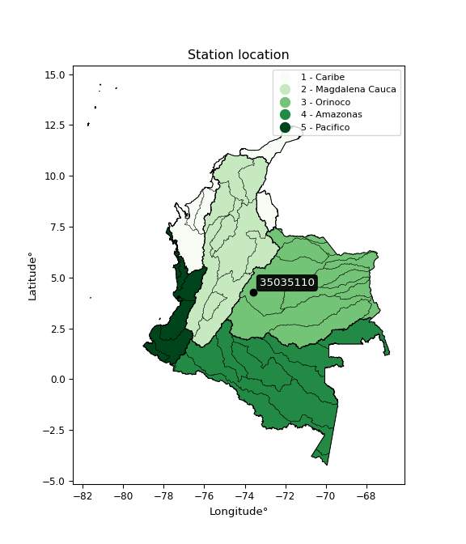</img>

</div>


## A. General information


### 1. General running parameters

• app_version: _v20260103_. • runtime: _2026-01-05 16:20:51.132608_. • Python version: _3.14.0_. • SciPy version: _1.16.3_. • Pandas version: _2.3.3_. • NumPy version: _2.3.5_. • Stations dataset (station_dataset_file): _dataset/pmax24h_in/automatic_colombia_2003_2024.csv_. • Stations catalog (station_catalog_file): _dataset/CNE.xls_. • Minimum year to eval til year_max (date_min): _1900_. • Maximum year to eval since year_min (date_max): _2024_. • Creates, save and include plots into reports (create_plot): _True_. • Plot only fit distributions with Δo > Δ (plot_only_fit): _True_. • Plot only simple graphs avoiding multiple CDFs and multiple Extreme values plots (plot_only_simple): _True_. • Eval low extreme values, if False, evaluates high extreme values (low_extreme): _False_. • Eval every SciPy distribution as logarithmic (pdist_logarithmic_on): _True_. • Standard deviation normalized (ddof): _1.0_. • Return periods to eval in years (Tr): _[2, 2.33, 5, 10, 15, 20, 25, 50, 75, 100, 200, 250, 500, 750, 1000]_. • Minimum data sample per station, 0 means any (minimum_sample): _5_. • Z-Score maximum threshold to adjust a value, 0 means disable (zscore_max): _3.5_. • Z-Score minimum threshold to adjust a value, 0 means disable (zscore_min): _-2.5_. • Avoid zeros, e.g. rain = 0 (avoid_zeros): _True_. • Avoid null values (avoid_nans): _True_. 

[:file_folder:Dataset file](../../dataset/pmax24h_in/automatic_colombia_2003_2024.csv)

> Delta Degrees of Freedom (DDOF): is a parameter used in the formulas for calculating variance and standard deviation. When ddof=0, the divisor is $N$ (the total number of observations) and this is used when your data set is the entire population. When ddof=1, the divisor is $N-1$ and this is used when your data set is a sample drawn from a larger population. Using $N-1$ provides an unbiased estimate of the population variance (known as Bessel´s correction).


### 2. Station info and location

|   id |   CODIGO | NOMBRE                            | CATEGORIA         | TECNOLOGIA                | ESTADO           | FECHA_INSTALACION   |   FECHA_SUSPENSION |   ALTITUD |   LATITUD |   LONGITUD | DEPARTAMENTO   | MUNICIPIO   | AREA_OPERATIVA                            | ENTIDAD                                                     | AREA_HIDROGRAFICA   | ZONA_HIDROGRAFICA   | SUBZONA_HIDROGRAFICA   |   CORRIENTE | Catalogo   |   Version |
|-----:|---------:|:----------------------------------|:------------------|:--------------------------|:-----------------|:--------------------|-------------------:|----------:|----------:|-----------:|:---------------|:------------|:------------------------------------------|:------------------------------------------------------------|:--------------------|:--------------------|:-----------------------|------------:|:-----------|----------:|
|    0 | 35035110 | SALINAS DE UPIN  - AUT [35035110] | Agrometeorológica | Automática con Telemetría | En Mantenimiento | 23/03/2007          |                nan |       670 |   4.27327 |   -73.5879 | Meta           | Restrepo    | Area Operativa 03 - Meta-Guaviare-Guainía | INSTITUTO DE HIDROLOGIA METEOROLOGIA Y ESTUDIOS AMBIENTALES | Orinoco             | Meta                | Río Guatiquía          |         nan | CNE_IDEAM  |  20251226 |

<div align="center">

Dynamic map: [:earth_americas:Google](http://maps.google.com/maps?q=4.27327,-73.58792) [:earth_americas:OSM](https://www.openstreetmap.org/#map=18/4.27327/-73.58792&layers=P) [:earth_americas:Bing](https://www.bing.com/maps?cp=4.27327~-73.58792&lvl=18) [:earth_americas:Apple](https://maps.apple.com/frame?center=4.27327%2C-73.58792&span=0.003%2C0.006)

</div>


<div align="center">

```geojson
{
  "type": "Feature",
  "geometry": {
    "type": "Point", 
    "coordinates": [-73.58792, 4.27327]
  }, 
  "properties": {
    "Name": "35035110"
  }
}
```

</div>


### 3. Discrete values table and plot

<div align="center">

|               |          0 |           1 |           2 |           3 |           4 |           5 |           6 |          7 |
|:--------------|-----------:|------------:|------------:|------------:|------------:|------------:|------------:|-----------:|
| Date          | 2017       | 2018        | 2019        | 2020        | 2021        | 2022        | 2023        | 2024       |
| Value         |   88.4     |   79.4      |  186.9      |    0.1      |  122        |  137.3      |  120.2      | 1223.4     |
| Value_initial |   88.4     |   79.4      |  186.9      |    0.1      |  122        |  137.3      |  120.2      | 1223.4     |
| count         |    8       |    8        |    8        |    8        |    8        |    8        |    8        |    8       |
| mean          |  244.713   |  244.713    |  244.713    |  244.713    |  244.713    |  244.713    |  244.713    |  244.713   |
| std           |  399.082   |  399.082    |  399.082    |  399.082    |  399.082    |  399.082    |  399.082    |  399.082   |
| zscore        |   -0.39168 |   -0.414231 |   -0.144864 |   -0.612937 |   -0.307487 |   -0.269149 |   -0.311997 |    2.45234 |


</div>


<div align="center">

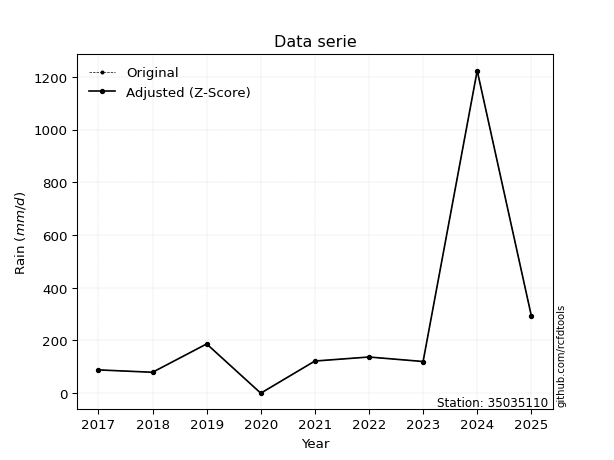</img>

</div>


> The initial value (value_initial) correspond to the initial obtained or null completed value, and value (value) is adjusted only when the initial value is outside the valid range (outlier) definite through the Z-Score value. If Z-Score is active, values out of range or outliers are replaced with the station mean value. A Z-Score (or standard score) measures how many standard deviations a data point is from the mean of a dataset, indicating its relative position; positive scores mean above the mean, negative mean below, and a score of zero is exactly at the mean, allowing for comparison of values from different distributions. It´s calculated using the formula $z=(x–μ)/σ$, where $x$ is the data point, $μ$ is the mean, and $σ$ is the standard deviation, helping identify outliers and understand probability.
>
> <sub>**Note**: In this study, "completing" (filling gaps in) and "extending" (forecasting or lengthening the historical record) rainfall data series are avoided for certain critical analyses because they introduce artificial bias and uncertainty, which can distort the statistics of rare events (extremes), alter day-to-day variability, and compromise the integrity and homogeneity of the original data. Some reasons against Completing/Extending rainfall data are: **Distortion of Extremes and Variability**: The primary issue is that most gap-filling or extension methods rely on averaging or regression with nearby stations, which inherently smooths the data. Rainfall is highly variable in space and time, with a large percentage of zero values and occasional large storms. Infilling methods often underestimate the highest values and overestimate the lowest (zero) values, which severely distorts analyses focused on flood frequency, drought severity, and intensity-duration-frequency (IDF) curves, **Loss of Data Homogeneity**: Infilled or extended data are synthetic estimates, not actual measurements. Combining these estimates with observed data can violate the assumption of data homogeneity, which requires that the data properties do not change over time. Inhomogeneity can lead to incorrect conclusions about long-term trends or changes in climate patterns, **Propagation of Errors**: Errors and biases from the original data (e.g., wind-induced undercatch, instrument errors, site changes) or the data used for imputation can propagate through the analysis, leading to unreliable hydrological models and inaccurate predictions, **Compromised Statistical Integrity**: For statistical analyses, especially those involving the frequency of events, using artificial data can introduce time bias or autocorrelation that doesn´t exist in reality, making it difficult to assess the true probability of events, **Difficulty in Validation**: It is difficult to accurately validate the quality of filled or extended data, especially for past periods where ground-truth measurements are unavailable. The reliability of imputation techniques heavily depends on the density of the surrounding station network and the complexity of the local topography.</sub>


### 4. Active continuous probability distributions from SciPy (44 of 104 available)

A Probability Density Function (PDF) describes the relative likelihood of a continuous random variable falling within a specific range, where the total area under its curve equals 1, and the area over any interval gives the actual probability for that range. Unlike discrete probabilities (like rolling a die), a PDF shows density, not direct probability for a single point (which is zero), with higher points indicating higher likelihood, often visualized as a bell curve for normal distributions.

A log of a probability density function (log-PDF) is simply the logarithm of the PDF´s value, denoted as $log(f(x))$, useful for converting multiplication of probabilities into addition, improving numerical stability with tiny numbers, and connecting to information theory concepts like entropy. Instead of dealing with very small probabilities (e.g., 0.000001), log-PDFs use negative numbers (e.g., $log(0.00001) ≈ -11.51$ that are easier for computers to handle, preventing underflow errors and simplifying complex calculations. In this study, each active probability distribution from SciPy is also evaluated in the $log$ form.

[scipy.stats](https://docs.scipy.org/doc/scipy/reference/stats.html) is a Python´s powerful submodule within the SciPy library for comprehensive statistical analysis, offering over 130 probability distributions (like Normal, Poisson), functions for descriptive stats (mean, variance), hypothesis testing (t-tests, chi-square), random variable generation, and statistical tests, making it essential for data science, modeling, and research. It provides tools to explore, model, and draw conclusions from data efficiently, working seamlessly with NumPy.

<div align="center">

|   id | p_dist             |   n_parameter | fit_method   | label                                                                       | active   | ref                                                                                                        |
|-----:|:-------------------|--------------:|:-------------|:----------------------------------------------------------------------------|:---------|:-----------------------------------------------------------------------------------------------------------|
|    0 | alpha              |             3 | MLE          | Alpha                                                                       | True     | [:mortar_board:](https://docs.scipy.org/doc/scipy/reference/generated/scipy.stats.alpha.html)              |
|    1 | betaprime          |             4 | MLE          | Beta prime                                                                  | True     | [:mortar_board:](https://docs.scipy.org/doc/scipy/reference/generated/scipy.stats.betaprime.html)          |
|    2 | chi2               |             3 | MLE          | Chi²                                                                        | True     | [:mortar_board:](https://docs.scipy.org/doc/scipy/reference/generated/scipy.stats.chi2.html)               |
|    3 | crystalball        |             4 | MLE          | Crystalball                                                                 | True     | [:mortar_board:](https://docs.scipy.org/doc/scipy/reference/generated/scipy.stats.crystalball.html)        |
|    4 | erlang             |             3 | MLE          | Erlang                                                                      | True     | [:mortar_board:](https://docs.scipy.org/doc/scipy/reference/generated/scipy.stats.erlang.html)             |
|    5 | expon              |             2 | MLE          | Exponential                                                                 | True     | [:mortar_board:](https://docs.scipy.org/doc/scipy/reference/generated/scipy.stats.expon.html)              |
|    6 | exponnorm          |             3 | MLE          | Exponentially modified Normal                                               | True     | [:mortar_board:](https://docs.scipy.org/doc/scipy/reference/generated/scipy.stats.exponnorm.html)          |
|    7 | f                  |             4 | MLE          | F                                                                           | True     | [:mortar_board:](https://docs.scipy.org/doc/scipy/reference/generated/scipy.stats.f.html)                  |
|    8 | fatiguelife        |             3 | MLE          | Fatigue-life (Birnbaum-Saunders)                                            | True     | [:mortar_board:](https://docs.scipy.org/doc/scipy/reference/generated/scipy.stats.fatiguelife.html)        |
|    9 | fisk               |             3 | MLE          | Fisk                                                                        | True     | [:mortar_board:](https://docs.scipy.org/doc/scipy/reference/generated/scipy.stats.fisk.html)               |
|   10 | gamma              |             3 | MLE          | Gamma                                                                       | True     | [:mortar_board:](https://docs.scipy.org/doc/scipy/reference/generated/scipy.stats.gamma.html)              |
|   11 | genexpon           |             5 | MLE          | Generalized exponential                                                     | True     | [:mortar_board:](https://docs.scipy.org/doc/scipy/reference/generated/scipy.stats.genexpon.html)           |
|   12 | genlogistic        |             3 | MLE          | Generalized logistic                                                        | True     | [:mortar_board:](https://docs.scipy.org/doc/scipy/reference/generated/scipy.stats.genlogistic.html)        |
|   13 | gibrat             |             2 | MM           | Gibrat                                                                      | True     | [:mortar_board:](https://docs.scipy.org/doc/scipy/reference/generated/scipy.stats.gibrat.html)             |
|   14 | gompertz           |             3 | MLE          | Gompertz (or truncated Gumbel)                                              | True     | [:mortar_board:](https://docs.scipy.org/doc/scipy/reference/generated/scipy.stats.gompertz.html)           |
|   15 | gumbel_l           |             2 | MM           | Gumbel Left Skew                                                            | True     | [:mortar_board:](https://docs.scipy.org/doc/scipy/reference/generated/scipy.stats.gumbel_l.html)           |
|   16 | gumbel_r           |             2 | MM           | Gumbel Right Skew                                                           | True     | [:mortar_board:](https://docs.scipy.org/doc/scipy/reference/generated/scipy.stats.gumbel_r.html)           |
|   17 | halflogistic       |             2 | MM           | Half-logistic                                                               | True     | [:mortar_board:](https://docs.scipy.org/doc/scipy/reference/generated/scipy.stats.halflogistic.html)       |
|   18 | halfnorm           |             2 | MM           | Half Normal                                                                 | True     | [:mortar_board:](https://docs.scipy.org/doc/scipy/reference/generated/scipy.stats.halfnorm.html)           |
|   19 | hypsecant          |             2 | MM           | hyperbolic secant                                                           | True     | [:mortar_board:](https://docs.scipy.org/doc/scipy/reference/generated/scipy.stats.hypsecant.html)          |
|   20 | invgamma           |             3 | MLE          | Inverted gamma                                                              | True     | [:mortar_board:](https://docs.scipy.org/doc/scipy/reference/generated/scipy.stats.invgamma.html)           |
|   21 | invgauss           |             3 | MLE          | Inverse Gaussian                                                            | True     | [:mortar_board:](https://docs.scipy.org/doc/scipy/reference/generated/scipy.stats.invgauss.html)           |
|   22 | invweibull         |             3 | MLE          | Inverted Weibull                                                            | True     | [:mortar_board:](https://docs.scipy.org/doc/scipy/reference/generated/scipy.stats.invweibull.html)         |
|   23 | johnsonsu          |             4 | MLE          | Johnson Su                                                                  | True     | [:mortar_board:](https://docs.scipy.org/doc/scipy/reference/generated/scipy.stats.johnsonsu.html)          |
|   24 | kstwobign          |             2 | MLE          | Limiting distribution of scaled Kolmogorov-Smirnov two-sided test statistic | True     | [:mortar_board:](https://docs.scipy.org/doc/scipy/reference/generated/scipy.stats.kstwobign.html)          |
|   25 | laplace            |             2 | MM           | Laplace                                                                     | True     | [:mortar_board:](https://docs.scipy.org/doc/scipy/reference/generated/scipy.stats.laplace.html)            |
|   26 | laplace_asymmetric |             3 | MLE          | Asymmetric Laplace                                                          | True     | [:mortar_board:](https://docs.scipy.org/doc/scipy/reference/generated/scipy.stats.laplace_asymmetric.html) |
|   27 | loggamma           |             3 | MLE          | Log gamma                                                                   | True     | [:mortar_board:](https://docs.scipy.org/doc/scipy/reference/generated/scipy.stats.loggamma.html)           |
|   28 | logistic           |             2 | MM           | Logistic (or Sech-squared)                                                  | True     | [:mortar_board:](https://docs.scipy.org/doc/scipy/reference/generated/scipy.stats.logistic.html)           |
|   29 | lognorm            |             3 | MLE          | Log Normal                                                                  | True     | [:mortar_board:](https://docs.scipy.org/doc/scipy/reference/generated/scipy.stats.lognorm.html)            |
|   30 | maxwell            |             2 | MM           | Maxwell                                                                     | True     | [:mortar_board:](https://docs.scipy.org/doc/scipy/reference/generated/scipy.stats.maxwell.html)            |
|   31 | mielke             |             4 | MLE          | Mielke Beta-Kappa / Dagum                                                   | True     | [:mortar_board:](https://docs.scipy.org/doc/scipy/reference/generated/scipy.stats.mielke.html)             |
|   32 | moyal              |             2 | MM           | Moyal                                                                       | True     | [:mortar_board:](https://docs.scipy.org/doc/scipy/reference/generated/scipy.stats.moyal.html)              |
|   33 | nakagami           |             3 | MLE          | Nakagami                                                                    | True     | [:mortar_board:](https://docs.scipy.org/doc/scipy/reference/generated/scipy.stats.nakagami.html)           |
|   34 | ncf                |             5 | MLE          | Non-central F distribution                                                  | True     | [:mortar_board:](https://docs.scipy.org/doc/scipy/reference/generated/scipy.stats.ncf.html)                |
|   35 | nct                |             4 | MLE          | Non-central Student’s t                                                     | True     | [:mortar_board:](https://docs.scipy.org/doc/scipy/reference/generated/scipy.stats.nct.html)                |
|   36 | norm               |             2 | MM           | Normal                                                                      | True     | [:mortar_board:](https://docs.scipy.org/doc/scipy/reference/generated/scipy.stats.norm.html)               |
|   37 | pearson3           |             3 | MM           | Pearson type III                                                            | True     | [:mortar_board:](https://docs.scipy.org/doc/scipy/reference/generated/scipy.stats.pearson3.html)           |
|   38 | rayleigh           |             2 | MM           | Rayleigh                                                                    | True     | [:mortar_board:](https://docs.scipy.org/doc/scipy/reference/generated/scipy.stats.rayleigh.html)           |
|   39 | rice               |             3 | MLE          | Rice                                                                        | True     | [:mortar_board:](https://docs.scipy.org/doc/scipy/reference/generated/scipy.stats.rice.html)               |
|   40 | t                  |             3 | MLE          | Student’s t                                                                 | True     | [:mortar_board:](https://docs.scipy.org/doc/scipy/reference/generated/scipy.stats.t.html)                  |
|   41 | truncnorm          |             4 | MLE          | Truncated normal                                                            | True     | [:mortar_board:](https://docs.scipy.org/doc/scipy/reference/generated/scipy.stats.truncnorm.html)          |
|   42 | wald               |             2 | MM           | Wald                                                                        | True     | [:mortar_board:](https://docs.scipy.org/doc/scipy/reference/generated/scipy.stats.wald.html)               |
|   43 | weibull_min        |             3 | MLE          | Weibull minimum                                                             | True     | [:mortar_board:](https://docs.scipy.org/doc/scipy/reference/generated/scipy.stats.weibull_min.html)        |

</div>

> **n_parameter:** # arguments & localization & scale.
>
> **Fit methods:** (MLE) maximum likelihood, (MM) L-moments.
>
>**Inactive** (With the only purpose of prevent loops, zero divisions, infinite values, over high estimated values or horizontal trending for recurrence intervals estimations, the follow distributions were disabled.)**:** foldnorm, gennorm, norminvgauss, powernorm, powerlognorm, skewnorm, genextreme, anglit, arcsine, argus, beta, bradford, burr, burr12, cauchy, cosine, halfcauchy, foldcauchy, skewcauchy, wrapcauchy, dgamma, gengamma, exponweib, exponpow, truncexpon, gausshyper, genhalflogistic, genhyperbolic, geninvgauss, halfgennorm, johnsonsb, kappa4, kappa3, ksone, kstwo, loglaplace, levy, levy_l, levy_stable, ncx2, pareto, genpareto, truncpareto, lomax, powerlaw, rdist, rel_breitwigner, recipinvgauss, semicircular, studentized_range, trapezoid, triang, truncweibull_min, tukeylambda, uniform, loguniform, vonmises, vonmises_line, weibull_max, dweibull, 


## B. Probability (PDF) vs. Empirical (EDF) distributions functions

A continuous probability distribution (CPD) describes probabilities for variables that can take any value within a range (like rain any time), unlike discrete variables with specific outcomes (like temperature). It uses a Probability Density Function (PDF), a curve where the total area under it equals 1, and the probability of the variable falling within an interval (a to b) is found by calculating the area under the curve between those points. A key feature is that the probability of hitting any single exact value is zero, so probabilities are always expressed for ranges, e.g., $P(a ≤ X ≤ b)$.

<div align="center">

Distributions parameters from station values
|    |   station | p_dist                |   n |               loc |           scale | shape                  | shape1                | shape2             | shape3   |
|---:|----------:|:----------------------|----:|------------------:|----------------:|:-----------------------|:----------------------|:-------------------|:---------|
|  0 |  35035110 | alpha                 |   8 |    -130.649       |   536.078       | 2.1367154695393094     |                       |                    |          |
|  1 |  35035110 | betaprime             |   8 |       0.1         |   134.763       | 0.7161000226293421     | 0.8814595680228351    |                    |          |
|  2 |  35035110 | chi2                  |   8 |       0.1         |   323.82        | 0.8273015717992855     |                       |                    |          |
|  3 |  35035110 | crystalball           |   8 |      -0.295627    |   446.581       | 4.220968960837644      | 33.17512761304346     |                    |          |
|  4 |  35035110 | erlang                |   8 |       0.1         |   284.277       | 0.742675397176653      |                       |                    |          |
|  5 |  35035110 | expon                 |   8 |       0.1         |   244.613       |                        |                       |                    |          |
|  6 |  35035110 | exponnorm             |   8 |       8.53702     |    34.7824      | 6.7900753334405675     |                       |                    |          |
|  7 |  35035110 | f                     |   8 |       0.1         |   110.567       | 1.0163158157163208     | 5.169184737801873     |                    |          |
|  8 |  35035110 | fatiguelife           |   8 |     -22.9326      |   158.706       | 1.1956296810850766     |                       |                    |          |
|  9 |  35035110 | fisk                  |   8 |     -15.8009      |   133.998       | 1.7789581834053632     |                       |                    |          |
| 10 |  35035110 | gamma                 |   8 |       0.1         |   371.357       | 0.6804513076687335     |                       |                    |          |
| 11 |  35035110 | genexpon              |   8 |       0.1         |   591.145       | 2.4166577903871245     | 6.235546655738104e-13 | 1.0570837946684672 |          |
| 12 |  35035110 | genlogistic           |   8 |   -1121.15        |   159.234       | 2376.777081407906      |                       |                    |          |
| 13 |  35035110 | gibrat                |   8 |     -40.0741      |   172.732       |                        |                       |                    |          |
| 14 |  35035110 | gompertz              |   8 |       0.1         |     2.47781e+11 | 1318665536.52362       |                       |                    |          |
| 15 |  35035110 | gumbel_l              |   8 |     412.721       |   291.067       |                        |                       |                    |          |
| 16 |  35035110 | gumbel_r              |   8 |      76.7043      |   291.067       |                        |                       |                    |          |
| 17 |  35035110 | halflogistic          |   8 |    -197.744       |   319.165       |                        |                       |                    |          |
| 18 |  35035110 | halfnorm              |   8 |    -249.4         |   619.279       |                        |                       |                    |          |
| 19 |  35035110 | hypsecant             |   8 |     244.713       |   237.655       |                        |                       |                    |          |
| 20 |  35035110 | invgamma              |   8 |     -53.289       |   288.285       | 1.9814910851291114     |                       |                    |          |
| 21 |  35035110 | invgauss              |   8 |     -29.2839      |   169.277       | 1.618627904423685      |                       |                    |          |
| 22 |  35035110 | invweibull            |   8 |       0.1         |     6.81963     | 0.05279758021145067    |                       |                    |          |
| 23 |  35035110 | johnsonsu             |   8 |     121.092       |     2.15917     | -0.0638625587043461    | 0.2588792657700135    |                    |          |
| 24 |  35035110 | kstwobign             |   8 |    -601.881       |  1006.65        |                        |                       |                    |          |
| 25 |  35035110 | laplace               |   8 |     244.713       |   263.968       |                        |                       |                    |          |
| 26 |  35035110 | laplace_asymmetric    |   8 |      79.4         |   105.78        | 0.48769102260258235    |                       |                    |          |
| 27 |  35035110 | loggamma              |   8 | -148712           | 19126.2         | 2412.262748840988      |                       |                    |          |
| 28 |  35035110 | logistic              |   8 |     244.713       |   205.815       |                        |                       |                    |          |
| 29 |  35035110 | lognorm               |   8 |       0.1         |     0.677908    | 14.546515206716307     |                       |                    |          |
| 30 |  35035110 | maxwell               |   8 |    -639.869       |   554.33        |                        |                       |                    |          |
| 31 |  35035110 | mielke                |   8 |       0.1         |   160.819       | 0.7567664997063668     | 1.3986081437098736    |                    |          |
| 32 |  35035110 | moyal                 |   8 |      31.2313      |   168.047       |                        |                       |                    |          |
| 33 |  35035110 | nakagami              |   8 |       0.1         |   297.09        | 0.14837573284263028    |                       |                    |          |
| 34 |  35035110 | ncf                   |   8 |       0.1         |    13.0268      | 0.5220238963103091     | 4.447542561311375     | 5.07117633682706   |          |
| 35 |  35035110 | nct                   |   8 |      -0.0376893   |     0.00711609  | 0.16147655175954273    | 54.73616315689971     |                    |          |
| 36 |  35035110 | norm                  |   8 |     244.713       |   373.307       |                        |                       |                    |          |
| 37 |  35035110 | pearson3              |   8 |     244.712       |   373.307       | 2.1846628638190526     |                       |                    |          |
| 38 |  35035110 | rayleigh              |   8 |    -469.446       |   569.816       |                        |                       |                    |          |
| 39 |  35035110 | rice                  |   8 |    -256.675       |   442.011       | 0.00018543368670277845 |                       |                    |          |
| 40 |  35035110 | t                     |   8 |     116.764       |    28.8297      | 0.7565545110746104     |                       |                    |          |
| 41 |  35035110 | truncnorm             |   8 |     -96.1656      |   470.51        | 0.20459862510739635    | 2.804545410685389     |                    |          |
| 42 |  35035110 | wald                  |   8 |    -128.595       |   373.307       |                        |                       |                    |          |
| 43 |  35035110 | weibull_min           |   8 |       0.1         |   394.5         | 0.8332192671691733     |                       |                    |          |
| 44 |  35035110 | logalpha              |   8 |      -3.21939     |     1.7938      | 5.689538211554272e-10  |                       |                    |          |
| 45 |  35035110 | logbetaprime          |   8 |      -3.57081     |     1.17285e+13 | 2.442998421088234      | 3390255077313.35      |                    |          |
| 46 |  35035110 | logchi2               |   8 |      -2.30259     |     3.97138     | 0.974572680912241      |                       |                    |          |
| 47 |  35035110 | logcrystalball        |   8 |       5.00679     |     1.12224     | 0.598422584365216      | 226.94702673725067    |                    |          |
| 48 |  35035110 | logerlang             |   8 |     -31.5671      |     0.213218    | 167.20024677515136     |                       |                    |          |
| 49 |  35035110 | logexpon              |   8 |      -2.30259     |     6.47872     |                        |                       |                    |          |
| 50 |  35035110 | logexponnorm          |   8 |       4.17457     |     2.57754     | 0.0006048941197221756  |                       |                    |          |
| 51 |  35035110 | logf                  |   8 |      -2.30259     |     1.18131     | 1.012322299778337      | 1.0859635013650442    |                    |          |
| 52 |  35035110 | logfatiguelife        |   8 |   -1071.21        |  1075.38        | 0.0024064980447327314  |                       |                    |          |
| 53 |  35035110 | logfisk               |   8 |      -2.30259     |     1.56823     | 0.6115659547541492     |                       |                    |          |
| 54 |  35035110 | loggamma              |   8 |      -2.30259     |     8.35586     | 0.663400180517234      |                       |                    |          |
| 55 |  35035110 | loggenexpon           |   8 |      -2.30259     |  7514.17        | 328.51019520729255     | 16342.558591254045    | 105.4154867449753  |          |
| 56 |  35035110 | loggenlogistic        |   8 |       5.74387     |     0.54911     | 0.3025403585289439     |                       |                    |          |
| 57 |  35035110 | loggibrat             |   8 |       2.20981     |     1.19263     |                        |                       |                    |          |
| 58 |  35035110 | loggompertz           |   8 |      -2.30259     |     1.64505     | 0.010724949303211852   |                       |                    |          |
| 59 |  35035110 | loggumbel_l           |   8 |       5.33616     |     2.00969     |                        |                       |                    |          |
| 60 |  35035110 | loggumbel_r           |   8 |       3.01611     |     2.00969     |                        |                       |                    |          |
| 61 |  35035110 | loghalflogistic       |   8 |       1.12114     |     2.20371     |                        |                       |                    |          |
| 62 |  35035110 | loghalfnorm           |   8 |       0.764484    |     4.27587     |                        |                       |                    |          |
| 63 |  35035110 | loghypsecant          |   8 |       4.17614     |     1.6409      |                        |                       |                    |          |
| 64 |  35035110 | loginvgamma           |   8 |     -67.7692      | 50066.4         | 697.2714555121149      |                       |                    |          |
| 65 |  35035110 | loginvgauss           |   8 |     -26.6189      |  3451.18        | 0.008938218017523265   |                       |                    |          |
| 66 |  35035110 | loginvweibull         |   8 |      -4.99744e+08 |     4.99744e+08 | 174012261.6515895      |                       |                    |          |
| 67 |  35035110 | logjohnsonsu          |   8 |       4.79837     |     0.0159619   | 0.06934999668556849    | 0.24725738043474949   |                    |          |
| 68 |  35035110 | logkstwobign          |   8 |      -9.458       |    15.6317      |                        |                       |                    |          |
| 69 |  35035110 | loglaplace            |   8 |       4.17614     |     1.82259     |                        |                       |                    |          |
| 70 |  35035110 | loglaplace_asymmetric |   8 |       4.92217     |     1.20292     | 1.3570479486687557     |                       |                    |          |
| 71 |  35035110 | logloggamma           |   8 |       6.19522     |     1.02421     | 0.49841998757956935    |                       |                    |          |
| 72 |  35035110 | loglogistic           |   8 |       4.17614     |     1.42106     |                        |                       |                    |          |
| 73 |  35035110 | loglognorm            |   8 |      -2.30259     |     4.03586     | 12.876976568670203     |                       |                    |          |
| 74 |  35035110 | logmaxwell            |   8 |      -1.93152     |     3.82741     |                        |                       |                    |          |
| 75 |  35035110 | logmielke             |   8 |      -2.30259     |    11.884       | 0.8625255466121023     | 5.329809476761971     |                    |          |
| 76 |  35035110 | logmoyal              |   8 |       2.70214     |     1.16029     |                        |                       |                    |          |
| 77 |  35035110 | lognakagami           |   8 |   -3389.2         |  3393.37        | 431453.16828314855     |                       |                    |          |
| 78 |  35035110 | logncf                |   8 |      -2.30259     |     1.13295     | 1.0566004253365011     | 1.074558165132071     | 1.0751993624789533 |          |
| 79 |  35035110 | lognct                |   8 |    -153.634       |     2.52525     | 39373.604038916965     | 62.49139702615531     |                    |          |
| 80 |  35035110 | lognorm               |   8 |       4.17614     |     2.57752     |                        |                       |                    |          |
| 81 |  35035110 | logpearson3           |   8 |       4.17614     |     2.57755     | -1.785487200144725     |                       |                    |          |
| 82 |  35035110 | lograyleigh           |   8 |      -0.754787    |     3.93432     |                        |                       |                    |          |
| 83 |  35035110 | logrice               |   8 |    -436.41        |     2.57771     | 170.9185986012526      |                       |                    |          |
| 84 |  35035110 | logt                  |   8 |       3.9201      |     2.04062     | 3.712754940256648      |                       |                    |          |
| 85 |  35035110 | logtruncnorm          |   8 |      21.9978      |     7.67577     | -8.03513823515354      | -1.9396618598672148   |                    |          |
| 86 |  35035110 | logwald               |   8 |       1.59859     |     2.57754     |                        |                       |                    |          |
| 87 |  35035110 | logweibull_min        |   8 |      -2.30259     |     1.90772     | 0.4912923447767187     |                       |                    |          |

</div>

> **loc** (Location parameter): This shifts the distribution along the x-axis. For many common distributions, like the normal (Gaussian) distribution, loc represents the mean $μ$. For others, like the uniform distribution, it might represent the minimum value, or for the beta distribution, the left end of the support interval.
>
> **scale** (Scale parameter): This determines the width or spread of the distribution. For the normal distribution, scale represents the standard deviation $σ$. For a uniform distribution, it defines the length of the interval (from $loc$ to $loc + scale$).
>
> **shape** (Shape parameters): Refers to parameters that define the specific form of a probability distribution, distinct from its location (loc) and scale (scale). These parameters are required arguments for most distribution functions. For example, a normal (Gaussian) distribution is fully defined by its location (mean) and scale (standard deviation), so it has no specific shape parameters beyond loc and scale. However, other distributions have intrinsic properties that need specification, as Gamma distribution that takes a shape parameter, often named $a$ or $alpha$.


### 0. Cumulative distribution values - CDF (88 evaluated)

Cumulative Distribution Function (CDF), denoted as $F$<sub>$X$</sub>$(x)$, is a function that gives the probability that a random variable $X$ will take a value less than or equal to a specific value, $x$ (i.e., $(P(X≥x)$. It essentially "accumulates" probabilities from a given point up to the far right (positive infinity), providing a complete picture of the distribution´s probabilities for both discrete (like rain) and continuous (like temperature) variables, helping to find probabilities over ranges or above certain values. Each station is evaluated separately ordering the $x$ values ascending, calculating the CDF and PDF values for the activated distributions and their logarithmic forms.

<div align="center">

CDF ordered by x ascending and calculating $log(f(x))$ separately
|   id |   Station |   date |      x |   count |    mean |     std |    zscore |   Value_initial |   station |   m |     alpha |   alpha_pdf |   betaprime |   betaprime_pdf |        chi2 |    chi2_pdf |   crystalball |   crystalball_pdf |      erlang |    erlang_pdf |    expon |   expon_pdf |   exponnorm |   exponnorm_pdf |           f |       f_pdf |   fatiguelife |   fatiguelife_pdf |      fisk |    fisk_pdf |       gamma |      gamma_pdf |    genexpon |   genexpon_pdf |   genlogistic |   genlogistic_pdf |    gibrat |   gibrat_pdf |    gompertz |   gompertz_pdf |   gumbel_l |   gumbel_l_pdf |   gumbel_r |   gumbel_r_pdf |   halflogistic |   halflogistic_pdf |   halfnorm |   halfnorm_pdf |   hypsecant |   hypsecant_pdf |   invgamma |   invgamma_pdf |   invgauss |   invgauss_pdf |   invweibull |   invweibull_pdf |   johnsonsu |   johnsonsu_pdf |   kstwobign |   kstwobign_pdf |   laplace |   laplace_pdf |   laplace_asymmetric |   laplace_asymmetric_pdf |   loggamma |   loggamma_pdf |   logistic |   logistic_pdf |    lognorm |   lognorm_pdf |   maxwell |   maxwell_pdf |     mielke |    mielke_pdf |    moyal |   moyal_pdf |   nakagami |   nakagami_pdf |         ncf |     ncf_pdf |      nct |     nct_pdf |     norm |    norm_pdf |   pearson3 |   pearson3_pdf |   rayleigh |   rayleigh_pdf |     rice |    rice_pdf |        t |       t_pdf |   truncnorm |   truncnorm_pdf |     wald |   wald_pdf |   weibull_min |   weibull_min_pdf |   logalpha |   logalpha_pdf |   logbetaprime |   logbetaprime_pdf |     logchi2 |   logchi2_pdf |   logcrystalball |   logcrystalball_pdf |   logerlang |   logerlang_pdf |   logexpon |   logexpon_pdf |   logexponnorm |   logexponnorm_pdf |        logf |   logf_pdf |   logfatiguelife |   logfatiguelife_pdf |     logfisk |    logfisk_pdf |   loggenexpon |   loggenexpon_pdf |   loggenlogistic |   loggenlogistic_pdf |   loggibrat |   loggibrat_pdf |   loggompertz |   loggompertz_pdf |   loggumbel_l |   loggumbel_l_pdf |   loggumbel_r |   loggumbel_r_pdf |   loghalflogistic |   loghalflogistic_pdf |   loghalfnorm |   loghalfnorm_pdf |   loghypsecant |   loghypsecant_pdf |   loginvgamma |   loginvgamma_pdf |   loginvgauss |   loginvgauss_pdf |   loginvweibull |   loginvweibull_pdf |   logjohnsonsu |   logjohnsonsu_pdf |   logkstwobign |   logkstwobign_pdf |   loglaplace |   loglaplace_pdf |   loglaplace_asymmetric |   loglaplace_asymmetric_pdf |   logloggamma |   logloggamma_pdf |   loglogistic |   loglogistic_pdf |   loglognorm |   loglognorm_pdf |   logmaxwell |   logmaxwell_pdf |   logmielke |   logmielke_pdf |    logmoyal |   logmoyal_pdf |   lognakagami |   lognakagami_pdf |      logncf |   logncf_pdf |     lognct |   lognct_pdf |   logpearson3 |   logpearson3_pdf |   lograyleigh |   lograyleigh_pdf |    logrice |   logrice_pdf |      logt |   logt_pdf |   logtruncnorm |   logtruncnorm_pdf |   logwald |   logwald_pdf |   logweibull_min |   logweibull_min_pdf |
|-----:|----------:|-------:|-------:|--------:|--------:|--------:|----------:|----------------:|----------:|----:|----------:|------------:|------------:|----------------:|------------:|------------:|--------------:|------------------:|------------:|--------------:|---------:|------------:|------------:|----------------:|------------:|------------:|--------------:|------------------:|----------:|------------:|------------:|---------------:|------------:|---------------:|--------------:|------------------:|----------:|-------------:|------------:|---------------:|-----------:|---------------:|-----------:|---------------:|---------------:|-------------------:|-----------:|---------------:|------------:|----------------:|-----------:|---------------:|-----------:|---------------:|-------------:|-----------------:|------------:|----------------:|------------:|----------------:|----------:|--------------:|---------------------:|-------------------------:|-----------:|---------------:|-----------:|---------------:|-----------:|--------------:|----------:|--------------:|-----------:|--------------:|---------:|------------:|-----------:|---------------:|------------:|------------:|---------:|------------:|---------:|------------:|-----------:|---------------:|-----------:|---------------:|---------:|------------:|---------:|------------:|------------:|----------------:|---------:|-----------:|--------------:|------------------:|-----------:|---------------:|---------------:|-------------------:|------------:|--------------:|-----------------:|---------------------:|------------:|----------------:|-----------:|---------------:|---------------:|-------------------:|------------:|-----------:|-----------------:|---------------------:|------------:|---------------:|--------------:|------------------:|-----------------:|---------------------:|------------:|----------------:|--------------:|------------------:|--------------:|------------------:|--------------:|------------------:|------------------:|----------------------:|--------------:|------------------:|---------------:|-------------------:|--------------:|------------------:|--------------:|------------------:|----------------:|--------------------:|---------------:|-------------------:|---------------:|-------------------:|-------------:|-----------------:|------------------------:|----------------------------:|--------------:|------------------:|--------------:|------------------:|-------------:|-----------------:|-------------:|-----------------:|------------:|----------------:|------------:|---------------:|--------------:|------------------:|------------:|-------------:|-----------:|-------------:|--------------:|------------------:|--------------:|------------------:|-----------:|--------------:|----------:|-----------:|---------------:|-------------------:|----------:|--------------:|-----------------:|---------------------:|
|    0 |  35035110 |   2020 |    0.1 |       8 | 244.713 | 399.082 | -0.612937 |             0.1 |  35035110 |   1 | 0.0252152 | 0.00185085  | 1.58053e-11 |    88.3409      | 8.24455e-09 | 2.45743e+08 |      0.500354 |       0.000893324 | 1.87599e-14 | 167.324       | 0        | 0.0040881   |   0.0392386 |     0.00154517  | 1.89327e-10 | 6.93253e+06 |     0.0302692 |       0.00374112  | 0.0220585 | 0.00241342  | 6.66599e-14 | 3268.45        | 8.68347e-14 |    0.0040881   |      0.125157 |        0.00163273 | 0.0723488 |  0.00342793  | 7.43193e-12 |    0.00532189  |   0.215172 |    0.00065331  |   0.272241 |    0.00121692  |       0.300382 |         0.00142524 |   0.31297  |    0.00118797  |    0.218445 |     0.000848701 |  0.0281474 |    0.00241002  |  0.0296042 |     0.00328103 |  0.000185691 |      6.06946e+12 |   0.0992959 |     0.000373509 |    0.133086 |      0.00130431 |  0.197934 |   0.000749841 |            0.0413082 |              0.000800732 | 1.7708e-11 |  26453.1       |   0.233526 |    0.000869672 | 0.00597624 |    0.00657342 |  0.278653 |   0.00098521  | 1.6313e-14 | 127.08        | 0.272619 | 0.0014268   | 1.4809e-06 |    3.16663e+10 | 2.10419e-05 | 6.82911e+06 | 0.035307 | 0.618408    | 0.256151 | 0.000862201 |   0.286866 |    0.00216876  |   0.287883 |     0.00102982 | 0.155269 | 0.00111021  | 0.106641 | 0.000671963 | 7.97688e-10 |     0.00199396  | 0.213506 | 0.00283239 |   6.17704e-17 |       3.70868     |  0.0503965 |      0.251117  |      0.0213413 |          0.0368405 | 1.35832e-08 |   1.49044e+07 |       nan        |           nan        |  0.00724764 |      0.00832089 |   0        |      0.154351  |     0.00597649 |         0.00657364 | 1.00959e-08 | 1.1507e+07 |       0.00609752 |           0.00670506 | 3.10035e-10 | 426956         |   3.62458e-08 |         0.0437188 |        0.0118751 |           0.00654275 |    0        |       0         |   1.91861e-09 |        0.00651953 |     0.0221014 |          0.010875 |   7.48638e-07 |       5.25432e-06 |          0        |             0         |      0        |         0         |      0.0122777 |         0.00748041 |    0.00638165 |         0.0074711 |    0.00660549 |        0.00811971 |      0.00577174 |           0.0103597 |      0.0537254 |         0.00380228 |      0.0151855 |          0.0228683 |    0.0142951 |       0.00784333 |              0.00775416 |                   0.0047501 |     0.0180498 |        0.00878231 |     0.0103633 |        0.00721708 |   0.00216135 |      1.18957e+12 |     0        |        0         | 6.77438e-15 |      13.1574    | 5.51111e-18 |    1.79692e-16 |    0.00606995 |        0.00665466 | 2.76664e-09 |  3.29126e+06 | 0.00607216 |   0.00666702 |     0.0284233 |         0.0117169 |      0        |         0         | 0.00598048 |    0.00657714 | 0.0209789 | 0.00952497 |      0.0294975 |          0.0132107 |  0        |     0         |       2.0874e-08 |          2.30927e+07 |
|    1 |  35035110 |   2018 |   79.4 |       8 | 244.713 | 399.082 | -0.414231 |            79.4 |  35035110 |   2 | 0.34453   | 0.00452023  | 0.45327     |     0.0026653   | 0.456785    | 0.00218363  |      0.570818 |       0.000879212 | 0.376277    |   0.00299241  | 0.276884 | 0.00295617  |   0.252326  |     0.00307765  | 0.56315     | 0.00274315  |     0.3557    |       0.00311851  | 0.352491  | 0.004265    | 0.355131    |    0.00267819  | 0.276884    |    0.00295617  |      0.282745 |        0.00224244 | 0.356198  |  0.0031198   | 0.344283    |    0.00348965  |   0.272521 |    0.00079522  |   0.371287 |    0.00126385  |       0.408801 |         0.00130478 |   0.40454  |    0.00111903  |    0.294543 |     0.00106993  |  0.35611   |    0.00402428  |  0.365636  |     0.00345022 |  0.415404    |      0.000242971 |   0.156268  |     0.00148557  |    0.25054  |      0.0016133  |  0.267294 |   0.0010126   |            0.192143  |              0.00372456  | 0.714035   |      0.0426797 |   0.30934  |    0.00103806  | 0.530672   |    0.15432    |  0.359421 |   0.00104429  | 0.49352    |   0.00343274  | 0.386228 | 0.0014132   | 0.544611   |    0.00201933  | 0.350302    | 0.0034639   | 0.639574 | 0.000732652 | 0.328944 | 0.000968859 |   0.435364 |    0.00162102  |   0.371158 |     0.00106297 | 0.251027 | 0.00128836  | 0.232675 | 0.00372667  | 0.154699    |     0.00189921  | 0.413077 | 0.00215495 |   0.231016    |       0.00212246  |  0.813265  |      0.0241362 |      0.547924  |          0.0755168 | 0.811084    |   0.0326586   |         0.444829 |             0.236033 |  0.55219    |      0.14266    |   0.643213 |      0.0550705 |     0.530673   |         0.154319   | 0.762035    | 0.0172068  |       0.532362   |           0.153619   | 0.708064    |      0.0189329 |   0.613768    |         0.0919987 |        0.459101  |           0.23365    |    0.72445  |       0.154295  |   0.456845    |        0.205067   |     0.461896  |          0.165929 |   0.601283    |       0.152196    |          0.628029 |             0.1374    |      0.601485 |         0.130657  |      0.538386  |         0.192576   |    0.544657   |         0.14487   |    0.538714   |        0.135659   |      0.604071   |           0.106024  |      0.180638  |         0.153297   |      0.586088  |          0.0911428 |    0.551561  |       0.246046   |              0.463369   |                   0.283854  |     0.440359  |        0.191196   |     0.53484   |        0.17507    |   0.515594   |      0.00463636  |     0.562244 |        0.145638  | 0.603761    |       0.074541  | 0.626662    |    0.148588    |    0.530966   |        0.153977   | 0.657886    |  0.0227141   | 0.530965   |   0.15372    |     0.411458  |         0.155222  |      0.572524 |         0.141655  | 0.530706   |    0.154309   | 0.582252  | 0.177278   |      0.413537  |          0.142113  |  0.697113 |     0.138105  |       0.842848   |          0.0213979   |
|    2 |  35035110 |   2017 |   88.4 |       8 | 244.713 | 399.082 | -0.39168  |            88.4 |  35035110 |   3 | 0.384329  | 0.00431768  | 0.476128    |     0.00242057  | 0.47569     | 0.00202194  |      0.578717 |       0.000875878 | 0.402419    |   0.00282006  | 0.303006 | 0.00284938  |   0.279709  |     0.00300393  | 0.586679    | 0.00249218  |     0.382821  |       0.00291196  | 0.389977  | 0.00406143  | 0.378535    |    0.00252579  | 0.303006    |    0.00284938  |      0.303064 |        0.00227157 | 0.38361   |  0.00297213  | 0.37495     |    0.00332645  |   0.279753 |    0.000812038 |   0.382658 |    0.00126289  |       0.420476 |         0.00128962 |   0.414572 |    0.00111031  |    0.304282 |     0.00109407  |  0.39132   |    0.0037988   |  0.395627  |     0.0032172  |  0.417475    |      0.000218053 |   0.171802  |     0.00201302  |    0.265144 |      0.00163147 |  0.276565 |   0.00104772  |            0.224978  |              0.00357318  | 0.718576   |      0.0419091 |   0.318759 |    0.00105508  | 0.54721    |    0.153692   |  0.368838 |   0.00104814  | 0.523022   |   0.00312948  | 0.398902 | 0.00140306  | 0.562081   |    0.00186755  | 0.380728    | 0.00329724  | 0.645767 | 0.000646786 | 0.337709 | 0.000978974 |   0.449736 |    0.00157291  |   0.38073  |     0.00106396 | 0.262685 | 0.00130227  | 0.27179  | 0.00504788  | 0.17173     |     0.00188535  | 0.432104 | 0.00207382 |   0.249714    |       0.00203405  |  0.815821  |      0.023486  |      0.555985  |          0.0746408 | 0.814553    |   0.0319576   |         0.470828 |             0.247968 |  0.56745    |      0.14155    |   0.649078 |      0.0541653 |     0.547211   |         0.153692   | 0.763862    | 0.016833   |       0.548824   |           0.152956   | 0.710076    |      0.0185574 |   0.623581    |         0.0907833 |        0.484679  |           0.242669   |    0.740382 |       0.142654  |   0.479128    |        0.209918   |     0.47989   |          0.169182 |   0.617409    |       0.148147    |          0.642557 |             0.133212  |      0.615365 |         0.127876  |      0.558968  |         0.190665   |    0.560158   |         0.143838  |    0.553226   |        0.13462    |      0.615349   |           0.10404   |      0.200236  |         0.218591   |      0.595806  |          0.0898744 |    0.577217  |       0.231969   |              0.494872   |                   0.303152  |     0.46124   |        0.197724   |     0.55358   |        0.173904   |   0.516088   |      0.00456276  |     0.577783 |        0.143779  | 0.611738    |       0.0740398 | 0.642335    |    0.143361    |    0.547467   |        0.153346   | 0.6603      |  0.0222575   | 0.547439   |   0.153083   |     0.428432  |         0.160957  |      0.58762  |         0.139513  | 0.547244   |    0.153681   | 0.601138  | 0.174403   |      0.429044  |          0.146737  |  0.711502 |     0.130002  |       0.84512    |          0.0209182   |
|    3 |  35035110 |   2023 |  120.2 |       8 | 244.713 | 399.082 | -0.311997 |           120.2 |  35035110 |   4 | 0.508154  | 0.00345505  | 0.542316    |     0.00179279  | 0.532879    | 0.00160738  |      0.60635  |       0.000861391 | 0.483887    |   0.00232971  | 0.387974 | 0.00250202  |   0.369975  |     0.00266481  | 0.654879    | 0.00184836  |     0.465565  |       0.00232558  | 0.506599  | 0.00326955  | 0.451717    |    0.00210147  | 0.387974    |    0.00250202  |      0.37616  |        0.00230926 | 0.470165  |  0.00248216  | 0.472264    |    0.00280855  |   0.306529 |    0.000872111 |   0.422657 |    0.00125054  |       0.460611 |         0.00123422 |   0.449375 |    0.00107822  |    0.340375 |     0.00117447  |  0.499457  |    0.00301601  |  0.486416  |     0.0025266  |  0.423391    |      0.00015997  |   0.433281  |     0.0435857   |    0.317742 |      0.00167011 |  0.311972 |   0.00118185  |            0.330668  |              0.0030859   | 0.731126   |      0.0397981 |   0.353207 |    0.00110999  | 0.593995   |    0.150461   |  0.402329 |   0.00105705  | 0.608522   |   0.00230326  | 0.442828 | 0.00135715  | 0.614921   |    0.00148762  | 0.476323    | 0.00272342  | 0.662909 | 0.000452706 | 0.369364 | 0.00101085  |   0.497234 |    0.0014181   |   0.414569 |     0.00106316 | 0.304758 | 0.00134112  | 0.535564 | 0.0102398   | 0.230852    |     0.00183184  | 0.493721 | 0.0018069  |   0.310112    |       0.00177678  |  0.822768  |      0.0217627 |      0.578531  |          0.072089  | 0.824077    |   0.0300545   |         0.551082 |             0.271479 |  0.610333   |      0.137301   |   0.665333 |      0.0516563 |     0.593995   |         0.15046    | 0.768878    | 0.0158342  |       0.595369   |           0.149644   | 0.715621    |      0.0175497 |   0.650926    |         0.0871577 |        0.562707  |           0.263687   |    0.779757 |       0.114867  |   0.545434    |        0.22082    |     0.533135  |          0.176952 |   0.661099    |       0.136139    |          0.681675 |             0.121459  |      0.653424 |         0.119821  |      0.616243  |         0.181193   |    0.603772   |         0.139752  |    0.594031   |        0.130752   |      0.646427   |           0.0982045 |      0.473514  |         5.34041    |      0.622853  |          0.0861427 |    0.642812  |       0.195979   |              0.597371   |                   0.365942  |     0.524722  |        0.21502    |     0.606203  |        0.167987   |   0.517459   |      0.00436443  |     0.621042 |        0.137569  | 0.634258    |       0.0725126 | 0.684129    |    0.128771    |    0.594145   |        0.150116   | 0.666949    |  0.0210315   | 0.594034   |   0.149844   |     0.4805    |         0.178109  |      0.629469 |         0.132711  | 0.594025   |    0.150449   | 0.653143  | 0.163464   |      0.476245  |          0.160645  |  0.748245 |     0.109847  |       0.851346   |          0.0196298   |
|    4 |  35035110 |   2021 |  122   |       8 | 244.713 | 399.082 | -0.307487 |           122   |  35035110 |   5 | 0.514328  | 0.00340562  | 0.545518    |     0.00176527  | 0.535756    | 0.001589    |      0.6079   |       0.000860448 | 0.488059    |   0.00230616  | 0.392461 | 0.00248368  |   0.374754  |     0.00264504  | 0.658181    | 0.00182     |     0.469726  |       0.00229796  | 0.512445  | 0.00322541  | 0.455482    |    0.00208139  | 0.392461    |    0.00248368  |      0.380316 |        0.00230854 | 0.47461   |  0.00245649  | 0.477295    |    0.00278178  |   0.308102 |    0.00087553  |   0.424907 |    0.00124944  |       0.46283  |         0.00123101 |   0.451314 |    0.00107634  |    0.342493 |     0.00117872  |  0.504848  |    0.00297494  |  0.490934  |     0.00249336 |  0.423676    |      0.00015759  |   0.516743  |     0.0440563   |    0.320749 |      0.00167117 |  0.314107 |   0.00118994  |            0.3362    |              0.0030604   | 0.731717   |      0.0396993 |   0.355207 |    0.00111282  | 0.59623    |    0.150252   |  0.404232 |   0.00105733  | 0.612634   |   0.00226557  | 0.445268 | 0.00135414  | 0.617584   |    0.00147106  | 0.481198    | 0.00269282  | 0.663716 | 0.00044496  | 0.371185 | 0.00101246  |   0.499779 |    0.00140997  |   0.416482 |     0.00106292 | 0.307173 | 0.00134284  | 0.553815 | 0.0100256   | 0.234147    |     0.00182861  | 0.496961 | 0.0017928  |   0.313299    |       0.00176419  |  0.823091  |      0.0216842 |      0.579601  |          0.0719642 | 0.824523    |   0.0299661   |         0.555123 |             0.272154 |  0.612372   |      0.137058   |   0.6661   |      0.0515379 |     0.59623    |         0.150252   | 0.769113    | 0.0157884  |       0.597591   |           0.149432   | 0.715882    |      0.0175034 |   0.65222     |         0.0869773 |        0.566632  |           0.264441   |    0.781455 |       0.113702  |   0.548719    |        0.221214   |     0.535767  |          0.17726  |   0.663118    |       0.135549    |          0.683477 |             0.120901  |      0.655203 |         0.119429  |      0.618932  |         0.180601   |    0.605847   |         0.139514  |    0.595973   |        0.130533   |      0.647885   |           0.0979178 |      0.561649  |         5.75583    |      0.624132  |          0.085959  |    0.645713  |       0.194387   |              0.602835   |                   0.369289  |     0.527924  |        0.21578    |     0.608698  |        0.16761    |   0.517524   |      0.00435527  |     0.623085 |        0.137238  | 0.635335    |       0.0724351 | 0.686038    |    0.128084    |    0.596375   |        0.149907   | 0.667261    |  0.020975    | 0.59626    |   0.149636   |     0.483154  |         0.178964  |      0.631439 |         0.132359  | 0.596259   |    0.15024    | 0.655568  | 0.162847   |      0.478638  |          0.161343  |  0.749872 |     0.108973  |       0.851638   |          0.0195705   |
|    5 |  35035110 |   2022 |  137.3 |       8 | 244.713 | 399.082 | -0.269149 |           137.3 |  35035110 |   6 | 0.563295  | 0.00300024  | 0.570874    |     0.00155618  | 0.558956    | 0.00144795  |      0.621001 |       0.000851913 | 0.521888    |   0.00211984  | 0.429297 | 0.00233309  |   0.413957  |     0.00248093  | 0.684318    | 0.00160366  |     0.503194  |       0.00208235  | 0.558997  | 0.00286444  | 0.486091    |    0.00192332  | 0.429297    |    0.00233309  |      0.415529 |        0.0022913  | 0.510579  |  0.00224837  | 0.51817     |    0.00256425  |   0.32172  |    0.000904621 |   0.443944 |    0.00123857  |       0.481454 |         0.00120346 |   0.467659 |    0.00106019  |    0.360796 |     0.00121333  |  0.547798  |    0.00264521  |  0.52704   |     0.00223279 |  0.425947    |      0.000139891 |   0.738445  |     0.00515141  |    0.346362 |      0.00167567 |  0.332851 |   0.00126095  |            0.38141   |              0.00285196  | 0.736361   |      0.0389253 |   0.372411 |    0.00113559  | 0.613877   |    0.148428   |  0.420423 |   0.00105887  | 0.645013   |   0.00197566  | 0.465783 | 0.0013271   | 0.639094   |    0.0013447   | 0.520467    | 0.0024438   | 0.670069 | 0.00038792  | 0.386776 | 0.00102534  |   0.520836 |    0.00134328  |   0.432725 |     0.00106006 | 0.32782  | 0.00135546  | 0.68276  | 0.00663181  | 0.261909    |     0.00180029  | 0.523497 | 0.00167741 |   0.339509    |       0.00166372  |  0.825617  |      0.0210745 |      0.588045  |          0.0709682 | 0.828023    |   0.0292751   |         0.587525 |             0.275847 |  0.628445   |      0.135003   |   0.672134 |      0.0506065 |     0.613877   |         0.148427   | 0.770958    | 0.0154318  |       0.61514    |           0.147587   | 0.717928    |      0.017142  |   0.662411    |         0.0855292 |        0.598182  |           0.269278   |    0.794363 |       0.104945  |   0.575019    |        0.223834   |     0.556845  |          0.179458 |   0.678855    |       0.130843    |          0.6975   |             0.116507  |      0.669128 |         0.116307  |      0.639976  |         0.175529   |    0.622213   |         0.137496  |    0.611289   |        0.128695   |      0.659319   |           0.0956297 |      0.772846  |         0.597295   |      0.634201  |          0.0844904 |    0.667951  |       0.182186   |              0.648083   |                   0.397007  |     0.55376   |        0.221477   |     0.628312  |        0.164339   |   0.518034   |      0.0042838   |     0.63914  |        0.134518  | 0.643856    |       0.0718062 | 0.700851    |    0.122693    |    0.613982   |        0.148087   | 0.669713    |  0.020535    | 0.613834   |   0.147816   |     0.504703  |         0.185833  |      0.646909 |         0.129498  | 0.613905   |    0.148416   | 0.674508  | 0.157701   |      0.498032  |          0.166984  |  0.762349 |     0.102328  |       0.853923   |          0.0191082   |
|    6 |  35035110 |   2019 |  186.9 |       8 | 244.713 | 399.082 | -0.144864 |           186.9 |  35035110 |   7 | 0.68428   | 0.00194971  | 0.635452    |     0.00109088  | 0.621978    | 0.0011192   |      0.662456 |       0.000818191 | 0.614557    |   0.00164452  | 0.534041 | 0.00190489  |   0.524966  |     0.00201136  | 0.750663    | 0.00111478  |     0.592633  |       0.0015622   | 0.676192  | 0.00192162  | 0.571007    |    0.00152482  | 0.534041    |    0.00190489  |      0.525615 |        0.00212281 | 0.60761   |  0.00169332  | 0.629954    |    0.00196934  |   0.368917 |    0.000998049 |   0.504179 |    0.00118624  |       0.538882 |         0.00111166 |   0.518897 |    0.00100524  |    0.42332  |     0.0013007   |  0.656954  |    0.00181388  |  0.621033  |     0.00160474 |  0.431862    |      0.00010249  |   0.841403  |     0.000951142 |    0.428909 |      0.00164145 |  0.401656 |   0.00152161  |            0.507859  |              0.00226898  | 0.748065   |      0.0369907 |   0.430234 |    0.00119103  | 0.658763   |    0.142353   |  0.472862 |   0.00105284  | 0.725172   |   0.00131564  | 0.529162 | 0.00122556  | 0.697987   |    0.00105351  | 0.624331    | 0.00178046  | 0.686094 | 0.000271152 | 0.438464 | 0.00105593  |   0.582594 |    0.00115303  |   0.484896 |     0.00104126 | 0.395615 | 0.00137219  | 0.846128 | 0.00153775  | 0.34875     |     0.00169907  | 0.598408 | 0.0013561  |   0.415143    |       0.0013993   |  0.831885  |      0.0195983 |      0.609528  |          0.068344  | 0.836784    |   0.0275631   |         0.67241  |             0.271187 |  0.669145   |      0.128725   |   0.687376 |      0.048254  |     0.658763   |         0.142352   | 0.77558     | 0.0145612  |       0.659762   |           0.141484   | 0.723076    |      0.0162559 |   0.688193    |         0.0816428 |        0.681802  |           0.269732   |    0.823645 |       0.0857525 |   0.64455     |        0.225816   |     0.612801  |          0.182805 |   0.717314    |       0.118586    |          0.731706 |             0.105414  |      0.70374  |         0.108148  |      0.691766  |         0.159833   |    0.66369    |         0.131253  |    0.650149   |        0.123142   |      0.687885   |           0.0896138 |      0.854618  |         0.130533   |      0.659661  |          0.0806013 |    0.719642  |       0.153825   |              0.751492   |                   0.280349  |     0.623934  |        0.232531   |     0.677434  |        0.15377    |   0.519328   |      0.0041078   |     0.67945  |        0.126746  | 0.665736    |       0.0700557 | 0.736597    |    0.10929     |    0.658766   |        0.142033   | 0.675877    |  0.0194556   | 0.658536   |   0.141771   |     0.564838  |         0.204232  |      0.685638 |         0.121558  | 0.658787   |    0.14234    | 0.72088   | 0.142705   |      0.551887  |          0.182449  |  0.791498 |     0.0871979 |       0.859638   |          0.0179742   |
|    7 |  35035110 |   2024 | 1223.4 |       8 | 244.713 | 399.082 |  2.45234  |          1223.4 |  35035110 |   8 | 0.975045  | 2.60595e-05 | 0.902876    |     6.40548e-05 | 0.9605      | 7.50413e-05 |      0.996929 |       2.09212e-05 | 0.992838    |   2.64573e-05 | 0.993269 | 2.75187e-05 |   0.994101  |     2.49751e-05 | 0.980327    | 3.01381e-05 |     0.97959   |       5.22146e-05 | 0.98124   | 2.64254e-05 | 0.98233     |    5.13158e-05 | 0.993269    |    2.75187e-05 |      0.999042 |        6.0116e-06 | 0.976698  |  4.36036e-05 | 0.998512    |    7.91941e-06 |   1        |    5.11323e-09 |   0.980733 |    6.55537e-05 |       0.976974 |         7.1314e-05 |   0.982605 |    7.61819e-05 |    0.98964  |     4.35862e-05 |  0.977026  |    3.30091e-05 |  0.975147  |     4.9439e-05 |  0.467509    |      1.53418e-05 |   0.958167  |     2.0987e-05  |    0.997212 |      2.0088e-05 |  0.987732 |   4.64761e-05 |            0.995863  |              1.90751e-05 | 0.80803    |      0.0274088 |   0.991466 |    4.11085e-05 | 0.872442   |    0.0810003  |  0.989783 |   5.72506e-05 | 0.96968    |   3.31815e-05 | 0.977018 | 6.83602e-05 | 0.995382   |    2.40777e-05 | 0.974408    | 3.89893e-05 | 0.768232 | 3.05901e-05 | 0.995625 | 3.43844e-05 |   0.972253 |    7.07721e-05 |   0.987881 |     6.3183e-05 | 0.996325 | 2.78396e-05 | 0.980348 | 1.34309e-05 | 1           |     3.98878e-05 | 0.971846 | 6.0032e-05 |   0.923275    |       0.000134177 |  0.862125  |      0.013215  |      0.722897  |          0.0524917 | 0.880371    |   0.0194096   |         0.97627  |             0.047825 |  0.862953   |      0.0753609  |   0.766074 |      0.0361068 |     0.872442   |         0.0810001  | 0.798947    | 0.0106482  |       0.872118   |           0.0805972  | 0.7495      |      0.0121995 |   0.81829     |         0.056828  |        0.976118  |           0.0412978  |    0.92117  |       0.0300062 |   0.961762    |        0.0761169  |     0.910771  |          0.107293 |   0.877701    |       0.0569717   |          0.876085 |             0.0527462 |      0.862161 |         0.0620548 |      0.894431  |         0.0631628  |    0.861494   |         0.0768396 |    0.839629   |        0.0765776  |      0.82325    |           0.0557535 |      0.929341  |         0.0144689  |      0.788734  |          0.0570934 |    0.899995  |       0.0548697  |              0.970158   |                   0.0336661 |     0.973008  |        0.0745784  |     0.887367  |        0.0703324  |   0.526215   |      0.00328455  |     0.866055 |        0.0714532 | 0.784921    |       0.0558242 | 0.88101     |    0.050894    |    0.872087   |        0.0809595  | 0.707411    |  0.0145109   | 0.871565   |   0.0809419  |     1         |         0         |      0.864358 |         0.0689142 | 0.872446   |    0.0809933  | 0.900736  | 0.055573   |      1         |          0.302234  |  0.899528 |     0.0365727 |       0.888142   |          0.0127901   |


</div>

An Empirical Distribution Function (EDF) is a step-function estimate of a true cumulative distribution function (CDF) based on observed sample data, representing the proportion of data points less than or equal to a given value. It is calculated by ordering your data and jumping up by $1/n$ (where $n$ is sample size) at each unique data point, allowing analysis without assuming an underlying population distribution, and it gets closer to the true CDF as the sample size grows. For the empirical probability calculations, the parameter $m$ correspond to the order number which means the position of the $x$ values in an ascending order list.

The Kolmogorov-Smirnov (K-S) test is a non-parametric statistical test used to determine if a sample data set comes from a specific theoretical distribution (one-sample) or if two different samples come from the same underlying distribution (two-sample), by comparing their cumulative distribution functions (CDFs). It calculates the maximum vertical difference (D statistic) between these functions, with a small p-value indicating a significant difference and rejection of the null hypothesis (that the data/samples match).


### 1. EDF California (1923)

California´s estimates the true probability distribution of water-related data (like rainfall, streamflow) using observed samples, crucial for risk assessment.

<div align="center">


$P=m/n$


</div>


**1.1. Empirical values**

<div align="center">

|                | 0                  | 1                  | 2              | 3              | 4                  | 5              | 6              | 7              |
|:---------------|:-------------------|:-------------------|:---------------|:---------------|:-------------------|:---------------|:---------------|:---------------|
| date           | 2020               | 2018               | 2017           | 2023           | 2021               | 2022           | 2019           | 2024           |
| x              | 0.1                | 79.4               | 88.4           | 120.2          | 122.0              | 137.3          | 186.9          | 1223.4         |
| m              | 1                  | 2                  | 3              | 4              | 5                  | 6              | 7              | 8              |
| empirical_dist | edf_california     | edf_california     | edf_california | edf_california | edf_california     | edf_california | edf_california | edf_california |
| empirical      | 0.125              | 0.25               | 0.375          | 0.5            | 0.625              | 0.75           | 0.875          | 1.0            |
| empirical_tr   | 1.1428571428571428 | 1.3333333333333333 | 1.6            | 2.0            | 2.6666666666666665 | 4.0            | 8.0            | inf            |

</div>


**1.2. Kolmogorov-Smirnov fit test (sorted by Δ)**


<div align="center">

|                | 0                  | 1                  | 2                   | 3                  | 4                   | 5                   | 6                   | 7                     | 8                   | 9                   | 10                  | 11                  | 12                  | 13                  | 14                  | 15                 | 16                  | 17                 | 18                 | 19                 | 20                 | 21                 | 22                 | 23                  | 24                 | 25                 | 26                 | 27                  | 28                 | 29                  | 30                 | 31                 | 32                 | 33                 | 34                 | 35                 | 36                 | 37                  | 38                  | 39                  | 40                  | 41                 | 42                 | 43                 | 44                 | 45                  | 46                  | 47                 | 48                  | 49                  | 50                  | 51                 | 52                 | 53                  | 54                  | 55                  | 56                  | 57                  | 58                 | 59                  | 60                  | 61                  | 62                  | 63                  | 64                  | 65                  | 66                  | 67                  | 68                 | 69                 | 70                  | 71                 | 72                  | 73                  | 74                  | 75                 | 76                 | 77                 | 78                 | 79                  | 80                 | 81                 | 82                 | 83                 | 84                 | 85                 | 86                 | 87                 |
|:---------------|:-------------------|:-------------------|:--------------------|:-------------------|:--------------------|:--------------------|:--------------------|:----------------------|:--------------------|:--------------------|:--------------------|:--------------------|:--------------------|:--------------------|:--------------------|:-------------------|:--------------------|:-------------------|:-------------------|:-------------------|:-------------------|:-------------------|:-------------------|:--------------------|:-------------------|:-------------------|:-------------------|:--------------------|:-------------------|:--------------------|:-------------------|:-------------------|:-------------------|:-------------------|:-------------------|:-------------------|:-------------------|:--------------------|:--------------------|:--------------------|:--------------------|:-------------------|:-------------------|:-------------------|:-------------------|:--------------------|:--------------------|:-------------------|:--------------------|:--------------------|:--------------------|:-------------------|:-------------------|:--------------------|:--------------------|:--------------------|:--------------------|:--------------------|:-------------------|:--------------------|:--------------------|:--------------------|:--------------------|:--------------------|:--------------------|:--------------------|:--------------------|:--------------------|:-------------------|:-------------------|:--------------------|:-------------------|:--------------------|:--------------------|:--------------------|:-------------------|:-------------------|:-------------------|:-------------------|:--------------------|:-------------------|:-------------------|:-------------------|:-------------------|:-------------------|:-------------------|:-------------------|:-------------------|
| station        | 35035110           | 35035110           | 35035110            | 35035110           | 35035110            | 35035110            | 35035110            | 35035110              | 35035110            | 35035110            | 35035110            | 35035110            | 35035110            | 35035110            | 35035110            | 35035110           | 35035110            | 35035110           | 35035110           | 35035110           | 35035110           | 35035110           | 35035110           | 35035110            | 35035110           | 35035110           | 35035110           | 35035110            | 35035110           | 35035110            | 35035110           | 35035110           | 35035110           | 35035110           | 35035110           | 35035110           | 35035110           | 35035110            | 35035110            | 35035110            | 35035110            | 35035110           | 35035110           | 35035110           | 35035110           | 35035110            | 35035110            | 35035110           | 35035110            | 35035110            | 35035110            | 35035110           | 35035110           | 35035110            | 35035110            | 35035110            | 35035110            | 35035110            | 35035110           | 35035110            | 35035110            | 35035110            | 35035110            | 35035110            | 35035110            | 35035110            | 35035110            | 35035110            | 35035110           | 35035110           | 35035110            | 35035110           | 35035110            | 35035110            | 35035110            | 35035110           | 35035110           | 35035110           | 35035110           | 35035110            | 35035110           | 35035110           | 35035110           | 35035110           | 35035110           | 35035110           | 35035110           | 35035110           |
| empirical_dist | edf_california     | edf_california     | edf_california      | edf_california     | edf_california      | edf_california      | edf_california      | edf_california        | edf_california      | edf_california      | edf_california      | edf_california      | edf_california      | edf_california      | edf_california      | edf_california     | edf_california      | edf_california     | edf_california     | edf_california     | edf_california     | edf_california     | edf_california     | edf_california      | edf_california     | edf_california     | edf_california     | edf_california      | edf_california     | edf_california      | edf_california     | edf_california     | edf_california     | edf_california     | edf_california     | edf_california     | edf_california     | edf_california      | edf_california      | edf_california      | edf_california      | edf_california     | edf_california     | edf_california     | edf_california     | edf_california      | edf_california      | edf_california     | edf_california      | edf_california      | edf_california      | edf_california     | edf_california     | edf_california      | edf_california      | edf_california      | edf_california      | edf_california      | edf_california     | edf_california      | edf_california      | edf_california      | edf_california      | edf_california      | edf_california      | edf_california      | edf_california      | edf_california      | edf_california     | edf_california     | edf_california      | edf_california     | edf_california      | edf_california      | edf_california      | edf_california     | edf_california     | edf_california     | edf_california     | edf_california      | edf_california     | edf_california     | edf_california     | edf_california     | edf_california     | edf_california     | edf_california     | edf_california     |
| p_dist         | t                  | logjohnsonsu       | alpha               | fisk               | logcrystalball      | johnsonsu           | loggenlogistic      | loglaplace_asymmetric | invgamma            | loggompertz         | betaprime           | mielke              | gompertz            | ncf                 | logloggamma         | chi2               | invgauss            | erlang             | loggumbel_l        | gibrat             | wald               | lognorm            | lognorm            | logexponnorm        | logrice            | lognct             | lognakagami        | logfatiguelife      | fatiguelife        | loglogistic         | loghypsecant       | loginvgauss        | pearson3           | nakagami           | loginvgamma        | logbetaprime       | loglaplace         | logerlang           | gamma               | logpearson3         | logmaxwell          | f                  | lograyleigh        | logtruncnorm       | logt               | logkstwobign        | halflogistic        | expon              | genexpon            | moyal               | genlogistic         | exponnorm          | loggumbel_r        | loghalfnorm         | logmielke           | loginvweibull       | halfnorm            | loggenexpon         | laplace_asymmetric | gumbel_r            | crystalball         | logmoyal            | loghalflogistic     | nct                 | rayleigh            | logexpon            | maxwell             | logncf              | norm               | logistic           | kstwobign           | logwald            | hypsecant           | logfisk             | weibull_min         | loggamma           | loggamma           | laplace            | loglognorm         | loggibrat           | rice               | gumbel_l           | logf               | truncnorm          | invweibull         | logchi2            | logalpha           | logweibull_min     |
| delta          | 0.103209828001331  | 0.1747640532372911 | 0.19072010472205492 | 0.1988078262191536 | 0.20259047694787036 | 0.20319834496955258 | 0.20910141484366274 | 0.21336886845736142   | 0.21804622654813088 | 0.23045005744635105 | 0.23954814628286947 | 0.24352036256767395 | 0.24504562393286866 | 0.25066929667515114 | 0.25106629845622486 | 0.2530221121213908 | 0.25396732214353623 | 0.2604432842380723 | 0.2621985565551277 | 0.2673898070547197 | 0.2765919628850728 | 0.2806715873398483 | 0.2806715873398483 | 0.28067272778130525 | 0.2807062342575978 | 0.2809649677570767 | 0.2809657493155542 | 0.28236225945369053 | 0.2823672900201214 | 0.28484011626545813 | 0.2883857057677832 | 0.2887141654663704 | 0.2924058343830158 | 0.294610530807103  | 0.2946565170762169 | 0.2979235599787077 | 0.3015609310705687 | 0.30218958887895775 | 0.30399332422273184 | 0.31016209187528054 | 0.31224403303941106 | 0.3131500977813476 | 0.322523640708107  | 0.3231128253438502 | 0.3322522419473941 | 0.33608750552139655 | 0.33611801970690314 | 0.3409593855490092 | 0.34095938771666323 | 0.34583836548516467 | 0.34938500460196364 | 0.3500338599617516 | 0.3512833129297984 | 0.35148471813848203 | 0.35376067814597556 | 0.35407097258864395 | 0.35610279685731216 | 0.36376824128626506 | 0.3685895289118767 | 0.37082126361754364 | 0.37535393312852816 | 0.37666169716228726 | 0.37802914362869344 | 0.38957426685975016 | 0.39010415763246675 | 0.39321338405881234 | 0.40213836959325033 | 0.40788624367613446 | 0.4365363778169704 | 0.4447656790346387 | 0.44609058533422485 | 0.4471131910879993 | 0.45168022461966956 | 0.45806358892325016 | 0.45985704446168274 | 0.4640347839749186 | 0.4640347839749186 | 0.4733443963649322 | 0.4737852981439964 | 0.47444980241213996 | 0.479384827553529  | 0.5060831725151007 | 0.5120345249099331 | 0.5262501984157595 | 0.5324912788761446 | 0.5610842772987121 | 0.5632647277804794 | 0.5928479815010264 |
| deltao         | 0.4472608134160001 | 0.4472608134160001 | 0.4472608134160001  | 0.4472608134160001 | 0.4472608134160001  | 0.4472608134160001  | 0.4472608134160001  | 0.4472608134160001    | 0.4472608134160001  | 0.4472608134160001  | 0.4472608134160001  | 0.4472608134160001  | 0.4472608134160001  | 0.4472608134160001  | 0.4472608134160001  | 0.4472608134160001 | 0.4472608134160001  | 0.4472608134160001 | 0.4472608134160001 | 0.4472608134160001 | 0.4472608134160001 | 0.4472608134160001 | 0.4472608134160001 | 0.4472608134160001  | 0.4472608134160001 | 0.4472608134160001 | 0.4472608134160001 | 0.4472608134160001  | 0.4472608134160001 | 0.4472608134160001  | 0.4472608134160001 | 0.4472608134160001 | 0.4472608134160001 | 0.4472608134160001 | 0.4472608134160001 | 0.4472608134160001 | 0.4472608134160001 | 0.4472608134160001  | 0.4472608134160001  | 0.4472608134160001  | 0.4472608134160001  | 0.4472608134160001 | 0.4472608134160001 | 0.4472608134160001 | 0.4472608134160001 | 0.4472608134160001  | 0.4472608134160001  | 0.4472608134160001 | 0.4472608134160001  | 0.4472608134160001  | 0.4472608134160001  | 0.4472608134160001 | 0.4472608134160001 | 0.4472608134160001  | 0.4472608134160001  | 0.4472608134160001  | 0.4472608134160001  | 0.4472608134160001  | 0.4472608134160001 | 0.4472608134160001  | 0.4472608134160001  | 0.4472608134160001  | 0.4472608134160001  | 0.4472608134160001  | 0.4472608134160001  | 0.4472608134160001  | 0.4472608134160001  | 0.4472608134160001  | 0.4472608134160001 | 0.4472608134160001 | 0.4472608134160001  | 0.4472608134160001 | 0.4472608134160001  | 0.4472608134160001  | 0.4472608134160001  | 0.4472608134160001 | 0.4472608134160001 | 0.4472608134160001 | 0.4472608134160001 | 0.4472608134160001  | 0.4472608134160001 | 0.4472608134160001 | 0.4472608134160001 | 0.4472608134160001 | 0.4472608134160001 | 0.4472608134160001 | 0.4472608134160001 | 0.4472608134160001 |
| eval           | Δo > Δ             | Δo > Δ             | Δo > Δ              | Δo > Δ             | Δo > Δ              | Δo > Δ              | Δo > Δ              | Δo > Δ                | Δo > Δ              | Δo > Δ              | Δo > Δ              | Δo > Δ              | Δo > Δ              | Δo > Δ              | Δo > Δ              | Δo > Δ             | Δo > Δ              | Δo > Δ             | Δo > Δ             | Δo > Δ             | Δo > Δ             | Δo > Δ             | Δo > Δ             | Δo > Δ              | Δo > Δ             | Δo > Δ             | Δo > Δ             | Δo > Δ              | Δo > Δ             | Δo > Δ              | Δo > Δ             | Δo > Δ             | Δo > Δ             | Δo > Δ             | Δo > Δ             | Δo > Δ             | Δo > Δ             | Δo > Δ              | Δo > Δ              | Δo > Δ              | Δo > Δ              | Δo > Δ             | Δo > Δ             | Δo > Δ             | Δo > Δ             | Δo > Δ              | Δo > Δ              | Δo > Δ             | Δo > Δ              | Δo > Δ              | Δo > Δ              | Δo > Δ             | Δo > Δ             | Δo > Δ              | Δo > Δ              | Δo > Δ              | Δo > Δ              | Δo > Δ              | Δo > Δ             | Δo > Δ              | Δo > Δ              | Δo > Δ              | Δo > Δ              | Δo > Δ              | Δo > Δ              | Δo > Δ              | Δo > Δ              | Δo > Δ              | Δo > Δ             | Δo > Δ             | Δo > Δ              | Δo > Δ             | Δo <= Δ             | Δo <= Δ             | Δo <= Δ             | Δo <= Δ            | Δo <= Δ            | Δo <= Δ            | Δo <= Δ            | Δo <= Δ             | Δo <= Δ            | Δo <= Δ            | Δo <= Δ            | Δo <= Δ            | Δo <= Δ            | Δo <= Δ            | Δo <= Δ            | Δo <= Δ            |
| fit            | 1                  | 1                  | 1                   | 1                  | 1                   | 1                   | 1                   | 1                     | 1                   | 1                   | 1                   | 1                   | 1                   | 1                   | 1                   | 1                  | 1                   | 1                  | 1                  | 1                  | 1                  | 1                  | 1                  | 1                   | 1                  | 1                  | 1                  | 1                   | 1                  | 1                   | 1                  | 1                  | 1                  | 1                  | 1                  | 1                  | 1                  | 1                   | 1                   | 1                   | 1                   | 1                  | 1                  | 1                  | 1                  | 1                   | 1                   | 1                  | 1                   | 1                   | 1                   | 1                  | 1                  | 1                   | 1                   | 1                   | 1                   | 1                   | 1                  | 1                   | 1                   | 1                   | 1                   | 1                   | 1                   | 1                   | 1                   | 1                   | 1                  | 1                  | 1                   | 1                  | 0                   | 0                   | 0                   | 0                  | 0                  | 0                  | 0                  | 0                   | 0                  | 0                  | 0                  | 0                  | 0                  | 0                  | 0                  | 0                  |
| n              | 8                  | 8                  | 8                   | 8                  | 8                   | 8                   | 8                   | 8                     | 8                   | 8                   | 8                   | 8                   | 8                   | 8                   | 8                   | 8                  | 8                   | 8                  | 8                  | 8                  | 8                  | 8                  | 8                  | 8                   | 8                  | 8                  | 8                  | 8                   | 8                  | 8                   | 8                  | 8                  | 8                  | 8                  | 8                  | 8                  | 8                  | 8                   | 8                   | 8                   | 8                   | 8                  | 8                  | 8                  | 8                  | 8                   | 8                   | 8                  | 8                   | 8                   | 8                   | 8                  | 8                  | 8                   | 8                   | 8                   | 8                   | 8                   | 8                  | 8                   | 8                   | 8                   | 8                   | 8                   | 8                   | 8                   | 8                   | 8                   | 8                  | 8                  | 8                   | 8                  | 8                   | 8                   | 8                   | 8                  | 8                  | 8                  | 8                  | 8                   | 8                  | 8                  | 8                  | 8                  | 8                  | 8                  | 8                  | 8                  |
| best_fit       | 1                  | 0                  | 0                   | 0                  | 0                   | 0                   | 0                   | 0                     | 0                   | 0                   | 0                   | 0                   | 0                   | 0                   | 0                   | 0                  | 0                   | 0                  | 0                  | 0                  | 0                  | 0                  | 0                  | 0                   | 0                  | 0                  | 0                  | 0                   | 0                  | 0                   | 0                  | 0                  | 0                  | 0                  | 0                  | 0                  | 0                  | 0                   | 0                   | 0                   | 0                   | 0                  | 0                  | 0                  | 0                  | 0                   | 0                   | 0                  | 0                   | 0                   | 0                   | 0                  | 0                  | 0                   | 0                   | 0                   | 0                   | 0                   | 0                  | 0                   | 0                   | 0                   | 0                   | 0                   | 0                   | 0                   | 0                   | 0                   | 0                  | 0                  | 0                   | 0                  | 0                   | 0                   | 0                   | 0                  | 0                  | 0                  | 0                  | 0                   | 0                  | 0                  | 0                  | 0                  | 0                  | 0                  | 0                  | 0                  |
| best_fit_sort  | 1                  | 2                  | 3                   | 4                  | 5                   | 6                   | 7                   | 8                     | 9                   | 10                  | 11                  | 12                  | 13                  | 14                  | 15                  | 16                 | 17                  | 18                 | 19                 | 20                 | 21                 | 22                 | 23                 | 24                  | 25                 | 26                 | 27                 | 28                  | 29                 | 30                  | 31                 | 32                 | 33                 | 34                 | 35                 | 36                 | 37                 | 38                  | 39                  | 40                  | 41                  | 42                 | 43                 | 44                 | 45                 | 46                  | 47                  | 48                 | 49                  | 50                  | 51                  | 52                 | 53                 | 54                  | 55                  | 56                  | 57                  | 58                  | 59                 | 60                  | 61                  | 62                  | 63                  | 64                  | 65                  | 66                  | 67                  | 68                  | 69                 | 70                 | 71                  | 72                 | 73                  | 74                  | 75                  | 76                 | 77                 | 78                 | 79                 | 80                  | 81                 | 82                 | 83                 | 84                 | 85                 | 86                 | 87                 | 88                 |

</div>


**1.3. Best fit**

<div align="center">

|   id |   station | empirical_dist   | p_dist   |   delta |   deltao | eval   |   fit |   n |   best_fit |   best_fit_sort |
|-----:|----------:|:-----------------|:---------|--------:|---------:|:-------|------:|----:|-----------:|----------------:|
|    0 |  35035110 | edf_california   | t        | 0.10321 | 0.447261 | Δo > Δ |     1 |   8 |          1 |               1 |

</div>


<div align="center">

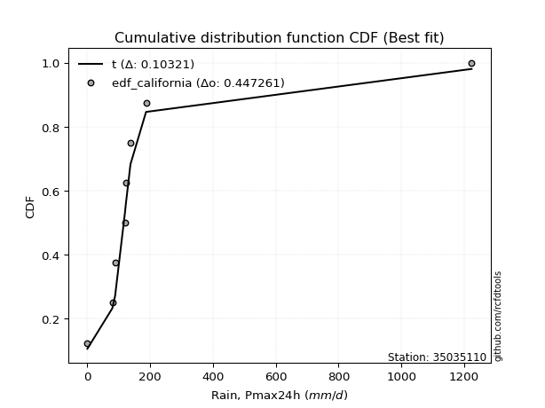</img></img>

</div>


### 2. EDF Hazen (1930)

Hazen method for plotting positions is a formula used to estimate the empirical cumulative probability distribution of flood events or other hydrological data. This formula often results in biased estimations, particularly when extrapolating to extreme events (high return periods).

<div align="center">


$P=(m-0.5)/n$


</div>


**2.1. Empirical values**

<div align="center">

|                | 0                  | 1                  | 2                  | 3                  | 4                  | 5         | 6                 | 7         |
|:---------------|:-------------------|:-------------------|:-------------------|:-------------------|:-------------------|:----------|:------------------|:----------|
| date           | 2020               | 2018               | 2017               | 2023               | 2021               | 2022      | 2019              | 2024      |
| x              | 0.1                | 79.4               | 88.4               | 120.2              | 122.0              | 137.3     | 186.9             | 1223.4    |
| m              | 1                  | 2                  | 3                  | 4                  | 5                  | 6         | 7                 | 8         |
| empirical_dist | edf_hazen          | edf_hazen          | edf_hazen          | edf_hazen          | edf_hazen          | edf_hazen | edf_hazen         | edf_hazen |
| empirical      | 0.0625             | 0.1875             | 0.3125             | 0.4375             | 0.5625             | 0.6875    | 0.8125            | 0.9375    |
| empirical_tr   | 1.0666666666666667 | 1.2307692307692308 | 1.4545454545454546 | 1.7777777777777777 | 2.2857142857142856 | 3.2       | 5.333333333333333 | 16.0      |

</div>


**2.2. Kolmogorov-Smirnov fit test (sorted by Δ)**


<div align="center">

|                | 0                   | 1                  | 2                   | 3                  | 4                   | 5                   | 6                   | 7                   | 8                   | 9                   | 10                 | 11                 | 12                  | 13                  | 14                  | 15                  | 16                 | 17                  | 18                 | 19                 | 20                 | 21                  | 22                  | 23                  | 24                 | 25                    | 26                 | 27                  | 28                  | 29                  | 30                 | 31                  | 32                  | 33                 | 34                  | 35                  | 36                  | 37                 | 38                 | 39                  | 40                 | 41                 | 42                 | 43                  | 44                  | 45                 | 46                 | 47                 | 48                 | 49                 | 50                 | 51                  | 52                 | 53                  | 54                 | 55                 | 56                  | 57                 | 58                  | 59                 | 60                  | 61                  | 62                 | 63                 | 64                 | 65                  | 66                  | 67                  | 68                 | 69                  | 70                  | 71                  | 72                  | 73                 | 74                  | 75                  | 76                  | 77                  | 78                  | 79                 | 80                 | 81                 | 82                 | 83                 | 84                 | 85                 | 86                 | 87                 |
|:---------------|:--------------------|:-------------------|:--------------------|:-------------------|:--------------------|:--------------------|:--------------------|:--------------------|:--------------------|:--------------------|:-------------------|:-------------------|:--------------------|:--------------------|:--------------------|:--------------------|:-------------------|:--------------------|:-------------------|:-------------------|:-------------------|:--------------------|:--------------------|:--------------------|:-------------------|:----------------------|:-------------------|:--------------------|:--------------------|:--------------------|:-------------------|:--------------------|:--------------------|:-------------------|:--------------------|:--------------------|:--------------------|:-------------------|:-------------------|:--------------------|:-------------------|:-------------------|:-------------------|:--------------------|:--------------------|:-------------------|:-------------------|:-------------------|:-------------------|:-------------------|:-------------------|:--------------------|:-------------------|:--------------------|:-------------------|:-------------------|:--------------------|:-------------------|:--------------------|:-------------------|:--------------------|:--------------------|:-------------------|:-------------------|:-------------------|:--------------------|:--------------------|:--------------------|:-------------------|:--------------------|:--------------------|:--------------------|:--------------------|:-------------------|:--------------------|:--------------------|:--------------------|:--------------------|:--------------------|:-------------------|:-------------------|:-------------------|:-------------------|:-------------------|:-------------------|:-------------------|:-------------------|:-------------------|
| station        | 35035110            | 35035110           | 35035110            | 35035110           | 35035110            | 35035110            | 35035110            | 35035110            | 35035110            | 35035110            | 35035110           | 35035110           | 35035110            | 35035110            | 35035110            | 35035110            | 35035110           | 35035110            | 35035110           | 35035110           | 35035110           | 35035110            | 35035110            | 35035110            | 35035110           | 35035110              | 35035110           | 35035110            | 35035110            | 35035110            | 35035110           | 35035110            | 35035110            | 35035110           | 35035110            | 35035110            | 35035110            | 35035110           | 35035110           | 35035110            | 35035110           | 35035110           | 35035110           | 35035110            | 35035110            | 35035110           | 35035110           | 35035110           | 35035110           | 35035110           | 35035110           | 35035110            | 35035110           | 35035110            | 35035110           | 35035110           | 35035110            | 35035110           | 35035110            | 35035110           | 35035110            | 35035110            | 35035110           | 35035110           | 35035110           | 35035110            | 35035110            | 35035110            | 35035110           | 35035110            | 35035110            | 35035110            | 35035110            | 35035110           | 35035110            | 35035110            | 35035110            | 35035110            | 35035110            | 35035110           | 35035110           | 35035110           | 35035110           | 35035110           | 35035110           | 35035110           | 35035110           | 35035110           |
| empirical_dist | edf_hazen           | edf_hazen          | edf_hazen           | edf_hazen          | edf_hazen           | edf_hazen           | edf_hazen           | edf_hazen           | edf_hazen           | edf_hazen           | edf_hazen          | edf_hazen          | edf_hazen           | edf_hazen           | edf_hazen           | edf_hazen           | edf_hazen          | edf_hazen           | edf_hazen          | edf_hazen          | edf_hazen          | edf_hazen           | edf_hazen           | edf_hazen           | edf_hazen          | edf_hazen             | edf_hazen          | edf_hazen           | edf_hazen           | edf_hazen           | edf_hazen          | edf_hazen           | edf_hazen           | edf_hazen          | edf_hazen           | edf_hazen           | edf_hazen           | edf_hazen          | edf_hazen          | edf_hazen           | edf_hazen          | edf_hazen          | edf_hazen          | edf_hazen           | edf_hazen           | edf_hazen          | edf_hazen          | edf_hazen          | edf_hazen          | edf_hazen          | edf_hazen          | edf_hazen           | edf_hazen          | edf_hazen           | edf_hazen          | edf_hazen          | edf_hazen           | edf_hazen          | edf_hazen           | edf_hazen          | edf_hazen           | edf_hazen           | edf_hazen          | edf_hazen          | edf_hazen          | edf_hazen           | edf_hazen           | edf_hazen           | edf_hazen          | edf_hazen           | edf_hazen           | edf_hazen           | edf_hazen           | edf_hazen          | edf_hazen           | edf_hazen           | edf_hazen           | edf_hazen           | edf_hazen           | edf_hazen          | edf_hazen          | edf_hazen          | edf_hazen          | edf_hazen          | edf_hazen          | edf_hazen          | edf_hazen          | edf_hazen          |
| p_dist         | t                   | logjohnsonsu       | johnsonsu           | alpha              | fisk                | invgamma            | gompertz            | ncf                 | invgauss            | erlang              | gibrat             | fatiguelife        | wald                | gamma               | logpearson3         | pearson3            | logloggamma        | logcrystalball      | logtruncnorm       | betaprime          | chi2               | loggompertz         | loggenlogistic      | halflogistic        | loggumbel_l        | loglaplace_asymmetric | expon              | genexpon            | moyal               | genlogistic         | exponnorm          | halfnorm            | mielke              | laplace_asymmetric | gumbel_r            | rayleigh            | maxwell             | lognorm            | lognorm            | logexponnorm        | logrice            | lognct             | lognakagami        | logfatiguelife      | loglogistic         | loghypsecant       | loginvgauss        | nakagami           | loginvgamma        | logbetaprime       | loglaplace         | logerlang           | norm               | logmaxwell          | f                  | logistic           | kstwobign           | lograyleigh        | hypsecant           | logt               | weibull_min         | logkstwobign        | laplace            | loglognorm         | loggumbel_r        | loghalfnorm         | logmielke           | loginvweibull       | rice               | loggenexpon         | crystalball         | logmoyal            | loghalflogistic     | gumbel_l           | nct                 | logexpon            | truncnorm           | invweibull          | logncf              | logwald            | logfisk            | loggamma           | loggamma           | loggibrat          | logf               | logchi2            | logalpha           | logweibull_min     |
| delta          | 0.09806418553888807 | 0.1122640532372911 | 0.14069834496955258 | 0.1570297179426986 | 0.16499133949173866 | 0.16861025467861468 | 0.18254562393286866 | 0.18816929667515114 | 0.19146732214353623 | 0.19794328423807228 | 0.2048898070547197 | 0.2198672900201214 | 0.22557660875028257 | 0.24149332422273184 | 0.24766209187528054 | 0.24786441004630916 | 0.2528586406539509 | 0.25732864122733573 | 0.2606128253438502 | 0.26577020781484   | 0.2692845269284728 | 0.26934494071140713 | 0.27160141484366274 | 0.27361801970690314 | 0.2743964244914764 | 0.2758688684573614    | 0.2784593855490092 | 0.27845938771666323 | 0.28333836548516467 | 0.28688500460196364 | 0.2875338599617516 | 0.29360279685731216 | 0.30602036256767395 | 0.3060895289118767 | 0.30832126361754364 | 0.32760415763246675 | 0.33963836959325033 | 0.3431715873398483 | 0.3431715873398483 | 0.34317272778130525 | 0.3432062342575978 | 0.3434649677570767 | 0.3434657493155542 | 0.34486225945369053 | 0.34734011626545813 | 0.3508857057677832 | 0.3512141654663704 | 0.357110530807103  | 0.3571565170762169 | 0.3604235599787077 | 0.3640609310705687 | 0.36468958887895775 | 0.3740363778169704 | 0.37474403303941106 | 0.3756500977813476 | 0.3822656790346387 | 0.38359058533422485 | 0.385023640708107  | 0.38918022461966956 | 0.3947522419473941 | 0.39735704446168274 | 0.39858750552139655 | 0.4108443963649322 | 0.4112852981439964 | 0.4137833129297984 | 0.41398471813848203 | 0.41626067814597556 | 0.41657097258864395 | 0.416884827553529  | 0.42626824128626506 | 0.43785393312852816 | 0.43916169716228726 | 0.44052914362869344 | 0.4435831725151007 | 0.45207426685975016 | 0.45571338405881234 | 0.46375019841575954 | 0.46999127887614456 | 0.47038624367613446 | 0.5096131910879993 | 0.5205635889232502 | 0.5265347839749186 | 0.5265347839749186 | 0.53694980241214   | 0.5745345249099331 | 0.6235842772987121 | 0.6257647277804794 | 0.6553479815010264 |
| deltao         | 0.4472608134160001  | 0.4472608134160001 | 0.4472608134160001  | 0.4472608134160001 | 0.4472608134160001  | 0.4472608134160001  | 0.4472608134160001  | 0.4472608134160001  | 0.4472608134160001  | 0.4472608134160001  | 0.4472608134160001 | 0.4472608134160001 | 0.4472608134160001  | 0.4472608134160001  | 0.4472608134160001  | 0.4472608134160001  | 0.4472608134160001 | 0.4472608134160001  | 0.4472608134160001 | 0.4472608134160001 | 0.4472608134160001 | 0.4472608134160001  | 0.4472608134160001  | 0.4472608134160001  | 0.4472608134160001 | 0.4472608134160001    | 0.4472608134160001 | 0.4472608134160001  | 0.4472608134160001  | 0.4472608134160001  | 0.4472608134160001 | 0.4472608134160001  | 0.4472608134160001  | 0.4472608134160001 | 0.4472608134160001  | 0.4472608134160001  | 0.4472608134160001  | 0.4472608134160001 | 0.4472608134160001 | 0.4472608134160001  | 0.4472608134160001 | 0.4472608134160001 | 0.4472608134160001 | 0.4472608134160001  | 0.4472608134160001  | 0.4472608134160001 | 0.4472608134160001 | 0.4472608134160001 | 0.4472608134160001 | 0.4472608134160001 | 0.4472608134160001 | 0.4472608134160001  | 0.4472608134160001 | 0.4472608134160001  | 0.4472608134160001 | 0.4472608134160001 | 0.4472608134160001  | 0.4472608134160001 | 0.4472608134160001  | 0.4472608134160001 | 0.4472608134160001  | 0.4472608134160001  | 0.4472608134160001 | 0.4472608134160001 | 0.4472608134160001 | 0.4472608134160001  | 0.4472608134160001  | 0.4472608134160001  | 0.4472608134160001 | 0.4472608134160001  | 0.4472608134160001  | 0.4472608134160001  | 0.4472608134160001  | 0.4472608134160001 | 0.4472608134160001  | 0.4472608134160001  | 0.4472608134160001  | 0.4472608134160001  | 0.4472608134160001  | 0.4472608134160001 | 0.4472608134160001 | 0.4472608134160001 | 0.4472608134160001 | 0.4472608134160001 | 0.4472608134160001 | 0.4472608134160001 | 0.4472608134160001 | 0.4472608134160001 |
| eval           | Δo > Δ              | Δo > Δ             | Δo > Δ              | Δo > Δ             | Δo > Δ              | Δo > Δ              | Δo > Δ              | Δo > Δ              | Δo > Δ              | Δo > Δ              | Δo > Δ             | Δo > Δ             | Δo > Δ              | Δo > Δ              | Δo > Δ              | Δo > Δ              | Δo > Δ             | Δo > Δ              | Δo > Δ             | Δo > Δ             | Δo > Δ             | Δo > Δ              | Δo > Δ              | Δo > Δ              | Δo > Δ             | Δo > Δ                | Δo > Δ             | Δo > Δ              | Δo > Δ              | Δo > Δ              | Δo > Δ             | Δo > Δ              | Δo > Δ              | Δo > Δ             | Δo > Δ              | Δo > Δ              | Δo > Δ              | Δo > Δ             | Δo > Δ             | Δo > Δ              | Δo > Δ             | Δo > Δ             | Δo > Δ             | Δo > Δ              | Δo > Δ              | Δo > Δ             | Δo > Δ             | Δo > Δ             | Δo > Δ             | Δo > Δ             | Δo > Δ             | Δo > Δ              | Δo > Δ             | Δo > Δ              | Δo > Δ             | Δo > Δ             | Δo > Δ              | Δo > Δ             | Δo > Δ              | Δo > Δ             | Δo > Δ              | Δo > Δ              | Δo > Δ             | Δo > Δ             | Δo > Δ             | Δo > Δ              | Δo > Δ              | Δo > Δ              | Δo > Δ             | Δo > Δ              | Δo > Δ              | Δo > Δ              | Δo > Δ              | Δo > Δ             | Δo <= Δ             | Δo <= Δ             | Δo <= Δ             | Δo <= Δ             | Δo <= Δ             | Δo <= Δ            | Δo <= Δ            | Δo <= Δ            | Δo <= Δ            | Δo <= Δ            | Δo <= Δ            | Δo <= Δ            | Δo <= Δ            | Δo <= Δ            |
| fit            | 1                   | 1                  | 1                   | 1                  | 1                   | 1                   | 1                   | 1                   | 1                   | 1                   | 1                  | 1                  | 1                   | 1                   | 1                   | 1                   | 1                  | 1                   | 1                  | 1                  | 1                  | 1                   | 1                   | 1                   | 1                  | 1                     | 1                  | 1                   | 1                   | 1                   | 1                  | 1                   | 1                   | 1                  | 1                   | 1                   | 1                   | 1                  | 1                  | 1                   | 1                  | 1                  | 1                  | 1                   | 1                   | 1                  | 1                  | 1                  | 1                  | 1                  | 1                  | 1                   | 1                  | 1                   | 1                  | 1                  | 1                   | 1                  | 1                   | 1                  | 1                   | 1                   | 1                  | 1                  | 1                  | 1                   | 1                   | 1                   | 1                  | 1                   | 1                   | 1                   | 1                   | 1                  | 0                   | 0                   | 0                   | 0                   | 0                   | 0                  | 0                  | 0                  | 0                  | 0                  | 0                  | 0                  | 0                  | 0                  |
| n              | 8                   | 8                  | 8                   | 8                  | 8                   | 8                   | 8                   | 8                   | 8                   | 8                   | 8                  | 8                  | 8                   | 8                   | 8                   | 8                   | 8                  | 8                   | 8                  | 8                  | 8                  | 8                   | 8                   | 8                   | 8                  | 8                     | 8                  | 8                   | 8                   | 8                   | 8                  | 8                   | 8                   | 8                  | 8                   | 8                   | 8                   | 8                  | 8                  | 8                   | 8                  | 8                  | 8                  | 8                   | 8                   | 8                  | 8                  | 8                  | 8                  | 8                  | 8                  | 8                   | 8                  | 8                   | 8                  | 8                  | 8                   | 8                  | 8                   | 8                  | 8                   | 8                   | 8                  | 8                  | 8                  | 8                   | 8                   | 8                   | 8                  | 8                   | 8                   | 8                   | 8                   | 8                  | 8                   | 8                   | 8                   | 8                   | 8                   | 8                  | 8                  | 8                  | 8                  | 8                  | 8                  | 8                  | 8                  | 8                  |
| best_fit       | 1                   | 0                  | 0                   | 0                  | 0                   | 0                   | 0                   | 0                   | 0                   | 0                   | 0                  | 0                  | 0                   | 0                   | 0                   | 0                   | 0                  | 0                   | 0                  | 0                  | 0                  | 0                   | 0                   | 0                   | 0                  | 0                     | 0                  | 0                   | 0                   | 0                   | 0                  | 0                   | 0                   | 0                  | 0                   | 0                   | 0                   | 0                  | 0                  | 0                   | 0                  | 0                  | 0                  | 0                   | 0                   | 0                  | 0                  | 0                  | 0                  | 0                  | 0                  | 0                   | 0                  | 0                   | 0                  | 0                  | 0                   | 0                  | 0                   | 0                  | 0                   | 0                   | 0                  | 0                  | 0                  | 0                   | 0                   | 0                   | 0                  | 0                   | 0                   | 0                   | 0                   | 0                  | 0                   | 0                   | 0                   | 0                   | 0                   | 0                  | 0                  | 0                  | 0                  | 0                  | 0                  | 0                  | 0                  | 0                  |
| best_fit_sort  | 1                   | 2                  | 3                   | 4                  | 5                   | 6                   | 7                   | 8                   | 9                   | 10                  | 11                 | 12                 | 13                  | 14                  | 15                  | 16                  | 17                 | 18                  | 19                 | 20                 | 21                 | 22                  | 23                  | 24                  | 25                 | 26                    | 27                 | 28                  | 29                  | 30                  | 31                 | 32                  | 33                  | 34                 | 35                  | 36                  | 37                  | 38                 | 39                 | 40                  | 41                 | 42                 | 43                 | 44                  | 45                  | 46                 | 47                 | 48                 | 49                 | 50                 | 51                 | 52                  | 53                 | 54                  | 55                 | 56                 | 57                  | 58                 | 59                  | 60                 | 61                  | 62                  | 63                 | 64                 | 65                 | 66                  | 67                  | 68                  | 69                 | 70                  | 71                  | 72                  | 73                  | 74                 | 75                  | 76                  | 77                  | 78                  | 79                  | 80                 | 81                 | 82                 | 83                 | 84                 | 85                 | 86                 | 87                 | 88                 |

</div>


**2.3. Best fit**

<div align="center">

|   id |   station | empirical_dist   | p_dist   |     delta |   deltao | eval   |   fit |   n |   best_fit |   best_fit_sort |
|-----:|----------:|:-----------------|:---------|----------:|---------:|:-------|------:|----:|-----------:|----------------:|
|    0 |  35035110 | edf_hazen        | t        | 0.0980642 | 0.447261 | Δo > Δ |     1 |   8 |          1 |               1 |

</div>


<div align="center">

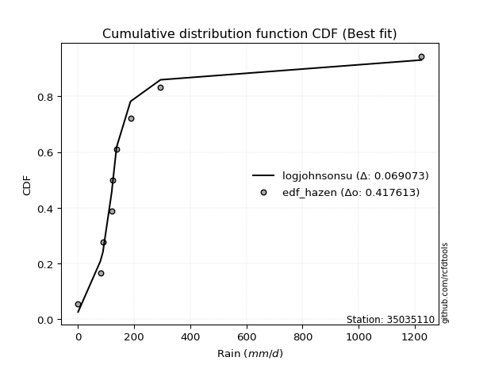</img>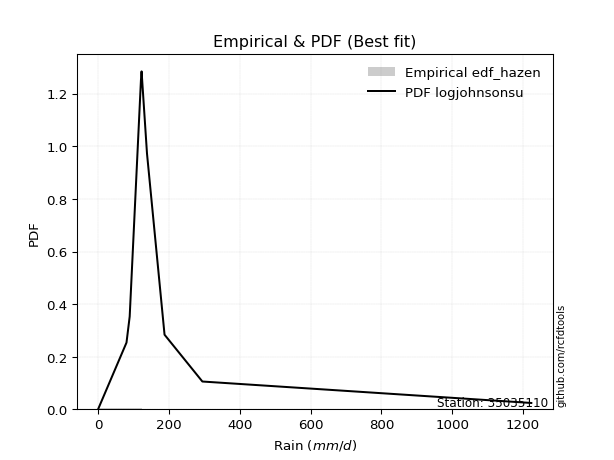</img>

</div>


### 3. EDF Weibull (1939)

Weibull plotting position formula is an empirical method used to estimate the non-exceedance probability or plotting position for a set of observed data, is often recommended or widely used in practice, particularly in flood frequency analysis.

<div align="center">


$P=m/(n+1)$


</div>


**3.1. Empirical values**

<div align="center">

|                | 0                  | 1                  | 2                  | 3                  | 4                  | 5                  | 6                  | 7                  |
|:---------------|:-------------------|:-------------------|:-------------------|:-------------------|:-------------------|:-------------------|:-------------------|:-------------------|
| date           | 2020               | 2018               | 2017               | 2023               | 2021               | 2022               | 2019               | 2024               |
| x              | 0.1                | 79.4               | 88.4               | 120.2              | 122.0              | 137.3              | 186.9              | 1223.4             |
| m              | 1                  | 2                  | 3                  | 4                  | 5                  | 6                  | 7                  | 8                  |
| empirical_dist | edf_weibull        | edf_weibull        | edf_weibull        | edf_weibull        | edf_weibull        | edf_weibull        | edf_weibull        | edf_weibull        |
| empirical      | 0.1111111111111111 | 0.2222222222222222 | 0.3333333333333333 | 0.4444444444444444 | 0.5555555555555556 | 0.6666666666666666 | 0.7777777777777778 | 0.8888888888888888 |
| empirical_tr   | 1.125              | 1.2857142857142856 | 1.4999999999999998 | 1.7999999999999998 | 2.25               | 2.9999999999999996 | 4.5                | 8.999999999999996  |

</div>


**3.2. Kolmogorov-Smirnov fit test (sorted by Δ)**


<div align="center">

|                | 0                   | 1                   | 2                   | 3                   | 4                   | 5                   | 6                   | 7                   | 8                  | 9                   | 10                 | 11                 | 12                  | 13                  | 14                  | 15                  | 16                 | 17                  | 18                 | 19                 | 20                 | 21                  | 22                  | 23                  | 24                  | 25                    | 26                  | 27                  | 28                  | 29                  | 30                 | 31                  | 32                  | 33                  | 34                 | 35                  | 36                 | 37                 | 38                 | 39                  | 40                  | 41                 | 42                  | 43                 | 44                 | 45                 | 46                 | 47                  | 48                  | 49                  | 50                 | 51                  | 52                 | 53                  | 54                 | 55                 | 56                  | 57                 | 58                  | 59                 | 60                  | 61                  | 62                  | 63                 | 64                 | 65                 | 66                  | 67                  | 68                 | 69                  | 70                  | 71                  | 72                  | 73                 | 74                  | 75                  | 76                 | 77                  | 78                  | 79                 | 80                  | 81                 | 82                 | 83                 | 84                 | 85                 | 86                 | 87                 |
|:---------------|:--------------------|:--------------------|:--------------------|:--------------------|:--------------------|:--------------------|:--------------------|:--------------------|:-------------------|:--------------------|:-------------------|:-------------------|:--------------------|:--------------------|:--------------------|:--------------------|:-------------------|:--------------------|:-------------------|:-------------------|:-------------------|:--------------------|:--------------------|:--------------------|:--------------------|:----------------------|:--------------------|:--------------------|:--------------------|:--------------------|:-------------------|:--------------------|:--------------------|:--------------------|:-------------------|:--------------------|:-------------------|:-------------------|:-------------------|:--------------------|:--------------------|:-------------------|:--------------------|:-------------------|:-------------------|:-------------------|:-------------------|:--------------------|:--------------------|:--------------------|:-------------------|:--------------------|:-------------------|:--------------------|:-------------------|:-------------------|:--------------------|:-------------------|:--------------------|:-------------------|:--------------------|:--------------------|:--------------------|:-------------------|:-------------------|:-------------------|:--------------------|:--------------------|:-------------------|:--------------------|:--------------------|:--------------------|:--------------------|:-------------------|:--------------------|:--------------------|:-------------------|:--------------------|:--------------------|:-------------------|:--------------------|:-------------------|:-------------------|:-------------------|:-------------------|:-------------------|:-------------------|:-------------------|
| station        | 35035110            | 35035110            | 35035110            | 35035110            | 35035110            | 35035110            | 35035110            | 35035110            | 35035110           | 35035110            | 35035110           | 35035110           | 35035110            | 35035110            | 35035110            | 35035110            | 35035110           | 35035110            | 35035110           | 35035110           | 35035110           | 35035110            | 35035110            | 35035110            | 35035110            | 35035110              | 35035110            | 35035110            | 35035110            | 35035110            | 35035110           | 35035110            | 35035110            | 35035110            | 35035110           | 35035110            | 35035110           | 35035110           | 35035110           | 35035110            | 35035110            | 35035110           | 35035110            | 35035110           | 35035110           | 35035110           | 35035110           | 35035110            | 35035110            | 35035110            | 35035110           | 35035110            | 35035110           | 35035110            | 35035110           | 35035110           | 35035110            | 35035110           | 35035110            | 35035110           | 35035110            | 35035110            | 35035110            | 35035110           | 35035110           | 35035110           | 35035110            | 35035110            | 35035110           | 35035110            | 35035110            | 35035110            | 35035110            | 35035110           | 35035110            | 35035110            | 35035110           | 35035110            | 35035110            | 35035110           | 35035110            | 35035110           | 35035110           | 35035110           | 35035110           | 35035110           | 35035110           | 35035110           |
| empirical_dist | edf_weibull         | edf_weibull         | edf_weibull         | edf_weibull         | edf_weibull         | edf_weibull         | edf_weibull         | edf_weibull         | edf_weibull        | edf_weibull         | edf_weibull        | edf_weibull        | edf_weibull         | edf_weibull         | edf_weibull         | edf_weibull         | edf_weibull        | edf_weibull         | edf_weibull        | edf_weibull        | edf_weibull        | edf_weibull         | edf_weibull         | edf_weibull         | edf_weibull         | edf_weibull           | edf_weibull         | edf_weibull         | edf_weibull         | edf_weibull         | edf_weibull        | edf_weibull         | edf_weibull         | edf_weibull         | edf_weibull        | edf_weibull         | edf_weibull        | edf_weibull        | edf_weibull        | edf_weibull         | edf_weibull         | edf_weibull        | edf_weibull         | edf_weibull        | edf_weibull        | edf_weibull        | edf_weibull        | edf_weibull         | edf_weibull         | edf_weibull         | edf_weibull        | edf_weibull         | edf_weibull        | edf_weibull         | edf_weibull        | edf_weibull        | edf_weibull         | edf_weibull        | edf_weibull         | edf_weibull        | edf_weibull         | edf_weibull         | edf_weibull         | edf_weibull        | edf_weibull        | edf_weibull        | edf_weibull         | edf_weibull         | edf_weibull        | edf_weibull         | edf_weibull         | edf_weibull         | edf_weibull         | edf_weibull        | edf_weibull         | edf_weibull         | edf_weibull        | edf_weibull         | edf_weibull         | edf_weibull        | edf_weibull         | edf_weibull        | edf_weibull        | edf_weibull        | edf_weibull        | edf_weibull        | edf_weibull        | edf_weibull        |
| p_dist         | t                   | alpha               | fisk                | logjohnsonsu        | invgamma            | gompertz            | ncf                 | invgauss            | johnsonsu          | erlang              | gibrat             | fatiguelife        | wald                | gamma               | logpearson3         | pearson3            | logloggamma        | logcrystalball      | logtruncnorm       | betaprime          | chi2               | loggompertz         | loggenlogistic      | halflogistic        | loggumbel_l         | loglaplace_asymmetric | expon               | genexpon            | moyal               | genlogistic         | exponnorm          | halfnorm            | mielke              | gumbel_r            | laplace_asymmetric | rayleigh            | maxwell            | lognorm            | lognorm            | logexponnorm        | logrice             | lognct             | lognakagami         | logfatiguelife     | loglogistic        | loghypsecant       | loginvgauss        | nakagami            | loginvgamma         | logbetaprime        | loglaplace         | logerlang           | norm               | logmaxwell          | f                  | logistic           | kstwobign           | lograyleigh        | hypsecant           | logt               | weibull_min         | loglognorm          | logkstwobign        | laplace            | loggumbel_r        | loghalfnorm        | logmielke           | loginvweibull       | rice               | crystalball         | loggenexpon         | logmoyal            | loghalflogistic     | gumbel_l           | nct                 | logexpon            | invweibull         | truncnorm           | logncf              | logwald            | logfisk             | loggamma           | loggamma           | loggibrat          | logf               | logchi2            | logalpha           | logweibull_min     |
| delta          | 0.09145882189066845 | 0.12230749572047639 | 0.13026911726951645 | 0.13309738657062442 | 0.13388803245639247 | 0.14849699157434992 | 0.15344707445292893 | 0.15674509992131402 | 0.1615316783028859 | 0.16322106201585007 | 0.1701675848324975 | 0.1851450677978992 | 0.19085438652806036 | 0.20677110200050963 | 0.21293986965305833 | 0.21314218782408695 | 0.2181364184317287 | 0.22260641900511352 | 0.225890603121628  | 0.2310479855926178 | 0.2345623047062506 | 0.23462271848918492 | 0.23687919262144053 | 0.23889579748468093 | 0.23967420226925418 | 0.2411466462351392    | 0.24373716332678697 | 0.24373716549444102 | 0.24861614326294246 | 0.25216278237974143 | 0.2528116377395294 | 0.25888057463508996 | 0.27129814034545174 | 0.27359904139532143 | 0.2852561955785433 | 0.29288193541024454 | 0.3049161473710281 | 0.3084493651176261 | 0.3084493651176261 | 0.30845050555908304 | 0.30848401203537557 | 0.3087427455348545 | 0.30874352709333197 | 0.3101400372314683 | 0.3126178940432359 | 0.316163483545561  | 0.3164919432441482 | 0.32238830858488077 | 0.32243429485399466 | 0.32570133775648547 | 0.3293387088483465 | 0.32996736665673554 | 0.3393141555947482 | 0.34002181081718885 | 0.3409278755591254 | 0.3475434568124165 | 0.34886836311200264 | 0.3503014184858848 | 0.35445800239744735 | 0.3600300197251719 | 0.36263482223946053 | 0.36267418703288523 | 0.36386528329917434 | 0.37612217414271   | 0.3790610907075762 | 0.3792624959162598 | 0.38153845592375335 | 0.38184875036642174 | 0.3821626053313068 | 0.38924282201741706 | 0.39154601906404285 | 0.40443947494006505 | 0.40580692140647123 | 0.4088609502928785 | 0.41735204463752795 | 0.42099116183659013 | 0.4213801677650334 | 0.42902797619353733 | 0.43566402145391225 | 0.4748909688657771 | 0.48584136670102795 | 0.4918125617526964 | 0.4918125617526964 | 0.5022275801899178 | 0.5398123026877109 | 0.5888620550764899 | 0.5910425055582572 | 0.6206257592788041 |
| deltao         | 0.4472608134160001  | 0.4472608134160001  | 0.4472608134160001  | 0.4472608134160001  | 0.4472608134160001  | 0.4472608134160001  | 0.4472608134160001  | 0.4472608134160001  | 0.4472608134160001 | 0.4472608134160001  | 0.4472608134160001 | 0.4472608134160001 | 0.4472608134160001  | 0.4472608134160001  | 0.4472608134160001  | 0.4472608134160001  | 0.4472608134160001 | 0.4472608134160001  | 0.4472608134160001 | 0.4472608134160001 | 0.4472608134160001 | 0.4472608134160001  | 0.4472608134160001  | 0.4472608134160001  | 0.4472608134160001  | 0.4472608134160001    | 0.4472608134160001  | 0.4472608134160001  | 0.4472608134160001  | 0.4472608134160001  | 0.4472608134160001 | 0.4472608134160001  | 0.4472608134160001  | 0.4472608134160001  | 0.4472608134160001 | 0.4472608134160001  | 0.4472608134160001 | 0.4472608134160001 | 0.4472608134160001 | 0.4472608134160001  | 0.4472608134160001  | 0.4472608134160001 | 0.4472608134160001  | 0.4472608134160001 | 0.4472608134160001 | 0.4472608134160001 | 0.4472608134160001 | 0.4472608134160001  | 0.4472608134160001  | 0.4472608134160001  | 0.4472608134160001 | 0.4472608134160001  | 0.4472608134160001 | 0.4472608134160001  | 0.4472608134160001 | 0.4472608134160001 | 0.4472608134160001  | 0.4472608134160001 | 0.4472608134160001  | 0.4472608134160001 | 0.4472608134160001  | 0.4472608134160001  | 0.4472608134160001  | 0.4472608134160001 | 0.4472608134160001 | 0.4472608134160001 | 0.4472608134160001  | 0.4472608134160001  | 0.4472608134160001 | 0.4472608134160001  | 0.4472608134160001  | 0.4472608134160001  | 0.4472608134160001  | 0.4472608134160001 | 0.4472608134160001  | 0.4472608134160001  | 0.4472608134160001 | 0.4472608134160001  | 0.4472608134160001  | 0.4472608134160001 | 0.4472608134160001  | 0.4472608134160001 | 0.4472608134160001 | 0.4472608134160001 | 0.4472608134160001 | 0.4472608134160001 | 0.4472608134160001 | 0.4472608134160001 |
| eval           | Δo > Δ              | Δo > Δ              | Δo > Δ              | Δo > Δ              | Δo > Δ              | Δo > Δ              | Δo > Δ              | Δo > Δ              | Δo > Δ             | Δo > Δ              | Δo > Δ             | Δo > Δ             | Δo > Δ              | Δo > Δ              | Δo > Δ              | Δo > Δ              | Δo > Δ             | Δo > Δ              | Δo > Δ             | Δo > Δ             | Δo > Δ             | Δo > Δ              | Δo > Δ              | Δo > Δ              | Δo > Δ              | Δo > Δ                | Δo > Δ              | Δo > Δ              | Δo > Δ              | Δo > Δ              | Δo > Δ             | Δo > Δ              | Δo > Δ              | Δo > Δ              | Δo > Δ             | Δo > Δ              | Δo > Δ             | Δo > Δ             | Δo > Δ             | Δo > Δ              | Δo > Δ              | Δo > Δ             | Δo > Δ              | Δo > Δ             | Δo > Δ             | Δo > Δ             | Δo > Δ             | Δo > Δ              | Δo > Δ              | Δo > Δ              | Δo > Δ             | Δo > Δ              | Δo > Δ             | Δo > Δ              | Δo > Δ             | Δo > Δ             | Δo > Δ              | Δo > Δ             | Δo > Δ              | Δo > Δ             | Δo > Δ              | Δo > Δ              | Δo > Δ              | Δo > Δ             | Δo > Δ             | Δo > Δ             | Δo > Δ              | Δo > Δ              | Δo > Δ             | Δo > Δ              | Δo > Δ              | Δo > Δ              | Δo > Δ              | Δo > Δ             | Δo > Δ              | Δo > Δ              | Δo > Δ             | Δo > Δ              | Δo > Δ              | Δo <= Δ            | Δo <= Δ             | Δo <= Δ            | Δo <= Δ            | Δo <= Δ            | Δo <= Δ            | Δo <= Δ            | Δo <= Δ            | Δo <= Δ            |
| fit            | 1                   | 1                   | 1                   | 1                   | 1                   | 1                   | 1                   | 1                   | 1                  | 1                   | 1                  | 1                  | 1                   | 1                   | 1                   | 1                   | 1                  | 1                   | 1                  | 1                  | 1                  | 1                   | 1                   | 1                   | 1                   | 1                     | 1                   | 1                   | 1                   | 1                   | 1                  | 1                   | 1                   | 1                   | 1                  | 1                   | 1                  | 1                  | 1                  | 1                   | 1                   | 1                  | 1                   | 1                  | 1                  | 1                  | 1                  | 1                   | 1                   | 1                   | 1                  | 1                   | 1                  | 1                   | 1                  | 1                  | 1                   | 1                  | 1                   | 1                  | 1                   | 1                   | 1                   | 1                  | 1                  | 1                  | 1                   | 1                   | 1                  | 1                   | 1                   | 1                   | 1                   | 1                  | 1                   | 1                   | 1                  | 1                   | 1                   | 0                  | 0                   | 0                  | 0                  | 0                  | 0                  | 0                  | 0                  | 0                  |
| n              | 8                   | 8                   | 8                   | 8                   | 8                   | 8                   | 8                   | 8                   | 8                  | 8                   | 8                  | 8                  | 8                   | 8                   | 8                   | 8                   | 8                  | 8                   | 8                  | 8                  | 8                  | 8                   | 8                   | 8                   | 8                   | 8                     | 8                   | 8                   | 8                   | 8                   | 8                  | 8                   | 8                   | 8                   | 8                  | 8                   | 8                  | 8                  | 8                  | 8                   | 8                   | 8                  | 8                   | 8                  | 8                  | 8                  | 8                  | 8                   | 8                   | 8                   | 8                  | 8                   | 8                  | 8                   | 8                  | 8                  | 8                   | 8                  | 8                   | 8                  | 8                   | 8                   | 8                   | 8                  | 8                  | 8                  | 8                   | 8                   | 8                  | 8                   | 8                   | 8                   | 8                   | 8                  | 8                   | 8                   | 8                  | 8                   | 8                   | 8                  | 8                   | 8                  | 8                  | 8                  | 8                  | 8                  | 8                  | 8                  |
| best_fit       | 1                   | 0                   | 0                   | 0                   | 0                   | 0                   | 0                   | 0                   | 0                  | 0                   | 0                  | 0                  | 0                   | 0                   | 0                   | 0                   | 0                  | 0                   | 0                  | 0                  | 0                  | 0                   | 0                   | 0                   | 0                   | 0                     | 0                   | 0                   | 0                   | 0                   | 0                  | 0                   | 0                   | 0                   | 0                  | 0                   | 0                  | 0                  | 0                  | 0                   | 0                   | 0                  | 0                   | 0                  | 0                  | 0                  | 0                  | 0                   | 0                   | 0                   | 0                  | 0                   | 0                  | 0                   | 0                  | 0                  | 0                   | 0                  | 0                   | 0                  | 0                   | 0                   | 0                   | 0                  | 0                  | 0                  | 0                   | 0                   | 0                  | 0                   | 0                   | 0                   | 0                   | 0                  | 0                   | 0                   | 0                  | 0                   | 0                   | 0                  | 0                   | 0                  | 0                  | 0                  | 0                  | 0                  | 0                  | 0                  |
| best_fit_sort  | 1                   | 2                   | 3                   | 4                   | 5                   | 6                   | 7                   | 8                   | 9                  | 10                  | 11                 | 12                 | 13                  | 14                  | 15                  | 16                  | 17                 | 18                  | 19                 | 20                 | 21                 | 22                  | 23                  | 24                  | 25                  | 26                    | 27                  | 28                  | 29                  | 30                  | 31                 | 32                  | 33                  | 34                  | 35                 | 36                  | 37                 | 38                 | 39                 | 40                  | 41                  | 42                 | 43                  | 44                 | 45                 | 46                 | 47                 | 48                  | 49                  | 50                  | 51                 | 52                  | 53                 | 54                  | 55                 | 56                 | 57                  | 58                 | 59                  | 60                 | 61                  | 62                  | 63                  | 64                 | 65                 | 66                 | 67                  | 68                  | 69                 | 70                  | 71                  | 72                  | 73                  | 74                 | 75                  | 76                  | 77                 | 78                  | 79                  | 80                 | 81                  | 82                 | 83                 | 84                 | 85                 | 86                 | 87                 | 88                 |

</div>


**3.3. Best fit**

<div align="center">

|   id |   station | empirical_dist   | p_dist   |     delta |   deltao | eval   |   fit |   n |   best_fit |   best_fit_sort |
|-----:|----------:|:-----------------|:---------|----------:|---------:|:-------|------:|----:|-----------:|----------------:|
|    0 |  35035110 | edf_weibull      | t        | 0.0914588 | 0.447261 | Δo > Δ |     1 |   8 |          1 |               1 |

</div>


<div align="center">

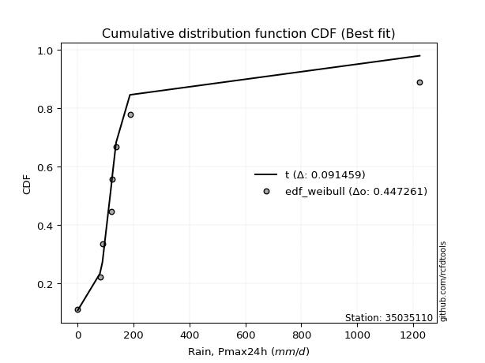</img>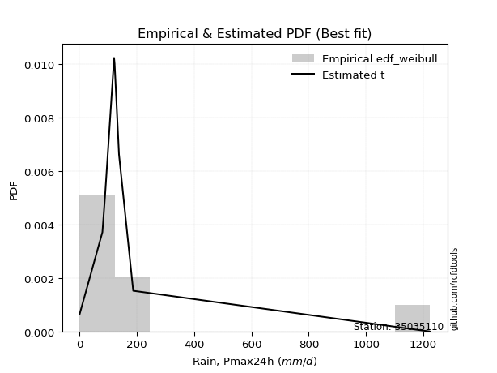</img>

</div>


### 4. EDF Beard (1943)

The Beard formula (or Beard´s plotting position formula) in hydrology is used to estimate the empirical non-exceedance probability _(P)_ of a flood event (or other extreme hydrological data point) within a given dataset.

<div align="center">


$P=(m-0.31)/(n+0.38)$


</div>


**4.1. Empirical values**

<div align="center">

|                | 0                   | 1                   | 2                  | 3                   | 4                  | 5                  | 6                  | 7                  |
|:---------------|:--------------------|:--------------------|:-------------------|:--------------------|:-------------------|:-------------------|:-------------------|:-------------------|
| date           | 2020                | 2018                | 2017               | 2023                | 2021               | 2022               | 2019               | 2024               |
| x              | 0.1                 | 79.4                | 88.4               | 120.2               | 122.0              | 137.3              | 186.9              | 1223.4             |
| m              | 1                   | 2                   | 3                  | 4                   | 5                  | 6                  | 7                  | 8                  |
| empirical_dist | edf_beard           | edf_beard           | edf_beard          | edf_beard           | edf_beard          | edf_beard          | edf_beard          | edf_beard          |
| empirical      | 0.08233890214797135 | 0.20167064439140808 | 0.3210023866348448 | 0.44033412887828155 | 0.5596658711217184 | 0.6789976133651551 | 0.7983293556085919 | 0.9176610978520287 |
| empirical_tr   | 1.0897269180754225  | 1.2526158445440956  | 1.4727592267135323 | 1.7867803837953091  | 2.2710027100271004 | 3.115241635687732  | 4.958579881656804  | 12.144927536231886 |

</div>


**4.2. Kolmogorov-Smirnov fit test (sorted by Δ)**


<div align="center">

|                | 0                   | 1                   | 2                   | 3                  | 4                   | 5                  | 6                   | 7                  | 8                  | 9                   | 10                  | 11                  | 12                 | 13                 | 14                 | 15                  | 16                  | 17                  | 18                  | 19                 | 20                  | 21                  | 22                  | 23                 | 24                 | 25                    | 26                  | 27                 | 28                  | 29                 | 30                 | 31                 | 32                  | 33                 | 34                  | 35                 | 36                 | 37                  | 38                  | 39                  | 40                 | 41                 | 42                 | 43                  | 44                  | 45                  | 46                 | 47                 | 48                 | 49                 | 50                 | 51                  | 52                 | 53                 | 54                  | 55                  | 56                 | 57                  | 58                 | 59                  | 60                 | 61                  | 62                  | 63                  | 64                  | 65                  | 66                 | 67                  | 68                 | 69                 | 70                 | 71                 | 72                  | 73                  | 74                 | 75                  | 76                 | 77                 | 78                 | 79                 | 80                 | 81                 | 82                 | 83                 | 84                 | 85                 | 86                 | 87                 |
|:---------------|:--------------------|:--------------------|:--------------------|:-------------------|:--------------------|:-------------------|:--------------------|:-------------------|:-------------------|:--------------------|:--------------------|:--------------------|:-------------------|:-------------------|:-------------------|:--------------------|:--------------------|:--------------------|:--------------------|:-------------------|:--------------------|:--------------------|:--------------------|:-------------------|:-------------------|:----------------------|:--------------------|:-------------------|:--------------------|:-------------------|:-------------------|:-------------------|:--------------------|:-------------------|:--------------------|:-------------------|:-------------------|:--------------------|:--------------------|:--------------------|:-------------------|:-------------------|:-------------------|:--------------------|:--------------------|:--------------------|:-------------------|:-------------------|:-------------------|:-------------------|:-------------------|:--------------------|:-------------------|:-------------------|:--------------------|:--------------------|:-------------------|:--------------------|:-------------------|:--------------------|:-------------------|:--------------------|:--------------------|:--------------------|:--------------------|:--------------------|:-------------------|:--------------------|:-------------------|:-------------------|:-------------------|:-------------------|:--------------------|:--------------------|:-------------------|:--------------------|:-------------------|:-------------------|:-------------------|:-------------------|:-------------------|:-------------------|:-------------------|:-------------------|:-------------------|:-------------------|:-------------------|:-------------------|
| station        | 35035110            | 35035110            | 35035110            | 35035110           | 35035110            | 35035110           | 35035110            | 35035110           | 35035110           | 35035110            | 35035110            | 35035110            | 35035110           | 35035110           | 35035110           | 35035110            | 35035110            | 35035110            | 35035110            | 35035110           | 35035110            | 35035110            | 35035110            | 35035110           | 35035110           | 35035110              | 35035110            | 35035110           | 35035110            | 35035110           | 35035110           | 35035110           | 35035110            | 35035110           | 35035110            | 35035110           | 35035110           | 35035110            | 35035110            | 35035110            | 35035110           | 35035110           | 35035110           | 35035110            | 35035110            | 35035110            | 35035110           | 35035110           | 35035110           | 35035110           | 35035110           | 35035110            | 35035110           | 35035110           | 35035110            | 35035110            | 35035110           | 35035110            | 35035110           | 35035110            | 35035110           | 35035110            | 35035110            | 35035110            | 35035110            | 35035110            | 35035110           | 35035110            | 35035110           | 35035110           | 35035110           | 35035110           | 35035110            | 35035110            | 35035110           | 35035110            | 35035110           | 35035110           | 35035110           | 35035110           | 35035110           | 35035110           | 35035110           | 35035110           | 35035110           | 35035110           | 35035110           | 35035110           |
| empirical_dist | edf_beard           | edf_beard           | edf_beard           | edf_beard          | edf_beard           | edf_beard          | edf_beard           | edf_beard          | edf_beard          | edf_beard           | edf_beard           | edf_beard           | edf_beard          | edf_beard          | edf_beard          | edf_beard           | edf_beard           | edf_beard           | edf_beard           | edf_beard          | edf_beard           | edf_beard           | edf_beard           | edf_beard          | edf_beard          | edf_beard             | edf_beard           | edf_beard          | edf_beard           | edf_beard          | edf_beard          | edf_beard          | edf_beard           | edf_beard          | edf_beard           | edf_beard          | edf_beard          | edf_beard           | edf_beard           | edf_beard           | edf_beard          | edf_beard          | edf_beard          | edf_beard           | edf_beard           | edf_beard           | edf_beard          | edf_beard          | edf_beard          | edf_beard          | edf_beard          | edf_beard           | edf_beard          | edf_beard          | edf_beard           | edf_beard           | edf_beard          | edf_beard           | edf_beard          | edf_beard           | edf_beard          | edf_beard           | edf_beard           | edf_beard           | edf_beard           | edf_beard           | edf_beard          | edf_beard           | edf_beard          | edf_beard          | edf_beard          | edf_beard          | edf_beard           | edf_beard           | edf_beard          | edf_beard           | edf_beard          | edf_beard          | edf_beard          | edf_beard          | edf_beard          | edf_beard          | edf_beard          | edf_beard          | edf_beard          | edf_beard          | edf_beard          | edf_beard          |
| p_dist         | t                   | logjohnsonsu        | alpha               | johnsonsu          | fisk                | invgamma           | gompertz            | ncf                | invgauss           | erlang              | gibrat              | fatiguelife         | wald               | gamma              | logpearson3        | pearson3            | logloggamma         | logcrystalball      | logtruncnorm        | betaprime          | chi2                | loggompertz         | loggenlogistic      | halflogistic       | loggumbel_l        | loglaplace_asymmetric | expon               | genexpon           | moyal               | genlogistic        | exponnorm          | halfnorm           | mielke              | gumbel_r           | laplace_asymmetric  | rayleigh           | maxwell            | lognorm             | lognorm             | logexponnorm        | logrice            | lognct             | lognakagami        | logfatiguelife      | loglogistic         | loghypsecant        | loginvgauss        | nakagami           | loginvgamma        | logbetaprime       | loglaplace         | logerlang           | norm               | logmaxwell         | f                   | logistic            | kstwobign          | lograyleigh         | hypsecant          | logt                | weibull_min        | logkstwobign        | loglognorm          | laplace             | loggumbel_r         | loghalfnorm         | logmielke          | loginvweibull       | rice               | loggenexpon        | crystalball        | logmoyal           | loghalflogistic     | gumbel_l            | nct                | logexpon            | truncnorm          | invweibull         | logncf             | logwald            | logfisk            | loggamma           | loggamma           | loggibrat          | logf               | logchi2            | logalpha           | logweibull_min     |
| delta          | 0.09523005666060652 | 0.12076643987213592 | 0.14285907355129052 | 0.1492007316043974 | 0.15082069510033058 | 0.1544396102872066 | 0.16837497954146052 | 0.173998652283743  | 0.1772966777521281 | 0.18377263984666414 | 0.19071916266331157 | 0.20569664562871326 | 0.2114059643588745 | 0.2273226798313237 | 0.2334914474838724 | 0.23369376565490108 | 0.23868799626254283 | 0.24315799683592765 | 0.24644218095244208 | 0.2515995634234319 | 0.25511388253706474 | 0.25517429631999905 | 0.25743077045225465 | 0.259447375315495  | 0.2602257801000683 | 0.26169822406595333   | 0.26428874115760104 | 0.2642887433252551 | 0.26916772109375653 | 0.2727143602105555 | 0.2733632155703435 | 0.279432152465904  | 0.29184971817626587 | 0.2941506192261355 | 0.29758714227703176 | 0.3134335132410586 | 0.3254677252018422 | 0.32900094294844023 | 0.32900094294844023 | 0.32900208338989717 | 0.3290355898661897 | 0.3292943233656686 | 0.3292951049241461 | 0.33069161506228245 | 0.33316947187405005 | 0.33671506137637514 | 0.3370435210749623 | 0.3429398864156949 | 0.3429858726848088 | 0.3462529155872996 | 0.3498902866791606 | 0.35051894448754967 | 0.3598657334255623 | 0.360573388648003  | 0.36147945338993953 | 0.36809503464323057 | 0.3694199409428167 | 0.37085299631669894 | 0.3750095802282614 | 0.38058159755598603 | 0.3831864000702746 | 0.38441686112998846 | 0.39144639599602504 | 0.39667375197352406 | 0.39961266853839034 | 0.39981407374707395 | 0.4020900337545675 | 0.40240032819723587 | 0.4027141831621209 | 0.412097596894857  | 0.4180150309805568 | 0.4249910527708792 | 0.42635849923728536 | 0.42941252812369257 | 0.4379036224683421 | 0.44154273966740426 | 0.4495795540243514 | 0.4501523767281732 | 0.4562155992847264 | 0.4954425466965912 | 0.506392944531842  | 0.5123641395835106 | 0.5123641395835106 | 0.5227791580207319 | 0.5603638805185249 | 0.6094136329073041 | 0.6115940833890714 | 0.6411773371096183 |
| deltao         | 0.4472608134160001  | 0.4472608134160001  | 0.4472608134160001  | 0.4472608134160001 | 0.4472608134160001  | 0.4472608134160001 | 0.4472608134160001  | 0.4472608134160001 | 0.4472608134160001 | 0.4472608134160001  | 0.4472608134160001  | 0.4472608134160001  | 0.4472608134160001 | 0.4472608134160001 | 0.4472608134160001 | 0.4472608134160001  | 0.4472608134160001  | 0.4472608134160001  | 0.4472608134160001  | 0.4472608134160001 | 0.4472608134160001  | 0.4472608134160001  | 0.4472608134160001  | 0.4472608134160001 | 0.4472608134160001 | 0.4472608134160001    | 0.4472608134160001  | 0.4472608134160001 | 0.4472608134160001  | 0.4472608134160001 | 0.4472608134160001 | 0.4472608134160001 | 0.4472608134160001  | 0.4472608134160001 | 0.4472608134160001  | 0.4472608134160001 | 0.4472608134160001 | 0.4472608134160001  | 0.4472608134160001  | 0.4472608134160001  | 0.4472608134160001 | 0.4472608134160001 | 0.4472608134160001 | 0.4472608134160001  | 0.4472608134160001  | 0.4472608134160001  | 0.4472608134160001 | 0.4472608134160001 | 0.4472608134160001 | 0.4472608134160001 | 0.4472608134160001 | 0.4472608134160001  | 0.4472608134160001 | 0.4472608134160001 | 0.4472608134160001  | 0.4472608134160001  | 0.4472608134160001 | 0.4472608134160001  | 0.4472608134160001 | 0.4472608134160001  | 0.4472608134160001 | 0.4472608134160001  | 0.4472608134160001  | 0.4472608134160001  | 0.4472608134160001  | 0.4472608134160001  | 0.4472608134160001 | 0.4472608134160001  | 0.4472608134160001 | 0.4472608134160001 | 0.4472608134160001 | 0.4472608134160001 | 0.4472608134160001  | 0.4472608134160001  | 0.4472608134160001 | 0.4472608134160001  | 0.4472608134160001 | 0.4472608134160001 | 0.4472608134160001 | 0.4472608134160001 | 0.4472608134160001 | 0.4472608134160001 | 0.4472608134160001 | 0.4472608134160001 | 0.4472608134160001 | 0.4472608134160001 | 0.4472608134160001 | 0.4472608134160001 |
| eval           | Δo > Δ              | Δo > Δ              | Δo > Δ              | Δo > Δ             | Δo > Δ              | Δo > Δ             | Δo > Δ              | Δo > Δ             | Δo > Δ             | Δo > Δ              | Δo > Δ              | Δo > Δ              | Δo > Δ             | Δo > Δ             | Δo > Δ             | Δo > Δ              | Δo > Δ              | Δo > Δ              | Δo > Δ              | Δo > Δ             | Δo > Δ              | Δo > Δ              | Δo > Δ              | Δo > Δ             | Δo > Δ             | Δo > Δ                | Δo > Δ              | Δo > Δ             | Δo > Δ              | Δo > Δ             | Δo > Δ             | Δo > Δ             | Δo > Δ              | Δo > Δ             | Δo > Δ              | Δo > Δ             | Δo > Δ             | Δo > Δ              | Δo > Δ              | Δo > Δ              | Δo > Δ             | Δo > Δ             | Δo > Δ             | Δo > Δ              | Δo > Δ              | Δo > Δ              | Δo > Δ             | Δo > Δ             | Δo > Δ             | Δo > Δ             | Δo > Δ             | Δo > Δ              | Δo > Δ             | Δo > Δ             | Δo > Δ              | Δo > Δ              | Δo > Δ             | Δo > Δ              | Δo > Δ             | Δo > Δ              | Δo > Δ             | Δo > Δ              | Δo > Δ              | Δo > Δ              | Δo > Δ              | Δo > Δ              | Δo > Δ             | Δo > Δ              | Δo > Δ             | Δo > Δ             | Δo > Δ             | Δo > Δ             | Δo > Δ              | Δo > Δ              | Δo > Δ             | Δo > Δ              | Δo <= Δ            | Δo <= Δ            | Δo <= Δ            | Δo <= Δ            | Δo <= Δ            | Δo <= Δ            | Δo <= Δ            | Δo <= Δ            | Δo <= Δ            | Δo <= Δ            | Δo <= Δ            | Δo <= Δ            |
| fit            | 1                   | 1                   | 1                   | 1                  | 1                   | 1                  | 1                   | 1                  | 1                  | 1                   | 1                   | 1                   | 1                  | 1                  | 1                  | 1                   | 1                   | 1                   | 1                   | 1                  | 1                   | 1                   | 1                   | 1                  | 1                  | 1                     | 1                   | 1                  | 1                   | 1                  | 1                  | 1                  | 1                   | 1                  | 1                   | 1                  | 1                  | 1                   | 1                   | 1                   | 1                  | 1                  | 1                  | 1                   | 1                   | 1                   | 1                  | 1                  | 1                  | 1                  | 1                  | 1                   | 1                  | 1                  | 1                   | 1                   | 1                  | 1                   | 1                  | 1                   | 1                  | 1                   | 1                   | 1                   | 1                   | 1                   | 1                  | 1                   | 1                  | 1                  | 1                  | 1                  | 1                   | 1                   | 1                  | 1                   | 0                  | 0                  | 0                  | 0                  | 0                  | 0                  | 0                  | 0                  | 0                  | 0                  | 0                  | 0                  |
| n              | 8                   | 8                   | 8                   | 8                  | 8                   | 8                  | 8                   | 8                  | 8                  | 8                   | 8                   | 8                   | 8                  | 8                  | 8                  | 8                   | 8                   | 8                   | 8                   | 8                  | 8                   | 8                   | 8                   | 8                  | 8                  | 8                     | 8                   | 8                  | 8                   | 8                  | 8                  | 8                  | 8                   | 8                  | 8                   | 8                  | 8                  | 8                   | 8                   | 8                   | 8                  | 8                  | 8                  | 8                   | 8                   | 8                   | 8                  | 8                  | 8                  | 8                  | 8                  | 8                   | 8                  | 8                  | 8                   | 8                   | 8                  | 8                   | 8                  | 8                   | 8                  | 8                   | 8                   | 8                   | 8                   | 8                   | 8                  | 8                   | 8                  | 8                  | 8                  | 8                  | 8                   | 8                   | 8                  | 8                   | 8                  | 8                  | 8                  | 8                  | 8                  | 8                  | 8                  | 8                  | 8                  | 8                  | 8                  | 8                  |
| best_fit       | 1                   | 0                   | 0                   | 0                  | 0                   | 0                  | 0                   | 0                  | 0                  | 0                   | 0                   | 0                   | 0                  | 0                  | 0                  | 0                   | 0                   | 0                   | 0                   | 0                  | 0                   | 0                   | 0                   | 0                  | 0                  | 0                     | 0                   | 0                  | 0                   | 0                  | 0                  | 0                  | 0                   | 0                  | 0                   | 0                  | 0                  | 0                   | 0                   | 0                   | 0                  | 0                  | 0                  | 0                   | 0                   | 0                   | 0                  | 0                  | 0                  | 0                  | 0                  | 0                   | 0                  | 0                  | 0                   | 0                   | 0                  | 0                   | 0                  | 0                   | 0                  | 0                   | 0                   | 0                   | 0                   | 0                   | 0                  | 0                   | 0                  | 0                  | 0                  | 0                  | 0                   | 0                   | 0                  | 0                   | 0                  | 0                  | 0                  | 0                  | 0                  | 0                  | 0                  | 0                  | 0                  | 0                  | 0                  | 0                  |
| best_fit_sort  | 1                   | 2                   | 3                   | 4                  | 5                   | 6                  | 7                   | 8                  | 9                  | 10                  | 11                  | 12                  | 13                 | 14                 | 15                 | 16                  | 17                  | 18                  | 19                  | 20                 | 21                  | 22                  | 23                  | 24                 | 25                 | 26                    | 27                  | 28                 | 29                  | 30                 | 31                 | 32                 | 33                  | 34                 | 35                  | 36                 | 37                 | 38                  | 39                  | 40                  | 41                 | 42                 | 43                 | 44                  | 45                  | 46                  | 47                 | 48                 | 49                 | 50                 | 51                 | 52                  | 53                 | 54                 | 55                  | 56                  | 57                 | 58                  | 59                 | 60                  | 61                 | 62                  | 63                  | 64                  | 65                  | 66                  | 67                 | 68                  | 69                 | 70                 | 71                 | 72                 | 73                  | 74                  | 75                 | 76                  | 77                 | 78                 | 79                 | 80                 | 81                 | 82                 | 83                 | 84                 | 85                 | 86                 | 87                 | 88                 |

</div>


**4.3. Best fit**

<div align="center">

|   id |   station | empirical_dist   | p_dist   |     delta |   deltao | eval   |   fit |   n |   best_fit |   best_fit_sort |
|-----:|----------:|:-----------------|:---------|----------:|---------:|:-------|------:|----:|-----------:|----------------:|
|    0 |  35035110 | edf_beard        | t        | 0.0952301 | 0.447261 | Δo > Δ |     1 |   8 |          1 |               1 |

</div>


<div align="center">

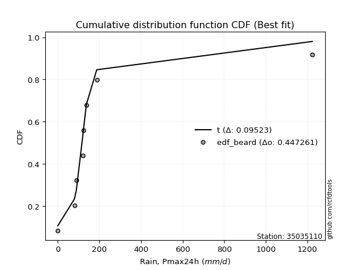</img></img>

</div>


### 5. EDF Chegodayev (1955)

The Chegodayev formula is an empirical plotting position formula used in hydrological frequency analysis to estimate the exceedance probability or return period of a specific event from a set of observed data. It is primarily used for plotting observed data points on probability paper to fit a theoretical distribution, particularly for analyzing extreme events like maximum flood flows or rainfall intensities. The constant _b_ value in the generalized plotting position formula is 0.3.

<div align="center">


$P=(m-b)/(n+1-2b)$


</div>


**5.1. Empirical values**

<div align="center">

|                | 0                   | 1                   | 2                   | 3                   | 4                  | 5                  | 6                  | 7                  |
|:---------------|:--------------------|:--------------------|:--------------------|:--------------------|:-------------------|:-------------------|:-------------------|:-------------------|
| date           | 2020                | 2018                | 2017                | 2023                | 2021               | 2022               | 2019               | 2024               |
| x              | 0.1                 | 79.4                | 88.4                | 120.2               | 122.0              | 137.3              | 186.9              | 1223.4             |
| m              | 1                   | 2                   | 3                   | 4                   | 5                  | 6                  | 7                  | 8                  |
| empirical_dist | edf_chegodayev      | edf_chegodayev      | edf_chegodayev      | edf_chegodayev      | edf_chegodayev     | edf_chegodayev     | edf_chegodayev     | edf_chegodayev     |
| empirical      | 0.08333333333333333 | 0.20238095238095236 | 0.32142857142857145 | 0.44047619047619047 | 0.5595238095238095 | 0.6785714285714286 | 0.7976190476190476 | 0.9166666666666666 |
| empirical_tr   | 1.090909090909091   | 1.253731343283582   | 1.4736842105263157  | 1.7872340425531914  | 2.27027027027027   | 3.1111111111111116 | 4.941176470588234  | 11.999999999999995 |

</div>


**5.2. Kolmogorov-Smirnov fit test (sorted by Δ)**


<div align="center">

|                | 0                  | 1                   | 2                   | 3                   | 4                  | 5                   | 6                   | 7                  | 8                  | 9                   | 10                  | 11                  | 12                  | 13                 | 14                 | 15                 | 16                  | 17                  | 18                  | 19                 | 20                 | 21                 | 22                 | 23                 | 24                  | 25                    | 26                  | 27                 | 28                  | 29                 | 30                 | 31                 | 32                 | 33                 | 34                 | 35                 | 36                 | 37                 | 38                 | 39                 | 40                  | 41                  | 42                  | 43                 | 44                 | 45                 | 46                 | 47                  | 48                  | 49                  | 50                  | 51                 | 52                  | 53                  | 54                 | 55                  | 56                 | 57                 | 58                 | 59                 | 60                 | 61                 | 62                 | 63                  | 64                 | 65                 | 66                  | 67                 | 68                 | 69                  | 70                  | 71                  | 72                 | 73                  | 74                  | 75                 | 76                 | 77                 | 78                  | 79                  | 80                 | 81                 | 82                 | 83                 | 84                 | 85                 | 86                 | 87                 |
|:---------------|:-------------------|:--------------------|:--------------------|:--------------------|:-------------------|:--------------------|:--------------------|:-------------------|:-------------------|:--------------------|:--------------------|:--------------------|:--------------------|:-------------------|:-------------------|:-------------------|:--------------------|:--------------------|:--------------------|:-------------------|:-------------------|:-------------------|:-------------------|:-------------------|:--------------------|:----------------------|:--------------------|:-------------------|:--------------------|:-------------------|:-------------------|:-------------------|:-------------------|:-------------------|:-------------------|:-------------------|:-------------------|:-------------------|:-------------------|:-------------------|:--------------------|:--------------------|:--------------------|:-------------------|:-------------------|:-------------------|:-------------------|:--------------------|:--------------------|:--------------------|:--------------------|:-------------------|:--------------------|:--------------------|:-------------------|:--------------------|:-------------------|:-------------------|:-------------------|:-------------------|:-------------------|:-------------------|:-------------------|:--------------------|:-------------------|:-------------------|:--------------------|:-------------------|:-------------------|:--------------------|:--------------------|:--------------------|:-------------------|:--------------------|:--------------------|:-------------------|:-------------------|:-------------------|:--------------------|:--------------------|:-------------------|:-------------------|:-------------------|:-------------------|:-------------------|:-------------------|:-------------------|:-------------------|
| station        | 35035110           | 35035110            | 35035110            | 35035110            | 35035110           | 35035110            | 35035110            | 35035110           | 35035110           | 35035110            | 35035110            | 35035110            | 35035110            | 35035110           | 35035110           | 35035110           | 35035110            | 35035110            | 35035110            | 35035110           | 35035110           | 35035110           | 35035110           | 35035110           | 35035110            | 35035110              | 35035110            | 35035110           | 35035110            | 35035110           | 35035110           | 35035110           | 35035110           | 35035110           | 35035110           | 35035110           | 35035110           | 35035110           | 35035110           | 35035110           | 35035110            | 35035110            | 35035110            | 35035110           | 35035110           | 35035110           | 35035110           | 35035110            | 35035110            | 35035110            | 35035110            | 35035110           | 35035110            | 35035110            | 35035110           | 35035110            | 35035110           | 35035110           | 35035110           | 35035110           | 35035110           | 35035110           | 35035110           | 35035110            | 35035110           | 35035110           | 35035110            | 35035110           | 35035110           | 35035110            | 35035110            | 35035110            | 35035110           | 35035110            | 35035110            | 35035110           | 35035110           | 35035110           | 35035110            | 35035110            | 35035110           | 35035110           | 35035110           | 35035110           | 35035110           | 35035110           | 35035110           | 35035110           |
| empirical_dist | edf_chegodayev     | edf_chegodayev      | edf_chegodayev      | edf_chegodayev      | edf_chegodayev     | edf_chegodayev      | edf_chegodayev      | edf_chegodayev     | edf_chegodayev     | edf_chegodayev      | edf_chegodayev      | edf_chegodayev      | edf_chegodayev      | edf_chegodayev     | edf_chegodayev     | edf_chegodayev     | edf_chegodayev      | edf_chegodayev      | edf_chegodayev      | edf_chegodayev     | edf_chegodayev     | edf_chegodayev     | edf_chegodayev     | edf_chegodayev     | edf_chegodayev      | edf_chegodayev        | edf_chegodayev      | edf_chegodayev     | edf_chegodayev      | edf_chegodayev     | edf_chegodayev     | edf_chegodayev     | edf_chegodayev     | edf_chegodayev     | edf_chegodayev     | edf_chegodayev     | edf_chegodayev     | edf_chegodayev     | edf_chegodayev     | edf_chegodayev     | edf_chegodayev      | edf_chegodayev      | edf_chegodayev      | edf_chegodayev     | edf_chegodayev     | edf_chegodayev     | edf_chegodayev     | edf_chegodayev      | edf_chegodayev      | edf_chegodayev      | edf_chegodayev      | edf_chegodayev     | edf_chegodayev      | edf_chegodayev      | edf_chegodayev     | edf_chegodayev      | edf_chegodayev     | edf_chegodayev     | edf_chegodayev     | edf_chegodayev     | edf_chegodayev     | edf_chegodayev     | edf_chegodayev     | edf_chegodayev      | edf_chegodayev     | edf_chegodayev     | edf_chegodayev      | edf_chegodayev     | edf_chegodayev     | edf_chegodayev      | edf_chegodayev      | edf_chegodayev      | edf_chegodayev     | edf_chegodayev      | edf_chegodayev      | edf_chegodayev     | edf_chegodayev     | edf_chegodayev     | edf_chegodayev      | edf_chegodayev      | edf_chegodayev     | edf_chegodayev     | edf_chegodayev     | edf_chegodayev     | edf_chegodayev     | edf_chegodayev     | edf_chegodayev     | edf_chegodayev     |
| p_dist         | t                  | logjohnsonsu        | alpha               | johnsonsu           | fisk               | invgamma            | gompertz            | ncf                | invgauss           | erlang              | gibrat              | fatiguelife         | wald                | gamma              | logpearson3        | pearson3           | logloggamma         | logcrystalball      | logtruncnorm        | betaprime          | chi2               | loggompertz        | loggenlogistic     | halflogistic       | loggumbel_l         | loglaplace_asymmetric | expon               | genexpon           | moyal               | genlogistic        | exponnorm          | halfnorm           | mielke             | gumbel_r           | laplace_asymmetric | rayleigh           | maxwell            | lognorm            | lognorm            | logexponnorm       | logrice             | lognct              | lognakagami         | logfatiguelife     | loglogistic        | loghypsecant       | loginvgauss        | nakagami            | loginvgamma         | logbetaprime        | loglaplace          | logerlang          | norm                | logmaxwell          | f                  | logistic            | kstwobign          | lograyleigh        | hypsecant          | logt               | weibull_min        | logkstwobign       | loglognorm         | laplace             | loggumbel_r        | loghalfnorm        | logmielke           | loginvweibull      | rice               | loggenexpon         | crystalball         | logmoyal            | loghalflogistic    | gumbel_l            | nct                 | logexpon           | truncnorm          | invweibull         | logncf              | logwald             | logfisk            | loggamma           | loggamma           | loggibrat          | logf               | logchi2            | logalpha           | logweibull_min     |
| delta          | 0.0950879950626976 | 0.12119262466586256 | 0.14214876556174624 | 0.14962691639812403 | 0.1501103871107863 | 0.15372930229766232 | 0.16766467155191622 | 0.1732883442941987 | 0.1765863697625838 | 0.18306233185711984 | 0.19000885467376727 | 0.20498633763916896 | 0.21069565636933021 | 0.2266123718417794 | 0.2327811394943281 | 0.2329834576653568 | 0.23797768827299856 | 0.24244768884638337 | 0.24573187296289778 | 0.2508892554338876 | 0.2544035745475205 | 0.2544639883304548 | 0.2567204624627104 | 0.2587370673259507 | 0.25951547211052406 | 0.26098791607640903   | 0.26357843316805674 | 0.2635784353357108 | 0.26845741310421223 | 0.2720040522210112 | 0.2726529075807992 | 0.2787218444763597 | 0.2911394101867216 | 0.2934403112365912 | 0.2971609574833053 | 0.3127232052515143 | 0.3247574172122979 | 0.328290634958896  | 0.328290634958896  | 0.3282917754003529 | 0.32832528187664545 | 0.32858401537612436 | 0.32858479693460185 | 0.3299813070727382 | 0.3324591638845058 | 0.3360047533868309 | 0.3363332130854181 | 0.34222957842615065 | 0.34227556469526454 | 0.34554260759775535 | 0.34917997868961637 | 0.3498086364980054 | 0.35915542543601797 | 0.35986308065845873 | 0.3607691454003953 | 0.36738472665368627 | 0.3687096329532724 | 0.3701426883271547 | 0.3742992722387171 | 0.3798712895664418 | 0.3824760920807303 | 0.3837065531404442 | 0.390451964810663  | 0.39596344398397976 | 0.3989023605488461 | 0.3991037657575297 | 0.40137972576502323 | 0.4016900202076916 | 0.4020038751725766 | 0.41138728890531273 | 0.41702059979519485 | 0.42428074478133493 | 0.4256481912477411 | 0.42870222013414827 | 0.43719331447879783 | 0.44083243167786   | 0.4488692460348071 | 0.4491579455428112 | 0.45550529129518214 | 0.49473223870704697 | 0.5056826365422978 | 0.5116538315939663 | 0.5116538315939663 | 0.5220688500311876 | 0.5596535725289807 | 0.6087033249177598 | 0.6108837753995271 | 0.640467029120074  |
| deltao         | 0.4472608134160001 | 0.4472608134160001  | 0.4472608134160001  | 0.4472608134160001  | 0.4472608134160001 | 0.4472608134160001  | 0.4472608134160001  | 0.4472608134160001 | 0.4472608134160001 | 0.4472608134160001  | 0.4472608134160001  | 0.4472608134160001  | 0.4472608134160001  | 0.4472608134160001 | 0.4472608134160001 | 0.4472608134160001 | 0.4472608134160001  | 0.4472608134160001  | 0.4472608134160001  | 0.4472608134160001 | 0.4472608134160001 | 0.4472608134160001 | 0.4472608134160001 | 0.4472608134160001 | 0.4472608134160001  | 0.4472608134160001    | 0.4472608134160001  | 0.4472608134160001 | 0.4472608134160001  | 0.4472608134160001 | 0.4472608134160001 | 0.4472608134160001 | 0.4472608134160001 | 0.4472608134160001 | 0.4472608134160001 | 0.4472608134160001 | 0.4472608134160001 | 0.4472608134160001 | 0.4472608134160001 | 0.4472608134160001 | 0.4472608134160001  | 0.4472608134160001  | 0.4472608134160001  | 0.4472608134160001 | 0.4472608134160001 | 0.4472608134160001 | 0.4472608134160001 | 0.4472608134160001  | 0.4472608134160001  | 0.4472608134160001  | 0.4472608134160001  | 0.4472608134160001 | 0.4472608134160001  | 0.4472608134160001  | 0.4472608134160001 | 0.4472608134160001  | 0.4472608134160001 | 0.4472608134160001 | 0.4472608134160001 | 0.4472608134160001 | 0.4472608134160001 | 0.4472608134160001 | 0.4472608134160001 | 0.4472608134160001  | 0.4472608134160001 | 0.4472608134160001 | 0.4472608134160001  | 0.4472608134160001 | 0.4472608134160001 | 0.4472608134160001  | 0.4472608134160001  | 0.4472608134160001  | 0.4472608134160001 | 0.4472608134160001  | 0.4472608134160001  | 0.4472608134160001 | 0.4472608134160001 | 0.4472608134160001 | 0.4472608134160001  | 0.4472608134160001  | 0.4472608134160001 | 0.4472608134160001 | 0.4472608134160001 | 0.4472608134160001 | 0.4472608134160001 | 0.4472608134160001 | 0.4472608134160001 | 0.4472608134160001 |
| eval           | Δo > Δ             | Δo > Δ              | Δo > Δ              | Δo > Δ              | Δo > Δ             | Δo > Δ              | Δo > Δ              | Δo > Δ             | Δo > Δ             | Δo > Δ              | Δo > Δ              | Δo > Δ              | Δo > Δ              | Δo > Δ             | Δo > Δ             | Δo > Δ             | Δo > Δ              | Δo > Δ              | Δo > Δ              | Δo > Δ             | Δo > Δ             | Δo > Δ             | Δo > Δ             | Δo > Δ             | Δo > Δ              | Δo > Δ                | Δo > Δ              | Δo > Δ             | Δo > Δ              | Δo > Δ             | Δo > Δ             | Δo > Δ             | Δo > Δ             | Δo > Δ             | Δo > Δ             | Δo > Δ             | Δo > Δ             | Δo > Δ             | Δo > Δ             | Δo > Δ             | Δo > Δ              | Δo > Δ              | Δo > Δ              | Δo > Δ             | Δo > Δ             | Δo > Δ             | Δo > Δ             | Δo > Δ              | Δo > Δ              | Δo > Δ              | Δo > Δ              | Δo > Δ             | Δo > Δ              | Δo > Δ              | Δo > Δ             | Δo > Δ              | Δo > Δ             | Δo > Δ             | Δo > Δ             | Δo > Δ             | Δo > Δ             | Δo > Δ             | Δo > Δ             | Δo > Δ              | Δo > Δ             | Δo > Δ             | Δo > Δ              | Δo > Δ             | Δo > Δ             | Δo > Δ              | Δo > Δ              | Δo > Δ              | Δo > Δ             | Δo > Δ              | Δo > Δ              | Δo > Δ             | Δo <= Δ            | Δo <= Δ            | Δo <= Δ             | Δo <= Δ             | Δo <= Δ            | Δo <= Δ            | Δo <= Δ            | Δo <= Δ            | Δo <= Δ            | Δo <= Δ            | Δo <= Δ            | Δo <= Δ            |
| fit            | 1                  | 1                   | 1                   | 1                   | 1                  | 1                   | 1                   | 1                  | 1                  | 1                   | 1                   | 1                   | 1                   | 1                  | 1                  | 1                  | 1                   | 1                   | 1                   | 1                  | 1                  | 1                  | 1                  | 1                  | 1                   | 1                     | 1                   | 1                  | 1                   | 1                  | 1                  | 1                  | 1                  | 1                  | 1                  | 1                  | 1                  | 1                  | 1                  | 1                  | 1                   | 1                   | 1                   | 1                  | 1                  | 1                  | 1                  | 1                   | 1                   | 1                   | 1                   | 1                  | 1                   | 1                   | 1                  | 1                   | 1                  | 1                  | 1                  | 1                  | 1                  | 1                  | 1                  | 1                   | 1                  | 1                  | 1                   | 1                  | 1                  | 1                   | 1                   | 1                   | 1                  | 1                   | 1                   | 1                  | 0                  | 0                  | 0                   | 0                   | 0                  | 0                  | 0                  | 0                  | 0                  | 0                  | 0                  | 0                  |
| n              | 8                  | 8                   | 8                   | 8                   | 8                  | 8                   | 8                   | 8                  | 8                  | 8                   | 8                   | 8                   | 8                   | 8                  | 8                  | 8                  | 8                   | 8                   | 8                   | 8                  | 8                  | 8                  | 8                  | 8                  | 8                   | 8                     | 8                   | 8                  | 8                   | 8                  | 8                  | 8                  | 8                  | 8                  | 8                  | 8                  | 8                  | 8                  | 8                  | 8                  | 8                   | 8                   | 8                   | 8                  | 8                  | 8                  | 8                  | 8                   | 8                   | 8                   | 8                   | 8                  | 8                   | 8                   | 8                  | 8                   | 8                  | 8                  | 8                  | 8                  | 8                  | 8                  | 8                  | 8                   | 8                  | 8                  | 8                   | 8                  | 8                  | 8                   | 8                   | 8                   | 8                  | 8                   | 8                   | 8                  | 8                  | 8                  | 8                   | 8                   | 8                  | 8                  | 8                  | 8                  | 8                  | 8                  | 8                  | 8                  |
| best_fit       | 1                  | 0                   | 0                   | 0                   | 0                  | 0                   | 0                   | 0                  | 0                  | 0                   | 0                   | 0                   | 0                   | 0                  | 0                  | 0                  | 0                   | 0                   | 0                   | 0                  | 0                  | 0                  | 0                  | 0                  | 0                   | 0                     | 0                   | 0                  | 0                   | 0                  | 0                  | 0                  | 0                  | 0                  | 0                  | 0                  | 0                  | 0                  | 0                  | 0                  | 0                   | 0                   | 0                   | 0                  | 0                  | 0                  | 0                  | 0                   | 0                   | 0                   | 0                   | 0                  | 0                   | 0                   | 0                  | 0                   | 0                  | 0                  | 0                  | 0                  | 0                  | 0                  | 0                  | 0                   | 0                  | 0                  | 0                   | 0                  | 0                  | 0                   | 0                   | 0                   | 0                  | 0                   | 0                   | 0                  | 0                  | 0                  | 0                   | 0                   | 0                  | 0                  | 0                  | 0                  | 0                  | 0                  | 0                  | 0                  |
| best_fit_sort  | 1                  | 2                   | 3                   | 4                   | 5                  | 6                   | 7                   | 8                  | 9                  | 10                  | 11                  | 12                  | 13                  | 14                 | 15                 | 16                 | 17                  | 18                  | 19                  | 20                 | 21                 | 22                 | 23                 | 24                 | 25                  | 26                    | 27                  | 28                 | 29                  | 30                 | 31                 | 32                 | 33                 | 34                 | 35                 | 36                 | 37                 | 38                 | 39                 | 40                 | 41                  | 42                  | 43                  | 44                 | 45                 | 46                 | 47                 | 48                  | 49                  | 50                  | 51                  | 52                 | 53                  | 54                  | 55                 | 56                  | 57                 | 58                 | 59                 | 60                 | 61                 | 62                 | 63                 | 64                  | 65                 | 66                 | 67                  | 68                 | 69                 | 70                  | 71                  | 72                  | 73                 | 74                  | 75                  | 76                 | 77                 | 78                 | 79                  | 80                  | 81                 | 82                 | 83                 | 84                 | 85                 | 86                 | 87                 | 88                 |

</div>


**5.3. Best fit**

<div align="center">

|   id |   station | empirical_dist   | p_dist   |    delta |   deltao | eval   |   fit |   n |   best_fit |   best_fit_sort |
|-----:|----------:|:-----------------|:---------|---------:|---------:|:-------|------:|----:|-----------:|----------------:|
|    0 |  35035110 | edf_chegodayev   | t        | 0.095088 | 0.447261 | Δo > Δ |     1 |   8 |          1 |               1 |

</div>


<div align="center">

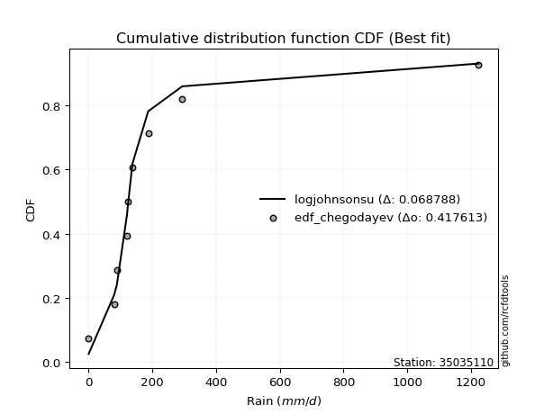</img>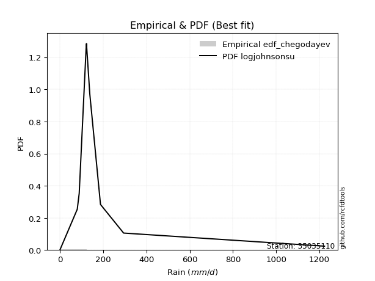</img>

</div>


### 6. EDF Blom (1958)

The Blom formula is a specific "plotting position" formula used in hydrology and statistical analysis to estimate the empirical cumulative probability (or non-exceedance probability) of a data series. It is particularly recommended for data that are approximately normally distributed. The constant _a_ is set to 0.375 (or 3/8).

<div align="center">


$P=(m-a)/(n+1-2a)$


</div>


**6.1. Empirical values**

<div align="center">

|                | 0                   | 1                   | 2                  | 3                  | 4                  | 5                  | 6                 | 7                  |
|:---------------|:--------------------|:--------------------|:-------------------|:-------------------|:-------------------|:-------------------|:------------------|:-------------------|
| date           | 2020                | 2018                | 2017               | 2023               | 2021               | 2022               | 2019              | 2024               |
| x              | 0.1                 | 79.4                | 88.4               | 120.2              | 122.0              | 137.3              | 186.9             | 1223.4             |
| m              | 1                   | 2                   | 3                  | 4                  | 5                  | 6                  | 7                 | 8                  |
| empirical_dist | edf_blom            | edf_blom            | edf_blom           | edf_blom           | edf_blom           | edf_blom           | edf_blom          | edf_blom           |
| empirical      | 0.07575757575757576 | 0.19696969696969696 | 0.3181818181818182 | 0.4393939393939394 | 0.5606060606060606 | 0.6818181818181818 | 0.803030303030303 | 0.9242424242424242 |
| empirical_tr   | 1.0819672131147542  | 1.2452830188679247  | 1.4666666666666666 | 1.783783783783784  | 2.275862068965517  | 3.1428571428571423 | 5.076923076923076 | 13.199999999999992 |

</div>


**6.2. Kolmogorov-Smirnov fit test (sorted by Δ)**


<div align="center">

|                | 0                   | 1                   | 2                   | 3                   | 4                  | 5                   | 6                   | 7                   | 8                   | 9                   | 10                 | 11                  | 12                 | 13                  | 14                  | 15                 | 16                  | 17                  | 18                 | 19                  | 20                  | 21                  | 22                 | 23                 | 24                 | 25                    | 26                  | 27                 | 28                  | 29                  | 30                 | 31                  | 32                 | 33                 | 34                  | 35                  | 36                 | 37                  | 38                  | 39                 | 40                 | 41                 | 42                 | 43                 | 44                  | 45                  | 46                  | 47                 | 48                 | 49                 | 50                  | 51                 | 52                 | 53                 | 54                  | 55                 | 56                  | 57                  | 58                  | 59                  | 60                 | 61                 | 62                 | 63                 | 64                  | 65                  | 66                 | 67                 | 68                 | 69                 | 70                 | 71                 | 72                 | 73                 | 74                 | 75                 | 76                 | 77                  | 78                 | 79                 | 80                 | 81                 | 82                 | 83                 | 84                 | 85                 | 86                 | 87                 |
|:---------------|:--------------------|:--------------------|:--------------------|:--------------------|:-------------------|:--------------------|:--------------------|:--------------------|:--------------------|:--------------------|:-------------------|:--------------------|:-------------------|:--------------------|:--------------------|:-------------------|:--------------------|:--------------------|:-------------------|:--------------------|:--------------------|:--------------------|:-------------------|:-------------------|:-------------------|:----------------------|:--------------------|:-------------------|:--------------------|:--------------------|:-------------------|:--------------------|:-------------------|:-------------------|:--------------------|:--------------------|:-------------------|:--------------------|:--------------------|:-------------------|:-------------------|:-------------------|:-------------------|:-------------------|:--------------------|:--------------------|:--------------------|:-------------------|:-------------------|:-------------------|:--------------------|:-------------------|:-------------------|:-------------------|:--------------------|:-------------------|:--------------------|:--------------------|:--------------------|:--------------------|:-------------------|:-------------------|:-------------------|:-------------------|:--------------------|:--------------------|:-------------------|:-------------------|:-------------------|:-------------------|:-------------------|:-------------------|:-------------------|:-------------------|:-------------------|:-------------------|:-------------------|:--------------------|:-------------------|:-------------------|:-------------------|:-------------------|:-------------------|:-------------------|:-------------------|:-------------------|:-------------------|:-------------------|
| station        | 35035110            | 35035110            | 35035110            | 35035110            | 35035110           | 35035110            | 35035110            | 35035110            | 35035110            | 35035110            | 35035110           | 35035110            | 35035110           | 35035110            | 35035110            | 35035110           | 35035110            | 35035110            | 35035110           | 35035110            | 35035110            | 35035110            | 35035110           | 35035110           | 35035110           | 35035110              | 35035110            | 35035110           | 35035110            | 35035110            | 35035110           | 35035110            | 35035110           | 35035110           | 35035110            | 35035110            | 35035110           | 35035110            | 35035110            | 35035110           | 35035110           | 35035110           | 35035110           | 35035110           | 35035110            | 35035110            | 35035110            | 35035110           | 35035110           | 35035110           | 35035110            | 35035110           | 35035110           | 35035110           | 35035110            | 35035110           | 35035110            | 35035110            | 35035110            | 35035110            | 35035110           | 35035110           | 35035110           | 35035110           | 35035110            | 35035110            | 35035110           | 35035110           | 35035110           | 35035110           | 35035110           | 35035110           | 35035110           | 35035110           | 35035110           | 35035110           | 35035110           | 35035110            | 35035110           | 35035110           | 35035110           | 35035110           | 35035110           | 35035110           | 35035110           | 35035110           | 35035110           | 35035110           |
| empirical_dist | edf_blom            | edf_blom            | edf_blom            | edf_blom            | edf_blom           | edf_blom            | edf_blom            | edf_blom            | edf_blom            | edf_blom            | edf_blom           | edf_blom            | edf_blom           | edf_blom            | edf_blom            | edf_blom           | edf_blom            | edf_blom            | edf_blom           | edf_blom            | edf_blom            | edf_blom            | edf_blom           | edf_blom           | edf_blom           | edf_blom              | edf_blom            | edf_blom           | edf_blom            | edf_blom            | edf_blom           | edf_blom            | edf_blom           | edf_blom           | edf_blom            | edf_blom            | edf_blom           | edf_blom            | edf_blom            | edf_blom           | edf_blom           | edf_blom           | edf_blom           | edf_blom           | edf_blom            | edf_blom            | edf_blom            | edf_blom           | edf_blom           | edf_blom           | edf_blom            | edf_blom           | edf_blom           | edf_blom           | edf_blom            | edf_blom           | edf_blom            | edf_blom            | edf_blom            | edf_blom            | edf_blom           | edf_blom           | edf_blom           | edf_blom           | edf_blom            | edf_blom            | edf_blom           | edf_blom           | edf_blom           | edf_blom           | edf_blom           | edf_blom           | edf_blom           | edf_blom           | edf_blom           | edf_blom           | edf_blom           | edf_blom            | edf_blom           | edf_blom           | edf_blom           | edf_blom           | edf_blom           | edf_blom           | edf_blom           | edf_blom           | edf_blom           | edf_blom           |
| p_dist         | t                   | logjohnsonsu        | johnsonsu           | alpha               | fisk               | invgamma            | gompertz            | ncf                 | invgauss            | erlang              | gibrat             | fatiguelife         | wald               | gamma               | logpearson3         | pearson3           | logloggamma         | logcrystalball      | logtruncnorm       | betaprime           | chi2                | loggompertz         | loggenlogistic     | halflogistic       | loggumbel_l        | loglaplace_asymmetric | expon               | genexpon           | moyal               | genlogistic         | exponnorm          | halfnorm            | mielke             | gumbel_r           | laplace_asymmetric  | rayleigh            | maxwell            | lognorm             | lognorm             | logexponnorm       | logrice            | lognct             | lognakagami        | logfatiguelife     | loglogistic         | loghypsecant        | loginvgauss         | nakagami           | loginvgamma        | logbetaprime       | loglaplace          | logerlang          | norm               | logmaxwell         | f                   | logistic           | kstwobign           | lograyleigh         | hypsecant           | logt                | weibull_min        | logkstwobign       | loglognorm         | laplace            | loggumbel_r         | loghalfnorm         | logmielke          | loginvweibull      | rice               | loggenexpon        | crystalball        | logmoyal           | loghalflogistic    | gumbel_l           | nct                | logexpon           | truncnorm          | invweibull          | logncf             | logwald            | logfisk            | loggamma           | loggamma           | loggibrat          | logf               | logchi2            | logalpha           | logweibull_min     |
| delta          | 0.09617024614494868 | 0.11794587141910928 | 0.14638016315137076 | 0.14756002097300164 | 0.1555216425220417 | 0.15914055770891772 | 0.17307592696317164 | 0.17869959970545413 | 0.18199762517383922 | 0.18847358726837526 | 0.1954201100850227 | 0.21039759305042438 | 0.2161069117805856 | 0.23202362725303483 | 0.23819239490558353 | 0.2383947130766122 | 0.24338894368425396 | 0.24785894425763877 | 0.2511431283741532 | 0.25630051084514305 | 0.25981482995877586 | 0.25987524374171017 | 0.2621317178739658 | 0.2641483227372061 | 0.2649267275217794 | 0.26639917148766445   | 0.26898968857931216 | 0.2689896907469662 | 0.27386866851546765 | 0.27741530763226663 | 0.2780641629920546 | 0.28413309988761515 | 0.296550665597977  | 0.2988515666478466 | 0.30040771073005845 | 0.31813446066276974 | 0.3301686726235533 | 0.33370189037015136 | 0.33370189037015136 | 0.3337030308116083 | 0.3337365372879008 | 0.3339952707873797 | 0.3339960523458572 | 0.3353925624839936 | 0.33787041929576117 | 0.34141600879808626 | 0.34174446849667345 | 0.347640833837406  | 0.3476868201065199 | 0.3509538630090107 | 0.35459123410087173 | 0.3552198919092608 | 0.3645666808472734 | 0.3652743360697141 | 0.36618040081165065 | 0.3727959820649417 | 0.37412088836452784 | 0.37555394373841006 | 0.37971052764997254 | 0.38528254497769715 | 0.3878873474919857 | 0.3891178085516996 | 0.3980277223864206 | 0.4013746993952352 | 0.40431361596010146 | 0.40451502116878507 | 0.4067909811762786 | 0.407101275618947  | 0.407415130583832  | 0.4167985443165681 | 0.4245963573709524 | 0.4296920001925903 | 0.4310594466589965 | 0.4341134755454037 | 0.4426045698900532 | 0.4462436870891154 | 0.4542805014460625 | 0.45673370311856876 | 0.4609165467064375 | 0.5001434941183023 | 0.5110938919535533 | 0.5170650870052216 | 0.5170650870052216 | 0.527480105442443  | 0.5650648279402362 | 0.6141145803290151 | 0.6162950308107824 | 0.6458782845313293 |
| deltao         | 0.4472608134160001  | 0.4472608134160001  | 0.4472608134160001  | 0.4472608134160001  | 0.4472608134160001 | 0.4472608134160001  | 0.4472608134160001  | 0.4472608134160001  | 0.4472608134160001  | 0.4472608134160001  | 0.4472608134160001 | 0.4472608134160001  | 0.4472608134160001 | 0.4472608134160001  | 0.4472608134160001  | 0.4472608134160001 | 0.4472608134160001  | 0.4472608134160001  | 0.4472608134160001 | 0.4472608134160001  | 0.4472608134160001  | 0.4472608134160001  | 0.4472608134160001 | 0.4472608134160001 | 0.4472608134160001 | 0.4472608134160001    | 0.4472608134160001  | 0.4472608134160001 | 0.4472608134160001  | 0.4472608134160001  | 0.4472608134160001 | 0.4472608134160001  | 0.4472608134160001 | 0.4472608134160001 | 0.4472608134160001  | 0.4472608134160001  | 0.4472608134160001 | 0.4472608134160001  | 0.4472608134160001  | 0.4472608134160001 | 0.4472608134160001 | 0.4472608134160001 | 0.4472608134160001 | 0.4472608134160001 | 0.4472608134160001  | 0.4472608134160001  | 0.4472608134160001  | 0.4472608134160001 | 0.4472608134160001 | 0.4472608134160001 | 0.4472608134160001  | 0.4472608134160001 | 0.4472608134160001 | 0.4472608134160001 | 0.4472608134160001  | 0.4472608134160001 | 0.4472608134160001  | 0.4472608134160001  | 0.4472608134160001  | 0.4472608134160001  | 0.4472608134160001 | 0.4472608134160001 | 0.4472608134160001 | 0.4472608134160001 | 0.4472608134160001  | 0.4472608134160001  | 0.4472608134160001 | 0.4472608134160001 | 0.4472608134160001 | 0.4472608134160001 | 0.4472608134160001 | 0.4472608134160001 | 0.4472608134160001 | 0.4472608134160001 | 0.4472608134160001 | 0.4472608134160001 | 0.4472608134160001 | 0.4472608134160001  | 0.4472608134160001 | 0.4472608134160001 | 0.4472608134160001 | 0.4472608134160001 | 0.4472608134160001 | 0.4472608134160001 | 0.4472608134160001 | 0.4472608134160001 | 0.4472608134160001 | 0.4472608134160001 |
| eval           | Δo > Δ              | Δo > Δ              | Δo > Δ              | Δo > Δ              | Δo > Δ             | Δo > Δ              | Δo > Δ              | Δo > Δ              | Δo > Δ              | Δo > Δ              | Δo > Δ             | Δo > Δ              | Δo > Δ             | Δo > Δ              | Δo > Δ              | Δo > Δ             | Δo > Δ              | Δo > Δ              | Δo > Δ             | Δo > Δ              | Δo > Δ              | Δo > Δ              | Δo > Δ             | Δo > Δ             | Δo > Δ             | Δo > Δ                | Δo > Δ              | Δo > Δ             | Δo > Δ              | Δo > Δ              | Δo > Δ             | Δo > Δ              | Δo > Δ             | Δo > Δ             | Δo > Δ              | Δo > Δ              | Δo > Δ             | Δo > Δ              | Δo > Δ              | Δo > Δ             | Δo > Δ             | Δo > Δ             | Δo > Δ             | Δo > Δ             | Δo > Δ              | Δo > Δ              | Δo > Δ              | Δo > Δ             | Δo > Δ             | Δo > Δ             | Δo > Δ              | Δo > Δ             | Δo > Δ             | Δo > Δ             | Δo > Δ              | Δo > Δ             | Δo > Δ              | Δo > Δ              | Δo > Δ              | Δo > Δ              | Δo > Δ             | Δo > Δ             | Δo > Δ             | Δo > Δ             | Δo > Δ              | Δo > Δ              | Δo > Δ             | Δo > Δ             | Δo > Δ             | Δo > Δ             | Δo > Δ             | Δo > Δ             | Δo > Δ             | Δo > Δ             | Δo > Δ             | Δo > Δ             | Δo <= Δ            | Δo <= Δ             | Δo <= Δ            | Δo <= Δ            | Δo <= Δ            | Δo <= Δ            | Δo <= Δ            | Δo <= Δ            | Δo <= Δ            | Δo <= Δ            | Δo <= Δ            | Δo <= Δ            |
| fit            | 1                   | 1                   | 1                   | 1                   | 1                  | 1                   | 1                   | 1                   | 1                   | 1                   | 1                  | 1                   | 1                  | 1                   | 1                   | 1                  | 1                   | 1                   | 1                  | 1                   | 1                   | 1                   | 1                  | 1                  | 1                  | 1                     | 1                   | 1                  | 1                   | 1                   | 1                  | 1                   | 1                  | 1                  | 1                   | 1                   | 1                  | 1                   | 1                   | 1                  | 1                  | 1                  | 1                  | 1                  | 1                   | 1                   | 1                   | 1                  | 1                  | 1                  | 1                   | 1                  | 1                  | 1                  | 1                   | 1                  | 1                   | 1                   | 1                   | 1                   | 1                  | 1                  | 1                  | 1                  | 1                   | 1                   | 1                  | 1                  | 1                  | 1                  | 1                  | 1                  | 1                  | 1                  | 1                  | 1                  | 0                  | 0                   | 0                  | 0                  | 0                  | 0                  | 0                  | 0                  | 0                  | 0                  | 0                  | 0                  |
| n              | 8                   | 8                   | 8                   | 8                   | 8                  | 8                   | 8                   | 8                   | 8                   | 8                   | 8                  | 8                   | 8                  | 8                   | 8                   | 8                  | 8                   | 8                   | 8                  | 8                   | 8                   | 8                   | 8                  | 8                  | 8                  | 8                     | 8                   | 8                  | 8                   | 8                   | 8                  | 8                   | 8                  | 8                  | 8                   | 8                   | 8                  | 8                   | 8                   | 8                  | 8                  | 8                  | 8                  | 8                  | 8                   | 8                   | 8                   | 8                  | 8                  | 8                  | 8                   | 8                  | 8                  | 8                  | 8                   | 8                  | 8                   | 8                   | 8                   | 8                   | 8                  | 8                  | 8                  | 8                  | 8                   | 8                   | 8                  | 8                  | 8                  | 8                  | 8                  | 8                  | 8                  | 8                  | 8                  | 8                  | 8                  | 8                   | 8                  | 8                  | 8                  | 8                  | 8                  | 8                  | 8                  | 8                  | 8                  | 8                  |
| best_fit       | 1                   | 0                   | 0                   | 0                   | 0                  | 0                   | 0                   | 0                   | 0                   | 0                   | 0                  | 0                   | 0                  | 0                   | 0                   | 0                  | 0                   | 0                   | 0                  | 0                   | 0                   | 0                   | 0                  | 0                  | 0                  | 0                     | 0                   | 0                  | 0                   | 0                   | 0                  | 0                   | 0                  | 0                  | 0                   | 0                   | 0                  | 0                   | 0                   | 0                  | 0                  | 0                  | 0                  | 0                  | 0                   | 0                   | 0                   | 0                  | 0                  | 0                  | 0                   | 0                  | 0                  | 0                  | 0                   | 0                  | 0                   | 0                   | 0                   | 0                   | 0                  | 0                  | 0                  | 0                  | 0                   | 0                   | 0                  | 0                  | 0                  | 0                  | 0                  | 0                  | 0                  | 0                  | 0                  | 0                  | 0                  | 0                   | 0                  | 0                  | 0                  | 0                  | 0                  | 0                  | 0                  | 0                  | 0                  | 0                  |
| best_fit_sort  | 1                   | 2                   | 3                   | 4                   | 5                  | 6                   | 7                   | 8                   | 9                   | 10                  | 11                 | 12                  | 13                 | 14                  | 15                  | 16                 | 17                  | 18                  | 19                 | 20                  | 21                  | 22                  | 23                 | 24                 | 25                 | 26                    | 27                  | 28                 | 29                  | 30                  | 31                 | 32                  | 33                 | 34                 | 35                  | 36                  | 37                 | 38                  | 39                  | 40                 | 41                 | 42                 | 43                 | 44                 | 45                  | 46                  | 47                  | 48                 | 49                 | 50                 | 51                  | 52                 | 53                 | 54                 | 55                  | 56                 | 57                  | 58                  | 59                  | 60                  | 61                 | 62                 | 63                 | 64                 | 65                  | 66                  | 67                 | 68                 | 69                 | 70                 | 71                 | 72                 | 73                 | 74                 | 75                 | 76                 | 77                 | 78                  | 79                 | 80                 | 81                 | 82                 | 83                 | 84                 | 85                 | 86                 | 87                 | 88                 |

</div>


**6.3. Best fit**

<div align="center">

|   id |   station | empirical_dist   | p_dist   |     delta |   deltao | eval   |   fit |   n |   best_fit |   best_fit_sort |
|-----:|----------:|:-----------------|:---------|----------:|---------:|:-------|------:|----:|-----------:|----------------:|
|    0 |  35035110 | edf_blom         | t        | 0.0961702 | 0.447261 | Δo > Δ |     1 |   8 |          1 |               1 |

</div>


<div align="center">

</img></img>

</div>


### 7. EDF Tukey (1962)

In hydrology, the Tukey formula is used as a plotting position formula to estimate the empirical probability or frequency of a flood event (or other hydrological data). The formula parameter is given as _c=0.333_ (or 1/3).

<div align="center">


$P=(m-c)/(n+1-2c)$


</div>


**7.1. Empirical values**

<div align="center">

|                | 0                  | 1         | 2                  | 3                  | 4                 | 5                  | 6                 | 7                  |
|:---------------|:-------------------|:----------|:-------------------|:-------------------|:------------------|:-------------------|:------------------|:-------------------|
| date           | 2020               | 2018      | 2017               | 2023               | 2021              | 2022               | 2019              | 2024               |
| x              | 0.1                | 79.4      | 88.4               | 120.2              | 122.0             | 137.3              | 186.9             | 1223.4             |
| m              | 1                  | 2         | 3                  | 4                  | 5                 | 6                  | 7                 | 8                  |
| empirical_dist | edf_tukey          | edf_tukey | edf_tukey          | edf_tukey          | edf_tukey         | edf_tukey          | edf_tukey         | edf_tukey          |
| empirical      | 0.08               | 0.2       | 0.32               | 0.44               | 0.56              | 0.68               | 0.8               | 0.92               |
| empirical_tr   | 1.0869565217391304 | 1.25      | 1.4705882352941178 | 1.7857142857142856 | 2.272727272727273 | 3.1250000000000004 | 5.000000000000001 | 12.500000000000007 |

</div>


**7.2. Kolmogorov-Smirnov fit test (sorted by Δ)**


<div align="center">

|                | 0                   | 1                   | 2                  | 3                  | 4                   | 5                   | 6                  | 7                  | 8                   | 9                   | 10                  | 11                  | 12                  | 13                 | 14                 | 15                  | 16                 | 17                  | 18                  | 19                 | 20                 | 21                 | 22                 | 23                 | 24                 | 25                    | 26                 | 27                 | 28                 | 29                 | 30                  | 31                 | 32                  | 33                 | 34                  | 35                 | 36                 | 37                 | 38                 | 39                  | 40                  | 41                 | 42                  | 43                 | 44                 | 45                 | 46                 | 47                  | 48                  | 49                  | 50                 | 51                  | 52                  | 53                  | 54                 | 55                  | 56                 | 57                 | 58                 | 59                 | 60                 | 61                  | 62                  | 63                  | 64                 | 65                 | 66                  | 67                  | 68                  | 69                  | 70                  | 71                  | 72                  | 73                  | 74                  | 75                  | 76                 | 77                 | 78                  | 79                 | 80                 | 81                 | 82                 | 83                 | 84                 | 85                 | 86                 | 87                 |
|:---------------|:--------------------|:--------------------|:-------------------|:-------------------|:--------------------|:--------------------|:-------------------|:-------------------|:--------------------|:--------------------|:--------------------|:--------------------|:--------------------|:-------------------|:-------------------|:--------------------|:-------------------|:--------------------|:--------------------|:-------------------|:-------------------|:-------------------|:-------------------|:-------------------|:-------------------|:----------------------|:-------------------|:-------------------|:-------------------|:-------------------|:--------------------|:-------------------|:--------------------|:-------------------|:--------------------|:-------------------|:-------------------|:-------------------|:-------------------|:--------------------|:--------------------|:-------------------|:--------------------|:-------------------|:-------------------|:-------------------|:-------------------|:--------------------|:--------------------|:--------------------|:-------------------|:--------------------|:--------------------|:--------------------|:-------------------|:--------------------|:-------------------|:-------------------|:-------------------|:-------------------|:-------------------|:--------------------|:--------------------|:--------------------|:-------------------|:-------------------|:--------------------|:--------------------|:--------------------|:--------------------|:--------------------|:--------------------|:--------------------|:--------------------|:--------------------|:--------------------|:-------------------|:-------------------|:--------------------|:-------------------|:-------------------|:-------------------|:-------------------|:-------------------|:-------------------|:-------------------|:-------------------|:-------------------|
| station        | 35035110            | 35035110            | 35035110           | 35035110           | 35035110            | 35035110            | 35035110           | 35035110           | 35035110            | 35035110            | 35035110            | 35035110            | 35035110            | 35035110           | 35035110           | 35035110            | 35035110           | 35035110            | 35035110            | 35035110           | 35035110           | 35035110           | 35035110           | 35035110           | 35035110           | 35035110              | 35035110           | 35035110           | 35035110           | 35035110           | 35035110            | 35035110           | 35035110            | 35035110           | 35035110            | 35035110           | 35035110           | 35035110           | 35035110           | 35035110            | 35035110            | 35035110           | 35035110            | 35035110           | 35035110           | 35035110           | 35035110           | 35035110            | 35035110            | 35035110            | 35035110           | 35035110            | 35035110            | 35035110            | 35035110           | 35035110            | 35035110           | 35035110           | 35035110           | 35035110           | 35035110           | 35035110            | 35035110            | 35035110            | 35035110           | 35035110           | 35035110            | 35035110            | 35035110            | 35035110            | 35035110            | 35035110            | 35035110            | 35035110            | 35035110            | 35035110            | 35035110           | 35035110           | 35035110            | 35035110           | 35035110           | 35035110           | 35035110           | 35035110           | 35035110           | 35035110           | 35035110           | 35035110           |
| empirical_dist | edf_tukey           | edf_tukey           | edf_tukey          | edf_tukey          | edf_tukey           | edf_tukey           | edf_tukey          | edf_tukey          | edf_tukey           | edf_tukey           | edf_tukey           | edf_tukey           | edf_tukey           | edf_tukey          | edf_tukey          | edf_tukey           | edf_tukey          | edf_tukey           | edf_tukey           | edf_tukey          | edf_tukey          | edf_tukey          | edf_tukey          | edf_tukey          | edf_tukey          | edf_tukey             | edf_tukey          | edf_tukey          | edf_tukey          | edf_tukey          | edf_tukey           | edf_tukey          | edf_tukey           | edf_tukey          | edf_tukey           | edf_tukey          | edf_tukey          | edf_tukey          | edf_tukey          | edf_tukey           | edf_tukey           | edf_tukey          | edf_tukey           | edf_tukey          | edf_tukey          | edf_tukey          | edf_tukey          | edf_tukey           | edf_tukey           | edf_tukey           | edf_tukey          | edf_tukey           | edf_tukey           | edf_tukey           | edf_tukey          | edf_tukey           | edf_tukey          | edf_tukey          | edf_tukey          | edf_tukey          | edf_tukey          | edf_tukey           | edf_tukey           | edf_tukey           | edf_tukey          | edf_tukey          | edf_tukey           | edf_tukey           | edf_tukey           | edf_tukey           | edf_tukey           | edf_tukey           | edf_tukey           | edf_tukey           | edf_tukey           | edf_tukey           | edf_tukey          | edf_tukey          | edf_tukey           | edf_tukey          | edf_tukey          | edf_tukey          | edf_tukey          | edf_tukey          | edf_tukey          | edf_tukey          | edf_tukey          | edf_tukey          |
| p_dist         | t                   | logjohnsonsu        | alpha              | johnsonsu          | fisk                | invgamma            | gompertz           | ncf                | invgauss            | erlang              | gibrat              | fatiguelife         | wald                | gamma              | logpearson3        | pearson3            | logloggamma        | logcrystalball      | logtruncnorm        | betaprime          | chi2               | loggompertz        | loggenlogistic     | halflogistic       | loggumbel_l        | loglaplace_asymmetric | expon              | genexpon           | moyal              | genlogistic        | exponnorm           | halfnorm           | mielke              | gumbel_r           | laplace_asymmetric  | rayleigh           | maxwell            | lognorm            | lognorm            | logexponnorm        | logrice             | lognct             | lognakagami         | logfatiguelife     | loglogistic        | loghypsecant       | loginvgauss        | nakagami            | loginvgamma         | logbetaprime        | loglaplace         | logerlang           | norm                | logmaxwell          | f                  | logistic            | kstwobign          | lograyleigh        | hypsecant          | logt               | weibull_min        | logkstwobign        | loglognorm          | laplace             | loggumbel_r        | loghalfnorm        | logmielke           | loginvweibull       | rice                | loggenexpon         | crystalball         | logmoyal            | loghalflogistic     | gumbel_l            | nct                 | logexpon            | truncnorm          | invweibull         | logncf              | logwald            | logfisk            | loggamma           | loggamma           | loggibrat          | logf               | logchi2            | logalpha           | logweibull_min     |
| delta          | 0.09556418553888807 | 0.11976405323729111 | 0.1445297179426986 | 0.1481983449695526 | 0.15249133949173865 | 0.15611025467861467 | 0.1700456239328687 | 0.1756692966751512 | 0.17896732214353628 | 0.18544328423807233 | 0.19238980705471975 | 0.20736729002012144 | 0.21307660875028256 | 0.2289933242227319 | 0.2351620918752806 | 0.23536441004630915 | 0.2403586406539509 | 0.24482864122733572 | 0.24811282534385026 | 0.25327020781484   | 0.2567845269284728 | 0.2568449407114071 | 0.2591014148436627 | 0.2611180197069032 | 0.2618964244914764 | 0.2633688684573614    | 0.2659593855490092 | 0.2659593877166633 | 0.2708383654851647 | 0.2743850046019637 | 0.27503385996175167 | 0.2811027968573122 | 0.29352036256767394 | 0.2958212636175437 | 0.29858952891187673 | 0.3151041576324668 | 0.3271383695932504 | 0.3306715873398483 | 0.3306715873398483 | 0.33067272778130524 | 0.33070623425759776 | 0.3309649677570767 | 0.33096574931555417 | 0.3323622594536905 | 0.3348401162654581 | 0.3383857057677832 | 0.3387141654663704 | 0.34461053080710297 | 0.34465651707621686 | 0.34792355997870766 | 0.3515609310705687 | 0.35218958887895774 | 0.36153637781697046 | 0.36224403303941105 | 0.3631500977813476 | 0.36976567903463875 | 0.3710905853342249 | 0.372523640708107  | 0.3766802246196696 | 0.3822522419473941 | 0.3848570444616828 | 0.38608750552139653 | 0.39378529814399643 | 0.39834439636493224 | 0.4012833129297984 | 0.401484718138482  | 0.40376067814597555 | 0.40407097258864394 | 0.40438482755352906 | 0.41376824128626505 | 0.42035393312852815 | 0.42666169716228725 | 0.42802914362869343 | 0.43108317251510075 | 0.43957426685975015 | 0.44321338405881233 | 0.4512501984157596 | 0.4524912788761446 | 0.45788624367613445 | 0.4971131910879993 | 0.5080635889232501 | 0.5140347839749186 | 0.5140347839749186 | 0.52444980241214   | 0.562034524909933  | 0.6110842772987122 | 0.6132647277804795 | 0.6428479815010264 |
| deltao         | 0.4472608134160001  | 0.4472608134160001  | 0.4472608134160001 | 0.4472608134160001 | 0.4472608134160001  | 0.4472608134160001  | 0.4472608134160001 | 0.4472608134160001 | 0.4472608134160001  | 0.4472608134160001  | 0.4472608134160001  | 0.4472608134160001  | 0.4472608134160001  | 0.4472608134160001 | 0.4472608134160001 | 0.4472608134160001  | 0.4472608134160001 | 0.4472608134160001  | 0.4472608134160001  | 0.4472608134160001 | 0.4472608134160001 | 0.4472608134160001 | 0.4472608134160001 | 0.4472608134160001 | 0.4472608134160001 | 0.4472608134160001    | 0.4472608134160001 | 0.4472608134160001 | 0.4472608134160001 | 0.4472608134160001 | 0.4472608134160001  | 0.4472608134160001 | 0.4472608134160001  | 0.4472608134160001 | 0.4472608134160001  | 0.4472608134160001 | 0.4472608134160001 | 0.4472608134160001 | 0.4472608134160001 | 0.4472608134160001  | 0.4472608134160001  | 0.4472608134160001 | 0.4472608134160001  | 0.4472608134160001 | 0.4472608134160001 | 0.4472608134160001 | 0.4472608134160001 | 0.4472608134160001  | 0.4472608134160001  | 0.4472608134160001  | 0.4472608134160001 | 0.4472608134160001  | 0.4472608134160001  | 0.4472608134160001  | 0.4472608134160001 | 0.4472608134160001  | 0.4472608134160001 | 0.4472608134160001 | 0.4472608134160001 | 0.4472608134160001 | 0.4472608134160001 | 0.4472608134160001  | 0.4472608134160001  | 0.4472608134160001  | 0.4472608134160001 | 0.4472608134160001 | 0.4472608134160001  | 0.4472608134160001  | 0.4472608134160001  | 0.4472608134160001  | 0.4472608134160001  | 0.4472608134160001  | 0.4472608134160001  | 0.4472608134160001  | 0.4472608134160001  | 0.4472608134160001  | 0.4472608134160001 | 0.4472608134160001 | 0.4472608134160001  | 0.4472608134160001 | 0.4472608134160001 | 0.4472608134160001 | 0.4472608134160001 | 0.4472608134160001 | 0.4472608134160001 | 0.4472608134160001 | 0.4472608134160001 | 0.4472608134160001 |
| eval           | Δo > Δ              | Δo > Δ              | Δo > Δ             | Δo > Δ             | Δo > Δ              | Δo > Δ              | Δo > Δ             | Δo > Δ             | Δo > Δ              | Δo > Δ              | Δo > Δ              | Δo > Δ              | Δo > Δ              | Δo > Δ             | Δo > Δ             | Δo > Δ              | Δo > Δ             | Δo > Δ              | Δo > Δ              | Δo > Δ             | Δo > Δ             | Δo > Δ             | Δo > Δ             | Δo > Δ             | Δo > Δ             | Δo > Δ                | Δo > Δ             | Δo > Δ             | Δo > Δ             | Δo > Δ             | Δo > Δ              | Δo > Δ             | Δo > Δ              | Δo > Δ             | Δo > Δ              | Δo > Δ             | Δo > Δ             | Δo > Δ             | Δo > Δ             | Δo > Δ              | Δo > Δ              | Δo > Δ             | Δo > Δ              | Δo > Δ             | Δo > Δ             | Δo > Δ             | Δo > Δ             | Δo > Δ              | Δo > Δ              | Δo > Δ              | Δo > Δ             | Δo > Δ              | Δo > Δ              | Δo > Δ              | Δo > Δ             | Δo > Δ              | Δo > Δ             | Δo > Δ             | Δo > Δ             | Δo > Δ             | Δo > Δ             | Δo > Δ              | Δo > Δ              | Δo > Δ              | Δo > Δ             | Δo > Δ             | Δo > Δ              | Δo > Δ              | Δo > Δ              | Δo > Δ              | Δo > Δ              | Δo > Δ              | Δo > Δ              | Δo > Δ              | Δo > Δ              | Δo > Δ              | Δo <= Δ            | Δo <= Δ            | Δo <= Δ             | Δo <= Δ            | Δo <= Δ            | Δo <= Δ            | Δo <= Δ            | Δo <= Δ            | Δo <= Δ            | Δo <= Δ            | Δo <= Δ            | Δo <= Δ            |
| fit            | 1                   | 1                   | 1                  | 1                  | 1                   | 1                   | 1                  | 1                  | 1                   | 1                   | 1                   | 1                   | 1                   | 1                  | 1                  | 1                   | 1                  | 1                   | 1                   | 1                  | 1                  | 1                  | 1                  | 1                  | 1                  | 1                     | 1                  | 1                  | 1                  | 1                  | 1                   | 1                  | 1                   | 1                  | 1                   | 1                  | 1                  | 1                  | 1                  | 1                   | 1                   | 1                  | 1                   | 1                  | 1                  | 1                  | 1                  | 1                   | 1                   | 1                   | 1                  | 1                   | 1                   | 1                   | 1                  | 1                   | 1                  | 1                  | 1                  | 1                  | 1                  | 1                   | 1                   | 1                   | 1                  | 1                  | 1                   | 1                   | 1                   | 1                   | 1                   | 1                   | 1                   | 1                   | 1                   | 1                   | 0                  | 0                  | 0                   | 0                  | 0                  | 0                  | 0                  | 0                  | 0                  | 0                  | 0                  | 0                  |
| n              | 8                   | 8                   | 8                  | 8                  | 8                   | 8                   | 8                  | 8                  | 8                   | 8                   | 8                   | 8                   | 8                   | 8                  | 8                  | 8                   | 8                  | 8                   | 8                   | 8                  | 8                  | 8                  | 8                  | 8                  | 8                  | 8                     | 8                  | 8                  | 8                  | 8                  | 8                   | 8                  | 8                   | 8                  | 8                   | 8                  | 8                  | 8                  | 8                  | 8                   | 8                   | 8                  | 8                   | 8                  | 8                  | 8                  | 8                  | 8                   | 8                   | 8                   | 8                  | 8                   | 8                   | 8                   | 8                  | 8                   | 8                  | 8                  | 8                  | 8                  | 8                  | 8                   | 8                   | 8                   | 8                  | 8                  | 8                   | 8                   | 8                   | 8                   | 8                   | 8                   | 8                   | 8                   | 8                   | 8                   | 8                  | 8                  | 8                   | 8                  | 8                  | 8                  | 8                  | 8                  | 8                  | 8                  | 8                  | 8                  |
| best_fit       | 1                   | 0                   | 0                  | 0                  | 0                   | 0                   | 0                  | 0                  | 0                   | 0                   | 0                   | 0                   | 0                   | 0                  | 0                  | 0                   | 0                  | 0                   | 0                   | 0                  | 0                  | 0                  | 0                  | 0                  | 0                  | 0                     | 0                  | 0                  | 0                  | 0                  | 0                   | 0                  | 0                   | 0                  | 0                   | 0                  | 0                  | 0                  | 0                  | 0                   | 0                   | 0                  | 0                   | 0                  | 0                  | 0                  | 0                  | 0                   | 0                   | 0                   | 0                  | 0                   | 0                   | 0                   | 0                  | 0                   | 0                  | 0                  | 0                  | 0                  | 0                  | 0                   | 0                   | 0                   | 0                  | 0                  | 0                   | 0                   | 0                   | 0                   | 0                   | 0                   | 0                   | 0                   | 0                   | 0                   | 0                  | 0                  | 0                   | 0                  | 0                  | 0                  | 0                  | 0                  | 0                  | 0                  | 0                  | 0                  |
| best_fit_sort  | 1                   | 2                   | 3                  | 4                  | 5                   | 6                   | 7                  | 8                  | 9                   | 10                  | 11                  | 12                  | 13                  | 14                 | 15                 | 16                  | 17                 | 18                  | 19                  | 20                 | 21                 | 22                 | 23                 | 24                 | 25                 | 26                    | 27                 | 28                 | 29                 | 30                 | 31                  | 32                 | 33                  | 34                 | 35                  | 36                 | 37                 | 38                 | 39                 | 40                  | 41                  | 42                 | 43                  | 44                 | 45                 | 46                 | 47                 | 48                  | 49                  | 50                  | 51                 | 52                  | 53                  | 54                  | 55                 | 56                  | 57                 | 58                 | 59                 | 60                 | 61                 | 62                  | 63                  | 64                  | 65                 | 66                 | 67                  | 68                  | 69                  | 70                  | 71                  | 72                  | 73                  | 74                  | 75                  | 76                  | 77                 | 78                 | 79                  | 80                 | 81                 | 82                 | 83                 | 84                 | 85                 | 86                 | 87                 | 88                 |

</div>


**7.3. Best fit**

<div align="center">

|   id |   station | empirical_dist   | p_dist   |     delta |   deltao | eval   |   fit |   n |   best_fit |   best_fit_sort |
|-----:|----------:|:-----------------|:---------|----------:|---------:|:-------|------:|----:|-----------:|----------------:|
|    0 |  35035110 | edf_tukey        | t        | 0.0955642 | 0.447261 | Δo > Δ |     1 |   8 |          1 |               1 |

</div>


<div align="center">

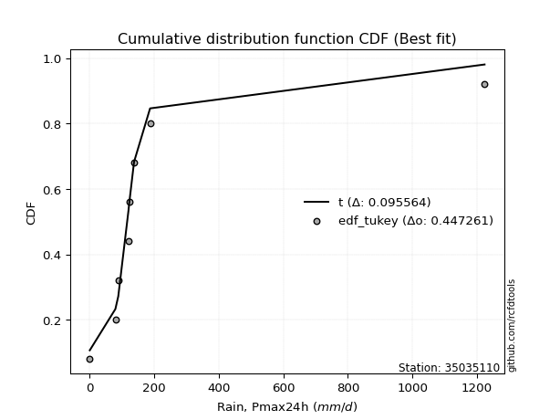</img></img>

</div>


### 8. EDF Gringorten (1963)

Gringorten plotting position formula is essential for estimating the probability and return periods of extreme events like floods and heavy rainfall. The constant _a=0.44_.

<div align="center">


$P=(m-a)/(n+1-2a)$


</div>


**8.1. Empirical values**

<div align="center">

|                | 0                   | 1                   | 2                  | 3                  | 4                  | 5                  | 6                  | 7                  |
|:---------------|:--------------------|:--------------------|:-------------------|:-------------------|:-------------------|:-------------------|:-------------------|:-------------------|
| date           | 2020                | 2018                | 2017               | 2023               | 2021               | 2022               | 2019               | 2024               |
| x              | 0.1                 | 79.4                | 88.4               | 120.2              | 122.0              | 137.3              | 186.9              | 1223.4             |
| m              | 1                   | 2                   | 3                  | 4                  | 5                  | 6                  | 7                  | 8                  |
| empirical_dist | edf_gringorten      | edf_gringorten      | edf_gringorten     | edf_gringorten     | edf_gringorten     | edf_gringorten     | edf_gringorten     | edf_gringorten     |
| empirical      | 0.06896551724137932 | 0.19211822660098524 | 0.3152709359605912 | 0.4384236453201971 | 0.5615763546798029 | 0.6847290640394089 | 0.8078817733990148 | 0.9310344827586208 |
| empirical_tr   | 1.0740740740740742  | 1.2378048780487805  | 1.460431654676259  | 1.780701754385965  | 2.2808988764044944 | 3.1718750000000004 | 5.205128205128205  | 14.500000000000018 |

</div>


**8.2. Kolmogorov-Smirnov fit test (sorted by Δ)**


<div align="center">

|                | 0                   | 1                  | 2                   | 3                   | 4                   | 5                   | 6                   | 7                   | 8                   | 9                   | 10                 | 11                 | 12                  | 13                  | 14                  | 15                  | 16                  | 17                  | 18                 | 19                  | 20                 | 21                 | 22                 | 23                  | 24                 | 25                    | 26                  | 27                 | 28                  | 29                  | 30                 | 31                  | 32                  | 33                 | 34                  | 35                  | 36                 | 37                 | 38                 | 39                  | 40                  | 41                 | 42                  | 43                 | 44                 | 45                 | 46                 | 47                  | 48                  | 49                  | 50                 | 51                  | 52                 | 53                  | 54                 | 55                 | 56                  | 57                 | 58                  | 59                 | 60                  | 61                  | 62                  | 63                 | 64                 | 65                 | 66                  | 67                  | 68                 | 69                  | 70                 | 71                  | 72                  | 73                 | 74                  | 75                  | 76                  | 77                  | 78                  | 79                 | 80                 | 81                 | 82                 | 83                 | 84                 | 85                 | 86                 | 87                 |
|:---------------|:--------------------|:-------------------|:--------------------|:--------------------|:--------------------|:--------------------|:--------------------|:--------------------|:--------------------|:--------------------|:-------------------|:-------------------|:--------------------|:--------------------|:--------------------|:--------------------|:--------------------|:--------------------|:-------------------|:--------------------|:-------------------|:-------------------|:-------------------|:--------------------|:-------------------|:----------------------|:--------------------|:-------------------|:--------------------|:--------------------|:-------------------|:--------------------|:--------------------|:-------------------|:--------------------|:--------------------|:-------------------|:-------------------|:-------------------|:--------------------|:--------------------|:-------------------|:--------------------|:-------------------|:-------------------|:-------------------|:-------------------|:--------------------|:--------------------|:--------------------|:-------------------|:--------------------|:-------------------|:--------------------|:-------------------|:-------------------|:--------------------|:-------------------|:--------------------|:-------------------|:--------------------|:--------------------|:--------------------|:-------------------|:-------------------|:-------------------|:--------------------|:--------------------|:-------------------|:--------------------|:-------------------|:--------------------|:--------------------|:-------------------|:--------------------|:--------------------|:--------------------|:--------------------|:--------------------|:-------------------|:-------------------|:-------------------|:-------------------|:-------------------|:-------------------|:-------------------|:-------------------|:-------------------|
| station        | 35035110            | 35035110           | 35035110            | 35035110            | 35035110            | 35035110            | 35035110            | 35035110            | 35035110            | 35035110            | 35035110           | 35035110           | 35035110            | 35035110            | 35035110            | 35035110            | 35035110            | 35035110            | 35035110           | 35035110            | 35035110           | 35035110           | 35035110           | 35035110            | 35035110           | 35035110              | 35035110            | 35035110           | 35035110            | 35035110            | 35035110           | 35035110            | 35035110            | 35035110           | 35035110            | 35035110            | 35035110           | 35035110           | 35035110           | 35035110            | 35035110            | 35035110           | 35035110            | 35035110           | 35035110           | 35035110           | 35035110           | 35035110            | 35035110            | 35035110            | 35035110           | 35035110            | 35035110           | 35035110            | 35035110           | 35035110           | 35035110            | 35035110           | 35035110            | 35035110           | 35035110            | 35035110            | 35035110            | 35035110           | 35035110           | 35035110           | 35035110            | 35035110            | 35035110           | 35035110            | 35035110           | 35035110            | 35035110            | 35035110           | 35035110            | 35035110            | 35035110            | 35035110            | 35035110            | 35035110           | 35035110           | 35035110           | 35035110           | 35035110           | 35035110           | 35035110           | 35035110           | 35035110           |
| empirical_dist | edf_gringorten      | edf_gringorten     | edf_gringorten      | edf_gringorten      | edf_gringorten      | edf_gringorten      | edf_gringorten      | edf_gringorten      | edf_gringorten      | edf_gringorten      | edf_gringorten     | edf_gringorten     | edf_gringorten      | edf_gringorten      | edf_gringorten      | edf_gringorten      | edf_gringorten      | edf_gringorten      | edf_gringorten     | edf_gringorten      | edf_gringorten     | edf_gringorten     | edf_gringorten     | edf_gringorten      | edf_gringorten     | edf_gringorten        | edf_gringorten      | edf_gringorten     | edf_gringorten      | edf_gringorten      | edf_gringorten     | edf_gringorten      | edf_gringorten      | edf_gringorten     | edf_gringorten      | edf_gringorten      | edf_gringorten     | edf_gringorten     | edf_gringorten     | edf_gringorten      | edf_gringorten      | edf_gringorten     | edf_gringorten      | edf_gringorten     | edf_gringorten     | edf_gringorten     | edf_gringorten     | edf_gringorten      | edf_gringorten      | edf_gringorten      | edf_gringorten     | edf_gringorten      | edf_gringorten     | edf_gringorten      | edf_gringorten     | edf_gringorten     | edf_gringorten      | edf_gringorten     | edf_gringorten      | edf_gringorten     | edf_gringorten      | edf_gringorten      | edf_gringorten      | edf_gringorten     | edf_gringorten     | edf_gringorten     | edf_gringorten      | edf_gringorten      | edf_gringorten     | edf_gringorten      | edf_gringorten     | edf_gringorten      | edf_gringorten      | edf_gringorten     | edf_gringorten      | edf_gringorten      | edf_gringorten      | edf_gringorten      | edf_gringorten      | edf_gringorten     | edf_gringorten     | edf_gringorten     | edf_gringorten     | edf_gringorten     | edf_gringorten     | edf_gringorten     | edf_gringorten     | edf_gringorten     |
| p_dist         | t                   | logjohnsonsu       | johnsonsu           | alpha               | fisk                | invgamma            | gompertz            | ncf                 | invgauss            | erlang              | gibrat             | fatiguelife        | wald                | gamma               | logpearson3         | pearson3            | logloggamma         | logcrystalball      | logtruncnorm       | betaprime           | chi2               | loggompertz        | loggenlogistic     | halflogistic        | loggumbel_l        | loglaplace_asymmetric | expon               | genexpon           | moyal               | genlogistic         | exponnorm          | halfnorm            | mielke              | laplace_asymmetric | gumbel_r            | rayleigh            | maxwell            | lognorm            | lognorm            | logexponnorm        | logrice             | lognct             | lognakagami         | logfatiguelife     | loglogistic        | loghypsecant       | loginvgauss        | nakagami            | loginvgamma         | logbetaprime        | loglaplace         | logerlang           | norm               | logmaxwell          | f                  | logistic           | kstwobign           | lograyleigh        | hypsecant           | logt               | weibull_min         | logkstwobign        | loglognorm          | laplace            | loggumbel_r        | loghalfnorm        | logmielke           | loginvweibull       | rice               | loggenexpon         | crystalball        | logmoyal            | loghalflogistic     | gumbel_l           | nct                 | logexpon            | truncnorm           | invweibull          | logncf              | logwald            | logfisk            | loggamma           | loggamma           | loggibrat          | logf               | logchi2            | logalpha           | logweibull_min     |
| delta          | 0.09714054021869095 | 0.1150349891978823 | 0.14346928093014377 | 0.15241149134171336 | 0.16037311289075343 | 0.16399202807762944 | 0.17792739733188345 | 0.18355107007416593 | 0.18684909554255102 | 0.19332505763708707 | 0.2002715804537345 | 0.2152490634191362 | 0.22095838214929733 | 0.23687509762174663 | 0.24304386527429533 | 0.24324618344532392 | 0.24824041405296568 | 0.25271041462635047 | 0.255994598742865  | 0.26115198121385474 | 0.2646663003274876 | 0.2647267141104219 | 0.2669831882426775 | 0.26899979310591793 | 0.2697781978904912 | 0.27125064185637615   | 0.27384115894802397 | 0.273841161115678  | 0.27872013888417946 | 0.28226677800097844 | 0.2829156333607664 | 0.28898457025632696 | 0.30140213596668874 | 0.3033185929512856 | 0.30370303701655843 | 0.32298593103148154 | 0.3350201429922651 | 0.3385533607388631 | 0.3385533607388631 | 0.33855450118032004 | 0.33858800765661257 | 0.3388467411560915 | 0.33884752271456897 | 0.3402440328527053 | 0.3427218896644729 | 0.346267479166798  | 0.3465959388653852 | 0.35249230420611777 | 0.35253829047523166 | 0.35580533337772247 | 0.3594427044695835 | 0.36007136227797254 | 0.3694181512159852 | 0.37012580643842585 | 0.3710318711803624 | 0.3776474524336535 | 0.37897235873323964 | 0.3804054141071218 | 0.38456199801868435 | 0.3901340153464089 | 0.39273881786069753 | 0.39396927892041134 | 0.40481978090261717 | 0.406226169763947  | 0.4091650863288132 | 0.4093664915374968 | 0.41164245154499035 | 0.41195274598765874 | 0.4122666009525438 | 0.42165001468527985 | 0.4313884158871488 | 0.43454347056130205 | 0.43591091702770823 | 0.4389649459141155 | 0.44745604025876495 | 0.45109515745782713 | 0.45913197181477433 | 0.46352576163476533 | 0.46576801707514925 | 0.5049949644870141 | 0.515945362322265  | 0.5219165573739334 | 0.5219165573739334 | 0.5323315758111548 | 0.5699162983089479 | 0.6189660506977269 | 0.6211465011794942 | 0.6507297549000411 |
| deltao         | 0.4472608134160001  | 0.4472608134160001 | 0.4472608134160001  | 0.4472608134160001  | 0.4472608134160001  | 0.4472608134160001  | 0.4472608134160001  | 0.4472608134160001  | 0.4472608134160001  | 0.4472608134160001  | 0.4472608134160001 | 0.4472608134160001 | 0.4472608134160001  | 0.4472608134160001  | 0.4472608134160001  | 0.4472608134160001  | 0.4472608134160001  | 0.4472608134160001  | 0.4472608134160001 | 0.4472608134160001  | 0.4472608134160001 | 0.4472608134160001 | 0.4472608134160001 | 0.4472608134160001  | 0.4472608134160001 | 0.4472608134160001    | 0.4472608134160001  | 0.4472608134160001 | 0.4472608134160001  | 0.4472608134160001  | 0.4472608134160001 | 0.4472608134160001  | 0.4472608134160001  | 0.4472608134160001 | 0.4472608134160001  | 0.4472608134160001  | 0.4472608134160001 | 0.4472608134160001 | 0.4472608134160001 | 0.4472608134160001  | 0.4472608134160001  | 0.4472608134160001 | 0.4472608134160001  | 0.4472608134160001 | 0.4472608134160001 | 0.4472608134160001 | 0.4472608134160001 | 0.4472608134160001  | 0.4472608134160001  | 0.4472608134160001  | 0.4472608134160001 | 0.4472608134160001  | 0.4472608134160001 | 0.4472608134160001  | 0.4472608134160001 | 0.4472608134160001 | 0.4472608134160001  | 0.4472608134160001 | 0.4472608134160001  | 0.4472608134160001 | 0.4472608134160001  | 0.4472608134160001  | 0.4472608134160001  | 0.4472608134160001 | 0.4472608134160001 | 0.4472608134160001 | 0.4472608134160001  | 0.4472608134160001  | 0.4472608134160001 | 0.4472608134160001  | 0.4472608134160001 | 0.4472608134160001  | 0.4472608134160001  | 0.4472608134160001 | 0.4472608134160001  | 0.4472608134160001  | 0.4472608134160001  | 0.4472608134160001  | 0.4472608134160001  | 0.4472608134160001 | 0.4472608134160001 | 0.4472608134160001 | 0.4472608134160001 | 0.4472608134160001 | 0.4472608134160001 | 0.4472608134160001 | 0.4472608134160001 | 0.4472608134160001 |
| eval           | Δo > Δ              | Δo > Δ             | Δo > Δ              | Δo > Δ              | Δo > Δ              | Δo > Δ              | Δo > Δ              | Δo > Δ              | Δo > Δ              | Δo > Δ              | Δo > Δ             | Δo > Δ             | Δo > Δ              | Δo > Δ              | Δo > Δ              | Δo > Δ              | Δo > Δ              | Δo > Δ              | Δo > Δ             | Δo > Δ              | Δo > Δ             | Δo > Δ             | Δo > Δ             | Δo > Δ              | Δo > Δ             | Δo > Δ                | Δo > Δ              | Δo > Δ             | Δo > Δ              | Δo > Δ              | Δo > Δ             | Δo > Δ              | Δo > Δ              | Δo > Δ             | Δo > Δ              | Δo > Δ              | Δo > Δ             | Δo > Δ             | Δo > Δ             | Δo > Δ              | Δo > Δ              | Δo > Δ             | Δo > Δ              | Δo > Δ             | Δo > Δ             | Δo > Δ             | Δo > Δ             | Δo > Δ              | Δo > Δ              | Δo > Δ              | Δo > Δ             | Δo > Δ              | Δo > Δ             | Δo > Δ              | Δo > Δ             | Δo > Δ             | Δo > Δ              | Δo > Δ             | Δo > Δ              | Δo > Δ             | Δo > Δ              | Δo > Δ              | Δo > Δ              | Δo > Δ             | Δo > Δ             | Δo > Δ             | Δo > Δ              | Δo > Δ              | Δo > Δ             | Δo > Δ              | Δo > Δ             | Δo > Δ              | Δo > Δ              | Δo > Δ             | Δo <= Δ             | Δo <= Δ             | Δo <= Δ             | Δo <= Δ             | Δo <= Δ             | Δo <= Δ            | Δo <= Δ            | Δo <= Δ            | Δo <= Δ            | Δo <= Δ            | Δo <= Δ            | Δo <= Δ            | Δo <= Δ            | Δo <= Δ            |
| fit            | 1                   | 1                  | 1                   | 1                   | 1                   | 1                   | 1                   | 1                   | 1                   | 1                   | 1                  | 1                  | 1                   | 1                   | 1                   | 1                   | 1                   | 1                   | 1                  | 1                   | 1                  | 1                  | 1                  | 1                   | 1                  | 1                     | 1                   | 1                  | 1                   | 1                   | 1                  | 1                   | 1                   | 1                  | 1                   | 1                   | 1                  | 1                  | 1                  | 1                   | 1                   | 1                  | 1                   | 1                  | 1                  | 1                  | 1                  | 1                   | 1                   | 1                   | 1                  | 1                   | 1                  | 1                   | 1                  | 1                  | 1                   | 1                  | 1                   | 1                  | 1                   | 1                   | 1                   | 1                  | 1                  | 1                  | 1                   | 1                   | 1                  | 1                   | 1                  | 1                   | 1                   | 1                  | 0                   | 0                   | 0                   | 0                   | 0                   | 0                  | 0                  | 0                  | 0                  | 0                  | 0                  | 0                  | 0                  | 0                  |
| n              | 8                   | 8                  | 8                   | 8                   | 8                   | 8                   | 8                   | 8                   | 8                   | 8                   | 8                  | 8                  | 8                   | 8                   | 8                   | 8                   | 8                   | 8                   | 8                  | 8                   | 8                  | 8                  | 8                  | 8                   | 8                  | 8                     | 8                   | 8                  | 8                   | 8                   | 8                  | 8                   | 8                   | 8                  | 8                   | 8                   | 8                  | 8                  | 8                  | 8                   | 8                   | 8                  | 8                   | 8                  | 8                  | 8                  | 8                  | 8                   | 8                   | 8                   | 8                  | 8                   | 8                  | 8                   | 8                  | 8                  | 8                   | 8                  | 8                   | 8                  | 8                   | 8                   | 8                   | 8                  | 8                  | 8                  | 8                   | 8                   | 8                  | 8                   | 8                  | 8                   | 8                   | 8                  | 8                   | 8                   | 8                   | 8                   | 8                   | 8                  | 8                  | 8                  | 8                  | 8                  | 8                  | 8                  | 8                  | 8                  |
| best_fit       | 1                   | 0                  | 0                   | 0                   | 0                   | 0                   | 0                   | 0                   | 0                   | 0                   | 0                  | 0                  | 0                   | 0                   | 0                   | 0                   | 0                   | 0                   | 0                  | 0                   | 0                  | 0                  | 0                  | 0                   | 0                  | 0                     | 0                   | 0                  | 0                   | 0                   | 0                  | 0                   | 0                   | 0                  | 0                   | 0                   | 0                  | 0                  | 0                  | 0                   | 0                   | 0                  | 0                   | 0                  | 0                  | 0                  | 0                  | 0                   | 0                   | 0                   | 0                  | 0                   | 0                  | 0                   | 0                  | 0                  | 0                   | 0                  | 0                   | 0                  | 0                   | 0                   | 0                   | 0                  | 0                  | 0                  | 0                   | 0                   | 0                  | 0                   | 0                  | 0                   | 0                   | 0                  | 0                   | 0                   | 0                   | 0                   | 0                   | 0                  | 0                  | 0                  | 0                  | 0                  | 0                  | 0                  | 0                  | 0                  |
| best_fit_sort  | 1                   | 2                  | 3                   | 4                   | 5                   | 6                   | 7                   | 8                   | 9                   | 10                  | 11                 | 12                 | 13                  | 14                  | 15                  | 16                  | 17                  | 18                  | 19                 | 20                  | 21                 | 22                 | 23                 | 24                  | 25                 | 26                    | 27                  | 28                 | 29                  | 30                  | 31                 | 32                  | 33                  | 34                 | 35                  | 36                  | 37                 | 38                 | 39                 | 40                  | 41                  | 42                 | 43                  | 44                 | 45                 | 46                 | 47                 | 48                  | 49                  | 50                  | 51                 | 52                  | 53                 | 54                  | 55                 | 56                 | 57                  | 58                 | 59                  | 60                 | 61                  | 62                  | 63                  | 64                 | 65                 | 66                 | 67                  | 68                  | 69                 | 70                  | 71                 | 72                  | 73                  | 74                 | 75                  | 76                  | 77                  | 78                  | 79                  | 80                 | 81                 | 82                 | 83                 | 84                 | 85                 | 86                 | 87                 | 88                 |

</div>


**8.3. Best fit**

<div align="center">

|   id |   station | empirical_dist   | p_dist   |     delta |   deltao | eval   |   fit |   n |   best_fit |   best_fit_sort |
|-----:|----------:|:-----------------|:---------|----------:|---------:|:-------|------:|----:|-----------:|----------------:|
|    0 |  35035110 | edf_gringorten   | t        | 0.0971405 | 0.447261 | Δo > Δ |     1 |   8 |          1 |               1 |

</div>


<div align="center">

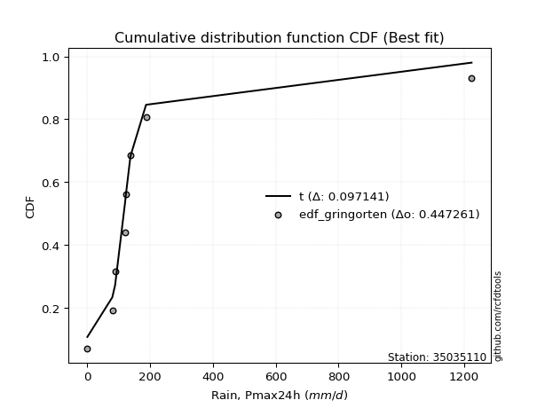</img></img>

</div>


### 9. EDF Filliben (1975)

The specific values of the constants (0.3175) (often denoted as $alpha$) and (0.365) are derived from a method proposed by James J. Filliben in a 1975 paper. This particular formula is the mean value of the $i$-th order statistic of the normal distribution and is considered a robust and effective plotting position formula for the normal probability plot correlation coefficient test for normality.

<div align="center">


$P=(m-0.3175)/(n+0.365)$


</div>


**9.1. Empirical values**

<div align="center">

|                | 0                  | 1                   | 2                  | 3                   | 4                  | 5                  | 6                  | 7                  |
|:---------------|:-------------------|:--------------------|:-------------------|:--------------------|:-------------------|:-------------------|:-------------------|:-------------------|
| date           | 2020               | 2018                | 2017               | 2023                | 2021               | 2022               | 2019               | 2024               |
| x              | 0.1                | 79.4                | 88.4               | 120.2               | 122.0              | 137.3              | 186.9              | 1223.4             |
| m              | 1                  | 2                   | 3                  | 4                   | 5                  | 6                  | 7                  | 8                  |
| empirical_dist | edf_filliben       | edf_filliben        | edf_filliben       | edf_filliben        | edf_filliben       | edf_filliben       | edf_filliben       | edf_filliben       |
| empirical      | 0.0815899581589958 | 0.20113568439928273 | 0.3206814106395696 | 0.44022713687985654 | 0.5597728631201434 | 0.6793185893604303 | 0.7988643156007172 | 0.9184100418410042 |
| empirical_tr   | 1.0888382687927107 | 1.2517770295548074  | 1.4720633523977125 | 1.7864388681260008  | 2.271554650373387  | 3.118359739049394  | 4.971768202080237  | 12.256410256410254 |

</div>


**9.2. Kolmogorov-Smirnov fit test (sorted by Δ)**


<div align="center">

|                | 0                   | 1                   | 2                   | 3                  | 4                   | 5                   | 6                  | 7                  | 8                   | 9                   | 10                  | 11                  | 12                  | 13                 | 14                 | 15                  | 16                 | 17                 | 18                  | 19                 | 20                  | 21                 | 22                 | 23                 | 24                  | 25                    | 26                 | 27                 | 28                 | 29                 | 30                  | 31                 | 32                 | 33                 | 34                 | 35                 | 36                 | 37                  | 38                  | 39                 | 40                 | 41                  | 42                 | 43                 | 44                 | 45                  | 46                  | 47                 | 48                 | 49                 | 50                  | 51                 | 52                  | 53                 | 54                  | 55                  | 56                 | 57                  | 58                 | 59                  | 60                 | 61                 | 62                  | 63                  | 64                  | 65                 | 66                 | 67                 | 68                  | 69                 | 70                 | 71                 | 72                 | 73                  | 74                 | 75                 | 76                 | 77                 | 78                 | 79                  | 80                 | 81                 | 82                 | 83                 | 84                 | 85                 | 86                 | 87                 |
|:---------------|:--------------------|:--------------------|:--------------------|:-------------------|:--------------------|:--------------------|:-------------------|:-------------------|:--------------------|:--------------------|:--------------------|:--------------------|:--------------------|:-------------------|:-------------------|:--------------------|:-------------------|:-------------------|:--------------------|:-------------------|:--------------------|:-------------------|:-------------------|:-------------------|:--------------------|:----------------------|:-------------------|:-------------------|:-------------------|:-------------------|:--------------------|:-------------------|:-------------------|:-------------------|:-------------------|:-------------------|:-------------------|:--------------------|:--------------------|:-------------------|:-------------------|:--------------------|:-------------------|:-------------------|:-------------------|:--------------------|:--------------------|:-------------------|:-------------------|:-------------------|:--------------------|:-------------------|:--------------------|:-------------------|:--------------------|:--------------------|:-------------------|:--------------------|:-------------------|:--------------------|:-------------------|:-------------------|:--------------------|:--------------------|:--------------------|:-------------------|:-------------------|:-------------------|:--------------------|:-------------------|:-------------------|:-------------------|:-------------------|:--------------------|:-------------------|:-------------------|:-------------------|:-------------------|:-------------------|:--------------------|:-------------------|:-------------------|:-------------------|:-------------------|:-------------------|:-------------------|:-------------------|:-------------------|
| station        | 35035110            | 35035110            | 35035110            | 35035110           | 35035110            | 35035110            | 35035110           | 35035110           | 35035110            | 35035110            | 35035110            | 35035110            | 35035110            | 35035110           | 35035110           | 35035110            | 35035110           | 35035110           | 35035110            | 35035110           | 35035110            | 35035110           | 35035110           | 35035110           | 35035110            | 35035110              | 35035110           | 35035110           | 35035110           | 35035110           | 35035110            | 35035110           | 35035110           | 35035110           | 35035110           | 35035110           | 35035110           | 35035110            | 35035110            | 35035110           | 35035110           | 35035110            | 35035110           | 35035110           | 35035110           | 35035110            | 35035110            | 35035110           | 35035110           | 35035110           | 35035110            | 35035110           | 35035110            | 35035110           | 35035110            | 35035110            | 35035110           | 35035110            | 35035110           | 35035110            | 35035110           | 35035110           | 35035110            | 35035110            | 35035110            | 35035110           | 35035110           | 35035110           | 35035110            | 35035110           | 35035110           | 35035110           | 35035110           | 35035110            | 35035110           | 35035110           | 35035110           | 35035110           | 35035110           | 35035110            | 35035110           | 35035110           | 35035110           | 35035110           | 35035110           | 35035110           | 35035110           | 35035110           |
| empirical_dist | edf_filliben        | edf_filliben        | edf_filliben        | edf_filliben       | edf_filliben        | edf_filliben        | edf_filliben       | edf_filliben       | edf_filliben        | edf_filliben        | edf_filliben        | edf_filliben        | edf_filliben        | edf_filliben       | edf_filliben       | edf_filliben        | edf_filliben       | edf_filliben       | edf_filliben        | edf_filliben       | edf_filliben        | edf_filliben       | edf_filliben       | edf_filliben       | edf_filliben        | edf_filliben          | edf_filliben       | edf_filliben       | edf_filliben       | edf_filliben       | edf_filliben        | edf_filliben       | edf_filliben       | edf_filliben       | edf_filliben       | edf_filliben       | edf_filliben       | edf_filliben        | edf_filliben        | edf_filliben       | edf_filliben       | edf_filliben        | edf_filliben       | edf_filliben       | edf_filliben       | edf_filliben        | edf_filliben        | edf_filliben       | edf_filliben       | edf_filliben       | edf_filliben        | edf_filliben       | edf_filliben        | edf_filliben       | edf_filliben        | edf_filliben        | edf_filliben       | edf_filliben        | edf_filliben       | edf_filliben        | edf_filliben       | edf_filliben       | edf_filliben        | edf_filliben        | edf_filliben        | edf_filliben       | edf_filliben       | edf_filliben       | edf_filliben        | edf_filliben       | edf_filliben       | edf_filliben       | edf_filliben       | edf_filliben        | edf_filliben       | edf_filliben       | edf_filliben       | edf_filliben       | edf_filliben       | edf_filliben        | edf_filliben       | edf_filliben       | edf_filliben       | edf_filliben       | edf_filliben       | edf_filliben       | edf_filliben       | edf_filliben       |
| p_dist         | t                   | logjohnsonsu        | alpha               | johnsonsu          | fisk                | invgamma            | gompertz           | ncf                | invgauss            | erlang              | gibrat              | fatiguelife         | wald                | gamma              | logpearson3        | pearson3            | logloggamma        | logcrystalball     | logtruncnorm        | betaprime          | chi2                | loggompertz        | loggenlogistic     | halflogistic       | loggumbel_l         | loglaplace_asymmetric | expon              | genexpon           | moyal              | genlogistic        | exponnorm           | halfnorm           | mielke             | gumbel_r           | laplace_asymmetric | rayleigh           | maxwell            | lognorm             | lognorm             | logexponnorm       | logrice            | lognct              | lognakagami        | logfatiguelife     | loglogistic        | loghypsecant        | loginvgauss         | nakagami           | loginvgamma        | logbetaprime       | loglaplace          | logerlang          | norm                | logmaxwell         | f                   | logistic            | kstwobign          | lograyleigh         | hypsecant          | logt                | weibull_min        | logkstwobign       | loglognorm          | laplace             | loggumbel_r         | loghalfnorm        | logmielke          | loginvweibull      | rice                | loggenexpon        | crystalball        | logmoyal           | loghalflogistic    | gumbel_l            | nct                | logexpon           | truncnorm          | invweibull         | logncf             | logwald             | logfisk            | loggamma           | loggamma           | loggibrat          | logf               | logchi2            | logalpha           | logweibull_min     |
| delta          | 0.09533704865903153 | 0.12044546387686073 | 0.14339403354341587 | 0.1488797556091222 | 0.15135565509245594 | 0.15497457027933195 | 0.1689099395335859 | 0.1745336122758684 | 0.17783163774425348 | 0.18430759983878953 | 0.19125412265543695 | 0.20623160562083864 | 0.21194092435099984 | 0.2278576398234491 | 0.2340264074759978 | 0.23422872564702643 | 0.2392229562546682 | 0.243692956828053  | 0.24697714094456746 | 0.2521345234155573 | 0.25564884252919007 | 0.2557092563121244 | 0.25796573044438   | 0.2599823353076204 | 0.26076074009219363 | 0.2622331840580787    | 0.2648237011497264 | 0.2648237033173805 | 0.2697026810858819 | 0.2732493202026809 | 0.27389817556246887 | 0.2799671124580294 | 0.2923846781683912 | 0.2946855792182609 | 0.297908118272307  | 0.313968473233184  | 0.3260026851939676 | 0.32953590294056556 | 0.32953590294056556 | 0.3295370433820225 | 0.329570549858315  | 0.32982928335779393 | 0.3298300649162714 | 0.3312265750544078 | 0.3337044318661754 | 0.33725002136850046 | 0.33757848106708765 | 0.3434748464078202 | 0.3435208326769341 | 0.3467878755794249 | 0.35042524667128594 | 0.351053904479675  | 0.36040069341768766 | 0.3611083486401283 | 0.36201441338206486 | 0.36862999463535595 | 0.3699549009349421 | 0.37138795630882426 | 0.3755445402203868 | 0.38111655754811136 | 0.3837213600624    | 0.3849518211221138 | 0.39219533998500056 | 0.39720871196564944 | 0.40014762853051566 | 0.4003490337391993 | 0.4026249937466928 | 0.4029352881893612 | 0.40324914315424626 | 0.4126325568869823 | 0.4187639749695323 | 0.4255260127630045 | 0.4268934592294107 | 0.42994748811581796 | 0.4384385824604674 | 0.4420776996595296 | 0.4501145140164768 | 0.4509013207171487 | 0.4567505592768517 | 0.49597750668871654 | 0.5069279045239674 | 0.5128990995756358 | 0.5128990995756358 | 0.5233141180128572 | 0.5608988405106503 | 0.6099485928994294 | 0.6121290433811967 | 0.6417122971017436 |
| deltao         | 0.4472608134160001  | 0.4472608134160001  | 0.4472608134160001  | 0.4472608134160001 | 0.4472608134160001  | 0.4472608134160001  | 0.4472608134160001 | 0.4472608134160001 | 0.4472608134160001  | 0.4472608134160001  | 0.4472608134160001  | 0.4472608134160001  | 0.4472608134160001  | 0.4472608134160001 | 0.4472608134160001 | 0.4472608134160001  | 0.4472608134160001 | 0.4472608134160001 | 0.4472608134160001  | 0.4472608134160001 | 0.4472608134160001  | 0.4472608134160001 | 0.4472608134160001 | 0.4472608134160001 | 0.4472608134160001  | 0.4472608134160001    | 0.4472608134160001 | 0.4472608134160001 | 0.4472608134160001 | 0.4472608134160001 | 0.4472608134160001  | 0.4472608134160001 | 0.4472608134160001 | 0.4472608134160001 | 0.4472608134160001 | 0.4472608134160001 | 0.4472608134160001 | 0.4472608134160001  | 0.4472608134160001  | 0.4472608134160001 | 0.4472608134160001 | 0.4472608134160001  | 0.4472608134160001 | 0.4472608134160001 | 0.4472608134160001 | 0.4472608134160001  | 0.4472608134160001  | 0.4472608134160001 | 0.4472608134160001 | 0.4472608134160001 | 0.4472608134160001  | 0.4472608134160001 | 0.4472608134160001  | 0.4472608134160001 | 0.4472608134160001  | 0.4472608134160001  | 0.4472608134160001 | 0.4472608134160001  | 0.4472608134160001 | 0.4472608134160001  | 0.4472608134160001 | 0.4472608134160001 | 0.4472608134160001  | 0.4472608134160001  | 0.4472608134160001  | 0.4472608134160001 | 0.4472608134160001 | 0.4472608134160001 | 0.4472608134160001  | 0.4472608134160001 | 0.4472608134160001 | 0.4472608134160001 | 0.4472608134160001 | 0.4472608134160001  | 0.4472608134160001 | 0.4472608134160001 | 0.4472608134160001 | 0.4472608134160001 | 0.4472608134160001 | 0.4472608134160001  | 0.4472608134160001 | 0.4472608134160001 | 0.4472608134160001 | 0.4472608134160001 | 0.4472608134160001 | 0.4472608134160001 | 0.4472608134160001 | 0.4472608134160001 |
| eval           | Δo > Δ              | Δo > Δ              | Δo > Δ              | Δo > Δ             | Δo > Δ              | Δo > Δ              | Δo > Δ             | Δo > Δ             | Δo > Δ              | Δo > Δ              | Δo > Δ              | Δo > Δ              | Δo > Δ              | Δo > Δ             | Δo > Δ             | Δo > Δ              | Δo > Δ             | Δo > Δ             | Δo > Δ              | Δo > Δ             | Δo > Δ              | Δo > Δ             | Δo > Δ             | Δo > Δ             | Δo > Δ              | Δo > Δ                | Δo > Δ             | Δo > Δ             | Δo > Δ             | Δo > Δ             | Δo > Δ              | Δo > Δ             | Δo > Δ             | Δo > Δ             | Δo > Δ             | Δo > Δ             | Δo > Δ             | Δo > Δ              | Δo > Δ              | Δo > Δ             | Δo > Δ             | Δo > Δ              | Δo > Δ             | Δo > Δ             | Δo > Δ             | Δo > Δ              | Δo > Δ              | Δo > Δ             | Δo > Δ             | Δo > Δ             | Δo > Δ              | Δo > Δ             | Δo > Δ              | Δo > Δ             | Δo > Δ              | Δo > Δ              | Δo > Δ             | Δo > Δ              | Δo > Δ             | Δo > Δ              | Δo > Δ             | Δo > Δ             | Δo > Δ              | Δo > Δ              | Δo > Δ              | Δo > Δ             | Δo > Δ             | Δo > Δ             | Δo > Δ              | Δo > Δ             | Δo > Δ             | Δo > Δ             | Δo > Δ             | Δo > Δ              | Δo > Δ             | Δo > Δ             | Δo <= Δ            | Δo <= Δ            | Δo <= Δ            | Δo <= Δ             | Δo <= Δ            | Δo <= Δ            | Δo <= Δ            | Δo <= Δ            | Δo <= Δ            | Δo <= Δ            | Δo <= Δ            | Δo <= Δ            |
| fit            | 1                   | 1                   | 1                   | 1                  | 1                   | 1                   | 1                  | 1                  | 1                   | 1                   | 1                   | 1                   | 1                   | 1                  | 1                  | 1                   | 1                  | 1                  | 1                   | 1                  | 1                   | 1                  | 1                  | 1                  | 1                   | 1                     | 1                  | 1                  | 1                  | 1                  | 1                   | 1                  | 1                  | 1                  | 1                  | 1                  | 1                  | 1                   | 1                   | 1                  | 1                  | 1                   | 1                  | 1                  | 1                  | 1                   | 1                   | 1                  | 1                  | 1                  | 1                   | 1                  | 1                   | 1                  | 1                   | 1                   | 1                  | 1                   | 1                  | 1                   | 1                  | 1                  | 1                   | 1                   | 1                   | 1                  | 1                  | 1                  | 1                   | 1                  | 1                  | 1                  | 1                  | 1                   | 1                  | 1                  | 0                  | 0                  | 0                  | 0                   | 0                  | 0                  | 0                  | 0                  | 0                  | 0                  | 0                  | 0                  |
| n              | 8                   | 8                   | 8                   | 8                  | 8                   | 8                   | 8                  | 8                  | 8                   | 8                   | 8                   | 8                   | 8                   | 8                  | 8                  | 8                   | 8                  | 8                  | 8                   | 8                  | 8                   | 8                  | 8                  | 8                  | 8                   | 8                     | 8                  | 8                  | 8                  | 8                  | 8                   | 8                  | 8                  | 8                  | 8                  | 8                  | 8                  | 8                   | 8                   | 8                  | 8                  | 8                   | 8                  | 8                  | 8                  | 8                   | 8                   | 8                  | 8                  | 8                  | 8                   | 8                  | 8                   | 8                  | 8                   | 8                   | 8                  | 8                   | 8                  | 8                   | 8                  | 8                  | 8                   | 8                   | 8                   | 8                  | 8                  | 8                  | 8                   | 8                  | 8                  | 8                  | 8                  | 8                   | 8                  | 8                  | 8                  | 8                  | 8                  | 8                   | 8                  | 8                  | 8                  | 8                  | 8                  | 8                  | 8                  | 8                  |
| best_fit       | 1                   | 0                   | 0                   | 0                  | 0                   | 0                   | 0                  | 0                  | 0                   | 0                   | 0                   | 0                   | 0                   | 0                  | 0                  | 0                   | 0                  | 0                  | 0                   | 0                  | 0                   | 0                  | 0                  | 0                  | 0                   | 0                     | 0                  | 0                  | 0                  | 0                  | 0                   | 0                  | 0                  | 0                  | 0                  | 0                  | 0                  | 0                   | 0                   | 0                  | 0                  | 0                   | 0                  | 0                  | 0                  | 0                   | 0                   | 0                  | 0                  | 0                  | 0                   | 0                  | 0                   | 0                  | 0                   | 0                   | 0                  | 0                   | 0                  | 0                   | 0                  | 0                  | 0                   | 0                   | 0                   | 0                  | 0                  | 0                  | 0                   | 0                  | 0                  | 0                  | 0                  | 0                   | 0                  | 0                  | 0                  | 0                  | 0                  | 0                   | 0                  | 0                  | 0                  | 0                  | 0                  | 0                  | 0                  | 0                  |
| best_fit_sort  | 1                   | 2                   | 3                   | 4                  | 5                   | 6                   | 7                  | 8                  | 9                   | 10                  | 11                  | 12                  | 13                  | 14                 | 15                 | 16                  | 17                 | 18                 | 19                  | 20                 | 21                  | 22                 | 23                 | 24                 | 25                  | 26                    | 27                 | 28                 | 29                 | 30                 | 31                  | 32                 | 33                 | 34                 | 35                 | 36                 | 37                 | 38                  | 39                  | 40                 | 41                 | 42                  | 43                 | 44                 | 45                 | 46                  | 47                  | 48                 | 49                 | 50                 | 51                  | 52                 | 53                  | 54                 | 55                  | 56                  | 57                 | 58                  | 59                 | 60                  | 61                 | 62                 | 63                  | 64                  | 65                  | 66                 | 67                 | 68                 | 69                  | 70                 | 71                 | 72                 | 73                 | 74                  | 75                 | 76                 | 77                 | 78                 | 79                 | 80                  | 81                 | 82                 | 83                 | 84                 | 85                 | 86                 | 87                 | 88                 |

</div>


**9.3. Best fit**

<div align="center">

|   id |   station | empirical_dist   | p_dist   |    delta |   deltao | eval   |   fit |   n |   best_fit |   best_fit_sort |
|-----:|----------:|:-----------------|:---------|---------:|---------:|:-------|------:|----:|-----------:|----------------:|
|    0 |  35035110 | edf_filliben     | t        | 0.095337 | 0.447261 | Δo > Δ |     1 |   8 |          1 |               1 |

</div>


<div align="center">

</img>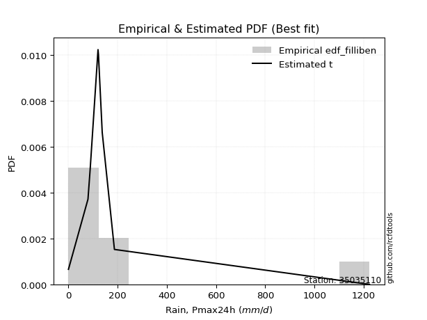</img>

</div>


### 10. EDF Jenkinson (1977)

The Jenkinson formula in hydrology is an empirical plotting position formula used to estimate the non-exceedance probability _(P)_ or return period _(T)_ of a given ordered observation within a sample. It is a widely used method in the frequency analysis of extreme events such as floods and rainfall, as it provides a distribution-free way to plot data. _a≈0.31_ and _b≈0.38_ are constants derived to approximate the median of the probability distribution for the given rank.

<div align="center">


$P=(m-a)/(n+b)$


</div>


**10.1. Empirical values**

<div align="center">

|                | 0                   | 1                   | 2                  | 3                   | 4                  | 5                  | 6                  | 7                  |
|:---------------|:--------------------|:--------------------|:-------------------|:--------------------|:-------------------|:-------------------|:-------------------|:-------------------|
| date           | 2020                | 2018                | 2017               | 2023                | 2021               | 2022               | 2019               | 2024               |
| x              | 0.1                 | 79.4                | 88.4               | 120.2               | 122.0              | 137.3              | 186.9              | 1223.4             |
| m              | 1                   | 2                   | 3                  | 4                   | 5                  | 6                  | 7                  | 8                  |
| empirical_dist | edf_jenkinson       | edf_jenkinson       | edf_jenkinson      | edf_jenkinson       | edf_jenkinson      | edf_jenkinson      | edf_jenkinson      | edf_jenkinson      |
| empirical      | 0.08233890214797135 | 0.20167064439140808 | 0.3210023866348448 | 0.44033412887828155 | 0.5596658711217184 | 0.6789976133651551 | 0.7983293556085919 | 0.9176610978520287 |
| empirical_tr   | 1.0897269180754225  | 1.2526158445440956  | 1.4727592267135323 | 1.7867803837953091  | 2.2710027100271004 | 3.115241635687732  | 4.958579881656804  | 12.144927536231886 |

</div>


**10.2. Kolmogorov-Smirnov fit test (sorted by Δ)**


<div align="center">

|                | 0                   | 1                   | 2                   | 3                  | 4                   | 5                  | 6                   | 7                  | 8                  | 9                   | 10                  | 11                  | 12                 | 13                 | 14                 | 15                  | 16                  | 17                  | 18                  | 19                 | 20                  | 21                  | 22                  | 23                 | 24                 | 25                    | 26                  | 27                 | 28                  | 29                 | 30                 | 31                 | 32                  | 33                 | 34                  | 35                 | 36                 | 37                  | 38                  | 39                  | 40                 | 41                 | 42                 | 43                  | 44                  | 45                  | 46                 | 47                 | 48                 | 49                 | 50                 | 51                  | 52                 | 53                 | 54                  | 55                  | 56                 | 57                  | 58                 | 59                  | 60                 | 61                  | 62                  | 63                  | 64                  | 65                  | 66                 | 67                  | 68                 | 69                 | 70                 | 71                 | 72                  | 73                  | 74                 | 75                  | 76                 | 77                 | 78                 | 79                 | 80                 | 81                 | 82                 | 83                 | 84                 | 85                 | 86                 | 87                 |
|:---------------|:--------------------|:--------------------|:--------------------|:-------------------|:--------------------|:-------------------|:--------------------|:-------------------|:-------------------|:--------------------|:--------------------|:--------------------|:-------------------|:-------------------|:-------------------|:--------------------|:--------------------|:--------------------|:--------------------|:-------------------|:--------------------|:--------------------|:--------------------|:-------------------|:-------------------|:----------------------|:--------------------|:-------------------|:--------------------|:-------------------|:-------------------|:-------------------|:--------------------|:-------------------|:--------------------|:-------------------|:-------------------|:--------------------|:--------------------|:--------------------|:-------------------|:-------------------|:-------------------|:--------------------|:--------------------|:--------------------|:-------------------|:-------------------|:-------------------|:-------------------|:-------------------|:--------------------|:-------------------|:-------------------|:--------------------|:--------------------|:-------------------|:--------------------|:-------------------|:--------------------|:-------------------|:--------------------|:--------------------|:--------------------|:--------------------|:--------------------|:-------------------|:--------------------|:-------------------|:-------------------|:-------------------|:-------------------|:--------------------|:--------------------|:-------------------|:--------------------|:-------------------|:-------------------|:-------------------|:-------------------|:-------------------|:-------------------|:-------------------|:-------------------|:-------------------|:-------------------|:-------------------|:-------------------|
| station        | 35035110            | 35035110            | 35035110            | 35035110           | 35035110            | 35035110           | 35035110            | 35035110           | 35035110           | 35035110            | 35035110            | 35035110            | 35035110           | 35035110           | 35035110           | 35035110            | 35035110            | 35035110            | 35035110            | 35035110           | 35035110            | 35035110            | 35035110            | 35035110           | 35035110           | 35035110              | 35035110            | 35035110           | 35035110            | 35035110           | 35035110           | 35035110           | 35035110            | 35035110           | 35035110            | 35035110           | 35035110           | 35035110            | 35035110            | 35035110            | 35035110           | 35035110           | 35035110           | 35035110            | 35035110            | 35035110            | 35035110           | 35035110           | 35035110           | 35035110           | 35035110           | 35035110            | 35035110           | 35035110           | 35035110            | 35035110            | 35035110           | 35035110            | 35035110           | 35035110            | 35035110           | 35035110            | 35035110            | 35035110            | 35035110            | 35035110            | 35035110           | 35035110            | 35035110           | 35035110           | 35035110           | 35035110           | 35035110            | 35035110            | 35035110           | 35035110            | 35035110           | 35035110           | 35035110           | 35035110           | 35035110           | 35035110           | 35035110           | 35035110           | 35035110           | 35035110           | 35035110           | 35035110           |
| empirical_dist | edf_jenkinson       | edf_jenkinson       | edf_jenkinson       | edf_jenkinson      | edf_jenkinson       | edf_jenkinson      | edf_jenkinson       | edf_jenkinson      | edf_jenkinson      | edf_jenkinson       | edf_jenkinson       | edf_jenkinson       | edf_jenkinson      | edf_jenkinson      | edf_jenkinson      | edf_jenkinson       | edf_jenkinson       | edf_jenkinson       | edf_jenkinson       | edf_jenkinson      | edf_jenkinson       | edf_jenkinson       | edf_jenkinson       | edf_jenkinson      | edf_jenkinson      | edf_jenkinson         | edf_jenkinson       | edf_jenkinson      | edf_jenkinson       | edf_jenkinson      | edf_jenkinson      | edf_jenkinson      | edf_jenkinson       | edf_jenkinson      | edf_jenkinson       | edf_jenkinson      | edf_jenkinson      | edf_jenkinson       | edf_jenkinson       | edf_jenkinson       | edf_jenkinson      | edf_jenkinson      | edf_jenkinson      | edf_jenkinson       | edf_jenkinson       | edf_jenkinson       | edf_jenkinson      | edf_jenkinson      | edf_jenkinson      | edf_jenkinson      | edf_jenkinson      | edf_jenkinson       | edf_jenkinson      | edf_jenkinson      | edf_jenkinson       | edf_jenkinson       | edf_jenkinson      | edf_jenkinson       | edf_jenkinson      | edf_jenkinson       | edf_jenkinson      | edf_jenkinson       | edf_jenkinson       | edf_jenkinson       | edf_jenkinson       | edf_jenkinson       | edf_jenkinson      | edf_jenkinson       | edf_jenkinson      | edf_jenkinson      | edf_jenkinson      | edf_jenkinson      | edf_jenkinson       | edf_jenkinson       | edf_jenkinson      | edf_jenkinson       | edf_jenkinson      | edf_jenkinson      | edf_jenkinson      | edf_jenkinson      | edf_jenkinson      | edf_jenkinson      | edf_jenkinson      | edf_jenkinson      | edf_jenkinson      | edf_jenkinson      | edf_jenkinson      | edf_jenkinson      |
| p_dist         | t                   | logjohnsonsu        | alpha               | johnsonsu          | fisk                | invgamma           | gompertz            | ncf                | invgauss           | erlang              | gibrat              | fatiguelife         | wald               | gamma              | logpearson3        | pearson3            | logloggamma         | logcrystalball      | logtruncnorm        | betaprime          | chi2                | loggompertz         | loggenlogistic      | halflogistic       | loggumbel_l        | loglaplace_asymmetric | expon               | genexpon           | moyal               | genlogistic        | exponnorm          | halfnorm           | mielke              | gumbel_r           | laplace_asymmetric  | rayleigh           | maxwell            | lognorm             | lognorm             | logexponnorm        | logrice            | lognct             | lognakagami        | logfatiguelife      | loglogistic         | loghypsecant        | loginvgauss        | nakagami           | loginvgamma        | logbetaprime       | loglaplace         | logerlang           | norm               | logmaxwell         | f                   | logistic            | kstwobign          | lograyleigh         | hypsecant          | logt                | weibull_min        | logkstwobign        | loglognorm          | laplace             | loggumbel_r         | loghalfnorm         | logmielke          | loginvweibull       | rice               | loggenexpon        | crystalball        | logmoyal           | loghalflogistic     | gumbel_l            | nct                | logexpon            | truncnorm          | invweibull         | logncf             | logwald            | logfisk            | loggamma           | loggamma           | loggibrat          | logf               | logchi2            | logalpha           | logweibull_min     |
| delta          | 0.09523005666060652 | 0.12076643987213592 | 0.14285907355129052 | 0.1492007316043974 | 0.15082069510033058 | 0.1544396102872066 | 0.16837497954146052 | 0.173998652283743  | 0.1772966777521281 | 0.18377263984666414 | 0.19071916266331157 | 0.20569664562871326 | 0.2114059643588745 | 0.2273226798313237 | 0.2334914474838724 | 0.23369376565490108 | 0.23868799626254283 | 0.24315799683592765 | 0.24644218095244208 | 0.2515995634234319 | 0.25511388253706474 | 0.25517429631999905 | 0.25743077045225465 | 0.259447375315495  | 0.2602257801000683 | 0.26169822406595333   | 0.26428874115760104 | 0.2642887433252551 | 0.26916772109375653 | 0.2727143602105555 | 0.2733632155703435 | 0.279432152465904  | 0.29184971817626587 | 0.2941506192261355 | 0.29758714227703176 | 0.3134335132410586 | 0.3254677252018422 | 0.32900094294844023 | 0.32900094294844023 | 0.32900208338989717 | 0.3290355898661897 | 0.3292943233656686 | 0.3292951049241461 | 0.33069161506228245 | 0.33316947187405005 | 0.33671506137637514 | 0.3370435210749623 | 0.3429398864156949 | 0.3429858726848088 | 0.3462529155872996 | 0.3498902866791606 | 0.35051894448754967 | 0.3598657334255623 | 0.360573388648003  | 0.36147945338993953 | 0.36809503464323057 | 0.3694199409428167 | 0.37085299631669894 | 0.3750095802282614 | 0.38058159755598603 | 0.3831864000702746 | 0.38441686112998846 | 0.39144639599602504 | 0.39667375197352406 | 0.39961266853839034 | 0.39981407374707395 | 0.4020900337545675 | 0.40240032819723587 | 0.4027141831621209 | 0.412097596894857  | 0.4180150309805568 | 0.4249910527708792 | 0.42635849923728536 | 0.42941252812369257 | 0.4379036224683421 | 0.44154273966740426 | 0.4495795540243514 | 0.4501523767281732 | 0.4562155992847264 | 0.4954425466965912 | 0.506392944531842  | 0.5123641395835106 | 0.5123641395835106 | 0.5227791580207319 | 0.5603638805185249 | 0.6094136329073041 | 0.6115940833890714 | 0.6411773371096183 |
| deltao         | 0.4472608134160001  | 0.4472608134160001  | 0.4472608134160001  | 0.4472608134160001 | 0.4472608134160001  | 0.4472608134160001 | 0.4472608134160001  | 0.4472608134160001 | 0.4472608134160001 | 0.4472608134160001  | 0.4472608134160001  | 0.4472608134160001  | 0.4472608134160001 | 0.4472608134160001 | 0.4472608134160001 | 0.4472608134160001  | 0.4472608134160001  | 0.4472608134160001  | 0.4472608134160001  | 0.4472608134160001 | 0.4472608134160001  | 0.4472608134160001  | 0.4472608134160001  | 0.4472608134160001 | 0.4472608134160001 | 0.4472608134160001    | 0.4472608134160001  | 0.4472608134160001 | 0.4472608134160001  | 0.4472608134160001 | 0.4472608134160001 | 0.4472608134160001 | 0.4472608134160001  | 0.4472608134160001 | 0.4472608134160001  | 0.4472608134160001 | 0.4472608134160001 | 0.4472608134160001  | 0.4472608134160001  | 0.4472608134160001  | 0.4472608134160001 | 0.4472608134160001 | 0.4472608134160001 | 0.4472608134160001  | 0.4472608134160001  | 0.4472608134160001  | 0.4472608134160001 | 0.4472608134160001 | 0.4472608134160001 | 0.4472608134160001 | 0.4472608134160001 | 0.4472608134160001  | 0.4472608134160001 | 0.4472608134160001 | 0.4472608134160001  | 0.4472608134160001  | 0.4472608134160001 | 0.4472608134160001  | 0.4472608134160001 | 0.4472608134160001  | 0.4472608134160001 | 0.4472608134160001  | 0.4472608134160001  | 0.4472608134160001  | 0.4472608134160001  | 0.4472608134160001  | 0.4472608134160001 | 0.4472608134160001  | 0.4472608134160001 | 0.4472608134160001 | 0.4472608134160001 | 0.4472608134160001 | 0.4472608134160001  | 0.4472608134160001  | 0.4472608134160001 | 0.4472608134160001  | 0.4472608134160001 | 0.4472608134160001 | 0.4472608134160001 | 0.4472608134160001 | 0.4472608134160001 | 0.4472608134160001 | 0.4472608134160001 | 0.4472608134160001 | 0.4472608134160001 | 0.4472608134160001 | 0.4472608134160001 | 0.4472608134160001 |
| eval           | Δo > Δ              | Δo > Δ              | Δo > Δ              | Δo > Δ             | Δo > Δ              | Δo > Δ             | Δo > Δ              | Δo > Δ             | Δo > Δ             | Δo > Δ              | Δo > Δ              | Δo > Δ              | Δo > Δ             | Δo > Δ             | Δo > Δ             | Δo > Δ              | Δo > Δ              | Δo > Δ              | Δo > Δ              | Δo > Δ             | Δo > Δ              | Δo > Δ              | Δo > Δ              | Δo > Δ             | Δo > Δ             | Δo > Δ                | Δo > Δ              | Δo > Δ             | Δo > Δ              | Δo > Δ             | Δo > Δ             | Δo > Δ             | Δo > Δ              | Δo > Δ             | Δo > Δ              | Δo > Δ             | Δo > Δ             | Δo > Δ              | Δo > Δ              | Δo > Δ              | Δo > Δ             | Δo > Δ             | Δo > Δ             | Δo > Δ              | Δo > Δ              | Δo > Δ              | Δo > Δ             | Δo > Δ             | Δo > Δ             | Δo > Δ             | Δo > Δ             | Δo > Δ              | Δo > Δ             | Δo > Δ             | Δo > Δ              | Δo > Δ              | Δo > Δ             | Δo > Δ              | Δo > Δ             | Δo > Δ              | Δo > Δ             | Δo > Δ              | Δo > Δ              | Δo > Δ              | Δo > Δ              | Δo > Δ              | Δo > Δ             | Δo > Δ              | Δo > Δ             | Δo > Δ             | Δo > Δ             | Δo > Δ             | Δo > Δ              | Δo > Δ              | Δo > Δ             | Δo > Δ              | Δo <= Δ            | Δo <= Δ            | Δo <= Δ            | Δo <= Δ            | Δo <= Δ            | Δo <= Δ            | Δo <= Δ            | Δo <= Δ            | Δo <= Δ            | Δo <= Δ            | Δo <= Δ            | Δo <= Δ            |
| fit            | 1                   | 1                   | 1                   | 1                  | 1                   | 1                  | 1                   | 1                  | 1                  | 1                   | 1                   | 1                   | 1                  | 1                  | 1                  | 1                   | 1                   | 1                   | 1                   | 1                  | 1                   | 1                   | 1                   | 1                  | 1                  | 1                     | 1                   | 1                  | 1                   | 1                  | 1                  | 1                  | 1                   | 1                  | 1                   | 1                  | 1                  | 1                   | 1                   | 1                   | 1                  | 1                  | 1                  | 1                   | 1                   | 1                   | 1                  | 1                  | 1                  | 1                  | 1                  | 1                   | 1                  | 1                  | 1                   | 1                   | 1                  | 1                   | 1                  | 1                   | 1                  | 1                   | 1                   | 1                   | 1                   | 1                   | 1                  | 1                   | 1                  | 1                  | 1                  | 1                  | 1                   | 1                   | 1                  | 1                   | 0                  | 0                  | 0                  | 0                  | 0                  | 0                  | 0                  | 0                  | 0                  | 0                  | 0                  | 0                  |
| n              | 8                   | 8                   | 8                   | 8                  | 8                   | 8                  | 8                   | 8                  | 8                  | 8                   | 8                   | 8                   | 8                  | 8                  | 8                  | 8                   | 8                   | 8                   | 8                   | 8                  | 8                   | 8                   | 8                   | 8                  | 8                  | 8                     | 8                   | 8                  | 8                   | 8                  | 8                  | 8                  | 8                   | 8                  | 8                   | 8                  | 8                  | 8                   | 8                   | 8                   | 8                  | 8                  | 8                  | 8                   | 8                   | 8                   | 8                  | 8                  | 8                  | 8                  | 8                  | 8                   | 8                  | 8                  | 8                   | 8                   | 8                  | 8                   | 8                  | 8                   | 8                  | 8                   | 8                   | 8                   | 8                   | 8                   | 8                  | 8                   | 8                  | 8                  | 8                  | 8                  | 8                   | 8                   | 8                  | 8                   | 8                  | 8                  | 8                  | 8                  | 8                  | 8                  | 8                  | 8                  | 8                  | 8                  | 8                  | 8                  |
| best_fit       | 1                   | 0                   | 0                   | 0                  | 0                   | 0                  | 0                   | 0                  | 0                  | 0                   | 0                   | 0                   | 0                  | 0                  | 0                  | 0                   | 0                   | 0                   | 0                   | 0                  | 0                   | 0                   | 0                   | 0                  | 0                  | 0                     | 0                   | 0                  | 0                   | 0                  | 0                  | 0                  | 0                   | 0                  | 0                   | 0                  | 0                  | 0                   | 0                   | 0                   | 0                  | 0                  | 0                  | 0                   | 0                   | 0                   | 0                  | 0                  | 0                  | 0                  | 0                  | 0                   | 0                  | 0                  | 0                   | 0                   | 0                  | 0                   | 0                  | 0                   | 0                  | 0                   | 0                   | 0                   | 0                   | 0                   | 0                  | 0                   | 0                  | 0                  | 0                  | 0                  | 0                   | 0                   | 0                  | 0                   | 0                  | 0                  | 0                  | 0                  | 0                  | 0                  | 0                  | 0                  | 0                  | 0                  | 0                  | 0                  |
| best_fit_sort  | 1                   | 2                   | 3                   | 4                  | 5                   | 6                  | 7                   | 8                  | 9                  | 10                  | 11                  | 12                  | 13                 | 14                 | 15                 | 16                  | 17                  | 18                  | 19                  | 20                 | 21                  | 22                  | 23                  | 24                 | 25                 | 26                    | 27                  | 28                 | 29                  | 30                 | 31                 | 32                 | 33                  | 34                 | 35                  | 36                 | 37                 | 38                  | 39                  | 40                  | 41                 | 42                 | 43                 | 44                  | 45                  | 46                  | 47                 | 48                 | 49                 | 50                 | 51                 | 52                  | 53                 | 54                 | 55                  | 56                  | 57                 | 58                  | 59                 | 60                  | 61                 | 62                  | 63                  | 64                  | 65                  | 66                  | 67                 | 68                  | 69                 | 70                 | 71                 | 72                 | 73                  | 74                  | 75                 | 76                  | 77                 | 78                 | 79                 | 80                 | 81                 | 82                 | 83                 | 84                 | 85                 | 86                 | 87                 | 88                 |

</div>


**10.3. Best fit**

<div align="center">

|   id |   station | empirical_dist   | p_dist   |     delta |   deltao | eval   |   fit |   n |   best_fit |   best_fit_sort |
|-----:|----------:|:-----------------|:---------|----------:|---------:|:-------|------:|----:|-----------:|----------------:|
|    0 |  35035110 | edf_jenkinson    | t        | 0.0952301 | 0.447261 | Δo > Δ |     1 |   8 |          1 |               1 |

</div>


<div align="center">

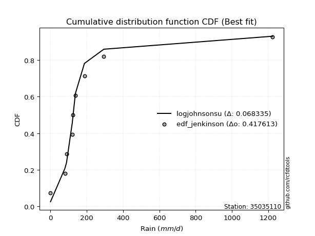</img>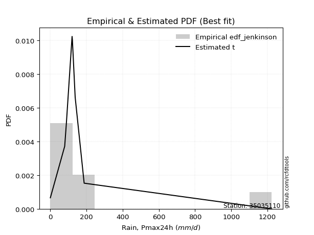</img>

</div>


### 11. EDF Cunnane (1978)

Cunnane´s work in statistical hydrology has focused on the performance and evaluation of different probability distributions (such as GEV, Gumbel, Lognormal) for flood frequency estimation. _b_ is a constant, typically set to 0.4.

<div align="center">


$P=(m-b)/(n+1-2b)$


</div>


**11.1. Empirical values**

<div align="center">

|                | 0                   | 1                   | 2                  | 3                  | 4                  | 5                  | 6                  | 7                  |
|:---------------|:--------------------|:--------------------|:-------------------|:-------------------|:-------------------|:-------------------|:-------------------|:-------------------|
| date           | 2020                | 2018                | 2017               | 2023               | 2021               | 2022               | 2019               | 2024               |
| x              | 0.1                 | 79.4                | 88.4               | 120.2              | 122.0              | 137.3              | 186.9              | 1223.4             |
| m              | 1                   | 2                   | 3                  | 4                  | 5                  | 6                  | 7                  | 8                  |
| empirical_dist | edf_cunnane         | edf_cunnane         | edf_cunnane        | edf_cunnane        | edf_cunnane        | edf_cunnane        | edf_cunnane        | edf_cunnane        |
| empirical      | 0.07317073170731708 | 0.19512195121951223 | 0.3170731707317074 | 0.4390243902439025 | 0.5609756097560976 | 0.6829268292682927 | 0.8048780487804879 | 0.926829268292683  |
| empirical_tr   | 1.0789473684210527  | 1.2424242424242424  | 1.4642857142857144 | 1.782608695652174  | 2.277777777777778  | 3.153846153846154  | 5.125000000000001  | 13.666666666666675 |

</div>


**11.2. Kolmogorov-Smirnov fit test (sorted by Δ)**


<div align="center">

|                | 0                   | 1                   | 2                   | 3                   | 4                   | 5                   | 6                   | 7                  | 8                  | 9                   | 10                  | 11                  | 12                  | 13                 | 14                 | 15                  | 16                 | 17                 | 18                  | 19                 | 20                  | 21                 | 22                 | 23                 | 24                  | 25                    | 26                  | 27                 | 28                 | 29                 | 30                 | 31                 | 32                 | 33                 | 34                 | 35                 | 36                 | 37                  | 38                  | 39                 | 40                 | 41                  | 42                 | 43                 | 44                 | 45                  | 46                  | 47                 | 48                 | 49                 | 50                  | 51                 | 52                  | 53                 | 54                  | 55                  | 56                 | 57                  | 58                 | 59                  | 60                 | 61                 | 62                  | 63                  | 64                  | 65                 | 66                 | 67                 | 68                  | 69                 | 70                 | 71                 | 72                 | 73                  | 74                 | 75                 | 76                 | 77                  | 78                 | 79                 | 80                 | 81                 | 82                 | 83                 | 84                 | 85                 | 86                 | 87                 |
|:---------------|:--------------------|:--------------------|:--------------------|:--------------------|:--------------------|:--------------------|:--------------------|:-------------------|:-------------------|:--------------------|:--------------------|:--------------------|:--------------------|:-------------------|:-------------------|:--------------------|:-------------------|:-------------------|:--------------------|:-------------------|:--------------------|:-------------------|:-------------------|:-------------------|:--------------------|:----------------------|:--------------------|:-------------------|:-------------------|:-------------------|:-------------------|:-------------------|:-------------------|:-------------------|:-------------------|:-------------------|:-------------------|:--------------------|:--------------------|:-------------------|:-------------------|:--------------------|:-------------------|:-------------------|:-------------------|:--------------------|:--------------------|:-------------------|:-------------------|:-------------------|:--------------------|:-------------------|:--------------------|:-------------------|:--------------------|:--------------------|:-------------------|:--------------------|:-------------------|:--------------------|:-------------------|:-------------------|:--------------------|:--------------------|:--------------------|:-------------------|:-------------------|:-------------------|:--------------------|:-------------------|:-------------------|:-------------------|:-------------------|:--------------------|:-------------------|:-------------------|:-------------------|:--------------------|:-------------------|:-------------------|:-------------------|:-------------------|:-------------------|:-------------------|:-------------------|:-------------------|:-------------------|:-------------------|
| station        | 35035110            | 35035110            | 35035110            | 35035110            | 35035110            | 35035110            | 35035110            | 35035110           | 35035110           | 35035110            | 35035110            | 35035110            | 35035110            | 35035110           | 35035110           | 35035110            | 35035110           | 35035110           | 35035110            | 35035110           | 35035110            | 35035110           | 35035110           | 35035110           | 35035110            | 35035110              | 35035110            | 35035110           | 35035110           | 35035110           | 35035110           | 35035110           | 35035110           | 35035110           | 35035110           | 35035110           | 35035110           | 35035110            | 35035110            | 35035110           | 35035110           | 35035110            | 35035110           | 35035110           | 35035110           | 35035110            | 35035110            | 35035110           | 35035110           | 35035110           | 35035110            | 35035110           | 35035110            | 35035110           | 35035110            | 35035110            | 35035110           | 35035110            | 35035110           | 35035110            | 35035110           | 35035110           | 35035110            | 35035110            | 35035110            | 35035110           | 35035110           | 35035110           | 35035110            | 35035110           | 35035110           | 35035110           | 35035110           | 35035110            | 35035110           | 35035110           | 35035110           | 35035110            | 35035110           | 35035110           | 35035110           | 35035110           | 35035110           | 35035110           | 35035110           | 35035110           | 35035110           | 35035110           |
| empirical_dist | edf_cunnane         | edf_cunnane         | edf_cunnane         | edf_cunnane         | edf_cunnane         | edf_cunnane         | edf_cunnane         | edf_cunnane        | edf_cunnane        | edf_cunnane         | edf_cunnane         | edf_cunnane         | edf_cunnane         | edf_cunnane        | edf_cunnane        | edf_cunnane         | edf_cunnane        | edf_cunnane        | edf_cunnane         | edf_cunnane        | edf_cunnane         | edf_cunnane        | edf_cunnane        | edf_cunnane        | edf_cunnane         | edf_cunnane           | edf_cunnane         | edf_cunnane        | edf_cunnane        | edf_cunnane        | edf_cunnane        | edf_cunnane        | edf_cunnane        | edf_cunnane        | edf_cunnane        | edf_cunnane        | edf_cunnane        | edf_cunnane         | edf_cunnane         | edf_cunnane        | edf_cunnane        | edf_cunnane         | edf_cunnane        | edf_cunnane        | edf_cunnane        | edf_cunnane         | edf_cunnane         | edf_cunnane        | edf_cunnane        | edf_cunnane        | edf_cunnane         | edf_cunnane        | edf_cunnane         | edf_cunnane        | edf_cunnane         | edf_cunnane         | edf_cunnane        | edf_cunnane         | edf_cunnane        | edf_cunnane         | edf_cunnane        | edf_cunnane        | edf_cunnane         | edf_cunnane         | edf_cunnane         | edf_cunnane        | edf_cunnane        | edf_cunnane        | edf_cunnane         | edf_cunnane        | edf_cunnane        | edf_cunnane        | edf_cunnane        | edf_cunnane         | edf_cunnane        | edf_cunnane        | edf_cunnane        | edf_cunnane         | edf_cunnane        | edf_cunnane        | edf_cunnane        | edf_cunnane        | edf_cunnane        | edf_cunnane        | edf_cunnane        | edf_cunnane        | edf_cunnane        | edf_cunnane        |
| p_dist         | t                   | logjohnsonsu        | johnsonsu           | alpha               | fisk                | invgamma            | gompertz            | ncf                | invgauss           | erlang              | gibrat              | fatiguelife         | wald                | gamma              | logpearson3        | pearson3            | logloggamma        | logcrystalball     | logtruncnorm        | betaprime          | chi2                | loggompertz        | loggenlogistic     | halflogistic       | loggumbel_l         | loglaplace_asymmetric | expon               | genexpon           | moyal              | genlogistic        | exponnorm          | halfnorm           | mielke             | gumbel_r           | laplace_asymmetric | rayleigh           | maxwell            | lognorm             | lognorm             | logexponnorm       | logrice            | lognct              | lognakagami        | logfatiguelife     | loglogistic        | loghypsecant        | loginvgauss         | nakagami           | loginvgamma        | logbetaprime       | loglaplace          | logerlang          | norm                | logmaxwell         | f                   | logistic            | kstwobign          | lograyleigh         | hypsecant          | logt                | weibull_min        | logkstwobign       | loglognorm          | laplace             | loggumbel_r         | loghalfnorm        | logmielke          | loginvweibull      | rice                | loggenexpon        | crystalball        | logmoyal           | loghalflogistic    | gumbel_l            | nct                | logexpon           | truncnorm          | invweibull          | logncf             | logwald            | logfisk            | loggamma           | loggamma           | loggibrat          | logf               | logchi2            | logalpha           | logweibull_min     |
| delta          | 0.09653979529498558 | 0.11683722396899848 | 0.14527151570125996 | 0.14940776672318637 | 0.15736938827222643 | 0.16098830345910245 | 0.17492367271335652 | 0.180547345455639  | 0.1838453709240241 | 0.19032133301856013 | 0.19726785583520756 | 0.21224533880060925 | 0.21795465753077034 | 0.2338713730032197 | 0.2400401406557684 | 0.24024245882679693 | 0.2452366894344387 | 0.2497066900078235 | 0.25299087412433807 | 0.2581482565953278 | 0.26166257570896057 | 0.2617229894918949 | 0.2639794636241505 | 0.265996068487391  | 0.26677447327196413 | 0.2682469172378492    | 0.27083743432949703 | 0.2708374364971511 | 0.2757164142656525 | 0.2792630533824515 | 0.2799119087422395 | 0.2859808456378    | 0.2983984113481617 | 0.3006993123980315 | 0.3015163581801694 | 0.3199822064129546 | 0.3320164183737382 | 0.33554963612033606 | 0.33554963612033606 | 0.335550776561793  | 0.3355842830380855 | 0.33584301653756443 | 0.3358437980960419 | 0.3372403082341783 | 0.3397181650459459 | 0.34326375454827096 | 0.34359221424685815 | 0.3494885795875907 | 0.3495345658567046 | 0.3528016087591954 | 0.35643897985105644 | 0.3570676376594455 | 0.36641442659745826 | 0.3671220818198988 | 0.36802814656183536 | 0.37464372781512656 | 0.3759686341147127 | 0.37740168948859476 | 0.3815582734001574 | 0.38713029072788185 | 0.3897350932421706 | 0.3909655543018843 | 0.40061456643667936 | 0.40322244514542005 | 0.40616136171028616 | 0.4063627669189698 | 0.4086387269264633 | 0.4089490213691317 | 0.40926287633401687 | 0.4186462900667528 | 0.4271832014212111 | 0.431539745942775  | 0.4329071924091812 | 0.43596122129558856 | 0.4444523156402379 | 0.4480914328393001 | 0.4561282471962474 | 0.45932054716882753 | 0.4627642924566222 | 0.501991239868487  | 0.5129416377037379 | 0.5189128327554063 | 0.5189128327554063 | 0.5293278511926277 | 0.5669125736904208 | 0.6159623260791999 | 0.6181427765609672 | 0.6477260302815141 |
| deltao         | 0.4472608134160001  | 0.4472608134160001  | 0.4472608134160001  | 0.4472608134160001  | 0.4472608134160001  | 0.4472608134160001  | 0.4472608134160001  | 0.4472608134160001 | 0.4472608134160001 | 0.4472608134160001  | 0.4472608134160001  | 0.4472608134160001  | 0.4472608134160001  | 0.4472608134160001 | 0.4472608134160001 | 0.4472608134160001  | 0.4472608134160001 | 0.4472608134160001 | 0.4472608134160001  | 0.4472608134160001 | 0.4472608134160001  | 0.4472608134160001 | 0.4472608134160001 | 0.4472608134160001 | 0.4472608134160001  | 0.4472608134160001    | 0.4472608134160001  | 0.4472608134160001 | 0.4472608134160001 | 0.4472608134160001 | 0.4472608134160001 | 0.4472608134160001 | 0.4472608134160001 | 0.4472608134160001 | 0.4472608134160001 | 0.4472608134160001 | 0.4472608134160001 | 0.4472608134160001  | 0.4472608134160001  | 0.4472608134160001 | 0.4472608134160001 | 0.4472608134160001  | 0.4472608134160001 | 0.4472608134160001 | 0.4472608134160001 | 0.4472608134160001  | 0.4472608134160001  | 0.4472608134160001 | 0.4472608134160001 | 0.4472608134160001 | 0.4472608134160001  | 0.4472608134160001 | 0.4472608134160001  | 0.4472608134160001 | 0.4472608134160001  | 0.4472608134160001  | 0.4472608134160001 | 0.4472608134160001  | 0.4472608134160001 | 0.4472608134160001  | 0.4472608134160001 | 0.4472608134160001 | 0.4472608134160001  | 0.4472608134160001  | 0.4472608134160001  | 0.4472608134160001 | 0.4472608134160001 | 0.4472608134160001 | 0.4472608134160001  | 0.4472608134160001 | 0.4472608134160001 | 0.4472608134160001 | 0.4472608134160001 | 0.4472608134160001  | 0.4472608134160001 | 0.4472608134160001 | 0.4472608134160001 | 0.4472608134160001  | 0.4472608134160001 | 0.4472608134160001 | 0.4472608134160001 | 0.4472608134160001 | 0.4472608134160001 | 0.4472608134160001 | 0.4472608134160001 | 0.4472608134160001 | 0.4472608134160001 | 0.4472608134160001 |
| eval           | Δo > Δ              | Δo > Δ              | Δo > Δ              | Δo > Δ              | Δo > Δ              | Δo > Δ              | Δo > Δ              | Δo > Δ             | Δo > Δ             | Δo > Δ              | Δo > Δ              | Δo > Δ              | Δo > Δ              | Δo > Δ             | Δo > Δ             | Δo > Δ              | Δo > Δ             | Δo > Δ             | Δo > Δ              | Δo > Δ             | Δo > Δ              | Δo > Δ             | Δo > Δ             | Δo > Δ             | Δo > Δ              | Δo > Δ                | Δo > Δ              | Δo > Δ             | Δo > Δ             | Δo > Δ             | Δo > Δ             | Δo > Δ             | Δo > Δ             | Δo > Δ             | Δo > Δ             | Δo > Δ             | Δo > Δ             | Δo > Δ              | Δo > Δ              | Δo > Δ             | Δo > Δ             | Δo > Δ              | Δo > Δ             | Δo > Δ             | Δo > Δ             | Δo > Δ              | Δo > Δ              | Δo > Δ             | Δo > Δ             | Δo > Δ             | Δo > Δ              | Δo > Δ             | Δo > Δ              | Δo > Δ             | Δo > Δ              | Δo > Δ              | Δo > Δ             | Δo > Δ              | Δo > Δ             | Δo > Δ              | Δo > Δ             | Δo > Δ             | Δo > Δ              | Δo > Δ              | Δo > Δ              | Δo > Δ             | Δo > Δ             | Δo > Δ             | Δo > Δ              | Δo > Δ             | Δo > Δ             | Δo > Δ             | Δo > Δ             | Δo > Δ              | Δo > Δ             | Δo <= Δ            | Δo <= Δ            | Δo <= Δ             | Δo <= Δ            | Δo <= Δ            | Δo <= Δ            | Δo <= Δ            | Δo <= Δ            | Δo <= Δ            | Δo <= Δ            | Δo <= Δ            | Δo <= Δ            | Δo <= Δ            |
| fit            | 1                   | 1                   | 1                   | 1                   | 1                   | 1                   | 1                   | 1                  | 1                  | 1                   | 1                   | 1                   | 1                   | 1                  | 1                  | 1                   | 1                  | 1                  | 1                   | 1                  | 1                   | 1                  | 1                  | 1                  | 1                   | 1                     | 1                   | 1                  | 1                  | 1                  | 1                  | 1                  | 1                  | 1                  | 1                  | 1                  | 1                  | 1                   | 1                   | 1                  | 1                  | 1                   | 1                  | 1                  | 1                  | 1                   | 1                   | 1                  | 1                  | 1                  | 1                   | 1                  | 1                   | 1                  | 1                   | 1                   | 1                  | 1                   | 1                  | 1                   | 1                  | 1                  | 1                   | 1                   | 1                   | 1                  | 1                  | 1                  | 1                   | 1                  | 1                  | 1                  | 1                  | 1                   | 1                  | 0                  | 0                  | 0                   | 0                  | 0                  | 0                  | 0                  | 0                  | 0                  | 0                  | 0                  | 0                  | 0                  |
| n              | 8                   | 8                   | 8                   | 8                   | 8                   | 8                   | 8                   | 8                  | 8                  | 8                   | 8                   | 8                   | 8                   | 8                  | 8                  | 8                   | 8                  | 8                  | 8                   | 8                  | 8                   | 8                  | 8                  | 8                  | 8                   | 8                     | 8                   | 8                  | 8                  | 8                  | 8                  | 8                  | 8                  | 8                  | 8                  | 8                  | 8                  | 8                   | 8                   | 8                  | 8                  | 8                   | 8                  | 8                  | 8                  | 8                   | 8                   | 8                  | 8                  | 8                  | 8                   | 8                  | 8                   | 8                  | 8                   | 8                   | 8                  | 8                   | 8                  | 8                   | 8                  | 8                  | 8                   | 8                   | 8                   | 8                  | 8                  | 8                  | 8                   | 8                  | 8                  | 8                  | 8                  | 8                   | 8                  | 8                  | 8                  | 8                   | 8                  | 8                  | 8                  | 8                  | 8                  | 8                  | 8                  | 8                  | 8                  | 8                  |
| best_fit       | 1                   | 0                   | 0                   | 0                   | 0                   | 0                   | 0                   | 0                  | 0                  | 0                   | 0                   | 0                   | 0                   | 0                  | 0                  | 0                   | 0                  | 0                  | 0                   | 0                  | 0                   | 0                  | 0                  | 0                  | 0                   | 0                     | 0                   | 0                  | 0                  | 0                  | 0                  | 0                  | 0                  | 0                  | 0                  | 0                  | 0                  | 0                   | 0                   | 0                  | 0                  | 0                   | 0                  | 0                  | 0                  | 0                   | 0                   | 0                  | 0                  | 0                  | 0                   | 0                  | 0                   | 0                  | 0                   | 0                   | 0                  | 0                   | 0                  | 0                   | 0                  | 0                  | 0                   | 0                   | 0                   | 0                  | 0                  | 0                  | 0                   | 0                  | 0                  | 0                  | 0                  | 0                   | 0                  | 0                  | 0                  | 0                   | 0                  | 0                  | 0                  | 0                  | 0                  | 0                  | 0                  | 0                  | 0                  | 0                  |
| best_fit_sort  | 1                   | 2                   | 3                   | 4                   | 5                   | 6                   | 7                   | 8                  | 9                  | 10                  | 11                  | 12                  | 13                  | 14                 | 15                 | 16                  | 17                 | 18                 | 19                  | 20                 | 21                  | 22                 | 23                 | 24                 | 25                  | 26                    | 27                  | 28                 | 29                 | 30                 | 31                 | 32                 | 33                 | 34                 | 35                 | 36                 | 37                 | 38                  | 39                  | 40                 | 41                 | 42                  | 43                 | 44                 | 45                 | 46                  | 47                  | 48                 | 49                 | 50                 | 51                  | 52                 | 53                  | 54                 | 55                  | 56                  | 57                 | 58                  | 59                 | 60                  | 61                 | 62                 | 63                  | 64                  | 65                  | 66                 | 67                 | 68                 | 69                  | 70                 | 71                 | 72                 | 73                 | 74                  | 75                 | 76                 | 77                 | 78                  | 79                 | 80                 | 81                 | 82                 | 83                 | 84                 | 85                 | 86                 | 87                 | 88                 |

</div>


**11.3. Best fit**

<div align="center">

|   id |   station | empirical_dist   | p_dist   |     delta |   deltao | eval   |   fit |   n |   best_fit |   best_fit_sort |
|-----:|----------:|:-----------------|:---------|----------:|---------:|:-------|------:|----:|-----------:|----------------:|
|    0 |  35035110 | edf_cunnane      | t        | 0.0965398 | 0.447261 | Δo > Δ |     1 |   8 |          1 |               1 |

</div>


<div align="center">

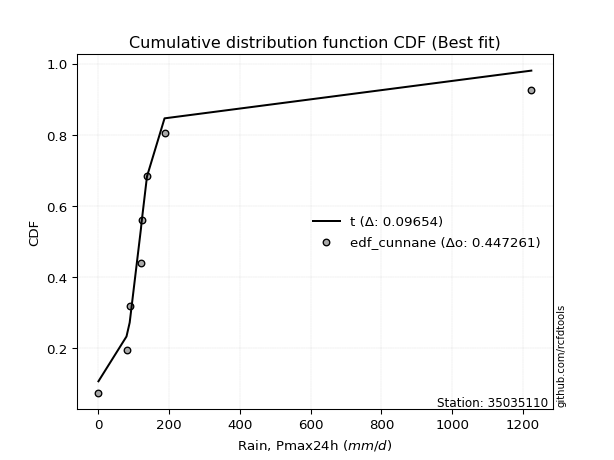</img></img>

</div>


### 12. EDF Adamowski (1981)

The Adamowski formula in hydrology refers to a specific plotting position formula used for estimating the non-parametric empirical distribution of hydrological events (like flood peaks) to calculate their return periods. This formula provides an alternative to traditional parametric methods (like the Gumbel or Log Pearson Type III distributions). 

<div align="center">


$P=(m-0.25)/(n+0.5)$


</div>


**12.1. Empirical values**

<div align="center">

|                | 0                   | 1                   | 2                  | 3                  | 4                  | 5                  | 6                  | 7                  |
|:---------------|:--------------------|:--------------------|:-------------------|:-------------------|:-------------------|:-------------------|:-------------------|:-------------------|
| date           | 2020                | 2018                | 2017               | 2023               | 2021               | 2022               | 2019               | 2024               |
| x              | 0.1                 | 79.4                | 88.4               | 120.2              | 122.0              | 137.3              | 186.9              | 1223.4             |
| m              | 1                   | 2                   | 3                  | 4                  | 5                  | 6                  | 7                  | 8                  |
| empirical_dist | edf_adamowski       | edf_adamowski       | edf_adamowski      | edf_adamowski      | edf_adamowski      | edf_adamowski      | edf_adamowski      | edf_adamowski      |
| empirical      | 0.08823529411764706 | 0.20588235294117646 | 0.3235294117647059 | 0.4411764705882353 | 0.5588235294117647 | 0.6764705882352942 | 0.7941176470588235 | 0.9117647058823529 |
| empirical_tr   | 1.096774193548387   | 1.259259259259259   | 1.4782608695652173 | 1.7894736842105263 | 2.2666666666666666 | 3.0909090909090913 | 4.857142857142856  | 11.33333333333333  |

</div>


**12.2. Kolmogorov-Smirnov fit test (sorted by Δ)**


<div align="center">

|                | 0                   | 1                  | 2                   | 3                  | 4                   | 5                   | 6                   | 7                   | 8                   | 9                   | 10                 | 11                  | 12                 | 13                  | 14                  | 15                 | 16                  | 17                  | 18                 | 19                  | 20                  | 21                  | 22                 | 23                 | 24                 | 25                    | 26                  | 27                 | 28                  | 29                  | 30                 | 31                  | 32                 | 33                 | 34                  | 35                  | 36                 | 37                  | 38                  | 39                 | 40                 | 41                  | 42                 | 43                 | 44                  | 45                  | 46                  | 47                 | 48                 | 49                 | 50                  | 51                 | 52                 | 53                 | 54                  | 55                 | 56                  | 57                  | 58                  | 59                  | 60                 | 61                 | 62                 | 63                 | 64                  | 65                  | 66                 | 67                 | 68                 | 69                 | 70                 | 71                 | 72                 | 73                 | 74                 | 75                 | 76                 | 77                 | 78                 | 79                  | 80                 | 81                 | 82                 | 83                 | 84                 | 85                 | 86                 | 87                 |
|:---------------|:--------------------|:-------------------|:--------------------|:-------------------|:--------------------|:--------------------|:--------------------|:--------------------|:--------------------|:--------------------|:-------------------|:--------------------|:-------------------|:--------------------|:--------------------|:-------------------|:--------------------|:--------------------|:-------------------|:--------------------|:--------------------|:--------------------|:-------------------|:-------------------|:-------------------|:----------------------|:--------------------|:-------------------|:--------------------|:--------------------|:-------------------|:--------------------|:-------------------|:-------------------|:--------------------|:--------------------|:-------------------|:--------------------|:--------------------|:-------------------|:-------------------|:--------------------|:-------------------|:-------------------|:--------------------|:--------------------|:--------------------|:-------------------|:-------------------|:-------------------|:--------------------|:-------------------|:-------------------|:-------------------|:--------------------|:-------------------|:--------------------|:--------------------|:--------------------|:--------------------|:-------------------|:-------------------|:-------------------|:-------------------|:--------------------|:--------------------|:-------------------|:-------------------|:-------------------|:-------------------|:-------------------|:-------------------|:-------------------|:-------------------|:-------------------|:-------------------|:-------------------|:-------------------|:-------------------|:--------------------|:-------------------|:-------------------|:-------------------|:-------------------|:-------------------|:-------------------|:-------------------|:-------------------|
| station        | 35035110            | 35035110           | 35035110            | 35035110           | 35035110            | 35035110            | 35035110            | 35035110            | 35035110            | 35035110            | 35035110           | 35035110            | 35035110           | 35035110            | 35035110            | 35035110           | 35035110            | 35035110            | 35035110           | 35035110            | 35035110            | 35035110            | 35035110           | 35035110           | 35035110           | 35035110              | 35035110            | 35035110           | 35035110            | 35035110            | 35035110           | 35035110            | 35035110           | 35035110           | 35035110            | 35035110            | 35035110           | 35035110            | 35035110            | 35035110           | 35035110           | 35035110            | 35035110           | 35035110           | 35035110            | 35035110            | 35035110            | 35035110           | 35035110           | 35035110           | 35035110            | 35035110           | 35035110           | 35035110           | 35035110            | 35035110           | 35035110            | 35035110            | 35035110            | 35035110            | 35035110           | 35035110           | 35035110           | 35035110           | 35035110            | 35035110            | 35035110           | 35035110           | 35035110           | 35035110           | 35035110           | 35035110           | 35035110           | 35035110           | 35035110           | 35035110           | 35035110           | 35035110           | 35035110           | 35035110            | 35035110           | 35035110           | 35035110           | 35035110           | 35035110           | 35035110           | 35035110           | 35035110           |
| empirical_dist | edf_adamowski       | edf_adamowski      | edf_adamowski       | edf_adamowski      | edf_adamowski       | edf_adamowski       | edf_adamowski       | edf_adamowski       | edf_adamowski       | edf_adamowski       | edf_adamowski      | edf_adamowski       | edf_adamowski      | edf_adamowski       | edf_adamowski       | edf_adamowski      | edf_adamowski       | edf_adamowski       | edf_adamowski      | edf_adamowski       | edf_adamowski       | edf_adamowski       | edf_adamowski      | edf_adamowski      | edf_adamowski      | edf_adamowski         | edf_adamowski       | edf_adamowski      | edf_adamowski       | edf_adamowski       | edf_adamowski      | edf_adamowski       | edf_adamowski      | edf_adamowski      | edf_adamowski       | edf_adamowski       | edf_adamowski      | edf_adamowski       | edf_adamowski       | edf_adamowski      | edf_adamowski      | edf_adamowski       | edf_adamowski      | edf_adamowski      | edf_adamowski       | edf_adamowski       | edf_adamowski       | edf_adamowski      | edf_adamowski      | edf_adamowski      | edf_adamowski       | edf_adamowski      | edf_adamowski      | edf_adamowski      | edf_adamowski       | edf_adamowski      | edf_adamowski       | edf_adamowski       | edf_adamowski       | edf_adamowski       | edf_adamowski      | edf_adamowski      | edf_adamowski      | edf_adamowski      | edf_adamowski       | edf_adamowski       | edf_adamowski      | edf_adamowski      | edf_adamowski      | edf_adamowski      | edf_adamowski      | edf_adamowski      | edf_adamowski      | edf_adamowski      | edf_adamowski      | edf_adamowski      | edf_adamowski      | edf_adamowski      | edf_adamowski      | edf_adamowski       | edf_adamowski      | edf_adamowski      | edf_adamowski      | edf_adamowski      | edf_adamowski      | edf_adamowski      | edf_adamowski      | edf_adamowski      |
| p_dist         | t                   | logjohnsonsu       | alpha               | fisk               | invgamma            | johnsonsu           | gompertz            | ncf                 | invgauss            | erlang              | gibrat             | fatiguelife         | wald               | gamma               | logpearson3         | pearson3           | logloggamma         | logcrystalball      | logtruncnorm       | betaprime           | chi2                | loggompertz         | loggenlogistic     | halflogistic       | loggumbel_l        | loglaplace_asymmetric | expon               | genexpon           | moyal               | genlogistic         | exponnorm          | halfnorm            | mielke             | gumbel_r           | laplace_asymmetric  | rayleigh            | maxwell            | lognorm             | lognorm             | logexponnorm       | logrice            | lognct              | lognakagami        | logfatiguelife     | loglogistic         | loghypsecant        | loginvgauss         | nakagami           | loginvgamma        | logbetaprime       | loglaplace          | logerlang          | norm               | logmaxwell         | f                   | logistic           | kstwobign           | lograyleigh         | hypsecant           | logt                | weibull_min        | logkstwobign       | loglognorm         | laplace            | loggumbel_r         | loghalfnorm         | logmielke          | loginvweibull      | rice               | loggenexpon        | crystalball        | logmoyal           | loghalflogistic    | gumbel_l           | nct                | logexpon           | invweibull         | truncnorm          | logncf             | logwald             | logfisk            | loggamma           | loggamma           | loggibrat          | logf               | logchi2            | logalpha           | logweibull_min     |
| delta          | 0.09438771495065279 | 0.123293465001997  | 0.13864736500152214 | 0.1466089865505622 | 0.15022790173743822 | 0.15172775673425848 | 0.16416327099169215 | 0.16978694373397463 | 0.17308496920235972 | 0.17956093129689576 | 0.1865074541135432 | 0.20148493707894488 | 0.2071942558091061 | 0.22311097128155533 | 0.22927973893410403 | 0.2294820571051327 | 0.23447628771277446 | 0.23894628828615927 | 0.2422304724026737 | 0.24738785487366355 | 0.25090217398729636 | 0.25096258777023067 | 0.2532190619024863 | 0.2552356667657266 | 0.2560140715502999 | 0.25748651551618496   | 0.26007703260783266 | 0.2600770347754867 | 0.26495601254398815 | 0.26850265166078713 | 0.2691515070205751 | 0.27522044391613565 | 0.2876380096264975 | 0.2899389106763671 | 0.29506011714717084 | 0.30922180469129024 | 0.3212560166520738 | 0.32478923439867186 | 0.32478923439867186 | 0.3247903748401288 | 0.3248238813164213 | 0.32508261481590023 | 0.3250833963743777 | 0.3264799065125141 | 0.32895776332428167 | 0.33250335282660676 | 0.33283181252519395 | 0.3387281778659265 | 0.3387741641350404 | 0.3420412070375312 | 0.34567857812939223 | 0.3463072359377813 | 0.3556540248757939 | 0.3563616800982346 | 0.35726774484017115 | 0.3638833260934622 | 0.36520823239304834 | 0.36664128776693056 | 0.37079787167849304 | 0.37636988900621765 | 0.3789746915205062 | 0.3802051525802201 | 0.3855500040263493 | 0.3924620434237557 | 0.39540095998862196 | 0.39560236519730557 | 0.3978783252047991 | 0.3981886196474675 | 0.3985024746123525 | 0.4078858883450886 | 0.4121186390108811 | 0.4207793442211108 | 0.422146790687517  | 0.4252008195739242 | 0.4336919139185737 | 0.4373310311176359 | 0.4442559847584975 | 0.445367845474583  | 0.452003890734958  | 0.49123083814682283 | 0.5021812359820736 | 0.5081524310337422 | 0.5081524310337422 | 0.5185674494709636 | 0.5561521719687565 | 0.6052019243575357 | 0.607382374839303  | 0.63696562855985   |
| deltao         | 0.4472608134160001  | 0.4472608134160001 | 0.4472608134160001  | 0.4472608134160001 | 0.4472608134160001  | 0.4472608134160001  | 0.4472608134160001  | 0.4472608134160001  | 0.4472608134160001  | 0.4472608134160001  | 0.4472608134160001 | 0.4472608134160001  | 0.4472608134160001 | 0.4472608134160001  | 0.4472608134160001  | 0.4472608134160001 | 0.4472608134160001  | 0.4472608134160001  | 0.4472608134160001 | 0.4472608134160001  | 0.4472608134160001  | 0.4472608134160001  | 0.4472608134160001 | 0.4472608134160001 | 0.4472608134160001 | 0.4472608134160001    | 0.4472608134160001  | 0.4472608134160001 | 0.4472608134160001  | 0.4472608134160001  | 0.4472608134160001 | 0.4472608134160001  | 0.4472608134160001 | 0.4472608134160001 | 0.4472608134160001  | 0.4472608134160001  | 0.4472608134160001 | 0.4472608134160001  | 0.4472608134160001  | 0.4472608134160001 | 0.4472608134160001 | 0.4472608134160001  | 0.4472608134160001 | 0.4472608134160001 | 0.4472608134160001  | 0.4472608134160001  | 0.4472608134160001  | 0.4472608134160001 | 0.4472608134160001 | 0.4472608134160001 | 0.4472608134160001  | 0.4472608134160001 | 0.4472608134160001 | 0.4472608134160001 | 0.4472608134160001  | 0.4472608134160001 | 0.4472608134160001  | 0.4472608134160001  | 0.4472608134160001  | 0.4472608134160001  | 0.4472608134160001 | 0.4472608134160001 | 0.4472608134160001 | 0.4472608134160001 | 0.4472608134160001  | 0.4472608134160001  | 0.4472608134160001 | 0.4472608134160001 | 0.4472608134160001 | 0.4472608134160001 | 0.4472608134160001 | 0.4472608134160001 | 0.4472608134160001 | 0.4472608134160001 | 0.4472608134160001 | 0.4472608134160001 | 0.4472608134160001 | 0.4472608134160001 | 0.4472608134160001 | 0.4472608134160001  | 0.4472608134160001 | 0.4472608134160001 | 0.4472608134160001 | 0.4472608134160001 | 0.4472608134160001 | 0.4472608134160001 | 0.4472608134160001 | 0.4472608134160001 |
| eval           | Δo > Δ              | Δo > Δ             | Δo > Δ              | Δo > Δ             | Δo > Δ              | Δo > Δ              | Δo > Δ              | Δo > Δ              | Δo > Δ              | Δo > Δ              | Δo > Δ             | Δo > Δ              | Δo > Δ             | Δo > Δ              | Δo > Δ              | Δo > Δ             | Δo > Δ              | Δo > Δ              | Δo > Δ             | Δo > Δ              | Δo > Δ              | Δo > Δ              | Δo > Δ             | Δo > Δ             | Δo > Δ             | Δo > Δ                | Δo > Δ              | Δo > Δ             | Δo > Δ              | Δo > Δ              | Δo > Δ             | Δo > Δ              | Δo > Δ             | Δo > Δ             | Δo > Δ              | Δo > Δ              | Δo > Δ             | Δo > Δ              | Δo > Δ              | Δo > Δ             | Δo > Δ             | Δo > Δ              | Δo > Δ             | Δo > Δ             | Δo > Δ              | Δo > Δ              | Δo > Δ              | Δo > Δ             | Δo > Δ             | Δo > Δ             | Δo > Δ              | Δo > Δ             | Δo > Δ             | Δo > Δ             | Δo > Δ              | Δo > Δ             | Δo > Δ              | Δo > Δ              | Δo > Δ              | Δo > Δ              | Δo > Δ             | Δo > Δ             | Δo > Δ             | Δo > Δ             | Δo > Δ              | Δo > Δ              | Δo > Δ             | Δo > Δ             | Δo > Δ             | Δo > Δ             | Δo > Δ             | Δo > Δ             | Δo > Δ             | Δo > Δ             | Δo > Δ             | Δo > Δ             | Δo > Δ             | Δo > Δ             | Δo <= Δ            | Δo <= Δ             | Δo <= Δ            | Δo <= Δ            | Δo <= Δ            | Δo <= Δ            | Δo <= Δ            | Δo <= Δ            | Δo <= Δ            | Δo <= Δ            |
| fit            | 1                   | 1                  | 1                   | 1                  | 1                   | 1                   | 1                   | 1                   | 1                   | 1                   | 1                  | 1                   | 1                  | 1                   | 1                   | 1                  | 1                   | 1                   | 1                  | 1                   | 1                   | 1                   | 1                  | 1                  | 1                  | 1                     | 1                   | 1                  | 1                   | 1                   | 1                  | 1                   | 1                  | 1                  | 1                   | 1                   | 1                  | 1                   | 1                   | 1                  | 1                  | 1                   | 1                  | 1                  | 1                   | 1                   | 1                   | 1                  | 1                  | 1                  | 1                   | 1                  | 1                  | 1                  | 1                   | 1                  | 1                   | 1                   | 1                   | 1                   | 1                  | 1                  | 1                  | 1                  | 1                   | 1                   | 1                  | 1                  | 1                  | 1                  | 1                  | 1                  | 1                  | 1                  | 1                  | 1                  | 1                  | 1                  | 0                  | 0                   | 0                  | 0                  | 0                  | 0                  | 0                  | 0                  | 0                  | 0                  |
| n              | 8                   | 8                  | 8                   | 8                  | 8                   | 8                   | 8                   | 8                   | 8                   | 8                   | 8                  | 8                   | 8                  | 8                   | 8                   | 8                  | 8                   | 8                   | 8                  | 8                   | 8                   | 8                   | 8                  | 8                  | 8                  | 8                     | 8                   | 8                  | 8                   | 8                   | 8                  | 8                   | 8                  | 8                  | 8                   | 8                   | 8                  | 8                   | 8                   | 8                  | 8                  | 8                   | 8                  | 8                  | 8                   | 8                   | 8                   | 8                  | 8                  | 8                  | 8                   | 8                  | 8                  | 8                  | 8                   | 8                  | 8                   | 8                   | 8                   | 8                   | 8                  | 8                  | 8                  | 8                  | 8                   | 8                   | 8                  | 8                  | 8                  | 8                  | 8                  | 8                  | 8                  | 8                  | 8                  | 8                  | 8                  | 8                  | 8                  | 8                   | 8                  | 8                  | 8                  | 8                  | 8                  | 8                  | 8                  | 8                  |
| best_fit       | 1                   | 0                  | 0                   | 0                  | 0                   | 0                   | 0                   | 0                   | 0                   | 0                   | 0                  | 0                   | 0                  | 0                   | 0                   | 0                  | 0                   | 0                   | 0                  | 0                   | 0                   | 0                   | 0                  | 0                  | 0                  | 0                     | 0                   | 0                  | 0                   | 0                   | 0                  | 0                   | 0                  | 0                  | 0                   | 0                   | 0                  | 0                   | 0                   | 0                  | 0                  | 0                   | 0                  | 0                  | 0                   | 0                   | 0                   | 0                  | 0                  | 0                  | 0                   | 0                  | 0                  | 0                  | 0                   | 0                  | 0                   | 0                   | 0                   | 0                   | 0                  | 0                  | 0                  | 0                  | 0                   | 0                   | 0                  | 0                  | 0                  | 0                  | 0                  | 0                  | 0                  | 0                  | 0                  | 0                  | 0                  | 0                  | 0                  | 0                   | 0                  | 0                  | 0                  | 0                  | 0                  | 0                  | 0                  | 0                  |
| best_fit_sort  | 1                   | 2                  | 3                   | 4                  | 5                   | 6                   | 7                   | 8                   | 9                   | 10                  | 11                 | 12                  | 13                 | 14                  | 15                  | 16                 | 17                  | 18                  | 19                 | 20                  | 21                  | 22                  | 23                 | 24                 | 25                 | 26                    | 27                  | 28                 | 29                  | 30                  | 31                 | 32                  | 33                 | 34                 | 35                  | 36                  | 37                 | 38                  | 39                  | 40                 | 41                 | 42                  | 43                 | 44                 | 45                  | 46                  | 47                  | 48                 | 49                 | 50                 | 51                  | 52                 | 53                 | 54                 | 55                  | 56                 | 57                  | 58                  | 59                  | 60                  | 61                 | 62                 | 63                 | 64                 | 65                  | 66                  | 67                 | 68                 | 69                 | 70                 | 71                 | 72                 | 73                 | 74                 | 75                 | 76                 | 77                 | 78                 | 79                 | 80                  | 81                 | 82                 | 83                 | 84                 | 85                 | 86                 | 87                 | 88                 |

</div>


**12.3. Best fit**

<div align="center">

|   id |   station | empirical_dist   | p_dist   |     delta |   deltao | eval   |   fit |   n |   best_fit |   best_fit_sort |
|-----:|----------:|:-----------------|:---------|----------:|---------:|:-------|------:|----:|-----------:|----------------:|
|    0 |  35035110 | edf_adamowski    | t        | 0.0943877 | 0.447261 | Δo > Δ |     1 |   8 |          1 |               1 |

</div>


<div align="center">

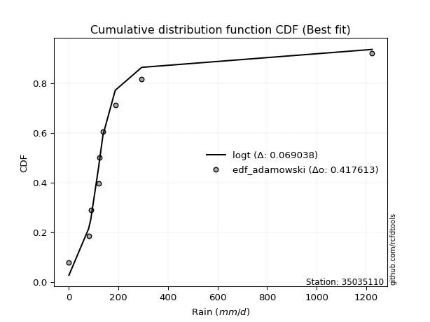</img></img>

</div>


## C. Best fit & Estimate extreme values for specific return periods - Tr

Best fit in probability distribution analysis means finding the theoretical distribution (like Normal, Poisson, Exponential) that most accurately mirrors your real-world data´s patterns (shape, center, spread) for better predictions, using methods like visual checks (Q-Q plots), goodness-of-fit tests (Kolmogorov-Smirnov, Chi-Squared), and information criteria (AIC) to score and select the simplest, most representative model.


### 1. Best fit (ordered by delta Δ)

<div align="center">

|   id |   station | empirical_dist   | p_dist   |     delta |   deltao | eval   |   fit |   n |   best_fit |   best_fit_sort |
|-----:|----------:|:-----------------|:---------|----------:|---------:|:-------|------:|----:|-----------:|----------------:|
|    0 |  35035110 | edf_weibull      | t        | 0.0914588 | 0.447261 | Δo > Δ |     1 |   8 |          1 |               1 |
|    1 |  35035110 | edf_adamowski    | t        | 0.0943877 | 0.447261 | Δo > Δ |     1 |   8 |          1 |               2 |
|    2 |  35035110 | edf_chegodayev   | t        | 0.095088  | 0.447261 | Δo > Δ |     1 |   8 |          1 |               3 |
|    3 |  35035110 | edf_jenkinson    | t        | 0.0952301 | 0.447261 | Δo > Δ |     1 |   8 |          1 |               4 |
|    4 |  35035110 | edf_beard        | t        | 0.0952301 | 0.447261 | Δo > Δ |     1 |   8 |          1 |               5 |
|    5 |  35035110 | edf_filliben     | t        | 0.095337  | 0.447261 | Δo > Δ |     1 |   8 |          1 |               6 |
|    6 |  35035110 | edf_tukey        | t        | 0.0955642 | 0.447261 | Δo > Δ |     1 |   8 |          1 |               7 |
|    7 |  35035110 | edf_blom         | t        | 0.0961702 | 0.447261 | Δo > Δ |     1 |   8 |          1 |               8 |
|    8 |  35035110 | edf_cunnane      | t        | 0.0965398 | 0.447261 | Δo > Δ |     1 |   8 |          1 |               9 |
|    9 |  35035110 | edf_gringorten   | t        | 0.0971405 | 0.447261 | Δo > Δ |     1 |   8 |          1 |              10 |
|   10 |  35035110 | edf_hazen        | t        | 0.0980642 | 0.447261 | Δo > Δ |     1 |   8 |          1 |              11 |
|   11 |  35035110 | edf_california   | t        | 0.10321   | 0.447261 | Δo > Δ |     1 |   8 |          1 |              12 |

</div>

:file_folder:Tables: [bestfit_35035110.csv](table/bestfit_35035110.csv) | [extreme_35035110.csv](table/extreme_35035110.csv)


### 2. Extreme values

In hydrology, a return period (or recurrence interval $Tr$) is the statistical average time between extreme events like floods or droughts of a specific magnitude, indicating how rare an event is, with a 100-year flood, for example, having a 1% chance of occurring in any given year, not that it happens exactly every century. It is a key tool for infrastructure design (like bridges or dams) and risk assessment, calculated from historical data to determine the probability of future events, although it is important to remember it is statistical average, and events can cluster or be missed.

> risk_rate: assuming the return period as the project useful life.

|   id |      tr |   prob_l |     prob_g |     alpha |   betaprime |     chi2 |   crystalball |   erlang |    expon |   exponnorm |         f |   fatiguelife |     fisk |    gamma |   genexpon |   genlogistic |   gibrat |   gompertz |   gumbel_l |   gumbel_r |   halflogistic |   halfnorm |   hypsecant |   invgamma |   invgauss |       invweibull |   johnsonsu |   kstwobign |   laplace |   laplace_asymmetric |         loggamma |   logistic |     lognorm |   maxwell |     mielke |    moyal |   nakagami |      ncf |              nct |     norm |   pearson3 |   rayleigh |     rice |         t |   truncnorm |     wald |   weibull_min |         logalpha |     logbetaprime |          logchi2 |   logcrystalball |   logerlang |         logexpon |   logexponnorm |           logf |   logfatiguelife |          logfisk |      loggenexpon |   loggenlogistic |        loggibrat |   loggompertz |   loggumbel_l |      loggumbel_r |   loghalflogistic |      loghalfnorm |     loghypsecant |   loginvgamma |      loginvgauss |    loginvweibull |      logjohnsonsu |     logkstwobign |       loglaplace |   loglaplace_asymmetric |   logloggamma |      loglogistic |   loglognorm |   logmaxwell |        logmielke |         logmoyal |   lognakagami |         logncf |      lognct |   logpearson3 |      lograyleigh |     logrice |             logt |   logtruncnorm |          logwald |   logweibull_min |   station |   n |   risk_rate |
|-----:|--------:|---------:|-----------:|----------:|------------:|---------:|--------------:|---------:|---------:|------------:|----------:|--------------:|---------:|---------:|-----------:|--------------:|---------:|-----------:|-----------:|-----------:|---------------:|-----------:|------------:|-----------:|-----------:|-----------------:|------------:|------------:|----------:|---------------------:|-----------------:|-----------:|------------:|----------:|-----------:|---------:|-----------:|---------:|-----------------:|---------:|-----------:|-----------:|---------:|----------:|------------:|---------:|--------------:|-----------------:|-----------------:|-----------------:|-----------------:|------------:|-----------------:|---------------:|---------------:|-----------------:|-----------------:|-----------------:|-----------------:|-----------------:|--------------:|--------------:|-----------------:|------------------:|-----------------:|-----------------:|--------------:|-----------------:|-----------------:|------------------:|-----------------:|-----------------:|------------------------:|--------------:|-----------------:|-------------:|-------------:|-----------------:|-----------------:|--------------:|---------------:|------------:|--------------:|-----------------:|------------:|-----------------:|---------------:|-----------------:|-----------------:|----------:|----:|------------:|
|    0 |    2    | 0.5      | 0.5        |   117.862 |     98.7916 |  101.033 |     -0.296198 |  127.254 |  169.652 |     174.803 |   59.0154 |       135.774 |  118.197 |  144.665 |    169.652 |       174.986 |  132.658 |    130.345 |    306.041 |    183.384 |        152.895 |    168.297 |     244.713 |    120.38  |    125.685 |   7056.26        |     121.63  |     231.196 |   244.713 |              183.464 |      2.26757     |    244.713 |     65.1138 |   212.785 |    81.3064 |  163.585 |    59.4365 |  129.141 |     10.4255      |  244.713 |    122.157 |    201.461 |  263.753 |   116.764 |     282.071 |  123.702 |       254.204 |     0.571269     |     42.9349      |      0.558687    |          99.1787 |     55.2564 |      8.91846     |        65.1133 |    0.305746    |          64.3487 |      0.479813    |     24.8113      |          94.1008 |     30.0374      |       97.5476 |       99.4429 |     42.6356      |      34.5415      |     38.4176      |     65.1138      |       58.4636 |     59.8187      |     31.807       |    120.764        |     32.407       |     65.1138      |                 89.9002 |       106.966 |     65.1138      |   5.65917    |      52.2315 |     20.7343      |     37.188       |       64.9617 |   1.32798      |     64.9409 |       133.856 |     48.304       |     65.0984 |     50.4056      |        138.925 |     28.2359      |      0.247128    |  35035110 |   8 |    0.75     |
|    1 |    2.33 | 0.570815 | 0.429185   |   139.834 |    137.262  |  145.689 |     79.3966   |  161.916 |  207.01  |     210.872 |   82.238  |       173.44  |  141.495 |  186.775 |    207.01  |       208.76  |  166.403 |    159.041 |    363.999 |    245.112 |        216.361 |    240.194 |     298.026 |    146.307 |    158.379 | 391766           |     123.422 |     278.227 |   285.026 |              216.589 |      5.7308      |    303.407 |    103.141  |   281.995 |   104.965  |  222.019 |    93.1681 |  159.393 |     26.9043      |  311.329 |    176.839 |    271.695 |  318.235 |   123.718 |     332.3   |  167.383 |       322.799 |     0.946593     |    108.071       |      1.0784      |         129.21   |     90.5292 |     23.9882      |       103.14   |    0.560415    |         102.128  |      1.21814     |     50.3858      |         123.943  |     37.9186      |      134.743  |      148.377  |     65.2937      |      53.5369      |     63.1135      |     94.0892      |       95.2186 |    100.81        |     58.4834      |    122.198        |     67.2681      |     86.0118      |                111.601  |       148.205 |     97.6504      |   2.7905e+16 |      84.2302 |     51.3235      |     55.6702      |      103.003  |   4.90875      |    103.05   |       192.427 |     78.4491      |    103.12   |     74.4595      |        207.021 |     38.1756      |      0.388407    |  35035110 |   8 |    0.729209 |
|    2 |    5    | 0.8      | 0.2        |   269.162 |    476.306  |  434.07  |    375.556    |  346.37  |  393.789 |     391.208 |  239.029  |       394.9   |  276.299 |  415.821 |    393.789 |       355.482 |  360.685 |    302.519 |    551.235 |    513.287 |        503.533 |    544.237 |     511.879 |    301.759 |    361.179 |      1.48506e+13 |     156.729 |     478.002 |   486.584 |              382.207 |    918.664       |    530.033 |    569.886  |   554.402 |   260.209  |  492.688 |   308.676  |  336.584 |   3048.35        |  558.896 |    459.969 |    552.874 |  536.347 |   164.377 |     547.047 |  411.912 |       698.477 |    47.5138       |   6531.15        |     57.1874      |         310.8    |    590.087  |   3376.23        |       569.887  | 1351.63        |         569.382  | 372622           |    896.582       |         297.711  |    145.02        |      384.442  |      540.525  |    415.933       |     388.847       |    515.034       |    411.909       |      606.696  |    758.427       |    824.491       |    145.382        |   1496.5         |    345.902       |                226.573  |       399.439 |    466.916       | inf          |     552.474  |   1612.84        |    360.79        |      571.342  |   8.63167e+07  |    573.797  |       512.1   |    546.676       |    569.829  |    349.885       |        592.371 |    206.557       |     15.2263      |  35035110 |   8 |    0.67232  |
|    3 |   10    | 0.9      | 0.1        |   442.878 |   1179.88   |  752.257 |    572.021    |  522.696 |  563.341 |     554.912 |  441.973  |       628.425 |  444.989 |  638.621 |    563.341 |       474.979 |  582.145 |    432.763 |    655.48  |    731.711 |        742.017 |    769.222 |     682.646 |    498.707 |    601.726 |      2.21054e+19 |     316.213 |     630.106 |   669.553 |              532.551 | 131612           |    696.935 |   1771.12   |   746.108 |   482.805  |  728.347 |   511.298  |  552.204 | 222999           |  723.125 |    724.657 |    753.36  |  691.866 |   244.068 |     705.728 |  671.416 |      1073.51  | 63290.6          | 184077           |   3731.65        |         533.165  |   2119.25   | 301108           |      1771.13   |    5.73047e+14 |        1782.83   |      5.5823e+23  |   7225.53        |         505.069  |    669.108       |      690.684  |     1110.21   |   1879.29        |    2017.93        |   2434.91        |   1339.27        |     2146.22   |   3103           |   7114.65        |    355.26         |  15880           |   1223.5         |                418.84   |       666.551 |   1478.13        | inf          |    2075.7    |  17584.4         |   1836.14        |     1780.52   |   1.26912e+33  |   1794.19   |       750.804 |   2182.27        |   1771.07   |   1207.37        |        865.88  |   1239.35        |   3345.7         |  35035110 |   8 |    0.651322 |
|    4 |   15    | 0.933333 | 0.0666667  |   589.65  |   1935.19   |  953.073 |    670.061    |  628.067 |  662.523 |     650.673 |  591.751  |       774.087 |  574.898 |  772.694 |    662.523 |       542.397 |  734.897 |    508.951 |    702.69  |    854.944 |        876.978 |    886.304 |     780.102 |    648.832 |    765.248 |      6.71604e+22 |     576.713 |     710.854 |   776.583 |              620.496 |      2.62715e+06 |    787.871 |   3118.86   |   844.47  |   669.778  |  865.114 |   622.575  |  711.645 |      2.74669e+06 |  805.079 |    881.401 |    856.66  |  771.996 |   336.084 |     786.831 |  838.057 |      1304.18  |     8.2169e+07   |      1.18204e+06 |  49812.4         |         693.611  |   4053.62   |      4.16455e+06 |      3118.89   |    4.62188e+32 |        3152.64   |      9.24621e+49 |  21382.6         |         659.688  |   1921.06        |      900.87   |     1538.05   |   4400.71        |    5123.96        |   5464.71        |   2624.82        |     4075.17   |   6404.44        |  24000.4         |   1651.5          |  55643.1         |   2561.81        |                599.985  |       833.218 |   2769.45        | inf          |    4093.68   |  64670.5         |   4720.81        |     3139.85   |   1.72412e+72  |   3170.07   |       854.907 |   4453.09        |   3118.88   |   2515.32        |        974.954 |   3916.43        | 196931           |  35035110 |   8 |    0.644736 |
|    5 |   20    | 0.95     | 0.05       |   725.014 |   2725.91   | 1100.31  |    734.265    |  703.547 |  732.894 |     718.617 |  714.165  |       880.419 |  685.523 |  869.028 |    732.894 |       589.602 |  854.72  |    563.008 |    732.076 |    941.229 |        971.536 |    964.363 |     848.853 |    775.205 |    890.511 |      1.84311e+25 |     915.034 |     765.249 |   852.522 |              682.894 |      2.26229e+07 |    850.723 |   4517.83   |   909.75  |   837.803  |  961.974 |   697.818  |  843.291 |      1.63131e+07 |  858.749 |    993.23  |    925.32  |  825.257 |   438.262 |     839.764 |  962.238 |      1472.17  |     1.06008e+11  |      4.2915e+06  | 328498           |         822.723  |   6222.3    |      2.68542e+07 |      4517.88   |    2.78407e+56 |        4580.03   |      9.40903e+82 |  44134           |         789.296  |   4393.82        |     1062.97   |     1884.03   |   7984.67        |    9843.5         |   9367.83        |   4219.45        |     6226.12   |  10375.4         |  56228.5         |  12947.2          | 129493           |   4327.71        |                774.264  |       954.927 |   4274.29        | inf          |    6424.83   | 162310           |   9214.3         |     4552.53   |   3.50202e+124 |   4602.58   |       914.278 |   7153.95        |   4517.97   |   4310.98        |       1033.17  |   9231.3         |      5.37378e+06 |  35035110 |   8 |    0.641514 |
|    6 |   25    | 0.96     | 0.04       |   854.045 |   3543.98   | 1216.78  |    781.528    |  762.435 |  787.477 |     771.318 |  819.388  |       964.318 |  783.943 |  944.324 |    787.477 |       625.961 |  954.611 |    604.937 |    752.987 |   1007.69  |       1044.39  |   1022.44  |     902.06  |    886.5   |    992.575 |      1.39248e+27 |    1316     |     805.993 |   911.425 |              731.294 |      1.21845e+08 |    898.804 |   5934.71   |   958.213 |   993.31   | 1037.05  |   754.125  |  957.589 |      6.4966e+07  |  898.257 |   1080.26  |    976.333 |  864.828 |   548.927 |     878.291 | 1061.7   |      1604.73  |     1.36421e+14  |      1.15014e+07 |      1.45134e+06 |         932.268  |   8546.58   |      1.13989e+08 |      5934.78   |    6.7869e+85  |        6029.78   |      1.0924e+122 |  75748.1         |         903.492  |   8757.42        |     1195.84   |     2176.67   |  12634.3         |   16278.2         |  13989.3         |   6092.63        |     8522.97   |  14859.4         | 108331           | 156941            | 243792           |   6499.58        |                943.61   |      1051     |   5957.19        | inf          |    8978.09   | 333835           |  15473.5         |     5984.5    |   3.18172e+189 |   6056.59   |       953.086 |  10174.5         |   5934.99   |   6641.48        |       1069.31  |  18345.3         |      8.86219e+07 |  35035110 |   8 |    0.639603 |
|    7 |   50    | 0.98     | 0.02       |  1458.2   |   7916.75   | 1588.71  |    916.87     |  946.898 |  957.03  |     935.022 | 1212.66   |      1231.33  | 1178.74  | 1180.8   |    957.03  |       737.968 | 1306.73  |    735.182 |    809.752 |   1212.43  |       1268.86  |   1191.26  |    1067.02  |   1323.34  |   1334.25  |      8.50643e+32 |    3973.66  |     925.637 |  1094.39  |              881.638 |      2.42229e+10 |   1045.71  |  12961.3    |  1098.77  |  1665.17   | 1270.12  |   918.507  | 1394.47  |      4.75247e+09 | 1011.39  |   1351.94  |   1124.42  |  979.697 |  1198.03  |     983.962 | 1386.46  |      2027.9   |     4.76093e+29  |      2.30417e+08 |      1.62274e+08 |        1330.13   |  21402.8    |      1.01661e+10 |     12961.5    |  inf           |       13258      |    inf           | 366480           |        1354.98   |  99595.3         |     1646.58   |     3221.12   |  51937.2         |   76684.2         |  44875.5         |  19031.4         |    21147.2    |  42368           | 816715           |      4.83613e+12  |      1.56274e+06 |  22989.9         |               1744.35   |      1357.07  |  16426.7         | inf          |   23694.5    |      3.43725e+06 |  77352.1         |    13097      | inf            |  13297.2    |      1041.18  |  28284.8         |  12962.6    |  28241           |       1144.42  | 172724           |      2.03058e+12 |  35035110 |   8 |    0.63583  |
|    8 |   75    | 0.986667 | 0.0133333  |  2035.98  |  12607.3    | 1812     |    989.49     | 1055.68  | 1056.21  |    1030.78  | 1497.69   |      1391.14  | 1490.26  | 1320.6   |   1056.21  |       803.07  | 1544.55  |    811.37  |    838.456 |   1331.43  |       1399.34  |   1283.15  |    1163.43  |   1658.96  |   1549.48  |      1.96231e+36 |    7341.31  |     991.464 |  1201.42  |              969.583 |      5.54612e+11 |   1130.55  |  19709.7    |  1175.18  |  2240.59   | 1406.41  |  1008.08   | 1720.25  |      5.85364e+10 | 1072.1   |   1511.62  |   1204.98  | 1042.19  |  1964.91  |    1035.72  | 1586.3   |      2282.69  |     1.65323e+45  |      1.28202e+09 |      2.71353e+09 |        1607.54   |  35221.8    |      1.40605e+11 |     19710      |  inf           |       20238.7    |    inf           | 868589           |        1706.59   | 514484           |     1935.78   |     3927.18   | 118118           |  188789           |  84639           |  37029.6         |    34639.7    |  75222.5         |      2.64242e+06 |      3.51664e+22  |      4.34332e+06 |  48137           |               2498.76   |      1540.52  |  29510.1         | inf          |   40159.6    |      1.47794e+07 | 198228           |    19938.4    | inf            |  20280.8    |      1075.4   |  49332           |  19712.1    |  72219.2         |       1170.31  | 686437           |      1.8446e+15  |  35035110 |   8 |    0.634587 |
|    9 |  100    | 0.99     | 0.01       |  2604.2   |  17516.9    | 1972.5   |   1038.61     | 1133.17  | 1126.58  |    1098.73  | 1729.17   |      1505.83  | 1757.97  | 1420.33  |   1126.58  |       849.147 | 1728.78  |    865.426 |    857.232 |   1415.65  |       1491.69  |   1345.76  |    1231.81  |   1942.23  |   1708.26  |      4.7096e+38  |   11163.4   |    1036.57  |  1277.36  |             1031.98  |      5.17982e+12 |   1190.46  |  26169.6    |  1227.23  |  2761.75   | 1503.11  |  1069.03   | 1990.03  |      3.47659e+11 | 1113.16  |   1625.18  |   1259.86  | 1084.76  |  2820.05  |    1067.8   | 1732     |      2466.43  |     5.73362e+60  |      4.27402e+09 |      2.04425e+10 |        1826.52   |  49442.3    |      9.06659e+11 |     26170.1    |  inf           |       26944.7    |    inf           |      1.5669e+06  |        2006.66   |      1.83572e+06 |     2151.94   |     4470.76   | 211288           |  357199           | 130405           |  59375.5         |    48479.6    | 111438           |      6.06612e+06 |      1.02156e+34  |      8.74956e+06 |  81318.7         |               3224.58   |      1672.32  |  44627           | inf          |   57526.3    |      4.39085e+07 | 386471           |    26493.8    | inf            |  26983.9    |      1094.06  |  72062.3         |  26173.3    | 147802           |       1183.42  |      1.8772e+06  |      3.53293e+17 |  35035110 |   8 |    0.633968 |
|   10 |  200    | 0.995    | 0.005      |  4846.27  |  38593.2    | 2365.09  |   1150.02     | 1320.81  | 1296.13  |    1262.43  | 2406.1    |      1785.85  | 2610.5   | 1662.13  |   1296.13  |       959.92  | 2230     |    995.671 |    898.042 |   1618.14  |       1713.72  |   1488.94  |    1396.56  |   2819.72  |   2109.08  |      2.48465e+44 |   29067.1   |    1140.45  |  1460.33  |             1182.32  |      1.16962e+15 |   1334.16  |  49781.6    |  1346.31  |  4556.62   | 1736.08  |  1208.1    | 2802.65  |      2.54324e+13 | 1206.29  |   1899.59  |   1385.45  | 1182.18  |  6874.45  |    1129.24  | 2094.93  |      2918.41  |     8.26917e+122 |      7.47883e+10 |      2.81375e+12 |        2437.66   | 107419      |      8.08599e+13 |     49782.7    |  inf           |       51585.2    |    inf           |      6.08236e+06 |        2953.69   |      5.84488e+07 |     2708.85   |     5925.92   | 855158           |       1.65461e+06 | 350458           | 185188           |   104665      | 275701           |      4.47275e+07 |      4.46834e+89  |      4.39087e+07 | 287636           |               5960.93   |      1994.61  | 120362           | inf          |  130903      |      7.52581e+08 |      1.93065e+06 |    50488      | inf            |  51582.8    |      1125.23  | 171507           |  49790.6    |      1.01528e+06 |       1203.29  |      2.3004e+07  |      4.72296e+23 |  35035110 |   8 |    0.633042 |
|   11 |  250    | 0.996    | 0.004      |  5960.65  |  49744      | 2492.99  |   1184.07     | 1381.45  | 1350.72  |    1315.13  | 2665.82   |      1876.95  | 2963.16  | 1740.37  |   1350.72  |       995.532 | 2409.84  |   1037.6   |    910.05  |   1683.23  |       1785.1   |   1532.98  |    1449.59  |   3173.99  |   2243.05  |      1.71749e+46 |   38979.9   |    1172.6   |  1519.23  |             1230.72  |      6.759e+15   |   1380.29  |  60591.6    |  1382.97  |  5350.28   | 1811.08  |  1250.77   | 3122.84  |      1.01283e+14 | 1234.75  |   1988.13  |   1424.1   | 1212.17  |  9192.73  |    1144.46  | 2215     |      3066.53  |     9.92508e+153 |      1.86013e+11 |      1.39462e+13 |        2661.75   | 136416      |      3.43231e+14 |     60593      |  inf           |       62914.8    |    inf           |      9.25037e+06 |        3342.69   |      2.02323e+08 |     2898.67   |     6438.16   |      1.34043e+06 |       2.70854e+06 | 475029           | 267077           |   132682      | 365093           |      8.50189e+07 |      1.88997e+121 |      7.23367e+07 | 431986           |               7264.69   |      2099.61  | 165510           | inf          |  168605      |      2.02223e+09 |      3.24037e+06 |    61485.4    | inf            |  62881.3    |      1132.19  | 223976           |  60603.4    |      2.02339e+06 |       1207.29  |      5.27037e+07 |      6.84777e+25 |  35035110 |   8 |    0.632858 |
|   12 |  500    | 0.998    | 0.002      | 11516.7   | 109344      | 2894.19  |   1285.04     | 1570.43  | 1520.27  |    1478.84  | 3632.22   |      2162.35  | 4387.43  | 1984.42  |   1520.27  |      1106.06  | 3031.37  |   1167.84  |    944.471 |   1885.28  |       2006.65  |   1664.31  |    1614.32  |   4566.84  |   2672.56  |      8.80496e+51 |   93184.9   |    1268.94  |  1702.2   |             1381.07  |      1.61062e+18 |   1523.36  | 108518      |  1492.36  |  8800.28   | 2044.04  |  1377.59   | 4349.14  |      7.40916e+15 | 1319.15  |   2263.7   |   1539.45  | 1301.64  | 22804.4   |    1179.47  | 2596.78  |      3534.16  |   inf            |      3.0695e+12  |      2.09416e+15 |        3452.81   | 278514      |      3.06109e+16 |    108521      |  inf           |      113385      |    inf           |      3.2479e+07  |        4902.59   |      1.47824e+10 |     3519.92   |     8165.42   |      5.40872e+06 |       1.25048e+07 |      1.17634e+06 | 832924           |   269589      | 849057           |      6.24153e+08 |      3.17795e+299 |      3.22914e+08 |      1.528e+06   |              13429.4    |      2429.05  | 444474           | inf          |  358817      |      5.66346e+10 |      1.61869e+07 |   110302      | inf            | 113154      |      1147.46  | 496668           | 108543      |      2.22277e+07 |       1215.32  |      7.35608e+08 |      1.37715e+33 |  35035110 |   8 |    0.632489 |
|   13 |  750    | 0.998667 | 0.00133333 | 17065     | 173275      | 3131.24  |   1341.13     | 1681.35  | 1619.45  |    1574.6   | 4330.35   |      2330.78  | 5516.69  | 2127.81  |   1619.45  |      1170.68  | 3442.4   |   1244.03  |    962.868 |   2003.39  |       2136.16  |   1737.68  |    1710.68  |   5638.19  |   2932.19  |      1.91729e+55 |  151297     |    1323.06  |  1809.23  |             1469.01  |      4.01809e+19 |   1606.95  | 150001      |  1553.54  | 11767.8    | 2180.32  |  1448.18   | 5264.88  |      9.1259e+16  | 1366.04  |   2425.22  |   1603.95  | 1351.67  | 38891.1   |    1192.9   | 2825.68  |      3812.66  |   inf            |      1.55623e+13 |      4.02418e+16 |        3988.4    | 415413      |      4.23372e+17 |    150005      |  inf           |      157295      |    inf           |      6.5768e+07  |        6130.02   |      2.5251e+11  |     3904.93   |     9271.34   |      1.22257e+07 |       3.05809e+07 |      1.95226e+06 |      1.62015e+06 |   401157      |      1.36681e+06 |      2.00181e+09 |    inf            |      7.48319e+08 |      3.19937e+06 |              19237.5    |      2623.8   | 791580           | inf          |  547429      |      4.87303e+11 |      4.14762e+07 |   152610      | inf            | 156837      |      1153.21  | 775303           | 150039      |      1.10718e+08 |       1218.01  |      3.57309e+09 |      6.6975e+37  |  35035110 |   8 |    0.632366 |
|   14 | 1000    | 0.999    | 0.001      | 22611.2   | 240191      | 3300.36  |   1379.74     | 1760.19  | 1689.82  |    1642.54  | 4896.58   |      2450.85  | 6488.99  | 2229.79  |   1689.82  |      1216.52  | 3756.95  |   1298.09  |    975.249 |   2087.18  |       2228.04  |   1788.35  |    1779.05  |   6542.79  |   3119.75  |      4.47128e+57 |  211251     |    1360.56  |  1885.17  |             1531.41  |      3.96065e+20 |   1666.23  | 187454      |  1595.82  | 14460.1    | 2277     |  1496.82   | 6023.62  |      5.42004e+17 | 1398.32  |   2539.95  |   1648.52  | 1386.25  | 56830.2   |    1200.03  | 2990.34  |      4012.36  |   inf            |      4.89155e+13 |      3.30769e+17 |        4404.15   | 547802      |      2.73002e+18 |    187459      |  inf           |      197069      |    inf           |      1.07238e+08 |        7181.88   |      2.21553e+12 |     4187.51   |    10098.8    |      2.18026e+07 |       5.76685e+07 |      2.76998e+06 |      2.59757e+06 |   528223      |      1.90279e+06 |      4.57553e+09 |    inf            |      1.33954e+09 |      5.40475e+06 |              24825.5    |      2762.78  |      1.19192e+06 | inf          |  733033      |      2.4801e+12  |      8.08595e+07 |   190838      | inf            | 196372      |      1156.3   |      1.05469e+06 | 187503      |      3.83931e+08 |       1219.36  |      1.11375e+10 |      2.17503e+41 |  35035110 |   8 |    0.632305 |

<div align="center">

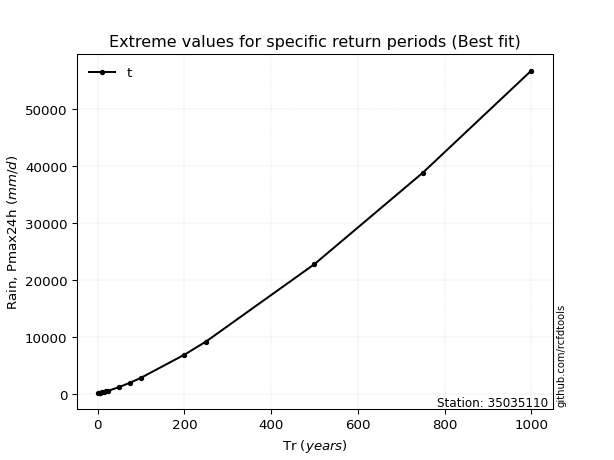</img>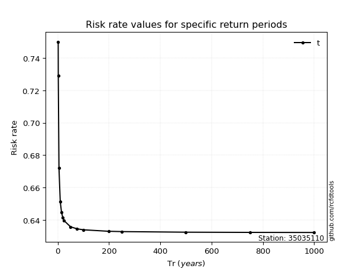</img>

</div>


<sub>**APP DISCLAIMER**: NO WARRANTY - This software is provided by [github.com/rcfdtools](https://github.com/rcfdtools) "as is", without any express or implied warranty, including warranties of merchantability, fitness for a particular purpose, or non-infringement. There is no guarantee that the software will be error-free or operate without interruption. LIMITATION OF LIABILITY - Neither the authors nor copyright holders will be liable for claims or damages arising from the software or its use. You are responsible for determining if the software is appropriate for your use and assume all associated risks, including errors, legal compliance, and data loss. NO PROFESSIONAL ADVICE - The software provides general information and does not offer professional advice. It should not replace consultation with professional advisors.</sub>