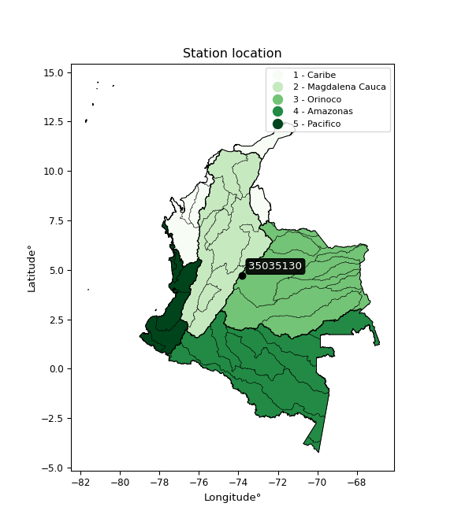

<div align="center">


</div>

# PMax24h Station (Rain, Pmax24h): 35035130

Maximum Precipitation in 24 hours (PMax24h) is the greatest amount of rainfall for a specific duration that is meteorologically possible for a given location, acting as a "worst-case" scenario for extreme storms, crucial for designing safety-critical infrastructure like bridges, river deviations, dams, spillways, and nuclear plants to prevent catastrophic failure. The PMax24h is related with the Probable Maximum Precipitation (PMP) and it is calculated by hydrologists using meteorological data to determine the upper limit of extreme rainfall, often leading to the Probable Maximum Flood (PMF) for flood control design, and is increasingly being studied for climate change impacts. Probable Maximum Precipitation (PMP) is the theoretical upper limit of rainfall, a deterministic estimate for extreme events, while probability distributions (like GEV, Gumbel) describe the likelihood and frequency of various precipitation amounts, including rare ones, showing how often events occur, with PMP representing the extreme end of these distributions, used for critical infrastructure design to ensure safety against the worst conceivable weather, unlike standard statistical forecasts which cover typical probabilities.

The most common probability distributions in hydrology, used for analyzing floods, rainfall, and streamflow, include the Normal, Log-Normal, Gumbel, Gamma (including Log-Pearson Type III), and Generalized Extreme Value (GEV) distributions, often chosen based on the data´s skewness and whether modeling extremes or general conditions, with Gumbel and GEV popular for extreme events like floods, while the Normal distribution serves as a baseline, though often requiring transformations for skewed hydrological data. These distributions help in designing water infrastructure, managing water resources, and forecasting hydrologic events.

> Hydrological data often isn´t perfectly normal (it´s skewed), so different distributions are needed for different applications, such as: **Flood Frequency Analysis**: Using Gumbel, GEV, or Log-Pearson Type III for predicting extreme flood magnitudes and their return periods, **Rainfall Analysis**: Normal for annual totals, but Log-Normal, Weibull, or GEV for intensity or extreme daily rainfall, **Streamflow Modeling**: Gamma and Log-Normal for maximum flows, GEV for minimum flows, and Kappa for daily flows.

<div align="center">

</img>

</div>


## A. General information


### 1. General running parameters

• app_version: _v20260225_. • runtime: _2026-02-27 14:50:08.749431_. • Python version: _3.14.0_. • SciPy version: _1.16.3_. • Pandas version: _2.3.3_. • NumPy version: _2.3.5_. • Stations dataset (station_dataset_file): _dataset/pmax24h_in/automatic_colombia_2003_2025.csv_. • Stations catalog (station_catalog_file): _dataset/CNE.xls_. • Minimum year to eval til year_max (date_min): _1900_. • Maximum year to eval since year_min (date_max): _2025_. • Creates, save and include plots into reports (create_plot): _False_. • Plot only fit distributions with Δo > Δ (plot_only_fit): _True_. • Plot only simple graphs avoiding multiple CDFs and multiple Extreme values plots (plot_only_simple): _False_. • Eval low extreme values, if False, evaluates high extreme values (low_extreme): _False_. • Eval every SciPy distribution as logarithmic (pdist_logarithmic_on): _True_. • Standard deviation normalized (ddof): _1.0_. • Return periods to eval in years (Tr): _[2, 2.33, 5, 10, 15, 20, 25, 50, 75, 100, 200, 250, 500, 750, 1000]_. • Minimum data sample per station, 0 means any (minimum_sample): _5_. • Z-Score maximum threshold to adjust a value, 0 means disable (zscore_max): _3.5_. • Z-Score minimum threshold to adjust a value, 0 means disable (zscore_min): _-2.5_. • Avoid zeros, e.g. rain = 0 (avoid_zeros): _True_. • Avoid null values (avoid_nans): _True_. 

:file_folder:Table: [dataset.csv](../../dataset/pmax24h_in/automatic_colombia_2003_2025.csv)

> Delta Degrees of Freedom (DDOF): is a parameter used in the formulas for calculating variance and standard deviation. When ddof=0, the divisor is $N$ (the total number of observations) and this is used when your data set is the entire population. When ddof=1, the divisor is $N-1$ and this is used when your data set is a sample drawn from a larger population. Using $N-1$ provides an unbiased estimate of the population variance (known as Bessel´s correction).


### 2. Station info and location

|   id |   CODIGO | NOMBRE                     | CATEGORIA               | TECNOLOGIA                | ESTADO   | FECHA_INSTALACION   |   FECHA_SUSPENSION |   ALTITUD |   LATITUD |   LONGITUD | DEPARTAMENTO   | MUNICIPIO   | AREA_OPERATIVA                            | ENTIDAD                                                     | AREA_HIDROGRAFICA   | ZONA_HIDROGRAFICA   | SUBZONA_HIDROGRAFICA   |   CORRIENTE | Catalogo   |   Version |
|-----:|---------:|:---------------------------|:------------------------|:--------------------------|:---------|:--------------------|-------------------:|----------:|----------:|-----------:|:---------------|:------------|:------------------------------------------|:------------------------------------------------------------|:--------------------|:--------------------|:-----------------------|------------:|:-----------|----------:|
|    0 | 35035130 | PARAMO CHINGAZA [35035130] | Climatológica Principal | Automática con Telemetría | Activa   | 24/11/2004          |                nan |      3863 |   4.71367 |   -73.8033 | Cundinamarca   | Guasca      | Area Operativa 11 - Cundinamarca-Amazonas | INSTITUTO DE HIDROLOGIA METEOROLOGIA Y ESTUDIOS AMBIENTALES | Orinoco             | Meta                | Río Guavio             |         nan | CNE_IDEAM  |  20251226 |

<div align="center">

Dynamic map: [:earth_americas:Google](http://maps.google.com/maps?q=4.713667,-73.80325) [:earth_americas:OSM](https://www.openstreetmap.org/#map=18/4.713667/-73.80325&layers=P) [:earth_americas:Bing](https://www.bing.com/maps?cp=4.713667~-73.80325&lvl=18) [:earth_americas:Apple](https://maps.apple.com/frame?center=4.713667%2C-73.80325&span=0.003%2C0.006)

</div>


<div align="center">

```geojson
{
  "type": "Feature",
  "geometry": {
    "type": "Point", 
    "coordinates": [-73.80325, 4.713667]
  }, 
  "properties": {
    "Name": "35035130"
  }
}
```

</div>


### 3. Discrete values table and plot

<div align="center">

|               |          0 |           1 |           2 |          3 |           4 |           5 |          6 |           7 |
|:--------------|-----------:|------------:|------------:|-----------:|------------:|------------:|-----------:|------------:|
| Date          | 2016       | 2017        | 2018        | 2019       | 2020        | 2021        | 2024       | 2025        |
| Value         |    2.4     |   39.5      |   41.9      |   58.6     |   25.8      |   49.9      |    9       |   13.4      |
| Value_initial |    2.4     |   39.5      |   41.9      |   58.6     |   25.8      |   49.9      |    9       |   13.4      |
| count         |    8       |    8        |    8        |    8       |    8        |    8        |    8       |    8        |
| mean          |   30.0625  |   30.0625   |   30.0625   |   30.0625  |   30.0625   |   30.0625   |   30.0625  |   30.0625   |
| std           |   20.5     |   20.5      |   20.5      |   20.5     |   20.5      |   20.5      |   20.5     |   20.5      |
| zscore        |   -1.34939 |    0.460365 |    0.577438 |    1.39207 |   -0.207927 |    0.967681 |   -1.02744 |   -0.812804 |


</div>


> The initial value (value_initial) correspond to the initial obtained or null completed value, and value (value) is adjusted only when the initial value is outside the valid range (outlier) definite through the Z-Score value. If Z-Score is active, values out of range or outliers are replaced with the station mean value. A Z-Score (or standard score) measures how many standard deviations a data point is from the mean of a dataset, indicating its relative position; positive scores mean above the mean, negative mean below, and a score of zero is exactly at the mean, allowing for comparison of values from different distributions. It´s calculated using the formula $z=(x–μ)/σ$, where $x$ is the data point, $μ$ is the mean, and $σ$ is the standard deviation, helping identify outliers and understand probability.
>
> <sub>**Note**: In this study, "completing" (filling gaps in) and "extending" (forecasting or lengthening the historical record) rainfall data series are avoided for certain critical analyses because they introduce artificial bias and uncertainty, which can distort the statistics of rare events (extremes), alter day-to-day variability, and compromise the integrity and homogeneity of the original data. Some reasons against Completing/Extending rainfall data are: **Distortion of Extremes and Variability**: The primary issue is that most gap-filling or extension methods rely on averaging or regression with nearby stations, which inherently smooths the data. Rainfall is highly variable in space and time, with a large percentage of zero values and occasional large storms. Infilling methods often underestimate the highest values and overestimate the lowest (zero) values, which severely distorts analyses focused on flood frequency, drought severity, and intensity-duration-frequency (IDF) curves, **Loss of Data Homogeneity**: Infilled or extended data are synthetic estimates, not actual measurements. Combining these estimates with observed data can violate the assumption of data homogeneity, which requires that the data properties do not change over time. Inhomogeneity can lead to incorrect conclusions about long-term trends or changes in climate patterns, **Propagation of Errors**: Errors and biases from the original data (e.g., wind-induced undercatch, instrument errors, site changes) or the data used for imputation can propagate through the analysis, leading to unreliable hydrological models and inaccurate predictions, **Compromised Statistical Integrity**: For statistical analyses, especially those involving the frequency of events, using artificial data can introduce time bias or autocorrelation that doesn´t exist in reality, making it difficult to assess the true probability of events, **Difficulty in Validation**: It is difficult to accurately validate the quality of filled or extended data, especially for past periods where ground-truth measurements are unavailable. The reliability of imputation techniques heavily depends on the density of the surrounding station network and the complexity of the local topography.</sub>


### 4. Active continuous probability distributions from SciPy (80 of 104 available)

A Probability Density Function (PDF) describes the relative likelihood of a continuous random variable falling within a specific range, where the total area under its curve equals 1, and the area over any interval gives the actual probability for that range. Unlike discrete probabilities (like rolling a die), a PDF shows density, not direct probability for a single point (which is zero), with higher points indicating higher likelihood, often visualized as a bell curve for normal distributions.

A log of a probability density function (log-PDF) is simply the logarithm of the PDF´s value, denoted as $log(f(x))$, useful for converting multiplication of probabilities into addition, improving numerical stability with tiny numbers, and connecting to information theory concepts like entropy. Instead of dealing with very small probabilities (e.g., 0.000001), log-PDFs use negative numbers (e.g., $log(0.00001) ≈ -11.51$ that are easier for computers to handle, preventing underflow errors and simplifying complex calculations. In this study, each active probability distribution from SciPy is also evaluated in the $log$ form.

[scipy.stats](https://docs.scipy.org/doc/scipy/reference/stats.html) is a Python´s powerful submodule within the SciPy library for comprehensive statistical analysis, offering over 130 probability distributions (like Normal, Poisson, etc.), functions for descriptive stats (mean, variance), hypothesis testing (t-tests, chi-square), random variable generation, and statistical tests, making it essential for data science, modeling, and research. It provides tools to explore, model, and draw conclusions from data efficiently, working seamlessly with [NumPy](https://numpy.org/).

<div align="center">

|   id | p_dist           |   n_parameter | fit_method   | label                                                                       | active   | ref                                                                                                      |
|-----:|:-----------------|--------------:|:-------------|:----------------------------------------------------------------------------|:---------|:---------------------------------------------------------------------------------------------------------|
|    0 | alpha            |             3 | MLE          | Alpha                                                                       | True     | [:mortar_board:](https://docs.scipy.org/doc/scipy/reference/generated/scipy.stats.alpha.html)            |
|    1 | anglit           |             2 | MM           | Anglit                                                                      | True     | [:mortar_board:](https://docs.scipy.org/doc/scipy/reference/generated/scipy.stats.anglit.html)           |
|    2 | arcsine          |             2 | MM           | Arcsine                                                                     | True     | [:mortar_board:](https://docs.scipy.org/doc/scipy/reference/generated/scipy.stats.arcsine.html)          |
|    3 | argus            |             3 | MLE          | Argus                                                                       | True     | [:mortar_board:](https://docs.scipy.org/doc/scipy/reference/generated/scipy.stats.argus.html)            |
|    4 | beta             |             4 | MLE          | Beta                                                                        | True     | [:mortar_board:](https://docs.scipy.org/doc/scipy/reference/generated/scipy.stats.beta.html)             |
|    5 | betaprime        |             4 | MLE          | Beta prime                                                                  | True     | [:mortar_board:](https://docs.scipy.org/doc/scipy/reference/generated/scipy.stats.betaprime.html)        |
|    6 | bradford         |             3 | MLE          | Bradford                                                                    | True     | [:mortar_board:](https://docs.scipy.org/doc/scipy/reference/generated/scipy.stats.bradford.html)         |
|    7 | burr             |             4 | MLE          | Burr (Type III)                                                             | True     | [:mortar_board:](https://docs.scipy.org/doc/scipy/reference/generated/scipy.stats.burr.html)             |
|    8 | burr12           |             4 | MLE          | Burr (Type III) 12                                                          | True     | [:mortar_board:](https://docs.scipy.org/doc/scipy/reference/generated/scipy.stats.burr12.html)           |
|    9 | cosine           |             2 | MLE          | Cosine                                                                      | True     | [:mortar_board:](https://docs.scipy.org/doc/scipy/reference/generated/scipy.stats.cosine.html)           |
|   10 | crystalball      |             4 | MLE          | Crystalball                                                                 | True     | [:mortar_board:](https://docs.scipy.org/doc/scipy/reference/generated/scipy.stats.crystalball.html)      |
|   11 | dgamma           |             3 | MLE          | Double gamma                                                                | True     | [:mortar_board:](https://docs.scipy.org/doc/scipy/reference/generated/scipy.stats.dgamma.html)           |
|   12 | dweibull         |             3 | MLE          | Double Weibull                                                              | True     | [:mortar_board:](https://docs.scipy.org/doc/scipy/reference/generated/scipy.stats.dweibull.html)         |
|   13 | erlang           |             3 | MLE          | Erlang                                                                      | True     | [:mortar_board:](https://docs.scipy.org/doc/scipy/reference/generated/scipy.stats.erlang.html)           |
|   14 | exponnorm        |             3 | MLE          | Exponentially modified Normal                                               | True     | [:mortar_board:](https://docs.scipy.org/doc/scipy/reference/generated/scipy.stats.exponnorm.html)        |
|   15 | exponpow         |             3 | MLE          | Exponential power                                                           | True     | [:mortar_board:](https://docs.scipy.org/doc/scipy/reference/generated/scipy.stats.exponpow.html)         |
|   16 | exponweib        |             4 | MLE          | Exponentiated Weibull                                                       | True     | [:mortar_board:](https://docs.scipy.org/doc/scipy/reference/generated/scipy.stats.exponweib.html)        |
|   17 | f                |             4 | MLE          | F                                                                           | True     | [:mortar_board:](https://docs.scipy.org/doc/scipy/reference/generated/scipy.stats.f.html)                |
|   18 | fatiguelife      |             3 | MLE          | Fatigue-life (Birnbaum-Saunders)                                            | True     | [:mortar_board:](https://docs.scipy.org/doc/scipy/reference/generated/scipy.stats.fatiguelife.html)      |
|   19 | foldnorm         |             3 | MM           | Fold Normal                                                                 | True     | [:mortar_board:](https://docs.scipy.org/doc/scipy/reference/generated/scipy.stats.foldnorm.html)         |
|   20 | gamma            |             3 | MLE          | Gamma                                                                       | True     | [:mortar_board:](https://docs.scipy.org/doc/scipy/reference/generated/scipy.stats.gamma.html)            |
|   21 | gausshyper       |             6 | MLE          | Gauss hypergeometric                                                        | True     | [:mortar_board:](https://docs.scipy.org/doc/scipy/reference/generated/scipy.stats.gausshyper.html)       |
|   22 | genexpon         |             5 | MLE          | Generalized exponential                                                     | True     | [:mortar_board:](https://docs.scipy.org/doc/scipy/reference/generated/scipy.stats.genexpon.html)         |
|   23 | genextreme       |             3 | MLE          | Generalized exponential                                                     | True     | [:mortar_board:](https://docs.scipy.org/doc/scipy/reference/generated/scipy.stats.genextreme.html)       |
|   24 | gengamma         |             4 | MLE          | Generalized gamma                                                           | True     | [:mortar_board:](https://docs.scipy.org/doc/scipy/reference/generated/scipy.stats.gengamma.html)         |
|   25 | genhalflogistic  |             3 | MLE          | Generalized half-logistic                                                   | True     | [:mortar_board:](https://docs.scipy.org/doc/scipy/reference/generated/scipy.stats.genhalflogistic.html)  |
|   26 | genlogistic      |             3 | MLE          | Generalized logistic                                                        | True     | [:mortar_board:](https://docs.scipy.org/doc/scipy/reference/generated/scipy.stats.genlogistic.html)      |
|   27 | gennorm          |             3 | MLE          | Generalized Normal                                                          | True     | [:mortar_board:](https://docs.scipy.org/doc/scipy/reference/generated/scipy.stats.gennorm.html)          |
|   28 | genpareto        |             3 | MLE          | Generalized Pareto                                                          | True     | [:mortar_board:](https://docs.scipy.org/doc/scipy/reference/generated/scipy.stats.genpareto.html)        |
|   29 | gompertz         |             3 | MLE          | Gompertz (or truncated Gumbel)                                              | True     | [:mortar_board:](https://docs.scipy.org/doc/scipy/reference/generated/scipy.stats.gompertz.html)         |
|   30 | gumbel_l         |             2 | MM           | Gumbel Left Skew                                                            | True     | [:mortar_board:](https://docs.scipy.org/doc/scipy/reference/generated/scipy.stats.gumbel_l.html)         |
|   31 | gumbel_r         |             2 | MM           | Gumbel Right Skew                                                           | True     | [:mortar_board:](https://docs.scipy.org/doc/scipy/reference/generated/scipy.stats.gumbel_r.html)         |
|   32 | halfgennorm      |             3 | MLE          | Upper half of a generalized normal                                          | True     | [:mortar_board:](https://docs.scipy.org/doc/scipy/reference/generated/scipy.stats.halfgennorm.html)      |
|   33 | halflogistic     |             2 | MM           | Half-logistic                                                               | True     | [:mortar_board:](https://docs.scipy.org/doc/scipy/reference/generated/scipy.stats.halflogistic.html)     |
|   34 | halfnorm         |             2 | MM           | Half Normal                                                                 | True     | [:mortar_board:](https://docs.scipy.org/doc/scipy/reference/generated/scipy.stats.halfnorm.html)         |
|   35 | hypsecant        |             2 | MM           | hyperbolic secant                                                           | True     | [:mortar_board:](https://docs.scipy.org/doc/scipy/reference/generated/scipy.stats.hypsecant.html)        |
|   36 | invgamma         |             3 | MLE          | Inverted gamma                                                              | True     | [:mortar_board:](https://docs.scipy.org/doc/scipy/reference/generated/scipy.stats.invgamma.html)         |
|   37 | invgauss         |             3 | MLE          | Inverse Gaussian                                                            | True     | [:mortar_board:](https://docs.scipy.org/doc/scipy/reference/generated/scipy.stats.invgauss.html)         |
|   38 | invweibull       |             3 | MLE          | Inverted Weibull                                                            | True     | [:mortar_board:](https://docs.scipy.org/doc/scipy/reference/generated/scipy.stats.invweibull.html)       |
|   39 | johnsonsb        |             4 | MLE          | Johnson SB                                                                  | True     | [:mortar_board:](https://docs.scipy.org/doc/scipy/reference/generated/scipy.stats.johnsonsb.html)        |
|   40 | johnsonsu        |             4 | MLE          | Johnson Su                                                                  | True     | [:mortar_board:](https://docs.scipy.org/doc/scipy/reference/generated/scipy.stats.johnsonsu.html)        |
|   41 | kappa3           |             3 | MLE          | Kappa 3                                                                     | True     | [:mortar_board:](https://docs.scipy.org/doc/scipy/reference/generated/scipy.stats.kappa3.html)           |
|   42 | kappa4           |             4 | MLE          | Kappa 4                                                                     | True     | [:mortar_board:](https://docs.scipy.org/doc/scipy/reference/generated/scipy.stats.kappa4.html)           |
|   43 | ksone            |             3 | MLE          | Kolmogorov-Smirnov one-sided test statistic distribution                    | True     | [:mortar_board:](https://docs.scipy.org/doc/scipy/reference/generated/scipy.stats.ksone.html)            |
|   44 | kstwobign        |             2 | MLE          | Limiting distribution of scaled Kolmogorov-Smirnov two-sided test statistic | True     | [:mortar_board:](https://docs.scipy.org/doc/scipy/reference/generated/scipy.stats.kstwobign.html)        |
|   45 | laplace          |             2 | MM           | Laplace                                                                     | True     | [:mortar_board:](https://docs.scipy.org/doc/scipy/reference/generated/scipy.stats.laplace.html)          |
|   46 | levy_l           |             2 | MLE          | Left-skewed Levy                                                            | True     | [:mortar_board:](https://docs.scipy.org/doc/scipy/reference/generated/scipy.stats.levy_l.html)           |
|   47 | loggamma         |             3 | MLE          | Log gamma                                                                   | True     | [:mortar_board:](https://docs.scipy.org/doc/scipy/reference/generated/scipy.stats.loggamma.html)         |
|   48 | logistic         |             2 | MM           | Logistic (or Sech-squared)                                                  | True     | [:mortar_board:](https://docs.scipy.org/doc/scipy/reference/generated/scipy.stats.logistic.html)         |
|   49 | loglaplace       |             3 | MLE          | Log-Laplace                                                                 | True     | [:mortar_board:](https://docs.scipy.org/doc/scipy/reference/generated/scipy.stats.loglaplace.html)       |
|   50 | lomax            |             3 | MLE          | Lomax (Pareto of the second kind)                                           | True     | [:mortar_board:](https://docs.scipy.org/doc/scipy/reference/generated/scipy.stats.lomax.html)            |
|   51 | maxwell          |             2 | MM           | Maxwell                                                                     | True     | [:mortar_board:](https://docs.scipy.org/doc/scipy/reference/generated/scipy.stats.maxwell.html)          |
|   52 | mielke           |             4 | MLE          | Mielke Beta-Kappa / Dagum                                                   | True     | [:mortar_board:](https://docs.scipy.org/doc/scipy/reference/generated/scipy.stats.mielke.html)           |
|   53 | moyal            |             2 | MM           | Moyal                                                                       | True     | [:mortar_board:](https://docs.scipy.org/doc/scipy/reference/generated/scipy.stats.moyal.html)            |
|   54 | nakagami         |             3 | MLE          | Nakagami                                                                    | True     | [:mortar_board:](https://docs.scipy.org/doc/scipy/reference/generated/scipy.stats.nakagami.html)         |
|   55 | ncf              |             5 | MLE          | Non-central F distribution                                                  | True     | [:mortar_board:](https://docs.scipy.org/doc/scipy/reference/generated/scipy.stats.ncf.html)              |
|   56 | nct              |             4 | MLE          | Non-central Student’s t                                                     | True     | [:mortar_board:](https://docs.scipy.org/doc/scipy/reference/generated/scipy.stats.nct.html)              |
|   57 | norm             |             2 | MM           | Normal                                                                      | True     | [:mortar_board:](https://docs.scipy.org/doc/scipy/reference/generated/scipy.stats.norm.html)             |
|   58 | pearson3         |             3 | MM           | Pearson type III                                                            | True     | [:mortar_board:](https://docs.scipy.org/doc/scipy/reference/generated/scipy.stats.pearson3.html)         |
|   59 | powerlaw         |             3 | MLE          | Power-function                                                              | True     | [:mortar_board:](https://docs.scipy.org/doc/scipy/reference/generated/scipy.stats.powerlaw.html)         |
|   60 | rayleigh         |             2 | MM           | Rayleigh                                                                    | True     | [:mortar_board:](https://docs.scipy.org/doc/scipy/reference/generated/scipy.stats.rayleigh.html)         |
|   61 | rdist            |             3 | MLE          | R-distributed (symmetric beta)                                              | True     | [:mortar_board:](https://docs.scipy.org/doc/scipy/reference/generated/scipy.stats.rdist.html)            |
|   62 | rice             |             3 | MLE          | Rice                                                                        | True     | [:mortar_board:](https://docs.scipy.org/doc/scipy/reference/generated/scipy.stats.rice.html)             |
|   63 | semicircular     |             2 | MM           | Semicircular                                                                | True     | [:mortar_board:](https://docs.scipy.org/doc/scipy/reference/generated/scipy.stats.semicircular.html)     |
|   64 | skewnorm         |             3 | MLE          | Skew normal                                                                 | True     | [:mortar_board:](https://docs.scipy.org/doc/scipy/reference/generated/scipy.stats.skewnorm.html)         |
|   65 | t                |             3 | MLE          | Student’s t                                                                 | True     | [:mortar_board:](https://docs.scipy.org/doc/scipy/reference/generated/scipy.stats.t.html)                |
|   66 | trapezoid        |             4 | MLE          | Trapezoid                                                                   | True     | [:mortar_board:](https://docs.scipy.org/doc/scipy/reference/generated/scipy.stats.trapezoid.html)        |
|   67 | triang           |             3 | MLE          | Triangular                                                                  | True     | [:mortar_board:](https://docs.scipy.org/doc/scipy/reference/generated/scipy.stats.triang.html)           |
|   68 | truncexpon       |             3 | MLE          | Truncated exponential                                                       | True     | [:mortar_board:](https://docs.scipy.org/doc/scipy/reference/generated/scipy.stats.truncexpon.html)       |
|   69 | truncnorm        |             4 | MLE          | Truncated normal                                                            | True     | [:mortar_board:](https://docs.scipy.org/doc/scipy/reference/generated/scipy.stats.truncnorm.html)        |
|   70 | truncpareto      |             4 | MLE          | Upper truncated Pareto                                                      | True     | [:mortar_board:](https://docs.scipy.org/doc/scipy/reference/generated/scipy.stats.truncpareto.html)      |
|   71 | truncweibull_min |             5 | MLE          | Doubly truncated Weibull minimum                                            | True     | [:mortar_board:](https://docs.scipy.org/doc/scipy/reference/generated/scipy.stats.truncweibull_min.html) |
|   72 | tukeylambda      |             3 | MLE          | Tukey-Lamdba                                                                | True     | [:mortar_board:](https://docs.scipy.org/doc/scipy/reference/generated/scipy.stats.tukeylambda.html)      |
|   73 | uniform          |             2 | MLE          | Uniform                                                                     | True     | [:mortar_board:](https://docs.scipy.org/doc/scipy/reference/generated/scipy.stats.uniform.html)          |
|   74 | vonmises         |             3 | MLE          | Von Mises                                                                   | True     | [:mortar_board:](https://docs.scipy.org/doc/scipy/reference/generated/scipy.stats.vonmises.html)         |
|   75 | vonmises_line    |             3 | MLE          | Von Mises line                                                              | True     | [:mortar_board:](https://docs.scipy.org/doc/scipy/reference/generated/scipy.stats.vonmises_line.html)    |
|   76 | wald             |             2 | MM           | Wald                                                                        | True     | [:mortar_board:](https://docs.scipy.org/doc/scipy/reference/generated/scipy.stats.wald.html)             |
|   77 | weibull_max      |             3 | MLE          | Weibull maximum                                                             | True     | [:mortar_board:](https://docs.scipy.org/doc/scipy/reference/generated/scipy.stats.weibull_max.html)      |
|   78 | weibull_min      |             3 | MLE          | Weibull minimum                                                             | True     | [:mortar_board:](https://docs.scipy.org/doc/scipy/reference/generated/scipy.stats.weibull_min.html)      |
|   79 | wrapcauchy       |             3 | MLE          | Wrapped  Cauchy                                                             | True     | [:mortar_board:](https://docs.scipy.org/doc/scipy/reference/generated/scipy.stats.wrapcauchy.html)       |

</div>

> **n_parameter:** # arguments & localization & scale.
>
> **Fit methods:** (MLE) maximum likelihood, (MM) L-moments.
>
>**Inactive** (With the only purpose of prevent loops, zero divisions, infinite values, over high estimated values or horizontal trending for recurrence intervals estimations, the follow distributions were disabled.)**:** lognorm, norminvgauss, powernorm, powerlognorm, cauchy, halfcauchy, foldcauchy, skewcauchy, chi2, expon, fisk, genhyperbolic, geninvgauss, gibrat, kstwo, laplace_asymmetric, levy, levy_stable, ncx2, pareto, rel_breitwigner, recipinvgauss, studentized_range, loguniform, 


## B. Probability (PDF) vs. Empirical (EDF) distributions functions

A continuous probability distribution (CPD) describes probabilities for variables that can take any value within a range (like rain any time), unlike discrete variables with specific outcomes (like temperature). It uses a Probability Density Function (PDF), a curve where the total area under it equals 1, and the probability of the variable falling within an interval (a to b) is found by calculating the area under the curve between those points. A key feature is that the probability of hitting any single exact value is zero, so probabilities are always expressed for ranges, e.g., $P(a ≤ X ≤ b)$.

<div align="center">

Distributions parameters from station values
|     |   station | p_dist              |   n |               loc |            scale | shape                  | shape1                 | shape2             | shape3             |
|----:|----------:|:--------------------|----:|------------------:|-----------------:|:-----------------------|:-----------------------|:-------------------|:-------------------|
|   0 |  35035130 | alpha               |   8 |      -0.0145041   |      6.45533     | 3.179072967772193e-10  |                        |                    |                    |
|   1 |  35035130 | anglit              |   8 |      30.0625      |     56.0975      |                        |                        |                    |                    |
|   2 |  35035130 | arcsine             |   8 |       2.94352     |     54.238       |                        |                        |                    |                    |
|   3 |  35035130 | argus               |   8 |     -11.5764      |     73.3122      | 2.6917552108036006e-06 |                        |                    |                    |
|   4 |  35035130 | beta                |   8 |      -3.13535     |     61.7353      | 0.6465579360953233     | 0.6369176300404553     |                    |                    |
|   5 |  35035130 | betaprime           |   8 |       2.4         |    370.184       | 0.3773372808856149     | 8.020988711401309      |                    |                    |
|   6 |  35035130 | bradford            |   8 |       2.39644     |     56.2036      | 1.1188293812958852     |                        |                    |                    |
|   7 |  35035130 | burr                |   8 |      -1.02021     |     60.4408      | 247.14214619808754     | 0.004127823368275461   |                    |                    |
|   8 |  35035130 | burr12              |   8 |      -0.426337    |      2.77749     | 232.22555881166397     | 0.0020963875262527557  |                    |                    |
|   9 |  35035130 | cosine              |   8 |      30.0451      |     15.398       |                        |                        |                    |                    |
|  10 |  35035130 | crystalball         |   8 |      30.0625      |     19.176       | 2566.1786187652533     | 1287.9772432179698     |                    |                    |
|  11 |  35035130 | dgamma              |   8 |      31.4561      |      4.60304     | 3.7828425849460876     |                        |                    |                    |
|  12 |  35035130 | dweibull            |   8 |      30.8529      |     19.6876      | 2.3386562105802757     |                        |                    |                    |
|  13 |  35035130 | erlang              |   8 |   -1346.09        |      0.267445    | 5145.544957863056      |                        |                    |                    |
|  14 |  35035130 | exponnorm           |   8 |      30.0365      |     19.176       | 0.001354905716657338   |                        |                    |                    |
|  15 |  35035130 | exponpow            |   8 |       2.4         |      4.15622     | 0.17578651593621092    |                        |                    |                    |
|  16 |  35035130 | exponweib           |   8 |       2.4         |      2.60011     | 2.752998099527723      | 0.09228036661230421    |                    |                    |
|  17 |  35035130 | f                   |   8 |       2.4         |     27.555       | 1.9087660094044876     | 610.5822575742502      |                    |                    |
|  18 |  35035130 | fatiguelife         |   8 |       2.4         |      1.44214e-05 | 1224.443087287077      |                        |                    |                    |
|  19 |  35035130 | foldnorm            |   8 |    -134.433       |     19.1094      | 8.608924939893582      |                        |                    |                    |
|  20 |  35035130 | gamma               |   8 |   -1340.54        |      0.268507    | 5104.515049459056      |                        |                    |                    |
|  21 |  35035130 | gausshyper          |   8 |       0.575673    |     58.0243      | 1.2578405613041768     | 0.8817615683937013     | 1.0565559704116638 | 1.0124414965917474 |
|  22 |  35035130 | genexpon            |   8 |       2.39999     |      1.78465     | 0.0645724314363262     | 1.9123884898926594e-07 | 1.0112461434968554 |                    |
|  23 |  35035130 | genextreme          |   8 |      26.0048      |     21.376       | 0.5654197563884099     |                        |                    |                    |
|  24 |  35035130 | gengamma            |   8 |     -17.9905      |     18.1925      | 3.524051155975151      | 1.28255011505948       |                    |                    |
|  25 |  35035130 | genhalflogistic     |   8 |      -3.32497     |     64.5166      | 1.0418509907916125     |                        |                    |                    |
|  26 |  35035130 | genlogistic         |   8 |     -78.6446      |     17.0276      | 338.1299629379887      |                        |                    |                    |
|  27 |  35035130 | gennorm             |   8 |      30.5         |     28.1001      | 3023700.5430345847     |                        |                    |                    |
|  28 |  35035130 | genpareto           |   8 |      -0.196964    |     78.5431      | -1.3358365915438193    |                        |                    |                    |
|  29 |  35035130 | gompertz            |   8 |     -15.0397      |     18.4112      | 0.056199317344213205   |                        |                    |                    |
|  30 |  35035130 | gumbel_l            |   8 |      38.6927      |     14.9515      |                        |                        |                    |                    |
|  31 |  35035130 | gumbel_r            |   8 |      21.4323      |     14.9515      |                        |                        |                    |                    |
|  32 |  35035130 | halfgennorm         |   8 |       2.4         |      0.303155    | 0.3051873248992703     |                        |                    |                    |
|  33 |  35035130 | halflogistic        |   8 |       7.33444     |     16.3948      |                        |                        |                    |                    |
|  34 |  35035130 | halfnorm            |   8 |       4.68097     |     31.811       |                        |                        |                    |                    |
|  35 |  35035130 | hypsecant           |   8 |      30.0625      |     12.2078      |                        |                        |                    |                    |
|  36 |  35035130 | invgamma            |   8 |    -138.213       |  12568.3         | 75.77824267976379      |                        |                    |                    |
|  37 |  35035130 | invgauss            |   8 |     -59.6785      |   1794.66        | 0.049951107167818726   |                        |                    |                    |
|  38 |  35035130 | invweibull          |   8 |      -1.65683e+09 |      1.65683e+09 | 97172075.01139386      |                        |                    |                    |
|  39 |  35035130 | johnsonsb           |   8 |      -3.611       |     62.211       | -0.3154262223066707    | 0.1235826513959885     |                    |                    |
|  40 |  35035130 | johnsonsu           |   8 |      -3.16501e+07 |      2.97116e+08 | -1656845.0817124643    | 15583007.399359392     |                    |                    |
|  41 |  35035130 | kappa3              |   8 |       2.39992     |     56.2001      | 1373146.3354628896     |                        |                    |                    |
|  42 |  35035130 | kappa4              |   8 |      -2.82281     |     63.8343      | 1.089267389397711      | 1.0386932776844637     |                    |                    |
|  43 |  35035130 | ksone               |   8 |      -3.15135     |     66.4277      | 1.0                    |                        |                    |                    |
|  44 |  35035130 | kstwobign           |   8 |     -37.9356      |     77.5114      |                        |                        |                    |                    |
|  45 |  35035130 | laplace             |   8 |      30.0625      |     13.5595      |                        |                        |                    |                    |
|  46 |  35035130 | levy_l              |   8 |      61.2262      |     12.2675      |                        |                        |                    |                    |
|  47 |  35035130 | loggamma            |   8 |    -821.841       |    187.057       | 95.53531654003164      |                        |                    |                    |
|  48 |  35035130 | logistic            |   8 |      30.0625      |     10.5723      |                        |                        |                    |                    |
|  49 |  35035130 | loglaplace          |   8 |      -0.0301083   |     25.8301      | 1.2388446024974855     |                        |                    |                    |
|  50 |  35035130 | lomax               |   8 |       2.4         |      2.30654e+07 | 887447.434346844       |                        |                    |                    |
|  51 |  35035130 | maxwell             |   8 |     -15.3766      |     28.4747      |                        |                        |                    |                    |
|  52 |  35035130 | mielke              |   8 |       2.4         |     58.3016      | 0.7660654497093935     | 14.137929790257466     |                    |                    |
|  53 |  35035130 | moyal               |   8 |      19.0964      |      8.63224     |                        |                        |                    |                    |
|  54 |  35035130 | nakagami            |   8 |       9           |     24.7295      | 0.3437963983672719     |                        |                    |                    |
|  55 |  35035130 | ncf                 |   8 |       0.0683852   |      2.22184e-08 | 6.206652980681464e-09  | 37.136886124834916     | 8.009615785234615  |                    |
|  56 |  35035130 | nct                 |   8 |    -794.69        |     19.1385      | 231271.00221786884     | 43.09354072571688      |                    |                    |
|  57 |  35035130 | norm                |   8 |      30.0625      |     19.176       |                        |                        |                    |                    |
|  58 |  35035130 | pearson3            |   8 |      30.0625      |     19.176       | -0.0295940983344515    |                        |                    |                    |
|  59 |  35035130 | powerlaw            |   8 |       2.4         |     56.2         | 0.17791783782276585    |                        |                    |                    |
|  60 |  35035130 | rayleigh            |   8 |      -6.62235     |     29.2703      |                        |                        |                    |                    |
|  61 |  35035130 | rdist               |   8 |      -2.2587      |     28.0587      | 1.1707036586521844     |                        |                    |                    |
|  62 |  35035130 | rice                |   8 |      -6.77181     |     23.4055      | 1.0714071591558403     |                        |                    |                    |
|  63 |  35035130 | semicircular        |   8 |      30.0625      |     38.352       |                        |                        |                    |                    |
|  64 |  35035130 | skewnorm            |   8 |      31.8897      |     19.2629      | -0.11973303082725026   |                        |                    |                    |
|  65 |  35035130 | t                   |   8 |      30.0625      |     19.1761      | 491114968.8168843      |                        |                    |                    |
|  66 |  35035130 | trapezoid           |   8 |      -3.381       |     67.44        | 1.0                    | 1.0                    |                    |                    |
|  67 |  35035130 | triang              |   8 |     -17.8452      |     76.9023      | 0.9940557672446455     |                        |                    |                    |
|  68 |  35035130 | truncexpon          |   8 |       2.27563     |     59.3215      | 0.949476817495539      |                        |                    |                    |
|  69 |  35035130 | truncnorm           |   8 |      36.9122      |     13.3742      | -18.609770753284103    | 1.621612790807737      |                    |                    |
|  70 |  35035130 | truncpareto         |   8 |       2.39125     |      0.0087517   | 0.14339459794671233    | 6422.6088866643695     |                    |                    |
|  71 |  35035130 | truncweibull_min    |   8 |       1.84864     |     73.4354      | 0.9278117902034908     | 0.00038703903962942853 | 0.7728070474004389 |                    |
|  72 |  35035130 | tukeylambda         |   8 |      30.4924      |     31.1229      | 1.1072772423216724     |                        |                    |                    |
|  73 |  35035130 | uniform             |   8 |       2.4         |     56.2         |                        |                        |                    |                    |
|  74 |  35035130 | vonmises            |   8 |       1.71173     |      1           | 0.8444514665612141     |                        |                    |                    |
|  75 |  35035130 | vonmises_line       |   8 |      30.3562      |      8.99027     | 2.2389912553265526e-06 |                        |                    |                    |
|  76 |  35035130 | wald                |   8 |      10.8864      |     19.1761      |                        |                        |                    |                    |
|  77 |  35035130 | weibull_max         |   8 |      58.6         |      1.59576     | 0.2487005557566289     |                        |                    |                    |
|  78 |  35035130 | weibull_min         |   8 |       0.117717    |     32.6186      | 1.4130906521819155     |                        |                    |                    |
|  79 |  35035130 | wrapcauchy          |   8 |       2.4         |      8.94452     | 0.24447347577536432    |                        |                    |                    |
|  80 |  35035130 | logalpha            |   8 |     -30.2345      |   1026.24        | 30.889498203629486     |                        |                    |                    |
|  81 |  35035130 | loganglit           |   8 |       3.03883     |      2.98784     |                        |                        |                    |                    |
|  82 |  35035130 | logarcsine          |   8 |       1.59446     |      2.88876     |                        |                        |                    |                    |
|  83 |  35035130 | logargus            |   8 |      -0.292637    |      4.44548     | 2.4807606322961        |                        |                    |                    |
|  84 |  35035130 | logbeta             |   8 |       0.560085    |      3.51065     | 1.1827405125350094     | 0.425222763891131      |                    |                    |
|  85 |  35035130 | logbetaprime        |   8 |     -20.0467      |    155.447       | 546.483896180396       | 3683.4899995476553     |                    |                    |
|  86 |  35035130 | logbradford         |   8 |       0.875446    |      3.19601     | 0.8938194148092226     |                        |                    |                    |
|  87 |  35035130 | logburr             |   8 |      -0.0983864   |      4.19582     | 386.7108585617282      | 0.006609443583275754   |                    |                    |
|  88 |  35035130 | logburr12           |   8 |   -4664.67        |   4678.27        | 6571.965885723464      | 1487725.8839245474     |                    |                    |
|  89 |  35035130 | logcosine           |   8 |       2.87755     |      0.886888    |                        |                        |                    |                    |
|  90 |  35035130 | logcrystalball      |   8 |       3.03883     |      1.02134     | 1291.8345372097494     | 53.59128566918529      |                    |                    |
|  91 |  35035130 | logdgamma           |   8 |       3.38845     |      0.507095    | 1.5958607563112113     |                        |                    |                    |
|  92 |  35035130 | logdweibull         |   8 |       3.35794     |      0.873841    | 1.2492683421758581     |                        |                    |                    |
|  93 |  35035130 | logerlang           |   8 |     -11.9335      |      0.0749471   | 199.66932254589597     |                        |                    |                    |
|  94 |  35035130 | logexponnorm        |   8 |       3.03799     |      1.02134     | 0.0008294748059470719  |                        |                    |                    |
|  95 |  35035130 | logexponpow         |   8 | -154162           | 154166           | 182565.9629153483      |                        |                    |                    |
|  96 |  35035130 | logexponweib        |   8 |   -5800.23        |   5804.33        | 0.02517069820255484    | 217869.1889284755      |                    |                    |
|  97 |  35035130 | logf                |   8 |    -178.058       |    181.094       | 115075.16765129086     | 135313.66680868005     |                    |                    |
|  98 |  35035130 | logfatiguelife      |   8 |    -643.02        |    646.062       | 0.0015749041624948425  |                        |                    |                    |
|  99 |  35035130 | logfoldnorm         |   8 |      -3.81783     |      0.940995    | 7.302989604093298      |                        |                    |                    |
| 100 |  35035130 | loggamma            |   8 |     -17.2888      |      0.05525     | 367.7376919447587      |                        |                    |                    |
| 101 |  35035130 | loggausshyper       |   8 |       0.681108    |      3.38963     | 1.3163286196480986     | 0.3403235076800297     | 1.3955691248168294 | 0.8065011487712327 |
| 102 |  35035130 | loggenexpon         |   8 |       0.875467    |  14795.6         | 3426.7720727369806     | 7633.48816872231       | 7405.464660422469  |                    |
| 103 |  35035130 | loggenextreme       |   8 |       3.13594     |      1.08775     | 1.1636235444363732     |                        |                    |                    |
| 104 |  35035130 | loggengamma         |   8 |      -3.06643e+07 |      3.06643e+07 | 0.5663943531140916     | 62511891.05387696      |                    |                    |
| 105 |  35035130 | loggenhalflogistic  |   8 |       0.780923    |      3.52838     | 1.072516629798233      |                        |                    |                    |
| 106 |  35035130 | loggenlogistic      |   8 |       4.07075     |      2.05762e-06 | 1.994263902473861e-06  |                        |                    |                    |
| 107 |  35035130 | loggennorm          |   8 |       3.6763      |      6.58291e-10 | 0.11244853195732055    |                        |                    |                    |
| 108 |  35035130 | loggenpareto        |   8 |      -0.000593042 |      6.68805     | -1.6427186697651872    |                        |                    |                    |
| 109 |  35035130 | loggompertz         |   8 |       0.875469    |      1.24693     | 0.16878189270110888    |                        |                    |                    |
| 110 |  35035130 | loggumbel_l         |   8 |       3.49849     |      0.796339    |                        |                        |                    |                    |
| 111 |  35035130 | loggumbel_r         |   8 |       2.57917     |      0.796339    |                        |                        |                    |                    |
| 112 |  35035130 | loghalfgennorm      |   8 |       0.875469    |      0.948751    | 0.6609352843640575     |                        |                    |                    |
| 113 |  35035130 | loghalflogistic     |   8 |       1.8283      |      0.873216    |                        |                        |                    |                    |
| 114 |  35035130 | loghalfnorm         |   8 |       1.68701     |      1.69427     |                        |                        |                    |                    |
| 115 |  35035130 | loghypsecant        |   8 |       3.03883     |      0.650208    |                        |                        |                    |                    |
| 116 |  35035130 | loginvgamma         |   8 |     -16.3287      |   6247.23        | 323.83100117950494     |                        |                    |                    |
| 117 |  35035130 | loginvgauss         |   8 |      -7.42921     |    928.872       | 0.011255161520080055   |                        |                    |                    |
| 118 |  35035130 | loginvweibull       |   8 |      -6.01811e+07 |      6.01811e+07 | 52369959.66752833      |                        |                    |                    |
| 119 |  35035130 | logjohnsonsb        |   8 |       0.875469    |      3.19527     | -0.3500988413443258    | 0.11308139692147046    |                    |                    |
| 120 |  35035130 | logjohnsonsu        |   8 |       4.14138     |      0.00170073  | 5.648328933144104      | 0.8533962758341151     |                    |                    |
| 121 |  35035130 | logkappa3           |   8 |       0.875468    |      3.19526     | 1396177.7808994662     |                        |                    |                    |
| 122 |  35035130 | logkappa4           |   8 |       0.469821    |      4.16413     | 1.0369839563662635     | 1.1564103419570753     |                    |                    |
| 123 |  35035130 | logksone            |   8 |       0.555942    |      3.83432     | 1.0                    |                        |                    |                    |
| 124 |  35035130 | logkstwobign        |   8 |      -1.62734     |      5.33548     |                        |                        |                    |                    |
| 125 |  35035130 | loglaplace          |   8 |       3.03883     |      0.7222      |                        |                        |                    |                    |
| 126 |  35035130 | loglevy_l           |   8 |       4.13309     |      0.287508    |                        |                        |                    |                    |
| 127 |  35035130 | logloggamma         |   8 |       4.07082     |      4.25178e-06 | 4.128504913631537e-06  |                        |                    |                    |
| 128 |  35035130 | loglogistic         |   8 |       3.03883     |      0.563097    |                        |                        |                    |                    |
| 129 |  35035130 | logloglaplace       |   8 |      -0.00744615  |      3.25782     | 3.0878997993139468     |                        |                    |                    |
| 130 |  35035130 | loglomax            |   8 |       0.875469    |     92.6961      | 42.616267969013975     |                        |                    |                    |
| 131 |  35035130 | logmaxwell          |   8 |       0.618675    |      1.51661     |                        |                        |                    |                    |
| 132 |  35035130 | logmielke           |   8 |      -6.59136e+06 |      6.59137e+06 | 6329199.230447881      | 2762580448.721488      |                    |                    |
| 133 |  35035130 | logmoyal            |   8 |       2.45476     |      0.459767    |                        |                        |                    |                    |
| 134 |  35035130 | lognakagami         |   8 |       2.19722     |      1.28126     | 0.4232834885977296     |                        |                    |                    |
| 135 |  35035130 | logncf              |   8 |    -260.826       |    260.344       | 289740.11627715814     | 240460.98260442982     | 3909.74490036345   |                    |
| 136 |  35035130 | lognct              |   8 |     -62.2724      |      0.996325    | 38705.578273486375     | 65.5505792034131       |                    |                    |
| 137 |  35035130 | lognorm             |   8 |       3.03883     |      1.02134     |                        |                        |                    |                    |
| 138 |  35035130 | logpearson3         |   8 |       3.03883     |      1.02134     | -0.9904260194140997    |                        |                    |                    |
| 139 |  35035130 | logpowerlaw         |   8 |       0.875469    |      3.19527     | 0.20004182789455907    |                        |                    |                    |
| 140 |  35035130 | lograyleigh         |   8 |       1.08493     |      1.55899     |                        |                        |                    |                    |
| 141 |  35035130 | logrdist            |   8 |       2.06292     |      1.18745     | 1.1818012780111966     |                        |                    |                    |
| 142 |  35035130 | logrice             |   8 |    -276.195       |      1.02076     | 273.5537971532432      |                        |                    |                    |
| 143 |  35035130 | logsemicircular     |   8 |       3.03883     |      2.0427      |                        |                        |                    |                    |
| 144 |  35035130 | logskewnorm         |   8 |       4.07074     |      1.45189     | -20953219.380237397    |                        |                    |                    |
| 145 |  35035130 | logt                |   8 |       3.03883     |      1.02135     | 5765260085.696345      |                        |                    |                    |
| 146 |  35035130 | logtrapezoid        |   8 |       0.150034    |      4.3332      | 1.0                    | 1.0                    |                    |                    |
| 147 |  35035130 | logtriang           |   8 |       0.158356    |      3.91239     | 0.9999981218894725     |                        |                    |                    |
| 148 |  35035130 | logtruncexpon       |   8 |       0.812084    |      5.48937     | 0.5936292685827362     |                        |                    |                    |
| 149 |  35035130 | logtruncnorm        |   8 |       0.585692    |      2.51994     | 0.11499310208313031    | 13.893509953276173     |                    |                    |
| 150 |  35035130 | logtruncpareto      |   8 |       0.874655    |      0.000813686 | 0.14327005493443373    | 3927.9013591581875     |                    |                    |
| 151 |  35035130 | logtruncweibull_min |   8 |       0.736387    |      5.08138     | 1.6533017536041106     | 3.180001849208057e-07  | 0.6561895791638996 |                    |
| 152 |  35035130 | logtukeylambda      |   8 |       1.69257     |      1.6711      | 1.0727306773693246     |                        |                    |                    |
| 153 |  35035130 | loguniform          |   8 |       0.875469    |      3.19527     |                        |                        |                    |                    |
| 154 |  35035130 | logvonmises         |   8 |      -3.02215     |      1           | 1.534000629976655      |                        |                    |                    |
| 155 |  35035130 | logvonmises_line    |   8 |       3.23715     |      0.751748    | 0.9991445383872475     |                        |                    |                    |
| 156 |  35035130 | logwald             |   8 |       2.01746     |      1.02136     |                        |                        |                    |                    |
| 157 |  35035130 | logweibull_max      |   8 |       4.07073     |      1.08464     | 0.8003001355816886     |                        |                    |                    |
| 158 |  35035130 | logweibull_min      |   8 |      -1.79686e+08 |      1.79686e+08 | 251404435.80663604     |                        |                    |                    |
| 159 |  35035130 | logwrapcauchy       |   8 |       0.875461    |      0.508544    | 0.4483735295140917     |                        |                    |                    |

</div>

> **loc** (Location parameter): This shifts the distribution along the x-axis. For many common distributions, like the normal (Gaussian) distribution, loc represents the mean $μ$. For others, like the uniform distribution, it might represent the minimum value, or for the beta distribution, the left end of the support interval.
>
> **scale** (Scale parameter): This determines the width or spread of the distribution. For the normal distribution, scale represents the standard deviation $σ$. For a uniform distribution, it defines the length of the interval (from $loc$ to $loc + scale$).
>
> **shape** (Shape parameters): Refers to parameters that define the specific form of a probability distribution, distinct from its location (loc) and scale (scale). These parameters are required arguments for most distribution functions. For example, a normal (Gaussian) distribution is fully defined by its location (mean) and scale (standard deviation), so it has no specific shape parameters beyond loc and scale. However, other distributions have intrinsic properties that need specification, as Gamma distribution that takes a shape parameter, often named $a$ or $alpha$.


### 0. Cumulative distribution values - CDF (160 evaluated)

Cumulative Distribution Function (CDF), denoted as $F$<sub>$X$</sub>$(x)$, is a function that gives the probability that a random variable $X$ will take a value less than or equal to a specific value, $x$ (i.e., $(P(X≥x)$. It essentially "accumulates" probabilities from a given point up to the far right (positive infinity), providing a complete picture of the distribution´s probabilities for both discrete (like rain) and continuous (like temperature) variables, helping to find probabilities over ranges or above certain values. Each station is evaluated separately ordering the $x$ values ascending, calculating the CDF and PDF values for the activated distributions and their logarithmic forms.

<div align="center">

CDF ordered by x ascending and calculating $log(f(x))$ separately
|   id |   Station |   date |    x |   count |    mean |   std |    zscore |   Value_initial |   station |   m |      alpha |   alpha_pdf |    anglit |   anglit_pdf |   arcsine |   arcsine_pdf |    argus |   argus_pdf |     beta |     beta_pdf |   betaprime |   betaprime_pdf |    bradford |   bradford_pdf |      burr |    burr_pdf |     burr12 |   burr12_pdf |    cosine |   cosine_pdf |   crystalball |   crystalball_pdf |   dgamma |   dgamma_pdf |   dweibull |   dweibull_pdf |    erlang |   erlang_pdf |   exponnorm |   exponnorm_pdf |   exponpow |   exponpow_pdf |   exponweib |   exponweib_pdf |           f |      f_pdf |   fatiguelife |   fatiguelife_pdf |   foldnorm |   foldnorm_pdf |     gamma |   gamma_pdf |   gausshyper |   gausshyper_pdf |    genexpon |   genexpon_pdf |   genextreme |   genextreme_pdf |   gengamma |   gengamma_pdf |   genhalflogistic |   genhalflogistic_pdf |   genlogistic |   genlogistic_pdf |     gennorm |   gennorm_pdf |   genpareto |   genpareto_pdf |   gompertz |   gompertz_pdf |   gumbel_l |   gumbel_l_pdf |   gumbel_r |   gumbel_r_pdf |   halfgennorm |   halfgennorm_pdf |   halflogistic |   halflogistic_pdf |   halfnorm |   halfnorm_pdf |   hypsecant |   hypsecant_pdf |   invgamma |   invgamma_pdf |   invgauss |   invgauss_pdf |   invweibull |   invweibull_pdf |   johnsonsb |   johnsonsb_pdf |   johnsonsu |   johnsonsu_pdf |      kappa3 |   kappa3_pdf |      kappa4 |   kappa4_pdf |     ksone |   ksone_pdf |   kstwobign |   kstwobign_pdf |   laplace |   laplace_pdf |   levy_l |   levy_l_pdf |   loggamma |   loggamma_pdf |   logistic |   logistic_pdf |   loglaplace |   loglaplace_pdf |       lomax |   lomax_pdf |   maxwell |   maxwell_pdf |      mielke |   mielke_pdf |      moyal |   moyal_pdf |    nakagami |   nakagami_pdf |       ncf |    ncf_pdf |       nct |    nct_pdf |      norm |   norm_pdf |   pearson3 |   pearson3_pdf |    powerlaw |   powerlaw_pdf |   rayleigh |   rayleigh_pdf |    rdist |     rdist_pdf |      rice |   rice_pdf |   semicircular |   semicircular_pdf |   skewnorm |   skewnorm_pdf |         t |      t_pdf |   trapezoid |   trapezoid_pdf |    triang |   triang_pdf |   truncexpon |   truncexpon_pdf |   truncnorm |   truncnorm_pdf |   truncpareto |   truncpareto_pdf |   truncweibull_min |   truncweibull_min_pdf |   tukeylambda |   tukeylambda_pdf |   uniform |   uniform_pdf |   vonmises |   vonmises_pdf |   vonmises_line |   vonmises_line_pdf |      wald |   wald_pdf |   weibull_max |   weibull_max_pdf |   weibull_min |   weibull_min_pdf |   wrapcauchy |   wrapcauchy_pdf |   logalpha |   logalpha_pdf |   loganglit |   loganglit_pdf |   logarcsine |   logarcsine_pdf |   logargus |   logargus_pdf |   logbeta |   logbeta_pdf |   logbetaprime |   logbetaprime_pdf |   logbradford |   logbradford_pdf |   logburr |   logburr_pdf |   logburr12 |   logburr12_pdf |   logcosine |   logcosine_pdf |   logcrystalball |   logcrystalball_pdf |   logdgamma |   logdgamma_pdf |   logdweibull |   logdweibull_pdf |   logerlang |   logerlang_pdf |   logexponnorm |   logexponnorm_pdf |   logexponpow |   logexponpow_pdf |   logexponweib |   logexponweib_pdf |     logf |   logf_pdf |   logfatiguelife |   logfatiguelife_pdf |   logfoldnorm |   logfoldnorm_pdf |   loggausshyper |   loggausshyper_pdf |   loggenexpon |   loggenexpon_pdf |   loggenextreme |   loggenextreme_pdf |   loggengamma |   loggengamma_pdf |   loggenhalflogistic |   loggenhalflogistic_pdf |   loggenlogistic |   loggenlogistic_pdf |   loggennorm |   loggennorm_pdf |   loggenpareto |   loggenpareto_pdf |   loggompertz |   loggompertz_pdf |   loggumbel_l |   loggumbel_l_pdf |   loggumbel_r |   loggumbel_r_pdf |   loghalfgennorm |   loghalfgennorm_pdf |   loghalflogistic |   loghalflogistic_pdf |   loghalfnorm |   loghalfnorm_pdf |   loghypsecant |   loghypsecant_pdf |   loginvgamma |   loginvgamma_pdf |   loginvgauss |   loginvgauss_pdf |   loginvweibull |   loginvweibull_pdf |   logjohnsonsb |   logjohnsonsb_pdf |   logjohnsonsu |   logjohnsonsu_pdf |   logkappa3 |   logkappa3_pdf |   logkappa4 |   logkappa4_pdf |   logksone |   logksone_pdf |   logkstwobign |   logkstwobign_pdf |   loglevy_l |   loglevy_l_pdf |   logloggamma |   logloggamma_pdf |   loglogistic |   loglogistic_pdf |   logloglaplace |   logloglaplace_pdf |    loglomax |   loglomax_pdf |   logmaxwell |   logmaxwell_pdf |   logmielke |   logmielke_pdf |    logmoyal |   logmoyal_pdf |   lognakagami |   lognakagami_pdf |    logncf |   logncf_pdf |    lognct |   lognct_pdf |   lognorm |   lognorm_pdf |   logpearson3 |   logpearson3_pdf |   logpowerlaw |   logpowerlaw_pdf |   lograyleigh |   lograyleigh_pdf |    logrdist |   logrdist_pdf |   logrice |   logrice_pdf |   logsemicircular |   logsemicircular_pdf |   logskewnorm |   logskewnorm_pdf |      logt |   logt_pdf |   logtrapezoid |   logtrapezoid_pdf |   logtriang |   logtriang_pdf |   logtruncexpon |   logtruncexpon_pdf |   logtruncnorm |   logtruncnorm_pdf |   logtruncpareto |   logtruncpareto_pdf |   logtruncweibull_min |   logtruncweibull_min_pdf |   logtukeylambda |   logtukeylambda_pdf |   loguniform |   loguniform_pdf |   logvonmises |   logvonmises_pdf |   logvonmises_line |   logvonmises_line_pdf |   logwald |   logwald_pdf |   logweibull_max |   logweibull_max_pdf |   logweibull_min |   logweibull_min_pdf |   logwrapcauchy |   logwrapcauchy_pdf |
|-----:|----------:|-------:|-----:|--------:|--------:|------:|----------:|----------------:|----------:|----:|-----------:|------------:|----------:|-------------:|----------:|--------------:|---------:|------------:|---------:|-------------:|------------:|----------------:|------------:|---------------:|----------:|------------:|-----------:|-------------:|----------:|-------------:|--------------:|------------------:|---------:|-------------:|-----------:|---------------:|----------:|-------------:|------------:|----------------:|-----------:|---------------:|------------:|----------------:|------------:|-----------:|--------------:|------------------:|-----------:|---------------:|----------:|------------:|-------------:|-----------------:|------------:|---------------:|-------------:|-----------------:|-----------:|---------------:|------------------:|----------------------:|--------------:|------------------:|------------:|--------------:|------------:|----------------:|-----------:|---------------:|-----------:|---------------:|-----------:|---------------:|--------------:|------------------:|---------------:|-------------------:|-----------:|---------------:|------------:|----------------:|-----------:|---------------:|-----------:|---------------:|-------------:|-----------------:|------------:|----------------:|------------:|----------------:|------------:|-------------:|------------:|-------------:|----------:|------------:|------------:|----------------:|----------:|--------------:|---------:|-------------:|-----------:|---------------:|-----------:|---------------:|-------------:|-----------------:|------------:|------------:|----------:|--------------:|------------:|-------------:|-----------:|------------:|------------:|---------------:|----------:|-----------:|----------:|-----------:|----------:|-----------:|-----------:|---------------:|------------:|---------------:|-----------:|---------------:|---------:|--------------:|----------:|-----------:|---------------:|-------------------:|-----------:|---------------:|----------:|-----------:|------------:|----------------:|----------:|-------------:|-------------:|-----------------:|------------:|----------------:|--------------:|------------------:|-------------------:|-----------------------:|--------------:|------------------:|----------:|--------------:|-----------:|---------------:|----------------:|--------------------:|----------:|-----------:|--------------:|------------------:|--------------:|------------------:|-------------:|-----------------:|-----------:|---------------:|------------:|----------------:|-------------:|-----------------:|-----------:|---------------:|----------:|--------------:|---------------:|-------------------:|--------------:|------------------:|----------:|--------------:|------------:|----------------:|------------:|----------------:|-----------------:|---------------------:|------------:|----------------:|--------------:|------------------:|------------:|----------------:|---------------:|-------------------:|--------------:|------------------:|---------------:|-------------------:|---------:|-----------:|-----------------:|---------------------:|--------------:|------------------:|----------------:|--------------------:|--------------:|------------------:|----------------:|--------------------:|--------------:|------------------:|---------------------:|-------------------------:|-----------------:|---------------------:|-------------:|-----------------:|---------------:|-------------------:|--------------:|------------------:|--------------:|------------------:|--------------:|------------------:|-----------------:|---------------------:|------------------:|----------------------:|--------------:|------------------:|---------------:|-------------------:|--------------:|------------------:|--------------:|------------------:|----------------:|--------------------:|---------------:|-------------------:|---------------:|-------------------:|------------:|----------------:|------------:|----------------:|-----------:|---------------:|---------------:|-------------------:|------------:|----------------:|--------------:|------------------:|--------------:|------------------:|----------------:|--------------------:|------------:|---------------:|-------------:|-----------------:|------------:|----------------:|------------:|---------------:|--------------:|------------------:|----------:|-------------:|----------:|-------------:|----------:|--------------:|--------------:|------------------:|--------------:|------------------:|--------------:|------------------:|------------:|---------------:|----------:|--------------:|------------------:|----------------------:|--------------:|------------------:|----------:|-----------:|---------------:|-------------------:|------------:|----------------:|----------------:|--------------------:|---------------:|-------------------:|-----------------:|---------------------:|----------------------:|--------------------------:|-----------------:|---------------------:|-------------:|-----------------:|--------------:|------------------:|-------------------:|-----------------------:|----------:|--------------:|-----------------:|---------------------:|-----------------:|---------------------:|----------------:|--------------------:|
|    0 |  35035130 |   2016 |  2.4 |       8 | 30.0625 |  20.5 | -1.34939  |             2.4 |  35035130 |   1 | 0.00750501 |  0.0247769  | 0.0830245 |   0.00983713 |  0        |     0         | 0.054018 |  0.00765815 | 0.151182 |    0.0180318 | 8.42315e-05 |  56877.8        | 9.43163e-05 |      0.0265099 | 0.0534047 | nan         | 0.00848778 |   0.167859   | 0.0590992 |   0.00803431 |     0.0745727 |        0.00734979 | 0.052535 |   0.00722187 |   0.046924 |     0.00912564 | 0.0739526 |   0.00739939 |   0.0745728 |      0.0073498  | 0.00155766 |    6.16578e+11 | 9.40573e-05 |     5.28688e+10 | 9.16225e-17 | 0.196904   |     0.0221137 |       2.23155e+10 |  0.0737501 |     0.00731317 | 0.0739597 |  0.00740063 |    0.0173021 |        0.0117763 | 3.90203e-07 |     0.036182   |    0.0945708 |       0.00642336 |  0.0577825 |     0.00969815 |         0.0465214 |            0.00852093 |     0.0558488 |        0.00942259 | 2.00443e-06 |     0.0177935 |   0.0332512 |       0.0128773 |  0.0848935 |     0.0072028  |  0.0844854 |     0.00540492 |  0.0281187 |     0.00671645 |   6.19395e-14 |        0.384213   |      0         |         0          |   0        |     0          |   0.0658013 |      0.00535178 |  0.0647961 |     0.00827669 |  0.0601688 |     0.00880774 |    0.0555586 |       0.00941802 |    0.277035 |     0.00762137  |   0.0745572 |      0.00734918 | 1.35879e-06 |    0.0177934 | 2.25381e-15 |    0.319073  | 0.0835697 |    0.015054 |   0.0506066 |      0.0101771  | 0.0650089 |    0.00479435 | 0.352085 |   0.00279029 |  0.0182488 |      0.0455643 |  0.0680835 |     0.00600136 |    0.0250053 |        0.0346238 | 9.52957e-10 |  0.0384753  |  0.057647 |    0.00898726 | 1.27564e-07 |   1.67456    | 0.00853107 |  0.00382356 | 0           |     0          | 0.0459136 | 0.0134712  | 0.0745872 | 0.00735245 | 0.0745727 | 0.00734979 |  0.0753105 |     0.00730169 | 0.000906154 |    3.63037e+11 |   0.046396 |     0.0100423  | 0.559085 |     0.0127812 | 0.0425426 | 0.00912302 |      0.0845304 |          0.0114975 |  0.0745819 |     0.00734914 | 0.0745739 | 0.00734984 |  0.00734803 |      0.00254213 | 0.0697195 |   0.00688751 |   0.00341634 |        0.0274395 |  0.00520581 |      0.00112733 |      0        |       22.8979     |          0.0182797 |              0.0326943 |   0.000352326 |         0.0225302 |  0        |     0.0177936 |   0.701618 |      0.257542  |      0.00509024 |            0.017703 | 0         | 0          |     0.0884926 |       0.000949576 |      0.023051 |        0.0141064  |  2.06467e-09 |        0.0293089 |  0.0179491 |      0.0468267 |  0.00375815 |       0.0409583 |     0        |         0        |  0.0236762 |       0.044215 |  0.023409 |   0.0900195   |      0.0184244 |          0.0459531 |   9.98831e-06 |          0.437938 |  0.023917 |     0.0627717 |   0.0249185 |       0.0346595 |   0.0176315 |       0.0656926 |        0.0170811 |            0.0414468 |   0.0113846 |       0.0201826 |     0.0125436 |         0.0232637 |   0.0170652 |       0.0443279 |      0.0170809 |          0.0414465 |     0.0292845 |         0.0346698 |      0.0476099 |          0.0450067 | 0.01717  |  0.0418884 |        0.0164709 |            0.0404651 |     0.0102956 |         0.0290525 |       0.0129158 |         0.0866034   |   4.09614e-07 |          0.231607 |       0.0563809 |           0.0436059 |      0.035879 |         0.0413669 |            0.0135933 |                 0.145874 |         0        |            0.0437978 |    0.0703932 |        0.014813  |       0.137136 |           0.164389 |   1.62701e-09 |          0.135358 |     0.0364305 |         0.0449038 |   0.000204587 |        0.00218232 |      3.74032e-09 |            0.785633  |          0        |              0        |      0        |          0        |       0.022841 |          0.0350986 |     0.0170342 |         0.0459059 |     0.0167898 |         0.0477299 |       0.0172607 |           0.0609726 |    1.77856e-06 |        8.75864e+09 |       0.081496 |          0.0393944 |  9.4181e-08 |        0.31296  |   0.0714834 |        0.269074 |  0.0833333 |       0.260802 |      0.0196297 |           0.080103 |    0.233595 |       0.0348113 |     0.0449276 |         0.0436249 |     0.0210022 |         0.0365143 |      0.00887367 |           0.0310347 | 9.59581e-15 |       0.459742 |   0.00128003 |        0.0148684 |   0.0460834 |       0.0442505 | 2.53929e-08 |    8.82992e-07 |   0           |          0        | 0.0177396 |    0.0428354 | 0.0171736 |     0.041687 | 0.0170811 |     0.0414468 |     0.0359682 |         0.0483149 |   0.000509908 |       9.18761e+11 |      0        |          0        | 2.55857e-10 |  573396        | 0.0170297 |     0.0413642 |          0        |              0        |     0.0277524 |         0.0487843 | 0.0170811 |  0.0414469 |      0.0280272 |          0.0772701 |   0.0335962 |       0.0936987 |       0.0256442 |            0.402248 |    1.52457e-09 |           0.346239 |         0        |          253.542     |            0.00663786 |                  0.078803 |         0.242042 |             0.317961 |     0        |         0.312963 |       1.01794 |         0.0310188 |        1.69186e-10 |              0.0615935 | 0         |      0        |        0.0930884 |            0.0553554 |        0.0256074 |            0.0353654 |     6.39979e-06 |            0.821727 |
|    1 |  35035130 |   2024 |  9   |       8 | 30.0625 |  20.5 | -1.02744  |             9   |  35035130 |   2 | 0.473927   |  0.0490479  | 0.158843  |   0.0130319  |  0.216907 |     0.0186337 | 0.115803 |  0.0110235  | 0.255445 |    0.0142971 | 0.51144     |      0.0262333  | 0.164483    |      0.0234316 | 0.159887  |   0.0162781 | 0.448378   |   0.0284892  | 0.126623  |   0.0124306  |     0.13602   |        0.0113809  | 0.123293 |   0.0147893  |   0.139523 |     0.0190582  | 0.135923  |   0.0114879  |   0.13602   |      0.011381   | 0.858934   |    0.0120572   | 0.323516    |     0.00687617  | 0.223202    | 0.0286406  |     0.709695  |       0.0143345   |  0.135005  |     0.0113621  | 0.135941  |  0.0114899  |    0.112156  |        0.0158559 | 0.21243     |     0.028496   |    0.145322  |       0.00904453 |  0.142389  |     0.0157671  |         0.106108  |            0.00956677 |     0.140753  |        0.016161   | 0.5         |     0.0177935 |   0.119562  |       0.0132881 |  0.14032   |     0.00968393 |  0.128249  |     0.0080025  |  0.100582  |     0.015451   |   0.405109    |        0.0296957  |      0.0507517 |         0.0304189  |   0.107998 |     0.0248519  |   0.112215  |      0.0090028  |  0.136331  |     0.0134498  |  0.137294  |     0.0145301  |    0.14049   |       0.0161713  |    0.313958 |     0.0043601   |   0.136002  |      0.0113808  | 0.117438    |    0.0177934 | 0.135386    |    0.0188766 | 0.182926  |    0.015054 |   0.143124  |      0.0174707  | 0.10577   |    0.00780045 | 0.372081 |   0.00329193 |  0.218198  |      0.285996  |  0.120021  |     0.00998985 |    0.155908  |        0.21588   | 0.224259    |  0.0298468  |  0.134553 |    0.0142353  | 0.18845     |   0.0218735  | 0.0727099  |  0.0165724  | 6.16641e-12 |  2386.9        | 0.158019  | 0.0197192  | 0.136056  | 0.0113848  | 0.13602   | 0.0113809  |  0.136232  |     0.0112713  | 0.683128    |    0.0184153   |   0.132754 |     0.0158138  | 0.645646 |     0.0135879 | 0.121736  | 0.0146631  |      0.168847  |          0.0138721 |  0.136022  |     0.0113795  | 0.136021  | 0.011381   |  0.0337036  |      0.00544441 | 0.122587  |   0.00913286 |   0.174806   |        0.0245504 |  0.019464   |      0.00356632 |      0.857178 |        0.011724   |          0.198697  |              0.0244757 |   0.123938    |         0.0179981 |  0.117438 |     0.0177936 |   1.77593  |      0.210949  |      0.12193    |            0.017703 | 0         | 0          |     0.0953065 |       0.00112333  |      0.147094 |        0.0215891  |  0.18051     |        0.0239687 |  0.225524  |      0.293006  |  0.232987   |       0.282969  |     0.302003 |         0.271168 |  0.149569  |       0.171792 |  0.191209 |   0.165312    |      0.219723  |          0.28756   |   0.492582    |          0.319745 |  0.214067 |     0.238344  |   0.14986   |       0.194368  |   0.267453  |       0.308647  |        0.204964  |            0.278159  |   0.108823  |       0.175307  |     0.12017   |         0.184397  |   0.218025  |       0.288967  |      0.204964  |          0.278159  |     0.139642  |         0.16423   |      0.166066  |          0.15695   | 0.206513 |  0.279126  |        0.203067  |            0.278035  |     0.181211  |         0.280029  |       0.185565  |         0.163454    |   0.386886    |          0.295088 |       0.162425  |           0.135416  |      0.163193 |         0.184387  |            0.256609  |                 0.232449 |         0        |            0.157691  |    0.0998621 |        0.0342521 |       0.376547 |           0.202574 |   0.27268     |          0.284161 |     0.177277  |         0.2016    |   0.198796    |        0.403283   |      0.51813     |            0.226214  |          0.208157 |              0.547786 |      0.236694 |          0.450056 |       0.170297 |          0.249595  |     0.225955  |         0.295979  |     0.233821  |         0.300751  |       0.27663   |           0.30935   |    0.348436    |        0.0539572   |       0.170444 |          0.111265  |  0.413657   |        0.31296  |   0.423865  |        0.270796 |  0.428051  |       0.260802 |      0.316913  |           0.315043 |    0.300043 |       0.0737348 |     0.162144  |         0.157443  |     0.183231  |         0.265776  |      0.149731   |           0.209716  | 0.453037    |       0.247926 |   0.218905   |        0.33158   |   0.163962  |       0.157441  | 0.185759    |    0.478406    |   6.40238e-14 |        122.048    | 0.208617  |    0.27981   | 0.205637  |     0.278454 | 0.204964  |     0.278159  |     0.185696  |         0.207799  |   0.838133    |       0.126848    |      0.224712 |          0.35481  | 0.540419    |       0.302017 | 0.204832  |     0.278213  |          0.245331 |              0.283975 |     0.196913  |         0.239018  | 0.204964  |  0.278159  |      0.223203  |          0.218058  |   0.271578  |       0.266401  |       0.498151  |            0.316172 |    0.424855    |           0.28408  |         0.940714 |            0.0540821 |            0.304654   |                  0.323306 |         0.658988 |             0.315805 |     0.413661 |         0.312963 |       1.13489 |         0.199439  |        0.135763    |              0.201521  | 0.0434517 |      0.768677 |        0.212524  |            0.140596  |        0.151992  |            0.195609  |     0.466412    |            0.126988 |
|    2 |  35035130 |   2025 | 13.4 |       8 | 30.0625 |  20.5 | -0.812804 |            13.4 |  35035130 |   3 | 0.63036    |  0.0254932  | 0.220137  |   0.0147721  |  0.289389 |     0.0148769 | 0.168945 |  0.0131071  | 0.315846 |    0.0132558 | 0.604609    |      0.0173129  | 0.263786    |      0.021748  | 0.23179   |   0.016398  | 0.542228   |   0.0161185  | 0.187512  |   0.0151987  |     0.192444  |        0.0142626  | 0.202031 |   0.0209664  |   0.235135 |     0.0237708  | 0.192876  |   0.0143923  |   0.192445  |      0.0142626  | 0.897298   |    0.00637985  | 0.34717     |     0.00429181  | 0.338638    | 0.024018   |     0.76216   |       0.0100292   |  0.19139   |     0.0142643  | 0.192903  |  0.0143945  |    0.183966  |        0.0166835 | 0.328341    |     0.0243021  |    0.189483  |       0.0110583  |  0.218892  |     0.0188219  |         0.149951  |            0.0103789  |     0.219753  |        0.0195116  | 0.5         |     0.0177935 |   0.178707  |       0.0136021 |  0.187129  |     0.0116286  |  0.168243  |     0.0102479  |  0.18064   |     0.0206749  |   0.509867    |        0.0192796  |      0.182902  |         0.0294772  |   0.215983 |     0.0241573  |   0.159193  |      0.0125034  |  0.202843  |     0.0167011  |  0.208693  |     0.0177866  |    0.219539  |       0.0195226  |    0.331347 |     0.00362702  |   0.192426  |      0.0142629  | 0.195729    |    0.0177934 | 0.216716    |    0.018163  | 0.249163  |    0.015054 |   0.227274  |      0.0204766  | 0.146315  |    0.0107906  | 0.387467 |   0.00371614 |  0.346561  |      0.353353  |  0.171355  |     0.0134306  |    0.270536  |        0.374599  | 0.345071    |  0.0251986  |  0.203906 |    0.0171737  | 0.278707    |   0.0194098  | 0.164256   |  0.0244337  | 0.236361    |     0.0366383  | 0.249127  | 0.021391   | 0.192498  | 0.0142666  | 0.192444  | 0.0142626  |  0.192108  |     0.0141265  | 0.748123    |    0.0121004   |   0.208609 |     0.0184949  | 0.707728 |     0.0147481 | 0.192831  | 0.0175232  |      0.232379  |          0.0149509 |  0.19244   |     0.0142609  | 0.192446  | 0.0142626  |  0.0619157  |      0.00737926 | 0.166065  |   0.0106298  |   0.278919   |        0.0227953 |  0.0415506  |      0.00671288 |      0.895305 |        0.00654151 |          0.301062  |              0.0221649 |   0.202327    |         0.0176687 |  0.19573  |     0.0177936 |   2.25207  |      0.230039  |      0.199823   |            0.017703 | 0.0147856 | 0.0246071  |     0.100563  |       0.00127096  |      0.244931 |        0.0225687  |  0.273981    |        0.0186667 |  0.355682  |      0.354726  |  0.353711   |       0.320044  |     0.400638 |         0.231569 |  0.233453  |       0.255185 |  0.263047 |   0.19733     |      0.348688  |          0.354727  |   0.614943    |          0.295711 |  0.322136 |     0.305668  |   0.247511  |       0.301311  |   0.399534  |       0.349892  |        0.332032  |            0.35545   |   0.202239  |       0.301613  |     0.215058  |         0.297202  |   0.347516  |       0.355742  |      0.332032  |          0.355451  |     0.222509  |         0.258713  |      0.241907  |          0.228612  | 0.333717 |  0.355046  |        0.330282  |            0.356293  |     0.312856  |         0.376408  |       0.25515   |         0.187528    |   0.498756    |          0.265351 |       0.227573  |           0.196209  |      0.254523 |         0.279838  |            0.357325  |                 0.275618 |         0        |            0.231925  |    0.116387  |        0.0505919 |       0.460908 |           0.222416 |   0.394429    |          0.325563 |     0.275061  |         0.292827  |   0.375308    |        0.46187    |      0.59817     |            0.178552  |          0.412944 |              0.474956 |      0.40809  |          0.407903 |       0.297962 |          0.394204  |     0.357223  |         0.357059  |     0.365542  |         0.354189  |       0.402979  |           0.318718  |    0.369653    |        0.053747    |       0.224549 |          0.165351  |  0.538224   |        0.31296  |   0.532859  |        0.277329 |  0.531858  |       0.260802 |      0.441834  |           0.307564 |    0.334538 |       0.102158  |     0.238644  |         0.231725  |     0.312652  |         0.381641  |      0.249971   |           0.296571  | 0.543155    |       0.206205 |   0.362746   |        0.382217  |   0.240288  |       0.23073   | 0.39072     |    0.515283    |   0.287967    |          0.595104 | 0.335935  |    0.354918  | 0.332722  |     0.355205 | 0.332032  |     0.35545   |     0.284405  |         0.28999   |   0.883451    |       0.102761    |      0.374542 |          0.38867  | 0.664734    |       0.329311 | 0.331945  |     0.355618  |          0.362852 |              0.304219 |     0.30951   |         0.327903  | 0.332032  |  0.35545   |      0.318434  |          0.260454  |   0.387964  |       0.318408  |       0.619543  |            0.294058 |    0.53197     |           0.253603 |         0.959183 |            0.0400333 |            0.440194   |                  0.355563 |         0.785208 |             0.318856 |     0.538229 |         0.312963 |       1.2371  |         0.316422  |        0.239226    |              0.322533  | 0.419897  |      0.777044 |        0.278243  |            0.193065  |        0.250037  |            0.301915  |     0.514621    |            0.120676 |
|    3 |  35035130 |   2020 | 25.8 |       8 | 30.0625 |  20.5 | -0.207927 |            25.8 |  35035130 |   4 | 0.802536   |  0.00749121 | 0.424308  |   0.0176207  |  0.44976  |     0.0118853 | 0.363326 |  0.0179475  | 0.471784 |    0.0122202 | 0.751865    |      0.00826963 | 0.509362    |      0.0180858 | 0.436535  |   0.0166044 | 0.664807   |   0.00622212 | 0.412798  |   0.0202819  |     0.412047  |        0.0202966  | 0.475737 |   0.0122635  |   0.479646 |     0.00922607 | 0.413834  |   0.02035    |   0.412048  |      0.0202966  | 0.943677   |    0.0022225   | 0.383758    |     0.00212318  | 0.576348    | 0.0150953  |     0.850903  |       0.00516203  |  0.411421  |     0.02036    | 0.413887  |  0.0203516  |    0.396427  |        0.0173701 | 0.571156    |     0.0155165  |    0.364364  |       0.0171164  |  0.474557  |     0.0207934  |         0.295867  |            0.0133508  |     0.480775  |        0.0206557  | 0.5         |     0.0177935 |   0.353981  |       0.0147441 |  0.368917  |     0.0177048  |  0.344389  |     0.0185126  |  0.47394   |     0.0236685  |   0.670709    |        0.00888042 |      0.510312  |         0.0225553  |   0.493239 |     0.0201212  |   0.39105   |      0.0245618  |  0.446019  |     0.0210506  |  0.458717  |     0.0209058  |    0.480613  |       0.0206529  |    0.371114 |     0.00301204  |   0.41204   |      0.020298   | 0.416367    |    0.0177934 | 0.435447    |    0.0172711 | 0.435832  |    0.015054 |   0.491634  |      0.0204358  | 0.36513   |    0.026928   | 0.443776 |   0.00557324 |  0.58934   |      0.364384  |  0.400549  |     0.0227112  |    0.626956  |        0.516538  | 0.593561    |  0.0156378  |  0.446291 |    0.0205958  | 0.496915    |   0.0162679  | 0.497634   |  0.0249042  | 0.572362    |     0.0207959  | 0.507546  | 0.0190348  | 0.412136  | 0.0202975  | 0.412047  | 0.0202966  |  0.410223  |     0.0202307  | 0.855655    |    0.00650582  |   0.45854  |     0.0204907  | 1        | 29338.4       | 0.438291  | 0.0208305  |      0.429391  |          0.0164965 |  0.412024  |     0.0202958  | 0.412048  | 0.0202965  |  0.187226   |      0.012832   | 0.324029  |   0.0148483  |   0.533994   |        0.0184954 |  0.21426    |      0.0222911  |      0.946798 |        0.00276093 |          0.546038  |              0.0176725 |   0.418761    |         0.0173277 |  0.41637  |     0.0177936 |   4.21587  |      0.205037  |      0.419341   |            0.017703 | 0.562389  | 0.0293848  |     0.119923  |       0.00192853  |      0.509979 |        0.0192321  |  0.448481    |        0.0112832 |  0.595438  |      0.354644  |  0.570564   |       0.33134   |     0.546786 |         0.222781 |  0.467569  |       0.479301 |  0.418621 |   0.290983    |      0.591991  |          0.364461  |   0.797591    |          0.263156 |  0.561939 |     0.4289    |   0.510946  |       0.4925    |   0.631857  |       0.343282  |        0.582042  |            0.382316  |   0.462687  |       0.387352  |     0.464788  |         0.394192  |   0.590777  |       0.363321  |      0.582042  |          0.382317  |     0.466616  |         0.501635  |      0.449274  |          0.424536  | 0.582627 |  0.379659  |        0.581153  |            0.383822  |     0.582553  |         0.414849  |       0.398762  |         0.263033    |   0.653038    |          0.204837 |       0.409079  |           0.383048  |      0.5037   |         0.481473  |            0.569963  |                 0.383669 |         0        |            0.437624  |    0.171855  |        0.149122  |       0.622883 |           0.279839 |   0.618971    |          0.346417 |     0.519195  |         0.442136  |   0.650198    |        0.351479   |      0.696444    |            0.125534  |          0.671941 |              0.314066 |      0.643857 |          0.307659 |       0.60178  |          0.464737  |     0.597525  |         0.353883  |     0.600213  |         0.341436  |       0.598132  |           0.267507  |    0.409086    |        0.0720577   |       0.387223 |          0.366732  |  0.743251   |        0.31296  |   0.720121  |        0.296919 |  0.702715  |       0.260802 |      0.62658   |           0.250804 |    0.431803 |       0.219168  |     0.450834  |         0.437763  |     0.59283   |         0.42867   |      0.499998   |           0.473919  | 0.659755    |       0.152517 |   0.610083   |        0.351511  |   0.450744  |       0.432816  | 0.673789    |    0.334293    |   0.612188    |          0.40114  | 0.584387  |    0.378541  | 0.582275  |     0.381293 | 0.582042  |     0.382316  |     0.51887   |         0.416749  |   0.942372    |       0.0793774   |      0.618889 |          0.339555 | 0.999777    |      44.229    | 0.582093  |     0.382527  |          0.565811 |              0.30998  |     0.572053  |         0.468469  | 0.582042  |  0.382316  |      0.511919  |          0.330234  |   0.624597  |       0.404006  |       0.801135  |            0.260977 |    0.680431    |           0.199269 |         0.9809   |            0.0276842 |            0.683713   |                  0.383054 |         1        |             0.547222 |     0.743258 |         0.312963 |       1.49532 |         0.439041  |        0.506006    |              0.454269  | 0.73936   |      0.289326 |        0.449454  |            0.350649  |        0.513028  |            0.490256  |     0.611417    |            0.201809 |
|    4 |  35035130 |   2017 | 39.5 |       8 | 30.0625 |  20.5 |  0.460365 |            39.5 |  35035130 |   5 | 0.87023    |  0.00325499 | 0.665077  |   0.0168265  |  0.61314  |     0.0125201 | 0.630834 |  0.0204517  | 0.642004 |    0.0129672 | 0.83704     |      0.00465647 | 0.7366      |      0.0152488 | 0.66503   |   0.0167431 | 0.726828   |   0.00333088 | 0.689427  |   0.0187841  |     0.688694  |        0.0184313  | 0.562545 |   0.0194515  |   0.567919 |     0.0170609  | 0.689887  |   0.0183088  |   0.688695  |      0.0184313  | 0.964785   |    0.00106556  | 0.406971    |     0.00137541  | 0.739294    | 0.00919812 |     0.904888  |       0.00298642  |  0.689005  |     0.0184875  | 0.689944  |  0.0183077  |    0.635797  |        0.0176068 | 0.738771    |     0.00945183 |    0.63256   |       0.0210759  |  0.724487  |     0.0149351  |         0.511303  |            0.0185576  |     0.720534  |        0.0138627  | 0.5         |     0.0177935 |   0.569032  |       0.0168911 |  0.643297  |     0.0210608  |  0.651974  |     0.0245684  |  0.741806  |     0.0148182  |   0.762093    |        0.00502712 |      0.753484  |         0.0131829  |   0.72629  |     0.0137787  |   0.724691  |      0.0198434  |  0.710799  |     0.0163608  |  0.71421   |     0.0154468  |    0.720312  |       0.0138596  |    0.414954 |     0.00363993  |   0.688707  |      0.0184324  | 0.660136    |    0.0177934 | 0.669367    |    0.0169585 | 0.642072  |    0.015054 |   0.72895   |      0.0138685  | 0.750714  |    0.0183846  | 0.547605 |   0.0104041  |  0.733096  |      0.303834  |  0.709439  |     0.0194977  |    0.793163  |        0.286399  | 0.760076    |  0.00923114 |  0.705964 |    0.016249   | 0.707256    |   0.0145794  | 0.759057   |  0.0135238  | 0.79326     |     0.011991   | 0.723548  | 0.0124348  | 0.688756  | 0.0184271  | 0.688694  | 0.0184313  |  0.687372  |     0.0185552  | 0.928775    |    0.00445406  |   0.711043 |     0.0155557  | 1        |     0         | 0.702839  | 0.0167054  |      0.655061  |          0.0160889 |  0.688678  |     0.0184329  | 0.688694  | 0.0184312  |  0.404292   |      0.0188564  | 0.559377  |   0.0195091  |   0.76025    |        0.0146814 |  0.608631   |      0.0308963  |      0.975613 |        0.00163029 |          0.7633    |              0.0142241 |   0.65613     |         0.0173905 |  0.660142 |     0.0177936 |   6.5278   |      0.311086  |      0.661872   |            0.017703 | 0.809192  | 0.0105241  |     0.156605  |       0.00378065  |      0.728852 |        0.0126974  |  0.602639    |        0.012661  |  0.734506  |      0.292586  |  0.706938   |       0.304679  |     0.645497 |         0.245591 |  0.711215  |       0.658997 |  0.571056 |   0.455333    |      0.735566  |          0.302946  |   0.905846    |          0.245578 |  0.763115 |     0.516726  |   0.728245  |       0.498431  |   0.768071  |       0.290915  |        0.733734  |            0.321474  |   0.601336  |       0.446622  |     0.623335  |         0.418668  |   0.73373   |       0.301406  |      0.733734  |          0.321475  |     0.711321  |         0.619076  |      0.671888  |          0.634845  | 0.733161 |  0.318958  |        0.733416  |            0.322571  |     0.745714  |         0.340744  |       0.535922  |         0.411065    |   0.731968    |          0.166326 |       0.621028  |           0.644581  |      0.724622 |         0.527155  |            0.756875  |                 0.50485  |         0        |            0.661276  |    0.5       |     1247.29      |       0.758523 |           0.372682 |   0.759846    |          0.307241 |     0.713545  |         0.449706  |   0.777125    |        0.24607    |      0.744594    |            0.101629  |          0.784958 |              0.219786 |      0.759658 |          0.236376 |       0.771511 |          0.321999  |     0.735951  |         0.290548  |     0.733396  |         0.279368  |       0.701334  |           0.216518  |    0.448903    |        0.129409    |       0.605752 |          0.706163  |  0.876548   |        0.31296  |   0.851844  |        0.325803 |  0.813797  |       0.260802 |      0.723549  |           0.204369 |    0.572429 |       0.505809  |     0.68176   |         0.661993  |     0.756222  |         0.327387  |      0.657868   |           0.286792  | 0.718772    |       0.1255   |   0.745431   |        0.280197  |   0.6785    |       0.651513  | 0.791093    |    0.221924    |   0.758621    |          0.288329 | 0.734413  |    0.317762  | 0.733533  |     0.320556 | 0.733734  |     0.321474  |     0.702923  |         0.432558  |   0.973988    |       0.0695645   |      0.748791 |          0.267841 | 1           |       0        | 0.733856  |     0.321586  |          0.695398 |              0.296091 |     0.785876  |         0.52964   | 0.733734  |  0.321474  |      0.662236  |          0.375602  |   0.808526  |       0.459658  |       0.908089  |            0.241493 |    0.757801    |           0.164291 |         0.991619 |            0.0229273 |            0.848031   |                  0.386899 |         1        |             0        |     0.876557 |         0.312963 |       1.67467 |         0.385408  |        0.688911    |              0.384967  | 0.833723  |      0.167384 |        0.640785  |            0.578643  |        0.729037  |            0.495035  |     0.738861    |            0.445895 |
|    5 |  35035130 |   2018 | 41.9 |       8 | 30.0625 |  20.5 |  0.577438 |            41.9 |  35035130 |   6 | 0.8776     |  0.0028972  | 0.704808  |   0.016262   |  0.643783 |     0.013046  | 0.679914 |  0.0204183  | 0.673568 |    0.0133541 | 0.847733    |      0.00426262 | 0.772703    |      0.014841  | 0.705237  |   0.0167626 | 0.734482   |   0.00305398 | 0.733315  |   0.0177572  |     0.731484  |        0.0171951  | 0.615188 |   0.0238825  |   0.614047 |     0.0211531  | 0.732368  |   0.0170612  |   0.731485  |      0.017195   | 0.967209   |    0.000957699 | 0.410175    |     0.00129619  | 0.760448    | 0.00844112 |     0.911752  |       0.00273801  |  0.731918  |     0.0172409  | 0.732422  |  0.0170597  |    0.678158  |        0.0177    | 0.760498    |     0.00866568 |    0.683127  |       0.0210131  |  0.758763  |     0.0136277  |         0.557319  |            0.0198115  |     0.752247  |        0.0125718  | 0.5         |     0.0177935 |   0.610247  |       0.0174711 |  0.693398  |     0.0206232  |  0.710401  |     0.0240035  |  0.7754    |     0.0131922  |   0.773663    |        0.00462322 |      0.783419  |         0.0117798  |   0.758    |     0.0126505  |   0.769253  |      0.0172891  |  0.748431  |     0.014989   |  0.749689  |     0.0141161  |    0.752018  |       0.0125698  |    0.424056 |     0.0039622   |   0.731499  |      0.0171959  | 0.70284     |    0.0177934 | 0.710059    |    0.0169538 | 0.678201  |    0.015054 |   0.760765  |      0.0126502  | 0.791153  |    0.0154023  | 0.574387 |   0.0119738  |  0.750693  |      0.292728  |  0.753928  |     0.0175478  |    0.809384  |        0.263938  | 0.781238    |  0.0084169  |  0.743469 |    0.014994   | 0.741951    |   0.0143311  | 0.789537   |  0.0119038  | 0.820533    |     0.0107505  | 0.752065  | 0.0113383  | 0.731536  | 0.0171906  | 0.731484  | 0.0171951  |  0.730478  |     0.017333   | 0.939191    |    0.00423035  |   0.746918 |     0.0143334  | 1        |     0         | 0.741448  | 0.0154542  |      0.693329  |          0.0157889 |  0.731472  |     0.0171968  | 0.731484  | 0.017195   |  0.450813   |      0.0199118  | 0.607178  |   0.0203256  |   0.794782   |        0.0140993 |  0.681124   |      0.0293653  |      0.979388 |        0.00151756 |          0.796826  |              0.0137183 |   0.697932    |         0.0174468 |  0.702847 |     0.0177936 |   6.96006  |      0.0685776 |      0.70436    |            0.017703 | 0.832551  | 0.0089908  |     0.166438  |       0.00444452  |      0.758015 |        0.0116121  |  0.634449    |        0.0139125 |  0.751446  |      0.281739  |  0.724744   |       0.298974  |     0.660154 |         0.251552 |  0.750615  |       0.676101 |  0.599218 |   0.501477    |      0.753107  |          0.291732  |   0.920265    |          0.243327 |  0.793966 |     0.529344  |   0.757234  |       0.483807  |   0.78495   |       0.281322  |        0.752348  |            0.309576  |   0.627657  |       0.444286  |     0.647749  |         0.408478  |   0.751182  |       0.290249  |      0.752349  |          0.309576  |     0.747756  |         0.614977  |      0.710398  |          0.671224  | 0.751631 |  0.307196  |        0.752093  |            0.310588  |     0.765389  |         0.326272  |       0.561407  |         0.455041    |   0.741629    |          0.161285 |       0.660688  |           0.701544  |      0.755431 |         0.516605  |            0.787332  |                 0.528259 |         0        |            0.700182  |    0.699591  |        1.04962   |       0.781198 |           0.397065 |   0.777705    |          0.298169 |     0.739796  |         0.4399    |   0.791241    |        0.232653   |      0.750505    |            0.0987865 |          0.797582 |              0.208346 |      0.773316 |          0.226771 |       0.789859 |          0.30022   |     0.752769  |         0.279632  |     0.749571  |         0.269048  |       0.713895  |           0.209369  |    0.457093    |        0.14939     |       0.649512 |          0.778774  |  0.895008   |        0.31296  |   0.87126   |        0.332742 |  0.829181  |       0.260802 |      0.735415  |           0.197971 |    0.604753 |       0.594006  |     0.721947  |         0.701015  |     0.775011  |         0.309661  |      0.674246   |           0.26876   | 0.726076    |       0.122165 |   0.761628   |        0.268954  |   0.718039  |       0.689479  | 0.803799    |    0.209017    |   0.775196    |          0.27375  | 0.752813  |    0.30602   | 0.752095  |     0.308713 | 0.752348  |     0.309576  |     0.728278  |         0.426762  |   0.978057    |       0.0684143   |      0.764272 |          0.257056 | 1           |       0        | 0.752476  |     0.30967   |          0.712773 |              0.292982 |     0.817281  |         0.535077  | 0.752348  |  0.309576  |      0.684577  |          0.381885  |   0.835866  |       0.467365  |       0.922257  |            0.238912 |    0.767353    |           0.159598 |         0.992955 |            0.0223876 |            0.870847   |                  0.386693 |         1        |             0        |     0.895017 |         0.312963 |       1.69697 |         0.370695  |        0.711116    |              0.367749  | 0.843254  |      0.155956 |        0.676415  |            0.630899  |        0.757828  |            0.480497  |     0.766949    |            0.507797 |
|    6 |  35035130 |   2021 | 49.9 |       8 | 30.0625 |  20.5 |  0.967681 |            49.9 |  35035130 |   7 | 0.897098   |  0.00205009 | 0.824873  |   0.0135505  |  0.761179 |     0.0172144 | 0.838286 |  0.0186951  | 0.788978 |    0.0159713 | 0.877455    |      0.00323048 | 0.886434    |      0.0136262 | 0.839575  |   0.0168204 | 0.755942   |   0.0023609  | 0.858119  |   0.0132059  |     0.849548  |        0.0121833  | 0.805997 |   0.0204465  |   0.801845 |     0.0225189  | 0.849391  |   0.0120706  |   0.849548  |      0.0121833  | 0.973728   |    0.000692179 | 0.419664    |     0.00108819  | 0.819198    | 0.00634785 |     0.930855  |       0.00207512  |  0.850194  |     0.0121907  | 0.84943   |  0.0120686  |    0.822073  |        0.0184285 | 0.820692    |     0.00648774 |    0.843136  |       0.0182908  |  0.850834  |     0.00948028 |         0.736086  |            0.0252743  |     0.836949  |        0.00874643 | 0.5         |     0.0177935 |   0.760784  |       0.0205834 |  0.84373   |     0.0162318  |  0.8795    |     0.0170546  |  0.861595  |     0.00858458 |   0.806206    |        0.00357927 |      0.861244  |         0.00787625 |   0.844825 |     0.00913246 |   0.876223  |      0.00988552 |  0.849651  |     0.0103629  |  0.845141  |     0.00982823 |    0.83672   |       0.00874807 |    0.463774 |     0.0065611   |   0.849566  |      0.0121832  | 0.845187    |    0.0177934 | 0.846066    |    0.0170999 | 0.798633  |    0.015054 |   0.846732  |      0.00895083 | 0.884229  |    0.00853798 | 0.701998 |   0.0213289  |  0.798824  |      0.257763  |  0.867193  |     0.0108935  |    0.850348  |        0.207216  | 0.839197    |  0.00618693 |  0.845969 |    0.0106391  | 0.852247    |   0.0130258  | 0.866639   |  0.00765222 | 0.891758    |     0.00720697 | 0.829454  | 0.00813156 | 0.849565  | 0.0121794  | 0.849548  | 0.0121833  |  0.849638  |     0.0123043  | 0.97052     |    0.00363522  |   0.845023 |     0.0102243  | 1        |     0         | 0.84731   | 0.0109919  |      0.813952  |          0.0142063 |  0.849549  |     0.0121848  | 0.849547  | 0.0121833  |  0.62418    |      0.0234297  | 0.78067   |   0.0230472  |   0.900301   |        0.0123205 |  0.880425   |      0.0196452  |      0.990298 |        0.00122908 |          0.90031   |              0.012191  |   0.83874     |         0.0178155 |  0.845196 |     0.0177936 |   8.07198  |      0.0890655 |      0.845984   |            0.017703 | 0.889192  | 0.00551116 |     0.217689  |       0.009488    |      0.837557 |        0.00838019 |  0.771942    |        0.0213274 |  0.797761  |      0.248088  |  0.77533    |       0.279375  |     0.70609  |         0.276293 |  0.870461  |       0.679868 |  0.70607  |   0.773012    |      0.80104   |          0.256505  |   0.962215    |          0.236895 |  0.889769 |     0.567357  |   0.836419  |       0.416897  |   0.831457  |       0.250432  |        0.803165  |            0.271485  |   0.702093  |       0.401416  |     0.715379  |         0.362893  |   0.79888   |       0.25533   |      0.803166  |          0.271485  |     0.850588  |         0.5467    |      0.83791   |          0.79133   | 0.802075 |  0.26963   |        0.803064  |            0.272234  |     0.818441  |         0.280366  |       0.659937  |         0.727928    |   0.768541    |          0.146876 |       0.802341  |           0.944831  |      0.840843 |         0.4528    |            0.886945  |                 0.618818 |         0        |            0.829393  |    0.789139  |        0.282487  |       0.860198 |           0.529537 |   0.827152    |          0.26672  |     0.812994  |         0.393723  |   0.828598    |        0.195637   |      0.767068    |            0.0909281 |          0.831193 |              0.176999 |      0.810507 |          0.199126 |       0.836942 |          0.239953  |     0.798707  |         0.245928  |     0.793841  |         0.237494  |       0.748653  |           0.188591  |    0.492882    |        0.295523    |       0.806242 |          1.01302   |  0.949693   |        0.31296  |   0.931948  |        0.366649 |  0.874752  |       0.260802 |      0.768374  |           0.179375 |    0.743745 |       1.06586   |     0.855444  |         0.830642  |     0.8245    |         0.256972  |      0.717058   |           0.223026  | 0.746594    |       0.112808 |   0.805675   |        0.235154  |   0.849212  |       0.815435  | 0.837229    |    0.174538    |   0.819387    |          0.232581 | 0.803059  |    0.268541  | 0.802778  |     0.270826 | 0.803165  |     0.271485  |     0.800439  |         0.395616  |   0.98973     |       0.0652443   |      0.806389 |          0.225048 | 1           |       0        | 0.803305  |     0.271526  |          0.76304  |              0.28189  |     0.91186   |         0.546194  | 0.803165  |  0.271485  |      0.752931  |          0.400497  |   0.919526  |       0.490196  |       0.963346  |            0.231427 |    0.794045    |           0.145997 |         0.996736 |            0.0209204 |            0.9383     |                  0.385131 |         1        |             0        |     0.949703 |         0.312963 |       1.75754 |         0.32144   |        0.770607    |              0.312508  | 0.867895  |      0.127252 |        0.804968  |            0.869649  |        0.836486  |            0.414283  |     0.873871    |            0.717075 |
|    7 |  35035130 |   2019 | 58.6 |       8 | 30.0625 |  20.5 |  1.39207  |            58.6 |  35035130 |   8 | 0.912305   |  0.0014901  | 0.925379  |   0.00936866 |  1        |     0         | 0.975777 |  0.0113336  | 1        | 4611.74      | 0.90195     |      0.00244678 | 1           |      0.0125125 | 0.986015  |   0.0163152 | 0.774172   |   0.00186258 | 0.947941  |   0.00744332 |     0.931649  |        0.00687441 | 0.931953 |   0.00905305 |   0.946293 |     0.0100993  | 0.930841  |   0.00683977 |   0.93165   |      0.00687439 | 0.978887   |    0.000507072 | 0.428393    |     0.000927289 | 0.866719    | 0.00466431 |     0.946543  |       0.00156008  |  0.932221  |     0.00685378 | 0.930863  |  0.006838   |    1         |        1.08818   | 0.869115    |     0.0047357  |    0.9704    |       0.00989703 |  0.916755  |     0.0058601  |         1         |            0.135598   |     0.89871   |        0.00563568 | 0.999998    |     0.0177935 |   1         |     130.606     |  0.950775  |     0.00820153 |  0.977327  |     0.0057422  |  0.92012   |     0.00512333 |   0.833741    |        0.00279789 |      0.91598   |         0.00490947 |   0.909921 |     0.0059636  |   0.938721  |      0.00498871 |  0.92067   |     0.00617433 |  0.913405  |     0.00605906 |    0.898506  |       0.00563969 |    0.999988 |     9.50826e+08 |   0.931664  |      0.00687378 | 0.99999     |    0.0177934 | 0.999278    |    0.0207265 | 0.929602  |    0.015054 |   0.91011   |      0.00577576 | 0.939054  |    0.00449474 | 0.969329 |   0.0317652  |  0.837567  |      0.224313  |  0.936984  |     0.00558491 |    0.880206  |        0.165874  | 0.884941    |  0.00442692 |  0.919673 |    0.00647325 | 0.947977    |   0.00810109 | 0.919189   |  0.00466471 | 0.941336    |     0.00435868 | 0.888079  | 0.00548844 | 0.931642  | 0.00687272 | 0.931649  | 0.00687441 |  0.932453  |     0.00691385 | 1           |    0.0031658   |   0.916475 |     0.00635854 | 1        |     0         | 0.923111  | 0.00659751 |      0.925353  |          0.0110896 |  0.931659  |     0.00687488 | 0.931649  | 0.00687443 |  0.84466    |      0.0272555  | 0.994056  |   0.026007   |   1          |        0.0106398 |  1          |      0.00845318 |      1        |        0.0010141  |          1         |              0.0107623 |   1           |         0.0311842 |  1        |     0.0177936 |   9.60431  |      0.297435  |      1          |            0.017703 | 0.927067  | 0.00339663 |     0.99973   |       9.4357e+09  |      0.897913 |        0.00562884 |  0.999999    |        0.0293089 |  0.835085  |      0.216393  |  0.818552   |       0.257972  |     0.75331  |         0.314955 |  0.970318  |       0.513294 |  1        |   1.96075e+08 |      0.839567  |          0.222896  |   0.999832    |          0.231272 |  0.983287 |     0.555749  |   0.896694  |       0.330109  |   0.869249  |       0.219566  |        0.843833  |            0.234465  |   0.762014  |       0.343133  |     0.76972   |         0.312915  |   0.83725   |       0.22214   |      0.843833  |          0.234465  |     0.92769   |         0.400114  |      0.970923  |          0.757841  | 0.842491 |  0.233196  |        0.843833  |            0.23498   |     0.85998   |         0.236556  |       1         |         3.21503e+09 |   0.791131    |          0.134365 |       1         |         161.041     |      0.906117 |         0.354064  |            1         |                 6.79518  |         0.999981 |            0.969124  |    0.823247  |        0.162221  |       1        |      261206        |   0.867348    |          0.232852 |     0.871463  |         0.331138  |   0.857565    |        0.165472   |      0.781146    |            0.0843731 |          0.857549 |              0.151514 |      0.840554 |          0.175034 |       0.871563 |          0.192216  |     0.835692  |         0.214356  |     0.829652  |         0.208205  |       0.777479  |           0.170291  |    0.963249    |   470203           |       0.969701 |          0.828516  |  0.99999    |        0.312959 |   1         |       34.5473   |  0.916667  |       0.260802 |      0.79587   |           0.162913 |    0.968229 |       1.36994   |     0.99992   |         0.970928  |     0.862065  |         0.21117   |      0.750092   |           0.189224  | 0.764076    |       0.10485  |   0.840983   |        0.204384  |   0.990874  |       0.934062  | 0.863048    |    0.147465    |   0.853924    |          0.197723 | 0.843308  |    0.232214  | 0.843357  |     0.234025 | 0.843833  |     0.234465  |     0.860433  |         0.347986  |   1           |       0.0626057   |      0.840231 |          0.196276 | 1           |       0        | 0.843975  |     0.23446   |          0.807342 |              0.268966 |     1         |         0.54955   | 0.843833  |  0.234465  |      0.818672  |          0.417615  |   0.999995  |       0.511195  |       1         |            0.22475  |    0.816534    |           0.133944 |         1        |            0.0197221 |            1          |                  0.382518 |         1        |             0        |     1        |         0.312963 |       1.8053  |         0.27279   |        0.816674    |              0.261126  | 0.886602  |      0.10631  |        1         |          759.97      |        0.896425  |            0.328588  |     1           |            0.821727 |


</div>

An Empirical Distribution Function (EDF) is a step-function estimate of a true cumulative distribution function (CDF) based on observed sample data, representing the proportion of data points less than or equal to a given value. It is calculated by ordering your data and jumping up by $1/n$ (where $n$ is sample size) at each unique data point, allowing analysis without assuming an underlying population distribution, and it gets closer to the true CDF as the sample size grows. For the empirical probability calculations, the parameter $m$ correspond to the order number which means the position of the $x$ values in an ascending order list.

The Kolmogorov-Smirnov (K-S) test is a non-parametric statistical test used to determine if a sample data set comes from a specific theoretical distribution (one-sample) or if two different samples come from the same underlying distribution (two-sample), by comparing their cumulative distribution functions (CDFs). It calculates the maximum vertical difference (D statistic) between these functions, with a small p-value indicating a significant difference and rejection of the null hypothesis (that the data/samples match).


### 1. EDF California (1923)

California´s estimates the true probability distribution of water-related data (like rainfall, streamflow) using observed samples, crucial for risk assessment.

<div align="center">


$P=m/n$


</div>


**1.1. Empirical values**

<div align="center">

|                | 0                  | 1                  | 2              | 3              | 4                  | 5              | 6              | 7              |
|:---------------|:-------------------|:-------------------|:---------------|:---------------|:-------------------|:---------------|:---------------|:---------------|
| date           | 2016               | 2024               | 2025           | 2020           | 2017               | 2018           | 2021           | 2019           |
| x              | 2.4                | 9.0                | 13.4           | 25.8           | 39.5               | 41.9           | 49.9           | 58.6           |
| m              | 1                  | 2                  | 3              | 4              | 5                  | 6              | 7              | 8              |
| empirical_dist | edf_california     | edf_california     | edf_california | edf_california | edf_california     | edf_california | edf_california | edf_california |
| empirical      | 0.125              | 0.25               | 0.375          | 0.5            | 0.625              | 0.75           | 0.875          | 1.0            |
| empirical_tr   | 1.1428571428571428 | 1.3333333333333333 | 1.6            | 2.0            | 2.6666666666666665 | 4.0            | 8.0            | inf            |

</div>


**1.2. Kolmogorov-Smirnov fit test (sorted by Δ)**


<div align="center">

|                | 0                   | 1                   | 2                   | 3                   | 4                   | 5                   | 6                   | 7                  | 8                   | 9                  | 10                 | 11                  | 12                  | 13                 | 14                  | 15                  | 16                  | 17                 | 18                 | 19                  | 20                 | 21                 | 22                 | 23                 | 24                  | 25                 | 26                  | 27                  | 28                  | 29                  | 30                  | 31                  | 32                  | 33                  | 34                  | 35                 | 36                  | 37                  | 38                  | 39                 | 40                  | 41                 | 42                  | 43                  | 44                  | 45                  | 46                 | 47                  | 48                  | 49                 | 50                  | 51                 | 52                  | 53                  | 54                  | 55                  | 56                  | 57                 | 58                  | 59                  | 60                  | 61                  | 62                 | 63                 | 64                 | 65                  | 66                 | 67                 | 68                 | 69                 | 70                  | 71                  | 72                  | 73                 | 74                  | 75                  | 76                  | 77                 | 78                  | 79                  | 80                  | 81                  | 82                 | 83                  | 84                  | 85                  | 86                  | 87                 | 88                  | 89                  | 90                 | 91                  | 92                  | 93                  | 94                  | 95                  | 96                  | 97                  | 98                  | 99                  | 100                 | 101                 | 102                | 103                 | 104                 | 105                 | 106                | 107                | 108                 | 109                 | 110                 | 111                 | 112                 | 113                 | 114                | 115                 | 116                | 117                 | 118                 | 119                 | 120                 | 121                 | 122                 | 123                 | 124                 | 125                | 126                 | 127                 | 128                 | 129                | 130                 | 131                 | 132                | 133                 | 134                 | 135                 | 136                 | 137                | 138                 | 139                | 140                 | 141                | 142                | 143                | 144                | 145                | 146                | 147                 | 148                 | 149                 | 150                | 151                | 152                | 153                | 154                | 155                | 156                | 157                | 158                | 159                |
|:---------------|:--------------------|:--------------------|:--------------------|:--------------------|:--------------------|:--------------------|:--------------------|:-------------------|:--------------------|:-------------------|:-------------------|:--------------------|:--------------------|:-------------------|:--------------------|:--------------------|:--------------------|:-------------------|:-------------------|:--------------------|:-------------------|:-------------------|:-------------------|:-------------------|:--------------------|:-------------------|:--------------------|:--------------------|:--------------------|:--------------------|:--------------------|:--------------------|:--------------------|:--------------------|:--------------------|:-------------------|:--------------------|:--------------------|:--------------------|:-------------------|:--------------------|:-------------------|:--------------------|:--------------------|:--------------------|:--------------------|:-------------------|:--------------------|:--------------------|:-------------------|:--------------------|:-------------------|:--------------------|:--------------------|:--------------------|:--------------------|:--------------------|:-------------------|:--------------------|:--------------------|:--------------------|:--------------------|:-------------------|:-------------------|:-------------------|:--------------------|:-------------------|:-------------------|:-------------------|:-------------------|:--------------------|:--------------------|:--------------------|:-------------------|:--------------------|:--------------------|:--------------------|:-------------------|:--------------------|:--------------------|:--------------------|:--------------------|:-------------------|:--------------------|:--------------------|:--------------------|:--------------------|:-------------------|:--------------------|:--------------------|:-------------------|:--------------------|:--------------------|:--------------------|:--------------------|:--------------------|:--------------------|:--------------------|:--------------------|:--------------------|:--------------------|:--------------------|:-------------------|:--------------------|:--------------------|:--------------------|:-------------------|:-------------------|:--------------------|:--------------------|:--------------------|:--------------------|:--------------------|:--------------------|:-------------------|:--------------------|:-------------------|:--------------------|:--------------------|:--------------------|:--------------------|:--------------------|:--------------------|:--------------------|:--------------------|:-------------------|:--------------------|:--------------------|:--------------------|:-------------------|:--------------------|:--------------------|:-------------------|:--------------------|:--------------------|:--------------------|:--------------------|:-------------------|:--------------------|:-------------------|:--------------------|:-------------------|:-------------------|:-------------------|:-------------------|:-------------------|:-------------------|:--------------------|:--------------------|:--------------------|:-------------------|:-------------------|:-------------------|:-------------------|:-------------------|:-------------------|:-------------------|:-------------------|:-------------------|:-------------------|
| station        | 35035130            | 35035130            | 35035130            | 35035130            | 35035130            | 35035130            | 35035130            | 35035130           | 35035130            | 35035130           | 35035130           | 35035130            | 35035130            | 35035130           | 35035130            | 35035130            | 35035130            | 35035130           | 35035130           | 35035130            | 35035130           | 35035130           | 35035130           | 35035130           | 35035130            | 35035130           | 35035130            | 35035130            | 35035130            | 35035130            | 35035130            | 35035130            | 35035130            | 35035130            | 35035130            | 35035130           | 35035130            | 35035130            | 35035130            | 35035130           | 35035130            | 35035130           | 35035130            | 35035130            | 35035130            | 35035130            | 35035130           | 35035130            | 35035130            | 35035130           | 35035130            | 35035130           | 35035130            | 35035130            | 35035130            | 35035130            | 35035130            | 35035130           | 35035130            | 35035130            | 35035130            | 35035130            | 35035130           | 35035130           | 35035130           | 35035130            | 35035130           | 35035130           | 35035130           | 35035130           | 35035130            | 35035130            | 35035130            | 35035130           | 35035130            | 35035130            | 35035130            | 35035130           | 35035130            | 35035130            | 35035130            | 35035130            | 35035130           | 35035130            | 35035130            | 35035130            | 35035130            | 35035130           | 35035130            | 35035130            | 35035130           | 35035130            | 35035130            | 35035130            | 35035130            | 35035130            | 35035130            | 35035130            | 35035130            | 35035130            | 35035130            | 35035130            | 35035130           | 35035130            | 35035130            | 35035130            | 35035130           | 35035130           | 35035130            | 35035130            | 35035130            | 35035130            | 35035130            | 35035130            | 35035130           | 35035130            | 35035130           | 35035130            | 35035130            | 35035130            | 35035130            | 35035130            | 35035130            | 35035130            | 35035130            | 35035130           | 35035130            | 35035130            | 35035130            | 35035130           | 35035130            | 35035130            | 35035130           | 35035130            | 35035130            | 35035130            | 35035130            | 35035130           | 35035130            | 35035130           | 35035130            | 35035130           | 35035130           | 35035130           | 35035130           | 35035130           | 35035130           | 35035130            | 35035130            | 35035130            | 35035130           | 35035130           | 35035130           | 35035130           | 35035130           | 35035130           | 35035130           | 35035130           | 35035130           | 35035130           |
| empirical_dist | edf_california      | edf_california      | edf_california      | edf_california      | edf_california      | edf_california      | edf_california      | edf_california     | edf_california      | edf_california     | edf_california     | edf_california      | edf_california      | edf_california     | edf_california      | edf_california      | edf_california      | edf_california     | edf_california     | edf_california      | edf_california     | edf_california     | edf_california     | edf_california     | edf_california      | edf_california     | edf_california      | edf_california      | edf_california      | edf_california      | edf_california      | edf_california      | edf_california      | edf_california      | edf_california      | edf_california     | edf_california      | edf_california      | edf_california      | edf_california     | edf_california      | edf_california     | edf_california      | edf_california      | edf_california      | edf_california      | edf_california     | edf_california      | edf_california      | edf_california     | edf_california      | edf_california     | edf_california      | edf_california      | edf_california      | edf_california      | edf_california      | edf_california     | edf_california      | edf_california      | edf_california      | edf_california      | edf_california     | edf_california     | edf_california     | edf_california      | edf_california     | edf_california     | edf_california     | edf_california     | edf_california      | edf_california      | edf_california      | edf_california     | edf_california      | edf_california      | edf_california      | edf_california     | edf_california      | edf_california      | edf_california      | edf_california      | edf_california     | edf_california      | edf_california      | edf_california      | edf_california      | edf_california     | edf_california      | edf_california      | edf_california     | edf_california      | edf_california      | edf_california      | edf_california      | edf_california      | edf_california      | edf_california      | edf_california      | edf_california      | edf_california      | edf_california      | edf_california     | edf_california      | edf_california      | edf_california      | edf_california     | edf_california     | edf_california      | edf_california      | edf_california      | edf_california      | edf_california      | edf_california      | edf_california     | edf_california      | edf_california     | edf_california      | edf_california      | edf_california      | edf_california      | edf_california      | edf_california      | edf_california      | edf_california      | edf_california     | edf_california      | edf_california      | edf_california      | edf_california     | edf_california      | edf_california      | edf_california     | edf_california      | edf_california      | edf_california      | edf_california      | edf_california     | edf_california      | edf_california     | edf_california      | edf_california     | edf_california     | edf_california     | edf_california     | edf_california     | edf_california     | edf_california      | edf_california      | edf_california      | edf_california     | edf_california     | edf_california     | edf_california     | edf_california     | edf_california     | edf_california     | edf_california     | edf_california     | edf_california     |
| p_dist         | beta                | logweibull_max      | loggengamma         | bradford            | logweibull_min      | mielke              | wrapcauchy          | arcsine            | ksone               | ncf                | logburr12          | loggumbel_l         | weibull_min         | genexpon           | loggenhalflogistic  | logexponweib        | f                   | loggenpareto       | logmielke          | loggompertz         | lomax              | truncexpon         | logloggamma        | loglogistic        | logburr             | truncweibull_min   | logpearson3         | dweibull            | logfoldnorm         | logargus            | semicircular        | logcosine           | burr                | loglevy_l           | loghypsecant        | loggenextreme      | kstwobign           | logjohnsonsu        | loggumbel_r         | logexponpow        | anglit              | genlogistic        | invweibull          | logrice             | gengamma            | logexponnorm        | logcrystalball     | lognorm             | logt                | logfatiguelife     | lognct              | logncf             | logf                | kappa4              | logmaxwell          | halfnorm            | loghalfnorm         | lograyleigh        | logbetaprime        | logskewnorm         | loggamma            | loggamma            | logerlang          | loginvgamma        | logalpha           | invgauss            | rayleigh           | loglaplace         | loglaplace         | logbeta            | loginvgauss         | halfgennorm         | maxwell             | loghalflogistic    | invgamma            | tukeylambda         | dgamma              | logmoyal           | vonmises_line       | uniform             | kappa3              | logtrapezoid        | loganglit          | gamma               | erlang              | rice                | nct                 | t                  | exponnorm           | norm                | crystalball        | skewnorm            | johnsonsu           | pearson3            | logvonmises_line    | logtruncnorm        | logtriang           | foldnorm            | genextreme          | cosine              | gompertz            | gausshyper          | logsemicircular    | gumbel_r            | genpareto           | halflogistic        | logksone           | logistic           | logkstwobign        | argus               | gumbel_l            | loggenexpon         | triang              | moyal               | loggausshyper      | hypsecant           | logwrapcauchy      | loginvweibull       | logtruncweibull_min | genhalflogistic     | burr12              | logkappa4           | levy_l              | laplace             | logdweibull         | loglomax           | logdgamma           | logwald             | logarcsine          | logloglaplace      | nakagami            | lognakagami         | logkappa3          | loguniform          | betaprime           | loghalfgennorm      | logbradford         | logtruncexpon      | alpha               | trapezoid          | loggennorm          | truncnorm          | wald               | gennorm            | logjohnsonsb       | johnsonsb          | powerlaw           | fatiguelife         | logrdist            | rdist               | logtukeylambda     | exponweib          | logpowerlaw        | truncpareto        | exponpow           | weibull_max        | logtruncpareto     | loggenlogistic     | logvonmises        | vonmises           |
| delta          | 0.08602168956822509 | 0.09675676969491659 | 0.12047703140664906 | 0.12490568368681311 | 0.12496298053457094 | 0.12499987243647359 | 0.12499999793533145 | 0.125              | 0.12583665805040561 | 0.1258727375303419 | 0.1274892245026754 | 0.12853679280761476 | 0.13006935731252547 | 0.1308848575753525 | 0.13187502838731735 | 0.13309314565237795 | 0.13328101367160028 | 0.1335230682979529 | 0.1347124294649491 | 0.13484550303418608 | 0.1350758743316175 | 0.1352501084245532 | 0.1363556076261537 | 0.1379351276054498 | 0.13811531619125228 | 0.1382995390856513 | 0.13956737248502704 | 0.13986498938314654 | 0.14001997737164085 | 0.14154672002717528 | 0.14262101846804404 | 0.14307075559240812 | 0.14320957069867923 | 0.14524710700966903 | 0.14651071638920443 | 0.1474271882501839 | 0.14772575476200145 | 0.15045117213267628 | 0.15212462862960408 | 0.1524913228355629 | 0.15486286052732934 | 0.1552467656673813 | 0.15546090782146635 | 0.15602497008217764 | 0.15610811426616114 | 0.15616663760283467 | 0.1561671122994298 | 0.15616713695828988 | 0.15616723232402796 | 0.1561673206815637 | 0.15664268682552018 | 0.1566919161208029 | 0.15750895325074155 | 0.15828382054204057 | 0.15901676324042702 | 0.15901678143628484 | 0.15944615346269153 | 0.1597692591169867 | 0.16043318079764968 | 0.16087551269161737 | 0.16243284916919232 | 0.16243284916919232 | 0.1627496298908968 | 0.1643078558961375 | 0.1649150277255269 | 0.16630662949581598 | 0.1663913877480944 | 0.1681625217520264 | 0.1681625217520264 | 0.168930179864194  | 0.17034838670154095 | 0.17070915424420008 | 0.17109444874033494 | 0.1719411900244736 | 0.17215676340347638 | 0.17267283962035407 | 0.17296903824794843 | 0.1737894973837275 | 0.17517691910717814 | 0.17927046263345198 | 0.17927140780208756 | 0.18132759047059976 | 0.1814484977835673 | 0.18209700027093004 | 0.18212402924586624 | 0.18216935185493108 | 0.18250185922948486 | 0.182553941907798  | 0.18255522576752814 | 0.18255555965845588 | 0.1825555606707028 | 0.18256026696264835 | 0.18257371598429484 | 0.18289195953933401 | 0.18332640050791893 | 0.18346610992633805 | 0.18352607084376615 | 0.18361011231748292 | 0.18551709482670223 | 0.18748783089642923 | 0.18787118259554111 | 0.19103449204531123 | 0.1926576187127227 | 0.19435957520890318 | 0.19629310420687024 | 0.19924833926546398 | 0.2027146787562648 | 0.2036448289926299 | 0.20413014278230845 | 0.20605470014668803 | 0.20675724000472132 | 0.20886925576243087 | 0.20893547387106712 | 0.21074386633302478 | 0.2150631052846531 | 0.21580695440649977 | 0.2164117765858798 | 0.22252094608266793 | 0.22303108167894903 | 0.22504933402873908 | 0.22582845316034517 | 0.22684422810995142 | 0.22708497132985483 | 0.22868461598334183 | 0.23027998467166677 | 0.2359240418988101 | 0.23798601360443028 | 0.23936021254952833 | 0.24668952488443707 | 0.2499078911352155 | 0.24999999999383357 | 0.24999999999993597 | 0.2515483575739862 | 0.25155674685338003 | 0.26143954009705417 | 0.26812990673592074 | 0.29759061240441076 | 0.3011345706876609 | 0.30253629850027386 | 0.3130843336073786 | 0.32814468496133387 | 0.3334494413302075 | 0.3602144042790189 | 0.375              | 0.3821182268008175 | 0.4112260503192461 | 0.4331281517223967 | 0.45969545798921174 | 0.49977693862063965 | 0.49999999968773234 | 0.4999999999999929 | 0.5716070537560656 | 0.5881327481963129 | 0.6071783726985293 | 0.608933509597188  | 0.6573111183798462 | 0.6907141892373723 | 0.875              | 1.0496692500652305 | 8.604313401039674  |
| deltao         | 0.4472608134160001  | 0.4472608134160001  | 0.4472608134160001  | 0.4472608134160001  | 0.4472608134160001  | 0.4472608134160001  | 0.4472608134160001  | 0.4472608134160001 | 0.4472608134160001  | 0.4472608134160001 | 0.4472608134160001 | 0.4472608134160001  | 0.4472608134160001  | 0.4472608134160001 | 0.4472608134160001  | 0.4472608134160001  | 0.4472608134160001  | 0.4472608134160001 | 0.4472608134160001 | 0.4472608134160001  | 0.4472608134160001 | 0.4472608134160001 | 0.4472608134160001 | 0.4472608134160001 | 0.4472608134160001  | 0.4472608134160001 | 0.4472608134160001  | 0.4472608134160001  | 0.4472608134160001  | 0.4472608134160001  | 0.4472608134160001  | 0.4472608134160001  | 0.4472608134160001  | 0.4472608134160001  | 0.4472608134160001  | 0.4472608134160001 | 0.4472608134160001  | 0.4472608134160001  | 0.4472608134160001  | 0.4472608134160001 | 0.4472608134160001  | 0.4472608134160001 | 0.4472608134160001  | 0.4472608134160001  | 0.4472608134160001  | 0.4472608134160001  | 0.4472608134160001 | 0.4472608134160001  | 0.4472608134160001  | 0.4472608134160001 | 0.4472608134160001  | 0.4472608134160001 | 0.4472608134160001  | 0.4472608134160001  | 0.4472608134160001  | 0.4472608134160001  | 0.4472608134160001  | 0.4472608134160001 | 0.4472608134160001  | 0.4472608134160001  | 0.4472608134160001  | 0.4472608134160001  | 0.4472608134160001 | 0.4472608134160001 | 0.4472608134160001 | 0.4472608134160001  | 0.4472608134160001 | 0.4472608134160001 | 0.4472608134160001 | 0.4472608134160001 | 0.4472608134160001  | 0.4472608134160001  | 0.4472608134160001  | 0.4472608134160001 | 0.4472608134160001  | 0.4472608134160001  | 0.4472608134160001  | 0.4472608134160001 | 0.4472608134160001  | 0.4472608134160001  | 0.4472608134160001  | 0.4472608134160001  | 0.4472608134160001 | 0.4472608134160001  | 0.4472608134160001  | 0.4472608134160001  | 0.4472608134160001  | 0.4472608134160001 | 0.4472608134160001  | 0.4472608134160001  | 0.4472608134160001 | 0.4472608134160001  | 0.4472608134160001  | 0.4472608134160001  | 0.4472608134160001  | 0.4472608134160001  | 0.4472608134160001  | 0.4472608134160001  | 0.4472608134160001  | 0.4472608134160001  | 0.4472608134160001  | 0.4472608134160001  | 0.4472608134160001 | 0.4472608134160001  | 0.4472608134160001  | 0.4472608134160001  | 0.4472608134160001 | 0.4472608134160001 | 0.4472608134160001  | 0.4472608134160001  | 0.4472608134160001  | 0.4472608134160001  | 0.4472608134160001  | 0.4472608134160001  | 0.4472608134160001 | 0.4472608134160001  | 0.4472608134160001 | 0.4472608134160001  | 0.4472608134160001  | 0.4472608134160001  | 0.4472608134160001  | 0.4472608134160001  | 0.4472608134160001  | 0.4472608134160001  | 0.4472608134160001  | 0.4472608134160001 | 0.4472608134160001  | 0.4472608134160001  | 0.4472608134160001  | 0.4472608134160001 | 0.4472608134160001  | 0.4472608134160001  | 0.4472608134160001 | 0.4472608134160001  | 0.4472608134160001  | 0.4472608134160001  | 0.4472608134160001  | 0.4472608134160001 | 0.4472608134160001  | 0.4472608134160001 | 0.4472608134160001  | 0.4472608134160001 | 0.4472608134160001 | 0.4472608134160001 | 0.4472608134160001 | 0.4472608134160001 | 0.4472608134160001 | 0.4472608134160001  | 0.4472608134160001  | 0.4472608134160001  | 0.4472608134160001 | 0.4472608134160001 | 0.4472608134160001 | 0.4472608134160001 | 0.4472608134160001 | 0.4472608134160001 | 0.4472608134160001 | 0.4472608134160001 | 0.4472608134160001 | 0.4472608134160001 |
| eval           | Δo > Δ              | Δo > Δ              | Δo > Δ              | Δo > Δ              | Δo > Δ              | Δo > Δ              | Δo > Δ              | Δo > Δ             | Δo > Δ              | Δo > Δ             | Δo > Δ             | Δo > Δ              | Δo > Δ              | Δo > Δ             | Δo > Δ              | Δo > Δ              | Δo > Δ              | Δo > Δ             | Δo > Δ             | Δo > Δ              | Δo > Δ             | Δo > Δ             | Δo > Δ             | Δo > Δ             | Δo > Δ              | Δo > Δ             | Δo > Δ              | Δo > Δ              | Δo > Δ              | Δo > Δ              | Δo > Δ              | Δo > Δ              | Δo > Δ              | Δo > Δ              | Δo > Δ              | Δo > Δ             | Δo > Δ              | Δo > Δ              | Δo > Δ              | Δo > Δ             | Δo > Δ              | Δo > Δ             | Δo > Δ              | Δo > Δ              | Δo > Δ              | Δo > Δ              | Δo > Δ             | Δo > Δ              | Δo > Δ              | Δo > Δ             | Δo > Δ              | Δo > Δ             | Δo > Δ              | Δo > Δ              | Δo > Δ              | Δo > Δ              | Δo > Δ              | Δo > Δ             | Δo > Δ              | Δo > Δ              | Δo > Δ              | Δo > Δ              | Δo > Δ             | Δo > Δ             | Δo > Δ             | Δo > Δ              | Δo > Δ             | Δo > Δ             | Δo > Δ             | Δo > Δ             | Δo > Δ              | Δo > Δ              | Δo > Δ              | Δo > Δ             | Δo > Δ              | Δo > Δ              | Δo > Δ              | Δo > Δ             | Δo > Δ              | Δo > Δ              | Δo > Δ              | Δo > Δ              | Δo > Δ             | Δo > Δ              | Δo > Δ              | Δo > Δ              | Δo > Δ              | Δo > Δ             | Δo > Δ              | Δo > Δ              | Δo > Δ             | Δo > Δ              | Δo > Δ              | Δo > Δ              | Δo > Δ              | Δo > Δ              | Δo > Δ              | Δo > Δ              | Δo > Δ              | Δo > Δ              | Δo > Δ              | Δo > Δ              | Δo > Δ             | Δo > Δ              | Δo > Δ              | Δo > Δ              | Δo > Δ             | Δo > Δ             | Δo > Δ              | Δo > Δ              | Δo > Δ              | Δo > Δ              | Δo > Δ              | Δo > Δ              | Δo > Δ             | Δo > Δ              | Δo > Δ             | Δo > Δ              | Δo > Δ              | Δo > Δ              | Δo > Δ              | Δo > Δ              | Δo > Δ              | Δo > Δ              | Δo > Δ              | Δo > Δ             | Δo > Δ              | Δo > Δ              | Δo > Δ              | Δo > Δ             | Δo > Δ              | Δo > Δ              | Δo > Δ             | Δo > Δ              | Δo > Δ              | Δo > Δ              | Δo > Δ              | Δo > Δ             | Δo > Δ              | Δo > Δ             | Δo > Δ              | Δo > Δ             | Δo > Δ             | Δo > Δ             | Δo > Δ             | Δo > Δ             | Δo > Δ             | Δo <= Δ             | Δo <= Δ             | Δo <= Δ             | Δo <= Δ            | Δo <= Δ            | Δo <= Δ            | Δo <= Δ            | Δo <= Δ            | Δo <= Δ            | Δo <= Δ            | Δo <= Δ            | Δo <= Δ            | Δo <= Δ            |
| fit            | 1                   | 1                   | 1                   | 1                   | 1                   | 1                   | 1                   | 1                  | 1                   | 1                  | 1                  | 1                   | 1                   | 1                  | 1                   | 1                   | 1                   | 1                  | 1                  | 1                   | 1                  | 1                  | 1                  | 1                  | 1                   | 1                  | 1                   | 1                   | 1                   | 1                   | 1                   | 1                   | 1                   | 1                   | 1                   | 1                  | 1                   | 1                   | 1                   | 1                  | 1                   | 1                  | 1                   | 1                   | 1                   | 1                   | 1                  | 1                   | 1                   | 1                  | 1                   | 1                  | 1                   | 1                   | 1                   | 1                   | 1                   | 1                  | 1                   | 1                   | 1                   | 1                   | 1                  | 1                  | 1                  | 1                   | 1                  | 1                  | 1                  | 1                  | 1                   | 1                   | 1                   | 1                  | 1                   | 1                   | 1                   | 1                  | 1                   | 1                   | 1                   | 1                   | 1                  | 1                   | 1                   | 1                   | 1                   | 1                  | 1                   | 1                   | 1                  | 1                   | 1                   | 1                   | 1                   | 1                   | 1                   | 1                   | 1                   | 1                   | 1                   | 1                   | 1                  | 1                   | 1                   | 1                   | 1                  | 1                  | 1                   | 1                   | 1                   | 1                   | 1                   | 1                   | 1                  | 1                   | 1                  | 1                   | 1                   | 1                   | 1                   | 1                   | 1                   | 1                   | 1                   | 1                  | 1                   | 1                   | 1                   | 1                  | 1                   | 1                   | 1                  | 1                   | 1                   | 1                   | 1                   | 1                  | 1                   | 1                  | 1                   | 1                  | 1                  | 1                  | 1                  | 1                  | 1                  | 0                   | 0                   | 0                   | 0                  | 0                  | 0                  | 0                  | 0                  | 0                  | 0                  | 0                  | 0                  | 0                  |
| n              | 8                   | 8                   | 8                   | 8                   | 8                   | 8                   | 8                   | 8                  | 8                   | 8                  | 8                  | 8                   | 8                   | 8                  | 8                   | 8                   | 8                   | 8                  | 8                  | 8                   | 8                  | 8                  | 8                  | 8                  | 8                   | 8                  | 8                   | 8                   | 8                   | 8                   | 8                   | 8                   | 8                   | 8                   | 8                   | 8                  | 8                   | 8                   | 8                   | 8                  | 8                   | 8                  | 8                   | 8                   | 8                   | 8                   | 8                  | 8                   | 8                   | 8                  | 8                   | 8                  | 8                   | 8                   | 8                   | 8                   | 8                   | 8                  | 8                   | 8                   | 8                   | 8                   | 8                  | 8                  | 8                  | 8                   | 8                  | 8                  | 8                  | 8                  | 8                   | 8                   | 8                   | 8                  | 8                   | 8                   | 8                   | 8                  | 8                   | 8                   | 8                   | 8                   | 8                  | 8                   | 8                   | 8                   | 8                   | 8                  | 8                   | 8                   | 8                  | 8                   | 8                   | 8                   | 8                   | 8                   | 8                   | 8                   | 8                   | 8                   | 8                   | 8                   | 8                  | 8                   | 8                   | 8                   | 8                  | 8                  | 8                   | 8                   | 8                   | 8                   | 8                   | 8                   | 8                  | 8                   | 8                  | 8                   | 8                   | 8                   | 8                   | 8                   | 8                   | 8                   | 8                   | 8                  | 8                   | 8                   | 8                   | 8                  | 8                   | 8                   | 8                  | 8                   | 8                   | 8                   | 8                   | 8                  | 8                   | 8                  | 8                   | 8                  | 8                  | 8                  | 8                  | 8                  | 8                  | 8                   | 8                   | 8                   | 8                  | 8                  | 8                  | 8                  | 8                  | 8                  | 8                  | 8                  | 8                  | 8                  |
| best_fit       | 1                   | 0                   | 0                   | 0                   | 0                   | 0                   | 0                   | 0                  | 0                   | 0                  | 0                  | 0                   | 0                   | 0                  | 0                   | 0                   | 0                   | 0                  | 0                  | 0                   | 0                  | 0                  | 0                  | 0                  | 0                   | 0                  | 0                   | 0                   | 0                   | 0                   | 0                   | 0                   | 0                   | 0                   | 0                   | 0                  | 0                   | 0                   | 0                   | 0                  | 0                   | 0                  | 0                   | 0                   | 0                   | 0                   | 0                  | 0                   | 0                   | 0                  | 0                   | 0                  | 0                   | 0                   | 0                   | 0                   | 0                   | 0                  | 0                   | 0                   | 0                   | 0                   | 0                  | 0                  | 0                  | 0                   | 0                  | 0                  | 0                  | 0                  | 0                   | 0                   | 0                   | 0                  | 0                   | 0                   | 0                   | 0                  | 0                   | 0                   | 0                   | 0                   | 0                  | 0                   | 0                   | 0                   | 0                   | 0                  | 0                   | 0                   | 0                  | 0                   | 0                   | 0                   | 0                   | 0                   | 0                   | 0                   | 0                   | 0                   | 0                   | 0                   | 0                  | 0                   | 0                   | 0                   | 0                  | 0                  | 0                   | 0                   | 0                   | 0                   | 0                   | 0                   | 0                  | 0                   | 0                  | 0                   | 0                   | 0                   | 0                   | 0                   | 0                   | 0                   | 0                   | 0                  | 0                   | 0                   | 0                   | 0                  | 0                   | 0                   | 0                  | 0                   | 0                   | 0                   | 0                   | 0                  | 0                   | 0                  | 0                   | 0                  | 0                  | 0                  | 0                  | 0                  | 0                  | 0                   | 0                   | 0                   | 0                  | 0                  | 0                  | 0                  | 0                  | 0                  | 0                  | 0                  | 0                  | 0                  |
| best_fit_sort  | 1                   | 2                   | 3                   | 4                   | 5                   | 6                   | 7                   | 8                  | 9                   | 10                 | 11                 | 12                  | 13                  | 14                 | 15                  | 16                  | 17                  | 18                 | 19                 | 20                  | 21                 | 22                 | 23                 | 24                 | 25                  | 26                 | 27                  | 28                  | 29                  | 30                  | 31                  | 32                  | 33                  | 34                  | 35                  | 36                 | 37                  | 38                  | 39                  | 40                 | 41                  | 42                 | 43                  | 44                  | 45                  | 46                  | 47                 | 48                  | 49                  | 50                 | 51                  | 52                 | 53                  | 54                  | 55                  | 56                  | 57                  | 58                 | 59                  | 60                  | 61                  | 62                  | 63                 | 64                 | 65                 | 66                  | 67                 | 68                 | 69                 | 70                 | 71                  | 72                  | 73                  | 74                 | 75                  | 76                  | 77                  | 78                 | 79                  | 80                  | 81                  | 82                  | 83                 | 84                  | 85                  | 86                  | 87                  | 88                 | 89                  | 90                  | 91                 | 92                  | 93                  | 94                  | 95                  | 96                  | 97                  | 98                  | 99                  | 100                 | 101                 | 102                 | 103                | 104                 | 105                 | 106                 | 107                | 108                | 109                 | 110                 | 111                 | 112                 | 113                 | 114                 | 115                | 116                 | 117                | 118                 | 119                 | 120                 | 121                 | 122                 | 123                 | 124                 | 125                 | 126                | 127                 | 128                 | 129                 | 130                | 131                 | 132                 | 133                | 134                 | 135                 | 136                 | 137                 | 138                | 139                 | 140                | 141                 | 142                | 143                | 144                | 145                | 146                | 147                | 148                 | 149                 | 150                 | 151                | 152                | 153                | 154                | 155                | 156                | 157                | 158                | 159                | 160                |

</div>


**1.3. Best fit**

<div align="center">

|   id |   station | empirical_dist   | p_dist   |     delta |   deltao | eval   |   fit |   n |   best_fit |   best_fit_sort |
|-----:|----------:|:-----------------|:---------|----------:|---------:|:-------|------:|----:|-----------:|----------------:|
|    0 |  35035130 | edf_california   | beta     | 0.0860217 | 0.447261 | Δo > Δ |     1 |   8 |          1 |               1 |

</div>


### 2. EDF Hazen (1930)

Hazen method for plotting positions is a formula used to estimate the empirical cumulative probability distribution of flood events or other hydrological data. This formula often results in biased estimations, particularly when extrapolating to extreme events (high return periods).

<div align="center">


$P=(m-0.5)/n$


</div>


**2.1. Empirical values**

<div align="center">

|                | 0                  | 1                  | 2                  | 3                  | 4                  | 5         | 6                 | 7         |
|:---------------|:-------------------|:-------------------|:-------------------|:-------------------|:-------------------|:----------|:------------------|:----------|
| date           | 2016               | 2024               | 2025               | 2020               | 2017               | 2018      | 2021              | 2019      |
| x              | 2.4                | 9.0                | 13.4               | 25.8               | 39.5               | 41.9      | 49.9              | 58.6      |
| m              | 1                  | 2                  | 3                  | 4                  | 5                  | 6         | 7                 | 8         |
| empirical_dist | edf_hazen          | edf_hazen          | edf_hazen          | edf_hazen          | edf_hazen          | edf_hazen | edf_hazen         | edf_hazen |
| empirical      | 0.0625             | 0.1875             | 0.3125             | 0.4375             | 0.5625             | 0.6875    | 0.8125            | 0.9375    |
| empirical_tr   | 1.0666666666666667 | 1.2307692307692308 | 1.4545454545454546 | 1.7777777777777777 | 2.2857142857142856 | 3.2       | 5.333333333333333 | 16.0      |

</div>


**2.2. Kolmogorov-Smirnov fit test (sorted by Δ)**


<div align="center">

|                | 0                   | 1                  | 2                   | 3                   | 4                   | 5                   | 6                   | 7                   | 8                   | 9                   | 10                  | 11                  | 12                  | 13                 | 14                  | 15                  | 16                  | 17                  | 18                  | 19                  | 20                  | 21                  | 22                  | 23                  | 24                  | 25                  | 26                  | 27                  | 28                  | 29                 | 30                  | 31                  | 32                  | 33                  | 34                 | 35                  | 36                 | 37                  | 38                  | 39                  | 40                  | 41                  | 42                  | 43                  | 44                  | 45                  | 46                  | 47                  | 48                  | 49                  | 50                  | 51                  | 52                  | 53                 | 54                  | 55                 | 56                 | 57                  | 58                  | 59                 | 60                  | 61                  | 62                  | 63                  | 64                  | 65                  | 66                  | 67                 | 68                  | 69                  | 70                  | 71                  | 72                  | 73                  | 74                  | 75                  | 76                 | 77                  | 78                  | 79                 | 80                  | 81                 | 82                  | 83                 | 84                  | 85                 | 86                  | 87                  | 88                  | 89                  | 90                  | 91                  | 92                  | 93                 | 94                  | 95                  | 96                 | 97                 | 98                  | 99                  | 100                 | 101                 | 102                | 103                 | 104                | 105                 | 106                | 107                | 108                 | 109                | 110                 | 111                 | 112                 | 113                 | 114                 | 115                 | 116                | 117                | 118                | 119                 | 120                | 121                | 122                 | 123                 | 124                | 125                | 126                | 127                | 128                 | 129                | 130                | 131                 | 132                | 133                 | 134                | 135                 | 136                | 137                | 138                 | 139                | 140                 | 141                 | 142                | 143                 | 144                | 145                 | 146                | 147                | 148                | 149                | 150                | 151                | 152                | 153                | 154                | 155                | 156                | 157                | 158                | 159                |
|:---------------|:--------------------|:-------------------|:--------------------|:--------------------|:--------------------|:--------------------|:--------------------|:--------------------|:--------------------|:--------------------|:--------------------|:--------------------|:--------------------|:-------------------|:--------------------|:--------------------|:--------------------|:--------------------|:--------------------|:--------------------|:--------------------|:--------------------|:--------------------|:--------------------|:--------------------|:--------------------|:--------------------|:--------------------|:--------------------|:-------------------|:--------------------|:--------------------|:--------------------|:--------------------|:-------------------|:--------------------|:-------------------|:--------------------|:--------------------|:--------------------|:--------------------|:--------------------|:--------------------|:--------------------|:--------------------|:--------------------|:--------------------|:--------------------|:--------------------|:--------------------|:--------------------|:--------------------|:--------------------|:-------------------|:--------------------|:-------------------|:-------------------|:--------------------|:--------------------|:-------------------|:--------------------|:--------------------|:--------------------|:--------------------|:--------------------|:--------------------|:--------------------|:-------------------|:--------------------|:--------------------|:--------------------|:--------------------|:--------------------|:--------------------|:--------------------|:--------------------|:-------------------|:--------------------|:--------------------|:-------------------|:--------------------|:-------------------|:--------------------|:-------------------|:--------------------|:-------------------|:--------------------|:--------------------|:--------------------|:--------------------|:--------------------|:--------------------|:--------------------|:-------------------|:--------------------|:--------------------|:-------------------|:-------------------|:--------------------|:--------------------|:--------------------|:--------------------|:-------------------|:--------------------|:-------------------|:--------------------|:-------------------|:-------------------|:--------------------|:-------------------|:--------------------|:--------------------|:--------------------|:--------------------|:--------------------|:--------------------|:-------------------|:-------------------|:-------------------|:--------------------|:-------------------|:-------------------|:--------------------|:--------------------|:-------------------|:-------------------|:-------------------|:-------------------|:--------------------|:-------------------|:-------------------|:--------------------|:-------------------|:--------------------|:-------------------|:--------------------|:-------------------|:-------------------|:--------------------|:-------------------|:--------------------|:--------------------|:-------------------|:--------------------|:-------------------|:--------------------|:-------------------|:-------------------|:-------------------|:-------------------|:-------------------|:-------------------|:-------------------|:-------------------|:-------------------|:-------------------|:-------------------|:-------------------|:-------------------|:-------------------|
| station        | 35035130            | 35035130           | 35035130            | 35035130            | 35035130            | 35035130            | 35035130            | 35035130            | 35035130            | 35035130            | 35035130            | 35035130            | 35035130            | 35035130           | 35035130            | 35035130            | 35035130            | 35035130            | 35035130            | 35035130            | 35035130            | 35035130            | 35035130            | 35035130            | 35035130            | 35035130            | 35035130            | 35035130            | 35035130            | 35035130           | 35035130            | 35035130            | 35035130            | 35035130            | 35035130           | 35035130            | 35035130           | 35035130            | 35035130            | 35035130            | 35035130            | 35035130            | 35035130            | 35035130            | 35035130            | 35035130            | 35035130            | 35035130            | 35035130            | 35035130            | 35035130            | 35035130            | 35035130            | 35035130           | 35035130            | 35035130           | 35035130           | 35035130            | 35035130            | 35035130           | 35035130            | 35035130            | 35035130            | 35035130            | 35035130            | 35035130            | 35035130            | 35035130           | 35035130            | 35035130            | 35035130            | 35035130            | 35035130            | 35035130            | 35035130            | 35035130            | 35035130           | 35035130            | 35035130            | 35035130           | 35035130            | 35035130           | 35035130            | 35035130           | 35035130            | 35035130           | 35035130            | 35035130            | 35035130            | 35035130            | 35035130            | 35035130            | 35035130            | 35035130           | 35035130            | 35035130            | 35035130           | 35035130           | 35035130            | 35035130            | 35035130            | 35035130            | 35035130           | 35035130            | 35035130           | 35035130            | 35035130           | 35035130           | 35035130            | 35035130           | 35035130            | 35035130            | 35035130            | 35035130            | 35035130            | 35035130            | 35035130           | 35035130           | 35035130           | 35035130            | 35035130           | 35035130           | 35035130            | 35035130            | 35035130           | 35035130           | 35035130           | 35035130           | 35035130            | 35035130           | 35035130           | 35035130            | 35035130           | 35035130            | 35035130           | 35035130            | 35035130           | 35035130           | 35035130            | 35035130           | 35035130            | 35035130            | 35035130           | 35035130            | 35035130           | 35035130            | 35035130           | 35035130           | 35035130           | 35035130           | 35035130           | 35035130           | 35035130           | 35035130           | 35035130           | 35035130           | 35035130           | 35035130           | 35035130           | 35035130           |
| empirical_dist | edf_hazen           | edf_hazen          | edf_hazen           | edf_hazen           | edf_hazen           | edf_hazen           | edf_hazen           | edf_hazen           | edf_hazen           | edf_hazen           | edf_hazen           | edf_hazen           | edf_hazen           | edf_hazen          | edf_hazen           | edf_hazen           | edf_hazen           | edf_hazen           | edf_hazen           | edf_hazen           | edf_hazen           | edf_hazen           | edf_hazen           | edf_hazen           | edf_hazen           | edf_hazen           | edf_hazen           | edf_hazen           | edf_hazen           | edf_hazen          | edf_hazen           | edf_hazen           | edf_hazen           | edf_hazen           | edf_hazen          | edf_hazen           | edf_hazen          | edf_hazen           | edf_hazen           | edf_hazen           | edf_hazen           | edf_hazen           | edf_hazen           | edf_hazen           | edf_hazen           | edf_hazen           | edf_hazen           | edf_hazen           | edf_hazen           | edf_hazen           | edf_hazen           | edf_hazen           | edf_hazen           | edf_hazen          | edf_hazen           | edf_hazen          | edf_hazen          | edf_hazen           | edf_hazen           | edf_hazen          | edf_hazen           | edf_hazen           | edf_hazen           | edf_hazen           | edf_hazen           | edf_hazen           | edf_hazen           | edf_hazen          | edf_hazen           | edf_hazen           | edf_hazen           | edf_hazen           | edf_hazen           | edf_hazen           | edf_hazen           | edf_hazen           | edf_hazen          | edf_hazen           | edf_hazen           | edf_hazen          | edf_hazen           | edf_hazen          | edf_hazen           | edf_hazen          | edf_hazen           | edf_hazen          | edf_hazen           | edf_hazen           | edf_hazen           | edf_hazen           | edf_hazen           | edf_hazen           | edf_hazen           | edf_hazen          | edf_hazen           | edf_hazen           | edf_hazen          | edf_hazen          | edf_hazen           | edf_hazen           | edf_hazen           | edf_hazen           | edf_hazen          | edf_hazen           | edf_hazen          | edf_hazen           | edf_hazen          | edf_hazen          | edf_hazen           | edf_hazen          | edf_hazen           | edf_hazen           | edf_hazen           | edf_hazen           | edf_hazen           | edf_hazen           | edf_hazen          | edf_hazen          | edf_hazen          | edf_hazen           | edf_hazen          | edf_hazen          | edf_hazen           | edf_hazen           | edf_hazen          | edf_hazen          | edf_hazen          | edf_hazen          | edf_hazen           | edf_hazen          | edf_hazen          | edf_hazen           | edf_hazen          | edf_hazen           | edf_hazen          | edf_hazen           | edf_hazen          | edf_hazen          | edf_hazen           | edf_hazen          | edf_hazen           | edf_hazen           | edf_hazen          | edf_hazen           | edf_hazen          | edf_hazen           | edf_hazen          | edf_hazen          | edf_hazen          | edf_hazen          | edf_hazen          | edf_hazen          | edf_hazen          | edf_hazen          | edf_hazen          | edf_hazen          | edf_hazen          | edf_hazen          | edf_hazen          | edf_hazen          |
| p_dist         | wrapcauchy          | arcsine            | dweibull            | logweibull_max      | ksone               | loggenextreme       | logjohnsonsu        | beta                | semicircular        | burr                | anglit              | logbeta             | kappa4              | logexponweib       | tukeylambda         | dgamma              | vonmises_line       | logmielke           | uniform             | kappa3              | logtrapezoid        | logloggamma         | genextreme          | pearson3            | gompertz            | skewnorm            | norm                | crystalball         | t                   | exponnorm          | johnsonsu           | nct                 | logvonmises_line    | foldnorm            | cosine             | erlang              | gamma              | gausshyper          | logsemicircular     | genpareto           | rice                | logpearson3         | maxwell             | argus               | gumbel_l            | loganglit           | mielke              | triang              | logistic            | invgamma            | rayleigh            | logargus            | logexponpow         | loggumbel_l        | invgauss            | loggausshyper      | invweibull         | genlogistic         | loginvweibull       | ncf                | gengamma            | loggengamma         | hypsecant           | genhalflogistic     | halfnorm            | logburr12           | weibull_min         | kstwobign          | logweibull_min      | logdweibull         | loggamma            | loggamma            | logf                | loginvgauss         | logfatiguelife      | lognct              | loglevy_l          | logerlang           | logt                | lognorm            | logcrystalball      | logexponnorm       | logrice             | logncf             | logalpha            | logbetaprime       | loginvgamma         | bradford            | logdgamma           | genexpon            | f                   | gumbel_r            | logmaxwell          | logfoldnorm        | logarcsine          | lograyleigh         | logloglaplace      | laplace            | logkstwobign        | halflogistic        | loglogistic         | loggenhalflogistic  | loggenpareto       | lognakagami         | moyal              | loggompertz         | lomax              | truncexpon         | logburr             | truncweibull_min   | logcosine           | loghalfnorm         | loghypsecant        | loggumbel_r         | loggenexpon         | logskewnorm         | loglaplace         | loglaplace         | nakagami           | halfgennorm         | loghalflogistic    | logmoyal           | logtruncnorm        | logtriang           | trapezoid          | burr12             | logksone           | loglomax           | loggennorm          | truncnorm          | logwrapcauchy      | logtruncweibull_min | logkappa4          | levy_l              | wald               | logwald             | gennorm            | logkappa3          | loguniform          | logjohnsonsb       | betaprime           | loghalfgennorm      | johnsonsb          | logbradford         | logtruncexpon      | alpha               | powerlaw           | exponweib          | fatiguelife        | logrdist           | rdist              | logtukeylambda     | weibull_max        | logpowerlaw        | truncpareto        | exponpow           | logtruncpareto     | loggenlogistic     | logvonmises        | vonmises           |
| delta          | 0.06249999793533146 | 0.0625             | 0.07736498938314654 | 0.07828517123688472 | 0.07957177556493344 | 0.08492718825018389 | 0.08795117213267628 | 0.08868187756881693 | 0.09256086149096443 | 0.10252954061216102 | 0.10257743276555653 | 0.10643017986419401 | 0.10686734069395742 | 0.109388424658722  | 0.11017283962035407 | 0.11046903824794843 | 0.11267691910717814 | 0.11599993588643565 | 0.11677046263345198 | 0.11677140780208756 | 0.11882759047059976 | 0.11925953081762075 | 0.12301709482670223 | 0.12487187965529833 | 0.12537118259554111 | 0.12617751065769045 | 0.12619372322733347 | 0.12619372562200049 | 0.12619372752430214 | 0.1261945235597942 | 0.12620687168137645 | 0.12625649698783392 | 0.12641102372473934 | 0.12650482511605743 | 0.1269266588827056 | 0.12738735979745297 | 0.1274443539596556 | 0.12853449204531123 | 0.13289780067127055 | 0.13379310420687024 | 0.14033939337769286 | 0.14042336892969653 | 0.14346434982867762 | 0.14355470014668803 | 0.14425724000472132 | 0.14443801931067834 | 0.14475599650326176 | 0.14643547387106712 | 0.14693947678392472 | 0.14829945593590088 | 0.14854334833098592 | 0.14871547359759485 | 0.14882097776952674 | 0.1510447058058496 | 0.15171023796046335 | 0.1525631052846531 | 0.1578116357075685 | 0.15803437909993112 | 0.16063187507257892 | 0.1610476129328594 | 0.16198732315411646 | 0.16212175554366381 | 0.16219139837705343 | 0.16254933402873908 | 0.16378973053489476 | 0.16574489196204545 | 0.16635225186302383 | 0.1664496871487522 | 0.16653743115382325 | 0.16777998467166677 | 0.17059648615320655 | 0.17059648615320655 | 0.17066097384234613 | 0.17089564472721963 | 0.17091630862910023 | 0.17103329507343135 | 0.1710954105020781 | 0.17123038803640622 | 0.17123384161259525 | 0.1712339156284446 | 0.17123394287093086 | 0.1712343557916195 | 0.17135559688366597 | 0.1719130914952065 | 0.17200622254924136 | 0.1730659782211782 | 0.17345101112241446 | 0.17409981898097016 | 0.17548601360443028 | 0.17627107227659877 | 0.17679436100521917 | 0.17930592323570937 | 0.18293092867924654 | 0.1832138610321865 | 0.18418952488443707 | 0.18629112779562185 | 0.1874078911352155 | 0.1882138622098094 | 0.18908040065765064 | 0.19098408802467792 | 0.19372150827033574 | 0.19437502838731735 | 0.1960230682979529 | 0.19612073443580824 | 0.1965573967038663 | 0.19734550303418608 | 0.1975758743316175 | 0.1977501084245532 | 0.20061531619125228 | 0.2007995390856513 | 0.20557075559240812 | 0.20635656857728824 | 0.20901071638920443 | 0.21462462862960408 | 0.21553760235569364 | 0.22337551269161737 | 0.2306625217520264 | 0.2306625217520264 | 0.230759697530587  | 0.23320915424420008 | 0.2344411900244736 | 0.2362894973837275 | 0.24293134501189073 | 0.24602607084376615 | 0.2505843336073786 | 0.2608783423637572 | 0.2652146787562648 | 0.2655372043312868 | 0.26564468496133387 | 0.2709494413302075 | 0.2789117765858798 | 0.28553108167894903 | 0.2893442281099514 | 0.28958497132985483 | 0.2977144042790189 | 0.30186021254952833 | 0.3125             | 0.3140483575739862 | 0.31405674685338003 | 0.3196182268008175 | 0.32393954009705417 | 0.33062990673592074 | 0.3487260503192461 | 0.36009061240441076 | 0.3636345706876609 | 0.36503629850027386 | 0.4956281517223967 | 0.5091070537560656 | 0.5221954579892117 | 0.5622769386206397 | 0.5624999996877323 | 0.5624999999999929 | 0.5948111183798462 | 0.6506327481963129 | 0.6696783726985293 | 0.671433509597188  | 0.7532141892373723 | 0.8125             | 1.1121692500652305 | 8.666813401039674  |
| deltao         | 0.4472608134160001  | 0.4472608134160001 | 0.4472608134160001  | 0.4472608134160001  | 0.4472608134160001  | 0.4472608134160001  | 0.4472608134160001  | 0.4472608134160001  | 0.4472608134160001  | 0.4472608134160001  | 0.4472608134160001  | 0.4472608134160001  | 0.4472608134160001  | 0.4472608134160001 | 0.4472608134160001  | 0.4472608134160001  | 0.4472608134160001  | 0.4472608134160001  | 0.4472608134160001  | 0.4472608134160001  | 0.4472608134160001  | 0.4472608134160001  | 0.4472608134160001  | 0.4472608134160001  | 0.4472608134160001  | 0.4472608134160001  | 0.4472608134160001  | 0.4472608134160001  | 0.4472608134160001  | 0.4472608134160001 | 0.4472608134160001  | 0.4472608134160001  | 0.4472608134160001  | 0.4472608134160001  | 0.4472608134160001 | 0.4472608134160001  | 0.4472608134160001 | 0.4472608134160001  | 0.4472608134160001  | 0.4472608134160001  | 0.4472608134160001  | 0.4472608134160001  | 0.4472608134160001  | 0.4472608134160001  | 0.4472608134160001  | 0.4472608134160001  | 0.4472608134160001  | 0.4472608134160001  | 0.4472608134160001  | 0.4472608134160001  | 0.4472608134160001  | 0.4472608134160001  | 0.4472608134160001  | 0.4472608134160001 | 0.4472608134160001  | 0.4472608134160001 | 0.4472608134160001 | 0.4472608134160001  | 0.4472608134160001  | 0.4472608134160001 | 0.4472608134160001  | 0.4472608134160001  | 0.4472608134160001  | 0.4472608134160001  | 0.4472608134160001  | 0.4472608134160001  | 0.4472608134160001  | 0.4472608134160001 | 0.4472608134160001  | 0.4472608134160001  | 0.4472608134160001  | 0.4472608134160001  | 0.4472608134160001  | 0.4472608134160001  | 0.4472608134160001  | 0.4472608134160001  | 0.4472608134160001 | 0.4472608134160001  | 0.4472608134160001  | 0.4472608134160001 | 0.4472608134160001  | 0.4472608134160001 | 0.4472608134160001  | 0.4472608134160001 | 0.4472608134160001  | 0.4472608134160001 | 0.4472608134160001  | 0.4472608134160001  | 0.4472608134160001  | 0.4472608134160001  | 0.4472608134160001  | 0.4472608134160001  | 0.4472608134160001  | 0.4472608134160001 | 0.4472608134160001  | 0.4472608134160001  | 0.4472608134160001 | 0.4472608134160001 | 0.4472608134160001  | 0.4472608134160001  | 0.4472608134160001  | 0.4472608134160001  | 0.4472608134160001 | 0.4472608134160001  | 0.4472608134160001 | 0.4472608134160001  | 0.4472608134160001 | 0.4472608134160001 | 0.4472608134160001  | 0.4472608134160001 | 0.4472608134160001  | 0.4472608134160001  | 0.4472608134160001  | 0.4472608134160001  | 0.4472608134160001  | 0.4472608134160001  | 0.4472608134160001 | 0.4472608134160001 | 0.4472608134160001 | 0.4472608134160001  | 0.4472608134160001 | 0.4472608134160001 | 0.4472608134160001  | 0.4472608134160001  | 0.4472608134160001 | 0.4472608134160001 | 0.4472608134160001 | 0.4472608134160001 | 0.4472608134160001  | 0.4472608134160001 | 0.4472608134160001 | 0.4472608134160001  | 0.4472608134160001 | 0.4472608134160001  | 0.4472608134160001 | 0.4472608134160001  | 0.4472608134160001 | 0.4472608134160001 | 0.4472608134160001  | 0.4472608134160001 | 0.4472608134160001  | 0.4472608134160001  | 0.4472608134160001 | 0.4472608134160001  | 0.4472608134160001 | 0.4472608134160001  | 0.4472608134160001 | 0.4472608134160001 | 0.4472608134160001 | 0.4472608134160001 | 0.4472608134160001 | 0.4472608134160001 | 0.4472608134160001 | 0.4472608134160001 | 0.4472608134160001 | 0.4472608134160001 | 0.4472608134160001 | 0.4472608134160001 | 0.4472608134160001 | 0.4472608134160001 |
| eval           | Δo > Δ              | Δo > Δ             | Δo > Δ              | Δo > Δ              | Δo > Δ              | Δo > Δ              | Δo > Δ              | Δo > Δ              | Δo > Δ              | Δo > Δ              | Δo > Δ              | Δo > Δ              | Δo > Δ              | Δo > Δ             | Δo > Δ              | Δo > Δ              | Δo > Δ              | Δo > Δ              | Δo > Δ              | Δo > Δ              | Δo > Δ              | Δo > Δ              | Δo > Δ              | Δo > Δ              | Δo > Δ              | Δo > Δ              | Δo > Δ              | Δo > Δ              | Δo > Δ              | Δo > Δ             | Δo > Δ              | Δo > Δ              | Δo > Δ              | Δo > Δ              | Δo > Δ             | Δo > Δ              | Δo > Δ             | Δo > Δ              | Δo > Δ              | Δo > Δ              | Δo > Δ              | Δo > Δ              | Δo > Δ              | Δo > Δ              | Δo > Δ              | Δo > Δ              | Δo > Δ              | Δo > Δ              | Δo > Δ              | Δo > Δ              | Δo > Δ              | Δo > Δ              | Δo > Δ              | Δo > Δ             | Δo > Δ              | Δo > Δ             | Δo > Δ             | Δo > Δ              | Δo > Δ              | Δo > Δ             | Δo > Δ              | Δo > Δ              | Δo > Δ              | Δo > Δ              | Δo > Δ              | Δo > Δ              | Δo > Δ              | Δo > Δ             | Δo > Δ              | Δo > Δ              | Δo > Δ              | Δo > Δ              | Δo > Δ              | Δo > Δ              | Δo > Δ              | Δo > Δ              | Δo > Δ             | Δo > Δ              | Δo > Δ              | Δo > Δ             | Δo > Δ              | Δo > Δ             | Δo > Δ              | Δo > Δ             | Δo > Δ              | Δo > Δ             | Δo > Δ              | Δo > Δ              | Δo > Δ              | Δo > Δ              | Δo > Δ              | Δo > Δ              | Δo > Δ              | Δo > Δ             | Δo > Δ              | Δo > Δ              | Δo > Δ             | Δo > Δ             | Δo > Δ              | Δo > Δ              | Δo > Δ              | Δo > Δ              | Δo > Δ             | Δo > Δ              | Δo > Δ             | Δo > Δ              | Δo > Δ             | Δo > Δ             | Δo > Δ              | Δo > Δ             | Δo > Δ              | Δo > Δ              | Δo > Δ              | Δo > Δ              | Δo > Δ              | Δo > Δ              | Δo > Δ             | Δo > Δ             | Δo > Δ             | Δo > Δ              | Δo > Δ             | Δo > Δ             | Δo > Δ              | Δo > Δ              | Δo > Δ             | Δo > Δ             | Δo > Δ             | Δo > Δ             | Δo > Δ              | Δo > Δ             | Δo > Δ             | Δo > Δ              | Δo > Δ             | Δo > Δ              | Δo > Δ             | Δo > Δ              | Δo > Δ             | Δo > Δ             | Δo > Δ              | Δo > Δ             | Δo > Δ              | Δo > Δ              | Δo > Δ             | Δo > Δ              | Δo > Δ             | Δo > Δ              | Δo <= Δ            | Δo <= Δ            | Δo <= Δ            | Δo <= Δ            | Δo <= Δ            | Δo <= Δ            | Δo <= Δ            | Δo <= Δ            | Δo <= Δ            | Δo <= Δ            | Δo <= Δ            | Δo <= Δ            | Δo <= Δ            | Δo <= Δ            |
| fit            | 1                   | 1                  | 1                   | 1                   | 1                   | 1                   | 1                   | 1                   | 1                   | 1                   | 1                   | 1                   | 1                   | 1                  | 1                   | 1                   | 1                   | 1                   | 1                   | 1                   | 1                   | 1                   | 1                   | 1                   | 1                   | 1                   | 1                   | 1                   | 1                   | 1                  | 1                   | 1                   | 1                   | 1                   | 1                  | 1                   | 1                  | 1                   | 1                   | 1                   | 1                   | 1                   | 1                   | 1                   | 1                   | 1                   | 1                   | 1                   | 1                   | 1                   | 1                   | 1                   | 1                   | 1                  | 1                   | 1                  | 1                  | 1                   | 1                   | 1                  | 1                   | 1                   | 1                   | 1                   | 1                   | 1                   | 1                   | 1                  | 1                   | 1                   | 1                   | 1                   | 1                   | 1                   | 1                   | 1                   | 1                  | 1                   | 1                   | 1                  | 1                   | 1                  | 1                   | 1                  | 1                   | 1                  | 1                   | 1                   | 1                   | 1                   | 1                   | 1                   | 1                   | 1                  | 1                   | 1                   | 1                  | 1                  | 1                   | 1                   | 1                   | 1                   | 1                  | 1                   | 1                  | 1                   | 1                  | 1                  | 1                   | 1                  | 1                   | 1                   | 1                   | 1                   | 1                   | 1                   | 1                  | 1                  | 1                  | 1                   | 1                  | 1                  | 1                   | 1                   | 1                  | 1                  | 1                  | 1                  | 1                   | 1                  | 1                  | 1                   | 1                  | 1                   | 1                  | 1                   | 1                  | 1                  | 1                   | 1                  | 1                   | 1                   | 1                  | 1                   | 1                  | 1                   | 0                  | 0                  | 0                  | 0                  | 0                  | 0                  | 0                  | 0                  | 0                  | 0                  | 0                  | 0                  | 0                  | 0                  |
| n              | 8                   | 8                  | 8                   | 8                   | 8                   | 8                   | 8                   | 8                   | 8                   | 8                   | 8                   | 8                   | 8                   | 8                  | 8                   | 8                   | 8                   | 8                   | 8                   | 8                   | 8                   | 8                   | 8                   | 8                   | 8                   | 8                   | 8                   | 8                   | 8                   | 8                  | 8                   | 8                   | 8                   | 8                   | 8                  | 8                   | 8                  | 8                   | 8                   | 8                   | 8                   | 8                   | 8                   | 8                   | 8                   | 8                   | 8                   | 8                   | 8                   | 8                   | 8                   | 8                   | 8                   | 8                  | 8                   | 8                  | 8                  | 8                   | 8                   | 8                  | 8                   | 8                   | 8                   | 8                   | 8                   | 8                   | 8                   | 8                  | 8                   | 8                   | 8                   | 8                   | 8                   | 8                   | 8                   | 8                   | 8                  | 8                   | 8                   | 8                  | 8                   | 8                  | 8                   | 8                  | 8                   | 8                  | 8                   | 8                   | 8                   | 8                   | 8                   | 8                   | 8                   | 8                  | 8                   | 8                   | 8                  | 8                  | 8                   | 8                   | 8                   | 8                   | 8                  | 8                   | 8                  | 8                   | 8                  | 8                  | 8                   | 8                  | 8                   | 8                   | 8                   | 8                   | 8                   | 8                   | 8                  | 8                  | 8                  | 8                   | 8                  | 8                  | 8                   | 8                   | 8                  | 8                  | 8                  | 8                  | 8                   | 8                  | 8                  | 8                   | 8                  | 8                   | 8                  | 8                   | 8                  | 8                  | 8                   | 8                  | 8                   | 8                   | 8                  | 8                   | 8                  | 8                   | 8                  | 8                  | 8                  | 8                  | 8                  | 8                  | 8                  | 8                  | 8                  | 8                  | 8                  | 8                  | 8                  | 8                  |
| best_fit       | 1                   | 0                  | 0                   | 0                   | 0                   | 0                   | 0                   | 0                   | 0                   | 0                   | 0                   | 0                   | 0                   | 0                  | 0                   | 0                   | 0                   | 0                   | 0                   | 0                   | 0                   | 0                   | 0                   | 0                   | 0                   | 0                   | 0                   | 0                   | 0                   | 0                  | 0                   | 0                   | 0                   | 0                   | 0                  | 0                   | 0                  | 0                   | 0                   | 0                   | 0                   | 0                   | 0                   | 0                   | 0                   | 0                   | 0                   | 0                   | 0                   | 0                   | 0                   | 0                   | 0                   | 0                  | 0                   | 0                  | 0                  | 0                   | 0                   | 0                  | 0                   | 0                   | 0                   | 0                   | 0                   | 0                   | 0                   | 0                  | 0                   | 0                   | 0                   | 0                   | 0                   | 0                   | 0                   | 0                   | 0                  | 0                   | 0                   | 0                  | 0                   | 0                  | 0                   | 0                  | 0                   | 0                  | 0                   | 0                   | 0                   | 0                   | 0                   | 0                   | 0                   | 0                  | 0                   | 0                   | 0                  | 0                  | 0                   | 0                   | 0                   | 0                   | 0                  | 0                   | 0                  | 0                   | 0                  | 0                  | 0                   | 0                  | 0                   | 0                   | 0                   | 0                   | 0                   | 0                   | 0                  | 0                  | 0                  | 0                   | 0                  | 0                  | 0                   | 0                   | 0                  | 0                  | 0                  | 0                  | 0                   | 0                  | 0                  | 0                   | 0                  | 0                   | 0                  | 0                   | 0                  | 0                  | 0                   | 0                  | 0                   | 0                   | 0                  | 0                   | 0                  | 0                   | 0                  | 0                  | 0                  | 0                  | 0                  | 0                  | 0                  | 0                  | 0                  | 0                  | 0                  | 0                  | 0                  | 0                  |
| best_fit_sort  | 1                   | 2                  | 3                   | 4                   | 5                   | 6                   | 7                   | 8                   | 9                   | 10                  | 11                  | 12                  | 13                  | 14                 | 15                  | 16                  | 17                  | 18                  | 19                  | 20                  | 21                  | 22                  | 23                  | 24                  | 25                  | 26                  | 27                  | 28                  | 29                  | 30                 | 31                  | 32                  | 33                  | 34                  | 35                 | 36                  | 37                 | 38                  | 39                  | 40                  | 41                  | 42                  | 43                  | 44                  | 45                  | 46                  | 47                  | 48                  | 49                  | 50                  | 51                  | 52                  | 53                  | 54                 | 55                  | 56                 | 57                 | 58                  | 59                  | 60                 | 61                  | 62                  | 63                  | 64                  | 65                  | 66                  | 67                  | 68                 | 69                  | 70                  | 71                  | 72                  | 73                  | 74                  | 75                  | 76                  | 77                 | 78                  | 79                  | 80                 | 81                  | 82                 | 83                  | 84                 | 85                  | 86                 | 87                  | 88                  | 89                  | 90                  | 91                  | 92                  | 93                  | 94                 | 95                  | 96                  | 97                 | 98                 | 99                  | 100                 | 101                 | 102                 | 103                | 104                 | 105                | 106                 | 107                | 108                | 109                 | 110                | 111                 | 112                 | 113                 | 114                 | 115                 | 116                 | 117                | 118                | 119                | 120                 | 121                | 122                | 123                 | 124                 | 125                | 126                | 127                | 128                | 129                 | 130                | 131                | 132                 | 133                | 134                 | 135                | 136                 | 137                | 138                | 139                 | 140                | 141                 | 142                 | 143                | 144                 | 145                | 146                 | 147                | 148                | 149                | 150                | 151                | 152                | 153                | 154                | 155                | 156                | 157                | 158                | 159                | 160                |

</div>


**2.3. Best fit**

<div align="center">

|   id |   station | empirical_dist   | p_dist     |   delta |   deltao | eval   |   fit |   n |   best_fit |   best_fit_sort |
|-----:|----------:|:-----------------|:-----------|--------:|---------:|:-------|------:|----:|-----------:|----------------:|
|    0 |  35035130 | edf_hazen        | wrapcauchy |  0.0625 | 0.447261 | Δo > Δ |     1 |   8 |          1 |               1 |

</div>


### 3. EDF Weibull (1939)

Weibull plotting position formula is an empirical method used to estimate the non-exceedance probability or plotting position for a set of observed data, is often recommended or widely used in practice, particularly in flood frequency analysis.

<div align="center">


$P=m/(n+1)$


</div>


**3.1. Empirical values**

<div align="center">

|                | 0                  | 1                  | 2                  | 3                  | 4                  | 5                  | 6                  | 7                  |
|:---------------|:-------------------|:-------------------|:-------------------|:-------------------|:-------------------|:-------------------|:-------------------|:-------------------|
| date           | 2016               | 2024               | 2025               | 2020               | 2017               | 2018               | 2021               | 2019               |
| x              | 2.4                | 9.0                | 13.4               | 25.8               | 39.5               | 41.9               | 49.9               | 58.6               |
| m              | 1                  | 2                  | 3                  | 4                  | 5                  | 6                  | 7                  | 8                  |
| empirical_dist | edf_weibull        | edf_weibull        | edf_weibull        | edf_weibull        | edf_weibull        | edf_weibull        | edf_weibull        | edf_weibull        |
| empirical      | 0.1111111111111111 | 0.2222222222222222 | 0.3333333333333333 | 0.4444444444444444 | 0.5555555555555556 | 0.6666666666666666 | 0.7777777777777778 | 0.8888888888888888 |
| empirical_tr   | 1.125              | 1.2857142857142856 | 1.4999999999999998 | 1.7999999999999998 | 2.25               | 2.9999999999999996 | 4.5                | 8.999999999999996  |

</div>


**3.2. Kolmogorov-Smirnov fit test (sorted by Δ)**


<div align="center">

|                | 0                   | 1                   | 2                   | 3                  | 4                  | 5                   | 6                   | 7                   | 8                  | 9                   | 10                  | 11                  | 12                  | 13                  | 14                  | 15                 | 16                  | 17                 | 18                  | 19                  | 20                  | 21                 | 22                  | 23                  | 24                  | 25                 | 26                 | 27                  | 28                  | 29                  | 30                  | 31                  | 32                  | 33                  | 34                  | 35                 | 36                  | 37                  | 38                  | 39                  | 40                  | 41                  | 42                  | 43                  | 44                  | 45                  | 46                  | 47                  | 48                  | 49                  | 50                 | 51                  | 52                 | 53                  | 54                  | 55                  | 56                  | 57                  | 58                 | 59                  | 60                  | 61                  | 62                  | 63                  | 64                  | 65                  | 66                  | 67                  | 68                  | 69                  | 70                 | 71                  | 72                 | 73                  | 74                  | 75                  | 76                  | 77                  | 78                  | 79                  | 80                  | 81                 | 82                  | 83                  | 84                 | 85                  | 86                  | 87                  | 88                  | 89                  | 90                  | 91                 | 92                 | 93                 | 94                 | 95                  | 96                  | 97                  | 98                  | 99                  | 100                 | 101                 | 102                 | 103                | 104                 | 105                | 106                 | 107                 | 108                | 109                | 110                 | 111                 | 112                 | 113                | 114                 | 115                 | 116                 | 117                 | 118                | 119                | 120                | 121                | 122                 | 123                 | 124                 | 125                 | 126                 | 127                | 128                | 129                | 130                | 131                | 132                 | 133                | 134                 | 135                | 136                 | 137                 | 138                 | 139                | 140                | 141                | 142                 | 143                 | 144                | 145                 | 146                | 147                | 148                 | 149                | 150                | 151                | 152                | 153                | 154                | 155                | 156                | 157                | 158                | 159                |
|:---------------|:--------------------|:--------------------|:--------------------|:-------------------|:-------------------|:--------------------|:--------------------|:--------------------|:-------------------|:--------------------|:--------------------|:--------------------|:--------------------|:--------------------|:--------------------|:-------------------|:--------------------|:-------------------|:--------------------|:--------------------|:--------------------|:-------------------|:--------------------|:--------------------|:--------------------|:-------------------|:-------------------|:--------------------|:--------------------|:--------------------|:--------------------|:--------------------|:--------------------|:--------------------|:--------------------|:-------------------|:--------------------|:--------------------|:--------------------|:--------------------|:--------------------|:--------------------|:--------------------|:--------------------|:--------------------|:--------------------|:--------------------|:--------------------|:--------------------|:--------------------|:-------------------|:--------------------|:-------------------|:--------------------|:--------------------|:--------------------|:--------------------|:--------------------|:-------------------|:--------------------|:--------------------|:--------------------|:--------------------|:--------------------|:--------------------|:--------------------|:--------------------|:--------------------|:--------------------|:--------------------|:-------------------|:--------------------|:-------------------|:--------------------|:--------------------|:--------------------|:--------------------|:--------------------|:--------------------|:--------------------|:--------------------|:-------------------|:--------------------|:--------------------|:-------------------|:--------------------|:--------------------|:--------------------|:--------------------|:--------------------|:--------------------|:-------------------|:-------------------|:-------------------|:-------------------|:--------------------|:--------------------|:--------------------|:--------------------|:--------------------|:--------------------|:--------------------|:--------------------|:-------------------|:--------------------|:-------------------|:--------------------|:--------------------|:-------------------|:-------------------|:--------------------|:--------------------|:--------------------|:-------------------|:--------------------|:--------------------|:--------------------|:--------------------|:-------------------|:-------------------|:-------------------|:-------------------|:--------------------|:--------------------|:--------------------|:--------------------|:--------------------|:-------------------|:-------------------|:-------------------|:-------------------|:-------------------|:--------------------|:-------------------|:--------------------|:-------------------|:--------------------|:--------------------|:--------------------|:-------------------|:-------------------|:-------------------|:--------------------|:--------------------|:-------------------|:--------------------|:-------------------|:-------------------|:--------------------|:-------------------|:-------------------|:-------------------|:-------------------|:-------------------|:-------------------|:-------------------|:-------------------|:-------------------|:-------------------|:-------------------|
| station        | 35035130            | 35035130            | 35035130            | 35035130           | 35035130           | 35035130            | 35035130            | 35035130            | 35035130           | 35035130            | 35035130            | 35035130            | 35035130            | 35035130            | 35035130            | 35035130           | 35035130            | 35035130           | 35035130            | 35035130            | 35035130            | 35035130           | 35035130            | 35035130            | 35035130            | 35035130           | 35035130           | 35035130            | 35035130            | 35035130            | 35035130            | 35035130            | 35035130            | 35035130            | 35035130            | 35035130           | 35035130            | 35035130            | 35035130            | 35035130            | 35035130            | 35035130            | 35035130            | 35035130            | 35035130            | 35035130            | 35035130            | 35035130            | 35035130            | 35035130            | 35035130           | 35035130            | 35035130           | 35035130            | 35035130            | 35035130            | 35035130            | 35035130            | 35035130           | 35035130            | 35035130            | 35035130            | 35035130            | 35035130            | 35035130            | 35035130            | 35035130            | 35035130            | 35035130            | 35035130            | 35035130           | 35035130            | 35035130           | 35035130            | 35035130            | 35035130            | 35035130            | 35035130            | 35035130            | 35035130            | 35035130            | 35035130           | 35035130            | 35035130            | 35035130           | 35035130            | 35035130            | 35035130            | 35035130            | 35035130            | 35035130            | 35035130           | 35035130           | 35035130           | 35035130           | 35035130            | 35035130            | 35035130            | 35035130            | 35035130            | 35035130            | 35035130            | 35035130            | 35035130           | 35035130            | 35035130           | 35035130            | 35035130            | 35035130           | 35035130           | 35035130            | 35035130            | 35035130            | 35035130           | 35035130            | 35035130            | 35035130            | 35035130            | 35035130           | 35035130           | 35035130           | 35035130           | 35035130            | 35035130            | 35035130            | 35035130            | 35035130            | 35035130           | 35035130           | 35035130           | 35035130           | 35035130           | 35035130            | 35035130           | 35035130            | 35035130           | 35035130            | 35035130            | 35035130            | 35035130           | 35035130           | 35035130           | 35035130            | 35035130            | 35035130           | 35035130            | 35035130           | 35035130           | 35035130            | 35035130           | 35035130           | 35035130           | 35035130           | 35035130           | 35035130           | 35035130           | 35035130           | 35035130           | 35035130           | 35035130           |
| empirical_dist | edf_weibull         | edf_weibull         | edf_weibull         | edf_weibull        | edf_weibull        | edf_weibull         | edf_weibull         | edf_weibull         | edf_weibull        | edf_weibull         | edf_weibull         | edf_weibull         | edf_weibull         | edf_weibull         | edf_weibull         | edf_weibull        | edf_weibull         | edf_weibull        | edf_weibull         | edf_weibull         | edf_weibull         | edf_weibull        | edf_weibull         | edf_weibull         | edf_weibull         | edf_weibull        | edf_weibull        | edf_weibull         | edf_weibull         | edf_weibull         | edf_weibull         | edf_weibull         | edf_weibull         | edf_weibull         | edf_weibull         | edf_weibull        | edf_weibull         | edf_weibull         | edf_weibull         | edf_weibull         | edf_weibull         | edf_weibull         | edf_weibull         | edf_weibull         | edf_weibull         | edf_weibull         | edf_weibull         | edf_weibull         | edf_weibull         | edf_weibull         | edf_weibull        | edf_weibull         | edf_weibull        | edf_weibull         | edf_weibull         | edf_weibull         | edf_weibull         | edf_weibull         | edf_weibull        | edf_weibull         | edf_weibull         | edf_weibull         | edf_weibull         | edf_weibull         | edf_weibull         | edf_weibull         | edf_weibull         | edf_weibull         | edf_weibull         | edf_weibull         | edf_weibull        | edf_weibull         | edf_weibull        | edf_weibull         | edf_weibull         | edf_weibull         | edf_weibull         | edf_weibull         | edf_weibull         | edf_weibull         | edf_weibull         | edf_weibull        | edf_weibull         | edf_weibull         | edf_weibull        | edf_weibull         | edf_weibull         | edf_weibull         | edf_weibull         | edf_weibull         | edf_weibull         | edf_weibull        | edf_weibull        | edf_weibull        | edf_weibull        | edf_weibull         | edf_weibull         | edf_weibull         | edf_weibull         | edf_weibull         | edf_weibull         | edf_weibull         | edf_weibull         | edf_weibull        | edf_weibull         | edf_weibull        | edf_weibull         | edf_weibull         | edf_weibull        | edf_weibull        | edf_weibull         | edf_weibull         | edf_weibull         | edf_weibull        | edf_weibull         | edf_weibull         | edf_weibull         | edf_weibull         | edf_weibull        | edf_weibull        | edf_weibull        | edf_weibull        | edf_weibull         | edf_weibull         | edf_weibull         | edf_weibull         | edf_weibull         | edf_weibull        | edf_weibull        | edf_weibull        | edf_weibull        | edf_weibull        | edf_weibull         | edf_weibull        | edf_weibull         | edf_weibull        | edf_weibull         | edf_weibull         | edf_weibull         | edf_weibull        | edf_weibull        | edf_weibull        | edf_weibull         | edf_weibull         | edf_weibull        | edf_weibull         | edf_weibull        | edf_weibull        | edf_weibull         | edf_weibull        | edf_weibull        | edf_weibull        | edf_weibull        | edf_weibull        | edf_weibull        | edf_weibull        | edf_weibull        | edf_weibull        | edf_weibull        | edf_weibull        |
| p_dist         | ksone               | dweibull            | semicircular        | logtrapezoid       | logjohnsonsu       | burr                | logbeta             | wrapcauchy          | beta               | logweibull_max      | loggenextreme       | arcsine             | anglit              | logexponweib        | kappa4              | loggausshyper      | logdweibull         | loglevy_l          | logmielke           | logloggamma         | tukeylambda         | logdgamma          | dgamma              | logvonmises_line    | vonmises_line       | logarcsine         | uniform            | kappa3              | logloglaplace       | logsemicircular     | gamma               | erlang              | nct                 | t                   | exponnorm           | norm               | crystalball         | skewnorm            | johnsonsu           | pearson3            | foldnorm            | genextreme          | cosine              | gompertz            | rice                | logpearson3         | gausshyper          | maxwell             | loganglit           | mielke              | loginvweibull      | genpareto           | invgamma           | rayleigh            | logargus            | logexponpow         | loggumbel_l         | invgauss            | logistic           | argus               | invweibull          | genlogistic         | gumbel_l            | triang              | ncf                 | gengamma            | loggengamma         | halfnorm            | logburr12           | weibull_min         | kstwobign          | logweibull_min      | hypsecant          | loggamma            | loggamma            | logf                | loginvgauss         | logfatiguelife      | lognct              | logerlang           | logt                | lognorm            | logcrystalball      | logexponnorm        | logrice            | logncf              | logalpha            | logbetaprime        | loginvgamma         | bradford            | logkstwobign        | genexpon           | genhalflogistic    | f                  | gumbel_r           | logmaxwell          | logfoldnorm         | lograyleigh         | laplace             | halflogistic        | loglogistic         | loggenhalflogistic  | loggenpareto        | moyal              | loghalfnorm         | loggompertz        | lomax               | truncexpon          | logburr            | truncweibull_min   | loggenexpon         | logcosine           | loghypsecant        | loggumbel_r        | lognakagami         | burr12              | halfgennorm         | loghalflogistic     | logskewnorm        | loglomax           | logmoyal           | logtruncnorm       | loglaplace          | loglaplace          | nakagami            | levy_l              | logwrapcauchy       | logtriang          | logksone           | trapezoid          | loggennorm         | gennorm            | logjohnsonsb        | truncnorm          | logtruncweibull_min | logwald            | loghalfgennorm      | logkappa4           | betaprime           | johnsonsb          | wald               | logkappa3          | loguniform          | logbradford         | logtruncexpon      | alpha               | exponweib          | powerlaw           | fatiguelife         | logrdist           | rdist              | logtukeylambda     | weibull_max        | logpowerlaw        | truncpareto        | exponpow           | logtruncpareto     | loggenlogistic     | logvonmises        | vonmises           |
| delta          | 0.08651622000937786 | 0.09819832271647985 | 0.10095435180137735 | 0.1066809067687432 | 0.1087845054660096 | 0.10947398505660544 | 0.11111093138858774 | 0.11111110904644256 | 0.1111111110614833 | 0.11111111111026772 | 0.11111111111109173 | 0.11111111111111116 | 0.11319619386066265 | 0.11633286910316643 | 0.11661715387537389 | 0.1178408830624309 | 0.11916887356055561 | 0.122484299390967  | 0.12294438033088007 | 0.12620397526206517 | 0.13100617295368738 | 0.1310943310908924 | 0.13130237158128175 | 0.13335546816918376 | 0.13351025244051146 | 0.1355784137733259 | 0.1376037959667853 | 0.13760474113542087 | 0.13879678002410434 | 0.13984224511571497 | 0.14043033360426335 | 0.14045736257919955 | 0.14083519256281818 | 0.14088727524113132 | 0.14088855910086145 | 0.1408888929917892 | 0.14088889400403612 | 0.14089360029598166 | 0.14090704931762815 | 0.14122529287266733 | 0.14194344565081624 | 0.14385042816003554 | 0.14582116422976255 | 0.14620451592887443 | 0.14728383782213728 | 0.14736781337414095 | 0.14936782537864454 | 0.15040879427312204 | 0.15138246375512276 | 0.15170044094770618 | 0.1536874306281345 | 0.15462643754020355 | 0.1552439003803453 | 0.15548779277543034 | 0.15565991804203927 | 0.15576542221397116 | 0.15798915025029403 | 0.15865468240490777 | 0.1619781623259632 | 0.16438803348002134 | 0.16475608015201293 | 0.16497882354437554 | 0.16509057333805463 | 0.16726880720440043 | 0.16799205737730383 | 0.16893176759856088 | 0.16906619998810823 | 0.17073417497933918 | 0.17268933640648987 | 0.17329669630746825 | 0.1733941315931966 | 0.17348187559826767 | 0.1741402877398331 | 0.17754093059765097 | 0.17754093059765097 | 0.17760541828679055 | 0.17784008917166405 | 0.17786075307354465 | 0.17797773951787577 | 0.17817483248085064 | 0.17817828605703967 | 0.178178360072889  | 0.17817838731537528 | 0.17817880023606392 | 0.1783000413281104 | 0.17885753593965092 | 0.17895066699368578 | 0.18001042266562262 | 0.18039545556685888 | 0.18104426342541458 | 0.18213595621320622 | 0.1832155167210432 | 0.1833826673620724 | 0.1837388054496636 | 0.1862503676801538 | 0.18987537312369096 | 0.19015830547663093 | 0.19323557224006627 | 0.19515830665425382 | 0.19792853246912234 | 0.20066595271478016 | 0.20131947283176177 | 0.20296751274239733 | 0.2035018411483107 | 0.20410205496191103 | 0.2042899474786305 | 0.20452031877606192 | 0.20469455286899763 | 0.2075597606356967 | 0.2077439835300957 | 0.20859315791124922 | 0.21251520003685254 | 0.21595516083364885 | 0.2215690730740485 | 0.22222222222215818 | 0.22615612014153497 | 0.22626470979975566 | 0.22940211400552835 | 0.2303199571360618 | 0.2308149821090646 | 0.2355369958660425 | 0.2359869005674463 | 0.23760696619647081 | 0.23760696619647081 | 0.23770414197503142 | 0.24097386021874373 | 0.24418955436365758 | 0.2529705152882106 | 0.2582702343118204 | 0.2714176669407119 | 0.2725891294057783 | 0.2777777777777778 | 0.28489600457859526 | 0.2917827746635408 | 0.29247552612339345 | 0.2949157681050839 | 0.29590768451369853 | 0.29628867255439584 | 0.30742068819059765 | 0.3140038280970239 | 0.3185477376123522 | 0.3209928020184306 | 0.32100119129782445 | 0.35314616795996634 | 0.3566901262432165 | 0.35809185405582944 | 0.4604959426449544 | 0.4609059295001745 | 0.48747323576698953 | 0.5553324941761952 | 0.5555555552432879 | 0.5555555555555485 | 0.560088896157624  | 0.6159105259740907 | 0.634956150476307  | 0.6367112873749657 | 0.7184919670151501 | 0.7777777777777778 | 1.119113694509675  | 8.715424512150785  |
| deltao         | 0.4472608134160001  | 0.4472608134160001  | 0.4472608134160001  | 0.4472608134160001 | 0.4472608134160001 | 0.4472608134160001  | 0.4472608134160001  | 0.4472608134160001  | 0.4472608134160001 | 0.4472608134160001  | 0.4472608134160001  | 0.4472608134160001  | 0.4472608134160001  | 0.4472608134160001  | 0.4472608134160001  | 0.4472608134160001 | 0.4472608134160001  | 0.4472608134160001 | 0.4472608134160001  | 0.4472608134160001  | 0.4472608134160001  | 0.4472608134160001 | 0.4472608134160001  | 0.4472608134160001  | 0.4472608134160001  | 0.4472608134160001 | 0.4472608134160001 | 0.4472608134160001  | 0.4472608134160001  | 0.4472608134160001  | 0.4472608134160001  | 0.4472608134160001  | 0.4472608134160001  | 0.4472608134160001  | 0.4472608134160001  | 0.4472608134160001 | 0.4472608134160001  | 0.4472608134160001  | 0.4472608134160001  | 0.4472608134160001  | 0.4472608134160001  | 0.4472608134160001  | 0.4472608134160001  | 0.4472608134160001  | 0.4472608134160001  | 0.4472608134160001  | 0.4472608134160001  | 0.4472608134160001  | 0.4472608134160001  | 0.4472608134160001  | 0.4472608134160001 | 0.4472608134160001  | 0.4472608134160001 | 0.4472608134160001  | 0.4472608134160001  | 0.4472608134160001  | 0.4472608134160001  | 0.4472608134160001  | 0.4472608134160001 | 0.4472608134160001  | 0.4472608134160001  | 0.4472608134160001  | 0.4472608134160001  | 0.4472608134160001  | 0.4472608134160001  | 0.4472608134160001  | 0.4472608134160001  | 0.4472608134160001  | 0.4472608134160001  | 0.4472608134160001  | 0.4472608134160001 | 0.4472608134160001  | 0.4472608134160001 | 0.4472608134160001  | 0.4472608134160001  | 0.4472608134160001  | 0.4472608134160001  | 0.4472608134160001  | 0.4472608134160001  | 0.4472608134160001  | 0.4472608134160001  | 0.4472608134160001 | 0.4472608134160001  | 0.4472608134160001  | 0.4472608134160001 | 0.4472608134160001  | 0.4472608134160001  | 0.4472608134160001  | 0.4472608134160001  | 0.4472608134160001  | 0.4472608134160001  | 0.4472608134160001 | 0.4472608134160001 | 0.4472608134160001 | 0.4472608134160001 | 0.4472608134160001  | 0.4472608134160001  | 0.4472608134160001  | 0.4472608134160001  | 0.4472608134160001  | 0.4472608134160001  | 0.4472608134160001  | 0.4472608134160001  | 0.4472608134160001 | 0.4472608134160001  | 0.4472608134160001 | 0.4472608134160001  | 0.4472608134160001  | 0.4472608134160001 | 0.4472608134160001 | 0.4472608134160001  | 0.4472608134160001  | 0.4472608134160001  | 0.4472608134160001 | 0.4472608134160001  | 0.4472608134160001  | 0.4472608134160001  | 0.4472608134160001  | 0.4472608134160001 | 0.4472608134160001 | 0.4472608134160001 | 0.4472608134160001 | 0.4472608134160001  | 0.4472608134160001  | 0.4472608134160001  | 0.4472608134160001  | 0.4472608134160001  | 0.4472608134160001 | 0.4472608134160001 | 0.4472608134160001 | 0.4472608134160001 | 0.4472608134160001 | 0.4472608134160001  | 0.4472608134160001 | 0.4472608134160001  | 0.4472608134160001 | 0.4472608134160001  | 0.4472608134160001  | 0.4472608134160001  | 0.4472608134160001 | 0.4472608134160001 | 0.4472608134160001 | 0.4472608134160001  | 0.4472608134160001  | 0.4472608134160001 | 0.4472608134160001  | 0.4472608134160001 | 0.4472608134160001 | 0.4472608134160001  | 0.4472608134160001 | 0.4472608134160001 | 0.4472608134160001 | 0.4472608134160001 | 0.4472608134160001 | 0.4472608134160001 | 0.4472608134160001 | 0.4472608134160001 | 0.4472608134160001 | 0.4472608134160001 | 0.4472608134160001 |
| eval           | Δo > Δ              | Δo > Δ              | Δo > Δ              | Δo > Δ             | Δo > Δ             | Δo > Δ              | Δo > Δ              | Δo > Δ              | Δo > Δ             | Δo > Δ              | Δo > Δ              | Δo > Δ              | Δo > Δ              | Δo > Δ              | Δo > Δ              | Δo > Δ             | Δo > Δ              | Δo > Δ             | Δo > Δ              | Δo > Δ              | Δo > Δ              | Δo > Δ             | Δo > Δ              | Δo > Δ              | Δo > Δ              | Δo > Δ             | Δo > Δ             | Δo > Δ              | Δo > Δ              | Δo > Δ              | Δo > Δ              | Δo > Δ              | Δo > Δ              | Δo > Δ              | Δo > Δ              | Δo > Δ             | Δo > Δ              | Δo > Δ              | Δo > Δ              | Δo > Δ              | Δo > Δ              | Δo > Δ              | Δo > Δ              | Δo > Δ              | Δo > Δ              | Δo > Δ              | Δo > Δ              | Δo > Δ              | Δo > Δ              | Δo > Δ              | Δo > Δ             | Δo > Δ              | Δo > Δ             | Δo > Δ              | Δo > Δ              | Δo > Δ              | Δo > Δ              | Δo > Δ              | Δo > Δ             | Δo > Δ              | Δo > Δ              | Δo > Δ              | Δo > Δ              | Δo > Δ              | Δo > Δ              | Δo > Δ              | Δo > Δ              | Δo > Δ              | Δo > Δ              | Δo > Δ              | Δo > Δ             | Δo > Δ              | Δo > Δ             | Δo > Δ              | Δo > Δ              | Δo > Δ              | Δo > Δ              | Δo > Δ              | Δo > Δ              | Δo > Δ              | Δo > Δ              | Δo > Δ             | Δo > Δ              | Δo > Δ              | Δo > Δ             | Δo > Δ              | Δo > Δ              | Δo > Δ              | Δo > Δ              | Δo > Δ              | Δo > Δ              | Δo > Δ             | Δo > Δ             | Δo > Δ             | Δo > Δ             | Δo > Δ              | Δo > Δ              | Δo > Δ              | Δo > Δ              | Δo > Δ              | Δo > Δ              | Δo > Δ              | Δo > Δ              | Δo > Δ             | Δo > Δ              | Δo > Δ             | Δo > Δ              | Δo > Δ              | Δo > Δ             | Δo > Δ             | Δo > Δ              | Δo > Δ              | Δo > Δ              | Δo > Δ             | Δo > Δ              | Δo > Δ              | Δo > Δ              | Δo > Δ              | Δo > Δ             | Δo > Δ             | Δo > Δ             | Δo > Δ             | Δo > Δ              | Δo > Δ              | Δo > Δ              | Δo > Δ              | Δo > Δ              | Δo > Δ             | Δo > Δ             | Δo > Δ             | Δo > Δ             | Δo > Δ             | Δo > Δ              | Δo > Δ             | Δo > Δ              | Δo > Δ             | Δo > Δ              | Δo > Δ              | Δo > Δ              | Δo > Δ             | Δo > Δ             | Δo > Δ             | Δo > Δ              | Δo > Δ              | Δo > Δ             | Δo > Δ              | Δo <= Δ            | Δo <= Δ            | Δo <= Δ             | Δo <= Δ            | Δo <= Δ            | Δo <= Δ            | Δo <= Δ            | Δo <= Δ            | Δo <= Δ            | Δo <= Δ            | Δo <= Δ            | Δo <= Δ            | Δo <= Δ            | Δo <= Δ            |
| fit            | 1                   | 1                   | 1                   | 1                  | 1                  | 1                   | 1                   | 1                   | 1                  | 1                   | 1                   | 1                   | 1                   | 1                   | 1                   | 1                  | 1                   | 1                  | 1                   | 1                   | 1                   | 1                  | 1                   | 1                   | 1                   | 1                  | 1                  | 1                   | 1                   | 1                   | 1                   | 1                   | 1                   | 1                   | 1                   | 1                  | 1                   | 1                   | 1                   | 1                   | 1                   | 1                   | 1                   | 1                   | 1                   | 1                   | 1                   | 1                   | 1                   | 1                   | 1                  | 1                   | 1                  | 1                   | 1                   | 1                   | 1                   | 1                   | 1                  | 1                   | 1                   | 1                   | 1                   | 1                   | 1                   | 1                   | 1                   | 1                   | 1                   | 1                   | 1                  | 1                   | 1                  | 1                   | 1                   | 1                   | 1                   | 1                   | 1                   | 1                   | 1                   | 1                  | 1                   | 1                   | 1                  | 1                   | 1                   | 1                   | 1                   | 1                   | 1                   | 1                  | 1                  | 1                  | 1                  | 1                   | 1                   | 1                   | 1                   | 1                   | 1                   | 1                   | 1                   | 1                  | 1                   | 1                  | 1                   | 1                   | 1                  | 1                  | 1                   | 1                   | 1                   | 1                  | 1                   | 1                   | 1                   | 1                   | 1                  | 1                  | 1                  | 1                  | 1                   | 1                   | 1                   | 1                   | 1                   | 1                  | 1                  | 1                  | 1                  | 1                  | 1                   | 1                  | 1                   | 1                  | 1                   | 1                   | 1                   | 1                  | 1                  | 1                  | 1                   | 1                   | 1                  | 1                   | 0                  | 0                  | 0                   | 0                  | 0                  | 0                  | 0                  | 0                  | 0                  | 0                  | 0                  | 0                  | 0                  | 0                  |
| n              | 8                   | 8                   | 8                   | 8                  | 8                  | 8                   | 8                   | 8                   | 8                  | 8                   | 8                   | 8                   | 8                   | 8                   | 8                   | 8                  | 8                   | 8                  | 8                   | 8                   | 8                   | 8                  | 8                   | 8                   | 8                   | 8                  | 8                  | 8                   | 8                   | 8                   | 8                   | 8                   | 8                   | 8                   | 8                   | 8                  | 8                   | 8                   | 8                   | 8                   | 8                   | 8                   | 8                   | 8                   | 8                   | 8                   | 8                   | 8                   | 8                   | 8                   | 8                  | 8                   | 8                  | 8                   | 8                   | 8                   | 8                   | 8                   | 8                  | 8                   | 8                   | 8                   | 8                   | 8                   | 8                   | 8                   | 8                   | 8                   | 8                   | 8                   | 8                  | 8                   | 8                  | 8                   | 8                   | 8                   | 8                   | 8                   | 8                   | 8                   | 8                   | 8                  | 8                   | 8                   | 8                  | 8                   | 8                   | 8                   | 8                   | 8                   | 8                   | 8                  | 8                  | 8                  | 8                  | 8                   | 8                   | 8                   | 8                   | 8                   | 8                   | 8                   | 8                   | 8                  | 8                   | 8                  | 8                   | 8                   | 8                  | 8                  | 8                   | 8                   | 8                   | 8                  | 8                   | 8                   | 8                   | 8                   | 8                  | 8                  | 8                  | 8                  | 8                   | 8                   | 8                   | 8                   | 8                   | 8                  | 8                  | 8                  | 8                  | 8                  | 8                   | 8                  | 8                   | 8                  | 8                   | 8                   | 8                   | 8                  | 8                  | 8                  | 8                   | 8                   | 8                  | 8                   | 8                  | 8                  | 8                   | 8                  | 8                  | 8                  | 8                  | 8                  | 8                  | 8                  | 8                  | 8                  | 8                  | 8                  |
| best_fit       | 1                   | 0                   | 0                   | 0                  | 0                  | 0                   | 0                   | 0                   | 0                  | 0                   | 0                   | 0                   | 0                   | 0                   | 0                   | 0                  | 0                   | 0                  | 0                   | 0                   | 0                   | 0                  | 0                   | 0                   | 0                   | 0                  | 0                  | 0                   | 0                   | 0                   | 0                   | 0                   | 0                   | 0                   | 0                   | 0                  | 0                   | 0                   | 0                   | 0                   | 0                   | 0                   | 0                   | 0                   | 0                   | 0                   | 0                   | 0                   | 0                   | 0                   | 0                  | 0                   | 0                  | 0                   | 0                   | 0                   | 0                   | 0                   | 0                  | 0                   | 0                   | 0                   | 0                   | 0                   | 0                   | 0                   | 0                   | 0                   | 0                   | 0                   | 0                  | 0                   | 0                  | 0                   | 0                   | 0                   | 0                   | 0                   | 0                   | 0                   | 0                   | 0                  | 0                   | 0                   | 0                  | 0                   | 0                   | 0                   | 0                   | 0                   | 0                   | 0                  | 0                  | 0                  | 0                  | 0                   | 0                   | 0                   | 0                   | 0                   | 0                   | 0                   | 0                   | 0                  | 0                   | 0                  | 0                   | 0                   | 0                  | 0                  | 0                   | 0                   | 0                   | 0                  | 0                   | 0                   | 0                   | 0                   | 0                  | 0                  | 0                  | 0                  | 0                   | 0                   | 0                   | 0                   | 0                   | 0                  | 0                  | 0                  | 0                  | 0                  | 0                   | 0                  | 0                   | 0                  | 0                   | 0                   | 0                   | 0                  | 0                  | 0                  | 0                   | 0                   | 0                  | 0                   | 0                  | 0                  | 0                   | 0                  | 0                  | 0                  | 0                  | 0                  | 0                  | 0                  | 0                  | 0                  | 0                  | 0                  |
| best_fit_sort  | 1                   | 2                   | 3                   | 4                  | 5                  | 6                   | 7                   | 8                   | 9                  | 10                  | 11                  | 12                  | 13                  | 14                  | 15                  | 16                 | 17                  | 18                 | 19                  | 20                  | 21                  | 22                 | 23                  | 24                  | 25                  | 26                 | 27                 | 28                  | 29                  | 30                  | 31                  | 32                  | 33                  | 34                  | 35                  | 36                 | 37                  | 38                  | 39                  | 40                  | 41                  | 42                  | 43                  | 44                  | 45                  | 46                  | 47                  | 48                  | 49                  | 50                  | 51                 | 52                  | 53                 | 54                  | 55                  | 56                  | 57                  | 58                  | 59                 | 60                  | 61                  | 62                  | 63                  | 64                  | 65                  | 66                  | 67                  | 68                  | 69                  | 70                  | 71                 | 72                  | 73                 | 74                  | 75                  | 76                  | 77                  | 78                  | 79                  | 80                  | 81                  | 82                 | 83                  | 84                  | 85                 | 86                  | 87                  | 88                  | 89                  | 90                  | 91                  | 92                 | 93                 | 94                 | 95                 | 96                  | 97                  | 98                  | 99                  | 100                 | 101                 | 102                 | 103                 | 104                | 105                 | 106                | 107                 | 108                 | 109                | 110                | 111                 | 112                 | 113                 | 114                | 115                 | 116                 | 117                 | 118                 | 119                | 120                | 121                | 122                | 123                 | 124                 | 125                 | 126                 | 127                 | 128                | 129                | 130                | 131                | 132                | 133                 | 134                | 135                 | 136                | 137                 | 138                 | 139                 | 140                | 141                | 142                | 143                 | 144                 | 145                | 146                 | 147                | 148                | 149                 | 150                | 151                | 152                | 153                | 154                | 155                | 156                | 157                | 158                | 159                | 160                |

</div>


**3.3. Best fit**

<div align="center">

|   id |   station | empirical_dist   | p_dist   |     delta |   deltao | eval   |   fit |   n |   best_fit |   best_fit_sort |
|-----:|----------:|:-----------------|:---------|----------:|---------:|:-------|------:|----:|-----------:|----------------:|
|    0 |  35035130 | edf_weibull      | ksone    | 0.0865162 | 0.447261 | Δo > Δ |     1 |   8 |          1 |               1 |

</div>


### 4. EDF Beard (1943)

The Beard formula (or Beard´s plotting position formula) in hydrology is used to estimate the empirical non-exceedance probability _(P)_ of a flood event (or other extreme hydrological data point) within a given dataset.

<div align="center">


$P=(m-0.31)/(n+0.38)$


</div>


**4.1. Empirical values**

<div align="center">

|                | 0                   | 1                   | 2                  | 3                   | 4                  | 5                  | 6                  | 7                  |
|:---------------|:--------------------|:--------------------|:-------------------|:--------------------|:-------------------|:-------------------|:-------------------|:-------------------|
| date           | 2016                | 2024                | 2025               | 2020                | 2017               | 2018               | 2021               | 2019               |
| x              | 2.4                 | 9.0                 | 13.4               | 25.8                | 39.5               | 41.9               | 49.9               | 58.6               |
| m              | 1                   | 2                   | 3                  | 4                   | 5                  | 6                  | 7                  | 8                  |
| empirical_dist | edf_beard           | edf_beard           | edf_beard          | edf_beard           | edf_beard          | edf_beard          | edf_beard          | edf_beard          |
| empirical      | 0.08233890214797135 | 0.20167064439140808 | 0.3210023866348448 | 0.44033412887828155 | 0.5596658711217184 | 0.6789976133651551 | 0.7983293556085919 | 0.9176610978520287 |
| empirical_tr   | 1.0897269180754225  | 1.2526158445440956  | 1.4727592267135323 | 1.7867803837953091  | 2.2710027100271004 | 3.115241635687732  | 4.958579881656804  | 12.144927536231886 |

</div>


**4.2. Kolmogorov-Smirnov fit test (sorted by Δ)**


<div align="center">

|                | 0                  | 1                   | 2                   | 3                   | 4                   | 5                   | 6                   | 7                  | 8                   | 9                  | 10                  | 11                  | 12                  | 13                  | 14                  | 15                  | 16                  | 17                  | 18                  | 19                  | 20                 | 21                  | 22                  | 23                  | 24                  | 25                 | 26                  | 27                  | 28                  | 29                  | 30                  | 31                  | 32                  | 33                 | 34                  | 35                  | 36                  | 37                  | 38                  | 39                  | 40                  | 41                  | 42                  | 43                  | 44                  | 45                  | 46                  | 47                  | 48                 | 49                  | 50                  | 51                  | 52                  | 53                  | 54                  | 55                  | 56                  | 57                  | 58                  | 59                  | 60                  | 61                  | 62                 | 63                  | 64                  | 65                  | 66                  | 67                  | 68                  | 69                  | 70                  | 71                 | 72                  | 73                 | 74                  | 75                  | 76                  | 77                  | 78                  | 79                  | 80                  | 81                  | 82                 | 83                  | 84                 | 85                  | 86                 | 87                  | 88                 | 89                  | 90                  | 91                  | 92                  | 93                  | 94                  | 95                  | 96                 | 97                  | 98                 | 99                  | 100                 | 101                 | 102                | 103                | 104                 | 105                | 106                | 107                 | 108                 | 109                 | 110                | 111                 | 112                 | 113                 | 114                 | 115                 | 116                 | 117                 | 118                 | 119                | 120                | 121                | 122                 | 123                | 124                 | 125                | 126                | 127                 | 128                | 129                 | 130                | 131                | 132                 | 133                | 134                | 135                | 136                 | 137                | 138                | 139                 | 140                | 141                 | 142                 | 143                | 144                 | 145                | 146                 | 147                | 148                | 149                | 150                | 151                | 152                | 153                | 154                | 155                | 156                | 157                | 158                | 159                |
|:---------------|:-------------------|:--------------------|:--------------------|:--------------------|:--------------------|:--------------------|:--------------------|:-------------------|:--------------------|:-------------------|:--------------------|:--------------------|:--------------------|:--------------------|:--------------------|:--------------------|:--------------------|:--------------------|:--------------------|:--------------------|:-------------------|:--------------------|:--------------------|:--------------------|:--------------------|:-------------------|:--------------------|:--------------------|:--------------------|:--------------------|:--------------------|:--------------------|:--------------------|:-------------------|:--------------------|:--------------------|:--------------------|:--------------------|:--------------------|:--------------------|:--------------------|:--------------------|:--------------------|:--------------------|:--------------------|:--------------------|:--------------------|:--------------------|:-------------------|:--------------------|:--------------------|:--------------------|:--------------------|:--------------------|:--------------------|:--------------------|:--------------------|:--------------------|:--------------------|:--------------------|:--------------------|:--------------------|:-------------------|:--------------------|:--------------------|:--------------------|:--------------------|:--------------------|:--------------------|:--------------------|:--------------------|:-------------------|:--------------------|:-------------------|:--------------------|:--------------------|:--------------------|:--------------------|:--------------------|:--------------------|:--------------------|:--------------------|:-------------------|:--------------------|:-------------------|:--------------------|:-------------------|:--------------------|:-------------------|:--------------------|:--------------------|:--------------------|:--------------------|:--------------------|:--------------------|:--------------------|:-------------------|:--------------------|:-------------------|:--------------------|:--------------------|:--------------------|:-------------------|:-------------------|:--------------------|:-------------------|:-------------------|:--------------------|:--------------------|:--------------------|:-------------------|:--------------------|:--------------------|:--------------------|:--------------------|:--------------------|:--------------------|:--------------------|:--------------------|:-------------------|:-------------------|:-------------------|:--------------------|:-------------------|:--------------------|:-------------------|:-------------------|:--------------------|:-------------------|:--------------------|:-------------------|:-------------------|:--------------------|:-------------------|:-------------------|:-------------------|:--------------------|:-------------------|:-------------------|:--------------------|:-------------------|:--------------------|:--------------------|:-------------------|:--------------------|:-------------------|:--------------------|:-------------------|:-------------------|:-------------------|:-------------------|:-------------------|:-------------------|:-------------------|:-------------------|:-------------------|:-------------------|:-------------------|:-------------------|:-------------------|
| station        | 35035130           | 35035130            | 35035130            | 35035130            | 35035130            | 35035130            | 35035130            | 35035130           | 35035130            | 35035130           | 35035130            | 35035130            | 35035130            | 35035130            | 35035130            | 35035130            | 35035130            | 35035130            | 35035130            | 35035130            | 35035130           | 35035130            | 35035130            | 35035130            | 35035130            | 35035130           | 35035130            | 35035130            | 35035130            | 35035130            | 35035130            | 35035130            | 35035130            | 35035130           | 35035130            | 35035130            | 35035130            | 35035130            | 35035130            | 35035130            | 35035130            | 35035130            | 35035130            | 35035130            | 35035130            | 35035130            | 35035130            | 35035130            | 35035130           | 35035130            | 35035130            | 35035130            | 35035130            | 35035130            | 35035130            | 35035130            | 35035130            | 35035130            | 35035130            | 35035130            | 35035130            | 35035130            | 35035130           | 35035130            | 35035130            | 35035130            | 35035130            | 35035130            | 35035130            | 35035130            | 35035130            | 35035130           | 35035130            | 35035130           | 35035130            | 35035130            | 35035130            | 35035130            | 35035130            | 35035130            | 35035130            | 35035130            | 35035130           | 35035130            | 35035130           | 35035130            | 35035130           | 35035130            | 35035130           | 35035130            | 35035130            | 35035130            | 35035130            | 35035130            | 35035130            | 35035130            | 35035130           | 35035130            | 35035130           | 35035130            | 35035130            | 35035130            | 35035130           | 35035130           | 35035130            | 35035130           | 35035130           | 35035130            | 35035130            | 35035130            | 35035130           | 35035130            | 35035130            | 35035130            | 35035130            | 35035130            | 35035130            | 35035130            | 35035130            | 35035130           | 35035130           | 35035130           | 35035130            | 35035130           | 35035130            | 35035130           | 35035130           | 35035130            | 35035130           | 35035130            | 35035130           | 35035130           | 35035130            | 35035130           | 35035130           | 35035130           | 35035130            | 35035130           | 35035130           | 35035130            | 35035130           | 35035130            | 35035130            | 35035130           | 35035130            | 35035130           | 35035130            | 35035130           | 35035130           | 35035130           | 35035130           | 35035130           | 35035130           | 35035130           | 35035130           | 35035130           | 35035130           | 35035130           | 35035130           | 35035130           |
| empirical_dist | edf_beard          | edf_beard           | edf_beard           | edf_beard           | edf_beard           | edf_beard           | edf_beard           | edf_beard          | edf_beard           | edf_beard          | edf_beard           | edf_beard           | edf_beard           | edf_beard           | edf_beard           | edf_beard           | edf_beard           | edf_beard           | edf_beard           | edf_beard           | edf_beard          | edf_beard           | edf_beard           | edf_beard           | edf_beard           | edf_beard          | edf_beard           | edf_beard           | edf_beard           | edf_beard           | edf_beard           | edf_beard           | edf_beard           | edf_beard          | edf_beard           | edf_beard           | edf_beard           | edf_beard           | edf_beard           | edf_beard           | edf_beard           | edf_beard           | edf_beard           | edf_beard           | edf_beard           | edf_beard           | edf_beard           | edf_beard           | edf_beard          | edf_beard           | edf_beard           | edf_beard           | edf_beard           | edf_beard           | edf_beard           | edf_beard           | edf_beard           | edf_beard           | edf_beard           | edf_beard           | edf_beard           | edf_beard           | edf_beard          | edf_beard           | edf_beard           | edf_beard           | edf_beard           | edf_beard           | edf_beard           | edf_beard           | edf_beard           | edf_beard          | edf_beard           | edf_beard          | edf_beard           | edf_beard           | edf_beard           | edf_beard           | edf_beard           | edf_beard           | edf_beard           | edf_beard           | edf_beard          | edf_beard           | edf_beard          | edf_beard           | edf_beard          | edf_beard           | edf_beard          | edf_beard           | edf_beard           | edf_beard           | edf_beard           | edf_beard           | edf_beard           | edf_beard           | edf_beard          | edf_beard           | edf_beard          | edf_beard           | edf_beard           | edf_beard           | edf_beard          | edf_beard          | edf_beard           | edf_beard          | edf_beard          | edf_beard           | edf_beard           | edf_beard           | edf_beard          | edf_beard           | edf_beard           | edf_beard           | edf_beard           | edf_beard           | edf_beard           | edf_beard           | edf_beard           | edf_beard          | edf_beard          | edf_beard          | edf_beard           | edf_beard          | edf_beard           | edf_beard          | edf_beard          | edf_beard           | edf_beard          | edf_beard           | edf_beard          | edf_beard          | edf_beard           | edf_beard          | edf_beard          | edf_beard          | edf_beard           | edf_beard          | edf_beard          | edf_beard           | edf_beard          | edf_beard           | edf_beard           | edf_beard          | edf_beard           | edf_beard          | edf_beard           | edf_beard          | edf_beard          | edf_beard          | edf_beard          | edf_beard          | edf_beard          | edf_beard          | edf_beard          | edf_beard          | edf_beard          | edf_beard          | edf_beard          | edf_beard          |
| p_dist         | wrapcauchy         | beta                | logweibull_max      | arcsine             | ksone               | dweibull            | logbeta             | loggenextreme      | semicircular        | logjohnsonsu       | logtrapezoid        | burr                | anglit              | kappa4              | logexponweib        | tukeylambda         | logmielke           | dgamma              | vonmises_line       | logloggamma         | uniform            | kappa3              | pearson3            | skewnorm            | norm                | crystalball        | t                   | exponnorm           | johnsonsu           | nct                 | logvonmises_line    | foldnorm            | erlang              | gamma              | genextreme          | cosine              | gompertz            | logsemicircular     | gausshyper          | loggausshyper       | genpareto           | rice                | logpearson3         | maxwell             | loganglit           | mielke              | logdweibull         | logistic            | invgamma           | loglevy_l           | rayleigh            | logargus            | logexponpow         | argus               | gumbel_l            | loggumbel_l         | invgauss            | triang              | logdgamma           | loginvweibull       | invweibull          | genlogistic         | ncf                | logarcsine          | gengamma            | loggengamma         | hypsecant           | halfnorm            | logloglaplace       | logburr12           | weibull_min         | kstwobign          | logweibull_min      | genhalflogistic    | loggamma            | loggamma            | logf                | loginvgauss         | logfatiguelife      | lognct              | logerlang           | logt                | lognorm            | logcrystalball      | logexponnorm       | logrice             | logncf             | logalpha            | logbetaprime       | loginvgamma         | bradford            | genexpon            | f                   | gumbel_r            | logmaxwell          | logfoldnorm         | logkstwobign       | lograyleigh         | laplace            | halflogistic        | loglogistic         | loggenhalflogistic  | loggenpareto       | moyal              | loggompertz         | lomax              | truncexpon         | lognakagami         | logburr             | loghalfnorm         | truncweibull_min   | logcosine           | loghypsecant        | loggenexpon         | loggumbel_r         | logskewnorm         | halfgennorm         | loghalflogistic     | logmoyal            | loglaplace         | loglaplace         | nakagami           | logtruncnorm        | burr12             | logtriang           | loglomax           | trapezoid          | logksone            | logwrapcauchy      | loggennorm          | levy_l             | truncnorm          | logtruncweibull_min | logkappa4          | gennorm            | logwald            | logjohnsonsb        | wald               | betaprime          | loghalfgennorm      | logkappa3          | loguniform          | johnsonsb           | logbradford        | logtruncexpon       | alpha              | powerlaw            | exponweib          | fatiguelife        | logrdist           | rdist              | logtukeylambda     | weibull_max        | logpowerlaw        | truncpareto        | exponpow           | logtruncpareto     | loggenlogistic     | logvonmises        | vonmises           |
| delta          | 0.0823389000833028 | 0.08233890209834349 | 0.08233890214712791 | 0.08233890214797135 | 0.08240590444321505 | 0.08586737601799135 | 0.09225953547278587 | 0.0934295748850287 | 0.09539499036924604 | 0.0964535587675211 | 0.10257059120258039 | 0.10536366949044262 | 0.10541156164383814 | 0.10970146957223903 | 0.11222255353700361 | 0.11867522625519888 | 0.11883406476471725 | 0.11897142488279325 | 0.12117930574202296 | 0.12209365969590236 | 0.1252728492682968 | 0.12527379443693237 | 0.12889434617417883 | 0.12901163953597206 | 0.12902785210561507 | 0.1290278545002821 | 0.12902785640258374 | 0.12902865243807582 | 0.12904100055965806 | 0.12909062586611553 | 0.12924515260302094 | 0.12961249895232774 | 0.13022148867573458 | 0.1302784828379372 | 0.13151948146154704 | 0.13349021753127405 | 0.13387356923038593 | 0.13573192954955215 | 0.13703687868015604 | 0.13839246089324497 | 0.14229549084171506 | 0.14317352225597446 | 0.14325749780797814 | 0.14629847870695922 | 0.14727214818895995 | 0.14759012538154337 | 0.14794108252369542 | 0.14977360566220632 | 0.1511335848141825 | 0.15125650835410676 | 0.15137747720926753 | 0.15154960247587645 | 0.15165510664780835 | 0.15205708678153285 | 0.15275962663956613 | 0.15387883468413122 | 0.15454436683874495 | 0.15493786050591193 | 0.15564711145645893 | 0.15779774619429737 | 0.16064576458585011 | 0.16086850797821273 | 0.163881741811141  | 0.16435062273646572 | 0.16482145203239806 | 0.16495588442194542 | 0.16502552725533504 | 0.16662385941317637 | 0.16756898898724415 | 0.16857902084032705 | 0.16918638074130543 | 0.1692838160270338 | 0.16937156003210485 | 0.1710517206635839 | 0.17343061503148816 | 0.17343061503148816 | 0.17349510272062774 | 0.17372977360550124 | 0.17375043750738184 | 0.17386742395171295 | 0.17406451691468783 | 0.17406797049087686 | 0.1740680445067262 | 0.17406807174921246 | 0.1740684846699011 | 0.17418972576194758 | 0.1747472203734881 | 0.17484035142752297 | 0.1759001070994598 | 0.17628514000069606 | 0.17693394785925176 | 0.17910520115488038 | 0.17962848988350077 | 0.18214005211399098 | 0.18576505755752815 | 0.18604798991046811 | 0.1862462717793691 | 0.18912525667390345 | 0.191047991088091  | 0.19381821690295953 | 0.19655563714861735 | 0.19720915726559896 | 0.1988571971762345 | 0.1993915255821479 | 0.20017963191246768 | 0.2004100032098991 | 0.2005842373028348 | 0.20167064439134405 | 0.20344944506953389 | 0.20352243969900669 | 0.2036336679639329 | 0.20840488447068972 | 0.21184484526748604 | 0.21270347347741209 | 0.21745875750788568 | 0.22620964156989898 | 0.23037502536591853 | 0.23160706114619206 | 0.23345536850544596 | 0.233496650630308  | 0.233496650630308  | 0.2335938264088686 | 0.24009721613360918 | 0.2467076979723491 | 0.24886019972204776 | 0.2513665599398787 | 0.2590867202422234 | 0.26238054987798326 | 0.2647411321944717 | 0.26847881383961536 | 0.2697460691818835 | 0.2794518279650523 | 0.28836521055723063 | 0.292178356988233  | 0.2983293556085919 | 0.2990260836712468 | 0.30544758240940934 | 0.3062167909138637 | 0.3115310037567605 | 0.31645926234451266 | 0.3168824864522678 | 0.31689087573166164 | 0.33455540592783795 | 0.3572564835261292 | 0.36080044180937937 | 0.3622021696219923 | 0.48145750733098863 | 0.4892681516080942 | 0.5080248135978036 | 0.559442809742358  | 0.5596658708094508 | 0.5596658711217113 | 0.5806404739884381 | 0.6364621038049048 | 0.6555077283071211 | 0.6572628652057799 | 0.7390435448459642 | 0.7983293556085919 | 1.115003378943512  | 8.686652303187644  |
| deltao         | 0.4472608134160001 | 0.4472608134160001  | 0.4472608134160001  | 0.4472608134160001  | 0.4472608134160001  | 0.4472608134160001  | 0.4472608134160001  | 0.4472608134160001 | 0.4472608134160001  | 0.4472608134160001 | 0.4472608134160001  | 0.4472608134160001  | 0.4472608134160001  | 0.4472608134160001  | 0.4472608134160001  | 0.4472608134160001  | 0.4472608134160001  | 0.4472608134160001  | 0.4472608134160001  | 0.4472608134160001  | 0.4472608134160001 | 0.4472608134160001  | 0.4472608134160001  | 0.4472608134160001  | 0.4472608134160001  | 0.4472608134160001 | 0.4472608134160001  | 0.4472608134160001  | 0.4472608134160001  | 0.4472608134160001  | 0.4472608134160001  | 0.4472608134160001  | 0.4472608134160001  | 0.4472608134160001 | 0.4472608134160001  | 0.4472608134160001  | 0.4472608134160001  | 0.4472608134160001  | 0.4472608134160001  | 0.4472608134160001  | 0.4472608134160001  | 0.4472608134160001  | 0.4472608134160001  | 0.4472608134160001  | 0.4472608134160001  | 0.4472608134160001  | 0.4472608134160001  | 0.4472608134160001  | 0.4472608134160001 | 0.4472608134160001  | 0.4472608134160001  | 0.4472608134160001  | 0.4472608134160001  | 0.4472608134160001  | 0.4472608134160001  | 0.4472608134160001  | 0.4472608134160001  | 0.4472608134160001  | 0.4472608134160001  | 0.4472608134160001  | 0.4472608134160001  | 0.4472608134160001  | 0.4472608134160001 | 0.4472608134160001  | 0.4472608134160001  | 0.4472608134160001  | 0.4472608134160001  | 0.4472608134160001  | 0.4472608134160001  | 0.4472608134160001  | 0.4472608134160001  | 0.4472608134160001 | 0.4472608134160001  | 0.4472608134160001 | 0.4472608134160001  | 0.4472608134160001  | 0.4472608134160001  | 0.4472608134160001  | 0.4472608134160001  | 0.4472608134160001  | 0.4472608134160001  | 0.4472608134160001  | 0.4472608134160001 | 0.4472608134160001  | 0.4472608134160001 | 0.4472608134160001  | 0.4472608134160001 | 0.4472608134160001  | 0.4472608134160001 | 0.4472608134160001  | 0.4472608134160001  | 0.4472608134160001  | 0.4472608134160001  | 0.4472608134160001  | 0.4472608134160001  | 0.4472608134160001  | 0.4472608134160001 | 0.4472608134160001  | 0.4472608134160001 | 0.4472608134160001  | 0.4472608134160001  | 0.4472608134160001  | 0.4472608134160001 | 0.4472608134160001 | 0.4472608134160001  | 0.4472608134160001 | 0.4472608134160001 | 0.4472608134160001  | 0.4472608134160001  | 0.4472608134160001  | 0.4472608134160001 | 0.4472608134160001  | 0.4472608134160001  | 0.4472608134160001  | 0.4472608134160001  | 0.4472608134160001  | 0.4472608134160001  | 0.4472608134160001  | 0.4472608134160001  | 0.4472608134160001 | 0.4472608134160001 | 0.4472608134160001 | 0.4472608134160001  | 0.4472608134160001 | 0.4472608134160001  | 0.4472608134160001 | 0.4472608134160001 | 0.4472608134160001  | 0.4472608134160001 | 0.4472608134160001  | 0.4472608134160001 | 0.4472608134160001 | 0.4472608134160001  | 0.4472608134160001 | 0.4472608134160001 | 0.4472608134160001 | 0.4472608134160001  | 0.4472608134160001 | 0.4472608134160001 | 0.4472608134160001  | 0.4472608134160001 | 0.4472608134160001  | 0.4472608134160001  | 0.4472608134160001 | 0.4472608134160001  | 0.4472608134160001 | 0.4472608134160001  | 0.4472608134160001 | 0.4472608134160001 | 0.4472608134160001 | 0.4472608134160001 | 0.4472608134160001 | 0.4472608134160001 | 0.4472608134160001 | 0.4472608134160001 | 0.4472608134160001 | 0.4472608134160001 | 0.4472608134160001 | 0.4472608134160001 | 0.4472608134160001 |
| eval           | Δo > Δ             | Δo > Δ              | Δo > Δ              | Δo > Δ              | Δo > Δ              | Δo > Δ              | Δo > Δ              | Δo > Δ             | Δo > Δ              | Δo > Δ             | Δo > Δ              | Δo > Δ              | Δo > Δ              | Δo > Δ              | Δo > Δ              | Δo > Δ              | Δo > Δ              | Δo > Δ              | Δo > Δ              | Δo > Δ              | Δo > Δ             | Δo > Δ              | Δo > Δ              | Δo > Δ              | Δo > Δ              | Δo > Δ             | Δo > Δ              | Δo > Δ              | Δo > Δ              | Δo > Δ              | Δo > Δ              | Δo > Δ              | Δo > Δ              | Δo > Δ             | Δo > Δ              | Δo > Δ              | Δo > Δ              | Δo > Δ              | Δo > Δ              | Δo > Δ              | Δo > Δ              | Δo > Δ              | Δo > Δ              | Δo > Δ              | Δo > Δ              | Δo > Δ              | Δo > Δ              | Δo > Δ              | Δo > Δ             | Δo > Δ              | Δo > Δ              | Δo > Δ              | Δo > Δ              | Δo > Δ              | Δo > Δ              | Δo > Δ              | Δo > Δ              | Δo > Δ              | Δo > Δ              | Δo > Δ              | Δo > Δ              | Δo > Δ              | Δo > Δ             | Δo > Δ              | Δo > Δ              | Δo > Δ              | Δo > Δ              | Δo > Δ              | Δo > Δ              | Δo > Δ              | Δo > Δ              | Δo > Δ             | Δo > Δ              | Δo > Δ             | Δo > Δ              | Δo > Δ              | Δo > Δ              | Δo > Δ              | Δo > Δ              | Δo > Δ              | Δo > Δ              | Δo > Δ              | Δo > Δ             | Δo > Δ              | Δo > Δ             | Δo > Δ              | Δo > Δ             | Δo > Δ              | Δo > Δ             | Δo > Δ              | Δo > Δ              | Δo > Δ              | Δo > Δ              | Δo > Δ              | Δo > Δ              | Δo > Δ              | Δo > Δ             | Δo > Δ              | Δo > Δ             | Δo > Δ              | Δo > Δ              | Δo > Δ              | Δo > Δ             | Δo > Δ             | Δo > Δ              | Δo > Δ             | Δo > Δ             | Δo > Δ              | Δo > Δ              | Δo > Δ              | Δo > Δ             | Δo > Δ              | Δo > Δ              | Δo > Δ              | Δo > Δ              | Δo > Δ              | Δo > Δ              | Δo > Δ              | Δo > Δ              | Δo > Δ             | Δo > Δ             | Δo > Δ             | Δo > Δ              | Δo > Δ             | Δo > Δ              | Δo > Δ             | Δo > Δ             | Δo > Δ              | Δo > Δ             | Δo > Δ              | Δo > Δ             | Δo > Δ             | Δo > Δ              | Δo > Δ             | Δo > Δ             | Δo > Δ             | Δo > Δ              | Δo > Δ             | Δo > Δ             | Δo > Δ              | Δo > Δ             | Δo > Δ              | Δo > Δ              | Δo > Δ             | Δo > Δ              | Δo > Δ             | Δo <= Δ             | Δo <= Δ            | Δo <= Δ            | Δo <= Δ            | Δo <= Δ            | Δo <= Δ            | Δo <= Δ            | Δo <= Δ            | Δo <= Δ            | Δo <= Δ            | Δo <= Δ            | Δo <= Δ            | Δo <= Δ            | Δo <= Δ            |
| fit            | 1                  | 1                   | 1                   | 1                   | 1                   | 1                   | 1                   | 1                  | 1                   | 1                  | 1                   | 1                   | 1                   | 1                   | 1                   | 1                   | 1                   | 1                   | 1                   | 1                   | 1                  | 1                   | 1                   | 1                   | 1                   | 1                  | 1                   | 1                   | 1                   | 1                   | 1                   | 1                   | 1                   | 1                  | 1                   | 1                   | 1                   | 1                   | 1                   | 1                   | 1                   | 1                   | 1                   | 1                   | 1                   | 1                   | 1                   | 1                   | 1                  | 1                   | 1                   | 1                   | 1                   | 1                   | 1                   | 1                   | 1                   | 1                   | 1                   | 1                   | 1                   | 1                   | 1                  | 1                   | 1                   | 1                   | 1                   | 1                   | 1                   | 1                   | 1                   | 1                  | 1                   | 1                  | 1                   | 1                   | 1                   | 1                   | 1                   | 1                   | 1                   | 1                   | 1                  | 1                   | 1                  | 1                   | 1                  | 1                   | 1                  | 1                   | 1                   | 1                   | 1                   | 1                   | 1                   | 1                   | 1                  | 1                   | 1                  | 1                   | 1                   | 1                   | 1                  | 1                  | 1                   | 1                  | 1                  | 1                   | 1                   | 1                   | 1                  | 1                   | 1                   | 1                   | 1                   | 1                   | 1                   | 1                   | 1                   | 1                  | 1                  | 1                  | 1                   | 1                  | 1                   | 1                  | 1                  | 1                   | 1                  | 1                   | 1                  | 1                  | 1                   | 1                  | 1                  | 1                  | 1                   | 1                  | 1                  | 1                   | 1                  | 1                   | 1                   | 1                  | 1                   | 1                  | 0                   | 0                  | 0                  | 0                  | 0                  | 0                  | 0                  | 0                  | 0                  | 0                  | 0                  | 0                  | 0                  | 0                  |
| n              | 8                  | 8                   | 8                   | 8                   | 8                   | 8                   | 8                   | 8                  | 8                   | 8                  | 8                   | 8                   | 8                   | 8                   | 8                   | 8                   | 8                   | 8                   | 8                   | 8                   | 8                  | 8                   | 8                   | 8                   | 8                   | 8                  | 8                   | 8                   | 8                   | 8                   | 8                   | 8                   | 8                   | 8                  | 8                   | 8                   | 8                   | 8                   | 8                   | 8                   | 8                   | 8                   | 8                   | 8                   | 8                   | 8                   | 8                   | 8                   | 8                  | 8                   | 8                   | 8                   | 8                   | 8                   | 8                   | 8                   | 8                   | 8                   | 8                   | 8                   | 8                   | 8                   | 8                  | 8                   | 8                   | 8                   | 8                   | 8                   | 8                   | 8                   | 8                   | 8                  | 8                   | 8                  | 8                   | 8                   | 8                   | 8                   | 8                   | 8                   | 8                   | 8                   | 8                  | 8                   | 8                  | 8                   | 8                  | 8                   | 8                  | 8                   | 8                   | 8                   | 8                   | 8                   | 8                   | 8                   | 8                  | 8                   | 8                  | 8                   | 8                   | 8                   | 8                  | 8                  | 8                   | 8                  | 8                  | 8                   | 8                   | 8                   | 8                  | 8                   | 8                   | 8                   | 8                   | 8                   | 8                   | 8                   | 8                   | 8                  | 8                  | 8                  | 8                   | 8                  | 8                   | 8                  | 8                  | 8                   | 8                  | 8                   | 8                  | 8                  | 8                   | 8                  | 8                  | 8                  | 8                   | 8                  | 8                  | 8                   | 8                  | 8                   | 8                   | 8                  | 8                   | 8                  | 8                   | 8                  | 8                  | 8                  | 8                  | 8                  | 8                  | 8                  | 8                  | 8                  | 8                  | 8                  | 8                  | 8                  |
| best_fit       | 1                  | 0                   | 0                   | 0                   | 0                   | 0                   | 0                   | 0                  | 0                   | 0                  | 0                   | 0                   | 0                   | 0                   | 0                   | 0                   | 0                   | 0                   | 0                   | 0                   | 0                  | 0                   | 0                   | 0                   | 0                   | 0                  | 0                   | 0                   | 0                   | 0                   | 0                   | 0                   | 0                   | 0                  | 0                   | 0                   | 0                   | 0                   | 0                   | 0                   | 0                   | 0                   | 0                   | 0                   | 0                   | 0                   | 0                   | 0                   | 0                  | 0                   | 0                   | 0                   | 0                   | 0                   | 0                   | 0                   | 0                   | 0                   | 0                   | 0                   | 0                   | 0                   | 0                  | 0                   | 0                   | 0                   | 0                   | 0                   | 0                   | 0                   | 0                   | 0                  | 0                   | 0                  | 0                   | 0                   | 0                   | 0                   | 0                   | 0                   | 0                   | 0                   | 0                  | 0                   | 0                  | 0                   | 0                  | 0                   | 0                  | 0                   | 0                   | 0                   | 0                   | 0                   | 0                   | 0                   | 0                  | 0                   | 0                  | 0                   | 0                   | 0                   | 0                  | 0                  | 0                   | 0                  | 0                  | 0                   | 0                   | 0                   | 0                  | 0                   | 0                   | 0                   | 0                   | 0                   | 0                   | 0                   | 0                   | 0                  | 0                  | 0                  | 0                   | 0                  | 0                   | 0                  | 0                  | 0                   | 0                  | 0                   | 0                  | 0                  | 0                   | 0                  | 0                  | 0                  | 0                   | 0                  | 0                  | 0                   | 0                  | 0                   | 0                   | 0                  | 0                   | 0                  | 0                   | 0                  | 0                  | 0                  | 0                  | 0                  | 0                  | 0                  | 0                  | 0                  | 0                  | 0                  | 0                  | 0                  |
| best_fit_sort  | 1                  | 2                   | 3                   | 4                   | 5                   | 6                   | 7                   | 8                  | 9                   | 10                 | 11                  | 12                  | 13                  | 14                  | 15                  | 16                  | 17                  | 18                  | 19                  | 20                  | 21                 | 22                  | 23                  | 24                  | 25                  | 26                 | 27                  | 28                  | 29                  | 30                  | 31                  | 32                  | 33                  | 34                 | 35                  | 36                  | 37                  | 38                  | 39                  | 40                  | 41                  | 42                  | 43                  | 44                  | 45                  | 46                  | 47                  | 48                  | 49                 | 50                  | 51                  | 52                  | 53                  | 54                  | 55                  | 56                  | 57                  | 58                  | 59                  | 60                  | 61                  | 62                  | 63                 | 64                  | 65                  | 66                  | 67                  | 68                  | 69                  | 70                  | 71                  | 72                 | 73                  | 74                 | 75                  | 76                  | 77                  | 78                  | 79                  | 80                  | 81                  | 82                  | 83                 | 84                  | 85                 | 86                  | 87                 | 88                  | 89                 | 90                  | 91                  | 92                  | 93                  | 94                  | 95                  | 96                  | 97                 | 98                  | 99                 | 100                 | 101                 | 102                 | 103                | 104                | 105                 | 106                | 107                | 108                 | 109                 | 110                 | 111                | 112                 | 113                 | 114                 | 115                 | 116                 | 117                 | 118                 | 119                 | 120                | 121                | 122                | 123                 | 124                | 125                 | 126                | 127                | 128                 | 129                | 130                 | 131                | 132                | 133                 | 134                | 135                | 136                | 137                 | 138                | 139                | 140                 | 141                | 142                 | 143                 | 144                | 145                 | 146                | 147                 | 148                | 149                | 150                | 151                | 152                | 153                | 154                | 155                | 156                | 157                | 158                | 159                | 160                |

</div>


**4.3. Best fit**

<div align="center">

|   id |   station | empirical_dist   | p_dist     |     delta |   deltao | eval   |   fit |   n |   best_fit |   best_fit_sort |
|-----:|----------:|:-----------------|:-----------|----------:|---------:|:-------|------:|----:|-----------:|----------------:|
|    0 |  35035130 | edf_beard        | wrapcauchy | 0.0823389 | 0.447261 | Δo > Δ |     1 |   8 |          1 |               1 |

</div>


### 5. EDF Chegodayev (1955)

The Chegodayev formula is an empirical plotting position formula used in hydrological frequency analysis to estimate the exceedance probability or return period of a specific event from a set of observed data. It is primarily used for plotting observed data points on probability paper to fit a theoretical distribution, particularly for analyzing extreme events like maximum flood flows or rainfall intensities. The constant _b_ value in the generalized plotting position formula is 0.3.

<div align="center">


$P=(m-b)/(n+1-2b)$


</div>


**5.1. Empirical values**

<div align="center">

|                | 0                   | 1                   | 2                   | 3                   | 4                  | 5                  | 6                  | 7                  |
|:---------------|:--------------------|:--------------------|:--------------------|:--------------------|:-------------------|:-------------------|:-------------------|:-------------------|
| date           | 2016                | 2024                | 2025                | 2020                | 2017               | 2018               | 2021               | 2019               |
| x              | 2.4                 | 9.0                 | 13.4                | 25.8                | 39.5               | 41.9               | 49.9               | 58.6               |
| m              | 1                   | 2                   | 3                   | 4                   | 5                  | 6                  | 7                  | 8                  |
| empirical_dist | edf_chegodayev      | edf_chegodayev      | edf_chegodayev      | edf_chegodayev      | edf_chegodayev     | edf_chegodayev     | edf_chegodayev     | edf_chegodayev     |
| empirical      | 0.08333333333333333 | 0.20238095238095236 | 0.32142857142857145 | 0.44047619047619047 | 0.5595238095238095 | 0.6785714285714286 | 0.7976190476190476 | 0.9166666666666666 |
| empirical_tr   | 1.090909090909091   | 1.253731343283582   | 1.4736842105263157  | 1.7872340425531914  | 2.27027027027027   | 3.1111111111111116 | 4.941176470588234  | 11.999999999999995 |

</div>


**5.2. Kolmogorov-Smirnov fit test (sorted by Δ)**


<div align="center">

|                | 0                   | 1                   | 2                   | 3                   | 4                   | 5                   | 6                   | 7                   | 8                  | 9                   | 10                  | 11                  | 12                 | 13                  | 14                  | 15                  | 16                  | 17                  | 18                 | 19                  | 20                  | 21                 | 22                  | 23                  | 24                  | 25                 | 26                  | 27                  | 28                 | 29                  | 30                 | 31                  | 32                  | 33                  | 34                  | 35                  | 36                  | 37                  | 38                  | 39                  | 40                 | 41                  | 42                 | 43                  | 44                 | 45                 | 46                  | 47                  | 48                 | 49                  | 50                 | 51                  | 52                 | 53                  | 54                  | 55                  | 56                 | 57                 | 58                  | 59                  | 60                  | 61                 | 62                 | 63                  | 64                  | 65                  | 66                 | 67                  | 68                  | 69                  | 70                 | 71                  | 72                 | 73                  | 74                  | 75                  | 76                 | 77                 | 78                 | 79                 | 80                 | 81                  | 82                  | 83                  | 84                  | 85                  | 86                  | 87                  | 88                  | 89                  | 90                  | 91                  | 92                  | 93                  | 94                 | 95                  | 96                  | 97                 | 98                  | 99                 | 100                | 101                 | 102                 | 103                 | 104                 | 105                 | 106                 | 107                 | 108                 | 109                 | 110                 | 111                 | 112                | 113                 | 114                 | 115                 | 116                | 117                 | 118                 | 119                 | 120                 | 121                 | 122                 | 123                 | 124                 | 125                | 126                 | 127                 | 128                | 129                 | 130                | 131                 | 132                 | 133                | 134                 | 135                 | 136                 | 137                 | 138                | 139                | 140                 | 141                | 142                 | 143                | 144                 | 145                | 146                | 147                | 148                | 149                | 150                | 151                | 152                | 153                | 154                | 155                | 156                | 157                | 158                | 159                |
|:---------------|:--------------------|:--------------------|:--------------------|:--------------------|:--------------------|:--------------------|:--------------------|:--------------------|:-------------------|:--------------------|:--------------------|:--------------------|:-------------------|:--------------------|:--------------------|:--------------------|:--------------------|:--------------------|:-------------------|:--------------------|:--------------------|:-------------------|:--------------------|:--------------------|:--------------------|:-------------------|:--------------------|:--------------------|:-------------------|:--------------------|:-------------------|:--------------------|:--------------------|:--------------------|:--------------------|:--------------------|:--------------------|:--------------------|:--------------------|:--------------------|:-------------------|:--------------------|:-------------------|:--------------------|:-------------------|:-------------------|:--------------------|:--------------------|:-------------------|:--------------------|:-------------------|:--------------------|:-------------------|:--------------------|:--------------------|:--------------------|:-------------------|:-------------------|:--------------------|:--------------------|:--------------------|:-------------------|:-------------------|:--------------------|:--------------------|:--------------------|:-------------------|:--------------------|:--------------------|:--------------------|:-------------------|:--------------------|:-------------------|:--------------------|:--------------------|:--------------------|:-------------------|:-------------------|:-------------------|:-------------------|:-------------------|:--------------------|:--------------------|:--------------------|:--------------------|:--------------------|:--------------------|:--------------------|:--------------------|:--------------------|:--------------------|:--------------------|:--------------------|:--------------------|:-------------------|:--------------------|:--------------------|:-------------------|:--------------------|:-------------------|:-------------------|:--------------------|:--------------------|:--------------------|:--------------------|:--------------------|:--------------------|:--------------------|:--------------------|:--------------------|:--------------------|:--------------------|:-------------------|:--------------------|:--------------------|:--------------------|:-------------------|:--------------------|:--------------------|:--------------------|:--------------------|:--------------------|:--------------------|:--------------------|:--------------------|:-------------------|:--------------------|:--------------------|:-------------------|:--------------------|:-------------------|:--------------------|:--------------------|:-------------------|:--------------------|:--------------------|:--------------------|:--------------------|:-------------------|:-------------------|:--------------------|:-------------------|:--------------------|:-------------------|:--------------------|:-------------------|:-------------------|:-------------------|:-------------------|:-------------------|:-------------------|:-------------------|:-------------------|:-------------------|:-------------------|:-------------------|:-------------------|:-------------------|:-------------------|:-------------------|
| station        | 35035130            | 35035130            | 35035130            | 35035130            | 35035130            | 35035130            | 35035130            | 35035130            | 35035130           | 35035130            | 35035130            | 35035130            | 35035130           | 35035130            | 35035130            | 35035130            | 35035130            | 35035130            | 35035130           | 35035130            | 35035130            | 35035130           | 35035130            | 35035130            | 35035130            | 35035130           | 35035130            | 35035130            | 35035130           | 35035130            | 35035130           | 35035130            | 35035130            | 35035130            | 35035130            | 35035130            | 35035130            | 35035130            | 35035130            | 35035130            | 35035130           | 35035130            | 35035130           | 35035130            | 35035130           | 35035130           | 35035130            | 35035130            | 35035130           | 35035130            | 35035130           | 35035130            | 35035130           | 35035130            | 35035130            | 35035130            | 35035130           | 35035130           | 35035130            | 35035130            | 35035130            | 35035130           | 35035130           | 35035130            | 35035130            | 35035130            | 35035130           | 35035130            | 35035130            | 35035130            | 35035130           | 35035130            | 35035130           | 35035130            | 35035130            | 35035130            | 35035130           | 35035130           | 35035130           | 35035130           | 35035130           | 35035130            | 35035130            | 35035130            | 35035130            | 35035130            | 35035130            | 35035130            | 35035130            | 35035130            | 35035130            | 35035130            | 35035130            | 35035130            | 35035130           | 35035130            | 35035130            | 35035130           | 35035130            | 35035130           | 35035130           | 35035130            | 35035130            | 35035130            | 35035130            | 35035130            | 35035130            | 35035130            | 35035130            | 35035130            | 35035130            | 35035130            | 35035130           | 35035130            | 35035130            | 35035130            | 35035130           | 35035130            | 35035130            | 35035130            | 35035130            | 35035130            | 35035130            | 35035130            | 35035130            | 35035130           | 35035130            | 35035130            | 35035130           | 35035130            | 35035130           | 35035130            | 35035130            | 35035130           | 35035130            | 35035130            | 35035130            | 35035130            | 35035130           | 35035130           | 35035130            | 35035130           | 35035130            | 35035130           | 35035130            | 35035130           | 35035130           | 35035130           | 35035130           | 35035130           | 35035130           | 35035130           | 35035130           | 35035130           | 35035130           | 35035130           | 35035130           | 35035130           | 35035130           | 35035130           |
| empirical_dist | edf_chegodayev      | edf_chegodayev      | edf_chegodayev      | edf_chegodayev      | edf_chegodayev      | edf_chegodayev      | edf_chegodayev      | edf_chegodayev      | edf_chegodayev     | edf_chegodayev      | edf_chegodayev      | edf_chegodayev      | edf_chegodayev     | edf_chegodayev      | edf_chegodayev      | edf_chegodayev      | edf_chegodayev      | edf_chegodayev      | edf_chegodayev     | edf_chegodayev      | edf_chegodayev      | edf_chegodayev     | edf_chegodayev      | edf_chegodayev      | edf_chegodayev      | edf_chegodayev     | edf_chegodayev      | edf_chegodayev      | edf_chegodayev     | edf_chegodayev      | edf_chegodayev     | edf_chegodayev      | edf_chegodayev      | edf_chegodayev      | edf_chegodayev      | edf_chegodayev      | edf_chegodayev      | edf_chegodayev      | edf_chegodayev      | edf_chegodayev      | edf_chegodayev     | edf_chegodayev      | edf_chegodayev     | edf_chegodayev      | edf_chegodayev     | edf_chegodayev     | edf_chegodayev      | edf_chegodayev      | edf_chegodayev     | edf_chegodayev      | edf_chegodayev     | edf_chegodayev      | edf_chegodayev     | edf_chegodayev      | edf_chegodayev      | edf_chegodayev      | edf_chegodayev     | edf_chegodayev     | edf_chegodayev      | edf_chegodayev      | edf_chegodayev      | edf_chegodayev     | edf_chegodayev     | edf_chegodayev      | edf_chegodayev      | edf_chegodayev      | edf_chegodayev     | edf_chegodayev      | edf_chegodayev      | edf_chegodayev      | edf_chegodayev     | edf_chegodayev      | edf_chegodayev     | edf_chegodayev      | edf_chegodayev      | edf_chegodayev      | edf_chegodayev     | edf_chegodayev     | edf_chegodayev     | edf_chegodayev     | edf_chegodayev     | edf_chegodayev      | edf_chegodayev      | edf_chegodayev      | edf_chegodayev      | edf_chegodayev      | edf_chegodayev      | edf_chegodayev      | edf_chegodayev      | edf_chegodayev      | edf_chegodayev      | edf_chegodayev      | edf_chegodayev      | edf_chegodayev      | edf_chegodayev     | edf_chegodayev      | edf_chegodayev      | edf_chegodayev     | edf_chegodayev      | edf_chegodayev     | edf_chegodayev     | edf_chegodayev      | edf_chegodayev      | edf_chegodayev      | edf_chegodayev      | edf_chegodayev      | edf_chegodayev      | edf_chegodayev      | edf_chegodayev      | edf_chegodayev      | edf_chegodayev      | edf_chegodayev      | edf_chegodayev     | edf_chegodayev      | edf_chegodayev      | edf_chegodayev      | edf_chegodayev     | edf_chegodayev      | edf_chegodayev      | edf_chegodayev      | edf_chegodayev      | edf_chegodayev      | edf_chegodayev      | edf_chegodayev      | edf_chegodayev      | edf_chegodayev     | edf_chegodayev      | edf_chegodayev      | edf_chegodayev     | edf_chegodayev      | edf_chegodayev     | edf_chegodayev      | edf_chegodayev      | edf_chegodayev     | edf_chegodayev      | edf_chegodayev      | edf_chegodayev      | edf_chegodayev      | edf_chegodayev     | edf_chegodayev     | edf_chegodayev      | edf_chegodayev     | edf_chegodayev      | edf_chegodayev     | edf_chegodayev      | edf_chegodayev     | edf_chegodayev     | edf_chegodayev     | edf_chegodayev     | edf_chegodayev     | edf_chegodayev     | edf_chegodayev     | edf_chegodayev     | edf_chegodayev     | edf_chegodayev     | edf_chegodayev     | edf_chegodayev     | edf_chegodayev     | edf_chegodayev     | edf_chegodayev     |
| p_dist         | ksone               | wrapcauchy          | beta                | logweibull_max      | arcsine             | dweibull            | logbeta             | loggenextreme       | semicircular       | logjohnsonsu        | logtrapezoid        | burr                | anglit             | kappa4              | logexponweib        | logmielke           | tukeylambda         | dgamma              | vonmises_line      | logloggamma         | uniform             | kappa3             | skewnorm            | norm                | crystalball         | t                  | exponnorm           | johnsonsu           | nct                | pearson3            | logvonmises_line   | foldnorm            | erlang              | gamma               | genextreme          | cosine              | gompertz            | logsemicircular     | gausshyper          | loggausshyper       | genpareto          | rice                | logpearson3        | maxwell             | logdweibull        | loganglit          | mielke              | logistic            | loglevy_l          | invgamma            | rayleigh           | logargus            | logexponpow        | argus               | gumbel_l            | loggumbel_l         | logdgamma          | invgauss           | triang              | loginvweibull       | invweibull          | genlogistic        | logarcsine         | ncf                 | gengamma            | loggengamma         | hypsecant          | logloglaplace       | halfnorm            | logburr12           | weibull_min        | kstwobign           | logweibull_min     | genhalflogistic     | loggamma            | loggamma            | logf               | loginvgauss        | logfatiguelife     | lognct             | logerlang          | logt                | lognorm             | logcrystalball      | logexponnorm        | logrice             | logncf              | logalpha            | logbetaprime        | loginvgamma         | bradford            | genexpon            | f                   | gumbel_r            | logmaxwell         | logkstwobign        | logfoldnorm         | lograyleigh        | laplace             | halflogistic       | loglogistic        | loggenhalflogistic  | loggenpareto        | moyal               | loggompertz         | lomax               | truncexpon          | lognakagami         | loghalfnorm         | logburr             | truncweibull_min    | logcosine           | loghypsecant       | loggenexpon         | loggumbel_r         | logskewnorm         | halfgennorm        | loghalflogistic     | logmoyal            | loglaplace          | loglaplace          | nakagami            | logtruncnorm        | burr12              | logtriang           | loglomax           | trapezoid           | logksone            | logwrapcauchy      | loggennorm          | levy_l             | truncnorm           | logtruncweibull_min | logkappa4          | gennorm             | logwald             | logjohnsonsb        | wald                | betaprime          | loghalfgennorm     | logkappa3           | loguniform         | johnsonsb           | logbradford        | logtruncexpon       | alpha              | powerlaw           | exponweib          | fatiguelife        | logrdist           | rdist              | logtukeylambda     | weibull_max        | logpowerlaw        | truncpareto        | exponpow           | logtruncpareto     | loggenlogistic     | logvonmises        | vonmises           |
| delta          | 0.08254796604112391 | 0.08333333126866478 | 0.08333333328370551 | 0.08333333333248993 | 0.08333333333333337 | 0.08629356081171799 | 0.09154922748324157 | 0.09385575967875534 | 0.0955370519671549 | 0.09687974356124773 | 0.10271265280048925 | 0.10550573108835148 | 0.105553623241747  | 0.10984353117014789 | 0.11236461513491247 | 0.11897612636262611 | 0.11910141104892552 | 0.11939760967651988 | 0.1216054905357496 | 0.12223572129381122 | 0.12569903406202343 | 0.125699979230659  | 0.12915370113388092 | 0.12916991370352393 | 0.12916991609819095 | 0.1291699180004926 | 0.12917071403598468 | 0.12918306215756692 | 0.1292326874640244 | 0.12932053096790547 | 0.1293872142009298 | 0.13003868374605437 | 0.13036355027364344 | 0.13042054443584605 | 0.13194566625527368 | 0.13391640232500068 | 0.13429975402411257 | 0.13587399114746102 | 0.13746306347388268 | 0.13768215290370067 | 0.1427216756354417 | 0.14331558385388332 | 0.143399559405887  | 0.14644054030486808 | 0.1469466513383334 | 0.1474142097868688 | 0.14773218697945223 | 0.15007340042120135 | 0.1502620771687448 | 0.15127564641209135 | 0.1515195388071764 | 0.15169166407378532 | 0.1517971682457172 | 0.15248327157525948 | 0.15318581143329277 | 0.15402089628204008 | 0.1546526802710969 | 0.1546864284366538 | 0.15536404529963857 | 0.15765568459638846 | 0.16078782618375898 | 0.1610105695761216 | 0.1633561915511037 | 0.16402380340904987 | 0.16496351363030692 | 0.16509794601985428 | 0.1651675888532439 | 0.16657455780188213 | 0.16676592101108523 | 0.16872108243823591 | 0.1693284423392143 | 0.16942587762494266 | 0.1695136216300137 | 0.17147790545731054 | 0.17357267662939702 | 0.17357267662939702 | 0.1736371643185366 | 0.1738718352034101 | 0.1738924991052907 | 0.1740094855496218 | 0.1742065785125967 | 0.17421003208878572 | 0.17421010610463505 | 0.17421013334712132 | 0.17421054626780996 | 0.17433178735985644 | 0.17488928197139697 | 0.17498241302543183 | 0.17604216869736866 | 0.17642720159860492 | 0.17707600945716062 | 0.17924726275278924 | 0.17977055148140964 | 0.18228211371189984 | 0.185907119155437  | 0.18610421018146017 | 0.18619005150837697 | 0.1892673182718123 | 0.19119005268599987 | 0.1939602785008684 | 0.1966976987465262 | 0.19735121886350782 | 0.19899925877414337 | 0.19953358718005676 | 0.20032169351037654 | 0.20055206480780796 | 0.20072629890074367 | 0.20238095238088832 | 0.20338037810109777 | 0.20359150666744275 | 0.20377572956184176 | 0.20854694606859858 | 0.2119869068653949 | 0.21256141187950317 | 0.21760081910579454 | 0.22635170316780784 | 0.2302329637680096 | 0.23146499954828315 | 0.23331330690753704 | 0.23363871222821686 | 0.23363871222821686 | 0.23373588800677747 | 0.23995515453570027 | 0.24599738998280482 | 0.24900226131995662 | 0.2506562519503345 | 0.25951290503595004 | 0.26223848828007434 | 0.2640308242049274 | 0.26862087543752433 | 0.2687516379965215 | 0.27987801275877894 | 0.2885072721551395  | 0.2923204185861419 | 0.29761904761904767 | 0.29888402207333786 | 0.30473727441986503 | 0.30664297570759036 | 0.3113889421588516 | 0.3157489543549684 | 0.31702454805017666 | 0.3170329373295705 | 0.33384509793829364 | 0.3571144219282203 | 0.36065838021147045 | 0.3620601080240834 | 0.4807471993414444 | 0.4882737204227322 | 0.5073145056082594 | 0.5593007481444492 | 0.5595238092115419 | 0.5595238095238024 | 0.5799301659988938 | 0.6357517958153606 | 0.6547974203175769 | 0.6565525572162356 | 0.7383332368564199 | 0.7976190476190476 | 1.115145440541421  | 8.687646734373008  |
| deltao         | 0.4472608134160001  | 0.4472608134160001  | 0.4472608134160001  | 0.4472608134160001  | 0.4472608134160001  | 0.4472608134160001  | 0.4472608134160001  | 0.4472608134160001  | 0.4472608134160001 | 0.4472608134160001  | 0.4472608134160001  | 0.4472608134160001  | 0.4472608134160001 | 0.4472608134160001  | 0.4472608134160001  | 0.4472608134160001  | 0.4472608134160001  | 0.4472608134160001  | 0.4472608134160001 | 0.4472608134160001  | 0.4472608134160001  | 0.4472608134160001 | 0.4472608134160001  | 0.4472608134160001  | 0.4472608134160001  | 0.4472608134160001 | 0.4472608134160001  | 0.4472608134160001  | 0.4472608134160001 | 0.4472608134160001  | 0.4472608134160001 | 0.4472608134160001  | 0.4472608134160001  | 0.4472608134160001  | 0.4472608134160001  | 0.4472608134160001  | 0.4472608134160001  | 0.4472608134160001  | 0.4472608134160001  | 0.4472608134160001  | 0.4472608134160001 | 0.4472608134160001  | 0.4472608134160001 | 0.4472608134160001  | 0.4472608134160001 | 0.4472608134160001 | 0.4472608134160001  | 0.4472608134160001  | 0.4472608134160001 | 0.4472608134160001  | 0.4472608134160001 | 0.4472608134160001  | 0.4472608134160001 | 0.4472608134160001  | 0.4472608134160001  | 0.4472608134160001  | 0.4472608134160001 | 0.4472608134160001 | 0.4472608134160001  | 0.4472608134160001  | 0.4472608134160001  | 0.4472608134160001 | 0.4472608134160001 | 0.4472608134160001  | 0.4472608134160001  | 0.4472608134160001  | 0.4472608134160001 | 0.4472608134160001  | 0.4472608134160001  | 0.4472608134160001  | 0.4472608134160001 | 0.4472608134160001  | 0.4472608134160001 | 0.4472608134160001  | 0.4472608134160001  | 0.4472608134160001  | 0.4472608134160001 | 0.4472608134160001 | 0.4472608134160001 | 0.4472608134160001 | 0.4472608134160001 | 0.4472608134160001  | 0.4472608134160001  | 0.4472608134160001  | 0.4472608134160001  | 0.4472608134160001  | 0.4472608134160001  | 0.4472608134160001  | 0.4472608134160001  | 0.4472608134160001  | 0.4472608134160001  | 0.4472608134160001  | 0.4472608134160001  | 0.4472608134160001  | 0.4472608134160001 | 0.4472608134160001  | 0.4472608134160001  | 0.4472608134160001 | 0.4472608134160001  | 0.4472608134160001 | 0.4472608134160001 | 0.4472608134160001  | 0.4472608134160001  | 0.4472608134160001  | 0.4472608134160001  | 0.4472608134160001  | 0.4472608134160001  | 0.4472608134160001  | 0.4472608134160001  | 0.4472608134160001  | 0.4472608134160001  | 0.4472608134160001  | 0.4472608134160001 | 0.4472608134160001  | 0.4472608134160001  | 0.4472608134160001  | 0.4472608134160001 | 0.4472608134160001  | 0.4472608134160001  | 0.4472608134160001  | 0.4472608134160001  | 0.4472608134160001  | 0.4472608134160001  | 0.4472608134160001  | 0.4472608134160001  | 0.4472608134160001 | 0.4472608134160001  | 0.4472608134160001  | 0.4472608134160001 | 0.4472608134160001  | 0.4472608134160001 | 0.4472608134160001  | 0.4472608134160001  | 0.4472608134160001 | 0.4472608134160001  | 0.4472608134160001  | 0.4472608134160001  | 0.4472608134160001  | 0.4472608134160001 | 0.4472608134160001 | 0.4472608134160001  | 0.4472608134160001 | 0.4472608134160001  | 0.4472608134160001 | 0.4472608134160001  | 0.4472608134160001 | 0.4472608134160001 | 0.4472608134160001 | 0.4472608134160001 | 0.4472608134160001 | 0.4472608134160001 | 0.4472608134160001 | 0.4472608134160001 | 0.4472608134160001 | 0.4472608134160001 | 0.4472608134160001 | 0.4472608134160001 | 0.4472608134160001 | 0.4472608134160001 | 0.4472608134160001 |
| eval           | Δo > Δ              | Δo > Δ              | Δo > Δ              | Δo > Δ              | Δo > Δ              | Δo > Δ              | Δo > Δ              | Δo > Δ              | Δo > Δ             | Δo > Δ              | Δo > Δ              | Δo > Δ              | Δo > Δ             | Δo > Δ              | Δo > Δ              | Δo > Δ              | Δo > Δ              | Δo > Δ              | Δo > Δ             | Δo > Δ              | Δo > Δ              | Δo > Δ             | Δo > Δ              | Δo > Δ              | Δo > Δ              | Δo > Δ             | Δo > Δ              | Δo > Δ              | Δo > Δ             | Δo > Δ              | Δo > Δ             | Δo > Δ              | Δo > Δ              | Δo > Δ              | Δo > Δ              | Δo > Δ              | Δo > Δ              | Δo > Δ              | Δo > Δ              | Δo > Δ              | Δo > Δ             | Δo > Δ              | Δo > Δ             | Δo > Δ              | Δo > Δ             | Δo > Δ             | Δo > Δ              | Δo > Δ              | Δo > Δ             | Δo > Δ              | Δo > Δ             | Δo > Δ              | Δo > Δ             | Δo > Δ              | Δo > Δ              | Δo > Δ              | Δo > Δ             | Δo > Δ             | Δo > Δ              | Δo > Δ              | Δo > Δ              | Δo > Δ             | Δo > Δ             | Δo > Δ              | Δo > Δ              | Δo > Δ              | Δo > Δ             | Δo > Δ              | Δo > Δ              | Δo > Δ              | Δo > Δ             | Δo > Δ              | Δo > Δ             | Δo > Δ              | Δo > Δ              | Δo > Δ              | Δo > Δ             | Δo > Δ             | Δo > Δ             | Δo > Δ             | Δo > Δ             | Δo > Δ              | Δo > Δ              | Δo > Δ              | Δo > Δ              | Δo > Δ              | Δo > Δ              | Δo > Δ              | Δo > Δ              | Δo > Δ              | Δo > Δ              | Δo > Δ              | Δo > Δ              | Δo > Δ              | Δo > Δ             | Δo > Δ              | Δo > Δ              | Δo > Δ             | Δo > Δ              | Δo > Δ             | Δo > Δ             | Δo > Δ              | Δo > Δ              | Δo > Δ              | Δo > Δ              | Δo > Δ              | Δo > Δ              | Δo > Δ              | Δo > Δ              | Δo > Δ              | Δo > Δ              | Δo > Δ              | Δo > Δ             | Δo > Δ              | Δo > Δ              | Δo > Δ              | Δo > Δ             | Δo > Δ              | Δo > Δ              | Δo > Δ              | Δo > Δ              | Δo > Δ              | Δo > Δ              | Δo > Δ              | Δo > Δ              | Δo > Δ             | Δo > Δ              | Δo > Δ              | Δo > Δ             | Δo > Δ              | Δo > Δ             | Δo > Δ              | Δo > Δ              | Δo > Δ             | Δo > Δ              | Δo > Δ              | Δo > Δ              | Δo > Δ              | Δo > Δ             | Δo > Δ             | Δo > Δ              | Δo > Δ             | Δo > Δ              | Δo > Δ             | Δo > Δ              | Δo > Δ             | Δo <= Δ            | Δo <= Δ            | Δo <= Δ            | Δo <= Δ            | Δo <= Δ            | Δo <= Δ            | Δo <= Δ            | Δo <= Δ            | Δo <= Δ            | Δo <= Δ            | Δo <= Δ            | Δo <= Δ            | Δo <= Δ            | Δo <= Δ            |
| fit            | 1                   | 1                   | 1                   | 1                   | 1                   | 1                   | 1                   | 1                   | 1                  | 1                   | 1                   | 1                   | 1                  | 1                   | 1                   | 1                   | 1                   | 1                   | 1                  | 1                   | 1                   | 1                  | 1                   | 1                   | 1                   | 1                  | 1                   | 1                   | 1                  | 1                   | 1                  | 1                   | 1                   | 1                   | 1                   | 1                   | 1                   | 1                   | 1                   | 1                   | 1                  | 1                   | 1                  | 1                   | 1                  | 1                  | 1                   | 1                   | 1                  | 1                   | 1                  | 1                   | 1                  | 1                   | 1                   | 1                   | 1                  | 1                  | 1                   | 1                   | 1                   | 1                  | 1                  | 1                   | 1                   | 1                   | 1                  | 1                   | 1                   | 1                   | 1                  | 1                   | 1                  | 1                   | 1                   | 1                   | 1                  | 1                  | 1                  | 1                  | 1                  | 1                   | 1                   | 1                   | 1                   | 1                   | 1                   | 1                   | 1                   | 1                   | 1                   | 1                   | 1                   | 1                   | 1                  | 1                   | 1                   | 1                  | 1                   | 1                  | 1                  | 1                   | 1                   | 1                   | 1                   | 1                   | 1                   | 1                   | 1                   | 1                   | 1                   | 1                   | 1                  | 1                   | 1                   | 1                   | 1                  | 1                   | 1                   | 1                   | 1                   | 1                   | 1                   | 1                   | 1                   | 1                  | 1                   | 1                   | 1                  | 1                   | 1                  | 1                   | 1                   | 1                  | 1                   | 1                   | 1                   | 1                   | 1                  | 1                  | 1                   | 1                  | 1                   | 1                  | 1                   | 1                  | 0                  | 0                  | 0                  | 0                  | 0                  | 0                  | 0                  | 0                  | 0                  | 0                  | 0                  | 0                  | 0                  | 0                  |
| n              | 8                   | 8                   | 8                   | 8                   | 8                   | 8                   | 8                   | 8                   | 8                  | 8                   | 8                   | 8                   | 8                  | 8                   | 8                   | 8                   | 8                   | 8                   | 8                  | 8                   | 8                   | 8                  | 8                   | 8                   | 8                   | 8                  | 8                   | 8                   | 8                  | 8                   | 8                  | 8                   | 8                   | 8                   | 8                   | 8                   | 8                   | 8                   | 8                   | 8                   | 8                  | 8                   | 8                  | 8                   | 8                  | 8                  | 8                   | 8                   | 8                  | 8                   | 8                  | 8                   | 8                  | 8                   | 8                   | 8                   | 8                  | 8                  | 8                   | 8                   | 8                   | 8                  | 8                  | 8                   | 8                   | 8                   | 8                  | 8                   | 8                   | 8                   | 8                  | 8                   | 8                  | 8                   | 8                   | 8                   | 8                  | 8                  | 8                  | 8                  | 8                  | 8                   | 8                   | 8                   | 8                   | 8                   | 8                   | 8                   | 8                   | 8                   | 8                   | 8                   | 8                   | 8                   | 8                  | 8                   | 8                   | 8                  | 8                   | 8                  | 8                  | 8                   | 8                   | 8                   | 8                   | 8                   | 8                   | 8                   | 8                   | 8                   | 8                   | 8                   | 8                  | 8                   | 8                   | 8                   | 8                  | 8                   | 8                   | 8                   | 8                   | 8                   | 8                   | 8                   | 8                   | 8                  | 8                   | 8                   | 8                  | 8                   | 8                  | 8                   | 8                   | 8                  | 8                   | 8                   | 8                   | 8                   | 8                  | 8                  | 8                   | 8                  | 8                   | 8                  | 8                   | 8                  | 8                  | 8                  | 8                  | 8                  | 8                  | 8                  | 8                  | 8                  | 8                  | 8                  | 8                  | 8                  | 8                  | 8                  |
| best_fit       | 1                   | 0                   | 0                   | 0                   | 0                   | 0                   | 0                   | 0                   | 0                  | 0                   | 0                   | 0                   | 0                  | 0                   | 0                   | 0                   | 0                   | 0                   | 0                  | 0                   | 0                   | 0                  | 0                   | 0                   | 0                   | 0                  | 0                   | 0                   | 0                  | 0                   | 0                  | 0                   | 0                   | 0                   | 0                   | 0                   | 0                   | 0                   | 0                   | 0                   | 0                  | 0                   | 0                  | 0                   | 0                  | 0                  | 0                   | 0                   | 0                  | 0                   | 0                  | 0                   | 0                  | 0                   | 0                   | 0                   | 0                  | 0                  | 0                   | 0                   | 0                   | 0                  | 0                  | 0                   | 0                   | 0                   | 0                  | 0                   | 0                   | 0                   | 0                  | 0                   | 0                  | 0                   | 0                   | 0                   | 0                  | 0                  | 0                  | 0                  | 0                  | 0                   | 0                   | 0                   | 0                   | 0                   | 0                   | 0                   | 0                   | 0                   | 0                   | 0                   | 0                   | 0                   | 0                  | 0                   | 0                   | 0                  | 0                   | 0                  | 0                  | 0                   | 0                   | 0                   | 0                   | 0                   | 0                   | 0                   | 0                   | 0                   | 0                   | 0                   | 0                  | 0                   | 0                   | 0                   | 0                  | 0                   | 0                   | 0                   | 0                   | 0                   | 0                   | 0                   | 0                   | 0                  | 0                   | 0                   | 0                  | 0                   | 0                  | 0                   | 0                   | 0                  | 0                   | 0                   | 0                   | 0                   | 0                  | 0                  | 0                   | 0                  | 0                   | 0                  | 0                   | 0                  | 0                  | 0                  | 0                  | 0                  | 0                  | 0                  | 0                  | 0                  | 0                  | 0                  | 0                  | 0                  | 0                  | 0                  |
| best_fit_sort  | 1                   | 2                   | 3                   | 4                   | 5                   | 6                   | 7                   | 8                   | 9                  | 10                  | 11                  | 12                  | 13                 | 14                  | 15                  | 16                  | 17                  | 18                  | 19                 | 20                  | 21                  | 22                 | 23                  | 24                  | 25                  | 26                 | 27                  | 28                  | 29                 | 30                  | 31                 | 32                  | 33                  | 34                  | 35                  | 36                  | 37                  | 38                  | 39                  | 40                  | 41                 | 42                  | 43                 | 44                  | 45                 | 46                 | 47                  | 48                  | 49                 | 50                  | 51                 | 52                  | 53                 | 54                  | 55                  | 56                  | 57                 | 58                 | 59                  | 60                  | 61                  | 62                 | 63                 | 64                  | 65                  | 66                  | 67                 | 68                  | 69                  | 70                  | 71                 | 72                  | 73                 | 74                  | 75                  | 76                  | 77                 | 78                 | 79                 | 80                 | 81                 | 82                  | 83                  | 84                  | 85                  | 86                  | 87                  | 88                  | 89                  | 90                  | 91                  | 92                  | 93                  | 94                  | 95                 | 96                  | 97                  | 98                 | 99                  | 100                | 101                | 102                 | 103                 | 104                 | 105                 | 106                 | 107                 | 108                 | 109                 | 110                 | 111                 | 112                 | 113                | 114                 | 115                 | 116                 | 117                | 118                 | 119                 | 120                 | 121                 | 122                 | 123                 | 124                 | 125                 | 126                | 127                 | 128                 | 129                | 130                 | 131                | 132                 | 133                 | 134                | 135                 | 136                 | 137                 | 138                 | 139                | 140                | 141                 | 142                | 143                 | 144                | 145                 | 146                | 147                | 148                | 149                | 150                | 151                | 152                | 153                | 154                | 155                | 156                | 157                | 158                | 159                | 160                |

</div>


**5.3. Best fit**

<div align="center">

|   id |   station | empirical_dist   | p_dist   |    delta |   deltao | eval   |   fit |   n |   best_fit |   best_fit_sort |
|-----:|----------:|:-----------------|:---------|---------:|---------:|:-------|------:|----:|-----------:|----------------:|
|    0 |  35035130 | edf_chegodayev   | ksone    | 0.082548 | 0.447261 | Δo > Δ |     1 |   8 |          1 |               1 |

</div>


### 6. EDF Blom (1958)

The Blom formula is a specific "plotting position" formula used in hydrology and statistical analysis to estimate the empirical cumulative probability (or non-exceedance probability) of a data series. It is particularly recommended for data that are approximately normally distributed. The constant _a_ is set to 0.375 (or 3/8).

<div align="center">


$P=(m-a)/(n+1-2a)$


</div>


**6.1. Empirical values**

<div align="center">

|                | 0                   | 1                   | 2                  | 3                  | 4                  | 5                  | 6                 | 7                  |
|:---------------|:--------------------|:--------------------|:-------------------|:-------------------|:-------------------|:-------------------|:------------------|:-------------------|
| date           | 2016                | 2024                | 2025               | 2020               | 2017               | 2018               | 2021              | 2019               |
| x              | 2.4                 | 9.0                 | 13.4               | 25.8               | 39.5               | 41.9               | 49.9              | 58.6               |
| m              | 1                   | 2                   | 3                  | 4                  | 5                  | 6                  | 7                 | 8                  |
| empirical_dist | edf_blom            | edf_blom            | edf_blom           | edf_blom           | edf_blom           | edf_blom           | edf_blom          | edf_blom           |
| empirical      | 0.07575757575757576 | 0.19696969696969696 | 0.3181818181818182 | 0.4393939393939394 | 0.5606060606060606 | 0.6818181818181818 | 0.803030303030303 | 0.9242424242424242 |
| empirical_tr   | 1.0819672131147542  | 1.2452830188679247  | 1.4666666666666666 | 1.783783783783784  | 2.275862068965517  | 3.1428571428571423 | 5.076923076923076 | 13.199999999999992 |

</div>


**6.2. Kolmogorov-Smirnov fit test (sorted by Δ)**


<div align="center">

|                | 0                   | 1                  | 2                   | 3                   | 4                   | 5                   | 6                   | 7                   | 8                   | 9                   | 10                  | 11                  | 12                  | 13                  | 14                  | 15                  | 16                  | 17                 | 18                  | 19                 | 20                  | 21                  | 22                  | 23                 | 24                 | 25                  | 26                  | 27                  | 28                 | 29                  | 30                  | 31                  | 32                 | 33                  | 34                  | 35                 | 36                 | 37                 | 38                 | 39                  | 40                 | 41                  | 42                 | 43                  | 44                 | 45                 | 46                  | 47                 | 48                 | 49                  | 50                  | 51                 | 52                 | 53                 | 54                  | 55                 | 56                  | 57                  | 58                  | 59                  | 60                  | 61                  | 62                  | 63                 | 64                  | 65                  | 66                 | 67                 | 68                  | 69                  | 70                  | 71                 | 72                  | 73                 | 74                 | 75                  | 76                  | 77                  | 78                 | 79                  | 80                 | 81                  | 82                 | 83                  | 84                  | 85                  | 86                 | 87                 | 88                  | 89                 | 90                 | 91                  | 92                  | 93                  | 94                 | 95                  | 96                  | 97                 | 98                  | 99                  | 100                | 101                | 102                 | 103                | 104                 | 105                 | 106                 | 107                 | 108                 | 109                 | 110                 | 111                 | 112                 | 113                 | 114                 | 115                 | 116                | 117                 | 118                 | 119                 | 120                 | 121                 | 122                 | 123                | 124                | 125                 | 126                 | 127                | 128                | 129                 | 130                | 131                 | 132                 | 133                 | 134                 | 135                 | 136                | 137                 | 138                | 139                 | 140                | 141                | 142                 | 143                 | 144                | 145                 | 146                 | 147                | 148                | 149                | 150                | 151                | 152                | 153                | 154                | 155                | 156                | 157                | 158                | 159                |
|:---------------|:--------------------|:-------------------|:--------------------|:--------------------|:--------------------|:--------------------|:--------------------|:--------------------|:--------------------|:--------------------|:--------------------|:--------------------|:--------------------|:--------------------|:--------------------|:--------------------|:--------------------|:-------------------|:--------------------|:-------------------|:--------------------|:--------------------|:--------------------|:-------------------|:-------------------|:--------------------|:--------------------|:--------------------|:-------------------|:--------------------|:--------------------|:--------------------|:-------------------|:--------------------|:--------------------|:-------------------|:-------------------|:-------------------|:-------------------|:--------------------|:-------------------|:--------------------|:-------------------|:--------------------|:-------------------|:-------------------|:--------------------|:-------------------|:-------------------|:--------------------|:--------------------|:-------------------|:-------------------|:-------------------|:--------------------|:-------------------|:--------------------|:--------------------|:--------------------|:--------------------|:--------------------|:--------------------|:--------------------|:-------------------|:--------------------|:--------------------|:-------------------|:-------------------|:--------------------|:--------------------|:--------------------|:-------------------|:--------------------|:-------------------|:-------------------|:--------------------|:--------------------|:--------------------|:-------------------|:--------------------|:-------------------|:--------------------|:-------------------|:--------------------|:--------------------|:--------------------|:-------------------|:-------------------|:--------------------|:-------------------|:-------------------|:--------------------|:--------------------|:--------------------|:-------------------|:--------------------|:--------------------|:-------------------|:--------------------|:--------------------|:-------------------|:-------------------|:--------------------|:-------------------|:--------------------|:--------------------|:--------------------|:--------------------|:--------------------|:--------------------|:--------------------|:--------------------|:--------------------|:--------------------|:--------------------|:--------------------|:-------------------|:--------------------|:--------------------|:--------------------|:--------------------|:--------------------|:--------------------|:-------------------|:-------------------|:--------------------|:--------------------|:-------------------|:-------------------|:--------------------|:-------------------|:--------------------|:--------------------|:--------------------|:--------------------|:--------------------|:-------------------|:--------------------|:-------------------|:--------------------|:-------------------|:-------------------|:--------------------|:--------------------|:-------------------|:--------------------|:--------------------|:-------------------|:-------------------|:-------------------|:-------------------|:-------------------|:-------------------|:-------------------|:-------------------|:-------------------|:-------------------|:-------------------|:-------------------|:-------------------|
| station        | 35035130            | 35035130           | 35035130            | 35035130            | 35035130            | 35035130            | 35035130            | 35035130            | 35035130            | 35035130            | 35035130            | 35035130            | 35035130            | 35035130            | 35035130            | 35035130            | 35035130            | 35035130           | 35035130            | 35035130           | 35035130            | 35035130            | 35035130            | 35035130           | 35035130           | 35035130            | 35035130            | 35035130            | 35035130           | 35035130            | 35035130            | 35035130            | 35035130           | 35035130            | 35035130            | 35035130           | 35035130           | 35035130           | 35035130           | 35035130            | 35035130           | 35035130            | 35035130           | 35035130            | 35035130           | 35035130           | 35035130            | 35035130           | 35035130           | 35035130            | 35035130            | 35035130           | 35035130           | 35035130           | 35035130            | 35035130           | 35035130            | 35035130            | 35035130            | 35035130            | 35035130            | 35035130            | 35035130            | 35035130           | 35035130            | 35035130            | 35035130           | 35035130           | 35035130            | 35035130            | 35035130            | 35035130           | 35035130            | 35035130           | 35035130           | 35035130            | 35035130            | 35035130            | 35035130           | 35035130            | 35035130           | 35035130            | 35035130           | 35035130            | 35035130            | 35035130            | 35035130           | 35035130           | 35035130            | 35035130           | 35035130           | 35035130            | 35035130            | 35035130            | 35035130           | 35035130            | 35035130            | 35035130           | 35035130            | 35035130            | 35035130           | 35035130           | 35035130            | 35035130           | 35035130            | 35035130            | 35035130            | 35035130            | 35035130            | 35035130            | 35035130            | 35035130            | 35035130            | 35035130            | 35035130            | 35035130            | 35035130           | 35035130            | 35035130            | 35035130            | 35035130            | 35035130            | 35035130            | 35035130           | 35035130           | 35035130            | 35035130            | 35035130           | 35035130           | 35035130            | 35035130           | 35035130            | 35035130            | 35035130            | 35035130            | 35035130            | 35035130           | 35035130            | 35035130           | 35035130            | 35035130           | 35035130           | 35035130            | 35035130            | 35035130           | 35035130            | 35035130            | 35035130           | 35035130           | 35035130           | 35035130           | 35035130           | 35035130           | 35035130           | 35035130           | 35035130           | 35035130           | 35035130           | 35035130           | 35035130           |
| empirical_dist | edf_blom            | edf_blom           | edf_blom            | edf_blom            | edf_blom            | edf_blom            | edf_blom            | edf_blom            | edf_blom            | edf_blom            | edf_blom            | edf_blom            | edf_blom            | edf_blom            | edf_blom            | edf_blom            | edf_blom            | edf_blom           | edf_blom            | edf_blom           | edf_blom            | edf_blom            | edf_blom            | edf_blom           | edf_blom           | edf_blom            | edf_blom            | edf_blom            | edf_blom           | edf_blom            | edf_blom            | edf_blom            | edf_blom           | edf_blom            | edf_blom            | edf_blom           | edf_blom           | edf_blom           | edf_blom           | edf_blom            | edf_blom           | edf_blom            | edf_blom           | edf_blom            | edf_blom           | edf_blom           | edf_blom            | edf_blom           | edf_blom           | edf_blom            | edf_blom            | edf_blom           | edf_blom           | edf_blom           | edf_blom            | edf_blom           | edf_blom            | edf_blom            | edf_blom            | edf_blom            | edf_blom            | edf_blom            | edf_blom            | edf_blom           | edf_blom            | edf_blom            | edf_blom           | edf_blom           | edf_blom            | edf_blom            | edf_blom            | edf_blom           | edf_blom            | edf_blom           | edf_blom           | edf_blom            | edf_blom            | edf_blom            | edf_blom           | edf_blom            | edf_blom           | edf_blom            | edf_blom           | edf_blom            | edf_blom            | edf_blom            | edf_blom           | edf_blom           | edf_blom            | edf_blom           | edf_blom           | edf_blom            | edf_blom            | edf_blom            | edf_blom           | edf_blom            | edf_blom            | edf_blom           | edf_blom            | edf_blom            | edf_blom           | edf_blom           | edf_blom            | edf_blom           | edf_blom            | edf_blom            | edf_blom            | edf_blom            | edf_blom            | edf_blom            | edf_blom            | edf_blom            | edf_blom            | edf_blom            | edf_blom            | edf_blom            | edf_blom           | edf_blom            | edf_blom            | edf_blom            | edf_blom            | edf_blom            | edf_blom            | edf_blom           | edf_blom           | edf_blom            | edf_blom            | edf_blom           | edf_blom           | edf_blom            | edf_blom           | edf_blom            | edf_blom            | edf_blom            | edf_blom            | edf_blom            | edf_blom           | edf_blom            | edf_blom           | edf_blom            | edf_blom           | edf_blom           | edf_blom            | edf_blom            | edf_blom           | edf_blom            | edf_blom            | edf_blom           | edf_blom           | edf_blom           | edf_blom           | edf_blom           | edf_blom           | edf_blom           | edf_blom           | edf_blom           | edf_blom           | edf_blom           | edf_blom           | edf_blom           |
| p_dist         | wrapcauchy          | arcsine            | logweibull_max      | beta                | ksone               | dweibull            | loggenextreme       | logjohnsonsu        | semicircular        | logbeta             | burr                | anglit              | logtrapezoid        | kappa4              | logexponweib        | tukeylambda         | dgamma              | logmielke          | vonmises_line       | logloggamma        | uniform             | kappa3              | pearson3            | skewnorm           | norm               | crystalball         | t                   | exponnorm           | johnsonsu          | nct                 | logvonmises_line    | foldnorm            | genextreme         | erlang              | gamma               | cosine             | gompertz           | gausshyper         | logsemicircular    | genpareto           | rice               | logpearson3         | loggausshyper      | maxwell             | loganglit          | mielke             | logistic            | argus              | gumbel_l           | invgamma            | rayleigh            | logargus           | logexponpow        | triang             | loggumbel_l         | invgauss           | logdweibull         | loglevy_l           | loginvweibull       | invweibull          | genlogistic         | logdgamma           | ncf                 | gengamma           | loggengamma         | hypsecant           | halfnorm           | logburr12          | genhalflogistic     | weibull_min         | kstwobign           | logweibull_min     | logarcsine          | loggamma           | loggamma           | logf                | loginvgauss         | logfatiguelife      | lognct             | logerlang           | logt               | lognorm             | logcrystalball     | logexponnorm        | logrice             | logncf              | logalpha           | logloglaplace      | logbetaprime        | loginvgamma        | bradford           | genexpon            | f                   | gumbel_r            | logmaxwell         | logfoldnorm         | logkstwobign        | lograyleigh        | laplace             | halflogistic        | loglogistic        | loggenhalflogistic | loggenpareto        | lognakagami        | moyal               | loggompertz         | lomax               | truncexpon          | logburr             | truncweibull_min    | loghalfnorm         | logcosine           | loghypsecant        | loggenexpon         | loggumbel_r         | logskewnorm         | halfgennorm        | loghalflogistic     | loglaplace          | loglaplace          | nakagami            | logmoyal            | logtruncnorm        | logtriang          | burr12             | loglomax            | trapezoid           | logksone           | loggennorm         | logwrapcauchy       | levy_l             | truncnorm           | logtruncweibull_min | logkappa4           | logwald             | gennorm             | wald               | logjohnsonsb        | betaprime          | logkappa3           | loguniform         | loghalfgennorm     | johnsonsb           | logbradford         | logtruncexpon      | alpha               | powerlaw            | exponweib          | fatiguelife        | logrdist           | rdist              | logtukeylambda     | weibull_max        | logpowerlaw        | truncpareto        | exponpow           | logtruncpareto     | loggenlogistic     | logvonmises        | vonmises           |
| delta          | 0.07575757369290721 | 0.0757575757575758 | 0.08017911063082417 | 0.08139835914661953 | 0.08146571495887289 | 0.08304680756496471 | 0.09060900643200206 | 0.09363299031449446 | 0.09445480088490388 | 0.09696048289449699 | 0.10442348000610047 | 0.10447137215949598 | 0.10557001471302396 | 0.10876128008789687 | 0.11128236405266145 | 0.11585465780217225 | 0.11615085642976661 | 0.1178938752803751 | 0.11835873728899632 | 0.1211534702115602 | 0.12245228081527015 | 0.12245322598390573 | 0.12676581904923778 | 0.1280714500516299 | 0.1280876626212729 | 0.12808766501593993 | 0.12808766691824158 | 0.12808846295373366 | 0.1281008110753159 | 0.12815043638177337 | 0.12830496311867878 | 0.12839876450999688 | 0.1286989130085204 | 0.12928129919139242 | 0.12933829335359504 | 0.1306696490782474 | 0.1310530007773593 | 0.1342163102271294 | 0.13479174006521   | 0.13947492238868842 | 0.1422333327716323 | 0.14231730832363598 | 0.1430934083149561 | 0.14535828922261707 | 0.1463319587046178 | 0.1466499358972012 | 0.14883341617786416 | 0.1492365183285062 | 0.1499390581865395 | 0.15019339532984033 | 0.15043728772492537 | 0.1506094129915343 | 0.1507149171634662 | 0.1521172920528853 | 0.15293864519978906 | 0.1536041773544028 | 0.15452240891409097 | 0.15783783474450236 | 0.15873793567863953 | 0.15970557510150796 | 0.15992831849387057 | 0.16222843784685448 | 0.16294155232679886 | 0.1638812625480559 | 0.16401569493760326 | 0.16408533777099288 | 0.1656836699288342 | 0.1676388313559849 | 0.16823115221055726 | 0.16824619125696327 | 0.16834362654269164 | 0.1684313705477627 | 0.17093194912686127 | 0.172490425547146  | 0.172490425547146  | 0.17255491323628558 | 0.17278958412115908 | 0.17281024802303968 | 0.1729272344673708 | 0.17312432743034567 | 0.1731277810065347 | 0.17312785502238404 | 0.1731278822648703 | 0.17312829518555894 | 0.17324953627760542 | 0.17380703088914595 | 0.1739001619431808 | 0.1741503153776397 | 0.17495991761511764 | 0.1753449505163539 | 0.1759937583749096 | 0.17816501167053822 | 0.17868830039915862 | 0.18119986262964882 | 0.184824868073186  | 0.18510780042612596 | 0.18718646126371125 | 0.1881850671895613 | 0.19010780160374885 | 0.19287802741861737 | 0.1956154476642752 | 0.1962689677812568 | 0.19791700769189235 | 0.1980146738297477 | 0.19845133609780574 | 0.19923944242812552 | 0.19946981372555694 | 0.19964404781849265 | 0.20250925558519173 | 0.20269347847959074 | 0.20446262918334884 | 0.20746469498634756 | 0.21090465578314388 | 0.21364366296175424 | 0.21651856802354352 | 0.22526945208555682 | 0.2313152148502607 | 0.23254725063053422 | 0.23255646114596584 | 0.23255646114596584 | 0.23265363692452645 | 0.23439555798978812 | 0.24103740561795134 | 0.2479200102377056 | 0.2514086453940602 | 0.25606750736158984 | 0.25626615178919676 | 0.2633207393623254 | 0.2675386243552732 | 0.26944207961618283 | 0.2763273955722791 | 0.27663125951202566 | 0.2874250210728885  | 0.29123816750389087 | 0.29996627315558894 | 0.30303030303030304 | 0.3033962224608371 | 0.31014852983112046 | 0.3144698431273572 | 0.31594229696792564 | 0.3159506862473195 | 0.3211602097662238 | 0.33925635334954907 | 0.35819667301047137 | 0.3617406312937215 | 0.36314235910633447 | 0.48615845475269975 | 0.4958494779984898 | 0.5127257610195148 | 0.5603829992267002 | 0.560606060293793  | 0.5606060606060534 | 0.5853414214101492 | 0.641163051226616  | 0.6602086757288324 | 0.6619638126274909 | 0.7437444922676753 | 0.803030303030303  | 1.11406318945917   | 8.68007097679725   |
| deltao         | 0.4472608134160001  | 0.4472608134160001 | 0.4472608134160001  | 0.4472608134160001  | 0.4472608134160001  | 0.4472608134160001  | 0.4472608134160001  | 0.4472608134160001  | 0.4472608134160001  | 0.4472608134160001  | 0.4472608134160001  | 0.4472608134160001  | 0.4472608134160001  | 0.4472608134160001  | 0.4472608134160001  | 0.4472608134160001  | 0.4472608134160001  | 0.4472608134160001 | 0.4472608134160001  | 0.4472608134160001 | 0.4472608134160001  | 0.4472608134160001  | 0.4472608134160001  | 0.4472608134160001 | 0.4472608134160001 | 0.4472608134160001  | 0.4472608134160001  | 0.4472608134160001  | 0.4472608134160001 | 0.4472608134160001  | 0.4472608134160001  | 0.4472608134160001  | 0.4472608134160001 | 0.4472608134160001  | 0.4472608134160001  | 0.4472608134160001 | 0.4472608134160001 | 0.4472608134160001 | 0.4472608134160001 | 0.4472608134160001  | 0.4472608134160001 | 0.4472608134160001  | 0.4472608134160001 | 0.4472608134160001  | 0.4472608134160001 | 0.4472608134160001 | 0.4472608134160001  | 0.4472608134160001 | 0.4472608134160001 | 0.4472608134160001  | 0.4472608134160001  | 0.4472608134160001 | 0.4472608134160001 | 0.4472608134160001 | 0.4472608134160001  | 0.4472608134160001 | 0.4472608134160001  | 0.4472608134160001  | 0.4472608134160001  | 0.4472608134160001  | 0.4472608134160001  | 0.4472608134160001  | 0.4472608134160001  | 0.4472608134160001 | 0.4472608134160001  | 0.4472608134160001  | 0.4472608134160001 | 0.4472608134160001 | 0.4472608134160001  | 0.4472608134160001  | 0.4472608134160001  | 0.4472608134160001 | 0.4472608134160001  | 0.4472608134160001 | 0.4472608134160001 | 0.4472608134160001  | 0.4472608134160001  | 0.4472608134160001  | 0.4472608134160001 | 0.4472608134160001  | 0.4472608134160001 | 0.4472608134160001  | 0.4472608134160001 | 0.4472608134160001  | 0.4472608134160001  | 0.4472608134160001  | 0.4472608134160001 | 0.4472608134160001 | 0.4472608134160001  | 0.4472608134160001 | 0.4472608134160001 | 0.4472608134160001  | 0.4472608134160001  | 0.4472608134160001  | 0.4472608134160001 | 0.4472608134160001  | 0.4472608134160001  | 0.4472608134160001 | 0.4472608134160001  | 0.4472608134160001  | 0.4472608134160001 | 0.4472608134160001 | 0.4472608134160001  | 0.4472608134160001 | 0.4472608134160001  | 0.4472608134160001  | 0.4472608134160001  | 0.4472608134160001  | 0.4472608134160001  | 0.4472608134160001  | 0.4472608134160001  | 0.4472608134160001  | 0.4472608134160001  | 0.4472608134160001  | 0.4472608134160001  | 0.4472608134160001  | 0.4472608134160001 | 0.4472608134160001  | 0.4472608134160001  | 0.4472608134160001  | 0.4472608134160001  | 0.4472608134160001  | 0.4472608134160001  | 0.4472608134160001 | 0.4472608134160001 | 0.4472608134160001  | 0.4472608134160001  | 0.4472608134160001 | 0.4472608134160001 | 0.4472608134160001  | 0.4472608134160001 | 0.4472608134160001  | 0.4472608134160001  | 0.4472608134160001  | 0.4472608134160001  | 0.4472608134160001  | 0.4472608134160001 | 0.4472608134160001  | 0.4472608134160001 | 0.4472608134160001  | 0.4472608134160001 | 0.4472608134160001 | 0.4472608134160001  | 0.4472608134160001  | 0.4472608134160001 | 0.4472608134160001  | 0.4472608134160001  | 0.4472608134160001 | 0.4472608134160001 | 0.4472608134160001 | 0.4472608134160001 | 0.4472608134160001 | 0.4472608134160001 | 0.4472608134160001 | 0.4472608134160001 | 0.4472608134160001 | 0.4472608134160001 | 0.4472608134160001 | 0.4472608134160001 | 0.4472608134160001 |
| eval           | Δo > Δ              | Δo > Δ             | Δo > Δ              | Δo > Δ              | Δo > Δ              | Δo > Δ              | Δo > Δ              | Δo > Δ              | Δo > Δ              | Δo > Δ              | Δo > Δ              | Δo > Δ              | Δo > Δ              | Δo > Δ              | Δo > Δ              | Δo > Δ              | Δo > Δ              | Δo > Δ             | Δo > Δ              | Δo > Δ             | Δo > Δ              | Δo > Δ              | Δo > Δ              | Δo > Δ             | Δo > Δ             | Δo > Δ              | Δo > Δ              | Δo > Δ              | Δo > Δ             | Δo > Δ              | Δo > Δ              | Δo > Δ              | Δo > Δ             | Δo > Δ              | Δo > Δ              | Δo > Δ             | Δo > Δ             | Δo > Δ             | Δo > Δ             | Δo > Δ              | Δo > Δ             | Δo > Δ              | Δo > Δ             | Δo > Δ              | Δo > Δ             | Δo > Δ             | Δo > Δ              | Δo > Δ             | Δo > Δ             | Δo > Δ              | Δo > Δ              | Δo > Δ             | Δo > Δ             | Δo > Δ             | Δo > Δ              | Δo > Δ             | Δo > Δ              | Δo > Δ              | Δo > Δ              | Δo > Δ              | Δo > Δ              | Δo > Δ              | Δo > Δ              | Δo > Δ             | Δo > Δ              | Δo > Δ              | Δo > Δ             | Δo > Δ             | Δo > Δ              | Δo > Δ              | Δo > Δ              | Δo > Δ             | Δo > Δ              | Δo > Δ             | Δo > Δ             | Δo > Δ              | Δo > Δ              | Δo > Δ              | Δo > Δ             | Δo > Δ              | Δo > Δ             | Δo > Δ              | Δo > Δ             | Δo > Δ              | Δo > Δ              | Δo > Δ              | Δo > Δ             | Δo > Δ             | Δo > Δ              | Δo > Δ             | Δo > Δ             | Δo > Δ              | Δo > Δ              | Δo > Δ              | Δo > Δ             | Δo > Δ              | Δo > Δ              | Δo > Δ             | Δo > Δ              | Δo > Δ              | Δo > Δ             | Δo > Δ             | Δo > Δ              | Δo > Δ             | Δo > Δ              | Δo > Δ              | Δo > Δ              | Δo > Δ              | Δo > Δ              | Δo > Δ              | Δo > Δ              | Δo > Δ              | Δo > Δ              | Δo > Δ              | Δo > Δ              | Δo > Δ              | Δo > Δ             | Δo > Δ              | Δo > Δ              | Δo > Δ              | Δo > Δ              | Δo > Δ              | Δo > Δ              | Δo > Δ             | Δo > Δ             | Δo > Δ              | Δo > Δ              | Δo > Δ             | Δo > Δ             | Δo > Δ              | Δo > Δ             | Δo > Δ              | Δo > Δ              | Δo > Δ              | Δo > Δ              | Δo > Δ              | Δo > Δ             | Δo > Δ              | Δo > Δ             | Δo > Δ              | Δo > Δ             | Δo > Δ             | Δo > Δ              | Δo > Δ              | Δo > Δ             | Δo > Δ              | Δo <= Δ             | Δo <= Δ            | Δo <= Δ            | Δo <= Δ            | Δo <= Δ            | Δo <= Δ            | Δo <= Δ            | Δo <= Δ            | Δo <= Δ            | Δo <= Δ            | Δo <= Δ            | Δo <= Δ            | Δo <= Δ            | Δo <= Δ            |
| fit            | 1                   | 1                  | 1                   | 1                   | 1                   | 1                   | 1                   | 1                   | 1                   | 1                   | 1                   | 1                   | 1                   | 1                   | 1                   | 1                   | 1                   | 1                  | 1                   | 1                  | 1                   | 1                   | 1                   | 1                  | 1                  | 1                   | 1                   | 1                   | 1                  | 1                   | 1                   | 1                   | 1                  | 1                   | 1                   | 1                  | 1                  | 1                  | 1                  | 1                   | 1                  | 1                   | 1                  | 1                   | 1                  | 1                  | 1                   | 1                  | 1                  | 1                   | 1                   | 1                  | 1                  | 1                  | 1                   | 1                  | 1                   | 1                   | 1                   | 1                   | 1                   | 1                   | 1                   | 1                  | 1                   | 1                   | 1                  | 1                  | 1                   | 1                   | 1                   | 1                  | 1                   | 1                  | 1                  | 1                   | 1                   | 1                   | 1                  | 1                   | 1                  | 1                   | 1                  | 1                   | 1                   | 1                   | 1                  | 1                  | 1                   | 1                  | 1                  | 1                   | 1                   | 1                   | 1                  | 1                   | 1                   | 1                  | 1                   | 1                   | 1                  | 1                  | 1                   | 1                  | 1                   | 1                   | 1                   | 1                   | 1                   | 1                   | 1                   | 1                   | 1                   | 1                   | 1                   | 1                   | 1                  | 1                   | 1                   | 1                   | 1                   | 1                   | 1                   | 1                  | 1                  | 1                   | 1                   | 1                  | 1                  | 1                   | 1                  | 1                   | 1                   | 1                   | 1                   | 1                   | 1                  | 1                   | 1                  | 1                   | 1                  | 1                  | 1                   | 1                   | 1                  | 1                   | 0                   | 0                  | 0                  | 0                  | 0                  | 0                  | 0                  | 0                  | 0                  | 0                  | 0                  | 0                  | 0                  | 0                  |
| n              | 8                   | 8                  | 8                   | 8                   | 8                   | 8                   | 8                   | 8                   | 8                   | 8                   | 8                   | 8                   | 8                   | 8                   | 8                   | 8                   | 8                   | 8                  | 8                   | 8                  | 8                   | 8                   | 8                   | 8                  | 8                  | 8                   | 8                   | 8                   | 8                  | 8                   | 8                   | 8                   | 8                  | 8                   | 8                   | 8                  | 8                  | 8                  | 8                  | 8                   | 8                  | 8                   | 8                  | 8                   | 8                  | 8                  | 8                   | 8                  | 8                  | 8                   | 8                   | 8                  | 8                  | 8                  | 8                   | 8                  | 8                   | 8                   | 8                   | 8                   | 8                   | 8                   | 8                   | 8                  | 8                   | 8                   | 8                  | 8                  | 8                   | 8                   | 8                   | 8                  | 8                   | 8                  | 8                  | 8                   | 8                   | 8                   | 8                  | 8                   | 8                  | 8                   | 8                  | 8                   | 8                   | 8                   | 8                  | 8                  | 8                   | 8                  | 8                  | 8                   | 8                   | 8                   | 8                  | 8                   | 8                   | 8                  | 8                   | 8                   | 8                  | 8                  | 8                   | 8                  | 8                   | 8                   | 8                   | 8                   | 8                   | 8                   | 8                   | 8                   | 8                   | 8                   | 8                   | 8                   | 8                  | 8                   | 8                   | 8                   | 8                   | 8                   | 8                   | 8                  | 8                  | 8                   | 8                   | 8                  | 8                  | 8                   | 8                  | 8                   | 8                   | 8                   | 8                   | 8                   | 8                  | 8                   | 8                  | 8                   | 8                  | 8                  | 8                   | 8                   | 8                  | 8                   | 8                   | 8                  | 8                  | 8                  | 8                  | 8                  | 8                  | 8                  | 8                  | 8                  | 8                  | 8                  | 8                  | 8                  |
| best_fit       | 1                   | 0                  | 0                   | 0                   | 0                   | 0                   | 0                   | 0                   | 0                   | 0                   | 0                   | 0                   | 0                   | 0                   | 0                   | 0                   | 0                   | 0                  | 0                   | 0                  | 0                   | 0                   | 0                   | 0                  | 0                  | 0                   | 0                   | 0                   | 0                  | 0                   | 0                   | 0                   | 0                  | 0                   | 0                   | 0                  | 0                  | 0                  | 0                  | 0                   | 0                  | 0                   | 0                  | 0                   | 0                  | 0                  | 0                   | 0                  | 0                  | 0                   | 0                   | 0                  | 0                  | 0                  | 0                   | 0                  | 0                   | 0                   | 0                   | 0                   | 0                   | 0                   | 0                   | 0                  | 0                   | 0                   | 0                  | 0                  | 0                   | 0                   | 0                   | 0                  | 0                   | 0                  | 0                  | 0                   | 0                   | 0                   | 0                  | 0                   | 0                  | 0                   | 0                  | 0                   | 0                   | 0                   | 0                  | 0                  | 0                   | 0                  | 0                  | 0                   | 0                   | 0                   | 0                  | 0                   | 0                   | 0                  | 0                   | 0                   | 0                  | 0                  | 0                   | 0                  | 0                   | 0                   | 0                   | 0                   | 0                   | 0                   | 0                   | 0                   | 0                   | 0                   | 0                   | 0                   | 0                  | 0                   | 0                   | 0                   | 0                   | 0                   | 0                   | 0                  | 0                  | 0                   | 0                   | 0                  | 0                  | 0                   | 0                  | 0                   | 0                   | 0                   | 0                   | 0                   | 0                  | 0                   | 0                  | 0                   | 0                  | 0                  | 0                   | 0                   | 0                  | 0                   | 0                   | 0                  | 0                  | 0                  | 0                  | 0                  | 0                  | 0                  | 0                  | 0                  | 0                  | 0                  | 0                  | 0                  |
| best_fit_sort  | 1                   | 2                  | 3                   | 4                   | 5                   | 6                   | 7                   | 8                   | 9                   | 10                  | 11                  | 12                  | 13                  | 14                  | 15                  | 16                  | 17                  | 18                 | 19                  | 20                 | 21                  | 22                  | 23                  | 24                 | 25                 | 26                  | 27                  | 28                  | 29                 | 30                  | 31                  | 32                  | 33                 | 34                  | 35                  | 36                 | 37                 | 38                 | 39                 | 40                  | 41                 | 42                  | 43                 | 44                  | 45                 | 46                 | 47                  | 48                 | 49                 | 50                  | 51                  | 52                 | 53                 | 54                 | 55                  | 56                 | 57                  | 58                  | 59                  | 60                  | 61                  | 62                  | 63                  | 64                 | 65                  | 66                  | 67                 | 68                 | 69                  | 70                  | 71                  | 72                 | 73                  | 74                 | 75                 | 76                  | 77                  | 78                  | 79                 | 80                  | 81                 | 82                  | 83                 | 84                  | 85                  | 86                  | 87                 | 88                 | 89                  | 90                 | 91                 | 92                  | 93                  | 94                  | 95                 | 96                  | 97                  | 98                 | 99                  | 100                 | 101                | 102                | 103                 | 104                | 105                 | 106                 | 107                 | 108                 | 109                 | 110                 | 111                 | 112                 | 113                 | 114                 | 115                 | 116                 | 117                | 118                 | 119                 | 120                 | 121                 | 122                 | 123                 | 124                | 125                | 126                 | 127                 | 128                | 129                | 130                 | 131                | 132                 | 133                 | 134                 | 135                 | 136                 | 137                | 138                 | 139                | 140                 | 141                | 142                | 143                 | 144                 | 145                | 146                 | 147                 | 148                | 149                | 150                | 151                | 152                | 153                | 154                | 155                | 156                | 157                | 158                | 159                | 160                |

</div>


**6.3. Best fit**

<div align="center">

|   id |   station | empirical_dist   | p_dist     |     delta |   deltao | eval   |   fit |   n |   best_fit |   best_fit_sort |
|-----:|----------:|:-----------------|:-----------|----------:|---------:|:-------|------:|----:|-----------:|----------------:|
|    0 |  35035130 | edf_blom         | wrapcauchy | 0.0757576 | 0.447261 | Δo > Δ |     1 |   8 |          1 |               1 |

</div>


### 7. EDF Tukey (1962)

In hydrology, the Tukey formula is used as a plotting position formula to estimate the empirical probability or frequency of a flood event (or other hydrological data). The formula parameter is given as _c=0.333_ (or 1/3).

<div align="center">


$P=(m-c)/(n+1-2c)$


</div>


**7.1. Empirical values**

<div align="center">

|                | 0                  | 1         | 2                  | 3                  | 4                 | 5                  | 6                 | 7                  |
|:---------------|:-------------------|:----------|:-------------------|:-------------------|:------------------|:-------------------|:------------------|:-------------------|
| date           | 2016               | 2024      | 2025               | 2020               | 2017              | 2018               | 2021              | 2019               |
| x              | 2.4                | 9.0       | 13.4               | 25.8               | 39.5              | 41.9               | 49.9              | 58.6               |
| m              | 1                  | 2         | 3                  | 4                  | 5                 | 6                  | 7                 | 8                  |
| empirical_dist | edf_tukey          | edf_tukey | edf_tukey          | edf_tukey          | edf_tukey         | edf_tukey          | edf_tukey         | edf_tukey          |
| empirical      | 0.08               | 0.2       | 0.32               | 0.44               | 0.56              | 0.68               | 0.8               | 0.92               |
| empirical_tr   | 1.0869565217391304 | 1.25      | 1.4705882352941178 | 1.7857142857142856 | 2.272727272727273 | 3.1250000000000004 | 5.000000000000001 | 12.500000000000007 |

</div>


**7.2. Kolmogorov-Smirnov fit test (sorted by Δ)**


<div align="center">

|                | 0                   | 1                  | 2                   | 3                   | 4                   | 5                   | 6                  | 7                   | 8                   | 9                   | 10                  | 11                  | 12                  | 13                  | 14                  | 15                  | 16                  | 17                  | 18                  | 19                 | 20                  | 21                  | 22                  | 23                 | 24                 | 25                  | 26                  | 27                  | 28                 | 29                  | 30                  | 31                  | 32                  | 33                  | 34                  | 35                  | 36                  | 37                 | 38                  | 39                  | 40                  | 41                 | 42                  | 43                  | 44                 | 45                 | 46                  | 47                 | 48                  | 49                  | 50                  | 51                 | 52                 | 53                  | 54                  | 55                 | 56                  | 57                 | 58                  | 59                  | 60                  | 61                  | 62                  | 63                 | 64                  | 65                  | 66                 | 67                 | 68                 | 69                  | 70                  | 71                 | 72                  | 73                 | 74                 | 75                 | 76                  | 77                  | 78                  | 79                 | 80                  | 81                 | 82                  | 83                 | 84                  | 85                  | 86                  | 87                 | 88                  | 89                 | 90                 | 91                  | 92                  | 93                  | 94                 | 95                  | 96                  | 97                 | 98                  | 99                  | 100                | 101                | 102                 | 103                 | 104                 | 105                 | 106                 | 107                 | 108                 | 109                 | 110                 | 111                 | 112                 | 113                 | 114                 | 115                 | 116                 | 117                | 118                 | 119                 | 120                 | 121                | 122                 | 123                 | 124                | 125                | 126                | 127                | 128                | 129                | 130                | 131                | 132                 | 133                 | 134                | 135                 | 136                | 137                | 138                 | 139                 | 140                | 141                 | 142                 | 143                 | 144                | 145                 | 146                | 147                | 148                | 149                | 150                | 151                | 152                | 153                | 154                | 155                | 156                | 157                | 158                | 159                |
|:---------------|:--------------------|:-------------------|:--------------------|:--------------------|:--------------------|:--------------------|:-------------------|:--------------------|:--------------------|:--------------------|:--------------------|:--------------------|:--------------------|:--------------------|:--------------------|:--------------------|:--------------------|:--------------------|:--------------------|:-------------------|:--------------------|:--------------------|:--------------------|:-------------------|:-------------------|:--------------------|:--------------------|:--------------------|:-------------------|:--------------------|:--------------------|:--------------------|:--------------------|:--------------------|:--------------------|:--------------------|:--------------------|:-------------------|:--------------------|:--------------------|:--------------------|:-------------------|:--------------------|:--------------------|:-------------------|:-------------------|:--------------------|:-------------------|:--------------------|:--------------------|:--------------------|:-------------------|:-------------------|:--------------------|:--------------------|:-------------------|:--------------------|:-------------------|:--------------------|:--------------------|:--------------------|:--------------------|:--------------------|:-------------------|:--------------------|:--------------------|:-------------------|:-------------------|:-------------------|:--------------------|:--------------------|:-------------------|:--------------------|:-------------------|:-------------------|:-------------------|:--------------------|:--------------------|:--------------------|:-------------------|:--------------------|:-------------------|:--------------------|:-------------------|:--------------------|:--------------------|:--------------------|:-------------------|:--------------------|:-------------------|:-------------------|:--------------------|:--------------------|:--------------------|:-------------------|:--------------------|:--------------------|:-------------------|:--------------------|:--------------------|:-------------------|:-------------------|:--------------------|:--------------------|:--------------------|:--------------------|:--------------------|:--------------------|:--------------------|:--------------------|:--------------------|:--------------------|:--------------------|:--------------------|:--------------------|:--------------------|:--------------------|:-------------------|:--------------------|:--------------------|:--------------------|:-------------------|:--------------------|:--------------------|:-------------------|:-------------------|:-------------------|:-------------------|:-------------------|:-------------------|:-------------------|:-------------------|:--------------------|:--------------------|:-------------------|:--------------------|:-------------------|:-------------------|:--------------------|:--------------------|:-------------------|:--------------------|:--------------------|:--------------------|:-------------------|:--------------------|:-------------------|:-------------------|:-------------------|:-------------------|:-------------------|:-------------------|:-------------------|:-------------------|:-------------------|:-------------------|:-------------------|:-------------------|:-------------------|:-------------------|
| station        | 35035130            | 35035130           | 35035130            | 35035130            | 35035130            | 35035130            | 35035130           | 35035130            | 35035130            | 35035130            | 35035130            | 35035130            | 35035130            | 35035130            | 35035130            | 35035130            | 35035130            | 35035130            | 35035130            | 35035130           | 35035130            | 35035130            | 35035130            | 35035130           | 35035130           | 35035130            | 35035130            | 35035130            | 35035130           | 35035130            | 35035130            | 35035130            | 35035130            | 35035130            | 35035130            | 35035130            | 35035130            | 35035130           | 35035130            | 35035130            | 35035130            | 35035130           | 35035130            | 35035130            | 35035130           | 35035130           | 35035130            | 35035130           | 35035130            | 35035130            | 35035130            | 35035130           | 35035130           | 35035130            | 35035130            | 35035130           | 35035130            | 35035130           | 35035130            | 35035130            | 35035130            | 35035130            | 35035130            | 35035130           | 35035130            | 35035130            | 35035130           | 35035130           | 35035130           | 35035130            | 35035130            | 35035130           | 35035130            | 35035130           | 35035130           | 35035130           | 35035130            | 35035130            | 35035130            | 35035130           | 35035130            | 35035130           | 35035130            | 35035130           | 35035130            | 35035130            | 35035130            | 35035130           | 35035130            | 35035130           | 35035130           | 35035130            | 35035130            | 35035130            | 35035130           | 35035130            | 35035130            | 35035130           | 35035130            | 35035130            | 35035130           | 35035130           | 35035130            | 35035130            | 35035130            | 35035130            | 35035130            | 35035130            | 35035130            | 35035130            | 35035130            | 35035130            | 35035130            | 35035130            | 35035130            | 35035130            | 35035130            | 35035130           | 35035130            | 35035130            | 35035130            | 35035130           | 35035130            | 35035130            | 35035130           | 35035130           | 35035130           | 35035130           | 35035130           | 35035130           | 35035130           | 35035130           | 35035130            | 35035130            | 35035130           | 35035130            | 35035130           | 35035130           | 35035130            | 35035130            | 35035130           | 35035130            | 35035130            | 35035130            | 35035130           | 35035130            | 35035130           | 35035130           | 35035130           | 35035130           | 35035130           | 35035130           | 35035130           | 35035130           | 35035130           | 35035130           | 35035130           | 35035130           | 35035130           | 35035130           |
| empirical_dist | edf_tukey           | edf_tukey          | edf_tukey           | edf_tukey           | edf_tukey           | edf_tukey           | edf_tukey          | edf_tukey           | edf_tukey           | edf_tukey           | edf_tukey           | edf_tukey           | edf_tukey           | edf_tukey           | edf_tukey           | edf_tukey           | edf_tukey           | edf_tukey           | edf_tukey           | edf_tukey          | edf_tukey           | edf_tukey           | edf_tukey           | edf_tukey          | edf_tukey          | edf_tukey           | edf_tukey           | edf_tukey           | edf_tukey          | edf_tukey           | edf_tukey           | edf_tukey           | edf_tukey           | edf_tukey           | edf_tukey           | edf_tukey           | edf_tukey           | edf_tukey          | edf_tukey           | edf_tukey           | edf_tukey           | edf_tukey          | edf_tukey           | edf_tukey           | edf_tukey          | edf_tukey          | edf_tukey           | edf_tukey          | edf_tukey           | edf_tukey           | edf_tukey           | edf_tukey          | edf_tukey          | edf_tukey           | edf_tukey           | edf_tukey          | edf_tukey           | edf_tukey          | edf_tukey           | edf_tukey           | edf_tukey           | edf_tukey           | edf_tukey           | edf_tukey          | edf_tukey           | edf_tukey           | edf_tukey          | edf_tukey          | edf_tukey          | edf_tukey           | edf_tukey           | edf_tukey          | edf_tukey           | edf_tukey          | edf_tukey          | edf_tukey          | edf_tukey           | edf_tukey           | edf_tukey           | edf_tukey          | edf_tukey           | edf_tukey          | edf_tukey           | edf_tukey          | edf_tukey           | edf_tukey           | edf_tukey           | edf_tukey          | edf_tukey           | edf_tukey          | edf_tukey          | edf_tukey           | edf_tukey           | edf_tukey           | edf_tukey          | edf_tukey           | edf_tukey           | edf_tukey          | edf_tukey           | edf_tukey           | edf_tukey          | edf_tukey          | edf_tukey           | edf_tukey           | edf_tukey           | edf_tukey           | edf_tukey           | edf_tukey           | edf_tukey           | edf_tukey           | edf_tukey           | edf_tukey           | edf_tukey           | edf_tukey           | edf_tukey           | edf_tukey           | edf_tukey           | edf_tukey          | edf_tukey           | edf_tukey           | edf_tukey           | edf_tukey          | edf_tukey           | edf_tukey           | edf_tukey          | edf_tukey          | edf_tukey          | edf_tukey          | edf_tukey          | edf_tukey          | edf_tukey          | edf_tukey          | edf_tukey           | edf_tukey           | edf_tukey          | edf_tukey           | edf_tukey          | edf_tukey          | edf_tukey           | edf_tukey           | edf_tukey          | edf_tukey           | edf_tukey           | edf_tukey           | edf_tukey          | edf_tukey           | edf_tukey          | edf_tukey          | edf_tukey          | edf_tukey          | edf_tukey          | edf_tukey          | edf_tukey          | edf_tukey          | edf_tukey          | edf_tukey          | edf_tukey          | edf_tukey          | edf_tukey          | edf_tukey          |
| p_dist         | wrapcauchy          | arcsine            | logweibull_max      | beta                | ksone               | dweibull            | loggenextreme      | logbeta             | semicircular        | logjohnsonsu        | logtrapezoid        | burr                | anglit              | kappa4              | logexponweib        | tukeylambda         | dgamma              | logmielke           | vonmises_line       | logloggamma        | uniform             | kappa3              | pearson3            | skewnorm           | norm               | crystalball         | t                   | exponnorm           | johnsonsu          | nct                 | logvonmises_line    | foldnorm            | erlang              | gamma               | genextreme          | cosine              | gompertz            | logsemicircular    | gausshyper          | loggausshyper       | genpareto           | rice               | logpearson3         | maxwell             | loganglit          | mielke             | logistic            | logdweibull        | invgamma            | rayleigh            | argus               | logargus           | logexponpow        | gumbel_l            | loggumbel_l         | loglevy_l          | triang              | invgauss           | logdgamma           | loginvweibull       | invweibull          | genlogistic         | ncf                 | gengamma           | loggengamma         | hypsecant           | halfnorm           | logarcsine         | logburr12          | weibull_min         | kstwobign           | logweibull_min     | logloglaplace       | genhalflogistic    | loggamma           | loggamma           | logf                | loginvgauss         | logfatiguelife      | lognct             | logerlang           | logt               | lognorm             | logcrystalball     | logexponnorm        | logrice             | logncf              | logalpha           | logbetaprime        | loginvgamma        | bradford           | genexpon            | f                   | gumbel_r            | logmaxwell         | logfoldnorm         | logkstwobign        | lograyleigh        | laplace             | halflogistic        | loglogistic        | loggenhalflogistic | loggenpareto        | moyal               | loggompertz         | lognakagami         | lomax               | truncexpon          | logburr             | truncweibull_min    | loghalfnorm         | logcosine           | loghypsecant        | loggenexpon         | loggumbel_r         | logskewnorm         | halfgennorm         | loghalflogistic    | loglaplace          | loglaplace          | nakagami            | logmoyal           | logtruncnorm        | burr12              | logtriang          | loglomax           | trapezoid          | logksone           | logwrapcauchy      | loggennorm         | levy_l             | truncnorm          | logtruncweibull_min | logkappa4           | logwald            | gennorm             | wald               | logjohnsonsb       | betaprime           | logkappa3           | loguniform         | loghalfgennorm      | johnsonsb           | logbradford         | logtruncexpon      | alpha               | powerlaw           | exponweib          | fatiguelife        | logrdist           | rdist              | logtukeylambda     | weibull_max        | logpowerlaw        | truncpareto        | exponpow           | logtruncpareto     | loggenlogistic     | logvonmises        | vonmises           |
| delta          | 0.07999999793533145 | 0.08               | 0.08078517123688467 | 0.08200441975268002 | 0.08207177556493339 | 0.08486498938314654 | 0.0924271882501839 | 0.09393017986419405 | 0.09506086149096438 | 0.09545117213267629 | 0.10223646232429873 | 0.10502954061216097 | 0.10507743276555648 | 0.10936734069395737 | 0.11188842465872195 | 0.11767283962035407 | 0.11796903824794844 | 0.11849993588643559 | 0.12017691910717815 | 0.1217595308176207 | 0.12427046263345198 | 0.12427140780208756 | 0.12789195953933402 | 0.1286775106576904 | 0.1286937232273334 | 0.12869372562200043 | 0.12869372752430208 | 0.12869452355979416 | 0.1287068716813764 | 0.12875649698783387 | 0.12891102372473928 | 0.12900482511605738 | 0.12988735979745292 | 0.12994435395965553 | 0.13051709482670223 | 0.13248783089642924 | 0.13287118259554112 | 0.1353978006712705 | 0.13603449204531123 | 0.14006310528465316 | 0.14129310420687025 | 0.1428393933776928 | 0.14292336892969648 | 0.14596434982867756 | 0.1469380193106783 | 0.1472559965032617 | 0.14943947678392466 | 0.1502799846716668 | 0.15079945593590083 | 0.15104334833098587 | 0.15105470014668804 | 0.1512154735975948 | 0.1513209777695267 | 0.15175724000472132 | 0.15354470580584956 | 0.1535954105020781 | 0.15393547387106712 | 0.1542102379604633 | 0.15798601360443032 | 0.15813187507257892 | 0.16031163570756846 | 0.16053437909993107 | 0.16354761293285935 | 0.1644873231541164 | 0.16462175554366376 | 0.16469139837705338 | 0.1662897305348947 | 0.1666895248844371 | 0.1682448919620454 | 0.16885225186302377 | 0.16894968714875214 | 0.1690374311538232 | 0.16990789113521554 | 0.1700493340287391 | 0.1730964861532065 | 0.1730964861532065 | 0.17316097384234608 | 0.17339564472721958 | 0.17341630862910018 | 0.1735332950734313 | 0.17373038803640617 | 0.1737338416125952 | 0.17373391562844454 | 0.1737339428709308 | 0.17373435579161944 | 0.17385559688366592 | 0.17441309149520645 | 0.1745062225492413 | 0.17556597822117814 | 0.1759510111224144 | 0.1765998189809701 | 0.17877107227659872 | 0.17929436100521912 | 0.18180592323570932 | 0.1854309286792465 | 0.18571386103218646 | 0.18658040065765064 | 0.1887911277956218 | 0.19071386220980935 | 0.19348408802467787 | 0.1962215082703357 | 0.1968750283873173 | 0.19852306829795285 | 0.19905739670386624 | 0.19984550303418602 | 0.19999999999993598 | 0.20007587433161744 | 0.20025010842455315 | 0.20311531619125223 | 0.20329953908565124 | 0.20385656857728823 | 0.20807075559240806 | 0.21151071638920438 | 0.21303760235569363 | 0.21712462862960402 | 0.22587551269161732 | 0.23070915424420008 | 0.2319411900244736 | 0.23316252175202634 | 0.23316252175202634 | 0.23325969753058695 | 0.2337894973837275 | 0.24043134501189073 | 0.24837834236375717 | 0.2485260708437661 | 0.2530372043312868 | 0.2580843336073786 | 0.2627146787562648 | 0.2664117765858798 | 0.2681446849613338 | 0.2720849713298548 | 0.2784494413302075 | 0.288031081678949   | 0.29184422810995136 | 0.2993602125495283 | 0.30000000000000004 | 0.3052144042790189 | 0.3071182268008175 | 0.31186513263504206 | 0.31654835757398614 | 0.31655674685338   | 0.31812990673592073 | 0.33622605031924613 | 0.35759061240441076 | 0.3611345706876609 | 0.36253629850027386 | 0.4831281517223967 | 0.4916070537560656 | 0.5096954579892117 | 0.5597769386206397 | 0.5599999996877323 | 0.559999999999993  | 0.5823111183798463 | 0.6381327481963128 | 0.6571783726985292 | 0.658933509597188  | 0.7407141892373723 | 0.8                | 1.1146692500652304 | 8.684313401039674  |
| deltao         | 0.4472608134160001  | 0.4472608134160001 | 0.4472608134160001  | 0.4472608134160001  | 0.4472608134160001  | 0.4472608134160001  | 0.4472608134160001 | 0.4472608134160001  | 0.4472608134160001  | 0.4472608134160001  | 0.4472608134160001  | 0.4472608134160001  | 0.4472608134160001  | 0.4472608134160001  | 0.4472608134160001  | 0.4472608134160001  | 0.4472608134160001  | 0.4472608134160001  | 0.4472608134160001  | 0.4472608134160001 | 0.4472608134160001  | 0.4472608134160001  | 0.4472608134160001  | 0.4472608134160001 | 0.4472608134160001 | 0.4472608134160001  | 0.4472608134160001  | 0.4472608134160001  | 0.4472608134160001 | 0.4472608134160001  | 0.4472608134160001  | 0.4472608134160001  | 0.4472608134160001  | 0.4472608134160001  | 0.4472608134160001  | 0.4472608134160001  | 0.4472608134160001  | 0.4472608134160001 | 0.4472608134160001  | 0.4472608134160001  | 0.4472608134160001  | 0.4472608134160001 | 0.4472608134160001  | 0.4472608134160001  | 0.4472608134160001 | 0.4472608134160001 | 0.4472608134160001  | 0.4472608134160001 | 0.4472608134160001  | 0.4472608134160001  | 0.4472608134160001  | 0.4472608134160001 | 0.4472608134160001 | 0.4472608134160001  | 0.4472608134160001  | 0.4472608134160001 | 0.4472608134160001  | 0.4472608134160001 | 0.4472608134160001  | 0.4472608134160001  | 0.4472608134160001  | 0.4472608134160001  | 0.4472608134160001  | 0.4472608134160001 | 0.4472608134160001  | 0.4472608134160001  | 0.4472608134160001 | 0.4472608134160001 | 0.4472608134160001 | 0.4472608134160001  | 0.4472608134160001  | 0.4472608134160001 | 0.4472608134160001  | 0.4472608134160001 | 0.4472608134160001 | 0.4472608134160001 | 0.4472608134160001  | 0.4472608134160001  | 0.4472608134160001  | 0.4472608134160001 | 0.4472608134160001  | 0.4472608134160001 | 0.4472608134160001  | 0.4472608134160001 | 0.4472608134160001  | 0.4472608134160001  | 0.4472608134160001  | 0.4472608134160001 | 0.4472608134160001  | 0.4472608134160001 | 0.4472608134160001 | 0.4472608134160001  | 0.4472608134160001  | 0.4472608134160001  | 0.4472608134160001 | 0.4472608134160001  | 0.4472608134160001  | 0.4472608134160001 | 0.4472608134160001  | 0.4472608134160001  | 0.4472608134160001 | 0.4472608134160001 | 0.4472608134160001  | 0.4472608134160001  | 0.4472608134160001  | 0.4472608134160001  | 0.4472608134160001  | 0.4472608134160001  | 0.4472608134160001  | 0.4472608134160001  | 0.4472608134160001  | 0.4472608134160001  | 0.4472608134160001  | 0.4472608134160001  | 0.4472608134160001  | 0.4472608134160001  | 0.4472608134160001  | 0.4472608134160001 | 0.4472608134160001  | 0.4472608134160001  | 0.4472608134160001  | 0.4472608134160001 | 0.4472608134160001  | 0.4472608134160001  | 0.4472608134160001 | 0.4472608134160001 | 0.4472608134160001 | 0.4472608134160001 | 0.4472608134160001 | 0.4472608134160001 | 0.4472608134160001 | 0.4472608134160001 | 0.4472608134160001  | 0.4472608134160001  | 0.4472608134160001 | 0.4472608134160001  | 0.4472608134160001 | 0.4472608134160001 | 0.4472608134160001  | 0.4472608134160001  | 0.4472608134160001 | 0.4472608134160001  | 0.4472608134160001  | 0.4472608134160001  | 0.4472608134160001 | 0.4472608134160001  | 0.4472608134160001 | 0.4472608134160001 | 0.4472608134160001 | 0.4472608134160001 | 0.4472608134160001 | 0.4472608134160001 | 0.4472608134160001 | 0.4472608134160001 | 0.4472608134160001 | 0.4472608134160001 | 0.4472608134160001 | 0.4472608134160001 | 0.4472608134160001 | 0.4472608134160001 |
| eval           | Δo > Δ              | Δo > Δ             | Δo > Δ              | Δo > Δ              | Δo > Δ              | Δo > Δ              | Δo > Δ             | Δo > Δ              | Δo > Δ              | Δo > Δ              | Δo > Δ              | Δo > Δ              | Δo > Δ              | Δo > Δ              | Δo > Δ              | Δo > Δ              | Δo > Δ              | Δo > Δ              | Δo > Δ              | Δo > Δ             | Δo > Δ              | Δo > Δ              | Δo > Δ              | Δo > Δ             | Δo > Δ             | Δo > Δ              | Δo > Δ              | Δo > Δ              | Δo > Δ             | Δo > Δ              | Δo > Δ              | Δo > Δ              | Δo > Δ              | Δo > Δ              | Δo > Δ              | Δo > Δ              | Δo > Δ              | Δo > Δ             | Δo > Δ              | Δo > Δ              | Δo > Δ              | Δo > Δ             | Δo > Δ              | Δo > Δ              | Δo > Δ             | Δo > Δ             | Δo > Δ              | Δo > Δ             | Δo > Δ              | Δo > Δ              | Δo > Δ              | Δo > Δ             | Δo > Δ             | Δo > Δ              | Δo > Δ              | Δo > Δ             | Δo > Δ              | Δo > Δ             | Δo > Δ              | Δo > Δ              | Δo > Δ              | Δo > Δ              | Δo > Δ              | Δo > Δ             | Δo > Δ              | Δo > Δ              | Δo > Δ             | Δo > Δ             | Δo > Δ             | Δo > Δ              | Δo > Δ              | Δo > Δ             | Δo > Δ              | Δo > Δ             | Δo > Δ             | Δo > Δ             | Δo > Δ              | Δo > Δ              | Δo > Δ              | Δo > Δ             | Δo > Δ              | Δo > Δ             | Δo > Δ              | Δo > Δ             | Δo > Δ              | Δo > Δ              | Δo > Δ              | Δo > Δ             | Δo > Δ              | Δo > Δ             | Δo > Δ             | Δo > Δ              | Δo > Δ              | Δo > Δ              | Δo > Δ             | Δo > Δ              | Δo > Δ              | Δo > Δ             | Δo > Δ              | Δo > Δ              | Δo > Δ             | Δo > Δ             | Δo > Δ              | Δo > Δ              | Δo > Δ              | Δo > Δ              | Δo > Δ              | Δo > Δ              | Δo > Δ              | Δo > Δ              | Δo > Δ              | Δo > Δ              | Δo > Δ              | Δo > Δ              | Δo > Δ              | Δo > Δ              | Δo > Δ              | Δo > Δ             | Δo > Δ              | Δo > Δ              | Δo > Δ              | Δo > Δ             | Δo > Δ              | Δo > Δ              | Δo > Δ             | Δo > Δ             | Δo > Δ             | Δo > Δ             | Δo > Δ             | Δo > Δ             | Δo > Δ             | Δo > Δ             | Δo > Δ              | Δo > Δ              | Δo > Δ             | Δo > Δ              | Δo > Δ             | Δo > Δ             | Δo > Δ              | Δo > Δ              | Δo > Δ             | Δo > Δ              | Δo > Δ              | Δo > Δ              | Δo > Δ             | Δo > Δ              | Δo <= Δ            | Δo <= Δ            | Δo <= Δ            | Δo <= Δ            | Δo <= Δ            | Δo <= Δ            | Δo <= Δ            | Δo <= Δ            | Δo <= Δ            | Δo <= Δ            | Δo <= Δ            | Δo <= Δ            | Δo <= Δ            | Δo <= Δ            |
| fit            | 1                   | 1                  | 1                   | 1                   | 1                   | 1                   | 1                  | 1                   | 1                   | 1                   | 1                   | 1                   | 1                   | 1                   | 1                   | 1                   | 1                   | 1                   | 1                   | 1                  | 1                   | 1                   | 1                   | 1                  | 1                  | 1                   | 1                   | 1                   | 1                  | 1                   | 1                   | 1                   | 1                   | 1                   | 1                   | 1                   | 1                   | 1                  | 1                   | 1                   | 1                   | 1                  | 1                   | 1                   | 1                  | 1                  | 1                   | 1                  | 1                   | 1                   | 1                   | 1                  | 1                  | 1                   | 1                   | 1                  | 1                   | 1                  | 1                   | 1                   | 1                   | 1                   | 1                   | 1                  | 1                   | 1                   | 1                  | 1                  | 1                  | 1                   | 1                   | 1                  | 1                   | 1                  | 1                  | 1                  | 1                   | 1                   | 1                   | 1                  | 1                   | 1                  | 1                   | 1                  | 1                   | 1                   | 1                   | 1                  | 1                   | 1                  | 1                  | 1                   | 1                   | 1                   | 1                  | 1                   | 1                   | 1                  | 1                   | 1                   | 1                  | 1                  | 1                   | 1                   | 1                   | 1                   | 1                   | 1                   | 1                   | 1                   | 1                   | 1                   | 1                   | 1                   | 1                   | 1                   | 1                   | 1                  | 1                   | 1                   | 1                   | 1                  | 1                   | 1                   | 1                  | 1                  | 1                  | 1                  | 1                  | 1                  | 1                  | 1                  | 1                   | 1                   | 1                  | 1                   | 1                  | 1                  | 1                   | 1                   | 1                  | 1                   | 1                   | 1                   | 1                  | 1                   | 0                  | 0                  | 0                  | 0                  | 0                  | 0                  | 0                  | 0                  | 0                  | 0                  | 0                  | 0                  | 0                  | 0                  |
| n              | 8                   | 8                  | 8                   | 8                   | 8                   | 8                   | 8                  | 8                   | 8                   | 8                   | 8                   | 8                   | 8                   | 8                   | 8                   | 8                   | 8                   | 8                   | 8                   | 8                  | 8                   | 8                   | 8                   | 8                  | 8                  | 8                   | 8                   | 8                   | 8                  | 8                   | 8                   | 8                   | 8                   | 8                   | 8                   | 8                   | 8                   | 8                  | 8                   | 8                   | 8                   | 8                  | 8                   | 8                   | 8                  | 8                  | 8                   | 8                  | 8                   | 8                   | 8                   | 8                  | 8                  | 8                   | 8                   | 8                  | 8                   | 8                  | 8                   | 8                   | 8                   | 8                   | 8                   | 8                  | 8                   | 8                   | 8                  | 8                  | 8                  | 8                   | 8                   | 8                  | 8                   | 8                  | 8                  | 8                  | 8                   | 8                   | 8                   | 8                  | 8                   | 8                  | 8                   | 8                  | 8                   | 8                   | 8                   | 8                  | 8                   | 8                  | 8                  | 8                   | 8                   | 8                   | 8                  | 8                   | 8                   | 8                  | 8                   | 8                   | 8                  | 8                  | 8                   | 8                   | 8                   | 8                   | 8                   | 8                   | 8                   | 8                   | 8                   | 8                   | 8                   | 8                   | 8                   | 8                   | 8                   | 8                  | 8                   | 8                   | 8                   | 8                  | 8                   | 8                   | 8                  | 8                  | 8                  | 8                  | 8                  | 8                  | 8                  | 8                  | 8                   | 8                   | 8                  | 8                   | 8                  | 8                  | 8                   | 8                   | 8                  | 8                   | 8                   | 8                   | 8                  | 8                   | 8                  | 8                  | 8                  | 8                  | 8                  | 8                  | 8                  | 8                  | 8                  | 8                  | 8                  | 8                  | 8                  | 8                  |
| best_fit       | 1                   | 0                  | 0                   | 0                   | 0                   | 0                   | 0                  | 0                   | 0                   | 0                   | 0                   | 0                   | 0                   | 0                   | 0                   | 0                   | 0                   | 0                   | 0                   | 0                  | 0                   | 0                   | 0                   | 0                  | 0                  | 0                   | 0                   | 0                   | 0                  | 0                   | 0                   | 0                   | 0                   | 0                   | 0                   | 0                   | 0                   | 0                  | 0                   | 0                   | 0                   | 0                  | 0                   | 0                   | 0                  | 0                  | 0                   | 0                  | 0                   | 0                   | 0                   | 0                  | 0                  | 0                   | 0                   | 0                  | 0                   | 0                  | 0                   | 0                   | 0                   | 0                   | 0                   | 0                  | 0                   | 0                   | 0                  | 0                  | 0                  | 0                   | 0                   | 0                  | 0                   | 0                  | 0                  | 0                  | 0                   | 0                   | 0                   | 0                  | 0                   | 0                  | 0                   | 0                  | 0                   | 0                   | 0                   | 0                  | 0                   | 0                  | 0                  | 0                   | 0                   | 0                   | 0                  | 0                   | 0                   | 0                  | 0                   | 0                   | 0                  | 0                  | 0                   | 0                   | 0                   | 0                   | 0                   | 0                   | 0                   | 0                   | 0                   | 0                   | 0                   | 0                   | 0                   | 0                   | 0                   | 0                  | 0                   | 0                   | 0                   | 0                  | 0                   | 0                   | 0                  | 0                  | 0                  | 0                  | 0                  | 0                  | 0                  | 0                  | 0                   | 0                   | 0                  | 0                   | 0                  | 0                  | 0                   | 0                   | 0                  | 0                   | 0                   | 0                   | 0                  | 0                   | 0                  | 0                  | 0                  | 0                  | 0                  | 0                  | 0                  | 0                  | 0                  | 0                  | 0                  | 0                  | 0                  | 0                  |
| best_fit_sort  | 1                   | 2                  | 3                   | 4                   | 5                   | 6                   | 7                  | 8                   | 9                   | 10                  | 11                  | 12                  | 13                  | 14                  | 15                  | 16                  | 17                  | 18                  | 19                  | 20                 | 21                  | 22                  | 23                  | 24                 | 25                 | 26                  | 27                  | 28                  | 29                 | 30                  | 31                  | 32                  | 33                  | 34                  | 35                  | 36                  | 37                  | 38                 | 39                  | 40                  | 41                  | 42                 | 43                  | 44                  | 45                 | 46                 | 47                  | 48                 | 49                  | 50                  | 51                  | 52                 | 53                 | 54                  | 55                  | 56                 | 57                  | 58                 | 59                  | 60                  | 61                  | 62                  | 63                  | 64                 | 65                  | 66                  | 67                 | 68                 | 69                 | 70                  | 71                  | 72                 | 73                  | 74                 | 75                 | 76                 | 77                  | 78                  | 79                  | 80                 | 81                  | 82                 | 83                  | 84                 | 85                  | 86                  | 87                  | 88                 | 89                  | 90                 | 91                 | 92                  | 93                  | 94                  | 95                 | 96                  | 97                  | 98                 | 99                  | 100                 | 101                | 102                | 103                 | 104                 | 105                 | 106                 | 107                 | 108                 | 109                 | 110                 | 111                 | 112                 | 113                 | 114                 | 115                 | 116                 | 117                 | 118                | 119                 | 120                 | 121                 | 122                | 123                 | 124                 | 125                | 126                | 127                | 128                | 129                | 130                | 131                | 132                | 133                 | 134                 | 135                | 136                 | 137                | 138                | 139                 | 140                 | 141                | 142                 | 143                 | 144                 | 145                | 146                 | 147                | 148                | 149                | 150                | 151                | 152                | 153                | 154                | 155                | 156                | 157                | 158                | 159                | 160                |

</div>


**7.3. Best fit**

<div align="center">

|   id |   station | empirical_dist   | p_dist     |   delta |   deltao | eval   |   fit |   n |   best_fit |   best_fit_sort |
|-----:|----------:|:-----------------|:-----------|--------:|---------:|:-------|------:|----:|-----------:|----------------:|
|    0 |  35035130 | edf_tukey        | wrapcauchy |    0.08 | 0.447261 | Δo > Δ |     1 |   8 |          1 |               1 |

</div>


### 8. EDF Gringorten (1963)

Gringorten plotting position formula is essential for estimating the probability and return periods of extreme events like floods and heavy rainfall. The constant _a=0.44_.

<div align="center">


$P=(m-a)/(n+1-2a)$


</div>


**8.1. Empirical values**

<div align="center">

|                | 0                   | 1                   | 2                  | 3                  | 4                  | 5                  | 6                  | 7                  |
|:---------------|:--------------------|:--------------------|:-------------------|:-------------------|:-------------------|:-------------------|:-------------------|:-------------------|
| date           | 2016                | 2024                | 2025               | 2020               | 2017               | 2018               | 2021               | 2019               |
| x              | 2.4                 | 9.0                 | 13.4               | 25.8               | 39.5               | 41.9               | 49.9               | 58.6               |
| m              | 1                   | 2                   | 3                  | 4                  | 5                  | 6                  | 7                  | 8                  |
| empirical_dist | edf_gringorten      | edf_gringorten      | edf_gringorten     | edf_gringorten     | edf_gringorten     | edf_gringorten     | edf_gringorten     | edf_gringorten     |
| empirical      | 0.06896551724137932 | 0.19211822660098524 | 0.3152709359605912 | 0.4384236453201971 | 0.5615763546798029 | 0.6847290640394089 | 0.8078817733990148 | 0.9310344827586208 |
| empirical_tr   | 1.0740740740740742  | 1.2378048780487805  | 1.460431654676259  | 1.780701754385965  | 2.2808988764044944 | 3.1718750000000004 | 5.205128205128205  | 14.500000000000018 |

</div>


**8.2. Kolmogorov-Smirnov fit test (sorted by Δ)**


<div align="center">

|                | 0                   | 1                   | 2                   | 3                   | 4                   | 5                   | 6                   | 7                   | 8                  | 9                  | 10                  | 11                 | 12                  | 13                  | 14                  | 15                  | 16                  | 17                  | 18                  | 19                  | 20                  | 21                  | 22                  | 23                 | 24                  | 25                  | 26                  | 27                 | 28                  | 29                  | 30                  | 31                 | 32                 | 33                  | 34                 | 35                  | 36                  | 37                  | 38                 | 39                  | 40                  | 41                 | 42                  | 43                 | 44                  | 45                  | 46                 | 47                  | 48                 | 49                 | 50                  | 51                 | 52                 | 53                 | 54                  | 55                 | 56                  | 57                  | 58                 | 59                  | 60                  | 61                  | 62                  | 63                 | 64                  | 65                  | 66                  | 67                 | 68                 | 69                  | 70                 | 71                  | 72                  | 73                  | 74                 | 75                 | 76                 | 77                 | 78                 | 79                  | 80                  | 81                  | 82                  | 83                  | 84                  | 85                  | 86                  | 87                  | 88                  | 89                  | 90                  | 91                  | 92                  | 93                  | 94                 | 95                  | 96                 | 97                  | 98                  | 99                 | 100                | 101                 | 102                 | 103                | 104                 | 105                 | 106                 | 107                 | 108                 | 109                 | 110                 | 111                 | 112                | 113                 | 114                 | 115                 | 116                 | 117                 | 118                 | 119                 | 120                | 121                | 122                | 123                 | 124                | 125                 | 126                | 127                | 128                 | 129                | 130                | 131                | 132                 | 133                | 134                | 135                | 136                | 137                 | 138                | 139                 | 140                 | 141                 | 142                | 143                 | 144                | 145                 | 146                | 147                | 148                | 149                | 150                | 151                | 152                | 153                | 154                | 155                | 156                | 157                | 158                | 159                |
|:---------------|:--------------------|:--------------------|:--------------------|:--------------------|:--------------------|:--------------------|:--------------------|:--------------------|:-------------------|:-------------------|:--------------------|:-------------------|:--------------------|:--------------------|:--------------------|:--------------------|:--------------------|:--------------------|:--------------------|:--------------------|:--------------------|:--------------------|:--------------------|:-------------------|:--------------------|:--------------------|:--------------------|:-------------------|:--------------------|:--------------------|:--------------------|:-------------------|:-------------------|:--------------------|:-------------------|:--------------------|:--------------------|:--------------------|:-------------------|:--------------------|:--------------------|:-------------------|:--------------------|:-------------------|:--------------------|:--------------------|:-------------------|:--------------------|:-------------------|:-------------------|:--------------------|:-------------------|:-------------------|:-------------------|:--------------------|:-------------------|:--------------------|:--------------------|:-------------------|:--------------------|:--------------------|:--------------------|:--------------------|:-------------------|:--------------------|:--------------------|:--------------------|:-------------------|:-------------------|:--------------------|:-------------------|:--------------------|:--------------------|:--------------------|:-------------------|:-------------------|:-------------------|:-------------------|:-------------------|:--------------------|:--------------------|:--------------------|:--------------------|:--------------------|:--------------------|:--------------------|:--------------------|:--------------------|:--------------------|:--------------------|:--------------------|:--------------------|:--------------------|:--------------------|:-------------------|:--------------------|:-------------------|:--------------------|:--------------------|:-------------------|:-------------------|:--------------------|:--------------------|:-------------------|:--------------------|:--------------------|:--------------------|:--------------------|:--------------------|:--------------------|:--------------------|:--------------------|:-------------------|:--------------------|:--------------------|:--------------------|:--------------------|:--------------------|:--------------------|:--------------------|:-------------------|:-------------------|:-------------------|:--------------------|:-------------------|:--------------------|:-------------------|:-------------------|:--------------------|:-------------------|:-------------------|:-------------------|:--------------------|:-------------------|:-------------------|:-------------------|:-------------------|:--------------------|:-------------------|:--------------------|:--------------------|:--------------------|:-------------------|:--------------------|:-------------------|:--------------------|:-------------------|:-------------------|:-------------------|:-------------------|:-------------------|:-------------------|:-------------------|:-------------------|:-------------------|:-------------------|:-------------------|:-------------------|:-------------------|:-------------------|
| station        | 35035130            | 35035130            | 35035130            | 35035130            | 35035130            | 35035130            | 35035130            | 35035130            | 35035130           | 35035130           | 35035130            | 35035130           | 35035130            | 35035130            | 35035130            | 35035130            | 35035130            | 35035130            | 35035130            | 35035130            | 35035130            | 35035130            | 35035130            | 35035130           | 35035130            | 35035130            | 35035130            | 35035130           | 35035130            | 35035130            | 35035130            | 35035130           | 35035130           | 35035130            | 35035130           | 35035130            | 35035130            | 35035130            | 35035130           | 35035130            | 35035130            | 35035130           | 35035130            | 35035130           | 35035130            | 35035130            | 35035130           | 35035130            | 35035130           | 35035130           | 35035130            | 35035130           | 35035130           | 35035130           | 35035130            | 35035130           | 35035130            | 35035130            | 35035130           | 35035130            | 35035130            | 35035130            | 35035130            | 35035130           | 35035130            | 35035130            | 35035130            | 35035130           | 35035130           | 35035130            | 35035130           | 35035130            | 35035130            | 35035130            | 35035130           | 35035130           | 35035130           | 35035130           | 35035130           | 35035130            | 35035130            | 35035130            | 35035130            | 35035130            | 35035130            | 35035130            | 35035130            | 35035130            | 35035130            | 35035130            | 35035130            | 35035130            | 35035130            | 35035130            | 35035130           | 35035130            | 35035130           | 35035130            | 35035130            | 35035130           | 35035130           | 35035130            | 35035130            | 35035130           | 35035130            | 35035130            | 35035130            | 35035130            | 35035130            | 35035130            | 35035130            | 35035130            | 35035130           | 35035130            | 35035130            | 35035130            | 35035130            | 35035130            | 35035130            | 35035130            | 35035130           | 35035130           | 35035130           | 35035130            | 35035130           | 35035130            | 35035130           | 35035130           | 35035130            | 35035130           | 35035130           | 35035130           | 35035130            | 35035130           | 35035130           | 35035130           | 35035130           | 35035130            | 35035130           | 35035130            | 35035130            | 35035130            | 35035130           | 35035130            | 35035130           | 35035130            | 35035130           | 35035130           | 35035130           | 35035130           | 35035130           | 35035130           | 35035130           | 35035130           | 35035130           | 35035130           | 35035130           | 35035130           | 35035130           | 35035130           |
| empirical_dist | edf_gringorten      | edf_gringorten      | edf_gringorten      | edf_gringorten      | edf_gringorten      | edf_gringorten      | edf_gringorten      | edf_gringorten      | edf_gringorten     | edf_gringorten     | edf_gringorten      | edf_gringorten     | edf_gringorten      | edf_gringorten      | edf_gringorten      | edf_gringorten      | edf_gringorten      | edf_gringorten      | edf_gringorten      | edf_gringorten      | edf_gringorten      | edf_gringorten      | edf_gringorten      | edf_gringorten     | edf_gringorten      | edf_gringorten      | edf_gringorten      | edf_gringorten     | edf_gringorten      | edf_gringorten      | edf_gringorten      | edf_gringorten     | edf_gringorten     | edf_gringorten      | edf_gringorten     | edf_gringorten      | edf_gringorten      | edf_gringorten      | edf_gringorten     | edf_gringorten      | edf_gringorten      | edf_gringorten     | edf_gringorten      | edf_gringorten     | edf_gringorten      | edf_gringorten      | edf_gringorten     | edf_gringorten      | edf_gringorten     | edf_gringorten     | edf_gringorten      | edf_gringorten     | edf_gringorten     | edf_gringorten     | edf_gringorten      | edf_gringorten     | edf_gringorten      | edf_gringorten      | edf_gringorten     | edf_gringorten      | edf_gringorten      | edf_gringorten      | edf_gringorten      | edf_gringorten     | edf_gringorten      | edf_gringorten      | edf_gringorten      | edf_gringorten     | edf_gringorten     | edf_gringorten      | edf_gringorten     | edf_gringorten      | edf_gringorten      | edf_gringorten      | edf_gringorten     | edf_gringorten     | edf_gringorten     | edf_gringorten     | edf_gringorten     | edf_gringorten      | edf_gringorten      | edf_gringorten      | edf_gringorten      | edf_gringorten      | edf_gringorten      | edf_gringorten      | edf_gringorten      | edf_gringorten      | edf_gringorten      | edf_gringorten      | edf_gringorten      | edf_gringorten      | edf_gringorten      | edf_gringorten      | edf_gringorten     | edf_gringorten      | edf_gringorten     | edf_gringorten      | edf_gringorten      | edf_gringorten     | edf_gringorten     | edf_gringorten      | edf_gringorten      | edf_gringorten     | edf_gringorten      | edf_gringorten      | edf_gringorten      | edf_gringorten      | edf_gringorten      | edf_gringorten      | edf_gringorten      | edf_gringorten      | edf_gringorten     | edf_gringorten      | edf_gringorten      | edf_gringorten      | edf_gringorten      | edf_gringorten      | edf_gringorten      | edf_gringorten      | edf_gringorten     | edf_gringorten     | edf_gringorten     | edf_gringorten      | edf_gringorten     | edf_gringorten      | edf_gringorten     | edf_gringorten     | edf_gringorten      | edf_gringorten     | edf_gringorten     | edf_gringorten     | edf_gringorten      | edf_gringorten     | edf_gringorten     | edf_gringorten     | edf_gringorten     | edf_gringorten      | edf_gringorten     | edf_gringorten      | edf_gringorten      | edf_gringorten      | edf_gringorten     | edf_gringorten      | edf_gringorten     | edf_gringorten      | edf_gringorten     | edf_gringorten     | edf_gringorten     | edf_gringorten     | edf_gringorten     | edf_gringorten     | edf_gringorten     | edf_gringorten     | edf_gringorten     | edf_gringorten     | edf_gringorten     | edf_gringorten     | edf_gringorten     | edf_gringorten     |
| p_dist         | wrapcauchy          | arcsine             | logweibull_max      | dweibull            | ksone               | beta                | loggenextreme       | logjohnsonsu        | semicircular       | logbeta            | burr                | anglit             | kappa4              | logexponweib        | logtrapezoid        | tukeylambda         | dgamma              | vonmises_line       | logmielke           | uniform             | kappa3              | logloggamma         | genextreme          | pearson3           | skewnorm            | norm                | crystalball         | t                  | exponnorm           | johnsonsu           | nct                 | logvonmises_line   | foldnorm           | cosine              | gompertz           | erlang              | gamma               | gausshyper          | logsemicircular    | genpareto           | rice                | logpearson3        | maxwell             | loganglit          | mielke              | argus               | gumbel_l           | logistic            | loggausshyper      | triang             | invgamma            | rayleigh           | logargus           | logexponpow        | loggumbel_l         | invgauss           | invweibull          | genlogistic         | loginvweibull      | logdweibull         | ncf                 | gengamma            | loggengamma         | hypsecant          | loglevy_l           | halfnorm            | genhalflogistic     | logburr12          | weibull_min        | kstwobign           | logweibull_min     | logdgamma           | loggamma            | loggamma            | logf               | loginvgauss        | logfatiguelife     | lognct             | logerlang          | logt                | lognorm             | logcrystalball      | logexponnorm        | logrice             | logncf              | logalpha            | logbetaprime        | loginvgamma         | bradford            | genexpon            | f                   | logarcsine          | gumbel_r            | logloglaplace       | logmaxwell         | logfoldnorm         | lograyleigh        | logkstwobign        | laplace             | halflogistic       | loglogistic        | loggenhalflogistic  | loggenpareto        | lognakagami        | moyal               | loggompertz         | lomax               | truncexpon          | logburr             | truncweibull_min    | loghalfnorm         | logcosine           | loghypsecant       | loggenexpon         | loggumbel_r         | logskewnorm         | loglaplace          | loglaplace          | nakagami            | halfgennorm         | loghalflogistic    | logmoyal           | logtruncnorm       | logtriang           | trapezoid          | burr12              | loglomax           | logksone           | loggennorm          | truncnorm          | logwrapcauchy      | levy_l             | logtruncweibull_min | logkappa4          | wald               | logwald            | gennorm            | logkappa3           | loguniform         | logjohnsonsb        | betaprime           | loghalfgennorm      | johnsonsb          | logbradford         | logtruncexpon      | alpha               | powerlaw           | exponweib          | fatiguelife        | logrdist           | rdist              | logtukeylambda     | weibull_max        | logpowerlaw        | truncpareto        | exponpow           | logtruncpareto     | loggenlogistic     | logvonmises        | vonmises           |
| delta          | 0.06896551517671078 | 0.06896551724137932 | 0.07920881655708178 | 0.08013592534373773 | 0.08049542088513051 | 0.08221636032743761 | 0.08769812421077508 | 0.09072210809326747 | 0.0934845068111615 | 0.1018119532632088 | 0.10345318593235808 | 0.1035010780857536 | 0.10779098601415449 | 0.11031206997891907 | 0.11236207322922054 | 0.11294377558094526 | 0.11323997420853962 | 0.11544785506776933 | 0.11692358120663271 | 0.11954139859404317 | 0.11954234376267875 | 0.12018317613781782 | 0.12578803078729342 | 0.1257955249754954 | 0.12710115597788751 | 0.12711736854753053 | 0.12711737094219755 | 0.1271173728444992 | 0.12711816887999128 | 0.12713051700157352 | 0.12718014230803099 | 0.1273346690449364 | 0.1274284704362545 | 0.12785030420290266 | 0.1281421185561323 | 0.12831100511765003 | 0.12836799927985265 | 0.13130542800590242 | 0.1338214459914676 | 0.13656404016746143 | 0.14126303869788992 | 0.1413470142498936 | 0.14438799514887468 | 0.1453616646308754 | 0.14567964182345883 | 0.14632563610727922 | 0.1470281759653125 | 0.14786312210412178 | 0.1479448786836679 | 0.1492064098316583 | 0.14922310125609795 | 0.149466993651183  | 0.1496391189177919 | 0.1497446230897238 | 0.15196835112604667 | 0.1526338832806604 | 0.15873528102776557 | 0.15895802442012819 | 0.1597082297523818 | 0.16131446743028754 | 0.16197125825305647 | 0.16291096847431352 | 0.16304540086386088 | 0.1631150436972505 | 0.16462989326069877 | 0.16471337585509183 | 0.16532026998933028 | 0.1666685372822425 | 0.1672758971832209 | 0.16737333246894925 | 0.1674610764740203 | 0.16902049636305105 | 0.17152013147340361 | 0.17152013147340361 | 0.1715846191625432 | 0.1718192900474167 | 0.1718399539492973 | 0.1719569403936284 | 0.1721540333566033 | 0.17215748693279231 | 0.17215756094864165 | 0.17215758819112792 | 0.17215800111181656 | 0.17227924220386304 | 0.17283673681540357 | 0.17292986786943843 | 0.17398962354137526 | 0.17437465644261152 | 0.17502346430116722 | 0.17719471759679584 | 0.17771800632541623 | 0.17772400764305785 | 0.18022956855590644 | 0.18094237389383627 | 0.1838545739994436 | 0.18413750635238357 | 0.1872147731158189 | 0.18815675533745352 | 0.18913750753000647 | 0.191907733344875  | 0.1946451535905328 | 0.19529867370751441 | 0.19694671361814997 | 0.1970443797560053 | 0.19748104202406336 | 0.19826914835438314 | 0.19849951965181456 | 0.19867375374475027 | 0.20153896151144934 | 0.20172318440584835 | 0.20543292325709112 | 0.20649440091260518 | 0.2099343617094015 | 0.21461395703549652 | 0.21554827394980114 | 0.22429915801181444 | 0.23158616707222346 | 0.23158616707222346 | 0.23168334285078407 | 0.23228550892400296 | 0.2335175447042765 | 0.2353658520635304 | 0.2420076996916936 | 0.24694971616396322 | 0.2533552695679698 | 0.25626011576277197 | 0.2609189777303016 | 0.2642910334360677 | 0.26656833028153093 | 0.2737203772907987 | 0.2742935499848945 | 0.2831194540884755 | 0.2864547269991461  | 0.2902678734301485 | 0.3004853402396101 | 0.3009365672293312 | 0.3078817733990148 | 0.31497200289418326 | 0.3149803921735771 | 0.31500000019983226 | 0.31932131349606896 | 0.32601168013493553 | 0.3441078237182609 | 0.35916696708421364 | 0.3627109253674638 | 0.36411265318007674 | 0.4910099251214115 | 0.5026415365146863 | 0.5175772313882265 | 0.5613532933004426 | 0.5615763543675352 | 0.5615763546797958 | 0.590192891778861  | 0.6460145215953277 | 0.665060146097544  | 0.6668152829962027 | 0.7485959626363871 | 0.8078817733990148 | 1.1130928953854275 | 8.673278918281053  |
| deltao         | 0.4472608134160001  | 0.4472608134160001  | 0.4472608134160001  | 0.4472608134160001  | 0.4472608134160001  | 0.4472608134160001  | 0.4472608134160001  | 0.4472608134160001  | 0.4472608134160001 | 0.4472608134160001 | 0.4472608134160001  | 0.4472608134160001 | 0.4472608134160001  | 0.4472608134160001  | 0.4472608134160001  | 0.4472608134160001  | 0.4472608134160001  | 0.4472608134160001  | 0.4472608134160001  | 0.4472608134160001  | 0.4472608134160001  | 0.4472608134160001  | 0.4472608134160001  | 0.4472608134160001 | 0.4472608134160001  | 0.4472608134160001  | 0.4472608134160001  | 0.4472608134160001 | 0.4472608134160001  | 0.4472608134160001  | 0.4472608134160001  | 0.4472608134160001 | 0.4472608134160001 | 0.4472608134160001  | 0.4472608134160001 | 0.4472608134160001  | 0.4472608134160001  | 0.4472608134160001  | 0.4472608134160001 | 0.4472608134160001  | 0.4472608134160001  | 0.4472608134160001 | 0.4472608134160001  | 0.4472608134160001 | 0.4472608134160001  | 0.4472608134160001  | 0.4472608134160001 | 0.4472608134160001  | 0.4472608134160001 | 0.4472608134160001 | 0.4472608134160001  | 0.4472608134160001 | 0.4472608134160001 | 0.4472608134160001 | 0.4472608134160001  | 0.4472608134160001 | 0.4472608134160001  | 0.4472608134160001  | 0.4472608134160001 | 0.4472608134160001  | 0.4472608134160001  | 0.4472608134160001  | 0.4472608134160001  | 0.4472608134160001 | 0.4472608134160001  | 0.4472608134160001  | 0.4472608134160001  | 0.4472608134160001 | 0.4472608134160001 | 0.4472608134160001  | 0.4472608134160001 | 0.4472608134160001  | 0.4472608134160001  | 0.4472608134160001  | 0.4472608134160001 | 0.4472608134160001 | 0.4472608134160001 | 0.4472608134160001 | 0.4472608134160001 | 0.4472608134160001  | 0.4472608134160001  | 0.4472608134160001  | 0.4472608134160001  | 0.4472608134160001  | 0.4472608134160001  | 0.4472608134160001  | 0.4472608134160001  | 0.4472608134160001  | 0.4472608134160001  | 0.4472608134160001  | 0.4472608134160001  | 0.4472608134160001  | 0.4472608134160001  | 0.4472608134160001  | 0.4472608134160001 | 0.4472608134160001  | 0.4472608134160001 | 0.4472608134160001  | 0.4472608134160001  | 0.4472608134160001 | 0.4472608134160001 | 0.4472608134160001  | 0.4472608134160001  | 0.4472608134160001 | 0.4472608134160001  | 0.4472608134160001  | 0.4472608134160001  | 0.4472608134160001  | 0.4472608134160001  | 0.4472608134160001  | 0.4472608134160001  | 0.4472608134160001  | 0.4472608134160001 | 0.4472608134160001  | 0.4472608134160001  | 0.4472608134160001  | 0.4472608134160001  | 0.4472608134160001  | 0.4472608134160001  | 0.4472608134160001  | 0.4472608134160001 | 0.4472608134160001 | 0.4472608134160001 | 0.4472608134160001  | 0.4472608134160001 | 0.4472608134160001  | 0.4472608134160001 | 0.4472608134160001 | 0.4472608134160001  | 0.4472608134160001 | 0.4472608134160001 | 0.4472608134160001 | 0.4472608134160001  | 0.4472608134160001 | 0.4472608134160001 | 0.4472608134160001 | 0.4472608134160001 | 0.4472608134160001  | 0.4472608134160001 | 0.4472608134160001  | 0.4472608134160001  | 0.4472608134160001  | 0.4472608134160001 | 0.4472608134160001  | 0.4472608134160001 | 0.4472608134160001  | 0.4472608134160001 | 0.4472608134160001 | 0.4472608134160001 | 0.4472608134160001 | 0.4472608134160001 | 0.4472608134160001 | 0.4472608134160001 | 0.4472608134160001 | 0.4472608134160001 | 0.4472608134160001 | 0.4472608134160001 | 0.4472608134160001 | 0.4472608134160001 | 0.4472608134160001 |
| eval           | Δo > Δ              | Δo > Δ              | Δo > Δ              | Δo > Δ              | Δo > Δ              | Δo > Δ              | Δo > Δ              | Δo > Δ              | Δo > Δ             | Δo > Δ             | Δo > Δ              | Δo > Δ             | Δo > Δ              | Δo > Δ              | Δo > Δ              | Δo > Δ              | Δo > Δ              | Δo > Δ              | Δo > Δ              | Δo > Δ              | Δo > Δ              | Δo > Δ              | Δo > Δ              | Δo > Δ             | Δo > Δ              | Δo > Δ              | Δo > Δ              | Δo > Δ             | Δo > Δ              | Δo > Δ              | Δo > Δ              | Δo > Δ             | Δo > Δ             | Δo > Δ              | Δo > Δ             | Δo > Δ              | Δo > Δ              | Δo > Δ              | Δo > Δ             | Δo > Δ              | Δo > Δ              | Δo > Δ             | Δo > Δ              | Δo > Δ             | Δo > Δ              | Δo > Δ              | Δo > Δ             | Δo > Δ              | Δo > Δ             | Δo > Δ             | Δo > Δ              | Δo > Δ             | Δo > Δ             | Δo > Δ             | Δo > Δ              | Δo > Δ             | Δo > Δ              | Δo > Δ              | Δo > Δ             | Δo > Δ              | Δo > Δ              | Δo > Δ              | Δo > Δ              | Δo > Δ             | Δo > Δ              | Δo > Δ              | Δo > Δ              | Δo > Δ             | Δo > Δ             | Δo > Δ              | Δo > Δ             | Δo > Δ              | Δo > Δ              | Δo > Δ              | Δo > Δ             | Δo > Δ             | Δo > Δ             | Δo > Δ             | Δo > Δ             | Δo > Δ              | Δo > Δ              | Δo > Δ              | Δo > Δ              | Δo > Δ              | Δo > Δ              | Δo > Δ              | Δo > Δ              | Δo > Δ              | Δo > Δ              | Δo > Δ              | Δo > Δ              | Δo > Δ              | Δo > Δ              | Δo > Δ              | Δo > Δ             | Δo > Δ              | Δo > Δ             | Δo > Δ              | Δo > Δ              | Δo > Δ             | Δo > Δ             | Δo > Δ              | Δo > Δ              | Δo > Δ             | Δo > Δ              | Δo > Δ              | Δo > Δ              | Δo > Δ              | Δo > Δ              | Δo > Δ              | Δo > Δ              | Δo > Δ              | Δo > Δ             | Δo > Δ              | Δo > Δ              | Δo > Δ              | Δo > Δ              | Δo > Δ              | Δo > Δ              | Δo > Δ              | Δo > Δ             | Δo > Δ             | Δo > Δ             | Δo > Δ              | Δo > Δ             | Δo > Δ              | Δo > Δ             | Δo > Δ             | Δo > Δ              | Δo > Δ             | Δo > Δ             | Δo > Δ             | Δo > Δ              | Δo > Δ             | Δo > Δ             | Δo > Δ             | Δo > Δ             | Δo > Δ              | Δo > Δ             | Δo > Δ              | Δo > Δ              | Δo > Δ              | Δo > Δ             | Δo > Δ              | Δo > Δ             | Δo > Δ              | Δo <= Δ            | Δo <= Δ            | Δo <= Δ            | Δo <= Δ            | Δo <= Δ            | Δo <= Δ            | Δo <= Δ            | Δo <= Δ            | Δo <= Δ            | Δo <= Δ            | Δo <= Δ            | Δo <= Δ            | Δo <= Δ            | Δo <= Δ            |
| fit            | 1                   | 1                   | 1                   | 1                   | 1                   | 1                   | 1                   | 1                   | 1                  | 1                  | 1                   | 1                  | 1                   | 1                   | 1                   | 1                   | 1                   | 1                   | 1                   | 1                   | 1                   | 1                   | 1                   | 1                  | 1                   | 1                   | 1                   | 1                  | 1                   | 1                   | 1                   | 1                  | 1                  | 1                   | 1                  | 1                   | 1                   | 1                   | 1                  | 1                   | 1                   | 1                  | 1                   | 1                  | 1                   | 1                   | 1                  | 1                   | 1                  | 1                  | 1                   | 1                  | 1                  | 1                  | 1                   | 1                  | 1                   | 1                   | 1                  | 1                   | 1                   | 1                   | 1                   | 1                  | 1                   | 1                   | 1                   | 1                  | 1                  | 1                   | 1                  | 1                   | 1                   | 1                   | 1                  | 1                  | 1                  | 1                  | 1                  | 1                   | 1                   | 1                   | 1                   | 1                   | 1                   | 1                   | 1                   | 1                   | 1                   | 1                   | 1                   | 1                   | 1                   | 1                   | 1                  | 1                   | 1                  | 1                   | 1                   | 1                  | 1                  | 1                   | 1                   | 1                  | 1                   | 1                   | 1                   | 1                   | 1                   | 1                   | 1                   | 1                   | 1                  | 1                   | 1                   | 1                   | 1                   | 1                   | 1                   | 1                   | 1                  | 1                  | 1                  | 1                   | 1                  | 1                   | 1                  | 1                  | 1                   | 1                  | 1                  | 1                  | 1                   | 1                  | 1                  | 1                  | 1                  | 1                   | 1                  | 1                   | 1                   | 1                   | 1                  | 1                   | 1                  | 1                   | 0                  | 0                  | 0                  | 0                  | 0                  | 0                  | 0                  | 0                  | 0                  | 0                  | 0                  | 0                  | 0                  | 0                  |
| n              | 8                   | 8                   | 8                   | 8                   | 8                   | 8                   | 8                   | 8                   | 8                  | 8                  | 8                   | 8                  | 8                   | 8                   | 8                   | 8                   | 8                   | 8                   | 8                   | 8                   | 8                   | 8                   | 8                   | 8                  | 8                   | 8                   | 8                   | 8                  | 8                   | 8                   | 8                   | 8                  | 8                  | 8                   | 8                  | 8                   | 8                   | 8                   | 8                  | 8                   | 8                   | 8                  | 8                   | 8                  | 8                   | 8                   | 8                  | 8                   | 8                  | 8                  | 8                   | 8                  | 8                  | 8                  | 8                   | 8                  | 8                   | 8                   | 8                  | 8                   | 8                   | 8                   | 8                   | 8                  | 8                   | 8                   | 8                   | 8                  | 8                  | 8                   | 8                  | 8                   | 8                   | 8                   | 8                  | 8                  | 8                  | 8                  | 8                  | 8                   | 8                   | 8                   | 8                   | 8                   | 8                   | 8                   | 8                   | 8                   | 8                   | 8                   | 8                   | 8                   | 8                   | 8                   | 8                  | 8                   | 8                  | 8                   | 8                   | 8                  | 8                  | 8                   | 8                   | 8                  | 8                   | 8                   | 8                   | 8                   | 8                   | 8                   | 8                   | 8                   | 8                  | 8                   | 8                   | 8                   | 8                   | 8                   | 8                   | 8                   | 8                  | 8                  | 8                  | 8                   | 8                  | 8                   | 8                  | 8                  | 8                   | 8                  | 8                  | 8                  | 8                   | 8                  | 8                  | 8                  | 8                  | 8                   | 8                  | 8                   | 8                   | 8                   | 8                  | 8                   | 8                  | 8                   | 8                  | 8                  | 8                  | 8                  | 8                  | 8                  | 8                  | 8                  | 8                  | 8                  | 8                  | 8                  | 8                  | 8                  |
| best_fit       | 1                   | 0                   | 0                   | 0                   | 0                   | 0                   | 0                   | 0                   | 0                  | 0                  | 0                   | 0                  | 0                   | 0                   | 0                   | 0                   | 0                   | 0                   | 0                   | 0                   | 0                   | 0                   | 0                   | 0                  | 0                   | 0                   | 0                   | 0                  | 0                   | 0                   | 0                   | 0                  | 0                  | 0                   | 0                  | 0                   | 0                   | 0                   | 0                  | 0                   | 0                   | 0                  | 0                   | 0                  | 0                   | 0                   | 0                  | 0                   | 0                  | 0                  | 0                   | 0                  | 0                  | 0                  | 0                   | 0                  | 0                   | 0                   | 0                  | 0                   | 0                   | 0                   | 0                   | 0                  | 0                   | 0                   | 0                   | 0                  | 0                  | 0                   | 0                  | 0                   | 0                   | 0                   | 0                  | 0                  | 0                  | 0                  | 0                  | 0                   | 0                   | 0                   | 0                   | 0                   | 0                   | 0                   | 0                   | 0                   | 0                   | 0                   | 0                   | 0                   | 0                   | 0                   | 0                  | 0                   | 0                  | 0                   | 0                   | 0                  | 0                  | 0                   | 0                   | 0                  | 0                   | 0                   | 0                   | 0                   | 0                   | 0                   | 0                   | 0                   | 0                  | 0                   | 0                   | 0                   | 0                   | 0                   | 0                   | 0                   | 0                  | 0                  | 0                  | 0                   | 0                  | 0                   | 0                  | 0                  | 0                   | 0                  | 0                  | 0                  | 0                   | 0                  | 0                  | 0                  | 0                  | 0                   | 0                  | 0                   | 0                   | 0                   | 0                  | 0                   | 0                  | 0                   | 0                  | 0                  | 0                  | 0                  | 0                  | 0                  | 0                  | 0                  | 0                  | 0                  | 0                  | 0                  | 0                  | 0                  |
| best_fit_sort  | 1                   | 2                   | 3                   | 4                   | 5                   | 6                   | 7                   | 8                   | 9                  | 10                 | 11                  | 12                 | 13                  | 14                  | 15                  | 16                  | 17                  | 18                  | 19                  | 20                  | 21                  | 22                  | 23                  | 24                 | 25                  | 26                  | 27                  | 28                 | 29                  | 30                  | 31                  | 32                 | 33                 | 34                  | 35                 | 36                  | 37                  | 38                  | 39                 | 40                  | 41                  | 42                 | 43                  | 44                 | 45                  | 46                  | 47                 | 48                  | 49                 | 50                 | 51                  | 52                 | 53                 | 54                 | 55                  | 56                 | 57                  | 58                  | 59                 | 60                  | 61                  | 62                  | 63                  | 64                 | 65                  | 66                  | 67                  | 68                 | 69                 | 70                  | 71                 | 72                  | 73                  | 74                  | 75                 | 76                 | 77                 | 78                 | 79                 | 80                  | 81                  | 82                  | 83                  | 84                  | 85                  | 86                  | 87                  | 88                  | 89                  | 90                  | 91                  | 92                  | 93                  | 94                  | 95                 | 96                  | 97                 | 98                  | 99                  | 100                | 101                | 102                 | 103                 | 104                | 105                 | 106                 | 107                 | 108                 | 109                 | 110                 | 111                 | 112                 | 113                | 114                 | 115                 | 116                 | 117                 | 118                 | 119                 | 120                 | 121                | 122                | 123                | 124                 | 125                | 126                 | 127                | 128                | 129                 | 130                | 131                | 132                | 133                 | 134                | 135                | 136                | 137                | 138                 | 139                | 140                 | 141                 | 142                 | 143                | 144                 | 145                | 146                 | 147                | 148                | 149                | 150                | 151                | 152                | 153                | 154                | 155                | 156                | 157                | 158                | 159                | 160                |

</div>


**8.3. Best fit**

<div align="center">

|   id |   station | empirical_dist   | p_dist     |     delta |   deltao | eval   |   fit |   n |   best_fit |   best_fit_sort |
|-----:|----------:|:-----------------|:-----------|----------:|---------:|:-------|------:|----:|-----------:|----------------:|
|    0 |  35035130 | edf_gringorten   | wrapcauchy | 0.0689655 | 0.447261 | Δo > Δ |     1 |   8 |          1 |               1 |

</div>


### 9. EDF Filliben (1975)

The specific values of the constants (0.3175) (often denoted as $alpha$) and (0.365) are derived from a method proposed by James J. Filliben in a 1975 paper. This particular formula is the mean value of the $i$-th order statistic of the normal distribution and is considered a robust and effective plotting position formula for the normal probability plot correlation coefficient test for normality.

<div align="center">


$P=(m-0.3175)/(n+0.365)$


</div>


**9.1. Empirical values**

<div align="center">

|                | 0                  | 1                   | 2                  | 3                   | 4                  | 5                  | 6                  | 7                  |
|:---------------|:-------------------|:--------------------|:-------------------|:--------------------|:-------------------|:-------------------|:-------------------|:-------------------|
| date           | 2016               | 2024                | 2025               | 2020                | 2017               | 2018               | 2021               | 2019               |
| x              | 2.4                | 9.0                 | 13.4               | 25.8                | 39.5               | 41.9               | 49.9               | 58.6               |
| m              | 1                  | 2                   | 3                  | 4                   | 5                  | 6                  | 7                  | 8                  |
| empirical_dist | edf_filliben       | edf_filliben        | edf_filliben       | edf_filliben        | edf_filliben       | edf_filliben       | edf_filliben       | edf_filliben       |
| empirical      | 0.0815899581589958 | 0.20113568439928273 | 0.3206814106395696 | 0.44022713687985654 | 0.5597728631201434 | 0.6793185893604303 | 0.7988643156007172 | 0.9184100418410042 |
| empirical_tr   | 1.0888382687927107 | 1.2517770295548074  | 1.4720633523977125 | 1.7864388681260008  | 2.271554650373387  | 3.118359739049394  | 4.971768202080237  | 12.256410256410254 |

</div>


**9.2. Kolmogorov-Smirnov fit test (sorted by Δ)**


<div align="center">

|                | 0                   | 1                  | 2                   | 3                   | 4                   | 5                   | 6                   | 7                   | 8                   | 9                  | 10                  | 11                  | 12                  | 13                  | 14                 | 15                  | 16                  | 17                  | 18                  | 19                  | 20                 | 21                  | 22                  | 23                  | 24                  | 25                  | 26                  | 27                 | 28                  | 29                  | 30                  | 31                  | 32                  | 33                  | 34                  | 35                  | 36                  | 37                  | 38                  | 39                  | 40                  | 41                  | 42                  | 43                 | 44                  | 45                  | 46                  | 47                 | 48                  | 49                  | 50                  | 51                  | 52                  | 53                 | 54                  | 55                 | 56                  | 57                  | 58                  | 59                  | 60                 | 61                  | 62                 | 63                  | 64                 | 65                  | 66                  | 67                  | 68                  | 69                  | 70                  | 71                  | 72                  | 73                 | 74                  | 75                  | 76                  | 77                  | 78                  | 79                  | 80                  | 81                  | 82                  | 83                  | 84                 | 85                  | 86                 | 87                  | 88                 | 89                  | 90                  | 91                  | 92                  | 93                  | 94                  | 95                 | 96                 | 97                  | 98                 | 99                  | 100                 | 101                 | 102                | 103                | 104                 | 105                | 106                | 107                | 108                 | 109                 | 110                | 111                | 112                 | 113                | 114                 | 115                 | 116                 | 117                 | 118                | 119                | 120                | 121                 | 122                | 123                 | 124                 | 125                 | 126                | 127                 | 128                | 129                 | 130                | 131                | 132                 | 133                | 134                 | 135                | 136                | 137                | 138                | 139                | 140                | 141                | 142                 | 143                | 144                | 145                | 146                 | 147                 | 148                | 149                | 150                | 151                | 152                | 153                | 154                | 155                | 156                | 157                | 158                | 159                |
|:---------------|:--------------------|:-------------------|:--------------------|:--------------------|:--------------------|:--------------------|:--------------------|:--------------------|:--------------------|:-------------------|:--------------------|:--------------------|:--------------------|:--------------------|:-------------------|:--------------------|:--------------------|:--------------------|:--------------------|:--------------------|:-------------------|:--------------------|:--------------------|:--------------------|:--------------------|:--------------------|:--------------------|:-------------------|:--------------------|:--------------------|:--------------------|:--------------------|:--------------------|:--------------------|:--------------------|:--------------------|:--------------------|:--------------------|:--------------------|:--------------------|:--------------------|:--------------------|:--------------------|:-------------------|:--------------------|:--------------------|:--------------------|:-------------------|:--------------------|:--------------------|:--------------------|:--------------------|:--------------------|:-------------------|:--------------------|:-------------------|:--------------------|:--------------------|:--------------------|:--------------------|:-------------------|:--------------------|:-------------------|:--------------------|:-------------------|:--------------------|:--------------------|:--------------------|:--------------------|:--------------------|:--------------------|:--------------------|:--------------------|:-------------------|:--------------------|:--------------------|:--------------------|:--------------------|:--------------------|:--------------------|:--------------------|:--------------------|:--------------------|:--------------------|:-------------------|:--------------------|:-------------------|:--------------------|:-------------------|:--------------------|:--------------------|:--------------------|:--------------------|:--------------------|:--------------------|:-------------------|:-------------------|:--------------------|:-------------------|:--------------------|:--------------------|:--------------------|:-------------------|:-------------------|:--------------------|:-------------------|:-------------------|:-------------------|:--------------------|:--------------------|:-------------------|:-------------------|:--------------------|:-------------------|:--------------------|:--------------------|:--------------------|:--------------------|:-------------------|:-------------------|:-------------------|:--------------------|:-------------------|:--------------------|:--------------------|:--------------------|:-------------------|:--------------------|:-------------------|:--------------------|:-------------------|:-------------------|:--------------------|:-------------------|:--------------------|:-------------------|:-------------------|:-------------------|:-------------------|:-------------------|:-------------------|:-------------------|:--------------------|:-------------------|:-------------------|:-------------------|:--------------------|:--------------------|:-------------------|:-------------------|:-------------------|:-------------------|:-------------------|:-------------------|:-------------------|:-------------------|:-------------------|:-------------------|:-------------------|:-------------------|
| station        | 35035130            | 35035130           | 35035130            | 35035130            | 35035130            | 35035130            | 35035130            | 35035130            | 35035130            | 35035130           | 35035130            | 35035130            | 35035130            | 35035130            | 35035130           | 35035130            | 35035130            | 35035130            | 35035130            | 35035130            | 35035130           | 35035130            | 35035130            | 35035130            | 35035130            | 35035130            | 35035130            | 35035130           | 35035130            | 35035130            | 35035130            | 35035130            | 35035130            | 35035130            | 35035130            | 35035130            | 35035130            | 35035130            | 35035130            | 35035130            | 35035130            | 35035130            | 35035130            | 35035130           | 35035130            | 35035130            | 35035130            | 35035130           | 35035130            | 35035130            | 35035130            | 35035130            | 35035130            | 35035130           | 35035130            | 35035130           | 35035130            | 35035130            | 35035130            | 35035130            | 35035130           | 35035130            | 35035130           | 35035130            | 35035130           | 35035130            | 35035130            | 35035130            | 35035130            | 35035130            | 35035130            | 35035130            | 35035130            | 35035130           | 35035130            | 35035130            | 35035130            | 35035130            | 35035130            | 35035130            | 35035130            | 35035130            | 35035130            | 35035130            | 35035130           | 35035130            | 35035130           | 35035130            | 35035130           | 35035130            | 35035130            | 35035130            | 35035130            | 35035130            | 35035130            | 35035130           | 35035130           | 35035130            | 35035130           | 35035130            | 35035130            | 35035130            | 35035130           | 35035130           | 35035130            | 35035130           | 35035130           | 35035130           | 35035130            | 35035130            | 35035130           | 35035130           | 35035130            | 35035130           | 35035130            | 35035130            | 35035130            | 35035130            | 35035130           | 35035130           | 35035130           | 35035130            | 35035130           | 35035130            | 35035130            | 35035130            | 35035130           | 35035130            | 35035130           | 35035130            | 35035130           | 35035130           | 35035130            | 35035130           | 35035130            | 35035130           | 35035130           | 35035130           | 35035130           | 35035130           | 35035130           | 35035130           | 35035130            | 35035130           | 35035130           | 35035130           | 35035130            | 35035130            | 35035130           | 35035130           | 35035130           | 35035130           | 35035130           | 35035130           | 35035130           | 35035130           | 35035130           | 35035130           | 35035130           | 35035130           |
| empirical_dist | edf_filliben        | edf_filliben       | edf_filliben        | edf_filliben        | edf_filliben        | edf_filliben        | edf_filliben        | edf_filliben        | edf_filliben        | edf_filliben       | edf_filliben        | edf_filliben        | edf_filliben        | edf_filliben        | edf_filliben       | edf_filliben        | edf_filliben        | edf_filliben        | edf_filliben        | edf_filliben        | edf_filliben       | edf_filliben        | edf_filliben        | edf_filliben        | edf_filliben        | edf_filliben        | edf_filliben        | edf_filliben       | edf_filliben        | edf_filliben        | edf_filliben        | edf_filliben        | edf_filliben        | edf_filliben        | edf_filliben        | edf_filliben        | edf_filliben        | edf_filliben        | edf_filliben        | edf_filliben        | edf_filliben        | edf_filliben        | edf_filliben        | edf_filliben       | edf_filliben        | edf_filliben        | edf_filliben        | edf_filliben       | edf_filliben        | edf_filliben        | edf_filliben        | edf_filliben        | edf_filliben        | edf_filliben       | edf_filliben        | edf_filliben       | edf_filliben        | edf_filliben        | edf_filliben        | edf_filliben        | edf_filliben       | edf_filliben        | edf_filliben       | edf_filliben        | edf_filliben       | edf_filliben        | edf_filliben        | edf_filliben        | edf_filliben        | edf_filliben        | edf_filliben        | edf_filliben        | edf_filliben        | edf_filliben       | edf_filliben        | edf_filliben        | edf_filliben        | edf_filliben        | edf_filliben        | edf_filliben        | edf_filliben        | edf_filliben        | edf_filliben        | edf_filliben        | edf_filliben       | edf_filliben        | edf_filliben       | edf_filliben        | edf_filliben       | edf_filliben        | edf_filliben        | edf_filliben        | edf_filliben        | edf_filliben        | edf_filliben        | edf_filliben       | edf_filliben       | edf_filliben        | edf_filliben       | edf_filliben        | edf_filliben        | edf_filliben        | edf_filliben       | edf_filliben       | edf_filliben        | edf_filliben       | edf_filliben       | edf_filliben       | edf_filliben        | edf_filliben        | edf_filliben       | edf_filliben       | edf_filliben        | edf_filliben       | edf_filliben        | edf_filliben        | edf_filliben        | edf_filliben        | edf_filliben       | edf_filliben       | edf_filliben       | edf_filliben        | edf_filliben       | edf_filliben        | edf_filliben        | edf_filliben        | edf_filliben       | edf_filliben        | edf_filliben       | edf_filliben        | edf_filliben       | edf_filliben       | edf_filliben        | edf_filliben       | edf_filliben        | edf_filliben       | edf_filliben       | edf_filliben       | edf_filliben       | edf_filliben       | edf_filliben       | edf_filliben       | edf_filliben        | edf_filliben       | edf_filliben       | edf_filliben       | edf_filliben        | edf_filliben        | edf_filliben       | edf_filliben       | edf_filliben       | edf_filliben       | edf_filliben       | edf_filliben       | edf_filliben       | edf_filliben       | edf_filliben       | edf_filliben       | edf_filliben       | edf_filliben       |
| p_dist         | wrapcauchy          | logweibull_max     | arcsine             | beta                | ksone               | dweibull            | logbeta             | loggenextreme       | semicircular        | logjohnsonsu       | logtrapezoid        | burr                | anglit              | kappa4              | logexponweib       | tukeylambda         | dgamma              | logmielke           | vonmises_line       | logloggamma         | uniform            | kappa3              | pearson3            | skewnorm            | norm                | crystalball         | t                   | exponnorm          | johnsonsu           | nct                 | logvonmises_line    | foldnorm            | erlang              | gamma               | genextreme          | cosine              | gompertz            | logsemicircular     | gausshyper          | loggausshyper       | genpareto           | rice                | logpearson3         | maxwell            | loganglit           | mielke              | logdweibull         | logistic           | invgamma            | rayleigh            | logargus            | logexponpow         | argus               | loglevy_l          | gumbel_l            | loggumbel_l        | invgauss            | triang              | logdgamma           | loginvweibull       | invweibull         | genlogistic         | ncf                | gengamma            | loggengamma        | hypsecant           | logarcsine          | halfnorm            | logloglaplace       | logburr12           | weibull_min         | kstwobign           | logweibull_min      | genhalflogistic    | loggamma            | loggamma            | logf                | loginvgauss         | logfatiguelife      | lognct              | logerlang           | logt                | lognorm             | logcrystalball      | logexponnorm       | logrice             | logncf             | logalpha            | logbetaprime       | loginvgamma         | bradford            | genexpon            | f                   | gumbel_r            | logmaxwell          | logfoldnorm        | logkstwobign       | lograyleigh         | laplace            | halflogistic        | loglogistic         | loggenhalflogistic  | loggenpareto       | moyal              | loggompertz         | lomax              | truncexpon         | lognakagami        | logburr             | truncweibull_min    | loghalfnorm        | logcosine          | loghypsecant        | loggenexpon        | loggumbel_r         | logskewnorm         | halfgennorm         | loghalflogistic     | loglaplace         | loglaplace         | nakagami           | logmoyal            | logtruncnorm       | burr12              | logtriang           | loglomax            | trapezoid          | logksone            | logwrapcauchy      | loggennorm          | levy_l             | truncnorm          | logtruncweibull_min | logkappa4          | gennorm             | logwald            | wald               | logjohnsonsb       | betaprime          | logkappa3          | loguniform         | loghalfgennorm     | johnsonsb           | logbradford        | logtruncexpon      | alpha              | powerlaw            | exponweib           | fatiguelife        | logrdist           | rdist              | logtukeylambda     | weibull_max        | logpowerlaw        | truncpareto        | exponpow           | logtruncpareto     | loggenlogistic     | logvonmises        | vonmises           |
| delta          | 0.08158995609432726 | 0.0815899581581524 | 0.08158995815899583 | 0.08223155663253667 | 0.08229891244479004 | 0.08554640002271616 | 0.09279449546491125 | 0.09310859888975351 | 0.09528799837082103 | 0.0961325827722459 | 0.10246359920415538 | 0.10525667749201761 | 0.10530456964541313 | 0.10959447757381402 | 0.1121155615385786 | 0.11835425025992369 | 0.11865044888751805 | 0.11872707276629224 | 0.12085832974674776 | 0.12198666769747735 | 0.1249518732730216 | 0.12495281844165718 | 0.12857337017890363 | 0.12890464753754705 | 0.12892086010719006 | 0.12892086250185708 | 0.12892086440415873 | 0.1289216604396508 | 0.12893400856123305 | 0.12898363386769052 | 0.12913816060459593 | 0.12929152295705254 | 0.13011449667730957 | 0.13017149083951218 | 0.13119850546627185 | 0.13316924153599885 | 0.13355259323511073 | 0.13562493755112714 | 0.13671590268488085 | 0.13892742088537036 | 0.14197451484643986 | 0.14306653025754945 | 0.14315050580955313 | 0.1461914867085342 | 0.14716515619053494 | 0.14748313338311836 | 0.14869002651267094 | 0.1496666136637813 | 0.15102659281575748 | 0.15127048521084252 | 0.15144261047745144 | 0.15154811464938334 | 0.15173611078625765 | 0.1520054523430823 | 0.15243865064429094 | 0.1537718426857062 | 0.15443737484031994 | 0.15461688451063674 | 0.15639605544543445 | 0.15790473819272238 | 0.1605387725874251 | 0.16076151597978772 | 0.163774749812716  | 0.16471446003397305 | 0.1648488924235204 | 0.16491853525691003 | 0.16509956672544124 | 0.16651686741475136 | 0.16831793297621966 | 0.16847202884190204 | 0.16907938874288042 | 0.16917682402860879 | 0.16926456803367984 | 0.1707307446683087 | 0.17332362303306315 | 0.17332362303306315 | 0.17338811072220273 | 0.17362278160707623 | 0.17364344550895683 | 0.17376043195328794 | 0.17395752491626282 | 0.17396097849245185 | 0.17396105250830118 | 0.17396107975078745 | 0.1739614926714761 | 0.17408273376352257 | 0.1746402283750631 | 0.17473335942909796 | 0.1757931151010348 | 0.17617814800227105 | 0.17682695586082675 | 0.17899820915645537 | 0.17952149788507576 | 0.18203306011556597 | 0.18565806555910314 | 0.1859409979120431 | 0.1863532637777941 | 0.18901826467547844 | 0.190940999089666  | 0.19371122490453452 | 0.19644864515019234 | 0.19710216526717395 | 0.1987502051778095 | 0.1992845335837229 | 0.20007263991404267 | 0.2003030112114741 | 0.2004772453044098 | 0.2011356843992187 | 0.20334245307110888 | 0.20352667596550789 | 0.2036294316974317 | 0.2082978924722647 | 0.21173785326906103 | 0.2128104654758371 | 0.21735176550946067 | 0.22610264957147397 | 0.23048201736434354 | 0.23171405314461707 | 0.233389658631883  | 0.233389658631883  | 0.2334868344104436 | 0.23356236050387097 | 0.2402042081320342 | 0.24724265796447445 | 0.24875320772362275 | 0.25190151993200405 | 0.2587657442469482 | 0.26248754187640827 | 0.2652760921865971 | 0.26837182184119035 | 0.270495013170859  | 0.2791308519697771 | 0.2882582185588056  | 0.292071364989808  | 0.29886431560071725 | 0.2991330756696718 | 0.3058958149185885 | 0.3059825424015347 | 0.3116379957551855 | 0.3167754944538428 | 0.3167838837332366 | 0.316994222336638  | 0.33509036591996333 | 0.3573634755245542 | 0.3609074338078044 | 0.3623091616204173 | 0.48199246732311396 | 0.49001709559706974 | 0.508559773589929  | 0.5595498017407832 | 0.5597728628078757 | 0.5597728631201364 | 0.5811754339805635 | 0.6369970637970301 | 0.6560426882992465 | 0.6577978251979052 | 0.7395785048380895 | 0.7988643156007172 | 1.114896386945087  | 8.685903359198669  |
| deltao         | 0.4472608134160001  | 0.4472608134160001 | 0.4472608134160001  | 0.4472608134160001  | 0.4472608134160001  | 0.4472608134160001  | 0.4472608134160001  | 0.4472608134160001  | 0.4472608134160001  | 0.4472608134160001 | 0.4472608134160001  | 0.4472608134160001  | 0.4472608134160001  | 0.4472608134160001  | 0.4472608134160001 | 0.4472608134160001  | 0.4472608134160001  | 0.4472608134160001  | 0.4472608134160001  | 0.4472608134160001  | 0.4472608134160001 | 0.4472608134160001  | 0.4472608134160001  | 0.4472608134160001  | 0.4472608134160001  | 0.4472608134160001  | 0.4472608134160001  | 0.4472608134160001 | 0.4472608134160001  | 0.4472608134160001  | 0.4472608134160001  | 0.4472608134160001  | 0.4472608134160001  | 0.4472608134160001  | 0.4472608134160001  | 0.4472608134160001  | 0.4472608134160001  | 0.4472608134160001  | 0.4472608134160001  | 0.4472608134160001  | 0.4472608134160001  | 0.4472608134160001  | 0.4472608134160001  | 0.4472608134160001 | 0.4472608134160001  | 0.4472608134160001  | 0.4472608134160001  | 0.4472608134160001 | 0.4472608134160001  | 0.4472608134160001  | 0.4472608134160001  | 0.4472608134160001  | 0.4472608134160001  | 0.4472608134160001 | 0.4472608134160001  | 0.4472608134160001 | 0.4472608134160001  | 0.4472608134160001  | 0.4472608134160001  | 0.4472608134160001  | 0.4472608134160001 | 0.4472608134160001  | 0.4472608134160001 | 0.4472608134160001  | 0.4472608134160001 | 0.4472608134160001  | 0.4472608134160001  | 0.4472608134160001  | 0.4472608134160001  | 0.4472608134160001  | 0.4472608134160001  | 0.4472608134160001  | 0.4472608134160001  | 0.4472608134160001 | 0.4472608134160001  | 0.4472608134160001  | 0.4472608134160001  | 0.4472608134160001  | 0.4472608134160001  | 0.4472608134160001  | 0.4472608134160001  | 0.4472608134160001  | 0.4472608134160001  | 0.4472608134160001  | 0.4472608134160001 | 0.4472608134160001  | 0.4472608134160001 | 0.4472608134160001  | 0.4472608134160001 | 0.4472608134160001  | 0.4472608134160001  | 0.4472608134160001  | 0.4472608134160001  | 0.4472608134160001  | 0.4472608134160001  | 0.4472608134160001 | 0.4472608134160001 | 0.4472608134160001  | 0.4472608134160001 | 0.4472608134160001  | 0.4472608134160001  | 0.4472608134160001  | 0.4472608134160001 | 0.4472608134160001 | 0.4472608134160001  | 0.4472608134160001 | 0.4472608134160001 | 0.4472608134160001 | 0.4472608134160001  | 0.4472608134160001  | 0.4472608134160001 | 0.4472608134160001 | 0.4472608134160001  | 0.4472608134160001 | 0.4472608134160001  | 0.4472608134160001  | 0.4472608134160001  | 0.4472608134160001  | 0.4472608134160001 | 0.4472608134160001 | 0.4472608134160001 | 0.4472608134160001  | 0.4472608134160001 | 0.4472608134160001  | 0.4472608134160001  | 0.4472608134160001  | 0.4472608134160001 | 0.4472608134160001  | 0.4472608134160001 | 0.4472608134160001  | 0.4472608134160001 | 0.4472608134160001 | 0.4472608134160001  | 0.4472608134160001 | 0.4472608134160001  | 0.4472608134160001 | 0.4472608134160001 | 0.4472608134160001 | 0.4472608134160001 | 0.4472608134160001 | 0.4472608134160001 | 0.4472608134160001 | 0.4472608134160001  | 0.4472608134160001 | 0.4472608134160001 | 0.4472608134160001 | 0.4472608134160001  | 0.4472608134160001  | 0.4472608134160001 | 0.4472608134160001 | 0.4472608134160001 | 0.4472608134160001 | 0.4472608134160001 | 0.4472608134160001 | 0.4472608134160001 | 0.4472608134160001 | 0.4472608134160001 | 0.4472608134160001 | 0.4472608134160001 | 0.4472608134160001 |
| eval           | Δo > Δ              | Δo > Δ             | Δo > Δ              | Δo > Δ              | Δo > Δ              | Δo > Δ              | Δo > Δ              | Δo > Δ              | Δo > Δ              | Δo > Δ             | Δo > Δ              | Δo > Δ              | Δo > Δ              | Δo > Δ              | Δo > Δ             | Δo > Δ              | Δo > Δ              | Δo > Δ              | Δo > Δ              | Δo > Δ              | Δo > Δ             | Δo > Δ              | Δo > Δ              | Δo > Δ              | Δo > Δ              | Δo > Δ              | Δo > Δ              | Δo > Δ             | Δo > Δ              | Δo > Δ              | Δo > Δ              | Δo > Δ              | Δo > Δ              | Δo > Δ              | Δo > Δ              | Δo > Δ              | Δo > Δ              | Δo > Δ              | Δo > Δ              | Δo > Δ              | Δo > Δ              | Δo > Δ              | Δo > Δ              | Δo > Δ             | Δo > Δ              | Δo > Δ              | Δo > Δ              | Δo > Δ             | Δo > Δ              | Δo > Δ              | Δo > Δ              | Δo > Δ              | Δo > Δ              | Δo > Δ             | Δo > Δ              | Δo > Δ             | Δo > Δ              | Δo > Δ              | Δo > Δ              | Δo > Δ              | Δo > Δ             | Δo > Δ              | Δo > Δ             | Δo > Δ              | Δo > Δ             | Δo > Δ              | Δo > Δ              | Δo > Δ              | Δo > Δ              | Δo > Δ              | Δo > Δ              | Δo > Δ              | Δo > Δ              | Δo > Δ             | Δo > Δ              | Δo > Δ              | Δo > Δ              | Δo > Δ              | Δo > Δ              | Δo > Δ              | Δo > Δ              | Δo > Δ              | Δo > Δ              | Δo > Δ              | Δo > Δ             | Δo > Δ              | Δo > Δ             | Δo > Δ              | Δo > Δ             | Δo > Δ              | Δo > Δ              | Δo > Δ              | Δo > Δ              | Δo > Δ              | Δo > Δ              | Δo > Δ             | Δo > Δ             | Δo > Δ              | Δo > Δ             | Δo > Δ              | Δo > Δ              | Δo > Δ              | Δo > Δ             | Δo > Δ             | Δo > Δ              | Δo > Δ             | Δo > Δ             | Δo > Δ             | Δo > Δ              | Δo > Δ              | Δo > Δ             | Δo > Δ             | Δo > Δ              | Δo > Δ             | Δo > Δ              | Δo > Δ              | Δo > Δ              | Δo > Δ              | Δo > Δ             | Δo > Δ             | Δo > Δ             | Δo > Δ              | Δo > Δ             | Δo > Δ              | Δo > Δ              | Δo > Δ              | Δo > Δ             | Δo > Δ              | Δo > Δ             | Δo > Δ              | Δo > Δ             | Δo > Δ             | Δo > Δ              | Δo > Δ             | Δo > Δ              | Δo > Δ             | Δo > Δ             | Δo > Δ             | Δo > Δ             | Δo > Δ             | Δo > Δ             | Δo > Δ             | Δo > Δ              | Δo > Δ             | Δo > Δ             | Δo > Δ             | Δo <= Δ             | Δo <= Δ             | Δo <= Δ            | Δo <= Δ            | Δo <= Δ            | Δo <= Δ            | Δo <= Δ            | Δo <= Δ            | Δo <= Δ            | Δo <= Δ            | Δo <= Δ            | Δo <= Δ            | Δo <= Δ            | Δo <= Δ            |
| fit            | 1                   | 1                  | 1                   | 1                   | 1                   | 1                   | 1                   | 1                   | 1                   | 1                  | 1                   | 1                   | 1                   | 1                   | 1                  | 1                   | 1                   | 1                   | 1                   | 1                   | 1                  | 1                   | 1                   | 1                   | 1                   | 1                   | 1                   | 1                  | 1                   | 1                   | 1                   | 1                   | 1                   | 1                   | 1                   | 1                   | 1                   | 1                   | 1                   | 1                   | 1                   | 1                   | 1                   | 1                  | 1                   | 1                   | 1                   | 1                  | 1                   | 1                   | 1                   | 1                   | 1                   | 1                  | 1                   | 1                  | 1                   | 1                   | 1                   | 1                   | 1                  | 1                   | 1                  | 1                   | 1                  | 1                   | 1                   | 1                   | 1                   | 1                   | 1                   | 1                   | 1                   | 1                  | 1                   | 1                   | 1                   | 1                   | 1                   | 1                   | 1                   | 1                   | 1                   | 1                   | 1                  | 1                   | 1                  | 1                   | 1                  | 1                   | 1                   | 1                   | 1                   | 1                   | 1                   | 1                  | 1                  | 1                   | 1                  | 1                   | 1                   | 1                   | 1                  | 1                  | 1                   | 1                  | 1                  | 1                  | 1                   | 1                   | 1                  | 1                  | 1                   | 1                  | 1                   | 1                   | 1                   | 1                   | 1                  | 1                  | 1                  | 1                   | 1                  | 1                   | 1                   | 1                   | 1                  | 1                   | 1                  | 1                   | 1                  | 1                  | 1                   | 1                  | 1                   | 1                  | 1                  | 1                  | 1                  | 1                  | 1                  | 1                  | 1                   | 1                  | 1                  | 1                  | 0                   | 0                   | 0                  | 0                  | 0                  | 0                  | 0                  | 0                  | 0                  | 0                  | 0                  | 0                  | 0                  | 0                  |
| n              | 8                   | 8                  | 8                   | 8                   | 8                   | 8                   | 8                   | 8                   | 8                   | 8                  | 8                   | 8                   | 8                   | 8                   | 8                  | 8                   | 8                   | 8                   | 8                   | 8                   | 8                  | 8                   | 8                   | 8                   | 8                   | 8                   | 8                   | 8                  | 8                   | 8                   | 8                   | 8                   | 8                   | 8                   | 8                   | 8                   | 8                   | 8                   | 8                   | 8                   | 8                   | 8                   | 8                   | 8                  | 8                   | 8                   | 8                   | 8                  | 8                   | 8                   | 8                   | 8                   | 8                   | 8                  | 8                   | 8                  | 8                   | 8                   | 8                   | 8                   | 8                  | 8                   | 8                  | 8                   | 8                  | 8                   | 8                   | 8                   | 8                   | 8                   | 8                   | 8                   | 8                   | 8                  | 8                   | 8                   | 8                   | 8                   | 8                   | 8                   | 8                   | 8                   | 8                   | 8                   | 8                  | 8                   | 8                  | 8                   | 8                  | 8                   | 8                   | 8                   | 8                   | 8                   | 8                   | 8                  | 8                  | 8                   | 8                  | 8                   | 8                   | 8                   | 8                  | 8                  | 8                   | 8                  | 8                  | 8                  | 8                   | 8                   | 8                  | 8                  | 8                   | 8                  | 8                   | 8                   | 8                   | 8                   | 8                  | 8                  | 8                  | 8                   | 8                  | 8                   | 8                   | 8                   | 8                  | 8                   | 8                  | 8                   | 8                  | 8                  | 8                   | 8                  | 8                   | 8                  | 8                  | 8                  | 8                  | 8                  | 8                  | 8                  | 8                   | 8                  | 8                  | 8                  | 8                   | 8                   | 8                  | 8                  | 8                  | 8                  | 8                  | 8                  | 8                  | 8                  | 8                  | 8                  | 8                  | 8                  |
| best_fit       | 1                   | 0                  | 0                   | 0                   | 0                   | 0                   | 0                   | 0                   | 0                   | 0                  | 0                   | 0                   | 0                   | 0                   | 0                  | 0                   | 0                   | 0                   | 0                   | 0                   | 0                  | 0                   | 0                   | 0                   | 0                   | 0                   | 0                   | 0                  | 0                   | 0                   | 0                   | 0                   | 0                   | 0                   | 0                   | 0                   | 0                   | 0                   | 0                   | 0                   | 0                   | 0                   | 0                   | 0                  | 0                   | 0                   | 0                   | 0                  | 0                   | 0                   | 0                   | 0                   | 0                   | 0                  | 0                   | 0                  | 0                   | 0                   | 0                   | 0                   | 0                  | 0                   | 0                  | 0                   | 0                  | 0                   | 0                   | 0                   | 0                   | 0                   | 0                   | 0                   | 0                   | 0                  | 0                   | 0                   | 0                   | 0                   | 0                   | 0                   | 0                   | 0                   | 0                   | 0                   | 0                  | 0                   | 0                  | 0                   | 0                  | 0                   | 0                   | 0                   | 0                   | 0                   | 0                   | 0                  | 0                  | 0                   | 0                  | 0                   | 0                   | 0                   | 0                  | 0                  | 0                   | 0                  | 0                  | 0                  | 0                   | 0                   | 0                  | 0                  | 0                   | 0                  | 0                   | 0                   | 0                   | 0                   | 0                  | 0                  | 0                  | 0                   | 0                  | 0                   | 0                   | 0                   | 0                  | 0                   | 0                  | 0                   | 0                  | 0                  | 0                   | 0                  | 0                   | 0                  | 0                  | 0                  | 0                  | 0                  | 0                  | 0                  | 0                   | 0                  | 0                  | 0                  | 0                   | 0                   | 0                  | 0                  | 0                  | 0                  | 0                  | 0                  | 0                  | 0                  | 0                  | 0                  | 0                  | 0                  |
| best_fit_sort  | 1                   | 2                  | 3                   | 4                   | 5                   | 6                   | 7                   | 8                   | 9                   | 10                 | 11                  | 12                  | 13                  | 14                  | 15                 | 16                  | 17                  | 18                  | 19                  | 20                  | 21                 | 22                  | 23                  | 24                  | 25                  | 26                  | 27                  | 28                 | 29                  | 30                  | 31                  | 32                  | 33                  | 34                  | 35                  | 36                  | 37                  | 38                  | 39                  | 40                  | 41                  | 42                  | 43                  | 44                 | 45                  | 46                  | 47                  | 48                 | 49                  | 50                  | 51                  | 52                  | 53                  | 54                 | 55                  | 56                 | 57                  | 58                  | 59                  | 60                  | 61                 | 62                  | 63                 | 64                  | 65                 | 66                  | 67                  | 68                  | 69                  | 70                  | 71                  | 72                  | 73                  | 74                 | 75                  | 76                  | 77                  | 78                  | 79                  | 80                  | 81                  | 82                  | 83                  | 84                  | 85                 | 86                  | 87                 | 88                  | 89                 | 90                  | 91                  | 92                  | 93                  | 94                  | 95                  | 96                 | 97                 | 98                  | 99                 | 100                 | 101                 | 102                 | 103                | 104                | 105                 | 106                | 107                | 108                | 109                 | 110                 | 111                | 112                | 113                 | 114                | 115                 | 116                 | 117                 | 118                 | 119                | 120                | 121                | 122                 | 123                | 124                 | 125                 | 126                 | 127                | 128                 | 129                | 130                 | 131                | 132                | 133                 | 134                | 135                 | 136                | 137                | 138                | 139                | 140                | 141                | 142                | 143                 | 144                | 145                | 146                | 147                 | 148                 | 149                | 150                | 151                | 152                | 153                | 154                | 155                | 156                | 157                | 158                | 159                | 160                |

</div>


**9.3. Best fit**

<div align="center">

|   id |   station | empirical_dist   | p_dist     |   delta |   deltao | eval   |   fit |   n |   best_fit |   best_fit_sort |
|-----:|----------:|:-----------------|:-----------|--------:|---------:|:-------|------:|----:|-----------:|----------------:|
|    0 |  35035130 | edf_filliben     | wrapcauchy | 0.08159 | 0.447261 | Δo > Δ |     1 |   8 |          1 |               1 |

</div>


### 10. EDF Jenkinson (1977)

The Jenkinson formula in hydrology is an empirical plotting position formula used to estimate the non-exceedance probability _(P)_ or return period _(T)_ of a given ordered observation within a sample. It is a widely used method in the frequency analysis of extreme events such as floods and rainfall, as it provides a distribution-free way to plot data. _a≈0.31_ and _b≈0.38_ are constants derived to approximate the median of the probability distribution for the given rank.

<div align="center">


$P=(m-a)/(n+b)$


</div>


**10.1. Empirical values**

<div align="center">

|                | 0                   | 1                   | 2                  | 3                   | 4                  | 5                  | 6                  | 7                  |
|:---------------|:--------------------|:--------------------|:-------------------|:--------------------|:-------------------|:-------------------|:-------------------|:-------------------|
| date           | 2016                | 2024                | 2025               | 2020                | 2017               | 2018               | 2021               | 2019               |
| x              | 2.4                 | 9.0                 | 13.4               | 25.8                | 39.5               | 41.9               | 49.9               | 58.6               |
| m              | 1                   | 2                   | 3                  | 4                   | 5                  | 6                  | 7                  | 8                  |
| empirical_dist | edf_jenkinson       | edf_jenkinson       | edf_jenkinson      | edf_jenkinson       | edf_jenkinson      | edf_jenkinson      | edf_jenkinson      | edf_jenkinson      |
| empirical      | 0.08233890214797135 | 0.20167064439140808 | 0.3210023866348448 | 0.44033412887828155 | 0.5596658711217184 | 0.6789976133651551 | 0.7983293556085919 | 0.9176610978520287 |
| empirical_tr   | 1.0897269180754225  | 1.2526158445440956  | 1.4727592267135323 | 1.7867803837953091  | 2.2710027100271004 | 3.115241635687732  | 4.958579881656804  | 12.144927536231886 |

</div>


**10.2. Kolmogorov-Smirnov fit test (sorted by Δ)**


<div align="center">

|                | 0                  | 1                   | 2                   | 3                   | 4                   | 5                   | 6                   | 7                  | 8                   | 9                  | 10                  | 11                  | 12                  | 13                  | 14                  | 15                  | 16                  | 17                  | 18                  | 19                  | 20                 | 21                  | 22                  | 23                  | 24                  | 25                 | 26                  | 27                  | 28                  | 29                  | 30                  | 31                  | 32                  | 33                 | 34                  | 35                  | 36                  | 37                  | 38                  | 39                  | 40                  | 41                  | 42                  | 43                  | 44                  | 45                  | 46                  | 47                  | 48                 | 49                  | 50                  | 51                  | 52                  | 53                  | 54                  | 55                  | 56                  | 57                  | 58                  | 59                  | 60                  | 61                  | 62                 | 63                  | 64                  | 65                  | 66                  | 67                  | 68                  | 69                  | 70                  | 71                 | 72                  | 73                 | 74                  | 75                  | 76                  | 77                  | 78                  | 79                  | 80                  | 81                  | 82                 | 83                  | 84                 | 85                  | 86                 | 87                  | 88                 | 89                  | 90                  | 91                  | 92                  | 93                  | 94                  | 95                  | 96                 | 97                  | 98                 | 99                  | 100                 | 101                 | 102                | 103                | 104                 | 105                | 106                | 107                 | 108                 | 109                 | 110                | 111                 | 112                 | 113                 | 114                 | 115                 | 116                 | 117                 | 118                 | 119                | 120                | 121                | 122                 | 123                | 124                 | 125                | 126                | 127                 | 128                | 129                 | 130                | 131                | 132                 | 133                | 134                | 135                | 136                 | 137                | 138                | 139                 | 140                | 141                 | 142                 | 143                | 144                 | 145                | 146                 | 147                | 148                | 149                | 150                | 151                | 152                | 153                | 154                | 155                | 156                | 157                | 158                | 159                |
|:---------------|:-------------------|:--------------------|:--------------------|:--------------------|:--------------------|:--------------------|:--------------------|:-------------------|:--------------------|:-------------------|:--------------------|:--------------------|:--------------------|:--------------------|:--------------------|:--------------------|:--------------------|:--------------------|:--------------------|:--------------------|:-------------------|:--------------------|:--------------------|:--------------------|:--------------------|:-------------------|:--------------------|:--------------------|:--------------------|:--------------------|:--------------------|:--------------------|:--------------------|:-------------------|:--------------------|:--------------------|:--------------------|:--------------------|:--------------------|:--------------------|:--------------------|:--------------------|:--------------------|:--------------------|:--------------------|:--------------------|:--------------------|:--------------------|:-------------------|:--------------------|:--------------------|:--------------------|:--------------------|:--------------------|:--------------------|:--------------------|:--------------------|:--------------------|:--------------------|:--------------------|:--------------------|:--------------------|:-------------------|:--------------------|:--------------------|:--------------------|:--------------------|:--------------------|:--------------------|:--------------------|:--------------------|:-------------------|:--------------------|:-------------------|:--------------------|:--------------------|:--------------------|:--------------------|:--------------------|:--------------------|:--------------------|:--------------------|:-------------------|:--------------------|:-------------------|:--------------------|:-------------------|:--------------------|:-------------------|:--------------------|:--------------------|:--------------------|:--------------------|:--------------------|:--------------------|:--------------------|:-------------------|:--------------------|:-------------------|:--------------------|:--------------------|:--------------------|:-------------------|:-------------------|:--------------------|:-------------------|:-------------------|:--------------------|:--------------------|:--------------------|:-------------------|:--------------------|:--------------------|:--------------------|:--------------------|:--------------------|:--------------------|:--------------------|:--------------------|:-------------------|:-------------------|:-------------------|:--------------------|:-------------------|:--------------------|:-------------------|:-------------------|:--------------------|:-------------------|:--------------------|:-------------------|:-------------------|:--------------------|:-------------------|:-------------------|:-------------------|:--------------------|:-------------------|:-------------------|:--------------------|:-------------------|:--------------------|:--------------------|:-------------------|:--------------------|:-------------------|:--------------------|:-------------------|:-------------------|:-------------------|:-------------------|:-------------------|:-------------------|:-------------------|:-------------------|:-------------------|:-------------------|:-------------------|:-------------------|:-------------------|
| station        | 35035130           | 35035130            | 35035130            | 35035130            | 35035130            | 35035130            | 35035130            | 35035130           | 35035130            | 35035130           | 35035130            | 35035130            | 35035130            | 35035130            | 35035130            | 35035130            | 35035130            | 35035130            | 35035130            | 35035130            | 35035130           | 35035130            | 35035130            | 35035130            | 35035130            | 35035130           | 35035130            | 35035130            | 35035130            | 35035130            | 35035130            | 35035130            | 35035130            | 35035130           | 35035130            | 35035130            | 35035130            | 35035130            | 35035130            | 35035130            | 35035130            | 35035130            | 35035130            | 35035130            | 35035130            | 35035130            | 35035130            | 35035130            | 35035130           | 35035130            | 35035130            | 35035130            | 35035130            | 35035130            | 35035130            | 35035130            | 35035130            | 35035130            | 35035130            | 35035130            | 35035130            | 35035130            | 35035130           | 35035130            | 35035130            | 35035130            | 35035130            | 35035130            | 35035130            | 35035130            | 35035130            | 35035130           | 35035130            | 35035130           | 35035130            | 35035130            | 35035130            | 35035130            | 35035130            | 35035130            | 35035130            | 35035130            | 35035130           | 35035130            | 35035130           | 35035130            | 35035130           | 35035130            | 35035130           | 35035130            | 35035130            | 35035130            | 35035130            | 35035130            | 35035130            | 35035130            | 35035130           | 35035130            | 35035130           | 35035130            | 35035130            | 35035130            | 35035130           | 35035130           | 35035130            | 35035130           | 35035130           | 35035130            | 35035130            | 35035130            | 35035130           | 35035130            | 35035130            | 35035130            | 35035130            | 35035130            | 35035130            | 35035130            | 35035130            | 35035130           | 35035130           | 35035130           | 35035130            | 35035130           | 35035130            | 35035130           | 35035130           | 35035130            | 35035130           | 35035130            | 35035130           | 35035130           | 35035130            | 35035130           | 35035130           | 35035130           | 35035130            | 35035130           | 35035130           | 35035130            | 35035130           | 35035130            | 35035130            | 35035130           | 35035130            | 35035130           | 35035130            | 35035130           | 35035130           | 35035130           | 35035130           | 35035130           | 35035130           | 35035130           | 35035130           | 35035130           | 35035130           | 35035130           | 35035130           | 35035130           |
| empirical_dist | edf_jenkinson      | edf_jenkinson       | edf_jenkinson       | edf_jenkinson       | edf_jenkinson       | edf_jenkinson       | edf_jenkinson       | edf_jenkinson      | edf_jenkinson       | edf_jenkinson      | edf_jenkinson       | edf_jenkinson       | edf_jenkinson       | edf_jenkinson       | edf_jenkinson       | edf_jenkinson       | edf_jenkinson       | edf_jenkinson       | edf_jenkinson       | edf_jenkinson       | edf_jenkinson      | edf_jenkinson       | edf_jenkinson       | edf_jenkinson       | edf_jenkinson       | edf_jenkinson      | edf_jenkinson       | edf_jenkinson       | edf_jenkinson       | edf_jenkinson       | edf_jenkinson       | edf_jenkinson       | edf_jenkinson       | edf_jenkinson      | edf_jenkinson       | edf_jenkinson       | edf_jenkinson       | edf_jenkinson       | edf_jenkinson       | edf_jenkinson       | edf_jenkinson       | edf_jenkinson       | edf_jenkinson       | edf_jenkinson       | edf_jenkinson       | edf_jenkinson       | edf_jenkinson       | edf_jenkinson       | edf_jenkinson      | edf_jenkinson       | edf_jenkinson       | edf_jenkinson       | edf_jenkinson       | edf_jenkinson       | edf_jenkinson       | edf_jenkinson       | edf_jenkinson       | edf_jenkinson       | edf_jenkinson       | edf_jenkinson       | edf_jenkinson       | edf_jenkinson       | edf_jenkinson      | edf_jenkinson       | edf_jenkinson       | edf_jenkinson       | edf_jenkinson       | edf_jenkinson       | edf_jenkinson       | edf_jenkinson       | edf_jenkinson       | edf_jenkinson      | edf_jenkinson       | edf_jenkinson      | edf_jenkinson       | edf_jenkinson       | edf_jenkinson       | edf_jenkinson       | edf_jenkinson       | edf_jenkinson       | edf_jenkinson       | edf_jenkinson       | edf_jenkinson      | edf_jenkinson       | edf_jenkinson      | edf_jenkinson       | edf_jenkinson      | edf_jenkinson       | edf_jenkinson      | edf_jenkinson       | edf_jenkinson       | edf_jenkinson       | edf_jenkinson       | edf_jenkinson       | edf_jenkinson       | edf_jenkinson       | edf_jenkinson      | edf_jenkinson       | edf_jenkinson      | edf_jenkinson       | edf_jenkinson       | edf_jenkinson       | edf_jenkinson      | edf_jenkinson      | edf_jenkinson       | edf_jenkinson      | edf_jenkinson      | edf_jenkinson       | edf_jenkinson       | edf_jenkinson       | edf_jenkinson      | edf_jenkinson       | edf_jenkinson       | edf_jenkinson       | edf_jenkinson       | edf_jenkinson       | edf_jenkinson       | edf_jenkinson       | edf_jenkinson       | edf_jenkinson      | edf_jenkinson      | edf_jenkinson      | edf_jenkinson       | edf_jenkinson      | edf_jenkinson       | edf_jenkinson      | edf_jenkinson      | edf_jenkinson       | edf_jenkinson      | edf_jenkinson       | edf_jenkinson      | edf_jenkinson      | edf_jenkinson       | edf_jenkinson      | edf_jenkinson      | edf_jenkinson      | edf_jenkinson       | edf_jenkinson      | edf_jenkinson      | edf_jenkinson       | edf_jenkinson      | edf_jenkinson       | edf_jenkinson       | edf_jenkinson      | edf_jenkinson       | edf_jenkinson      | edf_jenkinson       | edf_jenkinson      | edf_jenkinson      | edf_jenkinson      | edf_jenkinson      | edf_jenkinson      | edf_jenkinson      | edf_jenkinson      | edf_jenkinson      | edf_jenkinson      | edf_jenkinson      | edf_jenkinson      | edf_jenkinson      | edf_jenkinson      |
| p_dist         | wrapcauchy         | beta                | logweibull_max      | arcsine             | ksone               | dweibull            | logbeta             | loggenextreme      | semicircular        | logjohnsonsu       | logtrapezoid        | burr                | anglit              | kappa4              | logexponweib        | tukeylambda         | logmielke           | dgamma              | vonmises_line       | logloggamma         | uniform            | kappa3              | pearson3            | skewnorm            | norm                | crystalball        | t                   | exponnorm           | johnsonsu           | nct                 | logvonmises_line    | foldnorm            | erlang              | gamma              | genextreme          | cosine              | gompertz            | logsemicircular     | gausshyper          | loggausshyper       | genpareto           | rice                | logpearson3         | maxwell             | loganglit           | mielke              | logdweibull         | logistic            | invgamma           | loglevy_l           | rayleigh            | logargus            | logexponpow         | argus               | gumbel_l            | loggumbel_l         | invgauss            | triang              | logdgamma           | loginvweibull       | invweibull          | genlogistic         | ncf                | logarcsine          | gengamma            | loggengamma         | hypsecant           | halfnorm            | logloglaplace       | logburr12           | weibull_min         | kstwobign          | logweibull_min      | genhalflogistic    | loggamma            | loggamma            | logf                | loginvgauss         | logfatiguelife      | lognct              | logerlang           | logt                | lognorm            | logcrystalball      | logexponnorm       | logrice             | logncf             | logalpha            | logbetaprime       | loginvgamma         | bradford            | genexpon            | f                   | gumbel_r            | logmaxwell          | logfoldnorm         | logkstwobign       | lograyleigh         | laplace            | halflogistic        | loglogistic         | loggenhalflogistic  | loggenpareto       | moyal              | loggompertz         | lomax              | truncexpon         | lognakagami         | logburr             | loghalfnorm         | truncweibull_min   | logcosine           | loghypsecant        | loggenexpon         | loggumbel_r         | logskewnorm         | halfgennorm         | loghalflogistic     | logmoyal            | loglaplace         | loglaplace         | nakagami           | logtruncnorm        | burr12             | logtriang           | loglomax           | trapezoid          | logksone            | logwrapcauchy      | loggennorm          | levy_l             | truncnorm          | logtruncweibull_min | logkappa4          | gennorm            | logwald            | logjohnsonsb        | wald               | betaprime          | loghalfgennorm      | logkappa3          | loguniform          | johnsonsb           | logbradford        | logtruncexpon       | alpha              | powerlaw            | exponweib          | fatiguelife        | logrdist           | rdist              | logtukeylambda     | weibull_max        | logpowerlaw        | truncpareto        | exponpow           | logtruncpareto     | loggenlogistic     | logvonmises        | vonmises           |
| delta          | 0.0823389000833028 | 0.08233890209834349 | 0.08233890214712791 | 0.08233890214797135 | 0.08240590444321505 | 0.08586737601799135 | 0.09225953547278587 | 0.0934295748850287 | 0.09539499036924604 | 0.0964535587675211 | 0.10257059120258039 | 0.10536366949044262 | 0.10541156164383814 | 0.10970146957223903 | 0.11222255353700361 | 0.11867522625519888 | 0.11883406476471725 | 0.11897142488279325 | 0.12117930574202296 | 0.12209365969590236 | 0.1252728492682968 | 0.12527379443693237 | 0.12889434617417883 | 0.12901163953597206 | 0.12902785210561507 | 0.1290278545002821 | 0.12902785640258374 | 0.12902865243807582 | 0.12904100055965806 | 0.12909062586611553 | 0.12924515260302094 | 0.12961249895232774 | 0.13022148867573458 | 0.1302784828379372 | 0.13151948146154704 | 0.13349021753127405 | 0.13387356923038593 | 0.13573192954955215 | 0.13703687868015604 | 0.13839246089324497 | 0.14229549084171506 | 0.14317352225597446 | 0.14325749780797814 | 0.14629847870695922 | 0.14727214818895995 | 0.14759012538154337 | 0.14794108252369542 | 0.14977360566220632 | 0.1511335848141825 | 0.15125650835410676 | 0.15137747720926753 | 0.15154960247587645 | 0.15165510664780835 | 0.15205708678153285 | 0.15275962663956613 | 0.15387883468413122 | 0.15454436683874495 | 0.15493786050591193 | 0.15564711145645893 | 0.15779774619429737 | 0.16064576458585011 | 0.16086850797821273 | 0.163881741811141  | 0.16435062273646572 | 0.16482145203239806 | 0.16495588442194542 | 0.16502552725533504 | 0.16662385941317637 | 0.16756898898724415 | 0.16857902084032705 | 0.16918638074130543 | 0.1692838160270338 | 0.16937156003210485 | 0.1710517206635839 | 0.17343061503148816 | 0.17343061503148816 | 0.17349510272062774 | 0.17372977360550124 | 0.17375043750738184 | 0.17386742395171295 | 0.17406451691468783 | 0.17406797049087686 | 0.1740680445067262 | 0.17406807174921246 | 0.1740684846699011 | 0.17418972576194758 | 0.1747472203734881 | 0.17484035142752297 | 0.1759001070994598 | 0.17628514000069606 | 0.17693394785925176 | 0.17910520115488038 | 0.17962848988350077 | 0.18214005211399098 | 0.18576505755752815 | 0.18604798991046811 | 0.1862462717793691 | 0.18912525667390345 | 0.191047991088091  | 0.19381821690295953 | 0.19655563714861735 | 0.19720915726559896 | 0.1988571971762345 | 0.1993915255821479 | 0.20017963191246768 | 0.2004100032098991 | 0.2005842373028348 | 0.20167064439134405 | 0.20344944506953389 | 0.20352243969900669 | 0.2036336679639329 | 0.20840488447068972 | 0.21184484526748604 | 0.21270347347741209 | 0.21745875750788568 | 0.22620964156989898 | 0.23037502536591853 | 0.23160706114619206 | 0.23345536850544596 | 0.233496650630308  | 0.233496650630308  | 0.2335938264088686 | 0.24009721613360918 | 0.2467076979723491 | 0.24886019972204776 | 0.2513665599398787 | 0.2590867202422234 | 0.26238054987798326 | 0.2647411321944717 | 0.26847881383961536 | 0.2697460691818835 | 0.2794518279650523 | 0.28836521055723063 | 0.292178356988233  | 0.2983293556085919 | 0.2990260836712468 | 0.30544758240940934 | 0.3062167909138637 | 0.3115310037567605 | 0.31645926234451266 | 0.3168824864522678 | 0.31689087573166164 | 0.33455540592783795 | 0.3572564835261292 | 0.36080044180937937 | 0.3622021696219923 | 0.48145750733098863 | 0.4892681516080942 | 0.5080248135978036 | 0.559442809742358  | 0.5596658708094508 | 0.5596658711217113 | 0.5806404739884381 | 0.6364621038049048 | 0.6555077283071211 | 0.6572628652057799 | 0.7390435448459642 | 0.7983293556085919 | 1.115003378943512  | 8.686652303187644  |
| deltao         | 0.4472608134160001 | 0.4472608134160001  | 0.4472608134160001  | 0.4472608134160001  | 0.4472608134160001  | 0.4472608134160001  | 0.4472608134160001  | 0.4472608134160001 | 0.4472608134160001  | 0.4472608134160001 | 0.4472608134160001  | 0.4472608134160001  | 0.4472608134160001  | 0.4472608134160001  | 0.4472608134160001  | 0.4472608134160001  | 0.4472608134160001  | 0.4472608134160001  | 0.4472608134160001  | 0.4472608134160001  | 0.4472608134160001 | 0.4472608134160001  | 0.4472608134160001  | 0.4472608134160001  | 0.4472608134160001  | 0.4472608134160001 | 0.4472608134160001  | 0.4472608134160001  | 0.4472608134160001  | 0.4472608134160001  | 0.4472608134160001  | 0.4472608134160001  | 0.4472608134160001  | 0.4472608134160001 | 0.4472608134160001  | 0.4472608134160001  | 0.4472608134160001  | 0.4472608134160001  | 0.4472608134160001  | 0.4472608134160001  | 0.4472608134160001  | 0.4472608134160001  | 0.4472608134160001  | 0.4472608134160001  | 0.4472608134160001  | 0.4472608134160001  | 0.4472608134160001  | 0.4472608134160001  | 0.4472608134160001 | 0.4472608134160001  | 0.4472608134160001  | 0.4472608134160001  | 0.4472608134160001  | 0.4472608134160001  | 0.4472608134160001  | 0.4472608134160001  | 0.4472608134160001  | 0.4472608134160001  | 0.4472608134160001  | 0.4472608134160001  | 0.4472608134160001  | 0.4472608134160001  | 0.4472608134160001 | 0.4472608134160001  | 0.4472608134160001  | 0.4472608134160001  | 0.4472608134160001  | 0.4472608134160001  | 0.4472608134160001  | 0.4472608134160001  | 0.4472608134160001  | 0.4472608134160001 | 0.4472608134160001  | 0.4472608134160001 | 0.4472608134160001  | 0.4472608134160001  | 0.4472608134160001  | 0.4472608134160001  | 0.4472608134160001  | 0.4472608134160001  | 0.4472608134160001  | 0.4472608134160001  | 0.4472608134160001 | 0.4472608134160001  | 0.4472608134160001 | 0.4472608134160001  | 0.4472608134160001 | 0.4472608134160001  | 0.4472608134160001 | 0.4472608134160001  | 0.4472608134160001  | 0.4472608134160001  | 0.4472608134160001  | 0.4472608134160001  | 0.4472608134160001  | 0.4472608134160001  | 0.4472608134160001 | 0.4472608134160001  | 0.4472608134160001 | 0.4472608134160001  | 0.4472608134160001  | 0.4472608134160001  | 0.4472608134160001 | 0.4472608134160001 | 0.4472608134160001  | 0.4472608134160001 | 0.4472608134160001 | 0.4472608134160001  | 0.4472608134160001  | 0.4472608134160001  | 0.4472608134160001 | 0.4472608134160001  | 0.4472608134160001  | 0.4472608134160001  | 0.4472608134160001  | 0.4472608134160001  | 0.4472608134160001  | 0.4472608134160001  | 0.4472608134160001  | 0.4472608134160001 | 0.4472608134160001 | 0.4472608134160001 | 0.4472608134160001  | 0.4472608134160001 | 0.4472608134160001  | 0.4472608134160001 | 0.4472608134160001 | 0.4472608134160001  | 0.4472608134160001 | 0.4472608134160001  | 0.4472608134160001 | 0.4472608134160001 | 0.4472608134160001  | 0.4472608134160001 | 0.4472608134160001 | 0.4472608134160001 | 0.4472608134160001  | 0.4472608134160001 | 0.4472608134160001 | 0.4472608134160001  | 0.4472608134160001 | 0.4472608134160001  | 0.4472608134160001  | 0.4472608134160001 | 0.4472608134160001  | 0.4472608134160001 | 0.4472608134160001  | 0.4472608134160001 | 0.4472608134160001 | 0.4472608134160001 | 0.4472608134160001 | 0.4472608134160001 | 0.4472608134160001 | 0.4472608134160001 | 0.4472608134160001 | 0.4472608134160001 | 0.4472608134160001 | 0.4472608134160001 | 0.4472608134160001 | 0.4472608134160001 |
| eval           | Δo > Δ             | Δo > Δ              | Δo > Δ              | Δo > Δ              | Δo > Δ              | Δo > Δ              | Δo > Δ              | Δo > Δ             | Δo > Δ              | Δo > Δ             | Δo > Δ              | Δo > Δ              | Δo > Δ              | Δo > Δ              | Δo > Δ              | Δo > Δ              | Δo > Δ              | Δo > Δ              | Δo > Δ              | Δo > Δ              | Δo > Δ             | Δo > Δ              | Δo > Δ              | Δo > Δ              | Δo > Δ              | Δo > Δ             | Δo > Δ              | Δo > Δ              | Δo > Δ              | Δo > Δ              | Δo > Δ              | Δo > Δ              | Δo > Δ              | Δo > Δ             | Δo > Δ              | Δo > Δ              | Δo > Δ              | Δo > Δ              | Δo > Δ              | Δo > Δ              | Δo > Δ              | Δo > Δ              | Δo > Δ              | Δo > Δ              | Δo > Δ              | Δo > Δ              | Δo > Δ              | Δo > Δ              | Δo > Δ             | Δo > Δ              | Δo > Δ              | Δo > Δ              | Δo > Δ              | Δo > Δ              | Δo > Δ              | Δo > Δ              | Δo > Δ              | Δo > Δ              | Δo > Δ              | Δo > Δ              | Δo > Δ              | Δo > Δ              | Δo > Δ             | Δo > Δ              | Δo > Δ              | Δo > Δ              | Δo > Δ              | Δo > Δ              | Δo > Δ              | Δo > Δ              | Δo > Δ              | Δo > Δ             | Δo > Δ              | Δo > Δ             | Δo > Δ              | Δo > Δ              | Δo > Δ              | Δo > Δ              | Δo > Δ              | Δo > Δ              | Δo > Δ              | Δo > Δ              | Δo > Δ             | Δo > Δ              | Δo > Δ             | Δo > Δ              | Δo > Δ             | Δo > Δ              | Δo > Δ             | Δo > Δ              | Δo > Δ              | Δo > Δ              | Δo > Δ              | Δo > Δ              | Δo > Δ              | Δo > Δ              | Δo > Δ             | Δo > Δ              | Δo > Δ             | Δo > Δ              | Δo > Δ              | Δo > Δ              | Δo > Δ             | Δo > Δ             | Δo > Δ              | Δo > Δ             | Δo > Δ             | Δo > Δ              | Δo > Δ              | Δo > Δ              | Δo > Δ             | Δo > Δ              | Δo > Δ              | Δo > Δ              | Δo > Δ              | Δo > Δ              | Δo > Δ              | Δo > Δ              | Δo > Δ              | Δo > Δ             | Δo > Δ             | Δo > Δ             | Δo > Δ              | Δo > Δ             | Δo > Δ              | Δo > Δ             | Δo > Δ             | Δo > Δ              | Δo > Δ             | Δo > Δ              | Δo > Δ             | Δo > Δ             | Δo > Δ              | Δo > Δ             | Δo > Δ             | Δo > Δ             | Δo > Δ              | Δo > Δ             | Δo > Δ             | Δo > Δ              | Δo > Δ             | Δo > Δ              | Δo > Δ              | Δo > Δ             | Δo > Δ              | Δo > Δ             | Δo <= Δ             | Δo <= Δ            | Δo <= Δ            | Δo <= Δ            | Δo <= Δ            | Δo <= Δ            | Δo <= Δ            | Δo <= Δ            | Δo <= Δ            | Δo <= Δ            | Δo <= Δ            | Δo <= Δ            | Δo <= Δ            | Δo <= Δ            |
| fit            | 1                  | 1                   | 1                   | 1                   | 1                   | 1                   | 1                   | 1                  | 1                   | 1                  | 1                   | 1                   | 1                   | 1                   | 1                   | 1                   | 1                   | 1                   | 1                   | 1                   | 1                  | 1                   | 1                   | 1                   | 1                   | 1                  | 1                   | 1                   | 1                   | 1                   | 1                   | 1                   | 1                   | 1                  | 1                   | 1                   | 1                   | 1                   | 1                   | 1                   | 1                   | 1                   | 1                   | 1                   | 1                   | 1                   | 1                   | 1                   | 1                  | 1                   | 1                   | 1                   | 1                   | 1                   | 1                   | 1                   | 1                   | 1                   | 1                   | 1                   | 1                   | 1                   | 1                  | 1                   | 1                   | 1                   | 1                   | 1                   | 1                   | 1                   | 1                   | 1                  | 1                   | 1                  | 1                   | 1                   | 1                   | 1                   | 1                   | 1                   | 1                   | 1                   | 1                  | 1                   | 1                  | 1                   | 1                  | 1                   | 1                  | 1                   | 1                   | 1                   | 1                   | 1                   | 1                   | 1                   | 1                  | 1                   | 1                  | 1                   | 1                   | 1                   | 1                  | 1                  | 1                   | 1                  | 1                  | 1                   | 1                   | 1                   | 1                  | 1                   | 1                   | 1                   | 1                   | 1                   | 1                   | 1                   | 1                   | 1                  | 1                  | 1                  | 1                   | 1                  | 1                   | 1                  | 1                  | 1                   | 1                  | 1                   | 1                  | 1                  | 1                   | 1                  | 1                  | 1                  | 1                   | 1                  | 1                  | 1                   | 1                  | 1                   | 1                   | 1                  | 1                   | 1                  | 0                   | 0                  | 0                  | 0                  | 0                  | 0                  | 0                  | 0                  | 0                  | 0                  | 0                  | 0                  | 0                  | 0                  |
| n              | 8                  | 8                   | 8                   | 8                   | 8                   | 8                   | 8                   | 8                  | 8                   | 8                  | 8                   | 8                   | 8                   | 8                   | 8                   | 8                   | 8                   | 8                   | 8                   | 8                   | 8                  | 8                   | 8                   | 8                   | 8                   | 8                  | 8                   | 8                   | 8                   | 8                   | 8                   | 8                   | 8                   | 8                  | 8                   | 8                   | 8                   | 8                   | 8                   | 8                   | 8                   | 8                   | 8                   | 8                   | 8                   | 8                   | 8                   | 8                   | 8                  | 8                   | 8                   | 8                   | 8                   | 8                   | 8                   | 8                   | 8                   | 8                   | 8                   | 8                   | 8                   | 8                   | 8                  | 8                   | 8                   | 8                   | 8                   | 8                   | 8                   | 8                   | 8                   | 8                  | 8                   | 8                  | 8                   | 8                   | 8                   | 8                   | 8                   | 8                   | 8                   | 8                   | 8                  | 8                   | 8                  | 8                   | 8                  | 8                   | 8                  | 8                   | 8                   | 8                   | 8                   | 8                   | 8                   | 8                   | 8                  | 8                   | 8                  | 8                   | 8                   | 8                   | 8                  | 8                  | 8                   | 8                  | 8                  | 8                   | 8                   | 8                   | 8                  | 8                   | 8                   | 8                   | 8                   | 8                   | 8                   | 8                   | 8                   | 8                  | 8                  | 8                  | 8                   | 8                  | 8                   | 8                  | 8                  | 8                   | 8                  | 8                   | 8                  | 8                  | 8                   | 8                  | 8                  | 8                  | 8                   | 8                  | 8                  | 8                   | 8                  | 8                   | 8                   | 8                  | 8                   | 8                  | 8                   | 8                  | 8                  | 8                  | 8                  | 8                  | 8                  | 8                  | 8                  | 8                  | 8                  | 8                  | 8                  | 8                  |
| best_fit       | 1                  | 0                   | 0                   | 0                   | 0                   | 0                   | 0                   | 0                  | 0                   | 0                  | 0                   | 0                   | 0                   | 0                   | 0                   | 0                   | 0                   | 0                   | 0                   | 0                   | 0                  | 0                   | 0                   | 0                   | 0                   | 0                  | 0                   | 0                   | 0                   | 0                   | 0                   | 0                   | 0                   | 0                  | 0                   | 0                   | 0                   | 0                   | 0                   | 0                   | 0                   | 0                   | 0                   | 0                   | 0                   | 0                   | 0                   | 0                   | 0                  | 0                   | 0                   | 0                   | 0                   | 0                   | 0                   | 0                   | 0                   | 0                   | 0                   | 0                   | 0                   | 0                   | 0                  | 0                   | 0                   | 0                   | 0                   | 0                   | 0                   | 0                   | 0                   | 0                  | 0                   | 0                  | 0                   | 0                   | 0                   | 0                   | 0                   | 0                   | 0                   | 0                   | 0                  | 0                   | 0                  | 0                   | 0                  | 0                   | 0                  | 0                   | 0                   | 0                   | 0                   | 0                   | 0                   | 0                   | 0                  | 0                   | 0                  | 0                   | 0                   | 0                   | 0                  | 0                  | 0                   | 0                  | 0                  | 0                   | 0                   | 0                   | 0                  | 0                   | 0                   | 0                   | 0                   | 0                   | 0                   | 0                   | 0                   | 0                  | 0                  | 0                  | 0                   | 0                  | 0                   | 0                  | 0                  | 0                   | 0                  | 0                   | 0                  | 0                  | 0                   | 0                  | 0                  | 0                  | 0                   | 0                  | 0                  | 0                   | 0                  | 0                   | 0                   | 0                  | 0                   | 0                  | 0                   | 0                  | 0                  | 0                  | 0                  | 0                  | 0                  | 0                  | 0                  | 0                  | 0                  | 0                  | 0                  | 0                  |
| best_fit_sort  | 1                  | 2                   | 3                   | 4                   | 5                   | 6                   | 7                   | 8                  | 9                   | 10                 | 11                  | 12                  | 13                  | 14                  | 15                  | 16                  | 17                  | 18                  | 19                  | 20                  | 21                 | 22                  | 23                  | 24                  | 25                  | 26                 | 27                  | 28                  | 29                  | 30                  | 31                  | 32                  | 33                  | 34                 | 35                  | 36                  | 37                  | 38                  | 39                  | 40                  | 41                  | 42                  | 43                  | 44                  | 45                  | 46                  | 47                  | 48                  | 49                 | 50                  | 51                  | 52                  | 53                  | 54                  | 55                  | 56                  | 57                  | 58                  | 59                  | 60                  | 61                  | 62                  | 63                 | 64                  | 65                  | 66                  | 67                  | 68                  | 69                  | 70                  | 71                  | 72                 | 73                  | 74                 | 75                  | 76                  | 77                  | 78                  | 79                  | 80                  | 81                  | 82                  | 83                 | 84                  | 85                 | 86                  | 87                 | 88                  | 89                 | 90                  | 91                  | 92                  | 93                  | 94                  | 95                  | 96                  | 97                 | 98                  | 99                 | 100                 | 101                 | 102                 | 103                | 104                | 105                 | 106                | 107                | 108                 | 109                 | 110                 | 111                | 112                 | 113                 | 114                 | 115                 | 116                 | 117                 | 118                 | 119                 | 120                | 121                | 122                | 123                 | 124                | 125                 | 126                | 127                | 128                 | 129                | 130                 | 131                | 132                | 133                 | 134                | 135                | 136                | 137                 | 138                | 139                | 140                 | 141                | 142                 | 143                 | 144                | 145                 | 146                | 147                 | 148                | 149                | 150                | 151                | 152                | 153                | 154                | 155                | 156                | 157                | 158                | 159                | 160                |

</div>


**10.3. Best fit**

<div align="center">

|   id |   station | empirical_dist   | p_dist     |     delta |   deltao | eval   |   fit |   n |   best_fit |   best_fit_sort |
|-----:|----------:|:-----------------|:-----------|----------:|---------:|:-------|------:|----:|-----------:|----------------:|
|    0 |  35035130 | edf_jenkinson    | wrapcauchy | 0.0823389 | 0.447261 | Δo > Δ |     1 |   8 |          1 |               1 |

</div>


### 11. EDF Cunnane (1978)

Cunnane´s work in statistical hydrology has focused on the performance and evaluation of different probability distributions (such as GEV, Gumbel, Lognormal) for flood frequency estimation. _b_ is a constant, typically set to 0.4.

<div align="center">


$P=(m-b)/(n+1-2b)$


</div>


**11.1. Empirical values**

<div align="center">

|                | 0                   | 1                   | 2                  | 3                  | 4                  | 5                  | 6                  | 7                  |
|:---------------|:--------------------|:--------------------|:-------------------|:-------------------|:-------------------|:-------------------|:-------------------|:-------------------|
| date           | 2016                | 2024                | 2025               | 2020               | 2017               | 2018               | 2021               | 2019               |
| x              | 2.4                 | 9.0                 | 13.4               | 25.8               | 39.5               | 41.9               | 49.9               | 58.6               |
| m              | 1                   | 2                   | 3                  | 4                  | 5                  | 6                  | 7                  | 8                  |
| empirical_dist | edf_cunnane         | edf_cunnane         | edf_cunnane        | edf_cunnane        | edf_cunnane        | edf_cunnane        | edf_cunnane        | edf_cunnane        |
| empirical      | 0.07317073170731708 | 0.19512195121951223 | 0.3170731707317074 | 0.4390243902439025 | 0.5609756097560976 | 0.6829268292682927 | 0.8048780487804879 | 0.926829268292683  |
| empirical_tr   | 1.0789473684210527  | 1.2424242424242424  | 1.4642857142857144 | 1.782608695652174  | 2.277777777777778  | 3.153846153846154  | 5.125000000000001  | 13.666666666666675 |

</div>


**11.2. Kolmogorov-Smirnov fit test (sorted by Δ)**


<div align="center">

|                | 0                   | 1                   | 2                  | 3                   | 4                   | 5                   | 6                   | 7                   | 8                   | 9                   | 10                 | 11                  | 12                  | 13                  | 14                  | 15                  | 16                  | 17                  | 18                  | 19                  | 20                  | 21                  | 22                  | 23                 | 24                  | 25                  | 26                  | 27                  | 28                 | 29                  | 30                 | 31                  | 32                 | 33                  | 34                  | 35                 | 36                 | 37                 | 38                  | 39                  | 40                  | 41                  | 42                  | 43                 | 44                  | 45                  | 46                 | 47                 | 48                 | 49                  | 50                 | 51                  | 52                  | 53                 | 54                 | 55                  | 56                  | 57                  | 58                 | 59                 | 60                  | 61                 | 62                  | 63                 | 64                  | 65                  | 66                  | 67                  | 68                  | 69                 | 70                  | 71                  | 72                  | 73                  | 74                  | 75                  | 76                  | 77                  | 78                 | 79                  | 80                  | 81                  | 82                  | 83                  | 84                 | 85                  | 86                  | 87                  | 88                  | 89                  | 90                  | 91                  | 92                  | 93                  | 94                  | 95                 | 96                  | 97                  | 98                 | 99                 | 100                 | 101                 | 102                | 103                 | 104                 | 105                 | 106                 | 107                | 108                 | 109                 | 110                 | 111                | 112                 | 113                 | 114                 | 115                 | 116                 | 117                 | 118                 | 119                | 120                 | 121                | 122                 | 123                 | 124                | 125                 | 126                 | 127                | 128                 | 129                | 130                 | 131                 | 132                 | 133                | 134                 | 135                | 136                 | 137                | 138                | 139                | 140                | 141                | 142                 | 143                 | 144                | 145                 | 146                 | 147                 | 148                | 149                | 150                | 151                | 152                | 153                | 154                | 155                | 156                | 157                | 158                | 159                |
|:---------------|:--------------------|:--------------------|:-------------------|:--------------------|:--------------------|:--------------------|:--------------------|:--------------------|:--------------------|:--------------------|:-------------------|:--------------------|:--------------------|:--------------------|:--------------------|:--------------------|:--------------------|:--------------------|:--------------------|:--------------------|:--------------------|:--------------------|:--------------------|:-------------------|:--------------------|:--------------------|:--------------------|:--------------------|:-------------------|:--------------------|:-------------------|:--------------------|:-------------------|:--------------------|:--------------------|:-------------------|:-------------------|:-------------------|:--------------------|:--------------------|:--------------------|:--------------------|:--------------------|:-------------------|:--------------------|:--------------------|:-------------------|:-------------------|:-------------------|:--------------------|:-------------------|:--------------------|:--------------------|:-------------------|:-------------------|:--------------------|:--------------------|:--------------------|:-------------------|:-------------------|:--------------------|:-------------------|:--------------------|:-------------------|:--------------------|:--------------------|:--------------------|:--------------------|:--------------------|:-------------------|:--------------------|:--------------------|:--------------------|:--------------------|:--------------------|:--------------------|:--------------------|:--------------------|:-------------------|:--------------------|:--------------------|:--------------------|:--------------------|:--------------------|:-------------------|:--------------------|:--------------------|:--------------------|:--------------------|:--------------------|:--------------------|:--------------------|:--------------------|:--------------------|:--------------------|:-------------------|:--------------------|:--------------------|:-------------------|:-------------------|:--------------------|:--------------------|:-------------------|:--------------------|:--------------------|:--------------------|:--------------------|:-------------------|:--------------------|:--------------------|:--------------------|:-------------------|:--------------------|:--------------------|:--------------------|:--------------------|:--------------------|:--------------------|:--------------------|:-------------------|:--------------------|:-------------------|:--------------------|:--------------------|:-------------------|:--------------------|:--------------------|:-------------------|:--------------------|:-------------------|:--------------------|:--------------------|:--------------------|:-------------------|:--------------------|:-------------------|:--------------------|:-------------------|:-------------------|:-------------------|:-------------------|:-------------------|:--------------------|:--------------------|:-------------------|:--------------------|:--------------------|:--------------------|:-------------------|:-------------------|:-------------------|:-------------------|:-------------------|:-------------------|:-------------------|:-------------------|:-------------------|:-------------------|:-------------------|:-------------------|
| station        | 35035130            | 35035130            | 35035130           | 35035130            | 35035130            | 35035130            | 35035130            | 35035130            | 35035130            | 35035130            | 35035130           | 35035130            | 35035130            | 35035130            | 35035130            | 35035130            | 35035130            | 35035130            | 35035130            | 35035130            | 35035130            | 35035130            | 35035130            | 35035130           | 35035130            | 35035130            | 35035130            | 35035130            | 35035130           | 35035130            | 35035130           | 35035130            | 35035130           | 35035130            | 35035130            | 35035130           | 35035130           | 35035130           | 35035130            | 35035130            | 35035130            | 35035130            | 35035130            | 35035130           | 35035130            | 35035130            | 35035130           | 35035130           | 35035130           | 35035130            | 35035130           | 35035130            | 35035130            | 35035130           | 35035130           | 35035130            | 35035130            | 35035130            | 35035130           | 35035130           | 35035130            | 35035130           | 35035130            | 35035130           | 35035130            | 35035130            | 35035130            | 35035130            | 35035130            | 35035130           | 35035130            | 35035130            | 35035130            | 35035130            | 35035130            | 35035130            | 35035130            | 35035130            | 35035130           | 35035130            | 35035130            | 35035130            | 35035130            | 35035130            | 35035130           | 35035130            | 35035130            | 35035130            | 35035130            | 35035130            | 35035130            | 35035130            | 35035130            | 35035130            | 35035130            | 35035130           | 35035130            | 35035130            | 35035130           | 35035130           | 35035130            | 35035130            | 35035130           | 35035130            | 35035130            | 35035130            | 35035130            | 35035130           | 35035130            | 35035130            | 35035130            | 35035130           | 35035130            | 35035130            | 35035130            | 35035130            | 35035130            | 35035130            | 35035130            | 35035130           | 35035130            | 35035130           | 35035130            | 35035130            | 35035130           | 35035130            | 35035130            | 35035130           | 35035130            | 35035130           | 35035130            | 35035130            | 35035130            | 35035130           | 35035130            | 35035130           | 35035130            | 35035130           | 35035130           | 35035130           | 35035130           | 35035130           | 35035130            | 35035130            | 35035130           | 35035130            | 35035130            | 35035130            | 35035130           | 35035130           | 35035130           | 35035130           | 35035130           | 35035130           | 35035130           | 35035130           | 35035130           | 35035130           | 35035130           | 35035130           |
| empirical_dist | edf_cunnane         | edf_cunnane         | edf_cunnane        | edf_cunnane         | edf_cunnane         | edf_cunnane         | edf_cunnane         | edf_cunnane         | edf_cunnane         | edf_cunnane         | edf_cunnane        | edf_cunnane         | edf_cunnane         | edf_cunnane         | edf_cunnane         | edf_cunnane         | edf_cunnane         | edf_cunnane         | edf_cunnane         | edf_cunnane         | edf_cunnane         | edf_cunnane         | edf_cunnane         | edf_cunnane        | edf_cunnane         | edf_cunnane         | edf_cunnane         | edf_cunnane         | edf_cunnane        | edf_cunnane         | edf_cunnane        | edf_cunnane         | edf_cunnane        | edf_cunnane         | edf_cunnane         | edf_cunnane        | edf_cunnane        | edf_cunnane        | edf_cunnane         | edf_cunnane         | edf_cunnane         | edf_cunnane         | edf_cunnane         | edf_cunnane        | edf_cunnane         | edf_cunnane         | edf_cunnane        | edf_cunnane        | edf_cunnane        | edf_cunnane         | edf_cunnane        | edf_cunnane         | edf_cunnane         | edf_cunnane        | edf_cunnane        | edf_cunnane         | edf_cunnane         | edf_cunnane         | edf_cunnane        | edf_cunnane        | edf_cunnane         | edf_cunnane        | edf_cunnane         | edf_cunnane        | edf_cunnane         | edf_cunnane         | edf_cunnane         | edf_cunnane         | edf_cunnane         | edf_cunnane        | edf_cunnane         | edf_cunnane         | edf_cunnane         | edf_cunnane         | edf_cunnane         | edf_cunnane         | edf_cunnane         | edf_cunnane         | edf_cunnane        | edf_cunnane         | edf_cunnane         | edf_cunnane         | edf_cunnane         | edf_cunnane         | edf_cunnane        | edf_cunnane         | edf_cunnane         | edf_cunnane         | edf_cunnane         | edf_cunnane         | edf_cunnane         | edf_cunnane         | edf_cunnane         | edf_cunnane         | edf_cunnane         | edf_cunnane        | edf_cunnane         | edf_cunnane         | edf_cunnane        | edf_cunnane        | edf_cunnane         | edf_cunnane         | edf_cunnane        | edf_cunnane         | edf_cunnane         | edf_cunnane         | edf_cunnane         | edf_cunnane        | edf_cunnane         | edf_cunnane         | edf_cunnane         | edf_cunnane        | edf_cunnane         | edf_cunnane         | edf_cunnane         | edf_cunnane         | edf_cunnane         | edf_cunnane         | edf_cunnane         | edf_cunnane        | edf_cunnane         | edf_cunnane        | edf_cunnane         | edf_cunnane         | edf_cunnane        | edf_cunnane         | edf_cunnane         | edf_cunnane        | edf_cunnane         | edf_cunnane        | edf_cunnane         | edf_cunnane         | edf_cunnane         | edf_cunnane        | edf_cunnane         | edf_cunnane        | edf_cunnane         | edf_cunnane        | edf_cunnane        | edf_cunnane        | edf_cunnane        | edf_cunnane        | edf_cunnane         | edf_cunnane         | edf_cunnane        | edf_cunnane         | edf_cunnane         | edf_cunnane         | edf_cunnane        | edf_cunnane        | edf_cunnane        | edf_cunnane        | edf_cunnane        | edf_cunnane        | edf_cunnane        | edf_cunnane        | edf_cunnane        | edf_cunnane        | edf_cunnane        | edf_cunnane        |
| p_dist         | wrapcauchy          | arcsine             | logweibull_max     | beta                | ksone               | dweibull            | loggenextreme       | logjohnsonsu        | semicircular        | logbeta             | burr               | anglit              | logtrapezoid        | kappa4              | logexponweib        | tukeylambda         | dgamma              | vonmises_line       | logmielke           | logloggamma         | uniform             | kappa3              | pearson3            | genextreme         | skewnorm            | norm                | crystalball         | t                   | exponnorm          | johnsonsu           | nct                | logvonmises_line    | foldnorm           | erlang              | gamma               | cosine             | gompertz           | gausshyper         | logsemicircular     | genpareto           | rice                | logpearson3         | loggausshyper       | maxwell            | loganglit           | mielke              | argus              | logistic           | gumbel_l           | invgamma            | rayleigh           | logargus            | logexponpow         | triang             | loggumbel_l        | invgauss            | logdweibull         | loginvweibull       | invweibull         | genlogistic        | loglevy_l           | ncf                | gengamma            | loggengamma        | hypsecant           | logdgamma           | halfnorm            | genhalflogistic     | logburr12           | weibull_min        | kstwobign           | logweibull_min      | loggamma            | loggamma            | logf                | loginvgauss         | logfatiguelife      | lognct              | logerlang          | logt                | lognorm             | logcrystalball      | logexponnorm        | logrice             | logncf             | logarcsine          | logalpha            | logbetaprime        | loginvgamma         | bradford            | logloglaplace       | genexpon            | f                   | gumbel_r            | logmaxwell          | logfoldnorm        | logkstwobign        | lograyleigh         | laplace            | halflogistic       | loglogistic         | loggenhalflogistic  | loggenpareto       | lognakagami         | moyal               | loggompertz         | lomax               | truncexpon         | logburr             | truncweibull_min    | loghalfnorm         | logcosine          | loghypsecant        | loggenexpon         | loggumbel_r         | logskewnorm         | halfgennorm         | loglaplace          | loglaplace          | nakagami           | loghalflogistic     | logmoyal           | logtruncnorm        | logtriang           | burr12             | trapezoid           | loglomax            | logksone           | loggennorm          | logwrapcauchy      | truncnorm           | levy_l              | logtruncweibull_min | logkappa4          | logwald             | wald               | gennorm             | logjohnsonsb       | logkappa3          | loguniform         | betaprime          | loghalfgennorm     | johnsonsb           | logbradford         | logtruncexpon      | alpha               | powerlaw            | exponweib           | fatiguelife        | logrdist           | rdist              | logtukeylambda     | weibull_max        | logpowerlaw        | truncpareto        | exponpow           | logtruncpareto     | loggenlogistic     | logvonmises        | vonmises           |
| delta          | 0.07317072964264854 | 0.07317073170731708 | 0.0798095614807871 | 0.08102880999658246 | 0.08109616580883583 | 0.08193816011485391 | 0.08950035898189126 | 0.09252434286438366 | 0.09408525173486681 | 0.09880822864468186 | 0.1040539308560634 | 0.10410182300945892 | 0.10815685876328274 | 0.10839173093785981 | 0.11091281490262439 | 0.11474601035206144 | 0.11504220897965581 | 0.11725008983888552 | 0.11752432613033803 | 0.12078392106152314 | 0.12134363336515935 | 0.12134457853379493 | 0.12639626989920072 | 0.1275902655584096 | 0.12770190090159284 | 0.12771811347123585 | 0.12771811586590287 | 0.12771811776820452 | 0.1277189138036966 | 0.12773126192527884 | 0.1277808872317363 | 0.12793541396864172 | 0.1280292153599598 | 0.12891175004135536 | 0.12896874420355797 | 0.1295610016281366 | 0.1299443533272485 | 0.1331076627770186 | 0.13442219091517293 | 0.13836627493857762 | 0.14186378362159524 | 0.14194775917359892 | 0.14494115406514096 | 0.14498874007258   | 0.14596240955458073 | 0.14628038674716415 | 0.1481278708783954 | 0.1484638670278271 | 0.1488304107364287 | 0.14982384617980327 | 0.1500677385748883 | 0.15023986384149723 | 0.15034536801342913 | 0.1510086446027745 | 0.152569096049752  | 0.15323462820436573 | 0.15710925296434974 | 0.15910748482867643 | 0.1593360259514709 | 0.1595587693438335 | 0.16042467879476102 | 0.1625720031767618 | 0.16351171339801884 | 0.1636461457875662 | 0.16371578862095582 | 0.16481528189711325 | 0.16531412077879715 | 0.16712250476044646 | 0.16726928220594783 | 0.1678766421069262 | 0.16797407739265457 | 0.16806182139772563 | 0.17212087639710894 | 0.17212087639710894 | 0.17218536408624852 | 0.17242003497112202 | 0.17244069887300262 | 0.17255768531733373 | 0.1727547782803086 | 0.17275823185649763 | 0.17275830587234697 | 0.17275833311483324 | 0.17275874603552188 | 0.17287998712756836 | 0.1734374817391089 | 0.17351879317712005 | 0.17353061279314375 | 0.17459036846508058 | 0.17497540136631684 | 0.17562420922487254 | 0.17673715942789847 | 0.17779546252050116 | 0.17831875124912155 | 0.18083031347961176 | 0.18445531892314893 | 0.1847382512760889 | 0.18755601041374814 | 0.18781551803952423 | 0.1897382524537118 | 0.1925084782685803 | 0.19524589851423813 | 0.19589941863121973 | 0.1975474585418553 | 0.19764512467971063 | 0.19808178694776868 | 0.19886989327808846 | 0.19910026457551988 | 0.1992744986684556 | 0.20213970643515466 | 0.20232392932955368 | 0.20483217833338574 | 0.2070951458363105 | 0.21053510663310682 | 0.21401321211179114 | 0.21614901887350646 | 0.22489990293551976 | 0.23168476400029758 | 0.23218691199592878 | 0.23218691199592878 | 0.2322840877744894 | 0.23291679978057112 | 0.234765107139825  | 0.24140695476798824 | 0.24755046108766854 | 0.2532563911442449 | 0.25515750433908596 | 0.25791525311177455 | 0.2636902885123623 | 0.26716907520523636 | 0.2712898253663676 | 0.27552261206191486 | 0.27891423962253775 | 0.2870554719228514  | 0.2908686183538538 | 0.30033582230562583 | 0.3022875750107263 | 0.30487804878048785 | 0.3119962755813053 | 0.3155727478178886 | 0.3155811370972824 | 0.3163175888775419 | 0.3230079555164085 | 0.34110409909973394 | 0.35856622216050826 | 0.3621101804437584 | 0.36351190825637136 | 0.48800620050288446 | 0.49843632204874855 | 0.5145735067696995 | 0.5607525483767372 | 0.5609756094438298 | 0.5609756097560904 | 0.5871891671603341 | 0.6430107969768006 | 0.662056421479017  | 0.6638115583776757 | 0.74559223801786   | 0.8048780487804879 | 1.1136936403091329 | 8.67748413274699   |
| deltao         | 0.4472608134160001  | 0.4472608134160001  | 0.4472608134160001 | 0.4472608134160001  | 0.4472608134160001  | 0.4472608134160001  | 0.4472608134160001  | 0.4472608134160001  | 0.4472608134160001  | 0.4472608134160001  | 0.4472608134160001 | 0.4472608134160001  | 0.4472608134160001  | 0.4472608134160001  | 0.4472608134160001  | 0.4472608134160001  | 0.4472608134160001  | 0.4472608134160001  | 0.4472608134160001  | 0.4472608134160001  | 0.4472608134160001  | 0.4472608134160001  | 0.4472608134160001  | 0.4472608134160001 | 0.4472608134160001  | 0.4472608134160001  | 0.4472608134160001  | 0.4472608134160001  | 0.4472608134160001 | 0.4472608134160001  | 0.4472608134160001 | 0.4472608134160001  | 0.4472608134160001 | 0.4472608134160001  | 0.4472608134160001  | 0.4472608134160001 | 0.4472608134160001 | 0.4472608134160001 | 0.4472608134160001  | 0.4472608134160001  | 0.4472608134160001  | 0.4472608134160001  | 0.4472608134160001  | 0.4472608134160001 | 0.4472608134160001  | 0.4472608134160001  | 0.4472608134160001 | 0.4472608134160001 | 0.4472608134160001 | 0.4472608134160001  | 0.4472608134160001 | 0.4472608134160001  | 0.4472608134160001  | 0.4472608134160001 | 0.4472608134160001 | 0.4472608134160001  | 0.4472608134160001  | 0.4472608134160001  | 0.4472608134160001 | 0.4472608134160001 | 0.4472608134160001  | 0.4472608134160001 | 0.4472608134160001  | 0.4472608134160001 | 0.4472608134160001  | 0.4472608134160001  | 0.4472608134160001  | 0.4472608134160001  | 0.4472608134160001  | 0.4472608134160001 | 0.4472608134160001  | 0.4472608134160001  | 0.4472608134160001  | 0.4472608134160001  | 0.4472608134160001  | 0.4472608134160001  | 0.4472608134160001  | 0.4472608134160001  | 0.4472608134160001 | 0.4472608134160001  | 0.4472608134160001  | 0.4472608134160001  | 0.4472608134160001  | 0.4472608134160001  | 0.4472608134160001 | 0.4472608134160001  | 0.4472608134160001  | 0.4472608134160001  | 0.4472608134160001  | 0.4472608134160001  | 0.4472608134160001  | 0.4472608134160001  | 0.4472608134160001  | 0.4472608134160001  | 0.4472608134160001  | 0.4472608134160001 | 0.4472608134160001  | 0.4472608134160001  | 0.4472608134160001 | 0.4472608134160001 | 0.4472608134160001  | 0.4472608134160001  | 0.4472608134160001 | 0.4472608134160001  | 0.4472608134160001  | 0.4472608134160001  | 0.4472608134160001  | 0.4472608134160001 | 0.4472608134160001  | 0.4472608134160001  | 0.4472608134160001  | 0.4472608134160001 | 0.4472608134160001  | 0.4472608134160001  | 0.4472608134160001  | 0.4472608134160001  | 0.4472608134160001  | 0.4472608134160001  | 0.4472608134160001  | 0.4472608134160001 | 0.4472608134160001  | 0.4472608134160001 | 0.4472608134160001  | 0.4472608134160001  | 0.4472608134160001 | 0.4472608134160001  | 0.4472608134160001  | 0.4472608134160001 | 0.4472608134160001  | 0.4472608134160001 | 0.4472608134160001  | 0.4472608134160001  | 0.4472608134160001  | 0.4472608134160001 | 0.4472608134160001  | 0.4472608134160001 | 0.4472608134160001  | 0.4472608134160001 | 0.4472608134160001 | 0.4472608134160001 | 0.4472608134160001 | 0.4472608134160001 | 0.4472608134160001  | 0.4472608134160001  | 0.4472608134160001 | 0.4472608134160001  | 0.4472608134160001  | 0.4472608134160001  | 0.4472608134160001 | 0.4472608134160001 | 0.4472608134160001 | 0.4472608134160001 | 0.4472608134160001 | 0.4472608134160001 | 0.4472608134160001 | 0.4472608134160001 | 0.4472608134160001 | 0.4472608134160001 | 0.4472608134160001 | 0.4472608134160001 |
| eval           | Δo > Δ              | Δo > Δ              | Δo > Δ             | Δo > Δ              | Δo > Δ              | Δo > Δ              | Δo > Δ              | Δo > Δ              | Δo > Δ              | Δo > Δ              | Δo > Δ             | Δo > Δ              | Δo > Δ              | Δo > Δ              | Δo > Δ              | Δo > Δ              | Δo > Δ              | Δo > Δ              | Δo > Δ              | Δo > Δ              | Δo > Δ              | Δo > Δ              | Δo > Δ              | Δo > Δ             | Δo > Δ              | Δo > Δ              | Δo > Δ              | Δo > Δ              | Δo > Δ             | Δo > Δ              | Δo > Δ             | Δo > Δ              | Δo > Δ             | Δo > Δ              | Δo > Δ              | Δo > Δ             | Δo > Δ             | Δo > Δ             | Δo > Δ              | Δo > Δ              | Δo > Δ              | Δo > Δ              | Δo > Δ              | Δo > Δ             | Δo > Δ              | Δo > Δ              | Δo > Δ             | Δo > Δ             | Δo > Δ             | Δo > Δ              | Δo > Δ             | Δo > Δ              | Δo > Δ              | Δo > Δ             | Δo > Δ             | Δo > Δ              | Δo > Δ              | Δo > Δ              | Δo > Δ             | Δo > Δ             | Δo > Δ              | Δo > Δ             | Δo > Δ              | Δo > Δ             | Δo > Δ              | Δo > Δ              | Δo > Δ              | Δo > Δ              | Δo > Δ              | Δo > Δ             | Δo > Δ              | Δo > Δ              | Δo > Δ              | Δo > Δ              | Δo > Δ              | Δo > Δ              | Δo > Δ              | Δo > Δ              | Δo > Δ             | Δo > Δ              | Δo > Δ              | Δo > Δ              | Δo > Δ              | Δo > Δ              | Δo > Δ             | Δo > Δ              | Δo > Δ              | Δo > Δ              | Δo > Δ              | Δo > Δ              | Δo > Δ              | Δo > Δ              | Δo > Δ              | Δo > Δ              | Δo > Δ              | Δo > Δ             | Δo > Δ              | Δo > Δ              | Δo > Δ             | Δo > Δ             | Δo > Δ              | Δo > Δ              | Δo > Δ             | Δo > Δ              | Δo > Δ              | Δo > Δ              | Δo > Δ              | Δo > Δ             | Δo > Δ              | Δo > Δ              | Δo > Δ              | Δo > Δ             | Δo > Δ              | Δo > Δ              | Δo > Δ              | Δo > Δ              | Δo > Δ              | Δo > Δ              | Δo > Δ              | Δo > Δ             | Δo > Δ              | Δo > Δ             | Δo > Δ              | Δo > Δ              | Δo > Δ             | Δo > Δ              | Δo > Δ              | Δo > Δ             | Δo > Δ              | Δo > Δ             | Δo > Δ              | Δo > Δ              | Δo > Δ              | Δo > Δ             | Δo > Δ              | Δo > Δ             | Δo > Δ              | Δo > Δ             | Δo > Δ             | Δo > Δ             | Δo > Δ             | Δo > Δ             | Δo > Δ              | Δo > Δ              | Δo > Δ             | Δo > Δ              | Δo <= Δ             | Δo <= Δ             | Δo <= Δ            | Δo <= Δ            | Δo <= Δ            | Δo <= Δ            | Δo <= Δ            | Δo <= Δ            | Δo <= Δ            | Δo <= Δ            | Δo <= Δ            | Δo <= Δ            | Δo <= Δ            | Δo <= Δ            |
| fit            | 1                   | 1                   | 1                  | 1                   | 1                   | 1                   | 1                   | 1                   | 1                   | 1                   | 1                  | 1                   | 1                   | 1                   | 1                   | 1                   | 1                   | 1                   | 1                   | 1                   | 1                   | 1                   | 1                   | 1                  | 1                   | 1                   | 1                   | 1                   | 1                  | 1                   | 1                  | 1                   | 1                  | 1                   | 1                   | 1                  | 1                  | 1                  | 1                   | 1                   | 1                   | 1                   | 1                   | 1                  | 1                   | 1                   | 1                  | 1                  | 1                  | 1                   | 1                  | 1                   | 1                   | 1                  | 1                  | 1                   | 1                   | 1                   | 1                  | 1                  | 1                   | 1                  | 1                   | 1                  | 1                   | 1                   | 1                   | 1                   | 1                   | 1                  | 1                   | 1                   | 1                   | 1                   | 1                   | 1                   | 1                   | 1                   | 1                  | 1                   | 1                   | 1                   | 1                   | 1                   | 1                  | 1                   | 1                   | 1                   | 1                   | 1                   | 1                   | 1                   | 1                   | 1                   | 1                   | 1                  | 1                   | 1                   | 1                  | 1                  | 1                   | 1                   | 1                  | 1                   | 1                   | 1                   | 1                   | 1                  | 1                   | 1                   | 1                   | 1                  | 1                   | 1                   | 1                   | 1                   | 1                   | 1                   | 1                   | 1                  | 1                   | 1                  | 1                   | 1                   | 1                  | 1                   | 1                   | 1                  | 1                   | 1                  | 1                   | 1                   | 1                   | 1                  | 1                   | 1                  | 1                   | 1                  | 1                  | 1                  | 1                  | 1                  | 1                   | 1                   | 1                  | 1                   | 0                   | 0                   | 0                  | 0                  | 0                  | 0                  | 0                  | 0                  | 0                  | 0                  | 0                  | 0                  | 0                  | 0                  |
| n              | 8                   | 8                   | 8                  | 8                   | 8                   | 8                   | 8                   | 8                   | 8                   | 8                   | 8                  | 8                   | 8                   | 8                   | 8                   | 8                   | 8                   | 8                   | 8                   | 8                   | 8                   | 8                   | 8                   | 8                  | 8                   | 8                   | 8                   | 8                   | 8                  | 8                   | 8                  | 8                   | 8                  | 8                   | 8                   | 8                  | 8                  | 8                  | 8                   | 8                   | 8                   | 8                   | 8                   | 8                  | 8                   | 8                   | 8                  | 8                  | 8                  | 8                   | 8                  | 8                   | 8                   | 8                  | 8                  | 8                   | 8                   | 8                   | 8                  | 8                  | 8                   | 8                  | 8                   | 8                  | 8                   | 8                   | 8                   | 8                   | 8                   | 8                  | 8                   | 8                   | 8                   | 8                   | 8                   | 8                   | 8                   | 8                   | 8                  | 8                   | 8                   | 8                   | 8                   | 8                   | 8                  | 8                   | 8                   | 8                   | 8                   | 8                   | 8                   | 8                   | 8                   | 8                   | 8                   | 8                  | 8                   | 8                   | 8                  | 8                  | 8                   | 8                   | 8                  | 8                   | 8                   | 8                   | 8                   | 8                  | 8                   | 8                   | 8                   | 8                  | 8                   | 8                   | 8                   | 8                   | 8                   | 8                   | 8                   | 8                  | 8                   | 8                  | 8                   | 8                   | 8                  | 8                   | 8                   | 8                  | 8                   | 8                  | 8                   | 8                   | 8                   | 8                  | 8                   | 8                  | 8                   | 8                  | 8                  | 8                  | 8                  | 8                  | 8                   | 8                   | 8                  | 8                   | 8                   | 8                   | 8                  | 8                  | 8                  | 8                  | 8                  | 8                  | 8                  | 8                  | 8                  | 8                  | 8                  | 8                  |
| best_fit       | 1                   | 0                   | 0                  | 0                   | 0                   | 0                   | 0                   | 0                   | 0                   | 0                   | 0                  | 0                   | 0                   | 0                   | 0                   | 0                   | 0                   | 0                   | 0                   | 0                   | 0                   | 0                   | 0                   | 0                  | 0                   | 0                   | 0                   | 0                   | 0                  | 0                   | 0                  | 0                   | 0                  | 0                   | 0                   | 0                  | 0                  | 0                  | 0                   | 0                   | 0                   | 0                   | 0                   | 0                  | 0                   | 0                   | 0                  | 0                  | 0                  | 0                   | 0                  | 0                   | 0                   | 0                  | 0                  | 0                   | 0                   | 0                   | 0                  | 0                  | 0                   | 0                  | 0                   | 0                  | 0                   | 0                   | 0                   | 0                   | 0                   | 0                  | 0                   | 0                   | 0                   | 0                   | 0                   | 0                   | 0                   | 0                   | 0                  | 0                   | 0                   | 0                   | 0                   | 0                   | 0                  | 0                   | 0                   | 0                   | 0                   | 0                   | 0                   | 0                   | 0                   | 0                   | 0                   | 0                  | 0                   | 0                   | 0                  | 0                  | 0                   | 0                   | 0                  | 0                   | 0                   | 0                   | 0                   | 0                  | 0                   | 0                   | 0                   | 0                  | 0                   | 0                   | 0                   | 0                   | 0                   | 0                   | 0                   | 0                  | 0                   | 0                  | 0                   | 0                   | 0                  | 0                   | 0                   | 0                  | 0                   | 0                  | 0                   | 0                   | 0                   | 0                  | 0                   | 0                  | 0                   | 0                  | 0                  | 0                  | 0                  | 0                  | 0                   | 0                   | 0                  | 0                   | 0                   | 0                   | 0                  | 0                  | 0                  | 0                  | 0                  | 0                  | 0                  | 0                  | 0                  | 0                  | 0                  | 0                  |
| best_fit_sort  | 1                   | 2                   | 3                  | 4                   | 5                   | 6                   | 7                   | 8                   | 9                   | 10                  | 11                 | 12                  | 13                  | 14                  | 15                  | 16                  | 17                  | 18                  | 19                  | 20                  | 21                  | 22                  | 23                  | 24                 | 25                  | 26                  | 27                  | 28                  | 29                 | 30                  | 31                 | 32                  | 33                 | 34                  | 35                  | 36                 | 37                 | 38                 | 39                  | 40                  | 41                  | 42                  | 43                  | 44                 | 45                  | 46                  | 47                 | 48                 | 49                 | 50                  | 51                 | 52                  | 53                  | 54                 | 55                 | 56                  | 57                  | 58                  | 59                 | 60                 | 61                  | 62                 | 63                  | 64                 | 65                  | 66                  | 67                  | 68                  | 69                  | 70                 | 71                  | 72                  | 73                  | 74                  | 75                  | 76                  | 77                  | 78                  | 79                 | 80                  | 81                  | 82                  | 83                  | 84                  | 85                 | 86                  | 87                  | 88                  | 89                  | 90                  | 91                  | 92                  | 93                  | 94                  | 95                  | 96                 | 97                  | 98                  | 99                 | 100                | 101                 | 102                 | 103                | 104                 | 105                 | 106                 | 107                 | 108                | 109                 | 110                 | 111                 | 112                | 113                 | 114                 | 115                 | 116                 | 117                 | 118                 | 119                 | 120                | 121                 | 122                | 123                 | 124                 | 125                | 126                 | 127                 | 128                | 129                 | 130                | 131                 | 132                 | 133                 | 134                | 135                 | 136                | 137                 | 138                | 139                | 140                | 141                | 142                | 143                 | 144                 | 145                | 146                 | 147                 | 148                 | 149                | 150                | 151                | 152                | 153                | 154                | 155                | 156                | 157                | 158                | 159                | 160                |

</div>


**11.3. Best fit**

<div align="center">

|   id |   station | empirical_dist   | p_dist     |     delta |   deltao | eval   |   fit |   n |   best_fit |   best_fit_sort |
|-----:|----------:|:-----------------|:-----------|----------:|---------:|:-------|------:|----:|-----------:|----------------:|
|    0 |  35035130 | edf_cunnane      | wrapcauchy | 0.0731707 | 0.447261 | Δo > Δ |     1 |   8 |          1 |               1 |

</div>


### 12. EDF Adamowski (1981)

The Adamowski formula in hydrology refers to a specific plotting position formula used for estimating the non-parametric empirical distribution of hydrological events (like flood peaks) to calculate their return periods. This formula provides an alternative to traditional parametric methods (like the Gumbel or Log Pearson Type III distributions). 

<div align="center">


$P=(m-0.25)/(n+0.5)$


</div>


**12.1. Empirical values**

<div align="center">

|                | 0                   | 1                   | 2                  | 3                  | 4                  | 5                  | 6                  | 7                  |
|:---------------|:--------------------|:--------------------|:-------------------|:-------------------|:-------------------|:-------------------|:-------------------|:-------------------|
| date           | 2016                | 2024                | 2025               | 2020               | 2017               | 2018               | 2021               | 2019               |
| x              | 2.4                 | 9.0                 | 13.4               | 25.8               | 39.5               | 41.9               | 49.9               | 58.6               |
| m              | 1                   | 2                   | 3                  | 4                  | 5                  | 6                  | 7                  | 8                  |
| empirical_dist | edf_adamowski       | edf_adamowski       | edf_adamowski      | edf_adamowski      | edf_adamowski      | edf_adamowski      | edf_adamowski      | edf_adamowski      |
| empirical      | 0.08823529411764706 | 0.20588235294117646 | 0.3235294117647059 | 0.4411764705882353 | 0.5588235294117647 | 0.6764705882352942 | 0.7941176470588235 | 0.9117647058823529 |
| empirical_tr   | 1.096774193548387   | 1.259259259259259   | 1.4782608695652173 | 1.7894736842105263 | 2.2666666666666666 | 3.0909090909090913 | 4.857142857142856  | 11.33333333333333  |

</div>


**12.2. Kolmogorov-Smirnov fit test (sorted by Δ)**


<div align="center">

|                | 0                   | 1                   | 2                   | 3                   | 4                   | 5                   | 6                   | 7                   | 8                   | 9                   | 10                  | 11                 | 12                  | 13                 | 14                  | 15                  | 16                  | 17                  | 18                  | 19                  | 20                  | 21                  | 22                  | 23                  | 24                  | 25                 | 26                  | 27                  | 28                 | 29                  | 30                  | 31                  | 32                 | 33                  | 34                  | 35                 | 36                  | 37                 | 38                  | 39                  | 40                 | 41                  | 42                  | 43                  | 44                  | 45                 | 46                  | 47                  | 48                 | 49                  | 50                 | 51                 | 52                  | 53                  | 54                  | 55                 | 56                  | 57                  | 58                  | 59                  | 60                 | 61                 | 62                  | 63                 | 64                 | 65                  | 66                 | 67                 | 68                  | 69                  | 70                 | 71                  | 72                  | 73                  | 74                  | 75                  | 76                 | 77                 | 78                  | 79                  | 80                 | 81                  | 82                  | 83                  | 84                  | 85                  | 86                  | 87                  | 88                  | 89                  | 90                  | 91                  | 92                  | 93                  | 94                  | 95                  | 96                 | 97                  | 98                  | 99                 | 100                 | 101                 | 102                | 103                 | 104                 | 105                 | 106                | 107                 | 108                 | 109                 | 110                 | 111                | 112                 | 113                | 114                 | 115                 | 116                | 117                 | 118                 | 119                 | 120                 | 121                 | 122                 | 123                 | 124                 | 125                 | 126                 | 127                 | 128                | 129                 | 130                 | 131                | 132                 | 133                | 134                 | 135                 | 136                 | 137                | 138                | 139                | 140                | 141                | 142                 | 143                | 144                 | 145                | 146                 | 147                | 148                | 149                | 150                | 151                | 152                | 153                | 154                | 155                | 156                | 157                | 158                | 159                |
|:---------------|:--------------------|:--------------------|:--------------------|:--------------------|:--------------------|:--------------------|:--------------------|:--------------------|:--------------------|:--------------------|:--------------------|:-------------------|:--------------------|:-------------------|:--------------------|:--------------------|:--------------------|:--------------------|:--------------------|:--------------------|:--------------------|:--------------------|:--------------------|:--------------------|:--------------------|:-------------------|:--------------------|:--------------------|:-------------------|:--------------------|:--------------------|:--------------------|:-------------------|:--------------------|:--------------------|:-------------------|:--------------------|:-------------------|:--------------------|:--------------------|:-------------------|:--------------------|:--------------------|:--------------------|:--------------------|:-------------------|:--------------------|:--------------------|:-------------------|:--------------------|:-------------------|:-------------------|:--------------------|:--------------------|:--------------------|:-------------------|:--------------------|:--------------------|:--------------------|:--------------------|:-------------------|:-------------------|:--------------------|:-------------------|:-------------------|:--------------------|:-------------------|:-------------------|:--------------------|:--------------------|:-------------------|:--------------------|:--------------------|:--------------------|:--------------------|:--------------------|:-------------------|:-------------------|:--------------------|:--------------------|:-------------------|:--------------------|:--------------------|:--------------------|:--------------------|:--------------------|:--------------------|:--------------------|:--------------------|:--------------------|:--------------------|:--------------------|:--------------------|:--------------------|:--------------------|:--------------------|:-------------------|:--------------------|:--------------------|:-------------------|:--------------------|:--------------------|:-------------------|:--------------------|:--------------------|:--------------------|:-------------------|:--------------------|:--------------------|:--------------------|:--------------------|:-------------------|:--------------------|:-------------------|:--------------------|:--------------------|:-------------------|:--------------------|:--------------------|:--------------------|:--------------------|:--------------------|:--------------------|:--------------------|:--------------------|:--------------------|:--------------------|:--------------------|:-------------------|:--------------------|:--------------------|:-------------------|:--------------------|:-------------------|:--------------------|:--------------------|:--------------------|:-------------------|:-------------------|:-------------------|:-------------------|:-------------------|:--------------------|:-------------------|:--------------------|:-------------------|:--------------------|:-------------------|:-------------------|:-------------------|:-------------------|:-------------------|:-------------------|:-------------------|:-------------------|:-------------------|:-------------------|:-------------------|:-------------------|:-------------------|
| station        | 35035130            | 35035130            | 35035130            | 35035130            | 35035130            | 35035130            | 35035130            | 35035130            | 35035130            | 35035130            | 35035130            | 35035130           | 35035130            | 35035130           | 35035130            | 35035130            | 35035130            | 35035130            | 35035130            | 35035130            | 35035130            | 35035130            | 35035130            | 35035130            | 35035130            | 35035130           | 35035130            | 35035130            | 35035130           | 35035130            | 35035130            | 35035130            | 35035130           | 35035130            | 35035130            | 35035130           | 35035130            | 35035130           | 35035130            | 35035130            | 35035130           | 35035130            | 35035130            | 35035130            | 35035130            | 35035130           | 35035130            | 35035130            | 35035130           | 35035130            | 35035130           | 35035130           | 35035130            | 35035130            | 35035130            | 35035130           | 35035130            | 35035130            | 35035130            | 35035130            | 35035130           | 35035130           | 35035130            | 35035130           | 35035130           | 35035130            | 35035130           | 35035130           | 35035130            | 35035130            | 35035130           | 35035130            | 35035130            | 35035130            | 35035130            | 35035130            | 35035130           | 35035130           | 35035130            | 35035130            | 35035130           | 35035130            | 35035130            | 35035130            | 35035130            | 35035130            | 35035130            | 35035130            | 35035130            | 35035130            | 35035130            | 35035130            | 35035130            | 35035130            | 35035130            | 35035130            | 35035130           | 35035130            | 35035130            | 35035130           | 35035130            | 35035130            | 35035130           | 35035130            | 35035130            | 35035130            | 35035130           | 35035130            | 35035130            | 35035130            | 35035130            | 35035130           | 35035130            | 35035130           | 35035130            | 35035130            | 35035130           | 35035130            | 35035130            | 35035130            | 35035130            | 35035130            | 35035130            | 35035130            | 35035130            | 35035130            | 35035130            | 35035130            | 35035130           | 35035130            | 35035130            | 35035130           | 35035130            | 35035130           | 35035130            | 35035130            | 35035130            | 35035130           | 35035130           | 35035130           | 35035130           | 35035130           | 35035130            | 35035130           | 35035130            | 35035130           | 35035130            | 35035130           | 35035130           | 35035130           | 35035130           | 35035130           | 35035130           | 35035130           | 35035130           | 35035130           | 35035130           | 35035130           | 35035130           | 35035130           |
| empirical_dist | edf_adamowski       | edf_adamowski       | edf_adamowski       | edf_adamowski       | edf_adamowski       | edf_adamowski       | edf_adamowski       | edf_adamowski       | edf_adamowski       | edf_adamowski       | edf_adamowski       | edf_adamowski      | edf_adamowski       | edf_adamowski      | edf_adamowski       | edf_adamowski       | edf_adamowski       | edf_adamowski       | edf_adamowski       | edf_adamowski       | edf_adamowski       | edf_adamowski       | edf_adamowski       | edf_adamowski       | edf_adamowski       | edf_adamowski      | edf_adamowski       | edf_adamowski       | edf_adamowski      | edf_adamowski       | edf_adamowski       | edf_adamowski       | edf_adamowski      | edf_adamowski       | edf_adamowski       | edf_adamowski      | edf_adamowski       | edf_adamowski      | edf_adamowski       | edf_adamowski       | edf_adamowski      | edf_adamowski       | edf_adamowski       | edf_adamowski       | edf_adamowski       | edf_adamowski      | edf_adamowski       | edf_adamowski       | edf_adamowski      | edf_adamowski       | edf_adamowski      | edf_adamowski      | edf_adamowski       | edf_adamowski       | edf_adamowski       | edf_adamowski      | edf_adamowski       | edf_adamowski       | edf_adamowski       | edf_adamowski       | edf_adamowski      | edf_adamowski      | edf_adamowski       | edf_adamowski      | edf_adamowski      | edf_adamowski       | edf_adamowski      | edf_adamowski      | edf_adamowski       | edf_adamowski       | edf_adamowski      | edf_adamowski       | edf_adamowski       | edf_adamowski       | edf_adamowski       | edf_adamowski       | edf_adamowski      | edf_adamowski      | edf_adamowski       | edf_adamowski       | edf_adamowski      | edf_adamowski       | edf_adamowski       | edf_adamowski       | edf_adamowski       | edf_adamowski       | edf_adamowski       | edf_adamowski       | edf_adamowski       | edf_adamowski       | edf_adamowski       | edf_adamowski       | edf_adamowski       | edf_adamowski       | edf_adamowski       | edf_adamowski       | edf_adamowski      | edf_adamowski       | edf_adamowski       | edf_adamowski      | edf_adamowski       | edf_adamowski       | edf_adamowski      | edf_adamowski       | edf_adamowski       | edf_adamowski       | edf_adamowski      | edf_adamowski       | edf_adamowski       | edf_adamowski       | edf_adamowski       | edf_adamowski      | edf_adamowski       | edf_adamowski      | edf_adamowski       | edf_adamowski       | edf_adamowski      | edf_adamowski       | edf_adamowski       | edf_adamowski       | edf_adamowski       | edf_adamowski       | edf_adamowski       | edf_adamowski       | edf_adamowski       | edf_adamowski       | edf_adamowski       | edf_adamowski       | edf_adamowski      | edf_adamowski       | edf_adamowski       | edf_adamowski      | edf_adamowski       | edf_adamowski      | edf_adamowski       | edf_adamowski       | edf_adamowski       | edf_adamowski      | edf_adamowski      | edf_adamowski      | edf_adamowski      | edf_adamowski      | edf_adamowski       | edf_adamowski      | edf_adamowski       | edf_adamowski      | edf_adamowski       | edf_adamowski      | edf_adamowski      | edf_adamowski      | edf_adamowski      | edf_adamowski      | edf_adamowski      | edf_adamowski      | edf_adamowski      | edf_adamowski      | edf_adamowski      | edf_adamowski      | edf_adamowski      | edf_adamowski      |
| p_dist         | ksone               | logbeta             | wrapcauchy          | beta                | logweibull_max      | arcsine             | dweibull            | loggenextreme       | semicircular        | logjohnsonsu        | logtrapezoid        | burr               | anglit              | kappa4             | logexponweib        | logmielke           | tukeylambda         | dgamma              | logloggamma         | vonmises_line       | uniform             | kappa3              | logvonmises_line    | nct                 | erlang              | t                  | exponnorm           | norm                | crystalball        | skewnorm            | johnsonsu           | gamma               | pearson3           | foldnorm            | genextreme          | loggausshyper      | cosine              | gompertz           | logsemicircular     | gausshyper          | logdweibull        | rice                | logpearson3         | genpareto           | loglevy_l           | maxwell            | loganglit           | mielke              | logdgamma          | invgamma            | logistic           | rayleigh           | logargus            | logexponpow         | argus               | loggumbel_l        | gumbel_l            | invgauss            | loginvweibull       | triang              | logarcsine         | invweibull         | logloglaplace       | genlogistic        | ncf                | gengamma            | loggengamma        | hypsecant          | halfnorm            | logburr12           | weibull_min        | kstwobign           | logweibull_min      | genhalflogistic     | loggamma            | loggamma            | logf               | loginvgauss        | logfatiguelife      | lognct              | logerlang          | logt                | lognorm             | logcrystalball      | logexponnorm        | logrice             | logncf              | logalpha            | logbetaprime        | loginvgamma         | bradford            | genexpon            | f                   | gumbel_r            | logkstwobign        | logmaxwell          | logfoldnorm        | lograyleigh         | laplace             | halflogistic       | loglogistic         | loggenhalflogistic  | loggenpareto       | moyal               | loggompertz         | lomax               | truncexpon         | loghalfnorm         | logburr             | truncweibull_min    | lognakagami         | logcosine          | loggenexpon         | loghypsecant       | loggumbel_r         | logskewnorm         | halfgennorm        | loghalflogistic     | logmoyal            | loglaplace          | loglaplace          | nakagami            | logtruncnorm        | burr12              | loglomax            | logtriang           | logwrapcauchy       | logksone            | trapezoid          | levy_l              | loggennorm          | truncnorm          | logtruncweibull_min | logkappa4          | gennorm             | logwald             | logjohnsonsb        | wald               | betaprime          | loghalfgennorm     | logkappa3          | loguniform         | johnsonsb           | logbradford        | logtruncexpon       | alpha              | powerlaw            | exponweib          | fatiguelife        | logrdist           | rdist              | logtukeylambda     | weibull_max        | logpowerlaw        | truncpareto        | exponpow           | logtruncpareto     | loggenlogistic     | logvonmises        | vonmises           |
| delta          | 0.08324824615316873 | 0.08823511439512366 | 0.08823529205297852 | 0.08823529406801922 | 0.08823529411680364 | 0.08823529411764708 | 0.08839440114785244 | 0.09595660001488979 | 0.09623733207919971 | 0.09898058389738218 | 0.10341293291253406 | 0.1062060112003963 | 0.10625390335379181 | 0.1105438112821927 | 0.11306489524695729 | 0.11967640647467093 | 0.12120225138505997 | 0.12149845001265433 | 0.12293600140585603 | 0.12370633087188404 | 0.12779987439815788 | 0.12780081956679346 | 0.13008749431297462 | 0.13103127099419076 | 0.13106383038568825 | 0.1310833536725039 | 0.13108463753223404 | 0.13108497142316178 | 0.1310849724354087 | 0.13108967872735425 | 0.13110312774900074 | 0.13112082454789087 | 0.1314213713040399 | 0.13213952408218882 | 0.13404650659140813 | 0.1341807523434766 | 0.13601724266113513 | 0.136400594360247  | 0.13657427125950583 | 0.13956390381001713 | 0.1420446905540197 | 0.14401586396592814 | 0.14409983951793182 | 0.14482251597157614 | 0.14536011638443103 | 0.1471408204169129 | 0.14811448989891363 | 0.14843246709149704 | 0.1497507194867832 | 0.15197592652413616 | 0.1521742407573358 | 0.1522198189192212 | 0.15239194418583013 | 0.15249744835776202 | 0.15458411191139393 | 0.1547211763940849 | 0.15528665176942721 | 0.15538670854869863 | 0.15695540448434364 | 0.15746488563577302 | 0.15845423076679   | 0.1614881062958038 | 0.16167259701756842 | 0.1617108496881664 | 0.1647240835210947 | 0.16566379374235174 | 0.1657982261318991 | 0.1658678689652887 | 0.16746620112313004 | 0.16942136255028073 | 0.1700287224512591 | 0.17012615773698747 | 0.17021390174205853 | 0.17357874579344498 | 0.17427295674144183 | 0.17427295674144183 | 0.1743374444305814 | 0.1745721153154549 | 0.17459277921733551 | 0.17470976566166663 | 0.1749068586246415 | 0.17491031220083053 | 0.17491038621667987 | 0.17491041345916614 | 0.17491082637985478 | 0.17503206747190125 | 0.17558956208344179 | 0.17568269313747664 | 0.17674244880941348 | 0.17712748171064974 | 0.17777628956920544 | 0.17994754286483405 | 0.18047083159345445 | 0.18298239382394466 | 0.18540393006941536 | 0.18660739926748182 | 0.1868903316204218 | 0.18996759838385713 | 0.19189033279804468 | 0.1946605586129132 | 0.19739797885857102 | 0.19805149897555263 | 0.1996995388861882 | 0.20023386729210157 | 0.20102197362242136 | 0.20125234491985278 | 0.2014265790127885 | 0.20268009798905295 | 0.20429178677948756 | 0.20447600967388657 | 0.20588235294111243 | 0.2092472261806434 | 0.21186113176745835 | 0.2126871869774397 | 0.21830109921783936 | 0.22705198327985265 | 0.2295326836559648 | 0.23076471943623833 | 0.23261302679549223 | 0.23433899234026168 | 0.23433899234026168 | 0.23443616811882229 | 0.23925487442365545 | 0.24249598942258072 | 0.24715485139011034 | 0.24970254143200143 | 0.26052942364470333 | 0.26153820816802953 | 0.2616137453720845 | 0.26384967721220776 | 0.26932115554956915 | 0.2819788530949134 | 0.2892075522671843  | 0.2930206986981867 | 0.29411764705882354 | 0.29818374196129305 | 0.30123587385964096 | 0.3087438160437248 | 0.3106886620468068 | 0.3122475537947443 | 0.3177248281622215 | 0.3177332174416153 | 0.33034369737806957 | 0.3564141418161755 | 0.35995810009942564 | 0.3613598279120386 | 0.47724579878122025 | 0.4833717596384185 | 0.5038131050480352 | 0.5586004680324044 | 0.5588235290994971 | 0.5588235294117576 | 0.5764287654386697 | 0.6322503952551364 | 0.6512960197573527 | 0.6530511566560115 | 0.7348318362961959 | 0.7941176470588235 | 1.1158457206534658 | 8.69254869515732   |
| deltao         | 0.4472608134160001  | 0.4472608134160001  | 0.4472608134160001  | 0.4472608134160001  | 0.4472608134160001  | 0.4472608134160001  | 0.4472608134160001  | 0.4472608134160001  | 0.4472608134160001  | 0.4472608134160001  | 0.4472608134160001  | 0.4472608134160001 | 0.4472608134160001  | 0.4472608134160001 | 0.4472608134160001  | 0.4472608134160001  | 0.4472608134160001  | 0.4472608134160001  | 0.4472608134160001  | 0.4472608134160001  | 0.4472608134160001  | 0.4472608134160001  | 0.4472608134160001  | 0.4472608134160001  | 0.4472608134160001  | 0.4472608134160001 | 0.4472608134160001  | 0.4472608134160001  | 0.4472608134160001 | 0.4472608134160001  | 0.4472608134160001  | 0.4472608134160001  | 0.4472608134160001 | 0.4472608134160001  | 0.4472608134160001  | 0.4472608134160001 | 0.4472608134160001  | 0.4472608134160001 | 0.4472608134160001  | 0.4472608134160001  | 0.4472608134160001 | 0.4472608134160001  | 0.4472608134160001  | 0.4472608134160001  | 0.4472608134160001  | 0.4472608134160001 | 0.4472608134160001  | 0.4472608134160001  | 0.4472608134160001 | 0.4472608134160001  | 0.4472608134160001 | 0.4472608134160001 | 0.4472608134160001  | 0.4472608134160001  | 0.4472608134160001  | 0.4472608134160001 | 0.4472608134160001  | 0.4472608134160001  | 0.4472608134160001  | 0.4472608134160001  | 0.4472608134160001 | 0.4472608134160001 | 0.4472608134160001  | 0.4472608134160001 | 0.4472608134160001 | 0.4472608134160001  | 0.4472608134160001 | 0.4472608134160001 | 0.4472608134160001  | 0.4472608134160001  | 0.4472608134160001 | 0.4472608134160001  | 0.4472608134160001  | 0.4472608134160001  | 0.4472608134160001  | 0.4472608134160001  | 0.4472608134160001 | 0.4472608134160001 | 0.4472608134160001  | 0.4472608134160001  | 0.4472608134160001 | 0.4472608134160001  | 0.4472608134160001  | 0.4472608134160001  | 0.4472608134160001  | 0.4472608134160001  | 0.4472608134160001  | 0.4472608134160001  | 0.4472608134160001  | 0.4472608134160001  | 0.4472608134160001  | 0.4472608134160001  | 0.4472608134160001  | 0.4472608134160001  | 0.4472608134160001  | 0.4472608134160001  | 0.4472608134160001 | 0.4472608134160001  | 0.4472608134160001  | 0.4472608134160001 | 0.4472608134160001  | 0.4472608134160001  | 0.4472608134160001 | 0.4472608134160001  | 0.4472608134160001  | 0.4472608134160001  | 0.4472608134160001 | 0.4472608134160001  | 0.4472608134160001  | 0.4472608134160001  | 0.4472608134160001  | 0.4472608134160001 | 0.4472608134160001  | 0.4472608134160001 | 0.4472608134160001  | 0.4472608134160001  | 0.4472608134160001 | 0.4472608134160001  | 0.4472608134160001  | 0.4472608134160001  | 0.4472608134160001  | 0.4472608134160001  | 0.4472608134160001  | 0.4472608134160001  | 0.4472608134160001  | 0.4472608134160001  | 0.4472608134160001  | 0.4472608134160001  | 0.4472608134160001 | 0.4472608134160001  | 0.4472608134160001  | 0.4472608134160001 | 0.4472608134160001  | 0.4472608134160001 | 0.4472608134160001  | 0.4472608134160001  | 0.4472608134160001  | 0.4472608134160001 | 0.4472608134160001 | 0.4472608134160001 | 0.4472608134160001 | 0.4472608134160001 | 0.4472608134160001  | 0.4472608134160001 | 0.4472608134160001  | 0.4472608134160001 | 0.4472608134160001  | 0.4472608134160001 | 0.4472608134160001 | 0.4472608134160001 | 0.4472608134160001 | 0.4472608134160001 | 0.4472608134160001 | 0.4472608134160001 | 0.4472608134160001 | 0.4472608134160001 | 0.4472608134160001 | 0.4472608134160001 | 0.4472608134160001 | 0.4472608134160001 |
| eval           | Δo > Δ              | Δo > Δ              | Δo > Δ              | Δo > Δ              | Δo > Δ              | Δo > Δ              | Δo > Δ              | Δo > Δ              | Δo > Δ              | Δo > Δ              | Δo > Δ              | Δo > Δ             | Δo > Δ              | Δo > Δ             | Δo > Δ              | Δo > Δ              | Δo > Δ              | Δo > Δ              | Δo > Δ              | Δo > Δ              | Δo > Δ              | Δo > Δ              | Δo > Δ              | Δo > Δ              | Δo > Δ              | Δo > Δ             | Δo > Δ              | Δo > Δ              | Δo > Δ             | Δo > Δ              | Δo > Δ              | Δo > Δ              | Δo > Δ             | Δo > Δ              | Δo > Δ              | Δo > Δ             | Δo > Δ              | Δo > Δ             | Δo > Δ              | Δo > Δ              | Δo > Δ             | Δo > Δ              | Δo > Δ              | Δo > Δ              | Δo > Δ              | Δo > Δ             | Δo > Δ              | Δo > Δ              | Δo > Δ             | Δo > Δ              | Δo > Δ             | Δo > Δ             | Δo > Δ              | Δo > Δ              | Δo > Δ              | Δo > Δ             | Δo > Δ              | Δo > Δ              | Δo > Δ              | Δo > Δ              | Δo > Δ             | Δo > Δ             | Δo > Δ              | Δo > Δ             | Δo > Δ             | Δo > Δ              | Δo > Δ             | Δo > Δ             | Δo > Δ              | Δo > Δ              | Δo > Δ             | Δo > Δ              | Δo > Δ              | Δo > Δ              | Δo > Δ              | Δo > Δ              | Δo > Δ             | Δo > Δ             | Δo > Δ              | Δo > Δ              | Δo > Δ             | Δo > Δ              | Δo > Δ              | Δo > Δ              | Δo > Δ              | Δo > Δ              | Δo > Δ              | Δo > Δ              | Δo > Δ              | Δo > Δ              | Δo > Δ              | Δo > Δ              | Δo > Δ              | Δo > Δ              | Δo > Δ              | Δo > Δ              | Δo > Δ             | Δo > Δ              | Δo > Δ              | Δo > Δ             | Δo > Δ              | Δo > Δ              | Δo > Δ             | Δo > Δ              | Δo > Δ              | Δo > Δ              | Δo > Δ             | Δo > Δ              | Δo > Δ              | Δo > Δ              | Δo > Δ              | Δo > Δ             | Δo > Δ              | Δo > Δ             | Δo > Δ              | Δo > Δ              | Δo > Δ             | Δo > Δ              | Δo > Δ              | Δo > Δ              | Δo > Δ              | Δo > Δ              | Δo > Δ              | Δo > Δ              | Δo > Δ              | Δo > Δ              | Δo > Δ              | Δo > Δ              | Δo > Δ             | Δo > Δ              | Δo > Δ              | Δo > Δ             | Δo > Δ              | Δo > Δ             | Δo > Δ              | Δo > Δ              | Δo > Δ              | Δo > Δ             | Δo > Δ             | Δo > Δ             | Δo > Δ             | Δo > Δ             | Δo > Δ              | Δo > Δ             | Δo > Δ              | Δo > Δ             | Δo <= Δ             | Δo <= Δ            | Δo <= Δ            | Δo <= Δ            | Δo <= Δ            | Δo <= Δ            | Δo <= Δ            | Δo <= Δ            | Δo <= Δ            | Δo <= Δ            | Δo <= Δ            | Δo <= Δ            | Δo <= Δ            | Δo <= Δ            |
| fit            | 1                   | 1                   | 1                   | 1                   | 1                   | 1                   | 1                   | 1                   | 1                   | 1                   | 1                   | 1                  | 1                   | 1                  | 1                   | 1                   | 1                   | 1                   | 1                   | 1                   | 1                   | 1                   | 1                   | 1                   | 1                   | 1                  | 1                   | 1                   | 1                  | 1                   | 1                   | 1                   | 1                  | 1                   | 1                   | 1                  | 1                   | 1                  | 1                   | 1                   | 1                  | 1                   | 1                   | 1                   | 1                   | 1                  | 1                   | 1                   | 1                  | 1                   | 1                  | 1                  | 1                   | 1                   | 1                   | 1                  | 1                   | 1                   | 1                   | 1                   | 1                  | 1                  | 1                   | 1                  | 1                  | 1                   | 1                  | 1                  | 1                   | 1                   | 1                  | 1                   | 1                   | 1                   | 1                   | 1                   | 1                  | 1                  | 1                   | 1                   | 1                  | 1                   | 1                   | 1                   | 1                   | 1                   | 1                   | 1                   | 1                   | 1                   | 1                   | 1                   | 1                   | 1                   | 1                   | 1                   | 1                  | 1                   | 1                   | 1                  | 1                   | 1                   | 1                  | 1                   | 1                   | 1                   | 1                  | 1                   | 1                   | 1                   | 1                   | 1                  | 1                   | 1                  | 1                   | 1                   | 1                  | 1                   | 1                   | 1                   | 1                   | 1                   | 1                   | 1                   | 1                   | 1                   | 1                   | 1                   | 1                  | 1                   | 1                   | 1                  | 1                   | 1                  | 1                   | 1                   | 1                   | 1                  | 1                  | 1                  | 1                  | 1                  | 1                   | 1                  | 1                   | 1                  | 0                   | 0                  | 0                  | 0                  | 0                  | 0                  | 0                  | 0                  | 0                  | 0                  | 0                  | 0                  | 0                  | 0                  |
| n              | 8                   | 8                   | 8                   | 8                   | 8                   | 8                   | 8                   | 8                   | 8                   | 8                   | 8                   | 8                  | 8                   | 8                  | 8                   | 8                   | 8                   | 8                   | 8                   | 8                   | 8                   | 8                   | 8                   | 8                   | 8                   | 8                  | 8                   | 8                   | 8                  | 8                   | 8                   | 8                   | 8                  | 8                   | 8                   | 8                  | 8                   | 8                  | 8                   | 8                   | 8                  | 8                   | 8                   | 8                   | 8                   | 8                  | 8                   | 8                   | 8                  | 8                   | 8                  | 8                  | 8                   | 8                   | 8                   | 8                  | 8                   | 8                   | 8                   | 8                   | 8                  | 8                  | 8                   | 8                  | 8                  | 8                   | 8                  | 8                  | 8                   | 8                   | 8                  | 8                   | 8                   | 8                   | 8                   | 8                   | 8                  | 8                  | 8                   | 8                   | 8                  | 8                   | 8                   | 8                   | 8                   | 8                   | 8                   | 8                   | 8                   | 8                   | 8                   | 8                   | 8                   | 8                   | 8                   | 8                   | 8                  | 8                   | 8                   | 8                  | 8                   | 8                   | 8                  | 8                   | 8                   | 8                   | 8                  | 8                   | 8                   | 8                   | 8                   | 8                  | 8                   | 8                  | 8                   | 8                   | 8                  | 8                   | 8                   | 8                   | 8                   | 8                   | 8                   | 8                   | 8                   | 8                   | 8                   | 8                   | 8                  | 8                   | 8                   | 8                  | 8                   | 8                  | 8                   | 8                   | 8                   | 8                  | 8                  | 8                  | 8                  | 8                  | 8                   | 8                  | 8                   | 8                  | 8                   | 8                  | 8                  | 8                  | 8                  | 8                  | 8                  | 8                  | 8                  | 8                  | 8                  | 8                  | 8                  | 8                  |
| best_fit       | 1                   | 0                   | 0                   | 0                   | 0                   | 0                   | 0                   | 0                   | 0                   | 0                   | 0                   | 0                  | 0                   | 0                  | 0                   | 0                   | 0                   | 0                   | 0                   | 0                   | 0                   | 0                   | 0                   | 0                   | 0                   | 0                  | 0                   | 0                   | 0                  | 0                   | 0                   | 0                   | 0                  | 0                   | 0                   | 0                  | 0                   | 0                  | 0                   | 0                   | 0                  | 0                   | 0                   | 0                   | 0                   | 0                  | 0                   | 0                   | 0                  | 0                   | 0                  | 0                  | 0                   | 0                   | 0                   | 0                  | 0                   | 0                   | 0                   | 0                   | 0                  | 0                  | 0                   | 0                  | 0                  | 0                   | 0                  | 0                  | 0                   | 0                   | 0                  | 0                   | 0                   | 0                   | 0                   | 0                   | 0                  | 0                  | 0                   | 0                   | 0                  | 0                   | 0                   | 0                   | 0                   | 0                   | 0                   | 0                   | 0                   | 0                   | 0                   | 0                   | 0                   | 0                   | 0                   | 0                   | 0                  | 0                   | 0                   | 0                  | 0                   | 0                   | 0                  | 0                   | 0                   | 0                   | 0                  | 0                   | 0                   | 0                   | 0                   | 0                  | 0                   | 0                  | 0                   | 0                   | 0                  | 0                   | 0                   | 0                   | 0                   | 0                   | 0                   | 0                   | 0                   | 0                   | 0                   | 0                   | 0                  | 0                   | 0                   | 0                  | 0                   | 0                  | 0                   | 0                   | 0                   | 0                  | 0                  | 0                  | 0                  | 0                  | 0                   | 0                  | 0                   | 0                  | 0                   | 0                  | 0                  | 0                  | 0                  | 0                  | 0                  | 0                  | 0                  | 0                  | 0                  | 0                  | 0                  | 0                  |
| best_fit_sort  | 1                   | 2                   | 3                   | 4                   | 5                   | 6                   | 7                   | 8                   | 9                   | 10                  | 11                  | 12                 | 13                  | 14                 | 15                  | 16                  | 17                  | 18                  | 19                  | 20                  | 21                  | 22                  | 23                  | 24                  | 25                  | 26                 | 27                  | 28                  | 29                 | 30                  | 31                  | 32                  | 33                 | 34                  | 35                  | 36                 | 37                  | 38                 | 39                  | 40                  | 41                 | 42                  | 43                  | 44                  | 45                  | 46                 | 47                  | 48                  | 49                 | 50                  | 51                 | 52                 | 53                  | 54                  | 55                  | 56                 | 57                  | 58                  | 59                  | 60                  | 61                 | 62                 | 63                  | 64                 | 65                 | 66                  | 67                 | 68                 | 69                  | 70                  | 71                 | 72                  | 73                  | 74                  | 75                  | 76                  | 77                 | 78                 | 79                  | 80                  | 81                 | 82                  | 83                  | 84                  | 85                  | 86                  | 87                  | 88                  | 89                  | 90                  | 91                  | 92                  | 93                  | 94                  | 95                  | 96                  | 97                 | 98                  | 99                  | 100                | 101                 | 102                 | 103                | 104                 | 105                 | 106                 | 107                | 108                 | 109                 | 110                 | 111                 | 112                | 113                 | 114                | 115                 | 116                 | 117                | 118                 | 119                 | 120                 | 121                 | 122                 | 123                 | 124                 | 125                 | 126                 | 127                 | 128                 | 129                | 130                 | 131                 | 132                | 133                 | 134                | 135                 | 136                 | 137                 | 138                | 139                | 140                | 141                | 142                | 143                 | 144                | 145                 | 146                | 147                 | 148                | 149                | 150                | 151                | 152                | 153                | 154                | 155                | 156                | 157                | 158                | 159                | 160                |

</div>


**12.3. Best fit**

<div align="center">

|   id |   station | empirical_dist   | p_dist   |     delta |   deltao | eval   |   fit |   n |   best_fit |   best_fit_sort |
|-----:|----------:|:-----------------|:---------|----------:|---------:|:-------|------:|----:|-----------:|----------------:|
|    0 |  35035130 | edf_adamowski    | ksone    | 0.0832482 | 0.447261 | Δo > Δ |     1 |   8 |          1 |               1 |

</div>


## C. Best fit & Estimate extreme values for specific return periods - Tr

Best fit in probability distribution analysis means finding the theoretical distribution (like Normal, Poisson, Exponential, etc.) that most accurately mirrors your real-world data´s patterns (shape, center, spread) for better predictions, using methods like visual checks (Q-Q plots), goodness-of-fit tests (Kolmogorov-Smirnov, Chi-Squared), and information criteria (AIC) to score and select the simplest, most representative model.


### 1. Best fit (ordered by delta Δ)

:file_folder:Table: [bestfit_35035130.csv](table/bestfit_35035130.csv)

<div align="center">

|   id |   station | empirical_dist   | p_dist     |     delta |   deltao | eval   |   fit |   n |   best_fit |   best_fit_sort |
|-----:|----------:|:-----------------|:-----------|----------:|---------:|:-------|------:|----:|-----------:|----------------:|
|    0 |  35035130 | edf_hazen        | wrapcauchy | 0.0625    | 0.447261 | Δo > Δ |     1 |   8 |          1 |               1 |
|    1 |  35035130 | edf_gringorten   | wrapcauchy | 0.0689655 | 0.447261 | Δo > Δ |     1 |   8 |          1 |               2 |
|    2 |  35035130 | edf_cunnane      | wrapcauchy | 0.0731707 | 0.447261 | Δo > Δ |     1 |   8 |          1 |               3 |
|    3 |  35035130 | edf_blom         | wrapcauchy | 0.0757576 | 0.447261 | Δo > Δ |     1 |   8 |          1 |               4 |
|    4 |  35035130 | edf_tukey        | wrapcauchy | 0.08      | 0.447261 | Δo > Δ |     1 |   8 |          1 |               5 |
|    5 |  35035130 | edf_filliben     | wrapcauchy | 0.08159   | 0.447261 | Δo > Δ |     1 |   8 |          1 |               6 |
|    6 |  35035130 | edf_beard        | wrapcauchy | 0.0823389 | 0.447261 | Δo > Δ |     1 |   8 |          1 |               7 |
|    7 |  35035130 | edf_jenkinson    | wrapcauchy | 0.0823389 | 0.447261 | Δo > Δ |     1 |   8 |          1 |               8 |
|    8 |  35035130 | edf_chegodayev   | ksone      | 0.082548  | 0.447261 | Δo > Δ |     1 |   8 |          1 |               9 |
|    9 |  35035130 | edf_adamowski    | ksone      | 0.0832482 | 0.447261 | Δo > Δ |     1 |   8 |          1 |              10 |
|   10 |  35035130 | edf_california   | beta       | 0.0860217 | 0.447261 | Δo > Δ |     1 |   8 |          1 |              11 |
|   11 |  35035130 | edf_weibull      | ksone      | 0.0865162 | 0.447261 | Δo > Δ |     1 |   8 |          1 |              12 |

</div>


### 2. Extreme values and % difference analysis

In hydrology, a return period (or recurrence interval $Tr$) is the statistical average time between extreme events like floods or droughts of a specific magnitude, indicating how rare an event is, with a 100-year flood, for example, having a 1% chance of occurring in any given year, not that it happens exactly every century. It is a key tool for infrastructure design (like bridges or dams) and risk assessment, calculated from historical data to determine the probability of future events, although it is important to remember it is statistical average, and events can cluster or be missed.

The extreme value porcentage difference is evaluated as $pdiff = 1 - (ETrBf / ETr) * 100$, where _ETrBf_ correspond to the bestfit extreme value for a specific recurrence interval and _ETr_ correspond to the extreme value for one of the most used PDFsused in hydrology.

> risk_rate: assuming the return period as the project useful life.

:file_folder:Table: [extreme_35035130.csv](table/extreme_35035130.csv), all PDFs.  
:file_folder:Table: [extremepdiff_35035130.csv](table/extremepdiff_35035130.csv), % difference between bestfit and most used PDFs in Hydrology.

<div align="center">

Extreme values table for only best fit PDFs
|   id |      tr |   prob_l |     prob_g |      alpha |   anglit |   arcsine |   argus |    beta |   betaprime |   bradford |    burr |   burr12 |   cosine |   crystalball |   dgamma |   dweibull |   erlang |   exponnorm |   exponpow |       exponweib |        f |   fatiguelife |   foldnorm |   gamma |   gausshyper |   genexpon |   genextreme |   gengamma |   genhalflogistic |   genlogistic |   gennorm |   genpareto |   gompertz |   gumbel_l |   gumbel_r |   halfgennorm |   halflogistic |   halfnorm |   hypsecant |   invgamma |   invgauss |   invweibull |   johnsonsb |   johnsonsu |   kappa3 |   kappa4 |   ksone |   kstwobign |   laplace |   levy_l |   loggamma |   logistic |   loglaplace |    lomax |   maxwell |   mielke |    moyal |   nakagami |      ncf |     nct |    norm |   pearson3 |   powerlaw |   rayleigh |    rdist |    rice |   semicircular |   skewnorm |       t |   trapezoid |   triang |   truncexpon |   truncnorm |   truncpareto |   truncweibull_min |   tukeylambda |   uniform |   vonmises |   vonmises_line |     wald |   weibull_max |   weibull_min |   wrapcauchy |   logalpha |   loganglit |   logarcsine |   logargus |   logbeta |   logbetaprime |   logbradford |   logburr |   logburr12 |   logcosine |   logcrystalball |   logdgamma |   logdweibull |   logerlang |   logexponnorm |   logexponpow |   logexponweib |     logf |   logfatiguelife |   logfoldnorm |   loggausshyper |   loggenexpon |   loggenextreme |   loggengamma |   loggenhalflogistic |   loggenlogistic |       loggennorm |   loggenpareto |   loggompertz |   loggumbel_l |   loggumbel_r |   loghalfgennorm |   loghalflogistic |   loghalfnorm |   loghypsecant |   loginvgamma |   loginvgauss |   loginvweibull |   logjohnsonsb |   logjohnsonsu |   logkappa3 |   logkappa4 |   logksone |   logkstwobign |   loglevy_l |   logloggamma |   loglogistic |    logloglaplace |         loglomax |   logmaxwell |   logmielke |   logmoyal |   lognakagami |   logncf |   lognct |   lognorm |   logpearson3 |   logpowerlaw |   lograyleigh |   logrdist |   logrice |   logsemicircular |   logskewnorm |     logt |   logtrapezoid |   logtriang |   logtruncexpon |   logtruncnorm |   logtruncpareto |   logtruncweibull_min |   logtukeylambda |   loguniform |   logvonmises |   logvonmises_line |    logwald |   logweibull_max |   logweibull_min |   logwrapcauchy |   station |   n |   risk_rate |
|-----:|--------:|---------:|-----------:|-----------:|---------:|----------:|--------:|--------:|------------:|-----------:|--------:|---------:|---------:|--------------:|---------:|-----------:|---------:|------------:|-----------:|----------------:|---------:|--------------:|-----------:|--------:|-------------:|-----------:|-------------:|-----------:|------------------:|--------------:|----------:|------------:|-----------:|-----------:|-----------:|--------------:|---------------:|-----------:|------------:|-----------:|-----------:|-------------:|------------:|------------:|---------:|---------:|--------:|------------:|----------:|---------:|-----------:|-----------:|-------------:|---------:|----------:|---------:|---------:|-----------:|---------:|--------:|--------:|-----------:|-----------:|-----------:|---------:|--------:|---------------:|-----------:|--------:|------------:|---------:|-------------:|------------:|--------------:|-------------------:|--------------:|----------:|-----------:|----------------:|---------:|--------------:|--------------:|-------------:|-----------:|------------:|-------------:|-----------:|----------:|---------------:|--------------:|----------:|------------:|------------:|-----------------:|------------:|--------------:|------------:|---------------:|--------------:|---------------:|---------:|-----------------:|--------------:|----------------:|--------------:|----------------:|--------------:|---------------------:|-----------------:|-----------------:|---------------:|--------------:|--------------:|--------------:|-----------------:|------------------:|--------------:|---------------:|--------------:|--------------:|----------------:|---------------:|---------------:|------------:|------------:|-----------:|---------------:|------------:|--------------:|--------------:|-----------------:|-----------------:|-------------:|------------:|-----------:|--------------:|---------:|---------:|----------:|--------------:|--------------:|--------------:|-----------:|----------:|------------------:|--------------:|---------:|---------------:|------------:|----------------:|---------------:|-----------------:|----------------------:|-----------------:|-------------:|--------------:|-------------------:|-----------:|-----------------:|-----------------:|----------------:|----------:|----:|------------:|
|    0 |    2    | 0.5      | 0.5        |    9.55618 |  30.0625 |   30.0625 | 33.0201 | 28.1104 |     8.57484 |    25.2842 | 29.617  |  11.108  |  30.0451 |       30.0625 |  31.4561 |    30.8529 |  29.972  |     30.0625 |    2.5082  |   216.64        |  21.1612 |       2.40001 |    30.0784 | 29.9691 |      31.7478 |    21.5572 |      33.0809 |    27.0319 |           38.8859 |       26.7379 |      30.5 |     35.3069 |    32.6506 |    33.2128 |    26.9122 |       12.8989 |        25.346  |    26.1372 |     30.0625 |    28.3753 |    27.7908 |      26.746  |     54.1041 |     30.0625 |  2.39992 |  29.553  | 30.0625 |     26.2108 |   30.0625 |  34.2608 |    20.293  |    30.0625 |      20.8809 |  20.4154 |   28.4224 |  25.9898 |  25.8952 |    22.5299 |  25.4053 | 30.0582 | 30.0625 |    30.1571 |    3.54229 |    27.8408 | -2.2587  | 28.7791 |        30.0625 |    30.0637 | 30.0625 |     44.3063 |  36.3711 |      23.9899 |     36.0325 |       2.58323 |            23.2506 |       30.4924 |   30.5    |    1.71173 |         30.3562 |  23.8464 |       58.2345 |       25.2842 |      30.5    |    19.8563 |     20.8809 |      20.881  |    27.5524 |   33.1549 |        20.1556 |       9.21174 |   22.2159 |     25.2303 |     17.7706 |          20.8809 |     29.6201 |       28.7301 |     20.2104 |        20.8809 |       27.5283 |        28.8925 |  20.8218 |          20.9453 |       21.2052 |         35.9735 |       13.463  |         31.8329 |       25.6021 |              21.2872 |         inf      |    39.5          |        15.909  |       18.3324 |       24.6956 |       17.6554 |      8.32304     |           16.2424 |       16.9416 |        20.8809 |       19.7432 |       19.4324 |         18.295  |        51.0327 |        33.2653 |         2.4 |     11.8969 |    11.8592 |        16.2511 |     33.1524 |       28.7022 |       20.8809 |     25.8001      |     10.9735      |      19.1343 |     28.7426 |    16.7245 |       19.9584 |  20.7158 |  20.8576 |   20.8809 |       24.6495 |       2.65221 |       18.5506 |    7.86894 |   20.8807 |           20.8808 |       22.009  |  20.8809 |        24.8801 |     18.6311 |          9.0528 |        11.8413 |          2.43666 |               15.8173 |          5.43343 |      11.8592 |     0.0486962 |            25.4611 |    14.9954 |          29.507  |          25.1198 |         11.8591 |  35035130 |   8 |    0.75     |
|    1 |    2.33 | 0.570815 | 0.429185   |   11.3736  |  34.0485 |   36.0461 | 36.5547 | 33.8746 |    11.5896  |    29.2775 | 33.8647 |  15.3582 |  33.485  |       33.4845 |  39.9144 |    39.6681 |  33.3981 |     33.4844 |    2.6567  |   775.697       |  25.436  |       3.08856 |    33.4885 | 33.3952 |      35.7987 |    25.778  |      36.5534 |    30.582  |           42.5748 |       30.3524 |      30.5 |     39.6055 |    36.0657 |    36.19   |    30.083  |       17.0267 |        28.6061 |    29.8304 |     32.8011 |    31.8439 |    31.3276 |      30.362  |     57.477  |     33.4842 |  2.39992 |  33.6989 | 34.7666 |     29.8322 |   32.1333 |  41.599  |    24.5283 |    33.0775 |      23.3157 |  24.3847 |   31.9776 |  30.4426 |  28.8968 |    25.7257 |  29.2662 | 33.4804 | 33.4845 |    33.5759 |    4.80493 |    31.4486 |  3.31556 | 32.2929 |        34.3375 |    33.4856 | 33.4844 |     47.5715 |  40.0834 |      27.825  |     38.2851 |       2.73179 |            27.2187 |       34.5832 |   34.4798 |    1.94027 |         34.3564 |  26.0902 |       58.4442 |       29.0925 |      36.8807 |    24.0845 |     25.8196 |      28.7182 |    31.4356 |   39.4791 |        24.3532 |      11.5665  |   26.3369 |     29.0634 |     21.6646 |          25.0555 |     36.8659 |       34.8868 |     24.4296 |        25.0555 |       31.2949 |        33.2403 |  25.0121 |          25.1161 |       25.0824 |         42.7583 |       17.822  |         36.3775 |       29.5205 |              25.8573 |         inf      |    39.661        |        21.2463 |       22.4677 |       28.9391 |       20.9037 |     11.5702      |           19.3224 |       20.6244 |        24.1599 |       23.9428 |       23.6971 |         23.3439 |        56.8937 |        37.513  |         2.4 |     15.3546 |    15.5589 |        20.8516 |     39.3737 |       32.8972 |       24.5182 |     30.4338      |     15.3901      |      23.1232 |     32.9939 |    19.6238 |       23.3519 |  24.8946 |  25.0383 |   25.0555 |       29.1636 |       2.9131  |       22.4807 |    9.94797 |   25.0526 |           26.2201 |       25.7319 |  25.0555 |        30.6878 |     22.5167 |         11.3816 |        15.6797 |          2.46514 |               19.1544 |          6.80436 |      14.8704 |     0.057281  |            29.7893 |    16.899  |          34.6171 |          28.9617 |         20.455  |  35035130 |   8 |    0.729209 |
|    2 |    5    | 0.8      | 0.2        |   25.4657  |  48.1119 |   52.0022 | 47.8927 | 50.5816 |    32.5654  |    43.7583 | 47.5461 | inf      |  45.8812 |       46.2014 |  49.6095 |    49.8182 |  46.1806 |     46.2014 |    5.67806 | 66960.1         |  47.0274 |      17.7151  |    46.1614 | 46.1774 |      48.6962 |    46.8815 |      47.6209 |    45.1333 |           52.3239 |       46.0493 |      30.5 |     51.7507 |    47.3568 |    45.8079 |    43.8586 |       48.2102 |        43.3576 |    45.4485 |     43.7863 |    45.6098 |    45.756  |      46.0715 |     58.5947 |     46.2002 |  2.39992 |  47.1986 | 49.9908 |     45.2148 |   42.4869 |  53.7568 |    50.1286 |    44.7188 |      40.4707 |  44.2305 |   45.9706 |  46.0196 |  42.8005 |    40.0693 |  46.5338 | 46.1992 | 46.2014 |    46.2284 |   18.4342  |    45.8921 | 19.1141  | 45.9858 |        48.9264 |    46.2018 | 46.2015 |     56.9392 |  50.7336 |      42.2712 |     46.2745 |       5.66822 |            42.1318 |       47.7165 |   47.36   |    2.83594 |         47.3025 |  38.6512 |       58.5962 |       45.7973 |      51.1686 |    50.354  |     54.6076 |      67.1793 |    45.0402 |   54.9257 |        49.6985 |      26.0375  |   42.3792 |     45.8979 |     44.2419 |          49.3244 |     65.9639 |       64.8921 |     50.1198 |        49.3243 |       45.675  |        47.5132 |  49.5186 |          49.3442 |       46.8151 |         56.6371 |       62.6776 |         49.7762 |       45.7691 |              42.9072 |         inf      |    52.0364       |        43.8738 |       45.2269 |       48.3013 |       43.538  |     74.1778      |           42.3917 |       47.3847 |        43.3706 |       50.1635 |       51.2245 |         67.2968 |        58.595  |        49.5924 |         2.4 |     33.5619 |    37.4646 |        60.1166 |     52.3543 |       46.5725 |       45.5792 |     79.5055      |     85.0431      |      48.7217 |     46.8922 |    41.1522 |       46.0549 |  49.3374 |  49.3929 |   49.3244 |       49.8447 |       6.83966 |       48.5188 |   19.3754  |   49.2994 |           57.0289 |       40.5649 |  49.3244 |        56.0231 |     38.7722 |         25.6881 |        52.0005 |          3.02948 |               34.8885 |         14.0357  |      30.9286 |     0.107347  |            55.1006 |    32.9927 |          49.6139 |          45.8668 |         44.5301 |  35035130 |   8 |    0.67232  |
|    3 |   10    | 0.9      | 0.1        |   51.3563  |  56.072  |   55.8542 | 53.3601 | 55.8459 |    57.8126  |    50.9007 | 53.4899 | inf      |  53.3706 |       54.6376 |  55.6204 |    54.9835 |  54.7035 |     54.6375 |   13.8344  |     1.01939e+06 |  66.8201 |      37.9106  |    54.5682 | 54.7003 |      54.0266 |    66.0387 |      53.2189 |    55.9578 |           55.7187 |       58.8302 |      30.5 |     55.8866 |    53.7627 |    51.1628 |    55.0786 |       93.4769 |        55.608  |    57.0055 |     52.5582 |    55.5678 |    56.5216 |      58.8667 |     58.5998 |     54.6357 |  2.39992 |  53.0387 | 56.6336 |     56.9266 |   51.8857 |  56.6919 |    81.2697 |    53.2922 |      66.7643 |  62.2459 |   55.8182 |  53.768  |  54.9058 |    51.0804 |  60.8904 | 54.6374 | 54.6376 |    54.576  |   33.4852  |    56.1907 | 23.7071  | 55.4437 |        56.4122 |    54.6368 | 54.6376 |     60.5982 |  54.8936 |      49.8756 |     50.9354 |      14.1453  |            49.8746 |       53.3094 |   52.98   |    3.50734 |         52.9512 |  51.9814 |       58.5998 |       58.9742 |      55.116  |    83.6424 |     83.4409 |      82.4774 |    52.1452 |   57.8627 |        80.4944 |      38.5725  |   50.8049 |     59.1952 |     68.1044 |          77.3035 |    102.717  |      103.228  |     81.7296 |        77.3033 |       54.9823 |        53.8322 |  78.0077 |          77.2612 |       70.8226 |         58.3396 |      176.666  |         54.7393 |       57.6127 |              50.9516 |         inf      |   172.666        |        53.4127 |       68.1785 |       64.2425 |       79.1409 |    517.758       |           81.4046 |       87.6919 |        69.1994 |       83.65   |       88.0313 |        159.408  |        58.5999 |        54.5721 |         2.4 |     45.6088 |    54.9723 |       134.622  |     56.0825 |       52.5787 |       71.9581 |    239.59        |    412.269       |      82.3204 |     53.0117 |    78.4159 |       76.6737 |  77.7471 |  77.5494 |   77.3035 |       66.1853 |      15.8386  |       83.9712 |   23.5647  |   77.2443 |           84.9673 |       48.8273 |  77.3035 |        70.8714 |     47.9411 |         38.2028 |       127.334  |          5.15444 |               45.183  |         19.1467  |      42.5725 |     0.172391  |            88.1715 |    67.1067 |          54.9025 |          59.2474 |         51.7026 |  35035130 |   8 |    0.651322 |
|    4 |   15    | 0.933333 | 0.0666667  |   77.1546  |  59.4711 |   56.5889 | 55.4386 | 57.1361 |    74.7384  |    53.4032 | 55.4681 | inf      |  56.7821 |       58.8474 |  58.7538 |    57.4168 |  58.9696 |     58.8473 |   21.7543  |     3.72386e+06 |  78.4551 |      51.1188  |    58.7634 | 58.9664 |      55.7003 |    77.2449 |      55.4737 |    61.7046 |           56.7453 |       66.0404 |      30.5 |     57.0213 |    56.6832 |    53.5878 |    61.4088 |      128.373  |        62.5407 |    63.0197 |     57.5643 |    60.8052 |    62.2735 |      66.0856 |     58.6    |     58.8452 |  2.39992 |  54.9557 | 58.8478 |     63.1442 |   57.3836 |  57.5786 |   103.71   |    57.9634 |      89.4783 |  72.7842 |   60.8708 |  56.9325 |  61.9312 |    56.8604 |  69.0581 | 58.8485 | 58.8474 |    58.728  |   40.5352  |    61.4969 | 24.7479  | 60.2372 |        59.3314 |    58.8459 | 58.8474 |     61.7722 |  56.2284 |      52.6435 |     52.9239 |      21.4558  |            52.6634 |       55.1313 |   54.8533 |    3.84996 |         54.8342 |  60.5414 |       58.6    |       66.1328 |      56.3043 |   108.361  |    100.001  |      85.7687 |    54.9285 |   58.3148 |       102.672  |      44.2218  |   53.8225 |     66.4246 |     82.8917 |          96.7335 |    131.412  |      132.815  |    104.703  |        96.7332 |       59.4499 |        55.9827 |  97.9058 |          96.646  |       87.074  |         58.5208 |      316.475  |         56.2099 |       63.7433 |              53.6173 |         inf      |   849.773        |        55.8751 |       82.398  |       73.1    |      110.873  |   1778.81        |          117.763  |      120.802  |        90.344  |      108.663  |      116.417  |        259.304  |        58.6    |        56.3567 |         2.4 |     50.0886 |    62.4671 |       206.532  |     57.2601 |       54.5853 |       92.2847 |    517.375       |   1050.5         |     107.741  |     55.058  |   114.001  |      100.055  |  97.5833 |  97.1399 |   96.7335 |       74.7581 |      23.073   |      111.397  |   24.6437  |   96.6469 |           99.2606 |       51.8981 |  96.7335 |        76.4244 |     51.3201 |         43.897  |       203.323  |          7.9126  |               49.2608 |         21.199   |      47.3571 |     0.225609  |           113.645  |   105.87   |          56.3924 |          66.5297 |         53.978  |  35035130 |   8 |    0.644736 |
|    5 |   20    | 0.95     | 0.05       |  102.93    |  61.4706 |   56.8476 | 56.5795 | 57.6664 |    87.6292  |    54.6781 | 56.4567 | inf      |  58.8801 |       61.6043 |  60.871  |    58.9769 |  61.7681 |     61.6042 |   28.9321  |     8.51213e+06 |  86.7312 |      60.8978  |    61.5107 | 61.7649 |      56.5033 |    85.1958 |      56.7603 |    65.5916 |           57.2379 |       71.0886 |      30.5 |     57.525  |    58.506  |    55.0973 |    65.8411 |      157.218  |        67.3979 |    67.0295 |     61.0959 |    64.3369 |    66.1823 |      71.1401 |     58.6    |     61.6019 |  2.39992 |  55.9035 | 59.955  |     67.3326 |   61.2844 |  58.0327 |   121.784  |    61.192  |     110.141  |  80.2613 |   64.2241 |  58.8531 |  66.9067 |    60.7231 |  74.8054 | 61.6064 | 61.6043 |    61.4421 |   44.5241  |    65.0239 | 25.1552  | 63.3974 |        60.9506 |    61.6022 | 61.6043 |     62.3514 |  56.8868 |      54.0775 |     54.0656 |      26.9934  |            54.101  |       56.029  |   55.79   |    4.05981 |         55.7756 |  66.9203 |       58.6    |       71.0219 |      56.8852 |   128.656  |    111.239  |      86.9588 |    56.4744 |   58.4549 |       120.53   |      47.4016  |   55.3721 |     71.3639 |     93.5387 |         112.033  |    155.955  |      157.838  |    123.308  |       112.033  |       62.2998 |        57.0958 | 113.629  |         111.91   |       99.6878 |         58.566  |      475.4    |         56.897  |       67.8216 |              54.9301 |         inf      |  4957.39         |        56.8861 |       92.7962 |       79.2199 |      140.395  |   4445.11        |          152.533  |      149.562  |       109.041  |      129.276  |      140.277  |        364.549  |        58.6    |        57.3233 |         2.4 |     52.3612 |    66.5894 |       275.548  |     57.8727 |       55.5894 |      109.6    |    953.022       |   2050.99        |     128.809  |     56.0823 |   148.593  |      119.504  | 113.254  | 112.584  |  112.033  |       80.4259 |      28.4468  |      134.417  |   25.0818  |  111.923  |          108.201  |       53.5006 | 112.033  |        79.3219 |     53.0737 |         47.118  |       277.938  |         10.831   |               51.44   |         22.2943  |      49.9474 |     0.273291  |           133.963  |   148.706  |          57.0667 |          71.5078 |         55.1169 |  35035130 |   8 |    0.641514 |
|    6 |   25    | 0.96     | 0.04       |  128.697   |  62.8257 |   56.9676 | 57.3152 | 57.9417 |    98.1165  |    55.4508 | 57.0498 | inf      |  60.3513 |       63.6337 |  62.4658 |    60.1115 |  63.8304 |     63.6336 |   35.4247  |     1.5477e+07  |  93.1616 |      68.6677  |    63.5331 | 63.8274 |      56.9701 |    91.3631 |      57.6142 |    68.5149 |           57.5262 |       74.9769 |      30.5 |     57.8021 |    59.8052 |    56.1715 |    69.2551 |      182.048  |        71.1402 |    70.0129 |     63.8291 |    66.9898 |    69.133  |      75.0334 |     58.6    |     63.6311 |  2.39992 |  56.4672 | 60.6192 |     70.4699 |   64.3101 |  58.3177 |   137.141  |    63.6618 |     129.401  |  86.061  |   66.7135 |  60.221  |  70.7632 |    63.5999 |  79.2499 | 63.6366 | 63.6337 |    63.4376 |   47.0777  |    67.6443 | 25.3591  | 65.7331 |        62.001  |    63.6313 | 63.6338 |     62.6964 |  57.2791 |      54.9549 |     54.8153 |      31.193   |            54.978  |       56.5618 |   56.352  |    4.20008 |         56.3405 |  72.0297 |       58.6    |       74.7199 |      57.2307 |   146.144  |    119.564  |      87.5165 |    57.478  |   58.5141 |       135.7    |      49.4358  |   56.3158 |     75.1009 |    101.811  |         124.822  |    177.822  |      179.917  |    139.18   |       124.821  |       64.3574 |        57.7922 | 126.805  |         124.67   |      110.127  |         58.5823 |      649.899  |         57.2899 |       70.8521 |              55.7069 |         inf      | 31372.1          |        57.4067 |      101.025  |       83.8843 |      168.392  |   9245.35        |          186.177  |      175.319  |       126.128  |      147.088  |      161.194  |        473.929  |        58.6    |        57.9464 |         2.4 |     53.7181 |    69.1922 |       341.967  |     58.2606 |       56.1921 |      125.009  |   1594.4         |   3457.01        |     147.072  |     56.6972 |   182.476  |      136.396  | 126.383  | 125.504  |  124.822  |       84.5955 |      32.4894  |      154.55   |   25.305   |  124.692  |          114.427  |       54.4846 | 124.822  |        81.1001 |     54.1468 |         49.1847 |       350.812  |         13.6783  |               52.7953 |         22.9731  |      51.5692 |     0.317255  |           150.274  |   195.216  |          57.4435 |          75.2755 |         55.8035 |  35035130 |   8 |    0.639603 |
|    7 |   50    | 0.98     | 0.02       |  257.489   |  66.1613 |   57.128  | 58.9833 | 58.3779 |   133.367   |    57.0136 | 58.2372 | inf      |  64.2039 |       69.4452 |  67.2158 |    63.3083 |  69.7474 |     69.4452 |   60.8802  |     8.16337e+07 | 113.191  |      93.5968  |    69.3244 | 69.7445 |      57.8558 |   110.52   |      59.6475 |    77.1753 |           58.0839 |       86.9547 |      30.5 |     58.2839 |    63.3397 |    59.0874 |    79.772  |      273.756  |        82.6706 |    78.6845 |     72.303  |    74.8451 |    77.9344 |      87.0268 |     58.6    |     69.4422 |  2.39992 |  57.5781 | 61.9478 |     79.6824 |   73.7088 |  58.9594 |   193.143  |    71.208  |     213.472  | 104.076  |   73.9334 |  64.0713 |  82.7355 |    71.968  |  93.0539 | 69.4505 | 69.4452 |    69.1403 |   52.5674  |    75.251  | 25.6649  | 72.4595 |        64.4007 |    69.4415 | 69.4454 |     63.3812 |  58.0576 |      56.7494 |     56.5119 |      42.3059  |            56.7657 |       57.6087 |   57.476  |    4.51209 |         57.4703 |  88.7118 |       58.6    |       85.7602 |      57.9171 |   211.61   |    142.81   |      88.267  |    59.7725 |   58.5832 |       191      |      53.8134  |   58.2602 |     86.2618 |    127.105  |         170.105  |    265.47   |      266.54   |    197.489  |       170.105  |       70.0547 |        59.3426 | 173.674  |         169.857  |      146.469  |         58.5977 |     1695.81   |         58.0185 |       79.6449 |              57.221  |         inf      |     4.07829e+08  |        58.2152 |      127.421  |       97.978  |      294.842  | 100951           |          344.066  |      278.234  |       198.071  |      214.113  |      241.993  |       1063.56   |        58.6    |        59.3822 |         2.4 |     56.3563 |    74.7071 |       644.744  |     59.1434 |       57.3981 |      186.85   |  10218.4         |  17808.5         |     216.041  |     57.9279 |   345.254  |      200.332  | 173.066  | 171.321  |  170.106  |       96.3618 |      43.1118  |      231.751  |   25.6456  |  169.898  |          130.027  |       56.5055 | 170.106  |        84.748  |     56.341  |         53.6489 |       691.038  |         24.9813  |               55.6186 |         24.3745  |      54.9723 |     0.496232  |           197.064  |   474.68   |          58.117  |          86.5345 |         57.1894 |  35035130 |   8 |    0.63583  |
|    8 |   75    | 0.986667 | 0.0133333  |  386.263   |  67.6293 |   57.1577 | 59.6449 | 58.4825 |   155.862   |    57.5397 | 58.64   | inf      |  66.0437 |       72.5635 |  69.8831 |    64.9972 |  72.9291 |     72.5635 |   79.5171  |     1.93459e+08 | 124.943  |     108.61    |    72.4319 | 72.9263 |      58.1298 |   121.726  |      60.5067 |    81.9973 |           58.2629 |       93.9165 |      30.5 |     58.4161 |    65.1309 |    60.5619 |    85.8849 |      338.312  |        89.3733 |    83.405  |     77.2551 |    79.224  |    82.8769 |      93.9978 |     58.6    |     72.5603 |  2.39992 |  57.9406 | 62.3906 |     84.751  |   79.2067 |  59.2231 |   232.43   |    75.5663 |     286.097  | 114.615  |   77.8587 |  66.1768 |  89.7367 |    76.5238 | 101.17   | 72.5703 | 72.5635 |    72.193  |   54.516   |    79.3893 | 25.7324  | 76.0888 |        65.3593 |    72.559  | 72.5637 |     63.6079 |  58.3154 |      57.3599 |     57.154  |      47.0476  |            57.3718 |       57.9495 |   57.8507 |    4.62378 |         57.8468 |  98.9772 |       58.6    |       91.9507 |      58.145  |   258.937  |    154.424  |      88.4069 |    60.6897 |   58.5935 |       229.784  |      55.3705  |   58.9669 |     92.5225 |    141.314  |         200.839  |    334.339  |      332.768  |    238.744  |       200.838  |       72.9914 |        59.9723 | 205.648  |         200.532  |      170.687  |         58.5993 |     2953.82   |         58.2379 |       84.423  |              57.7068 |         inf      |     4.10591e+12  |        58.402  |      143.396  |      105.983  |      408.307  | 441419           |          491.679  |      357.765  |       257.851  |      262.853  |      302.49   |       1701.4    |        58.6    |        59.9766 |         2.4 |     57.1857 |    76.6414 |       913.93   |     59.51   |       57.8003 |      235.672  |  37361.6         |  47041.2         |     266.276  |     58.3387 |   501.283  |      246.965  | 204.896  | 202.47   |  200.839  |      102.473  |      47.6253  |      288.9    |   25.7222  |  200.575  |          136.839  |       57.1953 | 200.839  |        85.9915 |     57.0869 |         55.2422 |      1000.09   |         32.1217  |               56.5943 |         24.8518  |      56.1559 |     0.62132   |           218.167  |   820.081  |          58.3097 |          92.8541 |         57.6564 |  35035130 |   8 |    0.634587 |
|    9 |  100    | 0.99     | 0.01       |  515.033   |  68.5022 |   57.1681 | 60.0142 | 58.5252 |   172.675   |    57.8038 | 58.8502 | inf      |  67.1968 |       74.6726 |  71.7364 |    66.1308 |  75.0838 |     74.6725 |   94.4127  |     3.42823e+08 | 133.296  |     119.413   |    74.5336 | 75.0811 |      58.2606 |   129.677  |      61.0053 |    85.3276 |           58.3507 |       98.8438 |      30.5 |     58.4748 |    66.3037 |    61.5263 |    90.2113 |      389.324  |        94.1173 |    86.6208 |     80.7678 |    82.2532 |    86.3089 |      98.9316 |     58.6    |     74.6692 |  2.39992 |  58.1195 | 62.6121 |     88.2239 |   83.1076 |  59.3772 |   263.589  |    78.6435 |     352.164  | 122.092  |   80.5324 |  67.6443 |  94.7037 |    79.6265 | 106.963  | 74.6804 | 74.6726 |    74.2549 |   55.5133  |    82.2087 | 25.7586  | 78.5505 |        65.8961 |    74.6675 | 74.6728 |     63.721  |  58.4439 |      57.6675 |     57.4933 |      49.658   |            57.6769 |       58.1174 |   58.038  |    4.68061 |         58.0351 | 106.462  |       58.6    |       96.2399 |      58.2588 |   297.198  |    161.773  |      88.4559 |    61.2034 |   58.5967 |       260.54   |      56.1684  |   59.3608 |     96.8615 |    151.018  |         224.716  |    393.266  |      388.341  |    271.641  |       224.715  |       74.9301 |        60.3396 | 230.568  |         224.367  |      189.299  |         58.5997 |     4370.66   |         58.3412 |       87.6752 |              57.9438 |         inf      |     2.71597e+16  |        58.4765 |      154.952  |      111.569  |      514.118  |      1.29926e+06 |          633.018  |      424.601  |       310.902  |      302.405  |      352.492  |       2372.57   |        58.6    |        60.3218 |         2.4 |     57.5824 |    77.6272 |      1160.73   |     59.7254 |       58.0014 |      277.642  | 104521           |  94238.8         |     307.028  |     58.5453 |   653.096  |      284.802  | 229.695  | 226.694  |  224.716  |      106.491  |      50.1073  |      335.709  |   25.7522  |  224.405  |          140.808  |       57.5433 | 224.716  |        86.6184 |     57.4626 |         56.0599 |      1286.74   |         36.8447  |               57.0889 |         25.0914  |      56.7572 |     0.709082  |           229.918  |  1221.76   |          58.3977 |          97.2353 |         57.891  |  35035130 |   8 |    0.633968 |
|   10 |  200    | 0.995    | 0.005      | 1030.1     |  70.1514 |   57.1781 | 60.656  | 58.5748 |   216.169   |    58.2012 | 59.2101 | inf      |  69.5415 |       79.4567 |  76.0921 |    68.6793 |  79.9792 |     79.4566 |  135.922   |     1.21368e+09 | 153.469  |     145.856   |    79.3011 | 79.9768 |      58.4453 |   148.835  |      61.9175 |    93.0858 |           58.4792 |      110.689  |      30.5 |     58.5504 |    68.8561 |    63.6227 |   100.613  |      531.097  |       105.522  |    93.9756 |     89.2304 |    89.3333 |    94.3649 |     110.793  |     58.6    |     79.4529 |  2.39992 |  58.3833 | 62.9442 |     96.2226 |   92.5063 |  59.6693 |   351.234  |    86.0249 |     580.963  | 140.107  |   86.6495 |  71.1659 | 106.671  |    86.7189 | 121.078  | 79.4669 | 79.4567 |    78.9236 |   57.0388  |    88.6596 | 25.7873  | 84.1526 |        66.8319 |    79.4502 | 79.4568 |     63.8902 |  58.6379 |      58.1319 |     58.0286 |      53.9077  |            58.1369 |       58.3648 |   58.319  |    4.7667  |         58.3176 | 125.105  |       58.6    |      106.267  |      58.4294 |   407.884  |    176.625  |      88.5032 |    62.0993 |   58.5994 |       347.033  |      57.3901  |   60.1032 |    107.008  |    172.854  |         289.931  |    579.365  |      558.411  |    364.902  |       289.93   |       79.1882 |        61.0383 | 298.942  |         289.486  |      239.388  |         58.6    |    11181.2    |         58.4847 |       95.1058 |              58.2879 |         inf      |     1.42783e+30  |        58.5604 |      183.491  |      124.749  |      894.654  |      1.94877e+07 |         1162.07   |      628.208  |       487.947  |      417.45   |      501.83   |       5277.21   |        58.6    |        60.9632 |         2.4 |     58.1412 |    79.1298 |      2013.03   |     60.1356 |       58.3031 |      411.363  |      1.91936e+06 | 512503           |     425.278  |     58.8682 |  1235.36   |      394.551  | 297.704  | 292.957  |  289.931  |      115.178  |      54.1449  |      473.351  |   25.7852  |  289.488  |          148.004  |       58.0693 | 289.931  |        87.5654 |     58.0295 |         57.3133 |      2291.24   |         45.9856  |               57.8393 |         25.4502  |      57.6712 |     0.885366  |           249.091  |  3297.82   |          58.5151 |         107.484  |         58.2445 |  35035130 |   8 |    0.633042 |
|   11 |  250    | 0.996    | 0.004      | 1287.63    |  70.5711 |   57.1793 | 60.8063 | 58.5822 |   231.096   |    58.2808 | 59.2996 | inf      |  70.1843 |       80.9187 |  77.4662 |    69.4525 |  81.4775 |     80.9186 |  150.944   |     1.76972e+09 | 159.976  |     154.474   |    80.758  | 81.4751 |      58.4799 |   155.002  |      62.1424 |    95.5129 |           58.5043 |      114.498  |      30.5 |     58.5632 |    69.6078 |    64.2395 |   103.956  |      582.702  |       109.189  |    96.2383 |     91.9546 |    91.5565 |    96.9031 |     114.606  |     58.6    |     80.9148 |  2.39992 |  58.435  | 63.0106 |     98.6981 |   95.532  |  59.7453 |   383.618  |    88.3946 |     682.553  | 145.907  |   88.5324 |  72.3088 | 110.523  |    88.8994 | 125.679  | 80.9297 | 80.9187 |    80.3481 |   57.3481  |    90.6454 | 25.7914  | 85.8692 |        67.0515 |    80.9117 | 80.9188 |     63.924  |  58.6821 |      58.2252 |     58.1398 |      54.8092  |            58.2293 |       58.4134 |   58.3752 |    4.784   |         58.3741 | 131.272  |       58.6    |      109.411  |      58.4636 |   449.818  |    180.618  |      88.5089 |    62.3094 |   58.5996 |       378.989  |      57.6381  |   60.3045 |    110.19   |    179.374  |         313.41   |    655.714  |      626.179  |    399.602  |       313.408  |       80.4514 |        61.2219 | 323.658  |         312.936  |      257.193  |         58.6    |    15112.9    |         58.5111 |       97.3898 |              58.3543 |         inf      |     1.99191e+36  |        58.5726 |      192.876  |      128.915  |     1069.06   |      4.80662e+07 |         1412.68   |      708.663  |       564.139  |      461.246  |      560.006  |       6823.69   |        58.6    |        61.1257 |         2.4 |     58.2452 |    79.4338 |      2387      |     60.2428 |       58.3634 |      466.703  |      5.67875e+06 | 889243           |     470.141  |     58.94   |  1516.72   |      436.155  | 322.276  | 316.844  |  313.41   |      117.698  |      55.001   |      526.158  |   25.7899  |  312.916  |          149.745  |       58.175  | 313.41   |        87.7558 |     58.1434 |         57.5679 |      2736.65   |         48.1865  |               57.9906 |         25.5215  |      57.8558 |     0.928174  |           253.149  |  4580.3    |          58.5358 |         110.701  |         58.3154 |  35035130 |   8 |    0.632858 |
|   12 |  500    | 0.998    | 0.002      | 2575.29    |  71.6118 |   57.1809 | 61.1516 | 58.594  |   280.478   |    58.4403 | 59.5359 | inf      |  71.8948 |       85.2542 |  81.6626 |    71.7313 |  85.9268 |     85.2541 |  202.609   |     5.2833e+09  | 180.232  |     181.508   |    85.0785 | 85.9247 |      58.5453 |   174.159  |      62.6839 |   102.864  |           58.5536 |      126.317  |      30.5 |     58.5854 |    71.7644 |    66.0076 |   114.335  |      762.735  |       120.569  |   102.984  |    100.417  |    98.3197 |   104.644  |     126.442  |     58.6    |     85.25   |  2.39992 |  58.5369 | 63.1435 |    106.116  |  104.931  |  59.9415 |   498.945  |    95.744  |    1126.01   | 163.923  |   94.1513 |  75.9239 | 122.49   |    95.3962 | 140.176  | 85.2678 | 85.2542 |    84.5658 |   57.9712  |    96.5703 | 25.7974  | 90.9711 |        67.557  |    85.2458 | 85.2544 |     63.9915 |  58.792  |      58.4123 |     58.3667 |      56.6668  |            58.4144 |       58.5089 |   58.4876 |    4.81864 |         58.487  | 150.883  |       58.6    |      118.951  |      58.5318 |   603.163  |    190.912  |      88.5165 |    62.7935 |   58.5999 |       492.779  |      58.1378  |   60.869  |    119.849  |    197.945  |         394.819  |    960.887  |      887.994  |    524.082  |       394.817  |       84.0961 |        61.7035 | 409.712  |         394.275  |      318.168  |         58.6    |    38445.9    |         58.5603 |      104.195  |              58.4832 |         inf      |     4.41991e+62  |        58.5912 |      222.6    |      141.645  |     1858.11   |      8.70584e+08 |         2589.94   |     1015.04   |       885.363  |      622.215  |      779.047  |      15151.3    |        58.6    |        61.5326 |         2.4 |     58.4406 |    80.0453 |      3977.6    |     60.5206 |       58.4841 |      690.304  |      2.85006e+08 |      5.01732e+06 |     634.162  |     59.1125 |  2868.89   |      588.052  | 407.785  | 399.782  |  394.82   |      124.758  |      56.7648  |      721.385  |   25.7969  |  394.146  |          153.832  |       58.3871 | 394.82   |        88.1374 |     58.3716 |         58.0813 |      4649.35   |         53.045   |               58.2944 |         25.663   |      58.2267 |     1.02199   |           261.485  | 13017.5    |          58.573  |         120.464  |         58.4575 |  35035130 |   8 |    0.632489 |
|   13 |  750    | 0.998667 | 0.00133333 | 3862.94    |  72.0725 |   57.1812 | 61.2904 | 58.5968 |   311.57    |    58.4935 | 59.6566 | inf      |  72.7236 |       87.6626 |  84.0734 |    72.9889 |  88.4024 |     87.6626 |  236.237   |     9.54877e+09 | 192.108  |     197.481   |    87.4786 | 88.4005 |      58.5654 |   185.365  |      62.9148 |   107.046  |           58.5696 |      133.227  |      30.5 |     58.5915 |    72.9179 |    66.9526 |   120.402  |      882.589  |       127.222  |   106.753  |    105.366  |   102.19   |   109.085  |     133.361  |     58.6    |     87.6583 |  2.39992 |  58.5701 | 63.1878 |    110.284  |  110.429  |  60.0347 |   577.874  |   100.038  |    1509.08   | 174.461  |   97.294  |  78.098  | 129.49   |    99.0225 | 148.816  | 87.6778 | 87.6626 |    86.9046 |   58.1801  |    99.8834 | 25.7987  | 93.812  |        67.7605 |    87.6535 | 87.6629 |     64.014  |  58.8406 |      58.4748 |     58.4438 |      57.3026  |            58.4762 |       58.5401 |   58.5251 |    4.8302  |         58.5247 | 162.642  |       58.6    |      124.387  |      58.5546 |   711.374  |    195.655  |      88.5179 |    62.9883 |   58.6    |       570.651  |      58.3055  |   61.1735 |    125.354  |    207.625  |         448.858  |   1199.83   |     1084.86   |    609.992  |       448.855  |       86.0568 |        61.9376 | 467.105  |         448.288  |      358.083  |         58.6    |    66303.5    |         58.5753 |      107.994  |              58.5244 |          58.5205 |     3.10528e+84  |        58.5955 |      240.367  |      148.957  |     2566.93   |      5.04506e+09 |         3691.32   |     1240.68   |      1152.44   |      736.468  |      938.816  |      24153      |        58.6    |        61.7171 |         2.4 |     58.5002 |    80.2502 |      5299.13   |     60.6528 |       58.5244 |      867.681  |      4.38209e+09 |      1.39876e+07 |     749.711  |     59.1928 |  4165.19   |      694.848  | 464.779  | 454.92   |  448.858  |      128.395  |      57.3684  |      860.608  |   25.7985  |  448.059  |          155.508  |       58.458  | 448.859  |        88.2649 |     58.4479 |         58.2536 |      6252.72   |         54.8136  |               58.3961 |         25.7096  |      58.3509 |     1.05572   |           264.329  | 24351.1    |          58.5837 |         126.031  |         58.505  |  35035130 |   8 |    0.632366 |
|   14 | 1000    | 0.999    | 0.001      | 5150.59    |  72.3471 |   57.1814 | 61.3683 | 58.598  |   334.666   |    58.5201 | 59.7378 | inf      |  73.2465 |       89.3209 |  85.7668 |    73.8515 |  90.1085 |     89.3208 |  261.574   |     1.42607e+10 | 200.546  |     208.875   |    89.131  | 90.1067 |      58.5751 |   193.316  |      63.0494 |   109.965  |           58.5775 |      138.129  |      30.5 |     58.5942 |    73.6947 |    67.5886 |   124.706  |      974.465  |       131.942  |   109.356  |    108.878  |   104.903  |   112.201  |     138.269  |     58.6    |     89.3164 |  2.39992 |  58.5865 | 63.2099 |    113.171  |  114.329  |  60.0932 |   639.583  |   103.083  |    1857.57   | 181.938  |   99.4661 |  79.6719 | 134.457  |   101.526  | 155.025  | 89.337  | 89.3209 |    88.5132 |   58.2849  |   102.173  | 25.7992  | 95.7705 |        67.8748 |    89.3111 | 89.3211 |     64.0253 |  58.8696 |      58.5061 |     58.4825 |      57.6237  |            58.5071 |       58.5555 |   58.5438 |    4.83598 |         58.5435 | 171.1    |       58.6    |      128.185  |      58.5659 |   797.655  |    198.538  |      88.5184 |    63.0978 |   58.6    |       631.534  |      58.3896  |   61.3831 |    129.201  |    213.973  |         490.304  |   1403.8    |     1248.41   |    677.521  |       490.301  |       87.381  |        62.0874 | 511.255  |         489.725  |      388.439  |         58.6    |    97566.5    |         58.5823 |      110.616  |              58.5444 |          58.5407 |     4.10286e+103 |        58.5972 |      253.133  |      154.089  |     3228.24   |      1.80321e+10 |         4746.17   |     1425.16   |      1389.49   |      827.902  |     1068.9    |      33622.4    |        58.6    |        61.8296 |         2.4 |     58.5284 |    80.3528 |      6464.19   |     60.736  |       58.5445 |     1020.46   |      3.83204e+10 |      2.91236e+07 |     841.66   |     59.2446 |  5426.51   |      779.704  | 508.605  | 497.251  |  490.304  |      130.777  |      57.6733  |      972.223  |   25.7991  |  489.406  |          156.457  |       58.4935 | 490.305  |        88.3288 |     58.486  |         58.3399 |      7673.04   |         55.7282  |               58.447  |         25.7327  |      58.4131 |     1.07305   |           265.763  | 38209.1    |          58.5887 |         129.922  |         58.5287 |  35035130 |   8 |    0.632305 |


</div>


<sub>**APP DISCLAIMER**: NO WARRANTY - This software is provided by [github.com/rcfdtools](https://github.com/rcfdtools) "as is", without any express or implied warranty, including warranties of merchantability, fitness for a particular purpose, or non-infringement. There is no guarantee that the software will be error-free or operate without interruption. LIMITATION OF LIABILITY - Neither the authors nor copyright holders will be liable for claims or damages arising from the software or its use. You are responsible for determining if the software is appropriate for your use and assume all associated risks, including errors, legal compliance, and data loss. NO PROFESSIONAL ADVICE - The software provides general information and does not offer professional advice. It should not replace consultation with professional advisors.</sub>